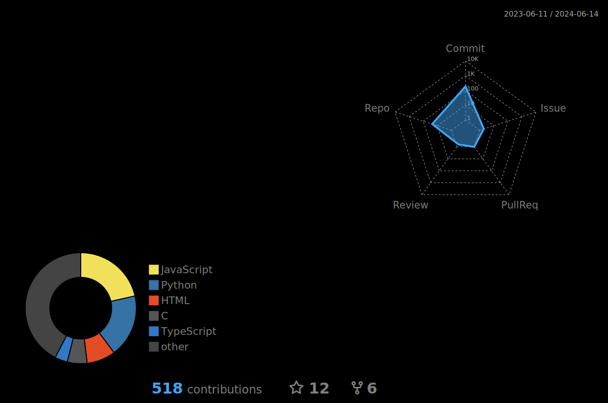

```stl
solid stlmesh
facet normal 0.9623954032815304 -3.009591081705396e-8 0.2716525128589457
	outer loop
		vertex 72.63414953459232 -12.23893056872339 4.531912159074352
		vertex 75.17963362853698 -15.570400588501798 -4.486087584864094
		vertex 72.63414953459232 11.002886289943945 4.531914733994938
	endloop
endfacet
facet normal 0.9623954264666662 0 0.2716524307199252
	outer loop
		vertex 75.17963362853698 -15.570400588501798 -4.486087584864094
		vertex 75.17963362853698 14.471148107551244 -4.486087584864094
		vertex 72.63414953459232 11.002886289943945 4.531914733994938
	endloop
endfacet
facet normal -2.0985869826701758e-14 -1.1078825771505353e-7 0.9999999999999937
	outer loop
		vertex -72.36295203201098 11.00291375576353 4.531914733994938
		vertex -72.36295203201098 -12.23890481951753 4.531912159074352
		vertex 72.63414953459232 11.002886289943945 4.531914733994938
	endloop
endfacet
facet normal 0 0 -1
	outer loop
		vertex -74.90842239304584 14.471185873053173 -4.486087584864094
		vertex 75.17963362853698 14.471148107551244 -4.486087584864094
		vertex 75.17963362853698 -15.570400588501798 -4.486087584864094
	endloop
endfacet
facet normal 1.7679865570771833e-7 0.9333525460432862 0.35896103520366107
	outer loop
		vertex 72.63414953459232 11.002886289943945 4.531914733994938
		vertex 75.17963362853698 14.471148107551244 -4.486087584864094
		vertex -72.36295203201098 11.00291375576353 4.531914733994938
	endloop
endfacet
facet normal -0.9623958126454994 -3.009574792520545e-8 0.27165106258288
	outer loop
		vertex -72.36295203201098 11.00291375576353 4.531914733994938
		vertex -74.90842239304584 14.471185873053173 -4.486087584864094
		vertex -72.36295203201098 -12.23890481951753 4.531912159074352
	endloop
endfacet
facet normal -0.9623957893412315 0 0.2716511451444075
	outer loop
		vertex -74.90842239304584 14.471185873053173 -4.486087584864094
		vertex -74.90842239304584 -15.570364539613593 -4.486087584864094
		vertex -72.36295203201098 -12.23890481951753 4.531912159074352
	endloop
endfacet
facet normal -1.9674254414368632e-14 -1.107882658977462e-7 0.999999999999994
	outer loop
		vertex -72.36295203201098 -12.23890481951753 4.531912159074352
		vertex 72.63414953459232 -12.23893056872339 4.531912159074352
		vertex 72.63414953459232 11.002886289943945 4.531914733994938
	endloop
endfacet
facet normal 0 0 -1
	outer loop
		vertex -74.90842239304584 -15.570364539613593 -4.486087584864094
		vertex -74.90842239304584 14.471185873053173 -4.486087584864094
		vertex 75.17963362853698 -15.570400588501798 -4.486087584864094
	endloop
endfacet
facet normal 2.3485223471336092e-7 0.9333522278214049 0.3589618626271668
	outer loop
		vertex 75.17963362853698 14.471148107551244 -4.486087584864094
		vertex -74.90842239304584 14.471185873053173 -4.486087584864094
		vertex -72.36295203201098 11.00291375576353 4.531914733994938
	endloop
endfacet
facet normal -2.2530244882931858e-7 -0.9380374332017335 0.34653394337676713
	outer loop
		vertex 75.17963362853698 -15.570400588501798 -4.486087584864094
		vertex 72.63414953459232 -12.23893056872339 4.531912159074352
		vertex -74.90842239304584 -15.570364539613593 -4.486087584864094
	endloop
endfacet
facet normal -1.665807574985398e-7 -0.9380377455015129 0.3465330980071187
	outer loop
		vertex -72.36295203201098 -12.23890481951753 4.531912159074352
		vertex -74.90842239304584 -15.570364539613593 -4.486087584864094
		vertex 72.63414953459232 -12.23893056872339 4.531912159074352
	endloop
endfacet
facet normal -0.000015006325154292617 -0.9389799337402766 0.3439719229936013
	outer loop
		vertex -61.52362813092259 -15.599404493983457 -2.591769149786387
		vertex -61.824062998452064 -15.565376060131484 -2.4988909059394473
		vertex -61.522886553793796 -15.638800778950554 -2.6993137121382347
	endloop
endfacet
facet normal 0.000011688530364332474 -0.9389701591770256 0.3439986047042182
	outer loop
		vertex -61.52093648060327 -15.707877315206588 -2.8878691385091884
		vertex -61.824062998452064 -15.565376060131484 -2.4988909059394473
		vertex -61.52004384146676 -15.735446131614935 -2.963120334330654
	endloop
endfacet
facet normal -0.00001902740724204204 -0.9389766563346776 0.3439808693757638
	outer loop
		vertex -61.52004384146676 -15.735446131614935 -2.963120334330654
		vertex -61.824062998452064 -15.565376060131484 -2.4988909059394473
		vertex -61.5194189940712 -15.756960451418536 -3.0218486939046443
	endloop
endfacet
facet normal -0.000022351618631607312 -0.9389772817321793 0.3439791620014978
	outer loop
		vertex -61.5194189940712 -15.756960451418536 -3.0218486939046443
		vertex -61.824062998452064 -15.565376060131484 -2.4988909059394473
		vertex -61.519343463067344 -15.771731912514042 -3.06217109197587
	endloop
endfacet
facet normal -0.000046217734626610244 -0.9389800085395322 0.3439717160276716
	outer loop
		vertex -61.533460894333984 -15.794725953347779 -3.124935210415117
		vertex -61.824062998452064 -15.565376060131484 -2.4988909059394473
		vertex -61.54693287884038 -15.803703843124595 -3.149445021167196
	endloop
endfacet
facet normal 0.000049855707317097636 -0.9389667892547272 0.34400779960791156
	outer loop
		vertex -61.54693287884038 -15.803703843124595 -3.149445021167196
		vertex -61.824062998452064 -15.565376060131484 -2.4988909059394473
		vertex -61.563096513666096 -15.81099773483811 -3.1693513030647864
	endloop
endfacet
facet normal -0.000047046573000055725 -0.9389789721521686 0.3439745450504687
	outer loop
		vertex -61.563096513666096 -15.81099773483811 -3.1693513030647864
		vertex -61.824062998452064 -15.565376060131484 -2.4988909059394473
		vertex -61.58199299754051 -15.816987000121344 -3.1857033362467178
	endloop
endfacet
facet normal -0.000007348210336843839 -0.9389744539520123 0.3439868816852239
	outer loop
		vertex -61.58199299754051 -15.816987000121344 -3.1857033362467178
		vertex -61.824062998452064 -15.565376060131484 -2.4988909059394473
		vertex -61.60379399183603 -15.821783218866358 -3.198795949120097
	endloop
endfacet
facet normal 0.00001319843581583084 -0.93897287357403 0.343991195407571
	outer loop
		vertex -61.69956730472859 -15.828568992917553 -3.2173182112026666
		vertex -61.824062998452064 -15.565376060131484 -2.4988909059394473
		vertex -61.75142277210489 -15.82651077306241 -3.2116980178701056
	endloop
endfacet
facet normal -2.320388983457567e-7 -0.9389733157311801 0.34398998872749104
	outer loop
		vertex -61.75142277210489 -15.82651077306241 -3.2116980178701056
		vertex -61.824062998452064 -15.565376060131484 -2.4988909059394473
		vertex -62.33767382468977 -15.737754977073791 -2.9694258856925444
	endloop
endfacet
facet normal 0.0000063335698241398126 -0.9389727989673678 0.3439913992518895
	outer loop
		vertex -63.263093416873744 -15.47745968825393 -2.2589027283217433
		vertex -62.83453050098069 -15.621392599174897 -2.6517956984891953
		vertex -63.61301482484032 -15.309631514294097 -1.800785732248471
	endloop
endfacet
facet normal 0.000007699469736707409 -0.9389723953722141 0.34399250089163974
	outer loop
		vertex -63.61301482484032 -15.309631514294097 -1.800785732248471
		vertex -62.83453050098069 -15.621392599174897 -2.6517956984891953
		vertex -63.859520555614836 -15.134677676765705 -1.3232208974302893
	endloop
endfacet
facet normal 0.0000011584611203432965 -0.9389741293789746 0.3439877677413179
	outer loop
		vertex -64.0200720039984 -14.945105156763248 -0.8057481194668838
		vertex -62.83453050098069 -15.621392599174897 -2.6517956984891953
		vertex -64.08623716337843 -14.743902578780308 -0.25653064763464783
	endloop
endfacet
facet normal 0.000004646044547387366 -0.9389735407002587 0.343989374608045
	outer loop
		vertex -64.08623716337843 -14.743902578780308 -0.25653064763464783
		vertex -62.83453050098069 -15.621392599174897 -2.6517956984891953
		vertex -64.0511633117685 -14.539694210166545 0.30088799990844706
	endloop
endfacet
facet normal 0.000008148616478358612 -0.9389752337283982 0.3439847531189427
	outer loop
		vertex -63.67197020657932 -14.149668414071698 1.3655372496303642
		vertex -63.91548216301908 -14.342584039301755 0.8389412061653871
		vertex -63.32527603241397 -13.971846115010408 1.850930594048748
	endloop
endfacet
facet normal -0.00000843037601187813 -0.9389721106405531 0.3439932780857115
	outer loop
		vertex -63.32527603241397 -13.971846115010408 1.850930594048748
		vertex -63.91548216301908 -14.342584039301755 0.8389412061653871
		vertex -62.89264817522235 -13.818969646587107 2.2682363862928696
	endloop
endfacet
facet normal 0.000001963207445304579 -0.9389748159190064 0.34398589370207294
	outer loop
		vertex -61.83239887469608 -13.60610611157665 2.849285670140432
		vertex -63.91548216301908 -14.342584039301755 0.8389412061653871
		vertex -61.26331395935176 -13.554000876903501 2.9915135544799796
	endloop
endfacet
facet normal -0.000007869039324876496 -0.9389928313533238 0.3439367130812684
	outer loop
		vertex -60.16383660200336 -13.54926473963883 3.0044460931235903
		vertex -60.671047892277784 -13.536380695332923 3.039609637800595
		vertex -59.59175104586939 -13.59632227165639 2.875985880004407
	endloop
endfacet
facet normal -0.0000037164953212796164 -0.9389770428739098 0.3439798147303932
	outer loop
		vertex -59.032059440823105 -13.680447502124366 2.6463617577456944
		vertex -60.671047892277784 -13.536380695332923 3.039609637800595
		vertex -58.516285681293084 -13.800112644828346 2.3197120528827213
	endloop
endfacet
facet normal 6.290856628518695e-8 -0.9389741329749226 0.3439877579275005
	outer loop
		vertex -58.07349547085505 -13.949355900304681 1.912321850662181
		vertex -60.671047892277784 -13.536380695332923 3.039609637800595
		vertex -57.715457913201135 -14.124176700269459 1.4351181484561977
	endloop
endfacet
facet normal -0.0000378533297507539 -0.9389769515835598 0.34398006186692137
	outer loop
		vertex -57.31218758391833 -14.50978221602486 0.3825444179761561
		vertex -57.46011505497518 -14.314560320256533 0.9154336209977032
		vertex -57.26406403477813 -14.713228408145142 -0.17280597825034505
	endloop
endfacet
facet normal 0.0000017314950851571053 -0.9389743054908329 0.34398728701074105
	outer loop
		vertex -57.519156267400376 -15.159838084119201 -1.3919016469345706
		vertex -57.46011505497518 -14.314560320256533 0.9154336209977032
		vertex -57.77590331565261 -15.332680486767003 -1.8637043459228835
	endloop
endfacet
facet normal 0.0000029900143517244057 -0.9389743516773806 0.34398716092770426
	outer loop
		vertex -57.77590331565261 -15.332680486767003 -1.8637043459228835
		vertex -57.46011505497518 -14.314560320256533 0.9154336209977032
		vertex -58.135348496560255 -15.49781872702124 -2.314475522717487
	endloop
endfacet
facet normal 0.000007334847425919009 -0.9389750725648884 0.3439851930649962
	outer loop
		vertex -58.571849034313345 -15.638615384668356 -2.698810744317086
		vertex -57.46011505497518 -14.314560320256533 0.9154336209977032
		vertex -59.07495418455983 -15.751400339566317 -3.0066686787428125
	endloop
endfacet
facet normal 0.00003326943525691111 -0.9389799623016689 0.3439718437446602
	outer loop
		vertex -59.65582193650607 -15.830234108229888 -3.2218650918042613
		vertex -57.46011505497518 -14.314560320256533 0.9154336209977032
		vertex -59.69492639714008 -15.829174957562145 -3.21897002275864
	endloop
endfacet
facet normal -0.000013144218181898661 -0.9389718593968014 0.3439939637379455
	outer loop
		vertex -59.69492639714008 -15.829174957562145 -3.21897002275864
		vertex -57.46011505497518 -14.314560320256533 0.9154336209977032
		vertex -59.72583231062799 -15.826474724174204 -3.2116006000412654
	endloop
endfacet
facet normal -0.000029745827910042772 -0.9389687387948927 0.34400248063221056
	outer loop
		vertex -59.77278512920839 -15.817543182967938 -3.1872191061650597
		vertex -57.46011505497518 -14.314560320256533 0.9154336209977032
		vertex -59.79138635552226 -15.811329041286854 -3.1702589625713813
	endloop
endfacet
facet normal 0.000039478693313137035 -0.9389815819770178 0.34396742163956445
	outer loop
		vertex -59.80711053723462 -15.803832589153899 -3.1497960686737656
		vertex -57.46011505497518 -14.314560320256533 0.9154336209977032
		vertex -59.82021859963152 -15.794447861924482 -3.124175608842222
	endloop
endfacet
facet normal -0.0000884433040306054 -0.9389574383579491 0.3440333139829054
	outer loop
		vertex -59.82021859963152 -15.794447861924482 -3.124175608842222
		vertex -57.46011505497518 -14.314560320256533 0.9154336209977032
		vertex -59.82913125808682 -15.783300172400459 -3.0937529221176305
	endloop
endfacet
facet normal -0.00003380890423771805 -0.938967349652624 0.34400627195341216
	outer loop
		vertex -59.831390321747676 -15.717373622328068 -2.9137874308218557
		vertex -57.46011505497518 -14.314560320256533 0.9154336209977032
		vertex -59.83047021679158 -15.676911320238332 -2.8033452245038006
	endloop
endfacet
facet normal -0.0000021470508397758727 -0.938969593277866 0.3440001495566375
	outer loop
		vertex -60.05978234450595 -15.231565071965179 -1.5876929220174958
		vertex -60.00812600432164 -15.249134613430897 -1.6356497450497471
		vertex -59.67825464465204 -15.209522035134569 -1.5275227142036556
	endloop
endfacet
facet normal 0.0000025647954828651767 -0.9389742363400746 0.3439874757647373
	outer loop
		vertex -60.00812600432164 -15.249134613430897 -1.6356497450497471
		vertex -59.95986855931096 -15.271122718622337 -1.6956705001812367
		vertex -59.67825464465204 -15.209522035134569 -1.5275227142036556
	endloop
endfacet
facet normal 0.000002996265110709066 -0.9389744697430313 0.3439868386462129
	outer loop
		vertex -59.95986855931096 -15.271122718622337 -1.6956705001812367
		vertex -59.916671691558804 -15.297558569972807 -1.7678323277411891
		vertex -59.67825464465204 -15.209522035134569 -1.5275227142036556
	endloop
endfacet
facet normal 0.00000788804812945226 -0.93897513666381 0.3439850180821224
	outer loop
		vertex -59.880190216695155 -15.328471349915617 -1.8522137628074802
		vertex -59.85207208389511 -15.363888524270351 -1.948892589439481
		vertex -59.67825464465204 -15.209522035134569 -1.5275227142036556
	endloop
endfacet
facet normal -0.000020492808062077625 -0.9389727957128436 0.3439914075834615
	outer loop
		vertex -59.82785409747612 -15.513448494978775 -2.3571415276754806
		vertex -59.828533876510846 -15.573924796477286 -2.5222201156028063
		vertex -59.67825464465204 -15.209522035134569 -1.5275227142036556
	endloop
endfacet
facet normal -0.000004368396232813305 -0.9389741103876689 0.3439878195555809
	outer loop
		vertex -59.67825464465204 -15.209522035134569 -1.5275227142036556
		vertex -59.82945398146694 -15.62875343882365 -2.671889091282708
		vertex -59.36589961142272 -15.175442102870875 -1.4344916917352748
	endloop
endfacet
facet normal 0.00003341489775640741 -0.9389808684117628 0.343969370206326
	outer loop
		vertex -58.965269434047514 -15.090595036331933 -1.2028874555458628
		vertex -59.82945398146694 -15.62875343882365 -2.671889091282708
		vertex -58.82267376521759 -15.038471777214681 -1.0606132226357659
	endloop
endfacet
facet normal -0.00002735321223346887 -0.9389686045031729 0.34400284738525955
	outer loop
		vertex -58.82267376521759 -15.038471777214681 -1.0606132226357659
		vertex -59.82945398146694 -15.62875343882365 -2.671889091282708
		vertex -58.7025657361728 -14.975564750682906 -0.8888965967258713
	endloop
endfacet
facet normal 0.000007362617892009491 -0.9389760593270473 0.34398249949153087
	outer loop
		vertex -58.606545230903976 -14.899602876779682 -0.6815444646532143
		vertex -57.46011505497518 -14.314560320256533 0.9154336209977032
		vertex -58.53319089324759 -14.797539891202177 -0.40294261699404643
	endloop
endfacet
facet normal 1.1032606303087006e-7 -0.9389741527525367 0.3439877039410626
	outer loop
		vertex -58.53319089324759 -14.797539891202177 -0.40294261699404643
		vertex -57.46011505497518 -14.314560320256533 0.9154336209977032
		vertex -58.50081555841189 -14.651291268367459 -0.003731623193115041
	endloop
endfacet
facet normal -0.0000010272339210482525 -0.9389727468722245 0.34399154150963407
	outer loop
		vertex -58.532202123742536 -14.547582050228584 0.2793652043245842
		vertex -57.46011505497518 -14.314560320256533 0.9154336209977032
		vertex -58.570194218683355 -14.499760625103818 0.40990032063854187
	endloop
endfacet
facet normal 5.501817570470909e-7 -0.9389744793893384 0.34398681232747585
	outer loop
		vertex -58.62194668923621 -14.454704664688506 0.5328860380149933
		vertex -57.46011505497518 -14.314560320256533 0.9154336209977032
		vertex -58.68662869435866 -14.412472533849268 0.6481664128259439
	endloop
endfacet
facet normal 4.513544938322296e-7 -0.938974332902437 0.3439872121899588
	outer loop
		vertex -58.68662869435866 -14.412472533849268 0.6481664128259439
		vertex -57.46011505497518 -14.314560320256533 0.9154336209977032
		vertex -58.76340939300826 -14.373120022532134 0.7555861988177242
	endloop
endfacet
facet normal 8.301897440844864e-7 -0.9389764537812326 0.34398142281776123
	outer loop
		vertex -58.85146481059746 -14.336704637296862 0.8549889695647295
		vertex -57.46011505497518 -14.314560320256533 0.9154336209977032
		vertex -58.83166195467675 -14.31868963456975 0.904165017494492
	endloop
endfacet
facet normal 0.0000025250979722459703 -0.938971861744899 0.3439939575703945
	outer loop
		vertex -58.79041516011512 -14.252664379208227 1.0843956183222758
		vertex -57.46011505497518 -14.314560320256533 0.9154336209977032
		vertex -58.782051818051514 -14.206420522095868 1.210623589870039
	endloop
endfacet
facet normal 0.000002094860558243145 -0.938972484076594 0.3439922588411576
	outer loop
		vertex -58.782051818051514 -14.206420522095868 1.210623589870039
		vertex -57.46011505497518 -14.314560320256533 0.9154336209977032
		vertex -58.79060742085221 -14.152535158990872 1.3577108857973172
	endloop
endfacet
facet normal 0.0000015016803718818865 -0.9389730604535994 0.34399068554271395
	outer loop
		vertex -58.79060742085221 -14.152535158990872 1.3577108857973172
		vertex -57.46011505497518 -14.314560320256533 0.9154336209977032
		vertex -58.82261196712352 -14.091892345961128 1.5232444836498757
	endloop
endfacet
facet normal 0.000006104352421504039 -0.9389712739233587 0.3439955620491077
	outer loop
		vertex -58.90229030973933 -14.024104128304998 1.7082869673229055
		vertex -60.671047892277784 -13.536380695332923 3.039609637800595
		vertex -58.95624691231387 -14.022773752668854 1.711919321963009
	endloop
endfacet
facet normal 0.000002708869378791393 -0.9389736574577364 0.3439890559205386
	outer loop
		vertex -59.564992471138794 -14.091582497183936 1.524087984718534
		vertex -60.671047892277784 -13.536380695332923 3.039609637800595
		vertex -59.82285531831167 -14.145995719009079 1.3755603425884146
	endloop
endfacet
facet normal -0.000004307167014899525 -0.9389743558360687 0.3439871495618518
	outer loop
		vertex -60.180940941149856 -14.119650848185984 1.4474757287906073
		vertex -60.671047892277784 -13.536380695332923 3.039609637800595
		vertex -60.303774952788444 -14.114061553900456 1.4627311676679398
	endloop
endfacet
facet normal 0.00000555729576978477 -0.9389736137323407 0.3439891752418171
	outer loop
		vertex -60.303774952788444 -14.114061553900456 1.4627311676679398
		vertex -60.671047892277784 -13.536380695332923 3.039609637800595
		vertex -60.42752906938313 -14.110070426992024 1.473627587858104
	endloop
endfacet
facet normal -0.000012623580032081253 -0.9389741450106696 0.34398772484222023
	outer loop
		vertex -60.55170203972648 -14.107675750846965 1.4801650966494577
		vertex -60.671047892277784 -13.536380695332923 3.039609637800595
		vertex -60.675792612611076 -14.106875808851555 1.482344123195432
	endloop
endfacet
facet normal -0.0000023466341596693085 -0.9389737704255462 0.3439887475591711
	outer loop
		vertex -60.79986945258588 -14.107675750846965 1.4801650966494577
		vertex -60.671047892277784 -13.536380695332923 3.039609637800595
		vertex -60.92403555647434 -14.110070426992024 1.473627587858104
	endloop
endfacet
facet normal -0.000005559984130730654 -0.938973602738494 0.3439892052512396
	outer loop
		vertex -60.92403555647434 -14.110070426992024 1.473627587858104
		vertex -60.671047892277784 -13.536380695332923 3.039609637800595
		vertex -61.047796539523915 -14.114061553900456 1.4627311676679398
	endloop
endfacet
facet normal -0.000008369605367725653 -0.938972710066226 0.3439916418764224
	outer loop
		vertex -61.411595052835764 -14.135617930740295 1.4038907990484546
		vertex -60.671047892277784 -13.536380695332923 3.039609637800595
		vertex -61.52871617400069 -14.145995719009079 1.3755603425884146
	endloop
endfacet
facet normal -0.0000027141113406628685 -0.9389736516027406 0.3439890719026527
	outer loop
		vertex -61.52871617400069 -14.145995719009079 1.3755603425884146
		vertex -60.671047892277784 -13.536380695332923 3.039609637800595
		vertex -61.785089000461085 -14.091582497183936 1.524087984718534
	endloop
endfacet
facet normal 0.0000021827945800261995 -0.9389748142758653 0.34398589818601516
	outer loop
		vertex -61.785089000461085 -14.091582497183936 1.524087984718534
		vertex -60.671047892277784 -13.536380695332923 3.039609637800595
		vertex -61.998615148369026 -14.055790242730495 1.6217910933020079
	endloop
endfacet
facet normal 0.000006872334713311135 -0.9389767018553602 0.34398074557393604
	outer loop
		vertex -62.30207125605284 -14.02512036362964 1.7055118466612527
		vertex -60.671047892277784 -13.536380695332923 3.039609637800595
		vertex -62.39448687250115 -14.022773752668854 1.711919321963009
	endloop
endfacet
facet normal -0.0000013295686397581906 -0.9389731689020213 0.34399038951739375
	outer loop
		vertex -62.46693483811123 -14.025376997381386 1.704810824531691
		vertex -63.91548216301908 -14.342584039301755 0.8389412061653871
		vertex -62.52870546635768 -14.092406471771483 1.5218436195626879
	endloop
endfacet
facet normal -1.9102704196445368e-7 -0.938973915687512 0.34398835105047476
	outer loop
		vertex -62.52870546635768 -14.092406471771483 1.5218436195626879
		vertex -63.91548216301908 -14.342584039301755 0.8389412061653871
		vertex -62.5601400968726 -14.153248411993218 1.3557653187178147
	endloop
endfacet
facet normal 0.0000036414312082687226 -0.9389810663376519 0.3439688315038826
	outer loop
		vertex -62.55916506027734 -14.253176788404858 1.0829946469467302
		vertex -63.91548216301908 -14.342584039301755 0.8389412061653871
		vertex -62.54036470677147 -14.290664198910804 0.9806596853823208
	endloop
endfacet
facet normal 6.488239486384625e-7 -0.9389716874881289 0.3439944332329737
	outer loop
		vertex -62.54036470677147 -14.290664198910804 0.9806596853823208
		vertex -63.91548216301908 -14.342584039301755 0.8389412061653871
		vertex -62.518412650468235 -14.31877374864223 0.9039314507396625
	endloop
endfacet
facet normal -0.000006394197631157881 -0.9389815125829942 0.34396761328134734
	outer loop
		vertex -62.734362656954545 -14.457758520503603 0.524553594998423
		vertex -63.91548216301908 -14.342584039301755 0.8389412061653871
		vertex -62.785016494724005 -14.50287627901298 0.40138774046930337
	endloop
endfacet
facet normal 0.000008783781371607003 -0.9389688467215206 0.3440021872158703
	outer loop
		vertex -62.785016494724005 -14.50287627901298 0.40138774046930337
		vertex -63.91548216301908 -14.342584039301755 0.8389412061653871
		vertex -62.82184815878736 -14.55091056423953 0.270277022115998
	endloop
endfacet
facet normal 0.000002123847277585854 -0.9389729838349041 0.34399089468133626
	outer loop
		vertex -62.82184815878736 -14.55091056423953 0.270277022115998
		vertex -63.91548216301908 -14.342584039301755 0.8389412061653871
		vertex -62.844019941647275 -14.60188197554794 0.13114330719197298
	endloop
endfacet
facet normal -0.000002648299415207744 -0.9389753171729577 0.3439845254265522
	outer loop
		vertex -62.844019941647275 -14.60188197554794 0.13114330719197298
		vertex -63.91548216301908 -14.342584039301755 0.8389412061653871
		vertex -62.850426344065454 -14.666933052621062 -0.046426810584417666
	endloop
endfacet
facet normal -0.00006725470246803062 -0.9390169311866086 0.34387090371488077
	outer loop
		vertex -61.936212806272124 -15.182390955225856 -1.4534609171162458
		vertex -62.17907931595164 -15.142596415874777 -1.3448404671128458
		vertex -61.413648122849736 -15.281861854080034 -1.7249864002072428
	endloop
endfacet
facet normal -0.000002831799049145644 -0.9389750426709721 0.34398527473283974
	outer loop
		vertex -61.413648122849736 -15.281861854080034 -1.7249864002072428
		vertex -62.17907931595164 -15.142596415874777 -1.3448404671128458
		vertex -61.44611958805399 -15.304215597994698 -1.7860055807959867
	endloop
endfacet
facet normal 0.000008012304462398839 -0.9389714800405549 0.343994999391347
	outer loop
		vertex -61.49720601248191 -15.357307027252318 -1.930926724780221
		vertex -62.36798922305661 -15.096189480458634 -1.2181579147932808
		vertex -61.514502612365504 -15.388044712595274 -2.014828151733923
	endloop
endfacet
facet normal -0.00004414154480214866 -0.9389895250831776 0.34394573676031065
	outer loop
		vertex -61.514502612365504 -15.388044712595274 -2.014828151733923
		vertex -62.36798922305661 -15.096189480458634 -1.2181579147932808
		vertex -61.549597063340116 -15.39310014001262 -2.028634232186363
	endloop
endfacet
facet normal 0.000014329292053970529 -0.9389699728203433 0.3439991132785592
	outer loop
		vertex -61.549597063340116 -15.39310014001262 -2.028634232186363
		vertex -62.51655184119136 -15.043762380712224 -1.075051767957163
		vertex -61.643392837222564 -15.404357692814983 -2.0593586137729574
	endloop
endfacet
facet normal -0.000009114861920236726 -0.9389766902087234 0.34398077731406784
	outer loop
		vertex -61.643392837222564 -15.404357692814983 -2.0593586137729574
		vertex -62.51655184119136 -15.043762380712224 -1.075051767957163
		vertex -61.77771442790254 -15.414878818329726 -2.0880820674874485
	endloop
endfacet
facet normal -0.00020181756257449133 -0.9390220573444671 0.343856852614916
	outer loop
		vertex -62.51655184119136 -15.043762380712224 -1.075051767957163
		vertex -63.91548216301908 -14.342584039301755 0.8389412061653871
		vertex -61.77771442790254 -15.414878818329726 -2.0880820674874485
	endloop
endfacet
facet normal 0.000015646336862293403 -0.9389707853219581 0.3439968954322951
	outer loop
		vertex -61.77771442790254 -15.414878818329726 -2.0880820674874485
		vertex -63.91548216301908 -14.342584039301755 0.8389412061653871
		vertex -61.91917026521969 -15.418327495301355 -2.097489110695278
	endloop
endfacet
facet normal -0.0000032862936045835645 -0.9389749428210166 0.34398554728864567
	outer loop
		vertex -61.91917026521969 -15.418327495301355 -2.097489110695278
		vertex -63.91548216301908 -14.342584039301755 0.8389412061653871
		vertex -62.038062931747845 -15.414199039295 -2.0862208290571402
	endloop
endfacet
facet normal -0.000008430795481285876 -0.9389760092579695 0.3439826361415629
	outer loop
		vertex -62.038062931747845 -15.414199039295 -2.0862208290571402
		vertex -63.91548216301908 -14.342584039301755 0.8389412061653871
		vertex -62.143717073236076 -15.404010936842724 -2.0584127596110022
	endloop
endfacet
facet normal 0.00004841867904919487 -0.9389657486997145 0.3440106399872193
	outer loop
		vertex -62.42193209272136 -15.333808301983709 -1.8667830926369788
		vertex -63.91548216301908 -14.342584039301755 0.8389412061653871
		vertex -62.50958238947169 -15.290245795508326 -1.7478683247071274
	endloop
endfacet
facet normal 0.00010759590688284699 -0.9389554102837906 0.34403884362368037
	outer loop
		vertex -62.514519370542075 -15.287343001700947 -1.7399457232171756
		vertex -63.91548216301908 -14.342584039301755 0.8389412061653871
		vertex -62.540083182120725 -15.273982597086615 -1.7034743334591553
	endloop
endfacet
facet normal 0.00002956394179504142 -0.9389690514773554 0.34400162716721105
	outer loop
		vertex -62.540083182120725 -15.273982597086615 -1.7034743334591553
		vertex -63.91548216301908 -14.342584039301755 0.8389412061653871
		vertex -62.587132131069666 -15.253184105205946 -1.6466998021682144
	endloop
endfacet
facet normal -0.00004025398391422242 -0.9389811024419071 0.3439687306087539
	outer loop
		vertex -62.587132131069666 -15.253184105205946 -1.6466998021682144
		vertex -63.91548216301908 -14.342584039301755 0.8389412061653871
		vertex -62.65535722691857 -15.228737809161657 -1.5799732028120559
	endloop
endfacet
facet normal -0.000002403737986842122 -0.9389747392058568 0.3439861031023131
	outer loop
		vertex -62.744408280467724 -15.204439141897637 -1.5136461453001715
		vertex -63.91548216301908 -14.342584039301755 0.8389412061653871
		vertex -62.84248185575052 -15.185769251034799 -1.4626838535021705
	endloop
endfacet
facet normal -1.0812283865740926e-7 -0.9389743826960116 0.3439870762697813
	outer loop
		vertex -62.93571458033148 -15.174777773359665 -1.4326804496796797
		vertex -63.91548216301908 -14.342584039301755 0.8389412061653871
		vertex -63.030821847099105 -15.169626215573771 -1.4186183792056397
	endloop
endfacet
facet normal -0.000044538296604669495 -0.9389800051975125 0.34397172537233284
	outer loop
		vertex -63.030821847099105 -15.169626215573771 -1.4186183792056397
		vertex -63.91548216301908 -14.342584039301755 0.8389412061653871
		vertex -63.05352234698603 -15.169835642448106 -1.4191930156497676
	endloop
endfacet
facet normal -0.00003845682251855217 -0.9389783750525266 0.343976176071526
	outer loop
		vertex -63.135185095066845 -15.174532297597125 -1.4320050694676212
		vertex -63.91548216301908 -14.342584039301755 0.8389412061653871
		vertex -63.15522141045403 -15.177423075108436 -1.439898488524264
	endloop
endfacet
facet normal 0.000013699504298567432 -0.9389727555138018 0.34399151764998764
	outer loop
		vertex -63.15522141045403 -15.177423075108436 -1.439898488524264
		vertex -63.91548216301908 -14.342584039301755 0.8389412061653871
		vertex -63.16907104997972 -15.180557611768563 -1.4484540913249617
	endloop
endfacet
facet normal -0.00003562019347174475 -0.9389779358625143 0.3439773752655454
	outer loop
		vertex -63.91548216301908 -14.342584039301755 0.8389412061653871
		vertex -62.83453050098069 -15.621392599174897 -2.6517956984891953
		vertex -63.184692234868635 -15.194729974674374 -1.4871425949959587
	endloop
endfacet
facet normal 0.0007145564282911452 -0.9389048274073684 0.34417613874330466
	outer loop
		vertex -63.184692234868635 -15.194729974674374 -1.4871425949959587
		vertex -62.83453050098069 -15.621392599174897 -2.6517956984891953
		vertex -63.17792877679585 -15.201306321851234 -1.5050967652242235
	endloop
endfacet
facet normal -0.0000393535378811052 -0.9389779635162827 0.3439772993703419
	outer loop
		vertex -63.16350235505888 -15.208941819695838 -1.5259387088897824
		vertex -62.83453050098069 -15.621392599174897 -2.6517956984891953
		vertex -63.13468384385942 -15.219612290604573 -1.555063313773914
	endloop
endfacet
facet normal -0.000006202667197243927 -0.9389745810365849 0.3439865348072463
	outer loop
		vertex -63.054511116491085 -15.241344620351128 -1.614388733058803
		vertex -62.83453050098069 -15.621392599174897 -2.6517956984891953
		vertex -63.041718911019416 -15.243725563586395 -1.6208877253297231
	endloop
endfacet
facet normal -0.00003527666214117475 -0.9389747195882383 0.3439861548518292
	outer loop
		vertex -62.89027924828315 -15.288333487819727 -1.7426541105203057
		vertex -62.83453050098069 -15.621392599174897 -2.6517956984891953
		vertex -62.81897111418584 -15.319400762997702 -1.827450751531103
	endloop
endfacet
facet normal 0.000004498000747830689 -0.9389749626478059 0.3439854931538817
	outer loop
		vertex -62.81897111418584 -15.319400762997702 -1.827450751531103
		vertex -62.83453050098069 -15.621392599174897 -2.6517956984891953
		vertex -62.74567170816863 -15.360415814706585 -1.9394102298045084
	endloop
endfacet
facet normal -0.0000012159359416561243 -0.9389747324513553 0.3439861215462432
	outer loop
		vertex -62.74567170816863 -15.360415814706585 -1.9394102298045084
		vertex -62.83453050098069 -15.621392599174897 -2.6517956984891953
		vertex -62.67543474103513 -15.412494441867011 -2.081568376711516
	endloop
endfacet
facet normal 0.000010158561112677218 -0.9389758666087304 0.3439830254869957
	outer loop
		vertex -62.62093568852379 -15.448428316952686 -2.1796586889781224
		vertex -62.83453050098069 -15.621392599174897 -2.6517956984891953
		vertex -62.5448553682736 -15.481268854107611 -2.269306265796388
	endloop
endfacet
facet normal -0.000008786944971049307 -0.93897123219161 0.3439956759021244
	outer loop
		vertex -62.5448553682736 -15.481268854107611 -2.269306265796388
		vertex -62.83453050098069 -15.621392599174897 -2.6517956984891953
		vertex -62.45184923670422 -15.509491700344824 -2.346341023277148
	endloop
endfacet
facet normal -0.0000026691599594468737 -0.9389737078633311 0.34398891833061046
	outer loop
		vertex -62.45184923670422 -15.509491700344824 -2.346341023277148
		vertex -62.83453050098069 -15.621392599174897 -2.6517956984891953
		vertex -62.340564602201084 -15.532935493974264 -2.410333807989389
	endloop
endfacet
facet normal -0.0000013704281605695658 -0.9389745660194688 0.3439865758524192
	outer loop
		vertex -62.340564602201084 -15.532935493974264 -2.410333807989389
		vertex -62.83453050098069 -15.621392599174897 -2.6517956984891953
		vertex -62.20687472537156 -15.551117866539471 -2.4599654022861728
	endloop
endfacet
facet normal -0.0000014558069078880756 -0.9389744757895008 0.3439868221512462
	outer loop
		vertex -62.20687472537156 -15.551117866539471 -2.4599654022861728
		vertex -62.83453050098069 -15.621392599174897 -2.6517956984891953
		vertex -62.04221713696006 -15.56289040345905 -2.4920999820470797
	endloop
endfacet
facet normal -7.887718328946372e-7 -0.9389744392875594 0.34398692179208123
	outer loop
		vertex -58.07349547085505 -12.837023681083679 1.504825754832538
		vertex -58.516285681293084 -12.68777870899362 1.9122158497647206
		vertex -57.715457913201135 -13.011844481048456 1.0276216234731237
	endloop
endfacet
facet normal -0.000008712222233062138 -0.9389758384178599 0.3439831024797206
	outer loop
		vertex -57.46011505497518 -13.202229817649254 0.5079376861005969
		vertex -58.516285681293084 -12.68777870899362 1.9122158497647206
		vertex -57.31218758391833 -13.397449138496995 -0.024951677853486842
	endloop
endfacet
facet normal 0.0000031886928655086076 -0.9389734491531332 0.3439896245169334
	outer loop
		vertex -57.31218758391833 -13.397449138496995 -0.024951677853486842
		vertex -58.516285681293084 -12.68777870899362 1.9122158497647206
		vertex -57.26406403477813 -13.600899622151587 -0.5803020204358091
	endloop
endfacet
facet normal -0.00000301104510272413 -0.9389744757779914 0.3439868221725648
	outer loop
		vertex -57.347113806747984 -13.859657683381556 -1.2866303103068049
		vertex -58.516285681293084 -12.68777870899362 1.9122158497647206
		vertex -57.519156267400376 -14.047505864898199 -1.799397528187498
	endloop
endfacet
facet normal 0.0000026254670359018454 -0.9389739866813832 0.3439881572507642
	outer loop
		vertex -57.519156267400376 -14.047505864898199 -1.799397528187498
		vertex -58.516285681293084 -12.68777870899362 1.9122158497647206
		vertex -57.77590331565261 -14.220349125852863 -2.271200549040884
	endloop
endfacet
facet normal -0.000005872685680480044 -0.9389709000625248 0.3439965825430296
	outer loop
		vertex -59.65582193650607 -14.717902747315748 -3.629361294922262
		vertex -58.135348496560255 -14.385485649493376 -2.7219717258354876
		vertex -59.69492639714008 -14.71684188003428 -3.6264662258766407
	endloop
endfacet
facet normal 0.000020037105696014463 -0.9389858091066268 0.34395588364627233
	outer loop
		vertex -59.72583231062799 -14.71414164664634 -3.619096803159266
		vertex -58.135348496560255 -14.385485649493376 -2.7219717258354876
		vertex -59.75120386146955 -14.710234633810387 -3.608429336324548
	endloop
endfacet
facet normal 0.000015577963443522546 -0.9389861870169763 0.3439548521952366
	outer loop
		vertex -59.83233102606846 -14.65875682145338 -3.467916778248764
		vertex -58.135348496560255 -14.385485649493376 -2.7219717258354876
		vertex -59.8320701007824 -14.636775582716837 -3.4079086831434893
	endloop
endfacet
facet normal -0.000009036441295429562 -0.9389665216148138 0.34400853362223477
	outer loop
		vertex -59.8320701007824 -14.636775582716837 -3.4079086831434893
		vertex -58.135348496560255 -14.385485649493376 -2.7219717258354876
		vertex -59.831390321747676 -14.60503882818648 -3.3212836339398564
	endloop
endfacet
facet normal 0.000007462798366182875 -0.9389816031339926 0.3439673660686775
	outer loop
		vertex -59.831390321747676 -14.60503882818648 -3.3212836339398564
		vertex -58.135348496560255 -14.385485649493376 -2.7219717258354876
		vertex -59.83047021679158 -14.564581675937916 -3.2108414276218014
	endloop
endfacet
facet normal 0.0000014442741607505563 -0.9389748628494533 0.34398576559905003
	outer loop
		vertex -59.83047021679158 -14.564581675937916 -3.2108414276218014
		vertex -58.135348496560255 -14.385485649493376 -2.7219717258354876
		vertex -59.82945398146694 -14.516423794523234 -3.0793852944007085
	endloop
endfacet
facet normal -3.454716839331516e-7 -0.9389734004002105 0.3439897576102324
	outer loop
		vertex -59.828533876510846 -14.461591718949421 -2.929716747874238
		vertex -58.135348496560255 -14.385485649493376 -2.7219717258354876
		vertex -59.82785409747612 -14.40111541745091 -2.7646373016400503
	endloop
endfacet
facet normal -4.447693040549556e-8 -0.9389772570094573 0.3439792302145488
	outer loop
		vertex -59.82785409747612 -14.40111541745091 -2.7646373016400503
		vertex -58.135348496560255 -14.385485649493376 -2.7219717258354876
		vertex -59.82759317219006 -14.33602228334155 -2.5869493276026674
	endloop
endfacet
facet normal -8.045892892790539e-7 -0.9389757001941502 0.3439834799002098
	outer loop
		vertex -59.916671691558804 -14.185227209058667 -2.175328101705759
		vertex -58.135348496560255 -14.385485649493376 -2.7219717258354876
		vertex -59.95986855931096 -14.158791357708196 -2.103165952280733
	endloop
endfacet
facet normal 0.000007454052079642983 -0.9389678349998782 0.3440049487726573
	outer loop
		vertex -59.95986855931096 -14.158791357708196 -2.103165952280733
		vertex -58.135348496560255 -14.385485649493376 -2.7219717258354876
		vertex -60.00812600432164 -14.136802394209894 -2.0431456263026746
	endloop
endfacet
facet normal 0.000002204323993929861 -0.9389725131816214 0.34399217939443144
	outer loop
		vertex -60.00812600432164 -14.136802394209894 -2.0431456263026746
		vertex -58.135348496560255 -14.385485649493376 -2.7219717258354876
		vertex -60.05978234450595 -14.119233711051038 -1.9951892324238543
	endloop
endfacet
facet normal -0.0000026253162781124873 -0.9389757444435517 0.34398335910300304
	outer loop
		vertex -59.67825464465204 -14.097189815913566 -1.9350187027449408
		vertex -58.135348496560255 -14.385485649493376 -2.7219717258354876
		vertex -59.36589961142272 -14.063109883649872 -1.8419878948532755
	endloop
endfacet
facet normal -0.0000015631620088897873 -0.9389752647070551 0.34398466864945065
	outer loop
		vertex -59.36589961142272 -14.063109883649872 -1.8419878948532755
		vertex -58.135348496560255 -14.385485649493376 -2.7219717258354876
		vertex -59.14041896554045 -14.023424349270272 -1.7336572307041678
	endloop
endfacet
facet normal 0.000008645838230759425 -0.9389725993774092 0.34399194400985755
	outer loop
		vertex -58.965269434047514 -13.978263675417793 -1.6103833367987903
		vertex -58.135348496560255 -14.385485649493376 -2.7219717258354876
		vertex -58.82267376521759 -13.926140416300541 -1.4681094257537666
	endloop
endfacet
facet normal 0.0000033961453191343785 -0.9389739468184352 0.34398826605667365
	outer loop
		vertex -58.7025657361728 -13.863234248075628 -1.2963929071322298
		vertex -58.135348496560255 -14.385485649493376 -2.7219717258354876
		vertex -58.606545230903976 -13.787271515865541 -1.0890407750595728
	endloop
endfacet
facet normal 0.000009620542143992107 -0.9389737870841433 0.343988701960264
	outer loop
		vertex -58.53319089324759 -13.685208530288037 -0.8104389274004049
		vertex -58.135348496560255 -14.385485649493376 -2.7219717258354876
		vertex -58.50081555841189 -13.538959049146456 -0.4112277994890263
	endloop
endfacet
facet normal 0.000014792883132963143 -0.9389741486255465 0.34398771488833846
	outer loop
		vertex -58.5087943790013 -13.485777497668323 -0.26606061647837365
		vertex -58.516285681293084 -12.68777870899362 1.9122158497647206
		vertex -58.532202123742536 -13.435248114393858 -0.12813089150505874
	endloop
endfacet
facet normal 0.000014192044074588127 -0.9389743426346079 0.34398718533179695
	outer loop
		vertex -58.62194668923621 -13.342372445467504 0.12538991536326094
		vertex -58.516285681293084 -12.68777870899362 1.9122158497647206
		vertex -58.68662869435866 -13.300141172935128 0.2406703706404798
	endloop
endfacet
facet normal -0.000004745028874794826 -0.9389737536724817 0.3439887932646853
	outer loop
		vertex -58.76340939300826 -13.260787803311132 0.3480902639206178
		vertex -58.516285681293084 -12.68777870899362 1.9122158497647206
		vertex -58.80913311616223 -13.17804788011847 0.5739418056556431
	endloop
endfacet
facet normal -0.0000045908359811748786 -0.9389738661357339 0.34398848627975454
	outer loop
		vertex -58.79041516011512 -13.140329585066638 0.6768992006275596
		vertex -58.516285681293084 -12.68777870899362 1.9122158497647206
		vertex -58.782051818051514 -13.094086586261142 0.8031272794636806
	endloop
endfacet
facet normal 0.000022515774834300535 -0.9389759638936609 0.34398275933978195
	outer loop
		vertex -58.782051818051514 -13.094086586261142 0.8031272794636806
		vertex -58.516285681293084 -12.68777870899362 1.9122158497647206
		vertex -58.79060742085221 -13.04020293976987 0.9502150045443898
	endloop
endfacet
facet normal 0.000008274742664952997 -0.9389754429588202 0.3439841819790786
	outer loop
		vertex -58.82261196712352 -12.979559268433263 1.115748280531875
		vertex -58.516285681293084 -12.68777870899362 1.9122158497647206
		vertex -58.884629787746235 -12.913044778160383 1.2973147287020481
	endloop
endfacet
facet normal 0.000031926425991085735 -0.9389808668584917 0.34396937458788235
	outer loop
		vertex -58.90229030973933 -12.911770192470271 1.300791086069978
		vertex -58.516285681293084 -12.68777870899362 1.9122158497647206
		vertex -58.95624691231387 -12.910441533447852 1.3044231188450084
	endloop
endfacet
facet normal -0.000010860088453633904 -0.9389707927349219 0.3439968753823365
	outer loop
		vertex -59.04801021554704 -12.912788144408637 1.2980153216781787
		vertex -58.516285681293084 -12.68777870899362 1.9122158497647206
		vertex -59.17905650724151 -12.92254795173676 1.2713709017602355
	endloop
endfacet
facet normal 0.000007608910847470812 -0.9389770221962421 0.34397987111106154
	outer loop
		vertex -59.35088267456467 -12.943458023509493 1.2142952120490804
		vertex -58.516285681293084 -12.68777870899362 1.9122158497647206
		vertex -59.564992471138794 -12.979251994576657 1.1165915670238178
	endloop
endfacet
facet normal 9.819241714086034e-7 -0.9389742008954487 0.3439875725252138
	outer loop
		vertex -59.564992471138794 -12.979251994576657 1.1165915670238178
		vertex -58.516285681293084 -12.68777870899362 1.9122158497647206
		vertex -59.82285531831167 -13.033664358094939 0.9680642467587717
	endloop
endfacet
facet normal -0.000001857055172904718 -0.9389730848323325 0.3439906189956419
	outer loop
		vertex -59.939976439476595 -13.02328485321243 0.9963947032188116
		vertex -58.516285681293084 -12.68777870899362 1.9122158497647206
		vertex -60.0595008198552 -13.014502657400158 1.0203663555683988
	endloop
endfacet
facet normal 0.000002438888186359417 -0.938975485816656 0.34398406508067597
	outer loop
		vertex -60.0595008198552 -13.014502657400158 1.0203663555683988
		vertex -58.516285681293084 -12.68777870899362 1.9122158497647206
		vertex -60.180940941149856 -13.00731777065812 1.0399798475376798
	endloop
endfacet
facet normal -0.00000102647056988988 -0.9389729354995368 0.3439910266247205
	outer loop
		vertex -60.675792612611076 -12.994544447937415 1.0748482419425045
		vertex -58.516285681293084 -12.68777870899362 1.9122158497647206
		vertex -60.79986945258588 -12.9953426733191 1.0726690008198148
	endloop
endfacet
facet normal 0.00001809555105828223 -0.938990901345986 0.343941981825429
	outer loop
		vertex -60.92403555647434 -12.997736491157298 1.0661313847401033
		vertex -58.516285681293084 -12.68777870899362 1.9122158497647206
		vertex -61.047796539523915 -13.001730192986315 1.0552347499732235
	endloop
endfacet
facet normal -0.000001055786696366688 -0.9389723817914692 0.3439925380465985
	outer loop
		vertex -61.785089000461085 -12.979251994576657 1.1165915670238178
		vertex -58.516285681293084 -12.68777870899362 1.9122158497647206
		vertex -61.998615148369026 -12.943458023509493 1.2142952120490804
	endloop
endfacet
facet normal 0.0000060860209129901335 -0.9389859454543786 0.3439555119519193
	outer loop
		vertex -62.30207125605284 -12.912788144408637 1.2980153216781787
		vertex -58.516285681293084 -12.68777870899362 1.9122158497647206
		vertex -62.39448687250115 -12.910441533447852 1.3044231188450084
	endloop
endfacet
facet normal 0.0028463280228059155 -0.9390230431515941 0.343842438984931
	outer loop
		vertex -62.56802278709347 -13.094770656830178 0.8012597110202648
		vertex -62.5601400968726 -13.040916192772215 0.9482693301765295
		vertex -62.594884358647505 -13.263801318703713 0.33986457282001226
	endloop
endfacet
facet normal 0.000026686738770604582 -0.9389764128152867 0.34398153360951567
	outer loop
		vertex -62.67071062006653 -13.30318472906788 0.23235584477965432
		vertex -62.5601400968726 -13.040916192772215 0.9482693301765295
		vertex -62.734362656954545 -13.345424584668876 0.11705741870251174
	endloop
endfacet
facet normal -0.000125314632524698 -0.9389661150312152 0.3440096206785933
	outer loop
		vertex -62.5601400968726 -13.040916192772215 0.9482693301765295
		vertex -62.52870546635768 -12.98007425255048 1.1143474164446872
		vertex -62.734362656954545 -13.345424584668876 0.11705741870251174
	endloop
endfacet
facet normal 0.000008110345299798507 -0.9389750096484346 0.34398536479034136
	outer loop
		vertex -62.734362656954545 -13.345424584668876 0.11705741870251174
		vertex -62.52870546635768 -12.98007425255048 1.1143474164446872
		vertex -62.785016494724005 -13.390545776405702 -0.006108462648697355
	endloop
endfacet
facet normal -0.0000010029361621128416 -0.9389722314440604 0.3439929484392897
	outer loop
		vertex -61.29652700168481 -14.119233711051038 -1.9951892324238543
		vertex -61.62134465055078 -14.101459892552157 -1.946674295354569
		vertex -61.338199516450004 -14.133205230151134 -2.033326381224356
	endloop
endfacet
facet normal 0.000013113997811644692 -0.9389659786693417 0.34401001544947546
	outer loop
		vertex -61.936212806272124 -14.070057877697991 -1.860956905657531
		vertex -62.17907931595164 -14.030265913267499 -1.7523365629424887
		vertex -61.413648122849736 -14.169529634859032 -2.1324822814601703
	endloop
endfacet
facet normal 0.000001930647164931869 -0.9389728042946666 0.34399138476316865
	outer loop
		vertex -62.17907931595164 -14.030265913267499 -1.7523365629424887
		vertex -62.36798922305661 -13.983856402930769 -1.6256542251996393
		vertex -61.47418965566976 -14.217033486444848 -2.262148844873934
	endloop
endfacet
facet normal -0.000010400688993486202 -0.9389783972722617 0.34397611740910217
	outer loop
		vertex -61.47418965566976 -14.217033486444848 -2.262148844873934
		vertex -62.36798922305661 -13.983856402930769 -1.6256542251996393
		vertex -61.49720601248191 -14.244974808031316 -2.3384231424749373
	endloop
endfacet
facet normal 4.970375485797041e-8 -0.9389743894287728 0.3439870578915158
	outer loop
		vertex -61.549597063340116 -14.280769637405342 -2.436130220727648
		vertex -62.51655184119136 -13.931431019798083 -1.4825476492100904
		vertex -61.643392837222564 -14.29202547359398 -2.4668550314676736
	endloop
endfacet
facet normal 0.000003909487477682488 -0.9389735211464456 0.3439894279924335
	outer loop
		vertex -61.91917026521969 -14.30599441777349 -2.50498574296671
		vertex -62.63901506426555 -13.869432940233196 -1.3133139977636858
		vertex -62.038062931747845 -14.301866820073997 -2.493717461328572
	endloop
endfacet
facet normal -0.00001975358864420711 -0.9389758568540271 0.3439830516973786
	outer loop
		vertex -62.33240038732947 -14.252967361530523 -2.3602378696802475
		vertex -62.739203507656384 -13.792950932371582 -1.1045472686940485
		vertex -62.42193209272136 -14.221475224455844 -2.2742784374481175
	endloop
endfacet
facet normal 0.00001809621065001847 -0.9389733580114991 0.34398987284095495
	outer loop
		vertex -62.587132131069666 -14.140849311064358 -2.054195683421142
		vertex -62.815908675302126 -13.690191859928973 -0.8240447004889191
		vertex -62.65535722691857 -14.116405589940655 -1.987469191353341
	endloop
endfacet
facet normal 0.000006833893953475816 -0.9389738712350945 0.34398847232295143
	outer loop
		vertex -62.744408280467724 -14.092106922676635 -1.9211422411298145
		vertex -62.850426344065454 -13.554599116786335 -0.45392298688032895
		vertex -62.84248185575052 -14.073437890120658 -1.8701800566201712
	endloop
endfacet
facet normal 0.000002013271156226594 -0.9389738799893427 0.3439884484887628
	outer loop
		vertex -62.84248185575052 -14.073437890120658 -1.8701800566201712
		vertex -62.850426344065454 -13.554599116786335 -0.45392298688032895
		vertex -62.93571458033148 -14.062446412445524 -1.8401764382209649
	endloop
endfacet
facet normal 0.00018756911819173356 -0.9389775508047602 0.3439783770857115
	outer loop
		vertex -62.850426344065454 -13.554599116786335 -0.45392298688032895
		vertex -62.844019941647275 -13.489548039713213 -0.2763528154597594
		vertex -62.93571458033148 -14.062446412445524 -1.8401764382209649
	endloop
endfacet
facet normal -0.00001674243312217199 -0.9389736978187021 0.3439889453519745
	outer loop
		vertex -62.93571458033148 -14.062446412445524 -1.8401764382209649
		vertex -62.844019941647275 -13.489548039713213 -0.2763528154597594
		vertex -63.030821847099105 -14.057293138045907 -1.826114367746925
	endloop
endfacet
facet normal 0.000002187438500959131 -0.9389743395653423 0.3439871939957131
	outer loop
		vertex -63.09675354701267 -14.059063825102271 -1.830945347919851
		vertex -62.82184815878736 -13.438577486711665 -0.13721907371364495
		vertex -63.135185095066845 -14.062198361762398 -1.8395013798739797
	endloop
endfacet
facet normal -0.00011388249307141001 -0.9389668931486356 0.3440075007926085
	outer loop
		vertex -63.15522141045403 -14.065090855887433 -1.8473947989306225
		vertex -62.82184815878736 -13.438577486711665 -0.13721907371364495
		vertex -63.16907104997972 -14.068223675933837 -1.8559504017313202
	endloop
endfacet
facet normal 0.000035001054786398534 -0.9389766138671665 0.3439809840463224
	outer loop
		vertex -63.16907104997972 -14.068223675933837 -1.8559504017313202
		vertex -62.82184815878736 -13.438577486711665 -0.13721907371364495
		vertex -63.179267735500616 -14.072100648029618 -1.8665324670332666
	endloop
endfacet
facet normal 0.00004039691231655102 -0.9389627343792193 0.34401886839995993
	outer loop
		vertex -62.67543474103513 -14.300162222646009 -2.489065008982948
		vertex -63.16350235505888 -14.096610458781697 -1.9334349120077832
		vertex -62.66472307139702 -14.309136679195376 -2.5135610868252343
	endloop
endfacet
facet normal -0.000003315161482694216 -0.9389743512973894 0.3439871619619783
	outer loop
		vertex -61.523978320122296 -14.438710974621472 -2.8672568992175798
		vertex -61.824062998452064 -14.453044699217344 -2.906386250750586
		vertex -61.52362813092259 -14.487071416455592 -2.999265352904388
	endloop
endfacet
facet normal 2.082543917004481e-7 -0.9389706700387529 0.34399721046388165
	outer loop
		vertex -61.824062998452064 -14.453044699217344 -2.906386250750586
		vertex -62.04221713696006 -14.450557325931186 -2.8995966143185115
		vertex -61.52362813092259 -14.487071416455592 -2.999265352904388
	endloop
endfacet
facet normal 5.128897341282197e-7 -0.9389727013667857 0.3439916657241833
	outer loop
		vertex -62.04221713696006 -14.450557325931186 -2.8995966143185115
		vertex -62.20687472537156 -14.438784789011606 -2.8674616054041735
		vertex -61.522886553793796 -14.526469418036413 -3.1068099152562354
	endloop
endfacet
facet normal -0.00000893008131874074 -0.9389814172441686 0.3439678734858623
	outer loop
		vertex -61.522886553793796 -14.526469418036413 -3.1068099152562354
		vertex -62.20687472537156 -14.438784789011606 -2.8674616054041735
		vertex -61.52193898301812 -14.562976642105923 -3.2064692124666294
	endloop
endfacet
facet normal -0.0003059234533065645 -0.939143885552471 0.3435238982083312
	outer loop
		vertex -62.340564602201084 -14.4206024164464 -2.8178295819539585
		vertex -62.45184923670422 -14.39715862281696 -2.7538367972417177
		vertex -61.52093648060327 -14.595544237678723 -3.295364912473758
	endloop
endfacet
facet normal 0.000004915023063925426 -0.9389714525065389 0.3439950746066041
	outer loop
		vertex -61.52093648060327 -14.595544237678723 -3.295364912473758
		vertex -62.45184923670422 -14.39715862281696 -2.7538367972417177
		vertex -61.52004384146676 -14.62311305408707 -3.3706169666020855
	endloop
endfacet
facet normal -0.000003979775542531508 -0.9389757929047143 0.34398322680491905
	outer loop
		vertex -61.52004384146676 -14.62311305408707 -3.3706169666020855
		vertex -62.45184923670422 -14.39715862281696 -2.7538367972417177
		vertex -61.5194189940712 -14.644627373890671 -3.429344897022645
	endloop
endfacet
facet normal 0.000021699579002321833 -0.9389643433507917 0.3440144785397046
	outer loop
		vertex -61.5194189940712 -14.644627373890671 -3.429344897022645
		vertex -62.45184923670422 -14.39715862281696 -2.7538367972417177
		vertex -61.519343463067344 -14.659400551599902 -3.4696672950938705
	endloop
endfacet
facet normal 0.0000011171332036514362 -0.9389730042800521 0.34399083887808013
	outer loop
		vertex -61.519343463067344 -14.659400551599902 -3.4696672950938705
		vertex -62.45184923670422 -14.39715862281696 -2.7538367972417177
		vertex -61.52373112774603 -14.671607391791667 -3.5029876257846695
	endloop
endfacet
facet normal 0.00004851410852679508 -0.9389562890621287 0.3440364586450942
	outer loop
		vertex -61.533460894333984 -14.68239115920619 -3.532431413533118
		vertex -62.5448553682736 -14.368938351500333 -2.6768024689143886
		vertex -61.54693287884038 -14.691372482210454 -3.556941653438628
	endloop
endfacet
facet normal -0.00003503655981593237 -0.9389863707591057 0.34395434915273676
	outer loop
		vertex -61.563096513666096 -14.698664657310246 -3.576846647875925
		vertex -62.5448553682736 -14.368938351500333 -2.6768024689143886
		vertex -61.58199299754051 -14.70465392259348 -3.5931991102112875
	endloop
endfacet
facet normal 0.000032552461100356996 -0.9389634330779553 0.344016962202153
	outer loop
		vertex -61.58199299754051 -14.70465392259348 -3.5931991102112875
		vertex -62.5448553682736 -14.368938351500333 -2.6768024689143886
		vertex -61.60379399183603 -14.709451857952217 -3.6062925813915285
	endloop
endfacet
facet normal 0.00002648040406439866 -0.9389654190624765 0.34401154210813345
	outer loop
		vertex -61.60379399183603 -14.709451857952217 -3.6062925813915285
		vertex -62.5448553682736 -14.368938351500333 -2.6768024689143886
		vertex -61.62933033759509 -14.713116828253078 -3.616294002101313
	endloop
endfacet
facet normal -0.000020402361406338056 -0.9389803745832687 0.34397071929338424
	outer loop
		vertex -61.69956730472859 -14.716235915389689 -3.6248144143206673
		vertex -62.5448553682736 -14.368938351500333 -2.6768024689143886
		vertex -61.75142277210489 -14.71417597892082 -3.6191942209881063
	endloop
endfacet
facet normal -0.0009130863631698762 -0.939222495340081 0.34330783638076917
	outer loop
		vertex -62.5448553682736 -14.368938351500333 -2.6768024689143886
		vertex -62.62093568852379 -14.336096097731684 -2.587154892096123
		vertex -61.75142277210489 -14.71417597892082 -3.6191942209881063
	endloop
endfacet
facet normal 0.0000012343488445029384 -0.938974318539804 0.3439872513934013
	outer loop
		vertex -61.75142277210489 -14.71417597892082 -3.6191942209881063
		vertex -62.62093568852379 -14.336096097731684 -2.587154892096123
		vertex -62.33767382468977 -14.625421899545927 -3.376922088810545
	endloop
endfacet
facet normal 0.0000023982289696534043 -0.9389741872005603 0.34398760990084454
	outer loop
		vertex -62.33767382468977 -14.625421899545927 -3.376922088810545
		vertex -63.17792877679585 -14.088975819243956 -1.912593075630582
		vertex -62.83453050098069 -14.509061238260756 -3.059291901607196
	endloop
endfacet
facet normal -0.0015923600061165419 -0.9391271576776185 0.3435660723965164
	outer loop
		vertex -63.17792877679585 -14.088975819243956 -1.912593075630582
		vertex -63.184692234868635 -14.082396038839647 -1.8946387981139594
		vertex -62.83453050098069 -14.509061238260756 -3.059291901607196
	endloop
endfacet
facet normal -3.9784735950834183e-7 -0.9389738455055142 0.34398854262377443
	outer loop
		vertex -62.83453050098069 -14.509061238260756 -3.059291901607196
		vertex -63.184692234868635 -14.082396038839647 -1.8946387981139594
		vertex -63.263093416873744 -14.365126610726065 -2.666398931439744
	endloop
endfacet
facet normal 0.0013011165141806418 -0.9390157492581017 0.3438716762704693
	outer loop
		vertex -63.184692234868635 -14.082396038839647 -1.8946387981139594
		vertex -63.184802098146974 -14.076799878099223 -1.8793568590122618
		vertex -63.263093416873744 -14.365126610726065 -2.666398931439744
	endloop
endfacet
facet normal -0.0000013792078604990083 -0.9389747018283281 0.3439862051369213
	outer loop
		vertex -63.263093416873744 -14.365126610726065 -2.666398931439744
		vertex -63.184802098146974 -14.076799878099223 -1.8793568590122618
		vertex -63.61301482484032 -14.197298436766232 -2.2082819353664718
	endloop
endfacet
facet normal -0.000024402256357919198 -0.9389707177762388 0.3439970792947299
	outer loop
		vertex -62.52870546635768 -12.98007425255048 1.1143474164446872
		vertex -62.46693483811123 -12.913044778160383 1.2973147287020481
		vertex -63.859520555614836 -14.02234459923784 -1.7307168859715745
	endloop
endfacet
facet normal 8.809357441891409e-8 -0.9389742361426786 0.34398747631311455
	outer loop
		vertex -64.0200720039984 -13.832772937542245 -1.2132444298732423
		vertex -62.46693483811123 -12.913044778160383 1.2973147287020481
		vertex -64.08623716337843 -13.631570359559305 -0.664026636175933
	endloop
endfacet
facet normal 6.587448547008474e-7 -0.9389743883168727 0.34398706092601866
	outer loop
		vertex -64.08623716337843 -13.631570359559305 -0.664026636175933
		vertex -62.46693483811123 -12.913044778160383 1.2973147287020481
		vertex -64.0511633117685 -13.427363707559266 -0.1066080154549276
	endloop
endfacet
facet normal -2.2605705523424178e-7 -0.9389740658265312 0.3439879412205344
	outer loop
		vertex -64.0511633117685 -13.427363707559266 -0.1066080154549276
		vertex -62.46693483811123 -12.913044778160383 1.2973147287020481
		vertex -63.91548216301908 -13.23025096177389 0.4314451103357442
	endloop
endfacet
facet normal -7.069725974508972e-7 -0.9389736779440986 0.34398900000964033
	outer loop
		vertex -63.67197020657932 -13.037335336543833 0.9580410465123634
		vertex -62.46693483811123 -12.913044778160383 1.2973147287020481
		vertex -63.32527603241397 -12.859513895789405 1.4434341763540317
	endloop
endfacet
facet normal 5.203919241444693e-10 -0.9389747995579643 0.3439859383682436
	outer loop
		vertex -62.89264817522235 -12.706636569059242 1.8607397540214379
		vertex -58.516285681293084 -12.68777870899362 1.9122158497647206
		vertex -62.38577334123784 -12.58272194908136 2.19898818866443
	endloop
endfacet
facet normal 0.000001574014214021524 -0.9389730791985101 0.34399063437540106
	outer loop
		vertex -61.26331395935176 -12.441670374296223 2.584017351361979
		vertex -58.516285681293084 -12.68777870899362 1.9122158497647206
		vertex -60.671047892277784 -12.424049334418783 2.6321138638360253
	endloop
endfacet
facet normal 0.0000031177535242838014 -0.9389726048884506 0.343991929061246
	outer loop
		vertex -60.16383660200336 -12.436932520417827 2.5969494608521586
		vertex -58.516285681293084 -12.68777870899362 1.9122158497647206
		vertex -59.59175104586939 -12.483991769049112 2.4684896768864064
	endloop
endfacet
facet normal -0.00000647970145435908 -0.9389785980300037 0.3439755694807731
	outer loop
		vertex -59.032059440823105 -12.56811356628964 2.2388659837811247
		vertex -59.59175104586939 -12.483991769049112 2.4684896768864064
		vertex -58.516285681293084 -12.68777870899362 1.9122158497647206
	endloop
endfacet
facet normal 0.9967061023489523 0.027896803357469222 0.07614928694869257
	outer loop
		vertex -57.31218758391833 -14.50978221602486 0.3825444179761561
		vertex -57.26406403477813 -14.713228408145142 -0.17280597825034505
		vertex -57.31218758391833 -13.397449138496995 -0.024951677853486842
	endloop
endfacet
facet normal -0.9986709218544472 -0.017729194979281836 -0.048394891133004464
	outer loop
		vertex -58.5087943790013 -13.485777497668323 -0.26606061647837365
		vertex -58.50081555841189 -13.538959049146456 -0.4112277994890263
		vertex -58.5087943790013 -14.598108858582464 0.14143569392798483
	endloop
endfacet
facet normal 0.9889897998029015 -0.05090447161361786 -0.1389529080500122
	outer loop
		vertex -62.844019941647275 -13.489548039713213 -0.2763528154597594
		vertex -62.82184815878736 -13.438577486711665 -0.13721907371364495
		vertex -62.844019941647275 -14.60188197554794 0.13114330719197298
	endloop
endfacet
facet normal 0.9994266848159677 -0.011646394904612183 -0.03179092894978175
	outer loop
		vertex -62.844019941647275 -14.60188197554794 0.13114330719197298
		vertex -62.850426344065454 -14.666933052621062 -0.046426810584417666
		vertex -62.844019941647275 -13.489548039713213 -0.2763528154597594
	endloop
endfacet
facet normal -0.9982592139958747 0.020288087915296626 0.05537991658606555
	outer loop
		vertex -64.08623716337843 -14.743902578780308 -0.25653064763464783
		vertex -64.0511633117685 -14.539694210166545 0.30088799990844706
		vertex -64.08623716337843 -13.631570359559305 -0.664026636175933
	endloop
endfacet
facet normal -0.000005198280875672475 -0.9389696865564722 0.34399989491425476
	outer loop
		vertex -61.523978320122296 -15.551042335535612 -2.459761554406441
		vertex -61.824062998452064 -15.565376060131484 -2.4988909059394473
		vertex -61.52362813092259 -15.599404493983457 -2.591769149786387
	endloop
endfacet
facet normal -0.00000828127332401171 -0.9389766698069537 0.343980833026585
	outer loop
		vertex -61.522886553793796 -15.638800778950554 -2.6993137121382347
		vertex -61.824062998452064 -15.565376060131484 -2.4988909059394473
		vertex -61.52193898301812 -15.675309719633788 -2.7989734385020597
	endloop
endfacet
facet normal 0.00001191336433579475 -0.938970102580521 0.34399875918089834
	outer loop
		vertex -61.52193898301812 -15.675309719633788 -2.7989734385020597
		vertex -61.824062998452064 -15.565376060131484 -2.4988909059394473
		vertex -61.52093648060327 -15.707877315206588 -2.8878691385091884
	endloop
endfacet
facet normal -0.000004654760902616522 -0.93897418979111 0.34398760280635404
	outer loop
		vertex -61.519343463067344 -15.771731912514042 -3.06217109197587
		vertex -61.824062998452064 -15.565376060131484 -2.4988909059394473
		vertex -61.52373112774603 -15.783938752705808 -3.0954918518201
	endloop
endfacet
facet normal 0.000027845113203429522 -0.9389689049316505 0.3440020273139492
	outer loop
		vertex -61.52373112774603 -15.783938752705808 -3.0954918518201
		vertex -61.824062998452064 -15.565376060131484 -2.4988909059394473
		vertex -61.533460894333984 -15.794725953347779 -3.124935210415117
	endloop
endfacet
facet normal 0.00002222775877333453 -0.9389714472970543 0.3439950881434237
	outer loop
		vertex -61.60379399183603 -15.821783218866358 -3.198795949120097
		vertex -61.824062998452064 -15.565376060131484 -2.4988909059394473
		vertex -61.62933033759509 -15.825448189167219 -3.208798228136743
	endloop
endfacet
facet normal -0.000016781961275958445 -0.9389749036818935 0.34398565373274564
	outer loop
		vertex -61.62933033759509 -15.825448189167219 -3.208798228136743
		vertex -61.824062998452064 -15.565376060131484 -2.4988909059394473
		vertex -61.66044224472989 -15.827868614518138 -3.2154067618209297
	endloop
endfacet
facet normal 0.0000030142805952856823 -0.9389734436796174 0.3439896394593221
	outer loop
		vertex -61.66044224472989 -15.827868614518138 -3.2154067618209297
		vertex -61.824062998452064 -15.565376060131484 -2.4988909059394473
		vertex -61.69956730472859 -15.828568992917553 -3.2173182112026666
	endloop
endfacet
facet normal 4.2233129380215384e-7 -0.9389735464400796 0.34398935897141003
	outer loop
		vertex -62.33767382468977 -15.737754977073791 -2.9694258856925444
		vertex -61.824062998452064 -15.565376060131484 -2.4988909059394473
		vertex -62.83453050098069 -15.621392599174897 -2.6517956984891953
	endloop
endfacet
facet normal -0.0000013322929482546695 -0.9389746460336886 0.34398635743897465
	outer loop
		vertex -63.859520555614836 -15.134677676765705 -1.3232208974302893
		vertex -62.83453050098069 -15.621392599174897 -2.6517956984891953
		vertex -64.0200720039984 -14.945105156763248 -0.8057481194668838
	endloop
endfacet
facet normal -0.000006494032280406634 -0.9389750233005006 0.343985327558679
	outer loop
		vertex -64.0511633117685 -14.539694210166545 0.30088799990844706
		vertex -62.83453050098069 -15.621392599174897 -2.6517956984891953
		vertex -63.91548216301908 -14.342584039301755 0.8389412061653871
	endloop
endfacet
facet normal 0.0000017893608036657444 -0.9389744729036832 0.3439868300270352
	outer loop
		vertex -62.89264817522235 -13.818969646587107 2.2682363862928696
		vertex -63.91548216301908 -14.342584039301755 0.8389412061653871
		vertex -62.38577334123784 -13.695054168302363 2.6064835334755685
	endloop
endfacet
facet normal -0.0000033755544498087735 -0.9389730291232126 0.34399077105030623
	outer loop
		vertex -62.38577334123784 -13.695054168302363 2.6064835334755685
		vertex -63.91548216301908 -14.342584039301755 0.8389412061653871
		vertex -61.83239887469608 -13.60610611157665 2.849285670140432
	endloop
endfacet
facet normal 7.808608903570987e-7 -0.9389743453950737 0.3439871780884908
	outer loop
		vertex -61.26331395935176 -13.554000876903501 2.9915135544799796
		vertex -63.91548216301908 -14.342584039301755 0.8389412061653871
		vertex -60.671047892277784 -13.536380695332923 3.039609637800595
	endloop
endfacet
facet normal 0.000005134796557042747 -0.9389651270924074 0.3440123400082809
	outer loop
		vertex -59.59175104586939 -13.59632227165639 2.875985880004407
		vertex -60.671047892277784 -13.536380695332923 3.039609637800595
		vertex -59.032059440823105 -13.680447502124366 2.6463617577456944
	endloop
endfacet
facet normal -0.00000328024639019557 -0.9389766211302799 0.34398096598504213
	outer loop
		vertex -58.516285681293084 -13.800112644828346 2.3197120528827213
		vertex -60.671047892277784 -13.536380695332923 3.039609637800595
		vertex -58.07349547085505 -13.949355900304681 1.912321850662181
	endloop
endfacet
facet normal 3.409085341964146e-7 -0.9389739675699471 0.3439882094285148
	outer loop
		vertex -57.715457913201135 -14.124176700269459 1.4351181484561977
		vertex -60.671047892277784 -13.536380695332923 3.039609637800595
		vertex -57.46011505497518 -14.314560320256533 0.9154336209977032
	endloop
endfacet
facet normal 0.0000675044396471096 -0.9389708194333768 0.3439967960545033
	outer loop
		vertex -57.26406403477813 -14.713228408145142 -0.17280597825034505
		vertex -57.46011505497518 -14.314560320256533 0.9154336209977032
		vertex -57.27300072582557 -14.798875416679493 -0.4065855931815676
	endloop
endfacet
facet normal -0.00001376860073710548 -0.9389745369841106 0.3439866548369299
	outer loop
		vertex -57.27300072582557 -14.798875416679493 -0.4065855931815676
		vertex -57.46011505497518 -14.314560320256533 0.9154336209977032
		vertex -57.347113806747984 -14.971989044295697 -0.8791338926120886
	endloop
endfacet
facet normal -0.0000011936045638759227 -0.9389742813157432 0.34398735300321565
	outer loop
		vertex -57.347113806747984 -14.971989044295697 -0.8791338926120886
		vertex -57.46011505497518 -14.314560320256533 0.9154336209977032
		vertex -57.519156267400376 -15.159838084119201 -1.3919016469345706
	endloop
endfacet
facet normal -0.000006097466535336104 -0.9389737380376688 0.34398883592115026
	outer loop
		vertex -58.135348496560255 -15.49781872702124 -2.314475522717487
		vertex -57.46011505497518 -14.314560320256533 0.9154336209977032
		vertex -58.571849034313345 -15.638615384668356 -2.698810744317086
	endloop
endfacet
facet normal -0.000007768458574566328 -0.9389730640278021 0.3439906757019616
	outer loop
		vertex -59.07495418455983 -15.751400339566317 -3.0066686787428125
		vertex -57.46011505497518 -14.314560320256533 0.9154336209977032
		vertex -59.59540399987418 -15.828138122872815 -3.21614748064286
	endloop
endfacet
facet normal 0.00002248107006022301 -0.9389781133456886 0.34397689188719144
	outer loop
		vertex -59.59540399987418 -15.828138122872815 -3.21614748064286
		vertex -57.46011505497518 -14.314560320256533 0.9154336209977032
		vertex -59.65582193650607 -15.830234108229888 -3.2218650918042613
	endloop
endfacet
facet normal -0.000023047827245213023 -0.9389701030501151 0.34399875733329915
	outer loop
		vertex -59.72583231062799 -15.826474724174204 -3.2116006000412654
		vertex -57.46011505497518 -14.314560320256533 0.9154336209977032
		vertex -59.75120386146955 -15.822565994724528 -3.200933133206547
	endloop
endfacet
facet normal 0.000039784676330726345 -0.9389813980006655 0.3439679238328699
	outer loop
		vertex -59.75120386146955 -15.822565994724528 -3.200933133206547
		vertex -57.46011505497518 -14.314560320256533 0.9154336209977032
		vertex -59.77278512920839 -15.817543182967938 -3.1872191061650597
	endloop
endfacet
facet normal 1.7316088667682947e-7 -0.9389742533756358 0.3439874292726949
	outer loop
		vertex -59.79138635552226 -15.811329041286854 -3.1702589625713813
		vertex -57.46011505497518 -14.314560320256533 0.9154336209977032
		vertex -59.80711053723462 -15.803832589153899 -3.1497960686737656
	endloop
endfacet
facet normal 0.00011042614900977575 -0.9389953912765385 0.34392970643357607
	outer loop
		vertex -59.82913125808682 -15.783300172400459 -3.0937529221176305
		vertex -57.46011505497518 -14.314560320256533 0.9154336209977032
		vertex -59.83233102606846 -15.771091615594969 -3.060420145977332
	endloop
endfacet
facet normal -0.00004018400274569827 -0.9389663726351055 0.34400893803172955
	outer loop
		vertex -59.83233102606846 -15.771091615594969 -3.060420145977332
		vertex -57.46011505497518 -14.314560320256533 0.9154336209977032
		vertex -59.8320701007824 -15.749106943630977 -3.0004133383323506
	endloop
endfacet
facet normal 0.000028118728124641907 -0.9389797364903207 0.3439724606271626
	outer loop
		vertex -59.8320701007824 -15.749106943630977 -3.0004133383323506
		vertex -57.46011505497518 -14.314560320256533 0.9154336209977032
		vertex -59.831390321747676 -15.717373622328068 -2.9137874308218557
	endloop
endfacet
facet normal 0.000002696258354927327 -0.9389748659731467 0.3439857570647966
	outer loop
		vertex -59.83047021679158 -15.676911320238332 -2.8033452245038006
		vertex -57.46011505497518 -14.314560320256533 0.9154336209977032
		vertex -59.82945398146694 -15.62875343882365 -2.671889091282708
	endloop
endfacet
facet normal 3.558430220766899e-7 -0.9389736236190426 0.3439891482991842
	outer loop
		vertex -59.916671691558804 -15.297558569972807 -1.7678323277411891
		vertex -59.880190216695155 -15.328471349915617 -1.8522137628074802
		vertex -59.67825464465204 -15.209522035134569 -1.5275227142036556
	endloop
endfacet
facet normal -0.0000176472822664487 -0.9389717342645398 0.34399430509939544
	outer loop
		vertex -59.85207208389511 -15.363888524270351 -1.948892589439481
		vertex -59.83398584169845 -15.403840992084042 -2.0579464844082054
		vertex -59.67825464465204 -15.209522035134569 -1.5275227142036556
	endloop
endfacet
facet normal 0.000004330248905712555 -0.9389738185688895 0.3439886161247304
	outer loop
		vertex -59.83398584169845 -15.403840992084042 -2.0579464844082054
		vertex -59.82759317219006 -15.448354502562552 -2.1794535536380977
		vertex -59.67825464465204 -15.209522035134569 -1.5275227142036556
	endloop
endfacet
facet normal 0.00003120309848387812 -0.938975806402853 0.3439831885666486
	outer loop
		vertex -59.82759317219006 -15.448354502562552 -2.1794535536380977
		vertex -59.82785409747612 -15.513448494978775 -2.3571415276754806
		vertex -59.67825464465204 -15.209522035134569 -1.5275227142036556
	endloop
endfacet
facet normal 0.00008181159025196262 -0.9389777849995953 0.34397777920109524
	outer loop
		vertex -59.828533876510846 -15.573924796477286 -2.5222201156028063
		vertex -59.82945398146694 -15.62875343882365 -2.671889091282708
		vertex -59.67825464465204 -15.209522035134569 -1.5275227142036556
	endloop
endfacet
facet normal 0.00000943624535426919 -0.9389757807170678 0.3439832599672988
	outer loop
		vertex -59.36589961142272 -15.175442102870875 -1.4344916917352748
		vertex -59.82945398146694 -15.62875343882365 -2.671889091282708
		vertex -59.14041896554045 -15.135753993570688 -1.3261607057210938
	endloop
endfacet
facet normal -0.000012165526650638211 -0.9389722082045816 0.3439930116607193
	outer loop
		vertex -59.14041896554045 -15.135753993570688 -1.3261607057210938
		vertex -59.82945398146694 -15.62875343882365 -2.671889091282708
		vertex -58.965269434047514 -15.090595036331933 -1.2028874555458628
	endloop
endfacet
facet normal -0.000011089919499652271 -0.938971924886146 0.3439937850494096
	outer loop
		vertex -59.82945398146694 -15.62875343882365 -2.671889091282708
		vertex -57.46011505497518 -14.314560320256533 0.9154336209977032
		vertex -58.7025657361728 -14.975564750682906 -0.8888965967258713
	endloop
endfacet
facet normal 0.000004156449802431085 -0.9389753159379823 0.34398452878274915
	outer loop
		vertex -58.7025657361728 -14.975564750682906 -0.8888965967258713
		vertex -57.46011505497518 -14.314560320256533 0.9154336209977032
		vertex -58.606545230903976 -14.899602876779682 -0.6815444646532143
	endloop
endfacet
facet normal -0.0000064867402471556254 -0.938971740141725 0.3439942894484484
	outer loop
		vertex -58.50081555841189 -14.651291268367459 -0.003731623193115041
		vertex -57.46011505497518 -14.314560320256533 0.9154336209977032
		vertex -58.5087943790013 -14.598108858582464 0.14143569392798483
	endloop
endfacet
facet normal 0.000011919667764086724 -0.9389797950501807 0.34397230171256843
	outer loop
		vertex -58.5087943790013 -14.598108858582464 0.14143569392798483
		vertex -57.46011505497518 -14.314560320256533 0.9154336209977032
		vertex -58.532202123742536 -14.547582050228584 0.2793652043245842
	endloop
endfacet
facet normal -0.0000017085268332210827 -0.9389722636568317 0.34399286050766575
	outer loop
		vertex -58.570194218683355 -14.499760625103818 0.40990032063854187
		vertex -57.46011505497518 -14.314560320256533 0.9154336209977032
		vertex -58.62194668923621 -14.454704664688506 0.5328860380149933
	endloop
endfacet
facet normal 5.962485378692151e-7 -0.9389747144793902 0.34398617060572706
	outer loop
		vertex -58.76340939300826 -14.373120022532134 0.7555861988177242
		vertex -57.46011505497518 -14.314560320256533 0.9154336209977032
		vertex -58.85146481059746 -14.336704637296862 0.8549889695647295
	endloop
endfacet
facet normal 6.728361510120057e-7 -0.9389702678872085 0.3439983081693443
	outer loop
		vertex -58.83166195467675 -14.31868963456975 0.904165017494492
		vertex -57.46011505497518 -14.314560320256533 0.9154336209977032
		vertex -58.80913311616223 -14.290380099339473 0.9814380624178227
	endloop
endfacet
facet normal -8.805468715027459e-7 -0.93898052241541 0.34397031634097264
	outer loop
		vertex -58.80913311616223 -14.290380099339473 0.9814380624178227
		vertex -57.46011505497518 -14.314560320256533 0.9154336209977032
		vertex -58.79041516011512 -14.252664379208227 1.0843956183222758
	endloop
endfacet
facet normal -0.0000011549736979831572 -0.9389749839845474 0.3439854349385817
	outer loop
		vertex -58.82261196712352 -14.091892345961128 1.5232444836498757
		vertex -57.46011505497518 -14.314560320256533 0.9154336209977032
		vertex -58.884629787746235 -14.025376997381386 1.704810824531691
	endloop
endfacet
facet normal 0.0000018678031127611154 -0.9389732220673401 0.3439902443921755
	outer loop
		vertex -57.46011505497518 -14.314560320256533 0.9154336209977032
		vertex -60.671047892277784 -13.536380695332923 3.039609637800595
		vertex -58.884629787746235 -14.025376997381386 1.704810824531691
	endloop
endfacet
facet normal 0.00004309035534272658 -0.9389554001760086 0.34403888533642935
	outer loop
		vertex -58.884629787746235 -14.025376997381386 1.704810824531691
		vertex -60.671047892277784 -13.536380695332923 3.039609637800595
		vertex -58.90229030973933 -14.024104128304998 1.7082869673229055
	endloop
endfacet
facet normal -0.000006920010201984212 -0.9389767073020767 0.3439807307048807
	outer loop
		vertex -58.95624691231387 -14.022773752668854 1.711919321963009
		vertex -60.671047892277784 -13.536380695332923 3.039609637800595
		vertex -59.04801021554704 -14.02512036362964 1.7055118466612527
	endloop
endfacet
facet normal 0.000007245583161914973 -0.9389711409183197 0.34399592507768223
	outer loop
		vertex -59.04801021554704 -14.02512036362964 1.7055118466612527
		vertex -60.671047892277784 -13.536380695332923 3.039609637800595
		vertex -59.17905650724151 -14.034882745878349 1.678867212166594
	endloop
endfacet
facet normal -0.000008373063728066028 -0.9389766722582044 0.3439808263330972
	outer loop
		vertex -59.17905650724151 -14.034882745878349 1.678867212166594
		vertex -60.671047892277784 -13.536380695332923 3.039609637800595
		vertex -59.35088267456467 -14.055790242730495 1.6217910933020079
	endloop
endfacet
facet normal -0.0000021822682125644002 -0.9389748104368 0.3439859086654762
	outer loop
		vertex -59.35088267456467 -14.055790242730495 1.6217910933020079
		vertex -60.671047892277784 -13.536380695332923 3.039609637800595
		vertex -59.564992471138794 -14.091582497183936 1.524087984718534
	endloop
endfacet
facet normal 0.000008356455834954194 -0.9389727276252563 0.34399159394693907
	outer loop
		vertex -59.82285531831167 -14.145995719009079 1.3755603425884146
		vertex -60.671047892277784 -13.536380695332923 3.039609637800595
		vertex -59.939976439476595 -14.135617930740295 1.4038907990484546
	endloop
endfacet
facet normal 0.000005805139824892793 -0.9389730959544628 0.34399058859217607
	outer loop
		vertex -59.939976439476595 -14.135617930740295 1.4038907990484546
		vertex -60.671047892277784 -13.536380695332923 3.039609637800595
		vertex -60.0595008198552 -14.126836593234884 1.427862773263115
	endloop
endfacet
facet normal -0.000005196221733529253 -0.9389744442286615 0.3439869082661076
	outer loop
		vertex -60.0595008198552 -14.126836593234884 1.427862773263115
		vertex -60.671047892277784 -13.536380695332923 3.039609637800595
		vertex -60.180940941149856 -14.119650848185984 1.4474757287906073
	endloop
endfacet
facet normal 0.000002345750136020949 -0.9389737750529858 0.3439887349278205
	outer loop
		vertex -60.42752906938313 -14.110070426992024 1.473627587858104
		vertex -60.671047892277784 -13.536380695332923 3.039609637800595
		vertex -60.55170203972648 -14.107675750846965 1.4801650966494577
	endloop
endfacet
facet normal 0.000012626328628023376 -0.9389741698593734 0.34398765701326617
	outer loop
		vertex -60.675792612611076 -14.106875808851555 1.482344123195432
		vertex -60.671047892277784 -13.536380695332923 3.039609637800595
		vertex -60.79986945258588 -14.107675750846965 1.4801650966494577
	endloop
endfacet
facet normal 0.000004310231526544183 -0.9389743644324423 0.34398712609647575
	outer loop
		vertex -61.047796539523915 -14.114061553900456 1.4627311676679398
		vertex -60.671047892277784 -13.536380695332923 3.039609637800595
		vertex -61.1706374176174 -14.119650848185984 1.4474757287906073
	endloop
endfacet
facet normal 0.000005202106506225087 -0.9389744548211427 0.34398687935192485
	outer loop
		vertex -61.1706374176174 -14.119650848185984 1.4474757287906073
		vertex -60.671047892277784 -13.536380695332923 3.039609637800595
		vertex -61.29206380600226 -14.126836593234884 1.427862773263115
	endloop
endfacet
facet normal -0.000005812190800497373 -0.9389730840611916 0.3439906210564947
	outer loop
		vertex -61.29206380600226 -14.126836593234884 1.427862773263115
		vertex -60.671047892277784 -13.536380695332923 3.039609637800595
		vertex -61.411595052835764 -14.135617930740295 1.4038907990484546
	endloop
endfacet
facet normal 0.000008358930725034969 -0.9389766821030499 0.3439807994596157
	outer loop
		vertex -61.998615148369026 -14.055790242730495 1.6217910933020079
		vertex -60.671047892277784 -13.536380695332923 3.039609637800595
		vertex -62.17052371315094 -14.034882745878349 1.678867212166594
	endloop
endfacet
facet normal -0.000007216413094350158 -0.9389711384286462 0.3439959318741074
	outer loop
		vertex -62.17052371315094 -14.034882745878349 1.678867212166594
		vertex -60.671047892277784 -13.536380695332923 3.039609637800595
		vertex -62.30207125605284 -14.02512036362964 1.7055118466612527
	endloop
endfacet
facet normal -0.000006034910218780842 -0.9389712902114666 0.3439955175902641
	outer loop
		vertex -62.39448687250115 -14.022773752668854 1.711919321963009
		vertex -60.671047892277784 -13.536380695332923 3.039609637800595
		vertex -62.44903399019677 -14.024104128304998 1.7082869673229055
	endloop
endfacet
facet normal -0.000042387611075744516 -0.9389556068944009 0.3440383212446799
	outer loop
		vertex -62.44903399019677 -14.024104128304998 1.7082869673229055
		vertex -60.671047892277784 -13.536380695332923 3.039609637800595
		vertex -62.46693483811123 -14.025376997381386 1.704810824531691
	endloop
endfacet
facet normal 0.0000013437302463842291 -0.9389746134269273 0.34398644644512827
	outer loop
		vertex -60.671047892277784 -13.536380695332923 3.039609637800595
		vertex -63.91548216301908 -14.342584039301755 0.8389412061653871
		vertex -62.46693483811123 -14.025376997381386 1.704810824531691
	endloop
endfacet
facet normal -2.643369430430127e-7 -0.9389738535911241 0.343988520552888
	outer loop
		vertex -62.5601400968726 -14.153248411993218 1.3557653187178147
		vertex -63.91548216301908 -14.342584039301755 0.8389412061653871
		vertex -62.56802278709347 -14.207104592664905 1.2087559141382656
	endloop
endfacet
facet normal -5.910282508108237e-7 -0.9389734691166743 0.34398957003759345
	outer loop
		vertex -62.56802278709347 -14.207104592664905 1.2087559141382656
		vertex -63.91548216301908 -14.342584039301755 0.8389412061653871
		vertex -62.55916506027734 -14.253176788404858 1.0829946469467302
	endloop
endfacet
facet normal 2.514964751374964e-8 -0.9389673569988967 0.3440062535630799
	outer loop
		vertex -62.518412650468235 -14.31877374864223 0.9039314507396625
		vertex -63.91548216301908 -14.342584039301755 0.8389412061653871
		vertex -62.5001066817149 -14.336704637296862 0.8549889695647295
	endloop
endfacet
facet normal 4.419378845243197e-7 -0.9389792302225202 0.3439738437883441
	outer loop
		vertex -62.5001066817149 -14.336704637296862 0.8549889695647295
		vertex -63.91548216301908 -14.342584039301755 0.8389412061653871
		vertex -62.594884358647505 -14.376131821310992 0.7473608295821919
	endloop
endfacet
facet normal 0.000001894039257615855 -0.9389724669140398 0.3439923056897857
	outer loop
		vertex -62.594884358647505 -14.376131821310992 0.7473608295821919
		vertex -63.91548216301908 -14.342584039301755 0.8389412061653871
		vertex -62.67071062006653 -14.415517806595744 0.6398519942534762
	endloop
endfacet
facet normal 0.0000031490159556747102 -0.9389699324518443 0.3439992237512498
	outer loop
		vertex -62.67071062006653 -14.415517806595744 0.6398519942534762
		vertex -63.91548216301908 -14.342584039301755 0.8389412061653871
		vertex -62.734362656954545 -14.457758520503603 0.524553594998423
	endloop
endfacet
facet normal -0.000003719309839291883 -0.938975733304643 0.34398338949893337
	outer loop
		vertex -62.850426344065454 -14.666933052621062 -0.046426810584417666
		vertex -63.91548216301908 -14.342584039301755 0.8389412061653871
		vertex -62.815908675302126 -14.802523220843113 -0.4165486046592761
	endloop
endfacet
facet normal -3.347398043687271e-7 -0.9389747758798844 0.3439860030018785
	outer loop
		vertex -62.815908675302126 -14.802523220843113 -0.4165486046592761
		vertex -63.91548216301908 -14.342584039301755 0.8389412061653871
		vertex -62.739203507656384 -14.905283151592585 -0.6970511728644055
	endloop
endfacet
facet normal 0.00003060745523608741 -0.9389671215870282 0.3440068947590361
	outer loop
		vertex -62.739203507656384 -14.905283151592585 -0.6970511728644055
		vertex -63.91548216301908 -14.342584039301755 0.8389412061653871
		vertex -62.63901506426555 -14.981765159454199 -0.9058177946456851
	endloop
endfacet
facet normal -0.00037949655099241435 -0.9390639317191272 0.34374232809850797
	outer loop
		vertex -62.63901506426555 -14.981765159454199 -0.9058177946456851
		vertex -63.91548216301908 -14.342584039301755 0.8389412061653871
		vertex -62.51655184119136 -15.043762380712224 -1.075051767957163
	endloop
endfacet
facet normal 0.0000031654691971050283 -0.9389737026385913 0.34398893258817836
	outer loop
		vertex -61.29652700168481 -15.231565071965179 -1.5876929220174958
		vertex -61.62134465055078 -15.213792970080021 -1.5391780922365683
		vertex -61.338199516450004 -15.245536591065274 -1.6258300708179974
	endloop
endfacet
facet normal -0.000022808504863792447 -0.9390011131684305 0.3439141011186086
	outer loop
		vertex -61.62134465055078 -15.213792970080021 -1.5391780922365683
		vertex -61.936212806272124 -15.182390955225856 -1.4534609171162458
		vertex -61.338199516450004 -15.245536591065274 -1.6258300708179974
	endloop
endfacet
facet normal 0.000003903244601213667 -0.9389711832152615 0.3439958096781071
	outer loop
		vertex -61.338199516450004 -15.245536591065274 -1.6258300708179974
		vertex -61.936212806272124 -15.182390955225856 -1.4534609171162458
		vertex -61.37745503909173 -15.262302757308134 -1.671594563547913
	endloop
endfacet
facet normal -0.00000350384388929331 -0.9389773115840995 0.34397908122154763
	outer loop
		vertex -61.37745503909173 -15.262302757308134 -1.671594563547913
		vertex -61.936212806272124 -15.182390955225856 -1.4534609171162458
		vertex -61.413648122849736 -15.281861854080034 -1.7249864002072428
	endloop
endfacet
facet normal -8.142075020408853e-7 -0.9389739599766003 0.3439882301550431
	outer loop
		vertex -61.44611958805399 -15.304215597994698 -1.7860055807959867
		vertex -62.17907931595164 -15.142596415874777 -1.3448404671128458
		vertex -61.47418965566976 -15.329363989052126 -1.854652427179218
	endloop
endfacet
facet normal 0.00018508572708802247 -0.9388908956690077 0.34421483374939227
	outer loop
		vertex -62.17907931595164 -15.142596415874777 -1.3448404671128458
		vertex -62.36798922305661 -15.096189480458634 -1.2181579147932808
		vertex -61.47418965566976 -15.329363989052126 -1.854652427179218
	endloop
endfacet
facet normal 0.000004178960791856473 -0.9389729927266066 0.3439908703913176
	outer loop
		vertex -61.47418965566976 -15.329363989052126 -1.854652427179218
		vertex -62.36798922305661 -15.096189480458634 -1.2181579147932808
		vertex -61.49720601248191 -15.357307027252318 -1.930926724780221
	endloop
endfacet
facet normal -0.0003375162732617299 -0.9390851088499131 0.3436845129171692
	outer loop
		vertex -62.36798922305661 -15.096189480458634 -1.2181579147932808
		vertex -62.51655184119136 -15.043762380712224 -1.075051767957163
		vertex -61.549597063340116 -15.39310014001262 -2.028634232186363
	endloop
endfacet
facet normal -0.000018073276936092596 -0.9389779136352864 0.3439774373101839
	outer loop
		vertex -62.143717073236076 -15.404010936842724 -2.0584127596110022
		vertex -63.91548216301908 -14.342584039301755 0.8389412061653871
		vertex -62.241042204935184 -15.387900517042453 -2.014440197032286
	endloop
endfacet
facet normal 0.000004328200967091172 -0.9389736678042849 0.34398902766139944
	outer loop
		vertex -62.241042204935184 -15.387900517042453 -2.014440197032286
		vertex -63.91548216301908 -14.342584039301755 0.8389412061653871
		vertex -62.33240038732947 -15.365297864137801 -1.9527414519855313
	endloop
endfacet
facet normal 0.000015980515325980265 -0.9389715334124666 0.34399485342903613
	outer loop
		vertex -62.33240038732947 -15.365297864137801 -1.9527414519855313
		vertex -63.91548216301908 -14.342584039301755 0.8389412061653871
		vertex -62.42193209272136 -15.333808301983709 -1.8667830926369788
	endloop
endfacet
facet normal -0.0005914340666216661 -0.9390778654529728 0.34370396102173895
	outer loop
		vertex -62.50958238947169 -15.290245795508326 -1.7478683247071274
		vertex -63.91548216301908 -14.342584039301755 0.8389412061653871
		vertex -62.514519370542075 -15.287343001700947 -1.7399457232171756
	endloop
endfacet
facet normal -0.0000030222503052175993 -0.9389748386489146 0.34398583164879143
	outer loop
		vertex -62.65535722691857 -15.228737809161657 -1.5799732028120559
		vertex -63.91548216301908 -14.342584039301755 0.8389412061653871
		vertex -62.744408280467724 -15.204439141897637 -1.5136461453001715
	endloop
endfacet
facet normal 8.542976100669734e-7 -0.9389742486206143 0.3439874422513461
	outer loop
		vertex -62.84248185575052 -15.185769251034799 -1.4626838535021705
		vertex -63.91548216301908 -14.342584039301755 0.8389412061653871
		vertex -62.93571458033148 -15.174777773359665 -1.4326804496796797
	endloop
endfacet
facet normal 0.00002262773130594087 -0.93897172498437 0.34399433013912106
	outer loop
		vertex -63.05352234698603 -15.169835642448106 -1.4191930156497676
		vertex -63.91548216301908 -14.342584039301755 0.8389412061653871
		vertex -63.09675354701267 -15.171396044323274 -1.4234494666669235
	endloop
endfacet
facet normal 0.00004441242721181807 -0.9389691778596871 0.3440012806037786
	outer loop
		vertex -63.09675354701267 -15.171396044323274 -1.4234494666669235
		vertex -63.91548216301908 -14.342584039301755 0.8389412061653871
		vertex -63.135185095066845 -15.174532297597125 -1.4320050694676212
	endloop
endfacet
facet normal -0.00004950805060530853 -0.9389794163153973 0.3439733322293297
	outer loop
		vertex -63.16907104997972 -15.180557611768563 -1.4484540913249617
		vertex -63.91548216301908 -14.342584039301755 0.8389412061653871
		vertex -63.179267735500616 -15.184433725557483 -1.4590365857803391
	endloop
endfacet
facet normal -0.0003112828633421449 -0.9390064563075468 0.3438993720781155
	outer loop
		vertex -63.179267735500616 -15.184433725557483 -1.4590365857803391
		vertex -63.91548216301908 -14.342584039301755 0.8389412061653871
		vertex -63.184802098146974 -15.189128664092777 -1.4718609777593343
	endloop
endfacet
facet normal 0.0005979834874119716 -0.9389134584655058 0.34415281479030735
	outer loop
		vertex -63.184802098146974 -15.189128664092777 -1.4718609777593343
		vertex -63.91548216301908 -14.342584039301755 0.8389412061653871
		vertex -63.184692234868635 -15.194729974674374 -1.4871425949959587
	endloop
endfacet
facet normal -0.000020279496282118987 -0.9389761639164121 0.3439822134726753
	outer loop
		vertex -63.17792877679585 -15.201306321851234 -1.5050967652242235
		vertex -62.83453050098069 -15.621392599174897 -2.6517956984891953
		vertex -63.16350235505888 -15.208941819695838 -1.5259387088897824
	endloop
endfacet
facet normal 0.000016543373886847644 -0.9389730230288063 0.3439907873046338
	outer loop
		vertex -63.13468384385942 -15.219612290604573 -1.555063313773914
		vertex -62.83453050098069 -15.621392599174897 -2.6517956984891953
		vertex -63.054511116491085 -15.241344620351128 -1.614388733058803
	endloop
endfacet
facet normal -0.00001840421225584076 -0.9389753729483905 0.34398437269404525
	outer loop
		vertex -63.041718911019416 -15.243725563586395 -1.6208877253297231
		vertex -62.83453050098069 -15.621392599174897 -2.6517956984891953
		vertex -63.006713723958455 -15.251609970420986 -1.6424079459929999
	endloop
endfacet
facet normal -0.0000337456538720445 -0.9389762178320853 0.34398206524030145
	outer loop
		vertex -63.006713723958455 -15.251609970420986 -1.6424079459929999
		vertex -62.83453050098069 -15.621392599174897 -2.6517956984891953
		vertex -62.95454239965693 -15.266110206548092 -1.6819844754011228
	endloop
endfacet
facet normal 0.00004206003052246701 -0.9389731875973254 0.3439903359169732
	outer loop
		vertex -62.95454239965693 -15.266110206548092 -1.6819844754011228
		vertex -62.83453050098069 -15.621392599174897 -2.6517956984891953
		vertex -62.89027924828315 -15.288333487819727 -1.7426541105203057
	endloop
endfacet
facet normal 0.00007261082646928972 -0.9389813828281013 0.3439679598885549
	outer loop
		vertex -62.67543474103513 -15.412494441867011 -2.081568376711516
		vertex -62.83453050098069 -15.621392599174897 -2.6517956984891953
		vertex -62.66472307139702 -15.421467181802655 -2.1060648837072335
	endloop
endfacet
facet normal -0.000006450718194134439 -0.9389734396454348 0.34398965042397633
	outer loop
		vertex -62.66472307139702 -15.421467181802655 -2.1060648837072335
		vertex -62.83453050098069 -15.621392599174897 -2.6517956984891953
		vertex -62.62093568852379 -15.448428316952686 -2.1796586889781224
	endloop
endfacet
facet normal 0.000007826747866931785 -0.9389893502582004 0.3439462167845791
	outer loop
		vertex -62.04221713696006 -15.56289040345905 -2.4920999820470797
		vertex -62.83453050098069 -15.621392599174897 -2.6517956984891953
		vertex -61.824062998452064 -15.565376060131484 -2.4988909059394473
	endloop
endfacet
facet normal 0.000009834341856589605 -0.9389713329109522 0.34399540094994785
	outer loop
		vertex -57.715457913201135 -13.011844481048456 1.0276216234731237
		vertex -58.516285681293084 -12.68777870899362 1.9122158497647206
		vertex -57.46011505497518 -13.202229817649254 0.5079376861005969
	endloop
endfacet
facet normal -0.000009391742794014258 -0.9389754905441069 0.34398405205655835
	outer loop
		vertex -57.26406403477813 -13.600899622151587 -0.5803020204358091
		vertex -58.516285681293084 -12.68777870899362 1.9122158497647206
		vertex -57.27300072582557 -13.686542339151629 -0.8140817426553895
	endloop
endfacet
facet normal -4.4794429520108476e-7 -0.9389741731976784 0.3439876481322193
	outer loop
		vertex -57.27300072582557 -13.686542339151629 -0.8140817426553895
		vertex -58.516285681293084 -12.68777870899362 1.9122158497647206
		vertex -57.347113806747984 -13.859657683381556 -1.2866303103068049
	endloop
endfacet
facet normal -0.0000019057402902128044 -0.9389742457042749 0.3439874502077888
	outer loop
		vertex -57.77590331565261 -14.220349125852863 -2.271200549040884
		vertex -58.516285681293084 -12.68777870899362 1.9122158497647206
		vertex -58.135348496560255 -14.385485649493376 -2.7219717258354876
	endloop
endfacet
facet normal -0.00002041891372220888 -0.9389656506886425 0.34401091030652214
	outer loop
		vertex -58.571849034313345 -14.526285740367939 -3.106306518281656
		vertex -58.135348496560255 -14.385485649493376 -2.7219717258354876
		vertex -59.07495418455983 -14.639065545424728 -3.4141648818608132
	endloop
endfacet
facet normal 0.0000013841692433371614 -0.9389752106180749 0.3439848162969201
	outer loop
		vertex -59.07495418455983 -14.639065545424728 -3.4141648818608132
		vertex -58.135348496560255 -14.385485649493376 -2.7219717258354876
		vertex -59.59540399987418 -14.715806761958675 -3.6236432546074298
	endloop
endfacet
facet normal 0.000022409458964048914 -0.938986206443525 0.3439547987841048
	outer loop
		vertex -59.59540399987418 -14.715806761958675 -3.6236432546074298
		vertex -58.135348496560255 -14.385485649493376 -2.7219717258354876
		vertex -59.65582193650607 -14.717902747315748 -3.629361294922262
	endloop
endfacet
facet normal -0.000010523687175652287 -0.938968309668312 0.3440036530734588
	outer loop
		vertex -59.69492639714008 -14.71684188003428 -3.6264662258766407
		vertex -58.135348496560255 -14.385485649493376 -2.7219717258354876
		vertex -59.72583231062799 -14.71414164664634 -3.619096803159266
	endloop
endfacet
facet normal -0.000006269281222998037 -0.9389703215127048 0.34399816173785547
	outer loop
		vertex -59.75120386146955 -14.710234633810387 -3.608429336324548
		vertex -58.135348496560255 -14.385485649493376 -2.7219717258354876
		vertex -59.77278512920839 -14.705210105440074 -3.5947148801296294
	endloop
endfacet
facet normal 0.000009534346327500197 -0.9389798984574294 0.34397201950445294
	outer loop
		vertex -59.77278512920839 -14.705210105440074 -3.5947148801296294
		vertex -58.135348496560255 -14.385485649493376 -2.7219717258354876
		vertex -59.79138635552226 -14.698997680372713 -3.577755594842813
	endloop
endfacet
facet normal 0.0000030772232577803023 -0.9389758627030708 0.34398303628457466
	outer loop
		vertex -59.79138635552226 -14.698997680372713 -3.577755594842813
		vertex -58.135348496560255 -14.385485649493376 -2.7219717258354876
		vertex -59.80711053723462 -14.691501228239758 -3.5572922717917663
	endloop
endfacet
facet normal -0.000007499645535609362 -0.9389690254426241 0.3440016994188899
	outer loop
		vertex -59.80711053723462 -14.691501228239758 -3.5572922717917663
		vertex -58.135348496560255 -14.385485649493376 -2.7219717258354876
		vertex -59.82021859963152 -14.682114784396617 -3.531671811960223
	endloop
endfacet
facet normal -0.000008232355515263428 -0.9389685329563254 0.3440030436639685
	outer loop
		vertex -59.82021859963152 -14.682114784396617 -3.531671811960223
		vertex -58.135348496560255 -14.385485649493376 -2.7219717258354876
		vertex -59.82913125808682 -14.670968811486318 -3.5012486960822002
	endloop
endfacet
facet normal -0.00001308160390732787 -0.9389651283386495 0.34401233639631995
	outer loop
		vertex -59.82913125808682 -14.670968811486318 -3.5012486960822002
		vertex -58.135348496560255 -14.385485649493376 -2.7219717258354876
		vertex -59.83233102606846 -14.65875682145338 -3.467916778248764
	endloop
endfacet
facet normal -0.0000015052836400378551 -0.9389703471240181 0.343998091883567
	outer loop
		vertex -59.82945398146694 -14.516423794523234 -3.0793852944007085
		vertex -58.135348496560255 -14.385485649493376 -2.7219717258354876
		vertex -59.828533876510846 -14.461591718949421 -2.929716747874238
	endloop
endfacet
facet normal 0.0000014188554356587342 -0.9389713332446885 0.343995400176629
	outer loop
		vertex -59.82759317219006 -14.33602228334155 -2.5869493276026674
		vertex -58.135348496560255 -14.385485649493376 -2.7219717258354876
		vertex -59.83398584169845 -14.291507914556178 -2.465442687526206
	endloop
endfacet
facet normal -0.0000017179484169718608 -0.9389780420668743 0.3439770871923122
	outer loop
		vertex -59.83398584169845 -14.291507914556178 -2.465442687526206
		vertex -58.135348496560255 -14.385485649493376 -2.7219717258354876
		vertex -59.85207208389511 -14.251558021663072 -2.356388792557482
	endloop
endfacet
facet normal 0.000003821342995926725 -0.9389696403666719 0.3440000210102906
	outer loop
		vertex -59.85207208389511 -14.251558021663072 -2.356388792557482
		vertex -58.135348496560255 -14.385485649493376 -2.7219717258354876
		vertex -59.880190216695155 -14.216139130694614 -2.259710395078912
	endloop
endfacet
facet normal -0.000003324633995076372 -0.938978352556522 0.3439762396142893
	outer loop
		vertex -59.880190216695155 -14.216139130694614 -2.259710395078912
		vertex -58.135348496560255 -14.385485649493376 -2.7219717258354876
		vertex -59.916671691558804 -14.185227209058667 -2.175328101705759
	endloop
endfacet
facet normal 0.0000014258632677471155 -0.9389731789716325 0.3439903620304986
	outer loop
		vertex -60.05978234450595 -14.119233711051038 -1.9951892324238543
		vertex -58.135348496560255 -14.385485649493376 -2.7219717258354876
		vertex -59.67825464465204 -14.097189815913566 -1.9350187027449408
	endloop
endfacet
facet normal 7.659310222179247e-7 -0.9389744996708156 0.3439867569650826
	outer loop
		vertex -59.14041896554045 -14.023424349270272 -1.7336572307041678
		vertex -58.135348496560255 -14.385485649493376 -2.7219717258354876
		vertex -58.965269434047514 -13.978263675417793 -1.6103833367987903
	endloop
endfacet
facet normal -0.000005213569909841632 -0.9389750532882172 0.3439852457231396
	outer loop
		vertex -58.82267376521759 -13.926140416300541 -1.4681094257537666
		vertex -58.135348496560255 -14.385485649493376 -2.7219717258354876
		vertex -58.7025657361728 -13.863234248075628 -1.2963929071322298
	endloop
endfacet
facet normal -0.000006563228992727862 -0.9389748750477829 0.34398573224179624
	outer loop
		vertex -58.606545230903976 -13.787271515865541 -1.0890407750595728
		vertex -58.135348496560255 -14.385485649493376 -2.7219717258354876
		vertex -58.53319089324759 -13.685208530288037 -0.8104389274004049
	endloop
endfacet
facet normal 0.0000034028319087698953 -0.9389741047541443 0.3439878349441648
	outer loop
		vertex -58.135348496560255 -14.385485649493376 -2.7219717258354876
		vertex -58.516285681293084 -12.68777870899362 1.9122158497647206
		vertex -58.50081555841189 -13.538959049146456 -0.4112277994890263
	endloop
endfacet
facet normal -0.00005105187846616063 -0.9389742206458491 0.3439875148260846
	outer loop
		vertex -58.50081555841189 -13.538959049146456 -0.4112277994890263
		vertex -58.516285681293084 -12.68777870899362 1.9122158497647206
		vertex -58.5087943790013 -13.485777497668323 -0.26606061647837365
	endloop
endfacet
facet normal 0.00000504915136609251 -0.9389741241656117 0.34398778193698765
	outer loop
		vertex -58.532202123742536 -13.435248114393858 -0.12813089150505874
		vertex -58.516285681293084 -12.68777870899362 1.9122158497647206
		vertex -58.570194218683355 -13.387427547575953 0.002404171164720026
	endloop
endfacet
facet normal 6.490576762001303e-7 -0.9389740840606445 0.34398789144685393
	outer loop
		vertex -58.570194218683355 -13.387427547575953 0.002404171164720026
		vertex -58.516285681293084 -12.68777870899362 1.9122158497647206
		vertex -58.62194668923621 -13.342372445467504 0.12538991536326094
	endloop
endfacet
facet normal -0.0000066373174342677305 -0.9389736570954923 0.34398905685597425
	outer loop
		vertex -58.68662869435866 -13.300141172935128 0.2406703706404798
		vertex -58.516285681293084 -12.68777870899362 1.9122158497647206
		vertex -58.76340939300826 -13.260787803311132 0.3480902639206178
	endloop
endfacet
facet normal -0.00002280894811390397 -0.938978672264567 0.3439753661412727
	outer loop
		vertex -58.85146481059746 -13.224371559768997 0.4474929273792654
		vertex -58.76340939300826 -13.260787803311132 0.3480902639206178
		vertex -58.83166195467675 -13.206357415348748 0.49666897530902787
	endloop
endfacet
facet normal 0.000022232205312263803 -0.938971989377839 0.3439936084719485
	outer loop
		vertex -58.83166195467675 -13.206357415348748 0.49666897530902787
		vertex -58.76340939300826 -13.260787803311132 0.3480902639206178
		vertex -58.80913311616223 -13.17804788011847 0.5739418056556431
	endloop
endfacet
facet normal -0.00010649763878957176 -0.9389665563161435 0.3440084225394133
	outer loop
		vertex -58.80913311616223 -13.17804788011847 0.5739418056556431
		vertex -58.516285681293084 -12.68777870899362 1.9122158497647206
		vertex -58.79041516011512 -13.140329585066638 0.6768992006275596
	endloop
endfacet
facet normal -0.000016335457791585668 -0.9389723856307151 0.3439925271806296
	outer loop
		vertex -58.79060742085221 -13.04020293976987 0.9502150045443898
		vertex -58.516285681293084 -12.68777870899362 1.9122158497647206
		vertex -58.82261196712352 -12.979559268433263 1.115748280531875
	endloop
endfacet
facet normal -0.00004940870256355362 -0.9389642806464129 0.34401464682327765
	outer loop
		vertex -58.884629787746235 -12.913044778160383 1.2973147287020481
		vertex -58.516285681293084 -12.68777870899362 1.9122158497647206
		vertex -58.90229030973933 -12.911770192470271 1.300791086069978
	endloop
endfacet
facet normal -0.000009311560314737094 -0.9389712257645014 0.34399569343177017
	outer loop
		vertex -58.95624691231387 -12.910441533447852 1.3044231188450084
		vertex -58.516285681293084 -12.68777870899362 1.9122158497647206
		vertex -59.04801021554704 -12.912788144408637 1.2980153216781787
	endloop
endfacet
facet normal 0.000006461184160130775 -0.9389765789049231 0.34398108120398074
	outer loop
		vertex -59.17905650724151 -12.92254795173676 1.2713709017602355
		vertex -58.516285681293084 -12.68777870899362 1.9122158497647206
		vertex -59.35088267456467 -12.943458023509493 1.2142952120490804
	endloop
endfacet
facet normal -0.0000046304274450977545 -0.9389716922580333 0.343994420182427
	outer loop
		vertex -59.82285531831167 -13.033664358094939 0.9680642467587717
		vertex -58.516285681293084 -12.68777870899362 1.9122158497647206
		vertex -59.939976439476595 -13.02328485321243 0.9963947032188116
	endloop
endfacet
facet normal 0.00000602773094281894 -0.9389776980452416 0.34397802624197615
	outer loop
		vertex -60.180940941149856 -13.00731777065812 1.0399798475376798
		vertex -58.516285681293084 -12.68777870899362 1.9122158497647206
		vertex -60.303774952788444 -13.001730192986315 1.0552347499732235
	endloop
endfacet
facet normal -0.000011312018091694461 -0.9389660159475002 0.3440099137637125
	outer loop
		vertex -60.303774952788444 -13.001730192986315 1.0552347499732235
		vertex -58.516285681293084 -12.68777870899362 1.9122158497647206
		vertex -60.42752906938313 -12.997736491157298 1.0661313847401033
	endloop
endfacet
facet normal 0.000008090532440197597 -0.9389801726548926 0.3439712710322349
	outer loop
		vertex -60.42752906938313 -12.997736491157298 1.0661313847401033
		vertex -58.516285681293084 -12.68777870899362 1.9122158497647206
		vertex -60.55170203972648 -12.9953426733191 1.0726690008198148
	endloop
endfacet
facet normal 9.374138184521801e-7 -0.9389745713822 0.3439865612153111
	outer loop
		vertex -60.55170203972648 -12.9953426733191 1.0726690008198148
		vertex -58.516285681293084 -12.68777870899362 1.9122158497647206
		vertex -60.675792612611076 -12.994544447937415 1.0748482419425045
	endloop
endfacet
facet normal -0.000010648637130433177 -0.9389644814894147 0.34401410201897437
	outer loop
		vertex -60.79986945258588 -12.9953426733191 1.0726690008198148
		vertex -58.516285681293084 -12.68777870899362 1.9122158497647206
		vertex -60.92403555647434 -12.997736491157298 1.0661313847401033
	endloop
endfacet
facet normal -0.000011985240399919883 -0.9389622011705047 0.3440203258957163
	outer loop
		vertex -61.047796539523915 -13.001730192986315 1.0552347499732235
		vertex -58.516285681293084 -12.68777870899362 1.9122158497647206
		vertex -61.1706374176174 -13.00731777065812 1.0399798475376798
	endloop
endfacet
facet normal -0.000006275869081467666 -0.9389678135177397 0.34400500743205525
	outer loop
		vertex -61.1706374176174 -13.00731777065812 1.0399798475376798
		vertex -58.516285681293084 -12.68777870899362 1.9122158497647206
		vertex -61.29206380600226 -13.014502657400158 1.0203663555683988
	endloop
endfacet
facet normal 0.000006655841549753715 -0.9389808135690675 0.34396952147664456
	outer loop
		vertex -61.29206380600226 -13.014502657400158 1.0203663555683988
		vertex -58.516285681293084 -12.68777870899362 1.9122158497647206
		vertex -61.411595052835764 -13.02328485321243 0.9963947032188116
	endloop
endfacet
facet normal 0.00002708187680240571 -0.9390016680431187 0.34391258581042466
	outer loop
		vertex -61.411595052835764 -13.02328485321243 0.9963947032188116
		vertex -58.516285681293084 -12.68777870899362 1.9122158497647206
		vertex -61.52871617400069 -13.033664358094939 0.9680642467587717
	endloop
endfacet
facet normal -7.03532242805022e-8 -0.938973689492538 0.3439889684870229
	outer loop
		vertex -61.52871617400069 -13.033664358094939 0.9680642467587717
		vertex -58.516285681293084 -12.68777870899362 1.9122158497647206
		vertex -61.785089000461085 -12.979251994576657 1.1165915670238178
	endloop
endfacet
facet normal -0.000001465323225524949 -0.9389717217662259 0.34399433966450993
	outer loop
		vertex -61.998615148369026 -12.943458023509493 1.2142952120490804
		vertex -58.516285681293084 -12.68777870899362 1.9122158497647206
		vertex -62.17052371315094 -12.92254795173676 1.2713709017602355
	endloop
endfacet
facet normal 0.000003964748975136345 -0.9389817226186876 0.3439670399505204
	outer loop
		vertex -62.17052371315094 -12.92254795173676 1.2713709017602355
		vertex -58.516285681293084 -12.68777870899362 1.9122158497647206
		vertex -62.30207125605284 -12.912788144408637 1.2980153216781787
	endloop
endfacet
facet normal -0.00005757825087884287 -0.9388546779217072 0.34431365123862356
	outer loop
		vertex -62.39448687250115 -12.910441533447852 1.3044231188450084
		vertex -58.516285681293084 -12.68777870899362 1.9122158497647206
		vertex -62.44903399019677 -12.911770192470271 1.300791086069978
	endloop
endfacet
facet normal 0.00002835273395577475 -0.938980134109608 0.3439713751805883
	outer loop
		vertex -62.5001066817149 -13.224371559768997 0.4474929273792654
		vertex -62.518412650468235 -13.20644324603495 0.4964355158425562
		vertex -62.594884358647505 -13.263801318703713 0.33986457282001226
	endloop
endfacet
facet normal -0.000017199549180634598 -0.9389729483219563 0.3439909911956247
	outer loop
		vertex -62.518412650468235 -13.20644324603495 0.4964355158425562
		vertex -62.54036470677147 -13.178333696303525 0.5731634822643201
		vertex -62.594884358647505 -13.263801318703713 0.33986457282001226
	endloop
endfacet
facet normal 0.000012724088416818292 -0.9389752070487267 0.3439848258076193
	outer loop
		vertex -62.54036470677147 -13.178333696303525 0.5731634822643201
		vertex -62.55916506027734 -13.140844569183855 0.675498229252014
		vertex -62.594884358647505 -13.263801318703713 0.33986457282001226
	endloop
endfacet
facet normal -0.00009215508400200747 -0.9389715979647765 0.3439946652535685
	outer loop
		vertex -62.55916506027734 -13.140844569183855 0.675498229252014
		vertex -62.56802278709347 -13.094770656830178 0.8012597110202648
		vertex -62.594884358647505 -13.263801318703713 0.33986457282001226
	endloop
endfacet
facet normal -0.000023080530911722225 -0.9389739302460424 0.3439883105362584
	outer loop
		vertex -62.594884358647505 -13.263801318703713 0.33986457282001226
		vertex -62.5601400968726 -13.040916192772215 0.9482693301765295
		vertex -62.67071062006653 -13.30318472906788 0.23235584477965432
	endloop
endfacet
facet normal 0.00002939253188089737 -0.9389765817343879 0.3439810722852109
	outer loop
		vertex -62.785016494724005 -13.390545776405702 -0.006108462648697355
		vertex -62.52870546635768 -12.98007425255048 1.1143474164446872
		vertex -62.82184815878736 -13.438577486711665 -0.13721907371364495
	endloop
endfacet
facet normal 0.00002411187603163379 -0.9389457213083582 0.3440653017311458
	outer loop
		vertex -61.62134465055078 -14.101459892552157 -1.946674295354569
		vertex -61.936212806272124 -14.070057877697991 -1.860956905657531
		vertex -61.338199516450004 -14.133205230151134 -2.033326381224356
	endloop
endfacet
facet normal -0.00000957325752515381 -0.9389834715924856 0.34396226534966906
	outer loop
		vertex -61.338199516450004 -14.133205230151134 -2.033326381224356
		vertex -61.936212806272124 -14.070057877697991 -1.860956905657531
		vertex -61.37745503909173 -14.149968821473408 -2.0790904448008405
	endloop
endfacet
facet normal 0.000006903766924076623 -0.9389698393333525 0.34399947786971424
	outer loop
		vertex -61.37745503909173 -14.149968821473408 -2.0790904448008405
		vertex -61.936212806272124 -14.070057877697991 -1.860956905657531
		vertex -61.413648122849736 -14.169529634859032 -2.1324822814601703
	endloop
endfacet
facet normal 0.000002045137060046867 -0.938973177736325 0.3439903653993309
	outer loop
		vertex -61.413648122849736 -14.169529634859032 -2.1324822814601703
		vertex -62.17907931595164 -14.030265913267499 -1.7523365629424887
		vertex -61.44611958805399 -14.191884237080558 -2.193502320355776
	endloop
endfacet
facet normal 0.000006760369769147812 -0.9389706473366256 0.34399727236496475
	outer loop
		vertex -61.44611958805399 -14.191884237080558 -2.193502320355776
		vertex -62.17907931595164 -14.030265913267499 -1.7523365629424887
		vertex -61.47418965566976 -14.217033486444848 -2.262148844873934
	endloop
endfacet
facet normal -8.681441899437344e-8 -0.93897432753168 0.3439872268506808
	outer loop
		vertex -61.49720601248191 -14.244974808031316 -2.3384231424749373
		vertex -62.36798922305661 -13.983856402930769 -1.6256542251996393
		vertex -61.514502612365504 -14.27571163506741 -2.4223247840053546
	endloop
endfacet
facet normal 0.000008803644042148307 -0.938971251090899 0.34399562431415864
	outer loop
		vertex -61.514502612365504 -14.27571163506741 -2.4223247840053546
		vertex -62.36798922305661 -13.983856402930769 -1.6256542251996393
		vertex -61.549597063340116 -14.280769637405342 -2.436130220727648
	endloop
endfacet
facet normal 0.00020603322063473395 -0.9389068868036915 0.34417120080406494
	outer loop
		vertex -62.36798922305661 -13.983856402930769 -1.6256542251996393
		vertex -62.51655184119136 -13.931431019798083 -1.4825476492100904
		vertex -61.549597063340116 -14.280769637405342 -2.436130220727648
	endloop
endfacet
facet normal 6.907415759102285e-7 -0.9389742057567754 0.34398755925608054
	outer loop
		vertex -61.643392837222564 -14.29202547359398 -2.4668550314676736
		vertex -62.51655184119136 -13.931431019798083 -1.4825476492100904
		vertex -61.77771442790254 -14.302548315722447 -2.4955786997588802
	endloop
endfacet
facet normal -6.752947051863026e-7 -0.9389745275554778 0.34398668084899914
	outer loop
		vertex -61.77771442790254 -14.302548315722447 -2.4955786997588802
		vertex -62.51655184119136 -13.931431019798083 -1.4825476492100904
		vertex -61.91917026521969 -14.30599441777349 -2.50498574296671
	endloop
endfacet
facet normal -0.00001817480735904512 -0.9389778298064579 0.3439776661378338
	outer loop
		vertex -62.51655184119136 -13.931431019798083 -1.4825476492100904
		vertex -62.63901506426555 -13.869432940233196 -1.3133139977636858
		vertex -61.91917026521969 -14.30599441777349 -2.50498574296671
	endloop
endfacet
facet normal 0.000001616017654588273 -0.9389738982905951 0.3439883985345316
	outer loop
		vertex -62.038062931747845 -14.301866820073997 -2.493717461328572
		vertex -62.63901506426555 -13.869432940233196 -1.3133139977636858
		vertex -62.143717073236076 -14.291679575928583 -2.4659091773057185
	endloop
endfacet
facet normal -0.0001356653708156075 -0.9389929427670154 0.34393638224044837
	outer loop
		vertex -62.63901506426555 -13.869432940233196 -1.3133139977636858
		vertex -62.739203507656384 -13.792950932371582 -1.1045472686940485
		vertex -62.143717073236076 -14.291679575928583 -2.4659091773057185
	endloop
endfacet
facet normal -0.0000040618472146003975 -0.938974359258159 0.3439871402236301
	outer loop
		vertex -62.143717073236076 -14.291679575928583 -2.4659091773057185
		vertex -62.739203507656384 -13.792950932371582 -1.1045472686940485
		vertex -62.241042204935184 -14.275570014435175 -2.4219364001502868
	endloop
endfacet
facet normal 0.0000041790530078283625 -0.938973352724717 0.3439898877226477
	outer loop
		vertex -62.241042204935184 -14.275570014435175 -2.4219364001502868
		vertex -62.739203507656384 -13.792950932371582 -1.1045472686940485
		vertex -62.33240038732947 -14.252967361530523 -2.3602378696802475
	endloop
endfacet
facet normal 0.000014967567521779872 -0.9389731124094939 0.3439905433990882
	outer loop
		vertex -62.42193209272136 -14.221475224455844 -2.2742784374481175
		vertex -62.815908675302126 -13.690191859928973 -0.8240447004889191
		vertex -62.50958238947169 -14.177912717980462 -2.1553643132484126
	endloop
endfacet
facet normal -0.00011966181149145478 -0.9389831109676144 0.3439632291374059
	outer loop
		vertex -62.50958238947169 -14.177912717980462 -2.1553643132484126
		vertex -62.815908675302126 -13.690191859928973 -0.8240447004889191
		vertex -62.514519370542075 -14.175009924173082 -2.1474417117584608
	endloop
endfacet
facet normal -0.000015247251607400943 -0.9389754372892677 0.34398419721689216
	outer loop
		vertex -62.514519370542075 -14.175009924173082 -2.1474417117584608
		vertex -62.815908675302126 -13.690191859928973 -0.8240447004889191
		vertex -62.540083182120725 -14.161648661251888 -2.110970536577156
	endloop
endfacet
facet normal -0.0000069126517072784716 -0.9389748603984905 0.34398577222299603
	outer loop
		vertex -62.540083182120725 -14.161648661251888 -2.110970536577156
		vertex -62.815908675302126 -13.690191859928973 -0.8240447004889191
		vertex -62.587132131069666 -14.140849311064358 -2.054195683421142
	endloop
endfacet
facet normal -0.000002098407336516504 -0.9389742583018418 0.34398741581939113
	outer loop
		vertex -62.65535722691857 -14.116405589940655 -1.987469191353341
		vertex -62.815908675302126 -13.690191859928973 -0.8240447004889191
		vertex -62.744408280467724 -14.092106922676635 -1.9211422411298145
	endloop
endfacet
facet normal -0.00008012762273100577 -0.9389758978215584 0.3439829311023471
	outer loop
		vertex -62.815908675302126 -13.690191859928973 -0.8240447004889191
		vertex -62.850426344065454 -13.554599116786335 -0.45392298688032895
		vertex -62.744408280467724 -14.092106922676635 -1.9211422411298145
	endloop
endfacet
facet normal 0.00002610366003246856 -0.9389753657338713 0.3439843918894306
	outer loop
		vertex -63.030821847099105 -14.057293138045907 -1.826114367746925
		vertex -62.844019941647275 -13.489548039713213 -0.2763528154597594
		vertex -63.05352234698603 -14.057504281533966 -1.8266890041910528
	endloop
endfacet
facet normal 0.0000056772473903827545 -0.9389744744815228 0.34398682567783995
	outer loop
		vertex -63.05352234698603 -14.057504281533966 -1.8266890041910528
		vertex -62.844019941647275 -13.489548039713213 -0.2763528154597594
		vertex -63.09675354701267 -14.059063825102271 -1.830945347919851
	endloop
endfacet
facet normal 0.00003979425893114353 -0.9389765746537609 0.34398109056735543
	outer loop
		vertex -63.135185095066845 -14.062198361762398 -1.8395013798739797
		vertex -62.82184815878736 -13.438577486711665 -0.13721907371364495
		vertex -63.15522141045403 -14.065090855887433 -1.8473947989306225
	endloop
endfacet
facet normal 0.00035627410826367614 -0.9389980000498424 0.3439224170814637
	outer loop
		vertex -63.179267735500616 -14.072100648029618 -1.8665324670332666
		vertex -62.82184815878736 -13.438577486711665 -0.13721907371364495
		vertex -63.184802098146974 -14.076799878099223 -1.8793568590122618
	endloop
endfacet
facet normal 0.00006542955256193353 -0.9389484190790547 0.3440579341156334
	outer loop
		vertex -62.95454239965693 -14.153776270713365 -2.0894806785191236
		vertex -63.054511116491085 -14.12901411774385 -2.021884721600088
		vertex -62.89027924828315 -14.176002985212449 -2.150150528215022
	endloop
endfacet
facet normal 0.0000075195138303883825 -0.9389723732377375 0.34399256131455513
	outer loop
		vertex -63.054511116491085 -14.12901411774385 -2.021884721600088
		vertex -63.13468384385942 -14.107280929690432 -1.962559409603557
		vertex -62.89027924828315 -14.176002985212449 -2.150150528215022
	endloop
endfacet
facet normal -0.0000069484254860938705 -0.9389784615495698 0.34397594203333876
	outer loop
		vertex -62.89027924828315 -14.176002985212449 -2.150150528215022
		vertex -63.13468384385942 -14.107280929690432 -1.962559409603557
		vertex -62.81897111418584 -14.207066827162976 -2.2349465254956726
	endloop
endfacet
facet normal 0.000010022485822255233 -0.9389721081551948 0.34399328482710073
	outer loop
		vertex -62.81897111418584 -14.207066827162976 -2.2349465254956726
		vertex -63.13468384385942 -14.107280929690432 -1.962559409603557
		vertex -62.74567170816863 -14.24808273717872 -2.3469066474992246
	endloop
endfacet
facet normal 0.000014998608824421256 -0.9389704812843636 0.34399772535825324
	outer loop
		vertex -62.74567170816863 -14.24808273717872 -2.3469066474992246
		vertex -63.13468384385942 -14.107280929690432 -1.962559409603557
		vertex -62.67543474103513 -14.300162222646009 -2.489065008982948
	endloop
endfacet
facet normal -0.000256962746395089 -0.9390470505958523 0.3437885552739908
	outer loop
		vertex -63.13468384385942 -14.107280929690432 -1.962559409603557
		vertex -63.16350235505888 -14.096610458781697 -1.9334349120077832
		vertex -62.67543474103513 -14.300162222646009 -2.489065008982948
	endloop
endfacet
facet normal -0.00006220670960259375 -0.9389912261431035 0.343941089950876
	outer loop
		vertex -62.66472307139702 -14.309136679195376 -2.5135610868252343
		vertex -63.16350235505888 -14.096610458781697 -1.9334349120077832
		vertex -62.62093568852379 -14.336096097731684 -2.587154892096123
	endloop
endfacet
facet normal -0.0000024067958249864585 -0.9389750648846032 0.34398521409962185
	outer loop
		vertex -61.52362813092259 -14.487071416455592 -2.999265352904388
		vertex -62.04221713696006 -14.450557325931186 -2.8995966143185115
		vertex -61.522886553793796 -14.526469418036413 -3.1068099152562354
	endloop
endfacet
facet normal -0.000005773649105577652 -0.9389793575250874 0.34397349622963513
	outer loop
		vertex -62.20687472537156 -14.438784789011606 -2.8674616054041735
		vertex -62.340564602201084 -14.4206024164464 -2.8178295819539585
		vertex -61.52193898301812 -14.562976642105923 -3.2064692124666294
	endloop
endfacet
facet normal 0.000007807472895038598 -0.9389701175747189 0.34399871837081286
	outer loop
		vertex -61.52193898301812 -14.562976642105923 -3.2064692124666294
		vertex -62.340564602201084 -14.4206024164464 -2.8178295819539585
		vertex -61.52093648060327 -14.595544237678723 -3.295364912473758
	endloop
endfacet
facet normal -0.000058130799223697586 -0.9389967091437603 0.3439261211917447
	outer loop
		vertex -61.52373112774603 -14.671607391791667 -3.5029876257846695
		vertex -62.45184923670422 -14.39715862281696 -2.7538367972417177
		vertex -61.533460894333984 -14.68239115920619 -3.532431413533118
	endloop
endfacet
facet normal 0.000307314938325611 -0.9388573838276414 0.34430614050557645
	outer loop
		vertex -62.45184923670422 -14.39715862281696 -2.7538367972417177
		vertex -62.5448553682736 -14.368938351500333 -2.6768024689143886
		vertex -61.533460894333984 -14.68239115920619 -3.532431413533118
	endloop
endfacet
facet normal 0.0000021888575443942096 -0.9389732566572988 0.3439901499717624
	outer loop
		vertex -61.54693287884038 -14.691372482210454 -3.556941653438628
		vertex -62.5448553682736 -14.368938351500333 -2.6768024689143886
		vertex -61.563096513666096 -14.698664657310246 -3.576846647875925
	endloop
endfacet
facet normal -0.000057454655738084636 -0.9389918359492536 0.3439394259453438
	outer loop
		vertex -61.62933033759509 -14.713116828253078 -3.616294002101313
		vertex -62.5448553682736 -14.368938351500333 -2.6768024689143886
		vertex -61.66044224472989 -14.715535536990274 -3.6229025357854994
	endloop
endfacet
facet normal -5.741676523027646e-7 -0.9389746644750135 0.3439863071020502
	outer loop
		vertex -61.66044224472989 -14.715535536990274 -3.6229025357854994
		vertex -62.5448553682736 -14.368938351500333 -2.6768024689143886
		vertex -61.69956730472859 -14.716235915389689 -3.6248144143206673
	endloop
endfacet
facet normal 6.007298719654512e-7 -0.9389743919432453 0.34398705102729055
	outer loop
		vertex -62.62093568852379 -14.336096097731684 -2.587154892096123
		vertex -63.16350235505888 -14.096610458781697 -1.9334349120077832
		vertex -62.33767382468977 -14.625421899545927 -3.376922088810545
	endloop
endfacet
facet normal 0.00023320138066564174 -0.9389313773631509 0.34410436530223254
	outer loop
		vertex -63.16350235505888 -14.096610458781697 -1.9334349120077832
		vertex -63.17792877679585 -14.088975819243956 -1.912593075630582
		vertex -62.33767382468977 -14.625421899545927 -3.376922088810545
	endloop
endfacet
facet normal -0.0000033815870760564387 -0.9389738598365306 0.3439885034884918
	outer loop
		vertex -63.184802098146974 -14.076799878099223 -1.8793568590122618
		vertex -62.82184815878736 -13.438577486711665 -0.13721907371364495
		vertex -63.61301482484032 -14.197298436766232 -2.2082819353664718
	endloop
endfacet
facet normal 0.0000017065890664469785 -0.9389744876579764 0.3439867897529325
	outer loop
		vertex -62.82184815878736 -13.438577486711665 -0.13721907371364495
		vertex -62.52870546635768 -12.98007425255048 1.1143474164446872
		vertex -63.61301482484032 -14.197298436766232 -2.2082819353664718
	endloop
endfacet
facet normal -0.0000021268474702904245 -0.9389740835880118 0.3439878927310233
	outer loop
		vertex -63.61301482484032 -14.197298436766232 -2.2082819353664718
		vertex -62.52870546635768 -12.98007425255048 1.1143474164446872
		vertex -63.859520555614836 -14.02234459923784 -1.7307168859715745
	endloop
endfacet
facet normal 0.000002426142098612426 -0.938974703324356 0.34398620104744215
	outer loop
		vertex -63.859520555614836 -14.02234459923784 -1.7307168859715745
		vertex -62.46693483811123 -12.913044778160383 1.2973147287020481
		vertex -64.0200720039984 -13.832772937542245 -1.2132444298732423
	endloop
endfacet
facet normal -4.960240990778864e-7 -0.9389739199490239 0.3439883394176584
	outer loop
		vertex -63.91548216301908 -13.23025096177389 0.4314451103357442
		vertex -62.46693483811123 -12.913044778160383 1.2973147287020481
		vertex -63.67197020657932 -13.037335336543833 0.9580410465123634
	endloop
endfacet
facet normal 0.00002503095459062139 -0.9389248341257501 0.34412229691693036
	outer loop
		vertex -62.46693483811123 -12.913044778160383 1.2973147287020481
		vertex -62.44903399019677 -12.911770192470271 1.300791086069978
		vertex -63.32527603241397 -12.859513895789405 1.4434341763540317
	endloop
endfacet
facet normal 3.72861552717763e-8 -0.9389744347475054 0.3439869341858802
	outer loop
		vertex -62.44903399019677 -12.911770192470271 1.300791086069978
		vertex -58.516285681293084 -12.68777870899362 1.9122158497647206
		vertex -63.32527603241397 -12.859513895789405 1.4434341763540317
	endloop
endfacet
facet normal -1.9632714735729383e-8 -0.9389742461501791 0.3439874489958936
	outer loop
		vertex -63.32527603241397 -12.859513895789405 1.4434341763540317
		vertex -58.516285681293084 -12.68777870899362 1.9122158497647206
		vertex -62.89264817522235 -12.706636569059242 1.8607397540214379
	endloop
endfacet
facet normal 3.196452827274794e-7 -0.9389734087283614 0.3439897348772773
	outer loop
		vertex -62.38577334123784 -12.58272194908136 2.19898818866443
		vertex -58.516285681293084 -12.68777870899362 1.9122158497647206
		vertex -61.83239887469608 -12.493772175741924 2.4417898961758624
	endloop
endfacet
facet normal -0.0000015714469746000704 -0.9389772335195351 0.34397929433256774
	outer loop
		vertex -61.83239887469608 -12.493772175741924 2.4417898961758624
		vertex -58.516285681293084 -12.68777870899362 1.9122158497647206
		vertex -61.26331395935176 -12.441670374296223 2.584017351361979
	endloop
endfacet
facet normal -0.0000022519953216669907 -0.9389767780625636 0.3439805376095801
	outer loop
		vertex -60.671047892277784 -12.424049334418783 2.6321138638360253
		vertex -58.516285681293084 -12.68777870899362 1.9122158497647206
		vertex -60.16383660200336 -12.436932520417827 2.5969494608521586
	endloop
endfacet
facet normal 0.9967061181525212 0.02789682820207451 0.0761490709962807
	outer loop
		vertex -57.26406403477813 -13.600899622151587 -0.5803020204358091
		vertex -57.31218758391833 -13.397449138496995 -0.024951677853486842
		vertex -57.26406403477813 -14.713228408145142 -0.17280597825034505
	endloop
endfacet
facet normal -0.9986709290814417 -0.017729129603197745 -0.04839476594759791
	outer loop
		vertex -58.50081555841189 -14.651291268367459 -0.003731623193115041
		vertex -58.5087943790013 -14.598108858582464 0.14143569392798483
		vertex -58.50081555841189 -13.538959049146456 -0.4112277994890263
	endloop
endfacet
facet normal -0.9875403689002517 -0.05413181563692309 -0.14776253357399244
	outer loop
		vertex -58.532202123742536 -13.435248114393858 -0.12813089150505874
		vertex -58.5087943790013 -13.485777497668323 -0.26606061647837365
		vertex -58.532202123742536 -14.547582050228584 0.2793652043245842
	endloop
endfacet
facet normal -0.9875401878930975 -0.054132341984308 -0.14776355046952455
	outer loop
		vertex -58.5087943790013 -14.598108858582464 0.14143569392798483
		vertex -58.532202123742536 -14.547582050228584 0.2793652043245842
		vertex -58.5087943790013 -13.485777497668323 -0.26606061647837365
	endloop
endfacet
facet normal 0.9889898392760931 -0.050904412545914005 -0.1389526487405075
	outer loop
		vertex -62.82184815878736 -14.55091056423953 0.270277022115998
		vertex -62.844019941647275 -14.60188197554794 0.13114330719197298
		vertex -62.82184815878736 -13.438577486711665 -0.13721907371364495
	endloop
endfacet
facet normal 0.9994266851211155 -0.011646393157851275 -0.031790919996618684
	outer loop
		vertex -62.850426344065454 -13.554599116786335 -0.45392298688032895
		vertex -62.844019941647275 -13.489548039713213 -0.2763528154597594
		vertex -62.850426344065454 -14.666933052621062 -0.046426810584417666
	endloop
endfacet
facet normal -0.9982592103945085 0.020288137665539475 0.055379963277313295
	outer loop
		vertex -64.0511633117685 -13.427363707559266 -0.1066080154549276
		vertex -64.08623716337843 -13.631570359559305 -0.664026636175933
		vertex -64.0511633117685 -14.539694210166545 0.30088799990844706
	endloop
endfacet
facet normal -0.9936627157821393 -0.03866517222130463 -0.10554341154975239
	outer loop
		vertex -64.08623716337843 -13.631570359559305 -0.664026636175933
		vertex -64.0200720039984 -13.832772937542245 -1.2132444298732423
		vertex -64.08623716337843 -14.743902578780308 -0.25653064763464783
	endloop
endfacet
facet normal -0.9936627092953351 -0.038665218873492564 -0.1055434555305036
	outer loop
		vertex -64.0200720039984 -14.945105156763248 -0.8057481194668838
		vertex -64.08623716337843 -14.743902578780308 -0.25653064763464783
		vertex -64.0200720039984 -13.832772937542245 -1.2132444298732423
	endloop
endfacet
facet normal -0.9600875667009693 -0.09621319908276163 -0.2626307000113895
	outer loop
		vertex -64.0200720039984 -13.832772937542245 -1.2132444298732423
		vertex -63.859520555614836 -14.02234459923784 -1.7307168859715745
		vertex -64.0200720039984 -14.945105156763248 -0.8057481194668838
	endloop
endfacet
facet normal -0.8998764448105733 -0.15002824453316177 -0.4095288877690814
	outer loop
		vertex -63.859520555614836 -14.02234459923784 -1.7307168859715745
		vertex -63.61301482484032 -14.197298436766232 -2.2082819353664718
		vertex -63.859520555614836 -15.134677676765705 -1.3232208974302893
	endloop
endfacet
facet normal -0.8998763769993479 -0.15002836231394134 -0.4095289936255116
	outer loop
		vertex -63.61301482484032 -15.309631514294097 -1.800785732248471
		vertex -63.859520555614836 -15.134677676765705 -1.3232208974302893
		vertex -63.61301482484032 -14.197298436766232 -2.2082819353664718
	endloop
endfacet
facet normal -0.9600876481295447 -0.09621297047650296 -0.2626304860848547
	outer loop
		vertex -63.859520555614836 -15.134677676765705 -1.3232208974302893
		vertex -64.0200720039984 -14.945105156763248 -0.8057481194668838
		vertex -63.859520555614836 -14.02234459923784 -1.7307168859715745
	endloop
endfacet
facet normal -0.9172631688564489 0.13700383542040787 0.3739762400735152
	outer loop
		vertex -63.67197020657932 -13.037335336543833 0.9580410465123634
		vertex -63.91548216301908 -13.23025096177389 0.4314451103357442
		vertex -63.67197020657932 -14.149668414071698 1.3655372496303642
	endloop
endfacet
facet normal -0.9172631949935042 0.13700378291101986 0.37397619520282155
	outer loop
		vertex -63.91548216301908 -14.342584039301755 0.8389412061653871
		vertex -63.67197020657932 -14.149668414071698 1.3655372496303642
		vertex -63.91548216301908 -13.23025096177389 0.4314451103357442
	endloop
endfacet
facet normal -0.9730934888789776 0.07925831659496739 0.21634967333432958
	outer loop
		vertex -63.91548216301908 -13.23025096177389 0.4314451103357442
		vertex -64.0511633117685 -13.427363707559266 -0.1066080154549276
		vertex -63.91548216301908 -14.342584039301755 0.8389412061653871
	endloop
endfacet
facet normal -0.9730934158368459 0.07925857067311246 0.2163499087816641
	outer loop
		vertex -64.0511633117685 -14.539694210166545 0.30088799990844706
		vertex -63.91548216301908 -14.342584039301755 0.8389412061653871
		vertex -64.0511633117685 -13.427363707559266 -0.1066080154549276
	endloop
endfacet
facet normal -0.812607067563278 -0.20047990934244755 -0.5472454291232172
	outer loop
		vertex -63.61301482484032 -14.197298436766232 -2.2082819353664718
		vertex -63.263093416873744 -14.365126610726065 -2.666398931439744
		vertex -63.61301482484032 -15.309631514294097 -1.800785732248471
	endloop
endfacet
facet normal 0.7820600458396606 0.2143740973847954 0.5851716253132256
	outer loop
		vertex -62.62093568852379 -15.448428316952686 -2.1796586889781224
		vertex -62.5448553682736 -15.481268854107611 -2.269306265796388
		vertex -62.62093568852379 -14.336096097731684 -2.587154892096123
	endloop
endfacet
facet normal 0.8729965427759212 0.16777180386151097 0.45796250734131466
	outer loop
		vertex -62.62093568852379 -14.336096097731684 -2.587154892096123
		vertex -62.66472307139702 -14.309136679195376 -2.5135610868252343
		vertex -62.62093568852379 -15.448428316952686 -2.1796586889781224
	endloop
endfacet
facet normal 0.872998107333336 0.16777106881522957 0.4579597941533826
	outer loop
		vertex -62.66472307139702 -15.421467181802655 -2.1060648837072335
		vertex -62.62093568852379 -15.448428316952686 -2.1796586889781224
		vertex -62.66472307139702 -14.309136679195376 -2.5135610868252343
	endloop
endfacet
facet normal 0.925058261615977 0.13065527194874882 0.35664606058111015
	outer loop
		vertex -62.67543474103513 -15.412494441867011 -2.081568376711516
		vertex -62.66472307139702 -15.421467181802655 -2.1060648837072335
		vertex -62.67543474103513 -14.300162222646009 -2.489065008982948
	endloop
endfacet
facet normal 0.9071338952081737 0.1447644177748312 0.39515991637659853
	outer loop
		vertex -62.74567170816863 -15.360415814706585 -1.9394102298045084
		vertex -62.67543474103513 -15.412494441867011 -2.081568376711516
		vertex -62.74567170816863 -14.24808273717872 -2.3469066474992246
	endloop
endfacet
facet normal 0.7848266791981394 0.2131738634090905 0.5818968874105301
	outer loop
		vertex -62.81897111418584 -14.207066827162976 -2.2349465254956726
		vertex -62.89027924828315 -14.176002985212449 -2.150150528215022
		vertex -62.81897111418584 -15.319400762997702 -1.827450751531103
	endloop
endfacet
facet normal 0.784832638201623 0.2131721444377754 0.5818894799266272
	outer loop
		vertex -62.89027924828315 -15.288333487819727 -1.7426541105203057
		vertex -62.81897111418584 -15.319400762997702 -1.827450751531103
		vertex -62.89027924828315 -14.176002985212449 -2.150150528215022
	endloop
endfacet
facet normal 0.6284298018422728 0.26757595340169105 0.730396531561903
	outer loop
		vertex -62.95454239965693 -14.153776270713365 -2.0894806785191236
		vertex -63.006713723958455 -14.139277751199984 -2.0499041491110006
		vertex -62.95454239965693 -15.266110206548092 -1.6819844754011228
	endloop
endfacet
facet normal 0.6284351289891577 0.2675748370331981 0.7303923570513577
	outer loop
		vertex -63.006713723958455 -15.251609970420986 -1.6424079459929999
		vertex -62.95454239965693 -15.266110206548092 -1.6819844754011228
		vertex -63.006713723958455 -14.139277751199984 -2.0499041491110006
	endloop
endfacet
facet normal 0.6020784758483454 0.2729274593654264 0.7503413295590661
	outer loop
		vertex -63.041718911019416 -14.131395060979116 -2.028383821159366
		vertex -63.13468384385942 -14.107280929690432 -1.962559409603557
		vertex -63.054511116491085 -15.241344620351128 -1.614388733058803
	endloop
endfacet
facet normal 0.7326003515682318 0.2341383342210275 0.6391212446244495
	outer loop
		vertex -63.13468384385942 -14.107280929690432 -1.962559409603557
		vertex -63.16350235505888 -14.096610458781697 -1.9334349120077832
		vertex -63.13468384385942 -15.219612290604573 -1.555063313773914
	endloop
endfacet
facet normal 0.7326014539263245 0.23413798043712802 0.6391201106379448
	outer loop
		vertex -63.16350235505888 -15.208941819695838 -1.5259387088897824
		vertex -63.13468384385942 -15.219612290604573 -1.555063313773914
		vertex -63.16350235505888 -14.096610458781697 -1.9334349120077832
	endloop
endfacet
facet normal 0.8384623840546377 0.18745939830235714 0.5117028478653715
	outer loop
		vertex -63.16350235505888 -14.096610458781697 -1.9334349120077832
		vertex -63.17792877679585 -14.088975819243956 -1.912593075630582
		vertex -63.16350235505888 -15.208941819695838 -1.5259387088897824
	endloop
endfacet
facet normal 0.9816636663866238 0.06557142631858318 0.17898836316061936
	outer loop
		vertex -63.17792877679585 -14.088975819243956 -1.912593075630582
		vertex -63.184802098146974 -14.076799878099223 -1.8793568590122618
		vertex -63.17792877679585 -15.201306321851234 -1.5050967652242235
	endloop
endfacet
facet normal 0.8456756092700208 -0.18358500110985687 -0.5011280387817796
	outer loop
		vertex -63.16907104997972 -15.180557611768563 -1.4484540913249617
		vertex -63.184802098146974 -15.189128664092777 -1.4718609777593343
		vertex -63.16907104997972 -14.068223675933837 -1.8559504017313202
	endloop
endfacet
facet normal 0.4592289604032408 -0.30556995992971625 -0.8341077637305088
	outer loop
		vertex -63.135185095066845 -15.174532297597125 -1.4320050694676212
		vertex -63.16907104997972 -15.180557611768563 -1.4484540913249617
		vertex -63.135185095066845 -14.062198361762398 -1.8395013798739797
	endloop
endfacet
facet normal 0.23070883818126994 -0.3347074994775813 -0.9136434325153953
	outer loop
		vertex -63.09675354701267 -15.171396044323274 -1.4234494666669235
		vertex -63.135185095066845 -15.174532297597125 -1.4320050694676212
		vertex -63.09675354701267 -14.059063825102271 -1.830945347919851
	endloop
endfacet
facet normal 0.1042935106580358 -0.3421117013354226 -0.9338535471068281
	outer loop
		vertex -63.05352234698603 -15.169835642448106 -1.4191930156497676
		vertex -63.09675354701267 -15.171396044323274 -1.4234494666669235
		vertex -63.05352234698603 -14.057504281533966 -1.8266890041910528
	endloop
endfacet
facet normal -0.4842049692337123 -0.30097341169377045 -0.8215598293628967
	outer loop
		vertex -62.744408280467724 -15.204439141897637 -1.5136461453001715
		vertex -62.84248185575052 -15.185769251034799 -1.4626838535021705
		vertex -62.744408280467724 -14.092106922676635 -1.9211422411298145
	endloop
endfacet
facet normal -0.7892210104315468 -0.21124536051574486 -0.5766329806332458
	outer loop
		vertex -62.587132131069666 -14.140849311064358 -2.054195683421142
		vertex -62.540083182120725 -14.161648661251888 -2.110970536577156
		vertex -62.587132131069666 -15.253184105205946 -1.6466998021682144
	endloop
endfacet
facet normal -0.8403124010824633 -0.1864762364024939 -0.5090203157479928
	outer loop
		vertex -62.540083182120725 -14.161648661251888 -2.110970536577156
		vertex -62.50958238947169 -14.177912717980462 -2.1553643132484126
		vertex -62.540083182120725 -15.273982597086615 -1.7034743334591553
	endloop
endfacet
facet normal -0.8631093241095539 -0.17371940011770295 -0.4741981280624107
	outer loop
		vertex -62.514519370542075 -14.175009924173082 -2.1474417117584608
		vertex -62.50958238947169 -14.177912717980462 -2.1553643132484126
		vertex -62.514519370542075 -15.287343001700947 -1.7399457232171756
	endloop
endfacet
facet normal -0.8222697588141721 -0.19576209841523437 -0.534368453937681
	outer loop
		vertex -62.42193209272136 -15.333808301983709 -1.8667830926369788
		vertex -62.50958238947169 -15.290245795508326 -1.7478683247071274
		vertex -62.42193209272136 -14.221475224455844 -2.2742784374481175
	endloop
endfacet
facet normal -0.714930615231474 -0.24051389886956778 -0.6565266787079601
	outer loop
		vertex -62.42193209272136 -14.221475224455844 -2.2742784374481175
		vertex -62.33240038732947 -14.252967361530523 -2.3602378696802475
		vertex -62.42193209272136 -15.333808301983709 -1.8667830926369788
	endloop
endfacet
facet normal -0.7149233873551024 -0.24051749029702973 -0.6565332337924139
	outer loop
		vertex -62.33240038732947 -15.365297864137801 -1.9527414519855313
		vertex -62.42193209272136 -15.333808301983709 -1.8667830926369788
		vertex -62.33240038732947 -14.252967361530523 -2.3602378696802475
	endloop
endfacet
facet normal -0.5838989113363641 -0.27925853903080455 -0.7622838905018191
	outer loop
		vertex -62.241042204935184 -15.387900517042453 -2.014440197032286
		vertex -62.33240038732947 -15.365297864137801 -1.9527414519855313
		vertex -62.241042204935184 -14.275570014435175 -2.4219364001502868
	endloop
endfacet
facet normal -0.26990361808413305 -0.33122162995244936 -0.9041262460501504
	outer loop
		vertex -62.143717073236076 -14.291679575928583 -2.4659091773057185
		vertex -62.038062931747845 -14.301866820073997 -2.493717461328572
		vertex -62.143717073236076 -15.404010936842724 -2.0584127596110022
	endloop
endfacet
facet normal -0.26990441036895796 -0.3312214819953598 -0.9041260637367903
	outer loop
		vertex -62.038062931747845 -15.414199039295 -2.0862208290571402
		vertex -62.143717073236076 -15.404010936842724 -2.0584127596110022
		vertex -62.038062931747845 -14.301866820073997 -2.493717461328572
	endloop
endfacet
facet normal 0.07064646870337009 -0.3431281458772989 -0.9366280755809913
	outer loop
		vertex -61.91917026521969 -14.30599441777349 -2.50498574296671
		vertex -61.77771442790254 -14.302548315722447 -2.4955786997588802
		vertex -61.91917026521969 -15.418327495301355 -2.097489110695278
	endloop
endfacet
facet normal 0.07065268349983964 -0.343128694778096 -0.9366274057137938
	outer loop
		vertex -61.77771442790254 -15.414878818329726 -2.0880820674874485
		vertex -61.91917026521969 -15.418327495301355 -2.097489110695278
		vertex -61.77771442790254 -14.302548315722447 -2.4955786997588802
	endloop
endfacet
facet normal 0.22205507945514627 -0.335400359454919 -0.9155316163659668
	outer loop
		vertex -61.77771442790254 -14.302548315722447 -2.4955786997588802
		vertex -61.643392837222564 -14.29202547359398 -2.4668550314676736
		vertex -61.77771442790254 -15.414878818329726 -2.0880820674874485
	endloop
endfacet
facet normal 0.98177544299031 -0.0653730319606525 -0.17844704041662304
	outer loop
		vertex -61.49720601248191 -15.357307027252318 -1.930926724780221
		vertex -61.514502612365504 -15.388044712595274 -2.014828151733923
		vertex -61.49720601248191 -14.244974808031316 -2.3384231424749373
	endloop
endfacet
facet normal 0.9621244862582772 -0.09377477958288123 -0.2559741464609826
	outer loop
		vertex -61.47418965566976 -15.329363989052126 -1.854652427179218
		vertex -61.49720601248191 -15.357307027252318 -1.930926724780221
		vertex -61.47418965566976 -14.217033486444848 -2.262148844873934
	endloop
endfacet
facet normal 0.8945455878604988 -0.1537547075609405 -0.41969951291628194
	outer loop
		vertex -61.44611958805399 -14.191884237080558 -2.193502320355776
		vertex -61.413648122849736 -14.169529634859032 -2.1324822814601703
		vertex -61.44611958805399 -15.304215597994698 -1.7860055807959867
	endloop
endfacet
facet normal 0.894542559427258 -0.15375640227418755 -0.41970534680062016
	outer loop
		vertex -61.413648122849736 -15.281861854080034 -1.7249864002072428
		vertex -61.44611958805399 -15.304215597994698 -1.7860055807959867
		vertex -61.413648122849736 -14.169529634859032 -2.1324822814601703
	endloop
endfacet
facet normal 0.8436075512015198 -0.18470750466324368 -0.5041918655401466
	outer loop
		vertex -61.413648122849736 -14.169529634859032 -2.1324822814601703
		vertex -61.37745503909173 -14.149968821473408 -2.0790904448008405
		vertex -61.413648122849736 -15.281861854080034 -1.7249864002072428
	endloop
endfacet
facet normal 0.84360502527692 -0.1847086184223948 -0.5041956838450894
	outer loop
		vertex -61.37745503909173 -15.262302757308134 -1.671594563547913
		vertex -61.413648122849736 -15.281861854080034 -1.7249864002072428
		vertex -61.37745503909173 -14.149968821473408 -2.0790904448008405
	endloop
endfacet
facet normal 0.6979690859523715 -0.24633929761862555 -0.6724255390030731
	outer loop
		vertex -61.338199516450004 -14.133205230151134 -2.033326381224356
		vertex -61.29652700168481 -14.119233711051038 -1.9951892324238543
		vertex -61.338199516450004 -15.245536591065274 -1.6258300708179974
	endloop
endfacet
facet normal 0.6979690859523715 -0.24633929761862555 -0.6724255390030731
	outer loop
		vertex -61.29652700168481 -15.231565071965179 -1.5876929220174958
		vertex -61.338199516450004 -15.245536591065274 -1.6258300708179974
		vertex -61.29652700168481 -14.119233711051038 -1.9951892324238543
	endloop
endfacet
facet normal 0.157091386986186 0.3397163859947094 0.9273160589688122
	outer loop
		vertex -61.62134465055078 -15.213792970080021 -1.5391780922365683
		vertex -61.29652700168481 -15.231565071965179 -1.5876929220174958
		vertex -61.62134465055078 -14.101459892552157 -1.946674295354569
	endloop
endfacet
facet normal 0.27845848323376476 0.33038201393899674 0.9018362367862379
	outer loop
		vertex -61.62134465055078 -14.101459892552157 -1.946674295354569
		vertex -61.936212806272124 -14.070057877697991 -1.860956905657531
		vertex -61.62134465055078 -15.213792970080021 -1.5391780922365683
	endloop
endfacet
facet normal 0.7160806136663501 0.240109247291687 0.6554205551371142
	outer loop
		vertex -62.36798922305661 -13.983856402930769 -1.6256542251996393
		vertex -62.51655184119136 -13.931431019798083 -1.4825476492100904
		vertex -62.36798922305661 -15.096189480458634 -1.2181579147932808
	endloop
endfacet
facet normal 0.7160810429644473 0.2401091995519595 0.6554201035957522
	outer loop
		vertex -62.51655184119136 -15.043762380712224 -1.075051767957163
		vertex -62.36798922305661 -15.096189480458634 -1.2181579147932808
		vertex -62.51655184119136 -13.931431019798083 -1.4825476492100904
	endloop
endfacet
facet normal 0.8271290575877399 0.19332513385716077 0.5277148043338639
	outer loop
		vertex -62.51655184119136 -13.931431019798083 -1.4825476492100904
		vertex -62.63901506426555 -13.869432940233196 -1.3133139977636858
		vertex -62.51655184119136 -15.043762380712224 -1.075051767957163
	endloop
endfacet
facet normal -0.8358477551232458 0.18883615582363256 0.5154604121648755
	outer loop
		vertex -58.7025657361728 -13.863234248075628 -1.2963929071322298
		vertex -58.82267376521759 -13.926140416300541 -1.4681094257537666
		vertex -58.7025657361728 -14.975564750682906 -0.8888965967258713
	endloop
endfacet
facet normal -0.7282302142835589 0.23574603263542257 0.643509567218064
	outer loop
		vertex -58.82267376521759 -13.926140416300541 -1.4681094257537666
		vertex -58.965269434047514 -13.978263675417793 -1.6103833367987903
		vertex -58.82267376521759 -15.038471777214681 -1.0606132226357659
	endloop
endfacet
facet normal -0.45550346055791907 0.30623024829854606 0.835906473504525
	outer loop
		vertex -59.14041896554045 -14.023424349270272 -1.7336572307041678
		vertex -59.36589961142272 -14.063109883649872 -1.8419878948532755
		vertex -59.14041896554045 -15.135753993570688 -1.3261607057210938
	endloop
endfacet
facet normal -0.3023475710937303 0.327887998254536 0.895028159810827
	outer loop
		vertex -59.67825464465204 -15.209522035134569 -1.5275227142036556
		vertex -59.36589961142272 -15.175442102870875 -1.4344916917352748
		vertex -59.67825464465204 -14.097189815913566 -1.9350187027449408
	endloop
endfacet
facet normal -0.16563837218654648 0.3392362002218148 0.9260036339661178
	outer loop
		vertex -60.05978234450595 -15.231565071965179 -1.5876929220174958
		vertex -59.67825464465204 -15.209522035134569 -1.5275227142036556
		vertex -60.05978234450595 -14.119233711051038 -1.9951892324238543
	endloop
endfacet
facet normal -0.7030817661624368 -0.24461286524286696 -0.6677129444960487
	outer loop
		vertex -60.05978234450595 -14.119233711051038 -1.9951892324238543
		vertex -60.00812600432164 -14.136802394209894 -2.0431456263026746
		vertex -60.05978234450595 -15.231565071965179 -1.5876929220174958
	endloop
endfacet
facet normal -0.7981001225096085 -0.2072608978192554 -0.5657553487907152
	outer loop
		vertex -60.00812600432164 -14.136802394209894 -2.0431456263026746
		vertex -59.95986855931096 -14.158791357708196 -2.103165952280733
		vertex -60.00812600432164 -15.249134613430897 -1.6356497450497471
	endloop
endfacet
facet normal -0.7981006107634705 -0.20726062390569222 -0.565754760366361
	outer loop
		vertex -59.95986855931096 -15.271122718622337 -1.6956705001812367
		vertex -60.00812600432164 -15.249134613430897 -1.6356497450497471
		vertex -59.95986855931096 -14.158791357708196 -2.103165952280733
	endloop
endfacet
facet normal -0.9880907995582019 -0.05293010013834732 -0.14448175084687231
	outer loop
		vertex -59.85207208389511 -14.251558021663072 -2.356388792557482
		vertex -59.83398584169845 -14.291507914556178 -2.465442687526206
		vertex -59.85207208389511 -15.363888524270351 -1.948892589439481
	endloop
endfacet
facet normal -0.9880909779733662 -0.052929598003455675 -0.14448071463980666
	outer loop
		vertex -59.83398584169845 -15.403840992084042 -2.0579464844082054
		vertex -59.85207208389511 -15.363888524270351 -1.948892589439481
		vertex -59.83398584169845 -14.291507914556178 -2.465442687526206
	endloop
endfacet
facet normal -0.9987820079962063 -0.01697255581668754 -0.046329610964431396
	outer loop
		vertex -59.82759317219006 -15.448354502562552 -2.1794535536380977
		vertex -59.83398584169845 -15.403840992084042 -2.0579464844082054
		vertex -59.82759317219006 -14.33602228334155 -2.5869493276026674
	endloop
endfacet
facet normal 0.8904842390946475 -0.15651906867040455 -0.4272465342944
	outer loop
		vertex -57.519156267400376 -15.159838084119201 -1.3919016469345706
		vertex -57.77590331565261 -15.332680486767003 -1.8637043459228835
		vertex -57.519156267400376 -14.047505864898199 -1.799397528187498
	endloop
endfacet
facet normal 0.953787117880395 -0.10336258446658866 -0.2821459017916028
	outer loop
		vertex -57.347113806747984 -14.971989044295697 -0.8791338926120886
		vertex -57.519156267400376 -15.159838084119201 -1.3919016469345706
		vertex -57.347113806747984 -13.859657683381556 -1.2866303103068049
	endloop
endfacet
facet normal -0.812607067563278 -0.20047990934244755 -0.5472454291232172
	outer loop
		vertex -63.263093416873744 -15.47745968825393 -2.2589027283217433
		vertex -63.61301482484032 -15.309631514294097 -1.800785732248471
		vertex -63.263093416873744 -14.365126610726065 -2.666398931439744
	endloop
endfacet
facet normal 0.7820619244184386 0.21437357814035093 0.5851693048769999
	outer loop
		vertex -62.5448553682736 -14.368938351500333 -2.6768024689143886
		vertex -62.62093568852379 -14.336096097731684 -2.587154892096123
		vertex -62.5448553682736 -15.481268854107611 -2.269306265796388
	endloop
endfacet
facet normal 0.9250592209325726 0.13065452471063943 0.3566438460709202
	outer loop
		vertex -62.66472307139702 -14.309136679195376 -2.5135610868252343
		vertex -62.67543474103513 -14.300162222646009 -2.489065008982948
		vertex -62.66472307139702 -15.421467181802655 -2.1060648837072335
	endloop
endfacet
facet normal 0.9071344223283901 0.14476419262453663 0.39515878879344674
	outer loop
		vertex -62.67543474103513 -14.300162222646009 -2.489065008982948
		vertex -62.74567170816863 -14.24808273717872 -2.3469066474992246
		vertex -62.67543474103513 -15.412494441867011 -2.081568376711516
	endloop
endfacet
facet normal 0.8519037187834144 0.18014569961392327 0.4917393423691041
	outer loop
		vertex -62.74567170816863 -14.24808273717872 -2.3469066474992246
		vertex -62.81897111418584 -14.207066827162976 -2.2349465254956726
		vertex -62.74567170816863 -15.360415814706585 -1.9394102298045084
	endloop
endfacet
facet normal 0.8519019558292944 0.18014631263530126 0.49174217197442727
	outer loop
		vertex -62.81897111418584 -15.319400762997702 -1.827450751531103
		vertex -62.74567170816863 -15.360415814706585 -1.9394102298045084
		vertex -62.81897111418584 -14.207066827162976 -2.2349465254956726
	endloop
endfacet
facet normal 0.7090244373459433 0.2425749227665933 0.6621493442502602
	outer loop
		vertex -62.89027924828315 -14.176002985212449 -2.150150528215022
		vertex -62.95454239965693 -14.153776270713365 -2.0894806785191236
		vertex -62.89027924828315 -15.288333487819727 -1.7426541105203057
	endloop
endfacet
facet normal 0.7090168932455034 0.2425767592094242 0.6621567495570422
	outer loop
		vertex -62.95454239965693 -15.266110206548092 -1.6819844754011228
		vertex -62.89027924828315 -15.288333487819727 -1.7426541105203057
		vertex -62.95454239965693 -14.153776270713365 -2.0894806785191236
	endloop
endfacet
facet normal 0.5477611370050242 0.2877919379374014 0.7855784730026646
	outer loop
		vertex -63.006713723958455 -14.139277751199984 -2.0499041491110006
		vertex -63.041718911019416 -14.131395060979116 -2.028383821159366
		vertex -63.006713723958455 -15.251609970420986 -1.6424079459929999
	endloop
endfacet
facet normal 0.5295788552105274 0.29107531669072395 0.7967567986075186
	outer loop
		vertex -63.054511116491085 -15.241344620351128 -1.614388733058803
		vertex -63.006713723958455 -15.251609970420986 -1.6424079459929999
		vertex -63.041718911019416 -14.131395060979116 -2.028383821159366
	endloop
endfacet
facet normal 0.6189586487063027 0.2701760460386272 0.7374924374789218
	outer loop
		vertex -63.13468384385942 -15.219612290604573 -1.555063313773914
		vertex -63.054511116491085 -15.241344620351128 -1.614388733058803
		vertex -63.13468384385942 -14.107280929690432 -1.962559409603557
	endloop
endfacet
facet normal 0.838466826355631 0.18745721823185996 0.5116963674229956
	outer loop
		vertex -63.17792877679585 -15.201306321851234 -1.5050967652242235
		vertex -63.16350235505888 -15.208941819695838 -1.5259387088897824
		vertex -63.17792877679585 -14.088975819243956 -1.912593075630582
	endloop
endfacet
facet normal 0.9816638553670662 0.06557111987815926 0.17898743895533972
	outer loop
		vertex -63.184802098146974 -15.189128664092777 -1.4718609777593343
		vertex -63.17792877679585 -15.201306321851234 -1.5050967652242235
		vertex -63.184802098146974 -14.076799878099223 -1.8793568590122618
	endloop
endfacet
facet normal 0.8456888329326648 -0.18357837200780688 -0.5011081511849023
	outer loop
		vertex -63.184802098146974 -14.076799878099223 -1.8793568590122618
		vertex -63.16907104997972 -14.068223675933837 -1.8559504017313202
		vertex -63.184802098146974 -15.189128664092777 -1.4718609777593343
	endloop
endfacet
facet normal 0.4592289604032408 -0.30556995992971625 -0.8341077637305088
	outer loop
		vertex -63.16907104997972 -14.068223675933837 -1.8559504017313202
		vertex -63.135185095066845 -14.062198361762398 -1.8395013798739797
		vertex -63.16907104997972 -15.180557611768563 -1.4484540913249617
	endloop
endfacet
facet normal 0.23070434296024042 -0.3347077214772794 -0.9136444862870743
	outer loop
		vertex -63.135185095066845 -14.062198361762398 -1.8395013798739797
		vertex -63.09675354701267 -14.059063825102271 -1.830945347919851
		vertex -63.135185095066845 -15.174532297597125 -1.4320050694676212
	endloop
endfacet
facet normal 0.1042844999124792 -0.34211171419817127 -0.9338545486778939
	outer loop
		vertex -63.09675354701267 -14.059063825102271 -1.830945347919851
		vertex -63.05352234698603 -14.057504281533966 -1.8266890041910528
		vertex -63.09675354701267 -15.171396044323274 -1.4234494666669235
	endloop
endfacet
facet normal 0.026958746685104427 -0.34386259318374063 -0.9386329117318024
	outer loop
		vertex -63.05352234698603 -14.057504281533966 -1.8266890041910528
		vertex -63.030821847099105 -14.057293138045907 -1.826114367746925
		vertex -63.05352234698603 -15.169835642448106 -1.4191930156497676
	endloop
endfacet
facet normal 0.026932762660016853 -0.3438623662417142 -0.9386337408052987
	outer loop
		vertex -63.030821847099105 -15.169626215573771 -1.4186183792056397
		vertex -63.05352234698603 -15.169835642448106 -1.4191930156497676
		vertex -63.030821847099105 -14.057293138045907 -1.826114367746925
	endloop
endfacet
facet normal -0.15555362914158782 -0.3397999472885239 -0.9275446427442712
	outer loop
		vertex -63.030821847099105 -14.057293138045907 -1.826114367746925
		vertex -62.93571458033148 -14.062446412445524 -1.8401764382209649
		vertex -63.030821847099105 -15.169626215573771 -1.4186183792056397
	endloop
endfacet
facet normal -0.15554764440575264 -0.33980073381067744 -0.9275453582556201
	outer loop
		vertex -62.93571458033148 -15.174777773359665 -1.4326804496796797
		vertex -63.030821847099105 -15.169626215573771 -1.4186183792056397
		vertex -62.93571458033148 -14.062446412445524 -1.8401764382209649
	endloop
endfacet
facet normal -0.3242158235861657 -0.3254064853519768 -0.888253746981806
	outer loop
		vertex -62.93571458033148 -14.062446412445524 -1.8401764382209649
		vertex -62.84248185575052 -14.073437890120658 -1.8701800566201712
		vertex -62.93571458033148 -15.174777773359665 -1.4326804496796797
	endloop
endfacet
facet normal -0.3242139941446881 -0.3254068521075643 -0.8882542803736968
	outer loop
		vertex -62.84248185575052 -15.185769251034799 -1.4626838535021705
		vertex -62.93571458033148 -15.174777773359665 -1.4326804496796797
		vertex -62.84248185575052 -14.073437890120658 -1.8701800566201712
	endloop
endfacet
facet normal -0.48420226472928446 -0.3009742011596639 -0.8215611341022248
	outer loop
		vertex -62.84248185575052 -14.073437890120658 -1.8701800566201712
		vertex -62.744408280467724 -14.092106922676635 -1.9211422411298145
		vertex -62.84248185575052 -15.185769251034799 -1.4626838535021705
	endloop
endfacet
facet normal -0.6214543164807699 -0.26949711570107987 -0.7356397468572629
	outer loop
		vertex -62.744408280467724 -14.092106922676635 -1.9211422411298145
		vertex -62.65535722691857 -14.116405589940655 -1.987469191353341
		vertex -62.744408280467724 -15.204439141897637 -1.5136461453001715
	endloop
endfacet
facet normal -0.6214548604838065 -0.2694969047050676 -0.7356393645907212
	outer loop
		vertex -62.65535722691857 -15.228737809161657 -1.5799732028120559
		vertex -62.744408280467724 -15.204439141897637 -1.5136461453001715
		vertex -62.65535722691857 -14.116405589940655 -1.987469191353341
	endloop
endfacet
facet normal -0.7213628940183214 -0.23823096326869161 -0.6502934593501486
	outer loop
		vertex -62.65535722691857 -14.116405589940655 -1.987469191353341
		vertex -62.587132131069666 -14.140849311064358 -2.054195683421142
		vertex -62.65535722691857 -15.228737809161657 -1.5799732028120559
	endloop
endfacet
facet normal -0.721367696951387 -0.23822870087169332 -0.6502889602907597
	outer loop
		vertex -62.587132131069666 -15.253184105205946 -1.6466998021682144
		vertex -62.65535722691857 -15.228737809161657 -1.5799732028120559
		vertex -62.587132131069666 -14.140849311064358 -2.054195683421142
	endloop
endfacet
facet normal -0.7892180693524193 -0.21124695151051942 -0.5766364231343284
	outer loop
		vertex -62.540083182120725 -15.273982597086615 -1.7034743334591553
		vertex -62.587132131069666 -15.253184105205946 -1.6466998021682144
		vertex -62.540083182120725 -14.161648661251888 -2.110970536577156
	endloop
endfacet
facet normal -0.8403119113351167 -0.18647653783194168 -0.5090210138162622
	outer loop
		vertex -62.50958238947169 -15.290245795508326 -1.7478683247071274
		vertex -62.540083182120725 -15.273982597086615 -1.7034743334591553
		vertex -62.50958238947169 -14.177912717980462 -2.1553643132484126
	endloop
endfacet
facet normal -0.8222684877494333 -0.1957630028094412 -0.5343700784898897
	outer loop
		vertex -62.50958238947169 -14.177912717980462 -2.1553643132484126
		vertex -62.42193209272136 -14.221475224455844 -2.2742784374481175
		vertex -62.50958238947169 -15.290245795508326 -1.7478683247071274
	endloop
endfacet
facet normal -0.5838977313446115 -0.27925896062266137 -0.7622846399099005
	outer loop
		vertex -62.33240038732947 -14.252967361530523 -2.3602378696802475
		vertex -62.241042204935184 -14.275570014435175 -2.4219364001502868
		vertex -62.33240038732947 -15.365297864137801 -1.9527414519855313
	endloop
endfacet
facet normal -0.43359420337866295 -0.30997043176684597 -0.8461172485103337
	outer loop
		vertex -62.241042204935184 -14.275570014435175 -2.4219364001502868
		vertex -62.143717073236076 -14.291679575928583 -2.4659091773057185
		vertex -62.241042204935184 -15.387900517042453 -2.014440197032286
	endloop
endfacet
facet normal -0.4335949083108768 -0.309970248114728 -0.8461169545462237
	outer loop
		vertex -62.143717073236076 -15.404010936842724 -2.0584127596110022
		vertex -62.241042204935184 -15.387900517042453 -2.014440197032286
		vertex -62.143717073236076 -14.291679575928583 -2.4659091773057185
	endloop
endfacet
facet normal -0.1004250435701425 -0.34224887463971715 -0.9342272306199292
	outer loop
		vertex -62.038062931747845 -14.301866820073997 -2.493717461328572
		vertex -61.91917026521969 -14.30599441777349 -2.50498574296671
		vertex -62.038062931747845 -15.414199039295 -2.0862208290571402
	endloop
endfacet
facet normal -0.10042748940467985 -0.3422485568783742 -0.9342270841110009
	outer loop
		vertex -61.91917026521969 -15.418327495301355 -2.097489110695278
		vertex -62.038062931747845 -15.414199039295 -2.0862208290571402
		vertex -61.91917026521969 -14.30599441777349 -2.50498574296671
	endloop
endfacet
facet normal 0.22204961399791956 -0.3354001755378839 -0.9155330093298284
	outer loop
		vertex -61.643392837222564 -15.404357692814983 -2.0593586137729574
		vertex -61.77771442790254 -15.414878818329726 -2.0880820674874485
		vertex -61.643392837222564 -14.29202547359398 -2.4668550314676736
	endloop
endfacet
facet normal 0.3293920468887521 -0.3247908637001992 -0.8865730507427555
	outer loop
		vertex -61.643392837222564 -14.29202547359398 -2.4668550314676736
		vertex -61.549597063340116 -14.280769637405342 -2.436130220727648
		vertex -61.643392837222564 -15.404357692814983 -2.0593586137729574
	endloop
endfacet
facet normal 0.3293937298357918 -0.3247908020870653 -0.8865724480404894
	outer loop
		vertex -61.549597063340116 -15.39310014001262 -2.028634232186363
		vertex -61.643392837222564 -15.404357692814983 -2.0593586137729574
		vertex -61.549597063340116 -14.280769637405342 -2.436130220727648
	endloop
endfacet
facet normal 0.38640951970906884 -0.31726939191942866 -0.8660414632275307
	outer loop
		vertex -61.549597063340116 -14.280769637405342 -2.436130220727648
		vertex -61.514502612365504 -14.27571163506741 -2.4223247840053546
		vertex -61.549597063340116 -15.39310014001262 -2.028634232186363
	endloop
endfacet
facet normal 0.38640323072427524 -0.31727009259426703 -0.866044012525384
	outer loop
		vertex -61.514502612365504 -15.388044712595274 -2.014828151733923
		vertex -61.549597063340116 -15.39310014001262 -2.028634232186363
		vertex -61.514502612365504 -14.27571163506741 -2.4223247840053546
	endloop
endfacet
facet normal 0.9817754057813213 -0.06537308395842802 -0.1784472260829127
	outer loop
		vertex -61.514502612365504 -14.27571163506741 -2.4223247840053546
		vertex -61.49720601248191 -14.244974808031316 -2.3384231424749373
		vertex -61.514502612365504 -15.388044712595274 -2.014828151733923
	endloop
endfacet
facet normal 0.9621239664884539 -0.09377528300564902 -0.25597591567515676
	outer loop
		vertex -61.49720601248191 -14.244974808031316 -2.3384231424749373
		vertex -61.47418965566976 -14.217033486444848 -2.262148844873934
		vertex -61.49720601248191 -15.357307027252318 -1.930926724780221
	endloop
endfacet
facet normal 0.9335530670520281 -0.12329884968153935 -0.3365650972174038
	outer loop
		vertex -61.47418965566976 -14.217033486444848 -2.262148844873934
		vertex -61.44611958805399 -14.191884237080558 -2.193502320355776
		vertex -61.47418965566976 -15.329363989052126 -1.854652427179218
	endloop
endfacet
facet normal 0.9335530784960794 -0.1232988414104616 -0.3365650685043395
	outer loop
		vertex -61.44611958805399 -15.304215597994698 -1.7860055807959867
		vertex -61.47418965566976 -15.329363989052126 -1.854652427179218
		vertex -61.44611958805399 -14.191884237080558 -2.193502320355776
	endloop
endfacet
facet normal 0.7787963454606798 -0.21577497963719836 -0.588996952844118
	outer loop
		vertex -61.37745503909173 -14.149968821473408 -2.0790904448008405
		vertex -61.338199516450004 -14.133205230151134 -2.033326381224356
		vertex -61.37745503909173 -15.262302757308134 -1.671594563547913
	endloop
endfacet
facet normal 0.7788044479711411 -0.2157721599280423 -0.5889872722057358
	outer loop
		vertex -61.338199516450004 -15.245536591065274 -1.6258300708179974
		vertex -61.37745503909173 -15.262302757308134 -1.671594563547913
		vertex -61.338199516450004 -14.133205230151134 -2.033326381224356
	endloop
endfacet
facet normal 0.15709343676939405 0.3397168149298899 0.9273155545863939
	outer loop
		vertex -61.29652700168481 -14.119233711051038 -1.9951892324238543
		vertex -61.62134465055078 -14.101459892552157 -1.946674295354569
		vertex -61.29652700168481 -15.231565071965179 -1.5876929220174958
	endloop
endfacet
facet normal 0.2784579163035194 0.33038191709426834 0.9018364473145994
	outer loop
		vertex -61.936212806272124 -15.182390955225856 -1.4534609171162458
		vertex -61.62134465055078 -15.213792970080021 -1.5391780922365683
		vertex -61.936212806272124 -14.070057877697991 -1.860956905657531
	endloop
endfacet
facet normal 0.43002121798173737 0.31055805822436183 0.8477236840842757
	outer loop
		vertex -61.936212806272124 -14.070057877697991 -1.860956905657531
		vertex -62.17907931595164 -14.030265913267499 -1.7523365629424887
		vertex -61.936212806272124 -15.182390955225856 -1.4534609171162458
	endloop
endfacet
facet normal 0.4300242069573317 0.310558274425833 0.8477220886684308
	outer loop
		vertex -62.17907931595164 -15.142596415874777 -1.3448404671128458
		vertex -61.936212806272124 -15.182390955225856 -1.4534609171162458
		vertex -62.17907931595164 -14.030265913267499 -1.7523365629424887
	endloop
endfacet
facet normal 0.5811814112371678 0.27992844341384787 0.7641127101418183
	outer loop
		vertex -62.17907931595164 -14.030265913267499 -1.7523365629424887
		vertex -62.36798922305661 -13.983856402930769 -1.6256542251996393
		vertex -62.17907931595164 -15.142596415874777 -1.3448404671128458
	endloop
endfacet
facet normal 0.5811794592456621 0.27992848159216477 0.7641141808292953
	outer loop
		vertex -62.36798922305661 -15.096189480458634 -1.2181579147932808
		vertex -62.17907931595164 -15.142596415874777 -1.3448404671128458
		vertex -62.36798922305661 -13.983856402930769 -1.6256542251996393
	endloop
endfacet
facet normal 0.8271290676999519 0.19332513184545155 0.527714789221173
	outer loop
		vertex -62.63901506426555 -14.981765159454199 -0.9058177946456851
		vertex -62.51655184119136 -15.043762380712224 -1.075051767957163
		vertex -62.63901506426555 -13.869432940233196 -1.3133139977636858
	endloop
endfacet
facet normal -0.8358483005478452 0.18883569784957413 0.515459695503871
	outer loop
		vertex -58.82267376521759 -15.038471777214681 -1.0606132226357659
		vertex -58.7025657361728 -14.975564750682906 -0.8888965967258713
		vertex -58.82267376521759 -13.926140416300541 -1.4681094257537666
	endloop
endfacet
facet normal -0.7282308965027582 0.23574561909796227 0.6435089466782166
	outer loop
		vertex -58.965269434047514 -15.090595036331933 -1.2028874555458628
		vertex -58.82267376521759 -15.038471777214681 -1.0606132226357659
		vertex -58.965269434047514 -13.978263675417793 -1.6103833367987903
	endloop
endfacet
facet normal -0.5997765024287534 0.27524767285582663 0.7513367192689197
	outer loop
		vertex -58.965269434047514 -13.978263675417793 -1.6103833367987903
		vertex -59.14041896554045 -14.023424349270272 -1.7336572307041678
		vertex -58.965269434047514 -15.090595036331933 -1.2028874555458628
	endloop
endfacet
facet normal -0.5997730071442995 0.2752493319603938 0.7513389016658467
	outer loop
		vertex -59.14041896554045 -15.135753993570688 -1.3261607057210938
		vertex -58.965269434047514 -15.090595036331933 -1.2028874555458628
		vertex -59.14041896554045 -14.023424349270272 -1.7336572307041678
	endloop
endfacet
facet normal -0.4555071776669816 0.3062287557933932 0.8359049947327095
	outer loop
		vertex -59.36589961142272 -15.175442102870875 -1.4344916917352748
		vertex -59.14041896554045 -15.135753993570688 -1.3261607057210938
		vertex -59.36589961142272 -14.063109883649872 -1.8419878948532755
	endloop
endfacet
facet normal -0.3023470124468474 0.327888211435816 0.8950282704283075
	outer loop
		vertex -59.36589961142272 -14.063109883649872 -1.8419878948532755
		vertex -59.67825464465204 -14.097189815913566 -1.9350187027449408
		vertex -59.36589961142272 -15.175442102870875 -1.4344916917352748
	endloop
endfacet
facet normal -0.16563987417608467 0.339235646409523 0.9260035681832137
	outer loop
		vertex -59.67825464465204 -14.097189815913566 -1.9350187027449408
		vertex -60.05978234450595 -14.119233711051038 -1.9951892324238543
		vertex -59.67825464465204 -15.209522035134569 -1.5275227142036556
	endloop
endfacet
facet normal -0.7030866265059958 -0.24461081866180384 -0.6677085764179016
	outer loop
		vertex -60.00812600432164 -15.249134613430897 -1.6356497450497471
		vertex -60.05978234450595 -15.231565071965179 -1.5876929220174958
		vertex -60.00812600432164 -14.136802394209894 -2.0431456263026746
	endloop
endfacet
facet normal -0.8717324472567183 -0.16854760790829565 -0.4600806932139234
	outer loop
		vertex -59.95986855931096 -14.158791357708196 -2.103165952280733
		vertex -59.916671691558804 -14.185227209058667 -2.175328101705759
		vertex -59.95986855931096 -15.271122718622337 -1.6956705001812367
	endloop
endfacet
facet normal -0.8717316242219318 -0.16854822897423385 -0.46008202512274043
	outer loop
		vertex -59.916671691558804 -15.297558569972807 -1.7678323277411891
		vertex -59.95986855931096 -15.271122718622337 -1.6956705001812367
		vertex -59.916671691558804 -14.185227209058667 -2.175328101705759
	endloop
endfacet
facet normal -0.926562302473894 -0.12938789928831032 -0.35318702007864616
	outer loop
		vertex -59.916671691558804 -14.185227209058667 -2.175328101705759
		vertex -59.880190216695155 -14.216139130694614 -2.259710395078912
		vertex -59.916671691558804 -15.297558569972807 -1.7678323277411891
	endloop
endfacet
facet normal -0.9265615575124194 -0.12938868279097543 -0.35318868739779274
	outer loop
		vertex -59.880190216695155 -15.328471349915617 -1.8522137628074802
		vertex -59.916671691558804 -15.297558569972807 -1.7678323277411891
		vertex -59.880190216695155 -14.216139130694614 -2.259710395078912
	endloop
endfacet
facet normal -0.9646744865995427 -0.09062179529370827 -0.24736779321822336
	outer loop
		vertex -59.880190216695155 -14.216139130694614 -2.259710395078912
		vertex -59.85207208389511 -14.251558021663072 -2.356388792557482
		vertex -59.880190216695155 -15.328471349915617 -1.8522137628074802
	endloop
endfacet
facet normal -0.9646743646570768 -0.09062198805222443 -0.24736819814787814
	outer loop
		vertex -59.85207208389511 -15.363888524270351 -1.948892589439481
		vertex -59.880190216695155 -15.328471349915617 -1.8522137628074802
		vertex -59.85207208389511 -14.251558021663072 -2.356388792557482
	endloop
endfacet
facet normal -0.9987820059721678 -0.016972574123175255 -0.04632964789253361
	outer loop
		vertex -59.83398584169845 -14.291507914556178 -2.465442687526206
		vertex -59.82759317219006 -14.33602228334155 -2.5869493276026674
		vertex -59.83398584169845 -15.403840992084042 -2.0579464844082054
	endloop
endfacet
facet normal -0.9999990494044059 0.0004743021621337693 0.0012946921423372768
	outer loop
		vertex -59.82759317219006 -14.33602228334155 -2.5869493276026674
		vertex -59.82785409747612 -14.40111541745091 -2.7646373016400503
		vertex -59.82759317219006 -15.448354502562552 -2.1794535536380977
	endloop
endfacet
facet normal -0.9999990494073723 0.0004743010994485574 0.0012946902405675867
	outer loop
		vertex -59.82785409747612 -15.513448494978775 -2.3571415276754806
		vertex -59.82759317219006 -15.448354502562552 -2.1794535536380977
		vertex -59.82785409747612 -14.40111541745091 -2.7646373016400503
	endloop
endfacet
facet normal 0.8004842699848695 -0.20617008767066047 -0.5627777789293591
	outer loop
		vertex -58.135348496560255 -14.385485649493376 -2.7219717258354876
		vertex -57.77590331565261 -14.220349125852863 -2.271200549040884
		vertex -58.135348496560255 -15.49781872702124 -2.314475522717487
	endloop
endfacet
facet normal 0.8004846236822577 -0.20617020569875802 -0.5627772325977715
	outer loop
		vertex -57.77590331565261 -15.332680486767003 -1.8637043459228835
		vertex -58.135348496560255 -15.49781872702124 -2.314475522717487
		vertex -57.77590331565261 -14.220349125852863 -2.271200549040884
	endloop
endfacet
facet normal 0.8904844583169348 -0.1565191365731788 -0.4272460525064939
	outer loop
		vertex -57.77590331565261 -14.220349125852863 -2.271200549040884
		vertex -57.519156267400376 -14.047505864898199 -1.799397528187498
		vertex -57.77590331565261 -15.332680486767003 -1.8637043459228835
	endloop
endfacet
facet normal 0.9537869918874964 -0.10336253174620674 -0.2821463470208596
	outer loop
		vertex -57.519156267400376 -14.047505864898199 -1.799397528187498
		vertex -57.347113806747984 -13.859657683381556 -1.2866303103068049
		vertex -57.519156267400376 -15.159838084119201 -1.3919016469345706
	endloop
endfacet
facet normal -0.56277708156442 -0.2843432913508567 -0.7761641895434214
	outer loop
		vertex -62.83453050098069 -14.509061238260756 -3.059291901607196
		vertex -62.33767382468977 -14.625421899545927 -3.376922088810545
		vertex -62.83453050098069 -15.621392599174897 -2.6517956984891953
	endloop
endfacet
facet normal -0.562777752813751 -0.2843427472565221 -0.7761639021627573
	outer loop
		vertex -62.33767382468977 -15.737754977073791 -2.9694258856925444
		vertex -62.83453050098069 -15.621392599174897 -2.6517956984891953
		vertex -62.33767382468977 -14.625421899545927 -3.376922088810545
	endloop
endfacet
facet normal 0.999960148406818 0.003070969696035146 0.008382764659744886
	outer loop
		vertex -61.52193898301812 -14.562976642105923 -3.2064692124666294
		vertex -61.522886553793796 -14.526469418036413 -3.1068099152562354
		vertex -61.52193898301812 -15.675309719633788 -2.7989734385020597
	endloop
endfacet
facet normal 0.9999601491528054 0.003070947983459879 0.008382683626500687
	outer loop
		vertex -61.522886553793796 -15.638800778950554 -2.6993137121382347
		vertex -61.52193898301812 -15.675309719633788 -2.7989734385020597
		vertex -61.522886553793796 -14.526469418036413 -3.1068099152562354
	endloop
endfacet
facet normal 0.5222569594487779 0.29334803576526014 0.80074627580775
	outer loop
		vertex -62.340564602201084 -14.4206024164464 -2.8178295819539585
		vertex -62.45184923670422 -14.39715862281696 -2.7538367972417177
		vertex -62.340564602201084 -15.532935493974264 -2.410333807989389
	endloop
endfacet
facet normal 0.5222569594487779 0.29334803576526014 0.80074627580775
	outer loop
		vertex -62.45184923670422 -15.509491700344824 -2.346341023277148
		vertex -62.340564602201084 -15.532935493974264 -2.410333807989389
		vertex -62.45184923670422 -14.39715862281696 -2.7538367972417177
	endloop
endfacet
facet normal 0.6615206430276147 0.2579658813234948 0.7041619436758308
	outer loop
		vertex -62.5448553682736 -15.481268854107611 -2.269306265796388
		vertex -62.45184923670422 -15.509491700344824 -2.346341023277148
		vertex -62.5448553682736 -14.368938351500333 -2.6768024689143886
	endloop
endfacet
facet normal -0.698595752188065 -0.2461286220251309 -0.6718516774145928
	outer loop
		vertex -63.263093416873744 -14.365126610726065 -2.666398931439744
		vertex -62.83453050098069 -14.509061238260756 -3.059291901607196
		vertex -63.263093416873744 -15.47745968825393 -2.2589027283217433
	endloop
endfacet
facet normal -0.6985952474566595 -0.24612912643491583 -0.6718520174497907
	outer loop
		vertex -62.83453050098069 -15.621392599174897 -2.6517956984891953
		vertex -63.263093416873744 -15.47745968825393 -2.2589027283217433
		vertex -62.83453050098069 -14.509061238260756 -3.059291901607196
	endloop
endfacet
facet normal 0.6615147991208002 0.2579668885294457 0.7041670646704543
	outer loop
		vertex -62.45184923670422 -14.39715862281696 -2.7538367972417177
		vertex -62.5448553682736 -14.368938351500333 -2.6768024689143886
		vertex -62.45184923670422 -15.509491700344824 -2.346341023277148
	endloop
endfacet
facet normal -0.4028264043404139 -0.31484346500655175 -0.8594210147005026
	outer loop
		vertex -62.33767382468977 -14.625421899545927 -3.376922088810545
		vertex -61.75142277210489 -14.71417597892082 -3.6191942209881063
		vertex -62.33767382468977 -15.737754977073791 -2.9694258856925444
	endloop
endfacet
facet normal 0.9924424797349838 -0.04221095356531327 -0.11522221928336088
	outer loop
		vertex -61.52373112774603 -14.671607391791667 -3.5029876257846695
		vertex -61.519343463067344 -14.659400551599902 -3.4696672950938705
		vertex -61.52373112774603 -15.783938752705808 -3.0954918518201
	endloop
endfacet
facet normal 0.9999500995099441 0.0034364054909383434 0.009380277573438445
	outer loop
		vertex -61.5194189940712 -14.644627373890671 -3.429344897022645
		vertex -61.52004384146676 -14.62311305408707 -3.3706169666020855
		vertex -61.5194189940712 -15.756960451418536 -3.0218486939046443
	endloop
endfacet
facet normal -0.4028271766431464 -0.3148429196947872 -0.8594208524790244
	outer loop
		vertex -61.75142277210489 -15.82651077306241 -3.2116980178701056
		vertex -62.33767382468977 -15.737754977073791 -2.9694258856925444
		vertex -61.75142277210489 -14.71417597892082 -3.6191942209881063
	endloop
endfacet
facet normal 0.9924426494316126 -0.042210520651394384 -0.11522091622400664
	outer loop
		vertex -61.519343463067344 -15.771731912514042 -3.06217109197587
		vertex -61.52373112774603 -15.783938752705808 -3.0954918518201
		vertex -61.519343463067344 -14.659400551599902 -3.4696672950938705
	endloop
endfacet
facet normal 0.9999984532325705 0.0006050208607602489 0.0016515090748858172
	outer loop
		vertex -61.519343463067344 -14.659400551599902 -3.4696672950938705
		vertex -61.5194189940712 -14.644627373890671 -3.429344897022645
		vertex -61.519343463067344 -15.771731912514042 -3.06217109197587
	endloop
endfacet
facet normal 0.9999984531900321 0.0006050283569523412 0.001651532085773921
	outer loop
		vertex -61.5194189940712 -15.756960451418536 -3.0218486939046443
		vertex -61.519343463067344 -15.771731912514042 -3.06217109197587
		vertex -61.5194189940712 -14.644627373890671 -3.429344897022645
	endloop
endfacet
facet normal 0.9999501001528893 0.003436386543945095 0.00938021597551683
	outer loop
		vertex -61.52004384146676 -15.735446131614935 -2.963120334330654
		vertex -61.5194189940712 -15.756960451418536 -3.0218486939046443
		vertex -61.52004384146676 -14.62311305408707 -3.3706169666020855
	endloop
endfacet
facet normal 0.9999379774635468 0.003831120813358773 0.010457711959361333
	outer loop
		vertex -61.52004384146676 -14.62311305408707 -3.3706169666020855
		vertex -61.52093648060327 -14.595544237678723 -3.295364912473758
		vertex -61.52004384146676 -15.735446131614935 -2.963120334330654
	endloop
endfacet
facet normal 0.9999379762162314 0.0038311522204992647 0.010457819717846161
	outer loop
		vertex -61.52093648060327 -15.707877315206588 -2.8878691385091884
		vertex -61.52004384146676 -15.735446131614935 -2.963120334330654
		vertex -61.52093648060327 -14.595544237678723 -3.295364912473758
	endloop
endfacet
facet normal -0.11467110549446691 -0.34171773506883113 -0.9327805353372812
	outer loop
		vertex -61.75142277210489 -14.71417597892082 -3.6191942209881063
		vertex -61.69956730472859 -14.716235915389689 -3.6248144143206673
		vertex -61.75142277210489 -15.82651077306241 -3.2116980178701056
	endloop
endfacet
facet normal -0.11465994205517797 -0.34171864327427715 -0.9327815749288204
	outer loop
		vertex -61.69956730472859 -15.828568992917553 -3.2173182112026666
		vertex -61.75142277210489 -15.82651077306241 -3.2116980178701056
		vertex -61.69956730472859 -14.716235915389689 -3.6248144143206673
	endloop
endfacet
facet normal 0.22063579144022968 -0.3355103217853522 -0.9158344127139103
	outer loop
		vertex -61.62933033759509 -15.825448189167219 -3.208798228136743
		vertex -61.66044224472989 -15.827868614518138 -3.2154067618209297
		vertex -61.62933033759509 -14.713116828253078 -3.616294002101313
	endloop
endfacet
facet normal 0.38499850612495695 -0.31747252861306674 -0.8665952595402175
	outer loop
		vertex -61.60379399183603 -15.821783218866358 -3.198795949120097
		vertex -61.62933033759509 -15.825448189167219 -3.208798228136743
		vertex -61.60379399183603 -14.709451857952217 -3.6062925813915285
	endloop
endfacet
facet normal 0.6776887254071514 -0.2529504507152245 -0.69047379453459
	outer loop
		vertex -61.58199299754051 -14.70465392259348 -3.5931991102112875
		vertex -61.563096513666096 -14.698664657310246 -3.576846647875925
		vertex -61.58199299754051 -15.816987000121344 -3.1857033362467178
	endloop
endfacet
facet normal 0.7952349765687318 -0.20856044819764463 -0.569301213321495
	outer loop
		vertex -61.54693287884038 -15.803703843124595 -3.149445021167196
		vertex -61.563096513666096 -15.81099773483811 -3.1693513030647864
		vertex -61.54693287884038 -14.691372482210454 -3.556941653438628
	endloop
endfacet
facet normal 0.888634809738527 -0.15775827175643795 -0.43062803277700534
	outer loop
		vertex -61.54693287884038 -14.691372482210454 -3.556941653438628
		vertex -61.533460894333984 -14.68239115920619 -3.532431413533118
		vertex -61.54693287884038 -15.803703843124595 -3.149445021167196
	endloop
endfacet
facet normal 0.051971151918479244 -0.34352243910828456 -0.9377053552141851
	outer loop
		vertex -61.69956730472859 -14.716235915389689 -3.6248144143206673
		vertex -61.66044224472989 -14.715535536990274 -3.6229025357854994
		vertex -61.69956730472859 -15.828568992917553 -3.2173182112026666
	endloop
endfacet
facet normal 0.051960894224336425 -0.34352230374786324 -0.9377059732662303
	outer loop
		vertex -61.66044224472989 -15.827868614518138 -3.2154067618209297
		vertex -61.69956730472859 -15.828568992917553 -3.2173182112026666
		vertex -61.66044224472989 -14.715535536990274 -3.6229025357854994
	endloop
endfacet
facet normal 0.22061818059243352 -0.3355112355779487 -0.9158383204436483
	outer loop
		vertex -61.66044224472989 -14.715535536990274 -3.6229025357854994
		vertex -61.62933033759509 -14.713116828253078 -3.616294002101313
		vertex -61.66044224472989 -15.827868614518138 -3.2154067618209297
	endloop
endfacet
facet normal 0.3849736957532305 -0.3174754990948253 -0.866605193298881
	outer loop
		vertex -61.62933033759509 -14.713116828253078 -3.616294002101313
		vertex -61.60379399183603 -14.709451857952217 -3.6062925813915285
		vertex -61.62933033759509 -15.825448189167219 -3.208798228136743
	endloop
endfacet
facet normal 0.5388405579379875 -0.28977824499704014 -0.7909990024314276
	outer loop
		vertex -61.60379399183603 -14.709451857952217 -3.6062925813915285
		vertex -61.58199299754051 -14.70465392259348 -3.5931991102112875
		vertex -61.60379399183603 -15.821783218866358 -3.198795949120097
	endloop
endfacet
facet normal 0.5388022643098757 -0.28978573786349954 -0.7910223423554219
	outer loop
		vertex -61.58199299754051 -15.816987000121344 -3.1857033362467178
		vertex -61.60379399183603 -15.821783218866358 -3.198795949120097
		vertex -61.58199299754051 -14.70465392259348 -3.5931991102112875
	endloop
endfacet
facet normal 0.6776802458692592 -0.2529529039435846 -0.6904812182420954
	outer loop
		vertex -61.563096513666096 -15.81099773483811 -3.1693513030647864
		vertex -61.58199299754051 -15.816987000121344 -3.1857033362467178
		vertex -61.563096513666096 -14.698664657310246 -3.576846647875925
	endloop
endfacet
facet normal 0.7952101631828116 -0.20857077825250933 -0.5693320883543352
	outer loop
		vertex -61.563096513666096 -14.698664657310246 -3.576846647875925
		vertex -61.54693287884038 -14.691372482210454 -3.556941653438628
		vertex -61.563096513666096 -15.81099773483811 -3.1693513030647864
	endloop
endfacet
facet normal 0.8886234677866034 -0.15776525543265843 -0.43064887864381984
	outer loop
		vertex -61.533460894333984 -15.794725953347779 -3.124935210415117
		vertex -61.54693287884038 -15.803703843124595 -3.149445021167196
		vertex -61.533460894333984 -14.68239115920619 -3.532431413533118
	endloop
endfacet
facet normal 0.9550774320985249 -0.10194269165488863 -0.2782710662541899
	outer loop
		vertex -61.533460894333984 -14.68239115920619 -3.532431413533118
		vertex -61.52373112774603 -14.671607391791667 -3.5029876257846695
		vertex -61.533460894333984 -15.794725953347779 -3.124935210415117
	endloop
endfacet
facet normal 0.9550795133147824 -0.1019405671911774 -0.2782647013315548
	outer loop
		vertex -61.52373112774603 -15.783938752705808 -3.0954918518201
		vertex -61.533460894333984 -15.794725953347779 -3.124935210415117
		vertex -61.52373112774603 -14.671607391791667 -3.5029876257846695
	endloop
endfacet
facet normal 0.9999439408640911 0.003642286688944683 0.009942277247530112
	outer loop
		vertex -61.52093648060327 -14.595544237678723 -3.295364912473758
		vertex -61.52193898301812 -14.562976642105923 -3.2064692124666294
		vertex -61.52093648060327 -15.707877315206588 -2.8878691385091884
	endloop
endfacet
facet normal 0.9999439408640911 0.003642286688944683 0.009942277247530112
	outer loop
		vertex -61.52193898301812 -15.675309719633788 -2.7989734385020597
		vertex -61.52093648060327 -15.707877315206588 -2.8878691385091884
		vertex -61.52193898301812 -14.562976642105923 -3.2064692124666294
	endloop
endfacet
facet normal 0.9999790395691869 0.002227182648404941 0.006079480219321811
	outer loop
		vertex -61.522886553793796 -14.526469418036413 -3.1068099152562354
		vertex -61.52362813092259 -14.487071416455592 -2.999265352904388
		vertex -61.522886553793796 -15.638800778950554 -2.6993137121382347
	endloop
endfacet
facet normal 0.9999790393530642 0.0022271911000570966 0.006079512671807138
	outer loop
		vertex -61.52362813092259 -15.599404493983457 -2.591769149786387
		vertex -61.522886553793796 -15.638800778950554 -2.6993137121382347
		vertex -61.52362813092259 -14.487071416455592 -2.999265352904388
	endloop
endfacet
facet normal -0.13754779918051147 0.3407175844749201 0.930049531245607
	outer loop
		vertex -61.523978320122296 -14.438710974621472 -2.8672568992175798
		vertex -61.824062998452064 -14.453044699217344 -2.906386250750586
		vertex -61.523978320122296 -15.551042335535612 -2.459761554406441
	endloop
endfacet
facet normal 0.20349768195336715 0.33678983366585286 0.9193265477396667
	outer loop
		vertex -62.04221713696006 -14.450557325931186 -2.8995966143185115
		vertex -62.20687472537156 -14.438784789011606 -2.8674616054041735
		vertex -62.04221713696006 -15.56289040345905 -2.4920999820470797
	endloop
endfacet
facet normal 0.2034953850996359 0.3367896851627795 0.9193271105602766
	outer loop
		vertex -62.20687472537156 -15.551117866539471 -2.4599654022861728
		vertex -62.04221713696006 -15.56289040345905 -2.4920999820470797
		vertex -62.20687472537156 -14.438784789011606 -2.8674616054041735
	endloop
endfacet
facet normal 0.36767789580826526 0.31989180296961506 0.8732022671333691
	outer loop
		vertex -62.340564602201084 -15.532935493974264 -2.410333807989389
		vertex -62.20687472537156 -15.551117866539471 -2.4599654022861728
		vertex -62.340564602201084 -14.4206024164464 -2.8178295819539585
	endloop
endfacet
facet normal 0.999996897745328 0.0008568322487020791 0.0023388754173199384
	outer loop
		vertex -61.52362813092259 -14.487071416455592 -2.999265352904388
		vertex -61.523978320122296 -14.438710974621472 -2.8672568992175798
		vertex -61.52362813092259 -15.599404493983457 -2.591769149786387
	endloop
endfacet
facet normal 0.9999968977358201 0.0008568331363477639 0.002338879157188319
	outer loop
		vertex -61.523978320122296 -15.551042335535612 -2.459761554406441
		vertex -61.52362813092259 -15.599404493983457 -2.591769149786387
		vertex -61.523978320122296 -14.438710974621472 -2.8672568992175798
	endloop
endfacet
facet normal -0.13754779918051147 0.3407175844749201 0.930049531245607
	outer loop
		vertex -61.824062998452064 -15.565376060131484 -2.4988909059394473
		vertex -61.523978320122296 -15.551042335535612 -2.459761554406441
		vertex -61.824062998452064 -14.453044699217344 -2.906386250750586
	endloop
endfacet
facet normal 0.03312772395786293 0.34379833194522286 0.9384589819789962
	outer loop
		vertex -61.824062998452064 -14.453044699217344 -2.906386250750586
		vertex -62.04221713696006 -14.450557325931186 -2.8995966143185115
		vertex -61.824062998452064 -15.565376060131484 -2.4988909059394473
	endloop
endfacet
facet normal 0.03313055397665606 0.34379878957150767 0.9384587144261414
	outer loop
		vertex -62.04221713696006 -15.56289040345905 -2.4920999820470797
		vertex -61.824062998452064 -15.565376060131484 -2.4988909059394473
		vertex -62.04221713696006 -14.450557325931186 -2.8995966143185115
	endloop
endfacet
facet normal 0.3676803199077655 0.31989177031308674 0.8732012583811836
	outer loop
		vertex -62.20687472537156 -14.438784789011606 -2.8674616054041735
		vertex -62.340564602201084 -14.4206024164464 -2.8178295819539585
		vertex -62.20687472537156 -15.551117866539471 -2.4599654022861728
	endloop
endfacet
facet normal 0.9117103887486667 0.1413216068979206 0.3857620645832667
	outer loop
		vertex -62.63901506426555 -13.869432940233196 -1.3133139977636858
		vertex -62.739203507656384 -13.792950932371582 -1.1045472686940485
		vertex -62.63901506426555 -14.981765159454199 -0.9058177946456851
	endloop
endfacet
facet normal 0.9117103190239122 0.14132162731814954 0.38576222188994425
	outer loop
		vertex -62.739203507656384 -14.905283151592585 -0.6970511728644055
		vertex -62.63901506426555 -14.981765159454199 -0.9058177946456851
		vertex -62.739203507656384 -13.792950932371582 -1.1045472686940485
	endloop
endfacet
facet normal 0.9961877493064838 0.030007811857408532 0.08191153373739542
	outer loop
		vertex -62.815908675302126 -13.690191859928973 -0.8240447004889191
		vertex -62.850426344065454 -13.554599116786335 -0.45392298688032895
		vertex -62.815908675302126 -14.802523220843113 -0.4165486046592761
	endloop
endfacet
facet normal 0.996187733724674 0.03000781704493649 0.08191172133886233
	outer loop
		vertex -62.850426344065454 -14.666933052621062 -0.046426810584417666
		vertex -62.815908675302126 -14.802523220843113 -0.4165486046592761
		vertex -62.850426344065454 -13.554599116786335 -0.45392298688032895
	endloop
endfacet
facet normal 0.9685802765237496 0.08555006773666754 0.23352394703633414
	outer loop
		vertex -62.739203507656384 -13.792950932371582 -1.1045472686940485
		vertex -62.815908675302126 -13.690191859928973 -0.8240447004889191
		vertex -62.739203507656384 -14.905283151592585 -0.6970511728644055
	endloop
endfacet
facet normal 0.9685803357334722 0.0855500466163513 0.23352370919110987
	outer loop
		vertex -62.815908675302126 -14.802523220843113 -0.4165486046592761
		vertex -62.739203507656384 -14.905283151592585 -0.6970511728644055
		vertex -62.815908675302126 -13.690191859928973 -0.8240447004889191
	endloop
endfacet
facet normal 0.6840246451995406 -0.2509246029690321 -0.6849431570462443
	outer loop
		vertex -58.135348496560255 -15.49781872702124 -2.314475522717487
		vertex -58.571849034313345 -15.638615384668356 -2.698810744317086
		vertex -58.135348496560255 -14.385485649493376 -2.7219717258354876
	endloop
endfacet
facet normal 0.684025337046123 -0.2509248296539682 -0.6849423830820114
	outer loop
		vertex -58.571849034313345 -14.526285740367939 -3.106306518281656
		vertex -58.135348496560255 -14.385485649493376 -2.7219717258354876
		vertex -58.571849034313345 -15.638615384668356 -2.698810744317086
	endloop
endfacet
facet normal -0.9999736556408613 0.0024968908482326177 0.006815684877111103
	outer loop
		vertex -59.82945398146694 -14.516423794523234 -3.0793852944007085
		vertex -59.83047021679158 -14.564581675937916 -3.2108414276218014
		vertex -59.82945398146694 -15.62875343882365 -2.671889091282708
	endloop
endfacet
facet normal 0.5459801734242989 -0.28819151984087793 -0.7866710228039272
	outer loop
		vertex -59.07495418455983 -14.639065545424728 -3.4141648818608132
		vertex -58.571849034313345 -14.526285740367939 -3.106306518281656
		vertex -59.07495418455983 -15.751400339566317 -3.0066686787428125
	endloop
endfacet
facet normal 0.5459817730143165 -0.2881920700446424 -0.786669711060193
	outer loop
		vertex -58.571849034313345 -15.638615384668356 -2.698810744317086
		vertex -59.07495418455983 -15.751400339566317 -3.0066686787428125
		vertex -58.571849034313345 -14.526285740367939 -3.106306518281656
	endloop
endfacet
facet normal -0.9999736556408613 0.0024968908482326177 0.006815684877111103
	outer loop
		vertex -59.83047021679158 -15.676911320238332 -2.8033452245038006
		vertex -59.82945398146694 -15.62875343882365 -2.671889091282708
		vertex -59.83047021679158 -14.564581675937916 -3.2108414276218014
	endloop
endfacet
facet normal -0.9999728542964784 0.0025345708130047042 0.006918570730104374
	outer loop
		vertex -59.831390321747676 -14.60503882818648 -3.3212836339398564
		vertex -59.8320701007824 -14.636775582716837 -3.4079086831434893
		vertex -59.831390321747676 -15.717373622328068 -2.9137874308218557
	endloop
endfacet
facet normal -0.9999728540757695 0.0025345833070107363 0.006918598053050571
	outer loop
		vertex -59.8320701007824 -15.749106943630977 -3.0004133383323506
		vertex -59.831390321747676 -15.717373622328068 -2.9137874308218557
		vertex -59.8320701007824 -14.636775582716837 -3.4079086831434893
	endloop
endfacet
facet normal -0.9959621674750206 -0.030881083877736994 -0.08429543058194222
	outer loop
		vertex -59.83233102606846 -14.65875682145338 -3.467916778248764
		vertex -59.82913125808682 -14.670968811486318 -3.5012486960822002
		vertex -59.83233102606846 -15.771091615594969 -3.060420145977332
	endloop
endfacet
facet normal -0.9999916651916664 0.001404442958507971 0.0038336780217390876
	outer loop
		vertex -59.8320701007824 -14.636775582716837 -3.4079086831434893
		vertex -59.83233102606846 -14.65875682145338 -3.467916778248764
		vertex -59.8320701007824 -15.749106943630977 -3.0004133383323506
	endloop
endfacet
facet normal -0.9999916651843874 0.0014044436620785283 0.0038336796626603693
	outer loop
		vertex -59.83233102606846 -15.771091615594969 -3.060420145977332
		vertex -59.8320701007824 -15.749106943630977 -3.0004133383323506
		vertex -59.83233102606846 -14.65875682145338 -3.467916778248764
	endloop
endfacet
facet normal -0.9959620826666649 -0.030881434213034003 -0.084296304256032
	outer loop
		vertex -59.82913125808682 -15.783300172400459 -3.0937529221176305
		vertex -59.83233102606846 -15.771091615594969 -3.060420145977332
		vertex -59.82913125808682 -14.670968811486318 -3.5012486960822002
	endloop
endfacet
facet normal 0.3939832906282552 -0.3161649265181814 -0.8630277550261547
	outer loop
		vertex -59.59540399987418 -14.715806761958675 -3.6236432546074298
		vertex -59.07495418455983 -14.639065545424728 -3.4141648818608132
		vertex -59.59540399987418 -15.828138122872815 -3.21614748064286
	endloop
endfacet
facet normal 0.39398212991192505 -0.3161645308594738 -0.8630284298541225
	outer loop
		vertex -59.07495418455983 -15.751400339566317 -3.0066686787428125
		vertex -59.59540399987418 -15.828138122872815 -3.21614748064286
		vertex -59.07495418455983 -14.639065545424728 -3.4141648818608132
	endloop
endfacet
facet normal -0.9013789766784646 -0.14895740784533407 -0.40660500617931755
	outer loop
		vertex -59.80711053723462 -15.803832589153899 -3.1497960686737656
		vertex -59.82021859963152 -15.794447861924482 -3.124175608842222
		vertex -59.80711053723462 -14.691501228239758 -3.5572922717917663
	endloop
endfacet
facet normal -0.8109453888053939 -0.20127495002550325 -0.5494142070127961
	outer loop
		vertex -59.79138635552226 -15.811329041286854 -3.1702589625713813
		vertex -59.80711053723462 -15.803832589153899 -3.1497960686737656
		vertex -59.79138635552226 -14.698997680372713 -3.577755594842813
	endloop
endfacet
facet normal -0.40868375088125264 -0.3139489813695691 -0.856979363148635
	outer loop
		vertex -59.72583231062799 -15.826474724174204 -3.2116006000412654
		vertex -59.75120386146955 -15.822565994724528 -3.200933133206547
		vertex -59.72583231062799 -14.71414164664634 -3.619096803159266
	endloop
endfacet
facet normal -0.24613686647223187 -0.33340456664642254 -0.9100868298698438
	outer loop
		vertex -59.72583231062799 -14.71414164664634 -3.619096803159266
		vertex -59.69492639714008 -14.71684188003428 -3.6264662258766407
		vertex -59.72583231062799 -15.826474724174204 -3.2116006000412654
	endloop
endfacet
facet normal -0.9641864136217912 -0.09123424130074151 -0.24903990242815735
	outer loop
		vertex -59.82913125808682 -14.670968811486318 -3.5012486960822002
		vertex -59.82021859963152 -14.682114784396617 -3.531671811960223
		vertex -59.82913125808682 -15.783300172400459 -3.0937529221176305
	endloop
endfacet
facet normal -0.9641868061798484 -0.09123371097669876 -0.2490385768713833
	outer loop
		vertex -59.82021859963152 -15.794447861924482 -3.124175608842222
		vertex -59.82913125808682 -15.783300172400459 -3.0937529221176305
		vertex -59.82021859963152 -14.682114784396617 -3.531671811960223
	endloop
endfacet
facet normal -0.9013826345018934 -0.1489545860302476 -0.4065979310313611
	outer loop
		vertex -59.82021859963152 -14.682114784396617 -3.531671811960223
		vertex -59.80711053723462 -14.691501228239758 -3.5572922717917663
		vertex -59.82021859963152 -15.794447861924482 -3.124175608842222
	endloop
endfacet
facet normal -0.8109505224900357 -0.2012723156424685 -0.5494075946226594
	outer loop
		vertex -59.80711053723462 -14.691501228239758 -3.5572922717917663
		vertex -59.79138635552226 -14.698997680372713 -3.577755594842813
		vertex -59.80711053723462 -15.803832589153899 -3.1497960686737656
	endloop
endfacet
facet normal -0.6966182971422153 -0.24679148926611394 -0.673659341887644
	outer loop
		vertex -59.79138635552226 -14.698997680372713 -3.577755594842813
		vertex -59.77278512920839 -14.705210105440074 -3.5947148801296294
		vertex -59.79138635552226 -15.811329041286854 -3.1702589625713813
	endloop
endfacet
facet normal -0.6966460182648759 -0.24678143587337398 -0.6736343579004638
	outer loop
		vertex -59.77278512920839 -15.817543182967938 -3.1872191061650597
		vertex -59.79138635552226 -15.811329041286854 -3.1702589625713813
		vertex -59.77278512920839 -14.705210105440074 -3.5947148801296294
	endloop
endfacet
facet normal -0.5604884546402079 -0.2848770344296432 -0.777623152606456
	outer loop
		vertex -59.77278512920839 -14.705210105440074 -3.5947148801296294
		vertex -59.75120386146955 -14.710234633810387 -3.608429336324548
		vertex -59.77278512920839 -15.817543182967938 -3.1872191061650597
	endloop
endfacet
facet normal -0.560462306988887 -0.28488377368907447 -0.777639529559401
	outer loop
		vertex -59.75120386146955 -15.822565994724528 -3.200933133206547
		vertex -59.77278512920839 -15.817543182967938 -3.1872191061650597
		vertex -59.75120386146955 -14.710234633810387 -3.608429336324548
	endloop
endfacet
facet normal -0.4086660569659267 -0.31395213391922683 -0.8569866460403486
	outer loop
		vertex -59.75120386146955 -14.710234633810387 -3.608429336324548
		vertex -59.72583231062799 -14.71414164664634 -3.619096803159266
		vertex -59.75120386146955 -15.822565994724528 -3.200933133206547
	endloop
endfacet
facet normal -0.24613686647223187 -0.33340456664642254 -0.9100868298698438
	outer loop
		vertex -59.69492639714008 -15.829174957562145 -3.21897002275864
		vertex -59.72583231062799 -15.826474724174204 -3.2116006000412654
		vertex -59.69492639714008 -14.71684188003428 -3.6264662258766407
	endloop
endfacet
facet normal -0.07860433643287008 -0.3429229744458821 -0.9360690102183369
	outer loop
		vertex -59.69492639714008 -14.71684188003428 -3.6264662258766407
		vertex -59.65582193650607 -14.717902747315748 -3.629361294922262
		vertex -59.69492639714008 -15.829174957562145 -3.21897002275864
	endloop
endfacet
facet normal -0.07858937571424729 -0.3429238467817353 -0.9360699468166158
	outer loop
		vertex -59.65582193650607 -15.830234108229888 -3.2218650918042613
		vertex -59.69492639714008 -15.829174957562145 -3.21897002275864
		vertex -59.65582193650607 -14.717902747315748 -3.629361294922262
	endloop
endfacet
facet normal 0.10029107629497333 -0.34225343796966234 -0.9342399500200912
	outer loop
		vertex -59.65582193650607 -14.717902747315748 -3.629361294922262
		vertex -59.59540399987418 -14.715806761958675 -3.6236432546074298
		vertex -59.65582193650607 -15.830234108229888 -3.2218650918042613
	endloop
endfacet
facet normal 0.10028450704695016 -0.3422533479493225 -0.9342406881868454
	outer loop
		vertex -59.59540399987418 -15.828138122872815 -3.21614748064286
		vertex -59.65582193650607 -15.830234108229888 -3.2218650918042613
		vertex -59.59540399987418 -14.715806761958675 -3.6236432546074298
	endloop
endfacet
facet normal -0.9999694046284474 0.0026907996959853134 0.00734502580148791
	outer loop
		vertex -59.831390321747676 -15.717373622328068 -2.9137874308218557
		vertex -59.83047021679158 -15.676911320238332 -2.8033452245038006
		vertex -59.831390321747676 -14.60503882818648 -3.3212836339398564
	endloop
endfacet
facet normal -0.9999694037068788 0.002690851203957155 0.007345132395494442
	outer loop
		vertex -59.83047021679158 -14.564581675937916 -3.2108414276218014
		vertex -59.831390321747676 -14.60503882818648 -3.3212836339398564
		vertex -59.83047021679158 -15.676911320238332 -2.8033452245038006
	endloop
endfacet
facet normal -0.9999925247586049 0.0013300550590165652 0.003630617089595815
	outer loop
		vertex -59.828533876510846 -15.573924796477286 -2.5222201156028063
		vertex -59.82785409747612 -15.513448494978775 -2.3571415276754806
		vertex -59.828533876510846 -14.461591718949421 -2.929716747874238
	endloop
endfacet
facet normal -0.9999925248271386 0.0013300464919892181 0.0036306013515078578
	outer loop
		vertex -59.82785409747612 -14.40111541745091 -2.7646373016400503
		vertex -59.828533876510846 -14.461591718949421 -2.929716747874238
		vertex -59.82785409747612 -15.513448494978775 -2.3571415276754806
	endloop
endfacet
facet normal -0.9999833399397942 0.0019856115691133584 0.0054200728362722135
	outer loop
		vertex -59.828533876510846 -14.461591718949421 -2.929716747874238
		vertex -59.82945398146694 -14.516423794523234 -3.0793852944007085
		vertex -59.828533876510846 -15.573924796477286 -2.5222201156028063
	endloop
endfacet
facet normal -0.9999833397771594 0.0019856248204966074 0.005420097987164543
	outer loop
		vertex -59.82945398146694 -15.62875343882365 -2.671889091282708
		vertex -59.828533876510846 -15.573924796477286 -2.5222201156028063
		vertex -59.82945398146694 -14.516423794523234 -3.0793852944007085
	endloop
endfacet
facet normal -0.9971131975064258 0.02611878602506993 0.07129572480231698
	outer loop
		vertex -58.53319089324759 -14.797539891202177 -0.40294261699404643
		vertex -58.50081555841189 -14.651291268367459 -0.003731623193115041
		vertex -58.53319089324759 -13.685208530288037 -0.8104389274004049
	endloop
endfacet
facet normal -0.9971132032011848 0.026118734952227957 0.07129566386792228
	outer loop
		vertex -58.50081555841189 -13.538959049146456 -0.4112277994890263
		vertex -58.53319089324759 -13.685208530288037 -0.8104389274004049
		vertex -58.50081555841189 -14.651291268367459 -0.003731623193115041
	endloop
endfacet
facet normal -0.9170577599862569 0.1371666682846029 0.37442004481690155
	outer loop
		vertex -58.606545230903976 -13.787271515865541 -1.0890407750595728
		vertex -58.7025657361728 -13.863234248075628 -1.2963929071322298
		vertex -58.606545230903976 -14.899602876779682 -0.6815444646532143
	endloop
endfacet
facet normal -0.917057565029169 0.13716691583400015 0.37442043163182187
	outer loop
		vertex -58.7025657361728 -14.975564750682906 -0.8888965967258713
		vertex -58.606545230903976 -14.899602876779682 -0.6815444646532143
		vertex -58.7025657361728 -13.863234248075628 -1.2963929071322298
	endloop
endfacet
facet normal -0.9707725745036806 0.08255752160184789 0.2253549738045655
	outer loop
		vertex -58.53319089324759 -13.685208530288037 -0.8104389274004049
		vertex -58.606545230903976 -13.787271515865541 -1.0890407750595728
		vertex -58.53319089324759 -14.797539891202177 -0.40294261699404643
	endloop
endfacet
facet normal -0.9707725745036806 0.08255752160184789 0.2253549738045655
	outer loop
		vertex -58.606545230903976 -14.899602876779682 -0.6815444646532143
		vertex -58.53319089324759 -14.797539891202177 -0.40294261699404643
		vertex -58.606545230903976 -13.787271515865541 -1.0890407750595728
	endloop
endfacet
facet normal 0.9893296312108023 -0.050117142633420465 -0.1368033362990801
	outer loop
		vertex -57.347113806747984 -13.859657683381556 -1.2866303103068049
		vertex -57.27300072582557 -13.686542339151629 -0.8140817426553895
		vertex -57.347113806747984 -14.971989044295697 -0.8791338926120886
	endloop
endfacet
facet normal 0.9893295960607578 -0.05011712746150844 -0.1368035960538498
	outer loop
		vertex -57.27300072582557 -14.798875416679493 -0.4065855931815676
		vertex -57.347113806747984 -14.971989044295697 -0.8791338926120886
		vertex -57.27300072582557 -13.686542339151629 -0.8140817426553895
	endloop
endfacet
facet normal 0.9993564252050512 -0.012339199714496466 -0.03368203603979952
	outer loop
		vertex -57.27300072582557 -13.686542339151629 -0.8140817426553895
		vertex -57.26406403477813 -13.600899622151587 -0.5803020204358091
		vertex -57.27300072582557 -14.798875416679493 -0.4065855931815676
	endloop
endfacet
facet normal 0.9993564323092117 -0.01233917074131283 -0.03368183587070256
	outer loop
		vertex -57.26406403477813 -14.713228408145142 -0.17280597825034505
		vertex -57.27300072582557 -14.798875416679493 -0.4065855931815676
		vertex -57.26406403477813 -13.600899622151587 -0.5803020204358091
	endloop
endfacet
facet normal -0.7165548042735884 0.23994196396248557 0.6549634084452843
	outer loop
		vertex -62.89264817522235 -12.706636569059242 1.8607397540214379
		vertex -63.32527603241397 -12.859513895789405 1.4434341763540317
		vertex -62.89264817522235 -13.818969646587107 2.2682363862928696
	endloop
endfacet
facet normal -0.830514290643223 0.19160000832918062 0.5230061661640731
	outer loop
		vertex -63.67197020657932 -14.149668414071698 1.3655372496303642
		vertex -63.32527603241397 -13.971846115010408 1.850930594048748
		vertex -63.67197020657932 -13.037335336543833 0.9580410465123634
	endloop
endfacet
facet normal 0.9435041416151971 0.11398405275309852 0.31113914969503403
	outer loop
		vertex -62.518412650468235 -14.31877374864223 0.9039314507396625
		vertex -62.5001066817149 -14.336704637296862 0.8549889695647295
		vertex -62.518412650468235 -13.20644324603495 0.4964355158425562
	endloop
endfacet
facet normal 0.9657583603710234 0.08924530852594689 0.243610476539046
	outer loop
		vertex -62.518412650468235 -13.20644324603495 0.4964355158425562
		vertex -62.54036470677147 -13.178333696303525 0.5731634822643201
		vertex -62.518412650468235 -14.31877374864223 0.9039314507396625
	endloop
endfacet
facet normal 0.9854452442626694 0.05847555251738988 0.15961917277656099
	outer loop
		vertex -62.55916506027734 -14.253176788404858 1.0829946469467302
		vertex -62.54036470677147 -14.290664198910804 0.9806596853823208
		vertex -62.55916506027734 -13.140844569183855 0.675498229252014
	endloop
endfacet
facet normal 0.9978202811254541 0.022699765324893633 0.06196295045359438
	outer loop
		vertex -62.55916506027734 -13.140844569183855 0.675498229252014
		vertex -62.56802278709347 -13.094770656830178 0.8012597110202648
		vertex -62.55916506027734 -14.253176788404858 1.0829946469467302
	endloop
endfacet
facet normal 0.9987349341800156 -0.01729721908521127 -0.04721586026281845
	outer loop
		vertex -62.56802278709347 -13.094770656830178 0.8012597110202648
		vertex -62.5601400968726 -13.040916192772215 0.9482693301765295
		vertex -62.56802278709347 -14.207104592664905 1.2087559141382656
	endloop
endfacet
facet normal 0.9987349404546476 -0.017297191720707827 -0.04721573756311168
	outer loop
		vertex -62.5601400968726 -14.153248411993218 1.3557653187178147
		vertex -62.56802278709347 -14.207104592664905 1.2087559141382656
		vertex -62.5601400968726 -13.040916192772215 0.9482693301765295
	endloop
endfacet
facet normal 0.9845713939449896 -0.060192062041438406 -0.16430485656979193
	outer loop
		vertex -62.5601400968726 -13.040916192772215 0.9482693301765295
		vertex -62.52870546635768 -12.98007425255048 1.1143474164446872
		vertex -62.5601400968726 -14.153248411993218 1.3557653187178147
	endloop
endfacet
facet normal 0.2025546031132381 -0.33685693594951843 -0.9195102160717632
	outer loop
		vertex -62.46693483811123 -12.913044778160383 1.2973147287020481
		vertex -62.44903399019677 -12.911770192470271 1.300791086069978
		vertex -62.46693483811123 -14.025376997381386 1.704810824531691
	endloop
endfacet
facet normal 0.07072313495554958 -0.3431254860945593 -0.9366232641646434
	outer loop
		vertex -62.44903399019677 -12.911770192470271 1.300791086069978
		vertex -62.39448687250115 -12.910441533447852 1.3044231188450084
		vertex -62.44903399019677 -14.024104128304998 1.7082869673229055
	endloop
endfacet
facet normal -0.07363943420717083 -0.343053592324606 -0.9364248322865165
	outer loop
		vertex -62.39448687250115 -12.910441533447852 1.3044231188450084
		vertex -62.30207125605284 -12.912788144408637 1.2980153216781787
		vertex -62.39448687250115 -14.022773752668854 1.711919321963009
	endloop
endfacet
facet normal -0.07363619050978325 -0.34305391361464493 -0.9364249696590125
	outer loop
		vertex -62.30207125605284 -14.02512036362964 1.7055118466612527
		vertex -62.39448687250115 -14.022773752668854 1.711919321963009
		vertex -62.30207125605284 -12.912788144408637 1.2980153216781787
	endloop
endfacet
facet normal -0.21086459234957206 -0.3362524706047627 -0.9178618630847685
	outer loop
		vertex -62.17052371315094 -14.034882745878349 1.678867212166594
		vertex -62.30207125605284 -14.02512036362964 1.7055118466612527
		vertex -62.17052371315094 -12.92254795173676 1.2713709017602355
	endloop
endfacet
facet normal -0.438062068917645 -0.3092263518391856 -0.844085710756805
	outer loop
		vertex -61.785089000461085 -14.091582497183936 1.524087984718534
		vertex -61.998615148369026 -14.055790242730495 1.6217910933020079
		vertex -61.785089000461085 -12.979251994576657 1.1165915670238178
	endloop
endfacet
facet normal -0.5250919579026584 -0.29274917958492236 -0.7991097256311599
	outer loop
		vertex -61.52871617400069 -14.145995719009079 1.3755603425884146
		vertex -61.785089000461085 -14.091582497183936 1.524087984718534
		vertex -61.52871617400069 -13.033664358094939 0.9680642467587717
	endloop
endfacet
facet normal 0.20887111341442416 -0.3363999630263159 -0.9182635367131333
	outer loop
		vertex -61.411595052835764 -13.02328485321243 0.9963947032188116
		vertex -61.29206380600226 -13.014502657400158 1.0203663555683988
		vertex -61.411595052835764 -14.135617930740295 1.4038907990484546
	endloop
endfacet
facet normal 0.20887116800192027 -0.3363999644235899 -0.9182635237846057
	outer loop
		vertex -61.29206380600226 -14.126836593234884 1.427862773263115
		vertex -61.411595052835764 -14.135617930740295 1.4038907990484546
		vertex -61.29206380600226 -13.014502657400158 1.0203663555683988
	endloop
endfacet
facet normal 0.16953243770284745 -0.339007883746545 -0.9253823033342592
	outer loop
		vertex -61.29206380600226 -13.014502657400158 1.0203663555683988
		vertex -61.1706374176174 -13.00731777065812 1.0399798475376798
		vertex -61.29206380600226 -14.126836593234884 1.427862773263115
	endloop
endfacet
facet normal 0.1695307944314792 -0.33900781814477055 -0.925382628417107
	outer loop
		vertex -61.1706374176174 -14.119650848185984 1.4474757287906073
		vertex -61.29206380600226 -14.126836593234884 1.427862773263115
		vertex -61.1706374176174 -13.00731777065812 1.0399798475376798
	endloop
endfacet
facet normal 0.1311108892193702 -0.3410176722114949 -0.9308688854868656
	outer loop
		vertex -61.1706374176174 -13.00731777065812 1.0399798475376798
		vertex -61.047796539523915 -13.001730192986315 1.0552347499732235
		vertex -61.1706374176174 -14.119650848185984 1.4474757287906073
	endloop
endfacet
facet normal 0.13111956796096025 -0.3410181371863731 -0.9308674927226039
	outer loop
		vertex -61.047796539523915 -14.114061553900456 1.4627311676679398
		vertex -61.1706374176174 -14.119650848185984 1.4474757287906073
		vertex -61.047796539523915 -13.001730192986315 1.0552347499732235
	endloop
endfacet
facet normal 0.09335477079244663 -0.3424848508450254 -0.9348737956066319
	outer loop
		vertex -60.92403555647434 -14.110070426992024 1.473627587858104
		vertex -61.047796539523915 -14.114061553900456 1.4627311676679398
		vertex -60.92403555647434 -12.997736491157298 1.0661313847401033
	endloop
endfacet
facet normal 0.018701515260281826 -0.3439270688861547 -0.9388101110524681
	outer loop
		vertex -60.79986945258588 -12.9953426733191 1.0726690008198148
		vertex -60.675792612611076 -12.994544447937415 1.0748482419425045
		vertex -60.79986945258588 -14.107675750846965 1.4801650966494577
	endloop
endfacet
facet normal 0.018704648863500116 -0.34392735701208677 -0.9388099430713194
	outer loop
		vertex -60.675792612611076 -14.106875808851555 1.482344123195432
		vertex -60.79986945258588 -14.107675750846965 1.4801650966494577
		vertex -60.675792612611076 -12.994544447937415 1.0748482419425045
	endloop
endfacet
facet normal -0.05597980902252607 -0.343447822320474 -0.9375019223047628
	outer loop
		vertex -60.55170203972648 -12.9953426733191 1.0726690008198148
		vertex -60.42752906938313 -12.997736491157298 1.0661313847401033
		vertex -60.55170203972648 -14.107675750846965 1.4801650966494577
	endloop
endfacet
facet normal -0.055981368073797826 -0.343447638321458 -0.9375018966167475
	outer loop
		vertex -60.42752906938313 -14.110070426992024 1.473627587858104
		vertex -60.55170203972648 -14.107675750846965 1.4801650966494577
		vertex -60.42752906938313 -12.997736491157298 1.0661313847401033
	endloop
endfacet
facet normal -0.09336857611925833 -0.34248440553909054 -0.9348725800642554
	outer loop
		vertex -60.42752906938313 -12.997736491157298 1.0661313847401033
		vertex -60.303774952788444 -13.001730192986315 1.0552347499732235
		vertex -60.42752906938313 -14.110070426992024 1.473627587858104
	endloop
endfacet
facet normal -0.09335990539924173 -0.3424855432360285 -0.9348730292067299
	outer loop
		vertex -60.303774952788444 -14.114061553900456 1.4627311676679398
		vertex -60.42752906938313 -14.110070426992024 1.473627587858104
		vertex -60.303774952788444 -13.001730192986315 1.0552347499732235
	endloop
endfacet
facet normal -0.13111809234867922 -0.3410182043209459 -0.9308676759779344
	outer loop
		vertex -60.303774952788444 -13.001730192986315 1.0552347499732235
		vertex -60.180940941149856 -13.00731777065812 1.0399798475376798
		vertex -60.303774952788444 -14.114061553900456 1.4627311676679398
	endloop
endfacet
facet normal -0.131126771553185 -0.3410169496294029 -0.9308669130694763
	outer loop
		vertex -60.180940941149856 -14.119650848185984 1.4474757287906073
		vertex -60.303774952788444 -14.114061553900456 1.4627311676679398
		vertex -60.180940941149856 -13.00731777065812 1.0399798475376798
	endloop
endfacet
facet normal -0.20888258913757826 -0.33639912529424315 -0.9182612332318346
	outer loop
		vertex -60.0595008198552 -13.014502657400158 1.0203663555683988
		vertex -59.939976439476595 -13.02328485321243 0.9963947032188116
		vertex -60.0595008198552 -14.126836593234884 1.427862773263115
	endloop
endfacet
facet normal -0.20888264372781315 -0.33639911587551813 -0.9182612242643425
	outer loop
		vertex -59.939976439476595 -14.135617930740295 1.4038907990484546
		vertex -60.0595008198552 -14.126836593234884 1.427862773263115
		vertex -59.939976439476595 -13.02328485321243 0.9963947032188116
	endloop
endfacet
facet normal -0.24946398257720775 -0.33311220800843605 -0.9092876213126752
	outer loop
		vertex -59.82285531831167 -14.145995719009079 1.3755603425884146
		vertex -59.939976439476595 -14.135617930740295 1.4038907990484546
		vertex -59.82285531831167 -13.033664358094939 0.9680642467587717
	endloop
endfacet
facet normal 0.5228891234893294 -0.29321575912260117 -0.8003820857182634
	outer loop
		vertex -59.564992471138794 -14.091582497183936 1.524087984718534
		vertex -59.82285531831167 -14.145995719009079 1.3755603425884146
		vertex -59.564992471138794 -12.979251994576657 1.1165915670238178
	endloop
endfacet
facet normal 0.4371000538574328 -0.3093873933486462 -0.8445253008375531
	outer loop
		vertex -59.564992471138794 -12.979251994576657 1.1165915670238178
		vertex -59.35088267456467 -12.943458023509493 1.2142952120490804
		vertex -59.564992471138794 -14.091582497183936 1.524087984718534
	endloop
endfacet
facet normal 0.3335073438148186 -0.3242931701392029 -0.8852156750886478
	outer loop
		vertex -59.35088267456467 -12.943458023509493 1.2142952120490804
		vertex -59.17905650724151 -12.92254795173676 1.2713709017602355
		vertex -59.35088267456467 -14.055790242730495 1.6217910933020079
	endloop
endfacet
facet normal 0.3335049896200601 -0.32429309586254784 -0.8852165892449193
	outer loop
		vertex -59.17905650724151 -14.034882745878349 1.678867212166594
		vertex -59.35088267456467 -14.055790242730495 1.6217910933020079
		vertex -59.17905650724151 -12.92254795173676 1.2713709017602355
	endloop
endfacet
facet normal 0.07416004230923665 -0.3430405607662908 -0.9363885207507836
	outer loop
		vertex -59.04801021554704 -12.912788144408637 1.2980153216781787
		vertex -58.95624691231387 -12.910441533447852 1.3044231188450084
		vertex -59.04801021554704 -14.02512036362964 1.7055118466612527
	endloop
endfacet
facet normal 0.07415677593669963 -0.3430404054274978 -0.9363888363424738
	outer loop
		vertex -58.95624691231387 -14.022773752668854 1.711919321963009
		vertex -59.04801021554704 -14.02512036362964 1.7055118466612527
		vertex -58.95624691231387 -12.910441533447852 1.3044231188450084
	endloop
endfacet
facet normal -0.20519567230347927 -0.3366671282594975 -0.9189940047777385
	outer loop
		vertex -58.90229030973933 -12.911770192470271 1.300791086069978
		vertex -58.884629787746235 -12.913044778160383 1.2973147287020481
		vertex -58.90229030973933 -14.024104128304998 1.7082869673229055
	endloop
endfacet
facet normal -0.9522229845001692 -0.10505502563440598 -0.2867661580077831
	outer loop
		vertex -58.884629787746235 -12.913044778160383 1.2973147287020481
		vertex -58.82261196712352 -12.979559268433263 1.115748280531875
		vertex -58.884629787746235 -14.025376997381386 1.704810824531691
	endloop
endfacet
facet normal -0.9522230738385815 -0.10505488273215584 -0.28676591370582477
	outer loop
		vertex -58.82261196712352 -14.091892345961128 1.5232444836498757
		vertex -58.884629787746235 -14.025376997381386 1.704810824531691
		vertex -58.82261196712352 -12.979559268433263 1.115748280531875
	endloop
endfacet
facet normal -0.9839175857435051 -0.06144405297745304 -0.16772242789316033
	outer loop
		vertex -58.82261196712352 -12.979559268433263 1.115748280531875
		vertex -58.79060742085221 -13.04020293976987 0.9502150045443898
		vertex -58.82261196712352 -14.091892345961128 1.5232444836498757
	endloop
endfacet
facet normal -0.9645116721100584 0.09082651247386271 0.24792696302599726
	outer loop
		vertex -58.83166195467675 -14.31868963456975 0.904165017494492
		vertex -58.80913311616223 -14.290380099339473 0.9814380624178227
		vertex -58.83166195467675 -13.206357415348748 0.49666897530902787
	endloop
endfacet
facet normal -0.9353657808360482 0.1216621103866588 0.33209815858753905
	outer loop
		vertex -58.83166195467675 -13.206357415348748 0.49666897530902787
		vertex -58.85146481059746 -13.224371559768997 0.4474929273792654
		vertex -58.83166195467675 -14.31868963456975 0.904165017494492
	endloop
endfacet
facet normal -0.9353664404541543 0.12166142754320021 0.33209655090090223
	outer loop
		vertex -58.85146481059746 -14.336704637296862 0.8549889695647295
		vertex -58.83166195467675 -14.31868963456975 0.904165017494492
		vertex -58.85146481059746 -13.224371559768997 0.4474929273792654
	endloop
endfacet
facet normal 0.9676680769205038 0.08676303627448376 0.23683468590011536
	outer loop
		vertex -57.46011505497518 -14.314560320256533 0.9154336209977032
		vertex -57.31218758391833 -14.50978221602486 0.3825444179761561
		vertex -57.46011505497518 -13.202229817649254 0.5079376861005969
	endloop
endfacet
facet normal 0.9080219346773066 0.14410427676606988 0.3933575009614142
	outer loop
		vertex -57.46011505497518 -13.202229817649254 0.5079376861005969
		vertex -57.715457913201135 -13.011844481048456 1.0276216234731237
		vertex -57.46011505497518 -14.314560320256533 0.9154336209977032
	endloop
endfacet
facet normal 0.8175017545346397 0.1981115441902166 0.5407797124443124
	outer loop
		vertex -57.715457913201135 -13.011844481048456 1.0276216234731237
		vertex -58.07349547085505 -12.837023681083679 1.504825754832538
		vertex -57.715457913201135 -14.124176700269459 1.4351181484561977
	endloop
endfacet
facet normal 0.817501539534724 0.19811146521673 0.5407800663930175
	outer loop
		vertex -58.07349547085505 -13.949355900304681 1.912321850662181
		vertex -57.715457913201135 -14.124176700269459 1.4351181484561977
		vertex -58.07349547085505 -12.837023681083679 1.504825754832538
	endloop
endfacet
facet normal 0.6998728806232024 0.24569876087007708 0.6706788127524899
	outer loop
		vertex -58.516285681293084 -13.800112644828346 2.3197120528827213
		vertex -58.07349547085505 -13.949355900304681 1.912321850662181
		vertex -58.516285681293084 -12.68777870899362 1.9122158497647206
	endloop
endfacet
facet normal -0.7165547307178399 0.23994204179622622 0.6549634604041221
	outer loop
		vertex -63.32527603241397 -13.971846115010408 1.850930594048748
		vertex -62.89264817522235 -13.818969646587107 2.2682363862928696
		vertex -63.32527603241397 -12.859513895789405 1.4434341763540317
	endloop
endfacet
facet normal -0.8305140430537176 0.19160035462229777 0.523006432464437
	outer loop
		vertex -63.32527603241397 -12.859513895789405 1.4434341763540317
		vertex -63.67197020657932 -13.037335336543833 0.9580410465123634
		vertex -63.32527603241397 -13.971846115010408 1.850930594048748
	endloop
endfacet
facet normal 0.9435025813858345 0.11398537473946016 0.31114339662568974
	outer loop
		vertex -62.5001066817149 -13.224371559768997 0.4474929273792654
		vertex -62.518412650468235 -13.20644324603495 0.4964355158425562
		vertex -62.5001066817149 -14.336704637296862 0.8549889695647295
	endloop
endfacet
facet normal 0.965758560724265 0.08924510377112498 0.24360975727724277
	outer loop
		vertex -62.54036470677147 -14.290664198910804 0.9806596853823208
		vertex -62.518412650468235 -14.31877374864223 0.9039314507396625
		vertex -62.54036470677147 -13.178333696303525 0.5731634822643201
	endloop
endfacet
facet normal 0.9854453459083165 0.0584754022431051 0.15961860029503336
	outer loop
		vertex -62.54036470677147 -13.178333696303525 0.5731634822643201
		vertex -62.55916506027734 -13.140844569183855 0.675498229252014
		vertex -62.54036470677147 -14.290664198910804 0.9806596853823208
	endloop
endfacet
facet normal 0.9978202554316123 0.022699857542118215 0.061963330429854926
	outer loop
		vertex -62.56802278709347 -14.207104592664905 1.2087559141382656
		vertex -62.55916506027734 -14.253176788404858 1.0829946469467302
		vertex -62.56802278709347 -13.094770656830178 0.8012597110202648
	endloop
endfacet
facet normal 0.9845714282863417 -0.06019202351881657 -0.16430466489696333
	outer loop
		vertex -62.52870546635768 -14.092406471771483 1.5218436195626879
		vertex -62.5601400968726 -14.153248411993218 1.3557653187178147
		vertex -62.52870546635768 -12.98007425255048 1.1143474164446872
	endloop
endfacet
facet normal 0.953250224578779 -0.1039468709249654 -0.2837411802425168
	outer loop
		vertex -62.52870546635768 -12.98007425255048 1.1143474164446872
		vertex -62.46693483811123 -12.913044778160383 1.2973147287020481
		vertex -62.52870546635768 -14.092406471771483 1.5218436195626879
	endloop
endfacet
facet normal 0.9532501795768781 -0.10394689562828789 -0.2837413223798952
	outer loop
		vertex -62.46693483811123 -14.025376997381386 1.704810824531691
		vertex -62.52870546635768 -14.092406471771483 1.5218436195626879
		vertex -62.46693483811123 -12.913044778160383 1.2973147287020481
	endloop
endfacet
facet normal 0.20251305489960883 -0.3368592770969561 -0.9195185098892487
	outer loop
		vertex -62.44903399019677 -14.024104128304998 1.7082869673229055
		vertex -62.46693483811123 -14.025376997381386 1.704810824531691
		vertex -62.44903399019677 -12.911770192470271 1.300791086069978
	endloop
endfacet
facet normal 0.07073937824293726 -0.3431257957173457 -0.9366219240863097
	outer loop
		vertex -62.39448687250115 -14.022773752668854 1.711919321963009
		vertex -62.44903399019677 -14.024104128304998 1.7082869673229055
		vertex -62.39448687250115 -12.910441533447852 1.3044231188450084
	endloop
endfacet
facet normal -0.21085687252726495 -0.33625388582191146 -0.9178631181051374
	outer loop
		vertex -62.30207125605284 -12.912788144408637 1.2980153216781787
		vertex -62.17052371315094 -12.92254795173676 1.2713709017602355
		vertex -62.30207125605284 -14.02512036362964 1.7055118466612527
	endloop
endfacet
facet normal -0.33336525914734094 -0.32431009540559796 -0.8852629925686705
	outer loop
		vertex -62.17052371315094 -12.92254795173676 1.2713709017602355
		vertex -61.998615148369026 -12.943458023509493 1.2142952120490804
		vertex -62.17052371315094 -14.034882745878349 1.678867212166594
	endloop
endfacet
facet normal -0.33336290570243543 -0.32431074243103625 -0.8852636417731495
	outer loop
		vertex -61.998615148369026 -14.055790242730495 1.6217910933020079
		vertex -62.17052371315094 -14.034882745878349 1.678867212166594
		vertex -61.998615148369026 -12.943458023509493 1.2142952120490804
	endloop
endfacet
facet normal -0.43806579148788705 -0.309224948176165 -0.8440842930380468
	outer loop
		vertex -61.998615148369026 -12.943458023509493 1.2142952120490804
		vertex -61.785089000461085 -12.979251994576657 1.1165915670238178
		vertex -61.998615148369026 -14.055790242730495 1.6217910933020079
	endloop
endfacet
facet normal -0.5250905214112199 -0.2927498874989494 -0.7991104102021482
	outer loop
		vertex -61.785089000461085 -12.979251994576657 1.1165915670238178
		vertex -61.52871617400069 -13.033664358094939 0.9680642467587717
		vertex -61.785089000461085 -14.091582497183936 1.524087984718534
	endloop
endfacet
facet normal 0.24946856106852455 -0.3331118022853079 -0.9092865138209374
	outer loop
		vertex -61.52871617400069 -13.033664358094939 0.9680642467587717
		vertex -61.411595052835764 -13.02328485321243 0.9963947032188116
		vertex -61.52871617400069 -14.145995719009079 1.3755603425884146
	endloop
endfacet
facet normal 0.24946398258047733 -0.3331117547603784 -0.9092877873564281
	outer loop
		vertex -61.411595052835764 -14.135617930740295 1.4038907990484546
		vertex -61.52871617400069 -14.145995719009079 1.3755603425884146
		vertex -61.411595052835764 -13.02328485321243 0.9963947032188116
	endloop
endfacet
facet normal 0.09336344105136764 -0.34248542918941177 -0.9348727178969297
	outer loop
		vertex -61.047796539523915 -13.001730192986315 1.0552347499732235
		vertex -60.92403555647434 -12.997736491157298 1.0661313847401033
		vertex -61.047796539523915 -14.114061553900456 1.4627311676679398
	endloop
endfacet
facet normal 0.05598289503674476 -0.3434476088703485 -0.9375018162246646
	outer loop
		vertex -60.92403555647434 -12.997736491157298 1.0661313847401033
		vertex -60.79986945258588 -12.9953426733191 1.0726690008198148
		vertex -60.92403555647434 -14.110070426992024 1.473627587858104
	endloop
endfacet
facet normal 0.05598445417157719 -0.34344773272769447 -0.9375016777453344
	outer loop
		vertex -60.79986945258588 -14.107675750846965 1.4801650966494577
		vertex -60.92403555647434 -14.110070426992024 1.473627587858104
		vertex -60.79986945258588 -12.9953426733191 1.0726690008198148
	endloop
endfacet
facet normal -0.018699446316237833 -0.34392739048733945 -0.9388100344478831
	outer loop
		vertex -60.675792612611076 -12.994544447937415 1.0748482419425045
		vertex -60.55170203972648 -12.9953426733191 1.0726690008198148
		vertex -60.675792612611076 -14.106875808851555 1.482344123195432
	endloop
endfacet
facet normal -0.018702579569196614 -0.34392706203797513 -0.9388100923591441
	outer loop
		vertex -60.55170203972648 -14.107675750846965 1.4801650966494577
		vertex -60.675792612611076 -14.106875808851555 1.482344123195432
		vertex -60.55170203972648 -12.9953426733191 1.0726690008198148
	endloop
endfacet
facet normal -0.16951381725026116 -0.33900882268263477 -0.9253853704833349
	outer loop
		vertex -60.180940941149856 -13.00731777065812 1.0399798475376798
		vertex -60.0595008198552 -13.014502657400158 1.0203663555683988
		vertex -60.180940941149856 -14.119650848185984 1.4474757287906073
	endloop
endfacet
facet normal -0.16951217414906203 -0.33900908273927344 -0.9253855761981243
	outer loop
		vertex -60.0595008198552 -14.126836593234884 1.427862773263115
		vertex -60.180940941149856 -14.119650848185984 1.4474757287906073
		vertex -60.0595008198552 -13.014502657400158 1.0203663555683988
	endloop
endfacet
facet normal -0.24946856106556445 -0.3331113490383543 -0.909286679865995
	outer loop
		vertex -59.939976439476595 -13.02328485321243 0.9963947032188116
		vertex -59.82285531831167 -13.033664358094939 0.9680642467587717
		vertex -59.939976439476595 -14.135617930740295 1.4038907990484546
	endloop
endfacet
facet normal 0.5228876884634913 -0.29321565825453544 -0.8003830601703575
	outer loop
		vertex -59.82285531831167 -13.033664358094939 0.9680642467587717
		vertex -59.564992471138794 -12.979251994576657 1.1165915670238178
		vertex -59.82285531831167 -14.145995719009079 1.3755603425884146
	endloop
endfacet
facet normal 0.4370963356087451 -0.30938723487243286 -0.8445272833339356
	outer loop
		vertex -59.35088267456467 -14.055790242730495 1.6217910933020079
		vertex -59.564992471138794 -14.091582497183936 1.524087984718534
		vertex -59.35088267456467 -12.943458023509493 1.2142952120490804
	endloop
endfacet
facet normal 0.21162734325135768 -0.3361957649782652 -0.9177070748332775
	outer loop
		vertex -59.17905650724151 -12.92254795173676 1.2713709017602355
		vertex -59.04801021554704 -12.912788144408637 1.2980153216781787
		vertex -59.17905650724151 -14.034882745878349 1.678867212166594
	endloop
endfacet
facet normal 0.21163508864279362 -0.3361960303073892 -0.9177051914752961
	outer loop
		vertex -59.04801021554704 -14.02512036362964 1.7055118466612527
		vertex -59.17905650724151 -14.034882745878349 1.678867212166594
		vertex -59.04801021554704 -12.912788144408637 1.2980153216781787
	endloop
endfacet
facet normal -0.07149321246430129 -0.343107307768352 -0.9365714579931889
	outer loop
		vertex -58.95624691231387 -12.910441533447852 1.3044231188450084
		vertex -58.90229030973933 -12.911770192470271 1.300791086069978
		vertex -58.95624691231387 -14.022773752668854 1.711919321963009
	endloop
endfacet
facet normal -0.07150963083973708 -0.3431061971268386 -0.936570611427843
	outer loop
		vertex -58.90229030973933 -14.024104128304998 1.7082869673229055
		vertex -58.95624691231387 -14.022773752668854 1.711919321963009
		vertex -58.90229030973933 -12.911770192470271 1.300791086069978
	endloop
endfacet
facet normal -0.20515362961723754 -0.33667077441564935 -0.919002055443425
	outer loop
		vertex -58.884629787746235 -14.025376997381386 1.704810824531691
		vertex -58.90229030973933 -14.024104128304998 1.7082869673229055
		vertex -58.884629787746235 -12.913044778160383 1.2973147287020481
	endloop
endfacet
facet normal -0.9839175869858137 -0.06144404963579193 -0.16772242182954547
	outer loop
		vertex -58.79060742085221 -14.152535158990872 1.3577108857973172
		vertex -58.82261196712352 -14.091892345961128 1.5232444836498757
		vertex -58.79060742085221 -13.04020293976987 0.9502150045443898
	endloop
endfacet
facet normal -0.9985118133550096 -0.018759638852679447 -0.05120775859777001
	outer loop
		vertex -58.79060742085221 -13.04020293976987 0.9502150045443898
		vertex -58.782051818051514 -13.094086586261142 0.8031272794636806
		vertex -58.79060742085221 -14.152535158990872 1.3577108857973172
	endloop
endfacet
facet normal -0.9985118169102059 -0.018759608355173627 -0.05120770044670986
	outer loop
		vertex -58.782051818051514 -14.206420522095868 1.210623589870039
		vertex -58.79060742085221 -14.152535158990872 1.3577108857973172
		vertex -58.782051818051514 -13.094086586261142 0.8031272794636806
	endloop
endfacet
facet normal -0.9980704037610906 0.021358996267773295 0.05830319386283401
	outer loop
		vertex -58.782051818051514 -13.094086586261142 0.8031272794636806
		vertex -58.79041516011512 -13.140329585066638 0.6768992006275596
		vertex -58.782051818051514 -14.206420522095868 1.210623589870039
	endloop
endfacet
facet normal -0.9980704093286722 0.021358955910437353 0.05830311333807747
	outer loop
		vertex -58.79041516011512 -14.252664379208227 1.0843956183222758
		vertex -58.782051818051514 -14.206420522095868 1.210623589870039
		vertex -58.79041516011512 -13.140329585066638 0.6768992006275596
	endloop
endfacet
facet normal -0.9857403006683856 0.0578839872188131 0.15800475835193503
	outer loop
		vertex -58.79041516011512 -13.140329585066638 0.6768992006275596
		vertex -58.80913311616223 -13.17804788011847 0.5739418056556431
		vertex -58.79041516011512 -14.252664379208227 1.0843956183222758
	endloop
endfacet
facet normal -0.9857401136591466 0.05788446203746697 0.15800575109117262
	outer loop
		vertex -58.80913311616223 -14.290380099339473 0.9814380624178227
		vertex -58.79041516011512 -14.252664379208227 1.0843956183222758
		vertex -58.80913311616223 -13.17804788011847 0.5739418056556431
	endloop
endfacet
facet normal -0.9645115074801235 0.0908267615071735 0.24792751225416348
	outer loop
		vertex -58.80913311616223 -13.17804788011847 0.5739418056556431
		vertex -58.83166195467675 -13.206357415348748 0.49666897530902787
		vertex -58.80913311616223 -14.290380099339473 0.9814380624178227
	endloop
endfacet
facet normal 0.9676679972321119 0.0867629945697387 0.2368350267719801
	outer loop
		vertex -57.31218758391833 -13.397449138496995 -0.024951677853486842
		vertex -57.46011505497518 -13.202229817649254 0.5079376861005969
		vertex -57.31218758391833 -14.50978221602486 0.3825444179761561
	endloop
endfacet
facet normal 0.908021924191476 0.14410427249136798 0.393357526732797
	outer loop
		vertex -57.715457913201135 -14.124176700269459 1.4351181484561977
		vertex -57.46011505497518 -14.314560320256533 0.9154336209977032
		vertex -57.715457913201135 -13.011844481048456 1.0276216234731237
	endloop
endfacet
facet normal 0.6998732836745406 0.24569890229393335 0.6706783403466765
	outer loop
		vertex -58.07349547085505 -12.837023681083679 1.504825754832538
		vertex -58.516285681293084 -12.68777870899362 1.9122158497647206
		vertex -58.07349547085505 -13.949355900304681 1.912321850662181
	endloop
endfacet
facet normal 0.9669270292511495 -0.08773503341666823 -0.2394883797074982
	outer loop
		vertex -62.82184815878736 -13.438577486711665 -0.13721907371364495
		vertex -62.785016494724005 -13.390545776405702 -0.006108462648697355
		vertex -62.82184815878736 -14.55091056423953 0.270277022115998
	endloop
endfacet
facet normal 0.9669274736327745 -0.0877346533337466 -0.23948672476475094
	outer loop
		vertex -62.785016494724005 -14.50287627901298 0.40138774046930337
		vertex -62.82184815878736 -14.55091056423953 0.270277022115998
		vertex -62.785016494724005 -13.390545776405702 -0.006108462648697355
	endloop
endfacet
facet normal 0.9328585870038304 -0.12391885083476557 -0.3382587398146691
	outer loop
		vertex -62.734362656954545 -14.457758520503603 0.524553594998423
		vertex -62.785016494724005 -14.50287627901298 0.40138774046930337
		vertex -62.734362656954545 -13.345424584668876 0.11705741870251174
	endloop
endfacet
facet normal 0.887807737174065 -0.15830784353896438 -0.43212966629000293
	outer loop
		vertex -62.734362656954545 -13.345424584668876 0.11705741870251174
		vertex -62.67071062006653 -13.30318472906788 0.23235584477965432
		vertex -62.734362656954545 -14.457758520503603 0.524553594998423
	endloop
endfacet
facet normal 0.88780815072633 -0.15830766762215726 -0.432128881094433
	outer loop
		vertex -62.67071062006653 -14.415517806595744 0.6398519942534762
		vertex -62.734362656954545 -14.457758520503603 0.524553594998423
		vertex -62.67071062006653 -13.30318472906788 0.23235584477965432
	endloop
endfacet
facet normal 0.9328597002141134 -0.12391820363131355 -0.33825590685932266
	outer loop
		vertex -62.785016494724005 -13.390545776405702 -0.006108462648697355
		vertex -62.734362656954545 -13.345424584668876 0.11705741870251174
		vertex -62.785016494724005 -14.50287627901298 0.40138774046930337
	endloop
endfacet
facet normal 0.8337423319973827 -0.1899342794667302 -0.518457995713269
	outer loop
		vertex -62.594884358647505 -14.376131821310992 0.7473608295821919
		vertex -62.67071062006653 -14.415517806595744 0.6398519942534762
		vertex -62.594884358647505 -13.263801318703713 0.33986457282001226
	endloop
endfacet
facet normal 0.7706691089516975 -0.21920140850315062 -0.5983476138649101
	outer loop
		vertex -62.594884358647505 -13.263801318703713 0.33986457282001226
		vertex -62.5001066817149 -13.224371559768997 0.4474929273792654
		vertex -62.594884358647505 -14.376131821310992 0.7473608295821919
	endloop
endfacet
facet normal 0.7706661405959853 -0.2192020942307001 -0.5983511858630887
	outer loop
		vertex -62.5001066817149 -14.336704637296862 0.8549889695647295
		vertex -62.594884358647505 -14.376131821310992 0.7473608295821919
		vertex -62.5001066817149 -13.224371559768997 0.4474929273792654
	endloop
endfacet
facet normal 0.8337401419515851 -0.18993498526400235 -0.5184612589878956
	outer loop
		vertex -62.67071062006653 -13.30318472906788 0.23235584477965432
		vertex -62.594884358647505 -13.263801318703713 0.33986457282001226
		vertex -62.67071062006653 -14.415517806595744 0.6398519942534762
	endloop
endfacet
facet normal -0.4233434973718703 0.31164142247032844 0.8506820246329551
	outer loop
		vertex -61.83239887469608 -12.493772175741924 2.4417898961758624
		vertex -62.38577334123784 -12.58272194908136 2.19898818866443
		vertex -61.83239887469608 -13.60610611157665 2.849285670140432
	endloop
endfacet
facet normal -0.4233432453789487 0.3116415976399397 0.8506820858654808
	outer loop
		vertex -62.38577334123784 -13.695054168302363 2.6064835334755685
		vertex -61.83239887469608 -13.60610611157665 2.849285670140432
		vertex -62.38577334123784 -12.58272194908136 2.19898818866443
	endloop
endfacet
facet normal -0.5792966098395003 0.28038951242739396 0.7653738688701033
	outer loop
		vertex -62.38577334123784 -12.58272194908136 2.19898818866443
		vertex -62.89264817522235 -12.706636569059242 1.8607397540214379
		vertex -62.38577334123784 -13.695054168302363 2.6064835334755685
	endloop
endfacet
facet normal -0.579295633643371 0.28039034137352437 0.7653743040540124
	outer loop
		vertex -62.89264817522235 -13.818969646587107 2.2682363862928696
		vertex -62.38577334123784 -13.695054168302363 2.6064835334755685
		vertex -62.89264817522235 -12.706636569059242 1.8607397540214379
	endloop
endfacet
facet normal -0.9646264881103515 -0.09068207635234488 -0.24753282502390989
	outer loop
		vertex -58.570194218683355 -13.387427547575953 0.002404171164720026
		vertex -58.532202123742536 -13.435248114393858 -0.12813089150505874
		vertex -58.570194218683355 -14.499760625103818 0.40990032063854187
	endloop
endfacet
facet normal -0.964626654772712 -0.09068179435602497 -0.24753227885344312
	outer loop
		vertex -58.532202123742536 -14.547582050228584 0.2793652043245842
		vertex -58.570194218683355 -14.499760625103818 0.40990032063854187
		vertex -58.532202123742536 -13.435248114393858 -0.12813089150505874
	endloop
endfacet
facet normal -0.8847252457027652 -0.1603370856190382 -0.4376679775713261
	outer loop
		vertex -58.68662869435866 -13.300141172935128 0.2406703706404798
		vertex -58.62194668923621 -13.342372445467504 0.12538991536326094
		vertex -58.68662869435866 -14.412472533849268 0.6481664128259439
	endloop
endfacet
facet normal -0.930033195199369 -0.12640697801838705 -0.34505004236416426
	outer loop
		vertex -58.62194668923621 -13.342372445467504 0.12538991536326094
		vertex -58.570194218683355 -13.387427547575953 0.002404171164720026
		vertex -58.62194668923621 -14.454704664688506 0.5328860380149933
	endloop
endfacet
facet normal -0.9300334541490911 -0.12640667391799779 -0.34504945580669955
	outer loop
		vertex -58.570194218683355 -14.499760625103818 0.40990032063854187
		vertex -58.62194668923621 -14.454704664688506 0.5328860380149933
		vertex -58.570194218683355 -13.387427547575953 0.002404171164720026
	endloop
endfacet
facet normal -0.8847255896578544 -0.1603367798772338 -0.437667394288358
	outer loop
		vertex -58.62194668923621 -14.454704664688506 0.5328860380149933
		vertex -58.68662869435866 -14.412472533849268 0.6481664128259439
		vertex -58.62194668923621 -13.342372445467504 0.12538991536326094
	endloop
endfacet
facet normal -0.7688066135675156 -0.21997339000010963 -0.6004565751382096
	outer loop
		vertex -58.85146481059746 -13.224371559768997 0.4474929273792654
		vertex -58.76340939300826 -13.260787803311132 0.3480902639206178
		vertex -58.85146481059746 -14.336704637296862 0.8549889695647295
	endloop
endfacet
facet normal -0.7688060359234355 -0.2199737274765951 -0.6004571911033673
	outer loop
		vertex -58.76340939300826 -14.373120022532134 0.7555861988177242
		vertex -58.85146481059746 -14.336704637296862 0.8549889695647295
		vertex -58.76340939300826 -13.260787803311132 0.3480902639206178
	endloop
endfacet
facet normal -0.8303278963625258 -0.1916955953814242 -0.5232670286130628
	outer loop
		vertex -58.76340939300826 -13.260787803311132 0.3480902639206178
		vertex -58.68662869435866 -13.300141172935128 0.2406703706404798
		vertex -58.76340939300826 -14.373120022532134 0.7555861988177242
	endloop
endfacet
facet normal -0.8303270037967345 -0.1916962277650659 -0.5232682132774565
	outer loop
		vertex -58.68662869435866 -14.412472533849268 0.6481664128259439
		vertex -58.76340939300826 -14.373120022532134 0.7555861988177242
		vertex -58.68662869435866 -13.300141172935128 0.2406703706404798
	endloop
endfacet
facet normal 0.5591765241265 0.2851817444500361 0.7784555141420992
	outer loop
		vertex -59.032059440823105 -13.680447502124366 2.6463617577456944
		vertex -58.516285681293084 -13.800112644828346 2.3197120528827213
		vertex -59.032059440823105 -12.56811356628964 2.2388659837811247
	endloop
endfacet
facet normal 0.5591769693177246 0.2851819059605746 0.7784551351859259
	outer loop
		vertex -58.516285681293084 -12.68777870899362 1.9122158497647206
		vertex -59.032059440823105 -12.56811356628964 2.2388659837811247
		vertex -58.516285681293084 -13.800112644828346 2.3197120528827213
	endloop
endfacet
facet normal -0.08616332090030725 0.342708727684275 0.9354820201909045
	outer loop
		vertex -61.26331395935176 -13.554000876903501 2.9915135544799796
		vertex -60.671047892277784 -13.536380695332923 3.039609637800595
		vertex -61.26331395935176 -12.441670374296223 2.584017351361979
	endloop
endfacet
facet normal -0.08616448667620545 0.34270814163419927 0.9354821275115093
	outer loop
		vertex -60.671047892277784 -12.424049334418783 2.6321138638360253
		vertex -61.26331395935176 -12.441670374296223 2.584017351361979
		vertex -60.671047892277784 -13.536380695332923 3.039609637800595
	endloop
endfacet
facet normal 0.40038465488052627 0.3152124382464025 0.8604262007348219
	outer loop
		vertex -59.59175104586939 -13.59632227165639 2.875985880004407
		vertex -59.032059440823105 -13.680447502124366 2.6463617577456944
		vertex -59.59175104586939 -12.483991769049112 2.4684896768864064
	endloop
endfacet
facet normal 0.23258149801835643 0.3345547962579809 0.9132244713542876
	outer loop
		vertex -59.59175104586939 -12.483991769049112 2.4684896768864064
		vertex -60.16383660200336 -12.436932520417827 2.5969494608521586
		vertex -59.59175104586939 -13.59632227165639 2.875985880004407
	endloop
endfacet
facet normal -0.257209696813558 0.33241474471373544 0.9073828350602514
	outer loop
		vertex -61.26331395935176 -12.441670374296223 2.584017351361979
		vertex -61.83239887469608 -12.493772175741924 2.4417898961758624
		vertex -61.26331395935176 -13.554000876903501 2.9915135544799796
	endloop
endfacet
facet normal -0.2572122085575304 0.33241330149096016 0.9073826517852529
	outer loop
		vertex -61.83239887469608 -13.60610611157665 2.849285670140432
		vertex -61.26331395935176 -13.554000876903501 2.9915135544799796
		vertex -61.83239887469608 -12.493772175741924 2.4417898961758624
	endloop
endfacet
facet normal 0.4003824772986094 0.31521161506774786 0.8604275155982697
	outer loop
		vertex -59.032059440823105 -12.56811356628964 2.2388659837811247
		vertex -59.59175104586939 -12.483991769049112 2.4684896768864064
		vertex -59.032059440823105 -13.680447502124366 2.6463617577456944
	endloop
endfacet
facet normal 0.23258119645261247 0.3345546764982028 0.913224592030818
	outer loop
		vertex -60.16383660200336 -13.54926473963883 3.0044460931235903
		vertex -59.59175104586939 -13.59632227165639 2.875985880004407
		vertex -60.16383660200336 -12.436932520417827 2.5969494608521586
	endloop
endfacet
facet normal 0.07363490647943893 0.34305402586128614 0.9364250295075032
	outer loop
		vertex -60.16383660200336 -12.436932520417827 2.5969494608521586
		vertex -60.671047892277784 -12.424049334418783 2.6321138638360253
		vertex -60.16383660200336 -13.54926473963883 3.0044460931235903
	endloop
endfacet
facet normal 0.07363390781505004 0.3430536475411503 0.9364252466313565
	outer loop
		vertex -60.671047892277784 -13.536380695332923 3.039609637800595
		vertex -60.16383660200336 -13.54926473963883 3.0044460931235903
		vertex -60.671047892277784 -12.424049334418783 2.6321138638360253
	endloop
endfacet
facet normal 0 0 0
	outer loop
		vertex -65.49299826502799 8.414999777078629 4.4999998807907104
		vertex -68.06699819684029 8.414999777078629 4.4999998807907104
		vertex -68.06699819684029 8.414999777078629 4.4999998807907104
	endloop
endfacet
facet normal 0 0 0
	outer loop
		vertex -65.49299826502799 8.414999777078629 4.4999998807907104
		vertex -68.06699819684029 8.414999777078629 4.4999998807907104
		vertex -65.49299826502799 8.414999777078629 4.4999998807907104
	endloop
endfacet
facet normal 0 0 0
	outer loop
		vertex -65.49299826502799 5.840999845266342 4.4999998807907104
		vertex -68.06699819684029 5.840999845266342 4.4999998807907104
		vertex -68.06699819684029 5.840999845266342 4.4999998807907104
	endloop
endfacet
facet normal 0 0 0
	outer loop
		vertex -65.49299826502799 5.840999845266342 4.4999998807907104
		vertex -68.06699819684029 5.840999845266342 4.4999998807907104
		vertex -65.49299826502799 5.840999845266342 4.4999998807907104
	endloop
endfacet
facet normal 0 0 0
	outer loop
		vertex -65.49299826502799 5.840999845266342 4.4999998807907104
		vertex -65.49299826502799 5.840999845266342 4.4999998807907104
		vertex -65.49299826502799 8.414999777078629 4.4999998807907104
	endloop
endfacet
facet normal 0 0 0
	outer loop
		vertex -65.49299826502799 5.840999845266342 4.4999998807907104
		vertex -65.49299826502799 8.414999777078629 4.4999998807907104
		vertex -65.49299826502799 8.414999777078629 4.4999998807907104
	endloop
endfacet
facet normal 0 0 0
	outer loop
		vertex -68.06699819684029 8.414999777078629 4.4999998807907104
		vertex -68.06699819684029 8.414999777078629 4.4999998807907104
		vertex -68.06699819684029 5.840999845266342 4.4999998807907104
	endloop
endfacet
facet normal 0 0 0
	outer loop
		vertex -68.06699819684029 8.414999777078629 4.4999998807907104
		vertex -68.06699819684029 5.840999845266342 4.4999998807907104
		vertex -68.06699819684029 5.840999845266342 4.4999998807907104
	endloop
endfacet
facet normal 0 0 1
	outer loop
		vertex -68.06699819684029 8.414999777078629 4.4999998807907104
		vertex -68.06699819684029 5.840999845266342 4.4999998807907104
		vertex -65.49299826502799 5.840999845266342 4.4999998807907104
	endloop
endfacet
facet normal 0 0 1
	outer loop
		vertex -68.06699819684029 8.414999777078629 4.4999998807907104
		vertex -65.49299826502799 5.840999845266342 4.4999998807907104
		vertex -65.49299826502799 8.414999777078629 4.4999998807907104
	endloop
endfacet
facet normal 0 0 -1
	outer loop
		vertex -65.49299826502799 8.414999777078629 4.4999998807907104
		vertex -65.49299826502799 5.840999845266342 4.4999998807907104
		vertex -68.06699819684029 5.840999845266342 4.4999998807907104
	endloop
endfacet
facet normal 0 0 -1
	outer loop
		vertex -65.49299826502799 8.414999777078629 4.4999998807907104
		vertex -68.06699819684029 5.840999845266342 4.4999998807907104
		vertex -68.06699819684029 8.414999777078629 4.4999998807907104
	endloop
endfacet
facet normal 0 1 0
	outer loop
		vertex -65.49299826502799 5.840999845266342 4.4999998807907104
		vertex -68.06699819684029 5.840999845266342 4.4999998807907104
		vertex -68.06699819684029 5.840999845266342 10.686599716901778
	endloop
endfacet
facet normal 0 1 0
	outer loop
		vertex -65.49299826502799 5.840999845266342 4.4999998807907104
		vertex -68.06699819684029 5.840999845266342 10.686599716901778
		vertex -65.49299826502799 5.840999845266342 10.686599716901778
	endloop
endfacet
facet normal 0 -1 0
	outer loop
		vertex -65.49299826502799 3.2669999134540566 10.686599716901778
		vertex -68.06699819684029 3.2669999134540566 10.686599716901778
		vertex -68.06699819684029 3.2669999134540566 4.4999998807907104
	endloop
endfacet
facet normal 0 -1 0
	outer loop
		vertex -65.49299826502799 3.2669999134540566 10.686599716901778
		vertex -68.06699819684029 3.2669999134540566 4.4999998807907104
		vertex -65.49299826502799 3.2669999134540566 4.4999998807907104
	endloop
endfacet
facet normal 1 0 0
	outer loop
		vertex -65.49299826502799 3.2669999134540566 10.686599716901778
		vertex -65.49299826502799 3.2669999134540566 4.4999998807907104
		vertex -65.49299826502799 5.840999845266342 4.4999998807907104
	endloop
endfacet
facet normal 1 0 0
	outer loop
		vertex -65.49299826502799 3.2669999134540566 10.686599716901778
		vertex -65.49299826502799 5.840999845266342 4.4999998807907104
		vertex -65.49299826502799 5.840999845266342 10.686599716901778
	endloop
endfacet
facet normal -1 0 0
	outer loop
		vertex -68.06699819684029 5.840999845266342 10.686599716901778
		vertex -68.06699819684029 5.840999845266342 4.4999998807907104
		vertex -68.06699819684029 3.2669999134540566 4.4999998807907104
	endloop
endfacet
facet normal -1 0 0
	outer loop
		vertex -68.06699819684029 5.840999845266342 10.686599716901778
		vertex -68.06699819684029 3.2669999134540566 4.4999998807907104
		vertex -68.06699819684029 3.2669999134540566 10.686599716901778
	endloop
endfacet
facet normal 0 0 1
	outer loop
		vertex -68.06699819684029 5.840999845266342 10.686599716901778
		vertex -68.06699819684029 3.2669999134540566 10.686599716901778
		vertex -65.49299826502799 3.2669999134540566 10.686599716901778
	endloop
endfacet
facet normal 0 0 1
	outer loop
		vertex -68.06699819684029 5.840999845266342 10.686599716901778
		vertex -65.49299826502799 3.2669999134540566 10.686599716901778
		vertex -65.49299826502799 5.840999845266342 10.686599716901778
	endloop
endfacet
facet normal 0 0 -1
	outer loop
		vertex -65.49299826502799 5.840999845266342 4.4999998807907104
		vertex -65.49299826502799 3.2669999134540566 4.4999998807907104
		vertex -68.06699819684029 3.2669999134540566 4.4999998807907104
	endloop
endfacet
facet normal 0 0 -1
	outer loop
		vertex -65.49299826502799 5.840999845266342 4.4999998807907104
		vertex -68.06699819684029 3.2669999134540566 4.4999998807907104
		vertex -68.06699819684029 5.840999845266342 4.4999998807907104
	endloop
endfacet
facet normal 0 1 0
	outer loop
		vertex -65.49299826502799 3.2669999134540566 4.49999988079071
		vertex -68.06699819684029 3.2669999134540566 4.49999988079071
		vertex -68.06699819684029 3.2669999134540566 18.017279522705078
	endloop
endfacet
facet normal 0 1 0
	outer loop
		vertex -65.49299826502799 3.2669999134540566 4.49999988079071
		vertex -68.06699819684029 3.2669999134540566 18.017279522705078
		vertex -65.49299826502799 3.2669999134540566 18.017279522705078
	endloop
endfacet
facet normal 0 -1 0
	outer loop
		vertex -65.49299826502799 0.6929999816417705 18.017279522705078
		vertex -68.06699819684029 0.6929999816417705 18.017279522705078
		vertex -68.06699819684029 0.6929999816417705 4.49999988079071
	endloop
endfacet
facet normal 0 -1 0
	outer loop
		vertex -65.49299826502799 0.6929999816417705 18.017279522705078
		vertex -68.06699819684029 0.6929999816417705 4.49999988079071
		vertex -65.49299826502799 0.6929999816417705 4.49999988079071
	endloop
endfacet
facet normal 1 0 0
	outer loop
		vertex -65.49299826502799 0.6929999816417705 18.017279522705078
		vertex -65.49299826502799 0.6929999816417705 4.49999988079071
		vertex -65.49299826502799 3.2669999134540566 4.49999988079071
	endloop
endfacet
facet normal 1 0 0
	outer loop
		vertex -65.49299826502799 0.6929999816417705 18.017279522705078
		vertex -65.49299826502799 3.2669999134540566 4.49999988079071
		vertex -65.49299826502799 3.2669999134540566 18.017279522705078
	endloop
endfacet
facet normal -1 0 0
	outer loop
		vertex -68.06699819684029 3.2669999134540566 18.017279522705078
		vertex -68.06699819684029 3.2669999134540566 4.49999988079071
		vertex -68.06699819684029 0.6929999816417705 4.49999988079071
	endloop
endfacet
facet normal -1 0 0
	outer loop
		vertex -68.06699819684029 3.2669999134540566 18.017279522705078
		vertex -68.06699819684029 0.6929999816417705 4.49999988079071
		vertex -68.06699819684029 0.6929999816417705 18.017279522705078
	endloop
endfacet
facet normal 0 0 1
	outer loop
		vertex -68.06699819684029 3.2669999134540566 18.017279522705078
		vertex -68.06699819684029 0.6929999816417705 18.017279522705078
		vertex -65.49299826502799 0.6929999816417705 18.017279522705078
	endloop
endfacet
facet normal 0 0 1
	outer loop
		vertex -68.06699819684029 3.2669999134540566 18.017279522705078
		vertex -65.49299826502799 0.6929999816417705 18.017279522705078
		vertex -65.49299826502799 3.2669999134540566 18.017279522705078
	endloop
endfacet
facet normal 0 0 -1
	outer loop
		vertex -65.49299826502799 3.2669999134540566 4.49999988079071
		vertex -65.49299826502799 0.6929999816417705 4.49999988079071
		vertex -68.06699819684029 0.6929999816417705 4.49999988079071
	endloop
endfacet
facet normal 0 0 -1
	outer loop
		vertex -65.49299826502799 3.2669999134540566 4.49999988079071
		vertex -68.06699819684029 0.6929999816417705 4.49999988079071
		vertex -68.06699819684029 3.2669999134540566 4.49999988079071
	endloop
endfacet
facet normal 0 0 0
	outer loop
		vertex -65.49299826502799 0.6929999816417708 4.4999998807907104
		vertex -68.06699819684029 0.6929999816417708 4.4999998807907104
		vertex -68.06699819684029 0.6929999816417708 4.4999998807907104
	endloop
endfacet
facet normal 0 0 0
	outer loop
		vertex -65.49299826502799 0.6929999816417708 4.4999998807907104
		vertex -68.06699819684029 0.6929999816417708 4.4999998807907104
		vertex -65.49299826502799 0.6929999816417708 4.4999998807907104
	endloop
endfacet
facet normal 0 0 0
	outer loop
		vertex -65.49299826502799 -1.8809999501705152 4.4999998807907104
		vertex -68.06699819684029 -1.8809999501705152 4.4999998807907104
		vertex -68.06699819684029 -1.8809999501705152 4.4999998807907104
	endloop
endfacet
facet normal 0 0 0
	outer loop
		vertex -65.49299826502799 -1.8809999501705152 4.4999998807907104
		vertex -68.06699819684029 -1.8809999501705152 4.4999998807907104
		vertex -65.49299826502799 -1.8809999501705152 4.4999998807907104
	endloop
endfacet
facet normal 0 0 0
	outer loop
		vertex -65.49299826502799 -1.8809999501705152 4.4999998807907104
		vertex -65.49299826502799 -1.8809999501705152 4.4999998807907104
		vertex -65.49299826502799 0.6929999816417708 4.4999998807907104
	endloop
endfacet
facet normal 0 0 0
	outer loop
		vertex -65.49299826502799 -1.8809999501705152 4.4999998807907104
		vertex -65.49299826502799 0.6929999816417708 4.4999998807907104
		vertex -65.49299826502799 0.6929999816417708 4.4999998807907104
	endloop
endfacet
facet normal 0 0 0
	outer loop
		vertex -68.06699819684029 0.6929999816417708 4.4999998807907104
		vertex -68.06699819684029 0.6929999816417708 4.4999998807907104
		vertex -68.06699819684029 -1.8809999501705152 4.4999998807907104
	endloop
endfacet
facet normal 0 0 0
	outer loop
		vertex -68.06699819684029 0.6929999816417708 4.4999998807907104
		vertex -68.06699819684029 -1.8809999501705152 4.4999998807907104
		vertex -68.06699819684029 -1.8809999501705152 4.4999998807907104
	endloop
endfacet
facet normal 0 0 1
	outer loop
		vertex -68.06699819684029 0.6929999816417708 4.4999998807907104
		vertex -68.06699819684029 -1.8809999501705152 4.4999998807907104
		vertex -65.49299826502799 -1.8809999501705152 4.4999998807907104
	endloop
endfacet
facet normal 0 0 1
	outer loop
		vertex -68.06699819684029 0.6929999816417708 4.4999998807907104
		vertex -65.49299826502799 -1.8809999501705152 4.4999998807907104
		vertex -65.49299826502799 0.6929999816417708 4.4999998807907104
	endloop
endfacet
facet normal 0 0 -1
	outer loop
		vertex -65.49299826502799 0.6929999816417708 4.4999998807907104
		vertex -65.49299826502799 -1.8809999501705152 4.4999998807907104
		vertex -68.06699819684029 -1.8809999501705152 4.4999998807907104
	endloop
endfacet
facet normal 0 0 -1
	outer loop
		vertex -65.49299826502799 0.6929999816417708 4.4999998807907104
		vertex -68.06699819684029 -1.8809999501705152 4.4999998807907104
		vertex -68.06699819684029 0.6929999816417708 4.4999998807907104
	endloop
endfacet
facet normal 0 1 0
	outer loop
		vertex -65.49299826502799 -1.8809999501705152 4.4999998807907104
		vertex -68.06699819684029 -1.8809999501705152 4.4999998807907104
		vertex -68.06699819684029 -1.8809999501705152 7.019999814033509
	endloop
endfacet
facet normal 0 1 0
	outer loop
		vertex -65.49299826502799 -1.8809999501705152 4.4999998807907104
		vertex -68.06699819684029 -1.8809999501705152 7.019999814033509
		vertex -65.49299826502799 -1.8809999501705152 7.019999814033509
	endloop
endfacet
facet normal 0 -1 0
	outer loop
		vertex -65.49299826502799 -4.454999881982801 7.019999814033509
		vertex -68.06699819684029 -4.454999881982801 7.019999814033509
		vertex -68.06699819684029 -4.454999881982801 4.4999998807907104
	endloop
endfacet
facet normal 0 -1 0
	outer loop
		vertex -65.49299826502799 -4.454999881982801 7.019999814033509
		vertex -68.06699819684029 -4.454999881982801 4.4999998807907104
		vertex -65.49299826502799 -4.454999881982801 4.4999998807907104
	endloop
endfacet
facet normal 1 0 0
	outer loop
		vertex -65.49299826502799 -4.454999881982801 7.019999814033509
		vertex -65.49299826502799 -4.454999881982801 4.4999998807907104
		vertex -65.49299826502799 -1.8809999501705152 4.4999998807907104
	endloop
endfacet
facet normal 1 0 0
	outer loop
		vertex -65.49299826502799 -4.454999881982801 7.019999814033509
		vertex -65.49299826502799 -1.8809999501705152 4.4999998807907104
		vertex -65.49299826502799 -1.8809999501705152 7.019999814033509
	endloop
endfacet
facet normal -1 0 0
	outer loop
		vertex -68.06699819684029 -1.8809999501705152 7.019999814033509
		vertex -68.06699819684029 -1.8809999501705152 4.4999998807907104
		vertex -68.06699819684029 -4.454999881982801 4.4999998807907104
	endloop
endfacet
facet normal -1 0 0
	outer loop
		vertex -68.06699819684029 -1.8809999501705152 7.019999814033509
		vertex -68.06699819684029 -4.454999881982801 4.4999998807907104
		vertex -68.06699819684029 -4.454999881982801 7.019999814033509
	endloop
endfacet
facet normal 0 0 1
	outer loop
		vertex -68.06699819684029 -1.8809999501705152 7.019999814033509
		vertex -68.06699819684029 -4.454999881982801 7.019999814033509
		vertex -65.49299826502799 -4.454999881982801 7.019999814033509
	endloop
endfacet
facet normal 0 0 1
	outer loop
		vertex -68.06699819684029 -1.8809999501705152 7.019999814033509
		vertex -65.49299826502799 -4.454999881982801 7.019999814033509
		vertex -65.49299826502799 -1.8809999501705152 7.019999814033509
	endloop
endfacet
facet normal 0 0 -1
	outer loop
		vertex -65.49299826502799 -1.8809999501705152 4.4999998807907104
		vertex -65.49299826502799 -4.454999881982801 4.4999998807907104
		vertex -68.06699819684029 -4.454999881982801 4.4999998807907104
	endloop
endfacet
facet normal 0 0 -1
	outer loop
		vertex -65.49299826502799 -1.8809999501705152 4.4999998807907104
		vertex -68.06699819684029 -4.454999881982801 4.4999998807907104
		vertex -68.06699819684029 -1.8809999501705152 4.4999998807907104
	endloop
endfacet
facet normal 0 0 0
	outer loop
		vertex -65.49299826502799 -4.454999881982801 4.4999998807907104
		vertex -68.06699819684029 -4.454999881982801 4.4999998807907104
		vertex -68.06699819684029 -4.454999881982801 4.4999998807907104
	endloop
endfacet
facet normal 0 0 0
	outer loop
		vertex -65.49299826502799 -4.454999881982801 4.4999998807907104
		vertex -68.06699819684029 -4.454999881982801 4.4999998807907104
		vertex -65.49299826502799 -4.454999881982801 4.4999998807907104
	endloop
endfacet
facet normal 0 0 0
	outer loop
		vertex -65.49299826502799 -7.028999813795087 4.4999998807907104
		vertex -68.06699819684029 -7.028999813795087 4.4999998807907104
		vertex -68.06699819684029 -7.028999813795087 4.4999998807907104
	endloop
endfacet
facet normal 0 0 0
	outer loop
		vertex -65.49299826502799 -7.028999813795087 4.4999998807907104
		vertex -68.06699819684029 -7.028999813795087 4.4999998807907104
		vertex -65.49299826502799 -7.028999813795087 4.4999998807907104
	endloop
endfacet
facet normal 0 0 0
	outer loop
		vertex -65.49299826502799 -7.028999813795087 4.4999998807907104
		vertex -65.49299826502799 -7.028999813795087 4.4999998807907104
		vertex -65.49299826502799 -4.454999881982801 4.4999998807907104
	endloop
endfacet
facet normal 0 0 0
	outer loop
		vertex -65.49299826502799 -7.028999813795087 4.4999998807907104
		vertex -65.49299826502799 -4.454999881982801 4.4999998807907104
		vertex -65.49299826502799 -4.454999881982801 4.4999998807907104
	endloop
endfacet
facet normal 0 0 0
	outer loop
		vertex -68.06699819684029 -4.454999881982801 4.4999998807907104
		vertex -68.06699819684029 -4.454999881982801 4.4999998807907104
		vertex -68.06699819684029 -7.028999813795087 4.4999998807907104
	endloop
endfacet
facet normal 0 0 0
	outer loop
		vertex -68.06699819684029 -4.454999881982801 4.4999998807907104
		vertex -68.06699819684029 -7.028999813795087 4.4999998807907104
		vertex -68.06699819684029 -7.028999813795087 4.4999998807907104
	endloop
endfacet
facet normal 0 0 1
	outer loop
		vertex -68.06699819684029 -4.454999881982801 4.4999998807907104
		vertex -68.06699819684029 -7.028999813795087 4.4999998807907104
		vertex -65.49299826502799 -7.028999813795087 4.4999998807907104
	endloop
endfacet
facet normal 0 0 1
	outer loop
		vertex -68.06699819684029 -4.454999881982801 4.4999998807907104
		vertex -65.49299826502799 -7.028999813795087 4.4999998807907104
		vertex -65.49299826502799 -4.454999881982801 4.4999998807907104
	endloop
endfacet
facet normal 0 0 -1
	outer loop
		vertex -65.49299826502799 -4.454999881982801 4.4999998807907104
		vertex -65.49299826502799 -7.028999813795087 4.4999998807907104
		vertex -68.06699819684029 -7.028999813795087 4.4999998807907104
	endloop
endfacet
facet normal 0 0 -1
	outer loop
		vertex -65.49299826502799 -4.454999881982801 4.4999998807907104
		vertex -68.06699819684029 -7.028999813795087 4.4999998807907104
		vertex -68.06699819684029 -4.454999881982801 4.4999998807907104
	endloop
endfacet
facet normal 0 1 0
	outer loop
		vertex -65.49299826502799 -7.028999813795089 4.4999998807907104
		vertex -68.06699819684029 -7.028999813795089 4.4999998807907104
		vertex -68.06699819684029 -7.028999813795089 7.019999814033509
	endloop
endfacet
facet normal 0 1 0
	outer loop
		vertex -65.49299826502799 -7.028999813795089 4.4999998807907104
		vertex -68.06699819684029 -7.028999813795089 7.019999814033509
		vertex -65.49299826502799 -7.028999813795089 7.019999814033509
	endloop
endfacet
facet normal 0 -1 0
	outer loop
		vertex -65.49299826502799 -9.602999745607374 7.019999814033509
		vertex -68.06699819684029 -9.602999745607374 7.019999814033509
		vertex -68.06699819684029 -9.602999745607374 4.4999998807907104
	endloop
endfacet
facet normal 0 -1 0
	outer loop
		vertex -65.49299826502799 -9.602999745607374 7.019999814033509
		vertex -68.06699819684029 -9.602999745607374 4.4999998807907104
		vertex -65.49299826502799 -9.602999745607374 4.4999998807907104
	endloop
endfacet
facet normal 1 0 0
	outer loop
		vertex -65.49299826502799 -9.602999745607374 7.019999814033509
		vertex -65.49299826502799 -9.602999745607374 4.4999998807907104
		vertex -65.49299826502799 -7.028999813795089 4.4999998807907104
	endloop
endfacet
facet normal 1 0 0
	outer loop
		vertex -65.49299826502799 -9.602999745607374 7.019999814033509
		vertex -65.49299826502799 -7.028999813795089 4.4999998807907104
		vertex -65.49299826502799 -7.028999813795089 7.019999814033509
	endloop
endfacet
facet normal -1 0 0
	outer loop
		vertex -68.06699819684029 -7.028999813795089 7.019999814033509
		vertex -68.06699819684029 -7.028999813795089 4.4999998807907104
		vertex -68.06699819684029 -9.602999745607374 4.4999998807907104
	endloop
endfacet
facet normal -1 0 0
	outer loop
		vertex -68.06699819684029 -7.028999813795089 7.019999814033509
		vertex -68.06699819684029 -9.602999745607374 4.4999998807907104
		vertex -68.06699819684029 -9.602999745607374 7.019999814033509
	endloop
endfacet
facet normal 0 0 1
	outer loop
		vertex -68.06699819684029 -7.028999813795089 7.019999814033509
		vertex -68.06699819684029 -9.602999745607374 7.019999814033509
		vertex -65.49299826502799 -9.602999745607374 7.019999814033509
	endloop
endfacet
facet normal 0 0 1
	outer loop
		vertex -68.06699819684029 -7.028999813795089 7.019999814033509
		vertex -65.49299826502799 -9.602999745607374 7.019999814033509
		vertex -65.49299826502799 -7.028999813795089 7.019999814033509
	endloop
endfacet
facet normal 0 0 -1
	outer loop
		vertex -65.49299826502799 -7.028999813795089 4.4999998807907104
		vertex -65.49299826502799 -9.602999745607374 4.4999998807907104
		vertex -68.06699819684029 -9.602999745607374 4.4999998807907104
	endloop
endfacet
facet normal 0 0 -1
	outer loop
		vertex -65.49299826502799 -7.028999813795089 4.4999998807907104
		vertex -68.06699819684029 -9.602999745607374 4.4999998807907104
		vertex -68.06699819684029 -7.028999813795089 4.4999998807907104
	endloop
endfacet
facet normal 0 0 0
	outer loop
		vertex -62.91899833321571 8.414999777078629 4.4999998807907104
		vertex -65.492998265028 8.414999777078629 4.4999998807907104
		vertex -65.492998265028 8.414999777078629 4.4999998807907104
	endloop
endfacet
facet normal 0 0 0
	outer loop
		vertex -62.91899833321571 8.414999777078629 4.4999998807907104
		vertex -65.492998265028 8.414999777078629 4.4999998807907104
		vertex -62.91899833321571 8.414999777078629 4.4999998807907104
	endloop
endfacet
facet normal 0 0 0
	outer loop
		vertex -62.91899833321571 5.840999845266342 4.4999998807907104
		vertex -65.492998265028 5.840999845266342 4.4999998807907104
		vertex -65.492998265028 5.840999845266342 4.4999998807907104
	endloop
endfacet
facet normal 0 0 0
	outer loop
		vertex -62.91899833321571 5.840999845266342 4.4999998807907104
		vertex -65.492998265028 5.840999845266342 4.4999998807907104
		vertex -62.91899833321571 5.840999845266342 4.4999998807907104
	endloop
endfacet
facet normal 0 0 0
	outer loop
		vertex -62.91899833321571 5.840999845266342 4.4999998807907104
		vertex -62.91899833321571 5.840999845266342 4.4999998807907104
		vertex -62.91899833321571 8.414999777078629 4.4999998807907104
	endloop
endfacet
facet normal 0 0 0
	outer loop
		vertex -62.91899833321571 5.840999845266342 4.4999998807907104
		vertex -62.91899833321571 8.414999777078629 4.4999998807907104
		vertex -62.91899833321571 8.414999777078629 4.4999998807907104
	endloop
endfacet
facet normal 0 0 0
	outer loop
		vertex -65.492998265028 8.414999777078629 4.4999998807907104
		vertex -65.492998265028 8.414999777078629 4.4999998807907104
		vertex -65.492998265028 5.840999845266342 4.4999998807907104
	endloop
endfacet
facet normal 0 0 0
	outer loop
		vertex -65.492998265028 8.414999777078629 4.4999998807907104
		vertex -65.492998265028 5.840999845266342 4.4999998807907104
		vertex -65.492998265028 5.840999845266342 4.4999998807907104
	endloop
endfacet
facet normal 0 0 1
	outer loop
		vertex -65.492998265028 8.414999777078629 4.4999998807907104
		vertex -65.492998265028 5.840999845266342 4.4999998807907104
		vertex -62.91899833321571 5.840999845266342 4.4999998807907104
	endloop
endfacet
facet normal 0 0 1
	outer loop
		vertex -65.492998265028 8.414999777078629 4.4999998807907104
		vertex -62.91899833321571 5.840999845266342 4.4999998807907104
		vertex -62.91899833321571 8.414999777078629 4.4999998807907104
	endloop
endfacet
facet normal 0 0 -1
	outer loop
		vertex -62.91899833321571 8.414999777078629 4.4999998807907104
		vertex -62.91899833321571 5.840999845266342 4.4999998807907104
		vertex -65.492998265028 5.840999845266342 4.4999998807907104
	endloop
endfacet
facet normal 0 0 -1
	outer loop
		vertex -62.91899833321571 8.414999777078629 4.4999998807907104
		vertex -65.492998265028 5.840999845266342 4.4999998807907104
		vertex -65.492998265028 8.414999777078629 4.4999998807907104
	endloop
endfacet
facet normal 0 1 0
	outer loop
		vertex -62.91899833321571 5.840999845266342 4.499999880790709
		vertex -65.492998265028 5.840999845266342 4.499999880790709
		vertex -65.492998265028 5.840999845266342 28.691999239921564
	endloop
endfacet
facet normal 0 1 0
	outer loop
		vertex -62.91899833321571 5.840999845266342 4.499999880790709
		vertex -65.492998265028 5.840999845266342 28.691999239921564
		vertex -62.91899833321571 5.840999845266342 28.691999239921564
	endloop
endfacet
facet normal 0 -1 0
	outer loop
		vertex -62.91899833321571 3.2669999134540566 28.691999239921564
		vertex -65.492998265028 3.2669999134540566 28.691999239921564
		vertex -65.492998265028 3.2669999134540566 4.499999880790709
	endloop
endfacet
facet normal 0 -1 0
	outer loop
		vertex -62.91899833321571 3.2669999134540566 28.691999239921564
		vertex -65.492998265028 3.2669999134540566 4.499999880790709
		vertex -62.91899833321571 3.2669999134540566 4.499999880790709
	endloop
endfacet
facet normal 1 0 0
	outer loop
		vertex -62.91899833321571 3.2669999134540566 28.691999239921564
		vertex -62.91899833321571 3.2669999134540566 4.499999880790709
		vertex -62.91899833321571 5.840999845266342 4.499999880790709
	endloop
endfacet
facet normal 1 0 0
	outer loop
		vertex -62.91899833321571 3.2669999134540566 28.691999239921564
		vertex -62.91899833321571 5.840999845266342 4.499999880790709
		vertex -62.91899833321571 5.840999845266342 28.691999239921564
	endloop
endfacet
facet normal -1 0 0
	outer loop
		vertex -65.492998265028 5.840999845266342 28.691999239921564
		vertex -65.492998265028 5.840999845266342 4.499999880790709
		vertex -65.492998265028 3.2669999134540566 4.499999880790709
	endloop
endfacet
facet normal -1 0 0
	outer loop
		vertex -65.492998265028 5.840999845266342 28.691999239921564
		vertex -65.492998265028 3.2669999134540566 4.499999880790709
		vertex -65.492998265028 3.2669999134540566 28.691999239921564
	endloop
endfacet
facet normal 0 0 1
	outer loop
		vertex -65.492998265028 5.840999845266342 28.691999239921564
		vertex -65.492998265028 3.2669999134540566 28.691999239921564
		vertex -62.91899833321571 3.2669999134540566 28.691999239921564
	endloop
endfacet
facet normal 0 0 1
	outer loop
		vertex -65.492998265028 5.840999845266342 28.691999239921564
		vertex -62.91899833321571 3.2669999134540566 28.691999239921564
		vertex -62.91899833321571 5.840999845266342 28.691999239921564
	endloop
endfacet
facet normal 0 0 -1
	outer loop
		vertex -62.91899833321571 5.840999845266342 4.499999880790709
		vertex -62.91899833321571 3.2669999134540566 4.499999880790709
		vertex -65.492998265028 3.2669999134540566 4.499999880790709
	endloop
endfacet
facet normal 0 0 -1
	outer loop
		vertex -62.91899833321571 5.840999845266342 4.499999880790709
		vertex -65.492998265028 3.2669999134540566 4.499999880790709
		vertex -65.492998265028 5.840999845266342 4.499999880790709
	endloop
endfacet
facet normal 0 1 0
	outer loop
		vertex -62.91899833321571 3.2669999134540566 4.4999998807907104
		vertex -65.492998265028 3.2669999134540566 4.4999998807907104
		vertex -65.492998265028 3.2669999134540566 25.347959328508377
	endloop
endfacet
facet normal 0 1 0
	outer loop
		vertex -62.91899833321571 3.2669999134540566 4.4999998807907104
		vertex -65.492998265028 3.2669999134540566 25.347959328508377
		vertex -62.91899833321571 3.2669999134540566 25.347959328508377
	endloop
endfacet
facet normal 0 -1 0
	outer loop
		vertex -62.91899833321571 0.6929999816417705 25.347959328508377
		vertex -65.492998265028 0.6929999816417705 25.347959328508377
		vertex -65.492998265028 0.6929999816417705 4.4999998807907104
	endloop
endfacet
facet normal 0 -1 0
	outer loop
		vertex -62.91899833321571 0.6929999816417705 25.347959328508377
		vertex -65.492998265028 0.6929999816417705 4.4999998807907104
		vertex -62.91899833321571 0.6929999816417705 4.4999998807907104
	endloop
endfacet
facet normal 1 0 0
	outer loop
		vertex -62.91899833321571 0.6929999816417705 25.347959328508377
		vertex -62.91899833321571 0.6929999816417705 4.4999998807907104
		vertex -62.91899833321571 3.2669999134540566 4.4999998807907104
	endloop
endfacet
facet normal 1 0 0
	outer loop
		vertex -62.91899833321571 0.6929999816417705 25.347959328508377
		vertex -62.91899833321571 3.2669999134540566 4.4999998807907104
		vertex -62.91899833321571 3.2669999134540566 25.347959328508377
	endloop
endfacet
facet normal -1 0 0
	outer loop
		vertex -65.492998265028 3.2669999134540566 25.347959328508377
		vertex -65.492998265028 3.2669999134540566 4.4999998807907104
		vertex -65.492998265028 0.6929999816417705 4.4999998807907104
	endloop
endfacet
facet normal -1 0 0
	outer loop
		vertex -65.492998265028 3.2669999134540566 25.347959328508377
		vertex -65.492998265028 0.6929999816417705 4.4999998807907104
		vertex -65.492998265028 0.6929999816417705 25.347959328508377
	endloop
endfacet
facet normal 0 0 1
	outer loop
		vertex -65.492998265028 3.2669999134540566 25.347959328508377
		vertex -65.492998265028 0.6929999816417705 25.347959328508377
		vertex -62.91899833321571 0.6929999816417705 25.347959328508377
	endloop
endfacet
facet normal 0 0 1
	outer loop
		vertex -65.492998265028 3.2669999134540566 25.347959328508377
		vertex -62.91899833321571 0.6929999816417705 25.347959328508377
		vertex -62.91899833321571 3.2669999134540566 25.347959328508377
	endloop
endfacet
facet normal 0 0 -1
	outer loop
		vertex -62.91899833321571 3.2669999134540566 4.4999998807907104
		vertex -62.91899833321571 0.6929999816417705 4.4999998807907104
		vertex -65.492998265028 0.6929999816417705 4.4999998807907104
	endloop
endfacet
facet normal 0 0 -1
	outer loop
		vertex -62.91899833321571 3.2669999134540566 4.4999998807907104
		vertex -65.492998265028 0.6929999816417705 4.4999998807907104
		vertex -65.492998265028 3.2669999134540566 4.4999998807907104
	endloop
endfacet
facet normal 0 1 0
	outer loop
		vertex -62.91899833321571 0.6929999816417708 4.4999998807907104
		vertex -65.492998265028 0.6929999816417708 4.4999998807907104
		vertex -65.492998265028 0.6929999816417708 14.350679619836807
	endloop
endfacet
facet normal 0 1 0
	outer loop
		vertex -62.91899833321571 0.6929999816417708 4.4999998807907104
		vertex -65.492998265028 0.6929999816417708 14.350679619836807
		vertex -62.91899833321571 0.6929999816417708 14.350679619836807
	endloop
endfacet
facet normal 0 -1 0
	outer loop
		vertex -62.91899833321571 -1.8809999501705152 14.350679619836807
		vertex -65.492998265028 -1.8809999501705152 14.350679619836807
		vertex -65.492998265028 -1.8809999501705152 4.4999998807907104
	endloop
endfacet
facet normal 0 -1 0
	outer loop
		vertex -62.91899833321571 -1.8809999501705152 14.350679619836807
		vertex -65.492998265028 -1.8809999501705152 4.4999998807907104
		vertex -62.91899833321571 -1.8809999501705152 4.4999998807907104
	endloop
endfacet
facet normal 1 0 0
	outer loop
		vertex -62.91899833321571 -1.8809999501705152 14.350679619836807
		vertex -62.91899833321571 -1.8809999501705152 4.4999998807907104
		vertex -62.91899833321571 0.6929999816417708 4.4999998807907104
	endloop
endfacet
facet normal 1 0 0
	outer loop
		vertex -62.91899833321571 -1.8809999501705152 14.350679619836807
		vertex -62.91899833321571 0.6929999816417708 4.4999998807907104
		vertex -62.91899833321571 0.6929999816417708 14.350679619836807
	endloop
endfacet
facet normal -1 0 0
	outer loop
		vertex -65.492998265028 0.6929999816417708 14.350679619836807
		vertex -65.492998265028 0.6929999816417708 4.4999998807907104
		vertex -65.492998265028 -1.8809999501705152 4.4999998807907104
	endloop
endfacet
facet normal -1 0 0
	outer loop
		vertex -65.492998265028 0.6929999816417708 14.350679619836807
		vertex -65.492998265028 -1.8809999501705152 4.4999998807907104
		vertex -65.492998265028 -1.8809999501705152 14.350679619836807
	endloop
endfacet
facet normal 0 0 1
	outer loop
		vertex -65.492998265028 0.6929999816417708 14.350679619836807
		vertex -65.492998265028 -1.8809999501705152 14.350679619836807
		vertex -62.91899833321571 -1.8809999501705152 14.350679619836807
	endloop
endfacet
facet normal 0 0 1
	outer loop
		vertex -65.492998265028 0.6929999816417708 14.350679619836807
		vertex -62.91899833321571 -1.8809999501705152 14.350679619836807
		vertex -62.91899833321571 0.6929999816417708 14.350679619836807
	endloop
endfacet
facet normal 0 0 -1
	outer loop
		vertex -62.91899833321571 0.6929999816417708 4.4999998807907104
		vertex -62.91899833321571 -1.8809999501705152 4.4999998807907104
		vertex -65.492998265028 -1.8809999501705152 4.4999998807907104
	endloop
endfacet
facet normal 0 0 -1
	outer loop
		vertex -62.91899833321571 0.6929999816417708 4.4999998807907104
		vertex -65.492998265028 -1.8809999501705152 4.4999998807907104
		vertex -65.492998265028 0.6929999816417708 4.4999998807907104
	endloop
endfacet
facet normal 0 1 0
	outer loop
		vertex -62.91899833321571 -1.8809999501705152 4.4999998807907104
		vertex -65.492998265028 -1.8809999501705152 4.4999998807907104
		vertex -65.492998265028 -1.8809999501705152 29.69999921321869
	endloop
endfacet
facet normal 0 1 0
	outer loop
		vertex -62.91899833321571 -1.8809999501705152 4.4999998807907104
		vertex -65.492998265028 -1.8809999501705152 29.69999921321869
		vertex -62.91899833321571 -1.8809999501705152 29.69999921321869
	endloop
endfacet
facet normal 0 -1 0
	outer loop
		vertex -62.91899833321571 -4.454999881982801 29.69999921321869
		vertex -65.492998265028 -4.454999881982801 29.69999921321869
		vertex -65.492998265028 -4.454999881982801 4.4999998807907104
	endloop
endfacet
facet normal 0 -1 0
	outer loop
		vertex -62.91899833321571 -4.454999881982801 29.69999921321869
		vertex -65.492998265028 -4.454999881982801 4.4999998807907104
		vertex -62.91899833321571 -4.454999881982801 4.4999998807907104
	endloop
endfacet
facet normal 1 0 0
	outer loop
		vertex -62.91899833321571 -4.454999881982801 29.69999921321869
		vertex -62.91899833321571 -4.454999881982801 4.4999998807907104
		vertex -62.91899833321571 -1.8809999501705152 4.4999998807907104
	endloop
endfacet
facet normal 1 0 0
	outer loop
		vertex -62.91899833321571 -4.454999881982801 29.69999921321869
		vertex -62.91899833321571 -1.8809999501705152 4.4999998807907104
		vertex -62.91899833321571 -1.8809999501705152 29.69999921321869
	endloop
endfacet
facet normal -1 0 0
	outer loop
		vertex -65.492998265028 -1.8809999501705152 29.69999921321869
		vertex -65.492998265028 -1.8809999501705152 4.4999998807907104
		vertex -65.492998265028 -4.454999881982801 4.4999998807907104
	endloop
endfacet
facet normal -1 0 0
	outer loop
		vertex -65.492998265028 -1.8809999501705152 29.69999921321869
		vertex -65.492998265028 -4.454999881982801 4.4999998807907104
		vertex -65.492998265028 -4.454999881982801 29.69999921321869
	endloop
endfacet
facet normal 0 0 1
	outer loop
		vertex -65.492998265028 -1.8809999501705152 29.69999921321869
		vertex -65.492998265028 -4.454999881982801 29.69999921321869
		vertex -62.91899833321571 -4.454999881982801 29.69999921321869
	endloop
endfacet
facet normal 0 0 1
	outer loop
		vertex -65.492998265028 -1.8809999501705152 29.69999921321869
		vertex -62.91899833321571 -4.454999881982801 29.69999921321869
		vertex -62.91899833321571 -1.8809999501705152 29.69999921321869
	endloop
endfacet
facet normal 0 0 -1
	outer loop
		vertex -62.91899833321571 -1.8809999501705152 4.4999998807907104
		vertex -62.91899833321571 -4.454999881982801 4.4999998807907104
		vertex -65.492998265028 -4.454999881982801 4.4999998807907104
	endloop
endfacet
facet normal 0 0 -1
	outer loop
		vertex -62.91899833321571 -1.8809999501705152 4.4999998807907104
		vertex -65.492998265028 -4.454999881982801 4.4999998807907104
		vertex -65.492998265028 -1.8809999501705152 4.4999998807907104
	endloop
endfacet
facet normal 0 1 0
	outer loop
		vertex -62.91899833321571 -4.454999881982801 4.49999988079071
		vertex -65.492998265028 -4.454999881982801 4.49999988079071
		vertex -65.492998265028 -4.454999881982801 12.51863966836929
	endloop
endfacet
facet normal 0 1 0
	outer loop
		vertex -62.91899833321571 -4.454999881982801 4.49999988079071
		vertex -65.492998265028 -4.454999881982801 12.51863966836929
		vertex -62.91899833321571 -4.454999881982801 12.51863966836929
	endloop
endfacet
facet normal 0 -1 0
	outer loop
		vertex -62.91899833321571 -7.028999813795087 12.51863966836929
		vertex -65.492998265028 -7.028999813795087 12.51863966836929
		vertex -65.492998265028 -7.028999813795087 4.49999988079071
	endloop
endfacet
facet normal 0 -1 0
	outer loop
		vertex -62.91899833321571 -7.028999813795087 12.51863966836929
		vertex -65.492998265028 -7.028999813795087 4.49999988079071
		vertex -62.91899833321571 -7.028999813795087 4.49999988079071
	endloop
endfacet
facet normal 1 0 0
	outer loop
		vertex -62.91899833321571 -7.028999813795087 12.51863966836929
		vertex -62.91899833321571 -7.028999813795087 4.49999988079071
		vertex -62.91899833321571 -4.454999881982801 4.49999988079071
	endloop
endfacet
facet normal 1 0 0
	outer loop
		vertex -62.91899833321571 -7.028999813795087 12.51863966836929
		vertex -62.91899833321571 -4.454999881982801 4.49999988079071
		vertex -62.91899833321571 -4.454999881982801 12.51863966836929
	endloop
endfacet
facet normal -1 0 0
	outer loop
		vertex -65.492998265028 -4.454999881982801 12.51863966836929
		vertex -65.492998265028 -4.454999881982801 4.49999988079071
		vertex -65.492998265028 -7.028999813795087 4.49999988079071
	endloop
endfacet
facet normal -1 0 0
	outer loop
		vertex -65.492998265028 -4.454999881982801 12.51863966836929
		vertex -65.492998265028 -7.028999813795087 4.49999988079071
		vertex -65.492998265028 -7.028999813795087 12.51863966836929
	endloop
endfacet
facet normal 0 0 1
	outer loop
		vertex -65.492998265028 -4.454999881982801 12.51863966836929
		vertex -65.492998265028 -7.028999813795087 12.51863966836929
		vertex -62.91899833321571 -7.028999813795087 12.51863966836929
	endloop
endfacet
facet normal 0 0 1
	outer loop
		vertex -65.492998265028 -4.454999881982801 12.51863966836929
		vertex -62.91899833321571 -7.028999813795087 12.51863966836929
		vertex -62.91899833321571 -4.454999881982801 12.51863966836929
	endloop
endfacet
facet normal 0 0 -1
	outer loop
		vertex -62.91899833321571 -4.454999881982801 4.49999988079071
		vertex -62.91899833321571 -7.028999813795087 4.49999988079071
		vertex -65.492998265028 -7.028999813795087 4.49999988079071
	endloop
endfacet
facet normal 0 0 -1
	outer loop
		vertex -62.91899833321571 -4.454999881982801 4.49999988079071
		vertex -65.492998265028 -7.028999813795087 4.49999988079071
		vertex -65.492998265028 -4.454999881982801 4.49999988079071
	endloop
endfacet
facet normal 0 1 0
	outer loop
		vertex -62.91899833321571 -7.028999813795089 4.4999998807907104
		vertex -65.492998265028 -7.028999813795089 4.4999998807907104
		vertex -65.492998265028 -7.028999813795089 21.681359425640107
	endloop
endfacet
facet normal 0 1 0
	outer loop
		vertex -62.91899833321571 -7.028999813795089 4.4999998807907104
		vertex -65.492998265028 -7.028999813795089 21.681359425640107
		vertex -62.91899833321571 -7.028999813795089 21.681359425640107
	endloop
endfacet
facet normal 0 -1 0
	outer loop
		vertex -62.91899833321571 -9.602999745607374 21.681359425640107
		vertex -65.492998265028 -9.602999745607374 21.681359425640107
		vertex -65.492998265028 -9.602999745607374 4.4999998807907104
	endloop
endfacet
facet normal 0 -1 0
	outer loop
		vertex -62.91899833321571 -9.602999745607374 21.681359425640107
		vertex -65.492998265028 -9.602999745607374 4.4999998807907104
		vertex -62.91899833321571 -9.602999745607374 4.4999998807907104
	endloop
endfacet
facet normal 0.9999999999999999 0 0
	outer loop
		vertex -62.91899833321571 -9.602999745607374 21.681359425640107
		vertex -62.91899833321571 -9.602999745607374 4.4999998807907104
		vertex -62.91899833321571 -7.028999813795089 4.4999998807907104
	endloop
endfacet
facet normal 0.9999999999999999 0 0
	outer loop
		vertex -62.91899833321571 -9.602999745607374 21.681359425640107
		vertex -62.91899833321571 -7.028999813795089 4.4999998807907104
		vertex -62.91899833321571 -7.028999813795089 21.681359425640107
	endloop
endfacet
facet normal -0.9999999999999999 0 0
	outer loop
		vertex -65.492998265028 -7.028999813795089 21.681359425640107
		vertex -65.492998265028 -7.028999813795089 4.4999998807907104
		vertex -65.492998265028 -9.602999745607374 4.4999998807907104
	endloop
endfacet
facet normal -0.9999999999999999 0 0
	outer loop
		vertex -65.492998265028 -7.028999813795089 21.681359425640107
		vertex -65.492998265028 -9.602999745607374 4.4999998807907104
		vertex -65.492998265028 -9.602999745607374 21.681359425640107
	endloop
endfacet
facet normal 0 0 1
	outer loop
		vertex -65.492998265028 -7.028999813795089 21.681359425640107
		vertex -65.492998265028 -9.602999745607374 21.681359425640107
		vertex -62.91899833321571 -9.602999745607374 21.681359425640107
	endloop
endfacet
facet normal 0 0 1
	outer loop
		vertex -65.492998265028 -7.028999813795089 21.681359425640107
		vertex -62.91899833321571 -9.602999745607374 21.681359425640107
		vertex -62.91899833321571 -7.028999813795089 21.681359425640107
	endloop
endfacet
facet normal 0 0 -1
	outer loop
		vertex -62.91899833321571 -7.028999813795089 4.4999998807907104
		vertex -62.91899833321571 -9.602999745607374 4.4999998807907104
		vertex -65.492998265028 -9.602999745607374 4.4999998807907104
	endloop
endfacet
facet normal 0 0 -1
	outer loop
		vertex -62.91899833321571 -7.028999813795089 4.4999998807907104
		vertex -65.492998265028 -9.602999745607374 4.4999998807907104
		vertex -65.492998265028 -7.028999813795089 4.4999998807907104
	endloop
endfacet
facet normal 0 0 0
	outer loop
		vertex -60.34499840140342 8.414999777078629 4.4999998807907104
		vertex -62.918998333215725 8.414999777078629 4.4999998807907104
		vertex -62.918998333215725 8.414999777078629 4.4999998807907104
	endloop
endfacet
facet normal 0 0 0
	outer loop
		vertex -60.34499840140342 8.414999777078629 4.4999998807907104
		vertex -62.918998333215725 8.414999777078629 4.4999998807907104
		vertex -60.34499840140342 8.414999777078629 4.4999998807907104
	endloop
endfacet
facet normal 0 0 0
	outer loop
		vertex -60.34499840140342 5.840999845266342 4.4999998807907104
		vertex -62.918998333215725 5.840999845266342 4.4999998807907104
		vertex -62.918998333215725 5.840999845266342 4.4999998807907104
	endloop
endfacet
facet normal 0 0 0
	outer loop
		vertex -60.34499840140342 5.840999845266342 4.4999998807907104
		vertex -62.918998333215725 5.840999845266342 4.4999998807907104
		vertex -60.34499840140342 5.840999845266342 4.4999998807907104
	endloop
endfacet
facet normal 0 0 0
	outer loop
		vertex -60.34499840140342 5.840999845266342 4.4999998807907104
		vertex -60.34499840140342 5.840999845266342 4.4999998807907104
		vertex -60.34499840140342 8.414999777078629 4.4999998807907104
	endloop
endfacet
facet normal 0 0 0
	outer loop
		vertex -60.34499840140342 5.840999845266342 4.4999998807907104
		vertex -60.34499840140342 8.414999777078629 4.4999998807907104
		vertex -60.34499840140342 8.414999777078629 4.4999998807907104
	endloop
endfacet
facet normal 0 0 0
	outer loop
		vertex -62.918998333215725 8.414999777078629 4.4999998807907104
		vertex -62.918998333215725 8.414999777078629 4.4999998807907104
		vertex -62.918998333215725 5.840999845266342 4.4999998807907104
	endloop
endfacet
facet normal 0 0 0
	outer loop
		vertex -62.918998333215725 8.414999777078629 4.4999998807907104
		vertex -62.918998333215725 5.840999845266342 4.4999998807907104
		vertex -62.918998333215725 5.840999845266342 4.4999998807907104
	endloop
endfacet
facet normal 0 0 1
	outer loop
		vertex -62.918998333215725 8.414999777078629 4.4999998807907104
		vertex -62.918998333215725 5.840999845266342 4.4999998807907104
		vertex -60.34499840140342 5.840999845266342 4.4999998807907104
	endloop
endfacet
facet normal 0 0 1
	outer loop
		vertex -62.918998333215725 8.414999777078629 4.4999998807907104
		vertex -60.34499840140342 5.840999845266342 4.4999998807907104
		vertex -60.34499840140342 8.414999777078629 4.4999998807907104
	endloop
endfacet
facet normal 0 0 -1
	outer loop
		vertex -60.34499840140342 8.414999777078629 4.4999998807907104
		vertex -60.34499840140342 5.840999845266342 4.4999998807907104
		vertex -62.918998333215725 5.840999845266342 4.4999998807907104
	endloop
endfacet
facet normal 0 0 -1
	outer loop
		vertex -60.34499840140342 8.414999777078629 4.4999998807907104
		vertex -62.918998333215725 5.840999845266342 4.4999998807907104
		vertex -62.918998333215725 8.414999777078629 4.4999998807907104
	endloop
endfacet
facet normal 0 0 0
	outer loop
		vertex -60.34499840140342 5.840999845266342 4.4999998807907104
		vertex -62.918998333215725 5.840999845266342 4.4999998807907104
		vertex -62.918998333215725 5.840999845266342 4.4999998807907104
	endloop
endfacet
facet normal 0 0 0
	outer loop
		vertex -60.34499840140342 5.840999845266342 4.4999998807907104
		vertex -62.918998333215725 5.840999845266342 4.4999998807907104
		vertex -60.34499840140342 5.840999845266342 4.4999998807907104
	endloop
endfacet
facet normal 0 0 0
	outer loop
		vertex -60.34499840140342 3.2669999134540566 4.4999998807907104
		vertex -62.918998333215725 3.2669999134540566 4.4999998807907104
		vertex -62.918998333215725 3.2669999134540566 4.4999998807907104
	endloop
endfacet
facet normal 0 0 0
	outer loop
		vertex -60.34499840140342 3.2669999134540566 4.4999998807907104
		vertex -62.918998333215725 3.2669999134540566 4.4999998807907104
		vertex -60.34499840140342 3.2669999134540566 4.4999998807907104
	endloop
endfacet
facet normal 0 0 0
	outer loop
		vertex -60.34499840140342 3.2669999134540566 4.4999998807907104
		vertex -60.34499840140342 3.2669999134540566 4.4999998807907104
		vertex -60.34499840140342 5.840999845266342 4.4999998807907104
	endloop
endfacet
facet normal 0 0 0
	outer loop
		vertex -60.34499840140342 3.2669999134540566 4.4999998807907104
		vertex -60.34499840140342 5.840999845266342 4.4999998807907104
		vertex -60.34499840140342 5.840999845266342 4.4999998807907104
	endloop
endfacet
facet normal 0 0 0
	outer loop
		vertex -62.918998333215725 5.840999845266342 4.4999998807907104
		vertex -62.918998333215725 5.840999845266342 4.4999998807907104
		vertex -62.918998333215725 3.2669999134540566 4.4999998807907104
	endloop
endfacet
facet normal 0 0 0
	outer loop
		vertex -62.918998333215725 5.840999845266342 4.4999998807907104
		vertex -62.918998333215725 3.2669999134540566 4.4999998807907104
		vertex -62.918998333215725 3.2669999134540566 4.4999998807907104
	endloop
endfacet
facet normal 0 0 1
	outer loop
		vertex -62.918998333215725 5.840999845266342 4.4999998807907104
		vertex -62.918998333215725 3.2669999134540566 4.4999998807907104
		vertex -60.34499840140342 3.2669999134540566 4.4999998807907104
	endloop
endfacet
facet normal 0 0 1
	outer loop
		vertex -62.918998333215725 5.840999845266342 4.4999998807907104
		vertex -60.34499840140342 3.2669999134540566 4.4999998807907104
		vertex -60.34499840140342 5.840999845266342 4.4999998807907104
	endloop
endfacet
facet normal 0 0 -1
	outer loop
		vertex -60.34499840140342 5.840999845266342 4.4999998807907104
		vertex -60.34499840140342 3.2669999134540566 4.4999998807907104
		vertex -62.918998333215725 3.2669999134540566 4.4999998807907104
	endloop
endfacet
facet normal 0 0 -1
	outer loop
		vertex -60.34499840140342 5.840999845266342 4.4999998807907104
		vertex -62.918998333215725 3.2669999134540566 4.4999998807907104
		vertex -62.918998333215725 5.840999845266342 4.4999998807907104
	endloop
endfacet
facet normal 0 1 0
	outer loop
		vertex -60.34499840140342 3.2669999134540566 4.4999998807907104
		vertex -62.918998333215725 3.2669999134540566 4.4999998807907104
		vertex -62.918998333215725 3.2669999134540566 10.686599716901778
	endloop
endfacet
facet normal 0 1 0
	outer loop
		vertex -60.34499840140342 3.2669999134540566 4.4999998807907104
		vertex -62.918998333215725 3.2669999134540566 10.686599716901778
		vertex -60.34499840140342 3.2669999134540566 10.686599716901778
	endloop
endfacet
facet normal 0 -1 0
	outer loop
		vertex -60.34499840140342 0.6929999816417705 10.686599716901778
		vertex -62.918998333215725 0.6929999816417705 10.686599716901778
		vertex -62.918998333215725 0.6929999816417705 4.4999998807907104
	endloop
endfacet
facet normal 0 -1 0
	outer loop
		vertex -60.34499840140342 0.6929999816417705 10.686599716901778
		vertex -62.918998333215725 0.6929999816417705 4.4999998807907104
		vertex -60.34499840140342 0.6929999816417705 4.4999998807907104
	endloop
endfacet
facet normal 1 0 0
	outer loop
		vertex -60.34499840140342 0.6929999816417705 10.686599716901778
		vertex -60.34499840140342 0.6929999816417705 4.4999998807907104
		vertex -60.34499840140342 3.2669999134540566 4.4999998807907104
	endloop
endfacet
facet normal 1 0 0
	outer loop
		vertex -60.34499840140342 0.6929999816417705 10.686599716901778
		vertex -60.34499840140342 3.2669999134540566 4.4999998807907104
		vertex -60.34499840140342 3.2669999134540566 10.686599716901778
	endloop
endfacet
facet normal -1 0 0
	outer loop
		vertex -62.918998333215725 3.2669999134540566 10.686599716901778
		vertex -62.918998333215725 3.2669999134540566 4.4999998807907104
		vertex -62.918998333215725 0.6929999816417705 4.4999998807907104
	endloop
endfacet
facet normal -1 0 0
	outer loop
		vertex -62.918998333215725 3.2669999134540566 10.686599716901778
		vertex -62.918998333215725 0.6929999816417705 4.4999998807907104
		vertex -62.918998333215725 0.6929999816417705 10.686599716901778
	endloop
endfacet
facet normal 0 0 1
	outer loop
		vertex -62.918998333215725 3.2669999134540566 10.686599716901778
		vertex -62.918998333215725 0.6929999816417705 10.686599716901778
		vertex -60.34499840140342 0.6929999816417705 10.686599716901778
	endloop
endfacet
facet normal 0 0 1
	outer loop
		vertex -62.918998333215725 3.2669999134540566 10.686599716901778
		vertex -60.34499840140342 0.6929999816417705 10.686599716901778
		vertex -60.34499840140342 3.2669999134540566 10.686599716901778
	endloop
endfacet
facet normal 0 0 -1
	outer loop
		vertex -60.34499840140342 3.2669999134540566 4.4999998807907104
		vertex -60.34499840140342 0.6929999816417705 4.4999998807907104
		vertex -62.918998333215725 0.6929999816417705 4.4999998807907104
	endloop
endfacet
facet normal 0 0 -1
	outer loop
		vertex -60.34499840140342 3.2669999134540566 4.4999998807907104
		vertex -62.918998333215725 0.6929999816417705 4.4999998807907104
		vertex -62.918998333215725 3.2669999134540566 4.4999998807907104
	endloop
endfacet
facet normal 0 1 0
	outer loop
		vertex -60.34499840140342 0.6929999816417708 4.4999998807907104
		vertex -62.918998333215725 0.6929999816417708 4.4999998807907104
		vertex -62.918998333215725 0.6929999816417708 7.019999814033509
	endloop
endfacet
facet normal 0 1 0
	outer loop
		vertex -60.34499840140342 0.6929999816417708 4.4999998807907104
		vertex -62.918998333215725 0.6929999816417708 7.019999814033509
		vertex -60.34499840140342 0.6929999816417708 7.019999814033509
	endloop
endfacet
facet normal 0 -1 0
	outer loop
		vertex -60.34499840140342 -1.8809999501705152 7.019999814033509
		vertex -62.918998333215725 -1.8809999501705152 7.019999814033509
		vertex -62.918998333215725 -1.8809999501705152 4.4999998807907104
	endloop
endfacet
facet normal 0 -1 0
	outer loop
		vertex -60.34499840140342 -1.8809999501705152 7.019999814033509
		vertex -62.918998333215725 -1.8809999501705152 4.4999998807907104
		vertex -60.34499840140342 -1.8809999501705152 4.4999998807907104
	endloop
endfacet
facet normal 1 0 0
	outer loop
		vertex -60.34499840140342 -1.8809999501705152 7.019999814033509
		vertex -60.34499840140342 -1.8809999501705152 4.4999998807907104
		vertex -60.34499840140342 0.6929999816417708 4.4999998807907104
	endloop
endfacet
facet normal 1 0 0
	outer loop
		vertex -60.34499840140342 -1.8809999501705152 7.019999814033509
		vertex -60.34499840140342 0.6929999816417708 4.4999998807907104
		vertex -60.34499840140342 0.6929999816417708 7.019999814033509
	endloop
endfacet
facet normal -1 0 0
	outer loop
		vertex -62.918998333215725 0.6929999816417708 7.019999814033509
		vertex -62.918998333215725 0.6929999816417708 4.4999998807907104
		vertex -62.918998333215725 -1.8809999501705152 4.4999998807907104
	endloop
endfacet
facet normal -1 0 0
	outer loop
		vertex -62.918998333215725 0.6929999816417708 7.019999814033509
		vertex -62.918998333215725 -1.8809999501705152 4.4999998807907104
		vertex -62.918998333215725 -1.8809999501705152 7.019999814033509
	endloop
endfacet
facet normal 0 0 1
	outer loop
		vertex -62.918998333215725 0.6929999816417708 7.019999814033509
		vertex -62.918998333215725 -1.8809999501705152 7.019999814033509
		vertex -60.34499840140342 -1.8809999501705152 7.019999814033509
	endloop
endfacet
facet normal 0 0 1
	outer loop
		vertex -62.918998333215725 0.6929999816417708 7.019999814033509
		vertex -60.34499840140342 -1.8809999501705152 7.019999814033509
		vertex -60.34499840140342 0.6929999816417708 7.019999814033509
	endloop
endfacet
facet normal 0 0 -1
	outer loop
		vertex -60.34499840140342 0.6929999816417708 4.4999998807907104
		vertex -60.34499840140342 -1.8809999501705152 4.4999998807907104
		vertex -62.918998333215725 -1.8809999501705152 4.4999998807907104
	endloop
endfacet
facet normal 0 0 -1
	outer loop
		vertex -60.34499840140342 0.6929999816417708 4.4999998807907104
		vertex -62.918998333215725 -1.8809999501705152 4.4999998807907104
		vertex -62.918998333215725 0.6929999816417708 4.4999998807907104
	endloop
endfacet
facet normal 0 0 0
	outer loop
		vertex -60.34499840140342 -1.8809999501705152 4.4999998807907104
		vertex -62.918998333215725 -1.8809999501705152 4.4999998807907104
		vertex -62.918998333215725 -1.8809999501705152 4.4999998807907104
	endloop
endfacet
facet normal 0 0 0
	outer loop
		vertex -60.34499840140342 -1.8809999501705152 4.4999998807907104
		vertex -62.918998333215725 -1.8809999501705152 4.4999998807907104
		vertex -60.34499840140342 -1.8809999501705152 4.4999998807907104
	endloop
endfacet
facet normal 0 0 0
	outer loop
		vertex -60.34499840140342 -4.454999881982801 4.4999998807907104
		vertex -62.918998333215725 -4.454999881982801 4.4999998807907104
		vertex -62.918998333215725 -4.454999881982801 4.4999998807907104
	endloop
endfacet
facet normal 0 0 0
	outer loop
		vertex -60.34499840140342 -4.454999881982801 4.4999998807907104
		vertex -62.918998333215725 -4.454999881982801 4.4999998807907104
		vertex -60.34499840140342 -4.454999881982801 4.4999998807907104
	endloop
endfacet
facet normal 0 0 0
	outer loop
		vertex -60.34499840140342 -4.454999881982801 4.4999998807907104
		vertex -60.34499840140342 -4.454999881982801 4.4999998807907104
		vertex -60.34499840140342 -1.8809999501705152 4.4999998807907104
	endloop
endfacet
facet normal 0 0 0
	outer loop
		vertex -60.34499840140342 -4.454999881982801 4.4999998807907104
		vertex -60.34499840140342 -1.8809999501705152 4.4999998807907104
		vertex -60.34499840140342 -1.8809999501705152 4.4999998807907104
	endloop
endfacet
facet normal 0 0 0
	outer loop
		vertex -62.918998333215725 -1.8809999501705152 4.4999998807907104
		vertex -62.918998333215725 -1.8809999501705152 4.4999998807907104
		vertex -62.918998333215725 -4.454999881982801 4.4999998807907104
	endloop
endfacet
facet normal 0 0 0
	outer loop
		vertex -62.918998333215725 -1.8809999501705152 4.4999998807907104
		vertex -62.918998333215725 -4.454999881982801 4.4999998807907104
		vertex -62.918998333215725 -4.454999881982801 4.4999998807907104
	endloop
endfacet
facet normal 0 0 1
	outer loop
		vertex -62.918998333215725 -1.8809999501705152 4.4999998807907104
		vertex -62.918998333215725 -4.454999881982801 4.4999998807907104
		vertex -60.34499840140342 -4.454999881982801 4.4999998807907104
	endloop
endfacet
facet normal 0 0 1
	outer loop
		vertex -62.918998333215725 -1.8809999501705152 4.4999998807907104
		vertex -60.34499840140342 -4.454999881982801 4.4999998807907104
		vertex -60.34499840140342 -1.8809999501705152 4.4999998807907104
	endloop
endfacet
facet normal 0 0 -1
	outer loop
		vertex -60.34499840140342 -1.8809999501705152 4.4999998807907104
		vertex -60.34499840140342 -4.454999881982801 4.4999998807907104
		vertex -62.918998333215725 -4.454999881982801 4.4999998807907104
	endloop
endfacet
facet normal 0 0 -1
	outer loop
		vertex -60.34499840140342 -1.8809999501705152 4.4999998807907104
		vertex -62.918998333215725 -4.454999881982801 4.4999998807907104
		vertex -62.918998333215725 -1.8809999501705152 4.4999998807907104
	endloop
endfacet
facet normal 0 0 0
	outer loop
		vertex -60.34499840140342 -4.454999881982801 4.4999998807907104
		vertex -62.918998333215725 -4.454999881982801 4.4999998807907104
		vertex -62.918998333215725 -4.454999881982801 4.4999998807907104
	endloop
endfacet
facet normal 0 0 0
	outer loop
		vertex -60.34499840140342 -4.454999881982801 4.4999998807907104
		vertex -62.918998333215725 -4.454999881982801 4.4999998807907104
		vertex -60.34499840140342 -4.454999881982801 4.4999998807907104
	endloop
endfacet
facet normal 0 0 0
	outer loop
		vertex -60.34499840140342 -7.028999813795087 4.4999998807907104
		vertex -62.918998333215725 -7.028999813795087 4.4999998807907104
		vertex -62.918998333215725 -7.028999813795087 4.4999998807907104
	endloop
endfacet
facet normal 0 0 0
	outer loop
		vertex -60.34499840140342 -7.028999813795087 4.4999998807907104
		vertex -62.918998333215725 -7.028999813795087 4.4999998807907104
		vertex -60.34499840140342 -7.028999813795087 4.4999998807907104
	endloop
endfacet
facet normal 0 0 0
	outer loop
		vertex -60.34499840140342 -7.028999813795087 4.4999998807907104
		vertex -60.34499840140342 -7.028999813795087 4.4999998807907104
		vertex -60.34499840140342 -4.454999881982801 4.4999998807907104
	endloop
endfacet
facet normal 0 0 0
	outer loop
		vertex -60.34499840140342 -7.028999813795087 4.4999998807907104
		vertex -60.34499840140342 -4.454999881982801 4.4999998807907104
		vertex -60.34499840140342 -4.454999881982801 4.4999998807907104
	endloop
endfacet
facet normal 0 0 0
	outer loop
		vertex -62.918998333215725 -4.454999881982801 4.4999998807907104
		vertex -62.918998333215725 -4.454999881982801 4.4999998807907104
		vertex -62.918998333215725 -7.028999813795087 4.4999998807907104
	endloop
endfacet
facet normal 0 0 0
	outer loop
		vertex -62.918998333215725 -4.454999881982801 4.4999998807907104
		vertex -62.918998333215725 -7.028999813795087 4.4999998807907104
		vertex -62.918998333215725 -7.028999813795087 4.4999998807907104
	endloop
endfacet
facet normal 0 0 1
	outer loop
		vertex -62.918998333215725 -4.454999881982801 4.4999998807907104
		vertex -62.918998333215725 -7.028999813795087 4.4999998807907104
		vertex -60.34499840140342 -7.028999813795087 4.4999998807907104
	endloop
endfacet
facet normal 0 0 1
	outer loop
		vertex -62.918998333215725 -4.454999881982801 4.4999998807907104
		vertex -60.34499840140342 -7.028999813795087 4.4999998807907104
		vertex -60.34499840140342 -4.454999881982801 4.4999998807907104
	endloop
endfacet
facet normal 0 0 -1
	outer loop
		vertex -60.34499840140342 -4.454999881982801 4.4999998807907104
		vertex -60.34499840140342 -7.028999813795087 4.4999998807907104
		vertex -62.918998333215725 -7.028999813795087 4.4999998807907104
	endloop
endfacet
facet normal 0 0 -1
	outer loop
		vertex -60.34499840140342 -4.454999881982801 4.4999998807907104
		vertex -62.918998333215725 -7.028999813795087 4.4999998807907104
		vertex -62.918998333215725 -4.454999881982801 4.4999998807907104
	endloop
endfacet
facet normal 0 0 0
	outer loop
		vertex -60.34499840140342 -7.028999813795089 4.4999998807907104
		vertex -62.918998333215725 -7.028999813795089 4.4999998807907104
		vertex -62.918998333215725 -7.028999813795089 4.4999998807907104
	endloop
endfacet
facet normal 0 0 0
	outer loop
		vertex -60.34499840140342 -7.028999813795089 4.4999998807907104
		vertex -62.918998333215725 -7.028999813795089 4.4999998807907104
		vertex -60.34499840140342 -7.028999813795089 4.4999998807907104
	endloop
endfacet
facet normal 0 0 0
	outer loop
		vertex -60.34499840140342 -9.602999745607374 4.4999998807907104
		vertex -62.918998333215725 -9.602999745607374 4.4999998807907104
		vertex -62.918998333215725 -9.602999745607374 4.4999998807907104
	endloop
endfacet
facet normal 0 0 0
	outer loop
		vertex -60.34499840140342 -9.602999745607374 4.4999998807907104
		vertex -62.918998333215725 -9.602999745607374 4.4999998807907104
		vertex -60.34499840140342 -9.602999745607374 4.4999998807907104
	endloop
endfacet
facet normal 0 0 0
	outer loop
		vertex -60.34499840140342 -9.602999745607374 4.4999998807907104
		vertex -60.34499840140342 -9.602999745607374 4.4999998807907104
		vertex -60.34499840140342 -7.028999813795089 4.4999998807907104
	endloop
endfacet
facet normal 0 0 0
	outer loop
		vertex -60.34499840140342 -9.602999745607374 4.4999998807907104
		vertex -60.34499840140342 -7.028999813795089 4.4999998807907104
		vertex -60.34499840140342 -7.028999813795089 4.4999998807907104
	endloop
endfacet
facet normal 0 0 0
	outer loop
		vertex -62.918998333215725 -7.028999813795089 4.4999998807907104
		vertex -62.918998333215725 -7.028999813795089 4.4999998807907104
		vertex -62.918998333215725 -9.602999745607374 4.4999998807907104
	endloop
endfacet
facet normal 0 0 0
	outer loop
		vertex -62.918998333215725 -7.028999813795089 4.4999998807907104
		vertex -62.918998333215725 -9.602999745607374 4.4999998807907104
		vertex -62.918998333215725 -9.602999745607374 4.4999998807907104
	endloop
endfacet
facet normal 0 0 1
	outer loop
		vertex -62.918998333215725 -7.028999813795089 4.4999998807907104
		vertex -62.918998333215725 -9.602999745607374 4.4999998807907104
		vertex -60.34499840140342 -9.602999745607374 4.4999998807907104
	endloop
endfacet
facet normal 0 0 1
	outer loop
		vertex -62.918998333215725 -7.028999813795089 4.4999998807907104
		vertex -60.34499840140342 -9.602999745607374 4.4999998807907104
		vertex -60.34499840140342 -7.028999813795089 4.4999998807907104
	endloop
endfacet
facet normal 0 0 -1
	outer loop
		vertex -60.34499840140342 -7.028999813795089 4.4999998807907104
		vertex -60.34499840140342 -9.602999745607374 4.4999998807907104
		vertex -62.918998333215725 -9.602999745607374 4.4999998807907104
	endloop
endfacet
facet normal 0 0 -1
	outer loop
		vertex -60.34499840140342 -7.028999813795089 4.4999998807907104
		vertex -62.918998333215725 -9.602999745607374 4.4999998807907104
		vertex -62.918998333215725 -7.028999813795089 4.4999998807907104
	endloop
endfacet
facet normal 0 0 0
	outer loop
		vertex -57.77099846959114 8.414999777078629 4.4999998807907104
		vertex -60.34499840140344 8.414999777078629 4.4999998807907104
		vertex -60.34499840140344 8.414999777078629 4.4999998807907104
	endloop
endfacet
facet normal 0 0 0
	outer loop
		vertex -57.77099846959114 8.414999777078629 4.4999998807907104
		vertex -60.34499840140344 8.414999777078629 4.4999998807907104
		vertex -57.77099846959114 8.414999777078629 4.4999998807907104
	endloop
endfacet
facet normal 0 0 0
	outer loop
		vertex -57.77099846959114 5.840999845266342 4.4999998807907104
		vertex -60.34499840140344 5.840999845266342 4.4999998807907104
		vertex -60.34499840140344 5.840999845266342 4.4999998807907104
	endloop
endfacet
facet normal 0 0 0
	outer loop
		vertex -57.77099846959114 5.840999845266342 4.4999998807907104
		vertex -60.34499840140344 5.840999845266342 4.4999998807907104
		vertex -57.77099846959114 5.840999845266342 4.4999998807907104
	endloop
endfacet
facet normal 0 0 0
	outer loop
		vertex -57.77099846959114 5.840999845266342 4.4999998807907104
		vertex -57.77099846959114 5.840999845266342 4.4999998807907104
		vertex -57.77099846959114 8.414999777078629 4.4999998807907104
	endloop
endfacet
facet normal 0 0 0
	outer loop
		vertex -57.77099846959114 5.840999845266342 4.4999998807907104
		vertex -57.77099846959114 8.414999777078629 4.4999998807907104
		vertex -57.77099846959114 8.414999777078629 4.4999998807907104
	endloop
endfacet
facet normal 0 0 0
	outer loop
		vertex -60.34499840140344 8.414999777078629 4.4999998807907104
		vertex -60.34499840140344 8.414999777078629 4.4999998807907104
		vertex -60.34499840140344 5.840999845266342 4.4999998807907104
	endloop
endfacet
facet normal 0 0 0
	outer loop
		vertex -60.34499840140344 8.414999777078629 4.4999998807907104
		vertex -60.34499840140344 5.840999845266342 4.4999998807907104
		vertex -60.34499840140344 5.840999845266342 4.4999998807907104
	endloop
endfacet
facet normal 0 0 1
	outer loop
		vertex -60.34499840140344 8.414999777078629 4.4999998807907104
		vertex -60.34499840140344 5.840999845266342 4.4999998807907104
		vertex -57.77099846959114 5.840999845266342 4.4999998807907104
	endloop
endfacet
facet normal 0 0 1
	outer loop
		vertex -60.34499840140344 8.414999777078629 4.4999998807907104
		vertex -57.77099846959114 5.840999845266342 4.4999998807907104
		vertex -57.77099846959114 8.414999777078629 4.4999998807907104
	endloop
endfacet
facet normal 0 0 -1
	outer loop
		vertex -57.77099846959114 8.414999777078629 4.4999998807907104
		vertex -57.77099846959114 5.840999845266342 4.4999998807907104
		vertex -60.34499840140344 5.840999845266342 4.4999998807907104
	endloop
endfacet
facet normal 0 0 -1
	outer loop
		vertex -57.77099846959114 8.414999777078629 4.4999998807907104
		vertex -60.34499840140344 5.840999845266342 4.4999998807907104
		vertex -60.34499840140344 8.414999777078629 4.4999998807907104
	endloop
endfacet
facet normal 0 1 0
	outer loop
		vertex -57.77099846959114 5.840999845266342 4.4999998807907104
		vertex -60.34499840140344 5.840999845266342 4.4999998807907104
		vertex -60.34499840140344 5.840999845266342 14.350679619836807
	endloop
endfacet
facet normal 0 1 0
	outer loop
		vertex -57.77099846959114 5.840999845266342 4.4999998807907104
		vertex -60.34499840140344 5.840999845266342 14.350679619836807
		vertex -57.77099846959114 5.840999845266342 14.350679619836807
	endloop
endfacet
facet normal 0 -1 0
	outer loop
		vertex -57.77099846959114 3.2669999134540566 14.350679619836807
		vertex -60.34499840140344 3.2669999134540566 14.350679619836807
		vertex -60.34499840140344 3.2669999134540566 4.4999998807907104
	endloop
endfacet
facet normal 0 -1 0
	outer loop
		vertex -57.77099846959114 3.2669999134540566 14.350679619836807
		vertex -60.34499840140344 3.2669999134540566 4.4999998807907104
		vertex -57.77099846959114 3.2669999134540566 4.4999998807907104
	endloop
endfacet
facet normal 0.9999999999999999 0 0
	outer loop
		vertex -57.77099846959114 3.2669999134540566 14.350679619836807
		vertex -57.77099846959114 3.2669999134540566 4.4999998807907104
		vertex -57.77099846959114 5.840999845266342 4.4999998807907104
	endloop
endfacet
facet normal 0.9999999999999999 0 0
	outer loop
		vertex -57.77099846959114 3.2669999134540566 14.350679619836807
		vertex -57.77099846959114 5.840999845266342 4.4999998807907104
		vertex -57.77099846959114 5.840999845266342 14.350679619836807
	endloop
endfacet
facet normal -0.9999999999999999 0 0
	outer loop
		vertex -60.34499840140344 5.840999845266342 14.350679619836807
		vertex -60.34499840140344 5.840999845266342 4.4999998807907104
		vertex -60.34499840140344 3.2669999134540566 4.4999998807907104
	endloop
endfacet
facet normal -0.9999999999999999 0 0
	outer loop
		vertex -60.34499840140344 5.840999845266342 14.350679619836807
		vertex -60.34499840140344 3.2669999134540566 4.4999998807907104
		vertex -60.34499840140344 3.2669999134540566 14.350679619836807
	endloop
endfacet
facet normal 0 0 1
	outer loop
		vertex -60.34499840140344 5.840999845266342 14.350679619836807
		vertex -60.34499840140344 3.2669999134540566 14.350679619836807
		vertex -57.77099846959114 3.2669999134540566 14.350679619836807
	endloop
endfacet
facet normal 0 0 1
	outer loop
		vertex -60.34499840140344 5.840999845266342 14.350679619836807
		vertex -57.77099846959114 3.2669999134540566 14.350679619836807
		vertex -57.77099846959114 5.840999845266342 14.350679619836807
	endloop
endfacet
facet normal 0 0 -1
	outer loop
		vertex -57.77099846959114 5.840999845266342 4.4999998807907104
		vertex -57.77099846959114 3.2669999134540566 4.4999998807907104
		vertex -60.34499840140344 3.2669999134540566 4.4999998807907104
	endloop
endfacet
facet normal 0 0 -1
	outer loop
		vertex -57.77099846959114 5.840999845266342 4.4999998807907104
		vertex -60.34499840140344 3.2669999134540566 4.4999998807907104
		vertex -60.34499840140344 5.840999845266342 4.4999998807907104
	endloop
endfacet
facet normal 0 1 0
	outer loop
		vertex -57.77099846959114 3.2669999134540566 4.4999998807907104
		vertex -60.34499840140344 3.2669999134540566 4.4999998807907104
		vertex -60.34499840140344 3.2669999134540566 14.350679619836807
	endloop
endfacet
facet normal 0 1 0
	outer loop
		vertex -57.77099846959114 3.2669999134540566 4.4999998807907104
		vertex -60.34499840140344 3.2669999134540566 14.350679619836807
		vertex -57.77099846959114 3.2669999134540566 14.350679619836807
	endloop
endfacet
facet normal 0 -1 0
	outer loop
		vertex -57.77099846959114 0.6929999816417705 14.350679619836807
		vertex -60.34499840140344 0.6929999816417705 14.350679619836807
		vertex -60.34499840140344 0.6929999816417705 4.4999998807907104
	endloop
endfacet
facet normal 0 -1 0
	outer loop
		vertex -57.77099846959114 0.6929999816417705 14.350679619836807
		vertex -60.34499840140344 0.6929999816417705 4.4999998807907104
		vertex -57.77099846959114 0.6929999816417705 4.4999998807907104
	endloop
endfacet
facet normal 1 0 0
	outer loop
		vertex -57.77099846959114 0.6929999816417705 14.350679619836807
		vertex -57.77099846959114 0.6929999816417705 4.4999998807907104
		vertex -57.77099846959114 3.2669999134540566 4.4999998807907104
	endloop
endfacet
facet normal 1 0 0
	outer loop
		vertex -57.77099846959114 0.6929999816417705 14.350679619836807
		vertex -57.77099846959114 3.2669999134540566 4.4999998807907104
		vertex -57.77099846959114 3.2669999134540566 14.350679619836807
	endloop
endfacet
facet normal -1 0 0
	outer loop
		vertex -60.34499840140344 3.2669999134540566 14.350679619836807
		vertex -60.34499840140344 3.2669999134540566 4.4999998807907104
		vertex -60.34499840140344 0.6929999816417705 4.4999998807907104
	endloop
endfacet
facet normal -1 0 0
	outer loop
		vertex -60.34499840140344 3.2669999134540566 14.350679619836807
		vertex -60.34499840140344 0.6929999816417705 4.4999998807907104
		vertex -60.34499840140344 0.6929999816417705 14.350679619836807
	endloop
endfacet
facet normal 0 0 1
	outer loop
		vertex -60.34499840140344 3.2669999134540566 14.350679619836807
		vertex -60.34499840140344 0.6929999816417705 14.350679619836807
		vertex -57.77099846959114 0.6929999816417705 14.350679619836807
	endloop
endfacet
facet normal 0 0 1
	outer loop
		vertex -60.34499840140344 3.2669999134540566 14.350679619836807
		vertex -57.77099846959114 0.6929999816417705 14.350679619836807
		vertex -57.77099846959114 3.2669999134540566 14.350679619836807
	endloop
endfacet
facet normal 0 0 -1
	outer loop
		vertex -57.77099846959114 3.2669999134540566 4.4999998807907104
		vertex -57.77099846959114 0.6929999816417705 4.4999998807907104
		vertex -60.34499840140344 0.6929999816417705 4.4999998807907104
	endloop
endfacet
facet normal 0 0 -1
	outer loop
		vertex -57.77099846959114 3.2669999134540566 4.4999998807907104
		vertex -60.34499840140344 0.6929999816417705 4.4999998807907104
		vertex -60.34499840140344 3.2669999134540566 4.4999998807907104
	endloop
endfacet
facet normal 0 1 0
	outer loop
		vertex -57.77099846959114 0.6929999816417708 4.49999988079071
		vertex -60.34499840140344 0.6929999816417708 4.49999988079071
		vertex -60.34499840140344 0.6929999816417708 18.017279522705078
	endloop
endfacet
facet normal 0 1 0
	outer loop
		vertex -57.77099846959114 0.6929999816417708 4.49999988079071
		vertex -60.34499840140344 0.6929999816417708 18.017279522705078
		vertex -57.77099846959114 0.6929999816417708 18.017279522705078
	endloop
endfacet
facet normal 0 -1 0
	outer loop
		vertex -57.77099846959114 -1.8809999501705152 18.017279522705078
		vertex -60.34499840140344 -1.8809999501705152 18.017279522705078
		vertex -60.34499840140344 -1.8809999501705152 4.49999988079071
	endloop
endfacet
facet normal 0 -1 0
	outer loop
		vertex -57.77099846959114 -1.8809999501705152 18.017279522705078
		vertex -60.34499840140344 -1.8809999501705152 4.49999988079071
		vertex -57.77099846959114 -1.8809999501705152 4.49999988079071
	endloop
endfacet
facet normal 1 0 0
	outer loop
		vertex -57.77099846959114 -1.8809999501705152 18.017279522705078
		vertex -57.77099846959114 -1.8809999501705152 4.49999988079071
		vertex -57.77099846959114 0.6929999816417708 4.49999988079071
	endloop
endfacet
facet normal 1 0 0
	outer loop
		vertex -57.77099846959114 -1.8809999501705152 18.017279522705078
		vertex -57.77099846959114 0.6929999816417708 4.49999988079071
		vertex -57.77099846959114 0.6929999816417708 18.017279522705078
	endloop
endfacet
facet normal -1 0 0
	outer loop
		vertex -60.34499840140344 0.6929999816417708 18.017279522705078
		vertex -60.34499840140344 0.6929999816417708 4.49999988079071
		vertex -60.34499840140344 -1.8809999501705152 4.49999988079071
	endloop
endfacet
facet normal -1 0 0
	outer loop
		vertex -60.34499840140344 0.6929999816417708 18.017279522705078
		vertex -60.34499840140344 -1.8809999501705152 4.49999988079071
		vertex -60.34499840140344 -1.8809999501705152 18.017279522705078
	endloop
endfacet
facet normal 0 0 1
	outer loop
		vertex -60.34499840140344 0.6929999816417708 18.017279522705078
		vertex -60.34499840140344 -1.8809999501705152 18.017279522705078
		vertex -57.77099846959114 -1.8809999501705152 18.017279522705078
	endloop
endfacet
facet normal 0 0 1
	outer loop
		vertex -60.34499840140344 0.6929999816417708 18.017279522705078
		vertex -57.77099846959114 -1.8809999501705152 18.017279522705078
		vertex -57.77099846959114 0.6929999816417708 18.017279522705078
	endloop
endfacet
facet normal 0 0 -1
	outer loop
		vertex -57.77099846959114 0.6929999816417708 4.49999988079071
		vertex -57.77099846959114 -1.8809999501705152 4.49999988079071
		vertex -60.34499840140344 -1.8809999501705152 4.49999988079071
	endloop
endfacet
facet normal 0 0 -1
	outer loop
		vertex -57.77099846959114 0.6929999816417708 4.49999988079071
		vertex -60.34499840140344 -1.8809999501705152 4.49999988079071
		vertex -60.34499840140344 0.6929999816417708 4.49999988079071
	endloop
endfacet
facet normal 0 1 0
	outer loop
		vertex -57.77099846959114 -1.8809999501705152 4.4999998807907104
		vertex -60.34499840140344 -1.8809999501705152 4.4999998807907104
		vertex -60.34499840140344 -1.8809999501705152 25.347959328508377
	endloop
endfacet
facet normal 0 1 0
	outer loop
		vertex -57.77099846959114 -1.8809999501705152 4.4999998807907104
		vertex -60.34499840140344 -1.8809999501705152 25.347959328508377
		vertex -57.77099846959114 -1.8809999501705152 25.347959328508377
	endloop
endfacet
facet normal 0 -1 0
	outer loop
		vertex -57.77099846959114 -4.454999881982801 25.347959328508377
		vertex -60.34499840140344 -4.454999881982801 25.347959328508377
		vertex -60.34499840140344 -4.454999881982801 4.4999998807907104
	endloop
endfacet
facet normal 0 -1 0
	outer loop
		vertex -57.77099846959114 -4.454999881982801 25.347959328508377
		vertex -60.34499840140344 -4.454999881982801 4.4999998807907104
		vertex -57.77099846959114 -4.454999881982801 4.4999998807907104
	endloop
endfacet
facet normal 1 0 0
	outer loop
		vertex -57.77099846959114 -4.454999881982801 25.347959328508377
		vertex -57.77099846959114 -4.454999881982801 4.4999998807907104
		vertex -57.77099846959114 -1.8809999501705152 4.4999998807907104
	endloop
endfacet
facet normal 1 0 0
	outer loop
		vertex -57.77099846959114 -4.454999881982801 25.347959328508377
		vertex -57.77099846959114 -1.8809999501705152 4.4999998807907104
		vertex -57.77099846959114 -1.8809999501705152 25.347959328508377
	endloop
endfacet
facet normal -1 0 0
	outer loop
		vertex -60.34499840140344 -1.8809999501705152 25.347959328508377
		vertex -60.34499840140344 -1.8809999501705152 4.4999998807907104
		vertex -60.34499840140344 -4.454999881982801 4.4999998807907104
	endloop
endfacet
facet normal -1 0 0
	outer loop
		vertex -60.34499840140344 -1.8809999501705152 25.347959328508377
		vertex -60.34499840140344 -4.454999881982801 4.4999998807907104
		vertex -60.34499840140344 -4.454999881982801 25.347959328508377
	endloop
endfacet
facet normal 0 0 1
	outer loop
		vertex -60.34499840140344 -1.8809999501705152 25.347959328508377
		vertex -60.34499840140344 -4.454999881982801 25.347959328508377
		vertex -57.77099846959114 -4.454999881982801 25.347959328508377
	endloop
endfacet
facet normal 0 0 1
	outer loop
		vertex -60.34499840140344 -1.8809999501705152 25.347959328508377
		vertex -57.77099846959114 -4.454999881982801 25.347959328508377
		vertex -57.77099846959114 -1.8809999501705152 25.347959328508377
	endloop
endfacet
facet normal 0 0 -1
	outer loop
		vertex -57.77099846959114 -1.8809999501705152 4.4999998807907104
		vertex -57.77099846959114 -4.454999881982801 4.4999998807907104
		vertex -60.34499840140344 -4.454999881982801 4.4999998807907104
	endloop
endfacet
facet normal 0 0 -1
	outer loop
		vertex -57.77099846959114 -1.8809999501705152 4.4999998807907104
		vertex -60.34499840140344 -4.454999881982801 4.4999998807907104
		vertex -60.34499840140344 -1.8809999501705152 4.4999998807907104
	endloop
endfacet
facet normal 0 1 0
	outer loop
		vertex -57.77099846959114 -4.454999881982801 4.49999988079071
		vertex -60.34499840140344 -4.454999881982801 4.49999988079071
		vertex -60.34499840140344 -4.454999881982801 18.017279522705078
	endloop
endfacet
facet normal 0 1 0
	outer loop
		vertex -57.77099846959114 -4.454999881982801 4.49999988079071
		vertex -60.34499840140344 -4.454999881982801 18.017279522705078
		vertex -57.77099846959114 -4.454999881982801 18.017279522705078
	endloop
endfacet
facet normal 0 -1 0
	outer loop
		vertex -57.77099846959114 -7.028999813795087 18.017279522705078
		vertex -60.34499840140344 -7.028999813795087 18.017279522705078
		vertex -60.34499840140344 -7.028999813795087 4.49999988079071
	endloop
endfacet
facet normal 0 -1 0
	outer loop
		vertex -57.77099846959114 -7.028999813795087 18.017279522705078
		vertex -60.34499840140344 -7.028999813795087 4.49999988079071
		vertex -57.77099846959114 -7.028999813795087 4.49999988079071
	endloop
endfacet
facet normal 1 0 0
	outer loop
		vertex -57.77099846959114 -7.028999813795087 18.017279522705078
		vertex -57.77099846959114 -7.028999813795087 4.49999988079071
		vertex -57.77099846959114 -4.454999881982801 4.49999988079071
	endloop
endfacet
facet normal 1 0 0
	outer loop
		vertex -57.77099846959114 -7.028999813795087 18.017279522705078
		vertex -57.77099846959114 -4.454999881982801 4.49999988079071
		vertex -57.77099846959114 -4.454999881982801 18.017279522705078
	endloop
endfacet
facet normal -1 0 0
	outer loop
		vertex -60.34499840140344 -4.454999881982801 18.017279522705078
		vertex -60.34499840140344 -4.454999881982801 4.49999988079071
		vertex -60.34499840140344 -7.028999813795087 4.49999988079071
	endloop
endfacet
facet normal -1 0 0
	outer loop
		vertex -60.34499840140344 -4.454999881982801 18.017279522705078
		vertex -60.34499840140344 -7.028999813795087 4.49999988079071
		vertex -60.34499840140344 -7.028999813795087 18.017279522705078
	endloop
endfacet
facet normal 0 0 1
	outer loop
		vertex -60.34499840140344 -4.454999881982801 18.017279522705078
		vertex -60.34499840140344 -7.028999813795087 18.017279522705078
		vertex -57.77099846959114 -7.028999813795087 18.017279522705078
	endloop
endfacet
facet normal 0 0 1
	outer loop
		vertex -60.34499840140344 -4.454999881982801 18.017279522705078
		vertex -57.77099846959114 -7.028999813795087 18.017279522705078
		vertex -57.77099846959114 -4.454999881982801 18.017279522705078
	endloop
endfacet
facet normal 0 0 -1
	outer loop
		vertex -57.77099846959114 -4.454999881982801 4.49999988079071
		vertex -57.77099846959114 -7.028999813795087 4.49999988079071
		vertex -60.34499840140344 -7.028999813795087 4.49999988079071
	endloop
endfacet
facet normal 0 0 -1
	outer loop
		vertex -57.77099846959114 -4.454999881982801 4.49999988079071
		vertex -60.34499840140344 -7.028999813795087 4.49999988079071
		vertex -60.34499840140344 -4.454999881982801 4.49999988079071
	endloop
endfacet
facet normal 0 0 0
	outer loop
		vertex -57.77099846959114 -7.028999813795089 4.4999998807907104
		vertex -60.34499840140344 -7.028999813795089 4.4999998807907104
		vertex -60.34499840140344 -7.028999813795089 4.4999998807907104
	endloop
endfacet
facet normal 0 0 0
	outer loop
		vertex -57.77099846959114 -7.028999813795089 4.4999998807907104
		vertex -60.34499840140344 -7.028999813795089 4.4999998807907104
		vertex -57.77099846959114 -7.028999813795089 4.4999998807907104
	endloop
endfacet
facet normal 0 0 0
	outer loop
		vertex -57.77099846959114 -9.602999745607374 4.4999998807907104
		vertex -60.34499840140344 -9.602999745607374 4.4999998807907104
		vertex -60.34499840140344 -9.602999745607374 4.4999998807907104
	endloop
endfacet
facet normal 0 0 0
	outer loop
		vertex -57.77099846959114 -9.602999745607374 4.4999998807907104
		vertex -60.34499840140344 -9.602999745607374 4.4999998807907104
		vertex -57.77099846959114 -9.602999745607374 4.4999998807907104
	endloop
endfacet
facet normal 0 0 0
	outer loop
		vertex -57.77099846959114 -9.602999745607374 4.4999998807907104
		vertex -57.77099846959114 -9.602999745607374 4.4999998807907104
		vertex -57.77099846959114 -7.028999813795089 4.4999998807907104
	endloop
endfacet
facet normal 0 0 0
	outer loop
		vertex -57.77099846959114 -9.602999745607374 4.4999998807907104
		vertex -57.77099846959114 -7.028999813795089 4.4999998807907104
		vertex -57.77099846959114 -7.028999813795089 4.4999998807907104
	endloop
endfacet
facet normal 0 0 0
	outer loop
		vertex -60.34499840140344 -7.028999813795089 4.4999998807907104
		vertex -60.34499840140344 -7.028999813795089 4.4999998807907104
		vertex -60.34499840140344 -9.602999745607374 4.4999998807907104
	endloop
endfacet
facet normal 0 0 0
	outer loop
		vertex -60.34499840140344 -7.028999813795089 4.4999998807907104
		vertex -60.34499840140344 -9.602999745607374 4.4999998807907104
		vertex -60.34499840140344 -9.602999745607374 4.4999998807907104
	endloop
endfacet
facet normal 0 0 1
	outer loop
		vertex -60.34499840140344 -7.028999813795089 4.4999998807907104
		vertex -60.34499840140344 -9.602999745607374 4.4999998807907104
		vertex -57.77099846959114 -9.602999745607374 4.4999998807907104
	endloop
endfacet
facet normal 0 0 1
	outer loop
		vertex -60.34499840140344 -7.028999813795089 4.4999998807907104
		vertex -57.77099846959114 -9.602999745607374 4.4999998807907104
		vertex -57.77099846959114 -7.028999813795089 4.4999998807907104
	endloop
endfacet
facet normal 0 0 -1
	outer loop
		vertex -57.77099846959114 -7.028999813795089 4.4999998807907104
		vertex -57.77099846959114 -9.602999745607374 4.4999998807907104
		vertex -60.34499840140344 -9.602999745607374 4.4999998807907104
	endloop
endfacet
facet normal 0 0 -1
	outer loop
		vertex -57.77099846959114 -7.028999813795089 4.4999998807907104
		vertex -60.34499840140344 -9.602999745607374 4.4999998807907104
		vertex -60.34499840140344 -7.028999813795089 4.4999998807907104
	endloop
endfacet
facet normal 0 1 0
	outer loop
		vertex -55.19699853777886 8.414999777078629 4.4999998807907104
		vertex -57.77099846959115 8.414999777078629 4.4999998807907104
		vertex -57.77099846959115 8.414999777078629 10.686599716901778
	endloop
endfacet
facet normal 0 1 0
	outer loop
		vertex -55.19699853777886 8.414999777078629 4.4999998807907104
		vertex -57.77099846959115 8.414999777078629 10.686599716901778
		vertex -55.19699853777886 8.414999777078629 10.686599716901778
	endloop
endfacet
facet normal 0 -1 0
	outer loop
		vertex -55.19699853777886 5.840999845266342 10.686599716901778
		vertex -57.77099846959115 5.840999845266342 10.686599716901778
		vertex -57.77099846959115 5.840999845266342 4.4999998807907104
	endloop
endfacet
facet normal 0 -1 0
	outer loop
		vertex -55.19699853777886 5.840999845266342 10.686599716901778
		vertex -57.77099846959115 5.840999845266342 4.4999998807907104
		vertex -55.19699853777886 5.840999845266342 4.4999998807907104
	endloop
endfacet
facet normal 0.9999999999999999 0 0
	outer loop
		vertex -55.19699853777886 5.840999845266342 10.686599716901778
		vertex -55.19699853777886 5.840999845266342 4.4999998807907104
		vertex -55.19699853777886 8.414999777078629 4.4999998807907104
	endloop
endfacet
facet normal 0.9999999999999999 0 0
	outer loop
		vertex -55.19699853777886 5.840999845266342 10.686599716901778
		vertex -55.19699853777886 8.414999777078629 4.4999998807907104
		vertex -55.19699853777886 8.414999777078629 10.686599716901778
	endloop
endfacet
facet normal -0.9999999999999999 0 0
	outer loop
		vertex -57.77099846959115 8.414999777078629 10.686599716901778
		vertex -57.77099846959115 8.414999777078629 4.4999998807907104
		vertex -57.77099846959115 5.840999845266342 4.4999998807907104
	endloop
endfacet
facet normal -0.9999999999999999 0 0
	outer loop
		vertex -57.77099846959115 8.414999777078629 10.686599716901778
		vertex -57.77099846959115 5.840999845266342 4.4999998807907104
		vertex -57.77099846959115 5.840999845266342 10.686599716901778
	endloop
endfacet
facet normal 0 0 1
	outer loop
		vertex -57.77099846959115 8.414999777078629 10.686599716901778
		vertex -57.77099846959115 5.840999845266342 10.686599716901778
		vertex -55.19699853777886 5.840999845266342 10.686599716901778
	endloop
endfacet
facet normal 0 0 1
	outer loop
		vertex -57.77099846959115 8.414999777078629 10.686599716901778
		vertex -55.19699853777886 5.840999845266342 10.686599716901778
		vertex -55.19699853777886 8.414999777078629 10.686599716901778
	endloop
endfacet
facet normal 0 0 -1
	outer loop
		vertex -55.19699853777886 8.414999777078629 4.4999998807907104
		vertex -55.19699853777886 5.840999845266342 4.4999998807907104
		vertex -57.77099846959115 5.840999845266342 4.4999998807907104
	endloop
endfacet
facet normal 0 0 -1
	outer loop
		vertex -55.19699853777886 8.414999777078629 4.4999998807907104
		vertex -57.77099846959115 5.840999845266342 4.4999998807907104
		vertex -57.77099846959115 8.414999777078629 4.4999998807907104
	endloop
endfacet
facet normal 0 0 0
	outer loop
		vertex -55.19699853777886 5.840999845266342 4.4999998807907104
		vertex -57.77099846959115 5.840999845266342 4.4999998807907104
		vertex -57.77099846959115 5.840999845266342 4.4999998807907104
	endloop
endfacet
facet normal 0 0 0
	outer loop
		vertex -55.19699853777886 5.840999845266342 4.4999998807907104
		vertex -57.77099846959115 5.840999845266342 4.4999998807907104
		vertex -55.19699853777886 5.840999845266342 4.4999998807907104
	endloop
endfacet
facet normal 0 0 0
	outer loop
		vertex -55.19699853777886 3.2669999134540566 4.4999998807907104
		vertex -57.77099846959115 3.2669999134540566 4.4999998807907104
		vertex -57.77099846959115 3.2669999134540566 4.4999998807907104
	endloop
endfacet
facet normal 0 0 0
	outer loop
		vertex -55.19699853777886 3.2669999134540566 4.4999998807907104
		vertex -57.77099846959115 3.2669999134540566 4.4999998807907104
		vertex -55.19699853777886 3.2669999134540566 4.4999998807907104
	endloop
endfacet
facet normal 0 0 0
	outer loop
		vertex -55.19699853777886 3.2669999134540566 4.4999998807907104
		vertex -55.19699853777886 3.2669999134540566 4.4999998807907104
		vertex -55.19699853777886 5.840999845266342 4.4999998807907104
	endloop
endfacet
facet normal 0 0 0
	outer loop
		vertex -55.19699853777886 3.2669999134540566 4.4999998807907104
		vertex -55.19699853777886 5.840999845266342 4.4999998807907104
		vertex -55.19699853777886 5.840999845266342 4.4999998807907104
	endloop
endfacet
facet normal 0 0 0
	outer loop
		vertex -57.77099846959115 5.840999845266342 4.4999998807907104
		vertex -57.77099846959115 5.840999845266342 4.4999998807907104
		vertex -57.77099846959115 3.2669999134540566 4.4999998807907104
	endloop
endfacet
facet normal 0 0 0
	outer loop
		vertex -57.77099846959115 5.840999845266342 4.4999998807907104
		vertex -57.77099846959115 3.2669999134540566 4.4999998807907104
		vertex -57.77099846959115 3.2669999134540566 4.4999998807907104
	endloop
endfacet
facet normal 0 0 1
	outer loop
		vertex -57.77099846959115 5.840999845266342 4.4999998807907104
		vertex -57.77099846959115 3.2669999134540566 4.4999998807907104
		vertex -55.19699853777886 3.2669999134540566 4.4999998807907104
	endloop
endfacet
facet normal 0 0 1
	outer loop
		vertex -57.77099846959115 5.840999845266342 4.4999998807907104
		vertex -55.19699853777886 3.2669999134540566 4.4999998807907104
		vertex -55.19699853777886 5.840999845266342 4.4999998807907104
	endloop
endfacet
facet normal 0 0 -1
	outer loop
		vertex -55.19699853777886 5.840999845266342 4.4999998807907104
		vertex -55.19699853777886 3.2669999134540566 4.4999998807907104
		vertex -57.77099846959115 3.2669999134540566 4.4999998807907104
	endloop
endfacet
facet normal 0 0 -1
	outer loop
		vertex -55.19699853777886 5.840999845266342 4.4999998807907104
		vertex -57.77099846959115 3.2669999134540566 4.4999998807907104
		vertex -57.77099846959115 5.840999845266342 4.4999998807907104
	endloop
endfacet
facet normal 0 0 0
	outer loop
		vertex -55.19699853777886 3.2669999134540566 4.4999998807907104
		vertex -57.77099846959115 3.2669999134540566 4.4999998807907104
		vertex -57.77099846959115 3.2669999134540566 4.4999998807907104
	endloop
endfacet
facet normal 0 0 0
	outer loop
		vertex -55.19699853777886 3.2669999134540566 4.4999998807907104
		vertex -57.77099846959115 3.2669999134540566 4.4999998807907104
		vertex -55.19699853777886 3.2669999134540566 4.4999998807907104
	endloop
endfacet
facet normal 0 0 0
	outer loop
		vertex -55.19699853777886 0.6929999816417705 4.4999998807907104
		vertex -57.77099846959115 0.6929999816417705 4.4999998807907104
		vertex -57.77099846959115 0.6929999816417705 4.4999998807907104
	endloop
endfacet
facet normal 0 0 0
	outer loop
		vertex -55.19699853777886 0.6929999816417705 4.4999998807907104
		vertex -57.77099846959115 0.6929999816417705 4.4999998807907104
		vertex -55.19699853777886 0.6929999816417705 4.4999998807907104
	endloop
endfacet
facet normal 0 0 0
	outer loop
		vertex -55.19699853777886 0.6929999816417705 4.4999998807907104
		vertex -55.19699853777886 0.6929999816417705 4.4999998807907104
		vertex -55.19699853777886 3.2669999134540566 4.4999998807907104
	endloop
endfacet
facet normal 0 0 0
	outer loop
		vertex -55.19699853777886 0.6929999816417705 4.4999998807907104
		vertex -55.19699853777886 3.2669999134540566 4.4999998807907104
		vertex -55.19699853777886 3.2669999134540566 4.4999998807907104
	endloop
endfacet
facet normal 0 0 0
	outer loop
		vertex -57.77099846959115 3.2669999134540566 4.4999998807907104
		vertex -57.77099846959115 3.2669999134540566 4.4999998807907104
		vertex -57.77099846959115 0.6929999816417705 4.4999998807907104
	endloop
endfacet
facet normal 0 0 0
	outer loop
		vertex -57.77099846959115 3.2669999134540566 4.4999998807907104
		vertex -57.77099846959115 0.6929999816417705 4.4999998807907104
		vertex -57.77099846959115 0.6929999816417705 4.4999998807907104
	endloop
endfacet
facet normal 0 0 1
	outer loop
		vertex -57.77099846959115 3.2669999134540566 4.4999998807907104
		vertex -57.77099846959115 0.6929999816417705 4.4999998807907104
		vertex -55.19699853777886 0.6929999816417705 4.4999998807907104
	endloop
endfacet
facet normal 0 0 1
	outer loop
		vertex -57.77099846959115 3.2669999134540566 4.4999998807907104
		vertex -55.19699853777886 0.6929999816417705 4.4999998807907104
		vertex -55.19699853777886 3.2669999134540566 4.4999998807907104
	endloop
endfacet
facet normal 0 0 -1
	outer loop
		vertex -55.19699853777886 3.2669999134540566 4.4999998807907104
		vertex -55.19699853777886 0.6929999816417705 4.4999998807907104
		vertex -57.77099846959115 0.6929999816417705 4.4999998807907104
	endloop
endfacet
facet normal 0 0 -1
	outer loop
		vertex -55.19699853777886 3.2669999134540566 4.4999998807907104
		vertex -57.77099846959115 0.6929999816417705 4.4999998807907104
		vertex -57.77099846959115 3.2669999134540566 4.4999998807907104
	endloop
endfacet
facet normal 0 1 0
	outer loop
		vertex -55.19699853777886 0.6929999816417708 4.4999998807907104
		vertex -57.77099846959115 0.6929999816417708 4.4999998807907104
		vertex -57.77099846959115 0.6929999816417708 10.686599716901778
	endloop
endfacet
facet normal 0 1 0
	outer loop
		vertex -55.19699853777886 0.6929999816417708 4.4999998807907104
		vertex -57.77099846959115 0.6929999816417708 10.686599716901778
		vertex -55.19699853777886 0.6929999816417708 10.686599716901778
	endloop
endfacet
facet normal 0 -1 0
	outer loop
		vertex -55.19699853777886 -1.8809999501705152 10.686599716901778
		vertex -57.77099846959115 -1.8809999501705152 10.686599716901778
		vertex -57.77099846959115 -1.8809999501705152 4.4999998807907104
	endloop
endfacet
facet normal 0 -1 0
	outer loop
		vertex -55.19699853777886 -1.8809999501705152 10.686599716901778
		vertex -57.77099846959115 -1.8809999501705152 4.4999998807907104
		vertex -55.19699853777886 -1.8809999501705152 4.4999998807907104
	endloop
endfacet
facet normal 1 0 0
	outer loop
		vertex -55.19699853777886 -1.8809999501705152 10.686599716901778
		vertex -55.19699853777886 -1.8809999501705152 4.4999998807907104
		vertex -55.19699853777886 0.6929999816417708 4.4999998807907104
	endloop
endfacet
facet normal 1 0 0
	outer loop
		vertex -55.19699853777886 -1.8809999501705152 10.686599716901778
		vertex -55.19699853777886 0.6929999816417708 4.4999998807907104
		vertex -55.19699853777886 0.6929999816417708 10.686599716901778
	endloop
endfacet
facet normal -1 0 0
	outer loop
		vertex -57.77099846959115 0.6929999816417708 10.686599716901778
		vertex -57.77099846959115 0.6929999816417708 4.4999998807907104
		vertex -57.77099846959115 -1.8809999501705152 4.4999998807907104
	endloop
endfacet
facet normal -1 0 0
	outer loop
		vertex -57.77099846959115 0.6929999816417708 10.686599716901778
		vertex -57.77099846959115 -1.8809999501705152 4.4999998807907104
		vertex -57.77099846959115 -1.8809999501705152 10.686599716901778
	endloop
endfacet
facet normal 0 0 1
	outer loop
		vertex -57.77099846959115 0.6929999816417708 10.686599716901778
		vertex -57.77099846959115 -1.8809999501705152 10.686599716901778
		vertex -55.19699853777886 -1.8809999501705152 10.686599716901778
	endloop
endfacet
facet normal 0 0 1
	outer loop
		vertex -57.77099846959115 0.6929999816417708 10.686599716901778
		vertex -55.19699853777886 -1.8809999501705152 10.686599716901778
		vertex -55.19699853777886 0.6929999816417708 10.686599716901778
	endloop
endfacet
facet normal 0 0 -1
	outer loop
		vertex -55.19699853777886 0.6929999816417708 4.4999998807907104
		vertex -55.19699853777886 -1.8809999501705152 4.4999998807907104
		vertex -57.77099846959115 -1.8809999501705152 4.4999998807907104
	endloop
endfacet
facet normal 0 0 -1
	outer loop
		vertex -55.19699853777886 0.6929999816417708 4.4999998807907104
		vertex -57.77099846959115 -1.8809999501705152 4.4999998807907104
		vertex -57.77099846959115 0.6929999816417708 4.4999998807907104
	endloop
endfacet
facet normal 0 0 0
	outer loop
		vertex -55.19699853777886 -1.8809999501705152 4.4999998807907104
		vertex -57.77099846959115 -1.8809999501705152 4.4999998807907104
		vertex -57.77099846959115 -1.8809999501705152 4.4999998807907104
	endloop
endfacet
facet normal 0 0 0
	outer loop
		vertex -55.19699853777886 -1.8809999501705152 4.4999998807907104
		vertex -57.77099846959115 -1.8809999501705152 4.4999998807907104
		vertex -55.19699853777886 -1.8809999501705152 4.4999998807907104
	endloop
endfacet
facet normal 0 0 0
	outer loop
		vertex -55.19699853777886 -4.454999881982801 4.4999998807907104
		vertex -57.77099846959115 -4.454999881982801 4.4999998807907104
		vertex -57.77099846959115 -4.454999881982801 4.4999998807907104
	endloop
endfacet
facet normal 0 0 0
	outer loop
		vertex -55.19699853777886 -4.454999881982801 4.4999998807907104
		vertex -57.77099846959115 -4.454999881982801 4.4999998807907104
		vertex -55.19699853777886 -4.454999881982801 4.4999998807907104
	endloop
endfacet
facet normal 0 0 0
	outer loop
		vertex -55.19699853777886 -4.454999881982801 4.4999998807907104
		vertex -55.19699853777886 -4.454999881982801 4.4999998807907104
		vertex -55.19699853777886 -1.8809999501705152 4.4999998807907104
	endloop
endfacet
facet normal 0 0 0
	outer loop
		vertex -55.19699853777886 -4.454999881982801 4.4999998807907104
		vertex -55.19699853777886 -1.8809999501705152 4.4999998807907104
		vertex -55.19699853777886 -1.8809999501705152 4.4999998807907104
	endloop
endfacet
facet normal 0 0 0
	outer loop
		vertex -57.77099846959115 -1.8809999501705152 4.4999998807907104
		vertex -57.77099846959115 -1.8809999501705152 4.4999998807907104
		vertex -57.77099846959115 -4.454999881982801 4.4999998807907104
	endloop
endfacet
facet normal 0 0 0
	outer loop
		vertex -57.77099846959115 -1.8809999501705152 4.4999998807907104
		vertex -57.77099846959115 -4.454999881982801 4.4999998807907104
		vertex -57.77099846959115 -4.454999881982801 4.4999998807907104
	endloop
endfacet
facet normal 0 0 1
	outer loop
		vertex -57.77099846959115 -1.8809999501705152 4.4999998807907104
		vertex -57.77099846959115 -4.454999881982801 4.4999998807907104
		vertex -55.19699853777886 -4.454999881982801 4.4999998807907104
	endloop
endfacet
facet normal 0 0 1
	outer loop
		vertex -57.77099846959115 -1.8809999501705152 4.4999998807907104
		vertex -55.19699853777886 -4.454999881982801 4.4999998807907104
		vertex -55.19699853777886 -1.8809999501705152 4.4999998807907104
	endloop
endfacet
facet normal 0 0 -1
	outer loop
		vertex -55.19699853777886 -1.8809999501705152 4.4999998807907104
		vertex -55.19699853777886 -4.454999881982801 4.4999998807907104
		vertex -57.77099846959115 -4.454999881982801 4.4999998807907104
	endloop
endfacet
facet normal 0 0 -1
	outer loop
		vertex -55.19699853777886 -1.8809999501705152 4.4999998807907104
		vertex -57.77099846959115 -4.454999881982801 4.4999998807907104
		vertex -57.77099846959115 -1.8809999501705152 4.4999998807907104
	endloop
endfacet
facet normal 0 0 0
	outer loop
		vertex -55.19699853777886 -4.454999881982801 4.4999998807907104
		vertex -57.77099846959115 -4.454999881982801 4.4999998807907104
		vertex -57.77099846959115 -4.454999881982801 4.4999998807907104
	endloop
endfacet
facet normal 0 0 0
	outer loop
		vertex -55.19699853777886 -4.454999881982801 4.4999998807907104
		vertex -57.77099846959115 -4.454999881982801 4.4999998807907104
		vertex -55.19699853777886 -4.454999881982801 4.4999998807907104
	endloop
endfacet
facet normal 0 0 0
	outer loop
		vertex -55.19699853777886 -7.028999813795087 4.4999998807907104
		vertex -57.77099846959115 -7.028999813795087 4.4999998807907104
		vertex -57.77099846959115 -7.028999813795087 4.4999998807907104
	endloop
endfacet
facet normal 0 0 0
	outer loop
		vertex -55.19699853777886 -7.028999813795087 4.4999998807907104
		vertex -57.77099846959115 -7.028999813795087 4.4999998807907104
		vertex -55.19699853777886 -7.028999813795087 4.4999998807907104
	endloop
endfacet
facet normal 0 0 0
	outer loop
		vertex -55.19699853777886 -7.028999813795087 4.4999998807907104
		vertex -55.19699853777886 -7.028999813795087 4.4999998807907104
		vertex -55.19699853777886 -4.454999881982801 4.4999998807907104
	endloop
endfacet
facet normal 0 0 0
	outer loop
		vertex -55.19699853777886 -7.028999813795087 4.4999998807907104
		vertex -55.19699853777886 -4.454999881982801 4.4999998807907104
		vertex -55.19699853777886 -4.454999881982801 4.4999998807907104
	endloop
endfacet
facet normal 0 0 0
	outer loop
		vertex -57.77099846959115 -4.454999881982801 4.4999998807907104
		vertex -57.77099846959115 -4.454999881982801 4.4999998807907104
		vertex -57.77099846959115 -7.028999813795087 4.4999998807907104
	endloop
endfacet
facet normal 0 0 0
	outer loop
		vertex -57.77099846959115 -4.454999881982801 4.4999998807907104
		vertex -57.77099846959115 -7.028999813795087 4.4999998807907104
		vertex -57.77099846959115 -7.028999813795087 4.4999998807907104
	endloop
endfacet
facet normal 0 0 1
	outer loop
		vertex -57.77099846959115 -4.454999881982801 4.4999998807907104
		vertex -57.77099846959115 -7.028999813795087 4.4999998807907104
		vertex -55.19699853777886 -7.028999813795087 4.4999998807907104
	endloop
endfacet
facet normal 0 0 1
	outer loop
		vertex -57.77099846959115 -4.454999881982801 4.4999998807907104
		vertex -55.19699853777886 -7.028999813795087 4.4999998807907104
		vertex -55.19699853777886 -4.454999881982801 4.4999998807907104
	endloop
endfacet
facet normal 0 0 -1
	outer loop
		vertex -55.19699853777886 -4.454999881982801 4.4999998807907104
		vertex -55.19699853777886 -7.028999813795087 4.4999998807907104
		vertex -57.77099846959115 -7.028999813795087 4.4999998807907104
	endloop
endfacet
facet normal 0 0 -1
	outer loop
		vertex -55.19699853777886 -4.454999881982801 4.4999998807907104
		vertex -57.77099846959115 -7.028999813795087 4.4999998807907104
		vertex -57.77099846959115 -4.454999881982801 4.4999998807907104
	endloop
endfacet
facet normal 0 0 0
	outer loop
		vertex -55.19699853777886 -7.028999813795089 4.4999998807907104
		vertex -57.77099846959115 -7.028999813795089 4.4999998807907104
		vertex -57.77099846959115 -7.028999813795089 4.4999998807907104
	endloop
endfacet
facet normal 0 0 0
	outer loop
		vertex -55.19699853777886 -7.028999813795089 4.4999998807907104
		vertex -57.77099846959115 -7.028999813795089 4.4999998807907104
		vertex -55.19699853777886 -7.028999813795089 4.4999998807907104
	endloop
endfacet
facet normal 0 0 0
	outer loop
		vertex -55.19699853777886 -9.602999745607374 4.4999998807907104
		vertex -57.77099846959115 -9.602999745607374 4.4999998807907104
		vertex -57.77099846959115 -9.602999745607374 4.4999998807907104
	endloop
endfacet
facet normal 0 0 0
	outer loop
		vertex -55.19699853777886 -9.602999745607374 4.4999998807907104
		vertex -57.77099846959115 -9.602999745607374 4.4999998807907104
		vertex -55.19699853777886 -9.602999745607374 4.4999998807907104
	endloop
endfacet
facet normal 0 0 0
	outer loop
		vertex -55.19699853777886 -9.602999745607374 4.4999998807907104
		vertex -55.19699853777886 -9.602999745607374 4.4999998807907104
		vertex -55.19699853777886 -7.028999813795089 4.4999998807907104
	endloop
endfacet
facet normal 0 0 0
	outer loop
		vertex -55.19699853777886 -9.602999745607374 4.4999998807907104
		vertex -55.19699853777886 -7.028999813795089 4.4999998807907104
		vertex -55.19699853777886 -7.028999813795089 4.4999998807907104
	endloop
endfacet
facet normal 0 0 0
	outer loop
		vertex -57.77099846959115 -7.028999813795089 4.4999998807907104
		vertex -57.77099846959115 -7.028999813795089 4.4999998807907104
		vertex -57.77099846959115 -9.602999745607374 4.4999998807907104
	endloop
endfacet
facet normal 0 0 0
	outer loop
		vertex -57.77099846959115 -7.028999813795089 4.4999998807907104
		vertex -57.77099846959115 -9.602999745607374 4.4999998807907104
		vertex -57.77099846959115 -9.602999745607374 4.4999998807907104
	endloop
endfacet
facet normal 0 0 1
	outer loop
		vertex -57.77099846959115 -7.028999813795089 4.4999998807907104
		vertex -57.77099846959115 -9.602999745607374 4.4999998807907104
		vertex -55.19699853777886 -9.602999745607374 4.4999998807907104
	endloop
endfacet
facet normal 0 0 1
	outer loop
		vertex -57.77099846959115 -7.028999813795089 4.4999998807907104
		vertex -55.19699853777886 -9.602999745607374 4.4999998807907104
		vertex -55.19699853777886 -7.028999813795089 4.4999998807907104
	endloop
endfacet
facet normal 0 0 -1
	outer loop
		vertex -55.19699853777886 -7.028999813795089 4.4999998807907104
		vertex -55.19699853777886 -9.602999745607374 4.4999998807907104
		vertex -57.77099846959115 -9.602999745607374 4.4999998807907104
	endloop
endfacet
facet normal 0 0 -1
	outer loop
		vertex -55.19699853777886 -7.028999813795089 4.4999998807907104
		vertex -57.77099846959115 -9.602999745607374 4.4999998807907104
		vertex -57.77099846959115 -7.028999813795089 4.4999998807907104
	endloop
endfacet
facet normal 0 1 0
	outer loop
		vertex -52.62299860596657 8.414999777078629 4.49999988079071
		vertex -55.19699853777886 8.414999777078629 4.49999988079071
		vertex -55.19699853777886 8.414999777078629 12.51863966836929
	endloop
endfacet
facet normal 0 1 0
	outer loop
		vertex -52.62299860596657 8.414999777078629 4.49999988079071
		vertex -55.19699853777886 8.414999777078629 12.51863966836929
		vertex -52.62299860596657 8.414999777078629 12.51863966836929
	endloop
endfacet
facet normal 0 -1 0
	outer loop
		vertex -52.62299860596657 5.840999845266342 12.51863966836929
		vertex -55.19699853777886 5.840999845266342 12.51863966836929
		vertex -55.19699853777886 5.840999845266342 4.49999988079071
	endloop
endfacet
facet normal 0 -1 0
	outer loop
		vertex -52.62299860596657 5.840999845266342 12.51863966836929
		vertex -55.19699853777886 5.840999845266342 4.49999988079071
		vertex -52.62299860596657 5.840999845266342 4.49999988079071
	endloop
endfacet
facet normal 1 0 0
	outer loop
		vertex -52.62299860596657 5.840999845266342 12.51863966836929
		vertex -52.62299860596657 5.840999845266342 4.49999988079071
		vertex -52.62299860596657 8.414999777078629 4.49999988079071
	endloop
endfacet
facet normal 1 0 0
	outer loop
		vertex -52.62299860596657 5.840999845266342 12.51863966836929
		vertex -52.62299860596657 8.414999777078629 4.49999988079071
		vertex -52.62299860596657 8.414999777078629 12.51863966836929
	endloop
endfacet
facet normal -1 0 0
	outer loop
		vertex -55.19699853777886 8.414999777078629 12.51863966836929
		vertex -55.19699853777886 8.414999777078629 4.49999988079071
		vertex -55.19699853777886 5.840999845266342 4.49999988079071
	endloop
endfacet
facet normal -1 0 0
	outer loop
		vertex -55.19699853777886 8.414999777078629 12.51863966836929
		vertex -55.19699853777886 5.840999845266342 4.49999988079071
		vertex -55.19699853777886 5.840999845266342 12.51863966836929
	endloop
endfacet
facet normal 0 0 1
	outer loop
		vertex -55.19699853777886 8.414999777078629 12.51863966836929
		vertex -55.19699853777886 5.840999845266342 12.51863966836929
		vertex -52.62299860596657 5.840999845266342 12.51863966836929
	endloop
endfacet
facet normal 0 0 1
	outer loop
		vertex -55.19699853777886 8.414999777078629 12.51863966836929
		vertex -52.62299860596657 5.840999845266342 12.51863966836929
		vertex -52.62299860596657 8.414999777078629 12.51863966836929
	endloop
endfacet
facet normal 0 0 -1
	outer loop
		vertex -52.62299860596657 8.414999777078629 4.49999988079071
		vertex -52.62299860596657 5.840999845266342 4.49999988079071
		vertex -55.19699853777886 5.840999845266342 4.49999988079071
	endloop
endfacet
facet normal 0 0 -1
	outer loop
		vertex -52.62299860596657 8.414999777078629 4.49999988079071
		vertex -55.19699853777886 5.840999845266342 4.49999988079071
		vertex -55.19699853777886 8.414999777078629 4.49999988079071
	endloop
endfacet
facet normal 0 0 0
	outer loop
		vertex -52.62299860596657 5.840999845266342 4.4999998807907104
		vertex -55.19699853777886 5.840999845266342 4.4999998807907104
		vertex -55.19699853777886 5.840999845266342 4.4999998807907104
	endloop
endfacet
facet normal 0 0 0
	outer loop
		vertex -52.62299860596657 5.840999845266342 4.4999998807907104
		vertex -55.19699853777886 5.840999845266342 4.4999998807907104
		vertex -52.62299860596657 5.840999845266342 4.4999998807907104
	endloop
endfacet
facet normal 0 0 0
	outer loop
		vertex -52.62299860596657 3.2669999134540566 4.4999998807907104
		vertex -55.19699853777886 3.2669999134540566 4.4999998807907104
		vertex -55.19699853777886 3.2669999134540566 4.4999998807907104
	endloop
endfacet
facet normal 0 0 0
	outer loop
		vertex -52.62299860596657 3.2669999134540566 4.4999998807907104
		vertex -55.19699853777886 3.2669999134540566 4.4999998807907104
		vertex -52.62299860596657 3.2669999134540566 4.4999998807907104
	endloop
endfacet
facet normal 0 0 0
	outer loop
		vertex -52.62299860596657 3.2669999134540566 4.4999998807907104
		vertex -52.62299860596657 3.2669999134540566 4.4999998807907104
		vertex -52.62299860596657 5.840999845266342 4.4999998807907104
	endloop
endfacet
facet normal 0 0 0
	outer loop
		vertex -52.62299860596657 3.2669999134540566 4.4999998807907104
		vertex -52.62299860596657 5.840999845266342 4.4999998807907104
		vertex -52.62299860596657 5.840999845266342 4.4999998807907104
	endloop
endfacet
facet normal 0 0 0
	outer loop
		vertex -55.19699853777886 5.840999845266342 4.4999998807907104
		vertex -55.19699853777886 5.840999845266342 4.4999998807907104
		vertex -55.19699853777886 3.2669999134540566 4.4999998807907104
	endloop
endfacet
facet normal 0 0 0
	outer loop
		vertex -55.19699853777886 5.840999845266342 4.4999998807907104
		vertex -55.19699853777886 3.2669999134540566 4.4999998807907104
		vertex -55.19699853777886 3.2669999134540566 4.4999998807907104
	endloop
endfacet
facet normal 0 0 1
	outer loop
		vertex -55.19699853777886 5.840999845266342 4.4999998807907104
		vertex -55.19699853777886 3.2669999134540566 4.4999998807907104
		vertex -52.62299860596657 3.2669999134540566 4.4999998807907104
	endloop
endfacet
facet normal 0 0 1
	outer loop
		vertex -55.19699853777886 5.840999845266342 4.4999998807907104
		vertex -52.62299860596657 3.2669999134540566 4.4999998807907104
		vertex -52.62299860596657 5.840999845266342 4.4999998807907104
	endloop
endfacet
facet normal 0 0 -1
	outer loop
		vertex -52.62299860596657 5.840999845266342 4.4999998807907104
		vertex -52.62299860596657 3.2669999134540566 4.4999998807907104
		vertex -55.19699853777886 3.2669999134540566 4.4999998807907104
	endloop
endfacet
facet normal 0 0 -1
	outer loop
		vertex -52.62299860596657 5.840999845266342 4.4999998807907104
		vertex -55.19699853777886 3.2669999134540566 4.4999998807907104
		vertex -55.19699853777886 5.840999845266342 4.4999998807907104
	endloop
endfacet
facet normal 0 1 0
	outer loop
		vertex -52.62299860596657 3.2669999134540566 4.4999998807907104
		vertex -55.19699853777886 3.2669999134540566 4.4999998807907104
		vertex -55.19699853777886 3.2669999134540566 10.686599716901778
	endloop
endfacet
facet normal 0 1 0
	outer loop
		vertex -52.62299860596657 3.2669999134540566 4.4999998807907104
		vertex -55.19699853777886 3.2669999134540566 10.686599716901778
		vertex -52.62299860596657 3.2669999134540566 10.686599716901778
	endloop
endfacet
facet normal 0 -1 0
	outer loop
		vertex -52.62299860596657 0.6929999816417705 10.686599716901778
		vertex -55.19699853777886 0.6929999816417705 10.686599716901778
		vertex -55.19699853777886 0.6929999816417705 4.4999998807907104
	endloop
endfacet
facet normal 0 -1 0
	outer loop
		vertex -52.62299860596657 0.6929999816417705 10.686599716901778
		vertex -55.19699853777886 0.6929999816417705 4.4999998807907104
		vertex -52.62299860596657 0.6929999816417705 4.4999998807907104
	endloop
endfacet
facet normal 1 0 0
	outer loop
		vertex -52.62299860596657 0.6929999816417705 10.686599716901778
		vertex -52.62299860596657 0.6929999816417705 4.4999998807907104
		vertex -52.62299860596657 3.2669999134540566 4.4999998807907104
	endloop
endfacet
facet normal 1 0 0
	outer loop
		vertex -52.62299860596657 0.6929999816417705 10.686599716901778
		vertex -52.62299860596657 3.2669999134540566 4.4999998807907104
		vertex -52.62299860596657 3.2669999134540566 10.686599716901778
	endloop
endfacet
facet normal -1 0 0
	outer loop
		vertex -55.19699853777886 3.2669999134540566 10.686599716901778
		vertex -55.19699853777886 3.2669999134540566 4.4999998807907104
		vertex -55.19699853777886 0.6929999816417705 4.4999998807907104
	endloop
endfacet
facet normal -1 0 0
	outer loop
		vertex -55.19699853777886 3.2669999134540566 10.686599716901778
		vertex -55.19699853777886 0.6929999816417705 4.4999998807907104
		vertex -55.19699853777886 0.6929999816417705 10.686599716901778
	endloop
endfacet
facet normal 0 0 1
	outer loop
		vertex -55.19699853777886 3.2669999134540566 10.686599716901778
		vertex -55.19699853777886 0.6929999816417705 10.686599716901778
		vertex -52.62299860596657 0.6929999816417705 10.686599716901778
	endloop
endfacet
facet normal 0 0 1
	outer loop
		vertex -55.19699853777886 3.2669999134540566 10.686599716901778
		vertex -52.62299860596657 0.6929999816417705 10.686599716901778
		vertex -52.62299860596657 3.2669999134540566 10.686599716901778
	endloop
endfacet
facet normal 0 0 -1
	outer loop
		vertex -52.62299860596657 3.2669999134540566 4.4999998807907104
		vertex -52.62299860596657 0.6929999816417705 4.4999998807907104
		vertex -55.19699853777886 0.6929999816417705 4.4999998807907104
	endloop
endfacet
facet normal 0 0 -1
	outer loop
		vertex -52.62299860596657 3.2669999134540566 4.4999998807907104
		vertex -55.19699853777886 0.6929999816417705 4.4999998807907104
		vertex -55.19699853777886 3.2669999134540566 4.4999998807907104
	endloop
endfacet
facet normal 0 1 0
	outer loop
		vertex -52.62299860596657 0.6929999816417708 4.4999998807907104
		vertex -55.19699853777886 0.6929999816417708 4.4999998807907104
		vertex -55.19699853777886 0.6929999816417708 7.019999814033509
	endloop
endfacet
facet normal 0 1 0
	outer loop
		vertex -52.62299860596657 0.6929999816417708 4.4999998807907104
		vertex -55.19699853777886 0.6929999816417708 7.019999814033509
		vertex -52.62299860596657 0.6929999816417708 7.019999814033509
	endloop
endfacet
facet normal 0 -1 0
	outer loop
		vertex -52.62299860596657 -1.8809999501705152 7.019999814033509
		vertex -55.19699853777886 -1.8809999501705152 7.019999814033509
		vertex -55.19699853777886 -1.8809999501705152 4.4999998807907104
	endloop
endfacet
facet normal 0 -1 0
	outer loop
		vertex -52.62299860596657 -1.8809999501705152 7.019999814033509
		vertex -55.19699853777886 -1.8809999501705152 4.4999998807907104
		vertex -52.62299860596657 -1.8809999501705152 4.4999998807907104
	endloop
endfacet
facet normal 1 0 0
	outer loop
		vertex -52.62299860596657 -1.8809999501705152 7.019999814033509
		vertex -52.62299860596657 -1.8809999501705152 4.4999998807907104
		vertex -52.62299860596657 0.6929999816417708 4.4999998807907104
	endloop
endfacet
facet normal 1 0 0
	outer loop
		vertex -52.62299860596657 -1.8809999501705152 7.019999814033509
		vertex -52.62299860596657 0.6929999816417708 4.4999998807907104
		vertex -52.62299860596657 0.6929999816417708 7.019999814033509
	endloop
endfacet
facet normal -1 0 0
	outer loop
		vertex -55.19699853777886 0.6929999816417708 7.019999814033509
		vertex -55.19699853777886 0.6929999816417708 4.4999998807907104
		vertex -55.19699853777886 -1.8809999501705152 4.4999998807907104
	endloop
endfacet
facet normal -1 0 0
	outer loop
		vertex -55.19699853777886 0.6929999816417708 7.019999814033509
		vertex -55.19699853777886 -1.8809999501705152 4.4999998807907104
		vertex -55.19699853777886 -1.8809999501705152 7.019999814033509
	endloop
endfacet
facet normal 0 0 1
	outer loop
		vertex -55.19699853777886 0.6929999816417708 7.019999814033509
		vertex -55.19699853777886 -1.8809999501705152 7.019999814033509
		vertex -52.62299860596657 -1.8809999501705152 7.019999814033509
	endloop
endfacet
facet normal 0 0 1
	outer loop
		vertex -55.19699853777886 0.6929999816417708 7.019999814033509
		vertex -52.62299860596657 -1.8809999501705152 7.019999814033509
		vertex -52.62299860596657 0.6929999816417708 7.019999814033509
	endloop
endfacet
facet normal 0 0 -1
	outer loop
		vertex -52.62299860596657 0.6929999816417708 4.4999998807907104
		vertex -52.62299860596657 -1.8809999501705152 4.4999998807907104
		vertex -55.19699853777886 -1.8809999501705152 4.4999998807907104
	endloop
endfacet
facet normal 0 0 -1
	outer loop
		vertex -52.62299860596657 0.6929999816417708 4.4999998807907104
		vertex -55.19699853777886 -1.8809999501705152 4.4999998807907104
		vertex -55.19699853777886 0.6929999816417708 4.4999998807907104
	endloop
endfacet
facet normal 0 1 0
	outer loop
		vertex -52.62299860596657 -1.8809999501705152 4.4999998807907104
		vertex -55.19699853777886 -1.8809999501705152 4.4999998807907104
		vertex -55.19699853777886 -1.8809999501705152 19.849319474172592
	endloop
endfacet
facet normal 0 1 0
	outer loop
		vertex -52.62299860596657 -1.8809999501705152 4.4999998807907104
		vertex -55.19699853777886 -1.8809999501705152 19.849319474172592
		vertex -52.62299860596657 -1.8809999501705152 19.849319474172592
	endloop
endfacet
facet normal 0 -1 0
	outer loop
		vertex -52.62299860596657 -4.454999881982801 19.849319474172592
		vertex -55.19699853777886 -4.454999881982801 19.849319474172592
		vertex -55.19699853777886 -4.454999881982801 4.4999998807907104
	endloop
endfacet
facet normal 0 -1 0
	outer loop
		vertex -52.62299860596657 -4.454999881982801 19.849319474172592
		vertex -55.19699853777886 -4.454999881982801 4.4999998807907104
		vertex -52.62299860596657 -4.454999881982801 4.4999998807907104
	endloop
endfacet
facet normal 1 0 0
	outer loop
		vertex -52.62299860596657 -4.454999881982801 19.849319474172592
		vertex -52.62299860596657 -4.454999881982801 4.4999998807907104
		vertex -52.62299860596657 -1.8809999501705152 4.4999998807907104
	endloop
endfacet
facet normal 1 0 0
	outer loop
		vertex -52.62299860596657 -4.454999881982801 19.849319474172592
		vertex -52.62299860596657 -1.8809999501705152 4.4999998807907104
		vertex -52.62299860596657 -1.8809999501705152 19.849319474172592
	endloop
endfacet
facet normal -1 0 0
	outer loop
		vertex -55.19699853777886 -1.8809999501705152 19.849319474172592
		vertex -55.19699853777886 -1.8809999501705152 4.4999998807907104
		vertex -55.19699853777886 -4.454999881982801 4.4999998807907104
	endloop
endfacet
facet normal -1 0 0
	outer loop
		vertex -55.19699853777886 -1.8809999501705152 19.849319474172592
		vertex -55.19699853777886 -4.454999881982801 4.4999998807907104
		vertex -55.19699853777886 -4.454999881982801 19.849319474172592
	endloop
endfacet
facet normal 0 0 1
	outer loop
		vertex -55.19699853777886 -1.8809999501705152 19.849319474172592
		vertex -55.19699853777886 -4.454999881982801 19.849319474172592
		vertex -52.62299860596657 -4.454999881982801 19.849319474172592
	endloop
endfacet
facet normal 0 0 1
	outer loop
		vertex -55.19699853777886 -1.8809999501705152 19.849319474172592
		vertex -52.62299860596657 -4.454999881982801 19.849319474172592
		vertex -52.62299860596657 -1.8809999501705152 19.849319474172592
	endloop
endfacet
facet normal 0 0 -1
	outer loop
		vertex -52.62299860596657 -1.8809999501705152 4.4999998807907104
		vertex -52.62299860596657 -4.454999881982801 4.4999998807907104
		vertex -55.19699853777886 -4.454999881982801 4.4999998807907104
	endloop
endfacet
facet normal 0 0 -1
	outer loop
		vertex -52.62299860596657 -1.8809999501705152 4.4999998807907104
		vertex -55.19699853777886 -4.454999881982801 4.4999998807907104
		vertex -55.19699853777886 -1.8809999501705152 4.4999998807907104
	endloop
endfacet
facet normal 0 0 0
	outer loop
		vertex -52.62299860596657 -4.454999881982801 4.4999998807907104
		vertex -55.19699853777886 -4.454999881982801 4.4999998807907104
		vertex -55.19699853777886 -4.454999881982801 4.4999998807907104
	endloop
endfacet
facet normal 0 0 0
	outer loop
		vertex -52.62299860596657 -4.454999881982801 4.4999998807907104
		vertex -55.19699853777886 -4.454999881982801 4.4999998807907104
		vertex -52.62299860596657 -4.454999881982801 4.4999998807907104
	endloop
endfacet
facet normal 0 0 0
	outer loop
		vertex -52.62299860596657 -7.028999813795087 4.4999998807907104
		vertex -55.19699853777886 -7.028999813795087 4.4999998807907104
		vertex -55.19699853777886 -7.028999813795087 4.4999998807907104
	endloop
endfacet
facet normal 0 0 0
	outer loop
		vertex -52.62299860596657 -7.028999813795087 4.4999998807907104
		vertex -55.19699853777886 -7.028999813795087 4.4999998807907104
		vertex -52.62299860596657 -7.028999813795087 4.4999998807907104
	endloop
endfacet
facet normal 0 0 0
	outer loop
		vertex -52.62299860596657 -7.028999813795087 4.4999998807907104
		vertex -52.62299860596657 -7.028999813795087 4.4999998807907104
		vertex -52.62299860596657 -4.454999881982801 4.4999998807907104
	endloop
endfacet
facet normal 0 0 0
	outer loop
		vertex -52.62299860596657 -7.028999813795087 4.4999998807907104
		vertex -52.62299860596657 -4.454999881982801 4.4999998807907104
		vertex -52.62299860596657 -4.454999881982801 4.4999998807907104
	endloop
endfacet
facet normal 0 0 0
	outer loop
		vertex -55.19699853777886 -4.454999881982801 4.4999998807907104
		vertex -55.19699853777886 -4.454999881982801 4.4999998807907104
		vertex -55.19699853777886 -7.028999813795087 4.4999998807907104
	endloop
endfacet
facet normal 0 0 0
	outer loop
		vertex -55.19699853777886 -4.454999881982801 4.4999998807907104
		vertex -55.19699853777886 -7.028999813795087 4.4999998807907104
		vertex -55.19699853777886 -7.028999813795087 4.4999998807907104
	endloop
endfacet
facet normal 0 0 1
	outer loop
		vertex -55.19699853777886 -4.454999881982801 4.4999998807907104
		vertex -55.19699853777886 -7.028999813795087 4.4999998807907104
		vertex -52.62299860596657 -7.028999813795087 4.4999998807907104
	endloop
endfacet
facet normal 0 0 1
	outer loop
		vertex -55.19699853777886 -4.454999881982801 4.4999998807907104
		vertex -52.62299860596657 -7.028999813795087 4.4999998807907104
		vertex -52.62299860596657 -4.454999881982801 4.4999998807907104
	endloop
endfacet
facet normal 0 0 -1
	outer loop
		vertex -52.62299860596657 -4.454999881982801 4.4999998807907104
		vertex -52.62299860596657 -7.028999813795087 4.4999998807907104
		vertex -55.19699853777886 -7.028999813795087 4.4999998807907104
	endloop
endfacet
facet normal 0 0 -1
	outer loop
		vertex -52.62299860596657 -4.454999881982801 4.4999998807907104
		vertex -55.19699853777886 -7.028999813795087 4.4999998807907104
		vertex -55.19699853777886 -4.454999881982801 4.4999998807907104
	endloop
endfacet
facet normal 0 0 0
	outer loop
		vertex -52.62299860596657 -7.028999813795089 4.4999998807907104
		vertex -55.19699853777886 -7.028999813795089 4.4999998807907104
		vertex -55.19699853777886 -7.028999813795089 4.4999998807907104
	endloop
endfacet
facet normal 0 0 0
	outer loop
		vertex -52.62299860596657 -7.028999813795089 4.4999998807907104
		vertex -55.19699853777886 -7.028999813795089 4.4999998807907104
		vertex -52.62299860596657 -7.028999813795089 4.4999998807907104
	endloop
endfacet
facet normal 0 0 0
	outer loop
		vertex -52.62299860596657 -9.602999745607374 4.4999998807907104
		vertex -55.19699853777886 -9.602999745607374 4.4999998807907104
		vertex -55.19699853777886 -9.602999745607374 4.4999998807907104
	endloop
endfacet
facet normal 0 0 0
	outer loop
		vertex -52.62299860596657 -9.602999745607374 4.4999998807907104
		vertex -55.19699853777886 -9.602999745607374 4.4999998807907104
		vertex -52.62299860596657 -9.602999745607374 4.4999998807907104
	endloop
endfacet
facet normal 0 0 0
	outer loop
		vertex -52.62299860596657 -9.602999745607374 4.4999998807907104
		vertex -52.62299860596657 -9.602999745607374 4.4999998807907104
		vertex -52.62299860596657 -7.028999813795089 4.4999998807907104
	endloop
endfacet
facet normal 0 0 0
	outer loop
		vertex -52.62299860596657 -9.602999745607374 4.4999998807907104
		vertex -52.62299860596657 -7.028999813795089 4.4999998807907104
		vertex -52.62299860596657 -7.028999813795089 4.4999998807907104
	endloop
endfacet
facet normal 0 0 0
	outer loop
		vertex -55.19699853777886 -7.028999813795089 4.4999998807907104
		vertex -55.19699853777886 -7.028999813795089 4.4999998807907104
		vertex -55.19699853777886 -9.602999745607374 4.4999998807907104
	endloop
endfacet
facet normal 0 0 0
	outer loop
		vertex -55.19699853777886 -7.028999813795089 4.4999998807907104
		vertex -55.19699853777886 -9.602999745607374 4.4999998807907104
		vertex -55.19699853777886 -9.602999745607374 4.4999998807907104
	endloop
endfacet
facet normal 0 0 1
	outer loop
		vertex -55.19699853777886 -7.028999813795089 4.4999998807907104
		vertex -55.19699853777886 -9.602999745607374 4.4999998807907104
		vertex -52.62299860596657 -9.602999745607374 4.4999998807907104
	endloop
endfacet
facet normal 0 0 1
	outer loop
		vertex -55.19699853777886 -7.028999813795089 4.4999998807907104
		vertex -52.62299860596657 -9.602999745607374 4.4999998807907104
		vertex -52.62299860596657 -7.028999813795089 4.4999998807907104
	endloop
endfacet
facet normal 0 0 -1
	outer loop
		vertex -52.62299860596657 -7.028999813795089 4.4999998807907104
		vertex -52.62299860596657 -9.602999745607374 4.4999998807907104
		vertex -55.19699853777886 -9.602999745607374 4.4999998807907104
	endloop
endfacet
facet normal 0 0 -1
	outer loop
		vertex -52.62299860596657 -7.028999813795089 4.4999998807907104
		vertex -55.19699853777886 -9.602999745607374 4.4999998807907104
		vertex -55.19699853777886 -7.028999813795089 4.4999998807907104
	endloop
endfacet
facet normal 0 0 0
	outer loop
		vertex -50.04899867415429 8.414999777078629 4.4999998807907104
		vertex -52.62299860596657 8.414999777078629 4.4999998807907104
		vertex -52.62299860596657 8.414999777078629 4.4999998807907104
	endloop
endfacet
facet normal 0 0 0
	outer loop
		vertex -50.04899867415429 8.414999777078629 4.4999998807907104
		vertex -52.62299860596657 8.414999777078629 4.4999998807907104
		vertex -50.04899867415429 8.414999777078629 4.4999998807907104
	endloop
endfacet
facet normal 0 0 0
	outer loop
		vertex -50.04899867415429 5.840999845266342 4.4999998807907104
		vertex -52.62299860596657 5.840999845266342 4.4999998807907104
		vertex -52.62299860596657 5.840999845266342 4.4999998807907104
	endloop
endfacet
facet normal 0 0 0
	outer loop
		vertex -50.04899867415429 5.840999845266342 4.4999998807907104
		vertex -52.62299860596657 5.840999845266342 4.4999998807907104
		vertex -50.04899867415429 5.840999845266342 4.4999998807907104
	endloop
endfacet
facet normal 0 0 0
	outer loop
		vertex -50.04899867415429 5.840999845266342 4.4999998807907104
		vertex -50.04899867415429 5.840999845266342 4.4999998807907104
		vertex -50.04899867415429 8.414999777078629 4.4999998807907104
	endloop
endfacet
facet normal 0 0 0
	outer loop
		vertex -50.04899867415429 5.840999845266342 4.4999998807907104
		vertex -50.04899867415429 8.414999777078629 4.4999998807907104
		vertex -50.04899867415429 8.414999777078629 4.4999998807907104
	endloop
endfacet
facet normal 0 0 0
	outer loop
		vertex -52.62299860596657 8.414999777078629 4.4999998807907104
		vertex -52.62299860596657 8.414999777078629 4.4999998807907104
		vertex -52.62299860596657 5.840999845266342 4.4999998807907104
	endloop
endfacet
facet normal 0 0 0
	outer loop
		vertex -52.62299860596657 8.414999777078629 4.4999998807907104
		vertex -52.62299860596657 5.840999845266342 4.4999998807907104
		vertex -52.62299860596657 5.840999845266342 4.4999998807907104
	endloop
endfacet
facet normal 0 0 1
	outer loop
		vertex -52.62299860596657 8.414999777078629 4.4999998807907104
		vertex -52.62299860596657 5.840999845266342 4.4999998807907104
		vertex -50.04899867415429 5.840999845266342 4.4999998807907104
	endloop
endfacet
facet normal 0 0 1
	outer loop
		vertex -52.62299860596657 8.414999777078629 4.4999998807907104
		vertex -50.04899867415429 5.840999845266342 4.4999998807907104
		vertex -50.04899867415429 8.414999777078629 4.4999998807907104
	endloop
endfacet
facet normal 0 0 -1
	outer loop
		vertex -50.04899867415429 8.414999777078629 4.4999998807907104
		vertex -50.04899867415429 5.840999845266342 4.4999998807907104
		vertex -52.62299860596657 5.840999845266342 4.4999998807907104
	endloop
endfacet
facet normal 0 0 -1
	outer loop
		vertex -50.04899867415429 8.414999777078629 4.4999998807907104
		vertex -52.62299860596657 5.840999845266342 4.4999998807907104
		vertex -52.62299860596657 8.414999777078629 4.4999998807907104
	endloop
endfacet
facet normal 0 0 0
	outer loop
		vertex -50.04899867415429 5.840999845266342 4.4999998807907104
		vertex -52.62299860596657 5.840999845266342 4.4999998807907104
		vertex -52.62299860596657 5.840999845266342 4.4999998807907104
	endloop
endfacet
facet normal 0 0 0
	outer loop
		vertex -50.04899867415429 5.840999845266342 4.4999998807907104
		vertex -52.62299860596657 5.840999845266342 4.4999998807907104
		vertex -50.04899867415429 5.840999845266342 4.4999998807907104
	endloop
endfacet
facet normal 0 0 0
	outer loop
		vertex -50.04899867415429 3.2669999134540566 4.4999998807907104
		vertex -52.62299860596657 3.2669999134540566 4.4999998807907104
		vertex -52.62299860596657 3.2669999134540566 4.4999998807907104
	endloop
endfacet
facet normal 0 0 0
	outer loop
		vertex -50.04899867415429 3.2669999134540566 4.4999998807907104
		vertex -52.62299860596657 3.2669999134540566 4.4999998807907104
		vertex -50.04899867415429 3.2669999134540566 4.4999998807907104
	endloop
endfacet
facet normal 0 0 0
	outer loop
		vertex -50.04899867415429 3.2669999134540566 4.4999998807907104
		vertex -50.04899867415429 3.2669999134540566 4.4999998807907104
		vertex -50.04899867415429 5.840999845266342 4.4999998807907104
	endloop
endfacet
facet normal 0 0 0
	outer loop
		vertex -50.04899867415429 3.2669999134540566 4.4999998807907104
		vertex -50.04899867415429 5.840999845266342 4.4999998807907104
		vertex -50.04899867415429 5.840999845266342 4.4999998807907104
	endloop
endfacet
facet normal 0 0 0
	outer loop
		vertex -52.62299860596657 5.840999845266342 4.4999998807907104
		vertex -52.62299860596657 5.840999845266342 4.4999998807907104
		vertex -52.62299860596657 3.2669999134540566 4.4999998807907104
	endloop
endfacet
facet normal 0 0 0
	outer loop
		vertex -52.62299860596657 5.840999845266342 4.4999998807907104
		vertex -52.62299860596657 3.2669999134540566 4.4999998807907104
		vertex -52.62299860596657 3.2669999134540566 4.4999998807907104
	endloop
endfacet
facet normal 0 0 1
	outer loop
		vertex -52.62299860596657 5.840999845266342 4.4999998807907104
		vertex -52.62299860596657 3.2669999134540566 4.4999998807907104
		vertex -50.04899867415429 3.2669999134540566 4.4999998807907104
	endloop
endfacet
facet normal 0 0 1
	outer loop
		vertex -52.62299860596657 5.840999845266342 4.4999998807907104
		vertex -50.04899867415429 3.2669999134540566 4.4999998807907104
		vertex -50.04899867415429 5.840999845266342 4.4999998807907104
	endloop
endfacet
facet normal 0 0 -1
	outer loop
		vertex -50.04899867415429 5.840999845266342 4.4999998807907104
		vertex -50.04899867415429 3.2669999134540566 4.4999998807907104
		vertex -52.62299860596657 3.2669999134540566 4.4999998807907104
	endloop
endfacet
facet normal 0 0 -1
	outer loop
		vertex -50.04899867415429 5.840999845266342 4.4999998807907104
		vertex -52.62299860596657 3.2669999134540566 4.4999998807907104
		vertex -52.62299860596657 5.840999845266342 4.4999998807907104
	endloop
endfacet
facet normal 0 0 0
	outer loop
		vertex -50.04899867415429 3.2669999134540566 4.4999998807907104
		vertex -52.62299860596657 3.2669999134540566 4.4999998807907104
		vertex -52.62299860596657 3.2669999134540566 4.4999998807907104
	endloop
endfacet
facet normal 0 0 0
	outer loop
		vertex -50.04899867415429 3.2669999134540566 4.4999998807907104
		vertex -52.62299860596657 3.2669999134540566 4.4999998807907104
		vertex -50.04899867415429 3.2669999134540566 4.4999998807907104
	endloop
endfacet
facet normal 0 0 0
	outer loop
		vertex -50.04899867415429 0.6929999816417705 4.4999998807907104
		vertex -52.62299860596657 0.6929999816417705 4.4999998807907104
		vertex -52.62299860596657 0.6929999816417705 4.4999998807907104
	endloop
endfacet
facet normal 0 0 0
	outer loop
		vertex -50.04899867415429 0.6929999816417705 4.4999998807907104
		vertex -52.62299860596657 0.6929999816417705 4.4999998807907104
		vertex -50.04899867415429 0.6929999816417705 4.4999998807907104
	endloop
endfacet
facet normal 0 0 0
	outer loop
		vertex -50.04899867415429 0.6929999816417705 4.4999998807907104
		vertex -50.04899867415429 0.6929999816417705 4.4999998807907104
		vertex -50.04899867415429 3.2669999134540566 4.4999998807907104
	endloop
endfacet
facet normal 0 0 0
	outer loop
		vertex -50.04899867415429 0.6929999816417705 4.4999998807907104
		vertex -50.04899867415429 3.2669999134540566 4.4999998807907104
		vertex -50.04899867415429 3.2669999134540566 4.4999998807907104
	endloop
endfacet
facet normal 0 0 0
	outer loop
		vertex -52.62299860596657 3.2669999134540566 4.4999998807907104
		vertex -52.62299860596657 3.2669999134540566 4.4999998807907104
		vertex -52.62299860596657 0.6929999816417705 4.4999998807907104
	endloop
endfacet
facet normal 0 0 0
	outer loop
		vertex -52.62299860596657 3.2669999134540566 4.4999998807907104
		vertex -52.62299860596657 0.6929999816417705 4.4999998807907104
		vertex -52.62299860596657 0.6929999816417705 4.4999998807907104
	endloop
endfacet
facet normal 0 0 1
	outer loop
		vertex -52.62299860596657 3.2669999134540566 4.4999998807907104
		vertex -52.62299860596657 0.6929999816417705 4.4999998807907104
		vertex -50.04899867415429 0.6929999816417705 4.4999998807907104
	endloop
endfacet
facet normal 0 0 1
	outer loop
		vertex -52.62299860596657 3.2669999134540566 4.4999998807907104
		vertex -50.04899867415429 0.6929999816417705 4.4999998807907104
		vertex -50.04899867415429 3.2669999134540566 4.4999998807907104
	endloop
endfacet
facet normal 0 0 -1
	outer loop
		vertex -50.04899867415429 3.2669999134540566 4.4999998807907104
		vertex -50.04899867415429 0.6929999816417705 4.4999998807907104
		vertex -52.62299860596657 0.6929999816417705 4.4999998807907104
	endloop
endfacet
facet normal 0 0 -1
	outer loop
		vertex -50.04899867415429 3.2669999134540566 4.4999998807907104
		vertex -52.62299860596657 0.6929999816417705 4.4999998807907104
		vertex -52.62299860596657 3.2669999134540566 4.4999998807907104
	endloop
endfacet
facet normal 0 0 0
	outer loop
		vertex -50.04899867415429 0.6929999816417708 4.4999998807907104
		vertex -52.62299860596657 0.6929999816417708 4.4999998807907104
		vertex -52.62299860596657 0.6929999816417708 4.4999998807907104
	endloop
endfacet
facet normal 0 0 0
	outer loop
		vertex -50.04899867415429 0.6929999816417708 4.4999998807907104
		vertex -52.62299860596657 0.6929999816417708 4.4999998807907104
		vertex -50.04899867415429 0.6929999816417708 4.4999998807907104
	endloop
endfacet
facet normal 0 0 0
	outer loop
		vertex -50.04899867415429 -1.8809999501705152 4.4999998807907104
		vertex -52.62299860596657 -1.8809999501705152 4.4999998807907104
		vertex -52.62299860596657 -1.8809999501705152 4.4999998807907104
	endloop
endfacet
facet normal 0 0 0
	outer loop
		vertex -50.04899867415429 -1.8809999501705152 4.4999998807907104
		vertex -52.62299860596657 -1.8809999501705152 4.4999998807907104
		vertex -50.04899867415429 -1.8809999501705152 4.4999998807907104
	endloop
endfacet
facet normal 0 0 0
	outer loop
		vertex -50.04899867415429 -1.8809999501705152 4.4999998807907104
		vertex -50.04899867415429 -1.8809999501705152 4.4999998807907104
		vertex -50.04899867415429 0.6929999816417708 4.4999998807907104
	endloop
endfacet
facet normal 0 0 0
	outer loop
		vertex -50.04899867415429 -1.8809999501705152 4.4999998807907104
		vertex -50.04899867415429 0.6929999816417708 4.4999998807907104
		vertex -50.04899867415429 0.6929999816417708 4.4999998807907104
	endloop
endfacet
facet normal 0 0 0
	outer loop
		vertex -52.62299860596657 0.6929999816417708 4.4999998807907104
		vertex -52.62299860596657 0.6929999816417708 4.4999998807907104
		vertex -52.62299860596657 -1.8809999501705152 4.4999998807907104
	endloop
endfacet
facet normal 0 0 0
	outer loop
		vertex -52.62299860596657 0.6929999816417708 4.4999998807907104
		vertex -52.62299860596657 -1.8809999501705152 4.4999998807907104
		vertex -52.62299860596657 -1.8809999501705152 4.4999998807907104
	endloop
endfacet
facet normal 0 0 1
	outer loop
		vertex -52.62299860596657 0.6929999816417708 4.4999998807907104
		vertex -52.62299860596657 -1.8809999501705152 4.4999998807907104
		vertex -50.04899867415429 -1.8809999501705152 4.4999998807907104
	endloop
endfacet
facet normal 0 0 1
	outer loop
		vertex -52.62299860596657 0.6929999816417708 4.4999998807907104
		vertex -50.04899867415429 -1.8809999501705152 4.4999998807907104
		vertex -50.04899867415429 0.6929999816417708 4.4999998807907104
	endloop
endfacet
facet normal 0 0 -1
	outer loop
		vertex -50.04899867415429 0.6929999816417708 4.4999998807907104
		vertex -50.04899867415429 -1.8809999501705152 4.4999998807907104
		vertex -52.62299860596657 -1.8809999501705152 4.4999998807907104
	endloop
endfacet
facet normal 0 0 -1
	outer loop
		vertex -50.04899867415429 0.6929999816417708 4.4999998807907104
		vertex -52.62299860596657 -1.8809999501705152 4.4999998807907104
		vertex -52.62299860596657 0.6929999816417708 4.4999998807907104
	endloop
endfacet
facet normal 0 1 0
	outer loop
		vertex -50.04899867415429 -1.8809999501705152 4.49999988079071
		vertex -52.62299860596657 -1.8809999501705152 4.49999988079071
		vertex -52.62299860596657 -1.8809999501705152 12.51863966836929
	endloop
endfacet
facet normal 0 1 0
	outer loop
		vertex -50.04899867415429 -1.8809999501705152 4.49999988079071
		vertex -52.62299860596657 -1.8809999501705152 12.51863966836929
		vertex -50.04899867415429 -1.8809999501705152 12.51863966836929
	endloop
endfacet
facet normal 0 -1 0
	outer loop
		vertex -50.04899867415429 -4.454999881982801 12.51863966836929
		vertex -52.62299860596657 -4.454999881982801 12.51863966836929
		vertex -52.62299860596657 -4.454999881982801 4.49999988079071
	endloop
endfacet
facet normal 0 -1 0
	outer loop
		vertex -50.04899867415429 -4.454999881982801 12.51863966836929
		vertex -52.62299860596657 -4.454999881982801 4.49999988079071
		vertex -50.04899867415429 -4.454999881982801 4.49999988079071
	endloop
endfacet
facet normal 1 0 0
	outer loop
		vertex -50.04899867415429 -4.454999881982801 12.51863966836929
		vertex -50.04899867415429 -4.454999881982801 4.49999988079071
		vertex -50.04899867415429 -1.8809999501705152 4.49999988079071
	endloop
endfacet
facet normal 1 0 0
	outer loop
		vertex -50.04899867415429 -4.454999881982801 12.51863966836929
		vertex -50.04899867415429 -1.8809999501705152 4.49999988079071
		vertex -50.04899867415429 -1.8809999501705152 12.51863966836929
	endloop
endfacet
facet normal -1 0 0
	outer loop
		vertex -52.62299860596657 -1.8809999501705152 12.51863966836929
		vertex -52.62299860596657 -1.8809999501705152 4.49999988079071
		vertex -52.62299860596657 -4.454999881982801 4.49999988079071
	endloop
endfacet
facet normal -1 0 0
	outer loop
		vertex -52.62299860596657 -1.8809999501705152 12.51863966836929
		vertex -52.62299860596657 -4.454999881982801 4.49999988079071
		vertex -52.62299860596657 -4.454999881982801 12.51863966836929
	endloop
endfacet
facet normal 0 0 1
	outer loop
		vertex -52.62299860596657 -1.8809999501705152 12.51863966836929
		vertex -52.62299860596657 -4.454999881982801 12.51863966836929
		vertex -50.04899867415429 -4.454999881982801 12.51863966836929
	endloop
endfacet
facet normal 0 0 1
	outer loop
		vertex -52.62299860596657 -1.8809999501705152 12.51863966836929
		vertex -50.04899867415429 -4.454999881982801 12.51863966836929
		vertex -50.04899867415429 -1.8809999501705152 12.51863966836929
	endloop
endfacet
facet normal 0 0 -1
	outer loop
		vertex -50.04899867415429 -1.8809999501705152 4.49999988079071
		vertex -50.04899867415429 -4.454999881982801 4.49999988079071
		vertex -52.62299860596657 -4.454999881982801 4.49999988079071
	endloop
endfacet
facet normal 0 0 -1
	outer loop
		vertex -50.04899867415429 -1.8809999501705152 4.49999988079071
		vertex -52.62299860596657 -4.454999881982801 4.49999988079071
		vertex -52.62299860596657 -1.8809999501705152 4.49999988079071
	endloop
endfacet
facet normal 0 0 0
	outer loop
		vertex -50.04899867415429 -4.454999881982801 4.4999998807907104
		vertex -52.62299860596657 -4.454999881982801 4.4999998807907104
		vertex -52.62299860596657 -4.454999881982801 4.4999998807907104
	endloop
endfacet
facet normal 0 0 0
	outer loop
		vertex -50.04899867415429 -4.454999881982801 4.4999998807907104
		vertex -52.62299860596657 -4.454999881982801 4.4999998807907104
		vertex -50.04899867415429 -4.454999881982801 4.4999998807907104
	endloop
endfacet
facet normal 0 0 0
	outer loop
		vertex -50.04899867415429 -7.028999813795087 4.4999998807907104
		vertex -52.62299860596657 -7.028999813795087 4.4999998807907104
		vertex -52.62299860596657 -7.028999813795087 4.4999998807907104
	endloop
endfacet
facet normal 0 0 0
	outer loop
		vertex -50.04899867415429 -7.028999813795087 4.4999998807907104
		vertex -52.62299860596657 -7.028999813795087 4.4999998807907104
		vertex -50.04899867415429 -7.028999813795087 4.4999998807907104
	endloop
endfacet
facet normal 0 0 0
	outer loop
		vertex -50.04899867415429 -7.028999813795087 4.4999998807907104
		vertex -50.04899867415429 -7.028999813795087 4.4999998807907104
		vertex -50.04899867415429 -4.454999881982801 4.4999998807907104
	endloop
endfacet
facet normal 0 0 0
	outer loop
		vertex -50.04899867415429 -7.028999813795087 4.4999998807907104
		vertex -50.04899867415429 -4.454999881982801 4.4999998807907104
		vertex -50.04899867415429 -4.454999881982801 4.4999998807907104
	endloop
endfacet
facet normal 0 0 0
	outer loop
		vertex -52.62299860596657 -4.454999881982801 4.4999998807907104
		vertex -52.62299860596657 -4.454999881982801 4.4999998807907104
		vertex -52.62299860596657 -7.028999813795087 4.4999998807907104
	endloop
endfacet
facet normal 0 0 0
	outer loop
		vertex -52.62299860596657 -4.454999881982801 4.4999998807907104
		vertex -52.62299860596657 -7.028999813795087 4.4999998807907104
		vertex -52.62299860596657 -7.028999813795087 4.4999998807907104
	endloop
endfacet
facet normal 0 0 1
	outer loop
		vertex -52.62299860596657 -4.454999881982801 4.4999998807907104
		vertex -52.62299860596657 -7.028999813795087 4.4999998807907104
		vertex -50.04899867415429 -7.028999813795087 4.4999998807907104
	endloop
endfacet
facet normal 0 0 1
	outer loop
		vertex -52.62299860596657 -4.454999881982801 4.4999998807907104
		vertex -50.04899867415429 -7.028999813795087 4.4999998807907104
		vertex -50.04899867415429 -4.454999881982801 4.4999998807907104
	endloop
endfacet
facet normal 0 0 -1
	outer loop
		vertex -50.04899867415429 -4.454999881982801 4.4999998807907104
		vertex -50.04899867415429 -7.028999813795087 4.4999998807907104
		vertex -52.62299860596657 -7.028999813795087 4.4999998807907104
	endloop
endfacet
facet normal 0 0 -1
	outer loop
		vertex -50.04899867415429 -4.454999881982801 4.4999998807907104
		vertex -52.62299860596657 -7.028999813795087 4.4999998807907104
		vertex -52.62299860596657 -4.454999881982801 4.4999998807907104
	endloop
endfacet
facet normal 0 0 0
	outer loop
		vertex -50.04899867415429 -7.028999813795089 4.4999998807907104
		vertex -52.62299860596657 -7.028999813795089 4.4999998807907104
		vertex -52.62299860596657 -7.028999813795089 4.4999998807907104
	endloop
endfacet
facet normal 0 0 0
	outer loop
		vertex -50.04899867415429 -7.028999813795089 4.4999998807907104
		vertex -52.62299860596657 -7.028999813795089 4.4999998807907104
		vertex -50.04899867415429 -7.028999813795089 4.4999998807907104
	endloop
endfacet
facet normal 0 0 0
	outer loop
		vertex -50.04899867415429 -9.602999745607374 4.4999998807907104
		vertex -52.62299860596657 -9.602999745607374 4.4999998807907104
		vertex -52.62299860596657 -9.602999745607374 4.4999998807907104
	endloop
endfacet
facet normal 0 0 0
	outer loop
		vertex -50.04899867415429 -9.602999745607374 4.4999998807907104
		vertex -52.62299860596657 -9.602999745607374 4.4999998807907104
		vertex -50.04899867415429 -9.602999745607374 4.4999998807907104
	endloop
endfacet
facet normal 0 0 0
	outer loop
		vertex -50.04899867415429 -9.602999745607374 4.4999998807907104
		vertex -50.04899867415429 -9.602999745607374 4.4999998807907104
		vertex -50.04899867415429 -7.028999813795089 4.4999998807907104
	endloop
endfacet
facet normal 0 0 0
	outer loop
		vertex -50.04899867415429 -9.602999745607374 4.4999998807907104
		vertex -50.04899867415429 -7.028999813795089 4.4999998807907104
		vertex -50.04899867415429 -7.028999813795089 4.4999998807907104
	endloop
endfacet
facet normal 0 0 0
	outer loop
		vertex -52.62299860596657 -7.028999813795089 4.4999998807907104
		vertex -52.62299860596657 -7.028999813795089 4.4999998807907104
		vertex -52.62299860596657 -9.602999745607374 4.4999998807907104
	endloop
endfacet
facet normal 0 0 0
	outer loop
		vertex -52.62299860596657 -7.028999813795089 4.4999998807907104
		vertex -52.62299860596657 -9.602999745607374 4.4999998807907104
		vertex -52.62299860596657 -9.602999745607374 4.4999998807907104
	endloop
endfacet
facet normal 0 0 1
	outer loop
		vertex -52.62299860596657 -7.028999813795089 4.4999998807907104
		vertex -52.62299860596657 -9.602999745607374 4.4999998807907104
		vertex -50.04899867415429 -9.602999745607374 4.4999998807907104
	endloop
endfacet
facet normal 0 0 1
	outer loop
		vertex -52.62299860596657 -7.028999813795089 4.4999998807907104
		vertex -50.04899867415429 -9.602999745607374 4.4999998807907104
		vertex -50.04899867415429 -7.028999813795089 4.4999998807907104
	endloop
endfacet
facet normal 0 0 -1
	outer loop
		vertex -50.04899867415429 -7.028999813795089 4.4999998807907104
		vertex -50.04899867415429 -9.602999745607374 4.4999998807907104
		vertex -52.62299860596657 -9.602999745607374 4.4999998807907104
	endloop
endfacet
facet normal 0 0 -1
	outer loop
		vertex -50.04899867415429 -7.028999813795089 4.4999998807907104
		vertex -52.62299860596657 -9.602999745607374 4.4999998807907104
		vertex -52.62299860596657 -7.028999813795089 4.4999998807907104
	endloop
endfacet
facet normal 0 0 0
	outer loop
		vertex -47.474998742342 8.414999777078629 4.4999998807907104
		vertex -50.04899867415429 8.414999777078629 4.4999998807907104
		vertex -50.04899867415429 8.414999777078629 4.4999998807907104
	endloop
endfacet
facet normal 0 0 0
	outer loop
		vertex -47.474998742342 8.414999777078629 4.4999998807907104
		vertex -50.04899867415429 8.414999777078629 4.4999998807907104
		vertex -47.474998742342 8.414999777078629 4.4999998807907104
	endloop
endfacet
facet normal 0 0 0
	outer loop
		vertex -47.474998742342 5.840999845266342 4.4999998807907104
		vertex -50.04899867415429 5.840999845266342 4.4999998807907104
		vertex -50.04899867415429 5.840999845266342 4.4999998807907104
	endloop
endfacet
facet normal 0 0 0
	outer loop
		vertex -47.474998742342 5.840999845266342 4.4999998807907104
		vertex -50.04899867415429 5.840999845266342 4.4999998807907104
		vertex -47.474998742342 5.840999845266342 4.4999998807907104
	endloop
endfacet
facet normal 0 0 0
	outer loop
		vertex -47.474998742342 5.840999845266342 4.4999998807907104
		vertex -47.474998742342 5.840999845266342 4.4999998807907104
		vertex -47.474998742342 8.414999777078629 4.4999998807907104
	endloop
endfacet
facet normal 0 0 0
	outer loop
		vertex -47.474998742342 5.840999845266342 4.4999998807907104
		vertex -47.474998742342 8.414999777078629 4.4999998807907104
		vertex -47.474998742342 8.414999777078629 4.4999998807907104
	endloop
endfacet
facet normal 0 0 0
	outer loop
		vertex -50.04899867415429 8.414999777078629 4.4999998807907104
		vertex -50.04899867415429 8.414999777078629 4.4999998807907104
		vertex -50.04899867415429 5.840999845266342 4.4999998807907104
	endloop
endfacet
facet normal 0 0 0
	outer loop
		vertex -50.04899867415429 8.414999777078629 4.4999998807907104
		vertex -50.04899867415429 5.840999845266342 4.4999998807907104
		vertex -50.04899867415429 5.840999845266342 4.4999998807907104
	endloop
endfacet
facet normal 0 0 1
	outer loop
		vertex -50.04899867415429 8.414999777078629 4.4999998807907104
		vertex -50.04899867415429 5.840999845266342 4.4999998807907104
		vertex -47.474998742342 5.840999845266342 4.4999998807907104
	endloop
endfacet
facet normal 0 0 1
	outer loop
		vertex -50.04899867415429 8.414999777078629 4.4999998807907104
		vertex -47.474998742342 5.840999845266342 4.4999998807907104
		vertex -47.474998742342 8.414999777078629 4.4999998807907104
	endloop
endfacet
facet normal 0 0 -1
	outer loop
		vertex -47.474998742342 8.414999777078629 4.4999998807907104
		vertex -47.474998742342 5.840999845266342 4.4999998807907104
		vertex -50.04899867415429 5.840999845266342 4.4999998807907104
	endloop
endfacet
facet normal 0 0 -1
	outer loop
		vertex -47.474998742342 8.414999777078629 4.4999998807907104
		vertex -50.04899867415429 5.840999845266342 4.4999998807907104
		vertex -50.04899867415429 8.414999777078629 4.4999998807907104
	endloop
endfacet
facet normal 0 0 0
	outer loop
		vertex -47.474998742342 5.840999845266342 4.4999998807907104
		vertex -50.04899867415429 5.840999845266342 4.4999998807907104
		vertex -50.04899867415429 5.840999845266342 4.4999998807907104
	endloop
endfacet
facet normal 0 0 0
	outer loop
		vertex -47.474998742342 5.840999845266342 4.4999998807907104
		vertex -50.04899867415429 5.840999845266342 4.4999998807907104
		vertex -47.474998742342 5.840999845266342 4.4999998807907104
	endloop
endfacet
facet normal 0 0 0
	outer loop
		vertex -47.474998742342 3.2669999134540566 4.4999998807907104
		vertex -50.04899867415429 3.2669999134540566 4.4999998807907104
		vertex -50.04899867415429 3.2669999134540566 4.4999998807907104
	endloop
endfacet
facet normal 0 0 0
	outer loop
		vertex -47.474998742342 3.2669999134540566 4.4999998807907104
		vertex -50.04899867415429 3.2669999134540566 4.4999998807907104
		vertex -47.474998742342 3.2669999134540566 4.4999998807907104
	endloop
endfacet
facet normal 0 0 0
	outer loop
		vertex -47.474998742342 3.2669999134540566 4.4999998807907104
		vertex -47.474998742342 3.2669999134540566 4.4999998807907104
		vertex -47.474998742342 5.840999845266342 4.4999998807907104
	endloop
endfacet
facet normal 0 0 0
	outer loop
		vertex -47.474998742342 3.2669999134540566 4.4999998807907104
		vertex -47.474998742342 5.840999845266342 4.4999998807907104
		vertex -47.474998742342 5.840999845266342 4.4999998807907104
	endloop
endfacet
facet normal 0 0 0
	outer loop
		vertex -50.04899867415429 5.840999845266342 4.4999998807907104
		vertex -50.04899867415429 5.840999845266342 4.4999998807907104
		vertex -50.04899867415429 3.2669999134540566 4.4999998807907104
	endloop
endfacet
facet normal 0 0 0
	outer loop
		vertex -50.04899867415429 5.840999845266342 4.4999998807907104
		vertex -50.04899867415429 3.2669999134540566 4.4999998807907104
		vertex -50.04899867415429 3.2669999134540566 4.4999998807907104
	endloop
endfacet
facet normal 0 0 1
	outer loop
		vertex -50.04899867415429 5.840999845266342 4.4999998807907104
		vertex -50.04899867415429 3.2669999134540566 4.4999998807907104
		vertex -47.474998742342 3.2669999134540566 4.4999998807907104
	endloop
endfacet
facet normal 0 0 1
	outer loop
		vertex -50.04899867415429 5.840999845266342 4.4999998807907104
		vertex -47.474998742342 3.2669999134540566 4.4999998807907104
		vertex -47.474998742342 5.840999845266342 4.4999998807907104
	endloop
endfacet
facet normal 0 0 -1
	outer loop
		vertex -47.474998742342 5.840999845266342 4.4999998807907104
		vertex -47.474998742342 3.2669999134540566 4.4999998807907104
		vertex -50.04899867415429 3.2669999134540566 4.4999998807907104
	endloop
endfacet
facet normal 0 0 -1
	outer loop
		vertex -47.474998742342 5.840999845266342 4.4999998807907104
		vertex -50.04899867415429 3.2669999134540566 4.4999998807907104
		vertex -50.04899867415429 5.840999845266342 4.4999998807907104
	endloop
endfacet
facet normal 0 0 0
	outer loop
		vertex -47.474998742342 3.2669999134540566 4.4999998807907104
		vertex -50.04899867415429 3.2669999134540566 4.4999998807907104
		vertex -50.04899867415429 3.2669999134540566 4.4999998807907104
	endloop
endfacet
facet normal 0 0 0
	outer loop
		vertex -47.474998742342 3.2669999134540566 4.4999998807907104
		vertex -50.04899867415429 3.2669999134540566 4.4999998807907104
		vertex -47.474998742342 3.2669999134540566 4.4999998807907104
	endloop
endfacet
facet normal 0 0 0
	outer loop
		vertex -47.474998742342 0.6929999816417705 4.4999998807907104
		vertex -50.04899867415429 0.6929999816417705 4.4999998807907104
		vertex -50.04899867415429 0.6929999816417705 4.4999998807907104
	endloop
endfacet
facet normal 0 0 0
	outer loop
		vertex -47.474998742342 0.6929999816417705 4.4999998807907104
		vertex -50.04899867415429 0.6929999816417705 4.4999998807907104
		vertex -47.474998742342 0.6929999816417705 4.4999998807907104
	endloop
endfacet
facet normal 0 0 0
	outer loop
		vertex -47.474998742342 0.6929999816417705 4.4999998807907104
		vertex -47.474998742342 0.6929999816417705 4.4999998807907104
		vertex -47.474998742342 3.2669999134540566 4.4999998807907104
	endloop
endfacet
facet normal 0 0 0
	outer loop
		vertex -47.474998742342 0.6929999816417705 4.4999998807907104
		vertex -47.474998742342 3.2669999134540566 4.4999998807907104
		vertex -47.474998742342 3.2669999134540566 4.4999998807907104
	endloop
endfacet
facet normal 0 0 0
	outer loop
		vertex -50.04899867415429 3.2669999134540566 4.4999998807907104
		vertex -50.04899867415429 3.2669999134540566 4.4999998807907104
		vertex -50.04899867415429 0.6929999816417705 4.4999998807907104
	endloop
endfacet
facet normal 0 0 0
	outer loop
		vertex -50.04899867415429 3.2669999134540566 4.4999998807907104
		vertex -50.04899867415429 0.6929999816417705 4.4999998807907104
		vertex -50.04899867415429 0.6929999816417705 4.4999998807907104
	endloop
endfacet
facet normal 0 0 1
	outer loop
		vertex -50.04899867415429 3.2669999134540566 4.4999998807907104
		vertex -50.04899867415429 0.6929999816417705 4.4999998807907104
		vertex -47.474998742342 0.6929999816417705 4.4999998807907104
	endloop
endfacet
facet normal 0 0 1
	outer loop
		vertex -50.04899867415429 3.2669999134540566 4.4999998807907104
		vertex -47.474998742342 0.6929999816417705 4.4999998807907104
		vertex -47.474998742342 3.2669999134540566 4.4999998807907104
	endloop
endfacet
facet normal 0 0 -1
	outer loop
		vertex -47.474998742342 3.2669999134540566 4.4999998807907104
		vertex -47.474998742342 0.6929999816417705 4.4999998807907104
		vertex -50.04899867415429 0.6929999816417705 4.4999998807907104
	endloop
endfacet
facet normal 0 0 -1
	outer loop
		vertex -47.474998742342 3.2669999134540566 4.4999998807907104
		vertex -50.04899867415429 0.6929999816417705 4.4999998807907104
		vertex -50.04899867415429 3.2669999134540566 4.4999998807907104
	endloop
endfacet
facet normal 0 0 0
	outer loop
		vertex -47.474998742342 0.6929999816417708 4.4999998807907104
		vertex -50.04899867415429 0.6929999816417708 4.4999998807907104
		vertex -50.04899867415429 0.6929999816417708 4.4999998807907104
	endloop
endfacet
facet normal 0 0 0
	outer loop
		vertex -47.474998742342 0.6929999816417708 4.4999998807907104
		vertex -50.04899867415429 0.6929999816417708 4.4999998807907104
		vertex -47.474998742342 0.6929999816417708 4.4999998807907104
	endloop
endfacet
facet normal 0 0 0
	outer loop
		vertex -47.474998742342 -1.8809999501705152 4.4999998807907104
		vertex -50.04899867415429 -1.8809999501705152 4.4999998807907104
		vertex -50.04899867415429 -1.8809999501705152 4.4999998807907104
	endloop
endfacet
facet normal 0 0 0
	outer loop
		vertex -47.474998742342 -1.8809999501705152 4.4999998807907104
		vertex -50.04899867415429 -1.8809999501705152 4.4999998807907104
		vertex -47.474998742342 -1.8809999501705152 4.4999998807907104
	endloop
endfacet
facet normal 0 0 0
	outer loop
		vertex -47.474998742342 -1.8809999501705152 4.4999998807907104
		vertex -47.474998742342 -1.8809999501705152 4.4999998807907104
		vertex -47.474998742342 0.6929999816417708 4.4999998807907104
	endloop
endfacet
facet normal 0 0 0
	outer loop
		vertex -47.474998742342 -1.8809999501705152 4.4999998807907104
		vertex -47.474998742342 0.6929999816417708 4.4999998807907104
		vertex -47.474998742342 0.6929999816417708 4.4999998807907104
	endloop
endfacet
facet normal 0 0 0
	outer loop
		vertex -50.04899867415429 0.6929999816417708 4.4999998807907104
		vertex -50.04899867415429 0.6929999816417708 4.4999998807907104
		vertex -50.04899867415429 -1.8809999501705152 4.4999998807907104
	endloop
endfacet
facet normal 0 0 0
	outer loop
		vertex -50.04899867415429 0.6929999816417708 4.4999998807907104
		vertex -50.04899867415429 -1.8809999501705152 4.4999998807907104
		vertex -50.04899867415429 -1.8809999501705152 4.4999998807907104
	endloop
endfacet
facet normal 0 0 1
	outer loop
		vertex -50.04899867415429 0.6929999816417708 4.4999998807907104
		vertex -50.04899867415429 -1.8809999501705152 4.4999998807907104
		vertex -47.474998742342 -1.8809999501705152 4.4999998807907104
	endloop
endfacet
facet normal 0 0 1
	outer loop
		vertex -50.04899867415429 0.6929999816417708 4.4999998807907104
		vertex -47.474998742342 -1.8809999501705152 4.4999998807907104
		vertex -47.474998742342 0.6929999816417708 4.4999998807907104
	endloop
endfacet
facet normal 0 0 -1
	outer loop
		vertex -47.474998742342 0.6929999816417708 4.4999998807907104
		vertex -47.474998742342 -1.8809999501705152 4.4999998807907104
		vertex -50.04899867415429 -1.8809999501705152 4.4999998807907104
	endloop
endfacet
facet normal 0 0 -1
	outer loop
		vertex -47.474998742342 0.6929999816417708 4.4999998807907104
		vertex -50.04899867415429 -1.8809999501705152 4.4999998807907104
		vertex -50.04899867415429 0.6929999816417708 4.4999998807907104
	endloop
endfacet
facet normal 0 0 0
	outer loop
		vertex -47.474998742342 -1.8809999501705152 4.4999998807907104
		vertex -50.04899867415429 -1.8809999501705152 4.4999998807907104
		vertex -50.04899867415429 -1.8809999501705152 4.4999998807907104
	endloop
endfacet
facet normal 0 0 0
	outer loop
		vertex -47.474998742342 -1.8809999501705152 4.4999998807907104
		vertex -50.04899867415429 -1.8809999501705152 4.4999998807907104
		vertex -47.474998742342 -1.8809999501705152 4.4999998807907104
	endloop
endfacet
facet normal 0 0 0
	outer loop
		vertex -47.474998742342 -4.454999881982801 4.4999998807907104
		vertex -50.04899867415429 -4.454999881982801 4.4999998807907104
		vertex -50.04899867415429 -4.454999881982801 4.4999998807907104
	endloop
endfacet
facet normal 0 0 0
	outer loop
		vertex -47.474998742342 -4.454999881982801 4.4999998807907104
		vertex -50.04899867415429 -4.454999881982801 4.4999998807907104
		vertex -47.474998742342 -4.454999881982801 4.4999998807907104
	endloop
endfacet
facet normal 0 0 0
	outer loop
		vertex -47.474998742342 -4.454999881982801 4.4999998807907104
		vertex -47.474998742342 -4.454999881982801 4.4999998807907104
		vertex -47.474998742342 -1.8809999501705152 4.4999998807907104
	endloop
endfacet
facet normal 0 0 0
	outer loop
		vertex -47.474998742342 -4.454999881982801 4.4999998807907104
		vertex -47.474998742342 -1.8809999501705152 4.4999998807907104
		vertex -47.474998742342 -1.8809999501705152 4.4999998807907104
	endloop
endfacet
facet normal 0 0 0
	outer loop
		vertex -50.04899867415429 -1.8809999501705152 4.4999998807907104
		vertex -50.04899867415429 -1.8809999501705152 4.4999998807907104
		vertex -50.04899867415429 -4.454999881982801 4.4999998807907104
	endloop
endfacet
facet normal 0 0 0
	outer loop
		vertex -50.04899867415429 -1.8809999501705152 4.4999998807907104
		vertex -50.04899867415429 -4.454999881982801 4.4999998807907104
		vertex -50.04899867415429 -4.454999881982801 4.4999998807907104
	endloop
endfacet
facet normal 0 0 1
	outer loop
		vertex -50.04899867415429 -1.8809999501705152 4.4999998807907104
		vertex -50.04899867415429 -4.454999881982801 4.4999998807907104
		vertex -47.474998742342 -4.454999881982801 4.4999998807907104
	endloop
endfacet
facet normal 0 0 1
	outer loop
		vertex -50.04899867415429 -1.8809999501705152 4.4999998807907104
		vertex -47.474998742342 -4.454999881982801 4.4999998807907104
		vertex -47.474998742342 -1.8809999501705152 4.4999998807907104
	endloop
endfacet
facet normal 0 0 -1
	outer loop
		vertex -47.474998742342 -1.8809999501705152 4.4999998807907104
		vertex -47.474998742342 -4.454999881982801 4.4999998807907104
		vertex -50.04899867415429 -4.454999881982801 4.4999998807907104
	endloop
endfacet
facet normal 0 0 -1
	outer loop
		vertex -47.474998742342 -1.8809999501705152 4.4999998807907104
		vertex -50.04899867415429 -4.454999881982801 4.4999998807907104
		vertex -50.04899867415429 -1.8809999501705152 4.4999998807907104
	endloop
endfacet
facet normal 0 0 0
	outer loop
		vertex -47.474998742342 -4.454999881982801 4.4999998807907104
		vertex -50.04899867415429 -4.454999881982801 4.4999998807907104
		vertex -50.04899867415429 -4.454999881982801 4.4999998807907104
	endloop
endfacet
facet normal 0 0 0
	outer loop
		vertex -47.474998742342 -4.454999881982801 4.4999998807907104
		vertex -50.04899867415429 -4.454999881982801 4.4999998807907104
		vertex -47.474998742342 -4.454999881982801 4.4999998807907104
	endloop
endfacet
facet normal 0 0 0
	outer loop
		vertex -47.474998742342 -7.028999813795087 4.4999998807907104
		vertex -50.04899867415429 -7.028999813795087 4.4999998807907104
		vertex -50.04899867415429 -7.028999813795087 4.4999998807907104
	endloop
endfacet
facet normal 0 0 0
	outer loop
		vertex -47.474998742342 -7.028999813795087 4.4999998807907104
		vertex -50.04899867415429 -7.028999813795087 4.4999998807907104
		vertex -47.474998742342 -7.028999813795087 4.4999998807907104
	endloop
endfacet
facet normal 0 0 0
	outer loop
		vertex -47.474998742342 -7.028999813795087 4.4999998807907104
		vertex -47.474998742342 -7.028999813795087 4.4999998807907104
		vertex -47.474998742342 -4.454999881982801 4.4999998807907104
	endloop
endfacet
facet normal 0 0 0
	outer loop
		vertex -47.474998742342 -7.028999813795087 4.4999998807907104
		vertex -47.474998742342 -4.454999881982801 4.4999998807907104
		vertex -47.474998742342 -4.454999881982801 4.4999998807907104
	endloop
endfacet
facet normal 0 0 0
	outer loop
		vertex -50.04899867415429 -4.454999881982801 4.4999998807907104
		vertex -50.04899867415429 -4.454999881982801 4.4999998807907104
		vertex -50.04899867415429 -7.028999813795087 4.4999998807907104
	endloop
endfacet
facet normal 0 0 0
	outer loop
		vertex -50.04899867415429 -4.454999881982801 4.4999998807907104
		vertex -50.04899867415429 -7.028999813795087 4.4999998807907104
		vertex -50.04899867415429 -7.028999813795087 4.4999998807907104
	endloop
endfacet
facet normal 0 0 1
	outer loop
		vertex -50.04899867415429 -4.454999881982801 4.4999998807907104
		vertex -50.04899867415429 -7.028999813795087 4.4999998807907104
		vertex -47.474998742342 -7.028999813795087 4.4999998807907104
	endloop
endfacet
facet normal 0 0 1
	outer loop
		vertex -50.04899867415429 -4.454999881982801 4.4999998807907104
		vertex -47.474998742342 -7.028999813795087 4.4999998807907104
		vertex -47.474998742342 -4.454999881982801 4.4999998807907104
	endloop
endfacet
facet normal 0 0 -1
	outer loop
		vertex -47.474998742342 -4.454999881982801 4.4999998807907104
		vertex -47.474998742342 -7.028999813795087 4.4999998807907104
		vertex -50.04899867415429 -7.028999813795087 4.4999998807907104
	endloop
endfacet
facet normal 0 0 -1
	outer loop
		vertex -47.474998742342 -4.454999881982801 4.4999998807907104
		vertex -50.04899867415429 -7.028999813795087 4.4999998807907104
		vertex -50.04899867415429 -4.454999881982801 4.4999998807907104
	endloop
endfacet
facet normal 0 0 0
	outer loop
		vertex -47.474998742342 -7.028999813795089 4.4999998807907104
		vertex -50.04899867415429 -7.028999813795089 4.4999998807907104
		vertex -50.04899867415429 -7.028999813795089 4.4999998807907104
	endloop
endfacet
facet normal 0 0 0
	outer loop
		vertex -47.474998742342 -7.028999813795089 4.4999998807907104
		vertex -50.04899867415429 -7.028999813795089 4.4999998807907104
		vertex -47.474998742342 -7.028999813795089 4.4999998807907104
	endloop
endfacet
facet normal 0 0 0
	outer loop
		vertex -47.474998742342 -9.602999745607374 4.4999998807907104
		vertex -50.04899867415429 -9.602999745607374 4.4999998807907104
		vertex -50.04899867415429 -9.602999745607374 4.4999998807907104
	endloop
endfacet
facet normal 0 0 0
	outer loop
		vertex -47.474998742342 -9.602999745607374 4.4999998807907104
		vertex -50.04899867415429 -9.602999745607374 4.4999998807907104
		vertex -47.474998742342 -9.602999745607374 4.4999998807907104
	endloop
endfacet
facet normal 0 0 0
	outer loop
		vertex -47.474998742342 -9.602999745607374 4.4999998807907104
		vertex -47.474998742342 -9.602999745607374 4.4999998807907104
		vertex -47.474998742342 -7.028999813795089 4.4999998807907104
	endloop
endfacet
facet normal 0 0 0
	outer loop
		vertex -47.474998742342 -9.602999745607374 4.4999998807907104
		vertex -47.474998742342 -7.028999813795089 4.4999998807907104
		vertex -47.474998742342 -7.028999813795089 4.4999998807907104
	endloop
endfacet
facet normal 0 0 0
	outer loop
		vertex -50.04899867415429 -7.028999813795089 4.4999998807907104
		vertex -50.04899867415429 -7.028999813795089 4.4999998807907104
		vertex -50.04899867415429 -9.602999745607374 4.4999998807907104
	endloop
endfacet
facet normal 0 0 0
	outer loop
		vertex -50.04899867415429 -7.028999813795089 4.4999998807907104
		vertex -50.04899867415429 -9.602999745607374 4.4999998807907104
		vertex -50.04899867415429 -9.602999745607374 4.4999998807907104
	endloop
endfacet
facet normal 0 0 1
	outer loop
		vertex -50.04899867415429 -7.028999813795089 4.4999998807907104
		vertex -50.04899867415429 -9.602999745607374 4.4999998807907104
		vertex -47.474998742342 -9.602999745607374 4.4999998807907104
	endloop
endfacet
facet normal 0 0 1
	outer loop
		vertex -50.04899867415429 -7.028999813795089 4.4999998807907104
		vertex -47.474998742342 -9.602999745607374 4.4999998807907104
		vertex -47.474998742342 -7.028999813795089 4.4999998807907104
	endloop
endfacet
facet normal 0 0 -1
	outer loop
		vertex -47.474998742342 -7.028999813795089 4.4999998807907104
		vertex -47.474998742342 -9.602999745607374 4.4999998807907104
		vertex -50.04899867415429 -9.602999745607374 4.4999998807907104
	endloop
endfacet
facet normal 0 0 -1
	outer loop
		vertex -47.474998742342 -7.028999813795089 4.4999998807907104
		vertex -50.04899867415429 -9.602999745607374 4.4999998807907104
		vertex -50.04899867415429 -7.028999813795089 4.4999998807907104
	endloop
endfacet
facet normal 0 0 0
	outer loop
		vertex -44.900998810529714 8.414999777078629 4.4999998807907104
		vertex -47.474998742342 8.414999777078629 4.4999998807907104
		vertex -47.474998742342 8.414999777078629 4.4999998807907104
	endloop
endfacet
facet normal 0 0 0
	outer loop
		vertex -44.900998810529714 8.414999777078629 4.4999998807907104
		vertex -47.474998742342 8.414999777078629 4.4999998807907104
		vertex -44.900998810529714 8.414999777078629 4.4999998807907104
	endloop
endfacet
facet normal 0 0 0
	outer loop
		vertex -44.900998810529714 5.840999845266342 4.4999998807907104
		vertex -47.474998742342 5.840999845266342 4.4999998807907104
		vertex -47.474998742342 5.840999845266342 4.4999998807907104
	endloop
endfacet
facet normal 0 0 0
	outer loop
		vertex -44.900998810529714 5.840999845266342 4.4999998807907104
		vertex -47.474998742342 5.840999845266342 4.4999998807907104
		vertex -44.900998810529714 5.840999845266342 4.4999998807907104
	endloop
endfacet
facet normal 0 0 0
	outer loop
		vertex -44.900998810529714 5.840999845266342 4.4999998807907104
		vertex -44.900998810529714 5.840999845266342 4.4999998807907104
		vertex -44.900998810529714 8.414999777078629 4.4999998807907104
	endloop
endfacet
facet normal 0 0 0
	outer loop
		vertex -44.900998810529714 5.840999845266342 4.4999998807907104
		vertex -44.900998810529714 8.414999777078629 4.4999998807907104
		vertex -44.900998810529714 8.414999777078629 4.4999998807907104
	endloop
endfacet
facet normal 0 0 0
	outer loop
		vertex -47.474998742342 8.414999777078629 4.4999998807907104
		vertex -47.474998742342 8.414999777078629 4.4999998807907104
		vertex -47.474998742342 5.840999845266342 4.4999998807907104
	endloop
endfacet
facet normal 0 0 0
	outer loop
		vertex -47.474998742342 8.414999777078629 4.4999998807907104
		vertex -47.474998742342 5.840999845266342 4.4999998807907104
		vertex -47.474998742342 5.840999845266342 4.4999998807907104
	endloop
endfacet
facet normal 0 0 1
	outer loop
		vertex -47.474998742342 8.414999777078629 4.4999998807907104
		vertex -47.474998742342 5.840999845266342 4.4999998807907104
		vertex -44.900998810529714 5.840999845266342 4.4999998807907104
	endloop
endfacet
facet normal 0 0 1
	outer loop
		vertex -47.474998742342 8.414999777078629 4.4999998807907104
		vertex -44.900998810529714 5.840999845266342 4.4999998807907104
		vertex -44.900998810529714 8.414999777078629 4.4999998807907104
	endloop
endfacet
facet normal 0 0 -1
	outer loop
		vertex -44.900998810529714 8.414999777078629 4.4999998807907104
		vertex -44.900998810529714 5.840999845266342 4.4999998807907104
		vertex -47.474998742342 5.840999845266342 4.4999998807907104
	endloop
endfacet
facet normal 0 0 -1
	outer loop
		vertex -44.900998810529714 8.414999777078629 4.4999998807907104
		vertex -47.474998742342 5.840999845266342 4.4999998807907104
		vertex -47.474998742342 8.414999777078629 4.4999998807907104
	endloop
endfacet
facet normal 0 0 0
	outer loop
		vertex -44.900998810529714 5.840999845266342 4.4999998807907104
		vertex -47.474998742342 5.840999845266342 4.4999998807907104
		vertex -47.474998742342 5.840999845266342 4.4999998807907104
	endloop
endfacet
facet normal 0 0 0
	outer loop
		vertex -44.900998810529714 5.840999845266342 4.4999998807907104
		vertex -47.474998742342 5.840999845266342 4.4999998807907104
		vertex -44.900998810529714 5.840999845266342 4.4999998807907104
	endloop
endfacet
facet normal 0 0 0
	outer loop
		vertex -44.900998810529714 3.2669999134540566 4.4999998807907104
		vertex -47.474998742342 3.2669999134540566 4.4999998807907104
		vertex -47.474998742342 3.2669999134540566 4.4999998807907104
	endloop
endfacet
facet normal 0 0 0
	outer loop
		vertex -44.900998810529714 3.2669999134540566 4.4999998807907104
		vertex -47.474998742342 3.2669999134540566 4.4999998807907104
		vertex -44.900998810529714 3.2669999134540566 4.4999998807907104
	endloop
endfacet
facet normal 0 0 0
	outer loop
		vertex -44.900998810529714 3.2669999134540566 4.4999998807907104
		vertex -44.900998810529714 3.2669999134540566 4.4999998807907104
		vertex -44.900998810529714 5.840999845266342 4.4999998807907104
	endloop
endfacet
facet normal 0 0 0
	outer loop
		vertex -44.900998810529714 3.2669999134540566 4.4999998807907104
		vertex -44.900998810529714 5.840999845266342 4.4999998807907104
		vertex -44.900998810529714 5.840999845266342 4.4999998807907104
	endloop
endfacet
facet normal 0 0 0
	outer loop
		vertex -47.474998742342 5.840999845266342 4.4999998807907104
		vertex -47.474998742342 5.840999845266342 4.4999998807907104
		vertex -47.474998742342 3.2669999134540566 4.4999998807907104
	endloop
endfacet
facet normal 0 0 0
	outer loop
		vertex -47.474998742342 5.840999845266342 4.4999998807907104
		vertex -47.474998742342 3.2669999134540566 4.4999998807907104
		vertex -47.474998742342 3.2669999134540566 4.4999998807907104
	endloop
endfacet
facet normal 0 0 1
	outer loop
		vertex -47.474998742342 5.840999845266342 4.4999998807907104
		vertex -47.474998742342 3.2669999134540566 4.4999998807907104
		vertex -44.900998810529714 3.2669999134540566 4.4999998807907104
	endloop
endfacet
facet normal 0 0 1
	outer loop
		vertex -47.474998742342 5.840999845266342 4.4999998807907104
		vertex -44.900998810529714 3.2669999134540566 4.4999998807907104
		vertex -44.900998810529714 5.840999845266342 4.4999998807907104
	endloop
endfacet
facet normal 0 0 -1
	outer loop
		vertex -44.900998810529714 5.840999845266342 4.4999998807907104
		vertex -44.900998810529714 3.2669999134540566 4.4999998807907104
		vertex -47.474998742342 3.2669999134540566 4.4999998807907104
	endloop
endfacet
facet normal 0 0 -1
	outer loop
		vertex -44.900998810529714 5.840999845266342 4.4999998807907104
		vertex -47.474998742342 3.2669999134540566 4.4999998807907104
		vertex -47.474998742342 5.840999845266342 4.4999998807907104
	endloop
endfacet
facet normal 0 0 0
	outer loop
		vertex -44.900998810529714 3.2669999134540566 4.4999998807907104
		vertex -47.474998742342 3.2669999134540566 4.4999998807907104
		vertex -47.474998742342 3.2669999134540566 4.4999998807907104
	endloop
endfacet
facet normal 0 0 0
	outer loop
		vertex -44.900998810529714 3.2669999134540566 4.4999998807907104
		vertex -47.474998742342 3.2669999134540566 4.4999998807907104
		vertex -44.900998810529714 3.2669999134540566 4.4999998807907104
	endloop
endfacet
facet normal 0 0 0
	outer loop
		vertex -44.900998810529714 0.6929999816417705 4.4999998807907104
		vertex -47.474998742342 0.6929999816417705 4.4999998807907104
		vertex -47.474998742342 0.6929999816417705 4.4999998807907104
	endloop
endfacet
facet normal 0 0 0
	outer loop
		vertex -44.900998810529714 0.6929999816417705 4.4999998807907104
		vertex -47.474998742342 0.6929999816417705 4.4999998807907104
		vertex -44.900998810529714 0.6929999816417705 4.4999998807907104
	endloop
endfacet
facet normal 0 0 0
	outer loop
		vertex -44.900998810529714 0.6929999816417705 4.4999998807907104
		vertex -44.900998810529714 0.6929999816417705 4.4999998807907104
		vertex -44.900998810529714 3.2669999134540566 4.4999998807907104
	endloop
endfacet
facet normal 0 0 0
	outer loop
		vertex -44.900998810529714 0.6929999816417705 4.4999998807907104
		vertex -44.900998810529714 3.2669999134540566 4.4999998807907104
		vertex -44.900998810529714 3.2669999134540566 4.4999998807907104
	endloop
endfacet
facet normal 0 0 0
	outer loop
		vertex -47.474998742342 3.2669999134540566 4.4999998807907104
		vertex -47.474998742342 3.2669999134540566 4.4999998807907104
		vertex -47.474998742342 0.6929999816417705 4.4999998807907104
	endloop
endfacet
facet normal 0 0 0
	outer loop
		vertex -47.474998742342 3.2669999134540566 4.4999998807907104
		vertex -47.474998742342 0.6929999816417705 4.4999998807907104
		vertex -47.474998742342 0.6929999816417705 4.4999998807907104
	endloop
endfacet
facet normal 0 0 1
	outer loop
		vertex -47.474998742342 3.2669999134540566 4.4999998807907104
		vertex -47.474998742342 0.6929999816417705 4.4999998807907104
		vertex -44.900998810529714 0.6929999816417705 4.4999998807907104
	endloop
endfacet
facet normal 0 0 1
	outer loop
		vertex -47.474998742342 3.2669999134540566 4.4999998807907104
		vertex -44.900998810529714 0.6929999816417705 4.4999998807907104
		vertex -44.900998810529714 3.2669999134540566 4.4999998807907104
	endloop
endfacet
facet normal 0 0 -1
	outer loop
		vertex -44.900998810529714 3.2669999134540566 4.4999998807907104
		vertex -44.900998810529714 0.6929999816417705 4.4999998807907104
		vertex -47.474998742342 0.6929999816417705 4.4999998807907104
	endloop
endfacet
facet normal 0 0 -1
	outer loop
		vertex -44.900998810529714 3.2669999134540566 4.4999998807907104
		vertex -47.474998742342 0.6929999816417705 4.4999998807907104
		vertex -47.474998742342 3.2669999134540566 4.4999998807907104
	endloop
endfacet
facet normal 0 0 0
	outer loop
		vertex -44.900998810529714 0.6929999816417708 4.4999998807907104
		vertex -47.474998742342 0.6929999816417708 4.4999998807907104
		vertex -47.474998742342 0.6929999816417708 4.4999998807907104
	endloop
endfacet
facet normal 0 0 0
	outer loop
		vertex -44.900998810529714 0.6929999816417708 4.4999998807907104
		vertex -47.474998742342 0.6929999816417708 4.4999998807907104
		vertex -44.900998810529714 0.6929999816417708 4.4999998807907104
	endloop
endfacet
facet normal 0 0 0
	outer loop
		vertex -44.900998810529714 -1.8809999501705152 4.4999998807907104
		vertex -47.474998742342 -1.8809999501705152 4.4999998807907104
		vertex -47.474998742342 -1.8809999501705152 4.4999998807907104
	endloop
endfacet
facet normal 0 0 0
	outer loop
		vertex -44.900998810529714 -1.8809999501705152 4.4999998807907104
		vertex -47.474998742342 -1.8809999501705152 4.4999998807907104
		vertex -44.900998810529714 -1.8809999501705152 4.4999998807907104
	endloop
endfacet
facet normal 0 0 0
	outer loop
		vertex -44.900998810529714 -1.8809999501705152 4.4999998807907104
		vertex -44.900998810529714 -1.8809999501705152 4.4999998807907104
		vertex -44.900998810529714 0.6929999816417708 4.4999998807907104
	endloop
endfacet
facet normal 0 0 0
	outer loop
		vertex -44.900998810529714 -1.8809999501705152 4.4999998807907104
		vertex -44.900998810529714 0.6929999816417708 4.4999998807907104
		vertex -44.900998810529714 0.6929999816417708 4.4999998807907104
	endloop
endfacet
facet normal 0 0 0
	outer loop
		vertex -47.474998742342 0.6929999816417708 4.4999998807907104
		vertex -47.474998742342 0.6929999816417708 4.4999998807907104
		vertex -47.474998742342 -1.8809999501705152 4.4999998807907104
	endloop
endfacet
facet normal 0 0 0
	outer loop
		vertex -47.474998742342 0.6929999816417708 4.4999998807907104
		vertex -47.474998742342 -1.8809999501705152 4.4999998807907104
		vertex -47.474998742342 -1.8809999501705152 4.4999998807907104
	endloop
endfacet
facet normal 0 0 1
	outer loop
		vertex -47.474998742342 0.6929999816417708 4.4999998807907104
		vertex -47.474998742342 -1.8809999501705152 4.4999998807907104
		vertex -44.900998810529714 -1.8809999501705152 4.4999998807907104
	endloop
endfacet
facet normal 0 0 1
	outer loop
		vertex -47.474998742342 0.6929999816417708 4.4999998807907104
		vertex -44.900998810529714 -1.8809999501705152 4.4999998807907104
		vertex -44.900998810529714 0.6929999816417708 4.4999998807907104
	endloop
endfacet
facet normal 0 0 -1
	outer loop
		vertex -44.900998810529714 0.6929999816417708 4.4999998807907104
		vertex -44.900998810529714 -1.8809999501705152 4.4999998807907104
		vertex -47.474998742342 -1.8809999501705152 4.4999998807907104
	endloop
endfacet
facet normal 0 0 -1
	outer loop
		vertex -44.900998810529714 0.6929999816417708 4.4999998807907104
		vertex -47.474998742342 -1.8809999501705152 4.4999998807907104
		vertex -47.474998742342 0.6929999816417708 4.4999998807907104
	endloop
endfacet
facet normal 0 0 0
	outer loop
		vertex -44.900998810529714 -1.8809999501705152 4.4999998807907104
		vertex -47.474998742342 -1.8809999501705152 4.4999998807907104
		vertex -47.474998742342 -1.8809999501705152 4.4999998807907104
	endloop
endfacet
facet normal 0 0 0
	outer loop
		vertex -44.900998810529714 -1.8809999501705152 4.4999998807907104
		vertex -47.474998742342 -1.8809999501705152 4.4999998807907104
		vertex -44.900998810529714 -1.8809999501705152 4.4999998807907104
	endloop
endfacet
facet normal 0 0 0
	outer loop
		vertex -44.900998810529714 -4.454999881982801 4.4999998807907104
		vertex -47.474998742342 -4.454999881982801 4.4999998807907104
		vertex -47.474998742342 -4.454999881982801 4.4999998807907104
	endloop
endfacet
facet normal 0 0 0
	outer loop
		vertex -44.900998810529714 -4.454999881982801 4.4999998807907104
		vertex -47.474998742342 -4.454999881982801 4.4999998807907104
		vertex -44.900998810529714 -4.454999881982801 4.4999998807907104
	endloop
endfacet
facet normal 0 0 0
	outer loop
		vertex -44.900998810529714 -4.454999881982801 4.4999998807907104
		vertex -44.900998810529714 -4.454999881982801 4.4999998807907104
		vertex -44.900998810529714 -1.8809999501705152 4.4999998807907104
	endloop
endfacet
facet normal 0 0 0
	outer loop
		vertex -44.900998810529714 -4.454999881982801 4.4999998807907104
		vertex -44.900998810529714 -1.8809999501705152 4.4999998807907104
		vertex -44.900998810529714 -1.8809999501705152 4.4999998807907104
	endloop
endfacet
facet normal 0 0 0
	outer loop
		vertex -47.474998742342 -1.8809999501705152 4.4999998807907104
		vertex -47.474998742342 -1.8809999501705152 4.4999998807907104
		vertex -47.474998742342 -4.454999881982801 4.4999998807907104
	endloop
endfacet
facet normal 0 0 0
	outer loop
		vertex -47.474998742342 -1.8809999501705152 4.4999998807907104
		vertex -47.474998742342 -4.454999881982801 4.4999998807907104
		vertex -47.474998742342 -4.454999881982801 4.4999998807907104
	endloop
endfacet
facet normal 0 0 1
	outer loop
		vertex -47.474998742342 -1.8809999501705152 4.4999998807907104
		vertex -47.474998742342 -4.454999881982801 4.4999998807907104
		vertex -44.900998810529714 -4.454999881982801 4.4999998807907104
	endloop
endfacet
facet normal 0 0 1
	outer loop
		vertex -47.474998742342 -1.8809999501705152 4.4999998807907104
		vertex -44.900998810529714 -4.454999881982801 4.4999998807907104
		vertex -44.900998810529714 -1.8809999501705152 4.4999998807907104
	endloop
endfacet
facet normal 0 0 -1
	outer loop
		vertex -44.900998810529714 -1.8809999501705152 4.4999998807907104
		vertex -44.900998810529714 -4.454999881982801 4.4999998807907104
		vertex -47.474998742342 -4.454999881982801 4.4999998807907104
	endloop
endfacet
facet normal 0 0 -1
	outer loop
		vertex -44.900998810529714 -1.8809999501705152 4.4999998807907104
		vertex -47.474998742342 -4.454999881982801 4.4999998807907104
		vertex -47.474998742342 -1.8809999501705152 4.4999998807907104
	endloop
endfacet
facet normal 0 0 0
	outer loop
		vertex -44.900998810529714 -4.454999881982801 4.4999998807907104
		vertex -47.474998742342 -4.454999881982801 4.4999998807907104
		vertex -47.474998742342 -4.454999881982801 4.4999998807907104
	endloop
endfacet
facet normal 0 0 0
	outer loop
		vertex -44.900998810529714 -4.454999881982801 4.4999998807907104
		vertex -47.474998742342 -4.454999881982801 4.4999998807907104
		vertex -44.900998810529714 -4.454999881982801 4.4999998807907104
	endloop
endfacet
facet normal 0 0 0
	outer loop
		vertex -44.900998810529714 -7.028999813795087 4.4999998807907104
		vertex -47.474998742342 -7.028999813795087 4.4999998807907104
		vertex -47.474998742342 -7.028999813795087 4.4999998807907104
	endloop
endfacet
facet normal 0 0 0
	outer loop
		vertex -44.900998810529714 -7.028999813795087 4.4999998807907104
		vertex -47.474998742342 -7.028999813795087 4.4999998807907104
		vertex -44.900998810529714 -7.028999813795087 4.4999998807907104
	endloop
endfacet
facet normal 0 0 0
	outer loop
		vertex -44.900998810529714 -7.028999813795087 4.4999998807907104
		vertex -44.900998810529714 -7.028999813795087 4.4999998807907104
		vertex -44.900998810529714 -4.454999881982801 4.4999998807907104
	endloop
endfacet
facet normal 0 0 0
	outer loop
		vertex -44.900998810529714 -7.028999813795087 4.4999998807907104
		vertex -44.900998810529714 -4.454999881982801 4.4999998807907104
		vertex -44.900998810529714 -4.454999881982801 4.4999998807907104
	endloop
endfacet
facet normal 0 0 0
	outer loop
		vertex -47.474998742342 -4.454999881982801 4.4999998807907104
		vertex -47.474998742342 -4.454999881982801 4.4999998807907104
		vertex -47.474998742342 -7.028999813795087 4.4999998807907104
	endloop
endfacet
facet normal 0 0 0
	outer loop
		vertex -47.474998742342 -4.454999881982801 4.4999998807907104
		vertex -47.474998742342 -7.028999813795087 4.4999998807907104
		vertex -47.474998742342 -7.028999813795087 4.4999998807907104
	endloop
endfacet
facet normal 0 0 1
	outer loop
		vertex -47.474998742342 -4.454999881982801 4.4999998807907104
		vertex -47.474998742342 -7.028999813795087 4.4999998807907104
		vertex -44.900998810529714 -7.028999813795087 4.4999998807907104
	endloop
endfacet
facet normal 0 0 1
	outer loop
		vertex -47.474998742342 -4.454999881982801 4.4999998807907104
		vertex -44.900998810529714 -7.028999813795087 4.4999998807907104
		vertex -44.900998810529714 -4.454999881982801 4.4999998807907104
	endloop
endfacet
facet normal 0 0 -1
	outer loop
		vertex -44.900998810529714 -4.454999881982801 4.4999998807907104
		vertex -44.900998810529714 -7.028999813795087 4.4999998807907104
		vertex -47.474998742342 -7.028999813795087 4.4999998807907104
	endloop
endfacet
facet normal 0 0 -1
	outer loop
		vertex -44.900998810529714 -4.454999881982801 4.4999998807907104
		vertex -47.474998742342 -7.028999813795087 4.4999998807907104
		vertex -47.474998742342 -4.454999881982801 4.4999998807907104
	endloop
endfacet
facet normal 0 0 0
	outer loop
		vertex -44.900998810529714 -7.028999813795089 4.4999998807907104
		vertex -47.474998742342 -7.028999813795089 4.4999998807907104
		vertex -47.474998742342 -7.028999813795089 4.4999998807907104
	endloop
endfacet
facet normal 0 0 0
	outer loop
		vertex -44.900998810529714 -7.028999813795089 4.4999998807907104
		vertex -47.474998742342 -7.028999813795089 4.4999998807907104
		vertex -44.900998810529714 -7.028999813795089 4.4999998807907104
	endloop
endfacet
facet normal 0 0 0
	outer loop
		vertex -44.900998810529714 -9.602999745607374 4.4999998807907104
		vertex -47.474998742342 -9.602999745607374 4.4999998807907104
		vertex -47.474998742342 -9.602999745607374 4.4999998807907104
	endloop
endfacet
facet normal 0 0 0
	outer loop
		vertex -44.900998810529714 -9.602999745607374 4.4999998807907104
		vertex -47.474998742342 -9.602999745607374 4.4999998807907104
		vertex -44.900998810529714 -9.602999745607374 4.4999998807907104
	endloop
endfacet
facet normal 0 0 0
	outer loop
		vertex -44.900998810529714 -9.602999745607374 4.4999998807907104
		vertex -44.900998810529714 -9.602999745607374 4.4999998807907104
		vertex -44.900998810529714 -7.028999813795089 4.4999998807907104
	endloop
endfacet
facet normal 0 0 0
	outer loop
		vertex -44.900998810529714 -9.602999745607374 4.4999998807907104
		vertex -44.900998810529714 -7.028999813795089 4.4999998807907104
		vertex -44.900998810529714 -7.028999813795089 4.4999998807907104
	endloop
endfacet
facet normal 0 0 0
	outer loop
		vertex -47.474998742342 -7.028999813795089 4.4999998807907104
		vertex -47.474998742342 -7.028999813795089 4.4999998807907104
		vertex -47.474998742342 -9.602999745607374 4.4999998807907104
	endloop
endfacet
facet normal 0 0 0
	outer loop
		vertex -47.474998742342 -7.028999813795089 4.4999998807907104
		vertex -47.474998742342 -9.602999745607374 4.4999998807907104
		vertex -47.474998742342 -9.602999745607374 4.4999998807907104
	endloop
endfacet
facet normal 0 0 1
	outer loop
		vertex -47.474998742342 -7.028999813795089 4.4999998807907104
		vertex -47.474998742342 -9.602999745607374 4.4999998807907104
		vertex -44.900998810529714 -9.602999745607374 4.4999998807907104
	endloop
endfacet
facet normal 0 0 1
	outer loop
		vertex -47.474998742342 -7.028999813795089 4.4999998807907104
		vertex -44.900998810529714 -9.602999745607374 4.4999998807907104
		vertex -44.900998810529714 -7.028999813795089 4.4999998807907104
	endloop
endfacet
facet normal 0 0 -1
	outer loop
		vertex -44.900998810529714 -7.028999813795089 4.4999998807907104
		vertex -44.900998810529714 -9.602999745607374 4.4999998807907104
		vertex -47.474998742342 -9.602999745607374 4.4999998807907104
	endloop
endfacet
facet normal 0 0 -1
	outer loop
		vertex -44.900998810529714 -7.028999813795089 4.4999998807907104
		vertex -47.474998742342 -9.602999745607374 4.4999998807907104
		vertex -47.474998742342 -7.028999813795089 4.4999998807907104
	endloop
endfacet
facet normal 0 0 0
	outer loop
		vertex -42.32699887871743 8.414999777078629 4.4999998807907104
		vertex -44.900998810529714 8.414999777078629 4.4999998807907104
		vertex -44.900998810529714 8.414999777078629 4.4999998807907104
	endloop
endfacet
facet normal 0 0 0
	outer loop
		vertex -42.32699887871743 8.414999777078629 4.4999998807907104
		vertex -44.900998810529714 8.414999777078629 4.4999998807907104
		vertex -42.32699887871743 8.414999777078629 4.4999998807907104
	endloop
endfacet
facet normal 0 0 0
	outer loop
		vertex -42.32699887871743 5.840999845266342 4.4999998807907104
		vertex -44.900998810529714 5.840999845266342 4.4999998807907104
		vertex -44.900998810529714 5.840999845266342 4.4999998807907104
	endloop
endfacet
facet normal 0 0 0
	outer loop
		vertex -42.32699887871743 5.840999845266342 4.4999998807907104
		vertex -44.900998810529714 5.840999845266342 4.4999998807907104
		vertex -42.32699887871743 5.840999845266342 4.4999998807907104
	endloop
endfacet
facet normal 0 0 0
	outer loop
		vertex -42.32699887871743 5.840999845266342 4.4999998807907104
		vertex -42.32699887871743 5.840999845266342 4.4999998807907104
		vertex -42.32699887871743 8.414999777078629 4.4999998807907104
	endloop
endfacet
facet normal 0 0 0
	outer loop
		vertex -42.32699887871743 5.840999845266342 4.4999998807907104
		vertex -42.32699887871743 8.414999777078629 4.4999998807907104
		vertex -42.32699887871743 8.414999777078629 4.4999998807907104
	endloop
endfacet
facet normal 0 0 0
	outer loop
		vertex -44.900998810529714 8.414999777078629 4.4999998807907104
		vertex -44.900998810529714 8.414999777078629 4.4999998807907104
		vertex -44.900998810529714 5.840999845266342 4.4999998807907104
	endloop
endfacet
facet normal 0 0 0
	outer loop
		vertex -44.900998810529714 8.414999777078629 4.4999998807907104
		vertex -44.900998810529714 5.840999845266342 4.4999998807907104
		vertex -44.900998810529714 5.840999845266342 4.4999998807907104
	endloop
endfacet
facet normal 0 0 1
	outer loop
		vertex -44.900998810529714 8.414999777078629 4.4999998807907104
		vertex -44.900998810529714 5.840999845266342 4.4999998807907104
		vertex -42.32699887871743 5.840999845266342 4.4999998807907104
	endloop
endfacet
facet normal 0 0 1
	outer loop
		vertex -44.900998810529714 8.414999777078629 4.4999998807907104
		vertex -42.32699887871743 5.840999845266342 4.4999998807907104
		vertex -42.32699887871743 8.414999777078629 4.4999998807907104
	endloop
endfacet
facet normal 0 0 -1
	outer loop
		vertex -42.32699887871743 8.414999777078629 4.4999998807907104
		vertex -42.32699887871743 5.840999845266342 4.4999998807907104
		vertex -44.900998810529714 5.840999845266342 4.4999998807907104
	endloop
endfacet
facet normal 0 0 -1
	outer loop
		vertex -42.32699887871743 8.414999777078629 4.4999998807907104
		vertex -44.900998810529714 5.840999845266342 4.4999998807907104
		vertex -44.900998810529714 8.414999777078629 4.4999998807907104
	endloop
endfacet
facet normal 0 0 0
	outer loop
		vertex -42.32699887871743 5.840999845266342 4.4999998807907104
		vertex -44.900998810529714 5.840999845266342 4.4999998807907104
		vertex -44.900998810529714 5.840999845266342 4.4999998807907104
	endloop
endfacet
facet normal 0 0 0
	outer loop
		vertex -42.32699887871743 5.840999845266342 4.4999998807907104
		vertex -44.900998810529714 5.840999845266342 4.4999998807907104
		vertex -42.32699887871743 5.840999845266342 4.4999998807907104
	endloop
endfacet
facet normal 0 0 0
	outer loop
		vertex -42.32699887871743 3.2669999134540566 4.4999998807907104
		vertex -44.900998810529714 3.2669999134540566 4.4999998807907104
		vertex -44.900998810529714 3.2669999134540566 4.4999998807907104
	endloop
endfacet
facet normal 0 0 0
	outer loop
		vertex -42.32699887871743 3.2669999134540566 4.4999998807907104
		vertex -44.900998810529714 3.2669999134540566 4.4999998807907104
		vertex -42.32699887871743 3.2669999134540566 4.4999998807907104
	endloop
endfacet
facet normal 0 0 0
	outer loop
		vertex -42.32699887871743 3.2669999134540566 4.4999998807907104
		vertex -42.32699887871743 3.2669999134540566 4.4999998807907104
		vertex -42.32699887871743 5.840999845266342 4.4999998807907104
	endloop
endfacet
facet normal 0 0 0
	outer loop
		vertex -42.32699887871743 3.2669999134540566 4.4999998807907104
		vertex -42.32699887871743 5.840999845266342 4.4999998807907104
		vertex -42.32699887871743 5.840999845266342 4.4999998807907104
	endloop
endfacet
facet normal 0 0 0
	outer loop
		vertex -44.900998810529714 5.840999845266342 4.4999998807907104
		vertex -44.900998810529714 5.840999845266342 4.4999998807907104
		vertex -44.900998810529714 3.2669999134540566 4.4999998807907104
	endloop
endfacet
facet normal 0 0 0
	outer loop
		vertex -44.900998810529714 5.840999845266342 4.4999998807907104
		vertex -44.900998810529714 3.2669999134540566 4.4999998807907104
		vertex -44.900998810529714 3.2669999134540566 4.4999998807907104
	endloop
endfacet
facet normal 0 0 1
	outer loop
		vertex -44.900998810529714 5.840999845266342 4.4999998807907104
		vertex -44.900998810529714 3.2669999134540566 4.4999998807907104
		vertex -42.32699887871743 3.2669999134540566 4.4999998807907104
	endloop
endfacet
facet normal 0 0 1
	outer loop
		vertex -44.900998810529714 5.840999845266342 4.4999998807907104
		vertex -42.32699887871743 3.2669999134540566 4.4999998807907104
		vertex -42.32699887871743 5.840999845266342 4.4999998807907104
	endloop
endfacet
facet normal 0 0 -1
	outer loop
		vertex -42.32699887871743 5.840999845266342 4.4999998807907104
		vertex -42.32699887871743 3.2669999134540566 4.4999998807907104
		vertex -44.900998810529714 3.2669999134540566 4.4999998807907104
	endloop
endfacet
facet normal 0 0 -1
	outer loop
		vertex -42.32699887871743 5.840999845266342 4.4999998807907104
		vertex -44.900998810529714 3.2669999134540566 4.4999998807907104
		vertex -44.900998810529714 5.840999845266342 4.4999998807907104
	endloop
endfacet
facet normal 0 0 0
	outer loop
		vertex -42.32699887871743 3.2669999134540566 4.4999998807907104
		vertex -44.900998810529714 3.2669999134540566 4.4999998807907104
		vertex -44.900998810529714 3.2669999134540566 4.4999998807907104
	endloop
endfacet
facet normal 0 0 0
	outer loop
		vertex -42.32699887871743 3.2669999134540566 4.4999998807907104
		vertex -44.900998810529714 3.2669999134540566 4.4999998807907104
		vertex -42.32699887871743 3.2669999134540566 4.4999998807907104
	endloop
endfacet
facet normal 0 0 0
	outer loop
		vertex -42.32699887871743 0.6929999816417705 4.4999998807907104
		vertex -44.900998810529714 0.6929999816417705 4.4999998807907104
		vertex -44.900998810529714 0.6929999816417705 4.4999998807907104
	endloop
endfacet
facet normal 0 0 0
	outer loop
		vertex -42.32699887871743 0.6929999816417705 4.4999998807907104
		vertex -44.900998810529714 0.6929999816417705 4.4999998807907104
		vertex -42.32699887871743 0.6929999816417705 4.4999998807907104
	endloop
endfacet
facet normal 0 0 0
	outer loop
		vertex -42.32699887871743 0.6929999816417705 4.4999998807907104
		vertex -42.32699887871743 0.6929999816417705 4.4999998807907104
		vertex -42.32699887871743 3.2669999134540566 4.4999998807907104
	endloop
endfacet
facet normal 0 0 0
	outer loop
		vertex -42.32699887871743 0.6929999816417705 4.4999998807907104
		vertex -42.32699887871743 3.2669999134540566 4.4999998807907104
		vertex -42.32699887871743 3.2669999134540566 4.4999998807907104
	endloop
endfacet
facet normal 0 0 0
	outer loop
		vertex -44.900998810529714 3.2669999134540566 4.4999998807907104
		vertex -44.900998810529714 3.2669999134540566 4.4999998807907104
		vertex -44.900998810529714 0.6929999816417705 4.4999998807907104
	endloop
endfacet
facet normal 0 0 0
	outer loop
		vertex -44.900998810529714 3.2669999134540566 4.4999998807907104
		vertex -44.900998810529714 0.6929999816417705 4.4999998807907104
		vertex -44.900998810529714 0.6929999816417705 4.4999998807907104
	endloop
endfacet
facet normal 0 0 1
	outer loop
		vertex -44.900998810529714 3.2669999134540566 4.4999998807907104
		vertex -44.900998810529714 0.6929999816417705 4.4999998807907104
		vertex -42.32699887871743 0.6929999816417705 4.4999998807907104
	endloop
endfacet
facet normal 0 0 1
	outer loop
		vertex -44.900998810529714 3.2669999134540566 4.4999998807907104
		vertex -42.32699887871743 0.6929999816417705 4.4999998807907104
		vertex -42.32699887871743 3.2669999134540566 4.4999998807907104
	endloop
endfacet
facet normal 0 0 -1
	outer loop
		vertex -42.32699887871743 3.2669999134540566 4.4999998807907104
		vertex -42.32699887871743 0.6929999816417705 4.4999998807907104
		vertex -44.900998810529714 0.6929999816417705 4.4999998807907104
	endloop
endfacet
facet normal 0 0 -1
	outer loop
		vertex -42.32699887871743 3.2669999134540566 4.4999998807907104
		vertex -44.900998810529714 0.6929999816417705 4.4999998807907104
		vertex -44.900998810529714 3.2669999134540566 4.4999998807907104
	endloop
endfacet
facet normal 0 0 0
	outer loop
		vertex -42.32699887871743 0.6929999816417708 4.4999998807907104
		vertex -44.900998810529714 0.6929999816417708 4.4999998807907104
		vertex -44.900998810529714 0.6929999816417708 4.4999998807907104
	endloop
endfacet
facet normal 0 0 0
	outer loop
		vertex -42.32699887871743 0.6929999816417708 4.4999998807907104
		vertex -44.900998810529714 0.6929999816417708 4.4999998807907104
		vertex -42.32699887871743 0.6929999816417708 4.4999998807907104
	endloop
endfacet
facet normal 0 0 0
	outer loop
		vertex -42.32699887871743 -1.8809999501705152 4.4999998807907104
		vertex -44.900998810529714 -1.8809999501705152 4.4999998807907104
		vertex -44.900998810529714 -1.8809999501705152 4.4999998807907104
	endloop
endfacet
facet normal 0 0 0
	outer loop
		vertex -42.32699887871743 -1.8809999501705152 4.4999998807907104
		vertex -44.900998810529714 -1.8809999501705152 4.4999998807907104
		vertex -42.32699887871743 -1.8809999501705152 4.4999998807907104
	endloop
endfacet
facet normal 0 0 0
	outer loop
		vertex -42.32699887871743 -1.8809999501705152 4.4999998807907104
		vertex -42.32699887871743 -1.8809999501705152 4.4999998807907104
		vertex -42.32699887871743 0.6929999816417708 4.4999998807907104
	endloop
endfacet
facet normal 0 0 0
	outer loop
		vertex -42.32699887871743 -1.8809999501705152 4.4999998807907104
		vertex -42.32699887871743 0.6929999816417708 4.4999998807907104
		vertex -42.32699887871743 0.6929999816417708 4.4999998807907104
	endloop
endfacet
facet normal 0 0 0
	outer loop
		vertex -44.900998810529714 0.6929999816417708 4.4999998807907104
		vertex -44.900998810529714 0.6929999816417708 4.4999998807907104
		vertex -44.900998810529714 -1.8809999501705152 4.4999998807907104
	endloop
endfacet
facet normal 0 0 0
	outer loop
		vertex -44.900998810529714 0.6929999816417708 4.4999998807907104
		vertex -44.900998810529714 -1.8809999501705152 4.4999998807907104
		vertex -44.900998810529714 -1.8809999501705152 4.4999998807907104
	endloop
endfacet
facet normal 0 0 1
	outer loop
		vertex -44.900998810529714 0.6929999816417708 4.4999998807907104
		vertex -44.900998810529714 -1.8809999501705152 4.4999998807907104
		vertex -42.32699887871743 -1.8809999501705152 4.4999998807907104
	endloop
endfacet
facet normal 0 0 1
	outer loop
		vertex -44.900998810529714 0.6929999816417708 4.4999998807907104
		vertex -42.32699887871743 -1.8809999501705152 4.4999998807907104
		vertex -42.32699887871743 0.6929999816417708 4.4999998807907104
	endloop
endfacet
facet normal 0 0 -1
	outer loop
		vertex -42.32699887871743 0.6929999816417708 4.4999998807907104
		vertex -42.32699887871743 -1.8809999501705152 4.4999998807907104
		vertex -44.900998810529714 -1.8809999501705152 4.4999998807907104
	endloop
endfacet
facet normal 0 0 -1
	outer loop
		vertex -42.32699887871743 0.6929999816417708 4.4999998807907104
		vertex -44.900998810529714 -1.8809999501705152 4.4999998807907104
		vertex -44.900998810529714 0.6929999816417708 4.4999998807907104
	endloop
endfacet
facet normal 0 0 0
	outer loop
		vertex -42.32699887871743 -1.8809999501705152 4.4999998807907104
		vertex -44.900998810529714 -1.8809999501705152 4.4999998807907104
		vertex -44.900998810529714 -1.8809999501705152 4.4999998807907104
	endloop
endfacet
facet normal 0 0 0
	outer loop
		vertex -42.32699887871743 -1.8809999501705152 4.4999998807907104
		vertex -44.900998810529714 -1.8809999501705152 4.4999998807907104
		vertex -42.32699887871743 -1.8809999501705152 4.4999998807907104
	endloop
endfacet
facet normal 0 0 0
	outer loop
		vertex -42.32699887871743 -4.454999881982801 4.4999998807907104
		vertex -44.900998810529714 -4.454999881982801 4.4999998807907104
		vertex -44.900998810529714 -4.454999881982801 4.4999998807907104
	endloop
endfacet
facet normal 0 0 0
	outer loop
		vertex -42.32699887871743 -4.454999881982801 4.4999998807907104
		vertex -44.900998810529714 -4.454999881982801 4.4999998807907104
		vertex -42.32699887871743 -4.454999881982801 4.4999998807907104
	endloop
endfacet
facet normal 0 0 0
	outer loop
		vertex -42.32699887871743 -4.454999881982801 4.4999998807907104
		vertex -42.32699887871743 -4.454999881982801 4.4999998807907104
		vertex -42.32699887871743 -1.8809999501705152 4.4999998807907104
	endloop
endfacet
facet normal 0 0 0
	outer loop
		vertex -42.32699887871743 -4.454999881982801 4.4999998807907104
		vertex -42.32699887871743 -1.8809999501705152 4.4999998807907104
		vertex -42.32699887871743 -1.8809999501705152 4.4999998807907104
	endloop
endfacet
facet normal 0 0 0
	outer loop
		vertex -44.900998810529714 -1.8809999501705152 4.4999998807907104
		vertex -44.900998810529714 -1.8809999501705152 4.4999998807907104
		vertex -44.900998810529714 -4.454999881982801 4.4999998807907104
	endloop
endfacet
facet normal 0 0 0
	outer loop
		vertex -44.900998810529714 -1.8809999501705152 4.4999998807907104
		vertex -44.900998810529714 -4.454999881982801 4.4999998807907104
		vertex -44.900998810529714 -4.454999881982801 4.4999998807907104
	endloop
endfacet
facet normal 0 0 1
	outer loop
		vertex -44.900998810529714 -1.8809999501705152 4.4999998807907104
		vertex -44.900998810529714 -4.454999881982801 4.4999998807907104
		vertex -42.32699887871743 -4.454999881982801 4.4999998807907104
	endloop
endfacet
facet normal 0 0 1
	outer loop
		vertex -44.900998810529714 -1.8809999501705152 4.4999998807907104
		vertex -42.32699887871743 -4.454999881982801 4.4999998807907104
		vertex -42.32699887871743 -1.8809999501705152 4.4999998807907104
	endloop
endfacet
facet normal 0 0 -1
	outer loop
		vertex -42.32699887871743 -1.8809999501705152 4.4999998807907104
		vertex -42.32699887871743 -4.454999881982801 4.4999998807907104
		vertex -44.900998810529714 -4.454999881982801 4.4999998807907104
	endloop
endfacet
facet normal 0 0 -1
	outer loop
		vertex -42.32699887871743 -1.8809999501705152 4.4999998807907104
		vertex -44.900998810529714 -4.454999881982801 4.4999998807907104
		vertex -44.900998810529714 -1.8809999501705152 4.4999998807907104
	endloop
endfacet
facet normal 0 0 0
	outer loop
		vertex -42.32699887871743 -4.454999881982801 4.4999998807907104
		vertex -44.900998810529714 -4.454999881982801 4.4999998807907104
		vertex -44.900998810529714 -4.454999881982801 4.4999998807907104
	endloop
endfacet
facet normal 0 0 0
	outer loop
		vertex -42.32699887871743 -4.454999881982801 4.4999998807907104
		vertex -44.900998810529714 -4.454999881982801 4.4999998807907104
		vertex -42.32699887871743 -4.454999881982801 4.4999998807907104
	endloop
endfacet
facet normal 0 0 0
	outer loop
		vertex -42.32699887871743 -7.028999813795087 4.4999998807907104
		vertex -44.900998810529714 -7.028999813795087 4.4999998807907104
		vertex -44.900998810529714 -7.028999813795087 4.4999998807907104
	endloop
endfacet
facet normal 0 0 0
	outer loop
		vertex -42.32699887871743 -7.028999813795087 4.4999998807907104
		vertex -44.900998810529714 -7.028999813795087 4.4999998807907104
		vertex -42.32699887871743 -7.028999813795087 4.4999998807907104
	endloop
endfacet
facet normal 0 0 0
	outer loop
		vertex -42.32699887871743 -7.028999813795087 4.4999998807907104
		vertex -42.32699887871743 -7.028999813795087 4.4999998807907104
		vertex -42.32699887871743 -4.454999881982801 4.4999998807907104
	endloop
endfacet
facet normal 0 0 0
	outer loop
		vertex -42.32699887871743 -7.028999813795087 4.4999998807907104
		vertex -42.32699887871743 -4.454999881982801 4.4999998807907104
		vertex -42.32699887871743 -4.454999881982801 4.4999998807907104
	endloop
endfacet
facet normal 0 0 0
	outer loop
		vertex -44.900998810529714 -4.454999881982801 4.4999998807907104
		vertex -44.900998810529714 -4.454999881982801 4.4999998807907104
		vertex -44.900998810529714 -7.028999813795087 4.4999998807907104
	endloop
endfacet
facet normal 0 0 0
	outer loop
		vertex -44.900998810529714 -4.454999881982801 4.4999998807907104
		vertex -44.900998810529714 -7.028999813795087 4.4999998807907104
		vertex -44.900998810529714 -7.028999813795087 4.4999998807907104
	endloop
endfacet
facet normal 0 0 1
	outer loop
		vertex -44.900998810529714 -4.454999881982801 4.4999998807907104
		vertex -44.900998810529714 -7.028999813795087 4.4999998807907104
		vertex -42.32699887871743 -7.028999813795087 4.4999998807907104
	endloop
endfacet
facet normal 0 0 1
	outer loop
		vertex -44.900998810529714 -4.454999881982801 4.4999998807907104
		vertex -42.32699887871743 -7.028999813795087 4.4999998807907104
		vertex -42.32699887871743 -4.454999881982801 4.4999998807907104
	endloop
endfacet
facet normal 0 0 -1
	outer loop
		vertex -42.32699887871743 -4.454999881982801 4.4999998807907104
		vertex -42.32699887871743 -7.028999813795087 4.4999998807907104
		vertex -44.900998810529714 -7.028999813795087 4.4999998807907104
	endloop
endfacet
facet normal 0 0 -1
	outer loop
		vertex -42.32699887871743 -4.454999881982801 4.4999998807907104
		vertex -44.900998810529714 -7.028999813795087 4.4999998807907104
		vertex -44.900998810529714 -4.454999881982801 4.4999998807907104
	endloop
endfacet
facet normal 0 0 0
	outer loop
		vertex -42.32699887871743 -7.028999813795089 4.4999998807907104
		vertex -44.900998810529714 -7.028999813795089 4.4999998807907104
		vertex -44.900998810529714 -7.028999813795089 4.4999998807907104
	endloop
endfacet
facet normal 0 0 0
	outer loop
		vertex -42.32699887871743 -7.028999813795089 4.4999998807907104
		vertex -44.900998810529714 -7.028999813795089 4.4999998807907104
		vertex -42.32699887871743 -7.028999813795089 4.4999998807907104
	endloop
endfacet
facet normal 0 0 0
	outer loop
		vertex -42.32699887871743 -9.602999745607374 4.4999998807907104
		vertex -44.900998810529714 -9.602999745607374 4.4999998807907104
		vertex -44.900998810529714 -9.602999745607374 4.4999998807907104
	endloop
endfacet
facet normal 0 0 0
	outer loop
		vertex -42.32699887871743 -9.602999745607374 4.4999998807907104
		vertex -44.900998810529714 -9.602999745607374 4.4999998807907104
		vertex -42.32699887871743 -9.602999745607374 4.4999998807907104
	endloop
endfacet
facet normal 0 0 0
	outer loop
		vertex -42.32699887871743 -9.602999745607374 4.4999998807907104
		vertex -42.32699887871743 -9.602999745607374 4.4999998807907104
		vertex -42.32699887871743 -7.028999813795089 4.4999998807907104
	endloop
endfacet
facet normal 0 0 0
	outer loop
		vertex -42.32699887871743 -9.602999745607374 4.4999998807907104
		vertex -42.32699887871743 -7.028999813795089 4.4999998807907104
		vertex -42.32699887871743 -7.028999813795089 4.4999998807907104
	endloop
endfacet
facet normal 0 0 0
	outer loop
		vertex -44.900998810529714 -7.028999813795089 4.4999998807907104
		vertex -44.900998810529714 -7.028999813795089 4.4999998807907104
		vertex -44.900998810529714 -9.602999745607374 4.4999998807907104
	endloop
endfacet
facet normal 0 0 0
	outer loop
		vertex -44.900998810529714 -7.028999813795089 4.4999998807907104
		vertex -44.900998810529714 -9.602999745607374 4.4999998807907104
		vertex -44.900998810529714 -9.602999745607374 4.4999998807907104
	endloop
endfacet
facet normal 0 0 1
	outer loop
		vertex -44.900998810529714 -7.028999813795089 4.4999998807907104
		vertex -44.900998810529714 -9.602999745607374 4.4999998807907104
		vertex -42.32699887871743 -9.602999745607374 4.4999998807907104
	endloop
endfacet
facet normal 0 0 1
	outer loop
		vertex -44.900998810529714 -7.028999813795089 4.4999998807907104
		vertex -42.32699887871743 -9.602999745607374 4.4999998807907104
		vertex -42.32699887871743 -7.028999813795089 4.4999998807907104
	endloop
endfacet
facet normal 0 0 -1
	outer loop
		vertex -42.32699887871743 -7.028999813795089 4.4999998807907104
		vertex -42.32699887871743 -9.602999745607374 4.4999998807907104
		vertex -44.900998810529714 -9.602999745607374 4.4999998807907104
	endloop
endfacet
facet normal 0 0 -1
	outer loop
		vertex -42.32699887871743 -7.028999813795089 4.4999998807907104
		vertex -44.900998810529714 -9.602999745607374 4.4999998807907104
		vertex -44.900998810529714 -7.028999813795089 4.4999998807907104
	endloop
endfacet
facet normal 0 0 0
	outer loop
		vertex -39.752998946905144 8.414999777078629 4.4999998807907104
		vertex -42.32699887871743 8.414999777078629 4.4999998807907104
		vertex -42.32699887871743 8.414999777078629 4.4999998807907104
	endloop
endfacet
facet normal 0 0 0
	outer loop
		vertex -39.752998946905144 8.414999777078629 4.4999998807907104
		vertex -42.32699887871743 8.414999777078629 4.4999998807907104
		vertex -39.752998946905144 8.414999777078629 4.4999998807907104
	endloop
endfacet
facet normal 0 0 0
	outer loop
		vertex -39.752998946905144 5.840999845266342 4.4999998807907104
		vertex -42.32699887871743 5.840999845266342 4.4999998807907104
		vertex -42.32699887871743 5.840999845266342 4.4999998807907104
	endloop
endfacet
facet normal 0 0 0
	outer loop
		vertex -39.752998946905144 5.840999845266342 4.4999998807907104
		vertex -42.32699887871743 5.840999845266342 4.4999998807907104
		vertex -39.752998946905144 5.840999845266342 4.4999998807907104
	endloop
endfacet
facet normal 0 0 0
	outer loop
		vertex -39.752998946905144 5.840999845266342 4.4999998807907104
		vertex -39.752998946905144 5.840999845266342 4.4999998807907104
		vertex -39.752998946905144 8.414999777078629 4.4999998807907104
	endloop
endfacet
facet normal 0 0 0
	outer loop
		vertex -39.752998946905144 5.840999845266342 4.4999998807907104
		vertex -39.752998946905144 8.414999777078629 4.4999998807907104
		vertex -39.752998946905144 8.414999777078629 4.4999998807907104
	endloop
endfacet
facet normal 0 0 0
	outer loop
		vertex -42.32699887871743 8.414999777078629 4.4999998807907104
		vertex -42.32699887871743 8.414999777078629 4.4999998807907104
		vertex -42.32699887871743 5.840999845266342 4.4999998807907104
	endloop
endfacet
facet normal 0 0 0
	outer loop
		vertex -42.32699887871743 8.414999777078629 4.4999998807907104
		vertex -42.32699887871743 5.840999845266342 4.4999998807907104
		vertex -42.32699887871743 5.840999845266342 4.4999998807907104
	endloop
endfacet
facet normal 0 0 1
	outer loop
		vertex -42.32699887871743 8.414999777078629 4.4999998807907104
		vertex -42.32699887871743 5.840999845266342 4.4999998807907104
		vertex -39.752998946905144 5.840999845266342 4.4999998807907104
	endloop
endfacet
facet normal 0 0 1
	outer loop
		vertex -42.32699887871743 8.414999777078629 4.4999998807907104
		vertex -39.752998946905144 5.840999845266342 4.4999998807907104
		vertex -39.752998946905144 8.414999777078629 4.4999998807907104
	endloop
endfacet
facet normal 0 0 -1
	outer loop
		vertex -39.752998946905144 8.414999777078629 4.4999998807907104
		vertex -39.752998946905144 5.840999845266342 4.4999998807907104
		vertex -42.32699887871743 5.840999845266342 4.4999998807907104
	endloop
endfacet
facet normal 0 0 -1
	outer loop
		vertex -39.752998946905144 8.414999777078629 4.4999998807907104
		vertex -42.32699887871743 5.840999845266342 4.4999998807907104
		vertex -42.32699887871743 8.414999777078629 4.4999998807907104
	endloop
endfacet
facet normal 0 0 0
	outer loop
		vertex -39.752998946905144 5.840999845266342 4.4999998807907104
		vertex -42.32699887871743 5.840999845266342 4.4999998807907104
		vertex -42.32699887871743 5.840999845266342 4.4999998807907104
	endloop
endfacet
facet normal 0 0 0
	outer loop
		vertex -39.752998946905144 5.840999845266342 4.4999998807907104
		vertex -42.32699887871743 5.840999845266342 4.4999998807907104
		vertex -39.752998946905144 5.840999845266342 4.4999998807907104
	endloop
endfacet
facet normal 0 0 0
	outer loop
		vertex -39.752998946905144 3.2669999134540566 4.4999998807907104
		vertex -42.32699887871743 3.2669999134540566 4.4999998807907104
		vertex -42.32699887871743 3.2669999134540566 4.4999998807907104
	endloop
endfacet
facet normal 0 0 0
	outer loop
		vertex -39.752998946905144 3.2669999134540566 4.4999998807907104
		vertex -42.32699887871743 3.2669999134540566 4.4999998807907104
		vertex -39.752998946905144 3.2669999134540566 4.4999998807907104
	endloop
endfacet
facet normal 0 0 0
	outer loop
		vertex -39.752998946905144 3.2669999134540566 4.4999998807907104
		vertex -39.752998946905144 3.2669999134540566 4.4999998807907104
		vertex -39.752998946905144 5.840999845266342 4.4999998807907104
	endloop
endfacet
facet normal 0 0 0
	outer loop
		vertex -39.752998946905144 3.2669999134540566 4.4999998807907104
		vertex -39.752998946905144 5.840999845266342 4.4999998807907104
		vertex -39.752998946905144 5.840999845266342 4.4999998807907104
	endloop
endfacet
facet normal 0 0 0
	outer loop
		vertex -42.32699887871743 5.840999845266342 4.4999998807907104
		vertex -42.32699887871743 5.840999845266342 4.4999998807907104
		vertex -42.32699887871743 3.2669999134540566 4.4999998807907104
	endloop
endfacet
facet normal 0 0 0
	outer loop
		vertex -42.32699887871743 5.840999845266342 4.4999998807907104
		vertex -42.32699887871743 3.2669999134540566 4.4999998807907104
		vertex -42.32699887871743 3.2669999134540566 4.4999998807907104
	endloop
endfacet
facet normal 0 0 1
	outer loop
		vertex -42.32699887871743 5.840999845266342 4.4999998807907104
		vertex -42.32699887871743 3.2669999134540566 4.4999998807907104
		vertex -39.752998946905144 3.2669999134540566 4.4999998807907104
	endloop
endfacet
facet normal 0 0 1
	outer loop
		vertex -42.32699887871743 5.840999845266342 4.4999998807907104
		vertex -39.752998946905144 3.2669999134540566 4.4999998807907104
		vertex -39.752998946905144 5.840999845266342 4.4999998807907104
	endloop
endfacet
facet normal 0 0 -1
	outer loop
		vertex -39.752998946905144 5.840999845266342 4.4999998807907104
		vertex -39.752998946905144 3.2669999134540566 4.4999998807907104
		vertex -42.32699887871743 3.2669999134540566 4.4999998807907104
	endloop
endfacet
facet normal 0 0 -1
	outer loop
		vertex -39.752998946905144 5.840999845266342 4.4999998807907104
		vertex -42.32699887871743 3.2669999134540566 4.4999998807907104
		vertex -42.32699887871743 5.840999845266342 4.4999998807907104
	endloop
endfacet
facet normal 0 1 0
	outer loop
		vertex -39.752998946905144 3.2669999134540566 4.49999988079071
		vertex -42.32699887871743 3.2669999134540566 4.49999988079071
		vertex -42.32699887871743 3.2669999134540566 12.51863966836929
	endloop
endfacet
facet normal 0 1 0
	outer loop
		vertex -39.752998946905144 3.2669999134540566 4.49999988079071
		vertex -42.32699887871743 3.2669999134540566 12.51863966836929
		vertex -39.752998946905144 3.2669999134540566 12.51863966836929
	endloop
endfacet
facet normal 0 -1 0
	outer loop
		vertex -39.752998946905144 0.6929999816417705 12.51863966836929
		vertex -42.32699887871743 0.6929999816417705 12.51863966836929
		vertex -42.32699887871743 0.6929999816417705 4.49999988079071
	endloop
endfacet
facet normal 0 -1 0
	outer loop
		vertex -39.752998946905144 0.6929999816417705 12.51863966836929
		vertex -42.32699887871743 0.6929999816417705 4.49999988079071
		vertex -39.752998946905144 0.6929999816417705 4.49999988079071
	endloop
endfacet
facet normal 1 0 0
	outer loop
		vertex -39.752998946905144 0.6929999816417705 12.51863966836929
		vertex -39.752998946905144 0.6929999816417705 4.49999988079071
		vertex -39.752998946905144 3.2669999134540566 4.49999988079071
	endloop
endfacet
facet normal 1 0 0
	outer loop
		vertex -39.752998946905144 0.6929999816417705 12.51863966836929
		vertex -39.752998946905144 3.2669999134540566 4.49999988079071
		vertex -39.752998946905144 3.2669999134540566 12.51863966836929
	endloop
endfacet
facet normal -1 0 0
	outer loop
		vertex -42.32699887871743 3.2669999134540566 12.51863966836929
		vertex -42.32699887871743 3.2669999134540566 4.49999988079071
		vertex -42.32699887871743 0.6929999816417705 4.49999988079071
	endloop
endfacet
facet normal -1 0 0
	outer loop
		vertex -42.32699887871743 3.2669999134540566 12.51863966836929
		vertex -42.32699887871743 0.6929999816417705 4.49999988079071
		vertex -42.32699887871743 0.6929999816417705 12.51863966836929
	endloop
endfacet
facet normal 0 0 1
	outer loop
		vertex -42.32699887871743 3.2669999134540566 12.51863966836929
		vertex -42.32699887871743 0.6929999816417705 12.51863966836929
		vertex -39.752998946905144 0.6929999816417705 12.51863966836929
	endloop
endfacet
facet normal 0 0 1
	outer loop
		vertex -42.32699887871743 3.2669999134540566 12.51863966836929
		vertex -39.752998946905144 0.6929999816417705 12.51863966836929
		vertex -39.752998946905144 3.2669999134540566 12.51863966836929
	endloop
endfacet
facet normal 0 0 -1
	outer loop
		vertex -39.752998946905144 3.2669999134540566 4.49999988079071
		vertex -39.752998946905144 0.6929999816417705 4.49999988079071
		vertex -42.32699887871743 0.6929999816417705 4.49999988079071
	endloop
endfacet
facet normal 0 0 -1
	outer loop
		vertex -39.752998946905144 3.2669999134540566 4.49999988079071
		vertex -42.32699887871743 0.6929999816417705 4.49999988079071
		vertex -42.32699887871743 3.2669999134540566 4.49999988079071
	endloop
endfacet
facet normal 0 1 0
	outer loop
		vertex -39.752998946905144 0.6929999816417708 4.4999998807907104
		vertex -42.32699887871743 0.6929999816417708 4.4999998807907104
		vertex -42.32699887871743 0.6929999816417708 7.019999814033509
	endloop
endfacet
facet normal 0 1 0
	outer loop
		vertex -39.752998946905144 0.6929999816417708 4.4999998807907104
		vertex -42.32699887871743 0.6929999816417708 7.019999814033509
		vertex -39.752998946905144 0.6929999816417708 7.019999814033509
	endloop
endfacet
facet normal 0 -1 0
	outer loop
		vertex -39.752998946905144 -1.8809999501705152 7.019999814033509
		vertex -42.32699887871743 -1.8809999501705152 7.019999814033509
		vertex -42.32699887871743 -1.8809999501705152 4.4999998807907104
	endloop
endfacet
facet normal 0 -1 0
	outer loop
		vertex -39.752998946905144 -1.8809999501705152 7.019999814033509
		vertex -42.32699887871743 -1.8809999501705152 4.4999998807907104
		vertex -39.752998946905144 -1.8809999501705152 4.4999998807907104
	endloop
endfacet
facet normal 1 0 0
	outer loop
		vertex -39.752998946905144 -1.8809999501705152 7.019999814033509
		vertex -39.752998946905144 -1.8809999501705152 4.4999998807907104
		vertex -39.752998946905144 0.6929999816417708 4.4999998807907104
	endloop
endfacet
facet normal 1 0 0
	outer loop
		vertex -39.752998946905144 -1.8809999501705152 7.019999814033509
		vertex -39.752998946905144 0.6929999816417708 4.4999998807907104
		vertex -39.752998946905144 0.6929999816417708 7.019999814033509
	endloop
endfacet
facet normal -1 0 0
	outer loop
		vertex -42.32699887871743 0.6929999816417708 7.019999814033509
		vertex -42.32699887871743 0.6929999816417708 4.4999998807907104
		vertex -42.32699887871743 -1.8809999501705152 4.4999998807907104
	endloop
endfacet
facet normal -1 0 0
	outer loop
		vertex -42.32699887871743 0.6929999816417708 7.019999814033509
		vertex -42.32699887871743 -1.8809999501705152 4.4999998807907104
		vertex -42.32699887871743 -1.8809999501705152 7.019999814033509
	endloop
endfacet
facet normal 0 0 1
	outer loop
		vertex -42.32699887871743 0.6929999816417708 7.019999814033509
		vertex -42.32699887871743 -1.8809999501705152 7.019999814033509
		vertex -39.752998946905144 -1.8809999501705152 7.019999814033509
	endloop
endfacet
facet normal 0 0 1
	outer loop
		vertex -42.32699887871743 0.6929999816417708 7.019999814033509
		vertex -39.752998946905144 -1.8809999501705152 7.019999814033509
		vertex -39.752998946905144 0.6929999816417708 7.019999814033509
	endloop
endfacet
facet normal 0 0 -1
	outer loop
		vertex -39.752998946905144 0.6929999816417708 4.4999998807907104
		vertex -39.752998946905144 -1.8809999501705152 4.4999998807907104
		vertex -42.32699887871743 -1.8809999501705152 4.4999998807907104
	endloop
endfacet
facet normal 0 0 -1
	outer loop
		vertex -39.752998946905144 0.6929999816417708 4.4999998807907104
		vertex -42.32699887871743 -1.8809999501705152 4.4999998807907104
		vertex -42.32699887871743 0.6929999816417708 4.4999998807907104
	endloop
endfacet
facet normal 0 1 0
	outer loop
		vertex -39.752998946905144 -1.8809999501705152 4.4999998807907104
		vertex -42.32699887871743 -1.8809999501705152 4.4999998807907104
		vertex -42.32699887871743 -1.8809999501705152 14.350679619836807
	endloop
endfacet
facet normal 0 1 0
	outer loop
		vertex -39.752998946905144 -1.8809999501705152 4.4999998807907104
		vertex -42.32699887871743 -1.8809999501705152 14.350679619836807
		vertex -39.752998946905144 -1.8809999501705152 14.350679619836807
	endloop
endfacet
facet normal 0 -1 0
	outer loop
		vertex -39.752998946905144 -4.454999881982801 14.350679619836807
		vertex -42.32699887871743 -4.454999881982801 14.350679619836807
		vertex -42.32699887871743 -4.454999881982801 4.4999998807907104
	endloop
endfacet
facet normal 0 -1 0
	outer loop
		vertex -39.752998946905144 -4.454999881982801 14.350679619836807
		vertex -42.32699887871743 -4.454999881982801 4.4999998807907104
		vertex -39.752998946905144 -4.454999881982801 4.4999998807907104
	endloop
endfacet
facet normal 1 0 0
	outer loop
		vertex -39.752998946905144 -4.454999881982801 14.350679619836807
		vertex -39.752998946905144 -4.454999881982801 4.4999998807907104
		vertex -39.752998946905144 -1.8809999501705152 4.4999998807907104
	endloop
endfacet
facet normal 1 0 0
	outer loop
		vertex -39.752998946905144 -4.454999881982801 14.350679619836807
		vertex -39.752998946905144 -1.8809999501705152 4.4999998807907104
		vertex -39.752998946905144 -1.8809999501705152 14.350679619836807
	endloop
endfacet
facet normal -1 0 0
	outer loop
		vertex -42.32699887871743 -1.8809999501705152 14.350679619836807
		vertex -42.32699887871743 -1.8809999501705152 4.4999998807907104
		vertex -42.32699887871743 -4.454999881982801 4.4999998807907104
	endloop
endfacet
facet normal -1 0 0
	outer loop
		vertex -42.32699887871743 -1.8809999501705152 14.350679619836807
		vertex -42.32699887871743 -4.454999881982801 4.4999998807907104
		vertex -42.32699887871743 -4.454999881982801 14.350679619836807
	endloop
endfacet
facet normal 0 0 1
	outer loop
		vertex -42.32699887871743 -1.8809999501705152 14.350679619836807
		vertex -42.32699887871743 -4.454999881982801 14.350679619836807
		vertex -39.752998946905144 -4.454999881982801 14.350679619836807
	endloop
endfacet
facet normal 0 0 1
	outer loop
		vertex -42.32699887871743 -1.8809999501705152 14.350679619836807
		vertex -39.752998946905144 -4.454999881982801 14.350679619836807
		vertex -39.752998946905144 -1.8809999501705152 14.350679619836807
	endloop
endfacet
facet normal 0 0 -1
	outer loop
		vertex -39.752998946905144 -1.8809999501705152 4.4999998807907104
		vertex -39.752998946905144 -4.454999881982801 4.4999998807907104
		vertex -42.32699887871743 -4.454999881982801 4.4999998807907104
	endloop
endfacet
facet normal 0 0 -1
	outer loop
		vertex -39.752998946905144 -1.8809999501705152 4.4999998807907104
		vertex -42.32699887871743 -4.454999881982801 4.4999998807907104
		vertex -42.32699887871743 -1.8809999501705152 4.4999998807907104
	endloop
endfacet
facet normal 0 0 0
	outer loop
		vertex -39.752998946905144 -4.454999881982801 4.4999998807907104
		vertex -42.32699887871743 -4.454999881982801 4.4999998807907104
		vertex -42.32699887871743 -4.454999881982801 4.4999998807907104
	endloop
endfacet
facet normal 0 0 0
	outer loop
		vertex -39.752998946905144 -4.454999881982801 4.4999998807907104
		vertex -42.32699887871743 -4.454999881982801 4.4999998807907104
		vertex -39.752998946905144 -4.454999881982801 4.4999998807907104
	endloop
endfacet
facet normal 0 0 0
	outer loop
		vertex -39.752998946905144 -7.028999813795087 4.4999998807907104
		vertex -42.32699887871743 -7.028999813795087 4.4999998807907104
		vertex -42.32699887871743 -7.028999813795087 4.4999998807907104
	endloop
endfacet
facet normal 0 0 0
	outer loop
		vertex -39.752998946905144 -7.028999813795087 4.4999998807907104
		vertex -42.32699887871743 -7.028999813795087 4.4999998807907104
		vertex -39.752998946905144 -7.028999813795087 4.4999998807907104
	endloop
endfacet
facet normal 0 0 0
	outer loop
		vertex -39.752998946905144 -7.028999813795087 4.4999998807907104
		vertex -39.752998946905144 -7.028999813795087 4.4999998807907104
		vertex -39.752998946905144 -4.454999881982801 4.4999998807907104
	endloop
endfacet
facet normal 0 0 0
	outer loop
		vertex -39.752998946905144 -7.028999813795087 4.4999998807907104
		vertex -39.752998946905144 -4.454999881982801 4.4999998807907104
		vertex -39.752998946905144 -4.454999881982801 4.4999998807907104
	endloop
endfacet
facet normal 0 0 0
	outer loop
		vertex -42.32699887871743 -4.454999881982801 4.4999998807907104
		vertex -42.32699887871743 -4.454999881982801 4.4999998807907104
		vertex -42.32699887871743 -7.028999813795087 4.4999998807907104
	endloop
endfacet
facet normal 0 0 0
	outer loop
		vertex -42.32699887871743 -4.454999881982801 4.4999998807907104
		vertex -42.32699887871743 -7.028999813795087 4.4999998807907104
		vertex -42.32699887871743 -7.028999813795087 4.4999998807907104
	endloop
endfacet
facet normal 0 0 1
	outer loop
		vertex -42.32699887871743 -4.454999881982801 4.4999998807907104
		vertex -42.32699887871743 -7.028999813795087 4.4999998807907104
		vertex -39.752998946905144 -7.028999813795087 4.4999998807907104
	endloop
endfacet
facet normal 0 0 1
	outer loop
		vertex -42.32699887871743 -4.454999881982801 4.4999998807907104
		vertex -39.752998946905144 -7.028999813795087 4.4999998807907104
		vertex -39.752998946905144 -4.454999881982801 4.4999998807907104
	endloop
endfacet
facet normal 0 0 -1
	outer loop
		vertex -39.752998946905144 -4.454999881982801 4.4999998807907104
		vertex -39.752998946905144 -7.028999813795087 4.4999998807907104
		vertex -42.32699887871743 -7.028999813795087 4.4999998807907104
	endloop
endfacet
facet normal 0 0 -1
	outer loop
		vertex -39.752998946905144 -4.454999881982801 4.4999998807907104
		vertex -42.32699887871743 -7.028999813795087 4.4999998807907104
		vertex -42.32699887871743 -4.454999881982801 4.4999998807907104
	endloop
endfacet
facet normal 0 0 0
	outer loop
		vertex -39.752998946905144 -7.028999813795089 4.4999998807907104
		vertex -42.32699887871743 -7.028999813795089 4.4999998807907104
		vertex -42.32699887871743 -7.028999813795089 4.4999998807907104
	endloop
endfacet
facet normal 0 0 0
	outer loop
		vertex -39.752998946905144 -7.028999813795089 4.4999998807907104
		vertex -42.32699887871743 -7.028999813795089 4.4999998807907104
		vertex -39.752998946905144 -7.028999813795089 4.4999998807907104
	endloop
endfacet
facet normal 0 0 0
	outer loop
		vertex -39.752998946905144 -9.602999745607374 4.4999998807907104
		vertex -42.32699887871743 -9.602999745607374 4.4999998807907104
		vertex -42.32699887871743 -9.602999745607374 4.4999998807907104
	endloop
endfacet
facet normal 0 0 0
	outer loop
		vertex -39.752998946905144 -9.602999745607374 4.4999998807907104
		vertex -42.32699887871743 -9.602999745607374 4.4999998807907104
		vertex -39.752998946905144 -9.602999745607374 4.4999998807907104
	endloop
endfacet
facet normal 0 0 0
	outer loop
		vertex -39.752998946905144 -9.602999745607374 4.4999998807907104
		vertex -39.752998946905144 -9.602999745607374 4.4999998807907104
		vertex -39.752998946905144 -7.028999813795089 4.4999998807907104
	endloop
endfacet
facet normal 0 0 0
	outer loop
		vertex -39.752998946905144 -9.602999745607374 4.4999998807907104
		vertex -39.752998946905144 -7.028999813795089 4.4999998807907104
		vertex -39.752998946905144 -7.028999813795089 4.4999998807907104
	endloop
endfacet
facet normal 0 0 0
	outer loop
		vertex -42.32699887871743 -7.028999813795089 4.4999998807907104
		vertex -42.32699887871743 -7.028999813795089 4.4999998807907104
		vertex -42.32699887871743 -9.602999745607374 4.4999998807907104
	endloop
endfacet
facet normal 0 0 0
	outer loop
		vertex -42.32699887871743 -7.028999813795089 4.4999998807907104
		vertex -42.32699887871743 -9.602999745607374 4.4999998807907104
		vertex -42.32699887871743 -9.602999745607374 4.4999998807907104
	endloop
endfacet
facet normal 0 0 1
	outer loop
		vertex -42.32699887871743 -7.028999813795089 4.4999998807907104
		vertex -42.32699887871743 -9.602999745607374 4.4999998807907104
		vertex -39.752998946905144 -9.602999745607374 4.4999998807907104
	endloop
endfacet
facet normal 0 0 1
	outer loop
		vertex -42.32699887871743 -7.028999813795089 4.4999998807907104
		vertex -39.752998946905144 -9.602999745607374 4.4999998807907104
		vertex -39.752998946905144 -7.028999813795089 4.4999998807907104
	endloop
endfacet
facet normal 0 0 -1
	outer loop
		vertex -39.752998946905144 -7.028999813795089 4.4999998807907104
		vertex -39.752998946905144 -9.602999745607374 4.4999998807907104
		vertex -42.32699887871743 -9.602999745607374 4.4999998807907104
	endloop
endfacet
facet normal 0 0 -1
	outer loop
		vertex -39.752998946905144 -7.028999813795089 4.4999998807907104
		vertex -42.32699887871743 -9.602999745607374 4.4999998807907104
		vertex -42.32699887871743 -7.028999813795089 4.4999998807907104
	endloop
endfacet
facet normal 0 0 0
	outer loop
		vertex -37.178999015092856 8.414999777078629 4.4999998807907104
		vertex -39.752998946905144 8.414999777078629 4.4999998807907104
		vertex -39.752998946905144 8.414999777078629 4.4999998807907104
	endloop
endfacet
facet normal 0 0 0
	outer loop
		vertex -37.178999015092856 8.414999777078629 4.4999998807907104
		vertex -39.752998946905144 8.414999777078629 4.4999998807907104
		vertex -37.178999015092856 8.414999777078629 4.4999998807907104
	endloop
endfacet
facet normal 0 0 0
	outer loop
		vertex -37.178999015092856 5.840999845266342 4.4999998807907104
		vertex -39.752998946905144 5.840999845266342 4.4999998807907104
		vertex -39.752998946905144 5.840999845266342 4.4999998807907104
	endloop
endfacet
facet normal 0 0 0
	outer loop
		vertex -37.178999015092856 5.840999845266342 4.4999998807907104
		vertex -39.752998946905144 5.840999845266342 4.4999998807907104
		vertex -37.178999015092856 5.840999845266342 4.4999998807907104
	endloop
endfacet
facet normal 0 0 0
	outer loop
		vertex -37.178999015092856 5.840999845266342 4.4999998807907104
		vertex -37.178999015092856 5.840999845266342 4.4999998807907104
		vertex -37.178999015092856 8.414999777078629 4.4999998807907104
	endloop
endfacet
facet normal 0 0 0
	outer loop
		vertex -37.178999015092856 5.840999845266342 4.4999998807907104
		vertex -37.178999015092856 8.414999777078629 4.4999998807907104
		vertex -37.178999015092856 8.414999777078629 4.4999998807907104
	endloop
endfacet
facet normal 0 0 0
	outer loop
		vertex -39.752998946905144 8.414999777078629 4.4999998807907104
		vertex -39.752998946905144 8.414999777078629 4.4999998807907104
		vertex -39.752998946905144 5.840999845266342 4.4999998807907104
	endloop
endfacet
facet normal 0 0 0
	outer loop
		vertex -39.752998946905144 8.414999777078629 4.4999998807907104
		vertex -39.752998946905144 5.840999845266342 4.4999998807907104
		vertex -39.752998946905144 5.840999845266342 4.4999998807907104
	endloop
endfacet
facet normal 0 0 1
	outer loop
		vertex -39.752998946905144 8.414999777078629 4.4999998807907104
		vertex -39.752998946905144 5.840999845266342 4.4999998807907104
		vertex -37.178999015092856 5.840999845266342 4.4999998807907104
	endloop
endfacet
facet normal 0 0 1
	outer loop
		vertex -39.752998946905144 8.414999777078629 4.4999998807907104
		vertex -37.178999015092856 5.840999845266342 4.4999998807907104
		vertex -37.178999015092856 8.414999777078629 4.4999998807907104
	endloop
endfacet
facet normal 0 0 -1
	outer loop
		vertex -37.178999015092856 8.414999777078629 4.4999998807907104
		vertex -37.178999015092856 5.840999845266342 4.4999998807907104
		vertex -39.752998946905144 5.840999845266342 4.4999998807907104
	endloop
endfacet
facet normal 0 0 -1
	outer loop
		vertex -37.178999015092856 8.414999777078629 4.4999998807907104
		vertex -39.752998946905144 5.840999845266342 4.4999998807907104
		vertex -39.752998946905144 8.414999777078629 4.4999998807907104
	endloop
endfacet
facet normal 0 1 0
	outer loop
		vertex -37.178999015092856 5.840999845266342 4.4999998807907104
		vertex -39.752998946905144 5.840999845266342 4.4999998807907104
		vertex -39.752998946905144 5.840999845266342 7.019999814033509
	endloop
endfacet
facet normal 0 1 0
	outer loop
		vertex -37.178999015092856 5.840999845266342 4.4999998807907104
		vertex -39.752998946905144 5.840999845266342 7.019999814033509
		vertex -37.178999015092856 5.840999845266342 7.019999814033509
	endloop
endfacet
facet normal 0 -1 0
	outer loop
		vertex -37.178999015092856 3.2669999134540566 7.019999814033509
		vertex -39.752998946905144 3.2669999134540566 7.019999814033509
		vertex -39.752998946905144 3.2669999134540566 4.4999998807907104
	endloop
endfacet
facet normal 0 -1 0
	outer loop
		vertex -37.178999015092856 3.2669999134540566 7.019999814033509
		vertex -39.752998946905144 3.2669999134540566 4.4999998807907104
		vertex -37.178999015092856 3.2669999134540566 4.4999998807907104
	endloop
endfacet
facet normal 1 0 0
	outer loop
		vertex -37.178999015092856 3.2669999134540566 7.019999814033509
		vertex -37.178999015092856 3.2669999134540566 4.4999998807907104
		vertex -37.178999015092856 5.840999845266342 4.4999998807907104
	endloop
endfacet
facet normal 1 0 0
	outer loop
		vertex -37.178999015092856 3.2669999134540566 7.019999814033509
		vertex -37.178999015092856 5.840999845266342 4.4999998807907104
		vertex -37.178999015092856 5.840999845266342 7.019999814033509
	endloop
endfacet
facet normal -1 0 0
	outer loop
		vertex -39.752998946905144 5.840999845266342 7.019999814033509
		vertex -39.752998946905144 5.840999845266342 4.4999998807907104
		vertex -39.752998946905144 3.2669999134540566 4.4999998807907104
	endloop
endfacet
facet normal -1 0 0
	outer loop
		vertex -39.752998946905144 5.840999845266342 7.019999814033509
		vertex -39.752998946905144 3.2669999134540566 4.4999998807907104
		vertex -39.752998946905144 3.2669999134540566 7.019999814033509
	endloop
endfacet
facet normal 0 0 1
	outer loop
		vertex -39.752998946905144 5.840999845266342 7.019999814033509
		vertex -39.752998946905144 3.2669999134540566 7.019999814033509
		vertex -37.178999015092856 3.2669999134540566 7.019999814033509
	endloop
endfacet
facet normal 0 0 1
	outer loop
		vertex -39.752998946905144 5.840999845266342 7.019999814033509
		vertex -37.178999015092856 3.2669999134540566 7.019999814033509
		vertex -37.178999015092856 5.840999845266342 7.019999814033509
	endloop
endfacet
facet normal 0 0 -1
	outer loop
		vertex -37.178999015092856 5.840999845266342 4.4999998807907104
		vertex -37.178999015092856 3.2669999134540566 4.4999998807907104
		vertex -39.752998946905144 3.2669999134540566 4.4999998807907104
	endloop
endfacet
facet normal 0 0 -1
	outer loop
		vertex -37.178999015092856 5.840999845266342 4.4999998807907104
		vertex -39.752998946905144 3.2669999134540566 4.4999998807907104
		vertex -39.752998946905144 5.840999845266342 4.4999998807907104
	endloop
endfacet
facet normal 0 1 0
	outer loop
		vertex -37.178999015092856 3.2669999134540566 4.4999998807907104
		vertex -39.752998946905144 3.2669999134540566 4.4999998807907104
		vertex -39.752998946905144 3.2669999134540566 10.686599716901778
	endloop
endfacet
facet normal 0 1 0
	outer loop
		vertex -37.178999015092856 3.2669999134540566 4.4999998807907104
		vertex -39.752998946905144 3.2669999134540566 10.686599716901778
		vertex -37.178999015092856 3.2669999134540566 10.686599716901778
	endloop
endfacet
facet normal 0 -1 0
	outer loop
		vertex -37.178999015092856 0.6929999816417705 10.686599716901778
		vertex -39.752998946905144 0.6929999816417705 10.686599716901778
		vertex -39.752998946905144 0.6929999816417705 4.4999998807907104
	endloop
endfacet
facet normal 0 -1 0
	outer loop
		vertex -37.178999015092856 0.6929999816417705 10.686599716901778
		vertex -39.752998946905144 0.6929999816417705 4.4999998807907104
		vertex -37.178999015092856 0.6929999816417705 4.4999998807907104
	endloop
endfacet
facet normal 1 0 0
	outer loop
		vertex -37.178999015092856 0.6929999816417705 10.686599716901778
		vertex -37.178999015092856 0.6929999816417705 4.4999998807907104
		vertex -37.178999015092856 3.2669999134540566 4.4999998807907104
	endloop
endfacet
facet normal 1 0 0
	outer loop
		vertex -37.178999015092856 0.6929999816417705 10.686599716901778
		vertex -37.178999015092856 3.2669999134540566 4.4999998807907104
		vertex -37.178999015092856 3.2669999134540566 10.686599716901778
	endloop
endfacet
facet normal -1 0 0
	outer loop
		vertex -39.752998946905144 3.2669999134540566 10.686599716901778
		vertex -39.752998946905144 3.2669999134540566 4.4999998807907104
		vertex -39.752998946905144 0.6929999816417705 4.4999998807907104
	endloop
endfacet
facet normal -1 0 0
	outer loop
		vertex -39.752998946905144 3.2669999134540566 10.686599716901778
		vertex -39.752998946905144 0.6929999816417705 4.4999998807907104
		vertex -39.752998946905144 0.6929999816417705 10.686599716901778
	endloop
endfacet
facet normal 0 0 1
	outer loop
		vertex -39.752998946905144 3.2669999134540566 10.686599716901778
		vertex -39.752998946905144 0.6929999816417705 10.686599716901778
		vertex -37.178999015092856 0.6929999816417705 10.686599716901778
	endloop
endfacet
facet normal 0 0 1
	outer loop
		vertex -39.752998946905144 3.2669999134540566 10.686599716901778
		vertex -37.178999015092856 0.6929999816417705 10.686599716901778
		vertex -37.178999015092856 3.2669999134540566 10.686599716901778
	endloop
endfacet
facet normal 0 0 -1
	outer loop
		vertex -37.178999015092856 3.2669999134540566 4.4999998807907104
		vertex -37.178999015092856 0.6929999816417705 4.4999998807907104
		vertex -39.752998946905144 0.6929999816417705 4.4999998807907104
	endloop
endfacet
facet normal 0 0 -1
	outer loop
		vertex -37.178999015092856 3.2669999134540566 4.4999998807907104
		vertex -39.752998946905144 0.6929999816417705 4.4999998807907104
		vertex -39.752998946905144 3.2669999134540566 4.4999998807907104
	endloop
endfacet
facet normal 0 1 0
	outer loop
		vertex -37.178999015092856 0.6929999816417708 4.4999998807907104
		vertex -39.752998946905144 0.6929999816417708 4.4999998807907104
		vertex -39.752998946905144 0.6929999816417708 7.019999814033509
	endloop
endfacet
facet normal 0 1 0
	outer loop
		vertex -37.178999015092856 0.6929999816417708 4.4999998807907104
		vertex -39.752998946905144 0.6929999816417708 7.019999814033509
		vertex -37.178999015092856 0.6929999816417708 7.019999814033509
	endloop
endfacet
facet normal 0 -1 0
	outer loop
		vertex -37.178999015092856 -1.8809999501705152 7.019999814033509
		vertex -39.752998946905144 -1.8809999501705152 7.019999814033509
		vertex -39.752998946905144 -1.8809999501705152 4.4999998807907104
	endloop
endfacet
facet normal 0 -1 0
	outer loop
		vertex -37.178999015092856 -1.8809999501705152 7.019999814033509
		vertex -39.752998946905144 -1.8809999501705152 4.4999998807907104
		vertex -37.178999015092856 -1.8809999501705152 4.4999998807907104
	endloop
endfacet
facet normal 1 0 0
	outer loop
		vertex -37.178999015092856 -1.8809999501705152 7.019999814033509
		vertex -37.178999015092856 -1.8809999501705152 4.4999998807907104
		vertex -37.178999015092856 0.6929999816417708 4.4999998807907104
	endloop
endfacet
facet normal 1 0 0
	outer loop
		vertex -37.178999015092856 -1.8809999501705152 7.019999814033509
		vertex -37.178999015092856 0.6929999816417708 4.4999998807907104
		vertex -37.178999015092856 0.6929999816417708 7.019999814033509
	endloop
endfacet
facet normal -1 0 0
	outer loop
		vertex -39.752998946905144 0.6929999816417708 7.019999814033509
		vertex -39.752998946905144 0.6929999816417708 4.4999998807907104
		vertex -39.752998946905144 -1.8809999501705152 4.4999998807907104
	endloop
endfacet
facet normal -1 0 0
	outer loop
		vertex -39.752998946905144 0.6929999816417708 7.019999814033509
		vertex -39.752998946905144 -1.8809999501705152 4.4999998807907104
		vertex -39.752998946905144 -1.8809999501705152 7.019999814033509
	endloop
endfacet
facet normal 0 0 1
	outer loop
		vertex -39.752998946905144 0.6929999816417708 7.019999814033509
		vertex -39.752998946905144 -1.8809999501705152 7.019999814033509
		vertex -37.178999015092856 -1.8809999501705152 7.019999814033509
	endloop
endfacet
facet normal 0 0 1
	outer loop
		vertex -39.752998946905144 0.6929999816417708 7.019999814033509
		vertex -37.178999015092856 -1.8809999501705152 7.019999814033509
		vertex -37.178999015092856 0.6929999816417708 7.019999814033509
	endloop
endfacet
facet normal 0 0 -1
	outer loop
		vertex -37.178999015092856 0.6929999816417708 4.4999998807907104
		vertex -37.178999015092856 -1.8809999501705152 4.4999998807907104
		vertex -39.752998946905144 -1.8809999501705152 4.4999998807907104
	endloop
endfacet
facet normal 0 0 -1
	outer loop
		vertex -37.178999015092856 0.6929999816417708 4.4999998807907104
		vertex -39.752998946905144 -1.8809999501705152 4.4999998807907104
		vertex -39.752998946905144 0.6929999816417708 4.4999998807907104
	endloop
endfacet
facet normal 0 0 0
	outer loop
		vertex -37.178999015092856 -1.8809999501705152 4.4999998807907104
		vertex -39.752998946905144 -1.8809999501705152 4.4999998807907104
		vertex -39.752998946905144 -1.8809999501705152 4.4999998807907104
	endloop
endfacet
facet normal 0 0 0
	outer loop
		vertex -37.178999015092856 -1.8809999501705152 4.4999998807907104
		vertex -39.752998946905144 -1.8809999501705152 4.4999998807907104
		vertex -37.178999015092856 -1.8809999501705152 4.4999998807907104
	endloop
endfacet
facet normal 0 0 0
	outer loop
		vertex -37.178999015092856 -4.454999881982801 4.4999998807907104
		vertex -39.752998946905144 -4.454999881982801 4.4999998807907104
		vertex -39.752998946905144 -4.454999881982801 4.4999998807907104
	endloop
endfacet
facet normal 0 0 0
	outer loop
		vertex -37.178999015092856 -4.454999881982801 4.4999998807907104
		vertex -39.752998946905144 -4.454999881982801 4.4999998807907104
		vertex -37.178999015092856 -4.454999881982801 4.4999998807907104
	endloop
endfacet
facet normal 0 0 0
	outer loop
		vertex -37.178999015092856 -4.454999881982801 4.4999998807907104
		vertex -37.178999015092856 -4.454999881982801 4.4999998807907104
		vertex -37.178999015092856 -1.8809999501705152 4.4999998807907104
	endloop
endfacet
facet normal 0 0 0
	outer loop
		vertex -37.178999015092856 -4.454999881982801 4.4999998807907104
		vertex -37.178999015092856 -1.8809999501705152 4.4999998807907104
		vertex -37.178999015092856 -1.8809999501705152 4.4999998807907104
	endloop
endfacet
facet normal 0 0 0
	outer loop
		vertex -39.752998946905144 -1.8809999501705152 4.4999998807907104
		vertex -39.752998946905144 -1.8809999501705152 4.4999998807907104
		vertex -39.752998946905144 -4.454999881982801 4.4999998807907104
	endloop
endfacet
facet normal 0 0 0
	outer loop
		vertex -39.752998946905144 -1.8809999501705152 4.4999998807907104
		vertex -39.752998946905144 -4.454999881982801 4.4999998807907104
		vertex -39.752998946905144 -4.454999881982801 4.4999998807907104
	endloop
endfacet
facet normal 0 0 1
	outer loop
		vertex -39.752998946905144 -1.8809999501705152 4.4999998807907104
		vertex -39.752998946905144 -4.454999881982801 4.4999998807907104
		vertex -37.178999015092856 -4.454999881982801 4.4999998807907104
	endloop
endfacet
facet normal 0 0 1
	outer loop
		vertex -39.752998946905144 -1.8809999501705152 4.4999998807907104
		vertex -37.178999015092856 -4.454999881982801 4.4999998807907104
		vertex -37.178999015092856 -1.8809999501705152 4.4999998807907104
	endloop
endfacet
facet normal 0 0 -1
	outer loop
		vertex -37.178999015092856 -1.8809999501705152 4.4999998807907104
		vertex -37.178999015092856 -4.454999881982801 4.4999998807907104
		vertex -39.752998946905144 -4.454999881982801 4.4999998807907104
	endloop
endfacet
facet normal 0 0 -1
	outer loop
		vertex -37.178999015092856 -1.8809999501705152 4.4999998807907104
		vertex -39.752998946905144 -4.454999881982801 4.4999998807907104
		vertex -39.752998946905144 -1.8809999501705152 4.4999998807907104
	endloop
endfacet
facet normal 0 0 0
	outer loop
		vertex -37.178999015092856 -4.454999881982801 4.4999998807907104
		vertex -39.752998946905144 -4.454999881982801 4.4999998807907104
		vertex -39.752998946905144 -4.454999881982801 4.4999998807907104
	endloop
endfacet
facet normal 0 0 0
	outer loop
		vertex -37.178999015092856 -4.454999881982801 4.4999998807907104
		vertex -39.752998946905144 -4.454999881982801 4.4999998807907104
		vertex -37.178999015092856 -4.454999881982801 4.4999998807907104
	endloop
endfacet
facet normal 0 0 0
	outer loop
		vertex -37.178999015092856 -7.028999813795087 4.4999998807907104
		vertex -39.752998946905144 -7.028999813795087 4.4999998807907104
		vertex -39.752998946905144 -7.028999813795087 4.4999998807907104
	endloop
endfacet
facet normal 0 0 0
	outer loop
		vertex -37.178999015092856 -7.028999813795087 4.4999998807907104
		vertex -39.752998946905144 -7.028999813795087 4.4999998807907104
		vertex -37.178999015092856 -7.028999813795087 4.4999998807907104
	endloop
endfacet
facet normal 0 0 0
	outer loop
		vertex -37.178999015092856 -7.028999813795087 4.4999998807907104
		vertex -37.178999015092856 -7.028999813795087 4.4999998807907104
		vertex -37.178999015092856 -4.454999881982801 4.4999998807907104
	endloop
endfacet
facet normal 0 0 0
	outer loop
		vertex -37.178999015092856 -7.028999813795087 4.4999998807907104
		vertex -37.178999015092856 -4.454999881982801 4.4999998807907104
		vertex -37.178999015092856 -4.454999881982801 4.4999998807907104
	endloop
endfacet
facet normal 0 0 0
	outer loop
		vertex -39.752998946905144 -4.454999881982801 4.4999998807907104
		vertex -39.752998946905144 -4.454999881982801 4.4999998807907104
		vertex -39.752998946905144 -7.028999813795087 4.4999998807907104
	endloop
endfacet
facet normal 0 0 0
	outer loop
		vertex -39.752998946905144 -4.454999881982801 4.4999998807907104
		vertex -39.752998946905144 -7.028999813795087 4.4999998807907104
		vertex -39.752998946905144 -7.028999813795087 4.4999998807907104
	endloop
endfacet
facet normal 0 0 1
	outer loop
		vertex -39.752998946905144 -4.454999881982801 4.4999998807907104
		vertex -39.752998946905144 -7.028999813795087 4.4999998807907104
		vertex -37.178999015092856 -7.028999813795087 4.4999998807907104
	endloop
endfacet
facet normal 0 0 1
	outer loop
		vertex -39.752998946905144 -4.454999881982801 4.4999998807907104
		vertex -37.178999015092856 -7.028999813795087 4.4999998807907104
		vertex -37.178999015092856 -4.454999881982801 4.4999998807907104
	endloop
endfacet
facet normal 0 0 -1
	outer loop
		vertex -37.178999015092856 -4.454999881982801 4.4999998807907104
		vertex -37.178999015092856 -7.028999813795087 4.4999998807907104
		vertex -39.752998946905144 -7.028999813795087 4.4999998807907104
	endloop
endfacet
facet normal 0 0 -1
	outer loop
		vertex -37.178999015092856 -4.454999881982801 4.4999998807907104
		vertex -39.752998946905144 -7.028999813795087 4.4999998807907104
		vertex -39.752998946905144 -4.454999881982801 4.4999998807907104
	endloop
endfacet
facet normal 0 0 0
	outer loop
		vertex -37.178999015092856 -7.028999813795089 4.4999998807907104
		vertex -39.752998946905144 -7.028999813795089 4.4999998807907104
		vertex -39.752998946905144 -7.028999813795089 4.4999998807907104
	endloop
endfacet
facet normal 0 0 0
	outer loop
		vertex -37.178999015092856 -7.028999813795089 4.4999998807907104
		vertex -39.752998946905144 -7.028999813795089 4.4999998807907104
		vertex -37.178999015092856 -7.028999813795089 4.4999998807907104
	endloop
endfacet
facet normal 0 0 0
	outer loop
		vertex -37.178999015092856 -9.602999745607374 4.4999998807907104
		vertex -39.752998946905144 -9.602999745607374 4.4999998807907104
		vertex -39.752998946905144 -9.602999745607374 4.4999998807907104
	endloop
endfacet
facet normal 0 0 0
	outer loop
		vertex -37.178999015092856 -9.602999745607374 4.4999998807907104
		vertex -39.752998946905144 -9.602999745607374 4.4999998807907104
		vertex -37.178999015092856 -9.602999745607374 4.4999998807907104
	endloop
endfacet
facet normal 0 0 0
	outer loop
		vertex -37.178999015092856 -9.602999745607374 4.4999998807907104
		vertex -37.178999015092856 -9.602999745607374 4.4999998807907104
		vertex -37.178999015092856 -7.028999813795089 4.4999998807907104
	endloop
endfacet
facet normal 0 0 0
	outer loop
		vertex -37.178999015092856 -9.602999745607374 4.4999998807907104
		vertex -37.178999015092856 -7.028999813795089 4.4999998807907104
		vertex -37.178999015092856 -7.028999813795089 4.4999998807907104
	endloop
endfacet
facet normal 0 0 0
	outer loop
		vertex -39.752998946905144 -7.028999813795089 4.4999998807907104
		vertex -39.752998946905144 -7.028999813795089 4.4999998807907104
		vertex -39.752998946905144 -9.602999745607374 4.4999998807907104
	endloop
endfacet
facet normal 0 0 0
	outer loop
		vertex -39.752998946905144 -7.028999813795089 4.4999998807907104
		vertex -39.752998946905144 -9.602999745607374 4.4999998807907104
		vertex -39.752998946905144 -9.602999745607374 4.4999998807907104
	endloop
endfacet
facet normal 0 0 1
	outer loop
		vertex -39.752998946905144 -7.028999813795089 4.4999998807907104
		vertex -39.752998946905144 -9.602999745607374 4.4999998807907104
		vertex -37.178999015092856 -9.602999745607374 4.4999998807907104
	endloop
endfacet
facet normal 0 0 1
	outer loop
		vertex -39.752998946905144 -7.028999813795089 4.4999998807907104
		vertex -37.178999015092856 -9.602999745607374 4.4999998807907104
		vertex -37.178999015092856 -7.028999813795089 4.4999998807907104
	endloop
endfacet
facet normal 0 0 -1
	outer loop
		vertex -37.178999015092856 -7.028999813795089 4.4999998807907104
		vertex -37.178999015092856 -9.602999745607374 4.4999998807907104
		vertex -39.752998946905144 -9.602999745607374 4.4999998807907104
	endloop
endfacet
facet normal 0 0 -1
	outer loop
		vertex -37.178999015092856 -7.028999813795089 4.4999998807907104
		vertex -39.752998946905144 -9.602999745607374 4.4999998807907104
		vertex -39.752998946905144 -7.028999813795089 4.4999998807907104
	endloop
endfacet
facet normal 0 0 0
	outer loop
		vertex -34.604999083280575 8.414999777078629 4.4999998807907104
		vertex -37.178999015092856 8.414999777078629 4.4999998807907104
		vertex -37.178999015092856 8.414999777078629 4.4999998807907104
	endloop
endfacet
facet normal 0 0 0
	outer loop
		vertex -34.604999083280575 8.414999777078629 4.4999998807907104
		vertex -37.178999015092856 8.414999777078629 4.4999998807907104
		vertex -34.604999083280575 8.414999777078629 4.4999998807907104
	endloop
endfacet
facet normal 0 0 0
	outer loop
		vertex -34.604999083280575 5.840999845266342 4.4999998807907104
		vertex -37.178999015092856 5.840999845266342 4.4999998807907104
		vertex -37.178999015092856 5.840999845266342 4.4999998807907104
	endloop
endfacet
facet normal 0 0 0
	outer loop
		vertex -34.604999083280575 5.840999845266342 4.4999998807907104
		vertex -37.178999015092856 5.840999845266342 4.4999998807907104
		vertex -34.604999083280575 5.840999845266342 4.4999998807907104
	endloop
endfacet
facet normal 0 0 0
	outer loop
		vertex -34.604999083280575 5.840999845266342 4.4999998807907104
		vertex -34.604999083280575 5.840999845266342 4.4999998807907104
		vertex -34.604999083280575 8.414999777078629 4.4999998807907104
	endloop
endfacet
facet normal 0 0 0
	outer loop
		vertex -34.604999083280575 5.840999845266342 4.4999998807907104
		vertex -34.604999083280575 8.414999777078629 4.4999998807907104
		vertex -34.604999083280575 8.414999777078629 4.4999998807907104
	endloop
endfacet
facet normal 0 0 0
	outer loop
		vertex -37.178999015092856 8.414999777078629 4.4999998807907104
		vertex -37.178999015092856 8.414999777078629 4.4999998807907104
		vertex -37.178999015092856 5.840999845266342 4.4999998807907104
	endloop
endfacet
facet normal 0 0 0
	outer loop
		vertex -37.178999015092856 8.414999777078629 4.4999998807907104
		vertex -37.178999015092856 5.840999845266342 4.4999998807907104
		vertex -37.178999015092856 5.840999845266342 4.4999998807907104
	endloop
endfacet
facet normal 0 0 1
	outer loop
		vertex -37.178999015092856 8.414999777078629 4.4999998807907104
		vertex -37.178999015092856 5.840999845266342 4.4999998807907104
		vertex -34.604999083280575 5.840999845266342 4.4999998807907104
	endloop
endfacet
facet normal 0 0 1
	outer loop
		vertex -37.178999015092856 8.414999777078629 4.4999998807907104
		vertex -34.604999083280575 5.840999845266342 4.4999998807907104
		vertex -34.604999083280575 8.414999777078629 4.4999998807907104
	endloop
endfacet
facet normal 0 0 -1
	outer loop
		vertex -34.604999083280575 8.414999777078629 4.4999998807907104
		vertex -34.604999083280575 5.840999845266342 4.4999998807907104
		vertex -37.178999015092856 5.840999845266342 4.4999998807907104
	endloop
endfacet
facet normal 0 0 -1
	outer loop
		vertex -34.604999083280575 8.414999777078629 4.4999998807907104
		vertex -37.178999015092856 5.840999845266342 4.4999998807907104
		vertex -37.178999015092856 8.414999777078629 4.4999998807907104
	endloop
endfacet
facet normal 0 1 0
	outer loop
		vertex -34.604999083280575 5.840999845266342 4.49999988079071
		vertex -37.178999015092856 5.840999845266342 4.49999988079071
		vertex -37.178999015092856 5.840999845266342 12.51863966836929
	endloop
endfacet
facet normal 0 1 0
	outer loop
		vertex -34.604999083280575 5.840999845266342 4.49999988079071
		vertex -37.178999015092856 5.840999845266342 12.51863966836929
		vertex -34.604999083280575 5.840999845266342 12.51863966836929
	endloop
endfacet
facet normal 0 -1 0
	outer loop
		vertex -34.604999083280575 3.2669999134540566 12.51863966836929
		vertex -37.178999015092856 3.2669999134540566 12.51863966836929
		vertex -37.178999015092856 3.2669999134540566 4.49999988079071
	endloop
endfacet
facet normal 0 -1 0
	outer loop
		vertex -34.604999083280575 3.2669999134540566 12.51863966836929
		vertex -37.178999015092856 3.2669999134540566 4.49999988079071
		vertex -34.604999083280575 3.2669999134540566 4.49999988079071
	endloop
endfacet
facet normal 1 0 0
	outer loop
		vertex -34.604999083280575 3.2669999134540566 12.51863966836929
		vertex -34.604999083280575 3.2669999134540566 4.49999988079071
		vertex -34.604999083280575 5.840999845266342 4.49999988079071
	endloop
endfacet
facet normal 1 0 0
	outer loop
		vertex -34.604999083280575 3.2669999134540566 12.51863966836929
		vertex -34.604999083280575 5.840999845266342 4.49999988079071
		vertex -34.604999083280575 5.840999845266342 12.51863966836929
	endloop
endfacet
facet normal -1 0 0
	outer loop
		vertex -37.178999015092856 5.840999845266342 12.51863966836929
		vertex -37.178999015092856 5.840999845266342 4.49999988079071
		vertex -37.178999015092856 3.2669999134540566 4.49999988079071
	endloop
endfacet
facet normal -1 0 0
	outer loop
		vertex -37.178999015092856 5.840999845266342 12.51863966836929
		vertex -37.178999015092856 3.2669999134540566 4.49999988079071
		vertex -37.178999015092856 3.2669999134540566 12.51863966836929
	endloop
endfacet
facet normal 0 0 1
	outer loop
		vertex -37.178999015092856 5.840999845266342 12.51863966836929
		vertex -37.178999015092856 3.2669999134540566 12.51863966836929
		vertex -34.604999083280575 3.2669999134540566 12.51863966836929
	endloop
endfacet
facet normal 0 0 1
	outer loop
		vertex -37.178999015092856 5.840999845266342 12.51863966836929
		vertex -34.604999083280575 3.2669999134540566 12.51863966836929
		vertex -34.604999083280575 5.840999845266342 12.51863966836929
	endloop
endfacet
facet normal 0 0 -1
	outer loop
		vertex -34.604999083280575 5.840999845266342 4.49999988079071
		vertex -34.604999083280575 3.2669999134540566 4.49999988079071
		vertex -37.178999015092856 3.2669999134540566 4.49999988079071
	endloop
endfacet
facet normal 0 0 -1
	outer loop
		vertex -34.604999083280575 5.840999845266342 4.49999988079071
		vertex -37.178999015092856 3.2669999134540566 4.49999988079071
		vertex -37.178999015092856 5.840999845266342 4.49999988079071
	endloop
endfacet
facet normal 0 0 0
	outer loop
		vertex -34.604999083280575 3.2669999134540566 4.4999998807907104
		vertex -37.178999015092856 3.2669999134540566 4.4999998807907104
		vertex -37.178999015092856 3.2669999134540566 4.4999998807907104
	endloop
endfacet
facet normal 0 0 0
	outer loop
		vertex -34.604999083280575 3.2669999134540566 4.4999998807907104
		vertex -37.178999015092856 3.2669999134540566 4.4999998807907104
		vertex -34.604999083280575 3.2669999134540566 4.4999998807907104
	endloop
endfacet
facet normal 0 0 0
	outer loop
		vertex -34.604999083280575 0.6929999816417705 4.4999998807907104
		vertex -37.178999015092856 0.6929999816417705 4.4999998807907104
		vertex -37.178999015092856 0.6929999816417705 4.4999998807907104
	endloop
endfacet
facet normal 0 0 0
	outer loop
		vertex -34.604999083280575 0.6929999816417705 4.4999998807907104
		vertex -37.178999015092856 0.6929999816417705 4.4999998807907104
		vertex -34.604999083280575 0.6929999816417705 4.4999998807907104
	endloop
endfacet
facet normal 0 0 0
	outer loop
		vertex -34.604999083280575 0.6929999816417705 4.4999998807907104
		vertex -34.604999083280575 0.6929999816417705 4.4999998807907104
		vertex -34.604999083280575 3.2669999134540566 4.4999998807907104
	endloop
endfacet
facet normal 0 0 0
	outer loop
		vertex -34.604999083280575 0.6929999816417705 4.4999998807907104
		vertex -34.604999083280575 3.2669999134540566 4.4999998807907104
		vertex -34.604999083280575 3.2669999134540566 4.4999998807907104
	endloop
endfacet
facet normal 0 0 0
	outer loop
		vertex -37.178999015092856 3.2669999134540566 4.4999998807907104
		vertex -37.178999015092856 3.2669999134540566 4.4999998807907104
		vertex -37.178999015092856 0.6929999816417705 4.4999998807907104
	endloop
endfacet
facet normal 0 0 0
	outer loop
		vertex -37.178999015092856 3.2669999134540566 4.4999998807907104
		vertex -37.178999015092856 0.6929999816417705 4.4999998807907104
		vertex -37.178999015092856 0.6929999816417705 4.4999998807907104
	endloop
endfacet
facet normal 0 0 1
	outer loop
		vertex -37.178999015092856 3.2669999134540566 4.4999998807907104
		vertex -37.178999015092856 0.6929999816417705 4.4999998807907104
		vertex -34.604999083280575 0.6929999816417705 4.4999998807907104
	endloop
endfacet
facet normal 0 0 1
	outer loop
		vertex -37.178999015092856 3.2669999134540566 4.4999998807907104
		vertex -34.604999083280575 0.6929999816417705 4.4999998807907104
		vertex -34.604999083280575 3.2669999134540566 4.4999998807907104
	endloop
endfacet
facet normal 0 0 -1
	outer loop
		vertex -34.604999083280575 3.2669999134540566 4.4999998807907104
		vertex -34.604999083280575 0.6929999816417705 4.4999998807907104
		vertex -37.178999015092856 0.6929999816417705 4.4999998807907104
	endloop
endfacet
facet normal 0 0 -1
	outer loop
		vertex -34.604999083280575 3.2669999134540566 4.4999998807907104
		vertex -37.178999015092856 0.6929999816417705 4.4999998807907104
		vertex -37.178999015092856 3.2669999134540566 4.4999998807907104
	endloop
endfacet
facet normal 0 1 0
	outer loop
		vertex -34.604999083280575 0.6929999816417708 4.4999998807907104
		vertex -37.178999015092856 0.6929999816417708 4.4999998807907104
		vertex -37.178999015092856 0.6929999816417708 14.350679619836807
	endloop
endfacet
facet normal 0 1 0
	outer loop
		vertex -34.604999083280575 0.6929999816417708 4.4999998807907104
		vertex -37.178999015092856 0.6929999816417708 14.350679619836807
		vertex -34.604999083280575 0.6929999816417708 14.350679619836807
	endloop
endfacet
facet normal 0 -1 0
	outer loop
		vertex -34.604999083280575 -1.8809999501705152 14.350679619836807
		vertex -37.178999015092856 -1.8809999501705152 14.350679619836807
		vertex -37.178999015092856 -1.8809999501705152 4.4999998807907104
	endloop
endfacet
facet normal 0 -1 0
	outer loop
		vertex -34.604999083280575 -1.8809999501705152 14.350679619836807
		vertex -37.178999015092856 -1.8809999501705152 4.4999998807907104
		vertex -34.604999083280575 -1.8809999501705152 4.4999998807907104
	endloop
endfacet
facet normal 1 0 0
	outer loop
		vertex -34.604999083280575 -1.8809999501705152 14.350679619836807
		vertex -34.604999083280575 -1.8809999501705152 4.4999998807907104
		vertex -34.604999083280575 0.6929999816417708 4.4999998807907104
	endloop
endfacet
facet normal 1 0 0
	outer loop
		vertex -34.604999083280575 -1.8809999501705152 14.350679619836807
		vertex -34.604999083280575 0.6929999816417708 4.4999998807907104
		vertex -34.604999083280575 0.6929999816417708 14.350679619836807
	endloop
endfacet
facet normal -1 0 0
	outer loop
		vertex -37.178999015092856 0.6929999816417708 14.350679619836807
		vertex -37.178999015092856 0.6929999816417708 4.4999998807907104
		vertex -37.178999015092856 -1.8809999501705152 4.4999998807907104
	endloop
endfacet
facet normal -1 0 0
	outer loop
		vertex -37.178999015092856 0.6929999816417708 14.350679619836807
		vertex -37.178999015092856 -1.8809999501705152 4.4999998807907104
		vertex -37.178999015092856 -1.8809999501705152 14.350679619836807
	endloop
endfacet
facet normal 0 0 1
	outer loop
		vertex -37.178999015092856 0.6929999816417708 14.350679619836807
		vertex -37.178999015092856 -1.8809999501705152 14.350679619836807
		vertex -34.604999083280575 -1.8809999501705152 14.350679619836807
	endloop
endfacet
facet normal 0 0 1
	outer loop
		vertex -37.178999015092856 0.6929999816417708 14.350679619836807
		vertex -34.604999083280575 -1.8809999501705152 14.350679619836807
		vertex -34.604999083280575 0.6929999816417708 14.350679619836807
	endloop
endfacet
facet normal 0 0 -1
	outer loop
		vertex -34.604999083280575 0.6929999816417708 4.4999998807907104
		vertex -34.604999083280575 -1.8809999501705152 4.4999998807907104
		vertex -37.178999015092856 -1.8809999501705152 4.4999998807907104
	endloop
endfacet
facet normal 0 0 -1
	outer loop
		vertex -34.604999083280575 0.6929999816417708 4.4999998807907104
		vertex -37.178999015092856 -1.8809999501705152 4.4999998807907104
		vertex -37.178999015092856 0.6929999816417708 4.4999998807907104
	endloop
endfacet
facet normal 0 1 0
	outer loop
		vertex -34.604999083280575 -1.8809999501705152 4.4999998807907104
		vertex -37.178999015092856 -1.8809999501705152 4.4999998807907104
		vertex -37.178999015092856 -1.8809999501705152 23.513399377107618
	endloop
endfacet
facet normal 0 1 0
	outer loop
		vertex -34.604999083280575 -1.8809999501705152 4.4999998807907104
		vertex -37.178999015092856 -1.8809999501705152 23.513399377107618
		vertex -34.604999083280575 -1.8809999501705152 23.513399377107618
	endloop
endfacet
facet normal 0 -1 0
	outer loop
		vertex -34.604999083280575 -4.454999881982801 23.513399377107618
		vertex -37.178999015092856 -4.454999881982801 23.513399377107618
		vertex -37.178999015092856 -4.454999881982801 4.4999998807907104
	endloop
endfacet
facet normal 0 -1 0
	outer loop
		vertex -34.604999083280575 -4.454999881982801 23.513399377107618
		vertex -37.178999015092856 -4.454999881982801 4.4999998807907104
		vertex -34.604999083280575 -4.454999881982801 4.4999998807907104
	endloop
endfacet
facet normal 1 0 0
	outer loop
		vertex -34.604999083280575 -4.454999881982801 23.513399377107618
		vertex -34.604999083280575 -4.454999881982801 4.4999998807907104
		vertex -34.604999083280575 -1.8809999501705152 4.4999998807907104
	endloop
endfacet
facet normal 1 0 0
	outer loop
		vertex -34.604999083280575 -4.454999881982801 23.513399377107618
		vertex -34.604999083280575 -1.8809999501705152 4.4999998807907104
		vertex -34.604999083280575 -1.8809999501705152 23.513399377107618
	endloop
endfacet
facet normal -1 0 0
	outer loop
		vertex -37.178999015092856 -1.8809999501705152 23.513399377107618
		vertex -37.178999015092856 -1.8809999501705152 4.4999998807907104
		vertex -37.178999015092856 -4.454999881982801 4.4999998807907104
	endloop
endfacet
facet normal -1 0 0
	outer loop
		vertex -37.178999015092856 -1.8809999501705152 23.513399377107618
		vertex -37.178999015092856 -4.454999881982801 4.4999998807907104
		vertex -37.178999015092856 -4.454999881982801 23.513399377107618
	endloop
endfacet
facet normal 0 0 1
	outer loop
		vertex -37.178999015092856 -1.8809999501705152 23.513399377107618
		vertex -37.178999015092856 -4.454999881982801 23.513399377107618
		vertex -34.604999083280575 -4.454999881982801 23.513399377107618
	endloop
endfacet
facet normal 0 0 1
	outer loop
		vertex -37.178999015092856 -1.8809999501705152 23.513399377107618
		vertex -34.604999083280575 -4.454999881982801 23.513399377107618
		vertex -34.604999083280575 -1.8809999501705152 23.513399377107618
	endloop
endfacet
facet normal 0 0 -1
	outer loop
		vertex -34.604999083280575 -1.8809999501705152 4.4999998807907104
		vertex -34.604999083280575 -4.454999881982801 4.4999998807907104
		vertex -37.178999015092856 -4.454999881982801 4.4999998807907104
	endloop
endfacet
facet normal 0 0 -1
	outer loop
		vertex -34.604999083280575 -1.8809999501705152 4.4999998807907104
		vertex -37.178999015092856 -4.454999881982801 4.4999998807907104
		vertex -37.178999015092856 -1.8809999501705152 4.4999998807907104
	endloop
endfacet
facet normal 0 1 0
	outer loop
		vertex -34.604999083280575 -4.454999881982801 4.49999988079071
		vertex -37.178999015092856 -4.454999881982801 4.49999988079071
		vertex -37.178999015092856 -4.454999881982801 12.51863966836929
	endloop
endfacet
facet normal 0 1 0
	outer loop
		vertex -34.604999083280575 -4.454999881982801 4.49999988079071
		vertex -37.178999015092856 -4.454999881982801 12.51863966836929
		vertex -34.604999083280575 -4.454999881982801 12.51863966836929
	endloop
endfacet
facet normal 0 -1 0
	outer loop
		vertex -34.604999083280575 -7.028999813795087 12.51863966836929
		vertex -37.178999015092856 -7.028999813795087 12.51863966836929
		vertex -37.178999015092856 -7.028999813795087 4.49999988079071
	endloop
endfacet
facet normal 0 -1 0
	outer loop
		vertex -34.604999083280575 -7.028999813795087 12.51863966836929
		vertex -37.178999015092856 -7.028999813795087 4.49999988079071
		vertex -34.604999083280575 -7.028999813795087 4.49999988079071
	endloop
endfacet
facet normal 1 0 0
	outer loop
		vertex -34.604999083280575 -7.028999813795087 12.51863966836929
		vertex -34.604999083280575 -7.028999813795087 4.49999988079071
		vertex -34.604999083280575 -4.454999881982801 4.49999988079071
	endloop
endfacet
facet normal 1 0 0
	outer loop
		vertex -34.604999083280575 -7.028999813795087 12.51863966836929
		vertex -34.604999083280575 -4.454999881982801 4.49999988079071
		vertex -34.604999083280575 -4.454999881982801 12.51863966836929
	endloop
endfacet
facet normal -1 0 0
	outer loop
		vertex -37.178999015092856 -4.454999881982801 12.51863966836929
		vertex -37.178999015092856 -4.454999881982801 4.49999988079071
		vertex -37.178999015092856 -7.028999813795087 4.49999988079071
	endloop
endfacet
facet normal -1 0 0
	outer loop
		vertex -37.178999015092856 -4.454999881982801 12.51863966836929
		vertex -37.178999015092856 -7.028999813795087 4.49999988079071
		vertex -37.178999015092856 -7.028999813795087 12.51863966836929
	endloop
endfacet
facet normal 0 0 1
	outer loop
		vertex -37.178999015092856 -4.454999881982801 12.51863966836929
		vertex -37.178999015092856 -7.028999813795087 12.51863966836929
		vertex -34.604999083280575 -7.028999813795087 12.51863966836929
	endloop
endfacet
facet normal 0 0 1
	outer loop
		vertex -37.178999015092856 -4.454999881982801 12.51863966836929
		vertex -34.604999083280575 -7.028999813795087 12.51863966836929
		vertex -34.604999083280575 -4.454999881982801 12.51863966836929
	endloop
endfacet
facet normal 0 0 -1
	outer loop
		vertex -34.604999083280575 -4.454999881982801 4.49999988079071
		vertex -34.604999083280575 -7.028999813795087 4.49999988079071
		vertex -37.178999015092856 -7.028999813795087 4.49999988079071
	endloop
endfacet
facet normal 0 0 -1
	outer loop
		vertex -34.604999083280575 -4.454999881982801 4.49999988079071
		vertex -37.178999015092856 -7.028999813795087 4.49999988079071
		vertex -37.178999015092856 -4.454999881982801 4.49999988079071
	endloop
endfacet
facet normal 0 0 0
	outer loop
		vertex -34.604999083280575 -7.028999813795089 4.4999998807907104
		vertex -37.178999015092856 -7.028999813795089 4.4999998807907104
		vertex -37.178999015092856 -7.028999813795089 4.4999998807907104
	endloop
endfacet
facet normal 0 0 0
	outer loop
		vertex -34.604999083280575 -7.028999813795089 4.4999998807907104
		vertex -37.178999015092856 -7.028999813795089 4.4999998807907104
		vertex -34.604999083280575 -7.028999813795089 4.4999998807907104
	endloop
endfacet
facet normal 0 0 0
	outer loop
		vertex -34.604999083280575 -9.602999745607374 4.4999998807907104
		vertex -37.178999015092856 -9.602999745607374 4.4999998807907104
		vertex -37.178999015092856 -9.602999745607374 4.4999998807907104
	endloop
endfacet
facet normal 0 0 0
	outer loop
		vertex -34.604999083280575 -9.602999745607374 4.4999998807907104
		vertex -37.178999015092856 -9.602999745607374 4.4999998807907104
		vertex -34.604999083280575 -9.602999745607374 4.4999998807907104
	endloop
endfacet
facet normal 0 0 0
	outer loop
		vertex -34.604999083280575 -9.602999745607374 4.4999998807907104
		vertex -34.604999083280575 -9.602999745607374 4.4999998807907104
		vertex -34.604999083280575 -7.028999813795089 4.4999998807907104
	endloop
endfacet
facet normal 0 0 0
	outer loop
		vertex -34.604999083280575 -9.602999745607374 4.4999998807907104
		vertex -34.604999083280575 -7.028999813795089 4.4999998807907104
		vertex -34.604999083280575 -7.028999813795089 4.4999998807907104
	endloop
endfacet
facet normal 0 0 0
	outer loop
		vertex -37.178999015092856 -7.028999813795089 4.4999998807907104
		vertex -37.178999015092856 -7.028999813795089 4.4999998807907104
		vertex -37.178999015092856 -9.602999745607374 4.4999998807907104
	endloop
endfacet
facet normal 0 0 0
	outer loop
		vertex -37.178999015092856 -7.028999813795089 4.4999998807907104
		vertex -37.178999015092856 -9.602999745607374 4.4999998807907104
		vertex -37.178999015092856 -9.602999745607374 4.4999998807907104
	endloop
endfacet
facet normal 0 0 1
	outer loop
		vertex -37.178999015092856 -7.028999813795089 4.4999998807907104
		vertex -37.178999015092856 -9.602999745607374 4.4999998807907104
		vertex -34.604999083280575 -9.602999745607374 4.4999998807907104
	endloop
endfacet
facet normal 0 0 1
	outer loop
		vertex -37.178999015092856 -7.028999813795089 4.4999998807907104
		vertex -34.604999083280575 -9.602999745607374 4.4999998807907104
		vertex -34.604999083280575 -7.028999813795089 4.4999998807907104
	endloop
endfacet
facet normal 0 0 -1
	outer loop
		vertex -34.604999083280575 -7.028999813795089 4.4999998807907104
		vertex -34.604999083280575 -9.602999745607374 4.4999998807907104
		vertex -37.178999015092856 -9.602999745607374 4.4999998807907104
	endloop
endfacet
facet normal 0 0 -1
	outer loop
		vertex -34.604999083280575 -7.028999813795089 4.4999998807907104
		vertex -37.178999015092856 -9.602999745607374 4.4999998807907104
		vertex -37.178999015092856 -7.028999813795089 4.4999998807907104
	endloop
endfacet
facet normal 0 0 0
	outer loop
		vertex -32.030999151468286 8.414999777078629 4.4999998807907104
		vertex -34.604999083280575 8.414999777078629 4.4999998807907104
		vertex -34.604999083280575 8.414999777078629 4.4999998807907104
	endloop
endfacet
facet normal 0 0 0
	outer loop
		vertex -32.030999151468286 8.414999777078629 4.4999998807907104
		vertex -34.604999083280575 8.414999777078629 4.4999998807907104
		vertex -32.030999151468286 8.414999777078629 4.4999998807907104
	endloop
endfacet
facet normal 0 0 0
	outer loop
		vertex -32.030999151468286 5.840999845266342 4.4999998807907104
		vertex -34.604999083280575 5.840999845266342 4.4999998807907104
		vertex -34.604999083280575 5.840999845266342 4.4999998807907104
	endloop
endfacet
facet normal 0 0 0
	outer loop
		vertex -32.030999151468286 5.840999845266342 4.4999998807907104
		vertex -34.604999083280575 5.840999845266342 4.4999998807907104
		vertex -32.030999151468286 5.840999845266342 4.4999998807907104
	endloop
endfacet
facet normal 0 0 0
	outer loop
		vertex -32.030999151468286 5.840999845266342 4.4999998807907104
		vertex -32.030999151468286 5.840999845266342 4.4999998807907104
		vertex -32.030999151468286 8.414999777078629 4.4999998807907104
	endloop
endfacet
facet normal 0 0 0
	outer loop
		vertex -32.030999151468286 5.840999845266342 4.4999998807907104
		vertex -32.030999151468286 8.414999777078629 4.4999998807907104
		vertex -32.030999151468286 8.414999777078629 4.4999998807907104
	endloop
endfacet
facet normal 0 0 0
	outer loop
		vertex -34.604999083280575 8.414999777078629 4.4999998807907104
		vertex -34.604999083280575 8.414999777078629 4.4999998807907104
		vertex -34.604999083280575 5.840999845266342 4.4999998807907104
	endloop
endfacet
facet normal 0 0 0
	outer loop
		vertex -34.604999083280575 8.414999777078629 4.4999998807907104
		vertex -34.604999083280575 5.840999845266342 4.4999998807907104
		vertex -34.604999083280575 5.840999845266342 4.4999998807907104
	endloop
endfacet
facet normal 0 0 1
	outer loop
		vertex -34.604999083280575 8.414999777078629 4.4999998807907104
		vertex -34.604999083280575 5.840999845266342 4.4999998807907104
		vertex -32.030999151468286 5.840999845266342 4.4999998807907104
	endloop
endfacet
facet normal 0 0 1
	outer loop
		vertex -34.604999083280575 8.414999777078629 4.4999998807907104
		vertex -32.030999151468286 5.840999845266342 4.4999998807907104
		vertex -32.030999151468286 8.414999777078629 4.4999998807907104
	endloop
endfacet
facet normal 0 0 -1
	outer loop
		vertex -32.030999151468286 8.414999777078629 4.4999998807907104
		vertex -32.030999151468286 5.840999845266342 4.4999998807907104
		vertex -34.604999083280575 5.840999845266342 4.4999998807907104
	endloop
endfacet
facet normal 0 0 -1
	outer loop
		vertex -32.030999151468286 8.414999777078629 4.4999998807907104
		vertex -34.604999083280575 5.840999845266342 4.4999998807907104
		vertex -34.604999083280575 8.414999777078629 4.4999998807907104
	endloop
endfacet
facet normal 0 1 0
	outer loop
		vertex -32.030999151468286 5.840999845266342 4.4999998807907104
		vertex -34.604999083280575 5.840999845266342 4.4999998807907104
		vertex -34.604999083280575 5.840999845266342 14.350679619836807
	endloop
endfacet
facet normal 0 1 0
	outer loop
		vertex -32.030999151468286 5.840999845266342 4.4999998807907104
		vertex -34.604999083280575 5.840999845266342 14.350679619836807
		vertex -32.030999151468286 5.840999845266342 14.350679619836807
	endloop
endfacet
facet normal 0 -1 0
	outer loop
		vertex -32.030999151468286 3.2669999134540566 14.350679619836807
		vertex -34.604999083280575 3.2669999134540566 14.350679619836807
		vertex -34.604999083280575 3.2669999134540566 4.4999998807907104
	endloop
endfacet
facet normal 0 -1 0
	outer loop
		vertex -32.030999151468286 3.2669999134540566 14.350679619836807
		vertex -34.604999083280575 3.2669999134540566 4.4999998807907104
		vertex -32.030999151468286 3.2669999134540566 4.4999998807907104
	endloop
endfacet
facet normal 0.9999999999999999 0 0
	outer loop
		vertex -32.030999151468286 3.2669999134540566 14.350679619836807
		vertex -32.030999151468286 3.2669999134540566 4.4999998807907104
		vertex -32.030999151468286 5.840999845266342 4.4999998807907104
	endloop
endfacet
facet normal 0.9999999999999999 0 0
	outer loop
		vertex -32.030999151468286 3.2669999134540566 14.350679619836807
		vertex -32.030999151468286 5.840999845266342 4.4999998807907104
		vertex -32.030999151468286 5.840999845266342 14.350679619836807
	endloop
endfacet
facet normal -0.9999999999999999 0 0
	outer loop
		vertex -34.604999083280575 5.840999845266342 14.350679619836807
		vertex -34.604999083280575 5.840999845266342 4.4999998807907104
		vertex -34.604999083280575 3.2669999134540566 4.4999998807907104
	endloop
endfacet
facet normal -0.9999999999999999 0 0
	outer loop
		vertex -34.604999083280575 5.840999845266342 14.350679619836807
		vertex -34.604999083280575 3.2669999134540566 4.4999998807907104
		vertex -34.604999083280575 3.2669999134540566 14.350679619836807
	endloop
endfacet
facet normal 0 0 1
	outer loop
		vertex -34.604999083280575 5.840999845266342 14.350679619836807
		vertex -34.604999083280575 3.2669999134540566 14.350679619836807
		vertex -32.030999151468286 3.2669999134540566 14.350679619836807
	endloop
endfacet
facet normal 0 0 1
	outer loop
		vertex -34.604999083280575 5.840999845266342 14.350679619836807
		vertex -32.030999151468286 3.2669999134540566 14.350679619836807
		vertex -32.030999151468286 5.840999845266342 14.350679619836807
	endloop
endfacet
facet normal 0 0 -1
	outer loop
		vertex -32.030999151468286 5.840999845266342 4.4999998807907104
		vertex -32.030999151468286 3.2669999134540566 4.4999998807907104
		vertex -34.604999083280575 3.2669999134540566 4.4999998807907104
	endloop
endfacet
facet normal 0 0 -1
	outer loop
		vertex -32.030999151468286 5.840999845266342 4.4999998807907104
		vertex -34.604999083280575 3.2669999134540566 4.4999998807907104
		vertex -34.604999083280575 5.840999845266342 4.4999998807907104
	endloop
endfacet
facet normal 0 1 0
	outer loop
		vertex -32.030999151468286 3.2669999134540566 4.4999998807907104
		vertex -34.604999083280575 3.2669999134540566 4.4999998807907104
		vertex -34.604999083280575 3.2669999134540566 7.019999814033509
	endloop
endfacet
facet normal 0 1 0
	outer loop
		vertex -32.030999151468286 3.2669999134540566 4.4999998807907104
		vertex -34.604999083280575 3.2669999134540566 7.019999814033509
		vertex -32.030999151468286 3.2669999134540566 7.019999814033509
	endloop
endfacet
facet normal 0 -1 0
	outer loop
		vertex -32.030999151468286 0.6929999816417705 7.019999814033509
		vertex -34.604999083280575 0.6929999816417705 7.019999814033509
		vertex -34.604999083280575 0.6929999816417705 4.4999998807907104
	endloop
endfacet
facet normal 0 -1 0
	outer loop
		vertex -32.030999151468286 0.6929999816417705 7.019999814033509
		vertex -34.604999083280575 0.6929999816417705 4.4999998807907104
		vertex -32.030999151468286 0.6929999816417705 4.4999998807907104
	endloop
endfacet
facet normal 1 0 0
	outer loop
		vertex -32.030999151468286 0.6929999816417705 7.019999814033509
		vertex -32.030999151468286 0.6929999816417705 4.4999998807907104
		vertex -32.030999151468286 3.2669999134540566 4.4999998807907104
	endloop
endfacet
facet normal 1 0 0
	outer loop
		vertex -32.030999151468286 0.6929999816417705 7.019999814033509
		vertex -32.030999151468286 3.2669999134540566 4.4999998807907104
		vertex -32.030999151468286 3.2669999134540566 7.019999814033509
	endloop
endfacet
facet normal -1 0 0
	outer loop
		vertex -34.604999083280575 3.2669999134540566 7.019999814033509
		vertex -34.604999083280575 3.2669999134540566 4.4999998807907104
		vertex -34.604999083280575 0.6929999816417705 4.4999998807907104
	endloop
endfacet
facet normal -1 0 0
	outer loop
		vertex -34.604999083280575 3.2669999134540566 7.019999814033509
		vertex -34.604999083280575 0.6929999816417705 4.4999998807907104
		vertex -34.604999083280575 0.6929999816417705 7.019999814033509
	endloop
endfacet
facet normal 0 0 1
	outer loop
		vertex -34.604999083280575 3.2669999134540566 7.019999814033509
		vertex -34.604999083280575 0.6929999816417705 7.019999814033509
		vertex -32.030999151468286 0.6929999816417705 7.019999814033509
	endloop
endfacet
facet normal 0 0 1
	outer loop
		vertex -34.604999083280575 3.2669999134540566 7.019999814033509
		vertex -32.030999151468286 0.6929999816417705 7.019999814033509
		vertex -32.030999151468286 3.2669999134540566 7.019999814033509
	endloop
endfacet
facet normal 0 0 -1
	outer loop
		vertex -32.030999151468286 3.2669999134540566 4.4999998807907104
		vertex -32.030999151468286 0.6929999816417705 4.4999998807907104
		vertex -34.604999083280575 0.6929999816417705 4.4999998807907104
	endloop
endfacet
facet normal 0 0 -1
	outer loop
		vertex -32.030999151468286 3.2669999134540566 4.4999998807907104
		vertex -34.604999083280575 0.6929999816417705 4.4999998807907104
		vertex -34.604999083280575 3.2669999134540566 4.4999998807907104
	endloop
endfacet
facet normal 0 1 0
	outer loop
		vertex -32.030999151468286 0.6929999816417708 4.4999998807907104
		vertex -34.604999083280575 0.6929999816417708 4.4999998807907104
		vertex -34.604999083280575 0.6929999816417708 19.849319474172592
	endloop
endfacet
facet normal 0 1 0
	outer loop
		vertex -32.030999151468286 0.6929999816417708 4.4999998807907104
		vertex -34.604999083280575 0.6929999816417708 19.849319474172592
		vertex -32.030999151468286 0.6929999816417708 19.849319474172592
	endloop
endfacet
facet normal 0 -1 0
	outer loop
		vertex -32.030999151468286 -1.8809999501705152 19.849319474172592
		vertex -34.604999083280575 -1.8809999501705152 19.849319474172592
		vertex -34.604999083280575 -1.8809999501705152 4.4999998807907104
	endloop
endfacet
facet normal 0 -1 0
	outer loop
		vertex -32.030999151468286 -1.8809999501705152 19.849319474172592
		vertex -34.604999083280575 -1.8809999501705152 4.4999998807907104
		vertex -32.030999151468286 -1.8809999501705152 4.4999998807907104
	endloop
endfacet
facet normal 1 0 0
	outer loop
		vertex -32.030999151468286 -1.8809999501705152 19.849319474172592
		vertex -32.030999151468286 -1.8809999501705152 4.4999998807907104
		vertex -32.030999151468286 0.6929999816417708 4.4999998807907104
	endloop
endfacet
facet normal 1 0 0
	outer loop
		vertex -32.030999151468286 -1.8809999501705152 19.849319474172592
		vertex -32.030999151468286 0.6929999816417708 4.4999998807907104
		vertex -32.030999151468286 0.6929999816417708 19.849319474172592
	endloop
endfacet
facet normal -1 0 0
	outer loop
		vertex -34.604999083280575 0.6929999816417708 19.849319474172592
		vertex -34.604999083280575 0.6929999816417708 4.4999998807907104
		vertex -34.604999083280575 -1.8809999501705152 4.4999998807907104
	endloop
endfacet
facet normal -1 0 0
	outer loop
		vertex -34.604999083280575 0.6929999816417708 19.849319474172592
		vertex -34.604999083280575 -1.8809999501705152 4.4999998807907104
		vertex -34.604999083280575 -1.8809999501705152 19.849319474172592
	endloop
endfacet
facet normal 0 0 1
	outer loop
		vertex -34.604999083280575 0.6929999816417708 19.849319474172592
		vertex -34.604999083280575 -1.8809999501705152 19.849319474172592
		vertex -32.030999151468286 -1.8809999501705152 19.849319474172592
	endloop
endfacet
facet normal 0 0 1
	outer loop
		vertex -34.604999083280575 0.6929999816417708 19.849319474172592
		vertex -32.030999151468286 -1.8809999501705152 19.849319474172592
		vertex -32.030999151468286 0.6929999816417708 19.849319474172592
	endloop
endfacet
facet normal 0 0 -1
	outer loop
		vertex -32.030999151468286 0.6929999816417708 4.4999998807907104
		vertex -32.030999151468286 -1.8809999501705152 4.4999998807907104
		vertex -34.604999083280575 -1.8809999501705152 4.4999998807907104
	endloop
endfacet
facet normal 0 0 -1
	outer loop
		vertex -32.030999151468286 0.6929999816417708 4.4999998807907104
		vertex -34.604999083280575 -1.8809999501705152 4.4999998807907104
		vertex -34.604999083280575 0.6929999816417708 4.4999998807907104
	endloop
endfacet
facet normal 0 0 0
	outer loop
		vertex -32.030999151468286 -1.8809999501705152 4.4999998807907104
		vertex -34.604999083280575 -1.8809999501705152 4.4999998807907104
		vertex -34.604999083280575 -1.8809999501705152 4.4999998807907104
	endloop
endfacet
facet normal 0 0 0
	outer loop
		vertex -32.030999151468286 -1.8809999501705152 4.4999998807907104
		vertex -34.604999083280575 -1.8809999501705152 4.4999998807907104
		vertex -32.030999151468286 -1.8809999501705152 4.4999998807907104
	endloop
endfacet
facet normal 0 0 0
	outer loop
		vertex -32.030999151468286 -4.454999881982801 4.4999998807907104
		vertex -34.604999083280575 -4.454999881982801 4.4999998807907104
		vertex -34.604999083280575 -4.454999881982801 4.4999998807907104
	endloop
endfacet
facet normal 0 0 0
	outer loop
		vertex -32.030999151468286 -4.454999881982801 4.4999998807907104
		vertex -34.604999083280575 -4.454999881982801 4.4999998807907104
		vertex -32.030999151468286 -4.454999881982801 4.4999998807907104
	endloop
endfacet
facet normal 0 0 0
	outer loop
		vertex -32.030999151468286 -4.454999881982801 4.4999998807907104
		vertex -32.030999151468286 -4.454999881982801 4.4999998807907104
		vertex -32.030999151468286 -1.8809999501705152 4.4999998807907104
	endloop
endfacet
facet normal 0 0 0
	outer loop
		vertex -32.030999151468286 -4.454999881982801 4.4999998807907104
		vertex -32.030999151468286 -1.8809999501705152 4.4999998807907104
		vertex -32.030999151468286 -1.8809999501705152 4.4999998807907104
	endloop
endfacet
facet normal 0 0 0
	outer loop
		vertex -34.604999083280575 -1.8809999501705152 4.4999998807907104
		vertex -34.604999083280575 -1.8809999501705152 4.4999998807907104
		vertex -34.604999083280575 -4.454999881982801 4.4999998807907104
	endloop
endfacet
facet normal 0 0 0
	outer loop
		vertex -34.604999083280575 -1.8809999501705152 4.4999998807907104
		vertex -34.604999083280575 -4.454999881982801 4.4999998807907104
		vertex -34.604999083280575 -4.454999881982801 4.4999998807907104
	endloop
endfacet
facet normal 0 0 1
	outer loop
		vertex -34.604999083280575 -1.8809999501705152 4.4999998807907104
		vertex -34.604999083280575 -4.454999881982801 4.4999998807907104
		vertex -32.030999151468286 -4.454999881982801 4.4999998807907104
	endloop
endfacet
facet normal 0 0 1
	outer loop
		vertex -34.604999083280575 -1.8809999501705152 4.4999998807907104
		vertex -32.030999151468286 -4.454999881982801 4.4999998807907104
		vertex -32.030999151468286 -1.8809999501705152 4.4999998807907104
	endloop
endfacet
facet normal 0 0 -1
	outer loop
		vertex -32.030999151468286 -1.8809999501705152 4.4999998807907104
		vertex -32.030999151468286 -4.454999881982801 4.4999998807907104
		vertex -34.604999083280575 -4.454999881982801 4.4999998807907104
	endloop
endfacet
facet normal 0 0 -1
	outer loop
		vertex -32.030999151468286 -1.8809999501705152 4.4999998807907104
		vertex -34.604999083280575 -4.454999881982801 4.4999998807907104
		vertex -34.604999083280575 -1.8809999501705152 4.4999998807907104
	endloop
endfacet
facet normal 0 1 0
	outer loop
		vertex -32.030999151468286 -4.454999881982801 4.49999988079071
		vertex -34.604999083280575 -4.454999881982801 4.49999988079071
		vertex -34.604999083280575 -4.454999881982801 12.51863966836929
	endloop
endfacet
facet normal 0 1 0
	outer loop
		vertex -32.030999151468286 -4.454999881982801 4.49999988079071
		vertex -34.604999083280575 -4.454999881982801 12.51863966836929
		vertex -32.030999151468286 -4.454999881982801 12.51863966836929
	endloop
endfacet
facet normal 0 -1 0
	outer loop
		vertex -32.030999151468286 -7.028999813795087 12.51863966836929
		vertex -34.604999083280575 -7.028999813795087 12.51863966836929
		vertex -34.604999083280575 -7.028999813795087 4.49999988079071
	endloop
endfacet
facet normal 0 -1 0
	outer loop
		vertex -32.030999151468286 -7.028999813795087 12.51863966836929
		vertex -34.604999083280575 -7.028999813795087 4.49999988079071
		vertex -32.030999151468286 -7.028999813795087 4.49999988079071
	endloop
endfacet
facet normal 1 0 0
	outer loop
		vertex -32.030999151468286 -7.028999813795087 12.51863966836929
		vertex -32.030999151468286 -7.028999813795087 4.49999988079071
		vertex -32.030999151468286 -4.454999881982801 4.49999988079071
	endloop
endfacet
facet normal 1 0 0
	outer loop
		vertex -32.030999151468286 -7.028999813795087 12.51863966836929
		vertex -32.030999151468286 -4.454999881982801 4.49999988079071
		vertex -32.030999151468286 -4.454999881982801 12.51863966836929
	endloop
endfacet
facet normal -1 0 0
	outer loop
		vertex -34.604999083280575 -4.454999881982801 12.51863966836929
		vertex -34.604999083280575 -4.454999881982801 4.49999988079071
		vertex -34.604999083280575 -7.028999813795087 4.49999988079071
	endloop
endfacet
facet normal -1 0 0
	outer loop
		vertex -34.604999083280575 -4.454999881982801 12.51863966836929
		vertex -34.604999083280575 -7.028999813795087 4.49999988079071
		vertex -34.604999083280575 -7.028999813795087 12.51863966836929
	endloop
endfacet
facet normal 0 0 1
	outer loop
		vertex -34.604999083280575 -4.454999881982801 12.51863966836929
		vertex -34.604999083280575 -7.028999813795087 12.51863966836929
		vertex -32.030999151468286 -7.028999813795087 12.51863966836929
	endloop
endfacet
facet normal 0 0 1
	outer loop
		vertex -34.604999083280575 -4.454999881982801 12.51863966836929
		vertex -32.030999151468286 -7.028999813795087 12.51863966836929
		vertex -32.030999151468286 -4.454999881982801 12.51863966836929
	endloop
endfacet
facet normal 0 0 -1
	outer loop
		vertex -32.030999151468286 -4.454999881982801 4.49999988079071
		vertex -32.030999151468286 -7.028999813795087 4.49999988079071
		vertex -34.604999083280575 -7.028999813795087 4.49999988079071
	endloop
endfacet
facet normal 0 0 -1
	outer loop
		vertex -32.030999151468286 -4.454999881982801 4.49999988079071
		vertex -34.604999083280575 -7.028999813795087 4.49999988079071
		vertex -34.604999083280575 -4.454999881982801 4.49999988079071
	endloop
endfacet
facet normal 0 0 0
	outer loop
		vertex -32.030999151468286 -7.028999813795089 4.4999998807907104
		vertex -34.604999083280575 -7.028999813795089 4.4999998807907104
		vertex -34.604999083280575 -7.028999813795089 4.4999998807907104
	endloop
endfacet
facet normal 0 0 0
	outer loop
		vertex -32.030999151468286 -7.028999813795089 4.4999998807907104
		vertex -34.604999083280575 -7.028999813795089 4.4999998807907104
		vertex -32.030999151468286 -7.028999813795089 4.4999998807907104
	endloop
endfacet
facet normal 0 0 0
	outer loop
		vertex -32.030999151468286 -9.602999745607374 4.4999998807907104
		vertex -34.604999083280575 -9.602999745607374 4.4999998807907104
		vertex -34.604999083280575 -9.602999745607374 4.4999998807907104
	endloop
endfacet
facet normal 0 0 0
	outer loop
		vertex -32.030999151468286 -9.602999745607374 4.4999998807907104
		vertex -34.604999083280575 -9.602999745607374 4.4999998807907104
		vertex -32.030999151468286 -9.602999745607374 4.4999998807907104
	endloop
endfacet
facet normal 0 0 0
	outer loop
		vertex -32.030999151468286 -9.602999745607374 4.4999998807907104
		vertex -32.030999151468286 -9.602999745607374 4.4999998807907104
		vertex -32.030999151468286 -7.028999813795089 4.4999998807907104
	endloop
endfacet
facet normal 0 0 0
	outer loop
		vertex -32.030999151468286 -9.602999745607374 4.4999998807907104
		vertex -32.030999151468286 -7.028999813795089 4.4999998807907104
		vertex -32.030999151468286 -7.028999813795089 4.4999998807907104
	endloop
endfacet
facet normal 0 0 0
	outer loop
		vertex -34.604999083280575 -7.028999813795089 4.4999998807907104
		vertex -34.604999083280575 -7.028999813795089 4.4999998807907104
		vertex -34.604999083280575 -9.602999745607374 4.4999998807907104
	endloop
endfacet
facet normal 0 0 0
	outer loop
		vertex -34.604999083280575 -7.028999813795089 4.4999998807907104
		vertex -34.604999083280575 -9.602999745607374 4.4999998807907104
		vertex -34.604999083280575 -9.602999745607374 4.4999998807907104
	endloop
endfacet
facet normal 0 0 1
	outer loop
		vertex -34.604999083280575 -7.028999813795089 4.4999998807907104
		vertex -34.604999083280575 -9.602999745607374 4.4999998807907104
		vertex -32.030999151468286 -9.602999745607374 4.4999998807907104
	endloop
endfacet
facet normal 0 0 1
	outer loop
		vertex -34.604999083280575 -7.028999813795089 4.4999998807907104
		vertex -32.030999151468286 -9.602999745607374 4.4999998807907104
		vertex -32.030999151468286 -7.028999813795089 4.4999998807907104
	endloop
endfacet
facet normal 0 0 -1
	outer loop
		vertex -32.030999151468286 -7.028999813795089 4.4999998807907104
		vertex -32.030999151468286 -9.602999745607374 4.4999998807907104
		vertex -34.604999083280575 -9.602999745607374 4.4999998807907104
	endloop
endfacet
facet normal 0 0 -1
	outer loop
		vertex -32.030999151468286 -7.028999813795089 4.4999998807907104
		vertex -34.604999083280575 -9.602999745607374 4.4999998807907104
		vertex -34.604999083280575 -7.028999813795089 4.4999998807907104
	endloop
endfacet
facet normal 0 0 0
	outer loop
		vertex -29.456999219656 8.414999777078629 4.4999998807907104
		vertex -32.030999151468286 8.414999777078629 4.4999998807907104
		vertex -32.030999151468286 8.414999777078629 4.4999998807907104
	endloop
endfacet
facet normal 0 0 0
	outer loop
		vertex -29.456999219656 8.414999777078629 4.4999998807907104
		vertex -32.030999151468286 8.414999777078629 4.4999998807907104
		vertex -29.456999219656 8.414999777078629 4.4999998807907104
	endloop
endfacet
facet normal 0 0 0
	outer loop
		vertex -29.456999219656 5.840999845266342 4.4999998807907104
		vertex -32.030999151468286 5.840999845266342 4.4999998807907104
		vertex -32.030999151468286 5.840999845266342 4.4999998807907104
	endloop
endfacet
facet normal 0 0 0
	outer loop
		vertex -29.456999219656 5.840999845266342 4.4999998807907104
		vertex -32.030999151468286 5.840999845266342 4.4999998807907104
		vertex -29.456999219656 5.840999845266342 4.4999998807907104
	endloop
endfacet
facet normal 0 0 0
	outer loop
		vertex -29.456999219656 5.840999845266342 4.4999998807907104
		vertex -29.456999219656 5.840999845266342 4.4999998807907104
		vertex -29.456999219656 8.414999777078629 4.4999998807907104
	endloop
endfacet
facet normal 0 0 0
	outer loop
		vertex -29.456999219656 5.840999845266342 4.4999998807907104
		vertex -29.456999219656 8.414999777078629 4.4999998807907104
		vertex -29.456999219656 8.414999777078629 4.4999998807907104
	endloop
endfacet
facet normal 0 0 0
	outer loop
		vertex -32.030999151468286 8.414999777078629 4.4999998807907104
		vertex -32.030999151468286 8.414999777078629 4.4999998807907104
		vertex -32.030999151468286 5.840999845266342 4.4999998807907104
	endloop
endfacet
facet normal 0 0 0
	outer loop
		vertex -32.030999151468286 8.414999777078629 4.4999998807907104
		vertex -32.030999151468286 5.840999845266342 4.4999998807907104
		vertex -32.030999151468286 5.840999845266342 4.4999998807907104
	endloop
endfacet
facet normal 0 0 1
	outer loop
		vertex -32.030999151468286 8.414999777078629 4.4999998807907104
		vertex -32.030999151468286 5.840999845266342 4.4999998807907104
		vertex -29.456999219656 5.840999845266342 4.4999998807907104
	endloop
endfacet
facet normal 0 0 1
	outer loop
		vertex -32.030999151468286 8.414999777078629 4.4999998807907104
		vertex -29.456999219656 5.840999845266342 4.4999998807907104
		vertex -29.456999219656 8.414999777078629 4.4999998807907104
	endloop
endfacet
facet normal 0 0 -1
	outer loop
		vertex -29.456999219656 8.414999777078629 4.4999998807907104
		vertex -29.456999219656 5.840999845266342 4.4999998807907104
		vertex -32.030999151468286 5.840999845266342 4.4999998807907104
	endloop
endfacet
facet normal 0 0 -1
	outer loop
		vertex -29.456999219656 8.414999777078629 4.4999998807907104
		vertex -32.030999151468286 5.840999845266342 4.4999998807907104
		vertex -32.030999151468286 8.414999777078629 4.4999998807907104
	endloop
endfacet
facet normal 0 1 0
	outer loop
		vertex -29.456999219656 5.840999845266342 4.49999988079071
		vertex -32.030999151468286 5.840999845266342 4.49999988079071
		vertex -32.030999151468286 5.840999845266342 18.017279522705078
	endloop
endfacet
facet normal 0 1 0
	outer loop
		vertex -29.456999219656 5.840999845266342 4.49999988079071
		vertex -32.030999151468286 5.840999845266342 18.017279522705078
		vertex -29.456999219656 5.840999845266342 18.017279522705078
	endloop
endfacet
facet normal 0 -1 0
	outer loop
		vertex -29.456999219656 3.2669999134540566 18.017279522705078
		vertex -32.030999151468286 3.2669999134540566 18.017279522705078
		vertex -32.030999151468286 3.2669999134540566 4.49999988079071
	endloop
endfacet
facet normal 0 -1 0
	outer loop
		vertex -29.456999219656 3.2669999134540566 18.017279522705078
		vertex -32.030999151468286 3.2669999134540566 4.49999988079071
		vertex -29.456999219656 3.2669999134540566 4.49999988079071
	endloop
endfacet
facet normal 1 0 0
	outer loop
		vertex -29.456999219656 3.2669999134540566 18.017279522705078
		vertex -29.456999219656 3.2669999134540566 4.49999988079071
		vertex -29.456999219656 5.840999845266342 4.49999988079071
	endloop
endfacet
facet normal 1 0 0
	outer loop
		vertex -29.456999219656 3.2669999134540566 18.017279522705078
		vertex -29.456999219656 5.840999845266342 4.49999988079071
		vertex -29.456999219656 5.840999845266342 18.017279522705078
	endloop
endfacet
facet normal -1 0 0
	outer loop
		vertex -32.030999151468286 5.840999845266342 18.017279522705078
		vertex -32.030999151468286 5.840999845266342 4.49999988079071
		vertex -32.030999151468286 3.2669999134540566 4.49999988079071
	endloop
endfacet
facet normal -1 0 0
	outer loop
		vertex -32.030999151468286 5.840999845266342 18.017279522705078
		vertex -32.030999151468286 3.2669999134540566 4.49999988079071
		vertex -32.030999151468286 3.2669999134540566 18.017279522705078
	endloop
endfacet
facet normal 0 0 1
	outer loop
		vertex -32.030999151468286 5.840999845266342 18.017279522705078
		vertex -32.030999151468286 3.2669999134540566 18.017279522705078
		vertex -29.456999219656 3.2669999134540566 18.017279522705078
	endloop
endfacet
facet normal 0 0 1
	outer loop
		vertex -32.030999151468286 5.840999845266342 18.017279522705078
		vertex -29.456999219656 3.2669999134540566 18.017279522705078
		vertex -29.456999219656 5.840999845266342 18.017279522705078
	endloop
endfacet
facet normal 0 0 -1
	outer loop
		vertex -29.456999219656 5.840999845266342 4.49999988079071
		vertex -29.456999219656 3.2669999134540566 4.49999988079071
		vertex -32.030999151468286 3.2669999134540566 4.49999988079071
	endloop
endfacet
facet normal 0 0 -1
	outer loop
		vertex -29.456999219656 5.840999845266342 4.49999988079071
		vertex -32.030999151468286 3.2669999134540566 4.49999988079071
		vertex -32.030999151468286 5.840999845266342 4.49999988079071
	endloop
endfacet
facet normal 0 1 0
	outer loop
		vertex -29.456999219656 3.2669999134540566 4.49999988079071
		vertex -32.030999151468286 3.2669999134540566 4.49999988079071
		vertex -32.030999151468286 3.2669999134540566 18.017279522705078
	endloop
endfacet
facet normal 0 1 0
	outer loop
		vertex -29.456999219656 3.2669999134540566 4.49999988079071
		vertex -32.030999151468286 3.2669999134540566 18.017279522705078
		vertex -29.456999219656 3.2669999134540566 18.017279522705078
	endloop
endfacet
facet normal 0 -1 0
	outer loop
		vertex -29.456999219656 0.6929999816417705 18.017279522705078
		vertex -32.030999151468286 0.6929999816417705 18.017279522705078
		vertex -32.030999151468286 0.6929999816417705 4.49999988079071
	endloop
endfacet
facet normal 0 -1 0
	outer loop
		vertex -29.456999219656 0.6929999816417705 18.017279522705078
		vertex -32.030999151468286 0.6929999816417705 4.49999988079071
		vertex -29.456999219656 0.6929999816417705 4.49999988079071
	endloop
endfacet
facet normal 1 0 0
	outer loop
		vertex -29.456999219656 0.6929999816417705 18.017279522705078
		vertex -29.456999219656 0.6929999816417705 4.49999988079071
		vertex -29.456999219656 3.2669999134540566 4.49999988079071
	endloop
endfacet
facet normal 1 0 0
	outer loop
		vertex -29.456999219656 0.6929999816417705 18.017279522705078
		vertex -29.456999219656 3.2669999134540566 4.49999988079071
		vertex -29.456999219656 3.2669999134540566 18.017279522705078
	endloop
endfacet
facet normal -1 0 0
	outer loop
		vertex -32.030999151468286 3.2669999134540566 18.017279522705078
		vertex -32.030999151468286 3.2669999134540566 4.49999988079071
		vertex -32.030999151468286 0.6929999816417705 4.49999988079071
	endloop
endfacet
facet normal -1 0 0
	outer loop
		vertex -32.030999151468286 3.2669999134540566 18.017279522705078
		vertex -32.030999151468286 0.6929999816417705 4.49999988079071
		vertex -32.030999151468286 0.6929999816417705 18.017279522705078
	endloop
endfacet
facet normal 0 0 1
	outer loop
		vertex -32.030999151468286 3.2669999134540566 18.017279522705078
		vertex -32.030999151468286 0.6929999816417705 18.017279522705078
		vertex -29.456999219656 0.6929999816417705 18.017279522705078
	endloop
endfacet
facet normal 0 0 1
	outer loop
		vertex -32.030999151468286 3.2669999134540566 18.017279522705078
		vertex -29.456999219656 0.6929999816417705 18.017279522705078
		vertex -29.456999219656 3.2669999134540566 18.017279522705078
	endloop
endfacet
facet normal 0 0 -1
	outer loop
		vertex -29.456999219656 3.2669999134540566 4.49999988079071
		vertex -29.456999219656 0.6929999816417705 4.49999988079071
		vertex -32.030999151468286 0.6929999816417705 4.49999988079071
	endloop
endfacet
facet normal 0 0 -1
	outer loop
		vertex -29.456999219656 3.2669999134540566 4.49999988079071
		vertex -32.030999151468286 0.6929999816417705 4.49999988079071
		vertex -32.030999151468286 3.2669999134540566 4.49999988079071
	endloop
endfacet
facet normal 0 0.9999999999999999 0
	outer loop
		vertex -29.456999219656 0.6929999816417708 4.499999880790711
		vertex -32.030999151468286 0.6929999816417708 4.499999880790711
		vertex -32.030999151468286 0.6929999816417708 16.18271957130432
	endloop
endfacet
facet normal 0 0.9999999999999999 0
	outer loop
		vertex -29.456999219656 0.6929999816417708 4.499999880790711
		vertex -32.030999151468286 0.6929999816417708 16.18271957130432
		vertex -29.456999219656 0.6929999816417708 16.18271957130432
	endloop
endfacet
facet normal 0 -0.9999999999999999 0
	outer loop
		vertex -29.456999219656 -1.8809999501705152 16.18271957130432
		vertex -32.030999151468286 -1.8809999501705152 16.18271957130432
		vertex -32.030999151468286 -1.8809999501705152 4.499999880790711
	endloop
endfacet
facet normal 0 -0.9999999999999999 0
	outer loop
		vertex -29.456999219656 -1.8809999501705152 16.18271957130432
		vertex -32.030999151468286 -1.8809999501705152 4.499999880790711
		vertex -29.456999219656 -1.8809999501705152 4.499999880790711
	endloop
endfacet
facet normal 1 0 0
	outer loop
		vertex -29.456999219656 -1.8809999501705152 16.18271957130432
		vertex -29.456999219656 -1.8809999501705152 4.499999880790711
		vertex -29.456999219656 0.6929999816417708 4.499999880790711
	endloop
endfacet
facet normal 1 0 0
	outer loop
		vertex -29.456999219656 -1.8809999501705152 16.18271957130432
		vertex -29.456999219656 0.6929999816417708 4.499999880790711
		vertex -29.456999219656 0.6929999816417708 16.18271957130432
	endloop
endfacet
facet normal -1 0 0
	outer loop
		vertex -32.030999151468286 0.6929999816417708 16.18271957130432
		vertex -32.030999151468286 0.6929999816417708 4.499999880790711
		vertex -32.030999151468286 -1.8809999501705152 4.499999880790711
	endloop
endfacet
facet normal -1 0 0
	outer loop
		vertex -32.030999151468286 0.6929999816417708 16.18271957130432
		vertex -32.030999151468286 -1.8809999501705152 4.499999880790711
		vertex -32.030999151468286 -1.8809999501705152 16.18271957130432
	endloop
endfacet
facet normal 0 0 1
	outer loop
		vertex -32.030999151468286 0.6929999816417708 16.18271957130432
		vertex -32.030999151468286 -1.8809999501705152 16.18271957130432
		vertex -29.456999219656 -1.8809999501705152 16.18271957130432
	endloop
endfacet
facet normal 0 0 1
	outer loop
		vertex -32.030999151468286 0.6929999816417708 16.18271957130432
		vertex -29.456999219656 -1.8809999501705152 16.18271957130432
		vertex -29.456999219656 0.6929999816417708 16.18271957130432
	endloop
endfacet
facet normal 0 0 -1
	outer loop
		vertex -29.456999219656 0.6929999816417708 4.499999880790711
		vertex -29.456999219656 -1.8809999501705152 4.499999880790711
		vertex -32.030999151468286 -1.8809999501705152 4.499999880790711
	endloop
endfacet
facet normal 0 0 -1
	outer loop
		vertex -29.456999219656 0.6929999816417708 4.499999880790711
		vertex -32.030999151468286 -1.8809999501705152 4.499999880790711
		vertex -32.030999151468286 0.6929999816417708 4.499999880790711
	endloop
endfacet
facet normal 0 1 0
	outer loop
		vertex -29.456999219656 -1.8809999501705152 4.49999988079071
		vertex -32.030999151468286 -1.8809999501705152 4.49999988079071
		vertex -32.030999151468286 -1.8809999501705152 12.51863966836929
	endloop
endfacet
facet normal 0 1 0
	outer loop
		vertex -29.456999219656 -1.8809999501705152 4.49999988079071
		vertex -32.030999151468286 -1.8809999501705152 12.51863966836929
		vertex -29.456999219656 -1.8809999501705152 12.51863966836929
	endloop
endfacet
facet normal 0 -1 0
	outer loop
		vertex -29.456999219656 -4.454999881982801 12.51863966836929
		vertex -32.030999151468286 -4.454999881982801 12.51863966836929
		vertex -32.030999151468286 -4.454999881982801 4.49999988079071
	endloop
endfacet
facet normal 0 -1 0
	outer loop
		vertex -29.456999219656 -4.454999881982801 12.51863966836929
		vertex -32.030999151468286 -4.454999881982801 4.49999988079071
		vertex -29.456999219656 -4.454999881982801 4.49999988079071
	endloop
endfacet
facet normal 1 0 0
	outer loop
		vertex -29.456999219656 -4.454999881982801 12.51863966836929
		vertex -29.456999219656 -4.454999881982801 4.49999988079071
		vertex -29.456999219656 -1.8809999501705152 4.49999988079071
	endloop
endfacet
facet normal 1 0 0
	outer loop
		vertex -29.456999219656 -4.454999881982801 12.51863966836929
		vertex -29.456999219656 -1.8809999501705152 4.49999988079071
		vertex -29.456999219656 -1.8809999501705152 12.51863966836929
	endloop
endfacet
facet normal -1 0 0
	outer loop
		vertex -32.030999151468286 -1.8809999501705152 12.51863966836929
		vertex -32.030999151468286 -1.8809999501705152 4.49999988079071
		vertex -32.030999151468286 -4.454999881982801 4.49999988079071
	endloop
endfacet
facet normal -1 0 0
	outer loop
		vertex -32.030999151468286 -1.8809999501705152 12.51863966836929
		vertex -32.030999151468286 -4.454999881982801 4.49999988079071
		vertex -32.030999151468286 -4.454999881982801 12.51863966836929
	endloop
endfacet
facet normal 0 0 1
	outer loop
		vertex -32.030999151468286 -1.8809999501705152 12.51863966836929
		vertex -32.030999151468286 -4.454999881982801 12.51863966836929
		vertex -29.456999219656 -4.454999881982801 12.51863966836929
	endloop
endfacet
facet normal 0 0 1
	outer loop
		vertex -32.030999151468286 -1.8809999501705152 12.51863966836929
		vertex -29.456999219656 -4.454999881982801 12.51863966836929
		vertex -29.456999219656 -1.8809999501705152 12.51863966836929
	endloop
endfacet
facet normal 0 0 -1
	outer loop
		vertex -29.456999219656 -1.8809999501705152 4.49999988079071
		vertex -29.456999219656 -4.454999881982801 4.49999988079071
		vertex -32.030999151468286 -4.454999881982801 4.49999988079071
	endloop
endfacet
facet normal 0 0 -1
	outer loop
		vertex -29.456999219656 -1.8809999501705152 4.49999988079071
		vertex -32.030999151468286 -4.454999881982801 4.49999988079071
		vertex -32.030999151468286 -1.8809999501705152 4.49999988079071
	endloop
endfacet
facet normal 0 1 0
	outer loop
		vertex -29.456999219656 -4.454999881982801 4.4999998807907104
		vertex -32.030999151468286 -4.454999881982801 4.4999998807907104
		vertex -32.030999151468286 -4.454999881982801 7.019999814033509
	endloop
endfacet
facet normal 0 1 0
	outer loop
		vertex -29.456999219656 -4.454999881982801 4.4999998807907104
		vertex -32.030999151468286 -4.454999881982801 7.019999814033509
		vertex -29.456999219656 -4.454999881982801 7.019999814033509
	endloop
endfacet
facet normal 0 -1 0
	outer loop
		vertex -29.456999219656 -7.028999813795087 7.019999814033509
		vertex -32.030999151468286 -7.028999813795087 7.019999814033509
		vertex -32.030999151468286 -7.028999813795087 4.4999998807907104
	endloop
endfacet
facet normal 0 -1 0
	outer loop
		vertex -29.456999219656 -7.028999813795087 7.019999814033509
		vertex -32.030999151468286 -7.028999813795087 4.4999998807907104
		vertex -29.456999219656 -7.028999813795087 4.4999998807907104
	endloop
endfacet
facet normal 1 0 0
	outer loop
		vertex -29.456999219656 -7.028999813795087 7.019999814033509
		vertex -29.456999219656 -7.028999813795087 4.4999998807907104
		vertex -29.456999219656 -4.454999881982801 4.4999998807907104
	endloop
endfacet
facet normal 1 0 0
	outer loop
		vertex -29.456999219656 -7.028999813795087 7.019999814033509
		vertex -29.456999219656 -4.454999881982801 4.4999998807907104
		vertex -29.456999219656 -4.454999881982801 7.019999814033509
	endloop
endfacet
facet normal -1 0 0
	outer loop
		vertex -32.030999151468286 -4.454999881982801 7.019999814033509
		vertex -32.030999151468286 -4.454999881982801 4.4999998807907104
		vertex -32.030999151468286 -7.028999813795087 4.4999998807907104
	endloop
endfacet
facet normal -1 0 0
	outer loop
		vertex -32.030999151468286 -4.454999881982801 7.019999814033509
		vertex -32.030999151468286 -7.028999813795087 4.4999998807907104
		vertex -32.030999151468286 -7.028999813795087 7.019999814033509
	endloop
endfacet
facet normal 0 0 1
	outer loop
		vertex -32.030999151468286 -4.454999881982801 7.019999814033509
		vertex -32.030999151468286 -7.028999813795087 7.019999814033509
		vertex -29.456999219656 -7.028999813795087 7.019999814033509
	endloop
endfacet
facet normal 0 0 1
	outer loop
		vertex -32.030999151468286 -4.454999881982801 7.019999814033509
		vertex -29.456999219656 -7.028999813795087 7.019999814033509
		vertex -29.456999219656 -4.454999881982801 7.019999814033509
	endloop
endfacet
facet normal 0 0 -1
	outer loop
		vertex -29.456999219656 -4.454999881982801 4.4999998807907104
		vertex -29.456999219656 -7.028999813795087 4.4999998807907104
		vertex -32.030999151468286 -7.028999813795087 4.4999998807907104
	endloop
endfacet
facet normal 0 0 -1
	outer loop
		vertex -29.456999219656 -4.454999881982801 4.4999998807907104
		vertex -32.030999151468286 -7.028999813795087 4.4999998807907104
		vertex -32.030999151468286 -4.454999881982801 4.4999998807907104
	endloop
endfacet
facet normal 0 0 0
	outer loop
		vertex -29.456999219656 -7.028999813795089 4.4999998807907104
		vertex -32.030999151468286 -7.028999813795089 4.4999998807907104
		vertex -32.030999151468286 -7.028999813795089 4.4999998807907104
	endloop
endfacet
facet normal 0 0 0
	outer loop
		vertex -29.456999219656 -7.028999813795089 4.4999998807907104
		vertex -32.030999151468286 -7.028999813795089 4.4999998807907104
		vertex -29.456999219656 -7.028999813795089 4.4999998807907104
	endloop
endfacet
facet normal 0 0 0
	outer loop
		vertex -29.456999219656 -9.602999745607374 4.4999998807907104
		vertex -32.030999151468286 -9.602999745607374 4.4999998807907104
		vertex -32.030999151468286 -9.602999745607374 4.4999998807907104
	endloop
endfacet
facet normal 0 0 0
	outer loop
		vertex -29.456999219656 -9.602999745607374 4.4999998807907104
		vertex -32.030999151468286 -9.602999745607374 4.4999998807907104
		vertex -29.456999219656 -9.602999745607374 4.4999998807907104
	endloop
endfacet
facet normal 0 0 0
	outer loop
		vertex -29.456999219656 -9.602999745607374 4.4999998807907104
		vertex -29.456999219656 -9.602999745607374 4.4999998807907104
		vertex -29.456999219656 -7.028999813795089 4.4999998807907104
	endloop
endfacet
facet normal 0 0 0
	outer loop
		vertex -29.456999219656 -9.602999745607374 4.4999998807907104
		vertex -29.456999219656 -7.028999813795089 4.4999998807907104
		vertex -29.456999219656 -7.028999813795089 4.4999998807907104
	endloop
endfacet
facet normal 0 0 0
	outer loop
		vertex -32.030999151468286 -7.028999813795089 4.4999998807907104
		vertex -32.030999151468286 -7.028999813795089 4.4999998807907104
		vertex -32.030999151468286 -9.602999745607374 4.4999998807907104
	endloop
endfacet
facet normal 0 0 0
	outer loop
		vertex -32.030999151468286 -7.028999813795089 4.4999998807907104
		vertex -32.030999151468286 -9.602999745607374 4.4999998807907104
		vertex -32.030999151468286 -9.602999745607374 4.4999998807907104
	endloop
endfacet
facet normal 0 0 0.9999999999999999
	outer loop
		vertex -32.030999151468286 -7.028999813795089 4.4999998807907104
		vertex -32.030999151468286 -9.602999745607374 4.4999998807907104
		vertex -29.456999219656 -9.602999745607374 4.4999998807907104
	endloop
endfacet
facet normal 0 0 0.9999999999999999
	outer loop
		vertex -32.030999151468286 -7.028999813795089 4.4999998807907104
		vertex -29.456999219656 -9.602999745607374 4.4999998807907104
		vertex -29.456999219656 -7.028999813795089 4.4999998807907104
	endloop
endfacet
facet normal 0 0 -0.9999999999999999
	outer loop
		vertex -29.456999219656 -7.028999813795089 4.4999998807907104
		vertex -29.456999219656 -9.602999745607374 4.4999998807907104
		vertex -32.030999151468286 -9.602999745607374 4.4999998807907104
	endloop
endfacet
facet normal 0 0 -0.9999999999999999
	outer loop
		vertex -29.456999219656 -7.028999813795089 4.4999998807907104
		vertex -32.030999151468286 -9.602999745607374 4.4999998807907104
		vertex -32.030999151468286 -7.028999813795089 4.4999998807907104
	endloop
endfacet
facet normal 0 0 0
	outer loop
		vertex -26.882999287843713 8.414999777078629 4.4999998807907104
		vertex -29.456999219656 8.414999777078629 4.4999998807907104
		vertex -29.456999219656 8.414999777078629 4.4999998807907104
	endloop
endfacet
facet normal 0 0 0
	outer loop
		vertex -26.882999287843713 8.414999777078629 4.4999998807907104
		vertex -29.456999219656 8.414999777078629 4.4999998807907104
		vertex -26.882999287843713 8.414999777078629 4.4999998807907104
	endloop
endfacet
facet normal 0 0 0
	outer loop
		vertex -26.882999287843713 5.840999845266342 4.4999998807907104
		vertex -29.456999219656 5.840999845266342 4.4999998807907104
		vertex -29.456999219656 5.840999845266342 4.4999998807907104
	endloop
endfacet
facet normal 0 0 0
	outer loop
		vertex -26.882999287843713 5.840999845266342 4.4999998807907104
		vertex -29.456999219656 5.840999845266342 4.4999998807907104
		vertex -26.882999287843713 5.840999845266342 4.4999998807907104
	endloop
endfacet
facet normal 0 0 0
	outer loop
		vertex -26.882999287843713 5.840999845266342 4.4999998807907104
		vertex -26.882999287843713 5.840999845266342 4.4999998807907104
		vertex -26.882999287843713 8.414999777078629 4.4999998807907104
	endloop
endfacet
facet normal 0 0 0
	outer loop
		vertex -26.882999287843713 5.840999845266342 4.4999998807907104
		vertex -26.882999287843713 8.414999777078629 4.4999998807907104
		vertex -26.882999287843713 8.414999777078629 4.4999998807907104
	endloop
endfacet
facet normal 0 0 0
	outer loop
		vertex -29.456999219656 8.414999777078629 4.4999998807907104
		vertex -29.456999219656 8.414999777078629 4.4999998807907104
		vertex -29.456999219656 5.840999845266342 4.4999998807907104
	endloop
endfacet
facet normal 0 0 0
	outer loop
		vertex -29.456999219656 8.414999777078629 4.4999998807907104
		vertex -29.456999219656 5.840999845266342 4.4999998807907104
		vertex -29.456999219656 5.840999845266342 4.4999998807907104
	endloop
endfacet
facet normal 0 0 1
	outer loop
		vertex -29.456999219656 8.414999777078629 4.4999998807907104
		vertex -29.456999219656 5.840999845266342 4.4999998807907104
		vertex -26.882999287843713 5.840999845266342 4.4999998807907104
	endloop
endfacet
facet normal 0 0 1
	outer loop
		vertex -29.456999219656 8.414999777078629 4.4999998807907104
		vertex -26.882999287843713 5.840999845266342 4.4999998807907104
		vertex -26.882999287843713 8.414999777078629 4.4999998807907104
	endloop
endfacet
facet normal 0 0 -1
	outer loop
		vertex -26.882999287843713 8.414999777078629 4.4999998807907104
		vertex -26.882999287843713 5.840999845266342 4.4999998807907104
		vertex -29.456999219656 5.840999845266342 4.4999998807907104
	endloop
endfacet
facet normal 0 0 -1
	outer loop
		vertex -26.882999287843713 8.414999777078629 4.4999998807907104
		vertex -29.456999219656 5.840999845266342 4.4999998807907104
		vertex -29.456999219656 8.414999777078629 4.4999998807907104
	endloop
endfacet
facet normal 0 1 0
	outer loop
		vertex -26.882999287843713 5.840999845266342 4.499999880790711
		vertex -29.456999219656 5.840999845266342 4.499999880790711
		vertex -29.456999219656 5.840999845266342 16.18271957130432
	endloop
endfacet
facet normal 0 1 0
	outer loop
		vertex -26.882999287843713 5.840999845266342 4.499999880790711
		vertex -29.456999219656 5.840999845266342 16.18271957130432
		vertex -26.882999287843713 5.840999845266342 16.18271957130432
	endloop
endfacet
facet normal 0 -1 0
	outer loop
		vertex -26.882999287843713 3.2669999134540566 16.18271957130432
		vertex -29.456999219656 3.2669999134540566 16.18271957130432
		vertex -29.456999219656 3.2669999134540566 4.499999880790711
	endloop
endfacet
facet normal 0 -1 0
	outer loop
		vertex -26.882999287843713 3.2669999134540566 16.18271957130432
		vertex -29.456999219656 3.2669999134540566 4.499999880790711
		vertex -26.882999287843713 3.2669999134540566 4.499999880790711
	endloop
endfacet
facet normal 1 0 0
	outer loop
		vertex -26.882999287843713 3.2669999134540566 16.18271957130432
		vertex -26.882999287843713 3.2669999134540566 4.499999880790711
		vertex -26.882999287843713 5.840999845266342 4.499999880790711
	endloop
endfacet
facet normal 1 0 0
	outer loop
		vertex -26.882999287843713 3.2669999134540566 16.18271957130432
		vertex -26.882999287843713 5.840999845266342 4.499999880790711
		vertex -26.882999287843713 5.840999845266342 16.18271957130432
	endloop
endfacet
facet normal -1 0 0
	outer loop
		vertex -29.456999219656 5.840999845266342 16.18271957130432
		vertex -29.456999219656 5.840999845266342 4.499999880790711
		vertex -29.456999219656 3.2669999134540566 4.499999880790711
	endloop
endfacet
facet normal -1 0 0
	outer loop
		vertex -29.456999219656 5.840999845266342 16.18271957130432
		vertex -29.456999219656 3.2669999134540566 4.499999880790711
		vertex -29.456999219656 3.2669999134540566 16.18271957130432
	endloop
endfacet
facet normal 0 0 1
	outer loop
		vertex -29.456999219656 5.840999845266342 16.18271957130432
		vertex -29.456999219656 3.2669999134540566 16.18271957130432
		vertex -26.882999287843713 3.2669999134540566 16.18271957130432
	endloop
endfacet
facet normal 0 0 1
	outer loop
		vertex -29.456999219656 5.840999845266342 16.18271957130432
		vertex -26.882999287843713 3.2669999134540566 16.18271957130432
		vertex -26.882999287843713 5.840999845266342 16.18271957130432
	endloop
endfacet
facet normal 0 0 -1
	outer loop
		vertex -26.882999287843713 5.840999845266342 4.499999880790711
		vertex -26.882999287843713 3.2669999134540566 4.499999880790711
		vertex -29.456999219656 3.2669999134540566 4.499999880790711
	endloop
endfacet
facet normal 0 0 -1
	outer loop
		vertex -26.882999287843713 5.840999845266342 4.499999880790711
		vertex -29.456999219656 3.2669999134540566 4.499999880790711
		vertex -29.456999219656 5.840999845266342 4.499999880790711
	endloop
endfacet
facet normal 0 1 0
	outer loop
		vertex -26.882999287843713 3.2669999134540566 4.4999998807907104
		vertex -29.456999219656 3.2669999134540566 4.4999998807907104
		vertex -29.456999219656 3.2669999134540566 10.686599716901778
	endloop
endfacet
facet normal 0 1 0
	outer loop
		vertex -26.882999287843713 3.2669999134540566 4.4999998807907104
		vertex -29.456999219656 3.2669999134540566 10.686599716901778
		vertex -26.882999287843713 3.2669999134540566 10.686599716901778
	endloop
endfacet
facet normal 0 -1 0
	outer loop
		vertex -26.882999287843713 0.6929999816417705 10.686599716901778
		vertex -29.456999219656 0.6929999816417705 10.686599716901778
		vertex -29.456999219656 0.6929999816417705 4.4999998807907104
	endloop
endfacet
facet normal 0 -1 0
	outer loop
		vertex -26.882999287843713 0.6929999816417705 10.686599716901778
		vertex -29.456999219656 0.6929999816417705 4.4999998807907104
		vertex -26.882999287843713 0.6929999816417705 4.4999998807907104
	endloop
endfacet
facet normal 1 0 0
	outer loop
		vertex -26.882999287843713 0.6929999816417705 10.686599716901778
		vertex -26.882999287843713 0.6929999816417705 4.4999998807907104
		vertex -26.882999287843713 3.2669999134540566 4.4999998807907104
	endloop
endfacet
facet normal 1 0 0
	outer loop
		vertex -26.882999287843713 0.6929999816417705 10.686599716901778
		vertex -26.882999287843713 3.2669999134540566 4.4999998807907104
		vertex -26.882999287843713 3.2669999134540566 10.686599716901778
	endloop
endfacet
facet normal -1 0 0
	outer loop
		vertex -29.456999219656 3.2669999134540566 10.686599716901778
		vertex -29.456999219656 3.2669999134540566 4.4999998807907104
		vertex -29.456999219656 0.6929999816417705 4.4999998807907104
	endloop
endfacet
facet normal -1 0 0
	outer loop
		vertex -29.456999219656 3.2669999134540566 10.686599716901778
		vertex -29.456999219656 0.6929999816417705 4.4999998807907104
		vertex -29.456999219656 0.6929999816417705 10.686599716901778
	endloop
endfacet
facet normal 0 0 1
	outer loop
		vertex -29.456999219656 3.2669999134540566 10.686599716901778
		vertex -29.456999219656 0.6929999816417705 10.686599716901778
		vertex -26.882999287843713 0.6929999816417705 10.686599716901778
	endloop
endfacet
facet normal 0 0 1
	outer loop
		vertex -29.456999219656 3.2669999134540566 10.686599716901778
		vertex -26.882999287843713 0.6929999816417705 10.686599716901778
		vertex -26.882999287843713 3.2669999134540566 10.686599716901778
	endloop
endfacet
facet normal 0 0 -1
	outer loop
		vertex -26.882999287843713 3.2669999134540566 4.4999998807907104
		vertex -26.882999287843713 0.6929999816417705 4.4999998807907104
		vertex -29.456999219656 0.6929999816417705 4.4999998807907104
	endloop
endfacet
facet normal 0 0 -1
	outer loop
		vertex -26.882999287843713 3.2669999134540566 4.4999998807907104
		vertex -29.456999219656 0.6929999816417705 4.4999998807907104
		vertex -29.456999219656 3.2669999134540566 4.4999998807907104
	endloop
endfacet
facet normal 0 1 0
	outer loop
		vertex -26.882999287843713 0.6929999816417708 4.4999998807907104
		vertex -29.456999219656 0.6929999816417708 4.4999998807907104
		vertex -29.456999219656 0.6929999816417708 14.350679619836807
	endloop
endfacet
facet normal 0 1 0
	outer loop
		vertex -26.882999287843713 0.6929999816417708 4.4999998807907104
		vertex -29.456999219656 0.6929999816417708 14.350679619836807
		vertex -26.882999287843713 0.6929999816417708 14.350679619836807
	endloop
endfacet
facet normal 0 -1 0
	outer loop
		vertex -26.882999287843713 -1.8809999501705152 14.350679619836807
		vertex -29.456999219656 -1.8809999501705152 14.350679619836807
		vertex -29.456999219656 -1.8809999501705152 4.4999998807907104
	endloop
endfacet
facet normal 0 -1 0
	outer loop
		vertex -26.882999287843713 -1.8809999501705152 14.350679619836807
		vertex -29.456999219656 -1.8809999501705152 4.4999998807907104
		vertex -26.882999287843713 -1.8809999501705152 4.4999998807907104
	endloop
endfacet
facet normal 1 0 0
	outer loop
		vertex -26.882999287843713 -1.8809999501705152 14.350679619836807
		vertex -26.882999287843713 -1.8809999501705152 4.4999998807907104
		vertex -26.882999287843713 0.6929999816417708 4.4999998807907104
	endloop
endfacet
facet normal 1 0 0
	outer loop
		vertex -26.882999287843713 -1.8809999501705152 14.350679619836807
		vertex -26.882999287843713 0.6929999816417708 4.4999998807907104
		vertex -26.882999287843713 0.6929999816417708 14.350679619836807
	endloop
endfacet
facet normal -1 0 0
	outer loop
		vertex -29.456999219656 0.6929999816417708 14.350679619836807
		vertex -29.456999219656 0.6929999816417708 4.4999998807907104
		vertex -29.456999219656 -1.8809999501705152 4.4999998807907104
	endloop
endfacet
facet normal -1 0 0
	outer loop
		vertex -29.456999219656 0.6929999816417708 14.350679619836807
		vertex -29.456999219656 -1.8809999501705152 4.4999998807907104
		vertex -29.456999219656 -1.8809999501705152 14.350679619836807
	endloop
endfacet
facet normal 0 0 1
	outer loop
		vertex -29.456999219656 0.6929999816417708 14.350679619836807
		vertex -29.456999219656 -1.8809999501705152 14.350679619836807
		vertex -26.882999287843713 -1.8809999501705152 14.350679619836807
	endloop
endfacet
facet normal 0 0 1
	outer loop
		vertex -29.456999219656 0.6929999816417708 14.350679619836807
		vertex -26.882999287843713 -1.8809999501705152 14.350679619836807
		vertex -26.882999287843713 0.6929999816417708 14.350679619836807
	endloop
endfacet
facet normal 0 0 -1
	outer loop
		vertex -26.882999287843713 0.6929999816417708 4.4999998807907104
		vertex -26.882999287843713 -1.8809999501705152 4.4999998807907104
		vertex -29.456999219656 -1.8809999501705152 4.4999998807907104
	endloop
endfacet
facet normal 0 0 -1
	outer loop
		vertex -26.882999287843713 0.6929999816417708 4.4999998807907104
		vertex -29.456999219656 -1.8809999501705152 4.4999998807907104
		vertex -29.456999219656 0.6929999816417708 4.4999998807907104
	endloop
endfacet
facet normal 0 1 0
	outer loop
		vertex -26.882999287843713 -1.8809999501705152 4.4999998807907104
		vertex -29.456999219656 -1.8809999501705152 4.4999998807907104
		vertex -29.456999219656 -1.8809999501705152 10.686599716901778
	endloop
endfacet
facet normal 0 1 0
	outer loop
		vertex -26.882999287843713 -1.8809999501705152 4.4999998807907104
		vertex -29.456999219656 -1.8809999501705152 10.686599716901778
		vertex -26.882999287843713 -1.8809999501705152 10.686599716901778
	endloop
endfacet
facet normal 0 -1 0
	outer loop
		vertex -26.882999287843713 -4.454999881982801 10.686599716901778
		vertex -29.456999219656 -4.454999881982801 10.686599716901778
		vertex -29.456999219656 -4.454999881982801 4.4999998807907104
	endloop
endfacet
facet normal 0 -1 0
	outer loop
		vertex -26.882999287843713 -4.454999881982801 10.686599716901778
		vertex -29.456999219656 -4.454999881982801 4.4999998807907104
		vertex -26.882999287843713 -4.454999881982801 4.4999998807907104
	endloop
endfacet
facet normal 1 0 0
	outer loop
		vertex -26.882999287843713 -4.454999881982801 10.686599716901778
		vertex -26.882999287843713 -4.454999881982801 4.4999998807907104
		vertex -26.882999287843713 -1.8809999501705152 4.4999998807907104
	endloop
endfacet
facet normal 1 0 0
	outer loop
		vertex -26.882999287843713 -4.454999881982801 10.686599716901778
		vertex -26.882999287843713 -1.8809999501705152 4.4999998807907104
		vertex -26.882999287843713 -1.8809999501705152 10.686599716901778
	endloop
endfacet
facet normal -1 0 0
	outer loop
		vertex -29.456999219656 -1.8809999501705152 10.686599716901778
		vertex -29.456999219656 -1.8809999501705152 4.4999998807907104
		vertex -29.456999219656 -4.454999881982801 4.4999998807907104
	endloop
endfacet
facet normal -1 0 0
	outer loop
		vertex -29.456999219656 -1.8809999501705152 10.686599716901778
		vertex -29.456999219656 -4.454999881982801 4.4999998807907104
		vertex -29.456999219656 -4.454999881982801 10.686599716901778
	endloop
endfacet
facet normal 0 0 1
	outer loop
		vertex -29.456999219656 -1.8809999501705152 10.686599716901778
		vertex -29.456999219656 -4.454999881982801 10.686599716901778
		vertex -26.882999287843713 -4.454999881982801 10.686599716901778
	endloop
endfacet
facet normal 0 0 1
	outer loop
		vertex -29.456999219656 -1.8809999501705152 10.686599716901778
		vertex -26.882999287843713 -4.454999881982801 10.686599716901778
		vertex -26.882999287843713 -1.8809999501705152 10.686599716901778
	endloop
endfacet
facet normal 0 0 -1
	outer loop
		vertex -26.882999287843713 -1.8809999501705152 4.4999998807907104
		vertex -26.882999287843713 -4.454999881982801 4.4999998807907104
		vertex -29.456999219656 -4.454999881982801 4.4999998807907104
	endloop
endfacet
facet normal 0 0 -1
	outer loop
		vertex -26.882999287843713 -1.8809999501705152 4.4999998807907104
		vertex -29.456999219656 -4.454999881982801 4.4999998807907104
		vertex -29.456999219656 -1.8809999501705152 4.4999998807907104
	endloop
endfacet
facet normal 0 1 0
	outer loop
		vertex -26.882999287843713 -4.454999881982801 4.4999998807907104
		vertex -29.456999219656 -4.454999881982801 4.4999998807907104
		vertex -29.456999219656 -4.454999881982801 21.681359425640107
	endloop
endfacet
facet normal 0 1 0
	outer loop
		vertex -26.882999287843713 -4.454999881982801 4.4999998807907104
		vertex -29.456999219656 -4.454999881982801 21.681359425640107
		vertex -26.882999287843713 -4.454999881982801 21.681359425640107
	endloop
endfacet
facet normal 0 -1 0
	outer loop
		vertex -26.882999287843713 -7.028999813795087 21.681359425640107
		vertex -29.456999219656 -7.028999813795087 21.681359425640107
		vertex -29.456999219656 -7.028999813795087 4.4999998807907104
	endloop
endfacet
facet normal 0 -1 0
	outer loop
		vertex -26.882999287843713 -7.028999813795087 21.681359425640107
		vertex -29.456999219656 -7.028999813795087 4.4999998807907104
		vertex -26.882999287843713 -7.028999813795087 4.4999998807907104
	endloop
endfacet
facet normal 1 0 0
	outer loop
		vertex -26.882999287843713 -7.028999813795087 21.681359425640107
		vertex -26.882999287843713 -7.028999813795087 4.4999998807907104
		vertex -26.882999287843713 -4.454999881982801 4.4999998807907104
	endloop
endfacet
facet normal 1 0 0
	outer loop
		vertex -26.882999287843713 -7.028999813795087 21.681359425640107
		vertex -26.882999287843713 -4.454999881982801 4.4999998807907104
		vertex -26.882999287843713 -4.454999881982801 21.681359425640107
	endloop
endfacet
facet normal -1 0 0
	outer loop
		vertex -29.456999219656 -4.454999881982801 21.681359425640107
		vertex -29.456999219656 -4.454999881982801 4.4999998807907104
		vertex -29.456999219656 -7.028999813795087 4.4999998807907104
	endloop
endfacet
facet normal -1 0 0
	outer loop
		vertex -29.456999219656 -4.454999881982801 21.681359425640107
		vertex -29.456999219656 -7.028999813795087 4.4999998807907104
		vertex -29.456999219656 -7.028999813795087 21.681359425640107
	endloop
endfacet
facet normal 0 0 1
	outer loop
		vertex -29.456999219656 -4.454999881982801 21.681359425640107
		vertex -29.456999219656 -7.028999813795087 21.681359425640107
		vertex -26.882999287843713 -7.028999813795087 21.681359425640107
	endloop
endfacet
facet normal 0 0 1
	outer loop
		vertex -29.456999219656 -4.454999881982801 21.681359425640107
		vertex -26.882999287843713 -7.028999813795087 21.681359425640107
		vertex -26.882999287843713 -4.454999881982801 21.681359425640107
	endloop
endfacet
facet normal 0 0 -1
	outer loop
		vertex -26.882999287843713 -4.454999881982801 4.4999998807907104
		vertex -26.882999287843713 -7.028999813795087 4.4999998807907104
		vertex -29.456999219656 -7.028999813795087 4.4999998807907104
	endloop
endfacet
facet normal 0 0 -1
	outer loop
		vertex -26.882999287843713 -4.454999881982801 4.4999998807907104
		vertex -29.456999219656 -7.028999813795087 4.4999998807907104
		vertex -29.456999219656 -4.454999881982801 4.4999998807907104
	endloop
endfacet
facet normal 0 0 0
	outer loop
		vertex -26.882999287843713 -7.028999813795089 4.4999998807907104
		vertex -29.456999219656 -7.028999813795089 4.4999998807907104
		vertex -29.456999219656 -7.028999813795089 4.4999998807907104
	endloop
endfacet
facet normal 0 0 0
	outer loop
		vertex -26.882999287843713 -7.028999813795089 4.4999998807907104
		vertex -29.456999219656 -7.028999813795089 4.4999998807907104
		vertex -26.882999287843713 -7.028999813795089 4.4999998807907104
	endloop
endfacet
facet normal 0 0 0
	outer loop
		vertex -26.882999287843713 -9.602999745607374 4.4999998807907104
		vertex -29.456999219656 -9.602999745607374 4.4999998807907104
		vertex -29.456999219656 -9.602999745607374 4.4999998807907104
	endloop
endfacet
facet normal 0 0 0
	outer loop
		vertex -26.882999287843713 -9.602999745607374 4.4999998807907104
		vertex -29.456999219656 -9.602999745607374 4.4999998807907104
		vertex -26.882999287843713 -9.602999745607374 4.4999998807907104
	endloop
endfacet
facet normal 0 0 0
	outer loop
		vertex -26.882999287843713 -9.602999745607374 4.4999998807907104
		vertex -26.882999287843713 -9.602999745607374 4.4999998807907104
		vertex -26.882999287843713 -7.028999813795089 4.4999998807907104
	endloop
endfacet
facet normal 0 0 0
	outer loop
		vertex -26.882999287843713 -9.602999745607374 4.4999998807907104
		vertex -26.882999287843713 -7.028999813795089 4.4999998807907104
		vertex -26.882999287843713 -7.028999813795089 4.4999998807907104
	endloop
endfacet
facet normal 0 0 0
	outer loop
		vertex -29.456999219656 -7.028999813795089 4.4999998807907104
		vertex -29.456999219656 -7.028999813795089 4.4999998807907104
		vertex -29.456999219656 -9.602999745607374 4.4999998807907104
	endloop
endfacet
facet normal 0 0 0
	outer loop
		vertex -29.456999219656 -7.028999813795089 4.4999998807907104
		vertex -29.456999219656 -9.602999745607374 4.4999998807907104
		vertex -29.456999219656 -9.602999745607374 4.4999998807907104
	endloop
endfacet
facet normal 0 0 1
	outer loop
		vertex -29.456999219656 -7.028999813795089 4.4999998807907104
		vertex -29.456999219656 -9.602999745607374 4.4999998807907104
		vertex -26.882999287843713 -9.602999745607374 4.4999998807907104
	endloop
endfacet
facet normal 0 0 1
	outer loop
		vertex -29.456999219656 -7.028999813795089 4.4999998807907104
		vertex -26.882999287843713 -9.602999745607374 4.4999998807907104
		vertex -26.882999287843713 -7.028999813795089 4.4999998807907104
	endloop
endfacet
facet normal 0 0 -1
	outer loop
		vertex -26.882999287843713 -7.028999813795089 4.4999998807907104
		vertex -26.882999287843713 -9.602999745607374 4.4999998807907104
		vertex -29.456999219656 -9.602999745607374 4.4999998807907104
	endloop
endfacet
facet normal 0 0 -1
	outer loop
		vertex -26.882999287843713 -7.028999813795089 4.4999998807907104
		vertex -29.456999219656 -9.602999745607374 4.4999998807907104
		vertex -29.456999219656 -7.028999813795089 4.4999998807907104
	endloop
endfacet
facet normal 0 0 0
	outer loop
		vertex -24.308999356031425 8.414999777078629 4.4999998807907104
		vertex -26.882999287843713 8.414999777078629 4.4999998807907104
		vertex -26.882999287843713 8.414999777078629 4.4999998807907104
	endloop
endfacet
facet normal 0 0 0
	outer loop
		vertex -24.308999356031425 8.414999777078629 4.4999998807907104
		vertex -26.882999287843713 8.414999777078629 4.4999998807907104
		vertex -24.308999356031425 8.414999777078629 4.4999998807907104
	endloop
endfacet
facet normal 0 0 0
	outer loop
		vertex -24.308999356031425 5.840999845266342 4.4999998807907104
		vertex -26.882999287843713 5.840999845266342 4.4999998807907104
		vertex -26.882999287843713 5.840999845266342 4.4999998807907104
	endloop
endfacet
facet normal 0 0 0
	outer loop
		vertex -24.308999356031425 5.840999845266342 4.4999998807907104
		vertex -26.882999287843713 5.840999845266342 4.4999998807907104
		vertex -24.308999356031425 5.840999845266342 4.4999998807907104
	endloop
endfacet
facet normal 0 0 0
	outer loop
		vertex -24.308999356031425 5.840999845266342 4.4999998807907104
		vertex -24.308999356031425 5.840999845266342 4.4999998807907104
		vertex -24.308999356031425 8.414999777078629 4.4999998807907104
	endloop
endfacet
facet normal 0 0 0
	outer loop
		vertex -24.308999356031425 5.840999845266342 4.4999998807907104
		vertex -24.308999356031425 8.414999777078629 4.4999998807907104
		vertex -24.308999356031425 8.414999777078629 4.4999998807907104
	endloop
endfacet
facet normal 0 0 0
	outer loop
		vertex -26.882999287843713 8.414999777078629 4.4999998807907104
		vertex -26.882999287843713 8.414999777078629 4.4999998807907104
		vertex -26.882999287843713 5.840999845266342 4.4999998807907104
	endloop
endfacet
facet normal 0 0 0
	outer loop
		vertex -26.882999287843713 8.414999777078629 4.4999998807907104
		vertex -26.882999287843713 5.840999845266342 4.4999998807907104
		vertex -26.882999287843713 5.840999845266342 4.4999998807907104
	endloop
endfacet
facet normal 0 0 1
	outer loop
		vertex -26.882999287843713 8.414999777078629 4.4999998807907104
		vertex -26.882999287843713 5.840999845266342 4.4999998807907104
		vertex -24.308999356031425 5.840999845266342 4.4999998807907104
	endloop
endfacet
facet normal 0 0 1
	outer loop
		vertex -26.882999287843713 8.414999777078629 4.4999998807907104
		vertex -24.308999356031425 5.840999845266342 4.4999998807907104
		vertex -24.308999356031425 8.414999777078629 4.4999998807907104
	endloop
endfacet
facet normal 0 0 -1
	outer loop
		vertex -24.308999356031425 8.414999777078629 4.4999998807907104
		vertex -24.308999356031425 5.840999845266342 4.4999998807907104
		vertex -26.882999287843713 5.840999845266342 4.4999998807907104
	endloop
endfacet
facet normal 0 0 -1
	outer loop
		vertex -24.308999356031425 8.414999777078629 4.4999998807907104
		vertex -26.882999287843713 5.840999845266342 4.4999998807907104
		vertex -26.882999287843713 8.414999777078629 4.4999998807907104
	endloop
endfacet
facet normal 0 0 0
	outer loop
		vertex -24.308999356031425 5.840999845266342 4.4999998807907104
		vertex -26.882999287843713 5.840999845266342 4.4999998807907104
		vertex -26.882999287843713 5.840999845266342 4.4999998807907104
	endloop
endfacet
facet normal 0 0 0
	outer loop
		vertex -24.308999356031425 5.840999845266342 4.4999998807907104
		vertex -26.882999287843713 5.840999845266342 4.4999998807907104
		vertex -24.308999356031425 5.840999845266342 4.4999998807907104
	endloop
endfacet
facet normal 0 0 0
	outer loop
		vertex -24.308999356031425 3.2669999134540566 4.4999998807907104
		vertex -26.882999287843713 3.2669999134540566 4.4999998807907104
		vertex -26.882999287843713 3.2669999134540566 4.4999998807907104
	endloop
endfacet
facet normal 0 0 0
	outer loop
		vertex -24.308999356031425 3.2669999134540566 4.4999998807907104
		vertex -26.882999287843713 3.2669999134540566 4.4999998807907104
		vertex -24.308999356031425 3.2669999134540566 4.4999998807907104
	endloop
endfacet
facet normal 0 0 0
	outer loop
		vertex -24.308999356031425 3.2669999134540566 4.4999998807907104
		vertex -24.308999356031425 3.2669999134540566 4.4999998807907104
		vertex -24.308999356031425 5.840999845266342 4.4999998807907104
	endloop
endfacet
facet normal 0 0 0
	outer loop
		vertex -24.308999356031425 3.2669999134540566 4.4999998807907104
		vertex -24.308999356031425 5.840999845266342 4.4999998807907104
		vertex -24.308999356031425 5.840999845266342 4.4999998807907104
	endloop
endfacet
facet normal 0 0 0
	outer loop
		vertex -26.882999287843713 5.840999845266342 4.4999998807907104
		vertex -26.882999287843713 5.840999845266342 4.4999998807907104
		vertex -26.882999287843713 3.2669999134540566 4.4999998807907104
	endloop
endfacet
facet normal 0 0 0
	outer loop
		vertex -26.882999287843713 5.840999845266342 4.4999998807907104
		vertex -26.882999287843713 3.2669999134540566 4.4999998807907104
		vertex -26.882999287843713 3.2669999134540566 4.4999998807907104
	endloop
endfacet
facet normal 0 0 1
	outer loop
		vertex -26.882999287843713 5.840999845266342 4.4999998807907104
		vertex -26.882999287843713 3.2669999134540566 4.4999998807907104
		vertex -24.308999356031425 3.2669999134540566 4.4999998807907104
	endloop
endfacet
facet normal 0 0 1
	outer loop
		vertex -26.882999287843713 5.840999845266342 4.4999998807907104
		vertex -24.308999356031425 3.2669999134540566 4.4999998807907104
		vertex -24.308999356031425 5.840999845266342 4.4999998807907104
	endloop
endfacet
facet normal 0 0 -1
	outer loop
		vertex -24.308999356031425 5.840999845266342 4.4999998807907104
		vertex -24.308999356031425 3.2669999134540566 4.4999998807907104
		vertex -26.882999287843713 3.2669999134540566 4.4999998807907104
	endloop
endfacet
facet normal 0 0 -1
	outer loop
		vertex -24.308999356031425 5.840999845266342 4.4999998807907104
		vertex -26.882999287843713 3.2669999134540566 4.4999998807907104
		vertex -26.882999287843713 5.840999845266342 4.4999998807907104
	endloop
endfacet
facet normal 0 0 0
	outer loop
		vertex -24.308999356031425 3.2669999134540566 4.4999998807907104
		vertex -26.882999287843713 3.2669999134540566 4.4999998807907104
		vertex -26.882999287843713 3.2669999134540566 4.4999998807907104
	endloop
endfacet
facet normal 0 0 0
	outer loop
		vertex -24.308999356031425 3.2669999134540566 4.4999998807907104
		vertex -26.882999287843713 3.2669999134540566 4.4999998807907104
		vertex -24.308999356031425 3.2669999134540566 4.4999998807907104
	endloop
endfacet
facet normal 0 0 0
	outer loop
		vertex -24.308999356031425 0.6929999816417705 4.4999998807907104
		vertex -26.882999287843713 0.6929999816417705 4.4999998807907104
		vertex -26.882999287843713 0.6929999816417705 4.4999998807907104
	endloop
endfacet
facet normal 0 0 0
	outer loop
		vertex -24.308999356031425 0.6929999816417705 4.4999998807907104
		vertex -26.882999287843713 0.6929999816417705 4.4999998807907104
		vertex -24.308999356031425 0.6929999816417705 4.4999998807907104
	endloop
endfacet
facet normal 0 0 0
	outer loop
		vertex -24.308999356031425 0.6929999816417705 4.4999998807907104
		vertex -24.308999356031425 0.6929999816417705 4.4999998807907104
		vertex -24.308999356031425 3.2669999134540566 4.4999998807907104
	endloop
endfacet
facet normal 0 0 0
	outer loop
		vertex -24.308999356031425 0.6929999816417705 4.4999998807907104
		vertex -24.308999356031425 3.2669999134540566 4.4999998807907104
		vertex -24.308999356031425 3.2669999134540566 4.4999998807907104
	endloop
endfacet
facet normal 0 0 0
	outer loop
		vertex -26.882999287843713 3.2669999134540566 4.4999998807907104
		vertex -26.882999287843713 3.2669999134540566 4.4999998807907104
		vertex -26.882999287843713 0.6929999816417705 4.4999998807907104
	endloop
endfacet
facet normal 0 0 0
	outer loop
		vertex -26.882999287843713 3.2669999134540566 4.4999998807907104
		vertex -26.882999287843713 0.6929999816417705 4.4999998807907104
		vertex -26.882999287843713 0.6929999816417705 4.4999998807907104
	endloop
endfacet
facet normal 0 0 1
	outer loop
		vertex -26.882999287843713 3.2669999134540566 4.4999998807907104
		vertex -26.882999287843713 0.6929999816417705 4.4999998807907104
		vertex -24.308999356031425 0.6929999816417705 4.4999998807907104
	endloop
endfacet
facet normal 0 0 1
	outer loop
		vertex -26.882999287843713 3.2669999134540566 4.4999998807907104
		vertex -24.308999356031425 0.6929999816417705 4.4999998807907104
		vertex -24.308999356031425 3.2669999134540566 4.4999998807907104
	endloop
endfacet
facet normal 0 0 -1
	outer loop
		vertex -24.308999356031425 3.2669999134540566 4.4999998807907104
		vertex -24.308999356031425 0.6929999816417705 4.4999998807907104
		vertex -26.882999287843713 0.6929999816417705 4.4999998807907104
	endloop
endfacet
facet normal 0 0 -1
	outer loop
		vertex -24.308999356031425 3.2669999134540566 4.4999998807907104
		vertex -26.882999287843713 0.6929999816417705 4.4999998807907104
		vertex -26.882999287843713 3.2669999134540566 4.4999998807907104
	endloop
endfacet
facet normal 0 0 0
	outer loop
		vertex -24.308999356031425 0.6929999816417708 4.4999998807907104
		vertex -26.882999287843713 0.6929999816417708 4.4999998807907104
		vertex -26.882999287843713 0.6929999816417708 4.4999998807907104
	endloop
endfacet
facet normal 0 0 0
	outer loop
		vertex -24.308999356031425 0.6929999816417708 4.4999998807907104
		vertex -26.882999287843713 0.6929999816417708 4.4999998807907104
		vertex -24.308999356031425 0.6929999816417708 4.4999998807907104
	endloop
endfacet
facet normal 0 0 0
	outer loop
		vertex -24.308999356031425 -1.8809999501705152 4.4999998807907104
		vertex -26.882999287843713 -1.8809999501705152 4.4999998807907104
		vertex -26.882999287843713 -1.8809999501705152 4.4999998807907104
	endloop
endfacet
facet normal 0 0 0
	outer loop
		vertex -24.308999356031425 -1.8809999501705152 4.4999998807907104
		vertex -26.882999287843713 -1.8809999501705152 4.4999998807907104
		vertex -24.308999356031425 -1.8809999501705152 4.4999998807907104
	endloop
endfacet
facet normal 0 0 0
	outer loop
		vertex -24.308999356031425 -1.8809999501705152 4.4999998807907104
		vertex -24.308999356031425 -1.8809999501705152 4.4999998807907104
		vertex -24.308999356031425 0.6929999816417708 4.4999998807907104
	endloop
endfacet
facet normal 0 0 0
	outer loop
		vertex -24.308999356031425 -1.8809999501705152 4.4999998807907104
		vertex -24.308999356031425 0.6929999816417708 4.4999998807907104
		vertex -24.308999356031425 0.6929999816417708 4.4999998807907104
	endloop
endfacet
facet normal 0 0 0
	outer loop
		vertex -26.882999287843713 0.6929999816417708 4.4999998807907104
		vertex -26.882999287843713 0.6929999816417708 4.4999998807907104
		vertex -26.882999287843713 -1.8809999501705152 4.4999998807907104
	endloop
endfacet
facet normal 0 0 0
	outer loop
		vertex -26.882999287843713 0.6929999816417708 4.4999998807907104
		vertex -26.882999287843713 -1.8809999501705152 4.4999998807907104
		vertex -26.882999287843713 -1.8809999501705152 4.4999998807907104
	endloop
endfacet
facet normal 0 0 1
	outer loop
		vertex -26.882999287843713 0.6929999816417708 4.4999998807907104
		vertex -26.882999287843713 -1.8809999501705152 4.4999998807907104
		vertex -24.308999356031425 -1.8809999501705152 4.4999998807907104
	endloop
endfacet
facet normal 0 0 1
	outer loop
		vertex -26.882999287843713 0.6929999816417708 4.4999998807907104
		vertex -24.308999356031425 -1.8809999501705152 4.4999998807907104
		vertex -24.308999356031425 0.6929999816417708 4.4999998807907104
	endloop
endfacet
facet normal 0 0 -1
	outer loop
		vertex -24.308999356031425 0.6929999816417708 4.4999998807907104
		vertex -24.308999356031425 -1.8809999501705152 4.4999998807907104
		vertex -26.882999287843713 -1.8809999501705152 4.4999998807907104
	endloop
endfacet
facet normal 0 0 -1
	outer loop
		vertex -24.308999356031425 0.6929999816417708 4.4999998807907104
		vertex -26.882999287843713 -1.8809999501705152 4.4999998807907104
		vertex -26.882999287843713 0.6929999816417708 4.4999998807907104
	endloop
endfacet
facet normal 0 0 0
	outer loop
		vertex -24.308999356031425 -1.8809999501705152 4.4999998807907104
		vertex -26.882999287843713 -1.8809999501705152 4.4999998807907104
		vertex -26.882999287843713 -1.8809999501705152 4.4999998807907104
	endloop
endfacet
facet normal 0 0 0
	outer loop
		vertex -24.308999356031425 -1.8809999501705152 4.4999998807907104
		vertex -26.882999287843713 -1.8809999501705152 4.4999998807907104
		vertex -24.308999356031425 -1.8809999501705152 4.4999998807907104
	endloop
endfacet
facet normal 0 0 0
	outer loop
		vertex -24.308999356031425 -4.454999881982801 4.4999998807907104
		vertex -26.882999287843713 -4.454999881982801 4.4999998807907104
		vertex -26.882999287843713 -4.454999881982801 4.4999998807907104
	endloop
endfacet
facet normal 0 0 0
	outer loop
		vertex -24.308999356031425 -4.454999881982801 4.4999998807907104
		vertex -26.882999287843713 -4.454999881982801 4.4999998807907104
		vertex -24.308999356031425 -4.454999881982801 4.4999998807907104
	endloop
endfacet
facet normal 0 0 0
	outer loop
		vertex -24.308999356031425 -4.454999881982801 4.4999998807907104
		vertex -24.308999356031425 -4.454999881982801 4.4999998807907104
		vertex -24.308999356031425 -1.8809999501705152 4.4999998807907104
	endloop
endfacet
facet normal 0 0 0
	outer loop
		vertex -24.308999356031425 -4.454999881982801 4.4999998807907104
		vertex -24.308999356031425 -1.8809999501705152 4.4999998807907104
		vertex -24.308999356031425 -1.8809999501705152 4.4999998807907104
	endloop
endfacet
facet normal 0 0 0
	outer loop
		vertex -26.882999287843713 -1.8809999501705152 4.4999998807907104
		vertex -26.882999287843713 -1.8809999501705152 4.4999998807907104
		vertex -26.882999287843713 -4.454999881982801 4.4999998807907104
	endloop
endfacet
facet normal 0 0 0
	outer loop
		vertex -26.882999287843713 -1.8809999501705152 4.4999998807907104
		vertex -26.882999287843713 -4.454999881982801 4.4999998807907104
		vertex -26.882999287843713 -4.454999881982801 4.4999998807907104
	endloop
endfacet
facet normal 0 0 1
	outer loop
		vertex -26.882999287843713 -1.8809999501705152 4.4999998807907104
		vertex -26.882999287843713 -4.454999881982801 4.4999998807907104
		vertex -24.308999356031425 -4.454999881982801 4.4999998807907104
	endloop
endfacet
facet normal 0 0 1
	outer loop
		vertex -26.882999287843713 -1.8809999501705152 4.4999998807907104
		vertex -24.308999356031425 -4.454999881982801 4.4999998807907104
		vertex -24.308999356031425 -1.8809999501705152 4.4999998807907104
	endloop
endfacet
facet normal 0 0 -1
	outer loop
		vertex -24.308999356031425 -1.8809999501705152 4.4999998807907104
		vertex -24.308999356031425 -4.454999881982801 4.4999998807907104
		vertex -26.882999287843713 -4.454999881982801 4.4999998807907104
	endloop
endfacet
facet normal 0 0 -1
	outer loop
		vertex -24.308999356031425 -1.8809999501705152 4.4999998807907104
		vertex -26.882999287843713 -4.454999881982801 4.4999998807907104
		vertex -26.882999287843713 -1.8809999501705152 4.4999998807907104
	endloop
endfacet
facet normal 0 0 0
	outer loop
		vertex -24.308999356031425 -4.454999881982801 4.4999998807907104
		vertex -26.882999287843713 -4.454999881982801 4.4999998807907104
		vertex -26.882999287843713 -4.454999881982801 4.4999998807907104
	endloop
endfacet
facet normal 0 0 0
	outer loop
		vertex -24.308999356031425 -4.454999881982801 4.4999998807907104
		vertex -26.882999287843713 -4.454999881982801 4.4999998807907104
		vertex -24.308999356031425 -4.454999881982801 4.4999998807907104
	endloop
endfacet
facet normal 0 0 0
	outer loop
		vertex -24.308999356031425 -7.028999813795087 4.4999998807907104
		vertex -26.882999287843713 -7.028999813795087 4.4999998807907104
		vertex -26.882999287843713 -7.028999813795087 4.4999998807907104
	endloop
endfacet
facet normal 0 0 0
	outer loop
		vertex -24.308999356031425 -7.028999813795087 4.4999998807907104
		vertex -26.882999287843713 -7.028999813795087 4.4999998807907104
		vertex -24.308999356031425 -7.028999813795087 4.4999998807907104
	endloop
endfacet
facet normal 0 0 0
	outer loop
		vertex -24.308999356031425 -7.028999813795087 4.4999998807907104
		vertex -24.308999356031425 -7.028999813795087 4.4999998807907104
		vertex -24.308999356031425 -4.454999881982801 4.4999998807907104
	endloop
endfacet
facet normal 0 0 0
	outer loop
		vertex -24.308999356031425 -7.028999813795087 4.4999998807907104
		vertex -24.308999356031425 -4.454999881982801 4.4999998807907104
		vertex -24.308999356031425 -4.454999881982801 4.4999998807907104
	endloop
endfacet
facet normal 0 0 0
	outer loop
		vertex -26.882999287843713 -4.454999881982801 4.4999998807907104
		vertex -26.882999287843713 -4.454999881982801 4.4999998807907104
		vertex -26.882999287843713 -7.028999813795087 4.4999998807907104
	endloop
endfacet
facet normal 0 0 0
	outer loop
		vertex -26.882999287843713 -4.454999881982801 4.4999998807907104
		vertex -26.882999287843713 -7.028999813795087 4.4999998807907104
		vertex -26.882999287843713 -7.028999813795087 4.4999998807907104
	endloop
endfacet
facet normal 0 0 1
	outer loop
		vertex -26.882999287843713 -4.454999881982801 4.4999998807907104
		vertex -26.882999287843713 -7.028999813795087 4.4999998807907104
		vertex -24.308999356031425 -7.028999813795087 4.4999998807907104
	endloop
endfacet
facet normal 0 0 1
	outer loop
		vertex -26.882999287843713 -4.454999881982801 4.4999998807907104
		vertex -24.308999356031425 -7.028999813795087 4.4999998807907104
		vertex -24.308999356031425 -4.454999881982801 4.4999998807907104
	endloop
endfacet
facet normal 0 0 -1
	outer loop
		vertex -24.308999356031425 -4.454999881982801 4.4999998807907104
		vertex -24.308999356031425 -7.028999813795087 4.4999998807907104
		vertex -26.882999287843713 -7.028999813795087 4.4999998807907104
	endloop
endfacet
facet normal 0 0 -1
	outer loop
		vertex -24.308999356031425 -4.454999881982801 4.4999998807907104
		vertex -26.882999287843713 -7.028999813795087 4.4999998807907104
		vertex -26.882999287843713 -4.454999881982801 4.4999998807907104
	endloop
endfacet
facet normal 0 0 0
	outer loop
		vertex -24.308999356031425 -7.028999813795089 4.4999998807907104
		vertex -26.882999287843713 -7.028999813795089 4.4999998807907104
		vertex -26.882999287843713 -7.028999813795089 4.4999998807907104
	endloop
endfacet
facet normal 0 0 0
	outer loop
		vertex -24.308999356031425 -7.028999813795089 4.4999998807907104
		vertex -26.882999287843713 -7.028999813795089 4.4999998807907104
		vertex -24.308999356031425 -7.028999813795089 4.4999998807907104
	endloop
endfacet
facet normal 0 0 0
	outer loop
		vertex -24.308999356031425 -9.602999745607374 4.4999998807907104
		vertex -26.882999287843713 -9.602999745607374 4.4999998807907104
		vertex -26.882999287843713 -9.602999745607374 4.4999998807907104
	endloop
endfacet
facet normal 0 0 0
	outer loop
		vertex -24.308999356031425 -9.602999745607374 4.4999998807907104
		vertex -26.882999287843713 -9.602999745607374 4.4999998807907104
		vertex -24.308999356031425 -9.602999745607374 4.4999998807907104
	endloop
endfacet
facet normal 0 0 0
	outer loop
		vertex -24.308999356031425 -9.602999745607374 4.4999998807907104
		vertex -24.308999356031425 -9.602999745607374 4.4999998807907104
		vertex -24.308999356031425 -7.028999813795089 4.4999998807907104
	endloop
endfacet
facet normal 0 0 0
	outer loop
		vertex -24.308999356031425 -9.602999745607374 4.4999998807907104
		vertex -24.308999356031425 -7.028999813795089 4.4999998807907104
		vertex -24.308999356031425 -7.028999813795089 4.4999998807907104
	endloop
endfacet
facet normal 0 0 0
	outer loop
		vertex -26.882999287843713 -7.028999813795089 4.4999998807907104
		vertex -26.882999287843713 -7.028999813795089 4.4999998807907104
		vertex -26.882999287843713 -9.602999745607374 4.4999998807907104
	endloop
endfacet
facet normal 0 0 0
	outer loop
		vertex -26.882999287843713 -7.028999813795089 4.4999998807907104
		vertex -26.882999287843713 -9.602999745607374 4.4999998807907104
		vertex -26.882999287843713 -9.602999745607374 4.4999998807907104
	endloop
endfacet
facet normal 0 0 1
	outer loop
		vertex -26.882999287843713 -7.028999813795089 4.4999998807907104
		vertex -26.882999287843713 -9.602999745607374 4.4999998807907104
		vertex -24.308999356031425 -9.602999745607374 4.4999998807907104
	endloop
endfacet
facet normal 0 0 1
	outer loop
		vertex -26.882999287843713 -7.028999813795089 4.4999998807907104
		vertex -24.308999356031425 -9.602999745607374 4.4999998807907104
		vertex -24.308999356031425 -7.028999813795089 4.4999998807907104
	endloop
endfacet
facet normal 0 0 -1
	outer loop
		vertex -24.308999356031425 -7.028999813795089 4.4999998807907104
		vertex -24.308999356031425 -9.602999745607374 4.4999998807907104
		vertex -26.882999287843713 -9.602999745607374 4.4999998807907104
	endloop
endfacet
facet normal 0 0 -1
	outer loop
		vertex -24.308999356031425 -7.028999813795089 4.4999998807907104
		vertex -26.882999287843713 -9.602999745607374 4.4999998807907104
		vertex -26.882999287843713 -7.028999813795089 4.4999998807907104
	endloop
endfacet
facet normal 0 0 0
	outer loop
		vertex -21.73499942421914 8.414999777078629 4.4999998807907104
		vertex -24.308999356031425 8.414999777078629 4.4999998807907104
		vertex -24.308999356031425 8.414999777078629 4.4999998807907104
	endloop
endfacet
facet normal 0 0 0
	outer loop
		vertex -21.73499942421914 8.414999777078629 4.4999998807907104
		vertex -24.308999356031425 8.414999777078629 4.4999998807907104
		vertex -21.73499942421914 8.414999777078629 4.4999998807907104
	endloop
endfacet
facet normal 0 0 0
	outer loop
		vertex -21.73499942421914 5.840999845266342 4.4999998807907104
		vertex -24.308999356031425 5.840999845266342 4.4999998807907104
		vertex -24.308999356031425 5.840999845266342 4.4999998807907104
	endloop
endfacet
facet normal 0 0 0
	outer loop
		vertex -21.73499942421914 5.840999845266342 4.4999998807907104
		vertex -24.308999356031425 5.840999845266342 4.4999998807907104
		vertex -21.73499942421914 5.840999845266342 4.4999998807907104
	endloop
endfacet
facet normal 0 0 0
	outer loop
		vertex -21.73499942421914 5.840999845266342 4.4999998807907104
		vertex -21.73499942421914 5.840999845266342 4.4999998807907104
		vertex -21.73499942421914 8.414999777078629 4.4999998807907104
	endloop
endfacet
facet normal 0 0 0
	outer loop
		vertex -21.73499942421914 5.840999845266342 4.4999998807907104
		vertex -21.73499942421914 8.414999777078629 4.4999998807907104
		vertex -21.73499942421914 8.414999777078629 4.4999998807907104
	endloop
endfacet
facet normal 0 0 0
	outer loop
		vertex -24.308999356031425 8.414999777078629 4.4999998807907104
		vertex -24.308999356031425 8.414999777078629 4.4999998807907104
		vertex -24.308999356031425 5.840999845266342 4.4999998807907104
	endloop
endfacet
facet normal 0 0 0
	outer loop
		vertex -24.308999356031425 8.414999777078629 4.4999998807907104
		vertex -24.308999356031425 5.840999845266342 4.4999998807907104
		vertex -24.308999356031425 5.840999845266342 4.4999998807907104
	endloop
endfacet
facet normal 0 0 1
	outer loop
		vertex -24.308999356031425 8.414999777078629 4.4999998807907104
		vertex -24.308999356031425 5.840999845266342 4.4999998807907104
		vertex -21.73499942421914 5.840999845266342 4.4999998807907104
	endloop
endfacet
facet normal 0 0 1
	outer loop
		vertex -24.308999356031425 8.414999777078629 4.4999998807907104
		vertex -21.73499942421914 5.840999845266342 4.4999998807907104
		vertex -21.73499942421914 8.414999777078629 4.4999998807907104
	endloop
endfacet
facet normal 0 0 -1
	outer loop
		vertex -21.73499942421914 8.414999777078629 4.4999998807907104
		vertex -21.73499942421914 5.840999845266342 4.4999998807907104
		vertex -24.308999356031425 5.840999845266342 4.4999998807907104
	endloop
endfacet
facet normal 0 0 -1
	outer loop
		vertex -21.73499942421914 8.414999777078629 4.4999998807907104
		vertex -24.308999356031425 5.840999845266342 4.4999998807907104
		vertex -24.308999356031425 8.414999777078629 4.4999998807907104
	endloop
endfacet
facet normal 0 1 0
	outer loop
		vertex -21.73499942421914 5.840999845266342 4.4999998807907104
		vertex -24.308999356031425 5.840999845266342 4.4999998807907104
		vertex -24.308999356031425 5.840999845266342 7.019999814033509
	endloop
endfacet
facet normal 0 1 0
	outer loop
		vertex -21.73499942421914 5.840999845266342 4.4999998807907104
		vertex -24.308999356031425 5.840999845266342 7.019999814033509
		vertex -21.73499942421914 5.840999845266342 7.019999814033509
	endloop
endfacet
facet normal 0 -1 0
	outer loop
		vertex -21.73499942421914 3.2669999134540566 7.019999814033509
		vertex -24.308999356031425 3.2669999134540566 7.019999814033509
		vertex -24.308999356031425 3.2669999134540566 4.4999998807907104
	endloop
endfacet
facet normal 0 -1 0
	outer loop
		vertex -21.73499942421914 3.2669999134540566 7.019999814033509
		vertex -24.308999356031425 3.2669999134540566 4.4999998807907104
		vertex -21.73499942421914 3.2669999134540566 4.4999998807907104
	endloop
endfacet
facet normal 1 0 0
	outer loop
		vertex -21.73499942421914 3.2669999134540566 7.019999814033509
		vertex -21.73499942421914 3.2669999134540566 4.4999998807907104
		vertex -21.73499942421914 5.840999845266342 4.4999998807907104
	endloop
endfacet
facet normal 1 0 0
	outer loop
		vertex -21.73499942421914 3.2669999134540566 7.019999814033509
		vertex -21.73499942421914 5.840999845266342 4.4999998807907104
		vertex -21.73499942421914 5.840999845266342 7.019999814033509
	endloop
endfacet
facet normal -1 0 0
	outer loop
		vertex -24.308999356031425 5.840999845266342 7.019999814033509
		vertex -24.308999356031425 5.840999845266342 4.4999998807907104
		vertex -24.308999356031425 3.2669999134540566 4.4999998807907104
	endloop
endfacet
facet normal -1 0 0
	outer loop
		vertex -24.308999356031425 5.840999845266342 7.019999814033509
		vertex -24.308999356031425 3.2669999134540566 4.4999998807907104
		vertex -24.308999356031425 3.2669999134540566 7.019999814033509
	endloop
endfacet
facet normal 0 0 1
	outer loop
		vertex -24.308999356031425 5.840999845266342 7.019999814033509
		vertex -24.308999356031425 3.2669999134540566 7.019999814033509
		vertex -21.73499942421914 3.2669999134540566 7.019999814033509
	endloop
endfacet
facet normal 0 0 1
	outer loop
		vertex -24.308999356031425 5.840999845266342 7.019999814033509
		vertex -21.73499942421914 3.2669999134540566 7.019999814033509
		vertex -21.73499942421914 5.840999845266342 7.019999814033509
	endloop
endfacet
facet normal 0 0 -1
	outer loop
		vertex -21.73499942421914 5.840999845266342 4.4999998807907104
		vertex -21.73499942421914 3.2669999134540566 4.4999998807907104
		vertex -24.308999356031425 3.2669999134540566 4.4999998807907104
	endloop
endfacet
facet normal 0 0 -1
	outer loop
		vertex -21.73499942421914 5.840999845266342 4.4999998807907104
		vertex -24.308999356031425 3.2669999134540566 4.4999998807907104
		vertex -24.308999356031425 5.840999845266342 4.4999998807907104
	endloop
endfacet
facet normal 0 0 0
	outer loop
		vertex -21.73499942421914 3.2669999134540566 4.4999998807907104
		vertex -24.308999356031425 3.2669999134540566 4.4999998807907104
		vertex -24.308999356031425 3.2669999134540566 4.4999998807907104
	endloop
endfacet
facet normal 0 0 0
	outer loop
		vertex -21.73499942421914 3.2669999134540566 4.4999998807907104
		vertex -24.308999356031425 3.2669999134540566 4.4999998807907104
		vertex -21.73499942421914 3.2669999134540566 4.4999998807907104
	endloop
endfacet
facet normal 0 0 0
	outer loop
		vertex -21.73499942421914 0.6929999816417705 4.4999998807907104
		vertex -24.308999356031425 0.6929999816417705 4.4999998807907104
		vertex -24.308999356031425 0.6929999816417705 4.4999998807907104
	endloop
endfacet
facet normal 0 0 0
	outer loop
		vertex -21.73499942421914 0.6929999816417705 4.4999998807907104
		vertex -24.308999356031425 0.6929999816417705 4.4999998807907104
		vertex -21.73499942421914 0.6929999816417705 4.4999998807907104
	endloop
endfacet
facet normal 0 0 0
	outer loop
		vertex -21.73499942421914 0.6929999816417705 4.4999998807907104
		vertex -21.73499942421914 0.6929999816417705 4.4999998807907104
		vertex -21.73499942421914 3.2669999134540566 4.4999998807907104
	endloop
endfacet
facet normal 0 0 0
	outer loop
		vertex -21.73499942421914 0.6929999816417705 4.4999998807907104
		vertex -21.73499942421914 3.2669999134540566 4.4999998807907104
		vertex -21.73499942421914 3.2669999134540566 4.4999998807907104
	endloop
endfacet
facet normal 0 0 0
	outer loop
		vertex -24.308999356031425 3.2669999134540566 4.4999998807907104
		vertex -24.308999356031425 3.2669999134540566 4.4999998807907104
		vertex -24.308999356031425 0.6929999816417705 4.4999998807907104
	endloop
endfacet
facet normal 0 0 0
	outer loop
		vertex -24.308999356031425 3.2669999134540566 4.4999998807907104
		vertex -24.308999356031425 0.6929999816417705 4.4999998807907104
		vertex -24.308999356031425 0.6929999816417705 4.4999998807907104
	endloop
endfacet
facet normal 0 0 1
	outer loop
		vertex -24.308999356031425 3.2669999134540566 4.4999998807907104
		vertex -24.308999356031425 0.6929999816417705 4.4999998807907104
		vertex -21.73499942421914 0.6929999816417705 4.4999998807907104
	endloop
endfacet
facet normal 0 0 1
	outer loop
		vertex -24.308999356031425 3.2669999134540566 4.4999998807907104
		vertex -21.73499942421914 0.6929999816417705 4.4999998807907104
		vertex -21.73499942421914 3.2669999134540566 4.4999998807907104
	endloop
endfacet
facet normal 0 0 -1
	outer loop
		vertex -21.73499942421914 3.2669999134540566 4.4999998807907104
		vertex -21.73499942421914 0.6929999816417705 4.4999998807907104
		vertex -24.308999356031425 0.6929999816417705 4.4999998807907104
	endloop
endfacet
facet normal 0 0 -1
	outer loop
		vertex -21.73499942421914 3.2669999134540566 4.4999998807907104
		vertex -24.308999356031425 0.6929999816417705 4.4999998807907104
		vertex -24.308999356031425 3.2669999134540566 4.4999998807907104
	endloop
endfacet
facet normal 0 1 0
	outer loop
		vertex -21.73499942421914 0.6929999816417708 4.4999998807907104
		vertex -24.308999356031425 0.6929999816417708 4.4999998807907104
		vertex -24.308999356031425 0.6929999816417708 19.849319474172592
	endloop
endfacet
facet normal 0 1 0
	outer loop
		vertex -21.73499942421914 0.6929999816417708 4.4999998807907104
		vertex -24.308999356031425 0.6929999816417708 19.849319474172592
		vertex -21.73499942421914 0.6929999816417708 19.849319474172592
	endloop
endfacet
facet normal 0 -1 0
	outer loop
		vertex -21.73499942421914 -1.8809999501705152 19.849319474172592
		vertex -24.308999356031425 -1.8809999501705152 19.849319474172592
		vertex -24.308999356031425 -1.8809999501705152 4.4999998807907104
	endloop
endfacet
facet normal 0 -1 0
	outer loop
		vertex -21.73499942421914 -1.8809999501705152 19.849319474172592
		vertex -24.308999356031425 -1.8809999501705152 4.4999998807907104
		vertex -21.73499942421914 -1.8809999501705152 4.4999998807907104
	endloop
endfacet
facet normal 1 0 0
	outer loop
		vertex -21.73499942421914 -1.8809999501705152 19.849319474172592
		vertex -21.73499942421914 -1.8809999501705152 4.4999998807907104
		vertex -21.73499942421914 0.6929999816417708 4.4999998807907104
	endloop
endfacet
facet normal 1 0 0
	outer loop
		vertex -21.73499942421914 -1.8809999501705152 19.849319474172592
		vertex -21.73499942421914 0.6929999816417708 4.4999998807907104
		vertex -21.73499942421914 0.6929999816417708 19.849319474172592
	endloop
endfacet
facet normal -1 0 0
	outer loop
		vertex -24.308999356031425 0.6929999816417708 19.849319474172592
		vertex -24.308999356031425 0.6929999816417708 4.4999998807907104
		vertex -24.308999356031425 -1.8809999501705152 4.4999998807907104
	endloop
endfacet
facet normal -1 0 0
	outer loop
		vertex -24.308999356031425 0.6929999816417708 19.849319474172592
		vertex -24.308999356031425 -1.8809999501705152 4.4999998807907104
		vertex -24.308999356031425 -1.8809999501705152 19.849319474172592
	endloop
endfacet
facet normal 0 0 1
	outer loop
		vertex -24.308999356031425 0.6929999816417708 19.849319474172592
		vertex -24.308999356031425 -1.8809999501705152 19.849319474172592
		vertex -21.73499942421914 -1.8809999501705152 19.849319474172592
	endloop
endfacet
facet normal 0 0 1
	outer loop
		vertex -24.308999356031425 0.6929999816417708 19.849319474172592
		vertex -21.73499942421914 -1.8809999501705152 19.849319474172592
		vertex -21.73499942421914 0.6929999816417708 19.849319474172592
	endloop
endfacet
facet normal 0 0 -1
	outer loop
		vertex -21.73499942421914 0.6929999816417708 4.4999998807907104
		vertex -21.73499942421914 -1.8809999501705152 4.4999998807907104
		vertex -24.308999356031425 -1.8809999501705152 4.4999998807907104
	endloop
endfacet
facet normal 0 0 -1
	outer loop
		vertex -21.73499942421914 0.6929999816417708 4.4999998807907104
		vertex -24.308999356031425 -1.8809999501705152 4.4999998807907104
		vertex -24.308999356031425 0.6929999816417708 4.4999998807907104
	endloop
endfacet
facet normal 0 1 0
	outer loop
		vertex -21.73499942421914 -1.8809999501705152 4.49999988079071
		vertex -24.308999356031425 -1.8809999501705152 4.49999988079071
		vertex -24.308999356031425 -1.8809999501705152 12.51863966836929
	endloop
endfacet
facet normal 0 1 0
	outer loop
		vertex -21.73499942421914 -1.8809999501705152 4.49999988079071
		vertex -24.308999356031425 -1.8809999501705152 12.51863966836929
		vertex -21.73499942421914 -1.8809999501705152 12.51863966836929
	endloop
endfacet
facet normal 0 -1 0
	outer loop
		vertex -21.73499942421914 -4.454999881982801 12.51863966836929
		vertex -24.308999356031425 -4.454999881982801 12.51863966836929
		vertex -24.308999356031425 -4.454999881982801 4.49999988079071
	endloop
endfacet
facet normal 0 -1 0
	outer loop
		vertex -21.73499942421914 -4.454999881982801 12.51863966836929
		vertex -24.308999356031425 -4.454999881982801 4.49999988079071
		vertex -21.73499942421914 -4.454999881982801 4.49999988079071
	endloop
endfacet
facet normal 1 0 0
	outer loop
		vertex -21.73499942421914 -4.454999881982801 12.51863966836929
		vertex -21.73499942421914 -4.454999881982801 4.49999988079071
		vertex -21.73499942421914 -1.8809999501705152 4.49999988079071
	endloop
endfacet
facet normal 1 0 0
	outer loop
		vertex -21.73499942421914 -4.454999881982801 12.51863966836929
		vertex -21.73499942421914 -1.8809999501705152 4.49999988079071
		vertex -21.73499942421914 -1.8809999501705152 12.51863966836929
	endloop
endfacet
facet normal -1 0 0
	outer loop
		vertex -24.308999356031425 -1.8809999501705152 12.51863966836929
		vertex -24.308999356031425 -1.8809999501705152 4.49999988079071
		vertex -24.308999356031425 -4.454999881982801 4.49999988079071
	endloop
endfacet
facet normal -1 0 0
	outer loop
		vertex -24.308999356031425 -1.8809999501705152 12.51863966836929
		vertex -24.308999356031425 -4.454999881982801 4.49999988079071
		vertex -24.308999356031425 -4.454999881982801 12.51863966836929
	endloop
endfacet
facet normal 0 0 1
	outer loop
		vertex -24.308999356031425 -1.8809999501705152 12.51863966836929
		vertex -24.308999356031425 -4.454999881982801 12.51863966836929
		vertex -21.73499942421914 -4.454999881982801 12.51863966836929
	endloop
endfacet
facet normal 0 0 1
	outer loop
		vertex -24.308999356031425 -1.8809999501705152 12.51863966836929
		vertex -21.73499942421914 -4.454999881982801 12.51863966836929
		vertex -21.73499942421914 -1.8809999501705152 12.51863966836929
	endloop
endfacet
facet normal 0 0 -1
	outer loop
		vertex -21.73499942421914 -1.8809999501705152 4.49999988079071
		vertex -21.73499942421914 -4.454999881982801 4.49999988079071
		vertex -24.308999356031425 -4.454999881982801 4.49999988079071
	endloop
endfacet
facet normal 0 0 -1
	outer loop
		vertex -21.73499942421914 -1.8809999501705152 4.49999988079071
		vertex -24.308999356031425 -4.454999881982801 4.49999988079071
		vertex -24.308999356031425 -1.8809999501705152 4.49999988079071
	endloop
endfacet
facet normal 0 0 0
	outer loop
		vertex -21.73499942421914 -4.454999881982801 4.4999998807907104
		vertex -24.308999356031425 -4.454999881982801 4.4999998807907104
		vertex -24.308999356031425 -4.454999881982801 4.4999998807907104
	endloop
endfacet
facet normal 0 0 0
	outer loop
		vertex -21.73499942421914 -4.454999881982801 4.4999998807907104
		vertex -24.308999356031425 -4.454999881982801 4.4999998807907104
		vertex -21.73499942421914 -4.454999881982801 4.4999998807907104
	endloop
endfacet
facet normal 0 0 0
	outer loop
		vertex -21.73499942421914 -7.028999813795087 4.4999998807907104
		vertex -24.308999356031425 -7.028999813795087 4.4999998807907104
		vertex -24.308999356031425 -7.028999813795087 4.4999998807907104
	endloop
endfacet
facet normal 0 0 0
	outer loop
		vertex -21.73499942421914 -7.028999813795087 4.4999998807907104
		vertex -24.308999356031425 -7.028999813795087 4.4999998807907104
		vertex -21.73499942421914 -7.028999813795087 4.4999998807907104
	endloop
endfacet
facet normal 0 0 0
	outer loop
		vertex -21.73499942421914 -7.028999813795087 4.4999998807907104
		vertex -21.73499942421914 -7.028999813795087 4.4999998807907104
		vertex -21.73499942421914 -4.454999881982801 4.4999998807907104
	endloop
endfacet
facet normal 0 0 0
	outer loop
		vertex -21.73499942421914 -7.028999813795087 4.4999998807907104
		vertex -21.73499942421914 -4.454999881982801 4.4999998807907104
		vertex -21.73499942421914 -4.454999881982801 4.4999998807907104
	endloop
endfacet
facet normal 0 0 0
	outer loop
		vertex -24.308999356031425 -4.454999881982801 4.4999998807907104
		vertex -24.308999356031425 -4.454999881982801 4.4999998807907104
		vertex -24.308999356031425 -7.028999813795087 4.4999998807907104
	endloop
endfacet
facet normal 0 0 0
	outer loop
		vertex -24.308999356031425 -4.454999881982801 4.4999998807907104
		vertex -24.308999356031425 -7.028999813795087 4.4999998807907104
		vertex -24.308999356031425 -7.028999813795087 4.4999998807907104
	endloop
endfacet
facet normal 0 0 1
	outer loop
		vertex -24.308999356031425 -4.454999881982801 4.4999998807907104
		vertex -24.308999356031425 -7.028999813795087 4.4999998807907104
		vertex -21.73499942421914 -7.028999813795087 4.4999998807907104
	endloop
endfacet
facet normal 0 0 1
	outer loop
		vertex -24.308999356031425 -4.454999881982801 4.4999998807907104
		vertex -21.73499942421914 -7.028999813795087 4.4999998807907104
		vertex -21.73499942421914 -4.454999881982801 4.4999998807907104
	endloop
endfacet
facet normal 0 0 -1
	outer loop
		vertex -21.73499942421914 -4.454999881982801 4.4999998807907104
		vertex -21.73499942421914 -7.028999813795087 4.4999998807907104
		vertex -24.308999356031425 -7.028999813795087 4.4999998807907104
	endloop
endfacet
facet normal 0 0 -1
	outer loop
		vertex -21.73499942421914 -4.454999881982801 4.4999998807907104
		vertex -24.308999356031425 -7.028999813795087 4.4999998807907104
		vertex -24.308999356031425 -4.454999881982801 4.4999998807907104
	endloop
endfacet
facet normal 0 0 0
	outer loop
		vertex -21.73499942421914 -7.028999813795089 4.4999998807907104
		vertex -24.308999356031425 -7.028999813795089 4.4999998807907104
		vertex -24.308999356031425 -7.028999813795089 4.4999998807907104
	endloop
endfacet
facet normal 0 0 0
	outer loop
		vertex -21.73499942421914 -7.028999813795089 4.4999998807907104
		vertex -24.308999356031425 -7.028999813795089 4.4999998807907104
		vertex -21.73499942421914 -7.028999813795089 4.4999998807907104
	endloop
endfacet
facet normal 0 0 0
	outer loop
		vertex -21.73499942421914 -9.602999745607374 4.4999998807907104
		vertex -24.308999356031425 -9.602999745607374 4.4999998807907104
		vertex -24.308999356031425 -9.602999745607374 4.4999998807907104
	endloop
endfacet
facet normal 0 0 0
	outer loop
		vertex -21.73499942421914 -9.602999745607374 4.4999998807907104
		vertex -24.308999356031425 -9.602999745607374 4.4999998807907104
		vertex -21.73499942421914 -9.602999745607374 4.4999998807907104
	endloop
endfacet
facet normal 0 0 0
	outer loop
		vertex -21.73499942421914 -9.602999745607374 4.4999998807907104
		vertex -21.73499942421914 -9.602999745607374 4.4999998807907104
		vertex -21.73499942421914 -7.028999813795089 4.4999998807907104
	endloop
endfacet
facet normal 0 0 0
	outer loop
		vertex -21.73499942421914 -9.602999745607374 4.4999998807907104
		vertex -21.73499942421914 -7.028999813795089 4.4999998807907104
		vertex -21.73499942421914 -7.028999813795089 4.4999998807907104
	endloop
endfacet
facet normal 0 0 0
	outer loop
		vertex -24.308999356031425 -7.028999813795089 4.4999998807907104
		vertex -24.308999356031425 -7.028999813795089 4.4999998807907104
		vertex -24.308999356031425 -9.602999745607374 4.4999998807907104
	endloop
endfacet
facet normal 0 0 0
	outer loop
		vertex -24.308999356031425 -7.028999813795089 4.4999998807907104
		vertex -24.308999356031425 -9.602999745607374 4.4999998807907104
		vertex -24.308999356031425 -9.602999745607374 4.4999998807907104
	endloop
endfacet
facet normal 0 0 0.9999999999999999
	outer loop
		vertex -24.308999356031425 -7.028999813795089 4.4999998807907104
		vertex -24.308999356031425 -9.602999745607374 4.4999998807907104
		vertex -21.73499942421914 -9.602999745607374 4.4999998807907104
	endloop
endfacet
facet normal 0 0 0.9999999999999999
	outer loop
		vertex -24.308999356031425 -7.028999813795089 4.4999998807907104
		vertex -21.73499942421914 -9.602999745607374 4.4999998807907104
		vertex -21.73499942421914 -7.028999813795089 4.4999998807907104
	endloop
endfacet
facet normal 0 0 -0.9999999999999999
	outer loop
		vertex -21.73499942421914 -7.028999813795089 4.4999998807907104
		vertex -21.73499942421914 -9.602999745607374 4.4999998807907104
		vertex -24.308999356031425 -9.602999745607374 4.4999998807907104
	endloop
endfacet
facet normal 0 0 -0.9999999999999999
	outer loop
		vertex -21.73499942421914 -7.028999813795089 4.4999998807907104
		vertex -24.308999356031425 -9.602999745607374 4.4999998807907104
		vertex -24.308999356031425 -7.028999813795089 4.4999998807907104
	endloop
endfacet
facet normal 0 0 0
	outer loop
		vertex -19.160999492406855 8.414999777078629 4.4999998807907104
		vertex -21.73499942421914 8.414999777078629 4.4999998807907104
		vertex -21.73499942421914 8.414999777078629 4.4999998807907104
	endloop
endfacet
facet normal 0 0 0
	outer loop
		vertex -19.160999492406855 8.414999777078629 4.4999998807907104
		vertex -21.73499942421914 8.414999777078629 4.4999998807907104
		vertex -19.160999492406855 8.414999777078629 4.4999998807907104
	endloop
endfacet
facet normal 0 0 0
	outer loop
		vertex -19.160999492406855 5.840999845266342 4.4999998807907104
		vertex -21.73499942421914 5.840999845266342 4.4999998807907104
		vertex -21.73499942421914 5.840999845266342 4.4999998807907104
	endloop
endfacet
facet normal 0 0 0
	outer loop
		vertex -19.160999492406855 5.840999845266342 4.4999998807907104
		vertex -21.73499942421914 5.840999845266342 4.4999998807907104
		vertex -19.160999492406855 5.840999845266342 4.4999998807907104
	endloop
endfacet
facet normal 0 0 0
	outer loop
		vertex -19.160999492406855 5.840999845266342 4.4999998807907104
		vertex -19.160999492406855 5.840999845266342 4.4999998807907104
		vertex -19.160999492406855 8.414999777078629 4.4999998807907104
	endloop
endfacet
facet normal 0 0 0
	outer loop
		vertex -19.160999492406855 5.840999845266342 4.4999998807907104
		vertex -19.160999492406855 8.414999777078629 4.4999998807907104
		vertex -19.160999492406855 8.414999777078629 4.4999998807907104
	endloop
endfacet
facet normal 0 0 0
	outer loop
		vertex -21.73499942421914 8.414999777078629 4.4999998807907104
		vertex -21.73499942421914 8.414999777078629 4.4999998807907104
		vertex -21.73499942421914 5.840999845266342 4.4999998807907104
	endloop
endfacet
facet normal 0 0 0
	outer loop
		vertex -21.73499942421914 8.414999777078629 4.4999998807907104
		vertex -21.73499942421914 5.840999845266342 4.4999998807907104
		vertex -21.73499942421914 5.840999845266342 4.4999998807907104
	endloop
endfacet
facet normal 0 0 1
	outer loop
		vertex -21.73499942421914 8.414999777078629 4.4999998807907104
		vertex -21.73499942421914 5.840999845266342 4.4999998807907104
		vertex -19.160999492406855 5.840999845266342 4.4999998807907104
	endloop
endfacet
facet normal 0 0 1
	outer loop
		vertex -21.73499942421914 8.414999777078629 4.4999998807907104
		vertex -19.160999492406855 5.840999845266342 4.4999998807907104
		vertex -19.160999492406855 8.414999777078629 4.4999998807907104
	endloop
endfacet
facet normal 0 0 -1
	outer loop
		vertex -19.160999492406855 8.414999777078629 4.4999998807907104
		vertex -19.160999492406855 5.840999845266342 4.4999998807907104
		vertex -21.73499942421914 5.840999845266342 4.4999998807907104
	endloop
endfacet
facet normal 0 0 -1
	outer loop
		vertex -19.160999492406855 8.414999777078629 4.4999998807907104
		vertex -21.73499942421914 5.840999845266342 4.4999998807907104
		vertex -21.73499942421914 8.414999777078629 4.4999998807907104
	endloop
endfacet
facet normal 0 0.9999999999999999 0
	outer loop
		vertex -19.160999492406855 5.840999845266342 4.4999998807907104
		vertex -21.73499942421914 5.840999845266342 4.4999998807907104
		vertex -21.73499942421914 5.840999845266342 10.686599716901778
	endloop
endfacet
facet normal 0 0.9999999999999999 0
	outer loop
		vertex -19.160999492406855 5.840999845266342 4.4999998807907104
		vertex -21.73499942421914 5.840999845266342 10.686599716901778
		vertex -19.160999492406855 5.840999845266342 10.686599716901778
	endloop
endfacet
facet normal 0 -0.9999999999999999 0
	outer loop
		vertex -19.160999492406855 3.2669999134540566 10.686599716901778
		vertex -21.73499942421914 3.2669999134540566 10.686599716901778
		vertex -21.73499942421914 3.2669999134540566 4.4999998807907104
	endloop
endfacet
facet normal 0 -0.9999999999999999 0
	outer loop
		vertex -19.160999492406855 3.2669999134540566 10.686599716901778
		vertex -21.73499942421914 3.2669999134540566 4.4999998807907104
		vertex -19.160999492406855 3.2669999134540566 4.4999998807907104
	endloop
endfacet
facet normal 1 0 0
	outer loop
		vertex -19.160999492406855 3.2669999134540566 10.686599716901778
		vertex -19.160999492406855 3.2669999134540566 4.4999998807907104
		vertex -19.160999492406855 5.840999845266342 4.4999998807907104
	endloop
endfacet
facet normal 1 0 0
	outer loop
		vertex -19.160999492406855 3.2669999134540566 10.686599716901778
		vertex -19.160999492406855 5.840999845266342 4.4999998807907104
		vertex -19.160999492406855 5.840999845266342 10.686599716901778
	endloop
endfacet
facet normal -1 0 0
	outer loop
		vertex -21.73499942421914 5.840999845266342 10.686599716901778
		vertex -21.73499942421914 5.840999845266342 4.4999998807907104
		vertex -21.73499942421914 3.2669999134540566 4.4999998807907104
	endloop
endfacet
facet normal -1 0 0
	outer loop
		vertex -21.73499942421914 5.840999845266342 10.686599716901778
		vertex -21.73499942421914 3.2669999134540566 4.4999998807907104
		vertex -21.73499942421914 3.2669999134540566 10.686599716901778
	endloop
endfacet
facet normal 0 0 1
	outer loop
		vertex -21.73499942421914 5.840999845266342 10.686599716901778
		vertex -21.73499942421914 3.2669999134540566 10.686599716901778
		vertex -19.160999492406855 3.2669999134540566 10.686599716901778
	endloop
endfacet
facet normal 0 0 1
	outer loop
		vertex -21.73499942421914 5.840999845266342 10.686599716901778
		vertex -19.160999492406855 3.2669999134540566 10.686599716901778
		vertex -19.160999492406855 5.840999845266342 10.686599716901778
	endloop
endfacet
facet normal 0 0 -1
	outer loop
		vertex -19.160999492406855 5.840999845266342 4.4999998807907104
		vertex -19.160999492406855 3.2669999134540566 4.4999998807907104
		vertex -21.73499942421914 3.2669999134540566 4.4999998807907104
	endloop
endfacet
facet normal 0 0 -1
	outer loop
		vertex -19.160999492406855 5.840999845266342 4.4999998807907104
		vertex -21.73499942421914 3.2669999134540566 4.4999998807907104
		vertex -21.73499942421914 5.840999845266342 4.4999998807907104
	endloop
endfacet
facet normal 0 1 0
	outer loop
		vertex -19.160999492406855 3.2669999134540566 4.4999998807907104
		vertex -21.73499942421914 3.2669999134540566 4.4999998807907104
		vertex -21.73499942421914 3.2669999134540566 7.019999814033509
	endloop
endfacet
facet normal 0 1 0
	outer loop
		vertex -19.160999492406855 3.2669999134540566 4.4999998807907104
		vertex -21.73499942421914 3.2669999134540566 7.019999814033509
		vertex -19.160999492406855 3.2669999134540566 7.019999814033509
	endloop
endfacet
facet normal 0 -1 0
	outer loop
		vertex -19.160999492406855 0.6929999816417705 7.019999814033509
		vertex -21.73499942421914 0.6929999816417705 7.019999814033509
		vertex -21.73499942421914 0.6929999816417705 4.4999998807907104
	endloop
endfacet
facet normal 0 -1 0
	outer loop
		vertex -19.160999492406855 0.6929999816417705 7.019999814033509
		vertex -21.73499942421914 0.6929999816417705 4.4999998807907104
		vertex -19.160999492406855 0.6929999816417705 4.4999998807907104
	endloop
endfacet
facet normal 1 0 0
	outer loop
		vertex -19.160999492406855 0.6929999816417705 7.019999814033509
		vertex -19.160999492406855 0.6929999816417705 4.4999998807907104
		vertex -19.160999492406855 3.2669999134540566 4.4999998807907104
	endloop
endfacet
facet normal 1 0 0
	outer loop
		vertex -19.160999492406855 0.6929999816417705 7.019999814033509
		vertex -19.160999492406855 3.2669999134540566 4.4999998807907104
		vertex -19.160999492406855 3.2669999134540566 7.019999814033509
	endloop
endfacet
facet normal -1 0 0
	outer loop
		vertex -21.73499942421914 3.2669999134540566 7.019999814033509
		vertex -21.73499942421914 3.2669999134540566 4.4999998807907104
		vertex -21.73499942421914 0.6929999816417705 4.4999998807907104
	endloop
endfacet
facet normal -1 0 0
	outer loop
		vertex -21.73499942421914 3.2669999134540566 7.019999814033509
		vertex -21.73499942421914 0.6929999816417705 4.4999998807907104
		vertex -21.73499942421914 0.6929999816417705 7.019999814033509
	endloop
endfacet
facet normal 0 0 1
	outer loop
		vertex -21.73499942421914 3.2669999134540566 7.019999814033509
		vertex -21.73499942421914 0.6929999816417705 7.019999814033509
		vertex -19.160999492406855 0.6929999816417705 7.019999814033509
	endloop
endfacet
facet normal 0 0 1
	outer loop
		vertex -21.73499942421914 3.2669999134540566 7.019999814033509
		vertex -19.160999492406855 0.6929999816417705 7.019999814033509
		vertex -19.160999492406855 3.2669999134540566 7.019999814033509
	endloop
endfacet
facet normal 0 0 -1
	outer loop
		vertex -19.160999492406855 3.2669999134540566 4.4999998807907104
		vertex -19.160999492406855 0.6929999816417705 4.4999998807907104
		vertex -21.73499942421914 0.6929999816417705 4.4999998807907104
	endloop
endfacet
facet normal 0 0 -1
	outer loop
		vertex -19.160999492406855 3.2669999134540566 4.4999998807907104
		vertex -21.73499942421914 0.6929999816417705 4.4999998807907104
		vertex -21.73499942421914 3.2669999134540566 4.4999998807907104
	endloop
endfacet
facet normal 0 0.9999999999999999 0
	outer loop
		vertex -19.160999492406855 0.6929999816417708 4.4999998807907104
		vertex -21.73499942421914 0.6929999816417708 4.4999998807907104
		vertex -21.73499942421914 0.6929999816417708 10.686599716901778
	endloop
endfacet
facet normal 0 0.9999999999999999 0
	outer loop
		vertex -19.160999492406855 0.6929999816417708 4.4999998807907104
		vertex -21.73499942421914 0.6929999816417708 10.686599716901778
		vertex -19.160999492406855 0.6929999816417708 10.686599716901778
	endloop
endfacet
facet normal 0 -0.9999999999999999 0
	outer loop
		vertex -19.160999492406855 -1.8809999501705152 10.686599716901778
		vertex -21.73499942421914 -1.8809999501705152 10.686599716901778
		vertex -21.73499942421914 -1.8809999501705152 4.4999998807907104
	endloop
endfacet
facet normal 0 -0.9999999999999999 0
	outer loop
		vertex -19.160999492406855 -1.8809999501705152 10.686599716901778
		vertex -21.73499942421914 -1.8809999501705152 4.4999998807907104
		vertex -19.160999492406855 -1.8809999501705152 4.4999998807907104
	endloop
endfacet
facet normal 1 0 0
	outer loop
		vertex -19.160999492406855 -1.8809999501705152 10.686599716901778
		vertex -19.160999492406855 -1.8809999501705152 4.4999998807907104
		vertex -19.160999492406855 0.6929999816417708 4.4999998807907104
	endloop
endfacet
facet normal 1 0 0
	outer loop
		vertex -19.160999492406855 -1.8809999501705152 10.686599716901778
		vertex -19.160999492406855 0.6929999816417708 4.4999998807907104
		vertex -19.160999492406855 0.6929999816417708 10.686599716901778
	endloop
endfacet
facet normal -1 0 0
	outer loop
		vertex -21.73499942421914 0.6929999816417708 10.686599716901778
		vertex -21.73499942421914 0.6929999816417708 4.4999998807907104
		vertex -21.73499942421914 -1.8809999501705152 4.4999998807907104
	endloop
endfacet
facet normal -1 0 0
	outer loop
		vertex -21.73499942421914 0.6929999816417708 10.686599716901778
		vertex -21.73499942421914 -1.8809999501705152 4.4999998807907104
		vertex -21.73499942421914 -1.8809999501705152 10.686599716901778
	endloop
endfacet
facet normal 0 0 1
	outer loop
		vertex -21.73499942421914 0.6929999816417708 10.686599716901778
		vertex -21.73499942421914 -1.8809999501705152 10.686599716901778
		vertex -19.160999492406855 -1.8809999501705152 10.686599716901778
	endloop
endfacet
facet normal 0 0 1
	outer loop
		vertex -21.73499942421914 0.6929999816417708 10.686599716901778
		vertex -19.160999492406855 -1.8809999501705152 10.686599716901778
		vertex -19.160999492406855 0.6929999816417708 10.686599716901778
	endloop
endfacet
facet normal 0 0 -1
	outer loop
		vertex -19.160999492406855 0.6929999816417708 4.4999998807907104
		vertex -19.160999492406855 -1.8809999501705152 4.4999998807907104
		vertex -21.73499942421914 -1.8809999501705152 4.4999998807907104
	endloop
endfacet
facet normal 0 0 -1
	outer loop
		vertex -19.160999492406855 0.6929999816417708 4.4999998807907104
		vertex -21.73499942421914 -1.8809999501705152 4.4999998807907104
		vertex -21.73499942421914 0.6929999816417708 4.4999998807907104
	endloop
endfacet
facet normal 0 0 0
	outer loop
		vertex -19.160999492406855 -1.8809999501705152 4.4999998807907104
		vertex -21.73499942421914 -1.8809999501705152 4.4999998807907104
		vertex -21.73499942421914 -1.8809999501705152 4.4999998807907104
	endloop
endfacet
facet normal 0 0 0
	outer loop
		vertex -19.160999492406855 -1.8809999501705152 4.4999998807907104
		vertex -21.73499942421914 -1.8809999501705152 4.4999998807907104
		vertex -19.160999492406855 -1.8809999501705152 4.4999998807907104
	endloop
endfacet
facet normal 0 0 0
	outer loop
		vertex -19.160999492406855 -4.454999881982801 4.4999998807907104
		vertex -21.73499942421914 -4.454999881982801 4.4999998807907104
		vertex -21.73499942421914 -4.454999881982801 4.4999998807907104
	endloop
endfacet
facet normal 0 0 0
	outer loop
		vertex -19.160999492406855 -4.454999881982801 4.4999998807907104
		vertex -21.73499942421914 -4.454999881982801 4.4999998807907104
		vertex -19.160999492406855 -4.454999881982801 4.4999998807907104
	endloop
endfacet
facet normal 0 0 0
	outer loop
		vertex -19.160999492406855 -4.454999881982801 4.4999998807907104
		vertex -19.160999492406855 -4.454999881982801 4.4999998807907104
		vertex -19.160999492406855 -1.8809999501705152 4.4999998807907104
	endloop
endfacet
facet normal 0 0 0
	outer loop
		vertex -19.160999492406855 -4.454999881982801 4.4999998807907104
		vertex -19.160999492406855 -1.8809999501705152 4.4999998807907104
		vertex -19.160999492406855 -1.8809999501705152 4.4999998807907104
	endloop
endfacet
facet normal 0 0 0
	outer loop
		vertex -21.73499942421914 -1.8809999501705152 4.4999998807907104
		vertex -21.73499942421914 -1.8809999501705152 4.4999998807907104
		vertex -21.73499942421914 -4.454999881982801 4.4999998807907104
	endloop
endfacet
facet normal 0 0 0
	outer loop
		vertex -21.73499942421914 -1.8809999501705152 4.4999998807907104
		vertex -21.73499942421914 -4.454999881982801 4.4999998807907104
		vertex -21.73499942421914 -4.454999881982801 4.4999998807907104
	endloop
endfacet
facet normal 0 0 1
	outer loop
		vertex -21.73499942421914 -1.8809999501705152 4.4999998807907104
		vertex -21.73499942421914 -4.454999881982801 4.4999998807907104
		vertex -19.160999492406855 -4.454999881982801 4.4999998807907104
	endloop
endfacet
facet normal 0 0 1
	outer loop
		vertex -21.73499942421914 -1.8809999501705152 4.4999998807907104
		vertex -19.160999492406855 -4.454999881982801 4.4999998807907104
		vertex -19.160999492406855 -1.8809999501705152 4.4999998807907104
	endloop
endfacet
facet normal 0 0 -1
	outer loop
		vertex -19.160999492406855 -1.8809999501705152 4.4999998807907104
		vertex -19.160999492406855 -4.454999881982801 4.4999998807907104
		vertex -21.73499942421914 -4.454999881982801 4.4999998807907104
	endloop
endfacet
facet normal 0 0 -1
	outer loop
		vertex -19.160999492406855 -1.8809999501705152 4.4999998807907104
		vertex -21.73499942421914 -4.454999881982801 4.4999998807907104
		vertex -21.73499942421914 -1.8809999501705152 4.4999998807907104
	endloop
endfacet
facet normal 0 1 0
	outer loop
		vertex -19.160999492406855 -4.454999881982801 4.4999998807907104
		vertex -21.73499942421914 -4.454999881982801 4.4999998807907104
		vertex -21.73499942421914 -4.454999881982801 7.019999814033509
	endloop
endfacet
facet normal 0 1 0
	outer loop
		vertex -19.160999492406855 -4.454999881982801 4.4999998807907104
		vertex -21.73499942421914 -4.454999881982801 7.019999814033509
		vertex -19.160999492406855 -4.454999881982801 7.019999814033509
	endloop
endfacet
facet normal 0 -1 0
	outer loop
		vertex -19.160999492406855 -7.028999813795087 7.019999814033509
		vertex -21.73499942421914 -7.028999813795087 7.019999814033509
		vertex -21.73499942421914 -7.028999813795087 4.4999998807907104
	endloop
endfacet
facet normal 0 -1 0
	outer loop
		vertex -19.160999492406855 -7.028999813795087 7.019999814033509
		vertex -21.73499942421914 -7.028999813795087 4.4999998807907104
		vertex -19.160999492406855 -7.028999813795087 4.4999998807907104
	endloop
endfacet
facet normal 1 0 0
	outer loop
		vertex -19.160999492406855 -7.028999813795087 7.019999814033509
		vertex -19.160999492406855 -7.028999813795087 4.4999998807907104
		vertex -19.160999492406855 -4.454999881982801 4.4999998807907104
	endloop
endfacet
facet normal 1 0 0
	outer loop
		vertex -19.160999492406855 -7.028999813795087 7.019999814033509
		vertex -19.160999492406855 -4.454999881982801 4.4999998807907104
		vertex -19.160999492406855 -4.454999881982801 7.019999814033509
	endloop
endfacet
facet normal -1 0 0
	outer loop
		vertex -21.73499942421914 -4.454999881982801 7.019999814033509
		vertex -21.73499942421914 -4.454999881982801 4.4999998807907104
		vertex -21.73499942421914 -7.028999813795087 4.4999998807907104
	endloop
endfacet
facet normal -1 0 0
	outer loop
		vertex -21.73499942421914 -4.454999881982801 7.019999814033509
		vertex -21.73499942421914 -7.028999813795087 4.4999998807907104
		vertex -21.73499942421914 -7.028999813795087 7.019999814033509
	endloop
endfacet
facet normal 0 0 1
	outer loop
		vertex -21.73499942421914 -4.454999881982801 7.019999814033509
		vertex -21.73499942421914 -7.028999813795087 7.019999814033509
		vertex -19.160999492406855 -7.028999813795087 7.019999814033509
	endloop
endfacet
facet normal 0 0 1
	outer loop
		vertex -21.73499942421914 -4.454999881982801 7.019999814033509
		vertex -19.160999492406855 -7.028999813795087 7.019999814033509
		vertex -19.160999492406855 -4.454999881982801 7.019999814033509
	endloop
endfacet
facet normal 0 0 -1
	outer loop
		vertex -19.160999492406855 -4.454999881982801 4.4999998807907104
		vertex -19.160999492406855 -7.028999813795087 4.4999998807907104
		vertex -21.73499942421914 -7.028999813795087 4.4999998807907104
	endloop
endfacet
facet normal 0 0 -1
	outer loop
		vertex -19.160999492406855 -4.454999881982801 4.4999998807907104
		vertex -21.73499942421914 -7.028999813795087 4.4999998807907104
		vertex -21.73499942421914 -4.454999881982801 4.4999998807907104
	endloop
endfacet
facet normal 0 0 0
	outer loop
		vertex -19.160999492406855 -7.028999813795089 4.4999998807907104
		vertex -21.73499942421914 -7.028999813795089 4.4999998807907104
		vertex -21.73499942421914 -7.028999813795089 4.4999998807907104
	endloop
endfacet
facet normal 0 0 0
	outer loop
		vertex -19.160999492406855 -7.028999813795089 4.4999998807907104
		vertex -21.73499942421914 -7.028999813795089 4.4999998807907104
		vertex -19.160999492406855 -7.028999813795089 4.4999998807907104
	endloop
endfacet
facet normal 0 0 0
	outer loop
		vertex -19.160999492406855 -9.602999745607374 4.4999998807907104
		vertex -21.73499942421914 -9.602999745607374 4.4999998807907104
		vertex -21.73499942421914 -9.602999745607374 4.4999998807907104
	endloop
endfacet
facet normal 0 0 0
	outer loop
		vertex -19.160999492406855 -9.602999745607374 4.4999998807907104
		vertex -21.73499942421914 -9.602999745607374 4.4999998807907104
		vertex -19.160999492406855 -9.602999745607374 4.4999998807907104
	endloop
endfacet
facet normal 0 0 0
	outer loop
		vertex -19.160999492406855 -9.602999745607374 4.4999998807907104
		vertex -19.160999492406855 -9.602999745607374 4.4999998807907104
		vertex -19.160999492406855 -7.028999813795089 4.4999998807907104
	endloop
endfacet
facet normal 0 0 0
	outer loop
		vertex -19.160999492406855 -9.602999745607374 4.4999998807907104
		vertex -19.160999492406855 -7.028999813795089 4.4999998807907104
		vertex -19.160999492406855 -7.028999813795089 4.4999998807907104
	endloop
endfacet
facet normal 0 0 0
	outer loop
		vertex -21.73499942421914 -7.028999813795089 4.4999998807907104
		vertex -21.73499942421914 -7.028999813795089 4.4999998807907104
		vertex -21.73499942421914 -9.602999745607374 4.4999998807907104
	endloop
endfacet
facet normal 0 0 0
	outer loop
		vertex -21.73499942421914 -7.028999813795089 4.4999998807907104
		vertex -21.73499942421914 -9.602999745607374 4.4999998807907104
		vertex -21.73499942421914 -9.602999745607374 4.4999998807907104
	endloop
endfacet
facet normal 0 0 0.9999999999999999
	outer loop
		vertex -21.73499942421914 -7.028999813795089 4.4999998807907104
		vertex -21.73499942421914 -9.602999745607374 4.4999998807907104
		vertex -19.160999492406855 -9.602999745607374 4.4999998807907104
	endloop
endfacet
facet normal 0 0 0.9999999999999999
	outer loop
		vertex -21.73499942421914 -7.028999813795089 4.4999998807907104
		vertex -19.160999492406855 -9.602999745607374 4.4999998807907104
		vertex -19.160999492406855 -7.028999813795089 4.4999998807907104
	endloop
endfacet
facet normal 0 0 -0.9999999999999999
	outer loop
		vertex -19.160999492406855 -7.028999813795089 4.4999998807907104
		vertex -19.160999492406855 -9.602999745607374 4.4999998807907104
		vertex -21.73499942421914 -9.602999745607374 4.4999998807907104
	endloop
endfacet
facet normal 0 0 -0.9999999999999999
	outer loop
		vertex -19.160999492406855 -7.028999813795089 4.4999998807907104
		vertex -21.73499942421914 -9.602999745607374 4.4999998807907104
		vertex -21.73499942421914 -7.028999813795089 4.4999998807907104
	endloop
endfacet
facet normal 0 0 0
	outer loop
		vertex -16.586999560594567 8.414999777078629 4.4999998807907104
		vertex -19.160999492406855 8.414999777078629 4.4999998807907104
		vertex -19.160999492406855 8.414999777078629 4.4999998807907104
	endloop
endfacet
facet normal 0 0 0
	outer loop
		vertex -16.586999560594567 8.414999777078629 4.4999998807907104
		vertex -19.160999492406855 8.414999777078629 4.4999998807907104
		vertex -16.586999560594567 8.414999777078629 4.4999998807907104
	endloop
endfacet
facet normal 0 0 0
	outer loop
		vertex -16.586999560594567 5.840999845266342 4.4999998807907104
		vertex -19.160999492406855 5.840999845266342 4.4999998807907104
		vertex -19.160999492406855 5.840999845266342 4.4999998807907104
	endloop
endfacet
facet normal 0 0 0
	outer loop
		vertex -16.586999560594567 5.840999845266342 4.4999998807907104
		vertex -19.160999492406855 5.840999845266342 4.4999998807907104
		vertex -16.586999560594567 5.840999845266342 4.4999998807907104
	endloop
endfacet
facet normal 0 0 0
	outer loop
		vertex -16.586999560594567 5.840999845266342 4.4999998807907104
		vertex -16.586999560594567 5.840999845266342 4.4999998807907104
		vertex -16.586999560594567 8.414999777078629 4.4999998807907104
	endloop
endfacet
facet normal 0 0 0
	outer loop
		vertex -16.586999560594567 5.840999845266342 4.4999998807907104
		vertex -16.586999560594567 8.414999777078629 4.4999998807907104
		vertex -16.586999560594567 8.414999777078629 4.4999998807907104
	endloop
endfacet
facet normal 0 0 0
	outer loop
		vertex -19.160999492406855 8.414999777078629 4.4999998807907104
		vertex -19.160999492406855 8.414999777078629 4.4999998807907104
		vertex -19.160999492406855 5.840999845266342 4.4999998807907104
	endloop
endfacet
facet normal 0 0 0
	outer loop
		vertex -19.160999492406855 8.414999777078629 4.4999998807907104
		vertex -19.160999492406855 5.840999845266342 4.4999998807907104
		vertex -19.160999492406855 5.840999845266342 4.4999998807907104
	endloop
endfacet
facet normal 0 0 1
	outer loop
		vertex -19.160999492406855 8.414999777078629 4.4999998807907104
		vertex -19.160999492406855 5.840999845266342 4.4999998807907104
		vertex -16.586999560594567 5.840999845266342 4.4999998807907104
	endloop
endfacet
facet normal 0 0 1
	outer loop
		vertex -19.160999492406855 8.414999777078629 4.4999998807907104
		vertex -16.586999560594567 5.840999845266342 4.4999998807907104
		vertex -16.586999560594567 8.414999777078629 4.4999998807907104
	endloop
endfacet
facet normal 0 0 -1
	outer loop
		vertex -16.586999560594567 8.414999777078629 4.4999998807907104
		vertex -16.586999560594567 5.840999845266342 4.4999998807907104
		vertex -19.160999492406855 5.840999845266342 4.4999998807907104
	endloop
endfacet
facet normal 0 0 -1
	outer loop
		vertex -16.586999560594567 8.414999777078629 4.4999998807907104
		vertex -19.160999492406855 5.840999845266342 4.4999998807907104
		vertex -19.160999492406855 8.414999777078629 4.4999998807907104
	endloop
endfacet
facet normal 0 1 0
	outer loop
		vertex -16.586999560594567 5.840999845266342 4.4999998807907104
		vertex -19.160999492406855 5.840999845266342 4.4999998807907104
		vertex -19.160999492406855 5.840999845266342 7.019999814033509
	endloop
endfacet
facet normal 0 1 0
	outer loop
		vertex -16.586999560594567 5.840999845266342 4.4999998807907104
		vertex -19.160999492406855 5.840999845266342 7.019999814033509
		vertex -16.586999560594567 5.840999845266342 7.019999814033509
	endloop
endfacet
facet normal 0 -1 0
	outer loop
		vertex -16.586999560594567 3.2669999134540566 7.019999814033509
		vertex -19.160999492406855 3.2669999134540566 7.019999814033509
		vertex -19.160999492406855 3.2669999134540566 4.4999998807907104
	endloop
endfacet
facet normal 0 -1 0
	outer loop
		vertex -16.586999560594567 3.2669999134540566 7.019999814033509
		vertex -19.160999492406855 3.2669999134540566 4.4999998807907104
		vertex -16.586999560594567 3.2669999134540566 4.4999998807907104
	endloop
endfacet
facet normal 1 0 0
	outer loop
		vertex -16.586999560594567 3.2669999134540566 7.019999814033509
		vertex -16.586999560594567 3.2669999134540566 4.4999998807907104
		vertex -16.586999560594567 5.840999845266342 4.4999998807907104
	endloop
endfacet
facet normal 1 0 0
	outer loop
		vertex -16.586999560594567 3.2669999134540566 7.019999814033509
		vertex -16.586999560594567 5.840999845266342 4.4999998807907104
		vertex -16.586999560594567 5.840999845266342 7.019999814033509
	endloop
endfacet
facet normal -1 0 0
	outer loop
		vertex -19.160999492406855 5.840999845266342 7.019999814033509
		vertex -19.160999492406855 5.840999845266342 4.4999998807907104
		vertex -19.160999492406855 3.2669999134540566 4.4999998807907104
	endloop
endfacet
facet normal -1 0 0
	outer loop
		vertex -19.160999492406855 5.840999845266342 7.019999814033509
		vertex -19.160999492406855 3.2669999134540566 4.4999998807907104
		vertex -19.160999492406855 3.2669999134540566 7.019999814033509
	endloop
endfacet
facet normal 0 0 1
	outer loop
		vertex -19.160999492406855 5.840999845266342 7.019999814033509
		vertex -19.160999492406855 3.2669999134540566 7.019999814033509
		vertex -16.586999560594567 3.2669999134540566 7.019999814033509
	endloop
endfacet
facet normal 0 0 1
	outer loop
		vertex -19.160999492406855 5.840999845266342 7.019999814033509
		vertex -16.586999560594567 3.2669999134540566 7.019999814033509
		vertex -16.586999560594567 5.840999845266342 7.019999814033509
	endloop
endfacet
facet normal 0 0 -1
	outer loop
		vertex -16.586999560594567 5.840999845266342 4.4999998807907104
		vertex -16.586999560594567 3.2669999134540566 4.4999998807907104
		vertex -19.160999492406855 3.2669999134540566 4.4999998807907104
	endloop
endfacet
facet normal 0 0 -1
	outer loop
		vertex -16.586999560594567 5.840999845266342 4.4999998807907104
		vertex -19.160999492406855 3.2669999134540566 4.4999998807907104
		vertex -19.160999492406855 5.840999845266342 4.4999998807907104
	endloop
endfacet
facet normal 0 1 0
	outer loop
		vertex -16.586999560594567 3.2669999134540566 4.4999998807907104
		vertex -19.160999492406855 3.2669999134540566 4.4999998807907104
		vertex -19.160999492406855 3.2669999134540566 7.019999814033509
	endloop
endfacet
facet normal 0 1 0
	outer loop
		vertex -16.586999560594567 3.2669999134540566 4.4999998807907104
		vertex -19.160999492406855 3.2669999134540566 7.019999814033509
		vertex -16.586999560594567 3.2669999134540566 7.019999814033509
	endloop
endfacet
facet normal 0 -1 0
	outer loop
		vertex -16.586999560594567 0.6929999816417705 7.019999814033509
		vertex -19.160999492406855 0.6929999816417705 7.019999814033509
		vertex -19.160999492406855 0.6929999816417705 4.4999998807907104
	endloop
endfacet
facet normal 0 -1 0
	outer loop
		vertex -16.586999560594567 0.6929999816417705 7.019999814033509
		vertex -19.160999492406855 0.6929999816417705 4.4999998807907104
		vertex -16.586999560594567 0.6929999816417705 4.4999998807907104
	endloop
endfacet
facet normal 1 0 0
	outer loop
		vertex -16.586999560594567 0.6929999816417705 7.019999814033509
		vertex -16.586999560594567 0.6929999816417705 4.4999998807907104
		vertex -16.586999560594567 3.2669999134540566 4.4999998807907104
	endloop
endfacet
facet normal 1 0 0
	outer loop
		vertex -16.586999560594567 0.6929999816417705 7.019999814033509
		vertex -16.586999560594567 3.2669999134540566 4.4999998807907104
		vertex -16.586999560594567 3.2669999134540566 7.019999814033509
	endloop
endfacet
facet normal -1 0 0
	outer loop
		vertex -19.160999492406855 3.2669999134540566 7.019999814033509
		vertex -19.160999492406855 3.2669999134540566 4.4999998807907104
		vertex -19.160999492406855 0.6929999816417705 4.4999998807907104
	endloop
endfacet
facet normal -1 0 0
	outer loop
		vertex -19.160999492406855 3.2669999134540566 7.019999814033509
		vertex -19.160999492406855 0.6929999816417705 4.4999998807907104
		vertex -19.160999492406855 0.6929999816417705 7.019999814033509
	endloop
endfacet
facet normal 0 0 1
	outer loop
		vertex -19.160999492406855 3.2669999134540566 7.019999814033509
		vertex -19.160999492406855 0.6929999816417705 7.019999814033509
		vertex -16.586999560594567 0.6929999816417705 7.019999814033509
	endloop
endfacet
facet normal 0 0 1
	outer loop
		vertex -19.160999492406855 3.2669999134540566 7.019999814033509
		vertex -16.586999560594567 0.6929999816417705 7.019999814033509
		vertex -16.586999560594567 3.2669999134540566 7.019999814033509
	endloop
endfacet
facet normal 0 0 -1
	outer loop
		vertex -16.586999560594567 3.2669999134540566 4.4999998807907104
		vertex -16.586999560594567 0.6929999816417705 4.4999998807907104
		vertex -19.160999492406855 0.6929999816417705 4.4999998807907104
	endloop
endfacet
facet normal 0 0 -1
	outer loop
		vertex -16.586999560594567 3.2669999134540566 4.4999998807907104
		vertex -19.160999492406855 0.6929999816417705 4.4999998807907104
		vertex -19.160999492406855 3.2669999134540566 4.4999998807907104
	endloop
endfacet
facet normal 0 0 0
	outer loop
		vertex -16.586999560594567 0.6929999816417708 4.4999998807907104
		vertex -19.160999492406855 0.6929999816417708 4.4999998807907104
		vertex -19.160999492406855 0.6929999816417708 4.4999998807907104
	endloop
endfacet
facet normal 0 0 0
	outer loop
		vertex -16.586999560594567 0.6929999816417708 4.4999998807907104
		vertex -19.160999492406855 0.6929999816417708 4.4999998807907104
		vertex -16.586999560594567 0.6929999816417708 4.4999998807907104
	endloop
endfacet
facet normal 0 0 0
	outer loop
		vertex -16.586999560594567 -1.8809999501705152 4.4999998807907104
		vertex -19.160999492406855 -1.8809999501705152 4.4999998807907104
		vertex -19.160999492406855 -1.8809999501705152 4.4999998807907104
	endloop
endfacet
facet normal 0 0 0
	outer loop
		vertex -16.586999560594567 -1.8809999501705152 4.4999998807907104
		vertex -19.160999492406855 -1.8809999501705152 4.4999998807907104
		vertex -16.586999560594567 -1.8809999501705152 4.4999998807907104
	endloop
endfacet
facet normal 0 0 0
	outer loop
		vertex -16.586999560594567 -1.8809999501705152 4.4999998807907104
		vertex -16.586999560594567 -1.8809999501705152 4.4999998807907104
		vertex -16.586999560594567 0.6929999816417708 4.4999998807907104
	endloop
endfacet
facet normal 0 0 0
	outer loop
		vertex -16.586999560594567 -1.8809999501705152 4.4999998807907104
		vertex -16.586999560594567 0.6929999816417708 4.4999998807907104
		vertex -16.586999560594567 0.6929999816417708 4.4999998807907104
	endloop
endfacet
facet normal 0 0 0
	outer loop
		vertex -19.160999492406855 0.6929999816417708 4.4999998807907104
		vertex -19.160999492406855 0.6929999816417708 4.4999998807907104
		vertex -19.160999492406855 -1.8809999501705152 4.4999998807907104
	endloop
endfacet
facet normal 0 0 0
	outer loop
		vertex -19.160999492406855 0.6929999816417708 4.4999998807907104
		vertex -19.160999492406855 -1.8809999501705152 4.4999998807907104
		vertex -19.160999492406855 -1.8809999501705152 4.4999998807907104
	endloop
endfacet
facet normal 0 0 1
	outer loop
		vertex -19.160999492406855 0.6929999816417708 4.4999998807907104
		vertex -19.160999492406855 -1.8809999501705152 4.4999998807907104
		vertex -16.586999560594567 -1.8809999501705152 4.4999998807907104
	endloop
endfacet
facet normal 0 0 1
	outer loop
		vertex -19.160999492406855 0.6929999816417708 4.4999998807907104
		vertex -16.586999560594567 -1.8809999501705152 4.4999998807907104
		vertex -16.586999560594567 0.6929999816417708 4.4999998807907104
	endloop
endfacet
facet normal 0 0 -1
	outer loop
		vertex -16.586999560594567 0.6929999816417708 4.4999998807907104
		vertex -16.586999560594567 -1.8809999501705152 4.4999998807907104
		vertex -19.160999492406855 -1.8809999501705152 4.4999998807907104
	endloop
endfacet
facet normal 0 0 -1
	outer loop
		vertex -16.586999560594567 0.6929999816417708 4.4999998807907104
		vertex -19.160999492406855 -1.8809999501705152 4.4999998807907104
		vertex -19.160999492406855 0.6929999816417708 4.4999998807907104
	endloop
endfacet
facet normal 0 1 0
	outer loop
		vertex -16.586999560594567 -1.8809999501705152 4.49999988079071
		vertex -19.160999492406855 -1.8809999501705152 4.49999988079071
		vertex -19.160999492406855 -1.8809999501705152 12.51863966836929
	endloop
endfacet
facet normal 0 1 0
	outer loop
		vertex -16.586999560594567 -1.8809999501705152 4.49999988079071
		vertex -19.160999492406855 -1.8809999501705152 12.51863966836929
		vertex -16.586999560594567 -1.8809999501705152 12.51863966836929
	endloop
endfacet
facet normal 0 -1 0
	outer loop
		vertex -16.586999560594567 -4.454999881982801 12.51863966836929
		vertex -19.160999492406855 -4.454999881982801 12.51863966836929
		vertex -19.160999492406855 -4.454999881982801 4.49999988079071
	endloop
endfacet
facet normal 0 -1 0
	outer loop
		vertex -16.586999560594567 -4.454999881982801 12.51863966836929
		vertex -19.160999492406855 -4.454999881982801 4.49999988079071
		vertex -16.586999560594567 -4.454999881982801 4.49999988079071
	endloop
endfacet
facet normal 1 0 0
	outer loop
		vertex -16.586999560594567 -4.454999881982801 12.51863966836929
		vertex -16.586999560594567 -4.454999881982801 4.49999988079071
		vertex -16.586999560594567 -1.8809999501705152 4.49999988079071
	endloop
endfacet
facet normal 1 0 0
	outer loop
		vertex -16.586999560594567 -4.454999881982801 12.51863966836929
		vertex -16.586999560594567 -1.8809999501705152 4.49999988079071
		vertex -16.586999560594567 -1.8809999501705152 12.51863966836929
	endloop
endfacet
facet normal -1 0 0
	outer loop
		vertex -19.160999492406855 -1.8809999501705152 12.51863966836929
		vertex -19.160999492406855 -1.8809999501705152 4.49999988079071
		vertex -19.160999492406855 -4.454999881982801 4.49999988079071
	endloop
endfacet
facet normal -1 0 0
	outer loop
		vertex -19.160999492406855 -1.8809999501705152 12.51863966836929
		vertex -19.160999492406855 -4.454999881982801 4.49999988079071
		vertex -19.160999492406855 -4.454999881982801 12.51863966836929
	endloop
endfacet
facet normal 0 0 1
	outer loop
		vertex -19.160999492406855 -1.8809999501705152 12.51863966836929
		vertex -19.160999492406855 -4.454999881982801 12.51863966836929
		vertex -16.586999560594567 -4.454999881982801 12.51863966836929
	endloop
endfacet
facet normal 0 0 1
	outer loop
		vertex -19.160999492406855 -1.8809999501705152 12.51863966836929
		vertex -16.586999560594567 -4.454999881982801 12.51863966836929
		vertex -16.586999560594567 -1.8809999501705152 12.51863966836929
	endloop
endfacet
facet normal 0 0 -1
	outer loop
		vertex -16.586999560594567 -1.8809999501705152 4.49999988079071
		vertex -16.586999560594567 -4.454999881982801 4.49999988079071
		vertex -19.160999492406855 -4.454999881982801 4.49999988079071
	endloop
endfacet
facet normal 0 0 -1
	outer loop
		vertex -16.586999560594567 -1.8809999501705152 4.49999988079071
		vertex -19.160999492406855 -4.454999881982801 4.49999988079071
		vertex -19.160999492406855 -1.8809999501705152 4.49999988079071
	endloop
endfacet
facet normal 0 0 0
	outer loop
		vertex -16.586999560594567 -4.454999881982801 4.4999998807907104
		vertex -19.160999492406855 -4.454999881982801 4.4999998807907104
		vertex -19.160999492406855 -4.454999881982801 4.4999998807907104
	endloop
endfacet
facet normal 0 0 0
	outer loop
		vertex -16.586999560594567 -4.454999881982801 4.4999998807907104
		vertex -19.160999492406855 -4.454999881982801 4.4999998807907104
		vertex -16.586999560594567 -4.454999881982801 4.4999998807907104
	endloop
endfacet
facet normal 0 0 0
	outer loop
		vertex -16.586999560594567 -7.028999813795087 4.4999998807907104
		vertex -19.160999492406855 -7.028999813795087 4.4999998807907104
		vertex -19.160999492406855 -7.028999813795087 4.4999998807907104
	endloop
endfacet
facet normal 0 0 0
	outer loop
		vertex -16.586999560594567 -7.028999813795087 4.4999998807907104
		vertex -19.160999492406855 -7.028999813795087 4.4999998807907104
		vertex -16.586999560594567 -7.028999813795087 4.4999998807907104
	endloop
endfacet
facet normal 0 0 0
	outer loop
		vertex -16.586999560594567 -7.028999813795087 4.4999998807907104
		vertex -16.586999560594567 -7.028999813795087 4.4999998807907104
		vertex -16.586999560594567 -4.454999881982801 4.4999998807907104
	endloop
endfacet
facet normal 0 0 0
	outer loop
		vertex -16.586999560594567 -7.028999813795087 4.4999998807907104
		vertex -16.586999560594567 -4.454999881982801 4.4999998807907104
		vertex -16.586999560594567 -4.454999881982801 4.4999998807907104
	endloop
endfacet
facet normal 0 0 0
	outer loop
		vertex -19.160999492406855 -4.454999881982801 4.4999998807907104
		vertex -19.160999492406855 -4.454999881982801 4.4999998807907104
		vertex -19.160999492406855 -7.028999813795087 4.4999998807907104
	endloop
endfacet
facet normal 0 0 0
	outer loop
		vertex -19.160999492406855 -4.454999881982801 4.4999998807907104
		vertex -19.160999492406855 -7.028999813795087 4.4999998807907104
		vertex -19.160999492406855 -7.028999813795087 4.4999998807907104
	endloop
endfacet
facet normal 0 0 1
	outer loop
		vertex -19.160999492406855 -4.454999881982801 4.4999998807907104
		vertex -19.160999492406855 -7.028999813795087 4.4999998807907104
		vertex -16.586999560594567 -7.028999813795087 4.4999998807907104
	endloop
endfacet
facet normal 0 0 1
	outer loop
		vertex -19.160999492406855 -4.454999881982801 4.4999998807907104
		vertex -16.586999560594567 -7.028999813795087 4.4999998807907104
		vertex -16.586999560594567 -4.454999881982801 4.4999998807907104
	endloop
endfacet
facet normal 0 0 -1
	outer loop
		vertex -16.586999560594567 -4.454999881982801 4.4999998807907104
		vertex -16.586999560594567 -7.028999813795087 4.4999998807907104
		vertex -19.160999492406855 -7.028999813795087 4.4999998807907104
	endloop
endfacet
facet normal 0 0 -1
	outer loop
		vertex -16.586999560594567 -4.454999881982801 4.4999998807907104
		vertex -19.160999492406855 -7.028999813795087 4.4999998807907104
		vertex -19.160999492406855 -4.454999881982801 4.4999998807907104
	endloop
endfacet
facet normal 0 0 0
	outer loop
		vertex -16.586999560594567 -7.028999813795089 4.4999998807907104
		vertex -19.160999492406855 -7.028999813795089 4.4999998807907104
		vertex -19.160999492406855 -7.028999813795089 4.4999998807907104
	endloop
endfacet
facet normal 0 0 0
	outer loop
		vertex -16.586999560594567 -7.028999813795089 4.4999998807907104
		vertex -19.160999492406855 -7.028999813795089 4.4999998807907104
		vertex -16.586999560594567 -7.028999813795089 4.4999998807907104
	endloop
endfacet
facet normal 0 0 0
	outer loop
		vertex -16.586999560594567 -9.602999745607374 4.4999998807907104
		vertex -19.160999492406855 -9.602999745607374 4.4999998807907104
		vertex -19.160999492406855 -9.602999745607374 4.4999998807907104
	endloop
endfacet
facet normal 0 0 0
	outer loop
		vertex -16.586999560594567 -9.602999745607374 4.4999998807907104
		vertex -19.160999492406855 -9.602999745607374 4.4999998807907104
		vertex -16.586999560594567 -9.602999745607374 4.4999998807907104
	endloop
endfacet
facet normal 0 0 0
	outer loop
		vertex -16.586999560594567 -9.602999745607374 4.4999998807907104
		vertex -16.586999560594567 -9.602999745607374 4.4999998807907104
		vertex -16.586999560594567 -7.028999813795089 4.4999998807907104
	endloop
endfacet
facet normal 0 0 0
	outer loop
		vertex -16.586999560594567 -9.602999745607374 4.4999998807907104
		vertex -16.586999560594567 -7.028999813795089 4.4999998807907104
		vertex -16.586999560594567 -7.028999813795089 4.4999998807907104
	endloop
endfacet
facet normal 0 0 0
	outer loop
		vertex -19.160999492406855 -7.028999813795089 4.4999998807907104
		vertex -19.160999492406855 -7.028999813795089 4.4999998807907104
		vertex -19.160999492406855 -9.602999745607374 4.4999998807907104
	endloop
endfacet
facet normal 0 0 0
	outer loop
		vertex -19.160999492406855 -7.028999813795089 4.4999998807907104
		vertex -19.160999492406855 -9.602999745607374 4.4999998807907104
		vertex -19.160999492406855 -9.602999745607374 4.4999998807907104
	endloop
endfacet
facet normal 0 0 1
	outer loop
		vertex -19.160999492406855 -7.028999813795089 4.4999998807907104
		vertex -19.160999492406855 -9.602999745607374 4.4999998807907104
		vertex -16.586999560594567 -9.602999745607374 4.4999998807907104
	endloop
endfacet
facet normal 0 0 1
	outer loop
		vertex -19.160999492406855 -7.028999813795089 4.4999998807907104
		vertex -16.586999560594567 -9.602999745607374 4.4999998807907104
		vertex -16.586999560594567 -7.028999813795089 4.4999998807907104
	endloop
endfacet
facet normal 0 0 -1
	outer loop
		vertex -16.586999560594567 -7.028999813795089 4.4999998807907104
		vertex -16.586999560594567 -9.602999745607374 4.4999998807907104
		vertex -19.160999492406855 -9.602999745607374 4.4999998807907104
	endloop
endfacet
facet normal 0 0 -1
	outer loop
		vertex -16.586999560594567 -7.028999813795089 4.4999998807907104
		vertex -19.160999492406855 -9.602999745607374 4.4999998807907104
		vertex -19.160999492406855 -7.028999813795089 4.4999998807907104
	endloop
endfacet
facet normal 0 0 0
	outer loop
		vertex -14.012999628782282 8.414999777078629 4.4999998807907104
		vertex -16.586999560594567 8.414999777078629 4.4999998807907104
		vertex -16.586999560594567 8.414999777078629 4.4999998807907104
	endloop
endfacet
facet normal 0 0 0
	outer loop
		vertex -14.012999628782282 8.414999777078629 4.4999998807907104
		vertex -16.586999560594567 8.414999777078629 4.4999998807907104
		vertex -14.012999628782282 8.414999777078629 4.4999998807907104
	endloop
endfacet
facet normal 0 0 0
	outer loop
		vertex -14.012999628782282 5.840999845266342 4.4999998807907104
		vertex -16.586999560594567 5.840999845266342 4.4999998807907104
		vertex -16.586999560594567 5.840999845266342 4.4999998807907104
	endloop
endfacet
facet normal 0 0 0
	outer loop
		vertex -14.012999628782282 5.840999845266342 4.4999998807907104
		vertex -16.586999560594567 5.840999845266342 4.4999998807907104
		vertex -14.012999628782282 5.840999845266342 4.4999998807907104
	endloop
endfacet
facet normal 0 0 0
	outer loop
		vertex -14.012999628782282 5.840999845266342 4.4999998807907104
		vertex -14.012999628782282 5.840999845266342 4.4999998807907104
		vertex -14.012999628782282 8.414999777078629 4.4999998807907104
	endloop
endfacet
facet normal 0 0 0
	outer loop
		vertex -14.012999628782282 5.840999845266342 4.4999998807907104
		vertex -14.012999628782282 8.414999777078629 4.4999998807907104
		vertex -14.012999628782282 8.414999777078629 4.4999998807907104
	endloop
endfacet
facet normal 0 0 0
	outer loop
		vertex -16.586999560594567 8.414999777078629 4.4999998807907104
		vertex -16.586999560594567 8.414999777078629 4.4999998807907104
		vertex -16.586999560594567 5.840999845266342 4.4999998807907104
	endloop
endfacet
facet normal 0 0 0
	outer loop
		vertex -16.586999560594567 8.414999777078629 4.4999998807907104
		vertex -16.586999560594567 5.840999845266342 4.4999998807907104
		vertex -16.586999560594567 5.840999845266342 4.4999998807907104
	endloop
endfacet
facet normal 0 0 1
	outer loop
		vertex -16.586999560594567 8.414999777078629 4.4999998807907104
		vertex -16.586999560594567 5.840999845266342 4.4999998807907104
		vertex -14.012999628782282 5.840999845266342 4.4999998807907104
	endloop
endfacet
facet normal 0 0 1
	outer loop
		vertex -16.586999560594567 8.414999777078629 4.4999998807907104
		vertex -14.012999628782282 5.840999845266342 4.4999998807907104
		vertex -14.012999628782282 8.414999777078629 4.4999998807907104
	endloop
endfacet
facet normal 0 0 -1
	outer loop
		vertex -14.012999628782282 8.414999777078629 4.4999998807907104
		vertex -14.012999628782282 5.840999845266342 4.4999998807907104
		vertex -16.586999560594567 5.840999845266342 4.4999998807907104
	endloop
endfacet
facet normal 0 0 -1
	outer loop
		vertex -14.012999628782282 8.414999777078629 4.4999998807907104
		vertex -16.586999560594567 5.840999845266342 4.4999998807907104
		vertex -16.586999560594567 8.414999777078629 4.4999998807907104
	endloop
endfacet
facet normal 0 1 0
	outer loop
		vertex -14.012999628782282 5.840999845266342 4.4999998807907104
		vertex -16.586999560594567 5.840999845266342 4.4999998807907104
		vertex -16.586999560594567 5.840999845266342 7.019999814033509
	endloop
endfacet
facet normal 0 1 0
	outer loop
		vertex -14.012999628782282 5.840999845266342 4.4999998807907104
		vertex -16.586999560594567 5.840999845266342 7.019999814033509
		vertex -14.012999628782282 5.840999845266342 7.019999814033509
	endloop
endfacet
facet normal 0 -1 0
	outer loop
		vertex -14.012999628782282 3.2669999134540566 7.019999814033509
		vertex -16.586999560594567 3.2669999134540566 7.019999814033509
		vertex -16.586999560594567 3.2669999134540566 4.4999998807907104
	endloop
endfacet
facet normal 0 -1 0
	outer loop
		vertex -14.012999628782282 3.2669999134540566 7.019999814033509
		vertex -16.586999560594567 3.2669999134540566 4.4999998807907104
		vertex -14.012999628782282 3.2669999134540566 4.4999998807907104
	endloop
endfacet
facet normal 1 0 0
	outer loop
		vertex -14.012999628782282 3.2669999134540566 7.019999814033509
		vertex -14.012999628782282 3.2669999134540566 4.4999998807907104
		vertex -14.012999628782282 5.840999845266342 4.4999998807907104
	endloop
endfacet
facet normal 1 0 0
	outer loop
		vertex -14.012999628782282 3.2669999134540566 7.019999814033509
		vertex -14.012999628782282 5.840999845266342 4.4999998807907104
		vertex -14.012999628782282 5.840999845266342 7.019999814033509
	endloop
endfacet
facet normal -1 0 0
	outer loop
		vertex -16.586999560594567 5.840999845266342 7.019999814033509
		vertex -16.586999560594567 5.840999845266342 4.4999998807907104
		vertex -16.586999560594567 3.2669999134540566 4.4999998807907104
	endloop
endfacet
facet normal -1 0 0
	outer loop
		vertex -16.586999560594567 5.840999845266342 7.019999814033509
		vertex -16.586999560594567 3.2669999134540566 4.4999998807907104
		vertex -16.586999560594567 3.2669999134540566 7.019999814033509
	endloop
endfacet
facet normal 0 0 1
	outer loop
		vertex -16.586999560594567 5.840999845266342 7.019999814033509
		vertex -16.586999560594567 3.2669999134540566 7.019999814033509
		vertex -14.012999628782282 3.2669999134540566 7.019999814033509
	endloop
endfacet
facet normal 0 0 1
	outer loop
		vertex -16.586999560594567 5.840999845266342 7.019999814033509
		vertex -14.012999628782282 3.2669999134540566 7.019999814033509
		vertex -14.012999628782282 5.840999845266342 7.019999814033509
	endloop
endfacet
facet normal 0 0 -1
	outer loop
		vertex -14.012999628782282 5.840999845266342 4.4999998807907104
		vertex -14.012999628782282 3.2669999134540566 4.4999998807907104
		vertex -16.586999560594567 3.2669999134540566 4.4999998807907104
	endloop
endfacet
facet normal 0 0 -1
	outer loop
		vertex -14.012999628782282 5.840999845266342 4.4999998807907104
		vertex -16.586999560594567 3.2669999134540566 4.4999998807907104
		vertex -16.586999560594567 5.840999845266342 4.4999998807907104
	endloop
endfacet
facet normal 0 0.9999999999999999 0
	outer loop
		vertex -14.012999628782282 3.2669999134540566 4.4999998807907104
		vertex -16.586999560594567 3.2669999134540566 4.4999998807907104
		vertex -16.586999560594567 3.2669999134540566 10.686599716901778
	endloop
endfacet
facet normal 0 0.9999999999999999 0
	outer loop
		vertex -14.012999628782282 3.2669999134540566 4.4999998807907104
		vertex -16.586999560594567 3.2669999134540566 10.686599716901778
		vertex -14.012999628782282 3.2669999134540566 10.686599716901778
	endloop
endfacet
facet normal 0 -0.9999999999999999 0
	outer loop
		vertex -14.012999628782282 0.6929999816417705 10.686599716901778
		vertex -16.586999560594567 0.6929999816417705 10.686599716901778
		vertex -16.586999560594567 0.6929999816417705 4.4999998807907104
	endloop
endfacet
facet normal 0 -0.9999999999999999 0
	outer loop
		vertex -14.012999628782282 0.6929999816417705 10.686599716901778
		vertex -16.586999560594567 0.6929999816417705 4.4999998807907104
		vertex -14.012999628782282 0.6929999816417705 4.4999998807907104
	endloop
endfacet
facet normal 1 0 0
	outer loop
		vertex -14.012999628782282 0.6929999816417705 10.686599716901778
		vertex -14.012999628782282 0.6929999816417705 4.4999998807907104
		vertex -14.012999628782282 3.2669999134540566 4.4999998807907104
	endloop
endfacet
facet normal 1 0 0
	outer loop
		vertex -14.012999628782282 0.6929999816417705 10.686599716901778
		vertex -14.012999628782282 3.2669999134540566 4.4999998807907104
		vertex -14.012999628782282 3.2669999134540566 10.686599716901778
	endloop
endfacet
facet normal -1 0 0
	outer loop
		vertex -16.586999560594567 3.2669999134540566 10.686599716901778
		vertex -16.586999560594567 3.2669999134540566 4.4999998807907104
		vertex -16.586999560594567 0.6929999816417705 4.4999998807907104
	endloop
endfacet
facet normal -1 0 0
	outer loop
		vertex -16.586999560594567 3.2669999134540566 10.686599716901778
		vertex -16.586999560594567 0.6929999816417705 4.4999998807907104
		vertex -16.586999560594567 0.6929999816417705 10.686599716901778
	endloop
endfacet
facet normal 0 0 1
	outer loop
		vertex -16.586999560594567 3.2669999134540566 10.686599716901778
		vertex -16.586999560594567 0.6929999816417705 10.686599716901778
		vertex -14.012999628782282 0.6929999816417705 10.686599716901778
	endloop
endfacet
facet normal 0 0 1
	outer loop
		vertex -16.586999560594567 3.2669999134540566 10.686599716901778
		vertex -14.012999628782282 0.6929999816417705 10.686599716901778
		vertex -14.012999628782282 3.2669999134540566 10.686599716901778
	endloop
endfacet
facet normal 0 0 -1
	outer loop
		vertex -14.012999628782282 3.2669999134540566 4.4999998807907104
		vertex -14.012999628782282 0.6929999816417705 4.4999998807907104
		vertex -16.586999560594567 0.6929999816417705 4.4999998807907104
	endloop
endfacet
facet normal 0 0 -1
	outer loop
		vertex -14.012999628782282 3.2669999134540566 4.4999998807907104
		vertex -16.586999560594567 0.6929999816417705 4.4999998807907104
		vertex -16.586999560594567 3.2669999134540566 4.4999998807907104
	endloop
endfacet
facet normal 0 1 0
	outer loop
		vertex -14.012999628782282 0.6929999816417708 4.4999998807907104
		vertex -16.586999560594567 0.6929999816417708 4.4999998807907104
		vertex -16.586999560594567 0.6929999816417708 7.019999814033509
	endloop
endfacet
facet normal 0 1 0
	outer loop
		vertex -14.012999628782282 0.6929999816417708 4.4999998807907104
		vertex -16.586999560594567 0.6929999816417708 7.019999814033509
		vertex -14.012999628782282 0.6929999816417708 7.019999814033509
	endloop
endfacet
facet normal 0 -1 0
	outer loop
		vertex -14.012999628782282 -1.8809999501705152 7.019999814033509
		vertex -16.586999560594567 -1.8809999501705152 7.019999814033509
		vertex -16.586999560594567 -1.8809999501705152 4.4999998807907104
	endloop
endfacet
facet normal 0 -1 0
	outer loop
		vertex -14.012999628782282 -1.8809999501705152 7.019999814033509
		vertex -16.586999560594567 -1.8809999501705152 4.4999998807907104
		vertex -14.012999628782282 -1.8809999501705152 4.4999998807907104
	endloop
endfacet
facet normal 1 0 0
	outer loop
		vertex -14.012999628782282 -1.8809999501705152 7.019999814033509
		vertex -14.012999628782282 -1.8809999501705152 4.4999998807907104
		vertex -14.012999628782282 0.6929999816417708 4.4999998807907104
	endloop
endfacet
facet normal 1 0 0
	outer loop
		vertex -14.012999628782282 -1.8809999501705152 7.019999814033509
		vertex -14.012999628782282 0.6929999816417708 4.4999998807907104
		vertex -14.012999628782282 0.6929999816417708 7.019999814033509
	endloop
endfacet
facet normal -1 0 0
	outer loop
		vertex -16.586999560594567 0.6929999816417708 7.019999814033509
		vertex -16.586999560594567 0.6929999816417708 4.4999998807907104
		vertex -16.586999560594567 -1.8809999501705152 4.4999998807907104
	endloop
endfacet
facet normal -1 0 0
	outer loop
		vertex -16.586999560594567 0.6929999816417708 7.019999814033509
		vertex -16.586999560594567 -1.8809999501705152 4.4999998807907104
		vertex -16.586999560594567 -1.8809999501705152 7.019999814033509
	endloop
endfacet
facet normal 0 0 1
	outer loop
		vertex -16.586999560594567 0.6929999816417708 7.019999814033509
		vertex -16.586999560594567 -1.8809999501705152 7.019999814033509
		vertex -14.012999628782282 -1.8809999501705152 7.019999814033509
	endloop
endfacet
facet normal 0 0 1
	outer loop
		vertex -16.586999560594567 0.6929999816417708 7.019999814033509
		vertex -14.012999628782282 -1.8809999501705152 7.019999814033509
		vertex -14.012999628782282 0.6929999816417708 7.019999814033509
	endloop
endfacet
facet normal 0 0 -1
	outer loop
		vertex -14.012999628782282 0.6929999816417708 4.4999998807907104
		vertex -14.012999628782282 -1.8809999501705152 4.4999998807907104
		vertex -16.586999560594567 -1.8809999501705152 4.4999998807907104
	endloop
endfacet
facet normal 0 0 -1
	outer loop
		vertex -14.012999628782282 0.6929999816417708 4.4999998807907104
		vertex -16.586999560594567 -1.8809999501705152 4.4999998807907104
		vertex -16.586999560594567 0.6929999816417708 4.4999998807907104
	endloop
endfacet
facet normal 0 0 0
	outer loop
		vertex -14.012999628782282 -1.8809999501705152 4.4999998807907104
		vertex -16.586999560594567 -1.8809999501705152 4.4999998807907104
		vertex -16.586999560594567 -1.8809999501705152 4.4999998807907104
	endloop
endfacet
facet normal 0 0 0
	outer loop
		vertex -14.012999628782282 -1.8809999501705152 4.4999998807907104
		vertex -16.586999560594567 -1.8809999501705152 4.4999998807907104
		vertex -14.012999628782282 -1.8809999501705152 4.4999998807907104
	endloop
endfacet
facet normal 0 0 0
	outer loop
		vertex -14.012999628782282 -4.454999881982801 4.4999998807907104
		vertex -16.586999560594567 -4.454999881982801 4.4999998807907104
		vertex -16.586999560594567 -4.454999881982801 4.4999998807907104
	endloop
endfacet
facet normal 0 0 0
	outer loop
		vertex -14.012999628782282 -4.454999881982801 4.4999998807907104
		vertex -16.586999560594567 -4.454999881982801 4.4999998807907104
		vertex -14.012999628782282 -4.454999881982801 4.4999998807907104
	endloop
endfacet
facet normal 0 0 0
	outer loop
		vertex -14.012999628782282 -4.454999881982801 4.4999998807907104
		vertex -14.012999628782282 -4.454999881982801 4.4999998807907104
		vertex -14.012999628782282 -1.8809999501705152 4.4999998807907104
	endloop
endfacet
facet normal 0 0 0
	outer loop
		vertex -14.012999628782282 -4.454999881982801 4.4999998807907104
		vertex -14.012999628782282 -1.8809999501705152 4.4999998807907104
		vertex -14.012999628782282 -1.8809999501705152 4.4999998807907104
	endloop
endfacet
facet normal 0 0 0
	outer loop
		vertex -16.586999560594567 -1.8809999501705152 4.4999998807907104
		vertex -16.586999560594567 -1.8809999501705152 4.4999998807907104
		vertex -16.586999560594567 -4.454999881982801 4.4999998807907104
	endloop
endfacet
facet normal 0 0 0
	outer loop
		vertex -16.586999560594567 -1.8809999501705152 4.4999998807907104
		vertex -16.586999560594567 -4.454999881982801 4.4999998807907104
		vertex -16.586999560594567 -4.454999881982801 4.4999998807907104
	endloop
endfacet
facet normal 0 0 1
	outer loop
		vertex -16.586999560594567 -1.8809999501705152 4.4999998807907104
		vertex -16.586999560594567 -4.454999881982801 4.4999998807907104
		vertex -14.012999628782282 -4.454999881982801 4.4999998807907104
	endloop
endfacet
facet normal 0 0 1
	outer loop
		vertex -16.586999560594567 -1.8809999501705152 4.4999998807907104
		vertex -14.012999628782282 -4.454999881982801 4.4999998807907104
		vertex -14.012999628782282 -1.8809999501705152 4.4999998807907104
	endloop
endfacet
facet normal 0 0 -1
	outer loop
		vertex -14.012999628782282 -1.8809999501705152 4.4999998807907104
		vertex -14.012999628782282 -4.454999881982801 4.4999998807907104
		vertex -16.586999560594567 -4.454999881982801 4.4999998807907104
	endloop
endfacet
facet normal 0 0 -1
	outer loop
		vertex -14.012999628782282 -1.8809999501705152 4.4999998807907104
		vertex -16.586999560594567 -4.454999881982801 4.4999998807907104
		vertex -16.586999560594567 -1.8809999501705152 4.4999998807907104
	endloop
endfacet
facet normal 0 0.9999999999999999 0
	outer loop
		vertex -14.012999628782282 -4.454999881982801 4.4999998807907104
		vertex -16.586999560594567 -4.454999881982801 4.4999998807907104
		vertex -16.586999560594567 -4.454999881982801 10.686599716901778
	endloop
endfacet
facet normal 0 0.9999999999999999 0
	outer loop
		vertex -14.012999628782282 -4.454999881982801 4.4999998807907104
		vertex -16.586999560594567 -4.454999881982801 10.686599716901778
		vertex -14.012999628782282 -4.454999881982801 10.686599716901778
	endloop
endfacet
facet normal 0 -0.9999999999999999 0
	outer loop
		vertex -14.012999628782282 -7.028999813795087 10.686599716901778
		vertex -16.586999560594567 -7.028999813795087 10.686599716901778
		vertex -16.586999560594567 -7.028999813795087 4.4999998807907104
	endloop
endfacet
facet normal 0 -0.9999999999999999 0
	outer loop
		vertex -14.012999628782282 -7.028999813795087 10.686599716901778
		vertex -16.586999560594567 -7.028999813795087 4.4999998807907104
		vertex -14.012999628782282 -7.028999813795087 4.4999998807907104
	endloop
endfacet
facet normal 1 0 0
	outer loop
		vertex -14.012999628782282 -7.028999813795087 10.686599716901778
		vertex -14.012999628782282 -7.028999813795087 4.4999998807907104
		vertex -14.012999628782282 -4.454999881982801 4.4999998807907104
	endloop
endfacet
facet normal 1 0 0
	outer loop
		vertex -14.012999628782282 -7.028999813795087 10.686599716901778
		vertex -14.012999628782282 -4.454999881982801 4.4999998807907104
		vertex -14.012999628782282 -4.454999881982801 10.686599716901778
	endloop
endfacet
facet normal -1 0 0
	outer loop
		vertex -16.586999560594567 -4.454999881982801 10.686599716901778
		vertex -16.586999560594567 -4.454999881982801 4.4999998807907104
		vertex -16.586999560594567 -7.028999813795087 4.4999998807907104
	endloop
endfacet
facet normal -1 0 0
	outer loop
		vertex -16.586999560594567 -4.454999881982801 10.686599716901778
		vertex -16.586999560594567 -7.028999813795087 4.4999998807907104
		vertex -16.586999560594567 -7.028999813795087 10.686599716901778
	endloop
endfacet
facet normal 0 0 1
	outer loop
		vertex -16.586999560594567 -4.454999881982801 10.686599716901778
		vertex -16.586999560594567 -7.028999813795087 10.686599716901778
		vertex -14.012999628782282 -7.028999813795087 10.686599716901778
	endloop
endfacet
facet normal 0 0 1
	outer loop
		vertex -16.586999560594567 -4.454999881982801 10.686599716901778
		vertex -14.012999628782282 -7.028999813795087 10.686599716901778
		vertex -14.012999628782282 -4.454999881982801 10.686599716901778
	endloop
endfacet
facet normal 0 0 -1
	outer loop
		vertex -14.012999628782282 -4.454999881982801 4.4999998807907104
		vertex -14.012999628782282 -7.028999813795087 4.4999998807907104
		vertex -16.586999560594567 -7.028999813795087 4.4999998807907104
	endloop
endfacet
facet normal 0 0 -1
	outer loop
		vertex -14.012999628782282 -4.454999881982801 4.4999998807907104
		vertex -16.586999560594567 -7.028999813795087 4.4999998807907104
		vertex -16.586999560594567 -4.454999881982801 4.4999998807907104
	endloop
endfacet
facet normal 0 0 0
	outer loop
		vertex -14.012999628782282 -7.028999813795089 4.4999998807907104
		vertex -16.586999560594567 -7.028999813795089 4.4999998807907104
		vertex -16.586999560594567 -7.028999813795089 4.4999998807907104
	endloop
endfacet
facet normal 0 0 0
	outer loop
		vertex -14.012999628782282 -7.028999813795089 4.4999998807907104
		vertex -16.586999560594567 -7.028999813795089 4.4999998807907104
		vertex -14.012999628782282 -7.028999813795089 4.4999998807907104
	endloop
endfacet
facet normal 0 0 0
	outer loop
		vertex -14.012999628782282 -9.602999745607374 4.4999998807907104
		vertex -16.586999560594567 -9.602999745607374 4.4999998807907104
		vertex -16.586999560594567 -9.602999745607374 4.4999998807907104
	endloop
endfacet
facet normal 0 0 0
	outer loop
		vertex -14.012999628782282 -9.602999745607374 4.4999998807907104
		vertex -16.586999560594567 -9.602999745607374 4.4999998807907104
		vertex -14.012999628782282 -9.602999745607374 4.4999998807907104
	endloop
endfacet
facet normal 0 0 0
	outer loop
		vertex -14.012999628782282 -9.602999745607374 4.4999998807907104
		vertex -14.012999628782282 -9.602999745607374 4.4999998807907104
		vertex -14.012999628782282 -7.028999813795089 4.4999998807907104
	endloop
endfacet
facet normal 0 0 0
	outer loop
		vertex -14.012999628782282 -9.602999745607374 4.4999998807907104
		vertex -14.012999628782282 -7.028999813795089 4.4999998807907104
		vertex -14.012999628782282 -7.028999813795089 4.4999998807907104
	endloop
endfacet
facet normal 0 0 0
	outer loop
		vertex -16.586999560594567 -7.028999813795089 4.4999998807907104
		vertex -16.586999560594567 -7.028999813795089 4.4999998807907104
		vertex -16.586999560594567 -9.602999745607374 4.4999998807907104
	endloop
endfacet
facet normal 0 0 0
	outer loop
		vertex -16.586999560594567 -7.028999813795089 4.4999998807907104
		vertex -16.586999560594567 -9.602999745607374 4.4999998807907104
		vertex -16.586999560594567 -9.602999745607374 4.4999998807907104
	endloop
endfacet
facet normal 0 0 0.9999999999999999
	outer loop
		vertex -16.586999560594567 -7.028999813795089 4.4999998807907104
		vertex -16.586999560594567 -9.602999745607374 4.4999998807907104
		vertex -14.012999628782282 -9.602999745607374 4.4999998807907104
	endloop
endfacet
facet normal 0 0 0.9999999999999999
	outer loop
		vertex -16.586999560594567 -7.028999813795089 4.4999998807907104
		vertex -14.012999628782282 -9.602999745607374 4.4999998807907104
		vertex -14.012999628782282 -7.028999813795089 4.4999998807907104
	endloop
endfacet
facet normal 0 0 -0.9999999999999999
	outer loop
		vertex -14.012999628782282 -7.028999813795089 4.4999998807907104
		vertex -14.012999628782282 -9.602999745607374 4.4999998807907104
		vertex -16.586999560594567 -9.602999745607374 4.4999998807907104
	endloop
endfacet
facet normal 0 0 -0.9999999999999999
	outer loop
		vertex -14.012999628782282 -7.028999813795089 4.4999998807907104
		vertex -16.586999560594567 -9.602999745607374 4.4999998807907104
		vertex -16.586999560594567 -7.028999813795089 4.4999998807907104
	endloop
endfacet
facet normal 0 0 0
	outer loop
		vertex -11.438999696969997 8.414999777078629 4.4999998807907104
		vertex -14.012999628782282 8.414999777078629 4.4999998807907104
		vertex -14.012999628782282 8.414999777078629 4.4999998807907104
	endloop
endfacet
facet normal 0 0 0
	outer loop
		vertex -11.438999696969997 8.414999777078629 4.4999998807907104
		vertex -14.012999628782282 8.414999777078629 4.4999998807907104
		vertex -11.438999696969997 8.414999777078629 4.4999998807907104
	endloop
endfacet
facet normal 0 0 0
	outer loop
		vertex -11.438999696969997 5.840999845266342 4.4999998807907104
		vertex -14.012999628782282 5.840999845266342 4.4999998807907104
		vertex -14.012999628782282 5.840999845266342 4.4999998807907104
	endloop
endfacet
facet normal 0 0 0
	outer loop
		vertex -11.438999696969997 5.840999845266342 4.4999998807907104
		vertex -14.012999628782282 5.840999845266342 4.4999998807907104
		vertex -11.438999696969997 5.840999845266342 4.4999998807907104
	endloop
endfacet
facet normal 0 0 0
	outer loop
		vertex -11.438999696969997 5.840999845266342 4.4999998807907104
		vertex -11.438999696969997 5.840999845266342 4.4999998807907104
		vertex -11.438999696969997 8.414999777078629 4.4999998807907104
	endloop
endfacet
facet normal 0 0 0
	outer loop
		vertex -11.438999696969997 5.840999845266342 4.4999998807907104
		vertex -11.438999696969997 8.414999777078629 4.4999998807907104
		vertex -11.438999696969997 8.414999777078629 4.4999998807907104
	endloop
endfacet
facet normal 0 0 0
	outer loop
		vertex -14.012999628782282 8.414999777078629 4.4999998807907104
		vertex -14.012999628782282 8.414999777078629 4.4999998807907104
		vertex -14.012999628782282 5.840999845266342 4.4999998807907104
	endloop
endfacet
facet normal 0 0 0
	outer loop
		vertex -14.012999628782282 8.414999777078629 4.4999998807907104
		vertex -14.012999628782282 5.840999845266342 4.4999998807907104
		vertex -14.012999628782282 5.840999845266342 4.4999998807907104
	endloop
endfacet
facet normal 0 0 1
	outer loop
		vertex -14.012999628782282 8.414999777078629 4.4999998807907104
		vertex -14.012999628782282 5.840999845266342 4.4999998807907104
		vertex -11.438999696969997 5.840999845266342 4.4999998807907104
	endloop
endfacet
facet normal 0 0 1
	outer loop
		vertex -14.012999628782282 8.414999777078629 4.4999998807907104
		vertex -11.438999696969997 5.840999845266342 4.4999998807907104
		vertex -11.438999696969997 8.414999777078629 4.4999998807907104
	endloop
endfacet
facet normal 0 0 -1
	outer loop
		vertex -11.438999696969997 8.414999777078629 4.4999998807907104
		vertex -11.438999696969997 5.840999845266342 4.4999998807907104
		vertex -14.012999628782282 5.840999845266342 4.4999998807907104
	endloop
endfacet
facet normal 0 0 -1
	outer loop
		vertex -11.438999696969997 8.414999777078629 4.4999998807907104
		vertex -14.012999628782282 5.840999845266342 4.4999998807907104
		vertex -14.012999628782282 8.414999777078629 4.4999998807907104
	endloop
endfacet
facet normal 0 0 0
	outer loop
		vertex -11.438999696969997 5.840999845266342 4.4999998807907104
		vertex -14.012999628782282 5.840999845266342 4.4999998807907104
		vertex -14.012999628782282 5.840999845266342 4.4999998807907104
	endloop
endfacet
facet normal 0 0 0
	outer loop
		vertex -11.438999696969997 5.840999845266342 4.4999998807907104
		vertex -14.012999628782282 5.840999845266342 4.4999998807907104
		vertex -11.438999696969997 5.840999845266342 4.4999998807907104
	endloop
endfacet
facet normal 0 0 0
	outer loop
		vertex -11.438999696969997 3.2669999134540566 4.4999998807907104
		vertex -14.012999628782282 3.2669999134540566 4.4999998807907104
		vertex -14.012999628782282 3.2669999134540566 4.4999998807907104
	endloop
endfacet
facet normal 0 0 0
	outer loop
		vertex -11.438999696969997 3.2669999134540566 4.4999998807907104
		vertex -14.012999628782282 3.2669999134540566 4.4999998807907104
		vertex -11.438999696969997 3.2669999134540566 4.4999998807907104
	endloop
endfacet
facet normal 0 0 0
	outer loop
		vertex -11.438999696969997 3.2669999134540566 4.4999998807907104
		vertex -11.438999696969997 3.2669999134540566 4.4999998807907104
		vertex -11.438999696969997 5.840999845266342 4.4999998807907104
	endloop
endfacet
facet normal 0 0 0
	outer loop
		vertex -11.438999696969997 3.2669999134540566 4.4999998807907104
		vertex -11.438999696969997 5.840999845266342 4.4999998807907104
		vertex -11.438999696969997 5.840999845266342 4.4999998807907104
	endloop
endfacet
facet normal 0 0 0
	outer loop
		vertex -14.012999628782282 5.840999845266342 4.4999998807907104
		vertex -14.012999628782282 5.840999845266342 4.4999998807907104
		vertex -14.012999628782282 3.2669999134540566 4.4999998807907104
	endloop
endfacet
facet normal 0 0 0
	outer loop
		vertex -14.012999628782282 5.840999845266342 4.4999998807907104
		vertex -14.012999628782282 3.2669999134540566 4.4999998807907104
		vertex -14.012999628782282 3.2669999134540566 4.4999998807907104
	endloop
endfacet
facet normal 0 0 1
	outer loop
		vertex -14.012999628782282 5.840999845266342 4.4999998807907104
		vertex -14.012999628782282 3.2669999134540566 4.4999998807907104
		vertex -11.438999696969997 3.2669999134540566 4.4999998807907104
	endloop
endfacet
facet normal 0 0 1
	outer loop
		vertex -14.012999628782282 5.840999845266342 4.4999998807907104
		vertex -11.438999696969997 3.2669999134540566 4.4999998807907104
		vertex -11.438999696969997 5.840999845266342 4.4999998807907104
	endloop
endfacet
facet normal 0 0 -1
	outer loop
		vertex -11.438999696969997 5.840999845266342 4.4999998807907104
		vertex -11.438999696969997 3.2669999134540566 4.4999998807907104
		vertex -14.012999628782282 3.2669999134540566 4.4999998807907104
	endloop
endfacet
facet normal 0 0 -1
	outer loop
		vertex -11.438999696969997 5.840999845266342 4.4999998807907104
		vertex -14.012999628782282 3.2669999134540566 4.4999998807907104
		vertex -14.012999628782282 5.840999845266342 4.4999998807907104
	endloop
endfacet
facet normal 0 1 0
	outer loop
		vertex -11.438999696969997 3.2669999134540566 4.4999998807907104
		vertex -14.012999628782282 3.2669999134540566 4.4999998807907104
		vertex -14.012999628782282 3.2669999134540566 7.019999814033509
	endloop
endfacet
facet normal 0 1 0
	outer loop
		vertex -11.438999696969997 3.2669999134540566 4.4999998807907104
		vertex -14.012999628782282 3.2669999134540566 7.019999814033509
		vertex -11.438999696969997 3.2669999134540566 7.019999814033509
	endloop
endfacet
facet normal 0 -1 0
	outer loop
		vertex -11.438999696969997 0.6929999816417705 7.019999814033509
		vertex -14.012999628782282 0.6929999816417705 7.019999814033509
		vertex -14.012999628782282 0.6929999816417705 4.4999998807907104
	endloop
endfacet
facet normal 0 -1 0
	outer loop
		vertex -11.438999696969997 0.6929999816417705 7.019999814033509
		vertex -14.012999628782282 0.6929999816417705 4.4999998807907104
		vertex -11.438999696969997 0.6929999816417705 4.4999998807907104
	endloop
endfacet
facet normal 1 0 0
	outer loop
		vertex -11.438999696969997 0.6929999816417705 7.019999814033509
		vertex -11.438999696969997 0.6929999816417705 4.4999998807907104
		vertex -11.438999696969997 3.2669999134540566 4.4999998807907104
	endloop
endfacet
facet normal 1 0 0
	outer loop
		vertex -11.438999696969997 0.6929999816417705 7.019999814033509
		vertex -11.438999696969997 3.2669999134540566 4.4999998807907104
		vertex -11.438999696969997 3.2669999134540566 7.019999814033509
	endloop
endfacet
facet normal -1 0 0
	outer loop
		vertex -14.012999628782282 3.2669999134540566 7.019999814033509
		vertex -14.012999628782282 3.2669999134540566 4.4999998807907104
		vertex -14.012999628782282 0.6929999816417705 4.4999998807907104
	endloop
endfacet
facet normal -1 0 0
	outer loop
		vertex -14.012999628782282 3.2669999134540566 7.019999814033509
		vertex -14.012999628782282 0.6929999816417705 4.4999998807907104
		vertex -14.012999628782282 0.6929999816417705 7.019999814033509
	endloop
endfacet
facet normal 0 0 1
	outer loop
		vertex -14.012999628782282 3.2669999134540566 7.019999814033509
		vertex -14.012999628782282 0.6929999816417705 7.019999814033509
		vertex -11.438999696969997 0.6929999816417705 7.019999814033509
	endloop
endfacet
facet normal 0 0 1
	outer loop
		vertex -14.012999628782282 3.2669999134540566 7.019999814033509
		vertex -11.438999696969997 0.6929999816417705 7.019999814033509
		vertex -11.438999696969997 3.2669999134540566 7.019999814033509
	endloop
endfacet
facet normal 0 0 -1
	outer loop
		vertex -11.438999696969997 3.2669999134540566 4.4999998807907104
		vertex -11.438999696969997 0.6929999816417705 4.4999998807907104
		vertex -14.012999628782282 0.6929999816417705 4.4999998807907104
	endloop
endfacet
facet normal 0 0 -1
	outer loop
		vertex -11.438999696969997 3.2669999134540566 4.4999998807907104
		vertex -14.012999628782282 0.6929999816417705 4.4999998807907104
		vertex -14.012999628782282 3.2669999134540566 4.4999998807907104
	endloop
endfacet
facet normal 0 0.9999999999999999 0
	outer loop
		vertex -11.438999696969997 0.6929999816417708 4.499999880790711
		vertex -14.012999628782282 0.6929999816417708 4.499999880790711
		vertex -14.012999628782282 0.6929999816417708 16.18271957130432
	endloop
endfacet
facet normal 0 0.9999999999999999 0
	outer loop
		vertex -11.438999696969997 0.6929999816417708 4.499999880790711
		vertex -14.012999628782282 0.6929999816417708 16.18271957130432
		vertex -11.438999696969997 0.6929999816417708 16.18271957130432
	endloop
endfacet
facet normal 0 -0.9999999999999999 0
	outer loop
		vertex -11.438999696969997 -1.8809999501705152 16.18271957130432
		vertex -14.012999628782282 -1.8809999501705152 16.18271957130432
		vertex -14.012999628782282 -1.8809999501705152 4.499999880790711
	endloop
endfacet
facet normal 0 -0.9999999999999999 0
	outer loop
		vertex -11.438999696969997 -1.8809999501705152 16.18271957130432
		vertex -14.012999628782282 -1.8809999501705152 4.499999880790711
		vertex -11.438999696969997 -1.8809999501705152 4.499999880790711
	endloop
endfacet
facet normal 1 0 0
	outer loop
		vertex -11.438999696969997 -1.8809999501705152 16.18271957130432
		vertex -11.438999696969997 -1.8809999501705152 4.499999880790711
		vertex -11.438999696969997 0.6929999816417708 4.499999880790711
	endloop
endfacet
facet normal 1 0 0
	outer loop
		vertex -11.438999696969997 -1.8809999501705152 16.18271957130432
		vertex -11.438999696969997 0.6929999816417708 4.499999880790711
		vertex -11.438999696969997 0.6929999816417708 16.18271957130432
	endloop
endfacet
facet normal -1 0 0
	outer loop
		vertex -14.012999628782282 0.6929999816417708 16.18271957130432
		vertex -14.012999628782282 0.6929999816417708 4.499999880790711
		vertex -14.012999628782282 -1.8809999501705152 4.499999880790711
	endloop
endfacet
facet normal -1 0 0
	outer loop
		vertex -14.012999628782282 0.6929999816417708 16.18271957130432
		vertex -14.012999628782282 -1.8809999501705152 4.499999880790711
		vertex -14.012999628782282 -1.8809999501705152 16.18271957130432
	endloop
endfacet
facet normal 0 0 1
	outer loop
		vertex -14.012999628782282 0.6929999816417708 16.18271957130432
		vertex -14.012999628782282 -1.8809999501705152 16.18271957130432
		vertex -11.438999696969997 -1.8809999501705152 16.18271957130432
	endloop
endfacet
facet normal 0 0 1
	outer loop
		vertex -14.012999628782282 0.6929999816417708 16.18271957130432
		vertex -11.438999696969997 -1.8809999501705152 16.18271957130432
		vertex -11.438999696969997 0.6929999816417708 16.18271957130432
	endloop
endfacet
facet normal 0 0 -1
	outer loop
		vertex -11.438999696969997 0.6929999816417708 4.499999880790711
		vertex -11.438999696969997 -1.8809999501705152 4.499999880790711
		vertex -14.012999628782282 -1.8809999501705152 4.499999880790711
	endloop
endfacet
facet normal 0 0 -1
	outer loop
		vertex -11.438999696969997 0.6929999816417708 4.499999880790711
		vertex -14.012999628782282 -1.8809999501705152 4.499999880790711
		vertex -14.012999628782282 0.6929999816417708 4.499999880790711
	endloop
endfacet
facet normal 0 0.9999999999999999 0
	outer loop
		vertex -11.438999696969997 -1.8809999501705152 4.4999998807907104
		vertex -14.012999628782282 -1.8809999501705152 4.4999998807907104
		vertex -14.012999628782282 -1.8809999501705152 10.686599716901778
	endloop
endfacet
facet normal 0 0.9999999999999999 0
	outer loop
		vertex -11.438999696969997 -1.8809999501705152 4.4999998807907104
		vertex -14.012999628782282 -1.8809999501705152 10.686599716901778
		vertex -11.438999696969997 -1.8809999501705152 10.686599716901778
	endloop
endfacet
facet normal 0 -0.9999999999999999 0
	outer loop
		vertex -11.438999696969997 -4.454999881982801 10.686599716901778
		vertex -14.012999628782282 -4.454999881982801 10.686599716901778
		vertex -14.012999628782282 -4.454999881982801 4.4999998807907104
	endloop
endfacet
facet normal 0 -0.9999999999999999 0
	outer loop
		vertex -11.438999696969997 -4.454999881982801 10.686599716901778
		vertex -14.012999628782282 -4.454999881982801 4.4999998807907104
		vertex -11.438999696969997 -4.454999881982801 4.4999998807907104
	endloop
endfacet
facet normal 1 0 0
	outer loop
		vertex -11.438999696969997 -4.454999881982801 10.686599716901778
		vertex -11.438999696969997 -4.454999881982801 4.4999998807907104
		vertex -11.438999696969997 -1.8809999501705152 4.4999998807907104
	endloop
endfacet
facet normal 1 0 0
	outer loop
		vertex -11.438999696969997 -4.454999881982801 10.686599716901778
		vertex -11.438999696969997 -1.8809999501705152 4.4999998807907104
		vertex -11.438999696969997 -1.8809999501705152 10.686599716901778
	endloop
endfacet
facet normal -1 0 0
	outer loop
		vertex -14.012999628782282 -1.8809999501705152 10.686599716901778
		vertex -14.012999628782282 -1.8809999501705152 4.4999998807907104
		vertex -14.012999628782282 -4.454999881982801 4.4999998807907104
	endloop
endfacet
facet normal -1 0 0
	outer loop
		vertex -14.012999628782282 -1.8809999501705152 10.686599716901778
		vertex -14.012999628782282 -4.454999881982801 4.4999998807907104
		vertex -14.012999628782282 -4.454999881982801 10.686599716901778
	endloop
endfacet
facet normal 0 0 1
	outer loop
		vertex -14.012999628782282 -1.8809999501705152 10.686599716901778
		vertex -14.012999628782282 -4.454999881982801 10.686599716901778
		vertex -11.438999696969997 -4.454999881982801 10.686599716901778
	endloop
endfacet
facet normal 0 0 1
	outer loop
		vertex -14.012999628782282 -1.8809999501705152 10.686599716901778
		vertex -11.438999696969997 -4.454999881982801 10.686599716901778
		vertex -11.438999696969997 -1.8809999501705152 10.686599716901778
	endloop
endfacet
facet normal 0 0 -1
	outer loop
		vertex -11.438999696969997 -1.8809999501705152 4.4999998807907104
		vertex -11.438999696969997 -4.454999881982801 4.4999998807907104
		vertex -14.012999628782282 -4.454999881982801 4.4999998807907104
	endloop
endfacet
facet normal 0 0 -1
	outer loop
		vertex -11.438999696969997 -1.8809999501705152 4.4999998807907104
		vertex -14.012999628782282 -4.454999881982801 4.4999998807907104
		vertex -14.012999628782282 -1.8809999501705152 4.4999998807907104
	endloop
endfacet
facet normal 0 1 0
	outer loop
		vertex -11.438999696969997 -4.454999881982801 4.4999998807907104
		vertex -14.012999628782282 -4.454999881982801 4.4999998807907104
		vertex -14.012999628782282 -4.454999881982801 14.350679619836807
	endloop
endfacet
facet normal 0 1 0
	outer loop
		vertex -11.438999696969997 -4.454999881982801 4.4999998807907104
		vertex -14.012999628782282 -4.454999881982801 14.350679619836807
		vertex -11.438999696969997 -4.454999881982801 14.350679619836807
	endloop
endfacet
facet normal 0 -1 0
	outer loop
		vertex -11.438999696969997 -7.028999813795087 14.350679619836807
		vertex -14.012999628782282 -7.028999813795087 14.350679619836807
		vertex -14.012999628782282 -7.028999813795087 4.4999998807907104
	endloop
endfacet
facet normal 0 -1 0
	outer loop
		vertex -11.438999696969997 -7.028999813795087 14.350679619836807
		vertex -14.012999628782282 -7.028999813795087 4.4999998807907104
		vertex -11.438999696969997 -7.028999813795087 4.4999998807907104
	endloop
endfacet
facet normal 0.9999999999999999 0 0
	outer loop
		vertex -11.438999696969997 -7.028999813795087 14.350679619836807
		vertex -11.438999696969997 -7.028999813795087 4.4999998807907104
		vertex -11.438999696969997 -4.454999881982801 4.4999998807907104
	endloop
endfacet
facet normal 0.9999999999999999 0 0
	outer loop
		vertex -11.438999696969997 -7.028999813795087 14.350679619836807
		vertex -11.438999696969997 -4.454999881982801 4.4999998807907104
		vertex -11.438999696969997 -4.454999881982801 14.350679619836807
	endloop
endfacet
facet normal -0.9999999999999999 0 0
	outer loop
		vertex -14.012999628782282 -4.454999881982801 14.350679619836807
		vertex -14.012999628782282 -4.454999881982801 4.4999998807907104
		vertex -14.012999628782282 -7.028999813795087 4.4999998807907104
	endloop
endfacet
facet normal -0.9999999999999999 0 0
	outer loop
		vertex -14.012999628782282 -4.454999881982801 14.350679619836807
		vertex -14.012999628782282 -7.028999813795087 4.4999998807907104
		vertex -14.012999628782282 -7.028999813795087 14.350679619836807
	endloop
endfacet
facet normal 0 0 1
	outer loop
		vertex -14.012999628782282 -4.454999881982801 14.350679619836807
		vertex -14.012999628782282 -7.028999813795087 14.350679619836807
		vertex -11.438999696969997 -7.028999813795087 14.350679619836807
	endloop
endfacet
facet normal 0 0 1
	outer loop
		vertex -14.012999628782282 -4.454999881982801 14.350679619836807
		vertex -11.438999696969997 -7.028999813795087 14.350679619836807
		vertex -11.438999696969997 -4.454999881982801 14.350679619836807
	endloop
endfacet
facet normal 0 0 -1
	outer loop
		vertex -11.438999696969997 -4.454999881982801 4.4999998807907104
		vertex -11.438999696969997 -7.028999813795087 4.4999998807907104
		vertex -14.012999628782282 -7.028999813795087 4.4999998807907104
	endloop
endfacet
facet normal 0 0 -1
	outer loop
		vertex -11.438999696969997 -4.454999881982801 4.4999998807907104
		vertex -14.012999628782282 -7.028999813795087 4.4999998807907104
		vertex -14.012999628782282 -4.454999881982801 4.4999998807907104
	endloop
endfacet
facet normal 0 0 0
	outer loop
		vertex -11.438999696969997 -7.028999813795089 4.4999998807907104
		vertex -14.012999628782282 -7.028999813795089 4.4999998807907104
		vertex -14.012999628782282 -7.028999813795089 4.4999998807907104
	endloop
endfacet
facet normal 0 0 0
	outer loop
		vertex -11.438999696969997 -7.028999813795089 4.4999998807907104
		vertex -14.012999628782282 -7.028999813795089 4.4999998807907104
		vertex -11.438999696969997 -7.028999813795089 4.4999998807907104
	endloop
endfacet
facet normal 0 0 0
	outer loop
		vertex -11.438999696969997 -9.602999745607374 4.4999998807907104
		vertex -14.012999628782282 -9.602999745607374 4.4999998807907104
		vertex -14.012999628782282 -9.602999745607374 4.4999998807907104
	endloop
endfacet
facet normal 0 0 0
	outer loop
		vertex -11.438999696969997 -9.602999745607374 4.4999998807907104
		vertex -14.012999628782282 -9.602999745607374 4.4999998807907104
		vertex -11.438999696969997 -9.602999745607374 4.4999998807907104
	endloop
endfacet
facet normal 0 0 0
	outer loop
		vertex -11.438999696969997 -9.602999745607374 4.4999998807907104
		vertex -11.438999696969997 -9.602999745607374 4.4999998807907104
		vertex -11.438999696969997 -7.028999813795089 4.4999998807907104
	endloop
endfacet
facet normal 0 0 0
	outer loop
		vertex -11.438999696969997 -9.602999745607374 4.4999998807907104
		vertex -11.438999696969997 -7.028999813795089 4.4999998807907104
		vertex -11.438999696969997 -7.028999813795089 4.4999998807907104
	endloop
endfacet
facet normal 0 0 0
	outer loop
		vertex -14.012999628782282 -7.028999813795089 4.4999998807907104
		vertex -14.012999628782282 -7.028999813795089 4.4999998807907104
		vertex -14.012999628782282 -9.602999745607374 4.4999998807907104
	endloop
endfacet
facet normal 0 0 0
	outer loop
		vertex -14.012999628782282 -7.028999813795089 4.4999998807907104
		vertex -14.012999628782282 -9.602999745607374 4.4999998807907104
		vertex -14.012999628782282 -9.602999745607374 4.4999998807907104
	endloop
endfacet
facet normal 0 0 0.9999999999999999
	outer loop
		vertex -14.012999628782282 -7.028999813795089 4.4999998807907104
		vertex -14.012999628782282 -9.602999745607374 4.4999998807907104
		vertex -11.438999696969997 -9.602999745607374 4.4999998807907104
	endloop
endfacet
facet normal 0 0 0.9999999999999999
	outer loop
		vertex -14.012999628782282 -7.028999813795089 4.4999998807907104
		vertex -11.438999696969997 -9.602999745607374 4.4999998807907104
		vertex -11.438999696969997 -7.028999813795089 4.4999998807907104
	endloop
endfacet
facet normal 0 0 -0.9999999999999999
	outer loop
		vertex -11.438999696969997 -7.028999813795089 4.4999998807907104
		vertex -11.438999696969997 -9.602999745607374 4.4999998807907104
		vertex -14.012999628782282 -9.602999745607374 4.4999998807907104
	endloop
endfacet
facet normal 0 0 -0.9999999999999999
	outer loop
		vertex -11.438999696969997 -7.028999813795089 4.4999998807907104
		vertex -14.012999628782282 -9.602999745607374 4.4999998807907104
		vertex -14.012999628782282 -7.028999813795089 4.4999998807907104
	endloop
endfacet
facet normal 0 0 0
	outer loop
		vertex -8.86499976515771 8.414999777078629 4.4999998807907104
		vertex -11.438999696969997 8.414999777078629 4.4999998807907104
		vertex -11.438999696969997 8.414999777078629 4.4999998807907104
	endloop
endfacet
facet normal 0 0 0
	outer loop
		vertex -8.86499976515771 8.414999777078629 4.4999998807907104
		vertex -11.438999696969997 8.414999777078629 4.4999998807907104
		vertex -8.86499976515771 8.414999777078629 4.4999998807907104
	endloop
endfacet
facet normal 0 0 0
	outer loop
		vertex -8.86499976515771 5.840999845266342 4.4999998807907104
		vertex -11.438999696969997 5.840999845266342 4.4999998807907104
		vertex -11.438999696969997 5.840999845266342 4.4999998807907104
	endloop
endfacet
facet normal 0 0 0
	outer loop
		vertex -8.86499976515771 5.840999845266342 4.4999998807907104
		vertex -11.438999696969997 5.840999845266342 4.4999998807907104
		vertex -8.86499976515771 5.840999845266342 4.4999998807907104
	endloop
endfacet
facet normal 0 0 0
	outer loop
		vertex -8.86499976515771 5.840999845266342 4.4999998807907104
		vertex -8.86499976515771 5.840999845266342 4.4999998807907104
		vertex -8.86499976515771 8.414999777078629 4.4999998807907104
	endloop
endfacet
facet normal 0 0 0
	outer loop
		vertex -8.86499976515771 5.840999845266342 4.4999998807907104
		vertex -8.86499976515771 8.414999777078629 4.4999998807907104
		vertex -8.86499976515771 8.414999777078629 4.4999998807907104
	endloop
endfacet
facet normal 0 0 0
	outer loop
		vertex -11.438999696969997 8.414999777078629 4.4999998807907104
		vertex -11.438999696969997 8.414999777078629 4.4999998807907104
		vertex -11.438999696969997 5.840999845266342 4.4999998807907104
	endloop
endfacet
facet normal 0 0 0
	outer loop
		vertex -11.438999696969997 8.414999777078629 4.4999998807907104
		vertex -11.438999696969997 5.840999845266342 4.4999998807907104
		vertex -11.438999696969997 5.840999845266342 4.4999998807907104
	endloop
endfacet
facet normal 0 0 1
	outer loop
		vertex -11.438999696969997 8.414999777078629 4.4999998807907104
		vertex -11.438999696969997 5.840999845266342 4.4999998807907104
		vertex -8.86499976515771 5.840999845266342 4.4999998807907104
	endloop
endfacet
facet normal 0 0 1
	outer loop
		vertex -11.438999696969997 8.414999777078629 4.4999998807907104
		vertex -8.86499976515771 5.840999845266342 4.4999998807907104
		vertex -8.86499976515771 8.414999777078629 4.4999998807907104
	endloop
endfacet
facet normal 0 0 -1
	outer loop
		vertex -8.86499976515771 8.414999777078629 4.4999998807907104
		vertex -8.86499976515771 5.840999845266342 4.4999998807907104
		vertex -11.438999696969997 5.840999845266342 4.4999998807907104
	endloop
endfacet
facet normal 0 0 -1
	outer loop
		vertex -8.86499976515771 8.414999777078629 4.4999998807907104
		vertex -11.438999696969997 5.840999845266342 4.4999998807907104
		vertex -11.438999696969997 8.414999777078629 4.4999998807907104
	endloop
endfacet
facet normal 0 0 0
	outer loop
		vertex -8.86499976515771 5.840999845266342 4.4999998807907104
		vertex -11.438999696969997 5.840999845266342 4.4999998807907104
		vertex -11.438999696969997 5.840999845266342 4.4999998807907104
	endloop
endfacet
facet normal 0 0 0
	outer loop
		vertex -8.86499976515771 5.840999845266342 4.4999998807907104
		vertex -11.438999696969997 5.840999845266342 4.4999998807907104
		vertex -8.86499976515771 5.840999845266342 4.4999998807907104
	endloop
endfacet
facet normal 0 0 0
	outer loop
		vertex -8.86499976515771 3.2669999134540566 4.4999998807907104
		vertex -11.438999696969997 3.2669999134540566 4.4999998807907104
		vertex -11.438999696969997 3.2669999134540566 4.4999998807907104
	endloop
endfacet
facet normal 0 0 0
	outer loop
		vertex -8.86499976515771 3.2669999134540566 4.4999998807907104
		vertex -11.438999696969997 3.2669999134540566 4.4999998807907104
		vertex -8.86499976515771 3.2669999134540566 4.4999998807907104
	endloop
endfacet
facet normal 0 0 0
	outer loop
		vertex -8.86499976515771 3.2669999134540566 4.4999998807907104
		vertex -8.86499976515771 3.2669999134540566 4.4999998807907104
		vertex -8.86499976515771 5.840999845266342 4.4999998807907104
	endloop
endfacet
facet normal 0 0 0
	outer loop
		vertex -8.86499976515771 3.2669999134540566 4.4999998807907104
		vertex -8.86499976515771 5.840999845266342 4.4999998807907104
		vertex -8.86499976515771 5.840999845266342 4.4999998807907104
	endloop
endfacet
facet normal 0 0 0
	outer loop
		vertex -11.438999696969997 5.840999845266342 4.4999998807907104
		vertex -11.438999696969997 5.840999845266342 4.4999998807907104
		vertex -11.438999696969997 3.2669999134540566 4.4999998807907104
	endloop
endfacet
facet normal 0 0 0
	outer loop
		vertex -11.438999696969997 5.840999845266342 4.4999998807907104
		vertex -11.438999696969997 3.2669999134540566 4.4999998807907104
		vertex -11.438999696969997 3.2669999134540566 4.4999998807907104
	endloop
endfacet
facet normal 0 0 1
	outer loop
		vertex -11.438999696969997 5.840999845266342 4.4999998807907104
		vertex -11.438999696969997 3.2669999134540566 4.4999998807907104
		vertex -8.86499976515771 3.2669999134540566 4.4999998807907104
	endloop
endfacet
facet normal 0 0 1
	outer loop
		vertex -11.438999696969997 5.840999845266342 4.4999998807907104
		vertex -8.86499976515771 3.2669999134540566 4.4999998807907104
		vertex -8.86499976515771 5.840999845266342 4.4999998807907104
	endloop
endfacet
facet normal 0 0 -1
	outer loop
		vertex -8.86499976515771 5.840999845266342 4.4999998807907104
		vertex -8.86499976515771 3.2669999134540566 4.4999998807907104
		vertex -11.438999696969997 3.2669999134540566 4.4999998807907104
	endloop
endfacet
facet normal 0 0 -1
	outer loop
		vertex -8.86499976515771 5.840999845266342 4.4999998807907104
		vertex -11.438999696969997 3.2669999134540566 4.4999998807907104
		vertex -11.438999696969997 5.840999845266342 4.4999998807907104
	endloop
endfacet
facet normal 0 1 0
	outer loop
		vertex -8.86499976515771 3.2669999134540566 4.49999988079071
		vertex -11.438999696969997 3.2669999134540566 4.49999988079071
		vertex -11.438999696969997 3.2669999134540566 12.51863966836929
	endloop
endfacet
facet normal 0 1 0
	outer loop
		vertex -8.86499976515771 3.2669999134540566 4.49999988079071
		vertex -11.438999696969997 3.2669999134540566 12.51863966836929
		vertex -8.86499976515771 3.2669999134540566 12.51863966836929
	endloop
endfacet
facet normal 0 -1 0
	outer loop
		vertex -8.86499976515771 0.6929999816417705 12.51863966836929
		vertex -11.438999696969997 0.6929999816417705 12.51863966836929
		vertex -11.438999696969997 0.6929999816417705 4.49999988079071
	endloop
endfacet
facet normal 0 -1 0
	outer loop
		vertex -8.86499976515771 0.6929999816417705 12.51863966836929
		vertex -11.438999696969997 0.6929999816417705 4.49999988079071
		vertex -8.86499976515771 0.6929999816417705 4.49999988079071
	endloop
endfacet
facet normal 1 0 0
	outer loop
		vertex -8.86499976515771 0.6929999816417705 12.51863966836929
		vertex -8.86499976515771 0.6929999816417705 4.49999988079071
		vertex -8.86499976515771 3.2669999134540566 4.49999988079071
	endloop
endfacet
facet normal 1 0 0
	outer loop
		vertex -8.86499976515771 0.6929999816417705 12.51863966836929
		vertex -8.86499976515771 3.2669999134540566 4.49999988079071
		vertex -8.86499976515771 3.2669999134540566 12.51863966836929
	endloop
endfacet
facet normal -1 0 0
	outer loop
		vertex -11.438999696969997 3.2669999134540566 12.51863966836929
		vertex -11.438999696969997 3.2669999134540566 4.49999988079071
		vertex -11.438999696969997 0.6929999816417705 4.49999988079071
	endloop
endfacet
facet normal -1 0 0
	outer loop
		vertex -11.438999696969997 3.2669999134540566 12.51863966836929
		vertex -11.438999696969997 0.6929999816417705 4.49999988079071
		vertex -11.438999696969997 0.6929999816417705 12.51863966836929
	endloop
endfacet
facet normal 0 0 1
	outer loop
		vertex -11.438999696969997 3.2669999134540566 12.51863966836929
		vertex -11.438999696969997 0.6929999816417705 12.51863966836929
		vertex -8.86499976515771 0.6929999816417705 12.51863966836929
	endloop
endfacet
facet normal 0 0 1
	outer loop
		vertex -11.438999696969997 3.2669999134540566 12.51863966836929
		vertex -8.86499976515771 0.6929999816417705 12.51863966836929
		vertex -8.86499976515771 3.2669999134540566 12.51863966836929
	endloop
endfacet
facet normal 0 0 -1
	outer loop
		vertex -8.86499976515771 3.2669999134540566 4.49999988079071
		vertex -8.86499976515771 0.6929999816417705 4.49999988079071
		vertex -11.438999696969997 0.6929999816417705 4.49999988079071
	endloop
endfacet
facet normal 0 0 -1
	outer loop
		vertex -8.86499976515771 3.2669999134540566 4.49999988079071
		vertex -11.438999696969997 0.6929999816417705 4.49999988079071
		vertex -11.438999696969997 3.2669999134540566 4.49999988079071
	endloop
endfacet
facet normal 0 0 0
	outer loop
		vertex -8.86499976515771 0.6929999816417708 4.4999998807907104
		vertex -11.438999696969997 0.6929999816417708 4.4999998807907104
		vertex -11.438999696969997 0.6929999816417708 4.4999998807907104
	endloop
endfacet
facet normal 0 0 0
	outer loop
		vertex -8.86499976515771 0.6929999816417708 4.4999998807907104
		vertex -11.438999696969997 0.6929999816417708 4.4999998807907104
		vertex -8.86499976515771 0.6929999816417708 4.4999998807907104
	endloop
endfacet
facet normal 0 0 0
	outer loop
		vertex -8.86499976515771 -1.8809999501705152 4.4999998807907104
		vertex -11.438999696969997 -1.8809999501705152 4.4999998807907104
		vertex -11.438999696969997 -1.8809999501705152 4.4999998807907104
	endloop
endfacet
facet normal 0 0 0
	outer loop
		vertex -8.86499976515771 -1.8809999501705152 4.4999998807907104
		vertex -11.438999696969997 -1.8809999501705152 4.4999998807907104
		vertex -8.86499976515771 -1.8809999501705152 4.4999998807907104
	endloop
endfacet
facet normal 0 0 0
	outer loop
		vertex -8.86499976515771 -1.8809999501705152 4.4999998807907104
		vertex -8.86499976515771 -1.8809999501705152 4.4999998807907104
		vertex -8.86499976515771 0.6929999816417708 4.4999998807907104
	endloop
endfacet
facet normal 0 0 0
	outer loop
		vertex -8.86499976515771 -1.8809999501705152 4.4999998807907104
		vertex -8.86499976515771 0.6929999816417708 4.4999998807907104
		vertex -8.86499976515771 0.6929999816417708 4.4999998807907104
	endloop
endfacet
facet normal 0 0 0
	outer loop
		vertex -11.438999696969997 0.6929999816417708 4.4999998807907104
		vertex -11.438999696969997 0.6929999816417708 4.4999998807907104
		vertex -11.438999696969997 -1.8809999501705152 4.4999998807907104
	endloop
endfacet
facet normal 0 0 0
	outer loop
		vertex -11.438999696969997 0.6929999816417708 4.4999998807907104
		vertex -11.438999696969997 -1.8809999501705152 4.4999998807907104
		vertex -11.438999696969997 -1.8809999501705152 4.4999998807907104
	endloop
endfacet
facet normal 0 0 1
	outer loop
		vertex -11.438999696969997 0.6929999816417708 4.4999998807907104
		vertex -11.438999696969997 -1.8809999501705152 4.4999998807907104
		vertex -8.86499976515771 -1.8809999501705152 4.4999998807907104
	endloop
endfacet
facet normal 0 0 1
	outer loop
		vertex -11.438999696969997 0.6929999816417708 4.4999998807907104
		vertex -8.86499976515771 -1.8809999501705152 4.4999998807907104
		vertex -8.86499976515771 0.6929999816417708 4.4999998807907104
	endloop
endfacet
facet normal 0 0 -1
	outer loop
		vertex -8.86499976515771 0.6929999816417708 4.4999998807907104
		vertex -8.86499976515771 -1.8809999501705152 4.4999998807907104
		vertex -11.438999696969997 -1.8809999501705152 4.4999998807907104
	endloop
endfacet
facet normal 0 0 -1
	outer loop
		vertex -8.86499976515771 0.6929999816417708 4.4999998807907104
		vertex -11.438999696969997 -1.8809999501705152 4.4999998807907104
		vertex -11.438999696969997 0.6929999816417708 4.4999998807907104
	endloop
endfacet
facet normal 0 0 0
	outer loop
		vertex -8.86499976515771 -1.8809999501705152 4.4999998807907104
		vertex -11.438999696969997 -1.8809999501705152 4.4999998807907104
		vertex -11.438999696969997 -1.8809999501705152 4.4999998807907104
	endloop
endfacet
facet normal 0 0 0
	outer loop
		vertex -8.86499976515771 -1.8809999501705152 4.4999998807907104
		vertex -11.438999696969997 -1.8809999501705152 4.4999998807907104
		vertex -8.86499976515771 -1.8809999501705152 4.4999998807907104
	endloop
endfacet
facet normal 0 0 0
	outer loop
		vertex -8.86499976515771 -4.454999881982801 4.4999998807907104
		vertex -11.438999696969997 -4.454999881982801 4.4999998807907104
		vertex -11.438999696969997 -4.454999881982801 4.4999998807907104
	endloop
endfacet
facet normal 0 0 0
	outer loop
		vertex -8.86499976515771 -4.454999881982801 4.4999998807907104
		vertex -11.438999696969997 -4.454999881982801 4.4999998807907104
		vertex -8.86499976515771 -4.454999881982801 4.4999998807907104
	endloop
endfacet
facet normal 0 0 0
	outer loop
		vertex -8.86499976515771 -4.454999881982801 4.4999998807907104
		vertex -8.86499976515771 -4.454999881982801 4.4999998807907104
		vertex -8.86499976515771 -1.8809999501705152 4.4999998807907104
	endloop
endfacet
facet normal 0 0 0
	outer loop
		vertex -8.86499976515771 -4.454999881982801 4.4999998807907104
		vertex -8.86499976515771 -1.8809999501705152 4.4999998807907104
		vertex -8.86499976515771 -1.8809999501705152 4.4999998807907104
	endloop
endfacet
facet normal 0 0 0
	outer loop
		vertex -11.438999696969997 -1.8809999501705152 4.4999998807907104
		vertex -11.438999696969997 -1.8809999501705152 4.4999998807907104
		vertex -11.438999696969997 -4.454999881982801 4.4999998807907104
	endloop
endfacet
facet normal 0 0 0
	outer loop
		vertex -11.438999696969997 -1.8809999501705152 4.4999998807907104
		vertex -11.438999696969997 -4.454999881982801 4.4999998807907104
		vertex -11.438999696969997 -4.454999881982801 4.4999998807907104
	endloop
endfacet
facet normal 0 0 1
	outer loop
		vertex -11.438999696969997 -1.8809999501705152 4.4999998807907104
		vertex -11.438999696969997 -4.454999881982801 4.4999998807907104
		vertex -8.86499976515771 -4.454999881982801 4.4999998807907104
	endloop
endfacet
facet normal 0 0 1
	outer loop
		vertex -11.438999696969997 -1.8809999501705152 4.4999998807907104
		vertex -8.86499976515771 -4.454999881982801 4.4999998807907104
		vertex -8.86499976515771 -1.8809999501705152 4.4999998807907104
	endloop
endfacet
facet normal 0 0 -1
	outer loop
		vertex -8.86499976515771 -1.8809999501705152 4.4999998807907104
		vertex -8.86499976515771 -4.454999881982801 4.4999998807907104
		vertex -11.438999696969997 -4.454999881982801 4.4999998807907104
	endloop
endfacet
facet normal 0 0 -1
	outer loop
		vertex -8.86499976515771 -1.8809999501705152 4.4999998807907104
		vertex -11.438999696969997 -4.454999881982801 4.4999998807907104
		vertex -11.438999696969997 -1.8809999501705152 4.4999998807907104
	endloop
endfacet
facet normal 0 0 0
	outer loop
		vertex -8.86499976515771 -4.454999881982801 4.4999998807907104
		vertex -11.438999696969997 -4.454999881982801 4.4999998807907104
		vertex -11.438999696969997 -4.454999881982801 4.4999998807907104
	endloop
endfacet
facet normal 0 0 0
	outer loop
		vertex -8.86499976515771 -4.454999881982801 4.4999998807907104
		vertex -11.438999696969997 -4.454999881982801 4.4999998807907104
		vertex -8.86499976515771 -4.454999881982801 4.4999998807907104
	endloop
endfacet
facet normal 0 0 0
	outer loop
		vertex -8.86499976515771 -7.028999813795087 4.4999998807907104
		vertex -11.438999696969997 -7.028999813795087 4.4999998807907104
		vertex -11.438999696969997 -7.028999813795087 4.4999998807907104
	endloop
endfacet
facet normal 0 0 0
	outer loop
		vertex -8.86499976515771 -7.028999813795087 4.4999998807907104
		vertex -11.438999696969997 -7.028999813795087 4.4999998807907104
		vertex -8.86499976515771 -7.028999813795087 4.4999998807907104
	endloop
endfacet
facet normal 0 0 0
	outer loop
		vertex -8.86499976515771 -7.028999813795087 4.4999998807907104
		vertex -8.86499976515771 -7.028999813795087 4.4999998807907104
		vertex -8.86499976515771 -4.454999881982801 4.4999998807907104
	endloop
endfacet
facet normal 0 0 0
	outer loop
		vertex -8.86499976515771 -7.028999813795087 4.4999998807907104
		vertex -8.86499976515771 -4.454999881982801 4.4999998807907104
		vertex -8.86499976515771 -4.454999881982801 4.4999998807907104
	endloop
endfacet
facet normal 0 0 0
	outer loop
		vertex -11.438999696969997 -4.454999881982801 4.4999998807907104
		vertex -11.438999696969997 -4.454999881982801 4.4999998807907104
		vertex -11.438999696969997 -7.028999813795087 4.4999998807907104
	endloop
endfacet
facet normal 0 0 0
	outer loop
		vertex -11.438999696969997 -4.454999881982801 4.4999998807907104
		vertex -11.438999696969997 -7.028999813795087 4.4999998807907104
		vertex -11.438999696969997 -7.028999813795087 4.4999998807907104
	endloop
endfacet
facet normal 0 0 1
	outer loop
		vertex -11.438999696969997 -4.454999881982801 4.4999998807907104
		vertex -11.438999696969997 -7.028999813795087 4.4999998807907104
		vertex -8.86499976515771 -7.028999813795087 4.4999998807907104
	endloop
endfacet
facet normal 0 0 1
	outer loop
		vertex -11.438999696969997 -4.454999881982801 4.4999998807907104
		vertex -8.86499976515771 -7.028999813795087 4.4999998807907104
		vertex -8.86499976515771 -4.454999881982801 4.4999998807907104
	endloop
endfacet
facet normal 0 0 -1
	outer loop
		vertex -8.86499976515771 -4.454999881982801 4.4999998807907104
		vertex -8.86499976515771 -7.028999813795087 4.4999998807907104
		vertex -11.438999696969997 -7.028999813795087 4.4999998807907104
	endloop
endfacet
facet normal 0 0 -1
	outer loop
		vertex -8.86499976515771 -4.454999881982801 4.4999998807907104
		vertex -11.438999696969997 -7.028999813795087 4.4999998807907104
		vertex -11.438999696969997 -4.454999881982801 4.4999998807907104
	endloop
endfacet
facet normal 0 0 0
	outer loop
		vertex -8.86499976515771 -7.028999813795089 4.4999998807907104
		vertex -11.438999696969997 -7.028999813795089 4.4999998807907104
		vertex -11.438999696969997 -7.028999813795089 4.4999998807907104
	endloop
endfacet
facet normal 0 0 0
	outer loop
		vertex -8.86499976515771 -7.028999813795089 4.4999998807907104
		vertex -11.438999696969997 -7.028999813795089 4.4999998807907104
		vertex -8.86499976515771 -7.028999813795089 4.4999998807907104
	endloop
endfacet
facet normal 0 0 0
	outer loop
		vertex -8.86499976515771 -9.602999745607374 4.4999998807907104
		vertex -11.438999696969997 -9.602999745607374 4.4999998807907104
		vertex -11.438999696969997 -9.602999745607374 4.4999998807907104
	endloop
endfacet
facet normal 0 0 0
	outer loop
		vertex -8.86499976515771 -9.602999745607374 4.4999998807907104
		vertex -11.438999696969997 -9.602999745607374 4.4999998807907104
		vertex -8.86499976515771 -9.602999745607374 4.4999998807907104
	endloop
endfacet
facet normal 0 0 0
	outer loop
		vertex -8.86499976515771 -9.602999745607374 4.4999998807907104
		vertex -8.86499976515771 -9.602999745607374 4.4999998807907104
		vertex -8.86499976515771 -7.028999813795089 4.4999998807907104
	endloop
endfacet
facet normal 0 0 0
	outer loop
		vertex -8.86499976515771 -9.602999745607374 4.4999998807907104
		vertex -8.86499976515771 -7.028999813795089 4.4999998807907104
		vertex -8.86499976515771 -7.028999813795089 4.4999998807907104
	endloop
endfacet
facet normal 0 0 0
	outer loop
		vertex -11.438999696969997 -7.028999813795089 4.4999998807907104
		vertex -11.438999696969997 -7.028999813795089 4.4999998807907104
		vertex -11.438999696969997 -9.602999745607374 4.4999998807907104
	endloop
endfacet
facet normal 0 0 0
	outer loop
		vertex -11.438999696969997 -7.028999813795089 4.4999998807907104
		vertex -11.438999696969997 -9.602999745607374 4.4999998807907104
		vertex -11.438999696969997 -9.602999745607374 4.4999998807907104
	endloop
endfacet
facet normal 0 0 1
	outer loop
		vertex -11.438999696969997 -7.028999813795089 4.4999998807907104
		vertex -11.438999696969997 -9.602999745607374 4.4999998807907104
		vertex -8.86499976515771 -9.602999745607374 4.4999998807907104
	endloop
endfacet
facet normal 0 0 1
	outer loop
		vertex -11.438999696969997 -7.028999813795089 4.4999998807907104
		vertex -8.86499976515771 -9.602999745607374 4.4999998807907104
		vertex -8.86499976515771 -7.028999813795089 4.4999998807907104
	endloop
endfacet
facet normal 0 0 -1
	outer loop
		vertex -8.86499976515771 -7.028999813795089 4.4999998807907104
		vertex -8.86499976515771 -9.602999745607374 4.4999998807907104
		vertex -11.438999696969997 -9.602999745607374 4.4999998807907104
	endloop
endfacet
facet normal 0 0 -1
	outer loop
		vertex -8.86499976515771 -7.028999813795089 4.4999998807907104
		vertex -11.438999696969997 -9.602999745607374 4.4999998807907104
		vertex -11.438999696969997 -7.028999813795089 4.4999998807907104
	endloop
endfacet
facet normal 0 0 0
	outer loop
		vertex -6.290999833345418 8.414999777078629 4.4999998807907104
		vertex -8.864999765157703 8.414999777078629 4.4999998807907104
		vertex -8.864999765157703 8.414999777078629 4.4999998807907104
	endloop
endfacet
facet normal 0 0 0
	outer loop
		vertex -6.290999833345418 8.414999777078629 4.4999998807907104
		vertex -8.864999765157703 8.414999777078629 4.4999998807907104
		vertex -6.290999833345418 8.414999777078629 4.4999998807907104
	endloop
endfacet
facet normal 0 0 0
	outer loop
		vertex -6.290999833345418 5.840999845266342 4.4999998807907104
		vertex -8.864999765157703 5.840999845266342 4.4999998807907104
		vertex -8.864999765157703 5.840999845266342 4.4999998807907104
	endloop
endfacet
facet normal 0 0 0
	outer loop
		vertex -6.290999833345418 5.840999845266342 4.4999998807907104
		vertex -8.864999765157703 5.840999845266342 4.4999998807907104
		vertex -6.290999833345418 5.840999845266342 4.4999998807907104
	endloop
endfacet
facet normal 0 0 0
	outer loop
		vertex -6.290999833345418 5.840999845266342 4.4999998807907104
		vertex -6.290999833345418 5.840999845266342 4.4999998807907104
		vertex -6.290999833345418 8.414999777078629 4.4999998807907104
	endloop
endfacet
facet normal 0 0 0
	outer loop
		vertex -6.290999833345418 5.840999845266342 4.4999998807907104
		vertex -6.290999833345418 8.414999777078629 4.4999998807907104
		vertex -6.290999833345418 8.414999777078629 4.4999998807907104
	endloop
endfacet
facet normal 0 0 0
	outer loop
		vertex -8.864999765157703 8.414999777078629 4.4999998807907104
		vertex -8.864999765157703 8.414999777078629 4.4999998807907104
		vertex -8.864999765157703 5.840999845266342 4.4999998807907104
	endloop
endfacet
facet normal 0 0 0
	outer loop
		vertex -8.864999765157703 8.414999777078629 4.4999998807907104
		vertex -8.864999765157703 5.840999845266342 4.4999998807907104
		vertex -8.864999765157703 5.840999845266342 4.4999998807907104
	endloop
endfacet
facet normal 0 0 1
	outer loop
		vertex -8.864999765157703 8.414999777078629 4.4999998807907104
		vertex -8.864999765157703 5.840999845266342 4.4999998807907104
		vertex -6.290999833345418 5.840999845266342 4.4999998807907104
	endloop
endfacet
facet normal 0 0 1
	outer loop
		vertex -8.864999765157703 8.414999777078629 4.4999998807907104
		vertex -6.290999833345418 5.840999845266342 4.4999998807907104
		vertex -6.290999833345418 8.414999777078629 4.4999998807907104
	endloop
endfacet
facet normal 0 0 -1
	outer loop
		vertex -6.290999833345418 8.414999777078629 4.4999998807907104
		vertex -6.290999833345418 5.840999845266342 4.4999998807907104
		vertex -8.864999765157703 5.840999845266342 4.4999998807907104
	endloop
endfacet
facet normal 0 0 -1
	outer loop
		vertex -6.290999833345418 8.414999777078629 4.4999998807907104
		vertex -8.864999765157703 5.840999845266342 4.4999998807907104
		vertex -8.864999765157703 8.414999777078629 4.4999998807907104
	endloop
endfacet
facet normal 0 0 0
	outer loop
		vertex -6.290999833345418 5.840999845266342 4.4999998807907104
		vertex -8.864999765157703 5.840999845266342 4.4999998807907104
		vertex -8.864999765157703 5.840999845266342 4.4999998807907104
	endloop
endfacet
facet normal 0 0 0
	outer loop
		vertex -6.290999833345418 5.840999845266342 4.4999998807907104
		vertex -8.864999765157703 5.840999845266342 4.4999998807907104
		vertex -6.290999833345418 5.840999845266342 4.4999998807907104
	endloop
endfacet
facet normal 0 0 0
	outer loop
		vertex -6.290999833345418 3.2669999134540566 4.4999998807907104
		vertex -8.864999765157703 3.2669999134540566 4.4999998807907104
		vertex -8.864999765157703 3.2669999134540566 4.4999998807907104
	endloop
endfacet
facet normal 0 0 0
	outer loop
		vertex -6.290999833345418 3.2669999134540566 4.4999998807907104
		vertex -8.864999765157703 3.2669999134540566 4.4999998807907104
		vertex -6.290999833345418 3.2669999134540566 4.4999998807907104
	endloop
endfacet
facet normal 0 0 0
	outer loop
		vertex -6.290999833345418 3.2669999134540566 4.4999998807907104
		vertex -6.290999833345418 3.2669999134540566 4.4999998807907104
		vertex -6.290999833345418 5.840999845266342 4.4999998807907104
	endloop
endfacet
facet normal 0 0 0
	outer loop
		vertex -6.290999833345418 3.2669999134540566 4.4999998807907104
		vertex -6.290999833345418 5.840999845266342 4.4999998807907104
		vertex -6.290999833345418 5.840999845266342 4.4999998807907104
	endloop
endfacet
facet normal 0 0 0
	outer loop
		vertex -8.864999765157703 5.840999845266342 4.4999998807907104
		vertex -8.864999765157703 5.840999845266342 4.4999998807907104
		vertex -8.864999765157703 3.2669999134540566 4.4999998807907104
	endloop
endfacet
facet normal 0 0 0
	outer loop
		vertex -8.864999765157703 5.840999845266342 4.4999998807907104
		vertex -8.864999765157703 3.2669999134540566 4.4999998807907104
		vertex -8.864999765157703 3.2669999134540566 4.4999998807907104
	endloop
endfacet
facet normal 0 0 1
	outer loop
		vertex -8.864999765157703 5.840999845266342 4.4999998807907104
		vertex -8.864999765157703 3.2669999134540566 4.4999998807907104
		vertex -6.290999833345418 3.2669999134540566 4.4999998807907104
	endloop
endfacet
facet normal 0 0 1
	outer loop
		vertex -8.864999765157703 5.840999845266342 4.4999998807907104
		vertex -6.290999833345418 3.2669999134540566 4.4999998807907104
		vertex -6.290999833345418 5.840999845266342 4.4999998807907104
	endloop
endfacet
facet normal 0 0 -1
	outer loop
		vertex -6.290999833345418 5.840999845266342 4.4999998807907104
		vertex -6.290999833345418 3.2669999134540566 4.4999998807907104
		vertex -8.864999765157703 3.2669999134540566 4.4999998807907104
	endloop
endfacet
facet normal 0 0 -1
	outer loop
		vertex -6.290999833345418 5.840999845266342 4.4999998807907104
		vertex -8.864999765157703 3.2669999134540566 4.4999998807907104
		vertex -8.864999765157703 5.840999845266342 4.4999998807907104
	endloop
endfacet
facet normal 0 0 0
	outer loop
		vertex -6.290999833345418 3.2669999134540566 4.4999998807907104
		vertex -8.864999765157703 3.2669999134540566 4.4999998807907104
		vertex -8.864999765157703 3.2669999134540566 4.4999998807907104
	endloop
endfacet
facet normal 0 0 0
	outer loop
		vertex -6.290999833345418 3.2669999134540566 4.4999998807907104
		vertex -8.864999765157703 3.2669999134540566 4.4999998807907104
		vertex -6.290999833345418 3.2669999134540566 4.4999998807907104
	endloop
endfacet
facet normal 0 0 0
	outer loop
		vertex -6.290999833345418 0.6929999816417705 4.4999998807907104
		vertex -8.864999765157703 0.6929999816417705 4.4999998807907104
		vertex -8.864999765157703 0.6929999816417705 4.4999998807907104
	endloop
endfacet
facet normal 0 0 0
	outer loop
		vertex -6.290999833345418 0.6929999816417705 4.4999998807907104
		vertex -8.864999765157703 0.6929999816417705 4.4999998807907104
		vertex -6.290999833345418 0.6929999816417705 4.4999998807907104
	endloop
endfacet
facet normal 0 0 0
	outer loop
		vertex -6.290999833345418 0.6929999816417705 4.4999998807907104
		vertex -6.290999833345418 0.6929999816417705 4.4999998807907104
		vertex -6.290999833345418 3.2669999134540566 4.4999998807907104
	endloop
endfacet
facet normal 0 0 0
	outer loop
		vertex -6.290999833345418 0.6929999816417705 4.4999998807907104
		vertex -6.290999833345418 3.2669999134540566 4.4999998807907104
		vertex -6.290999833345418 3.2669999134540566 4.4999998807907104
	endloop
endfacet
facet normal 0 0 0
	outer loop
		vertex -8.864999765157703 3.2669999134540566 4.4999998807907104
		vertex -8.864999765157703 3.2669999134540566 4.4999998807907104
		vertex -8.864999765157703 0.6929999816417705 4.4999998807907104
	endloop
endfacet
facet normal 0 0 0
	outer loop
		vertex -8.864999765157703 3.2669999134540566 4.4999998807907104
		vertex -8.864999765157703 0.6929999816417705 4.4999998807907104
		vertex -8.864999765157703 0.6929999816417705 4.4999998807907104
	endloop
endfacet
facet normal 0 0 0.9999999999999999
	outer loop
		vertex -8.864999765157703 3.2669999134540566 4.4999998807907104
		vertex -8.864999765157703 0.6929999816417705 4.4999998807907104
		vertex -6.290999833345418 0.6929999816417705 4.4999998807907104
	endloop
endfacet
facet normal 0 0 0.9999999999999999
	outer loop
		vertex -8.864999765157703 3.2669999134540566 4.4999998807907104
		vertex -6.290999833345418 0.6929999816417705 4.4999998807907104
		vertex -6.290999833345418 3.2669999134540566 4.4999998807907104
	endloop
endfacet
facet normal 0 0 -0.9999999999999999
	outer loop
		vertex -6.290999833345418 3.2669999134540566 4.4999998807907104
		vertex -6.290999833345418 0.6929999816417705 4.4999998807907104
		vertex -8.864999765157703 0.6929999816417705 4.4999998807907104
	endloop
endfacet
facet normal 0 0 -0.9999999999999999
	outer loop
		vertex -6.290999833345418 3.2669999134540566 4.4999998807907104
		vertex -8.864999765157703 0.6929999816417705 4.4999998807907104
		vertex -8.864999765157703 3.2669999134540566 4.4999998807907104
	endloop
endfacet
facet normal 0 0 0
	outer loop
		vertex -6.290999833345418 0.6929999816417708 4.4999998807907104
		vertex -8.864999765157703 0.6929999816417708 4.4999998807907104
		vertex -8.864999765157703 0.6929999816417708 4.4999998807907104
	endloop
endfacet
facet normal 0 0 0
	outer loop
		vertex -6.290999833345418 0.6929999816417708 4.4999998807907104
		vertex -8.864999765157703 0.6929999816417708 4.4999998807907104
		vertex -6.290999833345418 0.6929999816417708 4.4999998807907104
	endloop
endfacet
facet normal 0 0 0
	outer loop
		vertex -6.290999833345418 -1.8809999501705152 4.4999998807907104
		vertex -8.864999765157703 -1.8809999501705152 4.4999998807907104
		vertex -8.864999765157703 -1.8809999501705152 4.4999998807907104
	endloop
endfacet
facet normal 0 0 0
	outer loop
		vertex -6.290999833345418 -1.8809999501705152 4.4999998807907104
		vertex -8.864999765157703 -1.8809999501705152 4.4999998807907104
		vertex -6.290999833345418 -1.8809999501705152 4.4999998807907104
	endloop
endfacet
facet normal 0 0 0
	outer loop
		vertex -6.290999833345418 -1.8809999501705152 4.4999998807907104
		vertex -6.290999833345418 -1.8809999501705152 4.4999998807907104
		vertex -6.290999833345418 0.6929999816417708 4.4999998807907104
	endloop
endfacet
facet normal 0 0 0
	outer loop
		vertex -6.290999833345418 -1.8809999501705152 4.4999998807907104
		vertex -6.290999833345418 0.6929999816417708 4.4999998807907104
		vertex -6.290999833345418 0.6929999816417708 4.4999998807907104
	endloop
endfacet
facet normal 0 0 0
	outer loop
		vertex -8.864999765157703 0.6929999816417708 4.4999998807907104
		vertex -8.864999765157703 0.6929999816417708 4.4999998807907104
		vertex -8.864999765157703 -1.8809999501705152 4.4999998807907104
	endloop
endfacet
facet normal 0 0 0
	outer loop
		vertex -8.864999765157703 0.6929999816417708 4.4999998807907104
		vertex -8.864999765157703 -1.8809999501705152 4.4999998807907104
		vertex -8.864999765157703 -1.8809999501705152 4.4999998807907104
	endloop
endfacet
facet normal 0 0 0.9999999999999999
	outer loop
		vertex -8.864999765157703 0.6929999816417708 4.4999998807907104
		vertex -8.864999765157703 -1.8809999501705152 4.4999998807907104
		vertex -6.290999833345418 -1.8809999501705152 4.4999998807907104
	endloop
endfacet
facet normal 0 0 0.9999999999999999
	outer loop
		vertex -8.864999765157703 0.6929999816417708 4.4999998807907104
		vertex -6.290999833345418 -1.8809999501705152 4.4999998807907104
		vertex -6.290999833345418 0.6929999816417708 4.4999998807907104
	endloop
endfacet
facet normal 0 0 -0.9999999999999999
	outer loop
		vertex -6.290999833345418 0.6929999816417708 4.4999998807907104
		vertex -6.290999833345418 -1.8809999501705152 4.4999998807907104
		vertex -8.864999765157703 -1.8809999501705152 4.4999998807907104
	endloop
endfacet
facet normal 0 0 -0.9999999999999999
	outer loop
		vertex -6.290999833345418 0.6929999816417708 4.4999998807907104
		vertex -8.864999765157703 -1.8809999501705152 4.4999998807907104
		vertex -8.864999765157703 0.6929999816417708 4.4999998807907104
	endloop
endfacet
facet normal 0 0 0
	outer loop
		vertex -6.290999833345418 -1.8809999501705152 4.4999998807907104
		vertex -8.864999765157703 -1.8809999501705152 4.4999998807907104
		vertex -8.864999765157703 -1.8809999501705152 4.4999998807907104
	endloop
endfacet
facet normal 0 0 0
	outer loop
		vertex -6.290999833345418 -1.8809999501705152 4.4999998807907104
		vertex -8.864999765157703 -1.8809999501705152 4.4999998807907104
		vertex -6.290999833345418 -1.8809999501705152 4.4999998807907104
	endloop
endfacet
facet normal 0 0 0
	outer loop
		vertex -6.290999833345418 -4.454999881982801 4.4999998807907104
		vertex -8.864999765157703 -4.454999881982801 4.4999998807907104
		vertex -8.864999765157703 -4.454999881982801 4.4999998807907104
	endloop
endfacet
facet normal 0 0 0
	outer loop
		vertex -6.290999833345418 -4.454999881982801 4.4999998807907104
		vertex -8.864999765157703 -4.454999881982801 4.4999998807907104
		vertex -6.290999833345418 -4.454999881982801 4.4999998807907104
	endloop
endfacet
facet normal 0 0 0
	outer loop
		vertex -6.290999833345418 -4.454999881982801 4.4999998807907104
		vertex -6.290999833345418 -4.454999881982801 4.4999998807907104
		vertex -6.290999833345418 -1.8809999501705152 4.4999998807907104
	endloop
endfacet
facet normal 0 0 0
	outer loop
		vertex -6.290999833345418 -4.454999881982801 4.4999998807907104
		vertex -6.290999833345418 -1.8809999501705152 4.4999998807907104
		vertex -6.290999833345418 -1.8809999501705152 4.4999998807907104
	endloop
endfacet
facet normal 0 0 0
	outer loop
		vertex -8.864999765157703 -1.8809999501705152 4.4999998807907104
		vertex -8.864999765157703 -1.8809999501705152 4.4999998807907104
		vertex -8.864999765157703 -4.454999881982801 4.4999998807907104
	endloop
endfacet
facet normal 0 0 0
	outer loop
		vertex -8.864999765157703 -1.8809999501705152 4.4999998807907104
		vertex -8.864999765157703 -4.454999881982801 4.4999998807907104
		vertex -8.864999765157703 -4.454999881982801 4.4999998807907104
	endloop
endfacet
facet normal 0 0 0.9999999999999999
	outer loop
		vertex -8.864999765157703 -1.8809999501705152 4.4999998807907104
		vertex -8.864999765157703 -4.454999881982801 4.4999998807907104
		vertex -6.290999833345418 -4.454999881982801 4.4999998807907104
	endloop
endfacet
facet normal 0 0 0.9999999999999999
	outer loop
		vertex -8.864999765157703 -1.8809999501705152 4.4999998807907104
		vertex -6.290999833345418 -4.454999881982801 4.4999998807907104
		vertex -6.290999833345418 -1.8809999501705152 4.4999998807907104
	endloop
endfacet
facet normal 0 0 -0.9999999999999999
	outer loop
		vertex -6.290999833345418 -1.8809999501705152 4.4999998807907104
		vertex -6.290999833345418 -4.454999881982801 4.4999998807907104
		vertex -8.864999765157703 -4.454999881982801 4.4999998807907104
	endloop
endfacet
facet normal 0 0 -0.9999999999999999
	outer loop
		vertex -6.290999833345418 -1.8809999501705152 4.4999998807907104
		vertex -8.864999765157703 -4.454999881982801 4.4999998807907104
		vertex -8.864999765157703 -1.8809999501705152 4.4999998807907104
	endloop
endfacet
facet normal 0 0.9999999999999999 0
	outer loop
		vertex -6.290999833345418 -4.454999881982801 4.4999998807907104
		vertex -8.864999765157703 -4.454999881982801 4.4999998807907104
		vertex -8.864999765157703 -4.454999881982801 14.350679619836807
	endloop
endfacet
facet normal 0 0.9999999999999999 0
	outer loop
		vertex -6.290999833345418 -4.454999881982801 4.4999998807907104
		vertex -8.864999765157703 -4.454999881982801 14.350679619836807
		vertex -6.290999833345418 -4.454999881982801 14.350679619836807
	endloop
endfacet
facet normal 0 -0.9999999999999999 0
	outer loop
		vertex -6.290999833345418 -7.028999813795087 14.350679619836807
		vertex -8.864999765157703 -7.028999813795087 14.350679619836807
		vertex -8.864999765157703 -7.028999813795087 4.4999998807907104
	endloop
endfacet
facet normal 0 -0.9999999999999999 0
	outer loop
		vertex -6.290999833345418 -7.028999813795087 14.350679619836807
		vertex -8.864999765157703 -7.028999813795087 4.4999998807907104
		vertex -6.290999833345418 -7.028999813795087 4.4999998807907104
	endloop
endfacet
facet normal 0.9999999999999999 0 0
	outer loop
		vertex -6.290999833345418 -7.028999813795087 14.350679619836807
		vertex -6.290999833345418 -7.028999813795087 4.4999998807907104
		vertex -6.290999833345418 -4.454999881982801 4.4999998807907104
	endloop
endfacet
facet normal 0.9999999999999999 0 0
	outer loop
		vertex -6.290999833345418 -7.028999813795087 14.350679619836807
		vertex -6.290999833345418 -4.454999881982801 4.4999998807907104
		vertex -6.290999833345418 -4.454999881982801 14.350679619836807
	endloop
endfacet
facet normal -0.9999999999999999 0 0
	outer loop
		vertex -8.864999765157703 -4.454999881982801 14.350679619836807
		vertex -8.864999765157703 -4.454999881982801 4.4999998807907104
		vertex -8.864999765157703 -7.028999813795087 4.4999998807907104
	endloop
endfacet
facet normal -0.9999999999999999 0 0
	outer loop
		vertex -8.864999765157703 -4.454999881982801 14.350679619836807
		vertex -8.864999765157703 -7.028999813795087 4.4999998807907104
		vertex -8.864999765157703 -7.028999813795087 14.350679619836807
	endloop
endfacet
facet normal 0 0 1
	outer loop
		vertex -8.864999765157703 -4.454999881982801 14.350679619836807
		vertex -8.864999765157703 -7.028999813795087 14.350679619836807
		vertex -6.290999833345418 -7.028999813795087 14.350679619836807
	endloop
endfacet
facet normal 0 0 1
	outer loop
		vertex -8.864999765157703 -4.454999881982801 14.350679619836807
		vertex -6.290999833345418 -7.028999813795087 14.350679619836807
		vertex -6.290999833345418 -4.454999881982801 14.350679619836807
	endloop
endfacet
facet normal 0 0 -1
	outer loop
		vertex -6.290999833345418 -4.454999881982801 4.4999998807907104
		vertex -6.290999833345418 -7.028999813795087 4.4999998807907104
		vertex -8.864999765157703 -7.028999813795087 4.4999998807907104
	endloop
endfacet
facet normal 0 0 -1
	outer loop
		vertex -6.290999833345418 -4.454999881982801 4.4999998807907104
		vertex -8.864999765157703 -7.028999813795087 4.4999998807907104
		vertex -8.864999765157703 -4.454999881982801 4.4999998807907104
	endloop
endfacet
facet normal 0 0 0
	outer loop
		vertex -6.290999833345418 -7.028999813795089 4.4999998807907104
		vertex -8.864999765157703 -7.028999813795089 4.4999998807907104
		vertex -8.864999765157703 -7.028999813795089 4.4999998807907104
	endloop
endfacet
facet normal 0 0 0
	outer loop
		vertex -6.290999833345418 -7.028999813795089 4.4999998807907104
		vertex -8.864999765157703 -7.028999813795089 4.4999998807907104
		vertex -6.290999833345418 -7.028999813795089 4.4999998807907104
	endloop
endfacet
facet normal 0 0 0
	outer loop
		vertex -6.290999833345418 -9.602999745607374 4.4999998807907104
		vertex -8.864999765157703 -9.602999745607374 4.4999998807907104
		vertex -8.864999765157703 -9.602999745607374 4.4999998807907104
	endloop
endfacet
facet normal 0 0 0
	outer loop
		vertex -6.290999833345418 -9.602999745607374 4.4999998807907104
		vertex -8.864999765157703 -9.602999745607374 4.4999998807907104
		vertex -6.290999833345418 -9.602999745607374 4.4999998807907104
	endloop
endfacet
facet normal 0 0 0
	outer loop
		vertex -6.290999833345418 -9.602999745607374 4.4999998807907104
		vertex -6.290999833345418 -9.602999745607374 4.4999998807907104
		vertex -6.290999833345418 -7.028999813795089 4.4999998807907104
	endloop
endfacet
facet normal 0 0 0
	outer loop
		vertex -6.290999833345418 -9.602999745607374 4.4999998807907104
		vertex -6.290999833345418 -7.028999813795089 4.4999998807907104
		vertex -6.290999833345418 -7.028999813795089 4.4999998807907104
	endloop
endfacet
facet normal 0 0 0
	outer loop
		vertex -8.864999765157703 -7.028999813795089 4.4999998807907104
		vertex -8.864999765157703 -7.028999813795089 4.4999998807907104
		vertex -8.864999765157703 -9.602999745607374 4.4999998807907104
	endloop
endfacet
facet normal 0 0 0
	outer loop
		vertex -8.864999765157703 -7.028999813795089 4.4999998807907104
		vertex -8.864999765157703 -9.602999745607374 4.4999998807907104
		vertex -8.864999765157703 -9.602999745607374 4.4999998807907104
	endloop
endfacet
facet normal 0 0 1
	outer loop
		vertex -8.864999765157703 -7.028999813795089 4.4999998807907104
		vertex -8.864999765157703 -9.602999745607374 4.4999998807907104
		vertex -6.290999833345418 -9.602999745607374 4.4999998807907104
	endloop
endfacet
facet normal 0 0 1
	outer loop
		vertex -8.864999765157703 -7.028999813795089 4.4999998807907104
		vertex -6.290999833345418 -9.602999745607374 4.4999998807907104
		vertex -6.290999833345418 -7.028999813795089 4.4999998807907104
	endloop
endfacet
facet normal 0 0 -1
	outer loop
		vertex -6.290999833345418 -7.028999813795089 4.4999998807907104
		vertex -6.290999833345418 -9.602999745607374 4.4999998807907104
		vertex -8.864999765157703 -9.602999745607374 4.4999998807907104
	endloop
endfacet
facet normal 0 0 -1
	outer loop
		vertex -6.290999833345418 -7.028999813795089 4.4999998807907104
		vertex -8.864999765157703 -9.602999745607374 4.4999998807907104
		vertex -8.864999765157703 -7.028999813795089 4.4999998807907104
	endloop
endfacet
facet normal 0 0 0
	outer loop
		vertex -3.7169999015331325 8.414999777078629 4.4999998807907104
		vertex -6.290999833345418 8.414999777078629 4.4999998807907104
		vertex -6.290999833345418 8.414999777078629 4.4999998807907104
	endloop
endfacet
facet normal 0 0 0
	outer loop
		vertex -3.7169999015331325 8.414999777078629 4.4999998807907104
		vertex -6.290999833345418 8.414999777078629 4.4999998807907104
		vertex -3.7169999015331325 8.414999777078629 4.4999998807907104
	endloop
endfacet
facet normal 0 0 0
	outer loop
		vertex -3.7169999015331325 5.840999845266342 4.4999998807907104
		vertex -6.290999833345418 5.840999845266342 4.4999998807907104
		vertex -6.290999833345418 5.840999845266342 4.4999998807907104
	endloop
endfacet
facet normal 0 0 0
	outer loop
		vertex -3.7169999015331325 5.840999845266342 4.4999998807907104
		vertex -6.290999833345418 5.840999845266342 4.4999998807907104
		vertex -3.7169999015331325 5.840999845266342 4.4999998807907104
	endloop
endfacet
facet normal 0 0 0
	outer loop
		vertex -3.7169999015331325 5.840999845266342 4.4999998807907104
		vertex -3.7169999015331325 5.840999845266342 4.4999998807907104
		vertex -3.7169999015331325 8.414999777078629 4.4999998807907104
	endloop
endfacet
facet normal 0 0 0
	outer loop
		vertex -3.7169999015331325 5.840999845266342 4.4999998807907104
		vertex -3.7169999015331325 8.414999777078629 4.4999998807907104
		vertex -3.7169999015331325 8.414999777078629 4.4999998807907104
	endloop
endfacet
facet normal 0 0 0
	outer loop
		vertex -6.290999833345418 8.414999777078629 4.4999998807907104
		vertex -6.290999833345418 8.414999777078629 4.4999998807907104
		vertex -6.290999833345418 5.840999845266342 4.4999998807907104
	endloop
endfacet
facet normal 0 0 0
	outer loop
		vertex -6.290999833345418 8.414999777078629 4.4999998807907104
		vertex -6.290999833345418 5.840999845266342 4.4999998807907104
		vertex -6.290999833345418 5.840999845266342 4.4999998807907104
	endloop
endfacet
facet normal 0 0 0.9999999999999999
	outer loop
		vertex -6.290999833345418 8.414999777078629 4.4999998807907104
		vertex -6.290999833345418 5.840999845266342 4.4999998807907104
		vertex -3.7169999015331325 5.840999845266342 4.4999998807907104
	endloop
endfacet
facet normal 0 0 0.9999999999999999
	outer loop
		vertex -6.290999833345418 8.414999777078629 4.4999998807907104
		vertex -3.7169999015331325 5.840999845266342 4.4999998807907104
		vertex -3.7169999015331325 8.414999777078629 4.4999998807907104
	endloop
endfacet
facet normal 0 0 -0.9999999999999999
	outer loop
		vertex -3.7169999015331325 8.414999777078629 4.4999998807907104
		vertex -3.7169999015331325 5.840999845266342 4.4999998807907104
		vertex -6.290999833345418 5.840999845266342 4.4999998807907104
	endloop
endfacet
facet normal 0 0 -0.9999999999999999
	outer loop
		vertex -3.7169999015331325 8.414999777078629 4.4999998807907104
		vertex -6.290999833345418 5.840999845266342 4.4999998807907104
		vertex -6.290999833345418 8.414999777078629 4.4999998807907104
	endloop
endfacet
facet normal 0 1 0
	outer loop
		vertex -3.7169999015331325 5.840999845266342 4.4999998807907104
		vertex -6.290999833345418 5.840999845266342 4.4999998807907104
		vertex -6.290999833345418 5.840999845266342 7.019999814033509
	endloop
endfacet
facet normal 0 1 0
	outer loop
		vertex -3.7169999015331325 5.840999845266342 4.4999998807907104
		vertex -6.290999833345418 5.840999845266342 7.019999814033509
		vertex -3.7169999015331325 5.840999845266342 7.019999814033509
	endloop
endfacet
facet normal 0 -1 0
	outer loop
		vertex -3.7169999015331325 3.2669999134540566 7.019999814033509
		vertex -6.290999833345418 3.2669999134540566 7.019999814033509
		vertex -6.290999833345418 3.2669999134540566 4.4999998807907104
	endloop
endfacet
facet normal 0 -1 0
	outer loop
		vertex -3.7169999015331325 3.2669999134540566 7.019999814033509
		vertex -6.290999833345418 3.2669999134540566 4.4999998807907104
		vertex -3.7169999015331325 3.2669999134540566 4.4999998807907104
	endloop
endfacet
facet normal 1 0 0
	outer loop
		vertex -3.7169999015331325 3.2669999134540566 7.019999814033509
		vertex -3.7169999015331325 3.2669999134540566 4.4999998807907104
		vertex -3.7169999015331325 5.840999845266342 4.4999998807907104
	endloop
endfacet
facet normal 1 0 0
	outer loop
		vertex -3.7169999015331325 3.2669999134540566 7.019999814033509
		vertex -3.7169999015331325 5.840999845266342 4.4999998807907104
		vertex -3.7169999015331325 5.840999845266342 7.019999814033509
	endloop
endfacet
facet normal -1 0 0
	outer loop
		vertex -6.290999833345418 5.840999845266342 7.019999814033509
		vertex -6.290999833345418 5.840999845266342 4.4999998807907104
		vertex -6.290999833345418 3.2669999134540566 4.4999998807907104
	endloop
endfacet
facet normal -1 0 0
	outer loop
		vertex -6.290999833345418 5.840999845266342 7.019999814033509
		vertex -6.290999833345418 3.2669999134540566 4.4999998807907104
		vertex -6.290999833345418 3.2669999134540566 7.019999814033509
	endloop
endfacet
facet normal 0 0 1
	outer loop
		vertex -6.290999833345418 5.840999845266342 7.019999814033509
		vertex -6.290999833345418 3.2669999134540566 7.019999814033509
		vertex -3.7169999015331325 3.2669999134540566 7.019999814033509
	endloop
endfacet
facet normal 0 0 1
	outer loop
		vertex -6.290999833345418 5.840999845266342 7.019999814033509
		vertex -3.7169999015331325 3.2669999134540566 7.019999814033509
		vertex -3.7169999015331325 5.840999845266342 7.019999814033509
	endloop
endfacet
facet normal 0 0 -1
	outer loop
		vertex -3.7169999015331325 5.840999845266342 4.4999998807907104
		vertex -3.7169999015331325 3.2669999134540566 4.4999998807907104
		vertex -6.290999833345418 3.2669999134540566 4.4999998807907104
	endloop
endfacet
facet normal 0 0 -1
	outer loop
		vertex -3.7169999015331325 5.840999845266342 4.4999998807907104
		vertex -6.290999833345418 3.2669999134540566 4.4999998807907104
		vertex -6.290999833345418 5.840999845266342 4.4999998807907104
	endloop
endfacet
facet normal 0 0.9999999999999999 0
	outer loop
		vertex -3.7169999015331325 3.2669999134540566 4.4999998807907104
		vertex -6.290999833345418 3.2669999134540566 4.4999998807907104
		vertex -6.290999833345418 3.2669999134540566 10.686599716901778
	endloop
endfacet
facet normal 0 0.9999999999999999 0
	outer loop
		vertex -3.7169999015331325 3.2669999134540566 4.4999998807907104
		vertex -6.290999833345418 3.2669999134540566 10.686599716901778
		vertex -3.7169999015331325 3.2669999134540566 10.686599716901778
	endloop
endfacet
facet normal 0 -0.9999999999999999 0
	outer loop
		vertex -3.7169999015331325 0.6929999816417705 10.686599716901778
		vertex -6.290999833345418 0.6929999816417705 10.686599716901778
		vertex -6.290999833345418 0.6929999816417705 4.4999998807907104
	endloop
endfacet
facet normal 0 -0.9999999999999999 0
	outer loop
		vertex -3.7169999015331325 0.6929999816417705 10.686599716901778
		vertex -6.290999833345418 0.6929999816417705 4.4999998807907104
		vertex -3.7169999015331325 0.6929999816417705 4.4999998807907104
	endloop
endfacet
facet normal 1 0 0
	outer loop
		vertex -3.7169999015331325 0.6929999816417705 10.686599716901778
		vertex -3.7169999015331325 0.6929999816417705 4.4999998807907104
		vertex -3.7169999015331325 3.2669999134540566 4.4999998807907104
	endloop
endfacet
facet normal 1 0 0
	outer loop
		vertex -3.7169999015331325 0.6929999816417705 10.686599716901778
		vertex -3.7169999015331325 3.2669999134540566 4.4999998807907104
		vertex -3.7169999015331325 3.2669999134540566 10.686599716901778
	endloop
endfacet
facet normal -1 0 0
	outer loop
		vertex -6.290999833345418 3.2669999134540566 10.686599716901778
		vertex -6.290999833345418 3.2669999134540566 4.4999998807907104
		vertex -6.290999833345418 0.6929999816417705 4.4999998807907104
	endloop
endfacet
facet normal -1 0 0
	outer loop
		vertex -6.290999833345418 3.2669999134540566 10.686599716901778
		vertex -6.290999833345418 0.6929999816417705 4.4999998807907104
		vertex -6.290999833345418 0.6929999816417705 10.686599716901778
	endloop
endfacet
facet normal 0 0 1
	outer loop
		vertex -6.290999833345418 3.2669999134540566 10.686599716901778
		vertex -6.290999833345418 0.6929999816417705 10.686599716901778
		vertex -3.7169999015331325 0.6929999816417705 10.686599716901778
	endloop
endfacet
facet normal 0 0 1
	outer loop
		vertex -6.290999833345418 3.2669999134540566 10.686599716901778
		vertex -3.7169999015331325 0.6929999816417705 10.686599716901778
		vertex -3.7169999015331325 3.2669999134540566 10.686599716901778
	endloop
endfacet
facet normal 0 0 -1
	outer loop
		vertex -3.7169999015331325 3.2669999134540566 4.4999998807907104
		vertex -3.7169999015331325 0.6929999816417705 4.4999998807907104
		vertex -6.290999833345418 0.6929999816417705 4.4999998807907104
	endloop
endfacet
facet normal 0 0 -1
	outer loop
		vertex -3.7169999015331325 3.2669999134540566 4.4999998807907104
		vertex -6.290999833345418 0.6929999816417705 4.4999998807907104
		vertex -6.290999833345418 3.2669999134540566 4.4999998807907104
	endloop
endfacet
facet normal 0 0.9999999999999999 0
	outer loop
		vertex -3.7169999015331325 0.6929999816417708 4.4999998807907104
		vertex -6.290999833345418 0.6929999816417708 4.4999998807907104
		vertex -6.290999833345418 0.6929999816417708 10.686599716901778
	endloop
endfacet
facet normal 0 0.9999999999999999 0
	outer loop
		vertex -3.7169999015331325 0.6929999816417708 4.4999998807907104
		vertex -6.290999833345418 0.6929999816417708 10.686599716901778
		vertex -3.7169999015331325 0.6929999816417708 10.686599716901778
	endloop
endfacet
facet normal 0 -0.9999999999999999 0
	outer loop
		vertex -3.7169999015331325 -1.8809999501705152 10.686599716901778
		vertex -6.290999833345418 -1.8809999501705152 10.686599716901778
		vertex -6.290999833345418 -1.8809999501705152 4.4999998807907104
	endloop
endfacet
facet normal 0 -0.9999999999999999 0
	outer loop
		vertex -3.7169999015331325 -1.8809999501705152 10.686599716901778
		vertex -6.290999833345418 -1.8809999501705152 4.4999998807907104
		vertex -3.7169999015331325 -1.8809999501705152 4.4999998807907104
	endloop
endfacet
facet normal 1 0 0
	outer loop
		vertex -3.7169999015331325 -1.8809999501705152 10.686599716901778
		vertex -3.7169999015331325 -1.8809999501705152 4.4999998807907104
		vertex -3.7169999015331325 0.6929999816417708 4.4999998807907104
	endloop
endfacet
facet normal 1 0 0
	outer loop
		vertex -3.7169999015331325 -1.8809999501705152 10.686599716901778
		vertex -3.7169999015331325 0.6929999816417708 4.4999998807907104
		vertex -3.7169999015331325 0.6929999816417708 10.686599716901778
	endloop
endfacet
facet normal -1 0 0
	outer loop
		vertex -6.290999833345418 0.6929999816417708 10.686599716901778
		vertex -6.290999833345418 0.6929999816417708 4.4999998807907104
		vertex -6.290999833345418 -1.8809999501705152 4.4999998807907104
	endloop
endfacet
facet normal -1 0 0
	outer loop
		vertex -6.290999833345418 0.6929999816417708 10.686599716901778
		vertex -6.290999833345418 -1.8809999501705152 4.4999998807907104
		vertex -6.290999833345418 -1.8809999501705152 10.686599716901778
	endloop
endfacet
facet normal 0 0 1
	outer loop
		vertex -6.290999833345418 0.6929999816417708 10.686599716901778
		vertex -6.290999833345418 -1.8809999501705152 10.686599716901778
		vertex -3.7169999015331325 -1.8809999501705152 10.686599716901778
	endloop
endfacet
facet normal 0 0 1
	outer loop
		vertex -6.290999833345418 0.6929999816417708 10.686599716901778
		vertex -3.7169999015331325 -1.8809999501705152 10.686599716901778
		vertex -3.7169999015331325 0.6929999816417708 10.686599716901778
	endloop
endfacet
facet normal 0 0 -1
	outer loop
		vertex -3.7169999015331325 0.6929999816417708 4.4999998807907104
		vertex -3.7169999015331325 -1.8809999501705152 4.4999998807907104
		vertex -6.290999833345418 -1.8809999501705152 4.4999998807907104
	endloop
endfacet
facet normal 0 0 -1
	outer loop
		vertex -3.7169999015331325 0.6929999816417708 4.4999998807907104
		vertex -6.290999833345418 -1.8809999501705152 4.4999998807907104
		vertex -6.290999833345418 0.6929999816417708 4.4999998807907104
	endloop
endfacet
facet normal 0 0 0
	outer loop
		vertex -3.7169999015331325 -1.8809999501705152 4.4999998807907104
		vertex -6.290999833345418 -1.8809999501705152 4.4999998807907104
		vertex -6.290999833345418 -1.8809999501705152 4.4999998807907104
	endloop
endfacet
facet normal 0 0 0
	outer loop
		vertex -3.7169999015331325 -1.8809999501705152 4.4999998807907104
		vertex -6.290999833345418 -1.8809999501705152 4.4999998807907104
		vertex -3.7169999015331325 -1.8809999501705152 4.4999998807907104
	endloop
endfacet
facet normal 0 0 0
	outer loop
		vertex -3.7169999015331325 -4.454999881982801 4.4999998807907104
		vertex -6.290999833345418 -4.454999881982801 4.4999998807907104
		vertex -6.290999833345418 -4.454999881982801 4.4999998807907104
	endloop
endfacet
facet normal 0 0 0
	outer loop
		vertex -3.7169999015331325 -4.454999881982801 4.4999998807907104
		vertex -6.290999833345418 -4.454999881982801 4.4999998807907104
		vertex -3.7169999015331325 -4.454999881982801 4.4999998807907104
	endloop
endfacet
facet normal 0 0 0
	outer loop
		vertex -3.7169999015331325 -4.454999881982801 4.4999998807907104
		vertex -3.7169999015331325 -4.454999881982801 4.4999998807907104
		vertex -3.7169999015331325 -1.8809999501705152 4.4999998807907104
	endloop
endfacet
facet normal 0 0 0
	outer loop
		vertex -3.7169999015331325 -4.454999881982801 4.4999998807907104
		vertex -3.7169999015331325 -1.8809999501705152 4.4999998807907104
		vertex -3.7169999015331325 -1.8809999501705152 4.4999998807907104
	endloop
endfacet
facet normal 0 0 0
	outer loop
		vertex -6.290999833345418 -1.8809999501705152 4.4999998807907104
		vertex -6.290999833345418 -1.8809999501705152 4.4999998807907104
		vertex -6.290999833345418 -4.454999881982801 4.4999998807907104
	endloop
endfacet
facet normal 0 0 0
	outer loop
		vertex -6.290999833345418 -1.8809999501705152 4.4999998807907104
		vertex -6.290999833345418 -4.454999881982801 4.4999998807907104
		vertex -6.290999833345418 -4.454999881982801 4.4999998807907104
	endloop
endfacet
facet normal 0 0 1
	outer loop
		vertex -6.290999833345418 -1.8809999501705152 4.4999998807907104
		vertex -6.290999833345418 -4.454999881982801 4.4999998807907104
		vertex -3.7169999015331325 -4.454999881982801 4.4999998807907104
	endloop
endfacet
facet normal 0 0 1
	outer loop
		vertex -6.290999833345418 -1.8809999501705152 4.4999998807907104
		vertex -3.7169999015331325 -4.454999881982801 4.4999998807907104
		vertex -3.7169999015331325 -1.8809999501705152 4.4999998807907104
	endloop
endfacet
facet normal 0 0 -1
	outer loop
		vertex -3.7169999015331325 -1.8809999501705152 4.4999998807907104
		vertex -3.7169999015331325 -4.454999881982801 4.4999998807907104
		vertex -6.290999833345418 -4.454999881982801 4.4999998807907104
	endloop
endfacet
facet normal 0 0 -1
	outer loop
		vertex -3.7169999015331325 -1.8809999501705152 4.4999998807907104
		vertex -6.290999833345418 -4.454999881982801 4.4999998807907104
		vertex -6.290999833345418 -1.8809999501705152 4.4999998807907104
	endloop
endfacet
facet normal 0 0 0
	outer loop
		vertex -3.7169999015331325 -4.454999881982801 4.4999998807907104
		vertex -6.290999833345418 -4.454999881982801 4.4999998807907104
		vertex -6.290999833345418 -4.454999881982801 4.4999998807907104
	endloop
endfacet
facet normal 0 0 0
	outer loop
		vertex -3.7169999015331325 -4.454999881982801 4.4999998807907104
		vertex -6.290999833345418 -4.454999881982801 4.4999998807907104
		vertex -3.7169999015331325 -4.454999881982801 4.4999998807907104
	endloop
endfacet
facet normal 0 0 0
	outer loop
		vertex -3.7169999015331325 -7.028999813795087 4.4999998807907104
		vertex -6.290999833345418 -7.028999813795087 4.4999998807907104
		vertex -6.290999833345418 -7.028999813795087 4.4999998807907104
	endloop
endfacet
facet normal 0 0 0
	outer loop
		vertex -3.7169999015331325 -7.028999813795087 4.4999998807907104
		vertex -6.290999833345418 -7.028999813795087 4.4999998807907104
		vertex -3.7169999015331325 -7.028999813795087 4.4999998807907104
	endloop
endfacet
facet normal 0 0 0
	outer loop
		vertex -3.7169999015331325 -7.028999813795087 4.4999998807907104
		vertex -3.7169999015331325 -7.028999813795087 4.4999998807907104
		vertex -3.7169999015331325 -4.454999881982801 4.4999998807907104
	endloop
endfacet
facet normal 0 0 0
	outer loop
		vertex -3.7169999015331325 -7.028999813795087 4.4999998807907104
		vertex -3.7169999015331325 -4.454999881982801 4.4999998807907104
		vertex -3.7169999015331325 -4.454999881982801 4.4999998807907104
	endloop
endfacet
facet normal 0 0 0
	outer loop
		vertex -6.290999833345418 -4.454999881982801 4.4999998807907104
		vertex -6.290999833345418 -4.454999881982801 4.4999998807907104
		vertex -6.290999833345418 -7.028999813795087 4.4999998807907104
	endloop
endfacet
facet normal 0 0 0
	outer loop
		vertex -6.290999833345418 -4.454999881982801 4.4999998807907104
		vertex -6.290999833345418 -7.028999813795087 4.4999998807907104
		vertex -6.290999833345418 -7.028999813795087 4.4999998807907104
	endloop
endfacet
facet normal 0 0 1
	outer loop
		vertex -6.290999833345418 -4.454999881982801 4.4999998807907104
		vertex -6.290999833345418 -7.028999813795087 4.4999998807907104
		vertex -3.7169999015331325 -7.028999813795087 4.4999998807907104
	endloop
endfacet
facet normal 0 0 1
	outer loop
		vertex -6.290999833345418 -4.454999881982801 4.4999998807907104
		vertex -3.7169999015331325 -7.028999813795087 4.4999998807907104
		vertex -3.7169999015331325 -4.454999881982801 4.4999998807907104
	endloop
endfacet
facet normal 0 0 -1
	outer loop
		vertex -3.7169999015331325 -4.454999881982801 4.4999998807907104
		vertex -3.7169999015331325 -7.028999813795087 4.4999998807907104
		vertex -6.290999833345418 -7.028999813795087 4.4999998807907104
	endloop
endfacet
facet normal 0 0 -1
	outer loop
		vertex -3.7169999015331325 -4.454999881982801 4.4999998807907104
		vertex -6.290999833345418 -7.028999813795087 4.4999998807907104
		vertex -6.290999833345418 -4.454999881982801 4.4999998807907104
	endloop
endfacet
facet normal 0 0 0
	outer loop
		vertex -3.7169999015331325 -7.028999813795089 4.4999998807907104
		vertex -6.290999833345418 -7.028999813795089 4.4999998807907104
		vertex -6.290999833345418 -7.028999813795089 4.4999998807907104
	endloop
endfacet
facet normal 0 0 0
	outer loop
		vertex -3.7169999015331325 -7.028999813795089 4.4999998807907104
		vertex -6.290999833345418 -7.028999813795089 4.4999998807907104
		vertex -3.7169999015331325 -7.028999813795089 4.4999998807907104
	endloop
endfacet
facet normal 0 0 0
	outer loop
		vertex -3.7169999015331325 -9.602999745607374 4.4999998807907104
		vertex -6.290999833345418 -9.602999745607374 4.4999998807907104
		vertex -6.290999833345418 -9.602999745607374 4.4999998807907104
	endloop
endfacet
facet normal 0 0 0
	outer loop
		vertex -3.7169999015331325 -9.602999745607374 4.4999998807907104
		vertex -6.290999833345418 -9.602999745607374 4.4999998807907104
		vertex -3.7169999015331325 -9.602999745607374 4.4999998807907104
	endloop
endfacet
facet normal 0 0 0
	outer loop
		vertex -3.7169999015331325 -9.602999745607374 4.4999998807907104
		vertex -3.7169999015331325 -9.602999745607374 4.4999998807907104
		vertex -3.7169999015331325 -7.028999813795089 4.4999998807907104
	endloop
endfacet
facet normal 0 0 0
	outer loop
		vertex -3.7169999015331325 -9.602999745607374 4.4999998807907104
		vertex -3.7169999015331325 -7.028999813795089 4.4999998807907104
		vertex -3.7169999015331325 -7.028999813795089 4.4999998807907104
	endloop
endfacet
facet normal 0 0 0
	outer loop
		vertex -6.290999833345418 -7.028999813795089 4.4999998807907104
		vertex -6.290999833345418 -7.028999813795089 4.4999998807907104
		vertex -6.290999833345418 -9.602999745607374 4.4999998807907104
	endloop
endfacet
facet normal 0 0 0
	outer loop
		vertex -6.290999833345418 -7.028999813795089 4.4999998807907104
		vertex -6.290999833345418 -9.602999745607374 4.4999998807907104
		vertex -6.290999833345418 -9.602999745607374 4.4999998807907104
	endloop
endfacet
facet normal 0 0 1
	outer loop
		vertex -6.290999833345418 -7.028999813795089 4.4999998807907104
		vertex -6.290999833345418 -9.602999745607374 4.4999998807907104
		vertex -3.7169999015331325 -9.602999745607374 4.4999998807907104
	endloop
endfacet
facet normal 0 0 1
	outer loop
		vertex -6.290999833345418 -7.028999813795089 4.4999998807907104
		vertex -3.7169999015331325 -9.602999745607374 4.4999998807907104
		vertex -3.7169999015331325 -7.028999813795089 4.4999998807907104
	endloop
endfacet
facet normal 0 0 -1
	outer loop
		vertex -3.7169999015331325 -7.028999813795089 4.4999998807907104
		vertex -3.7169999015331325 -9.602999745607374 4.4999998807907104
		vertex -6.290999833345418 -9.602999745607374 4.4999998807907104
	endloop
endfacet
facet normal 0 0 -1
	outer loop
		vertex -3.7169999015331325 -7.028999813795089 4.4999998807907104
		vertex -6.290999833345418 -9.602999745607374 4.4999998807907104
		vertex -6.290999833345418 -7.028999813795089 4.4999998807907104
	endloop
endfacet
facet normal 0 0 0
	outer loop
		vertex -1.1429999697208462 8.414999777078629 4.4999998807907104
		vertex -3.7169999015331325 8.414999777078629 4.4999998807907104
		vertex -3.7169999015331325 8.414999777078629 4.4999998807907104
	endloop
endfacet
facet normal 0 0 0
	outer loop
		vertex -1.1429999697208462 8.414999777078629 4.4999998807907104
		vertex -3.7169999015331325 8.414999777078629 4.4999998807907104
		vertex -1.1429999697208462 8.414999777078629 4.4999998807907104
	endloop
endfacet
facet normal 0 0 0
	outer loop
		vertex -1.1429999697208462 5.840999845266342 4.4999998807907104
		vertex -3.7169999015331325 5.840999845266342 4.4999998807907104
		vertex -3.7169999015331325 5.840999845266342 4.4999998807907104
	endloop
endfacet
facet normal 0 0 0
	outer loop
		vertex -1.1429999697208462 5.840999845266342 4.4999998807907104
		vertex -3.7169999015331325 5.840999845266342 4.4999998807907104
		vertex -1.1429999697208462 5.840999845266342 4.4999998807907104
	endloop
endfacet
facet normal 0 0 0
	outer loop
		vertex -1.1429999697208462 5.840999845266342 4.4999998807907104
		vertex -1.1429999697208462 5.840999845266342 4.4999998807907104
		vertex -1.1429999697208462 8.414999777078629 4.4999998807907104
	endloop
endfacet
facet normal 0 0 0
	outer loop
		vertex -1.1429999697208462 5.840999845266342 4.4999998807907104
		vertex -1.1429999697208462 8.414999777078629 4.4999998807907104
		vertex -1.1429999697208462 8.414999777078629 4.4999998807907104
	endloop
endfacet
facet normal 0 0 0
	outer loop
		vertex -3.7169999015331325 8.414999777078629 4.4999998807907104
		vertex -3.7169999015331325 8.414999777078629 4.4999998807907104
		vertex -3.7169999015331325 5.840999845266342 4.4999998807907104
	endloop
endfacet
facet normal 0 0 0
	outer loop
		vertex -3.7169999015331325 8.414999777078629 4.4999998807907104
		vertex -3.7169999015331325 5.840999845266342 4.4999998807907104
		vertex -3.7169999015331325 5.840999845266342 4.4999998807907104
	endloop
endfacet
facet normal 0 0 1
	outer loop
		vertex -3.7169999015331325 8.414999777078629 4.4999998807907104
		vertex -3.7169999015331325 5.840999845266342 4.4999998807907104
		vertex -1.1429999697208462 5.840999845266342 4.4999998807907104
	endloop
endfacet
facet normal 0 0 1
	outer loop
		vertex -3.7169999015331325 8.414999777078629 4.4999998807907104
		vertex -1.1429999697208462 5.840999845266342 4.4999998807907104
		vertex -1.1429999697208462 8.414999777078629 4.4999998807907104
	endloop
endfacet
facet normal 0 0 -1
	outer loop
		vertex -1.1429999697208462 8.414999777078629 4.4999998807907104
		vertex -1.1429999697208462 5.840999845266342 4.4999998807907104
		vertex -3.7169999015331325 5.840999845266342 4.4999998807907104
	endloop
endfacet
facet normal 0 0 -1
	outer loop
		vertex -1.1429999697208462 8.414999777078629 4.4999998807907104
		vertex -3.7169999015331325 5.840999845266342 4.4999998807907104
		vertex -3.7169999015331325 8.414999777078629 4.4999998807907104
	endloop
endfacet
facet normal 0 0 0
	outer loop
		vertex -1.1429999697208462 5.840999845266342 4.4999998807907104
		vertex -3.7169999015331325 5.840999845266342 4.4999998807907104
		vertex -3.7169999015331325 5.840999845266342 4.4999998807907104
	endloop
endfacet
facet normal 0 0 0
	outer loop
		vertex -1.1429999697208462 5.840999845266342 4.4999998807907104
		vertex -3.7169999015331325 5.840999845266342 4.4999998807907104
		vertex -1.1429999697208462 5.840999845266342 4.4999998807907104
	endloop
endfacet
facet normal 0 0 0
	outer loop
		vertex -1.1429999697208462 3.2669999134540566 4.4999998807907104
		vertex -3.7169999015331325 3.2669999134540566 4.4999998807907104
		vertex -3.7169999015331325 3.2669999134540566 4.4999998807907104
	endloop
endfacet
facet normal 0 0 0
	outer loop
		vertex -1.1429999697208462 3.2669999134540566 4.4999998807907104
		vertex -3.7169999015331325 3.2669999134540566 4.4999998807907104
		vertex -1.1429999697208462 3.2669999134540566 4.4999998807907104
	endloop
endfacet
facet normal 0 0 0
	outer loop
		vertex -1.1429999697208462 3.2669999134540566 4.4999998807907104
		vertex -1.1429999697208462 3.2669999134540566 4.4999998807907104
		vertex -1.1429999697208462 5.840999845266342 4.4999998807907104
	endloop
endfacet
facet normal 0 0 0
	outer loop
		vertex -1.1429999697208462 3.2669999134540566 4.4999998807907104
		vertex -1.1429999697208462 5.840999845266342 4.4999998807907104
		vertex -1.1429999697208462 5.840999845266342 4.4999998807907104
	endloop
endfacet
facet normal 0 0 0
	outer loop
		vertex -3.7169999015331325 5.840999845266342 4.4999998807907104
		vertex -3.7169999015331325 5.840999845266342 4.4999998807907104
		vertex -3.7169999015331325 3.2669999134540566 4.4999998807907104
	endloop
endfacet
facet normal 0 0 0
	outer loop
		vertex -3.7169999015331325 5.840999845266342 4.4999998807907104
		vertex -3.7169999015331325 3.2669999134540566 4.4999998807907104
		vertex -3.7169999015331325 3.2669999134540566 4.4999998807907104
	endloop
endfacet
facet normal 0 0 1
	outer loop
		vertex -3.7169999015331325 5.840999845266342 4.4999998807907104
		vertex -3.7169999015331325 3.2669999134540566 4.4999998807907104
		vertex -1.1429999697208462 3.2669999134540566 4.4999998807907104
	endloop
endfacet
facet normal 0 0 1
	outer loop
		vertex -3.7169999015331325 5.840999845266342 4.4999998807907104
		vertex -1.1429999697208462 3.2669999134540566 4.4999998807907104
		vertex -1.1429999697208462 5.840999845266342 4.4999998807907104
	endloop
endfacet
facet normal 0 0 -1
	outer loop
		vertex -1.1429999697208462 5.840999845266342 4.4999998807907104
		vertex -1.1429999697208462 3.2669999134540566 4.4999998807907104
		vertex -3.7169999015331325 3.2669999134540566 4.4999998807907104
	endloop
endfacet
facet normal 0 0 -1
	outer loop
		vertex -1.1429999697208462 5.840999845266342 4.4999998807907104
		vertex -3.7169999015331325 3.2669999134540566 4.4999998807907104
		vertex -3.7169999015331325 5.840999845266342 4.4999998807907104
	endloop
endfacet
facet normal 0 0 0
	outer loop
		vertex -1.1429999697208462 3.2669999134540566 4.4999998807907104
		vertex -3.7169999015331325 3.2669999134540566 4.4999998807907104
		vertex -3.7169999015331325 3.2669999134540566 4.4999998807907104
	endloop
endfacet
facet normal 0 0 0
	outer loop
		vertex -1.1429999697208462 3.2669999134540566 4.4999998807907104
		vertex -3.7169999015331325 3.2669999134540566 4.4999998807907104
		vertex -1.1429999697208462 3.2669999134540566 4.4999998807907104
	endloop
endfacet
facet normal 0 0 0
	outer loop
		vertex -1.1429999697208462 0.6929999816417705 4.4999998807907104
		vertex -3.7169999015331325 0.6929999816417705 4.4999998807907104
		vertex -3.7169999015331325 0.6929999816417705 4.4999998807907104
	endloop
endfacet
facet normal 0 0 0
	outer loop
		vertex -1.1429999697208462 0.6929999816417705 4.4999998807907104
		vertex -3.7169999015331325 0.6929999816417705 4.4999998807907104
		vertex -1.1429999697208462 0.6929999816417705 4.4999998807907104
	endloop
endfacet
facet normal 0 0 0
	outer loop
		vertex -1.1429999697208462 0.6929999816417705 4.4999998807907104
		vertex -1.1429999697208462 0.6929999816417705 4.4999998807907104
		vertex -1.1429999697208462 3.2669999134540566 4.4999998807907104
	endloop
endfacet
facet normal 0 0 0
	outer loop
		vertex -1.1429999697208462 0.6929999816417705 4.4999998807907104
		vertex -1.1429999697208462 3.2669999134540566 4.4999998807907104
		vertex -1.1429999697208462 3.2669999134540566 4.4999998807907104
	endloop
endfacet
facet normal 0 0 0
	outer loop
		vertex -3.7169999015331325 3.2669999134540566 4.4999998807907104
		vertex -3.7169999015331325 3.2669999134540566 4.4999998807907104
		vertex -3.7169999015331325 0.6929999816417705 4.4999998807907104
	endloop
endfacet
facet normal 0 0 0
	outer loop
		vertex -3.7169999015331325 3.2669999134540566 4.4999998807907104
		vertex -3.7169999015331325 0.6929999816417705 4.4999998807907104
		vertex -3.7169999015331325 0.6929999816417705 4.4999998807907104
	endloop
endfacet
facet normal 0 0 1
	outer loop
		vertex -3.7169999015331325 3.2669999134540566 4.4999998807907104
		vertex -3.7169999015331325 0.6929999816417705 4.4999998807907104
		vertex -1.1429999697208462 0.6929999816417705 4.4999998807907104
	endloop
endfacet
facet normal 0 0 1
	outer loop
		vertex -3.7169999015331325 3.2669999134540566 4.4999998807907104
		vertex -1.1429999697208462 0.6929999816417705 4.4999998807907104
		vertex -1.1429999697208462 3.2669999134540566 4.4999998807907104
	endloop
endfacet
facet normal 0 0 -1
	outer loop
		vertex -1.1429999697208462 3.2669999134540566 4.4999998807907104
		vertex -1.1429999697208462 0.6929999816417705 4.4999998807907104
		vertex -3.7169999015331325 0.6929999816417705 4.4999998807907104
	endloop
endfacet
facet normal 0 0 -1
	outer loop
		vertex -1.1429999697208462 3.2669999134540566 4.4999998807907104
		vertex -3.7169999015331325 0.6929999816417705 4.4999998807907104
		vertex -3.7169999015331325 3.2669999134540566 4.4999998807907104
	endloop
endfacet
facet normal 0 0 0
	outer loop
		vertex -1.1429999697208462 0.6929999816417708 4.4999998807907104
		vertex -3.7169999015331325 0.6929999816417708 4.4999998807907104
		vertex -3.7169999015331325 0.6929999816417708 4.4999998807907104
	endloop
endfacet
facet normal 0 0 0
	outer loop
		vertex -1.1429999697208462 0.6929999816417708 4.4999998807907104
		vertex -3.7169999015331325 0.6929999816417708 4.4999998807907104
		vertex -1.1429999697208462 0.6929999816417708 4.4999998807907104
	endloop
endfacet
facet normal 0 0 0
	outer loop
		vertex -1.1429999697208462 -1.8809999501705152 4.4999998807907104
		vertex -3.7169999015331325 -1.8809999501705152 4.4999998807907104
		vertex -3.7169999015331325 -1.8809999501705152 4.4999998807907104
	endloop
endfacet
facet normal 0 0 0
	outer loop
		vertex -1.1429999697208462 -1.8809999501705152 4.4999998807907104
		vertex -3.7169999015331325 -1.8809999501705152 4.4999998807907104
		vertex -1.1429999697208462 -1.8809999501705152 4.4999998807907104
	endloop
endfacet
facet normal 0 0 0
	outer loop
		vertex -1.1429999697208462 -1.8809999501705152 4.4999998807907104
		vertex -1.1429999697208462 -1.8809999501705152 4.4999998807907104
		vertex -1.1429999697208462 0.6929999816417708 4.4999998807907104
	endloop
endfacet
facet normal 0 0 0
	outer loop
		vertex -1.1429999697208462 -1.8809999501705152 4.4999998807907104
		vertex -1.1429999697208462 0.6929999816417708 4.4999998807907104
		vertex -1.1429999697208462 0.6929999816417708 4.4999998807907104
	endloop
endfacet
facet normal 0 0 0
	outer loop
		vertex -3.7169999015331325 0.6929999816417708 4.4999998807907104
		vertex -3.7169999015331325 0.6929999816417708 4.4999998807907104
		vertex -3.7169999015331325 -1.8809999501705152 4.4999998807907104
	endloop
endfacet
facet normal 0 0 0
	outer loop
		vertex -3.7169999015331325 0.6929999816417708 4.4999998807907104
		vertex -3.7169999015331325 -1.8809999501705152 4.4999998807907104
		vertex -3.7169999015331325 -1.8809999501705152 4.4999998807907104
	endloop
endfacet
facet normal 0 0 1
	outer loop
		vertex -3.7169999015331325 0.6929999816417708 4.4999998807907104
		vertex -3.7169999015331325 -1.8809999501705152 4.4999998807907104
		vertex -1.1429999697208462 -1.8809999501705152 4.4999998807907104
	endloop
endfacet
facet normal 0 0 1
	outer loop
		vertex -3.7169999015331325 0.6929999816417708 4.4999998807907104
		vertex -1.1429999697208462 -1.8809999501705152 4.4999998807907104
		vertex -1.1429999697208462 0.6929999816417708 4.4999998807907104
	endloop
endfacet
facet normal 0 0 -1
	outer loop
		vertex -1.1429999697208462 0.6929999816417708 4.4999998807907104
		vertex -1.1429999697208462 -1.8809999501705152 4.4999998807907104
		vertex -3.7169999015331325 -1.8809999501705152 4.4999998807907104
	endloop
endfacet
facet normal 0 0 -1
	outer loop
		vertex -1.1429999697208462 0.6929999816417708 4.4999998807907104
		vertex -3.7169999015331325 -1.8809999501705152 4.4999998807907104
		vertex -3.7169999015331325 0.6929999816417708 4.4999998807907104
	endloop
endfacet
facet normal 0 0.9999999999999999 0
	outer loop
		vertex -1.1429999697208462 -1.8809999501705152 4.4999998807907104
		vertex -3.7169999015331325 -1.8809999501705152 4.4999998807907104
		vertex -3.7169999015331325 -1.8809999501705152 10.686599716901778
	endloop
endfacet
facet normal 0 0.9999999999999999 0
	outer loop
		vertex -1.1429999697208462 -1.8809999501705152 4.4999998807907104
		vertex -3.7169999015331325 -1.8809999501705152 10.686599716901778
		vertex -1.1429999697208462 -1.8809999501705152 10.686599716901778
	endloop
endfacet
facet normal 0 -0.9999999999999999 0
	outer loop
		vertex -1.1429999697208462 -4.454999881982801 10.686599716901778
		vertex -3.7169999015331325 -4.454999881982801 10.686599716901778
		vertex -3.7169999015331325 -4.454999881982801 4.4999998807907104
	endloop
endfacet
facet normal 0 -0.9999999999999999 0
	outer loop
		vertex -1.1429999697208462 -4.454999881982801 10.686599716901778
		vertex -3.7169999015331325 -4.454999881982801 4.4999998807907104
		vertex -1.1429999697208462 -4.454999881982801 4.4999998807907104
	endloop
endfacet
facet normal 1 0 0
	outer loop
		vertex -1.1429999697208462 -4.454999881982801 10.686599716901778
		vertex -1.1429999697208462 -4.454999881982801 4.4999998807907104
		vertex -1.1429999697208462 -1.8809999501705152 4.4999998807907104
	endloop
endfacet
facet normal 1 0 0
	outer loop
		vertex -1.1429999697208462 -4.454999881982801 10.686599716901778
		vertex -1.1429999697208462 -1.8809999501705152 4.4999998807907104
		vertex -1.1429999697208462 -1.8809999501705152 10.686599716901778
	endloop
endfacet
facet normal -1 0 0
	outer loop
		vertex -3.7169999015331325 -1.8809999501705152 10.686599716901778
		vertex -3.7169999015331325 -1.8809999501705152 4.4999998807907104
		vertex -3.7169999015331325 -4.454999881982801 4.4999998807907104
	endloop
endfacet
facet normal -1 0 0
	outer loop
		vertex -3.7169999015331325 -1.8809999501705152 10.686599716901778
		vertex -3.7169999015331325 -4.454999881982801 4.4999998807907104
		vertex -3.7169999015331325 -4.454999881982801 10.686599716901778
	endloop
endfacet
facet normal 0 0 1
	outer loop
		vertex -3.7169999015331325 -1.8809999501705152 10.686599716901778
		vertex -3.7169999015331325 -4.454999881982801 10.686599716901778
		vertex -1.1429999697208462 -4.454999881982801 10.686599716901778
	endloop
endfacet
facet normal 0 0 1
	outer loop
		vertex -3.7169999015331325 -1.8809999501705152 10.686599716901778
		vertex -1.1429999697208462 -4.454999881982801 10.686599716901778
		vertex -1.1429999697208462 -1.8809999501705152 10.686599716901778
	endloop
endfacet
facet normal 0 0 -1
	outer loop
		vertex -1.1429999697208462 -1.8809999501705152 4.4999998807907104
		vertex -1.1429999697208462 -4.454999881982801 4.4999998807907104
		vertex -3.7169999015331325 -4.454999881982801 4.4999998807907104
	endloop
endfacet
facet normal 0 0 -1
	outer loop
		vertex -1.1429999697208462 -1.8809999501705152 4.4999998807907104
		vertex -3.7169999015331325 -4.454999881982801 4.4999998807907104
		vertex -3.7169999015331325 -1.8809999501705152 4.4999998807907104
	endloop
endfacet
facet normal 0 0 0
	outer loop
		vertex -1.1429999697208462 -4.454999881982801 4.4999998807907104
		vertex -3.7169999015331325 -4.454999881982801 4.4999998807907104
		vertex -3.7169999015331325 -4.454999881982801 4.4999998807907104
	endloop
endfacet
facet normal 0 0 0
	outer loop
		vertex -1.1429999697208462 -4.454999881982801 4.4999998807907104
		vertex -3.7169999015331325 -4.454999881982801 4.4999998807907104
		vertex -1.1429999697208462 -4.454999881982801 4.4999998807907104
	endloop
endfacet
facet normal 0 0 0
	outer loop
		vertex -1.1429999697208462 -7.028999813795087 4.4999998807907104
		vertex -3.7169999015331325 -7.028999813795087 4.4999998807907104
		vertex -3.7169999015331325 -7.028999813795087 4.4999998807907104
	endloop
endfacet
facet normal 0 0 0
	outer loop
		vertex -1.1429999697208462 -7.028999813795087 4.4999998807907104
		vertex -3.7169999015331325 -7.028999813795087 4.4999998807907104
		vertex -1.1429999697208462 -7.028999813795087 4.4999998807907104
	endloop
endfacet
facet normal 0 0 0
	outer loop
		vertex -1.1429999697208462 -7.028999813795087 4.4999998807907104
		vertex -1.1429999697208462 -7.028999813795087 4.4999998807907104
		vertex -1.1429999697208462 -4.454999881982801 4.4999998807907104
	endloop
endfacet
facet normal 0 0 0
	outer loop
		vertex -1.1429999697208462 -7.028999813795087 4.4999998807907104
		vertex -1.1429999697208462 -4.454999881982801 4.4999998807907104
		vertex -1.1429999697208462 -4.454999881982801 4.4999998807907104
	endloop
endfacet
facet normal 0 0 0
	outer loop
		vertex -3.7169999015331325 -4.454999881982801 4.4999998807907104
		vertex -3.7169999015331325 -4.454999881982801 4.4999998807907104
		vertex -3.7169999015331325 -7.028999813795087 4.4999998807907104
	endloop
endfacet
facet normal 0 0 0
	outer loop
		vertex -3.7169999015331325 -4.454999881982801 4.4999998807907104
		vertex -3.7169999015331325 -7.028999813795087 4.4999998807907104
		vertex -3.7169999015331325 -7.028999813795087 4.4999998807907104
	endloop
endfacet
facet normal 0 0 1
	outer loop
		vertex -3.7169999015331325 -4.454999881982801 4.4999998807907104
		vertex -3.7169999015331325 -7.028999813795087 4.4999998807907104
		vertex -1.1429999697208462 -7.028999813795087 4.4999998807907104
	endloop
endfacet
facet normal 0 0 1
	outer loop
		vertex -3.7169999015331325 -4.454999881982801 4.4999998807907104
		vertex -1.1429999697208462 -7.028999813795087 4.4999998807907104
		vertex -1.1429999697208462 -4.454999881982801 4.4999998807907104
	endloop
endfacet
facet normal 0 0 -1
	outer loop
		vertex -1.1429999697208462 -4.454999881982801 4.4999998807907104
		vertex -1.1429999697208462 -7.028999813795087 4.4999998807907104
		vertex -3.7169999015331325 -7.028999813795087 4.4999998807907104
	endloop
endfacet
facet normal 0 0 -1
	outer loop
		vertex -1.1429999697208462 -4.454999881982801 4.4999998807907104
		vertex -3.7169999015331325 -7.028999813795087 4.4999998807907104
		vertex -3.7169999015331325 -4.454999881982801 4.4999998807907104
	endloop
endfacet
facet normal 0 0 0
	outer loop
		vertex -1.1429999697208462 -7.028999813795089 4.4999998807907104
		vertex -3.7169999015331325 -7.028999813795089 4.4999998807907104
		vertex -3.7169999015331325 -7.028999813795089 4.4999998807907104
	endloop
endfacet
facet normal 0 0 0
	outer loop
		vertex -1.1429999697208462 -7.028999813795089 4.4999998807907104
		vertex -3.7169999015331325 -7.028999813795089 4.4999998807907104
		vertex -1.1429999697208462 -7.028999813795089 4.4999998807907104
	endloop
endfacet
facet normal 0 0 0
	outer loop
		vertex -1.1429999697208462 -9.602999745607374 4.4999998807907104
		vertex -3.7169999015331325 -9.602999745607374 4.4999998807907104
		vertex -3.7169999015331325 -9.602999745607374 4.4999998807907104
	endloop
endfacet
facet normal 0 0 0
	outer loop
		vertex -1.1429999697208462 -9.602999745607374 4.4999998807907104
		vertex -3.7169999015331325 -9.602999745607374 4.4999998807907104
		vertex -1.1429999697208462 -9.602999745607374 4.4999998807907104
	endloop
endfacet
facet normal 0 0 0
	outer loop
		vertex -1.1429999697208462 -9.602999745607374 4.4999998807907104
		vertex -1.1429999697208462 -9.602999745607374 4.4999998807907104
		vertex -1.1429999697208462 -7.028999813795089 4.4999998807907104
	endloop
endfacet
facet normal 0 0 0
	outer loop
		vertex -1.1429999697208462 -9.602999745607374 4.4999998807907104
		vertex -1.1429999697208462 -7.028999813795089 4.4999998807907104
		vertex -1.1429999697208462 -7.028999813795089 4.4999998807907104
	endloop
endfacet
facet normal 0 0 0
	outer loop
		vertex -3.7169999015331325 -7.028999813795089 4.4999998807907104
		vertex -3.7169999015331325 -7.028999813795089 4.4999998807907104
		vertex -3.7169999015331325 -9.602999745607374 4.4999998807907104
	endloop
endfacet
facet normal 0 0 0
	outer loop
		vertex -3.7169999015331325 -7.028999813795089 4.4999998807907104
		vertex -3.7169999015331325 -9.602999745607374 4.4999998807907104
		vertex -3.7169999015331325 -9.602999745607374 4.4999998807907104
	endloop
endfacet
facet normal 0 0 1
	outer loop
		vertex -3.7169999015331325 -7.028999813795089 4.4999998807907104
		vertex -3.7169999015331325 -9.602999745607374 4.4999998807907104
		vertex -1.1429999697208462 -9.602999745607374 4.4999998807907104
	endloop
endfacet
facet normal 0 0 1
	outer loop
		vertex -3.7169999015331325 -7.028999813795089 4.4999998807907104
		vertex -1.1429999697208462 -9.602999745607374 4.4999998807907104
		vertex -1.1429999697208462 -7.028999813795089 4.4999998807907104
	endloop
endfacet
facet normal 0 0 -1
	outer loop
		vertex -1.1429999697208462 -7.028999813795089 4.4999998807907104
		vertex -1.1429999697208462 -9.602999745607374 4.4999998807907104
		vertex -3.7169999015331325 -9.602999745607374 4.4999998807907104
	endloop
endfacet
facet normal 0 0 -1
	outer loop
		vertex -1.1429999697208462 -7.028999813795089 4.4999998807907104
		vertex -3.7169999015331325 -9.602999745607374 4.4999998807907104
		vertex -3.7169999015331325 -7.028999813795089 4.4999998807907104
	endloop
endfacet
facet normal 0 0 0
	outer loop
		vertex 1.4309999620914395 8.414999777078629 4.4999998807907104
		vertex -1.1429999697208466 8.414999777078629 4.4999998807907104
		vertex -1.1429999697208466 8.414999777078629 4.4999998807907104
	endloop
endfacet
facet normal 0 0 0
	outer loop
		vertex 1.4309999620914395 8.414999777078629 4.4999998807907104
		vertex -1.1429999697208466 8.414999777078629 4.4999998807907104
		vertex 1.4309999620914395 8.414999777078629 4.4999998807907104
	endloop
endfacet
facet normal 0 0 0
	outer loop
		vertex 1.4309999620914395 5.840999845266342 4.4999998807907104
		vertex -1.1429999697208466 5.840999845266342 4.4999998807907104
		vertex -1.1429999697208466 5.840999845266342 4.4999998807907104
	endloop
endfacet
facet normal 0 0 0
	outer loop
		vertex 1.4309999620914395 5.840999845266342 4.4999998807907104
		vertex -1.1429999697208466 5.840999845266342 4.4999998807907104
		vertex 1.4309999620914395 5.840999845266342 4.4999998807907104
	endloop
endfacet
facet normal 0 0 0
	outer loop
		vertex 1.4309999620914395 5.840999845266342 4.4999998807907104
		vertex 1.4309999620914395 5.840999845266342 4.4999998807907104
		vertex 1.4309999620914395 8.414999777078629 4.4999998807907104
	endloop
endfacet
facet normal 0 0 0
	outer loop
		vertex 1.4309999620914395 5.840999845266342 4.4999998807907104
		vertex 1.4309999620914395 8.414999777078629 4.4999998807907104
		vertex 1.4309999620914395 8.414999777078629 4.4999998807907104
	endloop
endfacet
facet normal 0 0 0
	outer loop
		vertex -1.1429999697208466 8.414999777078629 4.4999998807907104
		vertex -1.1429999697208466 8.414999777078629 4.4999998807907104
		vertex -1.1429999697208466 5.840999845266342 4.4999998807907104
	endloop
endfacet
facet normal 0 0 0
	outer loop
		vertex -1.1429999697208466 8.414999777078629 4.4999998807907104
		vertex -1.1429999697208466 5.840999845266342 4.4999998807907104
		vertex -1.1429999697208466 5.840999845266342 4.4999998807907104
	endloop
endfacet
facet normal 0 0 1
	outer loop
		vertex -1.1429999697208466 8.414999777078629 4.4999998807907104
		vertex -1.1429999697208466 5.840999845266342 4.4999998807907104
		vertex 1.4309999620914395 5.840999845266342 4.4999998807907104
	endloop
endfacet
facet normal 0 0 1
	outer loop
		vertex -1.1429999697208466 8.414999777078629 4.4999998807907104
		vertex 1.4309999620914395 5.840999845266342 4.4999998807907104
		vertex 1.4309999620914395 8.414999777078629 4.4999998807907104
	endloop
endfacet
facet normal 0 0 -1
	outer loop
		vertex 1.4309999620914395 8.414999777078629 4.4999998807907104
		vertex 1.4309999620914395 5.840999845266342 4.4999998807907104
		vertex -1.1429999697208466 5.840999845266342 4.4999998807907104
	endloop
endfacet
facet normal 0 0 -1
	outer loop
		vertex 1.4309999620914395 8.414999777078629 4.4999998807907104
		vertex -1.1429999697208466 5.840999845266342 4.4999998807907104
		vertex -1.1429999697208466 8.414999777078629 4.4999998807907104
	endloop
endfacet
facet normal 0 1 0
	outer loop
		vertex 1.4309999620914395 5.840999845266342 4.4999998807907104
		vertex -1.1429999697208466 5.840999845266342 4.4999998807907104
		vertex -1.1429999697208466 5.840999845266342 10.686599716901778
	endloop
endfacet
facet normal 0 1 0
	outer loop
		vertex 1.4309999620914395 5.840999845266342 4.4999998807907104
		vertex -1.1429999697208466 5.840999845266342 10.686599716901778
		vertex 1.4309999620914395 5.840999845266342 10.686599716901778
	endloop
endfacet
facet normal 0 -1 0
	outer loop
		vertex 1.4309999620914395 3.2669999134540566 10.686599716901778
		vertex -1.1429999697208466 3.2669999134540566 10.686599716901778
		vertex -1.1429999697208466 3.2669999134540566 4.4999998807907104
	endloop
endfacet
facet normal 0 -1 0
	outer loop
		vertex 1.4309999620914395 3.2669999134540566 10.686599716901778
		vertex -1.1429999697208466 3.2669999134540566 4.4999998807907104
		vertex 1.4309999620914395 3.2669999134540566 4.4999998807907104
	endloop
endfacet
facet normal 1 0 0
	outer loop
		vertex 1.4309999620914395 3.2669999134540566 10.686599716901778
		vertex 1.4309999620914395 3.2669999134540566 4.4999998807907104
		vertex 1.4309999620914395 5.840999845266342 4.4999998807907104
	endloop
endfacet
facet normal 1 0 0
	outer loop
		vertex 1.4309999620914395 3.2669999134540566 10.686599716901778
		vertex 1.4309999620914395 5.840999845266342 4.4999998807907104
		vertex 1.4309999620914395 5.840999845266342 10.686599716901778
	endloop
endfacet
facet normal -1 0 0
	outer loop
		vertex -1.1429999697208466 5.840999845266342 10.686599716901778
		vertex -1.1429999697208466 5.840999845266342 4.4999998807907104
		vertex -1.1429999697208466 3.2669999134540566 4.4999998807907104
	endloop
endfacet
facet normal -1 0 0
	outer loop
		vertex -1.1429999697208466 5.840999845266342 10.686599716901778
		vertex -1.1429999697208466 3.2669999134540566 4.4999998807907104
		vertex -1.1429999697208466 3.2669999134540566 10.686599716901778
	endloop
endfacet
facet normal 0 0 0.9999999999999999
	outer loop
		vertex -1.1429999697208466 5.840999845266342 10.686599716901778
		vertex -1.1429999697208466 3.2669999134540566 10.686599716901778
		vertex 1.4309999620914395 3.2669999134540566 10.686599716901778
	endloop
endfacet
facet normal 0 0 0.9999999999999999
	outer loop
		vertex -1.1429999697208466 5.840999845266342 10.686599716901778
		vertex 1.4309999620914395 3.2669999134540566 10.686599716901778
		vertex 1.4309999620914395 5.840999845266342 10.686599716901778
	endloop
endfacet
facet normal 0 0 -0.9999999999999999
	outer loop
		vertex 1.4309999620914395 5.840999845266342 4.4999998807907104
		vertex 1.4309999620914395 3.2669999134540566 4.4999998807907104
		vertex -1.1429999697208466 3.2669999134540566 4.4999998807907104
	endloop
endfacet
facet normal 0 0 -0.9999999999999999
	outer loop
		vertex 1.4309999620914395 5.840999845266342 4.4999998807907104
		vertex -1.1429999697208466 3.2669999134540566 4.4999998807907104
		vertex -1.1429999697208466 5.840999845266342 4.4999998807907104
	endloop
endfacet
facet normal 0 0 0
	outer loop
		vertex 1.4309999620914395 3.2669999134540566 4.4999998807907104
		vertex -1.1429999697208466 3.2669999134540566 4.4999998807907104
		vertex -1.1429999697208466 3.2669999134540566 4.4999998807907104
	endloop
endfacet
facet normal 0 0 0
	outer loop
		vertex 1.4309999620914395 3.2669999134540566 4.4999998807907104
		vertex -1.1429999697208466 3.2669999134540566 4.4999998807907104
		vertex 1.4309999620914395 3.2669999134540566 4.4999998807907104
	endloop
endfacet
facet normal 0 0 0
	outer loop
		vertex 1.4309999620914395 0.6929999816417705 4.4999998807907104
		vertex -1.1429999697208466 0.6929999816417705 4.4999998807907104
		vertex -1.1429999697208466 0.6929999816417705 4.4999998807907104
	endloop
endfacet
facet normal 0 0 0
	outer loop
		vertex 1.4309999620914395 0.6929999816417705 4.4999998807907104
		vertex -1.1429999697208466 0.6929999816417705 4.4999998807907104
		vertex 1.4309999620914395 0.6929999816417705 4.4999998807907104
	endloop
endfacet
facet normal 0 0 0
	outer loop
		vertex 1.4309999620914395 0.6929999816417705 4.4999998807907104
		vertex 1.4309999620914395 0.6929999816417705 4.4999998807907104
		vertex 1.4309999620914395 3.2669999134540566 4.4999998807907104
	endloop
endfacet
facet normal 0 0 0
	outer loop
		vertex 1.4309999620914395 0.6929999816417705 4.4999998807907104
		vertex 1.4309999620914395 3.2669999134540566 4.4999998807907104
		vertex 1.4309999620914395 3.2669999134540566 4.4999998807907104
	endloop
endfacet
facet normal 0 0 0
	outer loop
		vertex -1.1429999697208466 3.2669999134540566 4.4999998807907104
		vertex -1.1429999697208466 3.2669999134540566 4.4999998807907104
		vertex -1.1429999697208466 0.6929999816417705 4.4999998807907104
	endloop
endfacet
facet normal 0 0 0
	outer loop
		vertex -1.1429999697208466 3.2669999134540566 4.4999998807907104
		vertex -1.1429999697208466 0.6929999816417705 4.4999998807907104
		vertex -1.1429999697208466 0.6929999816417705 4.4999998807907104
	endloop
endfacet
facet normal 0 0 1
	outer loop
		vertex -1.1429999697208466 3.2669999134540566 4.4999998807907104
		vertex -1.1429999697208466 0.6929999816417705 4.4999998807907104
		vertex 1.4309999620914395 0.6929999816417705 4.4999998807907104
	endloop
endfacet
facet normal 0 0 1
	outer loop
		vertex -1.1429999697208466 3.2669999134540566 4.4999998807907104
		vertex 1.4309999620914395 0.6929999816417705 4.4999998807907104
		vertex 1.4309999620914395 3.2669999134540566 4.4999998807907104
	endloop
endfacet
facet normal 0 0 -1
	outer loop
		vertex 1.4309999620914395 3.2669999134540566 4.4999998807907104
		vertex 1.4309999620914395 0.6929999816417705 4.4999998807907104
		vertex -1.1429999697208466 0.6929999816417705 4.4999998807907104
	endloop
endfacet
facet normal 0 0 -1
	outer loop
		vertex 1.4309999620914395 3.2669999134540566 4.4999998807907104
		vertex -1.1429999697208466 0.6929999816417705 4.4999998807907104
		vertex -1.1429999697208466 3.2669999134540566 4.4999998807907104
	endloop
endfacet
facet normal 0 0 0
	outer loop
		vertex 1.4309999620914395 0.6929999816417708 4.4999998807907104
		vertex -1.1429999697208466 0.6929999816417708 4.4999998807907104
		vertex -1.1429999697208466 0.6929999816417708 4.4999998807907104
	endloop
endfacet
facet normal 0 0 0
	outer loop
		vertex 1.4309999620914395 0.6929999816417708 4.4999998807907104
		vertex -1.1429999697208466 0.6929999816417708 4.4999998807907104
		vertex 1.4309999620914395 0.6929999816417708 4.4999998807907104
	endloop
endfacet
facet normal 0 0 0
	outer loop
		vertex 1.4309999620914395 -1.8809999501705152 4.4999998807907104
		vertex -1.1429999697208466 -1.8809999501705152 4.4999998807907104
		vertex -1.1429999697208466 -1.8809999501705152 4.4999998807907104
	endloop
endfacet
facet normal 0 0 0
	outer loop
		vertex 1.4309999620914395 -1.8809999501705152 4.4999998807907104
		vertex -1.1429999697208466 -1.8809999501705152 4.4999998807907104
		vertex 1.4309999620914395 -1.8809999501705152 4.4999998807907104
	endloop
endfacet
facet normal 0 0 0
	outer loop
		vertex 1.4309999620914395 -1.8809999501705152 4.4999998807907104
		vertex 1.4309999620914395 -1.8809999501705152 4.4999998807907104
		vertex 1.4309999620914395 0.6929999816417708 4.4999998807907104
	endloop
endfacet
facet normal 0 0 0
	outer loop
		vertex 1.4309999620914395 -1.8809999501705152 4.4999998807907104
		vertex 1.4309999620914395 0.6929999816417708 4.4999998807907104
		vertex 1.4309999620914395 0.6929999816417708 4.4999998807907104
	endloop
endfacet
facet normal 0 0 0
	outer loop
		vertex -1.1429999697208466 0.6929999816417708 4.4999998807907104
		vertex -1.1429999697208466 0.6929999816417708 4.4999998807907104
		vertex -1.1429999697208466 -1.8809999501705152 4.4999998807907104
	endloop
endfacet
facet normal 0 0 0
	outer loop
		vertex -1.1429999697208466 0.6929999816417708 4.4999998807907104
		vertex -1.1429999697208466 -1.8809999501705152 4.4999998807907104
		vertex -1.1429999697208466 -1.8809999501705152 4.4999998807907104
	endloop
endfacet
facet normal 0 0 1
	outer loop
		vertex -1.1429999697208466 0.6929999816417708 4.4999998807907104
		vertex -1.1429999697208466 -1.8809999501705152 4.4999998807907104
		vertex 1.4309999620914395 -1.8809999501705152 4.4999998807907104
	endloop
endfacet
facet normal 0 0 1
	outer loop
		vertex -1.1429999697208466 0.6929999816417708 4.4999998807907104
		vertex 1.4309999620914395 -1.8809999501705152 4.4999998807907104
		vertex 1.4309999620914395 0.6929999816417708 4.4999998807907104
	endloop
endfacet
facet normal 0 0 -1
	outer loop
		vertex 1.4309999620914395 0.6929999816417708 4.4999998807907104
		vertex 1.4309999620914395 -1.8809999501705152 4.4999998807907104
		vertex -1.1429999697208466 -1.8809999501705152 4.4999998807907104
	endloop
endfacet
facet normal 0 0 -1
	outer loop
		vertex 1.4309999620914395 0.6929999816417708 4.4999998807907104
		vertex -1.1429999697208466 -1.8809999501705152 4.4999998807907104
		vertex -1.1429999697208466 0.6929999816417708 4.4999998807907104
	endloop
endfacet
facet normal 0 0 0
	outer loop
		vertex 1.4309999620914395 -1.8809999501705152 4.4999998807907104
		vertex -1.1429999697208466 -1.8809999501705152 4.4999998807907104
		vertex -1.1429999697208466 -1.8809999501705152 4.4999998807907104
	endloop
endfacet
facet normal 0 0 0
	outer loop
		vertex 1.4309999620914395 -1.8809999501705152 4.4999998807907104
		vertex -1.1429999697208466 -1.8809999501705152 4.4999998807907104
		vertex 1.4309999620914395 -1.8809999501705152 4.4999998807907104
	endloop
endfacet
facet normal 0 0 0
	outer loop
		vertex 1.4309999620914395 -4.454999881982801 4.4999998807907104
		vertex -1.1429999697208466 -4.454999881982801 4.4999998807907104
		vertex -1.1429999697208466 -4.454999881982801 4.4999998807907104
	endloop
endfacet
facet normal 0 0 0
	outer loop
		vertex 1.4309999620914395 -4.454999881982801 4.4999998807907104
		vertex -1.1429999697208466 -4.454999881982801 4.4999998807907104
		vertex 1.4309999620914395 -4.454999881982801 4.4999998807907104
	endloop
endfacet
facet normal 0 0 0
	outer loop
		vertex 1.4309999620914395 -4.454999881982801 4.4999998807907104
		vertex 1.4309999620914395 -4.454999881982801 4.4999998807907104
		vertex 1.4309999620914395 -1.8809999501705152 4.4999998807907104
	endloop
endfacet
facet normal 0 0 0
	outer loop
		vertex 1.4309999620914395 -4.454999881982801 4.4999998807907104
		vertex 1.4309999620914395 -1.8809999501705152 4.4999998807907104
		vertex 1.4309999620914395 -1.8809999501705152 4.4999998807907104
	endloop
endfacet
facet normal 0 0 0
	outer loop
		vertex -1.1429999697208466 -1.8809999501705152 4.4999998807907104
		vertex -1.1429999697208466 -1.8809999501705152 4.4999998807907104
		vertex -1.1429999697208466 -4.454999881982801 4.4999998807907104
	endloop
endfacet
facet normal 0 0 0
	outer loop
		vertex -1.1429999697208466 -1.8809999501705152 4.4999998807907104
		vertex -1.1429999697208466 -4.454999881982801 4.4999998807907104
		vertex -1.1429999697208466 -4.454999881982801 4.4999998807907104
	endloop
endfacet
facet normal 0 0 1
	outer loop
		vertex -1.1429999697208466 -1.8809999501705152 4.4999998807907104
		vertex -1.1429999697208466 -4.454999881982801 4.4999998807907104
		vertex 1.4309999620914395 -4.454999881982801 4.4999998807907104
	endloop
endfacet
facet normal 0 0 1
	outer loop
		vertex -1.1429999697208466 -1.8809999501705152 4.4999998807907104
		vertex 1.4309999620914395 -4.454999881982801 4.4999998807907104
		vertex 1.4309999620914395 -1.8809999501705152 4.4999998807907104
	endloop
endfacet
facet normal 0 0 -1
	outer loop
		vertex 1.4309999620914395 -1.8809999501705152 4.4999998807907104
		vertex 1.4309999620914395 -4.454999881982801 4.4999998807907104
		vertex -1.1429999697208466 -4.454999881982801 4.4999998807907104
	endloop
endfacet
facet normal 0 0 -1
	outer loop
		vertex 1.4309999620914395 -1.8809999501705152 4.4999998807907104
		vertex -1.1429999697208466 -4.454999881982801 4.4999998807907104
		vertex -1.1429999697208466 -1.8809999501705152 4.4999998807907104
	endloop
endfacet
facet normal 0 0 0
	outer loop
		vertex 1.4309999620914395 -4.454999881982801 4.4999998807907104
		vertex -1.1429999697208466 -4.454999881982801 4.4999998807907104
		vertex -1.1429999697208466 -4.454999881982801 4.4999998807907104
	endloop
endfacet
facet normal 0 0 0
	outer loop
		vertex 1.4309999620914395 -4.454999881982801 4.4999998807907104
		vertex -1.1429999697208466 -4.454999881982801 4.4999998807907104
		vertex 1.4309999620914395 -4.454999881982801 4.4999998807907104
	endloop
endfacet
facet normal 0 0 0
	outer loop
		vertex 1.4309999620914395 -7.028999813795087 4.4999998807907104
		vertex -1.1429999697208466 -7.028999813795087 4.4999998807907104
		vertex -1.1429999697208466 -7.028999813795087 4.4999998807907104
	endloop
endfacet
facet normal 0 0 0
	outer loop
		vertex 1.4309999620914395 -7.028999813795087 4.4999998807907104
		vertex -1.1429999697208466 -7.028999813795087 4.4999998807907104
		vertex 1.4309999620914395 -7.028999813795087 4.4999998807907104
	endloop
endfacet
facet normal 0 0 0
	outer loop
		vertex 1.4309999620914395 -7.028999813795087 4.4999998807907104
		vertex 1.4309999620914395 -7.028999813795087 4.4999998807907104
		vertex 1.4309999620914395 -4.454999881982801 4.4999998807907104
	endloop
endfacet
facet normal 0 0 0
	outer loop
		vertex 1.4309999620914395 -7.028999813795087 4.4999998807907104
		vertex 1.4309999620914395 -4.454999881982801 4.4999998807907104
		vertex 1.4309999620914395 -4.454999881982801 4.4999998807907104
	endloop
endfacet
facet normal 0 0 0
	outer loop
		vertex -1.1429999697208466 -4.454999881982801 4.4999998807907104
		vertex -1.1429999697208466 -4.454999881982801 4.4999998807907104
		vertex -1.1429999697208466 -7.028999813795087 4.4999998807907104
	endloop
endfacet
facet normal 0 0 0
	outer loop
		vertex -1.1429999697208466 -4.454999881982801 4.4999998807907104
		vertex -1.1429999697208466 -7.028999813795087 4.4999998807907104
		vertex -1.1429999697208466 -7.028999813795087 4.4999998807907104
	endloop
endfacet
facet normal 0 0 0.9999999999999999
	outer loop
		vertex -1.1429999697208466 -4.454999881982801 4.4999998807907104
		vertex -1.1429999697208466 -7.028999813795087 4.4999998807907104
		vertex 1.4309999620914395 -7.028999813795087 4.4999998807907104
	endloop
endfacet
facet normal 0 0 0.9999999999999999
	outer loop
		vertex -1.1429999697208466 -4.454999881982801 4.4999998807907104
		vertex 1.4309999620914395 -7.028999813795087 4.4999998807907104
		vertex 1.4309999620914395 -4.454999881982801 4.4999998807907104
	endloop
endfacet
facet normal 0 0 -0.9999999999999999
	outer loop
		vertex 1.4309999620914395 -4.454999881982801 4.4999998807907104
		vertex 1.4309999620914395 -7.028999813795087 4.4999998807907104
		vertex -1.1429999697208466 -7.028999813795087 4.4999998807907104
	endloop
endfacet
facet normal 0 0 -0.9999999999999999
	outer loop
		vertex 1.4309999620914395 -4.454999881982801 4.4999998807907104
		vertex -1.1429999697208466 -7.028999813795087 4.4999998807907104
		vertex -1.1429999697208466 -4.454999881982801 4.4999998807907104
	endloop
endfacet
facet normal 0 0 0
	outer loop
		vertex 1.4309999620914395 -7.028999813795089 4.4999998807907104
		vertex -1.1429999697208466 -7.028999813795089 4.4999998807907104
		vertex -1.1429999697208466 -7.028999813795089 4.4999998807907104
	endloop
endfacet
facet normal 0 0 0
	outer loop
		vertex 1.4309999620914395 -7.028999813795089 4.4999998807907104
		vertex -1.1429999697208466 -7.028999813795089 4.4999998807907104
		vertex 1.4309999620914395 -7.028999813795089 4.4999998807907104
	endloop
endfacet
facet normal 0 0 0
	outer loop
		vertex 1.4309999620914395 -9.602999745607374 4.4999998807907104
		vertex -1.1429999697208466 -9.602999745607374 4.4999998807907104
		vertex -1.1429999697208466 -9.602999745607374 4.4999998807907104
	endloop
endfacet
facet normal 0 0 0
	outer loop
		vertex 1.4309999620914395 -9.602999745607374 4.4999998807907104
		vertex -1.1429999697208466 -9.602999745607374 4.4999998807907104
		vertex 1.4309999620914395 -9.602999745607374 4.4999998807907104
	endloop
endfacet
facet normal 0 0 0
	outer loop
		vertex 1.4309999620914395 -9.602999745607374 4.4999998807907104
		vertex 1.4309999620914395 -9.602999745607374 4.4999998807907104
		vertex 1.4309999620914395 -7.028999813795089 4.4999998807907104
	endloop
endfacet
facet normal 0 0 0
	outer loop
		vertex 1.4309999620914395 -9.602999745607374 4.4999998807907104
		vertex 1.4309999620914395 -7.028999813795089 4.4999998807907104
		vertex 1.4309999620914395 -7.028999813795089 4.4999998807907104
	endloop
endfacet
facet normal 0 0 0
	outer loop
		vertex -1.1429999697208466 -7.028999813795089 4.4999998807907104
		vertex -1.1429999697208466 -7.028999813795089 4.4999998807907104
		vertex -1.1429999697208466 -9.602999745607374 4.4999998807907104
	endloop
endfacet
facet normal 0 0 0
	outer loop
		vertex -1.1429999697208466 -7.028999813795089 4.4999998807907104
		vertex -1.1429999697208466 -9.602999745607374 4.4999998807907104
		vertex -1.1429999697208466 -9.602999745607374 4.4999998807907104
	endloop
endfacet
facet normal 0 0 1
	outer loop
		vertex -1.1429999697208466 -7.028999813795089 4.4999998807907104
		vertex -1.1429999697208466 -9.602999745607374 4.4999998807907104
		vertex 1.4309999620914395 -9.602999745607374 4.4999998807907104
	endloop
endfacet
facet normal 0 0 1
	outer loop
		vertex -1.1429999697208466 -7.028999813795089 4.4999998807907104
		vertex 1.4309999620914395 -9.602999745607374 4.4999998807907104
		vertex 1.4309999620914395 -7.028999813795089 4.4999998807907104
	endloop
endfacet
facet normal 0 0 -1
	outer loop
		vertex 1.4309999620914395 -7.028999813795089 4.4999998807907104
		vertex 1.4309999620914395 -9.602999745607374 4.4999998807907104
		vertex -1.1429999697208466 -9.602999745607374 4.4999998807907104
	endloop
endfacet
facet normal 0 0 -1
	outer loop
		vertex 1.4309999620914395 -7.028999813795089 4.4999998807907104
		vertex -1.1429999697208466 -9.602999745607374 4.4999998807907104
		vertex -1.1429999697208466 -7.028999813795089 4.4999998807907104
	endloop
endfacet
facet normal 0 0 0
	outer loop
		vertex 4.004999893903725 8.414999777078629 4.4999998807907104
		vertex 1.430999962091439 8.414999777078629 4.4999998807907104
		vertex 1.430999962091439 8.414999777078629 4.4999998807907104
	endloop
endfacet
facet normal 0 0 0
	outer loop
		vertex 4.004999893903725 8.414999777078629 4.4999998807907104
		vertex 1.430999962091439 8.414999777078629 4.4999998807907104
		vertex 4.004999893903725 8.414999777078629 4.4999998807907104
	endloop
endfacet
facet normal 0 0 0
	outer loop
		vertex 4.004999893903725 5.840999845266342 4.4999998807907104
		vertex 1.430999962091439 5.840999845266342 4.4999998807907104
		vertex 1.430999962091439 5.840999845266342 4.4999998807907104
	endloop
endfacet
facet normal 0 0 0
	outer loop
		vertex 4.004999893903725 5.840999845266342 4.4999998807907104
		vertex 1.430999962091439 5.840999845266342 4.4999998807907104
		vertex 4.004999893903725 5.840999845266342 4.4999998807907104
	endloop
endfacet
facet normal 0 0 0
	outer loop
		vertex 4.004999893903725 5.840999845266342 4.4999998807907104
		vertex 4.004999893903725 5.840999845266342 4.4999998807907104
		vertex 4.004999893903725 8.414999777078629 4.4999998807907104
	endloop
endfacet
facet normal 0 0 0
	outer loop
		vertex 4.004999893903725 5.840999845266342 4.4999998807907104
		vertex 4.004999893903725 8.414999777078629 4.4999998807907104
		vertex 4.004999893903725 8.414999777078629 4.4999998807907104
	endloop
endfacet
facet normal 0 0 0
	outer loop
		vertex 1.430999962091439 8.414999777078629 4.4999998807907104
		vertex 1.430999962091439 8.414999777078629 4.4999998807907104
		vertex 1.430999962091439 5.840999845266342 4.4999998807907104
	endloop
endfacet
facet normal 0 0 0
	outer loop
		vertex 1.430999962091439 8.414999777078629 4.4999998807907104
		vertex 1.430999962091439 5.840999845266342 4.4999998807907104
		vertex 1.430999962091439 5.840999845266342 4.4999998807907104
	endloop
endfacet
facet normal 0 0 1
	outer loop
		vertex 1.430999962091439 8.414999777078629 4.4999998807907104
		vertex 1.430999962091439 5.840999845266342 4.4999998807907104
		vertex 4.004999893903725 5.840999845266342 4.4999998807907104
	endloop
endfacet
facet normal 0 0 1
	outer loop
		vertex 1.430999962091439 8.414999777078629 4.4999998807907104
		vertex 4.004999893903725 5.840999845266342 4.4999998807907104
		vertex 4.004999893903725 8.414999777078629 4.4999998807907104
	endloop
endfacet
facet normal 0 0 -1
	outer loop
		vertex 4.004999893903725 8.414999777078629 4.4999998807907104
		vertex 4.004999893903725 5.840999845266342 4.4999998807907104
		vertex 1.430999962091439 5.840999845266342 4.4999998807907104
	endloop
endfacet
facet normal 0 0 -1
	outer loop
		vertex 4.004999893903725 8.414999777078629 4.4999998807907104
		vertex 1.430999962091439 5.840999845266342 4.4999998807907104
		vertex 1.430999962091439 8.414999777078629 4.4999998807907104
	endloop
endfacet
facet normal 0 0 0
	outer loop
		vertex 4.004999893903725 5.840999845266342 4.4999998807907104
		vertex 1.430999962091439 5.840999845266342 4.4999998807907104
		vertex 1.430999962091439 5.840999845266342 4.4999998807907104
	endloop
endfacet
facet normal 0 0 0
	outer loop
		vertex 4.004999893903725 5.840999845266342 4.4999998807907104
		vertex 1.430999962091439 5.840999845266342 4.4999998807907104
		vertex 4.004999893903725 5.840999845266342 4.4999998807907104
	endloop
endfacet
facet normal 0 0 0
	outer loop
		vertex 4.004999893903725 3.2669999134540566 4.4999998807907104
		vertex 1.430999962091439 3.2669999134540566 4.4999998807907104
		vertex 1.430999962091439 3.2669999134540566 4.4999998807907104
	endloop
endfacet
facet normal 0 0 0
	outer loop
		vertex 4.004999893903725 3.2669999134540566 4.4999998807907104
		vertex 1.430999962091439 3.2669999134540566 4.4999998807907104
		vertex 4.004999893903725 3.2669999134540566 4.4999998807907104
	endloop
endfacet
facet normal 0 0 0
	outer loop
		vertex 4.004999893903725 3.2669999134540566 4.4999998807907104
		vertex 4.004999893903725 3.2669999134540566 4.4999998807907104
		vertex 4.004999893903725 5.840999845266342 4.4999998807907104
	endloop
endfacet
facet normal 0 0 0
	outer loop
		vertex 4.004999893903725 3.2669999134540566 4.4999998807907104
		vertex 4.004999893903725 5.840999845266342 4.4999998807907104
		vertex 4.004999893903725 5.840999845266342 4.4999998807907104
	endloop
endfacet
facet normal 0 0 0
	outer loop
		vertex 1.430999962091439 5.840999845266342 4.4999998807907104
		vertex 1.430999962091439 5.840999845266342 4.4999998807907104
		vertex 1.430999962091439 3.2669999134540566 4.4999998807907104
	endloop
endfacet
facet normal 0 0 0
	outer loop
		vertex 1.430999962091439 5.840999845266342 4.4999998807907104
		vertex 1.430999962091439 3.2669999134540566 4.4999998807907104
		vertex 1.430999962091439 3.2669999134540566 4.4999998807907104
	endloop
endfacet
facet normal 0 0 1
	outer loop
		vertex 1.430999962091439 5.840999845266342 4.4999998807907104
		vertex 1.430999962091439 3.2669999134540566 4.4999998807907104
		vertex 4.004999893903725 3.2669999134540566 4.4999998807907104
	endloop
endfacet
facet normal 0 0 1
	outer loop
		vertex 1.430999962091439 5.840999845266342 4.4999998807907104
		vertex 4.004999893903725 3.2669999134540566 4.4999998807907104
		vertex 4.004999893903725 5.840999845266342 4.4999998807907104
	endloop
endfacet
facet normal 0 0 -1
	outer loop
		vertex 4.004999893903725 5.840999845266342 4.4999998807907104
		vertex 4.004999893903725 3.2669999134540566 4.4999998807907104
		vertex 1.430999962091439 3.2669999134540566 4.4999998807907104
	endloop
endfacet
facet normal 0 0 -1
	outer loop
		vertex 4.004999893903725 5.840999845266342 4.4999998807907104
		vertex 1.430999962091439 3.2669999134540566 4.4999998807907104
		vertex 1.430999962091439 5.840999845266342 4.4999998807907104
	endloop
endfacet
facet normal 0 0 0
	outer loop
		vertex 4.004999893903725 3.2669999134540566 4.4999998807907104
		vertex 1.430999962091439 3.2669999134540566 4.4999998807907104
		vertex 1.430999962091439 3.2669999134540566 4.4999998807907104
	endloop
endfacet
facet normal 0 0 0
	outer loop
		vertex 4.004999893903725 3.2669999134540566 4.4999998807907104
		vertex 1.430999962091439 3.2669999134540566 4.4999998807907104
		vertex 4.004999893903725 3.2669999134540566 4.4999998807907104
	endloop
endfacet
facet normal 0 0 0
	outer loop
		vertex 4.004999893903725 0.6929999816417705 4.4999998807907104
		vertex 1.430999962091439 0.6929999816417705 4.4999998807907104
		vertex 1.430999962091439 0.6929999816417705 4.4999998807907104
	endloop
endfacet
facet normal 0 0 0
	outer loop
		vertex 4.004999893903725 0.6929999816417705 4.4999998807907104
		vertex 1.430999962091439 0.6929999816417705 4.4999998807907104
		vertex 4.004999893903725 0.6929999816417705 4.4999998807907104
	endloop
endfacet
facet normal 0 0 0
	outer loop
		vertex 4.004999893903725 0.6929999816417705 4.4999998807907104
		vertex 4.004999893903725 0.6929999816417705 4.4999998807907104
		vertex 4.004999893903725 3.2669999134540566 4.4999998807907104
	endloop
endfacet
facet normal 0 0 0
	outer loop
		vertex 4.004999893903725 0.6929999816417705 4.4999998807907104
		vertex 4.004999893903725 3.2669999134540566 4.4999998807907104
		vertex 4.004999893903725 3.2669999134540566 4.4999998807907104
	endloop
endfacet
facet normal 0 0 0
	outer loop
		vertex 1.430999962091439 3.2669999134540566 4.4999998807907104
		vertex 1.430999962091439 3.2669999134540566 4.4999998807907104
		vertex 1.430999962091439 0.6929999816417705 4.4999998807907104
	endloop
endfacet
facet normal 0 0 0
	outer loop
		vertex 1.430999962091439 3.2669999134540566 4.4999998807907104
		vertex 1.430999962091439 0.6929999816417705 4.4999998807907104
		vertex 1.430999962091439 0.6929999816417705 4.4999998807907104
	endloop
endfacet
facet normal 0 0 0.9999999999999999
	outer loop
		vertex 1.430999962091439 3.2669999134540566 4.4999998807907104
		vertex 1.430999962091439 0.6929999816417705 4.4999998807907104
		vertex 4.004999893903725 0.6929999816417705 4.4999998807907104
	endloop
endfacet
facet normal 0 0 0.9999999999999999
	outer loop
		vertex 1.430999962091439 3.2669999134540566 4.4999998807907104
		vertex 4.004999893903725 0.6929999816417705 4.4999998807907104
		vertex 4.004999893903725 3.2669999134540566 4.4999998807907104
	endloop
endfacet
facet normal 0 0 -0.9999999999999999
	outer loop
		vertex 4.004999893903725 3.2669999134540566 4.4999998807907104
		vertex 4.004999893903725 0.6929999816417705 4.4999998807907104
		vertex 1.430999962091439 0.6929999816417705 4.4999998807907104
	endloop
endfacet
facet normal 0 0 -0.9999999999999999
	outer loop
		vertex 4.004999893903725 3.2669999134540566 4.4999998807907104
		vertex 1.430999962091439 0.6929999816417705 4.4999998807907104
		vertex 1.430999962091439 3.2669999134540566 4.4999998807907104
	endloop
endfacet
facet normal 0 0 0
	outer loop
		vertex 4.004999893903725 0.6929999816417708 4.4999998807907104
		vertex 1.430999962091439 0.6929999816417708 4.4999998807907104
		vertex 1.430999962091439 0.6929999816417708 4.4999998807907104
	endloop
endfacet
facet normal 0 0 0
	outer loop
		vertex 4.004999893903725 0.6929999816417708 4.4999998807907104
		vertex 1.430999962091439 0.6929999816417708 4.4999998807907104
		vertex 4.004999893903725 0.6929999816417708 4.4999998807907104
	endloop
endfacet
facet normal 0 0 0
	outer loop
		vertex 4.004999893903725 -1.8809999501705152 4.4999998807907104
		vertex 1.430999962091439 -1.8809999501705152 4.4999998807907104
		vertex 1.430999962091439 -1.8809999501705152 4.4999998807907104
	endloop
endfacet
facet normal 0 0 0
	outer loop
		vertex 4.004999893903725 -1.8809999501705152 4.4999998807907104
		vertex 1.430999962091439 -1.8809999501705152 4.4999998807907104
		vertex 4.004999893903725 -1.8809999501705152 4.4999998807907104
	endloop
endfacet
facet normal 0 0 0
	outer loop
		vertex 4.004999893903725 -1.8809999501705152 4.4999998807907104
		vertex 4.004999893903725 -1.8809999501705152 4.4999998807907104
		vertex 4.004999893903725 0.6929999816417708 4.4999998807907104
	endloop
endfacet
facet normal 0 0 0
	outer loop
		vertex 4.004999893903725 -1.8809999501705152 4.4999998807907104
		vertex 4.004999893903725 0.6929999816417708 4.4999998807907104
		vertex 4.004999893903725 0.6929999816417708 4.4999998807907104
	endloop
endfacet
facet normal 0 0 0
	outer loop
		vertex 1.430999962091439 0.6929999816417708 4.4999998807907104
		vertex 1.430999962091439 0.6929999816417708 4.4999998807907104
		vertex 1.430999962091439 -1.8809999501705152 4.4999998807907104
	endloop
endfacet
facet normal 0 0 0
	outer loop
		vertex 1.430999962091439 0.6929999816417708 4.4999998807907104
		vertex 1.430999962091439 -1.8809999501705152 4.4999998807907104
		vertex 1.430999962091439 -1.8809999501705152 4.4999998807907104
	endloop
endfacet
facet normal 0 0 0.9999999999999999
	outer loop
		vertex 1.430999962091439 0.6929999816417708 4.4999998807907104
		vertex 1.430999962091439 -1.8809999501705152 4.4999998807907104
		vertex 4.004999893903725 -1.8809999501705152 4.4999998807907104
	endloop
endfacet
facet normal 0 0 0.9999999999999999
	outer loop
		vertex 1.430999962091439 0.6929999816417708 4.4999998807907104
		vertex 4.004999893903725 -1.8809999501705152 4.4999998807907104
		vertex 4.004999893903725 0.6929999816417708 4.4999998807907104
	endloop
endfacet
facet normal 0 0 -0.9999999999999999
	outer loop
		vertex 4.004999893903725 0.6929999816417708 4.4999998807907104
		vertex 4.004999893903725 -1.8809999501705152 4.4999998807907104
		vertex 1.430999962091439 -1.8809999501705152 4.4999998807907104
	endloop
endfacet
facet normal 0 0 -0.9999999999999999
	outer loop
		vertex 4.004999893903725 0.6929999816417708 4.4999998807907104
		vertex 1.430999962091439 -1.8809999501705152 4.4999998807907104
		vertex 1.430999962091439 0.6929999816417708 4.4999998807907104
	endloop
endfacet
facet normal 0 0 0
	outer loop
		vertex 4.004999893903725 -1.8809999501705152 4.4999998807907104
		vertex 1.430999962091439 -1.8809999501705152 4.4999998807907104
		vertex 1.430999962091439 -1.8809999501705152 4.4999998807907104
	endloop
endfacet
facet normal 0 0 0
	outer loop
		vertex 4.004999893903725 -1.8809999501705152 4.4999998807907104
		vertex 1.430999962091439 -1.8809999501705152 4.4999998807907104
		vertex 4.004999893903725 -1.8809999501705152 4.4999998807907104
	endloop
endfacet
facet normal 0 0 0
	outer loop
		vertex 4.004999893903725 -4.454999881982801 4.4999998807907104
		vertex 1.430999962091439 -4.454999881982801 4.4999998807907104
		vertex 1.430999962091439 -4.454999881982801 4.4999998807907104
	endloop
endfacet
facet normal 0 0 0
	outer loop
		vertex 4.004999893903725 -4.454999881982801 4.4999998807907104
		vertex 1.430999962091439 -4.454999881982801 4.4999998807907104
		vertex 4.004999893903725 -4.454999881982801 4.4999998807907104
	endloop
endfacet
facet normal 0 0 0
	outer loop
		vertex 4.004999893903725 -4.454999881982801 4.4999998807907104
		vertex 4.004999893903725 -4.454999881982801 4.4999998807907104
		vertex 4.004999893903725 -1.8809999501705152 4.4999998807907104
	endloop
endfacet
facet normal 0 0 0
	outer loop
		vertex 4.004999893903725 -4.454999881982801 4.4999998807907104
		vertex 4.004999893903725 -1.8809999501705152 4.4999998807907104
		vertex 4.004999893903725 -1.8809999501705152 4.4999998807907104
	endloop
endfacet
facet normal 0 0 0
	outer loop
		vertex 1.430999962091439 -1.8809999501705152 4.4999998807907104
		vertex 1.430999962091439 -1.8809999501705152 4.4999998807907104
		vertex 1.430999962091439 -4.454999881982801 4.4999998807907104
	endloop
endfacet
facet normal 0 0 0
	outer loop
		vertex 1.430999962091439 -1.8809999501705152 4.4999998807907104
		vertex 1.430999962091439 -4.454999881982801 4.4999998807907104
		vertex 1.430999962091439 -4.454999881982801 4.4999998807907104
	endloop
endfacet
facet normal 0 0 0.9999999999999999
	outer loop
		vertex 1.430999962091439 -1.8809999501705152 4.4999998807907104
		vertex 1.430999962091439 -4.454999881982801 4.4999998807907104
		vertex 4.004999893903725 -4.454999881982801 4.4999998807907104
	endloop
endfacet
facet normal 0 0 0.9999999999999999
	outer loop
		vertex 1.430999962091439 -1.8809999501705152 4.4999998807907104
		vertex 4.004999893903725 -4.454999881982801 4.4999998807907104
		vertex 4.004999893903725 -1.8809999501705152 4.4999998807907104
	endloop
endfacet
facet normal 0 0 -0.9999999999999999
	outer loop
		vertex 4.004999893903725 -1.8809999501705152 4.4999998807907104
		vertex 4.004999893903725 -4.454999881982801 4.4999998807907104
		vertex 1.430999962091439 -4.454999881982801 4.4999998807907104
	endloop
endfacet
facet normal 0 0 -0.9999999999999999
	outer loop
		vertex 4.004999893903725 -1.8809999501705152 4.4999998807907104
		vertex 1.430999962091439 -4.454999881982801 4.4999998807907104
		vertex 1.430999962091439 -1.8809999501705152 4.4999998807907104
	endloop
endfacet
facet normal 0 0 0
	outer loop
		vertex 4.004999893903725 -4.454999881982801 4.4999998807907104
		vertex 1.430999962091439 -4.454999881982801 4.4999998807907104
		vertex 1.430999962091439 -4.454999881982801 4.4999998807907104
	endloop
endfacet
facet normal 0 0 0
	outer loop
		vertex 4.004999893903725 -4.454999881982801 4.4999998807907104
		vertex 1.430999962091439 -4.454999881982801 4.4999998807907104
		vertex 4.004999893903725 -4.454999881982801 4.4999998807907104
	endloop
endfacet
facet normal 0 0 0
	outer loop
		vertex 4.004999893903725 -7.028999813795087 4.4999998807907104
		vertex 1.430999962091439 -7.028999813795087 4.4999998807907104
		vertex 1.430999962091439 -7.028999813795087 4.4999998807907104
	endloop
endfacet
facet normal 0 0 0
	outer loop
		vertex 4.004999893903725 -7.028999813795087 4.4999998807907104
		vertex 1.430999962091439 -7.028999813795087 4.4999998807907104
		vertex 4.004999893903725 -7.028999813795087 4.4999998807907104
	endloop
endfacet
facet normal 0 0 0
	outer loop
		vertex 4.004999893903725 -7.028999813795087 4.4999998807907104
		vertex 4.004999893903725 -7.028999813795087 4.4999998807907104
		vertex 4.004999893903725 -4.454999881982801 4.4999998807907104
	endloop
endfacet
facet normal 0 0 0
	outer loop
		vertex 4.004999893903725 -7.028999813795087 4.4999998807907104
		vertex 4.004999893903725 -4.454999881982801 4.4999998807907104
		vertex 4.004999893903725 -4.454999881982801 4.4999998807907104
	endloop
endfacet
facet normal 0 0 0
	outer loop
		vertex 1.430999962091439 -4.454999881982801 4.4999998807907104
		vertex 1.430999962091439 -4.454999881982801 4.4999998807907104
		vertex 1.430999962091439 -7.028999813795087 4.4999998807907104
	endloop
endfacet
facet normal 0 0 0
	outer loop
		vertex 1.430999962091439 -4.454999881982801 4.4999998807907104
		vertex 1.430999962091439 -7.028999813795087 4.4999998807907104
		vertex 1.430999962091439 -7.028999813795087 4.4999998807907104
	endloop
endfacet
facet normal 0 0 1
	outer loop
		vertex 1.430999962091439 -4.454999881982801 4.4999998807907104
		vertex 1.430999962091439 -7.028999813795087 4.4999998807907104
		vertex 4.004999893903725 -7.028999813795087 4.4999998807907104
	endloop
endfacet
facet normal 0 0 1
	outer loop
		vertex 1.430999962091439 -4.454999881982801 4.4999998807907104
		vertex 4.004999893903725 -7.028999813795087 4.4999998807907104
		vertex 4.004999893903725 -4.454999881982801 4.4999998807907104
	endloop
endfacet
facet normal 0 0 -1
	outer loop
		vertex 4.004999893903725 -4.454999881982801 4.4999998807907104
		vertex 4.004999893903725 -7.028999813795087 4.4999998807907104
		vertex 1.430999962091439 -7.028999813795087 4.4999998807907104
	endloop
endfacet
facet normal 0 0 -1
	outer loop
		vertex 4.004999893903725 -4.454999881982801 4.4999998807907104
		vertex 1.430999962091439 -7.028999813795087 4.4999998807907104
		vertex 1.430999962091439 -4.454999881982801 4.4999998807907104
	endloop
endfacet
facet normal 0 0 0
	outer loop
		vertex 4.004999893903725 -7.028999813795089 4.4999998807907104
		vertex 1.430999962091439 -7.028999813795089 4.4999998807907104
		vertex 1.430999962091439 -7.028999813795089 4.4999998807907104
	endloop
endfacet
facet normal 0 0 0
	outer loop
		vertex 4.004999893903725 -7.028999813795089 4.4999998807907104
		vertex 1.430999962091439 -7.028999813795089 4.4999998807907104
		vertex 4.004999893903725 -7.028999813795089 4.4999998807907104
	endloop
endfacet
facet normal 0 0 0
	outer loop
		vertex 4.004999893903725 -9.602999745607374 4.4999998807907104
		vertex 1.430999962091439 -9.602999745607374 4.4999998807907104
		vertex 1.430999962091439 -9.602999745607374 4.4999998807907104
	endloop
endfacet
facet normal 0 0 0
	outer loop
		vertex 4.004999893903725 -9.602999745607374 4.4999998807907104
		vertex 1.430999962091439 -9.602999745607374 4.4999998807907104
		vertex 4.004999893903725 -9.602999745607374 4.4999998807907104
	endloop
endfacet
facet normal 0 0 0
	outer loop
		vertex 4.004999893903725 -9.602999745607374 4.4999998807907104
		vertex 4.004999893903725 -9.602999745607374 4.4999998807907104
		vertex 4.004999893903725 -7.028999813795089 4.4999998807907104
	endloop
endfacet
facet normal 0 0 0
	outer loop
		vertex 4.004999893903725 -9.602999745607374 4.4999998807907104
		vertex 4.004999893903725 -7.028999813795089 4.4999998807907104
		vertex 4.004999893903725 -7.028999813795089 4.4999998807907104
	endloop
endfacet
facet normal 0 0 0
	outer loop
		vertex 1.430999962091439 -7.028999813795089 4.4999998807907104
		vertex 1.430999962091439 -7.028999813795089 4.4999998807907104
		vertex 1.430999962091439 -9.602999745607374 4.4999998807907104
	endloop
endfacet
facet normal 0 0 0
	outer loop
		vertex 1.430999962091439 -7.028999813795089 4.4999998807907104
		vertex 1.430999962091439 -9.602999745607374 4.4999998807907104
		vertex 1.430999962091439 -9.602999745607374 4.4999998807907104
	endloop
endfacet
facet normal 0 0 1
	outer loop
		vertex 1.430999962091439 -7.028999813795089 4.4999998807907104
		vertex 1.430999962091439 -9.602999745607374 4.4999998807907104
		vertex 4.004999893903725 -9.602999745607374 4.4999998807907104
	endloop
endfacet
facet normal 0 0 1
	outer loop
		vertex 1.430999962091439 -7.028999813795089 4.4999998807907104
		vertex 4.004999893903725 -9.602999745607374 4.4999998807907104
		vertex 4.004999893903725 -7.028999813795089 4.4999998807907104
	endloop
endfacet
facet normal 0 0 -1
	outer loop
		vertex 4.004999893903725 -7.028999813795089 4.4999998807907104
		vertex 4.004999893903725 -9.602999745607374 4.4999998807907104
		vertex 1.430999962091439 -9.602999745607374 4.4999998807907104
	endloop
endfacet
facet normal 0 0 -1
	outer loop
		vertex 4.004999893903725 -7.028999813795089 4.4999998807907104
		vertex 1.430999962091439 -9.602999745607374 4.4999998807907104
		vertex 1.430999962091439 -7.028999813795089 4.4999998807907104
	endloop
endfacet
facet normal 0 0 0
	outer loop
		vertex 6.578999825716011 8.414999777078629 4.4999998807907104
		vertex 4.004999893903725 8.414999777078629 4.4999998807907104
		vertex 4.004999893903725 8.414999777078629 4.4999998807907104
	endloop
endfacet
facet normal 0 0 0
	outer loop
		vertex 6.578999825716011 8.414999777078629 4.4999998807907104
		vertex 4.004999893903725 8.414999777078629 4.4999998807907104
		vertex 6.578999825716011 8.414999777078629 4.4999998807907104
	endloop
endfacet
facet normal 0 0 0
	outer loop
		vertex 6.578999825716011 5.840999845266342 4.4999998807907104
		vertex 4.004999893903725 5.840999845266342 4.4999998807907104
		vertex 4.004999893903725 5.840999845266342 4.4999998807907104
	endloop
endfacet
facet normal 0 0 0
	outer loop
		vertex 6.578999825716011 5.840999845266342 4.4999998807907104
		vertex 4.004999893903725 5.840999845266342 4.4999998807907104
		vertex 6.578999825716011 5.840999845266342 4.4999998807907104
	endloop
endfacet
facet normal 0 0 0
	outer loop
		vertex 6.578999825716011 5.840999845266342 4.4999998807907104
		vertex 6.578999825716011 5.840999845266342 4.4999998807907104
		vertex 6.578999825716011 8.414999777078629 4.4999998807907104
	endloop
endfacet
facet normal 0 0 0
	outer loop
		vertex 6.578999825716011 5.840999845266342 4.4999998807907104
		vertex 6.578999825716011 8.414999777078629 4.4999998807907104
		vertex 6.578999825716011 8.414999777078629 4.4999998807907104
	endloop
endfacet
facet normal 0 0 0
	outer loop
		vertex 4.004999893903725 8.414999777078629 4.4999998807907104
		vertex 4.004999893903725 8.414999777078629 4.4999998807907104
		vertex 4.004999893903725 5.840999845266342 4.4999998807907104
	endloop
endfacet
facet normal 0 0 0
	outer loop
		vertex 4.004999893903725 8.414999777078629 4.4999998807907104
		vertex 4.004999893903725 5.840999845266342 4.4999998807907104
		vertex 4.004999893903725 5.840999845266342 4.4999998807907104
	endloop
endfacet
facet normal 0 0 1
	outer loop
		vertex 4.004999893903725 8.414999777078629 4.4999998807907104
		vertex 4.004999893903725 5.840999845266342 4.4999998807907104
		vertex 6.578999825716011 5.840999845266342 4.4999998807907104
	endloop
endfacet
facet normal 0 0 1
	outer loop
		vertex 4.004999893903725 8.414999777078629 4.4999998807907104
		vertex 6.578999825716011 5.840999845266342 4.4999998807907104
		vertex 6.578999825716011 8.414999777078629 4.4999998807907104
	endloop
endfacet
facet normal 0 0 -1
	outer loop
		vertex 6.578999825716011 8.414999777078629 4.4999998807907104
		vertex 6.578999825716011 5.840999845266342 4.4999998807907104
		vertex 4.004999893903725 5.840999845266342 4.4999998807907104
	endloop
endfacet
facet normal 0 0 -1
	outer loop
		vertex 6.578999825716011 8.414999777078629 4.4999998807907104
		vertex 4.004999893903725 5.840999845266342 4.4999998807907104
		vertex 4.004999893903725 8.414999777078629 4.4999998807907104
	endloop
endfacet
facet normal 0 0 0
	outer loop
		vertex 6.578999825716011 5.840999845266342 4.4999998807907104
		vertex 4.004999893903725 5.840999845266342 4.4999998807907104
		vertex 4.004999893903725 5.840999845266342 4.4999998807907104
	endloop
endfacet
facet normal 0 0 0
	outer loop
		vertex 6.578999825716011 5.840999845266342 4.4999998807907104
		vertex 4.004999893903725 5.840999845266342 4.4999998807907104
		vertex 6.578999825716011 5.840999845266342 4.4999998807907104
	endloop
endfacet
facet normal 0 0 0
	outer loop
		vertex 6.578999825716011 3.2669999134540566 4.4999998807907104
		vertex 4.004999893903725 3.2669999134540566 4.4999998807907104
		vertex 4.004999893903725 3.2669999134540566 4.4999998807907104
	endloop
endfacet
facet normal 0 0 0
	outer loop
		vertex 6.578999825716011 3.2669999134540566 4.4999998807907104
		vertex 4.004999893903725 3.2669999134540566 4.4999998807907104
		vertex 6.578999825716011 3.2669999134540566 4.4999998807907104
	endloop
endfacet
facet normal 0 0 0
	outer loop
		vertex 6.578999825716011 3.2669999134540566 4.4999998807907104
		vertex 6.578999825716011 3.2669999134540566 4.4999998807907104
		vertex 6.578999825716011 5.840999845266342 4.4999998807907104
	endloop
endfacet
facet normal 0 0 0
	outer loop
		vertex 6.578999825716011 3.2669999134540566 4.4999998807907104
		vertex 6.578999825716011 5.840999845266342 4.4999998807907104
		vertex 6.578999825716011 5.840999845266342 4.4999998807907104
	endloop
endfacet
facet normal 0 0 0
	outer loop
		vertex 4.004999893903725 5.840999845266342 4.4999998807907104
		vertex 4.004999893903725 5.840999845266342 4.4999998807907104
		vertex 4.004999893903725 3.2669999134540566 4.4999998807907104
	endloop
endfacet
facet normal 0 0 0
	outer loop
		vertex 4.004999893903725 5.840999845266342 4.4999998807907104
		vertex 4.004999893903725 3.2669999134540566 4.4999998807907104
		vertex 4.004999893903725 3.2669999134540566 4.4999998807907104
	endloop
endfacet
facet normal 0 0 1
	outer loop
		vertex 4.004999893903725 5.840999845266342 4.4999998807907104
		vertex 4.004999893903725 3.2669999134540566 4.4999998807907104
		vertex 6.578999825716011 3.2669999134540566 4.4999998807907104
	endloop
endfacet
facet normal 0 0 1
	outer loop
		vertex 4.004999893903725 5.840999845266342 4.4999998807907104
		vertex 6.578999825716011 3.2669999134540566 4.4999998807907104
		vertex 6.578999825716011 5.840999845266342 4.4999998807907104
	endloop
endfacet
facet normal 0 0 -1
	outer loop
		vertex 6.578999825716011 5.840999845266342 4.4999998807907104
		vertex 6.578999825716011 3.2669999134540566 4.4999998807907104
		vertex 4.004999893903725 3.2669999134540566 4.4999998807907104
	endloop
endfacet
facet normal 0 0 -1
	outer loop
		vertex 6.578999825716011 5.840999845266342 4.4999998807907104
		vertex 4.004999893903725 3.2669999134540566 4.4999998807907104
		vertex 4.004999893903725 5.840999845266342 4.4999998807907104
	endloop
endfacet
facet normal 0 0 0
	outer loop
		vertex 6.578999825716011 3.2669999134540566 4.4999998807907104
		vertex 4.004999893903725 3.2669999134540566 4.4999998807907104
		vertex 4.004999893903725 3.2669999134540566 4.4999998807907104
	endloop
endfacet
facet normal 0 0 0
	outer loop
		vertex 6.578999825716011 3.2669999134540566 4.4999998807907104
		vertex 4.004999893903725 3.2669999134540566 4.4999998807907104
		vertex 6.578999825716011 3.2669999134540566 4.4999998807907104
	endloop
endfacet
facet normal 0 0 0
	outer loop
		vertex 6.578999825716011 0.6929999816417705 4.4999998807907104
		vertex 4.004999893903725 0.6929999816417705 4.4999998807907104
		vertex 4.004999893903725 0.6929999816417705 4.4999998807907104
	endloop
endfacet
facet normal 0 0 0
	outer loop
		vertex 6.578999825716011 0.6929999816417705 4.4999998807907104
		vertex 4.004999893903725 0.6929999816417705 4.4999998807907104
		vertex 6.578999825716011 0.6929999816417705 4.4999998807907104
	endloop
endfacet
facet normal 0 0 0
	outer loop
		vertex 6.578999825716011 0.6929999816417705 4.4999998807907104
		vertex 6.578999825716011 0.6929999816417705 4.4999998807907104
		vertex 6.578999825716011 3.2669999134540566 4.4999998807907104
	endloop
endfacet
facet normal 0 0 0
	outer loop
		vertex 6.578999825716011 0.6929999816417705 4.4999998807907104
		vertex 6.578999825716011 3.2669999134540566 4.4999998807907104
		vertex 6.578999825716011 3.2669999134540566 4.4999998807907104
	endloop
endfacet
facet normal 0 0 0
	outer loop
		vertex 4.004999893903725 3.2669999134540566 4.4999998807907104
		vertex 4.004999893903725 3.2669999134540566 4.4999998807907104
		vertex 4.004999893903725 0.6929999816417705 4.4999998807907104
	endloop
endfacet
facet normal 0 0 0
	outer loop
		vertex 4.004999893903725 3.2669999134540566 4.4999998807907104
		vertex 4.004999893903725 0.6929999816417705 4.4999998807907104
		vertex 4.004999893903725 0.6929999816417705 4.4999998807907104
	endloop
endfacet
facet normal 0 0 0.9999999999999999
	outer loop
		vertex 4.004999893903725 3.2669999134540566 4.4999998807907104
		vertex 4.004999893903725 0.6929999816417705 4.4999998807907104
		vertex 6.578999825716011 0.6929999816417705 4.4999998807907104
	endloop
endfacet
facet normal 0 0 0.9999999999999999
	outer loop
		vertex 4.004999893903725 3.2669999134540566 4.4999998807907104
		vertex 6.578999825716011 0.6929999816417705 4.4999998807907104
		vertex 6.578999825716011 3.2669999134540566 4.4999998807907104
	endloop
endfacet
facet normal 0 0 -0.9999999999999999
	outer loop
		vertex 6.578999825716011 3.2669999134540566 4.4999998807907104
		vertex 6.578999825716011 0.6929999816417705 4.4999998807907104
		vertex 4.004999893903725 0.6929999816417705 4.4999998807907104
	endloop
endfacet
facet normal 0 0 -0.9999999999999999
	outer loop
		vertex 6.578999825716011 3.2669999134540566 4.4999998807907104
		vertex 4.004999893903725 0.6929999816417705 4.4999998807907104
		vertex 4.004999893903725 3.2669999134540566 4.4999998807907104
	endloop
endfacet
facet normal 0 0 0
	outer loop
		vertex 6.578999825716011 0.6929999816417708 4.4999998807907104
		vertex 4.004999893903725 0.6929999816417708 4.4999998807907104
		vertex 4.004999893903725 0.6929999816417708 4.4999998807907104
	endloop
endfacet
facet normal 0 0 0
	outer loop
		vertex 6.578999825716011 0.6929999816417708 4.4999998807907104
		vertex 4.004999893903725 0.6929999816417708 4.4999998807907104
		vertex 6.578999825716011 0.6929999816417708 4.4999998807907104
	endloop
endfacet
facet normal 0 0 0
	outer loop
		vertex 6.578999825716011 -1.8809999501705152 4.4999998807907104
		vertex 4.004999893903725 -1.8809999501705152 4.4999998807907104
		vertex 4.004999893903725 -1.8809999501705152 4.4999998807907104
	endloop
endfacet
facet normal 0 0 0
	outer loop
		vertex 6.578999825716011 -1.8809999501705152 4.4999998807907104
		vertex 4.004999893903725 -1.8809999501705152 4.4999998807907104
		vertex 6.578999825716011 -1.8809999501705152 4.4999998807907104
	endloop
endfacet
facet normal 0 0 0
	outer loop
		vertex 6.578999825716011 -1.8809999501705152 4.4999998807907104
		vertex 6.578999825716011 -1.8809999501705152 4.4999998807907104
		vertex 6.578999825716011 0.6929999816417708 4.4999998807907104
	endloop
endfacet
facet normal 0 0 0
	outer loop
		vertex 6.578999825716011 -1.8809999501705152 4.4999998807907104
		vertex 6.578999825716011 0.6929999816417708 4.4999998807907104
		vertex 6.578999825716011 0.6929999816417708 4.4999998807907104
	endloop
endfacet
facet normal 0 0 0
	outer loop
		vertex 4.004999893903725 0.6929999816417708 4.4999998807907104
		vertex 4.004999893903725 0.6929999816417708 4.4999998807907104
		vertex 4.004999893903725 -1.8809999501705152 4.4999998807907104
	endloop
endfacet
facet normal 0 0 0
	outer loop
		vertex 4.004999893903725 0.6929999816417708 4.4999998807907104
		vertex 4.004999893903725 -1.8809999501705152 4.4999998807907104
		vertex 4.004999893903725 -1.8809999501705152 4.4999998807907104
	endloop
endfacet
facet normal 0 0 0.9999999999999999
	outer loop
		vertex 4.004999893903725 0.6929999816417708 4.4999998807907104
		vertex 4.004999893903725 -1.8809999501705152 4.4999998807907104
		vertex 6.578999825716011 -1.8809999501705152 4.4999998807907104
	endloop
endfacet
facet normal 0 0 0.9999999999999999
	outer loop
		vertex 4.004999893903725 0.6929999816417708 4.4999998807907104
		vertex 6.578999825716011 -1.8809999501705152 4.4999998807907104
		vertex 6.578999825716011 0.6929999816417708 4.4999998807907104
	endloop
endfacet
facet normal 0 0 -0.9999999999999999
	outer loop
		vertex 6.578999825716011 0.6929999816417708 4.4999998807907104
		vertex 6.578999825716011 -1.8809999501705152 4.4999998807907104
		vertex 4.004999893903725 -1.8809999501705152 4.4999998807907104
	endloop
endfacet
facet normal 0 0 -0.9999999999999999
	outer loop
		vertex 6.578999825716011 0.6929999816417708 4.4999998807907104
		vertex 4.004999893903725 -1.8809999501705152 4.4999998807907104
		vertex 4.004999893903725 0.6929999816417708 4.4999998807907104
	endloop
endfacet
facet normal 0 0 0
	outer loop
		vertex 6.578999825716011 -1.8809999501705152 4.4999998807907104
		vertex 4.004999893903725 -1.8809999501705152 4.4999998807907104
		vertex 4.004999893903725 -1.8809999501705152 4.4999998807907104
	endloop
endfacet
facet normal 0 0 0
	outer loop
		vertex 6.578999825716011 -1.8809999501705152 4.4999998807907104
		vertex 4.004999893903725 -1.8809999501705152 4.4999998807907104
		vertex 6.578999825716011 -1.8809999501705152 4.4999998807907104
	endloop
endfacet
facet normal 0 0 0
	outer loop
		vertex 6.578999825716011 -4.454999881982801 4.4999998807907104
		vertex 4.004999893903725 -4.454999881982801 4.4999998807907104
		vertex 4.004999893903725 -4.454999881982801 4.4999998807907104
	endloop
endfacet
facet normal 0 0 0
	outer loop
		vertex 6.578999825716011 -4.454999881982801 4.4999998807907104
		vertex 4.004999893903725 -4.454999881982801 4.4999998807907104
		vertex 6.578999825716011 -4.454999881982801 4.4999998807907104
	endloop
endfacet
facet normal 0 0 0
	outer loop
		vertex 6.578999825716011 -4.454999881982801 4.4999998807907104
		vertex 6.578999825716011 -4.454999881982801 4.4999998807907104
		vertex 6.578999825716011 -1.8809999501705152 4.4999998807907104
	endloop
endfacet
facet normal 0 0 0
	outer loop
		vertex 6.578999825716011 -4.454999881982801 4.4999998807907104
		vertex 6.578999825716011 -1.8809999501705152 4.4999998807907104
		vertex 6.578999825716011 -1.8809999501705152 4.4999998807907104
	endloop
endfacet
facet normal 0 0 0
	outer loop
		vertex 4.004999893903725 -1.8809999501705152 4.4999998807907104
		vertex 4.004999893903725 -1.8809999501705152 4.4999998807907104
		vertex 4.004999893903725 -4.454999881982801 4.4999998807907104
	endloop
endfacet
facet normal 0 0 0
	outer loop
		vertex 4.004999893903725 -1.8809999501705152 4.4999998807907104
		vertex 4.004999893903725 -4.454999881982801 4.4999998807907104
		vertex 4.004999893903725 -4.454999881982801 4.4999998807907104
	endloop
endfacet
facet normal 0 0 0.9999999999999999
	outer loop
		vertex 4.004999893903725 -1.8809999501705152 4.4999998807907104
		vertex 4.004999893903725 -4.454999881982801 4.4999998807907104
		vertex 6.578999825716011 -4.454999881982801 4.4999998807907104
	endloop
endfacet
facet normal 0 0 0.9999999999999999
	outer loop
		vertex 4.004999893903725 -1.8809999501705152 4.4999998807907104
		vertex 6.578999825716011 -4.454999881982801 4.4999998807907104
		vertex 6.578999825716011 -1.8809999501705152 4.4999998807907104
	endloop
endfacet
facet normal 0 0 -0.9999999999999999
	outer loop
		vertex 6.578999825716011 -1.8809999501705152 4.4999998807907104
		vertex 6.578999825716011 -4.454999881982801 4.4999998807907104
		vertex 4.004999893903725 -4.454999881982801 4.4999998807907104
	endloop
endfacet
facet normal 0 0 -0.9999999999999999
	outer loop
		vertex 6.578999825716011 -1.8809999501705152 4.4999998807907104
		vertex 4.004999893903725 -4.454999881982801 4.4999998807907104
		vertex 4.004999893903725 -1.8809999501705152 4.4999998807907104
	endloop
endfacet
facet normal 0 0 0
	outer loop
		vertex 6.578999825716011 -4.454999881982801 4.4999998807907104
		vertex 4.004999893903725 -4.454999881982801 4.4999998807907104
		vertex 4.004999893903725 -4.454999881982801 4.4999998807907104
	endloop
endfacet
facet normal 0 0 0
	outer loop
		vertex 6.578999825716011 -4.454999881982801 4.4999998807907104
		vertex 4.004999893903725 -4.454999881982801 4.4999998807907104
		vertex 6.578999825716011 -4.454999881982801 4.4999998807907104
	endloop
endfacet
facet normal 0 0 0
	outer loop
		vertex 6.578999825716011 -7.028999813795087 4.4999998807907104
		vertex 4.004999893903725 -7.028999813795087 4.4999998807907104
		vertex 4.004999893903725 -7.028999813795087 4.4999998807907104
	endloop
endfacet
facet normal 0 0 0
	outer loop
		vertex 6.578999825716011 -7.028999813795087 4.4999998807907104
		vertex 4.004999893903725 -7.028999813795087 4.4999998807907104
		vertex 6.578999825716011 -7.028999813795087 4.4999998807907104
	endloop
endfacet
facet normal 0 0 0
	outer loop
		vertex 6.578999825716011 -7.028999813795087 4.4999998807907104
		vertex 6.578999825716011 -7.028999813795087 4.4999998807907104
		vertex 6.578999825716011 -4.454999881982801 4.4999998807907104
	endloop
endfacet
facet normal 0 0 0
	outer loop
		vertex 6.578999825716011 -7.028999813795087 4.4999998807907104
		vertex 6.578999825716011 -4.454999881982801 4.4999998807907104
		vertex 6.578999825716011 -4.454999881982801 4.4999998807907104
	endloop
endfacet
facet normal 0 0 0
	outer loop
		vertex 4.004999893903725 -4.454999881982801 4.4999998807907104
		vertex 4.004999893903725 -4.454999881982801 4.4999998807907104
		vertex 4.004999893903725 -7.028999813795087 4.4999998807907104
	endloop
endfacet
facet normal 0 0 0
	outer loop
		vertex 4.004999893903725 -4.454999881982801 4.4999998807907104
		vertex 4.004999893903725 -7.028999813795087 4.4999998807907104
		vertex 4.004999893903725 -7.028999813795087 4.4999998807907104
	endloop
endfacet
facet normal 0 0 1
	outer loop
		vertex 4.004999893903725 -4.454999881982801 4.4999998807907104
		vertex 4.004999893903725 -7.028999813795087 4.4999998807907104
		vertex 6.578999825716011 -7.028999813795087 4.4999998807907104
	endloop
endfacet
facet normal 0 0 1
	outer loop
		vertex 4.004999893903725 -4.454999881982801 4.4999998807907104
		vertex 6.578999825716011 -7.028999813795087 4.4999998807907104
		vertex 6.578999825716011 -4.454999881982801 4.4999998807907104
	endloop
endfacet
facet normal 0 0 -1
	outer loop
		vertex 6.578999825716011 -4.454999881982801 4.4999998807907104
		vertex 6.578999825716011 -7.028999813795087 4.4999998807907104
		vertex 4.004999893903725 -7.028999813795087 4.4999998807907104
	endloop
endfacet
facet normal 0 0 -1
	outer loop
		vertex 6.578999825716011 -4.454999881982801 4.4999998807907104
		vertex 4.004999893903725 -7.028999813795087 4.4999998807907104
		vertex 4.004999893903725 -4.454999881982801 4.4999998807907104
	endloop
endfacet
facet normal 0 0 0
	outer loop
		vertex 6.578999825716011 -7.028999813795089 4.4999998807907104
		vertex 4.004999893903725 -7.028999813795089 4.4999998807907104
		vertex 4.004999893903725 -7.028999813795089 4.4999998807907104
	endloop
endfacet
facet normal 0 0 0
	outer loop
		vertex 6.578999825716011 -7.028999813795089 4.4999998807907104
		vertex 4.004999893903725 -7.028999813795089 4.4999998807907104
		vertex 6.578999825716011 -7.028999813795089 4.4999998807907104
	endloop
endfacet
facet normal 0 0 0
	outer loop
		vertex 6.578999825716011 -9.602999745607374 4.4999998807907104
		vertex 4.004999893903725 -9.602999745607374 4.4999998807907104
		vertex 4.004999893903725 -9.602999745607374 4.4999998807907104
	endloop
endfacet
facet normal 0 0 0
	outer loop
		vertex 6.578999825716011 -9.602999745607374 4.4999998807907104
		vertex 4.004999893903725 -9.602999745607374 4.4999998807907104
		vertex 6.578999825716011 -9.602999745607374 4.4999998807907104
	endloop
endfacet
facet normal 0 0 0
	outer loop
		vertex 6.578999825716011 -9.602999745607374 4.4999998807907104
		vertex 6.578999825716011 -9.602999745607374 4.4999998807907104
		vertex 6.578999825716011 -7.028999813795089 4.4999998807907104
	endloop
endfacet
facet normal 0 0 0
	outer loop
		vertex 6.578999825716011 -9.602999745607374 4.4999998807907104
		vertex 6.578999825716011 -7.028999813795089 4.4999998807907104
		vertex 6.578999825716011 -7.028999813795089 4.4999998807907104
	endloop
endfacet
facet normal 0 0 0
	outer loop
		vertex 4.004999893903725 -7.028999813795089 4.4999998807907104
		vertex 4.004999893903725 -7.028999813795089 4.4999998807907104
		vertex 4.004999893903725 -9.602999745607374 4.4999998807907104
	endloop
endfacet
facet normal 0 0 0
	outer loop
		vertex 4.004999893903725 -7.028999813795089 4.4999998807907104
		vertex 4.004999893903725 -9.602999745607374 4.4999998807907104
		vertex 4.004999893903725 -9.602999745607374 4.4999998807907104
	endloop
endfacet
facet normal 0 0 1
	outer loop
		vertex 4.004999893903725 -7.028999813795089 4.4999998807907104
		vertex 4.004999893903725 -9.602999745607374 4.4999998807907104
		vertex 6.578999825716011 -9.602999745607374 4.4999998807907104
	endloop
endfacet
facet normal 0 0 1
	outer loop
		vertex 4.004999893903725 -7.028999813795089 4.4999998807907104
		vertex 6.578999825716011 -9.602999745607374 4.4999998807907104
		vertex 6.578999825716011 -7.028999813795089 4.4999998807907104
	endloop
endfacet
facet normal 0 0 -1
	outer loop
		vertex 6.578999825716011 -7.028999813795089 4.4999998807907104
		vertex 6.578999825716011 -9.602999745607374 4.4999998807907104
		vertex 4.004999893903725 -9.602999745607374 4.4999998807907104
	endloop
endfacet
facet normal 0 0 -1
	outer loop
		vertex 6.578999825716011 -7.028999813795089 4.4999998807907104
		vertex 4.004999893903725 -9.602999745607374 4.4999998807907104
		vertex 4.004999893903725 -7.028999813795089 4.4999998807907104
	endloop
endfacet
facet normal 0 0 0
	outer loop
		vertex 9.152999757528297 8.414999777078629 4.4999998807907104
		vertex 6.578999825716011 8.414999777078629 4.4999998807907104
		vertex 6.578999825716011 8.414999777078629 4.4999998807907104
	endloop
endfacet
facet normal 0 0 0
	outer loop
		vertex 9.152999757528297 8.414999777078629 4.4999998807907104
		vertex 6.578999825716011 8.414999777078629 4.4999998807907104
		vertex 9.152999757528297 8.414999777078629 4.4999998807907104
	endloop
endfacet
facet normal 0 0 0
	outer loop
		vertex 9.152999757528297 5.840999845266342 4.4999998807907104
		vertex 6.578999825716011 5.840999845266342 4.4999998807907104
		vertex 6.578999825716011 5.840999845266342 4.4999998807907104
	endloop
endfacet
facet normal 0 0 0
	outer loop
		vertex 9.152999757528297 5.840999845266342 4.4999998807907104
		vertex 6.578999825716011 5.840999845266342 4.4999998807907104
		vertex 9.152999757528297 5.840999845266342 4.4999998807907104
	endloop
endfacet
facet normal 0 0 0
	outer loop
		vertex 9.152999757528297 5.840999845266342 4.4999998807907104
		vertex 9.152999757528297 5.840999845266342 4.4999998807907104
		vertex 9.152999757528297 8.414999777078629 4.4999998807907104
	endloop
endfacet
facet normal 0 0 0
	outer loop
		vertex 9.152999757528297 5.840999845266342 4.4999998807907104
		vertex 9.152999757528297 8.414999777078629 4.4999998807907104
		vertex 9.152999757528297 8.414999777078629 4.4999998807907104
	endloop
endfacet
facet normal 0 0 0
	outer loop
		vertex 6.578999825716011 8.414999777078629 4.4999998807907104
		vertex 6.578999825716011 8.414999777078629 4.4999998807907104
		vertex 6.578999825716011 5.840999845266342 4.4999998807907104
	endloop
endfacet
facet normal 0 0 0
	outer loop
		vertex 6.578999825716011 8.414999777078629 4.4999998807907104
		vertex 6.578999825716011 5.840999845266342 4.4999998807907104
		vertex 6.578999825716011 5.840999845266342 4.4999998807907104
	endloop
endfacet
facet normal 0 0 1
	outer loop
		vertex 6.578999825716011 8.414999777078629 4.4999998807907104
		vertex 6.578999825716011 5.840999845266342 4.4999998807907104
		vertex 9.152999757528297 5.840999845266342 4.4999998807907104
	endloop
endfacet
facet normal 0 0 1
	outer loop
		vertex 6.578999825716011 8.414999777078629 4.4999998807907104
		vertex 9.152999757528297 5.840999845266342 4.4999998807907104
		vertex 9.152999757528297 8.414999777078629 4.4999998807907104
	endloop
endfacet
facet normal 0 0 -1
	outer loop
		vertex 9.152999757528297 8.414999777078629 4.4999998807907104
		vertex 9.152999757528297 5.840999845266342 4.4999998807907104
		vertex 6.578999825716011 5.840999845266342 4.4999998807907104
	endloop
endfacet
facet normal 0 0 -1
	outer loop
		vertex 9.152999757528297 8.414999777078629 4.4999998807907104
		vertex 6.578999825716011 5.840999845266342 4.4999998807907104
		vertex 6.578999825716011 8.414999777078629 4.4999998807907104
	endloop
endfacet
facet normal 0 0 0
	outer loop
		vertex 9.152999757528297 5.840999845266342 4.4999998807907104
		vertex 6.578999825716011 5.840999845266342 4.4999998807907104
		vertex 6.578999825716011 5.840999845266342 4.4999998807907104
	endloop
endfacet
facet normal 0 0 0
	outer loop
		vertex 9.152999757528297 5.840999845266342 4.4999998807907104
		vertex 6.578999825716011 5.840999845266342 4.4999998807907104
		vertex 9.152999757528297 5.840999845266342 4.4999998807907104
	endloop
endfacet
facet normal 0 0 0
	outer loop
		vertex 9.152999757528297 3.2669999134540566 4.4999998807907104
		vertex 6.578999825716011 3.2669999134540566 4.4999998807907104
		vertex 6.578999825716011 3.2669999134540566 4.4999998807907104
	endloop
endfacet
facet normal 0 0 0
	outer loop
		vertex 9.152999757528297 3.2669999134540566 4.4999998807907104
		vertex 6.578999825716011 3.2669999134540566 4.4999998807907104
		vertex 9.152999757528297 3.2669999134540566 4.4999998807907104
	endloop
endfacet
facet normal 0 0 0
	outer loop
		vertex 9.152999757528297 3.2669999134540566 4.4999998807907104
		vertex 9.152999757528297 3.2669999134540566 4.4999998807907104
		vertex 9.152999757528297 5.840999845266342 4.4999998807907104
	endloop
endfacet
facet normal 0 0 0
	outer loop
		vertex 9.152999757528297 3.2669999134540566 4.4999998807907104
		vertex 9.152999757528297 5.840999845266342 4.4999998807907104
		vertex 9.152999757528297 5.840999845266342 4.4999998807907104
	endloop
endfacet
facet normal 0 0 0
	outer loop
		vertex 6.578999825716011 5.840999845266342 4.4999998807907104
		vertex 6.578999825716011 5.840999845266342 4.4999998807907104
		vertex 6.578999825716011 3.2669999134540566 4.4999998807907104
	endloop
endfacet
facet normal 0 0 0
	outer loop
		vertex 6.578999825716011 5.840999845266342 4.4999998807907104
		vertex 6.578999825716011 3.2669999134540566 4.4999998807907104
		vertex 6.578999825716011 3.2669999134540566 4.4999998807907104
	endloop
endfacet
facet normal 0 0 1
	outer loop
		vertex 6.578999825716011 5.840999845266342 4.4999998807907104
		vertex 6.578999825716011 3.2669999134540566 4.4999998807907104
		vertex 9.152999757528297 3.2669999134540566 4.4999998807907104
	endloop
endfacet
facet normal 0 0 1
	outer loop
		vertex 6.578999825716011 5.840999845266342 4.4999998807907104
		vertex 9.152999757528297 3.2669999134540566 4.4999998807907104
		vertex 9.152999757528297 5.840999845266342 4.4999998807907104
	endloop
endfacet
facet normal 0 0 -1
	outer loop
		vertex 9.152999757528297 5.840999845266342 4.4999998807907104
		vertex 9.152999757528297 3.2669999134540566 4.4999998807907104
		vertex 6.578999825716011 3.2669999134540566 4.4999998807907104
	endloop
endfacet
facet normal 0 0 -1
	outer loop
		vertex 9.152999757528297 5.840999845266342 4.4999998807907104
		vertex 6.578999825716011 3.2669999134540566 4.4999998807907104
		vertex 6.578999825716011 5.840999845266342 4.4999998807907104
	endloop
endfacet
facet normal 0 0 0
	outer loop
		vertex 9.152999757528297 3.2669999134540566 4.4999998807907104
		vertex 6.578999825716011 3.2669999134540566 4.4999998807907104
		vertex 6.578999825716011 3.2669999134540566 4.4999998807907104
	endloop
endfacet
facet normal 0 0 0
	outer loop
		vertex 9.152999757528297 3.2669999134540566 4.4999998807907104
		vertex 6.578999825716011 3.2669999134540566 4.4999998807907104
		vertex 9.152999757528297 3.2669999134540566 4.4999998807907104
	endloop
endfacet
facet normal 0 0 0
	outer loop
		vertex 9.152999757528297 0.6929999816417705 4.4999998807907104
		vertex 6.578999825716011 0.6929999816417705 4.4999998807907104
		vertex 6.578999825716011 0.6929999816417705 4.4999998807907104
	endloop
endfacet
facet normal 0 0 0
	outer loop
		vertex 9.152999757528297 0.6929999816417705 4.4999998807907104
		vertex 6.578999825716011 0.6929999816417705 4.4999998807907104
		vertex 9.152999757528297 0.6929999816417705 4.4999998807907104
	endloop
endfacet
facet normal 0 0 0
	outer loop
		vertex 9.152999757528297 0.6929999816417705 4.4999998807907104
		vertex 9.152999757528297 0.6929999816417705 4.4999998807907104
		vertex 9.152999757528297 3.2669999134540566 4.4999998807907104
	endloop
endfacet
facet normal 0 0 0
	outer loop
		vertex 9.152999757528297 0.6929999816417705 4.4999998807907104
		vertex 9.152999757528297 3.2669999134540566 4.4999998807907104
		vertex 9.152999757528297 3.2669999134540566 4.4999998807907104
	endloop
endfacet
facet normal 0 0 0
	outer loop
		vertex 6.578999825716011 3.2669999134540566 4.4999998807907104
		vertex 6.578999825716011 3.2669999134540566 4.4999998807907104
		vertex 6.578999825716011 0.6929999816417705 4.4999998807907104
	endloop
endfacet
facet normal 0 0 0
	outer loop
		vertex 6.578999825716011 3.2669999134540566 4.4999998807907104
		vertex 6.578999825716011 0.6929999816417705 4.4999998807907104
		vertex 6.578999825716011 0.6929999816417705 4.4999998807907104
	endloop
endfacet
facet normal 0 0 1
	outer loop
		vertex 6.578999825716011 3.2669999134540566 4.4999998807907104
		vertex 6.578999825716011 0.6929999816417705 4.4999998807907104
		vertex 9.152999757528297 0.6929999816417705 4.4999998807907104
	endloop
endfacet
facet normal 0 0 1
	outer loop
		vertex 6.578999825716011 3.2669999134540566 4.4999998807907104
		vertex 9.152999757528297 0.6929999816417705 4.4999998807907104
		vertex 9.152999757528297 3.2669999134540566 4.4999998807907104
	endloop
endfacet
facet normal 0 0 -1
	outer loop
		vertex 9.152999757528297 3.2669999134540566 4.4999998807907104
		vertex 9.152999757528297 0.6929999816417705 4.4999998807907104
		vertex 6.578999825716011 0.6929999816417705 4.4999998807907104
	endloop
endfacet
facet normal 0 0 -1
	outer loop
		vertex 9.152999757528297 3.2669999134540566 4.4999998807907104
		vertex 6.578999825716011 0.6929999816417705 4.4999998807907104
		vertex 6.578999825716011 3.2669999134540566 4.4999998807907104
	endloop
endfacet
facet normal 0 0 0
	outer loop
		vertex 9.152999757528297 0.6929999816417708 4.4999998807907104
		vertex 6.578999825716011 0.6929999816417708 4.4999998807907104
		vertex 6.578999825716011 0.6929999816417708 4.4999998807907104
	endloop
endfacet
facet normal 0 0 0
	outer loop
		vertex 9.152999757528297 0.6929999816417708 4.4999998807907104
		vertex 6.578999825716011 0.6929999816417708 4.4999998807907104
		vertex 9.152999757528297 0.6929999816417708 4.4999998807907104
	endloop
endfacet
facet normal 0 0 0
	outer loop
		vertex 9.152999757528297 -1.8809999501705152 4.4999998807907104
		vertex 6.578999825716011 -1.8809999501705152 4.4999998807907104
		vertex 6.578999825716011 -1.8809999501705152 4.4999998807907104
	endloop
endfacet
facet normal 0 0 0
	outer loop
		vertex 9.152999757528297 -1.8809999501705152 4.4999998807907104
		vertex 6.578999825716011 -1.8809999501705152 4.4999998807907104
		vertex 9.152999757528297 -1.8809999501705152 4.4999998807907104
	endloop
endfacet
facet normal 0 0 0
	outer loop
		vertex 9.152999757528297 -1.8809999501705152 4.4999998807907104
		vertex 9.152999757528297 -1.8809999501705152 4.4999998807907104
		vertex 9.152999757528297 0.6929999816417708 4.4999998807907104
	endloop
endfacet
facet normal 0 0 0
	outer loop
		vertex 9.152999757528297 -1.8809999501705152 4.4999998807907104
		vertex 9.152999757528297 0.6929999816417708 4.4999998807907104
		vertex 9.152999757528297 0.6929999816417708 4.4999998807907104
	endloop
endfacet
facet normal 0 0 0
	outer loop
		vertex 6.578999825716011 0.6929999816417708 4.4999998807907104
		vertex 6.578999825716011 0.6929999816417708 4.4999998807907104
		vertex 6.578999825716011 -1.8809999501705152 4.4999998807907104
	endloop
endfacet
facet normal 0 0 0
	outer loop
		vertex 6.578999825716011 0.6929999816417708 4.4999998807907104
		vertex 6.578999825716011 -1.8809999501705152 4.4999998807907104
		vertex 6.578999825716011 -1.8809999501705152 4.4999998807907104
	endloop
endfacet
facet normal 0 0 1
	outer loop
		vertex 6.578999825716011 0.6929999816417708 4.4999998807907104
		vertex 6.578999825716011 -1.8809999501705152 4.4999998807907104
		vertex 9.152999757528297 -1.8809999501705152 4.4999998807907104
	endloop
endfacet
facet normal 0 0 1
	outer loop
		vertex 6.578999825716011 0.6929999816417708 4.4999998807907104
		vertex 9.152999757528297 -1.8809999501705152 4.4999998807907104
		vertex 9.152999757528297 0.6929999816417708 4.4999998807907104
	endloop
endfacet
facet normal 0 0 -1
	outer loop
		vertex 9.152999757528297 0.6929999816417708 4.4999998807907104
		vertex 9.152999757528297 -1.8809999501705152 4.4999998807907104
		vertex 6.578999825716011 -1.8809999501705152 4.4999998807907104
	endloop
endfacet
facet normal 0 0 -1
	outer loop
		vertex 9.152999757528297 0.6929999816417708 4.4999998807907104
		vertex 6.578999825716011 -1.8809999501705152 4.4999998807907104
		vertex 6.578999825716011 0.6929999816417708 4.4999998807907104
	endloop
endfacet
facet normal 0 0 0
	outer loop
		vertex 9.152999757528297 -1.8809999501705152 4.4999998807907104
		vertex 6.578999825716011 -1.8809999501705152 4.4999998807907104
		vertex 6.578999825716011 -1.8809999501705152 4.4999998807907104
	endloop
endfacet
facet normal 0 0 0
	outer loop
		vertex 9.152999757528297 -1.8809999501705152 4.4999998807907104
		vertex 6.578999825716011 -1.8809999501705152 4.4999998807907104
		vertex 9.152999757528297 -1.8809999501705152 4.4999998807907104
	endloop
endfacet
facet normal 0 0 0
	outer loop
		vertex 9.152999757528297 -4.454999881982801 4.4999998807907104
		vertex 6.578999825716011 -4.454999881982801 4.4999998807907104
		vertex 6.578999825716011 -4.454999881982801 4.4999998807907104
	endloop
endfacet
facet normal 0 0 0
	outer loop
		vertex 9.152999757528297 -4.454999881982801 4.4999998807907104
		vertex 6.578999825716011 -4.454999881982801 4.4999998807907104
		vertex 9.152999757528297 -4.454999881982801 4.4999998807907104
	endloop
endfacet
facet normal 0 0 0
	outer loop
		vertex 9.152999757528297 -4.454999881982801 4.4999998807907104
		vertex 9.152999757528297 -4.454999881982801 4.4999998807907104
		vertex 9.152999757528297 -1.8809999501705152 4.4999998807907104
	endloop
endfacet
facet normal 0 0 0
	outer loop
		vertex 9.152999757528297 -4.454999881982801 4.4999998807907104
		vertex 9.152999757528297 -1.8809999501705152 4.4999998807907104
		vertex 9.152999757528297 -1.8809999501705152 4.4999998807907104
	endloop
endfacet
facet normal 0 0 0
	outer loop
		vertex 6.578999825716011 -1.8809999501705152 4.4999998807907104
		vertex 6.578999825716011 -1.8809999501705152 4.4999998807907104
		vertex 6.578999825716011 -4.454999881982801 4.4999998807907104
	endloop
endfacet
facet normal 0 0 0
	outer loop
		vertex 6.578999825716011 -1.8809999501705152 4.4999998807907104
		vertex 6.578999825716011 -4.454999881982801 4.4999998807907104
		vertex 6.578999825716011 -4.454999881982801 4.4999998807907104
	endloop
endfacet
facet normal 0 0 1
	outer loop
		vertex 6.578999825716011 -1.8809999501705152 4.4999998807907104
		vertex 6.578999825716011 -4.454999881982801 4.4999998807907104
		vertex 9.152999757528297 -4.454999881982801 4.4999998807907104
	endloop
endfacet
facet normal 0 0 1
	outer loop
		vertex 6.578999825716011 -1.8809999501705152 4.4999998807907104
		vertex 9.152999757528297 -4.454999881982801 4.4999998807907104
		vertex 9.152999757528297 -1.8809999501705152 4.4999998807907104
	endloop
endfacet
facet normal 0 0 -1
	outer loop
		vertex 9.152999757528297 -1.8809999501705152 4.4999998807907104
		vertex 9.152999757528297 -4.454999881982801 4.4999998807907104
		vertex 6.578999825716011 -4.454999881982801 4.4999998807907104
	endloop
endfacet
facet normal 0 0 -1
	outer loop
		vertex 9.152999757528297 -1.8809999501705152 4.4999998807907104
		vertex 6.578999825716011 -4.454999881982801 4.4999998807907104
		vertex 6.578999825716011 -1.8809999501705152 4.4999998807907104
	endloop
endfacet
facet normal 0 0 0
	outer loop
		vertex 9.152999757528297 -4.454999881982801 4.4999998807907104
		vertex 6.578999825716011 -4.454999881982801 4.4999998807907104
		vertex 6.578999825716011 -4.454999881982801 4.4999998807907104
	endloop
endfacet
facet normal 0 0 0
	outer loop
		vertex 9.152999757528297 -4.454999881982801 4.4999998807907104
		vertex 6.578999825716011 -4.454999881982801 4.4999998807907104
		vertex 9.152999757528297 -4.454999881982801 4.4999998807907104
	endloop
endfacet
facet normal 0 0 0
	outer loop
		vertex 9.152999757528297 -7.028999813795087 4.4999998807907104
		vertex 6.578999825716011 -7.028999813795087 4.4999998807907104
		vertex 6.578999825716011 -7.028999813795087 4.4999998807907104
	endloop
endfacet
facet normal 0 0 0
	outer loop
		vertex 9.152999757528297 -7.028999813795087 4.4999998807907104
		vertex 6.578999825716011 -7.028999813795087 4.4999998807907104
		vertex 9.152999757528297 -7.028999813795087 4.4999998807907104
	endloop
endfacet
facet normal 0 0 0
	outer loop
		vertex 9.152999757528297 -7.028999813795087 4.4999998807907104
		vertex 9.152999757528297 -7.028999813795087 4.4999998807907104
		vertex 9.152999757528297 -4.454999881982801 4.4999998807907104
	endloop
endfacet
facet normal 0 0 0
	outer loop
		vertex 9.152999757528297 -7.028999813795087 4.4999998807907104
		vertex 9.152999757528297 -4.454999881982801 4.4999998807907104
		vertex 9.152999757528297 -4.454999881982801 4.4999998807907104
	endloop
endfacet
facet normal 0 0 0
	outer loop
		vertex 6.578999825716011 -4.454999881982801 4.4999998807907104
		vertex 6.578999825716011 -4.454999881982801 4.4999998807907104
		vertex 6.578999825716011 -7.028999813795087 4.4999998807907104
	endloop
endfacet
facet normal 0 0 0
	outer loop
		vertex 6.578999825716011 -4.454999881982801 4.4999998807907104
		vertex 6.578999825716011 -7.028999813795087 4.4999998807907104
		vertex 6.578999825716011 -7.028999813795087 4.4999998807907104
	endloop
endfacet
facet normal 0 0 1
	outer loop
		vertex 6.578999825716011 -4.454999881982801 4.4999998807907104
		vertex 6.578999825716011 -7.028999813795087 4.4999998807907104
		vertex 9.152999757528297 -7.028999813795087 4.4999998807907104
	endloop
endfacet
facet normal 0 0 1
	outer loop
		vertex 6.578999825716011 -4.454999881982801 4.4999998807907104
		vertex 9.152999757528297 -7.028999813795087 4.4999998807907104
		vertex 9.152999757528297 -4.454999881982801 4.4999998807907104
	endloop
endfacet
facet normal 0 0 -1
	outer loop
		vertex 9.152999757528297 -4.454999881982801 4.4999998807907104
		vertex 9.152999757528297 -7.028999813795087 4.4999998807907104
		vertex 6.578999825716011 -7.028999813795087 4.4999998807907104
	endloop
endfacet
facet normal 0 0 -1
	outer loop
		vertex 9.152999757528297 -4.454999881982801 4.4999998807907104
		vertex 6.578999825716011 -7.028999813795087 4.4999998807907104
		vertex 6.578999825716011 -4.454999881982801 4.4999998807907104
	endloop
endfacet
facet normal 0 0 0
	outer loop
		vertex 9.152999757528297 -7.028999813795089 4.4999998807907104
		vertex 6.578999825716011 -7.028999813795089 4.4999998807907104
		vertex 6.578999825716011 -7.028999813795089 4.4999998807907104
	endloop
endfacet
facet normal 0 0 0
	outer loop
		vertex 9.152999757528297 -7.028999813795089 4.4999998807907104
		vertex 6.578999825716011 -7.028999813795089 4.4999998807907104
		vertex 9.152999757528297 -7.028999813795089 4.4999998807907104
	endloop
endfacet
facet normal 0 0 0
	outer loop
		vertex 9.152999757528297 -9.602999745607374 4.4999998807907104
		vertex 6.578999825716011 -9.602999745607374 4.4999998807907104
		vertex 6.578999825716011 -9.602999745607374 4.4999998807907104
	endloop
endfacet
facet normal 0 0 0
	outer loop
		vertex 9.152999757528297 -9.602999745607374 4.4999998807907104
		vertex 6.578999825716011 -9.602999745607374 4.4999998807907104
		vertex 9.152999757528297 -9.602999745607374 4.4999998807907104
	endloop
endfacet
facet normal 0 0 0
	outer loop
		vertex 9.152999757528297 -9.602999745607374 4.4999998807907104
		vertex 9.152999757528297 -9.602999745607374 4.4999998807907104
		vertex 9.152999757528297 -7.028999813795089 4.4999998807907104
	endloop
endfacet
facet normal 0 0 0
	outer loop
		vertex 9.152999757528297 -9.602999745607374 4.4999998807907104
		vertex 9.152999757528297 -7.028999813795089 4.4999998807907104
		vertex 9.152999757528297 -7.028999813795089 4.4999998807907104
	endloop
endfacet
facet normal 0 0 0
	outer loop
		vertex 6.578999825716011 -7.028999813795089 4.4999998807907104
		vertex 6.578999825716011 -7.028999813795089 4.4999998807907104
		vertex 6.578999825716011 -9.602999745607374 4.4999998807907104
	endloop
endfacet
facet normal 0 0 0
	outer loop
		vertex 6.578999825716011 -7.028999813795089 4.4999998807907104
		vertex 6.578999825716011 -9.602999745607374 4.4999998807907104
		vertex 6.578999825716011 -9.602999745607374 4.4999998807907104
	endloop
endfacet
facet normal 0 0 1
	outer loop
		vertex 6.578999825716011 -7.028999813795089 4.4999998807907104
		vertex 6.578999825716011 -9.602999745607374 4.4999998807907104
		vertex 9.152999757528297 -9.602999745607374 4.4999998807907104
	endloop
endfacet
facet normal 0 0 1
	outer loop
		vertex 6.578999825716011 -7.028999813795089 4.4999998807907104
		vertex 9.152999757528297 -9.602999745607374 4.4999998807907104
		vertex 9.152999757528297 -7.028999813795089 4.4999998807907104
	endloop
endfacet
facet normal 0 0 -1
	outer loop
		vertex 9.152999757528297 -7.028999813795089 4.4999998807907104
		vertex 9.152999757528297 -9.602999745607374 4.4999998807907104
		vertex 6.578999825716011 -9.602999745607374 4.4999998807907104
	endloop
endfacet
facet normal 0 0 -1
	outer loop
		vertex 9.152999757528297 -7.028999813795089 4.4999998807907104
		vertex 6.578999825716011 -9.602999745607374 4.4999998807907104
		vertex 6.578999825716011 -7.028999813795089 4.4999998807907104
	endloop
endfacet
facet normal 0 0 0
	outer loop
		vertex 11.726999689340582 8.414999777078629 4.4999998807907104
		vertex 9.152999757528297 8.414999777078629 4.4999998807907104
		vertex 9.152999757528297 8.414999777078629 4.4999998807907104
	endloop
endfacet
facet normal 0 0 0
	outer loop
		vertex 11.726999689340582 8.414999777078629 4.4999998807907104
		vertex 9.152999757528297 8.414999777078629 4.4999998807907104
		vertex 11.726999689340582 8.414999777078629 4.4999998807907104
	endloop
endfacet
facet normal 0 0 0
	outer loop
		vertex 11.726999689340582 5.840999845266342 4.4999998807907104
		vertex 9.152999757528297 5.840999845266342 4.4999998807907104
		vertex 9.152999757528297 5.840999845266342 4.4999998807907104
	endloop
endfacet
facet normal 0 0 0
	outer loop
		vertex 11.726999689340582 5.840999845266342 4.4999998807907104
		vertex 9.152999757528297 5.840999845266342 4.4999998807907104
		vertex 11.726999689340582 5.840999845266342 4.4999998807907104
	endloop
endfacet
facet normal 0 0 0
	outer loop
		vertex 11.726999689340582 5.840999845266342 4.4999998807907104
		vertex 11.726999689340582 5.840999845266342 4.4999998807907104
		vertex 11.726999689340582 8.414999777078629 4.4999998807907104
	endloop
endfacet
facet normal 0 0 0
	outer loop
		vertex 11.726999689340582 5.840999845266342 4.4999998807907104
		vertex 11.726999689340582 8.414999777078629 4.4999998807907104
		vertex 11.726999689340582 8.414999777078629 4.4999998807907104
	endloop
endfacet
facet normal 0 0 0
	outer loop
		vertex 9.152999757528297 8.414999777078629 4.4999998807907104
		vertex 9.152999757528297 8.414999777078629 4.4999998807907104
		vertex 9.152999757528297 5.840999845266342 4.4999998807907104
	endloop
endfacet
facet normal 0 0 0
	outer loop
		vertex 9.152999757528297 8.414999777078629 4.4999998807907104
		vertex 9.152999757528297 5.840999845266342 4.4999998807907104
		vertex 9.152999757528297 5.840999845266342 4.4999998807907104
	endloop
endfacet
facet normal 0 0 1
	outer loop
		vertex 9.152999757528297 8.414999777078629 4.4999998807907104
		vertex 9.152999757528297 5.840999845266342 4.4999998807907104
		vertex 11.726999689340582 5.840999845266342 4.4999998807907104
	endloop
endfacet
facet normal 0 0 1
	outer loop
		vertex 9.152999757528297 8.414999777078629 4.4999998807907104
		vertex 11.726999689340582 5.840999845266342 4.4999998807907104
		vertex 11.726999689340582 8.414999777078629 4.4999998807907104
	endloop
endfacet
facet normal 0 0 -1
	outer loop
		vertex 11.726999689340582 8.414999777078629 4.4999998807907104
		vertex 11.726999689340582 5.840999845266342 4.4999998807907104
		vertex 9.152999757528297 5.840999845266342 4.4999998807907104
	endloop
endfacet
facet normal 0 0 -1
	outer loop
		vertex 11.726999689340582 8.414999777078629 4.4999998807907104
		vertex 9.152999757528297 5.840999845266342 4.4999998807907104
		vertex 9.152999757528297 8.414999777078629 4.4999998807907104
	endloop
endfacet
facet normal 0 0.9999999999999999 0
	outer loop
		vertex 11.726999689340582 5.840999845266342 4.4999998807907104
		vertex 9.152999757528297 5.840999845266342 4.4999998807907104
		vertex 9.152999757528297 5.840999845266342 10.686599716901778
	endloop
endfacet
facet normal 0 0.9999999999999999 0
	outer loop
		vertex 11.726999689340582 5.840999845266342 4.4999998807907104
		vertex 9.152999757528297 5.840999845266342 10.686599716901778
		vertex 11.726999689340582 5.840999845266342 10.686599716901778
	endloop
endfacet
facet normal 0 -0.9999999999999999 0
	outer loop
		vertex 11.726999689340582 3.2669999134540566 10.686599716901778
		vertex 9.152999757528297 3.2669999134540566 10.686599716901778
		vertex 9.152999757528297 3.2669999134540566 4.4999998807907104
	endloop
endfacet
facet normal 0 -0.9999999999999999 0
	outer loop
		vertex 11.726999689340582 3.2669999134540566 10.686599716901778
		vertex 9.152999757528297 3.2669999134540566 4.4999998807907104
		vertex 11.726999689340582 3.2669999134540566 4.4999998807907104
	endloop
endfacet
facet normal 1 0 0
	outer loop
		vertex 11.726999689340582 3.2669999134540566 10.686599716901778
		vertex 11.726999689340582 3.2669999134540566 4.4999998807907104
		vertex 11.726999689340582 5.840999845266342 4.4999998807907104
	endloop
endfacet
facet normal 1 0 0
	outer loop
		vertex 11.726999689340582 3.2669999134540566 10.686599716901778
		vertex 11.726999689340582 5.840999845266342 4.4999998807907104
		vertex 11.726999689340582 5.840999845266342 10.686599716901778
	endloop
endfacet
facet normal -1 0 0
	outer loop
		vertex 9.152999757528297 5.840999845266342 10.686599716901778
		vertex 9.152999757528297 5.840999845266342 4.4999998807907104
		vertex 9.152999757528297 3.2669999134540566 4.4999998807907104
	endloop
endfacet
facet normal -1 0 0
	outer loop
		vertex 9.152999757528297 5.840999845266342 10.686599716901778
		vertex 9.152999757528297 3.2669999134540566 4.4999998807907104
		vertex 9.152999757528297 3.2669999134540566 10.686599716901778
	endloop
endfacet
facet normal 0 0 1
	outer loop
		vertex 9.152999757528297 5.840999845266342 10.686599716901778
		vertex 9.152999757528297 3.2669999134540566 10.686599716901778
		vertex 11.726999689340582 3.2669999134540566 10.686599716901778
	endloop
endfacet
facet normal 0 0 1
	outer loop
		vertex 9.152999757528297 5.840999845266342 10.686599716901778
		vertex 11.726999689340582 3.2669999134540566 10.686599716901778
		vertex 11.726999689340582 5.840999845266342 10.686599716901778
	endloop
endfacet
facet normal 0 0 -1
	outer loop
		vertex 11.726999689340582 5.840999845266342 4.4999998807907104
		vertex 11.726999689340582 3.2669999134540566 4.4999998807907104
		vertex 9.152999757528297 3.2669999134540566 4.4999998807907104
	endloop
endfacet
facet normal 0 0 -1
	outer loop
		vertex 11.726999689340582 5.840999845266342 4.4999998807907104
		vertex 9.152999757528297 3.2669999134540566 4.4999998807907104
		vertex 9.152999757528297 5.840999845266342 4.4999998807907104
	endloop
endfacet
facet normal 0 0.9999999999999999 0
	outer loop
		vertex 11.726999689340582 3.2669999134540566 4.4999998807907104
		vertex 9.152999757528297 3.2669999134540566 4.4999998807907104
		vertex 9.152999757528297 3.2669999134540566 10.686599716901778
	endloop
endfacet
facet normal 0 0.9999999999999999 0
	outer loop
		vertex 11.726999689340582 3.2669999134540566 4.4999998807907104
		vertex 9.152999757528297 3.2669999134540566 10.686599716901778
		vertex 11.726999689340582 3.2669999134540566 10.686599716901778
	endloop
endfacet
facet normal 0 -0.9999999999999999 0
	outer loop
		vertex 11.726999689340582 0.6929999816417705 10.686599716901778
		vertex 9.152999757528297 0.6929999816417705 10.686599716901778
		vertex 9.152999757528297 0.6929999816417705 4.4999998807907104
	endloop
endfacet
facet normal 0 -0.9999999999999999 0
	outer loop
		vertex 11.726999689340582 0.6929999816417705 10.686599716901778
		vertex 9.152999757528297 0.6929999816417705 4.4999998807907104
		vertex 11.726999689340582 0.6929999816417705 4.4999998807907104
	endloop
endfacet
facet normal 1 0 0
	outer loop
		vertex 11.726999689340582 0.6929999816417705 10.686599716901778
		vertex 11.726999689340582 0.6929999816417705 4.4999998807907104
		vertex 11.726999689340582 3.2669999134540566 4.4999998807907104
	endloop
endfacet
facet normal 1 0 0
	outer loop
		vertex 11.726999689340582 0.6929999816417705 10.686599716901778
		vertex 11.726999689340582 3.2669999134540566 4.4999998807907104
		vertex 11.726999689340582 3.2669999134540566 10.686599716901778
	endloop
endfacet
facet normal -1 0 0
	outer loop
		vertex 9.152999757528297 3.2669999134540566 10.686599716901778
		vertex 9.152999757528297 3.2669999134540566 4.4999998807907104
		vertex 9.152999757528297 0.6929999816417705 4.4999998807907104
	endloop
endfacet
facet normal -1 0 0
	outer loop
		vertex 9.152999757528297 3.2669999134540566 10.686599716901778
		vertex 9.152999757528297 0.6929999816417705 4.4999998807907104
		vertex 9.152999757528297 0.6929999816417705 10.686599716901778
	endloop
endfacet
facet normal 0 0 1
	outer loop
		vertex 9.152999757528297 3.2669999134540566 10.686599716901778
		vertex 9.152999757528297 0.6929999816417705 10.686599716901778
		vertex 11.726999689340582 0.6929999816417705 10.686599716901778
	endloop
endfacet
facet normal 0 0 1
	outer loop
		vertex 9.152999757528297 3.2669999134540566 10.686599716901778
		vertex 11.726999689340582 0.6929999816417705 10.686599716901778
		vertex 11.726999689340582 3.2669999134540566 10.686599716901778
	endloop
endfacet
facet normal 0 0 -1
	outer loop
		vertex 11.726999689340582 3.2669999134540566 4.4999998807907104
		vertex 11.726999689340582 0.6929999816417705 4.4999998807907104
		vertex 9.152999757528297 0.6929999816417705 4.4999998807907104
	endloop
endfacet
facet normal 0 0 -1
	outer loop
		vertex 11.726999689340582 3.2669999134540566 4.4999998807907104
		vertex 9.152999757528297 0.6929999816417705 4.4999998807907104
		vertex 9.152999757528297 3.2669999134540566 4.4999998807907104
	endloop
endfacet
facet normal 0 0 0
	outer loop
		vertex 11.726999689340582 0.6929999816417708 4.4999998807907104
		vertex 9.152999757528297 0.6929999816417708 4.4999998807907104
		vertex 9.152999757528297 0.6929999816417708 4.4999998807907104
	endloop
endfacet
facet normal 0 0 0
	outer loop
		vertex 11.726999689340582 0.6929999816417708 4.4999998807907104
		vertex 9.152999757528297 0.6929999816417708 4.4999998807907104
		vertex 11.726999689340582 0.6929999816417708 4.4999998807907104
	endloop
endfacet
facet normal 0 0 0
	outer loop
		vertex 11.726999689340582 -1.8809999501705152 4.4999998807907104
		vertex 9.152999757528297 -1.8809999501705152 4.4999998807907104
		vertex 9.152999757528297 -1.8809999501705152 4.4999998807907104
	endloop
endfacet
facet normal 0 0 0
	outer loop
		vertex 11.726999689340582 -1.8809999501705152 4.4999998807907104
		vertex 9.152999757528297 -1.8809999501705152 4.4999998807907104
		vertex 11.726999689340582 -1.8809999501705152 4.4999998807907104
	endloop
endfacet
facet normal 0 0 0
	outer loop
		vertex 11.726999689340582 -1.8809999501705152 4.4999998807907104
		vertex 11.726999689340582 -1.8809999501705152 4.4999998807907104
		vertex 11.726999689340582 0.6929999816417708 4.4999998807907104
	endloop
endfacet
facet normal 0 0 0
	outer loop
		vertex 11.726999689340582 -1.8809999501705152 4.4999998807907104
		vertex 11.726999689340582 0.6929999816417708 4.4999998807907104
		vertex 11.726999689340582 0.6929999816417708 4.4999998807907104
	endloop
endfacet
facet normal 0 0 0
	outer loop
		vertex 9.152999757528297 0.6929999816417708 4.4999998807907104
		vertex 9.152999757528297 0.6929999816417708 4.4999998807907104
		vertex 9.152999757528297 -1.8809999501705152 4.4999998807907104
	endloop
endfacet
facet normal 0 0 0
	outer loop
		vertex 9.152999757528297 0.6929999816417708 4.4999998807907104
		vertex 9.152999757528297 -1.8809999501705152 4.4999998807907104
		vertex 9.152999757528297 -1.8809999501705152 4.4999998807907104
	endloop
endfacet
facet normal 0 0 1
	outer loop
		vertex 9.152999757528297 0.6929999816417708 4.4999998807907104
		vertex 9.152999757528297 -1.8809999501705152 4.4999998807907104
		vertex 11.726999689340582 -1.8809999501705152 4.4999998807907104
	endloop
endfacet
facet normal 0 0 1
	outer loop
		vertex 9.152999757528297 0.6929999816417708 4.4999998807907104
		vertex 11.726999689340582 -1.8809999501705152 4.4999998807907104
		vertex 11.726999689340582 0.6929999816417708 4.4999998807907104
	endloop
endfacet
facet normal 0 0 -1
	outer loop
		vertex 11.726999689340582 0.6929999816417708 4.4999998807907104
		vertex 11.726999689340582 -1.8809999501705152 4.4999998807907104
		vertex 9.152999757528297 -1.8809999501705152 4.4999998807907104
	endloop
endfacet
facet normal 0 0 -1
	outer loop
		vertex 11.726999689340582 0.6929999816417708 4.4999998807907104
		vertex 9.152999757528297 -1.8809999501705152 4.4999998807907104
		vertex 9.152999757528297 0.6929999816417708 4.4999998807907104
	endloop
endfacet
facet normal 0 0 0
	outer loop
		vertex 11.726999689340582 -1.8809999501705152 4.4999998807907104
		vertex 9.152999757528297 -1.8809999501705152 4.4999998807907104
		vertex 9.152999757528297 -1.8809999501705152 4.4999998807907104
	endloop
endfacet
facet normal 0 0 0
	outer loop
		vertex 11.726999689340582 -1.8809999501705152 4.4999998807907104
		vertex 9.152999757528297 -1.8809999501705152 4.4999998807907104
		vertex 11.726999689340582 -1.8809999501705152 4.4999998807907104
	endloop
endfacet
facet normal 0 0 0
	outer loop
		vertex 11.726999689340582 -4.454999881982801 4.4999998807907104
		vertex 9.152999757528297 -4.454999881982801 4.4999998807907104
		vertex 9.152999757528297 -4.454999881982801 4.4999998807907104
	endloop
endfacet
facet normal 0 0 0
	outer loop
		vertex 11.726999689340582 -4.454999881982801 4.4999998807907104
		vertex 9.152999757528297 -4.454999881982801 4.4999998807907104
		vertex 11.726999689340582 -4.454999881982801 4.4999998807907104
	endloop
endfacet
facet normal 0 0 0
	outer loop
		vertex 11.726999689340582 -4.454999881982801 4.4999998807907104
		vertex 11.726999689340582 -4.454999881982801 4.4999998807907104
		vertex 11.726999689340582 -1.8809999501705152 4.4999998807907104
	endloop
endfacet
facet normal 0 0 0
	outer loop
		vertex 11.726999689340582 -4.454999881982801 4.4999998807907104
		vertex 11.726999689340582 -1.8809999501705152 4.4999998807907104
		vertex 11.726999689340582 -1.8809999501705152 4.4999998807907104
	endloop
endfacet
facet normal 0 0 0
	outer loop
		vertex 9.152999757528297 -1.8809999501705152 4.4999998807907104
		vertex 9.152999757528297 -1.8809999501705152 4.4999998807907104
		vertex 9.152999757528297 -4.454999881982801 4.4999998807907104
	endloop
endfacet
facet normal 0 0 0
	outer loop
		vertex 9.152999757528297 -1.8809999501705152 4.4999998807907104
		vertex 9.152999757528297 -4.454999881982801 4.4999998807907104
		vertex 9.152999757528297 -4.454999881982801 4.4999998807907104
	endloop
endfacet
facet normal 0 0 1
	outer loop
		vertex 9.152999757528297 -1.8809999501705152 4.4999998807907104
		vertex 9.152999757528297 -4.454999881982801 4.4999998807907104
		vertex 11.726999689340582 -4.454999881982801 4.4999998807907104
	endloop
endfacet
facet normal 0 0 1
	outer loop
		vertex 9.152999757528297 -1.8809999501705152 4.4999998807907104
		vertex 11.726999689340582 -4.454999881982801 4.4999998807907104
		vertex 11.726999689340582 -1.8809999501705152 4.4999998807907104
	endloop
endfacet
facet normal 0 0 -1
	outer loop
		vertex 11.726999689340582 -1.8809999501705152 4.4999998807907104
		vertex 11.726999689340582 -4.454999881982801 4.4999998807907104
		vertex 9.152999757528297 -4.454999881982801 4.4999998807907104
	endloop
endfacet
facet normal 0 0 -1
	outer loop
		vertex 11.726999689340582 -1.8809999501705152 4.4999998807907104
		vertex 9.152999757528297 -4.454999881982801 4.4999998807907104
		vertex 9.152999757528297 -1.8809999501705152 4.4999998807907104
	endloop
endfacet
facet normal 0 1 0
	outer loop
		vertex 11.726999689340582 -4.454999881982801 4.4999998807907104
		vertex 9.152999757528297 -4.454999881982801 4.4999998807907104
		vertex 9.152999757528297 -4.454999881982801 25.347959328508377
	endloop
endfacet
facet normal 0 1 0
	outer loop
		vertex 11.726999689340582 -4.454999881982801 4.4999998807907104
		vertex 9.152999757528297 -4.454999881982801 25.347959328508377
		vertex 11.726999689340582 -4.454999881982801 25.347959328508377
	endloop
endfacet
facet normal 0 -1 0
	outer loop
		vertex 11.726999689340582 -7.028999813795087 25.347959328508377
		vertex 9.152999757528297 -7.028999813795087 25.347959328508377
		vertex 9.152999757528297 -7.028999813795087 4.4999998807907104
	endloop
endfacet
facet normal 0 -1 0
	outer loop
		vertex 11.726999689340582 -7.028999813795087 25.347959328508377
		vertex 9.152999757528297 -7.028999813795087 4.4999998807907104
		vertex 11.726999689340582 -7.028999813795087 4.4999998807907104
	endloop
endfacet
facet normal 1 0 0
	outer loop
		vertex 11.726999689340582 -7.028999813795087 25.347959328508377
		vertex 11.726999689340582 -7.028999813795087 4.4999998807907104
		vertex 11.726999689340582 -4.454999881982801 4.4999998807907104
	endloop
endfacet
facet normal 1 0 0
	outer loop
		vertex 11.726999689340582 -7.028999813795087 25.347959328508377
		vertex 11.726999689340582 -4.454999881982801 4.4999998807907104
		vertex 11.726999689340582 -4.454999881982801 25.347959328508377
	endloop
endfacet
facet normal -1 0 0
	outer loop
		vertex 9.152999757528297 -4.454999881982801 25.347959328508377
		vertex 9.152999757528297 -4.454999881982801 4.4999998807907104
		vertex 9.152999757528297 -7.028999813795087 4.4999998807907104
	endloop
endfacet
facet normal -1 0 0
	outer loop
		vertex 9.152999757528297 -4.454999881982801 25.347959328508377
		vertex 9.152999757528297 -7.028999813795087 4.4999998807907104
		vertex 9.152999757528297 -7.028999813795087 25.347959328508377
	endloop
endfacet
facet normal 0 0 1
	outer loop
		vertex 9.152999757528297 -4.454999881982801 25.347959328508377
		vertex 9.152999757528297 -7.028999813795087 25.347959328508377
		vertex 11.726999689340582 -7.028999813795087 25.347959328508377
	endloop
endfacet
facet normal 0 0 1
	outer loop
		vertex 9.152999757528297 -4.454999881982801 25.347959328508377
		vertex 11.726999689340582 -7.028999813795087 25.347959328508377
		vertex 11.726999689340582 -4.454999881982801 25.347959328508377
	endloop
endfacet
facet normal 0 0 -1
	outer loop
		vertex 11.726999689340582 -4.454999881982801 4.4999998807907104
		vertex 11.726999689340582 -7.028999813795087 4.4999998807907104
		vertex 9.152999757528297 -7.028999813795087 4.4999998807907104
	endloop
endfacet
facet normal 0 0 -1
	outer loop
		vertex 11.726999689340582 -4.454999881982801 4.4999998807907104
		vertex 9.152999757528297 -7.028999813795087 4.4999998807907104
		vertex 9.152999757528297 -4.454999881982801 4.4999998807907104
	endloop
endfacet
facet normal 0 0 0
	outer loop
		vertex 11.726999689340582 -7.028999813795089 4.4999998807907104
		vertex 9.152999757528297 -7.028999813795089 4.4999998807907104
		vertex 9.152999757528297 -7.028999813795089 4.4999998807907104
	endloop
endfacet
facet normal 0 0 0
	outer loop
		vertex 11.726999689340582 -7.028999813795089 4.4999998807907104
		vertex 9.152999757528297 -7.028999813795089 4.4999998807907104
		vertex 11.726999689340582 -7.028999813795089 4.4999998807907104
	endloop
endfacet
facet normal 0 0 0
	outer loop
		vertex 11.726999689340582 -9.602999745607374 4.4999998807907104
		vertex 9.152999757528297 -9.602999745607374 4.4999998807907104
		vertex 9.152999757528297 -9.602999745607374 4.4999998807907104
	endloop
endfacet
facet normal 0 0 0
	outer loop
		vertex 11.726999689340582 -9.602999745607374 4.4999998807907104
		vertex 9.152999757528297 -9.602999745607374 4.4999998807907104
		vertex 11.726999689340582 -9.602999745607374 4.4999998807907104
	endloop
endfacet
facet normal 0 0 0
	outer loop
		vertex 11.726999689340582 -9.602999745607374 4.4999998807907104
		vertex 11.726999689340582 -9.602999745607374 4.4999998807907104
		vertex 11.726999689340582 -7.028999813795089 4.4999998807907104
	endloop
endfacet
facet normal 0 0 0
	outer loop
		vertex 11.726999689340582 -9.602999745607374 4.4999998807907104
		vertex 11.726999689340582 -7.028999813795089 4.4999998807907104
		vertex 11.726999689340582 -7.028999813795089 4.4999998807907104
	endloop
endfacet
facet normal 0 0 0
	outer loop
		vertex 9.152999757528297 -7.028999813795089 4.4999998807907104
		vertex 9.152999757528297 -7.028999813795089 4.4999998807907104
		vertex 9.152999757528297 -9.602999745607374 4.4999998807907104
	endloop
endfacet
facet normal 0 0 0
	outer loop
		vertex 9.152999757528297 -7.028999813795089 4.4999998807907104
		vertex 9.152999757528297 -9.602999745607374 4.4999998807907104
		vertex 9.152999757528297 -9.602999745607374 4.4999998807907104
	endloop
endfacet
facet normal 0 0 0.9999999999999999
	outer loop
		vertex 9.152999757528297 -7.028999813795089 4.4999998807907104
		vertex 9.152999757528297 -9.602999745607374 4.4999998807907104
		vertex 11.726999689340582 -9.602999745607374 4.4999998807907104
	endloop
endfacet
facet normal 0 0 0.9999999999999999
	outer loop
		vertex 9.152999757528297 -7.028999813795089 4.4999998807907104
		vertex 11.726999689340582 -9.602999745607374 4.4999998807907104
		vertex 11.726999689340582 -7.028999813795089 4.4999998807907104
	endloop
endfacet
facet normal 0 0 -0.9999999999999999
	outer loop
		vertex 11.726999689340582 -7.028999813795089 4.4999998807907104
		vertex 11.726999689340582 -9.602999745607374 4.4999998807907104
		vertex 9.152999757528297 -9.602999745607374 4.4999998807907104
	endloop
endfacet
facet normal 0 0 -0.9999999999999999
	outer loop
		vertex 11.726999689340582 -7.028999813795089 4.4999998807907104
		vertex 9.152999757528297 -9.602999745607374 4.4999998807907104
		vertex 9.152999757528297 -7.028999813795089 4.4999998807907104
	endloop
endfacet
facet normal 0 0 0
	outer loop
		vertex 14.300999621152869 8.414999777078629 4.4999998807907104
		vertex 11.726999689340582 8.414999777078629 4.4999998807907104
		vertex 11.726999689340582 8.414999777078629 4.4999998807907104
	endloop
endfacet
facet normal 0 0 0
	outer loop
		vertex 14.300999621152869 8.414999777078629 4.4999998807907104
		vertex 11.726999689340582 8.414999777078629 4.4999998807907104
		vertex 14.300999621152869 8.414999777078629 4.4999998807907104
	endloop
endfacet
facet normal 0 0 0
	outer loop
		vertex 14.300999621152869 5.840999845266342 4.4999998807907104
		vertex 11.726999689340582 5.840999845266342 4.4999998807907104
		vertex 11.726999689340582 5.840999845266342 4.4999998807907104
	endloop
endfacet
facet normal 0 0 0
	outer loop
		vertex 14.300999621152869 5.840999845266342 4.4999998807907104
		vertex 11.726999689340582 5.840999845266342 4.4999998807907104
		vertex 14.300999621152869 5.840999845266342 4.4999998807907104
	endloop
endfacet
facet normal 0 0 0
	outer loop
		vertex 14.300999621152869 5.840999845266342 4.4999998807907104
		vertex 14.300999621152869 5.840999845266342 4.4999998807907104
		vertex 14.300999621152869 8.414999777078629 4.4999998807907104
	endloop
endfacet
facet normal 0 0 0
	outer loop
		vertex 14.300999621152869 5.840999845266342 4.4999998807907104
		vertex 14.300999621152869 8.414999777078629 4.4999998807907104
		vertex 14.300999621152869 8.414999777078629 4.4999998807907104
	endloop
endfacet
facet normal 0 0 0
	outer loop
		vertex 11.726999689340582 8.414999777078629 4.4999998807907104
		vertex 11.726999689340582 8.414999777078629 4.4999998807907104
		vertex 11.726999689340582 5.840999845266342 4.4999998807907104
	endloop
endfacet
facet normal 0 0 0
	outer loop
		vertex 11.726999689340582 8.414999777078629 4.4999998807907104
		vertex 11.726999689340582 5.840999845266342 4.4999998807907104
		vertex 11.726999689340582 5.840999845266342 4.4999998807907104
	endloop
endfacet
facet normal 0 0 1
	outer loop
		vertex 11.726999689340582 8.414999777078629 4.4999998807907104
		vertex 11.726999689340582 5.840999845266342 4.4999998807907104
		vertex 14.300999621152869 5.840999845266342 4.4999998807907104
	endloop
endfacet
facet normal 0 0 1
	outer loop
		vertex 11.726999689340582 8.414999777078629 4.4999998807907104
		vertex 14.300999621152869 5.840999845266342 4.4999998807907104
		vertex 14.300999621152869 8.414999777078629 4.4999998807907104
	endloop
endfacet
facet normal 0 0 -1
	outer loop
		vertex 14.300999621152869 8.414999777078629 4.4999998807907104
		vertex 14.300999621152869 5.840999845266342 4.4999998807907104
		vertex 11.726999689340582 5.840999845266342 4.4999998807907104
	endloop
endfacet
facet normal 0 0 -1
	outer loop
		vertex 14.300999621152869 8.414999777078629 4.4999998807907104
		vertex 11.726999689340582 5.840999845266342 4.4999998807907104
		vertex 11.726999689340582 8.414999777078629 4.4999998807907104
	endloop
endfacet
facet normal 0 0 0
	outer loop
		vertex 14.300999621152869 5.840999845266342 4.4999998807907104
		vertex 11.726999689340582 5.840999845266342 4.4999998807907104
		vertex 11.726999689340582 5.840999845266342 4.4999998807907104
	endloop
endfacet
facet normal 0 0 0
	outer loop
		vertex 14.300999621152869 5.840999845266342 4.4999998807907104
		vertex 11.726999689340582 5.840999845266342 4.4999998807907104
		vertex 14.300999621152869 5.840999845266342 4.4999998807907104
	endloop
endfacet
facet normal 0 0 0
	outer loop
		vertex 14.300999621152869 3.2669999134540566 4.4999998807907104
		vertex 11.726999689340582 3.2669999134540566 4.4999998807907104
		vertex 11.726999689340582 3.2669999134540566 4.4999998807907104
	endloop
endfacet
facet normal 0 0 0
	outer loop
		vertex 14.300999621152869 3.2669999134540566 4.4999998807907104
		vertex 11.726999689340582 3.2669999134540566 4.4999998807907104
		vertex 14.300999621152869 3.2669999134540566 4.4999998807907104
	endloop
endfacet
facet normal 0 0 0
	outer loop
		vertex 14.300999621152869 3.2669999134540566 4.4999998807907104
		vertex 14.300999621152869 3.2669999134540566 4.4999998807907104
		vertex 14.300999621152869 5.840999845266342 4.4999998807907104
	endloop
endfacet
facet normal 0 0 0
	outer loop
		vertex 14.300999621152869 3.2669999134540566 4.4999998807907104
		vertex 14.300999621152869 5.840999845266342 4.4999998807907104
		vertex 14.300999621152869 5.840999845266342 4.4999998807907104
	endloop
endfacet
facet normal 0 0 0
	outer loop
		vertex 11.726999689340582 5.840999845266342 4.4999998807907104
		vertex 11.726999689340582 5.840999845266342 4.4999998807907104
		vertex 11.726999689340582 3.2669999134540566 4.4999998807907104
	endloop
endfacet
facet normal 0 0 0
	outer loop
		vertex 11.726999689340582 5.840999845266342 4.4999998807907104
		vertex 11.726999689340582 3.2669999134540566 4.4999998807907104
		vertex 11.726999689340582 3.2669999134540566 4.4999998807907104
	endloop
endfacet
facet normal 0 0 1
	outer loop
		vertex 11.726999689340582 5.840999845266342 4.4999998807907104
		vertex 11.726999689340582 3.2669999134540566 4.4999998807907104
		vertex 14.300999621152869 3.2669999134540566 4.4999998807907104
	endloop
endfacet
facet normal 0 0 1
	outer loop
		vertex 11.726999689340582 5.840999845266342 4.4999998807907104
		vertex 14.300999621152869 3.2669999134540566 4.4999998807907104
		vertex 14.300999621152869 5.840999845266342 4.4999998807907104
	endloop
endfacet
facet normal 0 0 -1
	outer loop
		vertex 14.300999621152869 5.840999845266342 4.4999998807907104
		vertex 14.300999621152869 3.2669999134540566 4.4999998807907104
		vertex 11.726999689340582 3.2669999134540566 4.4999998807907104
	endloop
endfacet
facet normal 0 0 -1
	outer loop
		vertex 14.300999621152869 5.840999845266342 4.4999998807907104
		vertex 11.726999689340582 3.2669999134540566 4.4999998807907104
		vertex 11.726999689340582 5.840999845266342 4.4999998807907104
	endloop
endfacet
facet normal 0 0 0
	outer loop
		vertex 14.300999621152869 3.2669999134540566 4.4999998807907104
		vertex 11.726999689340582 3.2669999134540566 4.4999998807907104
		vertex 11.726999689340582 3.2669999134540566 4.4999998807907104
	endloop
endfacet
facet normal 0 0 0
	outer loop
		vertex 14.300999621152869 3.2669999134540566 4.4999998807907104
		vertex 11.726999689340582 3.2669999134540566 4.4999998807907104
		vertex 14.300999621152869 3.2669999134540566 4.4999998807907104
	endloop
endfacet
facet normal 0 0 0
	outer loop
		vertex 14.300999621152869 0.6929999816417705 4.4999998807907104
		vertex 11.726999689340582 0.6929999816417705 4.4999998807907104
		vertex 11.726999689340582 0.6929999816417705 4.4999998807907104
	endloop
endfacet
facet normal 0 0 0
	outer loop
		vertex 14.300999621152869 0.6929999816417705 4.4999998807907104
		vertex 11.726999689340582 0.6929999816417705 4.4999998807907104
		vertex 14.300999621152869 0.6929999816417705 4.4999998807907104
	endloop
endfacet
facet normal 0 0 0
	outer loop
		vertex 14.300999621152869 0.6929999816417705 4.4999998807907104
		vertex 14.300999621152869 0.6929999816417705 4.4999998807907104
		vertex 14.300999621152869 3.2669999134540566 4.4999998807907104
	endloop
endfacet
facet normal 0 0 0
	outer loop
		vertex 14.300999621152869 0.6929999816417705 4.4999998807907104
		vertex 14.300999621152869 3.2669999134540566 4.4999998807907104
		vertex 14.300999621152869 3.2669999134540566 4.4999998807907104
	endloop
endfacet
facet normal 0 0 0
	outer loop
		vertex 11.726999689340582 3.2669999134540566 4.4999998807907104
		vertex 11.726999689340582 3.2669999134540566 4.4999998807907104
		vertex 11.726999689340582 0.6929999816417705 4.4999998807907104
	endloop
endfacet
facet normal 0 0 0
	outer loop
		vertex 11.726999689340582 3.2669999134540566 4.4999998807907104
		vertex 11.726999689340582 0.6929999816417705 4.4999998807907104
		vertex 11.726999689340582 0.6929999816417705 4.4999998807907104
	endloop
endfacet
facet normal 0 0 1
	outer loop
		vertex 11.726999689340582 3.2669999134540566 4.4999998807907104
		vertex 11.726999689340582 0.6929999816417705 4.4999998807907104
		vertex 14.300999621152869 0.6929999816417705 4.4999998807907104
	endloop
endfacet
facet normal 0 0 1
	outer loop
		vertex 11.726999689340582 3.2669999134540566 4.4999998807907104
		vertex 14.300999621152869 0.6929999816417705 4.4999998807907104
		vertex 14.300999621152869 3.2669999134540566 4.4999998807907104
	endloop
endfacet
facet normal 0 0 -1
	outer loop
		vertex 14.300999621152869 3.2669999134540566 4.4999998807907104
		vertex 14.300999621152869 0.6929999816417705 4.4999998807907104
		vertex 11.726999689340582 0.6929999816417705 4.4999998807907104
	endloop
endfacet
facet normal 0 0 -1
	outer loop
		vertex 14.300999621152869 3.2669999134540566 4.4999998807907104
		vertex 11.726999689340582 0.6929999816417705 4.4999998807907104
		vertex 11.726999689340582 3.2669999134540566 4.4999998807907104
	endloop
endfacet
facet normal 0 0 0
	outer loop
		vertex 14.300999621152869 0.6929999816417708 4.4999998807907104
		vertex 11.726999689340582 0.6929999816417708 4.4999998807907104
		vertex 11.726999689340582 0.6929999816417708 4.4999998807907104
	endloop
endfacet
facet normal 0 0 0
	outer loop
		vertex 14.300999621152869 0.6929999816417708 4.4999998807907104
		vertex 11.726999689340582 0.6929999816417708 4.4999998807907104
		vertex 14.300999621152869 0.6929999816417708 4.4999998807907104
	endloop
endfacet
facet normal 0 0 0
	outer loop
		vertex 14.300999621152869 -1.8809999501705152 4.4999998807907104
		vertex 11.726999689340582 -1.8809999501705152 4.4999998807907104
		vertex 11.726999689340582 -1.8809999501705152 4.4999998807907104
	endloop
endfacet
facet normal 0 0 0
	outer loop
		vertex 14.300999621152869 -1.8809999501705152 4.4999998807907104
		vertex 11.726999689340582 -1.8809999501705152 4.4999998807907104
		vertex 14.300999621152869 -1.8809999501705152 4.4999998807907104
	endloop
endfacet
facet normal 0 0 0
	outer loop
		vertex 14.300999621152869 -1.8809999501705152 4.4999998807907104
		vertex 14.300999621152869 -1.8809999501705152 4.4999998807907104
		vertex 14.300999621152869 0.6929999816417708 4.4999998807907104
	endloop
endfacet
facet normal 0 0 0
	outer loop
		vertex 14.300999621152869 -1.8809999501705152 4.4999998807907104
		vertex 14.300999621152869 0.6929999816417708 4.4999998807907104
		vertex 14.300999621152869 0.6929999816417708 4.4999998807907104
	endloop
endfacet
facet normal 0 0 0
	outer loop
		vertex 11.726999689340582 0.6929999816417708 4.4999998807907104
		vertex 11.726999689340582 0.6929999816417708 4.4999998807907104
		vertex 11.726999689340582 -1.8809999501705152 4.4999998807907104
	endloop
endfacet
facet normal 0 0 0
	outer loop
		vertex 11.726999689340582 0.6929999816417708 4.4999998807907104
		vertex 11.726999689340582 -1.8809999501705152 4.4999998807907104
		vertex 11.726999689340582 -1.8809999501705152 4.4999998807907104
	endloop
endfacet
facet normal 0 0 1
	outer loop
		vertex 11.726999689340582 0.6929999816417708 4.4999998807907104
		vertex 11.726999689340582 -1.8809999501705152 4.4999998807907104
		vertex 14.300999621152869 -1.8809999501705152 4.4999998807907104
	endloop
endfacet
facet normal 0 0 1
	outer loop
		vertex 11.726999689340582 0.6929999816417708 4.4999998807907104
		vertex 14.300999621152869 -1.8809999501705152 4.4999998807907104
		vertex 14.300999621152869 0.6929999816417708 4.4999998807907104
	endloop
endfacet
facet normal 0 0 -1
	outer loop
		vertex 14.300999621152869 0.6929999816417708 4.4999998807907104
		vertex 14.300999621152869 -1.8809999501705152 4.4999998807907104
		vertex 11.726999689340582 -1.8809999501705152 4.4999998807907104
	endloop
endfacet
facet normal 0 0 -1
	outer loop
		vertex 14.300999621152869 0.6929999816417708 4.4999998807907104
		vertex 11.726999689340582 -1.8809999501705152 4.4999998807907104
		vertex 11.726999689340582 0.6929999816417708 4.4999998807907104
	endloop
endfacet
facet normal 0 1 0
	outer loop
		vertex 14.300999621152869 -1.8809999501705152 4.4999998807907104
		vertex 11.726999689340582 -1.8809999501705152 4.4999998807907104
		vertex 11.726999689340582 -1.8809999501705152 19.849319474172592
	endloop
endfacet
facet normal 0 1 0
	outer loop
		vertex 14.300999621152869 -1.8809999501705152 4.4999998807907104
		vertex 11.726999689340582 -1.8809999501705152 19.849319474172592
		vertex 14.300999621152869 -1.8809999501705152 19.849319474172592
	endloop
endfacet
facet normal 0 -1 0
	outer loop
		vertex 14.300999621152869 -4.454999881982801 19.849319474172592
		vertex 11.726999689340582 -4.454999881982801 19.849319474172592
		vertex 11.726999689340582 -4.454999881982801 4.4999998807907104
	endloop
endfacet
facet normal 0 -1 0
	outer loop
		vertex 14.300999621152869 -4.454999881982801 19.849319474172592
		vertex 11.726999689340582 -4.454999881982801 4.4999998807907104
		vertex 14.300999621152869 -4.454999881982801 4.4999998807907104
	endloop
endfacet
facet normal 1 0 0
	outer loop
		vertex 14.300999621152869 -4.454999881982801 19.849319474172592
		vertex 14.300999621152869 -4.454999881982801 4.4999998807907104
		vertex 14.300999621152869 -1.8809999501705152 4.4999998807907104
	endloop
endfacet
facet normal 1 0 0
	outer loop
		vertex 14.300999621152869 -4.454999881982801 19.849319474172592
		vertex 14.300999621152869 -1.8809999501705152 4.4999998807907104
		vertex 14.300999621152869 -1.8809999501705152 19.849319474172592
	endloop
endfacet
facet normal -1 0 0
	outer loop
		vertex 11.726999689340582 -1.8809999501705152 19.849319474172592
		vertex 11.726999689340582 -1.8809999501705152 4.4999998807907104
		vertex 11.726999689340582 -4.454999881982801 4.4999998807907104
	endloop
endfacet
facet normal -1 0 0
	outer loop
		vertex 11.726999689340582 -1.8809999501705152 19.849319474172592
		vertex 11.726999689340582 -4.454999881982801 4.4999998807907104
		vertex 11.726999689340582 -4.454999881982801 19.849319474172592
	endloop
endfacet
facet normal 0 0 1
	outer loop
		vertex 11.726999689340582 -1.8809999501705152 19.849319474172592
		vertex 11.726999689340582 -4.454999881982801 19.849319474172592
		vertex 14.300999621152869 -4.454999881982801 19.849319474172592
	endloop
endfacet
facet normal 0 0 1
	outer loop
		vertex 11.726999689340582 -1.8809999501705152 19.849319474172592
		vertex 14.300999621152869 -4.454999881982801 19.849319474172592
		vertex 14.300999621152869 -1.8809999501705152 19.849319474172592
	endloop
endfacet
facet normal 0 0 -1
	outer loop
		vertex 14.300999621152869 -1.8809999501705152 4.4999998807907104
		vertex 14.300999621152869 -4.454999881982801 4.4999998807907104
		vertex 11.726999689340582 -4.454999881982801 4.4999998807907104
	endloop
endfacet
facet normal 0 0 -1
	outer loop
		vertex 14.300999621152869 -1.8809999501705152 4.4999998807907104
		vertex 11.726999689340582 -4.454999881982801 4.4999998807907104
		vertex 11.726999689340582 -1.8809999501705152 4.4999998807907104
	endloop
endfacet
facet normal 0 1 0
	outer loop
		vertex 14.300999621152869 -4.454999881982801 4.4999998807907104
		vertex 11.726999689340582 -4.454999881982801 4.4999998807907104
		vertex 11.726999689340582 -4.454999881982801 19.849319474172592
	endloop
endfacet
facet normal 0 1 0
	outer loop
		vertex 14.300999621152869 -4.454999881982801 4.4999998807907104
		vertex 11.726999689340582 -4.454999881982801 19.849319474172592
		vertex 14.300999621152869 -4.454999881982801 19.849319474172592
	endloop
endfacet
facet normal 0 -1 0
	outer loop
		vertex 14.300999621152869 -7.028999813795087 19.849319474172592
		vertex 11.726999689340582 -7.028999813795087 19.849319474172592
		vertex 11.726999689340582 -7.028999813795087 4.4999998807907104
	endloop
endfacet
facet normal 0 -1 0
	outer loop
		vertex 14.300999621152869 -7.028999813795087 19.849319474172592
		vertex 11.726999689340582 -7.028999813795087 4.4999998807907104
		vertex 14.300999621152869 -7.028999813795087 4.4999998807907104
	endloop
endfacet
facet normal 1 0 0
	outer loop
		vertex 14.300999621152869 -7.028999813795087 19.849319474172592
		vertex 14.300999621152869 -7.028999813795087 4.4999998807907104
		vertex 14.300999621152869 -4.454999881982801 4.4999998807907104
	endloop
endfacet
facet normal 1 0 0
	outer loop
		vertex 14.300999621152869 -7.028999813795087 19.849319474172592
		vertex 14.300999621152869 -4.454999881982801 4.4999998807907104
		vertex 14.300999621152869 -4.454999881982801 19.849319474172592
	endloop
endfacet
facet normal -1 0 0
	outer loop
		vertex 11.726999689340582 -4.454999881982801 19.849319474172592
		vertex 11.726999689340582 -4.454999881982801 4.4999998807907104
		vertex 11.726999689340582 -7.028999813795087 4.4999998807907104
	endloop
endfacet
facet normal -1 0 0
	outer loop
		vertex 11.726999689340582 -4.454999881982801 19.849319474172592
		vertex 11.726999689340582 -7.028999813795087 4.4999998807907104
		vertex 11.726999689340582 -7.028999813795087 19.849319474172592
	endloop
endfacet
facet normal 0 0 1
	outer loop
		vertex 11.726999689340582 -4.454999881982801 19.849319474172592
		vertex 11.726999689340582 -7.028999813795087 19.849319474172592
		vertex 14.300999621152869 -7.028999813795087 19.849319474172592
	endloop
endfacet
facet normal 0 0 1
	outer loop
		vertex 11.726999689340582 -4.454999881982801 19.849319474172592
		vertex 14.300999621152869 -7.028999813795087 19.849319474172592
		vertex 14.300999621152869 -4.454999881982801 19.849319474172592
	endloop
endfacet
facet normal 0 0 -1
	outer loop
		vertex 14.300999621152869 -4.454999881982801 4.4999998807907104
		vertex 14.300999621152869 -7.028999813795087 4.4999998807907104
		vertex 11.726999689340582 -7.028999813795087 4.4999998807907104
	endloop
endfacet
facet normal 0 0 -1
	outer loop
		vertex 14.300999621152869 -4.454999881982801 4.4999998807907104
		vertex 11.726999689340582 -7.028999813795087 4.4999998807907104
		vertex 11.726999689340582 -4.454999881982801 4.4999998807907104
	endloop
endfacet
facet normal 0 0 0
	outer loop
		vertex 14.300999621152869 -7.028999813795089 4.4999998807907104
		vertex 11.726999689340582 -7.028999813795089 4.4999998807907104
		vertex 11.726999689340582 -7.028999813795089 4.4999998807907104
	endloop
endfacet
facet normal 0 0 0
	outer loop
		vertex 14.300999621152869 -7.028999813795089 4.4999998807907104
		vertex 11.726999689340582 -7.028999813795089 4.4999998807907104
		vertex 14.300999621152869 -7.028999813795089 4.4999998807907104
	endloop
endfacet
facet normal 0 0 0
	outer loop
		vertex 14.300999621152869 -9.602999745607374 4.4999998807907104
		vertex 11.726999689340582 -9.602999745607374 4.4999998807907104
		vertex 11.726999689340582 -9.602999745607374 4.4999998807907104
	endloop
endfacet
facet normal 0 0 0
	outer loop
		vertex 14.300999621152869 -9.602999745607374 4.4999998807907104
		vertex 11.726999689340582 -9.602999745607374 4.4999998807907104
		vertex 14.300999621152869 -9.602999745607374 4.4999998807907104
	endloop
endfacet
facet normal 0 0 0
	outer loop
		vertex 14.300999621152869 -9.602999745607374 4.4999998807907104
		vertex 14.300999621152869 -9.602999745607374 4.4999998807907104
		vertex 14.300999621152869 -7.028999813795089 4.4999998807907104
	endloop
endfacet
facet normal 0 0 0
	outer loop
		vertex 14.300999621152869 -9.602999745607374 4.4999998807907104
		vertex 14.300999621152869 -7.028999813795089 4.4999998807907104
		vertex 14.300999621152869 -7.028999813795089 4.4999998807907104
	endloop
endfacet
facet normal 0 0 0
	outer loop
		vertex 11.726999689340582 -7.028999813795089 4.4999998807907104
		vertex 11.726999689340582 -7.028999813795089 4.4999998807907104
		vertex 11.726999689340582 -9.602999745607374 4.4999998807907104
	endloop
endfacet
facet normal 0 0 0
	outer loop
		vertex 11.726999689340582 -7.028999813795089 4.4999998807907104
		vertex 11.726999689340582 -9.602999745607374 4.4999998807907104
		vertex 11.726999689340582 -9.602999745607374 4.4999998807907104
	endloop
endfacet
facet normal 0 0 1
	outer loop
		vertex 11.726999689340582 -7.028999813795089 4.4999998807907104
		vertex 11.726999689340582 -9.602999745607374 4.4999998807907104
		vertex 14.300999621152869 -9.602999745607374 4.4999998807907104
	endloop
endfacet
facet normal 0 0 1
	outer loop
		vertex 11.726999689340582 -7.028999813795089 4.4999998807907104
		vertex 14.300999621152869 -9.602999745607374 4.4999998807907104
		vertex 14.300999621152869 -7.028999813795089 4.4999998807907104
	endloop
endfacet
facet normal 0 0 -1
	outer loop
		vertex 14.300999621152869 -7.028999813795089 4.4999998807907104
		vertex 14.300999621152869 -9.602999745607374 4.4999998807907104
		vertex 11.726999689340582 -9.602999745607374 4.4999998807907104
	endloop
endfacet
facet normal 0 0 -1
	outer loop
		vertex 14.300999621152869 -7.028999813795089 4.4999998807907104
		vertex 11.726999689340582 -9.602999745607374 4.4999998807907104
		vertex 11.726999689340582 -7.028999813795089 4.4999998807907104
	endloop
endfacet
facet normal 0 0 0
	outer loop
		vertex 16.874999552965154 8.414999777078629 4.4999998807907104
		vertex 14.300999621152869 8.414999777078629 4.4999998807907104
		vertex 14.300999621152869 8.414999777078629 4.4999998807907104
	endloop
endfacet
facet normal 0 0 0
	outer loop
		vertex 16.874999552965154 8.414999777078629 4.4999998807907104
		vertex 14.300999621152869 8.414999777078629 4.4999998807907104
		vertex 16.874999552965154 8.414999777078629 4.4999998807907104
	endloop
endfacet
facet normal 0 0 0
	outer loop
		vertex 16.874999552965154 5.840999845266342 4.4999998807907104
		vertex 14.300999621152869 5.840999845266342 4.4999998807907104
		vertex 14.300999621152869 5.840999845266342 4.4999998807907104
	endloop
endfacet
facet normal 0 0 0
	outer loop
		vertex 16.874999552965154 5.840999845266342 4.4999998807907104
		vertex 14.300999621152869 5.840999845266342 4.4999998807907104
		vertex 16.874999552965154 5.840999845266342 4.4999998807907104
	endloop
endfacet
facet normal 0 0 0
	outer loop
		vertex 16.874999552965154 5.840999845266342 4.4999998807907104
		vertex 16.874999552965154 5.840999845266342 4.4999998807907104
		vertex 16.874999552965154 8.414999777078629 4.4999998807907104
	endloop
endfacet
facet normal 0 0 0
	outer loop
		vertex 16.874999552965154 5.840999845266342 4.4999998807907104
		vertex 16.874999552965154 8.414999777078629 4.4999998807907104
		vertex 16.874999552965154 8.414999777078629 4.4999998807907104
	endloop
endfacet
facet normal 0 0 0
	outer loop
		vertex 14.300999621152869 8.414999777078629 4.4999998807907104
		vertex 14.300999621152869 8.414999777078629 4.4999998807907104
		vertex 14.300999621152869 5.840999845266342 4.4999998807907104
	endloop
endfacet
facet normal 0 0 0
	outer loop
		vertex 14.300999621152869 8.414999777078629 4.4999998807907104
		vertex 14.300999621152869 5.840999845266342 4.4999998807907104
		vertex 14.300999621152869 5.840999845266342 4.4999998807907104
	endloop
endfacet
facet normal 0 0 1
	outer loop
		vertex 14.300999621152869 8.414999777078629 4.4999998807907104
		vertex 14.300999621152869 5.840999845266342 4.4999998807907104
		vertex 16.874999552965154 5.840999845266342 4.4999998807907104
	endloop
endfacet
facet normal 0 0 1
	outer loop
		vertex 14.300999621152869 8.414999777078629 4.4999998807907104
		vertex 16.874999552965154 5.840999845266342 4.4999998807907104
		vertex 16.874999552965154 8.414999777078629 4.4999998807907104
	endloop
endfacet
facet normal 0 0 -1
	outer loop
		vertex 16.874999552965154 8.414999777078629 4.4999998807907104
		vertex 16.874999552965154 5.840999845266342 4.4999998807907104
		vertex 14.300999621152869 5.840999845266342 4.4999998807907104
	endloop
endfacet
facet normal 0 0 -1
	outer loop
		vertex 16.874999552965154 8.414999777078629 4.4999998807907104
		vertex 14.300999621152869 5.840999845266342 4.4999998807907104
		vertex 14.300999621152869 8.414999777078629 4.4999998807907104
	endloop
endfacet
facet normal 0 0 0
	outer loop
		vertex 16.874999552965154 5.840999845266342 4.4999998807907104
		vertex 14.300999621152869 5.840999845266342 4.4999998807907104
		vertex 14.300999621152869 5.840999845266342 4.4999998807907104
	endloop
endfacet
facet normal 0 0 0
	outer loop
		vertex 16.874999552965154 5.840999845266342 4.4999998807907104
		vertex 14.300999621152869 5.840999845266342 4.4999998807907104
		vertex 16.874999552965154 5.840999845266342 4.4999998807907104
	endloop
endfacet
facet normal 0 0 0
	outer loop
		vertex 16.874999552965154 3.2669999134540566 4.4999998807907104
		vertex 14.300999621152869 3.2669999134540566 4.4999998807907104
		vertex 14.300999621152869 3.2669999134540566 4.4999998807907104
	endloop
endfacet
facet normal 0 0 0
	outer loop
		vertex 16.874999552965154 3.2669999134540566 4.4999998807907104
		vertex 14.300999621152869 3.2669999134540566 4.4999998807907104
		vertex 16.874999552965154 3.2669999134540566 4.4999998807907104
	endloop
endfacet
facet normal 0 0 0
	outer loop
		vertex 16.874999552965154 3.2669999134540566 4.4999998807907104
		vertex 16.874999552965154 3.2669999134540566 4.4999998807907104
		vertex 16.874999552965154 5.840999845266342 4.4999998807907104
	endloop
endfacet
facet normal 0 0 0
	outer loop
		vertex 16.874999552965154 3.2669999134540566 4.4999998807907104
		vertex 16.874999552965154 5.840999845266342 4.4999998807907104
		vertex 16.874999552965154 5.840999845266342 4.4999998807907104
	endloop
endfacet
facet normal 0 0 0
	outer loop
		vertex 14.300999621152869 5.840999845266342 4.4999998807907104
		vertex 14.300999621152869 5.840999845266342 4.4999998807907104
		vertex 14.300999621152869 3.2669999134540566 4.4999998807907104
	endloop
endfacet
facet normal 0 0 0
	outer loop
		vertex 14.300999621152869 5.840999845266342 4.4999998807907104
		vertex 14.300999621152869 3.2669999134540566 4.4999998807907104
		vertex 14.300999621152869 3.2669999134540566 4.4999998807907104
	endloop
endfacet
facet normal 0 0 1
	outer loop
		vertex 14.300999621152869 5.840999845266342 4.4999998807907104
		vertex 14.300999621152869 3.2669999134540566 4.4999998807907104
		vertex 16.874999552965154 3.2669999134540566 4.4999998807907104
	endloop
endfacet
facet normal 0 0 1
	outer loop
		vertex 14.300999621152869 5.840999845266342 4.4999998807907104
		vertex 16.874999552965154 3.2669999134540566 4.4999998807907104
		vertex 16.874999552965154 5.840999845266342 4.4999998807907104
	endloop
endfacet
facet normal 0 0 -1
	outer loop
		vertex 16.874999552965154 5.840999845266342 4.4999998807907104
		vertex 16.874999552965154 3.2669999134540566 4.4999998807907104
		vertex 14.300999621152869 3.2669999134540566 4.4999998807907104
	endloop
endfacet
facet normal 0 0 -1
	outer loop
		vertex 16.874999552965154 5.840999845266342 4.4999998807907104
		vertex 14.300999621152869 3.2669999134540566 4.4999998807907104
		vertex 14.300999621152869 5.840999845266342 4.4999998807907104
	endloop
endfacet
facet normal 0 0 0
	outer loop
		vertex 16.874999552965154 3.2669999134540566 4.4999998807907104
		vertex 14.300999621152869 3.2669999134540566 4.4999998807907104
		vertex 14.300999621152869 3.2669999134540566 4.4999998807907104
	endloop
endfacet
facet normal 0 0 0
	outer loop
		vertex 16.874999552965154 3.2669999134540566 4.4999998807907104
		vertex 14.300999621152869 3.2669999134540566 4.4999998807907104
		vertex 16.874999552965154 3.2669999134540566 4.4999998807907104
	endloop
endfacet
facet normal 0 0 0
	outer loop
		vertex 16.874999552965154 0.6929999816417705 4.4999998807907104
		vertex 14.300999621152869 0.6929999816417705 4.4999998807907104
		vertex 14.300999621152869 0.6929999816417705 4.4999998807907104
	endloop
endfacet
facet normal 0 0 0
	outer loop
		vertex 16.874999552965154 0.6929999816417705 4.4999998807907104
		vertex 14.300999621152869 0.6929999816417705 4.4999998807907104
		vertex 16.874999552965154 0.6929999816417705 4.4999998807907104
	endloop
endfacet
facet normal 0 0 0
	outer loop
		vertex 16.874999552965154 0.6929999816417705 4.4999998807907104
		vertex 16.874999552965154 0.6929999816417705 4.4999998807907104
		vertex 16.874999552965154 3.2669999134540566 4.4999998807907104
	endloop
endfacet
facet normal 0 0 0
	outer loop
		vertex 16.874999552965154 0.6929999816417705 4.4999998807907104
		vertex 16.874999552965154 3.2669999134540566 4.4999998807907104
		vertex 16.874999552965154 3.2669999134540566 4.4999998807907104
	endloop
endfacet
facet normal 0 0 0
	outer loop
		vertex 14.300999621152869 3.2669999134540566 4.4999998807907104
		vertex 14.300999621152869 3.2669999134540566 4.4999998807907104
		vertex 14.300999621152869 0.6929999816417705 4.4999998807907104
	endloop
endfacet
facet normal 0 0 0
	outer loop
		vertex 14.300999621152869 3.2669999134540566 4.4999998807907104
		vertex 14.300999621152869 0.6929999816417705 4.4999998807907104
		vertex 14.300999621152869 0.6929999816417705 4.4999998807907104
	endloop
endfacet
facet normal 0 0 1
	outer loop
		vertex 14.300999621152869 3.2669999134540566 4.4999998807907104
		vertex 14.300999621152869 0.6929999816417705 4.4999998807907104
		vertex 16.874999552965154 0.6929999816417705 4.4999998807907104
	endloop
endfacet
facet normal 0 0 1
	outer loop
		vertex 14.300999621152869 3.2669999134540566 4.4999998807907104
		vertex 16.874999552965154 0.6929999816417705 4.4999998807907104
		vertex 16.874999552965154 3.2669999134540566 4.4999998807907104
	endloop
endfacet
facet normal 0 0 -1
	outer loop
		vertex 16.874999552965154 3.2669999134540566 4.4999998807907104
		vertex 16.874999552965154 0.6929999816417705 4.4999998807907104
		vertex 14.300999621152869 0.6929999816417705 4.4999998807907104
	endloop
endfacet
facet normal 0 0 -1
	outer loop
		vertex 16.874999552965154 3.2669999134540566 4.4999998807907104
		vertex 14.300999621152869 0.6929999816417705 4.4999998807907104
		vertex 14.300999621152869 3.2669999134540566 4.4999998807907104
	endloop
endfacet
facet normal 0 0.9999999999999999 0
	outer loop
		vertex 16.874999552965154 0.6929999816417708 4.4999998807907104
		vertex 14.300999621152869 0.6929999816417708 4.4999998807907104
		vertex 14.300999621152869 0.6929999816417708 10.686599716901778
	endloop
endfacet
facet normal 0 0.9999999999999999 0
	outer loop
		vertex 16.874999552965154 0.6929999816417708 4.4999998807907104
		vertex 14.300999621152869 0.6929999816417708 10.686599716901778
		vertex 16.874999552965154 0.6929999816417708 10.686599716901778
	endloop
endfacet
facet normal 0 -0.9999999999999999 0
	outer loop
		vertex 16.874999552965154 -1.8809999501705152 10.686599716901778
		vertex 14.300999621152869 -1.8809999501705152 10.686599716901778
		vertex 14.300999621152869 -1.8809999501705152 4.4999998807907104
	endloop
endfacet
facet normal 0 -0.9999999999999999 0
	outer loop
		vertex 16.874999552965154 -1.8809999501705152 10.686599716901778
		vertex 14.300999621152869 -1.8809999501705152 4.4999998807907104
		vertex 16.874999552965154 -1.8809999501705152 4.4999998807907104
	endloop
endfacet
facet normal 1 0 0
	outer loop
		vertex 16.874999552965154 -1.8809999501705152 10.686599716901778
		vertex 16.874999552965154 -1.8809999501705152 4.4999998807907104
		vertex 16.874999552965154 0.6929999816417708 4.4999998807907104
	endloop
endfacet
facet normal 1 0 0
	outer loop
		vertex 16.874999552965154 -1.8809999501705152 10.686599716901778
		vertex 16.874999552965154 0.6929999816417708 4.4999998807907104
		vertex 16.874999552965154 0.6929999816417708 10.686599716901778
	endloop
endfacet
facet normal -1 0 0
	outer loop
		vertex 14.300999621152869 0.6929999816417708 10.686599716901778
		vertex 14.300999621152869 0.6929999816417708 4.4999998807907104
		vertex 14.300999621152869 -1.8809999501705152 4.4999998807907104
	endloop
endfacet
facet normal -1 0 0
	outer loop
		vertex 14.300999621152869 0.6929999816417708 10.686599716901778
		vertex 14.300999621152869 -1.8809999501705152 4.4999998807907104
		vertex 14.300999621152869 -1.8809999501705152 10.686599716901778
	endloop
endfacet
facet normal 0 0 1
	outer loop
		vertex 14.300999621152869 0.6929999816417708 10.686599716901778
		vertex 14.300999621152869 -1.8809999501705152 10.686599716901778
		vertex 16.874999552965154 -1.8809999501705152 10.686599716901778
	endloop
endfacet
facet normal 0 0 1
	outer loop
		vertex 14.300999621152869 0.6929999816417708 10.686599716901778
		vertex 16.874999552965154 -1.8809999501705152 10.686599716901778
		vertex 16.874999552965154 0.6929999816417708 10.686599716901778
	endloop
endfacet
facet normal 0 0 -1
	outer loop
		vertex 16.874999552965154 0.6929999816417708 4.4999998807907104
		vertex 16.874999552965154 -1.8809999501705152 4.4999998807907104
		vertex 14.300999621152869 -1.8809999501705152 4.4999998807907104
	endloop
endfacet
facet normal 0 0 -1
	outer loop
		vertex 16.874999552965154 0.6929999816417708 4.4999998807907104
		vertex 14.300999621152869 -1.8809999501705152 4.4999998807907104
		vertex 14.300999621152869 0.6929999816417708 4.4999998807907104
	endloop
endfacet
facet normal 0 1 0
	outer loop
		vertex 16.874999552965154 -1.8809999501705152 4.4999998807907104
		vertex 14.300999621152869 -1.8809999501705152 4.4999998807907104
		vertex 14.300999621152869 -1.8809999501705152 7.019999814033509
	endloop
endfacet
facet normal 0 1 0
	outer loop
		vertex 16.874999552965154 -1.8809999501705152 4.4999998807907104
		vertex 14.300999621152869 -1.8809999501705152 7.019999814033509
		vertex 16.874999552965154 -1.8809999501705152 7.019999814033509
	endloop
endfacet
facet normal 0 -1 0
	outer loop
		vertex 16.874999552965154 -4.454999881982801 7.019999814033509
		vertex 14.300999621152869 -4.454999881982801 7.019999814033509
		vertex 14.300999621152869 -4.454999881982801 4.4999998807907104
	endloop
endfacet
facet normal 0 -1 0
	outer loop
		vertex 16.874999552965154 -4.454999881982801 7.019999814033509
		vertex 14.300999621152869 -4.454999881982801 4.4999998807907104
		vertex 16.874999552965154 -4.454999881982801 4.4999998807907104
	endloop
endfacet
facet normal 1 0 0
	outer loop
		vertex 16.874999552965154 -4.454999881982801 7.019999814033509
		vertex 16.874999552965154 -4.454999881982801 4.4999998807907104
		vertex 16.874999552965154 -1.8809999501705152 4.4999998807907104
	endloop
endfacet
facet normal 1 0 0
	outer loop
		vertex 16.874999552965154 -4.454999881982801 7.019999814033509
		vertex 16.874999552965154 -1.8809999501705152 4.4999998807907104
		vertex 16.874999552965154 -1.8809999501705152 7.019999814033509
	endloop
endfacet
facet normal -1 0 0
	outer loop
		vertex 14.300999621152869 -1.8809999501705152 7.019999814033509
		vertex 14.300999621152869 -1.8809999501705152 4.4999998807907104
		vertex 14.300999621152869 -4.454999881982801 4.4999998807907104
	endloop
endfacet
facet normal -1 0 0
	outer loop
		vertex 14.300999621152869 -1.8809999501705152 7.019999814033509
		vertex 14.300999621152869 -4.454999881982801 4.4999998807907104
		vertex 14.300999621152869 -4.454999881982801 7.019999814033509
	endloop
endfacet
facet normal 0 0 1
	outer loop
		vertex 14.300999621152869 -1.8809999501705152 7.019999814033509
		vertex 14.300999621152869 -4.454999881982801 7.019999814033509
		vertex 16.874999552965154 -4.454999881982801 7.019999814033509
	endloop
endfacet
facet normal 0 0 1
	outer loop
		vertex 14.300999621152869 -1.8809999501705152 7.019999814033509
		vertex 16.874999552965154 -4.454999881982801 7.019999814033509
		vertex 16.874999552965154 -1.8809999501705152 7.019999814033509
	endloop
endfacet
facet normal 0 0 -1
	outer loop
		vertex 16.874999552965154 -1.8809999501705152 4.4999998807907104
		vertex 16.874999552965154 -4.454999881982801 4.4999998807907104
		vertex 14.300999621152869 -4.454999881982801 4.4999998807907104
	endloop
endfacet
facet normal 0 0 -1
	outer loop
		vertex 16.874999552965154 -1.8809999501705152 4.4999998807907104
		vertex 14.300999621152869 -4.454999881982801 4.4999998807907104
		vertex 14.300999621152869 -1.8809999501705152 4.4999998807907104
	endloop
endfacet
facet normal 0 1 0
	outer loop
		vertex 16.874999552965154 -4.454999881982801 4.4999998807907104
		vertex 14.300999621152869 -4.454999881982801 4.4999998807907104
		vertex 14.300999621152869 -4.454999881982801 7.019999814033509
	endloop
endfacet
facet normal 0 1 0
	outer loop
		vertex 16.874999552965154 -4.454999881982801 4.4999998807907104
		vertex 14.300999621152869 -4.454999881982801 7.019999814033509
		vertex 16.874999552965154 -4.454999881982801 7.019999814033509
	endloop
endfacet
facet normal 0 -1 0
	outer loop
		vertex 16.874999552965154 -7.028999813795087 7.019999814033509
		vertex 14.300999621152869 -7.028999813795087 7.019999814033509
		vertex 14.300999621152869 -7.028999813795087 4.4999998807907104
	endloop
endfacet
facet normal 0 -1 0
	outer loop
		vertex 16.874999552965154 -7.028999813795087 7.019999814033509
		vertex 14.300999621152869 -7.028999813795087 4.4999998807907104
		vertex 16.874999552965154 -7.028999813795087 4.4999998807907104
	endloop
endfacet
facet normal 1 0 0
	outer loop
		vertex 16.874999552965154 -7.028999813795087 7.019999814033509
		vertex 16.874999552965154 -7.028999813795087 4.4999998807907104
		vertex 16.874999552965154 -4.454999881982801 4.4999998807907104
	endloop
endfacet
facet normal 1 0 0
	outer loop
		vertex 16.874999552965154 -7.028999813795087 7.019999814033509
		vertex 16.874999552965154 -4.454999881982801 4.4999998807907104
		vertex 16.874999552965154 -4.454999881982801 7.019999814033509
	endloop
endfacet
facet normal -1 0 0
	outer loop
		vertex 14.300999621152869 -4.454999881982801 7.019999814033509
		vertex 14.300999621152869 -4.454999881982801 4.4999998807907104
		vertex 14.300999621152869 -7.028999813795087 4.4999998807907104
	endloop
endfacet
facet normal -1 0 0
	outer loop
		vertex 14.300999621152869 -4.454999881982801 7.019999814033509
		vertex 14.300999621152869 -7.028999813795087 4.4999998807907104
		vertex 14.300999621152869 -7.028999813795087 7.019999814033509
	endloop
endfacet
facet normal 0 0 1
	outer loop
		vertex 14.300999621152869 -4.454999881982801 7.019999814033509
		vertex 14.300999621152869 -7.028999813795087 7.019999814033509
		vertex 16.874999552965154 -7.028999813795087 7.019999814033509
	endloop
endfacet
facet normal 0 0 1
	outer loop
		vertex 14.300999621152869 -4.454999881982801 7.019999814033509
		vertex 16.874999552965154 -7.028999813795087 7.019999814033509
		vertex 16.874999552965154 -4.454999881982801 7.019999814033509
	endloop
endfacet
facet normal 0 0 -1
	outer loop
		vertex 16.874999552965154 -4.454999881982801 4.4999998807907104
		vertex 16.874999552965154 -7.028999813795087 4.4999998807907104
		vertex 14.300999621152869 -7.028999813795087 4.4999998807907104
	endloop
endfacet
facet normal 0 0 -1
	outer loop
		vertex 16.874999552965154 -4.454999881982801 4.4999998807907104
		vertex 14.300999621152869 -7.028999813795087 4.4999998807907104
		vertex 14.300999621152869 -4.454999881982801 4.4999998807907104
	endloop
endfacet
facet normal 0 0 0
	outer loop
		vertex 16.874999552965154 -7.028999813795089 4.4999998807907104
		vertex 14.300999621152869 -7.028999813795089 4.4999998807907104
		vertex 14.300999621152869 -7.028999813795089 4.4999998807907104
	endloop
endfacet
facet normal 0 0 0
	outer loop
		vertex 16.874999552965154 -7.028999813795089 4.4999998807907104
		vertex 14.300999621152869 -7.028999813795089 4.4999998807907104
		vertex 16.874999552965154 -7.028999813795089 4.4999998807907104
	endloop
endfacet
facet normal 0 0 0
	outer loop
		vertex 16.874999552965154 -9.602999745607374 4.4999998807907104
		vertex 14.300999621152869 -9.602999745607374 4.4999998807907104
		vertex 14.300999621152869 -9.602999745607374 4.4999998807907104
	endloop
endfacet
facet normal 0 0 0
	outer loop
		vertex 16.874999552965154 -9.602999745607374 4.4999998807907104
		vertex 14.300999621152869 -9.602999745607374 4.4999998807907104
		vertex 16.874999552965154 -9.602999745607374 4.4999998807907104
	endloop
endfacet
facet normal 0 0 0
	outer loop
		vertex 16.874999552965154 -9.602999745607374 4.4999998807907104
		vertex 16.874999552965154 -9.602999745607374 4.4999998807907104
		vertex 16.874999552965154 -7.028999813795089 4.4999998807907104
	endloop
endfacet
facet normal 0 0 0
	outer loop
		vertex 16.874999552965154 -9.602999745607374 4.4999998807907104
		vertex 16.874999552965154 -7.028999813795089 4.4999998807907104
		vertex 16.874999552965154 -7.028999813795089 4.4999998807907104
	endloop
endfacet
facet normal 0 0 0
	outer loop
		vertex 14.300999621152869 -7.028999813795089 4.4999998807907104
		vertex 14.300999621152869 -7.028999813795089 4.4999998807907104
		vertex 14.300999621152869 -9.602999745607374 4.4999998807907104
	endloop
endfacet
facet normal 0 0 0
	outer loop
		vertex 14.300999621152869 -7.028999813795089 4.4999998807907104
		vertex 14.300999621152869 -9.602999745607374 4.4999998807907104
		vertex 14.300999621152869 -9.602999745607374 4.4999998807907104
	endloop
endfacet
facet normal 0 0 0.9999999999999999
	outer loop
		vertex 14.300999621152869 -7.028999813795089 4.4999998807907104
		vertex 14.300999621152869 -9.602999745607374 4.4999998807907104
		vertex 16.874999552965154 -9.602999745607374 4.4999998807907104
	endloop
endfacet
facet normal 0 0 0.9999999999999999
	outer loop
		vertex 14.300999621152869 -7.028999813795089 4.4999998807907104
		vertex 16.874999552965154 -9.602999745607374 4.4999998807907104
		vertex 16.874999552965154 -7.028999813795089 4.4999998807907104
	endloop
endfacet
facet normal 0 0 -0.9999999999999999
	outer loop
		vertex 16.874999552965154 -7.028999813795089 4.4999998807907104
		vertex 16.874999552965154 -9.602999745607374 4.4999998807907104
		vertex 14.300999621152869 -9.602999745607374 4.4999998807907104
	endloop
endfacet
facet normal 0 0 -0.9999999999999999
	outer loop
		vertex 16.874999552965154 -7.028999813795089 4.4999998807907104
		vertex 14.300999621152869 -9.602999745607374 4.4999998807907104
		vertex 14.300999621152869 -7.028999813795089 4.4999998807907104
	endloop
endfacet
facet normal 0 0 0
	outer loop
		vertex 19.448999484777442 8.414999777078629 4.4999998807907104
		vertex 16.874999552965154 8.414999777078629 4.4999998807907104
		vertex 16.874999552965154 8.414999777078629 4.4999998807907104
	endloop
endfacet
facet normal 0 0 0
	outer loop
		vertex 19.448999484777442 8.414999777078629 4.4999998807907104
		vertex 16.874999552965154 8.414999777078629 4.4999998807907104
		vertex 19.448999484777442 8.414999777078629 4.4999998807907104
	endloop
endfacet
facet normal 0 0 0
	outer loop
		vertex 19.448999484777442 5.840999845266342 4.4999998807907104
		vertex 16.874999552965154 5.840999845266342 4.4999998807907104
		vertex 16.874999552965154 5.840999845266342 4.4999998807907104
	endloop
endfacet
facet normal 0 0 0
	outer loop
		vertex 19.448999484777442 5.840999845266342 4.4999998807907104
		vertex 16.874999552965154 5.840999845266342 4.4999998807907104
		vertex 19.448999484777442 5.840999845266342 4.4999998807907104
	endloop
endfacet
facet normal 0 0 0
	outer loop
		vertex 19.448999484777442 5.840999845266342 4.4999998807907104
		vertex 19.448999484777442 5.840999845266342 4.4999998807907104
		vertex 19.448999484777442 8.414999777078629 4.4999998807907104
	endloop
endfacet
facet normal 0 0 0
	outer loop
		vertex 19.448999484777442 5.840999845266342 4.4999998807907104
		vertex 19.448999484777442 8.414999777078629 4.4999998807907104
		vertex 19.448999484777442 8.414999777078629 4.4999998807907104
	endloop
endfacet
facet normal 0 0 0
	outer loop
		vertex 16.874999552965154 8.414999777078629 4.4999998807907104
		vertex 16.874999552965154 8.414999777078629 4.4999998807907104
		vertex 16.874999552965154 5.840999845266342 4.4999998807907104
	endloop
endfacet
facet normal 0 0 0
	outer loop
		vertex 16.874999552965154 8.414999777078629 4.4999998807907104
		vertex 16.874999552965154 5.840999845266342 4.4999998807907104
		vertex 16.874999552965154 5.840999845266342 4.4999998807907104
	endloop
endfacet
facet normal 0 0 1
	outer loop
		vertex 16.874999552965154 8.414999777078629 4.4999998807907104
		vertex 16.874999552965154 5.840999845266342 4.4999998807907104
		vertex 19.448999484777442 5.840999845266342 4.4999998807907104
	endloop
endfacet
facet normal 0 0 1
	outer loop
		vertex 16.874999552965154 8.414999777078629 4.4999998807907104
		vertex 19.448999484777442 5.840999845266342 4.4999998807907104
		vertex 19.448999484777442 8.414999777078629 4.4999998807907104
	endloop
endfacet
facet normal 0 0 -1
	outer loop
		vertex 19.448999484777442 8.414999777078629 4.4999998807907104
		vertex 19.448999484777442 5.840999845266342 4.4999998807907104
		vertex 16.874999552965154 5.840999845266342 4.4999998807907104
	endloop
endfacet
facet normal 0 0 -1
	outer loop
		vertex 19.448999484777442 8.414999777078629 4.4999998807907104
		vertex 16.874999552965154 5.840999845266342 4.4999998807907104
		vertex 16.874999552965154 8.414999777078629 4.4999998807907104
	endloop
endfacet
facet normal 0 0 0
	outer loop
		vertex 19.448999484777442 5.840999845266342 4.4999998807907104
		vertex 16.874999552965154 5.840999845266342 4.4999998807907104
		vertex 16.874999552965154 5.840999845266342 4.4999998807907104
	endloop
endfacet
facet normal 0 0 0
	outer loop
		vertex 19.448999484777442 5.840999845266342 4.4999998807907104
		vertex 16.874999552965154 5.840999845266342 4.4999998807907104
		vertex 19.448999484777442 5.840999845266342 4.4999998807907104
	endloop
endfacet
facet normal 0 0 0
	outer loop
		vertex 19.448999484777442 3.2669999134540566 4.4999998807907104
		vertex 16.874999552965154 3.2669999134540566 4.4999998807907104
		vertex 16.874999552965154 3.2669999134540566 4.4999998807907104
	endloop
endfacet
facet normal 0 0 0
	outer loop
		vertex 19.448999484777442 3.2669999134540566 4.4999998807907104
		vertex 16.874999552965154 3.2669999134540566 4.4999998807907104
		vertex 19.448999484777442 3.2669999134540566 4.4999998807907104
	endloop
endfacet
facet normal 0 0 0
	outer loop
		vertex 19.448999484777442 3.2669999134540566 4.4999998807907104
		vertex 19.448999484777442 3.2669999134540566 4.4999998807907104
		vertex 19.448999484777442 5.840999845266342 4.4999998807907104
	endloop
endfacet
facet normal 0 0 0
	outer loop
		vertex 19.448999484777442 3.2669999134540566 4.4999998807907104
		vertex 19.448999484777442 5.840999845266342 4.4999998807907104
		vertex 19.448999484777442 5.840999845266342 4.4999998807907104
	endloop
endfacet
facet normal 0 0 0
	outer loop
		vertex 16.874999552965154 5.840999845266342 4.4999998807907104
		vertex 16.874999552965154 5.840999845266342 4.4999998807907104
		vertex 16.874999552965154 3.2669999134540566 4.4999998807907104
	endloop
endfacet
facet normal 0 0 0
	outer loop
		vertex 16.874999552965154 5.840999845266342 4.4999998807907104
		vertex 16.874999552965154 3.2669999134540566 4.4999998807907104
		vertex 16.874999552965154 3.2669999134540566 4.4999998807907104
	endloop
endfacet
facet normal 0 0 1
	outer loop
		vertex 16.874999552965154 5.840999845266342 4.4999998807907104
		vertex 16.874999552965154 3.2669999134540566 4.4999998807907104
		vertex 19.448999484777442 3.2669999134540566 4.4999998807907104
	endloop
endfacet
facet normal 0 0 1
	outer loop
		vertex 16.874999552965154 5.840999845266342 4.4999998807907104
		vertex 19.448999484777442 3.2669999134540566 4.4999998807907104
		vertex 19.448999484777442 5.840999845266342 4.4999998807907104
	endloop
endfacet
facet normal 0 0 -1
	outer loop
		vertex 19.448999484777442 5.840999845266342 4.4999998807907104
		vertex 19.448999484777442 3.2669999134540566 4.4999998807907104
		vertex 16.874999552965154 3.2669999134540566 4.4999998807907104
	endloop
endfacet
facet normal 0 0 -1
	outer loop
		vertex 19.448999484777442 5.840999845266342 4.4999998807907104
		vertex 16.874999552965154 3.2669999134540566 4.4999998807907104
		vertex 16.874999552965154 5.840999845266342 4.4999998807907104
	endloop
endfacet
facet normal 0 0 0
	outer loop
		vertex 19.448999484777442 3.2669999134540566 4.4999998807907104
		vertex 16.874999552965154 3.2669999134540566 4.4999998807907104
		vertex 16.874999552965154 3.2669999134540566 4.4999998807907104
	endloop
endfacet
facet normal 0 0 0
	outer loop
		vertex 19.448999484777442 3.2669999134540566 4.4999998807907104
		vertex 16.874999552965154 3.2669999134540566 4.4999998807907104
		vertex 19.448999484777442 3.2669999134540566 4.4999998807907104
	endloop
endfacet
facet normal 0 0 0
	outer loop
		vertex 19.448999484777442 0.6929999816417705 4.4999998807907104
		vertex 16.874999552965154 0.6929999816417705 4.4999998807907104
		vertex 16.874999552965154 0.6929999816417705 4.4999998807907104
	endloop
endfacet
facet normal 0 0 0
	outer loop
		vertex 19.448999484777442 0.6929999816417705 4.4999998807907104
		vertex 16.874999552965154 0.6929999816417705 4.4999998807907104
		vertex 19.448999484777442 0.6929999816417705 4.4999998807907104
	endloop
endfacet
facet normal 0 0 0
	outer loop
		vertex 19.448999484777442 0.6929999816417705 4.4999998807907104
		vertex 19.448999484777442 0.6929999816417705 4.4999998807907104
		vertex 19.448999484777442 3.2669999134540566 4.4999998807907104
	endloop
endfacet
facet normal 0 0 0
	outer loop
		vertex 19.448999484777442 0.6929999816417705 4.4999998807907104
		vertex 19.448999484777442 3.2669999134540566 4.4999998807907104
		vertex 19.448999484777442 3.2669999134540566 4.4999998807907104
	endloop
endfacet
facet normal 0 0 0
	outer loop
		vertex 16.874999552965154 3.2669999134540566 4.4999998807907104
		vertex 16.874999552965154 3.2669999134540566 4.4999998807907104
		vertex 16.874999552965154 0.6929999816417705 4.4999998807907104
	endloop
endfacet
facet normal 0 0 0
	outer loop
		vertex 16.874999552965154 3.2669999134540566 4.4999998807907104
		vertex 16.874999552965154 0.6929999816417705 4.4999998807907104
		vertex 16.874999552965154 0.6929999816417705 4.4999998807907104
	endloop
endfacet
facet normal 0 0 1
	outer loop
		vertex 16.874999552965154 3.2669999134540566 4.4999998807907104
		vertex 16.874999552965154 0.6929999816417705 4.4999998807907104
		vertex 19.448999484777442 0.6929999816417705 4.4999998807907104
	endloop
endfacet
facet normal 0 0 1
	outer loop
		vertex 16.874999552965154 3.2669999134540566 4.4999998807907104
		vertex 19.448999484777442 0.6929999816417705 4.4999998807907104
		vertex 19.448999484777442 3.2669999134540566 4.4999998807907104
	endloop
endfacet
facet normal 0 0 -1
	outer loop
		vertex 19.448999484777442 3.2669999134540566 4.4999998807907104
		vertex 19.448999484777442 0.6929999816417705 4.4999998807907104
		vertex 16.874999552965154 0.6929999816417705 4.4999998807907104
	endloop
endfacet
facet normal 0 0 -1
	outer loop
		vertex 19.448999484777442 3.2669999134540566 4.4999998807907104
		vertex 16.874999552965154 0.6929999816417705 4.4999998807907104
		vertex 16.874999552965154 3.2669999134540566 4.4999998807907104
	endloop
endfacet
facet normal 0 1 0
	outer loop
		vertex 19.448999484777442 0.6929999816417708 4.4999998807907104
		vertex 16.874999552965154 0.6929999816417708 4.4999998807907104
		vertex 16.874999552965154 0.6929999816417708 7.019999814033509
	endloop
endfacet
facet normal 0 1 0
	outer loop
		vertex 19.448999484777442 0.6929999816417708 4.4999998807907104
		vertex 16.874999552965154 0.6929999816417708 7.019999814033509
		vertex 19.448999484777442 0.6929999816417708 7.019999814033509
	endloop
endfacet
facet normal 0 -1 0
	outer loop
		vertex 19.448999484777442 -1.8809999501705152 7.019999814033509
		vertex 16.874999552965154 -1.8809999501705152 7.019999814033509
		vertex 16.874999552965154 -1.8809999501705152 4.4999998807907104
	endloop
endfacet
facet normal 0 -1 0
	outer loop
		vertex 19.448999484777442 -1.8809999501705152 7.019999814033509
		vertex 16.874999552965154 -1.8809999501705152 4.4999998807907104
		vertex 19.448999484777442 -1.8809999501705152 4.4999998807907104
	endloop
endfacet
facet normal 1 0 0
	outer loop
		vertex 19.448999484777442 -1.8809999501705152 7.019999814033509
		vertex 19.448999484777442 -1.8809999501705152 4.4999998807907104
		vertex 19.448999484777442 0.6929999816417708 4.4999998807907104
	endloop
endfacet
facet normal 1 0 0
	outer loop
		vertex 19.448999484777442 -1.8809999501705152 7.019999814033509
		vertex 19.448999484777442 0.6929999816417708 4.4999998807907104
		vertex 19.448999484777442 0.6929999816417708 7.019999814033509
	endloop
endfacet
facet normal -1 0 0
	outer loop
		vertex 16.874999552965154 0.6929999816417708 7.019999814033509
		vertex 16.874999552965154 0.6929999816417708 4.4999998807907104
		vertex 16.874999552965154 -1.8809999501705152 4.4999998807907104
	endloop
endfacet
facet normal -1 0 0
	outer loop
		vertex 16.874999552965154 0.6929999816417708 7.019999814033509
		vertex 16.874999552965154 -1.8809999501705152 4.4999998807907104
		vertex 16.874999552965154 -1.8809999501705152 7.019999814033509
	endloop
endfacet
facet normal 0 0 1
	outer loop
		vertex 16.874999552965154 0.6929999816417708 7.019999814033509
		vertex 16.874999552965154 -1.8809999501705152 7.019999814033509
		vertex 19.448999484777442 -1.8809999501705152 7.019999814033509
	endloop
endfacet
facet normal 0 0 1
	outer loop
		vertex 16.874999552965154 0.6929999816417708 7.019999814033509
		vertex 19.448999484777442 -1.8809999501705152 7.019999814033509
		vertex 19.448999484777442 0.6929999816417708 7.019999814033509
	endloop
endfacet
facet normal 0 0 -1
	outer loop
		vertex 19.448999484777442 0.6929999816417708 4.4999998807907104
		vertex 19.448999484777442 -1.8809999501705152 4.4999998807907104
		vertex 16.874999552965154 -1.8809999501705152 4.4999998807907104
	endloop
endfacet
facet normal 0 0 -1
	outer loop
		vertex 19.448999484777442 0.6929999816417708 4.4999998807907104
		vertex 16.874999552965154 -1.8809999501705152 4.4999998807907104
		vertex 16.874999552965154 0.6929999816417708 4.4999998807907104
	endloop
endfacet
facet normal 0 1 0
	outer loop
		vertex 19.448999484777442 -1.8809999501705152 4.4999998807907104
		vertex 16.874999552965154 -1.8809999501705152 4.4999998807907104
		vertex 16.874999552965154 -1.8809999501705152 7.019999814033509
	endloop
endfacet
facet normal 0 1 0
	outer loop
		vertex 19.448999484777442 -1.8809999501705152 4.4999998807907104
		vertex 16.874999552965154 -1.8809999501705152 7.019999814033509
		vertex 19.448999484777442 -1.8809999501705152 7.019999814033509
	endloop
endfacet
facet normal 0 -1 0
	outer loop
		vertex 19.448999484777442 -4.454999881982801 7.019999814033509
		vertex 16.874999552965154 -4.454999881982801 7.019999814033509
		vertex 16.874999552965154 -4.454999881982801 4.4999998807907104
	endloop
endfacet
facet normal 0 -1 0
	outer loop
		vertex 19.448999484777442 -4.454999881982801 7.019999814033509
		vertex 16.874999552965154 -4.454999881982801 4.4999998807907104
		vertex 19.448999484777442 -4.454999881982801 4.4999998807907104
	endloop
endfacet
facet normal 1 0 0
	outer loop
		vertex 19.448999484777442 -4.454999881982801 7.019999814033509
		vertex 19.448999484777442 -4.454999881982801 4.4999998807907104
		vertex 19.448999484777442 -1.8809999501705152 4.4999998807907104
	endloop
endfacet
facet normal 1 0 0
	outer loop
		vertex 19.448999484777442 -4.454999881982801 7.019999814033509
		vertex 19.448999484777442 -1.8809999501705152 4.4999998807907104
		vertex 19.448999484777442 -1.8809999501705152 7.019999814033509
	endloop
endfacet
facet normal -1 0 0
	outer loop
		vertex 16.874999552965154 -1.8809999501705152 7.019999814033509
		vertex 16.874999552965154 -1.8809999501705152 4.4999998807907104
		vertex 16.874999552965154 -4.454999881982801 4.4999998807907104
	endloop
endfacet
facet normal -1 0 0
	outer loop
		vertex 16.874999552965154 -1.8809999501705152 7.019999814033509
		vertex 16.874999552965154 -4.454999881982801 4.4999998807907104
		vertex 16.874999552965154 -4.454999881982801 7.019999814033509
	endloop
endfacet
facet normal 0 0 1
	outer loop
		vertex 16.874999552965154 -1.8809999501705152 7.019999814033509
		vertex 16.874999552965154 -4.454999881982801 7.019999814033509
		vertex 19.448999484777442 -4.454999881982801 7.019999814033509
	endloop
endfacet
facet normal 0 0 1
	outer loop
		vertex 16.874999552965154 -1.8809999501705152 7.019999814033509
		vertex 19.448999484777442 -4.454999881982801 7.019999814033509
		vertex 19.448999484777442 -1.8809999501705152 7.019999814033509
	endloop
endfacet
facet normal 0 0 -1
	outer loop
		vertex 19.448999484777442 -1.8809999501705152 4.4999998807907104
		vertex 19.448999484777442 -4.454999881982801 4.4999998807907104
		vertex 16.874999552965154 -4.454999881982801 4.4999998807907104
	endloop
endfacet
facet normal 0 0 -1
	outer loop
		vertex 19.448999484777442 -1.8809999501705152 4.4999998807907104
		vertex 16.874999552965154 -4.454999881982801 4.4999998807907104
		vertex 16.874999552965154 -1.8809999501705152 4.4999998807907104
	endloop
endfacet
facet normal 0 1 0
	outer loop
		vertex 19.448999484777442 -4.454999881982801 4.4999998807907104
		vertex 16.874999552965154 -4.454999881982801 4.4999998807907104
		vertex 16.874999552965154 -4.454999881982801 10.686599716901778
	endloop
endfacet
facet normal 0 1 0
	outer loop
		vertex 19.448999484777442 -4.454999881982801 4.4999998807907104
		vertex 16.874999552965154 -4.454999881982801 10.686599716901778
		vertex 19.448999484777442 -4.454999881982801 10.686599716901778
	endloop
endfacet
facet normal 0 -1 0
	outer loop
		vertex 19.448999484777442 -7.028999813795087 10.686599716901778
		vertex 16.874999552965154 -7.028999813795087 10.686599716901778
		vertex 16.874999552965154 -7.028999813795087 4.4999998807907104
	endloop
endfacet
facet normal 0 -1 0
	outer loop
		vertex 19.448999484777442 -7.028999813795087 10.686599716901778
		vertex 16.874999552965154 -7.028999813795087 4.4999998807907104
		vertex 19.448999484777442 -7.028999813795087 4.4999998807907104
	endloop
endfacet
facet normal 1 0 0
	outer loop
		vertex 19.448999484777442 -7.028999813795087 10.686599716901778
		vertex 19.448999484777442 -7.028999813795087 4.4999998807907104
		vertex 19.448999484777442 -4.454999881982801 4.4999998807907104
	endloop
endfacet
facet normal 1 0 0
	outer loop
		vertex 19.448999484777442 -7.028999813795087 10.686599716901778
		vertex 19.448999484777442 -4.454999881982801 4.4999998807907104
		vertex 19.448999484777442 -4.454999881982801 10.686599716901778
	endloop
endfacet
facet normal -1 0 0
	outer loop
		vertex 16.874999552965154 -4.454999881982801 10.686599716901778
		vertex 16.874999552965154 -4.454999881982801 4.4999998807907104
		vertex 16.874999552965154 -7.028999813795087 4.4999998807907104
	endloop
endfacet
facet normal -1 0 0
	outer loop
		vertex 16.874999552965154 -4.454999881982801 10.686599716901778
		vertex 16.874999552965154 -7.028999813795087 4.4999998807907104
		vertex 16.874999552965154 -7.028999813795087 10.686599716901778
	endloop
endfacet
facet normal 0 0 1
	outer loop
		vertex 16.874999552965154 -4.454999881982801 10.686599716901778
		vertex 16.874999552965154 -7.028999813795087 10.686599716901778
		vertex 19.448999484777442 -7.028999813795087 10.686599716901778
	endloop
endfacet
facet normal 0 0 1
	outer loop
		vertex 16.874999552965154 -4.454999881982801 10.686599716901778
		vertex 19.448999484777442 -7.028999813795087 10.686599716901778
		vertex 19.448999484777442 -4.454999881982801 10.686599716901778
	endloop
endfacet
facet normal 0 0 -1
	outer loop
		vertex 19.448999484777442 -4.454999881982801 4.4999998807907104
		vertex 19.448999484777442 -7.028999813795087 4.4999998807907104
		vertex 16.874999552965154 -7.028999813795087 4.4999998807907104
	endloop
endfacet
facet normal 0 0 -1
	outer loop
		vertex 19.448999484777442 -4.454999881982801 4.4999998807907104
		vertex 16.874999552965154 -7.028999813795087 4.4999998807907104
		vertex 16.874999552965154 -4.454999881982801 4.4999998807907104
	endloop
endfacet
facet normal 0 0 0
	outer loop
		vertex 19.448999484777442 -7.028999813795089 4.4999998807907104
		vertex 16.874999552965154 -7.028999813795089 4.4999998807907104
		vertex 16.874999552965154 -7.028999813795089 4.4999998807907104
	endloop
endfacet
facet normal 0 0 0
	outer loop
		vertex 19.448999484777442 -7.028999813795089 4.4999998807907104
		vertex 16.874999552965154 -7.028999813795089 4.4999998807907104
		vertex 19.448999484777442 -7.028999813795089 4.4999998807907104
	endloop
endfacet
facet normal 0 0 0
	outer loop
		vertex 19.448999484777442 -9.602999745607374 4.4999998807907104
		vertex 16.874999552965154 -9.602999745607374 4.4999998807907104
		vertex 16.874999552965154 -9.602999745607374 4.4999998807907104
	endloop
endfacet
facet normal 0 0 0
	outer loop
		vertex 19.448999484777442 -9.602999745607374 4.4999998807907104
		vertex 16.874999552965154 -9.602999745607374 4.4999998807907104
		vertex 19.448999484777442 -9.602999745607374 4.4999998807907104
	endloop
endfacet
facet normal 0 0 0
	outer loop
		vertex 19.448999484777442 -9.602999745607374 4.4999998807907104
		vertex 19.448999484777442 -9.602999745607374 4.4999998807907104
		vertex 19.448999484777442 -7.028999813795089 4.4999998807907104
	endloop
endfacet
facet normal 0 0 0
	outer loop
		vertex 19.448999484777442 -9.602999745607374 4.4999998807907104
		vertex 19.448999484777442 -7.028999813795089 4.4999998807907104
		vertex 19.448999484777442 -7.028999813795089 4.4999998807907104
	endloop
endfacet
facet normal 0 0 0
	outer loop
		vertex 16.874999552965154 -7.028999813795089 4.4999998807907104
		vertex 16.874999552965154 -7.028999813795089 4.4999998807907104
		vertex 16.874999552965154 -9.602999745607374 4.4999998807907104
	endloop
endfacet
facet normal 0 0 0
	outer loop
		vertex 16.874999552965154 -7.028999813795089 4.4999998807907104
		vertex 16.874999552965154 -9.602999745607374 4.4999998807907104
		vertex 16.874999552965154 -9.602999745607374 4.4999998807907104
	endloop
endfacet
facet normal 0 0 1
	outer loop
		vertex 16.874999552965154 -7.028999813795089 4.4999998807907104
		vertex 16.874999552965154 -9.602999745607374 4.4999998807907104
		vertex 19.448999484777442 -9.602999745607374 4.4999998807907104
	endloop
endfacet
facet normal 0 0 1
	outer loop
		vertex 16.874999552965154 -7.028999813795089 4.4999998807907104
		vertex 19.448999484777442 -9.602999745607374 4.4999998807907104
		vertex 19.448999484777442 -7.028999813795089 4.4999998807907104
	endloop
endfacet
facet normal 0 0 -1
	outer loop
		vertex 19.448999484777442 -7.028999813795089 4.4999998807907104
		vertex 19.448999484777442 -9.602999745607374 4.4999998807907104
		vertex 16.874999552965154 -9.602999745607374 4.4999998807907104
	endloop
endfacet
facet normal 0 0 -1
	outer loop
		vertex 19.448999484777442 -7.028999813795089 4.4999998807907104
		vertex 16.874999552965154 -9.602999745607374 4.4999998807907104
		vertex 16.874999552965154 -7.028999813795089 4.4999998807907104
	endloop
endfacet
facet normal 0 0 0
	outer loop
		vertex 22.022999416589727 8.414999777078629 4.4999998807907104
		vertex 19.448999484777442 8.414999777078629 4.4999998807907104
		vertex 19.448999484777442 8.414999777078629 4.4999998807907104
	endloop
endfacet
facet normal 0 0 0
	outer loop
		vertex 22.022999416589727 8.414999777078629 4.4999998807907104
		vertex 19.448999484777442 8.414999777078629 4.4999998807907104
		vertex 22.022999416589727 8.414999777078629 4.4999998807907104
	endloop
endfacet
facet normal 0 0 0
	outer loop
		vertex 22.022999416589727 5.840999845266342 4.4999998807907104
		vertex 19.448999484777442 5.840999845266342 4.4999998807907104
		vertex 19.448999484777442 5.840999845266342 4.4999998807907104
	endloop
endfacet
facet normal 0 0 0
	outer loop
		vertex 22.022999416589727 5.840999845266342 4.4999998807907104
		vertex 19.448999484777442 5.840999845266342 4.4999998807907104
		vertex 22.022999416589727 5.840999845266342 4.4999998807907104
	endloop
endfacet
facet normal 0 0 0
	outer loop
		vertex 22.022999416589727 5.840999845266342 4.4999998807907104
		vertex 22.022999416589727 5.840999845266342 4.4999998807907104
		vertex 22.022999416589727 8.414999777078629 4.4999998807907104
	endloop
endfacet
facet normal 0 0 0
	outer loop
		vertex 22.022999416589727 5.840999845266342 4.4999998807907104
		vertex 22.022999416589727 8.414999777078629 4.4999998807907104
		vertex 22.022999416589727 8.414999777078629 4.4999998807907104
	endloop
endfacet
facet normal 0 0 0
	outer loop
		vertex 19.448999484777442 8.414999777078629 4.4999998807907104
		vertex 19.448999484777442 8.414999777078629 4.4999998807907104
		vertex 19.448999484777442 5.840999845266342 4.4999998807907104
	endloop
endfacet
facet normal 0 0 0
	outer loop
		vertex 19.448999484777442 8.414999777078629 4.4999998807907104
		vertex 19.448999484777442 5.840999845266342 4.4999998807907104
		vertex 19.448999484777442 5.840999845266342 4.4999998807907104
	endloop
endfacet
facet normal 0 0 1
	outer loop
		vertex 19.448999484777442 8.414999777078629 4.4999998807907104
		vertex 19.448999484777442 5.840999845266342 4.4999998807907104
		vertex 22.022999416589727 5.840999845266342 4.4999998807907104
	endloop
endfacet
facet normal 0 0 1
	outer loop
		vertex 19.448999484777442 8.414999777078629 4.4999998807907104
		vertex 22.022999416589727 5.840999845266342 4.4999998807907104
		vertex 22.022999416589727 8.414999777078629 4.4999998807907104
	endloop
endfacet
facet normal 0 0 -1
	outer loop
		vertex 22.022999416589727 8.414999777078629 4.4999998807907104
		vertex 22.022999416589727 5.840999845266342 4.4999998807907104
		vertex 19.448999484777442 5.840999845266342 4.4999998807907104
	endloop
endfacet
facet normal 0 0 -1
	outer loop
		vertex 22.022999416589727 8.414999777078629 4.4999998807907104
		vertex 19.448999484777442 5.840999845266342 4.4999998807907104
		vertex 19.448999484777442 8.414999777078629 4.4999998807907104
	endloop
endfacet
facet normal 0 1 0
	outer loop
		vertex 22.022999416589727 5.840999845266342 4.4999998807907104
		vertex 19.448999484777442 5.840999845266342 4.4999998807907104
		vertex 19.448999484777442 5.840999845266342 7.019999814033509
	endloop
endfacet
facet normal 0 1 0
	outer loop
		vertex 22.022999416589727 5.840999845266342 4.4999998807907104
		vertex 19.448999484777442 5.840999845266342 7.019999814033509
		vertex 22.022999416589727 5.840999845266342 7.019999814033509
	endloop
endfacet
facet normal 0 -1 0
	outer loop
		vertex 22.022999416589727 3.2669999134540566 7.019999814033509
		vertex 19.448999484777442 3.2669999134540566 7.019999814033509
		vertex 19.448999484777442 3.2669999134540566 4.4999998807907104
	endloop
endfacet
facet normal 0 -1 0
	outer loop
		vertex 22.022999416589727 3.2669999134540566 7.019999814033509
		vertex 19.448999484777442 3.2669999134540566 4.4999998807907104
		vertex 22.022999416589727 3.2669999134540566 4.4999998807907104
	endloop
endfacet
facet normal 1 0 0
	outer loop
		vertex 22.022999416589727 3.2669999134540566 7.019999814033509
		vertex 22.022999416589727 3.2669999134540566 4.4999998807907104
		vertex 22.022999416589727 5.840999845266342 4.4999998807907104
	endloop
endfacet
facet normal 1 0 0
	outer loop
		vertex 22.022999416589727 3.2669999134540566 7.019999814033509
		vertex 22.022999416589727 5.840999845266342 4.4999998807907104
		vertex 22.022999416589727 5.840999845266342 7.019999814033509
	endloop
endfacet
facet normal -1 0 0
	outer loop
		vertex 19.448999484777442 5.840999845266342 7.019999814033509
		vertex 19.448999484777442 5.840999845266342 4.4999998807907104
		vertex 19.448999484777442 3.2669999134540566 4.4999998807907104
	endloop
endfacet
facet normal -1 0 0
	outer loop
		vertex 19.448999484777442 5.840999845266342 7.019999814033509
		vertex 19.448999484777442 3.2669999134540566 4.4999998807907104
		vertex 19.448999484777442 3.2669999134540566 7.019999814033509
	endloop
endfacet
facet normal 0 0 1
	outer loop
		vertex 19.448999484777442 5.840999845266342 7.019999814033509
		vertex 19.448999484777442 3.2669999134540566 7.019999814033509
		vertex 22.022999416589727 3.2669999134540566 7.019999814033509
	endloop
endfacet
facet normal 0 0 1
	outer loop
		vertex 19.448999484777442 5.840999845266342 7.019999814033509
		vertex 22.022999416589727 3.2669999134540566 7.019999814033509
		vertex 22.022999416589727 5.840999845266342 7.019999814033509
	endloop
endfacet
facet normal 0 0 -1
	outer loop
		vertex 22.022999416589727 5.840999845266342 4.4999998807907104
		vertex 22.022999416589727 3.2669999134540566 4.4999998807907104
		vertex 19.448999484777442 3.2669999134540566 4.4999998807907104
	endloop
endfacet
facet normal 0 0 -1
	outer loop
		vertex 22.022999416589727 5.840999845266342 4.4999998807907104
		vertex 19.448999484777442 3.2669999134540566 4.4999998807907104
		vertex 19.448999484777442 5.840999845266342 4.4999998807907104
	endloop
endfacet
facet normal 0 1 0
	outer loop
		vertex 22.022999416589727 3.2669999134540566 4.4999998807907104
		vertex 19.448999484777442 3.2669999134540566 4.4999998807907104
		vertex 19.448999484777442 3.2669999134540566 7.019999814033509
	endloop
endfacet
facet normal 0 1 0
	outer loop
		vertex 22.022999416589727 3.2669999134540566 4.4999998807907104
		vertex 19.448999484777442 3.2669999134540566 7.019999814033509
		vertex 22.022999416589727 3.2669999134540566 7.019999814033509
	endloop
endfacet
facet normal 0 -1 0
	outer loop
		vertex 22.022999416589727 0.6929999816417705 7.019999814033509
		vertex 19.448999484777442 0.6929999816417705 7.019999814033509
		vertex 19.448999484777442 0.6929999816417705 4.4999998807907104
	endloop
endfacet
facet normal 0 -1 0
	outer loop
		vertex 22.022999416589727 0.6929999816417705 7.019999814033509
		vertex 19.448999484777442 0.6929999816417705 4.4999998807907104
		vertex 22.022999416589727 0.6929999816417705 4.4999998807907104
	endloop
endfacet
facet normal 1 0 0
	outer loop
		vertex 22.022999416589727 0.6929999816417705 7.019999814033509
		vertex 22.022999416589727 0.6929999816417705 4.4999998807907104
		vertex 22.022999416589727 3.2669999134540566 4.4999998807907104
	endloop
endfacet
facet normal 1 0 0
	outer loop
		vertex 22.022999416589727 0.6929999816417705 7.019999814033509
		vertex 22.022999416589727 3.2669999134540566 4.4999998807907104
		vertex 22.022999416589727 3.2669999134540566 7.019999814033509
	endloop
endfacet
facet normal -1 0 0
	outer loop
		vertex 19.448999484777442 3.2669999134540566 7.019999814033509
		vertex 19.448999484777442 3.2669999134540566 4.4999998807907104
		vertex 19.448999484777442 0.6929999816417705 4.4999998807907104
	endloop
endfacet
facet normal -1 0 0
	outer loop
		vertex 19.448999484777442 3.2669999134540566 7.019999814033509
		vertex 19.448999484777442 0.6929999816417705 4.4999998807907104
		vertex 19.448999484777442 0.6929999816417705 7.019999814033509
	endloop
endfacet
facet normal 0 0 1
	outer loop
		vertex 19.448999484777442 3.2669999134540566 7.019999814033509
		vertex 19.448999484777442 0.6929999816417705 7.019999814033509
		vertex 22.022999416589727 0.6929999816417705 7.019999814033509
	endloop
endfacet
facet normal 0 0 1
	outer loop
		vertex 19.448999484777442 3.2669999134540566 7.019999814033509
		vertex 22.022999416589727 0.6929999816417705 7.019999814033509
		vertex 22.022999416589727 3.2669999134540566 7.019999814033509
	endloop
endfacet
facet normal 0 0 -1
	outer loop
		vertex 22.022999416589727 3.2669999134540566 4.4999998807907104
		vertex 22.022999416589727 0.6929999816417705 4.4999998807907104
		vertex 19.448999484777442 0.6929999816417705 4.4999998807907104
	endloop
endfacet
facet normal 0 0 -1
	outer loop
		vertex 22.022999416589727 3.2669999134540566 4.4999998807907104
		vertex 19.448999484777442 0.6929999816417705 4.4999998807907104
		vertex 19.448999484777442 3.2669999134540566 4.4999998807907104
	endloop
endfacet
facet normal 0 0.9999999999999999 0
	outer loop
		vertex 22.022999416589727 0.6929999816417708 4.499999880790711
		vertex 19.448999484777442 0.6929999816417708 4.499999880790711
		vertex 19.448999484777442 0.6929999816417708 16.18271957130432
	endloop
endfacet
facet normal 0 0.9999999999999999 0
	outer loop
		vertex 22.022999416589727 0.6929999816417708 4.499999880790711
		vertex 19.448999484777442 0.6929999816417708 16.18271957130432
		vertex 22.022999416589727 0.6929999816417708 16.18271957130432
	endloop
endfacet
facet normal 0 -0.9999999999999999 0
	outer loop
		vertex 22.022999416589727 -1.8809999501705152 16.18271957130432
		vertex 19.448999484777442 -1.8809999501705152 16.18271957130432
		vertex 19.448999484777442 -1.8809999501705152 4.499999880790711
	endloop
endfacet
facet normal 0 -0.9999999999999999 0
	outer loop
		vertex 22.022999416589727 -1.8809999501705152 16.18271957130432
		vertex 19.448999484777442 -1.8809999501705152 4.499999880790711
		vertex 22.022999416589727 -1.8809999501705152 4.499999880790711
	endloop
endfacet
facet normal 1 0 0
	outer loop
		vertex 22.022999416589727 -1.8809999501705152 16.18271957130432
		vertex 22.022999416589727 -1.8809999501705152 4.499999880790711
		vertex 22.022999416589727 0.6929999816417708 4.499999880790711
	endloop
endfacet
facet normal 1 0 0
	outer loop
		vertex 22.022999416589727 -1.8809999501705152 16.18271957130432
		vertex 22.022999416589727 0.6929999816417708 4.499999880790711
		vertex 22.022999416589727 0.6929999816417708 16.18271957130432
	endloop
endfacet
facet normal -1 0 0
	outer loop
		vertex 19.448999484777442 0.6929999816417708 16.18271957130432
		vertex 19.448999484777442 0.6929999816417708 4.499999880790711
		vertex 19.448999484777442 -1.8809999501705152 4.499999880790711
	endloop
endfacet
facet normal -1 0 0
	outer loop
		vertex 19.448999484777442 0.6929999816417708 16.18271957130432
		vertex 19.448999484777442 -1.8809999501705152 4.499999880790711
		vertex 19.448999484777442 -1.8809999501705152 16.18271957130432
	endloop
endfacet
facet normal 0 0 1
	outer loop
		vertex 19.448999484777442 0.6929999816417708 16.18271957130432
		vertex 19.448999484777442 -1.8809999501705152 16.18271957130432
		vertex 22.022999416589727 -1.8809999501705152 16.18271957130432
	endloop
endfacet
facet normal 0 0 1
	outer loop
		vertex 19.448999484777442 0.6929999816417708 16.18271957130432
		vertex 22.022999416589727 -1.8809999501705152 16.18271957130432
		vertex 22.022999416589727 0.6929999816417708 16.18271957130432
	endloop
endfacet
facet normal 0 0 -1
	outer loop
		vertex 22.022999416589727 0.6929999816417708 4.499999880790711
		vertex 22.022999416589727 -1.8809999501705152 4.499999880790711
		vertex 19.448999484777442 -1.8809999501705152 4.499999880790711
	endloop
endfacet
facet normal 0 0 -1
	outer loop
		vertex 22.022999416589727 0.6929999816417708 4.499999880790711
		vertex 19.448999484777442 -1.8809999501705152 4.499999880790711
		vertex 19.448999484777442 0.6929999816417708 4.499999880790711
	endloop
endfacet
facet normal 0 0 0
	outer loop
		vertex 22.022999416589727 -1.8809999501705152 4.4999998807907104
		vertex 19.448999484777442 -1.8809999501705152 4.4999998807907104
		vertex 19.448999484777442 -1.8809999501705152 4.4999998807907104
	endloop
endfacet
facet normal 0 0 0
	outer loop
		vertex 22.022999416589727 -1.8809999501705152 4.4999998807907104
		vertex 19.448999484777442 -1.8809999501705152 4.4999998807907104
		vertex 22.022999416589727 -1.8809999501705152 4.4999998807907104
	endloop
endfacet
facet normal 0 0 0
	outer loop
		vertex 22.022999416589727 -4.454999881982801 4.4999998807907104
		vertex 19.448999484777442 -4.454999881982801 4.4999998807907104
		vertex 19.448999484777442 -4.454999881982801 4.4999998807907104
	endloop
endfacet
facet normal 0 0 0
	outer loop
		vertex 22.022999416589727 -4.454999881982801 4.4999998807907104
		vertex 19.448999484777442 -4.454999881982801 4.4999998807907104
		vertex 22.022999416589727 -4.454999881982801 4.4999998807907104
	endloop
endfacet
facet normal 0 0 0
	outer loop
		vertex 22.022999416589727 -4.454999881982801 4.4999998807907104
		vertex 22.022999416589727 -4.454999881982801 4.4999998807907104
		vertex 22.022999416589727 -1.8809999501705152 4.4999998807907104
	endloop
endfacet
facet normal 0 0 0
	outer loop
		vertex 22.022999416589727 -4.454999881982801 4.4999998807907104
		vertex 22.022999416589727 -1.8809999501705152 4.4999998807907104
		vertex 22.022999416589727 -1.8809999501705152 4.4999998807907104
	endloop
endfacet
facet normal 0 0 0
	outer loop
		vertex 19.448999484777442 -1.8809999501705152 4.4999998807907104
		vertex 19.448999484777442 -1.8809999501705152 4.4999998807907104
		vertex 19.448999484777442 -4.454999881982801 4.4999998807907104
	endloop
endfacet
facet normal 0 0 0
	outer loop
		vertex 19.448999484777442 -1.8809999501705152 4.4999998807907104
		vertex 19.448999484777442 -4.454999881982801 4.4999998807907104
		vertex 19.448999484777442 -4.454999881982801 4.4999998807907104
	endloop
endfacet
facet normal 0 0 1
	outer loop
		vertex 19.448999484777442 -1.8809999501705152 4.4999998807907104
		vertex 19.448999484777442 -4.454999881982801 4.4999998807907104
		vertex 22.022999416589727 -4.454999881982801 4.4999998807907104
	endloop
endfacet
facet normal 0 0 1
	outer loop
		vertex 19.448999484777442 -1.8809999501705152 4.4999998807907104
		vertex 22.022999416589727 -4.454999881982801 4.4999998807907104
		vertex 22.022999416589727 -1.8809999501705152 4.4999998807907104
	endloop
endfacet
facet normal 0 0 -1
	outer loop
		vertex 22.022999416589727 -1.8809999501705152 4.4999998807907104
		vertex 22.022999416589727 -4.454999881982801 4.4999998807907104
		vertex 19.448999484777442 -4.454999881982801 4.4999998807907104
	endloop
endfacet
facet normal 0 0 -1
	outer loop
		vertex 22.022999416589727 -1.8809999501705152 4.4999998807907104
		vertex 19.448999484777442 -4.454999881982801 4.4999998807907104
		vertex 19.448999484777442 -1.8809999501705152 4.4999998807907104
	endloop
endfacet
facet normal 0 0 0
	outer loop
		vertex 22.022999416589727 -4.454999881982801 4.4999998807907104
		vertex 19.448999484777442 -4.454999881982801 4.4999998807907104
		vertex 19.448999484777442 -4.454999881982801 4.4999998807907104
	endloop
endfacet
facet normal 0 0 0
	outer loop
		vertex 22.022999416589727 -4.454999881982801 4.4999998807907104
		vertex 19.448999484777442 -4.454999881982801 4.4999998807907104
		vertex 22.022999416589727 -4.454999881982801 4.4999998807907104
	endloop
endfacet
facet normal 0 0 0
	outer loop
		vertex 22.022999416589727 -7.028999813795087 4.4999998807907104
		vertex 19.448999484777442 -7.028999813795087 4.4999998807907104
		vertex 19.448999484777442 -7.028999813795087 4.4999998807907104
	endloop
endfacet
facet normal 0 0 0
	outer loop
		vertex 22.022999416589727 -7.028999813795087 4.4999998807907104
		vertex 19.448999484777442 -7.028999813795087 4.4999998807907104
		vertex 22.022999416589727 -7.028999813795087 4.4999998807907104
	endloop
endfacet
facet normal 0 0 0
	outer loop
		vertex 22.022999416589727 -7.028999813795087 4.4999998807907104
		vertex 22.022999416589727 -7.028999813795087 4.4999998807907104
		vertex 22.022999416589727 -4.454999881982801 4.4999998807907104
	endloop
endfacet
facet normal 0 0 0
	outer loop
		vertex 22.022999416589727 -7.028999813795087 4.4999998807907104
		vertex 22.022999416589727 -4.454999881982801 4.4999998807907104
		vertex 22.022999416589727 -4.454999881982801 4.4999998807907104
	endloop
endfacet
facet normal 0 0 0
	outer loop
		vertex 19.448999484777442 -4.454999881982801 4.4999998807907104
		vertex 19.448999484777442 -4.454999881982801 4.4999998807907104
		vertex 19.448999484777442 -7.028999813795087 4.4999998807907104
	endloop
endfacet
facet normal 0 0 0
	outer loop
		vertex 19.448999484777442 -4.454999881982801 4.4999998807907104
		vertex 19.448999484777442 -7.028999813795087 4.4999998807907104
		vertex 19.448999484777442 -7.028999813795087 4.4999998807907104
	endloop
endfacet
facet normal 0 0 1
	outer loop
		vertex 19.448999484777442 -4.454999881982801 4.4999998807907104
		vertex 19.448999484777442 -7.028999813795087 4.4999998807907104
		vertex 22.022999416589727 -7.028999813795087 4.4999998807907104
	endloop
endfacet
facet normal 0 0 1
	outer loop
		vertex 19.448999484777442 -4.454999881982801 4.4999998807907104
		vertex 22.022999416589727 -7.028999813795087 4.4999998807907104
		vertex 22.022999416589727 -4.454999881982801 4.4999998807907104
	endloop
endfacet
facet normal 0 0 -1
	outer loop
		vertex 22.022999416589727 -4.454999881982801 4.4999998807907104
		vertex 22.022999416589727 -7.028999813795087 4.4999998807907104
		vertex 19.448999484777442 -7.028999813795087 4.4999998807907104
	endloop
endfacet
facet normal 0 0 -1
	outer loop
		vertex 22.022999416589727 -4.454999881982801 4.4999998807907104
		vertex 19.448999484777442 -7.028999813795087 4.4999998807907104
		vertex 19.448999484777442 -4.454999881982801 4.4999998807907104
	endloop
endfacet
facet normal 0 0 0
	outer loop
		vertex 22.022999416589727 -7.028999813795089 4.4999998807907104
		vertex 19.448999484777442 -7.028999813795089 4.4999998807907104
		vertex 19.448999484777442 -7.028999813795089 4.4999998807907104
	endloop
endfacet
facet normal 0 0 0
	outer loop
		vertex 22.022999416589727 -7.028999813795089 4.4999998807907104
		vertex 19.448999484777442 -7.028999813795089 4.4999998807907104
		vertex 22.022999416589727 -7.028999813795089 4.4999998807907104
	endloop
endfacet
facet normal 0 0 0
	outer loop
		vertex 22.022999416589727 -9.602999745607374 4.4999998807907104
		vertex 19.448999484777442 -9.602999745607374 4.4999998807907104
		vertex 19.448999484777442 -9.602999745607374 4.4999998807907104
	endloop
endfacet
facet normal 0 0 0
	outer loop
		vertex 22.022999416589727 -9.602999745607374 4.4999998807907104
		vertex 19.448999484777442 -9.602999745607374 4.4999998807907104
		vertex 22.022999416589727 -9.602999745607374 4.4999998807907104
	endloop
endfacet
facet normal 0 0 0
	outer loop
		vertex 22.022999416589727 -9.602999745607374 4.4999998807907104
		vertex 22.022999416589727 -9.602999745607374 4.4999998807907104
		vertex 22.022999416589727 -7.028999813795089 4.4999998807907104
	endloop
endfacet
facet normal 0 0 0
	outer loop
		vertex 22.022999416589727 -9.602999745607374 4.4999998807907104
		vertex 22.022999416589727 -7.028999813795089 4.4999998807907104
		vertex 22.022999416589727 -7.028999813795089 4.4999998807907104
	endloop
endfacet
facet normal 0 0 0
	outer loop
		vertex 19.448999484777442 -7.028999813795089 4.4999998807907104
		vertex 19.448999484777442 -7.028999813795089 4.4999998807907104
		vertex 19.448999484777442 -9.602999745607374 4.4999998807907104
	endloop
endfacet
facet normal 0 0 0
	outer loop
		vertex 19.448999484777442 -7.028999813795089 4.4999998807907104
		vertex 19.448999484777442 -9.602999745607374 4.4999998807907104
		vertex 19.448999484777442 -9.602999745607374 4.4999998807907104
	endloop
endfacet
facet normal 0 0 0.9999999999999999
	outer loop
		vertex 19.448999484777442 -7.028999813795089 4.4999998807907104
		vertex 19.448999484777442 -9.602999745607374 4.4999998807907104
		vertex 22.022999416589727 -9.602999745607374 4.4999998807907104
	endloop
endfacet
facet normal 0 0 0.9999999999999999
	outer loop
		vertex 19.448999484777442 -7.028999813795089 4.4999998807907104
		vertex 22.022999416589727 -9.602999745607374 4.4999998807907104
		vertex 22.022999416589727 -7.028999813795089 4.4999998807907104
	endloop
endfacet
facet normal 0 0 -0.9999999999999999
	outer loop
		vertex 22.022999416589727 -7.028999813795089 4.4999998807907104
		vertex 22.022999416589727 -9.602999745607374 4.4999998807907104
		vertex 19.448999484777442 -9.602999745607374 4.4999998807907104
	endloop
endfacet
facet normal 0 0 -0.9999999999999999
	outer loop
		vertex 22.022999416589727 -7.028999813795089 4.4999998807907104
		vertex 19.448999484777442 -9.602999745607374 4.4999998807907104
		vertex 19.448999484777442 -7.028999813795089 4.4999998807907104
	endloop
endfacet
facet normal 0 0 0
	outer loop
		vertex 24.59699934840201 8.414999777078629 4.4999998807907104
		vertex 22.022999416589727 8.414999777078629 4.4999998807907104
		vertex 22.022999416589727 8.414999777078629 4.4999998807907104
	endloop
endfacet
facet normal 0 0 0
	outer loop
		vertex 24.59699934840201 8.414999777078629 4.4999998807907104
		vertex 22.022999416589727 8.414999777078629 4.4999998807907104
		vertex 24.59699934840201 8.414999777078629 4.4999998807907104
	endloop
endfacet
facet normal 0 0 0
	outer loop
		vertex 24.59699934840201 5.840999845266342 4.4999998807907104
		vertex 22.022999416589727 5.840999845266342 4.4999998807907104
		vertex 22.022999416589727 5.840999845266342 4.4999998807907104
	endloop
endfacet
facet normal 0 0 0
	outer loop
		vertex 24.59699934840201 5.840999845266342 4.4999998807907104
		vertex 22.022999416589727 5.840999845266342 4.4999998807907104
		vertex 24.59699934840201 5.840999845266342 4.4999998807907104
	endloop
endfacet
facet normal 0 0 0
	outer loop
		vertex 24.59699934840201 5.840999845266342 4.4999998807907104
		vertex 24.59699934840201 5.840999845266342 4.4999998807907104
		vertex 24.59699934840201 8.414999777078629 4.4999998807907104
	endloop
endfacet
facet normal 0 0 0
	outer loop
		vertex 24.59699934840201 5.840999845266342 4.4999998807907104
		vertex 24.59699934840201 8.414999777078629 4.4999998807907104
		vertex 24.59699934840201 8.414999777078629 4.4999998807907104
	endloop
endfacet
facet normal 0 0 0
	outer loop
		vertex 22.022999416589727 8.414999777078629 4.4999998807907104
		vertex 22.022999416589727 8.414999777078629 4.4999998807907104
		vertex 22.022999416589727 5.840999845266342 4.4999998807907104
	endloop
endfacet
facet normal 0 0 0
	outer loop
		vertex 22.022999416589727 8.414999777078629 4.4999998807907104
		vertex 22.022999416589727 5.840999845266342 4.4999998807907104
		vertex 22.022999416589727 5.840999845266342 4.4999998807907104
	endloop
endfacet
facet normal 0 0 1
	outer loop
		vertex 22.022999416589727 8.414999777078629 4.4999998807907104
		vertex 22.022999416589727 5.840999845266342 4.4999998807907104
		vertex 24.59699934840201 5.840999845266342 4.4999998807907104
	endloop
endfacet
facet normal 0 0 1
	outer loop
		vertex 22.022999416589727 8.414999777078629 4.4999998807907104
		vertex 24.59699934840201 5.840999845266342 4.4999998807907104
		vertex 24.59699934840201 8.414999777078629 4.4999998807907104
	endloop
endfacet
facet normal 0 0 -1
	outer loop
		vertex 24.59699934840201 8.414999777078629 4.4999998807907104
		vertex 24.59699934840201 5.840999845266342 4.4999998807907104
		vertex 22.022999416589727 5.840999845266342 4.4999998807907104
	endloop
endfacet
facet normal 0 0 -1
	outer loop
		vertex 24.59699934840201 8.414999777078629 4.4999998807907104
		vertex 22.022999416589727 5.840999845266342 4.4999998807907104
		vertex 22.022999416589727 8.414999777078629 4.4999998807907104
	endloop
endfacet
facet normal 0 0 0
	outer loop
		vertex 24.59699934840201 5.840999845266342 4.4999998807907104
		vertex 22.022999416589727 5.840999845266342 4.4999998807907104
		vertex 22.022999416589727 5.840999845266342 4.4999998807907104
	endloop
endfacet
facet normal 0 0 0
	outer loop
		vertex 24.59699934840201 5.840999845266342 4.4999998807907104
		vertex 22.022999416589727 5.840999845266342 4.4999998807907104
		vertex 24.59699934840201 5.840999845266342 4.4999998807907104
	endloop
endfacet
facet normal 0 0 0
	outer loop
		vertex 24.59699934840201 3.2669999134540566 4.4999998807907104
		vertex 22.022999416589727 3.2669999134540566 4.4999998807907104
		vertex 22.022999416589727 3.2669999134540566 4.4999998807907104
	endloop
endfacet
facet normal 0 0 0
	outer loop
		vertex 24.59699934840201 3.2669999134540566 4.4999998807907104
		vertex 22.022999416589727 3.2669999134540566 4.4999998807907104
		vertex 24.59699934840201 3.2669999134540566 4.4999998807907104
	endloop
endfacet
facet normal 0 0 0
	outer loop
		vertex 24.59699934840201 3.2669999134540566 4.4999998807907104
		vertex 24.59699934840201 3.2669999134540566 4.4999998807907104
		vertex 24.59699934840201 5.840999845266342 4.4999998807907104
	endloop
endfacet
facet normal 0 0 0
	outer loop
		vertex 24.59699934840201 3.2669999134540566 4.4999998807907104
		vertex 24.59699934840201 5.840999845266342 4.4999998807907104
		vertex 24.59699934840201 5.840999845266342 4.4999998807907104
	endloop
endfacet
facet normal 0 0 0
	outer loop
		vertex 22.022999416589727 5.840999845266342 4.4999998807907104
		vertex 22.022999416589727 5.840999845266342 4.4999998807907104
		vertex 22.022999416589727 3.2669999134540566 4.4999998807907104
	endloop
endfacet
facet normal 0 0 0
	outer loop
		vertex 22.022999416589727 5.840999845266342 4.4999998807907104
		vertex 22.022999416589727 3.2669999134540566 4.4999998807907104
		vertex 22.022999416589727 3.2669999134540566 4.4999998807907104
	endloop
endfacet
facet normal 0 0 1
	outer loop
		vertex 22.022999416589727 5.840999845266342 4.4999998807907104
		vertex 22.022999416589727 3.2669999134540566 4.4999998807907104
		vertex 24.59699934840201 3.2669999134540566 4.4999998807907104
	endloop
endfacet
facet normal 0 0 1
	outer loop
		vertex 22.022999416589727 5.840999845266342 4.4999998807907104
		vertex 24.59699934840201 3.2669999134540566 4.4999998807907104
		vertex 24.59699934840201 5.840999845266342 4.4999998807907104
	endloop
endfacet
facet normal 0 0 -1
	outer loop
		vertex 24.59699934840201 5.840999845266342 4.4999998807907104
		vertex 24.59699934840201 3.2669999134540566 4.4999998807907104
		vertex 22.022999416589727 3.2669999134540566 4.4999998807907104
	endloop
endfacet
facet normal 0 0 -1
	outer loop
		vertex 24.59699934840201 5.840999845266342 4.4999998807907104
		vertex 22.022999416589727 3.2669999134540566 4.4999998807907104
		vertex 22.022999416589727 5.840999845266342 4.4999998807907104
	endloop
endfacet
facet normal 0 0 0
	outer loop
		vertex 24.59699934840201 3.2669999134540566 4.4999998807907104
		vertex 22.022999416589727 3.2669999134540566 4.4999998807907104
		vertex 22.022999416589727 3.2669999134540566 4.4999998807907104
	endloop
endfacet
facet normal 0 0 0
	outer loop
		vertex 24.59699934840201 3.2669999134540566 4.4999998807907104
		vertex 22.022999416589727 3.2669999134540566 4.4999998807907104
		vertex 24.59699934840201 3.2669999134540566 4.4999998807907104
	endloop
endfacet
facet normal 0 0 0
	outer loop
		vertex 24.59699934840201 0.6929999816417705 4.4999998807907104
		vertex 22.022999416589727 0.6929999816417705 4.4999998807907104
		vertex 22.022999416589727 0.6929999816417705 4.4999998807907104
	endloop
endfacet
facet normal 0 0 0
	outer loop
		vertex 24.59699934840201 0.6929999816417705 4.4999998807907104
		vertex 22.022999416589727 0.6929999816417705 4.4999998807907104
		vertex 24.59699934840201 0.6929999816417705 4.4999998807907104
	endloop
endfacet
facet normal 0 0 0
	outer loop
		vertex 24.59699934840201 0.6929999816417705 4.4999998807907104
		vertex 24.59699934840201 0.6929999816417705 4.4999998807907104
		vertex 24.59699934840201 3.2669999134540566 4.4999998807907104
	endloop
endfacet
facet normal 0 0 0
	outer loop
		vertex 24.59699934840201 0.6929999816417705 4.4999998807907104
		vertex 24.59699934840201 3.2669999134540566 4.4999998807907104
		vertex 24.59699934840201 3.2669999134540566 4.4999998807907104
	endloop
endfacet
facet normal 0 0 0
	outer loop
		vertex 22.022999416589727 3.2669999134540566 4.4999998807907104
		vertex 22.022999416589727 3.2669999134540566 4.4999998807907104
		vertex 22.022999416589727 0.6929999816417705 4.4999998807907104
	endloop
endfacet
facet normal 0 0 0
	outer loop
		vertex 22.022999416589727 3.2669999134540566 4.4999998807907104
		vertex 22.022999416589727 0.6929999816417705 4.4999998807907104
		vertex 22.022999416589727 0.6929999816417705 4.4999998807907104
	endloop
endfacet
facet normal 0 0 1
	outer loop
		vertex 22.022999416589727 3.2669999134540566 4.4999998807907104
		vertex 22.022999416589727 0.6929999816417705 4.4999998807907104
		vertex 24.59699934840201 0.6929999816417705 4.4999998807907104
	endloop
endfacet
facet normal 0 0 1
	outer loop
		vertex 22.022999416589727 3.2669999134540566 4.4999998807907104
		vertex 24.59699934840201 0.6929999816417705 4.4999998807907104
		vertex 24.59699934840201 3.2669999134540566 4.4999998807907104
	endloop
endfacet
facet normal 0 0 -1
	outer loop
		vertex 24.59699934840201 3.2669999134540566 4.4999998807907104
		vertex 24.59699934840201 0.6929999816417705 4.4999998807907104
		vertex 22.022999416589727 0.6929999816417705 4.4999998807907104
	endloop
endfacet
facet normal 0 0 -1
	outer loop
		vertex 24.59699934840201 3.2669999134540566 4.4999998807907104
		vertex 22.022999416589727 0.6929999816417705 4.4999998807907104
		vertex 22.022999416589727 3.2669999134540566 4.4999998807907104
	endloop
endfacet
facet normal 0 0 0
	outer loop
		vertex 24.59699934840201 0.6929999816417708 4.4999998807907104
		vertex 22.022999416589727 0.6929999816417708 4.4999998807907104
		vertex 22.022999416589727 0.6929999816417708 4.4999998807907104
	endloop
endfacet
facet normal 0 0 0
	outer loop
		vertex 24.59699934840201 0.6929999816417708 4.4999998807907104
		vertex 22.022999416589727 0.6929999816417708 4.4999998807907104
		vertex 24.59699934840201 0.6929999816417708 4.4999998807907104
	endloop
endfacet
facet normal 0 0 0
	outer loop
		vertex 24.59699934840201 -1.8809999501705152 4.4999998807907104
		vertex 22.022999416589727 -1.8809999501705152 4.4999998807907104
		vertex 22.022999416589727 -1.8809999501705152 4.4999998807907104
	endloop
endfacet
facet normal 0 0 0
	outer loop
		vertex 24.59699934840201 -1.8809999501705152 4.4999998807907104
		vertex 22.022999416589727 -1.8809999501705152 4.4999998807907104
		vertex 24.59699934840201 -1.8809999501705152 4.4999998807907104
	endloop
endfacet
facet normal 0 0 0
	outer loop
		vertex 24.59699934840201 -1.8809999501705152 4.4999998807907104
		vertex 24.59699934840201 -1.8809999501705152 4.4999998807907104
		vertex 24.59699934840201 0.6929999816417708 4.4999998807907104
	endloop
endfacet
facet normal 0 0 0
	outer loop
		vertex 24.59699934840201 -1.8809999501705152 4.4999998807907104
		vertex 24.59699934840201 0.6929999816417708 4.4999998807907104
		vertex 24.59699934840201 0.6929999816417708 4.4999998807907104
	endloop
endfacet
facet normal 0 0 0
	outer loop
		vertex 22.022999416589727 0.6929999816417708 4.4999998807907104
		vertex 22.022999416589727 0.6929999816417708 4.4999998807907104
		vertex 22.022999416589727 -1.8809999501705152 4.4999998807907104
	endloop
endfacet
facet normal 0 0 0
	outer loop
		vertex 22.022999416589727 0.6929999816417708 4.4999998807907104
		vertex 22.022999416589727 -1.8809999501705152 4.4999998807907104
		vertex 22.022999416589727 -1.8809999501705152 4.4999998807907104
	endloop
endfacet
facet normal 0 0 1
	outer loop
		vertex 22.022999416589727 0.6929999816417708 4.4999998807907104
		vertex 22.022999416589727 -1.8809999501705152 4.4999998807907104
		vertex 24.59699934840201 -1.8809999501705152 4.4999998807907104
	endloop
endfacet
facet normal 0 0 1
	outer loop
		vertex 22.022999416589727 0.6929999816417708 4.4999998807907104
		vertex 24.59699934840201 -1.8809999501705152 4.4999998807907104
		vertex 24.59699934840201 0.6929999816417708 4.4999998807907104
	endloop
endfacet
facet normal 0 0 -1
	outer loop
		vertex 24.59699934840201 0.6929999816417708 4.4999998807907104
		vertex 24.59699934840201 -1.8809999501705152 4.4999998807907104
		vertex 22.022999416589727 -1.8809999501705152 4.4999998807907104
	endloop
endfacet
facet normal 0 0 -1
	outer loop
		vertex 24.59699934840201 0.6929999816417708 4.4999998807907104
		vertex 22.022999416589727 -1.8809999501705152 4.4999998807907104
		vertex 22.022999416589727 0.6929999816417708 4.4999998807907104
	endloop
endfacet
facet normal 0 0 0
	outer loop
		vertex 24.59699934840201 -1.8809999501705152 4.4999998807907104
		vertex 22.022999416589727 -1.8809999501705152 4.4999998807907104
		vertex 22.022999416589727 -1.8809999501705152 4.4999998807907104
	endloop
endfacet
facet normal 0 0 0
	outer loop
		vertex 24.59699934840201 -1.8809999501705152 4.4999998807907104
		vertex 22.022999416589727 -1.8809999501705152 4.4999998807907104
		vertex 24.59699934840201 -1.8809999501705152 4.4999998807907104
	endloop
endfacet
facet normal 0 0 0
	outer loop
		vertex 24.59699934840201 -4.454999881982801 4.4999998807907104
		vertex 22.022999416589727 -4.454999881982801 4.4999998807907104
		vertex 22.022999416589727 -4.454999881982801 4.4999998807907104
	endloop
endfacet
facet normal 0 0 0
	outer loop
		vertex 24.59699934840201 -4.454999881982801 4.4999998807907104
		vertex 22.022999416589727 -4.454999881982801 4.4999998807907104
		vertex 24.59699934840201 -4.454999881982801 4.4999998807907104
	endloop
endfacet
facet normal 0 0 0
	outer loop
		vertex 24.59699934840201 -4.454999881982801 4.4999998807907104
		vertex 24.59699934840201 -4.454999881982801 4.4999998807907104
		vertex 24.59699934840201 -1.8809999501705152 4.4999998807907104
	endloop
endfacet
facet normal 0 0 0
	outer loop
		vertex 24.59699934840201 -4.454999881982801 4.4999998807907104
		vertex 24.59699934840201 -1.8809999501705152 4.4999998807907104
		vertex 24.59699934840201 -1.8809999501705152 4.4999998807907104
	endloop
endfacet
facet normal 0 0 0
	outer loop
		vertex 22.022999416589727 -1.8809999501705152 4.4999998807907104
		vertex 22.022999416589727 -1.8809999501705152 4.4999998807907104
		vertex 22.022999416589727 -4.454999881982801 4.4999998807907104
	endloop
endfacet
facet normal 0 0 0
	outer loop
		vertex 22.022999416589727 -1.8809999501705152 4.4999998807907104
		vertex 22.022999416589727 -4.454999881982801 4.4999998807907104
		vertex 22.022999416589727 -4.454999881982801 4.4999998807907104
	endloop
endfacet
facet normal 0 0 1
	outer loop
		vertex 22.022999416589727 -1.8809999501705152 4.4999998807907104
		vertex 22.022999416589727 -4.454999881982801 4.4999998807907104
		vertex 24.59699934840201 -4.454999881982801 4.4999998807907104
	endloop
endfacet
facet normal 0 0 1
	outer loop
		vertex 22.022999416589727 -1.8809999501705152 4.4999998807907104
		vertex 24.59699934840201 -4.454999881982801 4.4999998807907104
		vertex 24.59699934840201 -1.8809999501705152 4.4999998807907104
	endloop
endfacet
facet normal 0 0 -1
	outer loop
		vertex 24.59699934840201 -1.8809999501705152 4.4999998807907104
		vertex 24.59699934840201 -4.454999881982801 4.4999998807907104
		vertex 22.022999416589727 -4.454999881982801 4.4999998807907104
	endloop
endfacet
facet normal 0 0 -1
	outer loop
		vertex 24.59699934840201 -1.8809999501705152 4.4999998807907104
		vertex 22.022999416589727 -4.454999881982801 4.4999998807907104
		vertex 22.022999416589727 -1.8809999501705152 4.4999998807907104
	endloop
endfacet
facet normal 0 0 0
	outer loop
		vertex 24.59699934840201 -4.454999881982801 4.4999998807907104
		vertex 22.022999416589727 -4.454999881982801 4.4999998807907104
		vertex 22.022999416589727 -4.454999881982801 4.4999998807907104
	endloop
endfacet
facet normal 0 0 0
	outer loop
		vertex 24.59699934840201 -4.454999881982801 4.4999998807907104
		vertex 22.022999416589727 -4.454999881982801 4.4999998807907104
		vertex 24.59699934840201 -4.454999881982801 4.4999998807907104
	endloop
endfacet
facet normal 0 0 0
	outer loop
		vertex 24.59699934840201 -7.028999813795087 4.4999998807907104
		vertex 22.022999416589727 -7.028999813795087 4.4999998807907104
		vertex 22.022999416589727 -7.028999813795087 4.4999998807907104
	endloop
endfacet
facet normal 0 0 0
	outer loop
		vertex 24.59699934840201 -7.028999813795087 4.4999998807907104
		vertex 22.022999416589727 -7.028999813795087 4.4999998807907104
		vertex 24.59699934840201 -7.028999813795087 4.4999998807907104
	endloop
endfacet
facet normal 0 0 0
	outer loop
		vertex 24.59699934840201 -7.028999813795087 4.4999998807907104
		vertex 24.59699934840201 -7.028999813795087 4.4999998807907104
		vertex 24.59699934840201 -4.454999881982801 4.4999998807907104
	endloop
endfacet
facet normal 0 0 0
	outer loop
		vertex 24.59699934840201 -7.028999813795087 4.4999998807907104
		vertex 24.59699934840201 -4.454999881982801 4.4999998807907104
		vertex 24.59699934840201 -4.454999881982801 4.4999998807907104
	endloop
endfacet
facet normal 0 0 0
	outer loop
		vertex 22.022999416589727 -4.454999881982801 4.4999998807907104
		vertex 22.022999416589727 -4.454999881982801 4.4999998807907104
		vertex 22.022999416589727 -7.028999813795087 4.4999998807907104
	endloop
endfacet
facet normal 0 0 0
	outer loop
		vertex 22.022999416589727 -4.454999881982801 4.4999998807907104
		vertex 22.022999416589727 -7.028999813795087 4.4999998807907104
		vertex 22.022999416589727 -7.028999813795087 4.4999998807907104
	endloop
endfacet
facet normal 0 0 1
	outer loop
		vertex 22.022999416589727 -4.454999881982801 4.4999998807907104
		vertex 22.022999416589727 -7.028999813795087 4.4999998807907104
		vertex 24.59699934840201 -7.028999813795087 4.4999998807907104
	endloop
endfacet
facet normal 0 0 1
	outer loop
		vertex 22.022999416589727 -4.454999881982801 4.4999998807907104
		vertex 24.59699934840201 -7.028999813795087 4.4999998807907104
		vertex 24.59699934840201 -4.454999881982801 4.4999998807907104
	endloop
endfacet
facet normal 0 0 -1
	outer loop
		vertex 24.59699934840201 -4.454999881982801 4.4999998807907104
		vertex 24.59699934840201 -7.028999813795087 4.4999998807907104
		vertex 22.022999416589727 -7.028999813795087 4.4999998807907104
	endloop
endfacet
facet normal 0 0 -1
	outer loop
		vertex 24.59699934840201 -4.454999881982801 4.4999998807907104
		vertex 22.022999416589727 -7.028999813795087 4.4999998807907104
		vertex 22.022999416589727 -4.454999881982801 4.4999998807907104
	endloop
endfacet
facet normal 0 0 0
	outer loop
		vertex 24.59699934840201 -7.028999813795089 4.4999998807907104
		vertex 22.022999416589727 -7.028999813795089 4.4999998807907104
		vertex 22.022999416589727 -7.028999813795089 4.4999998807907104
	endloop
endfacet
facet normal 0 0 0
	outer loop
		vertex 24.59699934840201 -7.028999813795089 4.4999998807907104
		vertex 22.022999416589727 -7.028999813795089 4.4999998807907104
		vertex 24.59699934840201 -7.028999813795089 4.4999998807907104
	endloop
endfacet
facet normal 0 0 0
	outer loop
		vertex 24.59699934840201 -9.602999745607374 4.4999998807907104
		vertex 22.022999416589727 -9.602999745607374 4.4999998807907104
		vertex 22.022999416589727 -9.602999745607374 4.4999998807907104
	endloop
endfacet
facet normal 0 0 0
	outer loop
		vertex 24.59699934840201 -9.602999745607374 4.4999998807907104
		vertex 22.022999416589727 -9.602999745607374 4.4999998807907104
		vertex 24.59699934840201 -9.602999745607374 4.4999998807907104
	endloop
endfacet
facet normal 0 0 0
	outer loop
		vertex 24.59699934840201 -9.602999745607374 4.4999998807907104
		vertex 24.59699934840201 -9.602999745607374 4.4999998807907104
		vertex 24.59699934840201 -7.028999813795089 4.4999998807907104
	endloop
endfacet
facet normal 0 0 0
	outer loop
		vertex 24.59699934840201 -9.602999745607374 4.4999998807907104
		vertex 24.59699934840201 -7.028999813795089 4.4999998807907104
		vertex 24.59699934840201 -7.028999813795089 4.4999998807907104
	endloop
endfacet
facet normal 0 0 0
	outer loop
		vertex 22.022999416589727 -7.028999813795089 4.4999998807907104
		vertex 22.022999416589727 -7.028999813795089 4.4999998807907104
		vertex 22.022999416589727 -9.602999745607374 4.4999998807907104
	endloop
endfacet
facet normal 0 0 0
	outer loop
		vertex 22.022999416589727 -7.028999813795089 4.4999998807907104
		vertex 22.022999416589727 -9.602999745607374 4.4999998807907104
		vertex 22.022999416589727 -9.602999745607374 4.4999998807907104
	endloop
endfacet
facet normal 0 0 0.9999999999999999
	outer loop
		vertex 22.022999416589727 -7.028999813795089 4.4999998807907104
		vertex 22.022999416589727 -9.602999745607374 4.4999998807907104
		vertex 24.59699934840201 -9.602999745607374 4.4999998807907104
	endloop
endfacet
facet normal 0 0 0.9999999999999999
	outer loop
		vertex 22.022999416589727 -7.028999813795089 4.4999998807907104
		vertex 24.59699934840201 -9.602999745607374 4.4999998807907104
		vertex 24.59699934840201 -7.028999813795089 4.4999998807907104
	endloop
endfacet
facet normal 0 0 -0.9999999999999999
	outer loop
		vertex 24.59699934840201 -7.028999813795089 4.4999998807907104
		vertex 24.59699934840201 -9.602999745607374 4.4999998807907104
		vertex 22.022999416589727 -9.602999745607374 4.4999998807907104
	endloop
endfacet
facet normal 0 0 -0.9999999999999999
	outer loop
		vertex 24.59699934840201 -7.028999813795089 4.4999998807907104
		vertex 22.022999416589727 -9.602999745607374 4.4999998807907104
		vertex 22.022999416589727 -7.028999813795089 4.4999998807907104
	endloop
endfacet
facet normal 0 0 0
	outer loop
		vertex 27.170999280214296 8.414999777078629 4.4999998807907104
		vertex 24.59699934840201 8.414999777078629 4.4999998807907104
		vertex 24.59699934840201 8.414999777078629 4.4999998807907104
	endloop
endfacet
facet normal 0 0 0
	outer loop
		vertex 27.170999280214296 8.414999777078629 4.4999998807907104
		vertex 24.59699934840201 8.414999777078629 4.4999998807907104
		vertex 27.170999280214296 8.414999777078629 4.4999998807907104
	endloop
endfacet
facet normal 0 0 0
	outer loop
		vertex 27.170999280214296 5.840999845266342 4.4999998807907104
		vertex 24.59699934840201 5.840999845266342 4.4999998807907104
		vertex 24.59699934840201 5.840999845266342 4.4999998807907104
	endloop
endfacet
facet normal 0 0 0
	outer loop
		vertex 27.170999280214296 5.840999845266342 4.4999998807907104
		vertex 24.59699934840201 5.840999845266342 4.4999998807907104
		vertex 27.170999280214296 5.840999845266342 4.4999998807907104
	endloop
endfacet
facet normal 0 0 0
	outer loop
		vertex 27.170999280214296 5.840999845266342 4.4999998807907104
		vertex 27.170999280214296 5.840999845266342 4.4999998807907104
		vertex 27.170999280214296 8.414999777078629 4.4999998807907104
	endloop
endfacet
facet normal 0 0 0
	outer loop
		vertex 27.170999280214296 5.840999845266342 4.4999998807907104
		vertex 27.170999280214296 8.414999777078629 4.4999998807907104
		vertex 27.170999280214296 8.414999777078629 4.4999998807907104
	endloop
endfacet
facet normal 0 0 0
	outer loop
		vertex 24.59699934840201 8.414999777078629 4.4999998807907104
		vertex 24.59699934840201 8.414999777078629 4.4999998807907104
		vertex 24.59699934840201 5.840999845266342 4.4999998807907104
	endloop
endfacet
facet normal 0 0 0
	outer loop
		vertex 24.59699934840201 8.414999777078629 4.4999998807907104
		vertex 24.59699934840201 5.840999845266342 4.4999998807907104
		vertex 24.59699934840201 5.840999845266342 4.4999998807907104
	endloop
endfacet
facet normal 0 0 1
	outer loop
		vertex 24.59699934840201 8.414999777078629 4.4999998807907104
		vertex 24.59699934840201 5.840999845266342 4.4999998807907104
		vertex 27.170999280214296 5.840999845266342 4.4999998807907104
	endloop
endfacet
facet normal 0 0 1
	outer loop
		vertex 24.59699934840201 8.414999777078629 4.4999998807907104
		vertex 27.170999280214296 5.840999845266342 4.4999998807907104
		vertex 27.170999280214296 8.414999777078629 4.4999998807907104
	endloop
endfacet
facet normal 0 0 -1
	outer loop
		vertex 27.170999280214296 8.414999777078629 4.4999998807907104
		vertex 27.170999280214296 5.840999845266342 4.4999998807907104
		vertex 24.59699934840201 5.840999845266342 4.4999998807907104
	endloop
endfacet
facet normal 0 0 -1
	outer loop
		vertex 27.170999280214296 8.414999777078629 4.4999998807907104
		vertex 24.59699934840201 5.840999845266342 4.4999998807907104
		vertex 24.59699934840201 8.414999777078629 4.4999998807907104
	endloop
endfacet
facet normal 0 0 0
	outer loop
		vertex 27.170999280214296 5.840999845266342 4.4999998807907104
		vertex 24.59699934840201 5.840999845266342 4.4999998807907104
		vertex 24.59699934840201 5.840999845266342 4.4999998807907104
	endloop
endfacet
facet normal 0 0 0
	outer loop
		vertex 27.170999280214296 5.840999845266342 4.4999998807907104
		vertex 24.59699934840201 5.840999845266342 4.4999998807907104
		vertex 27.170999280214296 5.840999845266342 4.4999998807907104
	endloop
endfacet
facet normal 0 0 0
	outer loop
		vertex 27.170999280214296 3.2669999134540566 4.4999998807907104
		vertex 24.59699934840201 3.2669999134540566 4.4999998807907104
		vertex 24.59699934840201 3.2669999134540566 4.4999998807907104
	endloop
endfacet
facet normal 0 0 0
	outer loop
		vertex 27.170999280214296 3.2669999134540566 4.4999998807907104
		vertex 24.59699934840201 3.2669999134540566 4.4999998807907104
		vertex 27.170999280214296 3.2669999134540566 4.4999998807907104
	endloop
endfacet
facet normal 0 0 0
	outer loop
		vertex 27.170999280214296 3.2669999134540566 4.4999998807907104
		vertex 27.170999280214296 3.2669999134540566 4.4999998807907104
		vertex 27.170999280214296 5.840999845266342 4.4999998807907104
	endloop
endfacet
facet normal 0 0 0
	outer loop
		vertex 27.170999280214296 3.2669999134540566 4.4999998807907104
		vertex 27.170999280214296 5.840999845266342 4.4999998807907104
		vertex 27.170999280214296 5.840999845266342 4.4999998807907104
	endloop
endfacet
facet normal 0 0 0
	outer loop
		vertex 24.59699934840201 5.840999845266342 4.4999998807907104
		vertex 24.59699934840201 5.840999845266342 4.4999998807907104
		vertex 24.59699934840201 3.2669999134540566 4.4999998807907104
	endloop
endfacet
facet normal 0 0 0
	outer loop
		vertex 24.59699934840201 5.840999845266342 4.4999998807907104
		vertex 24.59699934840201 3.2669999134540566 4.4999998807907104
		vertex 24.59699934840201 3.2669999134540566 4.4999998807907104
	endloop
endfacet
facet normal 0 0 1
	outer loop
		vertex 24.59699934840201 5.840999845266342 4.4999998807907104
		vertex 24.59699934840201 3.2669999134540566 4.4999998807907104
		vertex 27.170999280214296 3.2669999134540566 4.4999998807907104
	endloop
endfacet
facet normal 0 0 1
	outer loop
		vertex 24.59699934840201 5.840999845266342 4.4999998807907104
		vertex 27.170999280214296 3.2669999134540566 4.4999998807907104
		vertex 27.170999280214296 5.840999845266342 4.4999998807907104
	endloop
endfacet
facet normal 0 0 -1
	outer loop
		vertex 27.170999280214296 5.840999845266342 4.4999998807907104
		vertex 27.170999280214296 3.2669999134540566 4.4999998807907104
		vertex 24.59699934840201 3.2669999134540566 4.4999998807907104
	endloop
endfacet
facet normal 0 0 -1
	outer loop
		vertex 27.170999280214296 5.840999845266342 4.4999998807907104
		vertex 24.59699934840201 3.2669999134540566 4.4999998807907104
		vertex 24.59699934840201 5.840999845266342 4.4999998807907104
	endloop
endfacet
facet normal 0 0 0
	outer loop
		vertex 27.170999280214296 3.2669999134540566 4.4999998807907104
		vertex 24.59699934840201 3.2669999134540566 4.4999998807907104
		vertex 24.59699934840201 3.2669999134540566 4.4999998807907104
	endloop
endfacet
facet normal 0 0 0
	outer loop
		vertex 27.170999280214296 3.2669999134540566 4.4999998807907104
		vertex 24.59699934840201 3.2669999134540566 4.4999998807907104
		vertex 27.170999280214296 3.2669999134540566 4.4999998807907104
	endloop
endfacet
facet normal 0 0 0
	outer loop
		vertex 27.170999280214296 0.6929999816417705 4.4999998807907104
		vertex 24.59699934840201 0.6929999816417705 4.4999998807907104
		vertex 24.59699934840201 0.6929999816417705 4.4999998807907104
	endloop
endfacet
facet normal 0 0 0
	outer loop
		vertex 27.170999280214296 0.6929999816417705 4.4999998807907104
		vertex 24.59699934840201 0.6929999816417705 4.4999998807907104
		vertex 27.170999280214296 0.6929999816417705 4.4999998807907104
	endloop
endfacet
facet normal 0 0 0
	outer loop
		vertex 27.170999280214296 0.6929999816417705 4.4999998807907104
		vertex 27.170999280214296 0.6929999816417705 4.4999998807907104
		vertex 27.170999280214296 3.2669999134540566 4.4999998807907104
	endloop
endfacet
facet normal 0 0 0
	outer loop
		vertex 27.170999280214296 0.6929999816417705 4.4999998807907104
		vertex 27.170999280214296 3.2669999134540566 4.4999998807907104
		vertex 27.170999280214296 3.2669999134540566 4.4999998807907104
	endloop
endfacet
facet normal 0 0 0
	outer loop
		vertex 24.59699934840201 3.2669999134540566 4.4999998807907104
		vertex 24.59699934840201 3.2669999134540566 4.4999998807907104
		vertex 24.59699934840201 0.6929999816417705 4.4999998807907104
	endloop
endfacet
facet normal 0 0 0
	outer loop
		vertex 24.59699934840201 3.2669999134540566 4.4999998807907104
		vertex 24.59699934840201 0.6929999816417705 4.4999998807907104
		vertex 24.59699934840201 0.6929999816417705 4.4999998807907104
	endloop
endfacet
facet normal 0 0 1
	outer loop
		vertex 24.59699934840201 3.2669999134540566 4.4999998807907104
		vertex 24.59699934840201 0.6929999816417705 4.4999998807907104
		vertex 27.170999280214296 0.6929999816417705 4.4999998807907104
	endloop
endfacet
facet normal 0 0 1
	outer loop
		vertex 24.59699934840201 3.2669999134540566 4.4999998807907104
		vertex 27.170999280214296 0.6929999816417705 4.4999998807907104
		vertex 27.170999280214296 3.2669999134540566 4.4999998807907104
	endloop
endfacet
facet normal 0 0 -1
	outer loop
		vertex 27.170999280214296 3.2669999134540566 4.4999998807907104
		vertex 27.170999280214296 0.6929999816417705 4.4999998807907104
		vertex 24.59699934840201 0.6929999816417705 4.4999998807907104
	endloop
endfacet
facet normal 0 0 -1
	outer loop
		vertex 27.170999280214296 3.2669999134540566 4.4999998807907104
		vertex 24.59699934840201 0.6929999816417705 4.4999998807907104
		vertex 24.59699934840201 3.2669999134540566 4.4999998807907104
	endloop
endfacet
facet normal 0 0 0
	outer loop
		vertex 27.170999280214296 0.6929999816417708 4.4999998807907104
		vertex 24.59699934840201 0.6929999816417708 4.4999998807907104
		vertex 24.59699934840201 0.6929999816417708 4.4999998807907104
	endloop
endfacet
facet normal 0 0 0
	outer loop
		vertex 27.170999280214296 0.6929999816417708 4.4999998807907104
		vertex 24.59699934840201 0.6929999816417708 4.4999998807907104
		vertex 27.170999280214296 0.6929999816417708 4.4999998807907104
	endloop
endfacet
facet normal 0 0 0
	outer loop
		vertex 27.170999280214296 -1.8809999501705152 4.4999998807907104
		vertex 24.59699934840201 -1.8809999501705152 4.4999998807907104
		vertex 24.59699934840201 -1.8809999501705152 4.4999998807907104
	endloop
endfacet
facet normal 0 0 0
	outer loop
		vertex 27.170999280214296 -1.8809999501705152 4.4999998807907104
		vertex 24.59699934840201 -1.8809999501705152 4.4999998807907104
		vertex 27.170999280214296 -1.8809999501705152 4.4999998807907104
	endloop
endfacet
facet normal 0 0 0
	outer loop
		vertex 27.170999280214296 -1.8809999501705152 4.4999998807907104
		vertex 27.170999280214296 -1.8809999501705152 4.4999998807907104
		vertex 27.170999280214296 0.6929999816417708 4.4999998807907104
	endloop
endfacet
facet normal 0 0 0
	outer loop
		vertex 27.170999280214296 -1.8809999501705152 4.4999998807907104
		vertex 27.170999280214296 0.6929999816417708 4.4999998807907104
		vertex 27.170999280214296 0.6929999816417708 4.4999998807907104
	endloop
endfacet
facet normal 0 0 0
	outer loop
		vertex 24.59699934840201 0.6929999816417708 4.4999998807907104
		vertex 24.59699934840201 0.6929999816417708 4.4999998807907104
		vertex 24.59699934840201 -1.8809999501705152 4.4999998807907104
	endloop
endfacet
facet normal 0 0 0
	outer loop
		vertex 24.59699934840201 0.6929999816417708 4.4999998807907104
		vertex 24.59699934840201 -1.8809999501705152 4.4999998807907104
		vertex 24.59699934840201 -1.8809999501705152 4.4999998807907104
	endloop
endfacet
facet normal 0 0 1
	outer loop
		vertex 24.59699934840201 0.6929999816417708 4.4999998807907104
		vertex 24.59699934840201 -1.8809999501705152 4.4999998807907104
		vertex 27.170999280214296 -1.8809999501705152 4.4999998807907104
	endloop
endfacet
facet normal 0 0 1
	outer loop
		vertex 24.59699934840201 0.6929999816417708 4.4999998807907104
		vertex 27.170999280214296 -1.8809999501705152 4.4999998807907104
		vertex 27.170999280214296 0.6929999816417708 4.4999998807907104
	endloop
endfacet
facet normal 0 0 -1
	outer loop
		vertex 27.170999280214296 0.6929999816417708 4.4999998807907104
		vertex 27.170999280214296 -1.8809999501705152 4.4999998807907104
		vertex 24.59699934840201 -1.8809999501705152 4.4999998807907104
	endloop
endfacet
facet normal 0 0 -1
	outer loop
		vertex 27.170999280214296 0.6929999816417708 4.4999998807907104
		vertex 24.59699934840201 -1.8809999501705152 4.4999998807907104
		vertex 24.59699934840201 0.6929999816417708 4.4999998807907104
	endloop
endfacet
facet normal 0 0 0
	outer loop
		vertex 27.170999280214296 -1.8809999501705152 4.4999998807907104
		vertex 24.59699934840201 -1.8809999501705152 4.4999998807907104
		vertex 24.59699934840201 -1.8809999501705152 4.4999998807907104
	endloop
endfacet
facet normal 0 0 0
	outer loop
		vertex 27.170999280214296 -1.8809999501705152 4.4999998807907104
		vertex 24.59699934840201 -1.8809999501705152 4.4999998807907104
		vertex 27.170999280214296 -1.8809999501705152 4.4999998807907104
	endloop
endfacet
facet normal 0 0 0
	outer loop
		vertex 27.170999280214296 -4.454999881982801 4.4999998807907104
		vertex 24.59699934840201 -4.454999881982801 4.4999998807907104
		vertex 24.59699934840201 -4.454999881982801 4.4999998807907104
	endloop
endfacet
facet normal 0 0 0
	outer loop
		vertex 27.170999280214296 -4.454999881982801 4.4999998807907104
		vertex 24.59699934840201 -4.454999881982801 4.4999998807907104
		vertex 27.170999280214296 -4.454999881982801 4.4999998807907104
	endloop
endfacet
facet normal 0 0 0
	outer loop
		vertex 27.170999280214296 -4.454999881982801 4.4999998807907104
		vertex 27.170999280214296 -4.454999881982801 4.4999998807907104
		vertex 27.170999280214296 -1.8809999501705152 4.4999998807907104
	endloop
endfacet
facet normal 0 0 0
	outer loop
		vertex 27.170999280214296 -4.454999881982801 4.4999998807907104
		vertex 27.170999280214296 -1.8809999501705152 4.4999998807907104
		vertex 27.170999280214296 -1.8809999501705152 4.4999998807907104
	endloop
endfacet
facet normal 0 0 0
	outer loop
		vertex 24.59699934840201 -1.8809999501705152 4.4999998807907104
		vertex 24.59699934840201 -1.8809999501705152 4.4999998807907104
		vertex 24.59699934840201 -4.454999881982801 4.4999998807907104
	endloop
endfacet
facet normal 0 0 0
	outer loop
		vertex 24.59699934840201 -1.8809999501705152 4.4999998807907104
		vertex 24.59699934840201 -4.454999881982801 4.4999998807907104
		vertex 24.59699934840201 -4.454999881982801 4.4999998807907104
	endloop
endfacet
facet normal 0 0 1
	outer loop
		vertex 24.59699934840201 -1.8809999501705152 4.4999998807907104
		vertex 24.59699934840201 -4.454999881982801 4.4999998807907104
		vertex 27.170999280214296 -4.454999881982801 4.4999998807907104
	endloop
endfacet
facet normal 0 0 1
	outer loop
		vertex 24.59699934840201 -1.8809999501705152 4.4999998807907104
		vertex 27.170999280214296 -4.454999881982801 4.4999998807907104
		vertex 27.170999280214296 -1.8809999501705152 4.4999998807907104
	endloop
endfacet
facet normal 0 0 -1
	outer loop
		vertex 27.170999280214296 -1.8809999501705152 4.4999998807907104
		vertex 27.170999280214296 -4.454999881982801 4.4999998807907104
		vertex 24.59699934840201 -4.454999881982801 4.4999998807907104
	endloop
endfacet
facet normal 0 0 -1
	outer loop
		vertex 27.170999280214296 -1.8809999501705152 4.4999998807907104
		vertex 24.59699934840201 -4.454999881982801 4.4999998807907104
		vertex 24.59699934840201 -1.8809999501705152 4.4999998807907104
	endloop
endfacet
facet normal 0 0 0
	outer loop
		vertex 27.170999280214296 -4.454999881982801 4.4999998807907104
		vertex 24.59699934840201 -4.454999881982801 4.4999998807907104
		vertex 24.59699934840201 -4.454999881982801 4.4999998807907104
	endloop
endfacet
facet normal 0 0 0
	outer loop
		vertex 27.170999280214296 -4.454999881982801 4.4999998807907104
		vertex 24.59699934840201 -4.454999881982801 4.4999998807907104
		vertex 27.170999280214296 -4.454999881982801 4.4999998807907104
	endloop
endfacet
facet normal 0 0 0
	outer loop
		vertex 27.170999280214296 -7.028999813795087 4.4999998807907104
		vertex 24.59699934840201 -7.028999813795087 4.4999998807907104
		vertex 24.59699934840201 -7.028999813795087 4.4999998807907104
	endloop
endfacet
facet normal 0 0 0
	outer loop
		vertex 27.170999280214296 -7.028999813795087 4.4999998807907104
		vertex 24.59699934840201 -7.028999813795087 4.4999998807907104
		vertex 27.170999280214296 -7.028999813795087 4.4999998807907104
	endloop
endfacet
facet normal 0 0 0
	outer loop
		vertex 27.170999280214296 -7.028999813795087 4.4999998807907104
		vertex 27.170999280214296 -7.028999813795087 4.4999998807907104
		vertex 27.170999280214296 -4.454999881982801 4.4999998807907104
	endloop
endfacet
facet normal 0 0 0
	outer loop
		vertex 27.170999280214296 -7.028999813795087 4.4999998807907104
		vertex 27.170999280214296 -4.454999881982801 4.4999998807907104
		vertex 27.170999280214296 -4.454999881982801 4.4999998807907104
	endloop
endfacet
facet normal 0 0 0
	outer loop
		vertex 24.59699934840201 -4.454999881982801 4.4999998807907104
		vertex 24.59699934840201 -4.454999881982801 4.4999998807907104
		vertex 24.59699934840201 -7.028999813795087 4.4999998807907104
	endloop
endfacet
facet normal 0 0 0
	outer loop
		vertex 24.59699934840201 -4.454999881982801 4.4999998807907104
		vertex 24.59699934840201 -7.028999813795087 4.4999998807907104
		vertex 24.59699934840201 -7.028999813795087 4.4999998807907104
	endloop
endfacet
facet normal 0 0 1
	outer loop
		vertex 24.59699934840201 -4.454999881982801 4.4999998807907104
		vertex 24.59699934840201 -7.028999813795087 4.4999998807907104
		vertex 27.170999280214296 -7.028999813795087 4.4999998807907104
	endloop
endfacet
facet normal 0 0 1
	outer loop
		vertex 24.59699934840201 -4.454999881982801 4.4999998807907104
		vertex 27.170999280214296 -7.028999813795087 4.4999998807907104
		vertex 27.170999280214296 -4.454999881982801 4.4999998807907104
	endloop
endfacet
facet normal 0 0 -1
	outer loop
		vertex 27.170999280214296 -4.454999881982801 4.4999998807907104
		vertex 27.170999280214296 -7.028999813795087 4.4999998807907104
		vertex 24.59699934840201 -7.028999813795087 4.4999998807907104
	endloop
endfacet
facet normal 0 0 -1
	outer loop
		vertex 27.170999280214296 -4.454999881982801 4.4999998807907104
		vertex 24.59699934840201 -7.028999813795087 4.4999998807907104
		vertex 24.59699934840201 -4.454999881982801 4.4999998807907104
	endloop
endfacet
facet normal 0 0 0
	outer loop
		vertex 27.170999280214296 -7.028999813795089 4.4999998807907104
		vertex 24.59699934840201 -7.028999813795089 4.4999998807907104
		vertex 24.59699934840201 -7.028999813795089 4.4999998807907104
	endloop
endfacet
facet normal 0 0 0
	outer loop
		vertex 27.170999280214296 -7.028999813795089 4.4999998807907104
		vertex 24.59699934840201 -7.028999813795089 4.4999998807907104
		vertex 27.170999280214296 -7.028999813795089 4.4999998807907104
	endloop
endfacet
facet normal 0 0 0
	outer loop
		vertex 27.170999280214296 -9.602999745607374 4.4999998807907104
		vertex 24.59699934840201 -9.602999745607374 4.4999998807907104
		vertex 24.59699934840201 -9.602999745607374 4.4999998807907104
	endloop
endfacet
facet normal 0 0 0
	outer loop
		vertex 27.170999280214296 -9.602999745607374 4.4999998807907104
		vertex 24.59699934840201 -9.602999745607374 4.4999998807907104
		vertex 27.170999280214296 -9.602999745607374 4.4999998807907104
	endloop
endfacet
facet normal 0 0 0
	outer loop
		vertex 27.170999280214296 -9.602999745607374 4.4999998807907104
		vertex 27.170999280214296 -9.602999745607374 4.4999998807907104
		vertex 27.170999280214296 -7.028999813795089 4.4999998807907104
	endloop
endfacet
facet normal 0 0 0
	outer loop
		vertex 27.170999280214296 -9.602999745607374 4.4999998807907104
		vertex 27.170999280214296 -7.028999813795089 4.4999998807907104
		vertex 27.170999280214296 -7.028999813795089 4.4999998807907104
	endloop
endfacet
facet normal 0 0 0
	outer loop
		vertex 24.59699934840201 -7.028999813795089 4.4999998807907104
		vertex 24.59699934840201 -7.028999813795089 4.4999998807907104
		vertex 24.59699934840201 -9.602999745607374 4.4999998807907104
	endloop
endfacet
facet normal 0 0 0
	outer loop
		vertex 24.59699934840201 -7.028999813795089 4.4999998807907104
		vertex 24.59699934840201 -9.602999745607374 4.4999998807907104
		vertex 24.59699934840201 -9.602999745607374 4.4999998807907104
	endloop
endfacet
facet normal 0 0 0.9999999999999999
	outer loop
		vertex 24.59699934840201 -7.028999813795089 4.4999998807907104
		vertex 24.59699934840201 -9.602999745607374 4.4999998807907104
		vertex 27.170999280214296 -9.602999745607374 4.4999998807907104
	endloop
endfacet
facet normal 0 0 0.9999999999999999
	outer loop
		vertex 24.59699934840201 -7.028999813795089 4.4999998807907104
		vertex 27.170999280214296 -9.602999745607374 4.4999998807907104
		vertex 27.170999280214296 -7.028999813795089 4.4999998807907104
	endloop
endfacet
facet normal 0 0 -0.9999999999999999
	outer loop
		vertex 27.170999280214296 -7.028999813795089 4.4999998807907104
		vertex 27.170999280214296 -9.602999745607374 4.4999998807907104
		vertex 24.59699934840201 -9.602999745607374 4.4999998807907104
	endloop
endfacet
facet normal 0 0 -0.9999999999999999
	outer loop
		vertex 27.170999280214296 -7.028999813795089 4.4999998807907104
		vertex 24.59699934840201 -9.602999745607374 4.4999998807907104
		vertex 24.59699934840201 -7.028999813795089 4.4999998807907104
	endloop
endfacet
facet normal 0 0 0
	outer loop
		vertex 29.74499921202659 8.414999777078629 4.4999998807907104
		vertex 27.170999280214296 8.414999777078629 4.4999998807907104
		vertex 27.170999280214296 8.414999777078629 4.4999998807907104
	endloop
endfacet
facet normal 0 0 0
	outer loop
		vertex 29.74499921202659 8.414999777078629 4.4999998807907104
		vertex 27.170999280214296 8.414999777078629 4.4999998807907104
		vertex 29.74499921202659 8.414999777078629 4.4999998807907104
	endloop
endfacet
facet normal 0 0 0
	outer loop
		vertex 29.74499921202659 5.840999845266342 4.4999998807907104
		vertex 27.170999280214296 5.840999845266342 4.4999998807907104
		vertex 27.170999280214296 5.840999845266342 4.4999998807907104
	endloop
endfacet
facet normal 0 0 0
	outer loop
		vertex 29.74499921202659 5.840999845266342 4.4999998807907104
		vertex 27.170999280214296 5.840999845266342 4.4999998807907104
		vertex 29.74499921202659 5.840999845266342 4.4999998807907104
	endloop
endfacet
facet normal 0 0 0
	outer loop
		vertex 29.74499921202659 5.840999845266342 4.4999998807907104
		vertex 29.74499921202659 5.840999845266342 4.4999998807907104
		vertex 29.74499921202659 8.414999777078629 4.4999998807907104
	endloop
endfacet
facet normal 0 0 0
	outer loop
		vertex 29.74499921202659 5.840999845266342 4.4999998807907104
		vertex 29.74499921202659 8.414999777078629 4.4999998807907104
		vertex 29.74499921202659 8.414999777078629 4.4999998807907104
	endloop
endfacet
facet normal 0 0 0
	outer loop
		vertex 27.170999280214296 8.414999777078629 4.4999998807907104
		vertex 27.170999280214296 8.414999777078629 4.4999998807907104
		vertex 27.170999280214296 5.840999845266342 4.4999998807907104
	endloop
endfacet
facet normal 0 0 0
	outer loop
		vertex 27.170999280214296 8.414999777078629 4.4999998807907104
		vertex 27.170999280214296 5.840999845266342 4.4999998807907104
		vertex 27.170999280214296 5.840999845266342 4.4999998807907104
	endloop
endfacet
facet normal 0 0 0.9999999999999999
	outer loop
		vertex 27.170999280214296 8.414999777078629 4.4999998807907104
		vertex 27.170999280214296 5.840999845266342 4.4999998807907104
		vertex 29.74499921202659 5.840999845266342 4.4999998807907104
	endloop
endfacet
facet normal 0 0 0.9999999999999999
	outer loop
		vertex 27.170999280214296 8.414999777078629 4.4999998807907104
		vertex 29.74499921202659 5.840999845266342 4.4999998807907104
		vertex 29.74499921202659 8.414999777078629 4.4999998807907104
	endloop
endfacet
facet normal 0 0 -0.9999999999999999
	outer loop
		vertex 29.74499921202659 8.414999777078629 4.4999998807907104
		vertex 29.74499921202659 5.840999845266342 4.4999998807907104
		vertex 27.170999280214296 5.840999845266342 4.4999998807907104
	endloop
endfacet
facet normal 0 0 -0.9999999999999999
	outer loop
		vertex 29.74499921202659 8.414999777078629 4.4999998807907104
		vertex 27.170999280214296 5.840999845266342 4.4999998807907104
		vertex 27.170999280214296 8.414999777078629 4.4999998807907104
	endloop
endfacet
facet normal 0 0 0
	outer loop
		vertex 29.74499921202659 5.840999845266342 4.4999998807907104
		vertex 27.170999280214296 5.840999845266342 4.4999998807907104
		vertex 27.170999280214296 5.840999845266342 4.4999998807907104
	endloop
endfacet
facet normal 0 0 0
	outer loop
		vertex 29.74499921202659 5.840999845266342 4.4999998807907104
		vertex 27.170999280214296 5.840999845266342 4.4999998807907104
		vertex 29.74499921202659 5.840999845266342 4.4999998807907104
	endloop
endfacet
facet normal 0 0 0
	outer loop
		vertex 29.74499921202659 3.2669999134540566 4.4999998807907104
		vertex 27.170999280214296 3.2669999134540566 4.4999998807907104
		vertex 27.170999280214296 3.2669999134540566 4.4999998807907104
	endloop
endfacet
facet normal 0 0 0
	outer loop
		vertex 29.74499921202659 3.2669999134540566 4.4999998807907104
		vertex 27.170999280214296 3.2669999134540566 4.4999998807907104
		vertex 29.74499921202659 3.2669999134540566 4.4999998807907104
	endloop
endfacet
facet normal 0 0 0
	outer loop
		vertex 29.74499921202659 3.2669999134540566 4.4999998807907104
		vertex 29.74499921202659 3.2669999134540566 4.4999998807907104
		vertex 29.74499921202659 5.840999845266342 4.4999998807907104
	endloop
endfacet
facet normal 0 0 0
	outer loop
		vertex 29.74499921202659 3.2669999134540566 4.4999998807907104
		vertex 29.74499921202659 5.840999845266342 4.4999998807907104
		vertex 29.74499921202659 5.840999845266342 4.4999998807907104
	endloop
endfacet
facet normal 0 0 0
	outer loop
		vertex 27.170999280214296 5.840999845266342 4.4999998807907104
		vertex 27.170999280214296 5.840999845266342 4.4999998807907104
		vertex 27.170999280214296 3.2669999134540566 4.4999998807907104
	endloop
endfacet
facet normal 0 0 0
	outer loop
		vertex 27.170999280214296 5.840999845266342 4.4999998807907104
		vertex 27.170999280214296 3.2669999134540566 4.4999998807907104
		vertex 27.170999280214296 3.2669999134540566 4.4999998807907104
	endloop
endfacet
facet normal 0 0 1
	outer loop
		vertex 27.170999280214296 5.840999845266342 4.4999998807907104
		vertex 27.170999280214296 3.2669999134540566 4.4999998807907104
		vertex 29.74499921202659 3.2669999134540566 4.4999998807907104
	endloop
endfacet
facet normal 0 0 1
	outer loop
		vertex 27.170999280214296 5.840999845266342 4.4999998807907104
		vertex 29.74499921202659 3.2669999134540566 4.4999998807907104
		vertex 29.74499921202659 5.840999845266342 4.4999998807907104
	endloop
endfacet
facet normal 0 0 -1
	outer loop
		vertex 29.74499921202659 5.840999845266342 4.4999998807907104
		vertex 29.74499921202659 3.2669999134540566 4.4999998807907104
		vertex 27.170999280214296 3.2669999134540566 4.4999998807907104
	endloop
endfacet
facet normal 0 0 -1
	outer loop
		vertex 29.74499921202659 5.840999845266342 4.4999998807907104
		vertex 27.170999280214296 3.2669999134540566 4.4999998807907104
		vertex 27.170999280214296 5.840999845266342 4.4999998807907104
	endloop
endfacet
facet normal 0 0 0
	outer loop
		vertex 29.74499921202659 3.2669999134540566 4.4999998807907104
		vertex 27.170999280214296 3.2669999134540566 4.4999998807907104
		vertex 27.170999280214296 3.2669999134540566 4.4999998807907104
	endloop
endfacet
facet normal 0 0 0
	outer loop
		vertex 29.74499921202659 3.2669999134540566 4.4999998807907104
		vertex 27.170999280214296 3.2669999134540566 4.4999998807907104
		vertex 29.74499921202659 3.2669999134540566 4.4999998807907104
	endloop
endfacet
facet normal 0 0 0
	outer loop
		vertex 29.74499921202659 0.6929999816417705 4.4999998807907104
		vertex 27.170999280214296 0.6929999816417705 4.4999998807907104
		vertex 27.170999280214296 0.6929999816417705 4.4999998807907104
	endloop
endfacet
facet normal 0 0 0
	outer loop
		vertex 29.74499921202659 0.6929999816417705 4.4999998807907104
		vertex 27.170999280214296 0.6929999816417705 4.4999998807907104
		vertex 29.74499921202659 0.6929999816417705 4.4999998807907104
	endloop
endfacet
facet normal 0 0 0
	outer loop
		vertex 29.74499921202659 0.6929999816417705 4.4999998807907104
		vertex 29.74499921202659 0.6929999816417705 4.4999998807907104
		vertex 29.74499921202659 3.2669999134540566 4.4999998807907104
	endloop
endfacet
facet normal 0 0 0
	outer loop
		vertex 29.74499921202659 0.6929999816417705 4.4999998807907104
		vertex 29.74499921202659 3.2669999134540566 4.4999998807907104
		vertex 29.74499921202659 3.2669999134540566 4.4999998807907104
	endloop
endfacet
facet normal 0 0 0
	outer loop
		vertex 27.170999280214296 3.2669999134540566 4.4999998807907104
		vertex 27.170999280214296 3.2669999134540566 4.4999998807907104
		vertex 27.170999280214296 0.6929999816417705 4.4999998807907104
	endloop
endfacet
facet normal 0 0 0
	outer loop
		vertex 27.170999280214296 3.2669999134540566 4.4999998807907104
		vertex 27.170999280214296 0.6929999816417705 4.4999998807907104
		vertex 27.170999280214296 0.6929999816417705 4.4999998807907104
	endloop
endfacet
facet normal 0 0 1
	outer loop
		vertex 27.170999280214296 3.2669999134540566 4.4999998807907104
		vertex 27.170999280214296 0.6929999816417705 4.4999998807907104
		vertex 29.74499921202659 0.6929999816417705 4.4999998807907104
	endloop
endfacet
facet normal 0 0 1
	outer loop
		vertex 27.170999280214296 3.2669999134540566 4.4999998807907104
		vertex 29.74499921202659 0.6929999816417705 4.4999998807907104
		vertex 29.74499921202659 3.2669999134540566 4.4999998807907104
	endloop
endfacet
facet normal 0 0 -1
	outer loop
		vertex 29.74499921202659 3.2669999134540566 4.4999998807907104
		vertex 29.74499921202659 0.6929999816417705 4.4999998807907104
		vertex 27.170999280214296 0.6929999816417705 4.4999998807907104
	endloop
endfacet
facet normal 0 0 -1
	outer loop
		vertex 29.74499921202659 3.2669999134540566 4.4999998807907104
		vertex 27.170999280214296 0.6929999816417705 4.4999998807907104
		vertex 27.170999280214296 3.2669999134540566 4.4999998807907104
	endloop
endfacet
facet normal 0 1 0
	outer loop
		vertex 29.74499921202659 0.6929999816417708 4.4999998807907104
		vertex 27.170999280214296 0.6929999816417708 4.4999998807907104
		vertex 27.170999280214296 0.6929999816417708 10.686599716901778
	endloop
endfacet
facet normal 0 1 0
	outer loop
		vertex 29.74499921202659 0.6929999816417708 4.4999998807907104
		vertex 27.170999280214296 0.6929999816417708 10.686599716901778
		vertex 29.74499921202659 0.6929999816417708 10.686599716901778
	endloop
endfacet
facet normal 0 -1 0
	outer loop
		vertex 29.74499921202659 -1.8809999501705152 10.686599716901778
		vertex 27.170999280214296 -1.8809999501705152 10.686599716901778
		vertex 27.170999280214296 -1.8809999501705152 4.4999998807907104
	endloop
endfacet
facet normal 0 -1 0
	outer loop
		vertex 29.74499921202659 -1.8809999501705152 10.686599716901778
		vertex 27.170999280214296 -1.8809999501705152 4.4999998807907104
		vertex 29.74499921202659 -1.8809999501705152 4.4999998807907104
	endloop
endfacet
facet normal 1 0 0
	outer loop
		vertex 29.74499921202659 -1.8809999501705152 10.686599716901778
		vertex 29.74499921202659 -1.8809999501705152 4.4999998807907104
		vertex 29.74499921202659 0.6929999816417708 4.4999998807907104
	endloop
endfacet
facet normal 1 0 0
	outer loop
		vertex 29.74499921202659 -1.8809999501705152 10.686599716901778
		vertex 29.74499921202659 0.6929999816417708 4.4999998807907104
		vertex 29.74499921202659 0.6929999816417708 10.686599716901778
	endloop
endfacet
facet normal -1 0 0
	outer loop
		vertex 27.170999280214296 0.6929999816417708 10.686599716901778
		vertex 27.170999280214296 0.6929999816417708 4.4999998807907104
		vertex 27.170999280214296 -1.8809999501705152 4.4999998807907104
	endloop
endfacet
facet normal -1 0 0
	outer loop
		vertex 27.170999280214296 0.6929999816417708 10.686599716901778
		vertex 27.170999280214296 -1.8809999501705152 4.4999998807907104
		vertex 27.170999280214296 -1.8809999501705152 10.686599716901778
	endloop
endfacet
facet normal 0 0 1
	outer loop
		vertex 27.170999280214296 0.6929999816417708 10.686599716901778
		vertex 27.170999280214296 -1.8809999501705152 10.686599716901778
		vertex 29.74499921202659 -1.8809999501705152 10.686599716901778
	endloop
endfacet
facet normal 0 0 1
	outer loop
		vertex 27.170999280214296 0.6929999816417708 10.686599716901778
		vertex 29.74499921202659 -1.8809999501705152 10.686599716901778
		vertex 29.74499921202659 0.6929999816417708 10.686599716901778
	endloop
endfacet
facet normal 0 0 -1
	outer loop
		vertex 29.74499921202659 0.6929999816417708 4.4999998807907104
		vertex 29.74499921202659 -1.8809999501705152 4.4999998807907104
		vertex 27.170999280214296 -1.8809999501705152 4.4999998807907104
	endloop
endfacet
facet normal 0 0 -1
	outer loop
		vertex 29.74499921202659 0.6929999816417708 4.4999998807907104
		vertex 27.170999280214296 -1.8809999501705152 4.4999998807907104
		vertex 27.170999280214296 0.6929999816417708 4.4999998807907104
	endloop
endfacet
facet normal 0 0 0
	outer loop
		vertex 29.74499921202659 -1.8809999501705152 4.4999998807907104
		vertex 27.170999280214296 -1.8809999501705152 4.4999998807907104
		vertex 27.170999280214296 -1.8809999501705152 4.4999998807907104
	endloop
endfacet
facet normal 0 0 0
	outer loop
		vertex 29.74499921202659 -1.8809999501705152 4.4999998807907104
		vertex 27.170999280214296 -1.8809999501705152 4.4999998807907104
		vertex 29.74499921202659 -1.8809999501705152 4.4999998807907104
	endloop
endfacet
facet normal 0 0 0
	outer loop
		vertex 29.74499921202659 -4.454999881982801 4.4999998807907104
		vertex 27.170999280214296 -4.454999881982801 4.4999998807907104
		vertex 27.170999280214296 -4.454999881982801 4.4999998807907104
	endloop
endfacet
facet normal 0 0 0
	outer loop
		vertex 29.74499921202659 -4.454999881982801 4.4999998807907104
		vertex 27.170999280214296 -4.454999881982801 4.4999998807907104
		vertex 29.74499921202659 -4.454999881982801 4.4999998807907104
	endloop
endfacet
facet normal 0 0 0
	outer loop
		vertex 29.74499921202659 -4.454999881982801 4.4999998807907104
		vertex 29.74499921202659 -4.454999881982801 4.4999998807907104
		vertex 29.74499921202659 -1.8809999501705152 4.4999998807907104
	endloop
endfacet
facet normal 0 0 0
	outer loop
		vertex 29.74499921202659 -4.454999881982801 4.4999998807907104
		vertex 29.74499921202659 -1.8809999501705152 4.4999998807907104
		vertex 29.74499921202659 -1.8809999501705152 4.4999998807907104
	endloop
endfacet
facet normal 0 0 0
	outer loop
		vertex 27.170999280214296 -1.8809999501705152 4.4999998807907104
		vertex 27.170999280214296 -1.8809999501705152 4.4999998807907104
		vertex 27.170999280214296 -4.454999881982801 4.4999998807907104
	endloop
endfacet
facet normal 0 0 0
	outer loop
		vertex 27.170999280214296 -1.8809999501705152 4.4999998807907104
		vertex 27.170999280214296 -4.454999881982801 4.4999998807907104
		vertex 27.170999280214296 -4.454999881982801 4.4999998807907104
	endloop
endfacet
facet normal 0 0 1
	outer loop
		vertex 27.170999280214296 -1.8809999501705152 4.4999998807907104
		vertex 27.170999280214296 -4.454999881982801 4.4999998807907104
		vertex 29.74499921202659 -4.454999881982801 4.4999998807907104
	endloop
endfacet
facet normal 0 0 1
	outer loop
		vertex 27.170999280214296 -1.8809999501705152 4.4999998807907104
		vertex 29.74499921202659 -4.454999881982801 4.4999998807907104
		vertex 29.74499921202659 -1.8809999501705152 4.4999998807907104
	endloop
endfacet
facet normal 0 0 -1
	outer loop
		vertex 29.74499921202659 -1.8809999501705152 4.4999998807907104
		vertex 29.74499921202659 -4.454999881982801 4.4999998807907104
		vertex 27.170999280214296 -4.454999881982801 4.4999998807907104
	endloop
endfacet
facet normal 0 0 -1
	outer loop
		vertex 29.74499921202659 -1.8809999501705152 4.4999998807907104
		vertex 27.170999280214296 -4.454999881982801 4.4999998807907104
		vertex 27.170999280214296 -1.8809999501705152 4.4999998807907104
	endloop
endfacet
facet normal 0 0 0
	outer loop
		vertex 29.74499921202659 -4.454999881982801 4.4999998807907104
		vertex 27.170999280214296 -4.454999881982801 4.4999998807907104
		vertex 27.170999280214296 -4.454999881982801 4.4999998807907104
	endloop
endfacet
facet normal 0 0 0
	outer loop
		vertex 29.74499921202659 -4.454999881982801 4.4999998807907104
		vertex 27.170999280214296 -4.454999881982801 4.4999998807907104
		vertex 29.74499921202659 -4.454999881982801 4.4999998807907104
	endloop
endfacet
facet normal 0 0 0
	outer loop
		vertex 29.74499921202659 -7.028999813795087 4.4999998807907104
		vertex 27.170999280214296 -7.028999813795087 4.4999998807907104
		vertex 27.170999280214296 -7.028999813795087 4.4999998807907104
	endloop
endfacet
facet normal 0 0 0
	outer loop
		vertex 29.74499921202659 -7.028999813795087 4.4999998807907104
		vertex 27.170999280214296 -7.028999813795087 4.4999998807907104
		vertex 29.74499921202659 -7.028999813795087 4.4999998807907104
	endloop
endfacet
facet normal 0 0 0
	outer loop
		vertex 29.74499921202659 -7.028999813795087 4.4999998807907104
		vertex 29.74499921202659 -7.028999813795087 4.4999998807907104
		vertex 29.74499921202659 -4.454999881982801 4.4999998807907104
	endloop
endfacet
facet normal 0 0 0
	outer loop
		vertex 29.74499921202659 -7.028999813795087 4.4999998807907104
		vertex 29.74499921202659 -4.454999881982801 4.4999998807907104
		vertex 29.74499921202659 -4.454999881982801 4.4999998807907104
	endloop
endfacet
facet normal 0 0 0
	outer loop
		vertex 27.170999280214296 -4.454999881982801 4.4999998807907104
		vertex 27.170999280214296 -4.454999881982801 4.4999998807907104
		vertex 27.170999280214296 -7.028999813795087 4.4999998807907104
	endloop
endfacet
facet normal 0 0 0
	outer loop
		vertex 27.170999280214296 -4.454999881982801 4.4999998807907104
		vertex 27.170999280214296 -7.028999813795087 4.4999998807907104
		vertex 27.170999280214296 -7.028999813795087 4.4999998807907104
	endloop
endfacet
facet normal 0 0 1
	outer loop
		vertex 27.170999280214296 -4.454999881982801 4.4999998807907104
		vertex 27.170999280214296 -7.028999813795087 4.4999998807907104
		vertex 29.74499921202659 -7.028999813795087 4.4999998807907104
	endloop
endfacet
facet normal 0 0 1
	outer loop
		vertex 27.170999280214296 -4.454999881982801 4.4999998807907104
		vertex 29.74499921202659 -7.028999813795087 4.4999998807907104
		vertex 29.74499921202659 -4.454999881982801 4.4999998807907104
	endloop
endfacet
facet normal 0 0 -1
	outer loop
		vertex 29.74499921202659 -4.454999881982801 4.4999998807907104
		vertex 29.74499921202659 -7.028999813795087 4.4999998807907104
		vertex 27.170999280214296 -7.028999813795087 4.4999998807907104
	endloop
endfacet
facet normal 0 0 -1
	outer loop
		vertex 29.74499921202659 -4.454999881982801 4.4999998807907104
		vertex 27.170999280214296 -7.028999813795087 4.4999998807907104
		vertex 27.170999280214296 -4.454999881982801 4.4999998807907104
	endloop
endfacet
facet normal 0 0 0
	outer loop
		vertex 29.74499921202659 -7.028999813795089 4.4999998807907104
		vertex 27.170999280214296 -7.028999813795089 4.4999998807907104
		vertex 27.170999280214296 -7.028999813795089 4.4999998807907104
	endloop
endfacet
facet normal 0 0 0
	outer loop
		vertex 29.74499921202659 -7.028999813795089 4.4999998807907104
		vertex 27.170999280214296 -7.028999813795089 4.4999998807907104
		vertex 29.74499921202659 -7.028999813795089 4.4999998807907104
	endloop
endfacet
facet normal 0 0 0
	outer loop
		vertex 29.74499921202659 -9.602999745607374 4.4999998807907104
		vertex 27.170999280214296 -9.602999745607374 4.4999998807907104
		vertex 27.170999280214296 -9.602999745607374 4.4999998807907104
	endloop
endfacet
facet normal 0 0 0
	outer loop
		vertex 29.74499921202659 -9.602999745607374 4.4999998807907104
		vertex 27.170999280214296 -9.602999745607374 4.4999998807907104
		vertex 29.74499921202659 -9.602999745607374 4.4999998807907104
	endloop
endfacet
facet normal 0 0 0
	outer loop
		vertex 29.74499921202659 -9.602999745607374 4.4999998807907104
		vertex 29.74499921202659 -9.602999745607374 4.4999998807907104
		vertex 29.74499921202659 -7.028999813795089 4.4999998807907104
	endloop
endfacet
facet normal 0 0 0
	outer loop
		vertex 29.74499921202659 -9.602999745607374 4.4999998807907104
		vertex 29.74499921202659 -7.028999813795089 4.4999998807907104
		vertex 29.74499921202659 -7.028999813795089 4.4999998807907104
	endloop
endfacet
facet normal 0 0 0
	outer loop
		vertex 27.170999280214296 -7.028999813795089 4.4999998807907104
		vertex 27.170999280214296 -7.028999813795089 4.4999998807907104
		vertex 27.170999280214296 -9.602999745607374 4.4999998807907104
	endloop
endfacet
facet normal 0 0 0
	outer loop
		vertex 27.170999280214296 -7.028999813795089 4.4999998807907104
		vertex 27.170999280214296 -9.602999745607374 4.4999998807907104
		vertex 27.170999280214296 -9.602999745607374 4.4999998807907104
	endloop
endfacet
facet normal 0 0 1
	outer loop
		vertex 27.170999280214296 -7.028999813795089 4.4999998807907104
		vertex 27.170999280214296 -9.602999745607374 4.4999998807907104
		vertex 29.74499921202659 -9.602999745607374 4.4999998807907104
	endloop
endfacet
facet normal 0 0 1
	outer loop
		vertex 27.170999280214296 -7.028999813795089 4.4999998807907104
		vertex 29.74499921202659 -9.602999745607374 4.4999998807907104
		vertex 29.74499921202659 -7.028999813795089 4.4999998807907104
	endloop
endfacet
facet normal 0 0 -1
	outer loop
		vertex 29.74499921202659 -7.028999813795089 4.4999998807907104
		vertex 29.74499921202659 -9.602999745607374 4.4999998807907104
		vertex 27.170999280214296 -9.602999745607374 4.4999998807907104
	endloop
endfacet
facet normal 0 0 -1
	outer loop
		vertex 29.74499921202659 -7.028999813795089 4.4999998807907104
		vertex 27.170999280214296 -9.602999745607374 4.4999998807907104
		vertex 27.170999280214296 -7.028999813795089 4.4999998807907104
	endloop
endfacet
facet normal 0 0 0
	outer loop
		vertex 32.31899914383887 8.414999777078629 4.4999998807907104
		vertex 29.74499921202659 8.414999777078629 4.4999998807907104
		vertex 29.74499921202659 8.414999777078629 4.4999998807907104
	endloop
endfacet
facet normal 0 0 0
	outer loop
		vertex 32.31899914383887 8.414999777078629 4.4999998807907104
		vertex 29.74499921202659 8.414999777078629 4.4999998807907104
		vertex 32.31899914383887 8.414999777078629 4.4999998807907104
	endloop
endfacet
facet normal 0 0 0
	outer loop
		vertex 32.31899914383887 5.840999845266342 4.4999998807907104
		vertex 29.74499921202659 5.840999845266342 4.4999998807907104
		vertex 29.74499921202659 5.840999845266342 4.4999998807907104
	endloop
endfacet
facet normal 0 0 0
	outer loop
		vertex 32.31899914383887 5.840999845266342 4.4999998807907104
		vertex 29.74499921202659 5.840999845266342 4.4999998807907104
		vertex 32.31899914383887 5.840999845266342 4.4999998807907104
	endloop
endfacet
facet normal 0 0 0
	outer loop
		vertex 32.31899914383887 5.840999845266342 4.4999998807907104
		vertex 32.31899914383887 5.840999845266342 4.4999998807907104
		vertex 32.31899914383887 8.414999777078629 4.4999998807907104
	endloop
endfacet
facet normal 0 0 0
	outer loop
		vertex 32.31899914383887 5.840999845266342 4.4999998807907104
		vertex 32.31899914383887 8.414999777078629 4.4999998807907104
		vertex 32.31899914383887 8.414999777078629 4.4999998807907104
	endloop
endfacet
facet normal 0 0 0
	outer loop
		vertex 29.74499921202659 8.414999777078629 4.4999998807907104
		vertex 29.74499921202659 8.414999777078629 4.4999998807907104
		vertex 29.74499921202659 5.840999845266342 4.4999998807907104
	endloop
endfacet
facet normal 0 0 0
	outer loop
		vertex 29.74499921202659 8.414999777078629 4.4999998807907104
		vertex 29.74499921202659 5.840999845266342 4.4999998807907104
		vertex 29.74499921202659 5.840999845266342 4.4999998807907104
	endloop
endfacet
facet normal 0 0 1
	outer loop
		vertex 29.74499921202659 8.414999777078629 4.4999998807907104
		vertex 29.74499921202659 5.840999845266342 4.4999998807907104
		vertex 32.31899914383887 5.840999845266342 4.4999998807907104
	endloop
endfacet
facet normal 0 0 1
	outer loop
		vertex 29.74499921202659 8.414999777078629 4.4999998807907104
		vertex 32.31899914383887 5.840999845266342 4.4999998807907104
		vertex 32.31899914383887 8.414999777078629 4.4999998807907104
	endloop
endfacet
facet normal 0 0 -1
	outer loop
		vertex 32.31899914383887 8.414999777078629 4.4999998807907104
		vertex 32.31899914383887 5.840999845266342 4.4999998807907104
		vertex 29.74499921202659 5.840999845266342 4.4999998807907104
	endloop
endfacet
facet normal 0 0 -1
	outer loop
		vertex 32.31899914383887 8.414999777078629 4.4999998807907104
		vertex 29.74499921202659 5.840999845266342 4.4999998807907104
		vertex 29.74499921202659 8.414999777078629 4.4999998807907104
	endloop
endfacet
facet normal 0 0 0
	outer loop
		vertex 32.31899914383887 5.840999845266342 4.4999998807907104
		vertex 29.74499921202659 5.840999845266342 4.4999998807907104
		vertex 29.74499921202659 5.840999845266342 4.4999998807907104
	endloop
endfacet
facet normal 0 0 0
	outer loop
		vertex 32.31899914383887 5.840999845266342 4.4999998807907104
		vertex 29.74499921202659 5.840999845266342 4.4999998807907104
		vertex 32.31899914383887 5.840999845266342 4.4999998807907104
	endloop
endfacet
facet normal 0 0 0
	outer loop
		vertex 32.31899914383887 3.2669999134540566 4.4999998807907104
		vertex 29.74499921202659 3.2669999134540566 4.4999998807907104
		vertex 29.74499921202659 3.2669999134540566 4.4999998807907104
	endloop
endfacet
facet normal 0 0 0
	outer loop
		vertex 32.31899914383887 3.2669999134540566 4.4999998807907104
		vertex 29.74499921202659 3.2669999134540566 4.4999998807907104
		vertex 32.31899914383887 3.2669999134540566 4.4999998807907104
	endloop
endfacet
facet normal 0 0 0
	outer loop
		vertex 32.31899914383887 3.2669999134540566 4.4999998807907104
		vertex 32.31899914383887 3.2669999134540566 4.4999998807907104
		vertex 32.31899914383887 5.840999845266342 4.4999998807907104
	endloop
endfacet
facet normal 0 0 0
	outer loop
		vertex 32.31899914383887 3.2669999134540566 4.4999998807907104
		vertex 32.31899914383887 5.840999845266342 4.4999998807907104
		vertex 32.31899914383887 5.840999845266342 4.4999998807907104
	endloop
endfacet
facet normal 0 0 0
	outer loop
		vertex 29.74499921202659 5.840999845266342 4.4999998807907104
		vertex 29.74499921202659 5.840999845266342 4.4999998807907104
		vertex 29.74499921202659 3.2669999134540566 4.4999998807907104
	endloop
endfacet
facet normal 0 0 0
	outer loop
		vertex 29.74499921202659 5.840999845266342 4.4999998807907104
		vertex 29.74499921202659 3.2669999134540566 4.4999998807907104
		vertex 29.74499921202659 3.2669999134540566 4.4999998807907104
	endloop
endfacet
facet normal 0 0 1
	outer loop
		vertex 29.74499921202659 5.840999845266342 4.4999998807907104
		vertex 29.74499921202659 3.2669999134540566 4.4999998807907104
		vertex 32.31899914383887 3.2669999134540566 4.4999998807907104
	endloop
endfacet
facet normal 0 0 1
	outer loop
		vertex 29.74499921202659 5.840999845266342 4.4999998807907104
		vertex 32.31899914383887 3.2669999134540566 4.4999998807907104
		vertex 32.31899914383887 5.840999845266342 4.4999998807907104
	endloop
endfacet
facet normal 0 0 -1
	outer loop
		vertex 32.31899914383887 5.840999845266342 4.4999998807907104
		vertex 32.31899914383887 3.2669999134540566 4.4999998807907104
		vertex 29.74499921202659 3.2669999134540566 4.4999998807907104
	endloop
endfacet
facet normal 0 0 -1
	outer loop
		vertex 32.31899914383887 5.840999845266342 4.4999998807907104
		vertex 29.74499921202659 3.2669999134540566 4.4999998807907104
		vertex 29.74499921202659 5.840999845266342 4.4999998807907104
	endloop
endfacet
facet normal 0 0 0
	outer loop
		vertex 32.31899914383887 3.2669999134540566 4.4999998807907104
		vertex 29.74499921202659 3.2669999134540566 4.4999998807907104
		vertex 29.74499921202659 3.2669999134540566 4.4999998807907104
	endloop
endfacet
facet normal 0 0 0
	outer loop
		vertex 32.31899914383887 3.2669999134540566 4.4999998807907104
		vertex 29.74499921202659 3.2669999134540566 4.4999998807907104
		vertex 32.31899914383887 3.2669999134540566 4.4999998807907104
	endloop
endfacet
facet normal 0 0 0
	outer loop
		vertex 32.31899914383887 0.6929999816417705 4.4999998807907104
		vertex 29.74499921202659 0.6929999816417705 4.4999998807907104
		vertex 29.74499921202659 0.6929999816417705 4.4999998807907104
	endloop
endfacet
facet normal 0 0 0
	outer loop
		vertex 32.31899914383887 0.6929999816417705 4.4999998807907104
		vertex 29.74499921202659 0.6929999816417705 4.4999998807907104
		vertex 32.31899914383887 0.6929999816417705 4.4999998807907104
	endloop
endfacet
facet normal 0 0 0
	outer loop
		vertex 32.31899914383887 0.6929999816417705 4.4999998807907104
		vertex 32.31899914383887 0.6929999816417705 4.4999998807907104
		vertex 32.31899914383887 3.2669999134540566 4.4999998807907104
	endloop
endfacet
facet normal 0 0 0
	outer loop
		vertex 32.31899914383887 0.6929999816417705 4.4999998807907104
		vertex 32.31899914383887 3.2669999134540566 4.4999998807907104
		vertex 32.31899914383887 3.2669999134540566 4.4999998807907104
	endloop
endfacet
facet normal 0 0 0
	outer loop
		vertex 29.74499921202659 3.2669999134540566 4.4999998807907104
		vertex 29.74499921202659 3.2669999134540566 4.4999998807907104
		vertex 29.74499921202659 0.6929999816417705 4.4999998807907104
	endloop
endfacet
facet normal 0 0 0
	outer loop
		vertex 29.74499921202659 3.2669999134540566 4.4999998807907104
		vertex 29.74499921202659 0.6929999816417705 4.4999998807907104
		vertex 29.74499921202659 0.6929999816417705 4.4999998807907104
	endloop
endfacet
facet normal 0 0 1
	outer loop
		vertex 29.74499921202659 3.2669999134540566 4.4999998807907104
		vertex 29.74499921202659 0.6929999816417705 4.4999998807907104
		vertex 32.31899914383887 0.6929999816417705 4.4999998807907104
	endloop
endfacet
facet normal 0 0 1
	outer loop
		vertex 29.74499921202659 3.2669999134540566 4.4999998807907104
		vertex 32.31899914383887 0.6929999816417705 4.4999998807907104
		vertex 32.31899914383887 3.2669999134540566 4.4999998807907104
	endloop
endfacet
facet normal 0 0 -1
	outer loop
		vertex 32.31899914383887 3.2669999134540566 4.4999998807907104
		vertex 32.31899914383887 0.6929999816417705 4.4999998807907104
		vertex 29.74499921202659 0.6929999816417705 4.4999998807907104
	endloop
endfacet
facet normal 0 0 -1
	outer loop
		vertex 32.31899914383887 3.2669999134540566 4.4999998807907104
		vertex 29.74499921202659 0.6929999816417705 4.4999998807907104
		vertex 29.74499921202659 3.2669999134540566 4.4999998807907104
	endloop
endfacet
facet normal 0 0 0
	outer loop
		vertex 32.31899914383887 0.6929999816417708 4.4999998807907104
		vertex 29.74499921202659 0.6929999816417708 4.4999998807907104
		vertex 29.74499921202659 0.6929999816417708 4.4999998807907104
	endloop
endfacet
facet normal 0 0 0
	outer loop
		vertex 32.31899914383887 0.6929999816417708 4.4999998807907104
		vertex 29.74499921202659 0.6929999816417708 4.4999998807907104
		vertex 32.31899914383887 0.6929999816417708 4.4999998807907104
	endloop
endfacet
facet normal 0 0 0
	outer loop
		vertex 32.31899914383887 -1.8809999501705152 4.4999998807907104
		vertex 29.74499921202659 -1.8809999501705152 4.4999998807907104
		vertex 29.74499921202659 -1.8809999501705152 4.4999998807907104
	endloop
endfacet
facet normal 0 0 0
	outer loop
		vertex 32.31899914383887 -1.8809999501705152 4.4999998807907104
		vertex 29.74499921202659 -1.8809999501705152 4.4999998807907104
		vertex 32.31899914383887 -1.8809999501705152 4.4999998807907104
	endloop
endfacet
facet normal 0 0 0
	outer loop
		vertex 32.31899914383887 -1.8809999501705152 4.4999998807907104
		vertex 32.31899914383887 -1.8809999501705152 4.4999998807907104
		vertex 32.31899914383887 0.6929999816417708 4.4999998807907104
	endloop
endfacet
facet normal 0 0 0
	outer loop
		vertex 32.31899914383887 -1.8809999501705152 4.4999998807907104
		vertex 32.31899914383887 0.6929999816417708 4.4999998807907104
		vertex 32.31899914383887 0.6929999816417708 4.4999998807907104
	endloop
endfacet
facet normal 0 0 0
	outer loop
		vertex 29.74499921202659 0.6929999816417708 4.4999998807907104
		vertex 29.74499921202659 0.6929999816417708 4.4999998807907104
		vertex 29.74499921202659 -1.8809999501705152 4.4999998807907104
	endloop
endfacet
facet normal 0 0 0
	outer loop
		vertex 29.74499921202659 0.6929999816417708 4.4999998807907104
		vertex 29.74499921202659 -1.8809999501705152 4.4999998807907104
		vertex 29.74499921202659 -1.8809999501705152 4.4999998807907104
	endloop
endfacet
facet normal 0 0 1
	outer loop
		vertex 29.74499921202659 0.6929999816417708 4.4999998807907104
		vertex 29.74499921202659 -1.8809999501705152 4.4999998807907104
		vertex 32.31899914383887 -1.8809999501705152 4.4999998807907104
	endloop
endfacet
facet normal 0 0 1
	outer loop
		vertex 29.74499921202659 0.6929999816417708 4.4999998807907104
		vertex 32.31899914383887 -1.8809999501705152 4.4999998807907104
		vertex 32.31899914383887 0.6929999816417708 4.4999998807907104
	endloop
endfacet
facet normal 0 0 -1
	outer loop
		vertex 32.31899914383887 0.6929999816417708 4.4999998807907104
		vertex 32.31899914383887 -1.8809999501705152 4.4999998807907104
		vertex 29.74499921202659 -1.8809999501705152 4.4999998807907104
	endloop
endfacet
facet normal 0 0 -1
	outer loop
		vertex 32.31899914383887 0.6929999816417708 4.4999998807907104
		vertex 29.74499921202659 -1.8809999501705152 4.4999998807907104
		vertex 29.74499921202659 0.6929999816417708 4.4999998807907104
	endloop
endfacet
facet normal 0 0 0
	outer loop
		vertex 32.31899914383887 -1.8809999501705152 4.4999998807907104
		vertex 29.74499921202659 -1.8809999501705152 4.4999998807907104
		vertex 29.74499921202659 -1.8809999501705152 4.4999998807907104
	endloop
endfacet
facet normal 0 0 0
	outer loop
		vertex 32.31899914383887 -1.8809999501705152 4.4999998807907104
		vertex 29.74499921202659 -1.8809999501705152 4.4999998807907104
		vertex 32.31899914383887 -1.8809999501705152 4.4999998807907104
	endloop
endfacet
facet normal 0 0 0
	outer loop
		vertex 32.31899914383887 -4.454999881982801 4.4999998807907104
		vertex 29.74499921202659 -4.454999881982801 4.4999998807907104
		vertex 29.74499921202659 -4.454999881982801 4.4999998807907104
	endloop
endfacet
facet normal 0 0 0
	outer loop
		vertex 32.31899914383887 -4.454999881982801 4.4999998807907104
		vertex 29.74499921202659 -4.454999881982801 4.4999998807907104
		vertex 32.31899914383887 -4.454999881982801 4.4999998807907104
	endloop
endfacet
facet normal 0 0 0
	outer loop
		vertex 32.31899914383887 -4.454999881982801 4.4999998807907104
		vertex 32.31899914383887 -4.454999881982801 4.4999998807907104
		vertex 32.31899914383887 -1.8809999501705152 4.4999998807907104
	endloop
endfacet
facet normal 0 0 0
	outer loop
		vertex 32.31899914383887 -4.454999881982801 4.4999998807907104
		vertex 32.31899914383887 -1.8809999501705152 4.4999998807907104
		vertex 32.31899914383887 -1.8809999501705152 4.4999998807907104
	endloop
endfacet
facet normal 0 0 0
	outer loop
		vertex 29.74499921202659 -1.8809999501705152 4.4999998807907104
		vertex 29.74499921202659 -1.8809999501705152 4.4999998807907104
		vertex 29.74499921202659 -4.454999881982801 4.4999998807907104
	endloop
endfacet
facet normal 0 0 0
	outer loop
		vertex 29.74499921202659 -1.8809999501705152 4.4999998807907104
		vertex 29.74499921202659 -4.454999881982801 4.4999998807907104
		vertex 29.74499921202659 -4.454999881982801 4.4999998807907104
	endloop
endfacet
facet normal 0 0 1
	outer loop
		vertex 29.74499921202659 -1.8809999501705152 4.4999998807907104
		vertex 29.74499921202659 -4.454999881982801 4.4999998807907104
		vertex 32.31899914383887 -4.454999881982801 4.4999998807907104
	endloop
endfacet
facet normal 0 0 1
	outer loop
		vertex 29.74499921202659 -1.8809999501705152 4.4999998807907104
		vertex 32.31899914383887 -4.454999881982801 4.4999998807907104
		vertex 32.31899914383887 -1.8809999501705152 4.4999998807907104
	endloop
endfacet
facet normal 0 0 -1
	outer loop
		vertex 32.31899914383887 -1.8809999501705152 4.4999998807907104
		vertex 32.31899914383887 -4.454999881982801 4.4999998807907104
		vertex 29.74499921202659 -4.454999881982801 4.4999998807907104
	endloop
endfacet
facet normal 0 0 -1
	outer loop
		vertex 32.31899914383887 -1.8809999501705152 4.4999998807907104
		vertex 29.74499921202659 -4.454999881982801 4.4999998807907104
		vertex 29.74499921202659 -1.8809999501705152 4.4999998807907104
	endloop
endfacet
facet normal 0 0.9999999999999999 0
	outer loop
		vertex 32.31899914383887 -4.454999881982801 4.4999998807907104
		vertex 29.74499921202659 -4.454999881982801 4.4999998807907104
		vertex 29.74499921202659 -4.454999881982801 10.686599716901778
	endloop
endfacet
facet normal 0 0.9999999999999999 0
	outer loop
		vertex 32.31899914383887 -4.454999881982801 4.4999998807907104
		vertex 29.74499921202659 -4.454999881982801 10.686599716901778
		vertex 32.31899914383887 -4.454999881982801 10.686599716901778
	endloop
endfacet
facet normal 0 -0.9999999999999999 0
	outer loop
		vertex 32.31899914383887 -7.028999813795087 10.686599716901778
		vertex 29.74499921202659 -7.028999813795087 10.686599716901778
		vertex 29.74499921202659 -7.028999813795087 4.4999998807907104
	endloop
endfacet
facet normal 0 -0.9999999999999999 0
	outer loop
		vertex 32.31899914383887 -7.028999813795087 10.686599716901778
		vertex 29.74499921202659 -7.028999813795087 4.4999998807907104
		vertex 32.31899914383887 -7.028999813795087 4.4999998807907104
	endloop
endfacet
facet normal 1 0 0
	outer loop
		vertex 32.31899914383887 -7.028999813795087 10.686599716901778
		vertex 32.31899914383887 -7.028999813795087 4.4999998807907104
		vertex 32.31899914383887 -4.454999881982801 4.4999998807907104
	endloop
endfacet
facet normal 1 0 0
	outer loop
		vertex 32.31899914383887 -7.028999813795087 10.686599716901778
		vertex 32.31899914383887 -4.454999881982801 4.4999998807907104
		vertex 32.31899914383887 -4.454999881982801 10.686599716901778
	endloop
endfacet
facet normal -1 0 0
	outer loop
		vertex 29.74499921202659 -4.454999881982801 10.686599716901778
		vertex 29.74499921202659 -4.454999881982801 4.4999998807907104
		vertex 29.74499921202659 -7.028999813795087 4.4999998807907104
	endloop
endfacet
facet normal -1 0 0
	outer loop
		vertex 29.74499921202659 -4.454999881982801 10.686599716901778
		vertex 29.74499921202659 -7.028999813795087 4.4999998807907104
		vertex 29.74499921202659 -7.028999813795087 10.686599716901778
	endloop
endfacet
facet normal 0 0 1
	outer loop
		vertex 29.74499921202659 -4.454999881982801 10.686599716901778
		vertex 29.74499921202659 -7.028999813795087 10.686599716901778
		vertex 32.31899914383887 -7.028999813795087 10.686599716901778
	endloop
endfacet
facet normal 0 0 1
	outer loop
		vertex 29.74499921202659 -4.454999881982801 10.686599716901778
		vertex 32.31899914383887 -7.028999813795087 10.686599716901778
		vertex 32.31899914383887 -4.454999881982801 10.686599716901778
	endloop
endfacet
facet normal 0 0 -1
	outer loop
		vertex 32.31899914383887 -4.454999881982801 4.4999998807907104
		vertex 32.31899914383887 -7.028999813795087 4.4999998807907104
		vertex 29.74499921202659 -7.028999813795087 4.4999998807907104
	endloop
endfacet
facet normal 0 0 -1
	outer loop
		vertex 32.31899914383887 -4.454999881982801 4.4999998807907104
		vertex 29.74499921202659 -7.028999813795087 4.4999998807907104
		vertex 29.74499921202659 -4.454999881982801 4.4999998807907104
	endloop
endfacet
facet normal 0 0 0
	outer loop
		vertex 32.31899914383887 -7.028999813795089 4.4999998807907104
		vertex 29.74499921202659 -7.028999813795089 4.4999998807907104
		vertex 29.74499921202659 -7.028999813795089 4.4999998807907104
	endloop
endfacet
facet normal 0 0 0
	outer loop
		vertex 32.31899914383887 -7.028999813795089 4.4999998807907104
		vertex 29.74499921202659 -7.028999813795089 4.4999998807907104
		vertex 32.31899914383887 -7.028999813795089 4.4999998807907104
	endloop
endfacet
facet normal 0 0 0
	outer loop
		vertex 32.31899914383887 -9.602999745607374 4.4999998807907104
		vertex 29.74499921202659 -9.602999745607374 4.4999998807907104
		vertex 29.74499921202659 -9.602999745607374 4.4999998807907104
	endloop
endfacet
facet normal 0 0 0
	outer loop
		vertex 32.31899914383887 -9.602999745607374 4.4999998807907104
		vertex 29.74499921202659 -9.602999745607374 4.4999998807907104
		vertex 32.31899914383887 -9.602999745607374 4.4999998807907104
	endloop
endfacet
facet normal 0 0 0
	outer loop
		vertex 32.31899914383887 -9.602999745607374 4.4999998807907104
		vertex 32.31899914383887 -9.602999745607374 4.4999998807907104
		vertex 32.31899914383887 -7.028999813795089 4.4999998807907104
	endloop
endfacet
facet normal 0 0 0
	outer loop
		vertex 32.31899914383887 -9.602999745607374 4.4999998807907104
		vertex 32.31899914383887 -7.028999813795089 4.4999998807907104
		vertex 32.31899914383887 -7.028999813795089 4.4999998807907104
	endloop
endfacet
facet normal 0 0 0
	outer loop
		vertex 29.74499921202659 -7.028999813795089 4.4999998807907104
		vertex 29.74499921202659 -7.028999813795089 4.4999998807907104
		vertex 29.74499921202659 -9.602999745607374 4.4999998807907104
	endloop
endfacet
facet normal 0 0 0
	outer loop
		vertex 29.74499921202659 -7.028999813795089 4.4999998807907104
		vertex 29.74499921202659 -9.602999745607374 4.4999998807907104
		vertex 29.74499921202659 -9.602999745607374 4.4999998807907104
	endloop
endfacet
facet normal 0 0 0.9999999999999999
	outer loop
		vertex 29.74499921202659 -7.028999813795089 4.4999998807907104
		vertex 29.74499921202659 -9.602999745607374 4.4999998807907104
		vertex 32.31899914383887 -9.602999745607374 4.4999998807907104
	endloop
endfacet
facet normal 0 0 0.9999999999999999
	outer loop
		vertex 29.74499921202659 -7.028999813795089 4.4999998807907104
		vertex 32.31899914383887 -9.602999745607374 4.4999998807907104
		vertex 32.31899914383887 -7.028999813795089 4.4999998807907104
	endloop
endfacet
facet normal 0 0 -0.9999999999999999
	outer loop
		vertex 32.31899914383887 -7.028999813795089 4.4999998807907104
		vertex 32.31899914383887 -9.602999745607374 4.4999998807907104
		vertex 29.74499921202659 -9.602999745607374 4.4999998807907104
	endloop
endfacet
facet normal 0 0 -0.9999999999999999
	outer loop
		vertex 32.31899914383887 -7.028999813795089 4.4999998807907104
		vertex 29.74499921202659 -9.602999745607374 4.4999998807907104
		vertex 29.74499921202659 -7.028999813795089 4.4999998807907104
	endloop
endfacet
facet normal 0 0 0
	outer loop
		vertex 34.89299907565116 8.414999777078629 4.4999998807907104
		vertex 32.31899914383887 8.414999777078629 4.4999998807907104
		vertex 32.31899914383887 8.414999777078629 4.4999998807907104
	endloop
endfacet
facet normal 0 0 0
	outer loop
		vertex 34.89299907565116 8.414999777078629 4.4999998807907104
		vertex 32.31899914383887 8.414999777078629 4.4999998807907104
		vertex 34.89299907565116 8.414999777078629 4.4999998807907104
	endloop
endfacet
facet normal 0 0 0
	outer loop
		vertex 34.89299907565116 5.840999845266342 4.4999998807907104
		vertex 32.31899914383887 5.840999845266342 4.4999998807907104
		vertex 32.31899914383887 5.840999845266342 4.4999998807907104
	endloop
endfacet
facet normal 0 0 0
	outer loop
		vertex 34.89299907565116 5.840999845266342 4.4999998807907104
		vertex 32.31899914383887 5.840999845266342 4.4999998807907104
		vertex 34.89299907565116 5.840999845266342 4.4999998807907104
	endloop
endfacet
facet normal 0 0 0
	outer loop
		vertex 34.89299907565116 5.840999845266342 4.4999998807907104
		vertex 34.89299907565116 5.840999845266342 4.4999998807907104
		vertex 34.89299907565116 8.414999777078629 4.4999998807907104
	endloop
endfacet
facet normal 0 0 0
	outer loop
		vertex 34.89299907565116 5.840999845266342 4.4999998807907104
		vertex 34.89299907565116 8.414999777078629 4.4999998807907104
		vertex 34.89299907565116 8.414999777078629 4.4999998807907104
	endloop
endfacet
facet normal 0 0 0
	outer loop
		vertex 32.31899914383887 8.414999777078629 4.4999998807907104
		vertex 32.31899914383887 8.414999777078629 4.4999998807907104
		vertex 32.31899914383887 5.840999845266342 4.4999998807907104
	endloop
endfacet
facet normal 0 0 0
	outer loop
		vertex 32.31899914383887 8.414999777078629 4.4999998807907104
		vertex 32.31899914383887 5.840999845266342 4.4999998807907104
		vertex 32.31899914383887 5.840999845266342 4.4999998807907104
	endloop
endfacet
facet normal 0 0 1
	outer loop
		vertex 32.31899914383887 8.414999777078629 4.4999998807907104
		vertex 32.31899914383887 5.840999845266342 4.4999998807907104
		vertex 34.89299907565116 5.840999845266342 4.4999998807907104
	endloop
endfacet
facet normal 0 0 1
	outer loop
		vertex 32.31899914383887 8.414999777078629 4.4999998807907104
		vertex 34.89299907565116 5.840999845266342 4.4999998807907104
		vertex 34.89299907565116 8.414999777078629 4.4999998807907104
	endloop
endfacet
facet normal 0 0 -1
	outer loop
		vertex 34.89299907565116 8.414999777078629 4.4999998807907104
		vertex 34.89299907565116 5.840999845266342 4.4999998807907104
		vertex 32.31899914383887 5.840999845266342 4.4999998807907104
	endloop
endfacet
facet normal 0 0 -1
	outer loop
		vertex 34.89299907565116 8.414999777078629 4.4999998807907104
		vertex 32.31899914383887 5.840999845266342 4.4999998807907104
		vertex 32.31899914383887 8.414999777078629 4.4999998807907104
	endloop
endfacet
facet normal 0 1 0
	outer loop
		vertex 34.89299907565116 5.840999845266342 4.49999988079071
		vertex 32.31899914383887 5.840999845266342 4.49999988079071
		vertex 32.31899914383887 5.840999845266342 12.51863966836929
	endloop
endfacet
facet normal 0 1 0
	outer loop
		vertex 34.89299907565116 5.840999845266342 4.49999988079071
		vertex 32.31899914383887 5.840999845266342 12.51863966836929
		vertex 34.89299907565116 5.840999845266342 12.51863966836929
	endloop
endfacet
facet normal 0 -1 0
	outer loop
		vertex 34.89299907565116 3.2669999134540566 12.51863966836929
		vertex 32.31899914383887 3.2669999134540566 12.51863966836929
		vertex 32.31899914383887 3.2669999134540566 4.49999988079071
	endloop
endfacet
facet normal 0 -1 0
	outer loop
		vertex 34.89299907565116 3.2669999134540566 12.51863966836929
		vertex 32.31899914383887 3.2669999134540566 4.49999988079071
		vertex 34.89299907565116 3.2669999134540566 4.49999988079071
	endloop
endfacet
facet normal 1 0 0
	outer loop
		vertex 34.89299907565116 3.2669999134540566 12.51863966836929
		vertex 34.89299907565116 3.2669999134540566 4.49999988079071
		vertex 34.89299907565116 5.840999845266342 4.49999988079071
	endloop
endfacet
facet normal 1 0 0
	outer loop
		vertex 34.89299907565116 3.2669999134540566 12.51863966836929
		vertex 34.89299907565116 5.840999845266342 4.49999988079071
		vertex 34.89299907565116 5.840999845266342 12.51863966836929
	endloop
endfacet
facet normal -1 0 0
	outer loop
		vertex 32.31899914383887 5.840999845266342 12.51863966836929
		vertex 32.31899914383887 5.840999845266342 4.49999988079071
		vertex 32.31899914383887 3.2669999134540566 4.49999988079071
	endloop
endfacet
facet normal -1 0 0
	outer loop
		vertex 32.31899914383887 5.840999845266342 12.51863966836929
		vertex 32.31899914383887 3.2669999134540566 4.49999988079071
		vertex 32.31899914383887 3.2669999134540566 12.51863966836929
	endloop
endfacet
facet normal 0 0 1
	outer loop
		vertex 32.31899914383887 5.840999845266342 12.51863966836929
		vertex 32.31899914383887 3.2669999134540566 12.51863966836929
		vertex 34.89299907565116 3.2669999134540566 12.51863966836929
	endloop
endfacet
facet normal 0 0 1
	outer loop
		vertex 32.31899914383887 5.840999845266342 12.51863966836929
		vertex 34.89299907565116 3.2669999134540566 12.51863966836929
		vertex 34.89299907565116 5.840999845266342 12.51863966836929
	endloop
endfacet
facet normal 0 0 -1
	outer loop
		vertex 34.89299907565116 5.840999845266342 4.49999988079071
		vertex 34.89299907565116 3.2669999134540566 4.49999988079071
		vertex 32.31899914383887 3.2669999134540566 4.49999988079071
	endloop
endfacet
facet normal 0 0 -1
	outer loop
		vertex 34.89299907565116 5.840999845266342 4.49999988079071
		vertex 32.31899914383887 3.2669999134540566 4.49999988079071
		vertex 32.31899914383887 5.840999845266342 4.49999988079071
	endloop
endfacet
facet normal 0 1 0
	outer loop
		vertex 34.89299907565116 3.2669999134540566 4.4999998807907104
		vertex 32.31899914383887 3.2669999134540566 4.4999998807907104
		vertex 32.31899914383887 3.2669999134540566 10.686599716901778
	endloop
endfacet
facet normal 0 1 0
	outer loop
		vertex 34.89299907565116 3.2669999134540566 4.4999998807907104
		vertex 32.31899914383887 3.2669999134540566 10.686599716901778
		vertex 34.89299907565116 3.2669999134540566 10.686599716901778
	endloop
endfacet
facet normal 0 -1 0
	outer loop
		vertex 34.89299907565116 0.6929999816417705 10.686599716901778
		vertex 32.31899914383887 0.6929999816417705 10.686599716901778
		vertex 32.31899914383887 0.6929999816417705 4.4999998807907104
	endloop
endfacet
facet normal 0 -1 0
	outer loop
		vertex 34.89299907565116 0.6929999816417705 10.686599716901778
		vertex 32.31899914383887 0.6929999816417705 4.4999998807907104
		vertex 34.89299907565116 0.6929999816417705 4.4999998807907104
	endloop
endfacet
facet normal 1 0 0
	outer loop
		vertex 34.89299907565116 0.6929999816417705 10.686599716901778
		vertex 34.89299907565116 0.6929999816417705 4.4999998807907104
		vertex 34.89299907565116 3.2669999134540566 4.4999998807907104
	endloop
endfacet
facet normal 1 0 0
	outer loop
		vertex 34.89299907565116 0.6929999816417705 10.686599716901778
		vertex 34.89299907565116 3.2669999134540566 4.4999998807907104
		vertex 34.89299907565116 3.2669999134540566 10.686599716901778
	endloop
endfacet
facet normal -1 0 0
	outer loop
		vertex 32.31899914383887 3.2669999134540566 10.686599716901778
		vertex 32.31899914383887 3.2669999134540566 4.4999998807907104
		vertex 32.31899914383887 0.6929999816417705 4.4999998807907104
	endloop
endfacet
facet normal -1 0 0
	outer loop
		vertex 32.31899914383887 3.2669999134540566 10.686599716901778
		vertex 32.31899914383887 0.6929999816417705 4.4999998807907104
		vertex 32.31899914383887 0.6929999816417705 10.686599716901778
	endloop
endfacet
facet normal 0 0 1
	outer loop
		vertex 32.31899914383887 3.2669999134540566 10.686599716901778
		vertex 32.31899914383887 0.6929999816417705 10.686599716901778
		vertex 34.89299907565116 0.6929999816417705 10.686599716901778
	endloop
endfacet
facet normal 0 0 1
	outer loop
		vertex 32.31899914383887 3.2669999134540566 10.686599716901778
		vertex 34.89299907565116 0.6929999816417705 10.686599716901778
		vertex 34.89299907565116 3.2669999134540566 10.686599716901778
	endloop
endfacet
facet normal 0 0 -1
	outer loop
		vertex 34.89299907565116 3.2669999134540566 4.4999998807907104
		vertex 34.89299907565116 0.6929999816417705 4.4999998807907104
		vertex 32.31899914383887 0.6929999816417705 4.4999998807907104
	endloop
endfacet
facet normal 0 0 -1
	outer loop
		vertex 34.89299907565116 3.2669999134540566 4.4999998807907104
		vertex 32.31899914383887 0.6929999816417705 4.4999998807907104
		vertex 32.31899914383887 3.2669999134540566 4.4999998807907104
	endloop
endfacet
facet normal 0 0 0
	outer loop
		vertex 34.89299907565116 0.6929999816417708 4.4999998807907104
		vertex 32.31899914383887 0.6929999816417708 4.4999998807907104
		vertex 32.31899914383887 0.6929999816417708 4.4999998807907104
	endloop
endfacet
facet normal 0 0 0
	outer loop
		vertex 34.89299907565116 0.6929999816417708 4.4999998807907104
		vertex 32.31899914383887 0.6929999816417708 4.4999998807907104
		vertex 34.89299907565116 0.6929999816417708 4.4999998807907104
	endloop
endfacet
facet normal 0 0 0
	outer loop
		vertex 34.89299907565116 -1.8809999501705152 4.4999998807907104
		vertex 32.31899914383887 -1.8809999501705152 4.4999998807907104
		vertex 32.31899914383887 -1.8809999501705152 4.4999998807907104
	endloop
endfacet
facet normal 0 0 0
	outer loop
		vertex 34.89299907565116 -1.8809999501705152 4.4999998807907104
		vertex 32.31899914383887 -1.8809999501705152 4.4999998807907104
		vertex 34.89299907565116 -1.8809999501705152 4.4999998807907104
	endloop
endfacet
facet normal 0 0 0
	outer loop
		vertex 34.89299907565116 -1.8809999501705152 4.4999998807907104
		vertex 34.89299907565116 -1.8809999501705152 4.4999998807907104
		vertex 34.89299907565116 0.6929999816417708 4.4999998807907104
	endloop
endfacet
facet normal 0 0 0
	outer loop
		vertex 34.89299907565116 -1.8809999501705152 4.4999998807907104
		vertex 34.89299907565116 0.6929999816417708 4.4999998807907104
		vertex 34.89299907565116 0.6929999816417708 4.4999998807907104
	endloop
endfacet
facet normal 0 0 0
	outer loop
		vertex 32.31899914383887 0.6929999816417708 4.4999998807907104
		vertex 32.31899914383887 0.6929999816417708 4.4999998807907104
		vertex 32.31899914383887 -1.8809999501705152 4.4999998807907104
	endloop
endfacet
facet normal 0 0 0
	outer loop
		vertex 32.31899914383887 0.6929999816417708 4.4999998807907104
		vertex 32.31899914383887 -1.8809999501705152 4.4999998807907104
		vertex 32.31899914383887 -1.8809999501705152 4.4999998807907104
	endloop
endfacet
facet normal 0 0 1
	outer loop
		vertex 32.31899914383887 0.6929999816417708 4.4999998807907104
		vertex 32.31899914383887 -1.8809999501705152 4.4999998807907104
		vertex 34.89299907565116 -1.8809999501705152 4.4999998807907104
	endloop
endfacet
facet normal 0 0 1
	outer loop
		vertex 32.31899914383887 0.6929999816417708 4.4999998807907104
		vertex 34.89299907565116 -1.8809999501705152 4.4999998807907104
		vertex 34.89299907565116 0.6929999816417708 4.4999998807907104
	endloop
endfacet
facet normal 0 0 -1
	outer loop
		vertex 34.89299907565116 0.6929999816417708 4.4999998807907104
		vertex 34.89299907565116 -1.8809999501705152 4.4999998807907104
		vertex 32.31899914383887 -1.8809999501705152 4.4999998807907104
	endloop
endfacet
facet normal 0 0 -1
	outer loop
		vertex 34.89299907565116 0.6929999816417708 4.4999998807907104
		vertex 32.31899914383887 -1.8809999501705152 4.4999998807907104
		vertex 32.31899914383887 0.6929999816417708 4.4999998807907104
	endloop
endfacet
facet normal 0 0 0
	outer loop
		vertex 34.89299907565116 -1.8809999501705152 4.4999998807907104
		vertex 32.31899914383887 -1.8809999501705152 4.4999998807907104
		vertex 32.31899914383887 -1.8809999501705152 4.4999998807907104
	endloop
endfacet
facet normal 0 0 0
	outer loop
		vertex 34.89299907565116 -1.8809999501705152 4.4999998807907104
		vertex 32.31899914383887 -1.8809999501705152 4.4999998807907104
		vertex 34.89299907565116 -1.8809999501705152 4.4999998807907104
	endloop
endfacet
facet normal 0 0 0
	outer loop
		vertex 34.89299907565116 -4.454999881982801 4.4999998807907104
		vertex 32.31899914383887 -4.454999881982801 4.4999998807907104
		vertex 32.31899914383887 -4.454999881982801 4.4999998807907104
	endloop
endfacet
facet normal 0 0 0
	outer loop
		vertex 34.89299907565116 -4.454999881982801 4.4999998807907104
		vertex 32.31899914383887 -4.454999881982801 4.4999998807907104
		vertex 34.89299907565116 -4.454999881982801 4.4999998807907104
	endloop
endfacet
facet normal 0 0 0
	outer loop
		vertex 34.89299907565116 -4.454999881982801 4.4999998807907104
		vertex 34.89299907565116 -4.454999881982801 4.4999998807907104
		vertex 34.89299907565116 -1.8809999501705152 4.4999998807907104
	endloop
endfacet
facet normal 0 0 0
	outer loop
		vertex 34.89299907565116 -4.454999881982801 4.4999998807907104
		vertex 34.89299907565116 -1.8809999501705152 4.4999998807907104
		vertex 34.89299907565116 -1.8809999501705152 4.4999998807907104
	endloop
endfacet
facet normal 0 0 0
	outer loop
		vertex 32.31899914383887 -1.8809999501705152 4.4999998807907104
		vertex 32.31899914383887 -1.8809999501705152 4.4999998807907104
		vertex 32.31899914383887 -4.454999881982801 4.4999998807907104
	endloop
endfacet
facet normal 0 0 0
	outer loop
		vertex 32.31899914383887 -1.8809999501705152 4.4999998807907104
		vertex 32.31899914383887 -4.454999881982801 4.4999998807907104
		vertex 32.31899914383887 -4.454999881982801 4.4999998807907104
	endloop
endfacet
facet normal 0 0 1
	outer loop
		vertex 32.31899914383887 -1.8809999501705152 4.4999998807907104
		vertex 32.31899914383887 -4.454999881982801 4.4999998807907104
		vertex 34.89299907565116 -4.454999881982801 4.4999998807907104
	endloop
endfacet
facet normal 0 0 1
	outer loop
		vertex 32.31899914383887 -1.8809999501705152 4.4999998807907104
		vertex 34.89299907565116 -4.454999881982801 4.4999998807907104
		vertex 34.89299907565116 -1.8809999501705152 4.4999998807907104
	endloop
endfacet
facet normal 0 0 -1
	outer loop
		vertex 34.89299907565116 -1.8809999501705152 4.4999998807907104
		vertex 34.89299907565116 -4.454999881982801 4.4999998807907104
		vertex 32.31899914383887 -4.454999881982801 4.4999998807907104
	endloop
endfacet
facet normal 0 0 -1
	outer loop
		vertex 34.89299907565116 -1.8809999501705152 4.4999998807907104
		vertex 32.31899914383887 -4.454999881982801 4.4999998807907104
		vertex 32.31899914383887 -1.8809999501705152 4.4999998807907104
	endloop
endfacet
facet normal 0 1 0
	outer loop
		vertex 34.89299907565116 -4.454999881982801 4.4999998807907104
		vertex 32.31899914383887 -4.454999881982801 4.4999998807907104
		vertex 32.31899914383887 -4.454999881982801 10.686599716901778
	endloop
endfacet
facet normal 0 1 0
	outer loop
		vertex 34.89299907565116 -4.454999881982801 4.4999998807907104
		vertex 32.31899914383887 -4.454999881982801 10.686599716901778
		vertex 34.89299907565116 -4.454999881982801 10.686599716901778
	endloop
endfacet
facet normal 0 -1 0
	outer loop
		vertex 34.89299907565116 -7.028999813795087 10.686599716901778
		vertex 32.31899914383887 -7.028999813795087 10.686599716901778
		vertex 32.31899914383887 -7.028999813795087 4.4999998807907104
	endloop
endfacet
facet normal 0 -1 0
	outer loop
		vertex 34.89299907565116 -7.028999813795087 10.686599716901778
		vertex 32.31899914383887 -7.028999813795087 4.4999998807907104
		vertex 34.89299907565116 -7.028999813795087 4.4999998807907104
	endloop
endfacet
facet normal 1 0 0
	outer loop
		vertex 34.89299907565116 -7.028999813795087 10.686599716901778
		vertex 34.89299907565116 -7.028999813795087 4.4999998807907104
		vertex 34.89299907565116 -4.454999881982801 4.4999998807907104
	endloop
endfacet
facet normal 1 0 0
	outer loop
		vertex 34.89299907565116 -7.028999813795087 10.686599716901778
		vertex 34.89299907565116 -4.454999881982801 4.4999998807907104
		vertex 34.89299907565116 -4.454999881982801 10.686599716901778
	endloop
endfacet
facet normal -1 0 0
	outer loop
		vertex 32.31899914383887 -4.454999881982801 10.686599716901778
		vertex 32.31899914383887 -4.454999881982801 4.4999998807907104
		vertex 32.31899914383887 -7.028999813795087 4.4999998807907104
	endloop
endfacet
facet normal -1 0 0
	outer loop
		vertex 32.31899914383887 -4.454999881982801 10.686599716901778
		vertex 32.31899914383887 -7.028999813795087 4.4999998807907104
		vertex 32.31899914383887 -7.028999813795087 10.686599716901778
	endloop
endfacet
facet normal 0 0 1
	outer loop
		vertex 32.31899914383887 -4.454999881982801 10.686599716901778
		vertex 32.31899914383887 -7.028999813795087 10.686599716901778
		vertex 34.89299907565116 -7.028999813795087 10.686599716901778
	endloop
endfacet
facet normal 0 0 1
	outer loop
		vertex 32.31899914383887 -4.454999881982801 10.686599716901778
		vertex 34.89299907565116 -7.028999813795087 10.686599716901778
		vertex 34.89299907565116 -4.454999881982801 10.686599716901778
	endloop
endfacet
facet normal 0 0 -1
	outer loop
		vertex 34.89299907565116 -4.454999881982801 4.4999998807907104
		vertex 34.89299907565116 -7.028999813795087 4.4999998807907104
		vertex 32.31899914383887 -7.028999813795087 4.4999998807907104
	endloop
endfacet
facet normal 0 0 -1
	outer loop
		vertex 34.89299907565116 -4.454999881982801 4.4999998807907104
		vertex 32.31899914383887 -7.028999813795087 4.4999998807907104
		vertex 32.31899914383887 -4.454999881982801 4.4999998807907104
	endloop
endfacet
facet normal 0 0 0
	outer loop
		vertex 34.89299907565116 -7.028999813795089 4.4999998807907104
		vertex 32.31899914383887 -7.028999813795089 4.4999998807907104
		vertex 32.31899914383887 -7.028999813795089 4.4999998807907104
	endloop
endfacet
facet normal 0 0 0
	outer loop
		vertex 34.89299907565116 -7.028999813795089 4.4999998807907104
		vertex 32.31899914383887 -7.028999813795089 4.4999998807907104
		vertex 34.89299907565116 -7.028999813795089 4.4999998807907104
	endloop
endfacet
facet normal 0 0 0
	outer loop
		vertex 34.89299907565116 -9.602999745607374 4.4999998807907104
		vertex 32.31899914383887 -9.602999745607374 4.4999998807907104
		vertex 32.31899914383887 -9.602999745607374 4.4999998807907104
	endloop
endfacet
facet normal 0 0 0
	outer loop
		vertex 34.89299907565116 -9.602999745607374 4.4999998807907104
		vertex 32.31899914383887 -9.602999745607374 4.4999998807907104
		vertex 34.89299907565116 -9.602999745607374 4.4999998807907104
	endloop
endfacet
facet normal 0 0 0
	outer loop
		vertex 34.89299907565116 -9.602999745607374 4.4999998807907104
		vertex 34.89299907565116 -9.602999745607374 4.4999998807907104
		vertex 34.89299907565116 -7.028999813795089 4.4999998807907104
	endloop
endfacet
facet normal 0 0 0
	outer loop
		vertex 34.89299907565116 -9.602999745607374 4.4999998807907104
		vertex 34.89299907565116 -7.028999813795089 4.4999998807907104
		vertex 34.89299907565116 -7.028999813795089 4.4999998807907104
	endloop
endfacet
facet normal 0 0 0
	outer loop
		vertex 32.31899914383887 -7.028999813795089 4.4999998807907104
		vertex 32.31899914383887 -7.028999813795089 4.4999998807907104
		vertex 32.31899914383887 -9.602999745607374 4.4999998807907104
	endloop
endfacet
facet normal 0 0 0
	outer loop
		vertex 32.31899914383887 -7.028999813795089 4.4999998807907104
		vertex 32.31899914383887 -9.602999745607374 4.4999998807907104
		vertex 32.31899914383887 -9.602999745607374 4.4999998807907104
	endloop
endfacet
facet normal 0 0 1
	outer loop
		vertex 32.31899914383887 -7.028999813795089 4.4999998807907104
		vertex 32.31899914383887 -9.602999745607374 4.4999998807907104
		vertex 34.89299907565116 -9.602999745607374 4.4999998807907104
	endloop
endfacet
facet normal 0 0 1
	outer loop
		vertex 32.31899914383887 -7.028999813795089 4.4999998807907104
		vertex 34.89299907565116 -9.602999745607374 4.4999998807907104
		vertex 34.89299907565116 -7.028999813795089 4.4999998807907104
	endloop
endfacet
facet normal 0 0 -1
	outer loop
		vertex 34.89299907565116 -7.028999813795089 4.4999998807907104
		vertex 34.89299907565116 -9.602999745607374 4.4999998807907104
		vertex 32.31899914383887 -9.602999745607374 4.4999998807907104
	endloop
endfacet
facet normal 0 0 -1
	outer loop
		vertex 34.89299907565116 -7.028999813795089 4.4999998807907104
		vertex 32.31899914383887 -9.602999745607374 4.4999998807907104
		vertex 32.31899914383887 -7.028999813795089 4.4999998807907104
	endloop
endfacet
facet normal 0 0 0
	outer loop
		vertex 37.46699900746344 8.414999777078629 4.4999998807907104
		vertex 34.89299907565116 8.414999777078629 4.4999998807907104
		vertex 34.89299907565116 8.414999777078629 4.4999998807907104
	endloop
endfacet
facet normal 0 0 0
	outer loop
		vertex 37.46699900746344 8.414999777078629 4.4999998807907104
		vertex 34.89299907565116 8.414999777078629 4.4999998807907104
		vertex 37.46699900746344 8.414999777078629 4.4999998807907104
	endloop
endfacet
facet normal 0 0 0
	outer loop
		vertex 37.46699900746344 5.840999845266342 4.4999998807907104
		vertex 34.89299907565116 5.840999845266342 4.4999998807907104
		vertex 34.89299907565116 5.840999845266342 4.4999998807907104
	endloop
endfacet
facet normal 0 0 0
	outer loop
		vertex 37.46699900746344 5.840999845266342 4.4999998807907104
		vertex 34.89299907565116 5.840999845266342 4.4999998807907104
		vertex 37.46699900746344 5.840999845266342 4.4999998807907104
	endloop
endfacet
facet normal 0 0 0
	outer loop
		vertex 37.46699900746344 5.840999845266342 4.4999998807907104
		vertex 37.46699900746344 5.840999845266342 4.4999998807907104
		vertex 37.46699900746344 8.414999777078629 4.4999998807907104
	endloop
endfacet
facet normal 0 0 0
	outer loop
		vertex 37.46699900746344 5.840999845266342 4.4999998807907104
		vertex 37.46699900746344 8.414999777078629 4.4999998807907104
		vertex 37.46699900746344 8.414999777078629 4.4999998807907104
	endloop
endfacet
facet normal 0 0 0
	outer loop
		vertex 34.89299907565116 8.414999777078629 4.4999998807907104
		vertex 34.89299907565116 8.414999777078629 4.4999998807907104
		vertex 34.89299907565116 5.840999845266342 4.4999998807907104
	endloop
endfacet
facet normal 0 0 0
	outer loop
		vertex 34.89299907565116 8.414999777078629 4.4999998807907104
		vertex 34.89299907565116 5.840999845266342 4.4999998807907104
		vertex 34.89299907565116 5.840999845266342 4.4999998807907104
	endloop
endfacet
facet normal 0 0 1
	outer loop
		vertex 34.89299907565116 8.414999777078629 4.4999998807907104
		vertex 34.89299907565116 5.840999845266342 4.4999998807907104
		vertex 37.46699900746344 5.840999845266342 4.4999998807907104
	endloop
endfacet
facet normal 0 0 1
	outer loop
		vertex 34.89299907565116 8.414999777078629 4.4999998807907104
		vertex 37.46699900746344 5.840999845266342 4.4999998807907104
		vertex 37.46699900746344 8.414999777078629 4.4999998807907104
	endloop
endfacet
facet normal 0 0 -1
	outer loop
		vertex 37.46699900746344 8.414999777078629 4.4999998807907104
		vertex 37.46699900746344 5.840999845266342 4.4999998807907104
		vertex 34.89299907565116 5.840999845266342 4.4999998807907104
	endloop
endfacet
facet normal 0 0 -1
	outer loop
		vertex 37.46699900746344 8.414999777078629 4.4999998807907104
		vertex 34.89299907565116 5.840999845266342 4.4999998807907104
		vertex 34.89299907565116 8.414999777078629 4.4999998807907104
	endloop
endfacet
facet normal 0 0 0
	outer loop
		vertex 37.46699900746344 5.840999845266342 4.4999998807907104
		vertex 34.89299907565116 5.840999845266342 4.4999998807907104
		vertex 34.89299907565116 5.840999845266342 4.4999998807907104
	endloop
endfacet
facet normal 0 0 0
	outer loop
		vertex 37.46699900746344 5.840999845266342 4.4999998807907104
		vertex 34.89299907565116 5.840999845266342 4.4999998807907104
		vertex 37.46699900746344 5.840999845266342 4.4999998807907104
	endloop
endfacet
facet normal 0 0 0
	outer loop
		vertex 37.46699900746344 3.2669999134540566 4.4999998807907104
		vertex 34.89299907565116 3.2669999134540566 4.4999998807907104
		vertex 34.89299907565116 3.2669999134540566 4.4999998807907104
	endloop
endfacet
facet normal 0 0 0
	outer loop
		vertex 37.46699900746344 3.2669999134540566 4.4999998807907104
		vertex 34.89299907565116 3.2669999134540566 4.4999998807907104
		vertex 37.46699900746344 3.2669999134540566 4.4999998807907104
	endloop
endfacet
facet normal 0 0 0
	outer loop
		vertex 37.46699900746344 3.2669999134540566 4.4999998807907104
		vertex 37.46699900746344 3.2669999134540566 4.4999998807907104
		vertex 37.46699900746344 5.840999845266342 4.4999998807907104
	endloop
endfacet
facet normal 0 0 0
	outer loop
		vertex 37.46699900746344 3.2669999134540566 4.4999998807907104
		vertex 37.46699900746344 5.840999845266342 4.4999998807907104
		vertex 37.46699900746344 5.840999845266342 4.4999998807907104
	endloop
endfacet
facet normal 0 0 0
	outer loop
		vertex 34.89299907565116 5.840999845266342 4.4999998807907104
		vertex 34.89299907565116 5.840999845266342 4.4999998807907104
		vertex 34.89299907565116 3.2669999134540566 4.4999998807907104
	endloop
endfacet
facet normal 0 0 0
	outer loop
		vertex 34.89299907565116 5.840999845266342 4.4999998807907104
		vertex 34.89299907565116 3.2669999134540566 4.4999998807907104
		vertex 34.89299907565116 3.2669999134540566 4.4999998807907104
	endloop
endfacet
facet normal 0 0 1
	outer loop
		vertex 34.89299907565116 5.840999845266342 4.4999998807907104
		vertex 34.89299907565116 3.2669999134540566 4.4999998807907104
		vertex 37.46699900746344 3.2669999134540566 4.4999998807907104
	endloop
endfacet
facet normal 0 0 1
	outer loop
		vertex 34.89299907565116 5.840999845266342 4.4999998807907104
		vertex 37.46699900746344 3.2669999134540566 4.4999998807907104
		vertex 37.46699900746344 5.840999845266342 4.4999998807907104
	endloop
endfacet
facet normal 0 0 -1
	outer loop
		vertex 37.46699900746344 5.840999845266342 4.4999998807907104
		vertex 37.46699900746344 3.2669999134540566 4.4999998807907104
		vertex 34.89299907565116 3.2669999134540566 4.4999998807907104
	endloop
endfacet
facet normal 0 0 -1
	outer loop
		vertex 37.46699900746344 5.840999845266342 4.4999998807907104
		vertex 34.89299907565116 3.2669999134540566 4.4999998807907104
		vertex 34.89299907565116 5.840999845266342 4.4999998807907104
	endloop
endfacet
facet normal 0 1 0
	outer loop
		vertex 37.46699900746344 3.2669999134540566 4.49999988079071
		vertex 34.89299907565116 3.2669999134540566 4.49999988079071
		vertex 34.89299907565116 3.2669999134540566 18.017279522705078
	endloop
endfacet
facet normal 0 1 0
	outer loop
		vertex 37.46699900746344 3.2669999134540566 4.49999988079071
		vertex 34.89299907565116 3.2669999134540566 18.017279522705078
		vertex 37.46699900746344 3.2669999134540566 18.017279522705078
	endloop
endfacet
facet normal 0 -1 0
	outer loop
		vertex 37.46699900746344 0.6929999816417705 18.017279522705078
		vertex 34.89299907565116 0.6929999816417705 18.017279522705078
		vertex 34.89299907565116 0.6929999816417705 4.49999988079071
	endloop
endfacet
facet normal 0 -1 0
	outer loop
		vertex 37.46699900746344 0.6929999816417705 18.017279522705078
		vertex 34.89299907565116 0.6929999816417705 4.49999988079071
		vertex 37.46699900746344 0.6929999816417705 4.49999988079071
	endloop
endfacet
facet normal 1 0 0
	outer loop
		vertex 37.46699900746344 0.6929999816417705 18.017279522705078
		vertex 37.46699900746344 0.6929999816417705 4.49999988079071
		vertex 37.46699900746344 3.2669999134540566 4.49999988079071
	endloop
endfacet
facet normal 1 0 0
	outer loop
		vertex 37.46699900746344 0.6929999816417705 18.017279522705078
		vertex 37.46699900746344 3.2669999134540566 4.49999988079071
		vertex 37.46699900746344 3.2669999134540566 18.017279522705078
	endloop
endfacet
facet normal -1 0 0
	outer loop
		vertex 34.89299907565116 3.2669999134540566 18.017279522705078
		vertex 34.89299907565116 3.2669999134540566 4.49999988079071
		vertex 34.89299907565116 0.6929999816417705 4.49999988079071
	endloop
endfacet
facet normal -1 0 0
	outer loop
		vertex 34.89299907565116 3.2669999134540566 18.017279522705078
		vertex 34.89299907565116 0.6929999816417705 4.49999988079071
		vertex 34.89299907565116 0.6929999816417705 18.017279522705078
	endloop
endfacet
facet normal 0 0 1
	outer loop
		vertex 34.89299907565116 3.2669999134540566 18.017279522705078
		vertex 34.89299907565116 0.6929999816417705 18.017279522705078
		vertex 37.46699900746344 0.6929999816417705 18.017279522705078
	endloop
endfacet
facet normal 0 0 1
	outer loop
		vertex 34.89299907565116 3.2669999134540566 18.017279522705078
		vertex 37.46699900746344 0.6929999816417705 18.017279522705078
		vertex 37.46699900746344 3.2669999134540566 18.017279522705078
	endloop
endfacet
facet normal 0 0 -1
	outer loop
		vertex 37.46699900746344 3.2669999134540566 4.49999988079071
		vertex 37.46699900746344 0.6929999816417705 4.49999988079071
		vertex 34.89299907565116 0.6929999816417705 4.49999988079071
	endloop
endfacet
facet normal 0 0 -1
	outer loop
		vertex 37.46699900746344 3.2669999134540566 4.49999988079071
		vertex 34.89299907565116 0.6929999816417705 4.49999988079071
		vertex 34.89299907565116 3.2669999134540566 4.49999988079071
	endloop
endfacet
facet normal 0 1 0
	outer loop
		vertex 37.46699900746344 0.6929999816417708 4.49999988079071
		vertex 34.89299907565116 0.6929999816417708 4.49999988079071
		vertex 34.89299907565116 0.6929999816417708 12.51863966836929
	endloop
endfacet
facet normal 0 1 0
	outer loop
		vertex 37.46699900746344 0.6929999816417708 4.49999988079071
		vertex 34.89299907565116 0.6929999816417708 12.51863966836929
		vertex 37.46699900746344 0.6929999816417708 12.51863966836929
	endloop
endfacet
facet normal 0 -1 0
	outer loop
		vertex 37.46699900746344 -1.8809999501705152 12.51863966836929
		vertex 34.89299907565116 -1.8809999501705152 12.51863966836929
		vertex 34.89299907565116 -1.8809999501705152 4.49999988079071
	endloop
endfacet
facet normal 0 -1 0
	outer loop
		vertex 37.46699900746344 -1.8809999501705152 12.51863966836929
		vertex 34.89299907565116 -1.8809999501705152 4.49999988079071
		vertex 37.46699900746344 -1.8809999501705152 4.49999988079071
	endloop
endfacet
facet normal 1 0 0
	outer loop
		vertex 37.46699900746344 -1.8809999501705152 12.51863966836929
		vertex 37.46699900746344 -1.8809999501705152 4.49999988079071
		vertex 37.46699900746344 0.6929999816417708 4.49999988079071
	endloop
endfacet
facet normal 1 0 0
	outer loop
		vertex 37.46699900746344 -1.8809999501705152 12.51863966836929
		vertex 37.46699900746344 0.6929999816417708 4.49999988079071
		vertex 37.46699900746344 0.6929999816417708 12.51863966836929
	endloop
endfacet
facet normal -1 0 0
	outer loop
		vertex 34.89299907565116 0.6929999816417708 12.51863966836929
		vertex 34.89299907565116 0.6929999816417708 4.49999988079071
		vertex 34.89299907565116 -1.8809999501705152 4.49999988079071
	endloop
endfacet
facet normal -1 0 0
	outer loop
		vertex 34.89299907565116 0.6929999816417708 12.51863966836929
		vertex 34.89299907565116 -1.8809999501705152 4.49999988079071
		vertex 34.89299907565116 -1.8809999501705152 12.51863966836929
	endloop
endfacet
facet normal 0 0 1
	outer loop
		vertex 34.89299907565116 0.6929999816417708 12.51863966836929
		vertex 34.89299907565116 -1.8809999501705152 12.51863966836929
		vertex 37.46699900746344 -1.8809999501705152 12.51863966836929
	endloop
endfacet
facet normal 0 0 1
	outer loop
		vertex 34.89299907565116 0.6929999816417708 12.51863966836929
		vertex 37.46699900746344 -1.8809999501705152 12.51863966836929
		vertex 37.46699900746344 0.6929999816417708 12.51863966836929
	endloop
endfacet
facet normal 0 0 -1
	outer loop
		vertex 37.46699900746344 0.6929999816417708 4.49999988079071
		vertex 37.46699900746344 -1.8809999501705152 4.49999988079071
		vertex 34.89299907565116 -1.8809999501705152 4.49999988079071
	endloop
endfacet
facet normal 0 0 -1
	outer loop
		vertex 37.46699900746344 0.6929999816417708 4.49999988079071
		vertex 34.89299907565116 -1.8809999501705152 4.49999988079071
		vertex 34.89299907565116 0.6929999816417708 4.49999988079071
	endloop
endfacet
facet normal 0 1 0
	outer loop
		vertex 37.46699900746344 -1.8809999501705152 4.49999988079071
		vertex 34.89299907565116 -1.8809999501705152 4.49999988079071
		vertex 34.89299907565116 -1.8809999501705152 12.51863966836929
	endloop
endfacet
facet normal 0 1 0
	outer loop
		vertex 37.46699900746344 -1.8809999501705152 4.49999988079071
		vertex 34.89299907565116 -1.8809999501705152 12.51863966836929
		vertex 37.46699900746344 -1.8809999501705152 12.51863966836929
	endloop
endfacet
facet normal 0 -1 0
	outer loop
		vertex 37.46699900746344 -4.454999881982801 12.51863966836929
		vertex 34.89299907565116 -4.454999881982801 12.51863966836929
		vertex 34.89299907565116 -4.454999881982801 4.49999988079071
	endloop
endfacet
facet normal 0 -1 0
	outer loop
		vertex 37.46699900746344 -4.454999881982801 12.51863966836929
		vertex 34.89299907565116 -4.454999881982801 4.49999988079071
		vertex 37.46699900746344 -4.454999881982801 4.49999988079071
	endloop
endfacet
facet normal 1 0 0
	outer loop
		vertex 37.46699900746344 -4.454999881982801 12.51863966836929
		vertex 37.46699900746344 -4.454999881982801 4.49999988079071
		vertex 37.46699900746344 -1.8809999501705152 4.49999988079071
	endloop
endfacet
facet normal 1 0 0
	outer loop
		vertex 37.46699900746344 -4.454999881982801 12.51863966836929
		vertex 37.46699900746344 -1.8809999501705152 4.49999988079071
		vertex 37.46699900746344 -1.8809999501705152 12.51863966836929
	endloop
endfacet
facet normal -1 0 0
	outer loop
		vertex 34.89299907565116 -1.8809999501705152 12.51863966836929
		vertex 34.89299907565116 -1.8809999501705152 4.49999988079071
		vertex 34.89299907565116 -4.454999881982801 4.49999988079071
	endloop
endfacet
facet normal -1 0 0
	outer loop
		vertex 34.89299907565116 -1.8809999501705152 12.51863966836929
		vertex 34.89299907565116 -4.454999881982801 4.49999988079071
		vertex 34.89299907565116 -4.454999881982801 12.51863966836929
	endloop
endfacet
facet normal 0 0 1
	outer loop
		vertex 34.89299907565116 -1.8809999501705152 12.51863966836929
		vertex 34.89299907565116 -4.454999881982801 12.51863966836929
		vertex 37.46699900746344 -4.454999881982801 12.51863966836929
	endloop
endfacet
facet normal 0 0 1
	outer loop
		vertex 34.89299907565116 -1.8809999501705152 12.51863966836929
		vertex 37.46699900746344 -4.454999881982801 12.51863966836929
		vertex 37.46699900746344 -1.8809999501705152 12.51863966836929
	endloop
endfacet
facet normal 0 0 -1
	outer loop
		vertex 37.46699900746344 -1.8809999501705152 4.49999988079071
		vertex 37.46699900746344 -4.454999881982801 4.49999988079071
		vertex 34.89299907565116 -4.454999881982801 4.49999988079071
	endloop
endfacet
facet normal 0 0 -1
	outer loop
		vertex 37.46699900746344 -1.8809999501705152 4.49999988079071
		vertex 34.89299907565116 -4.454999881982801 4.49999988079071
		vertex 34.89299907565116 -1.8809999501705152 4.49999988079071
	endloop
endfacet
facet normal 0 1 0
	outer loop
		vertex 37.46699900746344 -4.454999881982801 4.4999998807907104
		vertex 34.89299907565116 -4.454999881982801 4.4999998807907104
		vertex 34.89299907565116 -4.454999881982801 14.350679619836807
	endloop
endfacet
facet normal 0 1 0
	outer loop
		vertex 37.46699900746344 -4.454999881982801 4.4999998807907104
		vertex 34.89299907565116 -4.454999881982801 14.350679619836807
		vertex 37.46699900746344 -4.454999881982801 14.350679619836807
	endloop
endfacet
facet normal 0 -1 0
	outer loop
		vertex 37.46699900746344 -7.028999813795087 14.350679619836807
		vertex 34.89299907565116 -7.028999813795087 14.350679619836807
		vertex 34.89299907565116 -7.028999813795087 4.4999998807907104
	endloop
endfacet
facet normal 0 -1 0
	outer loop
		vertex 37.46699900746344 -7.028999813795087 14.350679619836807
		vertex 34.89299907565116 -7.028999813795087 4.4999998807907104
		vertex 37.46699900746344 -7.028999813795087 4.4999998807907104
	endloop
endfacet
facet normal 0.9999999999999999 0 0
	outer loop
		vertex 37.46699900746344 -7.028999813795087 14.350679619836807
		vertex 37.46699900746344 -7.028999813795087 4.4999998807907104
		vertex 37.46699900746344 -4.454999881982801 4.4999998807907104
	endloop
endfacet
facet normal 0.9999999999999999 0 0
	outer loop
		vertex 37.46699900746344 -7.028999813795087 14.350679619836807
		vertex 37.46699900746344 -4.454999881982801 4.4999998807907104
		vertex 37.46699900746344 -4.454999881982801 14.350679619836807
	endloop
endfacet
facet normal -0.9999999999999999 0 0
	outer loop
		vertex 34.89299907565116 -4.454999881982801 14.350679619836807
		vertex 34.89299907565116 -4.454999881982801 4.4999998807907104
		vertex 34.89299907565116 -7.028999813795087 4.4999998807907104
	endloop
endfacet
facet normal -0.9999999999999999 0 0
	outer loop
		vertex 34.89299907565116 -4.454999881982801 14.350679619836807
		vertex 34.89299907565116 -7.028999813795087 4.4999998807907104
		vertex 34.89299907565116 -7.028999813795087 14.350679619836807
	endloop
endfacet
facet normal 0 0 1
	outer loop
		vertex 34.89299907565116 -4.454999881982801 14.350679619836807
		vertex 34.89299907565116 -7.028999813795087 14.350679619836807
		vertex 37.46699900746344 -7.028999813795087 14.350679619836807
	endloop
endfacet
facet normal 0 0 1
	outer loop
		vertex 34.89299907565116 -4.454999881982801 14.350679619836807
		vertex 37.46699900746344 -7.028999813795087 14.350679619836807
		vertex 37.46699900746344 -4.454999881982801 14.350679619836807
	endloop
endfacet
facet normal 0 0 -1
	outer loop
		vertex 37.46699900746344 -4.454999881982801 4.4999998807907104
		vertex 37.46699900746344 -7.028999813795087 4.4999998807907104
		vertex 34.89299907565116 -7.028999813795087 4.4999998807907104
	endloop
endfacet
facet normal 0 0 -1
	outer loop
		vertex 37.46699900746344 -4.454999881982801 4.4999998807907104
		vertex 34.89299907565116 -7.028999813795087 4.4999998807907104
		vertex 34.89299907565116 -4.454999881982801 4.4999998807907104
	endloop
endfacet
facet normal 0 0 0
	outer loop
		vertex 37.46699900746344 -7.028999813795089 4.4999998807907104
		vertex 34.89299907565116 -7.028999813795089 4.4999998807907104
		vertex 34.89299907565116 -7.028999813795089 4.4999998807907104
	endloop
endfacet
facet normal 0 0 0
	outer loop
		vertex 37.46699900746344 -7.028999813795089 4.4999998807907104
		vertex 34.89299907565116 -7.028999813795089 4.4999998807907104
		vertex 37.46699900746344 -7.028999813795089 4.4999998807907104
	endloop
endfacet
facet normal 0 0 0
	outer loop
		vertex 37.46699900746344 -9.602999745607374 4.4999998807907104
		vertex 34.89299907565116 -9.602999745607374 4.4999998807907104
		vertex 34.89299907565116 -9.602999745607374 4.4999998807907104
	endloop
endfacet
facet normal 0 0 0
	outer loop
		vertex 37.46699900746344 -9.602999745607374 4.4999998807907104
		vertex 34.89299907565116 -9.602999745607374 4.4999998807907104
		vertex 37.46699900746344 -9.602999745607374 4.4999998807907104
	endloop
endfacet
facet normal 0 0 0
	outer loop
		vertex 37.46699900746344 -9.602999745607374 4.4999998807907104
		vertex 37.46699900746344 -9.602999745607374 4.4999998807907104
		vertex 37.46699900746344 -7.028999813795089 4.4999998807907104
	endloop
endfacet
facet normal 0 0 0
	outer loop
		vertex 37.46699900746344 -9.602999745607374 4.4999998807907104
		vertex 37.46699900746344 -7.028999813795089 4.4999998807907104
		vertex 37.46699900746344 -7.028999813795089 4.4999998807907104
	endloop
endfacet
facet normal 0 0 0
	outer loop
		vertex 34.89299907565116 -7.028999813795089 4.4999998807907104
		vertex 34.89299907565116 -7.028999813795089 4.4999998807907104
		vertex 34.89299907565116 -9.602999745607374 4.4999998807907104
	endloop
endfacet
facet normal 0 0 0
	outer loop
		vertex 34.89299907565116 -7.028999813795089 4.4999998807907104
		vertex 34.89299907565116 -9.602999745607374 4.4999998807907104
		vertex 34.89299907565116 -9.602999745607374 4.4999998807907104
	endloop
endfacet
facet normal 0 0 1
	outer loop
		vertex 34.89299907565116 -7.028999813795089 4.4999998807907104
		vertex 34.89299907565116 -9.602999745607374 4.4999998807907104
		vertex 37.46699900746344 -9.602999745607374 4.4999998807907104
	endloop
endfacet
facet normal 0 0 1
	outer loop
		vertex 34.89299907565116 -7.028999813795089 4.4999998807907104
		vertex 37.46699900746344 -9.602999745607374 4.4999998807907104
		vertex 37.46699900746344 -7.028999813795089 4.4999998807907104
	endloop
endfacet
facet normal 0 0 -1
	outer loop
		vertex 37.46699900746344 -7.028999813795089 4.4999998807907104
		vertex 37.46699900746344 -9.602999745607374 4.4999998807907104
		vertex 34.89299907565116 -9.602999745607374 4.4999998807907104
	endloop
endfacet
facet normal 0 0 -1
	outer loop
		vertex 37.46699900746344 -7.028999813795089 4.4999998807907104
		vertex 34.89299907565116 -9.602999745607374 4.4999998807907104
		vertex 34.89299907565116 -7.028999813795089 4.4999998807907104
	endloop
endfacet
facet normal 0 0 0
	outer loop
		vertex 40.04099893927573 8.414999777078629 4.4999998807907104
		vertex 37.46699900746344 8.414999777078629 4.4999998807907104
		vertex 37.46699900746344 8.414999777078629 4.4999998807907104
	endloop
endfacet
facet normal 0 0 0
	outer loop
		vertex 40.04099893927573 8.414999777078629 4.4999998807907104
		vertex 37.46699900746344 8.414999777078629 4.4999998807907104
		vertex 40.04099893927573 8.414999777078629 4.4999998807907104
	endloop
endfacet
facet normal 0 0 0
	outer loop
		vertex 40.04099893927573 5.840999845266342 4.4999998807907104
		vertex 37.46699900746344 5.840999845266342 4.4999998807907104
		vertex 37.46699900746344 5.840999845266342 4.4999998807907104
	endloop
endfacet
facet normal 0 0 0
	outer loop
		vertex 40.04099893927573 5.840999845266342 4.4999998807907104
		vertex 37.46699900746344 5.840999845266342 4.4999998807907104
		vertex 40.04099893927573 5.840999845266342 4.4999998807907104
	endloop
endfacet
facet normal 0 0 0
	outer loop
		vertex 40.04099893927573 5.840999845266342 4.4999998807907104
		vertex 40.04099893927573 5.840999845266342 4.4999998807907104
		vertex 40.04099893927573 8.414999777078629 4.4999998807907104
	endloop
endfacet
facet normal 0 0 0
	outer loop
		vertex 40.04099893927573 5.840999845266342 4.4999998807907104
		vertex 40.04099893927573 8.414999777078629 4.4999998807907104
		vertex 40.04099893927573 8.414999777078629 4.4999998807907104
	endloop
endfacet
facet normal 0 0 0
	outer loop
		vertex 37.46699900746344 8.414999777078629 4.4999998807907104
		vertex 37.46699900746344 8.414999777078629 4.4999998807907104
		vertex 37.46699900746344 5.840999845266342 4.4999998807907104
	endloop
endfacet
facet normal 0 0 0
	outer loop
		vertex 37.46699900746344 8.414999777078629 4.4999998807907104
		vertex 37.46699900746344 5.840999845266342 4.4999998807907104
		vertex 37.46699900746344 5.840999845266342 4.4999998807907104
	endloop
endfacet
facet normal 0 0 1
	outer loop
		vertex 37.46699900746344 8.414999777078629 4.4999998807907104
		vertex 37.46699900746344 5.840999845266342 4.4999998807907104
		vertex 40.04099893927573 5.840999845266342 4.4999998807907104
	endloop
endfacet
facet normal 0 0 1
	outer loop
		vertex 37.46699900746344 8.414999777078629 4.4999998807907104
		vertex 40.04099893927573 5.840999845266342 4.4999998807907104
		vertex 40.04099893927573 8.414999777078629 4.4999998807907104
	endloop
endfacet
facet normal 0 0 -1
	outer loop
		vertex 40.04099893927573 8.414999777078629 4.4999998807907104
		vertex 40.04099893927573 5.840999845266342 4.4999998807907104
		vertex 37.46699900746344 5.840999845266342 4.4999998807907104
	endloop
endfacet
facet normal 0 0 -1
	outer loop
		vertex 40.04099893927573 8.414999777078629 4.4999998807907104
		vertex 37.46699900746344 5.840999845266342 4.4999998807907104
		vertex 37.46699900746344 8.414999777078629 4.4999998807907104
	endloop
endfacet
facet normal 0 0 0
	outer loop
		vertex 40.04099893927573 5.840999845266342 4.4999998807907104
		vertex 37.46699900746344 5.840999845266342 4.4999998807907104
		vertex 37.46699900746344 5.840999845266342 4.4999998807907104
	endloop
endfacet
facet normal 0 0 0
	outer loop
		vertex 40.04099893927573 5.840999845266342 4.4999998807907104
		vertex 37.46699900746344 5.840999845266342 4.4999998807907104
		vertex 40.04099893927573 5.840999845266342 4.4999998807907104
	endloop
endfacet
facet normal 0 0 0
	outer loop
		vertex 40.04099893927573 3.2669999134540566 4.4999998807907104
		vertex 37.46699900746344 3.2669999134540566 4.4999998807907104
		vertex 37.46699900746344 3.2669999134540566 4.4999998807907104
	endloop
endfacet
facet normal 0 0 0
	outer loop
		vertex 40.04099893927573 3.2669999134540566 4.4999998807907104
		vertex 37.46699900746344 3.2669999134540566 4.4999998807907104
		vertex 40.04099893927573 3.2669999134540566 4.4999998807907104
	endloop
endfacet
facet normal 0 0 0
	outer loop
		vertex 40.04099893927573 3.2669999134540566 4.4999998807907104
		vertex 40.04099893927573 3.2669999134540566 4.4999998807907104
		vertex 40.04099893927573 5.840999845266342 4.4999998807907104
	endloop
endfacet
facet normal 0 0 0
	outer loop
		vertex 40.04099893927573 3.2669999134540566 4.4999998807907104
		vertex 40.04099893927573 5.840999845266342 4.4999998807907104
		vertex 40.04099893927573 5.840999845266342 4.4999998807907104
	endloop
endfacet
facet normal 0 0 0
	outer loop
		vertex 37.46699900746344 5.840999845266342 4.4999998807907104
		vertex 37.46699900746344 5.840999845266342 4.4999998807907104
		vertex 37.46699900746344 3.2669999134540566 4.4999998807907104
	endloop
endfacet
facet normal 0 0 0
	outer loop
		vertex 37.46699900746344 5.840999845266342 4.4999998807907104
		vertex 37.46699900746344 3.2669999134540566 4.4999998807907104
		vertex 37.46699900746344 3.2669999134540566 4.4999998807907104
	endloop
endfacet
facet normal 0 0 1
	outer loop
		vertex 37.46699900746344 5.840999845266342 4.4999998807907104
		vertex 37.46699900746344 3.2669999134540566 4.4999998807907104
		vertex 40.04099893927573 3.2669999134540566 4.4999998807907104
	endloop
endfacet
facet normal 0 0 1
	outer loop
		vertex 37.46699900746344 5.840999845266342 4.4999998807907104
		vertex 40.04099893927573 3.2669999134540566 4.4999998807907104
		vertex 40.04099893927573 5.840999845266342 4.4999998807907104
	endloop
endfacet
facet normal 0 0 -1
	outer loop
		vertex 40.04099893927573 5.840999845266342 4.4999998807907104
		vertex 40.04099893927573 3.2669999134540566 4.4999998807907104
		vertex 37.46699900746344 3.2669999134540566 4.4999998807907104
	endloop
endfacet
facet normal 0 0 -1
	outer loop
		vertex 40.04099893927573 5.840999845266342 4.4999998807907104
		vertex 37.46699900746344 3.2669999134540566 4.4999998807907104
		vertex 37.46699900746344 5.840999845266342 4.4999998807907104
	endloop
endfacet
facet normal 0 0 0
	outer loop
		vertex 40.04099893927573 3.2669999134540566 4.4999998807907104
		vertex 37.46699900746344 3.2669999134540566 4.4999998807907104
		vertex 37.46699900746344 3.2669999134540566 4.4999998807907104
	endloop
endfacet
facet normal 0 0 0
	outer loop
		vertex 40.04099893927573 3.2669999134540566 4.4999998807907104
		vertex 37.46699900746344 3.2669999134540566 4.4999998807907104
		vertex 40.04099893927573 3.2669999134540566 4.4999998807907104
	endloop
endfacet
facet normal 0 0 0
	outer loop
		vertex 40.04099893927573 0.6929999816417705 4.4999998807907104
		vertex 37.46699900746344 0.6929999816417705 4.4999998807907104
		vertex 37.46699900746344 0.6929999816417705 4.4999998807907104
	endloop
endfacet
facet normal 0 0 0
	outer loop
		vertex 40.04099893927573 0.6929999816417705 4.4999998807907104
		vertex 37.46699900746344 0.6929999816417705 4.4999998807907104
		vertex 40.04099893927573 0.6929999816417705 4.4999998807907104
	endloop
endfacet
facet normal 0 0 0
	outer loop
		vertex 40.04099893927573 0.6929999816417705 4.4999998807907104
		vertex 40.04099893927573 0.6929999816417705 4.4999998807907104
		vertex 40.04099893927573 3.2669999134540566 4.4999998807907104
	endloop
endfacet
facet normal 0 0 0
	outer loop
		vertex 40.04099893927573 0.6929999816417705 4.4999998807907104
		vertex 40.04099893927573 3.2669999134540566 4.4999998807907104
		vertex 40.04099893927573 3.2669999134540566 4.4999998807907104
	endloop
endfacet
facet normal 0 0 0
	outer loop
		vertex 37.46699900746344 3.2669999134540566 4.4999998807907104
		vertex 37.46699900746344 3.2669999134540566 4.4999998807907104
		vertex 37.46699900746344 0.6929999816417705 4.4999998807907104
	endloop
endfacet
facet normal 0 0 0
	outer loop
		vertex 37.46699900746344 3.2669999134540566 4.4999998807907104
		vertex 37.46699900746344 0.6929999816417705 4.4999998807907104
		vertex 37.46699900746344 0.6929999816417705 4.4999998807907104
	endloop
endfacet
facet normal 0 0 1
	outer loop
		vertex 37.46699900746344 3.2669999134540566 4.4999998807907104
		vertex 37.46699900746344 0.6929999816417705 4.4999998807907104
		vertex 40.04099893927573 0.6929999816417705 4.4999998807907104
	endloop
endfacet
facet normal 0 0 1
	outer loop
		vertex 37.46699900746344 3.2669999134540566 4.4999998807907104
		vertex 40.04099893927573 0.6929999816417705 4.4999998807907104
		vertex 40.04099893927573 3.2669999134540566 4.4999998807907104
	endloop
endfacet
facet normal 0 0 -1
	outer loop
		vertex 40.04099893927573 3.2669999134540566 4.4999998807907104
		vertex 40.04099893927573 0.6929999816417705 4.4999998807907104
		vertex 37.46699900746344 0.6929999816417705 4.4999998807907104
	endloop
endfacet
facet normal 0 0 -1
	outer loop
		vertex 40.04099893927573 3.2669999134540566 4.4999998807907104
		vertex 37.46699900746344 0.6929999816417705 4.4999998807907104
		vertex 37.46699900746344 3.2669999134540566 4.4999998807907104
	endloop
endfacet
facet normal 0 0 0
	outer loop
		vertex 40.04099893927573 0.6929999816417708 4.4999998807907104
		vertex 37.46699900746344 0.6929999816417708 4.4999998807907104
		vertex 37.46699900746344 0.6929999816417708 4.4999998807907104
	endloop
endfacet
facet normal 0 0 0
	outer loop
		vertex 40.04099893927573 0.6929999816417708 4.4999998807907104
		vertex 37.46699900746344 0.6929999816417708 4.4999998807907104
		vertex 40.04099893927573 0.6929999816417708 4.4999998807907104
	endloop
endfacet
facet normal 0 0 0
	outer loop
		vertex 40.04099893927573 -1.8809999501705152 4.4999998807907104
		vertex 37.46699900746344 -1.8809999501705152 4.4999998807907104
		vertex 37.46699900746344 -1.8809999501705152 4.4999998807907104
	endloop
endfacet
facet normal 0 0 0
	outer loop
		vertex 40.04099893927573 -1.8809999501705152 4.4999998807907104
		vertex 37.46699900746344 -1.8809999501705152 4.4999998807907104
		vertex 40.04099893927573 -1.8809999501705152 4.4999998807907104
	endloop
endfacet
facet normal 0 0 0
	outer loop
		vertex 40.04099893927573 -1.8809999501705152 4.4999998807907104
		vertex 40.04099893927573 -1.8809999501705152 4.4999998807907104
		vertex 40.04099893927573 0.6929999816417708 4.4999998807907104
	endloop
endfacet
facet normal 0 0 0
	outer loop
		vertex 40.04099893927573 -1.8809999501705152 4.4999998807907104
		vertex 40.04099893927573 0.6929999816417708 4.4999998807907104
		vertex 40.04099893927573 0.6929999816417708 4.4999998807907104
	endloop
endfacet
facet normal 0 0 0
	outer loop
		vertex 37.46699900746344 0.6929999816417708 4.4999998807907104
		vertex 37.46699900746344 0.6929999816417708 4.4999998807907104
		vertex 37.46699900746344 -1.8809999501705152 4.4999998807907104
	endloop
endfacet
facet normal 0 0 0
	outer loop
		vertex 37.46699900746344 0.6929999816417708 4.4999998807907104
		vertex 37.46699900746344 -1.8809999501705152 4.4999998807907104
		vertex 37.46699900746344 -1.8809999501705152 4.4999998807907104
	endloop
endfacet
facet normal 0 0 1
	outer loop
		vertex 37.46699900746344 0.6929999816417708 4.4999998807907104
		vertex 37.46699900746344 -1.8809999501705152 4.4999998807907104
		vertex 40.04099893927573 -1.8809999501705152 4.4999998807907104
	endloop
endfacet
facet normal 0 0 1
	outer loop
		vertex 37.46699900746344 0.6929999816417708 4.4999998807907104
		vertex 40.04099893927573 -1.8809999501705152 4.4999998807907104
		vertex 40.04099893927573 0.6929999816417708 4.4999998807907104
	endloop
endfacet
facet normal 0 0 -1
	outer loop
		vertex 40.04099893927573 0.6929999816417708 4.4999998807907104
		vertex 40.04099893927573 -1.8809999501705152 4.4999998807907104
		vertex 37.46699900746344 -1.8809999501705152 4.4999998807907104
	endloop
endfacet
facet normal 0 0 -1
	outer loop
		vertex 40.04099893927573 0.6929999816417708 4.4999998807907104
		vertex 37.46699900746344 -1.8809999501705152 4.4999998807907104
		vertex 37.46699900746344 0.6929999816417708 4.4999998807907104
	endloop
endfacet
facet normal 0 0 0
	outer loop
		vertex 40.04099893927573 -1.8809999501705152 4.4999998807907104
		vertex 37.46699900746344 -1.8809999501705152 4.4999998807907104
		vertex 37.46699900746344 -1.8809999501705152 4.4999998807907104
	endloop
endfacet
facet normal 0 0 0
	outer loop
		vertex 40.04099893927573 -1.8809999501705152 4.4999998807907104
		vertex 37.46699900746344 -1.8809999501705152 4.4999998807907104
		vertex 40.04099893927573 -1.8809999501705152 4.4999998807907104
	endloop
endfacet
facet normal 0 0 0
	outer loop
		vertex 40.04099893927573 -4.454999881982801 4.4999998807907104
		vertex 37.46699900746344 -4.454999881982801 4.4999998807907104
		vertex 37.46699900746344 -4.454999881982801 4.4999998807907104
	endloop
endfacet
facet normal 0 0 0
	outer loop
		vertex 40.04099893927573 -4.454999881982801 4.4999998807907104
		vertex 37.46699900746344 -4.454999881982801 4.4999998807907104
		vertex 40.04099893927573 -4.454999881982801 4.4999998807907104
	endloop
endfacet
facet normal 0 0 0
	outer loop
		vertex 40.04099893927573 -4.454999881982801 4.4999998807907104
		vertex 40.04099893927573 -4.454999881982801 4.4999998807907104
		vertex 40.04099893927573 -1.8809999501705152 4.4999998807907104
	endloop
endfacet
facet normal 0 0 0
	outer loop
		vertex 40.04099893927573 -4.454999881982801 4.4999998807907104
		vertex 40.04099893927573 -1.8809999501705152 4.4999998807907104
		vertex 40.04099893927573 -1.8809999501705152 4.4999998807907104
	endloop
endfacet
facet normal 0 0 0
	outer loop
		vertex 37.46699900746344 -1.8809999501705152 4.4999998807907104
		vertex 37.46699900746344 -1.8809999501705152 4.4999998807907104
		vertex 37.46699900746344 -4.454999881982801 4.4999998807907104
	endloop
endfacet
facet normal 0 0 0
	outer loop
		vertex 37.46699900746344 -1.8809999501705152 4.4999998807907104
		vertex 37.46699900746344 -4.454999881982801 4.4999998807907104
		vertex 37.46699900746344 -4.454999881982801 4.4999998807907104
	endloop
endfacet
facet normal 0 0 1
	outer loop
		vertex 37.46699900746344 -1.8809999501705152 4.4999998807907104
		vertex 37.46699900746344 -4.454999881982801 4.4999998807907104
		vertex 40.04099893927573 -4.454999881982801 4.4999998807907104
	endloop
endfacet
facet normal 0 0 1
	outer loop
		vertex 37.46699900746344 -1.8809999501705152 4.4999998807907104
		vertex 40.04099893927573 -4.454999881982801 4.4999998807907104
		vertex 40.04099893927573 -1.8809999501705152 4.4999998807907104
	endloop
endfacet
facet normal 0 0 -1
	outer loop
		vertex 40.04099893927573 -1.8809999501705152 4.4999998807907104
		vertex 40.04099893927573 -4.454999881982801 4.4999998807907104
		vertex 37.46699900746344 -4.454999881982801 4.4999998807907104
	endloop
endfacet
facet normal 0 0 -1
	outer loop
		vertex 40.04099893927573 -1.8809999501705152 4.4999998807907104
		vertex 37.46699900746344 -4.454999881982801 4.4999998807907104
		vertex 37.46699900746344 -1.8809999501705152 4.4999998807907104
	endloop
endfacet
facet normal 0 0 0
	outer loop
		vertex 40.04099893927573 -4.454999881982801 4.4999998807907104
		vertex 37.46699900746344 -4.454999881982801 4.4999998807907104
		vertex 37.46699900746344 -4.454999881982801 4.4999998807907104
	endloop
endfacet
facet normal 0 0 0
	outer loop
		vertex 40.04099893927573 -4.454999881982801 4.4999998807907104
		vertex 37.46699900746344 -4.454999881982801 4.4999998807907104
		vertex 40.04099893927573 -4.454999881982801 4.4999998807907104
	endloop
endfacet
facet normal 0 0 0
	outer loop
		vertex 40.04099893927573 -7.028999813795087 4.4999998807907104
		vertex 37.46699900746344 -7.028999813795087 4.4999998807907104
		vertex 37.46699900746344 -7.028999813795087 4.4999998807907104
	endloop
endfacet
facet normal 0 0 0
	outer loop
		vertex 40.04099893927573 -7.028999813795087 4.4999998807907104
		vertex 37.46699900746344 -7.028999813795087 4.4999998807907104
		vertex 40.04099893927573 -7.028999813795087 4.4999998807907104
	endloop
endfacet
facet normal 0 0 0
	outer loop
		vertex 40.04099893927573 -7.028999813795087 4.4999998807907104
		vertex 40.04099893927573 -7.028999813795087 4.4999998807907104
		vertex 40.04099893927573 -4.454999881982801 4.4999998807907104
	endloop
endfacet
facet normal 0 0 0
	outer loop
		vertex 40.04099893927573 -7.028999813795087 4.4999998807907104
		vertex 40.04099893927573 -4.454999881982801 4.4999998807907104
		vertex 40.04099893927573 -4.454999881982801 4.4999998807907104
	endloop
endfacet
facet normal 0 0 0
	outer loop
		vertex 37.46699900746344 -4.454999881982801 4.4999998807907104
		vertex 37.46699900746344 -4.454999881982801 4.4999998807907104
		vertex 37.46699900746344 -7.028999813795087 4.4999998807907104
	endloop
endfacet
facet normal 0 0 0
	outer loop
		vertex 37.46699900746344 -4.454999881982801 4.4999998807907104
		vertex 37.46699900746344 -7.028999813795087 4.4999998807907104
		vertex 37.46699900746344 -7.028999813795087 4.4999998807907104
	endloop
endfacet
facet normal 0 0 1
	outer loop
		vertex 37.46699900746344 -4.454999881982801 4.4999998807907104
		vertex 37.46699900746344 -7.028999813795087 4.4999998807907104
		vertex 40.04099893927573 -7.028999813795087 4.4999998807907104
	endloop
endfacet
facet normal 0 0 1
	outer loop
		vertex 37.46699900746344 -4.454999881982801 4.4999998807907104
		vertex 40.04099893927573 -7.028999813795087 4.4999998807907104
		vertex 40.04099893927573 -4.454999881982801 4.4999998807907104
	endloop
endfacet
facet normal 0 0 -1
	outer loop
		vertex 40.04099893927573 -4.454999881982801 4.4999998807907104
		vertex 40.04099893927573 -7.028999813795087 4.4999998807907104
		vertex 37.46699900746344 -7.028999813795087 4.4999998807907104
	endloop
endfacet
facet normal 0 0 -1
	outer loop
		vertex 40.04099893927573 -4.454999881982801 4.4999998807907104
		vertex 37.46699900746344 -7.028999813795087 4.4999998807907104
		vertex 37.46699900746344 -4.454999881982801 4.4999998807907104
	endloop
endfacet
facet normal 0 0 0
	outer loop
		vertex 40.04099893927573 -7.028999813795089 4.4999998807907104
		vertex 37.46699900746344 -7.028999813795089 4.4999998807907104
		vertex 37.46699900746344 -7.028999813795089 4.4999998807907104
	endloop
endfacet
facet normal 0 0 0
	outer loop
		vertex 40.04099893927573 -7.028999813795089 4.4999998807907104
		vertex 37.46699900746344 -7.028999813795089 4.4999998807907104
		vertex 40.04099893927573 -7.028999813795089 4.4999998807907104
	endloop
endfacet
facet normal 0 0 0
	outer loop
		vertex 40.04099893927573 -9.602999745607374 4.4999998807907104
		vertex 37.46699900746344 -9.602999745607374 4.4999998807907104
		vertex 37.46699900746344 -9.602999745607374 4.4999998807907104
	endloop
endfacet
facet normal 0 0 0
	outer loop
		vertex 40.04099893927573 -9.602999745607374 4.4999998807907104
		vertex 37.46699900746344 -9.602999745607374 4.4999998807907104
		vertex 40.04099893927573 -9.602999745607374 4.4999998807907104
	endloop
endfacet
facet normal 0 0 0
	outer loop
		vertex 40.04099893927573 -9.602999745607374 4.4999998807907104
		vertex 40.04099893927573 -9.602999745607374 4.4999998807907104
		vertex 40.04099893927573 -7.028999813795089 4.4999998807907104
	endloop
endfacet
facet normal 0 0 0
	outer loop
		vertex 40.04099893927573 -9.602999745607374 4.4999998807907104
		vertex 40.04099893927573 -7.028999813795089 4.4999998807907104
		vertex 40.04099893927573 -7.028999813795089 4.4999998807907104
	endloop
endfacet
facet normal 0 0 0
	outer loop
		vertex 37.46699900746344 -7.028999813795089 4.4999998807907104
		vertex 37.46699900746344 -7.028999813795089 4.4999998807907104
		vertex 37.46699900746344 -9.602999745607374 4.4999998807907104
	endloop
endfacet
facet normal 0 0 0
	outer loop
		vertex 37.46699900746344 -7.028999813795089 4.4999998807907104
		vertex 37.46699900746344 -9.602999745607374 4.4999998807907104
		vertex 37.46699900746344 -9.602999745607374 4.4999998807907104
	endloop
endfacet
facet normal 0 0 1
	outer loop
		vertex 37.46699900746344 -7.028999813795089 4.4999998807907104
		vertex 37.46699900746344 -9.602999745607374 4.4999998807907104
		vertex 40.04099893927573 -9.602999745607374 4.4999998807907104
	endloop
endfacet
facet normal 0 0 1
	outer loop
		vertex 37.46699900746344 -7.028999813795089 4.4999998807907104
		vertex 40.04099893927573 -9.602999745607374 4.4999998807907104
		vertex 40.04099893927573 -7.028999813795089 4.4999998807907104
	endloop
endfacet
facet normal 0 0 -1
	outer loop
		vertex 40.04099893927573 -7.028999813795089 4.4999998807907104
		vertex 40.04099893927573 -9.602999745607374 4.4999998807907104
		vertex 37.46699900746344 -9.602999745607374 4.4999998807907104
	endloop
endfacet
facet normal 0 0 -1
	outer loop
		vertex 40.04099893927573 -7.028999813795089 4.4999998807907104
		vertex 37.46699900746344 -9.602999745607374 4.4999998807907104
		vertex 37.46699900746344 -7.028999813795089 4.4999998807907104
	endloop
endfacet
facet normal 0 0 0
	outer loop
		vertex 42.61499887108802 8.414999777078629 4.4999998807907104
		vertex 40.04099893927573 8.414999777078629 4.4999998807907104
		vertex 40.04099893927573 8.414999777078629 4.4999998807907104
	endloop
endfacet
facet normal 0 0 0
	outer loop
		vertex 42.61499887108802 8.414999777078629 4.4999998807907104
		vertex 40.04099893927573 8.414999777078629 4.4999998807907104
		vertex 42.61499887108802 8.414999777078629 4.4999998807907104
	endloop
endfacet
facet normal 0 0 0
	outer loop
		vertex 42.61499887108802 5.840999845266342 4.4999998807907104
		vertex 40.04099893927573 5.840999845266342 4.4999998807907104
		vertex 40.04099893927573 5.840999845266342 4.4999998807907104
	endloop
endfacet
facet normal 0 0 0
	outer loop
		vertex 42.61499887108802 5.840999845266342 4.4999998807907104
		vertex 40.04099893927573 5.840999845266342 4.4999998807907104
		vertex 42.61499887108802 5.840999845266342 4.4999998807907104
	endloop
endfacet
facet normal 0 0 0
	outer loop
		vertex 42.61499887108802 5.840999845266342 4.4999998807907104
		vertex 42.61499887108802 5.840999845266342 4.4999998807907104
		vertex 42.61499887108802 8.414999777078629 4.4999998807907104
	endloop
endfacet
facet normal 0 0 0
	outer loop
		vertex 42.61499887108802 5.840999845266342 4.4999998807907104
		vertex 42.61499887108802 8.414999777078629 4.4999998807907104
		vertex 42.61499887108802 8.414999777078629 4.4999998807907104
	endloop
endfacet
facet normal 0 0 0
	outer loop
		vertex 40.04099893927573 8.414999777078629 4.4999998807907104
		vertex 40.04099893927573 8.414999777078629 4.4999998807907104
		vertex 40.04099893927573 5.840999845266342 4.4999998807907104
	endloop
endfacet
facet normal 0 0 0
	outer loop
		vertex 40.04099893927573 8.414999777078629 4.4999998807907104
		vertex 40.04099893927573 5.840999845266342 4.4999998807907104
		vertex 40.04099893927573 5.840999845266342 4.4999998807907104
	endloop
endfacet
facet normal 0 0 1
	outer loop
		vertex 40.04099893927573 8.414999777078629 4.4999998807907104
		vertex 40.04099893927573 5.840999845266342 4.4999998807907104
		vertex 42.61499887108802 5.840999845266342 4.4999998807907104
	endloop
endfacet
facet normal 0 0 1
	outer loop
		vertex 40.04099893927573 8.414999777078629 4.4999998807907104
		vertex 42.61499887108802 5.840999845266342 4.4999998807907104
		vertex 42.61499887108802 8.414999777078629 4.4999998807907104
	endloop
endfacet
facet normal 0 0 -1
	outer loop
		vertex 42.61499887108802 8.414999777078629 4.4999998807907104
		vertex 42.61499887108802 5.840999845266342 4.4999998807907104
		vertex 40.04099893927573 5.840999845266342 4.4999998807907104
	endloop
endfacet
facet normal 0 0 -1
	outer loop
		vertex 42.61499887108802 8.414999777078629 4.4999998807907104
		vertex 40.04099893927573 5.840999845266342 4.4999998807907104
		vertex 40.04099893927573 8.414999777078629 4.4999998807907104
	endloop
endfacet
facet normal 0 0 0
	outer loop
		vertex 42.61499887108802 5.840999845266342 4.4999998807907104
		vertex 40.04099893927573 5.840999845266342 4.4999998807907104
		vertex 40.04099893927573 5.840999845266342 4.4999998807907104
	endloop
endfacet
facet normal 0 0 0
	outer loop
		vertex 42.61499887108802 5.840999845266342 4.4999998807907104
		vertex 40.04099893927573 5.840999845266342 4.4999998807907104
		vertex 42.61499887108802 5.840999845266342 4.4999998807907104
	endloop
endfacet
facet normal 0 0 0
	outer loop
		vertex 42.61499887108802 3.2669999134540566 4.4999998807907104
		vertex 40.04099893927573 3.2669999134540566 4.4999998807907104
		vertex 40.04099893927573 3.2669999134540566 4.4999998807907104
	endloop
endfacet
facet normal 0 0 0
	outer loop
		vertex 42.61499887108802 3.2669999134540566 4.4999998807907104
		vertex 40.04099893927573 3.2669999134540566 4.4999998807907104
		vertex 42.61499887108802 3.2669999134540566 4.4999998807907104
	endloop
endfacet
facet normal 0 0 0
	outer loop
		vertex 42.61499887108802 3.2669999134540566 4.4999998807907104
		vertex 42.61499887108802 3.2669999134540566 4.4999998807907104
		vertex 42.61499887108802 5.840999845266342 4.4999998807907104
	endloop
endfacet
facet normal 0 0 0
	outer loop
		vertex 42.61499887108802 3.2669999134540566 4.4999998807907104
		vertex 42.61499887108802 5.840999845266342 4.4999998807907104
		vertex 42.61499887108802 5.840999845266342 4.4999998807907104
	endloop
endfacet
facet normal 0 0 0
	outer loop
		vertex 40.04099893927573 5.840999845266342 4.4999998807907104
		vertex 40.04099893927573 5.840999845266342 4.4999998807907104
		vertex 40.04099893927573 3.2669999134540566 4.4999998807907104
	endloop
endfacet
facet normal 0 0 0
	outer loop
		vertex 40.04099893927573 5.840999845266342 4.4999998807907104
		vertex 40.04099893927573 3.2669999134540566 4.4999998807907104
		vertex 40.04099893927573 3.2669999134540566 4.4999998807907104
	endloop
endfacet
facet normal 0 0 1
	outer loop
		vertex 40.04099893927573 5.840999845266342 4.4999998807907104
		vertex 40.04099893927573 3.2669999134540566 4.4999998807907104
		vertex 42.61499887108802 3.2669999134540566 4.4999998807907104
	endloop
endfacet
facet normal 0 0 1
	outer loop
		vertex 40.04099893927573 5.840999845266342 4.4999998807907104
		vertex 42.61499887108802 3.2669999134540566 4.4999998807907104
		vertex 42.61499887108802 5.840999845266342 4.4999998807907104
	endloop
endfacet
facet normal 0 0 -1
	outer loop
		vertex 42.61499887108802 5.840999845266342 4.4999998807907104
		vertex 42.61499887108802 3.2669999134540566 4.4999998807907104
		vertex 40.04099893927573 3.2669999134540566 4.4999998807907104
	endloop
endfacet
facet normal 0 0 -1
	outer loop
		vertex 42.61499887108802 5.840999845266342 4.4999998807907104
		vertex 40.04099893927573 3.2669999134540566 4.4999998807907104
		vertex 40.04099893927573 5.840999845266342 4.4999998807907104
	endloop
endfacet
facet normal 0 0 0
	outer loop
		vertex 42.61499887108802 3.2669999134540566 4.4999998807907104
		vertex 40.04099893927573 3.2669999134540566 4.4999998807907104
		vertex 40.04099893927573 3.2669999134540566 4.4999998807907104
	endloop
endfacet
facet normal 0 0 0
	outer loop
		vertex 42.61499887108802 3.2669999134540566 4.4999998807907104
		vertex 40.04099893927573 3.2669999134540566 4.4999998807907104
		vertex 42.61499887108802 3.2669999134540566 4.4999998807907104
	endloop
endfacet
facet normal 0 0 0
	outer loop
		vertex 42.61499887108802 0.6929999816417705 4.4999998807907104
		vertex 40.04099893927573 0.6929999816417705 4.4999998807907104
		vertex 40.04099893927573 0.6929999816417705 4.4999998807907104
	endloop
endfacet
facet normal 0 0 0
	outer loop
		vertex 42.61499887108802 0.6929999816417705 4.4999998807907104
		vertex 40.04099893927573 0.6929999816417705 4.4999998807907104
		vertex 42.61499887108802 0.6929999816417705 4.4999998807907104
	endloop
endfacet
facet normal 0 0 0
	outer loop
		vertex 42.61499887108802 0.6929999816417705 4.4999998807907104
		vertex 42.61499887108802 0.6929999816417705 4.4999998807907104
		vertex 42.61499887108802 3.2669999134540566 4.4999998807907104
	endloop
endfacet
facet normal 0 0 0
	outer loop
		vertex 42.61499887108802 0.6929999816417705 4.4999998807907104
		vertex 42.61499887108802 3.2669999134540566 4.4999998807907104
		vertex 42.61499887108802 3.2669999134540566 4.4999998807907104
	endloop
endfacet
facet normal 0 0 0
	outer loop
		vertex 40.04099893927573 3.2669999134540566 4.4999998807907104
		vertex 40.04099893927573 3.2669999134540566 4.4999998807907104
		vertex 40.04099893927573 0.6929999816417705 4.4999998807907104
	endloop
endfacet
facet normal 0 0 0
	outer loop
		vertex 40.04099893927573 3.2669999134540566 4.4999998807907104
		vertex 40.04099893927573 0.6929999816417705 4.4999998807907104
		vertex 40.04099893927573 0.6929999816417705 4.4999998807907104
	endloop
endfacet
facet normal 0 0 1
	outer loop
		vertex 40.04099893927573 3.2669999134540566 4.4999998807907104
		vertex 40.04099893927573 0.6929999816417705 4.4999998807907104
		vertex 42.61499887108802 0.6929999816417705 4.4999998807907104
	endloop
endfacet
facet normal 0 0 1
	outer loop
		vertex 40.04099893927573 3.2669999134540566 4.4999998807907104
		vertex 42.61499887108802 0.6929999816417705 4.4999998807907104
		vertex 42.61499887108802 3.2669999134540566 4.4999998807907104
	endloop
endfacet
facet normal 0 0 -1
	outer loop
		vertex 42.61499887108802 3.2669999134540566 4.4999998807907104
		vertex 42.61499887108802 0.6929999816417705 4.4999998807907104
		vertex 40.04099893927573 0.6929999816417705 4.4999998807907104
	endloop
endfacet
facet normal 0 0 -1
	outer loop
		vertex 42.61499887108802 3.2669999134540566 4.4999998807907104
		vertex 40.04099893927573 0.6929999816417705 4.4999998807907104
		vertex 40.04099893927573 3.2669999134540566 4.4999998807907104
	endloop
endfacet
facet normal 0 0 0
	outer loop
		vertex 42.61499887108802 0.6929999816417708 4.4999998807907104
		vertex 40.04099893927573 0.6929999816417708 4.4999998807907104
		vertex 40.04099893927573 0.6929999816417708 4.4999998807907104
	endloop
endfacet
facet normal 0 0 0
	outer loop
		vertex 42.61499887108802 0.6929999816417708 4.4999998807907104
		vertex 40.04099893927573 0.6929999816417708 4.4999998807907104
		vertex 42.61499887108802 0.6929999816417708 4.4999998807907104
	endloop
endfacet
facet normal 0 0 0
	outer loop
		vertex 42.61499887108802 -1.8809999501705152 4.4999998807907104
		vertex 40.04099893927573 -1.8809999501705152 4.4999998807907104
		vertex 40.04099893927573 -1.8809999501705152 4.4999998807907104
	endloop
endfacet
facet normal 0 0 0
	outer loop
		vertex 42.61499887108802 -1.8809999501705152 4.4999998807907104
		vertex 40.04099893927573 -1.8809999501705152 4.4999998807907104
		vertex 42.61499887108802 -1.8809999501705152 4.4999998807907104
	endloop
endfacet
facet normal 0 0 0
	outer loop
		vertex 42.61499887108802 -1.8809999501705152 4.4999998807907104
		vertex 42.61499887108802 -1.8809999501705152 4.4999998807907104
		vertex 42.61499887108802 0.6929999816417708 4.4999998807907104
	endloop
endfacet
facet normal 0 0 0
	outer loop
		vertex 42.61499887108802 -1.8809999501705152 4.4999998807907104
		vertex 42.61499887108802 0.6929999816417708 4.4999998807907104
		vertex 42.61499887108802 0.6929999816417708 4.4999998807907104
	endloop
endfacet
facet normal 0 0 0
	outer loop
		vertex 40.04099893927573 0.6929999816417708 4.4999998807907104
		vertex 40.04099893927573 0.6929999816417708 4.4999998807907104
		vertex 40.04099893927573 -1.8809999501705152 4.4999998807907104
	endloop
endfacet
facet normal 0 0 0
	outer loop
		vertex 40.04099893927573 0.6929999816417708 4.4999998807907104
		vertex 40.04099893927573 -1.8809999501705152 4.4999998807907104
		vertex 40.04099893927573 -1.8809999501705152 4.4999998807907104
	endloop
endfacet
facet normal 0 0 1
	outer loop
		vertex 40.04099893927573 0.6929999816417708 4.4999998807907104
		vertex 40.04099893927573 -1.8809999501705152 4.4999998807907104
		vertex 42.61499887108802 -1.8809999501705152 4.4999998807907104
	endloop
endfacet
facet normal 0 0 1
	outer loop
		vertex 40.04099893927573 0.6929999816417708 4.4999998807907104
		vertex 42.61499887108802 -1.8809999501705152 4.4999998807907104
		vertex 42.61499887108802 0.6929999816417708 4.4999998807907104
	endloop
endfacet
facet normal 0 0 -1
	outer loop
		vertex 42.61499887108802 0.6929999816417708 4.4999998807907104
		vertex 42.61499887108802 -1.8809999501705152 4.4999998807907104
		vertex 40.04099893927573 -1.8809999501705152 4.4999998807907104
	endloop
endfacet
facet normal 0 0 -1
	outer loop
		vertex 42.61499887108802 0.6929999816417708 4.4999998807907104
		vertex 40.04099893927573 -1.8809999501705152 4.4999998807907104
		vertex 40.04099893927573 0.6929999816417708 4.4999998807907104
	endloop
endfacet
facet normal 0 0 0
	outer loop
		vertex 42.61499887108802 -1.8809999501705152 4.4999998807907104
		vertex 40.04099893927573 -1.8809999501705152 4.4999998807907104
		vertex 40.04099893927573 -1.8809999501705152 4.4999998807907104
	endloop
endfacet
facet normal 0 0 0
	outer loop
		vertex 42.61499887108802 -1.8809999501705152 4.4999998807907104
		vertex 40.04099893927573 -1.8809999501705152 4.4999998807907104
		vertex 42.61499887108802 -1.8809999501705152 4.4999998807907104
	endloop
endfacet
facet normal 0 0 0
	outer loop
		vertex 42.61499887108802 -4.454999881982801 4.4999998807907104
		vertex 40.04099893927573 -4.454999881982801 4.4999998807907104
		vertex 40.04099893927573 -4.454999881982801 4.4999998807907104
	endloop
endfacet
facet normal 0 0 0
	outer loop
		vertex 42.61499887108802 -4.454999881982801 4.4999998807907104
		vertex 40.04099893927573 -4.454999881982801 4.4999998807907104
		vertex 42.61499887108802 -4.454999881982801 4.4999998807907104
	endloop
endfacet
facet normal 0 0 0
	outer loop
		vertex 42.61499887108802 -4.454999881982801 4.4999998807907104
		vertex 42.61499887108802 -4.454999881982801 4.4999998807907104
		vertex 42.61499887108802 -1.8809999501705152 4.4999998807907104
	endloop
endfacet
facet normal 0 0 0
	outer loop
		vertex 42.61499887108802 -4.454999881982801 4.4999998807907104
		vertex 42.61499887108802 -1.8809999501705152 4.4999998807907104
		vertex 42.61499887108802 -1.8809999501705152 4.4999998807907104
	endloop
endfacet
facet normal 0 0 0
	outer loop
		vertex 40.04099893927573 -1.8809999501705152 4.4999998807907104
		vertex 40.04099893927573 -1.8809999501705152 4.4999998807907104
		vertex 40.04099893927573 -4.454999881982801 4.4999998807907104
	endloop
endfacet
facet normal 0 0 0
	outer loop
		vertex 40.04099893927573 -1.8809999501705152 4.4999998807907104
		vertex 40.04099893927573 -4.454999881982801 4.4999998807907104
		vertex 40.04099893927573 -4.454999881982801 4.4999998807907104
	endloop
endfacet
facet normal 0 0 1
	outer loop
		vertex 40.04099893927573 -1.8809999501705152 4.4999998807907104
		vertex 40.04099893927573 -4.454999881982801 4.4999998807907104
		vertex 42.61499887108802 -4.454999881982801 4.4999998807907104
	endloop
endfacet
facet normal 0 0 1
	outer loop
		vertex 40.04099893927573 -1.8809999501705152 4.4999998807907104
		vertex 42.61499887108802 -4.454999881982801 4.4999998807907104
		vertex 42.61499887108802 -1.8809999501705152 4.4999998807907104
	endloop
endfacet
facet normal 0 0 -1
	outer loop
		vertex 42.61499887108802 -1.8809999501705152 4.4999998807907104
		vertex 42.61499887108802 -4.454999881982801 4.4999998807907104
		vertex 40.04099893927573 -4.454999881982801 4.4999998807907104
	endloop
endfacet
facet normal 0 0 -1
	outer loop
		vertex 42.61499887108802 -1.8809999501705152 4.4999998807907104
		vertex 40.04099893927573 -4.454999881982801 4.4999998807907104
		vertex 40.04099893927573 -1.8809999501705152 4.4999998807907104
	endloop
endfacet
facet normal 0 0 0
	outer loop
		vertex 42.61499887108802 -4.454999881982801 4.4999998807907104
		vertex 40.04099893927573 -4.454999881982801 4.4999998807907104
		vertex 40.04099893927573 -4.454999881982801 4.4999998807907104
	endloop
endfacet
facet normal 0 0 0
	outer loop
		vertex 42.61499887108802 -4.454999881982801 4.4999998807907104
		vertex 40.04099893927573 -4.454999881982801 4.4999998807907104
		vertex 42.61499887108802 -4.454999881982801 4.4999998807907104
	endloop
endfacet
facet normal 0 0 0
	outer loop
		vertex 42.61499887108802 -7.028999813795087 4.4999998807907104
		vertex 40.04099893927573 -7.028999813795087 4.4999998807907104
		vertex 40.04099893927573 -7.028999813795087 4.4999998807907104
	endloop
endfacet
facet normal 0 0 0
	outer loop
		vertex 42.61499887108802 -7.028999813795087 4.4999998807907104
		vertex 40.04099893927573 -7.028999813795087 4.4999998807907104
		vertex 42.61499887108802 -7.028999813795087 4.4999998807907104
	endloop
endfacet
facet normal 0 0 0
	outer loop
		vertex 42.61499887108802 -7.028999813795087 4.4999998807907104
		vertex 42.61499887108802 -7.028999813795087 4.4999998807907104
		vertex 42.61499887108802 -4.454999881982801 4.4999998807907104
	endloop
endfacet
facet normal 0 0 0
	outer loop
		vertex 42.61499887108802 -7.028999813795087 4.4999998807907104
		vertex 42.61499887108802 -4.454999881982801 4.4999998807907104
		vertex 42.61499887108802 -4.454999881982801 4.4999998807907104
	endloop
endfacet
facet normal 0 0 0
	outer loop
		vertex 40.04099893927573 -4.454999881982801 4.4999998807907104
		vertex 40.04099893927573 -4.454999881982801 4.4999998807907104
		vertex 40.04099893927573 -7.028999813795087 4.4999998807907104
	endloop
endfacet
facet normal 0 0 0
	outer loop
		vertex 40.04099893927573 -4.454999881982801 4.4999998807907104
		vertex 40.04099893927573 -7.028999813795087 4.4999998807907104
		vertex 40.04099893927573 -7.028999813795087 4.4999998807907104
	endloop
endfacet
facet normal 0 0 1
	outer loop
		vertex 40.04099893927573 -4.454999881982801 4.4999998807907104
		vertex 40.04099893927573 -7.028999813795087 4.4999998807907104
		vertex 42.61499887108802 -7.028999813795087 4.4999998807907104
	endloop
endfacet
facet normal 0 0 1
	outer loop
		vertex 40.04099893927573 -4.454999881982801 4.4999998807907104
		vertex 42.61499887108802 -7.028999813795087 4.4999998807907104
		vertex 42.61499887108802 -4.454999881982801 4.4999998807907104
	endloop
endfacet
facet normal 0 0 -1
	outer loop
		vertex 42.61499887108802 -4.454999881982801 4.4999998807907104
		vertex 42.61499887108802 -7.028999813795087 4.4999998807907104
		vertex 40.04099893927573 -7.028999813795087 4.4999998807907104
	endloop
endfacet
facet normal 0 0 -1
	outer loop
		vertex 42.61499887108802 -4.454999881982801 4.4999998807907104
		vertex 40.04099893927573 -7.028999813795087 4.4999998807907104
		vertex 40.04099893927573 -4.454999881982801 4.4999998807907104
	endloop
endfacet
facet normal 0 0 0
	outer loop
		vertex 42.61499887108802 -7.028999813795089 4.4999998807907104
		vertex 40.04099893927573 -7.028999813795089 4.4999998807907104
		vertex 40.04099893927573 -7.028999813795089 4.4999998807907104
	endloop
endfacet
facet normal 0 0 0
	outer loop
		vertex 42.61499887108802 -7.028999813795089 4.4999998807907104
		vertex 40.04099893927573 -7.028999813795089 4.4999998807907104
		vertex 42.61499887108802 -7.028999813795089 4.4999998807907104
	endloop
endfacet
facet normal 0 0 0
	outer loop
		vertex 42.61499887108802 -9.602999745607374 4.4999998807907104
		vertex 40.04099893927573 -9.602999745607374 4.4999998807907104
		vertex 40.04099893927573 -9.602999745607374 4.4999998807907104
	endloop
endfacet
facet normal 0 0 0
	outer loop
		vertex 42.61499887108802 -9.602999745607374 4.4999998807907104
		vertex 40.04099893927573 -9.602999745607374 4.4999998807907104
		vertex 42.61499887108802 -9.602999745607374 4.4999998807907104
	endloop
endfacet
facet normal 0 0 0
	outer loop
		vertex 42.61499887108802 -9.602999745607374 4.4999998807907104
		vertex 42.61499887108802 -9.602999745607374 4.4999998807907104
		vertex 42.61499887108802 -7.028999813795089 4.4999998807907104
	endloop
endfacet
facet normal 0 0 0
	outer loop
		vertex 42.61499887108802 -9.602999745607374 4.4999998807907104
		vertex 42.61499887108802 -7.028999813795089 4.4999998807907104
		vertex 42.61499887108802 -7.028999813795089 4.4999998807907104
	endloop
endfacet
facet normal 0 0 0
	outer loop
		vertex 40.04099893927573 -7.028999813795089 4.4999998807907104
		vertex 40.04099893927573 -7.028999813795089 4.4999998807907104
		vertex 40.04099893927573 -9.602999745607374 4.4999998807907104
	endloop
endfacet
facet normal 0 0 0
	outer loop
		vertex 40.04099893927573 -7.028999813795089 4.4999998807907104
		vertex 40.04099893927573 -9.602999745607374 4.4999998807907104
		vertex 40.04099893927573 -9.602999745607374 4.4999998807907104
	endloop
endfacet
facet normal 0 0 1
	outer loop
		vertex 40.04099893927573 -7.028999813795089 4.4999998807907104
		vertex 40.04099893927573 -9.602999745607374 4.4999998807907104
		vertex 42.61499887108802 -9.602999745607374 4.4999998807907104
	endloop
endfacet
facet normal 0 0 1
	outer loop
		vertex 40.04099893927573 -7.028999813795089 4.4999998807907104
		vertex 42.61499887108802 -9.602999745607374 4.4999998807907104
		vertex 42.61499887108802 -7.028999813795089 4.4999998807907104
	endloop
endfacet
facet normal 0 0 -1
	outer loop
		vertex 42.61499887108802 -7.028999813795089 4.4999998807907104
		vertex 42.61499887108802 -9.602999745607374 4.4999998807907104
		vertex 40.04099893927573 -9.602999745607374 4.4999998807907104
	endloop
endfacet
facet normal 0 0 -1
	outer loop
		vertex 42.61499887108802 -7.028999813795089 4.4999998807907104
		vertex 40.04099893927573 -9.602999745607374 4.4999998807907104
		vertex 40.04099893927573 -7.028999813795089 4.4999998807907104
	endloop
endfacet
facet normal 0 0 0
	outer loop
		vertex 45.1889988029003 8.414999777078629 4.4999998807907104
		vertex 42.61499887108802 8.414999777078629 4.4999998807907104
		vertex 42.61499887108802 8.414999777078629 4.4999998807907104
	endloop
endfacet
facet normal 0 0 0
	outer loop
		vertex 45.1889988029003 8.414999777078629 4.4999998807907104
		vertex 42.61499887108802 8.414999777078629 4.4999998807907104
		vertex 45.1889988029003 8.414999777078629 4.4999998807907104
	endloop
endfacet
facet normal 0 0 0
	outer loop
		vertex 45.1889988029003 5.840999845266342 4.4999998807907104
		vertex 42.61499887108802 5.840999845266342 4.4999998807907104
		vertex 42.61499887108802 5.840999845266342 4.4999998807907104
	endloop
endfacet
facet normal 0 0 0
	outer loop
		vertex 45.1889988029003 5.840999845266342 4.4999998807907104
		vertex 42.61499887108802 5.840999845266342 4.4999998807907104
		vertex 45.1889988029003 5.840999845266342 4.4999998807907104
	endloop
endfacet
facet normal 0 0 0
	outer loop
		vertex 45.1889988029003 5.840999845266342 4.4999998807907104
		vertex 45.1889988029003 5.840999845266342 4.4999998807907104
		vertex 45.1889988029003 8.414999777078629 4.4999998807907104
	endloop
endfacet
facet normal 0 0 0
	outer loop
		vertex 45.1889988029003 5.840999845266342 4.4999998807907104
		vertex 45.1889988029003 8.414999777078629 4.4999998807907104
		vertex 45.1889988029003 8.414999777078629 4.4999998807907104
	endloop
endfacet
facet normal 0 0 0
	outer loop
		vertex 42.61499887108802 8.414999777078629 4.4999998807907104
		vertex 42.61499887108802 8.414999777078629 4.4999998807907104
		vertex 42.61499887108802 5.840999845266342 4.4999998807907104
	endloop
endfacet
facet normal 0 0 0
	outer loop
		vertex 42.61499887108802 8.414999777078629 4.4999998807907104
		vertex 42.61499887108802 5.840999845266342 4.4999998807907104
		vertex 42.61499887108802 5.840999845266342 4.4999998807907104
	endloop
endfacet
facet normal 0 0 1
	outer loop
		vertex 42.61499887108802 8.414999777078629 4.4999998807907104
		vertex 42.61499887108802 5.840999845266342 4.4999998807907104
		vertex 45.1889988029003 5.840999845266342 4.4999998807907104
	endloop
endfacet
facet normal 0 0 1
	outer loop
		vertex 42.61499887108802 8.414999777078629 4.4999998807907104
		vertex 45.1889988029003 5.840999845266342 4.4999998807907104
		vertex 45.1889988029003 8.414999777078629 4.4999998807907104
	endloop
endfacet
facet normal 0 0 -1
	outer loop
		vertex 45.1889988029003 8.414999777078629 4.4999998807907104
		vertex 45.1889988029003 5.840999845266342 4.4999998807907104
		vertex 42.61499887108802 5.840999845266342 4.4999998807907104
	endloop
endfacet
facet normal 0 0 -1
	outer loop
		vertex 45.1889988029003 8.414999777078629 4.4999998807907104
		vertex 42.61499887108802 5.840999845266342 4.4999998807907104
		vertex 42.61499887108802 8.414999777078629 4.4999998807907104
	endloop
endfacet
facet normal 0 0 0
	outer loop
		vertex 45.1889988029003 5.840999845266342 4.4999998807907104
		vertex 42.61499887108802 5.840999845266342 4.4999998807907104
		vertex 42.61499887108802 5.840999845266342 4.4999998807907104
	endloop
endfacet
facet normal 0 0 0
	outer loop
		vertex 45.1889988029003 5.840999845266342 4.4999998807907104
		vertex 42.61499887108802 5.840999845266342 4.4999998807907104
		vertex 45.1889988029003 5.840999845266342 4.4999998807907104
	endloop
endfacet
facet normal 0 0 0
	outer loop
		vertex 45.1889988029003 3.2669999134540566 4.4999998807907104
		vertex 42.61499887108802 3.2669999134540566 4.4999998807907104
		vertex 42.61499887108802 3.2669999134540566 4.4999998807907104
	endloop
endfacet
facet normal 0 0 0
	outer loop
		vertex 45.1889988029003 3.2669999134540566 4.4999998807907104
		vertex 42.61499887108802 3.2669999134540566 4.4999998807907104
		vertex 45.1889988029003 3.2669999134540566 4.4999998807907104
	endloop
endfacet
facet normal 0 0 0
	outer loop
		vertex 45.1889988029003 3.2669999134540566 4.4999998807907104
		vertex 45.1889988029003 3.2669999134540566 4.4999998807907104
		vertex 45.1889988029003 5.840999845266342 4.4999998807907104
	endloop
endfacet
facet normal 0 0 0
	outer loop
		vertex 45.1889988029003 3.2669999134540566 4.4999998807907104
		vertex 45.1889988029003 5.840999845266342 4.4999998807907104
		vertex 45.1889988029003 5.840999845266342 4.4999998807907104
	endloop
endfacet
facet normal 0 0 0
	outer loop
		vertex 42.61499887108802 5.840999845266342 4.4999998807907104
		vertex 42.61499887108802 5.840999845266342 4.4999998807907104
		vertex 42.61499887108802 3.2669999134540566 4.4999998807907104
	endloop
endfacet
facet normal 0 0 0
	outer loop
		vertex 42.61499887108802 5.840999845266342 4.4999998807907104
		vertex 42.61499887108802 3.2669999134540566 4.4999998807907104
		vertex 42.61499887108802 3.2669999134540566 4.4999998807907104
	endloop
endfacet
facet normal 0 0 1
	outer loop
		vertex 42.61499887108802 5.840999845266342 4.4999998807907104
		vertex 42.61499887108802 3.2669999134540566 4.4999998807907104
		vertex 45.1889988029003 3.2669999134540566 4.4999998807907104
	endloop
endfacet
facet normal 0 0 1
	outer loop
		vertex 42.61499887108802 5.840999845266342 4.4999998807907104
		vertex 45.1889988029003 3.2669999134540566 4.4999998807907104
		vertex 45.1889988029003 5.840999845266342 4.4999998807907104
	endloop
endfacet
facet normal 0 0 -1
	outer loop
		vertex 45.1889988029003 5.840999845266342 4.4999998807907104
		vertex 45.1889988029003 3.2669999134540566 4.4999998807907104
		vertex 42.61499887108802 3.2669999134540566 4.4999998807907104
	endloop
endfacet
facet normal 0 0 -1
	outer loop
		vertex 45.1889988029003 5.840999845266342 4.4999998807907104
		vertex 42.61499887108802 3.2669999134540566 4.4999998807907104
		vertex 42.61499887108802 5.840999845266342 4.4999998807907104
	endloop
endfacet
facet normal 0 0 0
	outer loop
		vertex 45.1889988029003 3.2669999134540566 4.4999998807907104
		vertex 42.61499887108802 3.2669999134540566 4.4999998807907104
		vertex 42.61499887108802 3.2669999134540566 4.4999998807907104
	endloop
endfacet
facet normal 0 0 0
	outer loop
		vertex 45.1889988029003 3.2669999134540566 4.4999998807907104
		vertex 42.61499887108802 3.2669999134540566 4.4999998807907104
		vertex 45.1889988029003 3.2669999134540566 4.4999998807907104
	endloop
endfacet
facet normal 0 0 0
	outer loop
		vertex 45.1889988029003 0.6929999816417705 4.4999998807907104
		vertex 42.61499887108802 0.6929999816417705 4.4999998807907104
		vertex 42.61499887108802 0.6929999816417705 4.4999998807907104
	endloop
endfacet
facet normal 0 0 0
	outer loop
		vertex 45.1889988029003 0.6929999816417705 4.4999998807907104
		vertex 42.61499887108802 0.6929999816417705 4.4999998807907104
		vertex 45.1889988029003 0.6929999816417705 4.4999998807907104
	endloop
endfacet
facet normal 0 0 0
	outer loop
		vertex 45.1889988029003 0.6929999816417705 4.4999998807907104
		vertex 45.1889988029003 0.6929999816417705 4.4999998807907104
		vertex 45.1889988029003 3.2669999134540566 4.4999998807907104
	endloop
endfacet
facet normal 0 0 0
	outer loop
		vertex 45.1889988029003 0.6929999816417705 4.4999998807907104
		vertex 45.1889988029003 3.2669999134540566 4.4999998807907104
		vertex 45.1889988029003 3.2669999134540566 4.4999998807907104
	endloop
endfacet
facet normal 0 0 0
	outer loop
		vertex 42.61499887108802 3.2669999134540566 4.4999998807907104
		vertex 42.61499887108802 3.2669999134540566 4.4999998807907104
		vertex 42.61499887108802 0.6929999816417705 4.4999998807907104
	endloop
endfacet
facet normal 0 0 0
	outer loop
		vertex 42.61499887108802 3.2669999134540566 4.4999998807907104
		vertex 42.61499887108802 0.6929999816417705 4.4999998807907104
		vertex 42.61499887108802 0.6929999816417705 4.4999998807907104
	endloop
endfacet
facet normal 0 0 1
	outer loop
		vertex 42.61499887108802 3.2669999134540566 4.4999998807907104
		vertex 42.61499887108802 0.6929999816417705 4.4999998807907104
		vertex 45.1889988029003 0.6929999816417705 4.4999998807907104
	endloop
endfacet
facet normal 0 0 1
	outer loop
		vertex 42.61499887108802 3.2669999134540566 4.4999998807907104
		vertex 45.1889988029003 0.6929999816417705 4.4999998807907104
		vertex 45.1889988029003 3.2669999134540566 4.4999998807907104
	endloop
endfacet
facet normal 0 0 -1
	outer loop
		vertex 45.1889988029003 3.2669999134540566 4.4999998807907104
		vertex 45.1889988029003 0.6929999816417705 4.4999998807907104
		vertex 42.61499887108802 0.6929999816417705 4.4999998807907104
	endloop
endfacet
facet normal 0 0 -1
	outer loop
		vertex 45.1889988029003 3.2669999134540566 4.4999998807907104
		vertex 42.61499887108802 0.6929999816417705 4.4999998807907104
		vertex 42.61499887108802 3.2669999134540566 4.4999998807907104
	endloop
endfacet
facet normal 0 0 0
	outer loop
		vertex 45.1889988029003 0.6929999816417708 4.4999998807907104
		vertex 42.61499887108802 0.6929999816417708 4.4999998807907104
		vertex 42.61499887108802 0.6929999816417708 4.4999998807907104
	endloop
endfacet
facet normal 0 0 0
	outer loop
		vertex 45.1889988029003 0.6929999816417708 4.4999998807907104
		vertex 42.61499887108802 0.6929999816417708 4.4999998807907104
		vertex 45.1889988029003 0.6929999816417708 4.4999998807907104
	endloop
endfacet
facet normal 0 0 0
	outer loop
		vertex 45.1889988029003 -1.8809999501705152 4.4999998807907104
		vertex 42.61499887108802 -1.8809999501705152 4.4999998807907104
		vertex 42.61499887108802 -1.8809999501705152 4.4999998807907104
	endloop
endfacet
facet normal 0 0 0
	outer loop
		vertex 45.1889988029003 -1.8809999501705152 4.4999998807907104
		vertex 42.61499887108802 -1.8809999501705152 4.4999998807907104
		vertex 45.1889988029003 -1.8809999501705152 4.4999998807907104
	endloop
endfacet
facet normal 0 0 0
	outer loop
		vertex 45.1889988029003 -1.8809999501705152 4.4999998807907104
		vertex 45.1889988029003 -1.8809999501705152 4.4999998807907104
		vertex 45.1889988029003 0.6929999816417708 4.4999998807907104
	endloop
endfacet
facet normal 0 0 0
	outer loop
		vertex 45.1889988029003 -1.8809999501705152 4.4999998807907104
		vertex 45.1889988029003 0.6929999816417708 4.4999998807907104
		vertex 45.1889988029003 0.6929999816417708 4.4999998807907104
	endloop
endfacet
facet normal 0 0 0
	outer loop
		vertex 42.61499887108802 0.6929999816417708 4.4999998807907104
		vertex 42.61499887108802 0.6929999816417708 4.4999998807907104
		vertex 42.61499887108802 -1.8809999501705152 4.4999998807907104
	endloop
endfacet
facet normal 0 0 0
	outer loop
		vertex 42.61499887108802 0.6929999816417708 4.4999998807907104
		vertex 42.61499887108802 -1.8809999501705152 4.4999998807907104
		vertex 42.61499887108802 -1.8809999501705152 4.4999998807907104
	endloop
endfacet
facet normal 0 0 1
	outer loop
		vertex 42.61499887108802 0.6929999816417708 4.4999998807907104
		vertex 42.61499887108802 -1.8809999501705152 4.4999998807907104
		vertex 45.1889988029003 -1.8809999501705152 4.4999998807907104
	endloop
endfacet
facet normal 0 0 1
	outer loop
		vertex 42.61499887108802 0.6929999816417708 4.4999998807907104
		vertex 45.1889988029003 -1.8809999501705152 4.4999998807907104
		vertex 45.1889988029003 0.6929999816417708 4.4999998807907104
	endloop
endfacet
facet normal 0 0 -1
	outer loop
		vertex 45.1889988029003 0.6929999816417708 4.4999998807907104
		vertex 45.1889988029003 -1.8809999501705152 4.4999998807907104
		vertex 42.61499887108802 -1.8809999501705152 4.4999998807907104
	endloop
endfacet
facet normal 0 0 -1
	outer loop
		vertex 45.1889988029003 0.6929999816417708 4.4999998807907104
		vertex 42.61499887108802 -1.8809999501705152 4.4999998807907104
		vertex 42.61499887108802 0.6929999816417708 4.4999998807907104
	endloop
endfacet
facet normal 0 0 0
	outer loop
		vertex 45.1889988029003 -1.8809999501705152 4.4999998807907104
		vertex 42.61499887108802 -1.8809999501705152 4.4999998807907104
		vertex 42.61499887108802 -1.8809999501705152 4.4999998807907104
	endloop
endfacet
facet normal 0 0 0
	outer loop
		vertex 45.1889988029003 -1.8809999501705152 4.4999998807907104
		vertex 42.61499887108802 -1.8809999501705152 4.4999998807907104
		vertex 45.1889988029003 -1.8809999501705152 4.4999998807907104
	endloop
endfacet
facet normal 0 0 0
	outer loop
		vertex 45.1889988029003 -4.454999881982801 4.4999998807907104
		vertex 42.61499887108802 -4.454999881982801 4.4999998807907104
		vertex 42.61499887108802 -4.454999881982801 4.4999998807907104
	endloop
endfacet
facet normal 0 0 0
	outer loop
		vertex 45.1889988029003 -4.454999881982801 4.4999998807907104
		vertex 42.61499887108802 -4.454999881982801 4.4999998807907104
		vertex 45.1889988029003 -4.454999881982801 4.4999998807907104
	endloop
endfacet
facet normal 0 0 0
	outer loop
		vertex 45.1889988029003 -4.454999881982801 4.4999998807907104
		vertex 45.1889988029003 -4.454999881982801 4.4999998807907104
		vertex 45.1889988029003 -1.8809999501705152 4.4999998807907104
	endloop
endfacet
facet normal 0 0 0
	outer loop
		vertex 45.1889988029003 -4.454999881982801 4.4999998807907104
		vertex 45.1889988029003 -1.8809999501705152 4.4999998807907104
		vertex 45.1889988029003 -1.8809999501705152 4.4999998807907104
	endloop
endfacet
facet normal 0 0 0
	outer loop
		vertex 42.61499887108802 -1.8809999501705152 4.4999998807907104
		vertex 42.61499887108802 -1.8809999501705152 4.4999998807907104
		vertex 42.61499887108802 -4.454999881982801 4.4999998807907104
	endloop
endfacet
facet normal 0 0 0
	outer loop
		vertex 42.61499887108802 -1.8809999501705152 4.4999998807907104
		vertex 42.61499887108802 -4.454999881982801 4.4999998807907104
		vertex 42.61499887108802 -4.454999881982801 4.4999998807907104
	endloop
endfacet
facet normal 0 0 1
	outer loop
		vertex 42.61499887108802 -1.8809999501705152 4.4999998807907104
		vertex 42.61499887108802 -4.454999881982801 4.4999998807907104
		vertex 45.1889988029003 -4.454999881982801 4.4999998807907104
	endloop
endfacet
facet normal 0 0 1
	outer loop
		vertex 42.61499887108802 -1.8809999501705152 4.4999998807907104
		vertex 45.1889988029003 -4.454999881982801 4.4999998807907104
		vertex 45.1889988029003 -1.8809999501705152 4.4999998807907104
	endloop
endfacet
facet normal 0 0 -1
	outer loop
		vertex 45.1889988029003 -1.8809999501705152 4.4999998807907104
		vertex 45.1889988029003 -4.454999881982801 4.4999998807907104
		vertex 42.61499887108802 -4.454999881982801 4.4999998807907104
	endloop
endfacet
facet normal 0 0 -1
	outer loop
		vertex 45.1889988029003 -1.8809999501705152 4.4999998807907104
		vertex 42.61499887108802 -4.454999881982801 4.4999998807907104
		vertex 42.61499887108802 -1.8809999501705152 4.4999998807907104
	endloop
endfacet
facet normal 0 0 0
	outer loop
		vertex 45.1889988029003 -4.454999881982801 4.4999998807907104
		vertex 42.61499887108802 -4.454999881982801 4.4999998807907104
		vertex 42.61499887108802 -4.454999881982801 4.4999998807907104
	endloop
endfacet
facet normal 0 0 0
	outer loop
		vertex 45.1889988029003 -4.454999881982801 4.4999998807907104
		vertex 42.61499887108802 -4.454999881982801 4.4999998807907104
		vertex 45.1889988029003 -4.454999881982801 4.4999998807907104
	endloop
endfacet
facet normal 0 0 0
	outer loop
		vertex 45.1889988029003 -7.028999813795087 4.4999998807907104
		vertex 42.61499887108802 -7.028999813795087 4.4999998807907104
		vertex 42.61499887108802 -7.028999813795087 4.4999998807907104
	endloop
endfacet
facet normal 0 0 0
	outer loop
		vertex 45.1889988029003 -7.028999813795087 4.4999998807907104
		vertex 42.61499887108802 -7.028999813795087 4.4999998807907104
		vertex 45.1889988029003 -7.028999813795087 4.4999998807907104
	endloop
endfacet
facet normal 0 0 0
	outer loop
		vertex 45.1889988029003 -7.028999813795087 4.4999998807907104
		vertex 45.1889988029003 -7.028999813795087 4.4999998807907104
		vertex 45.1889988029003 -4.454999881982801 4.4999998807907104
	endloop
endfacet
facet normal 0 0 0
	outer loop
		vertex 45.1889988029003 -7.028999813795087 4.4999998807907104
		vertex 45.1889988029003 -4.454999881982801 4.4999998807907104
		vertex 45.1889988029003 -4.454999881982801 4.4999998807907104
	endloop
endfacet
facet normal 0 0 0
	outer loop
		vertex 42.61499887108802 -4.454999881982801 4.4999998807907104
		vertex 42.61499887108802 -4.454999881982801 4.4999998807907104
		vertex 42.61499887108802 -7.028999813795087 4.4999998807907104
	endloop
endfacet
facet normal 0 0 0
	outer loop
		vertex 42.61499887108802 -4.454999881982801 4.4999998807907104
		vertex 42.61499887108802 -7.028999813795087 4.4999998807907104
		vertex 42.61499887108802 -7.028999813795087 4.4999998807907104
	endloop
endfacet
facet normal 0 0 1
	outer loop
		vertex 42.61499887108802 -4.454999881982801 4.4999998807907104
		vertex 42.61499887108802 -7.028999813795087 4.4999998807907104
		vertex 45.1889988029003 -7.028999813795087 4.4999998807907104
	endloop
endfacet
facet normal 0 0 1
	outer loop
		vertex 42.61499887108802 -4.454999881982801 4.4999998807907104
		vertex 45.1889988029003 -7.028999813795087 4.4999998807907104
		vertex 45.1889988029003 -4.454999881982801 4.4999998807907104
	endloop
endfacet
facet normal 0 0 -1
	outer loop
		vertex 45.1889988029003 -4.454999881982801 4.4999998807907104
		vertex 45.1889988029003 -7.028999813795087 4.4999998807907104
		vertex 42.61499887108802 -7.028999813795087 4.4999998807907104
	endloop
endfacet
facet normal 0 0 -1
	outer loop
		vertex 45.1889988029003 -4.454999881982801 4.4999998807907104
		vertex 42.61499887108802 -7.028999813795087 4.4999998807907104
		vertex 42.61499887108802 -4.454999881982801 4.4999998807907104
	endloop
endfacet
facet normal 0 0 0
	outer loop
		vertex 45.1889988029003 -7.028999813795089 4.4999998807907104
		vertex 42.61499887108802 -7.028999813795089 4.4999998807907104
		vertex 42.61499887108802 -7.028999813795089 4.4999998807907104
	endloop
endfacet
facet normal 0 0 0
	outer loop
		vertex 45.1889988029003 -7.028999813795089 4.4999998807907104
		vertex 42.61499887108802 -7.028999813795089 4.4999998807907104
		vertex 45.1889988029003 -7.028999813795089 4.4999998807907104
	endloop
endfacet
facet normal 0 0 0
	outer loop
		vertex 45.1889988029003 -9.602999745607374 4.4999998807907104
		vertex 42.61499887108802 -9.602999745607374 4.4999998807907104
		vertex 42.61499887108802 -9.602999745607374 4.4999998807907104
	endloop
endfacet
facet normal 0 0 0
	outer loop
		vertex 45.1889988029003 -9.602999745607374 4.4999998807907104
		vertex 42.61499887108802 -9.602999745607374 4.4999998807907104
		vertex 45.1889988029003 -9.602999745607374 4.4999998807907104
	endloop
endfacet
facet normal 0 0 0
	outer loop
		vertex 45.1889988029003 -9.602999745607374 4.4999998807907104
		vertex 45.1889988029003 -9.602999745607374 4.4999998807907104
		vertex 45.1889988029003 -7.028999813795089 4.4999998807907104
	endloop
endfacet
facet normal 0 0 0
	outer loop
		vertex 45.1889988029003 -9.602999745607374 4.4999998807907104
		vertex 45.1889988029003 -7.028999813795089 4.4999998807907104
		vertex 45.1889988029003 -7.028999813795089 4.4999998807907104
	endloop
endfacet
facet normal 0 0 0
	outer loop
		vertex 42.61499887108802 -7.028999813795089 4.4999998807907104
		vertex 42.61499887108802 -7.028999813795089 4.4999998807907104
		vertex 42.61499887108802 -9.602999745607374 4.4999998807907104
	endloop
endfacet
facet normal 0 0 0
	outer loop
		vertex 42.61499887108802 -7.028999813795089 4.4999998807907104
		vertex 42.61499887108802 -9.602999745607374 4.4999998807907104
		vertex 42.61499887108802 -9.602999745607374 4.4999998807907104
	endloop
endfacet
facet normal 0 0 1
	outer loop
		vertex 42.61499887108802 -7.028999813795089 4.4999998807907104
		vertex 42.61499887108802 -9.602999745607374 4.4999998807907104
		vertex 45.1889988029003 -9.602999745607374 4.4999998807907104
	endloop
endfacet
facet normal 0 0 1
	outer loop
		vertex 42.61499887108802 -7.028999813795089 4.4999998807907104
		vertex 45.1889988029003 -9.602999745607374 4.4999998807907104
		vertex 45.1889988029003 -7.028999813795089 4.4999998807907104
	endloop
endfacet
facet normal 0 0 -1
	outer loop
		vertex 45.1889988029003 -7.028999813795089 4.4999998807907104
		vertex 45.1889988029003 -9.602999745607374 4.4999998807907104
		vertex 42.61499887108802 -9.602999745607374 4.4999998807907104
	endloop
endfacet
facet normal 0 0 -1
	outer loop
		vertex 45.1889988029003 -7.028999813795089 4.4999998807907104
		vertex 42.61499887108802 -9.602999745607374 4.4999998807907104
		vertex 42.61499887108802 -7.028999813795089 4.4999998807907104
	endloop
endfacet
facet normal 0 0 0
	outer loop
		vertex 47.76299873471259 8.414999777078629 4.4999998807907104
		vertex 45.1889988029003 8.414999777078629 4.4999998807907104
		vertex 45.1889988029003 8.414999777078629 4.4999998807907104
	endloop
endfacet
facet normal 0 0 0
	outer loop
		vertex 47.76299873471259 8.414999777078629 4.4999998807907104
		vertex 45.1889988029003 8.414999777078629 4.4999998807907104
		vertex 47.76299873471259 8.414999777078629 4.4999998807907104
	endloop
endfacet
facet normal 0 0 0
	outer loop
		vertex 47.76299873471259 5.840999845266342 4.4999998807907104
		vertex 45.1889988029003 5.840999845266342 4.4999998807907104
		vertex 45.1889988029003 5.840999845266342 4.4999998807907104
	endloop
endfacet
facet normal 0 0 0
	outer loop
		vertex 47.76299873471259 5.840999845266342 4.4999998807907104
		vertex 45.1889988029003 5.840999845266342 4.4999998807907104
		vertex 47.76299873471259 5.840999845266342 4.4999998807907104
	endloop
endfacet
facet normal 0 0 0
	outer loop
		vertex 47.76299873471259 5.840999845266342 4.4999998807907104
		vertex 47.76299873471259 5.840999845266342 4.4999998807907104
		vertex 47.76299873471259 8.414999777078629 4.4999998807907104
	endloop
endfacet
facet normal 0 0 0
	outer loop
		vertex 47.76299873471259 5.840999845266342 4.4999998807907104
		vertex 47.76299873471259 8.414999777078629 4.4999998807907104
		vertex 47.76299873471259 8.414999777078629 4.4999998807907104
	endloop
endfacet
facet normal 0 0 0
	outer loop
		vertex 45.1889988029003 8.414999777078629 4.4999998807907104
		vertex 45.1889988029003 8.414999777078629 4.4999998807907104
		vertex 45.1889988029003 5.840999845266342 4.4999998807907104
	endloop
endfacet
facet normal 0 0 0
	outer loop
		vertex 45.1889988029003 8.414999777078629 4.4999998807907104
		vertex 45.1889988029003 5.840999845266342 4.4999998807907104
		vertex 45.1889988029003 5.840999845266342 4.4999998807907104
	endloop
endfacet
facet normal 0 0 1
	outer loop
		vertex 45.1889988029003 8.414999777078629 4.4999998807907104
		vertex 45.1889988029003 5.840999845266342 4.4999998807907104
		vertex 47.76299873471259 5.840999845266342 4.4999998807907104
	endloop
endfacet
facet normal 0 0 1
	outer loop
		vertex 45.1889988029003 8.414999777078629 4.4999998807907104
		vertex 47.76299873471259 5.840999845266342 4.4999998807907104
		vertex 47.76299873471259 8.414999777078629 4.4999998807907104
	endloop
endfacet
facet normal 0 0 -1
	outer loop
		vertex 47.76299873471259 8.414999777078629 4.4999998807907104
		vertex 47.76299873471259 5.840999845266342 4.4999998807907104
		vertex 45.1889988029003 5.840999845266342 4.4999998807907104
	endloop
endfacet
facet normal 0 0 -1
	outer loop
		vertex 47.76299873471259 8.414999777078629 4.4999998807907104
		vertex 45.1889988029003 5.840999845266342 4.4999998807907104
		vertex 45.1889988029003 8.414999777078629 4.4999998807907104
	endloop
endfacet
facet normal 0 0 0
	outer loop
		vertex 47.76299873471259 5.840999845266342 4.4999998807907104
		vertex 45.1889988029003 5.840999845266342 4.4999998807907104
		vertex 45.1889988029003 5.840999845266342 4.4999998807907104
	endloop
endfacet
facet normal 0 0 0
	outer loop
		vertex 47.76299873471259 5.840999845266342 4.4999998807907104
		vertex 45.1889988029003 5.840999845266342 4.4999998807907104
		vertex 47.76299873471259 5.840999845266342 4.4999998807907104
	endloop
endfacet
facet normal 0 0 0
	outer loop
		vertex 47.76299873471259 3.2669999134540566 4.4999998807907104
		vertex 45.1889988029003 3.2669999134540566 4.4999998807907104
		vertex 45.1889988029003 3.2669999134540566 4.4999998807907104
	endloop
endfacet
facet normal 0 0 0
	outer loop
		vertex 47.76299873471259 3.2669999134540566 4.4999998807907104
		vertex 45.1889988029003 3.2669999134540566 4.4999998807907104
		vertex 47.76299873471259 3.2669999134540566 4.4999998807907104
	endloop
endfacet
facet normal 0 0 0
	outer loop
		vertex 47.76299873471259 3.2669999134540566 4.4999998807907104
		vertex 47.76299873471259 3.2669999134540566 4.4999998807907104
		vertex 47.76299873471259 5.840999845266342 4.4999998807907104
	endloop
endfacet
facet normal 0 0 0
	outer loop
		vertex 47.76299873471259 3.2669999134540566 4.4999998807907104
		vertex 47.76299873471259 5.840999845266342 4.4999998807907104
		vertex 47.76299873471259 5.840999845266342 4.4999998807907104
	endloop
endfacet
facet normal 0 0 0
	outer loop
		vertex 45.1889988029003 5.840999845266342 4.4999998807907104
		vertex 45.1889988029003 5.840999845266342 4.4999998807907104
		vertex 45.1889988029003 3.2669999134540566 4.4999998807907104
	endloop
endfacet
facet normal 0 0 0
	outer loop
		vertex 45.1889988029003 5.840999845266342 4.4999998807907104
		vertex 45.1889988029003 3.2669999134540566 4.4999998807907104
		vertex 45.1889988029003 3.2669999134540566 4.4999998807907104
	endloop
endfacet
facet normal 0 0 1
	outer loop
		vertex 45.1889988029003 5.840999845266342 4.4999998807907104
		vertex 45.1889988029003 3.2669999134540566 4.4999998807907104
		vertex 47.76299873471259 3.2669999134540566 4.4999998807907104
	endloop
endfacet
facet normal 0 0 1
	outer loop
		vertex 45.1889988029003 5.840999845266342 4.4999998807907104
		vertex 47.76299873471259 3.2669999134540566 4.4999998807907104
		vertex 47.76299873471259 5.840999845266342 4.4999998807907104
	endloop
endfacet
facet normal 0 0 -1
	outer loop
		vertex 47.76299873471259 5.840999845266342 4.4999998807907104
		vertex 47.76299873471259 3.2669999134540566 4.4999998807907104
		vertex 45.1889988029003 3.2669999134540566 4.4999998807907104
	endloop
endfacet
facet normal 0 0 -1
	outer loop
		vertex 47.76299873471259 5.840999845266342 4.4999998807907104
		vertex 45.1889988029003 3.2669999134540566 4.4999998807907104
		vertex 45.1889988029003 5.840999845266342 4.4999998807907104
	endloop
endfacet
facet normal 0 1 0
	outer loop
		vertex 47.76299873471259 3.2669999134540566 4.4999998807907104
		vertex 45.1889988029003 3.2669999134540566 4.4999998807907104
		vertex 45.1889988029003 3.2669999134540566 10.686599716901778
	endloop
endfacet
facet normal 0 1 0
	outer loop
		vertex 47.76299873471259 3.2669999134540566 4.4999998807907104
		vertex 45.1889988029003 3.2669999134540566 10.686599716901778
		vertex 47.76299873471259 3.2669999134540566 10.686599716901778
	endloop
endfacet
facet normal 0 -1 0
	outer loop
		vertex 47.76299873471259 0.6929999816417705 10.686599716901778
		vertex 45.1889988029003 0.6929999816417705 10.686599716901778
		vertex 45.1889988029003 0.6929999816417705 4.4999998807907104
	endloop
endfacet
facet normal 0 -1 0
	outer loop
		vertex 47.76299873471259 0.6929999816417705 10.686599716901778
		vertex 45.1889988029003 0.6929999816417705 4.4999998807907104
		vertex 47.76299873471259 0.6929999816417705 4.4999998807907104
	endloop
endfacet
facet normal 1 0 0
	outer loop
		vertex 47.76299873471259 0.6929999816417705 10.686599716901778
		vertex 47.76299873471259 0.6929999816417705 4.4999998807907104
		vertex 47.76299873471259 3.2669999134540566 4.4999998807907104
	endloop
endfacet
facet normal 1 0 0
	outer loop
		vertex 47.76299873471259 0.6929999816417705 10.686599716901778
		vertex 47.76299873471259 3.2669999134540566 4.4999998807907104
		vertex 47.76299873471259 3.2669999134540566 10.686599716901778
	endloop
endfacet
facet normal -1 0 0
	outer loop
		vertex 45.1889988029003 3.2669999134540566 10.686599716901778
		vertex 45.1889988029003 3.2669999134540566 4.4999998807907104
		vertex 45.1889988029003 0.6929999816417705 4.4999998807907104
	endloop
endfacet
facet normal -1 0 0
	outer loop
		vertex 45.1889988029003 3.2669999134540566 10.686599716901778
		vertex 45.1889988029003 0.6929999816417705 4.4999998807907104
		vertex 45.1889988029003 0.6929999816417705 10.686599716901778
	endloop
endfacet
facet normal 0 0 1
	outer loop
		vertex 45.1889988029003 3.2669999134540566 10.686599716901778
		vertex 45.1889988029003 0.6929999816417705 10.686599716901778
		vertex 47.76299873471259 0.6929999816417705 10.686599716901778
	endloop
endfacet
facet normal 0 0 1
	outer loop
		vertex 45.1889988029003 3.2669999134540566 10.686599716901778
		vertex 47.76299873471259 0.6929999816417705 10.686599716901778
		vertex 47.76299873471259 3.2669999134540566 10.686599716901778
	endloop
endfacet
facet normal 0 0 -1
	outer loop
		vertex 47.76299873471259 3.2669999134540566 4.4999998807907104
		vertex 47.76299873471259 0.6929999816417705 4.4999998807907104
		vertex 45.1889988029003 0.6929999816417705 4.4999998807907104
	endloop
endfacet
facet normal 0 0 -1
	outer loop
		vertex 47.76299873471259 3.2669999134540566 4.4999998807907104
		vertex 45.1889988029003 0.6929999816417705 4.4999998807907104
		vertex 45.1889988029003 3.2669999134540566 4.4999998807907104
	endloop
endfacet
facet normal 0 0 0
	outer loop
		vertex 47.76299873471259 0.6929999816417708 4.4999998807907104
		vertex 45.1889988029003 0.6929999816417708 4.4999998807907104
		vertex 45.1889988029003 0.6929999816417708 4.4999998807907104
	endloop
endfacet
facet normal 0 0 0
	outer loop
		vertex 47.76299873471259 0.6929999816417708 4.4999998807907104
		vertex 45.1889988029003 0.6929999816417708 4.4999998807907104
		vertex 47.76299873471259 0.6929999816417708 4.4999998807907104
	endloop
endfacet
facet normal 0 0 0
	outer loop
		vertex 47.76299873471259 -1.8809999501705152 4.4999998807907104
		vertex 45.1889988029003 -1.8809999501705152 4.4999998807907104
		vertex 45.1889988029003 -1.8809999501705152 4.4999998807907104
	endloop
endfacet
facet normal 0 0 0
	outer loop
		vertex 47.76299873471259 -1.8809999501705152 4.4999998807907104
		vertex 45.1889988029003 -1.8809999501705152 4.4999998807907104
		vertex 47.76299873471259 -1.8809999501705152 4.4999998807907104
	endloop
endfacet
facet normal 0 0 0
	outer loop
		vertex 47.76299873471259 -1.8809999501705152 4.4999998807907104
		vertex 47.76299873471259 -1.8809999501705152 4.4999998807907104
		vertex 47.76299873471259 0.6929999816417708 4.4999998807907104
	endloop
endfacet
facet normal 0 0 0
	outer loop
		vertex 47.76299873471259 -1.8809999501705152 4.4999998807907104
		vertex 47.76299873471259 0.6929999816417708 4.4999998807907104
		vertex 47.76299873471259 0.6929999816417708 4.4999998807907104
	endloop
endfacet
facet normal 0 0 0
	outer loop
		vertex 45.1889988029003 0.6929999816417708 4.4999998807907104
		vertex 45.1889988029003 0.6929999816417708 4.4999998807907104
		vertex 45.1889988029003 -1.8809999501705152 4.4999998807907104
	endloop
endfacet
facet normal 0 0 0
	outer loop
		vertex 45.1889988029003 0.6929999816417708 4.4999998807907104
		vertex 45.1889988029003 -1.8809999501705152 4.4999998807907104
		vertex 45.1889988029003 -1.8809999501705152 4.4999998807907104
	endloop
endfacet
facet normal 0 0 1
	outer loop
		vertex 45.1889988029003 0.6929999816417708 4.4999998807907104
		vertex 45.1889988029003 -1.8809999501705152 4.4999998807907104
		vertex 47.76299873471259 -1.8809999501705152 4.4999998807907104
	endloop
endfacet
facet normal 0 0 1
	outer loop
		vertex 45.1889988029003 0.6929999816417708 4.4999998807907104
		vertex 47.76299873471259 -1.8809999501705152 4.4999998807907104
		vertex 47.76299873471259 0.6929999816417708 4.4999998807907104
	endloop
endfacet
facet normal 0 0 -1
	outer loop
		vertex 47.76299873471259 0.6929999816417708 4.4999998807907104
		vertex 47.76299873471259 -1.8809999501705152 4.4999998807907104
		vertex 45.1889988029003 -1.8809999501705152 4.4999998807907104
	endloop
endfacet
facet normal 0 0 -1
	outer loop
		vertex 47.76299873471259 0.6929999816417708 4.4999998807907104
		vertex 45.1889988029003 -1.8809999501705152 4.4999998807907104
		vertex 45.1889988029003 0.6929999816417708 4.4999998807907104
	endloop
endfacet
facet normal 0 0 0
	outer loop
		vertex 47.76299873471259 -1.8809999501705152 4.4999998807907104
		vertex 45.1889988029003 -1.8809999501705152 4.4999998807907104
		vertex 45.1889988029003 -1.8809999501705152 4.4999998807907104
	endloop
endfacet
facet normal 0 0 0
	outer loop
		vertex 47.76299873471259 -1.8809999501705152 4.4999998807907104
		vertex 45.1889988029003 -1.8809999501705152 4.4999998807907104
		vertex 47.76299873471259 -1.8809999501705152 4.4999998807907104
	endloop
endfacet
facet normal 0 0 0
	outer loop
		vertex 47.76299873471259 -4.454999881982801 4.4999998807907104
		vertex 45.1889988029003 -4.454999881982801 4.4999998807907104
		vertex 45.1889988029003 -4.454999881982801 4.4999998807907104
	endloop
endfacet
facet normal 0 0 0
	outer loop
		vertex 47.76299873471259 -4.454999881982801 4.4999998807907104
		vertex 45.1889988029003 -4.454999881982801 4.4999998807907104
		vertex 47.76299873471259 -4.454999881982801 4.4999998807907104
	endloop
endfacet
facet normal 0 0 0
	outer loop
		vertex 47.76299873471259 -4.454999881982801 4.4999998807907104
		vertex 47.76299873471259 -4.454999881982801 4.4999998807907104
		vertex 47.76299873471259 -1.8809999501705152 4.4999998807907104
	endloop
endfacet
facet normal 0 0 0
	outer loop
		vertex 47.76299873471259 -4.454999881982801 4.4999998807907104
		vertex 47.76299873471259 -1.8809999501705152 4.4999998807907104
		vertex 47.76299873471259 -1.8809999501705152 4.4999998807907104
	endloop
endfacet
facet normal 0 0 0
	outer loop
		vertex 45.1889988029003 -1.8809999501705152 4.4999998807907104
		vertex 45.1889988029003 -1.8809999501705152 4.4999998807907104
		vertex 45.1889988029003 -4.454999881982801 4.4999998807907104
	endloop
endfacet
facet normal 0 0 0
	outer loop
		vertex 45.1889988029003 -1.8809999501705152 4.4999998807907104
		vertex 45.1889988029003 -4.454999881982801 4.4999998807907104
		vertex 45.1889988029003 -4.454999881982801 4.4999998807907104
	endloop
endfacet
facet normal 0 0 1
	outer loop
		vertex 45.1889988029003 -1.8809999501705152 4.4999998807907104
		vertex 45.1889988029003 -4.454999881982801 4.4999998807907104
		vertex 47.76299873471259 -4.454999881982801 4.4999998807907104
	endloop
endfacet
facet normal 0 0 1
	outer loop
		vertex 45.1889988029003 -1.8809999501705152 4.4999998807907104
		vertex 47.76299873471259 -4.454999881982801 4.4999998807907104
		vertex 47.76299873471259 -1.8809999501705152 4.4999998807907104
	endloop
endfacet
facet normal 0 0 -1
	outer loop
		vertex 47.76299873471259 -1.8809999501705152 4.4999998807907104
		vertex 47.76299873471259 -4.454999881982801 4.4999998807907104
		vertex 45.1889988029003 -4.454999881982801 4.4999998807907104
	endloop
endfacet
facet normal 0 0 -1
	outer loop
		vertex 47.76299873471259 -1.8809999501705152 4.4999998807907104
		vertex 45.1889988029003 -4.454999881982801 4.4999998807907104
		vertex 45.1889988029003 -1.8809999501705152 4.4999998807907104
	endloop
endfacet
facet normal 0 0 0
	outer loop
		vertex 47.76299873471259 -4.454999881982801 4.4999998807907104
		vertex 45.1889988029003 -4.454999881982801 4.4999998807907104
		vertex 45.1889988029003 -4.454999881982801 4.4999998807907104
	endloop
endfacet
facet normal 0 0 0
	outer loop
		vertex 47.76299873471259 -4.454999881982801 4.4999998807907104
		vertex 45.1889988029003 -4.454999881982801 4.4999998807907104
		vertex 47.76299873471259 -4.454999881982801 4.4999998807907104
	endloop
endfacet
facet normal 0 0 0
	outer loop
		vertex 47.76299873471259 -7.028999813795087 4.4999998807907104
		vertex 45.1889988029003 -7.028999813795087 4.4999998807907104
		vertex 45.1889988029003 -7.028999813795087 4.4999998807907104
	endloop
endfacet
facet normal 0 0 0
	outer loop
		vertex 47.76299873471259 -7.028999813795087 4.4999998807907104
		vertex 45.1889988029003 -7.028999813795087 4.4999998807907104
		vertex 47.76299873471259 -7.028999813795087 4.4999998807907104
	endloop
endfacet
facet normal 0 0 0
	outer loop
		vertex 47.76299873471259 -7.028999813795087 4.4999998807907104
		vertex 47.76299873471259 -7.028999813795087 4.4999998807907104
		vertex 47.76299873471259 -4.454999881982801 4.4999998807907104
	endloop
endfacet
facet normal 0 0 0
	outer loop
		vertex 47.76299873471259 -7.028999813795087 4.4999998807907104
		vertex 47.76299873471259 -4.454999881982801 4.4999998807907104
		vertex 47.76299873471259 -4.454999881982801 4.4999998807907104
	endloop
endfacet
facet normal 0 0 0
	outer loop
		vertex 45.1889988029003 -4.454999881982801 4.4999998807907104
		vertex 45.1889988029003 -4.454999881982801 4.4999998807907104
		vertex 45.1889988029003 -7.028999813795087 4.4999998807907104
	endloop
endfacet
facet normal 0 0 0
	outer loop
		vertex 45.1889988029003 -4.454999881982801 4.4999998807907104
		vertex 45.1889988029003 -7.028999813795087 4.4999998807907104
		vertex 45.1889988029003 -7.028999813795087 4.4999998807907104
	endloop
endfacet
facet normal 0 0 1
	outer loop
		vertex 45.1889988029003 -4.454999881982801 4.4999998807907104
		vertex 45.1889988029003 -7.028999813795087 4.4999998807907104
		vertex 47.76299873471259 -7.028999813795087 4.4999998807907104
	endloop
endfacet
facet normal 0 0 1
	outer loop
		vertex 45.1889988029003 -4.454999881982801 4.4999998807907104
		vertex 47.76299873471259 -7.028999813795087 4.4999998807907104
		vertex 47.76299873471259 -4.454999881982801 4.4999998807907104
	endloop
endfacet
facet normal 0 0 -1
	outer loop
		vertex 47.76299873471259 -4.454999881982801 4.4999998807907104
		vertex 47.76299873471259 -7.028999813795087 4.4999998807907104
		vertex 45.1889988029003 -7.028999813795087 4.4999998807907104
	endloop
endfacet
facet normal 0 0 -1
	outer loop
		vertex 47.76299873471259 -4.454999881982801 4.4999998807907104
		vertex 45.1889988029003 -7.028999813795087 4.4999998807907104
		vertex 45.1889988029003 -4.454999881982801 4.4999998807907104
	endloop
endfacet
facet normal 0 0 0
	outer loop
		vertex 47.76299873471259 -7.028999813795089 4.4999998807907104
		vertex 45.1889988029003 -7.028999813795089 4.4999998807907104
		vertex 45.1889988029003 -7.028999813795089 4.4999998807907104
	endloop
endfacet
facet normal 0 0 0
	outer loop
		vertex 47.76299873471259 -7.028999813795089 4.4999998807907104
		vertex 45.1889988029003 -7.028999813795089 4.4999998807907104
		vertex 47.76299873471259 -7.028999813795089 4.4999998807907104
	endloop
endfacet
facet normal 0 0 0
	outer loop
		vertex 47.76299873471259 -9.602999745607374 4.4999998807907104
		vertex 45.1889988029003 -9.602999745607374 4.4999998807907104
		vertex 45.1889988029003 -9.602999745607374 4.4999998807907104
	endloop
endfacet
facet normal 0 0 0
	outer loop
		vertex 47.76299873471259 -9.602999745607374 4.4999998807907104
		vertex 45.1889988029003 -9.602999745607374 4.4999998807907104
		vertex 47.76299873471259 -9.602999745607374 4.4999998807907104
	endloop
endfacet
facet normal 0 0 0
	outer loop
		vertex 47.76299873471259 -9.602999745607374 4.4999998807907104
		vertex 47.76299873471259 -9.602999745607374 4.4999998807907104
		vertex 47.76299873471259 -7.028999813795089 4.4999998807907104
	endloop
endfacet
facet normal 0 0 0
	outer loop
		vertex 47.76299873471259 -9.602999745607374 4.4999998807907104
		vertex 47.76299873471259 -7.028999813795089 4.4999998807907104
		vertex 47.76299873471259 -7.028999813795089 4.4999998807907104
	endloop
endfacet
facet normal 0 0 0
	outer loop
		vertex 45.1889988029003 -7.028999813795089 4.4999998807907104
		vertex 45.1889988029003 -7.028999813795089 4.4999998807907104
		vertex 45.1889988029003 -9.602999745607374 4.4999998807907104
	endloop
endfacet
facet normal 0 0 0
	outer loop
		vertex 45.1889988029003 -7.028999813795089 4.4999998807907104
		vertex 45.1889988029003 -9.602999745607374 4.4999998807907104
		vertex 45.1889988029003 -9.602999745607374 4.4999998807907104
	endloop
endfacet
facet normal 0 0 1
	outer loop
		vertex 45.1889988029003 -7.028999813795089 4.4999998807907104
		vertex 45.1889988029003 -9.602999745607374 4.4999998807907104
		vertex 47.76299873471259 -9.602999745607374 4.4999998807907104
	endloop
endfacet
facet normal 0 0 1
	outer loop
		vertex 45.1889988029003 -7.028999813795089 4.4999998807907104
		vertex 47.76299873471259 -9.602999745607374 4.4999998807907104
		vertex 47.76299873471259 -7.028999813795089 4.4999998807907104
	endloop
endfacet
facet normal 0 0 -1
	outer loop
		vertex 47.76299873471259 -7.028999813795089 4.4999998807907104
		vertex 47.76299873471259 -9.602999745607374 4.4999998807907104
		vertex 45.1889988029003 -9.602999745607374 4.4999998807907104
	endloop
endfacet
facet normal 0 0 -1
	outer loop
		vertex 47.76299873471259 -7.028999813795089 4.4999998807907104
		vertex 45.1889988029003 -9.602999745607374 4.4999998807907104
		vertex 45.1889988029003 -7.028999813795089 4.4999998807907104
	endloop
endfacet
facet normal 0 0 0
	outer loop
		vertex 50.33699866652488 8.414999777078629 4.4999998807907104
		vertex 47.76299873471259 8.414999777078629 4.4999998807907104
		vertex 47.76299873471259 8.414999777078629 4.4999998807907104
	endloop
endfacet
facet normal 0 0 0
	outer loop
		vertex 50.33699866652488 8.414999777078629 4.4999998807907104
		vertex 47.76299873471259 8.414999777078629 4.4999998807907104
		vertex 50.33699866652488 8.414999777078629 4.4999998807907104
	endloop
endfacet
facet normal 0 0 0
	outer loop
		vertex 50.33699866652488 5.840999845266342 4.4999998807907104
		vertex 47.76299873471259 5.840999845266342 4.4999998807907104
		vertex 47.76299873471259 5.840999845266342 4.4999998807907104
	endloop
endfacet
facet normal 0 0 0
	outer loop
		vertex 50.33699866652488 5.840999845266342 4.4999998807907104
		vertex 47.76299873471259 5.840999845266342 4.4999998807907104
		vertex 50.33699866652488 5.840999845266342 4.4999998807907104
	endloop
endfacet
facet normal 0 0 0
	outer loop
		vertex 50.33699866652488 5.840999845266342 4.4999998807907104
		vertex 50.33699866652488 5.840999845266342 4.4999998807907104
		vertex 50.33699866652488 8.414999777078629 4.4999998807907104
	endloop
endfacet
facet normal 0 0 0
	outer loop
		vertex 50.33699866652488 5.840999845266342 4.4999998807907104
		vertex 50.33699866652488 8.414999777078629 4.4999998807907104
		vertex 50.33699866652488 8.414999777078629 4.4999998807907104
	endloop
endfacet
facet normal 0 0 0
	outer loop
		vertex 47.76299873471259 8.414999777078629 4.4999998807907104
		vertex 47.76299873471259 8.414999777078629 4.4999998807907104
		vertex 47.76299873471259 5.840999845266342 4.4999998807907104
	endloop
endfacet
facet normal 0 0 0
	outer loop
		vertex 47.76299873471259 8.414999777078629 4.4999998807907104
		vertex 47.76299873471259 5.840999845266342 4.4999998807907104
		vertex 47.76299873471259 5.840999845266342 4.4999998807907104
	endloop
endfacet
facet normal 0 0 1
	outer loop
		vertex 47.76299873471259 8.414999777078629 4.4999998807907104
		vertex 47.76299873471259 5.840999845266342 4.4999998807907104
		vertex 50.33699866652488 5.840999845266342 4.4999998807907104
	endloop
endfacet
facet normal 0 0 1
	outer loop
		vertex 47.76299873471259 8.414999777078629 4.4999998807907104
		vertex 50.33699866652488 5.840999845266342 4.4999998807907104
		vertex 50.33699866652488 8.414999777078629 4.4999998807907104
	endloop
endfacet
facet normal 0 0 -1
	outer loop
		vertex 50.33699866652488 8.414999777078629 4.4999998807907104
		vertex 50.33699866652488 5.840999845266342 4.4999998807907104
		vertex 47.76299873471259 5.840999845266342 4.4999998807907104
	endloop
endfacet
facet normal 0 0 -1
	outer loop
		vertex 50.33699866652488 8.414999777078629 4.4999998807907104
		vertex 47.76299873471259 5.840999845266342 4.4999998807907104
		vertex 47.76299873471259 8.414999777078629 4.4999998807907104
	endloop
endfacet
facet normal 0 0 0
	outer loop
		vertex 50.33699866652488 5.840999845266342 4.4999998807907104
		vertex 47.76299873471259 5.840999845266342 4.4999998807907104
		vertex 47.76299873471259 5.840999845266342 4.4999998807907104
	endloop
endfacet
facet normal 0 0 0
	outer loop
		vertex 50.33699866652488 5.840999845266342 4.4999998807907104
		vertex 47.76299873471259 5.840999845266342 4.4999998807907104
		vertex 50.33699866652488 5.840999845266342 4.4999998807907104
	endloop
endfacet
facet normal 0 0 0
	outer loop
		vertex 50.33699866652488 3.2669999134540566 4.4999998807907104
		vertex 47.76299873471259 3.2669999134540566 4.4999998807907104
		vertex 47.76299873471259 3.2669999134540566 4.4999998807907104
	endloop
endfacet
facet normal 0 0 0
	outer loop
		vertex 50.33699866652488 3.2669999134540566 4.4999998807907104
		vertex 47.76299873471259 3.2669999134540566 4.4999998807907104
		vertex 50.33699866652488 3.2669999134540566 4.4999998807907104
	endloop
endfacet
facet normal 0 0 0
	outer loop
		vertex 50.33699866652488 3.2669999134540566 4.4999998807907104
		vertex 50.33699866652488 3.2669999134540566 4.4999998807907104
		vertex 50.33699866652488 5.840999845266342 4.4999998807907104
	endloop
endfacet
facet normal 0 0 0
	outer loop
		vertex 50.33699866652488 3.2669999134540566 4.4999998807907104
		vertex 50.33699866652488 5.840999845266342 4.4999998807907104
		vertex 50.33699866652488 5.840999845266342 4.4999998807907104
	endloop
endfacet
facet normal 0 0 0
	outer loop
		vertex 47.76299873471259 5.840999845266342 4.4999998807907104
		vertex 47.76299873471259 5.840999845266342 4.4999998807907104
		vertex 47.76299873471259 3.2669999134540566 4.4999998807907104
	endloop
endfacet
facet normal 0 0 0
	outer loop
		vertex 47.76299873471259 5.840999845266342 4.4999998807907104
		vertex 47.76299873471259 3.2669999134540566 4.4999998807907104
		vertex 47.76299873471259 3.2669999134540566 4.4999998807907104
	endloop
endfacet
facet normal 0 0 1
	outer loop
		vertex 47.76299873471259 5.840999845266342 4.4999998807907104
		vertex 47.76299873471259 3.2669999134540566 4.4999998807907104
		vertex 50.33699866652488 3.2669999134540566 4.4999998807907104
	endloop
endfacet
facet normal 0 0 1
	outer loop
		vertex 47.76299873471259 5.840999845266342 4.4999998807907104
		vertex 50.33699866652488 3.2669999134540566 4.4999998807907104
		vertex 50.33699866652488 5.840999845266342 4.4999998807907104
	endloop
endfacet
facet normal 0 0 -1
	outer loop
		vertex 50.33699866652488 5.840999845266342 4.4999998807907104
		vertex 50.33699866652488 3.2669999134540566 4.4999998807907104
		vertex 47.76299873471259 3.2669999134540566 4.4999998807907104
	endloop
endfacet
facet normal 0 0 -1
	outer loop
		vertex 50.33699866652488 5.840999845266342 4.4999998807907104
		vertex 47.76299873471259 3.2669999134540566 4.4999998807907104
		vertex 47.76299873471259 5.840999845266342 4.4999998807907104
	endloop
endfacet
facet normal 0 1 0
	outer loop
		vertex 50.33699866652488 3.2669999134540566 4.4999998807907104
		vertex 47.76299873471259 3.2669999134540566 4.4999998807907104
		vertex 47.76299873471259 3.2669999134540566 7.019999814033509
	endloop
endfacet
facet normal 0 1 0
	outer loop
		vertex 50.33699866652488 3.2669999134540566 4.4999998807907104
		vertex 47.76299873471259 3.2669999134540566 7.019999814033509
		vertex 50.33699866652488 3.2669999134540566 7.019999814033509
	endloop
endfacet
facet normal 0 -1 0
	outer loop
		vertex 50.33699866652488 0.6929999816417705 7.019999814033509
		vertex 47.76299873471259 0.6929999816417705 7.019999814033509
		vertex 47.76299873471259 0.6929999816417705 4.4999998807907104
	endloop
endfacet
facet normal 0 -1 0
	outer loop
		vertex 50.33699866652488 0.6929999816417705 7.019999814033509
		vertex 47.76299873471259 0.6929999816417705 4.4999998807907104
		vertex 50.33699866652488 0.6929999816417705 4.4999998807907104
	endloop
endfacet
facet normal 1 0 0
	outer loop
		vertex 50.33699866652488 0.6929999816417705 7.019999814033509
		vertex 50.33699866652488 0.6929999816417705 4.4999998807907104
		vertex 50.33699866652488 3.2669999134540566 4.4999998807907104
	endloop
endfacet
facet normal 1 0 0
	outer loop
		vertex 50.33699866652488 0.6929999816417705 7.019999814033509
		vertex 50.33699866652488 3.2669999134540566 4.4999998807907104
		vertex 50.33699866652488 3.2669999134540566 7.019999814033509
	endloop
endfacet
facet normal -1 0 0
	outer loop
		vertex 47.76299873471259 3.2669999134540566 7.019999814033509
		vertex 47.76299873471259 3.2669999134540566 4.4999998807907104
		vertex 47.76299873471259 0.6929999816417705 4.4999998807907104
	endloop
endfacet
facet normal -1 0 0
	outer loop
		vertex 47.76299873471259 3.2669999134540566 7.019999814033509
		vertex 47.76299873471259 0.6929999816417705 4.4999998807907104
		vertex 47.76299873471259 0.6929999816417705 7.019999814033509
	endloop
endfacet
facet normal 0 0 1
	outer loop
		vertex 47.76299873471259 3.2669999134540566 7.019999814033509
		vertex 47.76299873471259 0.6929999816417705 7.019999814033509
		vertex 50.33699866652488 0.6929999816417705 7.019999814033509
	endloop
endfacet
facet normal 0 0 1
	outer loop
		vertex 47.76299873471259 3.2669999134540566 7.019999814033509
		vertex 50.33699866652488 0.6929999816417705 7.019999814033509
		vertex 50.33699866652488 3.2669999134540566 7.019999814033509
	endloop
endfacet
facet normal 0 0 -1
	outer loop
		vertex 50.33699866652488 3.2669999134540566 4.4999998807907104
		vertex 50.33699866652488 0.6929999816417705 4.4999998807907104
		vertex 47.76299873471259 0.6929999816417705 4.4999998807907104
	endloop
endfacet
facet normal 0 0 -1
	outer loop
		vertex 50.33699866652488 3.2669999134540566 4.4999998807907104
		vertex 47.76299873471259 0.6929999816417705 4.4999998807907104
		vertex 47.76299873471259 3.2669999134540566 4.4999998807907104
	endloop
endfacet
facet normal 0 0 0
	outer loop
		vertex 50.33699866652488 0.6929999816417708 4.4999998807907104
		vertex 47.76299873471259 0.6929999816417708 4.4999998807907104
		vertex 47.76299873471259 0.6929999816417708 4.4999998807907104
	endloop
endfacet
facet normal 0 0 0
	outer loop
		vertex 50.33699866652488 0.6929999816417708 4.4999998807907104
		vertex 47.76299873471259 0.6929999816417708 4.4999998807907104
		vertex 50.33699866652488 0.6929999816417708 4.4999998807907104
	endloop
endfacet
facet normal 0 0 0
	outer loop
		vertex 50.33699866652488 -1.8809999501705152 4.4999998807907104
		vertex 47.76299873471259 -1.8809999501705152 4.4999998807907104
		vertex 47.76299873471259 -1.8809999501705152 4.4999998807907104
	endloop
endfacet
facet normal 0 0 0
	outer loop
		vertex 50.33699866652488 -1.8809999501705152 4.4999998807907104
		vertex 47.76299873471259 -1.8809999501705152 4.4999998807907104
		vertex 50.33699866652488 -1.8809999501705152 4.4999998807907104
	endloop
endfacet
facet normal 0 0 0
	outer loop
		vertex 50.33699866652488 -1.8809999501705152 4.4999998807907104
		vertex 50.33699866652488 -1.8809999501705152 4.4999998807907104
		vertex 50.33699866652488 0.6929999816417708 4.4999998807907104
	endloop
endfacet
facet normal 0 0 0
	outer loop
		vertex 50.33699866652488 -1.8809999501705152 4.4999998807907104
		vertex 50.33699866652488 0.6929999816417708 4.4999998807907104
		vertex 50.33699866652488 0.6929999816417708 4.4999998807907104
	endloop
endfacet
facet normal 0 0 0
	outer loop
		vertex 47.76299873471259 0.6929999816417708 4.4999998807907104
		vertex 47.76299873471259 0.6929999816417708 4.4999998807907104
		vertex 47.76299873471259 -1.8809999501705152 4.4999998807907104
	endloop
endfacet
facet normal 0 0 0
	outer loop
		vertex 47.76299873471259 0.6929999816417708 4.4999998807907104
		vertex 47.76299873471259 -1.8809999501705152 4.4999998807907104
		vertex 47.76299873471259 -1.8809999501705152 4.4999998807907104
	endloop
endfacet
facet normal 0 0 1
	outer loop
		vertex 47.76299873471259 0.6929999816417708 4.4999998807907104
		vertex 47.76299873471259 -1.8809999501705152 4.4999998807907104
		vertex 50.33699866652488 -1.8809999501705152 4.4999998807907104
	endloop
endfacet
facet normal 0 0 1
	outer loop
		vertex 47.76299873471259 0.6929999816417708 4.4999998807907104
		vertex 50.33699866652488 -1.8809999501705152 4.4999998807907104
		vertex 50.33699866652488 0.6929999816417708 4.4999998807907104
	endloop
endfacet
facet normal 0 0 -1
	outer loop
		vertex 50.33699866652488 0.6929999816417708 4.4999998807907104
		vertex 50.33699866652488 -1.8809999501705152 4.4999998807907104
		vertex 47.76299873471259 -1.8809999501705152 4.4999998807907104
	endloop
endfacet
facet normal 0 0 -1
	outer loop
		vertex 50.33699866652488 0.6929999816417708 4.4999998807907104
		vertex 47.76299873471259 -1.8809999501705152 4.4999998807907104
		vertex 47.76299873471259 0.6929999816417708 4.4999998807907104
	endloop
endfacet
facet normal 0 1 0
	outer loop
		vertex 50.33699866652488 -1.8809999501705152 4.4999998807907104
		vertex 47.76299873471259 -1.8809999501705152 4.4999998807907104
		vertex 47.76299873471259 -1.8809999501705152 7.019999814033509
	endloop
endfacet
facet normal 0 1 0
	outer loop
		vertex 50.33699866652488 -1.8809999501705152 4.4999998807907104
		vertex 47.76299873471259 -1.8809999501705152 7.019999814033509
		vertex 50.33699866652488 -1.8809999501705152 7.019999814033509
	endloop
endfacet
facet normal 0 -1 0
	outer loop
		vertex 50.33699866652488 -4.454999881982801 7.019999814033509
		vertex 47.76299873471259 -4.454999881982801 7.019999814033509
		vertex 47.76299873471259 -4.454999881982801 4.4999998807907104
	endloop
endfacet
facet normal 0 -1 0
	outer loop
		vertex 50.33699866652488 -4.454999881982801 7.019999814033509
		vertex 47.76299873471259 -4.454999881982801 4.4999998807907104
		vertex 50.33699866652488 -4.454999881982801 4.4999998807907104
	endloop
endfacet
facet normal 1 0 0
	outer loop
		vertex 50.33699866652488 -4.454999881982801 7.019999814033509
		vertex 50.33699866652488 -4.454999881982801 4.4999998807907104
		vertex 50.33699866652488 -1.8809999501705152 4.4999998807907104
	endloop
endfacet
facet normal 1 0 0
	outer loop
		vertex 50.33699866652488 -4.454999881982801 7.019999814033509
		vertex 50.33699866652488 -1.8809999501705152 4.4999998807907104
		vertex 50.33699866652488 -1.8809999501705152 7.019999814033509
	endloop
endfacet
facet normal -1 0 0
	outer loop
		vertex 47.76299873471259 -1.8809999501705152 7.019999814033509
		vertex 47.76299873471259 -1.8809999501705152 4.4999998807907104
		vertex 47.76299873471259 -4.454999881982801 4.4999998807907104
	endloop
endfacet
facet normal -1 0 0
	outer loop
		vertex 47.76299873471259 -1.8809999501705152 7.019999814033509
		vertex 47.76299873471259 -4.454999881982801 4.4999998807907104
		vertex 47.76299873471259 -4.454999881982801 7.019999814033509
	endloop
endfacet
facet normal 0 0 1
	outer loop
		vertex 47.76299873471259 -1.8809999501705152 7.019999814033509
		vertex 47.76299873471259 -4.454999881982801 7.019999814033509
		vertex 50.33699866652488 -4.454999881982801 7.019999814033509
	endloop
endfacet
facet normal 0 0 1
	outer loop
		vertex 47.76299873471259 -1.8809999501705152 7.019999814033509
		vertex 50.33699866652488 -4.454999881982801 7.019999814033509
		vertex 50.33699866652488 -1.8809999501705152 7.019999814033509
	endloop
endfacet
facet normal 0 0 -1
	outer loop
		vertex 50.33699866652488 -1.8809999501705152 4.4999998807907104
		vertex 50.33699866652488 -4.454999881982801 4.4999998807907104
		vertex 47.76299873471259 -4.454999881982801 4.4999998807907104
	endloop
endfacet
facet normal 0 0 -1
	outer loop
		vertex 50.33699866652488 -1.8809999501705152 4.4999998807907104
		vertex 47.76299873471259 -4.454999881982801 4.4999998807907104
		vertex 47.76299873471259 -1.8809999501705152 4.4999998807907104
	endloop
endfacet
facet normal 0 1 0
	outer loop
		vertex 50.33699866652488 -4.454999881982801 4.49999988079071
		vertex 47.76299873471259 -4.454999881982801 4.49999988079071
		vertex 47.76299873471259 -4.454999881982801 18.017279522705078
	endloop
endfacet
facet normal 0 1 0
	outer loop
		vertex 50.33699866652488 -4.454999881982801 4.49999988079071
		vertex 47.76299873471259 -4.454999881982801 18.017279522705078
		vertex 50.33699866652488 -4.454999881982801 18.017279522705078
	endloop
endfacet
facet normal 0 -1 0
	outer loop
		vertex 50.33699866652488 -7.028999813795087 18.017279522705078
		vertex 47.76299873471259 -7.028999813795087 18.017279522705078
		vertex 47.76299873471259 -7.028999813795087 4.49999988079071
	endloop
endfacet
facet normal 0 -1 0
	outer loop
		vertex 50.33699866652488 -7.028999813795087 18.017279522705078
		vertex 47.76299873471259 -7.028999813795087 4.49999988079071
		vertex 50.33699866652488 -7.028999813795087 4.49999988079071
	endloop
endfacet
facet normal 1 0 0
	outer loop
		vertex 50.33699866652488 -7.028999813795087 18.017279522705078
		vertex 50.33699866652488 -7.028999813795087 4.49999988079071
		vertex 50.33699866652488 -4.454999881982801 4.49999988079071
	endloop
endfacet
facet normal 1 0 0
	outer loop
		vertex 50.33699866652488 -7.028999813795087 18.017279522705078
		vertex 50.33699866652488 -4.454999881982801 4.49999988079071
		vertex 50.33699866652488 -4.454999881982801 18.017279522705078
	endloop
endfacet
facet normal -1 0 0
	outer loop
		vertex 47.76299873471259 -4.454999881982801 18.017279522705078
		vertex 47.76299873471259 -4.454999881982801 4.49999988079071
		vertex 47.76299873471259 -7.028999813795087 4.49999988079071
	endloop
endfacet
facet normal -1 0 0
	outer loop
		vertex 47.76299873471259 -4.454999881982801 18.017279522705078
		vertex 47.76299873471259 -7.028999813795087 4.49999988079071
		vertex 47.76299873471259 -7.028999813795087 18.017279522705078
	endloop
endfacet
facet normal 0 0 1
	outer loop
		vertex 47.76299873471259 -4.454999881982801 18.017279522705078
		vertex 47.76299873471259 -7.028999813795087 18.017279522705078
		vertex 50.33699866652488 -7.028999813795087 18.017279522705078
	endloop
endfacet
facet normal 0 0 1
	outer loop
		vertex 47.76299873471259 -4.454999881982801 18.017279522705078
		vertex 50.33699866652488 -7.028999813795087 18.017279522705078
		vertex 50.33699866652488 -4.454999881982801 18.017279522705078
	endloop
endfacet
facet normal 0 0 -1
	outer loop
		vertex 50.33699866652488 -4.454999881982801 4.49999988079071
		vertex 50.33699866652488 -7.028999813795087 4.49999988079071
		vertex 47.76299873471259 -7.028999813795087 4.49999988079071
	endloop
endfacet
facet normal 0 0 -1
	outer loop
		vertex 50.33699866652488 -4.454999881982801 4.49999988079071
		vertex 47.76299873471259 -7.028999813795087 4.49999988079071
		vertex 47.76299873471259 -4.454999881982801 4.49999988079071
	endloop
endfacet
facet normal 0 1 0
	outer loop
		vertex 50.33699866652488 -7.028999813795089 4.4999998807907104
		vertex 47.76299873471259 -7.028999813795089 4.4999998807907104
		vertex 47.76299873471259 -7.028999813795089 14.350679619836807
	endloop
endfacet
facet normal 0 1 0
	outer loop
		vertex 50.33699866652488 -7.028999813795089 4.4999998807907104
		vertex 47.76299873471259 -7.028999813795089 14.350679619836807
		vertex 50.33699866652488 -7.028999813795089 14.350679619836807
	endloop
endfacet
facet normal 0 -1 0
	outer loop
		vertex 50.33699866652488 -9.602999745607374 14.350679619836807
		vertex 47.76299873471259 -9.602999745607374 14.350679619836807
		vertex 47.76299873471259 -9.602999745607374 4.4999998807907104
	endloop
endfacet
facet normal 0 -1 0
	outer loop
		vertex 50.33699866652488 -9.602999745607374 14.350679619836807
		vertex 47.76299873471259 -9.602999745607374 4.4999998807907104
		vertex 50.33699866652488 -9.602999745607374 4.4999998807907104
	endloop
endfacet
facet normal 1 0 0
	outer loop
		vertex 50.33699866652488 -9.602999745607374 14.350679619836807
		vertex 50.33699866652488 -9.602999745607374 4.4999998807907104
		vertex 50.33699866652488 -7.028999813795089 4.4999998807907104
	endloop
endfacet
facet normal 1 0 0
	outer loop
		vertex 50.33699866652488 -9.602999745607374 14.350679619836807
		vertex 50.33699866652488 -7.028999813795089 4.4999998807907104
		vertex 50.33699866652488 -7.028999813795089 14.350679619836807
	endloop
endfacet
facet normal -1 0 0
	outer loop
		vertex 47.76299873471259 -7.028999813795089 14.350679619836807
		vertex 47.76299873471259 -7.028999813795089 4.4999998807907104
		vertex 47.76299873471259 -9.602999745607374 4.4999998807907104
	endloop
endfacet
facet normal -1 0 0
	outer loop
		vertex 47.76299873471259 -7.028999813795089 14.350679619836807
		vertex 47.76299873471259 -9.602999745607374 4.4999998807907104
		vertex 47.76299873471259 -9.602999745607374 14.350679619836807
	endloop
endfacet
facet normal 0 0 1
	outer loop
		vertex 47.76299873471259 -7.028999813795089 14.350679619836807
		vertex 47.76299873471259 -9.602999745607374 14.350679619836807
		vertex 50.33699866652488 -9.602999745607374 14.350679619836807
	endloop
endfacet
facet normal 0 0 1
	outer loop
		vertex 47.76299873471259 -7.028999813795089 14.350679619836807
		vertex 50.33699866652488 -9.602999745607374 14.350679619836807
		vertex 50.33699866652488 -7.028999813795089 14.350679619836807
	endloop
endfacet
facet normal 0 0 -1
	outer loop
		vertex 50.33699866652488 -7.028999813795089 4.4999998807907104
		vertex 50.33699866652488 -9.602999745607374 4.4999998807907104
		vertex 47.76299873471259 -9.602999745607374 4.4999998807907104
	endloop
endfacet
facet normal 0 0 -1
	outer loop
		vertex 50.33699866652488 -7.028999813795089 4.4999998807907104
		vertex 47.76299873471259 -9.602999745607374 4.4999998807907104
		vertex 47.76299873471259 -7.028999813795089 4.4999998807907104
	endloop
endfacet
facet normal 0 0 0
	outer loop
		vertex 52.91099859833717 8.414999777078629 4.4999998807907104
		vertex 50.336998666524885 8.414999777078629 4.4999998807907104
		vertex 50.336998666524885 8.414999777078629 4.4999998807907104
	endloop
endfacet
facet normal 0 0 0
	outer loop
		vertex 52.91099859833717 8.414999777078629 4.4999998807907104
		vertex 50.336998666524885 8.414999777078629 4.4999998807907104
		vertex 52.91099859833717 8.414999777078629 4.4999998807907104
	endloop
endfacet
facet normal 0 0 0
	outer loop
		vertex 52.91099859833717 5.840999845266342 4.4999998807907104
		vertex 50.336998666524885 5.840999845266342 4.4999998807907104
		vertex 50.336998666524885 5.840999845266342 4.4999998807907104
	endloop
endfacet
facet normal 0 0 0
	outer loop
		vertex 52.91099859833717 5.840999845266342 4.4999998807907104
		vertex 50.336998666524885 5.840999845266342 4.4999998807907104
		vertex 52.91099859833717 5.840999845266342 4.4999998807907104
	endloop
endfacet
facet normal 0 0 0
	outer loop
		vertex 52.91099859833717 5.840999845266342 4.4999998807907104
		vertex 52.91099859833717 5.840999845266342 4.4999998807907104
		vertex 52.91099859833717 8.414999777078629 4.4999998807907104
	endloop
endfacet
facet normal 0 0 0
	outer loop
		vertex 52.91099859833717 5.840999845266342 4.4999998807907104
		vertex 52.91099859833717 8.414999777078629 4.4999998807907104
		vertex 52.91099859833717 8.414999777078629 4.4999998807907104
	endloop
endfacet
facet normal 0 0 0
	outer loop
		vertex 50.336998666524885 8.414999777078629 4.4999998807907104
		vertex 50.336998666524885 8.414999777078629 4.4999998807907104
		vertex 50.336998666524885 5.840999845266342 4.4999998807907104
	endloop
endfacet
facet normal 0 0 0
	outer loop
		vertex 50.336998666524885 8.414999777078629 4.4999998807907104
		vertex 50.336998666524885 5.840999845266342 4.4999998807907104
		vertex 50.336998666524885 5.840999845266342 4.4999998807907104
	endloop
endfacet
facet normal 0 0 1
	outer loop
		vertex 50.336998666524885 8.414999777078629 4.4999998807907104
		vertex 50.336998666524885 5.840999845266342 4.4999998807907104
		vertex 52.91099859833717 5.840999845266342 4.4999998807907104
	endloop
endfacet
facet normal 0 0 1
	outer loop
		vertex 50.336998666524885 8.414999777078629 4.4999998807907104
		vertex 52.91099859833717 5.840999845266342 4.4999998807907104
		vertex 52.91099859833717 8.414999777078629 4.4999998807907104
	endloop
endfacet
facet normal 0 0 -1
	outer loop
		vertex 52.91099859833717 8.414999777078629 4.4999998807907104
		vertex 52.91099859833717 5.840999845266342 4.4999998807907104
		vertex 50.336998666524885 5.840999845266342 4.4999998807907104
	endloop
endfacet
facet normal 0 0 -1
	outer loop
		vertex 52.91099859833717 8.414999777078629 4.4999998807907104
		vertex 50.336998666524885 5.840999845266342 4.4999998807907104
		vertex 50.336998666524885 8.414999777078629 4.4999998807907104
	endloop
endfacet
facet normal 0 1 0
	outer loop
		vertex 52.91099859833717 5.840999845266342 4.4999998807907104
		vertex 50.336998666524885 5.840999845266342 4.4999998807907104
		vertex 50.336998666524885 5.840999845266342 7.019999814033509
	endloop
endfacet
facet normal 0 1 0
	outer loop
		vertex 52.91099859833717 5.840999845266342 4.4999998807907104
		vertex 50.336998666524885 5.840999845266342 7.019999814033509
		vertex 52.91099859833717 5.840999845266342 7.019999814033509
	endloop
endfacet
facet normal 0 -1 0
	outer loop
		vertex 52.91099859833717 3.2669999134540566 7.019999814033509
		vertex 50.336998666524885 3.2669999134540566 7.019999814033509
		vertex 50.336998666524885 3.2669999134540566 4.4999998807907104
	endloop
endfacet
facet normal 0 -1 0
	outer loop
		vertex 52.91099859833717 3.2669999134540566 7.019999814033509
		vertex 50.336998666524885 3.2669999134540566 4.4999998807907104
		vertex 52.91099859833717 3.2669999134540566 4.4999998807907104
	endloop
endfacet
facet normal 1 0 0
	outer loop
		vertex 52.91099859833717 3.2669999134540566 7.019999814033509
		vertex 52.91099859833717 3.2669999134540566 4.4999998807907104
		vertex 52.91099859833717 5.840999845266342 4.4999998807907104
	endloop
endfacet
facet normal 1 0 0
	outer loop
		vertex 52.91099859833717 3.2669999134540566 7.019999814033509
		vertex 52.91099859833717 5.840999845266342 4.4999998807907104
		vertex 52.91099859833717 5.840999845266342 7.019999814033509
	endloop
endfacet
facet normal -1 0 0
	outer loop
		vertex 50.336998666524885 5.840999845266342 7.019999814033509
		vertex 50.336998666524885 5.840999845266342 4.4999998807907104
		vertex 50.336998666524885 3.2669999134540566 4.4999998807907104
	endloop
endfacet
facet normal -1 0 0
	outer loop
		vertex 50.336998666524885 5.840999845266342 7.019999814033509
		vertex 50.336998666524885 3.2669999134540566 4.4999998807907104
		vertex 50.336998666524885 3.2669999134540566 7.019999814033509
	endloop
endfacet
facet normal 0 0 1
	outer loop
		vertex 50.336998666524885 5.840999845266342 7.019999814033509
		vertex 50.336998666524885 3.2669999134540566 7.019999814033509
		vertex 52.91099859833717 3.2669999134540566 7.019999814033509
	endloop
endfacet
facet normal 0 0 1
	outer loop
		vertex 50.336998666524885 5.840999845266342 7.019999814033509
		vertex 52.91099859833717 3.2669999134540566 7.019999814033509
		vertex 52.91099859833717 5.840999845266342 7.019999814033509
	endloop
endfacet
facet normal 0 0 -1
	outer loop
		vertex 52.91099859833717 5.840999845266342 4.4999998807907104
		vertex 52.91099859833717 3.2669999134540566 4.4999998807907104
		vertex 50.336998666524885 3.2669999134540566 4.4999998807907104
	endloop
endfacet
facet normal 0 0 -1
	outer loop
		vertex 52.91099859833717 5.840999845266342 4.4999998807907104
		vertex 50.336998666524885 3.2669999134540566 4.4999998807907104
		vertex 50.336998666524885 5.840999845266342 4.4999998807907104
	endloop
endfacet
facet normal 0 1 0
	outer loop
		vertex 52.91099859833717 3.2669999134540566 4.49999988079071
		vertex 50.336998666524885 3.2669999134540566 4.49999988079071
		vertex 50.336998666524885 3.2669999134540566 18.017279522705078
	endloop
endfacet
facet normal 0 1 0
	outer loop
		vertex 52.91099859833717 3.2669999134540566 4.49999988079071
		vertex 50.336998666524885 3.2669999134540566 18.017279522705078
		vertex 52.91099859833717 3.2669999134540566 18.017279522705078
	endloop
endfacet
facet normal 0 -1 0
	outer loop
		vertex 52.91099859833717 0.6929999816417705 18.017279522705078
		vertex 50.336998666524885 0.6929999816417705 18.017279522705078
		vertex 50.336998666524885 0.6929999816417705 4.49999988079071
	endloop
endfacet
facet normal 0 -1 0
	outer loop
		vertex 52.91099859833717 0.6929999816417705 18.017279522705078
		vertex 50.336998666524885 0.6929999816417705 4.49999988079071
		vertex 52.91099859833717 0.6929999816417705 4.49999988079071
	endloop
endfacet
facet normal 1 0 0
	outer loop
		vertex 52.91099859833717 0.6929999816417705 18.017279522705078
		vertex 52.91099859833717 0.6929999816417705 4.49999988079071
		vertex 52.91099859833717 3.2669999134540566 4.49999988079071
	endloop
endfacet
facet normal 1 0 0
	outer loop
		vertex 52.91099859833717 0.6929999816417705 18.017279522705078
		vertex 52.91099859833717 3.2669999134540566 4.49999988079071
		vertex 52.91099859833717 3.2669999134540566 18.017279522705078
	endloop
endfacet
facet normal -1 0 0
	outer loop
		vertex 50.336998666524885 3.2669999134540566 18.017279522705078
		vertex 50.336998666524885 3.2669999134540566 4.49999988079071
		vertex 50.336998666524885 0.6929999816417705 4.49999988079071
	endloop
endfacet
facet normal -1 0 0
	outer loop
		vertex 50.336998666524885 3.2669999134540566 18.017279522705078
		vertex 50.336998666524885 0.6929999816417705 4.49999988079071
		vertex 50.336998666524885 0.6929999816417705 18.017279522705078
	endloop
endfacet
facet normal 0 0 1
	outer loop
		vertex 50.336998666524885 3.2669999134540566 18.017279522705078
		vertex 50.336998666524885 0.6929999816417705 18.017279522705078
		vertex 52.91099859833717 0.6929999816417705 18.017279522705078
	endloop
endfacet
facet normal 0 0 1
	outer loop
		vertex 50.336998666524885 3.2669999134540566 18.017279522705078
		vertex 52.91099859833717 0.6929999816417705 18.017279522705078
		vertex 52.91099859833717 3.2669999134540566 18.017279522705078
	endloop
endfacet
facet normal 0 0 -1
	outer loop
		vertex 52.91099859833717 3.2669999134540566 4.49999988079071
		vertex 52.91099859833717 0.6929999816417705 4.49999988079071
		vertex 50.336998666524885 0.6929999816417705 4.49999988079071
	endloop
endfacet
facet normal 0 0 -1
	outer loop
		vertex 52.91099859833717 3.2669999134540566 4.49999988079071
		vertex 50.336998666524885 0.6929999816417705 4.49999988079071
		vertex 50.336998666524885 3.2669999134540566 4.49999988079071
	endloop
endfacet
facet normal 0 0 0
	outer loop
		vertex 52.91099859833717 0.6929999816417708 4.4999998807907104
		vertex 50.336998666524885 0.6929999816417708 4.4999998807907104
		vertex 50.336998666524885 0.6929999816417708 4.4999998807907104
	endloop
endfacet
facet normal 0 0 0
	outer loop
		vertex 52.91099859833717 0.6929999816417708 4.4999998807907104
		vertex 50.336998666524885 0.6929999816417708 4.4999998807907104
		vertex 52.91099859833717 0.6929999816417708 4.4999998807907104
	endloop
endfacet
facet normal 0 0 0
	outer loop
		vertex 52.91099859833717 -1.8809999501705152 4.4999998807907104
		vertex 50.336998666524885 -1.8809999501705152 4.4999998807907104
		vertex 50.336998666524885 -1.8809999501705152 4.4999998807907104
	endloop
endfacet
facet normal 0 0 0
	outer loop
		vertex 52.91099859833717 -1.8809999501705152 4.4999998807907104
		vertex 50.336998666524885 -1.8809999501705152 4.4999998807907104
		vertex 52.91099859833717 -1.8809999501705152 4.4999998807907104
	endloop
endfacet
facet normal 0 0 0
	outer loop
		vertex 52.91099859833717 -1.8809999501705152 4.4999998807907104
		vertex 52.91099859833717 -1.8809999501705152 4.4999998807907104
		vertex 52.91099859833717 0.6929999816417708 4.4999998807907104
	endloop
endfacet
facet normal 0 0 0
	outer loop
		vertex 52.91099859833717 -1.8809999501705152 4.4999998807907104
		vertex 52.91099859833717 0.6929999816417708 4.4999998807907104
		vertex 52.91099859833717 0.6929999816417708 4.4999998807907104
	endloop
endfacet
facet normal 0 0 0
	outer loop
		vertex 50.336998666524885 0.6929999816417708 4.4999998807907104
		vertex 50.336998666524885 0.6929999816417708 4.4999998807907104
		vertex 50.336998666524885 -1.8809999501705152 4.4999998807907104
	endloop
endfacet
facet normal 0 0 0
	outer loop
		vertex 50.336998666524885 0.6929999816417708 4.4999998807907104
		vertex 50.336998666524885 -1.8809999501705152 4.4999998807907104
		vertex 50.336998666524885 -1.8809999501705152 4.4999998807907104
	endloop
endfacet
facet normal 0 0 1
	outer loop
		vertex 50.336998666524885 0.6929999816417708 4.4999998807907104
		vertex 50.336998666524885 -1.8809999501705152 4.4999998807907104
		vertex 52.91099859833717 -1.8809999501705152 4.4999998807907104
	endloop
endfacet
facet normal 0 0 1
	outer loop
		vertex 50.336998666524885 0.6929999816417708 4.4999998807907104
		vertex 52.91099859833717 -1.8809999501705152 4.4999998807907104
		vertex 52.91099859833717 0.6929999816417708 4.4999998807907104
	endloop
endfacet
facet normal 0 0 -1
	outer loop
		vertex 52.91099859833717 0.6929999816417708 4.4999998807907104
		vertex 52.91099859833717 -1.8809999501705152 4.4999998807907104
		vertex 50.336998666524885 -1.8809999501705152 4.4999998807907104
	endloop
endfacet
facet normal 0 0 -1
	outer loop
		vertex 52.91099859833717 0.6929999816417708 4.4999998807907104
		vertex 50.336998666524885 -1.8809999501705152 4.4999998807907104
		vertex 50.336998666524885 0.6929999816417708 4.4999998807907104
	endloop
endfacet
facet normal 0 1 0
	outer loop
		vertex 52.91099859833717 -1.8809999501705152 4.4999998807907104
		vertex 50.336998666524885 -1.8809999501705152 4.4999998807907104
		vertex 50.336998666524885 -1.8809999501705152 7.019999814033509
	endloop
endfacet
facet normal 0 1 0
	outer loop
		vertex 52.91099859833717 -1.8809999501705152 4.4999998807907104
		vertex 50.336998666524885 -1.8809999501705152 7.019999814033509
		vertex 52.91099859833717 -1.8809999501705152 7.019999814033509
	endloop
endfacet
facet normal 0 -1 0
	outer loop
		vertex 52.91099859833717 -4.454999881982801 7.019999814033509
		vertex 50.336998666524885 -4.454999881982801 7.019999814033509
		vertex 50.336998666524885 -4.454999881982801 4.4999998807907104
	endloop
endfacet
facet normal 0 -1 0
	outer loop
		vertex 52.91099859833717 -4.454999881982801 7.019999814033509
		vertex 50.336998666524885 -4.454999881982801 4.4999998807907104
		vertex 52.91099859833717 -4.454999881982801 4.4999998807907104
	endloop
endfacet
facet normal 1 0 0
	outer loop
		vertex 52.91099859833717 -4.454999881982801 7.019999814033509
		vertex 52.91099859833717 -4.454999881982801 4.4999998807907104
		vertex 52.91099859833717 -1.8809999501705152 4.4999998807907104
	endloop
endfacet
facet normal 1 0 0
	outer loop
		vertex 52.91099859833717 -4.454999881982801 7.019999814033509
		vertex 52.91099859833717 -1.8809999501705152 4.4999998807907104
		vertex 52.91099859833717 -1.8809999501705152 7.019999814033509
	endloop
endfacet
facet normal -1 0 0
	outer loop
		vertex 50.336998666524885 -1.8809999501705152 7.019999814033509
		vertex 50.336998666524885 -1.8809999501705152 4.4999998807907104
		vertex 50.336998666524885 -4.454999881982801 4.4999998807907104
	endloop
endfacet
facet normal -1 0 0
	outer loop
		vertex 50.336998666524885 -1.8809999501705152 7.019999814033509
		vertex 50.336998666524885 -4.454999881982801 4.4999998807907104
		vertex 50.336998666524885 -4.454999881982801 7.019999814033509
	endloop
endfacet
facet normal 0 0 1
	outer loop
		vertex 50.336998666524885 -1.8809999501705152 7.019999814033509
		vertex 50.336998666524885 -4.454999881982801 7.019999814033509
		vertex 52.91099859833717 -4.454999881982801 7.019999814033509
	endloop
endfacet
facet normal 0 0 1
	outer loop
		vertex 50.336998666524885 -1.8809999501705152 7.019999814033509
		vertex 52.91099859833717 -4.454999881982801 7.019999814033509
		vertex 52.91099859833717 -1.8809999501705152 7.019999814033509
	endloop
endfacet
facet normal 0 0 -1
	outer loop
		vertex 52.91099859833717 -1.8809999501705152 4.4999998807907104
		vertex 52.91099859833717 -4.454999881982801 4.4999998807907104
		vertex 50.336998666524885 -4.454999881982801 4.4999998807907104
	endloop
endfacet
facet normal 0 0 -1
	outer loop
		vertex 52.91099859833717 -1.8809999501705152 4.4999998807907104
		vertex 50.336998666524885 -4.454999881982801 4.4999998807907104
		vertex 50.336998666524885 -1.8809999501705152 4.4999998807907104
	endloop
endfacet
facet normal 0 0 0
	outer loop
		vertex 52.91099859833717 -4.454999881982801 4.4999998807907104
		vertex 50.336998666524885 -4.454999881982801 4.4999998807907104
		vertex 50.336998666524885 -4.454999881982801 4.4999998807907104
	endloop
endfacet
facet normal 0 0 0
	outer loop
		vertex 52.91099859833717 -4.454999881982801 4.4999998807907104
		vertex 50.336998666524885 -4.454999881982801 4.4999998807907104
		vertex 52.91099859833717 -4.454999881982801 4.4999998807907104
	endloop
endfacet
facet normal 0 0 0
	outer loop
		vertex 52.91099859833717 -7.028999813795087 4.4999998807907104
		vertex 50.336998666524885 -7.028999813795087 4.4999998807907104
		vertex 50.336998666524885 -7.028999813795087 4.4999998807907104
	endloop
endfacet
facet normal 0 0 0
	outer loop
		vertex 52.91099859833717 -7.028999813795087 4.4999998807907104
		vertex 50.336998666524885 -7.028999813795087 4.4999998807907104
		vertex 52.91099859833717 -7.028999813795087 4.4999998807907104
	endloop
endfacet
facet normal 0 0 0
	outer loop
		vertex 52.91099859833717 -7.028999813795087 4.4999998807907104
		vertex 52.91099859833717 -7.028999813795087 4.4999998807907104
		vertex 52.91099859833717 -4.454999881982801 4.4999998807907104
	endloop
endfacet
facet normal 0 0 0
	outer loop
		vertex 52.91099859833717 -7.028999813795087 4.4999998807907104
		vertex 52.91099859833717 -4.454999881982801 4.4999998807907104
		vertex 52.91099859833717 -4.454999881982801 4.4999998807907104
	endloop
endfacet
facet normal 0 0 0
	outer loop
		vertex 50.336998666524885 -4.454999881982801 4.4999998807907104
		vertex 50.336998666524885 -4.454999881982801 4.4999998807907104
		vertex 50.336998666524885 -7.028999813795087 4.4999998807907104
	endloop
endfacet
facet normal 0 0 0
	outer loop
		vertex 50.336998666524885 -4.454999881982801 4.4999998807907104
		vertex 50.336998666524885 -7.028999813795087 4.4999998807907104
		vertex 50.336998666524885 -7.028999813795087 4.4999998807907104
	endloop
endfacet
facet normal 0 0 1
	outer loop
		vertex 50.336998666524885 -4.454999881982801 4.4999998807907104
		vertex 50.336998666524885 -7.028999813795087 4.4999998807907104
		vertex 52.91099859833717 -7.028999813795087 4.4999998807907104
	endloop
endfacet
facet normal 0 0 1
	outer loop
		vertex 50.336998666524885 -4.454999881982801 4.4999998807907104
		vertex 52.91099859833717 -7.028999813795087 4.4999998807907104
		vertex 52.91099859833717 -4.454999881982801 4.4999998807907104
	endloop
endfacet
facet normal 0 0 -1
	outer loop
		vertex 52.91099859833717 -4.454999881982801 4.4999998807907104
		vertex 52.91099859833717 -7.028999813795087 4.4999998807907104
		vertex 50.336998666524885 -7.028999813795087 4.4999998807907104
	endloop
endfacet
facet normal 0 0 -1
	outer loop
		vertex 52.91099859833717 -4.454999881982801 4.4999998807907104
		vertex 50.336998666524885 -7.028999813795087 4.4999998807907104
		vertex 50.336998666524885 -4.454999881982801 4.4999998807907104
	endloop
endfacet
facet normal 0 0 0
	outer loop
		vertex 52.91099859833717 -7.028999813795089 4.4999998807907104
		vertex 50.336998666524885 -7.028999813795089 4.4999998807907104
		vertex 50.336998666524885 -7.028999813795089 4.4999998807907104
	endloop
endfacet
facet normal 0 0 0
	outer loop
		vertex 52.91099859833717 -7.028999813795089 4.4999998807907104
		vertex 50.336998666524885 -7.028999813795089 4.4999998807907104
		vertex 52.91099859833717 -7.028999813795089 4.4999998807907104
	endloop
endfacet
facet normal 0 0 0
	outer loop
		vertex 52.91099859833717 -9.602999745607374 4.4999998807907104
		vertex 50.336998666524885 -9.602999745607374 4.4999998807907104
		vertex 50.336998666524885 -9.602999745607374 4.4999998807907104
	endloop
endfacet
facet normal 0 0 0
	outer loop
		vertex 52.91099859833717 -9.602999745607374 4.4999998807907104
		vertex 50.336998666524885 -9.602999745607374 4.4999998807907104
		vertex 52.91099859833717 -9.602999745607374 4.4999998807907104
	endloop
endfacet
facet normal 0 0 0
	outer loop
		vertex 52.91099859833717 -9.602999745607374 4.4999998807907104
		vertex 52.91099859833717 -9.602999745607374 4.4999998807907104
		vertex 52.91099859833717 -7.028999813795089 4.4999998807907104
	endloop
endfacet
facet normal 0 0 0
	outer loop
		vertex 52.91099859833717 -9.602999745607374 4.4999998807907104
		vertex 52.91099859833717 -7.028999813795089 4.4999998807907104
		vertex 52.91099859833717 -7.028999813795089 4.4999998807907104
	endloop
endfacet
facet normal 0 0 0
	outer loop
		vertex 50.336998666524885 -7.028999813795089 4.4999998807907104
		vertex 50.336998666524885 -7.028999813795089 4.4999998807907104
		vertex 50.336998666524885 -9.602999745607374 4.4999998807907104
	endloop
endfacet
facet normal 0 0 0
	outer loop
		vertex 50.336998666524885 -7.028999813795089 4.4999998807907104
		vertex 50.336998666524885 -9.602999745607374 4.4999998807907104
		vertex 50.336998666524885 -9.602999745607374 4.4999998807907104
	endloop
endfacet
facet normal 0 0 1
	outer loop
		vertex 50.336998666524885 -7.028999813795089 4.4999998807907104
		vertex 50.336998666524885 -9.602999745607374 4.4999998807907104
		vertex 52.91099859833717 -9.602999745607374 4.4999998807907104
	endloop
endfacet
facet normal 0 0 1
	outer loop
		vertex 50.336998666524885 -7.028999813795089 4.4999998807907104
		vertex 52.91099859833717 -9.602999745607374 4.4999998807907104
		vertex 52.91099859833717 -7.028999813795089 4.4999998807907104
	endloop
endfacet
facet normal 0 0 -1
	outer loop
		vertex 52.91099859833717 -7.028999813795089 4.4999998807907104
		vertex 52.91099859833717 -9.602999745607374 4.4999998807907104
		vertex 50.336998666524885 -9.602999745607374 4.4999998807907104
	endloop
endfacet
facet normal 0 0 -1
	outer loop
		vertex 52.91099859833717 -7.028999813795089 4.4999998807907104
		vertex 50.336998666524885 -9.602999745607374 4.4999998807907104
		vertex 50.336998666524885 -7.028999813795089 4.4999998807907104
	endloop
endfacet
facet normal 0 0 0
	outer loop
		vertex 55.48499853014947 8.414999777078629 4.4999998807907104
		vertex 52.91099859833719 8.414999777078629 4.4999998807907104
		vertex 52.91099859833719 8.414999777078629 4.4999998807907104
	endloop
endfacet
facet normal 0 0 0
	outer loop
		vertex 55.48499853014947 8.414999777078629 4.4999998807907104
		vertex 52.91099859833719 8.414999777078629 4.4999998807907104
		vertex 55.48499853014947 8.414999777078629 4.4999998807907104
	endloop
endfacet
facet normal 0 0 0
	outer loop
		vertex 55.48499853014947 5.840999845266342 4.4999998807907104
		vertex 52.91099859833719 5.840999845266342 4.4999998807907104
		vertex 52.91099859833719 5.840999845266342 4.4999998807907104
	endloop
endfacet
facet normal 0 0 0
	outer loop
		vertex 55.48499853014947 5.840999845266342 4.4999998807907104
		vertex 52.91099859833719 5.840999845266342 4.4999998807907104
		vertex 55.48499853014947 5.840999845266342 4.4999998807907104
	endloop
endfacet
facet normal 0 0 0
	outer loop
		vertex 55.48499853014947 5.840999845266342 4.4999998807907104
		vertex 55.48499853014947 5.840999845266342 4.4999998807907104
		vertex 55.48499853014947 8.414999777078629 4.4999998807907104
	endloop
endfacet
facet normal 0 0 0
	outer loop
		vertex 55.48499853014947 5.840999845266342 4.4999998807907104
		vertex 55.48499853014947 8.414999777078629 4.4999998807907104
		vertex 55.48499853014947 8.414999777078629 4.4999998807907104
	endloop
endfacet
facet normal 0 0 0
	outer loop
		vertex 52.91099859833719 8.414999777078629 4.4999998807907104
		vertex 52.91099859833719 8.414999777078629 4.4999998807907104
		vertex 52.91099859833719 5.840999845266342 4.4999998807907104
	endloop
endfacet
facet normal 0 0 0
	outer loop
		vertex 52.91099859833719 8.414999777078629 4.4999998807907104
		vertex 52.91099859833719 5.840999845266342 4.4999998807907104
		vertex 52.91099859833719 5.840999845266342 4.4999998807907104
	endloop
endfacet
facet normal 0 0 1
	outer loop
		vertex 52.91099859833719 8.414999777078629 4.4999998807907104
		vertex 52.91099859833719 5.840999845266342 4.4999998807907104
		vertex 55.48499853014947 5.840999845266342 4.4999998807907104
	endloop
endfacet
facet normal 0 0 1
	outer loop
		vertex 52.91099859833719 8.414999777078629 4.4999998807907104
		vertex 55.48499853014947 5.840999845266342 4.4999998807907104
		vertex 55.48499853014947 8.414999777078629 4.4999998807907104
	endloop
endfacet
facet normal 0 0 -1
	outer loop
		vertex 55.48499853014947 8.414999777078629 4.4999998807907104
		vertex 55.48499853014947 5.840999845266342 4.4999998807907104
		vertex 52.91099859833719 5.840999845266342 4.4999998807907104
	endloop
endfacet
facet normal 0 0 -1
	outer loop
		vertex 55.48499853014947 8.414999777078629 4.4999998807907104
		vertex 52.91099859833719 5.840999845266342 4.4999998807907104
		vertex 52.91099859833719 8.414999777078629 4.4999998807907104
	endloop
endfacet
facet normal 0 1 0
	outer loop
		vertex 55.48499853014947 5.840999845266342 4.49999988079071
		vertex 52.91099859833719 5.840999845266342 4.49999988079071
		vertex 52.91099859833719 5.840999845266342 12.51863966836929
	endloop
endfacet
facet normal 0 1 0
	outer loop
		vertex 55.48499853014947 5.840999845266342 4.49999988079071
		vertex 52.91099859833719 5.840999845266342 12.51863966836929
		vertex 55.48499853014947 5.840999845266342 12.51863966836929
	endloop
endfacet
facet normal 0 -1 0
	outer loop
		vertex 55.48499853014947 3.2669999134540566 12.51863966836929
		vertex 52.91099859833719 3.2669999134540566 12.51863966836929
		vertex 52.91099859833719 3.2669999134540566 4.49999988079071
	endloop
endfacet
facet normal 0 -1 0
	outer loop
		vertex 55.48499853014947 3.2669999134540566 12.51863966836929
		vertex 52.91099859833719 3.2669999134540566 4.49999988079071
		vertex 55.48499853014947 3.2669999134540566 4.49999988079071
	endloop
endfacet
facet normal 1 0 0
	outer loop
		vertex 55.48499853014947 3.2669999134540566 12.51863966836929
		vertex 55.48499853014947 3.2669999134540566 4.49999988079071
		vertex 55.48499853014947 5.840999845266342 4.49999988079071
	endloop
endfacet
facet normal 1 0 0
	outer loop
		vertex 55.48499853014947 3.2669999134540566 12.51863966836929
		vertex 55.48499853014947 5.840999845266342 4.49999988079071
		vertex 55.48499853014947 5.840999845266342 12.51863966836929
	endloop
endfacet
facet normal -1 0 0
	outer loop
		vertex 52.91099859833719 5.840999845266342 12.51863966836929
		vertex 52.91099859833719 5.840999845266342 4.49999988079071
		vertex 52.91099859833719 3.2669999134540566 4.49999988079071
	endloop
endfacet
facet normal -1 0 0
	outer loop
		vertex 52.91099859833719 5.840999845266342 12.51863966836929
		vertex 52.91099859833719 3.2669999134540566 4.49999988079071
		vertex 52.91099859833719 3.2669999134540566 12.51863966836929
	endloop
endfacet
facet normal 0 0 1
	outer loop
		vertex 52.91099859833719 5.840999845266342 12.51863966836929
		vertex 52.91099859833719 3.2669999134540566 12.51863966836929
		vertex 55.48499853014947 3.2669999134540566 12.51863966836929
	endloop
endfacet
facet normal 0 0 1
	outer loop
		vertex 52.91099859833719 5.840999845266342 12.51863966836929
		vertex 55.48499853014947 3.2669999134540566 12.51863966836929
		vertex 55.48499853014947 5.840999845266342 12.51863966836929
	endloop
endfacet
facet normal 0 0 -1
	outer loop
		vertex 55.48499853014947 5.840999845266342 4.49999988079071
		vertex 55.48499853014947 3.2669999134540566 4.49999988079071
		vertex 52.91099859833719 3.2669999134540566 4.49999988079071
	endloop
endfacet
facet normal 0 0 -1
	outer loop
		vertex 55.48499853014947 5.840999845266342 4.49999988079071
		vertex 52.91099859833719 3.2669999134540566 4.49999988079071
		vertex 52.91099859833719 5.840999845266342 4.49999988079071
	endloop
endfacet
facet normal 0 1 0
	outer loop
		vertex 55.48499853014947 3.2669999134540566 4.4999998807907104
		vertex 52.91099859833719 3.2669999134540566 4.4999998807907104
		vertex 52.91099859833719 3.2669999134540566 10.686599716901778
	endloop
endfacet
facet normal 0 1 0
	outer loop
		vertex 55.48499853014947 3.2669999134540566 4.4999998807907104
		vertex 52.91099859833719 3.2669999134540566 10.686599716901778
		vertex 55.48499853014947 3.2669999134540566 10.686599716901778
	endloop
endfacet
facet normal 0 -1 0
	outer loop
		vertex 55.48499853014947 0.6929999816417705 10.686599716901778
		vertex 52.91099859833719 0.6929999816417705 10.686599716901778
		vertex 52.91099859833719 0.6929999816417705 4.4999998807907104
	endloop
endfacet
facet normal 0 -1 0
	outer loop
		vertex 55.48499853014947 0.6929999816417705 10.686599716901778
		vertex 52.91099859833719 0.6929999816417705 4.4999998807907104
		vertex 55.48499853014947 0.6929999816417705 4.4999998807907104
	endloop
endfacet
facet normal 1 0 0
	outer loop
		vertex 55.48499853014947 0.6929999816417705 10.686599716901778
		vertex 55.48499853014947 0.6929999816417705 4.4999998807907104
		vertex 55.48499853014947 3.2669999134540566 4.4999998807907104
	endloop
endfacet
facet normal 1 0 0
	outer loop
		vertex 55.48499853014947 0.6929999816417705 10.686599716901778
		vertex 55.48499853014947 3.2669999134540566 4.4999998807907104
		vertex 55.48499853014947 3.2669999134540566 10.686599716901778
	endloop
endfacet
facet normal -1 0 0
	outer loop
		vertex 52.91099859833719 3.2669999134540566 10.686599716901778
		vertex 52.91099859833719 3.2669999134540566 4.4999998807907104
		vertex 52.91099859833719 0.6929999816417705 4.4999998807907104
	endloop
endfacet
facet normal -1 0 0
	outer loop
		vertex 52.91099859833719 3.2669999134540566 10.686599716901778
		vertex 52.91099859833719 0.6929999816417705 4.4999998807907104
		vertex 52.91099859833719 0.6929999816417705 10.686599716901778
	endloop
endfacet
facet normal 0 0 1
	outer loop
		vertex 52.91099859833719 3.2669999134540566 10.686599716901778
		vertex 52.91099859833719 0.6929999816417705 10.686599716901778
		vertex 55.48499853014947 0.6929999816417705 10.686599716901778
	endloop
endfacet
facet normal 0 0 1
	outer loop
		vertex 52.91099859833719 3.2669999134540566 10.686599716901778
		vertex 55.48499853014947 0.6929999816417705 10.686599716901778
		vertex 55.48499853014947 3.2669999134540566 10.686599716901778
	endloop
endfacet
facet normal 0 0 -1
	outer loop
		vertex 55.48499853014947 3.2669999134540566 4.4999998807907104
		vertex 55.48499853014947 0.6929999816417705 4.4999998807907104
		vertex 52.91099859833719 0.6929999816417705 4.4999998807907104
	endloop
endfacet
facet normal 0 0 -1
	outer loop
		vertex 55.48499853014947 3.2669999134540566 4.4999998807907104
		vertex 52.91099859833719 0.6929999816417705 4.4999998807907104
		vertex 52.91099859833719 3.2669999134540566 4.4999998807907104
	endloop
endfacet
facet normal 0 0 0
	outer loop
		vertex 55.48499853014947 0.6929999816417708 4.4999998807907104
		vertex 52.91099859833719 0.6929999816417708 4.4999998807907104
		vertex 52.91099859833719 0.6929999816417708 4.4999998807907104
	endloop
endfacet
facet normal 0 0 0
	outer loop
		vertex 55.48499853014947 0.6929999816417708 4.4999998807907104
		vertex 52.91099859833719 0.6929999816417708 4.4999998807907104
		vertex 55.48499853014947 0.6929999816417708 4.4999998807907104
	endloop
endfacet
facet normal 0 0 0
	outer loop
		vertex 55.48499853014947 -1.8809999501705152 4.4999998807907104
		vertex 52.91099859833719 -1.8809999501705152 4.4999998807907104
		vertex 52.91099859833719 -1.8809999501705152 4.4999998807907104
	endloop
endfacet
facet normal 0 0 0
	outer loop
		vertex 55.48499853014947 -1.8809999501705152 4.4999998807907104
		vertex 52.91099859833719 -1.8809999501705152 4.4999998807907104
		vertex 55.48499853014947 -1.8809999501705152 4.4999998807907104
	endloop
endfacet
facet normal 0 0 0
	outer loop
		vertex 55.48499853014947 -1.8809999501705152 4.4999998807907104
		vertex 55.48499853014947 -1.8809999501705152 4.4999998807907104
		vertex 55.48499853014947 0.6929999816417708 4.4999998807907104
	endloop
endfacet
facet normal 0 0 0
	outer loop
		vertex 55.48499853014947 -1.8809999501705152 4.4999998807907104
		vertex 55.48499853014947 0.6929999816417708 4.4999998807907104
		vertex 55.48499853014947 0.6929999816417708 4.4999998807907104
	endloop
endfacet
facet normal 0 0 0
	outer loop
		vertex 52.91099859833719 0.6929999816417708 4.4999998807907104
		vertex 52.91099859833719 0.6929999816417708 4.4999998807907104
		vertex 52.91099859833719 -1.8809999501705152 4.4999998807907104
	endloop
endfacet
facet normal 0 0 0
	outer loop
		vertex 52.91099859833719 0.6929999816417708 4.4999998807907104
		vertex 52.91099859833719 -1.8809999501705152 4.4999998807907104
		vertex 52.91099859833719 -1.8809999501705152 4.4999998807907104
	endloop
endfacet
facet normal 0 0 1
	outer loop
		vertex 52.91099859833719 0.6929999816417708 4.4999998807907104
		vertex 52.91099859833719 -1.8809999501705152 4.4999998807907104
		vertex 55.48499853014947 -1.8809999501705152 4.4999998807907104
	endloop
endfacet
facet normal 0 0 1
	outer loop
		vertex 52.91099859833719 0.6929999816417708 4.4999998807907104
		vertex 55.48499853014947 -1.8809999501705152 4.4999998807907104
		vertex 55.48499853014947 0.6929999816417708 4.4999998807907104
	endloop
endfacet
facet normal 0 0 -1
	outer loop
		vertex 55.48499853014947 0.6929999816417708 4.4999998807907104
		vertex 55.48499853014947 -1.8809999501705152 4.4999998807907104
		vertex 52.91099859833719 -1.8809999501705152 4.4999998807907104
	endloop
endfacet
facet normal 0 0 -1
	outer loop
		vertex 55.48499853014947 0.6929999816417708 4.4999998807907104
		vertex 52.91099859833719 -1.8809999501705152 4.4999998807907104
		vertex 52.91099859833719 0.6929999816417708 4.4999998807907104
	endloop
endfacet
facet normal 0 0 0
	outer loop
		vertex 55.48499853014947 -1.8809999501705152 4.4999998807907104
		vertex 52.91099859833719 -1.8809999501705152 4.4999998807907104
		vertex 52.91099859833719 -1.8809999501705152 4.4999998807907104
	endloop
endfacet
facet normal 0 0 0
	outer loop
		vertex 55.48499853014947 -1.8809999501705152 4.4999998807907104
		vertex 52.91099859833719 -1.8809999501705152 4.4999998807907104
		vertex 55.48499853014947 -1.8809999501705152 4.4999998807907104
	endloop
endfacet
facet normal 0 0 0
	outer loop
		vertex 55.48499853014947 -4.454999881982801 4.4999998807907104
		vertex 52.91099859833719 -4.454999881982801 4.4999998807907104
		vertex 52.91099859833719 -4.454999881982801 4.4999998807907104
	endloop
endfacet
facet normal 0 0 0
	outer loop
		vertex 55.48499853014947 -4.454999881982801 4.4999998807907104
		vertex 52.91099859833719 -4.454999881982801 4.4999998807907104
		vertex 55.48499853014947 -4.454999881982801 4.4999998807907104
	endloop
endfacet
facet normal 0 0 0
	outer loop
		vertex 55.48499853014947 -4.454999881982801 4.4999998807907104
		vertex 55.48499853014947 -4.454999881982801 4.4999998807907104
		vertex 55.48499853014947 -1.8809999501705152 4.4999998807907104
	endloop
endfacet
facet normal 0 0 0
	outer loop
		vertex 55.48499853014947 -4.454999881982801 4.4999998807907104
		vertex 55.48499853014947 -1.8809999501705152 4.4999998807907104
		vertex 55.48499853014947 -1.8809999501705152 4.4999998807907104
	endloop
endfacet
facet normal 0 0 0
	outer loop
		vertex 52.91099859833719 -1.8809999501705152 4.4999998807907104
		vertex 52.91099859833719 -1.8809999501705152 4.4999998807907104
		vertex 52.91099859833719 -4.454999881982801 4.4999998807907104
	endloop
endfacet
facet normal 0 0 0
	outer loop
		vertex 52.91099859833719 -1.8809999501705152 4.4999998807907104
		vertex 52.91099859833719 -4.454999881982801 4.4999998807907104
		vertex 52.91099859833719 -4.454999881982801 4.4999998807907104
	endloop
endfacet
facet normal 0 0 1
	outer loop
		vertex 52.91099859833719 -1.8809999501705152 4.4999998807907104
		vertex 52.91099859833719 -4.454999881982801 4.4999998807907104
		vertex 55.48499853014947 -4.454999881982801 4.4999998807907104
	endloop
endfacet
facet normal 0 0 1
	outer loop
		vertex 52.91099859833719 -1.8809999501705152 4.4999998807907104
		vertex 55.48499853014947 -4.454999881982801 4.4999998807907104
		vertex 55.48499853014947 -1.8809999501705152 4.4999998807907104
	endloop
endfacet
facet normal 0 0 -1
	outer loop
		vertex 55.48499853014947 -1.8809999501705152 4.4999998807907104
		vertex 55.48499853014947 -4.454999881982801 4.4999998807907104
		vertex 52.91099859833719 -4.454999881982801 4.4999998807907104
	endloop
endfacet
facet normal 0 0 -1
	outer loop
		vertex 55.48499853014947 -1.8809999501705152 4.4999998807907104
		vertex 52.91099859833719 -4.454999881982801 4.4999998807907104
		vertex 52.91099859833719 -1.8809999501705152 4.4999998807907104
	endloop
endfacet
facet normal 0 0 0
	outer loop
		vertex 55.48499853014947 -4.454999881982801 4.4999998807907104
		vertex 52.91099859833719 -4.454999881982801 4.4999998807907104
		vertex 52.91099859833719 -4.454999881982801 4.4999998807907104
	endloop
endfacet
facet normal 0 0 0
	outer loop
		vertex 55.48499853014947 -4.454999881982801 4.4999998807907104
		vertex 52.91099859833719 -4.454999881982801 4.4999998807907104
		vertex 55.48499853014947 -4.454999881982801 4.4999998807907104
	endloop
endfacet
facet normal 0 0 0
	outer loop
		vertex 55.48499853014947 -7.028999813795087 4.4999998807907104
		vertex 52.91099859833719 -7.028999813795087 4.4999998807907104
		vertex 52.91099859833719 -7.028999813795087 4.4999998807907104
	endloop
endfacet
facet normal 0 0 0
	outer loop
		vertex 55.48499853014947 -7.028999813795087 4.4999998807907104
		vertex 52.91099859833719 -7.028999813795087 4.4999998807907104
		vertex 55.48499853014947 -7.028999813795087 4.4999998807907104
	endloop
endfacet
facet normal 0 0 0
	outer loop
		vertex 55.48499853014947 -7.028999813795087 4.4999998807907104
		vertex 55.48499853014947 -7.028999813795087 4.4999998807907104
		vertex 55.48499853014947 -4.454999881982801 4.4999998807907104
	endloop
endfacet
facet normal 0 0 0
	outer loop
		vertex 55.48499853014947 -7.028999813795087 4.4999998807907104
		vertex 55.48499853014947 -4.454999881982801 4.4999998807907104
		vertex 55.48499853014947 -4.454999881982801 4.4999998807907104
	endloop
endfacet
facet normal 0 0 0
	outer loop
		vertex 52.91099859833719 -4.454999881982801 4.4999998807907104
		vertex 52.91099859833719 -4.454999881982801 4.4999998807907104
		vertex 52.91099859833719 -7.028999813795087 4.4999998807907104
	endloop
endfacet
facet normal 0 0 0
	outer loop
		vertex 52.91099859833719 -4.454999881982801 4.4999998807907104
		vertex 52.91099859833719 -7.028999813795087 4.4999998807907104
		vertex 52.91099859833719 -7.028999813795087 4.4999998807907104
	endloop
endfacet
facet normal 0 0 1
	outer loop
		vertex 52.91099859833719 -4.454999881982801 4.4999998807907104
		vertex 52.91099859833719 -7.028999813795087 4.4999998807907104
		vertex 55.48499853014947 -7.028999813795087 4.4999998807907104
	endloop
endfacet
facet normal 0 0 1
	outer loop
		vertex 52.91099859833719 -4.454999881982801 4.4999998807907104
		vertex 55.48499853014947 -7.028999813795087 4.4999998807907104
		vertex 55.48499853014947 -4.454999881982801 4.4999998807907104
	endloop
endfacet
facet normal 0 0 -1
	outer loop
		vertex 55.48499853014947 -4.454999881982801 4.4999998807907104
		vertex 55.48499853014947 -7.028999813795087 4.4999998807907104
		vertex 52.91099859833719 -7.028999813795087 4.4999998807907104
	endloop
endfacet
facet normal 0 0 -1
	outer loop
		vertex 55.48499853014947 -4.454999881982801 4.4999998807907104
		vertex 52.91099859833719 -7.028999813795087 4.4999998807907104
		vertex 52.91099859833719 -4.454999881982801 4.4999998807907104
	endloop
endfacet
facet normal 0 0 0
	outer loop
		vertex 55.48499853014947 -7.028999813795089 4.4999998807907104
		vertex 52.91099859833719 -7.028999813795089 4.4999998807907104
		vertex 52.91099859833719 -7.028999813795089 4.4999998807907104
	endloop
endfacet
facet normal 0 0 0
	outer loop
		vertex 55.48499853014947 -7.028999813795089 4.4999998807907104
		vertex 52.91099859833719 -7.028999813795089 4.4999998807907104
		vertex 55.48499853014947 -7.028999813795089 4.4999998807907104
	endloop
endfacet
facet normal 0 0 0
	outer loop
		vertex 55.48499853014947 -9.602999745607374 4.4999998807907104
		vertex 52.91099859833719 -9.602999745607374 4.4999998807907104
		vertex 52.91099859833719 -9.602999745607374 4.4999998807907104
	endloop
endfacet
facet normal 0 0 0
	outer loop
		vertex 55.48499853014947 -9.602999745607374 4.4999998807907104
		vertex 52.91099859833719 -9.602999745607374 4.4999998807907104
		vertex 55.48499853014947 -9.602999745607374 4.4999998807907104
	endloop
endfacet
facet normal 0 0 0
	outer loop
		vertex 55.48499853014947 -9.602999745607374 4.4999998807907104
		vertex 55.48499853014947 -9.602999745607374 4.4999998807907104
		vertex 55.48499853014947 -7.028999813795089 4.4999998807907104
	endloop
endfacet
facet normal 0 0 0
	outer loop
		vertex 55.48499853014947 -9.602999745607374 4.4999998807907104
		vertex 55.48499853014947 -7.028999813795089 4.4999998807907104
		vertex 55.48499853014947 -7.028999813795089 4.4999998807907104
	endloop
endfacet
facet normal 0 0 0
	outer loop
		vertex 52.91099859833719 -7.028999813795089 4.4999998807907104
		vertex 52.91099859833719 -7.028999813795089 4.4999998807907104
		vertex 52.91099859833719 -9.602999745607374 4.4999998807907104
	endloop
endfacet
facet normal 0 0 0
	outer loop
		vertex 52.91099859833719 -7.028999813795089 4.4999998807907104
		vertex 52.91099859833719 -9.602999745607374 4.4999998807907104
		vertex 52.91099859833719 -9.602999745607374 4.4999998807907104
	endloop
endfacet
facet normal 0 0 1
	outer loop
		vertex 52.91099859833719 -7.028999813795089 4.4999998807907104
		vertex 52.91099859833719 -9.602999745607374 4.4999998807907104
		vertex 55.48499853014947 -9.602999745607374 4.4999998807907104
	endloop
endfacet
facet normal 0 0 1
	outer loop
		vertex 52.91099859833719 -7.028999813795089 4.4999998807907104
		vertex 55.48499853014947 -9.602999745607374 4.4999998807907104
		vertex 55.48499853014947 -7.028999813795089 4.4999998807907104
	endloop
endfacet
facet normal 0 0 -1
	outer loop
		vertex 55.48499853014947 -7.028999813795089 4.4999998807907104
		vertex 55.48499853014947 -9.602999745607374 4.4999998807907104
		vertex 52.91099859833719 -9.602999745607374 4.4999998807907104
	endloop
endfacet
facet normal 0 0 -1
	outer loop
		vertex 55.48499853014947 -7.028999813795089 4.4999998807907104
		vertex 52.91099859833719 -9.602999745607374 4.4999998807907104
		vertex 52.91099859833719 -7.028999813795089 4.4999998807907104
	endloop
endfacet
facet normal 0 0 0
	outer loop
		vertex 58.05899846196178 8.414999777078629 4.4999998807907104
		vertex 55.48499853014948 8.414999777078629 4.4999998807907104
		vertex 55.48499853014948 8.414999777078629 4.4999998807907104
	endloop
endfacet
facet normal 0 0 0
	outer loop
		vertex 58.05899846196178 8.414999777078629 4.4999998807907104
		vertex 55.48499853014948 8.414999777078629 4.4999998807907104
		vertex 58.05899846196178 8.414999777078629 4.4999998807907104
	endloop
endfacet
facet normal 0 0 0
	outer loop
		vertex 58.05899846196178 5.840999845266342 4.4999998807907104
		vertex 55.48499853014948 5.840999845266342 4.4999998807907104
		vertex 55.48499853014948 5.840999845266342 4.4999998807907104
	endloop
endfacet
facet normal 0 0 0
	outer loop
		vertex 58.05899846196178 5.840999845266342 4.4999998807907104
		vertex 55.48499853014948 5.840999845266342 4.4999998807907104
		vertex 58.05899846196178 5.840999845266342 4.4999998807907104
	endloop
endfacet
facet normal 0 0 0
	outer loop
		vertex 58.05899846196178 5.840999845266342 4.4999998807907104
		vertex 58.05899846196178 5.840999845266342 4.4999998807907104
		vertex 58.05899846196178 8.414999777078629 4.4999998807907104
	endloop
endfacet
facet normal 0 0 0
	outer loop
		vertex 58.05899846196178 5.840999845266342 4.4999998807907104
		vertex 58.05899846196178 8.414999777078629 4.4999998807907104
		vertex 58.05899846196178 8.414999777078629 4.4999998807907104
	endloop
endfacet
facet normal 0 0 0
	outer loop
		vertex 55.48499853014948 8.414999777078629 4.4999998807907104
		vertex 55.48499853014948 8.414999777078629 4.4999998807907104
		vertex 55.48499853014948 5.840999845266342 4.4999998807907104
	endloop
endfacet
facet normal 0 0 0
	outer loop
		vertex 55.48499853014948 8.414999777078629 4.4999998807907104
		vertex 55.48499853014948 5.840999845266342 4.4999998807907104
		vertex 55.48499853014948 5.840999845266342 4.4999998807907104
	endloop
endfacet
facet normal 0 0 1
	outer loop
		vertex 55.48499853014948 8.414999777078629 4.4999998807907104
		vertex 55.48499853014948 5.840999845266342 4.4999998807907104
		vertex 58.05899846196178 5.840999845266342 4.4999998807907104
	endloop
endfacet
facet normal 0 0 1
	outer loop
		vertex 55.48499853014948 8.414999777078629 4.4999998807907104
		vertex 58.05899846196178 5.840999845266342 4.4999998807907104
		vertex 58.05899846196178 8.414999777078629 4.4999998807907104
	endloop
endfacet
facet normal 0 0 -1
	outer loop
		vertex 58.05899846196178 8.414999777078629 4.4999998807907104
		vertex 58.05899846196178 5.840999845266342 4.4999998807907104
		vertex 55.48499853014948 5.840999845266342 4.4999998807907104
	endloop
endfacet
facet normal 0 0 -1
	outer loop
		vertex 58.05899846196178 8.414999777078629 4.4999998807907104
		vertex 55.48499853014948 5.840999845266342 4.4999998807907104
		vertex 55.48499853014948 8.414999777078629 4.4999998807907104
	endloop
endfacet
facet normal 0 1 0
	outer loop
		vertex 58.05899846196178 5.840999845266342 4.4999998807907104
		vertex 55.48499853014948 5.840999845266342 4.4999998807907104
		vertex 55.48499853014948 5.840999845266342 7.019999814033509
	endloop
endfacet
facet normal 0 1 0
	outer loop
		vertex 58.05899846196178 5.840999845266342 4.4999998807907104
		vertex 55.48499853014948 5.840999845266342 7.019999814033509
		vertex 58.05899846196178 5.840999845266342 7.019999814033509
	endloop
endfacet
facet normal 0 -1 0
	outer loop
		vertex 58.05899846196178 3.2669999134540566 7.019999814033509
		vertex 55.48499853014948 3.2669999134540566 7.019999814033509
		vertex 55.48499853014948 3.2669999134540566 4.4999998807907104
	endloop
endfacet
facet normal 0 -1 0
	outer loop
		vertex 58.05899846196178 3.2669999134540566 7.019999814033509
		vertex 55.48499853014948 3.2669999134540566 4.4999998807907104
		vertex 58.05899846196178 3.2669999134540566 4.4999998807907104
	endloop
endfacet
facet normal 1 0 0
	outer loop
		vertex 58.05899846196178 3.2669999134540566 7.019999814033509
		vertex 58.05899846196178 3.2669999134540566 4.4999998807907104
		vertex 58.05899846196178 5.840999845266342 4.4999998807907104
	endloop
endfacet
facet normal 1 0 0
	outer loop
		vertex 58.05899846196178 3.2669999134540566 7.019999814033509
		vertex 58.05899846196178 5.840999845266342 4.4999998807907104
		vertex 58.05899846196178 5.840999845266342 7.019999814033509
	endloop
endfacet
facet normal -1 0 0
	outer loop
		vertex 55.48499853014948 5.840999845266342 7.019999814033509
		vertex 55.48499853014948 5.840999845266342 4.4999998807907104
		vertex 55.48499853014948 3.2669999134540566 4.4999998807907104
	endloop
endfacet
facet normal -1 0 0
	outer loop
		vertex 55.48499853014948 5.840999845266342 7.019999814033509
		vertex 55.48499853014948 3.2669999134540566 4.4999998807907104
		vertex 55.48499853014948 3.2669999134540566 7.019999814033509
	endloop
endfacet
facet normal 0 0 1
	outer loop
		vertex 55.48499853014948 5.840999845266342 7.019999814033509
		vertex 55.48499853014948 3.2669999134540566 7.019999814033509
		vertex 58.05899846196178 3.2669999134540566 7.019999814033509
	endloop
endfacet
facet normal 0 0 1
	outer loop
		vertex 55.48499853014948 5.840999845266342 7.019999814033509
		vertex 58.05899846196178 3.2669999134540566 7.019999814033509
		vertex 58.05899846196178 5.840999845266342 7.019999814033509
	endloop
endfacet
facet normal 0 0 -1
	outer loop
		vertex 58.05899846196178 5.840999845266342 4.4999998807907104
		vertex 58.05899846196178 3.2669999134540566 4.4999998807907104
		vertex 55.48499853014948 3.2669999134540566 4.4999998807907104
	endloop
endfacet
facet normal 0 0 -1
	outer loop
		vertex 58.05899846196178 5.840999845266342 4.4999998807907104
		vertex 55.48499853014948 3.2669999134540566 4.4999998807907104
		vertex 55.48499853014948 5.840999845266342 4.4999998807907104
	endloop
endfacet
facet normal 0 1 0
	outer loop
		vertex 58.05899846196178 3.2669999134540566 4.4999998807907104
		vertex 55.48499853014948 3.2669999134540566 4.4999998807907104
		vertex 55.48499853014948 3.2669999134540566 10.686599716901778
	endloop
endfacet
facet normal 0 1 0
	outer loop
		vertex 58.05899846196178 3.2669999134540566 4.4999998807907104
		vertex 55.48499853014948 3.2669999134540566 10.686599716901778
		vertex 58.05899846196178 3.2669999134540566 10.686599716901778
	endloop
endfacet
facet normal 0 -1 0
	outer loop
		vertex 58.05899846196178 0.6929999816417705 10.686599716901778
		vertex 55.48499853014948 0.6929999816417705 10.686599716901778
		vertex 55.48499853014948 0.6929999816417705 4.4999998807907104
	endloop
endfacet
facet normal 0 -1 0
	outer loop
		vertex 58.05899846196178 0.6929999816417705 10.686599716901778
		vertex 55.48499853014948 0.6929999816417705 4.4999998807907104
		vertex 58.05899846196178 0.6929999816417705 4.4999998807907104
	endloop
endfacet
facet normal 1 0 0
	outer loop
		vertex 58.05899846196178 0.6929999816417705 10.686599716901778
		vertex 58.05899846196178 0.6929999816417705 4.4999998807907104
		vertex 58.05899846196178 3.2669999134540566 4.4999998807907104
	endloop
endfacet
facet normal 1 0 0
	outer loop
		vertex 58.05899846196178 0.6929999816417705 10.686599716901778
		vertex 58.05899846196178 3.2669999134540566 4.4999998807907104
		vertex 58.05899846196178 3.2669999134540566 10.686599716901778
	endloop
endfacet
facet normal -1 0 0
	outer loop
		vertex 55.48499853014948 3.2669999134540566 10.686599716901778
		vertex 55.48499853014948 3.2669999134540566 4.4999998807907104
		vertex 55.48499853014948 0.6929999816417705 4.4999998807907104
	endloop
endfacet
facet normal -1 0 0
	outer loop
		vertex 55.48499853014948 3.2669999134540566 10.686599716901778
		vertex 55.48499853014948 0.6929999816417705 4.4999998807907104
		vertex 55.48499853014948 0.6929999816417705 10.686599716901778
	endloop
endfacet
facet normal 0 0 1
	outer loop
		vertex 55.48499853014948 3.2669999134540566 10.686599716901778
		vertex 55.48499853014948 0.6929999816417705 10.686599716901778
		vertex 58.05899846196178 0.6929999816417705 10.686599716901778
	endloop
endfacet
facet normal 0 0 1
	outer loop
		vertex 55.48499853014948 3.2669999134540566 10.686599716901778
		vertex 58.05899846196178 0.6929999816417705 10.686599716901778
		vertex 58.05899846196178 3.2669999134540566 10.686599716901778
	endloop
endfacet
facet normal 0 0 -1
	outer loop
		vertex 58.05899846196178 3.2669999134540566 4.4999998807907104
		vertex 58.05899846196178 0.6929999816417705 4.4999998807907104
		vertex 55.48499853014948 0.6929999816417705 4.4999998807907104
	endloop
endfacet
facet normal 0 0 -1
	outer loop
		vertex 58.05899846196178 3.2669999134540566 4.4999998807907104
		vertex 55.48499853014948 0.6929999816417705 4.4999998807907104
		vertex 55.48499853014948 3.2669999134540566 4.4999998807907104
	endloop
endfacet
facet normal 0 1 0
	outer loop
		vertex 58.05899846196178 0.6929999816417708 4.4999998807907104
		vertex 55.48499853014948 0.6929999816417708 4.4999998807907104
		vertex 55.48499853014948 0.6929999816417708 7.019999814033509
	endloop
endfacet
facet normal 0 1 0
	outer loop
		vertex 58.05899846196178 0.6929999816417708 4.4999998807907104
		vertex 55.48499853014948 0.6929999816417708 7.019999814033509
		vertex 58.05899846196178 0.6929999816417708 7.019999814033509
	endloop
endfacet
facet normal 0 -1 0
	outer loop
		vertex 58.05899846196178 -1.8809999501705152 7.019999814033509
		vertex 55.48499853014948 -1.8809999501705152 7.019999814033509
		vertex 55.48499853014948 -1.8809999501705152 4.4999998807907104
	endloop
endfacet
facet normal 0 -1 0
	outer loop
		vertex 58.05899846196178 -1.8809999501705152 7.019999814033509
		vertex 55.48499853014948 -1.8809999501705152 4.4999998807907104
		vertex 58.05899846196178 -1.8809999501705152 4.4999998807907104
	endloop
endfacet
facet normal 1 0 0
	outer loop
		vertex 58.05899846196178 -1.8809999501705152 7.019999814033509
		vertex 58.05899846196178 -1.8809999501705152 4.4999998807907104
		vertex 58.05899846196178 0.6929999816417708 4.4999998807907104
	endloop
endfacet
facet normal 1 0 0
	outer loop
		vertex 58.05899846196178 -1.8809999501705152 7.019999814033509
		vertex 58.05899846196178 0.6929999816417708 4.4999998807907104
		vertex 58.05899846196178 0.6929999816417708 7.019999814033509
	endloop
endfacet
facet normal -1 0 0
	outer loop
		vertex 55.48499853014948 0.6929999816417708 7.019999814033509
		vertex 55.48499853014948 0.6929999816417708 4.4999998807907104
		vertex 55.48499853014948 -1.8809999501705152 4.4999998807907104
	endloop
endfacet
facet normal -1 0 0
	outer loop
		vertex 55.48499853014948 0.6929999816417708 7.019999814033509
		vertex 55.48499853014948 -1.8809999501705152 4.4999998807907104
		vertex 55.48499853014948 -1.8809999501705152 7.019999814033509
	endloop
endfacet
facet normal 0 0 1
	outer loop
		vertex 55.48499853014948 0.6929999816417708 7.019999814033509
		vertex 55.48499853014948 -1.8809999501705152 7.019999814033509
		vertex 58.05899846196178 -1.8809999501705152 7.019999814033509
	endloop
endfacet
facet normal 0 0 1
	outer loop
		vertex 55.48499853014948 0.6929999816417708 7.019999814033509
		vertex 58.05899846196178 -1.8809999501705152 7.019999814033509
		vertex 58.05899846196178 0.6929999816417708 7.019999814033509
	endloop
endfacet
facet normal 0 0 -1
	outer loop
		vertex 58.05899846196178 0.6929999816417708 4.4999998807907104
		vertex 58.05899846196178 -1.8809999501705152 4.4999998807907104
		vertex 55.48499853014948 -1.8809999501705152 4.4999998807907104
	endloop
endfacet
facet normal 0 0 -1
	outer loop
		vertex 58.05899846196178 0.6929999816417708 4.4999998807907104
		vertex 55.48499853014948 -1.8809999501705152 4.4999998807907104
		vertex 55.48499853014948 0.6929999816417708 4.4999998807907104
	endloop
endfacet
facet normal 0 0 0
	outer loop
		vertex 58.05899846196178 -1.8809999501705152 4.4999998807907104
		vertex 55.48499853014948 -1.8809999501705152 4.4999998807907104
		vertex 55.48499853014948 -1.8809999501705152 4.4999998807907104
	endloop
endfacet
facet normal 0 0 0
	outer loop
		vertex 58.05899846196178 -1.8809999501705152 4.4999998807907104
		vertex 55.48499853014948 -1.8809999501705152 4.4999998807907104
		vertex 58.05899846196178 -1.8809999501705152 4.4999998807907104
	endloop
endfacet
facet normal 0 0 0
	outer loop
		vertex 58.05899846196178 -4.454999881982801 4.4999998807907104
		vertex 55.48499853014948 -4.454999881982801 4.4999998807907104
		vertex 55.48499853014948 -4.454999881982801 4.4999998807907104
	endloop
endfacet
facet normal 0 0 0
	outer loop
		vertex 58.05899846196178 -4.454999881982801 4.4999998807907104
		vertex 55.48499853014948 -4.454999881982801 4.4999998807907104
		vertex 58.05899846196178 -4.454999881982801 4.4999998807907104
	endloop
endfacet
facet normal 0 0 0
	outer loop
		vertex 58.05899846196178 -4.454999881982801 4.4999998807907104
		vertex 58.05899846196178 -4.454999881982801 4.4999998807907104
		vertex 58.05899846196178 -1.8809999501705152 4.4999998807907104
	endloop
endfacet
facet normal 0 0 0
	outer loop
		vertex 58.05899846196178 -4.454999881982801 4.4999998807907104
		vertex 58.05899846196178 -1.8809999501705152 4.4999998807907104
		vertex 58.05899846196178 -1.8809999501705152 4.4999998807907104
	endloop
endfacet
facet normal 0 0 0
	outer loop
		vertex 55.48499853014948 -1.8809999501705152 4.4999998807907104
		vertex 55.48499853014948 -1.8809999501705152 4.4999998807907104
		vertex 55.48499853014948 -4.454999881982801 4.4999998807907104
	endloop
endfacet
facet normal 0 0 0
	outer loop
		vertex 55.48499853014948 -1.8809999501705152 4.4999998807907104
		vertex 55.48499853014948 -4.454999881982801 4.4999998807907104
		vertex 55.48499853014948 -4.454999881982801 4.4999998807907104
	endloop
endfacet
facet normal 0 0 1
	outer loop
		vertex 55.48499853014948 -1.8809999501705152 4.4999998807907104
		vertex 55.48499853014948 -4.454999881982801 4.4999998807907104
		vertex 58.05899846196178 -4.454999881982801 4.4999998807907104
	endloop
endfacet
facet normal 0 0 1
	outer loop
		vertex 55.48499853014948 -1.8809999501705152 4.4999998807907104
		vertex 58.05899846196178 -4.454999881982801 4.4999998807907104
		vertex 58.05899846196178 -1.8809999501705152 4.4999998807907104
	endloop
endfacet
facet normal 0 0 -1
	outer loop
		vertex 58.05899846196178 -1.8809999501705152 4.4999998807907104
		vertex 58.05899846196178 -4.454999881982801 4.4999998807907104
		vertex 55.48499853014948 -4.454999881982801 4.4999998807907104
	endloop
endfacet
facet normal 0 0 -1
	outer loop
		vertex 58.05899846196178 -1.8809999501705152 4.4999998807907104
		vertex 55.48499853014948 -4.454999881982801 4.4999998807907104
		vertex 55.48499853014948 -1.8809999501705152 4.4999998807907104
	endloop
endfacet
facet normal 0 0 0
	outer loop
		vertex 58.05899846196178 -4.454999881982801 4.4999998807907104
		vertex 55.48499853014948 -4.454999881982801 4.4999998807907104
		vertex 55.48499853014948 -4.454999881982801 4.4999998807907104
	endloop
endfacet
facet normal 0 0 0
	outer loop
		vertex 58.05899846196178 -4.454999881982801 4.4999998807907104
		vertex 55.48499853014948 -4.454999881982801 4.4999998807907104
		vertex 58.05899846196178 -4.454999881982801 4.4999998807907104
	endloop
endfacet
facet normal 0 0 0
	outer loop
		vertex 58.05899846196178 -7.028999813795087 4.4999998807907104
		vertex 55.48499853014948 -7.028999813795087 4.4999998807907104
		vertex 55.48499853014948 -7.028999813795087 4.4999998807907104
	endloop
endfacet
facet normal 0 0 0
	outer loop
		vertex 58.05899846196178 -7.028999813795087 4.4999998807907104
		vertex 55.48499853014948 -7.028999813795087 4.4999998807907104
		vertex 58.05899846196178 -7.028999813795087 4.4999998807907104
	endloop
endfacet
facet normal 0 0 0
	outer loop
		vertex 58.05899846196178 -7.028999813795087 4.4999998807907104
		vertex 58.05899846196178 -7.028999813795087 4.4999998807907104
		vertex 58.05899846196178 -4.454999881982801 4.4999998807907104
	endloop
endfacet
facet normal 0 0 0
	outer loop
		vertex 58.05899846196178 -7.028999813795087 4.4999998807907104
		vertex 58.05899846196178 -4.454999881982801 4.4999998807907104
		vertex 58.05899846196178 -4.454999881982801 4.4999998807907104
	endloop
endfacet
facet normal 0 0 0
	outer loop
		vertex 55.48499853014948 -4.454999881982801 4.4999998807907104
		vertex 55.48499853014948 -4.454999881982801 4.4999998807907104
		vertex 55.48499853014948 -7.028999813795087 4.4999998807907104
	endloop
endfacet
facet normal 0 0 0
	outer loop
		vertex 55.48499853014948 -4.454999881982801 4.4999998807907104
		vertex 55.48499853014948 -7.028999813795087 4.4999998807907104
		vertex 55.48499853014948 -7.028999813795087 4.4999998807907104
	endloop
endfacet
facet normal 0 0 1
	outer loop
		vertex 55.48499853014948 -4.454999881982801 4.4999998807907104
		vertex 55.48499853014948 -7.028999813795087 4.4999998807907104
		vertex 58.05899846196178 -7.028999813795087 4.4999998807907104
	endloop
endfacet
facet normal 0 0 1
	outer loop
		vertex 55.48499853014948 -4.454999881982801 4.4999998807907104
		vertex 58.05899846196178 -7.028999813795087 4.4999998807907104
		vertex 58.05899846196178 -4.454999881982801 4.4999998807907104
	endloop
endfacet
facet normal 0 0 -1
	outer loop
		vertex 58.05899846196178 -4.454999881982801 4.4999998807907104
		vertex 58.05899846196178 -7.028999813795087 4.4999998807907104
		vertex 55.48499853014948 -7.028999813795087 4.4999998807907104
	endloop
endfacet
facet normal 0 0 -1
	outer loop
		vertex 58.05899846196178 -4.454999881982801 4.4999998807907104
		vertex 55.48499853014948 -7.028999813795087 4.4999998807907104
		vertex 55.48499853014948 -4.454999881982801 4.4999998807907104
	endloop
endfacet
facet normal 0 0 0
	outer loop
		vertex 58.05899846196178 -7.028999813795089 4.4999998807907104
		vertex 55.48499853014948 -7.028999813795089 4.4999998807907104
		vertex 55.48499853014948 -7.028999813795089 4.4999998807907104
	endloop
endfacet
facet normal 0 0 0
	outer loop
		vertex 58.05899846196178 -7.028999813795089 4.4999998807907104
		vertex 55.48499853014948 -7.028999813795089 4.4999998807907104
		vertex 58.05899846196178 -7.028999813795089 4.4999998807907104
	endloop
endfacet
facet normal 0 0 0
	outer loop
		vertex 58.05899846196178 -9.602999745607374 4.4999998807907104
		vertex 55.48499853014948 -9.602999745607374 4.4999998807907104
		vertex 55.48499853014948 -9.602999745607374 4.4999998807907104
	endloop
endfacet
facet normal 0 0 0
	outer loop
		vertex 58.05899846196178 -9.602999745607374 4.4999998807907104
		vertex 55.48499853014948 -9.602999745607374 4.4999998807907104
		vertex 58.05899846196178 -9.602999745607374 4.4999998807907104
	endloop
endfacet
facet normal 0 0 0
	outer loop
		vertex 58.05899846196178 -9.602999745607374 4.4999998807907104
		vertex 58.05899846196178 -9.602999745607374 4.4999998807907104
		vertex 58.05899846196178 -7.028999813795089 4.4999998807907104
	endloop
endfacet
facet normal 0 0 0
	outer loop
		vertex 58.05899846196178 -9.602999745607374 4.4999998807907104
		vertex 58.05899846196178 -7.028999813795089 4.4999998807907104
		vertex 58.05899846196178 -7.028999813795089 4.4999998807907104
	endloop
endfacet
facet normal 0 0 0
	outer loop
		vertex 55.48499853014948 -7.028999813795089 4.4999998807907104
		vertex 55.48499853014948 -7.028999813795089 4.4999998807907104
		vertex 55.48499853014948 -9.602999745607374 4.4999998807907104
	endloop
endfacet
facet normal 0 0 0
	outer loop
		vertex 55.48499853014948 -7.028999813795089 4.4999998807907104
		vertex 55.48499853014948 -9.602999745607374 4.4999998807907104
		vertex 55.48499853014948 -9.602999745607374 4.4999998807907104
	endloop
endfacet
facet normal 0 0 1
	outer loop
		vertex 55.48499853014948 -7.028999813795089 4.4999998807907104
		vertex 55.48499853014948 -9.602999745607374 4.4999998807907104
		vertex 58.05899846196178 -9.602999745607374 4.4999998807907104
	endloop
endfacet
facet normal 0 0 1
	outer loop
		vertex 55.48499853014948 -7.028999813795089 4.4999998807907104
		vertex 58.05899846196178 -9.602999745607374 4.4999998807907104
		vertex 58.05899846196178 -7.028999813795089 4.4999998807907104
	endloop
endfacet
facet normal 0 0 -1
	outer loop
		vertex 58.05899846196178 -7.028999813795089 4.4999998807907104
		vertex 58.05899846196178 -9.602999745607374 4.4999998807907104
		vertex 55.48499853014948 -9.602999745607374 4.4999998807907104
	endloop
endfacet
facet normal 0 0 -1
	outer loop
		vertex 58.05899846196178 -7.028999813795089 4.4999998807907104
		vertex 55.48499853014948 -9.602999745607374 4.4999998807907104
		vertex 55.48499853014948 -7.028999813795089 4.4999998807907104
	endloop
endfacet
facet normal 0 0 0
	outer loop
		vertex 60.63299839377407 8.414999777078629 4.4999998807907104
		vertex 58.05899846196178 8.414999777078629 4.4999998807907104
		vertex 58.05899846196178 8.414999777078629 4.4999998807907104
	endloop
endfacet
facet normal 0 0 0
	outer loop
		vertex 60.63299839377407 8.414999777078629 4.4999998807907104
		vertex 58.05899846196178 8.414999777078629 4.4999998807907104
		vertex 60.63299839377407 8.414999777078629 4.4999998807907104
	endloop
endfacet
facet normal 0 0 0
	outer loop
		vertex 60.63299839377407 5.840999845266342 4.4999998807907104
		vertex 58.05899846196178 5.840999845266342 4.4999998807907104
		vertex 58.05899846196178 5.840999845266342 4.4999998807907104
	endloop
endfacet
facet normal 0 0 0
	outer loop
		vertex 60.63299839377407 5.840999845266342 4.4999998807907104
		vertex 58.05899846196178 5.840999845266342 4.4999998807907104
		vertex 60.63299839377407 5.840999845266342 4.4999998807907104
	endloop
endfacet
facet normal 0 0 0
	outer loop
		vertex 60.63299839377407 5.840999845266342 4.4999998807907104
		vertex 60.63299839377407 5.840999845266342 4.4999998807907104
		vertex 60.63299839377407 8.414999777078629 4.4999998807907104
	endloop
endfacet
facet normal 0 0 0
	outer loop
		vertex 60.63299839377407 5.840999845266342 4.4999998807907104
		vertex 60.63299839377407 8.414999777078629 4.4999998807907104
		vertex 60.63299839377407 8.414999777078629 4.4999998807907104
	endloop
endfacet
facet normal 0 0 0
	outer loop
		vertex 58.05899846196178 8.414999777078629 4.4999998807907104
		vertex 58.05899846196178 8.414999777078629 4.4999998807907104
		vertex 58.05899846196178 5.840999845266342 4.4999998807907104
	endloop
endfacet
facet normal 0 0 0
	outer loop
		vertex 58.05899846196178 8.414999777078629 4.4999998807907104
		vertex 58.05899846196178 5.840999845266342 4.4999998807907104
		vertex 58.05899846196178 5.840999845266342 4.4999998807907104
	endloop
endfacet
facet normal 0 0 1
	outer loop
		vertex 58.05899846196178 8.414999777078629 4.4999998807907104
		vertex 58.05899846196178 5.840999845266342 4.4999998807907104
		vertex 60.63299839377407 5.840999845266342 4.4999998807907104
	endloop
endfacet
facet normal 0 0 1
	outer loop
		vertex 58.05899846196178 8.414999777078629 4.4999998807907104
		vertex 60.63299839377407 5.840999845266342 4.4999998807907104
		vertex 60.63299839377407 8.414999777078629 4.4999998807907104
	endloop
endfacet
facet normal 0 0 -1
	outer loop
		vertex 60.63299839377407 8.414999777078629 4.4999998807907104
		vertex 60.63299839377407 5.840999845266342 4.4999998807907104
		vertex 58.05899846196178 5.840999845266342 4.4999998807907104
	endloop
endfacet
facet normal 0 0 -1
	outer loop
		vertex 60.63299839377407 8.414999777078629 4.4999998807907104
		vertex 58.05899846196178 5.840999845266342 4.4999998807907104
		vertex 58.05899846196178 8.414999777078629 4.4999998807907104
	endloop
endfacet
facet normal 0 0 0
	outer loop
		vertex 60.63299839377407 5.840999845266342 4.4999998807907104
		vertex 58.05899846196178 5.840999845266342 4.4999998807907104
		vertex 58.05899846196178 5.840999845266342 4.4999998807907104
	endloop
endfacet
facet normal 0 0 0
	outer loop
		vertex 60.63299839377407 5.840999845266342 4.4999998807907104
		vertex 58.05899846196178 5.840999845266342 4.4999998807907104
		vertex 60.63299839377407 5.840999845266342 4.4999998807907104
	endloop
endfacet
facet normal 0 0 0
	outer loop
		vertex 60.63299839377407 3.2669999134540566 4.4999998807907104
		vertex 58.05899846196178 3.2669999134540566 4.4999998807907104
		vertex 58.05899846196178 3.2669999134540566 4.4999998807907104
	endloop
endfacet
facet normal 0 0 0
	outer loop
		vertex 60.63299839377407 3.2669999134540566 4.4999998807907104
		vertex 58.05899846196178 3.2669999134540566 4.4999998807907104
		vertex 60.63299839377407 3.2669999134540566 4.4999998807907104
	endloop
endfacet
facet normal 0 0 0
	outer loop
		vertex 60.63299839377407 3.2669999134540566 4.4999998807907104
		vertex 60.63299839377407 3.2669999134540566 4.4999998807907104
		vertex 60.63299839377407 5.840999845266342 4.4999998807907104
	endloop
endfacet
facet normal 0 0 0
	outer loop
		vertex 60.63299839377407 3.2669999134540566 4.4999998807907104
		vertex 60.63299839377407 5.840999845266342 4.4999998807907104
		vertex 60.63299839377407 5.840999845266342 4.4999998807907104
	endloop
endfacet
facet normal 0 0 0
	outer loop
		vertex 58.05899846196178 5.840999845266342 4.4999998807907104
		vertex 58.05899846196178 5.840999845266342 4.4999998807907104
		vertex 58.05899846196178 3.2669999134540566 4.4999998807907104
	endloop
endfacet
facet normal 0 0 0
	outer loop
		vertex 58.05899846196178 5.840999845266342 4.4999998807907104
		vertex 58.05899846196178 3.2669999134540566 4.4999998807907104
		vertex 58.05899846196178 3.2669999134540566 4.4999998807907104
	endloop
endfacet
facet normal 0 0 1
	outer loop
		vertex 58.05899846196178 5.840999845266342 4.4999998807907104
		vertex 58.05899846196178 3.2669999134540566 4.4999998807907104
		vertex 60.63299839377407 3.2669999134540566 4.4999998807907104
	endloop
endfacet
facet normal 0 0 1
	outer loop
		vertex 58.05899846196178 5.840999845266342 4.4999998807907104
		vertex 60.63299839377407 3.2669999134540566 4.4999998807907104
		vertex 60.63299839377407 5.840999845266342 4.4999998807907104
	endloop
endfacet
facet normal 0 0 -1
	outer loop
		vertex 60.63299839377407 5.840999845266342 4.4999998807907104
		vertex 60.63299839377407 3.2669999134540566 4.4999998807907104
		vertex 58.05899846196178 3.2669999134540566 4.4999998807907104
	endloop
endfacet
facet normal 0 0 -1
	outer loop
		vertex 60.63299839377407 5.840999845266342 4.4999998807907104
		vertex 58.05899846196178 3.2669999134540566 4.4999998807907104
		vertex 58.05899846196178 5.840999845266342 4.4999998807907104
	endloop
endfacet
facet normal 0 0 0
	outer loop
		vertex 60.63299839377407 3.2669999134540566 4.4999998807907104
		vertex 58.05899846196178 3.2669999134540566 4.4999998807907104
		vertex 58.05899846196178 3.2669999134540566 4.4999998807907104
	endloop
endfacet
facet normal 0 0 0
	outer loop
		vertex 60.63299839377407 3.2669999134540566 4.4999998807907104
		vertex 58.05899846196178 3.2669999134540566 4.4999998807907104
		vertex 60.63299839377407 3.2669999134540566 4.4999998807907104
	endloop
endfacet
facet normal 0 0 0
	outer loop
		vertex 60.63299839377407 0.6929999816417705 4.4999998807907104
		vertex 58.05899846196178 0.6929999816417705 4.4999998807907104
		vertex 58.05899846196178 0.6929999816417705 4.4999998807907104
	endloop
endfacet
facet normal 0 0 0
	outer loop
		vertex 60.63299839377407 0.6929999816417705 4.4999998807907104
		vertex 58.05899846196178 0.6929999816417705 4.4999998807907104
		vertex 60.63299839377407 0.6929999816417705 4.4999998807907104
	endloop
endfacet
facet normal 0 0 0
	outer loop
		vertex 60.63299839377407 0.6929999816417705 4.4999998807907104
		vertex 60.63299839377407 0.6929999816417705 4.4999998807907104
		vertex 60.63299839377407 3.2669999134540566 4.4999998807907104
	endloop
endfacet
facet normal 0 0 0
	outer loop
		vertex 60.63299839377407 0.6929999816417705 4.4999998807907104
		vertex 60.63299839377407 3.2669999134540566 4.4999998807907104
		vertex 60.63299839377407 3.2669999134540566 4.4999998807907104
	endloop
endfacet
facet normal 0 0 0
	outer loop
		vertex 58.05899846196178 3.2669999134540566 4.4999998807907104
		vertex 58.05899846196178 3.2669999134540566 4.4999998807907104
		vertex 58.05899846196178 0.6929999816417705 4.4999998807907104
	endloop
endfacet
facet normal 0 0 0
	outer loop
		vertex 58.05899846196178 3.2669999134540566 4.4999998807907104
		vertex 58.05899846196178 0.6929999816417705 4.4999998807907104
		vertex 58.05899846196178 0.6929999816417705 4.4999998807907104
	endloop
endfacet
facet normal 0 0 1
	outer loop
		vertex 58.05899846196178 3.2669999134540566 4.4999998807907104
		vertex 58.05899846196178 0.6929999816417705 4.4999998807907104
		vertex 60.63299839377407 0.6929999816417705 4.4999998807907104
	endloop
endfacet
facet normal 0 0 1
	outer loop
		vertex 58.05899846196178 3.2669999134540566 4.4999998807907104
		vertex 60.63299839377407 0.6929999816417705 4.4999998807907104
		vertex 60.63299839377407 3.2669999134540566 4.4999998807907104
	endloop
endfacet
facet normal 0 0 -1
	outer loop
		vertex 60.63299839377407 3.2669999134540566 4.4999998807907104
		vertex 60.63299839377407 0.6929999816417705 4.4999998807907104
		vertex 58.05899846196178 0.6929999816417705 4.4999998807907104
	endloop
endfacet
facet normal 0 0 -1
	outer loop
		vertex 60.63299839377407 3.2669999134540566 4.4999998807907104
		vertex 58.05899846196178 0.6929999816417705 4.4999998807907104
		vertex 58.05899846196178 3.2669999134540566 4.4999998807907104
	endloop
endfacet
facet normal 0 0 0
	outer loop
		vertex 60.63299839377407 0.6929999816417708 4.4999998807907104
		vertex 58.05899846196178 0.6929999816417708 4.4999998807907104
		vertex 58.05899846196178 0.6929999816417708 4.4999998807907104
	endloop
endfacet
facet normal 0 0 0
	outer loop
		vertex 60.63299839377407 0.6929999816417708 4.4999998807907104
		vertex 58.05899846196178 0.6929999816417708 4.4999998807907104
		vertex 60.63299839377407 0.6929999816417708 4.4999998807907104
	endloop
endfacet
facet normal 0 0 0
	outer loop
		vertex 60.63299839377407 -1.8809999501705152 4.4999998807907104
		vertex 58.05899846196178 -1.8809999501705152 4.4999998807907104
		vertex 58.05899846196178 -1.8809999501705152 4.4999998807907104
	endloop
endfacet
facet normal 0 0 0
	outer loop
		vertex 60.63299839377407 -1.8809999501705152 4.4999998807907104
		vertex 58.05899846196178 -1.8809999501705152 4.4999998807907104
		vertex 60.63299839377407 -1.8809999501705152 4.4999998807907104
	endloop
endfacet
facet normal 0 0 0
	outer loop
		vertex 60.63299839377407 -1.8809999501705152 4.4999998807907104
		vertex 60.63299839377407 -1.8809999501705152 4.4999998807907104
		vertex 60.63299839377407 0.6929999816417708 4.4999998807907104
	endloop
endfacet
facet normal 0 0 0
	outer loop
		vertex 60.63299839377407 -1.8809999501705152 4.4999998807907104
		vertex 60.63299839377407 0.6929999816417708 4.4999998807907104
		vertex 60.63299839377407 0.6929999816417708 4.4999998807907104
	endloop
endfacet
facet normal 0 0 0
	outer loop
		vertex 58.05899846196178 0.6929999816417708 4.4999998807907104
		vertex 58.05899846196178 0.6929999816417708 4.4999998807907104
		vertex 58.05899846196178 -1.8809999501705152 4.4999998807907104
	endloop
endfacet
facet normal 0 0 0
	outer loop
		vertex 58.05899846196178 0.6929999816417708 4.4999998807907104
		vertex 58.05899846196178 -1.8809999501705152 4.4999998807907104
		vertex 58.05899846196178 -1.8809999501705152 4.4999998807907104
	endloop
endfacet
facet normal 0 0 1
	outer loop
		vertex 58.05899846196178 0.6929999816417708 4.4999998807907104
		vertex 58.05899846196178 -1.8809999501705152 4.4999998807907104
		vertex 60.63299839377407 -1.8809999501705152 4.4999998807907104
	endloop
endfacet
facet normal 0 0 1
	outer loop
		vertex 58.05899846196178 0.6929999816417708 4.4999998807907104
		vertex 60.63299839377407 -1.8809999501705152 4.4999998807907104
		vertex 60.63299839377407 0.6929999816417708 4.4999998807907104
	endloop
endfacet
facet normal 0 0 -1
	outer loop
		vertex 60.63299839377407 0.6929999816417708 4.4999998807907104
		vertex 60.63299839377407 -1.8809999501705152 4.4999998807907104
		vertex 58.05899846196178 -1.8809999501705152 4.4999998807907104
	endloop
endfacet
facet normal 0 0 -1
	outer loop
		vertex 60.63299839377407 0.6929999816417708 4.4999998807907104
		vertex 58.05899846196178 -1.8809999501705152 4.4999998807907104
		vertex 58.05899846196178 0.6929999816417708 4.4999998807907104
	endloop
endfacet
facet normal 0 1 0
	outer loop
		vertex 60.63299839377407 -1.8809999501705152 4.4999998807907104
		vertex 58.05899846196178 -1.8809999501705152 4.4999998807907104
		vertex 58.05899846196178 -1.8809999501705152 14.350679619836807
	endloop
endfacet
facet normal 0 1 0
	outer loop
		vertex 60.63299839377407 -1.8809999501705152 4.4999998807907104
		vertex 58.05899846196178 -1.8809999501705152 14.350679619836807
		vertex 60.63299839377407 -1.8809999501705152 14.350679619836807
	endloop
endfacet
facet normal 0 -1 0
	outer loop
		vertex 60.63299839377407 -4.454999881982801 14.350679619836807
		vertex 58.05899846196178 -4.454999881982801 14.350679619836807
		vertex 58.05899846196178 -4.454999881982801 4.4999998807907104
	endloop
endfacet
facet normal 0 -1 0
	outer loop
		vertex 60.63299839377407 -4.454999881982801 14.350679619836807
		vertex 58.05899846196178 -4.454999881982801 4.4999998807907104
		vertex 60.63299839377407 -4.454999881982801 4.4999998807907104
	endloop
endfacet
facet normal 1 0 0
	outer loop
		vertex 60.63299839377407 -4.454999881982801 14.350679619836807
		vertex 60.63299839377407 -4.454999881982801 4.4999998807907104
		vertex 60.63299839377407 -1.8809999501705152 4.4999998807907104
	endloop
endfacet
facet normal 1 0 0
	outer loop
		vertex 60.63299839377407 -4.454999881982801 14.350679619836807
		vertex 60.63299839377407 -1.8809999501705152 4.4999998807907104
		vertex 60.63299839377407 -1.8809999501705152 14.350679619836807
	endloop
endfacet
facet normal -1 0 0
	outer loop
		vertex 58.05899846196178 -1.8809999501705152 14.350679619836807
		vertex 58.05899846196178 -1.8809999501705152 4.4999998807907104
		vertex 58.05899846196178 -4.454999881982801 4.4999998807907104
	endloop
endfacet
facet normal -1 0 0
	outer loop
		vertex 58.05899846196178 -1.8809999501705152 14.350679619836807
		vertex 58.05899846196178 -4.454999881982801 4.4999998807907104
		vertex 58.05899846196178 -4.454999881982801 14.350679619836807
	endloop
endfacet
facet normal 0 0 1
	outer loop
		vertex 58.05899846196178 -1.8809999501705152 14.350679619836807
		vertex 58.05899846196178 -4.454999881982801 14.350679619836807
		vertex 60.63299839377407 -4.454999881982801 14.350679619836807
	endloop
endfacet
facet normal 0 0 1
	outer loop
		vertex 58.05899846196178 -1.8809999501705152 14.350679619836807
		vertex 60.63299839377407 -4.454999881982801 14.350679619836807
		vertex 60.63299839377407 -1.8809999501705152 14.350679619836807
	endloop
endfacet
facet normal 0 0 -1
	outer loop
		vertex 60.63299839377407 -1.8809999501705152 4.4999998807907104
		vertex 60.63299839377407 -4.454999881982801 4.4999998807907104
		vertex 58.05899846196178 -4.454999881982801 4.4999998807907104
	endloop
endfacet
facet normal 0 0 -1
	outer loop
		vertex 60.63299839377407 -1.8809999501705152 4.4999998807907104
		vertex 58.05899846196178 -4.454999881982801 4.4999998807907104
		vertex 58.05899846196178 -1.8809999501705152 4.4999998807907104
	endloop
endfacet
facet normal 0 0 0
	outer loop
		vertex 60.63299839377407 -4.454999881982801 4.4999998807907104
		vertex 58.05899846196178 -4.454999881982801 4.4999998807907104
		vertex 58.05899846196178 -4.454999881982801 4.4999998807907104
	endloop
endfacet
facet normal 0 0 0
	outer loop
		vertex 60.63299839377407 -4.454999881982801 4.4999998807907104
		vertex 58.05899846196178 -4.454999881982801 4.4999998807907104
		vertex 60.63299839377407 -4.454999881982801 4.4999998807907104
	endloop
endfacet
facet normal 0 0 0
	outer loop
		vertex 60.63299839377407 -7.028999813795087 4.4999998807907104
		vertex 58.05899846196178 -7.028999813795087 4.4999998807907104
		vertex 58.05899846196178 -7.028999813795087 4.4999998807907104
	endloop
endfacet
facet normal 0 0 0
	outer loop
		vertex 60.63299839377407 -7.028999813795087 4.4999998807907104
		vertex 58.05899846196178 -7.028999813795087 4.4999998807907104
		vertex 60.63299839377407 -7.028999813795087 4.4999998807907104
	endloop
endfacet
facet normal 0 0 0
	outer loop
		vertex 60.63299839377407 -7.028999813795087 4.4999998807907104
		vertex 60.63299839377407 -7.028999813795087 4.4999998807907104
		vertex 60.63299839377407 -4.454999881982801 4.4999998807907104
	endloop
endfacet
facet normal 0 0 0
	outer loop
		vertex 60.63299839377407 -7.028999813795087 4.4999998807907104
		vertex 60.63299839377407 -4.454999881982801 4.4999998807907104
		vertex 60.63299839377407 -4.454999881982801 4.4999998807907104
	endloop
endfacet
facet normal 0 0 0
	outer loop
		vertex 58.05899846196178 -4.454999881982801 4.4999998807907104
		vertex 58.05899846196178 -4.454999881982801 4.4999998807907104
		vertex 58.05899846196178 -7.028999813795087 4.4999998807907104
	endloop
endfacet
facet normal 0 0 0
	outer loop
		vertex 58.05899846196178 -4.454999881982801 4.4999998807907104
		vertex 58.05899846196178 -7.028999813795087 4.4999998807907104
		vertex 58.05899846196178 -7.028999813795087 4.4999998807907104
	endloop
endfacet
facet normal 0 0 1
	outer loop
		vertex 58.05899846196178 -4.454999881982801 4.4999998807907104
		vertex 58.05899846196178 -7.028999813795087 4.4999998807907104
		vertex 60.63299839377407 -7.028999813795087 4.4999998807907104
	endloop
endfacet
facet normal 0 0 1
	outer loop
		vertex 58.05899846196178 -4.454999881982801 4.4999998807907104
		vertex 60.63299839377407 -7.028999813795087 4.4999998807907104
		vertex 60.63299839377407 -4.454999881982801 4.4999998807907104
	endloop
endfacet
facet normal 0 0 -1
	outer loop
		vertex 60.63299839377407 -4.454999881982801 4.4999998807907104
		vertex 60.63299839377407 -7.028999813795087 4.4999998807907104
		vertex 58.05899846196178 -7.028999813795087 4.4999998807907104
	endloop
endfacet
facet normal 0 0 -1
	outer loop
		vertex 60.63299839377407 -4.454999881982801 4.4999998807907104
		vertex 58.05899846196178 -7.028999813795087 4.4999998807907104
		vertex 58.05899846196178 -4.454999881982801 4.4999998807907104
	endloop
endfacet
facet normal 0 1 0
	outer loop
		vertex 60.63299839377407 -7.028999813795089 4.4999998807907104
		vertex 58.05899846196178 -7.028999813795089 4.4999998807907104
		vertex 58.05899846196178 -7.028999813795089 10.686599716901778
	endloop
endfacet
facet normal 0 1 0
	outer loop
		vertex 60.63299839377407 -7.028999813795089 4.4999998807907104
		vertex 58.05899846196178 -7.028999813795089 10.686599716901778
		vertex 60.63299839377407 -7.028999813795089 10.686599716901778
	endloop
endfacet
facet normal 0 -1 0
	outer loop
		vertex 60.63299839377407 -9.602999745607374 10.686599716901778
		vertex 58.05899846196178 -9.602999745607374 10.686599716901778
		vertex 58.05899846196178 -9.602999745607374 4.4999998807907104
	endloop
endfacet
facet normal 0 -1 0
	outer loop
		vertex 60.63299839377407 -9.602999745607374 10.686599716901778
		vertex 58.05899846196178 -9.602999745607374 4.4999998807907104
		vertex 60.63299839377407 -9.602999745607374 4.4999998807907104
	endloop
endfacet
facet normal 0.9999999999999999 0 0
	outer loop
		vertex 60.63299839377407 -9.602999745607374 10.686599716901778
		vertex 60.63299839377407 -9.602999745607374 4.4999998807907104
		vertex 60.63299839377407 -7.028999813795089 4.4999998807907104
	endloop
endfacet
facet normal 0.9999999999999999 0 0
	outer loop
		vertex 60.63299839377407 -9.602999745607374 10.686599716901778
		vertex 60.63299839377407 -7.028999813795089 4.4999998807907104
		vertex 60.63299839377407 -7.028999813795089 10.686599716901778
	endloop
endfacet
facet normal -0.9999999999999999 0 0
	outer loop
		vertex 58.05899846196178 -7.028999813795089 10.686599716901778
		vertex 58.05899846196178 -7.028999813795089 4.4999998807907104
		vertex 58.05899846196178 -9.602999745607374 4.4999998807907104
	endloop
endfacet
facet normal -0.9999999999999999 0 0
	outer loop
		vertex 58.05899846196178 -7.028999813795089 10.686599716901778
		vertex 58.05899846196178 -9.602999745607374 4.4999998807907104
		vertex 58.05899846196178 -9.602999745607374 10.686599716901778
	endloop
endfacet
facet normal 0 0 1
	outer loop
		vertex 58.05899846196178 -7.028999813795089 10.686599716901778
		vertex 58.05899846196178 -9.602999745607374 10.686599716901778
		vertex 60.63299839377407 -9.602999745607374 10.686599716901778
	endloop
endfacet
facet normal 0 0 1
	outer loop
		vertex 58.05899846196178 -7.028999813795089 10.686599716901778
		vertex 60.63299839377407 -9.602999745607374 10.686599716901778
		vertex 60.63299839377407 -7.028999813795089 10.686599716901778
	endloop
endfacet
facet normal 0 0 -1
	outer loop
		vertex 60.63299839377407 -7.028999813795089 4.4999998807907104
		vertex 60.63299839377407 -9.602999745607374 4.4999998807907104
		vertex 58.05899846196178 -9.602999745607374 4.4999998807907104
	endloop
endfacet
facet normal 0 0 -1
	outer loop
		vertex 60.63299839377407 -7.028999813795089 4.4999998807907104
		vertex 58.05899846196178 -9.602999745607374 4.4999998807907104
		vertex 58.05899846196178 -7.028999813795089 4.4999998807907104
	endloop
endfacet
facet normal 0 0 0
	outer loop
		vertex 63.206998325586376 8.414999777078629 4.4999998807907104
		vertex 60.63299839377407 8.414999777078629 4.4999998807907104
		vertex 60.63299839377407 8.414999777078629 4.4999998807907104
	endloop
endfacet
facet normal 0 0 0
	outer loop
		vertex 63.206998325586376 8.414999777078629 4.4999998807907104
		vertex 60.63299839377407 8.414999777078629 4.4999998807907104
		vertex 63.206998325586376 8.414999777078629 4.4999998807907104
	endloop
endfacet
facet normal 0 0 0
	outer loop
		vertex 63.206998325586376 5.840999845266342 4.4999998807907104
		vertex 60.63299839377407 5.840999845266342 4.4999998807907104
		vertex 60.63299839377407 5.840999845266342 4.4999998807907104
	endloop
endfacet
facet normal 0 0 0
	outer loop
		vertex 63.206998325586376 5.840999845266342 4.4999998807907104
		vertex 60.63299839377407 5.840999845266342 4.4999998807907104
		vertex 63.206998325586376 5.840999845266342 4.4999998807907104
	endloop
endfacet
facet normal 0 0 0
	outer loop
		vertex 63.206998325586376 5.840999845266342 4.4999998807907104
		vertex 63.206998325586376 5.840999845266342 4.4999998807907104
		vertex 63.206998325586376 8.414999777078629 4.4999998807907104
	endloop
endfacet
facet normal 0 0 0
	outer loop
		vertex 63.206998325586376 5.840999845266342 4.4999998807907104
		vertex 63.206998325586376 8.414999777078629 4.4999998807907104
		vertex 63.206998325586376 8.414999777078629 4.4999998807907104
	endloop
endfacet
facet normal 0 0 0
	outer loop
		vertex 60.63299839377407 8.414999777078629 4.4999998807907104
		vertex 60.63299839377407 8.414999777078629 4.4999998807907104
		vertex 60.63299839377407 5.840999845266342 4.4999998807907104
	endloop
endfacet
facet normal 0 0 0
	outer loop
		vertex 60.63299839377407 8.414999777078629 4.4999998807907104
		vertex 60.63299839377407 5.840999845266342 4.4999998807907104
		vertex 60.63299839377407 5.840999845266342 4.4999998807907104
	endloop
endfacet
facet normal 0 0 1
	outer loop
		vertex 60.63299839377407 8.414999777078629 4.4999998807907104
		vertex 60.63299839377407 5.840999845266342 4.4999998807907104
		vertex 63.206998325586376 5.840999845266342 4.4999998807907104
	endloop
endfacet
facet normal 0 0 1
	outer loop
		vertex 60.63299839377407 8.414999777078629 4.4999998807907104
		vertex 63.206998325586376 5.840999845266342 4.4999998807907104
		vertex 63.206998325586376 8.414999777078629 4.4999998807907104
	endloop
endfacet
facet normal 0 0 -1
	outer loop
		vertex 63.206998325586376 8.414999777078629 4.4999998807907104
		vertex 63.206998325586376 5.840999845266342 4.4999998807907104
		vertex 60.63299839377407 5.840999845266342 4.4999998807907104
	endloop
endfacet
facet normal 0 0 -1
	outer loop
		vertex 63.206998325586376 8.414999777078629 4.4999998807907104
		vertex 60.63299839377407 5.840999845266342 4.4999998807907104
		vertex 60.63299839377407 8.414999777078629 4.4999998807907104
	endloop
endfacet
facet normal 0 1 0
	outer loop
		vertex 63.206998325586376 5.840999845266342 4.4999998807907104
		vertex 60.63299839377407 5.840999845266342 4.4999998807907104
		vertex 60.63299839377407 5.840999845266342 7.019999814033509
	endloop
endfacet
facet normal 0 1 0
	outer loop
		vertex 63.206998325586376 5.840999845266342 4.4999998807907104
		vertex 60.63299839377407 5.840999845266342 7.019999814033509
		vertex 63.206998325586376 5.840999845266342 7.019999814033509
	endloop
endfacet
facet normal 0 -1 0
	outer loop
		vertex 63.206998325586376 3.2669999134540566 7.019999814033509
		vertex 60.63299839377407 3.2669999134540566 7.019999814033509
		vertex 60.63299839377407 3.2669999134540566 4.4999998807907104
	endloop
endfacet
facet normal 0 -1 0
	outer loop
		vertex 63.206998325586376 3.2669999134540566 7.019999814033509
		vertex 60.63299839377407 3.2669999134540566 4.4999998807907104
		vertex 63.206998325586376 3.2669999134540566 4.4999998807907104
	endloop
endfacet
facet normal 1 0 0
	outer loop
		vertex 63.206998325586376 3.2669999134540566 7.019999814033509
		vertex 63.206998325586376 3.2669999134540566 4.4999998807907104
		vertex 63.206998325586376 5.840999845266342 4.4999998807907104
	endloop
endfacet
facet normal 1 0 0
	outer loop
		vertex 63.206998325586376 3.2669999134540566 7.019999814033509
		vertex 63.206998325586376 5.840999845266342 4.4999998807907104
		vertex 63.206998325586376 5.840999845266342 7.019999814033509
	endloop
endfacet
facet normal -1 0 0
	outer loop
		vertex 60.63299839377407 5.840999845266342 7.019999814033509
		vertex 60.63299839377407 5.840999845266342 4.4999998807907104
		vertex 60.63299839377407 3.2669999134540566 4.4999998807907104
	endloop
endfacet
facet normal -1 0 0
	outer loop
		vertex 60.63299839377407 5.840999845266342 7.019999814033509
		vertex 60.63299839377407 3.2669999134540566 4.4999998807907104
		vertex 60.63299839377407 3.2669999134540566 7.019999814033509
	endloop
endfacet
facet normal 0 0 1
	outer loop
		vertex 60.63299839377407 5.840999845266342 7.019999814033509
		vertex 60.63299839377407 3.2669999134540566 7.019999814033509
		vertex 63.206998325586376 3.2669999134540566 7.019999814033509
	endloop
endfacet
facet normal 0 0 1
	outer loop
		vertex 60.63299839377407 5.840999845266342 7.019999814033509
		vertex 63.206998325586376 3.2669999134540566 7.019999814033509
		vertex 63.206998325586376 5.840999845266342 7.019999814033509
	endloop
endfacet
facet normal 0 0 -1
	outer loop
		vertex 63.206998325586376 5.840999845266342 4.4999998807907104
		vertex 63.206998325586376 3.2669999134540566 4.4999998807907104
		vertex 60.63299839377407 3.2669999134540566 4.4999998807907104
	endloop
endfacet
facet normal 0 0 -1
	outer loop
		vertex 63.206998325586376 5.840999845266342 4.4999998807907104
		vertex 60.63299839377407 3.2669999134540566 4.4999998807907104
		vertex 60.63299839377407 5.840999845266342 4.4999998807907104
	endloop
endfacet
facet normal 0 1 0
	outer loop
		vertex 63.206998325586376 3.2669999134540566 4.4999998807907104
		vertex 60.63299839377407 3.2669999134540566 4.4999998807907104
		vertex 60.63299839377407 3.2669999134540566 10.686599716901778
	endloop
endfacet
facet normal 0 1 0
	outer loop
		vertex 63.206998325586376 3.2669999134540566 4.4999998807907104
		vertex 60.63299839377407 3.2669999134540566 10.686599716901778
		vertex 63.206998325586376 3.2669999134540566 10.686599716901778
	endloop
endfacet
facet normal 0 -1 0
	outer loop
		vertex 63.206998325586376 0.6929999816417705 10.686599716901778
		vertex 60.63299839377407 0.6929999816417705 10.686599716901778
		vertex 60.63299839377407 0.6929999816417705 4.4999998807907104
	endloop
endfacet
facet normal 0 -1 0
	outer loop
		vertex 63.206998325586376 0.6929999816417705 10.686599716901778
		vertex 60.63299839377407 0.6929999816417705 4.4999998807907104
		vertex 63.206998325586376 0.6929999816417705 4.4999998807907104
	endloop
endfacet
facet normal 1 0 0
	outer loop
		vertex 63.206998325586376 0.6929999816417705 10.686599716901778
		vertex 63.206998325586376 0.6929999816417705 4.4999998807907104
		vertex 63.206998325586376 3.2669999134540566 4.4999998807907104
	endloop
endfacet
facet normal 1 0 0
	outer loop
		vertex 63.206998325586376 0.6929999816417705 10.686599716901778
		vertex 63.206998325586376 3.2669999134540566 4.4999998807907104
		vertex 63.206998325586376 3.2669999134540566 10.686599716901778
	endloop
endfacet
facet normal -1 0 0
	outer loop
		vertex 60.63299839377407 3.2669999134540566 10.686599716901778
		vertex 60.63299839377407 3.2669999134540566 4.4999998807907104
		vertex 60.63299839377407 0.6929999816417705 4.4999998807907104
	endloop
endfacet
facet normal -1 0 0
	outer loop
		vertex 60.63299839377407 3.2669999134540566 10.686599716901778
		vertex 60.63299839377407 0.6929999816417705 4.4999998807907104
		vertex 60.63299839377407 0.6929999816417705 10.686599716901778
	endloop
endfacet
facet normal 0 0 1
	outer loop
		vertex 60.63299839377407 3.2669999134540566 10.686599716901778
		vertex 60.63299839377407 0.6929999816417705 10.686599716901778
		vertex 63.206998325586376 0.6929999816417705 10.686599716901778
	endloop
endfacet
facet normal 0 0 1
	outer loop
		vertex 60.63299839377407 3.2669999134540566 10.686599716901778
		vertex 63.206998325586376 0.6929999816417705 10.686599716901778
		vertex 63.206998325586376 3.2669999134540566 10.686599716901778
	endloop
endfacet
facet normal 0 0 -1
	outer loop
		vertex 63.206998325586376 3.2669999134540566 4.4999998807907104
		vertex 63.206998325586376 0.6929999816417705 4.4999998807907104
		vertex 60.63299839377407 0.6929999816417705 4.4999998807907104
	endloop
endfacet
facet normal 0 0 -1
	outer loop
		vertex 63.206998325586376 3.2669999134540566 4.4999998807907104
		vertex 60.63299839377407 0.6929999816417705 4.4999998807907104
		vertex 60.63299839377407 3.2669999134540566 4.4999998807907104
	endloop
endfacet
facet normal 0 1 0
	outer loop
		vertex 63.206998325586376 0.6929999816417708 4.49999988079071
		vertex 60.63299839377407 0.6929999816417708 4.49999988079071
		vertex 60.63299839377407 0.6929999816417708 18.017279522705078
	endloop
endfacet
facet normal 0 1 0
	outer loop
		vertex 63.206998325586376 0.6929999816417708 4.49999988079071
		vertex 60.63299839377407 0.6929999816417708 18.017279522705078
		vertex 63.206998325586376 0.6929999816417708 18.017279522705078
	endloop
endfacet
facet normal 0 -1 0
	outer loop
		vertex 63.206998325586376 -1.8809999501705152 18.017279522705078
		vertex 60.63299839377407 -1.8809999501705152 18.017279522705078
		vertex 60.63299839377407 -1.8809999501705152 4.49999988079071
	endloop
endfacet
facet normal 0 -1 0
	outer loop
		vertex 63.206998325586376 -1.8809999501705152 18.017279522705078
		vertex 60.63299839377407 -1.8809999501705152 4.49999988079071
		vertex 63.206998325586376 -1.8809999501705152 4.49999988079071
	endloop
endfacet
facet normal 1 0 0
	outer loop
		vertex 63.206998325586376 -1.8809999501705152 18.017279522705078
		vertex 63.206998325586376 -1.8809999501705152 4.49999988079071
		vertex 63.206998325586376 0.6929999816417708 4.49999988079071
	endloop
endfacet
facet normal 1 0 0
	outer loop
		vertex 63.206998325586376 -1.8809999501705152 18.017279522705078
		vertex 63.206998325586376 0.6929999816417708 4.49999988079071
		vertex 63.206998325586376 0.6929999816417708 18.017279522705078
	endloop
endfacet
facet normal -1 0 0
	outer loop
		vertex 60.63299839377407 0.6929999816417708 18.017279522705078
		vertex 60.63299839377407 0.6929999816417708 4.49999988079071
		vertex 60.63299839377407 -1.8809999501705152 4.49999988079071
	endloop
endfacet
facet normal -1 0 0
	outer loop
		vertex 60.63299839377407 0.6929999816417708 18.017279522705078
		vertex 60.63299839377407 -1.8809999501705152 4.49999988079071
		vertex 60.63299839377407 -1.8809999501705152 18.017279522705078
	endloop
endfacet
facet normal 0 0 1
	outer loop
		vertex 60.63299839377407 0.6929999816417708 18.017279522705078
		vertex 60.63299839377407 -1.8809999501705152 18.017279522705078
		vertex 63.206998325586376 -1.8809999501705152 18.017279522705078
	endloop
endfacet
facet normal 0 0 1
	outer loop
		vertex 60.63299839377407 0.6929999816417708 18.017279522705078
		vertex 63.206998325586376 -1.8809999501705152 18.017279522705078
		vertex 63.206998325586376 0.6929999816417708 18.017279522705078
	endloop
endfacet
facet normal 0 0 -1
	outer loop
		vertex 63.206998325586376 0.6929999816417708 4.49999988079071
		vertex 63.206998325586376 -1.8809999501705152 4.49999988079071
		vertex 60.63299839377407 -1.8809999501705152 4.49999988079071
	endloop
endfacet
facet normal 0 0 -1
	outer loop
		vertex 63.206998325586376 0.6929999816417708 4.49999988079071
		vertex 60.63299839377407 -1.8809999501705152 4.49999988079071
		vertex 60.63299839377407 0.6929999816417708 4.49999988079071
	endloop
endfacet
facet normal 0 0 0
	outer loop
		vertex 63.206998325586376 -1.8809999501705152 4.4999998807907104
		vertex 60.63299839377407 -1.8809999501705152 4.4999998807907104
		vertex 60.63299839377407 -1.8809999501705152 4.4999998807907104
	endloop
endfacet
facet normal 0 0 0
	outer loop
		vertex 63.206998325586376 -1.8809999501705152 4.4999998807907104
		vertex 60.63299839377407 -1.8809999501705152 4.4999998807907104
		vertex 63.206998325586376 -1.8809999501705152 4.4999998807907104
	endloop
endfacet
facet normal 0 0 0
	outer loop
		vertex 63.206998325586376 -4.454999881982801 4.4999998807907104
		vertex 60.63299839377407 -4.454999881982801 4.4999998807907104
		vertex 60.63299839377407 -4.454999881982801 4.4999998807907104
	endloop
endfacet
facet normal 0 0 0
	outer loop
		vertex 63.206998325586376 -4.454999881982801 4.4999998807907104
		vertex 60.63299839377407 -4.454999881982801 4.4999998807907104
		vertex 63.206998325586376 -4.454999881982801 4.4999998807907104
	endloop
endfacet
facet normal 0 0 0
	outer loop
		vertex 63.206998325586376 -4.454999881982801 4.4999998807907104
		vertex 63.206998325586376 -4.454999881982801 4.4999998807907104
		vertex 63.206998325586376 -1.8809999501705152 4.4999998807907104
	endloop
endfacet
facet normal 0 0 0
	outer loop
		vertex 63.206998325586376 -4.454999881982801 4.4999998807907104
		vertex 63.206998325586376 -1.8809999501705152 4.4999998807907104
		vertex 63.206998325586376 -1.8809999501705152 4.4999998807907104
	endloop
endfacet
facet normal 0 0 0
	outer loop
		vertex 60.63299839377407 -1.8809999501705152 4.4999998807907104
		vertex 60.63299839377407 -1.8809999501705152 4.4999998807907104
		vertex 60.63299839377407 -4.454999881982801 4.4999998807907104
	endloop
endfacet
facet normal 0 0 0
	outer loop
		vertex 60.63299839377407 -1.8809999501705152 4.4999998807907104
		vertex 60.63299839377407 -4.454999881982801 4.4999998807907104
		vertex 60.63299839377407 -4.454999881982801 4.4999998807907104
	endloop
endfacet
facet normal 0 0 1
	outer loop
		vertex 60.63299839377407 -1.8809999501705152 4.4999998807907104
		vertex 60.63299839377407 -4.454999881982801 4.4999998807907104
		vertex 63.206998325586376 -4.454999881982801 4.4999998807907104
	endloop
endfacet
facet normal 0 0 1
	outer loop
		vertex 60.63299839377407 -1.8809999501705152 4.4999998807907104
		vertex 63.206998325586376 -4.454999881982801 4.4999998807907104
		vertex 63.206998325586376 -1.8809999501705152 4.4999998807907104
	endloop
endfacet
facet normal 0 0 -1
	outer loop
		vertex 63.206998325586376 -1.8809999501705152 4.4999998807907104
		vertex 63.206998325586376 -4.454999881982801 4.4999998807907104
		vertex 60.63299839377407 -4.454999881982801 4.4999998807907104
	endloop
endfacet
facet normal 0 0 -1
	outer loop
		vertex 63.206998325586376 -1.8809999501705152 4.4999998807907104
		vertex 60.63299839377407 -4.454999881982801 4.4999998807907104
		vertex 60.63299839377407 -1.8809999501705152 4.4999998807907104
	endloop
endfacet
facet normal 0 0 0
	outer loop
		vertex 63.206998325586376 -4.454999881982801 4.4999998807907104
		vertex 60.63299839377407 -4.454999881982801 4.4999998807907104
		vertex 60.63299839377407 -4.454999881982801 4.4999998807907104
	endloop
endfacet
facet normal 0 0 0
	outer loop
		vertex 63.206998325586376 -4.454999881982801 4.4999998807907104
		vertex 60.63299839377407 -4.454999881982801 4.4999998807907104
		vertex 63.206998325586376 -4.454999881982801 4.4999998807907104
	endloop
endfacet
facet normal 0 0 0
	outer loop
		vertex 63.206998325586376 -7.028999813795087 4.4999998807907104
		vertex 60.63299839377407 -7.028999813795087 4.4999998807907104
		vertex 60.63299839377407 -7.028999813795087 4.4999998807907104
	endloop
endfacet
facet normal 0 0 0
	outer loop
		vertex 63.206998325586376 -7.028999813795087 4.4999998807907104
		vertex 60.63299839377407 -7.028999813795087 4.4999998807907104
		vertex 63.206998325586376 -7.028999813795087 4.4999998807907104
	endloop
endfacet
facet normal 0 0 0
	outer loop
		vertex 63.206998325586376 -7.028999813795087 4.4999998807907104
		vertex 63.206998325586376 -7.028999813795087 4.4999998807907104
		vertex 63.206998325586376 -4.454999881982801 4.4999998807907104
	endloop
endfacet
facet normal 0 0 0
	outer loop
		vertex 63.206998325586376 -7.028999813795087 4.4999998807907104
		vertex 63.206998325586376 -4.454999881982801 4.4999998807907104
		vertex 63.206998325586376 -4.454999881982801 4.4999998807907104
	endloop
endfacet
facet normal 0 0 0
	outer loop
		vertex 60.63299839377407 -4.454999881982801 4.4999998807907104
		vertex 60.63299839377407 -4.454999881982801 4.4999998807907104
		vertex 60.63299839377407 -7.028999813795087 4.4999998807907104
	endloop
endfacet
facet normal 0 0 0
	outer loop
		vertex 60.63299839377407 -4.454999881982801 4.4999998807907104
		vertex 60.63299839377407 -7.028999813795087 4.4999998807907104
		vertex 60.63299839377407 -7.028999813795087 4.4999998807907104
	endloop
endfacet
facet normal 0 0 1
	outer loop
		vertex 60.63299839377407 -4.454999881982801 4.4999998807907104
		vertex 60.63299839377407 -7.028999813795087 4.4999998807907104
		vertex 63.206998325586376 -7.028999813795087 4.4999998807907104
	endloop
endfacet
facet normal 0 0 1
	outer loop
		vertex 60.63299839377407 -4.454999881982801 4.4999998807907104
		vertex 63.206998325586376 -7.028999813795087 4.4999998807907104
		vertex 63.206998325586376 -4.454999881982801 4.4999998807907104
	endloop
endfacet
facet normal 0 0 -1
	outer loop
		vertex 63.206998325586376 -4.454999881982801 4.4999998807907104
		vertex 63.206998325586376 -7.028999813795087 4.4999998807907104
		vertex 60.63299839377407 -7.028999813795087 4.4999998807907104
	endloop
endfacet
facet normal 0 0 -1
	outer loop
		vertex 63.206998325586376 -4.454999881982801 4.4999998807907104
		vertex 60.63299839377407 -7.028999813795087 4.4999998807907104
		vertex 60.63299839377407 -4.454999881982801 4.4999998807907104
	endloop
endfacet
facet normal 0 0 0
	outer loop
		vertex 63.206998325586376 -7.028999813795089 4.4999998807907104
		vertex 60.63299839377407 -7.028999813795089 4.4999998807907104
		vertex 60.63299839377407 -7.028999813795089 4.4999998807907104
	endloop
endfacet
facet normal 0 0 0
	outer loop
		vertex 63.206998325586376 -7.028999813795089 4.4999998807907104
		vertex 60.63299839377407 -7.028999813795089 4.4999998807907104
		vertex 63.206998325586376 -7.028999813795089 4.4999998807907104
	endloop
endfacet
facet normal 0 0 0
	outer loop
		vertex 63.206998325586376 -9.602999745607374 4.4999998807907104
		vertex 60.63299839377407 -9.602999745607374 4.4999998807907104
		vertex 60.63299839377407 -9.602999745607374 4.4999998807907104
	endloop
endfacet
facet normal 0 0 0
	outer loop
		vertex 63.206998325586376 -9.602999745607374 4.4999998807907104
		vertex 60.63299839377407 -9.602999745607374 4.4999998807907104
		vertex 63.206998325586376 -9.602999745607374 4.4999998807907104
	endloop
endfacet
facet normal 0 0 0
	outer loop
		vertex 63.206998325586376 -9.602999745607374 4.4999998807907104
		vertex 63.206998325586376 -9.602999745607374 4.4999998807907104
		vertex 63.206998325586376 -7.028999813795089 4.4999998807907104
	endloop
endfacet
facet normal 0 0 0
	outer loop
		vertex 63.206998325586376 -9.602999745607374 4.4999998807907104
		vertex 63.206998325586376 -7.028999813795089 4.4999998807907104
		vertex 63.206998325586376 -7.028999813795089 4.4999998807907104
	endloop
endfacet
facet normal 0 0 0
	outer loop
		vertex 60.63299839377407 -7.028999813795089 4.4999998807907104
		vertex 60.63299839377407 -7.028999813795089 4.4999998807907104
		vertex 60.63299839377407 -9.602999745607374 4.4999998807907104
	endloop
endfacet
facet normal 0 0 0
	outer loop
		vertex 60.63299839377407 -7.028999813795089 4.4999998807907104
		vertex 60.63299839377407 -9.602999745607374 4.4999998807907104
		vertex 60.63299839377407 -9.602999745607374 4.4999998807907104
	endloop
endfacet
facet normal 0 0 1
	outer loop
		vertex 60.63299839377407 -7.028999813795089 4.4999998807907104
		vertex 60.63299839377407 -9.602999745607374 4.4999998807907104
		vertex 63.206998325586376 -9.602999745607374 4.4999998807907104
	endloop
endfacet
facet normal 0 0 1
	outer loop
		vertex 60.63299839377407 -7.028999813795089 4.4999998807907104
		vertex 63.206998325586376 -9.602999745607374 4.4999998807907104
		vertex 63.206998325586376 -7.028999813795089 4.4999998807907104
	endloop
endfacet
facet normal 0 0 -1
	outer loop
		vertex 63.206998325586376 -7.028999813795089 4.4999998807907104
		vertex 63.206998325586376 -9.602999745607374 4.4999998807907104
		vertex 60.63299839377407 -9.602999745607374 4.4999998807907104
	endloop
endfacet
facet normal 0 0 -1
	outer loop
		vertex 63.206998325586376 -7.028999813795089 4.4999998807907104
		vertex 60.63299839377407 -9.602999745607374 4.4999998807907104
		vertex 60.63299839377407 -7.028999813795089 4.4999998807907104
	endloop
endfacet
facet normal 0 0 0
	outer loop
		vertex 65.78099825739868 8.414999777078629 4.4999998807907104
		vertex 63.206998325586376 8.414999777078629 4.4999998807907104
		vertex 63.206998325586376 8.414999777078629 4.4999998807907104
	endloop
endfacet
facet normal 0 0 0
	outer loop
		vertex 65.78099825739868 8.414999777078629 4.4999998807907104
		vertex 63.206998325586376 8.414999777078629 4.4999998807907104
		vertex 65.78099825739868 8.414999777078629 4.4999998807907104
	endloop
endfacet
facet normal 0 0 0
	outer loop
		vertex 65.78099825739868 5.840999845266342 4.4999998807907104
		vertex 63.206998325586376 5.840999845266342 4.4999998807907104
		vertex 63.206998325586376 5.840999845266342 4.4999998807907104
	endloop
endfacet
facet normal 0 0 0
	outer loop
		vertex 65.78099825739868 5.840999845266342 4.4999998807907104
		vertex 63.206998325586376 5.840999845266342 4.4999998807907104
		vertex 65.78099825739868 5.840999845266342 4.4999998807907104
	endloop
endfacet
facet normal 0 0 0
	outer loop
		vertex 65.78099825739868 5.840999845266342 4.4999998807907104
		vertex 65.78099825739868 5.840999845266342 4.4999998807907104
		vertex 65.78099825739868 8.414999777078629 4.4999998807907104
	endloop
endfacet
facet normal 0 0 0
	outer loop
		vertex 65.78099825739868 5.840999845266342 4.4999998807907104
		vertex 65.78099825739868 8.414999777078629 4.4999998807907104
		vertex 65.78099825739868 8.414999777078629 4.4999998807907104
	endloop
endfacet
facet normal 0 0 0
	outer loop
		vertex 63.206998325586376 8.414999777078629 4.4999998807907104
		vertex 63.206998325586376 8.414999777078629 4.4999998807907104
		vertex 63.206998325586376 5.840999845266342 4.4999998807907104
	endloop
endfacet
facet normal 0 0 0
	outer loop
		vertex 63.206998325586376 8.414999777078629 4.4999998807907104
		vertex 63.206998325586376 5.840999845266342 4.4999998807907104
		vertex 63.206998325586376 5.840999845266342 4.4999998807907104
	endloop
endfacet
facet normal 0 0 1
	outer loop
		vertex 63.206998325586376 8.414999777078629 4.4999998807907104
		vertex 63.206998325586376 5.840999845266342 4.4999998807907104
		vertex 65.78099825739868 5.840999845266342 4.4999998807907104
	endloop
endfacet
facet normal 0 0 1
	outer loop
		vertex 63.206998325586376 8.414999777078629 4.4999998807907104
		vertex 65.78099825739868 5.840999845266342 4.4999998807907104
		vertex 65.78099825739868 8.414999777078629 4.4999998807907104
	endloop
endfacet
facet normal 0 0 -1
	outer loop
		vertex 65.78099825739868 8.414999777078629 4.4999998807907104
		vertex 65.78099825739868 5.840999845266342 4.4999998807907104
		vertex 63.206998325586376 5.840999845266342 4.4999998807907104
	endloop
endfacet
facet normal 0 0 -1
	outer loop
		vertex 65.78099825739868 8.414999777078629 4.4999998807907104
		vertex 63.206998325586376 5.840999845266342 4.4999998807907104
		vertex 63.206998325586376 8.414999777078629 4.4999998807907104
	endloop
endfacet
facet normal 0 0 0
	outer loop
		vertex 65.78099825739868 5.840999845266342 4.4999998807907104
		vertex 63.206998325586376 5.840999845266342 4.4999998807907104
		vertex 63.206998325586376 5.840999845266342 4.4999998807907104
	endloop
endfacet
facet normal 0 0 0
	outer loop
		vertex 65.78099825739868 5.840999845266342 4.4999998807907104
		vertex 63.206998325586376 5.840999845266342 4.4999998807907104
		vertex 65.78099825739868 5.840999845266342 4.4999998807907104
	endloop
endfacet
facet normal 0 0 0
	outer loop
		vertex 65.78099825739868 3.2669999134540566 4.4999998807907104
		vertex 63.206998325586376 3.2669999134540566 4.4999998807907104
		vertex 63.206998325586376 3.2669999134540566 4.4999998807907104
	endloop
endfacet
facet normal 0 0 0
	outer loop
		vertex 65.78099825739868 3.2669999134540566 4.4999998807907104
		vertex 63.206998325586376 3.2669999134540566 4.4999998807907104
		vertex 65.78099825739868 3.2669999134540566 4.4999998807907104
	endloop
endfacet
facet normal 0 0 0
	outer loop
		vertex 65.78099825739868 3.2669999134540566 4.4999998807907104
		vertex 65.78099825739868 3.2669999134540566 4.4999998807907104
		vertex 65.78099825739868 5.840999845266342 4.4999998807907104
	endloop
endfacet
facet normal 0 0 0
	outer loop
		vertex 65.78099825739868 3.2669999134540566 4.4999998807907104
		vertex 65.78099825739868 5.840999845266342 4.4999998807907104
		vertex 65.78099825739868 5.840999845266342 4.4999998807907104
	endloop
endfacet
facet normal 0 0 0
	outer loop
		vertex 63.206998325586376 5.840999845266342 4.4999998807907104
		vertex 63.206998325586376 5.840999845266342 4.4999998807907104
		vertex 63.206998325586376 3.2669999134540566 4.4999998807907104
	endloop
endfacet
facet normal 0 0 0
	outer loop
		vertex 63.206998325586376 5.840999845266342 4.4999998807907104
		vertex 63.206998325586376 3.2669999134540566 4.4999998807907104
		vertex 63.206998325586376 3.2669999134540566 4.4999998807907104
	endloop
endfacet
facet normal 0 0 1
	outer loop
		vertex 63.206998325586376 5.840999845266342 4.4999998807907104
		vertex 63.206998325586376 3.2669999134540566 4.4999998807907104
		vertex 65.78099825739868 3.2669999134540566 4.4999998807907104
	endloop
endfacet
facet normal 0 0 1
	outer loop
		vertex 63.206998325586376 5.840999845266342 4.4999998807907104
		vertex 65.78099825739868 3.2669999134540566 4.4999998807907104
		vertex 65.78099825739868 5.840999845266342 4.4999998807907104
	endloop
endfacet
facet normal 0 0 -1
	outer loop
		vertex 65.78099825739868 5.840999845266342 4.4999998807907104
		vertex 65.78099825739868 3.2669999134540566 4.4999998807907104
		vertex 63.206998325586376 3.2669999134540566 4.4999998807907104
	endloop
endfacet
facet normal 0 0 -1
	outer loop
		vertex 65.78099825739868 5.840999845266342 4.4999998807907104
		vertex 63.206998325586376 3.2669999134540566 4.4999998807907104
		vertex 63.206998325586376 5.840999845266342 4.4999998807907104
	endloop
endfacet
facet normal 0 1 0
	outer loop
		vertex 65.78099825739868 3.2669999134540566 4.49999988079071
		vertex 63.206998325586376 3.2669999134540566 4.49999988079071
		vertex 63.206998325586376 3.2669999134540566 12.51863966836929
	endloop
endfacet
facet normal 0 1 0
	outer loop
		vertex 65.78099825739868 3.2669999134540566 4.49999988079071
		vertex 63.206998325586376 3.2669999134540566 12.51863966836929
		vertex 65.78099825739868 3.2669999134540566 12.51863966836929
	endloop
endfacet
facet normal 0 -1 0
	outer loop
		vertex 65.78099825739868 0.6929999816417705 12.51863966836929
		vertex 63.206998325586376 0.6929999816417705 12.51863966836929
		vertex 63.206998325586376 0.6929999816417705 4.49999988079071
	endloop
endfacet
facet normal 0 -1 0
	outer loop
		vertex 65.78099825739868 0.6929999816417705 12.51863966836929
		vertex 63.206998325586376 0.6929999816417705 4.49999988079071
		vertex 65.78099825739868 0.6929999816417705 4.49999988079071
	endloop
endfacet
facet normal 1 0 0
	outer loop
		vertex 65.78099825739868 0.6929999816417705 12.51863966836929
		vertex 65.78099825739868 0.6929999816417705 4.49999988079071
		vertex 65.78099825739868 3.2669999134540566 4.49999988079071
	endloop
endfacet
facet normal 1 0 0
	outer loop
		vertex 65.78099825739868 0.6929999816417705 12.51863966836929
		vertex 65.78099825739868 3.2669999134540566 4.49999988079071
		vertex 65.78099825739868 3.2669999134540566 12.51863966836929
	endloop
endfacet
facet normal -1 0 0
	outer loop
		vertex 63.206998325586376 3.2669999134540566 12.51863966836929
		vertex 63.206998325586376 3.2669999134540566 4.49999988079071
		vertex 63.206998325586376 0.6929999816417705 4.49999988079071
	endloop
endfacet
facet normal -1 0 0
	outer loop
		vertex 63.206998325586376 3.2669999134540566 12.51863966836929
		vertex 63.206998325586376 0.6929999816417705 4.49999988079071
		vertex 63.206998325586376 0.6929999816417705 12.51863966836929
	endloop
endfacet
facet normal 0 0 1
	outer loop
		vertex 63.206998325586376 3.2669999134540566 12.51863966836929
		vertex 63.206998325586376 0.6929999816417705 12.51863966836929
		vertex 65.78099825739868 0.6929999816417705 12.51863966836929
	endloop
endfacet
facet normal 0 0 1
	outer loop
		vertex 63.206998325586376 3.2669999134540566 12.51863966836929
		vertex 65.78099825739868 0.6929999816417705 12.51863966836929
		vertex 65.78099825739868 3.2669999134540566 12.51863966836929
	endloop
endfacet
facet normal 0 0 -1
	outer loop
		vertex 65.78099825739868 3.2669999134540566 4.49999988079071
		vertex 65.78099825739868 0.6929999816417705 4.49999988079071
		vertex 63.206998325586376 0.6929999816417705 4.49999988079071
	endloop
endfacet
facet normal 0 0 -1
	outer loop
		vertex 65.78099825739868 3.2669999134540566 4.49999988079071
		vertex 63.206998325586376 0.6929999816417705 4.49999988079071
		vertex 63.206998325586376 3.2669999134540566 4.49999988079071
	endloop
endfacet
facet normal 0 1 0
	outer loop
		vertex 65.78099825739868 0.6929999816417708 4.4999998807907104
		vertex 63.206998325586376 0.6929999816417708 4.4999998807907104
		vertex 63.206998325586376 0.6929999816417708 14.350679619836807
	endloop
endfacet
facet normal 0 1 0
	outer loop
		vertex 65.78099825739868 0.6929999816417708 4.4999998807907104
		vertex 63.206998325586376 0.6929999816417708 14.350679619836807
		vertex 65.78099825739868 0.6929999816417708 14.350679619836807
	endloop
endfacet
facet normal 0 -1 0
	outer loop
		vertex 65.78099825739868 -1.8809999501705152 14.350679619836807
		vertex 63.206998325586376 -1.8809999501705152 14.350679619836807
		vertex 63.206998325586376 -1.8809999501705152 4.4999998807907104
	endloop
endfacet
facet normal 0 -1 0
	outer loop
		vertex 65.78099825739868 -1.8809999501705152 14.350679619836807
		vertex 63.206998325586376 -1.8809999501705152 4.4999998807907104
		vertex 65.78099825739868 -1.8809999501705152 4.4999998807907104
	endloop
endfacet
facet normal 1 0 0
	outer loop
		vertex 65.78099825739868 -1.8809999501705152 14.350679619836807
		vertex 65.78099825739868 -1.8809999501705152 4.4999998807907104
		vertex 65.78099825739868 0.6929999816417708 4.4999998807907104
	endloop
endfacet
facet normal 1 0 0
	outer loop
		vertex 65.78099825739868 -1.8809999501705152 14.350679619836807
		vertex 65.78099825739868 0.6929999816417708 4.4999998807907104
		vertex 65.78099825739868 0.6929999816417708 14.350679619836807
	endloop
endfacet
facet normal -1 0 0
	outer loop
		vertex 63.206998325586376 0.6929999816417708 14.350679619836807
		vertex 63.206998325586376 0.6929999816417708 4.4999998807907104
		vertex 63.206998325586376 -1.8809999501705152 4.4999998807907104
	endloop
endfacet
facet normal -1 0 0
	outer loop
		vertex 63.206998325586376 0.6929999816417708 14.350679619836807
		vertex 63.206998325586376 -1.8809999501705152 4.4999998807907104
		vertex 63.206998325586376 -1.8809999501705152 14.350679619836807
	endloop
endfacet
facet normal 0 0 1
	outer loop
		vertex 63.206998325586376 0.6929999816417708 14.350679619836807
		vertex 63.206998325586376 -1.8809999501705152 14.350679619836807
		vertex 65.78099825739868 -1.8809999501705152 14.350679619836807
	endloop
endfacet
facet normal 0 0 1
	outer loop
		vertex 63.206998325586376 0.6929999816417708 14.350679619836807
		vertex 65.78099825739868 -1.8809999501705152 14.350679619836807
		vertex 65.78099825739868 0.6929999816417708 14.350679619836807
	endloop
endfacet
facet normal 0 0 -1
	outer loop
		vertex 65.78099825739868 0.6929999816417708 4.4999998807907104
		vertex 65.78099825739868 -1.8809999501705152 4.4999998807907104
		vertex 63.206998325586376 -1.8809999501705152 4.4999998807907104
	endloop
endfacet
facet normal 0 0 -1
	outer loop
		vertex 65.78099825739868 0.6929999816417708 4.4999998807907104
		vertex 63.206998325586376 -1.8809999501705152 4.4999998807907104
		vertex 63.206998325586376 0.6929999816417708 4.4999998807907104
	endloop
endfacet
facet normal 0 1 0
	outer loop
		vertex 65.78099825739868 -1.8809999501705152 4.49999988079071
		vertex 63.206998325586376 -1.8809999501705152 4.49999988079071
		vertex 63.206998325586376 -1.8809999501705152 12.51863966836929
	endloop
endfacet
facet normal 0 1 0
	outer loop
		vertex 65.78099825739868 -1.8809999501705152 4.49999988079071
		vertex 63.206998325586376 -1.8809999501705152 12.51863966836929
		vertex 65.78099825739868 -1.8809999501705152 12.51863966836929
	endloop
endfacet
facet normal 0 -1 0
	outer loop
		vertex 65.78099825739868 -4.454999881982801 12.51863966836929
		vertex 63.206998325586376 -4.454999881982801 12.51863966836929
		vertex 63.206998325586376 -4.454999881982801 4.49999988079071
	endloop
endfacet
facet normal 0 -1 0
	outer loop
		vertex 65.78099825739868 -4.454999881982801 12.51863966836929
		vertex 63.206998325586376 -4.454999881982801 4.49999988079071
		vertex 65.78099825739868 -4.454999881982801 4.49999988079071
	endloop
endfacet
facet normal 1 0 0
	outer loop
		vertex 65.78099825739868 -4.454999881982801 12.51863966836929
		vertex 65.78099825739868 -4.454999881982801 4.49999988079071
		vertex 65.78099825739868 -1.8809999501705152 4.49999988079071
	endloop
endfacet
facet normal 1 0 0
	outer loop
		vertex 65.78099825739868 -4.454999881982801 12.51863966836929
		vertex 65.78099825739868 -1.8809999501705152 4.49999988079071
		vertex 65.78099825739868 -1.8809999501705152 12.51863966836929
	endloop
endfacet
facet normal -1 0 0
	outer loop
		vertex 63.206998325586376 -1.8809999501705152 12.51863966836929
		vertex 63.206998325586376 -1.8809999501705152 4.49999988079071
		vertex 63.206998325586376 -4.454999881982801 4.49999988079071
	endloop
endfacet
facet normal -1 0 0
	outer loop
		vertex 63.206998325586376 -1.8809999501705152 12.51863966836929
		vertex 63.206998325586376 -4.454999881982801 4.49999988079071
		vertex 63.206998325586376 -4.454999881982801 12.51863966836929
	endloop
endfacet
facet normal 0 0 1
	outer loop
		vertex 63.206998325586376 -1.8809999501705152 12.51863966836929
		vertex 63.206998325586376 -4.454999881982801 12.51863966836929
		vertex 65.78099825739868 -4.454999881982801 12.51863966836929
	endloop
endfacet
facet normal 0 0 1
	outer loop
		vertex 63.206998325586376 -1.8809999501705152 12.51863966836929
		vertex 65.78099825739868 -4.454999881982801 12.51863966836929
		vertex 65.78099825739868 -1.8809999501705152 12.51863966836929
	endloop
endfacet
facet normal 0 0 -1
	outer loop
		vertex 65.78099825739868 -1.8809999501705152 4.49999988079071
		vertex 65.78099825739868 -4.454999881982801 4.49999988079071
		vertex 63.206998325586376 -4.454999881982801 4.49999988079071
	endloop
endfacet
facet normal 0 0 -1
	outer loop
		vertex 65.78099825739868 -1.8809999501705152 4.49999988079071
		vertex 63.206998325586376 -4.454999881982801 4.49999988079071
		vertex 63.206998325586376 -1.8809999501705152 4.49999988079071
	endloop
endfacet
facet normal 0 1 0
	outer loop
		vertex 65.78099825739868 -4.454999881982801 4.4999998807907104
		vertex 63.206998325586376 -4.454999881982801 4.4999998807907104
		vertex 63.206998325586376 -4.454999881982801 7.019999814033509
	endloop
endfacet
facet normal 0 1 0
	outer loop
		vertex 65.78099825739868 -4.454999881982801 4.4999998807907104
		vertex 63.206998325586376 -4.454999881982801 7.019999814033509
		vertex 65.78099825739868 -4.454999881982801 7.019999814033509
	endloop
endfacet
facet normal 0 -1 0
	outer loop
		vertex 65.78099825739868 -7.028999813795087 7.019999814033509
		vertex 63.206998325586376 -7.028999813795087 7.019999814033509
		vertex 63.206998325586376 -7.028999813795087 4.4999998807907104
	endloop
endfacet
facet normal 0 -1 0
	outer loop
		vertex 65.78099825739868 -7.028999813795087 7.019999814033509
		vertex 63.206998325586376 -7.028999813795087 4.4999998807907104
		vertex 65.78099825739868 -7.028999813795087 4.4999998807907104
	endloop
endfacet
facet normal 1 0 0
	outer loop
		vertex 65.78099825739868 -7.028999813795087 7.019999814033509
		vertex 65.78099825739868 -7.028999813795087 4.4999998807907104
		vertex 65.78099825739868 -4.454999881982801 4.4999998807907104
	endloop
endfacet
facet normal 1 0 0
	outer loop
		vertex 65.78099825739868 -7.028999813795087 7.019999814033509
		vertex 65.78099825739868 -4.454999881982801 4.4999998807907104
		vertex 65.78099825739868 -4.454999881982801 7.019999814033509
	endloop
endfacet
facet normal -1 0 0
	outer loop
		vertex 63.206998325586376 -4.454999881982801 7.019999814033509
		vertex 63.206998325586376 -4.454999881982801 4.4999998807907104
		vertex 63.206998325586376 -7.028999813795087 4.4999998807907104
	endloop
endfacet
facet normal -1 0 0
	outer loop
		vertex 63.206998325586376 -4.454999881982801 7.019999814033509
		vertex 63.206998325586376 -7.028999813795087 4.4999998807907104
		vertex 63.206998325586376 -7.028999813795087 7.019999814033509
	endloop
endfacet
facet normal 0 0 1
	outer loop
		vertex 63.206998325586376 -4.454999881982801 7.019999814033509
		vertex 63.206998325586376 -7.028999813795087 7.019999814033509
		vertex 65.78099825739868 -7.028999813795087 7.019999814033509
	endloop
endfacet
facet normal 0 0 1
	outer loop
		vertex 63.206998325586376 -4.454999881982801 7.019999814033509
		vertex 65.78099825739868 -7.028999813795087 7.019999814033509
		vertex 65.78099825739868 -4.454999881982801 7.019999814033509
	endloop
endfacet
facet normal 0 0 -1
	outer loop
		vertex 65.78099825739868 -4.454999881982801 4.4999998807907104
		vertex 65.78099825739868 -7.028999813795087 4.4999998807907104
		vertex 63.206998325586376 -7.028999813795087 4.4999998807907104
	endloop
endfacet
facet normal 0 0 -1
	outer loop
		vertex 65.78099825739868 -4.454999881982801 4.4999998807907104
		vertex 63.206998325586376 -7.028999813795087 4.4999998807907104
		vertex 63.206998325586376 -4.454999881982801 4.4999998807907104
	endloop
endfacet
facet normal 0 0 0
	outer loop
		vertex 65.78099825739868 -7.028999813795089 4.4999998807907104
		vertex 63.206998325586376 -7.028999813795089 4.4999998807907104
		vertex 63.206998325586376 -7.028999813795089 4.4999998807907104
	endloop
endfacet
facet normal 0 0 0
	outer loop
		vertex 65.78099825739868 -7.028999813795089 4.4999998807907104
		vertex 63.206998325586376 -7.028999813795089 4.4999998807907104
		vertex 65.78099825739868 -7.028999813795089 4.4999998807907104
	endloop
endfacet
facet normal 0 0 0
	outer loop
		vertex 65.78099825739868 -9.602999745607374 4.4999998807907104
		vertex 63.206998325586376 -9.602999745607374 4.4999998807907104
		vertex 63.206998325586376 -9.602999745607374 4.4999998807907104
	endloop
endfacet
facet normal 0 0 0
	outer loop
		vertex 65.78099825739868 -9.602999745607374 4.4999998807907104
		vertex 63.206998325586376 -9.602999745607374 4.4999998807907104
		vertex 65.78099825739868 -9.602999745607374 4.4999998807907104
	endloop
endfacet
facet normal 0 0 0
	outer loop
		vertex 65.78099825739868 -9.602999745607374 4.4999998807907104
		vertex 65.78099825739868 -9.602999745607374 4.4999998807907104
		vertex 65.78099825739868 -7.028999813795089 4.4999998807907104
	endloop
endfacet
facet normal 0 0 0
	outer loop
		vertex 65.78099825739868 -9.602999745607374 4.4999998807907104
		vertex 65.78099825739868 -7.028999813795089 4.4999998807907104
		vertex 65.78099825739868 -7.028999813795089 4.4999998807907104
	endloop
endfacet
facet normal 0 0 0
	outer loop
		vertex 63.206998325586376 -7.028999813795089 4.4999998807907104
		vertex 63.206998325586376 -7.028999813795089 4.4999998807907104
		vertex 63.206998325586376 -9.602999745607374 4.4999998807907104
	endloop
endfacet
facet normal 0 0 0
	outer loop
		vertex 63.206998325586376 -7.028999813795089 4.4999998807907104
		vertex 63.206998325586376 -9.602999745607374 4.4999998807907104
		vertex 63.206998325586376 -9.602999745607374 4.4999998807907104
	endloop
endfacet
facet normal 0 0 1
	outer loop
		vertex 63.206998325586376 -7.028999813795089 4.4999998807907104
		vertex 63.206998325586376 -9.602999745607374 4.4999998807907104
		vertex 65.78099825739868 -9.602999745607374 4.4999998807907104
	endloop
endfacet
facet normal 0 0 1
	outer loop
		vertex 63.206998325586376 -7.028999813795089 4.4999998807907104
		vertex 65.78099825739868 -9.602999745607374 4.4999998807907104
		vertex 65.78099825739868 -7.028999813795089 4.4999998807907104
	endloop
endfacet
facet normal 0 0 -1
	outer loop
		vertex 65.78099825739868 -7.028999813795089 4.4999998807907104
		vertex 65.78099825739868 -9.602999745607374 4.4999998807907104
		vertex 63.206998325586376 -9.602999745607374 4.4999998807907104
	endloop
endfacet
facet normal 0 0 -1
	outer loop
		vertex 65.78099825739868 -7.028999813795089 4.4999998807907104
		vertex 63.206998325586376 -9.602999745607374 4.4999998807907104
		vertex 63.206998325586376 -7.028999813795089 4.4999998807907104
	endloop
endfacet
facet normal 0 0 0
	outer loop
		vertex 68.35499818921097 8.414999777078629 4.4999998807907104
		vertex 65.78099825739868 8.414999777078629 4.4999998807907104
		vertex 65.78099825739868 8.414999777078629 4.4999998807907104
	endloop
endfacet
facet normal 0 0 0
	outer loop
		vertex 68.35499818921097 8.414999777078629 4.4999998807907104
		vertex 65.78099825739868 8.414999777078629 4.4999998807907104
		vertex 68.35499818921097 8.414999777078629 4.4999998807907104
	endloop
endfacet
facet normal 0 0 0
	outer loop
		vertex 68.35499818921097 5.840999845266342 4.4999998807907104
		vertex 65.78099825739868 5.840999845266342 4.4999998807907104
		vertex 65.78099825739868 5.840999845266342 4.4999998807907104
	endloop
endfacet
facet normal 0 0 0
	outer loop
		vertex 68.35499818921097 5.840999845266342 4.4999998807907104
		vertex 65.78099825739868 5.840999845266342 4.4999998807907104
		vertex 68.35499818921097 5.840999845266342 4.4999998807907104
	endloop
endfacet
facet normal 0 0 0
	outer loop
		vertex 68.35499818921097 5.840999845266342 4.4999998807907104
		vertex 68.35499818921097 5.840999845266342 4.4999998807907104
		vertex 68.35499818921097 8.414999777078629 4.4999998807907104
	endloop
endfacet
facet normal 0 0 0
	outer loop
		vertex 68.35499818921097 5.840999845266342 4.4999998807907104
		vertex 68.35499818921097 8.414999777078629 4.4999998807907104
		vertex 68.35499818921097 8.414999777078629 4.4999998807907104
	endloop
endfacet
facet normal 0 0 0
	outer loop
		vertex 65.78099825739868 8.414999777078629 4.4999998807907104
		vertex 65.78099825739868 8.414999777078629 4.4999998807907104
		vertex 65.78099825739868 5.840999845266342 4.4999998807907104
	endloop
endfacet
facet normal 0 0 0
	outer loop
		vertex 65.78099825739868 8.414999777078629 4.4999998807907104
		vertex 65.78099825739868 5.840999845266342 4.4999998807907104
		vertex 65.78099825739868 5.840999845266342 4.4999998807907104
	endloop
endfacet
facet normal 0 0 1
	outer loop
		vertex 65.78099825739868 8.414999777078629 4.4999998807907104
		vertex 65.78099825739868 5.840999845266342 4.4999998807907104
		vertex 68.35499818921097 5.840999845266342 4.4999998807907104
	endloop
endfacet
facet normal 0 0 1
	outer loop
		vertex 65.78099825739868 8.414999777078629 4.4999998807907104
		vertex 68.35499818921097 5.840999845266342 4.4999998807907104
		vertex 68.35499818921097 8.414999777078629 4.4999998807907104
	endloop
endfacet
facet normal 0 0 -1
	outer loop
		vertex 68.35499818921097 8.414999777078629 4.4999998807907104
		vertex 68.35499818921097 5.840999845266342 4.4999998807907104
		vertex 65.78099825739868 5.840999845266342 4.4999998807907104
	endloop
endfacet
facet normal 0 0 -1
	outer loop
		vertex 68.35499818921097 8.414999777078629 4.4999998807907104
		vertex 65.78099825739868 5.840999845266342 4.4999998807907104
		vertex 65.78099825739868 8.414999777078629 4.4999998807907104
	endloop
endfacet
facet normal 0 0 0
	outer loop
		vertex 68.35499818921097 5.840999845266342 4.4999998807907104
		vertex 65.78099825739868 5.840999845266342 4.4999998807907104
		vertex 65.78099825739868 5.840999845266342 4.4999998807907104
	endloop
endfacet
facet normal 0 0 0
	outer loop
		vertex 68.35499818921097 5.840999845266342 4.4999998807907104
		vertex 65.78099825739868 5.840999845266342 4.4999998807907104
		vertex 68.35499818921097 5.840999845266342 4.4999998807907104
	endloop
endfacet
facet normal 0 0 0
	outer loop
		vertex 68.35499818921097 3.2669999134540566 4.4999998807907104
		vertex 65.78099825739868 3.2669999134540566 4.4999998807907104
		vertex 65.78099825739868 3.2669999134540566 4.4999998807907104
	endloop
endfacet
facet normal 0 0 0
	outer loop
		vertex 68.35499818921097 3.2669999134540566 4.4999998807907104
		vertex 65.78099825739868 3.2669999134540566 4.4999998807907104
		vertex 68.35499818921097 3.2669999134540566 4.4999998807907104
	endloop
endfacet
facet normal 0 0 0
	outer loop
		vertex 68.35499818921097 3.2669999134540566 4.4999998807907104
		vertex 68.35499818921097 3.2669999134540566 4.4999998807907104
		vertex 68.35499818921097 5.840999845266342 4.4999998807907104
	endloop
endfacet
facet normal 0 0 0
	outer loop
		vertex 68.35499818921097 3.2669999134540566 4.4999998807907104
		vertex 68.35499818921097 5.840999845266342 4.4999998807907104
		vertex 68.35499818921097 5.840999845266342 4.4999998807907104
	endloop
endfacet
facet normal 0 0 0
	outer loop
		vertex 65.78099825739868 5.840999845266342 4.4999998807907104
		vertex 65.78099825739868 5.840999845266342 4.4999998807907104
		vertex 65.78099825739868 3.2669999134540566 4.4999998807907104
	endloop
endfacet
facet normal 0 0 0
	outer loop
		vertex 65.78099825739868 5.840999845266342 4.4999998807907104
		vertex 65.78099825739868 3.2669999134540566 4.4999998807907104
		vertex 65.78099825739868 3.2669999134540566 4.4999998807907104
	endloop
endfacet
facet normal 0 0 1
	outer loop
		vertex 65.78099825739868 5.840999845266342 4.4999998807907104
		vertex 65.78099825739868 3.2669999134540566 4.4999998807907104
		vertex 68.35499818921097 3.2669999134540566 4.4999998807907104
	endloop
endfacet
facet normal 0 0 1
	outer loop
		vertex 65.78099825739868 5.840999845266342 4.4999998807907104
		vertex 68.35499818921097 3.2669999134540566 4.4999998807907104
		vertex 68.35499818921097 5.840999845266342 4.4999998807907104
	endloop
endfacet
facet normal 0 0 -1
	outer loop
		vertex 68.35499818921097 5.840999845266342 4.4999998807907104
		vertex 68.35499818921097 3.2669999134540566 4.4999998807907104
		vertex 65.78099825739868 3.2669999134540566 4.4999998807907104
	endloop
endfacet
facet normal 0 0 -1
	outer loop
		vertex 68.35499818921097 5.840999845266342 4.4999998807907104
		vertex 65.78099825739868 3.2669999134540566 4.4999998807907104
		vertex 65.78099825739868 5.840999845266342 4.4999998807907104
	endloop
endfacet
facet normal 0 0 0
	outer loop
		vertex 68.35499818921097 3.2669999134540566 4.4999998807907104
		vertex 65.78099825739868 3.2669999134540566 4.4999998807907104
		vertex 65.78099825739868 3.2669999134540566 4.4999998807907104
	endloop
endfacet
facet normal 0 0 0
	outer loop
		vertex 68.35499818921097 3.2669999134540566 4.4999998807907104
		vertex 65.78099825739868 3.2669999134540566 4.4999998807907104
		vertex 68.35499818921097 3.2669999134540566 4.4999998807907104
	endloop
endfacet
facet normal 0 0 0
	outer loop
		vertex 68.35499818921097 0.6929999816417705 4.4999998807907104
		vertex 65.78099825739868 0.6929999816417705 4.4999998807907104
		vertex 65.78099825739868 0.6929999816417705 4.4999998807907104
	endloop
endfacet
facet normal 0 0 0
	outer loop
		vertex 68.35499818921097 0.6929999816417705 4.4999998807907104
		vertex 65.78099825739868 0.6929999816417705 4.4999998807907104
		vertex 68.35499818921097 0.6929999816417705 4.4999998807907104
	endloop
endfacet
facet normal 0 0 0
	outer loop
		vertex 68.35499818921097 0.6929999816417705 4.4999998807907104
		vertex 68.35499818921097 0.6929999816417705 4.4999998807907104
		vertex 68.35499818921097 3.2669999134540566 4.4999998807907104
	endloop
endfacet
facet normal 0 0 0
	outer loop
		vertex 68.35499818921097 0.6929999816417705 4.4999998807907104
		vertex 68.35499818921097 3.2669999134540566 4.4999998807907104
		vertex 68.35499818921097 3.2669999134540566 4.4999998807907104
	endloop
endfacet
facet normal 0 0 0
	outer loop
		vertex 65.78099825739868 3.2669999134540566 4.4999998807907104
		vertex 65.78099825739868 3.2669999134540566 4.4999998807907104
		vertex 65.78099825739868 0.6929999816417705 4.4999998807907104
	endloop
endfacet
facet normal 0 0 0
	outer loop
		vertex 65.78099825739868 3.2669999134540566 4.4999998807907104
		vertex 65.78099825739868 0.6929999816417705 4.4999998807907104
		vertex 65.78099825739868 0.6929999816417705 4.4999998807907104
	endloop
endfacet
facet normal 0 0 1
	outer loop
		vertex 65.78099825739868 3.2669999134540566 4.4999998807907104
		vertex 65.78099825739868 0.6929999816417705 4.4999998807907104
		vertex 68.35499818921097 0.6929999816417705 4.4999998807907104
	endloop
endfacet
facet normal 0 0 1
	outer loop
		vertex 65.78099825739868 3.2669999134540566 4.4999998807907104
		vertex 68.35499818921097 0.6929999816417705 4.4999998807907104
		vertex 68.35499818921097 3.2669999134540566 4.4999998807907104
	endloop
endfacet
facet normal 0 0 -1
	outer loop
		vertex 68.35499818921097 3.2669999134540566 4.4999998807907104
		vertex 68.35499818921097 0.6929999816417705 4.4999998807907104
		vertex 65.78099825739868 0.6929999816417705 4.4999998807907104
	endloop
endfacet
facet normal 0 0 -1
	outer loop
		vertex 68.35499818921097 3.2669999134540566 4.4999998807907104
		vertex 65.78099825739868 0.6929999816417705 4.4999998807907104
		vertex 65.78099825739868 3.2669999134540566 4.4999998807907104
	endloop
endfacet
facet normal 0 0 0
	outer loop
		vertex 68.35499818921097 0.6929999816417708 4.4999998807907104
		vertex 65.78099825739868 0.6929999816417708 4.4999998807907104
		vertex 65.78099825739868 0.6929999816417708 4.4999998807907104
	endloop
endfacet
facet normal 0 0 0
	outer loop
		vertex 68.35499818921097 0.6929999816417708 4.4999998807907104
		vertex 65.78099825739868 0.6929999816417708 4.4999998807907104
		vertex 68.35499818921097 0.6929999816417708 4.4999998807907104
	endloop
endfacet
facet normal 0 0 0
	outer loop
		vertex 68.35499818921097 -1.8809999501705152 4.4999998807907104
		vertex 65.78099825739868 -1.8809999501705152 4.4999998807907104
		vertex 65.78099825739868 -1.8809999501705152 4.4999998807907104
	endloop
endfacet
facet normal 0 0 0
	outer loop
		vertex 68.35499818921097 -1.8809999501705152 4.4999998807907104
		vertex 65.78099825739868 -1.8809999501705152 4.4999998807907104
		vertex 68.35499818921097 -1.8809999501705152 4.4999998807907104
	endloop
endfacet
facet normal 0 0 0
	outer loop
		vertex 68.35499818921097 -1.8809999501705152 4.4999998807907104
		vertex 68.35499818921097 -1.8809999501705152 4.4999998807907104
		vertex 68.35499818921097 0.6929999816417708 4.4999998807907104
	endloop
endfacet
facet normal 0 0 0
	outer loop
		vertex 68.35499818921097 -1.8809999501705152 4.4999998807907104
		vertex 68.35499818921097 0.6929999816417708 4.4999998807907104
		vertex 68.35499818921097 0.6929999816417708 4.4999998807907104
	endloop
endfacet
facet normal 0 0 0
	outer loop
		vertex 65.78099825739868 0.6929999816417708 4.4999998807907104
		vertex 65.78099825739868 0.6929999816417708 4.4999998807907104
		vertex 65.78099825739868 -1.8809999501705152 4.4999998807907104
	endloop
endfacet
facet normal 0 0 0
	outer loop
		vertex 65.78099825739868 0.6929999816417708 4.4999998807907104
		vertex 65.78099825739868 -1.8809999501705152 4.4999998807907104
		vertex 65.78099825739868 -1.8809999501705152 4.4999998807907104
	endloop
endfacet
facet normal 0 0 1
	outer loop
		vertex 65.78099825739868 0.6929999816417708 4.4999998807907104
		vertex 65.78099825739868 -1.8809999501705152 4.4999998807907104
		vertex 68.35499818921097 -1.8809999501705152 4.4999998807907104
	endloop
endfacet
facet normal 0 0 1
	outer loop
		vertex 65.78099825739868 0.6929999816417708 4.4999998807907104
		vertex 68.35499818921097 -1.8809999501705152 4.4999998807907104
		vertex 68.35499818921097 0.6929999816417708 4.4999998807907104
	endloop
endfacet
facet normal 0 0 -1
	outer loop
		vertex 68.35499818921097 0.6929999816417708 4.4999998807907104
		vertex 68.35499818921097 -1.8809999501705152 4.4999998807907104
		vertex 65.78099825739868 -1.8809999501705152 4.4999998807907104
	endloop
endfacet
facet normal 0 0 -1
	outer loop
		vertex 68.35499818921097 0.6929999816417708 4.4999998807907104
		vertex 65.78099825739868 -1.8809999501705152 4.4999998807907104
		vertex 65.78099825739868 0.6929999816417708 4.4999998807907104
	endloop
endfacet
facet normal 0 0 0
	outer loop
		vertex 68.35499818921097 -1.8809999501705152 4.4999998807907104
		vertex 65.78099825739868 -1.8809999501705152 4.4999998807907104
		vertex 65.78099825739868 -1.8809999501705152 4.4999998807907104
	endloop
endfacet
facet normal 0 0 0
	outer loop
		vertex 68.35499818921097 -1.8809999501705152 4.4999998807907104
		vertex 65.78099825739868 -1.8809999501705152 4.4999998807907104
		vertex 68.35499818921097 -1.8809999501705152 4.4999998807907104
	endloop
endfacet
facet normal 0 0 0
	outer loop
		vertex 68.35499818921097 -4.454999881982801 4.4999998807907104
		vertex 65.78099825739868 -4.454999881982801 4.4999998807907104
		vertex 65.78099825739868 -4.454999881982801 4.4999998807907104
	endloop
endfacet
facet normal 0 0 0
	outer loop
		vertex 68.35499818921097 -4.454999881982801 4.4999998807907104
		vertex 65.78099825739868 -4.454999881982801 4.4999998807907104
		vertex 68.35499818921097 -4.454999881982801 4.4999998807907104
	endloop
endfacet
facet normal 0 0 0
	outer loop
		vertex 68.35499818921097 -4.454999881982801 4.4999998807907104
		vertex 68.35499818921097 -4.454999881982801 4.4999998807907104
		vertex 68.35499818921097 -1.8809999501705152 4.4999998807907104
	endloop
endfacet
facet normal 0 0 0
	outer loop
		vertex 68.35499818921097 -4.454999881982801 4.4999998807907104
		vertex 68.35499818921097 -1.8809999501705152 4.4999998807907104
		vertex 68.35499818921097 -1.8809999501705152 4.4999998807907104
	endloop
endfacet
facet normal 0 0 0
	outer loop
		vertex 65.78099825739868 -1.8809999501705152 4.4999998807907104
		vertex 65.78099825739868 -1.8809999501705152 4.4999998807907104
		vertex 65.78099825739868 -4.454999881982801 4.4999998807907104
	endloop
endfacet
facet normal 0 0 0
	outer loop
		vertex 65.78099825739868 -1.8809999501705152 4.4999998807907104
		vertex 65.78099825739868 -4.454999881982801 4.4999998807907104
		vertex 65.78099825739868 -4.454999881982801 4.4999998807907104
	endloop
endfacet
facet normal 0 0 1
	outer loop
		vertex 65.78099825739868 -1.8809999501705152 4.4999998807907104
		vertex 65.78099825739868 -4.454999881982801 4.4999998807907104
		vertex 68.35499818921097 -4.454999881982801 4.4999998807907104
	endloop
endfacet
facet normal 0 0 1
	outer loop
		vertex 65.78099825739868 -1.8809999501705152 4.4999998807907104
		vertex 68.35499818921097 -4.454999881982801 4.4999998807907104
		vertex 68.35499818921097 -1.8809999501705152 4.4999998807907104
	endloop
endfacet
facet normal 0 0 -1
	outer loop
		vertex 68.35499818921097 -1.8809999501705152 4.4999998807907104
		vertex 68.35499818921097 -4.454999881982801 4.4999998807907104
		vertex 65.78099825739868 -4.454999881982801 4.4999998807907104
	endloop
endfacet
facet normal 0 0 -1
	outer loop
		vertex 68.35499818921097 -1.8809999501705152 4.4999998807907104
		vertex 65.78099825739868 -4.454999881982801 4.4999998807907104
		vertex 65.78099825739868 -1.8809999501705152 4.4999998807907104
	endloop
endfacet
facet normal 0 0 0
	outer loop
		vertex 68.35499818921097 -4.454999881982801 4.4999998807907104
		vertex 65.78099825739868 -4.454999881982801 4.4999998807907104
		vertex 65.78099825739868 -4.454999881982801 4.4999998807907104
	endloop
endfacet
facet normal 0 0 0
	outer loop
		vertex 68.35499818921097 -4.454999881982801 4.4999998807907104
		vertex 65.78099825739868 -4.454999881982801 4.4999998807907104
		vertex 68.35499818921097 -4.454999881982801 4.4999998807907104
	endloop
endfacet
facet normal 0 0 0
	outer loop
		vertex 68.35499818921097 -7.028999813795087 4.4999998807907104
		vertex 65.78099825739868 -7.028999813795087 4.4999998807907104
		vertex 65.78099825739868 -7.028999813795087 4.4999998807907104
	endloop
endfacet
facet normal 0 0 0
	outer loop
		vertex 68.35499818921097 -7.028999813795087 4.4999998807907104
		vertex 65.78099825739868 -7.028999813795087 4.4999998807907104
		vertex 68.35499818921097 -7.028999813795087 4.4999998807907104
	endloop
endfacet
facet normal 0 0 0
	outer loop
		vertex 68.35499818921097 -7.028999813795087 4.4999998807907104
		vertex 68.35499818921097 -7.028999813795087 4.4999998807907104
		vertex 68.35499818921097 -4.454999881982801 4.4999998807907104
	endloop
endfacet
facet normal 0 0 0
	outer loop
		vertex 68.35499818921097 -7.028999813795087 4.4999998807907104
		vertex 68.35499818921097 -4.454999881982801 4.4999998807907104
		vertex 68.35499818921097 -4.454999881982801 4.4999998807907104
	endloop
endfacet
facet normal 0 0 0
	outer loop
		vertex 65.78099825739868 -4.454999881982801 4.4999998807907104
		vertex 65.78099825739868 -4.454999881982801 4.4999998807907104
		vertex 65.78099825739868 -7.028999813795087 4.4999998807907104
	endloop
endfacet
facet normal 0 0 0
	outer loop
		vertex 65.78099825739868 -4.454999881982801 4.4999998807907104
		vertex 65.78099825739868 -7.028999813795087 4.4999998807907104
		vertex 65.78099825739868 -7.028999813795087 4.4999998807907104
	endloop
endfacet
facet normal 0 0 1
	outer loop
		vertex 65.78099825739868 -4.454999881982801 4.4999998807907104
		vertex 65.78099825739868 -7.028999813795087 4.4999998807907104
		vertex 68.35499818921097 -7.028999813795087 4.4999998807907104
	endloop
endfacet
facet normal 0 0 1
	outer loop
		vertex 65.78099825739868 -4.454999881982801 4.4999998807907104
		vertex 68.35499818921097 -7.028999813795087 4.4999998807907104
		vertex 68.35499818921097 -4.454999881982801 4.4999998807907104
	endloop
endfacet
facet normal 0 0 -1
	outer loop
		vertex 68.35499818921097 -4.454999881982801 4.4999998807907104
		vertex 68.35499818921097 -7.028999813795087 4.4999998807907104
		vertex 65.78099825739868 -7.028999813795087 4.4999998807907104
	endloop
endfacet
facet normal 0 0 -1
	outer loop
		vertex 68.35499818921097 -4.454999881982801 4.4999998807907104
		vertex 65.78099825739868 -7.028999813795087 4.4999998807907104
		vertex 65.78099825739868 -4.454999881982801 4.4999998807907104
	endloop
endfacet
facet normal 0 0 0
	outer loop
		vertex 68.35499818921097 -7.028999813795089 4.4999998807907104
		vertex 65.78099825739868 -7.028999813795089 4.4999998807907104
		vertex 65.78099825739868 -7.028999813795089 4.4999998807907104
	endloop
endfacet
facet normal 0 0 0
	outer loop
		vertex 68.35499818921097 -7.028999813795089 4.4999998807907104
		vertex 65.78099825739868 -7.028999813795089 4.4999998807907104
		vertex 68.35499818921097 -7.028999813795089 4.4999998807907104
	endloop
endfacet
facet normal 0 0 0
	outer loop
		vertex 68.35499818921097 -9.602999745607374 4.4999998807907104
		vertex 65.78099825739868 -9.602999745607374 4.4999998807907104
		vertex 65.78099825739868 -9.602999745607374 4.4999998807907104
	endloop
endfacet
facet normal 0 0 0
	outer loop
		vertex 68.35499818921097 -9.602999745607374 4.4999998807907104
		vertex 65.78099825739868 -9.602999745607374 4.4999998807907104
		vertex 68.35499818921097 -9.602999745607374 4.4999998807907104
	endloop
endfacet
facet normal 0 0 0
	outer loop
		vertex 68.35499818921097 -9.602999745607374 4.4999998807907104
		vertex 68.35499818921097 -9.602999745607374 4.4999998807907104
		vertex 68.35499818921097 -7.028999813795089 4.4999998807907104
	endloop
endfacet
facet normal 0 0 0
	outer loop
		vertex 68.35499818921097 -9.602999745607374 4.4999998807907104
		vertex 68.35499818921097 -7.028999813795089 4.4999998807907104
		vertex 68.35499818921097 -7.028999813795089 4.4999998807907104
	endloop
endfacet
facet normal 0 0 0
	outer loop
		vertex 65.78099825739868 -7.028999813795089 4.4999998807907104
		vertex 65.78099825739868 -7.028999813795089 4.4999998807907104
		vertex 65.78099825739868 -9.602999745607374 4.4999998807907104
	endloop
endfacet
facet normal 0 0 0
	outer loop
		vertex 65.78099825739868 -7.028999813795089 4.4999998807907104
		vertex 65.78099825739868 -9.602999745607374 4.4999998807907104
		vertex 65.78099825739868 -9.602999745607374 4.4999998807907104
	endloop
endfacet
facet normal 0 0 1
	outer loop
		vertex 65.78099825739868 -7.028999813795089 4.4999998807907104
		vertex 65.78099825739868 -9.602999745607374 4.4999998807907104
		vertex 68.35499818921097 -9.602999745607374 4.4999998807907104
	endloop
endfacet
facet normal 0 0 1
	outer loop
		vertex 65.78099825739868 -7.028999813795089 4.4999998807907104
		vertex 68.35499818921097 -9.602999745607374 4.4999998807907104
		vertex 68.35499818921097 -7.028999813795089 4.4999998807907104
	endloop
endfacet
facet normal 0 0 -1
	outer loop
		vertex 68.35499818921097 -7.028999813795089 4.4999998807907104
		vertex 68.35499818921097 -9.602999745607374 4.4999998807907104
		vertex 65.78099825739868 -9.602999745607374 4.4999998807907104
	endloop
endfacet
facet normal 0 0 -1
	outer loop
		vertex 68.35499818921097 -7.028999813795089 4.4999998807907104
		vertex 65.78099825739868 -9.602999745607374 4.4999998807907104
		vertex 65.78099825739868 -7.028999813795089 4.4999998807907104
	endloop
endfacet
facet normal -1.7599719704171657e-7 -0.9335835277527101 0.35835987039395706
	outer loop
		vertex -53.30641174316406 -15.49405288696289 -2.1966097354888916
		vertex -53.0442008972168 -15.510602951049805 -2.239725112915039
		vertex -52.761600494384766 -15.516122817993164 -2.2541050910949707
	endloop
endfacet
facet normal 1.759880179893519e-7 -0.9335835276923592 0.3583598705511808
	outer loop
		vertex -52.761600494384766 -15.516122817993164 -2.2541050910949707
		vertex -52.479000091552734 -15.510602951049805 -2.239725112915039
		vertex -52.216819763183594 -15.49405288696289 -2.1966097354888916
	endloop
endfacet
facet normal -0.000004099316034168723 -0.9335761674948806 0.35837904440517476
	outer loop
		vertex -52.216819763183594 -15.49405288696289 -2.1966097354888916
		vertex -51.97500228881836 -15.466453552246094 -2.12471079826355
		vertex -51.75360107421875 -15.427823066711426 -2.024075984954834
	endloop
endfacet
facet normal -0.000013238955131451577 -0.9335746522704876 0.3583829913134391
	outer loop
		vertex -51.75360107421875 -15.427823066711426 -2.024075984954834
		vertex -51.55261993408203 -15.378153800964355 -1.8946819305419922
		vertex -51.37200164794922 -15.31744384765625 -1.7365280389785767
	endloop
endfacet
facet normal -0.00001337816513031583 -0.9335770919754014 0.3583766359010832
	outer loop
		vertex -51.37200164794922 -15.31744384765625 -1.7365280389785767
		vertex -51.22239685058594 -15.250357627868652 -1.561761736869812
		vertex -51.09999465942383 -15.176396369934082 -1.3690868616104126
	endloop
endfacet
facet normal -0.00011729536261646722 -0.9335639028455155 0.35841097297048063
	outer loop
		vertex -51.0810546875 -15.156829833984375 -1.3181151151657104
		vertex -51.09999465942383 -15.176396369934082 -1.3690868616104126
		vertex -51.0765266418457 -15.156462669372559 -1.31715726852417
	endloop
endfacet
facet normal -0.000008260365799712832 -0.9335852914739948 0.3583552754951187
	outer loop
		vertex -53.9119873046875 -15.386637687683105 -1.916783332824707
		vertex -53.93027114868164 -15.388121604919434 -1.9206496477127075
		vertex -53.76959991455078 -15.427823066711426 -2.024075984954834
	endloop
endfacet
facet normal 0.0000041004915860663885 -0.9335761666815794 0.35837904652380803
	outer loop
		vertex -53.76959991455078 -15.427823066711426 -2.024075984954834
		vertex -53.54820251464844 -15.466453552246094 -2.12471079826355
		vertex -53.30641174316406 -15.49405288696289 -2.1966097354888916
	endloop
endfacet
facet normal 0 -0.9335829698066517 0.35836132392739106
	outer loop
		vertex -53.30641174316406 -15.49405288696289 -2.1966097354888916
		vertex -52.761600494384766 -15.516122817993164 -2.2541050910949707
		vertex -52.216819763183594 -15.49405288696289 -2.1966097354888916
	endloop
endfacet
facet normal 0.0000014986777588370165 -0.9335811959102933 0.358365945146104
	outer loop
		vertex -52.216819763183594 -15.49405288696289 -2.1966097354888916
		vertex -51.75360107421875 -15.427823066711426 -2.024075984954834
		vertex -51.37200164794922 -15.31744384765625 -1.7365280389785767
	endloop
endfacet
facet normal -4.1346362228957336e-7 -0.9335803030648018 0.3583682710972916
	outer loop
		vertex -51.15465545654297 -15.16280460357666 -1.33367919921875
		vertex -51.37200164794922 -15.31744384765625 -1.7365280389785767
		vertex -51.09999465942383 -15.176396369934082 -1.3690868616104126
	endloop
endfacet
facet normal 0.000002492920710879161 -0.9335788019425353 0.3583721816175551
	outer loop
		vertex -51.15465545654297 -15.16280460357666 -1.33367919921875
		vertex -51.09999465942383 -15.176396369934082 -1.3690868616104126
		vertex -51.0810546875 -15.156829833984375 -1.3181151151657104
	endloop
endfacet
facet normal 0.000006490227903753993 -0.933578742297761 0.35837233694526044
	outer loop
		vertex -53.84588623046875 -15.381271362304688 -1.902804970741272
		vertex -53.9119873046875 -15.386637687683105 -1.916783332824707
		vertex -53.76959991455078 -15.427823066711426 -2.024075984954834
	endloop
endfacet
facet normal -3.759130278863311e-7 -0.933580187378201 0.3583685724707755
	outer loop
		vertex -53.84588623046875 -15.381271362304688 -1.902804970741272
		vertex -53.76959991455078 -15.427823066711426 -2.024075984954834
		vertex -53.30641174316406 -15.49405288696289 -2.1966097354888916
	endloop
endfacet
facet normal 0 -0.9335802752150852 0.358368343648439
	outer loop
		vertex -53.30641174316406 -15.49405288696289 -2.1966097354888916
		vertex -52.216819763183594 -15.49405288696289 -2.1966097354888916
		vertex -51.37200164794922 -15.31744384765625 -1.7365280389785767
	endloop
endfacet
facet normal -0.0000013394845603703814 -0.9335801359117836 0.35836870654277475
	outer loop
		vertex -51.28235626220703 -15.173171043395996 -1.360685110092163
		vertex -51.37200164794922 -15.31744384765625 -1.7365280389785767
		vertex -51.15465545654297 -15.16280460357666 -1.33367919921875
	endloop
endfacet
facet normal -0.0000012852477727644274 -0.9335807459974127 0.35836711721538084
	outer loop
		vertex -53.64601516723633 -15.365046501159668 -1.8605369329452515
		vertex -53.84588623046875 -15.381271362304688 -1.902804970741272
		vertex -53.30641174316406 -15.49405288696289 -2.1966097354888916
	endloop
endfacet
facet normal -2.2919875291824437e-7 -0.9335799528056871 0.3583691835513743
	outer loop
		vertex -52.764495849609375 -15.293486595153809 -1.6741183996200562
		vertex -53.30641174316406 -15.49405288696289 -2.1966097354888916
		vertex -51.37200164794922 -15.31744384765625 -1.7365280389785767
	endloop
endfacet
facet normal -2.6521192562257454e-7 -0.9335802216395962 0.35836848321705445
	outer loop
		vertex -52.764495849609375 -15.293486595153809 -1.6741183996200562
		vertex -51.37200164794922 -15.31744384765625 -1.7365280389785767
		vertex -51.28235626220703 -15.173171043395996 -1.360685110092163
	endloop
endfacet
facet normal -3.7397303336932955e-7 -0.9335804379146831 0.3583679198015475
	outer loop
		vertex -53.4102897644043 -15.345911026000977 -1.8106870651245117
		vertex -53.64601516723633 -15.365046501159668 -1.8605369329452515
		vertex -53.30641174316406 -15.49405288696289 -2.1966097354888916
	endloop
endfacet
facet normal 8.509124363417422e-7 -0.9335803276082199 0.35836820715878925
	outer loop
		vertex -53.4102897644043 -15.345911026000977 -1.8106870651245117
		vertex -53.30641174316406 -15.49405288696289 -2.1966097354888916
		vertex -52.764495849609375 -15.293486595153809 -1.6741183996200562
	endloop
endfacet
facet normal -0.00011576033536353789 -0.9335663315161083 0.35840464737374766
	outer loop
		vertex -50.97893142700195 -15.051325798034668 -1.043267011642456
		vertex -51.0810546875 -15.156829833984375 -1.3181151151657104
		vertex -51.0765266418457 -15.156462669372559 -1.31715726852417
	endloop
endfacet
facet normal 0.000029625729920736743 -0.9335836703164926 0.3583594977682365
	outer loop
		vertex -50.97893142700195 -15.051325798034668 -1.043267011642456
		vertex -51.0765266418457 -15.156462669372559 -1.31715726852417
		vertex -51.00480270385742 -15.095541954040527 -1.1584550142288208
	endloop
endfacet
facet normal 0.000007029967962894488 -0.9335819728058173 0.3583639211787054
	outer loop
		vertex -50.97893142700195 -15.051325798034668 -1.043267011642456
		vertex -51.00480270385742 -15.095541954040527 -1.1584550142288208
		vertex -50.96944808959961 -15.049925804138184 -1.039620041847229
	endloop
endfacet
facet normal 0.000003877312194286202 -0.9335809922085665 0.35836647579235836
	outer loop
		vertex -51.00295639038086 -15.054872512817383 -1.0525068044662476
		vertex -51.15465545654297 -15.16280460357666 -1.33367919921875
		vertex -51.0810546875 -15.156829833984375 -1.3181151151657104
	endloop
endfacet
facet normal -0.000004553157189350178 -0.9335801628667542 0.35836863629641696
	outer loop
		vertex -51.00295639038086 -15.054872512817383 -1.0525068044662476
		vertex -51.0810546875 -15.156829833984375 -1.3181151151657104
		vertex -50.97893142700195 -15.051325798034668 -1.043267011642456
	endloop
endfacet
facet normal -0.0000011043337023986506 -0.9335805079296248 0.35836773740481176
	outer loop
		vertex -51.22964859008789 -15.08834171295166 -1.1396968364715576
		vertex -51.28235626220703 -15.173171043395996 -1.360685110092163
		vertex -51.15465545654297 -15.16280460357666 -1.33367919921875
	endloop
endfacet
facet normal 2.3480467937607785e-7 -0.933580334723104 0.3583681886248301
	outer loop
		vertex -51.22964859008789 -15.08834171295166 -1.1396968364715576
		vertex -51.15465545654297 -15.16280460357666 -1.33367919921875
		vertex -51.00295639038086 -15.054872512817383 -1.0525068044662476
	endloop
endfacet
facet normal 6.169650922407456e-7 -0.9335806452840367 0.3583673795850578
	outer loop
		vertex -52.441612243652344 -15.267276763916016 -1.605837345123291
		vertex -51.28235626220703 -15.173171043395996 -1.360685110092163
		vertex -51.22964859008789 -15.08834171295166 -1.1396968364715576
	endloop
endfacet
facet normal 0.000008155954787385592 -0.9335829523660635 0.35836136926982654
	outer loop
		vertex -50.97893142700195 -15.051325798034668 -1.043267011642456
		vertex -50.96944808959961 -15.049925804138184 -1.039620041847229
		vertex -50.93681335449219 -15.007814407348633 -0.9299145340919495
	endloop
endfacet
facet normal 0.000011123633259449688 -0.933580125016192 0.3583687347565579
	outer loop
		vertex -50.9156608581543 -14.931581497192383 -0.731322169303894
		vertex -50.93681335449219 -15.007814407348633 -0.9299145340919495
		vertex -50.902652740478516 -14.928624153137207 -0.7236184477806091
	endloop
endfacet
facet normal -0.0000029308341674488456 -0.9335815741714938 0.3583649597252584
	outer loop
		vertex -51.00295639038086 -15.054872512817383 -1.0525068044662476
		vertex -50.97893142700195 -15.051325798034668 -1.043267011642456
		vertex -50.93681335449219 -15.007814407348633 -0.9299145340919495
	endloop
endfacet
facet normal -0.000022071788582475096 -0.933578941912132 0.358371816317997
	outer loop
		vertex -50.93681335449219 -14.936389923095703 -0.7438496947288513
		vertex -50.93681335449219 -15.007814407348633 -0.9299145340919495
		vertex -50.9156608581543 -14.931581497192383 -0.731322169303894
	endloop
endfacet
facet normal 0.000001018688082592609 -0.9335810165920186 0.35836641229051464
	outer loop
		vertex -51.16787338256836 -14.988921165466309 -0.8806963562965393
		vertex -51.22964859008789 -15.08834171295166 -1.1396968364715576
		vertex -51.00295639038086 -15.054872512817383 -1.0525068044662476
	endloop
endfacet
facet normal -0.0000015139750736137134 -0.9335818299301505 0.35836429345287596
	outer loop
		vertex -51.16787338256836 -14.988921165466309 -0.8806963562965393
		vertex -51.00295639038086 -15.054872512817383 -1.0525068044662476
		vertex -50.93681335449219 -15.007814407348633 -0.9299145340919495
	endloop
endfacet
facet normal 3.2461959634456794e-7 -0.9335789421394858 0.35837181640527105
	outer loop
		vertex -51.16787338256836 -14.988921165466309 -0.8806963562965393
		vertex -50.93681335449219 -15.007814407348633 -0.9299145340919495
		vertex -50.93681335449219 -14.936389923095703 -0.7438496947288513
	endloop
endfacet
facet normal 4.1718510859015706e-7 -0.9335809685935783 0.35836653733252155
	outer loop
		vertex -52.30080032348633 -15.24648666381836 -1.5516791343688965
		vertex -51.22964859008789 -15.08834171295166 -1.1396968364715576
		vertex -51.16787338256836 -14.988921165466309 -0.8806963562965393
	endloop
endfacet
facet normal 0.000013905746784226224 -0.9335816966669775 0.3583646403525851
	outer loop
		vertex -50.9156608581543 -14.931581497192383 -0.731322169303894
		vertex -50.902652740478516 -14.928624153137207 -0.7236184477806091
		vertex -50.89600372314453 -14.91321086883545 -0.683465301990509
	endloop
endfacet
facet normal 0.000007501608528062917 -0.9335808166662075 0.35836693304012157
	outer loop
		vertex -50.9156608581543 -14.931581497192383 -0.731322169303894
		vertex -50.89600372314453 -14.91321086883545 -0.683465301990509
		vertex -50.88240051269531 -14.811715126037598 -0.41905927658081055
	endloop
endfacet
facet normal 0.00029288236278490087 -0.9335709621895821 0.358392484263188
	outer loop
		vertex -50.88583755493164 -14.799419403076172 -0.3870275318622589
		vertex -50.88240051269531 -14.811715126037598 -0.41905927658081055
		vertex -50.88413619995117 -14.798866271972656 -0.3855880796909332
	endloop
endfacet
facet normal -0.00001864299769391307 -0.9335808789565697 0.35836677036120035
	outer loop
		vertex -50.93681335449219 -14.815974235534668 -0.4301549196243286
		vertex -50.93681335449219 -14.936389923095703 -0.7438496947288513
		vertex -50.9156608581543 -14.931581497192383 -0.731322169303894
	endloop
endfacet
facet normal -0.0000018318411285187066 -0.9335804840858768 0.35836779951695513
	outer loop
		vertex -50.93681335449219 -14.815974235534668 -0.4301549196243286
		vertex -50.9156608581543 -14.931581497192383 -0.731322169303894
		vertex -50.88240051269531 -14.811715126037598 -0.41905927658081055
	endloop
endfacet
facet normal -0.0000011766532873771615 -0.9335815590539809 0.35836499911815317
	outer loop
		vertex -50.93681335449219 -14.815974235534668 -0.4301549196243286
		vertex -50.88240051269531 -14.811715126037598 -0.41905927658081055
		vertex -50.88583755493164 -14.799419403076172 -0.3870275318622589
	endloop
endfacet
facet normal 0.0000033235273826859443 -0.9335806362219734 0.35836740317770205
	outer loop
		vertex -51.09165954589844 -14.866264343261719 -0.5611645579338074
		vertex -51.16787338256836 -14.988921165466309 -0.8806963562965393
		vertex -50.93681335449219 -14.936389923095703 -0.7438496947288513
	endloop
endfacet
facet normal 0.0000024670124615320596 -0.9335808791159671 0.35836677042238707
	outer loop
		vertex -51.09165954589844 -14.866264343261719 -0.5611645579338074
		vertex -50.93681335449219 -14.936389923095703 -0.7438496947288513
		vertex -50.93681335449219 -14.815974235534668 -0.4301549196243286
	endloop
endfacet
facet normal -6.454616009948892e-7 -0.9335803195033925 0.3583682282729972
	outer loop
		vertex -52.172794342041016 -15.217385292053223 -1.4758670330047607
		vertex -51.16787338256836 -14.988921165466309 -0.8806963562965393
		vertex -51.09165954589844 -14.866264343261719 -0.5611645579338074
	endloop
endfacet
facet normal 0.00028882991629786646 -0.9335693608936374 0.35839665871478876
	outer loop
		vertex -50.921302795410156 -14.672542572021484 -0.05650389939546585
		vertex -50.88583755493164 -14.799419403076172 -0.3870275318622589
		vertex -50.88413619995117 -14.798866271972656 -0.3855880796909332
	endloop
endfacet
facet normal -0.00004869030724107497 -0.9335821525719052 0.35836344962685784
	outer loop
		vertex -50.921302795410156 -14.672542572021484 -0.05650389939546585
		vertex -50.88413619995117 -14.798866271972656 -0.3855880796909332
		vertex -50.89600372314453 -14.71101188659668 -0.15671789646148682
	endloop
endfacet
facet normal -0.000007338526861509895 -0.9335786610419506 0.35837254860447226
	outer loop
		vertex -50.921302795410156 -14.672542572021484 -0.05650389939546585
		vertex -50.89600372314453 -14.71101188659668 -0.15671789646148682
		vertex -50.91410827636719 -14.669329643249512 -0.048133909702301025
	endloop
endfacet
facet normal -0.0000047878652150015256 -0.9335801309913716 0.3583687193313746
	outer loop
		vertex -50.93681335449219 -14.679469108581543 -0.07454778254032135
		vertex -50.93681335449219 -14.815974235534668 -0.4301549196243286
		vertex -50.88583755493164 -14.799419403076172 -0.3870275318622589
	endloop
endfacet
facet normal 0.000005392903910120673 -0.93357957533352 0.35837016685405193
	outer loop
		vertex -50.93681335449219 -14.679469108581543 -0.07454778254032135
		vertex -50.88583755493164 -14.799419403076172 -0.3870275318622589
		vertex -50.921302795410156 -14.672542572021484 -0.05650389939546585
	endloop
endfacet
facet normal 2.9008816187433295e-7 -0.933580018281237 0.3583690129823182
	outer loop
		vertex -50.9904899597168 -14.703438758850098 -0.13699093461036682
		vertex -51.09165954589844 -14.866264343261719 -0.5611645579338074
		vertex -50.93681335449219 -14.815974235534668 -0.4301549196243286
	endloop
endfacet
facet normal -0.0000015500388198878789 -0.9335801310009508 0.3583687193350517
	outer loop
		vertex -50.9904899597168 -14.703438758850098 -0.13699093461036682
		vertex -50.93681335449219 -14.815974235534668 -0.4301549196243286
		vertex -50.93681335449219 -14.679469108581543 -0.07454778254032135
	endloop
endfacet
facet normal -0.000001891900729666604 -0.9335798441626308 0.35836946657004465
	outer loop
		vertex -52.057594299316406 -15.179971694946289 -1.378401279449463
		vertex -51.09165954589844 -14.866264343261719 -0.5611645579338074
		vertex -50.9904899597168 -14.703438758850098 -0.13699093461036682
	endloop
endfacet
facet normal 0.0000042582703549943966 -0.9335819960619822 0.3583638606371912
	outer loop
		vertex -50.921302795410156 -14.672542572021484 -0.05650389939546585
		vertex -50.91410827636719 -14.669329643249512 -0.048133909702301025
		vertex -50.93681335449219 -14.617053985595703 0.08805088698863983
	endloop
endfacet
facet normal 0.000023521165644411416 -0.9335777522855504 0.35837491525525944
	outer loop
		vertex -50.98362350463867 -14.568943977355957 0.21338202059268951
		vertex -50.93681335449219 -14.617053985595703 0.08805088698863983
		vertex -50.97721481323242 -14.565216064453125 0.2230929285287857
	endloop
endfacet
facet normal 0.000012750139077471453 -0.9335816911520902 0.3583646547624881
	outer loop
		vertex -50.93681335449219 -14.679469108581543 -0.07454778254032135
		vertex -50.921302795410156 -14.672542572021484 -0.05650389939546585
		vertex -50.93681335449219 -14.617053985595703 0.08805088698863983
	endloop
endfacet
facet normal -0.000032091678397994046 -0.9335847012607581 0.3583568117700363
	outer loop
		vertex -50.99518966674805 -14.57567310333252 0.19585038721561432
		vertex -50.93681335449219 -14.617053985595703 0.08805088698863983
		vertex -50.98362350463867 -14.568943977355957 0.21338202059268951
	endloop
endfacet
facet normal 0.000003875062090774841 -0.9335816912209651 0.3583646547889264
	outer loop
		vertex -50.9904899597168 -14.703438758850098 -0.13699093461036682
		vertex -50.93681335449219 -14.679469108581543 -0.07454778254032135
		vertex -50.93681335449219 -14.617053985595703 0.08805088698863983
	endloop
endfacet
facet normal -0.000009848906530859724 -0.9335806719113261 0.35836731008365674
	outer loop
		vertex -51.01523208618164 -14.587334632873535 0.1654704511165619
		vertex -50.93681335449219 -14.617053985595703 0.08805088698863983
		vertex -50.99518966674805 -14.57567310333252 0.19585038721561432
	endloop
endfacet
facet normal 7.250227625242326e-7 -0.9335806263656528 0.35836742886901657
	outer loop
		vertex -51.29266357421875 -14.74875545501709 -0.255044549703598
		vertex -51.9552001953125 -15.134245872497559 -1.2592817544937134
		vertex -50.9904899597168 -14.703438758850098 -0.13699093461036682
	endloop
endfacet
facet normal 0.000001772580253376099 -0.9335815234497974 0.3583650918686327
	outer loop
		vertex -51.29266357421875 -14.74875545501709 -0.255044549703598
		vertex -50.9904899597168 -14.703438758850098 -0.13699093461036682
		vertex -50.93681335449219 -14.617053985595703 0.08805088698863983
	endloop
endfacet
facet normal -0.000004711818547411973 -0.9335789310714762 0.35837184520723514
	outer loop
		vertex -51.04772186279297 -14.606239318847656 0.11622224748134613
		vertex -50.93681335449219 -14.617053985595703 0.08805088698863983
		vertex -51.01523208618164 -14.587334632873535 0.1654704511165619
	endloop
endfacet
facet normal -0.000004917484348691039 -0.9335792019653933 0.35837113950969546
	outer loop
		vertex -51.29266357421875 -14.74875545501709 -0.255044549703598
		vertex -50.93681335449219 -14.617053985595703 0.08805088698863983
		vertex -51.04772186279297 -14.606239318847656 0.11622224748134613
	endloop
endfacet
facet normal 0.000020814881316617058 -0.9335771547979984 0.35837647189235866
	outer loop
		vertex -51.076332092285156 -14.473660469055176 0.46160265803337097
		vertex -50.98362350463867 -14.568943977355957 0.21338202059268951
		vertex -50.97721481323242 -14.565216064453125 0.2230929285287857
	endloop
endfacet
facet normal 0.000047002072819335416 -0.9335735128992928 0.35838595648222465
	outer loop
		vertex -51.076332092285156 -14.473660469055176 0.46160265803337097
		vertex -50.97721481323242 -14.565216064453125 0.2230929285287857
		vertex -51.00480270385742 -14.52982234954834 0.31529501080513
	endloop
endfacet
facet normal -0.00002750652997575919 -0.9335857008843145 0.35835420793920386
	outer loop
		vertex -51.076332092285156 -14.473660469055176 0.46160265803337097
		vertex -51.00480270385742 -14.52982234954834 0.31529501080513
		vertex -51.07365798950195 -14.471607208251953 0.46695202589035034
	endloop
endfacet
facet normal -0.000029073510546034537 -0.9335853675120956 0.3583550763168237
	outer loop
		vertex -51.10646057128906 -14.496797561645508 0.40132763981819153
		vertex -50.99518966674805 -14.57567310333252 0.19585038721561432
		vertex -50.98362350463867 -14.568943977355957 0.21338202059268951
	endloop
endfacet
facet normal -0.000007954134528669328 -0.9335807499163231 0.3583671069202748
	outer loop
		vertex -51.10646057128906 -14.496797561645508 0.40132763981819153
		vertex -50.98362350463867 -14.568943977355957 0.21338202059268951
		vertex -51.076332092285156 -14.473660469055176 0.46160265803337097
	endloop
endfacet
facet normal -8.915392033302685e-7 -0.9335826490251314 0.35836215960732126
	outer loop
		vertex -51.15525436401367 -14.534270286560059 0.303710013628006
		vertex -51.01523208618164 -14.587334632873535 0.1654704511165619
		vertex -50.99518966674805 -14.57567310333252 0.19585038721561432
	endloop
endfacet
facet normal 0.000006678204642006919 -0.933578890643857 0.35837195049220416
	outer loop
		vertex -51.15525436401367 -14.534270286560059 0.303710013628006
		vertex -50.99518966674805 -14.57567310333252 0.19585038721561432
		vertex -51.10646057128906 -14.496797561645508 0.40132763981819153
	endloop
endfacet
facet normal -0.0000012297031934283044 -0.933580217980727 0.35836849274670657
	outer loop
		vertex -51.878211975097656 -15.08945083618164 -1.1425868272781372
		vertex -51.29266357421875 -14.74875545501709 -0.255044549703598
		vertex -51.566566467285156 -14.850128173828125 -0.5191299915313721
	endloop
endfacet
facet normal 0.0000030338466538357016 -0.9335806406903501 0.3583673915397314
	outer loop
		vertex -51.22629928588867 -14.588828086853027 0.16158165037631989
		vertex -51.04772186279297 -14.606239318847656 0.11622224748134613
		vertex -51.01523208618164 -14.587334632873535 0.1654704511165619
	endloop
endfacet
facet normal 0.0000030705081622157882 -0.9335813063756457 0.3583656573620228
	outer loop
		vertex -51.22629928588867 -14.588828086853027 0.16158165037631989
		vertex -51.01523208618164 -14.587334632873535 0.1654704511165619
		vertex -51.15525436401367 -14.534270286560059 0.303710013628006
	endloop
endfacet
facet normal -0.0000028294097402563017 -0.9335796628728527 0.35836993883723745
	outer loop
		vertex -51.566566467285156 -14.850128173828125 -0.5191299915313721
		vertex -51.29266357421875 -14.74875545501709 -0.255044549703598
		vertex -51.04772186279297 -14.606239318847656 0.11622224748134613
	endloop
endfacet
facet normal 0.000002641419592261872 -0.9335811575830644 0.3583660449859731
	outer loop
		vertex -51.566566467285156 -14.850128173828125 -0.5191299915313721
		vertex -51.04772186279297 -14.606239318847656 0.11622224748134613
		vertex -51.22629928588867 -14.588828086853027 0.16158165037631989
	endloop
endfacet
facet normal -0.000039296402629528585 -0.9335837287446492 0.35835934462356334
	outer loop
		vertex -51.076332092285156 -14.473660469055176 0.46160265803337097
		vertex -51.07365798950195 -14.471607208251953 0.46695202589035034
		vertex -51.09999465942383 -14.449337005615234 0.5249665975570679
	endloop
endfacet
facet normal 0.000012124155977414938 -0.9335785623172866 0.3583728056571721
	outer loop
		vertex -51.205570220947266 -14.394699096679688 0.6673045754432678
		vertex -51.09999465942383 -14.449337005615234 0.5249665975570679
		vertex -51.20016860961914 -14.388972282409668 0.6822230219841003
	endloop
endfacet
facet normal -0.0000022333109151964377 -0.9335817066474453 0.35836461461513724
	outer loop
		vertex -51.22357177734375 -14.413783073425293 0.6175893545150757
		vertex -51.10646057128906 -14.496797561645508 0.40132763981819153
		vertex -51.076332092285156 -14.473660469055176 0.46160265803337097
	endloop
endfacet
facet normal 0.00001142971880579159 -0.9335773917132973 0.358375855145346
	outer loop
		vertex -51.22357177734375 -14.413783073425293 0.6175893545150757
		vertex -51.076332092285156 -14.473660469055176 0.46160265803337097
		vertex -51.09999465942383 -14.449337005615234 0.5249665975570679
	endloop
endfacet
facet normal 0.0000046548891235600986 -0.9335804159286447 0.3583679770470999
	outer loop
		vertex -51.22357177734375 -14.413783073425293 0.6175893545150757
		vertex -51.09999465942383 -14.449337005615234 0.5249665975570679
		vertex -51.205570220947266 -14.394699096679688 0.6673045754432678
	endloop
endfacet
facet normal 0.000002150320684705589 -0.9335781334507889 0.3583739230718628
	outer loop
		vertex -51.28929901123047 -14.483470916748047 0.43604516983032227
		vertex -51.15525436401367 -14.534270286560059 0.303710013628006
		vertex -51.10646057128906 -14.496797561645508 0.40132763981819153
	endloop
endfacet
facet normal 3.9236690436732685e-7 -0.9335812309441025 0.3583658538822307
	outer loop
		vertex -51.28929901123047 -14.483470916748047 0.43604516983032227
		vertex -51.10646057128906 -14.496797561645508 0.40132763981819153
		vertex -51.22357177734375 -14.413783073425293 0.6175893545150757
	endloop
endfacet
facet normal 0.000002672861660869598 -0.9335804246887691 0.3583679542464602
	outer loop
		vertex -51.81521224975586 -15.041071891784668 -1.016553521156311
		vertex -51.566566467285156 -14.850128173828125 -0.5191299915313721
		vertex -51.67188262939453 -14.889106750488281 -0.6206718683242798
	endloop
endfacet
facet normal 6.10607818877888e-7 -0.9335808949945993 0.3583667290649486
	outer loop
		vertex -51.374996185302734 -14.57433032989502 0.1993499994277954
		vertex -51.22629928588867 -14.588828086853027 0.16158165037631989
		vertex -51.15525436401367 -14.534270286560059 0.303710013628006
	endloop
endfacet
facet normal -0.000001536065559918588 -0.9335793827339463 0.3583706686264159
	outer loop
		vertex -51.374996185302734 -14.57433032989502 0.1993499994277954
		vertex -51.15525436401367 -14.534270286560059 0.303710013628006
		vertex -51.28929901123047 -14.483470916748047 0.43604516983032227
	endloop
endfacet
facet normal 0.000006779160270755376 -0.9335818495516338 0.35836424227564007
	outer loop
		vertex -51.67188262939453 -14.889106750488281 -0.6206718683242798
		vertex -51.566566467285156 -14.850128173828125 -0.5191299915313721
		vertex -51.22629928588867 -14.588828086853027 0.16158165037631989
	endloop
endfacet
facet normal 7.571654967929597e-7 -0.9335807019476181 0.358367231970809
	outer loop
		vertex -51.67188262939453 -14.889106750488281 -0.6206718683242798
		vertex -51.22629928588867 -14.588828086853027 0.16158165037631989
		vertex -51.374996185302734 -14.57433032989502 0.1993499994277954
	endloop
endfacet
facet normal 0.000006649030549075559 -0.9335778991109526 0.35837453348050596
	outer loop
		vertex -51.345943450927734 -14.322052001953125 0.8565553426742554
		vertex -51.205570220947266 -14.394699096679688 0.6673045754432678
		vertex -51.20016860961914 -14.388972282409668 0.6822230219841003
	endloop
endfacet
facet normal 0.000026676963363750362 -0.9335722955725654 0.3583891296171105
	outer loop
		vertex -51.345943450927734 -14.322052001953125 0.8565553426742554
		vertex -51.20016860961914 -14.388972282409668 0.6822230219841003
		vertex -51.22239685058594 -14.375578880310059 0.7171133160591125
	endloop
endfacet
facet normal -0.000043987897204615484 -0.9335932416246447 0.3583345605127318
	outer loop
		vertex -51.345943450927734 -14.322052001953125 0.8565553426742554
		vertex -51.22239685058594 -14.375578880310059 0.7171133160591125
		vertex -51.34505081176758 -14.320637702941895 0.8602402210235596
	endloop
endfacet
facet normal -6.241155682851252e-7 -0.9335797764181741 0.35836964305393204
	outer loop
		vertex -51.348114013671875 -14.325498580932617 0.8475768566131592
		vertex -51.22357177734375 -14.413783073425293 0.6175893545150757
		vertex -51.205570220947266 -14.394699096679688 0.6673045754432678
	endloop
endfacet
facet normal 0.000003792599138157075 -0.9335786079805094 0.35837268688725493
	outer loop
		vertex -51.348114013671875 -14.325498580932617 0.8475768566131592
		vertex -51.205570220947266 -14.394699096679688 0.6673045754432678
		vertex -51.345943450927734 -14.322052001953125 0.8565553426742554
	endloop
endfacet
facet normal -6.979092378928326e-7 -0.9335810988817729 0.3583661979180156
	outer loop
		vertex -51.41712188720703 -14.435029983520508 0.5622385740280151
		vertex -51.28929901123047 -14.483470916748047 0.43604516983032227
		vertex -51.22357177734375 -14.413783073425293 0.6175893545150757
	endloop
endfacet
facet normal -0.0000016668339100875475 -0.9335799653300112 0.35836915092071847
	outer loop
		vertex -51.41712188720703 -14.435029983520508 0.5622385740280151
		vertex -51.22357177734375 -14.413783073425293 0.6175893545150757
		vertex -51.348114013671875 -14.325498580932617 0.8475768566131592
	endloop
endfacet
facet normal -0.000013827346891716493 -0.9335786728534113 0.35837251764339806
	outer loop
		vertex -51.76620101928711 -14.989107131958008 -0.8811815977096558
		vertex -51.67188262939453 -14.889106750488281 -0.6206718683242798
		vertex -51.71272277832031 -14.904220581054688 -0.6600457429885864
	endloop
endfacet
facet normal -0.000005316631966545248 -0.933578924771399 0.35837186161082996
	outer loop
		vertex -51.49736785888672 -14.562397956848145 0.2304326891899109
		vertex -51.374996185302734 -14.57433032989502 0.1993499994277954
		vertex -51.28929901123047 -14.483470916748047 0.43604516983032227
	endloop
endfacet
facet normal 2.030683700135146e-7 -0.9335807935548562 0.3583669933258968
	outer loop
		vertex -51.49736785888672 -14.562397956848145 0.2304326891899109
		vertex -51.28929901123047 -14.483470916748047 0.43604516983032227
		vertex -51.41712188720703 -14.435029983520508 0.5622385740280151
	endloop
endfacet
facet normal -0.000012665774556005488 -0.933579075967628 0.35837146755148913
	outer loop
		vertex -51.71272277832031 -14.904220581054688 -0.6600457429885864
		vertex -51.67188262939453 -14.889106750488281 -0.6206718683242798
		vertex -51.374996185302734 -14.57433032989502 0.1993499994277954
	endloop
endfacet
facet normal -0.000006088049864241887 -0.9335799408571042 0.35836921462673293
	outer loop
		vertex -51.71272277832031 -14.904220581054688 -0.6600457429885864
		vertex -51.374996185302734 -14.57433032989502 0.1993499994277954
		vertex -51.49736785888672 -14.562397956848145 0.2304326891899109
	endloop
endfacet
facet normal -0.000046692080286922536 -0.9335930223622989 0.35833513142905443
	outer loop
		vertex -51.345943450927734 -14.322052001953125 0.8565553426742554
		vertex -51.34505081176758 -14.320637702941895 0.8602402210235596
		vertex -51.37200164794922 -14.308566093444824 0.8916876316070557
	endloop
endfacet
facet normal 0.000005445128816576191 -0.9335802006342538 0.3583685378964746
	outer loop
		vertex -51.49634552001953 -14.272599220275879 0.9853862524032593
		vertex -51.37200164794922 -14.308566093444824 0.8916876316070557
		vertex -51.49449920654297 -14.267393112182617 0.9989485740661621
	endloop
endfacet
facet normal 0.000009530723057387043 -0.9335790720581868 0.3583714778329045
	outer loop
		vertex -51.348114013671875 -14.325498580932617 0.8475768566131592
		vertex -51.345943450927734 -14.322052001953125 0.8565553426742554
		vertex -51.37200164794922 -14.308566093444824 0.8916876316070557
	endloop
endfacet
facet normal -0.000016237957268759033 -0.9335898272755608 0.35834345835234277
	outer loop
		vertex -51.4996452331543 -14.281883239746094 0.9611985087394714
		vertex -51.37200164794922 -14.308566093444824 0.8916876316070557
		vertex -51.49634552001953 -14.272599220275879 0.9853862524032593
	endloop
endfacet
facet normal 0.0000013280981360282552 -0.9335802076606039 0.35836851963114685
	outer loop
		vertex -51.537811279296875 -14.389291763305664 0.6813909411430359
		vertex -51.41712188720703 -14.435029983520508 0.5622385740280151
		vertex -51.348114013671875 -14.325498580932617 0.8475768566131592
	endloop
endfacet
facet normal 0.000001950738181422406 -0.9335804454448308 0.35836790017972564
	outer loop
		vertex -51.537811279296875 -14.389291763305664 0.6813909411430359
		vertex -51.348114013671875 -14.325498580932617 0.8475768566131592
		vertex -51.37200164794922 -14.308566093444824 0.8916876316070557
	endloop
endfacet
facet normal -9.017027670817295e-8 -0.9335799070748075 0.35836930268395734
	outer loop
		vertex -51.537811279296875 -14.389291763305664 0.6813909411430359
		vertex -51.37200164794922 -14.308566093444824 0.8916876316070557
		vertex -51.4996452331543 -14.281883239746094 0.9611985087394714
	endloop
endfacet
facet normal -0.000016812143000716606 -0.9335755427950009 0.3583806713710595
	outer loop
		vertex -51.731204986572266 -14.933558464050293 -0.7364712953567505
		vertex -51.71272277832031 -14.904220581054688 -0.6600457429885864
		vertex -51.72200012207031 -14.907654762268066 -0.6689921617507935
	endloop
endfacet
facet normal 0.0000057380362772221845 -0.9335812413904152 0.3583658266227487
	outer loop
		vertex -51.59590530395508 -14.552790641784668 0.2554623484611511
		vertex -51.49736785888672 -14.562397956848145 0.2304326891899109
		vertex -51.41712188720703 -14.435029983520508 0.5622385740280151
	endloop
endfacet
facet normal 0.0000010023488684637937 -0.9335803180513812 0.3583682320547921
	outer loop
		vertex -51.59590530395508 -14.552790641784668 0.2554623484611511
		vertex -51.41712188720703 -14.435029983520508 0.5622385740280151
		vertex -51.537811279296875 -14.389291763305664 0.6813909411430359
	endloop
endfacet
facet normal -0.000003542341517662523 -0.9335801468471706 0.35836867804018174
	outer loop
		vertex -51.72200012207031 -14.907654762268066 -0.6689921617507935
		vertex -51.71272277832031 -14.904220581054688 -0.6600457429885864
		vertex -51.49736785888672 -14.562397956848145 0.2304326891899109
	endloop
endfacet
facet normal 0.000005965855121791934 -0.9335809413218503 0.35836660832870104
	outer loop
		vertex -51.72200012207031 -14.907654762268066 -0.6689921617507935
		vertex -51.49736785888672 -14.562397956848145 0.2304326891899109
		vertex -51.59590530395508 -14.552790641784668 0.2554623484611511
	endloop
endfacet
facet normal 0.000001382382306257178 -0.9335800156041386 0.3583690199538256
	outer loop
		vertex -51.63849639892578 -14.23148250579834 1.0924991369247437
		vertex -51.49634552001953 -14.272599220275879 0.9853862524032593
		vertex -51.49449920654297 -14.267393112182617 0.9989485740661621
	endloop
endfacet
facet normal 0.00000648278964638363 -0.9335773889550244 0.35837586245434055
	outer loop
		vertex -51.63849639892578 -14.23148250579834 1.0924991369247437
		vertex -51.49449920654297 -14.267393112182617 0.9989485740661621
		vertex -51.55261993408203 -14.247857093811035 1.0498414039611816
	endloop
endfacet
facet normal 0.00002364724685196601 -0.933565827170151 0.3584059789971695
	outer loop
		vertex -51.63849639892578 -14.23148250579834 1.0924991369247437
		vertex -51.55261993408203 -14.247857093811035 1.0498414039611816
		vertex -51.637969970703125 -14.226763725280762 1.104790449142456
	endloop
endfacet
facet normal -0.000013775072553597773 -0.9335899397137822 0.35834316552079526
	outer loop
		vertex -51.64082336425781 -14.252371788024902 1.0380791425704956
		vertex -51.4996452331543 -14.281883239746094 0.9611985087394714
		vertex -51.49634552001953 -14.272599220275879 0.9853862524032593
	endloop
endfacet
facet normal -0.000007026036120573843 -0.9335837489306182 0.3583592941215382
	outer loop
		vertex -51.64082336425781 -14.252371788024902 1.0380791425704956
		vertex -51.49634552001953 -14.272599220275879 0.9853862524032593
		vertex -51.63849639892578 -14.23148250579834 1.0924991369247437
	endloop
endfacet
facet normal 0.0000027957550337836264 -0.9335800387708953 0.3583689595943224
	outer loop
		vertex -51.65129852294922 -14.346283912658691 0.793430745601654
		vertex -51.537811279296875 -14.389291763305664 0.6813909411430359
		vertex -51.4996452331543 -14.281883239746094 0.9611985087394714
	endloop
endfacet
facet normal 0.000002491101688852693 -0.9335799466353049 0.35836919961712077
	outer loop
		vertex -51.65129852294922 -14.346283912658691 0.793430745601654
		vertex -51.4996452331543 -14.281883239746094 0.9611985087394714
		vertex -51.64082336425781 -14.252371788024902 1.0380791425704956
	endloop
endfacet
facet normal -0.000007488048099429162 -0.9335799305856847 0.3583692413580682
	outer loop
		vertex -51.673484802246094 -14.545226097106934 0.27516695857048035
		vertex -51.59590530395508 -14.552790641784668 0.2554623484611511
		vertex -51.537811279296875 -14.389291763305664 0.6813909411430359
	endloop
endfacet
facet normal 4.857468313754751e-7 -0.9335808216078868 0.3583669202447502
	outer loop
		vertex -51.673484802246094 -14.545226097106934 0.27516695857048035
		vertex -51.537811279296875 -14.389291763305664 0.6813909411430359
		vertex -51.65129852294922 -14.346283912658691 0.793430745601654
	endloop
endfacet
facet normal -0.000007656382113275204 -0.9335801523164544 0.3583686637279623
	outer loop
		vertex -51.71019744873047 -14.874433517456055 -0.5824465155601501
		vertex -51.59590530395508 -14.552790641784668 0.2554623484611511
		vertex -51.673484802246094 -14.545226097106934 0.27516695857048035
	endloop
endfacet
facet normal 0.00002799054447870726 -0.9335658893070177 0.3584058168318792
	outer loop
		vertex -51.63849639892578 -14.23148250579834 1.0924991369247437
		vertex -51.637969970703125 -14.226763725280762 1.104790449142456
		vertex -51.75360107421875 -14.198186874389648 1.1792356967926025
	endloop
endfacet
facet normal -0.00011658897681141075 -0.9336803139099051 0.3581076064873676
	outer loop
		vertex -51.77280807495117 -14.195441246032715 1.1863880157470703
		vertex -51.75360107421875 -14.198186874389648 1.1792356967926025
		vertex -51.77287673950195 -14.19482421875 1.187996745109558
	endloop
endfacet
facet normal -0.0000013806258886828852 -0.9335838297132351 0.358359083735941
	outer loop
		vertex -51.769412994384766 -14.225492477416992 1.108103632926941
		vertex -51.64082336425781 -14.252371788024902 1.0380791425704956
		vertex -51.63849639892578 -14.23148250579834 1.0924991369247437
	endloop
endfacet
facet normal 6.926214151373847e-7 -0.9335780103543976 0.3583742437484098
	outer loop
		vertex -51.769412994384766 -14.225492477416992 1.108103632926941
		vertex -51.63849639892578 -14.23148250579834 1.0924991369247437
		vertex -51.75360107421875 -14.198186874389648 1.1792356967926025
	endloop
endfacet
facet normal -0.0000024167598706983353 -0.9335777791023282 0.3583748461604463
	outer loop
		vertex -51.769412994384766 -14.225492477416992 1.108103632926941
		vertex -51.75360107421875 -14.198186874389648 1.1792356967926025
		vertex -51.77280807495117 -14.195441246032715 1.1863880157470703
	endloop
endfacet
facet normal -7.498433361593677e-7 -0.9335799002107759 0.3583693205645198
	outer loop
		vertex -51.760440826416016 -14.30492115020752 0.9011837244033813
		vertex -51.65129852294922 -14.346283912658691 0.793430745601654
		vertex -51.64082336425781 -14.252371788024902 1.0380791425704956
	endloop
endfacet
facet normal 0.0000031565470470769803 -0.933581042195409 0.3583663455786131
	outer loop
		vertex -51.760440826416016 -14.30492115020752 0.9011837244033813
		vertex -51.64082336425781 -14.252371788024902 1.0380791425704956
		vertex -51.769412994384766 -14.225492477416992 1.108103632926941
	endloop
endfacet
facet normal 0.000009403165900591644 -0.9335809492848149 0.3583665875106727
	outer loop
		vertex -51.73396682739258 -14.539329528808594 0.29052969813346863
		vertex -51.673484802246094 -14.545226097106934 0.27516695857048035
		vertex -51.65129852294922 -14.346283912658691 0.793430745601654
	endloop
endfacet
facet normal -0.0000019957496380749663 -0.9335803224213463 0.3583682206664986
	outer loop
		vertex -51.73396682739258 -14.539329528808594 0.29052969813346863
		vertex -51.65129852294922 -14.346283912658691 0.793430745601654
		vertex -51.760440826416016 -14.30492115020752 0.9011837244033813
	endloop
endfacet
facet normal 0.000009878874172849863 -0.9335803226888838 0.3583682198389354
	outer loop
		vertex -51.70320129394531 -14.811715126037598 -0.41905927658081055
		vertex -51.673484802246094 -14.545226097106934 0.27516695857048035
		vertex -51.73396682739258 -14.539329528808594 0.29052969813346863
	endloop
endfacet
facet normal -0.0001109594958221756 -0.9336802341684293 0.3581078161827489
	outer loop
		vertex -51.9167366027832 -14.17486572265625 1.239989161491394
		vertex -51.77280807495117 -14.195441246032715 1.1863880157470703
		vertex -51.77287673950195 -14.19482421875 1.187996745109558
	endloop
endfacet
facet normal -0.0000036930344465400177 -0.9335809775372923 0.35836651401445874
	outer loop
		vertex -51.9167366027832 -14.17486572265625 1.239989161491394
		vertex -51.77287673950195 -14.19482421875 1.187996745109558
		vertex -51.918704986572266 -14.169379234313965 1.254281997680664
	endloop
endfacet
facet normal 0.0000037929783196590714 -0.9335776889959317 0.3583750808784401
	outer loop
		vertex -51.909034729003906 -14.196306228637695 1.184136152267456
		vertex -51.769412994384766 -14.225492477416992 1.108103632926941
		vertex -51.77280807495117 -14.195441246032715 1.1863880157470703
	endloop
endfacet
facet normal 0.0000037691938985060195 -0.9335772076405195 0.3583763348212654
	outer loop
		vertex -51.909034729003906 -14.196306228637695 1.184136152267456
		vertex -51.77280807495117 -14.195441246032715 1.1863880157470703
		vertex -51.9167366027832 -14.17486572265625 1.239989161491394
	endloop
endfacet
facet normal -0.000001079976903508376 -0.9335811036582979 0.35836618547372495
	outer loop
		vertex -51.88728332519531 -14.256852149963379 1.026408076286316
		vertex -51.760440826416016 -14.30492115020752 0.9011837244033813
		vertex -51.769412994384766 -14.225492477416992 1.108103632926941
	endloop
endfacet
facet normal -0.0000014635407252333115 -0.9335809185080136 0.3583666678076962
	outer loop
		vertex -51.88728332519531 -14.256852149963379 1.026408076286316
		vertex -51.769412994384766 -14.225492477416992 1.108103632926941
		vertex -51.909034729003906 -14.196306228637695 1.184136152267456
	endloop
endfacet
facet normal 0.0000019571136994250205 -0.9335802650867392 0.358368370028304
	outer loop
		vertex -51.78768539428711 -14.53409194946289 0.3041743338108063
		vertex -51.73396682739258 -14.539329528808594 0.29052969813346863
		vertex -51.760440826416016 -14.30492115020752 0.9011837244033813
	endloop
endfacet
facet normal 0.0000014187538268161805 -0.9335802568679478 0.3583683914414933
	outer loop
		vertex -51.78768539428711 -14.53409194946289 0.3041743338108063
		vertex -51.760440826416016 -14.30492115020752 0.9011837244033813
		vertex -51.88728332519531 -14.256852149963379 1.026408076286316
	endloop
endfacet
facet normal 0.000001854209325346683 -0.9335804006304013 0.3583680169258151
	outer loop
		vertex -51.71019744873047 -14.749789237976074 -0.25773659348487854
		vertex -51.73396682739258 -14.539329528808594 0.29052969813346863
		vertex -51.78768539428711 -14.53409194946289 0.3041743338108063
	endloop
endfacet
facet normal 0.000003264999813515807 -0.9335806569429262 0.3583673491982131
	outer loop
		vertex -52.073787689208984 -14.152414321899414 1.298478603363037
		vertex -51.9167366027832 -14.17486572265625 1.239989161491394
		vertex -51.918704986572266 -14.169379234313965 1.254281997680664
	endloop
endfacet
facet normal -0.000005392220053609175 -0.9335908198637765 0.35834087268550024
	outer loop
		vertex -52.073787689208984 -14.152414321899414 1.298478603363037
		vertex -51.918704986572266 -14.169379234313965 1.254281997680664
		vertex -51.97500228881836 -14.159557342529297 1.2798702716827393
	endloop
endfacet
facet normal 0.00001244575919107469 -0.9335591365745856 0.3584234065504334
	outer loop
		vertex -52.073787689208984 -14.152414321899414 1.298478603363037
		vertex -51.97500228881836 -14.159557342529297 1.2798702716827393
		vertex -52.07661819458008 -14.14796257019043 1.3100738525390625
	endloop
endfacet
facet normal 0.000002300421751616398 -0.933577275407862 0.3583761582984296
	outer loop
		vertex -52.06686019897461 -14.163313865661621 1.270082950592041
		vertex -51.909034729003906 -14.196306228637695 1.184136152267456
		vertex -51.9167366027832 -14.17486572265625 1.239989161491394
	endloop
endfacet
facet normal -0.0000032119355495996665 -0.9335864753687445 0.35835219128428375
	outer loop
		vertex -52.06686019897461 -14.163313865661621 1.270082950592041
		vertex -51.9167366027832 -14.17486572265625 1.239989161491394
		vertex -52.073787689208984 -14.152414321899414 1.298478603363037
	endloop
endfacet
facet normal -0.000002076088189771951 -0.9335809467686527 0.35836659418287864
	outer loop
		vertex -52.04551696777344 -14.196885108947754 1.1826273202896118
		vertex -51.88728332519531 -14.256852149963379 1.026408076286316
		vertex -51.909034729003906 -14.196306228637695 1.184136152267456
	endloop
endfacet
facet normal -0.000002107906635644855 -0.9335799837726219 0.35836910287393337
	outer loop
		vertex -52.04551696777344 -14.196885108947754 1.1826273202896118
		vertex -51.909034729003906 -14.196306228637695 1.184136152267456
		vertex -52.06686019897461 -14.163313865661621 1.270082950592041
	endloop
endfacet
facet normal -0.000009277277183561657 -0.9335807503158098 0.3583671058477629
	outer loop
		vertex -51.834022521972656 -14.529573440551758 0.31594428420066833
		vertex -51.78768539428711 -14.53409194946289 0.3041743338108063
		vertex -51.88728332519531 -14.256852149963379 1.026408076286316
	endloop
endfacet
facet normal -8.745866494852179e-7 -0.9335805396071813 0.3583676548825234
	outer loop
		vertex -51.834022521972656 -14.529573440551758 0.31594428420066833
		vertex -51.88728332519531 -14.256852149963379 1.026408076286316
		vertex -52.04551696777344 -14.196885108947754 1.1826273202896118
	endloop
endfacet
facet normal -0.000009296441441100524 -0.9335807755574702 0.35836704009030806
	outer loop
		vertex -51.731204986572266 -14.691309928894043 -0.10539223253726959
		vertex -51.78768539428711 -14.53409194946289 0.3041743338108063
		vertex -51.834022521972656 -14.529573440551758 0.31594428420066833
	endloop
endfacet
facet normal 0.000020643228842907804 -0.9335584668664803 0.3584251505067184
	outer loop
		vertex -52.073787689208984 -14.152414321899414 1.298478603363037
		vertex -52.07661819458008 -14.14796257019043 1.3100738525390625
		vertex -52.216819763183594 -14.131966590881348 1.3517452478408813
	endloop
endfacet
facet normal 0.000012522718720430043 -0.9335518998405515 0.35844225496902304
	outer loop
		vertex -52.246280670166016 -14.130772590637207 1.354856014251709
		vertex -52.216819763183594 -14.131966590881348 1.3517452478408813
		vertex -52.24695587158203 -14.1300630569458 1.3567039966583252
	endloop
endfacet
facet normal -0.000011263112001977194 -0.9335871324376447 0.35835047930761577
	outer loop
		vertex -52.06686019897461 -14.163313865661621 1.270082950592041
		vertex -52.073787689208984 -14.152414321899414 1.298478603363037
		vertex -52.216819763183594 -14.131966590881348 1.3517452478408813
	endloop
endfacet
facet normal -0.000006259421400728053 -0.9336114120927372 0.35828721882175
	outer loop
		vertex -52.24515914916992 -14.13195514678955 1.3517745733261108
		vertex -52.216819763183594 -14.131966590881348 1.3517452478408813
		vertex -52.246280670166016 -14.130772590637207 1.354856014251709
	endloop
endfacet
facet normal 7.531503738279357e-7 -0.9335797501698873 0.3583697114324311
	outer loop
		vertex -52.04551696777344 -14.196885108947754 1.1826273202896118
		vertex -52.06686019897461 -14.163313865661621 1.270082950592041
		vertex -52.216819763183594 -14.131966590881348 1.3517452478408813
	endloop
endfacet
facet normal -0.000006111092728404131 -0.9335635597750086 0.3584118857165153
	outer loop
		vertex -52.242923736572266 -14.134310722351074 1.3456389904022217
		vertex -52.216819763183594 -14.131966590881348 1.3517452478408813
		vertex -52.24515914916992 -14.13195514678955 1.3517745733261108
	endloop
endfacet
facet normal -0.000006126916677112973 -0.9335809684056016 0.35836653777008787
	outer loop
		vertex -51.87094497680664 -14.525973320007324 0.32532232999801636
		vertex -51.834022521972656 -14.529573440551758 0.31594428420066833
		vertex -52.04551696777344 -14.196885108947754 1.1826273202896118
	endloop
endfacet
facet normal -0.000002015102606367686 -0.933580688295906 0.35836726752994846
	outer loop
		vertex -51.87094497680664 -14.525973320007324 0.32532232999801636
		vertex -52.04551696777344 -14.196885108947754 1.1826273202896118
		vertex -52.216819763183594 -14.131966590881348 1.3517452478408813
	endloop
endfacet
facet normal 0.000005288454426172146 -0.9335798648894583 0.3583694125410437
	outer loop
		vertex -51.87094497680664 -14.525973320007324 0.32532232999801636
		vertex -52.216819763183594 -14.131966590881348 1.3517452478408813
		vertex -52.242923736572266 -14.134310722351074 1.3456389904022217
	endloop
endfacet
facet normal -0.000005946718985959036 -0.9335807310488206 0.358367156110861
	outer loop
		vertex -51.76620101928711 -14.636258125305176 0.038021598011255264
		vertex -51.834022521972656 -14.529573440551758 0.31594428420066833
		vertex -51.87094497680664 -14.525973320007324 0.32532232999801636
	endloop
endfacet
facet normal 0.00000910789968805758 -0.933552317379305 0.35844116760324196
	outer loop
		vertex -52.4180793762207 -14.123809814453125 1.3729947805404663
		vertex -52.246280670166016 -14.130772590637207 1.354856014251709
		vertex -52.24695587158203 -14.1300630569458 1.3567039966583252
	endloop
endfacet
facet normal -5.676577265338851e-7 -0.933586323879709 0.3583525859603201
	outer loop
		vertex -52.4180793762207 -14.123809814453125 1.3729947805404663
		vertex -52.24695587158203 -14.1300630569458 1.3567039966583252
		vertex -52.42457580566406 -14.118844985961914 1.3859292268753052
	endloop
endfacet
facet normal 0.00000455835504198999 -0.9336100950862181 0.3582906506348222
	outer loop
		vertex -52.407508850097656 -14.131891250610352 1.3519431352615356
		vertex -52.24515914916992 -14.13195514678955 1.3517745733261108
		vertex -52.246280670166016 -14.130772590637207 1.354856014251709
	endloop
endfacet
facet normal 0.00000255883484190782 -0.933573072697753 0.358387106251227
	outer loop
		vertex -52.407508850097656 -14.131891250610352 1.3519431352615356
		vertex -52.246280670166016 -14.130772590637207 1.354856014251709
		vertex -52.4180793762207 -14.123809814453125 1.3729947805404663
	endloop
endfacet
facet normal -0.000012291558045998827 -0.9335643131603981 0.35840992319168796
	outer loop
		vertex -52.38737487792969 -14.147281646728516 1.3118481636047363
		vertex -52.242923736572266 -14.134310722351074 1.3456389904022217
		vertex -52.24515914916992 -14.13195514678955 1.3517745733261108
	endloop
endfacet
facet normal 0.000004637702043686621 -0.9335844887339666 0.35835736684743874
	outer loop
		vertex -52.38737487792969 -14.147281646728516 1.3118481636047363
		vertex -52.24515914916992 -14.13195514678955 1.3517745733261108
		vertex -52.407508850097656 -14.131891250610352 1.3519431352615356
	endloop
endfacet
facet normal 0.000028708585481765097 -0.9335770078502175 0.3583768541483286
	outer loop
		vertex -51.895050048828125 -14.5236234664917 0.3314456641674042
		vertex -51.87094497680664 -14.525973320007324 0.32532232999801636
		vertex -52.242923736572266 -14.134310722351074 1.3456389904022217
	endloop
endfacet
facet normal -0.0000010298093317123347 -0.9335804209854379 0.358367963902456
	outer loop
		vertex -51.895050048828125 -14.5236234664917 0.3314456641674042
		vertex -52.242923736572266 -14.134310722351074 1.3456389904022217
		vertex -52.38737487792969 -14.147281646728516 1.3118481636047363
	endloop
endfacet
facet normal 0.00002899690949276491 -0.9335766280821405 0.35837784342500895
	outer loop
		vertex -51.81521224975586 -14.5846529006958 0.17245712876319885
		vertex -51.87094497680664 -14.525973320007324 0.32532232999801636
		vertex -51.895050048828125 -14.5236234664917 0.3314456641674042
	endloop
endfacet
facet normal -8.96357056012593e-7 -0.9335863791114621 0.35835244206890243
	outer loop
		vertex -52.60129165649414 -14.116384506225586 1.3923388719558716
		vertex -52.4180793762207 -14.123809814453125 1.3729947805404663
		vertex -52.42457580566406 -14.118844985961914 1.3859292268753052
	endloop
endfacet
facet normal 9.583248250170766e-7 -0.9335692711214292 0.3583970089396463
	outer loop
		vertex -52.60129165649414 -14.116384506225586 1.3923388719558716
		vertex -52.42457580566406 -14.118844985961914 1.3859292268753052
		vertex -52.479000091552734 -14.11540699005127 1.3948848247528076
	endloop
endfacet
facet normal 0.000002182915728555373 -0.9335889504303522 0.35834574314422696
	outer loop
		vertex -52.60129165649414 -14.116384506225586 1.3923388719558716
		vertex -52.479000091552734 -14.11540699005127 1.3948848247528076
		vertex -52.6072883605957 -14.11290168762207 1.4014126062393188
	endloop
endfacet
facet normal -0.000001729555143138863 -0.9335737931506473 0.3583852295216996
	outer loop
		vertex -52.5747184753418 -14.131824493408203 1.3521162271499634
		vertex -52.407508850097656 -14.131891250610352 1.3519431352615356
		vertex -52.4180793762207 -14.123809814453125 1.3729947805404663
	endloop
endfacet
facet normal 9.516732319019129e-7 -0.9335805232859103 0.35836769740072844
	outer loop
		vertex -52.5747184753418 -14.131824493408203 1.3521162271499634
		vertex -52.4180793762207 -14.123809814453125 1.3729947805404663
		vertex -52.60129165649414 -14.116384506225586 1.3923388719558716
	endloop
endfacet
facet normal 0.00000437493020097532 -0.9335845328807953 0.3583572518404043
	outer loop
		vertex -52.52659606933594 -14.159783363342285 1.279280662536621
		vertex -52.38737487792969 -14.147281646728516 1.3118481636047363
		vertex -52.407508850097656 -14.131891250610352 1.3519431352615356
	endloop
endfacet
facet normal -0.0000017524030737718649 -0.9335811731881576 0.35836600433851495
	outer loop
		vertex -52.52659606933594 -14.159783363342285 1.279280662536621
		vertex -52.407508850097656 -14.131891250610352 1.3519431352615356
		vertex -52.5747184753418 -14.131824493408203 1.3521162271499634
	endloop
endfacet
facet normal 0.000019426100645041787 -0.9335769840245621 0.35837691683788614
	outer loop
		vertex -51.90143966674805 -14.523000717163086 0.33306828141212463
		vertex -51.895050048828125 -14.5236234664917 0.3314456641674042
		vertex -52.38737487792969 -14.147281646728516 1.3118481636047363
	endloop
endfacet
facet normal 0.000001212219910654229 -0.9335800095994172 0.3583690355972217
	outer loop
		vertex -51.90143966674805 -14.523000717163086 0.33306828141212463
		vertex -52.38737487792969 -14.147281646728516 1.3118481636047363
		vertex -52.52659606933594 -14.159783363342285 1.279280662536621
	endloop
endfacet
facet normal 0.000013803411253249259 -0.9335843919804265 0.3583576186716323
	outer loop
		vertex -51.878211975097656 -14.536494255065918 0.2979143559932709
		vertex -51.895050048828125 -14.5236234664917 0.3314456641674042
		vertex -51.90143966674805 -14.523000717163086 0.33306828141212463
	endloop
endfacet
facet normal -0.000004423374540271027 -0.9335904110530038 0.35834193777775614
	outer loop
		vertex -52.60129165649414 -14.116384506225586 1.3923388719558716
		vertex -52.6072883605957 -14.11290168762207 1.4014126062393188
		vertex -52.761600494384766 -14.10988712310791 1.4092645645141602
	endloop
endfacet
facet normal -0.000003936748507852031 -0.933545276824483 0.3584595041328955
	outer loop
		vertex -52.80635452270508 -14.111669540405273 1.4046220779418945
		vertex -52.761600494384766 -14.10988712310791 1.4092645645141602
		vertex -52.8083381652832 -14.110782623291016 1.4069318771362305
	endloop
endfacet
facet normal -3.6178534890373463e-7 -0.9335808136013453 0.3583669411027188
	outer loop
		vertex -52.76138687133789 -14.131750106811523 1.3523098230361938
		vertex -52.5747184753418 -14.131824493408203 1.3521162271499634
		vertex -52.60129165649414 -14.116384506225586 1.3923388719558716
	endloop
endfacet
facet normal -0.000001087879587489394 -0.9335798420228211 0.3583694721477553
	outer loop
		vertex -52.76138687133789 -14.131750106811523 1.3523098230361938
		vertex -52.60129165649414 -14.116384506225586 1.3923388719558716
		vertex -52.761600494384766 -14.10988712310791 1.4092645645141602
	endloop
endfacet
facet normal 0.000006776140802353524 -0.9335798321335723 0.35836949784759115
	outer loop
		vertex -52.76138687133789 -14.131750106811523 1.3523098230361938
		vertex -52.761600494384766 -14.10988712310791 1.4092645645141602
		vertex -52.80635452270508 -14.111669540405273 1.4046220779418945
	endloop
endfacet
facet normal 4.781213360172679e-7 -0.9335806801402261 0.35836728878161306
	outer loop
		vertex -52.6698112487793 -14.172643661499023 1.2457785606384277
		vertex -52.52659606933594 -14.159783363342285 1.279280662536621
		vertex -52.5747184753418 -14.131824493408203 1.3521162271499634
	endloop
endfacet
facet normal -3.605936288819921e-7 -0.9335804292086892 0.35836794248145276
	outer loop
		vertex -52.6698112487793 -14.172643661499023 1.2457785606384277
		vertex -52.5747184753418 -14.131824493408203 1.3521162271499634
		vertex -52.76138687133789 -14.131750106811523 1.3523098230361938
	endloop
endfacet
facet normal 2.7139606823685803e-7 -0.9335803844814203 0.35836805900003116
	outer loop
		vertex -51.9552001953125 -14.491764068603516 0.41444122791290283
		vertex -52.52659606933594 -14.159783363342285 1.279280662536621
		vertex -52.6698112487793 -14.172643661499023 1.2457785606384277
	endloop
endfacet
facet normal -0.000010264882420233724 -0.9335470953815316 0.3584547678568911
	outer loop
		vertex -53.056480407714844 -14.12162971496582 1.3786749839782715
		vertex -52.80635452270508 -14.111669540405273 1.4046220779418945
		vertex -52.8083381652832 -14.110782623291016 1.4069318771362305
	endloop
endfacet
facet normal -0.0000017804316374172156 -0.9335720267515819 0.35838983085988024
	outer loop
		vertex -53.056480407714844 -14.12162971496582 1.3786749839782715
		vertex -52.8083381652832 -14.110782623291016 1.4069318771362305
		vertex -53.04391860961914 -14.115296363830566 1.3951728343963623
	endloop
endfacet
facet normal 0.000009392510050091844 -0.9335748730809172 0.3583824162312234
	outer loop
		vertex -53.056480407714844 -14.12162971496582 1.3786749839782715
		vertex -53.04391860961914 -14.115296363830566 1.3951728343963623
		vertex -53.070831298828125 -14.116969108581543 1.39081609249115
	endloop
endfacet
facet normal 8.892482467386036e-7 -0.9335815251805578 0.3583650873630867
	outer loop
		vertex -53.02564239501953 -14.131645202636719 1.3525837659835815
		vertex -52.76138687133789 -14.131750106811523 1.3523098230361938
		vertex -52.80635452270508 -14.111669540405273 1.4046220779418945
	endloop
endfacet
facet normal 3.644945398897289e-8 -0.9335803228687455 0.3583682195065399
	outer loop
		vertex -53.02564239501953 -14.131645202636719 1.3525837659835815
		vertex -52.80635452270508 -14.111669540405273 1.4046220779418945
		vertex -53.056480407714844 -14.12162971496582 1.3786749839782715
	endloop
endfacet
facet normal -0.0000013508175994741142 -0.9335807139925867 0.35836720059077287
	outer loop
		vertex -52.849674224853516 -14.188794136047363 1.2037043571472168
		vertex -52.6698112487793 -14.172643661499023 1.2457785606384277
		vertex -52.76138687133789 -14.131750106811523 1.3523098230361938
	endloop
endfacet
facet normal 8.903810733746907e-7 -0.9335811594683582 0.35836604008321304
	outer loop
		vertex -52.849674224853516 -14.188794136047363 1.2037043571472168
		vertex -52.76138687133789 -14.131750106811523 1.3523098230361938
		vertex -53.02564239501953 -14.131645202636719 1.3525837659835815
	endloop
endfacet
facet normal -0.0000012483506958592444 -0.9335808605442144 0.3583668188099531
	outer loop
		vertex -52.057594299316406 -14.446038246154785 0.5335608720779419
		vertex -52.6698112487793 -14.172643661499023 1.2457785606384277
		vertex -52.849674224853516 -14.188794136047363 1.2037043571472168
	endloop
endfacet
facet normal -0.0000016095824292354575 -0.9335792240952825 0.35837108189007044
	outer loop
		vertex -53.056480407714844 -14.12162971496582 1.3786749839782715
		vertex -53.070831298828125 -14.116969108581543 1.39081609249115
		vertex -53.30520248413086 -14.1315336227417 1.3528735637664795
	endloop
endfacet
facet normal -0.00003137143895598362 -0.9335494114525935 0.35844873467812516
	outer loop
		vertex -53.358489990234375 -14.139062881469727 1.3332595825195312
		vertex -53.30520248413086 -14.1315336227417 1.3528735637664795
		vertex -53.36298751831055 -14.138039588928223 1.3359242677688599
	endloop
endfacet
facet normal -0.0000011263316471460114 -0.9335807826697277 0.3583670216809996
	outer loop
		vertex -53.02564239501953 -14.131645202636719 1.3525837659835815
		vertex -53.056480407714844 -14.12162971496582 1.3786749839782715
		vertex -53.30520248413086 -14.1315336227417 1.3528735637664795
	endloop
endfacet
facet normal -0.000005536885868738656 -0.9335728974707788 0.35838756267113664
	outer loop
		vertex -53.35039138793945 -14.14090347290039 1.3284651041030884
		vertex -53.30520248413086 -14.1315336227417 1.3528735637664795
		vertex -53.358489990234375 -14.139062881469727 1.3332595825195312
	endloop
endfacet
facet normal 0.000001288104169251735 -0.9335810021929762 0.35836644980061827
	outer loop
		vertex -53.05760955810547 -14.207466125488281 1.1550626754760742
		vertex -52.849674224853516 -14.188794136047363 1.2037043571472168
		vertex -53.02564239501953 -14.131645202636719 1.3525837659835815
	endloop
endfacet
facet normal -0.0000011266068174613577 -0.9335808714450831 0.3583667904125186
	outer loop
		vertex -53.05760955810547 -14.207466125488281 1.1550626754760742
		vertex -53.02564239501953 -14.131645202636719 1.3525837659835815
		vertex -53.30520248413086 -14.1315336227417 1.3528735637664795
	endloop
endfacet
facet normal 0.000003922731162833874 -0.9335787569501238 0.3583722988123855
	outer loop
		vertex -53.05760955810547 -14.207466125488281 1.1550626754760742
		vertex -53.30520248413086 -14.1315336227417 1.3528735637664795
		vertex -53.35039138793945 -14.14090347290039 1.3284651041030884
	endloop
endfacet
facet normal 6.486222183268426e-7 -0.9335800876004149 0.35836883239977896
	outer loop
		vertex -52.172794342041016 -14.408624649047852 0.6310266852378845
		vertex -52.849674224853516 -14.188794136047363 1.2037043571472168
		vertex -53.05760955810547 -14.207466125488281 1.1550626754760742
	endloop
endfacet
facet normal -0.000033051063025118035 -0.9335503600273297 0.3584462640347509
	outer loop
		vertex -53.65057373046875 -14.180331230163574 1.2257518768310547
		vertex -53.358489990234375 -14.139062881469727 1.3332595825195312
		vertex -53.36298751831055 -14.138039588928223 1.3359242677688599
	endloop
endfacet
facet normal 0.0000021821228390429206 -0.9335811338213832 0.35836610689073134
	outer loop
		vertex -53.65057373046875 -14.180331230163574 1.2257518768310547
		vertex -53.36298751831055 -14.138039588928223 1.3359242677688599
		vertex -53.545501708984375 -14.158589363098145 1.28239107131958
	endloop
endfacet
facet normal -0.000018413249665528074 -0.9335683505056754 0.3583994065216413
	outer loop
		vertex -53.65057373046875 -14.180331230163574 1.2257518768310547
		vertex -53.545501708984375 -14.158589363098145 1.28239107131958
		vertex -53.66178894042969 -14.178675651550293 1.230063796043396
	endloop
endfacet
facet normal -0.000008858649743946045 -0.9335747747507408 0.3583826723917162
	outer loop
		vertex -53.586307525634766 -14.189815521240234 1.201045036315918
		vertex -53.35039138793945 -14.14090347290039 1.3284651041030884
		vertex -53.358489990234375 -14.139062881469727 1.3332595825195312
	endloop
endfacet
facet normal -0.0000015772199710459897 -0.9335789725349312 0.3583717372200749
	outer loop
		vertex -53.586307525634766 -14.189815521240234 1.201045036315918
		vertex -53.358489990234375 -14.139062881469727 1.3332595825195312
		vertex -53.65057373046875 -14.180331230163574 1.2257518768310547
	endloop
endfacet
facet normal -6.240808243793806e-7 -0.9335813254496802 0.358365607684706
	outer loop
		vertex -53.31194305419922 -14.230303764343262 1.0955677032470703
		vertex -53.05760955810547 -14.207466125488281 1.1550626754760742
		vertex -53.35039138793945 -14.14090347290039 1.3284651041030884
	endloop
endfacet
facet normal 0.0000015246764613554752 -0.9335812067684062 0.3583659168594606
	outer loop
		vertex -53.31194305419922 -14.230303764343262 1.0955677032470703
		vertex -53.35039138793945 -14.14090347290039 1.3284651041030884
		vertex -53.586307525634766 -14.189815521240234 1.201045036315918
	endloop
endfacet
facet normal -9.163158943961092e-7 -0.9335809074890256 0.35836669651507475
	outer loop
		vertex -52.30080032348633 -14.379523277282715 0.7068386077880859
		vertex -53.05760955810547 -14.207466125488281 1.1550626754760742
		vertex -53.31194305419922 -14.230303764343262 1.0955677032470703
	endloop
endfacet
facet normal -0.000015812156015930247 -0.9335660869335918 0.3584053028032331
	outer loop
		vertex -53.65057373046875 -14.180331230163574 1.2257518768310547
		vertex -53.66178894042969 -14.178675651550293 1.230063796043396
		vertex -53.76482009887695 -14.196473121643066 1.1837007999420166
	endloop
endfacet
facet normal 0.0000213258172909286 -0.9335911986716453 0.35833988517614135
	outer loop
		vertex -53.913108825683594 -14.239202499389648 1.0723857879638672
		vertex -53.76482009887695 -14.196473121643066 1.1837007999420166
		vertex -53.932403564453125 -14.237635612487793 1.0764691829681396
	endloop
endfacet
facet normal -0.0000018756345427375207 -0.9335792322328258 0.3583710606899636
	outer loop
		vertex -53.849456787109375 -14.24437427520752 1.0589146614074707
		vertex -53.586307525634766 -14.189815521240234 1.201045036315918
		vertex -53.65057373046875 -14.180331230163574 1.2257518768310547
	endloop
endfacet
facet normal -9.412546634426525e-7 -0.9335796048935615 0.35837008988738955
	outer loop
		vertex -53.849456787109375 -14.24437427520752 1.0589146614074707
		vertex -53.65057373046875 -14.180331230163574 1.2257518768310547
		vertex -53.76482009887695 -14.196473121643066 1.1837007999420166
	endloop
endfacet
facet normal -0.000008575329901182742 -0.9335778725134148 0.3583746027270769
	outer loop
		vertex -53.849456787109375 -14.24437427520752 1.0589146614074707
		vertex -53.76482009887695 -14.196473121643066 1.1837007999420166
		vertex -53.913108825683594 -14.239202499389648 1.0723857879638672
	endloop
endfacet
facet normal 0.0000010770442012251682 -0.9335815963240648 0.3583649020256463
	outer loop
		vertex -53.649513244628906 -14.260616302490234 1.0166010856628418
		vertex -53.31194305419922 -14.230303764343262 1.0955677032470703
		vertex -53.586307525634766 -14.189815521240234 1.201045036315918
	endloop
endfacet
facet normal 0.0000021370893598176395 -0.9335817178553651 0.35836458541778143
	outer loop
		vertex -53.649513244628906 -14.260616302490234 1.0166010856628418
		vertex -53.586307525634766 -14.189815521240234 1.201045036315918
		vertex -53.849456787109375 -14.24437427520752 1.0589146614074707
	endloop
endfacet
facet normal 1.3359548516765483e-7 -0.9335802469951011 0.35836841716388507
	outer loop
		vertex -52.441612243652344 -14.358742713928223 0.7609729766845703
		vertex -53.31194305419922 -14.230303764343262 1.0955677032470703
		vertex -53.649513244628906 -14.260616302490234 1.0166010856628418
	endloop
endfacet
facet normal 0.000021033169376692986 -0.9335916613031736 0.35833867988648177
	outer loop
		vertex -53.913108825683594 -14.239202499389648 1.0723857879638672
		vertex -53.932403564453125 -14.237635612487793 1.0764691829681396
		vertex -53.96310043334961 -14.2451753616333 1.056827425956726
	endloop
endfacet
facet normal 0.00001668727080609153 -0.933586989836935 0.3583508506041892
	outer loop
		vertex -53.913108825683594 -14.239202499389648 1.0723857879638672
		vertex -53.96310043334961 -14.2451753616333 1.056827425956726
		vertex -54.14039993286133 -14.304696083068848 0.9017704129219055
	endloop
endfacet
facet normal -0.0001329928539335383 -0.9335327641855927 0.3584920647725795
	outer loop
		vertex -54.14591979980469 -14.307534217834473 0.8943777084350586
		vertex -54.14039993286133 -14.304696083068848 0.9017704129219055
		vertex -54.1467170715332 -14.307514190673828 0.8944295644760132
	endloop
endfacet
facet normal -0.000007518323527759116 -0.9335762015457394 0.3583789556473759
	outer loop
		vertex -53.849456787109375 -14.24437427520752 1.0589146614074707
		vertex -53.913108825683594 -14.239202499389648 1.0723857879638672
		vertex -54.14039993286133 -14.304696083068848 0.9017704129219055
	endloop
endfacet
facet normal 0.00017187016430252362 -0.9336089199625274 0.35829367148618446
	outer loop
		vertex -54.144500732421875 -14.30756950378418 0.8942850828170776
		vertex -54.14039993286133 -14.304696083068848 0.9017704129219055
		vertex -54.14591979980469 -14.307534217834473 0.8943777084350586
	endloop
endfacet
facet normal 0.000001925938827504995 -0.933582051664967 0.35836371580465803
	outer loop
		vertex -53.649513244628906 -14.260616302490234 1.0166010856628418
		vertex -53.849456787109375 -14.24437427520752 1.0589146614074707
		vertex -54.14039993286133 -14.304696083068848 0.9017704129219055
	endloop
endfacet
facet normal 0.0002352442637123087 -0.9336205208151485 0.3582634055733122
	outer loop
		vertex -54.14226150512695 -14.307624816894531 0.8941394686698914
		vertex -54.14039993286133 -14.304696083068848 0.9017704129219055
		vertex -54.144500732421875 -14.30756950378418 0.8942850828170776
	endloop
endfacet
facet normal 3.433034555074314e-7 -0.9335793142110426 0.358370847136206
	outer loop
		vertex -54.09937286376953 -14.308696746826172 0.8913488388061523
		vertex -52.5952033996582 -14.34626579284668 0.7934775948524475
		vertex -53.649513244628906 -14.260616302490234 1.0166010856628418
	endloop
endfacet
facet normal -0.0000017300097692038077 -0.9335768228063849 0.3583773373355842
	outer loop
		vertex -54.09937286376953 -14.308696746826172 0.8913488388061523
		vertex -53.649513244628906 -14.260616302490234 1.0166010856628418
		vertex -54.14039993286133 -14.304696083068848 0.9017704129219055
	endloop
endfacet
facet normal -0.000138903232264523 -0.9335900055458081 0.3583429673523262
	outer loop
		vertex -54.13827896118164 -14.307724952697754 0.8938801288604736
		vertex -54.14039993286133 -14.304696083068848 0.9017704129219055
		vertex -54.14226150512695 -14.307624816894531 0.8941394686698914
	endloop
endfacet
facet normal -0.0000024271950670117134 -0.9335777410815563 0.3583749452056709
	outer loop
		vertex -54.13827896118164 -14.307724952697754 0.8938801288604736
		vertex -54.09937286376953 -14.308696746826172 0.8913488388061523
		vertex -54.14039993286133 -14.304696083068848 0.9017704129219055
	endloop
endfacet
facet normal -0.00013584776924427305 -0.9335474418650219 0.3584538398910758
	outer loop
		vertex -54.28730010986328 -14.380216598510742 0.7050321102142334
		vertex -54.14591979980469 -14.307534217834473 0.8943777084350586
		vertex -54.1467170715332 -14.307514190673828 0.8944295644760132
	endloop
endfacet
facet normal -0.000013754799643630041 -0.933577774421952 0.3583748580971608
	outer loop
		vertex -54.28730010986328 -14.380216598510742 0.7050321102142334
		vertex -54.1467170715332 -14.307514190673828 0.8944295644760132
		vertex -54.293296813964844 -14.372897148132324 0.7240992784500122
	endloop
endfacet
facet normal 0.000006944397517367089 -0.9335755964233123 0.3583805319972497
	outer loop
		vertex -54.28730010986328 -14.380216598510742 0.7050321102142334
		vertex -54.293296813964844 -14.372897148132324 0.7240992784500122
		vertex -54.30635070800781 -14.380692481994629 0.7037928104400635
	endloop
endfacet
facet normal 0.0001711500631874825 -0.9336126138799068 0.3582840464100852
	outer loop
		vertex -54.246646881103516 -14.37920093536377 0.7076774835586548
		vertex -54.144500732421875 -14.30756950378418 0.8942850828170776
		vertex -54.14591979980469 -14.307534217834473 0.8943777084350586
	endloop
endfacet
facet normal 0.0000050116147751653285 -0.9335826429090404 0.358362175506644
	outer loop
		vertex -54.246646881103516 -14.37920093536377 0.7076774835586548
		vertex -54.14591979980469 -14.307534217834473 0.8943777084350586
		vertex -54.28730010986328 -14.380216598510742 0.7050321102142334
	endloop
endfacet
facet normal 0.00023945803752586337 -0.9335988160572466 0.3583199594166584
	outer loop
		vertex -54.18671417236328 -14.377704620361328 0.7115769982337952
		vertex -54.14226150512695 -14.307624816894531 0.8941394686698914
		vertex -54.144500732421875 -14.30756950378418 0.8942850828170776
	endloop
endfacet
facet normal -0.000009007959239065275 -0.9335796378445039 0.35837000393585045
	outer loop
		vertex -54.18671417236328 -14.377704620361328 0.7115769982337952
		vertex -54.144500732421875 -14.30756950378418 0.8942850828170776
		vertex -54.246646881103516 -14.37920093536377 0.7076774835586548
	endloop
endfacet
facet normal 3.2333263978115386e-7 -0.9335797978126794 0.35836958732003465
	outer loop
		vertex -52.761600494384766 -14.342109680175781 0.8043044209480286
		vertex -54.09937286376953 -14.308696746826172 0.8913488388061523
		vertex -53.55375671386719 -14.361895561218262 0.7527614235877991
	endloop
endfacet
facet normal -0.00013953939975475045 -0.9335932711983516 0.35833445899315497
	outer loop
		vertex -54.090885162353516 -14.375310897827148 0.7178122997283936
		vertex -54.13827896118164 -14.307724952697754 0.8938801288604736
		vertex -54.14226150512695 -14.307624816894531 0.8941394686698914
	endloop
endfacet
facet normal 0.000001908415201682778 -0.9335794922648573 0.35837038328920146
	outer loop
		vertex -54.090885162353516 -14.375310897827148 0.7178122997283936
		vertex -54.14226150512695 -14.307624816894531 0.8941394686698914
		vertex -54.18671417236328 -14.377704620361328 0.7115769982337952
	endloop
endfacet
facet normal -5.857344071948232e-7 -0.9335807669910324 0.35836706252680706
	outer loop
		vertex -54.13827896118164 -14.307724952697754 0.8938801288604736
		vertex -54.090885162353516 -14.375310897827148 0.7178122997283936
		vertex -53.55375671386719 -14.361895561218262 0.7527614235877991
	endloop
endfacet
facet normal -0.000003912055527544725 -0.9335853764749753 0.3583550541247803
	outer loop
		vertex -54.13827896118164 -14.307724952697754 0.8938801288604736
		vertex -53.55375671386719 -14.361895561218262 0.7527614235877991
		vertex -54.09937286376953 -14.308696746826172 0.8913488388061523
	endloop
endfacet
facet normal 0.000008072542878123127 -0.9335813982512368 0.35836541793830995
	outer loop
		vertex -54.28730010986328 -14.380216598510742 0.7050321102142334
		vertex -54.30635070800781 -14.380692481994629 0.7037928104400635
		vertex -54.418399810791016 -14.447614669799805 0.5294556617736816
	endloop
endfacet
facet normal 0.000016388816381193807 -0.9335841408546866 0.3583582727885932
	outer loop
		vertex -54.439544677734375 -14.469038963317871 0.4736427068710327
		vertex -54.418399810791016 -14.447614669799805 0.5294556617736816
		vertex -54.44454574584961 -14.46944522857666 0.4725845456123352
	endloop
endfacet
facet normal 0.00000463541636467462 -0.9335807087568389 0.3583672142029616
	outer loop
		vertex -54.366268157958984 -14.46308708190918 0.4891476333141327
		vertex -54.246646881103516 -14.37920093536377 0.7076774835586548
		vertex -54.28730010986328 -14.380216598510742 0.7050321102142334
	endloop
endfacet
facet normal 0.000005962561336793919 -0.9335808711659603 0.35836679109182873
	outer loop
		vertex -54.366268157958984 -14.46308708190918 0.4891476333141327
		vertex -54.28730010986328 -14.380216598510742 0.7050321102142334
		vertex -54.418399810791016 -14.447614669799805 0.5294556617736816
	endloop
endfacet
facet normal 0.0000024800592353262553 -0.9335823780637801 0.3583628654905896
	outer loop
		vertex -54.366268157958984 -14.46308708190918 0.4891476333141327
		vertex -54.418399810791016 -14.447614669799805 0.5294556617736816
		vertex -54.439544677734375 -14.469038963317871 0.4736427068710327
	endloop
endfacet
facet normal -0.000008860154795168521 -0.9335803978993183 0.35836802393579703
	outer loop
		vertex -54.23406219482422 -14.452348709106445 0.5171213746070862
		vertex -54.18671417236328 -14.377704620361328 0.7115769982337952
		vertex -54.246646881103516 -14.37920093536377 0.7076774835586548
	endloop
endfacet
facet normal 0.0000016679626764754342 -0.9335801653122854 0.3583686299506473
	outer loop
		vertex -54.23406219482422 -14.452348709106445 0.5171213746070862
		vertex -54.246646881103516 -14.37920093536377 0.7076774835586548
		vertex -54.366268157958984 -14.46308708190918 0.4891476333141327
	endloop
endfacet
facet normal 4.867453487540744e-7 -0.9335806694930529 0.3583673165184941
	outer loop
		vertex -52.92799758911133 -14.34626579284668 0.7934775948524475
		vertex -53.55375671386719 -14.361895561218262 0.7527614235877991
		vertex -53.35682678222656 -14.381096839904785 0.7027400135993958
	endloop
endfacet
facet normal 0.000002090815788724932 -0.9335804301355975 0.35836794006085565
	outer loop
		vertex -54.04749298095703 -14.43719482421875 0.5565989017486572
		vertex -54.090885162353516 -14.375310897827148 0.7178122997283936
		vertex -54.18671417236328 -14.377704620361328 0.7115769982337952
	endloop
endfacet
facet normal -1.60158841231674e-7 -0.9335811066655673 0.3583661776410674
	outer loop
		vertex -54.04749298095703 -14.43719482421875 0.5565989017486572
		vertex -54.18671417236328 -14.377704620361328 0.7115769982337952
		vertex -54.23406219482422 -14.452348709106445 0.5171213746070862
	endloop
endfacet
facet normal -3.1047018956058133e-7 -0.9335806463770154 0.35836737673814234
	outer loop
		vertex -54.090885162353516 -14.375310897827148 0.7178122997283936
		vertex -54.04749298095703 -14.43719482421875 0.5565989017486572
		vertex -53.35682678222656 -14.381096839904785 0.7027400135993958
	endloop
endfacet
facet normal -3.821252477325494e-7 -0.9335818139241613 0.3583643351533835
	outer loop
		vertex -54.090885162353516 -14.375310897827148 0.7178122997283936
		vertex -53.35682678222656 -14.381096839904785 0.7027400135993958
		vertex -53.55375671386719 -14.361895561218262 0.7527614235877991
	endloop
endfacet
facet normal 0.0000157474298131186 -0.9335831267399358 0.35836091474727444
	outer loop
		vertex -54.54368209838867 -14.574545860290527 0.19878622889518738
		vertex -54.439544677734375 -14.469038963317871 0.4736427068710327
		vertex -54.44454574584961 -14.46944522857666 0.4725845456123352
	endloop
endfacet
facet normal 0.000018683418505414592 -0.933583482347588 0.35835998819438614
	outer loop
		vertex -54.54368209838867 -14.574545860290527 0.19878622889518738
		vertex -54.44454574584961 -14.46944522857666 0.4725845456123352
		vertex -54.51570129394531 -14.528855323791504 0.31781572103500366
	endloop
endfacet
facet normal 0.00007673267087592798 -0.9335880450380102 0.35834809372201676
	outer loop
		vertex -54.54368209838867 -14.574545860290527 0.19878622889518738
		vertex -54.51570129394531 -14.528855323791504 0.31781572103500366
		vertex -54.552974700927734 -14.575918197631836 0.1952129304409027
	endloop
endfacet
facet normal 0.0000011332005426435691 -0.9335802484841784 0.35836841328294483
	outer loop
		vertex -54.520286560058594 -14.571093559265137 0.20778204500675201
		vertex -54.366268157958984 -14.46308708190918 0.4891476333141327
		vertex -54.439544677734375 -14.469038963317871 0.4736427068710327
	endloop
endfacet
facet normal -0.00003965392611836075 -0.9335761034070681 0.35837920918329136
	outer loop
		vertex -54.520286560058594 -14.571093559265137 0.20778204500675201
		vertex -54.439544677734375 -14.469038963317871 0.4736427068710327
		vertex -54.54368209838867 -14.574545860290527 0.19878622889518738
	endloop
endfacet
facet normal 0.0000015075977087103755 -0.9335799117466702 0.35836929051023125
	outer loop
		vertex -54.287601470947266 -14.536748886108398 0.2972525656223297
		vertex -54.23406219482422 -14.452348709106445 0.5171213746070862
		vertex -54.366268157958984 -14.46308708190918 0.4891476333141327
	endloop
endfacet
facet normal 2.421856592212757e-7 -0.9335800853042989 0.3583688383818539
	outer loop
		vertex -54.287601470947266 -14.536748886108398 0.2972525656223297
		vertex -54.366268157958984 -14.46308708190918 0.4891476333141327
		vertex -54.520286560058594 -14.571093559265137 0.20778204500675201
	endloop
endfacet
facet normal 7.638246039905786e-7 -0.9335784922044137 0.3583729885088295
	outer loop
		vertex -53.08161544799805 -14.358742713928223 0.7609729766845703
		vertex -53.35682678222656 -14.381096839904785 0.7027400135993958
		vertex -53.28229522705078 -14.3883638381958 0.6838089823722839
	endloop
endfacet
facet normal -5.239412251053561e-7 -0.9335805314748249 0.3583676760687391
	outer loop
		vertex -54.006752014160156 -14.495294570922852 0.40524381399154663
		vertex -54.04749298095703 -14.43719482421875 0.5565989017486572
		vertex -54.23406219482422 -14.452348709106445 0.5171213746070862
	endloop
endfacet
facet normal 5.07589970758254e-7 -0.9335798302781978 0.35836950274468654
	outer loop
		vertex -54.006752014160156 -14.495294570922852 0.40524381399154663
		vertex -54.23406219482422 -14.452348709106445 0.5171213746070862
		vertex -54.287601470947266 -14.536748886108398 0.2972525656223297
	endloop
endfacet
facet normal -4.2657702056638233e-7 -0.9335805227065916 0.358367698910916
	outer loop
		vertex -54.04749298095703 -14.43719482421875 0.5565989017486572
		vertex -54.006752014160156 -14.495294570922852 0.40524381399154663
		vertex -53.28229522705078 -14.3883638381958 0.6838089823722839
	endloop
endfacet
facet normal -5.654827726164876e-7 -0.9335802431601491 0.35836842715383976
	outer loop
		vertex -54.04749298095703 -14.43719482421875 0.5565989017486572
		vertex -53.28229522705078 -14.3883638381958 0.6838089823722839
		vertex -53.35682678222656 -14.381096839904785 0.7027400135993958
	endloop
endfacet
facet normal 0.00007962083649884555 -0.9335905573819424 0.3583415477275784
	outer loop
		vertex -54.54368209838867 -14.574545860290527 0.19878622889518738
		vertex -54.552974700927734 -14.575918197631836 0.1952129304409027
		vertex -54.585208892822266 -14.616620063781738 0.0891791433095932
	endloop
endfacet
facet normal -0.0000037319143378291864 -0.933579388923373 0.35837065248640865
	outer loop
		vertex -54.60736846923828 -14.694389343261719 -0.11341523379087448
		vertex -54.585208892822266 -14.616620063781738 0.0891791433095932
		vertex -54.620975494384766 -14.69748306274414 -0.1214747205376625
	endloop
endfacet
facet normal -0.000040544940118930813 -0.9335753280433138 0.35838122889588814
	outer loop
		vertex -54.520286560058594 -14.571093559265137 0.20778204500675201
		vertex -54.54368209838867 -14.574545860290527 0.19878622889518738
		vertex -54.585208892822266 -14.616620063781738 0.0891791433095932
	endloop
endfacet
facet normal -0.000015844640758582237 -0.9335789455507575 0.3583718071685929
	outer loop
		vertex -54.58543395996094 -14.68940258026123 -0.10042346268892288
		vertex -54.585208892822266 -14.616620063781738 0.0891791433095932
		vertex -54.60736846923828 -14.694389343261719 -0.11341523379087448
	endloop
endfacet
facet normal 3.8316300498979176e-7 -0.9335802079689137 0.35836851883022997
	outer loop
		vertex -54.350563049316406 -14.636006355285645 0.03867855668067932
		vertex -54.287601470947266 -14.536748886108398 0.2972525656223297
		vertex -54.520286560058594 -14.571093559265137 0.20778204500675201
	endloop
endfacet
facet normal -0.0000046588699492857395 -0.9335819010252667 0.3583641082144587
	outer loop
		vertex -54.350563049316406 -14.636006355285645 0.03867855668067932
		vertex -54.520286560058594 -14.571093559265137 0.20778204500675201
		vertex -54.585208892822266 -14.616620063781738 0.0891791433095932
	endloop
endfacet
facet normal -0.000002761060617931228 -0.9335789508605088 0.35837179367602057
	outer loop
		vertex -54.350563049316406 -14.636006355285645 0.03867855668067932
		vertex -54.585208892822266 -14.616620063781738 0.0891791433095932
		vertex -54.58543395996094 -14.68940258026123 -0.10042346268892288
	endloop
endfacet
facet normal 0.000010549303521900376 -0.9335853200649217 0.3583552009501051
	outer loop
		vertex -53.2224006652832 -14.379523277282715 0.7068386077880859
		vertex -53.28229522705078 -14.3883638381958 0.6838089823722839
		vertex -53.26759338378906 -14.38979721069336 0.6800743341445923
	endloop
endfacet
facet normal -1.8226458451999228e-7 -0.9335792300370918 0.35837106641485117
	outer loop
		vertex -53.96892166137695 -14.54924201965332 0.2647073268890381
		vertex -54.006752014160156 -14.495294570922852 0.40524381399154663
		vertex -54.287601470947266 -14.536748886108398 0.2972525656223297
	endloop
endfacet
facet normal -4.5981249353879393e-7 -0.9335801392956857 0.35836869772963786
	outer loop
		vertex -53.96892166137695 -14.54924201965332 0.2647073268890381
		vertex -54.287601470947266 -14.536748886108398 0.2972525656223297
		vertex -54.350563049316406 -14.636006355285645 0.03867855668067932
	endloop
endfacet
facet normal -0.0000014459284284393007 -0.9335793438425588 0.35837076994142086
	outer loop
		vertex -54.006752014160156 -14.495294570922852 0.40524381399154663
		vertex -53.96892166137695 -14.54924201965332 0.2647073268890381
		vertex -53.26759338378906 -14.38979721069336 0.6800743341445923
	endloop
endfacet
facet normal 0.000008376378867493246 -0.9335881818653172 0.35834774536928177
	outer loop
		vertex -54.006752014160156 -14.495294570922852 0.40524381399154663
		vertex -53.26759338378906 -14.38979721069336 0.6800743341445923
		vertex -53.28229522705078 -14.3883638381958 0.6838089823722839
	endloop
endfacet
facet normal 0.000006173931872238494 -0.9335849842101099 0.3583560760183802
	outer loop
		vertex -54.60736846923828 -14.694389343261719 -0.11341523379087448
		vertex -54.620975494384766 -14.69748306274414 -0.1214747205376625
		vertex -54.626914978027344 -14.710909843444824 -0.1564539074897766
	endloop
endfacet
facet normal -0.00003162080741591404 -0.9335792410240963 0.3583710363980283
	outer loop
		vertex -54.60736846923828 -14.694389343261719 -0.11341523379087448
		vertex -54.626914978027344 -14.710909843444824 -0.1564539074897766
		vertex -54.64080047607422 -14.811715126037598 -0.41905927658081055
	endloop
endfacet
facet normal 0.00034747455151809195 -0.9335725142954843 0.3583883924089112
	outer loop
		vertex -54.63673400878906 -14.826385498046875 -0.4572783410549164
		vertex -54.64080047607422 -14.811715126037598 -0.41905927658081055
		vertex -54.63874816894531 -14.827040672302246 -0.45898306369781494
	endloop
endfacet
facet normal -0.000012647997161336632 -0.9335807512699134 0.3583671032591194
	outer loop
		vertex -54.5858039855957 -14.809845924377441 -0.4141899645328522
		vertex -54.58543395996094 -14.68940258026123 -0.10042346268892288
		vertex -54.60736846923828 -14.694389343261719 -0.11341523379087448
	endloop
endfacet
facet normal 8.134536617549265e-7 -0.9335804284428396 0.35836794447581743
	outer loop
		vertex -54.5858039855957 -14.809845924377441 -0.4141899645328522
		vertex -54.60736846923828 -14.694389343261719 -0.11341523379087448
		vertex -54.64080047607422 -14.811715126037598 -0.41905927658081055
	endloop
endfacet
facet normal 0.0000019886845816697167 -0.9335848692598976 0.3583563755328281
	outer loop
		vertex -54.5858039855957 -14.809845924377441 -0.4141899645328522
		vertex -54.64080047607422 -14.811715126037598 -0.41905927658081055
		vertex -54.63673400878906 -14.826385498046875 -0.4572783410549164
	endloop
endfacet
facet normal 0.0000015368483071247318 -0.9335813787851859 0.358365468737139
	outer loop
		vertex -54.42841339111328 -14.758728981018066 -0.28102701902389526
		vertex -54.350563049316406 -14.636006355285645 0.03867855668067932
		vertex -54.58543395996094 -14.68940258026123 -0.10042346268892288
	endloop
endfacet
facet normal 0.0000036717786333287276 -0.9335807577773085 0.3583670865111143
	outer loop
		vertex -54.42841339111328 -14.758728981018066 -0.28102701902389526
		vertex -54.58543395996094 -14.68940258026123 -0.10042346268892288
		vertex -54.5858039855957 -14.809845924377441 -0.4141899645328522
	endloop
endfacet
facet normal 0.0000032173527479272983 -0.9335822165153043 0.35836328633946335
	outer loop
		vertex -53.934505462646484 -14.598322868347168 0.13684512674808502
		vertex -53.96892166137695 -14.54924201965332 0.2647073268890381
		vertex -54.350563049316406 -14.636006355285645 0.03867855668067932
	endloop
endfacet
facet normal 0.000002692976596764691 -0.9335814729706636 0.3583652233667128
	outer loop
		vertex -53.934505462646484 -14.598322868347168 0.13684512674808502
		vertex -54.350563049316406 -14.636006355285645 0.03867855668067932
		vertex -54.42841339111328 -14.758728981018066 -0.28102701902389526
	endloop
endfacet
facet normal 0.000003883133026035602 -0.9335821565577445 0.3583634425299435
	outer loop
		vertex -53.350406646728516 -14.408624649047852 0.6310266852378845
		vertex -53.96892166137695 -14.54924201965332 0.2647073268890381
		vertex -53.934505462646484 -14.598322868347168 0.13684512674808502
	endloop
endfacet
facet normal 0.0003363482822302965 -0.9335681200520071 0.358399849459224
	outer loop
		vertex -54.601531982421875 -14.953303337097168 -0.7879098653793335
		vertex -54.63673400878906 -14.826385498046875 -0.4572783410549164
		vertex -54.63874816894531 -14.827040672302246 -0.45898306369781494
	endloop
endfacet
facet normal -0.000007882719701926053 -0.933581203953507 0.35836592410911955
	outer loop
		vertex -54.601531982421875 -14.953303337097168 -0.7879098653793335
		vertex -54.63874816894531 -14.827040672302246 -0.45898306369781494
		vertex -54.627197265625 -14.91321086883545 -0.683465301990509
	endloop
endfacet
facet normal -0.0000030296429039248364 -0.9335808049932712 0.3583669635149662
	outer loop
		vertex -54.601531982421875 -14.953303337097168 -0.7879098653793335
		vertex -54.627197265625 -14.91321086883545 -0.683465301990509
		vertex -54.60856246948242 -14.956441879272461 -0.7960861325263977
	endloop
endfacet
facet normal -0.00000834497853426423 -0.933580782808619 0.35836702122378294
	outer loop
		vertex -54.58622741699219 -14.946467399597168 -0.7701021432876587
		vertex -54.5858039855957 -14.809845924377441 -0.4141899645328522
		vertex -54.63673400878906 -14.826385498046875 -0.4572783410549164
	endloop
endfacet
facet normal 0.000009657407441324927 -0.9335798103647721 0.3583695544909062
	outer loop
		vertex -54.58622741699219 -14.946467399597168 -0.7701021432876587
		vertex -54.63673400878906 -14.826385498046875 -0.4572783410549164
		vertex -54.601531982421875 -14.953303337097168 -0.7879098653793335
	endloop
endfacet
facet normal 0.0000035738103731940885 -0.9335807190375903 0.35836718743278345
	outer loop
		vertex -54.532196044921875 -14.92233943939209 -0.7072468400001526
		vertex -54.42841339111328 -14.758728981018066 -0.28102701902389526
		vertex -54.5858039855957 -14.809845924377441 -0.4141899645328522
	endloop
endfacet
facet normal 0.0000024611006339422806 -0.9335807871394849 0.35836701003016797
	outer loop
		vertex -54.532196044921875 -14.92233943939209 -0.7072468400001526
		vertex -54.5858039855957 -14.809845924377441 -0.4141899645328522
		vertex -54.58622741699219 -14.946467399597168 -0.7701021432876587
	endloop
endfacet
facet normal -0.000004089669672603933 -0.9335787908131447 0.3583722105955501
	outer loop
		vertex -53.90401077270508 -14.641814231872559 0.023548144847154617
		vertex -53.934505462646484 -14.598322868347168 0.13684512674808502
		vertex -54.42841339111328 -14.758728981018066 -0.28102701902389526
	endloop
endfacet
facet normal -0.0000014532434131315291 -0.9335803095129784 0.3583682542965259
	outer loop
		vertex -53.90401077270508 -14.641814231872559 0.023548144847154617
		vertex -54.42841339111328 -14.758728981018066 -0.28102701902389526
		vertex -54.532196044921875 -14.92233943939209 -0.7072468400001526
	endloop
endfacet
facet normal -0.000004589159551040988 -0.9335788357909329 0.3583720934199342
	outer loop
		vertex -53.465606689453125 -14.446038246154785 0.5335608720779419
		vertex -53.934505462646484 -14.598322868347168 0.13684512674808502
		vertex -53.90401077270508 -14.641814231872559 0.023548144847154617
	endloop
endfacet
facet normal -0.000007847454921493437 -0.933579418970614 0.3583705741448482
	outer loop
		vertex -54.601531982421875 -14.953303337097168 -0.7879098653793335
		vertex -54.60856246948242 -14.956441879272461 -0.7960861325263977
		vertex -54.5864143371582 -15.007814407348633 -0.9299145340919495
	endloop
endfacet
facet normal 0.0000011447539512489345 -0.9335806404978378 0.35836739205225776
	outer loop
		vertex -54.53965759277344 -15.056110382080078 -1.0557302236557007
		vertex -54.5864143371582 -15.007814407348633 -0.9299145340919495
		vertex -54.54608154296875 -15.059840202331543 -1.0654467344284058
	endloop
endfacet
facet normal 0.000006516841891595447 -0.9335789073563864 0.3583719069581021
	outer loop
		vertex -54.58622741699219 -14.946467399597168 -0.7701021432876587
		vertex -54.601531982421875 -14.953303337097168 -0.7879098653793335
		vertex -54.5864143371582 -15.007814407348633 -0.9299145340919495
	endloop
endfacet
facet normal -0.000006944136892740317 -0.9335816461962928 0.3583647720370949
	outer loop
		vertex -54.52802658081055 -15.049354553222656 -1.038130283355713
		vertex -54.5864143371582 -15.007814407348633 -0.9299145340919495
		vertex -54.53965759277344 -15.056110382080078 -1.0557302236557007
	endloop
endfacet
facet normal -0.000004089407841841372 -0.9335789032179794 0.35837191777480454
	outer loop
		vertex -54.532196044921875 -14.92233943939209 -0.7072468400001526
		vertex -54.58622741699219 -14.946467399597168 -0.7701021432876587
		vertex -54.5864143371582 -15.007814407348633 -0.9299145340919495
	endloop
endfacet
facet normal 0.000020812948724122012 -0.9335766354121044 0.3583778248991358
	outer loop
		vertex -54.50787353515625 -15.037649154663086 -1.0076388120651245
		vertex -54.5864143371582 -15.007814407348633 -0.9299145340919495
		vertex -54.52802658081055 -15.049354553222656 -1.038130283355713
	endloop
endfacet
facet normal 0.000004355765767229643 -0.9335819801072212 0.35836390220013414
	outer loop
		vertex -53.881534576416016 -14.673866271972656 -0.05995162948966026
		vertex -53.90401077270508 -14.641814231872559 0.023548144847154617
		vertex -54.532196044921875 -14.92233943939209 -0.7072468400001526
	endloop
endfacet
facet normal -0.000005018358912694444 -0.9335788275365371 0.358372114917331
	outer loop
		vertex -53.881534576416016 -14.673866271972656 -0.05995162948966026
		vertex -54.532196044921875 -14.92233943939209 -0.7072468400001526
		vertex -54.5864143371582 -15.007814407348633 -0.9299145340919495
	endloop
endfacet
facet normal 0.000005719693152152187 -0.9335817383912454 0.3583645318801311
	outer loop
		vertex -53.881534576416016 -14.673866271972656 -0.05995162948966026
		vertex -54.5864143371582 -15.007814407348633 -0.9299145340919495
		vertex -54.50787353515625 -15.037649154663086 -1.0076388120651245
	endloop
endfacet
facet normal 0.000005929479203013039 -0.9335818383766809 0.3583642714027981
	outer loop
		vertex -53.56800079345703 -14.491764068603516 0.41444122791290283
		vertex -53.90401077270508 -14.641814231872559 0.023548144847154617
		vertex -53.881534576416016 -14.673866271972656 -0.05995162948966026
	endloop
endfacet
facet normal 2.594617299747159e-7 -0.9335804446775408 0.35836790218380027
	outer loop
		vertex -54.448265075683594 -15.150514602661133 -1.301661729812622
		vertex -54.53965759277344 -15.056110382080078 -1.0557302236557007
		vertex -54.54608154296875 -15.059840202331543 -1.0654467344284058
	endloop
endfacet
facet normal -0.00006597885500755645 -0.9335896192112445 0.35834399471428885
	outer loop
		vertex -54.448265075683594 -15.150514602661133 -1.301661729812622
		vertex -54.54608154296875 -15.059840202331543 -1.0654467344284058
		vertex -54.518402099609375 -15.095541954040527 -1.1584550142288208
	endloop
endfacet
facet normal -0.00010969278380519683 -0.9335967777797292 0.3583253333031312
	outer loop
		vertex -54.448265075683594 -15.150514602661133 -1.301661729812622
		vertex -54.518402099609375 -15.095541954040527 -1.1584550142288208
		vertex -54.451114654541016 -15.152692794799805 -1.307337760925293
	endloop
endfacet
facet normal -0.0000037263289104898326 -0.9335823576611015 0.358362918631453
	outer loop
		vertex -54.41817092895508 -15.127510070800781 -1.241734504699707
		vertex -54.52802658081055 -15.049354553222656 -1.038130283355713
		vertex -54.53965759277344 -15.056110382080078 -1.0557302236557007
	endloop
endfacet
facet normal 0.000011322890021540675 -0.9335790690903722 0.3583714855120956
	outer loop
		vertex -54.41817092895508 -15.127510070800781 -1.241734504699707
		vertex -54.53965759277344 -15.056110382080078 -1.0557302236557007
		vertex -54.448265075683594 -15.150514602661133 -1.301661729812622
	endloop
endfacet
facet normal 0.000014394232043399631 -0.9335752161276684 0.35838152243800625
	outer loop
		vertex -54.36941909790039 -15.09024429321289 -1.1446534395217896
		vertex -54.50787353515625 -15.037649154663086 -1.0076388120651245
		vertex -54.52802658081055 -15.049354553222656 -1.038130283355713
	endloop
endfacet
facet normal 0.0000022095008135871053 -0.9335812861604543 0.3583657100311215
	outer loop
		vertex -54.36941909790039 -15.09024429321289 -1.1446534395217896
		vertex -54.52802658081055 -15.049354553222656 -1.038130283355713
		vertex -54.41817092895508 -15.127510070800781 -1.241734504699707
	endloop
endfacet
facet normal -0.0000073687064672325615 -0.9335788442892972 0.35837207123485815
	outer loop
		vertex -53.86170959472656 -14.702139854431152 -0.1336054503917694
		vertex -53.881534576416016 -14.673866271972656 -0.05995162948966026
		vertex -54.50787353515625 -15.037649154663086 -1.0076388120651245
	endloop
endfacet
facet normal -9.978563999253063e-7 -0.9335804200942787 0.35836796622409534
	outer loop
		vertex -53.86170959472656 -14.702139854431152 -0.1336054503917694
		vertex -54.50787353515625 -15.037649154663086 -1.0076388120651245
		vertex -54.36941909790039 -15.09024429321289 -1.1446534395217896
	endloop
endfacet
facet normal -0.000006836391531755344 -0.9335787963558005 0.3583721961147634
	outer loop
		vertex -53.645015716552734 -14.536494255065918 0.2979143559932709
		vertex -53.881534576416016 -14.673866271972656 -0.05995162948966026
		vertex -53.86170959472656 -14.702139854431152 -0.1336054503917694
	endloop
endfacet
facet normal -0.00011398648076621088 -0.9335960562008865 0.35832721199098655
	outer loop
		vertex -54.448265075683594 -15.150514602661133 -1.301661729812622
		vertex -54.451114654541016 -15.152692794799805 -1.307337760925293
		vertex -54.4232063293457 -15.176396369934082 -1.3690868616104126
	endloop
endfacet
facet normal -0.000025631507652329576 -0.9335857774165092 0.35835400869620226
	outer loop
		vertex -54.32035446166992 -15.229731559753418 -1.5080286264419556
		vertex -54.4232063293457 -15.176396369934082 -1.3690868616104126
		vertex -54.3256721496582 -15.235333442687988 -1.522623062133789
	endloop
endfacet
facet normal 0.000006228610347527862 -0.9335782132269013 0.35837371520421374
	outer loop
		vertex -54.30186462402344 -15.21025562286377 -1.457292079925537
		vertex -54.41817092895508 -15.127510070800781 -1.241734504699707
		vertex -54.448265075683594 -15.150514602661133 -1.301661729812622
	endloop
endfacet
facet normal -0.00000901484425578408 -0.9335830106710268 0.3583612173563907
	outer loop
		vertex -54.30186462402344 -15.21025562286377 -1.457292079925537
		vertex -54.448265075683594 -15.150514602661133 -1.301661729812622
		vertex -54.4232063293457 -15.176396369934082 -1.3690868616104126
	endloop
endfacet
facet normal -0.000002672938794641603 -0.9335800918527897 0.3583688213126136
	outer loop
		vertex -54.30186462402344 -15.21025562286377 -1.457292079925537
		vertex -54.4232063293457 -15.176396369934082 -1.3690868616104126
		vertex -54.32035446166992 -15.229731559753418 -1.5080286264419556
	endloop
endfacet
facet normal 2.4530911080801994e-8 -0.9335809190657204 0.3583666663578024
	outer loop
		vertex -54.23604202270508 -15.140911102294922 -1.276645541191101
		vertex -54.36941909790039 -15.09024429321289 -1.1446534395217896
		vertex -54.41817092895508 -15.127510070800781 -1.241734504699707
	endloop
endfacet
facet normal 0.0000010379278834048244 -0.9335791502676819 0.3583712742176689
	outer loop
		vertex -54.23604202270508 -15.140911102294922 -1.276645541191101
		vertex -54.41817092895508 -15.127510070800781 -1.241734504699707
		vertex -54.30186462402344 -15.21025562286377 -1.457292079925537
	endloop
endfacet
facet normal 0.000011208160471322201 -0.9335824707035935 0.3583626239849116
	outer loop
		vertex -53.84379196166992 -14.727689743041992 -0.20016688108444214
		vertex -53.86170959472656 -14.702139854431152 -0.1336054503917694
		vertex -54.36941909790039 -15.09024429321289 -1.1446534395217896
	endloop
endfacet
facet normal 0.0000010366079672164599 -0.9335805769070269 0.3583675577125648
	outer loop
		vertex -53.84379196166992 -14.727689743041992 -0.20016688108444214
		vertex -54.36941909790039 -15.09024429321289 -1.1446534395217896
		vertex -54.23604202270508 -15.140911102294922 -1.276645541191101
	endloop
endfacet
facet normal 0.000013956959103079642 -0.9335822231131854 0.35836326889379405
	outer loop
		vertex -53.70801544189453 -14.5846529006958 0.17245712876319885
		vertex -53.86170959472656 -14.702139854431152 -0.1336054503917694
		vertex -53.84379196166992 -14.727689743041992 -0.20016688108444214
	endloop
endfacet
facet normal -0.00002166889611969374 -0.9335862605452625 0.35835275030557867
	outer loop
		vertex -54.18041229248047 -15.30229663848877 -1.6970678567886353
		vertex -54.32035446166992 -15.229731559753418 -1.5080286264419556
		vertex -54.3256721496582 -15.235333442687988 -1.522623062133789
	endloop
endfacet
facet normal 0.000027815665020352155 -0.9335724743018826 0.35838866395597624
	outer loop
		vertex -54.18041229248047 -15.30229663848877 -1.6970678567886353
		vertex -54.3256721496582 -15.235333442687988 -1.522623062133789
		vertex -54.30080795288086 -15.250357627868652 -1.561761736869812
	endloop
endfacet
facet normal -0.00008230975088918269 -0.9336052534940893 0.35830325685561676
	outer loop
		vertex -54.18041229248047 -15.30229663848877 -1.6970678567886353
		vertex -54.30080795288086 -15.250357627868652 -1.561761736869812
		vertex -54.181427001953125 -15.303890228271484 -1.7012203931808472
	endloop
endfacet
facet normal 0.000003735390560616389 -0.9335808731854368 0.3583667858610283
	outer loop
		vertex -54.177947998046875 -15.298416137695312 -1.686960220336914
		vertex -54.30186462402344 -15.21025562286377 -1.457292079925537
		vertex -54.32035446166992 -15.229731559753418 -1.5080286264419556
	endloop
endfacet
facet normal 0.00005235416092219939 -0.9335679255657005 0.3584005100638066
	outer loop
		vertex -54.177947998046875 -15.298416137695312 -1.686960220336914
		vertex -54.32035446166992 -15.229731559753418 -1.5080286264419556
		vertex -54.18041229248047 -15.30229663848877 -1.6970678567886353
	endloop
endfacet
facet normal -0.0000015357973747038505 -0.9335788365108575 0.35837209157058375
	outer loop
		vertex -54.10859680175781 -15.189325332641602 -1.4027667045593262
		vertex -54.23604202270508 -15.140911102294922 -1.276645541191101
		vertex -54.30186462402344 -15.21025562286377 -1.457292079925537
	endloop
endfacet
facet normal 6.51117268595772e-7 -0.9335814299425024 0.3583653354693902
	outer loop
		vertex -54.10859680175781 -15.189325332641602 -1.4027667045593262
		vertex -54.30186462402344 -15.21025562286377 -1.457292079925537
		vertex -54.177947998046875 -15.298416137695312 -1.686960220336914
	endloop
endfacet
facet normal -0.0000068500007245328084 -0.9335796154286791 0.35837006237842656
	outer loop
		vertex -53.828758239746094 -14.74913215637207 -0.25602561235427856
		vertex -53.84379196166992 -14.727689743041992 -0.20016688108444214
		vertex -54.23604202270508 -15.140911102294922 -1.276645541191101
	endloop
endfacet
facet normal -0.000004692015765474052 -0.9335799035544239 0.35836931182412574
	outer loop
		vertex -53.828758239746094 -14.74913215637207 -0.25602561235427856
		vertex -54.23604202270508 -15.140911102294922 -1.276645541191101
		vertex -54.10859680175781 -15.189325332641602 -1.4027667045593262
	endloop
endfacet
facet normal -0.000009043949544092356 -0.9335798129657623 0.3583695477311364
	outer loop
		vertex -53.75699996948242 -14.636258125305176 0.038021598011255264
		vertex -53.84379196166992 -14.727689743041992 -0.20016688108444214
		vertex -53.828758239746094 -14.74913215637207 -0.25602561235427856
	endloop
endfacet
facet normal -0.0000925554007110848 -0.9336044151549446 0.35830543874841114
	outer loop
		vertex -54.18041229248047 -15.30229663848877 -1.6970678567886353
		vertex -54.181427001953125 -15.303890228271484 -1.7012203931808472
		vertex -54.15120315551758 -15.31744384765625 -1.7365280389785767
	endloop
endfacet
facet normal 0.000008509710010537998 -0.9335769779940076 0.35837693297303747
	outer loop
		vertex -54.02957534790039 -15.352624893188477 -1.82817804813385
		vertex -54.15120315551758 -15.31744384765625 -1.7365280389785767
		vertex -54.031402587890625 -15.35771656036377 -1.8414418697357178
	endloop
endfacet
facet normal 0.0000541971807882269 -0.9335680758177646 0.3584001184103907
	outer loop
		vertex -54.177947998046875 -15.298416137695312 -1.686960220336914
		vertex -54.18041229248047 -15.30229663848877 -1.6970678567886353
		vertex -54.15120315551758 -15.31744384765625 -1.7365280389785767
	endloop
endfacet
facet normal -0.000013270235357765703 -0.9335866481093297 0.3583517410253333
	outer loop
		vertex -54.02631378173828 -15.343552589416504 -1.8045425415039062
		vertex -54.15120315551758 -15.31744384765625 -1.7365280389785767
		vertex -54.02957534790039 -15.352624893188477 -1.82817804813385
	endloop
endfacet
facet normal 0.0000033415005010294947 -0.9335816495877711 0.3583647632536026
	outer loop
		vertex -53.98744201660156 -15.235346794128418 -1.5226590633392334
		vertex -54.10859680175781 -15.189325332641602 -1.4027667045593262
		vertex -54.177947998046875 -15.298416137695312 -1.686960220336914
	endloop
endfacet
facet normal -0.000004383981065516859 -0.9335786526630474 0.3583725704802611
	outer loop
		vertex -53.98744201660156 -15.235346794128418 -1.5226590633392334
		vertex -54.177947998046875 -15.298416137695312 -1.686960220336914
		vertex -54.15120315551758 -15.31744384765625 -1.7365280389785767
	endloop
endfacet
facet normal -0.0000014701472387531086 -0.9335793991418718 0.3583706258829541
	outer loop
		vertex -53.98744201660156 -15.235346794128418 -1.5226590633392334
		vertex -54.15120315551758 -15.31744384765625 -1.7365280389785767
		vertex -54.02631378173828 -15.343552589416504 -1.8045425415039062
	endloop
endfacet
facet normal -1.8004499468016935e-8 -0.9335802851694951 0.3583683177163459
	outer loop
		vertex -53.81818771362305 -14.764206886291504 -0.2952965795993805
		vertex -53.828758239746094 -14.74913215637207 -0.25602561235427856
		vertex -54.10859680175781 -15.189325332641602 -1.4027667045593262
	endloop
endfacet
facet normal 0.000005853569065198535 -0.9335808002791298 0.35836697576076293
	outer loop
		vertex -53.81818771362305 -14.764206886291504 -0.2952965795993805
		vertex -54.10859680175781 -15.189325332641602 -1.4027667045593262
		vertex -53.98744201660156 -15.235346794128418 -1.5226590633392334
	endloop
endfacet
facet normal -0.000006985763483750092 -0.9335809126245865 0.35836668306951075
	outer loop
		vertex -53.79199981689453 -14.691309928894043 -0.10539223253726959
		vertex -53.828758239746094 -14.74913215637207 -0.25602561235427856
		vertex -53.81818771362305 -14.764206886291504 -0.2952965795993805
	endloop
endfacet
facet normal 0.000004870377903982666 -0.933576810275875 0.3583773699487769
	outer loop
		vertex -53.9119873046875 -15.386637687683105 -1.916783332824707
		vertex -54.02957534790039 -15.352624893188477 -1.82817804813385
		vertex -54.031402587890625 -15.35771656036377 -1.8414418697357178
	endloop
endfacet
facet normal 0.000004743153797247499 -0.9335768777427628 0.3583771941984829
	outer loop
		vertex -53.9119873046875 -15.386637687683105 -1.916783332824707
		vertex -54.031402587890625 -15.35771656036377 -1.8414418697357178
		vertex -53.970611572265625 -15.378153800964355 -1.8946819305419922
	endloop
endfacet
facet normal -0.000006994572197385341 -0.9335872941276951 0.35835005817552784
	outer loop
		vertex -53.9119873046875 -15.386637687683105 -1.916783332824707
		vertex -53.970611572265625 -15.378153800964355 -1.8946819305419922
		vertex -53.93027114868164 -15.388121604919434 -1.9206496477127075
	endloop
endfacet
facet normal -0.0000016768080525367527 -0.9335815897067964 0.3583649192620831
	outer loop
		vertex -53.88468551635742 -15.384421348571777 -1.911009669303894
		vertex -53.88344192504883 -15.373420715332031 -1.8823517560958862
		vertex -54.02631378173828 -15.343552589416504 -1.8045425415039062
	endloop
endfacet
facet normal -0.000013064392847765906 -0.9335866576148609 0.3583517162688554
	outer loop
		vertex -53.88468551635742 -15.384421348571777 -1.911009669303894
		vertex -54.02631378173828 -15.343552589416504 -1.8045425415039062
		vertex -54.02957534790039 -15.352624893188477 -1.82817804813385
	endloop
endfacet
facet normal 2.7938573601976626e-7 -0.9335788487296282 0.3583720597432007
	outer loop
		vertex -53.88468551635742 -15.384421348571777 -1.911009669303894
		vertex -54.02957534790039 -15.352624893188477 -1.82817804813385
		vertex -53.9119873046875 -15.386637687683105 -1.916783332824707
	endloop
endfacet
facet normal -0.0000011302917216834914 -0.9335794148221608 0.35837058503598507
	outer loop
		vertex -53.87276840209961 -15.278908729553223 -1.6361404657363892
		vertex -53.98744201660156 -15.235346794128418 -1.5226590633392334
		vertex -54.02631378173828 -15.343552589416504 -1.8045425415039062
	endloop
endfacet
facet normal 8.701489567716924e-7 -0.9335800250583821 0.3583689953263724
	outer loop
		vertex -53.87276840209961 -15.278908729553223 -1.6361404657363892
		vertex -54.02631378173828 -15.343552589416504 -1.8045425415039062
		vertex -53.88344192504883 -15.373420715332031 -1.8823517560958862
	endloop
endfacet
facet normal -0.00006234511157233018 -0.9335776519818695 0.358375171898259
	outer loop
		vertex -53.815128326416016 -14.768568992614746 -0.306659460067749
		vertex -53.81818771362305 -14.764206886291504 -0.2952965795993805
		vertex -53.98744201660156 -15.235346794128418 -1.5226590633392334
	endloop
endfacet
facet normal -0.000004090619152046254 -0.933580415645193 0.3583679777924016
	outer loop
		vertex -53.815128326416016 -14.768568992614746 -0.306659460067749
		vertex -53.98744201660156 -15.235346794128418 -1.5226590633392334
		vertex -53.87276840209961 -15.278908729553223 -1.6361404657363892
	endloop
endfacet
facet normal -0.00007864329403513192 -0.9335791190531348 0.35837134690597805
	outer loop
		vertex -53.81300735473633 -14.749789237976074 -0.25773659348487854
		vertex -53.81818771362305 -14.764206886291504 -0.2952965795993805
		vertex -53.815128326416016 -14.768568992614746 -0.306659460067749
	endloop
endfacet
facet normal 0.000012840900787433726 -0.9335818004010669 0.3583643701528013
	outer loop
		vertex -53.88468551635742 -15.384421348571777 -1.911009669303894
		vertex -53.84588623046875 -15.381271362304688 -1.902804970741272
		vertex -53.88344192504883 -15.373420715332031 -1.8823517560958862
	endloop
endfacet
facet normal 0.000007589012816953113 -0.9335787788700457 0.35837224165094167
	outer loop
		vertex -53.757286071777344 -15.374079704284668 -1.8840683698654175
		vertex -53.76326370239258 -15.320507049560547 -1.7445086240768433
		vertex -53.87276840209961 -15.278908729553223 -1.6361404657363892
	endloop
endfacet
facet normal -2.9870973706656547e-7 -0.9335800081058003 0.3583690394901389
	outer loop
		vertex -53.757286071777344 -15.374079704284668 -1.8840683698654175
		vertex -53.87276840209961 -15.278908729553223 -1.6361404657363892
		vertex -53.88344192504883 -15.373420715332031 -1.8823517560958862
	endloop
endfacet
facet normal -7.10188248101437e-7 -0.9335901249393286 0.3583426832171468
	outer loop
		vertex -53.757286071777344 -15.374079704284668 -1.8840683698654175
		vertex -53.88344192504883 -15.373420715332031 -1.8823517560958862
		vertex -53.84588623046875 -15.381271362304688 -1.902804970741272
	endloop
endfacet
facet normal 0.000002536348952550341 -0.9335804870805028 0.3583677917113898
	outer loop
		vertex -53.81999969482422 -14.811715126037598 -0.41905927658081055
		vertex -53.87276840209961 -15.278908729553223 -1.6361404657363892
		vertex -53.76326370239258 -15.320507049560547 -1.7445086240768433
	endloop
endfacet
facet normal 0.000001786564778776688 -0.9335788620460459 0.35837202504885685
	outer loop
		vertex -53.757286071777344 -15.374079704284668 -1.8840683698654175
		vertex -53.64601516723633 -15.365046501159668 -1.8605369329452515
		vertex -53.76326370239258 -15.320507049560547 -1.7445086240768433
	endloop
endfacet
facet normal -0.0000022057281456927923 -0.9335805435125446 0.35836764470297333
	outer loop
		vertex -53.638885498046875 -15.36446762084961 -1.8590291738510132
		vertex -53.81300735473633 -14.874433517456055 -0.5824465155601501
		vertex -53.76326370239258 -15.320507049560547 -1.7445086240768433
	endloop
endfacet
facet normal 0.000010916428269754636 -0.9335757752663991 0.3583800660145222
	outer loop
		vertex -53.638885498046875 -15.36446762084961 -1.8590291738510132
		vertex -53.76326370239258 -15.320507049560547 -1.7445086240768433
		vertex -53.64601516723633 -15.365046501159668 -1.8605369329452515
	endloop
endfacet
facet normal -0.0000024213070636900425 -0.9335806594149796 0.3583673427649752
	outer loop
		vertex -53.79199981689453 -14.933558464050293 -0.7364712953567505
		vertex -53.638885498046875 -15.36446762084961 -1.8590291738510132
		vertex -53.526275634765625 -15.355326652526855 -1.8352153301239014
	endloop
endfacet
facet normal 0.0000029291308444342184 -0.9335800970089726 0.35836880787833286
	outer loop
		vertex -53.75699996948242 -14.989107131958008 -0.8811815977096558
		vertex -53.526275634765625 -15.355326652526855 -1.8352153301239014
		vertex -53.41991424560547 -15.346692085266113 -1.8127224445343018
	endloop
endfacet
facet normal -0.000022401044085244117 -0.9335833037895382 0.35836045315241427
	outer loop
		vertex -53.70801544189453 -15.041071891784668 -1.016553521156311
		vertex -53.41991424560547 -15.346692085266113 -1.8127224445343018
		vertex -53.4102897644043 -15.345911026000977 -1.8106870651245117
	endloop
endfacet
facet normal 0.0000092479121203152 -0.93357933426038 0.35837079478721695
	outer loop
		vertex -53.70801544189453 -15.041071891784668 -1.016553521156311
		vertex -53.4102897644043 -15.345911026000977 -1.8106870651245117
		vertex -53.52607345581055 -15.180790901184082 -1.380535364151001
	endloop
endfacet
facet normal 0.0000057193442169419785 -0.9335796520514165 0.3583699669933926
	outer loop
		vertex -53.52607345581055 -15.180790901184082 -1.380535364151001
		vertex -53.4102897644043 -15.345911026000977 -1.8106870651245117
		vertex -53.32054138183594 -15.338624954223633 -1.7917077541351318
	endloop
endfacet
facet normal -0.000027374828873967854 -0.9335847685486708 0.3583566368640931
	outer loop
		vertex -53.645015716552734 -15.08945083618164 -1.1425868272781372
		vertex -53.52607345581055 -15.180790901184082 -1.380535364151001
		vertex -53.552310943603516 -15.143372535705566 -1.2830556631088257
	endloop
endfacet
facet normal -0.00002196297811679318 -0.9335842813438044 0.35835790649209875
	outer loop
		vertex -53.552310943603516 -15.143372535705566 -1.2830556631088257
		vertex -53.52607345581055 -15.180790901184082 -1.380535364151001
		vertex -53.32054138183594 -15.338624954223633 -1.7917077541351318
	endloop
endfacet
facet normal -0.0000032924326887427878 -0.9335814353598887 0.35836532134196514
	outer loop
		vertex -53.552310943603516 -15.143372535705566 -1.2830556631088257
		vertex -53.32054138183594 -15.338624954223633 -1.7917077541351318
		vertex -53.229347229003906 -15.331222534179688 -1.7724227905273438
	endloop
endfacet
facet normal 0.00007158120715273463 -0.9335552268887714 0.3584335827245898
	outer loop
		vertex -53.56800079345703 -15.134245872497559 -1.2592817544937134
		vertex -53.552310943603516 -15.143372535705566 -1.2830556631088257
		vertex -53.554473876953125 -15.140286445617676 -1.2750173807144165
	endloop
endfacet
facet normal 0.00014553603883855302 -0.9335485603993883 0.3584509229943356
	outer loop
		vertex -53.554473876953125 -15.140286445617676 -1.2750173807144165
		vertex -53.552310943603516 -15.143372535705566 -1.2830556631088257
		vertex -53.229347229003906 -15.331222534179688 -1.7724227905273438
	endloop
endfacet
facet normal -0.0000035748102970130206 -0.9335811825689425 0.3583659798870359
	outer loop
		vertex -53.554473876953125 -15.140286445617676 -1.2750173807144165
		vertex -53.229347229003906 -15.331222534179688 -1.7724227905273438
		vertex -53.14266586303711 -15.324186325073242 -1.7540918588638306
	endloop
endfacet
facet normal 0.000005061869851812205 -0.9335785314365743 0.35837288627225505
	outer loop
		vertex -53.465606689453125 -15.179971694946289 -1.378401279449463
		vertex -53.14266586303711 -15.324186325073242 -1.7540918588638306
		vertex -53.0457763671875 -15.316320419311523 -1.7336021661758423
	endloop
endfacet
facet normal -0.000001789746497626844 -0.9335812807839586 0.3583657240398139
	outer loop
		vertex -53.350406646728516 -15.217385292053223 -1.4758670330047607
		vertex -53.0457763671875 -15.316320419311523 -1.7336021661758423
		vertex -52.949581146240234 -15.308511734008789 -1.713259220123291
	endloop
endfacet
facet normal 0.0000020623624208241148 -0.9335787076608553 0.3583724272290408
	outer loop
		vertex -53.2224006652832 -15.24648666381836 -1.5516791343688965
		vertex -52.949581146240234 -15.308511734008789 -1.713259220123291
		vertex -52.854591369628906 -15.300800323486328 -1.6931711435317993
	endloop
endfacet
facet normal 0.000013655968893302461 -0.9338191205428963 0.3577455099955921
	outer loop
		vertex -52.76344680786133 -15.293100357055664 -1.6731102466583252
		vertex -52.764495849609375 -15.293486595153809 -1.6741183996200562
		vertex -52.76158905029297 -15.293251037597656 -1.6735036373138428
	endloop
endfacet
facet normal 0.0000015220739399484446 -0.9335817660482286 0.35836445987284227
	outer loop
		vertex -53.08161544799805 -15.267276763916016 -1.605837345123291
		vertex -52.854591369628906 -15.300800323486328 -1.6931711435317993
		vertex -52.764495849609375 -15.293486595153809 -1.6741183996200562
	endloop
endfacet
facet normal -0.00012115379490923766 -0.9337722435904914 0.35786782814572465
	outer loop
		vertex -53.08161544799805 -15.267276763916016 -1.605837345123291
		vertex -52.764495849609375 -15.293486595153809 -1.6741183996200562
		vertex -52.76344680786133 -15.293100357055664 -1.6731102466583252
	endloop
endfacet
facet normal 0.00013657993428149406 -0.9336250431285814 0.3582516715788999
	outer loop
		vertex -52.740047454833984 -15.284439086914062 -1.6505473852157593
		vertex -52.76344680786133 -15.293100357055664 -1.6731102466583252
		vertex -52.76158905029297 -15.293251037597656 -1.6735036373138428
	endloop
endfacet
facet normal -0.000004170927475417231 -0.9335808705272314 0.35836679278111166
	outer loop
		vertex -52.740047454833984 -15.284439086914062 -1.6505473852157593
		vertex -52.76158905029297 -15.293251037597656 -1.6735036373138428
		vertex -52.67350769042969 -15.286101341247559 -1.654876947402954
	endloop
endfacet
facet normal -0.0000018033756914839317 -0.9335770444677813 0.35837675990436385
	outer loop
		vertex -52.92799758911133 -15.279744148254395 -1.6383179426193237
		vertex -52.76344680786133 -15.293100357055664 -1.6731102466583252
		vertex -52.740047454833984 -15.284439086914062 -1.6505473852157593
	endloop
endfacet
facet normal 5.911122935094458e-7 -0.9335563833610263 0.3584305777769678
	outer loop
		vertex -52.7369270324707 -15.283284187316895 -1.6475393772125244
		vertex -52.740047454833984 -15.284439086914062 -1.6505473852157593
		vertex -52.67350769042969 -15.286101341247559 -1.654876947402954
	endloop
endfacet
facet normal -0.0000016753043606562024 -0.9335629379459941 0.3584135054526232
	outer loop
		vertex -52.7369270324707 -15.283284187316895 -1.6475393772125244
		vertex -52.67350769042969 -15.286101341247559 -1.654876947402954
		vertex -52.5952033996582 -15.279744148254395 -1.6383179426193237
	endloop
endfacet
facet normal -0.000014154454492989161 -0.9335512646881946 0.3584439091388276
	outer loop
		vertex -52.761600494384766 -15.283900260925293 -1.6491448879241943
		vertex -52.740047454833984 -15.284439086914062 -1.6505473852157593
		vertex -52.7369270324707 -15.283284187316895 -1.6475393772125244
	endloop
endfacet
facet normal -7.617699127223071e-7 0.9335753739021834 -0.3583811117271921
	outer loop
		vertex -52.761600494384766 -14.255789756774902 -2.7379016876220703
		vertex -53.0442008972168 -14.250269889831543 -2.7235219478607178
		vertex -53.30641174316406 -14.233718872070312 -2.680406332015991
	endloop
endfacet
facet normal 7.61730184499398e-7 0.9335753741634101 -0.35838111104670173
	outer loop
		vertex -52.216819763183594 -14.233718872070312 -2.680406332015991
		vertex -52.479000091552734 -14.250269889831543 -2.7235219478607178
		vertex -52.761600494384766 -14.255789756774902 -2.7379016876220703
	endloop
endfacet
facet normal -0.000002776365107506859 0.9335839043323487 -0.35835888933283
	outer loop
		vertex -51.75360107421875 -14.167490005493164 -2.5078728199005127
		vertex -51.97500228881836 -14.206119537353516 -2.6085073947906494
		vertex -52.216819763183594 -14.233718872070312 -2.680406332015991
	endloop
endfacet
facet normal -0.000014921844401943673 0.9335872051693633 -0.35835028969068194
	outer loop
		vertex -51.37200164794922 -14.057110786437988 -2.220324754714966
		vertex -51.55261993408203 -14.117819786071777 -2.378478527069092
		vertex -51.75360107421875 -14.167490005493164 -2.5078728199005127
	endloop
endfacet
facet normal -0.00003063266254430846 0.933587991608048 -0.3583482398266962
	outer loop
		vertex -51.09999465942383 -13.91606330871582 -1.8528835773468018
		vertex -51.22239685058594 -13.990023612976074 -2.045558452606201
		vertex -51.37200164794922 -14.057110786437988 -2.220324754714966
	endloop
endfacet
facet normal -0.0000858642886666771 0.933589162697435 -0.3583451798492987
	outer loop
		vertex -51.0810546875 -13.896496772766113 -1.8019118309020996
		vertex -51.0765266418457 -13.89612865447998 -1.8009538650512695
		vertex -51.09999465942383 -13.91606330871582 -1.8528835773468018
	endloop
endfacet
facet normal 0.000007806061271012128 0.9335823135534193 -0.358363033472079
	outer loop
		vertex -53.9119873046875 -14.126303672790527 -2.4005801677703857
		vertex -53.76959991455078 -14.167490005493164 -2.5078728199005127
		vertex -53.93027114868164 -14.127787590026855 -2.4044463634490967
	endloop
endfacet
facet normal 0.0000027771612870712627 0.9335839048831498 -0.35835888789789666
	outer loop
		vertex -53.30641174316406 -14.233718872070312 -2.680406332015991
		vertex -53.54820251464844 -14.206119537353516 -2.6085073947906494
		vertex -53.76959991455078 -14.167490005493164 -2.5078728199005127
	endloop
endfacet
facet normal 0 0.9335777889680336 -0.3583748204681211
	outer loop
		vertex -52.216819763183594 -14.233718872070312 -2.680406332015991
		vertex -52.761600494384766 -14.255789756774902 -2.7379016876220703
		vertex -53.30641174316406 -14.233718872070312 -2.680406332015991
	endloop
endfacet
facet normal 0.0000018278887754576017 0.9335797686367581 -0.3583696633209849
	outer loop
		vertex -51.37200164794922 -14.057110786437988 -2.220324754714966
		vertex -51.75360107421875 -14.167490005493164 -2.5078728199005127
		vertex -52.216819763183594 -14.233718872070312 -2.680406332015991
	endloop
endfacet
facet normal -0.000002492920710879161 0.9335788019425353 -0.3583721816175551
	outer loop
		vertex -51.15465545654297 -13.902471542358398 -1.8174759149551392
		vertex -51.0810546875 -13.896496772766113 -1.8019118309020996
		vertex -51.09999465942383 -13.91606330871582 -1.8528835773468018
	endloop
endfacet
facet normal 4.1346362228957336e-7 0.9335803030648018 -0.3583682710972916
	outer loop
		vertex -51.15465545654297 -13.902471542358398 -1.8174759149551392
		vertex -51.09999465942383 -13.91606330871582 -1.8528835773468018
		vertex -51.37200164794922 -14.057110786437988 -2.220324754714966
	endloop
endfacet
facet normal -0.0000017222112120423531 0.9335798636634303 -0.3583694157698235
	outer loop
		vertex -53.84588623046875 -14.120938301086426 -2.386601686477661
		vertex -53.30641174316406 -14.233718872070312 -2.680406332015991
		vertex -53.76959991455078 -14.167490005493164 -2.5078728199005127
	endloop
endfacet
facet normal 0.000005902278575218179 0.9335814682975274 -0.3583652355022681
	outer loop
		vertex -53.84588623046875 -14.120938301086426 -2.386601686477661
		vertex -53.76959991455078 -14.167490005493164 -2.5078728199005127
		vertex -53.9119873046875 -14.126303672790527 -2.4005801677703857
	endloop
endfacet
facet normal 0 0.9335808915860964 -0.3583667379449567
	outer loop
		vertex -51.37200164794922 -14.057110786437988 -2.220324754714966
		vertex -52.216819763183594 -14.233718872070312 -2.680406332015991
		vertex -53.30641174316406 -14.233718872070312 -2.680406332015991
	endloop
endfacet
facet normal 0.0000013394845603703814 0.9335801359117836 -0.35836870654277475
	outer loop
		vertex -51.28235626220703 -13.912837982177734 -1.8444818258285522
		vertex -51.15465545654297 -13.902471542358398 -1.8174759149551392
		vertex -51.37200164794922 -14.057110786437988 -2.220324754714966
	endloop
endfacet
facet normal -0.0000023628132788041834 0.9335794701265271 -0.35837044095836107
	outer loop
		vertex -53.64601516723633 -14.10471248626709 -2.3443336486816406
		vertex -53.30641174316406 -14.233718872070312 -2.680406332015991
		vertex -53.84588623046875 -14.120938301086426 -2.386601686477661
	endloop
endfacet
facet normal 2.6521192562257454e-7 0.9335802216395962 -0.35836848321705445
	outer loop
		vertex -52.764495849609375 -14.033153533935547 -2.1579151153564453
		vertex -51.28235626220703 -13.912837982177734 -1.8444818258285522
		vertex -51.37200164794922 -14.057110786437988 -2.220324754714966
	endloop
endfacet
facet normal 2.986761606176612e-7 0.9335804714455264 -0.35836783245076476
	outer loop
		vertex -52.764495849609375 -14.033153533935547 -2.1579151153564453
		vertex -51.37200164794922 -14.057110786437988 -2.220324754714966
		vertex -53.30641174316406 -14.233718872070312 -2.680406332015991
	endloop
endfacet
facet normal 2.468001900385652e-7 0.9335803523909233 -0.3583681425986111
	outer loop
		vertex -53.4102897644043 -14.085577011108398 -2.2944839000701904
		vertex -53.30641174316406 -14.233718872070312 -2.680406332015991
		vertex -53.64601516723633 -14.10471248626709 -2.3443336486816406
	endloop
endfacet
facet normal 5.603874146180209e-7 0.9335803806306985 -0.35836806903116547
	outer loop
		vertex -53.4102897644043 -14.085577011108398 -2.2944839000701904
		vertex -52.764495849609375 -14.033153533935547 -2.1579151153564453
		vertex -53.30641174316406 -14.233718872070312 -2.680406332015991
	endloop
endfacet
facet normal -0.000011859221845891415 0.9335822550563463 -0.3583631857533161
	outer loop
		vertex -51.0810546875 -13.896496772766113 -1.8019118309020996
		vertex -50.97893142700195 -13.790992736816406 -1.5270636081695557
		vertex -50.96944808959961 -13.789592742919922 -1.5234167575836182
	endloop
endfacet
facet normal -0.00001760302791063364 0.9335830250756145 -0.3583611795113945
	outer loop
		vertex -51.0810546875 -13.896496772766113 -1.8019118309020996
		vertex -50.96944808959961 -13.789592742919922 -1.5234167575836182
		vertex -51.00480270385742 -13.835208892822266 -1.64225172996521
	endloop
endfacet
facet normal -0.00008921728074585645 0.9335944636839059 -0.3583313681762134
	outer loop
		vertex -51.0810546875 -13.896496772766113 -1.8019118309020996
		vertex -51.00480270385742 -13.835208892822266 -1.64225172996521
		vertex -51.0765266418457 -13.89612865447998 -1.8009538650512695
	endloop
endfacet
facet normal 0.000005483755219398767 0.9335793533055303 -0.3583707452507197
	outer loop
		vertex -51.15465545654297 -13.902471542358398 -1.8174759149551392
		vertex -51.00295639038086 -13.794539451599121 -1.5363034009933472
		vertex -50.97893142700195 -13.790992736816406 -1.5270636081695557
	endloop
endfacet
facet normal -0.00000406298299778889 0.9335812859582745 -0.3583657105416014
	outer loop
		vertex -51.15465545654297 -13.902471542358398 -1.8174759149551392
		vertex -50.97893142700195 -13.790992736816406 -1.5270636081695557
		vertex -51.0810546875 -13.896496772766113 -1.8019118309020996
	endloop
endfacet
facet normal -3.818029579395542e-7 0.9335806265189844 -0.35836742847010344
	outer loop
		vertex -51.28235626220703 -13.912837982177734 -1.8444818258285522
		vertex -51.22964859008789 -13.828008651733398 -1.6234935522079468
		vertex -51.00295639038086 -13.794539451599121 -1.5363034009933472
	endloop
endfacet
facet normal 0.000001364118140461108 0.9335800969404366 -0.35836880806624916
	outer loop
		vertex -51.28235626220703 -13.912837982177734 -1.8444818258285522
		vertex -51.00295639038086 -13.794539451599121 -1.5363034009933472
		vertex -51.15465545654297 -13.902471542358398 -1.8174759149551392
	endloop
endfacet
facet normal 2.306596657646416e-7 0.9335805776465204 -0.3583675557875411
	outer loop
		vertex -52.441612243652344 -14.006942749023438 -2.0896341800689697
		vertex -51.22964859008789 -13.828008651733398 -1.6234935522079468
		vertex -51.28235626220703 -13.912837982177734 -1.8444818258285522
	endloop
endfacet
facet normal -0.000009803061363966753 0.9335804662258359 -0.35836784591457216
	outer loop
		vertex -50.97893142700195 -13.790992736816406 -1.5270636081695557
		vertex -50.93681335449219 -13.747480392456055 -1.4137111902236938
		vertex -50.96944808959961 -13.789592742919922 -1.5234167575836182
	endloop
endfacet
facet normal -0.000012136867690386896 0.9335816250499726 -0.3583648269874558
	outer loop
		vertex -50.9156608581543 -13.671248435974121 -1.2151188850402832
		vertex -50.902652740478516 -13.668291091918945 -1.2074151039123535
		vertex -50.93681335449219 -13.747480392456055 -1.4137111902236938
	endloop
endfacet
facet normal 0.000006539810308375839 0.9335784345978774 -0.3583731385176735
	outer loop
		vertex -51.00295639038086 -13.794539451599121 -1.5363034009933472
		vertex -50.93681335449219 -13.747480392456055 -1.4137111902236938
		vertex -50.97893142700195 -13.790992736816406 -1.5270636081695557
	endloop
endfacet
facet normal 0.00001822805497631102 0.9335805429055593 -0.3583676458274364
	outer loop
		vertex -50.93681335449219 -13.676056861877441 -1.2276463508605957
		vertex -50.9156608581543 -13.671248435974121 -1.2151188850402832
		vertex -50.93681335449219 -13.747480392456055 -1.4137111902236938
	endloop
endfacet
facet normal 0.0000026433458731693833 0.9335795466798331 -0.3583702415297484
	outer loop
		vertex -51.22964859008789 -13.828008651733398 -1.6234935522079468
		vertex -51.16787338256836 -13.72858715057373 -1.3644931316375732
		vertex -50.93681335449219 -13.676056861877441 -1.2276463508605957
	endloop
endfacet
facet normal -0.0000013823984181812548 0.9335805430597639 -0.35836764588662995
	outer loop
		vertex -51.22964859008789 -13.828008651733398 -1.6234935522079468
		vertex -50.93681335449219 -13.676056861877441 -1.2276463508605957
		vertex -50.93681335449219 -13.747480392456055 -1.4137111902236938
	endloop
endfacet
facet normal 9.853743186504795e-7 0.9335794372606552 -0.35837052658262447
	outer loop
		vertex -51.22964859008789 -13.828008651733398 -1.6234935522079468
		vertex -50.93681335449219 -13.747480392456055 -1.4137111902236938
		vertex -51.00295639038086 -13.794539451599121 -1.5363034009933472
	endloop
endfacet
facet normal 0.0000010295101302058506 0.9335796754649174 -0.358369906043685
	outer loop
		vertex -52.30080032348633 -13.986153602600098 -2.035475730895996
		vertex -51.16787338256836 -13.72858715057373 -1.3644931316375732
		vertex -51.22964859008789 -13.828008651733398 -1.6234935522079468
	endloop
endfacet
facet normal 4.0309281444612774e-7 0.9335795810793466 -0.35837015192611904
	outer loop
		vertex -50.9156608581543 -13.671248435974121 -1.2151188850402832
		vertex -50.88240051269531 -13.55138111114502 -0.9028559923171997
		vertex -50.89600372314453 -13.652877807617188 -1.167262077331543
	endloop
endfacet
facet normal -0.000011386523024019103 0.9335812011747484 -0.35836593125388055
	outer loop
		vertex -50.9156608581543 -13.671248435974121 -1.2151188850402832
		vertex -50.89600372314453 -13.652877807617188 -1.167262077331543
		vertex -50.902652740478516 -13.668291091918945 -1.2074151039123535
	endloop
endfacet
facet normal 0.00019863795253023312 0.9335885175734806 -0.35834681580546346
	outer loop
		vertex -50.88583755493164 -13.539085388183594 -0.8708242774009705
		vertex -50.88413619995117 -13.538533210754395 -0.869384765625
		vertex -50.88240051269531 -13.55138111114502 -0.9028559923171997
	endloop
endfacet
facet normal 0.000005145375597959587 0.9335799067580359 -0.3583693034722452
	outer loop
		vertex -50.93681335449219 -13.676056861877441 -1.2276463508605957
		vertex -50.93681335449219 -13.55564022064209 -0.9139516353607178
		vertex -50.88583755493164 -13.539085388183594 -0.8708242774009705
	endloop
endfacet
facet normal -0.000014965752337387126 0.9335808679010282 -0.3583667993344103
	outer loop
		vertex -50.93681335449219 -13.676056861877441 -1.2276463508605957
		vertex -50.88583755493164 -13.539085388183594 -0.8708242774009705
		vertex -50.88240051269531 -13.55138111114502 -0.9028559923171997
	endloop
endfacet
facet normal 0.000021245709998828048 0.9335788381181703 -0.35837208675697235
	outer loop
		vertex -50.93681335449219 -13.676056861877441 -1.2276463508605957
		vertex -50.88240051269531 -13.55138111114502 -0.9028559923171997
		vertex -50.9156608581543 -13.671248435974121 -1.2151188850402832
	endloop
endfacet
facet normal -0.0000017954768013615954 0.9335805590186171 -0.3583676043105217
	outer loop
		vertex -51.16787338256836 -13.72858715057373 -1.3644931316375732
		vertex -51.09165954589844 -13.60593032836914 -1.0449612140655518
		vertex -50.93681335449219 -13.55564022064209 -0.9139516353607178
	endloop
endfacet
facet normal 0.000002005913416041539 0.9335799067685158 -0.35836930347626805
	outer loop
		vertex -51.16787338256836 -13.72858715057373 -1.3644931316375732
		vertex -50.93681335449219 -13.55564022064209 -0.9139516353607178
		vertex -50.93681335449219 -13.676056861877441 -1.2276463508605957
	endloop
endfacet
facet normal -5.032153908799622e-7 0.933580455898178 -0.3583678729527761
	outer loop
		vertex -52.172794342041016 -13.957052230834961 -1.95966374874115
		vertex -51.09165954589844 -13.60593032836914 -1.0449612140655518
		vertex -51.16787338256836 -13.72858715057373 -1.3644931316375732
	endloop
endfacet
facet normal -5.8488144436994456e-8 0.9335806815808771 -0.35836728502889525
	outer loop
		vertex -50.88583755493164 -13.539085388183594 -0.8708242774009705
		vertex -50.921302795410156 -13.412209510803223 -0.5403006076812744
		vertex -50.91410827636719 -13.40899658203125 -0.5319306254386902
	endloop
endfacet
facet normal -0.000011184628802050656 0.9335803709959574 -0.3583680939564162
	outer loop
		vertex -50.88583755493164 -13.539085388183594 -0.8708242774009705
		vertex -50.91410827636719 -13.40899658203125 -0.5319306254386902
		vertex -50.89600372314453 -13.450677871704102 -0.640514612197876
	endloop
endfacet
facet normal 0.0002109884050272814 0.9335836313214206 -0.35835953847023894
	outer loop
		vertex -50.88583755493164 -13.539085388183594 -0.8708242774009705
		vertex -50.89600372314453 -13.450677871704102 -0.640514612197876
		vertex -50.88413619995117 -13.538533210754395 -0.869384765625
	endloop
endfacet
facet normal -0.000010427230270480413 0.9335809736242181 -0.35836652407574254
	outer loop
		vertex -50.93681335449219 -13.55564022064209 -0.9139516353607178
		vertex -50.93681335449219 -13.419136047363281 -0.5583444833755493
		vertex -50.921302795410156 -13.412209510803223 -0.5403006076812744
	endloop
endfacet
facet normal 0.000002916042669113742 0.9335807883591085 -0.3583670068495174
	outer loop
		vertex -50.93681335449219 -13.55564022064209 -0.9139516353607178
		vertex -50.921302795410156 -13.412209510803223 -0.5403006076812744
		vertex -50.88583755493164 -13.539085388183594 -0.8708242774009705
	endloop
endfacet
facet normal -6.774922473637822e-7 0.9335807430166538 -0.3583671249822081
	outer loop
		vertex -51.09165954589844 -13.60593032836914 -1.0449612140655518
		vertex -50.9904899597168 -13.443105697631836 -0.6207876205444336
		vertex -50.93681335449219 -13.419136047363281 -0.5583444833755493
	endloop
endfacet
facet normal -0.0000028440764614986666 0.9335809736711951 -0.35836652409377523
	outer loop
		vertex -51.09165954589844 -13.60593032836914 -1.0449612140655518
		vertex -50.93681335449219 -13.419136047363281 -0.5583444833755493
		vertex -50.93681335449219 -13.55564022064209 -0.9139516353607178
	endloop
endfacet
facet normal -0.0000014332672571866154 0.933580803324447 -0.35836696787235534
	outer loop
		vertex -52.057594299316406 -13.919638633728027 -1.862197995185852
		vertex -50.9904899597168 -13.443105697631836 -0.6207876205444336
		vertex -51.09165954589844 -13.60593032836914 -1.0449612140655518
	endloop
endfacet
facet normal 0.0000017629335117692637 0.9335801577754917 -0.3583686495841674
	outer loop
		vertex -50.921302795410156 -13.412209510803223 -0.5403006076812744
		vertex -50.93681335449219 -13.356719970703125 -0.39574581384658813
		vertex -50.91410827636719 -13.40899658203125 -0.5319306254386902
	endloop
endfacet
facet normal -0.000023521165644411416 0.9335777522855504 -0.35837491525525944
	outer loop
		vertex -50.98362350463867 -13.308609962463379 -0.27041468024253845
		vertex -50.97721481323242 -13.304882049560547 -0.26070377230644226
		vertex -50.93681335449219 -13.356719970703125 -0.39574581384658813
	endloop
endfacet
facet normal -0.00000655229256529718 0.9335798592522666 -0.3583694272054825
	outer loop
		vertex -50.93681335449219 -13.419136047363281 -0.5583444833755493
		vertex -50.93681335449219 -13.356719970703125 -0.39574581384658813
		vertex -50.921302795410156 -13.412209510803223 -0.5403006076812744
	endloop
endfacet
facet normal -0.00001705978580576926 0.9335785598186991 -0.35837281196514803
	outer loop
		vertex -50.99518966674805 -13.315340042114258 -0.28794631361961365
		vertex -50.98362350463867 -13.308609962463379 -0.27041468024253845
		vertex -50.93681335449219 -13.356719970703125 -0.39574581384658813
	endloop
endfacet
facet normal 0.000002395384032865764 0.9335798592696286 -0.35836942721214715
	outer loop
		vertex -50.9904899597168 -13.443105697631836 -0.6207876205444336
		vertex -50.93681335449219 -13.356719970703125 -0.39574581384658813
		vertex -50.93681335449219 -13.419136047363281 -0.5583444833755493
	endloop
endfacet
facet normal 0.000003119790322711489 0.9335822160119008 -0.3583632876517559
	outer loop
		vertex -51.01523208618164 -13.327001571655273 -0.31832626461982727
		vertex -50.99518966674805 -13.315340042114258 -0.28794631361961365
		vertex -50.93681335449219 -13.356719970703125 -0.39574581384658813
	endloop
endfacet
facet normal -0.0000032229769068611007 0.9335811741657393 -0.35836600178160294
	outer loop
		vertex -51.9552001953125 -13.873912811279297 -1.7430784702301025
		vertex -51.29266357421875 -13.488422393798828 -0.7388412952423096
		vertex -50.93681335449219 -13.356719970703125 -0.39574581384658813
	endloop
endfacet
facet normal 0.0000017836175041447 0.9335799080899464 -0.358369300035014
	outer loop
		vertex -51.9552001953125 -13.873912811279297 -1.7430784702301025
		vertex -50.93681335449219 -13.356719970703125 -0.39574581384658813
		vertex -50.9904899597168 -13.443105697631836 -0.6207876205444336
	endloop
endfacet
facet normal -0.0000021872524970192697 0.9335804175566386 -0.3583679728295878
	outer loop
		vertex -51.04772186279297 -13.345906257629395 -0.36757445335388184
		vertex -51.01523208618164 -13.327001571655273 -0.31832626461982727
		vertex -50.93681335449219 -13.356719970703125 -0.39574581384658813
	endloop
endfacet
facet normal -0.0000019485655424514326 0.9335807319462092 -0.3583671538171202
	outer loop
		vertex -51.04772186279297 -13.345906257629395 -0.36757445335388184
		vertex -50.93681335449219 -13.356719970703125 -0.39574581384658813
		vertex -51.29266357421875 -13.488422393798828 -0.7388412952423096
	endloop
endfacet
facet normal -0.00015741127364728627 0.9335612661967322 -0.35841782528055877
	outer loop
		vertex -50.98362350463867 -13.308609962463379 -0.27041468024253845
		vertex -51.076332092285156 -13.213327407836914 -0.02219405770301819
		vertex -51.07365798950195 -13.211273193359375 -0.016844674944877625
	endloop
endfacet
facet normal 0.000012671696502976838 0.93358148372213 -0.35836519514402376
	outer loop
		vertex -50.98362350463867 -13.308609962463379 -0.27041468024253845
		vertex -51.07365798950195 -13.211273193359375 -0.016844674944877625
		vertex -51.00480270385742 -13.269489288330078 -0.16850169003009796
	endloop
endfacet
facet normal -0.000027705509665881174 0.9335786760773304 -0.35837250844073404
	outer loop
		vertex -50.98362350463867 -13.308609962463379 -0.27041468024253845
		vertex -51.00480270385742 -13.269489288330078 -0.16850169003009796
		vertex -50.97721481323242 -13.304882049560547 -0.26070377230644226
	endloop
endfacet
facet normal 0.000005541583584715213 0.9335811089265629 -0.3583661717081283
	outer loop
		vertex -50.99518966674805 -13.315340042114258 -0.28794631361961365
		vertex -51.10646057128906 -13.236464500427246 -0.08246905356645584
		vertex -51.076332092285156 -13.213327407836914 -0.02219405770301819
	endloop
endfacet
facet normal -0.00001780364385597706 0.9335787239943907 -0.35837238424303264
	outer loop
		vertex -50.99518966674805 -13.315340042114258 -0.28794631361961365
		vertex -51.076332092285156 -13.213327407836914 -0.02219405770301819
		vertex -50.98362350463867 -13.308609962463379 -0.27041468024253845
	endloop
endfacet
facet normal 0.000001305264625808813 0.9335806344737851 -0.35836740774493003
	outer loop
		vertex -51.01523208618164 -13.327001571655273 -0.31832626461982727
		vertex -51.15525436401367 -13.27393627166748 -0.18008670210838318
		vertex -51.10646057128906 -13.236464500427246 -0.08246905356645584
	endloop
endfacet
facet normal 0.000006966185428170438 0.9335813670191596 -0.358365499324516
	outer loop
		vertex -51.01523208618164 -13.327001571655273 -0.31832626461982727
		vertex -51.10646057128906 -13.236464500427246 -0.08246905356645584
		vertex -50.99518966674805 -13.315340042114258 -0.28794631361961365
	endloop
endfacet
facet normal 0.000001154434945141507 0.9335802305685525 -0.35836845995460553
	outer loop
		vertex -51.878211975097656 -13.829117774963379 -1.6263835430145264
		vertex -51.566566467285156 -13.589795112609863 -1.0029267072677612
		vertex -51.29266357421875 -13.488422393798828 -0.7388412952423096
	endloop
endfacet
facet normal 0.0000018259972878239576 0.933580474932141 -0.35836782336329187
	outer loop
		vertex -51.04772186279297 -13.345906257629395 -0.36757445335388184
		vertex -51.22629928588867 -13.32849407196045 -0.3222150504589081
		vertex -51.15525436401367 -13.27393627166748 -0.18008670210838318
	endloop
endfacet
facet normal -4.598903839753841e-7 0.9335800362988521 -0.3583689660448046
	outer loop
		vertex -51.04772186279297 -13.345906257629395 -0.36757445335388184
		vertex -51.15525436401367 -13.27393627166748 -0.18008670210838318
		vertex -51.01523208618164 -13.327001571655273 -0.31832626461982727
	endloop
endfacet
facet normal 0.0000014513688845637533 0.9335799814858957 -0.358369108834297
	outer loop
		vertex -51.22629928588867 -13.32849407196045 -0.3222150504589081
		vertex -51.04772186279297 -13.345906257629395 -0.36757445335388184
		vertex -51.29266357421875 -13.488422393798828 -0.7388412952423096
	endloop
endfacet
facet normal 0.0000019486099238062373 0.9335799549856505 -0.35836917786717315
	outer loop
		vertex -51.22629928588867 -13.32849407196045 -0.3222150504589081
		vertex -51.29266357421875 -13.488422393798828 -0.7388412952423096
		vertex -51.566566467285156 -13.589795112609863 -1.0029267072677612
	endloop
endfacet
facet normal -0.00015008608396948183 0.9335600420243336 -0.3584210169754164
	outer loop
		vertex -51.076332092285156 -13.213327407836914 -0.02219405770301819
		vertex -51.09999465942383 -13.189003944396973 0.041169874370098114
		vertex -51.07365798950195 -13.211273193359375 -0.016844674944877625
	endloop
endfacet
facet normal 0.000047952139405716304 0.933591370131082 -0.35833943589474127
	outer loop
		vertex -51.205570220947266 -13.13436508178711 0.18350784480571747
		vertex -51.20016860961914 -13.128639221191406 0.19842630624771118
		vertex -51.09999465942383 -13.189003944396973 0.041169874370098114
	endloop
endfacet
facet normal -3.181168814005299e-7 0.9335798546272644 -0.35836943931372633
	outer loop
		vertex -51.10646057128906 -13.236464500427246 -0.08246905356645584
		vertex -51.22357177734375 -13.153449058532715 0.13379263877868652
		vertex -51.205570220947266 -13.13436508178711 0.18350784480571747
	endloop
endfacet
facet normal 0.0000034190624106986068 0.9335803205271854 -0.35836822559019904
	outer loop
		vertex -51.10646057128906 -13.236464500427246 -0.08246905356645584
		vertex -51.205570220947266 -13.13436508178711 0.18350784480571747
		vertex -51.09999465942383 -13.189003944396973 0.041169874370098114
	endloop
endfacet
facet normal 0.000011054925842961927 0.9335801868732363 -0.3583685736159377
	outer loop
		vertex -51.10646057128906 -13.236464500427246 -0.08246905356645584
		vertex -51.09999465942383 -13.189003944396973 0.041169874370098114
		vertex -51.076332092285156 -13.213327407836914 -0.02219405770301819
	endloop
endfacet
facet normal -0.0000034139125559656167 0.933579956153216 -0.35836917481460995
	outer loop
		vertex -51.15525436401367 -13.27393627166748 -0.18008670210838318
		vertex -51.28929901123047 -13.223137855529785 -0.047751545906066895
		vertex -51.22357177734375 -13.153449058532715 0.13379263877868652
	endloop
endfacet
facet normal 0.000002699408901091106 0.9335804013268995 -0.35836801510600574
	outer loop
		vertex -51.15525436401367 -13.27393627166748 -0.18008670210838318
		vertex -51.22357177734375 -13.153449058532715 0.13379263877868652
		vertex -51.10646057128906 -13.236464500427246 -0.08246905356645584
	endloop
endfacet
facet normal -0.000006004115260969457 0.933581580617645 -0.35836494289398635
	outer loop
		vertex -51.81521224975586 -13.78073787689209 -1.5003502368927002
		vertex -51.67188262939453 -13.62877368927002 -1.104468584060669
		vertex -51.566566467285156 -13.589795112609863 -1.0029267072677612
	endloop
endfacet
facet normal -5.733783830401843e-7 0.9335808967292706 -0.35836672454601914
	outer loop
		vertex -51.22629928588867 -13.32849407196045 -0.3222150504589081
		vertex -51.374996185302734 -13.313996315002441 -0.28444671630859375
		vertex -51.28929901123047 -13.223137855529785 -0.047751545906066895
	endloop
endfacet
facet normal -6.57511268990428e-7 0.9335808902682258 -0.3583667413775373
	outer loop
		vertex -51.22629928588867 -13.32849407196045 -0.3222150504589081
		vertex -51.28929901123047 -13.223137855529785 -0.047751545906066895
		vertex -51.15525436401367 -13.27393627166748 -0.18008670210838318
	endloop
endfacet
facet normal -9.23654119237333e-7 0.9335804353425599 -0.3583679265011633
	outer loop
		vertex -51.374996185302734 -13.313996315002441 -0.28444671630859375
		vertex -51.22629928588867 -13.32849407196045 -0.3222150504589081
		vertex -51.566566467285156 -13.589795112609863 -1.0029267072677612
	endloop
endfacet
facet normal -0.00000331946461137689 0.9335806490584336 -0.3583673697375574
	outer loop
		vertex -51.374996185302734 -13.313996315002441 -0.28444671630859375
		vertex -51.566566467285156 -13.589795112609863 -1.0029267072677612
		vertex -51.67188262939453 -13.62877368927002 -1.104468584060669
	endloop
endfacet
facet normal 0.0000505620403068484 0.9335936780959161 -0.35833342247524014
	outer loop
		vertex -51.205570220947266 -13.13436508178711 0.18350784480571747
		vertex -51.345943450927734 -13.061718940734863 0.3727586269378662
		vertex -51.34505081176758 -13.060304641723633 0.3764435350894928
	endloop
endfacet
facet normal 0.000017710309536290596 0.9335857338202492 -0.3583541227524133
	outer loop
		vertex -51.205570220947266 -13.13436508178711 0.18350784480571747
		vertex -51.34505081176758 -13.060304641723633 0.3764435350894928
		vertex -51.22239685058594 -13.115245819091797 0.2333166003227234
	endloop
endfacet
facet normal 0.000057430470533837605 0.9335902215452437 -0.35834242692827206
	outer loop
		vertex -51.205570220947266 -13.13436508178711 0.18350784480571747
		vertex -51.22239685058594 -13.115245819091797 0.2333166003227234
		vertex -51.20016860961914 -13.128639221191406 0.19842630624771118
	endloop
endfacet
facet normal -0.000011718134947647693 0.9335788509754577 -0.3583720537012193
	outer loop
		vertex -51.22357177734375 -13.153449058532715 0.13379263877868652
		vertex -51.348114013671875 -13.065165519714355 0.3637801706790924
		vertex -51.345943450927734 -13.061718940734863 0.3727586269378662
	endloop
endfacet
facet normal -0.0000035647694401008916 0.9335802479344939 -0.35836841469898195
	outer loop
		vertex -51.22357177734375 -13.153449058532715 0.13379263877868652
		vertex -51.345943450927734 -13.061718940734863 0.3727586269378662
		vertex -51.205570220947266 -13.13436508178711 0.18350784480571747
	endloop
endfacet
facet normal -0.0000018586937951304663 0.9335802537227635 -0.3583683996329555
	outer loop
		vertex -51.28929901123047 -13.223137855529785 -0.047751545906066895
		vertex -51.41712188720703 -13.174696922302246 0.07844188064336777
		vertex -51.348114013671875 -13.065165519714355 0.3637801706790924
	endloop
endfacet
facet normal -0.000004735080917828454 0.933580116178741 -0.35836875792020095
	outer loop
		vertex -51.28929901123047 -13.223137855529785 -0.047751545906066895
		vertex -51.348114013671875 -13.065165519714355 0.3637801706790924
		vertex -51.22357177734375 -13.153449058532715 0.13379263877868652
	endloop
endfacet
facet normal 0.000013827346891716493 0.9335786728534113 -0.35837251764339806
	outer loop
		vertex -51.76620101928711 -13.728774070739746 -1.364978313446045
		vertex -51.71272277832031 -13.643887519836426 -1.1438424587249756
		vertex -51.67188262939453 -13.62877368927002 -1.104468584060669
	endloop
endfacet
facet normal -5.149370540464839e-7 0.9335808268657438 -0.3583669065474784
	outer loop
		vertex -51.374996185302734 -13.313996315002441 -0.28444671630859375
		vertex -51.49736785888672 -13.302064895629883 -0.25336402654647827
		vertex -51.41712188720703 -13.174696922302246 0.07844188064336777
	endloop
endfacet
facet normal -1.22458351245909e-7 0.9335808421088352 -0.35836686683808106
	outer loop
		vertex -51.374996185302734 -13.313996315002441 -0.28444671630859375
		vertex -51.41712188720703 -13.174696922302246 0.07844188064336777
		vertex -51.28929901123047 -13.223137855529785 -0.047751545906066895
	endloop
endfacet
facet normal -8.747430747342821e-7 0.9335803529383291 -0.3583681411715883
	outer loop
		vertex -51.49736785888672 -13.302064895629883 -0.25336402654647827
		vertex -51.374996185302734 -13.313996315002441 -0.28444671630859375
		vertex -51.67188262939453 -13.62877368927002 -1.104468584060669
	endloop
endfacet
facet normal 0.000011415895051369202 0.9335795097254022 -0.3583703376265329
	outer loop
		vertex -51.49736785888672 -13.302064895629883 -0.25336402654647827
		vertex -51.67188262939453 -13.62877368927002 -1.104468584060669
		vertex -51.71272277832031 -13.643887519836426 -1.1438424587249756
	endloop
endfacet
facet normal 0.00004963746370075949 0.9335937530663051 -0.3583332272783157
	outer loop
		vertex -51.345943450927734 -13.061718940734863 0.3727586269378662
		vertex -51.37200164794922 -13.048233032226562 0.4078909158706665
		vertex -51.34505081176758 -13.060304641723633 0.3764435350894928
	endloop
endfacet
facet normal 0.0000010489203131632943 0.9335799048675644 -0.35836930843247355
	outer loop
		vertex -51.49634552001953 -13.0122652053833 0.5015895366668701
		vertex -51.49449920654297 -13.007059097290039 0.515151858329773
		vertex -51.37200164794922 -13.048233032226562 0.4078909158706665
	endloop
endfacet
facet normal -0.00001074026254400925 0.9335787718927747 -0.3583722597465172
	outer loop
		vertex -51.348114013671875 -13.065165519714355 0.3637801706790924
		vertex -51.37200164794922 -13.048233032226562 0.4078909158706665
		vertex -51.345943450927734 -13.061718940734863 0.3727586269378662
	endloop
endfacet
facet normal -0.000002421203056420215 0.9335783641563292 -0.35837332207257
	outer loop
		vertex -51.4996452331543 -13.021550178527832 0.4774017930030823
		vertex -51.49634552001953 -13.0122652053833 0.5015895366668701
		vertex -51.37200164794922 -13.048233032226562 0.4078909158706665
	endloop
endfacet
facet normal 0.000007275910323370971 0.9335806309264804 -0.3583674169145066
	outer loop
		vertex -51.41712188720703 -13.174696922302246 0.07844188064336777
		vertex -51.537811279296875 -13.128957748413086 0.19759425520896912
		vertex -51.4996452331543 -13.021550178527832 0.4774017930030823
	endloop
endfacet
facet normal 5.058208135573948e-7 0.9335801624367911 -0.35836863744507425
	outer loop
		vertex -51.41712188720703 -13.174696922302246 0.07844188064336777
		vertex -51.4996452331543 -13.021550178527832 0.4774017930030823
		vertex -51.37200164794922 -13.048233032226562 0.4078909158706665
	endloop
endfacet
facet normal -0.0000023447539306186995 0.9335802930505311 -0.35836829717789837
	outer loop
		vertex -51.41712188720703 -13.174696922302246 0.07844188064336777
		vertex -51.37200164794922 -13.048233032226562 0.4078909158706665
		vertex -51.348114013671875 -13.065165519714355 0.3637801706790924
	endloop
endfacet
facet normal 0.000002161461458692814 0.933580625935051 -0.3583674299849897
	outer loop
		vertex -51.731204986572266 -13.673224449157715 -1.2202680110931396
		vertex -51.72200012207031 -13.647321701049805 -1.1527888774871826
		vertex -51.71272277832031 -13.643887519836426 -1.1438424587249756
	endloop
endfacet
facet normal 0.000002426588466809486 0.933580165772104 -0.3583686287484475
	outer loop
		vertex -51.49736785888672 -13.302064895629883 -0.25336402654647827
		vertex -51.59590530395508 -13.29245662689209 -0.22833435237407684
		vertex -51.537811279296875 -13.128957748413086 0.19759425520896912
	endloop
endfacet
facet normal 0.000006240952957846094 0.9335802802064846 -0.3583683305910725
	outer loop
		vertex -51.49736785888672 -13.302064895629883 -0.25336402654647827
		vertex -51.537811279296875 -13.128957748413086 0.19759425520896912
		vertex -51.41712188720703 -13.174696922302246 0.07844188064336777
	endloop
endfacet
facet normal 0.0000024776287066134576 0.9335802329982262 -0.358368453618394
	outer loop
		vertex -51.59590530395508 -13.29245662689209 -0.22833435237407684
		vertex -51.49736785888672 -13.302064895629883 -0.25336402654647827
		vertex -51.71272277832031 -13.643887519836426 -1.1438424587249756
	endloop
endfacet
facet normal 0.0000034085858974303036 0.9335801932530147 -0.35836855715038013
	outer loop
		vertex -51.59590530395508 -13.29245662689209 -0.22833435237407684
		vertex -51.71272277832031 -13.643887519836426 -1.1438424587249756
		vertex -51.72200012207031 -13.647321701049805 -1.1527888774871826
	endloop
endfacet
facet normal 0.0000198421316471263 0.9335894389379213 -0.35834446990272756
	outer loop
		vertex -51.49634552001953 -13.0122652053833 0.5015895366668701
		vertex -51.63849639892578 -12.971148490905762 0.6087024211883545
		vertex -51.637969970703125 -12.9664306640625 0.6209937334060669
	endloop
endfacet
facet normal -0.000016054981181975745 0.9335751942908527 -0.3583815792518282
	outer loop
		vertex -51.49634552001953 -13.0122652053833 0.5015895366668701
		vertex -51.637969970703125 -12.9664306640625 0.6209937334060669
		vertex -51.55261993408203 -12.987523078918457 0.5660446882247925
	endloop
endfacet
facet normal 2.0271534071512905e-7 0.9335799434096141 -0.3583692080288995
	outer loop
		vertex -51.49634552001953 -13.0122652053833 0.5015895366668701
		vertex -51.55261993408203 -12.987523078918457 0.5660446882247925
		vertex -51.49449920654297 -13.007059097290039 0.515151858329773
	endloop
endfacet
facet normal -0.000004932918482918768 0.933578446428018 -0.3583731077253347
	outer loop
		vertex -51.4996452331543 -13.021550178527832 0.4774017930030823
		vertex -51.64082336425781 -12.99203872680664 0.5542824268341064
		vertex -51.63849639892578 -12.971148490905762 0.6087024211883545
	endloop
endfacet
facet normal -0.000004851907400323859 0.9335784750908942 -0.35837303305832
	outer loop
		vertex -51.4996452331543 -13.021550178527832 0.4774017930030823
		vertex -51.63849639892578 -12.971148490905762 0.6087024211883545
		vertex -51.49634552001953 -13.0122652053833 0.5015895366668701
	endloop
endfacet
facet normal 4.931414570638105e-7 0.9335811214476376 -0.35836613913193327
	outer loop
		vertex -51.537811279296875 -13.128957748413086 0.19759425520896912
		vertex -51.65129852294922 -13.085949897766113 0.3096340298652649
		vertex -51.64082336425781 -12.99203872680664 0.5542824268341064
	endloop
endfacet
facet normal -7.789538788659798e-7 0.9335809985343231 -0.35836645933324957
	outer loop
		vertex -51.537811279296875 -13.128957748413086 0.19759425520896912
		vertex -51.64082336425781 -12.99203872680664 0.5542824268341064
		vertex -51.4996452331543 -13.021550178527832 0.4774017930030823
	endloop
endfacet
facet normal -0.0000037157406534479934 0.9335802896619245 -0.3583683059939181
	outer loop
		vertex -51.59590530395508 -13.29245662689209 -0.22833435237407684
		vertex -51.673484802246094 -13.284893035888672 -0.20862974226474762
		vertex -51.65129852294922 -13.085949897766113 0.3096340298652649
	endloop
endfacet
facet normal -0.0000017627753102049486 0.9335803569453118 -0.35836813072978024
	outer loop
		vertex -51.59590530395508 -13.29245662689209 -0.22833435237407684
		vertex -51.65129852294922 -13.085949897766113 0.3096340298652649
		vertex -51.537811279296875 -13.128957748413086 0.19759425520896912
	endloop
endfacet
facet normal -0.0000034278868041973356 0.9335806688330063 -0.3583673182219137
	outer loop
		vertex -51.673484802246094 -13.284893035888672 -0.20862974226474762
		vertex -51.59590530395508 -13.29245662689209 -0.22833435237407684
		vertex -51.71019744873047 -13.614099502563477 -1.066243290901184
	endloop
endfacet
facet normal 0.000017213419201964627 0.9335894766486283 -0.3583443717914915
	outer loop
		vertex -51.63849639892578 -12.971148490905762 0.6087024211883545
		vertex -51.75360107421875 -12.937853813171387 0.6954390406608582
		vertex -51.637969970703125 -12.9664306640625 0.6209937334060669
	endloop
endfacet
facet normal -0.00009786007156563821 0.9334876502145548 -0.3586095332256456
	outer loop
		vertex -51.77280807495117 -12.935108184814453 0.7025913596153259
		vertex -51.77287673950195 -12.934490203857422 0.704200029373169
		vertex -51.75360107421875 -12.937853813171387 0.6954390406608582
	endloop
endfacet
facet normal 0.000004533261102780254 0.9335816148449179 -0.3583648537496451
	outer loop
		vertex -51.64082336425781 -12.99203872680664 0.5542824268341064
		vertex -51.769412994384766 -12.965158462524414 0.6243069767951965
		vertex -51.77280807495117 -12.935108184814453 0.7025913596153259
	endloop
endfacet
facet normal 0.000007753095828762204 0.9335825734883229 -0.3583623563082623
	outer loop
		vertex -51.64082336425781 -12.99203872680664 0.5542824268341064
		vertex -51.77280807495117 -12.935108184814453 0.7025913596153259
		vertex -51.75360107421875 -12.937853813171387 0.6954390406608582
	endloop
endfacet
facet normal -0.000007546750082205557 0.9335784838062094 -0.3583730103078994
	outer loop
		vertex -51.64082336425781 -12.99203872680664 0.5542824268341064
		vertex -51.75360107421875 -12.937853813171387 0.6954390406608582
		vertex -51.63849639892578 -12.971148490905762 0.6087024211883545
	endloop
endfacet
facet normal -0.000008564180013049861 0.9335795414229144 -0.35837025513180565
	outer loop
		vertex -51.65129852294922 -13.085949897766113 0.3096340298652649
		vertex -51.760440826416016 -13.044588088989258 0.4173870384693146
		vertex -51.769412994384766 -12.965158462524414 0.6243069767951965
	endloop
endfacet
facet normal 0.0000036564000023815804 0.9335810761275491 -0.3583662571771485
	outer loop
		vertex -51.65129852294922 -13.085949897766113 0.3096340298652649
		vertex -51.769412994384766 -12.965158462524414 0.6243069767951965
		vertex -51.64082336425781 -12.99203872680664 0.5542824268341064
	endloop
endfacet
facet normal 0.000005158363683911216 0.9335808560778709 -0.35836683041026723
	outer loop
		vertex -51.673484802246094 -13.284893035888672 -0.20862974226474762
		vertex -51.73396682739258 -13.278995513916016 -0.19326698780059814
		vertex -51.760440826416016 -13.044588088989258 0.4173870384693146
	endloop
endfacet
facet normal -0.000006249217493463939 0.933580325935526 -0.3583682114628255
	outer loop
		vertex -51.673484802246094 -13.284893035888672 -0.20862974226474762
		vertex -51.760440826416016 -13.044588088989258 0.4173870384693146
		vertex -51.65129852294922 -13.085949897766113 0.3096340298652649
	endloop
endfacet
facet normal 0.000004920236254600755 0.9335805424301146 -0.3583676474958141
	outer loop
		vertex -51.73396682739258 -13.278995513916016 -0.19326698780059814
		vertex -51.673484802246094 -13.284893035888672 -0.20862974226474762
		vertex -51.70320129394531 -13.55138111114502 -0.9028559923171997
	endloop
endfacet
facet normal -3.360605737418706e-7 0.9335802918983553 -0.3583683001869287
	outer loop
		vertex -51.77280807495117 -12.935108184814453 0.7025913596153259
		vertex -51.9167366027832 -12.914532661437988 0.7561925053596497
		vertex -51.918704986572266 -12.909046173095703 0.7704852819442749
	endloop
endfacet
facet normal -0.00012977796703403377 0.9334871907530966 -0.3586107191057886
	outer loop
		vertex -51.77280807495117 -12.935108184814453 0.7025913596153259
		vertex -51.918704986572266 -12.909046173095703 0.7704852819442749
		vertex -51.77287673950195 -12.934490203857422 0.704200029373169
	endloop
endfacet
facet normal 0.000004743418889555471 0.933582933555511 -0.35836141833543694
	outer loop
		vertex -51.769412994384766 -12.965158462524414 0.6243069767951965
		vertex -51.909034729003906 -12.935972213745117 0.7003394961357117
		vertex -51.9167366027832 -12.914532661437988 0.7561925053596497
	endloop
endfacet
facet normal 0.0000010808073063635996 0.9335815647605579 -0.3583649842521731
	outer loop
		vertex -51.769412994384766 -12.965158462524414 0.6243069767951965
		vertex -51.9167366027832 -12.914532661437988 0.7561925053596497
		vertex -51.77280807495117 -12.935108184814453 0.7025913596153259
	endloop
endfacet
facet normal 0.000008764749007083374 0.9335813006432696 -0.35836567220145366
	outer loop
		vertex -51.760440826416016 -13.044588088989258 0.4173870384693146
		vertex -51.88728332519531 -12.9965181350708 0.5426113605499268
		vertex -51.909034729003906 -12.935972213745117 0.7003394961357117
	endloop
endfacet
facet normal -5.895374440118648e-7 0.9335796571452889 -0.35836995376864006
	outer loop
		vertex -51.760440826416016 -13.044588088989258 0.4173870384693146
		vertex -51.909034729003906 -12.935972213745117 0.7003394961357117
		vertex -51.769412994384766 -12.965158462524414 0.6243069767951965
	endloop
endfacet
facet normal -0.0000017770876837428077 0.933580240334789 -0.35836843451018324
	outer loop
		vertex -51.73396682739258 -13.278995513916016 -0.19326698780059814
		vertex -51.78768539428711 -13.273757934570312 -0.17962238192558289
		vertex -51.88728332519531 -12.9965181350708 0.5426113605499268
	endloop
endfacet
facet normal 0.000007555433257417319 0.9335808908320379 -0.35836673982970874
	outer loop
		vertex -51.73396682739258 -13.278995513916016 -0.19326698780059814
		vertex -51.88728332519531 -12.9965181350708 0.5426113605499268
		vertex -51.760440826416016 -13.044588088989258 0.4173870384693146
	endloop
endfacet
facet normal -0.0000016531779409510265 0.9335804035466204 -0.35836800932979007
	outer loop
		vertex -51.78768539428711 -13.273757934570312 -0.17962238192558289
		vertex -51.73396682739258 -13.278995513916016 -0.19326698780059814
		vertex -51.71019744873047 -13.489455223083496 -0.7415332794189453
	endloop
endfacet
facet normal 0.00000914506201400262 0.9335865903436126 -0.3583518916469616
	outer loop
		vertex -51.9167366027832 -12.914532661437988 0.7561925053596497
		vertex -52.073787689208984 -12.892080307006836 0.814681887626648
		vertex -52.07661819458008 -12.887629508972168 0.8262771368026733
	endloop
endfacet
facet normal -0.00000937868390129701 0.933572452345353 -0.3583887221076074
	outer loop
		vertex -51.9167366027832 -12.914532661437988 0.7561925053596497
		vertex -52.07661819458008 -12.887629508972168 0.8262771368026733
		vertex -51.97500228881836 -12.899223327636719 0.7960735559463501
	endloop
endfacet
facet normal 0.0000073873782931346 0.9335806477373757 -0.35836737311826955
	outer loop
		vertex -51.9167366027832 -12.914532661437988 0.7561925053596497
		vertex -51.97500228881836 -12.899223327636719 0.7960735559463501
		vertex -51.918704986572266 -12.909046173095703 0.7704852819442749
	endloop
endfacet
facet normal -0.000011915947118062731 0.9335747504227683 -0.3583827356766451
	outer loop
		vertex -51.909034729003906 -12.935972213745117 0.7003394961357117
		vertex -52.06686019897461 -12.90298080444336 0.7862862348556519
		vertex -52.073787689208984 -12.892080307006836 0.814681887626648
	endloop
endfacet
facet normal 0.000005092239160020339 0.933582949646485 -0.35836137641134996
	outer loop
		vertex -51.909034729003906 -12.935972213745117 0.7003394961357117
		vertex -52.073787689208984 -12.892080307006836 0.814681887626648
		vertex -51.9167366027832 -12.914532661437988 0.7561925053596497
	endloop
endfacet
facet normal -0.000009090420724008322 0.933579069393409 -0.3583714847862491
	outer loop
		vertex -51.88728332519531 -12.9965181350708 0.5426113605499268
		vertex -52.04551696777344 -12.936552047729492 0.6988306045532227
		vertex -52.06686019897461 -12.90298080444336 0.7862862348556519
	endloop
endfacet
facet normal -0.0000020680007331994737 0.9335808008774472 -0.3583669742439271
	outer loop
		vertex -51.88728332519531 -12.9965181350708 0.5426113605499268
		vertex -52.06686019897461 -12.90298080444336 0.7862862348556519
		vertex -51.909034729003906 -12.935972213745117 0.7003394961357117
	endloop
endfacet
facet normal -0.000010946472883796597 0.9335795723793772 -0.3583701744231988
	outer loop
		vertex -51.78768539428711 -13.273757934570312 -0.17962238192558289
		vertex -51.834022521972656 -13.269240379333496 -0.16785241663455963
		vertex -52.04551696777344 -12.936552047729492 0.6988306045532227
	endloop
endfacet
facet normal -0.000006243280321352481 0.9335800342589881 -0.3583689713047266
	outer loop
		vertex -51.78768539428711 -13.273757934570312 -0.17962238192558289
		vertex -52.04551696777344 -12.936552047729492 0.6988306045532227
		vertex -51.88728332519531 -12.9965181350708 0.5426113605499268
	endloop
endfacet
facet normal -0.000010738106240016653 0.9335798468367702 -0.358369459447824
	outer loop
		vertex -51.834022521972656 -13.269240379333496 -0.16785241663455963
		vertex -51.78768539428711 -13.273757934570312 -0.17962238192558289
		vertex -51.731204986572266 -13.430975914001465 -0.5891889333724976
	endloop
endfacet
facet normal 0.0000037996213829234746 0.9335861538278588 -0.35835302896231874
	outer loop
		vertex -52.073787689208984 -12.892080307006836 0.814681887626648
		vertex -52.216819763183594 -12.871633529663086 0.867948591709137
		vertex -52.07661819458008 -12.887629508972168 0.8262771368026733
	endloop
endfacet
facet normal -0.000012522718720430043 0.9335518998405515 -0.35844225496902304
	outer loop
		vertex -52.246280670166016 -12.870439529418945 0.8710593581199646
		vertex -52.24695587158203 -12.869729995727539 0.8729073405265808
		vertex -52.216819763183594 -12.871633529663086 0.867948591709137
	endloop
endfacet
facet normal -0.000008591597138035565 0.9335750218028295 -0.35838202883519565
	outer loop
		vertex -52.06686019897461 -12.90298080444336 0.7862862348556519
		vertex -52.216819763183594 -12.871633529663086 0.867948591709137
		vertex -52.073787689208984 -12.892080307006836 0.814681887626648
	endloop
endfacet
facet normal 0.000006259421400728053 0.9336114120927372 -0.35828721882175
	outer loop
		vertex -52.24515914916992 -12.871622085571289 0.8679779171943665
		vertex -52.246280670166016 -12.870439529418945 0.8710593581199646
		vertex -52.216819763183594 -12.871633529663086 0.867948591709137
	endloop
endfacet
facet normal -9.174237820266885e-7 0.9335797367568669 -0.3583697463739615
	outer loop
		vertex -52.04551696777344 -12.936552047729492 0.6988306045532227
		vertex -52.216819763183594 -12.871633529663086 0.867948591709137
		vertex -52.06686019897461 -12.90298080444336 0.7862862348556519
	endloop
endfacet
facet normal 0.0000061147046623853876 0.9335647252184776 -0.35840885004469225
	outer loop
		vertex -52.242923736572266 -12.873977661132812 0.8618422746658325
		vertex -52.24515914916992 -12.871622085571289 0.8679779171943665
		vertex -52.216819763183594 -12.871633529663086 0.867948591709137
	endloop
endfacet
facet normal 0.000006206263523342066 0.933581263427595 -0.35836576920573493
	outer loop
		vertex -51.834022521972656 -13.269240379333496 -0.16785241663455963
		vertex -51.87094497680664 -13.265640258789062 -0.15847435593605042
		vertex -52.242923736572266 -12.873977661132812 0.8618422746658325
	endloop
endfacet
facet normal -0.000004457428726229411 0.9335798466706156 -0.3583694600138263
	outer loop
		vertex -51.834022521972656 -13.269240379333496 -0.16785241663455963
		vertex -52.242923736572266 -12.873977661132812 0.8618422746658325
		vertex -52.216819763183594 -12.871633529663086 0.867948591709137
	endloop
endfacet
facet normal 0.0000016267802616627701 0.9335805989562407 -0.35836750027012865
	outer loop
		vertex -51.834022521972656 -13.269240379333496 -0.16785241663455963
		vertex -52.216819763183594 -12.871633529663086 0.867948591709137
		vertex -52.04551696777344 -12.936552047729492 0.6988306045532227
	endloop
endfacet
facet normal 0.000006666483629024966 0.9335818696263245 -0.3583641899807713
	outer loop
		vertex -51.87094497680664 -13.265640258789062 -0.15847435593605042
		vertex -51.834022521972656 -13.269240379333496 -0.16785241663455963
		vertex -51.76620101928711 -13.375924110412598 -0.4457751214504242
	endloop
endfacet
facet normal -0.0000053615554366379125 0.9335634025259174 -0.3584122953185137
	outer loop
		vertex -52.246280670166016 -12.870439529418945 0.8710593581199646
		vertex -52.4180793762207 -12.863476753234863 0.8891980051994324
		vertex -52.42457580566406 -12.858510971069336 0.9021325707435608
	endloop
endfacet
facet normal -0.000011272898920538154 0.9335520526606604 -0.3584418569949514
	outer loop
		vertex -52.246280670166016 -12.870439529418945 0.8710593581199646
		vertex -52.42457580566406 -12.858510971069336 0.9021325707435608
		vertex -52.24695587158203 -12.869729995727539 0.8729073405265808
	endloop
endfacet
facet normal 9.872034846374677e-7 0.933587478653467 -0.35834957750845425
	outer loop
		vertex -52.24515914916992 -12.871622085571289 0.8679779171943665
		vertex -52.407508850097656 -12.871557235717773 0.8681464195251465
		vertex -52.4180793762207 -12.863476753234863 0.8891980051994324
	endloop
endfacet
facet normal 0.000009930979779806024 0.9336118590576648 -0.3582860540521593
	outer loop
		vertex -52.24515914916992 -12.871622085571289 0.8679779171943665
		vertex -52.4180793762207 -12.863476753234863 0.8891980051994324
		vertex -52.246280670166016 -12.870439529418945 0.8710593581199646
	endloop
endfacet
facet normal 0.000002537256814531928 0.9335782649799663 -0.35837358043047524
	outer loop
		vertex -52.242923736572266 -12.873977661132812 0.8618422746658325
		vertex -52.38737487792969 -12.886948585510254 0.8280514478683472
		vertex -52.407508850097656 -12.871557235717773 0.8681464195251465
	endloop
endfacet
facet normal 9.146289424186698e-7 0.9335640913203994 -0.3584105012360556
	outer loop
		vertex -52.242923736572266 -12.873977661132812 0.8618422746658325
		vertex -52.407508850097656 -12.871557235717773 0.8681464195251465
		vertex -52.24515914916992 -12.871622085571289 0.8679779171943665
	endloop
endfacet
facet normal 0.00001302142053477054 0.9335827393945868 -0.3583619239469251
	outer loop
		vertex -51.87094497680664 -13.265640258789062 -0.15847435593605042
		vertex -51.895050048828125 -13.263289451599121 -0.15235105156898499
		vertex -52.38737487792969 -12.886948585510254 0.8280514478683472
	endloop
endfacet
facet normal 8.938252552835291e-7 0.9335806154729768 -0.3583674572450726
	outer loop
		vertex -51.87094497680664 -13.265640258789062 -0.15847435593605042
		vertex -52.38737487792969 -12.886948585510254 0.8280514478683472
		vertex -52.242923736572266 -12.873977661132812 0.8618422746658325
	endloop
endfacet
facet normal 0.000012216211667053891 0.9335816789313434 -0.3583646866175548
	outer loop
		vertex -51.895050048828125 -13.263289451599121 -0.15235105156898499
		vertex -51.87094497680664 -13.265640258789062 -0.15847435593605042
		vertex -51.81521224975586 -13.324319839477539 -0.3113395869731903
	endloop
endfacet
facet normal 0.000006438849790004186 0.9335892816572193 -0.35834488015499555
	outer loop
		vertex -52.4180793762207 -12.863476753234863 0.8891980051994324
		vertex -52.60129165649414 -12.856050491333008 0.9085422158241272
		vertex -52.6072883605957 -12.852567672729492 0.9176158308982849
	endloop
endfacet
facet normal 0.000004223598161928656 0.9335843472932457 -0.3583577353305013
	outer loop
		vertex -52.4180793762207 -12.863476753234863 0.8891980051994324
		vertex -52.6072883605957 -12.852567672729492 0.9176158308982849
		vertex -52.479000091552734 -12.855073928833008 0.9110881090164185
	endloop
endfacet
facet normal -0.000021112392727790762 0.9335607553075156 -0.3584191899214212
	outer loop
		vertex -52.4180793762207 -12.863476753234863 0.8891980051994324
		vertex -52.479000091552734 -12.855073928833008 0.9110881090164185
		vertex -52.42457580566406 -12.858510971069336 0.9021325707435608
	endloop
endfacet
facet normal 0.0000016244082336263148 0.933581092678405 -0.35836621407542957
	outer loop
		vertex -52.407508850097656 -12.871557235717773 0.8681464195251465
		vertex -52.5747184753418 -12.871490478515625 0.868319571018219
		vertex -52.60129165649414 -12.856050491333008 0.9085422158241272
	endloop
endfacet
facet normal 0.000006143158316162511 0.9335883447628819 -0.3583473210241202
	outer loop
		vertex -52.407508850097656 -12.871557235717773 0.8681464195251465
		vertex -52.60129165649414 -12.856050491333008 0.9085422158241272
		vertex -52.4180793762207 -12.863476753234863 0.8891980051994324
	endloop
endfacet
facet normal 8.237736626925841e-7 0.9335768782095245 -0.3583771930130044
	outer loop
		vertex -52.38737487792969 -12.886948585510254 0.8280514478683472
		vertex -52.52659606933594 -12.899450302124023 0.7954840064048767
		vertex -52.5747184753418 -12.871490478515625 0.868319571018219
	endloop
endfacet
facet normal 0.00000161517142070313 0.9335781100653309 -0.35837398399470394
	outer loop
		vertex -52.38737487792969 -12.886948585510254 0.8280514478683472
		vertex -52.5747184753418 -12.871490478515625 0.868319571018219
		vertex -52.407508850097656 -12.871557235717773 0.8681464195251465
	endloop
endfacet
facet normal -0.000021050786764091607 0.9335759445728701 -0.3583796245208951
	outer loop
		vertex -51.895050048828125 -13.263289451599121 -0.15235105156898499
		vertex -51.90143966674805 -13.262666702270508 -0.15072841942310333
		vertex -52.52659606933594 -12.899450302124023 0.7954840064048767
	endloop
endfacet
facet normal -0.0000015613399367465672 0.933580289481002 -0.3583683064810988
	outer loop
		vertex -51.895050048828125 -13.263289451599121 -0.15235105156898499
		vertex -52.52659606933594 -12.899450302124023 0.7954840064048767
		vertex -52.38737487792969 -12.886948585510254 0.8280514478683472
	endloop
endfacet
facet normal -0.00002253587082750871 0.9335739878851849 -0.35838472154416245
	outer loop
		vertex -51.90143966674805 -13.262666702270508 -0.15072841942310333
		vertex -51.895050048828125 -13.263289451599121 -0.15235105156898499
		vertex -51.878211975097656 -13.276161193847656 -0.1858823448419571
	endloop
endfacet
facet normal -0.000001938266964534538 0.9335874294821558 -0.3583497056077258
	outer loop
		vertex -52.60129165649414 -12.856050491333008 0.9085422158241272
		vertex -52.761600494384766 -12.849554061889648 0.925467848777771
		vertex -52.6072883605957 -12.852567672729492 0.9176158308982849
	endloop
endfacet
facet normal -0.00001451208296817293 0.9336689204220022 -0.35813732956425015
	outer loop
		vertex -52.80635452270508 -12.851335525512695 0.9208253622055054
		vertex -52.8083381652832 -12.850449562072754 0.9231351613998413
		vertex -52.761600494384766 -12.849554061889648 0.925467848777771
	endloop
endfacet
facet normal -0.000004196881338662951 0.9335750163052824 -0.3583820432345596
	outer loop
		vertex -52.5747184753418 -12.871490478515625 0.868319571018219
		vertex -52.76138687133789 -12.871417045593262 0.8685130476951599
		vertex -52.80635452270508 -12.851335525512695 0.9208253622055054
	endloop
endfacet
facet normal 0.000008706192801563805 0.9335940603763522 -0.35833242995045556
	outer loop
		vertex -52.5747184753418 -12.871490478515625 0.868319571018219
		vertex -52.80635452270508 -12.851335525512695 0.9208253622055054
		vertex -52.761600494384766 -12.849554061889648 0.925467848777771
	endloop
endfacet
facet normal -0.000004355132566272284 0.9335797710045838 -0.3583696571308202
	outer loop
		vertex -52.5747184753418 -12.871490478515625 0.868319571018219
		vertex -52.761600494384766 -12.849554061889648 0.925467848777771
		vertex -52.60129165649414 -12.856050491333008 0.9085422158241272
	endloop
endfacet
facet normal 0.0000035198067578981438 0.9335840667818561 -0.3583584661183012
	outer loop
		vertex -52.52659606933594 -12.899450302124023 0.7954840064048767
		vertex -52.6698112487793 -12.912309646606445 0.7619818449020386
		vertex -52.76138687133789 -12.871417045593262 0.8685130476951599
	endloop
endfacet
facet normal -0.000004194553321032657 0.9335757688865552 -0.358380082775652
	outer loop
		vertex -52.52659606933594 -12.899450302124023 0.7954840064048767
		vertex -52.76138687133789 -12.871417045593262 0.8685130476951599
		vertex -52.5747184753418 -12.871490478515625 0.868319571018219
	endloop
endfacet
facet normal 0.0000052379452755871026 0.9335816095113956 -0.3583648676344769
	outer loop
		vertex -51.9552001953125 -13.231431007385254 -0.06935548037290573
		vertex -52.6698112487793 -12.912309646606445 0.7619818449020386
		vertex -52.52659606933594 -12.899450302124023 0.7954840064048767
	endloop
endfacet
facet normal 4.4681216712082855e-7 0.9335787642645894 -0.3583722797790064
	outer loop
		vertex -52.80635452270508 -12.851335525512695 0.9208253622055054
		vertex -53.056480407714844 -12.861295700073242 0.8948782682418823
		vertex -53.070831298828125 -12.856635093688965 0.9070193767547607
	endloop
endfacet
facet normal -0.000009719682864069169 0.9336439083410459 -0.35820252975542277
	outer loop
		vertex -52.80635452270508 -12.851335525512695 0.9208253622055054
		vertex -53.070831298828125 -12.856635093688965 0.9070193767547607
		vertex -53.04391860961914 -12.854963302612305 0.9113761186599731
	endloop
endfacet
facet normal -0.000012755035587090712 0.9336694250084177 -0.3581360141646743
	outer loop
		vertex -52.80635452270508 -12.851335525512695 0.9208253622055054
		vertex -53.04391860961914 -12.854963302612305 0.9113761186599731
		vertex -52.8083381652832 -12.850449562072754 0.9231351613998413
	endloop
endfacet
facet normal 0.000002316606664867732 0.9335809794399049 -0.35836650906950124
	outer loop
		vertex -52.76138687133789 -12.871417045593262 0.8685130476951599
		vertex -53.02564239501953 -12.87131118774414 0.8687871098518372
		vertex -53.056480407714844 -12.861295700073242 0.8948782682418823
	endloop
endfacet
facet normal 0.00000113355981263859 0.9335765493512812 -0.35837804969064413
	outer loop
		vertex -52.76138687133789 -12.871417045593262 0.8685130476951599
		vertex -53.056480407714844 -12.861295700073242 0.8948782682418823
		vertex -52.80635452270508 -12.851335525512695 0.9208253622055054
	endloop
endfacet
facet normal -0.000002186885791564842 0.9335786939967549 -0.3583724628239891
	outer loop
		vertex -52.6698112487793 -12.912309646606445 0.7619818449020386
		vertex -52.849674224853516 -12.928461074829102 0.7199076414108276
		vertex -53.02564239501953 -12.87131118774414 0.8687871098518372
	endloop
endfacet
facet normal 0.000002325118912925996 0.9335837232044901 -0.3583593612035769
	outer loop
		vertex -52.6698112487793 -12.912309646606445 0.7619818449020386
		vertex -53.02564239501953 -12.87131118774414 0.8687871098518372
		vertex -52.76138687133789 -12.871417045593262 0.8685130476951599
	endloop
endfacet
facet normal -0.000002629519227383309 0.9335793270678935 -0.3583708136337903
	outer loop
		vertex -52.057594299316406 -13.185705184936523 0.049764156341552734
		vertex -52.849674224853516 -12.928461074829102 0.7199076414108276
		vertex -52.6698112487793 -12.912309646606445 0.7619818449020386
	endloop
endfacet
facet normal -0.0000015790548666536073 0.9335779631057982 -0.3583743668299052
	outer loop
		vertex -53.056480407714844 -12.861295700073242 0.8948782682418823
		vertex -53.30520248413086 -12.871200561523438 0.8690768480300903
		vertex -53.070831298828125 -12.856635093688965 0.9070193767547607
	endloop
endfacet
facet normal -0.0000344276064210838 0.9336240391508172 -0.35825431237384076
	outer loop
		vertex -53.358489990234375 -12.878728866577148 0.8494629263877869
		vertex -53.36298751831055 -12.877706527709961 0.8521276116371155
		vertex -53.30520248413086 -12.871200561523438 0.8690768480300903
	endloop
endfacet
facet normal -0.0000019866808091118254 0.9335792777717055 -0.3583709420576865
	outer loop
		vertex -53.02564239501953 -12.87131118774414 0.8687871098518372
		vertex -53.30520248413086 -12.871200561523438 0.8690768480300903
		vertex -53.056480407714844 -12.861295700073242 0.8948782682418823
	endloop
endfacet
facet normal 0.00001458111484205556 0.9335794992608688 -0.3583703647725582
	outer loop
		vertex -53.35039138793945 -12.880569458007812 0.8446683883666992
		vertex -53.358489990234375 -12.878728866577148 0.8494629263877869
		vertex -53.30520248413086 -12.871200561523438 0.8690768480300903
	endloop
endfacet
facet normal -4.769552841520267e-8 0.9335792281440285 -0.3583710713464439
	outer loop
		vertex -52.849674224853516 -12.928461074829102 0.7199076414108276
		vertex -53.05760955810547 -12.94713306427002 0.6712659597396851
		vertex -53.35039138793945 -12.880569458007812 0.8446683883666992
	endloop
endfacet
facet normal 0.000004708501617144095 0.9335856144207078 -0.35835443421916785
	outer loop
		vertex -52.849674224853516 -12.928461074829102 0.7199076414108276
		vertex -53.35039138793945 -12.880569458007812 0.8446683883666992
		vertex -53.30520248413086 -12.871200561523438 0.8690768480300903
	endloop
endfacet
facet normal -0.000001988244786799593 0.9335787725485641 -0.3583722581935762
	outer loop
		vertex -52.849674224853516 -12.928461074829102 0.7199076414108276
		vertex -53.30520248413086 -12.871200561523438 0.8690768480300903
		vertex -53.02564239501953 -12.87131118774414 0.8687871098518372
	endloop
endfacet
facet normal -6.503310642596432e-7 0.9335800900444297 -0.3583688260329179
	outer loop
		vertex -52.172794342041016 -13.14829158782959 0.14722995460033417
		vertex -53.05760955810547 -12.94713306427002 0.6712659597396851
		vertex -52.849674224853516 -12.928461074829102 0.7199076414108276
	endloop
endfacet
facet normal -0.000024834849496771256 0.9336031110414245 -0.3583088478352214
	outer loop
		vertex -53.358489990234375 -12.878728866577148 0.8494629263877869
		vertex -53.65057373046875 -12.919997215270996 0.7419551014900208
		vertex -53.66178894042969 -12.918342590332031 0.7462671399116516
	endloop
endfacet
facet normal -0.000013964472698421245 0.9335924236705702 -0.3583366940042618
	outer loop
		vertex -53.358489990234375 -12.878728866577148 0.8494629263877869
		vertex -53.66178894042969 -12.918342590332031 0.7462671399116516
		vertex -53.545501708984375 -12.898256301879883 0.7985944151878357
	endloop
endfacet
facet normal -0.00003802322140795648 0.9336220091189066 -0.358259602303987
	outer loop
		vertex -53.358489990234375 -12.878728866577148 0.8494629263877869
		vertex -53.545501708984375 -12.898256301879883 0.7985944151878357
		vertex -53.36298751831055 -12.877706527709961 0.8521276116371155
	endloop
endfacet
facet normal 0.000001981353177708377 0.9335790349808603 -0.35837157454279245
	outer loop
		vertex -53.35039138793945 -12.880569458007812 0.8446683883666992
		vertex -53.586307525634766 -12.929481506347656 0.7172483205795288
		vertex -53.65057373046875 -12.919997215270996 0.7419551014900208
	endloop
endfacet
facet normal 0.000006295314056297886 0.9335748167665737 -0.35838256299606336
	outer loop
		vertex -53.35039138793945 -12.880569458007812 0.8446683883666992
		vertex -53.65057373046875 -12.919997215270996 0.7419551014900208
		vertex -53.358489990234375 -12.878728866577148 0.8494629263877869
	endloop
endfacet
facet normal 0.0000011131621854713572 0.9335807460728437 -0.3583671170194517
	outer loop
		vertex -53.05760955810547 -12.94713306427002 0.6712659597396851
		vertex -53.31194305419922 -12.969970703125 0.6117709279060364
		vertex -53.586307525634766 -12.929481506347656 0.7172483205795288
	endloop
endfacet
facet normal 8.504581433174731e-7 0.9335797355115271 -0.35836974961832924
	outer loop
		vertex -53.05760955810547 -12.94713306427002 0.6712659597396851
		vertex -53.586307525634766 -12.929481506347656 0.7172483205795288
		vertex -53.35039138793945 -12.880569458007812 0.8446683883666992
	endloop
endfacet
facet normal 9.80517399011492e-7 0.9335809357844154 -0.35836662280259
	outer loop
		vertex -52.30080032348633 -13.119190216064453 0.22304192185401917
		vertex -53.31194305419922 -12.969970703125 0.6117709279060364
		vertex -53.05760955810547 -12.94713306427002 0.6712659597396851
	endloop
endfacet
facet normal -0.000025070136424194064 0.933602906319474 -0.35830938123822537
	outer loop
		vertex -53.65057373046875 -12.919997215270996 0.7419551014900208
		vertex -53.76482009887695 -12.936139106750488 0.6999041438102722
		vertex -53.66178894042969 -12.918342590332031 0.7462671399116516
	endloop
endfacet
facet normal 0.000012517556057909549 0.9335735035648347 -0.3583859836614575
	outer loop
		vertex -53.913108825683594 -12.978869438171387 0.588589072227478
		vertex -53.932403564453125 -12.977301597595215 0.5926725268363953
		vertex -53.76482009887695 -12.936139106750488 0.6999041438102722
	endloop
endfacet
facet normal -0.000002524232414036175 0.9335819073824078 -0.35836409167472916
	outer loop
		vertex -53.586307525634766 -12.929481506347656 0.7172483205795288
		vertex -53.849456787109375 -12.984040260314941 0.5751180052757263
		vertex -53.913108825683594 -12.978869438171387 0.588589072227478
	endloop
endfacet
facet normal 0.0000016813915098885936 0.933578333382343 -0.3583734022443902
	outer loop
		vertex -53.586307525634766 -12.929481506347656 0.7172483205795288
		vertex -53.913108825683594 -12.978869438171387 0.588589072227478
		vertex -53.76482009887695 -12.936139106750488 0.6999041438102722
	endloop
endfacet
facet normal 0.0000015792648527249423 0.9335786850586419 -0.35837248611142475
	outer loop
		vertex -53.586307525634766 -12.929481506347656 0.7172483205795288
		vertex -53.76482009887695 -12.936139106750488 0.6999041438102722
		vertex -53.65057373046875 -12.919997215270996 0.7419551014900208
	endloop
endfacet
facet normal 6.038223903416086e-7 0.9335790113208114 -0.3583716361835739
	outer loop
		vertex -53.31194305419922 -12.969970703125 0.6117709279060364
		vertex -53.649513244628906 -13.000283241271973 0.5328044295310974
		vertex -53.849456787109375 -12.984040260314941 0.5751180052757263
	endloop
endfacet
facet normal 3.8025230886018074e-7 0.9335801082511183 -0.35836877860339034
	outer loop
		vertex -53.31194305419922 -12.969970703125 0.6117709279060364
		vertex -53.849456787109375 -12.984040260314941 0.5751180052757263
		vertex -53.586307525634766 -12.929481506347656 0.7172483205795288
	endloop
endfacet
facet normal -2.0299042171221263e-7 0.9335801652451678 -0.35836863012931774
	outer loop
		vertex -52.441612243652344 -13.098409652709961 0.27717626094818115
		vertex -53.649513244628906 -13.000283241271973 0.5328044295310974
		vertex -53.31194305419922 -12.969970703125 0.6117709279060364
	endloop
endfacet
facet normal 0.00001169152706968991 0.9335760873697208 -0.3583792529636051
	outer loop
		vertex -53.913108825683594 -12.978869438171387 0.588589072227478
		vertex -54.14039993286133 -13.04436206817627 0.41797369718551636
		vertex -53.96310043334961 -12.984841346740723 0.5730306506156921
	endloop
endfacet
facet normal 0.000013156035586034801 0.9335745129190239 -0.3583833543217735
	outer loop
		vertex -53.913108825683594 -12.978869438171387 0.588589072227478
		vertex -53.96310043334961 -12.984841346740723 0.5730306506156921
		vertex -53.932403564453125 -12.977301597595215 0.5926725268363953
	endloop
endfacet
facet normal 0.0001202136844319251 0.9335359590527263 -0.35848374956778245
	outer loop
		vertex -54.14591979980469 -13.047200202941895 0.41058099269866943
		vertex -54.1467170715332 -13.04718017578125 0.4106328785419464
		vertex -54.14039993286133 -13.04436206817627 0.41797369718551636
	endloop
endfacet
facet normal -0.00000226955722897848 0.933582309984198 -0.35836304284819587
	outer loop
		vertex -53.849456787109375 -12.984040260314941 0.5751180052757263
		vertex -54.14039993286133 -13.04436206817627 0.41797369718551636
		vertex -53.913108825683594 -12.978869438171387 0.588589072227478
	endloop
endfacet
facet normal -0.0001790453671623541 0.9336107107987157 -0.3582890015402001
	outer loop
		vertex -54.144500732421875 -13.047235488891602 0.4104883372783661
		vertex -54.14591979980469 -13.047200202941895 0.41058099269866943
		vertex -54.14039993286133 -13.04436206817627 0.41797369718551636
	endloop
endfacet
facet normal 0.0000012940890115932721 0.9335801025772699 -0.35836879338209665
	outer loop
		vertex -53.649513244628906 -13.000283241271973 0.5328044295310974
		vertex -54.14039993286133 -13.04436206817627 0.41797369718551636
		vertex -53.849456787109375 -12.984040260314941 0.5751180052757263
	endloop
endfacet
facet normal 0.0001533860436338502 0.9335497838019564 -0.35844773347873504
	outer loop
		vertex -54.14226150512695 -13.04729175567627 0.4103427529335022
		vertex -54.144500732421875 -13.047235488891602 0.4104883372783661
		vertex -54.14039993286133 -13.04436206817627 0.41797369718551636
	endloop
endfacet
facet normal -0.0000018078236909958635 0.9335718200532404 -0.35839036928914825
	outer loop
		vertex -52.5952033996582 -13.085931777954102 0.30968087911605835
		vertex -54.09937286376953 -13.048362731933594 0.40755215287208557
		vertex -54.14039993286133 -13.04436206817627 0.41797369718551636
	endloop
endfacet
facet normal 2.422440777998572e-7 0.9335816069495261 -0.358364874346638
	outer loop
		vertex -52.5952033996582 -13.085931777954102 0.30968087911605835
		vertex -54.14039993286133 -13.04436206817627 0.41797369718551636
		vertex -53.649513244628906 -13.000283241271973 0.5328044295310974
	endloop
endfacet
facet normal -0.0000886387025505435 0.9335695471329041 -0.3583962790114386
	outer loop
		vertex -54.13827896118164 -13.047390937805176 0.4100834131240845
		vertex -54.14226150512695 -13.04729175567627 0.4103427529335022
		vertex -54.14039993286133 -13.04436206817627 0.41797369718551636
	endloop
endfacet
facet normal 0.0000027065991225677324 0.9335777662091759 -0.35837487974544147
	outer loop
		vertex -54.13827896118164 -13.047390937805176 0.4100834131240845
		vertex -54.14039993286133 -13.04436206817627 0.41797369718551636
		vertex -54.09937286376953 -13.048362731933594 0.40755215287208557
	endloop
endfacet
facet normal -0.0000075705095013996135 0.9335816995350593 -0.35836463307072813
	outer loop
		vertex -54.14591979980469 -13.047200202941895 0.41058099269866943
		vertex -54.28730010986328 -13.11988353729248 0.22123540937900543
		vertex -54.30635070800781 -13.120359420776367 0.21999607980251312
	endloop
endfacet
facet normal 0.00008077811503906498 0.9335568128093619 -0.3584294501462212
	outer loop
		vertex -54.14591979980469 -13.047200202941895 0.41058099269866943
		vertex -54.30635070800781 -13.120359420776367 0.21999607980251312
		vertex -54.293296813964844 -13.112564086914062 0.24030256271362305
	endloop
endfacet
facet normal 0.00012195054410749114 0.933544884122949 -0.35846050613133723
	outer loop
		vertex -54.14591979980469 -13.047200202941895 0.41058099269866943
		vertex -54.293296813964844 -13.112564086914062 0.24030256271362305
		vertex -54.1467170715332 -13.04718017578125 0.4106328785419464
	endloop
endfacet
facet normal -0.0000047337696564563495 0.9335805390716898 -0.3583676562473302
	outer loop
		vertex -54.144500732421875 -13.047235488891602 0.4104883372783661
		vertex -54.246646881103516 -13.118867874145508 0.22388076782226562
		vertex -54.28730010986328 -13.11988353729248 0.22123540937900543
	endloop
endfacet
facet normal -0.0001764785549666084 0.933623873522224 -0.35825470219479033
	outer loop
		vertex -54.144500732421875 -13.047235488891602 0.4104883372783661
		vertex -54.28730010986328 -13.11988353729248 0.22123540937900543
		vertex -54.14591979980469 -13.047200202941895 0.41058099269866943
	endloop
endfacet
facet normal -0.000006019681401498338 0.9335814392257245 -0.35836531123559984
	outer loop
		vertex -54.14226150512695 -13.04729175567627 0.4103427529335022
		vertex -54.18671417236328 -13.11737060546875 0.2277803122997284
		vertex -54.246646881103516 -13.118867874145508 0.22388076782226562
	endloop
endfacet
facet normal 0.00015372099876837325 0.933551506271504 -0.3584432472624645
	outer loop
		vertex -54.14226150512695 -13.04729175567627 0.4103427529335022
		vertex -54.246646881103516 -13.118867874145508 0.22388076782226562
		vertex -54.144500732421875 -13.047235488891602 0.4104883372783661
	endloop
endfacet
facet normal 5.60668212597519e-7 0.9335809621988026 -0.35836655399136136
	outer loop
		vertex -52.761600494384766 -13.08177661895752 0.3205077052116394
		vertex -53.55375671386719 -13.101561546325684 0.2689647376537323
		vertex -54.09937286376953 -13.048362731933594 0.40755215287208557
	endloop
endfacet
facet normal 0.000007235608799646349 0.9335796740262988 -0.3583699097198247
	outer loop
		vertex -54.13827896118164 -13.047390937805176 0.4100834131240845
		vertex -54.090885162353516 -13.114977836608887 0.2340155839920044
		vertex -54.18671417236328 -13.11737060546875 0.2277803122997284
	endloop
endfacet
facet normal -0.00008507306601806789 0.9335878756977851 -0.3583485330131413
	outer loop
		vertex -54.13827896118164 -13.047390937805176 0.4100834131240845
		vertex -54.18671417236328 -13.11737060546875 0.2277803122997284
		vertex -54.14226150512695 -13.04729175567627 0.4103427529335022
	endloop
endfacet
facet normal 0.000003003487747792768 0.9335792929080302 -0.3583709026195086
	outer loop
		vertex -54.090885162353516 -13.114977836608887 0.2340155839920044
		vertex -54.13827896118164 -13.047390937805176 0.4100834131240845
		vertex -54.09937286376953 -13.048362731933594 0.40755215287208557
	endloop
endfacet
facet normal -7.533220435804059e-7 0.9335792314364411 -0.358371062768713
	outer loop
		vertex -54.090885162353516 -13.114977836608887 0.2340155839920044
		vertex -54.09937286376953 -13.048362731933594 0.40755215287208557
		vertex -53.55375671386719 -13.101561546325684 0.2689647376537323
	endloop
endfacet
facet normal -0.000007833683518279754 0.9335830529202782 -0.3583611073187026
	outer loop
		vertex -54.28730010986328 -13.11988353729248 0.22123540937900543
		vertex -54.418399810791016 -13.187280654907227 0.045658934861421585
		vertex -54.30635070800781 -13.120359420776367 0.21999607980251312
	endloop
endfacet
facet normal -0.00001775352909558932 0.9335842938013453 -0.35835787427131516
	outer loop
		vertex -54.439544677734375 -13.208704948425293 -0.010154010728001595
		vertex -54.44454574584961 -13.209111213684082 -0.011212154291570187
		vertex -54.418399810791016 -13.187280654907227 0.045658934861421585
	endloop
endfacet
facet normal -0.0000018607838405852323 0.9335815537392801 -0.3583650129606531
	outer loop
		vertex -54.246646881103516 -13.118867874145508 0.22388076782226562
		vertex -54.366268157958984 -13.202753067016602 0.005350935738533735
		vertex -54.439544677734375 -13.208704948425293 -0.010154010728001595
	endloop
endfacet
facet normal -0.000006731932920277941 0.9335828969602924 -0.35836151363938235
	outer loop
		vertex -54.246646881103516 -13.118867874145508 0.22388076782226562
		vertex -54.439544677734375 -13.208704948425293 -0.010154010728001595
		vertex -54.418399810791016 -13.187280654907227 0.045658934861421585
	endloop
endfacet
facet normal -0.000005089379362432861 0.9335823673829087 -0.35836289328810544
	outer loop
		vertex -54.246646881103516 -13.118867874145508 0.22388076782226562
		vertex -54.418399810791016 -13.187280654907227 0.045658934861421585
		vertex -54.28730010986328 -13.11988353729248 0.22123540937900543
	endloop
endfacet
facet normal 0.000005662538576678935 0.9335791449446004 -0.3583712880413892
	outer loop
		vertex -54.18671417236328 -13.11737060546875 0.2277803122997284
		vertex -54.23406219482422 -13.192015647888184 0.03332465887069702
		vertex -54.366268157958984 -13.202753067016602 0.005350935738533735
	endloop
endfacet
facet normal -0.000006196371894870747 0.9335823477260154 -0.3583629444794566
	outer loop
		vertex -54.18671417236328 -13.11737060546875 0.2277803122997284
		vertex -54.366268157958984 -13.202753067016602 0.005350935738533735
		vertex -54.246646881103516 -13.118867874145508 0.22388076782226562
	endloop
endfacet
facet normal -5.058621754084647e-7 0.9335806800300961 -0.35836728906847476
	outer loop
		vertex -52.92799758911133 -13.085931777954102 0.30968087911605835
		vertex -53.35682678222656 -13.120762825012207 0.21894331276416779
		vertex -53.55375671386719 -13.101561546325684 0.2689647376537323
	endloop
endfacet
facet normal 4.773955073573216e-7 0.9335806503265741 -0.35836736644898776
	outer loop
		vertex -54.090885162353516 -13.114977836608887 0.2340155839920044
		vertex -54.04749298095703 -13.176861763000488 0.07280220091342926
		vertex -54.23406219482422 -13.192015647888184 0.03332465887069702
	endloop
endfacet
facet normal 0.000007365481051437755 0.9335790062056353 -0.358371649433724
	outer loop
		vertex -54.090885162353516 -13.114977836608887 0.2340155839920044
		vertex -54.23406219482422 -13.192015647888184 0.03332465887069702
		vertex -54.18671417236328 -13.11737060546875 0.2277803122997284
	endloop
endfacet
facet normal -0.000001003337264321297 0.9335805169840257 -0.3583677138175716
	outer loop
		vertex -54.04749298095703 -13.176861763000488 0.07280220091342926
		vertex -54.090885162353516 -13.114977836608887 0.2340155839920044
		vertex -53.55375671386719 -13.101561546325684 0.2689647376537323
	endloop
endfacet
facet normal -7.753846564625075e-7 0.933580325027154 -0.3583682138828607
	outer loop
		vertex -54.04749298095703 -13.176861763000488 0.07280220091342926
		vertex -53.55375671386719 -13.101561546325684 0.2689647376537323
		vertex -53.35682678222656 -13.120762825012207 0.21894331276416779
	endloop
endfacet
facet normal 0.000033097398162945294 0.9335758501745439 -0.35837986951758305
	outer loop
		vertex -54.439544677734375 -13.208704948425293 -0.010154010728001595
		vertex -54.54368209838867 -13.314212799072266 -0.2850104868412018
		vertex -54.552974700927734 -13.315584182739258 -0.28858378529548645
	endloop
endfacet
facet normal 0.0000034314426476661204 0.933579894200603 -0.3583693362058423
	outer loop
		vertex -54.439544677734375 -13.208704948425293 -0.010154010728001595
		vertex -54.552974700927734 -13.315584182739258 -0.28858378529548645
		vertex -54.51570129394531 -13.268521308898926 -0.1659809947013855
	endloop
endfacet
facet normal -0.00001709342256252371 0.933583250074591 -0.3583605933804363
	outer loop
		vertex -54.439544677734375 -13.208704948425293 -0.010154010728001595
		vertex -54.51570129394531 -13.268521308898926 -0.1659809947013855
		vertex -54.44454574584961 -13.209111213684082 -0.011212154291570187
	endloop
endfacet
facet normal -0.0000034189129264295174 0.9335806684727764 -0.35836731916043196
	outer loop
		vertex -54.366268157958984 -13.202753067016602 0.005350935738533735
		vertex -54.520286560058594 -13.310759544372559 -0.27601465582847595
		vertex -54.54368209838867 -13.314212799072266 -0.2850104868412018
	endloop
endfacet
facet normal -9.864062120561346e-7 0.933580171217714 -0.35836861456903674
	outer loop
		vertex -54.366268157958984 -13.202753067016602 0.005350935738533735
		vertex -54.54368209838867 -13.314212799072266 -0.2850104868412018
		vertex -54.439544677734375 -13.208704948425293 -0.010154010728001595
	endloop
endfacet
facet normal -0.0000015989766259159055 0.9335812658449878 -0.3583657629583402
	outer loop
		vertex -54.23406219482422 -13.192015647888184 0.03332465887069702
		vertex -54.287601470947266 -13.27641487121582 -0.18654413521289825
		vertex -54.520286560058594 -13.310759544372559 -0.27601465582847595
	endloop
endfacet
facet normal 0.000005762435113589148 0.9335789869866705 -0.35837169952960346
	outer loop
		vertex -54.23406219482422 -13.192015647888184 0.03332465887069702
		vertex -54.520286560058594 -13.310759544372559 -0.27601465582847595
		vertex -54.366268157958984 -13.202753067016602 0.005350935738533735
	endloop
endfacet
facet normal 9.904573647201013e-7 0.9335808029290938 -0.3583669689037865
	outer loop
		vertex -53.08161544799805 -13.098409652709961 0.27717626094818115
		vertex -53.28229522705078 -13.128029823303223 0.20001228153705597
		vertex -53.35682678222656 -13.120762825012207 0.21894331276416779
	endloop
endfacet
facet normal 0.0000017316614995760244 0.9335806402365304 -0.35836739273063206
	outer loop
		vertex -54.04749298095703 -13.176861763000488 0.07280220091342926
		vertex -54.006752014160156 -13.23496150970459 -0.07855288684368134
		vertex -54.287601470947266 -13.27641487121582 -0.18654413521289825
	endloop
endfacet
facet normal 1.7975576569870515e-7 0.9335811209361775 -0.3583661404646342
	outer loop
		vertex -54.04749298095703 -13.176861763000488 0.07280220091342926
		vertex -54.287601470947266 -13.27641487121582 -0.18654413521289825
		vertex -54.23406219482422 -13.192015647888184 0.03332465887069702
	endloop
endfacet
facet normal -8.288993759110607e-7 0.9335804096425346 -0.35836799345224774
	outer loop
		vertex -54.006752014160156 -13.23496150970459 -0.07855288684368134
		vertex -54.04749298095703 -13.176861763000488 0.07280220091342926
		vertex -53.35682678222656 -13.120762825012207 0.21894331276416779
	endloop
endfacet
facet normal 1.4915259649473945e-7 0.9335796947751026 -0.35836985574069136
	outer loop
		vertex -54.006752014160156 -13.23496150970459 -0.07855288684368134
		vertex -53.35682678222656 -13.120762825012207 0.21894331276416779
		vertex -53.28229522705078 -13.128029823303223 0.20001228153705597
	endloop
endfacet
facet normal 0.00003255138183834687 0.9335763252852931 -0.35837863190655794
	outer loop
		vertex -54.54368209838867 -13.314212799072266 -0.2850104868412018
		vertex -54.585208892822266 -13.356287002563477 -0.39461755752563477
		vertex -54.552974700927734 -13.315584182739258 -0.28858378529548645
	endloop
endfacet
facet normal -3.353136984578777e-7 0.9335810212955311 -0.35836640003867654
	outer loop
		vertex -54.60736846923828 -13.43405532836914 -0.5972119569778442
		vertex -54.620975494384766 -13.437149047851562 -0.6052713990211487
		vertex -54.585208892822266 -13.356287002563477 -0.39461755752563477
	endloop
endfacet
facet normal -0.000003710615669622058 0.9335809222829757 -0.35836665795732164
	outer loop
		vertex -54.520286560058594 -13.310759544372559 -0.27601465582847595
		vertex -54.585208892822266 -13.356287002563477 -0.39461755752563477
		vertex -54.54368209838867 -13.314212799072266 -0.2850104868412018
	endloop
endfacet
facet normal 0.000013296690370176304 0.9335805223586551 -0.3583676995708998
	outer loop
		vertex -54.58543395996094 -13.429068565368652 -0.5842201709747314
		vertex -54.60736846923828 -13.43405532836914 -0.5972119569778442
		vertex -54.585208892822266 -13.356287002563477 -0.39461755752563477
	endloop
endfacet
facet normal 6.630117039794036e-7 0.9335801296514097 -0.3583687228534564
	outer loop
		vertex -54.287601470947266 -13.27641487121582 -0.18654413521289825
		vertex -54.350563049316406 -13.375672340393066 -0.44511815905570984
		vertex -54.58543395996094 -13.429068565368652 -0.5842201709747314
	endloop
endfacet
facet normal -9.271360495320876e-7 0.9335805280896957 -0.35836768488649345
	outer loop
		vertex -54.287601470947266 -13.27641487121582 -0.18654413521289825
		vertex -54.58543395996094 -13.429068565368652 -0.5842201709747314
		vertex -54.585208892822266 -13.356287002563477 -0.39461755752563477
	endloop
endfacet
facet normal -5.359175340142944e-7 0.9335803408807303 -0.35836817258335346
	outer loop
		vertex -54.287601470947266 -13.27641487121582 -0.18654413521289825
		vertex -54.585208892822266 -13.356287002563477 -0.39461755752563477
		vertex -54.520286560058594 -13.310759544372559 -0.27601465582847595
	endloop
endfacet
facet normal -0.000004381403184948566 0.9335929648794087 -0.35833528420807026
	outer loop
		vertex -53.2224006652832 -13.119190216064453 0.22304192185401917
		vertex -53.26759338378906 -13.129463195800781 0.1962776482105255
		vertex -53.28229522705078 -13.128029823303223 0.20001228153705597
	endloop
endfacet
facet normal -0.0000014141710312920354 0.933581205813122 -0.35836591934853024
	outer loop
		vertex -54.006752014160156 -13.23496150970459 -0.07855288684368134
		vertex -53.96892166137695 -13.288908004760742 -0.21908937394618988
		vertex -54.350563049316406 -13.375672340393066 -0.44511815905570984
	endloop
endfacet
facet normal 0.0000024894868238612582 0.9335799808543749 -0.35836911047375103
	outer loop
		vertex -54.006752014160156 -13.23496150970459 -0.07855288684368134
		vertex -54.350563049316406 -13.375672340393066 -0.44511815905570984
		vertex -54.287601470947266 -13.27641487121582 -0.18654413521289825
	endloop
endfacet
facet normal -0.000001571229441902869 0.93358119166828 -0.3583659561966865
	outer loop
		vertex -53.96892166137695 -13.288908004760742 -0.21908937394618988
		vertex -54.006752014160156 -13.23496150970459 -0.07855288684368134
		vertex -53.28229522705078 -13.128029823303223 0.20001228153705597
	endloop
endfacet
facet normal -0.000009867887940485547 0.9335857391544501 -0.358354109157498
	outer loop
		vertex -53.96892166137695 -13.288908004760742 -0.21908937394618988
		vertex -53.28229522705078 -13.128029823303223 0.20001228153705597
		vertex -53.26759338378906 -13.129463195800781 0.1962776482105255
	endloop
endfacet
facet normal -0.000028533844744150135 0.9335814395775863 -0.3583653092335548
	outer loop
		vertex -54.60736846923828 -13.43405532836914 -0.5972119569778442
		vertex -54.64080047607422 -13.55138111114502 -0.9028559923171997
		vertex -54.626914978027344 -13.450576782226562 -0.6402506232261658
	endloop
endfacet
facet normal 0.000009027445406247173 0.9335757325491851 -0.35838017734489375
	outer loop
		vertex -54.60736846923828 -13.43405532836914 -0.5972119569778442
		vertex -54.626914978027344 -13.450576782226562 -0.6402506232261658
		vertex -54.620975494384766 -13.437149047851562 -0.6052713990211487
	endloop
endfacet
facet normal 0.00008120984205014375 0.933579940529758 -0.3583692063297501
	outer loop
		vertex -54.63673400878906 -13.566052436828613 -0.9410750269889832
		vertex -54.63874816894531 -13.566706657409668 -0.9427797794342041
		vertex -54.64080047607422 -13.55138111114502 -0.9028559923171997
	endloop
endfacet
facet normal -0.000009056908214840708 0.9335807513289475 -0.358367103214079
	outer loop
		vertex -54.58543395996094 -13.429068565368652 -0.5842201709747314
		vertex -54.5858039855957 -13.549511909484863 -0.897986650466919
		vertex -54.63673400878906 -13.566052436828613 -0.9410750269889832
	endloop
endfacet
facet normal 0.00003898780865023681 0.9335784398953804 -0.35837312265634313
	outer loop
		vertex -54.58543395996094 -13.429068565368652 -0.5842201709747314
		vertex -54.63673400878906 -13.566052436828613 -0.9410750269889832
		vertex -54.64080047607422 -13.55138111114502 -0.9028559923171997
	endloop
endfacet
facet normal 0.000014457631791970561 0.9335798665690894 -0.358369407912866
	outer loop
		vertex -54.58543395996094 -13.429068565368652 -0.5842201709747314
		vertex -54.64080047607422 -13.55138111114502 -0.9028559923171997
		vertex -54.60736846923828 -13.43405532836914 -0.5972119569778442
	endloop
endfacet
facet normal 0.00000380307450884122 0.933580012030646 -0.35836902924554676
	outer loop
		vertex -54.350563049316406 -13.375672340393066 -0.44511815905570984
		vertex -54.42841339111328 -13.498395919799805 -0.7648237347602844
		vertex -54.5858039855957 -13.549511909484863 -0.897986650466919
	endloop
endfacet
facet normal -4.3152738581211295e-7 0.9335807479639808 -0.3583671120943271
	outer loop
		vertex -54.350563049316406 -13.375672340393066 -0.44511815905570984
		vertex -54.5858039855957 -13.549511909484863 -0.897986650466919
		vertex -54.58543395996094 -13.429068565368652 -0.5842201709747314
	endloop
endfacet
facet normal 4.855293939989259e-7 0.9335802203365601 -0.3583684866113429
	outer loop
		vertex -53.96892166137695 -13.288908004760742 -0.21908937394618988
		vertex -53.934505462646484 -13.337989807128906 -0.34695157408714294
		vertex -54.42841339111328 -13.498395919799805 -0.7648237347602844
	endloop
endfacet
facet normal 1.759900504151844e-7 0.9335803075320684 -0.35836825945987133
	outer loop
		vertex -53.96892166137695 -13.288908004760742 -0.21908937394618988
		vertex -54.42841339111328 -13.498395919799805 -0.7648237347602844
		vertex -54.350563049316406 -13.375672340393066 -0.44511815905570984
	endloop
endfacet
facet normal 9.004958000134186e-7 0.9335802577055985 -0.3583683892610195
	outer loop
		vertex -53.934505462646484 -13.337989807128906 -0.34695157408714294
		vertex -53.96892166137695 -13.288908004760742 -0.21908937394618988
		vertex -53.350406646728516 -13.14829158782959 0.14722995460033417
	endloop
endfacet
facet normal 0.0000019712144991613632 0.9335802354363217 -0.3583684472700917
	outer loop
		vertex -54.63673400878906 -13.566052436828613 -0.9410750269889832
		vertex -54.601531982421875 -13.692970275878906 -1.2717065811157227
		vertex -54.60856246948242 -13.6961088180542 -1.279882788658142
	endloop
endfacet
facet normal -0.000011974082031486034 0.9335798474290465 -0.3583694578657332
	outer loop
		vertex -54.63673400878906 -13.566052436828613 -0.9410750269889832
		vertex -54.60856246948242 -13.6961088180542 -1.279882788658142
		vertex -54.627197265625 -13.652877807617188 -1.167262077331543
	endloop
endfacet
facet normal 0.00007823391248392633 0.9335811171393001 -0.35836614181642656
	outer loop
		vertex -54.63673400878906 -13.566052436828613 -0.9410750269889832
		vertex -54.627197265625 -13.652877807617188 -1.167262077331543
		vertex -54.63874816894531 -13.566706657409668 -0.9427797794342041
	endloop
endfacet
facet normal -0.000010189228104613545 0.9335799632779354 -0.3583691561255636
	outer loop
		vertex -54.5858039855957 -13.549511909484863 -0.897986650466919
		vertex -54.58622741699219 -13.686134338378906 -1.2538988590240479
		vertex -54.601531982421875 -13.692970275878906 -1.2717065811157227
	endloop
endfacet
facet normal -0.000006948768942463707 0.9335799176774949 -0.3583692749957738
	outer loop
		vertex -54.5858039855957 -13.549511909484863 -0.897986650466919
		vertex -54.601531982421875 -13.692970275878906 -1.2717065811157227
		vertex -54.63673400878906 -13.566052436828613 -0.9410750269889832
	endloop
endfacet
facet normal -0.000001058069624424036 0.9335804973310095 -0.35836776501530565
	outer loop
		vertex -54.42841339111328 -13.498395919799805 -0.7648237347602844
		vertex -54.532196044921875 -13.662006378173828 -1.191043496131897
		vertex -54.58622741699219 -13.686134338378906 -1.2538988590240479
	endloop
endfacet
facet normal 0.000003940479479253983 0.9335799576950177 -0.3583691707926919
	outer loop
		vertex -54.42841339111328 -13.498395919799805 -0.7648237347602844
		vertex -54.58622741699219 -13.686134338378906 -1.2538988590240479
		vertex -54.5858039855957 -13.549511909484863 -0.897986650466919
	endloop
endfacet
facet normal -0.000001969422572196675 0.933580878286175 -0.3583667725871575
	outer loop
		vertex -53.934505462646484 -13.337989807128906 -0.34695157408714294
		vertex -53.90401077270508 -13.38148021697998 -0.46024855971336365
		vertex -54.532196044921875 -13.662006378173828 -1.191043496131897
	endloop
endfacet
facet normal 3.822326742915487e-9 0.9335804108243184 -0.3583679903745547
	outer loop
		vertex -53.934505462646484 -13.337989807128906 -0.34695157408714294
		vertex -54.532196044921875 -13.662006378173828 -1.191043496131897
		vertex -54.42841339111328 -13.498395919799805 -0.7648237347602844
	endloop
endfacet
facet normal -8.436671475951222e-7 0.9335809796623389 -0.35836650849653284
	outer loop
		vertex -53.90401077270508 -13.38148021697998 -0.46024855971336365
		vertex -53.934505462646484 -13.337989807128906 -0.34695157408714294
		vertex -53.465606689453125 -13.185705184936523 0.049764156341552734
	endloop
endfacet
facet normal -0.0000011886249258906118 0.9335811444686194 -0.35836607915823965
	outer loop
		vertex -54.601531982421875 -13.692970275878906 -1.2717065811157227
		vertex -54.5864143371582 -13.747480392456055 -1.4137111902236938
		vertex -54.60856246948242 -13.6961088180542 -1.279882788658142
	endloop
endfacet
facet normal -0.0000013091425423612003 0.9335806768593051 -0.35836729732665035
	outer loop
		vertex -54.53965759277344 -13.7957763671875 -1.5395269393920898
		vertex -54.54608154296875 -13.799506187438965 -1.549243450164795
		vertex -54.5864143371582 -13.747480392456055 -1.4137111902236938
	endloop
endfacet
facet normal -0.000012852253329182088 0.9335807289648802 -0.35836716135860197
	outer loop
		vertex -54.58622741699219 -13.686134338378906 -1.2538988590240479
		vertex -54.5864143371582 -13.747480392456055 -1.4137111902236938
		vertex -54.601531982421875 -13.692970275878906 -1.2717065811157227
	endloop
endfacet
facet normal 0.000006779704861948756 0.9335816825529198 -0.35836467732701416
	outer loop
		vertex -54.52802658081055 -13.789020538330078 -1.521926999092102
		vertex -54.53965759277344 -13.7957763671875 -1.5395269393920898
		vertex -54.5864143371582 -13.747480392456055 -1.4137111902236938
	endloop
endfacet
facet normal -0.0000018487763652650933 0.9335807247345692 -0.3583671726046606
	outer loop
		vertex -54.532196044921875 -13.662006378173828 -1.191043496131897
		vertex -54.5864143371582 -13.747480392456055 -1.4137111902236938
		vertex -54.58622741699219 -13.686134338378906 -1.2538988590240479
	endloop
endfacet
facet normal 0.000003345423363206939 0.9335810626359518 -0.35836629232718764
	outer loop
		vertex -54.50787353515625 -13.777316093444824 -1.4914355278015137
		vertex -54.52802658081055 -13.789020538330078 -1.521926999092102
		vertex -54.5864143371582 -13.747480392456055 -1.4137111902236938
	endloop
endfacet
facet normal 0.0000054417797818894155 0.9335792736836691 -0.35837095267147395
	outer loop
		vertex -53.90401077270508 -13.38148021697998 -0.46024855971336365
		vertex -53.881534576416016 -13.413533210754395 -0.5437483191490173
		vertex -54.50787353515625 -13.777316093444824 -1.4914355278015137
	endloop
endfacet
facet normal 7.644925895508861e-7 0.9335801900821159 -0.35836856542623274
	outer loop
		vertex -53.90401077270508 -13.38148021697998 -0.46024855971336365
		vertex -54.50787353515625 -13.777316093444824 -1.4914355278015137
		vertex -54.5864143371582 -13.747480392456055 -1.4137111902236938
	endloop
endfacet
facet normal -0.0000012721565116377775 0.9335806777613258 -0.3583672949769346
	outer loop
		vertex -53.90401077270508 -13.38148021697998 -0.46024855971336365
		vertex -54.5864143371582 -13.747480392456055 -1.4137111902236938
		vertex -54.532196044921875 -13.662006378173828 -1.191043496131897
	endloop
endfacet
facet normal 0.0000055882645981393895 0.9335792868750156 -0.3583709183049158
	outer loop
		vertex -53.881534576416016 -13.413533210754395 -0.5437483191490173
		vertex -53.90401077270508 -13.38148021697998 -0.46024855971336365
		vertex -53.56800079345703 -13.231431007385254 -0.06935548037290573
	endloop
endfacet
facet normal -0.00006071907550299202 0.9335729257832016 -0.3583874838185429
	outer loop
		vertex -54.53965759277344 -13.7957763671875 -1.5395269393920898
		vertex -54.448265075683594 -13.890180587768555 -1.7854584455490112
		vertex -54.451114654541016 -13.892359733581543 -1.7911344766616821
	endloop
endfacet
facet normal -0.0000036315712328505087 0.9335796489815675 -0.35836997501780854
	outer loop
		vertex -54.53965759277344 -13.7957763671875 -1.5395269393920898
		vertex -54.451114654541016 -13.892359733581543 -1.7911344766616821
		vertex -54.518402099609375 -13.835208892822266 -1.64225172996521
	endloop
endfacet
facet normal 0.0000016765082954873045 0.9335800164513199 -0.3583690177455946
	outer loop
		vertex -54.53965759277344 -13.7957763671875 -1.5395269393920898
		vertex -54.518402099609375 -13.835208892822266 -1.64225172996521
		vertex -54.54608154296875 -13.799506187438965 -1.549243450164795
	endloop
endfacet
facet normal 0.000005495592083009484 0.933581214037472 -0.35836589788387857
	outer loop
		vertex -54.52802658081055 -13.789020538330078 -1.521926999092102
		vertex -54.41817092895508 -13.86717700958252 -1.7255312204360962
		vertex -54.448265075683594 -13.890180587768555 -1.7854584455490112
	endloop
endfacet
facet normal 0.000007829757586005399 0.933581450381161 -0.35836528213947066
	outer loop
		vertex -54.52802658081055 -13.789020538330078 -1.521926999092102
		vertex -54.448265075683594 -13.890180587768555 -1.7854584455490112
		vertex -54.53965759277344 -13.7957763671875 -1.5395269393920898
	endloop
endfacet
facet normal 0.000001644378589225518 0.9335806386701457 -0.3583673968116221
	outer loop
		vertex -54.50787353515625 -13.777316093444824 -1.4914355278015137
		vertex -54.36941909790039 -13.829911231994629 -1.6284501552581787
		vertex -54.41817092895508 -13.86717700958252 -1.7255312204360962
	endloop
endfacet
facet normal 0.000003934823728224098 0.9335809323015328 -0.35836663185558704
	outer loop
		vertex -54.50787353515625 -13.777316093444824 -1.4914355278015137
		vertex -54.41817092895508 -13.86717700958252 -1.7255312204360962
		vertex -54.52802658081055 -13.789020538330078 -1.521926999092102
	endloop
endfacet
facet normal -0.000007448969871473053 0.9335815480954088 -0.35836502759099237
	outer loop
		vertex -53.881534576416016 -13.413533210754395 -0.5437483191490173
		vertex -53.86170959472656 -13.441805839538574 -0.6174021363258362
		vertex -54.36941909790039 -13.829911231994629 -1.6284501552581787
	endloop
endfacet
facet normal 7.050124992031656e-7 0.9335803210895308 -0.3583682241408572
	outer loop
		vertex -53.881534576416016 -13.413533210754395 -0.5437483191490173
		vertex -54.36941909790039 -13.829911231994629 -1.6284501552581787
		vertex -54.50787353515625 -13.777316093444824 -1.4914355278015137
	endloop
endfacet
facet normal -0.000006152958102609937 0.9335816648126755 -0.35836472355372057
	outer loop
		vertex -53.86170959472656 -13.441805839538574 -0.6174021363258362
		vertex -53.881534576416016 -13.413533210754395 -0.5437483191490173
		vertex -53.645015716552734 -13.276161193847656 -0.1858823448419571
	endloop
endfacet
facet normal -0.00005043637496254013 0.9335711991185642 -0.35839198321460597
	outer loop
		vertex -54.448265075683594 -13.890180587768555 -1.7854584455490112
		vertex -54.4232063293457 -13.91606330871582 -1.8528835773468018
		vertex -54.451114654541016 -13.892359733581543 -1.7911344766616821
	endloop
endfacet
facet normal -0.00002981815344634301 0.9335740854645806 -0.3583844668227818
	outer loop
		vertex -54.32035446166992 -13.96939754486084 -1.9918252229690552
		vertex -54.3256721496582 -13.975000381469727 -2.0064198970794678
		vertex -54.4232063293457 -13.91606330871582 -1.8528835773468018
	endloop
endfacet
facet normal -0.000001929181445887908 0.9335803712605543 -0.3583680934364611
	outer loop
		vertex -54.41817092895508 -13.86717700958252 -1.7255312204360962
		vertex -54.30186462402344 -13.949921607971191 -1.9410887956619263
		vertex -54.32035446166992 -13.96939754486084 -1.9918252229690552
	endloop
endfacet
facet normal -0.0000069130409274988055 0.9335797587506881 -0.3583696890129198
	outer loop
		vertex -54.41817092895508 -13.86717700958252 -1.7255312204360962
		vertex -54.32035446166992 -13.96939754486084 -1.9918252229690552
		vertex -54.4232063293457 -13.91606330871582 -1.8528835773468018
	endloop
endfacet
facet normal 0.00001595812648635125 0.9335794561031959 -0.3583704771425778
	outer loop
		vertex -54.41817092895508 -13.86717700958252 -1.7255312204360962
		vertex -54.4232063293457 -13.91606330871582 -1.8528835773468018
		vertex -54.448265075683594 -13.890180587768555 -1.7854584455490112
	endloop
endfacet
facet normal -5.536828988434802e-7 0.933580740172499 -0.35836713239171647
	outer loop
		vertex -54.36941909790039 -13.829911231994629 -1.6284501552581787
		vertex -54.23604202270508 -13.88057804107666 -1.7604422569274902
		vertex -54.30186462402344 -13.949921607971191 -1.9410887956619263
	endloop
endfacet
facet normal 5.607292233570557e-7 0.9335808207357936 -0.3583669225165288
	outer loop
		vertex -54.36941909790039 -13.829911231994629 -1.6284501552581787
		vertex -54.30186462402344 -13.949921607971191 -1.9410887956619263
		vertex -54.41817092895508 -13.86717700958252 -1.7255312204360962
	endloop
endfacet
facet normal 0.000006566137606184447 0.9335796500363434 -0.35836997222828887
	outer loop
		vertex -53.86170959472656 -13.441805839538574 -0.6174021363258362
		vertex -53.84379196166992 -13.46735668182373 -0.6839635968208313
		vertex -54.23604202270508 -13.88057804107666 -1.7604422569274902
	endloop
endfacet
facet normal -0.0000012462497519142842 0.9335805060320005 -0.35836774234782964
	outer loop
		vertex -53.86170959472656 -13.441805839538574 -0.6174021363258362
		vertex -54.23604202270508 -13.88057804107666 -1.7604422569274902
		vertex -54.36941909790039 -13.829911231994629 -1.6284501552581787
	endloop
endfacet
facet normal 0.000006902094028351626 0.9335796802910602 -0.3583698934062444
	outer loop
		vertex -53.84379196166992 -13.46735668182373 -0.6839635968208313
		vertex -53.86170959472656 -13.441805839538574 -0.6174021363258362
		vertex -53.70801544189453 -13.324319839477539 -0.3113395869731903
	endloop
endfacet
facet normal -0.00012359133340604552 0.9335503491334812 -0.35844627262385864
	outer loop
		vertex -54.32035446166992 -13.96939754486084 -1.9918252229690552
		vertex -54.18041229248047 -14.041962623596191 -2.1808645725250244
		vertex -54.181427001953125 -14.043557167053223 -2.1850171089172363
	endloop
endfacet
facet normal 0.000011897630869812648 0.9335829569290408 -0.3583613572779229
	outer loop
		vertex -54.32035446166992 -13.96939754486084 -1.9918252229690552
		vertex -54.181427001953125 -14.043557167053223 -2.1850171089172363
		vertex -54.30080795288086 -13.990023612976074 -2.045558452606201
	endloop
endfacet
facet normal -0.000045392468371975856 0.9335759835055882 -0.3583795208450082
	outer loop
		vertex -54.32035446166992 -13.96939754486084 -1.9918252229690552
		vertex -54.30080795288086 -13.990023612976074 -2.045558452606201
		vertex -54.3256721496582 -13.975000381469727 -2.0064198970794678
	endloop
endfacet
facet normal 0.00005476430036874705 0.9335900722324251 -0.35834281635038645
	outer loop
		vertex -54.30186462402344 -13.949921607971191 -1.9410887956619263
		vertex -54.177947998046875 -14.03808307647705 -2.1707568168640137
		vertex -54.18041229248047 -14.041962623596191 -2.1808645725250244
	endloop
endfacet
facet normal -0.0000022555882725800463 0.9335804110571905 -0.35836798976080364
	outer loop
		vertex -54.30186462402344 -13.949921607971191 -1.9410887956619263
		vertex -54.18041229248047 -14.041962623596191 -2.1808645725250244
		vertex -54.32035446166992 -13.96939754486084 -1.9918252229690552
	endloop
endfacet
facet normal -9.548074834123234e-7 0.9335803563081116 -0.35836813239280585
	outer loop
		vertex -54.23604202270508 -13.88057804107666 -1.7604422569274902
		vertex -54.10859680175781 -13.928991317749023 -1.8865634202957153
		vertex -54.177947998046875 -14.03808307647705 -2.1707568168640137
	endloop
endfacet
facet normal 0.0000016017590328217491 0.9335804774096843 -0.3583678169101411
	outer loop
		vertex -54.23604202270508 -13.88057804107666 -1.7604422569274902
		vertex -54.177947998046875 -14.03808307647705 -2.1707568168640137
		vertex -54.30186462402344 -13.949921607971191 -1.9410887956619263
	endloop
endfacet
facet normal 0.00000901487919522438 0.9335798103483797 -0.3583695545503486
	outer loop
		vertex -53.84379196166992 -13.46735668182373 -0.6839635968208313
		vertex -53.828758239746094 -13.488799095153809 -0.7398223280906677
		vertex -54.10859680175781 -13.928991317749023 -1.8865634202957153
	endloop
endfacet
facet normal -4.969107707311231e-7 0.9335805111131091 -0.3583677291129027
	outer loop
		vertex -53.84379196166992 -13.46735668182373 -0.6839635968208313
		vertex -54.10859680175781 -13.928991317749023 -1.8865634202957153
		vertex -54.23604202270508 -13.88057804107666 -1.7604422569274902
	endloop
endfacet
facet normal 0.0000031348678644052923 0.9335792809174978 -0.3583709338544915
	outer loop
		vertex -53.828758239746094 -13.488799095153809 -0.7398223280906677
		vertex -53.84379196166992 -13.46735668182373 -0.6839635968208313
		vertex -53.75699996948242 -13.375924110412598 -0.4457751214504242
	endloop
endfacet
facet normal -0.0001022925829196968 0.9335486098038174 -0.35845080927456074
	outer loop
		vertex -54.18041229248047 -14.041962623596191 -2.1808645725250244
		vertex -54.15120315551758 -14.057110786437988 -2.220324754714966
		vertex -54.181427001953125 -14.043557167053223 -2.1850171089172363
	endloop
endfacet
facet normal 0.00003511604008565556 0.933596346337923 -0.35832647246797794
	outer loop
		vertex -54.02957534790039 -14.092291831970215 -2.3119747638702393
		vertex -54.031402587890625 -14.097382545471191 -2.3252384662628174
		vertex -54.15120315551758 -14.057110786437988 -2.220324754714966
	endloop
endfacet
facet normal 0.00006254193006074513 0.9335894374358138 -0.3583444689077644
	outer loop
		vertex -54.177947998046875 -14.03808307647705 -2.1707568168640137
		vertex -54.15120315551758 -14.057110786437988 -2.220324754714966
		vertex -54.18041229248047 -14.041962623596191 -2.1808645725250244
	endloop
endfacet
facet normal -0.000011207358499310836 0.9335757801822895 -0.35838005319970684
	outer loop
		vertex -54.02631378173828 -14.083218574523926 -2.288339138031006
		vertex -54.02957534790039 -14.092291831970215 -2.3119747638702393
		vertex -54.15120315551758 -14.057110786437988 -2.220324754714966
	endloop
endfacet
facet normal 2.1529645112000153e-8 0.9335804212977232 -0.3583679630904042
	outer loop
		vertex -54.10859680175781 -13.928991317749023 -1.8865634202957153
		vertex -53.98744201660156 -13.975013732910156 -2.006455898284912
		vertex -54.02631378173828 -14.083218574523926 -2.288339138031006
	endloop
endfacet
facet normal -0.000004114172538456392 0.933580137917679 -0.35836870129613846
	outer loop
		vertex -54.10859680175781 -13.928991317749023 -1.8865634202957153
		vertex -54.02631378173828 -14.083218574523926 -2.288339138031006
		vertex -54.15120315551758 -14.057110786437988 -2.220324754714966
	endloop
endfacet
facet normal 0.000008119841629793806 0.9335796153906537 -0.3583700624509633
	outer loop
		vertex -54.10859680175781 -13.928991317749023 -1.8865634202957153
		vertex -54.15120315551758 -14.057110786437988 -2.220324754714966
		vertex -54.177947998046875 -14.03808307647705 -2.1707568168640137
	endloop
endfacet
facet normal 0.0000025862694503641933 0.9335804254615654 -0.358367952233893
	outer loop
		vertex -53.828758239746094 -13.488799095153809 -0.7398223280906677
		vertex -53.81818771362305 -13.503873825073242 -0.7790932655334473
		vertex -53.98744201660156 -13.975013732910156 -2.006455898284912
	endloop
endfacet
facet normal 3.153866774855985e-7 0.9335805206471292 -0.3583677042761188
	outer loop
		vertex -53.828758239746094 -13.488799095153809 -0.7398223280906677
		vertex -53.98744201660156 -13.975013732910156 -2.006455898284912
		vertex -54.10859680175781 -13.928991317749023 -1.8865634202957153
	endloop
endfacet
facet normal -0.000003932457352908046 0.9335798384145739 -0.35836948152759024
	outer loop
		vertex -53.81818771362305 -13.503873825073242 -0.7790932655334473
		vertex -53.828758239746094 -13.488799095153809 -0.7398223280906677
		vertex -53.79199981689453 -13.430975914001465 -0.5891889333724976
	endloop
endfacet
facet normal 0.000006005573521913741 0.933585162292572 -0.35835561208258615
	outer loop
		vertex -54.02957534790039 -14.092291831970215 -2.3119747638702393
		vertex -53.9119873046875 -14.126303672790527 -2.4005801677703857
		vertex -53.93027114868164 -14.127787590026855 -2.4044463634490967
	endloop
endfacet
facet normal -0.000007507844533040952 0.9335803071709339 -0.3583682603220562
	outer loop
		vertex -54.02957534790039 -14.092291831970215 -2.3119747638702393
		vertex -53.93027114868164 -14.127787590026855 -2.4044463634490967
		vertex -53.970611572265625 -14.117819786071777 -2.378478527069092
	endloop
endfacet
facet normal 0.00004502760090647818 0.9335958891815422 -0.35832766244854825
	outer loop
		vertex -54.02957534790039 -14.092291831970215 -2.3119747638702393
		vertex -53.970611572265625 -14.117819786071777 -2.378478527069092
		vertex -54.031402587890625 -14.097382545471191 -2.3252384662628174
	endloop
endfacet
facet normal 0.000001384699259776825 0.9335815939480893 -0.3583649082142777
	outer loop
		vertex -54.02631378173828 -14.083218574523926 -2.288339138031006
		vertex -53.88344192504883 -14.113086700439453 -2.3661484718322754
		vertex -53.88468551635742 -14.1240873336792 -2.394806385040283
	endloop
endfacet
facet normal -4.707679717681496e-8 0.9335809567317929 -0.35836656823390795
	outer loop
		vertex -54.02631378173828 -14.083218574523926 -2.288339138031006
		vertex -53.88468551635742 -14.1240873336792 -2.394806385040283
		vertex -53.9119873046875 -14.126303672790527 -2.4005801677703857
	endloop
endfacet
facet normal -0.000014756125172724215 0.9335759439828643 -0.35837962637231574
	outer loop
		vertex -54.02631378173828 -14.083218574523926 -2.288339138031006
		vertex -53.9119873046875 -14.126303672790527 -2.4005801677703857
		vertex -54.02957534790039 -14.092291831970215 -2.3119747638702393
	endloop
endfacet
facet normal -0.000004308699555352596 0.9335800749221103 -0.35836886540248175
	outer loop
		vertex -53.98744201660156 -13.975013732910156 -2.006455898284912
		vertex -53.87276840209961 -14.018574714660645 -2.1199371814727783
		vertex -53.88344192504883 -14.113086700439453 -2.3661484718322754
	endloop
endfacet
facet normal -4.860437175931385e-7 0.9335804447153384 -0.3583679020850985
	outer loop
		vertex -53.98744201660156 -13.975013732910156 -2.006455898284912
		vertex -53.88344192504883 -14.113086700439453 -2.3661484718322754
		vertex -54.02631378173828 -14.083218574523926 -2.288339138031006
	endloop
endfacet
facet normal -0.0001729882251576551 0.9335829702222869 -0.3583612810921494
	outer loop
		vertex -53.81818771362305 -13.503873825073242 -0.7790932655334473
		vertex -53.815128326416016 -13.508234977722168 -0.7904561758041382
		vertex -53.87276840209961 -14.018574714660645 -2.1199371814727783
	endloop
endfacet
facet normal -0.0000025684221546816552 0.9335806632825484 -0.35836733268857
	outer loop
		vertex -53.81818771362305 -13.503873825073242 -0.7790932655334473
		vertex -53.87276840209961 -14.018574714660645 -2.1199371814727783
		vertex -53.98744201660156 -13.975013732910156 -2.006455898284912
	endloop
endfacet
facet normal -0.00017432142557318947 0.9335828499120183 -0.35836159387160155
	outer loop
		vertex -53.815128326416016 -13.508234977722168 -0.7904561758041382
		vertex -53.81818771362305 -13.503873825073242 -0.7790932655334473
		vertex -53.81300735473633 -13.489455223083496 -0.7415332794189453
	endloop
endfacet
facet normal 0.000010318766509322423 0.9335814641932112 -0.3583652460945164
	outer loop
		vertex -53.88344192504883 -14.113086700439453 -2.3661484718322754
		vertex -53.84588623046875 -14.120938301086426 -2.386601686477661
		vertex -53.88468551635742 -14.1240873336792 -2.394806385040283
	endloop
endfacet
facet normal 0.000007494214533849898 0.933581129404951 -0.3583661183242814
	outer loop
		vertex -53.87276840209961 -14.018574714660645 -2.1199371814727783
		vertex -53.76326370239258 -14.060173988342285 -2.2283053398132324
		vertex -53.757286071777344 -14.11374568939209 -2.3678650856018066
	endloop
endfacet
facet normal -0.000002653080595961018 0.9335795481019902 -0.35837023782485766
	outer loop
		vertex -53.87276840209961 -14.018574714660645 -2.1199371814727783
		vertex -53.757286071777344 -14.11374568939209 -2.3678650856018066
		vertex -53.84588623046875 -14.120938301086426 -2.386601686477661
	endloop
endfacet
facet normal 0.000007771986104806849 0.9335798996866852 -0.3583693218463251
	outer loop
		vertex -53.87276840209961 -14.018574714660645 -2.1199371814727783
		vertex -53.84588623046875 -14.120938301086426 -2.386601686477661
		vertex -53.88344192504883 -14.113086700439453 -2.3661484718322754
	endloop
endfacet
facet normal 0.0000052596822950600805 0.9335803739839331 -0.3583680863084143
	outer loop
		vertex -53.81999969482422 -13.55138111114502 -0.9028559923171997
		vertex -53.76326370239258 -14.060173988342285 -2.2283053398132324
		vertex -53.87276840209961 -14.018574714660645 -2.1199371814727783
	endloop
endfacet
facet normal -0.0000031236032213956273 0.9335809772726149 -0.3583665147093862
	outer loop
		vertex -53.76326370239258 -14.060173988342285 -2.2283053398132324
		vertex -53.64601516723633 -14.10471248626709 -2.3443336486816406
		vertex -53.757286071777344 -14.11374568939209 -2.3678650856018066
	endloop
endfacet
facet normal 0.00010804527579230539 0.9335851288943274 -0.3583556828537544
	outer loop
		vertex -53.81300735473633 -13.614099502563477 -1.066243290901184
		vertex -53.638885498046875 -14.104134559631348 -2.3428258895874023
		vertex -53.64601516723633 -14.10471248626709 -2.3443336486816406
	endloop
endfacet
facet normal -0.00000550982397526652 0.9335801705198912 -0.3583686163459248
	outer loop
		vertex -53.81300735473633 -13.614099502563477 -1.066243290901184
		vertex -53.64601516723633 -14.10471248626709 -2.3443336486816406
		vertex -53.76326370239258 -14.060173988342285 -2.2283053398132324
	endloop
endfacet
facet normal -0.000004731613573574168 0.9335800676380828 -0.35836888437263176
	outer loop
		vertex -53.79199981689453 -13.673224449157715 -1.2202680110931396
		vertex -53.526275634765625 -14.094992637634277 -2.319011926651001
		vertex -53.638885498046875 -14.104134559631348 -2.3428258895874023
	endloop
endfacet
facet normal 0.000004091434355608911 0.9335809622939537 -0.35836655372056586
	outer loop
		vertex -53.75699996948242 -13.728774070739746 -1.364978313446045
		vertex -53.41991424560547 -14.086359024047852 -2.2965192794799805
		vertex -53.526275634765625 -14.094992637634277 -2.319011926651001
	endloop
endfacet
facet normal 0.000010757680207632662 0.9335818615555472 -0.35836421090665754
	outer loop
		vertex -53.70801544189453 -13.78073787689209 -1.5003502368927002
		vertex -53.52607345581055 -13.92045783996582 -1.8643320798873901
		vertex -53.4102897644043 -14.085577011108398 -2.2944839000701904
	endloop
endfacet
facet normal -0.00006332039063840901 0.9335725678615567 -0.3583884157264396
	outer loop
		vertex -53.70801544189453 -13.78073787689209 -1.5003502368927002
		vertex -53.4102897644043 -14.085577011108398 -2.2944839000701904
		vertex -53.41991424560547 -14.086359024047852 -2.2965192794799805
	endloop
endfacet
facet normal 0.0000032326857572032514 0.9335811839484118 -0.3583659762966224
	outer loop
		vertex -53.32054138183594 -14.078291893005371 -2.2755045890808105
		vertex -53.4102897644043 -14.085577011108398 -2.2944839000701904
		vertex -53.52607345581055 -13.92045783996582 -1.8643320798873901
	endloop
endfacet
facet normal -0.000012214479749725825 0.9335781480573361 -0.35837388481952914
	outer loop
		vertex -53.645015716552734 -13.829117774963379 -1.6263835430145264
		vertex -53.552310943603516 -13.883038520812988 -1.7668523788452148
		vertex -53.52607345581055 -13.92045783996582 -1.8643320798873901
	endloop
endfacet
facet normal 0.00000427778330671949 0.9335813587243301 -0.3583655209756291
	outer loop
		vertex -53.229347229003906 -14.070889472961426 -2.2562193870544434
		vertex -53.32054138183594 -14.078291893005371 -2.2755045890808105
		vertex -53.52607345581055 -13.92045783996582 -1.8643320798873901
	endloop
endfacet
facet normal -0.000006290101864392826 0.9335786816123068 -0.3583724950375821
	outer loop
		vertex -53.229347229003906 -14.070889472961426 -2.2562193870544434
		vertex -53.52607345581055 -13.92045783996582 -1.8643320798873901
		vertex -53.552310943603516 -13.883038520812988 -1.7668523788452148
	endloop
endfacet
facet normal 0.0001159745073687817 0.9336091639072074 -0.35829305828943836
	outer loop
		vertex -53.56800079345703 -13.873912811279297 -1.7430784702301025
		vertex -53.554473876953125 -13.879953384399414 -1.7588140964508057
		vertex -53.552310943603516 -13.883038520812988 -1.7668523788452148
	endloop
endfacet
facet normal -0.0000056920125107721855 0.9335788136756086 -0.3583721510157345
	outer loop
		vertex -53.14266586303711 -14.063852310180664 -2.2378885746002197
		vertex -53.229347229003906 -14.070889472961426 -2.2562193870544434
		vertex -53.552310943603516 -13.883038520812988 -1.7668523788452148
	endloop
endfacet
facet normal 0.00009088826321089553 0.9336069083618529 -0.3582989427815076
	outer loop
		vertex -53.14266586303711 -14.063852310180664 -2.2378885746002197
		vertex -53.552310943603516 -13.883038520812988 -1.7668523788452148
		vertex -53.554473876953125 -13.879953384399414 -1.7588140964508057
	endloop
endfacet
facet normal 0.000002289714649333631 0.9335814385667466 -0.35836531299555374
	outer loop
		vertex -53.0457763671875 -14.055987358093262 -2.2173988819122314
		vertex -53.14266586303711 -14.063852310180664 -2.2378885746002197
		vertex -53.465606689453125 -13.919638633728027 -1.862197995185852
	endloop
endfacet
facet normal 0.0000021450414045010556 0.9335814212801202 -0.358365358030027
	outer loop
		vertex -52.949581146240234 -14.048178672790527 -2.1970558166503906
		vertex -53.0457763671875 -14.055987358093262 -2.2173988819122314
		vertex -53.350406646728516 -13.957052230834961 -1.95966374874115
	endloop
endfacet
facet normal -0.0000023937732872375576 0.9335785204451355 -0.3583729149332319
	outer loop
		vertex -52.854591369628906 -14.040467262268066 -2.1769678592681885
		vertex -52.949581146240234 -14.048178672790527 -2.1970558166503906
		vertex -53.2224006652832 -13.986153602600098 -2.035475730895996
	endloop
endfacet
facet normal 0.0001954353093237157 0.93346514181474 -0.3586680789000147
	outer loop
		vertex -52.76158905029297 -14.032917976379395 -2.1573004722595215
		vertex -52.764495849609375 -14.033153533935547 -2.1579151153564453
		vertex -52.76344680786133 -14.032766342163086 -2.156906843185425
	endloop
endfacet
facet normal -0.0000010359530191800621 0.9335786144071708 -0.3583726701640539
	outer loop
		vertex -52.854591369628906 -14.040467262268066 -2.1769678592681885
		vertex -53.08161544799805 -14.006942749023438 -2.0896341800689697
		vertex -52.76344680786133 -14.032766342163086 -2.156906843185425
	endloop
endfacet
facet normal 0.00003737762127326348 0.9335202101367402 -0.3585247772039888
	outer loop
		vertex -52.854591369628906 -14.040467262268066 -2.1769678592681885
		vertex -52.76344680786133 -14.032766342163086 -2.156906843185425
		vertex -52.764495849609375 -14.033153533935547 -2.1579151153564453
	endloop
endfacet
facet normal 0.00013171294622896243 0.9333644584995682 -0.35893003532932116
	outer loop
		vertex -52.67350769042969 -14.02576732635498 -2.1386735439300537
		vertex -52.76158905029297 -14.032917976379395 -2.1573004722595215
		vertex -52.76344680786133 -14.032766342163086 -2.156906843185425
	endloop
endfacet
facet normal 0.000003810238786870315 0.9335757146166115 -0.3583802241524569
	outer loop
		vertex -52.67350769042969 -14.02576732635498 -2.1386735439300537
		vertex -52.76344680786133 -14.032766342163086 -2.156906843185425
		vertex -52.740047454833984 -14.024105072021484 -2.1343441009521484
	endloop
endfacet
facet normal -0.000002749638555116645 0.9335779907562987 -0.35837429479229105
	outer loop
		vertex -52.92799758911133 -14.019411087036133 -2.122114658355713
		vertex -52.740047454833984 -14.024105072021484 -2.1343441009521484
		vertex -52.76344680786133 -14.032766342163086 -2.156906843185425
	endloop
endfacet
facet normal 0.000003954777525489628 0.9335764578350647 -0.3583782880707108
	outer loop
		vertex -52.5952033996582 -14.019411087036133 -2.122114658355713
		vertex -52.67350769042969 -14.02576732635498 -2.1386735439300537
		vertex -52.740047454833984 -14.024105072021484 -2.1343441009521484
	endloop
endfacet
facet normal -0.000016134457875428895 0.9336560426104069 -0.3581709003209968
	outer loop
		vertex -52.5952033996582 -14.019411087036133 -2.122114658355713
		vertex -52.740047454833984 -14.024105072021484 -2.1343441009521484
		vertex -52.7369270324707 -14.022951126098633 -2.131336212158203
	endloop
endfacet
facet normal -0.000009220868348226714 0.9336536442260823 -0.35817715245159293
	outer loop
		vertex -52.761600494384766 -14.023567199707031 -2.132941484451294
		vertex -52.7369270324707 -14.022951126098633 -2.131336212158203
		vertex -52.740047454833984 -14.024105072021484 -2.1343441009521484
	endloop
endfacet
facet normal 0.05442377660187244 -0.35783686251328317 -0.9321967777068524
	outer loop
		vertex -52.761600494384766 -15.516122817993164 -2.2541050910949707
		vertex -52.761600494384766 -14.255789756774902 -2.7379016876220703
		vertex -52.479000091552734 -15.510602951049805 -2.239725112915039
	endloop
endfacet
facet normal 0.05442299247438574 -0.3578370315264361 -0.9321967586075814
	outer loop
		vertex -52.761600494384766 -14.255789756774902 -2.7379016876220703
		vertex -52.479000091552734 -14.250269889831543 -2.7235219478607178
		vertex -52.479000091552734 -15.510602951049805 -2.239725112915039
	endloop
endfacet
facet normal 0.1734777496103955 -0.3529344901463484 -0.9194252096039407
	outer loop
		vertex -52.479000091552734 -15.510602951049805 -2.239725112915039
		vertex -52.479000091552734 -14.250269889831543 -2.7235219478607178
		vertex -52.216819763183594 -15.49405288696289 -2.1966097354888916
	endloop
endfacet
facet normal 0.17347980569835308 -0.35293397599972154 -0.9194250190199794
	outer loop
		vertex -52.479000091552734 -14.250269889831543 -2.7235219478607178
		vertex -52.216819763183594 -14.233718872070312 -2.680406332015991
		vertex -52.216819763183594 -15.49405288696289 -2.1966097354888916
	endloop
endfacet
facet normal 0.3034621056652537 -0.34146838717877626 -0.8895561201985716
	outer loop
		vertex -52.216819763183594 -15.49405288696289 -2.1966097354888916
		vertex -52.216819763183594 -14.233718872070312 -2.680406332015991
		vertex -51.97500228881836 -15.466453552246094 -2.12471079826355
	endloop
endfacet
facet normal 0.3034621056652537 -0.34146838717877626 -0.8895561201985716
	outer loop
		vertex -52.216819763183594 -14.233718872070312 -2.680406332015991
		vertex -51.97500228881836 -14.206119537353516 -2.6085073947906494
		vertex -51.97500228881836 -15.466453552246094 -2.12471079826355
	endloop
endfacet
facet normal 0.4377478419926886 -0.32220765320279526 -0.839380161219153
	outer loop
		vertex -51.97500228881836 -15.466453552246094 -2.12471079826355
		vertex -51.97500228881836 -14.206119537353516 -2.6085073947906494
		vertex -51.75360107421875 -15.427823066711426 -2.024075984954834
	endloop
endfacet
facet normal 0.437745989359749 -0.32220832734146004 -0.8393808686116649
	outer loop
		vertex -51.97500228881836 -14.206119537353516 -2.6085073947906494
		vertex -51.75360107421875 -14.167490005493164 -2.5078728199005127
		vertex -51.75360107421875 -15.427823066711426 -2.024075984954834
	endloop
endfacet
facet normal 0.5677106008417294 -0.29501876275550326 -0.7685496752417079
	outer loop
		vertex -51.75360107421875 -15.427823066711426 -2.024075984954834
		vertex -51.75360107421875 -14.167490005493164 -2.5078728199005127
		vertex -51.55261993408203 -15.378153800964355 -1.8946819305419922
	endloop
endfacet
facet normal 0.5677121674214607 -0.2950180543149322 -0.7685487899865948
	outer loop
		vertex -51.75360107421875 -14.167490005493164 -2.5078728199005127
		vertex -51.55261993408203 -14.117819786071777 -2.378478527069092
		vertex -51.55261993408203 -15.378153800964355 -1.8946819305419922
	endloop
endfacet
facet normal 0.6841049622012653 -0.2613875533866492 -0.680938284741097
	outer loop
		vertex -51.55261993408203 -15.378153800964355 -1.8946819305419922
		vertex -51.55261993408203 -14.117819786071777 -2.378478527069092
		vertex -51.37200164794922 -15.31744384765625 -1.7365280389785767
	endloop
endfacet
facet normal 0.6841039888701433 -0.261388109065297 -0.6809390492923925
	outer loop
		vertex -51.55261993408203 -14.117819786071777 -2.378478527069092
		vertex -51.37200164794922 -14.057110786437988 -2.220324754714966
		vertex -51.37200164794922 -15.31744384765625 -1.7365280389785767
	endloop
endfacet
facet normal 0.7811845596917439 -0.22372923959721655 -0.5828343770304455
	outer loop
		vertex -51.37200164794922 -15.31744384765625 -1.7365280389785767
		vertex -51.37200164794922 -14.057110786437988 -2.220324754714966
		vertex -51.22239685058594 -15.250357627868652 -1.561761736869812
	endloop
endfacet
facet normal 0.7811851155489882 -0.22372884278654817 -0.5828337843245757
	outer loop
		vertex -51.37200164794922 -14.057110786437988 -2.220324754714966
		vertex -51.22239685058594 -13.990023612976074 -2.045558452606201
		vertex -51.22239685058594 -15.250357627868652 -1.561761736869812
	endloop
endfacet
facet normal 0.8601064115104078 -0.18280868198414255 -0.4762330801927872
	outer loop
		vertex -51.22239685058594 -15.250357627868652 -1.561761736869812
		vertex -51.22239685058594 -13.990023612976074 -2.045558452606201
		vertex -51.09999465942383 -15.176396369934082 -1.3690868616104126
	endloop
endfacet
facet normal 0.8601060408772193 -0.18280902650080252 -0.47623361733118325
	outer loop
		vertex -51.22239685058594 -13.990023612976074 -2.045558452606201
		vertex -51.09999465942383 -13.91606330871582 -1.8528835773468018
		vertex -51.09999465942383 -15.176396369934082 -1.3690868616104126
	endloop
endfacet
facet normal 0.9213545444704847 -0.13930601721133584 -0.3629044460354549
	outer loop
		vertex -51.0765266418457 -15.156462669372559 -1.31715726852417
		vertex -51.09999465942383 -15.176396369934082 -1.3690868616104126
		vertex -51.09999465942383 -13.91606330871582 -1.8528835773468018
	endloop
endfacet
facet normal 0.9213557007155486 -0.13930491090158814 -0.3629019351803744
	outer loop
		vertex -51.0765266418457 -15.156462669372559 -1.31715726852417
		vertex -51.09999465942383 -13.91606330871582 -1.8528835773468018
		vertex -51.0765266418457 -14.206853866577148 -1.6816776990890503
	endloop
endfacet
facet normal 0.9213556784214925 -0.13930493955065731 -0.3629019807844248
	outer loop
		vertex -51.0765266418457 -14.206853866577148 -1.6816776990890503
		vertex -51.09999465942383 -13.91606330871582 -1.8528835773468018
		vertex -51.0765266418457 -13.89612865447998 -1.8009538650512695
	endloop
endfacet
facet normal 0.9213486445345994 -0.13931090435919072 -0.36291754868135095
	outer loop
		vertex -51.0765266418457 -15.156462669372559 -1.31715726852417
		vertex -51.0765266418457 -14.206853866577148 -1.6816776990890503
		vertex -51.00480270385742 -15.095541954040527 -1.1584550142288208
	endloop
endfacet
facet normal 0.9213482734616094 -0.1393112292495504 -0.3629183660195371
	outer loop
		vertex -51.0765266418457 -14.206853866577148 -1.6816776990890503
		vertex -51.0765266418457 -13.89612865447998 -1.8009538650512695
		vertex -51.00480270385742 -13.835208892822266 -1.64225172996521
	endloop
endfacet
facet normal 0.9213483594499742 -0.13931127069046725 -0.3629181318113611
	outer loop
		vertex -51.0765266418457 -14.206853866577148 -1.6816776990890503
		vertex -51.00480270385742 -13.835208892822266 -1.64225172996521
		vertex -51.00480270385742 -15.095541954040527 -1.1584550142288208
	endloop
endfacet
facet normal 0.963524827637148 -0.0959060884710462 -0.2498438086505007
	outer loop
		vertex -50.96944808959961 -15.049925804138184 -1.039620041847229
		vertex -51.00480270385742 -15.095541954040527 -1.1584550142288208
		vertex -51.00480270385742 -13.835208892822266 -1.64225172996521
	endloop
endfacet
facet normal 0.963524853343029 -0.09590604652859551 -0.24984372561573231
	outer loop
		vertex -50.96944808959961 -15.049925804138184 -1.039620041847229
		vertex -51.00480270385742 -13.835208892822266 -1.64225172996521
		vertex -50.96944808959961 -14.444931983947754 -1.2718554735183716
	endloop
endfacet
facet normal 0.9635248276371425 -0.09590609657222492 -0.2498438055407699
	outer loop
		vertex -50.96944808959961 -14.444931983947754 -1.2718554735183716
		vertex -51.00480270385742 -13.835208892822266 -1.64225172996521
		vertex -50.96944808959961 -13.789592742919922 -1.5234167575836182
	endloop
endfacet
facet normal 0.9635327350552527 -0.09589587653128638 -0.2498172318741051
	outer loop
		vertex -50.96944808959961 -15.049925804138184 -1.039620041847229
		vertex -50.96944808959961 -14.444931983947754 -1.2718554735183716
		vertex -50.93681335449219 -15.007814407348633 -0.9299145340919495
	endloop
endfacet
facet normal 0.9635329683854762 -0.09589559231560711 -0.24981644102963274
	outer loop
		vertex -50.96944808959961 -14.444931983947754 -1.2718554735183716
		vertex -50.96944808959961 -13.789592742919922 -1.5234167575836182
		vertex -50.93681335449219 -13.747480392456055 -1.4137111902236938
	endloop
endfacet
facet normal 0.9635328336967248 -0.09589568447748387 -0.24981692514110132
	outer loop
		vertex -50.96944808959961 -14.444931983947754 -1.2718554735183716
		vertex -50.93681335449219 -13.747480392456055 -1.4137111902236938
		vertex -50.93681335449219 -15.007814407348633 -0.9299145340919495
	endloop
endfacet
facet normal 0.9882607132528394 -0.05475029855692963 -0.14262947608722581
	outer loop
		vertex -50.902652740478516 -14.928624153137207 -0.7236184477806091
		vertex -50.93681335449219 -15.007814407348633 -0.9299145340919495
		vertex -50.93681335449219 -13.747480392456055 -1.4137111902236938
	endloop
endfacet
facet normal 0.9882606572519239 -0.054750485054867126 -0.14262979251983868
	outer loop
		vertex -50.902652740478516 -14.928624153137207 -0.7236184477806091
		vertex -50.93681335449219 -13.747480392456055 -1.4137111902236938
		vertex -50.902652740478516 -14.723282814025879 -0.8024416565895081
	endloop
endfacet
facet normal 0.9882606775767678 -0.05475041336390508 -0.14262967921154926
	outer loop
		vertex -50.902652740478516 -14.723282814025879 -0.8024416565895081
		vertex -50.93681335449219 -13.747480392456055 -1.4137111902236938
		vertex -50.902652740478516 -13.668291091918945 -1.2074151039123535
	endloop
endfacet
facet normal 0.9882605077215425 -0.05475083168826898 -0.14263069553010674
	outer loop
		vertex -50.902652740478516 -14.928624153137207 -0.7236184477806091
		vertex -50.902652740478516 -14.723282814025879 -0.8024416565895081
		vertex -50.89600372314453 -14.91321086883545 -0.683465301990509
	endloop
endfacet
facet normal 0.9882604480331524 -0.05475094547905081 -0.142631065418664
	outer loop
		vertex -50.902652740478516 -14.723282814025879 -0.8024416565895081
		vertex -50.902652740478516 -13.668291091918945 -1.2074151039123535
		vertex -50.89600372314453 -13.652877807617188 -1.167262077331543
	endloop
endfacet
facet normal 0.9882605150103306 -0.05475080597897269 -0.14263065489637433
	outer loop
		vertex -50.902652740478516 -14.723282814025879 -0.8024416565895081
		vertex -50.89600372314453 -13.652877807617188 -1.167262077331543
		vertex -50.89600372314453 -14.91321086883545 -0.683465301990509
	endloop
endfacet
facet normal 0.9988485019084121 -0.017192969831975775 -0.044789195389929204
	outer loop
		vertex -50.89600372314453 -14.91321086883545 -0.683465301990509
		vertex -50.89600372314453 -13.652877807617188 -1.167262077331543
		vertex -50.88240051269531 -14.811715126037598 -0.41905927658081055
	endloop
endfacet
facet normal 0.9988485051344044 -0.017192932577262388 -0.04478913774744475
	outer loop
		vertex -50.89600372314453 -13.652877807617188 -1.167262077331543
		vertex -50.88240051269531 -13.55138111114502 -0.9028559923171997
		vertex -50.88240051269531 -14.811715126037598 -0.41905927658081055
	endloop
endfacet
facet normal 0.9988302115356439 0.01732888569284063 0.045143307857370106
	outer loop
		vertex -50.88413619995117 -14.798866271972656 -0.3855880796909332
		vertex -50.88240051269531 -14.811715126037598 -0.41905927658081055
		vertex -50.88240051269531 -13.55138111114502 -0.9028559923171997
	endloop
endfacet
facet normal 0.9988301878062317 0.017329073530412166 0.0451437607820356
	outer loop
		vertex -50.88413619995117 -14.798866271972656 -0.3855880796909332
		vertex -50.88240051269531 -13.55138111114502 -0.9028559923171997
		vertex -50.88413619995117 -13.699335098266602 -0.8076587319374084
	endloop
endfacet
facet normal 0.998830191084843 0.017329036069571938 0.045143702620802736
	outer loop
		vertex -50.88413619995117 -13.699335098266602 -0.8076587319374084
		vertex -50.88240051269531 -13.55138111114502 -0.9028559923171997
		vertex -50.88413619995117 -13.538533210754395 -0.869384765625
	endloop
endfacet
facet normal 0.9988303563442756 0.017327825892450698 0.0451405105754059
	outer loop
		vertex -50.88413619995117 -14.798866271972656 -0.3855880796909332
		vertex -50.88413619995117 -13.699335098266602 -0.8076587319374084
		vertex -50.89600372314453 -14.71101188659668 -0.15671789646148682
	endloop
endfacet
facet normal 0.9988303593347138 0.017327790564149907 0.04514045796679204
	outer loop
		vertex -50.88413619995117 -13.699335098266602 -0.8076587319374084
		vertex -50.88413619995117 -13.538533210754395 -0.869384765625
		vertex -50.89600372314453 -13.450677871704102 -0.640514612197876
	endloop
endfacet
facet normal 0.9988303593714163 0.017327791302254553 0.04514045687133331
	outer loop
		vertex -50.88413619995117 -13.699335098266602 -0.8076587319374084
		vertex -50.89600372314453 -13.450677871704102 -0.640514612197876
		vertex -50.89600372314453 -14.71101188659668 -0.15671789646148682
	endloop
endfacet
facet normal 0.9881010194043679 0.055119227141620535 0.14359055070358642
	outer loop
		vertex -50.91410827636719 -14.669329643249512 -0.048133909702301025
		vertex -50.89600372314453 -14.71101188659668 -0.15671789646148682
		vertex -50.89600372314453 -13.450677871704102 -0.640514612197876
	endloop
endfacet
facet normal 0.9881009654381792 0.05511937994758071 0.14359086340827035
	outer loop
		vertex -50.91410827636719 -14.669329643249512 -0.048133909702301025
		vertex -50.89600372314453 -13.450677871704102 -0.640514612197876
		vertex -50.91410827636719 -13.968103408813477 -0.31730949878692627
	endloop
endfacet
facet normal 0.9881009507187922 0.05511943139596671 0.14359094494850513
	outer loop
		vertex -50.91410827636719 -13.968103408813477 -0.31730949878692627
		vertex -50.89600372314453 -13.450677871704102 -0.640514612197876
		vertex -50.91410827636719 -13.40899658203125 -0.5319306254386902
	endloop
endfacet
facet normal 0.9881024080934667 0.055116058468976686 0.14358221066252105
	outer loop
		vertex -50.91410827636719 -14.669329643249512 -0.048133909702301025
		vertex -50.91410827636719 -13.968103408813477 -0.31730949878692627
		vertex -50.93681335449219 -14.617053985595703 0.08805088698863983
	endloop
endfacet
facet normal 0.9881024650808823 0.05511594481987622 0.14358186211251084
	outer loop
		vertex -50.91410827636719 -13.968103408813477 -0.31730949878692627
		vertex -50.91410827636719 -13.40899658203125 -0.5319306254386902
		vertex -50.93681335449219 -13.356719970703125 -0.39574581384658813
	endloop
endfacet
facet normal 0.988102433271276 0.05511597046016349 0.1435820711774901
	outer loop
		vertex -50.91410827636719 -13.968103408813477 -0.31730949878692627
		vertex -50.93681335449219 -13.356719970703125 -0.39574581384658813
		vertex -50.93681335449219 -14.617053985595703 0.08805088698863983
	endloop
endfacet
facet normal 0.9631374710430678 0.09640441538524976 0.2511421919291774
	outer loop
		vertex -50.97721481323242 -14.565216064453125 0.2230929285287857
		vertex -50.93681335449219 -14.617053985595703 0.08805088698863983
		vertex -50.93681335449219 -13.356719970703125 -0.39574581384658813
	endloop
endfacet
facet normal 0.9631374552765402 0.09640444170192612 0.2511422422922328
	outer loop
		vertex -50.97721481323242 -14.565216064453125 0.2230929285287857
		vertex -50.93681335449219 -13.356719970703125 -0.39574581384658813
		vertex -50.97721481323242 -14.053848266601562 0.02679728902876377
	endloop
endfacet
facet normal 0.9631374710430667 0.0964044112291493 0.2511421935245588
	outer loop
		vertex -50.97721481323242 -14.053848266601562 0.02679728902876377
		vertex -50.93681335449219 -13.356719970703125 -0.39574581384658813
		vertex -50.97721481323242 -13.304882049560547 -0.26070377230644226
	endloop
endfacet
facet normal 0.9631296325496446 0.0964144782205131 0.251168388325945
	outer loop
		vertex -50.97721481323242 -14.565216064453125 0.2230929285287857
		vertex -50.97721481323242 -14.053848266601562 0.02679728902876377
		vertex -51.00480270385742 -14.52982234954834 0.31529501080513
	endloop
endfacet
facet normal 0.9631293913079514 0.09641477747010134 0.2511691985179829
	outer loop
		vertex -50.97721481323242 -14.053848266601562 0.02679728902876377
		vertex -50.97721481323242 -13.304882049560547 -0.26070377230644226
		vertex -51.00480270385742 -13.269489288330078 -0.16850169003009796
	endloop
endfacet
facet normal 0.9631295440398784 0.09641464926975944 0.25116866206540445
	outer loop
		vertex -50.97721481323242 -14.053848266601562 0.02679728902876377
		vertex -51.00480270385742 -13.269489288330078 -0.16850169003009796
		vertex -51.00480270385742 -14.52982234954834 0.31529501080513
	endloop
endfacet
facet normal 0.9207068421401101 0.13985490121116975 0.3643343484268266
	outer loop
		vertex -51.07365798950195 -14.471607208251953 0.46695202589035034
		vertex -51.00480270385742 -14.52982234954834 0.31529501080513
		vertex -51.00480270385742 -13.269489288330078 -0.16850169003009796
	endloop
endfacet
facet normal 0.9207073717302203 0.13985428787695556 0.36433324553773505
	outer loop
		vertex -51.07365798950195 -14.471607208251953 0.46695202589035034
		vertex -51.00480270385742 -13.269489288330078 -0.16850169003009796
		vertex -51.07365798950195 -14.122881889343262 0.33308905363082886
	endloop
endfacet
facet normal 0.9207071371496375 0.13985458760820976 0.3643337232904142
	outer loop
		vertex -51.07365798950195 -14.122881889343262 0.33308905363082886
		vertex -51.00480270385742 -13.269489288330078 -0.16850169003009796
		vertex -51.07365798950195 -13.211273193359375 -0.016844674944877625
	endloop
endfacet
facet normal 0.9207238753232977 0.13984033359621711 0.3642968933567061
	outer loop
		vertex -51.07365798950195 -14.471607208251953 0.46695202589035034
		vertex -51.07365798950195 -14.122881889343262 0.33308905363082886
		vertex -51.09999465942383 -14.449337005615234 0.5249665975570679
	endloop
endfacet
facet normal 0.9207230571957228 0.1398411267746524 0.3642986566137151
	outer loop
		vertex -51.07365798950195 -14.122881889343262 0.33308905363082886
		vertex -51.07365798950195 -13.211273193359375 -0.016844674944877625
		vertex -51.09999465942383 -13.189003944396973 0.041169874370098114
	endloop
endfacet
facet normal 0.9207234793110506 0.13984083964714247 0.36429769998194567
	outer loop
		vertex -51.07365798950195 -14.122881889343262 0.33308905363082886
		vertex -51.09999465942383 -13.189003944396973 0.041169874370098114
		vertex -51.09999465942383 -14.449337005615234 0.5249665975570679
	endloop
endfacet
facet normal 0.8594958102270682 0.1831772560390682 0.47719288036611923
	outer loop
		vertex -51.20016860961914 -14.388972282409668 0.6822230219841003
		vertex -51.09999465942383 -14.449337005615234 0.5249665975570679
		vertex -51.09999465942383 -13.189003944396973 0.041169874370098114
	endloop
endfacet
facet normal 0.8594967730811929 0.18317642052039207 0.4771914668436064
	outer loop
		vertex -51.20016860961914 -14.388972282409668 0.6822230219841003
		vertex -51.09999465942383 -13.189003944396973 0.041169874370098114
		vertex -51.20016860961914 -14.160118103027344 0.5943742394447327
	endloop
endfacet
facet normal 0.859495819499873 0.18317730409045851 0.4771928452191981
	outer loop
		vertex -51.20016860961914 -14.160118103027344 0.5943742394447327
		vertex -51.09999465942383 -13.189003944396973 0.041169874370098114
		vertex -51.20016860961914 -13.128639221191406 0.19842630624771118
	endloop
endfacet
facet normal 0.8594686151794385 0.18319338752403316 0.4772356674526828
	outer loop
		vertex -51.20016860961914 -14.388972282409668 0.6822230219841003
		vertex -51.20016860961914 -14.160118103027344 0.5943742394447327
		vertex -51.22239685058594 -14.375578880310059 0.7171133160591125
	endloop
endfacet
facet normal 0.859468615180442 0.1831936964903372 0.47723554884985214
	outer loop
		vertex -51.20016860961914 -14.160118103027344 0.5943742394447327
		vertex -51.20016860961914 -13.128639221191406 0.19842630624771118
		vertex -51.22239685058594 -13.115245819091797 0.2333166003227234
	endloop
endfacet
facet normal 0.859467834629696 0.18319411069138045 0.47723679556896664
	outer loop
		vertex -51.20016860961914 -14.160118103027344 0.5943742394447327
		vertex -51.22239685058594 -13.115245819091797 0.2333166003227234
		vertex -51.22239685058594 -14.375578880310059 0.7171133160591125
	endloop
endfacet
facet normal 0.7808532710463619 0.22387771683478433 0.5832211733133846
	outer loop
		vertex -51.34505081176758 -14.320637702941895 0.8602402210235596
		vertex -51.22239685058594 -14.375578880310059 0.7171133160591125
		vertex -51.22239685058594 -13.115245819091797 0.2333166003227234
	endloop
endfacet
facet normal 0.7808536312805039 0.22387747717964837 0.5832207830039382
	outer loop
		vertex -51.34505081176758 -14.320637702941895 0.8602402210235596
		vertex -51.22239685058594 -13.115245819091797 0.2333166003227234
		vertex -51.34505081176758 -14.09360408782959 0.7730901837348938
	endloop
endfacet
facet normal 0.7808533263514214 0.22387769460295803 0.58322110780148
	outer loop
		vertex -51.34505081176758 -14.09360408782959 0.7730901837348938
		vertex -51.22239685058594 -13.115245819091797 0.2333166003227234
		vertex -51.34505081176758 -13.060304641723633 0.3764435350894928
	endloop
endfacet
facet normal 0.7808346112875648 0.22388599668406584 0.5832429770723178
	outer loop
		vertex -51.34505081176758 -14.320637702941895 0.8602402210235596
		vertex -51.34505081176758 -14.09360408782959 0.7730901837348938
		vertex -51.37200164794922 -14.308566093444824 0.8916876316070557
	endloop
endfacet
facet normal 0.7808343595644548 0.22388619027047107 0.5832432397634302
	outer loop
		vertex -51.34505081176758 -14.09360408782959 0.7730901837348938
		vertex -51.34505081176758 -13.060304641723633 0.3764435350894928
		vertex -51.37200164794922 -13.048233032226562 0.4078909158706665
	endloop
endfacet
facet normal 0.7808343159298263 0.22388620727336375 0.5832432916537904
	outer loop
		vertex -51.34505081176758 -14.09360408782959 0.7730901837348938
		vertex -51.37200164794922 -13.048233032226562 0.4078909158706665
		vertex -51.37200164794922 -14.308566093444824 0.8916876316070557
	endloop
endfacet
facet normal 0.6841006162816488 0.26138924265592056 0.6809420023958226
	outer loop
		vertex -51.49449920654297 -14.267393112182617 0.9989485740661621
		vertex -51.37200164794922 -14.308566093444824 0.8916876316070557
		vertex -51.37200164794922 -13.048233032226562 0.4078909158706665
	endloop
endfacet
facet normal 0.6841024154854036 0.2613883514209298 0.6809405369549418
	outer loop
		vertex -51.49449920654297 -14.267393112182617 0.9989485740661621
		vertex -51.37200164794922 -13.048233032226562 0.4078909158706665
		vertex -51.49449920654297 -13.86182689666748 0.8432664275169373
	endloop
endfacet
facet normal 0.6841016989020485 0.2613887605197785 0.6809410998267504
	outer loop
		vertex -51.49449920654297 -13.86182689666748 0.8432664275169373
		vertex -51.37200164794922 -13.048233032226562 0.4078909158706665
		vertex -51.49449920654297 -13.007059097290039 0.515151858329773
	endloop
endfacet
facet normal 0.6841110969279358 0.2613854333917922 0.6809329352224353
	outer loop
		vertex -51.49449920654297 -14.267393112182617 0.9989485740661621
		vertex -51.49449920654297 -13.86182689666748 0.8432664275169373
		vertex -51.55261993408203 -14.247857093811035 1.0498414039611816
	endloop
endfacet
facet normal 0.684111096928092 0.2613856016317962 0.6809328706410249
	outer loop
		vertex -51.49449920654297 -13.86182689666748 0.8432664275169373
		vertex -51.49449920654297 -13.007059097290039 0.515151858329773
		vertex -51.55261993408203 -12.987523078918457 0.5660446882247925
	endloop
endfacet
facet normal 0.6841106109410986 0.26138571084651674 0.680933316972417
	outer loop
		vertex -51.49449920654297 -13.86182689666748 0.8432664275169373
		vertex -51.55261993408203 -12.987523078918457 0.5660446882247925
		vertex -51.55261993408203 -14.247857093811035 1.0498414039611816
	endloop
endfacet
facet normal 0.5677097253668294 0.29501872119246575 0.7685503378893807
	outer loop
		vertex -51.637969970703125 -14.226763725280762 1.104790449142456
		vertex -51.55261993408203 -14.247857093811035 1.0498414039611816
		vertex -51.55261993408203 -12.987523078918457 0.5660446882247925
	endloop
endfacet
facet normal 0.5677089792120444 0.29501897057791515 0.7685507933254417
	outer loop
		vertex -51.637969970703125 -14.226763725280762 1.104790449142456
		vertex -51.55261993408203 -12.987523078918457 0.5660446882247925
		vertex -51.637969970703125 -13.501648902893066 0.8264449834823608
	endloop
endfacet
facet normal 0.5677074913388671 0.29501964342301745 0.7685516340964256
	outer loop
		vertex -51.637969970703125 -13.501648902893066 0.8264449834823608
		vertex -51.55261993408203 -12.987523078918457 0.5660446882247925
		vertex -51.637969970703125 -12.9664306640625 0.6209937334060669
	endloop
endfacet
facet normal 0.5677139699499574 0.2950177371844974 0.7685475802253219
	outer loop
		vertex -51.637969970703125 -14.226763725280762 1.104790449142456
		vertex -51.637969970703125 -13.501648902893066 0.8264449834823608
		vertex -51.75360107421875 -14.198186874389648 1.1792356967926025
	endloop
endfacet
facet normal 0.5677142384312097 0.29501797597125995 0.7685472902406805
	outer loop
		vertex -51.637969970703125 -13.501648902893066 0.8264449834823608
		vertex -51.637969970703125 -12.9664306640625 0.6209937334060669
		vertex -51.75360107421875 -12.937853813171387 0.6954390406608582
	endloop
endfacet
facet normal 0.5677134925728377 0.29501795306523243 0.768547849987202
	outer loop
		vertex -51.637969970703125 -13.501648902893066 0.8264449834823608
		vertex -51.75360107421875 -12.937853813171387 0.6954390406608582
		vertex -51.75360107421875 -14.198186874389648 1.1792356967926025
	endloop
endfacet
facet normal 0.4377244675839056 0.32221197853752886 0.8393906905400593
	outer loop
		vertex -51.77287673950195 -14.19482421875 1.187996745109558
		vertex -51.75360107421875 -14.198186874389648 1.1792356967926025
		vertex -51.75360107421875 -12.937853813171387 0.6954390406608582
	endloop
endfacet
facet normal 0.43773246806842514 0.32221045076442356 0.8393871048669451
	outer loop
		vertex -51.77287673950195 -14.19482421875 1.187996745109558
		vertex -51.75360107421875 -12.937853813171387 0.6954390406608582
		vertex -51.77287673950195 -13.044214248657227 0.746319055557251
	endloop
endfacet
facet normal 0.4377352563717711 0.3222094361600366 0.839386040257146
	outer loop
		vertex -51.77287673950195 -13.044214248657227 0.746319055557251
		vertex -51.75360107421875 -12.937853813171387 0.6954390406608582
		vertex -51.77287673950195 -12.934490203857422 0.704200029373169
	endloop
endfacet
facet normal 0.4377539077940467 0.3222067100058792 0.8393773598556423
	outer loop
		vertex -51.918704986572266 -14.169379234313965 1.254281997680664
		vertex -51.77287673950195 -14.19482421875 1.187996745109558
		vertex -51.77287673950195 -13.044214248657227 0.746319055557251
	endloop
endfacet
facet normal 0.43775091934459737 0.3222076398058778 0.8393785614749079
	outer loop
		vertex -51.918704986572266 -14.169379234313965 1.254281997680664
		vertex -51.77287673950195 -13.044214248657227 0.746319055557251
		vertex -51.918704986572266 -13.848915100097656 1.1312671899795532
	endloop
endfacet
facet normal 0.4377558638142406 0.32220584059830837 0.8393766734789487
	outer loop
		vertex -51.918704986572266 -13.848915100097656 1.1312671899795532
		vertex -51.77287673950195 -13.044214248657227 0.746319055557251
		vertex -51.77287673950195 -12.934490203857422 0.704200029373169
	endloop
endfacet
facet normal 0.4377522044409931 0.32220709126924846 0.8393781018366284
	outer loop
		vertex -51.918704986572266 -13.848915100097656 1.1312671899795532
		vertex -51.77287673950195 -12.934490203857422 0.704200029373169
		vertex -51.918704986572266 -12.909046173095703 0.7704852819442749
	endloop
endfacet
facet normal 0.4377328464999314 0.322210793110433 0.8393867761039683
	outer loop
		vertex -51.918704986572266 -14.169379234313965 1.254281997680664
		vertex -51.918704986572266 -13.848915100097656 1.1312671899795532
		vertex -51.97500228881836 -14.159557342529297 1.2798702716827393
	endloop
endfacet
facet normal 0.43773725886812775 0.32220969895364066 0.8393848950861708
	outer loop
		vertex -51.918704986572266 -13.848915100097656 1.1312671899795532
		vertex -51.918704986572266 -12.909046173095703 0.7704852819442749
		vertex -51.97500228881836 -12.899223327636719 0.7960735559463501
	endloop
endfacet
facet normal 0.4377352453304673 0.3222099202284868 0.8393858601988884
	outer loop
		vertex -51.918704986572266 -13.848915100097656 1.1312671899795532
		vertex -51.97500228881836 -12.899223327636719 0.7960735559463501
		vertex -51.97500228881836 -14.159557342529297 1.2798702716827393
	endloop
endfacet
facet normal 0.30337679036167464 0.3414781963111404 0.8895814546818851
	outer loop
		vertex -52.07661819458008 -14.14796257019043 1.3100738525390625
		vertex -51.97500228881836 -14.159557342529297 1.2798702716827393
		vertex -51.97500228881836 -12.899223327636719 0.7960735559463501
	endloop
endfacet
facet normal 0.30337471313747805 0.3414785940833447 0.889582010391181
	outer loop
		vertex -52.07661819458008 -14.14796257019043 1.3100738525390625
		vertex -51.97500228881836 -12.899223327636719 0.7960735559463501
		vertex -52.07661819458008 -13.417248725891113 1.0295790433883667
	endloop
endfacet
facet normal 0.30337388051547687 0.3414788424317351 0.8895821990083117
	outer loop
		vertex -52.07661819458008 -13.417248725891113 1.0295790433883667
		vertex -51.97500228881836 -12.899223327636719 0.7960735559463501
		vertex -52.07661819458008 -12.887629508972168 0.8262771368026733
	endloop
endfacet
facet normal 0.30336692541225757 0.34147948262709765 0.8895843251264287
	outer loop
		vertex -52.07661819458008 -14.14796257019043 1.3100738525390625
		vertex -52.07661819458008 -13.417248725891113 1.0295790433883667
		vertex -52.216819763183594 -14.131966590881348 1.3517452478408813
	endloop
endfacet
facet normal 0.3033672688000194 0.3414795967978331 0.8895841641978605
	outer loop
		vertex -52.07661819458008 -13.417248725891113 1.0295790433883667
		vertex -52.07661819458008 -12.887629508972168 0.8262771368026733
		vertex -52.216819763183594 -12.871633529663086 0.867948591709137
	endloop
endfacet
facet normal 0.3033667746190526 0.34147952760447664 0.8895843592848608
	outer loop
		vertex -52.07661819458008 -13.417248725891113 1.0295790433883667
		vertex -52.216819763183594 -12.871633529663086 0.867948591709137
		vertex -52.216819763183594 -14.131966590881348 1.3517452478408813
	endloop
endfacet
facet normal 0.1735767835388181 0.3529281229962925 0.9194089624398014
	outer loop
		vertex -52.24695587158203 -14.1300630569458 1.3567039966583252
		vertex -52.216819763183594 -14.131966590881348 1.3517452478408813
		vertex -52.216819763183594 -12.871633529663086 0.867948591709137
	endloop
endfacet
facet normal 0.17357518175140382 0.3529282585886033 0.9194092127935106
	outer loop
		vertex -52.24695587158203 -14.1300630569458 1.3567039966583252
		vertex -52.216819763183594 -12.871633529663086 0.867948591709137
		vertex -52.24695587158203 -13.014602661132812 0.9285187125205994
	endloop
endfacet
facet normal 0.17357678353840064 0.3529278579854066 0.9194090641680099
	outer loop
		vertex -52.24695587158203 -13.014602661132812 0.9285187125205994
		vertex -52.216819763183594 -12.871633529663086 0.867948591709137
		vertex -52.24695587158203 -12.869729995727539 0.8729073405265808
	endloop
endfacet
facet normal 0.17356812596885582 0.3529287042406249 0.9194103737562965
	outer loop
		vertex -52.42457580566406 -14.118844985961914 1.3859292268753052
		vertex -52.24695587158203 -14.1300630569458 1.3567039966583252
		vertex -52.24695587158203 -13.014602661132812 0.9285187125205994
	endloop
endfacet
facet normal 0.17357291686132165 0.3529277160891718 0.9194098486248307
	outer loop
		vertex -52.42457580566406 -14.118844985961914 1.3859292268753052
		vertex -52.24695587158203 -13.014602661132812 0.9285187125205994
		vertex -52.42457580566406 -13.857207298278809 1.2854961156845093
	endloop
endfacet
facet normal 0.17357085140855216 0.3529282326706206 0.9194100402569588
	outer loop
		vertex -52.42457580566406 -13.857207298278809 1.2854961156845093
		vertex -52.24695587158203 -13.014602661132812 0.9285187125205994
		vertex -52.24695587158203 -12.869729995727539 0.8729073405265808
	endloop
endfacet
facet normal 0.17356996382032808 0.35292843059086393 0.9194101318454567
	outer loop
		vertex -52.42457580566406 -13.857207298278809 1.2854961156845093
		vertex -52.24695587158203 -12.869729995727539 0.8729073405265808
		vertex -52.42457580566406 -12.858510971069336 0.9021325707435608
	endloop
endfacet
facet normal 0.17358444467093562 0.35292698794936755 0.9194079517522511
	outer loop
		vertex -52.42457580566406 -14.118844985961914 1.3859292268753052
		vertex -52.42457580566406 -13.857207298278809 1.2854961156845093
		vertex -52.479000091552734 -14.11540699005127 1.3948848247528076
	endloop
endfacet
facet normal 0.17357747008980137 0.3529279564799279 0.9194088967440581
	outer loop
		vertex -52.42457580566406 -13.857207298278809 1.2854961156845093
		vertex -52.42457580566406 -12.858510971069336 0.9021325707435608
		vertex -52.479000091552734 -12.855073928833008 0.9110881090164185
	endloop
endfacet
facet normal 0.17358075866514777 0.35292790980892497 0.9194082937950554
	outer loop
		vertex -52.42457580566406 -13.857207298278809 1.2854961156845093
		vertex -52.479000091552734 -12.855073928833008 0.9110881090164185
		vertex -52.479000091552734 -14.11540699005127 1.3948848247528076
	endloop
endfacet
facet normal 0.05442171187673483 0.3578369796907303 0.9321968532677106
	outer loop
		vertex -52.6072883605957 -14.11290168762207 1.4014126062393188
		vertex -52.479000091552734 -14.11540699005127 1.3948848247528076
		vertex -52.479000091552734 -12.855073928833008 0.9110881090164185
	endloop
endfacet
facet normal 0.05442279542018951 0.3578368621129524 0.9321968351436343
	outer loop
		vertex -52.6072883605957 -14.11290168762207 1.4014126062393188
		vertex -52.479000091552734 -12.855073928833008 0.9110881090164185
		vertex -52.6072883605957 -13.42469596862793 1.137235164642334
	endloop
endfacet
facet normal 0.054423932269230035 0.35783661706983716 0.9321968628355112
	outer loop
		vertex -52.6072883605957 -13.42469596862793 1.137235164642334
		vertex -52.479000091552734 -12.855073928833008 0.9110881090164185
		vertex -52.6072883605957 -12.852567672729492 0.9176158308982849
	endloop
endfacet
facet normal 0.054424057106014896 0.35783683746899697 0.9321967709439396
	outer loop
		vertex -52.6072883605957 -14.11290168762207 1.4014126062393188
		vertex -52.6072883605957 -13.42469596862793 1.137235164642334
		vertex -52.761600494384766 -14.10988712310791 1.4092645645141602
	endloop
endfacet
facet normal 0.05442221117048768 0.3578366506870629 0.9321969504114351
	outer loop
		vertex -52.6072883605957 -13.42469596862793 1.137235164642334
		vertex -52.6072883605957 -12.852567672729492 0.9176158308982849
		vertex -52.761600494384766 -12.849554061889648 0.925467848777771
	endloop
endfacet
facet normal 0.054423565218709176 0.3578369434907307 0.9321967589635229
	outer loop
		vertex -52.6072883605957 -13.42469596862793 1.137235164642334
		vertex -52.761600494384766 -12.849554061889648 0.925467848777771
		vertex -52.761600494384766 -14.10988712310791 1.4092645645141602
	endloop
endfacet
facet normal -0.05338534536931455 0.3578570286478438 0.9322490825670655
	outer loop
		vertex -52.8083381652832 -14.110782623291016 1.4069318771362305
		vertex -52.761600494384766 -14.10988712310791 1.4092645645141602
		vertex -52.761600494384766 -12.849554061889648 0.925467848777771
	endloop
endfacet
facet normal -0.053378475892574044 0.3578569375880331 0.9322495108775871
	outer loop
		vertex -52.8083381652832 -14.110782623291016 1.4069318771362305
		vertex -52.761600494384766 -12.849554061889648 0.925467848777771
		vertex -52.8083381652832 -13.059096336364746 1.0032274723052979
	endloop
endfacet
facet normal -0.05338534537083379 0.3578581509822 0.9322486517422471
	outer loop
		vertex -52.8083381652832 -13.059096336364746 1.0032274723052979
		vertex -52.761600494384766 -12.849554061889648 0.925467848777771
		vertex -52.8083381652832 -12.850449562072754 0.9231351613998413
	endloop
endfacet
facet normal -0.053389947201461896 0.3578567178149169 0.9322489383488511
	outer loop
		vertex -52.8083381652832 -14.110782623291016 1.4069318771362305
		vertex -52.8083381652832 -13.059096336364746 1.0032274723052979
		vertex -53.04391860961914 -14.115296363830566 1.3951728343963623
	endloop
endfacet
facet normal -0.05338994720065772 0.3578580628120052 0.9322484220519496
	outer loop
		vertex -52.8083381652832 -13.059096336364746 1.0032274723052979
		vertex -52.8083381652832 -12.850449562072754 0.9231351613998413
		vertex -53.04391860961914 -12.854963302612305 0.9113761186599731
	endloop
endfacet
facet normal -0.05339108444024412 0.3578569186874935 0.9322487961106667
	outer loop
		vertex -52.8083381652832 -13.059096336364746 1.0032274723052979
		vertex -53.04391860961914 -12.854963302612305 0.9113761186599731
		vertex -53.04391860961914 -14.115296363830566 1.3951728343963623
	endloop
endfacet
facet normal -0.17085642083386185 0.3530986000079273 0.9198529567992288
	outer loop
		vertex -53.070831298828125 -14.116969108581543 1.39081609249115
		vertex -53.04391860961914 -14.115296363830566 1.3951728343963623
		vertex -53.04391860961914 -12.854963302612305 0.9113761186599731
	endloop
endfacet
facet normal -0.17084926877554277 0.3530989073393827 0.9198541672431539
	outer loop
		vertex -53.070831298828125 -14.116969108581543 1.39081609249115
		vertex -53.04391860961914 -12.854963302612305 0.9113761186599731
		vertex -53.070831298828125 -12.986452102661133 0.9568513035774231
	endloop
endfacet
facet normal -0.17084427372474328 0.3530982880439867 0.9198553327104598
	outer loop
		vertex -53.070831298828125 -12.986452102661133 0.9568513035774231
		vertex -53.04391860961914 -12.854963302612305 0.9113761186599731
		vertex -53.070831298828125 -12.856635093688965 0.9070193767547607
	endloop
endfacet
facet normal -0.17085822238470652 0.3530983509422596 0.9198527177789906
	outer loop
		vertex -53.070831298828125 -14.116969108581543 1.39081609249115
		vertex -53.070831298828125 -12.986452102661133 0.9568513035774231
		vertex -53.30520248413086 -14.1315336227417 1.3528735637664795
	endloop
endfacet
facet normal -0.17085961722230805 0.3530973345778905 0.9198528488386801
	outer loop
		vertex -53.070831298828125 -12.986452102661133 0.9568513035774231
		vertex -53.070831298828125 -12.856635093688965 0.9070193767547607
		vertex -53.30520248413086 -12.871200561523438 0.8690768480300903
	endloop
endfacet
facet normal -0.17085895905670725 0.35309844227332043 0.9198525458866834
	outer loop
		vertex -53.070831298828125 -12.986452102661133 0.9568513035774231
		vertex -53.30520248413086 -12.871200561523438 0.8690768480300903
		vertex -53.30520248413086 -14.1315336227417 1.3528735637664795
	endloop
endfacet
facet normal -0.2997371927566589 0.34189095182916573 0.8906560460333185
	outer loop
		vertex -53.36298751831055 -14.138039588928223 1.3359242677688599
		vertex -53.30520248413086 -14.1315336227417 1.3528735637664795
		vertex -53.30520248413086 -12.871200561523438 0.8690768480300903
	endloop
endfacet
facet normal -0.2997393973819485 0.3418908003974158 0.8906553622253226
	outer loop
		vertex -53.36298751831055 -14.138039588928223 1.3359242677688599
		vertex -53.30520248413086 -12.871200561523438 0.8690768480300903
		vertex -53.36298751831055 -13.180787086486816 0.9684692025184631
	endloop
endfacet
facet normal -0.2997363565942084 0.34189058759350616 0.890656467247949
	outer loop
		vertex -53.36298751831055 -13.180787086486816 0.9684692025184631
		vertex -53.30520248413086 -12.871200561523438 0.8690768480300903
		vertex -53.36298751831055 -12.877706527709961 0.8521276116371155
	endloop
endfacet
facet normal -0.2997329828161484 0.3418915226305801 0.8906572437057244
	outer loop
		vertex -53.36298751831055 -14.138039588928223 1.3359242677688599
		vertex -53.36298751831055 -13.180787086486816 0.9684692025184631
		vertex -53.545501708984375 -14.158589363098145 1.28239107131958
	endloop
endfacet
facet normal -0.29973298281528976 0.34189096745358755 0.8906574568184443
	outer loop
		vertex -53.36298751831055 -13.180787086486816 0.9684692025184631
		vertex -53.36298751831055 -12.877706527709961 0.8521276116371155
		vertex -53.545501708984375 -12.898256301879883 0.7985944151878357
	endloop
endfacet
facet normal -0.299732251595046 0.34189147145257426 0.8906575094287128
	outer loop
		vertex -53.36298751831055 -13.180787086486816 0.9684692025184631
		vertex -53.545501708984375 -12.898256301879883 0.7985944151878357
		vertex -53.545501708984375 -14.158589363098145 1.28239107131958
	endloop
endfacet
facet normal -0.4341919785879784 0.3228252170798256 0.8409882311585697
	outer loop
		vertex -53.66178894042969 -14.178675651550293 1.230063796043396
		vertex -53.545501708984375 -14.158589363098145 1.28239107131958
		vertex -53.545501708984375 -12.898256301879883 0.7985944151878357
	endloop
endfacet
facet normal -0.43419227379696607 0.3228251953429843 0.8409880870896952
	outer loop
		vertex -53.66178894042969 -14.178675651550293 1.230063796043396
		vertex -53.545501708984375 -12.898256301879883 0.7985944151878357
		vertex -53.66178894042969 -13.586594581604004 1.002785086631775
	endloop
endfacet
facet normal -0.43419197858802816 0.3228251911592529 0.8409882411085217
	outer loop
		vertex -53.66178894042969 -13.586594581604004 1.002785086631775
		vertex -53.545501708984375 -12.898256301879883 0.7985944151878357
		vertex -53.66178894042969 -12.918342590332031 0.7462671399116516
	endloop
endfacet
facet normal -0.4341990960147281 0.32282401691500895 0.8409850171809549
	outer loop
		vertex -53.66178894042969 -14.178675651550293 1.230063796043396
		vertex -53.66178894042969 -13.586594581604004 1.002785086631775
		vertex -53.76482009887695 -14.196473121643066 1.1837007999420166
	endloop
endfacet
facet normal -0.4341966712409724 0.32282438058248586 0.8409861294841867
	outer loop
		vertex -53.66178894042969 -13.586594581604004 1.002785086631775
		vertex -53.66178894042969 -12.918342590332031 0.7462671399116516
		vertex -53.76482009887695 -12.936139106750488 0.6999041438102722
	endloop
endfacet
facet normal -0.4341978003767595 0.3228239985580597 0.840985693161881
	outer loop
		vertex -53.66178894042969 -13.586594581604004 1.002785086631775
		vertex -53.76482009887695 -12.936139106750488 0.6999041438102722
		vertex -53.76482009887695 -14.196473121643066 1.1837007999420166
	endloop
endfacet
facet normal -0.5653484942331248 0.29560044589301976 0.7700658779975819
	outer loop
		vertex -53.932403564453125 -14.237635612487793 1.0764691829681396
		vertex -53.76482009887695 -14.196473121643066 1.1837007999420166
		vertex -53.76482009887695 -12.936139106750488 0.6999041438102722
	endloop
endfacet
facet normal -0.5653433844817598 0.2956008306038153 0.7700694816502234
	outer loop
		vertex -53.932403564453125 -14.237635612487793 1.0764691829681396
		vertex -53.76482009887695 -12.936139106750488 0.6999041438102722
		vertex -53.932403564453125 -14.042516708374023 1.0015703439712524
	endloop
endfacet
facet normal -0.5653484942332139 0.29560060531767235 0.7700658168001379
	outer loop
		vertex -53.932403564453125 -14.042516708374023 1.0015703439712524
		vertex -53.76482009887695 -12.936139106750488 0.6999041438102722
		vertex -53.932403564453125 -12.977301597595215 0.5926725268363953
	endloop
endfacet
facet normal -0.5653434287115042 0.2956008197401468 0.7700694533492894
	outer loop
		vertex -53.932403564453125 -14.237635612487793 1.0764691829681396
		vertex -53.932403564453125 -14.042516708374023 1.0015703439712524
		vertex -53.96310043334961 -14.2451753616333 1.056827425956726
	endloop
endfacet
facet normal -0.5653454634119164 0.2956013497546716 0.7700677561246034
	outer loop
		vertex -53.932403564453125 -14.042516708374023 1.0015703439712524
		vertex -53.932403564453125 -12.977301597595215 0.5926725268363953
		vertex -53.96310043334961 -12.984841346740723 0.5730306506156921
	endloop
endfacet
facet normal -0.565348062387793 0.2956006154469095 0.7700661299536399
	outer loop
		vertex -53.932403564453125 -14.042516708374023 1.0015703439712524
		vertex -53.96310043334961 -12.984841346740723 0.5730306506156921
		vertex -53.96310043334961 -14.2451753616333 1.056827425956726
	endloop
endfacet
facet normal -0.683656783945169 0.26153818707426 0.6813304473364286
	outer loop
		vertex -53.96310043334961 -14.2451753616333 1.056827425956726
		vertex -53.96310043334961 -12.984841346740723 0.5730306506156921
		vertex -54.14039993286133 -14.304696083068848 0.9017704129219055
	endloop
endfacet
facet normal -0.683656661950018 0.26153819994515304 0.6813305648074277
	outer loop
		vertex -53.96310043334961 -12.984841346740723 0.5730306506156921
		vertex -54.14039993286133 -13.04436206817627 0.41797369718551636
		vertex -54.14039993286133 -14.304696083068848 0.9017704129219055
	endloop
endfacet
facet normal -0.7795814298310549 0.2244460880409843 0.5847022728069958
	outer loop
		vertex -54.1467170715332 -14.307514190673828 0.8944295644760132
		vertex -54.14039993286133 -14.304696083068848 0.9017704129219055
		vertex -54.14039993286133 -13.04436206817627 0.41797369718551636
	endloop
endfacet
facet normal -0.7795809255944125 0.22444630735221813 0.5847028609176741
	outer loop
		vertex -54.1467170715332 -14.307514190673828 0.8944295644760132
		vertex -54.14039993286133 -13.04436206817627 0.41797369718551636
		vertex -54.1467170715332 -13.099252700805664 0.4306216239929199
	endloop
endfacet
facet normal -0.7795803478170896 0.22444640934087712 0.584703592114306
	outer loop
		vertex -54.1467170715332 -13.099252700805664 0.4306216239929199
		vertex -54.14039993286133 -13.04436206817627 0.41797369718551636
		vertex -54.1467170715332 -13.04718017578125 0.4106328785419464
	endloop
endfacet
facet normal -0.7795723556911837 0.22445013010827464 0.5847128195417619
	outer loop
		vertex -54.1467170715332 -14.307514190673828 0.8944295644760132
		vertex -54.1467170715332 -13.099252700805664 0.4306216239929199
		vertex -54.293296813964844 -14.372897148132324 0.7240992784500122
	endloop
endfacet
facet normal -0.7795729751562588 0.224449698043848 0.5847121594887903
	outer loop
		vertex -54.1467170715332 -13.099252700805664 0.4306216239929199
		vertex -54.1467170715332 -13.04718017578125 0.4106328785419464
		vertex -54.293296813964844 -13.112564086914062 0.24030256271362305
	endloop
endfacet
facet normal -0.7795729256897602 0.22445002949539153 0.5847120982081911
	outer loop
		vertex -54.1467170715332 -13.099252700805664 0.4306216239929199
		vertex -54.293296813964844 -13.112564086914062 0.24030256271362305
		vertex -54.293296813964844 -14.372897148132324 0.7240992784500122
	endloop
endfacet
facet normal -0.8574389609847003 0.18441107739408424 0.4804071010297732
	outer loop
		vertex -54.30635070800781 -14.380692481994629 0.7037928104400635
		vertex -54.293296813964844 -14.372897148132324 0.7240992784500122
		vertex -54.293296813964844 -13.112564086914062 0.24030256271362305
	endloop
endfacet
facet normal -0.857437725628042 0.18441177295591907 0.48040903890857994
	outer loop
		vertex -54.30635070800781 -14.380692481994629 0.7037928104400635
		vertex -54.293296813964844 -13.112564086914062 0.24030256271362305
		vertex -54.30635070800781 -13.251845359802246 0.27046895027160645
	endloop
endfacet
facet normal -0.8574391062006385 0.1844113996981214 0.48040671812458036
	outer loop
		vertex -54.30635070800781 -13.251845359802246 0.27046895027160645
		vertex -54.293296813964844 -13.112564086914062 0.24030256271362305
		vertex -54.30635070800781 -13.120359420776367 0.21999607980251312
	endloop
endfacet
facet normal -0.8574832164734415 0.18438460606916401 0.48033826675696
	outer loop
		vertex -54.30635070800781 -14.380692481994629 0.7037928104400635
		vertex -54.30635070800781 -13.251845359802246 0.27046895027160645
		vertex -54.418399810791016 -14.447614669799805 0.5294556617736816
	endloop
endfacet
facet normal -0.8574827968053478 0.18438530778632597 0.48033874656894043
	outer loop
		vertex -54.30635070800781 -13.251845359802246 0.27046895027160645
		vertex -54.30635070800781 -13.120359420776367 0.21999607980251312
		vertex -54.418399810791016 -13.187280654907227 0.045658934861421585
	endloop
endfacet
facet normal -0.8574829845850226 0.1843846687837387 0.48033865664203323
	outer loop
		vertex -54.30635070800781 -13.251845359802246 0.27046895027160645
		vertex -54.418399810791016 -13.187280654907227 0.045658934861421585
		vertex -54.418399810791016 -14.447614669799805 0.5294556617736816
	endloop
endfacet
facet normal -0.9189341156544812 0.1413442417672325 0.3682144706629041
	outer loop
		vertex -54.44454574584961 -14.46944522857666 0.4725845456123352
		vertex -54.418399810791016 -14.447614669799805 0.5294556617736816
		vertex -54.418399810791016 -13.187280654907227 0.045658934861421585
	endloop
endfacet
facet normal -0.9189340862610135 0.14134426289307572 0.3682145359092297
	outer loop
		vertex -54.44454574584961 -14.46944522857666 0.4725845456123352
		vertex -54.418399810791016 -13.187280654907227 0.045658934861421585
		vertex -54.44454574584961 -13.547783851623535 0.11879202723503113
	endloop
endfacet
facet normal -0.9189340564856381 0.1413442748751021 0.36821460561862773
	outer loop
		vertex -54.44454574584961 -13.547783851623535 0.11879202723503113
		vertex -54.418399810791016 -13.187280654907227 0.045658934861421585
		vertex -54.44454574584961 -13.209111213684082 -0.011212154291570187
	endloop
endfacet
facet normal -0.9189300382815695 0.14134764273474887 0.3682233407012153
	outer loop
		vertex -54.44454574584961 -14.46944522857666 0.4725845456123352
		vertex -54.44454574584961 -13.547783851623535 0.11879202723503113
		vertex -54.51570129394531 -14.528855323791504 0.31781572103500366
	endloop
endfacet
facet normal -0.9189300510274757 0.14134761921332428 0.36822331792183655
	outer loop
		vertex -54.44454574584961 -13.547783851623535 0.11879202723503113
		vertex -54.44454574584961 -13.209111213684082 -0.011212154291570187
		vertex -54.51570129394531 -13.268521308898926 -0.1659809947013855
	endloop
endfacet
facet normal -0.9189300396009713 0.1413476422038241 0.36822333761234727
	outer loop
		vertex -54.44454574584961 -13.547783851623535 0.11879202723503113
		vertex -54.51570129394531 -13.268521308898926 -0.1659809947013855
		vertex -54.51570129394531 -14.528855323791504 0.31781572103500366
	endloop
endfacet
facet normal -0.9620026157622946 0.09784883485249814 0.25490502698948775
	outer loop
		vertex -54.552974700927734 -14.575918197631836 0.1952129304409027
		vertex -54.51570129394531 -14.528855323791504 0.31781572103500366
		vertex -54.51570129394531 -13.268521308898926 -0.1659809947013855
	endloop
endfacet
facet normal -0.9620024745072102 0.09784896436720099 0.2549055103646656
	outer loop
		vertex -54.552974700927734 -14.575918197631836 0.1952129304409027
		vertex -54.51570129394531 -13.268521308898926 -0.1659809947013855
		vertex -54.552974700927734 -13.99141788482666 -0.02915550395846367
	endloop
endfacet
facet normal -0.9620026157623013 0.09784887709127012 0.2549050107755195
	outer loop
		vertex -54.552974700927734 -13.99141788482666 -0.02915550395846367
		vertex -54.51570129394531 -13.268521308898926 -0.1659809947013855
		vertex -54.552974700927734 -13.315584182739258 -0.28858378529548645
	endloop
endfacet
facet normal -0.9620067752839163 0.09784353389651247 0.254891363491356
	outer loop
		vertex -54.552974700927734 -14.575918197631836 0.1952129304409027
		vertex -54.552974700927734 -13.99141788482666 -0.02915550395846367
		vertex -54.585208892822266 -14.616620063781738 0.0891791433095932
	endloop
endfacet
facet normal -0.9620069822851134 0.09784336358628976 0.25489064760561697
	outer loop
		vertex -54.552974700927734 -13.99141788482666 -0.02915550395846367
		vertex -54.552974700927734 -13.315584182739258 -0.28858378529548645
		vertex -54.585208892822266 -13.356287002563477 -0.39461755752563477
	endloop
endfacet
facet normal -0.9620069470218743 0.09784342777888867 0.25489075605468736
	outer loop
		vertex -54.552974700927734 -13.99141788482666 -0.02915550395846367
		vertex -54.585208892822266 -13.356287002563477 -0.39461755752563477
		vertex -54.585208892822266 -14.616620063781738 0.0891791433095932
	endloop
endfacet
facet normal -0.9876690087739038 0.056104838893135243 0.1461580519860248
	outer loop
		vertex -54.620975494384766 -14.69748306274414 -0.1214747205376625
		vertex -54.585208892822266 -14.616620063781738 0.0891791433095932
		vertex -54.585208892822266 -13.356287002563477 -0.39461755752563477
	endloop
endfacet
facet normal -0.9876690005617121 0.05610484917228696 0.14615810353443853
	outer loop
		vertex -54.620975494384766 -14.69748306274414 -0.1214747205376625
		vertex -54.585208892822266 -13.356287002563477 -0.39461755752563477
		vertex -54.620975494384766 -14.518006324768066 -0.1903693974018097
	endloop
endfacet
facet normal -0.9876689698690049 0.05610488244699545 0.14615829816848372
	outer loop
		vertex -54.620975494384766 -14.518006324768066 -0.1903693974018097
		vertex -54.585208892822266 -13.356287002563477 -0.39461755752563477
		vertex -54.620975494384766 -13.437149047851562 -0.6052713990211487
	endloop
endfacet
facet normal -0.9876671650929949 0.056108998712743025 0.14616891345501662
	outer loop
		vertex -54.620975494384766 -14.69748306274414 -0.1214747205376625
		vertex -54.620975494384766 -14.518006324768066 -0.1903693974018097
		vertex -54.626914978027344 -14.710909843444824 -0.1564539074897766
	endloop
endfacet
facet normal -0.9876674084094539 0.056108412533777956 0.1461674943641447
	outer loop
		vertex -54.620975494384766 -14.518006324768066 -0.1903693974018097
		vertex -54.620975494384766 -13.437149047851562 -0.6052713990211487
		vertex -54.626914978027344 -13.450576782226562 -0.6402506232261658
	endloop
endfacet
facet normal -0.9876671734169117 0.056108989689275315 0.14616886067387017
	outer loop
		vertex -54.620975494384766 -14.518006324768066 -0.1903693974018097
		vertex -54.626914978027344 -13.450576782226562 -0.6402506232261658
		vertex -54.626914978027344 -14.710909843444824 -0.1564539074897766
	endloop
endfacet
facet normal -0.9987838257903421 0.017668924365787642 0.046029104394542525
	outer loop
		vertex -54.626914978027344 -14.710909843444824 -0.1564539074897766
		vertex -54.626914978027344 -13.450576782226562 -0.6402506232261658
		vertex -54.64080047607422 -14.811715126037598 -0.41905927658081055
	endloop
endfacet
facet normal -0.9987838228404168 0.017668934128658678 0.04602916465720423
	outer loop
		vertex -54.626914978027344 -13.450576782226562 -0.6402506232261658
		vertex -54.64080047607422 -13.55138111114502 -0.9028559923171997
		vertex -54.64080047607422 -14.811715126037598 -0.41905927658081055
	endloop
endfacet
facet normal -0.9988504084006163 -0.017178726076607847 -0.044752128533812
	outer loop
		vertex -54.63874816894531 -14.827040672302246 -0.45898306369781494
		vertex -54.64080047607422 -14.811715126037598 -0.41905927658081055
		vertex -54.64080047607422 -13.55138111114502 -0.9028559923171997
	endloop
endfacet
facet normal -0.9988504090959426 -0.01717872131381276 -0.044752114842659146
	outer loop
		vertex -54.63874816894531 -14.827040672302246 -0.45898306369781494
		vertex -54.64080047607422 -13.55138111114502 -0.9028559923171997
		vertex -54.63874816894531 -13.757009506225586 -0.8697293996810913
	endloop
endfacet
facet normal -0.9988504084006158 -0.01717872366184034 -0.0447521294607689
	outer loop
		vertex -54.63874816894531 -13.757009506225586 -0.8697293996810913
		vertex -54.64080047607422 -13.55138111114502 -0.9028559923171997
		vertex -54.63874816894531 -13.566706657409668 -0.9427797794342041
	endloop
endfacet
facet normal -0.9988481626764927 -0.01719548795805292 -0.04479579345964436
	outer loop
		vertex -54.63874816894531 -14.827040672302246 -0.45898306369781494
		vertex -54.63874816894531 -13.757009506225586 -0.8697293996810913
		vertex -54.627197265625 -14.91321086883545 -0.683465301990509
	endloop
endfacet
facet normal -0.9988481664773389 -0.017195456756438472 -0.04479572068619843
	outer loop
		vertex -54.63874816894531 -13.757009506225586 -0.8697293996810913
		vertex -54.63874816894531 -13.566706657409668 -0.9427797794342041
		vertex -54.627197265625 -13.652877807617188 -1.167262077331543
	endloop
endfacet
facet normal -0.9988481657982412 -0.01719547742662303 -0.044795727894069694
	outer loop
		vertex -54.63874816894531 -13.757009506225586 -0.8697293996810913
		vertex -54.627197265625 -13.652877807617188 -1.167262077331543
		vertex -54.627197265625 -14.91321086883545 -0.683465301990509
	endloop
endfacet
facet normal -0.9882781340937086 -0.05470994687000128 -0.14252421333141707
	outer loop
		vertex -54.60856246948242 -14.956441879272461 -0.7960861325263977
		vertex -54.627197265625 -14.91321086883545 -0.683465301990509
		vertex -54.627197265625 -13.652877807617188 -1.167262077331543
	endloop
endfacet
facet normal -0.9882781334832639 -0.05470994794864739 -0.14252421715025243
	outer loop
		vertex -54.60856246948242 -14.956441879272461 -0.7960861325263977
		vertex -54.627197265625 -13.652877807617188 -1.167262077331543
		vertex -54.60856246948242 -14.272047996520996 -1.058800458908081
	endloop
endfacet
facet normal -0.9882781128442165 -0.05470997085661713 -0.14252435146999246
	outer loop
		vertex -54.60856246948242 -14.272047996520996 -1.058800458908081
		vertex -54.627197265625 -13.652877807617188 -1.167262077331543
		vertex -54.60856246948242 -13.6961088180542 -1.279882788658142
	endloop
endfacet
facet normal -0.9882737774968601 -0.054720052499986 -0.14255054039352333
	outer loop
		vertex -54.60856246948242 -14.956441879272461 -0.7960861325263977
		vertex -54.60856246948242 -14.272047996520996 -1.058800458908081
		vertex -54.5864143371582 -15.007814407348633 -0.9299145340919495
	endloop
endfacet
facet normal -0.9882737225623516 -0.05472015494154597 -0.14255088191914228
	outer loop
		vertex -54.60856246948242 -14.272047996520996 -1.058800458908081
		vertex -54.60856246948242 -13.6961088180542 -1.279882788658142
		vertex -54.5864143371582 -13.747480392456055 -1.4137111902236938
	endloop
endfacet
facet normal -0.9882737382310611 -0.054720096073683534 -0.14255079588866135
	outer loop
		vertex -54.60856246948242 -14.272047996520996 -1.058800458908081
		vertex -54.5864143371582 -13.747480392456055 -1.4137111902236938
		vertex -54.5864143371582 -15.007814407348633 -0.9299145340919495
	endloop
endfacet
facet normal -0.9635067495980564 -0.09592933711871163 -0.24990459331303422
	outer loop
		vertex -54.54608154296875 -15.059840202331543 -1.0654467344284058
		vertex -54.5864143371582 -15.007814407348633 -0.9299145340919495
		vertex -54.5864143371582 -13.747480392456055 -1.4137111902236938
	endloop
endfacet
facet normal -0.96350663948112 -0.09592943629689199 -0.2499049797974412
	outer loop
		vertex -54.54608154296875 -15.059840202331543 -1.0654467344284058
		vertex -54.5864143371582 -13.747480392456055 -1.4137111902236938
		vertex -54.54608154296875 -14.546926498413086 -1.2623356580734253
	endloop
endfacet
facet normal -0.9635067760611452 -0.09592934976791936 -0.24990448642904003
	outer loop
		vertex -54.54608154296875 -14.546926498413086 -1.2623356580734253
		vertex -54.5864143371582 -13.747480392456055 -1.4137111902236938
		vertex -54.54608154296875 -13.799506187438965 -1.549243450164795
	endloop
endfacet
facet normal -0.9635034130425412 -0.09593359802426318 -0.24991582147893926
	outer loop
		vertex -54.54608154296875 -15.059840202331543 -1.0654467344284058
		vertex -54.54608154296875 -14.546926498413086 -1.2623356580734253
		vertex -54.518402099609375 -15.095541954040527 -1.1584550142288208
	endloop
endfacet
facet normal -0.9635036499045383 -0.09593338215798146 -0.24991499116372226
	outer loop
		vertex -54.54608154296875 -14.546926498413086 -1.2623356580734253
		vertex -54.54608154296875 -13.799506187438965 -1.549243450164795
		vertex -54.518402099609375 -13.835208892822266 -1.64225172996521
	endloop
endfacet
facet normal -0.9635035904407625 -0.09593348564127777 -0.2499151806923181
	outer loop
		vertex -54.54608154296875 -14.546926498413086 -1.2623356580734253
		vertex -54.518402099609375 -13.835208892822266 -1.64225172996521
		vertex -54.518402099609375 -15.095541954040527 -1.1584550142288208
	endloop
endfacet
facet normal -0.9213457259349723 -0.13931350749436194 -0.3629239588825426
	outer loop
		vertex -54.451114654541016 -15.152692794799805 -1.307337760925293
		vertex -54.518402099609375 -15.095541954040527 -1.1584550142288208
		vertex -54.518402099609375 -13.835208892822266 -1.64225172996521
	endloop
endfacet
facet normal -0.9213461074456885 -0.13931330092803515 -0.36292306964315835
	outer loop
		vertex -54.451114654541016 -15.152692794799805 -1.307337760925293
		vertex -54.518402099609375 -13.835208892822266 -1.64225172996521
		vertex -54.451114654541016 -14.783212661743164 -1.449168086051941
	endloop
endfacet
facet normal -0.9213457259349614 -0.13931345877320184 -0.36292397758487444
	outer loop
		vertex -54.451114654541016 -14.783212661743164 -1.449168086051941
		vertex -54.518402099609375 -13.835208892822266 -1.64225172996521
		vertex -54.451114654541016 -13.892359733581543 -1.7911344766616821
	endloop
endfacet
facet normal -0.9213416111447593 -0.13931711982481818 -0.36293301819605256
	outer loop
		vertex -54.451114654541016 -15.152692794799805 -1.307337760925293
		vertex -54.451114654541016 -14.783212661743164 -1.449168086051941
		vertex -54.4232063293457 -15.176396369934082 -1.3690868616104126
	endloop
endfacet
facet normal -0.9213416111444889 -0.13931695362821098 -0.36293308199368157
	outer loop
		vertex -54.451114654541016 -14.783212661743164 -1.449168086051941
		vertex -54.451114654541016 -13.892359733581543 -1.7911344766616821
		vertex -54.4232063293457 -13.91606330871582 -1.8528835773468018
	endloop
endfacet
facet normal -0.9213413414649847 -0.1393172313965923 -0.36293365997588406
	outer loop
		vertex -54.451114654541016 -14.783212661743164 -1.449168086051941
		vertex -54.4232063293457 -13.91606330871582 -1.8528835773468018
		vertex -54.4232063293457 -15.176396369934082 -1.3690868616104126
	endloop
endfacet
facet normal -0.8601156235328461 -0.18280323610637356 -0.476218532843631
	outer loop
		vertex -54.3256721496582 -15.235333442687988 -1.522623062133789
		vertex -54.4232063293457 -15.176396369934082 -1.3690868616104126
		vertex -54.4232063293457 -13.91606330871582 -1.8528835773468018
	endloop
endfacet
facet normal -0.8601165319272458 -0.18280292266196177 -0.4762170124761313
	outer loop
		vertex -54.3256721496582 -15.235333442687988 -1.522623062133789
		vertex -54.4232063293457 -13.91606330871582 -1.8528835773468018
		vertex -54.3256721496582 -14.979318618774414 -1.6208981275558472
	endloop
endfacet
facet normal -0.8601157749825347 -0.18280313383033042 -0.4762182985648538
	outer loop
		vertex -54.3256721496582 -14.979318618774414 -1.6208981275558472
		vertex -54.4232063293457 -13.91606330871582 -1.8528835773468018
		vertex -54.3256721496582 -13.975000381469727 -2.0064198970794678
	endloop
endfacet
facet normal -0.8601046119446268 -0.18281012540536468 -0.4762357762294402
	outer loop
		vertex -54.3256721496582 -15.235333442687988 -1.522623062133789
		vertex -54.3256721496582 -14.979318618774414 -1.6208981275558472
		vertex -54.30080795288086 -15.250357627868652 -1.561761736869812
	endloop
endfacet
facet normal -0.8601021931683513 -0.182811340679269 -0.4762396781307082
	outer loop
		vertex -54.3256721496582 -14.979318618774414 -1.6208981275558472
		vertex -54.3256721496582 -13.975000381469727 -2.0064198970794678
		vertex -54.30080795288086 -13.990023612976074 -2.045558452606201
	endloop
endfacet
facet normal -0.8601035173908685 -0.18281043073145312 -0.4762376358370222
	outer loop
		vertex -54.3256721496582 -14.979318618774414 -1.6208981275558472
		vertex -54.30080795288086 -13.990023612976074 -2.045558452606201
		vertex -54.30080795288086 -15.250357627868652 -1.561761736869812
	endloop
endfacet
facet normal -0.7811830953351196 -0.22372974869836657 -0.5828361443064484
	outer loop
		vertex -54.181427001953125 -15.303890228271484 -1.7012203931808472
		vertex -54.30080795288086 -15.250357627868652 -1.561761736869812
		vertex -54.30080795288086 -13.990023612976074 -2.045558452606201
	endloop
endfacet
facet normal -0.7811835134776506 -0.2237296497641353 -0.5828356218412964
	outer loop
		vertex -54.181427001953125 -15.303890228271484 -1.7012203931808472
		vertex -54.30080795288086 -13.990023612976074 -2.045558452606201
		vertex -54.181427001953125 -15.049267768859863 -1.79896080493927
	endloop
endfacet
facet normal -0.7811837919254506 -0.22372959881461774 -0.5828352681909567
	outer loop
		vertex -54.181427001953125 -15.049267768859863 -1.79896080493927
		vertex -54.30080795288086 -13.990023612976074 -2.045558452606201
		vertex -54.181427001953125 -14.043557167053223 -2.1850171089172363
	endloop
endfacet
facet normal -0.7811903436181206 -0.22372658693752476 -0.582827642905764
	outer loop
		vertex -54.181427001953125 -15.303890228271484 -1.7012203931808472
		vertex -54.181427001953125 -15.049267768859863 -1.79896080493927
		vertex -54.15120315551758 -15.31744384765625 -1.7365280389785767
	endloop
endfacet
facet normal -0.7811903436183879 -0.22372666084937887 -0.5828276145332958
	outer loop
		vertex -54.181427001953125 -15.049267768859863 -1.79896080493927
		vertex -54.181427001953125 -14.043557167053223 -2.1850171089172363
		vertex -54.15120315551758 -14.057110786437988 -2.220324754714966
	endloop
endfacet
facet normal -0.7811905658073315 -0.22372654628016161 -0.5828273607022683
	outer loop
		vertex -54.181427001953125 -15.049267768859863 -1.79896080493927
		vertex -54.15120315551758 -14.057110786437988 -2.220324754714966
		vertex -54.15120315551758 -15.31744384765625 -1.7365280389785767
	endloop
endfacet
facet normal -0.6841514390892598 -0.261372159037753 -0.6808974980656329
	outer loop
		vertex -54.031402587890625 -15.35771656036377 -1.8414418697357178
		vertex -54.15120315551758 -15.31744384765625 -1.7365280389785767
		vertex -54.15120315551758 -14.057110786437988 -2.220324754714966
	endloop
endfacet
facet normal -0.6841524686673556 -0.2613719732826921 -0.6808965348705152
	outer loop
		vertex -54.031402587890625 -15.35771656036377 -1.8414418697357178
		vertex -54.15120315551758 -14.057110786437988 -2.220324754714966
		vertex -54.031402587890625 -14.93344497680664 -2.0043046474456787
	endloop
endfacet
facet normal -0.6841499719016743 -0.2613722264107965 -0.6808989463995383
	outer loop
		vertex -54.031402587890625 -14.93344497680664 -2.0043046474456787
		vertex -54.15120315551758 -14.057110786437988 -2.220324754714966
		vertex -54.031402587890625 -14.097382545471191 -2.3252384662628174
	endloop
endfacet
facet normal -0.684173218228491 -0.2613649977991457 -0.6808783631342108
	outer loop
		vertex -54.031402587890625 -15.35771656036377 -1.8414418697357178
		vertex -54.031402587890625 -14.93344497680664 -2.0043046474456787
		vertex -53.970611572265625 -15.378153800964355 -1.8946819305419922
	endloop
endfacet
facet normal -0.6841732182269509 -0.2613644116219192 -0.680878588148067
	outer loop
		vertex -54.031402587890625 -14.93344497680664 -2.0043046474456787
		vertex -54.031402587890625 -14.097382545471191 -2.3252384662628174
		vertex -53.970611572265625 -14.117819786071777 -2.378478527069092
	endloop
endfacet
facet normal -0.6841715619978809 -0.26136516574605556 -0.6808799629067642
	outer loop
		vertex -54.031402587890625 -14.93344497680664 -2.0043046474456787
		vertex -53.970611572265625 -14.117819786071777 -2.378478527069092
		vertex -53.970611572265625 -15.378153800964355 -1.8946819305419922
	endloop
endfacet
facet normal -0.5676523515002636 -0.29503289711128466 -0.7685872738071735
	outer loop
		vertex -53.93027114868164 -15.388121604919434 -1.9206496477127075
		vertex -53.93027114868164 -14.380720138549805 -2.307354688644409
		vertex -53.76959991455078 -15.427823066711426 -2.024075984954834
	endloop
endfacet
facet normal -0.56765392489896 -0.2950325189498491 -0.7685862569086912
	outer loop
		vertex -53.93027114868164 -14.380720138549805 -2.307354688644409
		vertex -53.93027114868164 -14.127787590026855 -2.4044463634490967
		vertex -53.76959991455078 -14.167490005493164 -2.5078728199005127
	endloop
endfacet
facet normal -0.5676536195348415 -0.29503284384978407 -0.7685863577236473
	outer loop
		vertex -53.93027114868164 -14.380720138549805 -2.307354688644409
		vertex -53.76959991455078 -14.167490005493164 -2.5078728199005127
		vertex -53.76959991455078 -15.427823066711426 -2.024075984954834
	endloop
endfacet
facet normal -0.5676515234984947 -0.2950330404801514 -0.7685878303062541
	outer loop
		vertex -53.93027114868164 -15.388121604919434 -1.9206496477127075
		vertex -53.970611572265625 -15.378153800964355 -1.8946819305419922
		vertex -53.970611572265625 -14.117819786071777 -2.378478527069092
	endloop
endfacet
facet normal -0.5676530110789811 -0.2950327341302645 -0.7685868492269345
	outer loop
		vertex -53.93027114868164 -15.388121604919434 -1.9206496477127075
		vertex -53.970611572265625 -14.117819786071777 -2.378478527069092
		vertex -53.93027114868164 -14.380720138549805 -2.307354688644409
	endloop
endfacet
facet normal -0.5676530628778778 -0.2950327319545648 -0.7685868118051403
	outer loop
		vertex -53.93027114868164 -14.380720138549805 -2.307354688644409
		vertex -53.970611572265625 -14.117819786071777 -2.378478527069092
		vertex -53.93027114868164 -14.127787590026855 -2.4044463634490967
	endloop
endfacet
facet normal -0.43775393909266946 -0.32220694026108887 -0.8393772551460031
	outer loop
		vertex -53.76959991455078 -15.427823066711426 -2.024075984954834
		vertex -53.76959991455078 -14.167490005493164 -2.5078728199005127
		vertex -53.54820251464844 -15.466453552246094 -2.12471079826355
	endloop
endfacet
facet normal -0.4377520864462387 -0.3222069126254887 -0.8393782319480982
	outer loop
		vertex -53.76959991455078 -14.167490005493164 -2.5078728199005127
		vertex -53.54820251464844 -14.206119537353516 -2.6085073947906494
		vertex -53.54820251464844 -15.466453552246094 -2.12471079826355
	endloop
endfacet
facet normal -0.30349253268365767 -0.34146491425549647 -0.8895470729184293
	outer loop
		vertex -53.54820251464844 -15.466453552246094 -2.12471079826355
		vertex -53.54820251464844 -14.206119537353516 -2.6085073947906494
		vertex -53.30641174316406 -15.49405288696289 -2.1966097354888916
	endloop
endfacet
facet normal -0.30349253268365767 -0.34146491425549647 -0.8895470729184293
	outer loop
		vertex -53.54820251464844 -14.206119537353516 -2.6085073947906494
		vertex -53.30641174316406 -14.233718872070312 -2.680406332015991
		vertex -53.30641174316406 -15.49405288696289 -2.1966097354888916
	endloop
endfacet
facet normal -0.1734581668066441 -0.35293534190440123 -0.9194285773255593
	outer loop
		vertex -53.30641174316406 -15.49405288696289 -2.1966097354888916
		vertex -53.30641174316406 -14.233718872070312 -2.680406332015991
		vertex -53.0442008972168 -15.510602951049805 -2.239725112915039
	endloop
endfacet
facet normal -0.17346022267705327 -0.3529355964944299 -0.9194280917374388
	outer loop
		vertex -53.30641174316406 -14.233718872070312 -2.680406332015991
		vertex -53.0442008972168 -14.250269889831543 -2.7235219478607178
		vertex -53.0442008972168 -15.510602951049805 -2.239725112915039
	endloop
endfacet
facet normal -0.05442377660182279 -0.3578370162104233 -0.9321967187080289
	outer loop
		vertex -53.0442008972168 -15.510602951049805 -2.239725112915039
		vertex -53.0442008972168 -14.250269889831543 -2.7235219478607178
		vertex -52.761600494384766 -15.516122817993164 -2.2541050910949707
	endloop
endfacet
facet normal -0.05442299247438576 -0.35783687782929036 -0.93219681760641
	outer loop
		vertex -53.0442008972168 -14.250269889831543 -2.7235219478607178
		vertex -52.761600494384766 -14.255789756774902 -2.7379016876220703
		vertex -52.761600494384766 -15.516122817993164 -2.2541050910949707
	endloop
endfacet
facet normal -0.22092111774745887 0.349513393523368 0.9105131780929876
	outer loop
		vertex -52.441612243652344 -15.267276763916016 -1.605837345123291
		vertex -52.5952033996582 -14.019411087036133 -2.122114658355713
		vertex -52.5952033996582 -15.279744148254395 -1.6383179426193237
	endloop
endfacet
facet normal -0.2209225098166567 0.3495131250745335 0.9105129433769423
	outer loop
		vertex -52.441612243652344 -15.267276763916016 -1.605837345123291
		vertex -52.441612243652344 -14.006942749023438 -2.0896341800689697
		vertex -52.5952033996582 -14.019411087036133 -2.122114658355713
	endloop
endfacet
facet normal -0.3809191958653051 0.331349952702136 0.8631962552430482
	outer loop
		vertex -52.30080032348633 -15.24648666381836 -1.5516791343688965
		vertex -52.441612243652344 -14.006942749023438 -2.0896341800689697
		vertex -52.441612243652344 -15.267276763916016 -1.605837345123291
	endloop
endfacet
facet normal -0.380918526828737 0.33135012768505834 0.8631964833117199
	outer loop
		vertex -52.30080032348633 -15.24648666381836 -1.5516791343688965
		vertex -52.30080032348633 -13.986153602600098 -2.035475730895996
		vertex -52.441612243652344 -14.006942749023438 -2.0896341800689697
	endloop
endfacet
facet normal -0.535688654269549 0.3026115125697519 0.788329840959434
	outer loop
		vertex -52.172794342041016 -15.217385292053223 -1.4758670330047607
		vertex -52.30080032348633 -13.986153602600098 -2.035475730895996
		vertex -52.30080032348633 -15.24648666381836 -1.5516791343688965
	endloop
endfacet
facet normal -0.5356881307889761 0.3026116965688408 0.7883301260458975
	outer loop
		vertex -52.172794342041016 -15.217385292053223 -1.4758670330047607
		vertex -52.172794342041016 -13.957052230834961 -1.95966374874115
		vertex -52.30080032348633 -13.986153602600098 -2.035475730895996
	endloop
endfacet
facet normal -0.6715191250213445 0.26554615853006525 0.6917711344227175
	outer loop
		vertex -52.057594299316406 -15.179971694946289 -1.378401279449463
		vertex -52.172794342041016 -13.957052230834961 -1.95966374874115
		vertex -52.172794342041016 -15.217385292053223 -1.4758670330047607
	endloop
endfacet
facet normal -0.6715191250213445 0.26554615853006525 0.6917711344227175
	outer loop
		vertex -52.057594299316406 -15.179971694946289 -1.378401279449463
		vertex -52.057594299316406 -13.919638633728027 -1.862197995185852
		vertex -52.172794342041016 -13.957052230834961 -1.95966374874115
	endloop
endfacet
facet normal -0.7799178089462816 0.22429610320676158 0.5843111066672385
	outer loop
		vertex -51.9552001953125 -15.134245872497559 -1.2592817544937134
		vertex -52.057594299316406 -13.919638633728027 -1.862197995185852
		vertex -52.057594299316406 -15.179971694946289 -1.378401279449463
	endloop
endfacet
facet normal -0.7799178089462816 0.22429610320676158 0.5843111066672385
	outer loop
		vertex -51.9552001953125 -15.134245872497559 -1.2592817544937134
		vertex -51.9552001953125 -13.873912811279297 -1.7430784702301025
		vertex -52.057594299316406 -13.919638633728027 -1.862197995185852
	endloop
endfacet
facet normal -0.8514549581418241 0.18793815519828938 0.4895954494032479
	outer loop
		vertex -51.878211975097656 -15.08945083618164 -1.1425868272781372
		vertex -51.9552001953125 -13.873912811279297 -1.7430784702301025
		vertex -51.9552001953125 -15.134245872497559 -1.2592817544937134
	endloop
endfacet
facet normal -0.8514549581418241 0.18793815519828938 0.4895954494032479
	outer loop
		vertex -51.878211975097656 -15.08945083618164 -1.1425868272781372
		vertex -51.878211975097656 -13.829117774963379 -1.6263835430145264
		vertex -51.9552001953125 -13.873912811279297 -1.7430784702301025
	endloop
endfacet
facet normal -0.9061834753169331 0.1515483891159102 0.3947969032539364
	outer loop
		vertex -51.81521224975586 -15.041071891784668 -1.016553521156311
		vertex -51.878211975097656 -13.829117774963379 -1.6263835430145264
		vertex -51.878211975097656 -15.08945083618164 -1.1425868272781372
	endloop
endfacet
facet normal -0.9061838855733367 0.15154797411934054 0.39479612088714033
	outer loop
		vertex -51.81521224975586 -15.041071891784668 -1.016553521156311
		vertex -51.81521224975586 -13.78073787689209 -1.5003502368927002
		vertex -51.878211975097656 -13.829117774963379 -1.6263835430145264
	endloop
endfacet
facet normal -0.9473482922470455 0.11475115495570536 0.2989370930696593
	outer loop
		vertex -51.76620101928711 -14.989107131958008 -0.8811815977096558
		vertex -51.81521224975586 -13.78073787689209 -1.5003502368927002
		vertex -51.81521224975586 -15.041071891784668 -1.016553521156311
	endloop
endfacet
facet normal -0.9473480633083509 0.11475147336813342 0.2989376963612309
	outer loop
		vertex -51.76620101928711 -14.989107131958008 -0.8811815977096558
		vertex -51.76620101928711 -13.728774070739746 -1.364978313446045
		vertex -51.81521224975586 -13.78073787689209 -1.5003502368927002
	endloop
endfacet
facet normal -0.975448065495557 0.07892325174166272 0.20560202298493527
	outer loop
		vertex -51.731204986572266 -14.933558464050293 -0.7364712953567505
		vertex -51.76620101928711 -13.728774070739746 -1.364978313446045
		vertex -51.76620101928711 -14.989107131958008 -0.8811815977096558
	endloop
endfacet
facet normal -0.9754481698079832 0.07892303411668374 0.20560161162810112
	outer loop
		vertex -51.731204986572266 -14.933558464050293 -0.7364712953567505
		vertex -51.731204986572266 -13.673224449157715 -1.2202680110931396
		vertex -51.76620101928711 -13.728774070739746 -1.364978313446045
	endloop
endfacet
facet normal -0.9919906048676888 0.04526604177993764 0.11792211546530948
	outer loop
		vertex -51.71019744873047 -14.874433517456055 -0.5824465155601501
		vertex -51.731204986572266 -13.673224449157715 -1.2202680110931396
		vertex -51.731204986572266 -14.933558464050293 -0.7364712953567505
	endloop
endfacet
facet normal -0.9919905995295815 0.045266061664394376 0.11792215273788405
	outer loop
		vertex -51.71019744873047 -14.874433517456055 -0.5824465155601501
		vertex -51.71019744873047 -13.614099502563477 -1.066243290901184
		vertex -51.731204986572266 -13.673224449157715 -1.2202680110931396
	endloop
endfacet
facet normal -0.9992019390431683 0.014314475131339039 0.03729049227466052
	outer loop
		vertex -51.70320129394531 -14.811715126037598 -0.41905927658081055
		vertex -51.71019744873047 -13.614099502563477 -1.066243290901184
		vertex -51.71019744873047 -14.874433517456055 -0.5824465155601501
	endloop
endfacet
facet normal -0.9992019395500557 0.014314469050165958 0.03729048102691417
	outer loop
		vertex -51.70320129394531 -14.811715126037598 -0.41905927658081055
		vertex -51.70320129394531 -13.55138111114502 -0.9028559923171997
		vertex -51.71019744873047 -13.614099502563477 -1.066243290901184
	endloop
endfacet
facet normal -0.999181406930347 -0.014497367597515177 -0.0377669482144762
	outer loop
		vertex -51.71019744873047 -14.749789237976074 -0.25773659348487854
		vertex -51.70320129394531 -13.55138111114502 -0.9028559923171997
		vertex -51.70320129394531 -14.811715126037598 -0.41905927658081055
	endloop
endfacet
facet normal -0.9991814071936298 -0.014497364488726577 -0.03776694244228029
	outer loop
		vertex -51.71019744873047 -14.749789237976074 -0.25773659348487854
		vertex -51.71019744873047 -13.489455223083496 -0.7415332794189453
		vertex -51.70320129394531 -13.55138111114502 -0.9028559923171997
	endloop
endfacet
facet normal -0.9918150915131638 -0.04575730286293159 -0.11920190217209052
	outer loop
		vertex -51.731204986572266 -14.691309928894043 -0.10539223253726959
		vertex -51.71019744873047 -13.489455223083496 -0.7415332794189453
		vertex -51.71019744873047 -14.749789237976074 -0.25773659348487854
	endloop
endfacet
facet normal -0.9918150901347135 -0.0457573079285225 -0.11920191169693797
	outer loop
		vertex -51.731204986572266 -14.691309928894043 -0.10539223253726959
		vertex -51.731204986572266 -13.430975914001465 -0.5891889333724976
		vertex -51.71019744873047 -13.489455223083496 -0.7415332794189453
	endloop
endfacet
facet normal -0.9750188173753376 -0.07960147618966501 -0.2073690207153047
	outer loop
		vertex -51.76620101928711 -14.636258125305176 0.038021598011255264
		vertex -51.731204986572266 -13.430975914001465 -0.5891889333724976
		vertex -51.731204986572266 -14.691309928894043 -0.10539223253726959
	endloop
endfacet
facet normal -0.9750188119298174 -0.07960148742699591 -0.20736904200573714
	outer loop
		vertex -51.76620101928711 -14.636258125305176 0.038021598011255264
		vertex -51.76620101928711 -13.375924110412598 -0.4457751214504242
		vertex -51.731204986572266 -13.430975914001465 -0.5891889333724976
	endloop
endfacet
facet normal -0.9466700787641471 -0.11546774066999387 -0.3008038610743729
	outer loop
		vertex -51.81521224975586 -14.5846529006958 0.17245712876319885
		vertex -51.76620101928711 -13.375924110412598 -0.4457751214504242
		vertex -51.76620101928711 -14.636258125305176 0.038021598011255264
	endloop
endfacet
facet normal -0.9466698478832789 -0.1154680591459581 -0.30080446543513123
	outer loop
		vertex -51.81521224975586 -14.5846529006958 0.17245712876319885
		vertex -51.81521224975586 -13.324319839477539 -0.3113395869731903
		vertex -51.76620101928711 -13.375924110412598 -0.4457751214504242
	endloop
endfacet
facet normal -0.9054389232557917 -0.15211884678479692 -0.39628299573190845
	outer loop
		vertex -51.878211975097656 -14.536494255065918 0.2979143559932709
		vertex -51.81521224975586 -13.324319839477539 -0.3113395869731903
		vertex -51.81521224975586 -14.5846529006958 0.17245712876319885
	endloop
endfacet
facet normal -0.905438940144415 -0.15211882979111052 -0.39628296366755583
	outer loop
		vertex -51.878211975097656 -14.536494255065918 0.2979143559932709
		vertex -51.878211975097656 -13.276161193847656 -0.1858823448419571
		vertex -51.81521224975586 -13.324319839477539 -0.3113395869731903
	endloop
endfacet
facet normal -0.85111696531502 -0.1881346669114346 -0.4901073948218642
	outer loop
		vertex -51.9552001953125 -14.491764068603516 0.41444122791290283
		vertex -51.878211975097656 -13.276161193847656 -0.1858823448419571
		vertex -51.878211975097656 -14.536494255065918 0.2979143559932709
	endloop
endfacet
facet normal -0.8511169522431932 -0.18813467703143752 -0.490107413637597
	outer loop
		vertex -51.9552001953125 -14.491764068603516 0.41444122791290283
		vertex -51.9552001953125 -13.231431007385254 -0.06935548037290573
		vertex -51.878211975097656 -13.276161193847656 -0.1858823448419571
	endloop
endfacet
facet normal -0.779918075425775 -0.22429598119541766 -0.5843107978154605
	outer loop
		vertex -52.057594299316406 -14.446038246154785 0.5335608720779419
		vertex -51.9552001953125 -13.231431007385254 -0.06935548037290573
		vertex -51.9552001953125 -14.491764068603516 0.41444122791290283
	endloop
endfacet
facet normal -0.7799180587708197 -0.2242959916435554 -0.584310816035259
	outer loop
		vertex -52.057594299316406 -14.446038246154785 0.5335608720779419
		vertex -52.057594299316406 -13.185705184936523 0.049764156341552734
		vertex -51.9552001953125 -13.231431007385254 -0.06935548037290573
	endloop
endfacet
facet normal -0.6715193215433477 -0.2655460947054407 -0.6917709681539486
	outer loop
		vertex -52.172794342041016 -14.408624649047852 0.6310266852378845
		vertex -52.057594299316406 -13.185705184936523 0.049764156341552734
		vertex -52.057594299316406 -14.446038246154785 0.5335608720779419
	endloop
endfacet
facet normal -0.671519272412859 -0.26554611779013576 -0.6917710069847476
	outer loop
		vertex -52.172794342041016 -14.408624649047852 0.6310266852378845
		vertex -52.172794342041016 -13.14829158782959 0.14722995460033417
		vertex -52.057594299316406 -13.185705184936523 0.049764156341552734
	endloop
endfacet
facet normal -0.5356878690484848 -0.3026117641977064 -0.7883302779441148
	outer loop
		vertex -52.30080032348633 -14.379523277282715 0.7068386077880859
		vertex -52.172794342041016 -13.14829158782959 0.14722995460033417
		vertex -52.172794342041016 -14.408624649047852 0.6310266852378845
	endloop
endfacet
facet normal -0.5356880653538805 -0.3026116951980457 -0.7883301710367185
	outer loop
		vertex -52.30080032348633 -14.379523277282715 0.7068386077880859
		vertex -52.30080032348633 -13.119190216064453 0.22304192185401917
		vertex -52.172794342041016 -13.14829158782959 0.14722995460033417
	endloop
endfacet
facet normal -0.3807750499224335 -0.3313713592906913 -0.8632516339969522
	outer loop
		vertex -52.441612243652344 -14.358742713928223 0.7609729766845703
		vertex -52.30080032348633 -13.119190216064453 0.22304192185401917
		vertex -52.30080032348633 -14.379523277282715 0.7068386077880859
	endloop
endfacet
facet normal -0.38077489370862505 -0.3313714001351174 -0.8632516872231859
	outer loop
		vertex -52.441612243652344 -14.358742713928223 0.7609729766845703
		vertex -52.441612243652344 -13.098409652709961 0.27717626094818115
		vertex -52.30080032348633 -13.119190216064453 0.22304192185401917
	endloop
endfacet
facet normal -0.2210772004736623 -0.3495007185188515 -0.9104801585897052
	outer loop
		vertex -52.5952033996582 -14.34626579284668 0.7934775948524475
		vertex -52.441612243652344 -13.098409652709961 0.27717626094818115
		vertex -52.441612243652344 -14.358742713928223 0.7609729766845703
	endloop
endfacet
facet normal -0.22107926451798957 -0.34950032034375 -0.9104798102538029
	outer loop
		vertex -52.5952033996582 -14.34626579284668 0.7934775948524475
		vertex -52.5952033996582 -13.085931777954102 0.30968087911605835
		vertex -52.441612243652344 -13.098409652709961 0.27717626094818115
	endloop
endfacet
facet normal -0.06952685318663462 -0.357500608934169 -0.9313212825323293
	outer loop
		vertex -52.761600494384766 -14.342109680175781 0.8043044209480286
		vertex -52.5952033996582 -13.085931777954102 0.30968087911605835
		vertex -52.5952033996582 -14.34626579284668 0.7934775948524475
	endloop
endfacet
facet normal -0.069524814140629 -0.35750089563545184 -0.9313213246987103
	outer loop
		vertex -52.761600494384766 -14.342109680175781 0.8043044209480286
		vertex -52.761600494384766 -13.08177661895752 0.3205077052116394
		vertex -52.5952033996582 -13.085931777954102 0.30968087911605835
	endloop
endfacet
facet normal 0.0695268531867524 -0.3575008447076703 -0.9313211920273532
	outer loop
		vertex -52.92799758911133 -14.34626579284668 0.7934775948524475
		vertex -52.761600494384766 -13.08177661895752 0.3205077052116394
		vertex -52.761600494384766 -14.342109680175781 0.8043044209480286
	endloop
endfacet
facet normal 0.06952481414185596 -0.3575006598618834 -0.9313214152036118
	outer loop
		vertex -52.92799758911133 -14.34626579284668 0.7934775948524475
		vertex -52.92799758911133 -13.085931777954102 0.30968087911605835
		vertex -52.761600494384766 -13.08177661895752 0.3205077052116394
	endloop
endfacet
facet normal 0.2210406491228068 -0.34950345708772246 -0.9104879817543441
	outer loop
		vertex -53.08161544799805 -14.358742713928223 0.7609729766845703
		vertex -52.92799758911133 -13.085931777954102 0.30968087911605835
		vertex -52.92799758911133 -14.34626579284668 0.7934775948524475
	endloop
endfacet
facet normal 0.2210427128610689 -0.349503519963241 -0.9104874565991139
	outer loop
		vertex -53.08161544799805 -14.358742713928223 0.7609729766845703
		vertex -53.08161544799805 -13.098409652709961 0.27717626094818115
		vertex -52.92799758911133 -13.085931777954102 0.30968087911605835
	endloop
endfacet
facet normal 0.38083679793853736 -0.3313622637688051 -0.8632278861841375
	outer loop
		vertex -53.2224006652832 -14.379523277282715 0.7068386077880859
		vertex -53.08161544799805 -13.098409652709961 0.27717626094818115
		vertex -53.08161544799805 -14.358742713928223 0.7609729766845703
	endloop
endfacet
facet normal 0.3808366417079202 -0.3313622690381416 -0.8632279530868585
	outer loop
		vertex -53.2224006652832 -14.379523277282715 0.7068386077880859
		vertex -53.2224006652832 -13.119190216064453 0.22304192185401917
		vertex -53.08161544799805 -13.098409652709961 0.27717626094818115
	endloop
endfacet
facet normal 0.5356878690484995 -0.302611739827021 -0.7883302872991377
	outer loop
		vertex -53.350406646728516 -14.408624649047852 0.6310266852378845
		vertex -53.2224006652832 -13.119190216064453 0.22304192185401917
		vertex -53.2224006652832 -14.379523277282715 0.7068386077880859
	endloop
endfacet
facet normal 0.5356880653538633 -0.302611719568728 -0.7883301616816983
	outer loop
		vertex -53.350406646728516 -14.408624649047852 0.6310266852378845
		vertex -53.350406646728516 -13.14829158782959 0.14722995460033417
		vertex -53.2224006652832 -13.119190216064453 0.22304192185401917
	endloop
endfacet
facet normal 0.6715193215433464 -0.2655461018339804 -0.6917709654175587
	outer loop
		vertex -53.465606689453125 -14.446038246154785 0.5335608720779419
		vertex -53.350406646728516 -13.14829158782959 0.14722995460033417
		vertex -53.350406646728516 -14.408624649047852 0.6310266852378845
	endloop
endfacet
facet normal 0.6715192724128601 -0.2655461106615957 -0.6917710097211378
	outer loop
		vertex -53.465606689453125 -14.446038246154785 0.5335608720779419
		vertex -53.465606689453125 -13.185705184936523 0.049764156341552734
		vertex -53.350406646728516 -13.14829158782959 0.14722995460033417
	endloop
endfacet
facet normal 0.7799180754257757 -0.22429598420601102 -0.5843107966598008
	outer loop
		vertex -53.56800079345703 -14.491764068603516 0.41444122791290283
		vertex -53.465606689453125 -13.185705184936523 0.049764156341552734
		vertex -53.465606689453125 -14.446038246154785 0.5335608720779419
	endloop
endfacet
facet normal 0.7799180587708189 -0.224295988632962 -0.5843108171909189
	outer loop
		vertex -53.56800079345703 -14.491764068603516 0.41444122791290283
		vertex -53.56800079345703 -13.231431007385254 -0.06935548037290573
		vertex -53.465606689453125 -13.185705184936523 0.049764156341552734
	endloop
endfacet
facet normal 0.8510356045184306 -0.18818193217652576 -0.49023051745506285
	outer loop
		vertex -53.645015716552734 -14.536494255065918 0.2979143559932709
		vertex -53.56800079345703 -13.231431007385254 -0.06935548037290573
		vertex -53.56800079345703 -14.491764068603516 0.41444122791290283
	endloop
endfacet
facet normal 0.8510355914412912 -0.18818193724590368 -0.4902305382109021
	outer loop
		vertex -53.645015716552734 -14.536494255065918 0.2979143559932709
		vertex -53.645015716552734 -13.276161193847656 -0.1858823448419571
		vertex -53.56800079345703 -13.231431007385254 -0.06935548037290573
	endloop
endfacet
facet normal 0.9054389232557903 -0.15211884270119358 -0.3962829972994604
	outer loop
		vertex -53.70801544189453 -14.5846529006958 0.17245712876319885
		vertex -53.645015716552734 -13.276161193847656 -0.1858823448419571
		vertex -53.645015716552734 -14.536494255065918 0.2979143559932709
	endloop
endfacet
facet normal 0.9054389401444164 -0.15211883387471362 -0.39628296210000424
	outer loop
		vertex -53.70801544189453 -14.5846529006958 0.17245712876319885
		vertex -53.70801544189453 -13.324319839477539 -0.3113395869731903
		vertex -53.645015716552734 -13.276161193847656 -0.1858823448419571
	endloop
endfacet
facet normal 0.946723614400946 -0.11541143182266163 -0.3006569462697516
	outer loop
		vertex -53.75699996948242 -14.636258125305176 0.038021598011255264
		vertex -53.70801544189453 -13.324319839477539 -0.3113395869731903
		vertex -53.70801544189453 -14.5846529006958 0.17245712876319885
	endloop
endfacet
facet normal 0.9467233837325318 -0.11541159949068618 -0.3006576082473666
	outer loop
		vertex -53.75699996948242 -14.636258125305176 0.038021598011255264
		vertex -53.75699996948242 -13.375924110412598 -0.4457751214504242
		vertex -53.70801544189453 -13.324319839477539 -0.3113395869731903
	endloop
endfacet
facet normal 0.9750135734239244 -0.07960972754905209 -0.20739050826562794
	outer loop
		vertex -53.79199981689453 -14.691309928894043 -0.10539223253726959
		vertex -53.75699996948242 -13.375924110412598 -0.4457751214504242
		vertex -53.75699996948242 -14.636258125305176 0.038021598011255264
	endloop
endfacet
facet normal 0.9750135679773019 -0.07960973344468528 -0.20739053160893775
	outer loop
		vertex -53.79199981689453 -14.691309928894043 -0.10539223253726959
		vertex -53.79199981689453 -13.430975914001465 -0.5891889333724976
		vertex -53.75699996948242 -13.375924110412598 -0.4457751214504242
	endloop
endfacet
facet normal 0.9918150915131634 -0.04575730409127934 -0.11920190170057365
	outer loop
		vertex -53.81300735473633 -14.749789237976074 -0.25773659348487854
		vertex -53.79199981689453 -13.430975914001465 -0.5891889333724976
		vertex -53.79199981689453 -14.691309928894043 -0.10539223253726959
	endloop
endfacet
facet normal 0.9918150901347137 -0.04575730670017465 -0.11920191216845488
	outer loop
		vertex -53.81300735473633 -14.749789237976074 -0.25773659348487854
		vertex -53.81300735473633 -13.489455223083496 -0.7415332794189453
		vertex -53.79199981689453 -13.430975914001465 -0.5891889333724976
	endloop
endfacet
facet normal 0.9991822982786548 -0.014489474964731502 -0.03774638952048194
	outer loop
		vertex -53.81999969482422 -14.811715126037598 -0.41905927658081055
		vertex -53.81300735473633 -13.489455223083496 -0.7415332794189453
		vertex -53.81300735473633 -14.749789237976074 -0.25773659348487854
	endloop
endfacet
facet normal 0.9991822985416512 -0.014489473413501427 -0.037746383154175604
	outer loop
		vertex -53.81999969482422 -14.811715126037598 -0.41905927658081055
		vertex -53.81999969482422 -13.55138111114502 -0.9028559923171997
		vertex -53.81300735473633 -13.489455223083496 -0.7415332794189453
	endloop
endfacet
facet normal 0.9992028080612547 0.014306680980458517 0.03727019240393809
	outer loop
		vertex -53.81300735473633 -14.874433517456055 -0.5824465155601501
		vertex -53.81999969482422 -13.55138111114502 -0.9028559923171997
		vertex -53.81999969482422 -14.811715126037598 -0.41905927658081055
	endloop
endfacet
facet normal 0.9992028085675908 0.014306677975071775 0.03727017998288028
	outer loop
		vertex -53.81300735473633 -14.874433517456055 -0.5824465155601501
		vertex -53.81300735473633 -13.614099502563477 -1.066243290901184
		vertex -53.81999969482422 -13.55138111114502 -0.9028559923171997
	endloop
endfacet
facet normal 0.9919906048676903 0.04526604664057088 0.11792211359947563
	outer loop
		vertex -53.79199981689453 -14.933558464050293 -0.7364712953567505
		vertex -53.81300735473633 -13.614099502563477 -1.066243290901184
		vertex -53.81300735473633 -14.874433517456055 -0.5824465155601501
	endloop
endfacet
facet normal 0.9919905995295797 0.04526605680375975 0.11792215460371912
	outer loop
		vertex -53.79199981689453 -14.933558464050293 -0.7364712953567505
		vertex -53.79199981689453 -13.673224449157715 -1.2202680110931396
		vertex -53.81300735473633 -13.614099502563477 -1.066243290901184
	endloop
endfacet
facet normal 0.9754429082599567 0.07893138529680663 0.2056233672044228
	outer loop
		vertex -53.75699996948242 -14.989107131958008 -0.8811815977096558
		vertex -53.79199981689453 -13.673224449157715 -1.2202680110931396
		vertex -53.79199981689453 -14.933558464050293 -0.7364712953567505
	endloop
endfacet
facet normal 0.9754430125934795 0.07893127176219876 0.20562291584489986
	outer loop
		vertex -53.75699996948242 -14.989107131958008 -0.8811815977096558
		vertex -53.75699996948242 -13.728774070739746 -1.364978313446045
		vertex -53.79199981689453 -13.673224449157715 -1.2202680110931396
	endloop
endfacet
facet normal 0.9474012032925704 0.11469511606928819 0.29879088063333265
	outer loop
		vertex -53.70801544189453 -15.041071891784668 -1.016553521156311
		vertex -53.75699996948242 -13.728774070739746 -1.364978313446045
		vertex -53.75699996948242 -14.989107131958008 -0.8811815977096558
	endloop
endfacet
facet normal 0.9474009745649947 0.11469528306896037 0.298791541772905
	outer loop
		vertex -53.70801544189453 -15.041071891784668 -1.016553521156311
		vertex -53.70801544189453 -13.78073787689209 -1.5003502368927002
		vertex -53.75699996948242 -13.728774070739746 -1.364978313446045
	endloop
endfacet
facet normal 0.9061834753171343 0.1515482891688737 0.39479694161954737
	outer loop
		vertex -53.645015716552734 -15.08945083618164 -1.1425868272781372
		vertex -53.70801544189453 -13.78073787689209 -1.5003502368927002
		vertex -53.70801544189453 -15.041071891784668 -1.016553521156311
	endloop
endfacet
facet normal 0.906183885573406 0.15154807406596146 0.3947960825210678
	outer loop
		vertex -53.645015716552734 -15.08945083618164 -1.1425868272781372
		vertex -53.645015716552734 -13.829117774963379 -1.6263835430145264
		vertex -53.70801544189453 -13.78073787689209 -1.5003502368927002
	endloop
endfacet
facet normal 0.8513737349613126 0.187985406090358 0.48971854213932714
	outer loop
		vertex -53.56800079345703 -15.134245872497559 -1.2592817544937134
		vertex -53.645015716552734 -13.829117774963379 -1.6263835430145264
		vertex -53.645015716552734 -15.08945083618164 -1.1425868272781372
	endloop
endfacet
facet normal 0.8513737349613126 0.187985406090358 0.48971854213932714
	outer loop
		vertex -53.56800079345703 -15.134245872497559 -1.2592817544937134
		vertex -53.56800079345703 -13.873912811279297 -1.7430784702301025
		vertex -53.645015716552734 -13.829117774963379 -1.6263835430145264
	endloop
endfacet
facet normal 0.7799178089462816 0.22429610320676158 0.5843111066672385
	outer loop
		vertex -53.465606689453125 -15.179971694946289 -1.378401279449463
		vertex -53.56800079345703 -13.873912811279297 -1.7430784702301025
		vertex -53.56800079345703 -15.134245872497559 -1.2592817544937134
	endloop
endfacet
facet normal 0.7799178089462816 0.22429610320676158 0.5843111066672385
	outer loop
		vertex -53.465606689453125 -15.179971694946289 -1.378401279449463
		vertex -53.465606689453125 -13.919638633728027 -1.862197995185852
		vertex -53.56800079345703 -13.873912811279297 -1.7430784702301025
	endloop
endfacet
facet normal 0.6715191250213445 0.26554615853006525 0.6917711344227175
	outer loop
		vertex -53.350406646728516 -15.217385292053223 -1.4758670330047607
		vertex -53.465606689453125 -13.919638633728027 -1.862197995185852
		vertex -53.465606689453125 -15.179971694946289 -1.378401279449463
	endloop
endfacet
facet normal 0.6715191250213445 0.26554615853006525 0.6917711344227175
	outer loop
		vertex -53.350406646728516 -15.217385292053223 -1.4758670330047607
		vertex -53.350406646728516 -13.957052230834961 -1.95966374874115
		vertex -53.465606689453125 -13.919638633728027 -1.862197995185852
	endloop
endfacet
facet normal 0.5356886542694858 0.3026115775582161 0.7883298160127367
	outer loop
		vertex -53.2224006652832 -15.24648666381836 -1.5516791343688965
		vertex -53.350406646728516 -13.957052230834961 -1.95966374874115
		vertex -53.350406646728516 -15.217385292053223 -1.4758670330047607
	endloop
endfacet
facet normal 0.5356881307890228 0.30261163158035487 0.7883301509926145
	outer loop
		vertex -53.2224006652832 -15.24648666381836 -1.5516791343688965
		vertex -53.2224006652832 -13.986153602600098 -2.035475730895996
		vertex -53.350406646728516 -13.957052230834961 -1.95966374874115
	endloop
endfacet
facet normal 0.38098095932276144 0.331340909282081 0.8631724685540152
	outer loop
		vertex -53.08161544799805 -15.267276763916016 -1.605837345123291
		vertex -53.2224006652832 -13.986153602600098 -2.035475730895996
		vertex -53.2224006652832 -15.24648666381836 -1.5516791343688965
	endloop
endfacet
facet normal 0.380980290214372 0.33134093188359376 0.8631727552041274
	outer loop
		vertex -53.08161544799805 -15.267276763916016 -1.605837345123291
		vertex -53.08161544799805 -14.006942749023438 -2.0896341800689697
		vertex -53.2224006652832 -13.986153602600098 -2.035475730895996
	endloop
endfacet
facet normal 0.22088458955366533 0.3495162030620554 0.9105209618096625
	outer loop
		vertex -52.92799758911133 -15.279744148254395 -1.6383179426193237
		vertex -53.08161544799805 -14.006942749023438 -2.0896341800689697
		vertex -53.08161544799805 -15.267276763916016 -1.605837345123291
	endloop
endfacet
facet normal 0.22088598141582377 0.3495162455404653 0.9105206078487548
	outer loop
		vertex -52.92799758911133 -15.279744148254395 -1.6383179426193237
		vertex -52.92799758911133 -14.019411087036133 -2.122114658355713
		vertex -53.08161544799805 -14.006942749023438 -2.0896341800689697
	endloop
endfacet
facet normal 0.06952751717341021 0.35750082812343137 0.9313211488239499
	outer loop
		vertex -52.761600494384766 -15.283900260925293 -1.6491448879241943
		vertex -52.92799758911133 -14.019411087036133 -2.122114658355713
		vertex -52.92799758911133 -15.279744148254395 -1.6383179426193237
	endloop
endfacet
facet normal 0.06952685318671455 0.3575007679312773 0.9313212214990595
	outer loop
		vertex -52.761600494384766 -15.283900260925293 -1.6491448879241943
		vertex -52.761600494384766 -14.023567199707031 -2.132941484451294
		vertex -52.92799758911133 -14.019411087036133 -2.122114658355713
	endloop
endfacet
facet normal -0.06952751717339335 0.35750075134704135 0.9313211782956534
	outer loop
		vertex -52.5952033996582 -15.279744148254395 -1.6383179426193237
		vertex -52.761600494384766 -14.023567199707031 -2.132941484451294
		vertex -52.761600494384766 -15.283900260925293 -1.6491448879241943
	endloop
endfacet
facet normal -0.0695268531867524 0.3575008447076703 0.9313211920273532
	outer loop
		vertex -52.5952033996582 -15.279744148254395 -1.6383179426193237
		vertex -52.5952033996582 -14.019411087036133 -2.122114658355713
		vertex -52.761600494384766 -14.023567199707031 -2.132941484451294
	endloop
endfacet
facet normal 0 -0.9335803315161255 0.35836819697936556
	outer loop
		vertex -50.3280029296875 -14.146010398864746 1.315159559249878
		vertex -50.3280029296875 -14.378232955932617 0.7101995944976807
		vertex -48.412803649902344 -14.378232955932617 0.7101995944976807
	endloop
endfacet
facet normal 1.035366367054658e-7 -0.9335804344102631 0.35836792893105507
	outer loop
		vertex -48.412803649902344 -14.378232955932617 0.7101995944976807
		vertex -50.47200012207031 -15.273579597473145 -1.6222577095031738
		vertex -50.47200012207031 -15.479999542236328 -2.1600000858306885
	endloop
endfacet
facet normal 0 -0.9335803551423305 0.3583681354310396
	outer loop
		vertex -50.47200012207031 -15.479999542236328 -2.1600000858306885
		vertex -47.19600296020508 -15.479999542236328 -2.1600000858306885
		vertex -47.19600296020508 -15.247776985168457 -1.5550400018692017
	endloop
endfacet
facet normal 1.3091619628217452e-8 -0.9335804078308186 0.35836799817288656
	outer loop
		vertex -49.43519973754883 -15.247776985168457 -1.5550400018692017
		vertex -47.30400085449219 -14.35243034362793 0.7774173021316528
		vertex -47.30400085449219 -14.146010398864746 1.315159559249878
	endloop
endfacet
facet normal 0 -0.9335803315161255 0.35836819697936556
	outer loop
		vertex -47.30400085449219 -14.146010398864746 1.315159559249878
		vertex -50.3280029296875 -14.146010398864746 1.315159559249878
		vertex -48.412803649902344 -14.378232955932617 0.7101995944976807
	endloop
endfacet
facet normal 0 -0.9335803551423304 0.35836813543103957
	outer loop
		vertex -50.47200012207031 -15.479999542236328 -2.1600000858306885
		vertex -47.19600296020508 -15.247776985168457 -1.5550400018692017
		vertex -49.43519973754883 -15.247776985168457 -1.5550400018692017
	endloop
endfacet
facet normal 2.0028867091352193e-7 -0.9335804543349557 0.3583678770254072
	outer loop
		vertex -49.43519973754883 -15.247776985168457 -1.5550400018692017
		vertex -47.30400085449219 -14.146010398864746 1.315159559249878
		vertex -48.412803649902344 -14.378232955932617 0.7101995944976807
	endloop
endfacet
facet normal 1.6323563464056199e-7 -0.933580448739839 0.358367891601207
	outer loop
		vertex -48.412803649902344 -14.378232955932617 0.7101995944976807
		vertex -50.47200012207031 -15.479999542236328 -2.1600000858306885
		vertex -49.43519973754883 -15.247776985168457 -1.5550400018692017
	endloop
endfacet
facet normal 0 0.933580328562849 -0.35836820467290764
	outer loop
		vertex -48.412803649902344 -13.117899894714355 0.2264028936624527
		vertex -50.3280029296875 -13.117899894714355 0.2264028936624527
		vertex -50.3280029296875 -12.885677337646484 0.8313628435134888
	endloop
endfacet
facet normal 9.97775414935898e-8 0.9335803812513495 -0.35836806741473926
	outer loop
		vertex -50.47200012207031 -14.219666481018066 -2.643796682357788
		vertex -50.47200012207031 -14.013246536254883 -2.1060545444488525
		vertex -48.412803649902344 -13.117899894714355 0.2264028936624527
	endloop
endfacet
facet normal 0 0.9335803315161255 -0.35836819697936556
	outer loop
		vertex -47.19600296020508 -13.987443923950195 -2.038836717605591
		vertex -47.19600296020508 -14.219666481018066 -2.643796682357788
		vertex -50.47200012207031 -14.219666481018066 -2.643796682357788
	endloop
endfacet
facet normal -1.3091619628217452e-8 0.9335804078308186 -0.35836799817288656
	outer loop
		vertex -47.30400085449219 -12.885677337646484 0.8313628435134888
		vertex -47.30400085449219 -13.092097282409668 0.29362058639526367
		vertex -49.43519973754883 -13.987443923950195 -2.038836717605591
	endloop
endfacet
facet normal 0 0.9335803285628489 -0.35836820467290764
	outer loop
		vertex -48.412803649902344 -13.117899894714355 0.2264028936624527
		vertex -50.3280029296875 -12.885677337646484 0.8313628435134888
		vertex -47.30400085449219 -12.885677337646484 0.8313628435134888
	endloop
endfacet
facet normal 0 0.9335803315161255 -0.35836819697936556
	outer loop
		vertex -49.43519973754883 -13.987443923950195 -2.038836717605591
		vertex -47.19600296020508 -13.987443923950195 -2.038836717605591
		vertex -50.47200012207031 -14.219666481018066 -2.643796682357788
	endloop
endfacet
facet normal -2.0838458480886977e-7 0.9335804563461695 -0.3583678717860103
	outer loop
		vertex -48.412803649902344 -13.117899894714355 0.2264028936624527
		vertex -47.30400085449219 -12.885677337646484 0.8313628435134888
		vertex -49.43519973754883 -13.987443923950195 -2.038836717605591
	endloop
endfacet
facet normal -2.2103794900805e-7 0.9335804582568642 -0.35836786680847205
	outer loop
		vertex -49.43519973754883 -13.987443923950195 -2.038836717605591
		vertex -50.47200012207031 -14.219666481018066 -2.643796682357788
		vertex -48.412803649902344 -13.117899894714355 0.2264028936624527
	endloop
endfacet
facet normal -0.7716739369408069 0.22792865848891558 0.5937742514505987
	outer loop
		vertex -48.412803649902344 -14.378232955932617 0.7101995944976807
		vertex -48.412803649902344 -13.117899894714355 0.2264028936624527
		vertex -50.47200012207031 -15.273579597473145 -1.6222577095031738
	endloop
endfacet
facet normal -0.7716739525839986 0.22792870675554266 0.593774212592745
	outer loop
		vertex -48.412803649902344 -13.117899894714355 0.2264028936624527
		vertex -50.47200012207031 -14.013246536254883 -2.1060545444488525
		vertex -50.47200012207031 -15.273579597473145 -1.6222577095031738
	endloop
endfacet
facet normal -1 0 0
	outer loop
		vertex -50.47200012207031 -15.273579597473145 -1.6222577095031738
		vertex -50.47200012207031 -14.013246536254883 -2.1060545444488525
		vertex -50.47200012207031 -15.479999542236328 -2.1600000858306885
	endloop
endfacet
facet normal -1 0 0
	outer loop
		vertex -50.47200012207031 -14.013246536254883 -2.1060545444488525
		vertex -50.47200012207031 -14.219666481018066 -2.643796682357788
		vertex -50.47200012207031 -15.479999542236328 -2.1600000858306885
	endloop
endfacet
facet normal 0 -0.3583679896759442 -0.9335804110924899
	outer loop
		vertex -50.47200012207031 -15.479999542236328 -2.1600000858306885
		vertex -50.47200012207031 -14.219666481018066 -2.643796682357788
		vertex -47.19600296020508 -15.479999542236328 -2.1600000858306885
	endloop
endfacet
facet normal 0 -0.3583679896759442 -0.9335804110924899
	outer loop
		vertex -50.47200012207031 -14.219666481018066 -2.643796682357788
		vertex -47.19600296020508 -14.219666481018066 -2.643796682357788
		vertex -47.19600296020508 -15.479999542236328 -2.1600000858306885
	endloop
endfacet
facet normal 1 0 0
	outer loop
		vertex -47.19600296020508 -15.479999542236328 -2.1600000858306885
		vertex -47.19600296020508 -14.219666481018066 -2.643796682357788
		vertex -47.19600296020508 -15.247776985168457 -1.5550400018692017
	endloop
endfacet
facet normal 1 0 0
	outer loop
		vertex -47.19600296020508 -14.219666481018066 -2.643796682357788
		vertex -47.19600296020508 -13.987443923950195 -2.038836717605591
		vertex -47.19600296020508 -15.247776985168457 -1.5550400018692017
	endloop
endfacet
facet normal 0 0.35836806663858156 0.933580381549294
	outer loop
		vertex -47.19600296020508 -15.247776985168457 -1.5550400018692017
		vertex -47.19600296020508 -13.987443923950195 -2.038836717605591
		vertex -49.43519973754883 -15.247776985168457 -1.5550400018692017
	endloop
endfacet
facet normal 0 0.35836806663858156 0.933580381549294
	outer loop
		vertex -47.19600296020508 -13.987443923950195 -2.038836717605591
		vertex -49.43519973754883 -13.987443923950195 -2.038836717605591
		vertex -49.43519973754883 -15.247776985168457 -1.5550400018692017
	endloop
endfacet
facet normal 0.7608022829489867 -0.23257504582998972 -0.605878481476928
	outer loop
		vertex -49.43519973754883 -15.247776985168457 -1.5550400018692017
		vertex -49.43519973754883 -13.987443923950195 -2.038836717605591
		vertex -47.30400085449219 -14.35243034362793 0.7774173021316528
	endloop
endfacet
facet normal 0.7608022829489867 -0.23257504582998972 -0.605878481476928
	outer loop
		vertex -49.43519973754883 -13.987443923950195 -2.038836717605591
		vertex -47.30400085449219 -13.092097282409668 0.29362058639526367
		vertex -47.30400085449219 -14.35243034362793 0.7774173021316528
	endloop
endfacet
facet normal 1 0 0
	outer loop
		vertex -47.30400085449219 -14.35243034362793 0.7774173021316528
		vertex -47.30400085449219 -13.092097282409668 0.29362058639526367
		vertex -47.30400085449219 -14.146010398864746 1.315159559249878
	endloop
endfacet
facet normal 1 0 0
	outer loop
		vertex -47.30400085449219 -13.092097282409668 0.29362058639526367
		vertex -47.30400085449219 -12.885677337646484 0.8313628435134888
		vertex -47.30400085449219 -14.146010398864746 1.315159559249878
	endloop
endfacet
facet normal 0 0.35836806663858156 0.933580381549294
	outer loop
		vertex -47.30400085449219 -14.146010398864746 1.315159559249878
		vertex -47.30400085449219 -12.885677337646484 0.8313628435134888
		vertex -50.3280029296875 -14.146010398864746 1.315159559249878
	endloop
endfacet
facet normal 0 0.35836806663858156 0.933580381549294
	outer loop
		vertex -47.30400085449219 -12.885677337646484 0.8313628435134888
		vertex -50.3280029296875 -12.885677337646484 0.8313628435134888
		vertex -50.3280029296875 -14.146010398864746 1.315159559249878
	endloop
endfacet
facet normal -1 0 0
	outer loop
		vertex -50.3280029296875 -14.146010398864746 1.315159559249878
		vertex -50.3280029296875 -12.885677337646484 0.8313628435134888
		vertex -50.3280029296875 -14.378232955932617 0.7101995944976807
	endloop
endfacet
facet normal -1 0 0
	outer loop
		vertex -50.3280029296875 -12.885677337646484 0.8313628435134888
		vertex -50.3280029296875 -13.117899894714355 0.2264028936624527
		vertex -50.3280029296875 -14.378232955932617 0.7101995944976807
	endloop
endfacet
facet normal 0 -0.3583680570182523 -0.9335803852421937
	outer loop
		vertex -50.3280029296875 -14.378232955932617 0.7101995944976807
		vertex -50.3280029296875 -13.117899894714355 0.2264028936624527
		vertex -48.412803649902344 -14.378232955932617 0.7101995944976807
	endloop
endfacet
facet normal 0 -0.3583680570182523 -0.9335803852421937
	outer loop
		vertex -50.3280029296875 -13.117899894714355 0.2264028936624527
		vertex -48.412803649902344 -13.117899894714355 0.2264028936624527
		vertex -48.412803649902344 -14.378232955932617 0.7101995944976807
	endloop
endfacet
facet normal 0.00005100026469020847 -0.933580537264802 0.3583676573567106
	outer loop
		vertex -43.490264892578125 -14.64692211151123 0.010241223499178886
		vertex -43.48080062866211 -14.644999504089355 0.015248444862663746
		vertex -43.48080062866211 -14.49692440032959 0.4009976387023926
	endloop
endfacet
facet normal -0.000002933100756260005 -0.9335801014367765 0.35836879634350866
	outer loop
		vertex -43.490264892578125 -14.64692211151123 0.010241223499178886
		vertex -43.48080062866211 -14.49692440032959 0.4009976387023926
		vertex -43.4940185546875 -14.434141159057617 0.5645530223846436
	endloop
endfacet
facet normal -0.000012564898748865393 -0.9335826121761959 0.35836225538467875
	outer loop
		vertex -43.4940185546875 -14.434141159057617 0.5645530223846436
		vertex -43.53361892700195 -14.376519203186035 0.7146646976470947
		vertex -43.59960174560547 -14.324048042297363 0.8513569235801697
	endloop
endfacet
facet normal -0.000003349936588378772 -0.9335818470006665 0.358364248969679
	outer loop
		vertex -43.59960174560547 -14.324048042297363 0.8513569235801697
		vertex -43.692020416259766 -14.27674674987793 0.9745815992355347
		vertex -43.81081771850586 -14.23460578918457 1.0843627452850342
	endloop
endfacet
facet normal 0.000009103324656366146 -0.9335743963870111 0.3583836580087848
	outer loop
		vertex -43.81081771850586 -14.23460578918457 1.0843627452850342
		vertex -43.95600128173828 -14.197615623474121 1.1807242631912231
		vertex -44.096195220947266 -14.170808792114258 1.2505584955215454
	endloop
endfacet
facet normal -0.000009300554865929449 -0.9335912293820059 0.3583398056796016
	outer loop
		vertex -44.096195220947266 -14.170808792114258 1.2505584955215454
		vertex -44.24801254272461 -14.148877143859863 1.307693600654602
		vertex -44.41140365600586 -14.131819725036621 1.3521294593811035
	endloop
endfacet
facet normal 0.000010742342463731845 -0.9335538033450169 0.35843729736825003
	outer loop
		vertex -44.41140365600586 -14.131819725036621 1.3521294593811035
		vertex -44.5864143371582 -14.119636535644531 1.3838659524917603
		vertex -44.77299499511719 -14.112329483032227 1.4029028415679932
	endloop
endfacet
facet normal -9.44051932449365e-7 -0.9335743946945341 0.35838366253198956
	outer loop
		vertex -44.77299499511719 -14.112329483032227 1.4029028415679932
		vertex -44.9712028503418 -14.10988712310791 1.4092645645141602
		vertex -45.46820831298828 -14.122217178344727 1.3771439790725708
	endloop
endfacet
facet normal 0.000002757066302418562 -0.9335835739541088 0.3583597500214994
	outer loop
		vertex -45.46820831298828 -14.122217178344727 1.3771439790725708
		vertex -45.87919998168945 -14.159197807312012 1.2808067798614502
		vertex -46.204200744628906 -14.220837593078613 1.1202279329299927
	endloop
endfacet
facet normal 0.000007927554195423082 -0.9335821274127587 0.35836351838966785
	outer loop
		vertex -46.204200744628906 -14.220837593078613 1.1202279329299927
		vertex -46.443214416503906 -14.307138442993164 0.8954086303710938
		vertex -46.596214294433594 -14.418088912963867 0.606372058391571
	endloop
endfacet
facet normal 0 -0.9335806700121357 0.3583673151665643
	outer loop
		vertex -46.596214294433594 -14.418088912963867 0.606372058391571
		vertex -46.66320037841797 -14.553689956665039 0.2531185448169708
		vertex -45.842403411865234 -14.553689956665039 0.2531185448169708
	endloop
endfacet
facet normal 0.023990746039777435 -0.9790332867132843 0.20228264288326625
	outer loop
		vertex -44.611202239990234 -14.670952796936035 -0.05236236751079559
		vertex -44.676002502441406 -14.67439079284668 -0.06131669878959656
		vertex -44.784000396728516 -14.680122375488281 -0.07624857872724533
	endloop
endfacet
facet normal -0.027491320605458513 -0.8504975902186103 0.5252600083041776
	outer loop
		vertex -44.784000396728516 -14.680122375488281 -0.07624857872724533
		vertex -44.935203552246094 -14.688148498535156 -0.09715817123651505
		vertex -45.129600524902344 -14.698470115661621 -0.12404531240463257
	endloop
endfacet
facet normal -0.000030459295396858424 -0.9335102356835125 0.3585507480766765
	outer loop
		vertex -45.129600524902344 -14.698470115661621 -0.12404531240463257
		vertex -45.36720275878906 -14.711085319519043 -0.1569100022315979
		vertex -45.586212158203125 -14.723774909973145 -0.18996678292751312
	endloop
endfacet
facet normal -0.000020355891863453553 -0.933547543030715 0.35845360158178496
	outer loop
		vertex -45.586212158203125 -14.723774909973145 -0.18996678292751312
		vertex -45.78240966796875 -14.737753868103027 -0.22638437151908875
		vertex -45.95580291748047 -14.75301456451416 -0.26613879203796387
	endloop
endfacet
facet normal -0.000008271780788158958 -0.933571631836394 0.3583908594843209
	outer loop
		vertex -45.95580291748047 -14.75301456451416 -0.26613879203796387
		vertex -46.10641098022461 -14.769574165344238 -0.30927833914756775
		vertex -46.23421096801758 -14.787424087524414 -0.3557785153388977
	endloop
endfacet
facet normal 0.0000038183523830466795 -0.9335831340630075 0.3583608959952424
	outer loop
		vertex -46.23421096801758 -14.787424087524414 -0.3557785153388977
		vertex -46.339202880859375 -14.806554794311523 -0.4056157171726227
		vertex -46.48001480102539 -14.84267807006836 -0.4997206926345825
	endloop
endfacet
facet normal -0.000012470873820896511 -0.933577058421497 0.35837672334227016
	outer loop
		vertex -46.48001480102539 -14.84267807006836 -0.4997206926345825
		vertex -46.59521484375 -14.885684967041016 -0.6117583513259888
		vertex -46.6848030090332 -14.935566902160645 -0.7417047023773193
	endloop
endfacet
facet normal -0.00005595307528577287 -0.9335729995825248 0.3583872923524778
	outer loop
		vertex -46.70343780517578 -14.957484245300293 -0.7988007068634033
		vertex -46.6848030090332 -14.935566902160645 -0.7417047023773193
		vertex -46.70985412597656 -14.957786560058594 -0.799589216709137
	endloop
endfacet
facet normal -0.000004035430010997427 -0.9335801039306255 0.3583687898361098
	outer loop
		vertex -43.553192138671875 -14.659703254699707 -0.023055411875247955
		vertex -43.490264892578125 -14.64692211151123 0.010241223499178886
		vertex -43.4940185546875 -14.434141159057617 0.5645530223846436
	endloop
endfacet
facet normal 0.000005258275620616809 -0.9335804170448117 0.35836797413104027
	outer loop
		vertex -43.553192138671875 -14.659703254699707 -0.023055411875247955
		vertex -43.4940185546875 -14.434141159057617 0.5645530223846436
		vertex -43.59960174560547 -14.324048042297363 0.8513569235801697
	endloop
endfacet
facet normal -0.000004442143374406411 -0.9335821782352909 0.3583633860506913
	outer loop
		vertex -43.59960174560547 -14.324048042297363 0.8513569235801697
		vertex -43.81081771850586 -14.23460578918457 1.0843627452850342
		vertex -44.096195220947266 -14.170808792114258 1.2505584955215454
	endloop
endfacet
facet normal -0.0000016156233931117163 -0.9335832507938893 0.3583605919105833
	outer loop
		vertex -44.096195220947266 -14.170808792114258 1.2505584955215454
		vertex -44.41140365600586 -14.131819725036621 1.3521294593811035
		vertex -44.77299499511719 -14.112329483032227 1.4029028415679932
	endloop
endfacet
facet normal -2.4628283441603724e-7 -0.9335806954745445 0.358367248834496
	outer loop
		vertex -44.77299499511719 -14.112329483032227 1.4029028415679932
		vertex -45.46820831298828 -14.122217178344727 1.3771439790725708
		vertex -46.204200744628906 -14.220837593078613 1.1202279329299927
	endloop
endfacet
facet normal 5.839552356469287e-7 -0.9335802531076796 0.35836840123964614
	outer loop
		vertex -46.204200744628906 -14.220837593078613 1.1202279329299927
		vertex -46.596214294433594 -14.418088912963867 0.606372058391571
		vertex -45.842403411865234 -14.553689956665039 0.2531185448169708
	endloop
endfacet
facet normal 0.004109404647359797 -0.9431526016872377 0.33233459453394104
	outer loop
		vertex -44.611202239990234 -14.670952796936035 -0.05236236751079559
		vertex -44.784000396728516 -14.680122375488281 -0.07624857872724533
		vertex -45.129600524902344 -14.698470115661621 -0.12404531240463257
	endloop
endfacet
facet normal -3.586684626849718e-7 -0.9335800092345224 0.35836903654967195
	outer loop
		vertex -45.129600524902344 -14.698470115661621 -0.12404531240463257
		vertex -45.586212158203125 -14.723774909973145 -0.18996678292751312
		vertex -45.95580291748047 -14.75301456451416 -0.26613879203796387
	endloop
endfacet
facet normal 0.0000015501307642035458 -0.9335818382008557 0.35836427190654535
	outer loop
		vertex -45.95580291748047 -14.75301456451416 -0.26613879203796387
		vertex -46.23421096801758 -14.787424087524414 -0.3557785153388977
		vertex -46.48001480102539 -14.84267807006836 -0.4997206926345825
	endloop
endfacet
facet normal 0.0000014677823190459919 -0.9335810051062473 0.3583664422105603
	outer loop
		vertex -46.64111328125 -14.954543113708496 -0.7911398410797119
		vertex -46.48001480102539 -14.84267807006836 -0.4997206926345825
		vertex -46.6848030090332 -14.935566902160645 -0.7417047023773193
	endloop
endfacet
facet normal 0.000005750189779593554 -0.9335797388603241 0.35836974084934187
	outer loop
		vertex -46.64111328125 -14.954543113708496 -0.7911398410797119
		vertex -46.6848030090332 -14.935566902160645 -0.7417047023773193
		vertex -46.70343780517578 -14.957484245300293 -0.7988007068634033
	endloop
endfacet
facet normal 5.440440233072848e-7 -0.9335805007687412 0.35836775606085264
	outer loop
		vertex -43.77202224731445 -14.704150199890137 -0.13884340226650238
		vertex -43.553192138671875 -14.659703254699707 -0.023055411875247955
		vertex -43.59960174560547 -14.324048042297363 0.8513569235801697
	endloop
endfacet
facet normal -2.9420914106326213e-7 -0.9335804519348945 0.35836788327771707
	outer loop
		vertex -43.77202224731445 -14.704150199890137 -0.13884340226650238
		vertex -43.59960174560547 -14.324048042297363 0.8513569235801697
		vertex -44.096195220947266 -14.170808792114258 1.2505584955215454
	endloop
endfacet
facet normal -8.275581651269389e-8 -0.9335809724774344 0.35836652721491846
	outer loop
		vertex -44.096195220947266 -14.170808792114258 1.2505584955215454
		vertex -44.77299499511719 -14.112329483032227 1.4029028415679932
		vertex -46.204200744628906 -14.220837593078613 1.1202279329299927
	endloop
endfacet
facet normal -0.000005476711836614398 -0.9335810991359269 0.35836619721474927
	outer loop
		vertex -46.204200744628906 -14.220837593078613 1.1202279329299927
		vertex -45.842403411865234 -14.553689956665039 0.2531185448169708
		vertex -45.805606842041016 -14.489046096801758 0.4215230643749237
	endloop
endfacet
facet normal 0.000008073779788813845 -0.9335964121721033 0.358326302570981
	outer loop
		vertex -44.611202239990234 -14.670952796936035 -0.05236236751079559
		vertex -45.129600524902344 -14.698470115661621 -0.12404531240463257
		vertex -45.95580291748047 -14.75301456451416 -0.26613879203796387
	endloop
endfacet
facet normal 1.070130807714275e-7 -0.9335807546551298 0.3583670946634846
	outer loop
		vertex -46.489158630371094 -14.947373390197754 -0.7724620699882507
		vertex -45.95580291748047 -14.75301456451416 -0.26613879203796387
		vertex -46.48001480102539 -14.84267807006836 -0.4997206926345825
	endloop
endfacet
facet normal 1.140431885169428e-7 -0.9335807547339822 0.3583670944580643
	outer loop
		vertex -46.489158630371094 -14.947373390197754 -0.7724620699882507
		vertex -46.48001480102539 -14.84267807006836 -0.4997206926345825
		vertex -46.64111328125 -14.954543113708496 -0.7911398410797119
	endloop
endfacet
facet normal -0.000026752799174964948 -0.9335825169485426 0.3583625026873097
	outer loop
		vertex -43.77808380126953 -14.705381393432617 -0.14205127954483032
		vertex -43.77202224731445 -14.704150199890137 -0.13884340226650238
		vertex -44.096195220947266 -14.170808792114258 1.2505584955215454
	endloop
endfacet
facet normal 0.0000015879792217263134 -0.9335797507734545 0.3583697098573667
	outer loop
		vertex -46.204200744628906 -14.220837593078613 1.1202279329299927
		vertex -45.805606842041016 -14.489046096801758 0.4215230643749237
		vertex -45.72879409790039 -14.436150550842285 0.5593195557594299
	endloop
endfacet
facet normal -0.0002997999343831528 -0.9329470519060785 0.36001348371936914
	outer loop
		vertex -44.589603424072266 -14.669801712036133 -0.04936143383383751
		vertex -44.611202239990234 -14.670952796936035 -0.05236236751079559
		vertex -45.95580291748047 -14.75301456451416 -0.26613879203796387
	endloop
endfacet
facet normal -0.0000010660874964323972 -0.933580341221778 0.3583681716937095
	outer loop
		vertex -46.03919982910156 -14.926143646240234 -0.717155396938324
		vertex -45.95580291748047 -14.75301456451416 -0.26613879203796387
		vertex -46.489158630371094 -14.947373390197754 -0.7724620699882507
	endloop
endfacet
facet normal -0.00000226107047646063 -0.9335808422328042 0.35836686650801747
	outer loop
		vertex -46.204200744628906 -14.220837593078613 1.1202279329299927
		vertex -45.72879409790039 -14.436150550842285 0.5593195557594299
		vertex -45.612003326416016 -14.395005226135254 0.6665078997612
	endloop
endfacet
facet normal 3.0474288128994844e-8 -0.9335807485881296 0.35836711046861813
	outer loop
		vertex -45.047637939453125 -14.879358291625977 -0.595276415348053
		vertex -44.589603424072266 -14.669801712036133 -0.04936143383383751
		vertex -45.95580291748047 -14.75301456451416 -0.26613879203796387
	endloop
endfacet
facet normal 3.7517124659506607e-7 -0.9335804303843678 0.35836793941868994
	outer loop
		vertex -45.047637939453125 -14.879358291625977 -0.595276415348053
		vertex -45.95580291748047 -14.75301456451416 -0.26613879203796387
		vertex -46.03919982910156 -14.926143646240234 -0.717155396938324
	endloop
endfacet
facet normal 3.3189400030234036e-7 -0.9335797099488985 0.358369816211718
	outer loop
		vertex -46.204200744628906 -14.220837593078613 1.1202279329299927
		vertex -45.612003326416016 -14.395005226135254 0.6665078997612
		vertex -45.455196380615234 -14.365617752075195 0.743064284324646
	endloop
endfacet
facet normal 0.000007800186024751272 -0.9335828075621516 0.3583617465125535
	outer loop
		vertex -44.98930740356445 -14.876605987548828 -0.5881069898605347
		vertex -44.4862060546875 -14.655683517456055 -0.012583799660205841
		vertex -44.589603424072266 -14.669801712036133 -0.04936143383383751
	endloop
endfacet
facet normal 0.000004045130611337688 -0.9335818755179528 0.35836417467154624
	outer loop
		vertex -44.98930740356445 -14.876605987548828 -0.5881069898605347
		vertex -44.589603424072266 -14.669801712036133 -0.04936143383383751
		vertex -45.047637939453125 -14.879358291625977 -0.595276415348053
	endloop
endfacet
facet normal -2.452093408978303e-7 -0.9335800933827574 0.35836881733680687
	outer loop
		vertex -44.096195220947266 -14.170808792114258 1.2505584955215454
		vertex -46.204200744628906 -14.220837593078613 1.1202279329299927
		vertex -45.455196380615234 -14.365617752075195 0.743064284324646
	endloop
endfacet
facet normal -0.000007723779463768316 -0.9335781743693765 0.35837381640053617
	outer loop
		vertex -44.95526123046875 -14.875 -0.5839221477508545
		vertex -44.40160369873047 -14.637410163879395 0.035020843148231506
		vertex -44.4862060546875 -14.655683517456055 -0.012583799660205841
	endloop
endfacet
facet normal -0.000012949050268297048 -0.9335767390622799 0.3583775552600387
	outer loop
		vertex -44.95526123046875 -14.875 -0.5839221477508545
		vertex -44.4862060546875 -14.655683517456055 -0.012583799660205841
		vertex -44.98930740356445 -14.876605987548828 -0.5881069898605347
	endloop
endfacet
facet normal 6.982424790789825e-7 -0.9335809386400431 0.3583666153640551
	outer loop
		vertex -44.096195220947266 -14.170808792114258 1.2505584955215454
		vertex -45.455196380615234 -14.365617752075195 0.743064284324646
		vertex -45.25840377807617 -14.347989082336426 0.7889883518218994
	endloop
endfacet
facet normal 0.000004003632341065214 -0.9335815980935986 0.35836489739506194
	outer loop
		vertex -44.94480895996094 -14.874506950378418 -0.582637369632721
		vertex -44.3358039855957 -14.614971160888672 0.09347628057003021
		vertex -44.40160369873047 -14.637410163879395 0.035020843148231506
	endloop
endfacet
facet normal -0.000013070500107590064 -0.9335765741382837 0.35837798488382044
	outer loop
		vertex -44.94480895996094 -14.874506950378418 -0.582637369632721
		vertex -44.40160369873047 -14.637410163879395 0.035020843148231506
		vertex -44.95526123046875 -14.875 -0.5839221477508545
	endloop
endfacet
facet normal 5.196157315578315e-7 -0.9335807881623787 0.35836700737350524
	outer loop
		vertex -44.096195220947266 -14.170808792114258 1.2505584955215454
		vertex -45.25840377807617 -14.347989082336426 0.7889883518218994
		vertex -45.021602630615234 -14.342109680175781 0.8043044209480286
	endloop
endfacet
facet normal 8.63593798788404e-7 -0.9335810268118668 0.3583663856671753
	outer loop
		vertex -44.096195220947266 -14.170808792114258 1.2505584955215454
		vertex -45.021602630615234 -14.342109680175781 0.8043044209480286
		vertex -44.78621292114258 -14.347131729125977 0.7912209033966064
	endloop
endfacet
facet normal -0.00000244607081170968 -0.93357936342 0.35837071893546807
	outer loop
		vertex -44.096195220947266 -14.170808792114258 1.2505584955215454
		vertex -44.78621292114258 -14.347131729125977 0.7912209033966064
		vertex -44.59361267089844 -14.362180709838867 0.7520186305046082
	endloop
endfacet
facet normal 0.0000010345004085177745 -0.9335805252827121 0.3583676921986486
	outer loop
		vertex -44.096195220947266 -14.170808792114258 1.2505584955215454
		vertex -44.59361267089844 -14.362180709838867 0.7520186305046082
		vertex -44.44380187988281 -14.387264251708984 0.6866732835769653
	endloop
endfacet
facet normal -1.320581728731599e-7 -0.9335802846891722 0.35836831896760474
	outer loop
		vertex -44.096195220947266 -14.170808792114258 1.2505584955215454
		vertex -44.44380187988281 -14.387264251708984 0.6866732835769653
		vertex -44.3368034362793 -14.422383308410645 0.5951851606369019
	endloop
endfacet
facet normal -0.000023115402196266503 -0.933542424796289 0.35846693093107346
	outer loop
		vertex -44.76240158081055 -14.865900039672852 -0.5602167844772339
		vertex -44.66561508178711 -14.859375953674316 -0.5432201027870178
		vertex -44.57679748535156 -14.851856231689453 -0.5236310362815857
	endloop
endfacet
facet normal -0.000008843565653194972 -0.9335666530704185 0.3584038283789506
	outer loop
		vertex -44.76240158081055 -14.865900039672852 -0.5602167844772339
		vertex -44.57679748535156 -14.851856231689453 -0.5236310362815857
		vertex -44.496002197265625 -14.84332275390625 -0.5014011263847351
	endloop
endfacet
facet normal 0.000008446300118169437 -0.9335928538841136 0.35833557331805094
	outer loop
		vertex -44.76240158081055 -14.865900039672852 -0.5602167844772339
		vertex -44.496002197265625 -14.84332275390625 -0.5014011263847351
		vertex -44.4232063293457 -14.833794593811035 -0.47657856345176697
	endloop
endfacet
facet normal 0.000003122468267665993 -0.9335856308262456 0.35835439149675746
	outer loop
		vertex -44.76240158081055 -14.865900039672852 -0.5602167844772339
		vertex -44.4232063293457 -14.833794593811035 -0.47657856345176697
		vertex -44.35840606689453 -14.82325267791748 -0.4491153061389923
	endloop
endfacet
facet normal -0.000004136010126668273 -0.9335768004029167 0.3583773956771629
	outer loop
		vertex -44.76240158081055 -14.865900039672852 -0.5602167844772339
		vertex -44.35840606689453 -14.82325267791748 -0.4491153061389923
		vertex -44.11332702636719 -14.773473739624023 -0.31943783164024353
	endloop
endfacet
facet normal 1.1234932001153674e-7 -0.9335806320417732 0.35836741408290806
	outer loop
		vertex -44.76240158081055 -14.865900039672852 -0.5602167844772339
		vertex -44.11332702636719 -14.773473739624023 -0.31943783164024353
		vertex -44.3358039855957 -14.614971160888672 0.09347628057003021
	endloop
endfacet
facet normal 0.0000026009022795412564 -0.933581175377635 0.35836599862954166
	outer loop
		vertex -44.76240158081055 -14.865900039672852 -0.5602167844772339
		vertex -44.3358039855957 -14.614971160888672 0.09347628057003021
		vertex -44.94480895996094 -14.874506950378418 -0.582637369632721
	endloop
endfacet
facet normal 0.000006888956638358886 -0.9335811470526376 0.35836607236235934
	outer loop
		vertex -44.096195220947266 -14.170808792114258 1.2505584955215454
		vertex -44.3368034362793 -14.422383308410645 0.5951851606369019
		vertex -44.2725944519043 -14.467536926269531 0.4775540232658386
	endloop
endfacet
facet normal -0.0027383516417838353 -0.9340698887475608 0.35707974510661517
	outer loop
		vertex -44.11323547363281 -14.773455619812012 -0.3193897306919098
		vertex -44.3358039855957 -14.614971160888672 0.09347628057003021
		vertex -44.11332702636719 -14.773473739624023 -0.31943783164024353
	endloop
endfacet
facet normal 0.000002153328087763364 -0.9335803081694646 0.35836825779297315
	outer loop
		vertex -43.97572326660156 -14.745525360107422 -0.24662859737873077
		vertex -43.77808380126953 -14.705381393432617 -0.14205127954483032
		vertex -44.096195220947266 -14.170808792114258 1.2505584955215454
	endloop
endfacet
facet normal -0.000002469091362491031 -0.9335804326088633 0.3583679336153716
	outer loop
		vertex -43.97572326660156 -14.745525360107422 -0.24662859737873077
		vertex -44.096195220947266 -14.170808792114258 1.2505584955215454
		vertex -44.2725944519043 -14.467536926269531 0.4775540232658386
	endloop
endfacet
facet normal -0.0000018237961375292561 -0.9335808805739987 0.3583667666279211
	outer loop
		vertex -44.06529235839844 -14.763717651367188 -0.2940216660499573
		vertex -44.288795471191406 -14.588385581970215 0.16273458302021027
		vertex -44.3358039855957 -14.614971160888672 0.09347628057003021
	endloop
endfacet
facet normal 0.0000011813101126819535 -0.9335801787044632 0.3583685950648397
	outer loop
		vertex -44.06529235839844 -14.763717651367188 -0.2940216660499573
		vertex -44.3358039855957 -14.614971160888672 0.09347628057003021
		vertex -44.11323547363281 -14.773455619812012 -0.3193897306919098
	endloop
endfacet
facet normal -0.000018281898662029045 -0.9335826011893992 0.35836228376073204
	outer loop
		vertex -43.97888946533203 -14.74616813659668 -0.24830327928066254
		vertex -43.97572326660156 -14.745525360107422 -0.24662859737873077
		vertex -44.2725944519043 -14.467536926269531 0.4775540232658386
	endloop
endfacet
facet normal 0.000003488288272355058 -0.9335802304289044 0.3583684603032825
	outer loop
		vertex -44.027347564697266 -14.756010055541992 -0.2739439308643341
		vertex -44.26061248779297 -14.557634353637695 0.2428438663482666
		vertex -44.288795471191406 -14.588385581970215 0.16273458302021027
	endloop
endfacet
facet normal 0.000009485973867232079 -0.9335790289841106 0.3583715900446095
	outer loop
		vertex -44.027347564697266 -14.756010055541992 -0.2739439308643341
		vertex -44.288795471191406 -14.588385581970215 0.16273458302021027
		vertex -44.06529235839844 -14.763717651367188 -0.2940216660499573
	endloop
endfacet
facet normal -0.000007300368288245719 -0.9335811147032534 0.35836615662773663
	outer loop
		vertex -43.99955749511719 -14.7503662109375 -0.25924012064933777
		vertex -43.97888946533203 -14.74616813659668 -0.24830327928066254
		vertex -44.2725944519043 -14.467536926269531 0.4775540232658386
	endloop
endfacet
facet normal 0.00000896656756958858 -0.9335790978906003 0.3583714105524792
	outer loop
		vertex -43.99955749511719 -14.7503662109375 -0.25924012064933777
		vertex -44.2725944519043 -14.467536926269531 0.4775540232658386
		vertex -44.25120162963867 -14.522727012634277 0.3337799906730652
	endloop
endfacet
facet normal 0.00000422472529325569 -0.9335797711266072 0.3583696568145014
	outer loop
		vertex -43.99955749511719 -14.7503662109375 -0.25924012064933777
		vertex -44.25120162963867 -14.522727012634277 0.3337799906730652
		vertex -44.26061248779297 -14.557634353637695 0.2428438663482666
	endloop
endfacet
facet normal -0.000010948684711014457 -0.9335824105546647 0.35836278068888255
	outer loop
		vertex -43.99955749511719 -14.7503662109375 -0.25924012064933777
		vertex -44.26061248779297 -14.557634353637695 0.2428438663482666
		vertex -44.027347564697266 -14.756010055541992 -0.2739439308643341
	endloop
endfacet
facet normal -0.00005538618851216498 -0.9335745432469125 0.358383271280467
	outer loop
		vertex -46.73884963989258 -14.999129295349121 -0.9072899222373962
		vertex -46.70343780517578 -14.957484245300293 -0.7988007068634033
		vertex -46.70985412597656 -14.957786560058594 -0.799589216709137
	endloop
endfacet
facet normal -0.0000047933318662621835 -0.9335791018181223 0.3583714004011647
	outer loop
		vertex -46.73884963989258 -14.999129295349121 -0.9072899222373962
		vertex -46.70985412597656 -14.957786560058594 -0.799589216709137
		vertex -46.74880599975586 -14.992332458496094 -0.8895838856697083
	endloop
endfacet
facet normal -0.000021928037952746358 -0.9335823251576211 0.3583630026557582
	outer loop
		vertex -46.73884963989258 -14.999129295349121 -0.9072899222373962
		vertex -46.74880599975586 -14.992332458496094 -0.8895838856697083
		vertex -46.753501892089844 -15.000116348266602 -0.909862220287323
	endloop
endfacet
facet normal 0.000006254361714178077 -0.9335811111070146 0.3583661660160946
	outer loop
		vertex -46.701717376708984 -14.996625900268555 -0.9007688164710999
		vertex -46.64111328125 -14.954543113708496 -0.7911398410797119
		vertex -46.70343780517578 -14.957484245300293 -0.7988007068634033
	endloop
endfacet
facet normal 0.0000048164962242152245 -0.9335811192309597 0.3583661448745821
	outer loop
		vertex -46.701717376708984 -14.996625900268555 -0.9007688164710999
		vertex -46.70343780517578 -14.957484245300293 -0.7988007068634033
		vertex -46.73884963989258 -14.999129295349121 -0.9072899222373962
	endloop
endfacet
facet normal 7.921546795115112e-8 -0.9335806599371104 0.3583673414129464
	outer loop
		vertex -46.606746673583984 -14.99022388458252 -0.8840916156768799
		vertex -46.489158630371094 -14.947373390197754 -0.7724620699882507
		vertex -46.64111328125 -14.954543113708496 -0.7911398410797119
	endloop
endfacet
facet normal 0.0000023177211804822587 -0.9335803830378298 0.35836806275331984
	outer loop
		vertex -46.606746673583984 -14.99022388458252 -0.8840916156768799
		vertex -46.64111328125 -14.954543113708496 -0.7911398410797119
		vertex -46.701717376708984 -14.996625900268555 -0.9007688164710999
	endloop
endfacet
facet normal 1.6366856105003625e-7 -0.9335836884972065 0.35835945162912086
	outer loop
		vertex -46.052059173583984 -14.95283317565918 -0.7866858839988708
		vertex -46.03919982910156 -14.926143646240234 -0.717155396938324
		vertex -46.489158630371094 -14.947373390197754 -0.7724620699882507
	endloop
endfacet
facet normal 4.4568073612739595e-7 -0.9335807890877552 0.35836700496290913
	outer loop
		vertex -46.052059173583984 -14.95283317565918 -0.7866858839988708
		vertex -46.489158630371094 -14.947373390197754 -0.7724620699882507
		vertex -46.606746673583984 -14.99022388458252 -0.8840916156768799
	endloop
endfacet
facet normal 0.0000017501231659888545 -0.933583693429369 0.35835943877581244
	outer loop
		vertex -45.8993034362793 -14.942536354064941 -0.7598617076873779
		vertex -45.31001281738281 -14.891737937927246 -0.627526581287384
		vertex -46.03919982910156 -14.926143646240234 -0.717155396938324
	endloop
endfacet
facet normal 0.000001669602308616861 -0.9335837816756357 0.3583592088804632
	outer loop
		vertex -45.8993034362793 -14.942536354064941 -0.7598617076873779
		vertex -46.03919982910156 -14.926143646240234 -0.717155396938324
		vertex -46.052059173583984 -14.95283317565918 -0.7866858839988708
	endloop
endfacet
facet normal 1.4554640990393998e-7 -0.9335832015681041 0.3583607201547449
	outer loop
		vertex -45.51420974731445 -14.909340858459473 -0.6733826398849487
		vertex -45.8993034362793 -14.942536354064941 -0.7598617076873779
		vertex -45.60022735595703 -14.92237663269043 -0.7073427438735962
	endloop
endfacet
facet normal -0.0000249217782225998 -0.9335766194904489 0.3583778661129768
	outer loop
		vertex -46.77163314819336 -15.037679672241211 -1.007716178894043
		vertex -46.73884963989258 -14.999129295349121 -0.9072899222373962
		vertex -46.753501892089844 -15.000116348266602 -0.909862220287323
	endloop
endfacet
facet normal -0.00005179488476120058 -0.933574952578499 0.3583822055227399
	outer loop
		vertex -46.77163314819336 -15.037679672241211 -1.007716178894043
		vertex -46.753501892089844 -15.000116348266602 -0.909862220287323
		vertex -46.77640151977539 -15.03808307647705 -1.0087677240371704
	endloop
endfacet
facet normal 0.000005215866753449373 -0.9335818800452957 0.3583641628621449
	outer loop
		vertex -46.75933837890625 -15.036638259887695 -1.0050050020217896
		vertex -46.701717376708984 -14.996625900268555 -0.9007688164710999
		vertex -46.73884963989258 -14.999129295349121 -0.9072899222373962
	endloop
endfacet
facet normal 0.000055610926321047934 -0.933585413805046 0.3583549525789841
	outer loop
		vertex -46.75933837890625 -15.036638259887695 -1.0050050020217896
		vertex -46.73884963989258 -14.999129295349121 -0.9072899222373962
		vertex -46.77163314819336 -15.037679672241211 -1.007716178894043
	endloop
endfacet
facet normal 0.0000025657204970342654 -0.9335808555300656 0.358366831865294
	outer loop
		vertex -46.72648239135742 -15.033856391906738 -0.9977577328681946
		vertex -46.606746673583984 -14.99022388458252 -0.8840916156768799
		vertex -46.701717376708984 -14.996625900268555 -0.9007688164710999
	endloop
endfacet
facet normal -0.0000028041642326017598 -0.9335803967945363 0.3583680269124087
	outer loop
		vertex -46.72648239135742 -15.033856391906738 -0.9977577328681946
		vertex -46.701717376708984 -14.996625900268555 -0.9007688164710999
		vertex -46.75933837890625 -15.036638259887695 -1.0050050020217896
	endloop
endfacet
facet normal -0.0000010672000514715841 -0.9335779066979156 0.35837451377630003
	outer loop
		vertex -46.06407165527344 -14.977774620056152 -0.8516592383384705
		vertex -46.052059173583984 -14.95283317565918 -0.7866858839988708
		vertex -46.606746673583984 -14.99022388458252 -0.8840916156768799
	endloop
endfacet
facet normal -7.491379459834759e-7 -0.933579687274638 0.3583698752791981
	outer loop
		vertex -46.06407165527344 -14.977774620056152 -0.8516592383384705
		vertex -46.606746673583984 -14.99022388458252 -0.8840916156768799
		vertex -46.72648239135742 -15.033856391906738 -0.9977577328681946
	endloop
endfacet
facet normal -0.000001439957488864221 -0.9335793952747513 0.3583706359571835
	outer loop
		vertex -45.841346740722656 -14.958917617797852 -0.8025354146957397
		vertex -45.60022735595703 -14.92237663269043 -0.7073427438735962
		vertex -46.052059173583984 -14.95283317565918 -0.7866858839988708
	endloop
endfacet
facet normal -0.0000011047667526887666 -0.9335779043741335 0.3583745198297174
	outer loop
		vertex -45.841346740722656 -14.958917617797852 -0.8025354146957397
		vertex -46.052059173583984 -14.95283317565918 -0.7866858839988708
		vertex -46.06407165527344 -14.977774620056152 -0.8516592383384705
	endloop
endfacet
facet normal -0.000002367833079842499 -0.9335766868125017 0.3583776915972664
	outer loop
		vertex -45.681610107421875 -14.934709548950195 -0.7394721508026123
		vertex -45.841346740722656 -14.958917617797852 -0.8025354146957397
		vertex -45.74458312988281 -14.950725555419922 -0.7811943888664246
	endloop
endfacet
facet normal -0.000049607967854466996 -0.9335782708731771 0.3583735616538953
	outer loop
		vertex -46.77163314819336 -15.037679672241211 -1.007716178894043
		vertex -46.77640151977539 -15.03808307647705 -1.0087677240371704
		vertex -46.78719711303711 -15.055981636047363 -1.0553957223892212
	endloop
endfacet
facet normal 0.0001307707567112567 -0.9335821420229549 0.3583634565561064
	outer loop
		vertex -46.78764724731445 -15.085359573364258 -1.13192880153656
		vertex -46.78719711303711 -15.055981636047363 -1.0553957223892212
		vertex -46.792625427246094 -15.085886001586914 -1.133298397064209
	endloop
endfacet
facet normal 0.00005869920774257152 -0.9335900985392408 0.3583427471903034
	outer loop
		vertex -46.75933837890625 -15.036638259887695 -1.0050050020217896
		vertex -46.77163314819336 -15.037679672241211 -1.007716178894043
		vertex -46.78719711303711 -15.055981636047363 -1.0553957223892212
	endloop
endfacet
facet normal 0.0000010141373180672447 -0.9335818946767562 0.35836412478194485
	outer loop
		vertex -46.777103424072266 -15.084245681762695 -1.129027009010315
		vertex -46.78719711303711 -15.055981636047363 -1.0553957223892212
		vertex -46.78764724731445 -15.085359573364258 -1.13192880153656
	endloop
endfacet
facet normal -0.000004059836184081494 -0.9335784921970371 0.35837298850586435
	outer loop
		vertex -46.72648239135742 -15.033856391906738 -0.9977577328681946
		vertex -46.75933837890625 -15.036638259887695 -1.0050050020217896
		vertex -46.78719711303711 -15.055981636047363 -1.0553957223892212
	endloop
endfacet
facet normal -5.62374376062536e-7 -0.9335819669809649 0.3583639364216721
	outer loop
		vertex -46.75442886352539 -15.0818510055542 -1.1227885484695435
		vertex -46.78719711303711 -15.055981636047363 -1.0553957223892212
		vertex -46.777103424072266 -15.084245681762695 -1.129027009010315
	endloop
endfacet
facet normal -6.049866947034627e-7 -0.933579905941661 0.3583693056353928
	outer loop
		vertex -46.07988739013672 -15.010608673095703 -0.9371945261955261
		vertex -46.06407165527344 -14.977774620056152 -0.8516592383384705
		vertex -46.72648239135742 -15.033856391906738 -0.9977577328681946
	endloop
endfacet
facet normal -6.659123385736519e-7 -0.9335796883173896 0.35836987256291847
	outer loop
		vertex -46.07988739013672 -15.010608673095703 -0.9371945261955261
		vertex -46.72648239135742 -15.033856391906738 -0.9977577328681946
		vertex -46.78719711303711 -15.055981636047363 -1.0553957223892212
	endloop
endfacet
facet normal 3.9451905396710884e-7 -0.9335818113199376 0.35836434193768363
	outer loop
		vertex -46.07988739013672 -15.010608673095703 -0.9371945261955261
		vertex -46.78719711303711 -15.055981636047363 -1.0553957223892212
		vertex -46.75442886352539 -15.0818510055542 -1.1227885484695435
	endloop
endfacet
facet normal 0.0000016240575445694486 -0.933582255348301 0.35836318518528404
	outer loop
		vertex -45.90913772583008 -14.992573738098145 -0.8902135491371155
		vertex -45.74458312988281 -14.950725555419922 -0.7811943888664246
		vertex -46.06407165527344 -14.977774620056152 -0.8516592383384705
	endloop
endfacet
facet normal 0.0000031965879300394384 -0.9335801411111787 0.35836869298616675
	outer loop
		vertex -45.90913772583008 -14.992573738098145 -0.8902135491371155
		vertex -46.06407165527344 -14.977774620056152 -0.8516592383384705
		vertex -46.07988739013672 -15.010608673095703 -0.9371945261955261
	endloop
endfacet
facet normal 0.00000370683422805828 -0.9335848396660359 0.3583564526166669
	outer loop
		vertex -45.81180191040039 -14.967820167541504 -0.8257269263267517
		vertex -45.90913772583008 -14.992573738098145 -0.8902135491371155
		vertex -45.85517501831055 -14.9868745803833 -0.875366747379303
	endloop
endfacet
facet normal 0.0001297546325558105 -0.9335809066848376 0.3583666751209602
	outer loop
		vertex -46.788543701171875 -15.14339542388916 -1.283117651939392
		vertex -46.78764724731445 -15.085359573364258 -1.13192880153656
		vertex -46.792625427246094 -15.085886001586914 -1.133298397064209
	endloop
endfacet
facet normal 0.00006177863056632218 -0.9335815323617156 0.3583650633314467
	outer loop
		vertex -46.788543701171875 -15.14339542388916 -1.283117651939392
		vertex -46.792625427246094 -15.085886001586914 -1.133298397064209
		vertex -46.80000305175781 -15.126505851745605 -1.2391164302825928
	endloop
endfacet
facet normal 0.00002750265770085321 -0.9335845202781692 0.35835728364383007
	outer loop
		vertex -46.788543701171875 -15.14339542388916 -1.283117651939392
		vertex -46.80000305175781 -15.126505851745605 -1.2391164302825928
		vertex -46.7967529296875 -15.14447021484375 -1.285917043685913
	endloop
endfacet
facet normal -0.0000016482109155793295 -0.9335786581574069 0.358372556190201
	outer loop
		vertex -46.75743103027344 -15.139324188232422 -1.272509217262268
		vertex -46.777103424072266 -15.084245681762695 -1.129027009010315
		vertex -46.78764724731445 -15.085359573364258 -1.13192880153656
	endloop
endfacet
facet normal -0.000028655580523851557 -0.9335805999134149 0.35836749663462214
	outer loop
		vertex -46.75743103027344 -15.139324188232422 -1.272509217262268
		vertex -46.78764724731445 -15.085359573364258 -1.13192880153656
		vertex -46.788543701171875 -15.14339542388916 -1.283117651939392
	endloop
endfacet
facet normal -0.0000014654931759970053 -0.9335808687707681 0.3583667973781474
	outer loop
		vertex -46.69240951538086 -15.130812644958496 -1.2503381967544556
		vertex -46.75442886352539 -15.0818510055542 -1.1227885484695435
		vertex -46.777103424072266 -15.084245681762695 -1.129027009010315
	endloop
endfacet
facet normal 0.000010356032031419847 -0.9335781074525479 0.3583739906551139
	outer loop
		vertex -46.69240951538086 -15.130812644958496 -1.2503381967544556
		vertex -46.777103424072266 -15.084245681762695 -1.129027009010315
		vertex -46.75743103027344 -15.139324188232422 -1.272509217262268
	endloop
endfacet
facet normal 5.907830082948168e-8 -0.9335814034346749 0.35836540452579907
	outer loop
		vertex -46.100467681884766 -15.053333282470703 -1.0484968423843384
		vertex -46.07988739013672 -15.010608673095703 -0.9371945261955261
		vertex -46.75442886352539 -15.0818510055542 -1.1227885484695435
	endloop
endfacet
facet normal -1.9277113501952772e-7 -0.9335806617283385 0.35836733674658544
	outer loop
		vertex -46.100467681884766 -15.053333282470703 -1.0484968423843384
		vertex -46.75442886352539 -15.0818510055542 -1.1227885484695435
		vertex -46.69240951538086 -15.130812644958496 -1.2503381967544556
	endloop
endfacet
facet normal 0.0000031004716884203617 -0.9335810035268539 0.3583664463146338
	outer loop
		vertex -45.966552734375 -15.035804748535156 -1.0028338432312012
		vertex -45.85517501831055 -14.9868745803833 -0.875366747379303
		vertex -46.07988739013672 -15.010608673095703 -0.9371945261955261
	endloop
endfacet
facet normal 0.0000021809670466146283 -0.9335815346971694 0.3583650625657039
	outer loop
		vertex -45.966552734375 -15.035804748535156 -1.0028338432312012
		vertex -46.07988739013672 -15.010608673095703 -0.9371945261955261
		vertex -46.100467681884766 -15.053333282470703 -1.0484968423843384
	endloop
endfacet
facet normal 0.00000526888241939631 -0.9335840812987816 0.3583584282778196
	outer loop
		vertex -45.90481185913086 -15.00868034362793 -0.932171106338501
		vertex -45.966552734375 -15.035804748535156 -1.0028338432312012
		vertex -45.930545806884766 -15.031091690063477 -0.9905560612678528
	endloop
endfacet
facet normal 0.00002170296342228999 -0.9335788304400686 0.358372106731446
	outer loop
		vertex -46.788543701171875 -15.14339542388916 -1.283117651939392
		vertex -46.7967529296875 -15.14447021484375 -1.285917043685913
		vertex -46.78920364379883 -15.186210632324219 -1.394653558731079
	endloop
endfacet
facet normal -0.000009804720465940945 -0.9335809929700847 0.3583664736953756
	outer loop
		vertex -46.76582336425781 -15.214910507202148 -1.469419002532959
		vertex -46.78920364379883 -15.186210632324219 -1.394653558731079
		vertex -46.77180480957031 -15.215883255004883 -1.471953272819519
	endloop
endfacet
facet normal -0.000026485691476855238 -0.9335827291555878 0.35836194987876796
	outer loop
		vertex -46.73237991333008 -15.209468841552734 -1.4552439451217651
		vertex -46.75743103027344 -15.139324188232422 -1.272509217262268
		vertex -46.788543701171875 -15.14339542388916 -1.283117651939392
	endloop
endfacet
facet normal 0.000009451001990914257 -0.9335788063643 0.3583721699826694
	outer loop
		vertex -46.73237991333008 -15.209468841552734 -1.4552439451217651
		vertex -46.788543701171875 -15.14339542388916 -1.283117651939392
		vertex -46.78920364379883 -15.186210632324219 -1.394653558731079
	endloop
endfacet
facet normal 0.000008628608054580273 -0.9335790644142818 0.35837149776858834
	outer loop
		vertex -46.73237991333008 -15.209468841552734 -1.4552439451217651
		vertex -46.78920364379883 -15.186210632324219 -1.394653558731079
		vertex -46.76582336425781 -15.214910507202148 -1.469419002532959
	endloop
endfacet
facet normal 0.00000982196778382612 -0.9335775834372348 0.3583753557473253
	outer loop
		vertex -46.61663055419922 -15.190638542175293 -1.4061883687973022
		vertex -46.69240951538086 -15.130812644958496 -1.2503381967544556
		vertex -46.75743103027344 -15.139324188232422 -1.272509217262268
	endloop
endfacet
facet normal -0.000001533523501634403 -0.9335815850493137 0.35836493139599984
	outer loop
		vertex -46.61663055419922 -15.190638542175293 -1.4061883687973022
		vertex -46.75743103027344 -15.139324188232422 -1.272509217262268
		vertex -46.73237991333008 -15.209468841552734 -1.4552439451217651
	endloop
endfacet
facet normal -0.000001467616529162687 -0.9335794108672788 0.3583705953374952
	outer loop
		vertex -46.12834548950195 -15.111200332641602 -1.199244499206543
		vertex -46.100467681884766 -15.053333282470703 -1.0484968423843384
		vertex -46.69240951538086 -15.130812644958496 -1.2503381967544556
	endloop
endfacet
facet normal -0.000001465236896171874 -0.9335794196566408 0.35837057244062714
	outer loop
		vertex -46.12834548950195 -15.111200332641602 -1.199244499206543
		vertex -46.69240951538086 -15.130812644958496 -1.2503381967544556
		vertex -46.61663055419922 -15.190638542175293 -1.4061883687973022
	endloop
endfacet
facet normal 0.0000013540824027515808 -0.9335806210105251 0.35836744281779925
	outer loop
		vertex -45.99822998046875 -15.090031623840332 -1.1440998315811157
		vertex -45.930545806884766 -15.031091690063477 -0.9905560612678528
		vertex -46.100467681884766 -15.053333282470703 -1.0484968423843384
	endloop
endfacet
facet normal 0.00000382172201751306 -0.9335797381211985 0.35836974280057265
	outer loop
		vertex -45.99822998046875 -15.090031623840332 -1.1440998315811157
		vertex -46.100467681884766 -15.053333282470703 -1.0484968423843384
		vertex -46.12834548950195 -15.111200332641602 -1.199244499206543
	endloop
endfacet
facet normal -0.000024171241960300448 -0.9335788182409189 0.3583721383529143
	outer loop
		vertex -45.960609436035156 -15.057271957397461 -1.0587565898895264
		vertex -45.99822998046875 -15.090031623840332 -1.1440998315811157
		vertex -45.96990203857422 -15.085423469543457 -1.1320934295654297
	endloop
endfacet
facet normal -0.000010022540756707975 -0.9335808209655582 0.35836692177825685
	outer loop
		vertex -46.76582336425781 -15.214910507202148 -1.469419002532959
		vertex -46.77180480957031 -15.215883255004883 -1.471953272819519
		vertex -46.75680160522461 -15.241474151611328 -1.5386196374893188
	endloop
endfacet
facet normal -0.000006521113850584881 -0.9335806682690218 0.3583673196482091
	outer loop
		vertex -46.76582336425781 -15.214910507202148 -1.469419002532959
		vertex -46.75680160522461 -15.241474151611328 -1.5386196374893188
		vertex -46.70280075073242 -15.29228687286377 -1.6709905862808228
	endloop
endfacet
facet normal -0.000060685809536187386 -0.9335965120315756 0.35832603734547197
	outer loop
		vertex -46.69279861450195 -15.297398567199707 -1.6843070983886719
		vertex -46.70280075073242 -15.29228687286377 -1.6709905862808228
		vertex -46.694053649902344 -15.297653198242188 -1.684970736503601
	endloop
endfacet
facet normal 0.000008649989302530206 -0.9335790812913203 0.3583714538023808
	outer loop
		vertex -46.73237991333008 -15.209468841552734 -1.4552439451217651
		vertex -46.76582336425781 -15.214910507202148 -1.469419002532959
		vertex -46.70280075073242 -15.29228687286377 -1.6709905862808228
	endloop
endfacet
facet normal 0.0001890624688159744 -0.9335337296357873 0.35848952549227975
	outer loop
		vertex -46.69050598144531 -15.296932220458984 -1.6830939054489136
		vertex -46.70280075073242 -15.29228687286377 -1.6709905862808228
		vertex -46.69279861450195 -15.297398567199707 -1.6843070983886719
	endloop
endfacet
facet normal -0.0000025271110714960953 -0.9335808006865149 0.3583669747383809
	outer loop
		vertex -46.524662017822266 -15.2632474899292 -1.5953410863876343
		vertex -46.61663055419922 -15.190638542175293 -1.4061883687973022
		vertex -46.73237991333008 -15.209468841552734 -1.4552439451217651
	endloop
endfacet
facet normal 1.5330646149146402e-7 -0.9335794710665479 0.35837043851729866
	outer loop
		vertex -46.524662017822266 -15.2632474899292 -1.5953410863876343
		vertex -46.73237991333008 -15.209468841552734 -1.4552439451217651
		vertex -46.70280075073242 -15.29228687286377 -1.6709905862808228
	endloop
endfacet
facet normal 0.000016546549446486715 -0.9335923855162316 0.35833679329971657
	outer loop
		vertex -46.524662017822266 -15.2632474899292 -1.5953410863876343
		vertex -46.70280075073242 -15.29228687286377 -1.6709905862808228
		vertex -46.69050598144531 -15.296932220458984 -1.6830939054489136
	endloop
endfacet
facet normal 0.0000011885278057940897 -0.9335815145609991 0.3583651150273679
	outer loop
		vertex -46.16654968261719 -15.190509796142578 -1.4058544635772705
		vertex -46.12834548950195 -15.111200332641602 -1.199244499206543
		vertex -46.61663055419922 -15.190638542175293 -1.4061883687973022
	endloop
endfacet
facet normal 0.000001185603937901587 -0.9335801967416597 0.35836854807641566
	outer loop
		vertex -46.16654968261719 -15.190509796142578 -1.4058544635772705
		vertex -46.61663055419922 -15.190638542175293 -1.4061883687973022
		vertex -46.524662017822266 -15.2632474899292 -1.5953410863876343
	endloop
endfacet
facet normal 0.0000014219264254785214 -0.9335816301450307 0.35836481391694297
	outer loop
		vertex -45.99294662475586 -15.155248641967773 -1.3139959573745728
		vertex -45.96990203857422 -15.085423469543457 -1.1320934295654297
		vertex -46.12834548950195 -15.111200332641602 -1.199244499206543
	endloop
endfacet
facet normal 0.0000016434325611963033 -0.9335815427026036 0.35836504171351
	outer loop
		vertex -45.99294662475586 -15.155248641967773 -1.3139959573745728
		vertex -46.12834548950195 -15.111200332641602 -1.199244499206543
		vertex -46.16654968261719 -15.190509796142578 -1.4058544635772705
	endloop
endfacet
facet normal -0.000003483662424921425 -0.9335823349141291 0.35836297789273225
	outer loop
		vertex -45.97920227050781 -15.113604545593262 -1.205507516860962
		vertex -45.99294662475586 -15.155248641967773 -1.3139959573745728
		vertex -45.96925735473633 -15.150437355041504 -1.3014616966247559
	endloop
endfacet
facet normal -0.00008641887587805037 -0.9335922558206733 0.3583371211630808
	outer loop
		vertex -45.971614837646484 -15.141701698303223 -1.2787028551101685
		vertex -45.96925735473633 -15.150437355041504 -1.3014616966247559
		vertex -45.9647102355957 -15.149514198303223 -1.2990554571151733
	endloop
endfacet
facet normal -0.00006426824321380039 -0.9335942452906795 0.3583319425193904
	outer loop
		vertex -46.69279861450195 -15.297398567199707 -1.6843070983886719
		vertex -46.694053649902344 -15.297653198242188 -1.684970736503601
		vertex -46.627201080322266 -15.33865737915039 -1.7917906045913696
	endloop
endfacet
facet normal -0.000012740061552641536 -0.9335837264413234 0.3583593525521879
	outer loop
		vertex -46.69279861450195 -15.297398567199707 -1.6843070983886719
		vertex -46.627201080322266 -15.33865737915039 -1.7917906045913696
		vertex -46.53000259399414 -15.380586624145508 -1.90101957321167
	endloop
endfacet
facet normal -0.00001358040497606162 -0.9335868714955267 0.3583511590420317
	outer loop
		vertex -46.53000259399414 -15.380586624145508 -1.90101957321167
		vertex -46.41120147705078 -15.418073654174805 -1.998677372932434
		vertex -46.29060363769531 -15.44803237915039 -2.0767221450805664
	endloop
endfacet
facet normal 0.000005947863499040539 -0.933576592638641 0.35837793687927777
	outer loop
		vertex -46.29060363769531 -15.44803237915039 -2.0767221450805664
		vertex -46.159202575683594 -15.47254467010498 -2.1405789852142334
		vertex -46.01700210571289 -15.491610527038574 -2.1902480125427246
	endloop
endfacet
facet normal 0.0000014764691913449346 -0.9335754539267151 0.3583809032626435
	outer loop
		vertex -46.01700210571289 -15.491610527038574 -2.1902480125427246
		vertex -45.8640022277832 -15.505230903625488 -2.225729465484619
		vertex -45.70020294189453 -15.513404846191406 -2.247023105621338
	endloop
endfacet
facet normal 0.0000037684784690531692 -0.9335778332261977 0.3583747051543628
	outer loop
		vertex -45.64324951171875 -15.513172149658203 -2.24641752243042
		vertex -45.70020294189453 -15.513404846191406 -2.247023105621338
		vertex -45.64224624633789 -15.514307022094727 -2.2493739128112793
	endloop
endfacet
facet normal 0.00018821772109167388 -0.9335331956096911 0.3584909165778792
	outer loop
		vertex -46.69050598144531 -15.296932220458984 -1.6830939054489136
		vertex -46.69279861450195 -15.297398567199707 -1.6843070983886719
		vertex -46.53000259399414 -15.380586624145508 -1.90101957321167
	endloop
endfacet
facet normal 0.000005167471337939102 -0.9335783254218445 0.3583734229485241
	outer loop
		vertex -46.69050598144531 -15.296932220458984 -1.6830939054489136
		vertex -46.53000259399414 -15.380586624145508 -1.90101957321167
		vertex -46.29060363769531 -15.44803237915039 -2.0767221450805664
	endloop
endfacet
facet normal -0.0000029968517142803578 -0.9335838049259885 0.35835914830088106
	outer loop
		vertex -46.29060363769531 -15.44803237915039 -2.0767221450805664
		vertex -46.01700210571289 -15.491610527038574 -2.1902480125427246
		vertex -45.70020294189453 -15.513404846191406 -2.247023105621338
	endloop
endfacet
facet normal 0.000003966683650968377 -0.9335840689074731 0.3583584605760435
	outer loop
		vertex -45.64507293701172 -15.511109352111816 -2.2410435676574707
		vertex -45.70020294189453 -15.513404846191406 -2.247023105621338
		vertex -45.64324951171875 -15.513172149658203 -2.24641752243042
	endloop
endfacet
facet normal -0.0000018946742231579727 -0.9335807258565733 0.3583671696814931
	outer loop
		vertex -46.524662017822266 -15.2632474899292 -1.5953410863876343
		vertex -46.69050598144531 -15.296932220458984 -1.6830939054489136
		vertex -46.29060363769531 -15.44803237915039 -2.0767221450805664
	endloop
endfacet
facet normal 0.0000011135654074753083 -0.9335790374002779 0.35837156824381394
	outer loop
		vertex -45.691139221191406 -15.458993911743164 -2.1052794456481934
		vertex -46.29060363769531 -15.44803237915039 -2.0767221450805664
		vertex -45.70020294189453 -15.513404846191406 -2.247023105621338
	endloop
endfacet
facet normal 0.0000023440262302535517 -0.9335790637224959 0.3583714996669425
	outer loop
		vertex -45.691139221191406 -15.458993911743164 -2.1052794456481934
		vertex -45.70020294189453 -15.513404846191406 -2.247023105621338
		vertex -45.64507293701172 -15.511109352111816 -2.2410435676574707
	endloop
endfacet
facet normal 0.0000012208722567195106 -0.9335802190417101 0.3583684899827856
	outer loop
		vertex -46.16654968261719 -15.190509796142578 -1.4058544635772705
		vertex -46.524662017822266 -15.2632474899292 -1.5953410863876343
		vertex -46.29060363769531 -15.44803237915039 -2.0767221450805664
	endloop
endfacet
facet normal 6.380054589642727e-7 -0.9335823773088857 0.3583628674652023
	outer loop
		vertex -45.723873138427734 -15.421965599060059 -2.0088157653808594
		vertex -46.29060363769531 -15.44803237915039 -2.0767221450805664
		vertex -45.691139221191406 -15.458993911743164 -2.1052794456481934
	endloop
endfacet
facet normal -0.0000027471094405869204 -0.9335807359036112 0.3583671435024772
	outer loop
		vertex -45.870662689208984 -15.255905151367188 -1.5762133598327637
		vertex -45.9647102355957 -15.149514198303223 -1.2990554571151733
		vertex -46.16654968261719 -15.190509796142578 -1.4058544635772705
	endloop
endfacet
facet normal -0.0000015614104218682014 -0.9335800469112195 0.3583689383956249
	outer loop
		vertex -45.870662689208984 -15.255905151367188 -1.5762133598327637
		vertex -46.16654968261719 -15.190509796142578 -1.4058544635772705
		vertex -46.29060363769531 -15.44803237915039 -2.0767221450805664
	endloop
endfacet
facet normal 9.491902046587421e-7 -0.9335832461845632 0.35836060392095564
	outer loop
		vertex -45.7271842956543 -15.418217658996582 -1.999051809310913
		vertex -46.29060363769531 -15.44803237915039 -2.0767221450805664
		vertex -45.723873138427734 -15.421965599060059 -2.0088157653808594
	endloop
endfacet
facet normal 0.00001556792214095314 -0.9335848550985595 0.3583564120931026
	outer loop
		vertex -45.865745544433594 -15.261468887329102 -1.5907081365585327
		vertex -45.870662689208984 -15.255905151367188 -1.5762133598327637
		vertex -46.29060363769531 -15.44803237915039 -2.0767221450805664
	endloop
endfacet
facet normal -0.00020190007370574518 -0.9330900548644137 0.3596427515597749
	outer loop
		vertex -45.727298736572266 -15.4180908203125 -1.998722791671753
		vertex -46.29060363769531 -15.44803237915039 -2.0767221450805664
		vertex -45.7271842956543 -15.418217658996582 -1.999051809310913
	endloop
endfacet
facet normal 0.000035525847629681345 -0.9335906913330336 0.35834120582794066
	outer loop
		vertex -45.8630256652832 -15.264546394348145 -1.5987262725830078
		vertex -45.865745544433594 -15.261468887329102 -1.5907081365585327
		vertex -46.29060363769531 -15.44803237915039 -2.0767221450805664
	endloop
endfacet
facet normal 0.0000938665043847955 -0.9338053872085913 0.35778134385304705
	outer loop
		vertex -45.72747039794922 -15.41789722442627 -1.9982174634933472
		vertex -46.29060363769531 -15.44803237915039 -2.0767221450805664
		vertex -45.727298736572266 -15.4180908203125 -1.998722791671753
	endloop
endfacet
facet normal 0.00002787017153685161 -0.9335884005512836 0.35834717464959787
	outer loop
		vertex -45.86220932006836 -15.265467643737793 -1.6011264324188232
		vertex -45.8630256652832 -15.264546394348145 -1.5987262725830078
		vertex -46.29060363769531 -15.44803237915039 -2.0767221450805664
	endloop
endfacet
facet normal -0.00004856589039999738 -0.9334636988842787 0.35867188418753265
	outer loop
		vertex -45.72770309448242 -15.417633056640625 -1.9975299835205078
		vertex -46.29060363769531 -15.44803237915039 -2.0767221450805664
		vertex -45.72747039794922 -15.41789722442627 -1.9982174634933472
	endloop
endfacet
facet normal -0.000054570761616015854 -0.9334494055675044 0.3587090802693801
	outer loop
		vertex -45.72800064086914 -15.4172945022583 -1.9966490268707275
		vertex -46.29060363769531 -15.44803237915039 -2.0767221450805664
		vertex -45.72770309448242 -15.417633056640625 -1.9975299835205078
	endloop
endfacet
facet normal 0.000034213511710673284 -0.9336581508829499 0.3581654032975082
	outer loop
		vertex -45.72896957397461 -15.416196823120117 -1.9937875270843506
		vertex -46.29060363769531 -15.44803237915039 -2.0767221450805664
		vertex -45.72800064086914 -15.4172945022583 -1.9966490268707275
	endloop
endfacet
facet normal -0.000017381640818932737 -0.9335412695745221 0.35846993974260644
	outer loop
		vertex -45.73078536987305 -15.414145469665527 -1.9884454011917114
		vertex -46.29060363769531 -15.44803237915039 -2.0767221450805664
		vertex -45.72896957397461 -15.416196823120117 -1.9937875270843506
	endloop
endfacet
facet normal 7.814240271035974e-7 -0.9335798115604576 0.3583695515053279
	outer loop
		vertex -45.73344421386719 -15.41113567352295 -1.980604648590088
		vertex -46.29060363769531 -15.44803237915039 -2.0767221450805664
		vertex -45.73078536987305 -15.414145469665527 -1.9884454011917114
	endloop
endfacet
facet normal 0.000001041560513116601 -0.9335803160581249 0.3583682372472859
	outer loop
		vertex -45.86220932006836 -15.265467643737793 -1.6011264324188232
		vertex -46.29060363769531 -15.44803237915039 -2.0767221450805664
		vertex -45.73344421386719 -15.41113567352295 -1.980604648590088
	endloop
endfacet
facet normal 0.0000015296095871695738 -0.933578087428713 0.35837404296434006
	outer loop
		vertex -45.39161682128906 -15.512145042419434 -2.2437429428100586
		vertex -45.64324951171875 -15.513172149658203 -2.24641752243042
		vertex -45.64224624633789 -15.514307022094727 -2.2493739128112793
	endloop
endfacet
facet normal 0.000002036324087309089 -0.9335856327340201 0.35835438653443685
	outer loop
		vertex -45.39161682128906 -15.512145042419434 -2.2437429428100586
		vertex -45.64224624633789 -15.514307022094727 -2.2493739128112793
		vertex -45.52560043334961 -15.516122817993164 -2.2541050910949707
	endloop
endfacet
facet normal -0.000009668739168400031 -0.933534989817074 0.35848629359258777
	outer loop
		vertex -45.39161682128906 -15.512145042419434 -2.2437429428100586
		vertex -45.52560043334961 -15.516122817993164 -2.2541050910949707
		vertex -45.388938903808594 -15.513801574707031 -2.248056650161743
	endloop
endfacet
facet normal 0.000002764085158894992 -0.9335842054279293 0.35835810492838244
	outer loop
		vertex -45.40917205810547 -15.501287460327148 -2.2154576778411865
		vertex -45.64507293701172 -15.511109352111816 -2.2410435676574707
		vertex -45.64324951171875 -15.513172149658203 -2.24641752243042
	endloop
endfacet
facet normal 0.0000016330925900830055 -0.9335813445969379 0.35836555780083906
	outer loop
		vertex -45.40917205810547 -15.501287460327148 -2.2154576778411865
		vertex -45.64324951171875 -15.513172149658203 -2.24641752243042
		vertex -45.39161682128906 -15.512145042419434 -2.2437429428100586
	endloop
endfacet
facet normal -0.000002336499969656856 -0.9335795950676375 0.3583701154782392
	outer loop
		vertex -45.47104263305664 -15.463019371032715 -2.115764617919922
		vertex -45.691139221191406 -15.458993911743164 -2.1052794456481934
		vertex -45.64507293701172 -15.511109352111816 -2.2410435676574707
	endloop
endfacet
facet normal 0.00000190914241004633 -0.9335815682666936 0.35836497511483495
	outer loop
		vertex -45.47104263305664 -15.463019371032715 -2.115764617919922
		vertex -45.64507293701172 -15.511109352111816 -2.2410435676574707
		vertex -45.40917205810547 -15.501287460327148 -2.2154576778411865
	endloop
endfacet
facet normal 0.0000039142517035759195 -0.9335820053498727 0.35836383644501435
	outer loop
		vertex -45.55031967163086 -15.413982391357422 -1.988020420074463
		vertex -45.723873138427734 -15.421965599060059 -2.0088157653808594
		vertex -45.691139221191406 -15.458993911743164 -2.1052794456481934
	endloop
endfacet
facet normal -0.0000023228713239243515 -0.9335794993557319 0.35837036481453804
	outer loop
		vertex -45.55031967163086 -15.413982391357422 -1.988020420074463
		vertex -45.691139221191406 -15.458993911743164 -2.1052794456481934
		vertex -45.47104263305664 -15.463019371032715 -2.115764617919922
	endloop
endfacet
facet normal -0.0000027574663582338717 -0.9335797659066782 0.35836967042709983
	outer loop
		vertex -45.94880676269531 -15.167503356933594 -1.3459206819534302
		vertex -45.870662689208984 -15.255905151367188 -1.5762133598327637
		vertex -45.83342742919922 -15.238869667053223 -1.531834363937378
	endloop
endfacet
facet normal 0.0000035956808967956116 -0.9335829459184577 0.35836138614153906
	outer loop
		vertex -45.557952880859375 -15.409261703491211 -1.9757219552993774
		vertex -45.7271842956543 -15.418217658996582 -1.999051809310913
		vertex -45.723873138427734 -15.421965599060059 -2.0088157653808594
	endloop
endfacet
facet normal 0.000005237310649537055 -0.9335856994734545 0.3583542126321819
	outer loop
		vertex -45.557952880859375 -15.409261703491211 -1.9757219552993774
		vertex -45.723873138427734 -15.421965599060059 -2.0088157653808594
		vertex -45.55031967163086 -15.413982391357422 -1.988020420074463
	endloop
endfacet
facet normal 0.000022362367875638366 -0.933586144042841 0.358353053776781
	outer loop
		vertex -45.865745544433594 -15.261468887329102 -1.5907081365585327
		vertex -45.825477600097656 -15.243786811828613 -1.544645071029663
		vertex -45.83342742919922 -15.238869667053223 -1.531834363937378
	endloop
endfacet
facet normal 0.00001542903963796708 -0.9335848708628394 0.358356371030236
	outer loop
		vertex -45.865745544433594 -15.261468887329102 -1.5907081365585327
		vertex -45.83342742919922 -15.238869667053223 -1.531834363937378
		vertex -45.870662689208984 -15.255905151367188 -1.5762133598327637
	endloop
endfacet
facet normal -0.00020330406105542375 -0.9330902184726082 0.35964232628849346
	outer loop
		vertex -45.55820846557617 -15.409103393554688 -1.9753093719482422
		vertex -45.727298736572266 -15.4180908203125 -1.998722791671753
		vertex -45.7271842956543 -15.418217658996582 -1.999051809310913
	endloop
endfacet
facet normal 0.000021317882868812887 -0.9336259477274038 0.3582493395327544
	outer loop
		vertex -45.55820846557617 -15.409103393554688 -1.9753093719482422
		vertex -45.7271842956543 -15.418217658996582 -1.999051809310913
		vertex -45.557952880859375 -15.409261703491211 -1.9757219552993774
	endloop
endfacet
facet normal 0.000025271656669423766 -0.9335877154499079 0.35834895970599
	outer loop
		vertex -45.8630256652832 -15.264546394348145 -1.5987262725830078
		vertex -45.821041107177734 -15.246530532836914 -1.5517934560775757
		vertex -45.825477600097656 -15.243786811828613 -1.544645071029663
	endloop
endfacet
facet normal 0.00003724504692475209 -0.9335904961743682 0.3583417141022007
	outer loop
		vertex -45.8630256652832 -15.264546394348145 -1.5987262725830078
		vertex -45.825477600097656 -15.243786811828613 -1.544645071029663
		vertex -45.865745544433594 -15.261468887329102 -1.5907081365585327
	endloop
endfacet
facet normal 0.00009565109273019129 -0.9338051845080345 0.3577818724261806
	outer loop
		vertex -45.55860137939453 -15.408860206604004 -1.9746761322021484
		vertex -45.72747039794922 -15.41789722442627 -1.9982174634933472
		vertex -45.727298736572266 -15.4180908203125 -1.998722791671753
	endloop
endfacet
facet normal -0.000021214330771003144 -0.9335310668793273 0.3584965086595645
	outer loop
		vertex -45.55860137939453 -15.408860206604004 -1.9746761322021484
		vertex -45.727298736572266 -15.4180908203125 -1.998722791671753
		vertex -45.55820846557617 -15.409103393554688 -1.9753093719482422
	endloop
endfacet
facet normal -0.000058231294902219356 -0.9335644476489331 0.358409568364265
	outer loop
		vertex -45.86220932006836 -15.265467643737793 -1.6011264324188232
		vertex -45.81970977783203 -15.247355461120605 -1.5539419651031494
		vertex -45.821041107177734 -15.246530532836914 -1.5517934560775757
	endloop
endfacet
facet normal 0.000027646226401601587 -0.9335884260392443 0.3583471082641143
	outer loop
		vertex -45.86220932006836 -15.265467643737793 -1.6011264324188232
		vertex -45.821041107177734 -15.246530532836914 -1.5517934560775757
		vertex -45.8630256652832 -15.264546394348145 -1.5987262725830078
	endloop
endfacet
facet normal -0.00005155550312812921 -0.9334640375391681 0.3586710024006746
	outer loop
		vertex -45.55913543701172 -15.408530235290527 -1.9738150835037231
		vertex -45.72770309448242 -15.417633056640625 -1.9975299835205078
		vertex -45.72747039794922 -15.41789722442627 -1.9982174634933472
	endloop
endfacet
facet normal 0.00007889948352669704 -0.9337650431276617 0.3578866273104759
	outer loop
		vertex -45.55913543701172 -15.408530235290527 -1.9738150835037231
		vertex -45.72747039794922 -15.41789722442627 -1.9982174634933472
		vertex -45.55860137939453 -15.408860206604004 -1.9746761322021484
	endloop
endfacet
facet normal -0.00005943195700696137 -0.9334499550682194 0.3587076495573821
	outer loop
		vertex -45.559818267822266 -15.408106803894043 -1.9727123975753784
		vertex -45.72800064086914 -15.4172945022583 -1.9966490268707275
		vertex -45.72770309448242 -15.417633056640625 -1.9975299835205078
	endloop
endfacet
facet normal -0.000018850142448372316 -0.9335418602138739 0.35846840149878223
	outer loop
		vertex -45.559818267822266 -15.408106803894043 -1.9727123975753784
		vertex -45.72770309448242 -15.417633056640625 -1.9975299835205078
		vertex -45.55913543701172 -15.408530235290527 -1.9738150835037231
	endloop
endfacet
facet normal 0.000033713468788933935 -0.9336582075202059 0.3581652557040649
	outer loop
		vertex -45.56203842163086 -15.406734466552734 -1.9691369533538818
		vertex -45.72896957397461 -15.416196823120117 -1.9937875270843506
		vertex -45.72800064086914 -15.4172945022583 -1.9966490268707275
	endloop
endfacet
facet normal 0.0000013877133298892326 -0.9335929885648664 0.35833522252298194
	outer loop
		vertex -45.56203842163086 -15.406734466552734 -1.9691369533538818
		vertex -45.72800064086914 -15.4172945022583 -1.9966490268707275
		vertex -45.559818267822266 -15.408106803894043 -1.9727123975753784
	endloop
endfacet
facet normal -0.00002141199871702804 -0.93354172794011 0.3584687458288656
	outer loop
		vertex -45.566165924072266 -15.404181480407715 -1.9624868631362915
		vertex -45.73078536987305 -15.414145469665527 -1.9884454011917114
		vertex -45.72896957397461 -15.416196823120117 -1.9937875270843506
	endloop
endfacet
facet normal -0.000005429811702711601 -0.9335695448190983 0.3583962959585088
	outer loop
		vertex -45.566165924072266 -15.404181480407715 -1.9624868631362915
		vertex -45.72896957397461 -15.416196823120117 -1.9937875270843506
		vertex -45.56203842163086 -15.406734466552734 -1.9691369533538818
	endloop
endfacet
facet normal -0.0000036456397462305614 -0.9335803138192738 0.35836824306265674
	outer loop
		vertex -45.57218551635742 -15.400457382202148 -1.9527851343154907
		vertex -45.73344421386719 -15.41113567352295 -1.980604648590088
		vertex -45.73078536987305 -15.414145469665527 -1.9884454011917114
	endloop
endfacet
facet normal -0.000002248686463601783 -0.9335823924690532 0.3583628279644839
	outer loop
		vertex -45.57218551635742 -15.400457382202148 -1.9527851343154907
		vertex -45.73078536987305 -15.414145469665527 -1.9884454011917114
		vertex -45.566165924072266 -15.404181480407715 -1.9624868631362915
	endloop
endfacet
facet normal -0.000003769068592699935 -0.9335808621789448 0.35836681453367325
	outer loop
		vertex -45.81970977783203 -15.247355461120605 -1.5539419651031494
		vertex -45.86220932006836 -15.265467643737793 -1.6011264324188232
		vertex -45.73344421386719 -15.41113567352295 -1.980604648590088
	endloop
endfacet
facet normal -0.000003376575968438391 -0.9335808356302888 0.35836688369944336
	outer loop
		vertex -45.81970977783203 -15.247355461120605 -1.5539419651031494
		vertex -45.73344421386719 -15.41113567352295 -1.980604648590088
		vertex -45.57218551635742 -15.400457382202148 -1.9527851343154907
	endloop
endfacet
facet normal -8.011401377101098e-7 -0.9335331475717188 0.35849109108065413
	outer loop
		vertex -45.39161682128906 -15.512145042419434 -2.2437429428100586
		vertex -45.388938903808594 -15.513801574707031 -2.248056650161743
		vertex -45.25981903076172 -15.51160717010498 -2.242341995239258
	endloop
endfacet
facet normal 0.000013600112495119211 -0.933613230746051 0.35828247960367515
	outer loop
		vertex -45.1314697265625 -15.501751899719238 -2.2166659832000732
		vertex -45.25981903076172 -15.51160717010498 -2.242341995239258
		vertex -45.125362396240234 -15.504185676574707 -2.223008155822754
	endloop
endfacet
facet normal -6.046746627627397e-7 -0.9335818092622054 0.3583643472980273
	outer loop
		vertex -45.15877914428711 -15.490862846374512 -2.1882998943328857
		vertex -45.40917205810547 -15.501287460327148 -2.2154576778411865
		vertex -45.39161682128906 -15.512145042419434 -2.2437429428100586
	endloop
endfacet
facet normal 8.07726762868954e-7 -0.9335837937055945 0.3583591775434492
	outer loop
		vertex -45.15877914428711 -15.490862846374512 -2.1882998943328857
		vertex -45.39161682128906 -15.512145042419434 -2.2437429428100586
		vertex -45.25981903076172 -15.51160717010498 -2.242341995239258
	endloop
endfacet
facet normal -0.000006878095321695482 -0.9335789860637204 0.358371701914266
	outer loop
		vertex -45.15877914428711 -15.490862846374512 -2.1882998943328857
		vertex -45.25981903076172 -15.51160717010498 -2.242341995239258
		vertex -45.1314697265625 -15.501751899719238 -2.2166659832000732
	endloop
endfacet
facet normal 1.2924568579777257e-7 -0.9335819378339166 0.3583640123537133
	outer loop
		vertex -45.216957092285156 -15.467665672302246 -2.127868890762329
		vertex -45.47104263305664 -15.463019371032715 -2.115764617919922
		vertex -45.40917205810547 -15.501287460327148 -2.2154576778411865
	endloop
endfacet
facet normal -7.792264225735964e-7 -0.9335812708301228 0.3583657499742486
	outer loop
		vertex -45.216957092285156 -15.467665672302246 -2.127868890762329
		vertex -45.40917205810547 -15.501287460327148 -2.2154576778411865
		vertex -45.15877914428711 -15.490862846374512 -2.1882998943328857
	endloop
endfacet
facet normal -0.000001308382953603053 -0.9335792887194085 0.3583709135413354
	outer loop
		vertex -45.37214660644531 -15.405787467956543 -1.9666714668273926
		vertex -45.55031967163086 -15.413982391357422 -1.988020420074463
		vertex -45.47104263305664 -15.463019371032715 -2.115764617919922
	endloop
endfacet
facet normal 4.5086013347191594e-7 -0.9335796791386982 0.3583698964744138
	outer loop
		vertex -45.37214660644531 -15.405787467956543 -1.9666714668273926
		vertex -45.47104263305664 -15.463019371032715 -2.115764617919922
		vertex -45.216957092285156 -15.467665672302246 -2.127868890762329
	endloop
endfacet
facet normal -2.713729831903656e-7 -0.9335790525268124 0.35837152883992557
	outer loop
		vertex -45.91080093383789 -15.191011428833008 -1.4071608781814575
		vertex -45.83342742919922 -15.238869667053223 -1.531834363937378
		vertex -45.813568115234375 -15.229782104492188 -1.5081607103347778
	endloop
endfacet
facet normal 0.0000029068623766624195 -0.9335861833896208 0.35835295195596156
	outer loop
		vertex -45.38622283935547 -15.400174140930176 -1.9520483016967773
		vertex -45.557952880859375 -15.409261703491211 -1.9757219552993774
		vertex -45.55031967163086 -15.413982391357422 -1.988020420074463
	endloop
endfacet
facet normal -9.439107313402903e-7 -0.9335803064061553 0.358368262391772
	outer loop
		vertex -45.38622283935547 -15.400174140930176 -1.9520483016967773
		vertex -45.55031967163086 -15.413982391357422 -1.988020420074463
		vertex -45.37214660644531 -15.405787467956543 -1.9666714668273926
	endloop
endfacet
facet normal 0.00001593850766306532 -0.933584962803503 0.35835613148535045
	outer loop
		vertex -45.825477600097656 -15.243786811828613 -1.544645071029663
		vertex -45.80309295654297 -15.233957290649414 -1.5190383195877075
		vertex -45.813568115234375 -15.229782104492188 -1.5081607103347778
	endloop
endfacet
facet normal 0.000023876856793026125 -0.9335858295837872 0.3583538729109085
	outer loop
		vertex -45.825477600097656 -15.243786811828613 -1.544645071029663
		vertex -45.813568115234375 -15.229782104492188 -1.5081607103347778
		vertex -45.83342742919922 -15.238869667053223 -1.531834363937378
	endloop
endfacet
facet normal 0.000017976430488701488 -0.933626640125998 0.3582475352656149
	outer loop
		vertex -45.38669204711914 -15.39998722076416 -1.951560378074646
		vertex -45.55820846557617 -15.409103393554688 -1.9753093719482422
		vertex -45.557952880859375 -15.409261703491211 -1.9757219552993774
	endloop
endfacet
facet normal 0.00008809801785759616 -0.9337927706359183 0.35781427269860916
	outer loop
		vertex -45.38669204711914 -15.39998722076416 -1.951560378074646
		vertex -45.557952880859375 -15.409261703491211 -1.9757219552993774
		vertex -45.38622283935547 -15.400174140930176 -1.9520483016967773
	endloop
endfacet
facet normal 0.000021838096601865308 -0.9335870678781653 0.3583506470117606
	outer loop
		vertex -45.821041107177734 -15.246530532836914 -1.5517934560775757
		vertex -45.797210693359375 -15.236303329467773 -1.5251506567001343
		vertex -45.80309295654297 -15.233957290649414 -1.5190383195877075
	endloop
endfacet
facet normal 0.000025318262912224727 -0.9335877057718309 0.35834898491648465
	outer loop
		vertex -45.821041107177734 -15.246530532836914 -1.5517934560775757
		vertex -45.80309295654297 -15.233957290649414 -1.5190383195877075
		vertex -45.825477600097656 -15.243786811828613 -1.544645071029663
	endloop
endfacet
facet normal -0.00001926386085477485 -0.9335306618922442 0.35849756336122
	outer loop
		vertex -45.38741683959961 -15.399699211120605 -1.9508116245269775
		vertex -45.55860137939453 -15.408860206604004 -1.9746761322021484
		vertex -45.55820846557617 -15.409103393554688 -1.9753093719482422
	endloop
endfacet
facet normal -0.00009082972899348711 -0.9333635701650574 0.35893235802682666
	outer loop
		vertex -45.38741683959961 -15.399699211120605 -1.9508116245269775
		vertex -45.55820846557617 -15.409103393554688 -1.9753093719482422
		vertex -45.38669204711914 -15.39998722076416 -1.951560378074646
	endloop
endfacet
facet normal -0.000047206034120398586 -0.933566088500894 0.35840529596077586
	outer loop
		vertex -45.81970977783203 -15.247355461120605 -1.5539419651031494
		vertex -45.79543685913086 -15.237010955810547 -1.5269936323165894
		vertex -45.797210693359375 -15.236303329467773 -1.5251506567001343
	endloop
endfacet
facet normal -0.000055580888313176475 -0.9335638982741973 0.3584109997612364
	outer loop
		vertex -45.81970977783203 -15.247355461120605 -1.5539419651031494
		vertex -45.797210693359375 -15.236303329467773 -1.5251506567001343
		vertex -45.821041107177734 -15.246530532836914 -1.5517934560775757
	endloop
endfacet
facet normal 0.0000793590343060534 -0.9337649478393711 0.3578868758262593
	outer loop
		vertex -45.38839340209961 -15.399309158325195 -1.9497941732406616
		vertex -45.55913543701172 -15.408530235290527 -1.9738150835037231
		vertex -45.55860137939453 -15.408860206604004 -1.9746761322021484
	endloop
endfacet
facet normal 0.00005886041341904384 -0.9337180901522033 0.3580091125348258
	outer loop
		vertex -45.38839340209961 -15.399309158325195 -1.9497941732406616
		vertex -45.55860137939453 -15.408860206604004 -1.9746761322021484
		vertex -45.38741683959961 -15.399699211120605 -1.9508116245269775
	endloop
endfacet
facet normal -0.000015654971495646664 -0.9335411981414125 0.35847012585098054
	outer loop
		vertex -45.3896484375 -15.398809432983398 -1.948492407798767
		vertex -45.559818267822266 -15.408106803894043 -1.9727123975753784
		vertex -45.55913543701172 -15.408530235290527 -1.9738150835037231
	endloop
endfacet
facet normal -6.593155830440381e-7 -0.9335747829995286 0.3583826510127807
	outer loop
		vertex -45.3896484375 -15.398809432983398 -1.948492407798767
		vertex -45.55913543701172 -15.408530235290527 -1.9738150835037231
		vertex -45.38839340209961 -15.399309158325195 -1.9497941732406616
	endloop
endfacet
facet normal 0.000007792205260459895 -0.9335916581226653 0.3583386887053277
	outer loop
		vertex -45.39370346069336 -15.397192001342773 -1.9442793130874634
		vertex -45.56203842163086 -15.406734466552734 -1.9691369533538818
		vertex -45.559818267822266 -15.408106803894043 -1.9727123975753784
	endloop
endfacet
facet normal -0.000003978182777344212 -0.9335686514056114 0.3583986231793894
	outer loop
		vertex -45.39370346069336 -15.397192001342773 -1.9442793130874634
		vertex -45.559818267822266 -15.408106803894043 -1.9727123975753784
		vertex -45.3896484375 -15.398809432983398 -1.948492407798767
	endloop
endfacet
facet normal -0.0000029709375562763243 -0.9335690341984518 0.35839762607604364
	outer loop
		vertex -45.401214599609375 -15.394196510314941 -1.936476230621338
		vertex -45.566165924072266 -15.404181480407715 -1.9624868631362915
		vertex -45.56203842163086 -15.406734466552734 -1.9691369533538818
	endloop
endfacet
facet normal -1.216112412123846e-7 -0.9335737285281503 0.35838539786385376
	outer loop
		vertex -45.401214599609375 -15.394196510314941 -1.936476230621338
		vertex -45.56203842163086 -15.406734466552734 -1.9691369533538818
		vertex -45.39370346069336 -15.397192001342773 -1.9442793130874634
	endloop
endfacet
facet normal 5.440967867413461e-7 -0.9335818127336568 0.35836433825458053
	outer loop
		vertex -45.41210174560547 -15.389856338500977 -1.9251683950424194
		vertex -45.57218551635742 -15.400457382202148 -1.9527851343154907
		vertex -45.566165924072266 -15.404181480407715 -1.9624868631362915
	endloop
endfacet
facet normal 0.000007728841973652613 -0.9335917358749167 0.3583384861361179
	outer loop
		vertex -45.41210174560547 -15.389856338500977 -1.9251683950424194
		vertex -45.566165924072266 -15.404181480407715 -1.9624868631362915
		vertex -45.401214599609375 -15.394196510314941 -1.936476230621338
	endloop
endfacet
facet normal -3.561431338905533e-7 -0.933580208494457 0.3583685174611732
	outer loop
		vertex -45.79543685913086 -15.237010955810547 -1.5269936323165894
		vertex -45.81970977783203 -15.247355461120605 -1.5539419651031494
		vertex -45.57218551635742 -15.400457382202148 -1.9527851343154907
	endloop
endfacet
facet normal -2.891697241942999e-7 -0.9335801967460163 0.3583685480669108
	outer loop
		vertex -45.79543685913086 -15.237010955810547 -1.5269936323165894
		vertex -45.57218551635742 -15.400457382202148 -1.9527851343154907
		vertex -45.41210174560547 -15.389856338500977 -1.9251683950424194
	endloop
endfacet
facet normal 0.000018916142475584122 -0.9336115182934923 0.35828694164300684
	outer loop
		vertex -44.88087463378906 -15.482508659362793 -2.1665358543395996
		vertex -45.1314697265625 -15.501751899719238 -2.2166659832000732
		vertex -45.125362396240234 -15.504185676574707 -2.223008155822754
	endloop
endfacet
facet normal -0.0000028741361266245594 -0.9335799597868369 0.3583691653534762
	outer loop
		vertex -44.88087463378906 -15.482508659362793 -2.1665358543395996
		vertex -45.125362396240234 -15.504185676574707 -2.223008155822754
		vertex -45.014400482177734 -15.498061180114746 -2.20705246925354
	endloop
endfacet
facet normal -0.000005935891670650906 -0.9335765838579961 0.3583779597531065
	outer loop
		vertex -44.88087463378906 -15.482508659362793 -2.1665358543395996
		vertex -45.014400482177734 -15.498061180114746 -2.20705246925354
		vertex -44.875160217285156 -15.484089851379395 -2.170654773712158
	endloop
endfacet
facet normal -0.000002117406212847995 -0.9335774526360076 0.3583756966162461
	outer loop
		vertex -44.89097595214844 -15.479713439941406 -2.1592538356781006
		vertex -45.15877914428711 -15.490862846374512 -2.1882998943328857
		vertex -45.1314697265625 -15.501751899719238 -2.2166659832000732
	endloop
endfacet
facet normal 0.0000019725536109099332 -0.9335831845589888 0.35836076446062837
	outer loop
		vertex -44.89097595214844 -15.479713439941406 -2.1592538356781006
		vertex -45.1314697265625 -15.501751899719238 -2.2166659832000732
		vertex -44.88087463378906 -15.482508659362793 -2.1665358543395996
	endloop
endfacet
facet normal 1.6287468831505532e-8 -0.9335810146031801 0.3583664174730891
	outer loop
		vertex -44.914527893066406 -15.473196029663086 -2.1422760486602783
		vertex -45.216957092285156 -15.467665672302246 -2.127868890762329
		vertex -45.15877914428711 -15.490862846374512 -2.1882998943328857
	endloop
endfacet
facet normal -0.0000022904712681513117 -0.9335769187715602 0.3583770873420252
	outer loop
		vertex -44.914527893066406 -15.473196029663086 -2.1422760486602783
		vertex -45.15877914428711 -15.490862846374512 -2.1882998943328857
		vertex -44.89097595214844 -15.479713439941406 -2.1592538356781006
	endloop
endfacet
facet normal -7.888962844314601e-7 -0.9335800784602749 0.3583688562103081
	outer loop
		vertex -45.18862533569336 -15.397346496582031 -1.9446816444396973
		vertex -45.37214660644531 -15.405787467956543 -1.9666714668273926
		vertex -45.216957092285156 -15.467665672302246 -2.127868890762329
	endloop
endfacet
facet normal 1.4271918314495068e-7 -0.9335801266660722 0.3583687306310923
	outer loop
		vertex -45.18862533569336 -15.397346496582031 -1.9446816444396973
		vertex -45.216957092285156 -15.467665672302246 -2.127868890762329
		vertex -44.914527893066406 -15.473196029663086 -2.1422760486602783
	endloop
endfacet
facet normal -4.105906762654769e-7 -0.9335788345394571 0.3583720967092454
	outer loop
		vertex -45.857601165771484 -15.212224960327148 -1.4624234437942505
		vertex -45.813568115234375 -15.229782104492188 -1.5081607103347778
		vertex -45.806251525878906 -15.226434707641602 -1.4994405508041382
	endloop
endfacet
facet normal -0.0000016466199188801946 -0.933580532714092 0.35836767283693505
	outer loop
		vertex -45.211769104003906 -15.390942573547363 -1.927998423576355
		vertex -45.38622283935547 -15.400174140930176 -1.9520483016967773
		vertex -45.37214660644531 -15.405787467956543 -1.9666714668273926
	endloop
endfacet
facet normal 3.816337759521619e-7 -0.9335833467834159 0.3583603418467649
	outer loop
		vertex -45.211769104003906 -15.390942573547363 -1.927998423576355
		vertex -45.37214660644531 -15.405787467956543 -1.9666714668273926
		vertex -45.18862533569336 -15.397346496582031 -1.9446816444396973
	endloop
endfacet
facet normal -0.0000029900828839339854 -0.933585298772653 0.35835525656342165
	outer loop
		vertex -45.80309295654297 -15.233957290649414 -1.5190383195877075
		vertex -45.79380416870117 -15.229878425598145 -1.5084120035171509
		vertex -45.806251525878906 -15.226434707641602 -1.4994405508041382
	endloop
endfacet
facet normal 0.00001849118873634902 -0.9335841403378814 0.3583582740326429
	outer loop
		vertex -45.80309295654297 -15.233957290649414 -1.5190383195877075
		vertex -45.806251525878906 -15.226434707641602 -1.4994405508041382
		vertex -45.813568115234375 -15.229782104492188 -1.5081607103347778
	endloop
endfacet
facet normal 0.00008944264863159199 -0.9337923384700747 0.35781540019205743
	outer loop
		vertex -45.2125358581543 -15.390729904174805 -1.9274450540542603
		vertex -45.38669204711914 -15.39998722076416 -1.951560378074646
		vertex -45.38622283935547 -15.400174140930176 -1.9520483016967773
	endloop
endfacet
facet normal -0.000050371742372282757 -0.9334622302558843 0.35867570610287786
	outer loop
		vertex -45.2125358581543 -15.390729904174805 -1.9274450540542603
		vertex -45.38622283935547 -15.400174140930176 -1.9520483016967773
		vertex -45.211769104003906 -15.390942573547363 -1.927998423576355
	endloop
endfacet
facet normal -0.00004747484502322703 -0.9335858340360246 0.3583538589626174
	outer loop
		vertex -45.797210693359375 -15.236303329467773 -1.5251506567001343
		vertex -45.786773681640625 -15.23182487487793 -1.5134819746017456
		vertex -45.79380416870117 -15.229878425598145 -1.5084120035171509
	endloop
endfacet
facet normal 0.000012900184727025453 -0.9335899456532127 0.3583431500793852
	outer loop
		vertex -45.797210693359375 -15.236303329467773 -1.5251506567001343
		vertex -45.79380416870117 -15.229878425598145 -1.5084120035171509
		vertex -45.80309295654297 -15.233957290649414 -1.5190383195877075
	endloop
endfacet
facet normal -0.00009455652994654163 -0.9333647783765432 0.3589292152293669
	outer loop
		vertex -45.21371078491211 -15.39040470123291 -1.9265962839126587
		vertex -45.38741683959961 -15.399699211120605 -1.9508116245269775
		vertex -45.38669204711914 -15.39998722076416 -1.951560378074646
	endloop
endfacet
facet normal 0.00007929949972982554 -0.9337678674457284 0.35787925818276467
	outer loop
		vertex -45.21371078491211 -15.39040470123291 -1.9265962839126587
		vertex -45.38669204711914 -15.39998722076416 -1.951560378074646
		vertex -45.2125358581543 -15.390729904174805 -1.9274450540542603
	endloop
endfacet
facet normal -0.000015162840476777703 -0.9335900846233356 0.35834278793228336
	outer loop
		vertex -45.79543685913086 -15.237010955810547 -1.5269936323165894
		vertex -45.784645080566406 -15.232413291931152 -1.515014886856079
		vertex -45.786773681640625 -15.23182487487793 -1.5134819746017456
	endloop
endfacet
facet normal -0.00007911752385690407 -0.9335763629178938 0.358378526618734
	outer loop
		vertex -45.79543685913086 -15.237010955810547 -1.5269936323165894
		vertex -45.786773681640625 -15.23182487487793 -1.5134819746017456
		vertex -45.797210693359375 -15.236303329467773 -1.5251506567001343
	endloop
endfacet
facet normal 0.000056903577942213185 -0.933718718111548 0.3580074750757455
	outer loop
		vertex -45.215309143066406 -15.389962196350098 -1.9254438877105713
		vertex -45.38839340209961 -15.399309158325195 -1.9497941732406616
		vertex -45.38741683959961 -15.399699211120605 -1.9508116245269775
	endloop
endfacet
facet normal -0.000017384911128189712 -0.9335501594512619 0.3584467875240175
	outer loop
		vertex -45.215309143066406 -15.389962196350098 -1.9254438877105713
		vertex -45.38741683959961 -15.399699211120605 -1.9508116245269775
		vertex -45.21371078491211 -15.39040470123291 -1.9265962839126587
	endloop
endfacet
facet normal -0.00000353530488499496 -0.9335757106885025 0.35838023438794625
	outer loop
		vertex -45.21735382080078 -15.389396667480469 -1.9239705801010132
		vertex -45.3896484375 -15.398809432983398 -1.948492407798767
		vertex -45.38839340209961 -15.399309158325195 -1.9497941732406616
	endloop
endfacet
facet normal 4.923859791247434e-7 -0.9335846359204568 0.3583569834299669
	outer loop
		vertex -45.21735382080078 -15.389396667480469 -1.9239705801010132
		vertex -45.38839340209961 -15.399309158325195 -1.9497941732406616
		vertex -45.215309143066406 -15.389962196350098 -1.9254438877105713
	endloop
endfacet
facet normal -0.000007260075818581323 -0.9335697082712968 0.35839587015692126
	outer loop
		vertex -45.22395324707031 -15.38757038116455 -1.9192129373550415
		vertex -45.39370346069336 -15.397192001342773 -1.9442793130874634
		vertex -45.3896484375 -15.398809432983398 -1.948492407798767
	endloop
endfacet
facet normal -0.0000012391848661768741 -0.9335811083147341 0.3583661733427095
	outer loop
		vertex -45.22395324707031 -15.38757038116455 -1.9192129373550415
		vertex -45.3896484375 -15.398809432983398 -1.948492407798767
		vertex -45.21735382080078 -15.389396667480469 -1.9239705801010132
	endloop
endfacet
facet normal -0.0000016724954664221406 -0.9335742280056951 0.3583840967464558
	outer loop
		vertex -45.23611831665039 -15.38420295715332 -1.9104427099227905
		vertex -45.401214599609375 -15.394196510314941 -1.936476230621338
		vertex -45.39370346069336 -15.397192001342773 -1.9442793130874634
	endloop
endfacet
facet normal -0.00001317738767455591 -0.9335562996652051 0.35843079552650947
	outer loop
		vertex -45.23611831665039 -15.38420295715332 -1.9104427099227905
		vertex -45.39370346069336 -15.397192001342773 -1.9442793130874634
		vertex -45.22395324707031 -15.38757038116455 -1.9192129373550415
	endloop
endfacet
facet normal 0.000006805085958222887 -0.9335920334195562 0.35833771095047906
	outer loop
		vertex -45.25362014770508 -15.379361152648926 -1.8978278636932373
		vertex -45.41210174560547 -15.389856338500977 -1.9251683950424194
		vertex -45.401214599609375 -15.394196510314941 -1.936476230621338
	endloop
endfacet
facet normal 0.000006590514095055223 -0.9335917592901836 0.3583384251542461
	outer loop
		vertex -45.25362014770508 -15.379361152648926 -1.8978278636932373
		vertex -45.401214599609375 -15.394196510314941 -1.936476230621338
		vertex -45.23611831665039 -15.38420295715332 -1.9104427099227905
	endloop
endfacet
facet normal -0.000023338388300643337 -0.9335876203699428 0.35834920754385263
	outer loop
		vertex -45.784645080566406 -15.232413291931152 -1.515014886856079
		vertex -45.79543685913086 -15.237010955810547 -1.5269936323165894
		vertex -45.41210174560547 -15.389856338500977 -1.9251683950424194
	endloop
endfacet
facet normal 7.542643645628865e-7 -0.9335802993816631 0.3583682806916306
	outer loop
		vertex -45.784645080566406 -15.232413291931152 -1.515014886856079
		vertex -45.41210174560547 -15.389856338500977 -1.9251683950424194
		vertex -45.25362014770508 -15.379361152648926 -1.8978278636932373
	endloop
endfacet
facet normal 8.193817879969842e-7 -0.9335734482323296 0.35838612801687336
	outer loop
		vertex -44.88087463378906 -15.482508659362793 -2.1665358543395996
		vertex -44.875160217285156 -15.484089851379395 -2.170654773712158
		vertex -44.78940200805664 -15.475483894348145 -2.1482369899749756
	endloop
endfacet
facet normal -0.00001267012758012562 -0.9335711438829971 0.3583921304220563
	outer loop
		vertex -44.67109298706055 -15.453499794006348 -2.0909667015075684
		vertex -44.78940200805664 -15.475483894348145 -2.1482369899749756
		vertex -44.660606384277344 -15.455585479736328 -2.0963993072509766
	endloop
endfacet
facet normal 0.000005626919735032025 -0.9335814885887562 0.3583651826457752
	outer loop
		vertex -44.89097595214844 -15.479713439941406 -2.1592538356781006
		vertex -44.88087463378906 -15.482508659362793 -2.1665358543395996
		vertex -44.78940200805664 -15.475483894348145 -2.1482369899749756
	endloop
endfacet
facet normal 0.000033826878561560475 -0.9336032780100026 0.35830841204850356
	outer loop
		vertex -44.680908203125 -15.45154857635498 -2.0858817100524902
		vertex -44.78940200805664 -15.475483894348145 -2.1482369899749756
		vertex -44.67109298706055 -15.453499794006348 -2.0909667015075684
	endloop
endfacet
facet normal 0.000003303721164553088 -0.9335743223368212 0.35838385100675274
	outer loop
		vertex -44.914527893066406 -15.473196029663086 -2.1422760486602783
		vertex -44.89097595214844 -15.479713439941406 -2.1592538356781006
		vertex -44.78940200805664 -15.475483894348145 -2.1482369899749756
	endloop
endfacet
facet normal 2.740944067227331e-7 -0.9335800656947201 0.3583688894663809
	outer loop
		vertex -44.997642517089844 -15.388562202453613 -1.9217979907989502
		vertex -45.18862533569336 -15.397346496582031 -1.9446816444396973
		vertex -44.914527893066406 -15.473196029663086 -2.1422760486602783
	endloop
endfacet
facet normal 0.0000025263936757113053 -0.9335797816249612 0.3583696294814991
	outer loop
		vertex -44.997642517089844 -15.388562202453613 -1.9217979907989502
		vertex -44.914527893066406 -15.473196029663086 -2.1422760486602783
		vertex -44.78940200805664 -15.475483894348145 -2.1482369899749756
	endloop
endfacet
facet normal -0.0000034054058726653124 -0.9335816066969247 0.3583648749885961
	outer loop
		vertex -44.997642517089844 -15.388562202453613 -1.9217979907989502
		vertex -44.78940200805664 -15.475483894348145 -2.1482369899749756
		vertex -44.680908203125 -15.45154857635498 -2.0858817100524902
	endloop
endfacet
facet normal 0.000001999282889451617 -0.9335825960014303 0.3583622977368479
	outer loop
		vertex -45.03319549560547 -15.381492614746094 -1.9033809900283813
		vertex -45.211769104003906 -15.390942573547363 -1.927998423576355
		vertex -45.18862533569336 -15.397346496582031 -1.9446816444396973
	endloop
endfacet
facet normal 5.077027196543557e-7 -0.9335807179801143 0.3583671902050696
	outer loop
		vertex -45.03319549560547 -15.381492614746094 -1.9033809900283813
		vertex -45.18862533569336 -15.397346496582031 -1.9446816444396973
		vertex -44.997642517089844 -15.388562202453613 -1.9217979907989502
	endloop
endfacet
facet normal -0.00005008466634876484 -0.9334620970933726 0.35867605270155567
	outer loop
		vertex -45.034366607666016 -15.38125991821289 -1.9027743339538574
		vertex -45.2125358581543 -15.390729904174805 -1.9274450540542603
		vertex -45.211769104003906 -15.390942573547363 -1.927998423576355
	endloop
endfacet
facet normal 0.00003051852080844517 -0.9336517907653575 0.3581819826139517
	outer loop
		vertex -45.034366607666016 -15.38125991821289 -1.9027743339538574
		vertex -45.211769104003906 -15.390942573547363 -1.927998423576355
		vertex -45.03319549560547 -15.381492614746094 -1.9033809900283813
	endloop
endfacet
facet normal 0.000507481081353171 -0.9332079555612899 0.35933640803579825
	outer loop
		vertex -45.78919982910156 -15.231152534484863 -1.5117324590682983
		vertex -45.786773681640625 -15.23182487487793 -1.5134819746017456
		vertex -45.78647232055664 -15.231695175170898 -1.5131455659866333
	endloop
endfacet
facet normal 0.00007874961139034662 -0.9337681218688626 0.3578785944702416
	outer loop
		vertex -45.03615951538086 -15.380903244018555 -1.9018443822860718
		vertex -45.21371078491211 -15.39040470123291 -1.9265962839126587
		vertex -45.2125358581543 -15.390729904174805 -1.9274450540542603
	endloop
endfacet
facet normal 0.00003211231301317036 -0.933660729619886 0.3581586812216917
	outer loop
		vertex -45.03615951538086 -15.380903244018555 -1.9018443822860718
		vertex -45.2125358581543 -15.390729904174805 -1.9274450540542603
		vertex -45.034366607666016 -15.38125991821289 -1.9027743339538574
	endloop
endfacet
facet normal 0.0002698614837120543 -0.9333998535710353 0.35883790285914513
	outer loop
		vertex -45.784645080566406 -15.232413291931152 -1.515014886856079
		vertex -45.78407669067383 -15.232171058654785 -1.5143852233886719
		vertex -45.78647232055664 -15.231695175170898 -1.5131455659866333
	endloop
endfacet
facet normal 0.0006889939288643552 -0.9332623610449569 0.3591947810647569
	outer loop
		vertex -45.784645080566406 -15.232413291931152 -1.515014886856079
		vertex -45.78647232055664 -15.231695175170898 -1.5131455659866333
		vertex -45.786773681640625 -15.23182487487793 -1.5134819746017456
	endloop
endfacet
facet normal -0.00001328245733521759 -0.9335482554633512 0.35845174646653655
	outer loop
		vertex -45.038597106933594 -15.38041877746582 -1.9005825519561768
		vertex -45.215309143066406 -15.389962196350098 -1.9254438877105713
		vertex -45.21371078491211 -15.39040470123291 -1.9265962839126587
	endloop
endfacet
facet normal -0.000007358735514538086 -0.933561599101594 0.3584169926617928
	outer loop
		vertex -45.038597106933594 -15.38041877746582 -1.9005825519561768
		vertex -45.21371078491211 -15.39040470123291 -1.9265962839126587
		vertex -45.03615951538086 -15.380903244018555 -1.9018443822860718
	endloop
endfacet
facet normal 0.0000036259031038726695 -0.9335831810066091 0.35836077370219205
	outer loop
		vertex -45.04170608520508 -15.379799842834473 -1.8989711999893188
		vertex -45.21735382080078 -15.389396667480469 -1.9239705801010132
		vertex -45.215309143066406 -15.389962196350098 -1.9254438877105713
	endloop
endfacet
facet normal -0.000025101508753425485 -0.9335201394274735 0.35852496238508197
	outer loop
		vertex -45.04170608520508 -15.379799842834473 -1.8989711999893188
		vertex -45.215309143066406 -15.389962196350098 -1.9254438877105713
		vertex -45.038597106933594 -15.38041877746582 -1.9005825519561768
	endloop
endfacet
facet normal 7.337472028036753e-7 -0.9335801927132102 0.3583685585720754
	outer loop
		vertex -45.051727294921875 -15.3778076171875 -1.8937804698944092
		vertex -45.22395324707031 -15.38757038116455 -1.9192129373550415
		vertex -45.21735382080078 -15.389396667480469 -1.9239705801010132
	endloop
endfacet
facet normal 0.000008129167045257057 -0.9335937660468477 0.35833319680484604
	outer loop
		vertex -45.051727294921875 -15.3778076171875 -1.8937804698944092
		vertex -45.21735382080078 -15.389396667480469 -1.9239705801010132
		vertex -45.04170608520508 -15.379799842834473 -1.8989711999893188
	endloop
endfacet
facet normal -0.000014526752994431832 -0.9335569259374742 0.3584291643032784
	outer loop
		vertex -45.070098876953125 -15.374154090881348 -1.8842629194259644
		vertex -45.23611831665039 -15.38420295715332 -1.9104427099227905
		vertex -45.22395324707031 -15.38757038116455 -1.9192129373550415
	endloop
endfacet
facet normal -2.61508905836138e-7 -0.9335779378031649 0.3583744327475407
	outer loop
		vertex -45.070098876953125 -15.374154090881348 -1.8842629194259644
		vertex -45.22395324707031 -15.38757038116455 -1.9192129373550415
		vertex -45.051727294921875 -15.3778076171875 -1.8937804698944092
	endloop
endfacet
facet normal 0.000006194788011810348 -0.9335919429665631 0.35833794662237806
	outer loop
		vertex -45.0963020324707 -15.368943214416504 -1.8706883192062378
		vertex -45.25362014770508 -15.379361152648926 -1.8978278636932373
		vertex -45.23611831665039 -15.38420295715332 -1.9104427099227905
	endloop
endfacet
facet normal -0.000003274871731628487 -0.9335808007749987 0.3583669745018192
	outer loop
		vertex -45.0963020324707 -15.368943214416504 -1.8706883192062378
		vertex -45.23611831665039 -15.38420295715332 -1.9104427099227905
		vertex -45.070098876953125 -15.374154090881348 -1.8842629194259644
	endloop
endfacet
facet normal 0.00034218522529096135 -0.9334216960487445 0.3587810199198905
	outer loop
		vertex -45.78407669067383 -15.232171058654785 -1.5143852233886719
		vertex -45.784645080566406 -15.232413291931152 -1.515014886856079
		vertex -45.25362014770508 -15.379361152648926 -1.8978278636932373
	endloop
endfacet
facet normal 1.2042736810968358e-7 -0.9335801631372562 0.3583686356206408
	outer loop
		vertex -45.78407669067383 -15.232171058654785 -1.5143852233886719
		vertex -45.25362014770508 -15.379361152648926 -1.8978278636932373
		vertex -45.0963020324707 -15.368943214416504 -1.8706883192062378
	endloop
endfacet
facet normal -0.000015127343269805734 -0.93357273082391 0.35838799649702385
	outer loop
		vertex -44.536781311035156 -15.428542137145996 -2.0259482860565186
		vertex -44.67109298706055 -15.453499794006348 -2.0909667015075684
		vertex -44.660606384277344 -15.455585479736328 -2.0963993072509766
	endloop
endfacet
facet normal -0.000002255366047860279 -0.9335803003093847 0.35836827826853257
	outer loop
		vertex -44.536781311035156 -15.428542137145996 -2.0259482860565186
		vertex -44.660606384277344 -15.455585479736328 -2.0963993072509766
		vertex -44.58481979370117 -15.443876266479492 -2.0658953189849854
	endloop
endfacet
facet normal -0.000002773408959892738 -0.9335800918818873 0.3583688212360488
	outer loop
		vertex -44.536781311035156 -15.428542137145996 -2.0259482860565186
		vertex -44.58481979370117 -15.443876266479492 -2.0658953189849854
		vertex -44.5241584777832 -15.43049430847168 -2.031033754348755
	endloop
endfacet
facet normal 0.000039432465513286655 -0.9335996581732963 0.358317843127837
	outer loop
		vertex -44.56020736694336 -15.424918174743652 -2.0165092945098877
		vertex -44.680908203125 -15.45154857635498 -2.0858817100524902
		vertex -44.67109298706055 -15.453499794006348 -2.0909667015075684
	endloop
endfacet
facet normal -0.000016451345844589636 -0.9335718156926293 0.3583903802750861
	outer loop
		vertex -44.56020736694336 -15.424918174743652 -2.0165092945098877
		vertex -44.67109298706055 -15.453499794006348 -2.0909667015075684
		vertex -44.536781311035156 -15.428542137145996 -2.0259482860565186
	endloop
endfacet
facet normal -0.000001889288314088506 -0.9335806275697933 0.35836742572787184
	outer loop
		vertex -44.8416748046875 -15.381388664245605 -1.9031094312667847
		vertex -44.997642517089844 -15.388562202453613 -1.9217979907989502
		vertex -44.680908203125 -15.45154857635498 -2.0858817100524902
	endloop
endfacet
facet normal 0.0000038398925462021894 -0.9335789415520457 0.3583718179151608
	outer loop
		vertex -44.8416748046875 -15.381388664245605 -1.9031094312667847
		vertex -44.680908203125 -15.45154857635498 -2.0858817100524902
		vertex -44.56020736694336 -15.424918174743652 -2.0165092945098877
	endloop
endfacet
facet normal 0.0000012151510849887319 -0.933580261067276 0.35836838050263325
	outer loop
		vertex -44.88999557495117 -15.37391471862793 -1.8836404085159302
		vertex -45.03319549560547 -15.381492614746094 -1.9033809900283813
		vertex -44.997642517089844 -15.388562202453613 -1.9217979907989502
	endloop
endfacet
facet normal -0.0000036728559667713588 -0.9335756474528802 0.3583803991144686
	outer loop
		vertex -44.88999557495117 -15.37391471862793 -1.8836404085159302
		vertex -44.997642517089844 -15.388562202453613 -1.9217979907989502
		vertex -44.8416748046875 -15.381388664245605 -1.9031094312667847
	endloop
endfacet
facet normal 0.000028896789434437907 -0.933652837772541 0.3581792535648269
	outer loop
		vertex -44.891578674316406 -15.37367057800293 -1.8830029964447021
		vertex -45.034366607666016 -15.38125991821289 -1.9027743339538574
		vertex -45.03319549560547 -15.381492614746094 -1.9033809900283813
	endloop
endfacet
facet normal 0.00008203536284795715 -0.9337762655950176 0.35785734459644974
	outer loop
		vertex -44.891578674316406 -15.37367057800293 -1.8830029964447021
		vertex -45.03319549560547 -15.381492614746094 -1.9033809900283813
		vertex -44.88999557495117 -15.37391471862793 -1.8836404085159302
	endloop
endfacet
facet normal 0.00003374278629946669 -0.9336596783654972 0.3581614215069237
	outer loop
		vertex -44.89400100708008 -15.373295783996582 -1.8820265531539917
		vertex -45.03615951538086 -15.380903244018555 -1.9018443822860718
		vertex -45.034366607666016 -15.38125991821289 -1.9027743339538574
	endloop
endfacet
facet normal 0.0000019015592092125005 -0.9335876304603513 0.35834918201080157
	outer loop
		vertex -44.89400100708008 -15.373295783996582 -1.8820265531539917
		vertex -45.034366607666016 -15.38125991821289 -1.9027743339538574
		vertex -44.891578674316406 -15.37367057800293 -1.8830029964447021
	endloop
endfacet
facet normal -0.000007231098818600703 -0.9335615166003609 0.35841720755363476
	outer loop
		vertex -44.89728927612305 -15.372787475585938 -1.8807026147842407
		vertex -45.038597106933594 -15.38041877746582 -1.9005825519561768
		vertex -45.03615951538086 -15.380903244018555 -1.9018443822860718
	endloop
endfacet
facet normal -0.000006488446948803441 -0.9335631488667798 0.3584129560100228
	outer loop
		vertex -44.89728927612305 -15.372787475585938 -1.8807026147842407
		vertex -45.03615951538086 -15.380903244018555 -1.9018443822860718
		vertex -44.89400100708008 -15.373295783996582 -1.8820265531539917
	endloop
endfacet
facet normal -0.000026613773490320785 -0.9335211159288823 0.3585224196707945
	outer loop
		vertex -44.90148162841797 -15.372138977050781 -1.8790134191513062
		vertex -45.04170608520508 -15.379799842834473 -1.8989711999893188
		vertex -45.038597106933594 -15.38041877746582 -1.9005825519561768
	endloop
endfacet
facet normal -0.0000039086907313926285 -0.9335694185174792 0.3583966249752608
	outer loop
		vertex -44.90148162841797 -15.372138977050781 -1.8790134191513062
		vertex -45.038597106933594 -15.38041877746582 -1.9005825519561768
		vertex -44.89728927612305 -15.372787475585938 -1.8807026147842407
	endloop
endfacet
facet normal 0.0000052067183430545665 -0.933595653548045 0.35832827916463533
	outer loop
		vertex -44.914955139160156 -15.370055198669434 -1.8735841512680054
		vertex -45.051727294921875 -15.3778076171875 -1.8937804698944092
		vertex -45.04170608520508 -15.379799842834473 -1.8989711999893188
	endloop
endfacet
facet normal 0.0000048031999415782174 -0.9335949795819546 0.35833003513004485
	outer loop
		vertex -44.914955139160156 -15.370055198669434 -1.8735841512680054
		vertex -45.04170608520508 -15.379799842834473 -1.8989711999893188
		vertex -44.90148162841797 -15.372138977050781 -1.8790134191513062
	endloop
endfacet
facet normal -0.000001927665000096295 -0.9335790138277349 0.35837162964821606
	outer loop
		vertex -44.93954849243164 -15.366251945495605 -1.86367666721344
		vertex -45.070098876953125 -15.374154090881348 -1.8842629194259644
		vertex -45.051727294921875 -15.3778076171875 -1.8937804698944092
	endloop
endfacet
facet normal -0.0000023947753717017495 -0.933578431461223 0.3583731467404714
	outer loop
		vertex -44.93954849243164 -15.366251945495605 -1.86367666721344
		vertex -45.051727294921875 -15.3778076171875 -1.8937804698944092
		vertex -44.914955139160156 -15.370055198669434 -1.8735841512680054
	endloop
endfacet
facet normal 0.000001995172206319926 -0.9335773972835709 0.3583758408113652
	outer loop
		vertex -44.97435760498047 -15.360867500305176 -1.849651575088501
		vertex -45.0963020324707 -15.368943214416504 -1.8706883192062378
		vertex -45.070098876953125 -15.374154090881348 -1.8842629194259644
	endloop
endfacet
facet normal -0.000006313906652872981 -0.9335697071322784 0.3583958731418187
	outer loop
		vertex -44.97435760498047 -15.360867500305176 -1.849651575088501
		vertex -45.070098876953125 -15.374154090881348 -1.8842629194259644
		vertex -44.93954849243164 -15.366251945495605 -1.86367666721344
	endloop
endfacet
facet normal 0.000002594811962370014 -0.9335785602275416 0.3583728112967521
	outer loop
		vertex -45.70560073852539 -15.247776985168457 -1.5550400018692017
		vertex -45.0963020324707 -15.368943214416504 -1.8706883192062378
		vertex -44.97435760498047 -15.360867500305176 -1.849651575088501
	endloop
endfacet
facet normal -0.0000019667030166973255 -0.933579421963682 0.35837056642822845
	outer loop
		vertex -44.414005279541016 -15.405728340148926 -1.966516137123108
		vertex -44.536781311035156 -15.428542137145996 -2.0259482860565186
		vertex -44.5241584777832 -15.43049430847168 -2.031033754348755
	endloop
endfacet
facet normal 0.00025243983322254844 -0.9337246374002169 0.3579919521245749
	outer loop
		vertex -44.414005279541016 -15.405728340148926 -1.966516137123108
		vertex -44.5241584777832 -15.43049430847168 -2.031033754348755
		vertex -44.41263961791992 -15.405892372131348 -1.966944932937622
	endloop
endfacet
facet normal 0.00007655808186697153 -0.93357180395603 0.35839040304832953
	outer loop
		vertex -44.13323974609375 -15.439532279968262 -2.0545785427093506
		vertex -44.13567352294922 -15.439239501953125 -2.0538153648376465
		vertex -44.12800598144531 -15.443876266479492 -2.0658953189849854
	endloop
endfacet
facet normal -0.000007323764102317813 -0.9335846226694594 0.3583570178767055
	outer loop
		vertex -44.12800598144531 -15.443876266479492 -2.0658953189849854
		vertex -44.03520202636719 -15.475483894348145 -2.1482369899749756
		vertex -43.916812896728516 -15.498061180114746 -2.20705246925354
	endloop
endfacet
facet normal -0.0000026746313935411495 -0.9335875282906511 0.35834944818291414
	outer loop
		vertex -43.916812896728516 -15.498061180114746 -2.20705246925354
		vertex -43.77281188964844 -15.51160717010498 -2.242341995239258
		vertex -43.60320281982422 -15.516122817993164 -2.2541050910949707
	endloop
endfacet
facet normal 1.0634991852040245e-7 -0.9335785088422711 0.35837294516722407
	outer loop
		vertex -43.51345443725586 -15.514152526855469 -2.2489724159240723
		vertex -43.60320281982422 -15.516122817993164 -2.2541050910949707
		vertex -43.51880645751953 -15.515192031860352 -2.251680374145508
	endloop
endfacet
facet normal 0.000017103712207512514 -0.933589747652328 0.35834366575387533
	outer loop
		vertex -43.51345443725586 -15.514152526855469 -2.2489724159240723
		vertex -43.51880645751953 -15.515192031860352 -2.251680374145508
		vertex -43.5078125 -15.51483154296875 -2.250741720199585
	endloop
endfacet
facet normal -0.000017343103466026165 -0.9335725561647472 0.35838845136979036
	outer loop
		vertex -44.45231628417969 -15.401115417480469 -1.9544998407363892
		vertex -44.56020736694336 -15.424918174743652 -2.0165092945098877
		vertex -44.536781311035156 -15.428542137145996 -2.0259482860565186
	endloop
endfacet
facet normal -0.000004618010694350012 -0.9335775894748058 0.35837534012412875
	outer loop
		vertex -44.45231628417969 -15.401115417480469 -1.9544998407363892
		vertex -44.536781311035156 -15.428542137145996 -2.0259482860565186
		vertex -44.414005279541016 -15.405728340148926 -1.966516137123108
	endloop
endfacet
facet normal 0.000002892741626870566 -0.9335832051506497 0.35836071081003307
	outer loop
		vertex -44.014869689941406 -15.45378303527832 -2.091704845428467
		vertex -44.13323974609375 -15.439532279968262 -2.0545785427093506
		vertex -44.12800598144531 -15.443876266479492 -2.0658953189849854
	endloop
endfacet
facet normal 0.000006719187878684 -0.9335775933388176 0.35837533002503624
	outer loop
		vertex -44.014869689941406 -15.45378303527832 -2.091704845428467
		vertex -44.12800598144531 -15.443876266479492 -2.0658953189849854
		vertex -43.916812896728516 -15.498061180114746 -2.20705246925354
	endloop
endfacet
facet normal 0.0000016699007862243523 -0.9335778405298284 0.3583746861440883
	outer loop
		vertex -43.55888748168945 -15.508682250976562 -2.234722375869751
		vertex -43.916812896728516 -15.498061180114746 -2.20705246925354
		vertex -43.60320281982422 -15.516122817993164 -2.2541050910949707
	endloop
endfacet
facet normal -2.60265172545825e-7 -0.9335763640642472 0.35837853236558764
	outer loop
		vertex -43.55888748168945 -15.508682250976562 -2.234722375869751
		vertex -43.60320281982422 -15.516122817993164 -2.2541050910949707
		vertex -43.51345443725586 -15.514152526855469 -2.2489724159240723
	endloop
endfacet
facet normal 0.0000013758615006311608 -0.933579113093611 0.35837137105725064
	outer loop
		vertex -44.014869689941406 -15.45378303527832 -2.091704845428467
		vertex -43.916812896728516 -15.498061180114746 -2.20705246925354
		vertex -43.55888748168945 -15.508682250976562 -2.234722375869751
	endloop
endfacet
facet normal 0.0000019651278092019674 -0.9335804984055363 0.3583677622122403
	outer loop
		vertex -44.67850112915039 -15.373883247375488 -1.8835580348968506
		vertex -44.8416748046875 -15.381388664245605 -1.9031094312667847
		vertex -44.56020736694336 -15.424918174743652 -2.0165092945098877
	endloop
endfacet
facet normal -0.0000017831863295484225 -0.9335816142013038 0.3583648554505701
	outer loop
		vertex -44.67850112915039 -15.373883247375488 -1.8835580348968506
		vertex -44.56020736694336 -15.424918174743652 -2.0165092945098877
		vertex -44.45231628417969 -15.401115417480469 -1.9544998407363892
	endloop
endfacet
facet normal -0.000004589863412240203 -0.9335764089209259 0.35837841548458466
	outer loop
		vertex -44.74289321899414 -15.366130828857422 -1.8633614778518677
		vertex -44.88999557495117 -15.37391471862793 -1.8836404085159302
		vertex -44.8416748046875 -15.381388664245605 -1.9031094312667847
	endloop
endfacet
facet normal 0.0000026591441962157726 -0.9335824362405546 0.3583627139311229
	outer loop
		vertex -44.74289321899414 -15.366130828857422 -1.8633614778518677
		vertex -44.8416748046875 -15.381388664245605 -1.9031094312667847
		vertex -44.67850112915039 -15.373883247375488 -1.8835580348968506
	endloop
endfacet
facet normal 0.00008039837003301627 -0.9337776243984399 0.3578537993495499
	outer loop
		vertex -44.74498748779297 -15.36587905883789 -1.862704873085022
		vertex -44.891578674316406 -15.37367057800293 -1.8830029964447021
		vertex -44.88999557495117 -15.37391471862793 -1.8836404085159302
	endloop
endfacet
facet normal 0.00003566874496860017 -0.9336740816635247 0.3581238723647372
	outer loop
		vertex -44.74498748779297 -15.36587905883789 -1.862704873085022
		vertex -44.88999557495117 -15.37391471862793 -1.8836404085159302
		vertex -44.74289321899414 -15.366130828857422 -1.8633614778518677
	endloop
endfacet
facet normal 0.0000035267473360389498 -0.9335862816337752 0.35835269600323005
	outer loop
		vertex -44.748191833496094 -15.365492820739746 -1.8616995811462402
		vertex -44.89400100708008 -15.373295783996582 -1.8820265531539917
		vertex -44.891578674316406 -15.37367057800293 -1.8830029964447021
	endloop
endfacet
facet normal -0.00003145466147057673 -0.9335074889947812 0.3585578990919912
	outer loop
		vertex -44.748191833496094 -15.365492820739746 -1.8616995811462402
		vertex -44.891578674316406 -15.37367057800293 -1.8830029964447021
		vertex -44.74498748779297 -15.36587905883789 -1.862704873085022
	endloop
endfacet
facet normal -0.000007431035067117591 -0.9335639321914356 0.3584109156485675
	outer loop
		vertex -44.752532958984375 -15.364970207214355 -1.860337734222412
		vertex -44.89728927612305 -15.372787475585938 -1.8807026147842407
		vertex -44.89400100708008 -15.373295783996582 -1.8820265531539917
	endloop
endfacet
facet normal 0.00001071258678353313 -0.9336035250155096 0.35830776989043267
	outer loop
		vertex -44.752532958984375 -15.364970207214355 -1.860337734222412
		vertex -44.89400100708008 -15.373295783996582 -1.8820265531539917
		vertex -44.748191833496094 -15.365492820739746 -1.8616995811462402
	endloop
endfacet
facet normal -0.000003535387072662469 -0.9335691085274271 0.35839743245565503
	outer loop
		vertex -44.7580680847168 -15.364303588867188 -1.8586020469665527
		vertex -44.90148162841797 -15.372138977050781 -1.8790134191513062
		vertex -44.89728927612305 -15.372787475585938 -1.8807026147842407
	endloop
endfacet
facet normal -0.00001864626318763797 -0.9335372549081447 0.3584803946534352
	outer loop
		vertex -44.7580680847168 -15.364303588867188 -1.8586020469665527
		vertex -44.89728927612305 -15.372787475585938 -1.8807026147842407
		vertex -44.752532958984375 -15.364970207214355 -1.860337734222412
	endloop
endfacet
facet normal 0.000008355776537761148 -0.933592030177054 0.35833771936549946
	outer loop
		vertex -44.77581024169922 -15.362167358398438 -1.853036880493164
		vertex -44.914955139160156 -15.370055198669434 -1.8735841512680054
		vertex -44.90148162841797 -15.372138977050781 -1.8790134191513062
	endloop
endfacet
facet normal 0.0000014841028927842964 -0.9335809083190301 0.35836669435092877
	outer loop
		vertex -44.77581024169922 -15.362167358398438 -1.853036880493164
		vertex -44.90148162841797 -15.372138977050781 -1.8790134191513062
		vertex -44.7580680847168 -15.364303588867188 -1.8586020469665527
	endloop
endfacet
facet normal 0.0000014770444625224522 -0.933575215878382 0.3583815233734171
	outer loop
		vertex -44.80801773071289 -15.35828971862793 -1.8429358005523682
		vertex -44.93954849243164 -15.366251945495605 -1.86367666721344
		vertex -44.914955139160156 -15.370055198669434 -1.8735841512680054
	endloop
endfacet
facet normal 3.5712242184944853e-7 -0.9335739084852293 0.35838492908531383
	outer loop
		vertex -44.80801773071289 -15.35828971862793 -1.8429358005523682
		vertex -44.914955139160156 -15.370055198669434 -1.8735841512680054
		vertex -44.77581024169922 -15.362167358398438 -1.853036880493164
	endloop
endfacet
facet normal -0.000006199378114867868 -0.9335696120268397 0.35839612087970996
	outer loop
		vertex -44.85322952270508 -15.352846145629883 -1.8287550210952759
		vertex -44.97435760498047 -15.360867500305176 -1.849651575088501
		vertex -44.93954849243164 -15.366251945495605 -1.86367666721344
	endloop
endfacet
facet normal 0.0000020522083046283067 -0.933576436225038 0.3583783443808316
	outer loop
		vertex -44.85322952270508 -15.352846145629883 -1.8287550210952759
		vertex -44.93954849243164 -15.366251945495605 -1.86367666721344
		vertex -44.80801773071289 -15.35828971862793 -1.8429358005523682
	endloop
endfacet
facet normal -3.192199007778198e-7 -0.9335810160334898 0.3583664137468453
	outer loop
		vertex -45.634220123291016 -15.258816719055176 -1.5837994813919067
		vertex -44.97435760498047 -15.360867500305176 -1.849651575088501
		vertex -44.85322952270508 -15.352846145629883 -1.8287550210952759
	endloop
endfacet
facet normal 0.00023771305827828234 -0.9337403224489279 0.35795104934260796
	outer loop
		vertex -44.414005279541016 -15.405728340148926 -1.966516137123108
		vertex -44.41263961791992 -15.405892372131348 -1.966944932937622
		vertex -44.40060043334961 -15.403237342834473 -1.9600270986557007
	endloop
endfacet
facet normal -0.00002342030238880485 -0.9335844195973481 0.358357546225236
	outer loop
		vertex -44.13323974609375 -15.439532279968262 -2.0545785427093506
		vertex -44.193050384521484 -15.389884948730469 -1.9252424240112305
		vertex -44.20745849609375 -15.38859748840332 -1.921889305114746
	endloop
endfacet
facet normal 0.00000819221737706335 -0.9335785040082056 0.3583729576665744
	outer loop
		vertex -44.13323974609375 -15.439532279968262 -2.0545785427093506
		vertex -44.20745849609375 -15.38859748840332 -1.921889305114746
		vertex -44.195194244384766 -15.403237342834473 -1.9600270986557007
	endloop
endfacet
facet normal 0.000086336743138432 -0.9335613682001905 0.35841758376250893
	outer loop
		vertex -44.13323974609375 -15.439532279968262 -2.0545785427093506
		vertex -44.195194244384766 -15.403237342834473 -1.9600270986557007
		vertex -44.13567352294922 -15.439239501953125 -2.0538153648376465
	endloop
endfacet
facet normal 0.000005447414763950147 -0.9336021823517908 0.3583112684221634
	outer loop
		vertex -43.51345443725586 -15.514152526855469 -2.2489724159240723
		vertex -43.5078125 -15.51483154296875 -2.250741720199585
		vertex -43.433616638183594 -15.512399673461914 -2.2444064617156982
	endloop
endfacet
facet normal -0.000005304276575344138 -0.9335769869662863 0.3583769096619017
	outer loop
		vertex -43.433616638183594 -15.512399673461914 -2.2444064617156982
		vertex -43.34760284423828 -15.507737159729004 -2.2322592735290527
		vertex -43.26081466674805 -15.501213073730469 -2.2152626514434814
	endloop
endfacet
facet normal -0.000020436805074761328 -0.933555368779398 0.35843321972928077
	outer loop
		vertex -43.11709213256836 -15.485998153686523 -2.175626516342163
		vertex -43.26081466674805 -15.501213073730469 -2.2152626514434814
		vertex -43.1732063293457 -15.492827415466309 -2.1934168338775635
	endloop
endfacet
facet normal 0.00005704924314794873 -0.9336371276397033 0.35822019853446035
	outer loop
		vertex -43.11709213256836 -15.485998153686523 -2.175626516342163
		vertex -43.1732063293457 -15.492827415466309 -2.1934168338775635
		vertex -43.115509033203125 -15.486139297485352 -2.175994634628296
	endloop
endfacet
facet normal -0.0000033149802711369556 -0.9335761995401118 0.358378960935561
	outer loop
		vertex -44.34136199951172 -15.376635551452637 -1.8907288312911987
		vertex -44.45231628417969 -15.401115417480469 -1.9544998407363892
		vertex -44.414005279541016 -15.405728340148926 -1.966516137123108
	endloop
endfacet
facet normal 0.00000300085689049088 -0.9335782249814739 0.3583736846246327
	outer loop
		vertex -44.34136199951172 -15.376635551452637 -1.8907288312911987
		vertex -44.414005279541016 -15.405728340148926 -1.966516137123108
		vertex -44.40060043334961 -15.403237342834473 -1.9600270986557007
	endloop
endfacet
facet normal 0.000002247179138535373 -0.9335780094305275 0.3583742461487489
	outer loop
		vertex -44.34136199951172 -15.376635551452637 -1.8907288312911987
		vertex -44.40060043334961 -15.403237342834473 -1.9600270986557007
		vertex -44.319358825683594 -15.37860107421875 -1.8958492279052734
	endloop
endfacet
facet normal 0.000006074414659811007 -0.93357984644274 0.35836946058369934
	outer loop
		vertex -44.014869689941406 -15.45378303527832 -2.091704845428467
		vertex -44.14733123779297 -15.39396858215332 -1.9358813762664795
		vertex -44.193050384521484 -15.389884948730469 -1.9252424240112305
	endloop
endfacet
facet normal 0.000006024765346573499 -0.933579864223404 0.3583694142645443
	outer loop
		vertex -44.014869689941406 -15.45378303527832 -2.091704845428467
		vertex -44.193050384521484 -15.389884948730469 -1.9252424240112305
		vertex -44.13323974609375 -15.439532279968262 -2.0545785427093506
	endloop
endfacet
facet normal 8.341614502764445e-7 -0.9335751966202388 0.35838157354248396
	outer loop
		vertex -43.55888748168945 -15.508682250976562 -2.234722375869751
		vertex -43.51345443725586 -15.514152526855469 -2.2489724159240723
		vertex -43.433616638183594 -15.512399673461914 -2.2444064617156982
	endloop
endfacet
facet normal -0.000014308097048269607 -0.9335591239646203 0.3584234393251773
	outer loop
		vertex -43.120853424072266 -15.485661506652832 -2.174751043319702
		vertex -43.433616638183594 -15.512399673461914 -2.2444064617156982
		vertex -43.26081466674805 -15.501213073730469 -2.2152626514434814
	endloop
endfacet
facet normal -0.00007855866124030889 -0.933484824676648 0.35861689297486377
	outer loop
		vertex -43.120853424072266 -15.485661506652832 -2.174751043319702
		vertex -43.26081466674805 -15.501213073730469 -2.2152626514434814
		vertex -43.11709213256836 -15.485998153686523 -2.175626516342163
	endloop
endfacet
facet normal 4.6520778861769713e-7 -0.9335814417480903 0.3583653047148128
	outer loop
		vertex -43.937896728515625 -15.412676811218262 -1.9846186637878418
		vertex -44.14733123779297 -15.39396858215332 -1.9358813762664795
		vertex -44.014869689941406 -15.45378303527832 -2.091704845428467
	endloop
endfacet
facet normal -5.731080477384869e-7 -0.9335811920513688 0.35836595520168585
	outer loop
		vertex -43.937896728515625 -15.412676811218262 -1.9846186637878418
		vertex -44.014869689941406 -15.45378303527832 -2.091704845428467
		vertex -43.55888748168945 -15.508682250976562 -2.234722375869751
	endloop
endfacet
facet normal -5.482161276955401e-7 -0.9335811794311659 0.3583659880786858
	outer loop
		vertex -43.937896728515625 -15.412676811218262 -1.9846186637878418
		vertex -43.55888748168945 -15.508682250976562 -2.234722375869751
		vertex -43.433616638183594 -15.512399673461914 -2.2444064617156982
	endloop
endfacet
facet normal 0.0000012160179081614176 -0.9335824467707324 0.3583626865064135
	outer loop
		vertex -43.372230529785156 -15.463207244873047 -2.1162538528442383
		vertex -43.433616638183594 -15.512399673461914 -2.2444064617156982
		vertex -43.120853424072266 -15.485661506652832 -2.174751043319702
	endloop
endfacet
facet normal -0.000001312035997173454 -0.933581111629884 0.3583661647061408
	outer loop
		vertex -44.476295471191406 -15.364583015441895 -1.8593292236328125
		vertex -44.67850112915039 -15.373883247375488 -1.8835580348968506
		vertex -44.45231628417969 -15.401115417480469 -1.9544998407363892
	endloop
endfacet
facet normal 0.0000043093531126069405 -0.9335806377566518 0.3583673991692227
	outer loop
		vertex -44.476295471191406 -15.364583015441895 -1.8593292236328125
		vertex -44.45231628417969 -15.401115417480469 -1.9544998407363892
		vertex -44.34136199951172 -15.376635551452637 -1.8907288312911987
	endloop
endfacet
facet normal -0.0000017642546919710278 -0.9335819691584812 0.35836393074507344
	outer loop
		vertex -43.937896728515625 -15.412676811218262 -1.9846186637878418
		vertex -43.433616638183594 -15.512399673461914 -2.2444064617156982
		vertex -43.372230529785156 -15.463207244873047 -2.1162538528442383
	endloop
endfacet
facet normal 0.0000023874300559361278 -0.9335827260714846 0.3583619588840805
	outer loop
		vertex -44.56459045410156 -15.356695175170898 -1.838781476020813
		vertex -44.74289321899414 -15.366130828857422 -1.8633614778518677
		vertex -44.67850112915039 -15.373883247375488 -1.8835580348968506
	endloop
endfacet
facet normal -0.0000021024596021683944 -0.9335789046133374 0.35837191415698394
	outer loop
		vertex -44.56459045410156 -15.356695175170898 -1.838781476020813
		vertex -44.67850112915039 -15.373883247375488 -1.8835580348968506
		vertex -44.476295471191406 -15.364583015441895 -1.8593292236328125
	endloop
endfacet
facet normal 0.000038772971035789544 -0.9336707707534286 0.35813250388278833
	outer loop
		vertex -44.56743621826172 -15.356441497802734 -1.8381198644638062
		vertex -44.74498748779297 -15.36587905883789 -1.862704873085022
		vertex -44.74289321899414 -15.366130828857422 -1.8633614778518677
	endloop
endfacet
facet normal 0.00003650550164907176 -0.9336655009748012 0.35814624241617005
	outer loop
		vertex -44.56743621826172 -15.356441497802734 -1.8381198644638062
		vertex -44.74289321899414 -15.366130828857422 -1.8633614778518677
		vertex -44.56459045410156 -15.356695175170898 -1.838781476020813
	endloop
endfacet
facet normal -0.00002933577042184085 -0.9335052284698907 0.358563784505337
	outer loop
		vertex -44.57178497314453 -15.35605239868164 -1.8371074199676514
		vertex -44.748191833496094 -15.365492820739746 -1.8616995811462402
		vertex -44.74498748779297 -15.36587905883789 -1.862704873085022
	endloop
endfacet
facet normal -0.00003581412624547182 -0.9334905539030267 0.3586019861785052
	outer loop
		vertex -44.57178497314453 -15.35605239868164 -1.8371074199676514
		vertex -44.74498748779297 -15.36587905883789 -1.862704873085022
		vertex -44.56743621826172 -15.356441497802734 -1.8381198644638062
	endloop
endfacet
facet normal 0.00001031587659276515 -0.9336039480490045 0.3583066676478324
	outer loop
		vertex -44.577674865722656 -15.3555269241333 -1.8357373476028442
		vertex -44.752532958984375 -15.364970207214355 -1.860337734222412
		vertex -44.748191833496094 -15.365492820739746 -1.8616995811462402
	endloop
endfacet
facet normal 0.000027793152008437765 -0.9336423401741183 0.35820661616131094
	outer loop
		vertex -44.577674865722656 -15.3555269241333 -1.8357373476028442
		vertex -44.748191833496094 -15.365492820739746 -1.8616995811462402
		vertex -44.57178497314453 -15.35605239868164 -1.8371074199676514
	endloop
endfacet
facet normal -0.000019087172378810707 -0.9335377254357025 0.3584791693027854
	outer loop
		vertex -44.585166931152344 -15.354857444763184 -1.8339935541152954
		vertex -44.7580680847168 -15.364303588867188 -1.8586020469665527
		vertex -44.752532958984375 -15.364970207214355 -1.860337734222412
	endloop
endfacet
facet normal -0.000004419160172900721 -0.933568908701931 0.35839795295949534
	outer loop
		vertex -44.585166931152344 -15.354857444763184 -1.8339935541152954
		vertex -44.752532958984375 -15.364970207214355 -1.860337734222412
		vertex -44.577674865722656 -15.3555269241333 -1.8357373476028442
	endloop
endfacet
facet normal 5.849676999122816e-8 -0.9335824288877114 0.3583627330961156
	outer loop
		vertex -44.60911560058594 -15.352718353271484 -1.8284209966659546
		vertex -44.77581024169922 -15.362167358398438 -1.853036880493164
		vertex -44.7580680847168 -15.364303588867188 -1.8586020469665527
	endloop
endfacet
facet normal -3.829620982690627e-7 -0.9335816999669808 0.3583646320252815
	outer loop
		vertex -44.60911560058594 -15.352718353271484 -1.8284209966659546
		vertex -44.7580680847168 -15.364303588867188 -1.8586020469665527
		vertex -44.585166931152344 -15.354857444763184 -1.8339935541152954
	endloop
endfacet
facet normal -0.0000025739396700016896 -0.9335770353373483 0.35837678368457737
	outer loop
		vertex -44.65227508544922 -15.348862648010254 -1.8183770179748535
		vertex -44.80801773071289 -15.35828971862793 -1.8429358005523682
		vertex -44.77581024169922 -15.362167358398438 -1.853036880493164
	endloop
endfacet
facet normal -0.0000020422468402414033 -0.933577669376062 0.3583751320030305
	outer loop
		vertex -44.65227508544922 -15.348862648010254 -1.8183770179748535
		vertex -44.77581024169922 -15.362167358398438 -1.853036880493164
		vertex -44.60911560058594 -15.352718353271484 -1.8284209966659546
	endloop
endfacet
facet normal -0.000003840528506130041 -0.9335827218875532 0.3583619697711768
	outer loop
		vertex -44.712215423583984 -15.34350872039795 -1.804428219795227
		vertex -44.85322952270508 -15.352846145629883 -1.8287550210952759
		vertex -44.80801773071289 -15.35828971862793 -1.8429358005523682
	endloop
endfacet
facet normal 0.0000026542001119357343 -0.9335881276717557 0.35834788664550665
	outer loop
		vertex -44.712215423583984 -15.34350872039795 -1.804428219795227
		vertex -44.80801773071289 -15.35828971862793 -1.8429358005523682
		vertex -44.65227508544922 -15.348862648010254 -1.8183770179748535
	endloop
endfacet
facet normal -0.0000029661419153241218 -0.9335844176196408 0.3583575521305475
	outer loop
		vertex -45.55921173095703 -15.267848014831543 -1.607325792312622
		vertex -44.85322952270508 -15.352846145629883 -1.8287550210952759
		vertex -44.712215423583984 -15.34350872039795 -1.804428219795227
	endloop
endfacet
facet normal -0.00002148156563222979 -0.9335816326452184 0.3583648067626488
	outer loop
		vertex -44.193050384521484 -15.389884948730469 -1.9252424240112305
		vertex -44.23680114746094 -15.353567123413086 -1.8306329250335693
		vertex -44.20745849609375 -15.38859748840332 -1.921889305114746
	endloop
endfacet
facet normal 0.0000493788062237137 -0.9336481609240401 0.35819144205981684
	outer loop
		vertex -43.11709213256836 -15.485998153686523 -2.175626516342163
		vertex -43.115509033203125 -15.486139297485352 -2.175994634628296
		vertex -43.084800720214844 -15.482580184936523 -2.166721820831299
	endloop
endfacet
facet normal 0.0000022578161245074823 -0.9335795171621531 0.3583703184279965
	outer loop
		vertex -43.09385299682617 -15.42072582244873 -2.005586862564087
		vertex -43.084800720214844 -15.482580184936523 -2.166721820831299
		vertex -43.084800720214844 -15.421278953552246 -2.0070278644561768
	endloop
endfacet
facet normal -1.8648266547795871e-7 -0.9335815082829942 0.35836513138420006
	outer loop
		vertex -44.34136199951172 -15.376635551452637 -1.8907288312911987
		vertex -44.319358825683594 -15.37860107421875 -1.8958492279052734
		vertex -44.23680114746094 -15.353567123413086 -1.8306329250335693
	endloop
endfacet
facet normal 0.000008004913906128534 -0.933577070811397 0.35837669119396376
	outer loop
		vertex -44.14733123779297 -15.39396858215332 -1.9358813762664795
		vertex -44.23680114746094 -15.353567123413086 -1.8306329250335693
		vertex -44.193050384521484 -15.389884948730469 -1.9252424240112305
	endloop
endfacet
facet normal -0.00008161378285813303 -0.9334892178533789 0.3586054565824077
	outer loop
		vertex -43.120853424072266 -15.485661506652832 -2.174751043319702
		vertex -43.11709213256836 -15.485998153686523 -2.175626516342163
		vertex -43.084800720214844 -15.482580184936523 -2.166721820831299
	endloop
endfacet
facet normal -0.0000017266022189695907 -0.9335795920518296 0.35837012333809093
	outer loop
		vertex -43.103702545166016 -15.420124053955078 -2.004019260406494
		vertex -43.084800720214844 -15.482580184936523 -2.166721820831299
		vertex -43.09385299682617 -15.42072582244873 -2.005586862564087
	endloop
endfacet
facet normal 0.000002395781760192211 -0.9335786661498864 0.3583725353651689
	outer loop
		vertex -43.937896728515625 -15.412676811218262 -1.9846186637878418
		vertex -44.23680114746094 -15.353567123413086 -1.8306329250335693
		vertex -44.14733123779297 -15.39396858215332 -1.9358813762664795
	endloop
endfacet
facet normal 0.00000274465175417569 -0.9335802490399719 0.35836841182633683
	outer loop
		vertex -43.30324935913086 -15.407929420471191 -1.9722509384155273
		vertex -43.372230529785156 -15.463207244873047 -2.1162538528442383
		vertex -43.120853424072266 -15.485661506652832 -2.174751043319702
	endloop
endfacet
facet normal -0.00001706768859643974 -0.9335862192331579 0.35835285818119583
	outer loop
		vertex -43.30324935913086 -15.407929420471191 -1.9722509384155273
		vertex -43.120853424072266 -15.485661506652832 -2.174751043319702
		vertex -43.084800720214844 -15.482580184936523 -2.166721820831299
	endloop
endfacet
facet normal 8.31678303403117e-7 -0.9335794926175532 0.358370382374521
	outer loop
		vertex -43.30324935913086 -15.407929420471191 -1.9722509384155273
		vertex -43.084800720214844 -15.482580184936523 -2.166721820831299
		vertex -43.103702545166016 -15.420124053955078 -2.004019260406494
	endloop
endfacet
facet normal 0.0000025826898593044817 -0.9335831202230882 0.35836093206131236
	outer loop
		vertex -44.476295471191406 -15.364583015441895 -1.8593292236328125
		vertex -44.34136199951172 -15.376635551452637 -1.8907288312911987
		vertex -44.23680114746094 -15.353567123413086 -1.8306329250335693
	endloop
endfacet
facet normal 0.0000028929911394914386 -0.9335783432412432 0.35837337655379176
	outer loop
		vertex -44.21564483642578 -15.352171897888184 -1.8269984722137451
		vertex -44.23680114746094 -15.353567123413086 -1.8306329250335693
		vertex -43.937896728515625 -15.412676811218262 -1.9846186637878418
	endloop
endfacet
facet normal -7.264308548012195e-7 -0.9335804770876535 0.3583678177519036
	outer loop
		vertex -44.21564483642578 -15.352171897888184 -1.8269984722137451
		vertex -43.937896728515625 -15.412676811218262 -1.9846186637878418
		vertex -43.372230529785156 -15.463207244873047 -2.1162538528442383
	endloop
endfacet
facet normal -3.586662437490756e-8 -0.9335798034211786 0.35836957270961506
	outer loop
		vertex -44.21564483642578 -15.352171897888184 -1.8269984722137451
		vertex -43.372230529785156 -15.463207244873047 -2.1162538528442383
		vertex -43.30324935913086 -15.407929420471191 -1.9722509384155273
	endloop
endfacet
facet normal -7.638134248814153e-7 -0.9335769800871281 0.358376927620647
	outer loop
		vertex -44.33791732788086 -15.34469985961914 -1.8075330257415771
		vertex -44.56459045410156 -15.356695175170898 -1.838781476020813
		vertex -44.476295471191406 -15.364583015441895 -1.8593292236328125
	endloop
endfacet
facet normal 9.23940767828429e-7 -0.9335784886620703 0.35837299773642395
	outer loop
		vertex -44.33791732788086 -15.34469985961914 -1.8075330257415771
		vertex -44.476295471191406 -15.364583015441895 -1.8593292236328125
		vertex -44.23680114746094 -15.353567123413086 -1.8306329250335693
	endloop
endfacet
facet normal 0.0000020904520019405505 -0.93357678026289 0.3583774481599048
	outer loop
		vertex -44.33791732788086 -15.34469985961914 -1.8075330257415771
		vertex -44.23680114746094 -15.353567123413086 -1.8306329250335693
		vertex -44.21564483642578 -15.352171897888184 -1.8269984722137451
	endloop
endfacet
facet normal 0.00003675897212687549 -0.9336651363801904 0.35814719286480323
	outer loop
		vertex -44.34192657470703 -15.344454765319824 -1.8068944215774536
		vertex -44.56743621826172 -15.356441497802734 -1.8381198644638062
		vertex -44.56459045410156 -15.356695175170898 -1.838781476020813
	endloop
endfacet
facet normal 0.0000049834291865501346 -0.9335909276956813 0.35834059175522176
	outer loop
		vertex -44.34192657470703 -15.344454765319824 -1.8068944215774536
		vertex -44.56459045410156 -15.356695175170898 -1.838781476020813
		vertex -44.33791732788086 -15.34469985961914 -1.8075330257415771
	endloop
endfacet
facet normal -0.00003667285014592326 -0.9334917885242912 0.35859877218532477
	outer loop
		vertex -44.348060607910156 -15.344079971313477 -1.8059183359146118
		vertex -44.57178497314453 -15.35605239868164 -1.8371074199676514
		vertex -44.56743621826172 -15.356441497802734 -1.8381198644638062
	endloop
endfacet
facet normal -0.000006874039360343803 -0.9335597348092884 0.3584218485186953
	outer loop
		vertex -44.348060607910156 -15.344079971313477 -1.8059183359146118
		vertex -44.56743621826172 -15.356441497802734 -1.8381198644638062
		vertex -44.34192657470703 -15.344454765319824 -1.8068944215774536
	endloop
endfacet
facet normal 0.000028323740454129505 -0.9336415772813391 0.3582086045440268
	outer loop
		vertex -44.35634231567383 -15.343573570251465 -1.804599404335022
		vertex -44.577674865722656 -15.3555269241333 -1.8357373476028442
		vertex -44.57178497314453 -15.35605239868164 -1.8371074199676514
	endloop
endfacet
facet normal -0.000005689951927615518 -0.9335661724750012 0.3584050802904456
	outer loop
		vertex -44.35634231567383 -15.343573570251465 -1.804599404335022
		vertex -44.57178497314453 -15.35605239868164 -1.8371074199676514
		vertex -44.348060607910156 -15.344079971313477 -1.8059183359146118
	endloop
endfacet
facet normal -0.000004358906687212067 -0.9335688220862489 0.3583981785800448
	outer loop
		vertex -44.36686706542969 -15.342930793762207 -1.8029239177703857
		vertex -44.585166931152344 -15.354857444763184 -1.8339935541152954
		vertex -44.577674865722656 -15.3555269241333 -1.8357373476028442
	endloop
endfacet
facet normal 0.000017302139370481262 -0.9336153760060215 0.3582768892710928
	outer loop
		vertex -44.36686706542969 -15.342930793762207 -1.8029239177703857
		vertex -44.577674865722656 -15.3555269241333 -1.8357373476028442
		vertex -44.35634231567383 -15.343573570251465 -1.804599404335022
	endloop
endfacet
facet normal -7.361239282809361e-7 -0.9335822077484521 0.3583633091919208
	outer loop
		vertex -44.400352478027344 -15.340885162353516 -1.797593593597412
		vertex -44.60911560058594 -15.352718353271484 -1.8284209966659546
		vertex -44.585166931152344 -15.354857444763184 -1.8339935541152954
	endloop
endfacet
facet normal 0.000006731816968318156 -0.9335948927883155 0.3583302612315299
	outer loop
		vertex -44.400352478027344 -15.340885162353516 -1.797593593597412
		vertex -44.585166931152344 -15.354857444763184 -1.8339935541152954
		vertex -44.36686706542969 -15.342930793762207 -1.8029239177703857
	endloop
endfacet
facet normal -0.00000129070447681051 -0.9335765889075205 0.3583779466459014
	outer loop
		vertex -44.46012496948242 -15.337231636047363 -1.788077473640442
		vertex -44.65227508544922 -15.348862648010254 -1.8183770179748535
		vertex -44.60911560058594 -15.352718353271484 -1.8284209966659546
	endloop
endfacet
facet normal -0.000005525444970211109 -0.9335713563586974 0.35839157712766023
	outer loop
		vertex -44.46012496948242 -15.337231636047363 -1.788077473640442
		vertex -44.60911560058594 -15.352718353271484 -1.8284209966659546
		vertex -44.400352478027344 -15.340885162353516 -1.797593593597412
	endloop
endfacet
facet normal 0.0000037829044831990007 -0.9335865050099376 0.3583521140568574
	outer loop
		vertex -44.54193878173828 -15.332232475280762 -1.7750529050827026
		vertex -44.712215423583984 -15.34350872039795 -1.804428219795227
		vertex -44.65227508544922 -15.348862648010254 -1.8183770179748535
	endloop
endfacet
facet normal 0.0000031145978245343392 -0.93358593559765 0.35835359750469914
	outer loop
		vertex -44.54193878173828 -15.332232475280762 -1.7750529050827026
		vertex -44.65227508544922 -15.348862648010254 -1.8183770179748535
		vertex -44.46012496948242 -15.337231636047363 -1.788077473640442
	endloop
endfacet
facet normal 2.3981819302161887e-7 -0.9335796339169232 0.3583700142806117
	outer loop
		vertex -45.4806022644043 -15.274869918823242 -1.6256186962127686
		vertex -44.712215423583984 -15.34350872039795 -1.804428219795227
		vertex -44.54193878173828 -15.332232475280762 -1.7750529050827026
	endloop
endfacet
facet normal 0.0000018630652939640209 -0.9335803468236968 0.35836815709696523
	outer loop
		vertex -43.102699279785156 -15.360264778137207 -1.8480805158615112
		vertex -43.09385299682617 -15.42072582244873 -2.005586862564087
		vertex -43.084800720214844 -15.421278953552246 -2.0070278644561768
	endloop
endfacet
facet normal 0.000003986269121825738 -0.9335802668275205 0.3583683654765938
	outer loop
		vertex -43.102699279785156 -15.360264778137207 -1.8480805158615112
		vertex -43.084800720214844 -15.421278953552246 -2.0070278644561768
		vertex -43.084800720214844 -15.360891342163086 -1.8497129678726196
	endloop
endfacet
facet normal -0.0000023362822022459343 -0.9335808736782228 0.35836678458912474
	outer loop
		vertex -43.12202072143555 -15.359588623046875 -1.8463186025619507
		vertex -43.103702545166016 -15.420124053955078 -2.004019260406494
		vertex -43.09385299682617 -15.42072582244873 -2.005586862564087
	endloop
endfacet
facet normal 0.000008757140761618544 -0.9335802172446748 0.358368494559299
	outer loop
		vertex -43.12202072143555 -15.359588623046875 -1.8463186025619507
		vertex -43.09385299682617 -15.42072582244873 -2.005586862564087
		vertex -43.102699279785156 -15.360264778137207 -1.8480805158615112
	endloop
endfacet
facet normal 4.2592410922199216e-7 -0.9335803453181003 0.35836816102376545
	outer loop
		vertex -43.23786544799805 -15.3555326461792 -1.8357528448104858
		vertex -43.30324935913086 -15.407929420471191 -1.9722509384155273
		vertex -43.103702545166016 -15.420124053955078 -2.004019260406494
	endloop
endfacet
facet normal -0.000001421496594214338 -0.9335808381291597 0.35836687720272803
	outer loop
		vertex -43.23786544799805 -15.3555326461792 -1.8357528448104858
		vertex -43.103702545166016 -15.420124053955078 -2.004019260406494
		vertex -43.12202072143555 -15.359588623046875 -1.8463186025619507
	endloop
endfacet
facet normal -9.206356809947912e-7 -0.933581662805004 0.35836472883557646
	outer loop
		vertex -43.90985870361328 -15.332006454467773 -1.7744643688201904
		vertex -44.21564483642578 -15.352171897888184 -1.8269984722137451
		vertex -43.30324935913086 -15.407929420471191 -1.9722509384155273
	endloop
endfacet
facet normal 3.717892880973192e-7 -0.9335803366424684 0.35836818362460277
	outer loop
		vertex -43.90985870361328 -15.332006454467773 -1.7744643688201904
		vertex -43.30324935913086 -15.407929420471191 -1.9722509384155273
		vertex -43.23786544799805 -15.3555326461792 -1.8357528448104858
	endloop
endfacet
facet normal 1.3342468307455135e-7 -0.9335808931592011 0.3583667338468378
	outer loop
		vertex -44.02311325073242 -15.328041076660156 -1.7641353607177734
		vertex -44.33791732788086 -15.34469985961914 -1.8075330257415771
		vertex -44.21564483642578 -15.352171897888184 -1.8269984722137451
	endloop
endfacet
facet normal -0.0000029252364713825364 -0.9335777589891142 0.35837489855220933
	outer loop
		vertex -44.02311325073242 -15.328041076660156 -1.7641353607177734
		vertex -44.21564483642578 -15.352171897888184 -1.8269984722137451
		vertex -43.90985870361328 -15.332006454467773 -1.7744643688201904
	endloop
endfacet
facet normal 0.0000037147117126218856 -0.9335935924065925 0.3583336492761383
	outer loop
		vertex -44.02914810180664 -15.32783031463623 -1.7635847330093384
		vertex -44.34192657470703 -15.344454765319824 -1.8068944215774536
		vertex -44.33791732788086 -15.34469985961914 -1.8075330257415771
	endloop
endfacet
facet normal 0.00005622354762103338 -0.9337169499519797 0.3580120866832361
	outer loop
		vertex -44.02914810180664 -15.32783031463623 -1.7635847330093384
		vertex -44.33791732788086 -15.34469985961914 -1.8075330257415771
		vertex -44.02311325073242 -15.328041076660156 -1.7641353607177734
	endloop
endfacet
facet normal -0.000007665464131816261 -0.9335613989638645 0.3584175139496853
	outer loop
		vertex -44.03836441040039 -15.327507019042969 -1.7627445459365845
		vertex -44.348060607910156 -15.344079971313477 -1.8059183359146118
		vertex -44.34192657470703 -15.344454765319824 -1.8068944215774536
	endloop
endfacet
facet normal -0.0000482041725844541 -0.933468099219017 0.35866043190850233
	outer loop
		vertex -44.03836441040039 -15.327507019042969 -1.7627445459365845
		vertex -44.34192657470703 -15.344454765319824 -1.8068944215774536
		vertex -44.02914810180664 -15.32783031463623 -1.7635847330093384
	endloop
endfacet
facet normal -0.000005936635942123303 -0.9335666907382405 0.3584037303221145
	outer loop
		vertex -44.050785064697266 -15.327072143554688 -1.7616115808486938
		vertex -44.35634231567383 -15.343573570251465 -1.804599404335022
		vertex -44.348060607910156 -15.344079971313477 -1.8059183359146118
	endloop
endfacet
facet normal 0.000001424206412572928 -0.9335832147368517 0.35836068584538866
	outer loop
		vertex -44.050785064697266 -15.327072143554688 -1.7616115808486938
		vertex -44.348060607910156 -15.344079971313477 -1.8059183359146118
		vertex -44.03836441040039 -15.327507019042969 -1.7627445459365845
	endloop
endfacet
facet normal 0.000015514797429007288 -0.9336191316067283 0.3582671026722797
	outer loop
		vertex -44.06652069091797 -15.326521873474121 -1.760176420211792
		vertex -44.36686706542969 -15.342930793762207 -1.8029239177703857
		vertex -44.35634231567383 -15.343573570251465 -1.804599404335022
	endloop
endfacet
facet normal 0.000022847545669615318 -0.9336351316781129 0.3582254044235035
	outer loop
		vertex -44.06652069091797 -15.326521873474121 -1.760176420211792
		vertex -44.35634231567383 -15.343573570251465 -1.804599404335022
		vertex -44.050785064697266 -15.327072143554688 -1.7616115808486938
	endloop
endfacet
facet normal 0.000007574917005214042 -0.9335931209101643 0.35833487763799965
	outer loop
		vertex -44.116249084472656 -15.324780464172363 -1.755640983581543
		vertex -44.400352478027344 -15.340885162353516 -1.797593593597412
		vertex -44.36686706542969 -15.342930793762207 -1.8029239177703857
	endloop
endfacet
facet normal -0.0000051581710238955 -0.9335705412504147 0.3583937003949718
	outer loop
		vertex -44.116249084472656 -15.324780464172363 -1.755640983581543
		vertex -44.36686706542969 -15.342930793762207 -1.8029239177703857
		vertex -44.06652069091797 -15.326521873474121 -1.760176420211792
	endloop
endfacet
facet normal -0.000004529343077310971 -0.933569262981637 0.35839703011521795
	outer loop
		vertex -44.203792572021484 -15.321715354919434 -1.7476567029953003
		vertex -44.46012496948242 -15.337231636047363 -1.788077473640442
		vertex -44.400352478027344 -15.340885162353516 -1.797593593597412
	endloop
endfacet
facet normal -7.706311656997171e-7 -0.9335742131412655 0.35838413547068887
	outer loop
		vertex -44.203792572021484 -15.321715354919434 -1.7476567029953003
		vertex -44.400352478027344 -15.340885162353516 -1.797593593597412
		vertex -44.116249084472656 -15.324780464172363 -1.755640983581543
	endloop
endfacet
facet normal 0.000002842579800376402 -0.9335865072470496 0.35835210823737934
	outer loop
		vertex -44.321109771728516 -15.317608833312988 -1.7369568347930908
		vertex -44.54193878173828 -15.332232475280762 -1.7750529050827026
		vertex -44.46012496948242 -15.337231636047363 -1.788077473640442
	endloop
endfacet
facet normal 0.000004165417661589927 -0.9335877107093538 0.35834897292320694
	outer loop
		vertex -44.321109771728516 -15.317608833312988 -1.7369568347930908
		vertex -44.46012496948242 -15.337231636047363 -1.788077473640442
		vertex -44.203792572021484 -15.321715354919434 -1.7476567029953003
	endloop
endfacet
facet normal -3.176407040126873e-7 -0.933580378598612 0.3583680743252271
	outer loop
		vertex -45.39841842651367 -15.279891967773438 -1.6387020349502563
		vertex -44.54193878173828 -15.332232475280762 -1.7750529050827026
		vertex -44.321109771728516 -15.317608833312988 -1.7369568347930908
	endloop
endfacet
facet normal 0.000003902477202467146 -0.9335805742020515 0.3583675647395261
	outer loop
		vertex -43.11040115356445 -15.307637214660645 -1.710980772972107
		vertex -43.102699279785156 -15.360264778137207 -1.8480805158615112
		vertex -43.084800720214844 -15.360891342163086 -1.8497129678726196
	endloop
endfacet
facet normal -0.000016636455601254773 -0.9335818421012576 0.35836426136272403
	outer loop
		vertex -43.11040115356445 -15.307637214660645 -1.710980772972107
		vertex -43.084800720214844 -15.360891342163086 -1.8497129678726196
		vertex -43.084800720214844 -15.3079252243042 -1.711729884147644
	endloop
endfacet
facet normal 0.000008745947089039552 -0.9335802583146939 0.35836838756868306
	outer loop
		vertex -43.13783264160156 -15.307329177856445 -1.7101778984069824
		vertex -43.12202072143555 -15.359588623046875 -1.8463186025619507
		vertex -43.102699279785156 -15.360264778137207 -1.8480805158615112
	endloop
endfacet
facet normal 0.0000053621585203136796 -0.9335805467611545 0.35836763620671863
	outer loop
		vertex -43.13783264160156 -15.307329177856445 -1.7101778984069824
		vertex -43.102699279785156 -15.360264778137207 -1.8480805158615112
		vertex -43.11040115356445 -15.307637214660645 -1.710980772972107
	endloop
endfacet
facet normal -0.0000010216003212358103 -0.9335793712223571 0.358370698616704
	outer loop
		vertex -43.177162170410156 -15.306886672973633 -1.7090266942977905
		vertex -43.23786544799805 -15.3555326461792 -1.8357528448104858
		vertex -43.12202072143555 -15.359588623046875 -1.8463186025619507
	endloop
endfacet
facet normal -0.000014282959160783284 -0.9335811531047348 0.35836605637759655
	outer loop
		vertex -43.177162170410156 -15.306886672973633 -1.7090266942977905
		vertex -43.12202072143555 -15.359588623046875 -1.8463186025619507
		vertex -43.13783264160156 -15.307329177856445 -1.7101778984069824
	endloop
endfacet
facet normal 6.153341562323116e-7 -0.9335794432375986 0.35837051101310896
	outer loop
		vertex -43.47775650024414 -15.303509712219238 -1.7002291679382324
		vertex -43.90985870361328 -15.332006454467773 -1.7744643688201904
		vertex -43.23786544799805 -15.3555326461792 -1.8357528448104858
	endloop
endfacet
facet normal 3.6240704327456244e-7 -0.9335795930259615 0.35837012080438396
	outer loop
		vertex -43.47775650024414 -15.303509712219238 -1.7002291679382324
		vertex -43.23786544799805 -15.3555326461792 -1.8357528448104858
		vertex -43.177162170410156 -15.306886672973633 -1.7090266942977905
	endloop
endfacet
facet normal -0.0000026546690007530974 -0.9335767664286838 0.35837748419441073
	outer loop
		vertex -43.54521942138672 -15.302752494812012 -1.6982548236846924
		vertex -44.02311325073242 -15.328041076660156 -1.7641353607177734
		vertex -43.90985870361328 -15.332006454467773 -1.7744643688201904
	endloop
endfacet
facet normal 0.000007994865714384663 -0.9335938135031779 0.35833307316611945
	outer loop
		vertex -43.54521942138672 -15.302752494812012 -1.6982548236846924
		vertex -43.90985870361328 -15.332006454467773 -1.7744643688201904
		vertex -43.47775650024414 -15.303509712219238 -1.7002291679382324
	endloop
endfacet
facet normal 0.00005643840684062408 -0.9337161625822347 0.3580141401500954
	outer loop
		vertex -43.55522537231445 -15.302639961242676 -1.6979619264602661
		vertex -44.02914810180664 -15.32783031463623 -1.7635847330093384
		vertex -44.02311325073242 -15.328041076660156 -1.7641353607177734
	endloop
endfacet
facet normal -0.000007962854609438568 -0.9335638828841755 0.3584110440692567
	outer loop
		vertex -43.55522537231445 -15.302639961242676 -1.6979619264602661
		vertex -44.02311325073242 -15.328041076660156 -1.7641353607177734
		vertex -43.54521942138672 -15.302752494812012 -1.6982548236846924
	endloop
endfacet
facet normal -0.00004779063763064433 -0.9334665808024829 0.35866438384787647
	outer loop
		vertex -43.57046127319336 -15.302468299865723 -1.6975159645080566
		vertex -44.03836441040039 -15.327507019042969 -1.7627445459365845
		vertex -44.02914810180664 -15.32783031463623 -1.7635847330093384
	endloop
endfacet
facet normal -0.00002386433104805235 -0.933522190818758 0.3585196210522379
	outer loop
		vertex -43.57046127319336 -15.302468299865723 -1.6975159645080566
		vertex -44.02914810180664 -15.32783031463623 -1.7635847330093384
		vertex -43.55522537231445 -15.302639961242676 -1.6979619264602661
	endloop
endfacet
facet normal 0.0000011115652997174688 -0.933584361432564 0.3583576985182767
	outer loop
		vertex -43.5909309387207 -15.302238464355469 -1.696916937828064
		vertex -44.050785064697266 -15.327072143554688 -1.7616115808486938
		vertex -44.03836441040039 -15.327507019042969 -1.7627445459365845
	endloop
endfacet
facet normal 0.000004054837379905083 -0.9335910542489464 0.35834026205535263
	outer loop
		vertex -43.5909309387207 -15.302238464355469 -1.696916937828064
		vertex -44.03836441040039 -15.327507019042969 -1.7627445459365845
		vertex -43.57046127319336 -15.302468299865723 -1.6975159645080566
	endloop
endfacet
facet normal 0.000023224331899800225 -0.9336337498443109 0.3582290058220876
	outer loop
		vertex -43.61674499511719 -15.301948547363281 -1.6961613893508911
		vertex -44.06652069091797 -15.326521873474121 -1.760176420211792
		vertex -44.050785064697266 -15.327072143554688 -1.7616115808486938
	endloop
endfacet
facet normal 0.0000032263918456665875 -0.9335893904980195 0.3583445966372691
	outer loop
		vertex -43.61674499511719 -15.301948547363281 -1.6961613893508911
		vertex -44.050785064697266 -15.327072143554688 -1.7616115808486938
		vertex -43.5909309387207 -15.302238464355469 -1.696916937828064
	endloop
endfacet
facet normal -0.000004853908735503821 -0.9335694250726524 0.3583966078884633
	outer loop
		vertex -43.69746017456055 -15.301041603088379 -1.6937991380691528
		vertex -44.116249084472656 -15.324780464172363 -1.755640983581543
		vertex -44.06652069091797 -15.326521873474121 -1.760176420211792
	endloop
endfacet
facet normal -0.0000014528826053864412 -0.9335757520095096 0.35838012676174974
	outer loop
		vertex -43.69746017456055 -15.301041603088379 -1.6937991380691528
		vertex -44.06652069091797 -15.326521873474121 -1.760176420211792
		vertex -43.61674499511719 -15.301948547363281 -1.6961613893508911
	endloop
endfacet
facet normal -0.000002106298503000861 -0.9335791129008948 0.35837137155573934
	outer loop
		vertex -43.83645248413086 -15.299480438232422 -1.689731240272522
		vertex -44.203792572021484 -15.321715354919434 -1.7476567029953003
		vertex -44.116249084472656 -15.324780464172363 -1.755640983581543
	endloop
endfacet
facet normal 0.000001989234486740612 -0.9335849296442645 0.3583562182203016
	outer loop
		vertex -43.83645248413086 -15.299480438232422 -1.689731240272522
		vertex -44.116249084472656 -15.324780464172363 -1.755640983581543
		vertex -43.69746017456055 -15.301041603088379 -1.6937991380691528
	endloop
endfacet
facet normal 0.000004013069279980203 -0.9335882695513984 0.3583475169997988
	outer loop
		vertex -44.01676940917969 -15.297454833984375 -1.6844538450241089
		vertex -44.321109771728516 -15.317608833312988 -1.7369568347930908
		vertex -44.203792572021484 -15.321715354919434 -1.7476567029953003
	endloop
endfacet
facet normal 6.317848058059458e-7 -0.9335849221895535 0.358356237646181
	outer loop
		vertex -44.01676940917969 -15.297454833984375 -1.6844538450241089
		vertex -44.203792572021484 -15.321715354919434 -1.7476567029953003
		vertex -43.83645248413086 -15.299480438232422 -1.689731240272522
	endloop
endfacet
facet normal -2.9532883987226077e-7 -0.9335799142847749 0.3583692839013202
	outer loop
		vertex -45.3126106262207 -15.282896041870117 -1.6465281248092651
		vertex -44.321109771728516 -15.317608833312988 -1.7369568347930908
		vertex -44.01676940917969 -15.297454833984375 -1.6844538450241089
	endloop
endfacet
facet normal -0.000016277022355252232 -0.93357773331264 0.35837496508251165
	outer loop
		vertex -43.11040115356445 -15.307637214660645 -1.710980772972107
		vertex -43.084800720214844 -15.3079252243042 -1.711729884147644
		vertex -43.084800720214844 -15.278739929199219 -1.635701298713684
	endloop
endfacet
facet normal 0.00002038354986740932 -0.9335819043596831 0.3583640989784809
	outer loop
		vertex -43.11040115356445 -15.307637214660645 -1.710980772972107
		vertex -43.084800720214844 -15.278739929199219 -1.635701298713684
		vertex -43.11439895629883 -15.280316352844238 -1.6398063898086548
	endloop
endfacet
facet normal 0.000005218455273902333 -0.9335821895242247 0.35836335663111873
	outer loop
		vertex -43.13783264160156 -15.307329177856445 -1.7101778984069824
		vertex -43.11040115356445 -15.307637214660645 -1.710980772972107
		vertex -43.11439895629883 -15.280316352844238 -1.6398063898086548
	endloop
endfacet
facet normal -0.000022823210944196997 -0.933579065169073 0.35837149517943095
	outer loop
		vertex -43.13783264160156 -15.307329177856445 -1.7101778984069824
		vertex -43.11439895629883 -15.280316352844238 -1.6398063898086548
		vertex -43.14561462402344 -15.28160572052002 -1.64316725730896
	endloop
endfacet
facet normal -0.000014070512132084413 -0.9335787252460317 0.3583723811484573
	outer loop
		vertex -43.177162170410156 -15.306886672973633 -1.7090266942977905
		vertex -43.13783264160156 -15.307329177856445 -1.7101778984069824
		vertex -43.14561462402344 -15.28160572052002 -1.64316725730896
	endloop
endfacet
facet normal 2.3771839394833465e-7 -0.9335810184036578 0.3583664075723792
	outer loop
		vertex -43.47775650024414 -15.303509712219238 -1.7002291679382324
		vertex -43.177162170410156 -15.306886672973633 -1.7090266942977905
		vertex -43.14561462402344 -15.28160572052002 -1.64316725730896
	endloop
endfacet
facet normal 0.000007822184622122344 -0.9335957876142639 0.3583279298180869
	outer loop
		vertex -43.54521942138672 -15.302752494812012 -1.6982548236846924
		vertex -43.47775650024414 -15.303509712219238 -1.7002291679382324
		vertex -43.14561462402344 -15.28160572052002 -1.64316725730896
	endloop
endfacet
facet normal -0.000007500602685261942 -0.9335585994903146 0.3584248055888754
	outer loop
		vertex -43.55522537231445 -15.302639961242676 -1.6979619264602661
		vertex -43.54521942138672 -15.302752494812012 -1.6982548236846924
		vertex -43.14561462402344 -15.28160572052002 -1.64316725730896
	endloop
endfacet
facet normal 0.00004700176703156284 -0.9336948626334236 0.3580696877463745
	outer loop
		vertex -43.55522537231445 -15.302639961242676 -1.6979619264602661
		vertex -43.14561462402344 -15.28160572052002 -1.64316725730896
		vertex -43.178401947021484 -15.282610893249512 -1.6457840204238892
	endloop
endfacet
facet normal -0.000023971347548780616 -0.9335234141074136 0.35851643579982917
	outer loop
		vertex -43.57046127319336 -15.302468299865723 -1.6975159645080566
		vertex -43.55522537231445 -15.302639961242676 -1.6979619264602661
		vertex -43.178401947021484 -15.282610893249512 -1.6457840204238892
	endloop
endfacet
facet normal -0.000028419247238954848 -0.9335121309011166 0.35854581388269346
	outer loop
		vertex -43.57046127319336 -15.302468299865723 -1.6975159645080566
		vertex -43.178401947021484 -15.282610893249512 -1.6457840204238892
		vertex -43.212806701660156 -15.283329010009766 -1.6476564407348633
	endloop
endfacet
facet normal 0.000004125051174516787 -0.9335902515322618 0.3583423533813889
	outer loop
		vertex -43.5909309387207 -15.302238464355469 -1.696916937828064
		vertex -43.57046127319336 -15.302468299865723 -1.6975159645080566
		vertex -43.212806701660156 -15.283329010009766 -1.6476564407348633
	endloop
endfacet
facet normal -0.000005277313668781933 -0.9335661046783621 0.35840525689199837
	outer loop
		vertex -43.5909309387207 -15.302238464355469 -1.696916937828064
		vertex -43.212806701660156 -15.283329010009766 -1.6476564407348633
		vertex -43.24880599975586 -15.283761978149414 -1.6487847566604614
	endloop
endfacet
facet normal 0.0000034481779832629276 -0.9335868553322512 0.3583512013918022
	outer loop
		vertex -43.61674499511719 -15.301948547363281 -1.6961613893508911
		vertex -43.5909309387207 -15.302238464355469 -1.696916937828064
		vertex -43.24880599975586 -15.283761978149414 -1.6487847566604614
	endloop
endfacet
facet normal 0.0000010307366075631294 -0.9335805742197707 0.35836756471313236
	outer loop
		vertex -43.61674499511719 -15.301948547363281 -1.6961613893508911
		vertex -43.24880599975586 -15.283761978149414 -1.6487847566604614
		vertex -43.286399841308594 -15.283900260925293 -1.6491448879241943
	endloop
endfacet
facet normal -0.0000013791554273691629 -0.9335749091721655 0.3583823223350741
	outer loop
		vertex -43.69746017456055 -15.301041603088379 -1.6937991380691528
		vertex -43.61674499511719 -15.301948547363281 -1.6961613893508911
		vertex -43.286399841308594 -15.283900260925293 -1.6491448879241943
	endloop
endfacet
facet normal 0.000006045252467156106 -0.9335977738938008 0.3583227547114398
	outer loop
		vertex -43.69746017456055 -15.301041603088379 -1.6937991380691528
		vertex -43.286399841308594 -15.283900260925293 -1.6491448879241943
		vertex -43.345802307128906 -15.281108856201172 -1.6418709754943848
	endloop
endfacet
facet normal 0.0000017223520734029684 -0.9335879804552366 0.3583482701877408
	outer loop
		vertex -43.83645248413086 -15.299480438232422 -1.689731240272522
		vertex -43.69746017456055 -15.301041603088379 -1.6937991380691528
		vertex -43.345802307128906 -15.281108856201172 -1.6418709754943848
	endloop
endfacet
facet normal -0.0000030944728309245827 -0.9335714592510281 0.35839130913336875
	outer loop
		vertex -43.83645248413086 -15.299480438232422 -1.689731240272522
		vertex -43.345802307128906 -15.281108856201172 -1.6418709754943848
		vertex -43.39440155029297 -15.272722244262695 -1.6200251579284668
	endloop
endfacet
facet normal 0.0000010417814325963331 -0.9335802353861153 0.35836844740479035
	outer loop
		vertex -44.01676940917969 -15.297454833984375 -1.6844538450241089
		vertex -43.83645248413086 -15.299480438232422 -1.689731240272522
		vertex -43.39440155029297 -15.272722244262695 -1.6200251579284668
	endloop
endfacet
facet normal 0.0000020726805385010623 -0.9335835670289017 0.3583597680673656
	outer loop
		vertex -44.01676940917969 -15.297454833984375 -1.6844538450241089
		vertex -43.39440155029297 -15.272722244262695 -1.6200251579284668
		vertex -43.43220138549805 -15.258743286132812 -1.58360755443573
	endloop
endfacet
facet normal -3.118898174620558e-7 -0.9335774960678103 0.3583755834814371
	outer loop
		vertex -43.433345794677734 -15.257926940917969 -1.581482172012329
		vertex -45.223201751708984 -15.283900260925293 -1.6491448879241943
		vertex -44.01676940917969 -15.297454833984375 -1.6844538450241089
	endloop
endfacet
facet normal -0.00003337355959112462 -0.9335148083301694 0.35853884240691714
	outer loop
		vertex -43.433345794677734 -15.257926940917969 -1.581482172012329
		vertex -44.01676940917969 -15.297454833984375 -1.6844538450241089
		vertex -43.43220138549805 -15.258743286132812 -1.58360755443573
	endloop
endfacet
facet normal -0.013211848935593094 -0.9357878515946371 0.35231597161581585
	outer loop
		vertex -43.433345794677734 -15.257926940917969 -1.581482172012329
		vertex -43.43220138549805 -15.258743286132812 -1.58360755443573
		vertex -43.433326721191406 -15.257926940917969 -1.5814814567565918
	endloop
endfacet
facet normal -0.00012281988934038752 -0.933597329023563 0.3583238928055786
	outer loop
		vertex -43.47859191894531 -15.208661079406738 -1.4531389474868774
		vertex -43.47540283203125 -15.214021682739258 -1.4671046733856201
		vertex -43.47636032104492 -15.208560943603516 -1.4528772830963135
	endloop
endfacet
facet normal 1.806607492327581e-7 -0.9335802379369486 0.3583684407611222
	outer loop
		vertex -45.11460876464844 -15.28232479095459 -1.6450397968292236
		vertex -43.433345794677734 -15.257926940917969 -1.581482172012329
		vertex -43.501075744628906 -15.209672927856445 -1.455776333808899
	endloop
endfacet
facet normal -0.000880605355964673 -0.9337385575103441 0.35795464901675605
	outer loop
		vertex -43.50066375732422 -15.209654808044434 -1.4557280540466309
		vertex -43.501075744628906 -15.209672927856445 -1.455776333808899
		vertex -43.433345794677734 -15.257926940917969 -1.581482172012329
	endloop
endfacet
facet normal -0.013206190027849122 -0.9358447316951378 0.3521650674093099
	outer loop
		vertex -43.50066375732422 -15.209654808044434 -1.4557280540466309
		vertex -43.433345794677734 -15.257926940917969 -1.581482172012329
		vertex -43.433326721191406 -15.257926940917969 -1.5814814567565918
	endloop
endfacet
facet normal -0.0010233914965893977 -0.9337633431584539 0.3578896081802208
	outer loop
		vertex -43.50066375732422 -15.209654808044434 -1.4557280540466309
		vertex -43.433326721191406 -15.257926940917969 -1.5814814567565918
		vertex -43.45920181274414 -15.239179611206055 -1.532642126083374
	endloop
endfacet
facet normal -0.00006897466642959583 -0.9335932205713375 0.3583346114258754
	outer loop
		vertex -43.48101043701172 -15.208769798278809 -1.4534226655960083
		vertex -43.47540283203125 -15.214021682739258 -1.4671046733856201
		vertex -43.47859191894531 -15.208661079406738 -1.4531389474868774
	endloop
endfacet
facet normal 0.000030309905216252075 -0.9335739152779389 0.3583849101091304
	outer loop
		vertex -43.49704360961914 -15.209491729736328 -1.4553035497665405
		vertex -43.50066375732422 -15.209654808044434 -1.4557280540466309
		vertex -43.45920181274414 -15.239179611206055 -1.532642126083374
	endloop
endfacet
facet normal 0.000026130255707007427 -0.9335760849595505 0.3583792584801864
	outer loop
		vertex -43.49079132080078 -15.209210395812988 -1.4545701742172241
		vertex -43.45920181274414 -15.239179611206055 -1.532642126083374
		vertex -43.47540283203125 -15.214021682739258 -1.4671046733856201
	endloop
endfacet
facet normal 0.000011157164646320188 -0.9335822354071772 0.35836323696447386
	outer loop
		vertex -43.49079132080078 -15.209210395812988 -1.4545701742172241
		vertex -43.47540283203125 -15.214021682739258 -1.4671046733856201
		vertex -43.48101043701172 -15.208769798278809 -1.4534226655960083
	endloop
endfacet
facet normal -0.00017267852115200228 -0.9336071290942153 0.3582983375437084
	outer loop
		vertex -43.494258880615234 -15.209366798400879 -1.4549766778945923
		vertex -43.49704360961914 -15.209491729736328 -1.4553035497665405
		vertex -43.45920181274414 -15.239179611206055 -1.532642126083374
	endloop
endfacet
facet normal -0.00008333638233800253 -0.9335909004067856 0.35834065319566266
	outer loop
		vertex -43.49225997924805 -15.20927619934082 -1.4547419548034668
		vertex -43.45920181274414 -15.239179611206055 -1.532642126083374
		vertex -43.49079132080078 -15.209210395812988 -1.4545701742172241
	endloop
endfacet
facet normal 0.000220780389698426 -0.9335476995600119 0.35845312650642247
	outer loop
		vertex -43.49225997924805 -15.20927619934082 -1.4547419548034668
		vertex -43.494258880615234 -15.209366798400879 -1.4549766778945923
		vertex -43.45920181274414 -15.239179611206055 -1.532642126083374
	endloop
endfacet
facet normal -0.0006440159811001513 -0.9335833824107512 0.3583596703451953
	outer loop
		vertex -43.48123550415039 -15.158720016479492 -1.3230385780334473
		vertex -43.48080062866211 -15.183270454406738 -1.386995553970337
		vertex -43.48080062866211 -15.158686637878418 -1.322950839996338
	endloop
endfacet
facet normal 0.00001456574609543904 -0.9335820777474569 0.35836364756568195
	outer loop
		vertex -43.48416519165039 -15.158947944641113 -1.3236322402954102
		vertex -43.48080062866211 -15.183270454406738 -1.386995553970337
		vertex -43.48123550415039 -15.158720016479492 -1.3230385780334473
	endloop
endfacet
facet normal -0.00003220966836692781 -0.9335829083290451 0.35836148263787887
	outer loop
		vertex -43.49507141113281 -15.159795761108398 -1.3258419036865234
		vertex -43.48080062866211 -15.183270454406738 -1.386995553970337
		vertex -43.48416519165039 -15.158947944641113 -1.3236322402954102
	endloop
endfacet
facet normal -0.00012518570041896522 -0.9335905763138906 0.3583414853829208
	outer loop
		vertex -43.50711441040039 -15.160733222961426 -1.3282819986343384
		vertex -43.47859191894531 -15.208661079406738 -1.4531389474868774
		vertex -43.47636032104492 -15.208560943603516 -1.4528772830963135
	endloop
endfacet
facet normal 0.00006513297116673522 -0.9335748651350172 0.3583824311344384
	outer loop
		vertex -43.50711441040039 -15.160733222961426 -1.3282819986343384
		vertex -43.47636032104492 -15.208560943603516 -1.4528772830963135
		vertex -43.48080062866211 -15.183270454406738 -1.386995553970337
	endloop
endfacet
facet normal 0.00005898737356128935 -0.933575787017866 0.35838003071385227
	outer loop
		vertex -43.50711441040039 -15.160733222961426 -1.3282819986343384
		vertex -43.48080062866211 -15.183270454406738 -1.386995553970337
		vertex -43.49507141113281 -15.159795761108398 -1.3258419036865234
	endloop
endfacet
facet normal 8.048256129063339e-7 -0.9335819217384954 0.3583640542833648
	outer loop
		vertex -45.009620666503906 -15.277597427368164 -1.6327245235443115
		vertex -43.501075744628906 -15.209672927856445 -1.455776333808899
		vertex -43.563602447509766 -15.16512680053711 -1.3397281169891357
	endloop
endfacet
facet normal 0.00044402587876861974 -0.9335002373186783 0.3585765047615227
	outer loop
		vertex -43.50066375732422 -15.209654808044434 -1.4557280540466309
		vertex -43.563236236572266 -15.165098190307617 -1.3396540880203247
		vertex -43.563602447509766 -15.16512680053711 -1.3397281169891357
	endloop
endfacet
facet normal -0.0008800148114176927 -0.9337402468510162 0.357950243727442
	outer loop
		vertex -43.50066375732422 -15.209654808044434 -1.4557280540466309
		vertex -43.563602447509766 -15.16512680053711 -1.3397281169891357
		vertex -43.501075744628906 -15.209672927856445 -1.455776333808899
	endloop
endfacet
facet normal -0.00007012469360264623 -0.9335899401969687 0.35834315766531344
	outer loop
		vertex -43.53038024902344 -15.162542343139648 -1.332996129989624
		vertex -43.48101043701172 -15.208769798278809 -1.4534226655960083
		vertex -43.47859191894531 -15.208661079406738 -1.4531389474868774
	endloop
endfacet
facet normal -0.00001750383753190834 -0.9335823538734411 0.35836292809070097
	outer loop
		vertex -43.53038024902344 -15.162542343139648 -1.332996129989624
		vertex -43.47859191894531 -15.208661079406738 -1.4531389474868774
		vertex -43.50711441040039 -15.160733222961426 -1.3282819986343384
	endloop
endfacet
facet normal -0.00003667656561761898 -0.933587798922448 0.3583487412535006
	outer loop
		vertex -43.49704360961914 -15.209491729736328 -1.4553035497665405
		vertex -43.554500579833984 -15.164419174194336 -1.3378841876983643
		vertex -43.563236236572266 -15.165098190307617 -1.3396540880203247
	endloop
endfacet
facet normal 0.00003065697963065866 -0.933574905469264 0.3583823306724317
	outer loop
		vertex -43.49704360961914 -15.209491729736328 -1.4553035497665405
		vertex -43.563236236572266 -15.165098190307617 -1.3396540880203247
		vertex -43.50066375732422 -15.209654808044434 -1.4557280540466309
	endloop
endfacet
facet normal 0.00000978254868754745 -0.9335783155571463 0.35837344855022824
	outer loop
		vertex -43.53925704956055 -15.163232803344727 -1.3347952365875244
		vertex -43.49079132080078 -15.209210395812988 -1.4545701742172241
		vertex -43.48101043701172 -15.208769798278809 -1.4534226655960083
	endloop
endfacet
facet normal -0.000014827569744680988 -0.9335823582801007 0.3583629167315009
	outer loop
		vertex -43.53925704956055 -15.163232803344727 -1.3347952365875244
		vertex -43.48101043701172 -15.208769798278809 -1.4534226655960083
		vertex -43.53038024902344 -15.162542343139648 -1.332996129989624
	endloop
endfacet
facet normal 0.00008517014014708668 -0.9335656863564578 0.35840633644488396
	outer loop
		vertex -43.494258880615234 -15.209366798400879 -1.4549766778945923
		vertex -43.5477294921875 -15.163891792297363 -1.3365120887756348
		vertex -43.554500579833984 -15.164419174194336 -1.3378841876983643
	endloop
endfacet
facet normal -0.00017171037961185223 -0.9336098896868192 0.35829114473359575
	outer loop
		vertex -43.494258880615234 -15.209366798400879 -1.4549766778945923
		vertex -43.554500579833984 -15.164419174194336 -1.3378841876983643
		vertex -43.49704360961914 -15.209491729736328 -1.4553035497665405
	endloop
endfacet
facet normal -0.00008289668695162605 -0.9335921583818189 0.35833737585704933
	outer loop
		vertex -43.5428466796875 -15.163512229919434 -1.3355227708816528
		vertex -43.49225997924805 -15.20927619934082 -1.4547419548034668
		vertex -43.49079132080078 -15.209210395812988 -1.4545701742172241
	endloop
endfacet
facet normal 0.00003617292594187731 -0.9335747422031747 0.35838275546096665
	outer loop
		vertex -43.5428466796875 -15.163512229919434 -1.3355227708816528
		vertex -43.49079132080078 -15.209210395812988 -1.4545701742172241
		vertex -43.53925704956055 -15.163232803344727 -1.3347952365875244
	endloop
endfacet
facet normal -0.00003543843513531193 -0.9335854241604992 0.3583549281636549
	outer loop
		vertex -43.49225997924805 -15.20927619934082 -1.4547419548034668
		vertex -43.5428466796875 -15.163512229919434 -1.3355227708816528
		vertex -43.5477294921875 -15.163891792297363 -1.3365120887756348
	endloop
endfacet
facet normal 0.0002199418006638168 -0.9335453115647864 0.35845934620401565
	outer loop
		vertex -43.49225997924805 -15.20927619934082 -1.4547419548034668
		vertex -43.5477294921875 -15.163891792297363 -1.3365120887756348
		vertex -43.494258880615234 -15.209366798400879 -1.4549766778945923
	endloop
endfacet
facet normal -0.0006454455064040693 -0.9335810083068377 0.3583658526267345
	outer loop
		vertex -43.48211669921875 -15.10871696472168 -1.1927769184112549
		vertex -43.48123550415039 -15.158720016479492 -1.3230385780334473
		vertex -43.48080062866211 -15.158686637878418 -1.322950839996338
	endloop
endfacet
facet normal -0.00047665546045073937 -0.9335805257893691 0.35836737388665446
	outer loop
		vertex -43.48211669921875 -15.10871696472168 -1.1927769184112549
		vertex -43.48080062866211 -15.158686637878418 -1.322950839996338
		vertex -43.48080062866211 -15.108569145202637 -1.1923900842666626
	endloop
endfacet
facet normal 0.000014205143201659 -0.9335814823955659 0.3583651985423691
	outer loop
		vertex -43.490970611572266 -15.10971736907959 -1.1953808069229126
		vertex -43.48416519165039 -15.158947944641113 -1.3236322402954102
		vertex -43.48123550415039 -15.158720016479492 -1.3230385780334473
	endloop
endfacet
facet normal 0.00009044799937094507 -0.9335795334276445 0.3583702646484235
	outer loop
		vertex -43.490970611572266 -15.10971736907959 -1.1953808069229126
		vertex -43.48123550415039 -15.158720016479492 -1.3230385780334473
		vertex -43.48211669921875 -15.10871696472168 -1.1927769184112549
	endloop
endfacet
facet normal -0.00003211806375209042 -0.93358305960576 0.35836108854837706
	outer loop
		vertex -43.523292541503906 -15.113365173339844 -1.2048859596252441
		vertex -43.49507141113281 -15.159795761108398 -1.3258419036865234
		vertex -43.48416519165039 -15.158947944641113 -1.3236322402954102
	endloop
endfacet
facet normal -0.000023952208464268458 -0.9335821596263821 0.3583634337563361
	outer loop
		vertex -43.523292541503906 -15.113365173339844 -1.2048859596252441
		vertex -43.48416519165039 -15.158947944641113 -1.3236322402954102
		vertex -43.490970611572266 -15.10971736907959 -1.1953808069229126
	endloop
endfacet
facet normal 0.00005792416970627882 -0.9335740315981665 0.35838460370157676
	outer loop
		vertex -43.5345458984375 -15.114635467529297 -1.2081952095031738
		vertex -43.50711441040039 -15.160733222961426 -1.3282819986343384
		vertex -43.49507141113281 -15.159795761108398 -1.3258419036865234
	endloop
endfacet
facet normal -5.031879656530793e-7 -0.9335805922573425 0.358367517724719
	outer loop
		vertex -43.5345458984375 -15.114635467529297 -1.2081952095031738
		vertex -43.49507141113281 -15.159795761108398 -1.3258419036865234
		vertex -43.523292541503906 -15.113365173339844 -1.2048859596252441
	endloop
endfacet
facet normal -5.577343495860593e-7 -0.9335792927523265 0.35837090303727925
	outer loop
		vertex -44.908203125 -15.269709587097168 -1.6121751070022583
		vertex -43.563602447509766 -15.16512680053711 -1.3397281169891357
		vertex -43.62080383300781 -15.124373435974121 -1.2335630655288696
	endloop
endfacet
facet normal -0.0008021181181495447 -0.9337250024856705 0.3579901902841184
	outer loop
		vertex -43.563236236572266 -15.165098190307617 -1.3396540880203247
		vertex -43.620479583740234 -15.124337196350098 -1.2334678173065186
		vertex -43.62080383300781 -15.124373435974121 -1.2335630655288696
	endloop
endfacet
facet normal 0.00044337063199467573 -0.9334991534367241 0.35857932728393904
	outer loop
		vertex -43.563236236572266 -15.165098190307617 -1.3396540880203247
		vertex -43.62080383300781 -15.124373435974121 -1.2335630655288696
		vertex -43.563602447509766 -15.16512680053711 -1.3397281169891357
	endloop
endfacet
facet normal -0.00001697031199173729 -0.9335832348497788 0.35836063304921095
	outer loop
		vertex -43.57648468017578 -15.119370460510254 -1.2205290794372559
		vertex -43.53038024902344 -15.162542343139648 -1.332996129989624
		vertex -43.50711441040039 -15.160733222961426 -1.3282819986343384
	endloop
endfacet
facet normal 0.000008056921219504565 -0.9335778443511723 0.35837467610268475
	outer loop
		vertex -43.57648468017578 -15.119370460510254 -1.2205290794372559
		vertex -43.50711441040039 -15.160733222961426 -1.3282819986343384
		vertex -43.5345458984375 -15.114635467529297 -1.2081952095031738
	endloop
endfacet
facet normal -0.000009784204601424327 -0.9335816316462136 0.3583648098754441
	outer loop
		vertex -43.554500579833984 -15.164419174194336 -1.3378841876983643
		vertex -43.60746765136719 -15.122868537902832 -1.2296414375305176
		vertex -43.620479583740234 -15.124337196350098 -1.2334678173065186
	endloop
endfacet
facet normal -0.000036935762653017695 -0.9335873708909591 0.3583498563536146
	outer loop
		vertex -43.554500579833984 -15.164419174194336 -1.3378841876983643
		vertex -43.620479583740234 -15.124337196350098 -1.2334678173065186
		vertex -43.563236236572266 -15.165098190307617 -1.3396540880203247
	endloop
endfacet
facet normal -0.00001447729556793468 -0.9335829365058901 0.3583614103882379
	outer loop
		vertex -43.58453369140625 -15.120279312133789 -1.2228970527648926
		vertex -43.53925704956055 -15.163232803344727 -1.3347952365875244
		vertex -43.53038024902344 -15.162542343139648 -1.332996129989624
	endloop
endfacet
facet normal -0.000012889008269406662 -0.9335826751627021 0.35836209128467533
	outer loop
		vertex -43.58453369140625 -15.120279312133789 -1.2228970527648926
		vertex -43.53038024902344 -15.162542343139648 -1.332996129989624
		vertex -43.57648468017578 -15.119370460510254 -1.2205290794372559
	endloop
endfacet
facet normal 0.000024827597186354798 -0.9335773759514394 0.35837589552760857
	outer loop
		vertex -43.5477294921875 -15.163891792297363 -1.3365120887756348
		vertex -43.59731674194336 -15.121722221374512 -1.2266559600830078
		vertex -43.60746765136719 -15.122868537902832 -1.2296414375305176
	endloop
endfacet
facet normal 0.00008538824055821556 -0.9335660464067218 0.3584053985438428
	outer loop
		vertex -43.5477294921875 -15.163891792297363 -1.3365120887756348
		vertex -43.60746765136719 -15.122868537902832 -1.2296414375305176
		vertex -43.554500579833984 -15.164419174194336 -1.3378841876983643
	endloop
endfacet
facet normal 0.00003595561934245528 -0.9335743835049095 0.3583836898780711
	outer loop
		vertex -43.589962005615234 -15.120891571044922 -1.2244930267333984
		vertex -43.5428466796875 -15.163512229919434 -1.3355227708816528
		vertex -43.53925704956055 -15.163232803344727 -1.3347952365875244
	endloop
endfacet
facet normal -0.00005768135279087781 -0.9335887834861036 0.358346173443779
	outer loop
		vertex -43.589962005615234 -15.120891571044922 -1.2244930267333984
		vertex -43.53925704956055 -15.163232803344727 -1.3347952365875244
		vertex -43.58453369140625 -15.120279312133789 -1.2228970527648926
	endloop
endfacet
facet normal 0.000041925967310252435 -0.9335735356245612 0.35838589791406356
	outer loop
		vertex -43.5428466796875 -15.163512229919434 -1.3355227708816528
		vertex -43.589962005615234 -15.120891571044922 -1.2244930267333984
		vertex -43.59731674194336 -15.121722221374512 -1.2266559600830078
	endloop
endfacet
facet normal -0.000034854402121763624 -0.9335863885963688 0.35835241566474824
	outer loop
		vertex -43.5428466796875 -15.163512229919434 -1.3355227708816528
		vertex -43.59731674194336 -15.121722221374512 -1.2266559600830078
		vertex -43.5477294921875 -15.163891792297363 -1.3365120887756348
	endloop
endfacet
facet normal -0.0004748979293803346 -0.9335825282153656 0.3583621596694645
	outer loop
		vertex -43.483001708984375 -15.058674812316895 -1.0624114274978638
		vertex -43.48211669921875 -15.10871696472168 -1.1927769184112549
		vertex -43.48080062866211 -15.108569145202637 -1.1923900842666626
	endloop
endfacet
facet normal -0.00012150799313494238 -0.9335806244557519 0.35836741324598104
	outer loop
		vertex -43.483001708984375 -15.058674812316895 -1.0624114274978638
		vertex -43.48080062866211 -15.108569145202637 -1.1923900842666626
		vertex -43.48080062866211 -15.058343887329102 -1.0615485906600952
	endloop
endfacet
facet normal 0.00008923209350005838 -0.9335781504397427 0.3583738677123969
	outer loop
		vertex -43.49772262573242 -15.060893058776855 -1.0681898593902588
		vertex -43.490970611572266 -15.10971736907959 -1.1953808069229126
		vertex -43.48211669921875 -15.10871696472168 -1.1927769184112549
	endloop
endfacet
facet normal 0.000008548455197986606 -0.9335815354364935 0.3583650605443604
	outer loop
		vertex -43.49772262573242 -15.060893058776855 -1.0681898593902588
		vertex -43.48211669921875 -15.10871696472168 -1.1927769184112549
		vertex -43.483001708984375 -15.058674812316895 -1.0624114274978638
	endloop
endfacet
facet normal -0.000023888535452969997 -0.9335822320684596 0.35836324503973715
	outer loop
		vertex -43.55036544799805 -15.06882381439209 -1.088851809501648
		vertex -43.523292541503906 -15.113365173339844 -1.2048859596252441
		vertex -43.490970611572266 -15.10971736907959 -1.1953808069229126
	endloop
endfacet
facet normal -0.000011629094188591356 -0.9335799454668682 0.3583692024809663
	outer loop
		vertex -43.55036544799805 -15.06882381439209 -1.088851809501648
		vertex -43.490970611572266 -15.10971736907959 -1.1953808069229126
		vertex -43.49772262573242 -15.060893058776855 -1.0681898593902588
	endloop
endfacet
facet normal -2.5710785352126206e-7 -0.93358087222603 0.3583667883797532
	outer loop
		vertex -43.56086349487305 -15.070405960083008 -1.092972993850708
		vertex -43.5345458984375 -15.114635467529297 -1.2081952095031738
		vertex -43.523292541503906 -15.113365173339844 -1.2048859596252441
	endloop
endfacet
facet normal 0.000013886909900823177 -0.9335792834912725 0.35837092689429473
	outer loop
		vertex -43.56086349487305 -15.070405960083008 -1.092972993850708
		vertex -43.523292541503906 -15.113365173339844 -1.2048859596252441
		vertex -43.55036544799805 -15.06882381439209 -1.088851809501648
	endloop
endfacet
facet normal 0.000001597335585459737 -0.9335816661156432 0.3583647202086
	outer loop
		vertex -44.81040954589844 -15.25866985321045 -1.5834155082702637
		vertex -43.62080383300781 -15.124373435974121 -1.2335630655288696
		vertex -43.67286682128906 -15.087281227111816 -1.1369333267211914
	endloop
endfacet
facet normal 0.0015588473118521998 -0.9332964599630322 0.35910345001897526
	outer loop
		vertex -43.620479583740234 -15.124337196350098 -1.2334678173065186
		vertex -43.67258071899414 -15.087237358093262 -1.1368205547332764
		vertex -43.67286682128906 -15.087281227111816 -1.1369333267211914
	endloop
endfacet
facet normal -0.0008012359798912604 -0.9337260079297575 0.35798756980719715
	outer loop
		vertex -43.620479583740234 -15.124337196350098 -1.2334678173065186
		vertex -43.67286682128906 -15.087281227111816 -1.1369333267211914
		vertex -43.62080383300781 -15.124373435974121 -1.2335630655288696
	endloop
endfacet
facet normal 0.000009554636793642053 -0.9335795481705396 0.35837023752873204
	outer loop
		vertex -43.619361877441406 -15.079219818115234 -1.1159327030181885
		vertex -43.57648468017578 -15.119370460510254 -1.2205290794372559
		vertex -43.5345458984375 -15.114635467529297 -1.2081952095031738
	endloop
endfacet
facet normal 0.000007070384649345737 -0.9335803122569691 0.3583682470813922
	outer loop
		vertex -43.619361877441406 -15.079219818115234 -1.1159327030181885
		vertex -43.5345458984375 -15.114635467529297 -1.2081952095031738
		vertex -43.56086349487305 -15.070405960083008 -1.092972993850708
	endloop
endfacet
facet normal -0.000029336018197518753 -0.9335853552479655 0.35835510824589634
	outer loop
		vertex -43.60746765136719 -15.122868537902832 -1.2296414375305176
		vertex -43.65605926513672 -15.084749221801758 -1.130337119102478
		vertex -43.67258071899414 -15.087237358093262 -1.1368205547332764
	endloop
endfacet
facet normal -0.000010414224455569095 -0.9335809148502927 0.3583666771880921
	outer loop
		vertex -43.60746765136719 -15.122868537902832 -1.2296414375305176
		vertex -43.67258071899414 -15.087237358093262 -1.1368205547332764
		vertex -43.620479583740234 -15.124337196350098 -1.2334678173065186
	endloop
endfacet
facet normal -0.000012065219843419084 -0.9335836120040438 0.3583596507029127
	outer loop
		vertex -43.62665939331055 -15.08031940460205 -1.1187965869903564
		vertex -43.58453369140625 -15.120279312133789 -1.2228970527648926
		vertex -43.57648468017578 -15.119370460510254 -1.2205290794372559
	endloop
endfacet
facet normal 0.000027373241936777104 -0.9335771040323041 0.35837660369695185
	outer loop
		vertex -43.62665939331055 -15.08031940460205 -1.1187965869903564
		vertex -43.57648468017578 -15.119370460510254 -1.2205290794372559
		vertex -43.619361877441406 -15.079219818115234 -1.1159327030181885
	endloop
endfacet
facet normal -0.000005283561150949615 -0.9335826050760055 0.3583622740629694
	outer loop
		vertex -43.59731674194336 -15.121722221374512 -1.2266559600830078
		vertex -43.643089294433594 -15.082795143127441 -1.125246286392212
		vertex -43.65605926513672 -15.084749221801758 -1.130337119102478
	endloop
endfacet
facet normal 0.000024145441226770506 -0.933576599984346 0.358377916979641
	outer loop
		vertex -43.59731674194336 -15.121722221374512 -1.2266559600830078
		vertex -43.65605926513672 -15.084749221801758 -1.130337119102478
		vertex -43.60746765136719 -15.122868537902832 -1.2296414375305176
	endloop
endfacet
facet normal -0.000056869006311007286 -0.9335897079465995 0.358343765094496
	outer loop
		vertex -43.63364791870117 -15.081372261047363 -1.1215406656265259
		vertex -43.589962005615234 -15.120891571044922 -1.2244930267333984
		vertex -43.58453369140625 -15.120279312133789 -1.2228970527648926
	endloop
endfacet
facet normal -0.00005567864637172066 -0.9335895150406359 0.35834426785715245
	outer loop
		vertex -43.63364791870117 -15.081372261047363 -1.1215406656265259
		vertex -43.58453369140625 -15.120279312133789 -1.2228970527648926
		vertex -43.62665939331055 -15.08031940460205 -1.1187965869903564
	endloop
endfacet
facet normal 0.00003745678346631429 -0.9335763179296237 0.35837865058894824
	outer loop
		vertex -43.589962005615234 -15.120891571044922 -1.2244930267333984
		vertex -43.63364791870117 -15.081372261047363 -1.1215406656265259
		vertex -43.643089294433594 -15.082795143127441 -1.125246286392212
	endloop
endfacet
facet normal 0.00004343099276216101 -0.9335752477168034 0.35838143780650533
	outer loop
		vertex -43.589962005615234 -15.120891571044922 -1.2244930267333984
		vertex -43.643089294433594 -15.082795143127441 -1.125246286392212
		vertex -43.59731674194336 -15.121722221374512 -1.2266559600830078
	endloop
endfacet
facet normal -0.00012039312192923724 -0.9335815761916645 0.3583649342513625
	outer loop
		vertex -43.483882904052734 -15.008625030517578 -0.9320263266563416
		vertex -43.483001708984375 -15.058674812316895 -1.0624114274978638
		vertex -43.48080062866211 -15.058343887329102 -1.0615485906600952
	endloop
endfacet
facet normal 0.0001770055300213995 -0.933579200521289 0.3583710995924104
	outer loop
		vertex -43.483882904052734 -15.008625030517578 -0.9320263266563416
		vertex -43.48080062866211 -15.058343887329102 -1.0615485906600952
		vertex -43.48080062866211 -15.008034706115723 -0.9304900169372559
	endloop
endfacet
facet normal 0.0000061371587625998395 -0.9335794802570941 0.35837041452278035
	outer loop
		vertex -43.5044059753418 -15.012552261352539 -0.9422586560249329
		vertex -43.49772262573242 -15.060893058776855 -1.0681898593902588
		vertex -43.483001708984375 -15.058674812316895 -1.0624114274978638
	endloop
endfacet
facet normal -0.000025544301459599675 -0.9335813681891642 0.3583654954338336
	outer loop
		vertex -43.5044059753418 -15.012552261352539 -0.9422586560249329
		vertex -43.483001708984375 -15.058674812316895 -1.0624114274978638
		vertex -43.483882904052734 -15.008625030517578 -0.9320263266563416
	endloop
endfacet
facet normal -0.000008713282113685343 -0.9335824309745288 0.35836272755375653
	outer loop
		vertex -43.57621383666992 -15.02629566192627 -0.9780609607696533
		vertex -43.55036544799805 -15.06882381439209 -1.088851809501648
		vertex -43.49772262573242 -15.060893058776855 -1.0681898593902588
	endloop
endfacet
facet normal 0.0000011075258550057542 -0.9335795695800688 0.35837018188106395
	outer loop
		vertex -43.57621383666992 -15.02629566192627 -0.9780609607696533
		vertex -43.49772262573242 -15.060893058776855 -1.0681898593902588
		vertex -43.5044059753418 -15.012552261352539 -0.9422586560249329
	endloop
endfacet
facet normal 0.000015818784415535114 -0.9335809298868261 0.35836663781861056
	outer loop
		vertex -43.58599853515625 -15.028168678283691 -0.9829395413398743
		vertex -43.56086349487305 -15.070405960083008 -1.092972993850708
		vertex -43.55036544799805 -15.06882381439209 -1.088851809501648
	endloop
endfacet
facet normal 0.00002781364919566304 -0.9335795794831326 0.3583701550052658
	outer loop
		vertex -43.58599853515625 -15.028168678283691 -0.9829395413398743
		vertex -43.55036544799805 -15.06882381439209 -1.088851809501648
		vertex -43.57621383666992 -15.02629566192627 -0.9780609607696533
	endloop
endfacet
facet normal -0.0000015122853317351991 -0.933579201408873 0.3583711409900131
	outer loop
		vertex -44.71622085571289 -15.244478225708008 -1.5464457273483276
		vertex -43.67286682128906 -15.087281227111816 -1.1369333267211914
		vertex -43.71987533569336 -15.053790092468262 -1.0496870279312134
	endloop
endfacet
facet normal -0.00041051271506790265 -0.9336554541482863 0.358172199393627
	outer loop
		vertex -43.67258071899414 -15.087237358093262 -1.1368205547332764
		vertex -43.71961975097656 -15.053741455078125 -1.0495599508285522
		vertex -43.71987533569336 -15.053790092468262 -1.0496870279312134
	endloop
endfacet
facet normal 0.0015588861128056084 -0.9332964928514224 0.3591033643748308
	outer loop
		vertex -43.67258071899414 -15.087237358093262 -1.1368205547332764
		vertex -43.71987533569336 -15.053790092468262 -1.0496870279312134
		vertex -43.67286682128906 -15.087281227111816 -1.1369333267211914
	endloop
endfacet
facet normal 0.0000053644670497644755 -0.933578858093377 0.3583720353100792
	outer loop
		vertex -43.658966064453125 -15.042133331298828 -1.019319772720337
		vertex -43.619361877441406 -15.079219818115234 -1.1159327030181885
		vertex -43.56086349487305 -15.070405960083008 -1.092972993850708
	endloop
endfacet
facet normal -0.000002411428250471727 -0.9335823232362775 0.3583630083238779
	outer loop
		vertex -43.658966064453125 -15.042133331298828 -1.019319772720337
		vertex -43.56086349487305 -15.070405960083008 -1.092972993850708
		vertex -43.58599853515625 -15.028168678283691 -0.9829395413398743
	endloop
endfacet
facet normal -0.000002197198865996358 -0.9335797792788854 0.3583696355953726
	outer loop
		vertex -43.65605926513672 -15.084749221801758 -1.130337119102478
		vertex -43.70029830932617 -15.050044059753418 -1.0399278402328491
		vertex -43.71961975097656 -15.053741455078125 -1.0495599508285522
	endloop
endfacet
facet normal -0.000027930790174990196 -0.9335865533142628 0.35835198714485494
	outer loop
		vertex -43.65605926513672 -15.084749221801758 -1.130337119102478
		vertex -43.71961975097656 -15.053741455078125 -1.0495599508285522
		vertex -43.67258071899414 -15.087237358093262 -1.1368205547332764
	endloop
endfacet
facet normal 0.00002424943396974771 -0.9335744410095872 0.3583835410640418
	outer loop
		vertex -43.66557693481445 -15.043397903442383 -1.0226149559020996
		vertex -43.62665939331055 -15.08031940460205 -1.1187965869903564
		vertex -43.619361877441406 -15.079219818115234 -1.1159327030181885
	endloop
endfacet
facet normal -0.00003974572711571321 -0.9335850440293115 0.3583559180271278
	outer loop
		vertex -43.66557693481445 -15.043397903442383 -1.0226149559020996
		vertex -43.619361877441406 -15.079219818115234 -1.1159327030181885
		vertex -43.658966064453125 -15.042133331298828 -1.019319772720337
	endloop
endfacet
facet normal -0.000014008369539845673 -0.9335821032847323 0.3583635810601026
	outer loop
		vertex -43.643089294433594 -15.082795143127441 -1.125246286392212
		vertex -43.685035705566406 -15.047122955322266 -1.0323173999786377
		vertex -43.70029830932617 -15.050044059753418 -1.0399278402328491
	endloop
endfacet
facet normal -0.000007567369917910578 -0.9335806584022933 0.3583673453314006
	outer loop
		vertex -43.643089294433594 -15.082795143127441 -1.125246286392212
		vertex -43.70029830932617 -15.050044059753418 -1.0399278402328491
		vertex -43.65605926513672 -15.084749221801758 -1.130337119102478
	endloop
endfacet
facet normal -0.00005771185772603897 -0.9335877825147492 0.35834878122931474
	outer loop
		vertex -43.67387390136719 -15.0449857711792 -1.0267512798309326
		vertex -43.63364791870117 -15.081372261047363 -1.1215406656265259
		vertex -43.62665939331055 -15.08031940460205 -1.1187965869903564
	endloop
endfacet
facet normal 0.000004303006176660194 -0.9335771415794557 0.3583765069055408
	outer loop
		vertex -43.67387390136719 -15.0449857711792 -1.0267512798309326
		vertex -43.62665939331055 -15.08031940460205 -1.1187965869903564
		vertex -43.66557693481445 -15.043397903442383 -1.0226149559020996
	endloop
endfacet
facet normal 0.000036994111260735466 -0.9335743371301569 0.35838381057662744
	outer loop
		vertex -43.63364791870117 -15.081372261047363 -1.1215406656265259
		vertex -43.67387390136719 -15.0449857711792 -1.0267512798309326
		vertex -43.685035705566406 -15.047122955322266 -1.0323173999786377
	endloop
endfacet
facet normal 0.00003547617780854892 -0.9335746296874359 0.3583830486301045
	outer loop
		vertex -43.63364791870117 -15.081372261047363 -1.1215406656265259
		vertex -43.685035705566406 -15.047122955322266 -1.0323173999786377
		vertex -43.643089294433594 -15.082795143127441 -1.125246286392212
	endloop
endfacet
facet normal 0.00017821435284552225 -0.9335800116235821 0.3583689860137967
	outer loop
		vertex -43.485069274902344 -14.941449165344238 -0.7570272088050842
		vertex -43.483882904052734 -15.008625030517578 -0.9320263266563416
		vertex -43.48080062866211 -15.008034706115723 -0.9304900169372559
	endloop
endfacet
facet normal 0.0000802437542092386 -0.9335808300483833 0.3583668892728672
	outer loop
		vertex -43.485069274902344 -14.941449165344238 -0.7570272088050842
		vertex -43.48080062866211 -15.008034706115723 -0.9304900169372559
		vertex -43.48080062866211 -14.940380096435547 -0.7542431354522705
	endloop
endfacet
facet normal -0.00002679666012304105 -0.9335805277620728 0.3583676847393314
	outer loop
		vertex -43.51325988769531 -14.94851016998291 -0.7754238247871399
		vertex -43.5044059753418 -15.012552261352539 -0.9422586560249329
		vertex -43.483882904052734 -15.008625030517578 -0.9320263266563416
	endloop
endfacet
facet normal -0.000026190658455534995 -0.9335804897439174 0.35836778382488094
	outer loop
		vertex -43.51325988769531 -14.94851016998291 -0.7754238247871399
		vertex -43.483882904052734 -15.008625030517578 -0.9320263266563416
		vertex -43.485069274902344 -14.941449165344238 -0.7570272088050842
	endloop
endfacet
facet normal 0.000002891085963394314 -0.9335807663991944 0.35836706405741897
	outer loop
		vertex -43.60892868041992 -14.972474098205566 -0.8378503322601318
		vertex -43.57621383666992 -15.02629566192627 -0.9780609607696533
		vertex -43.5044059753418 -15.012552261352539 -0.9422586560249329
	endloop
endfacet
facet normal 0.000005304321003755509 -0.9335799581192342 0.3583691696699829
	outer loop
		vertex -43.60892868041992 -14.972474098205566 -0.8378503322601318
		vertex -43.5044059753418 -15.012552261352539 -0.9422586560249329
		vertex -43.51325988769531 -14.94851016998291 -0.7754238247871399
	endloop
endfacet
facet normal 0.00002419575430118127 -0.9335771519088555 0.35837647920631643
	outer loop
		vertex -43.61781692504883 -14.974699974060059 -0.8436504602432251
		vertex -43.58599853515625 -15.028168678283691 -0.9829395413398743
		vertex -43.57621383666992 -15.02629566192627 -0.9780609607696533
	endloop
endfacet
facet normal -0.0000523396640383473 -0.9335850765225783 0.35835583175789293
	outer loop
		vertex -43.61781692504883 -14.974699974060059 -0.8436504602432251
		vertex -43.57621383666992 -15.02629566192627 -0.9780609607696533
		vertex -43.60892868041992 -14.972474098205566 -0.8378503322601318
	endloop
endfacet
facet normal 0.0000014945220627425294 -0.9335815524663704 0.358365016278442
	outer loop
		vertex -44.62560272216797 -15.227134704589844 -1.5012656450271606
		vertex -43.71987533569336 -15.053790092468262 -1.0496870279312134
		vertex -43.77545928955078 -15.014187812805176 -0.9465183615684509
	endloop
endfacet
facet normal -0.00037300634227713887 -0.9336489363000591 0.3581892301731545
	outer loop
		vertex -43.71961975097656 -15.053741455078125 -1.0495599508285522
		vertex -43.77524185180664 -15.01413345336914 -0.9463764429092407
		vertex -43.77545928955078 -15.014187812805176 -0.9465183615684509
	endloop
endfacet
facet normal -0.0004102024278701755 -0.9336556630228049 0.35817165527078615
	outer loop
		vertex -43.71961975097656 -15.053741455078125 -1.0495599508285522
		vertex -43.77545928955078 -15.014187812805176 -0.9465183615684509
		vertex -43.71987533569336 -15.053790092468262 -1.0496870279312134
	endloop
endfacet
facet normal -0.000004685407158367805 -0.933580797316452 0.35836698349600304
	outer loop
		vertex -43.70709991455078 -14.997063636779785 -0.9019094705581665
		vertex -43.658966064453125 -15.042133331298828 -1.019319772720337
		vertex -43.58599853515625 -15.028168678283691 -0.9829395413398743
	endloop
endfacet
facet normal -0.0000012909986303521323 -0.9335791000655465 0.35837140499646153
	outer loop
		vertex -43.70709991455078 -14.997063636779785 -0.9019094705581665
		vertex -43.58599853515625 -15.028168678283691 -0.9829395413398743
		vertex -43.61781692504883 -14.974699974060059 -0.8436504602432251
	endloop
endfacet
facet normal 0.00001891049953749992 -0.9335767283810724 0.3583775828196934
	outer loop
		vertex -43.70029830932617 -15.050044059753418 -1.0399278402328491
		vertex -43.753135681152344 -15.00859546661377 -0.931951105594635
		vertex -43.77524185180664 -15.01413345336914 -0.9463764429092407
	endloop
endfacet
facet normal 5.78302539878301e-7 -0.9335816419680801 0.35836478311889
	outer loop
		vertex -43.70029830932617 -15.050044059753418 -1.0399278402328491
		vertex -43.77524185180664 -15.01413345336914 -0.9463764429092407
		vertex -43.71961975097656 -15.053741455078125 -1.0495599508285522
	endloop
endfacet
facet normal -0.000038011557975677366 -0.9335862080831223 0.358352885619885
	outer loop
		vertex -43.712890625 -14.998514175415039 -0.9056882262229919
		vertex -43.66557693481445 -15.043397903442383 -1.0226149559020996
		vertex -43.658966064453125 -15.042133331298828 -1.019319772720337
	endloop
endfacet
facet normal 8.839770496097939e-7 -0.9335800334335946 0.358368973508236
	outer loop
		vertex -43.712890625 -14.998514175415039 -0.9056882262229919
		vertex -43.658966064453125 -15.042133331298828 -1.019319772720337
		vertex -43.70709991455078 -14.997063636779785 -0.9019094705581665
	endloop
endfacet
facet normal -0.00001580738455242365 -0.9335825273102212 0.358362476343697
	outer loop
		vertex -43.685035705566406 -15.047122955322266 -1.0323173999786377
		vertex -43.73552703857422 -15.00418472290039 -0.9204597473144531
		vertex -43.753135681152344 -15.00859546661377 -0.931951105594635
	endloop
endfacet
facet normal -0.00001399092223683493 -0.9335821149914828 0.35836355056322927
	outer loop
		vertex -43.685035705566406 -15.047122955322266 -1.0323173999786377
		vertex -43.753135681152344 -15.00859546661377 -0.931951105594635
		vertex -43.70029830932617 -15.050044059753418 -1.0399278402328491
	endloop
endfacet
facet normal 0.000009891455720876989 -0.9335808919512323 0.35836673685723214
	outer loop
		vertex -43.722564697265625 -15.000938415527344 -0.9120022058486938
		vertex -43.67387390136719 -15.0449857711792 -1.0267512798309326
		vertex -43.66557693481445 -15.043397903442383 -1.0226149559020996
	endloop
endfacet
facet normal 0.00004147467647118223 -0.9335754471469755 0.35838091852688836
	outer loop
		vertex -43.722564697265625 -15.000938415527344 -0.9120022058486938
		vertex -43.66557693481445 -15.043397903442383 -1.0226149559020996
		vertex -43.712890625 -14.998514175415039 -0.9056882262229919
	endloop
endfacet
facet normal -0.000010603944996235398 -0.933583801521079 0.35835915702686705
	outer loop
		vertex -43.67387390136719 -15.0449857711792 -1.0267512798309326
		vertex -43.722564697265625 -15.000938415527344 -0.9120022058486938
		vertex -43.73552703857422 -15.00418472290039 -0.9204597473144531
	endloop
endfacet
facet normal 0.000037256312475148184 -0.9335745130357106 0.3583833523227651
	outer loop
		vertex -43.67387390136719 -15.0449857711792 -1.0267512798309326
		vertex -43.73552703857422 -15.00418472290039 -0.9204597473144531
		vertex -43.685035705566406 -15.047122955322266 -1.0323173999786377
	endloop
endfacet
facet normal 0.00007710155986632045 -0.9335792184992623 0.3583710881776827
	outer loop
		vertex -43.48679733276367 -14.843544006347656 -0.5019777417182922
		vertex -43.485069274902344 -14.941449165344238 -0.7570272088050842
		vertex -43.48080062866211 -14.940380096435547 -0.7542431354522705
	endloop
endfacet
facet normal -0.00009805859025220627 -0.9335806098542822 0.35836745846772905
	outer loop
		vertex -43.48679733276367 -14.843544006347656 -0.5019777417182922
		vertex -43.48080062866211 -14.940380096435547 -0.7542431354522705
		vertex -43.48080062866211 -14.841476440429688 -0.49658989906311035
	endloop
endfacet
facet normal -0.000024501791792855133 -0.9335813556436172 0.35836552818914935
	outer loop
		vertex -43.525909423828125 -14.857040405273438 -0.5371359586715698
		vertex -43.51325988769531 -14.94851016998291 -0.7754238247871399
		vertex -43.485069274902344 -14.941449165344238 -0.7570272088050842
	endloop
endfacet
facet normal 0.00000730515862983288 -0.9335793794654229 0.3583706770699729
	outer loop
		vertex -43.525909423828125 -14.857040405273438 -0.5371359586715698
		vertex -43.485069274902344 -14.941449165344238 -0.7570272088050842
		vertex -43.48679733276367 -14.843544006347656 -0.5019777417182922
	endloop
endfacet
facet normal 0.000005836477255964402 -0.9335802309645382 0.35836845887736124
	outer loop
		vertex -43.65253448486328 -14.900733947753906 -0.6509604454040527
		vertex -43.60892868041992 -14.972474098205566 -0.8378503322601318
		vertex -43.51325988769531 -14.94851016998291 -0.7754238247871399
	endloop
endfacet
facet normal 0.000004192916237619177 -0.9335808462874073 0.35836685592798284
	outer loop
		vertex -43.65253448486328 -14.900733947753906 -0.6509604454040527
		vertex -43.51325988769531 -14.94851016998291 -0.7754238247871399
		vertex -43.525909423828125 -14.857040405273438 -0.5371359586715698
	endloop
endfacet
facet normal -0.00005277847232699314 -0.933584851525942 0.3583564178520006
	outer loop
		vertex -43.660247802734375 -14.903395652770996 -0.6578957438468933
		vertex -43.61781692504883 -14.974699974060059 -0.8436504602432251
		vertex -43.60892868041992 -14.972474098205566 -0.8378503322601318
	endloop
endfacet
facet normal -0.00005010863046082257 -0.9335845969307448 0.3583570815022132
	outer loop
		vertex -43.660247802734375 -14.903395652770996 -0.6578957438468933
		vertex -43.60892868041992 -14.972474098205566 -0.8378503322601318
		vertex -43.65253448486328 -14.900733947753906 -0.6509604454040527
	endloop
endfacet
facet normal 2.435532867321112e-7 -0.9335806145947415 0.35836745953398874
	outer loop
		vertex -44.52660369873047 -15.202337265014648 -1.4366647005081177
		vertex -43.77545928955078 -15.014187812805176 -0.9465183615684509
		vertex -43.84263610839844 -14.966329574584961 -0.821843147277832
	endloop
endfacet
facet normal -0.0002520924646837797 -0.9336259689239629 0.3582491962310322
	outer loop
		vertex -43.77524185180664 -15.01413345336914 -0.9463764429092407
		vertex -43.84246063232422 -14.966269493103027 -0.8216864466667175
		vertex -43.84263610839844 -14.966329574584961 -0.821843147277832
	endloop
endfacet
facet normal -0.00037462028999712564 -0.9336481086113584 0.35819138591829836
	outer loop
		vertex -43.77524185180664 -15.01413345336914 -0.9463764429092407
		vertex -43.84263610839844 -14.966329574584961 -0.821843147277832
		vertex -43.77545928955078 -15.014187812805176 -0.9465183615684509
	endloop
endfacet
facet normal 0.0000017869198445946355 -0.9335806782029893 0.35836729382416227
	outer loop
		vertex -43.767578125 -14.940430641174316 -0.7543748617172241
		vertex -43.70709991455078 -14.997063636779785 -0.9019094705581665
		vertex -43.61781692504883 -14.974699974060059 -0.8436504602432251
	endloop
endfacet
facet normal 0.0000017773290725194503 -0.9335806835857129 0.35836727980170585
	outer loop
		vertex -43.767578125 -14.940430641174316 -0.7543748617172241
		vertex -43.61781692504883 -14.974699974060059 -0.8436504602432251
		vertex -43.660247802734375 -14.903395652770996 -0.6578957438468933
	endloop
endfacet
facet normal 0.000010723813129906014 -0.9335793991208485 0.3583706257802884
	outer loop
		vertex -43.753135681152344 -15.00859546661377 -0.931951105594635
		vertex -43.81789779663086 -14.957793235778809 -0.7996059656143188
		vertex -43.84246063232422 -14.966269493103027 -0.8216864466667175
	endloop
endfacet
facet normal 0.000019486895884926102 -0.9335770238960217 0.35837681296884666
	outer loop
		vertex -43.753135681152344 -15.00859546661377 -0.931951105594635
		vertex -43.84246063232422 -14.966269493103027 -0.8216864466667175
		vertex -43.77524185180664 -15.01413345336914 -0.9463764429092407
	endloop
endfacet
facet normal 0.0000010357307902620906 -0.9335801112378426 0.3583687708214332
	outer loop
		vertex -43.77237319946289 -14.942084312438965 -0.7586836218833923
		vertex -43.712890625 -14.998514175415039 -0.9056882262229919
		vertex -43.70709991455078 -14.997063636779785 -0.9019094705581665
	endloop
endfacet
facet normal -0.000042678038609970046 -0.9335867754413569 0.3583514070009974
	outer loop
		vertex -43.77237319946289 -14.942084312438965 -0.7586836218833923
		vertex -43.70709991455078 -14.997063636779785 -0.9019094705581665
		vertex -43.767578125 -14.940430641174316 -0.7543748617172241
	endloop
endfacet
facet normal 0.000014894586975644326 -0.9335768572042136 0.35837724742351446
	outer loop
		vertex -43.73552703857422 -15.00418472290039 -0.9204597473144531
		vertex -43.7981071472168 -14.950963973999023 -0.7818164825439453
		vertex -43.81789779663086 -14.957793235778809 -0.7996059656143188
	endloop
endfacet
facet normal -0.000014010568034194624 -0.9335834484967852 0.3583600765941349
	outer loop
		vertex -43.73552703857422 -15.00418472290039 -0.9204597473144531
		vertex -43.81789779663086 -14.957793235778809 -0.7996059656143188
		vertex -43.753135681152344 -15.00859546661377 -0.931951105594635
	endloop
endfacet
facet normal 0.000038600908956554836 -0.9335739741127094 0.3583847560504935
	outer loop
		vertex -43.78341293334961 -14.945894241333008 -0.7686083912849426
		vertex -43.722564697265625 -15.000938415527344 -0.9120022058486938
		vertex -43.712890625 -14.998514175415039 -0.9056882262229919
	endloop
endfacet
facet normal 0.000010002175134549575 -0.9335788973478397 0.3583719329505987
	outer loop
		vertex -43.78341293334961 -14.945894241333008 -0.7686083912849426
		vertex -43.712890625 -14.998514175415039 -0.9056882262229919
		vertex -43.77237319946289 -14.942084312438965 -0.7586836218833923
	endloop
endfacet
facet normal -0.00001929876903136425 -0.9335821948188495 0.3583633423562979
	outer loop
		vertex -43.722564697265625 -15.000938415527344 -0.9120022058486938
		vertex -43.78341293334961 -14.945894241333008 -0.7686083912849426
		vertex -43.7981071472168 -14.950963973999023 -0.7818164825439453
	endloop
endfacet
facet normal -0.00001526451197863244 -0.9335814116943507 0.358365382683342
	outer loop
		vertex -43.722564697265625 -15.000938415527344 -0.9120022058486938
		vertex -43.7981071472168 -14.950963973999023 -0.7818164825439453
		vertex -43.73552703857422 -15.00418472290039 -0.9204597473144531
	endloop
endfacet
facet normal -0.00009674200228408273 -0.9335811002540354 0.3583661812859157
	outer loop
		vertex -43.48929214477539 -14.70214557647705 -0.13362082839012146
		vertex -43.48679733276367 -14.843544006347656 -0.5019777417182922
		vertex -43.48080062866211 -14.841476440429688 -0.49658989906311035
	endloop
endfacet
facet normal 0.000051401304477193395 -0.9335799438695316 0.3583692031445618
	outer loop
		vertex -43.48929214477539 -14.70214557647705 -0.13362082839012146
		vertex -43.48080062866211 -14.841476440429688 -0.49658989906311035
		vertex -43.48080062866211 -14.697953224182129 -0.12270063906908035
	endloop
endfacet
facet normal 0.000008706188163887167 -0.9335799009054825 0.35836931864978555
	outer loop
		vertex -43.543617248535156 -14.728971481323242 -0.20350603759288788
		vertex -43.525909423828125 -14.857040405273438 -0.5371359586715698
		vertex -43.48679733276367 -14.843544006347656 -0.5019777417182922
	endloop
endfacet
facet normal -0.000006999809566074652 -0.9335809012494907 0.3583667127024932
	outer loop
		vertex -43.543617248535156 -14.728971481323242 -0.20350603759288788
		vertex -43.48679733276367 -14.843544006347656 -0.5019777417182922
		vertex -43.48929214477539 -14.70214557647705 -0.13362082839012146
	endloop
endfacet
facet normal 0.0000025182282616394013 -0.9335802229915491 0.35836847968635344
	outer loop
		vertex -43.70768737792969 -14.809993743896484 -0.41457414627075195
		vertex -43.65253448486328 -14.900733947753906 -0.6509604454040527
		vertex -43.525909423828125 -14.857040405273438 -0.5371359586715698
	endloop
endfacet
facet normal 0.000002961677362682912 -0.9335800029450665 0.35836905292214855
	outer loop
		vertex -43.70768737792969 -14.809993743896484 -0.41457414627075195
		vertex -43.525909423828125 -14.857040405273438 -0.5371359586715698
		vertex -43.543617248535156 -14.728971481323242 -0.20350603759288788
	endloop
endfacet
facet normal -0.00004940284022473361 -0.9335848595846504 0.35835639733883334
	outer loop
		vertex -43.71398162841797 -14.813101768493652 -0.422670841217041
		vertex -43.660247802734375 -14.903395652770996 -0.6578957438468933
		vertex -43.65253448486328 -14.900733947753906 -0.6509604454040527
	endloop
endfacet
facet normal -6.360146713921908e-7 -0.93358046921373 0.35836783826435537
	outer loop
		vertex -43.71398162841797 -14.813101768493652 -0.422670841217041
		vertex -43.65253448486328 -14.900733947753906 -0.6509604454040527
		vertex -43.70768737792969 -14.809993743896484 -0.41457414627075195
	endloop
endfacet
facet normal -0.0000016684331927537417 -0.9335797515540555 0.35836970782347727
	outer loop
		vertex -44.44560241699219 -15.17438793182373 -1.3638534545898438
		vertex -43.84263610839844 -14.966329574584961 -0.821843147277832
		vertex -43.9169921875 -14.913352012634277 -0.6838330030441284
	endloop
endfacet
facet normal -0.0009100371351717283 -0.9337434190398476 0.3579418936534084
	outer loop
		vertex -43.84246063232422 -14.966269493103027 -0.8216864466667175
		vertex -43.91686248779297 -14.913288116455078 -0.6836659908294678
		vertex -43.9169921875 -14.913352012634277 -0.6838330030441284
	endloop
endfacet
facet normal -0.0002541007885678454 -0.9336252161611347 0.3582511565659823
	outer loop
		vertex -43.84246063232422 -14.966269493103027 -0.8216864466667175
		vertex -43.9169921875 -14.913352012634277 -0.6838330030441284
		vertex -43.84263610839844 -14.966329574584961 -0.821843147277832
	endloop
endfacet
facet normal -8.597231263930049e-7 -0.9335797020891454 0.35836983668607414
	outer loop
		vertex -43.83810043334961 -14.874393463134766 -0.582343339920044
		vertex -43.767578125 -14.940430641174316 -0.7543748617172241
		vertex -43.660247802734375 -14.903395652770996 -0.6578957438468933
	endloop
endfacet
facet normal -0.0000028968620893555753 -0.9335813064856097 0.3583656570770006
	outer loop
		vertex -43.83810043334961 -14.874393463134766 -0.582343339920044
		vertex -43.660247802734375 -14.903395652770996 -0.6578957438468933
		vertex -43.71398162841797 -14.813101768493652 -0.422670841217041
	endloop
endfacet
facet normal 0.0000016695675717538092 -0.933580130789207 0.35836871988612484
	outer loop
		vertex -43.81789779663086 -14.957793235778809 -0.7996059656143188
		vertex -43.89094543457031 -14.90048885345459 -0.6503229737281799
		vertex -43.91686248779297 -14.913288116455078 -0.6836659908294678
	endloop
endfacet
facet normal 0.000007904987212167538 -0.9335783500337518 0.3583733587835021
	outer loop
		vertex -43.81789779663086 -14.957793235778809 -0.7996059656143188
		vertex -43.91686248779297 -14.913288116455078 -0.6836659908294678
		vertex -43.84246063232422 -14.966269493103027 -0.8216864466667175
	endloop
endfacet
facet normal -0.000041529503740688494 -0.9335872031062408 0.358350292969836
	outer loop
		vertex -43.841800689697266 -14.876220703125 -0.587101399898529
		vertex -43.77237319946289 -14.942084312438965 -0.7586836218833923
		vertex -43.767578125 -14.940430641174316 -0.7543748617172241
	endloop
endfacet
facet normal 0.00012870774939145125 -0.9335619228063243 0.3584161264793673
	outer loop
		vertex -43.841800689697266 -14.876220703125 -0.587101399898529
		vertex -43.767578125 -14.940430641174316 -0.7543748617172241
		vertex -43.83810043334961 -14.874393463134766 -0.582343339920044
	endloop
endfacet
facet normal -0.000005730198984825664 -0.9335829874735149 0.3583612778568462
	outer loop
		vertex -43.7981071472168 -14.950963973999023 -0.7818164825439453
		vertex -43.8697624206543 -14.89002799987793 -0.6230705976486206
		vertex -43.89094543457031 -14.90048885345459 -0.6503229737281799
	endloop
endfacet
facet normal 0.000016962780003518275 -0.9335776269674189 0.3583752420831368
	outer loop
		vertex -43.7981071472168 -14.950963973999023 -0.7818164825439453
		vertex -43.89094543457031 -14.90048885345459 -0.6503229737281799
		vertex -43.81789779663086 -14.957793235778809 -0.7996059656143188
	endloop
endfacet
facet normal 0.000010233014533499975 -0.9335789832531953 0.35837170915575284
	outer loop
		vertex -43.85385513305664 -14.882172584533691 -0.602607786655426
		vertex -43.78341293334961 -14.945894241333008 -0.7686083912849426
		vertex -43.77237319946289 -14.942084312438965 -0.7586836218833923
	endloop
endfacet
facet normal -0.000020649994932214308 -0.9335843772450155 0.3583576567308339
	outer loop
		vertex -43.85385513305664 -14.882172584533691 -0.602607786655426
		vertex -43.77237319946289 -14.942084312438965 -0.7586836218833923
		vertex -43.841800689697266 -14.876220703125 -0.587101399898529
	endloop
endfacet
facet normal 0.00001817669239066201 -0.9335778553478168 0.3583746470856699
	outer loop
		vertex -43.78341293334961 -14.945894241333008 -0.7686083912849426
		vertex -43.85385513305664 -14.882172584533691 -0.602607786655426
		vertex -43.8697624206543 -14.89002799987793 -0.6230705976486206
	endloop
endfacet
facet normal -0.000013867890613152775 -0.9335842163048109 0.3583580763345702
	outer loop
		vertex -43.78341293334961 -14.945894241333008 -0.7686083912849426
		vertex -43.8697624206543 -14.89002799987793 -0.6230705976486206
		vertex -43.7981071472168 -14.950963973999023 -0.7818164825439453
	endloop
endfacet
facet normal 0.00005281549875053749 -0.9335803117089958 0.35836824468674294
	outer loop
		vertex -43.490264892578125 -14.64692211151123 0.010241223499178886
		vertex -43.48929214477539 -14.70214557647705 -0.13362082839012146
		vertex -43.48080062866211 -14.697953224182129 -0.12270063906908035
	endloop
endfacet
facet normal 0.000050722541503045305 -0.933580361660378 0.35836811486138315
	outer loop
		vertex -43.490264892578125 -14.64692211151123 0.010241223499178886
		vertex -43.48080062866211 -14.697953224182129 -0.12270063906908035
		vertex -43.48080062866211 -14.644999504089355 0.015248444862663746
	endloop
endfacet
facet normal -0.000006525150070204904 -0.9335810246986921 0.3583663911138468
	outer loop
		vertex -43.553192138671875 -14.659703254699707 -0.023055411875247955
		vertex -43.543617248535156 -14.728971481323242 -0.20350603759288788
		vertex -43.48929214477539 -14.70214557647705 -0.13362082839012146
	endloop
endfacet
facet normal -0.0000035032771659320514 -0.9335804404108963 0.35836791328176154
	outer loop
		vertex -43.553192138671875 -14.659703254699707 -0.023055411875247955
		vertex -43.48929214477539 -14.70214557647705 -0.13362082839012146
		vertex -43.490264892578125 -14.64692211151123 0.010241223499178886
	endloop
endfacet
facet normal 0.0000020965873017585773 -0.9335797779638206 0.3583696390218177
	outer loop
		vertex -43.77202224731445 -14.704150199890137 -0.13884340226650238
		vertex -43.70768737792969 -14.809993743896484 -0.41457414627075195
		vertex -43.543617248535156 -14.728971481323242 -0.20350603759288788
	endloop
endfacet
facet normal 0.0000011570022248283784 -0.9335808883419977 0.3583667463942875
	outer loop
		vertex -43.77202224731445 -14.704150199890137 -0.13884340226650238
		vertex -43.543617248535156 -14.728971481323242 -0.20350603759288788
		vertex -43.553192138671875 -14.659703254699707 -0.023055411875247955
	endloop
endfacet
facet normal -0.0000026619792374524397 -0.9335799422844225 0.3583692109502827
	outer loop
		vertex -43.77808380126953 -14.705381393432617 -0.14205127954483032
		vertex -43.71398162841797 -14.813101768493652 -0.422670841217041
		vertex -43.70768737792969 -14.809993743896484 -0.41457414627075195
	endloop
endfacet
facet normal -0.000027438851632402342 -0.9335820832132562 0.358363632572149
	outer loop
		vertex -43.77808380126953 -14.705381393432617 -0.14205127954483032
		vertex -43.70768737792969 -14.809993743896484 -0.41457414627075195
		vertex -43.77202224731445 -14.704150199890137 -0.13884340226650238
	endloop
endfacet
facet normal 8.832733548308739e-7 -0.9335805430166557 0.3583676460005089
	outer loop
		vertex -44.38260269165039 -15.143277168273926 -1.2828079462051392
		vertex -43.9169921875 -14.913352012634277 -0.6838330030441284
		vertex -44.001522064208984 -14.853130340576172 -0.5269498229026794
	endloop
endfacet
facet normal 0.001629211830729216 -0.9332842657556396 0.35913482838868105
	outer loop
		vertex -43.91686248779297 -14.913288116455078 -0.6836659908294678
		vertex -44.00143814086914 -14.853065490722656 -0.5267816781997681
		vertex -44.001522064208984 -14.853130340576172 -0.5269498229026794
	endloop
endfacet
facet normal -0.0009081092727750425 -0.9337439211908173 0.3579405886131744
	outer loop
		vertex -43.91686248779297 -14.913288116455078 -0.6836659908294678
		vertex -44.001522064208984 -14.853130340576172 -0.5269498229026794
		vertex -43.9169921875 -14.913352012634277 -0.6838330030441284
	endloop
endfacet
facet normal -7.233933646757041e-7 -0.9335806401581547 0.3583673929382624
	outer loop
		vertex -43.81815719604492 -14.713521003723145 -0.1632554680109024
		vertex -43.923912048339844 -14.79404067993164 -0.37301698327064514
		vertex -43.83810043334961 -14.874393463134766 -0.582343339920044
	endloop
endfacet
facet normal -0.000005767812818391243 -0.9335805598305422 0.35836760215346414
	outer loop
		vertex -43.81815719604492 -14.713521003723145 -0.1632554680109024
		vertex -43.83810043334961 -14.874393463134766 -0.582343339920044
		vertex -43.71398162841797 -14.813101768493652 -0.422670841217041
	endloop
endfacet
facet normal 7.952876712333484e-7 -0.9335796780646636 0.35836989927175356
	outer loop
		vertex -43.81815719604492 -14.713521003723145 -0.1632554680109024
		vertex -43.71398162841797 -14.813101768493652 -0.422670841217041
		vertex -43.77808380126953 -14.705381393432617 -0.14205127954483032
	endloop
endfacet
facet normal -0.00000374832302916582 -0.9335807832036943 0.3583670202721324
	outer loop
		vertex -43.89094543457031 -14.90048885345459 -0.6503229737281799
		vertex -43.976043701171875 -14.833731651306152 -0.47641488909721375
		vertex -44.00143814086914 -14.853065490722656 -0.5267816781997681
	endloop
endfacet
facet normal -6.259337914718084e-8 -0.9335796803357533 0.3583698933562764
	outer loop
		vertex -43.89094543457031 -14.90048885345459 -0.6503229737281799
		vertex -44.00143814086914 -14.853065490722656 -0.5267816781997681
		vertex -43.91686248779297 -14.913288116455078 -0.6836659908294678
	endloop
endfacet
facet normal 0.00012881438508114806 -0.9335619505407302 0.3584160542015958
	outer loop
		vertex -43.92641830444336 -14.795947074890137 -0.3779832422733307
		vertex -43.841800689697266 -14.876220703125 -0.587101399898529
		vertex -43.83810043334961 -14.874393463134766 -0.582343339920044
	endloop
endfacet
facet normal 0.0000058698264496467205 -0.9335797358654471 0.35836974864927873
	outer loop
		vertex -43.92641830444336 -14.795947074890137 -0.3779832422733307
		vertex -43.83810043334961 -14.874393463134766 -0.582343339920044
		vertex -43.923912048339844 -14.79404067993164 -0.37301698327064514
	endloop
endfacet
facet normal -0.000010087270222605658 -0.933581814703745 0.3583643329807098
	outer loop
		vertex -43.8697624206543 -14.89002799987793 -0.6230705976486206
		vertex -43.954891204833984 -14.817628860473633 -0.43446460366249084
		vertex -43.976043701171875 -14.833731651306152 -0.47641488909721375
	endloop
endfacet
facet normal -0.000010166220746082348 -0.933581833845065 0.35836428311305457
	outer loop
		vertex -43.8697624206543 -14.89002799987793 -0.6230705976486206
		vertex -43.976043701171875 -14.833731651306152 -0.47641488909721375
		vertex -43.89094543457031 -14.90048885345459 -0.6503229737281799
	endloop
endfacet
facet normal -0.00002137369670240914 -0.9335841890093136 0.3583581470749445
	outer loop
		vertex -43.93877410888672 -14.805355072021484 -0.40249010920524597
		vertex -43.85385513305664 -14.882172584533691 -0.602607786655426
		vertex -43.841800689697266 -14.876220703125 -0.587101399898529
	endloop
endfacet
facet normal 0.00002563716290830059 -0.9335759271151888 0.35837966969926127
	outer loop
		vertex -43.93877410888672 -14.805355072021484 -0.40249010920524597
		vertex -43.841800689697266 -14.876220703125 -0.587101399898529
		vertex -43.92641830444336 -14.795947074890137 -0.3779832422733307
	endloop
endfacet
facet normal 1.4309134646128388e-7 -0.9335811345060079 0.35836610511382766
	outer loop
		vertex -43.85385513305664 -14.882172584533691 -0.602607786655426
		vertex -43.93877410888672 -14.805355072021484 -0.40249010920524597
		vertex -43.954891204833984 -14.817628860473633 -0.43446460366249084
	endloop
endfacet
facet normal 0.000017425346982008823 -0.933577659945974 0.3583751561508648
	outer loop
		vertex -43.85385513305664 -14.882172584533691 -0.602607786655426
		vertex -43.954891204833984 -14.817628860473633 -0.43446460366249084
		vertex -43.8697624206543 -14.89002799987793 -0.6230705976486206
	endloop
endfacet
facet normal -1.4247034482805778e-7 -0.9335802249491562 0.35836847459544025
	outer loop
		vertex -44.33760070800781 -15.109015464782715 -1.1935523748397827
		vertex -44.001522064208984 -14.853130340576172 -0.5269498229026794
		vertex -44.101524353027344 -14.781883239746094 -0.3413451313972473
	endloop
endfacet
facet normal 0.002697375489907934 -0.9330893742514235 0.35963445861673693
	outer loop
		vertex -44.00143814086914 -14.853065490722656 -0.5267816781997681
		vertex -44.10148239135742 -14.781825065612793 -0.3411945104598999
		vertex -44.101524353027344 -14.781883239746094 -0.3413451313972473
	endloop
endfacet
facet normal 0.0016312158070350094 -0.9332845978561857 0.35913395626062555
	outer loop
		vertex -44.00143814086914 -14.853065490722656 -0.5267816781997681
		vertex -44.101524353027344 -14.781883239746094 -0.3413451313972473
		vertex -44.001522064208984 -14.853130340576172 -0.5269498229026794
	endloop
endfacet
facet normal 0.0000040414396512801645 -0.9335814438643228 0.3583652991793055
	outer loop
		vertex -43.81815719604492 -14.713521003723145 -0.1632554680109024
		vertex -43.97572326660156 -14.745525360107422 -0.24662859737873077
		vertex -43.923912048339844 -14.79404067993164 -0.37301698327064514
	endloop
endfacet
facet normal -0.00000312844970112193 -0.9335812787840578 0.35836572924058485
	outer loop
		vertex -43.976043701171875 -14.833731651306152 -0.47641488909721375
		vertex -44.06529235839844 -14.763717651367188 -0.2940216660499573
		vertex -44.092384338378906 -14.769220352172852 -0.30835703015327454
	endloop
endfacet
facet normal -0.00001175615688634948 -0.9335832769432911 0.35836052359826
	outer loop
		vertex -43.976043701171875 -14.833731651306152 -0.47641488909721375
		vertex -44.092384338378906 -14.769220352172852 -0.30835703015327454
		vertex -44.10148239135742 -14.781825065612793 -0.3411945104598999
	endloop
endfacet
facet normal -0.0000037305970885748664 -0.9335807861938435 0.3583670124826888
	outer loop
		vertex -43.976043701171875 -14.833731651306152 -0.47641488909721375
		vertex -44.10148239135742 -14.781825065612793 -0.3411945104598999
		vertex -44.00143814086914 -14.853065490722656 -0.5267816781997681
	endloop
endfacet
facet normal 0.00000976825288860702 -0.9335803940503368 0.3583680339391324
	outer loop
		vertex -43.97888946533203 -14.74616813659668 -0.24830327928066254
		vertex -43.92641830444336 -14.795947074890137 -0.3779832422733307
		vertex -43.923912048339844 -14.79404067993164 -0.37301698327064514
	endloop
endfacet
facet normal -0.00001580797302475148 -0.9335841660705684 0.35835820712302546
	outer loop
		vertex -43.97888946533203 -14.74616813659668 -0.24830327928066254
		vertex -43.923912048339844 -14.79404067993164 -0.37301698327064514
		vertex -43.97572326660156 -14.745525360107422 -0.24662859737873077
	endloop
endfacet
facet normal 0.00000772277318434159 -0.9335779141318138 0.35837449432911755
	outer loop
		vertex -43.954891204833984 -14.817628860473633 -0.43446460366249084
		vertex -44.027347564697266 -14.756010055541992 -0.2739439308643341
		vertex -44.06529235839844 -14.763717651367188 -0.2940216660499573
	endloop
endfacet
facet normal -0.000008272452564675554 -0.933582120871351 0.35836353542306265
	outer loop
		vertex -43.954891204833984 -14.817628860473633 -0.43446460366249084
		vertex -44.06529235839844 -14.763717651367188 -0.2940216660499573
		vertex -43.976043701171875 -14.833731651306152 -0.47641488909721375
	endloop
endfacet
facet normal 0.00002600031925311501 -0.9335759883651348 0.3583795101174806
	outer loop
		vertex -43.99955749511719 -14.7503662109375 -0.25924012064933777
		vertex -43.93877410888672 -14.805355072021484 -0.40249010920524597
		vertex -43.92641830444336 -14.795947074890137 -0.3779832422733307
	endloop
endfacet
facet normal -0.000005229068345873011 -0.9335824242870807 0.3583627450432231
	outer loop
		vertex -43.99955749511719 -14.7503662109375 -0.25924012064933777
		vertex -43.92641830444336 -14.795947074890137 -0.3779832422733307
		vertex -43.97888946533203 -14.74616813659668 -0.24830327928066254
	endloop
endfacet
facet normal -0.00001246817840364074 -0.9335814497248947 0.35836528371775694
	outer loop
		vertex -43.93877410888672 -14.805355072021484 -0.40249010920524597
		vertex -43.99955749511719 -14.7503662109375 -0.25924012064933777
		vertex -44.027347564697266 -14.756010055541992 -0.2739439308643341
	endloop
endfacet
facet normal -0.00000635029109980454 -0.9335800394350532 0.3583689578187795
	outer loop
		vertex -43.93877410888672 -14.805355072021484 -0.40249010920524597
		vertex -44.027347564697266 -14.756010055541992 -0.2739439308643341
		vertex -43.954891204833984 -14.817628860473633 -0.43446460366249084
	endloop
endfacet
facet normal -0.000003171681631474142 -0.9335799197369394 0.35836926968409283
	outer loop
		vertex -44.31060028076172 -15.071601867675781 -1.0960866212844849
		vertex -44.101524353027344 -14.781883239746094 -0.3413451313972473
		vertex -44.11332702636719 -14.773473739624023 -0.31943783164024353
	endloop
endfacet
facet normal -0.0000016093355917440242 -0.9335800525113417 0.35836892380664176
	outer loop
		vertex -44.31060028076172 -15.071601867675781 -1.0960866212844849
		vertex -44.11332702636719 -14.773473739624023 -0.31943783164024353
		vertex -44.25064468383789 -14.80136489868164 -0.3920971751213074
	endloop
endfacet
facet normal -0.0027274440947127458 -0.9340768539454636 0.3570616080903342
	outer loop
		vertex -44.10148239135742 -14.781825065612793 -0.3411945104598999
		vertex -44.11323547363281 -14.773455619812012 -0.3193897306919098
		vertex -44.11332702636719 -14.773473739624023 -0.31943783164024353
	endloop
endfacet
facet normal 0.0026956124418663187 -0.9330892139070933 0.3596348878568457
	outer loop
		vertex -44.10148239135742 -14.781825065612793 -0.3411945104598999
		vertex -44.11332702636719 -14.773473739624023 -0.31943783164024353
		vertex -44.101524353027344 -14.781883239746094 -0.3413451313972473
	endloop
endfacet
facet normal 0.000018356143857903842 -0.9335860680565993 0.35835325196469314
	outer loop
		vertex -44.092384338378906 -14.769220352172852 -0.30835703015327454
		vertex -44.11323547363281 -14.773455619812012 -0.3193897306919098
		vertex -44.10148239135742 -14.781825065612793 -0.3411945104598999
	endloop
endfacet
facet normal 0.000008142548419280499 -0.9335804049219264 0.3583680056583046
	outer loop
		vertex -44.30160140991211 -15.031036376953125 -0.990410566329956
		vertex -44.25064468383789 -14.80136489868164 -0.3920971751213074
		vertex -44.30160140991211 -14.811715126037598 -0.41905927658081055
	endloop
endfacet
facet normal 0.00002436333211374129 0.9335806915241698 -0.3583672582975194
	outer loop
		vertex -43.490264892578125 -13.386588096618652 -0.47355547547340393
		vertex -43.4940185546875 -13.173808097839355 0.08075634390115738
		vertex -43.48080062866211 -13.236591339111328 -0.08279905468225479
	endloop
endfacet
facet normal 0.000042534158534294866 0.9335805437133231 -0.35836764166255486
	outer loop
		vertex -43.490264892578125 -13.386588096618652 -0.47355547547340393
		vertex -43.48080062866211 -13.236591339111328 -0.08279905468225479
		vertex -43.48080062866211 -13.384666442871094 -0.4685482680797577
	endloop
endfacet
facet normal -0.000014594961225862108 0.9335782128076076 -0.35837371605342433
	outer loop
		vertex -43.59960174560547 -13.063714027404785 0.3675602078437805
		vertex -43.53361892700195 -13.116185188293457 0.23086799681186676
		vertex -43.4940185546875 -13.173808097839355 0.08075634390115738
	endloop
endfacet
facet normal 0.000003349936588378772 0.9335818470006665 -0.358364248969679
	outer loop
		vertex -43.81081771850586 -12.974271774291992 0.600566029548645
		vertex -43.692020416259766 -13.016412734985352 0.4907848834991455
		vertex -43.59960174560547 -13.063714027404785 0.3675602078437805
	endloop
endfacet
facet normal 0.000009343585754113167 0.9335867862030853 -0.35835138138382044
	outer loop
		vertex -44.096195220947266 -12.910475730895996 0.7667617797851562
		vertex -43.95600128173828 -12.93728256225586 0.696927547454834
		vertex -43.81081771850586 -12.974271774291992 0.600566029548645
	endloop
endfacet
facet normal -0.000007288524162314468 0.933571143309777 -0.3583921320650796
	outer loop
		vertex -44.41140365600586 -12.871485710144043 0.8683328032493591
		vertex -44.24801254272461 -12.888543128967285 0.8238968253135681
		vertex -44.096195220947266 -12.910475730895996 0.7667617797851562
	endloop
endfacet
facet normal 0.000006137071790577758 0.9335938824914739 -0.35833289346197655
	outer loop
		vertex -44.77299499511719 -12.851995468139648 0.919106125831604
		vertex -44.5864143371582 -12.85930347442627 0.9000691771507263
		vertex -44.41140365600586 -12.871485710144043 0.8683328032493591
	endloop
endfacet
facet normal -0.000002057315132656541 0.933589931855394 -0.3583431862530779
	outer loop
		vertex -45.46820831298828 -12.861884117126465 0.8933472633361816
		vertex -44.9712028503418 -12.849554061889648 0.925467848777771
		vertex -44.77299499511719 -12.851995468139648 0.919106125831604
	endloop
endfacet
facet normal 0.000003896689657200038 0.9335771689298299 -0.35837643566197225
	outer loop
		vertex -46.204200744628906 -12.960504531860352 0.6364312767982483
		vertex -45.87919998168945 -12.898863792419434 0.797010064125061
		vertex -45.46820831298828 -12.861884117126465 0.8933472633361816
	endloop
endfacet
facet normal -4.541477809242334e-7 0.9335808100906281 -0.358366950248374
	outer loop
		vertex -46.596214294433594 -13.157754898071289 0.12257535755634308
		vertex -46.443214416503906 -13.046804428100586 0.411611944437027
		vertex -46.204200744628906 -12.960504531860352 0.6364312767982483
	endloop
endfacet
facet normal 0 0.9335798267810077 -0.3583695118554923
	outer loop
		vertex -45.842403411865234 -13.293356895446777 -0.23067815601825714
		vertex -46.66320037841797 -13.293356895446777 -0.23067815601825714
		vertex -46.596214294433594 -13.157754898071289 0.12257535755634308
	endloop
endfacet
facet normal 0.0010251858567686348 0.9310819842431836 -0.36480856296383085
	outer loop
		vertex -44.784000396728516 -13.419788360595703 -0.5600453019142151
		vertex -44.676002502441406 -13.414056777954102 -0.5451133847236633
		vertex -44.611202239990234 -13.410619735717773 -0.536159098148346
	endloop
endfacet
facet normal -0.03691145134231581 0.9927715269247147 -0.11420262732255439
	outer loop
		vertex -45.129600524902344 -13.438136100769043 -0.6078420281410217
		vertex -44.935203552246094 -13.427815437316895 -0.5809548497200012
		vertex -44.784000396728516 -13.419788360595703 -0.5600453019142151
	endloop
endfacet
facet normal -0.00005918968278620178 0.9337179632546135 -0.3580094434400269
	outer loop
		vertex -45.586212158203125 -13.463440895080566 -0.6737635135650635
		vertex -45.36720275878906 -13.450752258300781 -0.6407067179679871
		vertex -45.129600524902344 -13.438136100769043 -0.6078420281410217
	endloop
endfacet
facet normal -0.00002599922543672406 0.9336227664996941 -0.3582576296431073
	outer loop
		vertex -45.95580291748047 -13.492680549621582 -0.749935507774353
		vertex -45.78240966796875 -13.477420806884766 -0.7101810574531555
		vertex -45.586212158203125 -13.463440895080566 -0.6737635135650635
	endloop
endfacet
facet normal 0.000007629247863247542 0.9335722995454814 -0.358389120179668
	outer loop
		vertex -46.23421096801758 -13.527090072631836 -0.8395752310752869
		vertex -46.10641098022461 -13.50924015045166 -0.7930750250816345
		vertex -45.95580291748047 -13.492680549621582 -0.749935507774353
	endloop
endfacet
facet normal -0.0000043553839233977125 0.9335834408730619 -0.35836009670252755
	outer loop
		vertex -46.48001480102539 -13.582344055175781 -0.9835174083709717
		vertex -46.339202880859375 -13.546220779418945 -0.8894124031066895
		vertex -46.23421096801758 -13.527090072631836 -0.8395752310752869
	endloop
endfacet
facet normal -0.000010984462232494327 0.9335824686085828 -0.35836262944962055
	outer loop
		vertex -46.6848030090332 -13.675233840942383 -1.2255014181137085
		vertex -46.59521484375 -13.625351905822754 -1.095555067062378
		vertex -46.48001480102539 -13.582344055175781 -0.9835174083709717
	endloop
endfacet
facet normal -0.0000940706042437295 0.9335945952316114 -0.3583310242011498
	outer loop
		vertex -46.70343780517578 -13.697150230407715 -1.2825974225997925
		vertex -46.70985412597656 -13.697453498840332 -1.2833858728408813
		vertex -46.6848030090332 -13.675233840942383 -1.2255014181137085
	endloop
endfacet
facet normal 0.0000014622959839265923 0.9335801906302136 -0.35836856399622397
	outer loop
		vertex -43.553192138671875 -13.399370193481445 -0.5068520903587341
		vertex -43.59960174560547 -13.063714027404785 0.3675602078437805
		vertex -43.4940185546875 -13.173808097839355 0.08075634390115738
	endloop
endfacet
facet normal -0.000011032744225204106 0.9335806115514275 -0.35836746729236046
	outer loop
		vertex -43.553192138671875 -13.399370193481445 -0.5068520903587341
		vertex -43.4940185546875 -13.173808097839355 0.08075634390115738
		vertex -43.490264892578125 -13.386588096618652 -0.47355547547340393
	endloop
endfacet
facet normal -0.0000021664360113423745 0.9335801740157271 -0.35836860727478786
	outer loop
		vertex -44.096195220947266 -12.910475730895996 0.7667617797851562
		vertex -43.81081771850586 -12.974271774291992 0.600566029548645
		vertex -43.59960174560547 -13.063714027404785 0.3675602078437805
	endloop
endfacet
facet normal -4.0874925250883036e-7 0.9335782866587367 -0.3583735239651094
	outer loop
		vertex -44.77299499511719 -12.851995468139648 0.919106125831604
		vertex -44.41140365600586 -12.871485710144043 0.8683328032493591
		vertex -44.096195220947266 -12.910475730895996 0.7667617797851562
	endloop
endfacet
facet normal -0.0000011830071538986951 0.9335820375321922 -0.35836375262551445
	outer loop
		vertex -46.204200744628906 -12.960504531860352 0.6364312767982483
		vertex -45.46820831298828 -12.861884117126465 0.8933472633361816
		vertex -44.77299499511719 -12.851995468139648 0.919106125831604
	endloop
endfacet
facet normal 8.949898151187805e-7 0.9335804657433403 -0.3583678473044793
	outer loop
		vertex -45.842403411865234 -13.293356895446777 -0.23067815601825714
		vertex -46.596214294433594 -13.157754898071289 0.12257535755634308
		vertex -46.204200744628906 -12.960504531860352 0.6364312767982483
	endloop
endfacet
facet normal 0.006163569437008827 0.9178417765030448 -0.3968985811482952
	outer loop
		vertex -45.129600524902344 -13.438136100769043 -0.6078420281410217
		vertex -44.784000396728516 -13.419788360595703 -0.5600453019142151
		vertex -44.611202239990234 -13.410619735717773 -0.536159098148346
	endloop
endfacet
facet normal 4.3151010584878343e-7 0.9335798675329445 -0.3583694056933197
	outer loop
		vertex -45.95580291748047 -13.492680549621582 -0.749935507774353
		vertex -45.586212158203125 -13.463440895080566 -0.6737635135650635
		vertex -45.129600524902344 -13.438136100769043 -0.6078420281410217
	endloop
endfacet
facet normal -0.0000015501307642035458 0.9335818382008557 -0.35836427190654535
	outer loop
		vertex -46.48001480102539 -13.582344055175781 -0.9835174083709717
		vertex -46.23421096801758 -13.527090072631836 -0.8395752310752869
		vertex -45.95580291748047 -13.492680549621582 -0.749935507774353
	endloop
endfacet
facet normal 0.000007135439915929566 0.9335835488676058 -0.358359815315351
	outer loop
		vertex -46.64111328125 -13.694210052490234 -1.274936556816101
		vertex -46.70343780517578 -13.697150230407715 -1.2825974225997925
		vertex -46.6848030090332 -13.675233840942383 -1.2255014181137085
	endloop
endfacet
facet normal -0.0000035944616541788113 0.933580376281536 -0.3583680803435283
	outer loop
		vertex -46.64111328125 -13.694210052490234 -1.274936556816101
		vertex -46.6848030090332 -13.675233840942383 -1.2255014181137085
		vertex -46.48001480102539 -13.582344055175781 -0.9835174083709717
	endloop
endfacet
facet normal -0.000001908769954562317 0.9335802812539954 -0.35836832791147644
	outer loop
		vertex -43.77202224731445 -13.443817138671875 -0.6226401329040527
		vertex -44.096195220947266 -12.910475730895996 0.7667617797851562
		vertex -43.59960174560547 -13.063714027404785 0.3675602078437805
	endloop
endfacet
facet normal 7.093031189153119e-8 0.9335801659245244 -0.358368628359588
	outer loop
		vertex -43.77202224731445 -13.443817138671875 -0.6226401329040527
		vertex -43.59960174560547 -13.063714027404785 0.3675602078437805
		vertex -43.553192138671875 -13.399370193481445 -0.5068520903587341
	endloop
endfacet
facet normal 3.582730353795205e-7 0.9335794267168702 -0.3583705540510708
	outer loop
		vertex -46.204200744628906 -12.960504531860352 0.6364312767982483
		vertex -44.77299499511719 -12.851995468139648 0.919106125831604
		vertex -44.096195220947266 -12.910475730895996 0.7667617797851562
	endloop
endfacet
facet normal -0.0000029057548004185403 0.9335799351709676 -0.3583692294794975
	outer loop
		vertex -45.805606842041016 -13.22871208190918 -0.062273647636175156
		vertex -45.842403411865234 -13.293356895446777 -0.23067815601825714
		vertex -46.204200744628906 -12.960504531860352 0.6364312767982483
	endloop
endfacet
facet normal 6.370865945698273e-7 0.9335794676164842 -0.3583704475044169
	outer loop
		vertex -45.95580291748047 -13.492680549621582 -0.749935507774353
		vertex -45.129600524902344 -13.438136100769043 -0.6078420281410217
		vertex -44.611202239990234 -13.410619735717773 -0.536159098148346
	endloop
endfacet
facet normal 4.396837211445028e-7 0.9335796301706986 -0.3583700240396068
	outer loop
		vertex -46.489158630371094 -13.687040328979492 -1.2562587261199951
		vertex -46.64111328125 -13.694210052490234 -1.274936556816101
		vertex -46.48001480102539 -13.582344055175781 -0.9835174083709717
	endloop
endfacet
facet normal 0.000001405036023077554 0.9335796193419215 -0.3583700522468625
	outer loop
		vertex -46.489158630371094 -13.687040328979492 -1.2562587261199951
		vertex -46.48001480102539 -13.582344055175781 -0.9835174083709717
		vertex -45.95580291748047 -13.492680549621582 -0.749935507774353
	endloop
endfacet
facet normal 0.000025966844364961696 0.9335824569028385 -0.35836265917221743
	outer loop
		vertex -43.77808380126953 -13.445048332214355 -0.6258479952812195
		vertex -44.096195220947266 -12.910475730895996 0.7667617797851562
		vertex -43.77202224731445 -13.443817138671875 -0.6226401329040527
	endloop
endfacet
facet normal 0.000003028277760801619 0.9335810677469141 -0.35836627901542506
	outer loop
		vertex -45.72879409790039 -13.175817489624023 0.07552286237478256
		vertex -45.805606842041016 -13.22871208190918 -0.062273647636175156
		vertex -46.204200744628906 -12.960504531860352 0.6364312767982483
	endloop
endfacet
facet normal -0.000026054732618167485 0.9336356247207869 -0.35822411919547925
	outer loop
		vertex -45.95580291748047 -13.492680549621582 -0.749935507774353
		vertex -44.611202239990234 -13.410619735717773 -0.536159098148346
		vertex -44.589603424072266 -13.409467697143555 -0.5331581234931946
	endloop
endfacet
facet normal -9.526695160803106e-7 0.9335804502651943 -0.35836788762629024
	outer loop
		vertex -46.03919982910156 -13.665809631347656 -1.2009520530700684
		vertex -46.489158630371094 -13.687040328979492 -1.2562587261199951
		vertex -45.95580291748047 -13.492680549621582 -0.749935507774353
	endloop
endfacet
facet normal -0.0000020519382400815384 0.933579627172085 -0.3583700318456058
	outer loop
		vertex -45.612003326416016 -13.134671211242676 0.18271119892597198
		vertex -45.72879409790039 -13.175817489624023 0.07552286237478256
		vertex -46.204200744628906 -12.960504531860352 0.6364312767982483
	endloop
endfacet
facet normal 5.054899696818183e-7 0.9335803600578274 -0.3583681226253834
	outer loop
		vertex -45.047637939453125 -13.619025230407715 -1.079073190689087
		vertex -46.03919982910156 -13.665809631347656 -1.2009520530700684
		vertex -45.95580291748047 -13.492680549621582 -0.749935507774353
	endloop
endfacet
facet normal 2.6564027280853553e-7 0.933580138642665 -0.35836869943100774
	outer loop
		vertex -45.047637939453125 -13.619025230407715 -1.079073190689087
		vertex -45.95580291748047 -13.492680549621582 -0.749935507774353
		vertex -44.589603424072266 -13.409467697143555 -0.5331581234931946
	endloop
endfacet
facet normal -9.483785932101659e-7 0.933580109073746 -0.3583687764593238
	outer loop
		vertex -45.455196380615234 -13.105283737182617 0.25926756858825684
		vertex -45.612003326416016 -13.134671211242676 0.18271119892597198
		vertex -46.204200744628906 -12.960504531860352 0.6364312767982483
	endloop
endfacet
facet normal -0.000003421033238240233 0.9335811735121946 -0.35836600348231984
	outer loop
		vertex -44.98930740356445 -13.616272926330566 -1.0719037055969238
		vertex -45.047637939453125 -13.619025230407715 -1.079073190689087
		vertex -44.589603424072266 -13.409467697143555 -0.5331581234931946
	endloop
endfacet
facet normal 0.000004600028640154888 0.9335791825215637 -0.35837119016629765
	outer loop
		vertex -44.98930740356445 -13.616272926330566 -1.0719037055969238
		vertex -44.589603424072266 -13.409467697143555 -0.5331581234931946
		vertex -44.4862060546875 -13.395350456237793 -0.4963805079460144
	endloop
endfacet
facet normal 1.0307847453387674e-7 0.9335808076715209 -0.3583669565506563
	outer loop
		vertex -45.455196380615234 -13.105283737182617 0.25926756858825684
		vertex -46.204200744628906 -12.960504531860352 0.6364312767982483
		vertex -44.096195220947266 -12.910475730895996 0.7667617797851562
	endloop
endfacet
facet normal -0.00001635047519335897 0.9335853096103931 -0.3583552279684625
	outer loop
		vertex -44.95526123046875 -13.614665985107422 -1.0677188634872437
		vertex -44.98930740356445 -13.616272926330566 -1.0719037055969238
		vertex -44.4862060546875 -13.395350456237793 -0.4963805079460144
	endloop
endfacet
facet normal -0.00001341128037303092 0.933584502368118 -0.3583573311071105
	outer loop
		vertex -44.95526123046875 -13.614665985107422 -1.0677188634872437
		vertex -44.4862060546875 -13.395350456237793 -0.4963805079460144
		vertex -44.40160369873047 -13.377076148986816 -0.44877585768699646
	endloop
endfacet
facet normal -0.0000017897405747618142 0.9335825034717533 -0.35836253879027363
	outer loop
		vertex -45.25840377807617 -13.087655067443848 0.30519163608551025
		vertex -45.455196380615234 -13.105283737182617 0.25926756858825684
		vertex -44.096195220947266 -12.910475730895996 0.7667617797851562
	endloop
endfacet
facet normal 0.000010773191853515454 0.9335772645966646 -0.3583761863072767
	outer loop
		vertex -44.94480895996094 -13.61417293548584 -1.0664341449737549
		vertex -44.95526123046875 -13.614665985107422 -1.0677188634872437
		vertex -44.40160369873047 -13.377076148986816 -0.44877585768699646
	endloop
endfacet
facet normal -0.000004179228830902411 0.9335816642219127 -0.35836472512117834
	outer loop
		vertex -44.94480895996094 -13.61417293548584 -1.0664341449737549
		vertex -44.40160369873047 -13.377076148986816 -0.44877585768699646
		vertex -44.3358039855957 -13.354637145996094 -0.39032042026519775
	endloop
endfacet
facet normal 0.000003822610652315733 0.933577775512108 -0.3583748555008454
	outer loop
		vertex -45.021602630615234 -13.08177661895752 0.3205077052116394
		vertex -45.25840377807617 -13.087655067443848 0.30519163608551025
		vertex -44.096195220947266 -12.910475730895996 0.7667617797851562
	endloop
endfacet
facet normal -8.63593798788404e-7 0.9335810268118668 -0.3583663856671753
	outer loop
		vertex -44.78621292114258 -13.086798667907715 0.3074241876602173
		vertex -45.021602630615234 -13.08177661895752 0.3205077052116394
		vertex -44.096195220947266 -12.910475730895996 0.7667617797851562
	endloop
endfacet
facet normal -0.0000010941546088330126 0.9335811426874253 -0.35836608379873813
	outer loop
		vertex -44.59361267089844 -13.101846694946289 0.268221914768219
		vertex -44.78621292114258 -13.086798667907715 0.3074241876602173
		vertex -44.096195220947266 -12.910475730895996 0.7667617797851562
	endloop
endfacet
facet normal -5.165744954770913e-7 0.9335809498854476 -0.3583665860689563
	outer loop
		vertex -44.44380187988281 -13.126930236816406 0.20287655293941498
		vertex -44.59361267089844 -13.101846694946289 0.268221914768219
		vertex -44.096195220947266 -12.910475730895996 0.7667617797851562
	endloop
endfacet
facet normal 0.0000011358115432606958 0.9335806090933816 -0.3583674738638268
	outer loop
		vertex -44.3368034362793 -13.162049293518066 0.11138848215341568
		vertex -44.44380187988281 -13.126930236816406 0.20287655293941498
		vertex -44.096195220947266 -12.910475730895996 0.7667617797851562
	endloop
endfacet
facet normal 0.000009249793157040447 0.9335758639307482 -0.35837983509176163
	outer loop
		vertex -44.11332702636719 -13.513140678405762 -0.8032345175743103
		vertex -44.35840606689453 -13.562918663024902 -0.9329119920730591
		vertex -44.4232063293457 -13.573460578918457 -0.9603752493858337
	endloop
endfacet
facet normal -0.000029693804612590434 0.9336015554063782 -0.35831290077398764
	outer loop
		vertex -44.11332702636719 -13.513140678405762 -0.8032345175743103
		vertex -44.4232063293457 -13.573460578918457 -0.9603752493858337
		vertex -44.496002197265625 -13.582989692687988 -0.9851977825164795
	endloop
endfacet
facet normal -0.000005102507702468394 0.9335842548694918 -0.35835797609895637
	outer loop
		vertex -44.11332702636719 -13.513140678405762 -0.8032345175743103
		vertex -44.496002197265625 -13.582989692687988 -0.9851977825164795
		vertex -44.57679748535156 -13.591523170471191 -1.0074278116226196
	endloop
endfacet
facet normal 0.00001626362152658864 0.9335680291555245 -0.358400243685972
	outer loop
		vertex -44.11332702636719 -13.513140678405762 -0.8032345175743103
		vertex -44.57679748535156 -13.591523170471191 -1.0074278116226196
		vertex -44.66561508178711 -13.599041938781738 -1.0270168781280518
	endloop
endfacet
facet normal -0.000011983350054836382 0.9335913528016602 -0.3583394840515981
	outer loop
		vertex -44.11332702636719 -13.513140678405762 -0.8032345175743103
		vertex -44.66561508178711 -13.599041938781738 -1.0270168781280518
		vertex -44.76240158081055 -13.60556697845459 -1.044013500213623
	endloop
endfacet
facet normal 0.000003931166086226239 0.933576999997695 -0.35837687573258664
	outer loop
		vertex -44.11332702636719 -13.513140678405762 -0.8032345175743103
		vertex -44.76240158081055 -13.60556697845459 -1.044013500213623
		vertex -44.94480895996094 -13.61417293548584 -1.0664341449737549
	endloop
endfacet
facet normal 9.929417549132319e-7 0.9335801055624988 -0.35836878560629076
	outer loop
		vertex -44.11332702636719 -13.513140678405762 -0.8032345175743103
		vertex -44.94480895996094 -13.61417293548584 -1.0664341449737549
		vertex -44.3358039855957 -13.354637145996094 -0.39032042026519775
	endloop
endfacet
facet normal 0.000002807928829255714 0.9335804037050572 -0.35836800890986054
	outer loop
		vertex -44.2725944519043 -13.20720386505127 -0.00624267291277647
		vertex -44.3368034362793 -13.162049293518066 0.11138848215341568
		vertex -44.096195220947266 -12.910475730895996 0.7667617797851562
	endloop
endfacet
facet normal -0.004836865181477405 0.9326943328588053 -0.3606353923123524
	outer loop
		vertex -44.11323547363281 -13.513121604919434 -0.8031864166259766
		vertex -44.11332702636719 -13.513140678405762 -0.8032345175743103
		vertex -44.3358039855957 -13.354637145996094 -0.39032042026519775
	endloop
endfacet
facet normal 5.246861208655095e-7 0.9335805780287454 -0.3583675547914995
	outer loop
		vertex -43.97572326660156 -13.485191345214844 -0.7304252982139587
		vertex -44.2725944519043 -13.20720386505127 -0.00624267291277647
		vertex -44.096195220947266 -12.910475730895996 0.7667617797851562
	endloop
endfacet
facet normal 0.0000018416165131333572 0.9335806134803025 -0.3583674624325574
	outer loop
		vertex -43.97572326660156 -13.485191345214844 -0.7304252982139587
		vertex -44.096195220947266 -12.910475730895996 0.7667617797851562
		vertex -43.77808380126953 -13.445048332214355 -0.6258479952812195
	endloop
endfacet
facet normal -0.000001349313019552403 0.9335801440761764 -0.35836868527381843
	outer loop
		vertex -44.06529235839844 -13.50338363647461 -0.7778183817863464
		vertex -44.11323547363281 -13.513121604919434 -0.8031864166259766
		vertex -44.3358039855957 -13.354637145996094 -0.39032042026519775
	endloop
endfacet
facet normal 0.0000018137870448416165 0.9335808828469101 -0.3583667607068128
	outer loop
		vertex -44.06529235839844 -13.50338363647461 -0.7778183817863464
		vertex -44.3358039855957 -13.354637145996094 -0.39032042026519775
		vertex -44.288795471191406 -13.328051567077637 -0.3210621178150177
	endloop
endfacet
facet normal 0.00002051856876792585 0.933583319995016 -0.3583604110474145
	outer loop
		vertex -43.97888946533203 -13.485834121704102 -0.7321000099182129
		vertex -44.2725944519043 -13.20720386505127 -0.00624267291277647
		vertex -43.97572326660156 -13.485191345214844 -0.7304252982139587
	endloop
endfacet
facet normal 0.000009370819411339783 0.9335821199733142 -0.35836353773552376
	outer loop
		vertex -44.027347564697266 -13.49567699432373 -0.7577406167984009
		vertex -44.06529235839844 -13.50338363647461 -0.7778183817863464
		vertex -44.288795471191406 -13.328051567077637 -0.3210621178150177
	endloop
endfacet
facet normal -0.0000013304296085713324 0.933579976448359 -0.3583691219579491
	outer loop
		vertex -44.027347564697266 -13.49567699432373 -0.7577406167984009
		vertex -44.288795471191406 -13.328051567077637 -0.3210621178150177
		vertex -44.26061248779297 -13.297300338745117 -0.24095283448696136
	endloop
endfacet
facet normal -0.000014172867353428864 0.9335788549642955 -0.35837204322140487
	outer loop
		vertex -43.99955749511719 -13.490032196044922 -0.7430368065834045
		vertex -44.25120162963867 -13.262393951416016 -0.15001672506332397
		vertex -44.2725944519043 -13.20720386505127 -0.00624267291277647
	endloop
endfacet
facet normal 0.000006119928686232461 0.9335813709739809 -0.35836548903722415
	outer loop
		vertex -43.99955749511719 -13.490032196044922 -0.7430368065834045
		vertex -44.2725944519043 -13.20720386505127 -0.00624267291277647
		vertex -43.97888946533203 -13.485834121704102 -0.7321000099182129
	endloop
endfacet
facet normal -0.000014172509689164695 0.9335780369980823 -0.3583741740610603
	outer loop
		vertex -43.99955749511719 -13.490032196044922 -0.7430368065834045
		vertex -44.027347564697266 -13.49567699432373 -0.7577406167984009
		vertex -44.26061248779297 -13.297300338745117 -0.24095283448696136
	endloop
endfacet
facet normal 0.000011402754579558641 0.9335824859781401 -0.35836258418653705
	outer loop
		vertex -43.99955749511719 -13.490032196044922 -0.7430368065834045
		vertex -44.26061248779297 -13.297300338745117 -0.24095283448696136
		vertex -44.25120162963867 -13.262393951416016 -0.15001672506332397
	endloop
endfacet
facet normal -0.000040196246867513044 0.9335849161942152 -0.3583562510113391
	outer loop
		vertex -46.70343780517578 -13.697150230407715 -1.2825974225997925
		vertex -46.73884963989258 -13.738795280456543 -1.3910865783691406
		vertex -46.753501892089844 -13.73978328704834 -1.3936588764190674
	endloop
endfacet
facet normal -0.00007048776674333708 0.9335894828047733 -0.35834434923379355
	outer loop
		vertex -46.70343780517578 -13.697150230407715 -1.2825974225997925
		vertex -46.753501892089844 -13.73978328704834 -1.3936588764190674
		vertex -46.74880599975586 -13.731999397277832 -1.3733805418014526
	endloop
endfacet
facet normal -0.00009361196407757031 0.9335933469991125 -0.3583342764456049
	outer loop
		vertex -46.70343780517578 -13.697150230407715 -1.2825974225997925
		vertex -46.74880599975586 -13.731999397277832 -1.3733805418014526
		vertex -46.70985412597656 -13.697453498840332 -1.2833858728408813
	endloop
endfacet
facet normal 0.000021936023906116247 0.9335758317885358 -0.3583799182699196
	outer loop
		vertex -46.64111328125 -13.694210052490234 -1.274936556816101
		vertex -46.701717376708984 -13.736292839050293 -1.3845654726028442
		vertex -46.73884963989258 -13.738795280456543 -1.3910865783691406
	endloop
endfacet
facet normal 0.00000859016971593134 0.933579589257698 -0.3583701305182072
	outer loop
		vertex -46.64111328125 -13.694210052490234 -1.274936556816101
		vertex -46.73884963989258 -13.738795280456543 -1.3910865783691406
		vertex -46.70343780517578 -13.697150230407715 -1.2825974225997925
	endloop
endfacet
facet normal -0.0000033212825712825506 0.9335818665242891 -0.35836419810856335
	outer loop
		vertex -46.489158630371094 -13.687040328979492 -1.2562587261199951
		vertex -46.606746673583984 -13.729890823364258 -1.367888331413269
		vertex -46.701717376708984 -13.736292839050293 -1.3845654726028442
	endloop
endfacet
facet normal 3.6964074022494326e-7 0.9335798208201422 -0.35836952738380856
	outer loop
		vertex -46.489158630371094 -13.687040328979492 -1.2562587261199951
		vertex -46.701717376708984 -13.736292839050293 -1.3845654726028442
		vertex -46.64111328125 -13.694210052490234 -1.274936556816101
	endloop
endfacet
facet normal 1.4469256327509802e-7 0.9335795909280619 -0.3583701262697153
	outer loop
		vertex -46.03919982910156 -13.665809631347656 -1.2009520530700684
		vertex -46.052059173583984 -13.692500114440918 -1.2704826593399048
		vertex -46.606746673583984 -13.729890823364258 -1.367888331413269
	endloop
endfacet
facet normal -0.0000011980875732336315 0.9335811182708585 -0.3583661474061102
	outer loop
		vertex -46.03919982910156 -13.665809631347656 -1.2009520530700684
		vertex -46.606746673583984 -13.729890823364258 -1.367888331413269
		vertex -46.489158630371094 -13.687040328979492 -1.2562587261199951
	endloop
endfacet
facet normal -6.570880070156328e-7 0.9335821190286171 -0.35836354031849427
	outer loop
		vertex -45.31001281738281 -13.631404876708984 -1.1113232374191284
		vertex -45.8993034362793 -13.68220329284668 -1.243658423423767
		vertex -46.052059173583984 -13.692500114440918 -1.2704826593399048
	endloop
endfacet
facet normal 9.97490291829847e-7 0.9335795381594307 -0.35837026373435177
	outer loop
		vertex -45.31001281738281 -13.631404876708984 -1.1113232374191284
		vertex -46.052059173583984 -13.692500114440918 -1.2704826593399048
		vertex -46.03919982910156 -13.665809631347656 -1.2009520530700684
	endloop
endfacet
facet normal 0.000008146320373477455 0.9335674030287637 -0.35840187490548536
	outer loop
		vertex -45.51420974731445 -13.649006843566895 -1.157179355621338
		vertex -45.60022735595703 -13.662043571472168 -1.1911394596099854
		vertex -45.8993034362793 -13.68220329284668 -1.243658423423767
	endloop
endfacet
facet normal 0.000052645667709572334 0.9335736616293759 -0.35838556826461754
	outer loop
		vertex -46.73884963989258 -13.738795280456543 -1.3910865783691406
		vertex -46.77163314819336 -13.777345657348633 -1.4915128946304321
		vertex -46.77640151977539 -13.777749061584473 -1.4925644397735596
	endloop
endfacet
facet normal -0.00004033118976772765 0.9335851733269346 -0.35835558111673477
	outer loop
		vertex -46.73884963989258 -13.738795280456543 -1.3910865783691406
		vertex -46.77640151977539 -13.777749061584473 -1.4925644397735596
		vertex -46.753501892089844 -13.73978328704834 -1.3936588764190674
	endloop
endfacet
facet normal 0.00002652393234363016 0.9335759409733992 -0.35837963353420776
	outer loop
		vertex -46.701717376708984 -13.736292839050293 -1.3845654726028442
		vertex -46.75933837890625 -13.776305198669434 -1.4888015985488892
		vertex -46.77163314819336 -13.777345657348633 -1.4915128946304321
	endloop
endfacet
facet normal 0.000021276198719908148 0.9335770889017357 -0.3583766435261705
	outer loop
		vertex -46.701717376708984 -13.736292839050293 -1.3845654726028442
		vertex -46.77163314819336 -13.777345657348633 -1.4915128946304321
		vertex -46.73884963989258 -13.738795280456543 -1.3910865783691406
	endloop
endfacet
facet normal 0.0000014408335638353711 0.9335795063709279 -0.35837034654410055
	outer loop
		vertex -46.606746673583984 -13.729890823364258 -1.367888331413269
		vertex -46.72648239135742 -13.773523330688477 -1.4815545082092285
		vertex -46.75933837890625 -13.776305198669434 -1.4888015985488892
	endloop
endfacet
facet normal -0.0000030856086198024313 0.9335814175166416 -0.35836536782744116
	outer loop
		vertex -46.606746673583984 -13.729890823364258 -1.367888331413269
		vertex -46.75933837890625 -13.776305198669434 -1.4888015985488892
		vertex -46.701717376708984 -13.736292839050293 -1.3845654726028442
	endloop
endfacet
facet normal -0.0000023742498014747185 0.9335824841542554 -0.3583625891115482
	outer loop
		vertex -46.052059173583984 -13.692500114440918 -1.2704826593399048
		vertex -46.06407165527344 -13.717440605163574 -1.3354558944702148
		vertex -46.72648239135742 -13.773523330688477 -1.4815545082092285
	endloop
endfacet
facet normal -9.503341393863135e-8 0.93358004766043 -0.3583689364472596
	outer loop
		vertex -46.052059173583984 -13.692500114440918 -1.2704826593399048
		vertex -46.72648239135742 -13.773523330688477 -1.4815545082092285
		vertex -46.606746673583984 -13.729890823364258 -1.367888331413269
	endloop
endfacet
facet normal 0.000007293752494240899 0.9335744343768698 -0.35838355908817676
	outer loop
		vertex -45.60022735595703 -13.662043571472168 -1.1911394596099854
		vertex -45.841346740722656 -13.69858455657959 -1.286332130432129
		vertex -46.06407165527344 -13.717440605163574 -1.3354558944702148
	endloop
endfacet
facet normal -5.886010869869829e-8 0.9335823409388004 -0.3583629622146039
	outer loop
		vertex -45.60022735595703 -13.662043571472168 -1.1911394596099854
		vertex -46.06407165527344 -13.717440605163574 -1.3354558944702148
		vertex -46.052059173583984 -13.692500114440918 -1.2704826593399048
	endloop
endfacet
facet normal 0.0000018676685954402676 0.933577110682986 -0.35837658741234685
	outer loop
		vertex -45.681610107421875 -13.674376487731934 -1.2232688665390015
		vertex -45.74458312988281 -13.69039249420166 -1.2649911642074585
		vertex -45.841346740722656 -13.69858455657959 -1.286332130432129
	endloop
endfacet
facet normal 0.000054044909623186445 0.9335715384394504 -0.35839109879424413
	outer loop
		vertex -46.77163314819336 -13.777345657348633 -1.4915128946304321
		vertex -46.78719711303711 -13.795648574829102 -1.5391924381256104
		vertex -46.77640151977539 -13.777749061584473 -1.4925644397735596
	endloop
endfacet
facet normal 0.00004836624683655958 0.933581796417007 -0.3583643774979599
	outer loop
		vertex -46.78764724731445 -13.825026512145996 -1.6157255172729492
		vertex -46.792625427246094 -13.825551986694336 -1.6170951128005981
		vertex -46.78719711303711 -13.795648574829102 -1.5391924381256104
	endloop
endfacet
facet normal 0.000027515196819899378 0.9335744369511277 -0.3583835514003104
	outer loop
		vertex -46.75933837890625 -13.776305198669434 -1.4888015985488892
		vertex -46.78719711303711 -13.795648574829102 -1.5391924381256104
		vertex -46.77163314819336 -13.777345657348633 -1.4915128946304321
	endloop
endfacet
facet normal -0.0000010141373180672447 0.9335818946767562 -0.35836412478194485
	outer loop
		vertex -46.777103424072266 -13.823912620544434 -1.612823724746704
		vertex -46.78764724731445 -13.825026512145996 -1.6157255172729492
		vertex -46.78719711303711 -13.795648574829102 -1.5391924381256104
	endloop
endfacet
facet normal 0.0000016256050034258134 0.9335792261045905 -0.358371076655624
	outer loop
		vertex -46.72648239135742 -13.773523330688477 -1.4815545082092285
		vertex -46.78719711303711 -13.795648574829102 -1.5391924381256104
		vertex -46.75933837890625 -13.776305198669434 -1.4888015985488892
	endloop
endfacet
facet normal 0.0000023779600154269913 0.9335820502469989 -0.35836371949592666
	outer loop
		vertex -46.75442886352539 -13.821517944335938 -1.606585144996643
		vertex -46.777103424072266 -13.823912620544434 -1.612823724746704
		vertex -46.78719711303711 -13.795648574829102 -1.5391924381256104
	endloop
endfacet
facet normal -2.211664056958397e-7 0.9335799570495669 -0.358369172495738
	outer loop
		vertex -46.06407165527344 -13.717440605163574 -1.3354558944702148
		vertex -46.07988739013672 -13.750274658203125 -1.4209911823272705
		vertex -46.75442886352539 -13.821517944335938 -1.606585144996643
	endloop
endfacet
facet normal -0.0000018675980350973445 0.9335813596066811 -0.35836551869767364
	outer loop
		vertex -46.06407165527344 -13.717440605163574 -1.3354558944702148
		vertex -46.75442886352539 -13.821517944335938 -1.606585144996643
		vertex -46.78719711303711 -13.795648574829102 -1.5391924381256104
	endloop
endfacet
facet normal -7.869350340996936e-7 0.9335800763488353 -0.3583688617107845
	outer loop
		vertex -46.06407165527344 -13.717440605163574 -1.3354558944702148
		vertex -46.78719711303711 -13.795648574829102 -1.5391924381256104
		vertex -46.72648239135742 -13.773523330688477 -1.4815545082092285
	endloop
endfacet
facet normal 0.0000012026898445737858 0.9335808278622839 -0.35836690394974563
	outer loop
		vertex -45.74458312988281 -13.69039249420166 -1.2649911642074585
		vertex -45.90913772583008 -13.732240676879883 -1.3740103244781494
		vertex -46.07988739013672 -13.750274658203125 -1.4209911823272705
	endloop
endfacet
facet normal 0.00000266164393490771 0.9335797787088279 -0.358369637077266
	outer loop
		vertex -45.74458312988281 -13.69039249420166 -1.2649911642074585
		vertex -46.07988739013672 -13.750274658203125 -1.4209911823272705
		vertex -46.06407165527344 -13.717440605163574 -1.3354558944702148
	endloop
endfacet
facet normal 0.000003831842397074597 0.9335766352005206 -0.3583778260341889
	outer loop
		vertex -45.81180191040039 -13.707486152648926 -1.309523582458496
		vertex -45.85517501831055 -13.726541519165039 -1.3591634035110474
		vertex -45.90913772583008 -13.732240676879883 -1.3740103244781494
	endloop
endfacet
facet normal -0.00001830129828498258 0.933580598754966 -0.3583675003308498
	outer loop
		vertex -46.78764724731445 -13.825026512145996 -1.6157255172729492
		vertex -46.788543701171875 -13.883062362670898 -1.7669142484664917
		vertex -46.7967529296875 -13.884137153625488 -1.7697137594223022
	endloop
endfacet
facet normal 0.000026419587255761048 0.9335797138427824 -0.35836980509417066
	outer loop
		vertex -46.78764724731445 -13.825026512145996 -1.6157255172729492
		vertex -46.7967529296875 -13.884137153625488 -1.7697137594223022
		vertex -46.80000305175781 -13.866171836853027 -1.7229130268096924
	endloop
endfacet
facet normal 0.00005085417742332403 0.9335787706017584 -0.3583722596624379
	outer loop
		vertex -46.78764724731445 -13.825026512145996 -1.6157255172729492
		vertex -46.80000305175781 -13.866171836853027 -1.7229130268096924
		vertex -46.792625427246094 -13.825551986694336 -1.6170951128005981
	endloop
endfacet
facet normal -0.000001331079917431372 0.9335805975370296 -0.35836750396852557
	outer loop
		vertex -46.777103424072266 -13.823912620544434 -1.612823724746704
		vertex -46.75743103027344 -13.878990173339844 -1.7563059329986572
		vertex -46.788543701171875 -13.883062362670898 -1.7669142484664917
	endloop
endfacet
facet normal 8.176062357441192e-8 0.9335805624437429 -0.3583675953922425
	outer loop
		vertex -46.777103424072266 -13.823912620544434 -1.612823724746704
		vertex -46.788543701171875 -13.883062362670898 -1.7669142484664917
		vertex -46.78764724731445 -13.825026512145996 -1.6157255172729492
	endloop
endfacet
facet normal 5.587535359735088e-7 0.933580833322293 -0.35836688972747016
	outer loop
		vertex -46.75442886352539 -13.821517944335938 -1.606585144996643
		vertex -46.69240951538086 -13.870479583740234 -1.7341349124908447
		vertex -46.75743103027344 -13.878990173339844 -1.7563059329986572
	endloop
endfacet
facet normal 0.0000033943678651474962 0.93358081429403 -0.35836693928231456
	outer loop
		vertex -46.75442886352539 -13.821517944335938 -1.606585144996643
		vertex -46.75743103027344 -13.878990173339844 -1.7563059329986572
		vertex -46.777103424072266 -13.823912620544434 -1.612823724746704
	endloop
endfacet
facet normal 0.0000022442011086014487 0.9335786488866737 -0.3583725803376928
	outer loop
		vertex -46.07988739013672 -13.750274658203125 -1.4209911823272705
		vertex -46.100467681884766 -13.793000221252441 -1.5322935581207275
		vertex -46.69240951538086 -13.870479583740234 -1.7341349124908447
	endloop
endfacet
facet normal -7.647374559132117e-7 0.9335806180198913 -0.3583674506104215
	outer loop
		vertex -46.07988739013672 -13.750274658203125 -1.4209911823272705
		vertex -46.69240951538086 -13.870479583740234 -1.7341349124908447
		vertex -46.75442886352539 -13.821517944335938 -1.606585144996643
	endloop
endfacet
facet normal -0.0000011010161261385015 0.933580475085928 -0.35836782296562425
	outer loop
		vertex -45.85517501831055 -13.726541519165039 -1.3591634035110474
		vertex -45.966552734375 -13.775471687316895 -1.4866305589675903
		vertex -46.100467681884766 -13.793000221252441 -1.5322935581207275
	endloop
endfacet
facet normal 0.000002827725296625058 0.933578612786576 -0.35837267437612597
	outer loop
		vertex -45.85517501831055 -13.726541519165039 -1.3591634035110474
		vertex -46.100467681884766 -13.793000221252441 -1.5322935581207275
		vertex -46.07988739013672 -13.750274658203125 -1.4209911823272705
	endloop
endfacet
facet normal 5.6445268997581274e-9 0.9335783240405245 -0.358373426584178
	outer loop
		vertex -45.90481185913086 -13.748346328735352 -1.4159678220748901
		vertex -45.930545806884766 -13.770758628845215 -1.4743528366088867
		vertex -45.966552734375 -13.775471687316895 -1.4866305589675903
	endloop
endfacet
facet normal -0.000019347004424390578 0.933581624625405 -0.3583648277767829
	outer loop
		vertex -46.788543701171875 -13.883062362670898 -1.7669142484664917
		vertex -46.78920364379883 -13.92587661743164 -1.8784502744674683
		vertex -46.7967529296875 -13.884137153625488 -1.7697137594223022
	endloop
endfacet
facet normal 0.000009804720465940945 0.9335809929700847 -0.3583664736953756
	outer loop
		vertex -46.76582336425781 -13.95457649230957 -1.9532157182693481
		vertex -46.77180480957031 -13.955549240112305 -1.9557499885559082
		vertex -46.78920364379883 -13.92587661743164 -1.8784502744674683
	endloop
endfacet
facet normal 0.00001602328451365484 0.9335806194249714 -0.35836744659265735
	outer loop
		vertex -46.75743103027344 -13.878990173339844 -1.7563059329986572
		vertex -46.73237991333008 -13.949135780334473 -1.9390406608581543
		vertex -46.76582336425781 -13.95457649230957 -1.9532157182693481
	endloop
endfacet
facet normal 0.00000740909100478949 0.933580742350869 -0.3583671266406918
	outer loop
		vertex -46.75743103027344 -13.878990173339844 -1.7563059329986572
		vertex -46.76582336425781 -13.95457649230957 -1.9532157182693481
		vertex -46.78920364379883 -13.92587661743164 -1.8784502744674683
	endloop
endfacet
facet normal -0.0000023436937286453987 0.9335815911384856 -0.3583649155286276
	outer loop
		vertex -46.75743103027344 -13.878990173339844 -1.7563059329986572
		vertex -46.78920364379883 -13.92587661743164 -1.8784502744674683
		vertex -46.788543701171875 -13.883062362670898 -1.7669142484664917
	endloop
endfacet
facet normal -0.000004588911831861502 0.933580346073092 -0.35836815902781805
	outer loop
		vertex -46.69240951538086 -13.870479583740234 -1.7341349124908447
		vertex -46.61663055419922 -13.930304527282715 -1.8899850845336914
		vertex -46.73237991333008 -13.949135780334473 -1.9390406608581543
	endloop
endfacet
facet normal 0.0000014575054351212923 0.9335799514756032 -0.35836918701345705
	outer loop
		vertex -46.69240951538086 -13.870479583740234 -1.7341349124908447
		vertex -46.73237991333008 -13.949135780334473 -1.9390406608581543
		vertex -46.75743103027344 -13.878990173339844 -1.7563059329986572
	endloop
endfacet
facet normal -0.0000010136154515503348 0.9335814455504164 -0.3583652948081991
	outer loop
		vertex -46.100467681884766 -13.793000221252441 -1.5322935581207275
		vertex -46.12834548950195 -13.850866317749023 -1.6830410957336426
		vertex -46.61663055419922 -13.930304527282715 -1.8899850845336914
	endloop
endfacet
facet normal -2.1131536576830042e-7 0.9335810582098574 -0.3583663038731711
	outer loop
		vertex -46.100467681884766 -13.793000221252441 -1.5322935581207275
		vertex -46.61663055419922 -13.930304527282715 -1.8899850845336914
		vertex -46.69240951538086 -13.870479583740234 -1.7341349124908447
	endloop
endfacet
facet normal 0.0000023194243583049346 0.9335800326927828 -0.358368975431695
	outer loop
		vertex -45.930545806884766 -13.770758628845215 -1.4743528366088867
		vertex -45.99822998046875 -13.82969856262207 -1.6278965473175049
		vertex -46.12834548950195 -13.850866317749023 -1.6830410957336426
	endloop
endfacet
facet normal -0.0000024080872192848087 0.9335815318254022 -0.3583650700455293
	outer loop
		vertex -45.930545806884766 -13.770758628845215 -1.4743528366088867
		vertex -46.12834548950195 -13.850866317749023 -1.6830410957336426
		vertex -46.100467681884766 -13.793000221252441 -1.5322935581207275
	endloop
endfacet
facet normal -0.000009041871589562073 0.9335802264935963 -0.35836847045800446
	outer loop
		vertex -45.960609436035156 -13.796937942504883 -1.5425533056259155
		vertex -45.96990203857422 -13.825089454650879 -1.6158901453018188
		vertex -45.99822998046875 -13.82969856262207 -1.6278965473175049
	endloop
endfacet
facet normal 0.000006521113850584881 0.9335806682690218 -0.3583673196482091
	outer loop
		vertex -46.76582336425781 -13.95457649230957 -1.9532157182693481
		vertex -46.70280075073242 -14.031952857971191 -2.154787302017212
		vertex -46.75680160522461 -13.98114013671875 -2.022416353225708
	endloop
endfacet
facet normal 0.000010022540756707975 0.9335808209655582 -0.35836692177825685
	outer loop
		vertex -46.76582336425781 -13.95457649230957 -1.9532157182693481
		vertex -46.75680160522461 -13.98114013671875 -2.022416353225708
		vertex -46.77180480957031 -13.955549240112305 -1.9557499885559082
	endloop
endfacet
facet normal 0.00008625949115374996 0.9336018629265502 -0.3583120903617058
	outer loop
		vertex -46.69279861450195 -14.037064552307129 -2.1681036949157715
		vertex -46.694053649902344 -14.03731918334961 -2.1687674522399902
		vertex -46.70280075073242 -14.031952857971191 -2.154787302017212
	endloop
endfacet
facet normal 0.000014856892577047827 0.9335815401363442 -0.3583650480947101
	outer loop
		vertex -46.73237991333008 -13.949135780334473 -1.9390406608581543
		vertex -46.70280075073242 -14.031952857971191 -2.154787302017212
		vertex -46.76582336425781 -13.95457649230957 -1.9532157182693481
	endloop
endfacet
facet normal 0.00007670466640955048 0.933599462909815 -0.3583183458475144
	outer loop
		vertex -46.69050598144531 -14.036599159240723 -2.1668906211853027
		vertex -46.69279861450195 -14.037064552307129 -2.1681036949157715
		vertex -46.70280075073242 -14.031952857971191 -2.154787302017212
	endloop
endfacet
facet normal -0.0000023400045177661233 0.9335800089529301 -0.35836903727578245
	outer loop
		vertex -46.61663055419922 -13.930304527282715 -1.8899850845336914
		vertex -46.524662017822266 -14.002913475036621 -2.0791378021240234
		vertex -46.69050598144531 -14.036599159240723 -2.1668906211853027
	endloop
endfacet
facet normal 0.000014918143842620349 0.9335784684040291 -0.35837305020025695
	outer loop
		vertex -46.61663055419922 -13.930304527282715 -1.8899850845336914
		vertex -46.69050598144531 -14.036599159240723 -2.1668906211853027
		vertex -46.70280075073242 -14.031952857971191 -2.154787302017212
	endloop
endfacet
facet normal -0.000004950694220830734 0.9335806316704366 -0.3583674150160963
	outer loop
		vertex -46.61663055419922 -13.930304527282715 -1.8899850845336914
		vertex -46.70280075073242 -14.031952857971191 -2.154787302017212
		vertex -46.73237991333008 -13.949135780334473 -1.9390406608581543
	endloop
endfacet
facet normal 0.000001666450837799335 0.9335799653980246 -0.3583691507435399
	outer loop
		vertex -46.12834548950195 -13.850866317749023 -1.6830410957336426
		vertex -46.16654968261719 -13.930176734924316 -1.8896511793136597
		vertex -46.524662017822266 -14.002913475036621 -2.0791378021240234
	endloop
endfacet
facet normal 2.686686664030699e-7 0.9335804333090559 -0.35836793179971244
	outer loop
		vertex -46.12834548950195 -13.850866317749023 -1.6830410957336426
		vertex -46.524662017822266 -14.002913475036621 -2.0791378021240234
		vertex -46.61663055419922 -13.930304527282715 -1.8899850845336914
	endloop
endfacet
facet normal 9.683564919772183e-7 0.9335798912888736 -0.35836934380624286
	outer loop
		vertex -45.96990203857422 -13.825089454650879 -1.6158901453018188
		vertex -45.99294662475586 -13.894915580749512 -1.797792673110962
		vertex -46.16654968261719 -13.930176734924316 -1.8896511793136597
	endloop
endfacet
facet normal 3.1108416510577956e-7 0.9335800492483703 -0.35836893231042466
	outer loop
		vertex -45.96990203857422 -13.825089454650879 -1.6158901453018188
		vertex -46.16654968261719 -13.930176734924316 -1.8896511793136597
		vertex -46.12834548950195 -13.850866317749023 -1.6830410957336426
	endloop
endfacet
facet normal 0.000008137889448299731 0.9335793919452131 -0.35837064454134737
	outer loop
		vertex -45.97920227050781 -13.853270530700684 -1.689304232597351
		vertex -45.96925735473633 -13.890104293823242 -1.785258412361145
		vertex -45.99294662475586 -13.894915580749512 -1.797792673110962
	endloop
endfacet
facet normal -0.00007958193345625006 0.9335734153854555 -0.3583862047460141
	outer loop
		vertex -45.971614837646484 -13.881367683410645 -1.7624995708465576
		vertex -45.9647102355957 -13.889180183410645 -1.7828521728515625
		vertex -45.96925735473633 -13.890104293823242 -1.785258412361145
	endloop
endfacet
facet normal 0.000012762782437094429 0.9335838640513086 -0.35835899405503857
	outer loop
		vertex -46.69279861450195 -14.037064552307129 -2.1681036949157715
		vertex -46.53000259399414 -14.12025260925293 -2.3848164081573486
		vertex -46.627201080322266 -14.078323364257812 -2.275587320327759
	endloop
endfacet
facet normal 0.00008984070107379726 0.9335995973173442 -0.3583179925953219
	outer loop
		vertex -46.69279861450195 -14.037064552307129 -2.1681036949157715
		vertex -46.627201080322266 -14.078323364257812 -2.275587320327759
		vertex -46.694053649902344 -14.03731918334961 -2.1687674522399902
	endloop
endfacet
facet normal 0.00001391480525939692 0.9335868612425829 -0.35835118574046937
	outer loop
		vertex -46.29060363769531 -14.187698364257812 -2.560518741607666
		vertex -46.41120147705078 -14.157739639282227 -2.4824740886688232
		vertex -46.53000259399414 -14.12025260925293 -2.3848164081573486
	endloop
endfacet
facet normal 0.00001631377600235459 0.9335919181324137 -0.358338011005951
	outer loop
		vertex -46.01700210571289 -14.231277465820312 -2.674044609069824
		vertex -46.159202575683594 -14.212210655212402 -2.624375581741333
		vertex -46.29060363769531 -14.187698364257812 -2.560518741607666
	endloop
endfacet
facet normal 0.000005946891433709175 0.9335945580976586 -0.35833113324838517
	outer loop
		vertex -45.70020294189453 -14.253070831298828 -2.7308197021484375
		vertex -45.8640022277832 -14.24489688873291 -2.7095260620117188
		vertex -46.01700210571289 -14.231277465820312 -2.674044609069824
	endloop
endfacet
facet normal 0.000007430269632441749 0.933670178036215 -0.35813405114651387
	outer loop
		vertex -45.64324951171875 -14.252839088439941 -2.7302143573760986
		vertex -45.64224624633789 -14.253973007202148 -2.733170509338379
		vertex -45.70020294189453 -14.253070831298828 -2.7308197021484375
	endloop
endfacet
facet normal 0.000002448579199950563 0.9335816345516095 -0.35836480243175317
	outer loop
		vertex -46.69050598144531 -14.036599159240723 -2.1668906211853027
		vertex -46.29060363769531 -14.187698364257812 -2.560518741607666
		vertex -46.53000259399414 -14.12025260925293 -2.3848164081573486
	endloop
endfacet
facet normal 0.00007617555610309728 0.933599797485414 -0.3583174742215046
	outer loop
		vertex -46.69050598144531 -14.036599159240723 -2.1668906211853027
		vertex -46.53000259399414 -14.12025260925293 -2.3848164081573486
		vertex -46.69279861450195 -14.037064552307129 -2.1681036949157715
	endloop
endfacet
facet normal -0.0000044243690052745594 0.9335751971860653 -0.3583815720421798
	outer loop
		vertex -45.70020294189453 -14.253070831298828 -2.7308197021484375
		vertex -46.01700210571289 -14.231277465820312 -2.674044609069824
		vertex -46.29060363769531 -14.187698364257812 -2.560518741607666
	endloop
endfacet
facet normal 0.000011868979161403023 0.9335304310099916 -0.3584981649010586
	outer loop
		vertex -45.64507293701172 -14.250775337219238 -2.7248404026031494
		vertex -45.64324951171875 -14.252839088439941 -2.7302143573760986
		vertex -45.70020294189453 -14.253070831298828 -2.7308197021484375
	endloop
endfacet
facet normal -0.0000023379189687624888 0.9335800076342519 -0.3583690407110582
	outer loop
		vertex -46.524662017822266 -14.002913475036621 -2.0791378021240234
		vertex -46.29060363769531 -14.187698364257812 -2.560518741607666
		vertex -46.69050598144531 -14.036599159240723 -2.1668906211853027
	endloop
endfacet
facet normal -0.000004524873829208197 0.9335810102024729 -0.3583664289088135
	outer loop
		vertex -45.691139221191406 -14.198660850524902 -2.589076280593872
		vertex -45.64507293701172 -14.250775337219238 -2.7248404026031494
		vertex -45.70020294189453 -14.253070831298828 -2.7308197021484375
	endloop
endfacet
facet normal 4.947288188010363e-7 0.9335809028247466 -0.3583667086668155
	outer loop
		vertex -45.691139221191406 -14.198660850524902 -2.589076280593872
		vertex -45.70020294189453 -14.253070831298828 -2.7308197021484375
		vertex -46.29060363769531 -14.187698364257812 -2.560518741607666
	endloop
endfacet
facet normal 7.939147159657715e-7 0.9335805171027315 -0.358367713508857
	outer loop
		vertex -46.16654968261719 -13.930176734924316 -1.8896511793136597
		vertex -46.29060363769531 -14.187698364257812 -2.560518741607666
		vertex -46.524662017822266 -14.002913475036621 -2.0791378021240234
	endloop
endfacet
facet normal 3.2271726809896813e-7 0.9335796947880529 -0.3583698557068407
	outer loop
		vertex -45.723873138427734 -14.16163158416748 -2.492612361907959
		vertex -45.691139221191406 -14.198660850524902 -2.589076280593872
		vertex -46.29060363769531 -14.187698364257812 -2.560518741607666
	endloop
endfacet
facet normal 2.8599650663168755e-7 0.933580404933921 -0.3583680057194483
	outer loop
		vertex -45.9647102355957 -13.889180183410645 -1.7828521728515625
		vertex -45.870662689208984 -13.99557113647461 -2.0600099563598633
		vertex -46.29060363769531 -14.187698364257812 -2.560518741607666
	endloop
endfacet
facet normal -0.0000015469749200285216 0.9335806619241317 -0.358367336233238
	outer loop
		vertex -45.9647102355957 -13.889180183410645 -1.7828521728515625
		vertex -46.29060363769531 -14.187698364257812 -2.560518741607666
		vertex -46.16654968261719 -13.930176734924316 -1.8896511793136597
	endloop
endfacet
facet normal -9.491902046587421e-7 0.9335832461845632 -0.35836060392095564
	outer loop
		vertex -45.7271842956543 -14.157883644104004 -2.4828484058380127
		vertex -45.723873138427734 -14.16163158416748 -2.492612361907959
		vertex -46.29060363769531 -14.187698364257812 -2.560518741607666
	endloop
endfacet
facet normal -0.000018069252445872203 0.9335855571826104 -0.35835458291130734
	outer loop
		vertex -45.865745544433594 -14.001134872436523 -2.074504852294922
		vertex -46.29060363769531 -14.187698364257812 -2.560518741607666
		vertex -45.870662689208984 -13.99557113647461 -2.0600099563598633
	endloop
endfacet
facet normal -0.00015402731440515154 0.9339542361248528 -0.35739258680060637
	outer loop
		vertex -45.727298736572266 -14.157757759094238 -2.4825193881988525
		vertex -45.7271842956543 -14.157883644104004 -2.4828484058380127
		vertex -46.29060363769531 -14.187698364257812 -2.560518741607666
	endloop
endfacet
facet normal 0.0000515220715528761 0.9335652022224113 -0.3584076039161339
	outer loop
		vertex -45.8630256652832 -14.004213333129883 -2.0825231075286865
		vertex -46.29060363769531 -14.187698364257812 -2.560518741607666
		vertex -45.865745544433594 -14.001134872436523 -2.074504852294922
	endloop
endfacet
facet normal 0.0001518245306902276 0.933215260506584 -0.35931776258200826
	outer loop
		vertex -45.72747039794922 -14.157563209533691 -2.4820141792297363
		vertex -45.727298736572266 -14.157757759094238 -2.4825193881988525
		vertex -46.29060363769531 -14.187698364257812 -2.560518741607666
	endloop
endfacet
facet normal -0.00002650629111227448 0.9335885557783729 -0.3583467703455251
	outer loop
		vertex -45.86220932006836 -14.005134582519531 -2.084923267364502
		vertex -46.29060363769531 -14.187698364257812 -2.560518741607666
		vertex -45.8630256652832 -14.004213333129883 -2.0825231075286865
	endloop
endfacet
facet normal -0.00011568717380353702 0.9338574758893297 -0.3576453569418842
	outer loop
		vertex -45.72770309448242 -14.157299995422363 -2.4813268184661865
		vertex -45.72747039794922 -14.157563209533691 -2.4820141792297363
		vertex -46.29060363769531 -14.187698364257812 -2.560518741607666
	endloop
endfacet
facet normal 0.000042902111675541316 0.9334805811952582 -0.3586279446596038
	outer loop
		vertex -45.72800064086914 -14.156961441040039 -2.480445623397827
		vertex -45.72770309448242 -14.157299995422363 -2.4813268184661865
		vertex -46.29060363769531 -14.187698364257812 -2.560518741607666
	endloop
endfacet
facet normal 0.000013601570928204753 0.9335494913960756 -0.3584485275867731
	outer loop
		vertex -45.72896957397461 -14.155862808227539 -2.4775843620300293
		vertex -45.72800064086914 -14.156961441040039 -2.480445623397827
		vertex -46.29060363769531 -14.187698364257812 -2.560518741607666
	endloop
endfacet
facet normal -0.000007321157719890992 0.9335968982782287 -0.3583250360659598
	outer loop
		vertex -45.73078536987305 -14.153812408447266 -2.4722421169281006
		vertex -45.72896957397461 -14.155862808227539 -2.4775843620300293
		vertex -46.29060363769531 -14.187698364257812 -2.560518741607666
	endloop
endfacet
facet normal -1.5974868969922334e-7 0.9335817049672662 -0.358364618999123
	outer loop
		vertex -45.73344421386719 -14.150802612304688 -2.4644012451171875
		vertex -45.73078536987305 -14.153812408447266 -2.4722421169281006
		vertex -46.29060363769531 -14.187698364257812 -2.560518741607666
	endloop
endfacet
facet normal 5.04748307051101e-7 0.9335804162743634 -0.3583679761763481
	outer loop
		vertex -45.73344421386719 -14.150802612304688 -2.4644012451171875
		vertex -46.29060363769531 -14.187698364257812 -2.560518741607666
		vertex -45.86220932006836 -14.005134582519531 -2.084923267364502
	endloop
endfacet
facet normal -0.000001938329267003999 0.9336016360889535 -0.3583126917767104
	outer loop
		vertex -45.64324951171875 -14.252839088439941 -2.7302143573760986
		vertex -45.39161682128906 -14.251811981201172 -2.727539539337158
		vertex -45.388938903808594 -14.253467559814453 -2.7318532466888428
	endloop
endfacet
facet normal -0.000002411506469034207 0.9335770693180815 -0.3583766951653618
	outer loop
		vertex -45.64324951171875 -14.252839088439941 -2.7302143573760986
		vertex -45.388938903808594 -14.253467559814453 -2.7318532466888428
		vertex -45.52560043334961 -14.255789756774902 -2.7379016876220703
	endloop
endfacet
facet normal 0.0000159676697954426 0.933671146782576 -0.35813152529586517
	outer loop
		vertex -45.64324951171875 -14.252839088439941 -2.7302143573760986
		vertex -45.52560043334961 -14.255789756774902 -2.7379016876220703
		vertex -45.64224624633789 -14.253973007202148 -2.733170509338379
	endloop
endfacet
facet normal 0.000002051694438216878 0.9335821097279449 -0.3583635645426447
	outer loop
		vertex -45.64507293701172 -14.250775337219238 -2.7248404026031494
		vertex -45.40917205810547 -14.240954399108887 -2.699254274368286
		vertex -45.39161682128906 -14.251811981201172 -2.727539539337158
	endloop
endfacet
facet normal 3.653559902508407e-7 0.9335291247680512 -0.35850156653725096
	outer loop
		vertex -45.64507293701172 -14.250775337219238 -2.7248404026031494
		vertex -45.39161682128906 -14.251811981201172 -2.727539539337158
		vertex -45.64324951171875 -14.252839088439941 -2.7302143573760986
	endloop
endfacet
facet normal -0.0000018935335331890007 0.9335782968429546 -0.35837349743001734
	outer loop
		vertex -45.691139221191406 -14.198660850524902 -2.589076280593872
		vertex -45.47104263305664 -14.202685356140137 -2.5995614528656006
		vertex -45.40917205810547 -14.240954399108887 -2.699254274368286
	endloop
endfacet
facet normal 0.0000021620511167470976 0.9335817693168281 -0.3583644513544647
	outer loop
		vertex -45.691139221191406 -14.198660850524902 -2.589076280593872
		vertex -45.40917205810547 -14.240954399108887 -2.699254274368286
		vertex -45.64507293701172 -14.250775337219238 -2.7248404026031494
	endloop
endfacet
facet normal 0.000001275872939680064 0.9335818375392547 -0.3583642736311764
	outer loop
		vertex -45.723873138427734 -14.16163158416748 -2.492612361907959
		vertex -45.55031967163086 -14.15364933013916 -2.4718170166015625
		vertex -45.47104263305664 -14.202685356140137 -2.5995614528656006
	endloop
endfacet
facet normal -0.000001727628875960176 0.9335794620078762 -0.35837046211162515
	outer loop
		vertex -45.723873138427734 -14.16163158416748 -2.492612361907959
		vertex -45.47104263305664 -14.202685356140137 -2.5995614528656006
		vertex -45.691139221191406 -14.198660850524902 -2.589076280593872
	endloop
endfacet
facet normal -0.00000199988955283452 0.9335804572185954 -0.358367869507743
	outer loop
		vertex -45.94880676269531 -13.907170295715332 -1.8297173976898193
		vertex -45.83342742919922 -13.978535652160645 -2.0156311988830566
		vertex -45.870662689208984 -13.99557113647461 -2.0600099563598633
	endloop
endfacet
facet normal 2.8467807810579367e-7 0.9335856840169635 -0.3583542529376447
	outer loop
		vertex -45.7271842956543 -14.157883644104004 -2.4828484058380127
		vertex -45.557952880859375 -14.14892864227295 -2.4595186710357666
		vertex -45.55031967163086 -14.15364933013916 -2.4718170166015625
	endloop
endfacet
facet normal 7.04193757448552e-7 0.9335834337709025 -0.35836011523052486
	outer loop
		vertex -45.7271842956543 -14.157883644104004 -2.4828484058380127
		vertex -45.55031967163086 -14.15364933013916 -2.4718170166015625
		vertex -45.723873138427734 -14.16163158416748 -2.492612361907959
	endloop
endfacet
facet normal -0.000003023045249320121 0.9335872649469956 -0.35835013425370604
	outer loop
		vertex -45.825477600097656 -13.983453750610352 -2.0284416675567627
		vertex -45.865745544433594 -14.001134872436523 -2.074504852294922
		vertex -45.870662689208984 -13.99557113647461 -2.0600099563598633
	endloop
endfacet
facet normal 0.000029881546733771904 0.9335715070349309 -0.35839118342897514
	outer loop
		vertex -45.825477600097656 -13.983453750610352 -2.0284416675567627
		vertex -45.870662689208984 -13.99557113647461 -2.0600099563598633
		vertex -45.83342742919922 -13.978535652160645 -2.0156311988830566
	endloop
endfacet
facet normal -0.000005572626985146724 0.9335945774538068 -0.3583310828239629
	outer loop
		vertex -45.727298736572266 -14.157757759094238 -2.4825193881988525
		vertex -45.55820846557617 -14.148770332336426 -2.459106206893921
		vertex -45.557952880859375 -14.14892864227295 -2.4595186710357666
	endloop
endfacet
facet normal -0.00015189234277494 0.9339544843051983 -0.3573919391577367
	outer loop
		vertex -45.727298736572266 -14.157757759094238 -2.4825193881988525
		vertex -45.557952880859375 -14.14892864227295 -2.4595186710357666
		vertex -45.7271842956543 -14.157883644104004 -2.4828484058380127
	endloop
endfacet
facet normal 0.00005111636658352586 0.9335651561950667 -0.3584077238643132
	outer loop
		vertex -45.821041107177734 -13.986197471618652 -2.035590171813965
		vertex -45.8630256652832 -14.004213333129883 -2.0825231075286865
		vertex -45.865745544433594 -14.001134872436523 -2.074504852294922
	endloop
endfacet
facet normal -0.000017159537900902354 0.9335913991208116 -0.35833936316457854
	outer loop
		vertex -45.821041107177734 -13.986197471618652 -2.035590171813965
		vertex -45.865745544433594 -14.001134872436523 -2.074504852294922
		vertex -45.825477600097656 -13.983453750610352 -2.0284416675567627
	endloop
endfacet
facet normal 0.0000066206177491764316 0.9335731882704662 -0.35838680514031795
	outer loop
		vertex -45.72747039794922 -14.157563209533691 -2.4820141792297363
		vertex -45.55860137939453 -14.148527145385742 -2.458472728729248
		vertex -45.55820846557617 -14.148770332336426 -2.459106206893921
	endloop
endfacet
facet normal 0.00015123748094290505 0.933215193704552 -0.3593179363268691
	outer loop
		vertex -45.72747039794922 -14.157563209533691 -2.4820141792297363
		vertex -45.55820846557617 -14.148770332336426 -2.459106206893921
		vertex -45.727298736572266 -14.157757759094238 -2.4825193881988525
	endloop
endfacet
facet normal -0.00002160429299193335 0.9335891136728621 -0.3583453172078219
	outer loop
		vertex -45.81970977783203 -13.987022399902344 -2.037738561630249
		vertex -45.86220932006836 -14.005134582519531 -2.084923267364502
		vertex -45.8630256652832 -14.004213333129883 -2.0825231075286865
	endloop
endfacet
facet normal 0.00006855887197730506 0.9335599341678829 -0.35842132276992045
	outer loop
		vertex -45.81970977783203 -13.987022399902344 -2.037738561630249
		vertex -45.8630256652832 -14.004213333129883 -2.0825231075286865
		vertex -45.821041107177734 -13.986197471618652 -2.035590171813965
	endloop
endfacet
facet normal 0.00006024541758622317 0.9334313844718565 -0.3587559711746175
	outer loop
		vertex -45.72770309448242 -14.157299995422363 -2.4813268184661865
		vertex -45.55913543701172 -14.14819622039795 -2.4576117992401123
		vertex -45.55860137939453 -14.148527145385742 -2.458472728729248
	endloop
endfacet
facet normal -0.00011212245012738127 0.9338578793285052 -0.3576443046444655
	outer loop
		vertex -45.72770309448242 -14.157299995422363 -2.4813268184661865
		vertex -45.55860137939453 -14.148527145385742 -2.458472728729248
		vertex -45.72747039794922 -14.157563209533691 -2.4820141792297363
	endloop
endfacet
facet normal 0.000015139460776012084 0.9335410913210694 -0.3584704040584988
	outer loop
		vertex -45.72800064086914 -14.156961441040039 -2.480445623397827
		vertex -45.559818267822266 -14.147772789001465 -2.4565091133117676
		vertex -45.55913543701172 -14.14819622039795 -2.4576117992401123
	endloop
endfacet
facet normal 0.00003972777569123801 0.9334802224922294 -0.35862887869991966
	outer loop
		vertex -45.72800064086914 -14.156961441040039 -2.480445623397827
		vertex -45.55913543701172 -14.14819622039795 -2.4576117992401123
		vertex -45.72770309448242 -14.157299995422363 -2.4813268184661865
	endloop
endfacet
facet normal -0.000005768489402990413 0.9335960752454813 -0.3583271804551784
	outer loop
		vertex -45.72896957397461 -14.155862808227539 -2.4775843620300293
		vertex -45.56203842163086 -14.146400451660156 -2.4529335498809814
		vertex -45.559818267822266 -14.147772789001465 -2.4565091133117676
	endloop
endfacet
facet normal 0.000011660509183371365 0.9335492714611517 -0.35844910045693407
	outer loop
		vertex -45.72896957397461 -14.155862808227539 -2.4775843620300293
		vertex -45.559818267822266 -14.147772789001465 -2.4565091133117676
		vertex -45.72800064086914 -14.156961441040039 -2.480445623397827
	endloop
endfacet
facet normal 0.000004044175054021153 0.9335671074227182 -0.35840264497074187
	outer loop
		vertex -45.73078536987305 -14.153812408447266 -2.4722421169281006
		vertex -45.566165924072266 -14.143847465515137 -2.4462835788726807
		vertex -45.56203842163086 -14.146400451660156 -2.4529335498809814
	endloop
endfacet
facet normal -0.000006188649525365343 0.9335970270573324 -0.3583247005599966
	outer loop
		vertex -45.73078536987305 -14.153812408447266 -2.4722421169281006
		vertex -45.56203842163086 -14.146400451660156 -2.4529335498809814
		vertex -45.72896957397461 -14.155862808227539 -2.4775843620300293
	endloop
endfacet
facet normal -0.0000026842382524095336 0.9335813684692689 -0.35836549560447695
	outer loop
		vertex -45.73344421386719 -14.150802612304688 -2.4644012451171875
		vertex -45.57218551635742 -14.14012336730957 -2.43658185005188
		vertex -45.566165924072266 -14.143847465515137 -2.4462835788726807
	endloop
endfacet
facet normal -0.000002699879624940342 0.9335814167847446 -0.35836536973722727
	outer loop
		vertex -45.73344421386719 -14.150802612304688 -2.4644012451171875
		vertex -45.566165924072266 -14.143847465515137 -2.4462835788726807
		vertex -45.73078536987305 -14.153812408447266 -2.4722421169281006
	endloop
endfacet
facet normal -0.0000020440449126378104 0.9335801269198095 -0.35836872996428476
	outer loop
		vertex -45.57218551635742 -14.14012336730957 -2.43658185005188
		vertex -45.73344421386719 -14.150802612304688 -2.4644012451171875
		vertex -45.86220932006836 -14.005134582519531 -2.084923267364502
	endloop
endfacet
facet normal 0.00000331364888470289 0.9335816052417204 -0.3583648787804302
	outer loop
		vertex -45.57218551635742 -14.14012336730957 -2.43658185005188
		vertex -45.86220932006836 -14.005134582519531 -2.084923267364502
		vertex -45.81970977783203 -13.987022399902344 -2.037738561630249
	endloop
endfacet
facet normal -0.00000137835904278899 0.9336017523779128 -0.358312388782457
	outer loop
		vertex -45.39161682128906 -14.251811981201172 -2.727539539337158
		vertex -45.25981903076172 -14.251274108886719 -2.7261385917663574
		vertex -45.388938903808594 -14.253467559814453 -2.7318532466888428
	endloop
endfacet
facet normal 0.000005832840467012758 0.9335680189782566 -0.3584002705174644
	outer loop
		vertex -45.1314697265625 -14.24141788482666 -2.700462818145752
		vertex -45.125362396240234 -14.243852615356445 -2.7068047523498535
		vertex -45.25981903076172 -14.251274108886719 -2.7261385917663574
	endloop
endfacet
facet normal -0.000001488853068749917 0.9335772988177186 -0.35837609731955544
	outer loop
		vertex -45.40917205810547 -14.240954399108887 -2.699254274368286
		vertex -45.15877914428711 -14.230528831481934 -2.6720964908599854
		vertex -45.1314697265625 -14.24141788482666 -2.700462818145752
	endloop
endfacet
facet normal -0.0000014511009179334521 0.9335802014821589 -0.35836853572603994
	outer loop
		vertex -45.40917205810547 -14.240954399108887 -2.699254274368286
		vertex -45.1314697265625 -14.24141788482666 -2.700462818145752
		vertex -45.25981903076172 -14.251274108886719 -2.7261385917663574
	endloop
endfacet
facet normal -7.358323192962573e-7 0.9335815309109353 -0.3583650724351537
	outer loop
		vertex -45.40917205810547 -14.240954399108887 -2.699254274368286
		vertex -45.25981903076172 -14.251274108886719 -2.7261385917663574
		vertex -45.39161682128906 -14.251811981201172 -2.727539539337158
	endloop
endfacet
facet normal 7.997976672737513e-8 0.9335810456099357 -0.3583663366973146
	outer loop
		vertex -45.47104263305664 -14.202685356140137 -2.5995614528656006
		vertex -45.216957092285156 -14.207331657409668 -2.6116654872894287
		vertex -45.15877914428711 -14.230528831481934 -2.6720964908599854
	endloop
endfacet
facet normal -0.0000018175107229458886 0.9335783126283185 -0.3583734563088599
	outer loop
		vertex -45.47104263305664 -14.202685356140137 -2.5995614528656006
		vertex -45.15877914428711 -14.230528831481934 -2.6720964908599854
		vertex -45.40917205810547 -14.240954399108887 -2.699254274368286
	endloop
endfacet
facet normal 4.0771707809194303e-7 0.9335818035630616 -0.3583643621452539
	outer loop
		vertex -45.55031967163086 -14.15364933013916 -2.4718170166015625
		vertex -45.37214660644531 -14.145454406738281 -2.450468063354492
		vertex -45.216957092285156 -14.207331657409668 -2.6116654872894287
	endloop
endfacet
facet normal 1.5974417534013635e-7 0.9335816058021019 -0.35836487733585665
	outer loop
		vertex -45.55031967163086 -14.15364933013916 -2.4718170166015625
		vertex -45.216957092285156 -14.207331657409668 -2.6116654872894287
		vertex -45.47104263305664 -14.202685356140137 -2.5995614528656006
	endloop
endfacet
facet normal -0.000003619995149720591 0.9335807484199864 -0.3583671108883651
	outer loop
		vertex -45.91080093383789 -13.930678367614746 -1.8909575939178467
		vertex -45.813568115234375 -13.96944808959961 -1.991957426071167
		vertex -45.83342742919922 -13.978535652160645 -2.0156311988830566
	endloop
endfacet
facet normal -9.820770984823979e-8 0.9335799707897204 -0.358369136701607
	outer loop
		vertex -45.557952880859375 -14.14892864227295 -2.4595186710357666
		vertex -45.38622283935547 -14.139841079711914 -2.435844898223877
		vertex -45.37214660644531 -14.145454406738281 -2.450468063354492
	endloop
endfacet
facet normal -8.943751369175551e-7 0.9335854391886829 -0.35835489076343574
	outer loop
		vertex -45.557952880859375 -14.14892864227295 -2.4595186710357666
		vertex -45.37214660644531 -14.145454406738281 -2.450468063354492
		vertex -45.55031967163086 -14.15364933013916 -2.4718170166015625
	endloop
endfacet
facet normal 0.00002887413213890199 0.9335712978906502 -0.3583917283100313
	outer loop
		vertex -45.80309295654297 -13.973624229431152 -2.0028350353240967
		vertex -45.825477600097656 -13.983453750610352 -2.0284416675567627
		vertex -45.83342742919922 -13.978535652160645 -2.0156311988830566
	endloop
endfacet
facet normal 0.000028229981368708445 0.9335718088355975 -0.3583903974027466
	outer loop
		vertex -45.80309295654297 -13.973624229431152 -2.0028350353240967
		vertex -45.83342742919922 -13.978535652160645 -2.0156311988830566
		vertex -45.813568115234375 -13.96944808959961 -1.991957426071167
	endloop
endfacet
facet normal 0.00014235718422601668 0.9332268440339266 -0.3592876804301942
	outer loop
		vertex -45.55820846557617 -14.148770332336426 -2.459106206893921
		vertex -45.38669204711914 -14.139653205871582 -2.435357093811035
		vertex -45.38622283935547 -14.139841079711914 -2.435844898223877
	endloop
endfacet
facet normal -0.000006074213185948055 0.9335944734739642 -0.35833135372442054
	outer loop
		vertex -45.55820846557617 -14.148770332336426 -2.459106206893921
		vertex -45.38622283935547 -14.139841079711914 -2.435844898223877
		vertex -45.557952880859375 -14.14892864227295 -2.4595186710357666
	endloop
endfacet
facet normal -0.000028466711980246208 0.9335890512188318 -0.3583454794384433
	outer loop
		vertex -45.797210693359375 -13.975970268249512 -2.0089473724365234
		vertex -45.821041107177734 -13.986197471618652 -2.035590171813965
		vertex -45.825477600097656 -13.983453750610352 -2.0284416675567627
	endloop
endfacet
facet normal -0.000023364639664586936 0.9335865763575457 -0.358351927438782
	outer loop
		vertex -45.797210693359375 -13.975970268249512 -2.0089473724365234
		vertex -45.825477600097656 -13.983453750610352 -2.0284416675567627
		vertex -45.80309295654297 -13.973624229431152 -2.0028350353240967
	endloop
endfacet
facet normal -0.00006398840762530266 0.9337303836074805 -0.35797704763533506
	outer loop
		vertex -45.55860137939453 -14.148527145385742 -2.458472728729248
		vertex -45.38741683959961 -14.139366149902344 -2.434608221054077
		vertex -45.38669204711914 -14.139653205871582 -2.435357093811035
	endloop
endfacet
facet normal -2.069023099508948e-7 0.9335717714189095 -0.35839049598129263
	outer loop
		vertex -45.55860137939453 -14.148527145385742 -2.458472728729248
		vertex -45.38669204711914 -14.139653205871582 -2.435357093811035
		vertex -45.55820846557617 -14.148770332336426 -2.459106206893921
	endloop
endfacet
facet normal 0.00006696110028794037 0.9335596029722637 -0.35842218571745915
	outer loop
		vertex -45.79543685913086 -13.976677894592285 -2.0107903480529785
		vertex -45.81970977783203 -13.987022399902344 -2.037738561630249
		vertex -45.821041107177734 -13.986197471618652 -2.035590171813965
	endloop
endfacet
facet normal 0.00004771562936622521 0.9335662525867735 -0.35840486848577735
	outer loop
		vertex -45.79543685913086 -13.976677894592285 -2.0107903480529785
		vertex -45.821041107177734 -13.986197471618652 -2.035590171813965
		vertex -45.797210693359375 -13.975970268249512 -2.0089473724365234
	endloop
endfacet
facet normal 0.000054133814449072615 0.93344754996547 -0.3587139090319633
	outer loop
		vertex -45.55913543701172 -14.14819622039795 -2.4576117992401123
		vertex -45.38839340209961 -14.138975143432617 -2.433590888977051
		vertex -45.38741683959961 -14.139366149902344 -2.434608221054077
	endloop
endfacet
facet normal 0.000060572573251265835 0.9334314524129732 -0.35875579434647575
	outer loop
		vertex -45.55913543701172 -14.14819622039795 -2.4576117992401123
		vertex -45.38741683959961 -14.139366149902344 -2.434608221054077
		vertex -45.55860137939453 -14.148527145385742 -2.458472728729248
	endloop
endfacet
facet normal 0.0000012841474649234854 0.933574984548632 -0.35838212598199215
	outer loop
		vertex -45.559818267822266 -14.147772789001465 -2.4565091133117676
		vertex -45.3896484375 -14.13847541809082 -2.4322891235351562
		vertex -45.38839340209961 -14.138975143432617 -2.433590888977051
	endloop
endfacet
facet normal 0.00001484968080714336 0.9335410312748486 -0.3584705604450377
	outer loop
		vertex -45.559818267822266 -14.147772789001465 -2.4565091133117676
		vertex -45.38839340209961 -14.138975143432617 -2.433590888977051
		vertex -45.55913543701172 -14.14819622039795 -2.4576117992401123
	endloop
endfacet
facet normal -0.000020351446671963413 0.9336315127418315 -0.3582348363869965
	outer loop
		vertex -45.56203842163086 -14.146400451660156 -2.4529335498809814
		vertex -45.39370346069336 -14.136858940124512 -2.4280760288238525
		vertex -45.3896484375 -14.13847541809082 -2.4322891235351562
	endloop
endfacet
facet normal -0.000007532562716587454 0.9335957088010783 -0.3583281351659014
	outer loop
		vertex -45.56203842163086 -14.146400451660156 -2.4529335498809814
		vertex -45.3896484375 -14.13847541809082 -2.4322891235351562
		vertex -45.559818267822266 -14.147772789001465 -2.4565091133117676
	endloop
endfacet
facet normal 0.000005885518541190327 0.9335737529801018 -0.358385334119588
	outer loop
		vertex -45.566165924072266 -14.143847465515137 -2.4462835788726807
		vertex -45.401214599609375 -14.13386344909668 -2.4202730655670166
		vertex -45.39370346069336 -14.136858940124512 -2.4280760288238525
	endloop
endfacet
facet normal 0.000007740200433637295 0.9335678749718307 -0.3584006455918706
	outer loop
		vertex -45.566165924072266 -14.143847465515137 -2.4462835788726807
		vertex -45.39370346069336 -14.136858940124512 -2.4280760288238525
		vertex -45.56203842163086 -14.146400451660156 -2.4529335498809814
	endloop
endfacet
facet normal 0.0000051337546774248985 0.9335708010564834 -0.3583930236324371
	outer loop
		vertex -45.57218551635742 -14.14012336730957 -2.43658185005188
		vertex -45.41210174560547 -14.129522323608398 -2.4089651107788086
		vertex -45.401214599609375 -14.13386344909668 -2.4202730655670166
	endloop
endfacet
facet normal 0.0000018524568380810074 0.9335823102189589 -0.35836304223901233
	outer loop
		vertex -45.57218551635742 -14.14012336730957 -2.43658185005188
		vertex -45.401214599609375 -14.13386344909668 -2.4202730655670166
		vertex -45.566165924072266 -14.143847465515137 -2.4462835788726807
	endloop
endfacet
facet normal -7.437482661962294e-8 0.9335809017851661 -0.3583667113753597
	outer loop
		vertex -45.41210174560547 -14.129522323608398 -2.4089651107788086
		vertex -45.57218551635742 -14.14012336730957 -2.43658185005188
		vertex -45.81970977783203 -13.987022399902344 -2.037738561630249
	endloop
endfacet
facet normal -0.000001710280651309557 0.9335803008279281 -0.35836827692069817
	outer loop
		vertex -45.41210174560547 -14.129522323608398 -2.4089651107788086
		vertex -45.81970977783203 -13.987022399902344 -2.037738561630249
		vertex -45.79543685913086 -13.976677894592285 -2.0107903480529785
	endloop
endfacet
facet normal -1.464823450422049e-7 0.933580700796723 -0.3583672349697698
	outer loop
		vertex -45.1314697265625 -14.24141788482666 -2.700462818145752
		vertex -44.88087463378906 -14.222174644470215 -2.650332450866699
		vertex -44.875160217285156 -14.223755836486816 -2.654451608657837
	endloop
endfacet
facet normal 0.000007588374844932815 0.9335662843919545 -0.3584047887361675
	outer loop
		vertex -45.1314697265625 -14.24141788482666 -2.700462818145752
		vertex -44.875160217285156 -14.223755836486816 -2.654451608657837
		vertex -45.014400482177734 -14.237728118896484 -2.6908493041992188
	endloop
endfacet
facet normal 0.000007065222505996944 0.9335684160598141 -0.358399236167786
	outer loop
		vertex -45.1314697265625 -14.24141788482666 -2.700462818145752
		vertex -45.014400482177734 -14.237728118896484 -2.6908493041992188
		vertex -45.125362396240234 -14.243852615356445 -2.7068047523498535
	endloop
endfacet
facet normal -3.2641995972859424e-8 0.9335840848472144 -0.3583584190722859
	outer loop
		vertex -45.15877914428711 -14.230528831481934 -2.6720964908599854
		vertex -44.89097595214844 -14.219379425048828 -2.6430504322052
		vertex -44.88087463378906 -14.222174644470215 -2.650332450866699
	endloop
endfacet
facet normal 0.0000013423606965956427 0.9335782107659523 -0.3583737216666998
	outer loop
		vertex -45.15877914428711 -14.230528831481934 -2.6720964908599854
		vertex -44.88087463378906 -14.222174644470215 -2.650332450866699
		vertex -45.1314697265625 -14.24141788482666 -2.700462818145752
	endloop
endfacet
facet normal -0.0000013632126965744597 0.9335735391276785 -0.3583858912384283
	outer loop
		vertex -45.216957092285156 -14.207331657409668 -2.6116654872894287
		vertex -44.914527893066406 -14.212862014770508 -2.626072883605957
		vertex -44.89097595214844 -14.219379425048828 -2.6430504322052
	endloop
endfacet
facet normal 8.701342796219007e-7 0.9335813001105522 -0.35836567369536704
	outer loop
		vertex -45.216957092285156 -14.207331657409668 -2.6116654872894287
		vertex -44.89097595214844 -14.219379425048828 -2.6430504322052
		vertex -45.15877914428711 -14.230528831481934 -2.6720964908599854
	endloop
endfacet
facet normal -2.208447342891224e-7 0.9335815979075244 -0.3583648979021028
	outer loop
		vertex -45.37214660644531 -14.145454406738281 -2.450468063354492
		vertex -45.18862533569336 -14.13701343536377 -2.428478479385376
		vertex -44.914527893066406 -14.212862014770508 -2.626072883605957
	endloop
endfacet
facet normal -2.1502399863953592e-7 0.9335816029823737 -0.35836488468154254
	outer loop
		vertex -45.37214660644531 -14.145454406738281 -2.450468063354492
		vertex -44.914527893066406 -14.212862014770508 -2.626072883605957
		vertex -45.216957092285156 -14.207331657409668 -2.6116654872894287
	endloop
endfacet
facet normal -0.000010393294873868235 0.9335818672954342 -0.3583641959643146
	outer loop
		vertex -45.857601165771484 -13.951891899108887 -1.9462201595306396
		vertex -45.806251525878906 -13.966100692749023 -1.9832372665405273
		vertex -45.813568115234375 -13.96944808959961 -1.991957426071167
	endloop
endfacet
facet normal 0.0000017373579955832295 0.9335673319577513 -0.3584020601200098
	outer loop
		vertex -45.38622283935547 -14.139841079711914 -2.435844898223877
		vertex -45.211769104003906 -14.130608558654785 -2.411795139312744
		vertex -45.18862533569336 -14.13701343536377 -2.428478479385376
	endloop
endfacet
facet normal 3.143090560624107e-7 0.9335801036418314 -0.35836879061102506
	outer loop
		vertex -45.38622283935547 -14.139841079711914 -2.435844898223877
		vertex -45.18862533569336 -14.13701343536377 -2.428478479385376
		vertex -45.37214660644531 -14.145454406738281 -2.450468063354492
	endloop
endfacet
facet normal -0.000007439017223410038 0.9335603161111601 -0.35842033442187904
	outer loop
		vertex -45.79380416870117 -13.969544410705566 -1.99220871925354
		vertex -45.80309295654297 -13.973624229431152 -2.0028350353240967
		vertex -45.813568115234375 -13.96944808959961 -1.991957426071167
	endloop
endfacet
facet normal -0.000006660020496470539 0.933580819348811 -0.3583669260683065
	outer loop
		vertex -45.79380416870117 -13.969544410705566 -1.99220871925354
		vertex -45.813568115234375 -13.96944808959961 -1.991957426071167
		vertex -45.806251525878906 -13.966100692749023 -1.9832372665405273
	endloop
endfacet
facet normal -0.00013494021549216267 0.9339143764464791 -0.3574967402057287
	outer loop
		vertex -45.38669204711914 -14.139653205871582 -2.435357093811035
		vertex -45.2125358581543 -14.130396842956543 -2.4112417697906494
		vertex -45.211769104003906 -14.130608558654785 -2.411795139312744
	endloop
endfacet
facet normal 0.00014190603304358416 0.9332266985981229 -0.35928805836866623
	outer loop
		vertex -45.38669204711914 -14.139653205871582 -2.435357093811035
		vertex -45.211769104003906 -14.130608558654785 -2.411795139312744
		vertex -45.38622283935547 -14.139841079711914 -2.435844898223877
	endloop
endfacet
facet normal -0.00003152682959866687 0.9335839482060101 -0.3583587736586573
	outer loop
		vertex -45.786773681640625 -13.971490859985352 -1.9972786903381348
		vertex -45.797210693359375 -13.975970268249512 -2.0089473724365234
		vertex -45.80309295654297 -13.973624229431152 -2.0028350353240967
	endloop
endfacet
facet normal -0.000007493701366897474 0.9335603321053176 -0.3584202927615199
	outer loop
		vertex -45.786773681640625 -13.971490859985352 -1.9972786903381348
		vertex -45.80309295654297 -13.973624229431152 -2.0028350353240967
		vertex -45.79380416870117 -13.969544410705566 -1.99220871925354
	endloop
endfacet
facet normal 0.0000437460736573997 0.9334739636641811 -0.35864516900045396
	outer loop
		vertex -45.38741683959961 -14.139366149902344 -2.434608221054077
		vertex -45.21371078491211 -14.130070686340332 -2.410392999649048
		vertex -45.2125358581543 -14.130396842956543 -2.4112417697906494
	endloop
endfacet
facet normal -0.00005928371546998265 0.9337319058996292 -0.3579730777453621
	outer loop
		vertex -45.38741683959961 -14.139366149902344 -2.434608221054077
		vertex -45.2125358581543 -14.130396842956543 -2.4112417697906494
		vertex -45.38669204711914 -14.139653205871582 -2.435357093811035
	endloop
endfacet
facet normal 0.000030314811745557285 0.9335606494049421 -0.35841946510148526
	outer loop
		vertex -45.784645080566406 -13.972079277038574 -1.9988116025924683
		vertex -45.79543685913086 -13.976677894592285 -2.0107903480529785
		vertex -45.797210693359375 -13.975970268249512 -2.0089473724365234
	endloop
endfacet
facet normal -0.000011162722962666039 0.9335778546970547 -0.3583746490680367
	outer loop
		vertex -45.784645080566406 -13.972079277038574 -1.9988116025924683
		vertex -45.797210693359375 -13.975970268249512 -2.0089473724365234
		vertex -45.786773681640625 -13.971490859985352 -1.9972786903381348
	endloop
endfacet
facet normal 0.00001039774014174089 0.9335593232285485 -0.3584229204514431
	outer loop
		vertex -45.38839340209961 -14.138975143432617 -2.433590888977051
		vertex -45.215309143066406 -14.12962818145752 -2.409240484237671
		vertex -45.21371078491211 -14.130070686340332 -2.410392999649048
	endloop
endfacet
facet normal 0.00005467035021173083 0.9334477223892378 -0.3587134602680766
	outer loop
		vertex -45.38839340209961 -14.138975143432617 -2.433590888977051
		vertex -45.21371078491211 -14.130070686340332 -2.410392999649048
		vertex -45.38741683959961 -14.139366149902344 -2.434608221054077
	endloop
endfacet
facet normal 0.0000031467520395925756 0.9335766240980758 -0.3583778549628005
	outer loop
		vertex -45.3896484375 -14.13847541809082 -2.4322891235351562
		vertex -45.21735382080078 -14.12906265258789 -2.4077672958374023
		vertex -45.215309143066406 -14.12962818145752 -2.409240484237671
	endloop
endfacet
facet normal 0.0000035108016350655485 0.9335757027847091 -0.3583802549774622
	outer loop
		vertex -45.3896484375 -14.13847541809082 -2.4322891235351562
		vertex -45.215309143066406 -14.12962818145752 -2.409240484237671
		vertex -45.38839340209961 -14.138975143432617 -2.433590888977051
	endloop
endfacet
facet normal -0.0000022927986634812966 0.9335794691791911 -0.3583704434266905
	outer loop
		vertex -45.39370346069336 -14.136858940124512 -2.4280760288238525
		vertex -45.22395324707031 -14.127236366271973 -2.4030096530914307
		vertex -45.21735382080078 -14.12906265258789 -2.4077672958374023
	endloop
endfacet
facet normal -0.000020224429739733743 0.9336315536326302 -0.35823472982458526
	outer loop
		vertex -45.39370346069336 -14.136858940124512 -2.4280760288238525
		vertex -45.21735382080078 -14.12906265258789 -2.4077672958374023
		vertex -45.3896484375 -14.13847541809082 -2.4322891235351562
	endloop
endfacet
facet normal -0.0000022524782066796617 0.9335831047430034 -0.3583609723914429
	outer loop
		vertex -45.401214599609375 -14.13386344909668 -2.4202730655670166
		vertex -45.23611831665039 -14.123869895935059 -2.3942394256591797
		vertex -45.22395324707031 -14.127236366271973 -2.4030096530914307
	endloop
endfacet
facet normal 9.339223476985971e-7 0.9335721582482892 -0.3583894883262608
	outer loop
		vertex -45.401214599609375 -14.13386344909668 -2.4202730655670166
		vertex -45.22395324707031 -14.127236366271973 -2.4030096530914307
		vertex -45.39370346069336 -14.136858940124512 -2.4280760288238525
	endloop
endfacet
facet normal 0.0000029209341447289845 0.9335736945828391 -0.35838548627757805
	outer loop
		vertex -45.41210174560547 -14.129522323608398 -2.4089651107788086
		vertex -45.25362014770508 -14.119027137756348 -2.381624460220337
		vertex -45.23611831665039 -14.123869895935059 -2.3942394256591797
	endloop
endfacet
facet normal 0.0000037555974465545376 0.9335703571107402 -0.3583941800727521
	outer loop
		vertex -45.41210174560547 -14.129522323608398 -2.4089651107788086
		vertex -45.23611831665039 -14.123869895935059 -2.3942394256591797
		vertex -45.401214599609375 -14.13386344909668 -2.4202730655670166
	endloop
endfacet
facet normal -6.599016255119323e-7 0.9335806391523632 -0.35836739555856567
	outer loop
		vertex -45.25362014770508 -14.119027137756348 -2.381624460220337
		vertex -45.41210174560547 -14.129522323608398 -2.4089651107788086
		vertex -45.79543685913086 -13.976677894592285 -2.0107903480529785
	endloop
endfacet
facet normal -0.000014139186500933545 0.9335740498932484 -0.35838456044590133
	outer loop
		vertex -45.25362014770508 -14.119027137756348 -2.381624460220337
		vertex -45.79543685913086 -13.976677894592285 -2.0107903480529785
		vertex -45.784645080566406 -13.972079277038574 -1.9988116025924683
	endloop
endfacet
facet normal 0.0000035512626324172317 0.9335824170303815 -0.35836276396843875
	outer loop
		vertex -44.88087463378906 -14.222174644470215 -2.650332450866699
		vertex -44.78940200805664 -14.215150833129883 -2.632033586502075
		vertex -44.875160217285156 -14.223755836486816 -2.654451608657837
	endloop
endfacet
facet normal -0.000024779835494002468 0.9335965273158318 -0.35832600180531055
	outer loop
		vertex -44.67109298706055 -14.193166732788086 -2.574763536453247
		vertex -44.660606384277344 -14.19525146484375 -2.580195903778076
		vertex -44.78940200805664 -14.215150833129883 -2.632033586502075
	endloop
endfacet
facet normal 0.000001992142182051962 0.9335850245136817 -0.35835597106762385
	outer loop
		vertex -44.89097595214844 -14.219379425048828 -2.6430504322052
		vertex -44.78940200805664 -14.215150833129883 -2.632033586502075
		vertex -44.88087463378906 -14.222174644470215 -2.650332450866699
	endloop
endfacet
facet normal 0.000009616474800590984 0.9335727553650547 -0.3583879327594935
	outer loop
		vertex -44.680908203125 -14.191214561462402 -2.569678544998169
		vertex -44.67109298706055 -14.193166732788086 -2.574763536453247
		vertex -44.78940200805664 -14.215150833129883 -2.632033586502075
	endloop
endfacet
facet normal 0.000004789705138588268 0.9335763949196263 -0.35837845195537776
	outer loop
		vertex -44.914527893066406 -14.212862014770508 -2.626072883605957
		vertex -44.78940200805664 -14.215150833129883 -2.632033586502075
		vertex -44.89097595214844 -14.219379425048828 -2.6430504322052
	endloop
endfacet
facet normal -5.591707703542284e-7 0.9335808616897221 -0.3583668158275308
	outer loop
		vertex -45.18862533569336 -14.13701343536377 -2.428478479385376
		vertex -44.997642517089844 -14.128229141235352 -2.405594825744629
		vertex -44.680908203125 -14.191214561462402 -2.569678544998169
	endloop
endfacet
facet normal -0.0000017818339759690831 0.933579390812169 -0.3583706475809707
	outer loop
		vertex -45.18862533569336 -14.13701343536377 -2.428478479385376
		vertex -44.680908203125 -14.191214561462402 -2.569678544998169
		vertex -44.78940200805664 -14.215150833129883 -2.632033586502075
	endloop
endfacet
facet normal 0.000005937534708692011 0.933584455942711 -0.35835745225528376
	outer loop
		vertex -45.18862533569336 -14.13701343536377 -2.428478479385376
		vertex -44.78940200805664 -14.215150833129883 -2.632033586502075
		vertex -44.914527893066406 -14.212862014770508 -2.626072883605957
	endloop
endfacet
facet normal 0.0000026107136201850857 0.9335835080564555 -0.35835992169631153
	outer loop
		vertex -45.211769104003906 -14.130608558654785 -2.411795139312744
		vertex -45.03319549560547 -14.121159553527832 -2.3871777057647705
		vertex -44.997642517089844 -14.128229141235352 -2.405594825744629
	endloop
endfacet
facet normal 0.000003922853126931281 0.9335683463656197 -0.3583994177573029
	outer loop
		vertex -45.211769104003906 -14.130608558654785 -2.411795139312744
		vertex -44.997642517089844 -14.128229141235352 -2.405594825744629
		vertex -45.18862533569336 -14.13701343536377 -2.428478479385376
	endloop
endfacet
facet normal 0.00011999483953786901 0.933281411533178 -0.3591459208843632
	outer loop
		vertex -45.2125358581543 -14.130396842956543 -2.4112417697906494
		vertex -45.034366607666016 -14.120925903320312 -2.386570930480957
		vertex -45.03319549560547 -14.121159553527832 -2.3871777057647705
	endloop
endfacet
facet normal -0.00013405973824826331 0.9339147839060096 -0.3574956760994153
	outer loop
		vertex -45.2125358581543 -14.130396842956543 -2.4112417697906494
		vertex -45.03319549560547 -14.121159553527832 -2.3871777057647705
		vertex -45.211769104003906 -14.130608558654785 -2.411795139312744
	endloop
endfacet
facet normal 0.000428943849832799 0.9338129737661426 -0.3577612975619459
	outer loop
		vertex -45.78647232055664 -13.971362113952637 -1.9969422817230225
		vertex -45.786773681640625 -13.971490859985352 -1.9972786903381348
		vertex -45.78919982910156 -13.970819473266602 -1.9955291748046875
	endloop
endfacet
facet normal -0.000028520337354293136 0.9336476902498846 -0.35819267116685427
	outer loop
		vertex -45.21371078491211 -14.130070686340332 -2.410392999649048
		vertex -45.03615951538086 -14.120569229125977 -2.385641098022461
		vertex -45.034366607666016 -14.120925903320312 -2.386570930480957
	endloop
endfacet
facet normal 0.00004095573602325737 0.9334726706591652 -0.35864853471758856
	outer loop
		vertex -45.21371078491211 -14.130070686340332 -2.410392999649048
		vertex -45.034366607666016 -14.120925903320312 -2.386570930480957
		vertex -45.2125358581543 -14.130396842956543 -2.4112417697906494
	endloop
endfacet
facet normal 0.0003015846087376622 0.9337230339670012 -0.35799609618846706
	outer loop
		vertex -45.78407669067383 -13.971837997436523 -1.9981818199157715
		vertex -45.784645080566406 -13.972079277038574 -1.9988116025924683
		vertex -45.786773681640625 -13.971490859985352 -1.9972786903381348
	endloop
endfacet
facet normal 0.00040036487120416155 0.9338215387748591 -0.3577389738735832
	outer loop
		vertex -45.78407669067383 -13.971837997436523 -1.9981818199157715
		vertex -45.786773681640625 -13.971490859985352 -1.9972786903381348
		vertex -45.78647232055664 -13.971362113952637 -1.9969422817230225
	endloop
endfacet
facet normal 0.000010971053391209379 0.9335526030472863 -0.35844042353405403
	outer loop
		vertex -45.215309143066406 -14.12962818145752 -2.409240484237671
		vertex -45.038597106933594 -14.120084762573242 -2.3843793869018555
		vertex -45.03615951538086 -14.120569229125977 -2.385641098022461
	endloop
endfacet
facet normal 0.00000864563720953817 0.9335585101820386 -0.35842503817666754
	outer loop
		vertex -45.215309143066406 -14.12962818145752 -2.409240484237671
		vertex -45.03615951538086 -14.120569229125977 -2.385641098022461
		vertex -45.21371078491211 -14.130070686340332 -2.410392999649048
	endloop
endfacet
facet normal -0.000037082153403116925 0.9336737097044234 -0.35812484196393585
	outer loop
		vertex -45.21735382080078 -14.12906265258789 -2.4077672958374023
		vertex -45.04170608520508 -14.119466781616211 -2.382767915725708
		vertex -45.038597106933594 -14.120084762573242 -2.3843793869018555
	endloop
endfacet
facet normal 0.0000012429397778726061 0.9335757400403362 -0.3583801579420849
	outer loop
		vertex -45.21735382080078 -14.12906265258789 -2.4077672958374023
		vertex -45.038597106933594 -14.120084762573242 -2.3843793869018555
		vertex -45.215309143066406 -14.12962818145752 -2.409240484237671
	endloop
endfacet
facet normal 0.000011920032864710034 0.933552082978481 -0.35844177801206745
	outer loop
		vertex -45.22395324707031 -14.127236366271973 -2.4030096530914307
		vertex -45.051727294921875 -14.117473602294922 -2.377577066421509
		vertex -45.04170608520508 -14.119466781616211 -2.382767915725708
	endloop
endfacet
facet normal 0.000002145733583435903 0.9335815290240757 -0.35836507734496764
	outer loop
		vertex -45.22395324707031 -14.127236366271973 -2.4030096530914307
		vertex -45.04170608520508 -14.119466781616211 -2.382767915725708
		vertex -45.21735382080078 -14.12906265258789 -2.4077672958374023
	endloop
endfacet
facet normal 3.748904478630278e-8 0.9335762913088941 -0.3583787218933755
	outer loop
		vertex -45.23611831665039 -14.123869895935059 -2.3942394256591797
		vertex -45.070098876953125 -14.11382007598877 -2.3680596351623535
		vertex -45.051727294921875 -14.117473602294922 -2.377577066421509
	endloop
endfacet
facet normal -0.0000018528697390223702 0.9335832901875648 -0.35836048928296804
	outer loop
		vertex -45.23611831665039 -14.123869895935059 -2.3942394256591797
		vertex -45.051727294921875 -14.117473602294922 -2.377577066421509
		vertex -45.22395324707031 -14.127236366271973 -2.4030096530914307
	endloop
endfacet
facet normal 2.773940527149506e-7 0.9335788649622184 -0.35837201745641206
	outer loop
		vertex -45.25362014770508 -14.119027137756348 -2.381624460220337
		vertex -45.0963020324707 -14.108609199523926 -2.354485034942627
		vertex -45.070098876953125 -14.11382007598877 -2.3680596351623535
	endloop
endfacet
facet normal 0.0000015592651488337975 0.9335730625110585 -0.3583871327925871
	outer loop
		vertex -45.25362014770508 -14.119027137756348 -2.381624460220337
		vertex -45.070098876953125 -14.11382007598877 -2.3680596351623535
		vertex -45.23611831665039 -14.123869895935059 -2.3942394256591797
	endloop
endfacet
facet normal -5.03091638399186e-7 0.9335803786139909 -0.3583680742849511
	outer loop
		vertex -45.0963020324707 -14.108609199523926 -2.354485034942627
		vertex -45.25362014770508 -14.119027137756348 -2.381624460220337
		vertex -45.784645080566406 -13.972079277038574 -1.9988116025924683
	endloop
endfacet
facet normal 0.000245948451971491 0.9337398333284336 -0.35795231968119434
	outer loop
		vertex -45.0963020324707 -14.108609199523926 -2.354485034942627
		vertex -45.784645080566406 -13.972079277038574 -1.9988116025924683
		vertex -45.78407669067383 -13.971837997436523 -1.9981818199157715
	endloop
endfacet
facet normal 8.252243727646405e-7 0.9335784740313348 -0.3583730358504162
	outer loop
		vertex -44.67109298706055 -14.193166732788086 -2.574763536453247
		vertex -44.536781311035156 -14.168208122253418 -2.509744882583618
		vertex -44.5241584777832 -14.170160293579102 -2.5148303508758545
	endloop
endfacet
facet normal -0.000010734591820813208 0.9335879555177532 -0.35834833499955066
	outer loop
		vertex -44.67109298706055 -14.193166732788086 -2.574763536453247
		vertex -44.5241584777832 -14.170160293579102 -2.5148303508758545
		vertex -44.58481979370117 -14.183542251586914 -2.549691915512085
	endloop
endfacet
facet normal -0.00002055256831298397 0.933599257301102 -0.35831888918172106
	outer loop
		vertex -44.67109298706055 -14.193166732788086 -2.574763536453247
		vertex -44.58481979370117 -14.183542251586914 -2.549691915512085
		vertex -44.660606384277344 -14.19525146484375 -2.580195903778076
	endloop
endfacet
facet normal -0.000005877303418073172 0.933584833362379 -0.35835646900983475
	outer loop
		vertex -44.680908203125 -14.191214561462402 -2.569678544998169
		vertex -44.56020736694336 -14.16458511352539 -2.5003058910369873
		vertex -44.536781311035156 -14.168208122253418 -2.509744882583618
	endloop
endfacet
facet normal 0.000009349124271926012 0.933572582708265 -0.3583883825237832
	outer loop
		vertex -44.680908203125 -14.191214561462402 -2.569678544998169
		vertex -44.536781311035156 -14.168208122253418 -2.509744882583618
		vertex -44.67109298706055 -14.193166732788086 -2.574763536453247
	endloop
endfacet
facet normal -0.000002387453792080992 0.9335773948659037 -0.35837584710704573
	outer loop
		vertex -44.997642517089844 -14.128229141235352 -2.405594825744629
		vertex -44.8416748046875 -14.121054649353027 -2.386906147003174
		vertex -44.56020736694336 -14.16458511352539 -2.5003058910369873
	endloop
endfacet
facet normal 1.5425343160753353e-7 0.9335813224306138 -0.3583656155502127
	outer loop
		vertex -44.997642517089844 -14.128229141235352 -2.405594825744629
		vertex -44.56020736694336 -14.16458511352539 -2.5003058910369873
		vertex -44.680908203125 -14.191214561462402 -2.569678544998169
	endloop
endfacet
facet normal -0.000003249803645807229 0.9335851989969457 -0.3583555164962193
	outer loop
		vertex -45.03319549560547 -14.121159553527832 -2.3871777057647705
		vertex -44.88999557495117 -14.113581657409668 -2.3674371242523193
		vertex -44.8416748046875 -14.121054649353027 -2.386906147003174
	endloop
endfacet
facet normal -0.0000032266403562753696 0.9335797379964107 -0.35836974313150666
	outer loop
		vertex -45.03319549560547 -14.121159553527832 -2.3871777057647705
		vertex -44.8416748046875 -14.121054649353027 -2.386906147003174
		vertex -44.997642517089844 -14.128229141235352 -2.405594825744629
	endloop
endfacet
facet normal 0.00006984594092323637 0.9334127205070534 -0.35880452661186707
	outer loop
		vertex -45.034366607666016 -14.120925903320312 -2.386570930480957
		vertex -44.891578674316406 -14.113336563110352 -2.366799831390381
		vertex -44.88999557495117 -14.113581657409668 -2.3674371242523193
	endloop
endfacet
facet normal 0.00012140967669216778 0.9332823265885977 -0.3591435425245241
	outer loop
		vertex -45.034366607666016 -14.120925903320312 -2.386570930480957
		vertex -44.88999557495117 -14.113581657409668 -2.3674371242523193
		vertex -45.03319549560547 -14.121159553527832 -2.3871777057647705
	endloop
endfacet
facet normal -0.000007778311603648779 0.9335973879858699 -0.3583237601464064
	outer loop
		vertex -45.03615951538086 -14.120569229125977 -2.385641098022461
		vertex -44.89400100708008 -14.112961769104004 -2.365823268890381
		vertex -44.891578674316406 -14.113336563110352 -2.366799831390381
	endloop
endfacet
facet normal -0.00002760720996111806 0.9336482791065546 -0.3581911363493111
	outer loop
		vertex -45.03615951538086 -14.120569229125977 -2.385641098022461
		vertex -44.891578674316406 -14.113336563110352 -2.366799831390381
		vertex -45.034366607666016 -14.120925903320312 -2.386570930480957
	endloop
endfacet
facet normal 0.000006754291235408005 0.9335633697934868 -0.35841238055375385
	outer loop
		vertex -45.038597106933594 -14.120084762573242 -2.3843793869018555
		vertex -44.89728927612305 -14.11245346069336 -2.36449933052063
		vertex -44.89400100708008 -14.112961769104004 -2.365823268890381
	endloop
endfacet
facet normal 0.000010900854320043108 0.9335525576658682 -0.3584405417313825
	outer loop
		vertex -45.038597106933594 -14.120084762573242 -2.3843793869018555
		vertex -44.89400100708008 -14.112961769104004 -2.365823268890381
		vertex -45.03615951538086 -14.120569229125977 -2.385641098022461
	endloop
endfacet
facet normal 8.145412916461722e-7 0.9335668491215846 -0.3584033178146278
	outer loop
		vertex -45.04170608520508 -14.119466781616211 -2.382767915725708
		vertex -44.90148162841797 -14.111804962158203 -2.3628101348876953
		vertex -44.89728927612305 -14.11245346069336 -2.36449933052063
	endloop
endfacet
facet normal -0.000039107499776914925 0.9336724030487233 -0.35812824833546114
	outer loop
		vertex -45.04170608520508 -14.119466781616211 -2.382767915725708
		vertex -44.89728927612305 -14.11245346069336 -2.36449933052063
		vertex -45.038597106933594 -14.120084762573242 -2.3843793869018555
	endloop
endfacet
facet normal -0.0000051093511213029 0.9335947254133898 -0.35833069733723844
	outer loop
		vertex -45.051727294921875 -14.117473602294922 -2.377577066421509
		vertex -44.914955139160156 -14.109721183776855 -2.3573808670043945
		vertex -44.90148162841797 -14.111804962158203 -2.3628101348876953
	endloop
endfacet
facet normal 0.000008135224816371268 0.9335496379904034 -0.3584481459595026
	outer loop
		vertex -45.051727294921875 -14.117473602294922 -2.377577066421509
		vertex -44.90148162841797 -14.111804962158203 -2.3628101348876953
		vertex -45.04170608520508 -14.119466781616211 -2.382767915725708
	endloop
endfacet
facet normal 0.000002256332916271178 0.9335783164849968 -0.35837344625955214
	outer loop
		vertex -45.070098876953125 -14.11382007598877 -2.3680596351623535
		vertex -44.93954849243164 -14.105917930603027 -2.347473382949829
		vertex -44.914955139160156 -14.109721183776855 -2.3573808670043945
	endloop
endfacet
facet normal 0.0000023638744109487155 0.9335777937496593 -0.35837480800403737
	outer loop
		vertex -45.070098876953125 -14.11382007598877 -2.3680596351623535
		vertex -44.914955139160156 -14.109721183776855 -2.3573808670043945
		vertex -45.051727294921875 -14.117473602294922 -2.377577066421509
	endloop
endfacet
facet normal 5.93826149459869e-7 0.9335872152099018 -0.35835026384288854
	outer loop
		vertex -45.0963020324707 -14.108609199523926 -2.354485034942627
		vertex -44.97435760498047 -14.100534439086914 -2.3334481716156006
		vertex -44.93954849243164 -14.105917930603027 -2.347473382949829
	endloop
endfacet
facet normal 0.0000015963559512449849 0.9335797167705489 -0.35836979843741484
	outer loop
		vertex -45.0963020324707 -14.108609199523926 -2.354485034942627
		vertex -44.93954849243164 -14.105917930603027 -2.347473382949829
		vertex -45.070098876953125 -14.11382007598877 -2.3680596351623535
	endloop
endfacet
facet normal 0.0000027801796611773876 0.933582975154177 -0.358361309985531
	outer loop
		vertex -44.97435760498047 -14.100534439086914 -2.3334481716156006
		vertex -45.0963020324707 -14.108609199523926 -2.354485034942627
		vertex -45.70560073852539 -13.987443923950195 -2.038836717605591
	endloop
endfacet
facet normal 0.000141267502352816 0.9334828594745554 -0.3586219891622654
	outer loop
		vertex -44.536781311035156 -14.168208122253418 -2.509744882583618
		vertex -44.414005279541016 -14.145394325256348 -2.450312852859497
		vertex -44.41263961791992 -14.145559310913086 -2.450741767883301
	endloop
endfacet
facet normal 0.0000029692611834261715 0.9335802545241737 -0.35836839753773275
	outer loop
		vertex -44.536781311035156 -14.168208122253418 -2.509744882583618
		vertex -44.41263961791992 -14.145559310913086 -2.450741767883301
		vertex -44.5241584777832 -14.170160293579102 -2.5148303508758545
	endloop
endfacet
facet normal -0.00007655808186697153 0.93357180395603 -0.35839040304832953
	outer loop
		vertex -44.13323974609375 -14.179198265075684 -2.53837513923645
		vertex -44.12800598144531 -14.183542251586914 -2.549691915512085
		vertex -44.13567352294922 -14.178905487060547 -2.537611961364746
	endloop
endfacet
facet normal -0.000006522453437926653 0.9335757840650588 -0.35838004320102457
	outer loop
		vertex -43.916812896728516 -14.237728118896484 -2.6908493041992188
		vertex -44.03520202636719 -14.215150833129883 -2.632033586502075
		vertex -44.12800598144531 -14.183542251586914 -2.549691915512085
	endloop
endfacet
facet normal 0.0000024404425029591286 0.9335863986220088 -0.35835239123247353
	outer loop
		vertex -43.60320281982422 -14.255789756774902 -2.7379016876220703
		vertex -43.77281188964844 -14.251274108886719 -2.7261385917663574
		vertex -43.916812896728516 -14.237728118896484 -2.6908493041992188
	endloop
endfacet
facet normal -0.000010995947997609262 0.9335962634461659 -0.35832668998896317
	outer loop
		vertex -43.51345443725586 -14.253819465637207 -2.732769012451172
		vertex -43.5078125 -14.254498481750488 -2.7345383167266846
		vertex -43.51880645751953 -14.25485897064209 -2.7354772090911865
	endloop
endfacet
facet normal -0.000002140599276088323 0.9335904090336778 -0.35834194305962547
	outer loop
		vertex -43.51345443725586 -14.253819465637207 -2.732769012451172
		vertex -43.51880645751953 -14.25485897064209 -2.7354772090911865
		vertex -43.60320281982422 -14.255789756774902 -2.7379016876220703
	endloop
endfacet
facet normal 0.000003004895225971211 0.9335758687719621 -0.3583798225872193
	outer loop
		vertex -44.56020736694336 -14.16458511352539 -2.5003058910369873
		vertex -44.45231628417969 -14.14078140258789 -2.4382965564727783
		vertex -44.414005279541016 -14.145394325256348 -2.450312852859497
	endloop
endfacet
facet normal -0.000006028843052993143 0.9335847075352672 -0.3583567968100262
	outer loop
		vertex -44.56020736694336 -14.16458511352539 -2.5003058910369873
		vertex -44.414005279541016 -14.145394325256348 -2.450312852859497
		vertex -44.536781311035156 -14.168208122253418 -2.509744882583618
	endloop
endfacet
facet normal 0.0000021067575418336925 0.9335801036005826 -0.35836879071242633
	outer loop
		vertex -44.014869689941406 -14.193449974060059 -2.5755016803741455
		vertex -43.916812896728516 -14.237728118896484 -2.6908493041992188
		vertex -44.12800598144531 -14.183542251586914 -2.549691915512085
	endloop
endfacet
facet normal 0.000005060780902796223 0.9335844357588914 -0.35835750485114864
	outer loop
		vertex -44.014869689941406 -14.193449974060059 -2.5755016803741455
		vertex -44.12800598144531 -14.183542251586914 -2.549691915512085
		vertex -44.13323974609375 -14.179198265075684 -2.53837513923645
	endloop
endfacet
facet normal 2.60265172545825e-7 0.9335763640642472 -0.35837853236558764
	outer loop
		vertex -43.55888748168945 -14.2483491897583 -2.7185189723968506
		vertex -43.51345443725586 -14.253819465637207 -2.732769012451172
		vertex -43.60320281982422 -14.255789756774902 -2.7379016876220703
	endloop
endfacet
facet normal -0.0000014670379542517762 0.9335776853523766 -0.35837509038707865
	outer loop
		vertex -43.55888748168945 -14.2483491897583 -2.7185189723968506
		vertex -43.60320281982422 -14.255789756774902 -2.7379016876220703
		vertex -43.916812896728516 -14.237728118896484 -2.6908493041992188
	endloop
endfacet
facet normal -0.000001120354700673894 0.933579185764049 -0.3583711817471934
	outer loop
		vertex -43.55888748168945 -14.2483491897583 -2.7185189723968506
		vertex -43.916812896728516 -14.237728118896484 -2.6908493041992188
		vertex -44.014869689941406 -14.193449974060059 -2.5755016803741455
	endloop
endfacet
facet normal 0.0000017790833120239065 0.933586010054701 -0.3583534035375955
	outer loop
		vertex -44.8416748046875 -14.121054649353027 -2.386906147003174
		vertex -44.67850112915039 -14.113550186157227 -2.36735463142395
		vertex -44.45231628417969 -14.14078140258789 -2.4382965564727783
	endloop
endfacet
facet normal -0.0000012455948512614073 0.9335783431051246 -0.3583733769178994
	outer loop
		vertex -44.8416748046875 -14.121054649353027 -2.386906147003174
		vertex -44.45231628417969 -14.14078140258789 -2.4382965564727783
		vertex -44.56020736694336 -14.16458511352539 -2.5003058910369873
	endloop
endfacet
facet normal 8.710659696006265e-7 0.9335707451359189 -0.3583931693344707
	outer loop
		vertex -44.88999557495117 -14.113581657409668 -2.3674371242523193
		vertex -44.74289321899414 -14.105796813964844 -2.347158193588257
		vertex -44.67850112915039 -14.113550186157227 -2.36735463142395
	endloop
endfacet
facet normal 8.502627395862559e-7 0.93358860343239 -0.358346647173427
	outer loop
		vertex -44.88999557495117 -14.113581657409668 -2.3674371242523193
		vertex -44.67850112915039 -14.113550186157227 -2.36735463142395
		vertex -44.8416748046875 -14.121054649353027 -2.386906147003174
	endloop
endfacet
facet normal -0.00003673595528945476 0.9336729434067559 -0.35812683982164006
	outer loop
		vertex -44.891578674316406 -14.113336563110352 -2.366799831390381
		vertex -44.74498748779297 -14.105545043945312 -2.346501588821411
		vertex -44.74289321899414 -14.105796813964844 -2.347158193588257
	endloop
endfacet
facet normal 0.0000669376658841702 0.9334103012630409 -0.3588108206498074
	outer loop
		vertex -44.891578674316406 -14.113336563110352 -2.366799831390381
		vertex -44.74289321899414 -14.105796813964844 -2.347158193588257
		vertex -44.88999557495117 -14.113581657409668 -2.3674371242523193
	endloop
endfacet
facet normal 0.00003386149486000717 0.9334958238766426 -0.35858826759706897
	outer loop
		vertex -44.89400100708008 -14.112961769104004 -2.365823268890381
		vertex -44.748191833496094 -14.105158805847168 -2.345496416091919
		vertex -44.74498748779297 -14.105545043945312 -2.346501588821411
	endloop
endfacet
facet normal -0.000006047377024218134 0.9335988243143145 -0.358320017864421
	outer loop
		vertex -44.89400100708008 -14.112961769104004 -2.365823268890381
		vertex -44.74498748779297 -14.105545043945312 -2.346501588821411
		vertex -44.891578674316406 -14.113336563110352 -2.366799831390381
	endloop
endfacet
facet normal -0.000009884488304142129 0.933604408059984 -0.35830546905296334
	outer loop
		vertex -44.89728927612305 -14.11245346069336 -2.36449933052063
		vertex -44.752532958984375 -14.104636192321777 -2.344134569168091
		vertex -44.748191833496094 -14.105158805847168 -2.345496416091919
	endloop
endfacet
facet normal 0.000005991102339902316 0.9335627355533761 -0.35841403257992543
	outer loop
		vertex -44.89728927612305 -14.11245346069336 -2.36449933052063
		vertex -44.748191833496094 -14.105158805847168 -2.345496416091919
		vertex -44.89400100708008 -14.112961769104004 -2.365823268890381
	endloop
endfacet
facet normal -0.000032986800267547703 0.9336702265928483 -0.3581339231152649
	outer loop
		vertex -44.90148162841797 -14.111804962158203 -2.3628101348876953
		vertex -44.7580680847168 -14.103970527648926 -2.3423986434936523
		vertex -44.752532958984375 -14.104636192321777 -2.344134569168091
	endloop
endfacet
facet normal 0.000004590937356537585 0.9335699850505491 -0.35839514923006577
	outer loop
		vertex -44.90148162841797 -14.111804962158203 -2.3628101348876953
		vertex -44.752532958984375 -14.104636192321777 -2.344134569168091
		vertex -44.89728927612305 -14.11245346069336 -2.36449933052063
	endloop
endfacet
facet normal 0.000001740794786699802 0.9335843480070801 -0.3583577334914999
	outer loop
		vertex -44.914955139160156 -14.109721183776855 -2.3573808670043945
		vertex -44.77581024169922 -14.101834297180176 -2.3368334770202637
		vertex -44.7580680847168 -14.103970527648926 -2.3423986434936523
	endloop
endfacet
facet normal -0.00000196632497008751 0.9335973347462427 -0.35832389893899835
	outer loop
		vertex -44.914955139160156 -14.109721183776855 -2.3573808670043945
		vertex -44.7580680847168 -14.103970527648926 -2.3423986434936523
		vertex -44.90148162841797 -14.111804962158203 -2.3628101348876953
	endloop
endfacet
facet normal 0.000004028077364222717 0.933578586579648 -0.3583727426349852
	outer loop
		vertex -44.93954849243164 -14.105917930603027 -2.347473382949829
		vertex -44.80801773071289 -14.097956657409668 -2.3267323970794678
		vertex -44.77581024169922 -14.101834297180176 -2.3368334770202637
	endloop
endfacet
facet normal 0.000003827162782422312 0.9335796210498667 -0.35837004777986137
	outer loop
		vertex -44.93954849243164 -14.105917930603027 -2.347473382949829
		vertex -44.77581024169922 -14.101834297180176 -2.3368334770202637
		vertex -44.914955139160156 -14.109721183776855 -2.3573808670043945
	endloop
endfacet
facet normal 0.0000011090170635895538 0.9335788003553326 -0.35837218575925806
	outer loop
		vertex -44.97435760498047 -14.100534439086914 -2.3334481716156006
		vertex -44.85322952270508 -14.092513084411621 -2.312551736831665
		vertex -44.80801773071289 -14.097956657409668 -2.3267323970794678
	endloop
endfacet
facet normal 1.3910477994826532e-7 0.9335868376449151 -0.3583512474879188
	outer loop
		vertex -44.97435760498047 -14.100534439086914 -2.3334481716156006
		vertex -44.80801773071289 -14.097956657409668 -2.3267323970794678
		vertex -44.93954849243164 -14.105917930603027 -2.347473382949829
	endloop
endfacet
facet normal 9.168256348227695e-8 0.9335807733218119 -0.3583670460349822
	outer loop
		vertex -44.85322952270508 -14.092513084411621 -2.312551736831665
		vertex -44.97435760498047 -14.100534439086914 -2.3334481716156006
		vertex -45.634220123291016 -13.998483657836914 -2.067596197128296
	endloop
endfacet
facet normal 0.00013876952752601954 0.9334801976215821 -0.3586289187884746
	outer loop
		vertex -44.414005279541016 -14.145394325256348 -2.450312852859497
		vertex -44.40060043334961 -14.142903327941895 -2.44382381439209
		vertex -44.41263961791992 -14.145559310913086 -2.450741767883301
	endloop
endfacet
facet normal -0.0000799303478278018 0.9335682051841417 -0.3583997766187917
	outer loop
		vertex -44.193050384521484 -14.12955093383789 -2.409039258956909
		vertex -44.13323974609375 -14.179198265075684 -2.53837513923645
		vertex -44.13567352294922 -14.178905487060547 -2.537611961364746
	endloop
endfacet
facet normal 0.000009370455184111816 0.9335815415489279 -0.358365044600226
	outer loop
		vertex -44.193050384521484 -14.12955093383789 -2.409039258956909
		vertex -44.13567352294922 -14.178905487060547 -2.537611961364746
		vertex -44.195194244384766 -14.142903327941895 -2.44382381439209
	endloop
endfacet
facet normal 0.0000154015066583965 0.9335814171190624 -0.35836536854550705
	outer loop
		vertex -44.193050384521484 -14.12955093383789 -2.409039258956909
		vertex -44.195194244384766 -14.142903327941895 -2.44382381439209
		vertex -44.20745849609375 -14.128263473510742 -2.4056859016418457
	endloop
endfacet
facet normal -0.000006352396200471053 0.9336012169809192 -0.3583137837306759
	outer loop
		vertex -43.51345443725586 -14.253819465637207 -2.732769012451172
		vertex -43.433616638183594 -14.252066612243652 -2.728203296661377
		vertex -43.5078125 -14.254498481750488 -2.7345383167266846
	endloop
endfacet
facet normal 0.00002928168293500414 0.9335201693295332 -0.3585248842096498
	outer loop
		vertex -43.26081466674805 -14.24087905883789 -2.699059247970581
		vertex -43.34760284423828 -14.247404098510742 -2.7160561084747314
		vertex -43.433616638183594 -14.252066612243652 -2.728203296661377
	endloop
endfacet
facet normal -0.000025917504931613715 0.9336042857191599 -0.3583057870242959
	outer loop
		vertex -43.11709213256836 -14.225664138793945 -2.659423351287842
		vertex -43.115509033203125 -14.225805282592773 -2.6597912311553955
		vertex -43.1732063293457 -14.23249340057373 -2.677213668823242
	endloop
endfacet
facet normal 0.000015867729271358294 0.9335601913117159 -0.35842065920681465
	outer loop
		vertex -43.11709213256836 -14.225664138793945 -2.659423351287842
		vertex -43.1732063293457 -14.23249340057373 -2.677213668823242
		vertex -43.26081466674805 -14.24087905883789 -2.699059247970581
	endloop
endfacet
facet normal 0.0000021543973473543802 0.9335815461729013 -0.3583650326702834
	outer loop
		vertex -44.45231628417969 -14.14078140258789 -2.4382965564727783
		vertex -44.34136199951172 -14.116302490234375 -2.374525547027588
		vertex -44.319358825683594 -14.118268013000488 -2.379645824432373
	endloop
endfacet
facet normal 0.0000037571672018081966 0.9335803305676211 -0.35836819943060644
	outer loop
		vertex -44.45231628417969 -14.14078140258789 -2.4382965564727783
		vertex -44.319358825683594 -14.118268013000488 -2.379645824432373
		vertex -44.40060043334961 -14.142903327941895 -2.44382381439209
	endloop
endfacet
facet normal 0.0000019839550019023367 0.933574779727349 -0.35838265953181353
	outer loop
		vertex -44.45231628417969 -14.14078140258789 -2.4382965564727783
		vertex -44.40060043334961 -14.142903327941895 -2.44382381439209
		vertex -44.414005279541016 -14.145394325256348 -2.450312852859497
	endloop
endfacet
facet normal 7.988077925756039e-7 0.9335798896301856 -0.3583693481276722
	outer loop
		vertex -44.14733123779297 -14.133634567260742 -2.419678211212158
		vertex -44.014869689941406 -14.193449974060059 -2.5755016803741455
		vertex -44.13323974609375 -14.179198265075684 -2.53837513923645
	endloop
endfacet
facet normal -0.000006238807831529875 0.9335796100840009 -0.3583700763128553
	outer loop
		vertex -44.14733123779297 -14.133634567260742 -2.419678211212158
		vertex -44.13323974609375 -14.179198265075684 -2.53837513923645
		vertex -44.193050384521484 -14.12955093383789 -2.409039258956909
	endloop
endfacet
facet normal -0.0000017393477174227423 0.9335742310338953 -0.35838408885781464
	outer loop
		vertex -43.55888748168945 -14.2483491897583 -2.7185189723968506
		vertex -43.433616638183594 -14.252066612243652 -2.728203296661377
		vertex -43.51345443725586 -14.253819465637207 -2.732769012451172
	endloop
endfacet
facet normal -0.000050076034497057086 0.9336401788308051 -0.35821224708986904
	outer loop
		vertex -43.120853424072266 -14.22532844543457 -2.658547878265381
		vertex -43.11709213256836 -14.225664138793945 -2.659423351287842
		vertex -43.26081466674805 -14.24087905883789 -2.699059247970581
	endloop
endfacet
facet normal -0.000004882332427757046 0.933587954284294 -0.3583483383405451
	outer loop
		vertex -43.120853424072266 -14.22532844543457 -2.658547878265381
		vertex -43.26081466674805 -14.24087905883789 -2.699059247970581
		vertex -43.433616638183594 -14.252066612243652 -2.728203296661377
	endloop
endfacet
facet normal -2.542558000988643e-7 0.9335806582816245 -0.35836734572556195
	outer loop
		vertex -43.937896728515625 -14.15234375 -2.4684154987335205
		vertex -43.433616638183594 -14.252066612243652 -2.728203296661377
		vertex -43.55888748168945 -14.2483491897583 -2.7185189723968506
	endloop
endfacet
facet normal 7.260139159203574e-7 0.93358115528007 -0.35836605099451446
	outer loop
		vertex -43.937896728515625 -14.15234375 -2.4684154987335205
		vertex -43.55888748168945 -14.2483491897583 -2.7185189723968506
		vertex -44.014869689941406 -14.193449974060059 -2.5755016803741455
	endloop
endfacet
facet normal 0.0000031767289706498105 0.9335805659198478 -0.35836758632259796
	outer loop
		vertex -43.937896728515625 -14.15234375 -2.4684154987335205
		vertex -44.014869689941406 -14.193449974060059 -2.5755016803741455
		vertex -44.14733123779297 -14.133634567260742 -2.419678211212158
	endloop
endfacet
facet normal 5.160184274875253e-7 0.9335798448360796 -0.35836946482028187
	outer loop
		vertex -43.372230529785156 -14.202873229980469 -2.600050687789917
		vertex -43.120853424072266 -14.22532844543457 -2.658547878265381
		vertex -43.433616638183594 -14.252066612243652 -2.728203296661377
	endloop
endfacet
facet normal -0.0000012580013920941812 0.9335759933703068 -0.3583794980199931
	outer loop
		vertex -44.67850112915039 -14.113550186157227 -2.36735463142395
		vertex -44.476295471191406 -14.104249000549316 -2.343125820159912
		vertex -44.34136199951172 -14.116302490234375 -2.374525547027588
	endloop
endfacet
facet normal -7.958157998346063e-7 0.9335832634896736 -0.35836055883891244
	outer loop
		vertex -44.67850112915039 -14.113550186157227 -2.36735463142395
		vertex -44.34136199951172 -14.116302490234375 -2.374525547027588
		vertex -44.45231628417969 -14.14078140258789 -2.4382965564727783
	endloop
endfacet
facet normal -0.0000011064326222521235 0.9335801048494011 -0.3583687874636361
	outer loop
		vertex -43.372230529785156 -14.202873229980469 -2.600050687789917
		vertex -43.433616638183594 -14.252066612243652 -2.728203296661377
		vertex -43.937896728515625 -14.15234375 -2.4684154987335205
	endloop
endfacet
facet normal -1.6369915747117767e-7 0.9335894476068363 -0.3583444478670425
	outer loop
		vertex -44.74289321899414 -14.105796813964844 -2.347158193588257
		vertex -44.56459045410156 -14.096362113952637 -2.322578191757202
		vertex -44.476295471191406 -14.104249000549316 -2.343125820159912
	endloop
endfacet
facet normal 6.905175279255219e-7 0.9335705525351482 -0.35839367103611236
	outer loop
		vertex -44.74289321899414 -14.105796813964844 -2.347158193588257
		vertex -44.476295471191406 -14.104249000549316 -2.343125820159912
		vertex -44.67850112915039 -14.113550186157227 -2.36735463142395
	endloop
endfacet
facet normal 0.00008020958382896643 0.9333831713413038 -0.35888138572970446
	outer loop
		vertex -44.74498748779297 -14.105545043945312 -2.346501588821411
		vertex -44.56743621826172 -14.096107482910156 -2.3219165802001953
		vertex -44.56459045410156 -14.096362113952637 -2.322578191757202
	endloop
endfacet
facet normal -0.000035238673041838316 0.9336745403632819 -0.35812267651693
	outer loop
		vertex -44.74498748779297 -14.105545043945312 -2.346501588821411
		vertex -44.56459045410156 -14.096362113952637 -2.322578191757202
		vertex -44.74289321899414 -14.105796813964844 -2.347158193588257
	endloop
endfacet
facet normal -0.0000413114601889766 0.9336880298447848 -0.3580875049731944
	outer loop
		vertex -44.748191833496094 -14.105158805847168 -2.345496416091919
		vertex -44.57178497314453 -14.095719337463379 -2.320904016494751
		vertex -44.56743621826172 -14.096107482910156 -2.3219165802001953
	endloop
endfacet
facet normal 0.00003370396216638274 0.9334956557841022 -0.3585887051989396
	outer loop
		vertex -44.748191833496094 -14.105158805847168 -2.345496416091919
		vertex -44.56743621826172 -14.096107482910156 -2.3219165802001953
		vertex -44.74498748779297 -14.105545043945312 -2.346501588821411
	endloop
endfacet
facet normal 0.00003289023511254474 0.9335017613965697 -0.35857281044124706
	outer loop
		vertex -44.752532958984375 -14.104636192321777 -2.344134569168091
		vertex -44.577674865722656 -14.095192909240723 -2.3195340633392334
		vertex -44.57178497314453 -14.095719337463379 -2.320904016494751
	endloop
endfacet
facet normal -0.000007507456751030869 0.933606942777292 -0.35829886455538285
	outer loop
		vertex -44.752532958984375 -14.104636192321777 -2.344134569168091
		vertex -44.57178497314453 -14.095719337463379 -2.320904016494751
		vertex -44.748191833496094 -14.105158805847168 -2.345496416091919
	endloop
endfacet
facet normal 0.000001942374564856454 0.9335653482215878 -0.35840722732128694
	outer loop
		vertex -44.7580680847168 -14.103970527648926 -2.3423986434936523
		vertex -44.585166931152344 -14.094523429870605 -2.3177902698516846
		vertex -44.577674865722656 -14.095192909240723 -2.3195340633392334
	endloop
endfacet
facet normal -0.00003641574079441469 0.9336665703871321 -0.35814345451986757
	outer loop
		vertex -44.7580680847168 -14.103970527648926 -2.3423986434936523
		vertex -44.577674865722656 -14.095192909240723 -2.3195340633392334
		vertex -44.752532958984375 -14.104636192321777 -2.344134569168091
	endloop
endfacet
facet normal -0.00000311451919912783 0.9335766711274888 -0.35837773245113347
	outer loop
		vertex -44.77581024169922 -14.101834297180176 -2.3368334770202637
		vertex -44.60911560058594 -14.092384338378906 -2.3122177124023438
		vertex -44.585166931152344 -14.094523429870605 -2.3177902698516846
	endloop
endfacet
facet normal -0.0000036802208681916283 0.9335785658765136 -0.35837279657140303
	outer loop
		vertex -44.77581024169922 -14.101834297180176 -2.3368334770202637
		vertex -44.585166931152344 -14.094523429870605 -2.3177902698516846
		vertex -44.7580680847168 -14.103970527648926 -2.3423986434936523
	endloop
endfacet
facet normal -0.000006078429290586364 0.933594228484618 -0.35833199201754706
	outer loop
		vertex -44.80801773071289 -14.097956657409668 -2.3267323970794678
		vertex -44.65227508544922 -14.088529586791992 -2.3021738529205322
		vertex -44.60911560058594 -14.092384338378906 -2.3122177124023438
	endloop
endfacet
facet normal -0.0000014028143618776558 0.933572792923682 -0.3583878350484406
	outer loop
		vertex -44.80801773071289 -14.097956657409668 -2.3267323970794678
		vertex -44.60911560058594 -14.092384338378906 -2.3122177124023438
		vertex -44.77581024169922 -14.101834297180176 -2.3368334770202637
	endloop
endfacet
facet normal 0.000001869011272209922 0.9335743005618528 -0.3583839077399461
	outer loop
		vertex -44.85322952270508 -14.092513084411621 -2.312551736831665
		vertex -44.712215423583984 -14.083174705505371 -2.288224935531616
		vertex -44.65227508544922 -14.088529586791992 -2.3021738529205322
	endloop
endfacet
facet normal 0.0000011652033789187614 0.933578860288885 -0.3583720296289161
	outer loop
		vertex -44.85322952270508 -14.092513084411621 -2.312551736831665
		vertex -44.65227508544922 -14.088529586791992 -2.3021738529205322
		vertex -44.80801773071289 -14.097956657409668 -2.3267323970794678
	endloop
endfacet
facet normal -6.811777486735398e-7 0.9335792464158693 -0.3583710237464987
	outer loop
		vertex -44.712215423583984 -14.083174705505371 -2.288224935531616
		vertex -44.85322952270508 -14.092513084411621 -2.312551736831665
		vertex -45.55921173095703 -14.007513999938965 -2.0911223888397217
	endloop
endfacet
facet normal 0.000017290741684567226 0.9335841327594314 -0.35835829383572326
	outer loop
		vertex -44.193050384521484 -14.12955093383789 -2.409039258956909
		vertex -44.20745849609375 -14.128263473510742 -2.4056859016418457
		vertex -44.23680114746094 -14.093234062194824 -2.314429759979248
	endloop
endfacet
facet normal -0.00002010311786464694 0.9336126558716692 -0.35828397730307804
	outer loop
		vertex -43.11709213256836 -14.225664138793945 -2.659423351287842
		vertex -43.084800720214844 -14.222246170043945 -2.6505186557769775
		vertex -43.115509033203125 -14.225805282592773 -2.6597912311553955
	endloop
endfacet
facet normal 0.000008153458992944541 0.9335815614150882 -0.35836499287637935
	outer loop
		vertex -43.09385299682617 -14.160392761230469 -2.4893836975097656
		vertex -43.084800720214844 -14.160945892333984 -2.4908244609832764
		vertex -43.084800720214844 -14.222246170043945 -2.6505186557769775
	endloop
endfacet
facet normal 0.0000014507357109838443 0.9335805345160054 -0.3583676681436326
	outer loop
		vertex -44.34136199951172 -14.116302490234375 -2.374525547027588
		vertex -44.23680114746094 -14.093234062194824 -2.314429759979248
		vertex -44.319358825683594 -14.118268013000488 -2.379645824432373
	endloop
endfacet
facet normal -0.000005551008960133065 0.9335805989742318 -0.3583675001839598
	outer loop
		vertex -44.14733123779297 -14.133634567260742 -2.419678211212158
		vertex -44.193050384521484 -14.12955093383789 -2.409039258956909
		vertex -44.23680114746094 -14.093234062194824 -2.314429759979248
	endloop
endfacet
facet normal -0.00004674439499131972 0.9336449663635752 -0.3581997691218129
	outer loop
		vertex -43.120853424072266 -14.22532844543457 -2.658547878265381
		vertex -43.084800720214844 -14.222246170043945 -2.6505186557769775
		vertex -43.11709213256836 -14.225664138793945 -2.659423351287842
	endloop
endfacet
facet normal -0.000006138944754584315 0.9335812928003796 -0.3583656926876307
	outer loop
		vertex -43.103702545166016 -14.159790992736816 -2.4878158569335938
		vertex -43.09385299682617 -14.160392761230469 -2.4893836975097656
		vertex -43.084800720214844 -14.222246170043945 -2.6505186557769775
	endloop
endfacet
facet normal 0.000005357728631911043 0.9335837014770886 -0.35835941777443636
	outer loop
		vertex -43.937896728515625 -14.15234375 -2.4684154987335205
		vertex -44.14733123779297 -14.133634567260742 -2.419678211212158
		vertex -44.23680114746094 -14.093234062194824 -2.314429759979248
	endloop
endfacet
facet normal 6.796029481091689e-7 0.9335817687769267 -0.358364452766849
	outer loop
		vertex -43.372230529785156 -14.202873229980469 -2.600050687789917
		vertex -43.30324935913086 -14.14759635925293 -2.456047773361206
		vertex -43.103702545166016 -14.159790992736816 -2.4878158569335938
	endloop
endfacet
facet normal 9.30921999979993e-7 0.9335815676058347 -0.35836497684032365
	outer loop
		vertex -43.372230529785156 -14.202873229980469 -2.600050687789917
		vertex -43.103702545166016 -14.159790992736816 -2.4878158569335938
		vertex -43.084800720214844 -14.222246170043945 -2.6505186557769775
	endloop
endfacet
facet normal -0.0000014769771533668792 0.9335769794455067 -0.35837692928985027
	outer loop
		vertex -43.372230529785156 -14.202873229980469 -2.600050687789917
		vertex -43.084800720214844 -14.222246170043945 -2.6505186557769775
		vertex -43.120853424072266 -14.22532844543457 -2.658547878265381
	endloop
endfacet
facet normal 0.000001770899585536004 0.9335803481443637 -0.35836815365697966
	outer loop
		vertex -44.476295471191406 -14.104249000549316 -2.343125820159912
		vertex -44.23680114746094 -14.093234062194824 -2.314429759979248
		vertex -44.34136199951172 -14.116302490234375 -2.374525547027588
	endloop
endfacet
facet normal 8.63400641192018e-7 0.9335817393205944 -0.35836452950367204
	outer loop
		vertex -44.21564483642578 -14.091838836669922 -2.3107950687408447
		vertex -43.30324935913086 -14.14759635925293 -2.456047773361206
		vertex -43.372230529785156 -14.202873229980469 -2.600050687789917
	endloop
endfacet
facet normal -0.0000017277398631027608 0.9335792115872005 -0.3583711144738595
	outer loop
		vertex -44.21564483642578 -14.091838836669922 -2.3107950687408447
		vertex -43.372230529785156 -14.202873229980469 -2.600050687789917
		vertex -43.937896728515625 -14.15234375 -2.4684154987335205
	endloop
endfacet
facet normal 1.3564443170837394e-7 0.9335803101489895 -0.35836825264258304
	outer loop
		vertex -44.21564483642578 -14.091838836669922 -2.3107950687408447
		vertex -43.937896728515625 -14.15234375 -2.4684154987335205
		vertex -44.23680114746094 -14.093234062194824 -2.314429759979248
	endloop
endfacet
facet normal -4.1566704225217577e-7 0.9335803000053577 -0.3583682790674048
	outer loop
		vertex -44.56459045410156 -14.096362113952637 -2.322578191757202
		vertex -44.33791732788086 -14.084366798400879 -2.2913296222686768
		vertex -44.21564483642578 -14.091838836669922 -2.3107950687408447
	endloop
endfacet
facet normal -5.518115884284906e-7 0.9335816488898461 -0.3583647650869314
	outer loop
		vertex -44.56459045410156 -14.096362113952637 -2.322578191757202
		vertex -44.21564483642578 -14.091838836669922 -2.3107950687408447
		vertex -44.23680114746094 -14.093234062194824 -2.314429759979248
	endloop
endfacet
facet normal -0.0000010379094945825354 0.9335881908561284 -0.35834772204229737
	outer loop
		vertex -44.56459045410156 -14.096362113952637 -2.322578191757202
		vertex -44.23680114746094 -14.093234062194824 -2.314429759979248
		vertex -44.476295471191406 -14.104249000549316 -2.343125820159912
	endloop
endfacet
facet normal 0.000001521213668554335 0.9335822093941427 -0.35836330490221374
	outer loop
		vertex -44.56743621826172 -14.096107482910156 -2.3219165802001953
		vertex -44.34192657470703 -14.084121704101562 -2.2906911373138428
		vertex -44.33791732788086 -14.084366798400879 -2.2913296222686768
	endloop
endfacet
facet normal 0.00008054997061721752 0.9333836616868836 -0.3588801103539836
	outer loop
		vertex -44.56743621826172 -14.096107482910156 -2.3219165802001953
		vertex -44.33791732788086 -14.084366798400879 -2.2913296222686768
		vertex -44.56459045410156 -14.096362113952637 -2.322578191757202
	endloop
endfacet
facet normal 0.000007570753168642647 0.9335611998131365 -0.35841803267433503
	outer loop
		vertex -44.57178497314453 -14.095719337463379 -2.320904016494751
		vertex -44.348060607910156 -14.083746910095215 -2.289715051651001
		vertex -44.34192657470703 -14.084121704101562 -2.2906911373138428
	endloop
endfacet
facet normal -0.000041926337804187385 0.933687146840204 -0.35808980726569356
	outer loop
		vertex -44.57178497314453 -14.095719337463379 -2.320904016494751
		vertex -44.34192657470703 -14.084121704101562 -2.2906911373138428
		vertex -44.56743621826172 -14.096107482910156 -2.3219165802001953
	endloop
endfacet
facet normal 0.000006604373465643862 0.9335680935908993 -0.35840007615154873
	outer loop
		vertex -44.577674865722656 -14.095192909240723 -2.3195340633392334
		vertex -44.35634231567383 -14.083240509033203 -2.288396120071411
		vertex -44.348060607910156 -14.083746910095215 -2.289715051651001
	endloop
endfacet
facet normal 0.00003253918661421327 0.9335012562343835 -0.3585741256003135
	outer loop
		vertex -44.577674865722656 -14.095192909240723 -2.3195340633392334
		vertex -44.348060607910156 -14.083746910095215 -2.289715051651001
		vertex -44.57178497314453 -14.095719337463379 -2.320904016494751
	endloop
endfacet
facet normal -0.00001235715719003148 0.9336172398354284 -0.3582720325805197
	outer loop
		vertex -44.585166931152344 -14.094523429870605 -2.3177902698516846
		vertex -44.36686706542969 -14.082597732543945 -2.2867207527160645
		vertex -44.35634231567383 -14.083240509033203 -2.288396120071411
	endloop
endfacet
facet normal 0.000005567545678748952 0.9335705595197337 -0.3583936527995629
	outer loop
		vertex -44.585166931152344 -14.094523429870605 -2.3177902698516846
		vertex -44.35634231567383 -14.083240509033203 -2.288396120071411
		vertex -44.577674865722656 -14.095192909240723 -2.3195340633392334
	endloop
endfacet
facet normal 0.000005911213875307633 0.9335709459746598 -0.3583926461257769
	outer loop
		vertex -44.60911560058594 -14.092384338378906 -2.3122177124023438
		vertex -44.400352478027344 -14.080551147460938 -2.2813901901245117
		vertex -44.36686706542969 -14.082597732543945 -2.2867207527160645
	endloop
endfacet
facet normal 0.00000186009895283616 0.9335838238036526 -0.3583590991291985
	outer loop
		vertex -44.60911560058594 -14.092384338378906 -2.3122177124023438
		vertex -44.36686706542969 -14.082597732543945 -2.2867207527160645
		vertex -44.585166931152344 -14.094523429870605 -2.3177902698516846
	endloop
endfacet
facet normal -0.000002307734784734794 0.9335846954232133 -0.3583568284074136
	outer loop
		vertex -44.65227508544922 -14.088529586791992 -2.3021738529205322
		vertex -44.46012496948242 -14.076898574829102 -2.271874189376831
		vertex -44.400352478027344 -14.080551147460938 -2.2813901901245117
	endloop
endfacet
facet normal -0.000005030256220655189 0.9335957352846345 -0.35832806620894103
	outer loop
		vertex -44.65227508544922 -14.088529586791992 -2.3021738529205322
		vertex -44.400352478027344 -14.080551147460938 -2.2813901901245117
		vertex -44.60911560058594 -14.092384338378906 -2.3122177124023438
	endloop
endfacet
facet normal 0.0000023652467259975518 0.9335745816985674 -0.358383175387392
	outer loop
		vertex -44.712215423583984 -14.083174705505371 -2.288224935531616
		vertex -44.54193878173828 -14.071898460388184 -2.258849620819092
		vertex -44.46012496948242 -14.076898574829102 -2.271874189376831
	endloop
endfacet
facet normal 0.0000022997074499290943 0.9335749197808578 -0.3583822946950312
	outer loop
		vertex -44.712215423583984 -14.083174705505371 -2.288224935531616
		vertex -44.46012496948242 -14.076898574829102 -2.271874189376831
		vertex -44.65227508544922 -14.088529586791992 -2.3021738529205322
	endloop
endfacet
facet normal -2.6348803543428566e-7 0.9335796798209314 -0.35836989469733355
	outer loop
		vertex -44.54193878173828 -14.071898460388184 -2.258849620819092
		vertex -44.712215423583984 -14.083174705505371 -2.288224935531616
		vertex -45.4806022644043 -14.014535903930664 -2.109415292739868
	endloop
endfacet
facet normal -0.000003950418133219763 0.9335803983400578 -0.35836802287538616
	outer loop
		vertex -43.09385299682617 -14.160392761230469 -2.4893836975097656
		vertex -43.102699279785156 -14.099931716918945 -2.3318772315979004
		vertex -43.084800720214844 -14.100558280944824 -2.333509683609009
	endloop
endfacet
facet normal 0.000007494347429823708 0.9335801759531257 -0.3583686021558888
	outer loop
		vertex -43.09385299682617 -14.160392761230469 -2.4893836975097656
		vertex -43.084800720214844 -14.100558280944824 -2.333509683609009
		vertex -43.084800720214844 -14.160945892333984 -2.4908244609832764
	endloop
endfacet
facet normal 0.00003733290662481457 0.9335802535929858 -0.3583683980312862
	outer loop
		vertex -43.103702545166016 -14.159790992736816 -2.4878158569335938
		vertex -43.12202072143555 -14.099254608154297 -2.33011531829834
		vertex -43.102699279785156 -14.099931716918945 -2.3318772315979004
	endloop
endfacet
facet normal -0.000006588090557966958 0.9335803487633062 -0.35836815198839955
	outer loop
		vertex -43.103702545166016 -14.159790992736816 -2.4878158569335938
		vertex -43.102699279785156 -14.099931716918945 -2.3318772315979004
		vertex -43.09385299682617 -14.160392761230469 -2.4893836975097656
	endloop
endfacet
facet normal -0.000006121059175567515 0.9335813627104583 -0.35836551056458554
	outer loop
		vertex -43.30324935913086 -14.14759635925293 -2.456047773361206
		vertex -43.23786544799805 -14.095199584960938 -2.319549560546875
		vertex -43.12202072143555 -14.099254608154297 -2.33011531829834
	endloop
endfacet
facet normal -7.452415171694958e-7 0.9335787744266933 -0.3583722533056904
	outer loop
		vertex -43.30324935913086 -14.14759635925293 -2.456047773361206
		vertex -43.12202072143555 -14.099254608154297 -2.33011531829834
		vertex -43.103702545166016 -14.159790992736816 -2.4878158569335938
	endloop
endfacet
facet normal 1.1295495481219266e-7 0.9335770213997471 -0.35837682000146615
	outer loop
		vertex -44.21564483642578 -14.091838836669922 -2.3107950687408447
		vertex -43.90985870361328 -14.071672439575195 -2.258261203765869
		vertex -43.23786544799805 -14.095199584960938 -2.319549560546875
	endloop
endfacet
facet normal 2.0201645637156152e-7 0.9335803493957606 -0.35836815040130043
	outer loop
		vertex -44.21564483642578 -14.091838836669922 -2.3107950687408447
		vertex -43.23786544799805 -14.095199584960938 -2.319549560546875
		vertex -43.30324935913086 -14.14759635925293 -2.456047773361206
	endloop
endfacet
facet normal -0.000002963705691522162 0.9335877618178466 -0.35834883978486665
	outer loop
		vertex -44.33791732788086 -14.084366798400879 -2.2913296222686768
		vertex -44.02311325073242 -14.067708015441895 -2.247931957244873
		vertex -43.90985870361328 -14.071672439575195 -2.258261203765869
	endloop
endfacet
facet normal -9.711434448298237e-7 0.9335791326216465 -0.3583713201868575
	outer loop
		vertex -44.33791732788086 -14.084366798400879 -2.2913296222686768
		vertex -43.90985870361328 -14.071672439575195 -2.258261203765869
		vertex -44.21564483642578 -14.091838836669922 -2.3107950687408447
	endloop
endfacet
facet normal 0.00003641884673200398 0.9334897143050402 -0.3586041716996082
	outer loop
		vertex -44.34192657470703 -14.084121704101562 -2.2906911373138428
		vertex -44.02914810180664 -14.067496299743652 -2.2473814487457275
		vertex -44.02311325073242 -14.067708015441895 -2.247931957244873
	endloop
endfacet
facet normal 3.4360624282703203e-7 0.9335797354436738 -0.3583697497959362
	outer loop
		vertex -44.34192657470703 -14.084121704101562 -2.2906911373138428
		vertex -44.02311325073242 -14.067708015441895 -2.247931957244873
		vertex -44.33791732788086 -14.084366798400879 -2.2913296222686768
	endloop
endfacet
facet normal -0.000010863760330291495 0.9336058665084414 -0.35830166885321807
	outer loop
		vertex -44.348060607910156 -14.083746910095215 -2.289715051651001
		vertex -44.03836441040039 -14.067173957824707 -2.2465412616729736
		vertex -44.02914810180664 -14.067496299743652 -2.2473814487457275
	endloop
endfacet
facet normal 0.000007182618150457555 0.9335603836703977 -0.35842015845874214
	outer loop
		vertex -44.348060607910156 -14.083746910095215 -2.289715051651001
		vertex -44.02914810180664 -14.067496299743652 -2.2473814487457275
		vertex -44.34192657470703 -14.084121704101562 -2.2906911373138428
	endloop
endfacet
facet normal -0.0000012618800082090798 0.9335838101139815 -0.358359134795625
	outer loop
		vertex -44.35634231567383 -14.083240509033203 -2.288396120071411
		vertex -44.050785064697266 -14.066739082336426 -2.245408296585083
		vertex -44.03836441040039 -14.067173957824707 -2.2465412616729736
	endloop
endfacet
facet normal 0.00000568287396902856 0.9335661576047508 -0.3584051190242774
	outer loop
		vertex -44.35634231567383 -14.083240509033203 -2.288396120071411
		vertex -44.03836441040039 -14.067173957824707 -2.2465412616729736
		vertex -44.348060607910156 -14.083746910095215 -2.289715051651001
	endloop
endfacet
facet normal 0.000009139935752566437 0.9335548801394059 -0.35843449287751444
	outer loop
		vertex -44.36686706542969 -14.082597732543945 -2.2867207527160645
		vertex -44.06652069091797 -14.066187858581543 -2.2439730167388916
		vertex -44.050785064697266 -14.066739082336426 -2.245408296585083
	endloop
endfacet
facet normal -0.000013930624188279387 0.93361393339292 -0.35828064862693604
	outer loop
		vertex -44.36686706542969 -14.082597732543945 -2.2867207527160645
		vertex -44.050785064697266 -14.066739082336426 -2.245408296585083
		vertex -44.35634231567383 -14.083240509033203 -2.288396120071411
	endloop
endfacet
facet normal -0.000005769751641207479 0.9335961310424515 -0.3583270350800722
	outer loop
		vertex -44.400352478027344 -14.080551147460938 -2.2813901901245117
		vertex -44.116249084472656 -14.064447402954102 -2.2394375801086426
		vertex -44.06652069091797 -14.066187858581543 -2.2439730167388916
	endloop
endfacet
facet normal 0.000004007876515085967 0.9335669455658583 -0.3584030665755674
	outer loop
		vertex -44.400352478027344 -14.080551147460938 -2.2813901901245117
		vertex -44.06652069091797 -14.066187858581543 -2.2439730167388916
		vertex -44.36686706542969 -14.082597732543945 -2.2867207527160645
	endloop
endfacet
facet normal 0.0000016022595616304907 0.9335754736769648 -0.3583808518130728
	outer loop
		vertex -44.46012496948242 -14.076898574829102 -2.271874189376831
		vertex -44.203792572021484 -14.061382293701172 -2.2314534187316895
		vertex -44.116249084472656 -14.064447402954102 -2.2394375801086426
	endloop
endfacet
facet normal -0.0000014850969248762037 0.9335864241441217 -0.35835232474700973
	outer loop
		vertex -44.46012496948242 -14.076898574829102 -2.271874189376831
		vertex -44.116249084472656 -14.064447402954102 -2.2394375801086426
		vertex -44.400352478027344 -14.080551147460938 -2.2813901901245117
	endloop
endfacet
facet normal 8.70653307014439e-7 0.933579681291565 -0.3583698908652648
	outer loop
		vertex -44.54193878173828 -14.071898460388184 -2.258849620819092
		vertex -44.321109771728516 -14.05727481842041 -2.2207534313201904
		vertex -44.203792572021484 -14.061382293701172 -2.2314534187316895
	endloop
endfacet
facet normal 0.000002193134193679346 0.9335742199804776 -0.35838411764897304
	outer loop
		vertex -44.54193878173828 -14.071898460388184 -2.258849620819092
		vertex -44.203792572021484 -14.061382293701172 -2.2314534187316895
		vertex -44.46012496948242 -14.076898574829102 -2.271874189376831
	endloop
endfacet
facet normal -1.3013989370425753e-7 0.9335816221758245 -0.35836483468044
	outer loop
		vertex -44.321109771728516 -14.05727481842041 -2.2207534313201904
		vertex -44.54193878173828 -14.071898460388184 -2.258849620819092
		vertex -45.39841842651367 -14.019558906555176 -2.1224987506866455
	endloop
endfacet
facet normal 0.000016368793989731608 0.9335787823932358 -0.3583722321793722
	outer loop
		vertex -43.102699279785156 -14.099931716918945 -2.3318772315979004
		vertex -43.11040115356445 -14.047303199768066 -2.194777488708496
		vertex -43.084800720214844 -14.047591209411621 -2.195526599884033
	endloop
endfacet
facet normal -0.000004145299397176188 0.9335796834536526 -0.3583698852099524
	outer loop
		vertex -43.102699279785156 -14.099931716918945 -2.3318772315979004
		vertex -43.084800720214844 -14.047591209411621 -2.195526599884033
		vertex -43.084800720214844 -14.100558280944824 -2.333509683609009
	endloop
endfacet
facet normal -0.000006929393317913561 0.9335804339014746 -0.35836793018951635
	outer loop
		vertex -43.12202072143555 -14.099254608154297 -2.33011531829834
		vertex -43.13783264160156 -14.046995162963867 -2.193974494934082
		vertex -43.11040115356445 -14.047303199768066 -2.194777488708496
	endloop
endfacet
facet normal 0.00003703761198423249 0.9335791703501906 -0.3583712199890851
	outer loop
		vertex -43.12202072143555 -14.099254608154297 -2.33011531829834
		vertex -43.11040115356445 -14.047303199768066 -2.194777488708496
		vertex -43.102699279785156 -14.099931716918945 -2.3318772315979004
	endloop
endfacet
facet normal -0.000007307688479422939 0.9335807060573282 -0.35836722119091496
	outer loop
		vertex -43.23786544799805 -14.095199584960938 -2.319549560546875
		vertex -43.177162170410156 -14.046553611755371 -2.1928234100341797
		vertex -43.13783264160156 -14.046995162963867 -2.193974494934082
	endloop
endfacet
facet normal -0.000006368312561167696 0.9335804557072711 -0.3583678733938755
	outer loop
		vertex -43.23786544799805 -14.095199584960938 -2.319549560546875
		vertex -43.13783264160156 -14.046995162963867 -2.193974494934082
		vertex -43.12202072143555 -14.099254608154297 -2.33011531829834
	endloop
endfacet
facet normal 1.0932195689066587e-8 0.933582236204987 -0.3583632350597584
	outer loop
		vertex -43.90985870361328 -14.071672439575195 -2.258261203765869
		vertex -43.47775650024414 -14.043176651000977 -2.184026002883911
		vertex -43.177162170410156 -14.046553611755371 -2.1928234100341797
	endloop
endfacet
facet normal 7.647399443563494e-7 0.9335794123874428 -0.35837059137955485
	outer loop
		vertex -43.90985870361328 -14.071672439575195 -2.258261203765869
		vertex -43.177162170410156 -14.046553611755371 -2.1928234100341797
		vertex -43.23786544799805 -14.095199584960938 -2.319549560546875
	endloop
endfacet
facet normal 0.000002155306497298466 0.9335734568102037 -0.35838610566650225
	outer loop
		vertex -44.02311325073242 -14.067708015441895 -2.247931957244873
		vertex -43.54521942138672 -14.042418479919434 -2.182051420211792
		vertex -43.47775650024414 -14.043176651000977 -2.184026002883911
	endloop
endfacet
facet normal -0.000002916152176979448 0.9335879362537525 -0.3583483853360519
	outer loop
		vertex -44.02311325073242 -14.067708015441895 -2.247931957244873
		vertex -43.47775650024414 -14.043176651000977 -2.184026002883911
		vertex -43.90985870361328 -14.071672439575195 -2.258261203765869
	endloop
endfacet
facet normal 0.000011252528263432198 0.9335526732203977 -0.3584402407604788
	outer loop
		vertex -44.02914810180664 -14.067496299743652 -2.2473814487457275
		vertex -43.55522537231445 -14.042305946350098 -2.1817586421966553
		vertex -43.54521942138672 -14.042418479919434 -2.182051420211792
	endloop
endfacet
facet normal 0.00003651033741539506 0.9334900499943768 -0.3586032978494362
	outer loop
		vertex -44.02914810180664 -14.067496299743652 -2.2473814487457275
		vertex -43.54521942138672 -14.042418479919434 -2.182051420211792
		vertex -44.02311325073242 -14.067708015441895 -2.247931957244873
	endloop
endfacet
facet normal -0.00002199731349352501 0.9336338857771624 -0.3582286516245661
	outer loop
		vertex -44.03836441040039 -14.067173957824707 -2.2465412616729736
		vertex -43.57046127319336 -14.042135238647461 -2.1813127994537354
		vertex -43.55522537231445 -14.042305946350098 -2.1817586421966553
	endloop
endfacet
facet normal -0.000010823572579422753 0.9336060139794418 -0.35830128459756966
	outer loop
		vertex -44.03836441040039 -14.067173957824707 -2.2465412616729736
		vertex -43.55522537231445 -14.042305946350098 -2.1817586421966553
		vertex -44.02914810180664 -14.067496299743652 -2.2473814487457275
	endloop
endfacet
facet normal -0.000005760148666553935 0.9335954155336293 -0.35832889928306183
	outer loop
		vertex -44.050785064697266 -14.066739082336426 -2.245408296585083
		vertex -43.5909309387207 -14.041905403137207 -2.180713653564453
		vertex -43.57046127319336 -14.042135238647461 -2.1813127994537354
	endloop
endfacet
facet normal -0.0000012087334610988813 0.9335840050431248 -0.35835862697328474
	outer loop
		vertex -44.050785064697266 -14.066739082336426 -2.245408296585083
		vertex -43.57046127319336 -14.042135238647461 -2.1813127994537354
		vertex -44.03836441040039 -14.067173957824707 -2.2465412616729736
	endloop
endfacet
facet normal -0.0000030964562921444655 0.9335908757276726 -0.35834072716961596
	outer loop
		vertex -44.06652069091797 -14.066187858581543 -2.2439730167388916
		vertex -43.61674499511719 -14.04161548614502 -2.1799581050872803
		vertex -43.5909309387207 -14.041905403137207 -2.180713653564453
	endloop
endfacet
facet normal 0.000009983430888437214 0.9335579744089242 -0.358426433620398
	outer loop
		vertex -44.06652069091797 -14.066187858581543 -2.2439730167388916
		vertex -43.5909309387207 -14.041905403137207 -2.180713653564453
		vertex -44.050785064697266 -14.066739082336426 -2.245408296585083
	endloop
endfacet
facet normal 0.0000015366856549295972 0.9335767100263342 -0.3583776311295734
	outer loop
		vertex -44.116249084472656 -14.064447402954102 -2.2394375801086426
		vertex -43.69746017456055 -14.040708541870117 -2.177595853805542
		vertex -43.61674499511719 -14.04161548614502 -2.1799581050872803
	endloop
endfacet
facet normal -0.000005598915429146928 0.9335967576755972 -0.35832540242950167
	outer loop
		vertex -44.116249084472656 -14.064447402954102 -2.2394375801086426
		vertex -43.61674499511719 -14.04161548614502 -2.1799581050872803
		vertex -44.06652069091797 -14.066187858581543 -2.2439730167388916
	endloop
endfacet
facet normal 0.000003246121791822445 0.9335715519333686 -0.3583910677042388
	outer loop
		vertex -44.203792572021484 -14.061382293701172 -2.2314534187316895
		vertex -43.83645248413086 -14.039146423339844 -2.173527956008911
		vertex -43.69746017456055 -14.040708541870117 -2.177595853805542
	endloop
endfacet
facet normal 0.000001785566162076492 0.9335761461314411 -0.35837910007585255
	outer loop
		vertex -44.203792572021484 -14.061382293701172 -2.2314534187316895
		vertex -43.69746017456055 -14.040708541870117 -2.177595853805542
		vertex -44.116249084472656 -14.064447402954102 -2.2394375801086426
	endloop
endfacet
facet normal -8.922174144832247e-7 0.9335819451190774 -0.3583639933738932
	outer loop
		vertex -44.321109771728516 -14.05727481842041 -2.2207534313201904
		vertex -44.01676940917969 -14.037120819091797 -2.168250560760498
		vertex -43.83645248413086 -14.039146423339844 -2.173527956008911
	endloop
endfacet
facet normal 3.3712225282057604e-7 0.9335777241485317 -0.3583749893247775
	outer loop
		vertex -44.321109771728516 -14.05727481842041 -2.2207534313201904
		vertex -43.83645248413086 -14.039146423339844 -2.173527956008911
		vertex -44.203792572021484 -14.061382293701172 -2.2314534187316895
	endloop
endfacet
facet normal -3.1244423141059166e-7 0.9335808207412212 -0.35836692250269186
	outer loop
		vertex -44.01676940917969 -14.037120819091797 -2.168250560760498
		vertex -44.321109771728516 -14.05727481842041 -2.2207534313201904
		vertex -45.3126106262207 -14.022562980651855 -2.1303248405456543
	endloop
endfacet
facet normal 0.00000946454301104503 0.9335824654182859 -0.358362637804135
	outer loop
		vertex -43.11040115356445 -14.047303199768066 -2.194777488708496
		vertex -43.11439895629883 -14.01998233795166 -2.123603105545044
		vertex -43.084800720214844 -14.018406867980957 -2.1194980144500732
	endloop
endfacet
facet normal 0.000016619759369687954 0.9335816512443759 -0.35836475856814975
	outer loop
		vertex -43.11040115356445 -14.047303199768066 -2.194777488708496
		vertex -43.084800720214844 -14.018406867980957 -2.1194980144500732
		vertex -43.084800720214844 -14.047591209411621 -2.195526599884033
	endloop
endfacet
facet normal -0.000008110984474664814 0.9335823086583404 -0.35836304621762477
	outer loop
		vertex -43.13783264160156 -14.046995162963867 -2.193974494934082
		vertex -43.14561462402344 -14.021272659301758 -2.1269638538360596
		vertex -43.11439895629883 -14.01998233795166 -2.123603105545044
	endloop
endfacet
facet normal -0.00000677836308827649 0.9335821602016413 -0.3583634329940633
	outer loop
		vertex -43.13783264160156 -14.046995162963867 -2.193974494934082
		vertex -43.11439895629883 -14.01998233795166 -2.123603105545044
		vertex -43.11040115356445 -14.047303199768066 -2.194777488708496
	endloop
endfacet
facet normal -0.0000071642868395661055 0.9335823454469505 -0.3583629503986759
	outer loop
		vertex -43.177162170410156 -14.046553611755371 -2.1928234100341797
		vertex -43.14561462402344 -14.021272659301758 -2.1269638538360596
		vertex -43.13783264160156 -14.046995162963867 -2.193974494934082
	endloop
endfacet
facet normal -7.884106032498198e-8 0.9335812099609179 -0.35836590854586414
	outer loop
		vertex -43.47775650024414 -14.043176651000977 -2.184026002883911
		vertex -43.14561462402344 -14.021272659301758 -2.1269638538360596
		vertex -43.177162170410156 -14.046553611755371 -2.1928234100341797
	endloop
endfacet
facet normal 0.0000024096244226069233 0.9335763638456133 -0.3583785329271226
	outer loop
		vertex -43.54521942138672 -14.042418479919434 -2.182051420211792
		vertex -43.14561462402344 -14.021272659301758 -2.1269638538360596
		vertex -43.47775650024414 -14.043176651000977 -2.184026002883911
	endloop
endfacet
facet normal 0.000020181824556925812 0.933532573913715 -0.3584925843510966
	outer loop
		vertex -43.55522537231445 -14.042305946350098 -2.1817586421966553
		vertex -43.178401947021484 -14.022276878356934 -2.1295807361602783
		vertex -43.14561462402344 -14.021272659301758 -2.1269638538360596
	endloop
endfacet
facet normal 0.00001141319122654339 0.9335545103005518 -0.35843545606878247
	outer loop
		vertex -43.55522537231445 -14.042305946350098 -2.1817586421966553
		vertex -43.14561462402344 -14.021272659301758 -2.1269638538360596
		vertex -43.54521942138672 -14.042418479919434 -2.182051420211792
	endloop
endfacet
facet normal -0.000011993095025844168 0.9336091314935571 -0.3582931613190678
	outer loop
		vertex -43.57046127319336 -14.042135238647461 -2.1813127994537354
		vertex -43.212806701660156 -14.022995948791504 -2.131453275680542
		vertex -43.178401947021484 -14.022276878356934 -2.1295807361602783
	endloop
endfacet
facet normal -0.000021954060377021095 0.9336343802674092 -0.3582273628587156
	outer loop
		vertex -43.57046127319336 -14.042135238647461 -2.1813127994537354
		vertex -43.178401947021484 -14.022276878356934 -2.1295807361602783
		vertex -43.55522537231445 -14.042305946350098 -2.1817586421966553
	endloop
endfacet
facet normal 0.0000037503386158065235 0.9335697363071926 -0.3583957971813482
	outer loop
		vertex -43.5909309387207 -14.041905403137207 -2.180713653564453
		vertex -43.24880599975586 -14.023428916931152 -2.1325814723968506
		vertex -43.212806701660156 -14.022995948791504 -2.131453275680542
	endloop
endfacet
facet normal -0.00000584982777216537 0.9335943904898194 -0.3583315699344978
	outer loop
		vertex -43.5909309387207 -14.041905403137207 -2.180713653564453
		vertex -43.212806701660156 -14.022995948791504 -2.131453275680542
		vertex -43.57046127319336 -14.042135238647461 -2.1813127994537354
	endloop
endfacet
facet normal -0.000002258426092078638 0.9335837640981747 -0.3583592546693658
	outer loop
		vertex -43.61674499511719 -14.04161548614502 -2.1799581050872803
		vertex -43.286399841308594 -14.023567199707031 -2.132941484451294
		vertex -43.24880599975586 -14.023428916931152 -2.1325814723968506
	endloop
endfacet
facet normal -0.0000034481779832629276 0.9335868553322512 -0.3583512013918022
	outer loop
		vertex -43.61674499511719 -14.04161548614502 -2.1799581050872803
		vertex -43.24880599975586 -14.023428916931152 -2.1325814723968506
		vertex -43.5909309387207 -14.041905403137207 -2.180713653564453
	endloop
endfacet
facet normal 0.0000010558239028383473 0.9335762251052073 -0.3583788943523271
	outer loop
		vertex -43.69746017456055 -14.040708541870117 -2.177595853805542
		vertex -43.345802307128906 -14.020774841308594 -2.1256675720214844
		vertex -43.286399841308594 -14.023567199707031 -2.132941484451294
	endloop
endfacet
facet normal 0.0000014012135929360125 0.9335751613381392 -0.3583816654497048
	outer loop
		vertex -43.69746017456055 -14.040708541870117 -2.177595853805542
		vertex -43.286399841308594 -14.023567199707031 -2.132941484451294
		vertex -43.61674499511719 -14.04161548614502 -2.1799581050872803
	endloop
endfacet
facet normal 2.1293068523001962e-7 0.9335816415129792 -0.3583647843048842
	outer loop
		vertex -43.83645248413086 -14.039146423339844 -2.173527956008911
		vertex -43.39440155029297 -14.012389183044434 -2.1038219928741455
		vertex -43.345802307128906 -14.020774841308594 -2.1256675720214844
	endloop
endfacet
facet normal 0.0000032249818587792852 0.9335713102692706 -0.35839169721370046
	outer loop
		vertex -43.83645248413086 -14.039146423339844 -2.173527956008911
		vertex -43.345802307128906 -14.020774841308594 -2.1256675720214844
		vertex -43.69746017456055 -14.040708541870117 -2.177595853805542
	endloop
endfacet
facet normal 0.0000013327578034961723 0.9335769626942425 -0.35837697292769355
	outer loop
		vertex -44.01676940917969 -14.037120819091797 -2.168250560760498
		vertex -43.43220138549805 -13.998409271240234 -2.067404270172119
		vertex -43.39440155029297 -14.012389183044434 -2.1038219928741455
	endloop
endfacet
facet normal -7.416121241625815e-7 0.9335836667337928 -0.35835950832555935
	outer loop
		vertex -44.01676940917969 -14.037120819091797 -2.168250560760498
		vertex -43.39440155029297 -14.012389183044434 -2.1038219928741455
		vertex -43.83645248413086 -14.039146423339844 -2.173527956008911
	endloop
endfacet
facet normal -0.000035922391435804735 0.9336491956161751 -0.3581887466613809
	outer loop
		vertex -43.433345794677734 -13.997593879699707 -2.0652787685394287
		vertex -43.43220138549805 -13.998409271240234 -2.067404270172119
		vertex -44.01676940917969 -14.037120819091797 -2.168250560760498
	endloop
endfacet
facet normal -1.240240071796946e-7 0.9335813539884028 -0.35836553333874765
	outer loop
		vertex -43.433345794677734 -13.997593879699707 -2.0652787685394287
		vertex -44.01676940917969 -14.037120819091797 -2.168250560760498
		vertex -45.223201751708984 -14.023567199707031 -2.132941484451294
	endloop
endfacet
facet normal 0.01319769452025773 0.9359300714366009 -0.3519385205402062
	outer loop
		vertex -43.433326721191406 -13.997593879699707 -2.0652780532836914
		vertex -43.43220138549805 -13.998409271240234 -2.067404270172119
		vertex -43.433345794677734 -13.997593879699707 -2.0652787685394287
	endloop
endfacet
facet normal 0.0001300972985593696 0.9335765561153371 -0.3583780084582754
	outer loop
		vertex -43.47859191894531 -13.94832706451416 -1.9369356632232666
		vertex -43.47636032104492 -13.948226928710938 -1.9366739988327026
		vertex -43.47540283203125 -13.953688621520996 -1.9509013891220093
	endloop
endfacet
facet normal -1.6806974102444265e-7 0.9335801265051021 -0.35836873105042155
	outer loop
		vertex -43.501075744628906 -13.949339866638184 -1.939573049545288
		vertex -43.433345794677734 -13.997593879699707 -2.0652787685394287
		vertex -45.11460876464844 -14.021991729736328 -2.1288363933563232
	endloop
endfacet
facet normal -0.002131732597179234 0.9331959509327029 -0.35936161853896176
	outer loop
		vertex -43.50066375732422 -13.949321746826172 -1.93952476978302
		vertex -43.45920181274414 -13.978845596313477 -2.0164387226104736
		vertex -43.433326721191406 -13.997593879699707 -2.0652780532836914
	endloop
endfacet
facet normal 0.013206200776193092 0.9358446236853128 -0.35216535403181576
	outer loop
		vertex -43.50066375732422 -13.949321746826172 -1.93952476978302
		vertex -43.433326721191406 -13.997593879699707 -2.0652780532836914
		vertex -43.433345794677734 -13.997593879699707 -2.0652787685394287
	endloop
endfacet
facet normal 0.0008806426726970952 0.9337384507595595 -0.35795492738838075
	outer loop
		vertex -43.50066375732422 -13.949321746826172 -1.93952476978302
		vertex -43.433345794677734 -13.997593879699707 -2.0652787685394287
		vertex -43.501075744628906 -13.949339866638184 -1.939573049545288
	endloop
endfacet
facet normal -0.0002822588471312485 0.9335450194894034 -0.35846006320993795
	outer loop
		vertex -43.48101043701172 -13.948436737060547 -1.9372193813323975
		vertex -43.47859191894531 -13.94832706451416 -1.9369356632232666
		vertex -43.47540283203125 -13.953688621520996 -1.9509013891220093
	endloop
endfacet
facet normal -0.00003152543298553172 0.933577383104994 -0.3583758763658319
	outer loop
		vertex -43.49704360961914 -13.949158668518066 -1.9391002655029297
		vertex -43.45920181274414 -13.978845596313477 -2.0164387226104736
		vertex -43.50066375732422 -13.949321746826172 -1.93952476978302
	endloop
endfacet
facet normal 0.0000715284419127863 0.9335935705519598 -0.35833369909586366
	outer loop
		vertex -43.49079132080078 -13.94887638092041 -1.9383667707443237
		vertex -43.48101043701172 -13.948436737060547 -1.9372193813323975
		vertex -43.47540283203125 -13.953688621520996 -1.9509013891220093
	endloop
endfacet
facet normal 0.000056028783237200486 0.9335872057350493 -0.35835028414750586
	outer loop
		vertex -43.49079132080078 -13.94887638092041 -1.9383667707443237
		vertex -43.47540283203125 -13.953688621520996 -1.9509013891220093
		vertex -43.45920181274414 -13.978845596313477 -2.0164387226104736
	endloop
endfacet
facet normal -0.00011638486867797188 0.9335634844453597 -0.3584120630849371
	outer loop
		vertex -43.494258880615234 -13.9490327835083 -1.938773274421692
		vertex -43.45920181274414 -13.978845596313477 -2.0164387226104736
		vertex -43.49704360961914 -13.949158668518066 -1.9391002655029297
	endloop
endfacet
facet normal -0.0004676710339848554 0.9335161961217369 -0.3585349255821631
	outer loop
		vertex -43.49225997924805 -13.948943138122559 -1.938538670539856
		vertex -43.49079132080078 -13.94887638092041 -1.9383667707443237
		vertex -43.45920181274414 -13.978845596313477 -2.0164387226104736
	endloop
endfacet
facet normal 0.0001819159213343875 0.9336085223016101 -0.35829470271328545
	outer loop
		vertex -43.49225997924805 -13.948943138122559 -1.938538670539856
		vertex -43.45920181274414 -13.978845596313477 -2.0164387226104736
		vertex -43.494258880615234 -13.9490327835083 -1.938773274421692
	endloop
endfacet
facet normal -0.0014005031957822665 0.9335780094366584 -0.3583715095917716
	outer loop
		vertex -43.48123550415039 -13.89838695526123 -1.8068352937698364
		vertex -43.48080062866211 -13.89835262298584 -1.806747555732727
		vertex -43.48080062866211 -13.922937393188477 -1.870792269706726
	endloop
endfacet
facet normal -0.00001456574609543904 0.9335820777474569 -0.35836364756568195
	outer loop
		vertex -43.48416519165039 -13.898614883422852 -1.8074289560317993
		vertex -43.48123550415039 -13.89838695526123 -1.8068352937698364
		vertex -43.48080062866211 -13.922937393188477 -1.870792269706726
	endloop
endfacet
facet normal 0.00003220966836692781 0.9335829083290451 -0.35836148263787887
	outer loop
		vertex -43.49507141113281 -13.899462699890137 -1.8096386194229126
		vertex -43.48416519165039 -13.898614883422852 -1.8074289560317993
		vertex -43.48080062866211 -13.922937393188477 -1.870792269706726
	endloop
endfacet
facet normal 0.000011254968625014864 0.9335818763708772 -0.35836417229566586
	outer loop
		vertex -43.47859191894531 -13.94832706451416 -1.9369356632232666
		vertex -43.50711441040039 -13.900399208068848 -1.8120787143707275
		vertex -43.49507141113281 -13.899462699890137 -1.8096386194229126
	endloop
endfacet
facet normal 0.000028619236085291712 0.9335826281164494 -0.3583622129356308
	outer loop
		vertex -43.47859191894531 -13.94832706451416 -1.9369356632232666
		vertex -43.49507141113281 -13.899462699890137 -1.8096386194229126
		vertex -43.48080062866211 -13.922937393188477 -1.870792269706726
	endloop
endfacet
facet normal 0.0001275853988202299 0.9335837265358469 -0.35835932982051305
	outer loop
		vertex -43.47859191894531 -13.94832706451416 -1.9369356632232666
		vertex -43.48080062866211 -13.922937393188477 -1.870792269706726
		vertex -43.47636032104492 -13.948226928710938 -1.9366739988327026
	endloop
endfacet
facet normal 1.496055051151333e-8 0.9335795027065569 -0.35837035609293594
	outer loop
		vertex -43.563602447509766 -13.904792785644531 -1.823524832725525
		vertex -43.501075744628906 -13.949339866638184 -1.939573049545288
		vertex -45.009620666503906 -14.017264366149902 -2.116521120071411
	endloop
endfacet
facet normal 0.0008804840128084955 0.9337389046322511 -0.3579537438330082
	outer loop
		vertex -43.563236236572266 -13.904765129089355 -1.8234506845474243
		vertex -43.50066375732422 -13.949321746826172 -1.93952476978302
		vertex -43.501075744628906 -13.949339866638184 -1.939573049545288
	endloop
endfacet
facet normal 0.0018543947078152809 0.933911770395231 -0.3574987641062735
	outer loop
		vertex -43.563236236572266 -13.904765129089355 -1.8234506845474243
		vertex -43.501075744628906 -13.949339866638184 -1.939573049545288
		vertex -43.563602447509766 -13.904792785644531 -1.823524832725525
	endloop
endfacet
facet normal -0.000018036664035203466 0.9335778506382394 -0.3583746593613505
	outer loop
		vertex -43.48101043701172 -13.948436737060547 -1.9372193813323975
		vertex -43.53038024902344 -13.902209281921387 -1.8167928457260132
		vertex -43.50711441040039 -13.900399208068848 -1.8120787143707275
	endloop
endfacet
facet normal -0.00028717451323992713 0.9335590277356693 -0.3584235752068085
	outer loop
		vertex -43.48101043701172 -13.948436737060547 -1.9372193813323975
		vertex -43.50711441040039 -13.900399208068848 -1.8120787143707275
		vertex -43.47859191894531 -13.94832706451416 -1.9369356632232666
	endloop
endfacet
facet normal -0.00003043603128578113 0.9335742751120994 -0.3583839727478982
	outer loop
		vertex -43.554500579833984 -13.904085159301758 -1.8216809034347534
		vertex -43.49704360961914 -13.949158668518066 -1.9391002655029297
		vertex -43.50066375732422 -13.949321746826172 -1.93952476978302
	endloop
endfacet
facet normal -0.000059273934177904825 0.9335698658932945 -0.3583954547459784
	outer loop
		vertex -43.554500579833984 -13.904085159301758 -1.8216809034347534
		vertex -43.50066375732422 -13.949321746826172 -1.93952476978302
		vertex -43.563236236572266 -13.904765129089355 -1.8234506845474243
	endloop
endfacet
facet normal 0.000013900152192813659 0.9335838892373822 -0.3583589283988738
	outer loop
		vertex -43.49079132080078 -13.94887638092041 -1.9383667707443237
		vertex -43.53925704956055 -13.902899742126465 -1.8185919523239136
		vertex -43.53038024902344 -13.902209281921387 -1.8167928457260132
	endloop
endfacet
facet normal 0.00007267841782664582 0.9335902902649555 -0.35834224512446716
	outer loop
		vertex -43.49079132080078 -13.94887638092041 -1.9383667707443237
		vertex -43.53038024902344 -13.902209281921387 -1.8167928457260132
		vertex -43.48101043701172 -13.948436737060547 -1.9372193813323975
	endloop
endfacet
facet normal -0.00011634442926705076 0.933563369257236 -0.3584123631308651
	outer loop
		vertex -43.5477294921875 -13.903558731079102 -1.820308804512024
		vertex -43.494258880615234 -13.9490327835083 -1.938773274421692
		vertex -43.49704360961914 -13.949158668518066 -1.9391002655029297
	endloop
endfacet
facet normal 0.000034663684821324665 0.9335849327218954 -0.35835620853151534
	outer loop
		vertex -43.5477294921875 -13.903558731079102 -1.820308804512024
		vertex -43.49704360961914 -13.949158668518066 -1.9391002655029297
		vertex -43.554500579833984 -13.904085159301758 -1.8216809034347534
	endloop
endfacet
facet normal -0.00003646068875777461 0.9335752171988523 -0.3583815180819655
	outer loop
		vertex -43.49225997924805 -13.948943138122559 -1.938538670539856
		vertex -43.5428466796875 -13.903179168701172 -1.819319486618042
		vertex -43.53925704956055 -13.902899742126465 -1.8185919523239136
	endloop
endfacet
facet normal -0.00046846770290821836 0.9335184706172249 -0.3585290023896094
	outer loop
		vertex -43.49225997924805 -13.948943138122559 -1.938538670539856
		vertex -43.53925704956055 -13.902899742126465 -1.8185919523239136
		vertex -43.49079132080078 -13.94887638092041 -1.9383667707443237
	endloop
endfacet
facet normal 0.00018269127629621178 0.9336063110781622 -0.35830046405066707
	outer loop
		vertex -43.5428466796875 -13.903179168701172 -1.819319486618042
		vertex -43.49225997924805 -13.948943138122559 -1.938538670539856
		vertex -43.494258880615234 -13.9490327835083 -1.938773274421692
	endloop
endfacet
facet normal 0.00003495426720046477 0.9335862236858781 -0.35835284528260836
	outer loop
		vertex -43.5428466796875 -13.903179168701172 -1.819319486618042
		vertex -43.494258880615234 -13.9490327835083 -1.938773274421692
		vertex -43.5477294921875 -13.903558731079102 -1.820308804512024
	endloop
endfacet
facet normal -0.00016627836836444293 0.9335793527146569 -0.3583707082566692
	outer loop
		vertex -43.48123550415039 -13.89838695526123 -1.8068352937698364
		vertex -43.48211669921875 -13.848383903503418 -1.676573634147644
		vertex -43.48080062866211 -13.848235130310059 -1.6761866807937622
	endloop
endfacet
facet normal -0.0014016012146061832 0.9335798243134418 -0.35836677740677697
	outer loop
		vertex -43.48123550415039 -13.89838695526123 -1.8068352937698364
		vertex -43.48080062866211 -13.848235130310059 -1.6761866807937622
		vertex -43.48080062866211 -13.89835262298584 -1.806747555732727
	endloop
endfacet
facet normal 0.000010062874424142296 0.9335795906963746 -0.35837012673202556
	outer loop
		vertex -43.48416519165039 -13.898614883422852 -1.8074289560317993
		vertex -43.490970611572266 -13.849383354187012 -1.6791775226593018
		vertex -43.48211669921875 -13.848383903503418 -1.676573634147644
	endloop
endfacet
facet normal -0.00001313292130923675 0.9335797121516507 -0.3583698102329037
	outer loop
		vertex -43.48416519165039 -13.898614883422852 -1.8074289560317993
		vertex -43.48211669921875 -13.848383903503418 -1.676573634147644
		vertex -43.48123550415039 -13.89838695526123 -1.8068352937698364
	endloop
endfacet
facet normal -0.0000033751367952867353 0.933580407676633 -0.3583679985586607
	outer loop
		vertex -43.49507141113281 -13.899462699890137 -1.8096386194229126
		vertex -43.523292541503906 -13.853032112121582 -1.6886825561523438
		vertex -43.490970611572266 -13.849383354187012 -1.6791775226593018
	endloop
endfacet
facet normal 0.00003396199342814385 0.9335800144895655 -0.3583690212507846
	outer loop
		vertex -43.49507141113281 -13.899462699890137 -1.8096386194229126
		vertex -43.490970611572266 -13.849383354187012 -1.6791775226593018
		vertex -43.48416519165039 -13.898614883422852 -1.8074289560317993
	endloop
endfacet
facet normal 0.0000037418677523014904 0.9335812266034939 -0.3583658651706584
	outer loop
		vertex -43.50711441040039 -13.900399208068848 -1.8120787143707275
		vertex -43.5345458984375 -13.854302406311035 -1.691991925239563
		vertex -43.523292541503906 -13.853032112121582 -1.6886825561523438
	endloop
endfacet
facet normal 0.000011443904038957017 0.9335815643883838 -0.3583649850406358
	outer loop
		vertex -43.50711441040039 -13.900399208068848 -1.8120787143707275
		vertex -43.523292541503906 -13.853032112121582 -1.6886825561523438
		vertex -43.49507141113281 -13.899462699890137 -1.8096386194229126
	endloop
endfacet
facet normal -9.742700966762147e-7 0.9335818223512797 -0.3583643131986142
	outer loop
		vertex -43.62080383300781 -13.86404037475586 -1.7173597812652588
		vertex -43.563602447509766 -13.904792785644531 -1.823524832725525
		vertex -44.908203125 -14.00937557220459 -2.0959718227386475
	endloop
endfacet
facet normal 0.0018552394456675977 0.9339103713969183 -0.3575024143748809
	outer loop
		vertex -43.620479583740234 -13.86400318145752 -1.7172645330429077
		vertex -43.563236236572266 -13.904765129089355 -1.8234506845474243
		vertex -43.563602447509766 -13.904792785644531 -1.823524832725525
	endloop
endfacet
facet normal -0.001569071295551046 0.9332977156883869 -0.359100141890961
	outer loop
		vertex -43.620479583740234 -13.86400318145752 -1.7172645330429077
		vertex -43.563602447509766 -13.904792785644531 -1.823524832725525
		vertex -43.62080383300781 -13.86404037475586 -1.7173597812652588
	endloop
endfacet
facet normal 0.000010421204289781769 0.9335798152859646 -0.3583695416494303
	outer loop
		vertex -43.53038024902344 -13.902209281921387 -1.8167928457260132
		vertex -43.57648468017578 -13.859036445617676 -1.7043256759643555
		vertex -43.5345458984375 -13.854302406311035 -1.691991925239563
	endloop
endfacet
facet normal -0.000019027294428896542 0.9335794863076293 -0.35837039830815387
	outer loop
		vertex -43.53038024902344 -13.902209281921387 -1.8167928457260132
		vertex -43.5345458984375 -13.854302406311035 -1.691991925239563
		vertex -43.50711441040039 -13.900399208068848 -1.8120787143707275
	endloop
endfacet
facet normal -0.00005952624020635151 0.9335702825248636 -0.35839436943550457
	outer loop
		vertex -43.60746765136719 -13.862534523010254 -1.7134381532669067
		vertex -43.554500579833984 -13.904085159301758 -1.8216809034347534
		vertex -43.563236236572266 -13.904765129089355 -1.8234506845474243
	endloop
endfacet
facet normal 0.000011375007525865853 0.933579821725432 -0.35836952484512385
	outer loop
		vertex -43.60746765136719 -13.862534523010254 -1.7134381532669067
		vertex -43.563236236572266 -13.904765129089355 -1.8234506845474243
		vertex -43.620479583740234 -13.86400318145752 -1.7172645330429077
	endloop
endfacet
facet normal -0.00008125036327035044 0.9335699741997446 -0.35839516831434365
	outer loop
		vertex -43.53925704956055 -13.902899742126465 -1.8185919523239136
		vertex -43.58453369140625 -13.859946250915527 -1.7066937685012817
		vertex -43.57648468017578 -13.859036445617676 -1.7043256759643555
	endloop
endfacet
facet normal 0.00001591190124220438 0.9335805682706478 -0.3583675798593753
	outer loop
		vertex -43.53925704956055 -13.902899742126465 -1.8185919523239136
		vertex -43.57648468017578 -13.859036445617676 -1.7043256759643555
		vertex -43.53038024902344 -13.902209281921387 -1.8167928457260132
	endloop
endfacet
facet normal 0.000033871779374788016 0.9335862402411229 -0.35835280225658445
	outer loop
		vertex -43.59731674194336 -13.86138916015625 -1.710452675819397
		vertex -43.5477294921875 -13.903558731079102 -1.820308804512024
		vertex -43.554500579833984 -13.904085159301758 -1.8216809034347534
	endloop
endfacet
facet normal 0.000052931813008585054 0.9335886940405415 -0.3583464072066295
	outer loop
		vertex -43.59731674194336 -13.86138916015625 -1.710452675819397
		vertex -43.554500579833984 -13.904085159301758 -1.8216809034347534
		vertex -43.60746765136719 -13.862534523010254 -1.7134381532669067
	endloop
endfacet
facet normal 0.00005854635362280293 0.933587799096786 -0.35834873789361077
	outer loop
		vertex -43.5428466796875 -13.903179168701172 -1.819319486618042
		vertex -43.589962005615234 -13.86055850982666 -1.7082897424697876
		vertex -43.58453369140625 -13.859946250915527 -1.7066937685012817
	endloop
endfacet
facet normal -0.00003692154006000681 0.9335759778994533 -0.35837953642176495
	outer loop
		vertex -43.5428466796875 -13.903179168701172 -1.819319486618042
		vertex -43.58453369140625 -13.859946250915527 -1.7066937685012817
		vertex -43.53925704956055 -13.902899742126465 -1.8185919523239136
	endloop
endfacet
facet normal 0.00003594287022986652 0.9335845911619937 -0.35835709823164275
	outer loop
		vertex -43.589962005615234 -13.86055850982666 -1.7082897424697876
		vertex -43.5428466796875 -13.903179168701172 -1.819319486618042
		vertex -43.5477294921875 -13.903558731079102 -1.820308804512024
	endloop
endfacet
facet normal -0.00004290184270298506 0.9335746457670543 -0.3583830059312958
	outer loop
		vertex -43.589962005615234 -13.86055850982666 -1.7082897424697876
		vertex -43.5477294921875 -13.903558731079102 -1.820308804512024
		vertex -43.59731674194336 -13.86138916015625 -1.710452675819397
	endloop
endfacet
facet normal 0.00012277622255509683 0.9335795417925932 -0.3583702332397756
	outer loop
		vertex -43.48211669921875 -13.848383903503418 -1.676573634147644
		vertex -43.483001708984375 -13.798340797424316 -1.546208143234253
		vertex -43.48080062866211 -13.798009872436523 -1.5453453063964844
	endloop
endfacet
facet normal -0.0001672949141120966 0.9335805090451381 -0.35836769545179753
	outer loop
		vertex -43.48211669921875 -13.848383903503418 -1.676573634147644
		vertex -43.48080062866211 -13.798009872436523 -1.5453453063964844
		vertex -43.48080062866211 -13.848235130310059 -1.6761866807937622
	endloop
endfacet
facet normal -0.000006309227258315879 0.9335796269145141 -0.35837003246693216
	outer loop
		vertex -43.490970611572266 -13.849383354187012 -1.6791775226593018
		vertex -43.49772262573242 -13.800559043884277 -1.551986575126648
		vertex -43.483001708984375 -13.798340797424316 -1.546208143234253
	endloop
endfacet
facet normal 0.000010324227508215553 0.9335792933702713 -0.3583709012792128
	outer loop
		vertex -43.490970611572266 -13.849383354187012 -1.6791775226593018
		vertex -43.483001708984375 -13.798340797424316 -1.546208143234253
		vertex -43.48211669921875 -13.848383903503418 -1.676573634147644
	endloop
endfacet
facet normal -0.000005161554624256069 0.9335798414969078 -0.35836947348228004
	outer loop
		vertex -43.523292541503906 -13.853032112121582 -1.6886825561523438
		vertex -43.55036544799805 -13.808490753173828 -1.572648525238037
		vertex -43.49772262573242 -13.800559043884277 -1.551986575126648
	endloop
endfacet
facet normal -0.000002744528008879573 0.9335796902411432 -0.35836986754150923
	outer loop
		vertex -43.523292541503906 -13.853032112121582 -1.6886825561523438
		vertex -43.49772262573242 -13.800559043884277 -1.551986575126648
		vertex -43.490970611572266 -13.849383354187012 -1.6791775226593018
	endloop
endfacet
facet normal -0.000014433715758134229 0.9335797494963215 -0.35836971289724495
	outer loop
		vertex -43.5345458984375 -13.854302406311035 -1.691991925239563
		vertex -43.56086349487305 -13.810072898864746 -1.5767697095870972
		vertex -43.55036544799805 -13.808490753173828 -1.572648525238037
	endloop
endfacet
facet normal 0.000004309503576522158 0.9335805808156512 -0.35836754750582483
	outer loop
		vertex -43.5345458984375 -13.854302406311035 -1.691991925239563
		vertex -43.55036544799805 -13.808490753173828 -1.572648525238037
		vertex -43.523292541503906 -13.853032112121582 -1.6886825561523438
	endloop
endfacet
facet normal 0.0000013567978935040762 0.9335791159936772 -0.35837136350247506
	outer loop
		vertex -43.67286682128906 -13.826947212219238 -1.6207300424575806
		vertex -43.62080383300781 -13.86404037475586 -1.7173597812652588
		vertex -44.81040954589844 -13.998335838317871 -2.0672121047973633
	endloop
endfacet
facet normal -0.0015690478250284434 0.9332976889957333 -0.3591002113674486
	outer loop
		vertex -43.67258071899414 -13.826904296875 -1.6206172704696655
		vertex -43.620479583740234 -13.86400318145752 -1.7172645330429077
		vertex -43.62080383300781 -13.86404037475586 -1.7173597812652588
	endloop
endfacet
facet normal 0.001007696185379457 0.9337599264758198 -0.3578985669938751
	outer loop
		vertex -43.67258071899414 -13.826904296875 -1.6206172704696655
		vertex -43.62080383300781 -13.86404037475586 -1.7173597812652588
		vertex -43.67286682128906 -13.826947212219238 -1.6207300424575806
	endloop
endfacet
facet normal 0.000006605935924844157 0.9335816279406222 -0.3583648196016166
	outer loop
		vertex -43.57648468017578 -13.859036445617676 -1.7043256759643555
		vertex -43.619361877441406 -13.818885803222656 -1.5997294187545776
		vertex -43.56086349487305 -13.810072898864746 -1.5767697095870972
	endloop
endfacet
facet normal 0.000008910902366065593 0.9335815334839759 -0.35836506562206055
	outer loop
		vertex -43.57648468017578 -13.859036445617676 -1.7043256759643555
		vertex -43.56086349487305 -13.810072898864746 -1.5767697095870972
		vertex -43.5345458984375 -13.854302406311035 -1.691991925239563
	endloop
endfacet
facet normal 0.000009271580674708692 0.9335822148735967 -0.35836329051082677
	outer loop
		vertex -43.65605926513672 -13.82441520690918 -1.6141337156295776
		vertex -43.60746765136719 -13.862534523010254 -1.7134381532669067
		vertex -43.620479583740234 -13.86400318145752 -1.7172645330429077
	endloop
endfacet
facet normal -0.000014998045207036322 0.9335794135276562 -0.35837058809620004
	outer loop
		vertex -43.65605926513672 -13.82441520690918 -1.6141337156295776
		vertex -43.620479583740234 -13.86400318145752 -1.7172645330429077
		vertex -43.67258071899414 -13.826904296875 -1.6206172704696655
	endloop
endfacet
facet normal -0.000025659301940199395 0.9335756429189026 -0.3583804100256571
	outer loop
		vertex -43.58453369140625 -13.859946250915527 -1.7066937685012817
		vertex -43.62665939331055 -13.819985389709473 -1.6025933027267456
		vertex -43.619361877441406 -13.818885803222656 -1.5997294187545776
	endloop
endfacet
facet normal -0.00008093716262327905 0.9335696180733145 -0.358396096044058
	outer loop
		vertex -43.58453369140625 -13.859946250915527 -1.7066937685012817
		vertex -43.619361877441406 -13.818885803222656 -1.5997294187545776
		vertex -43.57648468017578 -13.859036445617676 -1.7043256759643555
	endloop
endfacet
facet normal 0.000054353815845805396 0.9335870763332466 -0.35835062152758085
	outer loop
		vertex -43.643089294433594 -13.822461128234863 -1.609043002128601
		vertex -43.59731674194336 -13.86138916015625 -1.710452675819397
		vertex -43.60746765136719 -13.862534523010254 -1.7134381532669067
	endloop
endfacet
facet normal 0.000003546984647635451 0.9335812777464996 -0.35836573193963756
	outer loop
		vertex -43.643089294433594 -13.822461128234863 -1.609043002128601
		vertex -43.60746765136719 -13.862534523010254 -1.7134381532669067
		vertex -43.65605926513672 -13.82441520690918 -1.6141337156295776
	endloop
endfacet
facet normal -0.00005354963426608209 0.933574032509441 -0.3583846020080909
	outer loop
		vertex -43.589962005615234 -13.86055850982666 -1.7082897424697876
		vertex -43.63364791870117 -13.821039199829102 -1.605337381362915
		vertex -43.62665939331055 -13.819985389709473 -1.6025933027267456
	endloop
endfacet
facet normal 0.000059141045554624006 0.9335871223202457 -0.3583505009625902
	outer loop
		vertex -43.589962005615234 -13.86055850982666 -1.7082897424697876
		vertex -43.62665939331055 -13.819985389709473 -1.6025933027267456
		vertex -43.58453369140625 -13.859946250915527 -1.7066937685012817
	endloop
endfacet
facet normal -0.00004360434580730806 0.933575444918877 -0.35838092407825217
	outer loop
		vertex -43.63364791870117 -13.821039199829102 -1.605337381362915
		vertex -43.589962005615234 -13.86055850982666 -1.7082897424697876
		vertex -43.59731674194336 -13.86138916015625 -1.710452675819397
	endloop
endfacet
facet normal 0.00004574715274925291 0.9335857770992693 -0.3583540075193124
	outer loop
		vertex -43.63364791870117 -13.821039199829102 -1.605337381362915
		vertex -43.59731674194336 -13.86138916015625 -1.710452675819397
		vertex -43.643089294433594 -13.822461128234863 -1.609043002128601
	endloop
endfacet
facet normal 0.00010137454661842054 0.9335815899667804 -0.35836490425026213
	outer loop
		vertex -43.483001708984375 -13.798340797424316 -1.546208143234253
		vertex -43.483882904052734 -13.748291015625 -1.415822982788086
		vertex -43.48080062866211 -13.747701644897461 -1.414286732673645
	endloop
endfacet
facet normal 0.00012050439580852342 0.9335814812004595 -0.3583651816768008
	outer loop
		vertex -43.483001708984375 -13.798340797424316 -1.546208143234253
		vertex -43.48080062866211 -13.747701644897461 -1.414286732673645
		vertex -43.48080062866211 -13.798009872436523 -1.5453453063964844
	endloop
endfacet
facet normal -0.00001831124245532569 0.9335816860753828 -0.35836466774689707
	outer loop
		vertex -43.49772262573242 -13.800559043884277 -1.551986575126648
		vertex -43.5044059753418 -13.752219200134277 -1.4260553121566772
		vertex -43.483882904052734 -13.748291015625 -1.415822982788086
	endloop
endfacet
facet normal -0.000008326994475444185 0.9335813466841383 -0.3583655522704322
	outer loop
		vertex -43.49772262573242 -13.800559043884277 -1.551986575126648
		vertex -43.483882904052734 -13.748291015625 -1.415822982788086
		vertex -43.483001708984375 -13.798340797424316 -1.546208143234253
	endloop
endfacet
facet normal 0.000011058397401406612 0.9335799254002072 -0.35836925477425574
	outer loop
		vertex -43.55036544799805 -13.808490753173828 -1.572648525238037
		vertex -43.57621383666992 -13.765961647033691 -1.4618576765060425
		vertex -43.5044059753418 -13.752219200134277 -1.4260553121566772
	endloop
endfacet
facet normal -0.000007549859281922134 0.933581877281262 -0.35836417002121534
	outer loop
		vertex -43.55036544799805 -13.808490753173828 -1.572648525238037
		vertex -43.5044059753418 -13.752219200134277 -1.4260553121566772
		vertex -43.49772262573242 -13.800559043884277 -1.551986575126648
	endloop
endfacet
facet normal -0.000026818427285649418 0.9335774468169151 -0.3583757107779241
	outer loop
		vertex -43.56086349487305 -13.810072898864746 -1.5767697095870972
		vertex -43.58599853515625 -13.767834663391113 -1.4667361974716187
		vertex -43.57621383666992 -13.765961647033691 -1.4618576765060425
	endloop
endfacet
facet normal -0.000012483834519104157 0.9335780877380625 -0.3583740419443023
	outer loop
		vertex -43.56086349487305 -13.810072898864746 -1.5767697095870972
		vertex -43.57621383666992 -13.765961647033691 -1.4618576765060425
		vertex -43.55036544799805 -13.808490753173828 -1.572648525238037
	endloop
endfacet
facet normal -0.000001793882041249073 0.9335820195955631 -0.35836379935011814
	outer loop
		vertex -43.71987533569336 -13.79345703125 -1.5334837436676025
		vertex -43.67286682128906 -13.826947212219238 -1.6207300424575806
		vertex -44.71622085571289 -13.98414421081543 -2.030242443084717
	endloop
endfacet
facet normal 0.0010050378173718972 0.9337621849020187 -0.35789268216323394
	outer loop
		vertex -43.71961975097656 -13.793408393859863 -1.5333566665649414
		vertex -43.67258071899414 -13.826904296875 -1.6206172704696655
		vertex -43.67286682128906 -13.826947212219238 -1.6207300424575806
	endloop
endfacet
facet normal 0.00040958619037099656 0.9336560778511874 -0.35817057462986857
	outer loop
		vertex -43.71961975097656 -13.793408393859863 -1.5333566665649414
		vertex -43.67286682128906 -13.826947212219238 -1.6207300424575806
		vertex -43.71987533569336 -13.79345703125 -1.5334837436676025
	endloop
endfacet
facet normal -0.000008323596949388488 0.9335815354140041 -0.3583650606082413
	outer loop
		vertex -43.619361877441406 -13.818885803222656 -1.5997294187545776
		vertex -43.658966064453125 -13.781800270080566 -1.503116488456726
		vertex -43.58599853515625 -13.767834663391113 -1.4667361974716187
	endloop
endfacet
facet normal 0.00000835681948160138 0.9335801354179423 -0.35836870773433877
	outer loop
		vertex -43.619361877441406 -13.818885803222656 -1.5997294187545776
		vertex -43.58599853515625 -13.767834663391113 -1.4667361974716187
		vertex -43.56086349487305 -13.810072898864746 -1.5767697095870972
	endloop
endfacet
facet normal -0.000015674322013752295 0.9335799900671211 -0.3583690861396808
	outer loop
		vertex -43.70029830932617 -13.789710998535156 -1.5237245559692383
		vertex -43.65605926513672 -13.82441520690918 -1.6141337156295776
		vertex -43.67258071899414 -13.826904296875 -1.6206172704696655
	endloop
endfacet
facet normal -3.083722776070608e-7 0.9335814608144216 -0.35836525504506617
	outer loop
		vertex -43.70029830932617 -13.789710998535156 -1.5237245559692383
		vertex -43.67258071899414 -13.826904296875 -1.6206172704696655
		vertex -43.71961975097656 -13.793408393859863 -1.5333566665649414
	endloop
endfacet
facet normal 0.00003831156233599345 0.9335860067073507 -0.35835341021461836
	outer loop
		vertex -43.62665939331055 -13.819985389709473 -1.6025933027267456
		vertex -43.66557693481445 -13.783064842224121 -1.5064116716384888
		vertex -43.658966064453125 -13.781800270080566 -1.503116488456726
	endloop
endfacet
facet normal -0.000029210704964534763 0.9335786704273338 -0.35837252303973605
	outer loop
		vertex -43.62665939331055 -13.819985389709473 -1.6025933027267456
		vertex -43.658966064453125 -13.781800270080566 -1.503116488456726
		vertex -43.619361877441406 -13.818885803222656 -1.5997294187545776
	endloop
endfacet
facet normal 0.000004298628683281661 0.9335806370454339 -0.35836740102214065
	outer loop
		vertex -43.685035705566406 -13.786788940429688 -1.5161141157150269
		vertex -43.643089294433594 -13.822461128234863 -1.609043002128601
		vertex -43.65605926513672 -13.82441520690918 -1.6141337156295776
	endloop
endfacet
facet normal -0.00003617434320060403 0.9335766334610391 -0.35837782876033164
	outer loop
		vertex -43.685035705566406 -13.786788940429688 -1.5161141157150269
		vertex -43.65605926513672 -13.82441520690918 -1.6141337156295776
		vertex -43.70029830932617 -13.789710998535156 -1.5237245559692383
	endloop
endfacet
facet normal -0.00000656327309780019 0.9335786584455632 -0.35837255538322943
	outer loop
		vertex -43.63364791870117 -13.821039199829102 -1.605337381362915
		vertex -43.67387390136719 -13.784652709960938 -1.5105479955673218
		vertex -43.66557693481445 -13.783064842224121 -1.5064116716384888
	endloop
endfacet
facet normal -0.000053081648820032215 0.933573633784427 -0.35838564073478035
	outer loop
		vertex -43.63364791870117 -13.821039199829102 -1.605337381362915
		vertex -43.66557693481445 -13.783064842224121 -1.5064116716384888
		vertex -43.62665939331055 -13.819985389709473 -1.6025933027267456
	endloop
endfacet
facet normal 0.000045438099538064885 0.9335860405585332 -0.358353321192395
	outer loop
		vertex -43.67387390136719 -13.784652709960938 -1.5105479955673218
		vertex -43.63364791870117 -13.821039199829102 -1.605337381362915
		vertex -43.643089294433594 -13.822461128234863 -1.609043002128601
	endloop
endfacet
facet normal 0.000028038888353852067 0.9335842218088607 -0.35835806116699076
	outer loop
		vertex -43.67387390136719 -13.784652709960938 -1.5105479955673218
		vertex -43.643089294433594 -13.822461128234863 -1.609043002128601
		vertex -43.685035705566406 -13.786788940429688 -1.5161141157150269
	endloop
endfacet
facet normal -0.00008409147352282188 0.9335802366303413 -0.3583684342989208
	outer loop
		vertex -43.483882904052734 -13.748291015625 -1.415822982788086
		vertex -43.485069274902344 -13.68111515045166 -1.2408238649368286
		vertex -43.48080062866211 -13.680046081542969 -1.2380398511886597
	endloop
endfacet
facet normal 0.000105026825083077 0.9335791378056456 -0.3583712912935873
	outer loop
		vertex -43.483882904052734 -13.748291015625 -1.415822982788086
		vertex -43.48080062866211 -13.680046081542969 -1.2380398511886597
		vertex -43.48080062866211 -13.747701644897461 -1.414286732673645
	endloop
endfacet
facet normal -0.000004386150525563452 0.9335799744258795 -0.35836912720229663
	outer loop
		vertex -43.5044059753418 -13.752219200134277 -1.4260553121566772
		vertex -43.51325988769531 -13.688177108764648 -1.2592204809188843
		vertex -43.485069274902344 -13.68111515045166 -1.2408238649368286
	endloop
endfacet
facet normal -0.000016384749495212354 0.93358039337279 -0.3583680354627725
	outer loop
		vertex -43.5044059753418 -13.752219200134277 -1.4260553121566772
		vertex -43.485069274902344 -13.68111515045166 -1.2408238649368286
		vertex -43.483882904052734 -13.748291015625 -1.415822982788086
	endloop
endfacet
facet normal 0.0000019168938690308264 0.9335811417251324 -0.35836608630215505
	outer loop
		vertex -43.57621383666992 -13.765961647033691 -1.4618576765060425
		vertex -43.60892868041992 -13.712140083312988 -1.321647047996521
		vertex -43.51325988769531 -13.688177108764648 -1.2592204809188843
	endloop
endfacet
facet normal 0.000010589167105101566 0.9335802402751286 -0.35836843451356365
	outer loop
		vertex -43.57621383666992 -13.765961647033691 -1.4618576765060425
		vertex -43.51325988769531 -13.688177108764648 -1.2592204809188843
		vertex -43.5044059753418 -13.752219200134277 -1.4260553121566772
	endloop
endfacet
facet normal -0.00003485364672109678 0.9335784243153605 -0.3583731636689222
	outer loop
		vertex -43.58599853515625 -13.767834663391113 -1.4667361974716187
		vertex -43.61781692504883 -13.714366912841797 -1.3274471759796143
		vertex -43.60892868041992 -13.712140083312988 -1.321647047996521
	endloop
endfacet
facet normal -0.000028755988851229732 0.9335787469161072 -0.3583723238192984
	outer loop
		vertex -43.58599853515625 -13.767834663391113 -1.4667361974716187
		vertex -43.60892868041992 -13.712140083312988 -1.321647047996521
		vertex -43.57621383666992 -13.765961647033691 -1.4618576765060425
	endloop
endfacet
facet normal 0.0000019784785962024706 0.9335792219603826 -0.35837108744977236
	outer loop
		vertex -43.77545928955078 -13.753853797912598 -1.4303151369094849
		vertex -43.71987533569336 -13.79345703125 -1.5334837436676025
		vertex -44.62560272216797 -13.966801643371582 -1.9850623607635498
	endloop
endfacet
facet normal 0.0004136266351601959 0.9336533579433479 -0.3581776599874948
	outer loop
		vertex -43.77524185180664 -13.753799438476562 -1.4301731586456299
		vertex -43.71961975097656 -13.793408393859863 -1.5333566665649414
		vertex -43.71987533569336 -13.79345703125 -1.5334837436676025
	endloop
endfacet
facet normal 0.00044985905864274 0.9336598362473105 -0.3581607290106952
	outer loop
		vertex -43.77524185180664 -13.753799438476562 -1.4301731586456299
		vertex -43.71987533569336 -13.79345703125 -1.5334837436676025
		vertex -43.77545928955078 -13.753853797912598 -1.4303151369094849
	endloop
endfacet
facet normal -6.042250159797919e-7 0.9335800718044784 -0.3583688735495592
	outer loop
		vertex -43.658966064453125 -13.781800270080566 -1.503116488456726
		vertex -43.70709991455078 -13.736730575561523 -1.3857061862945557
		vertex -43.61781692504883 -13.714366912841797 -1.3274471759796143
	endloop
endfacet
facet normal -0.000006874734901768377 0.9335805631979945 -0.35836759336141627
	outer loop
		vertex -43.658966064453125 -13.781800270080566 -1.503116488456726
		vertex -43.61781692504883 -13.714366912841797 -1.3274471759796143
		vertex -43.58599853515625 -13.767834663391113 -1.4667361974716187
	endloop
endfacet
facet normal 0.000001791367889789821 0.9335800516414169 -0.35836892607200205
	outer loop
		vertex -43.753135681152344 -13.748262405395508 -1.415747880935669
		vertex -43.70029830932617 -13.789710998535156 -1.5237245559692383
		vertex -43.71961975097656 -13.793408393859863 -1.5333566665649414
	endloop
endfacet
facet normal 0.000012015684095959197 0.9335810263992097 -0.35836638654179265
	outer loop
		vertex -43.753135681152344 -13.748262405395508 -1.415747880935669
		vertex -43.71961975097656 -13.793408393859863 -1.5333566665649414
		vertex -43.77524185180664 -13.753799438476562 -1.4301731586456299
	endloop
endfacet
facet normal -0.000005300259687220827 0.9335804064351741 -0.35836800176946915
	outer loop
		vertex -43.66557693481445 -13.783064842224121 -1.5064116716384888
		vertex -43.712890625 -13.738181114196777 -1.3894848823547363
		vertex -43.70709991455078 -13.736730575561523 -1.3857061862945557
	endloop
endfacet
facet normal 0.00003905134941542515 0.9335855101289696 -0.3583547038232144
	outer loop
		vertex -43.66557693481445 -13.783064842224121 -1.5064116716384888
		vertex -43.70709991455078 -13.736730575561523 -1.3857061862945557
		vertex -43.658966064453125 -13.781800270080566 -1.503116488456726
	endloop
endfacet
facet normal -0.00003379356254166687 0.9335750361134435 -0.35838199006615484
	outer loop
		vertex -43.73552703857422 -13.743850708007812 -1.4042564630508423
		vertex -43.685035705566406 -13.786788940429688 -1.5161141157150269
		vertex -43.70029830932617 -13.789710998535156 -1.5237245559692383
	endloop
endfacet
facet normal -0.00002132904299380751 0.9335762661806973 -0.3583787867176006
	outer loop
		vertex -43.73552703857422 -13.743850708007812 -1.4042564630508423
		vertex -43.70029830932617 -13.789710998535156 -1.5237245559692383
		vertex -43.753135681152344 -13.748262405395508 -1.415747880935669
	endloop
endfacet
facet normal 0.00003482575468957884 0.9335846437283839 -0.35835696139703127
	outer loop
		vertex -43.67387390136719 -13.784652709960938 -1.5105479955673218
		vertex -43.722564697265625 -13.740604400634766 -1.395798921585083
		vertex -43.712890625 -13.738181114196777 -1.3894848823547363
	endloop
endfacet
facet normal -0.000008518682194091768 0.9335799707041114 -0.35836913682339194
	outer loop
		vertex -43.67387390136719 -13.784652709960938 -1.5105479955673218
		vertex -43.712890625 -13.738181114196777 -1.3894848823547363
		vertex -43.66557693481445 -13.783064842224121 -1.5064116716384888
	endloop
endfacet
facet normal 0.000028704859364747205 0.9335837749869798 -0.35835922515974294
	outer loop
		vertex -43.722564697265625 -13.740604400634766 -1.395798921585083
		vertex -43.67387390136719 -13.784652709960938 -1.5105479955673218
		vertex -43.685035705566406 -13.786788940429688 -1.5161141157150269
	endloop
endfacet
facet normal 0.000013707317118101736 0.933582210193321 -0.35836330256132987
	outer loop
		vertex -43.722564697265625 -13.740604400634766 -1.395798921585083
		vertex -43.685035705566406 -13.786788940429688 -1.5161141157150269
		vertex -43.73552703857422 -13.743850708007812 -1.4042564630508423
	endloop
endfacet
facet normal -0.00004989730117234742 0.9335804216700264 -0.35836795864680066
	outer loop
		vertex -43.485069274902344 -13.68111515045166 -1.2408238649368286
		vertex -43.48679733276367 -13.583210945129395 -0.9857744574546814
		vertex -43.48080062866211 -13.58114242553711 -0.9803866147994995
	endloop
endfacet
facet normal -0.00008482138409110099 0.9335806109842975 -0.3583674589015006
	outer loop
		vertex -43.485069274902344 -13.68111515045166 -1.2408238649368286
		vertex -43.48080062866211 -13.58114242553711 -0.9803866147994995
		vertex -43.48080062866211 -13.680046081542969 -1.2380398511886597
	endloop
endfacet
facet normal 0.000014084478148363134 0.9335798907665305 -0.3583693448915244
	outer loop
		vertex -43.51325988769531 -13.688177108764648 -1.2592204809188843
		vertex -43.525909423828125 -13.59670639038086 -1.020932674407959
		vertex -43.48679733276367 -13.583210945129395 -0.9857744574546814
	endloop
endfacet
facet normal -0.000005457255120994312 0.9335805235553696 -0.3583676966584744
	outer loop
		vertex -43.51325988769531 -13.688177108764648 -1.2592204809188843
		vertex -43.48679733276367 -13.583210945129395 -0.9857744574546814
		vertex -43.485069274902344 -13.68111515045166 -1.2408238649368286
	endloop
endfacet
facet normal -0.0000031112632340466736 0.9335804437116413 -0.35836790468664353
	outer loop
		vertex -43.60892868041992 -13.712140083312988 -1.321647047996521
		vertex -43.65253448486328 -13.640399932861328 -1.134757161140442
		vertex -43.525909423828125 -13.59670639038086 -1.020932674407959
	endloop
endfacet
facet normal 0.000004682241097848819 0.9335797238604331 -0.3583697799407121
	outer loop
		vertex -43.60892868041992 -13.712140083312988 -1.321647047996521
		vertex -43.525909423828125 -13.59670639038086 -1.020932674407959
		vertex -43.51325988769531 -13.688177108764648 -1.2592204809188843
	endloop
endfacet
facet normal -0.000043381461333198155 0.9335774646972561 -0.35837566257698455
	outer loop
		vertex -43.61781692504883 -13.714366912841797 -1.3274471759796143
		vertex -43.660247802734375 -13.643062591552734 -1.1416925191879272
		vertex -43.65253448486328 -13.640399932861328 -1.134757161140442
	endloop
endfacet
facet normal -0.00003407657228664062 0.933578025940072 -0.35837420152771254
	outer loop
		vertex -43.61781692504883 -13.714366912841797 -1.3274471759796143
		vertex -43.65253448486328 -13.640399932861328 -1.134757161140442
		vertex -43.60892868041992 -13.712140083312988 -1.321647047996521
	endloop
endfacet
facet normal -3.473079945506696e-7 0.9335806532113582 -0.35836735893400384
	outer loop
		vertex -43.84263610839844 -13.705995559692383 -1.3056398630142212
		vertex -43.77545928955078 -13.753853797912598 -1.4303151369094849
		vertex -44.52660369873047 -13.94200325012207 -1.9204614162445068
	endloop
endfacet
facet normal 0.0004474571374350364 0.9336610676465414 -0.3581575219693572
	outer loop
		vertex -43.84246063232422 -13.70593547821045 -1.3054832220077515
		vertex -43.77524185180664 -13.753799438476562 -1.4301731586456299
		vertex -43.77545928955078 -13.753853797912598 -1.4303151369094849
	endloop
endfacet
facet normal 0.0001696451025182149 0.9336112806111936 -0.3582875213234006
	outer loop
		vertex -43.84246063232422 -13.70593547821045 -1.3054832220077515
		vertex -43.77545928955078 -13.753853797912598 -1.4303151369094849
		vertex -43.84263610839844 -13.705995559692383 -1.3056398630142212
	endloop
endfacet
facet normal 0.000008110833622373283 0.9335800166082997 -0.35836901724878684
	outer loop
		vertex -43.70709991455078 -13.736730575561523 -1.3857061862945557
		vertex -43.767578125 -13.680096626281738 -1.2381715774536133
		vertex -43.660247802734375 -13.643062591552734 -1.1416925191879272
	endloop
endfacet
facet normal -0.0000017295105443020344 0.9335806487678345 -0.3583673705057958
	outer loop
		vertex -43.70709991455078 -13.736730575561523 -1.3857061862945557
		vertex -43.660247802734375 -13.643062591552734 -1.1416925191879272
		vertex -43.61781692504883 -13.714366912841797 -1.3274471759796143
	endloop
endfacet
facet normal 0.000012165270483222342 0.9335809497031167 -0.35836658633783525
	outer loop
		vertex -43.81789779663086 -13.69745922088623 -1.283402681350708
		vertex -43.753135681152344 -13.748262405395508 -1.415747880935669
		vertex -43.77524185180664 -13.753799438476562 -1.4301731586456299
	endloop
endfacet
facet normal -0.000008596304942374903 0.9335789309842065 -0.3583718453624524
	outer loop
		vertex -43.81789779663086 -13.69745922088623 -1.283402681350708
		vertex -43.77524185180664 -13.753799438476562 -1.4301731586456299
		vertex -43.84246063232422 -13.70593547821045 -1.3054832220077515
	endloop
endfacet
facet normal -0.00008855712924197313 0.9335681615542369 -0.35839988823920815
	outer loop
		vertex -43.712890625 -13.738181114196777 -1.3894848823547363
		vertex -43.77237319946289 -13.681751251220703 -1.2424803972244263
		vertex -43.767578125 -13.680096626281738 -1.2381715774536133
	endloop
endfacet
facet normal -0.0000018701117804692093 0.9335786477732294 -0.3583725832404192
	outer loop
		vertex -43.712890625 -13.738181114196777 -1.3894848823547363
		vertex -43.767578125 -13.680096626281738 -1.2381715774536133
		vertex -43.70709991455078 -13.736730575561523 -1.3857061862945557
	endloop
endfacet
facet normal -0.00002399254519049236 0.9335776316195402 -0.3583752295625462
	outer loop
		vertex -43.7981071472168 -13.690630912780762 -1.2656131982803345
		vertex -43.73552703857422 -13.743850708007812 -1.4042564630508423
		vertex -43.753135681152344 -13.748262405395508 -1.415747880935669
	endloop
endfacet
facet normal 0.000016979892040757407 0.9335817378664348 -0.358364532890701
	outer loop
		vertex -43.7981071472168 -13.690630912780762 -1.2656131982803345
		vertex -43.753135681152344 -13.748262405395508 -1.415747880935669
		vertex -43.81789779663086 -13.69745922088623 -1.283402681350708
	endloop
endfacet
facet normal -0.00001526361314131019 0.93357941520249 -0.35837058372193276
	outer loop
		vertex -43.722564697265625 -13.740604400634766 -1.395798921585083
		vertex -43.78341293334961 -13.685561180114746 -1.252405047416687
		vertex -43.77237319946289 -13.681751251220703 -1.2424803972244263
	endloop
endfacet
facet normal 0.00003447942856187474 0.9335848212667779 -0.35835649891057875
	outer loop
		vertex -43.722564697265625 -13.740604400634766 -1.395798921585083
		vertex -43.77237319946289 -13.681751251220703 -1.2424803972244263
		vertex -43.712890625 -13.738181114196777 -1.3894848823547363
	endloop
endfacet
facet normal 0.000011694241545818344 0.9335832424487518 -0.3583606134637566
	outer loop
		vertex -43.78341293334961 -13.685561180114746 -1.252405047416687
		vertex -43.722564697265625 -13.740604400634766 -1.395798921585083
		vertex -43.73552703857422 -13.743850708007812 -1.4042564630508423
	endloop
endfacet
facet normal 0.000016559093350427847 0.9335837556361921 -0.3583592763387311
	outer loop
		vertex -43.78341293334961 -13.685561180114746 -1.252405047416687
		vertex -43.73552703857422 -13.743850708007812 -1.4042564630508423
		vertex -43.7981071472168 -13.690630912780762 -1.2656131982803345
	endloop
endfacet
facet normal 0.00005151288844091066 0.9335802019427943 -0.3583685308266806
	outer loop
		vertex -43.48679733276367 -13.583210945129395 -0.9857744574546814
		vertex -43.48929214477539 -13.441811561584473 -0.6174175143241882
		vertex -43.48080062866211 -13.437620162963867 -0.6064973473548889
	endloop
endfacet
facet normal -0.00005076029954848829 0.9335807429803283 -0.3583671214825522
	outer loop
		vertex -43.48679733276367 -13.583210945129395 -0.9857744574546814
		vertex -43.48080062866211 -13.437620162963867 -0.6064973473548889
		vertex -43.48080062866211 -13.58114242553711 -0.9803866147994995
	endloop
endfacet
facet normal -0.000008663240720359896 0.9335807891417871 -0.35836700471771393
	outer loop
		vertex -43.525909423828125 -13.59670639038086 -1.020932674407959
		vertex -43.543617248535156 -13.46863842010498 -0.6873027682304382
		vertex -43.48929214477539 -13.441811561584473 -0.6174175143241882
	endloop
endfacet
facet normal 0.000013476905111262135 0.933580116908995 -0.35836875579570265
	outer loop
		vertex -43.525909423828125 -13.59670639038086 -1.020932674407959
		vertex -43.48929214477539 -13.441811561584473 -0.6174175143241882
		vertex -43.48679733276367 -13.583210945129395 -0.9857744574546814
	endloop
endfacet
facet normal 6.386593700261657e-7 0.9335804694201727 -0.35836783772654873
	outer loop
		vertex -43.65253448486328 -13.640399932861328 -1.134757161140442
		vertex -43.70768737792969 -13.549659729003906 -0.8983708620071411
		vertex -43.543617248535156 -13.46863842010498 -0.6873027682304382
	endloop
endfacet
facet normal -0.000004250007946964357 0.9335808675360614 -0.3583668005724755
	outer loop
		vertex -43.65253448486328 -13.640399932861328 -1.134757161140442
		vertex -43.543617248535156 -13.46863842010498 -0.6873027682304382
		vertex -43.525909423828125 -13.59670639038086 -1.020932674407959
	endloop
endfacet
facet normal 0.0000023342173320045695 0.9335800275317957 -0.3583689888763856
	outer loop
		vertex -43.660247802734375 -13.643062591552734 -1.1416925191879272
		vertex -43.71398162841797 -13.552767753601074 -0.9064675569534302
		vertex -43.70768737792969 -13.549659729003906 -0.8983708620071411
	endloop
endfacet
facet normal -0.00004242091918345825 0.9335771073224394 -0.35837659366081953
	outer loop
		vertex -43.660247802734375 -13.643062591552734 -1.1416925191879272
		vertex -43.70768737792969 -13.549659729003906 -0.8983708620071411
		vertex -43.65253448486328 -13.640399932861328 -1.134757161140442
	endloop
endfacet
facet normal -0.000002238463297945994 0.9335812056658772 -0.358365919727918
	outer loop
		vertex -43.9169921875 -13.653018951416016 -1.1676297187805176
		vertex -43.84263610839844 -13.705995559692383 -1.3056398630142212
		vertex -44.44560241699219 -13.914053916931152 -1.847650170326233
	endloop
endfacet
facet normal 0.0001712196315453611 0.9336106903071206 -0.35828905876135736
	outer loop
		vertex -43.91686248779297 -13.6529541015625 -1.167462706565857
		vertex -43.84246063232422 -13.70593547821045 -1.3054832220077515
		vertex -43.84263610839844 -13.705995559692383 -1.3056398630142212
	endloop
endfacet
facet normal -0.003144992990173263 0.9330089287138241 -0.35983947526553306
	outer loop
		vertex -43.91686248779297 -13.6529541015625 -1.167462706565857
		vertex -43.84263610839844 -13.705995559692383 -1.3056398630142212
		vertex -43.9169921875 -13.653018951416016 -1.1676297187805176
	endloop
endfacet
facet normal -0.0000028229828593151806 0.9335809285080606 -0.35836664174844457
	outer loop
		vertex -43.767578125 -13.680096626281738 -1.2381715774536133
		vertex -43.83810043334961 -13.614060401916504 -1.066140055656433
		vertex -43.71398162841797 -13.552767753601074 -0.9064675569534302
	endloop
endfacet
facet normal 0.00000710245152550106 0.9335803919316678 -0.3583680395212004
	outer loop
		vertex -43.767578125 -13.680096626281738 -1.2381715774536133
		vertex -43.71398162841797 -13.552767753601074 -0.9064675569534302
		vertex -43.660247802734375 -13.643062591552734 -1.1416925191879272
	endloop
endfacet
facet normal -0.000008808395137155354 0.9335790099180451 -0.35837163973011993
	outer loop
		vertex -43.89094543457031 -13.640154838562012 -1.1341196298599243
		vertex -43.81789779663086 -13.69745922088623 -1.283402681350708
		vertex -43.84246063232422 -13.70593547821045 -1.3054832220077515
	endloop
endfacet
facet normal 1.8939446194221728e-7 0.9335798616934953 -0.3583694209057439
	outer loop
		vertex -43.89094543457031 -13.640154838562012 -1.1341196298599243
		vertex -43.84246063232422 -13.70593547821045 -1.3054832220077515
		vertex -43.91686248779297 -13.6529541015625 -1.167462706565857
	endloop
endfacet
facet normal 0.000024309379447199363 0.933583219837002 -0.3583606717370509
	outer loop
		vertex -43.77237319946289 -13.681751251220703 -1.2424803972244263
		vertex -43.841800689697266 -13.615886688232422 -1.0708980560302734
		vertex -43.83810043334961 -13.614060401916504 -1.066140055656433
	endloop
endfacet
facet normal -0.00009052826704751469 0.933568895314022 -0.35839797642675075
	outer loop
		vertex -43.77237319946289 -13.681751251220703 -1.2424803972244263
		vertex -43.83810043334961 -13.614060401916504 -1.066140055656433
		vertex -43.767578125 -13.680096626281738 -1.2381715774536133
	endloop
endfacet
facet normal 0.000014931089413736033 0.9335825004603318 -0.35836254632884973
	outer loop
		vertex -43.8697624206543 -13.629693984985352 -1.1068673133850098
		vertex -43.7981071472168 -13.690630912780762 -1.2656131982803345
		vertex -43.81789779663086 -13.69745922088623 -1.283402681350708
	endloop
endfacet
facet normal 0.000008880993705259154 0.9335819058558077 -0.35836409555055265
	outer loop
		vertex -43.8697624206543 -13.629693984985352 -1.1068673133850098
		vertex -43.81789779663086 -13.69745922088623 -1.283402681350708
		vertex -43.89094543457031 -13.640154838562012 -1.1341196298599243
	endloop
endfacet
facet normal -0.00002461730989210191 0.9335769408086462 -0.3583770290969523
	outer loop
		vertex -43.78341293334961 -13.685561180114746 -1.252405047416687
		vertex -43.85385513305664 -13.62183952331543 -1.0864044427871704
		vertex -43.841800689697266 -13.615886688232422 -1.0708980560302734
	endloop
endfacet
facet normal -0.000012204903579762847 0.9335782769215868 -0.3583735491232037
	outer loop
		vertex -43.78341293334961 -13.685561180114746 -1.252405047416687
		vertex -43.841800689697266 -13.615886688232422 -1.0708980560302734
		vertex -43.77237319946289 -13.681751251220703 -1.2424803972244263
	endloop
endfacet
facet normal 0.000018443152994789363 0.9335830543521467 -0.3583611031995058
	outer loop
		vertex -43.85385513305664 -13.62183952331543 -1.0864044427871704
		vertex -43.78341293334961 -13.685561180114746 -1.252405047416687
		vertex -43.7981071472168 -13.690630912780762 -1.2656131982803345
	endloop
endfacet
facet normal 0.00001894535453565485 0.9335831066095727 -0.3583609670350456
	outer loop
		vertex -43.85385513305664 -13.62183952331543 -1.0864044427871704
		vertex -43.7981071472168 -13.690630912780762 -1.2656131982803345
		vertex -43.8697624206543 -13.629693984985352 -1.1068673133850098
	endloop
endfacet
facet normal 0.00004257624671091787 0.9335805170955453 -0.3583677109992992
	outer loop
		vertex -43.48929214477539 -13.441811561584473 -0.6174175143241882
		vertex -43.490264892578125 -13.386588096618652 -0.47355547547340393
		vertex -43.48080062866211 -13.384666442871094 -0.4685482680797577
	endloop
endfacet
facet normal 0.00005091467368202059 0.9335803576039965 -0.35836812540136714
	outer loop
		vertex -43.48929214477539 -13.441811561584473 -0.6174175143241882
		vertex -43.48080062866211 -13.384666442871094 -0.4685482680797577
		vertex -43.48080062866211 -13.437620162963867 -0.6064973473548889
	endloop
endfacet
facet normal -0.000011242068978585173 0.933580743902979 -0.35836712249755304
	outer loop
		vertex -43.543617248535156 -13.46863842010498 -0.6873027682304382
		vertex -43.553192138671875 -13.399370193481445 -0.5068520903587341
		vertex -43.490264892578125 -13.386588096618652 -0.47355547547340393
	endloop
endfacet
facet normal -0.000007187454207249125 0.9335804053411607 -0.358368004586591
	outer loop
		vertex -43.543617248535156 -13.46863842010498 -0.6873027682304382
		vertex -43.490264892578125 -13.386588096618652 -0.47355547547340393
		vertex -43.48929214477539 -13.441811561584473 -0.6174175143241882
	endloop
endfacet
facet normal -0.000001132780466188407 0.9335809270313087 -0.35836664560485987
	outer loop
		vertex -43.70768737792969 -13.549659729003906 -0.8983708620071411
		vertex -43.77202224731445 -13.443817138671875 -0.6226401329040527
		vertex -43.553192138671875 -13.399370193481445 -0.5068520903587341
	endloop
endfacet
facet normal -0.000001108700014754117 0.933580923852216 -0.3583666538867891
	outer loop
		vertex -43.70768737792969 -13.549659729003906 -0.8983708620071411
		vertex -43.553192138671875 -13.399370193481445 -0.5068520903587341
		vertex -43.543617248535156 -13.46863842010498 -0.6873027682304382
	endloop
endfacet
facet normal 0.000025504516587832368 0.9335827491951204 -0.358361897744167
	outer loop
		vertex -43.71398162841797 -13.552767753601074 -0.9064675569534302
		vertex -43.77808380126953 -13.445048332214355 -0.6258479952812195
		vertex -43.77202224731445 -13.443817138671875 -0.6226401329040527
	endloop
endfacet
facet normal -0.000001126214592503755 0.9335809275438621 -0.35836664426962733
	outer loop
		vertex -43.71398162841797 -13.552767753601074 -0.9064675569534302
		vertex -43.77202224731445 -13.443817138671875 -0.6226401329040527
		vertex -43.70768737792969 -13.549659729003906 -0.8983708620071411
	endloop
endfacet
facet normal 0.0000044545472615103455 0.933579652089535 -0.358369966912044
	outer loop
		vertex -44.001522064208984 -13.592796325683594 -1.0107464790344238
		vertex -43.9169921875 -13.653018951416016 -1.1676297187805176
		vertex -44.38260269165039 -13.882943153381348 -1.7666046619415283
	endloop
endfacet
facet normal -0.0031441258349256627 0.9330087053614231 -0.3598400619616096
	outer loop
		vertex -44.00143814086914 -13.592732429504395 -1.0105783939361572
		vertex -43.91686248779297 -13.6529541015625 -1.167462706565857
		vertex -43.9169921875 -13.653018951416016 -1.1676297187805176
	endloop
endfacet
facet normal 0.003354116444140541 0.9341769090082314 -0.3567944122021893
	outer loop
		vertex -44.00143814086914 -13.592732429504395 -1.0105783939361572
		vertex -43.9169921875 -13.653018951416016 -1.1676297187805176
		vertex -44.001522064208984 -13.592796325683594 -1.0107464790344238
	endloop
endfacet
facet normal 6.397276426555151e-7 0.9335806457533347 -0.35836737836245275
	outer loop
		vertex -43.83810043334961 -13.614060401916504 -1.066140055656433
		vertex -43.923912048339844 -13.533707618713379 -0.8568136692047119
		vertex -43.81815719604492 -13.453187942504883 -0.6470521688461304
	endloop
endfacet
facet normal -0.0000025390398526886775 0.9335806963597252 -0.3583672465196061
	outer loop
		vertex -43.83810043334961 -13.614060401916504 -1.066140055656433
		vertex -43.81815719604492 -13.453187942504883 -0.6470521688461304
		vertex -43.77808380126953 -13.445048332214355 -0.6258479952812195
	endloop
endfacet
facet normal -0.0000018008969879319393 0.933580662698333 -0.35836733421518513
	outer loop
		vertex -43.83810043334961 -13.614060401916504 -1.066140055656433
		vertex -43.77808380126953 -13.445048332214355 -0.6258479952812195
		vertex -43.71398162841797 -13.552767753601074 -0.9064675569534302
	endloop
endfacet
facet normal -0.000004603723529960443 0.9335811081441878 -0.3583661737595725
	outer loop
		vertex -43.976043701171875 -13.57339859008789 -0.9602115750312805
		vertex -43.89094543457031 -13.640154838562012 -1.1341196298599243
		vertex -43.91686248779297 -13.6529541015625 -1.167462706565857
	endloop
endfacet
facet normal -2.329087363962232e-7 0.9335815257227862 -0.3583650859515481
	outer loop
		vertex -43.976043701171875 -13.57339859008789 -0.9602115750312805
		vertex -43.91686248779297 -13.6529541015625 -1.167462706565857
		vertex -44.00143814086914 -13.592732429504395 -1.0105783939361572
	endloop
endfacet
facet normal -0.000006773857474167999 0.933579888497692 -0.3583693510147757
	outer loop
		vertex -43.841800689697266 -13.615886688232422 -1.0708980560302734
		vertex -43.92641830444336 -13.535614013671875 -0.8617799282073975
		vertex -43.923912048339844 -13.533707618713379 -0.8568136692047119
	endloop
endfacet
facet normal 0.00002261824935680353 0.9335836598814511 -0.3583595254639808
	outer loop
		vertex -43.841800689697266 -13.615886688232422 -1.0708980560302734
		vertex -43.923912048339844 -13.533707618713379 -0.8568136692047119
		vertex -43.83810043334961 -13.614060401916504 -1.066140055656433
	endloop
endfacet
facet normal 0.000009499765507211234 0.9335817449367739 -0.35836451474799047
	outer loop
		vertex -43.954891204833984 -13.557294845581055 -0.9182612895965576
		vertex -43.8697624206543 -13.629693984985352 -1.1068673133850098
		vertex -43.89094543457031 -13.640154838562012 -1.1341196298599243
	endloop
endfacet
facet normal -0.00001638349933954237 0.933579179524977 -0.3583711976276157
	outer loop
		vertex -43.954891204833984 -13.557294845581055 -0.9182612895965576
		vertex -43.89094543457031 -13.640154838562012 -1.1341196298599243
		vertex -43.976043701171875 -13.57339859008789 -0.9602115750312805
	endloop
endfacet
facet normal 0.000013227763177739897 0.9335815263462274 -0.35836508408336154
	outer loop
		vertex -43.85385513305664 -13.62183952331543 -1.0864044427871704
		vertex -43.93877410888672 -13.545021057128906 -0.8862867951393127
		vertex -43.92641830444336 -13.535614013671875 -0.8617799282073975
	endloop
endfacet
facet normal -0.00002596196950752359 0.9335772905091327 -0.35837611802630326
	outer loop
		vertex -43.85385513305664 -13.62183952331543 -1.0864044427871704
		vertex -43.92641830444336 -13.535614013671875 -0.8617799282073975
		vertex -43.841800689697266 -13.615886688232422 -1.0708980560302734
	endloop
endfacet
facet normal 0.000020857127043965023 0.9335826093609683 -0.3583622623320511
	outer loop
		vertex -43.93877410888672 -13.545021057128906 -0.8862867951393127
		vertex -43.85385513305664 -13.62183952331543 -1.0864044427871704
		vertex -43.8697624206543 -13.629693984985352 -1.1068673133850098
	endloop
endfacet
facet normal 0.000002502542611555131 0.9335806883411254 -0.35836726740907554
	outer loop
		vertex -43.93877410888672 -13.545021057128906 -0.8862867951393127
		vertex -43.8697624206543 -13.629693984985352 -1.1068673133850098
		vertex -43.954891204833984 -13.557294845581055 -0.9182612895965576
	endloop
endfacet
facet normal -0.000004315808394942737 0.9335809876672951 -0.3583664876178174
	outer loop
		vertex -44.101524353027344 -13.521550178527832 -0.8251418471336365
		vertex -44.001522064208984 -13.592796325683594 -1.0107464790344238
		vertex -44.33760070800781 -13.848681449890137 -1.6773490905761719
	endloop
endfacet
facet normal 0.0033496337621378497 0.9341776695052202 -0.3567924631371227
	outer loop
		vertex -44.10148239135742 -13.521492004394531 -0.8249912261962891
		vertex -44.00143814086914 -13.592732429504395 -1.0105783939361572
		vertex -44.001522064208984 -13.592796325683594 -1.0107464790344238
	endloop
endfacet
facet normal -0.002704329530683882 0.9330900066719637 -0.3596327655410507
	outer loop
		vertex -44.10148239135742 -13.521492004394531 -0.8249912261962891
		vertex -44.001522064208984 -13.592796325683594 -1.0107464790344238
		vertex -44.101524353027344 -13.521550178527832 -0.8251418471336365
	endloop
endfacet
facet normal 0.0000036832939737409654 0.9335801323677632 -0.35836871575881635
	outer loop
		vertex -43.923912048339844 -13.533707618713379 -0.8568136692047119
		vertex -43.97572326660156 -13.485191345214844 -0.7304252982139587
		vertex -43.81815719604492 -13.453187942504883 -0.6470521688461304
	endloop
endfacet
facet normal -0.000021212696796615148 0.9335756408935453 -0.35838041559246436
	outer loop
		vertex -44.092384338378906 -13.50888729095459 -0.7921537160873413
		vertex -44.06529235839844 -13.50338363647461 -0.7778183817863464
		vertex -43.976043701171875 -13.57339859008789 -0.9602115750312805
	endloop
endfacet
facet normal 0.000002328850782945898 0.9335810935936051 -0.35836621168735333
	outer loop
		vertex -44.092384338378906 -13.50888729095459 -0.7921537160873413
		vertex -43.976043701171875 -13.57339859008789 -0.9602115750312805
		vertex -44.00143814086914 -13.592732429504395 -1.0105783939361572
	endloop
endfacet
facet normal 0.000015975942432251615 0.933582994550471 -0.3583612591100556
	outer loop
		vertex -44.092384338378906 -13.50888729095459 -0.7921537160873413
		vertex -44.00143814086914 -13.592732429504395 -1.0105783939361572
		vertex -44.10148239135742 -13.521492004394531 -0.8249912261962891
	endloop
endfacet
facet normal 0.000022034980970536524 0.933582360793878 -0.3583629098120915
	outer loop
		vertex -43.92641830444336 -13.535614013671875 -0.8617799282073975
		vertex -43.97888946533203 -13.485834121704102 -0.7321000099182129
		vertex -43.97572326660156 -13.485191345214844 -0.7304252982139587
	endloop
endfacet
facet normal -0.0000028837117506115384 0.933579231697594 -0.3583710620775823
	outer loop
		vertex -43.92641830444336 -13.535614013671875 -0.8617799282073975
		vertex -43.97572326660156 -13.485191345214844 -0.7304252982139587
		vertex -43.923912048339844 -13.533707618713379 -0.8568136692047119
	endloop
endfacet
facet normal -0.000014138608050497084 0.9335788008479917 -0.35837218419867045
	outer loop
		vertex -44.027347564697266 -13.49567699432373 -0.7577406167984009
		vertex -43.954891204833984 -13.557294845581055 -0.9182612895965576
		vertex -43.976043701171875 -13.57339859008789 -0.9602115750312805
	endloop
endfacet
facet normal 0.000011220090518824735 0.9335809506759826 -0.3583665838342606
	outer loop
		vertex -44.027347564697266 -13.49567699432373 -0.7577406167984009
		vertex -43.976043701171875 -13.57339859008789 -0.9602115750312805
		vertex -44.06529235839844 -13.50338363647461 -0.7778183817863464
	endloop
endfacet
facet normal 0.000007182165480428606 0.9335806993661306 -0.3583672386246586
	outer loop
		vertex -43.93877410888672 -13.545021057128906 -0.8862867951393127
		vertex -43.99955749511719 -13.490032196044922 -0.7430368065834045
		vertex -43.97888946533203 -13.485834121704102 -0.7321000099182129
	endloop
endfacet
facet normal 0.000014404031527342065 0.9335813279185987 -0.3583656009639734
	outer loop
		vertex -43.93877410888672 -13.545021057128906 -0.8862867951393127
		vertex -43.97888946533203 -13.485834121704102 -0.7321000099182129
		vertex -43.92641830444336 -13.535614013671875 -0.8617799282073975
	endloop
endfacet
facet normal 0.000004605807662859407 0.9335803336367008 -0.358368191425485
	outer loop
		vertex -43.99955749511719 -13.490032196044922 -0.7430368065834045
		vertex -43.93877410888672 -13.545021057128906 -0.8862867951393127
		vertex -43.954891204833984 -13.557294845581055 -0.9182612895965576
	endloop
endfacet
facet normal -0.000015141084504157418 0.9335786494411391 -0.35837257858045724
	outer loop
		vertex -43.99955749511719 -13.490032196044922 -0.7430368065834045
		vertex -43.954891204833984 -13.557294845581055 -0.9182612895965576
		vertex -44.027347564697266 -13.49567699432373 -0.7577406167984009
	endloop
endfacet
facet normal 0.00000197910546618642 0.9335798678863976 -0.35836940476734236
	outer loop
		vertex -44.25064468383789 -13.541031837463379 -0.8758938908576965
		vertex -44.11332702636719 -13.513140678405762 -0.8032345175743103
		vertex -44.101524353027344 -13.521550178527832 -0.8251418471336365
	endloop
endfacet
facet normal 0.0000013747175182539836 0.9335804620173531 -0.35836785700949203
	outer loop
		vertex -44.25064468383789 -13.541031837463379 -0.8758938908576965
		vertex -44.101524353027344 -13.521550178527832 -0.8251418471336365
		vertex -44.31060028076172 -13.811267852783203 -1.5798832178115845
	endloop
endfacet
facet normal -0.0026820919409752636 0.9330879841521392 -0.359638179582921
	outer loop
		vertex -44.11323547363281 -13.513121604919434 -0.8031864166259766
		vertex -44.10148239135742 -13.521492004394531 -0.8249912261962891
		vertex -44.101524353027344 -13.521550178527832 -0.8251418471336365
	endloop
endfacet
facet normal -0.004836440315322134 0.9326940636572546 -0.36063609423294507
	outer loop
		vertex -44.11323547363281 -13.513121604919434 -0.8031864166259766
		vertex -44.101524353027344 -13.521550178527832 -0.8251418471336365
		vertex -44.11332702636719 -13.513140678405762 -0.8032345175743103
	endloop
endfacet
facet normal 0.00003147677922248101 0.9335815573607698 -0.3583650021487202
	outer loop
		vertex -44.092384338378906 -13.50888729095459 -0.7921537160873413
		vertex -44.10148239135742 -13.521492004394531 -0.8249912261962891
		vertex -44.11323547363281 -13.513121604919434 -0.8031864166259766
	endloop
endfacet
facet normal 0.000009329760401590066 0.9335804049122437 -0.3583680056545878
	outer loop
		vertex -44.30160140991211 -13.55138111114502 -0.9028559923171997
		vertex -44.25064468383789 -13.541031837463379 -0.8758938908576965
		vertex -44.30160140991211 -13.770702362060547 -1.4742072820663452
	endloop
endfacet
facet normal 0.9971658638082305 0.02696166519618324 0.07023751608246485
	outer loop
		vertex -43.48080062866211 -14.49692440032959 0.4009976387023926
		vertex -43.48080062866211 -13.236591339111328 -0.08279905468225479
		vertex -43.4940185546875 -14.434141159057617 0.5645530223846436
	endloop
endfacet
facet normal 0.9971658642564191 0.02696166234357697 0.0702375108145216
	outer loop
		vertex -43.48080062866211 -13.236591339111328 -0.08279905468225479
		vertex -43.4940185546875 -13.173808097839355 0.08075634390115738
		vertex -43.4940185546875 -14.434141159057617 0.5645530223846436
	endloop
endfacet
facet normal 0.20523629360015608 -0.35074065235002844 -0.9137062211555458
	outer loop
		vertex -43.26924514770508 -15.379448890686035 -2.26389741897583
		vertex -43.26081466674805 -15.501213073730469 -2.2152626514434814
		vertex -43.26924514770508 -15.501846313476562 -2.2169132232666016
	endloop
endfacet
facet normal 0.20529904920257866 -0.35073426577095834 -0.9136945743576592
	outer loop
		vertex -43.26924514770508 -14.2415132522583 -2.7007100582122803
		vertex -43.26081466674805 -14.24087905883789 -2.699059247970581
		vertex -43.26081466674805 -15.501213073730469 -2.2152626514434814
	endloop
endfacet
facet normal 0.20525905180871387 -0.35073751566729655 -0.91370231298499
	outer loop
		vertex -43.26924514770508 -14.2415132522583 -2.7007100582122803
		vertex -43.26081466674805 -15.501213073730469 -2.2152626514434814
		vertex -43.26924514770508 -15.379448890686035 -2.26389741897583
	endloop
endfacet
facet normal 0.25805134956613107 -0.34623026856316486 -0.9019612531133346
	outer loop
		vertex -43.26081466674805 -15.501213073730469 -2.2152626514434814
		vertex -43.26081466674805 -14.24087905883789 -2.699059247970581
		vertex -43.1732063293457 -15.492827415466309 -2.1934168338775635
	endloop
endfacet
facet normal 0.2580490584073414 -0.3462306365819815 -0.9019617673422308
	outer loop
		vertex -43.26081466674805 -14.24087905883789 -2.699059247970581
		vertex -43.1732063293457 -14.23249340057373 -2.677213668823242
		vertex -43.1732063293457 -15.492827415466309 -2.1934168338775635
	endloop
endfacet
facet normal 0.3077465252936936 -0.34097573178957524 -0.8882722704780455
	outer loop
		vertex -43.115509033203125 -15.486139297485352 -2.175994634628296
		vertex -43.1732063293457 -15.492827415466309 -2.1934168338775635
		vertex -43.1732063293457 -14.23249340057373 -2.677213668823242
	endloop
endfacet
facet normal 0.3077578853559021 -0.3409739143097245 -0.8882690323103515
	outer loop
		vertex -43.115509033203125 -15.486139297485352 -2.175994634628296
		vertex -43.1732063293457 -14.23249340057373 -2.677213668823242
		vertex -43.115509033203125 -15.048351287841797 -2.344045400619507
	endloop
endfacet
facet normal 0.30774984820496937 -0.34097538870315247 -0.8882712509298906
	outer loop
		vertex -43.115509033203125 -15.048351287841797 -2.344045400619507
		vertex -43.1732063293457 -14.23249340057373 -2.677213668823242
		vertex -43.115509033203125 -14.225805282592773 -2.6597912311553955
	endloop
endfacet
facet normal 0.3077458693983682 -0.340975307126533 -0.8882726607287927
	outer loop
		vertex -43.115509033203125 -15.486139297485352 -2.175994634628296
		vertex -43.115509033203125 -15.048351287841797 -2.344045400619507
		vertex -43.084800720214844 -15.482580184936523 -2.166721820831299
	endloop
endfacet
facet normal 0.30773962599990123 -0.3409765735705898 -0.8882743376150755
	outer loop
		vertex -43.115509033203125 -15.048351287841797 -2.344045400619507
		vertex -43.115509033203125 -14.225805282592773 -2.6597912311553955
		vertex -43.084800720214844 -14.222246170043945 -2.6505186557769775
	endloop
endfacet
facet normal 0.3077384552168504 -0.3409766671937184 -0.8882747072894798
	outer loop
		vertex -43.115509033203125 -15.048351287841797 -2.344045400619507
		vertex -43.084800720214844 -14.222246170043945 -2.6505186557769775
		vertex -43.084800720214844 -15.482580184936523 -2.166721820831299
	endloop
endfacet
facet normal 0.9999999999999999 0 0
	outer loop
		vertex -43.084800720214844 -15.421278953552246 -2.0070278644561768
		vertex -43.084800720214844 -15.482580184936523 -2.166721820831299
		vertex -43.084800720214844 -14.222246170043945 -2.6505186557769775
	endloop
endfacet
facet normal 0.9999999999999999 0 0
	outer loop
		vertex -43.084800720214844 -15.421278953552246 -2.0070278644561768
		vertex -43.084800720214844 -14.222246170043945 -2.6505186557769775
		vertex -43.084800720214844 -14.539965629577637 -2.345332145690918
	endloop
endfacet
facet normal 1 0 0
	outer loop
		vertex -43.084800720214844 -14.539965629577637 -2.345332145690918
		vertex -43.084800720214844 -14.222246170043945 -2.6505186557769775
		vertex -43.084800720214844 -14.160945892333984 -2.4908244609832764
	endloop
endfacet
facet normal 1 0 0
	outer loop
		vertex -43.084800720214844 -15.360891342163086 -1.8497129678726196
		vertex -43.084800720214844 -15.421278953552246 -2.0070278644561768
		vertex -43.084800720214844 -14.539965629577637 -2.345332145690918
	endloop
endfacet
facet normal 1 0 0
	outer loop
		vertex -43.084800720214844 -15.360891342163086 -1.8497129678726196
		vertex -43.084800720214844 -14.539965629577637 -2.345332145690918
		vertex -43.084800720214844 -14.85295295715332 -2.0446925163269043
	endloop
endfacet
facet normal 1 0 0
	outer loop
		vertex -43.084800720214844 -14.85295295715332 -2.0446925163269043
		vertex -43.084800720214844 -14.539965629577637 -2.345332145690918
		vertex -43.084800720214844 -14.160945892333984 -2.4908244609832764
	endloop
endfacet
facet normal 1 0 0
	outer loop
		vertex -43.084800720214844 -14.85295295715332 -2.0446925163269043
		vertex -43.084800720214844 -14.160945892333984 -2.4908244609832764
		vertex -43.084800720214844 -14.100558280944824 -2.333509683609009
	endloop
endfacet
facet normal 1 0 0
	outer loop
		vertex -43.084800720214844 -15.3079252243042 -1.711729884147644
		vertex -43.084800720214844 -15.360891342163086 -1.8497129678726196
		vertex -43.084800720214844 -14.85295295715332 -2.0446925163269043
	endloop
endfacet
facet normal 1 0 0
	outer loop
		vertex -43.084800720214844 -15.3079252243042 -1.711729884147644
		vertex -43.084800720214844 -14.85295295715332 -2.0446925163269043
		vertex -43.084800720214844 -15.127476692199707 -1.7809972763061523
	endloop
endfacet
facet normal 0.9999999999999999 0 0
	outer loop
		vertex -43.084800720214844 -15.127476692199707 -1.7809972763061523
		vertex -43.084800720214844 -14.85295295715332 -2.0446925163269043
		vertex -43.084800720214844 -14.100558280944824 -2.333509683609009
	endloop
endfacet
facet normal 1 0 0
	outer loop
		vertex -43.084800720214844 -15.127476692199707 -1.7809972763061523
		vertex -43.084800720214844 -14.100558280944824 -2.333509683609009
		vertex -43.084800720214844 -14.047591209411621 -2.195526599884033
	endloop
endfacet
facet normal 1 0 0
	outer loop
		vertex -43.084800720214844 -15.3079252243042 -1.711729884147644
		vertex -43.084800720214844 -15.127476692199707 -1.7809972763061523
		vertex -43.084800720214844 -15.278739929199219 -1.635701298713684
	endloop
endfacet
facet normal 1 0 0
	outer loop
		vertex -43.084800720214844 -15.127476692199707 -1.7809972763061523
		vertex -43.084800720214844 -14.047591209411621 -2.195526599884033
		vertex -43.084800720214844 -14.018406867980957 -2.1194980144500732
	endloop
endfacet
facet normal 1 0 0
	outer loop
		vertex -43.084800720214844 -15.127476692199707 -1.7809972763061523
		vertex -43.084800720214844 -14.018406867980957 -2.1194980144500732
		vertex -43.084800720214844 -15.278739929199219 -1.635701298713684
	endloop
endfacet
facet normal -0.1469557316819987 0.35447728962426844 0.923444564695922
	outer loop
		vertex -43.084800720214844 -15.278739929199219 -1.635701298713684
		vertex -43.084800720214844 -14.018406867980957 -2.1194980144500732
		vertex -43.11439895629883 -15.280316352844238 -1.6398063898086548
	endloop
endfacet
facet normal -0.14694455682707436 0.35447765079615806 0.9234462043372812
	outer loop
		vertex -43.084800720214844 -14.018406867980957 -2.1194980144500732
		vertex -43.11439895629883 -14.01998233795166 -2.123603105545044
		vertex -43.11439895629883 -15.280316352844238 -1.6398063898086548
	endloop
endfacet
facet normal -0.11455816578919821 0.35600853086584583 0.9274342847888234
	outer loop
		vertex -43.11439895629883 -15.280316352844238 -1.6398063898086548
		vertex -43.11439895629883 -14.01998233795166 -2.123603105545044
		vertex -43.14561462402344 -15.28160572052002 -1.64316725730896
	endloop
endfacet
facet normal -0.11456540421918117 0.3560083900540797 0.9274334447102918
	outer loop
		vertex -43.11439895629883 -14.01998233795166 -2.123603105545044
		vertex -43.14561462402344 -14.021272659301758 -2.1269638538360596
		vertex -43.14561462402344 -15.28160572052002 -1.64316725730896
	endloop
endfacet
facet normal -0.08518509900239034 0.35706537341003497 0.9301869801386735
	outer loop
		vertex -43.14561462402344 -15.28160572052002 -1.64316725730896
		vertex -43.14561462402344 -14.021272659301758 -2.1269638538360596
		vertex -43.178401947021484 -15.282610893249512 -1.6457840204238892
	endloop
endfacet
facet normal -0.0851781459815494 0.3570654276311857 0.930187596045929
	outer loop
		vertex -43.14561462402344 -14.021272659301758 -2.1269638538360596
		vertex -43.178401947021484 -14.022276878356934 -2.1295807361602783
		vertex -43.178401947021484 -15.282610893249512 -1.6457840204238892
	endloop
endfacet
facet normal -0.05818983213767562 0.35776058894679147 0.9319985538788319
	outer loop
		vertex -43.178401947021484 -15.282610893249512 -1.6457840204238892
		vertex -43.178401947021484 -14.022276878356934 -2.1295807361602783
		vertex -43.212806701660156 -15.283329010009766 -1.6476564407348633
	endloop
endfacet
facet normal -0.058202933758736704 0.3577606280162134 0.9319977207822564
	outer loop
		vertex -43.178401947021484 -14.022276878356934 -2.1295807361602783
		vertex -43.212806701660156 -14.022995948791504 -2.131453275680542
		vertex -43.212806701660156 -15.283329010009766 -1.6476564407348633
	endloop
endfacet
facet normal -0.03355218534350079 0.35816637048377375 0.9330547153908796
	outer loop
		vertex -43.212806701660156 -15.283329010009766 -1.6476564407348633
		vertex -43.212806701660156 -14.022995948791504 -2.131453275680542
		vertex -43.24880599975586 -15.283761978149414 -1.6487847566604614
	endloop
endfacet
facet normal -0.033549099072684094 0.3581663306930906 0.9330548416407575
	outer loop
		vertex -43.212806701660156 -14.022995948791504 -2.131453275680542
		vertex -43.24880599975586 -14.023428916931152 -2.1325814723968506
		vertex -43.24880599975586 -15.283761978149414 -1.6487847566604614
	endloop
endfacet
facet normal -0.010260917456977896 0.35834920049532704 0.9335312335842336
	outer loop
		vertex -43.24880599975586 -15.283761978149414 -1.6487847566604614
		vertex -43.24880599975586 -14.023428916931152 -2.1325814723968506
		vertex -43.286399841308594 -15.283900260925293 -1.6491448879241943
	endloop
endfacet
facet normal -0.01025795756021185 0.35834913441983035 0.9335312914772869
	outer loop
		vertex -43.24880599975586 -14.023428916931152 -2.1325814723968506
		vertex -43.286399841308594 -14.023567199707031 -2.132941484451294
		vertex -43.286399841308594 -15.283900260925293 -1.6491448879241943
	endloop
endfacet
facet normal 0.1300386807660521 0.35532505896007927 0.9256533065784623
	outer loop
		vertex -43.286399841308594 -15.283900260925293 -1.6491448879241943
		vertex -43.286399841308594 -14.023567199707031 -2.132941484451294
		vertex -43.31541442871094 -14.637770652770996 -1.893094778060913
	endloop
endfacet
facet normal 0.13004217027470955 0.35532503416410854 0.925652825872918
	outer loop
		vertex -43.286399841308594 -15.283900260925293 -1.6491448879241943
		vertex -43.31541442871094 -14.637770652770996 -1.893094778060913
		vertex -43.31541442871094 -15.282536506652832 -1.645592212677002
	endloop
endfacet
facet normal 0.13004217027461434 0.35532474912870854 0.9256529352877829
	outer loop
		vertex -43.286399841308594 -14.023567199707031 -2.132941484451294
		vertex -43.31541442871094 -14.02220344543457 -2.1293888092041016
		vertex -43.31541442871094 -14.637770652770996 -1.893094778060913
	endloop
endfacet
facet normal 0.9709854334675707 0.08569964546427206 0.2232551427427638
	outer loop
		vertex -43.4940185546875 -14.434141159057617 0.5645530223846436
		vertex -43.4940185546875 -13.173808097839355 0.08075634390115738
		vertex -43.53361892700195 -14.376519203186035 0.7146646976470947
	endloop
endfacet
facet normal 0.9709855442873613 0.08569943114212028 0.22325474303336482
	outer loop
		vertex -43.4940185546875 -13.173808097839355 0.08075634390115738
		vertex -43.53361892700195 -13.116185188293457 0.23086799681186676
		vertex -43.53361892700195 -14.376519203186035 0.7146646976470947
	endloop
endfacet
facet normal 0.9116997905068114 0.1472379353481211 0.3835680935430616
	outer loop
		vertex -43.53361892700195 -14.376519203186035 0.7146646976470947
		vertex -43.53361892700195 -13.116185188293457 0.23086799681186676
		vertex -43.59960174560547 -14.324048042297363 0.8513569235801697
	endloop
endfacet
facet normal 0.9116997758845947 0.14723795092865433 0.3835681223176803
	outer loop
		vertex -43.53361892700195 -13.116185188293457 0.23086799681186676
		vertex -43.59960174560547 -13.063714027404785 0.3675602078437805
		vertex -43.59960174560547 -14.324048042297363 0.8513569235801697
	endloop
endfacet
facet normal 0.8191599502249857 0.20554729666679813 0.5354692192650953
	outer loop
		vertex -43.59960174560547 -14.324048042297363 0.8513569235801697
		vertex -43.59960174560547 -13.063714027404785 0.3675602078437805
		vertex -43.692020416259766 -14.27674674987793 0.9745815992355347
	endloop
endfacet
facet normal 0.8191599502249857 0.20554729666679813 0.5354692192650953
	outer loop
		vertex -43.59960174560547 -13.063714027404785 0.3675602078437805
		vertex -43.692020416259766 -13.016412734985352 0.4907848834991455
		vertex -43.692020416259766 -14.27674674987793 0.9745815992355347
	endloop
endfacet
facet normal 0.7034907247346754 0.25469360793489615 0.6634997862014623
	outer loop
		vertex -43.692020416259766 -14.27674674987793 0.9745815992355347
		vertex -43.692020416259766 -13.016412734985352 0.4907848834991455
		vertex -43.81081771850586 -14.23460578918457 1.0843627452850342
	endloop
endfacet
facet normal 0.7034907247346754 0.25469360793489615 0.6634997862014623
	outer loop
		vertex -43.692020416259766 -13.016412734985352 0.4907848834991455
		vertex -43.81081771850586 -12.974271774291992 0.600566029548645
		vertex -43.81081771850586 -14.23460578918457 1.0843627452850342
	endloop
endfacet
facet normal 0.5794330785999099 0.29207688463414966 0.7608865887151911
	outer loop
		vertex -43.81081771850586 -14.23460578918457 1.0843627452850342
		vertex -43.81081771850586 -12.974271774291992 0.600566029548645
		vertex -43.95600128173828 -14.197615623474121 1.1807242631912231
	endloop
endfacet
facet normal 0.5794318041668142 0.29207740195921084 0.7608873606419997
	outer loop
		vertex -43.81081771850586 -12.974271774291992 0.600566029548645
		vertex -43.95600128173828 -12.93728256225586 0.696927547454834
		vertex -43.95600128173828 -14.197615623474121 1.1807242631912231
	endloop
endfacet
facet normal 0.4707473682800569 0.3161766959867347 0.8236681444442977
	outer loop
		vertex -43.95600128173828 -14.197615623474121 1.1807242631912231
		vertex -43.95600128173828 -12.93728256225586 0.696927547454834
		vertex -44.096195220947266 -14.170808792114258 1.2505584955215454
	endloop
endfacet
facet normal 0.4707473682800569 0.3161766959867347 0.8236681444442977
	outer loop
		vertex -43.95600128173828 -12.93728256225586 0.696927547454834
		vertex -44.096195220947266 -12.910475730895996 0.7667617797851562
		vertex -44.096195220947266 -14.170808792114258 1.2505584955215454
	endloop
endfacet
facet normal 0.37387980972627727 0.33237819775430033 0.8658744837080292
	outer loop
		vertex -44.096195220947266 -14.170808792114258 1.2505584955215454
		vertex -44.096195220947266 -12.910475730895996 0.7667617797851562
		vertex -44.24801254272461 -14.148877143859863 1.307693600654602
	endloop
endfacet
facet normal 0.3738813133426268 0.3323777970217782 0.8658739882801322
	outer loop
		vertex -44.096195220947266 -12.910475730895996 0.7667617797851562
		vertex -44.24801254272461 -12.888543128967285 0.8238968253135681
		vertex -44.24801254272461 -14.148877143859863 1.307693600654602
	endloop
endfacet
facet normal 0.27968339643328605 0.3440662263835236 0.8963233956679606
	outer loop
		vertex -44.24801254272461 -14.148877143859863 1.307693600654602
		vertex -44.24801254272461 -12.888543128967285 0.8238968253135681
		vertex -44.41140365600586 -14.131819725036621 1.3521294593811035
	endloop
endfacet
facet normal 0.279683999231874 0.3440660895626635 0.8963232600946616
	outer loop
		vertex -44.24801254272461 -12.888543128967285 0.8238968253135681
		vertex -44.41140365600586 -12.871485710144043 0.8683328032493591
		vertex -44.41140365600586 -14.131819725036621 1.3521294593811035
	endloop
endfacet
facet normal 0.19067929310510756 0.3517925979417158 0.9164515127459579
	outer loop
		vertex -44.41140365600586 -14.131819725036621 1.3521294593811035
		vertex -44.41140365600586 -12.871485710144043 0.8683328032493591
		vertex -44.5864143371582 -14.119636535644531 1.3838659524917603
	endloop
endfacet
facet normal 0.19067684425360854 0.3517930759661175 0.9164518387606535
	outer loop
		vertex -44.41140365600586 -12.871485710144043 0.8683328032493591
		vertex -44.5864143371582 -12.85930347442627 0.9000691771507263
		vertex -44.5864143371582 -14.119636535644531 1.3838659524917603
	endloop
endfacet
facet normal 0.10864141009081647 0.3562469260095112 0.9280545090253335
	outer loop
		vertex -44.5864143371582 -14.119636535644531 1.3838659524917603
		vertex -44.5864143371582 -12.85930347442627 0.9000691771507263
		vertex -44.77299499511719 -14.112329483032227 1.4029028415679932
	endloop
endfacet
facet normal 0.10864350246624435 0.35624657085992 0.9280544004111047
	outer loop
		vertex -44.5864143371582 -12.85930347442627 0.9000691771507263
		vertex -44.77299499511719 -12.851995468139648 0.919106125831604
		vertex -44.77299499511719 -14.112329483032227 1.4029028415679932
	endloop
endfacet
facet normal 0.03435998915150074 0.35815622170114636 0.9330292128343399
	outer loop
		vertex -44.77299499511719 -14.112329483032227 1.4029028415679932
		vertex -44.77299499511719 -12.851995468139648 0.919106125831604
		vertex -44.9712028503418 -14.10988712310791 1.4092645645141602
	endloop
endfacet
facet normal 0.03435826792145872 0.35815647911342663 0.933029177407926
	outer loop
		vertex -44.77299499511719 -12.851995468139648 0.919106125831604
		vertex -44.9712028503418 -12.849554061889648 0.925467848777771
		vertex -44.9712028503418 -14.10988712310791 1.4092645645141602
	endloop
endfacet
facet normal -0.06906101232104811 0.3575124406830933 0.9313514005647974
	outer loop
		vertex -44.9712028503418 -14.10988712310791 1.4092645645141602
		vertex -44.9712028503418 -12.849554061889648 0.925467848777771
		vertex -45.46820831298828 -14.122217178344727 1.3771439790725708
	endloop
endfacet
facet normal -0.06906101232104811 0.3575124406830933 0.9313514005647974
	outer loop
		vertex -44.9712028503418 -12.849554061889648 0.925467848777771
		vertex -45.46820831298828 -12.861884117126465 0.8933472633361816
		vertex -45.46820831298828 -14.122217178344727 1.3771439790725708
	endloop
endfacet
facet normal -0.24352005482586528 0.3475797048637419 0.9054757487997355
	outer loop
		vertex -45.46820831298828 -14.122217178344727 1.3771439790725708
		vertex -45.46820831298828 -12.861884117126465 0.8933472633361816
		vertex -45.87919998168945 -14.159197807312012 1.2808067798614502
	endloop
endfacet
facet normal -0.24351929612320675 0.34757954390007406 0.9054760146342224
	outer loop
		vertex -45.46820831298828 -12.861884117126465 0.8933472633361816
		vertex -45.87919998168945 -12.898863792419434 0.797010064125061
		vertex -45.87919998168945 -14.159197807312012 1.2808067798614502
	endloop
endfacet
facet normal -0.46776826215996603 0.31674381843283683 0.8251461727478542
	outer loop
		vertex -45.87919998168945 -14.159197807312012 1.2808067798614502
		vertex -45.87919998168945 -12.898863792419434 0.797010064125061
		vertex -46.204200744628906 -14.220837593078613 1.1202279329299927
	endloop
endfacet
facet normal -0.46776887001748135 0.3167438780275551 0.8251458052820932
	outer loop
		vertex -45.87919998168945 -12.898863792419434 0.797010064125061
		vertex -46.204200744628906 -12.960504531860352 0.6364312767982483
		vertex -46.204200744628906 -14.220837593078613 1.1202279329299927
	endloop
endfacet
facet normal -0.7097553967065 0.25245171500881347 0.657659036610239
	outer loop
		vertex -46.204200744628906 -14.220837593078613 1.1202279329299927
		vertex -46.204200744628906 -12.960504531860352 0.6364312767982483
		vertex -46.443214416503906 -14.307138442993164 0.8954086303710938
	endloop
endfacet
facet normal -0.7097549375334745 0.2524517278621814 0.6576595272222951
	outer loop
		vertex -46.204200744628906 -12.960504531860352 0.6364312767982483
		vertex -46.443214416503906 -13.046804428100586 0.411611944437027
		vertex -46.443214416503906 -14.307138442993164 0.8954086303710938
	endloop
endfacet
facet normal -0.8965024887134199 0.15877080833498325 0.4136122799812652
	outer loop
		vertex -46.443214416503906 -14.307138442993164 0.8954086303710938
		vertex -46.443214416503906 -13.046804428100586 0.411611944437027
		vertex -46.596214294433594 -14.418088912963867 0.606372058391571
	endloop
endfacet
facet normal -0.8965024966203097 0.15877080686333314 0.4136122634080353
	outer loop
		vertex -46.443214416503906 -13.046804428100586 0.411611944437027
		vertex -46.596214294433594 -13.157754898071289 0.12257535755634308
		vertex -46.596214294433594 -14.418088912963867 0.606372058391571
	endloop
endfacet
facet normal -0.9846889292226376 0.06247093574851136 0.1627424187268962
	outer loop
		vertex -46.596214294433594 -14.418088912963867 0.606372058391571
		vertex -46.596214294433594 -13.157754898071289 0.12257535755634308
		vertex -46.66320037841797 -14.553689956665039 0.2531185448169708
	endloop
endfacet
facet normal -0.9846889562492215 0.06247092223791653 0.16274226038605563
	outer loop
		vertex -46.596214294433594 -13.157754898071289 0.12257535755634308
		vertex -46.66320037841797 -13.293356895446777 -0.23067815601825714
		vertex -46.66320037841797 -14.553689956665039 0.2531185448169708
	endloop
endfacet
facet normal 0 -0.35836805701825225 -0.9335803852421937
	outer loop
		vertex -46.66320037841797 -14.553689956665039 0.2531185448169708
		vertex -46.66320037841797 -13.293356895446777 -0.23067815601825714
		vertex -45.842403411865234 -14.553689956665039 0.2531185448169708
	endloop
endfacet
facet normal 0 -0.35836805701825225 -0.9335803852421937
	outer loop
		vertex -46.66320037841797 -13.293356895446777 -0.23067815601825714
		vertex -45.842403411865234 -13.293356895446777 -0.23067815601825714
		vertex -45.842403411865234 -14.553689956665039 0.2531185448169708
	endloop
endfacet
facet normal -0.995356734183678 0.03449459156996817 0.08986153163408588
	outer loop
		vertex -44.25954818725586 -14.411287307739258 0.1984553188085556
		vertex -44.26061248779297 -14.557634353637695 0.2428438663482666
		vertex -44.25954818725586 -14.553689956665039 0.2531185448169708
	endloop
endfacet
facet normal -0.9953564477982052 0.034495656619579367 0.08986429491696209
	outer loop
		vertex -44.25954818725586 -13.293356895446777 -0.23067815601825714
		vertex -44.26061248779297 -13.297300338745117 -0.24095283448696136
		vertex -44.26061248779297 -14.557634353637695 0.2428438663482666
	endloop
endfacet
facet normal -0.9953567767063426 0.03449446388468118 0.08986110964187194
	outer loop
		vertex -44.25954818725586 -13.293356895446777 -0.23067815601825714
		vertex -44.26061248779297 -14.557634353637695 0.2428438663482666
		vertex -44.25954818725586 -14.411287307739258 0.1984553188085556
	endloop
endfacet
facet normal -0.9500688721485038 0.11182519615772589 0.29131471586371416
	outer loop
		vertex -44.26061248779297 -14.557634353637695 0.2428438663482666
		vertex -44.26061248779297 -13.297300338745117 -0.24095283448696136
		vertex -44.288795471191406 -14.588385581970215 0.16273458302021027
	endloop
endfacet
facet normal -0.9500688721485038 0.11182519615772589 0.29131471586371416
	outer loop
		vertex -44.26061248779297 -13.297300338745117 -0.24095283448696136
		vertex -44.288795471191406 -13.328051567077637 -0.3210621178150177
		vertex -44.288795471191406 -14.588385581970215 0.16273458302021027
	endloop
endfacet
facet normal -0.8446940278185304 0.19181618749705678 0.49969845865461876
	outer loop
		vertex -44.288795471191406 -14.588385581970215 0.16273458302021027
		vertex -44.288795471191406 -13.328051567077637 -0.3210621178150177
		vertex -44.3358039855957 -14.614971160888672 0.09347628057003021
	endloop
endfacet
facet normal -0.8446940278185304 0.19181618749705678 0.49969845865461876
	outer loop
		vertex -44.288795471191406 -13.328051567077637 -0.3210621178150177
		vertex -44.3358039855957 -13.354637145996094 -0.39032042026519775
		vertex -44.3358039855957 -14.614971160888672 0.09347628057003021
	endloop
endfacet
facet normal -0.6893542068688882 0.2596104098338723 0.6763085187827039
	outer loop
		vertex -44.3358039855957 -14.614971160888672 0.09347628057003021
		vertex -44.3358039855957 -13.354637145996094 -0.39032042026519775
		vertex -44.40160369873047 -14.637410163879395 0.035020843148231506
	endloop
endfacet
facet normal -0.6893542068688882 0.2596104098338723 0.6763085187827039
	outer loop
		vertex -44.3358039855957 -13.354637145996094 -0.39032042026519775
		vertex -44.40160369873047 -13.377076148986816 -0.44877585768699646
		vertex -44.40160369873047 -14.637410163879395 0.035020843148231506
	endloop
endfacet
facet normal -0.5162062820927353 0.3069292398952729 0.7995783363906912
	outer loop
		vertex -44.40160369873047 -14.637410163879395 0.035020843148231506
		vertex -44.40160369873047 -13.377076148986816 -0.44877585768699646
		vertex -44.4862060546875 -14.655683517456055 -0.012583799660205841
	endloop
endfacet
facet normal -0.5162088716381674 0.30692888710613486 0.7995768000022508
	outer loop
		vertex -44.40160369873047 -13.377076148986816 -0.44877585768699646
		vertex -44.4862060546875 -13.395350456237793 -0.4963805079460144
		vertex -44.4862060546875 -14.655683517456055 -0.012583799660205841
	endloop
endfacet
facet normal -0.35603410846093364 0.33488526362922577 0.8724056245900824
	outer loop
		vertex -44.4862060546875 -14.655683517456055 -0.012583799660205841
		vertex -44.4862060546875 -13.395350456237793 -0.4963805079460144
		vertex -44.589603424072266 -14.669801712036133 -0.04936143383383751
	endloop
endfacet
facet normal -0.35603127397606565 0.33488541854680853 0.8724067218881961
	outer loop
		vertex -44.4862060546875 -13.395350456237793 -0.4963805079460144
		vertex -44.589603424072266 -13.409467697143555 -0.5331581234931946
		vertex -44.589603424072266 -14.669801712036133 -0.04936143383383751
	endloop
endfacet
facet normal -0.14718944173458298 0.3544645858293251 0.9234122186947207
	outer loop
		vertex -44.589603424072266 -14.669801712036133 -0.04936143383383751
		vertex -44.589603424072266 -13.409467697143555 -0.5331581234931946
		vertex -44.611202239990234 -14.670952796936035 -0.05236236751079559
	endloop
endfacet
facet normal -0.14720646760890677 0.3544639377445499 0.9234097534316689
	outer loop
		vertex -44.589603424072266 -13.409467697143555 -0.5331581234931946
		vertex -44.611202239990234 -13.410619735717773 -0.536159098148346
		vertex -44.611202239990234 -14.670952796936035 -0.05236236751079559
	endloop
endfacet
facet normal -0.14642343703225444 0.354505587271064 0.9235182541137233
	outer loop
		vertex -44.611202239990234 -14.670952796936035 -0.05236236751079559
		vertex -44.611202239990234 -13.410619735717773 -0.536159098148346
		vertex -44.676002502441406 -14.67439079284668 -0.06131669878959656
	endloop
endfacet
facet normal -0.1464177081323512 0.35450562880741465 0.9235191464659134
	outer loop
		vertex -44.611202239990234 -13.410619735717773 -0.536159098148346
		vertex -44.676002502441406 -13.414056777954102 -0.5451133847236633
		vertex -44.676002502441406 -14.67439079284668 -0.06131669878959656
	endloop
endfacet
facet normal -0.14649881252120578 0.35450132556595143 0.9235079361336642
	outer loop
		vertex -44.676002502441406 -14.67439079284668 -0.06131669878959656
		vertex -44.676002502441406 -13.414056777954102 -0.5451133847236633
		vertex -44.784000396728516 -14.680122375488281 -0.07624857872724533
	endloop
endfacet
facet normal -0.1464991242400818 0.35450133281337803 0.9235078839026918
	outer loop
		vertex -44.676002502441406 -13.414056777954102 -0.5451133847236633
		vertex -44.784000396728516 -13.419788360595703 -0.5600453019142151
		vertex -44.784000396728516 -14.680122375488281 -0.07624857872724533
	endloop
endfacet
facet normal -0.14652704924366258 0.35449985059997013 0.9235040226033366
	outer loop
		vertex -44.784000396728516 -14.680122375488281 -0.07624857872724533
		vertex -44.784000396728516 -13.419788360595703 -0.5600453019142151
		vertex -44.935203552246094 -14.688148498535156 -0.09715817123651505
	endloop
endfacet
facet normal -0.14652896997971354 0.3544999538847848 0.9235036782018626
	outer loop
		vertex -44.784000396728516 -13.419788360595703 -0.5600453019142151
		vertex -44.935203552246094 -13.427815437316895 -0.5809548497200012
		vertex -44.935203552246094 -14.688148498535156 -0.09715817123651505
	endloop
endfacet
facet normal -0.14655211661443315 0.35449872506336166 0.9235004770135644
	outer loop
		vertex -44.935203552246094 -14.688148498535156 -0.09715817123651505
		vertex -44.935203552246094 -13.427815437316895 -0.5809548497200012
		vertex -45.129600524902344 -14.698470115661621 -0.12404531240463257
	endloop
endfacet
facet normal -0.1465505880354077 0.3544985962170222 0.9235007690449625
	outer loop
		vertex -44.935203552246094 -13.427815437316895 -0.5809548497200012
		vertex -45.129600524902344 -13.438136100769043 -0.6078420281410217
		vertex -45.129600524902344 -14.698470115661621 -0.12404531240463257
	endloop
endfacet
facet normal -0.14655837698052634 0.3544981826732182 0.9234996917261096
	outer loop
		vertex -45.129600524902344 -14.698470115661621 -0.12404531240463257
		vertex -45.129600524902344 -13.438136100769043 -0.6078420281410217
		vertex -45.36720275878906 -14.711085319519043 -0.1569100022315979
	endloop
endfacet
facet normal -0.14655976928305503 0.35449834254171886 0.9234994094003914
	outer loop
		vertex -45.129600524902344 -13.438136100769043 -0.6078420281410217
		vertex -45.36720275878906 -13.450752258300781 -0.6407067179679871
		vertex -45.36720275878906 -14.711085319519043 -0.1569100022315979
	endloop
endfacet
facet normal -0.15960650621477013 0.3537740440951725 0.921612548145077
	outer loop
		vertex -45.36720275878906 -14.711085319519043 -0.1569100022315979
		vertex -45.36720275878906 -13.450752258300781 -0.6407067179679871
		vertex -45.40719223022461 -13.683199882507324 -0.5584038496017456
	endloop
endfacet
facet normal -0.15961005572053127 0.3537737152065388 0.9216120596768749
	outer loop
		vertex -45.36720275878906 -14.711085319519043 -0.1569100022315979
		vertex -45.40719223022461 -13.683199882507324 -0.5584038496017456
		vertex -45.40719223022461 -14.71340274810791 -0.16294603049755096
	endloop
endfacet
facet normal -0.15960216846984226 0.3537736212908001 0.9216134616521819
	outer loop
		vertex -45.36720275878906 -13.450752258300781 -0.6407067179679871
		vertex -45.40719223022461 -13.453068733215332 -0.6467427611351013
		vertex -45.40719223022461 -13.683199882507324 -0.5584038496017456
	endloop
endfacet
facet normal -0.15960280942137164 0.3537741350613508 0.9216131534360815
	outer loop
		vertex -45.40719223022461 -13.683199882507324 -0.5584038496017456
		vertex -45.586212158203125 -14.723774909973145 -0.18996678292751312
		vertex -45.40719223022461 -14.71340274810791 -0.16294603049755096
	endloop
endfacet
facet normal -0.1596028094214435 0.35377403446837274 0.9216131920500883
	outer loop
		vertex -45.40719223022461 -13.453068733215332 -0.6467427611351013
		vertex -45.586212158203125 -13.463440895080566 -0.6737635135650635
		vertex -45.586212158203125 -14.723774909973145 -0.18996678292751312
	endloop
endfacet
facet normal -0.15959926463512467 0.3537737895342371 0.921613899942114
	outer loop
		vertex -45.40719223022461 -13.453068733215332 -0.6467427611351013
		vertex -45.586212158203125 -14.723774909973145 -0.18996678292751312
		vertex -45.40719223022461 -13.683199882507324 -0.5584038496017456
	endloop
endfacet
facet normal -0.1950049523109693 0.351487986449495 0.9156578312644283
	outer loop
		vertex -45.586212158203125 -14.723774909973145 -0.18996678292751312
		vertex -45.586212158203125 -13.463440895080566 -0.6737635135650635
		vertex -45.78240966796875 -14.737753868103027 -0.22638437151908875
	endloop
endfacet
facet normal -0.1950063951513478 0.35148808714591273 0.9156574853320338
	outer loop
		vertex -45.586212158203125 -13.463440895080566 -0.6737635135650635
		vertex -45.78240966796875 -13.477420806884766 -0.7101810574531555
		vertex -45.78240966796875 -14.737753868103027 -0.22638437151908875
	endloop
endfacet
facet normal -0.23849873470990074 0.34802655184964576 0.9066398804097592
	outer loop
		vertex -45.78240966796875 -14.737753868103027 -0.22638437151908875
		vertex -45.78240966796875 -13.477420806884766 -0.7101810574531555
		vertex -45.95580291748047 -14.75301456451416 -0.26613879203796387
	endloop
endfacet
facet normal -0.23849707638827802 0.3480264869582379 0.9066403415521235
	outer loop
		vertex -45.78240966796875 -13.477420806884766 -0.7101810574531555
		vertex -45.95580291748047 -13.492680549621582 -0.749935507774353
		vertex -45.95580291748047 -14.75301456451416 -0.26613879203796387
	endloop
endfacet
facet normal -0.2933187275697246 0.34260491703623924 0.8925166636424607
	outer loop
		vertex -45.95580291748047 -14.75301456451416 -0.26613879203796387
		vertex -45.95580291748047 -13.492680549621582 -0.749935507774353
		vertex -46.10641098022461 -14.769574165344238 -0.30927833914756775
	endloop
endfacet
facet normal -0.2933185661534308 0.34260491638997814 0.8925167169387426
	outer loop
		vertex -45.95580291748047 -13.492680549621582 -0.749935507774353
		vertex -46.10641098022461 -13.50924015045166 -0.7930750250816345
		vertex -46.10641098022461 -14.769574165344238 -0.30927833914756775
	endloop
endfacet
facet normal -0.363133270425397 0.3339046243106931 0.8698516711337
	outer loop
		vertex -46.10641098022461 -14.769574165344238 -0.30927833914756775
		vertex -46.10641098022461 -13.50924015045166 -0.7930750250816345
		vertex -46.23421096801758 -14.787424087524414 -0.3557785153388977
	endloop
endfacet
facet normal -0.36313344652216345 0.33390461764256585 0.8698516001789655
	outer loop
		vertex -46.10641098022461 -13.50924015045166 -0.7930750250816345
		vertex -46.23421096801758 -13.527090072631836 -0.8395752310752869
		vertex -46.23421096801758 -14.787424087524414 -0.3557785153388977
	endloop
endfacet
facet normal -0.45322744964596506 0.3194472584869622 0.8321888775588016
	outer loop
		vertex -46.23421096801758 -14.787424087524414 -0.3557785153388977
		vertex -46.23421096801758 -13.527090072631836 -0.8395752310752869
		vertex -46.339202880859375 -14.806554794311523 -0.4056157171726227
	endloop
endfacet
facet normal -0.45322726194930785 0.3194472755363679 0.8321889732376446
	outer loop
		vertex -46.23421096801758 -13.527090072631836 -0.8395752310752869
		vertex -46.339202880859375 -13.546220779418945 -0.8894124031066895
		vertex -46.339202880859375 -14.806554794311523 -0.4056157171726227
	endloop
endfacet
facet normal -0.5820792711141506 0.29140035096045025 0.7591242043297959
	outer loop
		vertex -46.339202880859375 -14.806554794311523 -0.4056157171726227
		vertex -46.339202880859375 -13.546220779418945 -0.8894124031066895
		vertex -46.48001480102539 -14.84267807006836 -0.4997206926345825
	endloop
endfacet
facet normal -0.582079377343751 0.2914003393538084 0.7591241273306998
	outer loop
		vertex -46.339202880859375 -13.546220779418945 -0.8894124031066895
		vertex -46.48001480102539 -13.582344055175781 -0.9835174083709717
		vertex -46.48001480102539 -14.84267807006836 -0.4997206926345825
	endloop
endfacet
facet normal -0.7214115789645004 0.24817207287751347 0.6465106000520211
	outer loop
		vertex -46.48001480102539 -14.84267807006836 -0.4997206926345825
		vertex -46.48001480102539 -13.582344055175781 -0.9835174083709717
		vertex -46.59521484375 -14.885684967041016 -0.6117583513259888
	endloop
endfacet
facet normal -0.7214125642165753 0.2481718687273009 0.6465095790186444
	outer loop
		vertex -46.48001480102539 -13.582344055175781 -0.9835174083709717
		vertex -46.59521484375 -13.625351905822754 -1.095555067062378
		vertex -46.59521484375 -14.885684967041016 -0.6117583513259888
	endloop
endfacet
facet normal -0.840881723507257 0.19395558053971876 0.5052713724811309
	outer loop
		vertex -46.59521484375 -14.885684967041016 -0.6117583513259888
		vertex -46.59521484375 -13.625351905822754 -1.095555067062378
		vertex -46.6848030090332 -14.935566902160645 -0.7417047023773193
	endloop
endfacet
facet normal -0.840881723507257 0.19395558053971876 0.5052713724811309
	outer loop
		vertex -46.59521484375 -13.625351905822754 -1.095555067062378
		vertex -46.6848030090332 -13.675233840942383 -1.2255014181137085
		vertex -46.6848030090332 -14.935566902160645 -0.7417047023773193
	endloop
endfacet
facet normal -0.9271816985874455 0.13424895295330525 0.3497303481761921
	outer loop
		vertex -46.70985412597656 -14.957786560058594 -0.799589216709137
		vertex -46.6848030090332 -14.935566902160645 -0.7417047023773193
		vertex -46.6848030090332 -13.675233840942383 -1.2255014181137085
	endloop
endfacet
facet normal -0.9271816511157364 0.13424898919937106 0.34973046011642167
	outer loop
		vertex -46.70985412597656 -14.957786560058594 -0.799589216709137
		vertex -46.6848030090332 -13.675233840942383 -1.2255014181137085
		vertex -46.70985412597656 -14.190787315368652 -1.09401273727417
	endloop
endfacet
facet normal -0.9271815818124184 0.13424902881332723 0.3497306286422455
	outer loop
		vertex -46.70985412597656 -14.190787315368652 -1.09401273727417
		vertex -46.6848030090332 -13.675233840942383 -1.2255014181137085
		vertex -46.70985412597656 -13.697453498840332 -1.2833858728408813
	endloop
endfacet
facet normal -0.9270277568796157 0.1343854092106712 0.35008584628063494
	outer loop
		vertex -46.70985412597656 -14.957786560058594 -0.799589216709137
		vertex -46.70985412597656 -14.190787315368652 -1.09401273727417
		vertex -46.71186828613281 -14.232190132141113 -1.0834531784057617
	endloop
endfacet
facet normal -0.9270293584945625 0.13438396279548517 0.3500821604031569
	outer loop
		vertex -46.70985412597656 -14.957786560058594 -0.799589216709137
		vertex -46.71186828613281 -14.232190132141113 -1.0834531784057617
		vertex -46.71186828613281 -14.95957088470459 -0.8042378425598145
	endloop
endfacet
facet normal -0.9270308152488561 0.13438267780095406 0.3500787961103701
	outer loop
		vertex -46.70985412597656 -14.190787315368652 -1.09401273727417
		vertex -46.70985412597656 -13.697453498840332 -1.2833858728408813
		vertex -46.71186828613281 -13.699237823486328 -1.2880345582962036
	endloop
endfacet
facet normal -0.9270279199665601 0.13438531611650498 0.35008545016144255
	outer loop
		vertex -46.70985412597656 -14.190787315368652 -1.09401273727417
		vertex -46.71186828613281 -13.699237823486328 -1.2880345582962036
		vertex -46.71186828613281 -14.232190132141113 -1.0834531784057617
	endloop
endfacet
facet normal -0.9271753774166471 0.13425452623023473 0.34974496665283566
	outer loop
		vertex -46.71186828613281 -14.232190132141113 -1.0834531784057617
		vertex -46.74880599975586 -14.992332458496094 -0.8895838856697083
		vertex -46.71186828613281 -14.95957088470459 -0.8042378425598145
	endloop
endfacet
facet normal -0.9271752982100665 0.1342546153875575 0.34974514240545673
	outer loop
		vertex -46.71186828613281 -13.699237823486328 -1.2880345582962036
		vertex -46.74880599975586 -13.731999397277832 -1.3733805418014526
		vertex -46.74880599975586 -14.992332458496094 -0.8895838856697083
	endloop
endfacet
facet normal -0.9271756272907098 0.13425438340953114 0.34974435905873563
	outer loop
		vertex -46.71186828613281 -13.699237823486328 -1.2880345582962036
		vertex -46.74880599975586 -14.992332458496094 -0.8895838856697083
		vertex -46.71186828613281 -14.232190132141113 -1.0834531784057617
	endloop
endfacet
facet normal -0.9774190907042671 0.07572675229251143 0.19727488465101767
	outer loop
		vertex -46.753501892089844 -15.000116348266602 -0.909862220287323
		vertex -46.74880599975586 -14.992332458496094 -0.8895838856697083
		vertex -46.74880599975586 -13.731999397277832 -1.3733805418014526
	endloop
endfacet
facet normal -0.9774188638210803 0.07572711188147899 0.19727587073131475
	outer loop
		vertex -46.753501892089844 -15.000116348266602 -0.909862220287323
		vertex -46.74880599975586 -13.731999397277832 -1.3733805418014526
		vertex -46.753501892089844 -13.89391803741455 -1.3344919681549072
	endloop
endfacet
facet normal -0.9774190907039938 0.07572687071363376 0.1972748391947086
	outer loop
		vertex -46.753501892089844 -13.89391803741455 -1.3344919681549072
		vertex -46.74880599975586 -13.731999397277832 -1.3733805418014526
		vertex -46.753501892089844 -13.73978328704834 -1.3936588764190674
	endloop
endfacet
facet normal -0.9774271525574068 0.07571337091698208 0.19724007429502574
	outer loop
		vertex -46.77640151977539 -15.03808307647705 -1.0087677240371704
		vertex -46.753501892089844 -15.000116348266602 -0.909862220287323
		vertex -46.753501892089844 -13.89391803741455 -1.3344919681549072
	endloop
endfacet
facet normal -0.9774270828640131 0.07571345829364891 0.1972403861210013
	outer loop
		vertex -46.77640151977539 -15.03808307647705 -1.0087677240371704
		vertex -46.753501892089844 -13.89391803741455 -1.3344919681549072
		vertex -46.77640151977539 -14.683664321899414 -1.144816279411316
	endloop
endfacet
facet normal -0.9774273570298659 0.07571316680876213 0.19723913937502222
	outer loop
		vertex -46.77640151977539 -14.683664321899414 -1.144816279411316
		vertex -46.753501892089844 -13.89391803741455 -1.3344919681549072
		vertex -46.753501892089844 -13.73978328704834 -1.3936588764190674
	endloop
endfacet
facet normal -0.9774270347283158 0.07571354208600665 0.19724059249303244
	outer loop
		vertex -46.77640151977539 -14.683664321899414 -1.144816279411316
		vertex -46.753501892089844 -13.73978328704834 -1.3936588764190674
		vertex -46.77640151977539 -13.777749061584473 -1.4925644397735596
	endloop
endfacet
facet normal -0.9774278312758587 0.07571221745970753 0.19723715363669503
	outer loop
		vertex -46.77640151977539 -15.03808307647705 -1.0087677240371704
		vertex -46.77640151977539 -14.683664321899414 -1.144816279411316
		vertex -46.78719711303711 -15.055981636047363 -1.0553957223892212
	endloop
endfacet
facet normal -0.9774281298067158 0.07571172648885127 0.19723586269901158
	outer loop
		vertex -46.77640151977539 -14.683664321899414 -1.144816279411316
		vertex -46.77640151977539 -13.777749061584473 -1.4925644397735596
		vertex -46.78719711303711 -13.795648574829102 -1.5391924381256104
	endloop
endfacet
facet normal -0.9774279200435511 0.07571212308306445 0.19723674996712084
	outer loop
		vertex -46.77640151977539 -14.683664321899414 -1.144816279411316
		vertex -46.78719711303711 -13.795648574829102 -1.5391924381256104
		vertex -46.78719711303711 -15.055981636047363 -1.0553957223892212
	endloop
endfacet
facet normal -0.9978907806886897 0.023263553007612597 0.06060360482660542
	outer loop
		vertex -46.792625427246094 -15.085886001586914 -1.133298397064209
		vertex -46.78719711303711 -15.055981636047363 -1.0553957223892212
		vertex -46.78719711303711 -13.795648574829102 -1.5391924381256104
	endloop
endfacet
facet normal -0.9978907727538404 0.02326358965142236 0.060603721414391604
	outer loop
		vertex -46.792625427246094 -15.085886001586914 -1.133298397064209
		vertex -46.78719711303711 -13.795648574829102 -1.5391924381256104
		vertex -46.792625427246094 -14.359969139099121 -1.4119517803192139
	endloop
endfacet
facet normal -0.9978907634657623 0.02326362130566218 0.06060386219924285
	outer loop
		vertex -46.792625427246094 -14.359969139099121 -1.4119517803192139
		vertex -46.78719711303711 -13.795648574829102 -1.5391924381256104
		vertex -46.792625427246094 -13.825551986694336 -1.6170951128005981
	endloop
endfacet
facet normal -0.9978884098876456 0.023276602781955858 0.0606376217775513
	outer loop
		vertex -46.792625427246094 -15.085886001586914 -1.133298397064209
		vertex -46.792625427246094 -14.359969139099121 -1.4119517803192139
		vertex -46.80000305175781 -15.126505851745605 -1.2391164302825928
	endloop
endfacet
facet normal -0.9978884057541506 0.023276606016498516 0.060637688559115326
	outer loop
		vertex -46.792625427246094 -14.359969139099121 -1.4119517803192139
		vertex -46.792625427246094 -13.825551986694336 -1.6170951128005981
		vertex -46.80000305175781 -13.866171836853027 -1.7229130268096924
	endloop
endfacet
facet normal -0.9978884035640727 0.023276624320837734 0.06063771757390689
	outer loop
		vertex -46.792625427246094 -14.359969139099121 -1.4119517803192139
		vertex -46.80000305175781 -13.866171836853027 -1.7229130268096924
		vertex -46.80000305175781 -15.126505851745605 -1.2391164302825928
	endloop
endfacet
facet normal -0.9979048861716436 -0.023185696155395213 -0.06040084145563398
	outer loop
		vertex -46.7967529296875 -15.14447021484375 -1.285917043685913
		vertex -46.80000305175781 -15.126505851745605 -1.2391164302825928
		vertex -46.80000305175781 -13.866171836853027 -1.7229130268096924
	endloop
endfacet
facet normal -0.997904922169479 -0.023185516506556286 -0.06040031568005332
	outer loop
		vertex -46.7967529296875 -15.14447021484375 -1.285917043685913
		vertex -46.80000305175781 -13.866171836853027 -1.7229130268096924
		vertex -46.7967529296875 -14.263367652893066 -1.624140739440918
	endloop
endfacet
facet normal -0.9979049239220465 -0.02318550994670429 -0.060400289243064835
	outer loop
		vertex -46.7967529296875 -14.263367652893066 -1.624140739440918
		vertex -46.80000305175781 -13.866171836853027 -1.7229130268096924
		vertex -46.7967529296875 -13.884137153625488 -1.7697137594223022
	endloop
endfacet
facet normal -0.9979034652319353 -0.023193568365817766 -0.060421291483679154
	outer loop
		vertex -46.7967529296875 -15.14447021484375 -1.285917043685913
		vertex -46.7967529296875 -14.263367652893066 -1.624140739440918
		vertex -46.794960021972656 -14.482402801513672 -1.5696722269058228
	endloop
endfacet
facet normal -0.997903544463667 -0.023193086570595975 -0.060420167843020164
	outer loop
		vertex -46.7967529296875 -15.14447021484375 -1.285917043685913
		vertex -46.794960021972656 -14.482402801513672 -1.5696722269058228
		vertex -46.794960021972656 -15.154377937316895 -1.3117256164550781
	endloop
endfacet
facet normal -0.9979034759627877 -0.023193512199927196 -0.060421135815358074
	outer loop
		vertex -46.7967529296875 -14.263367652893066 -1.624140739440918
		vertex -46.7967529296875 -13.884137153625488 -1.7697137594223022
		vertex -46.794960021972656 -13.894043922424316 -1.7955222129821777
	endloop
endfacet
facet normal -0.9979034701765703 -0.023193549864492836 -0.06042121692122937
	outer loop
		vertex -46.7967529296875 -14.263367652893066 -1.624140739440918
		vertex -46.794960021972656 -13.894043922424316 -1.7955222129821777
		vertex -46.794960021972656 -14.482402801513672 -1.5696722269058228
	endloop
endfacet
facet normal -0.9979068211139913 -0.023174973696534356 -0.06037298210568454
	outer loop
		vertex -46.794960021972656 -14.482402801513672 -1.5696722269058228
		vertex -46.78920364379883 -15.186210632324219 -1.394653558731079
		vertex -46.794960021972656 -15.154377937316895 -1.3117256164550781
	endloop
endfacet
facet normal -0.9979068263425684 -0.023174974392651444 -0.06037289541510247
	outer loop
		vertex -46.794960021972656 -13.894043922424316 -1.7955222129821777
		vertex -46.78920364379883 -13.92587661743164 -1.8784502744674683
		vertex -46.78920364379883 -15.186210632324219 -1.394653558731079
	endloop
endfacet
facet normal -0.9979068506698496 -0.0231748630182322 -0.060372536059606886
	outer loop
		vertex -46.794960021972656 -13.894043922424316 -1.7955222129821777
		vertex -46.78920364379883 -15.186210632324219 -1.394653558731079
		vertex -46.794960021972656 -14.482402801513672 -1.5696722269058228
	endloop
endfacet
facet normal -0.9786273425121979 -0.07369538353434937 -0.19198311106250618
	outer loop
		vertex -46.77180480957031 -15.215883255004883 -1.471953272819519
		vertex -46.78920364379883 -15.186210632324219 -1.394653558731079
		vertex -46.78920364379883 -13.92587661743164 -1.8784502744674683
	endloop
endfacet
facet normal -0.9786273805453548 -0.07369532949251817 -0.19198293793440618
	outer loop
		vertex -46.77180480957031 -15.215883255004883 -1.471953272819519
		vertex -46.78920364379883 -13.92587661743164 -1.8784502744674683
		vertex -46.77180480957031 -14.6322603225708 -1.6959850788116455
	endloop
endfacet
facet normal -0.9786273425121965 -0.07369537420164744 -0.19198311464499965
	outer loop
		vertex -46.77180480957031 -14.6322603225708 -1.6959850788116455
		vertex -46.78920364379883 -13.92587661743164 -1.8784502744674683
		vertex -46.77180480957031 -13.955549240112305 -1.9557499885559082
	endloop
endfacet
facet normal -0.9786335450857662 -0.0736848154770237 -0.1919555479817726
	outer loop
		vertex -46.77180480957031 -15.215883255004883 -1.471953272819519
		vertex -46.77180480957031 -14.6322603225708 -1.6959850788116455
		vertex -46.75680160522461 -15.241474151611328 -1.5386196374893188
	endloop
endfacet
facet normal -0.9786335450857613 -0.07368479532594664 -0.19195555571706852
	outer loop
		vertex -46.77180480957031 -14.6322603225708 -1.6959850788116455
		vertex -46.77180480957031 -13.955549240112305 -1.9557499885559082
		vertex -46.75680160522461 -13.98114013671875 -2.022416353225708
	endloop
endfacet
facet normal -0.9786335246703102 -0.07368483947974065 -0.1919556428506602
	outer loop
		vertex -46.77180480957031 -14.6322603225708 -1.6959850788116455
		vertex -46.75680160522461 -13.98114013671875 -2.022416353225708
		vertex -46.75680160522461 -15.241474151611328 -1.5386196374893188
	endloop
endfacet
facet normal -0.9345180812326932 -0.12754872224543704 -0.3322759083995136
	outer loop
		vertex -46.75680160522461 -15.241474151611328 -1.5386196374893188
		vertex -46.75680160522461 -13.98114013671875 -2.022416353225708
		vertex -46.70280075073242 -15.29228687286377 -1.6709905862808228
	endloop
endfacet
facet normal -0.9345180812326932 -0.12754872224543704 -0.3322759083995136
	outer loop
		vertex -46.75680160522461 -13.98114013671875 -2.022416353225708
		vertex -46.70280075073242 -14.031952857971191 -2.154787302017212
		vertex -46.70280075073242 -15.29228687286377 -1.6709905862808228
	endloop
endfacet
facet normal -0.8634813242364496 -0.18075385694700954 -0.470880075914927
	outer loop
		vertex -46.694053649902344 -15.297653198242188 -1.684970736503601
		vertex -46.70280075073242 -15.29228687286377 -1.6709905862808228
		vertex -46.70280075073242 -14.031952857971191 -2.154787302017212
	endloop
endfacet
facet normal -0.8634819843806737 -0.1807534676362237 -0.47087901480900013
	outer loop
		vertex -46.694053649902344 -15.297653198242188 -1.684970736503601
		vertex -46.70280075073242 -14.031952857971191 -2.154787302017212
		vertex -46.694053649902344 -14.18317699432373 -2.1127779483795166
	endloop
endfacet
facet normal -0.8634813242369638 -0.18075373701156916 -0.47088012195285106
	outer loop
		vertex -46.694053649902344 -14.18317699432373 -2.1127779483795166
		vertex -46.70280075073242 -14.031952857971191 -2.154787302017212
		vertex -46.694053649902344 -14.03731918334961 -2.1687674522399902
	endloop
endfacet
facet normal -0.8634244786307261 -0.18078874362425282 -0.47097091192559093
	outer loop
		vertex -46.694053649902344 -15.297653198242188 -1.684970736503601
		vertex -46.694053649902344 -14.18317699432373 -2.1127779483795166
		vertex -46.627201080322266 -15.33865737915039 -1.7917906045913696
	endloop
endfacet
facet normal -0.8634244786307755 -0.18078860796634535 -0.4709709639996552
	outer loop
		vertex -46.694053649902344 -14.18317699432373 -2.1127779483795166
		vertex -46.694053649902344 -14.03731918334961 -2.1687674522399902
		vertex -46.627201080322266 -14.078323364257812 -2.275587320327759
	endloop
endfacet
facet normal -0.8634244022079224 -0.18078877479884545 -0.4709710400636372
	outer loop
		vertex -46.694053649902344 -14.18317699432373 -2.1127779483795166
		vertex -46.627201080322266 -14.078323364257812 -2.275587320327759
		vertex -46.627201080322266 -15.33865737915039 -1.7917906045913696
	endloop
endfacet
facet normal -0.7691933190877593 -0.22900283061170895 -0.5965729975808336
	outer loop
		vertex -46.627201080322266 -15.33865737915039 -1.7917906045913696
		vertex -46.627201080322266 -14.078323364257812 -2.275587320327759
		vertex -46.552513122558594 -15.078985214233398 -1.987768530845642
	endloop
endfacet
facet normal -0.769193199276274 -0.22900294772991633 -0.5965731071026747
	outer loop
		vertex -46.627201080322266 -15.33865737915039 -1.7917906045913696
		vertex -46.552513122558594 -15.078985214233398 -1.987768530845642
		vertex -46.552513122558594 -15.370875358581543 -1.8757224082946777
	endloop
endfacet
facet normal -0.7691947821160624 -0.2290024403290936 -0.5965712610315246
	outer loop
		vertex -46.627201080322266 -14.078323364257812 -2.275587320327759
		vertex -46.552513122558594 -14.110542297363281 -2.3595192432403564
		vertex -46.552513122558594 -15.078985214233398 -1.987768530845642
	endloop
endfacet
facet normal 0.13055784261150977 -0.35530238985027013 -0.9255889268456677
	outer loop
		vertex -45.12129211425781 -14.88282585144043 -0.6043092608451843
		vertex -45.1272087097168 -14.883105278015137 -0.6050365567207336
		vertex -45.12129211425781 -14.801065444946289 -0.6356943249702454
	endloop
endfacet
facet normal 0.1305270213967701 -0.3553018665530324 -0.9255934746470604
	outer loop
		vertex -45.12129211425781 -14.801065444946289 -0.6356943249702454
		vertex -45.1272087097168 -14.883105278015137 -0.6050365567207336
		vertex -45.1272087097168 -13.622771263122559 -1.088833212852478
	endloop
endfacet
facet normal 0.13053951129088626 -0.35530122165149297 -0.9255919607931422
	outer loop
		vertex -45.12129211425781 -14.801065444946289 -0.6356943249702454
		vertex -45.1272087097168 -13.622771263122559 -1.088833212852478
		vertex -45.12129211425781 -13.622491836547852 -1.0881060361862183
	endloop
endfacet
facet normal 0.13053102597276808 -0.35530167761290776 -0.9255929824409593
	outer loop
		vertex -45.21841812133789 -14.887408256530762 -0.6162475347518921
		vertex -45.1272087097168 -13.622771263122559 -1.088833212852478
		vertex -45.1272087097168 -14.883105278015137 -0.6050365567207336
	endloop
endfacet
facet normal 0.13053527222536224 -0.3553017497390161 -0.9255923559199503
	outer loop
		vertex -45.21841812133789 -14.887408256530762 -0.6162475347518921
		vertex -45.21841812133789 -13.6270751953125 -1.1000442504882812
		vertex -45.1272087097168 -13.622771263122559 -1.088833212852478
	endloop
endfacet
facet normal 0.13029544144841826 -0.3553130551928314 -0.9256218076230148
	outer loop
		vertex -45.309600830078125 -14.891702651977539 -0.6274344325065613
		vertex -45.21841812133789 -13.6270751953125 -1.1000442504882812
		vertex -45.21841812133789 -14.887408256530762 -0.6162475347518921
	endloop
endfacet
facet normal 0.13029484665655708 -0.3553130450513336 -0.9256218952418388
	outer loop
		vertex -45.309600830078125 -14.891702651977539 -0.6274344325065613
		vertex -45.309600830078125 -13.631369590759277 -1.1112310886383057
		vertex -45.21841812133789 -13.6270751953125 -1.1000442504882812
	endloop
endfacet
facet normal 0.2338724337841458 -0.34842951183774884 -0.907689682653928
	outer loop
		vertex -45.51420974731445 -14.909340858459473 -0.6733826398849487
		vertex -45.309600830078125 -13.631369590759277 -1.1112310886383057
		vertex -45.309600830078125 -14.891702651977539 -0.6274344325065613
	endloop
endfacet
facet normal 0.23387114855164734 -0.3484294302515078 -0.9076900451198873
	outer loop
		vertex -45.51420974731445 -14.909340858459473 -0.6733826398849487
		vertex -45.51420974731445 -13.649006843566895 -1.157179355621338
		vertex -45.309600830078125 -13.631369590759277 -1.1112310886383057
	endloop
endfacet
facet normal 0.38949497820332873 -0.3300670211742555 -0.8598543036396005
	outer loop
		vertex -45.60022735595703 -14.92237663269043 -0.7073427438735962
		vertex -45.60022735595703 -14.309666633605957 -0.9425399899482727
		vertex -45.51420974731445 -13.649006843566895 -1.157179355621338
	endloop
endfacet
facet normal 0.3894949203384326 -0.33006702588606973 -0.8598543280424205
	outer loop
		vertex -45.60022735595703 -14.92237663269043 -0.7073427438735962
		vertex -45.51420974731445 -13.649006843566895 -1.157179355621338
		vertex -45.51420974731445 -14.909340858459473 -0.6733826398849487
	endloop
endfacet
facet normal 0.38949802461610666 -0.33006697521587425 -0.8598529413172896
	outer loop
		vertex -45.60022735595703 -14.309666633605957 -0.9425399899482727
		vertex -45.60022735595703 -13.662043571472168 -1.1911394596099854
		vertex -45.51420974731445 -13.649006843566895 -1.157179355621338
	endloop
endfacet
facet normal 0.38948585492612686 -0.3300684037936638 -0.859857905487626
	outer loop
		vertex -45.60022735595703 -14.92237663269043 -0.7073427438735962
		vertex -45.681610107421875 -14.934709548950195 -0.7394721508026123
		vertex -45.60022735595703 -14.309666633605957 -0.9425399899482727
	endloop
endfacet
facet normal 0.38948742030188666 -0.3300683801899571 -0.859857205485515
	outer loop
		vertex -45.60022735595703 -14.309666633605957 -0.9425399899482727
		vertex -45.681610107421875 -14.934709548950195 -0.7394721508026123
		vertex -45.681610107421875 -13.674376487731934 -1.2232688665390015
	endloop
endfacet
facet normal 0.3894858549243419 -0.33006881952581 -0.8598577459037586
	outer loop
		vertex -45.60022735595703 -14.309666633605957 -0.9425399899482727
		vertex -45.681610107421875 -13.674376487731934 -1.2232688665390015
		vertex -45.60022735595703 -13.662043571472168 -1.1911394596099854
	endloop
endfacet
facet normal 0.5787479223150962 -0.29225145768271793 -0.7613408749688185
	outer loop
		vertex -45.74458312988281 -14.950725555419922 -0.7811943888664246
		vertex -45.74458312988281 -14.300026893615723 -1.030974268913269
		vertex -45.681610107421875 -13.674376487731934 -1.2232688665390015
	endloop
endfacet
facet normal 0.5787483506541415 -0.2922513767929991 -0.7613405804091276
	outer loop
		vertex -45.74458312988281 -14.950725555419922 -0.7811943888664246
		vertex -45.681610107421875 -13.674376487731934 -1.2232688665390015
		vertex -45.681610107421875 -14.934709548950195 -0.7394721508026123
	endloop
endfacet
facet normal 0.5787488299007815 -0.29225134972256883 -0.761340226491293
	outer loop
		vertex -45.74458312988281 -14.300026893615723 -1.030974268913269
		vertex -45.74458312988281 -13.69039249420166 -1.2649911642074585
		vertex -45.681610107421875 -13.674376487731934 -1.2232688665390015
	endloop
endfacet
facet normal 0.5787245403223771 -0.29225740415792645 -0.7613563660622561
	outer loop
		vertex -45.74458312988281 -14.950725555419922 -0.7811943888664246
		vertex -45.81180191040039 -14.967820167541504 -0.8257269263267517
		vertex -45.74458312988281 -14.300026893615723 -1.030974268913269
	endloop
endfacet
facet normal 0.5787230919181835 -0.2922575764231545 -0.7613574008991584
	outer loop
		vertex -45.74458312988281 -14.300026893615723 -1.030974268913269
		vertex -45.81180191040039 -14.967820167541504 -0.8257269263267517
		vertex -45.81180191040039 -13.707486152648926 -1.309523582458496
	endloop
endfacet
facet normal 0.5787208845934458 -0.2922584567110915 -0.7613587408155439
	outer loop
		vertex -45.74458312988281 -14.300026893615723 -1.030974268913269
		vertex -45.81180191040039 -13.707486152648926 -1.309523582458496
		vertex -45.74458312988281 -13.69039249420166 -1.2649911642074585
	endloop
endfacet
facet normal 0.774891328167971 -0.22652243226125582 -0.5901110210905424
	outer loop
		vertex -45.85517501831055 -14.9868745803833 -0.875366747379303
		vertex -45.85517501831055 -14.314291954040527 -1.133547067642212
		vertex -45.81180191040039 -13.707486152648926 -1.309523582458496
	endloop
endfacet
facet normal 0.7748895985107557 -0.22652306229688898 -0.5901130504975123
	outer loop
		vertex -45.85517501831055 -14.9868745803833 -0.875366747379303
		vertex -45.81180191040039 -13.707486152648926 -1.309523582458496
		vertex -45.81180191040039 -14.967820167541504 -0.8257269263267517
	endloop
endfacet
facet normal 0.7748915885264785 -0.2265223597906767 -0.5901107070251936
	outer loop
		vertex -45.85517501831055 -14.314291954040527 -1.133547067642212
		vertex -45.85517501831055 -13.726541519165039 -1.3591634035110474
		vertex -45.81180191040039 -13.707486152648926 -1.309523582458496
	endloop
endfacet
facet normal 0.7748689116175176 -0.22653228010353152 -0.5901366755928485
	outer loop
		vertex -45.85517501831055 -14.9868745803833 -0.875366747379303
		vertex -45.90481185913086 -15.00868034362793 -0.932171106338501
		vertex -45.85517501831055 -14.314291954040527 -1.133547067642212
	endloop
endfacet
facet normal 0.7748682560637085 -0.22653246255689496 -0.5901374663183961
	outer loop
		vertex -45.85517501831055 -14.314291954040527 -1.133547067642212
		vertex -45.90481185913086 -15.00868034362793 -0.932171106338501
		vertex -45.90481185913086 -13.748346328735352 -1.4159678220748901
	endloop
endfacet
facet normal 0.7748674556571921 -0.22653296161257613 -0.5901383257054097
	outer loop
		vertex -45.85517501831055 -14.314291954040527 -1.133547067642212
		vertex -45.90481185913086 -13.748346328735352 -1.4159678220748901
		vertex -45.85517501831055 -13.726541519165039 -1.3591634035110474
	endloop
endfacet
facet normal 0.9247694220551461 -0.1363691800721565 -0.35525337825028297
	outer loop
		vertex -45.930545806884766 -15.031091690063477 -0.9905560612678528
		vertex -45.930545806884766 -14.352062225341797 -1.251211404800415
		vertex -45.90481185913086 -13.748346328735352 -1.4159678220748901
	endloop
endfacet
facet normal 0.9247677419799744 -0.13637043678853258 -0.3552572692618184
	outer loop
		vertex -45.930545806884766 -15.031091690063477 -0.9905560612678528
		vertex -45.90481185913086 -13.748346328735352 -1.4159678220748901
		vertex -45.90481185913086 -15.00868034362793 -0.932171106338501
	endloop
endfacet
facet normal 0.9247685929310054 -0.1363696812393225 -0.355255344178091
	outer loop
		vertex -45.930545806884766 -14.352062225341797 -1.251211404800415
		vertex -45.930545806884766 -13.770758628845215 -1.4743528366088867
		vertex -45.90481185913086 -13.748346328735352 -1.4159678220748901
	endloop
endfacet
facet normal 0.9247536447972114 -0.13638291993901822 -0.3552891717786795
	outer loop
		vertex -45.930545806884766 -15.031091690063477 -0.9905560612678528
		vertex -45.960609436035156 -15.057271957397461 -1.0587565898895264
		vertex -45.930545806884766 -14.352062225341797 -1.251211404800415
	endloop
endfacet
facet normal 0.9247528697561019 -0.13638338835428113 -0.3552910092570024
	outer loop
		vertex -45.930545806884766 -14.352062225341797 -1.251211404800415
		vertex -45.960609436035156 -15.057271957397461 -1.0587565898895264
		vertex -45.960609436035156 -13.796937942504883 -1.5425533056259155
	endloop
endfacet
facet normal 0.924752916189528 -0.13638333346836928 -0.3552909094685921
	outer loop
		vertex -45.930545806884766 -14.352062225341797 -1.251211404800415
		vertex -45.960609436035156 -13.796937942504883 -1.5425533056259155
		vertex -45.930545806884766 -13.770758628845215 -1.4743528366088867
	endloop
endfacet
facet normal 0.9930757197100112 -0.04209962266095854 -0.10967331805980962
	outer loop
		vertex -45.96990203857422 -15.085423469543457 -1.1320934295654297
		vertex -45.96990203857422 -14.454924583435059 -1.3741191625595093
		vertex -45.960609436035156 -13.796937942504883 -1.5425533056259155
	endloop
endfacet
facet normal 0.9930757265823918 -0.042099605041602775 -0.10967326259483355
	outer loop
		vertex -45.96990203857422 -15.085423469543457 -1.1320934295654297
		vertex -45.960609436035156 -13.796937942504883 -1.5425533056259155
		vertex -45.960609436035156 -15.057271957397461 -1.0587565898895264
	endloop
endfacet
facet normal 0.9930757265823925 -0.042099608245076796 -0.10967326136512918
	outer loop
		vertex -45.96990203857422 -14.454924583435059 -1.3741191625595093
		vertex -45.96990203857422 -13.825089454650879 -1.6158901453018188
		vertex -45.960609436035156 -13.796937942504883 -1.5425533056259155
	endloop
endfacet
facet normal 0.9930789011272027 -0.04208998363458512 -0.10964820752583279
	outer loop
		vertex -45.96990203857422 -15.085423469543457 -1.1320934295654297
		vertex -45.97920227050781 -15.113604545593262 -1.205507516860962
		vertex -45.96990203857422 -14.454924583435059 -1.3741191625595093
	endloop
endfacet
facet normal 0.9930789045600245 -0.042089976432018256 -0.10964817919971992
	outer loop
		vertex -45.96990203857422 -14.454924583435059 -1.3741191625595093
		vertex -45.97920227050781 -15.113604545593262 -1.205507516860962
		vertex -45.97920227050781 -13.853270530700684 -1.689304232597351
	endloop
endfacet
facet normal 0.9930789011272032 -0.04208999003670035 -0.10964820506828687
	outer loop
		vertex -45.96990203857422 -14.454924583435059 -1.3741191625595093
		vertex -45.97920227050781 -13.853270530700684 -1.689304232597351
		vertex -45.96990203857422 -13.825089454650879 -1.6158901453018188
	endloop
endfacet
facet normal 0.9953499406660551 0.03451976263437438 0.08992709048861262
	outer loop
		vertex -45.971614837646484 -15.141701698303223 -1.2787028551101685
		vertex -45.97920227050781 -13.853270530700684 -1.689304232597351
		vertex -45.97920227050781 -15.113604545593262 -1.205507516860962
	endloop
endfacet
facet normal 0.9953499406660551 0.03451976263437438 0.08992709048861262
	outer loop
		vertex -45.971614837646484 -15.141701698303223 -1.2787028551101685
		vertex -45.971614837646484 -13.881367683410645 -1.7624995708465576
		vertex -45.97920227050781 -13.853270530700684 -1.689304232597351
	endloop
endfacet
facet normal 0.9533277800249662 0.10820458840264352 0.2818827963556557
	outer loop
		vertex -45.9647102355957 -15.149514198303223 -1.2990554571151733
		vertex -45.9647102355957 -14.270792007446289 -1.6363650560379028
		vertex -45.971614837646484 -13.881367683410645 -1.7624995708465576
	endloop
endfacet
facet normal 0.9533284107339935 0.10820390778656092 0.28188092455346364
	outer loop
		vertex -45.9647102355957 -15.149514198303223 -1.2990554571151733
		vertex -45.971614837646484 -13.881367683410645 -1.7624995708465576
		vertex -45.971614837646484 -15.141701698303223 -1.2787028551101685
	endloop
endfacet
facet normal 0.953328410733861 0.10820398385140637 0.28188089535535327
	outer loop
		vertex -45.9647102355957 -14.270792007446289 -1.6363650560379028
		vertex -45.9647102355957 -13.889180183410645 -1.7828521728515625
		vertex -45.971614837646484 -13.881367683410645 -1.7624995708465576
	endloop
endfacet
facet normal 0.9533037649405145 0.10823167642781024 0.2819536060557948
	outer loop
		vertex -45.9647102355957 -15.149514198303223 -1.2990554571151733
		vertex -45.95050048828125 -15.165587425231934 -1.340929627418518
		vertex -45.95050048828125 -15.072005271911621 -1.3768523931503296
	endloop
endfacet
facet normal 0.9533037089234273 0.10823182106960548 0.2819537399304965
	outer loop
		vertex -45.9647102355957 -15.149514198303223 -1.2990554571151733
		vertex -45.95050048828125 -15.072005271911621 -1.3768523931503296
		vertex -45.9647102355957 -14.270792007446289 -1.6363650560379028
	endloop
endfacet
facet normal 0.953304398848733 0.10823115994742126 0.2819516610202742
	outer loop
		vertex -45.9647102355957 -14.270792007446289 -1.6363650560379028
		vertex -45.95050048828125 -15.072005271911621 -1.3768523931503296
		vertex -45.95050048828125 -13.905254364013672 -1.8247263431549072
	endloop
endfacet
facet normal 0.9533044274855762 0.10823111736414931 0.28195158054266223
	outer loop
		vertex -45.9647102355957 -14.270792007446289 -1.6363650560379028
		vertex -45.95050048828125 -13.905254364013672 -1.8247263431549072
		vertex -45.9647102355957 -13.889180183410645 -1.7828521728515625
	endloop
endfacet
facet normal -0.7692035611400503 -0.228998477831142 -0.5965614626176291
	outer loop
		vertex -46.552513122558594 -15.078985214233398 -1.987768530845642
		vertex -46.53000259399414 -15.380586624145508 -1.90101957321167
		vertex -46.552513122558594 -15.370875358581543 -1.8757224082946777
	endloop
endfacet
facet normal -0.7691995996483738 -0.22900017050179822 -0.5965659207589122
	outer loop
		vertex -46.552513122558594 -14.110542297363281 -2.3595192432403564
		vertex -46.53000259399414 -14.12025260925293 -2.3848164081573486
		vertex -46.53000259399414 -15.380586624145508 -1.90101957321167
	endloop
endfacet
facet normal -0.769204626621922 -0.22899819358692006 -0.5965601978990527
	outer loop
		vertex -46.552513122558594 -14.110542297363281 -2.3595192432403564
		vertex -46.53000259399414 -15.380586624145508 -1.90101957321167
		vertex -46.552513122558594 -15.078985214233398 -1.987768530845642
	endloop
endfacet
facet normal -0.6608435445259105 -0.26896360422837223 -0.7006742390433048
	outer loop
		vertex -46.53000259399414 -15.380586624145508 -1.90101957321167
		vertex -46.53000259399414 -14.12025260925293 -2.3848164081573486
		vertex -46.41120147705078 -15.418073654174805 -1.998677372932434
	endloop
endfacet
facet normal -0.660843148489815 -0.26896367143382954 -0.7006745867682823
	outer loop
		vertex -46.53000259399414 -14.12025260925293 -2.3848164081573486
		vertex -46.41120147705078 -14.157739639282227 -2.4824740886688232
		vertex -46.41120147705078 -15.418073654174805 -1.998677372932434
	endloop
endfacet
facet normal -0.5697005341221424 -0.2945254470272676 -0.7672653142651075
	outer loop
		vertex -46.41120147705078 -15.418073654174805 -1.998677372932434
		vertex -46.41120147705078 -14.157739639282227 -2.4824740886688232
		vertex -46.29060363769531 -15.44803237915039 -2.0767221450805664
	endloop
endfacet
facet normal -0.5697000218460426 -0.2945255110335054 -0.7672656700642033
	outer loop
		vertex -46.41120147705078 -14.157739639282227 -2.4824740886688232
		vertex -46.29060363769531 -14.187698364257812 -2.560518741607666
		vertex -46.29060363769531 -15.44803237915039 -2.0767221450805664
	endloop
endfacet
facet normal -0.4617318945981122 -0.3178791983301856 -0.8281041436798855
	outer loop
		vertex -46.29060363769531 -15.44803237915039 -2.0767221450805664
		vertex -46.29060363769531 -14.187698364257812 -2.560518741607666
		vertex -46.159202575683594 -15.47254467010498 -2.1405789852142334
	endloop
endfacet
facet normal -0.4617318945981122 -0.3178791983301856 -0.8281041436798855
	outer loop
		vertex -46.29060363769531 -14.187698364257812 -2.560518741607666
		vertex -46.159202575683594 -14.212210655212402 -2.624375581741333
		vertex -46.159202575683594 -15.47254467010498 -2.1405789852142334
	endloop
endfacet
facet normal -0.35041567316773126 -0.33564518994709724 -0.8743861632389792
	outer loop
		vertex -46.159202575683594 -15.47254467010498 -2.1405789852142334
		vertex -46.159202575683594 -14.212210655212402 -2.624375581741333
		vertex -46.01700210571289 -15.491610527038574 -2.1902480125427246
	endloop
endfacet
facet normal -0.35041764778156514 -0.33564514655147 -0.8743853885556856
	outer loop
		vertex -46.159202575683594 -14.212210655212402 -2.624375581741333
		vertex -46.01700210571289 -14.231277465820312 -2.674044609069824
		vertex -46.01700210571289 -15.491610527038574 -2.1902480125427246
	endloop
endfacet
facet normal -0.2410757936586634 -0.3477983886288499 -0.9060456625242578
	outer loop
		vertex -46.01700210571289 -15.491610527038574 -2.1902480125427246
		vertex -46.01700210571289 -14.231277465820312 -2.674044609069824
		vertex -45.90361404418945 -15.175390243530273 -2.3418033123016357
	endloop
endfacet
facet normal -0.24107474876682305 -0.3477988176212741 -0.906045775868006
	outer loop
		vertex -46.01700210571289 -15.491610527038574 -2.1902480125427246
		vertex -45.90361404418945 -15.175390243530273 -2.3418033123016357
		vertex -45.90361404418945 -15.501704216003418 -2.216542959213257
	endloop
endfacet
facet normal -0.2410747487668242 -0.34779836426544425 -0.906045949895089
	outer loop
		vertex -46.01700210571289 -14.231277465820312 -2.674044609069824
		vertex -45.90361404418945 -14.241371154785156 -2.7003395557403564
		vertex -45.90361404418945 -15.175390243530273 -2.3418033123016357
	endloop
endfacet
facet normal 0.1305349163782823 -0.3553018264790085 -0.925592376646867
	outer loop
		vertex -44.7810173034668 -14.866778373718262 -0.562504768371582
		vertex -44.85361099243164 -14.870203971862793 -0.571427583694458
		vertex -44.7810173034668 -13.863675117492676 -0.9475602507591248
	endloop
endfacet
facet normal 0.13053033041408535 -0.35530174858259017 -0.9255930532886164
	outer loop
		vertex -44.7810173034668 -13.863675117492676 -0.9475602507591248
		vertex -44.85361099243164 -14.870203971862793 -0.571427583694458
		vertex -44.85361099243164 -13.609869956970215 -1.0552242994308472
	endloop
endfacet
facet normal 0.13053032825589833 -0.3553017492244653 -0.9255930533465787
	outer loop
		vertex -44.7810173034668 -13.863675117492676 -0.9475602507591248
		vertex -44.85361099243164 -13.609869956970215 -1.0552242994308472
		vertex -44.7810173034668 -13.6064453125 -1.0463014841079712
	endloop
endfacet
facet normal 0.1305316205343812 -0.3553016877124197 -0.9255928947163404
	outer loop
		vertex -44.944820404052734 -14.874506950378418 -0.5826386213302612
		vertex -44.85361099243164 -13.609869956970215 -1.0552242994308472
		vertex -44.85361099243164 -14.870203971862793 -0.571427583694458
	endloop
endfacet
facet normal 0.13053527222536224 -0.3553017497390161 -0.9255923559199503
	outer loop
		vertex -44.944820404052734 -14.874506950378418 -0.5826386213302612
		vertex -44.944820404052734 -13.614173889160156 -1.0664353370666504
		vertex -44.85361099243164 -13.609869956970215 -1.0552242994308472
	endloop
endfacet
facet normal 0.13029544144841826 -0.3553130551928314 -0.9256218076230148
	outer loop
		vertex -45.03600311279297 -14.878801345825195 -0.5938255190849304
		vertex -44.944820404052734 -13.614173889160156 -1.0664353370666504
		vertex -44.944820404052734 -14.874506950378418 -0.5826386213302612
	endloop
endfacet
facet normal 0.13029484665655708 -0.3553130450513336 -0.9256218952418388
	outer loop
		vertex -45.03600311279297 -14.878801345825195 -0.5938255190849304
		vertex -45.03600311279297 -13.618468284606934 -1.0776221752166748
		vertex -44.944820404052734 -13.614173889160156 -1.0664353370666504
	endloop
endfacet
facet normal 0.1305684987784116 -0.3553018869444556 -0.9255876167389347
	outer loop
		vertex -45.12129211425781 -14.88282585144043 -0.6043092608451843
		vertex -45.12129211425781 -14.801065444946289 -0.6356943249702454
		vertex -45.03600311279297 -13.618468284606934 -1.0776221752166748
	endloop
endfacet
facet normal 0.13053944541720452 -0.3553015146784383 -0.9255918576010574
	outer loop
		vertex -45.12129211425781 -14.88282585144043 -0.6043092608451843
		vertex -45.03600311279297 -13.618468284606934 -1.0776221752166748
		vertex -45.03600311279297 -14.878801345825195 -0.5938255190849304
	endloop
endfacet
facet normal 0.13053681191407898 -0.35530134901999205 -0.9255922925996534
	outer loop
		vertex -45.12129211425781 -14.801065444946289 -0.6356943249702454
		vertex -45.12129211425781 -13.622491836547852 -1.0881060361862183
		vertex -45.03600311279297 -13.618468284606934 -1.0776221752166748
	endloop
endfacet
facet normal 0.9533024372401214 0.10823317829250484 0.2819575185533225
	outer loop
		vertex -45.95050048828125 -15.165587425231934 -1.340929627418518
		vertex -45.94880676269531 -15.167503356933594 -1.3459206819534302
		vertex -45.95050048828125 -15.072005271911621 -1.3768523931503296
	endloop
endfacet
facet normal 0.953303511018759 0.10823214935800445 0.2819542830400942
	outer loop
		vertex -45.95050048828125 -15.072005271911621 -1.3768523931503296
		vertex -45.94880676269531 -15.167503356933594 -1.3459206819534302
		vertex -45.94880676269531 -13.907170295715332 -1.8297173976898193
	endloop
endfacet
facet normal 0.9533024372406226 0.10823337888640802 0.2819574415508841
	outer loop
		vertex -45.95050048828125 -15.072005271911621 -1.3768523931503296
		vertex -45.94880676269531 -13.907170295715332 -1.8297173976898193
		vertex -45.95050048828125 -13.905254364013672 -1.8247263431549072
	endloop
endfacet
facet normal 0.8652631781814992 0.17965632502980347 0.4680205522838037
	outer loop
		vertex -45.91080093383789 -15.191011428833008 -1.4071608781814575
		vertex -45.94880676269531 -13.907170295715332 -1.8297173976898193
		vertex -45.94880676269531 -15.167503356933594 -1.3459206819534302
	endloop
endfacet
facet normal 0.8652631781814992 0.17965632502980347 0.4680205522838037
	outer loop
		vertex -45.91080093383789 -15.191011428833008 -1.4071608781814575
		vertex -45.91080093383789 -13.930678367614746 -1.8909575939178467
		vertex -45.94880676269531 -13.907170295715332 -1.8297173976898193
	endloop
endfacet
facet normal 0.7437631725920523 0.23954870567749223 0.6240454796759954
	outer loop
		vertex -45.857601165771484 -15.212224960327148 -1.4624234437942505
		vertex -45.91080093383789 -13.930678367614746 -1.8909575939178467
		vertex -45.91080093383789 -15.191011428833008 -1.4071608781814575
	endloop
endfacet
facet normal 0.7437631725920523 0.23954870567749223 0.6240454796759954
	outer loop
		vertex -45.857601165771484 -15.212224960327148 -1.4624234437942505
		vertex -45.857601165771484 -13.951891899108887 -1.9462201595306396
		vertex -45.91080093383789 -13.930678367614746 -1.8909575939178467
	endloop
endfacet
facet normal 0.6111677177100642 0.28364872563397747 0.7389299163488319
	outer loop
		vertex -45.78919982910156 -15.231152534484863 -1.5117324590682983
		vertex -45.857601165771484 -13.951891899108887 -1.9462201595306396
		vertex -45.857601165771484 -15.212224960327148 -1.4624234437942505
	endloop
endfacet
facet normal 0.6111677177100642 0.28364872563397747 0.7389299163488319
	outer loop
		vertex -45.78919982910156 -15.231152534484863 -1.5117324590682983
		vertex -45.78919982910156 -13.970819473266602 -1.9955291748046875
		vertex -45.857601165771484 -13.951891899108887 -1.9462201595306396
	endloop
endfacet
facet normal 0.4852017199654165 0.3133578430054234 0.816324784120628
	outer loop
		vertex -45.70560073852539 -15.247776985168457 -1.5550400018692017
		vertex -45.78919982910156 -13.970819473266602 -1.9955291748046875
		vertex -45.78919982910156 -15.231152534484863 -1.5117324590682983
	endloop
endfacet
facet normal 0.4852017199654165 0.3133578430054234 0.816324784120628
	outer loop
		vertex -45.70560073852539 -15.247776985168457 -1.5550400018692017
		vertex -45.70560073852539 -13.987443923950195 -2.038836717605591
		vertex -45.78919982910156 -13.970819473266602 -1.9955291748046875
	endloop
endfacet
facet normal 0.3962422376151601 0.3290342092174976 0.8571630990041202
	outer loop
		vertex -45.634220123291016 -15.258816719055176 -1.5837994813919067
		vertex -45.70560073852539 -13.987443923950195 -2.038836717605591
		vertex -45.70560073852539 -15.247776985168457 -1.5550400018692017
	endloop
endfacet
facet normal 0.3962422376151601 0.3290342092174976 0.8571630990041202
	outer loop
		vertex -45.634220123291016 -15.258816719055176 -1.5837994813919067
		vertex -45.634220123291016 -13.998483657836914 -2.067596197128296
		vertex -45.70560073852539 -13.987443923950195 -2.038836717605591
	endloop
endfacet
facet normal 0.3184724645282806 0.33970859835323614 0.884970822989189
	outer loop
		vertex -45.55921173095703 -15.267848014831543 -1.607325792312622
		vertex -45.634220123291016 -13.998483657836914 -2.067596197128296
		vertex -45.634220123291016 -15.258816719055176 -1.5837994813919067
	endloop
endfacet
facet normal 0.31846731963268066 0.33970892079419296 0.8849725506809918
	outer loop
		vertex -45.55921173095703 -15.267848014831543 -1.607325792312622
		vertex -45.55921173095703 -14.007513999938965 -2.0911223888397217
		vertex -45.634220123291016 -13.998483657836914 -2.067596197128296
	endloop
endfacet
facet normal 0.241866145314858 0.34772782046731726 0.9058620924972969
	outer loop
		vertex -45.49956130981445 -15.273176193237305 -1.6212069988250732
		vertex -45.49956130981445 -14.969221115112305 -1.7378844022750854
		vertex -45.55921173095703 -14.007513999938965 -2.0911223888397217
	endloop
endfacet
facet normal 0.24186294460550337 0.34772796614723184 0.9058628911628209
	outer loop
		vertex -45.49956130981445 -15.273176193237305 -1.6212069988250732
		vertex -45.55921173095703 -14.007513999938965 -2.0911223888397217
		vertex -45.55921173095703 -15.267848014831543 -1.607325792312622
	endloop
endfacet
facet normal 0.241868178764665 0.34772775622853197 0.9058615742205509
	outer loop
		vertex -45.49956130981445 -14.969221115112305 -1.7378844022750854
		vertex -45.49956130981445 -14.012843132019043 -2.105003595352173
		vertex -45.55921173095703 -14.007513999938965 -2.0911223888397217
	endloop
endfacet
facet normal -0.2410881664998645 -0.34779762315233714 -0.9060426641738889
	outer loop
		vertex -45.90361404418945 -15.175390243530273 -2.3418033123016357
		vertex -45.8640022277832 -15.505230903625488 -2.225729465484619
		vertex -45.90361404418945 -15.501704216003418 -2.216542959213257
	endloop
endfacet
facet normal -0.24108027977405666 -0.3477977598993506 -0.9060447102174684
	outer loop
		vertex -45.90361404418945 -14.241371154785156 -2.7003395557403564
		vertex -45.8640022277832 -14.24489688873291 -2.7095260620117188
		vertex -45.8640022277832 -15.505230903625488 -2.225729465484619
	endloop
endfacet
facet normal -0.2410841306012626 -0.3477975290874319 -0.906043774181419
	outer loop
		vertex -45.90361404418945 -14.241371154785156 -2.7003395557403564
		vertex -45.8640022277832 -15.505230903625488 -2.225729465484619
		vertex -45.90361404418945 -15.175390243530273 -2.3418033123016357
	endloop
endfacet
facet normal -0.1379166092182584 -0.3549431353162219 -0.9246590612726555
	outer loop
		vertex -45.8640022277832 -15.505230903625488 -2.225729465484619
		vertex -45.8640022277832 -14.24489688873291 -2.7095260620117188
		vertex -45.70020294189453 -15.513404846191406 -2.247023105621338
	endloop
endfacet
facet normal -0.1379166092182584 -0.3549431353162219 -0.9246590612726555
	outer loop
		vertex -45.8640022277832 -14.24489688873291 -2.7095260620117188
		vertex -45.70020294189453 -14.253070831298828 -2.7308197021484375
		vertex -45.70020294189453 -15.513404846191406 -2.247023105621338
	endloop
endfacet
facet normal -0.043404915450591025 -0.358030014143659 -0.9327006606017917
	outer loop
		vertex -45.64224624633789 -15.514307022094727 -2.2493739128112793
		vertex -45.70020294189453 -15.513404846191406 -2.247023105621338
		vertex -45.70020294189453 -14.253070831298828 -2.7308197021484375
	endloop
endfacet
facet normal -0.043406833522692714 -0.3580300612997408 -0.9327005532373385
	outer loop
		vertex -45.64224624633789 -15.514307022094727 -2.2493739128112793
		vertex -45.70020294189453 -14.253070831298828 -2.7308197021484375
		vertex -45.64224624633789 -14.672327041625977 -2.5725796222686768
	endloop
endfacet
facet normal -0.043404915451161354 -0.3580298591323399 -0.9327007201049834
	outer loop
		vertex -45.64224624633789 -14.672327041625977 -2.5725796222686768
		vertex -45.70020294189453 -14.253070831298828 -2.7308197021484375
		vertex -45.64224624633789 -14.253973007202148 -2.733170509338379
	endloop
endfacet
facet normal -0.04340389626070504 -0.3580301070322057 -0.9327006723745283
	outer loop
		vertex -45.64224624633789 -15.514307022094727 -2.2493739128112793
		vertex -45.64224624633789 -14.672327041625977 -2.5725796222686768
		vertex -45.52560043334961 -15.516122817993164 -2.2541050910949707
	endloop
endfacet
facet normal -0.04340681793147863 -0.3580298295108535 -0.9327006429382864
	outer loop
		vertex -45.64224624633789 -14.672327041625977 -2.5725796222686768
		vertex -45.64224624633789 -14.253973007202148 -2.733170509338379
		vertex -45.52560043334961 -14.255789756774902 -2.7379016876220703
	endloop
endfacet
facet normal -0.04340521144460413 -0.35803024565779784 -0.9327005579571968
	outer loop
		vertex -45.64224624633789 -14.672327041625977 -2.5725796222686768
		vertex -45.52560043334961 -14.255789756774902 -2.7379016876220703
		vertex -45.52560043334961 -15.516122817993164 -2.2541050910949707
	endloop
endfacet
facet normal 0.0473527394542709 -0.35796598316203465 -0.9325331484537233
	outer loop
		vertex -45.388938903808594 -15.513801574707031 -2.248056650161743
		vertex -45.52560043334961 -15.516122817993164 -2.2541050910949707
		vertex -45.52560043334961 -14.255789756774902 -2.7379016876220703
	endloop
endfacet
facet normal 0.0473546365333194 -0.35796577124206763 -0.9325331334691915
	outer loop
		vertex -45.388938903808594 -15.513801574707031 -2.248056650161743
		vertex -45.52560043334961 -14.255789756774902 -2.7379016876220703
		vertex -45.388938903808594 -14.90151309967041 -2.4830920696258545
	endloop
endfacet
facet normal 0.04735523186970946 -0.3579656514590571 -0.9325331492177953
	outer loop
		vertex -45.388938903808594 -14.90151309967041 -2.4830920696258545
		vertex -45.52560043334961 -14.255789756774902 -2.7379016876220703
		vertex -45.388938903808594 -14.253467559814453 -2.7318532466888428
	endloop
endfacet
facet normal 0.04735619854441187 -0.3579657447039397 -0.9325330643349737
	outer loop
		vertex -45.388938903808594 -15.513801574707031 -2.248056650161743
		vertex -45.388938903808594 -14.90151309967041 -2.4830920696258545
		vertex -45.25981903076172 -15.51160717010498 -2.242341995239258
	endloop
endfacet
facet normal 0.04735356055242086 -0.357965679853644 -0.9325332231882822
	outer loop
		vertex -45.388938903808594 -14.90151309967041 -2.4830920696258545
		vertex -45.388938903808594 -14.253467559814453 -2.7318532466888428
		vertex -45.25981903076172 -14.251274108886719 -2.7261385917663574
	endloop
endfacet
facet normal 0.04735522308638668 -0.35796594096708695 -0.9325330385321406
	outer loop
		vertex -45.388938903808594 -14.90151309967041 -2.4830920696258545
		vertex -45.25981903076172 -14.251274108886719 -2.7261385917663574
		vertex -45.25981903076172 -15.51160717010498 -2.242341995239258
	endloop
endfacet
facet normal 0.15222692603952098 -0.35419141452744657 -0.9227000622431998
	outer loop
		vertex -45.25981903076172 -15.51160717010498 -2.242341995239258
		vertex -45.25981903076172 -14.251274108886719 -2.7261385917663574
		vertex -45.128257751464844 -14.919635772705078 -2.447873592376709
	endloop
endfacet
facet normal 0.15222653173096795 -0.35419135713114996 -0.9227001493284559
	outer loop
		vertex -45.25981903076172 -15.51160717010498 -2.242341995239258
		vertex -45.128257751464844 -14.919635772705078 -2.447873592376709
		vertex -45.128257751464844 -15.504345893859863 -2.2234244346618652
	endloop
endfacet
facet normal 0.15222903972919005 -0.35419093061776175 -0.9226998992799623
	outer loop
		vertex -45.25981903076172 -14.251274108886719 -2.7261385917663574
		vertex -45.128257751464844 -14.244011878967285 -2.707221031188965
		vertex -45.128257751464844 -14.919635772705078 -2.447873592376709
	endloop
endfacet
facet normal 0.2826901707819841 -0.34375064522511345 -0.8955008438022664
	outer loop
		vertex -44.52527618408203 -14.846414566040039 -0.5094557404518127
		vertex -44.57679748535156 -14.851856231689453 -0.5236310362815857
		vertex -44.52527618408203 -14.04273796081543 -0.8179583549499512
	endloop
endfacet
facet normal 0.28269150946091487 -0.34375058513382784 -0.895500444276194
	outer loop
		vertex -44.52527618408203 -14.04273796081543 -0.8179583549499512
		vertex -44.57679748535156 -14.851856231689453 -0.5236310362815857
		vertex -44.57679748535156 -13.591523170471191 -1.0074278116226196
	endloop
endfacet
facet normal 0.28269112399045093 -0.3437506670423105 -0.8955005345196518
	outer loop
		vertex -44.52527618408203 -14.04273796081543 -0.8179583549499512
		vertex -44.57679748535156 -13.591523170471191 -1.0074278116226196
		vertex -44.52527618408203 -13.586081504821777 -0.9932524561882019
	endloop
endfacet
facet normal 0.2418559005423368 0.3477287356049044 0.9058644765126125
	outer loop
		vertex -45.49956130981445 -15.273176193237305 -1.6212069988250732
		vertex -45.4806022644043 -15.274869918823242 -1.6256186962127686
		vertex -45.49956130981445 -14.969221115112305 -1.7378844022750854
	endloop
endfacet
facet normal 0.24185347185983114 0.3477288123109658 0.905865095496096
	outer loop
		vertex -45.49956130981445 -14.969221115112305 -1.7378844022750854
		vertex -45.4806022644043 -15.274869918823242 -1.6256186962127686
		vertex -45.4806022644043 -14.014535903930664 -2.109415292739868
	endloop
endfacet
facet normal 0.24183943219446657 0.34773032400072146 0.905868263494318
	outer loop
		vertex -45.49956130981445 -14.969221115112305 -1.7378844022750854
		vertex -45.4806022644043 -14.014535903930664 -2.109415292739868
		vertex -45.49956130981445 -14.012843132019043 -2.105003595352173
	endloop
endfacet
facet normal 0.168094867864483 0.3532684751226781 0.9202964195747584
	outer loop
		vertex -45.39841842651367 -15.279891967773438 -1.6387020349502563
		vertex -45.4806022644043 -14.014535903930664 -2.109415292739868
		vertex -45.4806022644043 -15.274869918823242 -1.6256186962127686
	endloop
endfacet
facet normal 0.16810014860097752 0.3532684612649148 0.9202954603364336
	outer loop
		vertex -45.39841842651367 -15.279891967773438 -1.6387020349502563
		vertex -45.39841842651367 -14.019558906555176 -2.1224987506866455
		vertex -45.4806022644043 -14.014535903930664 -2.109415292739868
	endloop
endfacet
facet normal 0.09723043074036009 0.3566700817761676 0.9291569814104751
	outer loop
		vertex -45.3126106262207 -15.282896041870117 -1.6465281248092651
		vertex -45.39841842651367 -14.019558906555176 -2.1224987506866455
		vertex -45.39841842651367 -15.279891967773438 -1.6387020349502563
	endloop
endfacet
facet normal 0.09723043074036009 0.3566700817761676 0.9291569814104751
	outer loop
		vertex -45.3126106262207 -15.282896041870117 -1.6465281248092651
		vertex -45.3126106262207 -14.022562980651855 -2.1303248405456543
		vertex -45.39841842651367 -14.019558906555176 -2.1224987506866455
	endloop
endfacet
facet normal 0.03133315969844122 0.3581921064876855 0.9331219898562174
	outer loop
		vertex -45.223201751708984 -15.283900260925293 -1.6491448879241943
		vertex -45.3126106262207 -14.022562980651855 -2.1303248405456543
		vertex -45.3126106262207 -15.282896041870117 -1.6465281248092651
	endloop
endfacet
facet normal 0.03133191678389487 0.35819204352585654 0.9331220557598121
	outer loop
		vertex -45.223201751708984 -15.283900260925293 -1.6491448879241943
		vertex -45.223201751708984 -14.023567199707031 -2.132941484451294
		vertex -45.3126106262207 -14.022562980651855 -2.1303248405456543
	endloop
endfacet
facet normal -0.0404577743389828 0.3580745755515542 0.932816041263823
	outer loop
		vertex -45.11460876464844 -15.28232479095459 -1.6450397968292236
		vertex -45.223201751708984 -14.023567199707031 -2.132941484451294
		vertex -45.223201751708984 -15.283900260925293 -1.6491448879241943
	endloop
endfacet
facet normal -0.0404577743389828 0.3580745755515542 0.932816041263823
	outer loop
		vertex -45.11460876464844 -15.28232479095459 -1.6450397968292236
		vertex -45.11460876464844 -14.021991729736328 -2.1288363933563232
		vertex -45.223201751708984 -14.023567199707031 -2.132941484451294
	endloop
endfacet
facet normal -0.12466673100173126 0.35557224370794877 0.9262972447793617
	outer loop
		vertex -45.009620666503906 -15.277597427368164 -1.6327245235443115
		vertex -45.11460876464844 -14.021991729736328 -2.1288363933563232
		vertex -45.11460876464844 -15.28232479095459 -1.6450397968292236
	endloop
endfacet
facet normal -0.12466673100173126 0.35557224370794877 0.9262972447793617
	outer loop
		vertex -45.009620666503906 -15.277597427368164 -1.6327245235443115
		vertex -45.009620666503906 -14.017264366149902 -2.116521120071411
		vertex -45.11460876464844 -14.021991729736328 -2.1288363933563232
	endloop
endfacet
facet normal -0.21208522484274756 0.3502165843557239 0.9123421515229972
	outer loop
		vertex -44.913604736328125 -15.270129203796387 -1.613269567489624
		vertex -44.913604736328125 -15.203003883361816 -1.6390366554260254
		vertex -45.009620666503906 -14.017264366149902 -2.116521120071411
	endloop
endfacet
facet normal -0.21210026458311854 0.35021436895186225 0.912339505635605
	outer loop
		vertex -44.913604736328125 -15.270129203796387 -1.613269567489624
		vertex -45.009620666503906 -14.017264366149902 -2.116521120071411
		vertex -45.009620666503906 -15.277597427368164 -1.6327245235443115
	endloop
endfacet
facet normal -0.21210026458302175 0.3502143101270438 0.9123395282163603
	outer loop
		vertex -44.913604736328125 -15.203003883361816 -1.6390366554260254
		vertex -44.913604736328125 -14.009796142578125 -2.0970661640167236
		vertex -45.009620666503906 -14.017264366149902 -2.116521120071411
	endloop
endfacet
facet normal 0.2299169683518888 -0.3487675126158293 -0.9085699806881384
	outer loop
		vertex -44.66561508178711 -14.859375953674316 -0.5432201027870178
		vertex -44.57679748535156 -13.591523170471191 -1.0074278116226196
		vertex -44.57679748535156 -14.851856231689453 -0.5236310362815857
	endloop
endfacet
facet normal 0.22991342143696816 -0.3487675828918534 -0.9085708512641824
	outer loop
		vertex -44.66561508178711 -14.859375953674316 -0.5432201027870178
		vertex -44.66561508178711 -13.599041938781738 -1.0270168781280518
		vertex -44.57679748535156 -13.591523170471191 -1.0074278116226196
	endloop
endfacet
facet normal 0.18486061035575022 -0.35219130912756963 -0.9174899653478006
	outer loop
		vertex -44.76240158081055 -14.865900039672852 -0.5602167844772339
		vertex -44.66561508178711 -13.599041938781738 -1.0270168781280518
		vertex -44.66561508178711 -14.859375953674316 -0.5432201027870178
	endloop
endfacet
facet normal 0.1848634163240027 -0.35219131442976087 -0.9174893979470584
	outer loop
		vertex -44.76240158081055 -14.865900039672852 -0.5602167844772339
		vertex -44.76240158081055 -13.60556697845459 -1.044013500213623
		vertex -44.66561508178711 -13.599041938781738 -1.0270168781280518
	endloop
endfacet
facet normal 0.13052958494474726 -0.3553020780282347 -0.925593031954633
	outer loop
		vertex -44.7810173034668 -14.866778373718262 -0.562504768371582
		vertex -44.7810173034668 -13.863675117492676 -0.9475602507591248
		vertex -44.76240158081055 -13.60556697845459 -1.044013500213623
	endloop
endfacet
facet normal 0.13052500744589102 -0.3553022340467362 -0.9255936175842228
	outer loop
		vertex -44.7810173034668 -14.866778373718262 -0.562504768371582
		vertex -44.76240158081055 -13.60556697845459 -1.044013500213623
		vertex -44.76240158081055 -14.865900039672852 -0.5602167844772339
	endloop
endfacet
facet normal 0.13052500744515877 -0.35530200026330955 -0.9255937073253753
	outer loop
		vertex -44.7810173034668 -13.863675117492676 -0.9475602507591248
		vertex -44.7810173034668 -13.6064453125 -1.0463014841079712
		vertex -44.76240158081055 -13.60556697845459 -1.044013500213623
	endloop
endfacet
facet normal 0.15216115844466577 -0.35419539997873456 -0.9227093803005807
	outer loop
		vertex -45.128257751464844 -14.919635772705078 -2.447873592376709
		vertex -45.125362396240234 -14.934344291687012 -2.4417500495910645
		vertex -45.125362396240234 -15.504185676574707 -2.223008155822754
	endloop
endfacet
facet normal 0.15225967565617318 -0.35418952750247423 -0.9226953829821904
	outer loop
		vertex -45.128257751464844 -14.919635772705078 -2.447873592376709
		vertex -45.125362396240234 -15.504185676574707 -2.223008155822754
		vertex -45.128257751464844 -15.504345893859863 -2.2234244346618652
	endloop
endfacet
facet normal 0.15214571404609184 -0.35419560203696787 -0.9227118494931528
	outer loop
		vertex -45.128257751464844 -14.244011878967285 -2.707221031188965
		vertex -45.125362396240234 -14.243852615356445 -2.7068047523498535
		vertex -45.125362396240234 -14.934344291687012 -2.4417500495910645
	endloop
endfacet
facet normal 0.15216532169322694 -0.354194446925824 -0.9227090595853638
	outer loop
		vertex -45.128257751464844 -14.244011878967285 -2.707221031188965
		vertex -45.125362396240234 -14.934344291687012 -2.4417500495910645
		vertex -45.128257751464844 -14.919635772705078 -2.447873592376709
	endloop
endfacet
facet normal 0.15222838711364656 -0.35419168998734496 -0.9226997154549722
	outer loop
		vertex -45.125362396240234 -14.934344291687012 -2.4417500495910645
		vertex -45.014400482177734 -15.498061180114746 -2.20705246925354
		vertex -45.125362396240234 -15.504185676574707 -2.223008155822754
	endloop
endfacet
facet normal 0.15222645049510017 -0.35419159290717933 -0.9227000722247385
	outer loop
		vertex -45.125362396240234 -14.243852615356445 -2.7068047523498535
		vertex -45.014400482177734 -14.237728118896484 -2.6908493041992188
		vertex -45.014400482177734 -15.498061180114746 -2.20705246925354
	endloop
endfacet
facet normal 0.1522321282266964 -0.35419083349604635 -0.9226994270091136
	outer loop
		vertex -45.125362396240234 -14.243852615356445 -2.7068047523498535
		vertex -45.014400482177734 -15.498061180114746 -2.20705246925354
		vertex -45.125362396240234 -14.934344291687012 -2.4417500495910645
	endloop
endfacet
facet normal 0.2696285043101099 -0.3450957707079016 -0.8990046600007212
	outer loop
		vertex -44.875160217285156 -15.484089851379395 -2.170654773712158
		vertex -45.014400482177734 -15.498061180114746 -2.20705246925354
		vertex -45.014400482177734 -14.237728118896484 -2.6908493041992188
	endloop
endfacet
facet normal 0.2696319197140219 -0.34509507334155265 -0.899003903343428
	outer loop
		vertex -44.875160217285156 -15.484089851379395 -2.170654773712158
		vertex -45.014400482177734 -14.237728118896484 -2.6908493041992188
		vertex -44.875160217285156 -15.003705978393555 -2.3550567626953125
	endloop
endfacet
facet normal 0.26963069607944606 -0.34509540144656004 -0.899004144390976
	outer loop
		vertex -44.875160217285156 -15.003705978393555 -2.3550567626953125
		vertex -45.014400482177734 -14.237728118896484 -2.6908493041992188
		vertex -44.875160217285156 -14.223755836486816 -2.654451608657837
	endloop
endfacet
facet normal 0.26963622186658814 -0.3450946416435992 -0.8990027787311828
	outer loop
		vertex -44.875160217285156 -15.484089851379395 -2.170654773712158
		vertex -44.875160217285156 -15.003705978393555 -2.3550567626953125
		vertex -44.78940200805664 -15.475483894348145 -2.1482369899749756
	endloop
endfacet
facet normal 0.2696349808780715 -0.3450949714918448 -0.8990030243207888
	outer loop
		vertex -44.875160217285156 -15.003705978393555 -2.3550567626953125
		vertex -44.875160217285156 -14.223755836486816 -2.654451608657837
		vertex -44.78940200805664 -14.215150833129883 -2.632033586502075
	endloop
endfacet
facet normal 0.2696349916020362 -0.34509497152402674 -0.8990030210920321
	outer loop
		vertex -44.875160217285156 -15.003705978393555 -2.3550567626953125
		vertex -44.78940200805664 -14.215150833129883 -2.632033586502075
		vertex -44.78940200805664 -15.475483894348145 -2.1482369899749756
	endloop
endfacet
facet normal 0.39589094693660426 -0.32908844063431697 -0.8573045878650787
	outer loop
		vertex -44.660606384277344 -15.455585479736328 -2.0963993072509766
		vertex -44.78940200805664 -15.475483894348145 -2.1482369899749756
		vertex -44.78940200805664 -14.215150833129883 -2.632033586502075
	endloop
endfacet
facet normal 0.39588965642263635 -0.32908877632104927 -0.8573050549466517
	outer loop
		vertex -44.660606384277344 -15.455585479736328 -2.0963993072509766
		vertex -44.78940200805664 -14.215150833129883 -2.632033586502075
		vertex -44.660606384277344 -14.988687515258789 -2.2756247520446777
	endloop
endfacet
facet normal 0.3958930017735607 -0.329087698207245 -0.8573039239589287
	outer loop
		vertex -44.660606384277344 -14.988687515258789 -2.2756247520446777
		vertex -44.78940200805664 -14.215150833129883 -2.632033586502075
		vertex -44.660606384277344 -14.19525146484375 -2.580195903778076
	endloop
endfacet
facet normal 0.3959059760250483 -0.3290862549308882 -0.8572984865046808
	outer loop
		vertex -44.660606384277344 -15.455585479736328 -2.0963993072509766
		vertex -44.660606384277344 -14.988687515258789 -2.2756247520446777
		vertex -44.58481979370117 -15.443876266479492 -2.0658953189849854
	endloop
endfacet
facet normal 0.39590597602608735 -0.3290856936693922 -0.8572987019522228
	outer loop
		vertex -44.660606384277344 -14.988687515258789 -2.2756247520446777
		vertex -44.660606384277344 -14.19525146484375 -2.580195903778076
		vertex -44.58481979370117 -14.183542251586914 -2.549691915512085
	endloop
endfacet
facet normal 0.39590808211882483 -0.32908557619046874 -0.8572977744380192
	outer loop
		vertex -44.660606384277344 -14.988687515258789 -2.2756247520446777
		vertex -44.58481979370117 -14.183542251586914 -2.549691915512085
		vertex -44.58481979370117 -15.443876266479492 -2.0658953189849854
	endloop
endfacet
facet normal 0.5242165401868644 -0.3051806046443751 -0.7950231553504635
	outer loop
		vertex -44.5241584777832 -15.43049430847168 -2.031033754348755
		vertex -44.58481979370117 -15.443876266479492 -2.0658953189849854
		vertex -44.58481979370117 -14.183542251586914 -2.549691915512085
	endloop
endfacet
facet normal 0.5242121061793032 -0.3051818392839154 -0.7950256050633495
	outer loop
		vertex -44.5241584777832 -15.43049430847168 -2.031033754348755
		vertex -44.58481979370117 -14.183542251586914 -2.549691915512085
		vertex -44.5241584777832 -14.58517837524414 -2.355520248413086
	endloop
endfacet
facet normal 0.524216540187622 -0.3051800822236503 -0.7950233558881685
	outer loop
		vertex -44.5241584777832 -14.58517837524414 -2.355520248413086
		vertex -44.58481979370117 -14.183542251586914 -2.549691915512085
		vertex -44.5241584777832 -14.170160293579102 -2.5148303508758545
	endloop
endfacet
facet normal 0.5241958871107274 -0.3051854171459026 -0.7950349257093549
	outer loop
		vertex -44.5241584777832 -15.43049430847168 -2.031033754348755
		vertex -44.5241584777832 -14.58517837524414 -2.355520248413086
		vertex -44.494163513183594 -14.783761978149414 -2.259514331817627
	endloop
endfacet
facet normal 0.5241965186387925 -0.30518531340071137 -0.7950345491432932
	outer loop
		vertex -44.5241584777832 -15.43049430847168 -2.031033754348755
		vertex -44.494163513183594 -14.783761978149414 -2.259514331817627
		vertex -44.494163513183594 -15.423877716064453 -2.013796806335449
	endloop
endfacet
facet normal 0.5241919356523869 -0.3051855098758063 -0.7950374954421007
	outer loop
		vertex -44.5241584777832 -14.58517837524414 -2.355520248413086
		vertex -44.5241584777832 -14.170160293579102 -2.5148303508758545
		vertex -44.494163513183594 -14.163543701171875 -2.497593641281128
	endloop
endfacet
facet normal 0.5241975467193123 -0.30518475950127816 -0.7950340839118796
	outer loop
		vertex -44.5241584777832 -14.58517837524414 -2.355520248413086
		vertex -44.494163513183594 -14.163543701171875 -2.497593641281128
		vertex -44.494163513183594 -14.783761978149414 -2.259514331817627
	endloop
endfacet
facet normal 0.4930645566403156 -0.3117771327906148 -0.8122083245411564
	outer loop
		vertex -44.330711364746094 -14.817627906799316 -0.43446192145347595
		vertex -44.35840606689453 -14.82325267791748 -0.4491153061389923
		vertex -44.330711364746094 -14.203166007995605 -0.6703314185142517
	endloop
endfacet
facet normal 0.493069488989819 -0.3117763870013194 -0.8122056165379075
	outer loop
		vertex -44.330711364746094 -14.203166007995605 -0.6703314185142517
		vertex -44.35840606689453 -14.82325267791748 -0.4491153061389923
		vertex -44.35840606689453 -13.562918663024902 -0.9329119920730591
	endloop
endfacet
facet normal 0.4930645566384912 -0.3117776323297148 -0.8122081327872587
	outer loop
		vertex -44.330711364746094 -14.203166007995605 -0.6703314185142517
		vertex -44.35840606689453 -13.562918663024902 -0.9329119920730591
		vertex -44.330711364746094 -13.557293891906738 -0.9182586073875427
	endloop
endfacet
facet normal -0.21206351505578316 0.350218272723313 0.9123465498553083
	outer loop
		vertex -44.913604736328125 -15.270129203796387 -1.613269567489624
		vertex -44.908203125 -15.269709587097168 -1.6121751070022583
		vertex -44.913604736328125 -15.203003883361816 -1.6390366554260254
	endloop
endfacet
facet normal -0.21207987469351125 0.35021579903215483 0.9123436966726158
	outer loop
		vertex -44.913604736328125 -15.203003883361816 -1.6390366554260254
		vertex -44.908203125 -15.269709587097168 -1.6121751070022583
		vertex -44.908203125 -14.00937557220459 -2.0959718227386475
	endloop
endfacet
facet normal -0.2121033368090118 0.35021407116878245 0.9123389057087667
	outer loop
		vertex -44.913604736328125 -15.203003883361816 -1.6390366554260254
		vertex -44.908203125 -14.00937557220459 -2.0959718227386475
		vertex -44.913604736328125 -14.009796142578125 -2.0970661640167236
	endloop
endfacet
facet normal -0.30045285379259035 0.3418100422190329 0.8904459431577593
	outer loop
		vertex -44.81040954589844 -15.25866985321045 -1.5834155082702637
		vertex -44.908203125 -14.00937557220459 -2.0959718227386475
		vertex -44.908203125 -15.269709587097168 -1.6121751070022583
	endloop
endfacet
facet normal -0.30045384125081587 0.34180985733954383 0.8904456809391298
	outer loop
		vertex -44.81040954589844 -15.25866985321045 -1.5834155082702637
		vertex -44.81040954589844 -13.998335838317871 -2.0672121047973633
		vertex -44.908203125 -14.00937557220459 -2.0959718227386475
	endloop
endfacet
facet normal -0.3875722165433058 0.3303574947998529 0.8606112377800292
	outer loop
		vertex -44.71622085571289 -15.244478225708008 -1.5464457273483276
		vertex -44.81040954589844 -13.998335838317871 -2.0672121047973633
		vertex -44.81040954589844 -15.25866985321045 -1.5834155082702637
	endloop
endfacet
facet normal -0.38757129093122 0.33035770520866387 0.8606115738561578
	outer loop
		vertex -44.71622085571289 -15.244478225708008 -1.5464457273483276
		vertex -44.71622085571289 -13.98414421081543 -2.030242443084717
		vertex -44.81040954589844 -13.998335838317871 -2.0672121047973633
	endloop
endfacet
facet normal -0.4710802440258423 0.3161128085339361 0.8235023351329005
	outer loop
		vertex -44.62560272216797 -15.227134704589844 -1.5012656450271606
		vertex -44.71622085571289 -13.98414421081543 -2.030242443084717
		vertex -44.71622085571289 -15.244478225708008 -1.5464457273483276
	endloop
endfacet
facet normal -0.47107765548886843 0.316113512421047 0.8235035456899622
	outer loop
		vertex -44.62560272216797 -15.227134704589844 -1.5012656450271606
		vertex -44.62560272216797 -13.966801643371582 -1.9850623607635498
		vertex -44.71622085571289 -13.98414421081543 -2.030242443084717
	endloop
endfacet
facet normal -0.572892489930757 0.2937294060489349 0.7651909768176031
	outer loop
		vertex -44.52660369873047 -15.202337265014648 -1.4366647005081177
		vertex -44.62560272216797 -13.966801643371582 -1.9850623607635498
		vertex -44.62560272216797 -15.227134704589844 -1.5012656450271606
	endloop
endfacet
facet normal -0.5728943907974875 0.29372873619069745 0.7651898107846126
	outer loop
		vertex -44.52660369873047 -15.202337265014648 -1.4366647005081177
		vertex -44.52660369873047 -13.94200325012207 -1.9204614162445068
		vertex -44.62560272216797 -13.966801643371582 -1.9850623607635498
	endloop
endfacet
facet normal -0.6935958418893936 0.258155411956424 0.6725180974452302
	outer loop
		vertex -44.44560241699219 -15.17438793182373 -1.3638534545898438
		vertex -44.52660369873047 -13.94200325012207 -1.9204614162445068
		vertex -44.52660369873047 -15.202337265014648 -1.4366647005081177
	endloop
endfacet
facet normal -0.6935958418893936 0.258155411956424 0.6725180974452302
	outer loop
		vertex -44.44560241699219 -15.17438793182373 -1.3638534545898438
		vertex -44.44560241699219 -13.914053916931152 -1.847650170326233
		vertex -44.52660369873047 -13.94200325012207 -1.9204614162445068
	endloop
endfacet
facet normal -0.8093362242639556 0.21048585934944214 0.5483343679800593
	outer loop
		vertex -44.42402648925781 -15.163732528686523 -1.3360975980758667
		vertex -44.42402648925781 -14.335029602050781 -1.6542068719863892
		vertex -44.44560241699219 -13.914053916931152 -1.847650170326233
	endloop
endfacet
facet normal -0.8093381722999559 0.21048481312086664 0.5483318942972778
	outer loop
		vertex -44.42402648925781 -15.163732528686523 -1.3360975980758667
		vertex -44.44560241699219 -13.914053916931152 -1.847650170326233
		vertex -44.44560241699219 -15.17438793182373 -1.3638534545898438
	endloop
endfacet
facet normal -0.8093349627821311 0.21048664160092193 0.5483359296325669
	outer loop
		vertex -44.42402648925781 -14.335029602050781 -1.6542068719863892
		vertex -44.42402648925781 -13.903399467468262 -1.8198943138122559
		vertex -44.44560241699219 -13.914053916931152 -1.847650170326233
	endloop
endfacet
facet normal 0.41336477805050126 -0.32631737105227715 -0.8500861918751477
	outer loop
		vertex -44.4232063293457 -14.833794593811035 -0.47657856345176697
		vertex -44.35840606689453 -13.562918663024902 -0.9329119920730591
		vertex -44.35840606689453 -14.82325267791748 -0.4491153061389923
	endloop
endfacet
facet normal 0.41336477805050126 -0.32631737105227715 -0.8500861918751477
	outer loop
		vertex -44.4232063293457 -14.833794593811035 -0.47657856345176697
		vertex -44.4232063293457 -13.573460578918457 -0.9603752493858337
		vertex -44.35840606689453 -13.562918663024902 -0.9329119920730591
	endloop
endfacet
facet normal 0.3430786129062929 -0.33661728383059714 -0.8769183939186163
	outer loop
		vertex -44.496002197265625 -14.84332275390625 -0.5014011263847351
		vertex -44.4232063293457 -13.573460578918457 -0.9603752493858337
		vertex -44.4232063293457 -14.833794593811035 -0.47657856345176697
	endloop
endfacet
facet normal 0.3430821870008952 -0.3366170199328458 -0.876917096910656
	outer loop
		vertex -44.496002197265625 -14.84332275390625 -0.5014011263847351
		vertex -44.496002197265625 -13.582989692687988 -0.9851977825164795
		vertex -44.4232063293457 -13.573460578918457 -0.9603752493858337
	endloop
endfacet
facet normal 0.28269793320385667 -0.34374982538454635 -0.8954987080450545
	outer loop
		vertex -44.52527618408203 -14.846414566040039 -0.5094557404518127
		vertex -44.52527618408203 -14.04273796081543 -0.8179583549499512
		vertex -44.496002197265625 -13.582989692687988 -0.9851977825164795
	endloop
endfacet
facet normal 0.28269827272170894 -0.3437497969955362 -0.895498611760895
	outer loop
		vertex -44.52527618408203 -14.846414566040039 -0.5094557404518127
		vertex -44.496002197265625 -13.582989692687988 -0.9851977825164795
		vertex -44.496002197265625 -14.84332275390625 -0.5014011263847351
	endloop
endfacet
facet normal 0.2826999503244063 -0.34374973482931687 -0.8954981060233197
	outer loop
		vertex -44.52527618408203 -14.04273796081543 -0.8179583549499512
		vertex -44.52527618408203 -13.586081504821777 -0.9932524561882019
		vertex -44.496002197265625 -13.582989692687988 -0.9851977825164795
	endloop
endfacet
facet normal 0.5242105462678436 -0.3051844000316241 -0.7950256506295296
	outer loop
		vertex -44.494163513183594 -14.783761978149414 -2.259514331817627
		vertex -44.41263961791992 -15.32353687286377 -1.998558521270752
		vertex -44.41263961791992 -15.405892372131348 -1.966944932937622
	endloop
endfacet
facet normal 0.5242247955204146 -0.30517907552313295 -0.7950182989242609
	outer loop
		vertex -44.494163513183594 -14.783761978149414 -2.259514331817627
		vertex -44.41263961791992 -15.405892372131348 -1.966944932937622
		vertex -44.494163513183594 -15.423877716064453 -2.013796806335449
	endloop
endfacet
facet normal 0.5242222065809 -0.3051795372923248 -0.7950198287750404
	outer loop
		vertex -44.494163513183594 -14.163543701171875 -2.497593641281128
		vertex -44.41263961791992 -14.145559310913086 -2.450741767883301
		vertex -44.41263961791992 -15.32353687286377 -1.998558521270752
	endloop
endfacet
facet normal 0.5242248243589707 -0.30517874205447326 -0.7950184079150971
	outer loop
		vertex -44.494163513183594 -14.163543701171875 -2.497593641281128
		vertex -44.41263961791992 -15.32353687286377 -1.998558521270752
		vertex -44.494163513183594 -14.783761978149414 -2.259514331817627
	endloop
endfacet
facet normal 0.5241540227348129 -0.3051968682765311 -0.7950581312363965
	outer loop
		vertex -44.41263961791992 -15.32353687286377 -1.998558521270752
		vertex -44.40060043334961 -15.403237342834473 -1.9600270986557007
		vertex -44.41263961791992 -15.405892372131348 -1.966944932937622
	endloop
endfacet
facet normal 0.5241772656007414 -0.3051893338349015 -0.7950456997813011
	outer loop
		vertex -44.41263961791992 -14.145559310913086 -2.450741767883301
		vertex -44.40060043334961 -14.142903327941895 -2.44382381439209
		vertex -44.40060043334961 -15.403237342834473 -1.9600270986557007
	endloop
endfacet
facet normal 0.5241670610160204 -0.3051917018819578 -0.7950515186126128
	outer loop
		vertex -44.41263961791992 -14.145559310913086 -2.450741767883301
		vertex -44.40060043334961 -15.403237342834473 -1.9600270986557007
		vertex -44.41263961791992 -15.32353687286377 -1.998558521270752
	endloop
endfacet
facet normal -0.9577687966738243 -0.10304488067788797 -0.2684412127152877
	outer loop
		vertex -44.20745849609375 -15.017125129699707 -2.064484119415283
		vertex -44.195194244384766 -15.403237342834473 -1.9600270986557007
		vertex -44.20745849609375 -15.38859748840332 -1.921889305114746
	endloop
endfacet
facet normal -0.9577690124042869 -0.10304462931726392 -0.2684405394998765
	outer loop
		vertex -44.20745849609375 -14.128263473510742 -2.4056859016418457
		vertex -44.195194244384766 -14.142903327941895 -2.44382381439209
		vertex -44.195194244384766 -15.403237342834473 -1.9600270986557007
	endloop
endfacet
facet normal -0.9577687315931982 -0.10304493571373637 -0.26844142378945246
	outer loop
		vertex -44.20745849609375 -14.128263473510742 -2.4056859016418457
		vertex -44.195194244384766 -15.403237342834473 -1.9600270986557007
		vertex -44.20745849609375 -15.017125129699707 -2.064484119415283
	endloop
endfacet
facet normal -0.9577700200027125 -0.10304342038882622 -0.26843740853050846
	outer loop
		vertex -44.22723388671875 -14.394530296325684 -2.2329182624816895
		vertex -44.20745849609375 -15.017125129699707 -2.064484119415283
		vertex -44.20745849609375 -15.38859748840332 -1.921889305114746
	endloop
endfacet
facet normal -0.95777027808049 -0.10304316775769434 -0.2684365846975415
	outer loop
		vertex -44.22723388671875 -14.394530296325684 -2.2329182624816895
		vertex -44.20745849609375 -15.38859748840332 -1.921889305114746
		vertex -44.22723388671875 -15.364991188049316 -1.8603931665420532
	endloop
endfacet
facet normal -0.9577697334494389 -0.1030437397997396 -0.2684383083247884
	outer loop
		vertex -44.22723388671875 -14.104658126831055 -2.3441898822784424
		vertex -44.20745849609375 -14.128263473510742 -2.4056859016418457
		vertex -44.20745849609375 -15.017125129699707 -2.064484119415283
	endloop
endfacet
facet normal -0.9577704125700968 -0.10304308840481433 -0.26843613530466465
	outer loop
		vertex -44.22723388671875 -14.104658126831055 -2.3441898822784424
		vertex -44.20745849609375 -15.017125129699707 -2.064484119415283
		vertex -44.22723388671875 -14.394530296325684 -2.2329182624816895
	endloop
endfacet
facet normal -0.8602967219531712 -0.18269224949938626 -0.47593391575877636
	outer loop
		vertex -44.13567352294922 -15.439239501953125 -2.0538153648376465
		vertex -44.13567352294922 -15.295430183410645 -2.109018087387085
		vertex -44.12800598144531 -15.443876266479492 -2.0658953189849854
	endloop
endfacet
facet normal -0.8602967219389465 -0.1826937735086572 -0.475933330774669
	outer loop
		vertex -44.13567352294922 -15.295430183410645 -2.109018087387085
		vertex -44.13567352294922 -14.178905487060547 -2.537611961364746
		vertex -44.12800598144531 -14.183542251586914 -2.549691915512085
	endloop
endfacet
facet normal -0.8603042722909344 -0.18268903338909012 -0.47592150209601347
	outer loop
		vertex -44.13567352294922 -15.295430183410645 -2.109018087387085
		vertex -44.12800598144531 -14.183542251586914 -2.549691915512085
		vertex -44.12800598144531 -15.443876266479492 -2.0658953189849854
	endloop
endfacet
facet normal -0.8603353598633366 -0.18267027016854542 -0.47587250494788386
	outer loop
		vertex -44.13567352294922 -15.439239501953125 -2.0538153648376465
		vertex -44.195194244384766 -15.403237342834473 -1.9600270986557007
		vertex -44.195194244384766 -14.142903327941895 -2.44382381439209
	endloop
endfacet
facet normal -0.8603265905857793 -0.18267418508339195 -0.47588685591763025
	outer loop
		vertex -44.13567352294922 -15.439239501953125 -2.0538153648376465
		vertex -44.195194244384766 -14.142903327941895 -2.44382381439209
		vertex -44.13567352294922 -15.295430183410645 -2.109018087387085
	endloop
endfacet
facet normal -0.860335112229208 -0.18267055459583134 -0.47587284346683173
	outer loop
		vertex -44.13567352294922 -15.295430183410645 -2.109018087387085
		vertex -44.195194244384766 -14.142903327941895 -2.44382381439209
		vertex -44.13567352294922 -14.178905487060547 -2.537611961364746
	endloop
endfacet
facet normal -0.6888971449867011 -0.2597661293176973 -0.6767143279763429
	outer loop
		vertex -44.12800598144531 -15.443876266479492 -2.0658953189849854
		vertex -44.12800598144531 -14.183542251586914 -2.549691915512085
		vertex -44.03520202636719 -15.475483894348145 -2.1482369899749756
	endloop
endfacet
facet normal -0.6888985475494499 -0.25976582293713035 -0.6767130177690198
	outer loop
		vertex -44.12800598144531 -14.183542251586914 -2.549691915512085
		vertex -44.03520202636719 -14.215150833129883 -2.632033586502075
		vertex -44.03520202636719 -15.475483894348145 -2.1482369899749756
	endloop
endfacet
facet normal -0.4697699795753718 -0.3163632680414252 -0.8241543841562115
	outer loop
		vertex -44.03520202636719 -15.475483894348145 -2.1482369899749756
		vertex -44.03520202636719 -14.215150833129883 -2.632033586502075
		vertex -43.916812896728516 -15.498061180114746 -2.20705246925354
	endloop
endfacet
facet normal -0.4697712730265178 -0.3163631572593223 -0.8241536894099051
	outer loop
		vertex -44.03520202636719 -14.215150833129883 -2.632033586502075
		vertex -43.916812896728516 -14.237728118896484 -2.6908493041992188
		vertex -43.916812896728516 -15.498061180114746 -2.20705246925354
	endloop
endfacet
facet normal -0.2538968403463158 -0.34662488666676494 -0.9029881407889085
	outer loop
		vertex -43.916812896728516 -15.498061180114746 -2.20705246925354
		vertex -43.916812896728516 -14.237728118896484 -2.6908493041992188
		vertex -43.77281188964844 -15.51160717010498 -2.242341995239258
	endloop
endfacet
facet normal -0.2538954416692429 -0.34662486936011333 -0.9029885407028511
	outer loop
		vertex -43.916812896728516 -14.237728118896484 -2.6908493041992188
		vertex -43.77281188964844 -14.251274108886719 -2.7261385917663574
		vertex -43.77281188964844 -15.51160717010498 -2.242341995239258
	endloop
endfacet
facet normal -0.0740846818588151 -0.3573831779836073 -0.9310148892516249
	outer loop
		vertex -43.77281188964844 -15.51160717010498 -2.242341995239258
		vertex -43.77281188964844 -14.251274108886719 -2.7261385917663574
		vertex -43.60320281982422 -15.516122817993164 -2.2541050910949707
	endloop
endfacet
facet normal -0.0740846818588151 -0.3573831779836073 -0.9310148892516249
	outer loop
		vertex -43.77281188964844 -14.251274108886719 -2.7261385917663574
		vertex -43.60320281982422 -14.255789756774902 -2.7379016876220703
		vertex -43.60320281982422 -15.516122817993164 -2.2541050910949707
	endloop
endfacet
facet normal 0.030759657714068255 -0.3581984134459762 -0.9331386499669269
	outer loop
		vertex -43.60320281982422 -15.516122817993164 -2.2541050910949707
		vertex -43.60320281982422 -14.255789756774902 -2.7379016876220703
		vertex -43.51880645751953 -15.515192031860352 -2.251680374145508
	endloop
endfacet
facet normal 0.030757024104092836 -0.35819859634193085 -0.933138666569407
	outer loop
		vertex -43.60320281982422 -14.255789756774902 -2.7379016876220703
		vertex -43.51880645751953 -14.25485897064209 -2.7354772090911865
		vertex -43.51880645751953 -15.515192031860352 -2.251680374145508
	endloop
endfacet
facet normal 0.09107889029237096 -0.35687865105303834 -0.9297000936676697
	outer loop
		vertex -43.5078125 -15.51483154296875 -2.250741720199585
		vertex -43.51880645751953 -15.515192031860352 -2.251680374145508
		vertex -43.51880645751953 -14.25485897064209 -2.7354772090911865
	endloop
endfacet
facet normal 0.0910905742845641 -0.3568781784998666 -0.929699130357303
	outer loop
		vertex -43.5078125 -15.51483154296875 -2.250741720199585
		vertex -43.51880645751953 -14.25485897064209 -2.7354772090911865
		vertex -43.5078125 -14.417155265808105 -2.672100305557251
	endloop
endfacet
facet normal 0.09109888476569807 -0.35687741240486004 -0.929698610147212
	outer loop
		vertex -43.5078125 -14.417155265808105 -2.672100305557251
		vertex -43.51880645751953 -14.25485897064209 -2.7354772090911865
		vertex -43.5078125 -14.254498481750488 -2.7345383167266846
	endloop
endfacet
facet normal 0.09108017285016179 -0.35687851944166943 -0.9297000185407692
	outer loop
		vertex -43.5078125 -15.51483154296875 -2.250741720199585
		vertex -43.5078125 -14.417155265808105 -2.672100305557251
		vertex -43.433616638183594 -15.512399673461914 -2.2444064617156982
	endloop
endfacet
facet normal 0.09107721016330331 -0.35687812288249765 -0.929700461007057
	outer loop
		vertex -43.5078125 -14.417155265808105 -2.672100305557251
		vertex -43.5078125 -14.254498481750488 -2.7345383167266846
		vertex -43.433616638183594 -14.252066612243652 -2.728203296661377
	endloop
endfacet
facet normal 0.09107866501018463 -0.35687865843687816 -0.9297001129032182
	outer loop
		vertex -43.5078125 -14.417155265808105 -2.672100305557251
		vertex -43.433616638183594 -14.252066612243652 -2.728203296661377
		vertex -43.433616638183594 -15.512399673461914 -2.2444064617156982
	endloop
endfacet
facet normal 0.14956803889662593 -0.35433701652054017 -0.923078913454283
	outer loop
		vertex -43.433616638183594 -15.512399673461914 -2.2444064617156982
		vertex -43.433616638183594 -14.252066612243652 -2.728203296661377
		vertex -43.34760284423828 -15.507737159729004 -2.2322592735290527
	endloop
endfacet
facet normal 0.14956803889662593 -0.35433701652054017 -0.923078913454283
	outer loop
		vertex -43.433616638183594 -14.252066612243652 -2.728203296661377
		vertex -43.34760284423828 -14.247404098510742 -2.7160561084747314
		vertex -43.34760284423828 -15.507737159729004 -2.2322592735290527
	endloop
endfacet
facet normal 0.20530862132589509 -0.35073392813726795 -0.913692553139546
	outer loop
		vertex -43.34760284423828 -15.507737159729004 -2.2322592735290527
		vertex -43.34760284423828 -14.247404098510742 -2.7160561084747314
		vertex -43.26924514770508 -15.379448890686035 -2.26389741897583
	endloop
endfacet
facet normal 0.20531083199011238 -0.3507350497144582 -0.9136916258614415
	outer loop
		vertex -43.34760284423828 -15.507737159729004 -2.2322592735290527
		vertex -43.26924514770508 -15.379448890686035 -2.26389741897583
		vertex -43.26924514770508 -15.501846313476562 -2.2169132232666016
	endloop
endfacet
facet normal 0.20531083198950664 -0.3507336234301262 -0.9136921733622057
	outer loop
		vertex -43.34760284423828 -14.247404098510742 -2.7160561084747314
		vertex -43.26924514770508 -14.2415132522583 -2.7007100582122803
		vertex -43.26924514770508 -15.379448890686035 -2.26389741897583
	endloop
endfacet
facet normal 0.13004695826505838 0.3553248091143443 0.9256522395985769
	outer loop
		vertex -43.31541442871094 -14.637770652770996 -1.893094778060913
		vertex -43.345802307128906 -15.281108856201172 -1.6418709754943848
		vertex -43.31541442871094 -15.282536506652832 -1.645592212677002
	endloop
endfacet
facet normal 0.13005792093958948 0.35532392025073034 0.9256510405647066
	outer loop
		vertex -43.31541442871094 -14.02220344543457 -2.1293888092041016
		vertex -43.345802307128906 -14.020774841308594 -2.1256675720214844
		vertex -43.345802307128906 -15.281108856201172 -1.6418709754943848
	endloop
endfacet
facet normal 0.13005377990712255 0.3553242034273851 0.9256515136867459
	outer loop
		vertex -43.31541442871094 -14.02220344543457 -2.1293888092041016
		vertex -43.345802307128906 -15.281108856201172 -1.6418709754943848
		vertex -43.31541442871094 -14.637770652770996 -1.893094778060913
	endloop
endfacet
facet normal 0.43382592829487904 0.32288816523100294 0.8411529567759024
	outer loop
		vertex -43.345802307128906 -15.281108856201172 -1.6418709754943848
		vertex -43.345802307128906 -14.020774841308594 -2.1256675720214844
		vertex -43.39440155029297 -15.272722244262695 -1.6200251579284668
	endloop
endfacet
facet normal 0.43381743471280815 0.3228899824362349 0.8411566397416871
	outer loop
		vertex -43.345802307128906 -14.020774841308594 -2.1256675720214844
		vertex -43.39440155029297 -14.012389183044434 -2.1038219928741455
		vertex -43.39440155029297 -15.272722244262695 -1.6200251579284668
	endloop
endfacet
facet normal 0.7181438469332679 0.2493864870492825 0.64967360665884
	outer loop
		vertex -43.39440155029297 -15.272722244262695 -1.6200251579284668
		vertex -43.39440155029297 -14.012389183044434 -2.1038219928741455
		vertex -43.43220138549805 -15.258743286132812 -1.58360755443573
	endloop
endfacet
facet normal 0.7181478860868522 0.24938477522889127 0.6496697988924995
	outer loop
		vertex -43.39440155029297 -14.012389183044434 -2.1038219928741455
		vertex -43.43220138549805 -13.998409271240234 -2.067404270172119
		vertex -43.43220138549805 -15.258743286132812 -1.58360755443573
	endloop
endfacet
facet normal 0.8965244012737034 0.15875492557416968 0.41357087848005863
	outer loop
		vertex -43.433326721191406 -15.257926940917969 -1.5814814567565918
		vertex -43.43220138549805 -15.258743286132812 -1.58360755443573
		vertex -43.43220138549805 -13.998409271240234 -2.067404270172119
	endloop
endfacet
facet normal 0.8965118370932166 0.15876408735236497 0.41359459682026356
	outer loop
		vertex -43.433326721191406 -15.257926940917969 -1.5814814567565918
		vertex -43.43220138549805 -13.998409271240234 -2.067404270172119
		vertex -43.433326721191406 -14.050169944763184 -2.045095920562744
	endloop
endfacet
facet normal 0.8965065942792324 0.1587683877374492 0.41360431026417366
	outer loop
		vertex -43.433326721191406 -14.050169944763184 -2.045095920562744
		vertex -43.43220138549805 -13.998409271240234 -2.067404270172119
		vertex -43.433326721191406 -13.997593879699707 -2.0652780532836914
	endloop
endfacet
facet normal 0.8963505512576626 0.15888099942232337 0.41389916318186487
	outer loop
		vertex -43.433326721191406 -15.257926940917969 -1.5814814567565918
		vertex -43.433326721191406 -14.050169944763184 -2.045095920562744
		vertex -43.45920181274414 -15.239179611206055 -1.532642126083374
	endloop
endfacet
facet normal 0.8963517022520184 0.1588806641426127 0.41389679925255707
	outer loop
		vertex -43.433326721191406 -14.050169944763184 -2.045095920562744
		vertex -43.433326721191406 -13.997593879699707 -2.0652780532836914
		vertex -43.45920181274414 -13.978845596313477 -2.0164387226104736
	endloop
endfacet
facet normal 0.8963514352618592 0.1588802749416705 0.41389752685714853
	outer loop
		vertex -43.433326721191406 -14.050169944763184 -2.045095920562744
		vertex -43.45920181274414 -13.978845596313477 -2.0164387226104736
		vertex -43.45920181274414 -15.239179611206055 -1.532642126083374
	endloop
endfacet
facet normal 0.9743882911067382 0.08058690671043586 0.20993620131109808
	outer loop
		vertex -43.45920181274414 -15.239179611206055 -1.532642126083374
		vertex -43.45920181274414 -13.978845596313477 -2.0164387226104736
		vertex -43.47540283203125 -15.214021682739258 -1.4671046733856201
	endloop
endfacet
facet normal 0.9743879731105725 0.08058747095920779 0.20993746064451976
	outer loop
		vertex -43.45920181274414 -13.978845596313477 -2.0164387226104736
		vertex -43.47540283203125 -13.953688621520996 -1.9509013891220093
		vertex -43.47540283203125 -15.214021682739258 -1.4671046733856201
	endloop
endfacet
facet normal 0.9980320219436226 0.02247194439944943 0.058541394671056055
	outer loop
		vertex -43.47636032104492 -15.208560943603516 -1.4528772830963135
		vertex -43.47540283203125 -15.214021682739258 -1.4671046733856201
		vertex -43.47540283203125 -13.953688621520996 -1.9509013891220093
	endloop
endfacet
facet normal 0.9980320933912099 0.022471524843212517 0.0585403376517419
	outer loop
		vertex -43.47636032104492 -15.208560943603516 -1.4528772830963135
		vertex -43.47540283203125 -13.953688621520996 -1.9509013891220093
		vertex -43.47636032104492 -14.172062873840332 -1.850751519203186
	endloop
endfacet
facet normal 0.9980321099501548 0.022471414691572295 0.05854009762719582
	outer loop
		vertex -43.47636032104492 -14.172062873840332 -1.850751519203186
		vertex -43.47540283203125 -13.953688621520996 -1.9509013891220093
		vertex -43.47636032104492 -13.948226928710938 -1.9366739988327026
	endloop
endfacet
facet normal 0.9980195052746709 0.022543211108330883 0.05872708680180188
	outer loop
		vertex -43.47636032104492 -15.208560943603516 -1.4528772830963135
		vertex -43.47636032104492 -14.172062873840332 -1.850751519203186
		vertex -43.47792053222656 -14.526761054992676 -1.68808114528656
	endloop
endfacet
facet normal 0.9980194983200561 0.022543247098376795 0.058727191174492585
	outer loop
		vertex -43.47636032104492 -15.208560943603516 -1.4528772830963135
		vertex -43.47792053222656 -14.526761054992676 -1.68808114528656
		vertex -43.47792053222656 -15.199689865112305 -1.4297680854797363
	endloop
endfacet
facet normal 0.9980194983200468 0.022543234898521225 0.05872719585773013
	outer loop
		vertex -43.47636032104492 -14.172062873840332 -1.850751519203186
		vertex -43.47636032104492 -13.948226928710938 -1.9366739988327026
		vertex -43.47792053222656 -13.939355850219727 -1.9135648012161255
	endloop
endfacet
facet normal 0.9980195073203543 0.022543197543660645 0.058727057244040086
	outer loop
		vertex -43.47636032104492 -14.172062873840332 -1.850751519203186
		vertex -43.47792053222656 -13.939355850219727 -1.9135648012161255
		vertex -43.47792053222656 -14.526761054992676 -1.68808114528656
	endloop
endfacet
facet normal 0.6459485617830965 -0.27357117021018873 -0.7126775360288671
	outer loop
		vertex -44.319358825683594 -15.37860107421875 -1.8958492279052734
		vertex -44.40060043334961 -15.403237342834473 -1.9600270986557007
		vertex -44.40060043334961 -14.142903327941895 -2.44382381439209
	endloop
endfacet
facet normal 0.6459442944298034 -0.2735728756393561 -0.7126807491492926
	outer loop
		vertex -44.319358825683594 -15.37860107421875 -1.8958492279052734
		vertex -44.40060043334961 -14.142903327941895 -2.44382381439209
		vertex -44.319358825683594 -14.743377685546875 -2.1396889686584473
	endloop
endfacet
facet normal 0.6459472997535347 -0.27357138015333526 -0.7126785993013375
	outer loop
		vertex -44.319358825683594 -14.743377685546875 -2.1396889686584473
		vertex -44.40060043334961 -14.142903327941895 -2.44382381439209
		vertex -44.319358825683594 -14.118268013000488 -2.379645824432373
	endloop
endfacet
facet normal 0.6459397223466808 -0.2735742620530898 -0.7126843608756966
	outer loop
		vertex -44.319358825683594 -15.37860107421875 -1.8958492279052734
		vertex -44.319358825683594 -14.743377685546875 -2.1396889686584473
		vertex -44.23680114746094 -15.353567123413086 -1.8306329250335693
	endloop
endfacet
facet normal 0.6459385229257543 -0.2735740415917766 -0.7126855325931878
	outer loop
		vertex -44.319358825683594 -14.743377685546875 -2.1396889686584473
		vertex -44.319358825683594 -14.118268013000488 -2.379645824432373
		vertex -44.23680114746094 -14.093234062194824 -2.314429759979248
	endloop
endfacet
facet normal 0.6459406084268979 -0.2735738211312641 -0.7126837270323547
	outer loop
		vertex -44.319358825683594 -14.743377685546875 -2.1396889686584473
		vertex -44.23680114746094 -14.093234062194824 -2.314429759979248
		vertex -44.23680114746094 -15.353567123413086 -1.8306329250335693
	endloop
endfacet
facet normal -0.9577929617554404 -0.10301612683013286 -0.26836601875919264
	outer loop
		vertex -44.23680114746094 -15.353567123413086 -1.8306329250335693
		vertex -44.23680114746094 -14.093234062194824 -2.314429759979248
		vertex -44.22723388671875 -14.394530296325684 -2.2329182624816895
	endloop
endfacet
facet normal -0.9577933540486578 -0.10301561761650434 -0.2683648141379798
	outer loop
		vertex -44.23680114746094 -15.353567123413086 -1.8306329250335693
		vertex -44.22723388671875 -14.394530296325684 -2.2329182624816895
		vertex -44.22723388671875 -15.364991188049316 -1.8603931665420532
	endloop
endfacet
facet normal -0.9577930777380222 -0.10301602871638181 -0.2683656424817318
	outer loop
		vertex -44.23680114746094 -14.093234062194824 -2.314429759979248
		vertex -44.22723388671875 -14.104658126831055 -2.3441898822784424
		vertex -44.22723388671875 -14.394530296325684 -2.2329182624816895
	endloop
endfacet
facet normal 0.9980299878561232 0.02248352779278379 0.05857161699917243
	outer loop
		vertex -43.47792053222656 -14.526761054992676 -1.68808114528656
		vertex -43.48080062866211 -15.183270454406738 -1.386995553970337
		vertex -43.47792053222656 -15.199689865112305 -1.4297680854797363
	endloop
endfacet
facet normal 0.9980299585516864 0.02248371043160599 0.0585720462212711
	outer loop
		vertex -43.47792053222656 -13.939355850219727 -1.9135648012161255
		vertex -43.48080062866211 -13.922937393188477 -1.870792269706726
		vertex -43.48080062866211 -15.183270454406738 -1.386995553970337
	endloop
endfacet
facet normal 0.9980299861534124 0.022483539113283723 0.058571641666944174
	outer loop
		vertex -43.47792053222656 -13.939355850219727 -1.9135648012161255
		vertex -43.48080062866211 -15.183270454406738 -1.386995553970337
		vertex -43.47792053222656 -14.526761054992676 -1.68808114528656
	endloop
endfacet
facet normal 1 0 0
	outer loop
		vertex -43.48080062866211 -15.158686637878418 -1.322950839996338
		vertex -43.48080062866211 -15.183270454406738 -1.386995553970337
		vertex -43.48080062866211 -13.922937393188477 -1.870792269706726
	endloop
endfacet
facet normal 1 0 0
	outer loop
		vertex -43.48080062866211 -15.158686637878418 -1.322950839996338
		vertex -43.48080062866211 -13.922937393188477 -1.870792269706726
		vertex -43.48080062866211 -13.943497657775879 -1.7894182205200195
	endloop
endfacet
facet normal 1 0 0
	outer loop
		vertex -43.48080062866211 -13.943497657775879 -1.7894182205200195
		vertex -43.48080062866211 -13.922937393188477 -1.870792269706726
		vertex -43.48080062866211 -13.89835262298584 -1.806747555732727
	endloop
endfacet
facet normal 1 0 0
	outer loop
		vertex -43.48080062866211 -15.158686637878418 -1.322950839996338
		vertex -43.48080062866211 -13.943497657775879 -1.7894182205200195
		vertex -43.48080062866211 -13.972235679626465 -1.6756739616394043
	endloop
endfacet
facet normal 1 0 0
	outer loop
		vertex -43.48080062866211 -15.158686637878418 -1.322950839996338
		vertex -43.48080062866211 -13.972235679626465 -1.6756739616394043
		vertex -43.48080062866211 -15.124321937561035 -1.2334293127059937
	endloop
endfacet
facet normal 1 0 0
	outer loop
		vertex -43.48080062866211 -13.943497657775879 -1.7894182205200195
		vertex -43.48080062866211 -13.89835262298584 -1.806747555732727
		vertex -43.48080062866211 -13.863988876342773 -1.7172260284423828
	endloop
endfacet
facet normal 1 0 0
	outer loop
		vertex -43.48080062866211 -13.943497657775879 -1.7894182205200195
		vertex -43.48080062866211 -13.863988876342773 -1.7172260284423828
		vertex -43.48080062866211 -13.972235679626465 -1.6756739616394043
	endloop
endfacet
facet normal 1 0 0
	outer loop
		vertex -43.48080062866211 -14.373089790344238 -0.08912790566682816
		vertex -43.48080062866211 -14.44945240020752 0.21310529112815857
		vertex -43.48080062866211 -14.553689956665039 0.2531185448169708
	endloop
endfacet
facet normal 1 0 0
	outer loop
		vertex -43.48080062866211 -14.373089790344238 -0.08912790566682816
		vertex -43.48080062866211 -14.553689956665039 0.2531185448169708
		vertex -43.48080062866211 -14.644999504089355 0.015248444862663746
	endloop
endfacet
facet normal 0.9999999999999999 0 0
	outer loop
		vertex -43.48080062866211 -13.384666442871094 -0.4685482680797577
		vertex -43.48080062866211 -13.293356895446777 -0.23067815601825714
		vertex -43.48080062866211 -14.44945240020752 0.21310529112815857
	endloop
endfacet
facet normal 1 0 0
	outer loop
		vertex -43.48080062866211 -13.384666442871094 -0.4685482680797577
		vertex -43.48080062866211 -14.44945240020752 0.21310529112815857
		vertex -43.48080062866211 -14.373089790344238 -0.08912790566682816
	endloop
endfacet
facet normal 0.9999999999999999 0 0
	outer loop
		vertex -43.48080062866211 -13.972235679626465 -1.6756739616394043
		vertex -43.48080062866211 -13.985410690307617 -1.6235301494598389
		vertex -43.48080062866211 -15.108569145202637 -1.1923900842666626
	endloop
endfacet
facet normal 1 0 0
	outer loop
		vertex -43.48080062866211 -13.972235679626465 -1.6756739616394043
		vertex -43.48080062866211 -15.108569145202637 -1.1923900842666626
		vertex -43.48080062866211 -15.124321937561035 -1.2334293127059937
	endloop
endfacet
facet normal 1 0 0
	outer loop
		vertex -43.48080062866211 -13.863988876342773 -1.7172260284423828
		vertex -43.48080062866211 -13.848235130310059 -1.6761866807937622
		vertex -43.48080062866211 -13.985410690307617 -1.6235301494598389
	endloop
endfacet
facet normal 0.9999999999999999 0 0
	outer loop
		vertex -43.48080062866211 -13.863988876342773 -1.7172260284423828
		vertex -43.48080062866211 -13.985410690307617 -1.6235301494598389
		vertex -43.48080062866211 -13.972235679626465 -1.6756739616394043
	endloop
endfacet
facet normal 1 0 0
	outer loop
		vertex -43.48080062866211 -13.985410690307617 -1.6235301494598389
		vertex -43.48080062866211 -14.027413368225098 -1.4572856426239014
		vertex -43.48080062866211 -15.058343887329102 -1.0615485906600952
	endloop
endfacet
facet normal 1 0 0
	outer loop
		vertex -43.48080062866211 -13.985410690307617 -1.6235301494598389
		vertex -43.48080062866211 -15.058343887329102 -1.0615485906600952
		vertex -43.48080062866211 -15.108569145202637 -1.1923900842666626
	endloop
endfacet
facet normal 1 0 0
	outer loop
		vertex -43.48080062866211 -13.848235130310059 -1.6761866807937622
		vertex -43.48080062866211 -13.798009872436523 -1.5453453063964844
		vertex -43.48080062866211 -14.027413368225098 -1.4572856426239014
	endloop
endfacet
facet normal 0.9999999999999999 0 0
	outer loop
		vertex -43.48080062866211 -13.848235130310059 -1.6761866807937622
		vertex -43.48080062866211 -14.027413368225098 -1.4572856426239014
		vertex -43.48080062866211 -13.985410690307617 -1.6235301494598389
	endloop
endfacet
facet normal 1 0 0
	outer loop
		vertex -43.48080062866211 -14.027413368225098 -1.4572856426239014
		vertex -43.48080062866211 -14.069486618041992 -1.2907650470733643
		vertex -43.48080062866211 -15.008034706115723 -0.9304900169372559
	endloop
endfacet
facet normal 1 0 0
	outer loop
		vertex -43.48080062866211 -14.027413368225098 -1.4572856426239014
		vertex -43.48080062866211 -15.008034706115723 -0.9304900169372559
		vertex -43.48080062866211 -15.058343887329102 -1.0615485906600952
	endloop
endfacet
facet normal 1 0 0
	outer loop
		vertex -43.48080062866211 -13.798009872436523 -1.5453453063964844
		vertex -43.48080062866211 -13.747701644897461 -1.414286732673645
		vertex -43.48080062866211 -14.069486618041992 -1.2907650470733643
	endloop
endfacet
facet normal 1 0 0
	outer loop
		vertex -43.48080062866211 -13.798009872436523 -1.5453453063964844
		vertex -43.48080062866211 -14.069486618041992 -1.2907650470733643
		vertex -43.48080062866211 -14.027413368225098 -1.4572856426239014
	endloop
endfacet
facet normal 0.9999999999999999 0 0
	outer loop
		vertex -43.48080062866211 -14.069486618041992 -1.2907650470733643
		vertex -43.48080062866211 -14.126065254211426 -1.0668292045593262
		vertex -43.48080062866211 -14.940380096435547 -0.7542431354522705
	endloop
endfacet
facet normal 1 0 0
	outer loop
		vertex -43.48080062866211 -14.069486618041992 -1.2907650470733643
		vertex -43.48080062866211 -14.940380096435547 -0.7542431354522705
		vertex -43.48080062866211 -15.008034706115723 -0.9304900169372559
	endloop
endfacet
facet normal 1 0 0
	outer loop
		vertex -43.48080062866211 -13.747701644897461 -1.414286732673645
		vertex -43.48080062866211 -13.680046081542969 -1.2380398511886597
		vertex -43.48080062866211 -14.126065254211426 -1.0668292045593262
	endloop
endfacet
facet normal 1 0 0
	outer loop
		vertex -43.48080062866211 -13.747701644897461 -1.414286732673645
		vertex -43.48080062866211 -14.126065254211426 -1.0668292045593262
		vertex -43.48080062866211 -14.069486618041992 -1.2907650470733643
	endloop
endfacet
facet normal 1 0 0
	outer loop
		vertex -43.48080062866211 -14.126065254211426 -1.0668292045593262
		vertex -43.48080062866211 -14.208778381347656 -0.7394598722457886
		vertex -43.48080062866211 -14.841476440429688 -0.49658989906311035
	endloop
endfacet
facet normal 1 0 0
	outer loop
		vertex -43.48080062866211 -14.126065254211426 -1.0668292045593262
		vertex -43.48080062866211 -14.841476440429688 -0.49658989906311035
		vertex -43.48080062866211 -14.940380096435547 -0.7542431354522705
	endloop
endfacet
facet normal 0.9999999999999999 0 0
	outer loop
		vertex -43.48080062866211 -13.680046081542969 -1.2380398511886597
		vertex -43.48080062866211 -13.58114242553711 -0.9803866147994995
		vertex -43.48080062866211 -14.208778381347656 -0.7394598722457886
	endloop
endfacet
facet normal 1 0 0
	outer loop
		vertex -43.48080062866211 -13.680046081542969 -1.2380398511886597
		vertex -43.48080062866211 -14.208778381347656 -0.7394598722457886
		vertex -43.48080062866211 -14.126065254211426 -1.0668292045593262
	endloop
endfacet
facet normal 0.9999999999999999 0 0
	outer loop
		vertex -43.48080062866211 -14.208778381347656 -0.7394598722457886
		vertex -43.48080062866211 -14.328804969787598 -0.264403373003006
		vertex -43.48080062866211 -14.697953224182129 -0.12270063906908035
	endloop
endfacet
facet normal 1 0 0
	outer loop
		vertex -43.48080062866211 -14.208778381347656 -0.7394598722457886
		vertex -43.48080062866211 -14.697953224182129 -0.12270063906908035
		vertex -43.48080062866211 -14.841476440429688 -0.49658989906311035
	endloop
endfacet
facet normal 1 0 0
	outer loop
		vertex -43.48080062866211 -13.58114242553711 -0.9803866147994995
		vertex -43.48080062866211 -13.437620162963867 -0.6064973473548889
		vertex -43.48080062866211 -14.328804969787598 -0.264403373003006
	endloop
endfacet
facet normal 1 0 0
	outer loop
		vertex -43.48080062866211 -13.58114242553711 -0.9803866147994995
		vertex -43.48080062866211 -14.328804969787598 -0.264403373003006
		vertex -43.48080062866211 -14.208778381347656 -0.7394598722457886
	endloop
endfacet
facet normal 1 0 0
	outer loop
		vertex -43.48080062866211 -14.328804969787598 -0.264403373003006
		vertex -43.48080062866211 -14.373089790344238 -0.08912790566682816
		vertex -43.48080062866211 -14.644999504089355 0.015248444862663746
	endloop
endfacet
facet normal 1 0 0
	outer loop
		vertex -43.48080062866211 -14.328804969787598 -0.264403373003006
		vertex -43.48080062866211 -14.644999504089355 0.015248444862663746
		vertex -43.48080062866211 -14.697953224182129 -0.12270063906908035
	endloop
endfacet
facet normal 1 0 0
	outer loop
		vertex -43.48080062866211 -13.437620162963867 -0.6064973473548889
		vertex -43.48080062866211 -13.384666442871094 -0.4685482680797577
		vertex -43.48080062866211 -14.373089790344238 -0.08912790566682816
	endloop
endfacet
facet normal 1 0 0
	outer loop
		vertex -43.48080062866211 -13.437620162963867 -0.6064973473548889
		vertex -43.48080062866211 -14.373089790344238 -0.08912790566682816
		vertex -43.48080062866211 -14.328804969787598 -0.264403373003006
	endloop
endfacet
facet normal 0.4930683231056214 -0.3117763678055367 -0.8122063316841337
	outer loop
		vertex -44.330711364746094 -14.817627906799316 -0.43446192145347595
		vertex -44.330711364746094 -14.203166007995605 -0.6703314185142517
		vertex -44.30160140991211 -13.55138111114502 -0.9028559923171997
	endloop
endfacet
facet normal 0.49307857732756544 -0.31177455782137625 -0.8122008013268083
	outer loop
		vertex -44.330711364746094 -14.817627906799316 -0.43446192145347595
		vertex -44.30160140991211 -13.55138111114502 -0.9028559923171997
		vertex -44.30160140991211 -14.811715126037598 -0.41905927658081055
	endloop
endfacet
facet normal 0.493077947974335 -0.3117749124531782 -0.8122010472698445
	outer loop
		vertex -44.330711364746094 -14.203166007995605 -0.6703314185142517
		vertex -44.330711364746094 -13.557293891906738 -0.9182586073875427
		vertex -44.30160140991211 -13.55138111114502 -0.9028559923171997
	endloop
endfacet
facet normal -0.8093389869718276 0.2104844950756061 0.5483308139254832
	outer loop
		vertex -44.42402648925781 -15.163732528686523 -1.3360975980758667
		vertex -44.38260269165039 -15.143277168273926 -1.2828079462051392
		vertex -44.42402648925781 -14.335029602050781 -1.6542068719863892
	endloop
endfacet
facet normal -0.809339654122397 0.21048408136769609 0.5483299880143673
	outer loop
		vertex -44.42402648925781 -14.335029602050781 -1.6542068719863892
		vertex -44.38260269165039 -15.143277168273926 -1.2828079462051392
		vertex -44.38260269165039 -13.882943153381348 -1.7666046619415283
	endloop
endfacet
facet normal -0.8093406586384817 0.21048382888247963 0.5483286022574418
	outer loop
		vertex -44.42402648925781 -14.335029602050781 -1.6542068719863892
		vertex -44.38260269165039 -13.882943153381348 -1.7666046619415283
		vertex -44.42402648925781 -13.903399467468262 -1.8198943138122559
	endloop
endfacet
facet normal -0.904778094885169 0.15262287998399132 0.39759634746983813
	outer loop
		vertex -44.33760070800781 -15.109015464782715 -1.1935523748397827
		vertex -44.38260269165039 -13.882943153381348 -1.7666046619415283
		vertex -44.38260269165039 -15.143277168273926 -1.2828079462051392
	endloop
endfacet
facet normal -0.904778094885169 0.15262287998399132 0.39759634746983813
	outer loop
		vertex -44.33760070800781 -15.109015464782715 -1.1935523748397827
		vertex -44.33760070800781 -13.848681449890137 -1.6773490905761719
		vertex -44.38260269165039 -13.882943153381348 -1.7666046619415283
	endloop
endfacet
facet normal -0.9681459243488771 0.08973051667944638 0.23375607701854006
	outer loop
		vertex -44.31060028076172 -15.071601867675781 -1.0960866212844849
		vertex -44.33760070800781 -13.848681449890137 -1.6773490905761719
		vertex -44.33760070800781 -15.109015464782715 -1.1935523748397827
	endloop
endfacet
facet normal -0.96814598905182 0.08973040775231668 0.23375585085185838
	outer loop
		vertex -44.31060028076172 -15.071601867675781 -1.0960866212844849
		vertex -44.31060028076172 -13.811267852783203 -1.5798832178115845
		vertex -44.33760070800781 -13.848681449890137 -1.6773490905761719
	endloop
endfacet
facet normal -0.9968548383008071 0.028400347934545482 0.07398548231557654
	outer loop
		vertex -44.30160140991211 -15.031036376953125 -0.990410566329956
		vertex -44.31060028076172 -13.811267852783203 -1.5798832178115845
		vertex -44.31060028076172 -15.071601867675781 -1.0960866212844849
	endloop
endfacet
facet normal -0.9968548321453742 0.02840038178131474 0.07398555225916381
	outer loop
		vertex -44.30160140991211 -15.031036376953125 -0.990410566329956
		vertex -44.30160140991211 -13.770702362060547 -1.4742072820663452
		vertex -44.31060028076172 -13.811267852783203 -1.5798832178115845
	endloop
endfacet
facet normal -1 0 0
	outer loop
		vertex -44.30160140991211 -14.811715126037598 -0.41905927658081055
		vertex -44.30160140991211 -13.770702362060547 -1.4742072820663452
		vertex -44.30160140991211 -15.031036376953125 -0.990410566329956
	endloop
endfacet
facet normal -1 0 0
	outer loop
		vertex -44.30160140991211 -14.811715126037598 -0.41905927658081055
		vertex -44.30160140991211 -13.55138111114502 -0.9028559923171997
		vertex -44.30160140991211 -13.770702362060547 -1.4742072820663452
	endloop
endfacet
facet normal 0.9798219202834787 -0.07162790896568412 -0.18659701816802926
	outer loop
		vertex -45.842403411865234 -14.553689956665039 0.2531185448169708
		vertex -45.842403411865234 -13.293356895446777 -0.23067815601825714
		vertex -45.805606842041016 -14.489046096801758 0.4215230643749237
	endloop
endfacet
facet normal 0.9798219921811501 -0.07162773685867069 -0.1865967066983426
	outer loop
		vertex -45.842403411865234 -13.293356895446777 -0.23067815601825714
		vertex -45.805606842041016 -13.22871208190918 -0.062273647636175156
		vertex -45.805606842041016 -14.489046096801758 0.4215230643749237
	endloop
endfacet
facet normal 0.8870675496387771 -0.16543679705609068 -0.4309777587737885
	outer loop
		vertex -45.805606842041016 -14.489046096801758 0.4215230643749237
		vertex -45.805606842041016 -13.22871208190918 -0.062273647636175156
		vertex -45.72879409790039 -14.436150550842285 0.5593195557594299
	endloop
endfacet
facet normal 0.8870671341806837 -0.16543718670568633 -0.4309784643243521
	outer loop
		vertex -45.805606842041016 -13.22871208190918 -0.062273647636175156
		vertex -45.72879409790039 -13.175817489624023 0.07552286237478256
		vertex -45.72879409790039 -14.436150550842285 0.5593195557594299
	endloop
endfacet
facet normal 0.7010463425263 -0.2555578904495259 -0.6657508469836788
	outer loop
		vertex -45.72879409790039 -14.436150550842285 0.5593195557594299
		vertex -45.72879409790039 -13.175817489624023 0.07552286237478256
		vertex -45.612003326416016 -14.395005226135254 0.6665078997612
	endloop
endfacet
facet normal 0.7010473821345602 -0.2555573590809611 -0.6657499562311999
	outer loop
		vertex -45.72879409790039 -13.175817489624023 0.07552286237478256
		vertex -45.612003326416016 -13.134671211242676 0.18271119892597198
		vertex -45.612003326416016 -14.395005226135254 0.6665078997612
	endloop
endfacet
facet normal 0.4634131137738956 -0.3175649071266447 -0.8272852082226709
	outer loop
		vertex -45.612003326416016 -14.395005226135254 0.6665078997612
		vertex -45.612003326416016 -13.134671211242676 0.18271119892597198
		vertex -45.455196380615234 -14.365617752075195 0.743064284324646
	endloop
endfacet
facet normal 0.46341305204094685 -0.3175649272210217 -0.8272852350895681
	outer loop
		vertex -45.612003326416016 -13.134671211242676 0.18271119892597198
		vertex -45.455196380615234 -13.105283737182617 0.25926756858825684
		vertex -45.455196380615234 -14.365617752075195 0.743064284324646
	endloop
endfacet
facet normal 0.24250412104066468 -0.34767068516211935 -0.9057134458299697
	outer loop
		vertex -45.455196380615234 -14.365617752075195 0.743064284324646
		vertex -45.455196380615234 -13.105283737182617 0.25926756858825684
		vertex -45.25840377807617 -14.347989082336426 0.7889883518218994
	endloop
endfacet
facet normal 0.24250412104066468 -0.34767068516211935 -0.9057134458299697
	outer loop
		vertex -45.455196380615234 -13.105283737182617 0.25926756858825684
		vertex -45.25840377807617 -13.087655067443848 0.30519163608551025
		vertex -45.25840377807617 -14.347989082336426 0.7889883518218994
	endloop
endfacet
facet normal 0.06911512273259564 -0.35751086197662857 -0.9313479926313184
	outer loop
		vertex -45.25840377807617 -14.347989082336426 0.7889883518218994
		vertex -45.25840377807617 -13.087655067443848 0.30519163608551025
		vertex -45.021602630615234 -14.342109680175781 0.8043044209480286
	endloop
endfacet
facet normal 0.06911368979825723 -0.3575111333334529 -0.9313479948038222
	outer loop
		vertex -45.25840377807617 -13.087655067443848 0.30519163608551025
		vertex -45.021602630615234 -13.08177661895752 0.3205077052116394
		vertex -45.021602630615234 -14.342109680175781 0.8043044209480286
	endloop
endfacet
facet normal -0.059431169665597354 -0.35773461733741074 -0.9319301903204098
	outer loop
		vertex -45.021602630615234 -14.342109680175781 0.8043044209480286
		vertex -45.021602630615234 -13.08177661895752 0.3205077052116394
		vertex -44.78621292114258 -14.347131729125977 0.7912209033966064
	endloop
endfacet
facet normal -0.059431169665597354 -0.35773461733741074 -0.9319301903204098
	outer loop
		vertex -45.021602630615234 -13.08177661895752 0.3205077052116394
		vertex -44.78621292114258 -13.086798667907715 0.3074241876602173
		vertex -44.78621292114258 -14.347131729125977 0.7912209033966064
	endloop
endfacet
facet normal -0.213020222796917 -0.35014272765071536 -0.9121526489315638
	outer loop
		vertex -44.78621292114258 -14.347131729125977 0.7912209033966064
		vertex -44.78621292114258 -13.086798667907715 0.3074241876602173
		vertex -44.59361267089844 -14.362180709838867 0.7520186305046082
	endloop
endfacet
facet normal -0.21301856771265174 -0.3501426260459614 -0.9121530744536732
	outer loop
		vertex -44.78621292114258 -13.086798667907715 0.3074241876602173
		vertex -44.59361267089844 -13.101846694946289 0.268221914768219
		vertex -44.59361267089844 -14.362180709838867 0.7520186305046082
	endloop
endfacet
facet normal -0.42329547983146487 -0.3246782751023939 -0.8458161469437576
	outer loop
		vertex -44.59361267089844 -14.362180709838867 0.7520186305046082
		vertex -44.59361267089844 -13.101846694946289 0.268221914768219
		vertex -44.44380187988281 -14.387264251708984 0.6866732835769653
	endloop
endfacet
facet normal -0.4232955488874514 -0.3246782722558792 -0.8458161134768054
	outer loop
		vertex -44.59361267089844 -13.101846694946289 0.268221914768219
		vertex -44.44380187988281 -13.126930236816406 0.20287655293941498
		vertex -44.44380187988281 -14.387264251708984 0.6866732835769653
	endloop
endfacet
facet normal -0.6754068219047609 -0.26427669244128665 -0.6884645631815804
	outer loop
		vertex -44.44380187988281 -14.387264251708984 0.6866732835769653
		vertex -44.44380187988281 -13.126930236816406 0.20287655293941498
		vertex -44.3368034362793 -14.422383308410645 0.5951851606369019
	endloop
endfacet
facet normal -0.6754066394092735 -0.26427672750925657 -0.6884647287544005
	outer loop
		vertex -44.44380187988281 -13.126930236816406 0.20287655293941498
		vertex -44.3368034362793 -13.162049293518066 0.11138848215341568
		vertex -44.3368034362793 -14.422383308410645 0.5951851606369019
	endloop
endfacet
facet normal -0.890981031420331 -0.16271350819440478 -0.42388337535250464
	outer loop
		vertex -44.3368034362793 -14.422383308410645 0.5951851606369019
		vertex -44.3368034362793 -13.162049293518066 0.11138848215341568
		vertex -44.2725944519043 -14.467536926269531 0.4775540232658386
	endloop
endfacet
facet normal -0.8909815537160791 -0.16271325339241932 -0.42388237532142786
	outer loop
		vertex -44.3368034362793 -13.162049293518066 0.11138848215341568
		vertex -44.2725944519043 -13.20720386505127 -0.00624267291277647
		vertex -44.2725944519043 -14.467536926269531 0.4775540232658386
	endloop
endfacet
facet normal -0.9904891886270271 -0.04930806776454631 -0.12845186517252424
	outer loop
		vertex -44.2725944519043 -14.467536926269531 0.4775540232658386
		vertex -44.2725944519043 -13.20720386505127 -0.00624267291277647
		vertex -44.25120162963867 -14.522727012634277 0.3337799906730652
	endloop
endfacet
facet normal -0.9904891908501793 -0.049308063766513664 -0.12845184956455288
	outer loop
		vertex -44.2725944519043 -13.20720386505127 -0.00624267291277647
		vertex -44.25120162963867 -13.262393951416016 -0.15001672506332397
		vertex -44.25120162963867 -14.522727012634277 0.3337799906730652
	endloop
endfacet
facet normal -0.9953662750720103 0.03445924375372157 0.08976936542714843
	outer loop
		vertex -44.25120162963867 -14.522727012634277 0.3337799906730652
		vertex -44.25120162963867 -13.262393951416016 -0.15001672506332397
		vertex -44.25954818725586 -14.411287307739258 0.1984553188085556
	endloop
endfacet
facet normal -0.9953662800342539 0.03445919792853449 0.08976932799622321
	outer loop
		vertex -44.25120162963867 -14.522727012634277 0.3337799906730652
		vertex -44.25954818725586 -14.411287307739258 0.1984553188085556
		vertex -44.25954818725586 -14.553689956665039 0.2531185448169708
	endloop
endfacet
facet normal -0.9953662785524389 0.03445923329195403 0.08976933085190765
	outer loop
		vertex -44.25120162963867 -13.262393951416016 -0.15001672506332397
		vertex -44.25954818725586 -13.293356895446777 -0.23067815601825714
		vertex -44.25954818725586 -14.411287307739258 0.1984553188085556
	endloop
endfacet
facet normal 1 0 0
	outer loop
		vertex -43.48080062866211 -14.44945240020752 0.21310529112815857
		vertex -43.48080062866211 -14.453788757324219 0.23027098178863525
		vertex -43.48080062866211 -14.548503875732422 0.2666286528110504
	endloop
endfacet
facet normal 1 0 0
	outer loop
		vertex -43.48080062866211 -14.44945240020752 0.21310529112815857
		vertex -43.48080062866211 -14.548503875732422 0.2666286528110504
		vertex -43.48080062866211 -14.553689956665039 0.2531185448169708
	endloop
endfacet
facet normal 1 0 0
	outer loop
		vertex -43.48080062866211 -13.293356895446777 -0.23067815601825714
		vertex -43.48080062866211 -13.28817081451416 -0.21716804802417755
		vertex -43.48080062866211 -14.453788757324219 0.23027098178863525
	endloop
endfacet
facet normal 1 0 0
	outer loop
		vertex -43.48080062866211 -13.293356895446777 -0.23067815601825714
		vertex -43.48080062866211 -14.453788757324219 0.23027098178863525
		vertex -43.48080062866211 -14.44945240020752 0.21310529112815857
	endloop
endfacet
facet normal 1 0 0
	outer loop
		vertex -43.48080062866211 -14.453788757324219 0.23027098178863525
		vertex -43.48080062866211 -14.49692440032959 0.4009976387023926
		vertex -43.48080062866211 -14.548503875732422 0.2666286528110504
	endloop
endfacet
facet normal 1 0 0
	outer loop
		vertex -43.48080062866211 -13.28817081451416 -0.21716804802417755
		vertex -43.48080062866211 -13.236591339111328 -0.08279905468225479
		vertex -43.48080062866211 -14.49692440032959 0.4009976387023926
	endloop
endfacet
facet normal 1 0 0
	outer loop
		vertex -43.48080062866211 -13.28817081451416 -0.21716804802417755
		vertex -43.48080062866211 -14.49692440032959 0.4009976387023926
		vertex -43.48080062866211 -14.453788757324219 0.23027098178863525
	endloop
endfacet
facet normal 0 -0.933580395972634 0.3583680290645076
	outer loop
		vertex -42.5952033996582 -14.146010398864746 1.315159559249878
		vertex -42.5952033996582 -15.479999542236328 -2.1600000858306885
		vertex -41.7744026184082 -15.479999542236328 -2.1600000858306885
	endloop
endfacet
facet normal 0 -0.9335804099405286 0.3583679926769057
	outer loop
		vertex -40.14720153808594 -14.64141845703125 0.024578027427196503
		vertex -40.14720153808594 -15.479999542236328 -2.1600000858306885
		vertex -39.32640075683594 -15.479999542236328 -2.1600000858306885
	endloop
endfacet
facet normal 0.00008989664332693185 -0.9335803610503282 0.3583681087649017
	outer loop
		vertex -39.32640075683594 -15.479999542236328 -2.1600000858306885
		vertex -39.32640075683594 -14.564010620117188 0.2262314110994339
		vertex -39.336097717285156 -14.49298095703125 0.4112723469734192
	endloop
endfacet
facet normal 0.00004009632519656946 -0.9335765708810427 0.35837799136425474
	outer loop
		vertex -39.336097717285156 -14.49298095703125 0.4112723469734192
		vertex -39.365203857421875 -14.427828788757324 0.5809973478317261
		vertex -39.41370391845703 -14.36855697631836 0.7354061603546143
	endloop
endfacet
facet normal -0.000009622777561801508 -0.9335828068650233 0.3583617482843655
	outer loop
		vertex -39.41370391845703 -14.36855697631836 0.7354061603546143
		vertex -39.48161315917969 -14.315164566040039 0.8744990825653076
		vertex -39.568912506103516 -14.2676420211792 0.9982996582984924
	endloop
endfacet
facet normal -0.00001197189653551299 -0.933585148993859 0.35835564657862956
	outer loop
		vertex -39.568912506103516 -14.2676420211792 0.9982996582984924
		vertex -39.675601959228516 -14.225998878479004 1.106784462928772
		vertex -39.79951858520508 -14.190520286560059 1.1992088556289673
	endloop
endfacet
facet normal 0 -0.9335799336341926 0.3583692334946968
	outer loop
		vertex -39.79951858520508 -14.190520286560059 1.1992088556289673
		vertex -39.93840408325195 -14.161492347717285 1.2748289108276367
		vertex -40.09230041503906 -14.138915061950684 1.3336445093154907
	endloop
endfacet
facet normal 0.0000016564371861124054 -0.9335770248674785 0.3583768109641634
	outer loop
		vertex -40.09230041503906 -14.138915061950684 1.3336445093154907
		vertex -40.2612190246582 -14.122788429260254 1.3756554126739502
		vertex -40.44510269165039 -14.113112449645996 1.4008623361587524
	endloop
endfacet
facet normal 5.444046986159582e-7 -0.9335756219441281 0.35838046558279124
	outer loop
		vertex -40.44510269165039 -14.113112449645996 1.4008623361587524
		vertex -40.64400100708008 -14.10988712310791 1.4092645645141602
		vertex -40.88821029663086 -14.116485595703125 1.392076015472412
	endloop
endfacet
facet normal -0.000006487743143191618 -0.9335734901422282 0.3583860187864032
	outer loop
		vertex -40.88821029663086 -14.116485595703125 1.392076015472412
		vertex -41.112003326416016 -14.136260986328125 1.3405582904815674
		vertex -41.31540298461914 -14.169233322143555 1.2546637058258057
	endloop
endfacet
facet normal 0.000004233796890249173 -0.9335828999887953 0.3583615057879211
	outer loop
		vertex -41.31540298461914 -14.169233322143555 1.2546637058258057
		vertex -41.498409271240234 -14.215392112731934 1.134415626525879
		vertex -41.66100311279297 -14.274737358093262 0.9798147082328796
	endloop
endfacet
facet normal 0 -0.9335802023505708 0.3583685334666917
	outer loop
		vertex -41.817604064941406 -14.342109680175781 0.8043044209480286
		vertex -41.817604064941406 -14.146010398864746 1.315159559249878
		vertex -42.5952033996582 -14.146010398864746 1.315159559249878
	endloop
endfacet
facet normal -6.657507977390516e-7 -0.933580448580888 0.3583678920147073
	outer loop
		vertex -42.5952033996582 -14.146010398864746 1.315159559249878
		vertex -41.7744026184082 -15.479999542236328 -2.1600000858306885
		vertex -41.7744026184082 -14.693023681640625 -0.10985749959945679
	endloop
endfacet
facet normal 0.0000028960117298681783 -0.9335800458941722 0.35836894103681516
	outer loop
		vertex -40.167415618896484 -14.549966812133789 0.2628171145915985
		vertex -40.14720153808594 -14.64141845703125 0.024578027427196503
		vertex -39.32640075683594 -15.479999542236328 -2.1600000858306885
	endloop
endfacet
facet normal -0.000008811271696792083 -0.9335804893297266 0.3583677857526113
	outer loop
		vertex -39.32640075683594 -15.479999542236328 -2.1600000858306885
		vertex -39.336097717285156 -14.49298095703125 0.4112723469734192
		vertex -39.41370391845703 -14.36855697631836 0.7354061603546143
	endloop
endfacet
facet normal -0.000001900833371911542 -0.9335812816651929 0.35836572174353176
	outer loop
		vertex -39.41370391845703 -14.36855697631836 0.7354061603546143
		vertex -39.568912506103516 -14.2676420211792 0.9982996582984924
		vertex -39.79951858520508 -14.190520286560059 1.1992088556289673
	endloop
endfacet
facet normal 0 -0.9335799336341926 0.3583692334946968
	outer loop
		vertex -39.79951858520508 -14.190520286560059 1.1992088556289673
		vertex -40.09230041503906 -14.138915061950684 1.3336445093154907
		vertex -40.44510269165039 -14.113112449645996 1.4008623361587524
	endloop
endfacet
facet normal 8.717429939844709e-7 -0.9335811450045459 0.35836607776300633
	outer loop
		vertex -40.44510269165039 -14.113112449645996 1.4008623361587524
		vertex -40.88821029663086 -14.116485595703125 1.392076015472412
		vertex -41.31540298461914 -14.169233322143555 1.2546637058258057
	endloop
endfacet
facet normal -0.000004650593708050369 -0.9335791624397988 0.3583712424798838
	outer loop
		vertex -41.31540298461914 -14.169233322143555 1.2546637058258057
		vertex -41.66100311279297 -14.274737358093262 0.9798147082328796
		vertex -41.803199768066406 -14.347270011901855 0.7908608317375183
	endloop
endfacet
facet normal -0.000029017782386480476 -0.9335949787614066 0.358330036125158
	outer loop
		vertex -41.803199768066406 -14.347270011901855 0.7908608317375183
		vertex -41.817604064941406 -14.342109680175781 0.8043044209480286
		vertex -42.5952033996582 -14.146010398864746 1.315159559249878
	endloop
endfacet
facet normal 0.000003072642295077091 -0.9335797281586452 0.35836976876096704
	outer loop
		vertex -42.5952033996582 -14.146010398864746 1.315159559249878
		vertex -41.7744026184082 -14.693023681640625 -0.10985749959945679
		vertex -41.76750946044922 -14.644505500793457 0.016535887494683266
	endloop
endfacet
facet normal -0.000008251187998866794 -0.9335813404461539 0.358365568522815
	outer loop
		vertex -40.227996826171875 -14.475139617919922 0.4577487111091614
		vertex -40.167415618896484 -14.549966812133789 0.2628171145915985
		vertex -39.32640075683594 -15.479999542236328 -2.1600000858306885
	endloop
endfacet
facet normal 0.0000013129966221378015 -0.933580387232428 0.3583680518311109
	outer loop
		vertex -39.32640075683594 -15.479999542236328 -2.1600000858306885
		vertex -39.41370391845703 -14.36855697631836 0.7354061603546143
		vertex -39.79951858520508 -14.190520286560059 1.1992088556289673
	endloop
endfacet
facet normal 1.713539920057901e-7 -0.9335797500970853 0.35836971162283565
	outer loop
		vertex -39.79951858520508 -14.190520286560059 1.1992088556289673
		vertex -40.44510269165039 -14.113112449645996 1.4008623361587524
		vertex -41.31540298461914 -14.169233322143555 1.2546637058258057
	endloop
endfacet
facet normal -2.3560434948904728e-7 -0.9335804336131456 0.35836793100755476
	outer loop
		vertex -41.803199768066406 -14.347270011901855 0.7908608317375183
		vertex -42.5952033996582 -14.146010398864746 1.315159559249878
		vertex -41.76750946044922 -14.644505500793457 0.016535887494683266
	endloop
endfacet
facet normal -8.722021841013208e-7 -0.9335804902013151 0.35836778358930593
	outer loop
		vertex -40.227996826171875 -14.475139617919922 0.4577487111091614
		vertex -39.32640075683594 -15.479999542236328 -2.1600000858306885
		vertex -39.79951858520508 -14.190520286560059 1.1992088556289673
	endloop
endfacet
facet normal 5.457732880989779e-8 -0.9335808180801769 0.3583669294351039
	outer loop
		vertex -39.79951858520508 -14.190520286560059 1.1992088556289673
		vertex -41.31540298461914 -14.169233322143555 1.2546637058258057
		vertex -41.803199768066406 -14.347270011901855 0.7908608317375183
	endloop
endfacet
facet normal -0.000005731670420640495 -0.9335805183517443 0.3583677102101089
	outer loop
		vertex -41.803199768066406 -14.347270011901855 0.7908608317375183
		vertex -41.76750946044922 -14.644505500793457 0.016535887494683266
		vertex -41.74681091308594 -14.598706245422363 0.13584744930267334
	endloop
endfacet
facet normal 8.720400130293587e-7 -0.9335808274327294 0.35836690506973395
	outer loop
		vertex -40.329002380371094 -14.416936874389648 0.6093727946281433
		vertex -40.227996826171875 -14.475139617919922 0.4577487111091614
		vertex -39.79951858520508 -14.190520286560059 1.1992088556289673
	endloop
endfacet
facet normal 0.0000064293671022671535 -0.9335801680843023 0.35836862267551955
	outer loop
		vertex -41.803199768066406 -14.347270011901855 0.7908608317375183
		vertex -41.74681091308594 -14.598706245422363 0.13584744930267334
		vertex -41.712303161621094 -14.555624961853027 0.2480771690607071
	endloop
endfacet
facet normal -4.2455709727148215e-7 -0.9335804380233456 0.3583679195184162
	outer loop
		vertex -40.47040557861328 -14.375367164611816 0.717665433883667
		vertex -40.329002380371094 -14.416936874389648 0.6093727946281433
		vertex -39.79951858520508 -14.190520286560059 1.1992088556289673
	endloop
endfacet
facet normal -0.000006195822661616798 -0.9335808754439934 0.35836677994317323
	outer loop
		vertex -41.803199768066406 -14.347270011901855 0.7908608317375183
		vertex -41.712303161621094 -14.555624961853027 0.2480771690607071
		vertex -41.66400909423828 -14.51527214050293 0.35320109128952026
	endloop
endfacet
facet normal 7.891305874101204e-7 -0.9335810037423545 0.3583664457657762
	outer loop
		vertex -40.65220260620117 -14.350421905517578 0.7826507687568665
		vertex -40.47040557861328 -14.375367164611816 0.717665433883667
		vertex -39.79951858520508 -14.190520286560059 1.1992088556289673
	endloop
endfacet
facet normal -0.0000031196613445483043 -0.9335805481449035 0.35836763262846333
	outer loop
		vertex -41.803199768066406 -14.347270011901855 0.7908608317375183
		vertex -41.66400909423828 -14.51527214050293 0.35320109128952026
		vertex -41.60190963745117 -14.477646827697754 0.45121902227401733
	endloop
endfacet
facet normal -5.940439660795217e-7 -0.9335800564804393 0.3583689134699418
	outer loop
		vertex -40.8744010925293 -14.342109680175781 0.8043044209480286
		vertex -40.65220260620117 -14.350421905517578 0.7826507687568665
		vertex -39.79951858520508 -14.190520286560059 1.1992088556289673
	endloop
endfacet
facet normal 0.0000011317593543558 -0.9335797051693097 0.35836982866126404
	outer loop
		vertex -41.803199768066406 -14.347270011901855 0.7908608317375183
		vertex -41.60190963745117 -14.477646827697754 0.45121902227401733
		vertex -41.5260009765625 -14.442739486694336 0.5421549677848816
	endloop
endfacet
facet normal -0.000003774106667835834 -0.933577160521777 0.3583764575664146
	outer loop
		vertex -41.0045166015625 -14.344910621643066 0.7970065474510193
		vertex -40.8744010925293 -14.342109680175781 0.8043044209480286
		vertex -39.79951858520508 -14.190520286560059 1.1992088556289673
	endloop
endfacet
facet normal -0.00000140720488013306 -0.9335806519366845 0.35836736225205396
	outer loop
		vertex -41.803199768066406 -14.347270011901855 0.7908608317375183
		vertex -41.5260009765625 -14.442739486694336 0.5421549677848816
		vertex -41.438907623291016 -14.41199779510498 0.6222403049468994
	endloop
endfacet
facet normal 0.000014113542103150034 -0.9335950895226673 0.35832974844404214
	outer loop
		vertex -41.126014709472656 -14.353297233581543 0.7751607894897461
		vertex -41.0045166015625 -14.344910621643066 0.7970065474510193
		vertex -39.79951858520508 -14.190520286560059 1.1992088556289673
	endloop
endfacet
facet normal 0.0000014161415650062577 -0.9335786112018362 0.3583726785128092
	outer loop
		vertex -41.803199768066406 -14.347270011901855 0.7908608317375183
		vertex -41.438907623291016 -14.41199779510498 0.6222403049468994
		vertex -41.34320068359375 -14.386839866638184 0.687777578830719
	endloop
endfacet
facet normal -6.873427152345007e-7 -0.9335796001088337 0.35837010235252265
	outer loop
		vertex -41.126014709472656 -14.353297233581543 0.7751607894897461
		vertex -39.79951858520508 -14.190520286560059 1.1992088556289673
		vertex -41.803199768066406 -14.347270011901855 0.7908608317375183
	endloop
endfacet
facet normal 5.600607310143874e-7 -0.9335798893130551 0.3583693489542736
	outer loop
		vertex -41.803199768066406 -14.347270011901855 0.7908608317375183
		vertex -41.34320068359375 -14.386839866638184 0.687777578830719
		vertex -41.2389030456543 -14.367266654968262 0.738767147064209
	endloop
endfacet
facet normal -0.0000011324452872556862 -0.933586023065552 0.358353369644216
	outer loop
		vertex -41.2389030456543 -14.367266654968262 0.738767147064209
		vertex -41.126014709472656 -14.353297233581543 0.7751607894897461
		vertex -41.803199768066406 -14.347270011901855 0.7908608317375183
	endloop
endfacet
facet normal 0 0.9335804000855096 -0.3583680183501033
	outer loop
		vertex -41.7744026184082 -14.219666481018066 -2.643796920776367
		vertex -42.5952033996582 -14.219666481018066 -2.643796920776367
		vertex -42.5952033996582 -12.885677337646484 0.8313628435134888
	endloop
endfacet
facet normal 0 0.9335804168920775 -0.35836797456750347
	outer loop
		vertex -39.32640075683594 -14.219666481018066 -2.643796920776367
		vertex -40.14720153808594 -14.219666481018066 -2.643796920776367
		vertex -40.14720153808594 -13.381085395812988 -0.45921868085861206
	endloop
endfacet
facet normal 0.0000028539266723034352 0.933580371557304 -0.3583680926572302
	outer loop
		vertex -39.336097717285156 -13.232646942138672 -0.07252436876296997
		vertex -39.32640075683594 -13.303677558898926 -0.25756528973579407
		vertex -39.32640075683594 -14.219666481018066 -2.643796920776367
	endloop
endfacet
facet normal -0.000002155343963029442 0.9335805298814502 -0.3583676802135275
	outer loop
		vertex -39.41370391845703 -13.108223915100098 0.2516094446182251
		vertex -39.365203857421875 -13.167495727539062 0.0972006693482399
		vertex -39.336097717285156 -13.232646942138672 -0.07252436876296997
	endloop
endfacet
facet normal -0.00002067943674955881 0.9335757154031903 -0.35838022152705684
	outer loop
		vertex -39.568912506103516 -13.007308006286621 0.514503002166748
		vertex -39.48161315917969 -13.054830551147461 0.39070236682891846
		vertex -39.41370391845703 -13.108223915100098 0.2516094446182251
	endloop
endfacet
facet normal 0.000010222891572790142 0.9335844418150768 -0.3583574889636381
	outer loop
		vertex -39.79951858520508 -12.93018627166748 0.7154121398925781
		vertex -39.675601959228516 -12.965664863586426 0.622987687587738
		vertex -39.568912506103516 -13.007308006286621 0.514503002166748
	endloop
endfacet
facet normal -0.0000012934268996220524 0.9335790443499651 -0.3583715501388655
	outer loop
		vertex -40.09230041503906 -12.878581047058105 0.8498478531837463
		vertex -39.93840408325195 -12.901158332824707 0.7910321354866028
		vertex -39.79951858520508 -12.93018627166748 0.7154121398925781
	endloop
endfacet
facet normal 0.000004816428528233328 0.9335928223050096 -0.3583356556601209
	outer loop
		vertex -40.44510269165039 -12.852779388427734 0.9170656800270081
		vertex -40.2612190246582 -12.862455368041992 0.8918587565422058
		vertex -40.09230041503906 -12.878581047058105 0.8498478531837463
	endloop
endfacet
facet normal 8.901386142712621e-7 0.9335861327800319 -0.3583530838154351
	outer loop
		vertex -40.88821029663086 -12.856151580810547 0.908279299736023
		vertex -40.64400100708008 -12.849554061889648 0.925467848777771
		vertex -40.44510269165039 -12.852779388427734 0.9170656800270081
	endloop
endfacet
facet normal -0.000007168325531287817 0.933587693924922 -0.3583490166033126
	outer loop
		vertex -41.31540298461914 -12.908899307250977 0.7708669900894165
		vertex -41.112003326416016 -12.875927925109863 0.8567615151405334
		vertex -40.88821029663086 -12.856151580810547 0.908279299736023
	endloop
endfacet
facet normal 0.00000816072822019995 0.9335765889257862 -0.35837794650772786
	outer loop
		vertex -41.66100311279297 -13.014404296875 0.49601802229881287
		vertex -41.498409271240234 -12.955058097839355 0.6506189107894897
		vertex -41.31540298461914 -12.908899307250977 0.7708669900894165
	endloop
endfacet
facet normal 0 0.9335802023505708 -0.3583685334666917
	outer loop
		vertex -42.5952033996582 -12.885677337646484 0.8313628435134888
		vertex -41.817604064941406 -12.885677337646484 0.8313628435134888
		vertex -41.817604064941406 -13.08177661895752 0.3205077052116394
	endloop
endfacet
facet normal -0.0000011367457212882328 0.9335803102577965 -0.358368252357354
	outer loop
		vertex -41.7744026184082 -13.432689666748047 -0.593654215335846
		vertex -41.7744026184082 -14.219666481018066 -2.643796920776367
		vertex -42.5952033996582 -12.885677337646484 0.8313628435134888
	endloop
endfacet
facet normal -0.0000029289137368684865 0.9335800487097247 -0.358368933701806
	outer loop
		vertex -39.32640075683594 -14.219666481018066 -2.643796920776367
		vertex -40.14720153808594 -13.381085395812988 -0.45921868085861206
		vertex -40.167415618896484 -13.289633750915527 -0.22097958624362946
	endloop
endfacet
facet normal -0.000004243606353089739 0.9335803625974854 -0.3583681159845827
	outer loop
		vertex -39.41370391845703 -13.108223915100098 0.2516094446182251
		vertex -39.336097717285156 -13.232646942138672 -0.07252436876296997
		vertex -39.32640075683594 -14.219666481018066 -2.643796920776367
	endloop
endfacet
facet normal -0.000003838197553409945 0.9335790421920542 -0.3583715557421306
	outer loop
		vertex -39.79951858520508 -12.93018627166748 0.7154121398925781
		vertex -39.568912506103516 -13.007308006286621 0.514503002166748
		vertex -39.41370391845703 -13.108223915100098 0.2516094446182251
	endloop
endfacet
facet normal -0.000004261625012994537 0.9335768815698527 -0.35837718423491727
	outer loop
		vertex -40.44510269165039 -12.852779388427734 0.9170656800270081
		vertex -40.09230041503906 -12.878581047058105 0.8498478531837463
		vertex -39.79951858520508 -12.93018627166748 0.7154121398925781
	endloop
endfacet
facet normal 0.0000013209180842621945 0.9335788643898956 -0.3583720189450174
	outer loop
		vertex -41.31540298461914 -12.908899307250977 0.7708669900894165
		vertex -40.88821029663086 -12.856151580810547 0.908279299736023
		vertex -40.44510269165039 -12.852779388427734 0.9170656800270081
	endloop
endfacet
facet normal -0.000001842554289386209 0.9335807972728303 -0.3583669836355349
	outer loop
		vertex -41.803199768066406 -13.086936950683594 0.30706414580345154
		vertex -41.66100311279297 -13.014404296875 0.49601802229881287
		vertex -41.31540298461914 -12.908899307250977 0.7708669900894165
	endloop
endfacet
facet normal 0.00002725519888920518 0.9335940812878227 -0.358332374537245
	outer loop
		vertex -42.5952033996582 -12.885677337646484 0.8313628435134888
		vertex -41.817604064941406 -13.08177661895752 0.3205077052116394
		vertex -41.803199768066406 -13.086936950683594 0.30706414580345154
	endloop
endfacet
facet normal 0.000007200355951287352 0.9335819168482982 -0.35836406695149026
	outer loop
		vertex -41.76750946044922 -13.384172439575195 -0.46726080775260925
		vertex -41.7744026184082 -13.432689666748047 -0.593654215335846
		vertex -42.5952033996582 -12.885677337646484 0.8313628435134888
	endloop
endfacet
facet normal 0.00000817647715293548 0.9335813384068341 -0.3583655738371775
	outer loop
		vertex -39.32640075683594 -14.219666481018066 -2.643796920776367
		vertex -40.167415618896484 -13.289633750915527 -0.22097958624362946
		vertex -40.227996826171875 -13.21480655670166 -0.026047980412840843
	endloop
endfacet
facet normal 0.0000010998668789412573 0.9335804165098354 -0.35836797556159006
	outer loop
		vertex -39.79951858520508 -12.93018627166748 0.7154121398925781
		vertex -39.41370391845703 -13.108223915100098 0.2516094446182251
		vertex -39.32640075683594 -14.219666481018066 -2.643796920776367
	endloop
endfacet
facet normal 1.5978237087246143e-8 0.9335814633433603 -0.3583652484570311
	outer loop
		vertex -41.31540298461914 -12.908899307250977 0.7708669900894165
		vertex -40.44510269165039 -12.852779388427734 0.9170656800270081
		vertex -39.79951858520508 -12.93018627166748 0.7154121398925781
	endloop
endfacet
facet normal 2.5245696828121503e-7 0.9335804353150949 -0.35836792657381306
	outer loop
		vertex -41.76750946044922 -13.384172439575195 -0.46726080775260925
		vertex -42.5952033996582 -12.885677337646484 0.8313628435134888
		vertex -41.803199768066406 -13.086936950683594 0.30706414580345154
	endloop
endfacet
facet normal -4.6371714664270843e-7 0.9335803428328602 -0.3583681674979851
	outer loop
		vertex -39.79951858520508 -12.93018627166748 0.7154121398925781
		vertex -39.32640075683594 -14.219666481018066 -2.643796920776367
		vertex -40.227996826171875 -13.21480655670166 -0.026047980412840843
	endloop
endfacet
facet normal -1.2301167808655222e-7 0.9335801922136016 -0.3583685598743281
	outer loop
		vertex -41.803199768066406 -13.086936950683594 0.30706414580345154
		vertex -41.31540298461914 -12.908899307250977 0.7708669900894165
		vertex -39.79951858520508 -12.93018627166748 0.7154121398925781
	endloop
endfacet
facet normal 0.000005431764493763698 0.9335805151705797 -0.3583677185020029
	outer loop
		vertex -41.74681091308594 -13.338373184204102 -0.3479492664337158
		vertex -41.76750946044922 -13.384172439575195 -0.46726080775260925
		vertex -41.803199768066406 -13.086936950683594 0.30706414580345154
	endloop
endfacet
facet normal -0.0000018856001894072866 0.9335806177381116 -0.35836745134033954
	outer loop
		vertex -39.79951858520508 -12.93018627166748 0.7154121398925781
		vertex -40.227996826171875 -13.21480655670166 -0.026047980412840843
		vertex -40.329002380371094 -13.156603813171387 0.12557612359523773
	endloop
endfacet
facet normal -0.000006349896642106247 0.9335801758289068 -0.35836860250159475
	outer loop
		vertex -41.712303161621094 -13.295291900634766 -0.23571953177452087
		vertex -41.74681091308594 -13.338373184204102 -0.3479492664337158
		vertex -41.803199768066406 -13.086936950683594 0.30706414580345154
	endloop
endfacet
facet normal -2.504380399546841e-7 0.9335801266474616 -0.3583687306795154
	outer loop
		vertex -39.79951858520508 -12.93018627166748 0.7154121398925781
		vertex -40.329002380371094 -13.156603813171387 0.12557612359523773
		vertex -40.47040557861328 -13.115034103393555 0.23386874794960022
	endloop
endfacet
facet normal -0.000007330520561061624 0.9335801208805519 -0.3583687456279044
	outer loop
		vertex -41.66400909423828 -13.254938125610352 -0.1305956095457077
		vertex -41.712303161621094 -13.295291900634766 -0.23571953177452087
		vertex -41.803199768066406 -13.086936950683594 0.30706414580345154
	endloop
endfacet
facet normal 0.0000020728542646732305 0.9335790437135517 -0.3583715517930986
	outer loop
		vertex -39.79951858520508 -12.93018627166748 0.7154121398925781
		vertex -40.47040557861328 -13.115034103393555 0.23386874794960022
		vertex -40.65220260620117 -13.090087890625 0.2988540530204773
	endloop
endfacet
facet normal 9.97665006922812e-7 0.9335810070497881 -0.35836643714905575
	outer loop
		vertex -41.60190963745117 -13.217312812805176 -0.032577671110630035
		vertex -41.66400909423828 -13.254938125610352 -0.1305956095457077
		vertex -41.803199768066406 -13.086936950683594 0.30706414580345154
	endloop
endfacet
facet normal -0.0000027465052824233756 0.9335823442288883 -0.35836295363297543
	outer loop
		vertex -39.79951858520508 -12.93018627166748 0.7154121398925781
		vertex -40.65220260620117 -13.090087890625 0.2988540530204773
		vertex -40.8744010925293 -13.08177661895752 0.3205077052116394
	endloop
endfacet
facet normal -0.000003004593469157985 0.9335802134729045 -0.3583685044794789
	outer loop
		vertex -41.5260009765625 -13.182405471801758 0.05835826322436333
		vertex -41.60190963745117 -13.217312812805176 -0.032577671110630035
		vertex -41.803199768066406 -13.086936950683594 0.30706414580345154
	endloop
endfacet
facet normal 0.000004020211404864282 0.9335761820888707 -0.35837900638877446
	outer loop
		vertex -39.79951858520508 -12.93018627166748 0.7154121398925781
		vertex -40.8744010925293 -13.08177661895752 0.3205077052116394
		vertex -41.0045166015625 -13.084577560424805 0.31320980191230774
	endloop
endfacet
facet normal -2.836519932583254e-7 0.9335812281004672 -0.3583658612903063
	outer loop
		vertex -41.438907623291016 -13.151663780212402 0.13844357430934906
		vertex -41.5260009765625 -13.182405471801758 0.05835826322436333
		vertex -41.803199768066406 -13.086936950683594 0.30706414580345154
	endloop
endfacet
facet normal 0.000002433670278596893 0.9335777724145423 -0.35837486358222487
	outer loop
		vertex -39.79951858520508 -12.93018627166748 0.7154121398925781
		vertex -41.0045166015625 -13.084577560424805 0.31320980191230774
		vertex -41.126014709472656 -13.092963218688965 0.29136407375335693
	endloop
endfacet
facet normal 8.513369981433522e-7 0.9335820484676555 -0.35836372413821604
	outer loop
		vertex -41.34320068359375 -13.126506805419922 0.20398084819316864
		vertex -41.438907623291016 -13.151663780212402 0.13844357430934906
		vertex -41.803199768066406 -13.086936950683594 0.30706414580345154
	endloop
endfacet
facet normal -5.532116910864336e-7 0.9335808984479727 -0.35836672006866094
	outer loop
		vertex -41.803199768066406 -13.086936950683594 0.30706414580345154
		vertex -39.79951858520508 -12.93018627166748 0.7154121398925781
		vertex -41.126014709472656 -13.092963218688965 0.29136407375335693
	endloop
endfacet
facet normal -5.678485802178233e-7 0.9335799296816212 -0.358369243791005
	outer loop
		vertex -41.2389030456543 -13.10693359375 0.2549704313278198
		vertex -41.34320068359375 -13.126506805419922 0.20398084819316864
		vertex -41.803199768066406 -13.086936950683594 0.30706414580345154
	endloop
endfacet
facet normal -6.379482370430133e-7 0.933579675630125 -0.35836990561421816
	outer loop
		vertex -41.803199768066406 -13.086936950683594 0.30706414580345154
		vertex -41.126014709472656 -13.092963218688965 0.29136407375335693
		vertex -41.2389030456543 -13.10693359375 0.2549704313278198
	endloop
endfacet
facet normal 1 0 0
	outer loop
		vertex -41.7744026184082 -15.479999542236328 -2.1600000858306885
		vertex -41.7744026184082 -14.219666481018066 -2.643796920776367
		vertex -41.7744026184082 -14.693023681640625 -0.10985749959945679
	endloop
endfacet
facet normal 1 0 0
	outer loop
		vertex -41.7744026184082 -14.219666481018066 -2.643796920776367
		vertex -41.7744026184082 -13.432689666748047 -0.593654215335846
		vertex -41.7744026184082 -14.693023681640625 -0.10985749959945679
	endloop
endfacet
facet normal 0.9987063489071475 -0.018222673470206043 -0.04747170551131915
	outer loop
		vertex -41.7744026184082 -14.693023681640625 -0.10985749959945679
		vertex -41.7744026184082 -13.432689666748047 -0.593654215335846
		vertex -41.76750946044922 -14.644505500793457 0.016535887494683266
	endloop
endfacet
facet normal 0.9987063427532787 -0.01822272812986736 -0.047471813993943124
	outer loop
		vertex -41.7744026184082 -13.432689666748047 -0.593654215335846
		vertex -41.76750946044922 -13.384172439575195 -0.46726080775260925
		vertex -41.76750946044922 -14.644505500793457 0.016535887494683266
	endloop
endfacet
facet normal 0.9871369034017554 -0.05729489760610001 -0.1492582615827345
	outer loop
		vertex -41.76750946044922 -14.644505500793457 0.016535887494683266
		vertex -41.76750946044922 -13.384172439575195 -0.46726080775260925
		vertex -41.74681091308594 -14.598706245422363 0.13584744930267334
	endloop
endfacet
facet normal 0.9871368996252092 -0.05729490807726339 -0.1492582825398558
	outer loop
		vertex -41.76750946044922 -13.384172439575195 -0.46726080775260925
		vertex -41.74681091308594 -13.338373184204102 -0.3479492664337158
		vertex -41.74681091308594 -14.598706245422363 0.13584744930267334
	endloop
endfacet
facet normal 0.9611836520274489 -0.09887711179449613 -0.2575835861198351
	outer loop
		vertex -41.74681091308594 -14.598706245422363 0.13584744930267334
		vertex -41.74681091308594 -13.338373184204102 -0.3479492664337158
		vertex -41.712303161621094 -14.555624961853027 0.2480771690607071
	endloop
endfacet
facet normal 0.9611836604949335 -0.09887709856897295 -0.2575835595998743
	outer loop
		vertex -41.74681091308594 -13.338373184204102 -0.3479492664337158
		vertex -41.712303161621094 -13.295291900634766 -0.23571953177452087
		vertex -41.712303161621094 -14.555624961853027 0.2480771690607071
	endloop
endfacet
facet normal 0.9190394188591484 -0.14125637219829867 -0.36798530391364037
	outer loop
		vertex -41.712303161621094 -14.555624961853027 0.2480771690607071
		vertex -41.712303161621094 -13.295291900634766 -0.23571953177452087
		vertex -41.66400909423828 -14.51527214050293 0.35320109128952026
	endloop
endfacet
facet normal 0.9190398522403294 -0.14125591691689474 -0.3679843963132686
	outer loop
		vertex -41.712303161621094 -13.295291900634766 -0.23571953177452087
		vertex -41.66400909423828 -13.254938125610352 -0.1305956095457077
		vertex -41.66400909423828 -14.51527214050293 0.35320109128952026
	endloop
endfacet
facet normal 0.8607141575241081 -0.18244094972171915 -0.4752751191701519
	outer loop
		vertex -41.66400909423828 -14.51527214050293 0.35320109128952026
		vertex -41.66400909423828 -13.254938125610352 -0.1305956095457077
		vertex -41.60190963745117 -14.477646827697754 0.45121902227401733
	endloop
endfacet
facet normal 0.8607141723027344 -0.18244093831868097 -0.47527509678355545
	outer loop
		vertex -41.66400909423828 -13.254938125610352 -0.1305956095457077
		vertex -41.60190963745117 -13.217312812805176 -0.032577671110630035
		vertex -41.60190963745117 -14.477646827697754 0.45121902227401733
	endloop
endfacet
facet normal 0.7887683997310917 -0.22028529214838422 -0.5738630513012264
	outer loop
		vertex -41.60190963745117 -14.477646827697754 0.45121902227401733
		vertex -41.60190963745117 -13.217312812805176 -0.032577671110630035
		vertex -41.5260009765625 -14.442739486694336 0.5421549677848816
	endloop
endfacet
facet normal 0.7887683678075357 -0.22028531126376896 -0.5738630878420917
	outer loop
		vertex -41.60190963745117 -13.217312812805176 -0.032577671110630035
		vertex -41.5260009765625 -13.182405471801758 0.05835826322436333
		vertex -41.5260009765625 -14.442739486694336 0.5421549677848816
	endloop
endfacet
facet normal 0.7017267083766833 -0.25531780352670186 -0.6651258872973789
	outer loop
		vertex -41.5260009765625 -14.442739486694336 0.5421549677848816
		vertex -41.5260009765625 -13.182405471801758 0.05835826322436333
		vertex -41.438907623291016 -14.41199779510498 0.6222403049468994
	endloop
endfacet
facet normal 0.7017266072929383 -0.2553178512012508 -0.6651259756430494
	outer loop
		vertex -41.5260009765625 -13.182405471801758 0.05835826322436333
		vertex -41.438907623291016 -13.151663780212402 0.13844357430934906
		vertex -41.438907623291016 -14.41199779510498 0.6222403049468994
	endloop
endfacet
facet normal 0.5914459640192863 -0.28896798534898077 -0.7527876029057918
	outer loop
		vertex -41.438907623291016 -14.41199779510498 0.6222403049468994
		vertex -41.438907623291016 -13.151663780212402 0.13844357430934906
		vertex -41.34320068359375 -14.386839866638184 0.687777578830719
	endloop
endfacet
facet normal 0.5914440918331384 -0.28896866804559046 -0.752788811768368
	outer loop
		vertex -41.438907623291016 -13.151663780212402 0.13844357430934906
		vertex -41.34320068359375 -13.126506805419922 0.20398084819316864
		vertex -41.34320068359375 -14.386839866638184 0.687777578830719
	endloop
endfacet
facet normal 0.4639082057238138 -0.3174722849985757 -0.8270432424727832
	outer loop
		vertex -41.34320068359375 -14.386839866638184 0.687777578830719
		vertex -41.34320068359375 -13.126506805419922 0.20398084819316864
		vertex -41.2389030456543 -14.367266654968262 0.738767147064209
	endloop
endfacet
facet normal 0.46390829845520715 -0.3174722590735848 -0.8270432004092102
	outer loop
		vertex -41.34320068359375 -13.126506805419922 0.20398084819316864
		vertex -41.2389030456543 -13.10693359375 0.2549704313278198
		vertex -41.2389030456543 -14.367266654968262 0.738767147064209
	endloop
endfacet
facet normal 0.3264065198577807 -0.3387400639186743 -0.8824477054708142
	outer loop
		vertex -41.2389030456543 -14.367266654968262 0.738767147064209
		vertex -41.2389030456543 -13.10693359375 0.2549704313278198
		vertex -41.126014709472656 -14.353297233581543 0.7751607894897461
	endloop
endfacet
facet normal 0.3264090766265015 -0.3387395241125631 -0.8824469669616577
	outer loop
		vertex -41.2389030456543 -13.10693359375 0.2549704313278198
		vertex -41.126014709472656 -13.092963218688965 0.29136407375335693
		vertex -41.126014709472656 -14.353297233581543 0.7751607894897461
	endloop
endfacet
facet normal 0.1891220731073077 -0.35190057540744496 -0.9167326908600475
	outer loop
		vertex -41.126014709472656 -14.353297233581543 0.7751607894897461
		vertex -41.126014709472656 -13.092963218688965 0.29136407375335693
		vertex -41.0045166015625 -14.344910621643066 0.7970065474510193
	endloop
endfacet
facet normal 0.18911919290574786 -0.3519010251736512 -0.9167331123922664
	outer loop
		vertex -41.126014709472656 -13.092963218688965 0.29136407375335693
		vertex -41.0045166015625 -13.084577560424805 0.31320980191230774
		vertex -41.0045166015625 -14.344910621643066 0.7970065474510193
	endloop
endfacet
facet normal 0.05996864744522983 -0.3577231169059597 -0.9319001732775215
	outer loop
		vertex -41.0045166015625 -14.344910621643066 0.7970065474510193
		vertex -41.0045166015625 -13.084577560424805 0.31320980191230774
		vertex -40.8744010925293 -14.342109680175781 0.8043044209480286
	endloop
endfacet
facet normal 0.059968860124873784 -0.35772309312101475 -0.931900168721552
	outer loop
		vertex -41.0045166015625 -13.084577560424805 0.31320980191230774
		vertex -40.8744010925293 -13.08177661895752 0.3205077052116394
		vertex -40.8744010925293 -14.342109680175781 0.8043044209480286
	endloop
endfacet
facet normal -0.10382122316070072 -0.3564314366716251 -0.9285352898913523
	outer loop
		vertex -40.8744010925293 -14.342109680175781 0.8043044209480286
		vertex -40.8744010925293 -13.08177661895752 0.3205077052116394
		vertex -40.65220260620117 -14.350421905517578 0.7826507687568665
	endloop
endfacet
facet normal -0.10381970984947468 -0.3564312582134474 -0.9285355275998596
	outer loop
		vertex -40.8744010925293 -13.08177661895752 0.3205077052116394
		vertex -40.65220260620117 -13.090087890625 0.2988540530204773
		vertex -40.65220260620117 -14.350421905517578 0.7826507687568665
	endloop
endfacet
facet normal -0.3575765930001161 -0.33467391656954104 -0.8718556931662679
	outer loop
		vertex -40.65220260620117 -14.350421905517578 0.7826507687568665
		vertex -40.65220260620117 -13.090087890625 0.2988540530204773
		vertex -40.47040557861328 -14.375367164611816 0.717665433883667
	endloop
endfacet
facet normal -0.3575779995102325 -0.3346739263237192 -0.8718551125647689
	outer loop
		vertex -40.65220260620117 -13.090087890625 0.2988540530204773
		vertex -40.47040557861328 -13.115034103393555 0.23386874794960022
		vertex -40.47040557861328 -14.375367164611816 0.717665433883667
	endloop
endfacet
facet normal -0.6342316574079333 -0.27706977190379617 -0.721791206817293
	outer loop
		vertex -40.47040557861328 -14.375367164611816 0.717665433883667
		vertex -40.47040557861328 -13.115034103393555 0.23386874794960022
		vertex -40.329002380371094 -14.416936874389648 0.6093727946281433
	endloop
endfacet
facet normal -0.6342316119413574 -0.27706977783215386 -0.7217912444926914
	outer loop
		vertex -40.47040557861328 -13.115034103393555 0.23386874794960022
		vertex -40.329002380371094 -13.156603813171387 0.12557612359523773
		vertex -40.329002380371094 -14.416936874389648 0.6093727946281433
	endloop
endfacet
facet normal -0.8491746684833791 -0.18925849437061054 -0.49303509481041286
	outer loop
		vertex -40.329002380371094 -14.416936874389648 0.6093727946281433
		vertex -40.329002380371094 -13.156603813171387 0.12557612359523773
		vertex -40.227996826171875 -14.475139617919922 0.4577487111091614
	endloop
endfacet
facet normal -0.8491746963771649 -0.18925848528305472 -0.49303505025617944
	outer loop
		vertex -40.329002380371094 -13.156603813171387 0.12557612359523773
		vertex -40.227996826171875 -13.21480655670166 -0.026047980412840843
		vertex -40.227996826171875 -14.475139617919922 0.4577487111091614
	endloop
endfacet
facet normal -0.9603931909257631 -0.09985867630780924 -0.26014066116138596
	outer loop
		vertex -40.227996826171875 -14.475139617919922 0.4577487111091614
		vertex -40.227996826171875 -13.21480655670166 -0.026047980412840843
		vertex -40.167415618896484 -14.549966812133789 0.2628171145915985
	endloop
endfacet
facet normal -0.9603931940309193 -0.09985867414788739 -0.26014065052681645
	outer loop
		vertex -40.227996826171875 -13.21480655670166 -0.026047980412840843
		vertex -40.167415618896484 -13.289633750915527 -0.22097958624362946
		vertex -40.167415618896484 -14.549966812133789 0.2628171145915985
	endloop
endfacet
facet normal -0.9968773935335766 -0.02829851328330471 -0.07372012213539274
	outer loop
		vertex -40.167415618896484 -14.549966812133789 0.2628171145915985
		vertex -40.167415618896484 -13.289633750915527 -0.22097958624362946
		vertex -40.14720153808594 -14.64141845703125 0.024578027427196503
	endloop
endfacet
facet normal -0.9968773937030069 -0.028298512896611866 -0.07372011999271696
	outer loop
		vertex -40.167415618896484 -13.289633750915527 -0.22097958624362946
		vertex -40.14720153808594 -13.381085395812988 -0.45921868085861206
		vertex -40.14720153808594 -14.64141845703125 0.024578027427196503
	endloop
endfacet
facet normal -0.9999999999999999 0 0
	outer loop
		vertex -40.14720153808594 -14.64141845703125 0.024578027427196503
		vertex -40.14720153808594 -13.381085395812988 -0.45921868085861206
		vertex -40.14720153808594 -15.479999542236328 -2.1600000858306885
	endloop
endfacet
facet normal -1 0 0
	outer loop
		vertex -40.14720153808594 -13.381085395812988 -0.45921868085861206
		vertex -40.14720153808594 -14.219666481018066 -2.643796920776367
		vertex -40.14720153808594 -15.479999542236328 -2.1600000858306885
	endloop
endfacet
facet normal 0 -0.3583681436012116 -0.9335803520060935
	outer loop
		vertex -40.14720153808594 -15.479999542236328 -2.1600000858306885
		vertex -40.14720153808594 -14.219666481018066 -2.643796920776367
		vertex -39.32640075683594 -15.479999542236328 -2.1600000858306885
	endloop
endfacet
facet normal 0 -0.3583681436012116 -0.9335803520060935
	outer loop
		vertex -40.14720153808594 -14.219666481018066 -2.643796920776367
		vertex -39.32640075683594 -14.219666481018066 -2.643796920776367
		vertex -39.32640075683594 -15.479999542236328 -2.1600000858306885
	endloop
endfacet
facet normal 0.9999999999999999 0 0
	outer loop
		vertex -39.32640075683594 -15.479999542236328 -2.1600000858306885
		vertex -39.32640075683594 -14.219666481018066 -2.643796920776367
		vertex -39.32640075683594 -14.564010620117188 0.2262314110994339
	endloop
endfacet
facet normal 1 0 0
	outer loop
		vertex -39.32640075683594 -14.219666481018066 -2.643796920776367
		vertex -39.32640075683594 -13.303677558898926 -0.25756528973579407
		vertex -39.32640075683594 -14.564010620117188 0.2262314110994339
	endloop
endfacet
facet normal 0.9988053746311201 0.017511784852290078 0.045619743524872025
	outer loop
		vertex -39.32640075683594 -14.564010620117188 0.2262314110994339
		vertex -39.32640075683594 -13.303677558898926 -0.25756528973579407
		vertex -39.336097717285156 -14.49298095703125 0.4112723469734192
	endloop
endfacet
facet normal 0.9988053785761328 0.017511744875966184 0.04561967249758437
	outer loop
		vertex -39.32640075683594 -13.303677558898926 -0.25756528973579407
		vertex -39.336097717285156 -13.232646942138672 -0.07252436876296997
		vertex -39.336097717285156 -14.49298095703125 0.4112723469734192
	endloop
endfacet
facet normal 0.9874253091880976 0.05665302225838477 0.14758622511528996
	outer loop
		vertex -39.336097717285156 -14.49298095703125 0.4112723469734192
		vertex -39.336097717285156 -13.232646942138672 -0.07252436876296997
		vertex -39.365203857421875 -14.427828788757324 0.5809973478317261
	endloop
endfacet
facet normal 0.9874252675184774 0.05665314909282072 0.14758645521839098
	outer loop
		vertex -39.336097717285156 -13.232646942138672 -0.07252436876296997
		vertex -39.365203857421875 -13.167495727539062 0.0972006693482399
		vertex -39.365203857421875 -14.427828788757324 0.5809973478317261
	endloop
endfacet
facet normal 0.9595933613836035 0.10084134186395809 0.26270059870429174
	outer loop
		vertex -39.365203857421875 -14.427828788757324 0.5809973478317261
		vertex -39.365203857421875 -13.167495727539062 0.0972006693482399
		vertex -39.41370391845703 -14.36855697631836 0.7354061603546143
	endloop
endfacet
facet normal 0.9595933454065106 0.10084136815725357 0.26270064697239465
	outer loop
		vertex -39.365203857421875 -13.167495727539062 0.0972006693482399
		vertex -39.41370391845703 -13.108223915100098 0.2516094446182251
		vertex -39.41370391845703 -14.36855697631836 0.7354061603546143
	endloop
endfacet
facet normal 0.9099353578580928 0.14863319107322223 0.3872025555585288
	outer loop
		vertex -39.41370391845703 -14.36855697631836 0.7354061603546143
		vertex -39.41370391845703 -13.108223915100098 0.2516094446182251
		vertex -39.48161315917969 -14.315164566040039 0.8744990825653076
	endloop
endfacet
facet normal 0.9099357169111219 0.1486328107480985 0.38720185776744775
	outer loop
		vertex -39.41370391845703 -13.108223915100098 0.2516094446182251
		vertex -39.48161315917969 -13.054830551147461 0.39070236682891846
		vertex -39.48161315917969 -14.315164566040039 0.8744990825653076
	endloop
endfacet
facet normal 0.8352521656853882 0.19705467698771215 0.5133451801615924
	outer loop
		vertex -39.48161315917969 -14.315164566040039 0.8744990825653076
		vertex -39.48161315917969 -13.054830551147461 0.39070236682891846
		vertex -39.568912506103516 -14.2676420211792 0.9982996582984924
	endloop
endfacet
facet normal 0.8352522716580589 0.1970545981404649 0.5133450380024647
	outer loop
		vertex -39.48161315917969 -13.054830551147461 0.39070236682891846
		vertex -39.568912506103516 -13.007308006286621 0.514503002166748
		vertex -39.568912506103516 -14.2676420211792 0.9982996582984924
	endloop
endfacet
facet normal 0.7366165939505731 0.24236792725161918 0.6313903557676582
	outer loop
		vertex -39.568912506103516 -14.2676420211792 0.9982996582984924
		vertex -39.568912506103516 -13.007308006286621 0.514503002166748
		vertex -39.675601959228516 -14.225998878479004 1.106784462928772
	endloop
endfacet
facet normal 0.7366162712651759 0.24236810525378 0.6313906639023749
	outer loop
		vertex -39.568912506103516 -13.007308006286621 0.514503002166748
		vertex -39.675601959228516 -12.965664863586426 0.622987687587738
		vertex -39.675601959228516 -14.225998878479004 1.106784462928772
	endloop
endfacet
facet normal 0.6241824245115632 0.2799851582943236 0.7293864627656381
	outer loop
		vertex -39.675601959228516 -14.225998878479004 1.106784462928772
		vertex -39.675601959228516 -12.965664863586426 0.622987687587738
		vertex -39.79951858520508 -14.190520286560059 1.1992088556289673
	endloop
endfacet
facet normal 0.6241826386624707 0.2799850669164138 0.7293863145797068
	outer loop
		vertex -39.675601959228516 -12.965664863586426 0.622987687587738
		vertex -39.79951858520508 -12.93018627166748 0.7154121398925781
		vertex -39.79951858520508 -14.190520286560059 1.1992088556289673
	endloop
endfacet
facet normal 0.5037946662518802 0.30956653169250686 0.8064486944077899
	outer loop
		vertex -39.79951858520508 -14.190520286560059 1.1992088556289673
		vertex -39.79951858520508 -12.93018627166748 0.7154121398925781
		vertex -39.93840408325195 -14.161492347717285 1.2748289108276367
	endloop
endfacet
facet normal 0.5037944079961401 0.30956661891039694 0.8064488222622709
	outer loop
		vertex -39.79951858520508 -12.93018627166748 0.7154121398925781
		vertex -39.93840408325195 -12.901158332824707 0.7910321354866028
		vertex -39.93840408325195 -14.161492347717285 1.2748289108276367
	endloop
endfacet
facet normal 0.3788516502937338 0.331654201472715 0.8639889569405447
	outer loop
		vertex -39.93840408325195 -14.161492347717285 1.2748289108276367
		vertex -39.93840408325195 -12.901158332824707 0.7910321354866028
		vertex -40.09230041503906 -14.138915061950684 1.3336445093154907
	endloop
endfacet
facet normal 0.3788522234891649 0.3316540461570178 0.8639887652191979
	outer loop
		vertex -39.93840408325195 -12.901158332824707 0.7910321354866028
		vertex -40.09230041503906 -12.878581047058105 0.8498478531837463
		vertex -40.09230041503906 -14.138915061950684 1.3336445093154907
	endloop
endfacet
facet normal 0.2574215775145676 0.34629050821735297 0.9021180717336723
	outer loop
		vertex -40.09230041503906 -14.138915061950684 1.3336445093154907
		vertex -40.09230041503906 -12.878581047058105 0.8498478531837463
		vertex -40.2612190246582 -14.122788429260254 1.3756554126739502
	endloop
endfacet
facet normal 0.25741975199296396 0.3462909108778908 0.9021184380818527
	outer loop
		vertex -40.09230041503906 -12.878581047058105 0.8498478531837463
		vertex -40.2612190246582 -12.862455368041992 0.8918587565422058
		vertex -40.2612190246582 -14.122788429260254 1.3756554126739502
	endloop
endfacet
facet normal 0.14527560937739598 0.35456618259903505 0.9236762525242131
	outer loop
		vertex -40.2612190246582 -14.122788429260254 1.3756554126739502
		vertex -40.2612190246582 -12.862455368041992 0.8918587565422058
		vertex -40.44510269165039 -14.113112449645996 1.4008623361587524
	endloop
endfacet
facet normal 0.14527560937739598 0.35456618259903505 0.9236762525242131
	outer loop
		vertex -40.2612190246582 -12.862455368041992 0.8918587565422058
		vertex -40.44510269165039 -12.852779388427734 0.9170656800270081
		vertex -40.44510269165039 -14.113112449645996 1.4008623361587524
	endloop
endfacet
facet normal 0.04520304729025486 0.3580017114659248 0.9326261089542496
	outer loop
		vertex -40.44510269165039 -14.113112449645996 1.4008623361587524
		vertex -40.44510269165039 -12.852779388427734 0.9170656800270081
		vertex -40.64400100708008 -14.10988712310791 1.4092645645141602
	endloop
endfacet
facet normal 0.045202768377575475 0.358001754430715 0.9326261059800617
	outer loop
		vertex -40.44510269165039 -12.852779388427734 0.9170656800270081
		vertex -40.64400100708008 -12.849554061889648 0.925467848777771
		vertex -40.64400100708008 -14.10988712310791 1.4092645645141602
	endloop
endfacet
facet normal -0.07517924476051549 0.3573538979940825 0.9309383828942028
	outer loop
		vertex -40.64400100708008 -14.10988712310791 1.4092645645141602
		vertex -40.64400100708008 -12.849554061889648 0.925467848777771
		vertex -40.88821029663086 -14.116485595703125 1.392076015472412
	endloop
endfacet
facet normal -0.07517785712702058 0.35735369980861764 0.9309385710297332
	outer loop
		vertex -40.64400100708008 -12.849554061889648 0.925467848777771
		vertex -40.88821029663086 -12.856151580810547 0.908279299736023
		vertex -40.88821029663086 -14.116485595703125 1.392076015472412
	endloop
endfacet
facet normal -0.2394088255691259 0.34794608184132586 0.9064308789813381
	outer loop
		vertex -40.88821029663086 -14.116485595703125 1.392076015472412
		vertex -40.88821029663086 -12.856151580810547 0.908279299736023
		vertex -41.112003326416016 -14.136260986328125 1.3405582904815674
	endloop
endfacet
facet normal -0.23941045090465132 0.34794620505043344 0.9064304023964737
	outer loop
		vertex -40.88821029663086 -12.856151580810547 0.908279299736023
		vertex -41.112003326416016 -12.875927925109863 0.8567615151405334
		vertex -41.112003326416016 -14.136260986328125 1.3405582904815674
	endloop
endfacet
facet normal -0.4121366353199588 0.326517083344861 0.8506056595809296
	outer loop
		vertex -41.112003326416016 -14.136260986328125 1.3405582904815674
		vertex -41.112003326416016 -12.875927925109863 0.8567615151405334
		vertex -41.31540298461914 -14.169233322143555 1.2546637058258057
	endloop
endfacet
facet normal -0.4121351575018663 0.32651707250382056 0.8506063797753027
	outer loop
		vertex -41.112003326416016 -12.875927925109863 0.8567615151405334
		vertex -41.31540298461914 -12.908899307250977 0.7708669900894165
		vertex -41.31540298461914 -14.169233322143555 1.2546637058258057
	endloop
endfacet
facet normal -0.5755558134313639 0.29305977264898975 0.7634471005120678
	outer loop
		vertex -41.31540298461914 -14.169233322143555 1.2546637058258057
		vertex -41.31540298461914 -12.908899307250977 0.7708669900894165
		vertex -41.498409271240234 -14.215392112731934 1.134415626525879
	endloop
endfacet
facet normal -0.5755558134313639 0.29305977264898975 0.7634471005120678
	outer loop
		vertex -41.31540298461914 -12.908899307250977 0.7708669900894165
		vertex -41.498409271240234 -12.955058097839355 0.6506189107894897
		vertex -41.498409271240234 -14.215392112731934 1.134415626525879
	endloop
endfacet
facet normal -0.7135533671496483 0.25107281705545736 0.6540672998745894
	outer loop
		vertex -41.498409271240234 -14.215392112731934 1.134415626525879
		vertex -41.498409271240234 -12.955058097839355 0.6506189107894897
		vertex -41.66100311279297 -14.274737358093262 0.9798147082328796
	endloop
endfacet
facet normal -0.7135540311353347 0.2510727268086077 0.6540666101425788
	outer loop
		vertex -41.498409271240234 -12.955058097839355 0.6506189107894897
		vertex -41.66100311279297 -13.014404296875 0.49601802229881287
		vertex -41.66100311279297 -14.274737358093262 0.9798147082328796
	endloop
endfacet
facet normal -0.818245470066764 0.20601467591352254 0.5366864112528531
	outer loop
		vertex -41.66100311279297 -14.274737358093262 0.9798147082328796
		vertex -41.66100311279297 -13.014404296875 0.49601802229881287
		vertex -41.803199768066406 -14.347270011901855 0.7908608317375183
	endloop
endfacet
facet normal -0.818245470066764 0.20601467591352254 0.5366864112528531
	outer loop
		vertex -41.66100311279297 -13.014404296875 0.49601802229881287
		vertex -41.803199768066406 -13.086936950683594 0.30706414580345154
		vertex -41.803199768066406 -14.347270011901855 0.7908608317375183
	endloop
endfacet
facet normal 0.7070005356767949 0.2534425457514732 0.6602401976218484
	outer loop
		vertex -41.803199768066406 -14.347270011901855 0.7908608317375183
		vertex -41.803199768066406 -13.086936950683594 0.30706414580345154
		vertex -41.817604064941406 -14.342109680175781 0.8043044209480286
	endloop
endfacet
facet normal 0.7069998524558518 0.2534428041294882 0.6602408300479345
	outer loop
		vertex -41.803199768066406 -13.086936950683594 0.30706414580345154
		vertex -41.817604064941406 -13.08177661895752 0.3205077052116394
		vertex -41.817604064941406 -14.342109680175781 0.8043044209480286
	endloop
endfacet
facet normal 1 0 0
	outer loop
		vertex -41.817604064941406 -14.342109680175781 0.8043044209480286
		vertex -41.817604064941406 -13.08177661895752 0.3205077052116394
		vertex -41.817604064941406 -14.146010398864746 1.315159559249878
	endloop
endfacet
facet normal 1 0 0
	outer loop
		vertex -41.817604064941406 -13.08177661895752 0.3205077052116394
		vertex -41.817604064941406 -12.885677337646484 0.8313628435134888
		vertex -41.817604064941406 -14.146010398864746 1.315159559249878
	endloop
endfacet
facet normal 0 0.3583680666385815 0.9335803815492939
	outer loop
		vertex -41.817604064941406 -14.146010398864746 1.315159559249878
		vertex -41.817604064941406 -12.885677337646484 0.8313628435134888
		vertex -42.5952033996582 -14.146010398864746 1.315159559249878
	endloop
endfacet
facet normal 0 0.3583680666385815 0.9335803815492939
	outer loop
		vertex -41.817604064941406 -12.885677337646484 0.8313628435134888
		vertex -42.5952033996582 -12.885677337646484 0.8313628435134888
		vertex -42.5952033996582 -14.146010398864746 1.315159559249878
	endloop
endfacet
facet normal -1 0 0
	outer loop
		vertex -42.5952033996582 -14.146010398864746 1.315159559249878
		vertex -42.5952033996582 -12.885677337646484 0.8313628435134888
		vertex -42.5952033996582 -15.479999542236328 -2.1600000858306885
	endloop
endfacet
facet normal -1 0 0
	outer loop
		vertex -42.5952033996582 -12.885677337646484 0.8313628435134888
		vertex -42.5952033996582 -14.219666481018066 -2.643796920776367
		vertex -42.5952033996582 -15.479999542236328 -2.1600000858306885
	endloop
endfacet
facet normal 0 -0.3583681436012116 -0.9335803520060935
	outer loop
		vertex -42.5952033996582 -15.479999542236328 -2.1600000858306885
		vertex -42.5952033996582 -14.219666481018066 -2.643796920776367
		vertex -41.7744026184082 -15.479999542236328 -2.1600000858306885
	endloop
endfacet
facet normal 0 -0.3583681436012116 -0.9335803520060935
	outer loop
		vertex -42.5952033996582 -14.219666481018066 -2.643796920776367
		vertex -41.7744026184082 -14.219666481018066 -2.643796920776367
		vertex -41.7744026184082 -15.479999542236328 -2.1600000858306885
	endloop
endfacet
facet normal -8.708740726491986e-8 -0.9335805747560426 0.3583675633175661
	outer loop
		vertex -38.42522048950195 -15.751285552978516 -2.86672306060791
		vertex -38.52000045776367 -15.745765686035156 -2.8523433208465576
		vertex -38.52000045776367 -15.99346923828125 -3.497633934020996
	endloop
endfacet
facet normal 0.00008273471343660462 -0.9333630893213001 0.3589336103620923
	outer loop
		vertex -38.52000045776367 -15.99346923828125 -3.497633934020996
		vertex -38.42619705200195 -15.99820613861084 -3.5099732875823975
		vertex -38.33200454711914 -16.0020751953125 -3.5200560092926025
	endloop
endfacet
facet normal 0.00007984384710372732 -0.9331840652153758 0.3593987952860522
	outer loop
		vertex -38.33200454711914 -16.0020751953125 -3.5200560092926025
		vertex -38.237403869628906 -16.005081176757812 -3.5278820991516113
		vertex -38.14241409301758 -16.00723648071289 -3.5334994792938232
	endloop
endfacet
facet normal -0.000024303808559524437 -0.9338847285717913 0.3575742064938643
	outer loop
		vertex -38.14241409301758 -16.00723648071289 -3.5334994792938232
		vertex -38.04701232910156 -16.008525848388672 -3.536860466003418
		vertex -37.951202392578125 -16.00895118713379 -3.5379648208618164
	endloop
endfacet
facet normal 0.000005573408672499727 -0.9335896259814652 0.35834398310663046
	outer loop
		vertex -37.951202392578125 -16.00895118713379 -3.5379648208618164
		vertex -37.766597747802734 -16.00515365600586 -3.528074026107788
		vertex -37.59680938720703 -15.993754386901855 -3.498378276824951
	endloop
endfacet
facet normal 0.0000020936594160640604 -0.9335829705613058 0.3583613219552926
	outer loop
		vertex -37.59680938720703 -15.993754386901855 -3.498378276824951
		vertex -37.441802978515625 -15.974761962890625 -3.4489011764526367
		vertex -37.30160903930664 -15.948176383972168 -3.3796427249908447
	endloop
endfacet
facet normal -0.0000020050014248951334 -0.933579369123426 0.3583707040804058
	outer loop
		vertex -37.30160903930664 -15.948176383972168 -3.3796427249908447
		vertex -37.17620086669922 -15.91398811340332 -3.290579319000244
		vertex -37.06560134887695 -15.872197151184082 -3.1817104816436768
	endloop
endfacet
facet normal -0.00008013226696408079 -0.9335624169596318 0.3584148535137882
	outer loop
		vertex -37.06560134887695 -15.872197151184082 -3.1817104816436768
		vertex -37.0015983581543 -15.840377807617188 -3.098816394805908
		vertex -36.934410095214844 -15.79995059967041 -2.9935007095336914
	endloop
endfacet
facet normal -0.00004789725940403146 -0.9335718518104141 0.3583902833687414
	outer loop
		vertex -36.934410095214844 -15.79995059967041 -2.9935007095336914
		vertex -36.8640022277832 -15.75092601776123 -2.8657870292663574
		vertex -36.790409088134766 -15.693303108215332 -2.715675115585327
	endloop
endfacet
facet normal -0.00020311450683405498 -0.9335511357075805 0.3584441877943949
	outer loop
		vertex -36.790409088134766 -15.693303108215332 -2.715675115585327
		vertex -36.713600158691406 -15.627074241638184 -2.5431416034698486
		vertex -36.633602142333984 -15.55224609375 -2.348209857940674
	endloop
endfacet
facet normal 0 -0.9335804325868063 0.35836793368133746
	outer loop
		vertex -36.633602142333984 -15.55224609375 -2.348209857940674
		vertex -35.1864013671875 -14.146010398864746 1.315159559249878
		vertex -36.0432014465332 -14.146010398864746 1.315159559249878
	endloop
endfacet
facet normal 0 -0.9335803934302098 0.3583680356877475
	outer loop
		vertex -37.00080108642578 -15.141986846923828 -1.279447078704834
		vertex -37.972801208496094 -14.146010398864746 1.315159559249878
		vertex -38.872802734375 -14.146010398864746 1.315159559249878
	endloop
endfacet
facet normal 0.000009063225225682637 -0.9335810346185991 0.3583663652162746
	outer loop
		vertex -38.3424186706543 -15.755800247192383 -2.878486394882202
		vertex -38.42522048950195 -15.751285552978516 -2.86672306060791
		vertex -38.52000045776367 -15.99346923828125 -3.497633934020996
	endloop
endfacet
facet normal -0.000017768712161100036 -0.9336451785410644 0.3581992186916337
	outer loop
		vertex -38.52000045776367 -15.99346923828125 -3.497633934020996
		vertex -38.33200454711914 -16.0020751953125 -3.5200560092926025
		vertex -38.14241409301758 -16.00723648071289 -3.5334994792938232
	endloop
endfacet
facet normal -0.000002080704773484403 -0.9335667005895774 0.3584037047045707
	outer loop
		vertex -38.14241409301758 -16.00723648071289 -3.5334994792938232
		vertex -37.951202392578125 -16.00895118713379 -3.5379648208618164
		vertex -37.59680938720703 -15.993754386901855 -3.498378276824951
	endloop
endfacet
facet normal -0.000002449020098677775 -0.9335791919912312 0.35837116551838016
	outer loop
		vertex -37.59680938720703 -15.993754386901855 -3.498378276824951
		vertex -37.30160903930664 -15.948176383972168 -3.3796427249908447
		vertex -37.06560134887695 -15.872197151184082 -3.1817104816436768
	endloop
endfacet
facet normal -0.00001588057568279967 -0.9335774050095892 0.35837582033860604
	outer loop
		vertex -37.06560134887695 -15.872197151184082 -3.1817104816436768
		vertex -36.934410095214844 -15.79995059967041 -2.9935007095336914
		vertex -36.790409088134766 -15.693303108215332 -2.715675115585327
	endloop
endfacet
facet normal 0.000003110130705775226 -0.9335806002793341 0.35836749681354385
	outer loop
		vertex -36.790409088134766 -15.693303108215332 -2.715675115585327
		vertex -36.633602142333984 -15.55224609375 -2.348209857940674
		vertex -36.0432014465332 -14.146010398864746 1.315159559249878
	endloop
endfacet
facet normal 9.113046789627753e-8 -0.933580371432402 0.3583680929939632
	outer loop
		vertex -37.00080108642578 -15.141986846923828 -1.279447078704834
		vertex -38.872802734375 -14.146010398864746 1.315159559249878
		vertex -37.46160125732422 -15.474839210510254 -2.1465566158294678
	endloop
endfacet
facet normal -0.000005430958360605496 -0.9335796437970573 0.3583699885010807
	outer loop
		vertex -38.271602630615234 -15.75931167602539 -2.8876328468322754
		vertex -38.3424186706543 -15.755800247192383 -2.878486394882202
		vertex -38.52000045776367 -15.99346923828125 -3.497633934020996
	endloop
endfacet
facet normal 5.840142596723123e-7 -0.9335805509548393 0.35836762532142613
	outer loop
		vertex -38.52000045776367 -15.99346923828125 -3.497633934020996
		vertex -38.14241409301758 -16.00723648071289 -3.5334994792938232
		vertex -37.59680938720703 -15.993754386901855 -3.498378276824951
	endloop
endfacet
facet normal -6.583949310072382e-8 -0.9335805295145271 0.35836768117587137
	outer loop
		vertex -37.59680938720703 -15.993754386901855 -3.498378276824951
		vertex -37.06560134887695 -15.872197151184082 -3.1817104816436768
		vertex -36.790409088134766 -15.693303108215332 -2.715675115585327
	endloop
endfacet
facet normal 2.34308708512903e-7 -0.9335804219273227 0.3583679614501654
	outer loop
		vertex -36.790409088134766 -15.693303108215332 -2.715675115585327
		vertex -36.0432014465332 -14.146010398864746 1.315159559249878
		vertex -36.98640060424805 -15.141986846923828 -1.279447078704834
	endloop
endfacet
facet normal 0 -0.9335803552298574 0.3583681352030248
	outer loop
		vertex -36.98640060424805 -15.141986846923828 -1.279447078704834
		vertex -37.00080108642578 -15.141986846923828 -1.279447078704834
		vertex -37.46160125732422 -15.474839210510254 -2.1465566158294678
	endloop
endfacet
facet normal 0.0000032171280737041446 -0.933580822005119 0.35836691919581054
	outer loop
		vertex -38.21281814575195 -15.761817932128906 -2.89416241645813
		vertex -38.271602630615234 -15.75931167602539 -2.8876328468322754
		vertex -38.52000045776367 -15.99346923828125 -3.497633934020996
	endloop
endfacet
facet normal 5.835266388843924e-7 -0.9335807533470559 0.35836709807068395
	outer loop
		vertex -38.52000045776367 -15.99346923828125 -3.497633934020996
		vertex -37.59680938720703 -15.993754386901855 -3.498378276824951
		vertex -36.790409088134766 -15.693303108215332 -2.715675115585327
	endloop
endfacet
facet normal 3.3795915410247647e-7 -0.9335804171950637 0.35836797377803825
	outer loop
		vertex -36.790409088134766 -15.693303108215332 -2.715675115585327
		vertex -36.98640060424805 -15.141986846923828 -1.279447078704834
		vertex -37.46160125732422 -15.474839210510254 -2.1465566158294678
	endloop
endfacet
facet normal -0.000005678886022504835 -0.9335793069801452 0.35837086592833134
	outer loop
		vertex -38.166019439697266 -15.76332950592041 -2.898099422454834
		vertex -38.21281814575195 -15.761817932128906 -2.89416241645813
		vertex -38.52000045776367 -15.99346923828125 -3.497633934020996
	endloop
endfacet
facet normal -7.526628135881324e-7 -0.9335808475219819 0.3583668527355336
	outer loop
		vertex -36.790409088134766 -15.693303108215332 -2.715675115585327
		vertex -37.46160125732422 -15.474839210510254 -2.1465566158294678
		vertex -37.55520248413086 -15.578048706054688 -2.4154276847839355
	endloop
endfacet
facet normal -0.0000058255993457929815 -0.9335792779979266 0.3583709414265231
	outer loop
		vertex -38.131202697753906 -15.763827323913574 -2.899395704269409
		vertex -38.166019439697266 -15.76332950592041 -2.898099422454834
		vertex -38.52000045776367 -15.99346923828125 -3.497633934020996
	endloop
endfacet
facet normal -3.3352386384238784e-7 -0.9335804903292416 0.3583677832569515
	outer loop
		vertex -36.790409088134766 -15.693303108215332 -2.715675115585327
		vertex -37.55520248413086 -15.578048706054688 -2.4154276847839355
		vertex -37.58420944213867 -15.60901165008545 -2.496088981628418
	endloop
endfacet
facet normal 0.000003932370816436375 -0.9335813997374847 0.35836541413581685
	outer loop
		vertex -38.048194885253906 -15.762398719787598 -2.89567494392395
		vertex -38.131202697753906 -15.763827323913574 -2.899395704269409
		vertex -38.52000045776367 -15.99346923828125 -3.497633934020996
	endloop
endfacet
facet normal 2.637619665784048e-7 -0.9335797679416854 0.3583696651362657
	outer loop
		vertex -36.790409088134766 -15.693303108215332 -2.715675115585327
		vertex -37.58420944213867 -15.60901165008545 -2.496088981628418
		vertex -37.61359786987305 -15.636537551879883 -2.567795991897583
	endloop
endfacet
facet normal 0.000005127578622234523 -0.9335817131453439 0.35836459765762707
	outer loop
		vertex -37.97200393676758 -15.758094787597656 -2.8844637870788574
		vertex -38.048194885253906 -15.762398719787598 -2.89567494392395
		vertex -38.52000045776367 -15.99346923828125 -3.497633934020996
	endloop
endfacet
facet normal 4.6893335464592753e-8 -0.9335801718395994 0.35836861295032785
	outer loop
		vertex -36.790409088134766 -15.693303108215332 -2.715675115585327
		vertex -37.61359786987305 -15.636537551879883 -2.567795991897583
		vertex -37.643402099609375 -15.660616874694824 -2.6305246353149414
	endloop
endfacet
facet normal -0.00001028205939366955 -0.9335771055245837 0.3583766007074393
	outer loop
		vertex -37.90260314941406 -15.75092601776123 -2.8657870292663574
		vertex -37.97200393676758 -15.758094787597656 -2.8844637870788574
		vertex -38.52000045776367 -15.99346923828125 -3.497633934020996
	endloop
endfacet
facet normal 3.646298450058744e-7 -0.9335791069395296 0.3583713870914604
	outer loop
		vertex -36.790409088134766 -15.693303108215332 -2.715675115585327
		vertex -37.643402099609375 -15.660616874694824 -2.6305246353149414
		vertex -37.673614501953125 -15.681259155273438 -2.6842989921569824
	endloop
endfacet
facet normal 0.0000033351377952075998 -0.9335815572593288 0.35836500377983777
	outer loop
		vertex -37.84001541137695 -15.740890502929688 -2.839643955230713
		vertex -37.90260314941406 -15.75092601776123 -2.8657870292663574
		vertex -38.52000045776367 -15.99346923828125 -3.497633934020996
	endloop
endfacet
facet normal -9.639489743840417e-8 -0.9335834487001251 0.3583600763382711
	outer loop
		vertex -36.790409088134766 -15.693303108215332 -2.715675115585327
		vertex -37.673614501953125 -15.681259155273438 -2.6842989921569824
		vertex -37.70421600341797 -15.698463439941406 -2.729118824005127
	endloop
endfacet
facet normal 0.0000022433758655450606 -0.9335811797891272 0.35836598713955614
	outer loop
		vertex -37.78421401977539 -15.727989196777344 -2.806035041809082
		vertex -37.84001541137695 -15.740890502929688 -2.839643955230713
		vertex -38.52000045776367 -15.99346923828125 -3.497633934020996
	endloop
endfacet
facet normal -3.9137578490872956e-7 -0.9335767403825972 0.3583775520543267
	outer loop
		vertex -36.790409088134766 -15.693303108215332 -2.715675115585327
		vertex -37.70421600341797 -15.698463439941406 -2.729118824005127
		vertex -37.73520278930664 -15.7122220993042 -2.764960289001465
	endloop
endfacet
facet normal -0.000005065573095676848 -0.9335785782124343 0.3583727644188231
	outer loop
		vertex -37.73520278930664 -15.7122220993042 -2.764960289001465
		vertex -37.78421401977539 -15.727989196777344 -2.806035041809082
		vertex -38.52000045776367 -15.99346923828125 -3.497633934020996
	endloop
endfacet
facet normal 1.887653727910238e-7 -0.9335804612183536 0.3583678590935445
	outer loop
		vertex -38.52000045776367 -15.99346923828125 -3.497633934020996
		vertex -36.790409088134766 -15.693303108215332 -2.715675115585327
		vertex -37.73520278930664 -15.7122220993042 -2.764960289001465
	endloop
endfacet
facet normal 8.708740726491986e-8 0.9335805747560426 -0.3583675633175661
	outer loop
		vertex -38.52000045776367 -14.733135223388672 -3.981430768966675
		vertex -38.52000045776367 -14.485431671142578 -3.3361401557922363
		vertex -38.42522048950195 -14.490951538085938 -3.350519895553589
	endloop
endfacet
facet normal 0.00001874413939391436 0.9336213526231459 -0.35826131465005356
	outer loop
		vertex -38.33200454711914 -14.741743087768555 -4.003852844238281
		vertex -38.42619705200195 -14.737872123718262 -3.993770122528076
		vertex -38.52000045776367 -14.733135223388672 -3.981430768966675
	endloop
endfacet
facet normal -0.000005243938302085887 0.9335587703018114 -0.3584243607305045
	outer loop
		vertex -38.14241409301758 -14.746903419494629 -4.017296314239502
		vertex -38.237403869628906 -14.744747161865234 -4.011678695678711
		vertex -38.33200454711914 -14.741743087768555 -4.003852844238281
	endloop
endfacet
facet normal 0.000010051125391249883 0.9337411128011539 -0.35794906643800256
	outer loop
		vertex -37.951202392578125 -14.748617172241211 -4.021761417388916
		vertex -38.04701232910156 -14.74819278717041 -4.020657062530518
		vertex -38.14241409301758 -14.746903419494629 -4.017296314239502
	endloop
endfacet
facet normal 4.899964637904743e-7 0.9335789901968427 -0.3583716912129129
	outer loop
		vertex -37.59680938720703 -14.733421325683594 -3.982174873352051
		vertex -37.766597747802734 -14.744820594787598 -4.011870861053467
		vertex -37.951202392578125 -14.748617172241211 -4.021761417388916
	endloop
endfacet
facet normal -9.809344918721192e-7 0.9335818042687399 -0.35836436030576774
	outer loop
		vertex -37.30160903930664 -14.687843322753906 -3.8634395599365234
		vertex -37.441802978515625 -14.714428901672363 -3.9326977729797363
		vertex -37.59680938720703 -14.733421325683594 -3.982174873352051
	endloop
endfacet
facet normal 0.000004451188119614199 0.9335785376880976 -0.35837286999484247
	outer loop
		vertex -37.06560134887695 -14.61186408996582 -3.6655070781707764
		vertex -37.17620086669922 -14.653655052185059 -3.7743759155273438
		vertex -37.30160903930664 -14.687843322753906 -3.8634395599365234
	endloop
endfacet
facet normal -0.000013671231350143287 0.9335827141040373 -0.3583619898081228
	outer loop
		vertex -36.934410095214844 -14.539616584777832 -3.477297306060791
		vertex -37.0015983581543 -14.58004379272461 -3.582613229751587
		vertex -37.06560134887695 -14.61186408996582 -3.6655070781707764
	endloop
endfacet
facet normal -0.000039946909499102265 0.9335880545315872 -0.35834807497762633
	outer loop
		vertex -36.790409088134766 -14.43297004699707 -3.199471950531006
		vertex -36.8640022277832 -14.490592002868652 -3.349583625793457
		vertex -36.934410095214844 -14.539616584777832 -3.477297306060791
	endloop
endfacet
facet normal -0.00004964059336817727 0.9335872420092142 -0.358350190586583
	outer loop
		vertex -36.633602142333984 -14.291913032531738 -2.8320066928863525
		vertex -36.713600158691406 -14.366740226745605 -3.0269381999969482
		vertex -36.790409088134766 -14.43297004699707 -3.199471950531006
	endloop
endfacet
facet normal 0 0.9335804364883762 -0.3583679235173997
	outer loop
		vertex -36.0432014465332 -12.885677337646484 0.8313628435134888
		vertex -35.1864013671875 -12.885677337646484 0.8313628435134888
		vertex -36.633602142333984 -14.291913032531738 -2.8320066928863525
	endloop
endfacet
facet normal 0 0.9335803934302098 -0.3583680356877475
	outer loop
		vertex -38.872802734375 -12.885677337646484 0.8313628435134888
		vertex -37.972801208496094 -12.885677337646484 0.8313628435134888
		vertex -37.00080108642578 -13.881653785705566 -1.7632437944412231
	endloop
endfacet
facet normal 0.0000024749724091859786 0.93358045473622 -0.35836787597158754
	outer loop
		vertex -38.52000045776367 -14.733135223388672 -3.981430768966675
		vertex -38.42522048950195 -14.490951538085938 -3.350519895553589
		vertex -38.3424186706543 -14.495467185974121 -3.3622829914093018
	endloop
endfacet
facet normal -0.0000077016023087707 0.9335471719268327 -0.3584545685691537
	outer loop
		vertex -38.14241409301758 -14.746903419494629 -4.017296314239502
		vertex -38.33200454711914 -14.741743087768555 -4.003852844238281
		vertex -38.52000045776367 -14.733135223388672 -3.981430768966675
	endloop
endfacet
facet normal -9.664246827172717e-7 0.9335833523715902 -0.358360327287619
	outer loop
		vertex -37.59680938720703 -14.733421325683594 -3.982174873352051
		vertex -37.951202392578125 -14.748617172241211 -4.021761417388916
		vertex -38.14241409301758 -14.746903419494629 -4.017296314239502
	endloop
endfacet
facet normal 0.0000015592067345911827 0.9335796913873762 -0.3583698645626058
	outer loop
		vertex -37.06560134887695 -14.61186408996582 -3.6655070781707764
		vertex -37.30160903930664 -14.687843322753906 -3.8634395599365234
		vertex -37.59680938720703 -14.733421325683594 -3.982174873352051
	endloop
endfacet
facet normal -0.000026795587506266974 0.9335857744742608 -0.358354016276211
	outer loop
		vertex -36.790409088134766 -14.43297004699707 -3.199471950531006
		vertex -36.934410095214844 -14.539616584777832 -3.477297306060791
		vertex -37.06560134887695 -14.61186408996582 -3.6655070781707764
	endloop
endfacet
facet normal -0.0000031540435184310287 0.9335806065485264 -0.3583674804813319
	outer loop
		vertex -36.0432014465332 -12.885677337646484 0.8313628435134888
		vertex -36.633602142333984 -14.291913032531738 -2.8320066928863525
		vertex -36.790409088134766 -14.43297004699707 -3.199471950531006
	endloop
endfacet
facet normal 6.890586885743527e-7 0.9335805597603918 -0.3583676023819661
	outer loop
		vertex -37.46160125732422 -14.214505195617676 -2.6303532123565674
		vertex -38.872802734375 -12.885677337646484 0.8313628435134888
		vertex -37.00080108642578 -13.881653785705566 -1.7632437944412231
	endloop
endfacet
facet normal -0.000006496115027221305 0.9335813155719275 -0.3583656333589893
	outer loop
		vertex -38.52000045776367 -14.733135223388672 -3.981430768966675
		vertex -38.3424186706543 -14.495467185974121 -3.3622829914093018
		vertex -38.271602630615234 -14.498977661132812 -3.371429443359375
	endloop
endfacet
facet normal 4.618062906792847e-7 0.9335759292493168 -0.3583796650565729
	outer loop
		vertex -37.59680938720703 -14.733421325683594 -3.982174873352051
		vertex -38.14241409301758 -14.746903419494629 -4.017296314239502
		vertex -38.52000045776367 -14.733135223388672 -3.981430768966675
	endloop
endfacet
facet normal 2.3450340294935031e-7 0.9335804348551154 -0.3583679277721134
	outer loop
		vertex -36.790409088134766 -14.43297004699707 -3.199471950531006
		vertex -37.06560134887695 -14.61186408996582 -3.6655070781707764
		vertex -37.59680938720703 -14.733421325683594 -3.982174873352051
	endloop
endfacet
facet normal -2.938006739583717e-7 0.9335804291628502 -0.35836794260092797
	outer loop
		vertex -36.98640060424805 -13.881653785705566 -1.7632437944412231
		vertex -36.0432014465332 -12.885677337646484 0.8313628435134888
		vertex -36.790409088134766 -14.43297004699707 -3.199471950531006
	endloop
endfacet
facet normal 0 0.9335806822716869 -0.3583672832292751
	outer loop
		vertex -37.46160125732422 -14.214505195617676 -2.6303532123565674
		vertex -37.00080108642578 -13.881653785705566 -1.7632437944412231
		vertex -36.98640060424805 -13.881653785705566 -1.7632437944412231
	endloop
endfacet
facet normal 0.000011288017427454175 0.9335788926537539 -0.3583719451407589
	outer loop
		vertex -38.52000045776367 -14.733135223388672 -3.981430768966675
		vertex -38.271602630615234 -14.498977661132812 -3.371429443359375
		vertex -38.21281814575195 -14.501484870910645 -3.3779590129852295
	endloop
endfacet
facet normal 4.724653637923787e-7 0.9335803528307794 -0.35836814145252127
	outer loop
		vertex -36.790409088134766 -14.43297004699707 -3.199471950531006
		vertex -37.59680938720703 -14.733421325683594 -3.982174873352051
		vertex -38.52000045776367 -14.733135223388672 -3.981430768966675
	endloop
endfacet
facet normal 0.0000010466725001960886 0.9335804903625684 -0.35836778316875906
	outer loop
		vertex -37.46160125732422 -14.214505195617676 -2.6303532123565674
		vertex -36.98640060424805 -13.881653785705566 -1.7632437944412231
		vertex -36.790409088134766 -14.43297004699707 -3.199471950531006
	endloop
endfacet
facet normal -0.00001418489822541669 0.93358323069363 -0.35836064399768136
	outer loop
		vertex -38.52000045776367 -14.733135223388672 -3.981430768966675
		vertex -38.21281814575195 -14.501484870910645 -3.3779590129852295
		vertex -38.166019439697266 -14.502995491027832 -3.3818962574005127
	endloop
endfacet
facet normal -4.893141926446262e-7 0.9335798843067082 -0.3583693619962981
	outer loop
		vertex -37.55520248413086 -14.317715644836426 -2.899224281311035
		vertex -37.46160125732422 -14.214505195617676 -2.6303532123565674
		vertex -36.790409088134766 -14.43297004699707 -3.199471950531006
	endloop
endfacet
facet normal 0.0000058255993457929815 0.9335792779979266 -0.3583709414265231
	outer loop
		vertex -38.52000045776367 -14.733135223388672 -3.981430768966675
		vertex -38.166019439697266 -14.502995491027832 -3.3818962574005127
		vertex -38.131202697753906 -14.503493309020996 -3.383192539215088
	endloop
endfacet
facet normal 6.000315775192271e-7 0.9335808126557578 -0.3583669435657465
	outer loop
		vertex -37.58420944213867 -14.348678588867188 -2.9798858165740967
		vertex -37.55520248413086 -14.317715644836426 -2.899224281311035
		vertex -36.790409088134766 -14.43297004699707 -3.199471950531006
	endloop
endfacet
facet normal -0.0000028721705361385255 0.9335811692170618 -0.35836601467641266
	outer loop
		vertex -38.52000045776367 -14.733135223388672 -3.981430768966675
		vertex -38.131202697753906 -14.503493309020996 -3.383192539215088
		vertex -38.048194885253906 -14.50206470489502 -3.37947154045105
	endloop
endfacet
facet normal -2.637619665784048e-7 0.9335797679416854 -0.3583696651362657
	outer loop
		vertex -37.61359786987305 -14.376204490661621 -3.0515928268432617
		vertex -37.58420944213867 -14.348678588867188 -2.9798858165740967
		vertex -36.790409088134766 -14.43297004699707 -3.199471950531006
	endloop
endfacet
facet normal 0.000006790099040033748 0.9335786354848224 -0.3583726151928906
	outer loop
		vertex -38.52000045776367 -14.733135223388672 -3.981430768966675
		vertex -38.048194885253906 -14.50206470489502 -3.37947154045105
		vertex -37.97200393676758 -14.497761726379395 -3.368260622024536
	endloop
endfacet
facet normal -4.6893335464592753e-8 0.9335801718395994 -0.35836861295032785
	outer loop
		vertex -37.643402099609375 -14.400283813476562 -3.11432147026062
		vertex -37.61359786987305 -14.376204490661621 -3.0515928268432617
		vertex -36.790409088134766 -14.43297004699707 -3.199471950531006
	endloop
endfacet
facet normal -0.000005502839742638906 0.9335823111356929 -0.3583630398133392
	outer loop
		vertex -38.52000045776367 -14.733135223388672 -3.981430768966675
		vertex -37.97200393676758 -14.497761726379395 -3.368260622024536
		vertex -37.90260314941406 -14.490592002868652 -3.349583625793457
	endloop
endfacet
facet normal 0.000001050206446835123 0.9335838487266865 -0.35835903420391746
	outer loop
		vertex -37.673614501953125 -14.42092514038086 -3.168095588684082
		vertex -37.643402099609375 -14.400283813476562 -3.11432147026062
		vertex -36.790409088134766 -14.43297004699707 -3.199471950531006
	endloop
endfacet
facet normal -0.000003430573501484955 0.9335816336989059 -0.35836480464508924
	outer loop
		vertex -38.52000045776367 -14.733135223388672 -3.981430768966675
		vertex -37.90260314941406 -14.490592002868652 -3.349583625793457
		vertex -37.84001541137695 -14.48055648803711 -3.3234405517578125
	endloop
endfacet
facet normal 2.971508465675835e-7 0.9335767567968164 -0.3583775092952258
	outer loop
		vertex -37.70421600341797 -14.438130378723145 -3.2129154205322266
		vertex -37.673614501953125 -14.42092514038086 -3.168095588684082
		vertex -36.790409088134766 -14.43297004699707 -3.199471950531006
	endloop
endfacet
facet normal -0.000006505767256427116 0.933582696916129 -0.35836203478672535
	outer loop
		vertex -38.52000045776367 -14.733135223388672 -3.981430768966675
		vertex -37.84001541137695 -14.48055648803711 -3.3234405517578125
		vertex -37.78421401977539 -14.467655181884766 -3.2898318767547607
	endloop
endfacet
facet normal -7.348494887921027e-8 0.9335851856994372 -0.35835555115351886
	outer loop
		vertex -37.73520278930664 -14.451888084411621 -3.2487568855285645
		vertex -37.70421600341797 -14.438130378723145 -3.2129154205322266
		vertex -36.790409088134766 -14.43297004699707 -3.199471950531006
	endloop
endfacet
facet normal 0.000021150653242121717 0.9335728524753757 -0.3583876792994423
	outer loop
		vertex -38.52000045776367 -14.733135223388672 -3.981430768966675
		vertex -37.78421401977539 -14.467655181884766 -3.2898318767547607
		vertex -37.73520278930664 -14.451888084411621 -3.2487568855285645
	endloop
endfacet
facet normal 7.071317872010695e-7 0.9335801791737212 -0.3583685938436329
	outer loop
		vertex -37.73520278930664 -14.451888084411621 -3.2487568855285645
		vertex -36.790409088134766 -14.43297004699707 -3.199471950531006
		vertex -38.52000045776367 -14.733135223388672 -3.981430768966675
	endloop
endfacet
facet normal -0.9479997874256958 0.11405812357907279 0.2971315322991766
	outer loop
		vertex -37.55520248413086 -15.578048706054688 -2.4154276847839355
		vertex -37.55520248413086 -14.317715644836426 -2.899224281311035
		vertex -37.58420944213867 -15.60901165008545 -2.496088981628418
	endloop
endfacet
facet normal -0.94800003481398 0.11405790849825667 0.2971308255662746
	outer loop
		vertex -37.55520248413086 -14.317715644836426 -2.899224281311035
		vertex -37.58420944213867 -14.348678588867188 -2.9798858165740967
		vertex -37.58420944213867 -15.60901165008545 -2.496088981628418
	endloop
endfacet
facet normal -0.9339690216357165 0.12806428222203223 0.33361865392057777
	outer loop
		vertex -37.58420944213867 -15.60901165008545 -2.496088981628418
		vertex -37.58420944213867 -14.348678588867188 -2.9798858165740967
		vertex -37.61359786987305 -15.636537551879883 -2.567795991897583
	endloop
endfacet
facet normal -0.9339690216357165 0.12806428222203223 0.33361865392057777
	outer loop
		vertex -37.58420944213867 -14.348678588867188 -2.9798858165740967
		vertex -37.61359786987305 -14.376204490661621 -3.0515928268432617
		vertex -37.61359786987305 -15.636537551879883 -2.567795991897583
	endloop
endfacet
facet normal -0.9141074617326935 0.14530825040610204 0.3785406989592132
	outer loop
		vertex -37.61359786987305 -15.636537551879883 -2.567795991897583
		vertex -37.61359786987305 -14.376204490661621 -3.0515928268432617
		vertex -37.643402099609375 -15.660616874694824 -2.6305246353149414
	endloop
endfacet
facet normal -0.9141074617326935 0.14530825040610204 0.3785406989592132
	outer loop
		vertex -37.61359786987305 -14.376204490661621 -3.0515928268432617
		vertex -37.643402099609375 -14.400283813476562 -3.11432147026062
		vertex -37.643402099609375 -15.660616874694824 -2.6305246353149414
	endloop
endfacet
facet normal -0.8855731925150065 0.1664619528239196 0.4336479435680822
	outer loop
		vertex -37.643402099609375 -15.660616874694824 -2.6305246353149414
		vertex -37.643402099609375 -14.400283813476562 -3.11432147026062
		vertex -37.673614501953125 -15.681259155273438 -2.6842989921569824
	endloop
endfacet
facet normal -0.8855713204350761 0.16646305060071248 0.43365134521592397
	outer loop
		vertex -37.643402099609375 -14.400283813476562 -3.11432147026062
		vertex -37.673614501953125 -14.42092514038086 -3.168095588684082
		vertex -37.673614501953125 -15.681259155273438 -2.6842989921569824
	endloop
endfacet
facet normal -0.8432577862649366 0.1926260196758232 0.5018082526696903
	outer loop
		vertex -37.673614501953125 -15.681259155273438 -2.6842989921569824
		vertex -37.673614501953125 -14.42092514038086 -3.168095588684082
		vertex -37.70421600341797 -15.698463439941406 -2.729118824005127
	endloop
endfacet
facet normal -0.8432595206327845 0.19262517162009507 0.5018056636991011
	outer loop
		vertex -37.673614501953125 -14.42092514038086 -3.168095588684082
		vertex -37.70421600341797 -14.438130378723145 -3.2129154205322266
		vertex -37.70421600341797 -15.698463439941406 -2.729118824005127
	endloop
endfacet
facet normal -0.7781568827383492 0.22508016642834175 0.586353804905814
	outer loop
		vertex -37.70421600341797 -15.698463439941406 -2.729118824005127
		vertex -37.70421600341797 -14.438130378723145 -3.2129154205322266
		vertex -37.73520278930664 -15.7122220993042 -2.764960289001465
	endloop
endfacet
facet normal -0.7781541501125346 0.22508123128160273 0.5863570226298962
	outer loop
		vertex -37.70421600341797 -14.438130378723145 -3.2129154205322266
		vertex -37.73520278930664 -14.451888084411621 -3.2487568855285645
		vertex -37.73520278930664 -15.7122220993042 -2.764960289001465
	endloop
endfacet
facet normal -0.6680154480808812 0.26667843385889495 0.6947215082605882
	outer loop
		vertex -37.73520278930664 -15.7122220993042 -2.764960289001465
		vertex -37.73520278930664 -14.451888084411621 -3.2487568855285645
		vertex -37.78421401977539 -15.727989196777344 -2.806035041809082
	endloop
endfacet
facet normal -0.6680173195026399 0.26667794635628717 0.6947198959089202
	outer loop
		vertex -37.73520278930664 -14.451888084411621 -3.2487568855285645
		vertex -37.78421401977539 -14.467655181884766 -3.2898318767547607
		vertex -37.78421401977539 -15.727989196777344 -2.806035041809082
	endloop
endfacet
facet normal -0.5421177312676563 0.3011374641533158 0.7844900210509498
	outer loop
		vertex -37.78421401977539 -15.727989196777344 -2.806035041809082
		vertex -37.78421401977539 -14.467655181884766 -3.2898318767547607
		vertex -37.84001541137695 -15.740890502929688 -2.839643955230713
	endloop
endfacet
facet normal -0.5421153645030031 0.30113788200265384 0.7844914961889211
	outer loop
		vertex -37.78421401977539 -14.467655181884766 -3.2898318767547607
		vertex -37.84001541137695 -14.48055648803711 -3.3234405517578125
		vertex -37.84001541137695 -15.740890502929688 -2.839643955230713
	endloop
endfacet
facet normal -0.4084060591190153 0.32711821300771066 0.852172614904702
	outer loop
		vertex -37.84001541137695 -15.740890502929688 -2.839643955230713
		vertex -37.84001541137695 -14.48055648803711 -3.3234405517578125
		vertex -37.90260314941406 -15.75092601776123 -2.8657870292663574
	endloop
endfacet
facet normal -0.4084060591190153 0.32711821300771066 0.852172614904702
	outer loop
		vertex -37.84001541137695 -14.48055648803711 -3.3234405517578125
		vertex -37.90260314941406 -14.490592002868652 -3.349583625793457
		vertex -37.90260314941406 -15.75092601776123 -2.8657870292663574
	endloop
endfacet
facet normal -0.2769798483714813 0.3443468756748997 0.8970548438133792
	outer loop
		vertex -37.90260314941406 -15.75092601776123 -2.8657870292663574
		vertex -37.90260314941406 -14.490592002868652 -3.349583625793457
		vertex -37.97200393676758 -15.758094787597656 -2.8844637870788574
	endloop
endfacet
facet normal -0.2769870624980134 0.34434650542953044 0.8970527584301785
	outer loop
		vertex -37.90260314941406 -14.490592002868652 -3.349583625793457
		vertex -37.97200393676758 -14.497761726379395 -3.368260622024536
		vertex -37.97200393676758 -15.758094787597656 -2.8844637870788574
	endloop
endfacet
facet normal -0.1556938692539891 0.35399797125808924 0.9221956708973855
	outer loop
		vertex -37.97200393676758 -15.758094787597656 -2.8844637870788574
		vertex -37.97200393676758 -14.497761726379395 -3.368260622024536
		vertex -38.048194885253906 -15.762398719787598 -2.89567494392395
	endloop
endfacet
facet normal -0.1556867298919226 0.35399798900023716 0.9221968693935952
	outer loop
		vertex -37.97200393676758 -14.497761726379395 -3.368260622024536
		vertex -38.048194885253906 -14.50206470489502 -3.37947154045105
		vertex -38.048194885253906 -15.762398719787598 -2.89567494392395
	endloop
endfacet
facet normal -0.04795944565387602 0.35795537371979447 0.9325062155276473
	outer loop
		vertex -38.048194885253906 -15.762398719787598 -2.89567494392395
		vertex -38.048194885253906 -14.50206470489502 -3.37947154045105
		vertex -38.131202697753906 -15.763827323913574 -2.899395704269409
	endloop
endfacet
facet normal -0.04796211787736469 0.35795548148582906 0.9325060367219968
	outer loop
		vertex -38.048194885253906 -14.50206470489502 -3.37947154045105
		vertex -38.131202697753906 -14.503493309020996 -3.383192539215088
		vertex -38.131202697753906 -15.763827323913574 -2.899395704269409
	endloop
endfacet
facet normal 0.039851008996971415 0.35808323162764777 0.9328388372645211
	outer loop
		vertex -38.131202697753906 -15.763827323913574 -2.899395704269409
		vertex -38.131202697753906 -14.503493309020996 -3.383192539215088
		vertex -38.166019439697266 -15.76332950592041 -2.898099422454834
	endloop
endfacet
facet normal 0.039851008996971415 0.35808323162764777 0.9328388372645211
	outer loop
		vertex -38.131202697753906 -14.503493309020996 -3.383192539215088
		vertex -38.166019439697266 -14.502995491027832 -3.3818962574005127
		vertex -38.166019439697266 -15.76332950592041 -2.898099422454834
	endloop
endfacet
facet normal 0.08975017331405573 0.35692164540347576 0.9298128012845234
	outer loop
		vertex -38.166019439697266 -15.76332950592041 -2.898099422454834
		vertex -38.166019439697266 -14.502995491027832 -3.3818962574005127
		vertex -38.21281814575195 -15.761817932128906 -2.89416241645813
	endloop
endfacet
facet normal 0.08974765729787552 0.3569218087419335 0.9298129814397783
	outer loop
		vertex -38.166019439697266 -14.502995491027832 -3.3818962574005127
		vertex -38.21281814575195 -14.501484870910645 -3.3779590129852295
		vertex -38.21281814575195 -15.761817932128906 -2.89416241645813
	endloop
endfacet
facet normal 0.11814438793009895 0.3558581332210451 0.9270420123279501
	outer loop
		vertex -38.21281814575195 -15.761817932128906 -2.89416241645813
		vertex -38.21281814575195 -14.501484870910645 -3.3779590129852295
		vertex -38.271602630615234 -15.75931167602539 -2.8876328468322754
	endloop
endfacet
facet normal 0.11815008050783558 0.355857655806234 0.9270414700972573
	outer loop
		vertex -38.21281814575195 -14.501484870910645 -3.3779590129852295
		vertex -38.271602630615234 -14.498977661132812 -3.371429443359375
		vertex -38.271602630615234 -15.75931167602539 -2.8876328468322754
	endloop
endfacet
facet normal 0.13704372929121583 0.35498655304187837 0.924772168386031
	outer loop
		vertex -38.271602630615234 -15.75931167602539 -2.8876328468322754
		vertex -38.271602630615234 -14.498977661132812 -3.371429443359375
		vertex -38.3424186706543 -15.755800247192383 -2.878486394882202
	endloop
endfacet
facet normal 0.13703903849150384 0.35498701972255703 0.9247726843705003
	outer loop
		vertex -38.271602630615234 -14.498977661132812 -3.371429443359375
		vertex -38.3424186706543 -14.495467185974121 -3.3622829914093018
		vertex -38.3424186706543 -15.755800247192383 -2.878486394882202
	endloop
endfacet
facet normal 0.150438070897702 0.35428955939664986 0.9229557383358672
	outer loop
		vertex -38.3424186706543 -15.755800247192383 -2.878486394882202
		vertex -38.3424186706543 -14.495467185974121 -3.3622829914093018
		vertex -38.42522048950195 -15.751285552978516 -2.86672306060791
	endloop
endfacet
facet normal 0.15043946169307937 0.354289402070117 0.9229555720327471
	outer loop
		vertex -38.3424186706543 -14.495467185974121 -3.3622829914093018
		vertex -38.42522048950195 -14.490951538085938 -3.350519895553589
		vertex -38.42522048950195 -15.751285552978516 -2.86672306060791
	endloop
endfacet
facet normal 0.16040664308594793 0.35372740707969824 0.9214915248305708
	outer loop
		vertex -38.42522048950195 -15.751285552978516 -2.86672306060791
		vertex -38.42522048950195 -14.490951538085938 -3.350519895553589
		vertex -38.52000045776367 -15.745765686035156 -2.8523433208465576
	endloop
endfacet
facet normal 0.16040664308594793 0.35372740707969824 0.9214915248305708
	outer loop
		vertex -38.42522048950195 -14.490951538085938 -3.350519895553589
		vertex -38.52000045776367 -14.485431671142578 -3.3361401557922363
		vertex -38.52000045776367 -15.745765686035156 -2.8523433208465576
	endloop
endfacet
facet normal -1 0 0
	outer loop
		vertex -38.52000045776367 -15.745765686035156 -2.8523433208465576
		vertex -38.52000045776367 -14.485431671142578 -3.3361401557922363
		vertex -38.52000045776367 -15.99346923828125 -3.497633934020996
	endloop
endfacet
facet normal -1 0 0
	outer loop
		vertex -38.52000045776367 -14.485431671142578 -3.3361401557922363
		vertex -38.52000045776367 -14.733135223388672 -3.981430768966675
		vertex -38.52000045776367 -15.99346923828125 -3.497633934020996
	endloop
endfacet
facet normal -0.13952633109014334 -0.35486248184300234 -0.9244484960844214
	outer loop
		vertex -38.52000045776367 -15.99346923828125 -3.497633934020996
		vertex -38.52000045776367 -14.733135223388672 -3.981430768966675
		vertex -38.42619705200195 -15.99820613861084 -3.5099732875823975
	endloop
endfacet
facet normal -0.13952633109014334 -0.35486248184300234 -0.9244484960844214
	outer loop
		vertex -38.52000045776367 -14.733135223388672 -3.981430768966675
		vertex -38.42619705200195 -14.737872123718262 -3.993770122528076
		vertex -38.42619705200195 -15.99820613861084 -3.5099732875823975
	endloop
endfacet
facet normal -0.11390806830577889 -0.35603539603761897 -0.9275040424403451
	outer loop
		vertex -38.42619705200195 -15.99820613861084 -3.5099732875823975
		vertex -38.42619705200195 -14.737872123718262 -3.993770122528076
		vertex -38.33200454711914 -16.0020751953125 -3.5200560092926025
	endloop
endfacet
facet normal -0.11391518428513801 -0.3560355732582058 -0.9275031004605774
	outer loop
		vertex -38.42619705200195 -14.737872123718262 -3.993770122528076
		vertex -38.33200454711914 -14.741743087768555 -4.003852844238281
		vertex -38.33200454711914 -16.0020751953125 -3.5200560092926025
	endloop
endfacet
facet normal -0.08827425316888965 -0.3569693844466045 -0.9299357584238209
	outer loop
		vertex -38.33200454711914 -16.0020751953125 -3.5200560092926025
		vertex -38.33200454711914 -14.741743087768555 -4.003852844238281
		vertex -38.237403869628906 -16.005081176757812 -3.5278820991516113
	endloop
endfacet
facet normal -0.08826478656690756 -0.3569690609063594 -0.9299367811888776
	outer loop
		vertex -38.33200454711914 -14.741743087768555 -4.003852844238281
		vertex -38.237403869628906 -14.744747161865234 -4.011678695678711
		vertex -38.237403869628906 -16.005081176757812 -3.5278820991516113
	endloop
endfacet
facet normal -0.06321348520903287 -0.3576510277503998 -0.9317133666728249
	outer loop
		vertex -38.237403869628906 -16.005081176757812 -3.5278820991516113
		vertex -38.237403869628906 -14.744747161865234 -4.011678695678711
		vertex -38.14241409301758 -16.00723648071289 -3.5334994792938232
	endloop
endfacet
facet normal -0.06321939078569226 -0.35765128318299844 -0.9317128679299436
	outer loop
		vertex -38.237403869628906 -14.744747161865234 -4.011678695678711
		vertex -38.14241409301758 -14.746903419494629 -4.017296314239502
		vertex -38.14241409301758 -16.00723648071289 -3.5334994792938232
	endloop
endfacet
facet normal -0.03770642524989 -0.35811329363918554 -0.93291644556936
	outer loop
		vertex -38.14241409301758 -16.00723648071289 -3.5334994792938232
		vertex -38.14241409301758 -14.746903419494629 -4.017296314239502
		vertex -38.04701232910156 -16.008525848388672 -3.536860466003418
	endloop
endfacet
facet normal -0.03770409711372262 -0.35811317130437753 -0.9329165866245283
	outer loop
		vertex -38.14241409301758 -14.746903419494629 -4.017296314239502
		vertex -38.04701232910156 -14.74819278717041 -4.020657062530518
		vertex -38.04701232910156 -16.008525848388672 -3.536860466003418
	endloop
endfacet
facet normal -0.012350927572451598 -0.35834065493715866 -0.9335092016725427
	outer loop
		vertex -38.04701232910156 -16.008525848388672 -3.536860466003418
		vertex -38.04701232910156 -14.74819278717041 -4.020657062530518
		vertex -37.951202392578125 -16.00895118713379 -3.5379648208618164
	endloop
endfacet
facet normal -0.012347361258845517 -0.35834043439383045 -0.9335093335089824
	outer loop
		vertex -38.04701232910156 -14.74819278717041 -4.020657062530518
		vertex -37.951202392578125 -14.748617172241211 -4.021761417388916
		vertex -37.951202392578125 -16.00895118713379 -3.5379648208618164
	endloop
endfacet
facet normal 0.05729736809883041 -0.3577790111378925 -0.9320467750054923
	outer loop
		vertex -37.951202392578125 -16.00895118713379 -3.5379648208618164
		vertex -37.951202392578125 -14.748617172241211 -4.021761417388916
		vertex -37.766597747802734 -16.00515365600586 -3.528074026107788
	endloop
endfacet
facet normal 0.057294326071464605 -0.3577794633321576 -0.9320467884273674
	outer loop
		vertex -37.951202392578125 -14.748617172241211 -4.021761417388916
		vertex -37.766597747802734 -14.744820594787598 -4.011870861053467
		vertex -37.766597747802734 -16.00515365600586 -3.528074026107788
	endloop
endfacet
facet normal 0.18413857562836236 -0.3522401531626565 -0.9176164010443069
	outer loop
		vertex -37.766597747802734 -16.00515365600586 -3.528074026107788
		vertex -37.766597747802734 -14.744820594787598 -4.011870861053467
		vertex -37.59680938720703 -15.993754386901855 -3.498378276824951
	endloop
endfacet
facet normal 0.1841398204642747 -0.35223991829412576 -0.917616241399166
	outer loop
		vertex -37.766597747802734 -14.744820594787598 -4.011870861053467
		vertex -37.59680938720703 -14.733421325683594 -3.982174873352051
		vertex -37.59680938720703 -15.993754386901855 -3.498378276824951
	endloop
endfacet
facet normal 0.32351618897520085 -0.33909590358259584 -0.883374916807391
	outer loop
		vertex -37.59680938720703 -15.993754386901855 -3.498378276824951
		vertex -37.59680938720703 -14.733421325683594 -3.982174873352051
		vertex -37.441802978515625 -15.974761962890625 -3.4489011764526367
	endloop
endfacet
facet normal 0.32351618897520085 -0.33909590358259584 -0.883374916807391
	outer loop
		vertex -37.59680938720703 -14.733421325683594 -3.982174873352051
		vertex -37.441802978515625 -14.714428901672363 -3.9326977729797363
		vertex -37.441802978515625 -15.974761962890625 -3.4489011764526367
	endloop
endfacet
facet normal 0.4677174891792446 -0.31675358835081247 -0.8251712031952808
	outer loop
		vertex -37.441802978515625 -15.974761962890625 -3.4489011764526367
		vertex -37.441802978515625 -14.714428901672363 -3.9326977729797363
		vertex -37.30160903930664 -15.948176383972168 -3.3796427249908447
	endloop
endfacet
facet normal 0.4677163928523597 -0.31675393230465204 -0.8251716925747737
	outer loop
		vertex -37.441802978515625 -14.714428901672363 -3.9326977729797363
		vertex -37.30160903930664 -14.687843322753906 -3.8634395599365234
		vertex -37.30160903930664 -15.948176383972168 -3.3796427249908447
	endloop
endfacet
facet normal 0.6054437367286126 -0.2852209440484672 -0.7430255007280676
	outer loop
		vertex -37.30160903930664 -15.948176383972168 -3.3796427249908447
		vertex -37.30160903930664 -14.687843322753906 -3.8634395599365234
		vertex -37.17620086669922 -15.91398811340332 -3.290579319000244
	endloop
endfacet
facet normal 0.6054446315193328 -0.28522057760682556 -0.7430249122835976
	outer loop
		vertex -37.30160903930664 -14.687843322753906 -3.8634395599365234
		vertex -37.17620086669922 -14.653655052185059 -3.7743759155273438
		vertex -37.17620086669922 -15.91398811340332 -3.290579319000244
	endloop
endfacet
facet normal 0.7255712298382107 -0.24660988220266242 -0.6424406248292955
	outer loop
		vertex -37.17620086669922 -15.91398811340332 -3.290579319000244
		vertex -37.17620086669922 -14.653655052185059 -3.7743759155273438
		vertex -37.06560134887695 -15.872197151184082 -3.1817104816436768
	endloop
endfacet
facet normal 0.7255712298382107 -0.24660988220266242 -0.6424406248292955
	outer loop
		vertex -37.17620086669922 -14.653655052185059 -3.7743759155273438
		vertex -37.06560134887695 -14.61186408996582 -3.6655070781707764
		vertex -37.06560134887695 -15.872197151184082 -3.1817104816436768
	endloop
endfacet
facet normal 0.811216957717733 -0.20955399200710936 -0.5459067429012668
	outer loop
		vertex -37.06560134887695 -15.872197151184082 -3.1817104816436768
		vertex -37.06560134887695 -14.61186408996582 -3.6655070781707764
		vertex -37.0015983581543 -15.840377807617188 -3.098816394805908
	endloop
endfacet
facet normal 0.811217330036674 -0.2095537587086976 -0.5459062791901435
	outer loop
		vertex -37.06560134887695 -14.61186408996582 -3.6655070781707764
		vertex -37.0015983581543 -14.58004379272461 -3.582613229751587
		vertex -37.0015983581543 -15.840377807617188 -3.098816394805908
	endloop
endfacet
facet normal 0.8591577564917321 -0.18338073083546894 -0.47772320125606504
	outer loop
		vertex -37.0015983581543 -15.840377807617188 -3.098816394805908
		vertex -37.0015983581543 -14.58004379272461 -3.582613229751587
		vertex -36.934410095214844 -15.79995059967041 -2.9935007095336914
	endloop
endfacet
facet normal 0.8591582003774545 -0.18338038498567802 -0.47772253571155526
	outer loop
		vertex -37.0015983581543 -14.58004379272461 -3.582613229751587
		vertex -36.934410095214844 -14.539616584777832 -3.477297306060791
		vertex -36.934410095214844 -15.79995059967041 -2.9935007095336914
	endloop
endfacet
facet normal 0.8891458873776803 -0.16399763211893736 -0.4272287064544461
	outer loop
		vertex -36.934410095214844 -15.79995059967041 -2.9935007095336914
		vertex -36.934410095214844 -14.539616584777832 -3.477297306060791
		vertex -36.8640022277832 -15.75092601776123 -2.8657870292663574
	endloop
endfacet
facet normal 0.8891458873776803 -0.16399763211893736 -0.4272287064544461
	outer loop
		vertex -36.934410095214844 -14.539616584777832 -3.477297306060791
		vertex -36.8640022277832 -14.490592002868652 -3.349583625793457
		vertex -36.8640022277832 -15.75092601776123 -2.8657870292663574
	endloop
endfacet
facet normal 0.9092854830567471 -0.1491429590566557 -0.388530935790296
	outer loop
		vertex -36.8640022277832 -15.75092601776123 -2.8657870292663574
		vertex -36.8640022277832 -14.490592002868652 -3.349583625793457
		vertex -36.790409088134766 -15.693303108215332 -2.715675115585327
	endloop
endfacet
facet normal 0.9092849303000491 -0.1491435542785628 -0.3885320009296435
	outer loop
		vertex -36.8640022277832 -14.490592002868652 -3.349583625793457
		vertex -36.790409088134766 -14.43297004699707 -3.199471950531006
		vertex -36.790409088134766 -15.693303108215332 -2.715675115585327
	endloop
endfacet
facet normal 0.9234215733730193 -0.13753709843941492 -0.35829616852844504
	outer loop
		vertex -36.790409088134766 -15.693303108215332 -2.715675115585327
		vertex -36.790409088134766 -14.43297004699707 -3.199471950531006
		vertex -36.713600158691406 -15.627074241638184 -2.5431416034698486
	endloop
endfacet
facet normal 0.9234219887151086 -0.1375365905249205 -0.3582952930533895
	outer loop
		vertex -36.790409088134766 -14.43297004699707 -3.199471950531006
		vertex -36.713600158691406 -14.366740226745605 -3.0269381999969482
		vertex -36.713600158691406 -15.627074241638184 -2.5431416034698486
	endloop
endfacet
facet normal 0.9338091272389077 -0.12821380255361312 -0.3340085847999305
	outer loop
		vertex -36.713600158691406 -15.627074241638184 -2.5431416034698486
		vertex -36.713600158691406 -14.366740226745605 -3.0269381999969482
		vertex -36.633602142333984 -15.55224609375 -2.348209857940674
	endloop
endfacet
facet normal 0.9338088041755578 -0.12821424436349158 -0.3340093184126957
	outer loop
		vertex -36.713600158691406 -14.366740226745605 -3.0269381999969482
		vertex -36.633602142333984 -14.291913032531738 -2.8320066928863525
		vertex -36.633602142333984 -15.55224609375 -2.348209857940674
	endloop
endfacet
facet normal 0.9382254293893294 -0.12400420381728271 -0.3230417946378612
	outer loop
		vertex -36.633602142333984 -15.55224609375 -2.348209857940674
		vertex -36.633602142333984 -14.291913032531738 -2.8320066928863525
		vertex -35.1864013671875 -14.146010398864746 1.315159559249878
	endloop
endfacet
facet normal 0.9382254325753919 -0.12400417409043965 -0.3230417967955024
	outer loop
		vertex -36.633602142333984 -14.291913032531738 -2.8320066928863525
		vertex -35.1864013671875 -12.885677337646484 0.8313628435134888
		vertex -35.1864013671875 -14.146010398864746 1.315159559249878
	endloop
endfacet
facet normal 0 0.35836806663858156 0.9335803815492939
	outer loop
		vertex -35.1864013671875 -14.146010398864746 1.315159559249878
		vertex -35.1864013671875 -12.885677337646484 0.8313628435134888
		vertex -36.0432014465332 -14.146010398864746 1.315159559249878
	endloop
endfacet
facet normal 0 0.35836806663858156 0.9335803815492939
	outer loop
		vertex -35.1864013671875 -12.885677337646484 0.8313628435134888
		vertex -36.0432014465332 -12.885677337646484 0.8313628435134888
		vertex -36.0432014465332 -14.146010398864746 1.315159559249878
	endloop
endfacet
facet normal -0.9469521266497347 0.11517041431266935 0.3000290744254514
	outer loop
		vertex -36.0432014465332 -14.146010398864746 1.315159559249878
		vertex -36.0432014465332 -12.885677337646484 0.8313628435134888
		vertex -36.98640060424805 -15.141986846923828 -1.279447078704834
	endloop
endfacet
facet normal -0.9469521266497347 0.11517041431266935 0.3000290744254514
	outer loop
		vertex -36.0432014465332 -12.885677337646484 0.8313628435134888
		vertex -36.98640060424805 -13.881653785705566 -1.7632437944412231
		vertex -36.98640060424805 -15.141986846923828 -1.279447078704834
	endloop
endfacet
facet normal 0 0.3583680666385815 0.9335803815492938
	outer loop
		vertex -36.98640060424805 -15.141986846923828 -1.279447078704834
		vertex -36.98640060424805 -13.881653785705566 -1.7632437944412231
		vertex -37.00080108642578 -15.141986846923828 -1.279447078704834
	endloop
endfacet
facet normal 0 0.3583680666385815 0.9335803815492938
	outer loop
		vertex -36.98640060424805 -13.881653785705566 -1.7632437944412231
		vertex -37.00080108642578 -13.881653785705566 -1.7632437944412231
		vertex -37.00080108642578 -15.141986846923828 -1.279447078704834
	endloop
endfacet
facet normal 0.9439345680170933 0.11830898035866211 0.3082053154455271
	outer loop
		vertex -37.00080108642578 -15.141986846923828 -1.279447078704834
		vertex -37.00080108642578 -13.881653785705566 -1.7632437944412231
		vertex -37.972801208496094 -14.146010398864746 1.315159559249878
	endloop
endfacet
facet normal 0.9439345680170933 0.11830898035866211 0.3082053154455271
	outer loop
		vertex -37.00080108642578 -13.881653785705566 -1.7632437944412231
		vertex -37.972801208496094 -12.885677337646484 0.8313628435134888
		vertex -37.972801208496094 -14.146010398864746 1.315159559249878
	endloop
endfacet
facet normal 0 0.3583680666385815 0.9335803815492939
	outer loop
		vertex -37.972801208496094 -14.146010398864746 1.315159559249878
		vertex -37.972801208496094 -12.885677337646484 0.8313628435134888
		vertex -38.872802734375 -14.146010398864746 1.315159559249878
	endloop
endfacet
facet normal 0 0.3583680666385815 0.9335803815492939
	outer loop
		vertex -37.972801208496094 -12.885677337646484 0.8313628435134888
		vertex -38.872802734375 -12.885677337646484 0.8313628435134888
		vertex -38.872802734375 -14.146010398864746 1.315159559249878
	endloop
endfacet
facet normal -0.9346025610800419 -0.12746928605366864 -0.3320687186947821
	outer loop
		vertex -38.872802734375 -14.146010398864746 1.315159559249878
		vertex -38.872802734375 -12.885677337646484 0.8313628435134888
		vertex -37.46160125732422 -15.474839210510254 -2.1465566158294678
	endloop
endfacet
facet normal -0.9346025466325187 -0.12746918821615222 -0.3320687969134191
	outer loop
		vertex -38.872802734375 -12.885677337646484 0.8313628435134888
		vertex -37.46160125732422 -14.214505195617676 -2.6303532123565674
		vertex -37.46160125732422 -15.474839210510254 -2.1465566158294678
	endloop
endfacet
facet normal -0.9510327966502318 0.11076788400480819 0.2885603846142713
	outer loop
		vertex -37.46160125732422 -15.474839210510254 -2.1465566158294678
		vertex -37.46160125732422 -14.214505195617676 -2.6303532123565674
		vertex -37.55520248413086 -15.578048706054688 -2.4154276847839355
	endloop
endfacet
facet normal -0.9510329044708307 0.11076783816778114 0.28856004685578385
	outer loop
		vertex -37.46160125732422 -14.214505195617676 -2.6303532123565674
		vertex -37.55520248413086 -14.317715644836426 -2.899224281311035
		vertex -37.55520248413086 -15.578048706054688 -2.4154276847839355
	endloop
endfacet
facet normal 0 -0.9335811640381214 0.3583660281796059
	outer loop
		vertex -32.117488861083984 -14.877392768859863 -0.5901567339897156
		vertex -32.1141242980957 -14.889122009277344 -0.6207126379013062
		vertex -31.34880256652832 -14.889122009277344 -0.6207126379013062
	endloop
endfacet
facet normal -4.8349293876808626e-8 -0.9335815709706515 0.3583649680757985
	outer loop
		vertex -32.117488861083984 -14.877392768859863 -0.5901567339897156
		vertex -31.34880256652832 -14.889122009277344 -0.6207126379013062
		vertex -31.344406127929688 -14.872783660888672 -0.5781493782997131
	endloop
endfacet
facet normal -0.0004083814102647696 -0.9335699347554389 0.3583950476015945
	outer loop
		vertex -31.344406127929688 -14.872783660888672 -0.5781493782997131
		vertex -31.340805053710938 -14.8564453125 -0.5355861186981201
		vertex -31.338003158569336 -14.840097427368164 -0.4929989278316498
	endloop
endfacet
facet normal 0 -0.9335815726414896 0.3583649637230781
	outer loop
		vertex -31.338003158569336 -14.840097427368164 -0.4929989278316498
		vertex -31.335996627807617 -14.823759078979492 -0.45043566823005676
		vertex -31.334814071655273 -14.80742073059082 -0.40787240862846375
	endloop
endfacet
facet normal 0.00004770454841015206 -0.9335793232990124 0.35837082028652123
	outer loop
		vertex -31.334814071655273 -14.80742073059082 -0.40787240862846375
		vertex -31.334402084350586 -14.791072845458984 -0.36528515815734863
		vertex -31.34779930114746 -14.699759483337402 -0.12740612030029297
	endloop
endfacet
facet normal 0.000012186475540949129 -0.9335799062256309 0.35836930468893646
	outer loop
		vertex -31.34779930114746 -14.699759483337402 -0.12740612030029297
		vertex -31.388017654418945 -14.613321304321289 0.09777342528104782
		vertex -31.455001831054688 -14.531758308410645 0.31025364995002747
	endloop
endfacet
facet normal -0.000016280979927956965 -0.9335828547837611 0.3583616232086417
	outer loop
		vertex -31.455001831054688 -14.531758308410645 0.31025364995002747
		vertex -31.548809051513672 -14.455069541931152 0.5100345015525818
		vertex -31.669408798217773 -14.383255004882812 0.6971160769462585
	endloop
endfacet
facet normal 9.666089098352518e-7 -0.9335806023898648 0.3583674913276073
	outer loop
		vertex -31.669408798217773 -14.383255004882812 0.6971160769462585
		vertex -31.816802978515625 -14.316307067871094 0.871522068977356
		vertex -31.992610931396484 -14.253238677978516 1.035821557044983
	endloop
endfacet
facet normal 0.000008643240359980974 -0.9335758166801209 0.3583799581942884
	outer loop
		vertex -32.317893981933594 -14.178328514099121 1.2309695482254028
		vertex -31.992610931396484 -14.253238677978516 1.035821557044983
		vertex -32.18400192260742 -14.20163345336914 1.1702572107315063
	endloop
endfacet
facet normal 0.0000320543906888294 -0.9335585409925621 0.35842495659810697
	outer loop
		vertex -32.317893981933594 -14.178328514099121 1.2309695482254028
		vertex -32.18400192260742 -14.20163345336914 1.1702572107315063
		vertex -32.318702697753906 -14.175512313842773 1.2383047342300415
	endloop
endfacet
facet normal -0.00002022794471310453 -0.9335728566077034 0.3583876685883078
	outer loop
		vertex -31.971738815307617 -15.385790824890137 -1.9145785570144653
		vertex -31.970664978027344 -15.389540672302246 -1.9243465662002563
		vertex -31.84771156311035 -15.353530883789062 -1.8305368423461914
	endloop
endfacet
facet normal 0.000007432056741035557 -0.9335820249561474 0.35836378531255625
	outer loop
		vertex -31.84771156311035 -15.353530883789062 -1.8305368423461914
		vertex -31.720809936523438 -15.305694580078125 -1.7059199810028076
		vertex -31.612503051757812 -15.252614974975586 -1.5676432847976685
	endloop
endfacet
facet normal 0.000014199825807473874 -0.9335825127046478 0.3583625144604849
	outer loop
		vertex -31.612503051757812 -15.252614974975586 -1.5676432847976685
		vertex -31.522811889648438 -15.194310188293457 -1.415755033493042
		vertex -31.451711654663086 -15.13077163696289 -1.250231385231018
	endloop
endfacet
facet normal -6.954324082259061e-7 -0.9335813713349764 0.35836548814837216
	outer loop
		vertex -32.06142807006836 -15.072941780090332 -1.0995794534683228
		vertex -31.451711654663086 -15.13077163696289 -1.250231385231018
		vertex -31.399202346801758 -15.061999320983887 -1.0710718631744385
	endloop
endfacet
facet normal 0 -0.9335867760502541 0.3583514079560629
	outer loop
		vertex -32.06142807006836 -15.072941780090332 -1.0995794534683228
		vertex -31.399202346801758 -15.061999320983887 -1.0710718631744385
		vertex -32.0645637512207 -15.061999320983887 -1.0710718631744385
	endloop
endfacet
facet normal -5.038716837520727e-8 -0.9335815270736955 0.35836508243234894
	outer loop
		vertex -32.1241569519043 -14.85412883758545 -0.5295515656471252
		vertex -32.117488861083984 -14.877392768859863 -0.5901567339897156
		vertex -31.344406127929688 -14.872783660888672 -0.5781493782997131
	endloop
endfacet
facet normal 1.7977187715517374e-7 -0.9335802915617918 0.3583683010638183
	outer loop
		vertex -32.1241569519043 -14.85412883758545 -0.5295515656471252
		vertex -31.344406127929688 -14.872783660888672 -0.5781493782997131
		vertex -31.338003158569336 -14.840097427368164 -0.4929989278316498
	endloop
endfacet
facet normal -0.000053859330509556213 -0.9335808962290649 0.358366721802274
	outer loop
		vertex -31.338003158569336 -14.840097427368164 -0.4929989278316498
		vertex -31.334814071655273 -14.80742073059082 -0.40787240862846375
		vertex -31.34779930114746 -14.699759483337402 -0.12740612030029297
	endloop
endfacet
facet normal -0.00001033040144075319 -0.9335817515002349 0.3583644976264201
	outer loop
		vertex -31.34779930114746 -14.699759483337402 -0.12740612030029297
		vertex -31.455001831054688 -14.531758308410645 0.31025364995002747
		vertex -31.669408798217773 -14.383255004882812 0.6971160769462585
	endloop
endfacet
facet normal -0.000004641127706061121 -0.9335823926453494 0.3583628274822105
	outer loop
		vertex -32.316123962402344 -14.184503555297852 1.214881420135498
		vertex -31.669408798217773 -14.383255004882812 0.6971160769462585
		vertex -31.992610931396484 -14.253238677978516 1.035821557044983
	endloop
endfacet
facet normal -0.000022429085041915714 -0.9335931441156368 0.358334816557387
	outer loop
		vertex -32.316123962402344 -14.184503555297852 1.214881420135498
		vertex -31.992610931396484 -14.253238677978516 1.035821557044983
		vertex -32.317893981933594 -14.178328514099121 1.2309695482254028
	endloop
endfacet
facet normal -0.000006491190125924163 -0.9335796394628431 0.35836999977438466
	outer loop
		vertex -31.9752197265625 -15.373650550842285 -1.882952332496643
		vertex -31.971738815307617 -15.385790824890137 -1.9145785570144653
		vertex -31.84771156311035 -15.353530883789062 -1.8305368423461914
	endloop
endfacet
facet normal -0.000009954748983128798 -0.9335768204637708 0.3583773433040365
	outer loop
		vertex -31.9752197265625 -15.373650550842285 -1.882952332496643
		vertex -31.84771156311035 -15.353530883789062 -1.8305368423461914
		vertex -31.612503051757812 -15.252614974975586 -1.5676432847976685
	endloop
endfacet
facet normal 3.9655243829009697e-7 -0.9335801734252792 0.35836860881928284
	outer loop
		vertex -32.052528381347656 -15.10397720336914 -1.1804289817810059
		vertex -31.612503051757812 -15.252614974975586 -1.5676432847976685
		vertex -31.451711654663086 -15.13077163696289 -1.250231385231018
	endloop
endfacet
facet normal 5.805263531558932e-7 -0.9335796436265584 0.35836998898592354
	outer loop
		vertex -32.052528381347656 -15.10397720336914 -1.1804289817810059
		vertex -31.451711654663086 -15.13077163696289 -1.250231385231018
		vertex -32.06142807006836 -15.072941780090332 -1.0995794534683228
	endloop
endfacet
facet normal 1.601551557917871e-7 -0.9335801504068495 0.3583686687843938
	outer loop
		vertex -32.15245056152344 -14.755430221557617 -0.27243345975875854
		vertex -32.1241569519043 -14.85412883758545 -0.5295515656471252
		vertex -31.338003158569336 -14.840097427368164 -0.4929989278316498
	endloop
endfacet
facet normal -5.421097672296428e-8 -0.9335804152343186 0.3583679788861091
	outer loop
		vertex -32.15245056152344 -14.755430221557617 -0.27243345975875854
		vertex -31.338003158569336 -14.840097427368164 -0.4929989278316498
		vertex -31.34779930114746 -14.699759483337402 -0.12740612030029297
	endloop
endfacet
facet normal 0.0000014084968038855802 -0.9335802196400984 0.3583684884232452
	outer loop
		vertex -32.31086730957031 -14.202839851379395 1.167115330696106
		vertex -31.34779930114746 -14.699759483337402 -0.12740612030029297
		vertex -31.669408798217773 -14.383255004882812 0.6971160769462585
	endloop
endfacet
facet normal 0.00001057601635676714 -0.9335760334694103 0.3583793934082574
	outer loop
		vertex -32.31086730957031 -14.202839851379395 1.167115330696106
		vertex -31.669408798217773 -14.383255004882812 0.6971160769462585
		vertex -32.316123962402344 -14.184503555297852 1.214881420135498
	endloop
endfacet
facet normal -4.282401529023718e-7 -0.9335804870080378 0.35836779190888757
	outer loop
		vertex -31.9752197265625 -15.373650550842285 -1.882952332496643
		vertex -31.612503051757812 -15.252614974975586 -1.5676432847976685
		vertex -32.052528381347656 -15.10397720336914 -1.1804289817810059
	endloop
endfacet
facet normal 2.581991623118656e-8 -0.93358056379238 0.3583675918789272
	outer loop
		vertex -32.15245056152344 -14.755430221557617 -0.27243345975875854
		vertex -31.34779930114746 -14.699759483337402 -0.12740612030029297
		vertex -32.31086730957031 -14.202839851379395 1.167115330696106
	endloop
endfacet
facet normal 0.00003790968608264199 -0.933558324791117 0.35842551914736615
	outer loop
		vertex -32.317893981933594 -14.178328514099121 1.2309695482254028
		vertex -32.318702697753906 -14.175512313842773 1.2383047342300415
		vertex -32.3910026550293 -14.161492347717285 1.2748289108276367
	endloop
endfacet
facet normal 0.000004578165051203162 -0.9335719823817592 0.3583899464142835
	outer loop
		vertex -32.47430419921875 -14.153199195861816 1.2964328527450562
		vertex -32.3910026550293 -14.161492347717285 1.2748289108276367
		vertex -32.47585678100586 -14.150564193725586 1.3032968044281006
	endloop
endfacet
facet normal -0.000024671133655745398 -0.9335932265871969 0.35833460154141156
	outer loop
		vertex -32.316123962402344 -14.184503555297852 1.214881420135498
		vertex -32.317893981933594 -14.178328514099121 1.2309695482254028
		vertex -32.3910026550293 -14.161492347717285 1.2748289108276367
	endloop
endfacet
facet normal -0.000004570213349952591 -0.933583784281459 0.35835920206661814
	outer loop
		vertex -32.471656799316406 -14.15770435333252 1.2846962213516235
		vertex -32.3910026550293 -14.161492347717285 1.2748289108276367
		vertex -32.47430419921875 -14.153199195861816 1.2964328527450562
	endloop
endfacet
facet normal 0.00001704239095558149 -0.933575795294624 0.3583800136022757
	outer loop
		vertex -32.31086730957031 -14.202839851379395 1.167115330696106
		vertex -32.316123962402344 -14.184503555297852 1.214881420135498
		vertex -32.3910026550293 -14.161492347717285 1.2748289108276367
	endloop
endfacet
facet normal -0.0000014414958862034526 -0.9335752282308384 0.35838149119570895
	outer loop
		vertex -32.4671630859375 -14.165335655212402 1.2648168802261353
		vertex -32.3910026550293 -14.161492347717285 1.2748289108276367
		vertex -32.471656799316406 -14.15770435333252 1.2846962213516235
	endloop
endfacet
facet normal -0.00000113631405630661 -0.9335804708729517 0.35836783394069627
	outer loop
		vertex -32.4536018371582 -14.188385009765625 1.2047710418701172
		vertex -32.18330764770508 -14.647795677185059 0.007965750060975552
		vertex -32.31086730957031 -14.202839851379395 1.167115330696106
	endloop
endfacet
facet normal -9.88573602359803e-7 -0.9335802835126045 0.35836832203132535
	outer loop
		vertex -32.4536018371582 -14.188385009765625 1.2047710418701172
		vertex -32.31086730957031 -14.202839851379395 1.167115330696106
		vertex -32.3910026550293 -14.161492347717285 1.2748289108276367
	endloop
endfacet
facet normal 4.938482783041838e-7 -0.9335801537762877 0.35836866000642326
	outer loop
		vertex -32.45760726928711 -14.181580543518066 1.222497582435608
		vertex -32.3910026550293 -14.161492347717285 1.2748289108276367
		vertex -32.4671630859375 -14.165335655212402 1.2648168802261353
	endloop
endfacet
facet normal 0.000005009453419187547 -0.9335820765775458 0.3583636508744473
	outer loop
		vertex -32.4536018371582 -14.188385009765625 1.2047710418701172
		vertex -32.3910026550293 -14.161492347717285 1.2748289108276367
		vertex -32.45760726928711 -14.181580543518066 1.222497582435608
	endloop
endfacet
facet normal 0.000008429389242129334 -0.93357169089545 0.35839070563779357
	outer loop
		vertex -32.6407470703125 -14.136630058288574 1.3395977020263672
		vertex -32.47430419921875 -14.153199195861816 1.2964328527450562
		vertex -32.47585678100586 -14.150564193725586 1.3032968044281006
	endloop
endfacet
facet normal 0.0000030248963910195243 -0.9335799044585622 0.3583693094867247
	outer loop
		vertex -32.6407470703125 -14.136630058288574 1.3395977020263672
		vertex -32.47585678100586 -14.150564193725586 1.3032968044281006
		vertex -32.613609313964844 -14.132823944091797 1.3495126962661743
	endloop
endfacet
facet normal 0.0000032024798366252598 -0.9335800670745839 0.35836888585751947
	outer loop
		vertex -32.6407470703125 -14.136630058288574 1.3395977020263672
		vertex -32.613609313964844 -14.132823944091797 1.3495126962661743
		vertex -32.646461486816406 -14.130451202392578 1.3556941747665405
	endloop
endfacet
facet normal -0.000002584762678522104 -0.9335836344552122 0.35835959240784343
	outer loop
		vertex -32.6280517578125 -14.150359153747559 1.3038305044174194
		vertex -32.471656799316406 -14.15770435333252 1.2846962213516235
		vertex -32.47430419921875 -14.153199195861816 1.2964328527450562
	endloop
endfacet
facet normal -0.0000029848656995117898 -0.9335864163809345 0.3583523449624611
	outer loop
		vertex -32.6280517578125 -14.150359153747559 1.3038305044174194
		vertex -32.47430419921875 -14.153199195861816 1.2964328527450562
		vertex -32.6407470703125 -14.136630058288574 1.3395977020263672
	endloop
endfacet
facet normal -0.000002315575105211382 -0.9335752943365285 0.3583813189873354
	outer loop
		vertex -32.60764694213867 -14.17242431640625 1.2463501691818237
		vertex -32.4671630859375 -14.165335655212402 1.2648168802261353
		vertex -32.471656799316406 -14.15770435333252 1.2846962213516235
	endloop
endfacet
facet normal -3.763221868341565e-7 -0.9335775953228909 0.358375324919262
	outer loop
		vertex -32.60764694213867 -14.17242431640625 1.2463501691818237
		vertex -32.471656799316406 -14.15770435333252 1.2846962213516235
		vertex -32.6280517578125 -14.150359153747559 1.3038305044174194
	endloop
endfacet
facet normal -0.000003966715337026722 -0.9335806917699327 0.3583672584634918
	outer loop
		vertex -32.209999084472656 -14.602429389953613 0.12614886462688446
		vertex -32.4536018371582 -14.188385009765625 1.2047710418701172
		vertex -32.553287506103516 -14.231206893920898 1.0932148694992065
	endloop
endfacet
facet normal -0.000003529656478193425 -0.933580457729613 0.35836786816469446
	outer loop
		vertex -32.56830596923828 -14.214966773986816 1.1355223655700684
		vertex -32.45760726928711 -14.181580543518066 1.222497582435608
		vertex -32.4671630859375 -14.165335655212402 1.2648168802261353
	endloop
endfacet
facet normal 8.47536433749222e-8 -0.9335814036946384 0.35836540384855975
	outer loop
		vertex -32.56830596923828 -14.214966773986816 1.1355223655700684
		vertex -32.4671630859375 -14.165335655212402 1.2648168802261353
		vertex -32.60764694213867 -14.17242431640625 1.2463501691818237
	endloop
endfacet
facet normal 0.0000015421011996233904 -0.9335823387077931 0.35836296802335654
	outer loop
		vertex -32.553287506103516 -14.231206893920898 1.0932148694992065
		vertex -32.4536018371582 -14.188385009765625 1.2047710418701172
		vertex -32.45760726928711 -14.181580543518066 1.222497582435608
	endloop
endfacet
facet normal -2.1636106319480688e-8 -0.9335819515210114 0.35836397669718373
	outer loop
		vertex -32.553287506103516 -14.231206893920898 1.0932148694992065
		vertex -32.45760726928711 -14.181580543518066 1.222497582435608
		vertex -32.56830596923828 -14.214966773986816 1.1355223655700684
	endloop
endfacet
facet normal -1.7889112216621682e-7 -0.9335804686994204 0.35836783960469776
	outer loop
		vertex -32.82395935058594 -14.118391036987305 1.3871119022369385
		vertex -32.6407470703125 -14.136630058288574 1.3395977020263672
		vertex -32.646461486816406 -14.130451202392578 1.3556941747665405
	endloop
endfacet
facet normal 0.00005167108518318231 -0.9334824276958272 0.35862313716937444
	outer loop
		vertex -32.82395935058594 -14.118391036987305 1.3871119022369385
		vertex -32.646461486816406 -14.130451202392578 1.3556941747665405
		vertex -32.82505416870117 -14.11755084991455 1.3892990350723267
	endloop
endfacet
facet normal 0.0000016378880294842505 -0.9335858674440464 0.35835377506880656
	outer loop
		vertex -32.792388916015625 -14.1426420211792 1.3239359855651855
		vertex -32.6280517578125 -14.150359153747559 1.3038305044174194
		vertex -32.6407470703125 -14.136630058288574 1.3395977020263672
	endloop
endfacet
facet normal -7.151178750494802e-8 -0.9335803301729647 0.3583682004784093
	outer loop
		vertex -32.792388916015625 -14.1426420211792 1.3239359855651855
		vertex -32.6407470703125 -14.136630058288574 1.3395977020263672
		vertex -32.82395935058594 -14.118391036987305 1.3871119022369385
	endloop
endfacet
facet normal -0.0000029737117358978108 -0.9335779038069787 0.35837452129654096
	outer loop
		vertex -32.7446174621582 -14.179335594177246 1.2283449172973633
		vertex -32.60764694213867 -14.17242431640625 1.2463501691818237
		vertex -32.6280517578125 -14.150359153747559 1.3038305044174194
	endloop
endfacet
facet normal 0.000003354478450179542 -0.9335811732168715 0.3583660042522971
	outer loop
		vertex -32.7446174621582 -14.179335594177246 1.2283449172973633
		vertex -32.6280517578125 -14.150359153747559 1.3038305044174194
		vertex -32.792388916015625 -14.1426420211792 1.3239359855651855
	endloop
endfacet
facet normal 0.000002096961388637514 -0.9335799139921901 0.3583692846575139
	outer loop
		vertex -32.24970245361328 -14.55949592590332 0.23799458146095276
		vertex -32.553287506103516 -14.231206893920898 1.0932148694992065
		vertex -32.63268280029297 -14.265315055847168 1.0043609142303467
	endloop
endfacet
facet normal 0.00000654726159284888 -0.9335806361771755 0.3583674032500076
	outer loop
		vertex -32.66160202026367 -14.243104934692383 1.0622215270996094
		vertex -32.56830596923828 -14.214966773986816 1.1355223655700684
		vertex -32.60764694213867 -14.17242431640625 1.2463501691818237
	endloop
endfacet
facet normal -0.000002238575364445432 -0.9335797748530709 0.3583696471246948
	outer loop
		vertex -32.66160202026367 -14.243104934692383 1.0622215270996094
		vertex -32.60764694213867 -14.17242431640625 1.2463501691818237
		vertex -32.7446174621582 -14.179335594177246 1.2283449172973633
	endloop
endfacet
facet normal 0.000006372405929707369 -0.9335811921176952 0.35836595497270085
	outer loop
		vertex -32.63268280029297 -14.265315055847168 1.0043609142303467
		vertex -32.553287506103516 -14.231206893920898 1.0932148694992065
		vertex -32.56830596923828 -14.214966773986816 1.1355223655700684
	endloop
endfacet
facet normal 0.000008782043057348678 -0.9335815877885354 0.3583649241556894
	outer loop
		vertex -32.63268280029297 -14.265315055847168 1.0043609142303467
		vertex -32.56830596923828 -14.214966773986816 1.1355223655700684
		vertex -32.66160202026367 -14.243104934692383 1.0622215270996094
	endloop
endfacet
facet normal 0.00005671901357669656 -0.9334815815194326 0.35862533896384424
	outer loop
		vertex -32.82395935058594 -14.118391036987305 1.3871119022369385
		vertex -32.82505416870117 -14.11755084991455 1.3892990350723267
		vertex -32.851802825927734 -14.115618705749512 1.3943325281143188
	endloop
endfacet
facet normal -1.1974395652600335e-7 -0.9336045837280473 0.3583050114664386
	outer loop
		vertex -32.99873733520508 -14.115639686584473 1.394277811050415
		vertex -32.851802825927734 -14.115618705749512 1.3943325281143188
		vertex -33.004737854003906 -14.112165451049805 1.4033303260803223
	endloop
endfacet
facet normal 9.585871036764648e-7 -0.933580157950251 0.35836864913196004
	outer loop
		vertex -32.966217041015625 -14.134478569030762 1.345202922821045
		vertex -32.792388916015625 -14.1426420211792 1.3239359855651855
		vertex -32.82395935058594 -14.118391036987305 1.3871119022369385
	endloop
endfacet
facet normal -0.000010008718928852817 -0.9335677021675679 0.3584010956587506
	outer loop
		vertex -32.966217041015625 -14.134478569030762 1.345202922821045
		vertex -32.82395935058594 -14.118391036987305 1.3871119022369385
		vertex -32.851802825927734 -14.115618705749512 1.3943325281143188
	endloop
endfacet
facet normal -1.5224455446439134e-7 -0.9335753822804814 0.35838108990267586
	outer loop
		vertex -32.966217041015625 -14.134478569030762 1.345202922821045
		vertex -32.851802825927734 -14.115618705749512 1.3943325281143188
		vertex -32.99873733520508 -14.115639686584473 1.394277811050415
	endloop
endfacet
facet normal 0.0000029850095740332003 -0.9335812349922965 0.358365843324037
	outer loop
		vertex -32.877227783203125 -14.186027526855469 1.210912823677063
		vertex -32.7446174621582 -14.179335594177246 1.2283449172973633
		vertex -32.792388916015625 -14.1426420211792 1.3239359855651855
	endloop
endfacet
facet normal 7.683033200318603e-7 -0.9335806783044012 0.3583672935636064
	outer loop
		vertex -32.877227783203125 -14.186027526855469 1.210912823677063
		vertex -32.792388916015625 -14.1426420211792 1.3239359855651855
		vertex -32.966217041015625 -14.134478569030762 1.345202922821045
	endloop
endfacet
facet normal 0.000004368199651622526 -0.9335797692814474 0.35836966161956035
	outer loop
		vertex -32.30241394042969 -14.519003868103027 0.34347856044769287
		vertex -32.63268280029297 -14.265315055847168 1.0043609142303467
		vertex -32.69450759887695 -14.291873931884766 0.9351738095283508
	endloop
endfacet
facet normal -0.00000888832268256075 -0.9335808865860116 0.3583667508604477
	outer loop
		vertex -32.73860549926758 -14.266328811645508 1.0017191171646118
		vertex -32.66160202026367 -14.243104934692383 1.0622215270996094
		vertex -32.7446174621582 -14.179335594177246 1.2283449172973633
	endloop
endfacet
facet normal 0.000002807343387056701 -0.933580782815784 0.35836702129128295
	outer loop
		vertex -32.73860549926758 -14.266328811645508 1.0017191171646118
		vertex -32.7446174621582 -14.179335594177246 1.2283449172973633
		vertex -32.877227783203125 -14.186027526855469 1.210912823677063
	endloop
endfacet
facet normal 0.00000985235736341598 -0.9335814088037129 0.3583653904034342
	outer loop
		vertex -32.69450759887695 -14.291873931884766 0.9351738095283508
		vertex -32.63268280029297 -14.265315055847168 1.0043609142303467
		vertex -32.66160202026367 -14.243104934692383 1.0622215270996094
	endloop
endfacet
facet normal -0.0000121366484649554 -0.9335795033672631 0.35837035416624
	outer loop
		vertex -32.69450759887695 -14.291873931884766 0.9351738095283508
		vertex -32.66160202026367 -14.243104934692383 1.0622215270996094
		vertex -32.73860549926758 -14.266328811645508 1.0017191171646118
	endloop
endfacet
facet normal 0.000002621006389461761 -0.9336039760016295 0.3583065949533713
	outer loop
		vertex -33.17490005493164 -14.115665435791016 1.394212007522583
		vertex -32.99873733520508 -14.115639686584473 1.394277811050415
		vertex -33.004737854003906 -14.112165451049805 1.4033303260803223
	endloop
endfacet
facet normal -0.000002310825506577223 -0.9335731856191609 0.3583868121004898
	outer loop
		vertex -33.17490005493164 -14.115665435791016 1.394212007522583
		vertex -33.004737854003906 -14.112165451049805 1.4033303260803223
		vertex -33.1056022644043 -14.10988712310791 1.4092645645141602
	endloop
endfacet
facet normal 6.05773424978427e-7 -0.9335776780458529 0.3583751094232784
	outer loop
		vertex -33.17490005493164 -14.115665435791016 1.394212007522583
		vertex -33.1056022644043 -14.10988712310791 1.4092645645141602
		vertex -33.18381118774414 -14.111629486083984 1.4047257900238037
	endloop
endfacet
facet normal 7.085545775719144e-7 -0.9335751914304488 0.35838158706202894
	outer loop
		vertex -33.15269088745117 -14.125720977783203 1.3680166006088257
		vertex -32.966217041015625 -14.134478569030762 1.345202922821045
		vertex -32.99873733520508 -14.115639686584473 1.394277811050415
	endloop
endfacet
facet normal 0.000002592923290626596 -0.9335788874054771 0.35837195898120777
	outer loop
		vertex -33.15269088745117 -14.125720977783203 1.3680166006088257
		vertex -32.99873733520508 -14.115639686584473 1.394277811050415
		vertex -33.17490005493164 -14.115665435791016 1.394212007522583
	endloop
endfacet
facet normal -0.000003744950875341864 -0.933581678901834 0.3583646868830802
	outer loop
		vertex -33.005226135253906 -14.192485809326172 1.1940869092941284
		vertex -32.877227783203125 -14.186027526855469 1.210912823677063
		vertex -32.966217041015625 -14.134478569030762 1.345202922821045
	endloop
endfacet
facet normal -0.0000017274504708463105 -0.933581853146406 0.3583642329707843
	outer loop
		vertex -33.005226135253906 -14.192485809326172 1.1940869092941284
		vertex -32.966217041015625 -14.134478569030762 1.345202922821045
		vertex -33.15269088745117 -14.125720977783203 1.3680166006088257
	endloop
endfacet
facet normal -0.00000442366319145331 -0.9335815435850707 0.35836503939104875
	outer loop
		vertex -32.36811447143555 -14.480945587158203 0.4426247477531433
		vertex -32.69450759887695 -14.291873931884766 0.9351738095283508
		vertex -32.74130630493164 -14.311978340148926 0.882798969745636
	endloop
endfacet
facet normal 0.000005057097757475878 -0.9335802840372577 0.3583683206302409
	outer loop
		vertex -32.80073928833008 -14.285069465637207 0.9528989791870117
		vertex -32.73860549926758 -14.266328811645508 1.0017191171646118
		vertex -32.877227783203125 -14.186027526855469 1.210912823677063
	endloop
endfacet
facet normal -0.000003942301046145279 -0.933581176621034 0.3583659953781107
	outer loop
		vertex -32.80073928833008 -14.285069465637207 0.9528989791870117
		vertex -32.877227783203125 -14.186027526855469 1.210912823677063
		vertex -33.005226135253906 -14.192485809326172 1.1940869092941284
	endloop
endfacet
facet normal -0.000011626503499722686 -0.9335793902693315 0.35837064881093095
	outer loop
		vertex -32.74130630493164 -14.311978340148926 0.882798969745636
		vertex -32.69450759887695 -14.291873931884766 0.9351738095283508
		vertex -32.73860549926758 -14.266328811645508 1.0017191171646118
	endloop
endfacet
facet normal 0.0000032231979487969357 -0.9335795031613692 0.35837035489362384
	outer loop
		vertex -32.74130630493164 -14.311978340148926 0.882798969745636
		vertex -32.73860549926758 -14.266328811645508 1.0017191171646118
		vertex -32.80073928833008 -14.285069465637207 0.9528989791870117
	endloop
endfacet
facet normal 7.517659231218895e-7 -0.9335776366464688 0.3583752172695942
	outer loop
		vertex -33.17490005493164 -14.115665435791016 1.394212007522583
		vertex -33.18381118774414 -14.111629486083984 1.4047257900238037
		vertex -33.36621856689453 -14.115693092346191 1.394140362739563
	endloop
endfacet
facet normal 0.00008576835948357157 -0.9337130864165251 0.35802215699355167
	outer loop
		vertex -33.37723922729492 -14.116777420043945 1.3913151025772095
		vertex -33.36621856689453 -14.115693092346191 1.394140362739563
		vertex -33.3779411315918 -14.11652946472168 1.391961932182312
	endloop
endfacet
facet normal 7.537512371268309e-7 -0.9335794091001981 0.3583705999430717
	outer loop
		vertex -33.15269088745117 -14.125720977783203 1.3680166006088257
		vertex -33.17490005493164 -14.115665435791016 1.394212007522583
		vertex -33.36621856689453 -14.115693092346191 1.394140362739563
	endloop
endfacet
facet normal 0.000033897361448444896 -0.9336454417649068 0.3581985314355446
	outer loop
		vertex -33.37594223022461 -14.11723518371582 1.3901218175888062
		vertex -33.36621856689453 -14.115693092346191 1.394140362739563
		vertex -33.37723922729492 -14.116777420043945 1.3913151025772095
	endloop
endfacet
facet normal 0.00000386526838043004 -0.9335802667257712 0.3583683657429846
	outer loop
		vertex -33.143123626708984 -14.199444770812988 1.1759597063064575
		vertex -33.005226135253906 -14.192485809326172 1.1940869092941284
		vertex -33.15269088745117 -14.125720977783203 1.3680166006088257
	endloop
endfacet
facet normal 4.1913185662132935e-7 -0.9335803241669794 0.3583682161242842
	outer loop
		vertex -33.143123626708984 -14.199444770812988 1.1759597063064575
		vertex -33.15269088745117 -14.125720977783203 1.3680166006088257
		vertex -33.36621856689453 -14.115693092346191 1.394140362739563
	endloop
endfacet
facet normal -0.00003260237296034987 -0.9335916199066259 0.35833878687243376
	outer loop
		vertex -33.143123626708984 -14.199444770812988 1.1759597063064575
		vertex -33.36621856689453 -14.115693092346191 1.394140362739563
		vertex -33.37594223022461 -14.11723518371582 1.3901218175888062
	endloop
endfacet
facet normal -0.000001255741792563346 -0.9335810812957499 0.35836624372990467
	outer loop
		vertex -32.44680404663086 -14.445319175720215 0.5354333519935608
		vertex -32.74130630493164 -14.311978340148926 0.882798969745636
		vertex -32.77880859375 -14.328086853027344 0.8408344984054565
	endloop
endfacet
facet normal -4.903461618295827e-7 -0.9335801974655586 0.35836854619222375
	outer loop
		vertex -32.854618072509766 -14.301318168640137 0.9105696678161621
		vertex -32.80073928833008 -14.285069465637207 0.9528989791870117
		vertex -33.005226135253906 -14.192485809326172 1.1940869092941284
	endloop
endfacet
facet normal 0.000003555525486045912 -0.9335794784025371 0.35837041938894043
	outer loop
		vertex -32.854618072509766 -14.301318168640137 0.9105696678161621
		vertex -33.005226135253906 -14.192485809326172 1.1940869092941284
		vertex -33.143123626708984 -14.199444770812988 1.1759597063064575
	endloop
endfacet
facet normal -0.0000017837736343000242 -0.9335809234191548 0.3583666550122327
	outer loop
		vertex -32.77880859375 -14.328086853027344 0.8408344984054565
		vertex -32.74130630493164 -14.311978340148926 0.882798969745636
		vertex -32.80073928833008 -14.285069465637207 0.9528989791870117
	endloop
endfacet
facet normal 8.148416227224956e-7 -0.9335807532804338 0.3583670982437894
	outer loop
		vertex -32.77880859375 -14.328086853027344 0.8408344984054565
		vertex -32.80073928833008 -14.285069465637207 0.9528989791870117
		vertex -32.854618072509766 -14.301318168640137 0.9105696678161621
	endloop
endfacet
facet normal 0.00009680742630812443 -0.9337090808258494 0.35803260048725927
	outer loop
		vertex -33.58226776123047 -14.13695240020752 1.3387564420700073
		vertex -33.37723922729492 -14.116777420043945 1.3913151025772095
		vertex -33.3779411315918 -14.11652946472168 1.391961932182312
	endloop
endfacet
facet normal 0.000005970542730497387 -0.9335924333770137 0.3583366689379397
	outer loop
		vertex -33.58226776123047 -14.13695240020752 1.3387564420700073
		vertex -33.3779411315918 -14.11652946472168 1.391961932182312
		vertex -33.59968185424805 -14.132345199584961 1.3507601022720337
	endloop
endfacet
facet normal 0.00006660461714782673 -0.9336335505761553 0.35822951972497546
	outer loop
		vertex -33.55152893066406 -14.145087242126465 1.3175652027130127
		vertex -33.37594223022461 -14.11723518371582 1.3901218175888062
		vertex -33.37723922729492 -14.116777420043945 1.3913151025772095
	endloop
endfacet
facet normal -0.000003690365714471835 -0.9335779832391955 0.35837431436616335
	outer loop
		vertex -33.55152893066406 -14.145087242126465 1.3175652027130127
		vertex -33.37723922729492 -14.116777420043945 1.3913151025772095
		vertex -33.58226776123047 -14.13695240020752 1.3387564420700073
	endloop
endfacet
facet normal -0.0000012746300488031427 -0.9335802266337643 0.3583684702046547
	outer loop
		vertex -33.313602447509766 -14.208046913146973 1.1535497903823853
		vertex -33.143123626708984 -14.199444770812988 1.1759597063064575
		vertex -33.37594223022461 -14.11723518371582 1.3901218175888062
	endloop
endfacet
facet normal 5.31860125657819e-7 -0.9335800673698355 0.3583688851022793
	outer loop
		vertex -33.313602447509766 -14.208046913146973 1.1535497903823853
		vertex -33.37594223022461 -14.11723518371582 1.3901218175888062
		vertex -33.55152893066406 -14.145087242126465 1.3175652027130127
	endloop
endfacet
facet normal -0.000002791120762711753 -0.9335815205491543 0.3583650994186495
	outer loop
		vertex -32.536109924316406 -14.413784980773926 0.6175830960273743
		vertex -32.77880859375 -14.328086853027344 0.8408344984054565
		vertex -32.80974197387695 -14.341376304626465 0.8062137365341187
	endloop
endfacet
facet normal 0.000002055586001497377 -0.9335800239463293 0.3583689982185204
	outer loop
		vertex -32.90439224243164 -14.316330909729004 0.8714605569839478
		vertex -32.854618072509766 -14.301318168640137 0.9105696678161621
		vertex -33.143123626708984 -14.199444770812988 1.1759597063064575
	endloop
endfacet
facet normal -0.000001035679222347364 -0.9335808347980508 0.35836688588191606
	outer loop
		vertex -32.90439224243164 -14.316330909729004 0.8714605569839478
		vertex -33.143123626708984 -14.199444770812988 1.1759597063064575
		vertex -33.313602447509766 -14.208046913146973 1.1535497903823853
	endloop
endfacet
facet normal -0.0000019697981105911967 -0.9335817660685138 0.35836445981781573
	outer loop
		vertex -32.80974197387695 -14.341376304626465 0.8062137365341187
		vertex -32.77880859375 -14.328086853027344 0.8408344984054565
		vertex -32.854618072509766 -14.301318168640137 0.9105696678161621
	endloop
endfacet
facet normal 0.0000040970770121769055 -0.9335808932086007 0.358366733694752
	outer loop
		vertex -32.80974197387695 -14.341376304626465 0.8062137365341187
		vertex -32.854618072509766 -14.301318168640137 0.9105696678161621
		vertex -32.90439224243164 -14.316330909729004 0.8714605569839478
	endloop
endfacet
facet normal 0.000010436824677391046 -0.9335902657053441 0.358342316327974
	outer loop
		vertex -33.828086853027344 -14.161142349243164 1.275741457939148
		vertex -33.58226776123047 -14.13695240020752 1.3387564420700073
		vertex -33.59968185424805 -14.132345199584961 1.3507601022720337
	endloop
endfacet
facet normal -0.00010741875299904172 -0.933470165218475 0.35865504193891445
	outer loop
		vertex -33.828086853027344 -14.161142349243164 1.275741457939148
		vertex -33.59968185424805 -14.132345199584961 1.3507601022720337
		vertex -33.61039733886719 -14.133109092712402 1.348768711090088
	endloop
endfacet
facet normal -0.0003249910975751536 -0.9332527883347037 0.35922016570104665
	outer loop
		vertex -33.828086853027344 -14.161142349243164 1.275741457939148
		vertex -33.61039733886719 -14.133109092712402 1.348768711090088
		vertex -33.82901382446289 -14.160965919494629 1.2761989831924438
	endloop
endfacet
facet normal -0.000003112599003398587 -0.9335777028458233 0.3583750448056162
	outer loop
		vertex -33.74828338623047 -14.176297187805176 1.2362606525421143
		vertex -33.55152893066406 -14.145087242126465 1.3175652027130127
		vertex -33.58226776123047 -14.13695240020752 1.3387564420700073
	endloop
endfacet
facet normal 0.0000035963944748170137 -0.9335813385070203 0.35836557365141264
	outer loop
		vertex -33.74828338623047 -14.176297187805176 1.2362606525421143
		vertex -33.58226776123047 -14.13695240020752 1.3387564420700073
		vertex -33.828086853027344 -14.161142349243164 1.275741457939148
	endloop
endfacet
facet normal -0.0000015871473009056483 -0.9335810957898641 0.358366205969923
	outer loop
		vertex -33.52494430541992 -14.218710899353027 1.1257680654525757
		vertex -33.313602447509766 -14.208046913146973 1.1535497903823853
		vertex -33.55152893066406 -14.145087242126465 1.3175652027130127
	endloop
endfacet
facet normal 9.336768235393291e-7 -0.9335809788917891 0.3583665105036699
	outer loop
		vertex -33.52494430541992 -14.218710899353027 1.1257680654525757
		vertex -33.55152893066406 -14.145087242126465 1.3175652027130127
		vertex -33.74828338623047 -14.176297187805176 1.2362606525421143
	endloop
endfacet
facet normal 0.000005759029021759031 -0.9335776760816978 0.35837511449419873
	outer loop
		vertex -32.63361740112305 -14.387982368469238 0.6848007440567017
		vertex -32.80974197387695 -14.341376304626465 0.8062137365341187
		vertex -32.83098220825195 -14.35050106048584 0.7824438214302063
	endloop
endfacet
facet normal 3.246982122684803e-10 -0.9335803319911008 0.3583681957420135
	outer loop
		vertex -32.94554901123047 -14.328743934631348 0.839123547077179
		vertex -32.90439224243164 -14.316330909729004 0.8714605569839478
		vertex -33.313602447509766 -14.208046913146973 1.1535497903823853
	endloop
endfacet
facet normal -0.00000163553548123576 -0.9335809726362867 0.35836652679736997
	outer loop
		vertex -32.94554901123047 -14.328743934631348 0.839123547077179
		vertex -33.313602447509766 -14.208046913146973 1.1535497903823853
		vertex -33.52494430541992 -14.218710899353027 1.1257680654525757
	endloop
endfacet
facet normal 0.000008832463208292548 -0.9335785949044675 0.3583727208622165
	outer loop
		vertex -32.83098220825195 -14.35050106048584 0.7824438214302063
		vertex -32.80974197387695 -14.341376304626465 0.8062137365341187
		vertex -32.90439224243164 -14.316330909729004 0.8714605569839478
	endloop
endfacet
facet normal 9.976150407352268e-7 -0.9335807566527415 0.3583670894581414
	outer loop
		vertex -32.83098220825195 -14.35050106048584 0.7824438214302063
		vertex -32.90439224243164 -14.316330909729004 0.8714605569839478
		vertex -32.94554901123047 -14.328743934631348 0.839123547077179
	endloop
endfacet
facet normal -0.0003125575128033508 -0.9332443486158 0.3592421023272082
	outer loop
		vertex -33.828086853027344 -14.161142349243164 1.275741457939148
		vertex -33.82901382446289 -14.160965919494629 1.2761989831924438
		vertex -33.83820343017578 -14.162137031555176 1.2731486558914185
	endloop
endfacet
facet normal -0.000008643806237791164 -0.9335746136702926 0.3583830920058154
	outer loop
		vertex -34.02880859375 -14.20570182800293 1.1596593856811523
		vertex -33.83820343017578 -14.162137031555176 1.2731486558914185
		vertex -34.049598693847656 -14.202775955200195 1.167280673980713
	endloop
endfacet
facet normal 0.00026324300760833586 -0.9333262104655983 0.359029407654923
	outer loop
		vertex -34.02880859375 -14.20570182800293 1.1596593856811523
		vertex -34.049598693847656 -14.202775955200195 1.167280673980713
		vertex -34.05038833618164 -14.202987670898438 1.1667308807373047
	endloop
endfacet
facet normal 0.0000015173966506810232 -0.933582744453145 0.35836191100203585
	outer loop
		vertex -33.97574234008789 -14.212376594543457 1.1422697305679321
		vertex -33.74828338623047 -14.176297187805176 1.2362606525421143
		vertex -33.828086853027344 -14.161142349243164 1.275741457939148
	endloop
endfacet
facet normal -0.00007554790825148676 -0.9335542159375326 0.3584362149640748
	outer loop
		vertex -33.97574234008789 -14.212376594543457 1.1422697305679321
		vertex -33.828086853027344 -14.161142349243164 1.275741457939148
		vertex -33.83820343017578 -14.162137031555176 1.2731486558914185
	endloop
endfacet
facet normal 0.0000062393918211446 -0.9335829766798234 0.3583613059674697
	outer loop
		vertex -33.97574234008789 -14.212376594543457 1.1422697305679321
		vertex -33.83820343017578 -14.162137031555176 1.2731486558914185
		vertex -34.02880859375 -14.20570182800293 1.1596593856811523
	endloop
endfacet
facet normal 3.97562959183405e-7 -0.9335813414419931 0.3583655660233147
	outer loop
		vertex -33.81074142456055 -14.233132362365723 1.0881989002227783
		vertex -33.52494430541992 -14.218710899353027 1.1257680654525757
		vertex -33.74828338623047 -14.176297187805176 1.2362606525421143
	endloop
endfacet
facet normal -3.449022857112814e-7 -0.93358123665676 0.35836583900019814
	outer loop
		vertex -33.81074142456055 -14.233132362365723 1.0881989002227783
		vertex -33.74828338623047 -14.176297187805176 1.2362606525421143
		vertex -33.97574234008789 -14.212376594543457 1.1422697305679321
	endloop
endfacet
facet normal 0.000007236731973091651 -0.9335735191853258 0.35838594311657346
	outer loop
		vertex -32.73929977416992 -14.367912292480469 0.7370867729187012
		vertex -32.83098220825195 -14.35050106048584 0.7824438214302063
		vertex -32.84156799316406 -14.355048179626465 0.7705990672111511
	endloop
endfacet
facet normal -5.76333808236556e-7 -0.9335802563455032 0.3583683928048517
	outer loop
		vertex -32.97649002075195 -14.338075637817383 0.8148136138916016
		vertex -32.94554901123047 -14.328743934631348 0.839123547077179
		vertex -33.52494430541992 -14.218710899353027 1.1257680654525757
	endloop
endfacet
facet normal -1.3184119179372848e-7 -0.9335799940507661 0.3583690761047248
	outer loop
		vertex -32.97649002075195 -14.338075637817383 0.8148136138916016
		vertex -33.52494430541992 -14.218710899353027 1.1257680654525757
		vertex -33.81074142456055 -14.233132362365723 1.0881989002227783
	endloop
endfacet
facet normal 0.000010331310299528005 -0.9335744444875482 0.3583835326755814
	outer loop
		vertex -32.84156799316406 -14.355048179626465 0.7705990672111511
		vertex -32.83098220825195 -14.35050106048584 0.7824438214302063
		vertex -32.94554901123047 -14.328743934631348 0.839123547077179
	endloop
endfacet
facet normal -8.699593273287625e-7 -0.9335801313118647 0.35836871852739144
	outer loop
		vertex -32.84156799316406 -14.355048179626465 0.7705990672111511
		vertex -32.94554901123047 -14.328743934631348 0.839123547077179
		vertex -32.97649002075195 -14.338075637817383 0.8148136138916016
	endloop
endfacet
facet normal 0.000008494811618035822 -0.9335865731969332 0.358351936333886
	outer loop
		vertex -34.02880859375 -14.20570182800293 1.1596593856811523
		vertex -34.05038833618164 -14.202987670898438 1.1667308807373047
		vertex -34.2446174621582 -14.255025863647461 1.0311644077301025
	endloop
endfacet
facet normal 0.005037352413729685 -0.9351041299484338 0.3543372563449159
	outer loop
		vertex -34.24559020996094 -14.255425453186035 1.0301237106323242
		vertex -34.2446174621582 -14.255025863647461 1.0311644077301025
		vertex -34.24570846557617 -14.255417823791504 1.030145525932312
	endloop
endfacet
facet normal 0.000004767824118473531 -0.9335844790761719 0.35835739200599837
	outer loop
		vertex -33.97574234008789 -14.212376594543457 1.1422697305679321
		vertex -34.02880859375 -14.20570182800293 1.1596593856811523
		vertex -34.2446174621582 -14.255025863647461 1.0311644077301025
	endloop
endfacet
facet normal -0.0006477740227253114 -0.9333464488898533 0.3589763038607362
	outer loop
		vertex -34.245391845703125 -14.255439758300781 1.030086874961853
		vertex -34.2446174621582 -14.255025863647461 1.0311644077301025
		vertex -34.24559020996094 -14.255425453186035 1.0301237106323242
	endloop
endfacet
facet normal 1.4511560033455093e-7 -0.9335807363751344 0.3583671422846143
	outer loop
		vertex -33.81074142456055 -14.233132362365723 1.0881989002227783
		vertex -33.97574234008789 -14.212376594543457 1.1422697305679321
		vertex -34.2446174621582 -14.255025863647461 1.0311644077301025
	endloop
endfacet
facet normal -0.0011435346488182865 -0.9332265896937739 0.35928654945187594
	outer loop
		vertex -34.24504470825195 -14.255464553833008 1.0300235748291016
		vertex -34.2446174621582 -14.255025863647461 1.0311644077301025
		vertex -34.245391845703125 -14.255439758300781 1.030086874961853
	endloop
endfacet
facet normal 0.000005159308437200675 -0.9335745919413231 0.35838314867606935
	outer loop
		vertex -32.99481201171875 -14.34360122680664 0.8004199266433716
		vertex -32.97649002075195 -14.338075637817383 0.8148136138916016
		vertex -33.81074142456055 -14.233132362365723 1.0881989002227783
	endloop
endfacet
facet normal -2.5215177682992074e-7 -0.9335797252789184 0.3583697762759519
	outer loop
		vertex -32.99481201171875 -14.34360122680664 0.8004199266433716
		vertex -33.81074142456055 -14.233132362365723 1.0881989002227783
		vertex -34.2446174621582 -14.255025863647461 1.0311644077301025
	endloop
endfacet
facet normal 0.00010754997982239574 -0.9333842277537008 0.358878631035103
	outer loop
		vertex -32.99481201171875 -14.34360122680664 0.8004199266433716
		vertex -34.2446174621582 -14.255025863647461 1.0311644077301025
		vertex -34.24504470825195 -14.255464553833008 1.0300235748291016
	endloop
endfacet
facet normal 0.0000068996918420960375 -0.9335753331392711 0.3583812178481082
	outer loop
		vertex -32.853214263916016 -14.353582382202148 0.7744165062904358
		vertex -32.97649002075195 -14.338075637817383 0.8148136138916016
		vertex -32.99481201171875 -14.34360122680664 0.8004199266433716
	endloop
endfacet
facet normal 0.005021641005855334 -0.935132697658233 0.35426207938762516
	outer loop
		vertex -34.38833236694336 -14.313895225524902 0.877806544303894
		vertex -34.24559020996094 -14.255425453186035 1.0301237106323242
		vertex -34.24570846557617 -14.255417823791504 1.030145525932312
	endloop
endfacet
facet normal -0.000030947278210765264 -0.9335708437609584 0.35839291109300436
	outer loop
		vertex -34.38833236694336 -14.313895225524902 0.877806544303894
		vertex -34.24570846557617 -14.255417823791504 1.030145525932312
		vertex -34.40802764892578 -14.313461303710938 0.8789351582527161
	endloop
endfacet
facet normal -0.0006859560576009654 -0.9334152129143234 0.3587973937536272
	outer loop
		vertex -34.356266021728516 -14.314599990844727 0.8759689331054688
		vertex -34.245391845703125 -14.255439758300781 1.030086874961853
		vertex -34.24559020996094 -14.255425453186035 1.0301237106323242
	endloop
endfacet
facet normal 0.000017568923049344965 -0.9335845192659431 0.35835728690555596
	outer loop
		vertex -34.356266021728516 -14.314599990844727 0.8759689331054688
		vertex -34.24559020996094 -14.255425453186035 1.0301237106323242
		vertex -34.38833236694336 -14.313895225524902 0.877806544303894
	endloop
endfacet
facet normal -0.0012505197612801605 -0.9334226094048126 0.35877662751667266
	outer loop
		vertex -34.30411911010742 -14.315747261047363 0.8729812502861023
		vertex -34.24504470825195 -14.255464553833008 1.0300235748291016
		vertex -34.245391845703125 -14.255439758300781 1.030086874961853
	endloop
endfacet
facet normal -0.000007018776029626513 -0.9335789448249149 0.3583718093409908
	outer loop
		vertex -34.30411911010742 -14.315747261047363 0.8729812502861023
		vertex -34.245391845703125 -14.255439758300781 1.030086874961853
		vertex -34.356266021728516 -14.314599990844727 0.8759689331054688
	endloop
endfacet
facet normal -0.000022711912253794847 -0.9336216732920838 0.35826047876295086
	outer loop
		vertex -32.99773406982422 -14.344482421875 0.7981233596801758
		vertex -32.99481201171875 -14.34360122680664 0.8004199266433716
		vertex -34.24504470825195 -14.255464553833008 1.0300235748291016
	endloop
endfacet
facet normal -6.699960757053787e-10 -0.9335808105832245 0.35836694896539995
	outer loop
		vertex -32.99773406982422 -14.344482421875 0.7981233596801758
		vertex -34.24504470825195 -14.255464553833008 1.0300235748291016
		vertex -34.30411911010742 -14.315747261047363 0.8729812502861023
	endloop
endfacet
facet normal -4.0144811748544907e-7 -0.9336311681544993 0.3582357350269564
	outer loop
		vertex -32.97530746459961 -14.344975471496582 0.7968384027481079
		vertex -32.99481201171875 -14.34360122680664 0.8004199266433716
		vertex -32.99773406982422 -14.344482421875 0.7981233596801758
	endloop
endfacet
facet normal -0.00003103247964039649 -0.9335713411352978 0.3583916154820403
	outer loop
		vertex -34.52922058105469 -14.371606826782227 0.7274618744850159
		vertex -34.38833236694336 -14.313895225524902 0.877806544303894
		vertex -34.40802764892578 -14.313461303710938 0.8789351582527161
	endloop
endfacet
facet normal 0.00014239794213910214 -0.9336177518343391 0.35827067027963716
	outer loop
		vertex -34.52922058105469 -14.371606826782227 0.7274618744850159
		vertex -34.40802764892578 -14.313461303710938 0.8789351582527161
		vertex -34.42320251464844 -14.318887710571289 0.8648005127906799
	endloop
endfacet
facet normal -0.00006868243066795032 -0.933563248075525 0.35841269107747736
	outer loop
		vertex -34.52922058105469 -14.371606826782227 0.7274618744850159
		vertex -34.42320251464844 -14.318887710571289 0.8648005127906799
		vertex -34.534996032714844 -14.371726036071777 0.7271502614021301
	endloop
endfacet
facet normal 0.000017515220450604478 -0.9335848328178586 0.35835647004856497
	outer loop
		vertex -34.46043014526367 -14.3701810836792 0.7311750054359436
		vertex -34.356266021728516 -14.314599990844727 0.8759689331054688
		vertex -34.38833236694336 -14.313895225524902 0.877806544303894
	endloop
endfacet
facet normal 0.0000059084451858967436 -0.9335829236333183 0.35836144416685806
	outer loop
		vertex -34.46043014526367 -14.3701810836792 0.7311750054359436
		vertex -34.38833236694336 -14.313895225524902 0.877806544303894
		vertex -34.52922058105469 -14.371606826782227 0.7274618744850159
	endloop
endfacet
facet normal -0.0000071570443059854825 -0.9335797522099714 0.3583697060471842
	outer loop
		vertex -34.35533142089844 -14.368003845214844 0.7368479371070862
		vertex -34.30411911010742 -14.315747261047363 0.8729812502861023
		vertex -34.356266021728516 -14.314599990844727 0.8759689331054688
	endloop
endfacet
facet normal -0.000003627483296452886 -0.9335797442947497 0.3583697267200329
	outer loop
		vertex -34.35533142089844 -14.368003845214844 0.7368479371070862
		vertex -34.356266021728516 -14.314599990844727 0.8759689331054688
		vertex -34.46043014526367 -14.3701810836792 0.7311750054359436
	endloop
endfacet
facet normal 7.311409510380605e-8 -0.9335806622298456 0.3583673354401563
	outer loop
		vertex -33.1056022644043 -14.342109680175781 0.8043044209480286
		vertex -34.30411911010742 -14.315747261047363 0.8729812502861023
		vertex -34.35533142089844 -14.368003845214844 0.7368479371070862
	endloop
endfacet
facet normal -0.00006987883309931654 -0.9335558249103598 0.35843202548445124
	outer loop
		vertex -34.52922058105469 -14.371606826782227 0.7274618744850159
		vertex -34.534996032714844 -14.371726036071777 0.7271502614021301
		vertex -34.570594787597656 -14.388554573059082 0.6833124756813049
	endloop
endfacet
facet normal 0.000027745651330980286 -0.9335863632157928 0.35835248240759915
	outer loop
		vertex -34.6376838684082 -14.436995506286621 0.5571184754371643
		vertex -34.570594787597656 -14.388554573059082 0.6833124756813049
		vertex -34.64997482299805 -14.437806129455566 0.5550075769424438
	endloop
endfacet
facet normal 0.000005603015685572836 -0.9335810305988131 0.35836637575903274
	outer loop
		vertex -34.578311920166016 -14.43308162689209 0.5673145055770874
		vertex -34.46043014526367 -14.3701810836792 0.7311750054359436
		vertex -34.52922058105469 -14.371606826782227 0.7274618744850159
	endloop
endfacet
facet normal 0.0000128792012387266 -0.933581776755661 0.35836443175051436
	outer loop
		vertex -34.578311920166016 -14.43308162689209 0.5673145055770874
		vertex -34.52922058105469 -14.371606826782227 0.7274618744850159
		vertex -34.570594787597656 -14.388554573059082 0.6833124756813049
	endloop
endfacet
facet normal 3.9519932646246933e-7 -0.9335814989660194 0.3583651556557977
	outer loop
		vertex -34.578311920166016 -14.43308162689209 0.5673145055770874
		vertex -34.570594787597656 -14.388554573059082 0.6833124756813049
		vertex -34.6376838684082 -14.436995506286621 0.5571184754371643
	endloop
endfacet
facet normal -0.000003622171533739525 -0.9335797772194582 0.3583696409487648
	outer loop
		vertex -34.40810775756836 -14.42186164855957 0.5965437889099121
		vertex -34.35533142089844 -14.368003845214844 0.7368479371070862
		vertex -34.46043014526367 -14.3701810836792 0.7311750054359436
	endloop
endfacet
facet normal -0.0000010136782415875858 -0.933579438057414 0.3583705245069348
	outer loop
		vertex -34.40810775756836 -14.42186164855957 0.5965437889099121
		vertex -34.46043014526367 -14.3701810836792 0.7311750054359436
		vertex -34.578311920166016 -14.43308162689209 0.5673145055770874
	endloop
endfacet
facet normal 3.927985307417571e-7 -0.9335802825066682 0.3583683246530242
	outer loop
		vertex -33.240806579589844 -14.344910621643066 0.7970065474510193
		vertex -34.35533142089844 -14.368003845214844 0.7368479371070862
		vertex -34.40810775756836 -14.42186164855957 0.5965437889099121
	endloop
endfacet
facet normal 0.000026911283549809724 -0.9335847379947296 0.35835671649781403
	outer loop
		vertex -34.74535369873047 -14.514739990234375 0.35458797216415405
		vertex -34.6376838684082 -14.436995506286621 0.5571184754371643
		vertex -34.64997482299805 -14.437806129455566 0.5550075769424438
	endloop
endfacet
facet normal 0.0000038381646326511654 -0.9335810647298542 0.3583662868674171
	outer loop
		vertex -34.74535369873047 -14.514739990234375 0.35458797216415405
		vertex -34.64997482299805 -14.437806129455566 0.5550075769424438
		vertex -34.69119644165039 -14.46338176727295 0.4883808493614197
	endloop
endfacet
facet normal -0.00007279237523472256 -0.9335706840911163 0.35839332095745813
	outer loop
		vertex -34.74535369873047 -14.514739990234375 0.35458797216415405
		vertex -34.69119644165039 -14.46338176727295 0.4883808493614197
		vertex -34.75239562988281 -14.515564918518066 0.35243770480155945
	endloop
endfacet
facet normal -4.05290431501785e-7 -0.9335799394634796 0.3583692183087178
	outer loop
		vertex -34.7274055480957 -14.512636184692383 0.3600684702396393
		vertex -34.578311920166016 -14.43308162689209 0.5673145055770874
		vertex -34.6376838684082 -14.436995506286621 0.5571184754371643
	endloop
endfacet
facet normal 0.0000019317380153234404 -0.9335802954754409 0.3583682908632642
	outer loop
		vertex -34.7274055480957 -14.512636184692383 0.3600684702396393
		vertex -34.6376838684082 -14.436995506286621 0.5571184754371643
		vertex -34.74535369873047 -14.514739990234375 0.35458797216415405
	endloop
endfacet
facet normal -1.3869264263563092e-7 -0.9335811427058459 0.35836608375239404
	outer loop
		vertex -34.4671745300293 -14.482132911682129 0.4395308196544647
		vertex -34.40810775756836 -14.42186164855957 0.5965437889099121
		vertex -34.578311920166016 -14.43308162689209 0.5673145055770874
	endloop
endfacet
facet normal 0.000002003759922217449 -0.9335805192908652 0.35836770780384697
	outer loop
		vertex -34.4671745300293 -14.482132911682129 0.4395308196544647
		vertex -34.578311920166016 -14.43308162689209 0.5673145055770874
		vertex -34.7274055480957 -14.512636184692383 0.3600684702396393
	endloop
endfacet
facet normal 1.8420634632313043e-7 -0.933581183345803 0.3583659778810151
	outer loop
		vertex -33.36801528930664 -14.353297233581543 0.7751607894897461
		vertex -34.40810775756836 -14.42186164855957 0.5965437889099121
		vertex -34.4671745300293 -14.482132911682129 0.4395308196544647
	endloop
endfacet
facet normal -0.00007559575757556762 -0.9335676118296933 0.35840132313913775
	outer loop
		vertex -34.74535369873047 -14.514739990234375 0.35458797216415405
		vertex -34.75239562988281 -14.515564918518066 0.35243770480155945
		vertex -34.785003662109375 -14.54336929321289 0.28000569343566895
	endloop
endfacet
facet normal 0.00004448861079791901 -0.9335849694461821 0.3583561117728218
	outer loop
		vertex -34.82080841064453 -14.601973533630371 0.1273350864648819
		vertex -34.785003662109375 -14.54336929321289 0.28000569343566895
		vertex -34.83278274536133 -14.604081153869629 0.12184582650661469
	endloop
endfacet
facet normal 0.0000031400291858026983 -0.9335816193551245 0.3583648420149547
	outer loop
		vertex -34.7274055480957 -14.512636184692383 0.3600684702396393
		vertex -34.74535369873047 -14.514739990234375 0.35458797216415405
		vertex -34.785003662109375 -14.54336929321289 0.28000569343566895
	endloop
endfacet
facet normal 0.000010622914084914502 -0.9335823131650879 0.358363034411304
	outer loop
		vertex -34.80085754394531 -14.598462104797363 0.13648222386837006
		vertex -34.785003662109375 -14.54336929321289 0.28000569343566895
		vertex -34.82080841064453 -14.601973533630371 0.1273350864648819
	endloop
endfacet
facet normal 0.0000025731696810262638 -0.9335811431698575 0.3583660825343835
	outer loop
		vertex -34.53538513183594 -14.551740646362305 0.2581958770751953
		vertex -34.4671745300293 -14.482132911682129 0.4395308196544647
		vertex -34.7274055480957 -14.512636184692383 0.3600684702396393
	endloop
endfacet
facet normal 0.0000021832397098338193 -0.9335813890692917 0.35836544194255837
	outer loop
		vertex -34.53538513183594 -14.551740646362305 0.2581958770751953
		vertex -34.7274055480957 -14.512636184692383 0.3600684702396393
		vertex -34.785003662109375 -14.54336929321289 0.28000569343566895
	endloop
endfacet
facet normal 0.0000020248783827185148 -0.9335819954640082 0.3583638622145663
	outer loop
		vertex -34.53538513183594 -14.551740646362305 0.2581958770751953
		vertex -34.785003662109375 -14.54336929321289 0.28000569343566895
		vertex -34.80085754394531 -14.598462104797363 0.13648222386837006
	endloop
endfacet
facet normal 6.124100458424166e-7 -0.9335808964132349 0.35836672536925873
	outer loop
		vertex -33.48720169067383 -14.367266654968262 0.738767147064209
		vertex -34.4671745300293 -14.482132911682129 0.4395308196544647
		vertex -34.53538513183594 -14.551740646362305 0.2581958770751953
	endloop
endfacet
facet normal 0.00004225709201658807 -0.933583341012113 0.3583603543906591
	outer loop
		vertex -34.88031005859375 -14.699357986450195 -0.1263592392206192
		vertex -34.82080841064453 -14.601973533630371 0.1273350864648819
		vertex -34.83278274536133 -14.604081153869629 0.12184582650661469
	endloop
endfacet
facet normal -0.000041313059431855374 -0.9335779872253656 0.35837430161978195
	outer loop
		vertex -34.88031005859375 -14.699357986450195 -0.1263592392206192
		vertex -34.83278274536133 -14.604081153869629 0.12184582650661469
		vertex -34.852012634277344 -14.628517150878906 0.058186955749988556
	endloop
endfacet
facet normal -0.00009372687335612265 -0.9335752949866687 0.3583813050450979
	outer loop
		vertex -34.88031005859375 -14.699357986450195 -0.1263592392206192
		vertex -34.852012634277344 -14.628517150878906 0.058186955749988556
		vertex -34.883934020996094 -14.700241088867188 -0.128660649061203
	endloop
endfacet
facet normal 0.00000724454705746117 -0.933579847951595 0.3583694566312725
	outer loop
		vertex -34.82609176635742 -14.686140060424805 -0.09192504733800888
		vertex -34.80085754394531 -14.598462104797363 0.13648222386837006
		vertex -34.82080841064453 -14.601973533630371 0.1273350864648819
	endloop
endfacet
facet normal -0.0000033579581272967513 -0.933579762495412 0.35836967930857994
	outer loop
		vertex -34.82609176635742 -14.686140060424805 -0.09192504733800888
		vertex -34.82080841064453 -14.601973533630371 0.1273350864648819
		vertex -34.88031005859375 -14.699357986450195 -0.1263592392206192
	endloop
endfacet
facet normal -0.0000019501271625297944 -0.9335790947936058 0.35837141872720374
	outer loop
		vertex -34.617183685302734 -14.635209083557129 0.04075513407588005
		vertex -34.53538513183594 -14.551740646362305 0.2581958770751953
		vertex -34.80085754394531 -14.598462104797363 0.13648222386837006
	endloop
endfacet
facet normal -0.0000025589333638869686 -0.9335794856105838 0.35837040061998676
	outer loop
		vertex -34.617183685302734 -14.635209083557129 0.04075513407588005
		vertex -34.80085754394531 -14.598462104797363 0.13648222386837006
		vertex -34.82609176635742 -14.686140060424805 -0.09192504733800888
	endloop
endfacet
facet normal -0.0000020224047106944745 -0.9335790856965862 0.35837144242508484
	outer loop
		vertex -33.59841537475586 -14.386839866638184 0.687777578830719
		vertex -34.53538513183594 -14.551740646362305 0.2581958770751953
		vertex -34.617183685302734 -14.635209083557129 0.04075513407588005
	endloop
endfacet
facet normal -0.00010163489897815087 -0.933571127663317 0.3583921584853527
	outer loop
		vertex -34.88031005859375 -14.699357986450195 -0.1263592392206192
		vertex -34.883934020996094 -14.700241088867188 -0.128660649061203
		vertex -34.89220428466797 -14.718826293945312 -0.1770753562450409
	endloop
endfacet
facet normal 0.000042523321305890605 -0.9335810507651477 0.3583663207445836
	outer loop
		vertex -34.89220428466797 -14.796485900878906 -0.3793866038322449
		vertex -34.89220428466797 -14.718826293945312 -0.1770753562450409
		vertex -34.903621673583984 -14.800172805786133 -0.38899001479148865
	endloop
endfacet
facet normal -0.0000026875290023035568 -0.9335801156737759 0.3583687592568813
	outer loop
		vertex -34.85432815551758 -14.784255027770996 -0.3475228250026703
		vertex -34.82609176635742 -14.686140060424805 -0.09192504733800888
		vertex -34.88031005859375 -14.699357986450195 -0.1263592392206192
	endloop
endfacet
facet normal 0.000007663925785509044 -0.9335797087934216 0.3583698191400257
	outer loop
		vertex -34.85432815551758 -14.784255027770996 -0.3475228250026703
		vertex -34.88031005859375 -14.699357986450195 -0.1263592392206192
		vertex -34.89220428466797 -14.718826293945312 -0.1770753562450409
	endloop
endfacet
facet normal -0.000010397480550810715 -0.9335810515587499 0.3583663210492174
	outer loop
		vertex -34.85432815551758 -14.784255027770996 -0.3475228250026703
		vertex -34.89220428466797 -14.718826293945312 -0.1770753562450409
		vertex -34.89220428466797 -14.796485900878906 -0.3793866038322449
	endloop
endfacet
facet normal -2.4217021901377366e-7 -0.9335807060438296 0.35836722130050624
	outer loop
		vertex -34.7210693359375 -14.741219520568848 -0.23541221022605896
		vertex -34.617183685302734 -14.635209083557129 0.04075513407588005
		vertex -34.82609176635742 -14.686140060424805 -0.09192504733800888
	endloop
endfacet
facet normal 0.000001531847485097013 -0.9335802716248027 0.35836835299815883
	outer loop
		vertex -34.7210693359375 -14.741219520568848 -0.23541221022605896
		vertex -34.82609176635742 -14.686140060424805 -0.09192504733800888
		vertex -34.85432815551758 -14.784255027770996 -0.3475228250026703
	endloop
endfacet
facet normal 8.328011295415543e-7 -0.9335808413317827 0.3583668688614329
	outer loop
		vertex -33.70160675048828 -14.41199779510498 0.6222403049468994
		vertex -34.617183685302734 -14.635209083557129 0.04075513407588005
		vertex -34.7210693359375 -14.741219520568848 -0.23541221022605896
	endloop
endfacet
facet normal 0.000041158318924032394 -0.9335805078846457 0.358367735160184
	outer loop
		vertex -34.89220428466797 -14.898859977722168 -0.6460803747177124
		vertex -34.89220428466797 -14.796485900878906 -0.3793866038322449
		vertex -34.903621673583984 -14.800172805786133 -0.38899001479148865
	endloop
endfacet
facet normal -0.00017370320898699344 -0.9335836869783953 0.3583594134873823
	outer loop
		vertex -34.89220428466797 -14.898859977722168 -0.6460803747177124
		vertex -34.903621673583984 -14.800172805786133 -0.38899001479148865
		vertex -34.905601501464844 -14.814294815063477 -0.4257810711860657
	endloop
endfacet
facet normal 0.00003092039153252702 -0.9335795373501314 0.3583702645101068
	outer loop
		vertex -34.89220428466797 -14.898859977722168 -0.6460803747177124
		vertex -34.905601501464844 -14.814294815063477 -0.4257810711860657
		vertex -34.89432907104492 -14.899744987487793 -0.6483857035636902
	endloop
endfacet
facet normal -0.000012895876080823895 -0.9335800579301432 0.3583689094618096
	outer loop
		vertex -34.88664627075195 -14.896546363830566 -0.6400520205497742
		vertex -34.85432815551758 -14.784255027770996 -0.3475228250026703
		vertex -34.89220428466797 -14.796485900878906 -0.3793866038322449
	endloop
endfacet
facet normal -0.00007606996719423777 -0.9335805059742446 0.3583677344268502
	outer loop
		vertex -34.88664627075195 -14.896546363830566 -0.6400520205497742
		vertex -34.89220428466797 -14.796485900878906 -0.3793866038322449
		vertex -34.89220428466797 -14.898859977722168 -0.6460803747177124
	endloop
endfacet
facet normal 0.0000016302732636066056 -0.9335803107663011 0.3583682510307506
	outer loop
		vertex -34.864070892333984 -14.887145042419434 -0.6155601739883423
		vertex -34.7210693359375 -14.741219520568848 -0.23541221022605896
		vertex -34.85432815551758 -14.784255027770996 -0.3475228250026703
	endloop
endfacet
facet normal -0.00000982716435075134 -0.9335801713892723 0.35836861398873054
	outer loop
		vertex -34.864070892333984 -14.887145042419434 -0.6155601739883423
		vertex -34.85432815551758 -14.784255027770996 -0.3475228250026703
		vertex -34.88664627075195 -14.896546363830566 -0.6400520205497742
	endloop
endfacet
facet normal -0.0000013419459395767777 -0.9335799366986323 0.35836922550907885
	outer loop
		vertex -33.79680252075195 -14.442739486694336 0.5421551465988159
		vertex -34.7210693359375 -14.741219520568848 -0.23541221022605896
		vertex -34.864070892333984 -14.887145042419434 -0.6155601739883423
	endloop
endfacet
facet normal 0.00003554258656519747 -0.9335809625099375 0.35836655141871593
	outer loop
		vertex -34.89220428466797 -14.898859977722168 -0.6460803747177124
		vertex -34.89432907104492 -14.899744987487793 -0.6483857035636902
		vertex -34.89220428466797 -14.915855407714844 -0.6903551816940308
	endloop
endfacet
facet normal 0.00001201433515907367 -0.9335796897848765 0.3583698685392366
	outer loop
		vertex -34.842586517333984 -15.000516891479492 -0.910906195640564
		vertex -34.89220428466797 -14.915855407714844 -0.6903551816940308
		vertex -34.8537483215332 -15.006585121154785 -0.9267140030860901
	endloop
endfacet
facet normal -0.0000745968078330437 -0.9335809605020812 0.3583665506479755
	outer loop
		vertex -34.88664627075195 -14.896546363830566 -0.6400520205497742
		vertex -34.89220428466797 -14.898859977722168 -0.6460803747177124
		vertex -34.89220428466797 -14.915855407714844 -0.6903551816940308
	endloop
endfacet
facet normal -0.000027828908587069353 -0.9335826883868342 0.3583620559852327
	outer loop
		vertex -34.82231521606445 -14.98949909210205 -0.8822017312049866
		vertex -34.89220428466797 -14.915855407714844 -0.6903551816940308
		vertex -34.842586517333984 -15.000516891479492 -0.910906195640564
	endloop
endfacet
facet normal 0.00000191095434828211 -0.9335837912719209 0.358359183879379
	outer loop
		vertex -34.864070892333984 -14.887145042419434 -0.6155601739883423
		vertex -34.88664627075195 -14.896546363830566 -0.6400520205497742
		vertex -34.89220428466797 -14.915855407714844 -0.6903551816940308
	endloop
endfacet
facet normal 0.000010002320416705093 -0.9335780777961448 0.35837406792122795
	outer loop
		vertex -34.78804016113281 -14.970867156982422 -0.8336657881736755
		vertex -34.89220428466797 -14.915855407714844 -0.6903551816940308
		vertex -34.82231521606445 -14.98949909210205 -0.8822017312049866
	endloop
endfacet
facet normal 0.0000032462309511085694 -0.933581326367633 0.35836560527917993
	outer loop
		vertex -34.43086242675781 -14.776714324951172 -0.3278800845146179
		vertex -33.88080978393555 -14.477720260620117 0.45102694630622864
		vertex -34.864070892333984 -14.887145042419434 -0.6155601739883423
	endloop
endfacet
facet normal 0.000010212378481368445 -0.9335848358782307 0.3583564623582566
	outer loop
		vertex -34.43086242675781 -14.776714324951172 -0.3278800845146179
		vertex -34.864070892333984 -14.887145042419434 -0.6155601739883423
		vertex -34.89220428466797 -14.915855407714844 -0.6903551816940308
	endloop
endfacet
facet normal -0.000002683800258422509 -0.9335793445447317 0.3583707681050823
	outer loop
		vertex -34.67351531982422 -14.908615112304688 -0.6714920997619629
		vertex -34.43086242675781 -14.776714324951172 -0.3278800845146179
		vertex -34.89220428466797 -14.915855407714844 -0.6903551816940308
	endloop
endfacet
facet normal -0.0000012962582508123638 -0.9335847265079434 0.35835674743111534
	outer loop
		vertex -34.69886016845703 -14.922391891479492 -0.7073832154273987
		vertex -34.67351531982422 -14.908615112304688 -0.6714920997619629
		vertex -34.89220428466797 -14.915855407714844 -0.6903551816940308
	endloop
endfacet
facet normal -4.5362146724849944e-7 -0.9335815255581308 0.35836508638028275
	outer loop
		vertex -34.717124938964844 -14.932319641113281 -0.7332461476325989
		vertex -34.69886016845703 -14.922391891479492 -0.7073832154273987
		vertex -34.89220428466797 -14.915855407714844 -0.6903551816940308
	endloop
endfacet
facet normal 0.0000071099670549488275 -0.9335711957577763 0.3583919954475043
	outer loop
		vertex -34.73013687133789 -14.939393043518066 -0.751671314239502
		vertex -34.717124938964844 -14.932319641113281 -0.7332461476325989
		vertex -34.89220428466797 -14.915855407714844 -0.6903551816940308
	endloop
endfacet
facet normal 8.730595844296577e-7 -0.9335767113486179 0.3583776276872447
	outer loop
		vertex -34.739219665527344 -14.944329261779785 -0.7645301818847656
		vertex -34.73013687133789 -14.939393043518066 -0.751671314239502
		vertex -34.89220428466797 -14.915855407714844 -0.6903551816940308
	endloop
endfacet
facet normal -0.00000478451252534932 -0.9335806152980195 0.35836745767002876
	outer loop
		vertex -34.74532699584961 -14.947650909423828 -0.7731834650039673
		vertex -34.739219665527344 -14.944329261779785 -0.7645301818847656
		vertex -34.89220428466797 -14.915855407714844 -0.6903551816940308
	endloop
endfacet
facet normal -0.00004976789823222605 -0.9336072990211761 0.3582979329239016
	outer loop
		vertex -34.74918746948242 -14.949748039245605 -0.7786484360694885
		vertex -34.74532699584961 -14.947650909423828 -0.7731834650039673
		vertex -34.89220428466797 -14.915855407714844 -0.6903551816940308
	endloop
endfacet
facet normal 0.00003547587807644317 -0.9335611049925383 0.3584182779750119
	outer loop
		vertex -34.75135040283203 -14.95092487335205 -0.7817134857177734
		vertex -34.74918746948242 -14.949748039245605 -0.7786484360694885
		vertex -34.89220428466797 -14.915855407714844 -0.6903551816940308
	endloop
endfacet
facet normal 0.000060426199168907584 -0.9335482315014298 0.35845180402562765
	outer loop
		vertex -34.751766204833984 -14.951149940490723 -0.7822995781898499
		vertex -34.75135040283203 -14.95092487335205 -0.7817134857177734
		vertex -34.89220428466797 -14.915855407714844 -0.6903551816940308
	endloop
endfacet
facet normal -0.0000052047621321012585 -0.9335817758416313 0.35836443432530607
	outer loop
		vertex -34.751766204833984 -14.951149940490723 -0.7822995781898499
		vertex -34.89220428466797 -14.915855407714844 -0.6903551816940308
		vertex -34.78804016113281 -14.970867156982422 -0.8336657881736755
	endloop
endfacet
facet normal -0.000045414194412522 -0.9335661215892976 0.3584052100043576
	outer loop
		vertex -34.842586517333984 -15.000516891479492 -0.910906195640564
		vertex -34.8537483215332 -15.006585121154785 -0.9267140030860901
		vertex -34.852012634277344 -15.010680198669434 -0.9373805522918701
	endloop
endfacet
facet normal 0.000045829677132542 -0.933576991229422 0.35837689566524844
	outer loop
		vertex -34.842586517333984 -15.000516891479492 -0.910906195640564
		vertex -34.852012634277344 -15.010680198669434 -0.9373805522918701
		vertex -34.785003662109375 -15.098767280578613 -1.1668572425842285
	endloop
endfacet
facet normal 0.00005181993333123822 -0.9335713483308329 0.3583915943356444
	outer loop
		vertex -34.76280212402344 -15.11491584777832 -1.208925724029541
		vertex -34.785003662109375 -15.098767280578613 -1.1668572425842285
		vertex -34.76473617553711 -15.116342544555664 -1.2126418352127075
	endloop
endfacet
facet normal -0.000021947465254017453 -0.9335840781297831 0.3583584359002477
	outer loop
		vertex -34.72779846191406 -15.089090347290039 -1.1416479349136353
		vertex -34.82231521606445 -14.98949909210205 -0.8822017312049866
		vertex -34.842586517333984 -15.000516891479492 -0.910906195640564
	endloop
endfacet
facet normal -1.7873791709117975e-7 -0.9335804552684279 0.35836787459364006
	outer loop
		vertex -34.72779846191406 -15.089090347290039 -1.1416479349136353
		vertex -34.842586517333984 -15.000516891479492 -0.910906195640564
		vertex -34.785003662109375 -15.098767280578613 -1.1668572425842285
	endloop
endfacet
facet normal -9.771924795981139e-8 -0.9335805167776958 0.3583677143564706
	outer loop
		vertex -34.72779846191406 -15.089090347290039 -1.1416479349136353
		vertex -34.785003662109375 -15.098767280578613 -1.1668572425842285
		vertex -34.76280212402344 -15.11491584777832 -1.208925724029541
	endloop
endfacet
facet normal 0.000010063250756391175 -0.933578092191327 0.35837403041952254
	outer loop
		vertex -34.65953826904297 -15.03873062133789 -1.0104563236236572
		vertex -34.78804016113281 -14.970867156982422 -0.8336657881736755
		vertex -34.82231521606445 -14.98949909210205 -0.8822017312049866
	endloop
endfacet
facet normal 0.000003177485921577658 -0.9335810160948402 0.35836641357307664
	outer loop
		vertex -34.65953826904297 -15.03873062133789 -1.0104563236236572
		vertex -34.82231521606445 -14.98949909210205 -0.8822017312049866
		vertex -34.72779846191406 -15.089090347290039 -1.1416479349136353
	endloop
endfacet
facet normal -0.000005439844778207001 -0.9335790679597251 0.35837148859508733
	outer loop
		vertex -33.95042037963867 -14.515557289123535 0.35245683789253235
		vertex -34.43086242675781 -14.776714324951172 -0.3278800845146179
		vertex -34.216949462890625 -14.712199211120605 -0.1598111242055893
	endloop
endfacet
facet normal 0.000001255690159870903 -0.9335808152380304 0.35836693683697723
	outer loop
		vertex -34.67351531982422 -14.908615112304688 -0.6714920997619629
		vertex -34.47423553466797 -14.902016639709473 -0.6543031334877014
		vertex -34.216949462890625 -14.712199211120605 -0.1598111242055893
	endloop
endfacet
facet normal -0.000007415900615154617 -0.9335782264834299 0.35837368064780906
	outer loop
		vertex -34.67351531982422 -14.908615112304688 -0.6714920997619629
		vertex -34.216949462890625 -14.712199211120605 -0.1598111242055893
		vertex -34.43086242675781 -14.776714324951172 -0.3278800845146179
	endloop
endfacet
facet normal -6.953476458416191e-7 -0.9335811053124079 0.3583661811655489
	outer loop
		vertex -34.69886016845703 -14.922391891479492 -0.7073832154273987
		vertex -34.51048278808594 -14.928760528564453 -0.72397381067276
		vertex -34.47423553466797 -14.902016639709473 -0.6543031334877014
	endloop
endfacet
facet normal 0.000002495019621295755 -0.9335856221931131 0.3583544139927296
	outer loop
		vertex -34.69886016845703 -14.922391891479492 -0.7073832154273987
		vertex -34.47423553466797 -14.902016639709473 -0.6543031334877014
		vertex -34.67351531982422 -14.908615112304688 -0.6714920997619629
	endloop
endfacet
facet normal -9.795930237858548e-7 -0.9335799988225488 0.3583690636725357
	outer loop
		vertex -34.717124938964844 -14.932319641113281 -0.7332461476325989
		vertex -34.538124084472656 -14.949152946472168 -0.777097761631012
		vertex -34.51048278808594 -14.928760528564453 -0.72397381067276
	endloop
endfacet
facet normal -7.853420474220854e-7 -0.9335814471812363 0.35836529056030536
	outer loop
		vertex -34.717124938964844 -14.932319641113281 -0.7332461476325989
		vertex -34.51048278808594 -14.928760528564453 -0.72397381067276
		vertex -34.69886016845703 -14.922391891479492 -0.7073832154273987
	endloop
endfacet
facet normal 0.0000015337761563984637 -0.933581412686404 0.3583653804207457
	outer loop
		vertex -34.73013687133789 -14.939393043518066 -0.751671314239502
		vertex -34.558650970458984 -14.9642972946167 -0.8165503740310669
		vertex -34.538124084472656 -14.949152946472168 -0.777097761631012
	endloop
endfacet
facet normal 0.000005708529250501391 -0.9335708646276533 0.35839285802843324
	outer loop
		vertex -34.73013687133789 -14.939393043518066 -0.751671314239502
		vertex -34.538124084472656 -14.949152946472168 -0.777097761631012
		vertex -34.717124938964844 -14.932319641113281 -0.7332461476325989
	endloop
endfacet
facet normal 0.0000023841175464638103 -0.9335815486878217 0.3583650261171759
	outer loop
		vertex -34.739219665527344 -14.944329261779785 -0.7645301818847656
		vertex -34.57341003417969 -14.975187301635742 -0.8449199795722961
		vertex -34.558650970458984 -14.9642972946167 -0.8165503740310669
	endloop
endfacet
facet normal 0.000005589666472594778 -0.9335778259765666 0.3583747240161103
	outer loop
		vertex -34.739219665527344 -14.944329261779785 -0.7645301818847656
		vertex -34.558650970458984 -14.9642972946167 -0.8165503740310669
		vertex -34.73013687133789 -14.939393043518066 -0.751671314239502
	endloop
endfacet
facet normal 5.582592543407922e-7 -0.9335829210305739 0.3583614509956527
	outer loop
		vertex -34.74532699584961 -14.947650909423828 -0.7731834650039673
		vertex -34.583553314208984 -14.982669830322266 -0.8644130229949951
		vertex -34.57341003417969 -14.975187301635742 -0.8449199795722961
	endloop
endfacet
facet normal 0.0000015642642745685344 -0.9335821144369104 0.3583635522776558
	outer loop
		vertex -34.74532699584961 -14.947650909423828 -0.7731834650039673
		vertex -34.57341003417969 -14.975187301635742 -0.8449199795722961
		vertex -34.739219665527344 -14.944329261779785 -0.7645301818847656
	endloop
endfacet
facet normal -3.9842904055475016e-7 -0.9335812277517194 0.35836586219872213
	outer loop
		vertex -34.74918746948242 -14.949748039245605 -0.7786484360694885
		vertex -34.590049743652344 -14.98746109008789 -0.8768947720527649
		vertex -34.583553314208984 -14.982669830322266 -0.8644130229949951
	endloop
endfacet
facet normal -0.00004316801959949114 -0.9336088588608039 0.35829386932118995
	outer loop
		vertex -34.74918746948242 -14.949748039245605 -0.7786484360694885
		vertex -34.583553314208984 -14.982669830322266 -0.8644130229949951
		vertex -34.74532699584961 -14.947650909423828 -0.7731834650039673
	endloop
endfacet
facet normal 0.000034278681674895255 -0.9335624855792456 0.3584146820989243
	outer loop
		vertex -34.75135040283203 -14.95092487335205 -0.7817134857177734
		vertex -34.593719482421875 -14.990171432495117 -0.8839540481567383
		vertex -34.590049743652344 -14.98746109008789 -0.8768947720527649
	endloop
endfacet
facet normal 0.00003634950117744423 -0.9335613112438599 0.3584177406705179
	outer loop
		vertex -34.75135040283203 -14.95092487335205 -0.7817134857177734
		vertex -34.590049743652344 -14.98746109008789 -0.8768947720527649
		vertex -34.74918746948242 -14.949748039245605 -0.7786484360694885
	endloop
endfacet
facet normal -0.0001110669149102467 -0.9336381908329613 0.3582174148227513
	outer loop
		vertex -34.751766204833984 -14.951149940490723 -0.7822995781898499
		vertex -34.594425201416016 -14.990691184997559 -0.8853089213371277
		vertex -34.593719482421875 -14.990171432495117 -0.8839540481567383
	endloop
endfacet
facet normal 0.0000614391086121323 -0.9335484719086242 0.35845117773876606
	outer loop
		vertex -34.751766204833984 -14.951149940490723 -0.7822995781898499
		vertex -34.593719482421875 -14.990171432495117 -0.8839540481567383
		vertex -34.75135040283203 -14.95092487335205 -0.7817134857177734
	endloop
endfacet
facet normal -0.000002081371756054227 -0.9335825137910527 0.3583625119055377
	outer loop
		vertex -34.594425201416016 -14.990691184997559 -0.8853089213371277
		vertex -34.751766204833984 -14.951149940490723 -0.7822995781898499
		vertex -34.78804016113281 -14.970867156982422 -0.8336657881736755
	endloop
endfacet
facet normal -6.293420510663476e-7 -0.9335806925042882 0.358367256571827
	outer loop
		vertex -34.594425201416016 -14.990691184997559 -0.8853089213371277
		vertex -34.78804016113281 -14.970867156982422 -0.8336657881736755
		vertex -34.65953826904297 -15.03873062133789 -1.0104563236236572
	endloop
endfacet
facet normal 0.00005128258592529323 -0.9335712547868774 0.3583918380847303
	outer loop
		vertex -34.62357711791992 -15.216193199157715 -1.4727619886398315
		vertex -34.76280212402344 -15.11491584777832 -1.208925724029541
		vertex -34.76473617553711 -15.116342544555664 -1.2126418352127075
	endloop
endfacet
facet normal 0.000029002459313526027 -0.9335753009702747 0.3583813005405257
	outer loop
		vertex -34.62357711791992 -15.216193199157715 -1.4727619886398315
		vertex -34.76473617553711 -15.116342544555664 -1.2126418352127075
		vertex -34.69119644165039 -15.180119514465332 -1.3787853717803955
	endloop
endfacet
facet normal 0.000012329740448114933 -0.9335793150302366 0.3583708447902139
	outer loop
		vertex -34.62357711791992 -15.216193199157715 -1.4727619886398315
		vertex -34.69119644165039 -15.180119514465332 -1.3787853717803955
		vertex -34.62699508666992 -15.219841003417969 -1.4822646379470825
	endloop
endfacet
facet normal -0.0000019003605301115257 -0.9335802029909676 0.35836853179336564
	outer loop
		vertex -34.61542892456055 -15.20749282836914 -1.450095772743225
		vertex -34.72779846191406 -15.089090347290039 -1.1416479349136353
		vertex -34.76280212402344 -15.11491584777832 -1.208925724029541
	endloop
endfacet
facet normal -0.000017769381645782626 -0.9335834471487874 0.35836007993920915
	outer loop
		vertex -34.61542892456055 -15.20749282836914 -1.450095772743225
		vertex -34.76280212402344 -15.11491584777832 -1.208925724029541
		vertex -34.62357711791992 -15.216193199157715 -1.4727619886398315
	endloop
endfacet
facet normal -0.000003255155176690179 -0.9335798963174887 0.3583693306928355
	outer loop
		vertex -34.52428436279297 -15.110161781311035 -1.1965388059616089
		vertex -34.65953826904297 -15.03873062133789 -1.0104563236236572
		vertex -34.72779846191406 -15.089090347290039 -1.1416479349136353
	endloop
endfacet
facet normal -0.000003676949647704784 -0.9335804195247364 0.3583679676903297
	outer loop
		vertex -34.52428436279297 -15.110161781311035 -1.1965388059616089
		vertex -34.72779846191406 -15.089090347290039 -1.1416479349136353
		vertex -34.61542892456055 -15.20749282836914 -1.450095772743225
	endloop
endfacet
facet normal 0.000011253544184408223 -0.9335823759164331 0.35836287091659663
	outer loop
		vertex -34.00559997558594 -14.556270599365234 0.2463967651128769
		vertex -34.216949462890625 -14.712199211120605 -0.1598111242055893
		vertex -34.12590408325195 -14.684739112854004 -0.08827681839466095
	endloop
endfacet
facet normal -0.0000023816552311470783 -0.933579725553966 0.3583697755516076
	outer loop
		vertex -34.47423553466797 -14.902016639709473 -0.6543031334877014
		vertex -34.324737548828125 -14.897067070007324 -0.6414081454277039
		vertex -34.12590408325195 -14.684739112854004 -0.08827681839466095
	endloop
endfacet
facet normal 0.000011967104331356411 -0.9335826797501863 0.35836207936561826
	outer loop
		vertex -34.47423553466797 -14.902016639709473 -0.6543031334877014
		vertex -34.12590408325195 -14.684739112854004 -0.08827681839466095
		vertex -34.216949462890625 -14.712199211120605 -0.1598111242055893
	endloop
endfacet
facet normal -0.0000014409059108368553 -0.933581350207892 0.35836554318451563
	outer loop
		vertex -34.51048278808594 -14.928760528564453 -0.72397381067276
		vertex -34.35920715332031 -14.93387508392334 -0.7372971773147583
		vertex -34.324737548828125 -14.897067070007324 -0.6414081454277039
	endloop
endfacet
facet normal -0.0000020884556617321723 -0.9335808628230872 0.35836681286935357
	outer loop
		vertex -34.51048278808594 -14.928760528564453 -0.72397381067276
		vertex -34.324737548828125 -14.897067070007324 -0.6414081454277039
		vertex -34.47423553466797 -14.902016639709473 -0.6543031334877014
	endloop
endfacet
facet normal 9.288528941035692e-8 -0.9335817460438691 0.3583645119897783
	outer loop
		vertex -34.538124084472656 -14.949152946472168 -0.777097761631012
		vertex -34.38683319091797 -14.963379859924316 -0.8141605854034424
		vertex -34.35920715332031 -14.93387508392334 -0.7372971773147583
	endloop
endfacet
facet normal -0.0000010805291828698868 -0.9335799812514319 0.3583691094464039
	outer loop
		vertex -34.538124084472656 -14.949152946472168 -0.777097761631012
		vertex -34.35920715332031 -14.93387508392334 -0.7372971773147583
		vertex -34.51048278808594 -14.928760528564453 -0.72397381067276
	endloop
endfacet
facet normal 2.779420884548036e-7 -0.933576553350746 0.3583780392737041
	outer loop
		vertex -34.558650970458984 -14.9642972946167 -0.8165503740310669
		vertex -34.40816116333008 -14.986153602600098 -0.8734862804412842
		vertex -34.38683319091797 -14.963379859924316 -0.8141605854034424
	endloop
endfacet
facet normal 4.722772423230472e-7 -0.9335812279115215 0.35836586178233065
	outer loop
		vertex -34.558650970458984 -14.9642972946167 -0.8165503740310669
		vertex -34.38683319091797 -14.963379859924316 -0.8141605854034424
		vertex -34.538124084472656 -14.949152946472168 -0.777097761631012
	endloop
endfacet
facet normal -0.000005564203177736031 -0.9335832632289942 0.35836055947570766
	outer loop
		vertex -34.57341003417969 -14.975187301635742 -0.8449199795722961
		vertex -34.42394256591797 -15.003005981445312 -0.9173895120620728
		vertex -34.40816116333008 -14.986153602600098 -0.8734862804412842
	endloop
endfacet
facet normal -0.0000040955383639805604 -0.9335804208701016 0.35836796418099426
	outer loop
		vertex -34.57341003417969 -14.975187301635742 -0.8449199795722961
		vertex -34.40816116333008 -14.986153602600098 -0.8734862804412842
		vertex -34.558650970458984 -14.9642972946167 -0.8165503740310669
	endloop
endfacet
facet normal -0.000002083566163361258 -0.9335802729178284 0.3583683496269327
	outer loop
		vertex -34.583553314208984 -14.982669830322266 -0.8644130229949951
		vertex -34.43501281738281 -15.014825820922852 -0.9481812715530396
		vertex -34.42394256591797 -15.003005981445312 -0.9173895120620728
	endloop
endfacet
facet normal -0.000003934705141180646 -0.9335821388427556 0.35836348867916756
	outer loop
		vertex -34.583553314208984 -14.982669830322266 -0.8644130229949951
		vertex -34.42394256591797 -15.003005981445312 -0.9173895120620728
		vertex -34.57341003417969 -14.975187301635742 -0.8449199795722961
	endloop
endfacet
facet normal 0.000003555517591605849 -0.93357605389783 0.3583793403307645
	outer loop
		vertex -34.590049743652344 -14.98746109008789 -0.8768947720527649
		vertex -34.442195892333984 -15.022500038146973 -0.9681724905967712
		vertex -34.43501281738281 -15.014825820922852 -0.9481812715530396
	endloop
endfacet
facet normal -0.0000029454400401045406 -0.933580784231455 0.35836701760221445
	outer loop
		vertex -34.590049743652344 -14.98746109008789 -0.8768947720527649
		vertex -34.43501281738281 -15.014825820922852 -0.9481812715530396
		vertex -34.583553314208984 -14.982669830322266 -0.8644130229949951
	endloop
endfacet
facet normal 0.00000582170942400068 -0.9335762748760654 0.3583787646535951
	outer loop
		vertex -34.593719482421875 -14.990171432495117 -0.8839540481567383
		vertex -34.446292877197266 -15.026877403259277 -0.9795754551887512
		vertex -34.442195892333984 -15.022500038146973 -0.9681724905967712
	endloop
endfacet
facet normal 0.000029971518340171852 -0.9335617365150674 0.35841663356585446
	outer loop
		vertex -34.593719482421875 -14.990171432495117 -0.8839540481567383
		vertex -34.442195892333984 -15.022500038146973 -0.9681724905967712
		vertex -34.590049743652344 -14.98746109008789 -0.8768947720527649
	endloop
endfacet
facet normal -0.00003179642003945461 -0.9335948682754597 0.35833032374990953
	outer loop
		vertex -34.594425201416016 -14.990691184997559 -0.8853089213371277
		vertex -34.447086334228516 -15.02772045135498 -0.9817720055580139
		vertex -34.446292877197266 -15.026877403259277 -0.9795754551887512
	endloop
endfacet
facet normal -0.00011344318705530972 -0.9336377766182642 0.35821849366266323
	outer loop
		vertex -34.594425201416016 -14.990691184997559 -0.8853089213371277
		vertex -34.446292877197266 -15.026877403259277 -0.9795754551887512
		vertex -34.593719482421875 -14.990171432495117 -0.8839540481567383
	endloop
endfacet
facet normal -0.0000031836634930237 -0.9335802478656052 0.3583684148820311
	outer loop
		vertex -34.447086334228516 -15.02772045135498 -0.9817720055580139
		vertex -34.594425201416016 -14.990691184997559 -0.8853089213371277
		vertex -34.65953826904297 -15.03873062133789 -1.0104563236236572
	endloop
endfacet
facet normal -0.0000033192417959202297 -0.9335799119018191 0.3583692900938565
	outer loop
		vertex -34.447086334228516 -15.02772045135498 -0.9817720055580139
		vertex -34.65953826904297 -15.03873062133789 -1.0104563236236572
		vertex -34.52428436279297 -15.110161781311035 -1.1965388059616089
	endloop
endfacet
facet normal 8.028050534316154e-7 -0.9335779279534246 0.358374458405654
	outer loop
		vertex -34.62357711791992 -15.216193199157715 -1.4727619886398315
		vertex -34.62699508666992 -15.219841003417969 -1.4822646379470825
		vertex -34.570594787597656 -15.254734992980957 -1.5731648206710815
	endloop
endfacet
facet normal 0.00003240644116978213 -0.933571998406293 0.35838990323599074
	outer loop
		vertex -34.446834564208984 -15.304069519042969 -1.7016878128051758
		vertex -34.570594787597656 -15.254734992980957 -1.5731648206710815
		vertex -34.45028305053711 -15.310134887695312 -1.7174872159957886
	endloop
endfacet
facet normal -0.00002531754563666816 -0.9335825391788948 0.3583624448785188
	outer loop
		vertex -34.61542892456055 -15.20749282836914 -1.450095772743225
		vertex -34.62357711791992 -15.216193199157715 -1.4727619886398315
		vertex -34.570594787597656 -15.254734992980957 -1.5731648206710815
	endloop
endfacet
facet normal 0.0000031463414933723306 -0.9335814258074915 0.3583653462283316
	outer loop
		vertex -34.440555572509766 -15.293025970458984 -1.6729182004928589
		vertex -34.570594787597656 -15.254734992980957 -1.5731648206710815
		vertex -34.446834564208984 -15.304069519042969 -1.7016878128051758
	endloop
endfacet
facet normal 7.350024597061346e-7 -0.9335809501296266 0.35836658543246364
	outer loop
		vertex -34.37992477416992 -15.186400413513184 -1.3951483964920044
		vertex -34.52428436279297 -15.110161781311035 -1.1965388059616089
		vertex -34.61542892456055 -15.20749282836914 -1.450095772743225
	endloop
endfacet
facet normal -2.8437821032140896e-7 -0.9335794883926167 0.35837039338162285
	outer loop
		vertex -34.37992477416992 -15.186400413513184 -1.3951483964920044
		vertex -34.61542892456055 -15.20749282836914 -1.450095772743225
		vertex -34.570594787597656 -15.254734992980957 -1.5731648206710815
	endloop
endfacet
facet normal 0.000004037523618000194 -0.9335810371240963 0.35836635878105955
	outer loop
		vertex -34.37992477416992 -15.186400413513184 -1.3951483964920044
		vertex -34.570594787597656 -15.254734992980957 -1.5731648206710815
		vertex -34.440555572509766 -15.293025970458984 -1.6729182004928589
	endloop
endfacet
facet normal -0.0000027163173610756522 -0.9335803787616327 0.35836807389039
	outer loop
		vertex -34.046409606933594 -14.599848747253418 0.1328706592321396
		vertex -34.12590408325195 -14.684739112854004 -0.08827681839466095
		vertex -34.08821487426758 -14.673372268676758 -0.05866490304470062
	endloop
endfacet
facet normal 0.00000476370978601318 -0.933580736269458 0.35836714252827856
	outer loop
		vertex -34.324737548828125 -14.897067070007324 -0.6414081454277039
		vertex -34.21331024169922 -14.893377304077148 -0.6317974328994751
		vertex -34.08821487426758 -14.673372268676758 -0.05866490304470062
	endloop
endfacet
facet normal -0.0000049857734865166566 -0.9335794123568452 0.35837059142539845
	outer loop
		vertex -34.324737548828125 -14.897067070007324 -0.6414081454277039
		vertex -34.08821487426758 -14.673372268676758 -0.05866490304470062
		vertex -34.12590408325195 -14.684739112854004 -0.08827681839466095
	endloop
endfacet
facet normal 0.0000028823550152234927 -0.9335811020589968 0.3583661896301059
	outer loop
		vertex -34.35920715332031 -14.93387508392334 -0.7372971773147583
		vertex -34.23865509033203 -14.937950134277344 -0.7479140758514404
		vertex -34.21331024169922 -14.893377304077148 -0.6317974328994751
	endloop
endfacet
facet normal 0.000005125582451209761 -0.9335821399250633 0.3583634858445652
	outer loop
		vertex -34.35920715332031 -14.93387508392334 -0.7372971773147583
		vertex -34.21331024169922 -14.893377304077148 -0.6317974328994751
		vertex -34.324737548828125 -14.897067070007324 -0.6414081454277039
	endloop
endfacet
facet normal -0.000003032633152821365 -0.9335778119630409 0.35837476055255907
	outer loop
		vertex -34.38683319091797 -14.963379859924316 -0.8141605854034424
		vertex -34.25990295410156 -14.975317001342773 -0.8452561497688293
		vertex -34.23865509033203 -14.937950134277344 -0.7479140758514404
	endloop
endfacet
facet normal 0.0000026324527923669428 -0.933582051417117 0.3583637164458444
	outer loop
		vertex -34.38683319091797 -14.963379859924316 -0.8141605854034424
		vertex -34.23865509033203 -14.937950134277344 -0.7479140758514404
		vertex -34.35920715332031 -14.93387508392334 -0.7372971773147583
	endloop
endfacet
facet normal 8.178560926872456e-7 -0.933581095797269 0.3583662059532142
	outer loop
		vertex -34.40816116333008 -14.986153602600098 -0.8734862804412842
		vertex -34.27690505981445 -15.005215644836426 -0.9231451749801636
		vertex -34.25990295410156 -14.975317001342773 -0.8452561497688293
	endloop
endfacet
facet normal -0.000001917667622175932 -0.9335762892580632 0.3583787272306595
	outer loop
		vertex -34.40816116333008 -14.986153602600098 -0.8734862804412842
		vertex -34.25990295410156 -14.975317001342773 -0.8452561497688293
		vertex -34.38683319091797 -14.963379859924316 -0.8141605854034424
	endloop
endfacet
facet normal -0.000001712604499954772 -0.9335803360636259 0.35836818512863894
	outer loop
		vertex -34.42394256591797 -15.003005981445312 -0.9173895120620728
		vertex -34.28984069824219 -15.02796459197998 -0.9824082255363464
		vertex -34.27690505981445 -15.005215644836426 -0.9231451749801636
	endloop
endfacet
facet normal -0.000002103785091147962 -0.9335836793920529 0.35835947534336327
	outer loop
		vertex -34.42394256591797 -15.003005981445312 -0.9173895120620728
		vertex -34.27690505981445 -15.005215644836426 -0.9231451749801636
		vertex -34.40816116333008 -14.986153602600098 -0.8734862804412842
	endloop
endfacet
facet normal -8.143145327907163e-7 -0.933579078013978 0.35837146244352064
	outer loop
		vertex -34.43501281738281 -15.014825820922852 -0.9481812715530396
		vertex -34.29909896850586 -15.0442476272583 -1.0248265266418457
		vertex -34.28984069824219 -15.02796459197998 -0.9824082255363464
	endloop
endfacet
facet normal -0.0000016897436813212062 -0.933580320288681 0.3583682262238503
	outer loop
		vertex -34.43501281738281 -15.014825820922852 -0.9481812715530396
		vertex -34.28984069824219 -15.02796459197998 -0.9824082255363464
		vertex -34.42394256591797 -15.003005981445312 -0.9173895120620728
	endloop
endfacet
facet normal -0.0000077620850263151 -0.9335862015007175 0.3583529047003971
	outer loop
		vertex -34.442195892333984 -15.022500038146973 -0.9681724905967712
		vertex -34.30519485473633 -15.054966926574707 -1.0527527332305908
		vertex -34.29909896850586 -15.0442476272583 -1.0248265266418457
	endloop
endfacet
facet normal 0.0000041603199680049715 -0.9335761266027757 0.358379150928245
	outer loop
		vertex -34.442195892333984 -15.022500038146973 -0.9681724905967712
		vertex -34.29909896850586 -15.0442476272583 -1.0248265266418457
		vertex -34.43501281738281 -15.014825820922852 -0.9481812715530396
	endloop
endfacet
facet normal 0.00001562868260016311 -0.9335729132548528 0.35838752125679735
	outer loop
		vertex -34.446292877197266 -15.026877403259277 -0.9795754551887512
		vertex -34.30870056152344 -15.061135292053223 -1.0688207149505615
		vertex -34.30519485473633 -15.054966926574707 -1.0527527332305908
	endloop
endfacet
facet normal 0.000009696102783648558 -0.93357674058561 0.3583775513945233
	outer loop
		vertex -34.446292877197266 -15.026877403259277 -0.9795754551887512
		vertex -34.30519485473633 -15.054966926574707 -1.0527527332305908
		vertex -34.442195892333984 -15.022500038146973 -0.9681724905967712
	endloop
endfacet
facet normal -0.00008431412352750094 -0.9336253614082811 0.3582508582353781
	outer loop
		vertex -34.447086334228516 -15.02772045135498 -0.9817720055580139
		vertex -34.30937957763672 -15.06232738494873 -1.071927547454834
		vertex -34.30870056152344 -15.061135292053223 -1.0688207149505615
	endloop
endfacet
facet normal -0.000027859617205941448 -0.9335953441243197 0.3583290842971514
	outer loop
		vertex -34.447086334228516 -15.02772045135498 -0.9817720055580139
		vertex -34.30870056152344 -15.061135292053223 -1.0688207149505615
		vertex -34.446292877197266 -15.026877403259277 -0.9795754551887512
	endloop
endfacet
facet normal 0.0000031271383252603594 -0.9335806871424814 0.3583672705267508
	outer loop
		vertex -34.30937957763672 -15.06232738494873 -1.071927547454834
		vertex -34.447086334228516 -15.02772045135498 -0.9817720055580139
		vertex -34.52428436279297 -15.110161781311035 -1.1965388059616089
	endloop
endfacet
facet normal 0.0000027385185253393996 -0.9335804629136885 0.3583678546666313
	outer loop
		vertex -34.30937957763672 -15.06232738494873 -1.071927547454834
		vertex -34.52428436279297 -15.110161781311035 -1.1965388059616089
		vertex -34.37992477416992 -15.186400413513184 -1.3951483964920044
	endloop
endfacet
facet normal 0.00003902614368712705 -0.9335724816093581 0.3583886438751995
	outer loop
		vertex -34.446834564208984 -15.304069519042969 -1.7016878128051758
		vertex -34.45028305053711 -15.310134887695312 -1.7174872159957886
		vertex -34.42320251464844 -15.322604179382324 -1.749971628189087
	endloop
endfacet
facet normal 0.000009597092119071057 -0.9335773014636854 0.35837609030134626
	outer loop
		vertex -34.446834564208984 -15.304069519042969 -1.7016878128051758
		vertex -34.42320251464844 -15.322604179382324 -1.749971628189087
		vertex -34.25199890136719 -15.38173770904541 -1.9040203094482422
	endloop
endfacet
facet normal 0.0001037666295930554 -0.9334845998191263 0.3586174718735995
	outer loop
		vertex -34.25156021118164 -15.381830215454102 -1.9042612314224243
		vertex -34.25199890136719 -15.38173770904541 -1.9040203094482422
		vertex -34.251564025878906 -15.38184642791748 -1.9043034315109253
	endloop
endfacet
facet normal -0.000004318220437160137 -0.9335808807498388 0.3583667661484643
	outer loop
		vertex -34.244041442871094 -15.35089111328125 -1.8236602544784546
		vertex -34.440555572509766 -15.293025970458984 -1.6729182004928589
		vertex -34.446834564208984 -15.304069519042969 -1.7016878128051758
	endloop
endfacet
facet normal -0.000008179521637340152 -0.9335830285595228 0.35836117077429686
	outer loop
		vertex -34.244041442871094 -15.35089111328125 -1.8236602544784546
		vertex -34.446834564208984 -15.304069519042969 -1.7016878128051758
		vertex -34.25199890136719 -15.38173770904541 -1.9040203094482422
	endloop
endfacet
facet normal -0.000055189102284060585 -0.9335814697803028 0.35836522743845106
	outer loop
		vertex -34.244041442871094 -15.35089111328125 -1.8236602544784546
		vertex -34.25199890136719 -15.38173770904541 -1.9040203094482422
		vertex -34.25156021118164 -15.381830215454102 -1.9042612314224243
	endloop
endfacet
facet normal 6.422289980913735e-7 -0.9335807891808754 0.35836700472002336
	outer loop
		vertex -34.22407150268555 -15.268710136413574 -1.609573483467102
		vertex -34.37992477416992 -15.186400413513184 -1.3951483964920044
		vertex -34.440555572509766 -15.293025970458984 -1.6729182004928589
	endloop
endfacet
facet normal -6.695006066119085e-7 -0.9335792893516298 0.35837091189612147
	outer loop
		vertex -34.22407150268555 -15.268710136413574 -1.609573483467102
		vertex -34.440555572509766 -15.293025970458984 -1.6729182004928589
		vertex -34.244041442871094 -15.35089111328125 -1.8236602544784546
	endloop
endfacet
facet normal 0.00002612862612074511 -0.93358464902774 0.3583569483309158
	outer loop
		vertex -34.072818756103516 -14.646293640136719 0.011878698132932186
		vertex -34.08821487426758 -14.673372268676758 -0.05866490304470062
		vertex -34.07870101928711 -14.670502662658691 -0.05118975415825844
	endloop
endfacet
facet normal 0.0000026255104932271683 -0.9335805036791047 0.35836774846988656
	outer loop
		vertex -34.21331024169922 -14.893377304077148 -0.6317974328994751
		vertex -34.13220977783203 -14.890691757202148 -0.6248019337654114
		vertex -34.07870101928711 -14.670502662658691 -0.05118975415825844
	endloop
endfacet
facet normal 0.000019458901757941653 -0.9335818092019353 0.3583643469272472
	outer loop
		vertex -34.21331024169922 -14.893377304077148 -0.6317974328994751
		vertex -34.07870101928711 -14.670502662658691 -0.05118975415825844
		vertex -34.08821487426758 -14.673372268676758 -0.05866490304470062
	endloop
endfacet
facet normal -4.469242506388363e-7 -0.933580161602423 0.35836863961875093
	outer loop
		vertex -34.23865509033203 -14.937950134277344 -0.7479140758514404
		vertex -34.144466400146484 -14.941134452819824 -0.7562093734741211
		vertex -34.13220977783203 -14.890691757202148 -0.6248019337654114
	endloop
endfacet
facet normal 0.0000027778181197755214 -0.9335810944254195 0.3583662095171917
	outer loop
		vertex -34.23865509033203 -14.937950134277344 -0.7479140758514404
		vertex -34.13220977783203 -14.890691757202148 -0.6248019337654114
		vertex -34.21331024169922 -14.893377304077148 -0.6317974328994751
	endloop
endfacet
facet normal 0.000005364833535556727 -0.9335803201685381 0.35836822650066025
	outer loop
		vertex -34.25990295410156 -14.975317001342773 -0.8452561497688293
		vertex -34.15516662597656 -14.9851655960083 -0.8709141612052917
		vertex -34.144466400146484 -14.941134452819824 -0.7562093734741211
	endloop
endfacet
facet normal 1.1115247646207482e-7 -0.9335780415585508 0.3583741624610912
	outer loop
		vertex -34.25990295410156 -14.975317001342773 -0.8452561497688293
		vertex -34.144466400146484 -14.941134452819824 -0.7562093734741211
		vertex -34.23865509033203 -14.937950134277344 -0.7479140758514404
	endloop
endfacet
facet normal 5.095999662314783e-7 -0.9335781859136508 0.35837378641010725
	outer loop
		vertex -34.27690505981445 -15.005215644836426 -0.9231451749801636
		vertex -34.164024353027344 -15.02160930633545 -0.9658514857292175
		vertex -34.15516662597656 -14.9851655960083 -0.8709141612052917
	endloop
endfacet
facet normal 0.0000045949330057710685 -0.933581371630052 0.3583654873508852
	outer loop
		vertex -34.27690505981445 -15.005215644836426 -0.9231451749801636
		vertex -34.15516662597656 -14.9851655960083 -0.8709141612052917
		vertex -34.25990295410156 -14.975317001342773 -0.8452561497688293
	endloop
endfacet
facet normal -5.240753972579357e-7 -0.9335838349423639 0.3583590701154843
	outer loop
		vertex -34.28984069824219 -15.02796459197998 -0.9824082255363464
		vertex -34.17094421386719 -15.050091743469238 -1.040052890777588
		vertex -34.164024353027344 -15.02160930633545 -0.9658514857292175
	endloop
endfacet
facet normal -0.0000019058484863892677 -0.9335803219512178 0.3583682218917129
	outer loop
		vertex -34.28984069824219 -15.02796459197998 -0.9824082255363464
		vertex -34.164024353027344 -15.02160930633545 -0.9658514857292175
		vertex -34.27690505981445 -15.005215644836426 -0.9231451749801636
	endloop
endfacet
facet normal 0.000005818614088355667 -0.9335791675606503 0.35837122912268937
	outer loop
		vertex -34.29909896850586 -15.0442476272583 -1.0248265266418457
		vertex -34.176002502441406 -15.070894241333008 -1.0942445993423462
		vertex -34.17094421386719 -15.050091743469238 -1.040052890777588
	endloop
endfacet
facet normal 0.000005681959766027288 -0.9335795523774428 0.3583702266517806
	outer loop
		vertex -34.29909896850586 -15.0442476272583 -1.0248265266418457
		vertex -34.17094421386719 -15.050091743469238 -1.040052890777588
		vertex -34.28984069824219 -15.02796459197998 -0.9824082255363464
	endloop
endfacet
facet normal 5.964370021981582e-7 -0.933579205865104 0.35837112938394733
	outer loop
		vertex -34.30519485473633 -15.054966926574707 -1.0527527332305908
		vertex -34.17937469482422 -15.084783554077148 -1.1304271221160889
		vertex -34.176002502441406 -15.070894241333008 -1.0942445993423462
	endloop
endfacet
facet normal -0.000006226749900121585 -0.933586313633439 0.35835261260042917
	outer loop
		vertex -34.30519485473633 -15.054966926574707 -1.0527527332305908
		vertex -34.176002502441406 -15.070894241333008 -1.0942445993423462
		vertex -34.29909896850586 -15.0442476272583 -1.0248265266418457
	endloop
endfacet
facet normal 3.497868372941998e-8 -0.9335815275388366 0.35836508122060523
	outer loop
		vertex -34.30870056152344 -15.061135292053223 -1.0688207149505615
		vertex -34.18133544921875 -15.092845916748047 -1.1514304876327515
		vertex -34.17937469482422 -15.084783554077148 -1.1304271221160889
	endloop
endfacet
facet normal 0.000012613234700586983 -0.9335726931707916 0.3583880946777411
	outer loop
		vertex -34.30870056152344 -15.061135292053223 -1.0688207149505615
		vertex -34.17937469482422 -15.084783554077148 -1.1304271221160889
		vertex -34.30519485473633 -15.054966926574707 -1.0527527332305908
	endloop
endfacet
facet normal 0.000008432161800995928 -0.9335750484034601 0.3583819595450863
	outer loop
		vertex -34.30937957763672 -15.06232738494873 -1.071927547454834
		vertex -34.18171691894531 -15.09441089630127 -1.155507206916809
		vertex -34.18133544921875 -15.092845916748047 -1.1514304876327515
	endloop
endfacet
facet normal -0.00008488351444577665 -0.9336253197400961 0.3582509666909387
	outer loop
		vertex -34.30937957763672 -15.06232738494873 -1.071927547454834
		vertex -34.18133544921875 -15.092845916748047 -1.1514304876327515
		vertex -34.30870056152344 -15.061135292053223 -1.0688207149505615
	endloop
endfacet
facet normal -0.000001550120436674153 -0.9335801497542747 0.3583686704810886
	outer loop
		vertex -34.18171691894531 -15.09441089630127 -1.155507206916809
		vertex -34.30937957763672 -15.06232738494873 -1.071927547454834
		vertex -34.37992477416992 -15.186400413513184 -1.3951483964920044
	endloop
endfacet
facet normal 7.052400088788225e-7 -0.933580773858083 0.3583670446372621
	outer loop
		vertex -34.18171691894531 -15.09441089630127 -1.155507206916809
		vertex -34.37992477416992 -15.186400413513184 -1.3951483964920044
		vertex -34.22407150268555 -15.268710136413574 -1.609573483467102
	endloop
endfacet
facet normal 0 -0.9335811640381215 0.3583660281796059
	outer loop
		vertex -32.117488861083984 -14.877392768859863 -0.5901567339897156
		vertex -34.084800720214844 -14.889122009277344 -0.6207126379013062
		vertex -32.1141242980957 -14.889122009277344 -0.6207126379013062
	endloop
endfacet
facet normal 0.00018271296171126452 -0.933486978240549 0.358611249225819
	outer loop
		vertex -34.25156021118164 -15.381830215454102 -1.9042612314224243
		vertex -34.251564025878906 -15.38184642791748 -1.9043034315109253
		vertex -34.06001281738281 -15.4301176071167 -2.0300538539886475
	endloop
endfacet
facet normal 0.000005073808427330681 -0.9335775238100402 0.35837551117643357
	outer loop
		vertex -34.25156021118164 -15.381830215454102 -1.9042612314224243
		vertex -34.06001281738281 -15.4301176071167 -2.0300538539886475
		vertex -33.84720230102539 -15.467742919921875 -2.1280717849731445
	endloop
endfacet
facet normal 0.000002784519869613236 -0.9335746319966487 0.35838304435975815
	outer loop
		vertex -33.84720230102539 -15.467742919921875 -2.1280717849731445
		vertex -33.61361312866211 -15.494624137878418 -2.1980981826782227
		vertex -33.359195709228516 -15.510750770568848 -2.240109443664551
	endloop
endfacet
facet normal -2.8228889990661515e-7 -0.9335907251846098 0.3583411193949065
	outer loop
		vertex -33.359195709228516 -15.510750770568848 -2.240109443664551
		vertex -33.08400344848633 -15.516122817993164 -2.2541050910949707
		vertex -32.879703521728516 -15.512796401977539 -2.245438575744629
	endloop
endfacet
facet normal -9.012951599169114e-7 -0.933579246497869 0.3583710235323985
	outer loop
		vertex -32.879703521728516 -15.512796401977539 -2.245438575744629
		vertex -32.68440246582031 -15.502798080444336 -2.2193918228149414
		vertex -32.49810028076172 -15.486127853393555 -2.17596435546875
	endloop
endfacet
facet normal 0.00001565163470491098 -0.9335935168617054 0.35833384577628014
	outer loop
		vertex -32.49810028076172 -15.486127853393555 -2.17596435546875
		vertex -32.32080078125 -15.462803840637207 -2.115204334259033
		vertex -32.15250015258789 -15.432808876037598 -2.0370635986328125
	endloop
endfacet
facet normal 0.000013766171428144483 -0.933586078706943 0.3583532244240116
	outer loop
		vertex -31.971738815307617 -15.385790824890137 -1.9145785570144653
		vertex -32.15250015258789 -15.432808876037598 -2.0370635986328125
		vertex -31.993202209472656 -15.396141052246094 -1.9415422677993774
	endloop
endfacet
facet normal -0.0000339814531950799 -0.9335733621379785 0.3583863506771036
	outer loop
		vertex -31.971738815307617 -15.385790824890137 -1.9145785570144653
		vertex -31.993202209472656 -15.396141052246094 -1.9415422677993774
		vertex -31.970664978027344 -15.389540672302246 -1.9243465662002563
	endloop
endfacet
facet normal 0 -0.9335867760502541 0.3583514079560629
	outer loop
		vertex -32.06142807006836 -15.072941780090332 -1.0995794534683228
		vertex -32.0645637512207 -15.061999320983887 -1.0710718631744385
		vertex -32.17680358886719 -15.061999320983887 -1.0710718631744385
	endloop
endfacet
facet normal 1.6738892389777114e-8 -0.9335815246027636 0.35836508886940854
	outer loop
		vertex -32.1241569519043 -14.85412883758545 -0.5295515656471252
		vertex -34.084800720214844 -14.889122009277344 -0.6207126379013062
		vertex -32.117488861083984 -14.877392768859863 -0.5901567339897156
	endloop
endfacet
facet normal -0.000004094714849102885 -0.9335830658096868 0.35836107380213544
	outer loop
		vertex -34.244041442871094 -15.35089111328125 -1.8236602544784546
		vertex -34.25156021118164 -15.381830215454102 -1.9042612314224243
		vertex -33.84720230102539 -15.467742919921875 -2.1280717849731445
	endloop
endfacet
facet normal 1.2350798856823246e-7 -0.933578509937183 0.35837294231492156
	outer loop
		vertex -33.84720230102539 -15.467742919921875 -2.1280717849731445
		vertex -33.359195709228516 -15.510750770568848 -2.240109443664551
		vertex -32.879703521728516 -15.512796401977539 -2.245438575744629
	endloop
endfacet
facet normal -4.1199950748251247e-7 -0.9335801456709609 0.3583686811215758
	outer loop
		vertex -32.879703521728516 -15.512796401977539 -2.245438575744629
		vertex -32.49810028076172 -15.486127853393555 -2.17596435546875
		vertex -32.15250015258789 -15.432808876037598 -2.0370635986328125
	endloop
endfacet
facet normal 2.233923355105549e-7 -0.9335793922258783 0.35837064390252404
	outer loop
		vertex -31.9752197265625 -15.373650550842285 -1.882952332496643
		vertex -32.15250015258789 -15.432808876037598 -2.0370635986328125
		vertex -31.971738815307617 -15.385790824890137 -1.9145785570144653
	endloop
endfacet
facet normal 0.000005398595863251687 -0.9335794661722306 0.35837045122669947
	outer loop
		vertex -32.052528381347656 -15.10397720336914 -1.1804289817810059
		vertex -32.06142807006836 -15.072941780090332 -1.0995794534683228
		vertex -32.17680358886719 -15.061999320983887 -1.0710718631744385
	endloop
endfacet
facet normal -1.7253515910643625e-7 -0.9335801626551946 0.35836863687643006
	outer loop
		vertex -32.15245056152344 -14.755430221557617 -0.27243345975875854
		vertex -34.084800720214844 -14.889122009277344 -0.6207126379013062
		vertex -32.1241569519043 -14.85412883758545 -0.5295515656471252
	endloop
endfacet
facet normal 0.000004214525005012062 -0.9335794417658771 0.35837051482278903
	outer loop
		vertex -34.22407150268555 -15.268710136413574 -1.609573483467102
		vertex -34.244041442871094 -15.35089111328125 -1.8236602544784546
		vertex -33.84720230102539 -15.467742919921875 -2.1280717849731445
	endloop
endfacet
facet normal -4.524580270750019e-7 -0.9335800984317745 0.35836880418350225
	outer loop
		vertex -33.84720230102539 -15.467742919921875 -2.1280717849731445
		vertex -32.879703521728516 -15.512796401977539 -2.245438575744629
		vertex -32.15250015258789 -15.432808876037598 -2.0370635986328125
	endloop
endfacet
facet normal 0.000002762725104078147 -0.933580369522828 0.3583680979579341
	outer loop
		vertex -32.15250015258789 -15.432808876037598 -2.0370635986328125
		vertex -31.9752197265625 -15.373650550842285 -1.882952332496643
		vertex -32.052528381347656 -15.10397720336914 -1.1804289817810059
	endloop
endfacet
facet normal 0.0000029984704447242946 -0.9335803787268141 0.35836807397884585
	outer loop
		vertex -32.15250015258789 -15.432808876037598 -2.0370635986328125
		vertex -32.052528381347656 -15.10397720336914 -1.1804289817810059
		vertex -32.17680358886719 -15.061999320983887 -1.0710718631744385
	endloop
endfacet
facet normal -2.6783467291786296e-8 -0.9335804332087678 0.3583679320610712
	outer loop
		vertex -33.63432312011719 -14.695603370666504 -0.11657928675413132
		vertex -34.084800720214844 -14.889122009277344 -0.6207126379013062
		vertex -32.15245056152344 -14.755430221557617 -0.27243345975875854
	endloop
endfacet
facet normal 0 -0.9335803480086505 0.35836815401490035
	outer loop
		vertex -33.63432312011719 -14.695603370666504 -0.11657928675413132
		vertex -32.15245056152344 -14.755430221557617 -0.27243345975875854
		vertex -32.16960144042969 -14.695603370666504 -0.11657928675413132
	endloop
endfacet
facet normal -2.18755611527142e-7 -0.9335804058114993 0.35836800343332675
	outer loop
		vertex -32.15250015258789 -15.432808876037598 -2.0370635986328125
		vertex -32.17680358886719 -15.061999320983887 -1.0710718631744385
		vertex -32.262020111083984 -15.129804611206055 -1.2477107048034668
	endloop
endfacet
facet normal 2.856654778470615e-7 -0.9335804412158336 0.35836791120183714
	outer loop
		vertex -34.084800720214844 -14.695603370666504 -0.11657928675413132
		vertex -34.13220977783203 -14.890691757202148 -0.6248019337654114
		vertex -34.084800720214844 -14.889122009277344 -0.6207126379013062
	endloop
endfacet
facet normal 0 -0.9335804412158717 0.35836791120185174
	outer loop
		vertex -34.084800720214844 -14.695603370666504 -0.11657928675413132
		vertex -34.084800720214844 -14.889122009277344 -0.6207126379013062
		vertex -33.63432312011719 -14.695603370666504 -0.11657928675413132
	endloop
endfacet
facet normal -9.944962994091006e-7 -0.9335804418207619 0.3583679096246788
	outer loop
		vertex -32.15250015258789 -15.432808876037598 -2.0370635986328125
		vertex -32.262020111083984 -15.129804611206055 -1.2477107048034668
		vertex -32.373619079589844 -15.185279846191406 -1.3922289609909058
	endloop
endfacet
facet normal -0.0000028502612879676516 -0.93357973020637 0.35836976342833016
	outer loop
		vertex -34.144466400146484 -14.941134452819824 -0.7562093734741211
		vertex -34.0780143737793 -14.943381309509277 -0.7620620727539062
		vertex -34.084800720214844 -14.889122009277344 -0.6207126379013062
	endloop
endfacet
facet normal 2.189342367109037e-7 -0.9335801823810025 0.358368585489027
	outer loop
		vertex -34.144466400146484 -14.941134452819824 -0.7562093734741211
		vertex -34.084800720214844 -14.889122009277344 -0.6207126379013062
		vertex -34.13220977783203 -14.890691757202148 -0.6248019337654114
	endloop
endfacet
facet normal -0.0000014766860519839295 -0.9335804971394522 0.3583677655128499
	outer loop
		vertex -32.15250015258789 -15.432808876037598 -2.0370635986328125
		vertex -32.373619079589844 -15.185279846191406 -1.3922289609909058
		vertex -32.511600494384766 -15.228425025939941 -1.5046266317367554
	endloop
endfacet
facet normal 0.000001847125832783634 -0.933581195629777 0.35836594587525206
	outer loop
		vertex -34.15516662597656 -14.9851655960083 -0.8709141612052917
		vertex -34.05759811401367 -14.994340896606445 -0.8948172926902771
		vertex -34.0780143737793 -14.943381309509277 -0.7620620727539062
	endloop
endfacet
facet normal -0.0000029373608807333726 -0.9335800610669671 0.3583689015101198
	outer loop
		vertex -34.15516662597656 -14.9851655960083 -0.8709141612052917
		vertex -34.0780143737793 -14.943381309509277 -0.7620620727539062
		vertex -34.144466400146484 -14.941134452819824 -0.7562093734741211
	endloop
endfacet
facet normal -7.749804675265747e-7 -0.933580338802846 0.35836817799598625
	outer loop
		vertex -32.15250015258789 -15.432808876037598 -2.0370635986328125
		vertex -32.511600494384766 -15.228425025939941 -1.5046266317367554
		vertex -32.676021575927734 -15.259249687194824 -1.5849279165267944
	endloop
endfacet
facet normal 0.0000031125687238531733 -0.9335778632538267 0.35837462693769345
	outer loop
		vertex -34.164024353027344 -15.02160930633545 -0.9658514857292175
		vertex -34.02360153198242 -15.04200267791748 -1.0189781188964844
		vertex -34.05759811401367 -14.994340896606445 -0.8948172926902771
	endloop
endfacet
facet normal 0.00000397185813793101 -0.9335782939829664 0.3583735048634009
	outer loop
		vertex -34.164024353027344 -15.02160930633545 -0.9658514857292175
		vertex -34.05759811401367 -14.994340896606445 -0.8948172926902771
		vertex -34.15516662597656 -14.9851655960083 -0.8709141612052917
	endloop
endfacet
facet normal -4.3501492641137765e-7 -0.9335802071042497 0.35836852108269357
	outer loop
		vertex -33.84720230102539 -15.467742919921875 -2.1280717849731445
		vertex -32.15250015258789 -15.432808876037598 -2.0370635986328125
		vertex -32.676021575927734 -15.259249687194824 -1.5849279165267944
	endloop
endfacet
facet normal -0.000004226019091037941 -0.9335821226869909 0.3583635307636547
	outer loop
		vertex -34.17094421386719 -15.050091743469238 -1.040052890777588
		vertex -33.97600555419922 -15.086373329162598 -1.134568691253662
		vertex -34.02360153198242 -15.04200267791748 -1.0189781188964844
	endloop
endfacet
facet normal -0.00000353415047520567 -0.9335837410217747 0.3583593147767999
	outer loop
		vertex -34.17094421386719 -15.050091743469238 -1.040052890777588
		vertex -34.02360153198242 -15.04200267791748 -1.0189781188964844
		vertex -34.164024353027344 -15.02160930633545 -0.9658514857292175
	endloop
endfacet
facet normal 0.0000047602542521931 -0.9335839550353094 0.35835875722238125
	outer loop
		vertex -33.84720230102539 -15.467742919921875 -2.1280717849731445
		vertex -32.676021575927734 -15.259249687194824 -1.5849279165267944
		vertex -32.8668212890625 -15.277735710144043 -1.6330845355987549
	endloop
endfacet
facet normal -0.000001579326509630159 -0.9335821238511737 0.3583635277522499
	outer loop
		vertex -34.176002502441406 -15.070894241333008 -1.0942445993423462
		vertex -33.9148063659668 -15.127435684204102 -1.2415410280227661
		vertex -33.97600555419922 -15.086373329162598 -1.134568691253662
	endloop
endfacet
facet normal 3.0600337826113865e-7 -0.9335789954242176 0.35837167759550265
	outer loop
		vertex -34.176002502441406 -15.070894241333008 -1.0942445993423462
		vertex -33.97600555419922 -15.086373329162598 -1.134568691253662
		vertex -34.17094421386719 -15.050091743469238 -1.040052890777588
	endloop
endfacet
facet normal -0.0000021233954196272163 -0.9335793936583299 0.3583706401646713
	outer loop
		vertex -33.84720230102539 -15.467742919921875 -2.1280717849731445
		vertex -32.8668212890625 -15.277735710144043 -1.6330845355987549
		vertex -33.08400344848633 -15.283900260925293 -1.6491448879241943
	endloop
endfacet
facet normal 0.0000033908220637301935 -0.9335791368273072 0.3583713092161294
	outer loop
		vertex -34.17937469482422 -15.084783554077148 -1.1304271221160889
		vertex -33.84000015258789 -15.16520881652832 -1.3399430513381958
		vertex -33.9148063659668 -15.127435684204102 -1.2415410280227661
	endloop
endfacet
facet normal 0.0000032021722952077687 -0.9335792871113205 0.3583709177185905
	outer loop
		vertex -34.17937469482422 -15.084783554077148 -1.1304271221160889
		vertex -33.9148063659668 -15.127435684204102 -1.2415410280227661
		vertex -34.176002502441406 -15.070894241333008 -1.0942445993423462
	endloop
endfacet
facet normal 0.0000014804781403919285 -0.9335813150656637 0.35836563473368127
	outer loop
		vertex -33.84720230102539 -15.467742919921875 -2.1280717849731445
		vertex -33.08400344848633 -15.283900260925293 -1.6491448879241943
		vertex -33.24101257324219 -15.280601501464844 -1.6405506134033203
	endloop
endfacet
facet normal 0.000003949063666986495 -0.9335785205999977 0.35837291451604536
	outer loop
		vertex -34.18133544921875 -15.092845916748047 -1.1514304876327515
		vertex -33.74501419067383 -15.2014799118042 -1.434432029724121
		vertex -33.84000015258789 -15.16520881652832 -1.3399430513381958
	endloop
endfacet
facet normal -9.631164938934634e-7 -0.9335814963649988 0.35836516243067207
	outer loop
		vertex -34.18133544921875 -15.092845916748047 -1.1514304876327515
		vertex -33.84000015258789 -15.16520881652832 -1.3399430513381958
		vertex -34.17937469482422 -15.084783554077148 -1.1304271221160889
	endloop
endfacet
facet normal 9.67796784634129e-7 -0.9335811017906487 0.3583661903394651
	outer loop
		vertex -33.84720230102539 -15.467742919921875 -2.1280717849731445
		vertex -33.24101257324219 -15.280601501464844 -1.6405506134033203
		vertex -33.38560485839844 -15.270713806152344 -1.614791750907898
	endloop
endfacet
facet normal -0.000012252671242716667 -0.933587059936528 0.3583506681575208
	outer loop
		vertex -34.18171691894531 -15.09441089630127 -1.155507206916809
		vertex -33.637603759765625 -15.231152534484863 -1.5117324590682983
		vertex -33.74501419067383 -15.2014799118042 -1.434432029724121
	endloop
endfacet
facet normal 0.000010551608238856099 -0.9335751147386416 0.35838178668759935
	outer loop
		vertex -34.18171691894531 -15.09441089630127 -1.155507206916809
		vertex -33.74501419067383 -15.2014799118042 -1.434432029724121
		vertex -34.18133544921875 -15.092845916748047 -1.1514304876327515
	endloop
endfacet
facet normal -0.0000016384573993254233 -0.9335803176275012 0.35836823315669264
	outer loop
		vertex -33.84720230102539 -15.467742919921875 -2.1280717849731445
		vertex -33.38560485839844 -15.270713806152344 -1.614791750907898
		vertex -33.51780319213867 -15.254227638244629 -1.571844458580017
	endloop
endfacet
facet normal 8.639332832167279e-8 -0.9335807545455572 0.3583670949489372
	outer loop
		vertex -33.637603759765625 -15.231152534484863 -1.5117324590682983
		vertex -34.18171691894531 -15.09441089630127 -1.155507206916809
		vertex -34.22407150268555 -15.268710136413574 -1.609573483467102
	endloop
endfacet
facet normal -5.098043326229447e-8 -0.9335804790546328 0.35836781262847756
	outer loop
		vertex -33.637603759765625 -15.231152534484863 -1.5117324590682983
		vertex -34.22407150268555 -15.268710136413574 -1.609573483467102
		vertex -33.84720230102539 -15.467742919921875 -2.1280717849731445
	endloop
endfacet
facet normal -0.0000018659533999410462 -0.9335802725532142 0.3583683505779837
	outer loop
		vertex -33.84720230102539 -15.467742919921875 -2.1280717849731445
		vertex -33.51780319213867 -15.254227638244629 -1.571844458580017
		vertex -33.637603759765625 -15.231152534484863 -1.5117324590682983
	endloop
endfacet
facet normal 8.076802029897581e-10 0.933581404714088 -0.3583654011927911
	outer loop
		vertex -32.117488861083984 -13.617059707641602 -1.07395339012146
		vertex -31.344406127929688 -13.61245059967041 -1.061946153640747
		vertex -31.34880256652832 -13.628788948059082 -1.1045093536376953
	endloop
endfacet
facet normal 0 0.9335813979162492 -0.3583654189019108
	outer loop
		vertex -32.117488861083984 -13.617059707641602 -1.07395339012146
		vertex -31.34880256652832 -13.628788948059082 -1.1045093536376953
		vertex -32.1141242980957 -13.628788948059082 -1.1045093536376953
	endloop
endfacet
facet normal 0.00042172752348772316 0.9335697197076879 -0.35839559231497925
	outer loop
		vertex -31.338003158569336 -13.579764366149902 -0.9767956137657166
		vertex -31.340805053710938 -13.596112251281738 -1.0193828344345093
		vertex -31.344406127929688 -13.61245059967041 -1.061946153640747
	endloop
endfacet
facet normal 0 0.9335815726414896 -0.3583649637230781
	outer loop
		vertex -31.334814071655273 -13.547087669372559 -0.8916690945625305
		vertex -31.335996627807617 -13.56342601776123 -0.9342323541641235
		vertex -31.338003158569336 -13.579764366149902 -0.9767956137657166
	endloop
endfacet
facet normal -0.00005150471282111278 0.9335792515177227 -0.358371006755392
	outer loop
		vertex -31.34779930114746 -13.43942642211914 -0.6112028360366821
		vertex -31.334402084350586 -13.530739784240723 -0.8490818738937378
		vertex -31.334814071655273 -13.547087669372559 -0.8916690945625305
	endloop
endfacet
facet normal 0.000018657427236442684 0.9335817531803817 -0.35836449291265576
	outer loop
		vertex -31.455001831054688 -13.271424293518066 -0.1735430657863617
		vertex -31.388017654418945 -13.352988243103027 -0.38602328300476074
		vertex -31.34779930114746 -13.43942642211914 -0.6112028360366821
	endloop
endfacet
facet normal -0.000010352902728812245 0.9335786909313109 -0.35837247066675926
	outer loop
		vertex -31.669408798217773 -13.12292194366455 0.21331937611103058
		vertex -31.548809051513672 -13.194735527038574 0.026237819343805313
		vertex -31.455001831054688 -13.271424293518066 -0.1735430657863617
	endloop
endfacet
facet normal 0.00002355100507244724 0.9335875445051063 -0.3583494051763955
	outer loop
		vertex -31.992610931396484 -12.992904663085938 0.5520248413085938
		vertex -31.816802978515625 -13.055974006652832 0.3877253830432892
		vertex -31.669408798217773 -13.12292194366455 0.21331937611103058
	endloop
endfacet
facet normal 0.000030099919851468295 0.9335994947009125 -0.3583182699614906
	outer loop
		vertex -32.317893981933594 -12.917994499206543 0.7471728920936584
		vertex -32.318702697753906 -12.915179252624512 0.7545079588890076
		vertex -32.18400192260742 -12.941300392150879 0.686460554599762
	endloop
endfacet
facet normal 0.000018792855154865762 0.933591153151804 -0.3583400039118064
	outer loop
		vertex -32.317893981933594 -12.917994499206543 0.7471728920936584
		vertex -32.18400192260742 -12.941300392150879 0.686460554599762
		vertex -31.992610931396484 -12.992904663085938 0.5520248413085938
	endloop
endfacet
facet normal -0.00004425469533223722 0.9336009781593589 -0.35831440331280295
	outer loop
		vertex -31.971738815307617 -14.125457763671875 -2.3983752727508545
		vertex -31.84771156311035 -14.093196868896484 -2.31433367729187
		vertex -31.970664978027344 -14.129206657409668 -2.4081432819366455
	endloop
endfacet
facet normal -0.000030592317338104593 0.9335901442614053 -0.3583426315721848
	outer loop
		vertex -31.612503051757812 -13.992281913757324 -2.0514400005340576
		vertex -31.720809936523438 -14.045360565185547 -2.1897165775299072
		vertex -31.84771156311035 -14.093196868896484 -2.31433367729187
	endloop
endfacet
facet normal -0.000014199825807473874 0.9335825127046478 -0.3583625144604849
	outer loop
		vertex -31.451711654663086 -13.870438575744629 -1.7340281009674072
		vertex -31.522811889648438 -13.933977127075195 -1.8995517492294312
		vertex -31.612503051757812 -13.992281913757324 -2.0514400005340576
	endloop
endfacet
facet normal 0 0.9335763271710177 -0.3583786284725596
	outer loop
		vertex -32.06142807006836 -13.81260871887207 -1.583376169204712
		vertex -32.0645637512207 -13.801665306091309 -1.5548685789108276
		vertex -31.399202346801758 -13.801665306091309 -1.5548685789108276
	endloop
endfacet
facet normal -4.495400275166614e-7 0.9335798209892985 -0.35836952694305263
	outer loop
		vertex -32.06142807006836 -13.81260871887207 -1.583376169204712
		vertex -31.399202346801758 -13.801665306091309 -1.5548685789108276
		vertex -31.451711654663086 -13.870438575744629 -1.7340281009674072
	endloop
endfacet
facet normal -2.1096176726680782e-7 0.9335804182374542 -0.35836797106261575
	outer loop
		vertex -32.1241569519043 -13.593795776367188 -1.0133482217788696
		vertex -31.338003158569336 -13.579764366149902 -0.9767956137657166
		vertex -31.344406127929688 -13.61245059967041 -1.061946153640747
	endloop
endfacet
facet normal -4.7784250414466295e-9 0.9335815250430326 -0.35836508772245856
	outer loop
		vertex -32.1241569519043 -13.593795776367188 -1.0133482217788696
		vertex -31.344406127929688 -13.61245059967041 -1.061946153640747
		vertex -32.117488861083984 -13.617059707641602 -1.07395339012146
	endloop
endfacet
facet normal 0.00005431395384403524 0.9335808905079686 -0.35836673663768376
	outer loop
		vertex -31.34779930114746 -13.43942642211914 -0.6112028360366821
		vertex -31.334814071655273 -13.547087669372559 -0.8916690945625305
		vertex -31.338003158569336 -13.579764366149902 -0.9767956137657166
	endloop
endfacet
facet normal -0.0000037332029539412693 0.933579918428609 -0.3583692730869865
	outer loop
		vertex -31.669408798217773 -13.12292194366455 0.21331937611103058
		vertex -31.455001831054688 -13.271424293518066 -0.1735430657863617
		vertex -31.34779930114746 -13.43942642211914 -0.6112028360366821
	endloop
endfacet
facet normal -0.000011482820975766105 0.9335742696624065 -0.35838398805254823
	outer loop
		vertex -32.316123962402344 -12.92417049407959 0.7310846447944641
		vertex -32.317893981933594 -12.917994499206543 0.7471728920936584
		vertex -31.992610931396484 -12.992904663085938 0.5520248413085938
	endloop
endfacet
facet normal -0.0000041533963817796526 0.9335787002620421 -0.3583724464851973
	outer loop
		vertex -32.316123962402344 -12.92417049407959 0.7310846447944641
		vertex -31.992610931396484 -12.992904663085938 0.5520248413085938
		vertex -31.669408798217773 -13.12292194366455 0.21331937611103058
	endloop
endfacet
facet normal -0.000003927471382495102 0.9335821633650775 -0.35836342479549543
	outer loop
		vertex -31.9752197265625 -14.113317489624023 -2.3667490482330322
		vertex -31.612503051757812 -13.992281913757324 -2.0514400005340576
		vertex -31.84771156311035 -14.093196868896484 -2.31433367729187
	endloop
endfacet
facet normal -5.096460871481491e-7 0.9335793816848126 -0.3583706713624088
	outer loop
		vertex -31.9752197265625 -14.113317489624023 -2.3667490482330322
		vertex -31.84771156311035 -14.093196868896484 -2.31433367729187
		vertex -31.971738815307617 -14.125457763671875 -2.3983752727508545
	endloop
endfacet
facet normal -5.805263531558932e-7 0.9335796436265584 -0.35836998898592354
	outer loop
		vertex -32.052528381347656 -13.843644142150879 -1.664225697517395
		vertex -32.06142807006836 -13.81260871887207 -1.583376169204712
		vertex -31.451711654663086 -13.870438575744629 -1.7340281009674072
	endloop
endfacet
facet normal -3.9655243829009697e-7 0.9335801734252792 -0.35836860881928284
	outer loop
		vertex -32.052528381347656 -13.843644142150879 -1.664225697517395
		vertex -31.451711654663086 -13.870438575744629 -1.7340281009674072
		vertex -31.612503051757812 -13.992281913757324 -2.0514400005340576
	endloop
endfacet
facet normal 5.9450978883611893e-8 0.9335804055075118 -0.3583680042253026
	outer loop
		vertex -32.15245056152344 -13.495097160339355 -0.7562301754951477
		vertex -31.34779930114746 -13.43942642211914 -0.6112028360366821
		vertex -31.338003158569336 -13.579764366149902 -0.9767956137657166
	endloop
endfacet
facet normal -1.6982838710632442e-7 0.9335801222561927 -0.35836874211918
	outer loop
		vertex -32.15245056152344 -13.495097160339355 -0.7562301754951477
		vertex -31.338003158569336 -13.579764366149902 -0.9767956137657166
		vertex -32.1241569519043 -13.593795776367188 -1.0133482217788696
	endloop
endfacet
facet normal 0.000005048708331993426 0.9335825457118714 -0.35836242871798374
	outer loop
		vertex -32.31086730957031 -12.942505836486816 0.6833186745643616
		vertex -32.316123962402344 -12.92417049407959 0.7310846447944641
		vertex -31.669408798217773 -13.12292194366455 0.21331937611103058
	endloop
endfacet
facet normal 5.065712573788773e-7 0.9335804717224891 -0.35836783172901787
	outer loop
		vertex -32.31086730957031 -12.942505836486816 0.6833186745643616
		vertex -31.669408798217773 -13.12292194366455 0.21331937611103058
		vertex -31.34779930114746 -13.43942642211914 -0.6112028360366821
	endloop
endfacet
facet normal 4.282401529023718e-7 0.9335804870080378 -0.35836779190888757
	outer loop
		vertex -32.052528381347656 -13.843644142150879 -1.664225697517395
		vertex -31.612503051757812 -13.992281913757324 -2.0514400005340576
		vertex -31.9752197265625 -14.113317489624023 -2.3667490482330322
	endloop
endfacet
facet normal 8.086219268744258e-8 0.9335803657627232 -0.3583681077639769
	outer loop
		vertex -32.31086730957031 -12.942505836486816 0.6833186745643616
		vertex -31.34779930114746 -13.43942642211914 -0.6112028360366821
		vertex -32.15245056152344 -13.495097160339355 -0.7562301754951477
	endloop
endfacet
facet normal 0.00003694959079447877 0.9335997471196089 -0.35831761164214354
	outer loop
		vertex -32.317893981933594 -12.917994499206543 0.7471728920936584
		vertex -32.3910026550293 -12.901158332824707 0.7910321354866028
		vertex -32.318702697753906 -12.915179252624512 0.7545079588890076
	endloop
endfacet
facet normal -0.000015074760512417807 0.9335722291707879 -0.35838930326369645
	outer loop
		vertex -32.47430419921875 -12.892866134643555 0.8126360774040222
		vertex -32.47585678100586 -12.890231132507324 0.8195000886917114
		vertex -32.3910026550293 -12.901158332824707 0.7910321354866028
	endloop
endfacet
facet normal -0.000008544072709340976 0.9335743778654529 -0.3583837062704321
	outer loop
		vertex -32.316123962402344 -12.92417049407959 0.7310846447944641
		vertex -32.3910026550293 -12.901158332824707 0.7910321354866028
		vertex -32.317893981933594 -12.917994499206543 0.7471728920936584
	endloop
endfacet
facet normal -0.000007784625894687566 0.9335816341178849 -0.35836480348546995
	outer loop
		vertex -32.471656799316406 -12.897371292114258 0.8008995652198792
		vertex -32.47430419921875 -12.892866134643555 0.8126360774040222
		vertex -32.3910026550293 -12.901158332824707 0.7910321354866028
	endloop
endfacet
facet normal 0.00001157590028837045 0.9335827859822652 -0.3583618026291176
	outer loop
		vertex -32.31086730957031 -12.942505836486816 0.6833186745643616
		vertex -32.3910026550293 -12.901158332824707 0.7910321354866028
		vertex -32.316123962402344 -12.92417049407959 0.7310846447944641
	endloop
endfacet
facet normal -0.000004820993262253374 0.9335897385521847 -0.3583436898381521
	outer loop
		vertex -32.4671630859375 -12.905001640319824 0.7810202240943909
		vertex -32.471656799316406 -12.897371292114258 0.8008995652198792
		vertex -32.3910026550293 -12.901158332824707 0.7910321354866028
	endloop
endfacet
facet normal 0.0000010445846562366173 0.9335801647601194 -0.3583686313914445
	outer loop
		vertex -32.4536018371582 -12.928050994873047 0.720974326133728
		vertex -32.3910026550293 -12.901158332824707 0.7910321354866028
		vertex -32.31086730957031 -12.942505836486816 0.6833186745643616
	endloop
endfacet
facet normal 0.0000012934908433971142 0.9335804804165807 -0.35836780907815036
	outer loop
		vertex -32.4536018371582 -12.928050994873047 0.720974326133728
		vertex -32.31086730957031 -12.942505836486816 0.6833186745643616
		vertex -32.18330764770508 -13.38746166229248 -0.47583094239234924
	endloop
endfacet
facet normal -0.0000010386103797602855 0.9335801126213383 -0.35836876721730443
	outer loop
		vertex -32.45760726928711 -12.921246528625488 0.7387009263038635
		vertex -32.4671630859375 -12.905001640319824 0.7810202240943909
		vertex -32.3910026550293 -12.901158332824707 0.7910321354866028
	endloop
endfacet
facet normal -0.000006358164921651184 0.9335823777519812 -0.3583628662550442
	outer loop
		vertex -32.45760726928711 -12.921246528625488 0.7387009263038635
		vertex -32.3910026550293 -12.901158332824707 0.7910321354866028
		vertex -32.4536018371582 -12.928050994873047 0.720974326133728
	endloop
endfacet
facet normal 0.0000034213229999428094 0.9335804098351855 -0.3583679929350017
	outer loop
		vertex -32.47430419921875 -12.892866134643555 0.8126360774040222
		vertex -32.6407470703125 -12.876296043395996 0.8558010458946228
		vertex -32.646461486816406 -12.8701171875 0.8718974590301514
	endloop
endfacet
facet normal -0.000009328810669372964 0.9335680170601176 -0.3584002754399238
	outer loop
		vertex -32.47430419921875 -12.892866134643555 0.8126360774040222
		vertex -32.646461486816406 -12.8701171875 0.8718974590301514
		vertex -32.613609313964844 -12.872489929199219 0.8657160401344299
	endloop
endfacet
facet normal -0.0000035375858966526096 0.933573102399353 -0.35838702887232465
	outer loop
		vertex -32.47430419921875 -12.892866134643555 0.8126360774040222
		vertex -32.613609313964844 -12.872489929199219 0.8657160401344299
		vertex -32.47585678100586 -12.890231132507324 0.8195000886917114
	endloop
endfacet
facet normal 6.655359043981176e-7 0.9335780127128371 -0.3583742376046396
	outer loop
		vertex -32.471656799316406 -12.897371292114258 0.8008995652198792
		vertex -32.6280517578125 -12.890026092529297 0.8200337886810303
		vertex -32.6407470703125 -12.876296043395996 0.8558010458946228
	endloop
endfacet
facet normal 0.000005125587753997196 0.9335826084285371 -0.35836226533146204
	outer loop
		vertex -32.471656799316406 -12.897371292114258 0.8008995652198792
		vertex -32.6407470703125 -12.876296043395996 0.8558010458946228
		vertex -32.47430419921875 -12.892866134643555 0.8126360774040222
	endloop
endfacet
facet normal -5.332444833668125e-7 0.9335825451705767 -0.3583624301632969
	outer loop
		vertex -32.4671630859375 -12.905001640319824 0.7810202240943909
		vertex -32.60764694213867 -12.912090301513672 0.7625535130500793
		vertex -32.6280517578125 -12.890026092529297 0.8200337886810303
	endloop
endfacet
facet normal 0.000005231652238556583 0.933590498768961 -0.3583417092398709
	outer loop
		vertex -32.4671630859375 -12.905001640319824 0.7810202240943909
		vertex -32.6280517578125 -12.890026092529297 0.8200337886810303
		vertex -32.471656799316406 -12.897371292114258 0.8008995652198792
	endloop
endfacet
facet normal -0.0000033293953458272837 0.9335801388192887 -0.3583686989555215
	outer loop
		vertex -32.553287506103516 -12.970873832702637 0.6094182133674622
		vertex -32.4536018371582 -12.928050994873047 0.720974326133728
		vertex -32.209999084472656 -13.342095375061035 -0.3576478362083435
	endloop
endfacet
facet normal -3.4910698397875445e-7 0.9335786845742102 -0.3583724873767032
	outer loop
		vertex -32.45760726928711 -12.921246528625488 0.7387009263038635
		vertex -32.56830596923828 -12.954633712768555 0.651725709438324
		vertex -32.60764694213867 -12.912090301513672 0.7625535130500793
	endloop
endfacet
facet normal 3.8039121376394567e-7 0.9335802198215436 -0.35836848795313153
	outer loop
		vertex -32.45760726928711 -12.921246528625488 0.7387009263038635
		vertex -32.60764694213867 -12.912090301513672 0.7625535130500793
		vertex -32.4671630859375 -12.905001640319824 0.7810202240943909
	endloop
endfacet
facet normal -0.000008620581174459234 0.9335822067060503 -0.3583633118045804
	outer loop
		vertex -32.56830596923828 -12.954633712768555 0.651725709438324
		vertex -32.45760726928711 -12.921246528625488 0.7387009263038635
		vertex -32.4536018371582 -12.928050994873047 0.720974326133728
	endloop
endfacet
facet normal -0.0000067160773096597714 0.9335811512995624 -0.3583660613019568
	outer loop
		vertex -32.56830596923828 -12.954633712768555 0.651725709438324
		vertex -32.4536018371582 -12.928050994873047 0.720974326133728
		vertex -32.553287506103516 -12.970873832702637 0.6094182133674622
	endloop
endfacet
facet normal 0.00004206071673039058 0.933634337282039 -0.35822747309331787
	outer loop
		vertex -32.6407470703125 -12.876296043395996 0.8558010458946228
		vertex -32.82395935058594 -12.858057022094727 0.9033151865005493
		vertex -32.82505416870117 -12.857217788696289 0.9055023193359375
	endloop
endfacet
facet normal -0.00000192686006299697 0.9335797746092044 -0.3583696477617968
	outer loop
		vertex -32.6407470703125 -12.876296043395996 0.8558010458946228
		vertex -32.82505416870117 -12.857217788696289 0.9055023193359375
		vertex -32.646461486816406 -12.8701171875 0.8718974590301514
	endloop
endfacet
facet normal 0.0000020470795463294827 0.9335807735849425 -0.35836704534366676
	outer loop
		vertex -32.6280517578125 -12.890026092529297 0.8200337886810303
		vertex -32.792388916015625 -12.882308006286621 0.8401392102241516
		vertex -32.82395935058594 -12.858057022094727 0.9033151865005493
	endloop
endfacet
facet normal -0.0000018387943109975841 0.9335777153140565 -0.3583750123342939
	outer loop
		vertex -32.6280517578125 -12.890026092529297 0.8200337886810303
		vertex -32.82395935058594 -12.858057022094727 0.9033151865005493
		vertex -32.6407470703125 -12.876296043395996 0.8558010458946228
	endloop
endfacet
facet normal -0.000003517219460059134 0.9335778803358137 -0.35837458243480136
	outer loop
		vertex -32.60764694213867 -12.912090301513672 0.7625535130500793
		vertex -32.7446174621582 -12.919002532958984 0.7445482611656189
		vertex -32.792388916015625 -12.882308006286621 0.8401392102241516
	endloop
endfacet
facet normal 0.000002841480717159251 0.9335829459661364 -0.3583613860241028
	outer loop
		vertex -32.60764694213867 -12.912090301513672 0.7625535130500793
		vertex -32.792388916015625 -12.882308006286621 0.8401392102241516
		vertex -32.6280517578125 -12.890026092529297 0.8200337886810303
	endloop
endfacet
facet normal -0.000002753245913866491 0.9335801906168041 -0.35836856402356365
	outer loop
		vertex -32.63268280029297 -13.004981994628906 0.5205641984939575
		vertex -32.553287506103516 -12.970873832702637 0.6094182133674622
		vertex -32.24970245361328 -13.299161911010742 -0.2458021193742752
	endloop
endfacet
facet normal 0.0000013948579576712072 0.9335815129177574 -0.3583651193074541
	outer loop
		vertex -32.56830596923828 -12.954633712768555 0.651725709438324
		vertex -32.66160202026367 -12.982770919799805 0.5784247517585754
		vertex -32.7446174621582 -12.919002532958984 0.7445482611656189
	endloop
endfacet
facet normal -0.0000036778775643274607 0.9335782892318605 -0.35837351724337296
	outer loop
		vertex -32.56830596923828 -12.954633712768555 0.651725709438324
		vertex -32.7446174621582 -12.919002532958984 0.7445482611656189
		vertex -32.60764694213867 -12.912090301513672 0.7625535130500793
	endloop
endfacet
facet normal 2.900032700629474e-7 0.9335819833933372 -0.3583638936657522
	outer loop
		vertex -32.66160202026367 -12.982770919799805 0.5784247517585754
		vertex -32.56830596923828 -12.954633712768555 0.651725709438324
		vertex -32.553287506103516 -12.970873832702637 0.6094182133674622
	endloop
endfacet
facet normal 0.0000033954089487053226 0.9335783524610403 -0.3583733525314082
	outer loop
		vertex -32.66160202026367 -12.982770919799805 0.5784247517585754
		vertex -32.553287506103516 -12.970873832702637 0.6094182133674622
		vertex -32.63268280029297 -13.004981994628906 0.5205641984939575
	endloop
endfacet
facet normal 0.00002784530573187109 0.9336319578255673 -0.3582336759036438
	outer loop
		vertex -32.82395935058594 -12.858057022094727 0.9033151865005493
		vertex -32.851802825927734 -12.85528564453125 0.9105358123779297
		vertex -32.82505416870117 -12.857217788696289 0.9055023193359375
	endloop
endfacet
facet normal 1.5635568631983977e-7 0.9335716880297102 -0.3583907132018527
	outer loop
		vertex -32.99873733520508 -12.855306625366211 0.9104810953140259
		vertex -33.004737854003906 -12.851831436157227 0.9195336103439331
		vertex -32.851802825927734 -12.85528564453125 0.9105358123779297
	endloop
endfacet
facet normal -6.75302491656461e-7 0.9335812686584354 -0.358365755631939
	outer loop
		vertex -32.792388916015625 -12.882308006286621 0.8401392102241516
		vertex -32.966217041015625 -12.874144554138184 0.8614062070846558
		vertex -32.99873733520508 -12.855306625366211 0.9104810953140259
	endloop
endfacet
facet normal 1.4479793261693855e-7 0.933582073539962 -0.35836365882271587
	outer loop
		vertex -32.792388916015625 -12.882308006286621 0.8401392102241516
		vertex -32.99873733520508 -12.855306625366211 0.9104810953140259
		vertex -32.851802825927734 -12.85528564453125 0.9105358123779297
	endloop
endfacet
facet normal -0.00001390281765171155 0.9335781068191422 -0.35837399218511656
	outer loop
		vertex -32.792388916015625 -12.882308006286621 0.8401392102241516
		vertex -32.851802825927734 -12.85528564453125 0.9105358123779297
		vertex -32.82395935058594 -12.858057022094727 0.9033151865005493
	endloop
endfacet
facet normal 0.000003717905259507543 0.9335816729058456 -0.35836470250360875
	outer loop
		vertex -32.7446174621582 -12.919002532958984 0.7445482611656189
		vertex -32.877227783203125 -12.92569351196289 0.7271161079406738
		vertex -32.966217041015625 -12.874144554138184 0.8614062070846558
	endloop
endfacet
facet normal -0.000001809958066498684 0.9335781657961283 -0.35837383881285334
	outer loop
		vertex -32.7446174621582 -12.919002532958984 0.7445482611656189
		vertex -32.966217041015625 -12.874144554138184 0.8614062070846558
		vertex -32.792388916015625 -12.882308006286621 0.8401392102241516
	endloop
endfacet
facet normal 0.0000048675778366783974 0.9335813134578013 -0.3583656388923372
	outer loop
		vertex -32.69450759887695 -13.031539916992188 0.45137709379196167
		vertex -32.63268280029297 -13.004981994628906 0.5205641984939575
		vertex -32.30241394042969 -13.258670806884766 -0.1403181552886963
	endloop
endfacet
facet normal -6.723085568289736e-7 0.9335797980778715 -0.3583695866287044
	outer loop
		vertex -32.66160202026367 -12.982770919799805 0.5784247517585754
		vertex -32.73860549926758 -13.005995750427246 0.5179224610328674
		vertex -32.877227783203125 -12.92569351196289 0.7271161079406738
	endloop
endfacet
facet normal 0.000003633699429998013 0.9335818872198957 -0.3583641441909809
	outer loop
		vertex -32.66160202026367 -12.982770919799805 0.5784247517585754
		vertex -32.877227783203125 -12.92569351196289 0.7271161079406738
		vertex -32.7446174621582 -12.919002532958984 0.7445482611656189
	endloop
endfacet
facet normal 0.000002912314948306272 0.9335782716790896 -0.35837356297612444
	outer loop
		vertex -32.73860549926758 -13.005995750427246 0.5179224610328674
		vertex -32.66160202026367 -12.982770919799805 0.5784247517585754
		vertex -32.63268280029297 -13.004981994628906 0.5205641984939575
	endloop
endfacet
facet normal 0.000002635839028527798 0.9335819806702529 -0.3583639007501453
	outer loop
		vertex -32.73860549926758 -13.005995750427246 0.5179224610328674
		vertex -32.63268280029297 -13.004981994628906 0.5205641984939575
		vertex -32.69450759887695 -13.031539916992188 0.45137709379196167
	endloop
endfacet
facet normal 0.0000025503631418859657 0.9336075824649207 -0.3582971978086098
	outer loop
		vertex -32.99873733520508 -12.855306625366211 0.9104810953140259
		vertex -33.17490005493164 -12.855331420898438 0.9104152321815491
		vertex -33.18381118774414 -12.851296424865723 0.9209290742874146
	endloop
endfacet
facet normal -0.000001563924429887685 0.9335832017389297 -0.35836071970633576
	outer loop
		vertex -32.99873733520508 -12.855306625366211 0.9104810953140259
		vertex -33.18381118774414 -12.851296424865723 0.9209290742874146
		vertex -33.1056022644043 -12.849554061889648 0.925467848777771
	endloop
endfacet
facet normal -0.0000070609009588822305 0.9335700873481699 -0.358394882718593
	outer loop
		vertex -32.99873733520508 -12.855306625366211 0.9104810953140259
		vertex -33.1056022644043 -12.849554061889648 0.925467848777771
		vertex -33.004737854003906 -12.851831436157227 0.9195336103439331
	endloop
endfacet
facet normal 6.670113371292505e-7 0.9335792664728731 -0.3583709714967537
	outer loop
		vertex -32.966217041015625 -12.874144554138184 0.8614062070846558
		vertex -33.15269088745117 -12.865386962890625 0.8842199444770813
		vertex -33.17490005493164 -12.855331420898438 0.9104152321815491
	endloop
endfacet
facet normal 0.0000025788948231743295 0.9335819901227447 -0.3583638761256561
	outer loop
		vertex -32.966217041015625 -12.874144554138184 0.8614062070846558
		vertex -33.17490005493164 -12.855331420898438 0.9104152321815491
		vertex -32.99873733520508 -12.855306625366211 0.9104810953140259
	endloop
endfacet
facet normal -0.0000023219785735921574 0.9335789918789994 -0.3583716868236099
	outer loop
		vertex -32.877227783203125 -12.92569351196289 0.7271161079406738
		vertex -33.005226135253906 -12.93215274810791 0.710290253162384
		vertex -33.15269088745117 -12.865386962890625 0.8842199444770813
	endloop
endfacet
facet normal 0.0000013554648223936199 0.9335811491512984 -0.3583660669587788
	outer loop
		vertex -32.877227783203125 -12.92569351196289 0.7271161079406738
		vertex -33.15269088745117 -12.865386962890625 0.8842199444770813
		vertex -32.966217041015625 -12.874144554138184 0.8614062070846558
	endloop
endfacet
facet normal -0.000006361909390127415 0.9335791487478359 -0.358371278121995
	outer loop
		vertex -32.74130630493164 -13.051645278930664 0.39900222420692444
		vertex -32.69450759887695 -13.031539916992188 0.45137709379196167
		vertex -32.36811447143555 -13.220611572265625 -0.041171953082084656
	endloop
endfacet
facet normal -0.0000025525133481192714 0.9335793639666358 -0.3583707175107033
	outer loop
		vertex -32.73860549926758 -13.005995750427246 0.5179224610328674
		vertex -32.80073928833008 -13.024736404418945 0.46910226345062256
		vertex -33.005226135253906 -12.93215274810791 0.710290253162384
	endloop
endfacet
facet normal -0.0000024811730288520678 0.9335793970479618 -0.3583706313321561
	outer loop
		vertex -32.73860549926758 -13.005995750427246 0.5179224610328674
		vertex -33.005226135253906 -12.93215274810791 0.710290253162384
		vertex -32.877227783203125 -12.92569351196289 0.7271161079406738
	endloop
endfacet
facet normal -0.000004817200938167289 0.9335803282725478 -0.35836820539679054
	outer loop
		vertex -32.80073928833008 -13.024736404418945 0.46910226345062256
		vertex -32.73860549926758 -13.005995750427246 0.5179224610328674
		vertex -32.69450759887695 -13.031539916992188 0.45137709379196167
	endloop
endfacet
facet normal -0.000005529535250165587 0.9335788999163958 -0.3583719263562877
	outer loop
		vertex -32.80073928833008 -13.024736404418945 0.46910226345062256
		vertex -32.69450759887695 -13.031539916992188 0.45137709379196167
		vertex -32.74130630493164 -13.051645278930664 0.39900222420692444
	endloop
endfacet
facet normal -0.0000010074356383760057 0.9336065737677958 -0.35829982614640254
	outer loop
		vertex -33.17490005493164 -12.855331420898438 0.9104152321815491
		vertex -33.36621856689453 -12.855359077453613 0.9103437066078186
		vertex -33.18381118774414 -12.851296424865723 0.9209290742874146
	endloop
endfacet
facet normal -0.0000725312633833976 0.9336958274051204 -0.35806716775694963
	outer loop
		vertex -33.37723922729492 -12.856443405151367 0.9075184464454651
		vertex -33.3779411315918 -12.856195449829102 0.9081651568412781
		vertex -33.36621856689453 -12.855359077453613 0.9103437066078186
	endloop
endfacet
facet normal -9.763686595497466e-7 0.9335788003161054 -0.35837218586183284
	outer loop
		vertex -33.15269088745117 -12.865386962890625 0.8842199444770813
		vertex -33.36621856689453 -12.855359077453613 0.9103437066078186
		vertex -33.17490005493164 -12.855331420898438 0.9104152321815491
	endloop
endfacet
facet normal 0.00010849828375334858 0.9334595603043381 -0.35868264176644254
	outer loop
		vertex -33.37594223022461 -12.856902122497559 0.9063250422477722
		vertex -33.37723922729492 -12.856443405151367 0.9075184464454651
		vertex -33.36621856689453 -12.855359077453613 0.9103437066078186
	endloop
endfacet
facet normal 0.0000021092154329170205 0.9335818876857382 -0.3583641429896199
	outer loop
		vertex -33.005226135253906 -12.93215274810791 0.710290253162384
		vertex -33.143123626708984 -12.93911075592041 0.6921629905700684
		vertex -33.37594223022461 -12.856902122497559 0.9063250422477722
	endloop
endfacet
facet normal -0.000022955254631033513 0.9335660287194917 -0.3584054540516554
	outer loop
		vertex -33.005226135253906 -12.93215274810791 0.710290253162384
		vertex -33.37594223022461 -12.856902122497559 0.9063250422477722
		vertex -33.36621856689453 -12.855359077453613 0.9103437066078186
	endloop
endfacet
facet normal -7.424802343695403e-7 0.9335794399225428 -0.35837051964881267
	outer loop
		vertex -33.005226135253906 -12.93215274810791 0.710290253162384
		vertex -33.36621856689453 -12.855359077453613 0.9103437066078186
		vertex -33.15269088745117 -12.865386962890625 0.8842199444770813
	endloop
endfacet
facet normal 9.921464622500532e-7 0.9335809898118883 -0.3583664820555495
	outer loop
		vertex -32.77880859375 -13.067753791809082 0.35703781247138977
		vertex -32.74130630493164 -13.051645278930664 0.39900222420692444
		vertex -32.44680404663086 -13.184986114501953 0.05163665488362312
	endloop
endfacet
facet normal 9.588961519863925e-7 0.9335799979323739 -0.35836906599156904
	outer loop
		vertex -32.80073928833008 -13.024736404418945 0.46910226345062256
		vertex -32.854618072509766 -13.040985107421875 0.42677295207977295
		vertex -33.143123626708984 -12.93911075592041 0.6921629905700684
	endloop
endfacet
facet normal 0.000002533921971031979 0.9335808067630664 -0.35836695890832554
	outer loop
		vertex -32.80073928833008 -13.024736404418945 0.46910226345062256
		vertex -33.143123626708984 -12.93911075592041 0.6921629905700684
		vertex -33.005226135253906 -12.93215274810791 0.710290253162384
	endloop
endfacet
facet normal -8.757981476328368e-8 0.9335804435760999 -0.35836790505323535
	outer loop
		vertex -32.854618072509766 -13.040985107421875 0.42677295207977295
		vertex -32.80073928833008 -13.024736404418945 0.46910226345062256
		vertex -32.74130630493164 -13.051645278930664 0.39900222420692444
	endloop
endfacet
facet normal 4.3466253440170043e-7 0.9335811564940834 -0.3583660478323534
	outer loop
		vertex -32.854618072509766 -13.040985107421875 0.42677295207977295
		vertex -32.74130630493164 -13.051645278930664 0.39900222420692444
		vertex -32.77880859375 -13.067753791809082 0.35703781247138977
	endloop
endfacet
facet normal 0.000003181804566109868 0.9335732513372792 -0.35838664090255573
	outer loop
		vertex -33.37723922729492 -12.856443405151367 0.9075184464454651
		vertex -33.58226776123047 -12.876619338989258 0.8549596667289734
		vertex -33.59968185424805 -12.872011184692383 0.8669634461402893
	endloop
endfacet
facet normal -0.00006511063089824123 0.9336985205752504 -0.3580601463947004
	outer loop
		vertex -33.37723922729492 -12.856443405151367 0.9075184464454651
		vertex -33.59968185424805 -12.872011184692383 0.8669634461402893
		vertex -33.3779411315918 -12.856195449829102 0.9081651568412781
	endloop
endfacet
facet normal 0.000003028628635354802 0.9335769875936462 -0.3583769080540774
	outer loop
		vertex -33.37594223022461 -12.856902122497559 0.9063250422477722
		vertex -33.55152893066406 -12.884754180908203 0.8337685465812683
		vertex -33.58226776123047 -12.876619338989258 0.8549596667289734
	endloop
endfacet
facet normal 0.00009422493369271845 0.9334543680004862 -0.3586961583045944
	outer loop
		vertex -33.37594223022461 -12.856902122497559 0.9063250422477722
		vertex -33.58226776123047 -12.876619338989258 0.8549596667289734
		vertex -33.37723922729492 -12.856443405151367 0.9075184464454651
	endloop
endfacet
facet normal -0.000003453493411488612 0.9335786493910998 -0.3583725790140248
	outer loop
		vertex -33.143123626708984 -12.93911075592041 0.6921629905700684
		vertex -33.313602447509766 -12.947713851928711 0.6697531342506409
		vertex -33.55152893066406 -12.884754180908203 0.8337685465812683
	endloop
endfacet
facet normal -0.0000014324609164671846 0.9335805995480173 -0.35836749872932466
	outer loop
		vertex -33.143123626708984 -12.93911075592041 0.6921629905700684
		vertex -33.55152893066406 -12.884754180908203 0.8337685465812683
		vertex -33.37594223022461 -12.856902122497559 0.9063250422477722
	endloop
endfacet
facet normal 0.0000027669670377979598 0.9335815277694831 -0.3583650806090651
	outer loop
		vertex -32.80974197387695 -13.081043243408203 0.3224170506000519
		vertex -32.77880859375 -13.067753791809082 0.35703781247138977
		vertex -32.536109924316406 -13.153451919555664 0.1337863802909851
	endloop
endfacet
facet normal 0.000005787341522148644 0.9335842095029919 -0.3583580942760748
	outer loop
		vertex -32.854618072509766 -13.040985107421875 0.42677295207977295
		vertex -32.90439224243164 -13.055996894836426 0.387663871049881
		vertex -33.313602447509766 -12.947713851928711 0.6697531342506409
	endloop
endfacet
facet normal -0.0000033653869451329926 0.9335784251472456 -0.35837316318087065
	outer loop
		vertex -32.854618072509766 -13.040985107421875 0.42677295207977295
		vertex -33.313602447509766 -12.947713851928711 0.6697531342506409
		vertex -33.143123626708984 -12.93911075592041 0.6921629905700684
	endloop
endfacet
facet normal 0.00000718853728172986 0.9335836128741951 -0.35835964856703656
	outer loop
		vertex -32.90439224243164 -13.055996894836426 0.387663871049881
		vertex -32.854618072509766 -13.040985107421875 0.42677295207977295
		vertex -32.77880859375 -13.067753791809082 0.35703781247138977
	endloop
endfacet
facet normal 0.000005149478863260802 0.9335808155552717 -0.358366935975735
	outer loop
		vertex -32.90439224243164 -13.055996894836426 0.387663871049881
		vertex -32.77880859375 -13.067753791809082 0.35703781247138977
		vertex -32.80974197387695 -13.081043243408203 0.3224170506000519
	endloop
endfacet
facet normal -0.000051655083300069336 0.9336487700717799 -0.3581898539534657
	outer loop
		vertex -33.58226776123047 -12.876619338989258 0.8549596667289734
		vertex -33.828086853027344 -12.900808334350586 0.791944682598114
		vertex -33.82901382446289 -12.900632858276367 0.7924022078514099
	endloop
endfacet
facet normal -8.156743040877678e-7 0.9335816990964386 -0.35836463429242194
	outer loop
		vertex -33.58226776123047 -12.876619338989258 0.8549596667289734
		vertex -33.82901382446289 -12.900632858276367 0.7924022078514099
		vertex -33.61039733886719 -12.87277603149414 0.8649719953536987
	endloop
endfacet
facet normal -0.000023665722793360298 0.9335602191964752 -0.3584205861467263
	outer loop
		vertex -33.58226776123047 -12.876619338989258 0.8549596667289734
		vertex -33.61039733886719 -12.87277603149414 0.8649719953536987
		vertex -33.59968185424805 -12.872011184692383 0.8669634461402893
	endloop
endfacet
facet normal 0.000002870990746380847 0.933577986365681 -0.35837430622905675
	outer loop
		vertex -33.55152893066406 -12.884754180908203 0.8337685465812683
		vertex -33.74828338623047 -12.915964126586914 0.7524639368057251
		vertex -33.828086853027344 -12.900808334350586 0.791944682598114
	endloop
endfacet
facet normal 0.000003269585843945066 0.9335771045328162 -0.35837660342359534
	outer loop
		vertex -33.55152893066406 -12.884754180908203 0.8337685465812683
		vertex -33.828086853027344 -12.900808334350586 0.791944682598114
		vertex -33.58226776123047 -12.876619338989258 0.8549596667289734
	endloop
endfacet
facet normal 0.0000011740960385488284 0.9335824042787276 -0.3583627972038556
	outer loop
		vertex -33.313602447509766 -12.947713851928711 0.6697531342506409
		vertex -33.52494430541992 -12.958377838134766 0.6419713497161865
		vertex -33.74828338623047 -12.915964126586914 0.7524639368057251
	endloop
endfacet
facet normal -1.1311630401767172e-8 0.9335803200092667 -0.3583682269557321
	outer loop
		vertex -33.313602447509766 -12.947713851928711 0.6697531342506409
		vertex -33.74828338623047 -12.915964126586914 0.7524639368057251
		vertex -33.55152893066406 -12.884754180908203 0.8337685465812683
	endloop
endfacet
facet normal -0.0000055673546529407585 0.9335777691095553 -0.35837487215683883
	outer loop
		vertex -32.83098220825195 -13.090167999267578 0.29864710569381714
		vertex -32.80974197387695 -13.081043243408203 0.3224170506000519
		vertex -32.63361740112305 -13.127649307250977 0.2010040581226349
	endloop
endfacet
facet normal -4.2049747163810494e-7 0.9335806214066539 -0.3583674417881591
	outer loop
		vertex -32.90439224243164 -13.055996894836426 0.387663871049881
		vertex -32.94554901123047 -13.06840991973877 0.3553268313407898
		vertex -33.52494430541992 -12.958377838134766 0.6419713497161865
	endloop
endfacet
facet normal 0.0000013172066835553892 0.9335820400492757 -0.3583637460677314
	outer loop
		vertex -32.90439224243164 -13.055996894836426 0.387663871049881
		vertex -33.52494430541992 -12.958377838134766 0.6419713497161865
		vertex -33.313602447509766 -12.947713851928711 0.6697531342506409
	endloop
endfacet
facet normal 0.000002333322504671698 0.9335794487804078 -0.3583704965666476
	outer loop
		vertex -32.94554901123047 -13.06840991973877 0.3553268313407898
		vertex -32.90439224243164 -13.055996894836426 0.387663871049881
		vertex -32.80974197387695 -13.081043243408203 0.3224170506000519
	endloop
endfacet
facet normal -7.299081763718541e-8 0.9335761264990697 -0.3583791512225393
	outer loop
		vertex -32.94554901123047 -13.06840991973877 0.3553268313407898
		vertex -32.80974197387695 -13.081043243408203 0.3224170506000519
		vertex -32.83098220825195 -13.090167999267578 0.29864710569381714
	endloop
endfacet
facet normal -0.0000749272942363614 0.9336329988692978 -0.3582309559602888
	outer loop
		vertex -33.828086853027344 -12.900808334350586 0.791944682598114
		vertex -33.83820343017578 -12.901803970336914 0.7893519401550293
		vertex -33.82901382446289 -12.900632858276367 0.7924022078514099
	endloop
endfacet
facet normal 0.00010685489372255343 0.9337032746717401 -0.3580477390646406
	outer loop
		vertex -34.02880859375 -12.945367813110352 0.6758626699447632
		vertex -34.05038833618164 -12.94265365600586 0.6829341053962708
		vertex -34.049598693847656 -12.942442893981934 0.6834839582443237
	endloop
endfacet
facet normal -0.000016082161996707514 0.9335911315700447 -0.358340060271145
	outer loop
		vertex -34.02880859375 -12.945367813110352 0.6758626699447632
		vertex -34.049598693847656 -12.942442893981934 0.6834839582443237
		vertex -33.83820343017578 -12.901803970336914 0.7893519401550293
	endloop
endfacet
facet normal 0.000005262361374870281 0.9335771791408121 -0.35837640904472495
	outer loop
		vertex -33.74828338623047 -12.915964126586914 0.7524639368057251
		vertex -33.97574234008789 -12.952043533325195 0.6584730744361877
		vertex -34.02880859375 -12.945367813110352 0.6758626699447632
	endloop
endfacet
facet normal 0.0000023085342149643515 0.933580798312613 -0.35836698092410113
	outer loop
		vertex -33.74828338623047 -12.915964126586914 0.7524639368057251
		vertex -34.02880859375 -12.945367813110352 0.6758626699447632
		vertex -33.83820343017578 -12.901803970336914 0.7893519401550293
	endloop
endfacet
facet normal -0.000020609888820214947 0.9335621057360444 -0.3584156725213271
	outer loop
		vertex -33.74828338623047 -12.915964126586914 0.7524639368057251
		vertex -33.83820343017578 -12.901803970336914 0.7893519401550293
		vertex -33.828086853027344 -12.900808334350586 0.791944682598114
	endloop
endfacet
facet normal -2.089558221205649e-7 0.9335806711975876 -0.35836731207828965
	outer loop
		vertex -33.52494430541992 -12.958377838134766 0.6419713497161865
		vertex -33.81074142456055 -12.972799301147461 0.6044022440910339
		vertex -33.97574234008789 -12.952043533325195 0.6584730744361877
	endloop
endfacet
facet normal -1.1469282491913352e-7 0.9335815327341183 -0.35836506768629306
	outer loop
		vertex -33.52494430541992 -12.958377838134766 0.6419713497161865
		vertex -33.97574234008789 -12.952043533325195 0.6584730744361877
		vertex -33.74828338623047 -12.915964126586914 0.7524639368057251
	endloop
endfacet
facet normal 0.000011425182256195509 0.9335927854561038 -0.3583357515149425
	outer loop
		vertex -32.84156799316406 -13.094714164733887 0.28680238127708435
		vertex -32.83098220825195 -13.090167999267578 0.29864710569381714
		vertex -32.73929977416992 -13.10757827758789 0.2532900273799896
	endloop
endfacet
facet normal -3.2721264935809843e-7 0.9335806410986538 -0.35836739048875477
	outer loop
		vertex -32.94554901123047 -13.06840991973877 0.3553268313407898
		vertex -32.97649002075195 -13.077741622924805 0.3310168981552124
		vertex -33.81074142456055 -12.972799301147461 0.6044022440910339
	endloop
endfacet
facet normal -2.3790798977093458e-7 0.9335807448840855 -0.35836712011793065
	outer loop
		vertex -32.94554901123047 -13.06840991973877 0.3553268313407898
		vertex -33.81074142456055 -12.972799301147461 0.6044022440910339
		vertex -33.52494430541992 -12.958377838134766 0.6419713497161865
	endloop
endfacet
facet normal 0.000003925157879191393 0.9335788303146805 -0.35837210769375755
	outer loop
		vertex -32.97649002075195 -13.077741622924805 0.3310168981552124
		vertex -32.94554901123047 -13.06840991973877 0.3553268313407898
		vertex -32.83098220825195 -13.090167999267578 0.29864710569381714
	endloop
endfacet
facet normal 0.000012909617407286122 0.9335923416168066 -0.3583369078224984
	outer loop
		vertex -32.97649002075195 -13.077741622924805 0.3310168981552124
		vertex -32.83098220825195 -13.090167999267578 0.29864710569381714
		vertex -32.84156799316406 -13.094714164733887 0.28680238127708435
	endloop
endfacet
facet normal -0.0000092857601713604 0.9335847551231985 -0.3583566727651825
	outer loop
		vertex -34.02880859375 -12.945367813110352 0.6758626699447632
		vertex -34.2446174621582 -12.9946928024292 0.5473676323890686
		vertex -34.05038833618164 -12.94265365600586 0.6829341053962708
	endloop
endfacet
facet normal 0.001385251521092728 0.9331007188704104 -0.35961247131008506
	outer loop
		vertex -34.24559020996094 -12.995092391967773 0.5463270545005798
		vertex -34.24570846557617 -12.995083808898926 0.5463488698005676
		vertex -34.2446174621582 -12.9946928024292 0.5473676323890686
	endloop
endfacet
facet normal 0.000004884164324136146 0.9335767930114546 -0.35837741492258235
	outer loop
		vertex -33.97574234008789 -12.952043533325195 0.6584730744361877
		vertex -34.2446174621582 -12.9946928024292 0.5473676323890686
		vertex -34.02880859375 -12.945367813110352 0.6758626699447632
	endloop
endfacet
facet normal 0.0006412588337493896 0.933334711789074 -0.3590068307939479
	outer loop
		vertex -34.245391845703125 -12.99510669708252 0.5462902188301086
		vertex -34.24559020996094 -12.995092391967773 0.5463270545005798
		vertex -34.2446174621582 -12.9946928024292 0.5473676323890686
	endloop
endfacet
facet normal -7.484219446577017e-8 0.9335808081205874 -0.3583669553808017
	outer loop
		vertex -33.81074142456055 -12.972799301147461 0.6044022440910339
		vertex -34.2446174621582 -12.9946928024292 0.5473676323890686
		vertex -33.97574234008789 -12.952043533325195 0.6584730744361877
	endloop
endfacet
facet normal -0.0011845896999479117 0.9337733436312556 -0.35786301774694157
	outer loop
		vertex -34.24504470825195 -12.99513053894043 0.5462268590927124
		vertex -34.245391845703125 -12.99510669708252 0.5462902188301086
		vertex -34.2446174621582 -12.9946928024292 0.5473676323890686
	endloop
endfacet
facet normal -0.000003518813652146485 0.9335738932778943 -0.358384968682523
	outer loop
		vertex -32.97649002075195 -13.077741622924805 0.3310168981552124
		vertex -32.99481201171875 -13.083267211914062 0.3166232109069824
		vertex -34.24504470825195 -12.99513053894043 0.5462268590927124
	endloop
endfacet
facet normal 0.000021389767512423165 0.9336230087302817 -0.3582569986921322
	outer loop
		vertex -32.97649002075195 -13.077741622924805 0.3310168981552124
		vertex -34.24504470825195 -12.99513053894043 0.5462268590927124
		vertex -34.2446174621582 -12.9946928024292 0.5473676323890686
	endloop
endfacet
facet normal -1.0025799577054277e-7 0.9335808728066399 -0.35836678686728507
	outer loop
		vertex -32.97649002075195 -13.077741622924805 0.3310168981552124
		vertex -34.2446174621582 -12.9946928024292 0.5473676323890686
		vertex -33.81074142456055 -12.972799301147461 0.6044022440910339
	endloop
endfacet
facet normal -0.0000017421719516548279 0.9335731366245918 -0.35838693973118774
	outer loop
		vertex -32.99481201171875 -13.083267211914062 0.3166232109069824
		vertex -32.97649002075195 -13.077741622924805 0.3310168981552124
		vertex -32.853214263916016 -13.093249320983887 0.290619820356369
	endloop
endfacet
facet normal -0.000011881977884726594 0.9335847153732444 -0.35835677624439677
	outer loop
		vertex -34.24559020996094 -12.995092391967773 0.5463270545005798
		vertex -34.38833236694336 -13.053561210632324 0.39400985836982727
		vertex -34.40802764892578 -13.053128242492676 0.3951384723186493
	endloop
endfacet
facet normal 0.0013760508269854259 0.9330840390067662 -0.35965578354162636
	outer loop
		vertex -34.24559020996094 -12.995092391967773 0.5463270545005798
		vertex -34.40802764892578 -13.053128242492676 0.3951384723186493
		vertex -34.24570846557617 -12.995083808898926 0.5463488698005676
	endloop
endfacet
facet normal 0.000009157382823631435 0.933578453246473 -0.3583730898798979
	outer loop
		vertex -34.245391845703125 -12.99510669708252 0.5462902188301086
		vertex -34.356266021728516 -13.054266929626465 0.392172247171402
		vertex -34.38833236694336 -13.053561210632324 0.39400985836982727
	endloop
endfacet
facet normal 0.0006624712466194581 0.9333729221042458 -0.3589074385052904
	outer loop
		vertex -34.245391845703125 -12.99510669708252 0.5462902188301086
		vertex -34.38833236694336 -13.053561210632324 0.39400985836982727
		vertex -34.24559020996094 -12.995092391967773 0.5463270545005798
	endloop
endfacet
facet normal -0.000009730338132633282 0.9335820352070731 -0.3583637585525911
	outer loop
		vertex -34.24504470825195 -12.99513053894043 0.5462268590927124
		vertex -34.30411911010742 -13.055413246154785 0.38918453454971313
		vertex -34.356266021728516 -13.054266929626465 0.392172247171402
	endloop
endfacet
facet normal -0.0011404967657938725 0.9338542820925587 -0.3576518965202323
	outer loop
		vertex -34.24504470825195 -12.99513053894043 0.5462268590927124
		vertex -34.356266021728516 -13.054266929626465 0.392172247171402
		vertex -34.245391845703125 -12.99510669708252 0.5462902188301086
	endloop
endfacet
facet normal 0.000008308782183724761 0.9336293579727449 -0.35824045257670767
	outer loop
		vertex -32.99481201171875 -13.083267211914062 0.3166232109069824
		vertex -32.99773406982422 -13.084148406982422 0.31432661414146423
		vertex -34.30411911010742 -13.055413246154785 0.38918453454971313
	endloop
endfacet
facet normal 2.601993263771727e-7 0.9335807779207261 -0.3583670340542839
	outer loop
		vertex -32.99481201171875 -13.083267211914062 0.3166232109069824
		vertex -34.30411911010742 -13.055413246154785 0.38918453454971313
		vertex -34.24504470825195 -12.99513053894043 0.5462268590927124
	endloop
endfacet
facet normal 0.000038097202714099004 0.9336166801558237 -0.35827348922774305
	outer loop
		vertex -32.99773406982422 -13.084148406982422 0.31432661414146423
		vertex -32.99481201171875 -13.083267211914062 0.3166232109069824
		vertex -32.97530746459961 -13.08464241027832 0.31304168701171875
	endloop
endfacet
facet normal -0.00009500728519313752 0.9336108742833282 -0.3582886076803664
	outer loop
		vertex -34.38833236694336 -13.053561210632324 0.39400985836982727
		vertex -34.52922058105469 -13.111272811889648 0.2436651587486267
		vertex -34.534996032714844 -13.111392974853516 0.24335357546806335
	endloop
endfacet
facet normal 0.000003971024535046136 0.9335786447471282 -0.3583725911064435
	outer loop
		vertex -34.38833236694336 -13.053561210632324 0.39400985836982727
		vertex -34.534996032714844 -13.111392974853516 0.24335357546806335
		vertex -34.42320251464844 -13.058553695678711 0.38100379705429077
	endloop
endfacet
facet normal -0.000010672146112995222 0.9335917790860206 -0.3583383734811335
	outer loop
		vertex -34.38833236694336 -13.053561210632324 0.39400985836982727
		vertex -34.42320251464844 -13.058553695678711 0.38100379705429077
		vertex -34.40802764892578 -13.053128242492676 0.3951384723186493
	endloop
endfacet
facet normal 0.000007867055727181827 0.9335787238621877 -0.3583723849433137
	outer loop
		vertex -34.356266021728516 -13.054266929626465 0.392172247171402
		vertex -34.46043014526367 -13.109848022460938 0.24737831950187683
		vertex -34.52922058105469 -13.111272811889648 0.2436651587486267
	endloop
endfacet
facet normal 0.000009120102092333005 0.9335782356051748 -0.3583736568459691
	outer loop
		vertex -34.356266021728516 -13.054266929626465 0.392172247171402
		vertex -34.52922058105469 -13.111272811889648 0.2436651587486267
		vertex -34.38833236694336 -13.053561210632324 0.39400985836982727
	endloop
endfacet
facet normal -0.0000050896264667748535 0.9335812673505213 -0.35836575900368933
	outer loop
		vertex -34.30411911010742 -13.055413246154785 0.38918453454971313
		vertex -34.35533142089844 -13.107669830322266 0.2530512511730194
		vertex -34.46043014526367 -13.109848022460938 0.24737831950187683
	endloop
endfacet
facet normal -0.000009578365422053198 0.9335829226851861 -0.35836144655757934
	outer loop
		vertex -34.30411911010742 -13.055413246154785 0.38918453454971313
		vertex -34.46043014526367 -13.109848022460938 0.24737831950187683
		vertex -34.356266021728516 -13.054266929626465 0.392172247171402
	endloop
endfacet
facet normal 6.496710533921012e-7 0.9335805450114297 -0.3583676408044396
	outer loop
		vertex -33.1056022644043 -13.08177661895752 0.3205077052116394
		vertex -34.35533142089844 -13.107669830322266 0.2530512511730194
		vertex -34.30411911010742 -13.055413246154785 0.38918453454971313
	endloop
endfacet
facet normal -0.00009443709926494115 0.9336073412099825 -0.3582978140045813
	outer loop
		vertex -34.52922058105469 -13.111272811889648 0.2436651587486267
		vertex -34.570594787597656 -13.128220558166504 0.19951575994491577
		vertex -34.534996032714844 -13.111392974853516 0.24335357546806335
	endloop
endfacet
facet normal -0.000027008488367797946 0.9335861967323181 -0.358352916189372
	outer loop
		vertex -34.6376838684082 -13.176661491394043 0.07332179695367813
		vertex -34.64997482299805 -13.177472114562988 0.07121087610721588
		vertex -34.570594787597656 -13.128220558166504 0.19951575994491577
	endloop
endfacet
facet normal -7.752716304041443e-7 0.9335817137430187 -0.35836459613645844
	outer loop
		vertex -34.46043014526367 -13.109848022460938 0.24737831950187683
		vertex -34.578311920166016 -13.172747611999512 0.08351778239011765
		vertex -34.6376838684082 -13.176661491394043 0.07332179695367813
	endloop
endfacet
facet normal 3.458637264329815e-7 0.9335813317628893 -0.3583655912384868
	outer loop
		vertex -34.46043014526367 -13.109848022460938 0.24737831950187683
		vertex -34.6376838684082 -13.176661491394043 0.07332179695367813
		vertex -34.570594787597656 -13.128220558166504 0.19951575994491577
	endloop
endfacet
facet normal 0.000008453586386141804 0.9335750881502399 -0.3583818560053072
	outer loop
		vertex -34.46043014526367 -13.109848022460938 0.24737831950187683
		vertex -34.570594787597656 -13.128220558166504 0.19951575994491577
		vertex -34.52922058105469 -13.111272811889648 0.2436651587486267
	endloop
endfacet
facet normal 7.515430501038223e-7 0.933580132125133 -0.3583687164090279
	outer loop
		vertex -34.35533142089844 -13.107669830322266 0.2530512511730194
		vertex -34.40810775756836 -13.161527633666992 0.11274711042642593
		vertex -34.578311920166016 -13.172747611999512 0.08351778239011765
	endloop
endfacet
facet normal -0.0000053388627265285404 0.9335828121150869 -0.3583617346966368
	outer loop
		vertex -34.35533142089844 -13.107669830322266 0.2530512511730194
		vertex -34.578311920166016 -13.172747611999512 0.08351778239011765
		vertex -34.46043014526367 -13.109848022460938 0.24737831950187683
	endloop
endfacet
facet normal 4.0408695401772795e-7 0.9335801758523883 -0.35836860249645264
	outer loop
		vertex -33.240806579589844 -13.084577560424805 0.31320980191230774
		vertex -34.40810775756836 -13.161527633666992 0.11274711042642593
		vertex -34.35533142089844 -13.107669830322266 0.2530512511730194
	endloop
endfacet
facet normal -0.00007414483918340151 0.9335931495523215 -0.35833479542394375
	outer loop
		vertex -34.6376838684082 -13.176661491394043 0.07332179695367813
		vertex -34.74535369873047 -13.254405975341797 -0.1292087286710739
		vertex -34.75239562988281 -13.255231857299805 -0.13135899603366852
	endloop
endfacet
facet normal -0.000005893019572797062 0.9335803551818813 -0.35836813527955386
	outer loop
		vertex -34.6376838684082 -13.176661491394043 0.07332179695367813
		vertex -34.75239562988281 -13.255231857299805 -0.13135899603366852
		vertex -34.69119644165039 -13.203047752380371 0.004584157839417458
	endloop
endfacet
facet normal -0.000026805665796578495 0.9335858016697667 -0.35835394542557425
	outer loop
		vertex -34.6376838684082 -13.176661491394043 0.07332179695367813
		vertex -34.69119644165039 -13.203047752380371 0.004584157839417458
		vertex -34.64997482299805 -13.177472114562988 0.07121087610721588
	endloop
endfacet
facet normal -0.000002353801521233091 0.9335805949200113 -0.3583675107808423
	outer loop
		vertex -34.578311920166016 -13.172747611999512 0.08351778239011765
		vertex -34.7274055480957 -13.252302169799805 -0.12372823804616928
		vertex -34.74535369873047 -13.254405975341797 -0.1292087286710739
	endloop
endfacet
facet normal 1.3457432597484274e-7 0.9335799411892167 -0.35836921381324144
	outer loop
		vertex -34.578311920166016 -13.172747611999512 0.08351778239011765
		vertex -34.74535369873047 -13.254405975341797 -0.1292087286710739
		vertex -34.6376838684082 -13.176661491394043 0.07332179695367813
	endloop
endfacet
facet normal 0.000002855963374491886 0.9335789320174304 -0.3583718427625666
	outer loop
		vertex -34.40810775756836 -13.161527633666992 0.11274711042642593
		vertex -34.4671745300293 -13.221799850463867 -0.04426589608192444
		vertex -34.7274055480957 -13.252302169799805 -0.12372823804616928
	endloop
endfacet
facet normal 9.182307338601162e-7 0.9335798073835399 -0.3583695623861902
	outer loop
		vertex -34.40810775756836 -13.161527633666992 0.11274711042642593
		vertex -34.7274055480957 -13.252302169799805 -0.12372823804616928
		vertex -34.578311920166016 -13.172747611999512 0.08351778239011765
	endloop
endfacet
facet normal 8.275100023602345e-7 0.9335791873247462 -0.35837117768227666
	outer loop
		vertex -33.36801528930664 -13.092963218688965 0.29136407375335693
		vertex -34.4671745300293 -13.221799850463867 -0.04426589608192444
		vertex -34.40810775756836 -13.161527633666992 0.11274711042642593
	endloop
endfacet
facet normal -0.00007533894805133247 0.93359445759635 -0.3583313872233635
	outer loop
		vertex -34.74535369873047 -13.254405975341797 -0.1292087286710739
		vertex -34.785003662109375 -13.283035278320312 -0.20379100739955902
		vertex -34.75239562988281 -13.255231857299805 -0.13135899603366852
	endloop
endfacet
facet normal 0.0000418167805013736 0.9335762466759276 -0.3583788357225414
	outer loop
		vertex -34.82080841064453 -13.34164047241211 -0.35646161437034607
		vertex -34.83278274536133 -13.34374713897705 -0.3619508743286133
		vertex -34.785003662109375 -13.283035278320312 -0.20379100739955902
	endloop
endfacet
facet normal -0.000003317621712722408 0.9335816509416496 -0.3583647597268147
	outer loop
		vertex -34.7274055480957 -13.252302169799805 -0.12372823804616928
		vertex -34.785003662109375 -13.283035278320312 -0.20379100739955902
		vertex -34.74535369873047 -13.254405975341797 -0.1292087286710739
	endloop
endfacet
facet normal -0.000007627015301619108 0.9335801270435844 -0.35836872956650856
	outer loop
		vertex -34.80085754394531 -13.338129043579102 -0.3473144769668579
		vertex -34.82080841064453 -13.34164047241211 -0.35646161437034607
		vertex -34.785003662109375 -13.283035278320312 -0.20379100739955902
	endloop
endfacet
facet normal -4.829214019632901e-7 0.933580870264785 -0.35836679348875705
	outer loop
		vertex -34.4671745300293 -13.221799850463867 -0.04426589608192444
		vertex -34.53538513183594 -13.291407585144043 -0.22560082376003265
		vertex -34.80085754394531 -13.338129043579102 -0.3473144769668579
	endloop
endfacet
facet normal 0.000002556090058665227 0.933579750732266 -0.3583697099590679
	outer loop
		vertex -34.4671745300293 -13.221799850463867 -0.04426589608192444
		vertex -34.80085754394531 -13.338129043579102 -0.3473144769668579
		vertex -34.785003662109375 -13.283035278320312 -0.20379100739955902
	endloop
endfacet
facet normal 0.0000014138216520438711 0.9335805121383229 -0.3583677264396835
	outer loop
		vertex -34.4671745300293 -13.221799850463867 -0.04426589608192444
		vertex -34.785003662109375 -13.283035278320312 -0.20379100739955902
		vertex -34.7274055480957 -13.252302169799805 -0.12372823804616928
	endloop
endfacet
facet normal -6.022509469369971e-7 0.933580885282239 -0.3583667543666243
	outer loop
		vertex -33.48720169067383 -13.10693359375 0.2549704313278198
		vertex -34.53538513183594 -13.291407585144043 -0.22560082376003265
		vertex -34.4671745300293 -13.221799850463867 -0.04426589608192444
	endloop
endfacet
facet normal 0.0000978560355219166 0.9335723426112403 -0.3583889947188073
	outer loop
		vertex -34.82080841064453 -13.34164047241211 -0.35646161437034607
		vertex -34.88031005859375 -13.439024925231934 -0.6101559400558472
		vertex -34.883934020996094 -13.439908027648926 -0.6124573349952698
	endloop
endfacet
facet normal -0.00000912241520919516 0.9335811729962967 -0.358366004726509
	outer loop
		vertex -34.82080841064453 -13.34164047241211 -0.35646161437034607
		vertex -34.883934020996094 -13.439908027648926 -0.6124573349952698
		vertex -34.852012634277344 -13.368184089660645 -0.4256097376346588
	endloop
endfacet
facet normal 0.000046593722296443406 0.9335727599007104 -0.3583879180446734
	outer loop
		vertex -34.82080841064453 -13.34164047241211 -0.35646161437034607
		vertex -34.852012634277344 -13.368184089660645 -0.4256097376346588
		vertex -34.83278274536133 -13.34374713897705 -0.3619508743286133
	endloop
endfacet
facet normal -0.000016278379974447952 0.9335814819870267 -0.3583651995184815
	outer loop
		vertex -34.80085754394531 -13.338129043579102 -0.3473144769668579
		vertex -34.82609176635742 -13.425806045532227 -0.5757217407226562
		vertex -34.88031005859375 -13.439024925231934 -0.6101559400558472
	endloop
endfacet
facet normal -0.000008390798867208581 0.933580684384158 -0.3583672776278573
	outer loop
		vertex -34.80085754394531 -13.338129043579102 -0.3473144769668579
		vertex -34.88031005859375 -13.439024925231934 -0.6101559400558472
		vertex -34.82080841064453 -13.34164047241211 -0.35646161437034607
	endloop
endfacet
facet normal 3.0467585656678215e-7 0.9335806697507043 -0.3583673158474885
	outer loop
		vertex -34.53538513183594 -13.291407585144043 -0.22560082376003265
		vertex -34.617183685302734 -13.37487506866455 -0.4430415630340576
		vertex -34.82609176635742 -13.425806045532227 -0.5757217407226562
	endloop
endfacet
facet normal -5.233532712925565e-7 0.9335808997689368 -0.35836671662746317
	outer loop
		vertex -34.53538513183594 -13.291407585144043 -0.22560082376003265
		vertex -34.82609176635742 -13.425806045532227 -0.5757217407226562
		vertex -34.80085754394531 -13.338129043579102 -0.3473144769668579
	endloop
endfacet
facet normal -2.565223162156025e-7 0.9335807403826525 -0.35836713184458313
	outer loop
		vertex -33.59841537475586 -13.126506805419922 0.20398084819316864
		vertex -34.617183685302734 -13.37487506866455 -0.4430415630340576
		vertex -34.53538513183594 -13.291407585144043 -0.22560082376003265
	endloop
endfacet
facet normal 0.00008688333097048228 0.9335781248337413 -0.3583739349941653
	outer loop
		vertex -34.88031005859375 -13.439024925231934 -0.6101559400558472
		vertex -34.89220428466797 -13.458492279052734 -0.6608720421791077
		vertex -34.883934020996094 -13.439908027648926 -0.6124573349952698
	endloop
endfacet
facet normal 0.00003817876200415953 0.9335795962346399 -0.35837011041205546
	outer loop
		vertex -34.89220428466797 -13.536152839660645 -0.863183319568634
		vertex -34.903621673583984 -13.539838790893555 -0.8727867007255554
		vertex -34.89220428466797 -13.458492279052734 -0.6608720421791077
	endloop
endfacet
facet normal -0.000011812330488476351 0.9335806480331743 -0.35836737222915116
	outer loop
		vertex -34.82609176635742 -13.425806045532227 -0.5757217407226562
		vertex -34.85432815551758 -13.523921012878418 -0.8313195109367371
		vertex -34.89220428466797 -13.536152839660645 -0.863183319568634
	endloop
endfacet
facet normal 0.0000018490002298795568 0.9335795969134452 -0.3583701106726262
	outer loop
		vertex -34.82609176635742 -13.425806045532227 -0.5757217407226562
		vertex -34.89220428466797 -13.536152839660645 -0.863183319568634
		vertex -34.89220428466797 -13.458492279052734 -0.6608720421791077
	endloop
endfacet
facet normal -0.000026852953686183888 0.9335870521434373 -0.3583506876636989
	outer loop
		vertex -34.82609176635742 -13.425806045532227 -0.5757217407226562
		vertex -34.89220428466797 -13.458492279052734 -0.6608720421791077
		vertex -34.88031005859375 -13.439024925231934 -0.6101559400558472
	endloop
endfacet
facet normal -0.000003933526719733507 0.9335812267074846 -0.35836586489769895
	outer loop
		vertex -34.617183685302734 -13.37487506866455 -0.4430415630340576
		vertex -34.7210693359375 -13.48088550567627 -0.7192088961601257
		vertex -34.85432815551758 -13.523921012878418 -0.8313195109367371
	endloop
endfacet
facet normal 0.0000012631849105575702 0.9335801648254013 -0.3583686312206758
	outer loop
		vertex -34.617183685302734 -13.37487506866455 -0.4430415630340576
		vertex -34.85432815551758 -13.523921012878418 -0.8313195109367371
		vertex -34.82609176635742 -13.425806045532227 -0.5757217407226562
	endloop
endfacet
facet normal -8.379419218055361e-7 0.9335808371268081 -0.35836687981579185
	outer loop
		vertex -33.70160675048828 -13.151663780212402 0.13844357430934906
		vertex -34.7210693359375 -13.48088550567627 -0.7192088961601257
		vertex -34.617183685302734 -13.37487506866455 -0.4430415630340576
	endloop
endfacet
facet normal -0.000024015948891951334 0.933580508406163 -0.35836773536037564
	outer loop
		vertex -34.89220428466797 -13.536152839660645 -0.863183319568634
		vertex -34.89220428466797 -13.638526916503906 -1.1298770904541016
		vertex -34.89432907104492 -13.639411926269531 -1.1321824789047241
	endloop
endfacet
facet normal 0.000017945331013543647 0.9335803976346815 -0.3583680242854195
	outer loop
		vertex -34.89220428466797 -13.536152839660645 -0.863183319568634
		vertex -34.89432907104492 -13.639411926269531 -1.1321824789047241
		vertex -34.905601501464844 -13.553961753845215 -0.9095777869224548
	endloop
endfacet
facet normal 0.00004201039146031335 0.9335780719727134 -0.35837408076873845
	outer loop
		vertex -34.89220428466797 -13.536152839660645 -0.863183319568634
		vertex -34.905601501464844 -13.553961753845215 -0.9095777869224548
		vertex -34.903621673583984 -13.539838790893555 -0.8727867007255554
	endloop
endfacet
facet normal -0.00010016821816291499 0.933584269011754 -0.35835792529274035
	outer loop
		vertex -34.85432815551758 -13.523921012878418 -0.8313195109367371
		vertex -34.88664627075195 -13.636212348937988 -1.123848795890808
		vertex -34.89220428466797 -13.638526916503906 -1.1298770904541016
	endloop
endfacet
facet normal -0.00001146174985996039 0.9335805086140687 -0.3583677354401831
	outer loop
		vertex -34.85432815551758 -13.523921012878418 -0.8313195109367371
		vertex -34.89220428466797 -13.638526916503906 -1.1298770904541016
		vertex -34.89220428466797 -13.536152839660645 -0.863183319568634
	endloop
endfacet
facet normal 0.000018510743593203448 0.9335777851438541 -0.3583748299521721
	outer loop
		vertex -34.7210693359375 -13.48088550567627 -0.7192088961601257
		vertex -34.864070892333984 -13.626811027526855 -1.0993568897247314
		vertex -34.88664627075195 -13.636212348937988 -1.123848795890808
	endloop
endfacet
facet normal -0.000002519630565371213 0.933580664440793 -0.35836732967157975
	outer loop
		vertex -34.7210693359375 -13.48088550567627 -0.7192088961601257
		vertex -34.88664627075195 -13.636212348937988 -1.123848795890808
		vertex -34.85432815551758 -13.523921012878418 -0.8313195109367371
	endloop
endfacet
facet normal 0.0000012968013590970043 0.9335799517799793 -0.35836918622115077
	outer loop
		vertex -33.79680252075195 -13.182405471801758 0.05835844203829765
		vertex -34.864070892333984 -13.626811027526855 -1.0993568897247314
		vertex -34.7210693359375 -13.48088550567627 -0.7192088961601257
	endloop
endfacet
facet normal -0.00002548966491068776 0.933580962796338 -0.35836655152865426
	outer loop
		vertex -34.89220428466797 -13.638526916503906 -1.1298770904541016
		vertex -34.89220428466797 -13.655522346496582 -1.17415189743042
		vertex -34.89432907104492 -13.639411926269531 -1.1321824789047241
	endloop
endfacet
facet normal -0.00001346564220040458 0.9335795805303199 -0.3583701531036152
	outer loop
		vertex -34.842586517333984 -13.74018383026123 -1.3947029113769531
		vertex -34.8537483215332 -13.746252059936523 -1.4105106592178345
		vertex -34.89220428466797 -13.655522346496582 -1.17415189743042
	endloop
endfacet
facet normal -0.00008943525621693042 0.9335809593659218 -0.35836655021184677
	outer loop
		vertex -34.88664627075195 -13.636212348937988 -1.123848795890808
		vertex -34.89220428466797 -13.655522346496582 -1.17415189743042
		vertex -34.89220428466797 -13.638526916503906 -1.1298770904541016
	endloop
endfacet
facet normal -0.000006279885547626047 0.9335801214548021 -0.35836874415188613
	outer loop
		vertex -34.82231521606445 -13.729165077209473 -1.3659985065460205
		vertex -34.842586517333984 -13.74018383026123 -1.3947029113769531
		vertex -34.89220428466797 -13.655522346496582 -1.17415189743042
	endloop
endfacet
facet normal 0.000021504550690341502 0.9335768618186491 -0.3583772350671807
	outer loop
		vertex -34.864070892333984 -13.626811027526855 -1.0993568897247314
		vertex -34.89220428466797 -13.655522346496582 -1.17415189743042
		vertex -34.88664627075195 -13.636212348937988 -1.123848795890808
	endloop
endfacet
facet normal 0.0000035166480830715624 0.9335813154768522 -0.35836563364829455
	outer loop
		vertex -34.78804016113281 -13.71053409576416 -1.31746244430542
		vertex -34.82231521606445 -13.729165077209473 -1.3659985065460205
		vertex -34.89220428466797 -13.655522346496582 -1.17415189743042
	endloop
endfacet
facet normal 0.0000016344364388079722 0.9335797913892818 -0.35836960404988816
	outer loop
		vertex -33.88080978393555 -13.217386245727539 -0.032769765704870224
		vertex -34.43086242675781 -13.51638126373291 -0.8116768002510071
		vertex -34.89220428466797 -13.655522346496582 -1.17415189743042
	endloop
endfacet
facet normal 0.000004147577353058672 0.9335790463240059 -0.35837154497470536
	outer loop
		vertex -33.88080978393555 -13.217386245727539 -0.032769765704870224
		vertex -34.89220428466797 -13.655522346496582 -1.17415189743042
		vertex -34.864070892333984 -13.626811027526855 -1.0993568897247314
	endloop
endfacet
facet normal -0.0000018894858538265541 0.9335812919426678 -0.3583656949696623
	outer loop
		vertex -34.67351531982422 -13.64828109741211 -1.155288815498352
		vertex -34.89220428466797 -13.655522346496582 -1.17415189743042
		vertex -34.43086242675781 -13.51638126373291 -0.8116768002510071
	endloop
endfacet
facet normal -7.058944961762052e-7 0.9335767010379985 -0.3583776545468608
	outer loop
		vertex -34.69886016845703 -13.66205883026123 -1.191179871559143
		vertex -34.89220428466797 -13.655522346496582 -1.17415189743042
		vertex -34.67351531982422 -13.64828109741211 -1.155288815498352
	endloop
endfacet
facet normal 6.945872597254894e-7 0.9335820212533503 -0.3583637950351944
	outer loop
		vertex -34.717124938964844 -13.67198657989502 -1.2170429229736328
		vertex -34.89220428466797 -13.655522346496582 -1.17415189743042
		vertex -34.69886016845703 -13.66205883026123 -1.191179871559143
	endloop
endfacet
facet normal 0.000002635714716584184 0.9335846721574902 -0.3583568890165845
	outer loop
		vertex -34.73013687133789 -13.679059028625488 -1.2354680299758911
		vertex -34.89220428466797 -13.655522346496582 -1.17415189743042
		vertex -34.717124938964844 -13.67198657989502 -1.2170429229736328
	endloop
endfacet
facet normal -0.000005208141310167712 0.9335777358156959 -0.3583749588937742
	outer loop
		vertex -34.739219665527344 -13.683995246887207 -1.2483268976211548
		vertex -34.89220428466797 -13.655522346496582 -1.17415189743042
		vertex -34.73013687133789 -13.679059028625488 -1.2354680299758911
	endloop
endfacet
facet normal 4.4853734118220304e-7 0.9335816391592022 -0.35836479043652725
	outer loop
		vertex -34.74532699584961 -13.68731689453125 -1.2569801807403564
		vertex -34.89220428466797 -13.655522346496582 -1.17415189743042
		vertex -34.739219665527344 -13.683995246887207 -1.2483268976211548
	endloop
endfacet
facet normal -0.000021845055192827144 0.9335684121472482 -0.35839924576323984
	outer loop
		vertex -34.74918746948242 -13.689414978027344 -1.262445092201233
		vertex -34.89220428466797 -13.655522346496582 -1.17415189743042
		vertex -34.74532699584961 -13.68731689453125 -1.2569801807403564
	endloop
endfacet
facet normal -0.000032374683616292974 0.9335627049754371 -0.3584141108143272
	outer loop
		vertex -34.75135040283203 -13.690591812133789 -1.2655102014541626
		vertex -34.89220428466797 -13.655522346496582 -1.17415189743042
		vertex -34.74918746948242 -13.689414978027344 -1.262445092201233
	endloop
endfacet
facet normal 0.0006307237668372711 0.9339041804375097 -0.3575228439538838
	outer loop
		vertex -34.751766204833984 -13.690815925598145 -1.2660963535308838
		vertex -34.89220428466797 -13.655522346496582 -1.17415189743042
		vertex -34.75135040283203 -13.690591812133789 -1.2655102014541626
	endloop
endfacet
facet normal -0.000007367011033186119 0.9335786688029323 -0.35837252838613604
	outer loop
		vertex -34.78804016113281 -13.71053409576416 -1.31746244430542
		vertex -34.89220428466797 -13.655522346496582 -1.17415189743042
		vertex -34.751766204833984 -13.690815925598145 -1.2660963535308838
	endloop
endfacet
facet normal 0.000012050762991852074 0.9335813487951724 -0.35836554666508535
	outer loop
		vertex -34.842586517333984 -13.74018383026123 -1.3947029113769531
		vertex -34.785003662109375 -13.838434219360352 -1.6506539583206177
		vertex -34.852012634277344 -13.750346183776855 -1.4211772680282593
	endloop
endfacet
facet normal -0.000054518172280974096 0.933589276971576 -0.3583448882730975
	outer loop
		vertex -34.842586517333984 -13.74018383026123 -1.3947029113769531
		vertex -34.852012634277344 -13.750346183776855 -1.4211772680282593
		vertex -34.8537483215332 -13.746252059936523 -1.4105106592178345
	endloop
endfacet
facet normal -0.000039883095875806146 0.9335731168160323 -0.3583869891161476
	outer loop
		vertex -34.76280212402344 -13.854582786560059 -1.6927223205566406
		vertex -34.76473617553711 -13.856009483337402 -1.6964385509490967
		vertex -34.785003662109375 -13.838434219360352 -1.6506539583206177
	endloop
endfacet
facet normal 3.1633628689575604e-7 0.933580266276809 -0.3583683669332747
	outer loop
		vertex -34.82231521606445 -13.729165077209473 -1.3659985065460205
		vertex -34.72779846191406 -13.828757286071777 -1.6254446506500244
		vertex -34.76280212402344 -13.854582786560059 -1.6927223205566406
	endloop
endfacet
facet normal 7.544112667366598e-7 0.9335802929735283 -0.35836829738537446
	outer loop
		vertex -34.82231521606445 -13.729165077209473 -1.3659985065460205
		vertex -34.76280212402344 -13.854582786560059 -1.6927223205566406
		vertex -34.785003662109375 -13.838434219360352 -1.6506539583206177
	endloop
endfacet
facet normal -0.00000579089669116131 0.9335800059226402 -0.35836904513078177
	outer loop
		vertex -34.82231521606445 -13.729165077209473 -1.3659985065460205
		vertex -34.785003662109375 -13.838434219360352 -1.6506539583206177
		vertex -34.842586517333984 -13.74018383026123 -1.3947029113769531
	endloop
endfacet
facet normal -2.801876048337001e-7 0.9335805117466305 -0.35836772746275747
	outer loop
		vertex -34.78804016113281 -13.71053409576416 -1.31746244430542
		vertex -34.65953826904297 -13.778397560119629 -1.4942530393600464
		vertex -34.72779846191406 -13.828757286071777 -1.6254446506500244
	endloop
endfacet
facet normal 0.000005357088576427796 0.9335808806437536 -0.358366766410803
	outer loop
		vertex -34.78804016113281 -13.71053409576416 -1.31746244430542
		vertex -34.72779846191406 -13.828757286071777 -1.6254446506500244
		vertex -34.82231521606445 -13.729165077209473 -1.3659985065460205
	endloop
endfacet
facet normal -0.0000039936449962509855 0.9335813020175883 -0.3583656687061351
	outer loop
		vertex -33.95042037963867 -13.255224227905273 -0.13133984804153442
		vertex -34.216949462890625 -13.451865196228027 -0.6436078548431396
		vertex -34.43086242675781 -13.51638126373291 -0.8116768002510071
	endloop
endfacet
facet normal 0.000003297943600144963 0.9335800663367736 -0.3583688877787094
	outer loop
		vertex -34.47423553466797 -13.641683578491211 -1.1380999088287354
		vertex -34.67351531982422 -13.64828109741211 -1.155288815498352
		vertex -34.43086242675781 -13.51638126373291 -0.8116768002510071
	endloop
endfacet
facet normal -0.0000016034717369415165 0.9335802842333827 -0.3583683201514123
	outer loop
		vertex -34.47423553466797 -13.641683578491211 -1.1380999088287354
		vertex -34.43086242675781 -13.51638126373291 -0.8116768002510071
		vertex -34.216949462890625 -13.451865196228027 -0.6436078548431396
	endloop
endfacet
facet normal -6.916964640148144e-7 0.9335766976835489 -0.35837766328525694
	outer loop
		vertex -34.51048278808594 -13.668427467346191 -1.207770586013794
		vertex -34.69886016845703 -13.66205883026123 -1.191179871559143
		vertex -34.67351531982422 -13.64828109741211 -1.155288815498352
	endloop
endfacet
facet normal 0.000003139781121442872 0.9335806798241675 -0.3583672895915405
	outer loop
		vertex -34.51048278808594 -13.668427467346191 -1.207770586013794
		vertex -34.67351531982422 -13.64828109741211 -1.155288815498352
		vertex -34.47423553466797 -13.641683578491211 -1.1380999088287354
	endloop
endfacet
facet normal 0.0000022000381878740455 0.93358166555587 -0.35836472166368066
	outer loop
		vertex -34.538124084472656 -13.688819885253906 -1.260894536972046
		vertex -34.717124938964844 -13.67198657989502 -1.2170429229736328
		vertex -34.69886016845703 -13.66205883026123 -1.191179871559143
	endloop
endfacet
facet normal 2.1244516973043148e-7 0.933580132368407 -0.35836871577600454
	outer loop
		vertex -34.538124084472656 -13.688819885253906 -1.260894536972046
		vertex -34.69886016845703 -13.66205883026123 -1.191179871559143
		vertex -34.51048278808594 -13.668427467346191 -1.207770586013794
	endloop
endfacet
facet normal 0.000006351315086558326 0.9335837942684375 -0.358359176021779
	outer loop
		vertex -34.558650970458984 -13.703964233398438 -1.300347089767456
		vertex -34.73013687133789 -13.679059028625488 -1.2354680299758911
		vertex -34.717124938964844 -13.67198657989502 -1.2170429229736328
	endloop
endfacet
facet normal 0.0000014960526825727385 0.9335807041420199 -0.35836722625186046
	outer loop
		vertex -34.558650970458984 -13.703964233398438 -1.300347089767456
		vertex -34.717124938964844 -13.67198657989502 -1.2170429229736328
		vertex -34.538124084472656 -13.688819885253906 -1.260894536972046
	endloop
endfacet
facet normal -0.000003316491047083159 0.9335772887837551 -0.35837612344598835
	outer loop
		vertex -34.57341003417969 -13.71485424041748 -1.32871675491333
		vertex -34.739219665527344 -13.683995246887207 -1.2483268976211548
		vertex -34.73013687133789 -13.679059028625488 -1.2354680299758911
	endloop
endfacet
facet normal 0.0000030309287223750855 0.9335808580781451 -0.35836682522366387
	outer loop
		vertex -34.57341003417969 -13.71485424041748 -1.32871675491333
		vertex -34.73013687133789 -13.679059028625488 -1.2354680299758911
		vertex -34.558650970458984 -13.703964233398438 -1.300347089767456
	endloop
endfacet
facet normal 0.00000211952637317807 0.933581244588706 -0.35836581833053016
	outer loop
		vertex -34.583553314208984 -13.722336769104004 -1.3482097387313843
		vertex -34.74532699584961 -13.68731689453125 -1.2569801807403564
		vertex -34.739219665527344 -13.683995246887207 -1.2483268976211548
	endloop
endfacet
facet normal 0.0000033325437211438422 0.933581877067452 -0.35836417064224935
	outer loop
		vertex -34.583553314208984 -13.722336769104004 -1.3482097387313843
		vertex -34.739219665527344 -13.683995246887207 -1.2483268976211548
		vertex -34.57341003417969 -13.71485424041748 -1.32871675491333
	endloop
endfacet
facet normal -0.000022822355512019135 0.9335686431183563 -0.35839864406173616
	outer loop
		vertex -34.590049743652344 -13.727128028869629 -1.3606914281845093
		vertex -34.74918746948242 -13.689414978027344 -1.262445092201233
		vertex -34.74532699584961 -13.68731689453125 -1.2569801807403564
	endloop
endfacet
facet normal 9.609570401677606e-7 0.9335805572473553 -0.35836760892803105
	outer loop
		vertex -34.590049743652344 -13.727128028869629 -1.3606914281845093
		vertex -34.74532699584961 -13.68731689453125 -1.2569801807403564
		vertex -34.583553314208984 -13.722336769104004 -1.3482097387313843
	endloop
endfacet
facet normal -0.00003726389834479815 0.933563859224981 -0.3584111038463536
	outer loop
		vertex -34.593719482421875 -13.729837417602539 -1.3677507638931274
		vertex -34.75135040283203 -13.690591812133789 -1.2655102014541626
		vertex -34.74918746948242 -13.689414978027344 -1.262445092201233
	endloop
endfacet
facet normal 0.000026153416718530612 0.9335951838753428 -0.3583295019402724
	outer loop
		vertex -34.593719482421875 -13.729837417602539 -1.3677507638931274
		vertex -34.74918746948242 -13.689414978027344 -1.262445092201233
		vertex -34.590049743652344 -13.727128028869629 -1.3606914281845093
	endloop
endfacet
facet normal 0.0006360818757772883 0.9339029079636604 -0.3575261583393111
	outer loop
		vertex -34.594425201416016 -13.730358123779297 -1.369105577468872
		vertex -34.751766204833984 -13.690815925598145 -1.2660963535308838
		vertex -34.75135040283203 -13.690591812133789 -1.2655102014541626
	endloop
endfacet
facet normal -0.0002182893462745405 0.9334704176877109 -0.3586543344944985
	outer loop
		vertex -34.594425201416016 -13.730358123779297 -1.369105577468872
		vertex -34.75135040283203 -13.690591812133789 -1.2655102014541626
		vertex -34.593719482421875 -13.729837417602539 -1.3677507638931274
	endloop
endfacet
facet normal -0.000007616298036356697 0.933578727699491 -0.35837237495235563
	outer loop
		vertex -34.65953826904297 -13.778397560119629 -1.4942530393600464
		vertex -34.78804016113281 -13.71053409576416 -1.31746244430542
		vertex -34.751766204833984 -13.690815925598145 -1.2660963535308838
	endloop
endfacet
facet normal 0.0000035607415051003803 0.9335802393302507 -0.35836843711380767
	outer loop
		vertex -34.65953826904297 -13.778397560119629 -1.4942530393600464
		vertex -34.751766204833984 -13.690815925598145 -1.2660963535308838
		vertex -34.594425201416016 -13.730358123779297 -1.369105577468872
	endloop
endfacet
facet normal -0.000008531816545969737 0.9335788580278986 -0.35837203541924495
	outer loop
		vertex -34.76280212402344 -13.854582786560059 -1.6927223205566406
		vertex -34.62357711791992 -13.955860137939453 -1.9565587043762207
		vertex -34.62699508666992 -13.959507942199707 -1.9660613536834717
	endloop
endfacet
facet normal 0.00003096877761328843 0.933585423595866 -0.35835493004877467
	outer loop
		vertex -34.76280212402344 -13.854582786560059 -1.6927223205566406
		vertex -34.62699508666992 -13.959507942199707 -1.9660613536834717
		vertex -34.69119644165039 -13.919785499572754 -1.8625820875167847
	endloop
endfacet
facet normal -0.000047224018065314504 0.9335743947544531 -0.35838365926580495
	outer loop
		vertex -34.76280212402344 -13.854582786560059 -1.6927223205566406
		vertex -34.69119644165039 -13.919785499572754 -1.8625820875167847
		vertex -34.76473617553711 -13.856009483337402 -1.6964385509490967
	endloop
endfacet
facet normal 0.000023179737148546484 0.933582796342238 -0.3583617750772359
	outer loop
		vertex -34.72779846191406 -13.828757286071777 -1.6254446506500244
		vertex -34.61542892456055 -13.947159767150879 -1.9338924884796143
		vertex -34.62357711791992 -13.955860137939453 -1.9565587043762207
	endloop
endfacet
facet normal -1.226594235096924e-7 0.9335803426928053 -0.35836816786311987
	outer loop
		vertex -34.72779846191406 -13.828757286071777 -1.6254446506500244
		vertex -34.62357711791992 -13.955860137939453 -1.9565587043762207
		vertex -34.76280212402344 -13.854582786560059 -1.6927223205566406
	endloop
endfacet
facet normal -0.0000028024989094451116 0.9335800239906472 -0.3583689980980058
	outer loop
		vertex -34.65953826904297 -13.778397560119629 -1.4942530393600464
		vertex -34.52428436279297 -13.849827766418457 -1.680335521697998
		vertex -34.61542892456055 -13.947159767150879 -1.9338924884796143
	endloop
endfacet
facet normal 0.0000016610380688451592 0.9335801738216787 -0.3583686077829989
	outer loop
		vertex -34.65953826904297 -13.778397560119629 -1.4942530393600464
		vertex -34.61542892456055 -13.947159767150879 -1.9338924884796143
		vertex -34.72779846191406 -13.828757286071777 -1.6254446506500244
	endloop
endfacet
facet normal 0.000005450824528154695 0.9335794769736689 -0.35837042308742384
	outer loop
		vertex -34.00559997558594 -13.295936584472656 -0.23739993572235107
		vertex -34.12590408325195 -13.424406051635742 -0.5720735192298889
		vertex -34.216949462890625 -13.451865196228027 -0.6436078548431396
	endloop
endfacet
facet normal -0.000003817204022310703 0.9335806695842045 -0.3583673162610362
	outer loop
		vertex -34.324737548828125 -13.636733055114746 -1.1252049207687378
		vertex -34.47423553466797 -13.641683578491211 -1.1380999088287354
		vertex -34.216949462890625 -13.451865196228027 -0.6436078548431396
	endloop
endfacet
facet normal 0.000004030042145429787 0.9335800819787478 -0.358368847022608
	outer loop
		vertex -34.324737548828125 -13.636733055114746 -1.1252049207687378
		vertex -34.216949462890625 -13.451865196228027 -0.6436078548431396
		vertex -34.12590408325195 -13.424406051635742 -0.5720735192298889
	endloop
endfacet
facet normal 0.0000014816101858541647 0.9335809684530377 -0.35836653769582477
	outer loop
		vertex -34.35920715332031 -13.673542022705078 -1.2210938930511475
		vertex -34.51048278808594 -13.668427467346191 -1.207770586013794
		vertex -34.47423553466797 -13.641683578491211 -1.1380999088287354
	endloop
endfacet
facet normal -0.0000033201984925251655 0.9335787418300604 -0.35837233820703557
	outer loop
		vertex -34.35920715332031 -13.673542022705078 -1.2210938930511475
		vertex -34.47423553466797 -13.641683578491211 -1.1380999088287354
		vertex -34.324737548828125 -13.636733055114746 -1.1252049207687378
	endloop
endfacet
facet normal -9.81134130544535e-7 0.933580340146523 -0.358368174495085
	outer loop
		vertex -34.38683319091797 -13.703046798706055 -1.2979573011398315
		vertex -34.538124084472656 -13.688819885253906 -1.260894536972046
		vertex -34.51048278808594 -13.668427467346191 -1.207770586013794
	endloop
endfacet
facet normal 0.0000016317176276867793 0.9335815386631664 -0.3583650522367551
	outer loop
		vertex -34.38683319091797 -13.703046798706055 -1.2979573011398315
		vertex -34.51048278808594 -13.668427467346191 -1.207770586013794
		vertex -34.35920715332031 -13.673542022705078 -1.2210938930511475
	endloop
endfacet
facet normal -0.0000010075399780964902 0.9335811399465941 -0.35836609093914346
	outer loop
		vertex -34.40816116333008 -13.72581958770752 -1.3572829961776733
		vertex -34.558650970458984 -13.703964233398438 -1.300347089767456
		vertex -34.538124084472656 -13.688819885253906 -1.260894536972046
	endloop
endfacet
facet normal -9.362783182939274e-8 0.9335815522129649 -0.3583650169416961
	outer loop
		vertex -34.40816116333008 -13.72581958770752 -1.3572829961776733
		vertex -34.538124084472656 -13.688819885253906 -1.260894536972046
		vertex -34.38683319091797 -13.703046798706055 -1.2979573011398315
	endloop
endfacet
facet normal 0.0000023845534865522473 0.9335809705840765 -0.35836653213938285
	outer loop
		vertex -34.42394256591797 -13.74267292022705 -1.401186227798462
		vertex -34.57341003417969 -13.71485424041748 -1.32871675491333
		vertex -34.558650970458984 -13.703964233398438 -1.300347089767456
	endloop
endfacet
facet normal -0.00000486106680838363 0.9335777322152281 -0.35837496827797816
	outer loop
		vertex -34.42394256591797 -13.74267292022705 -1.401186227798462
		vertex -34.558650970458984 -13.703964233398438 -1.300347089767456
		vertex -34.40816116333008 -13.72581958770752 -1.3572829961776733
	endloop
endfacet
facet normal 0.000004457436196045026 0.9335816812290981 -0.3583646808121324
	outer loop
		vertex -34.43501281738281 -13.75449275970459 -1.4319779872894287
		vertex -34.583553314208984 -13.722336769104004 -1.3482097387313843
		vertex -34.57341003417969 -13.71485424041748 -1.32871675491333
	endloop
endfacet
facet normal 0.0000014788962442878039 0.9335803456503532 -0.35836816015541867
	outer loop
		vertex -34.43501281738281 -13.75449275970459 -1.4319779872894287
		vertex -34.57341003417969 -13.71485424041748 -1.32871675491333
		vertex -34.42394256591797 -13.74267292022705 -1.401186227798462
	endloop
endfacet
facet normal -7.256661053331255e-7 0.9335808509445811 -0.35836684381938155
	outer loop
		vertex -34.442195892333984 -13.762166023254395 -1.4519691467285156
		vertex -34.590049743652344 -13.727128028869629 -1.3606914281845093
		vertex -34.583553314208984 -13.722336769104004 -1.3482097387313843
	endloop
endfacet
facet normal 0.00001560334553910254 0.9335882933371467 -0.3583474547145122
	outer loop
		vertex -34.442195892333984 -13.762166023254395 -1.4519691467285156
		vertex -34.583553314208984 -13.722336769104004 -1.3482097387313843
		vertex -34.43501281738281 -13.75449275970459 -1.4319779872894287
	endloop
endfacet
facet normal 0.000029765228248536744 0.9335945556638858 -0.3583311384024317
	outer loop
		vertex -34.446292877197266 -13.7665433883667 -1.4633721113204956
		vertex -34.593719482421875 -13.729837417602539 -1.3677507638931274
		vertex -34.590049743652344 -13.727128028869629 -1.3606914281845093
	endloop
endfacet
facet normal -0.000008561682323260186 0.9335766042276995 -0.35837790663679936
	outer loop
		vertex -34.446292877197266 -13.7665433883667 -1.4633721113204956
		vertex -34.590049743652344 -13.727128028869629 -1.3606914281845093
		vertex -34.442195892333984 -13.762166023254395 -1.4519691467285156
	endloop
endfacet
facet normal -0.00021803131125959645 0.9334703727425963 -0.3586544516301807
	outer loop
		vertex -34.447086334228516 -13.767386436462402 -1.4655687808990479
		vertex -34.594425201416016 -13.730358123779297 -1.369105577468872
		vertex -34.593719482421875 -13.729837417602539 -1.3677507638931274
	endloop
endfacet
facet normal 0.000040860816853995115 0.9336002779592919 -0.3583162281068591
	outer loop
		vertex -34.447086334228516 -13.767386436462402 -1.4655687808990479
		vertex -34.593719482421875 -13.729837417602539 -1.3677507638931274
		vertex -34.446292877197266 -13.7665433883667 -1.4633721113204956
	endloop
endfacet
facet normal 3.6826032147819027e-7 0.9335807950551382 -0.3583669894173853
	outer loop
		vertex -34.52428436279297 -13.849827766418457 -1.680335521697998
		vertex -34.65953826904297 -13.778397560119629 -1.4942530393600464
		vertex -34.594425201416016 -13.730358123779297 -1.369105577468872
	endloop
endfacet
facet normal -0.000002501720827825203 0.933580578656464 -0.35836755314788626
	outer loop
		vertex -34.52428436279297 -13.849827766418457 -1.680335521697998
		vertex -34.594425201416016 -13.730358123779297 -1.369105577468872
		vertex -34.447086334228516 -13.767386436462402 -1.4655687808990479
	endloop
endfacet
facet normal -0.000010795761187078042 0.9335791304490615 -0.35837132568528146
	outer loop
		vertex -34.62357711791992 -13.955860137939453 -1.9565587043762207
		vertex -34.570594787597656 -13.994400978088379 -2.0569615364074707
		vertex -34.62699508666992 -13.959507942199707 -1.9660613536834717
	endloop
endfacet
facet normal 0.000018594887481325444 0.9335862233689003 -0.3583528473307057
	outer loop
		vertex -34.446834564208984 -14.043736457824707 -2.1854846477508545
		vertex -34.45028305053711 -14.049800872802734 -2.2012839317321777
		vertex -34.570594787597656 -13.994400978088379 -2.0569615364074707
	endloop
endfacet
facet normal 0.00001532232544136843 0.933583741492879 -0.35835931323935694
	outer loop
		vertex -34.61542892456055 -13.947159767150879 -1.9338924884796143
		vertex -34.570594787597656 -13.994400978088379 -2.0569615364074707
		vertex -34.62357711791992 -13.955860137939453 -1.9565587043762207
	endloop
endfacet
facet normal 0.0000036941489689183024 0.9335814231205526 -0.35836535322287616
	outer loop
		vertex -34.440555572509766 -14.032692909240723 -2.156714916229248
		vertex -34.446834564208984 -14.043736457824707 -2.1854846477508545
		vertex -34.570594787597656 -13.994400978088379 -2.0569615364074707
	endloop
endfacet
facet normal 0.0000035205097381568853 0.9335804851793381 -0.35836779665577906
	outer loop
		vertex -34.52428436279297 -13.849827766418457 -1.680335521697998
		vertex -34.37992477416992 -13.926067352294922 -1.8789451122283936
		vertex -34.440555572509766 -14.032692909240723 -2.156714916229248
	endloop
endfacet
facet normal 0.0000012355181284864842 0.9335803508190522 -0.3583681466914278
	outer loop
		vertex -34.52428436279297 -13.849827766418457 -1.680335521697998
		vertex -34.440555572509766 -14.032692909240723 -2.156714916229248
		vertex -34.570594787597656 -13.994400978088379 -2.0569615364074707
	endloop
endfacet
facet normal -0.000009032393117658449 0.9335807731885944 -0.35836704626821153
	outer loop
		vertex -34.52428436279297 -13.849827766418457 -1.680335521697998
		vertex -34.570594787597656 -13.994400978088379 -2.0569615364074707
		vertex -34.61542892456055 -13.947159767150879 -1.9338924884796143
	endloop
endfacet
facet normal 0.0000023214099273160005 0.9335804262557552 -0.3583679501667712
	outer loop
		vertex -34.046409606933594 -13.339515686035156 -0.3509260416030884
		vertex -34.08821487426758 -13.413039207458496 -0.542461633682251
		vertex -34.12590408325195 -13.424406051635742 -0.5720735192298889
	endloop
endfacet
facet normal 0.0000035727342216276837 0.9335801369789992 -0.35836870374728413
	outer loop
		vertex -34.21331024169922 -13.633044242858887 -1.1155941486358643
		vertex -34.324737548828125 -13.636733055114746 -1.1252049207687378
		vertex -34.12590408325195 -13.424406051635742 -0.5720735192298889
	endloop
endfacet
facet normal 0.0000029180071631212838 0.9335801722073618 -0.358368611980399
	outer loop
		vertex -34.21331024169922 -13.633044242858887 -1.1155941486358643
		vertex -34.12590408325195 -13.424406051635742 -0.5720735192298889
		vertex -34.08821487426758 -13.413039207458496 -0.542461633682251
	endloop
endfacet
facet normal -0.000003498008254829848 0.933578763214455 -0.35837228249786934
	outer loop
		vertex -34.23865509033203 -13.677617073059082 -1.2317107915878296
		vertex -34.35920715332031 -13.673542022705078 -1.2210938930511475
		vertex -34.324737548828125 -13.636733055114746 -1.1252049207687378
	endloop
endfacet
facet normal 0.0000034430196586151944 0.9335806401432643 -0.3583673929612442
	outer loop
		vertex -34.23865509033203 -13.677617073059082 -1.2317107915878296
		vertex -34.324737548828125 -13.636733055114746 -1.1252049207687378
		vertex -34.21331024169922 -13.633044242858887 -1.1155941486358643
	endloop
endfacet
facet normal -0.0000011741072568149867 0.9335818760574809 -0.3583641732869172
	outer loop
		vertex -34.25990295410156 -13.714982986450195 -1.3290529251098633
		vertex -34.38683319091797 -13.703046798706055 -1.2979573011398315
		vertex -34.35920715332031 -13.673542022705078 -1.2210938930511475
	endloop
endfacet
facet normal -0.000002811234174272721 0.9335813722419319 -0.3583654857753025
	outer loop
		vertex -34.25990295410156 -13.714982986450195 -1.3290529251098633
		vertex -34.35920715332031 -13.673542022705078 -1.2210938930511475
		vertex -34.23865509033203 -13.677617073059082 -1.2317107915878296
	endloop
endfacet
facet normal -2.768106351515016e-7 0.9335815742457116 -0.35836495954378983
	outer loop
		vertex -34.27690505981445 -13.744881629943848 -1.4069418907165527
		vertex -34.40816116333008 -13.72581958770752 -1.3572829961776733
		vertex -34.38683319091797 -13.703046798706055 -1.2979573011398315
	endloop
endfacet
facet normal -0.0000017621349442757445 0.9335810730066483 -0.35836626532173793
	outer loop
		vertex -34.27690505981445 -13.744881629943848 -1.4069418907165527
		vertex -34.38683319091797 -13.703046798706055 -1.2979573011398315
		vertex -34.25990295410156 -13.714982986450195 -1.3290529251098633
	endloop
endfacet
facet normal -0.000008265888471434426 0.9335781416724968 -0.358373901565115
	outer loop
		vertex -34.28984069824219 -13.767630577087402 -1.4662050008773804
		vertex -34.42394256591797 -13.74267292022705 -1.401186227798462
		vertex -34.40816116333008 -13.72581958770752 -1.3572829961776733
	endloop
endfacet
facet normal -0.0000012924577452048192 0.9335806761037267 -0.3583672992950638
	outer loop
		vertex -34.28984069824219 -13.767630577087402 -1.4662050008773804
		vertex -34.40816116333008 -13.72581958770752 -1.3572829961776733
		vertex -34.27690505981445 -13.744881629943848 -1.4069418907165527
	endloop
endfacet
facet normal -0.0000027436497574575205 0.9335808535473401 -0.3583668370291707
	outer loop
		vertex -34.29909896850586 -13.783913612365723 -1.5086232423782349
		vertex -34.43501281738281 -13.75449275970459 -1.4319779872894287
		vertex -34.42394256591797 -13.74267292022705 -1.401186227798462
	endloop
endfacet
facet normal -0.000006390724123703447 0.9335794356518895 -0.3583705307179399
	outer loop
		vertex -34.29909896850586 -13.783913612365723 -1.5086232423782349
		vertex -34.42394256591797 -13.74267292022705 -1.401186227798462
		vertex -34.28984069824219 -13.767630577087402 -1.4662050008773804
	endloop
endfacet
facet normal 0.00001753650468394415 0.9335880609260446 -0.35834806011588616
	outer loop
		vertex -34.30519485473633 -13.794633865356445 -1.53654944896698
		vertex -34.442195892333984 -13.762166023254395 -1.4519691467285156
		vertex -34.43501281738281 -13.75449275970459 -1.4319779872894287
	endloop
endfacet
facet normal -0.000009574018493457772 0.9335768011343434 -0.35837739366777177
	outer loop
		vertex -34.30519485473633 -13.794633865356445 -1.53654944896698
		vertex -34.43501281738281 -13.75449275970459 -1.4319779872894287
		vertex -34.29909896850586 -13.783913612365723 -1.5086232423782349
	endloop
endfacet
facet normal -0.000008616037369871105 0.9335766107612343 -0.35837788961559974
	outer loop
		vertex -34.30870056152344 -13.800801277160645 -1.5526174306869507
		vertex -34.446292877197266 -13.7665433883667 -1.4633721113204956
		vertex -34.442195892333984 -13.762166023254395 -1.4519691467285156
	endloop
endfacet
facet normal 0.000019113588660143764 0.9335889155012909 -0.3583458336409035
	outer loop
		vertex -34.30870056152344 -13.800801277160645 -1.5526174306869507
		vertex -34.442195892333984 -13.762166023254395 -1.4519691467285156
		vertex -34.30519485473633 -13.794633865356445 -1.53654944896698
	endloop
endfacet
facet normal 0.00004164781581792418 0.9336001828328738 -0.3583164758699825
	outer loop
		vertex -34.30937957763672 -13.801994323730469 -1.5557242631912231
		vertex -34.447086334228516 -13.767386436462402 -1.4655687808990479
		vertex -34.446292877197266 -13.7665433883667 -1.4633721113204956
	endloop
endfacet
facet normal -0.00007708122959660725 0.9335412874656097 -0.3584698852840166
	outer loop
		vertex -34.30937957763672 -13.801994323730469 -1.5557242631912231
		vertex -34.446292877197266 -13.7665433883667 -1.4633721113204956
		vertex -34.30870056152344 -13.800801277160645 -1.5526174306869507
	endloop
endfacet
facet normal 0.0000017849837685286985 0.9335800631398157 -0.3583688961177739
	outer loop
		vertex -34.37992477416992 -13.926067352294922 -1.8789451122283936
		vertex -34.52428436279297 -13.849827766418457 -1.680335521697998
		vertex -34.447086334228516 -13.767386436462402 -1.4655687808990479
	endloop
endfacet
facet normal 0.0000023303194081781264 0.933580092781678 -0.35836881889517547
	outer loop
		vertex -34.37992477416992 -13.926067352294922 -1.8789451122283936
		vertex -34.447086334228516 -13.767386436462402 -1.4655687808990479
		vertex -34.30937957763672 -13.801994323730469 -1.5557242631912231
	endloop
endfacet
facet normal -0.000013334349340296325 0.9335760973627836 -0.35837922687436746
	outer loop
		vertex -34.446834564208984 -14.043736457824707 -2.1854846477508545
		vertex -34.25199890136719 -14.121404647827148 -2.387817144393921
		vertex -34.42320251464844 -14.062271118164062 -2.2337682247161865
	endloop
endfacet
facet normal 0.000039279934917997194 0.9335847123267583 -0.3583567822252717
	outer loop
		vertex -34.446834564208984 -14.043736457824707 -2.1854846477508545
		vertex -34.42320251464844 -14.062271118164062 -2.2337682247161865
		vertex -34.45028305053711 -14.049800872802734 -2.2012839317321777
	endloop
endfacet
facet normal -0.00001092302592108989 0.933481795216342 -0.3586247870412233
	outer loop
		vertex -34.25156021118164 -14.12149715423584 -2.3880579471588135
		vertex -34.251564025878906 -14.121513366699219 -2.3881001472473145
		vertex -34.25199890136719 -14.121404647827148 -2.387817144393921
	endloop
endfacet
facet normal -0.0000031569270705806834 0.9335795964855724 -0.3583701117781303
	outer loop
		vertex -34.440555572509766 -14.032692909240723 -2.156714916229248
		vertex -34.244041442871094 -14.090557098388672 -2.3074569702148438
		vertex -34.25156021118164 -14.12149715423584 -2.3880579471588135
	endloop
endfacet
facet normal 0.0002736257825176726 0.93365519218261 -0.3581730129970497
	outer loop
		vertex -34.440555572509766 -14.032692909240723 -2.156714916229248
		vertex -34.25156021118164 -14.12149715423584 -2.3880579471588135
		vertex -34.25199890136719 -14.121404647827148 -2.387817144393921
	endloop
endfacet
facet normal 0.0000032881725425163 0.9335814527656305 -0.35836527599811124
	outer loop
		vertex -34.440555572509766 -14.032692909240723 -2.156714916229248
		vertex -34.25199890136719 -14.121404647827148 -2.387817144393921
		vertex -34.446834564208984 -14.043736457824707 -2.1854846477508545
	endloop
endfacet
facet normal -8.88302677320859e-7 0.9335807293415268 -0.35836716060676316
	outer loop
		vertex -34.37992477416992 -13.926067352294922 -1.8789451122283936
		vertex -34.22407150268555 -14.008377075195312 -2.093370199203491
		vertex -34.244041442871094 -14.090557098388672 -2.3074569702148438
	endloop
endfacet
facet normal -4.5390451006898105e-7 0.9335807754280501 -0.35836704054775287
	outer loop
		vertex -34.37992477416992 -13.926067352294922 -1.8789451122283936
		vertex -34.244041442871094 -14.090557098388672 -2.3074569702148438
		vertex -34.440555572509766 -14.032692909240723 -2.156714916229248
	endloop
endfacet
facet normal -0.00001203404513653967 0.9335794245191602 -0.35837055957438174
	outer loop
		vertex -34.072818756103516 -13.38595962524414 -0.4719180166721344
		vertex -34.07870101928711 -13.41016960144043 -0.5349864363670349
		vertex -34.08821487426758 -13.413039207458496 -0.542461633682251
	endloop
endfacet
facet normal -0.0000029132175244254176 0.9335805980282679 -0.3583675026794349
	outer loop
		vertex -34.13220977783203 -13.630358695983887 -1.1085987091064453
		vertex -34.21331024169922 -13.633044242858887 -1.1155941486358643
		vertex -34.08821487426758 -13.413039207458496 -0.542461633682251
	endloop
endfacet
facet normal -0.000015562191677809622 0.9335809267828988 -0.3583666459158862
	outer loop
		vertex -34.13220977783203 -13.630358695983887 -1.1085987091064453
		vertex -34.08821487426758 -13.413039207458496 -0.542461633682251
		vertex -34.07870101928711 -13.41016960144043 -0.5349864363670349
	endloop
endfacet
facet normal 6.270299589317302e-7 0.9335808457880523 -0.3583668572528316
	outer loop
		vertex -34.144466400146484 -13.680801391601562 -1.2400060892105103
		vertex -34.23865509033203 -13.677617073059082 -1.2317107915878296
		vertex -34.21331024169922 -13.633044242858887 -1.1155941486358643
	endloop
endfacet
facet normal -0.0000028129027832995374 0.933580208939598 -0.3583685162906808
	outer loop
		vertex -34.144466400146484 -13.680801391601562 -1.2400060892105103
		vertex -34.21331024169922 -13.633044242858887 -1.1155941486358643
		vertex -34.13220977783203 -13.630358695983887 -1.1085987091064453
	endloop
endfacet
facet normal 0.0000035652396381656836 0.9335809065742703 -0.3583666988815403
	outer loop
		vertex -34.15516662597656 -13.724832534790039 -1.3547109365463257
		vertex -34.25990295410156 -13.714982986450195 -1.3290529251098633
		vertex -34.23865509033203 -13.677617073059082 -1.2317107915878296
	endloop
endfacet
facet normal 4.5723700582573825e-7 0.9335802007786137 -0.3583685375614805
	outer loop
		vertex -34.15516662597656 -13.724832534790039 -1.3547109365463257
		vertex -34.23865509033203 -13.677617073059082 -1.2317107915878296
		vertex -34.144466400146484 -13.680801391601562 -1.2400060892105103
	endloop
endfacet
facet normal 0.0000022357611922369847 0.9335807810360243 -0.35836702593175096
	outer loop
		vertex -34.164024353027344 -13.761275291442871 -1.4496482610702515
		vertex -34.27690505981445 -13.744881629943848 -1.4069418907165527
		vertex -34.25990295410156 -13.714982986450195 -1.3290529251098633
	endloop
endfacet
facet normal 0.00000377265193817701 0.9335811898338869 -0.3583659609590606
	outer loop
		vertex -34.164024353027344 -13.761275291442871 -1.4496482610702515
		vertex -34.25990295410156 -13.714982986450195 -1.3290529251098633
		vertex -34.15516662597656 -13.724832534790039 -1.3547109365463257
	endloop
endfacet
facet normal 0.0000031448122202112168 0.9335803520588813 -0.35836814344989604
	outer loop
		vertex -34.17094421386719 -13.789758682250977 -1.523849606513977
		vertex -34.28984069824219 -13.767630577087402 -1.4662050008773804
		vertex -34.27690505981445 -13.744881629943848 -1.4069418907165527
	endloop
endfacet
facet normal 0.0000010231298749605971 0.9335797086878685 -0.3583698194954864
	outer loop
		vertex -34.17094421386719 -13.789758682250977 -1.523849606513977
		vertex -34.27690505981445 -13.744881629943848 -1.4069418907165527
		vertex -34.164024353027344 -13.761275291442871 -1.4496482610702515
	endloop
endfacet
facet normal 9.611563478785247e-7 0.933578898812029 -0.3583719292745954
	outer loop
		vertex -34.176002502441406 -13.810561180114746 -1.5780413150787354
		vertex -34.29909896850586 -13.783913612365723 -1.5086232423782349
		vertex -34.28984069824219 -13.767630577087402 -1.4662050008773804
	endloop
endfacet
facet normal 0.0000011145776998794516 0.9335789510606105 -0.3583717931636469
	outer loop
		vertex -34.176002502441406 -13.810561180114746 -1.5780413150787354
		vertex -34.28984069824219 -13.767630577087402 -1.4662050008773804
		vertex -34.17094421386719 -13.789758682250977 -1.523849606513977
	endloop
endfacet
facet normal -0.0000118085999176317 0.933576964308662 -0.35837696853003886
	outer loop
		vertex -34.17937469482422 -13.82444953918457 -1.614223837852478
		vertex -34.30519485473633 -13.794633865356445 -1.53654944896698
		vertex -34.29909896850586 -13.783913612365723 -1.5086232423782349
	endloop
endfacet
facet normal 0.000014558788587829726 0.9335869656444186 -0.358350913724088
	outer loop
		vertex -34.17937469482422 -13.82444953918457 -1.614223837852478
		vertex -34.29909896850586 -13.783913612365723 -1.5086232423782349
		vertex -34.176002502441406 -13.810561180114746 -1.5780413150787354
	endloop
endfacet
facet normal 0.000021010535438466897 0.9335887770044885 -0.358346194356548
	outer loop
		vertex -34.18133544921875 -13.832512855529785 -1.6352272033691406
		vertex -34.30870056152344 -13.800801277160645 -1.5526174306869507
		vertex -34.30519485473633 -13.794633865356445 -1.53654944896698
	endloop
endfacet
facet normal -0.000027948777071203263 0.933568216433867 -0.3583997551385245
	outer loop
		vertex -34.18133544921875 -13.832512855529785 -1.6352272033691406
		vertex -34.30519485473633 -13.794633865356445 -1.53654944896698
		vertex -34.17937469482422 -13.82444953918457 -1.614223837852478
	endloop
endfacet
facet normal -0.00008090738005533653 0.9335415670219318 -0.35846915640851423
	outer loop
		vertex -34.18171691894531 -13.834076881408691 -1.6393039226531982
		vertex -34.30937957763672 -13.801994323730469 -1.5557242631912231
		vertex -34.30870056152344 -13.800801277160645 -1.5526174306869507
	endloop
endfacet
facet normal 0.00012778830676616427 0.933643833407115 -0.3582027024060764
	outer loop
		vertex -34.18171691894531 -13.834076881408691 -1.6393039226531982
		vertex -34.30870056152344 -13.800801277160645 -1.5526174306869507
		vertex -34.18133544921875 -13.832512855529785 -1.6352272033691406
	endloop
endfacet
facet normal -0.0000021581730965438686 0.9335804205375059 -0.35836796506433966
	outer loop
		vertex -34.22407150268555 -14.008377075195312 -2.093370199203491
		vertex -34.37992477416992 -13.926067352294922 -1.8789451122283936
		vertex -34.30937957763672 -13.801994323730469 -1.5557242631912231
	endloop
endfacet
facet normal -0.000005211244850551366 0.9335802584535038 -0.358368387275904
	outer loop
		vertex -34.22407150268555 -14.008377075195312 -2.093370199203491
		vertex -34.30937957763672 -13.801994323730469 -1.5557242631912231
		vertex -34.18171691894531 -13.834076881408691 -1.6393039226531982
	endloop
endfacet
facet normal 0 0.9335813979162492 -0.3583654189019108
	outer loop
		vertex -32.117488861083984 -13.617059707641602 -1.07395339012146
		vertex -32.1141242980957 -13.628788948059082 -1.1045093536376953
		vertex -34.084800720214844 -13.628788948059082 -1.1045093536376953
	endloop
endfacet
facet normal -0.000005597577270490205 0.9335771433393372 -0.35837650230313634
	outer loop
		vertex -34.25156021118164 -14.12149715423584 -2.3880579471588135
		vertex -33.84720230102539 -14.207409858703613 -2.611868381500244
		vertex -34.06001281738281 -14.169784545898438 -2.513850450515747
	endloop
endfacet
facet normal -0.000182502285747411 0.9334869719012976 -0.3586112658345552
	outer loop
		vertex -34.25156021118164 -14.12149715423584 -2.3880579471588135
		vertex -34.06001281738281 -14.169784545898438 -2.513850450515747
		vertex -34.251564025878906 -14.121513366699219 -2.3881001472473145
	endloop
endfacet
facet normal 0.0000030856272720262953 0.9335858451411445 -0.35835383316294206
	outer loop
		vertex -33.359195709228516 -14.25041675567627 -2.7239060401916504
		vertex -33.61361312866211 -14.23429012298584 -2.6818950176239014
		vertex -33.84720230102539 -14.207409858703613 -2.611868381500244
	endloop
endfacet
facet normal -8.504941211928011e-7 0.9335619891917138 -0.3584159766747114
	outer loop
		vertex -32.879703521728516 -14.252462387084961 -2.7292354106903076
		vertex -33.08400344848633 -14.255789756774902 -2.7379016876220703
		vertex -33.359195709228516 -14.25041675567627 -2.7239060401916504
	endloop
endfacet
facet normal 2.880275010366692e-7 0.9335807849495427 -0.3583670157435152
	outer loop
		vertex -32.49810028076172 -14.225793838500977 -2.6597609519958496
		vertex -32.68440246582031 -14.242464065551758 -2.70318865776062
		vertex -32.879703521728516 -14.252462387084961 -2.7292354106903076
	endloop
endfacet
facet normal 0.000018431897243540587 0.9335651442745933 -0.35840775808542874
	outer loop
		vertex -32.15250015258789 -14.17247486114502 -2.520860195159912
		vertex -32.32080078125 -14.202470779418945 -2.599000930786133
		vertex -32.49810028076172 -14.225793838500977 -2.6597609519958496
	endloop
endfacet
facet normal -0.00006663039839419196 0.9336001541207422 -0.3583165469052701
	outer loop
		vertex -31.971738815307617 -14.125457763671875 -2.3983752727508545
		vertex -31.970664978027344 -14.129206657409668 -2.4081432819366455
		vertex -31.993202209472656 -14.135807991027832 -2.4253389835357666
	endloop
endfacet
facet normal -0.000003586038432753208 0.9335833677211512 -0.3583602872830278
	outer loop
		vertex -31.971738815307617 -14.125457763671875 -2.3983752727508545
		vertex -31.993202209472656 -14.135807991027832 -2.4253389835357666
		vertex -32.15250015258789 -14.17247486114502 -2.520860195159912
	endloop
endfacet
facet normal 0 0.9335763271710177 -0.3583786284725595
	outer loop
		vertex -32.06142807006836 -13.81260871887207 -1.583376169204712
		vertex -32.17680358886719 -13.801665306091309 -1.5548685789108276
		vertex -32.0645637512207 -13.801665306091309 -1.5548685789108276
	endloop
endfacet
facet normal -5.899846371491157e-9 0.9335815250017527 -0.3583650878299974
	outer loop
		vertex -32.1241569519043 -13.593795776367188 -1.0133482217788696
		vertex -32.117488861083984 -13.617059707641602 -1.07395339012146
		vertex -34.084800720214844 -13.628788948059082 -1.1045093536376953
	endloop
endfacet
facet normal -0.00000161865955708683 0.9335795484801375 -0.35837023684592195
	outer loop
		vertex -34.244041442871094 -14.090557098388672 -2.3074569702148438
		vertex -33.84720230102539 -14.207409858703613 -2.611868381500244
		vertex -34.25156021118164 -14.12149715423584 -2.3880579471588135
	endloop
endfacet
facet normal -2.1795049639283513e-7 0.9335810310132895 -0.35836637472301425
	outer loop
		vertex -32.879703521728516 -14.252462387084961 -2.7292354106903076
		vertex -33.359195709228516 -14.25041675567627 -2.7239060401916504
		vertex -33.84720230102539 -14.207409858703613 -2.611868381500244
	endloop
endfacet
facet normal 8.213142232457328e-7 0.933579804941807 -0.35836956874732384
	outer loop
		vertex -32.15250015258789 -14.17247486114502 -2.520860195159912
		vertex -32.49810028076172 -14.225793838500977 -2.6597609519958496
		vertex -32.879703521728516 -14.252462387084961 -2.7292354106903076
	endloop
endfacet
facet normal 0.000004140274718605262 0.9335795529048627 -0.35837022529894247
	outer loop
		vertex -31.9752197265625 -14.113317489624023 -2.3667490482330322
		vertex -31.971738815307617 -14.125457763671875 -2.3983752727508545
		vertex -32.15250015258789 -14.17247486114502 -2.520860195159912
	endloop
endfacet
facet normal 0.000002533966602015676 0.9335797583248007 -0.358369690180107
	outer loop
		vertex -32.052528381347656 -13.843644142150879 -1.664225697517395
		vertex -32.17680358886719 -13.801665306091309 -1.5548685789108276
		vertex -32.06142807006836 -13.81260871887207 -1.583376169204712
	endloop
endfacet
facet normal 1.872173147714496e-7 0.9335801354012115 -0.3583687078753116
	outer loop
		vertex -32.15245056152344 -13.495097160339355 -0.7562301754951477
		vertex -32.1241569519043 -13.593795776367188 -1.0133482217788696
		vertex -34.084800720214844 -13.628788948059082 -1.1045093536376953
	endloop
endfacet
facet normal 9.567849923595215e-7 0.9335806717598186 -0.3583673106124087
	outer loop
		vertex -34.22407150268555 -14.008377075195312 -2.093370199203491
		vertex -33.84720230102539 -14.207409858703613 -2.611868381500244
		vertex -34.244041442871094 -14.090557098388672 -2.3074569702148438
	endloop
endfacet
facet normal -2.2116906072537013e-7 0.9335810221367007 -0.3583663978474327
	outer loop
		vertex -32.15250015258789 -14.17247486114502 -2.520860195159912
		vertex -32.879703521728516 -14.252462387084961 -2.7292354106903076
		vertex -33.84720230102539 -14.207409858703613 -2.611868381500244
	endloop
endfacet
facet normal 0.000004881764729262393 0.9335806509621962 -0.3583673647601999
	outer loop
		vertex -32.17680358886719 -13.801665306091309 -1.5548685789108276
		vertex -32.052528381347656 -13.843644142150879 -1.664225697517395
		vertex -31.9752197265625 -14.113317489624023 -2.3667490482330322
	endloop
endfacet
facet normal 0.00000192530251518861 0.9335804053783016 -0.35836800455673956
	outer loop
		vertex -32.17680358886719 -13.801665306091309 -1.5548685789108276
		vertex -31.9752197265625 -14.113317489624023 -2.3667490482330322
		vertex -32.15250015258789 -14.17247486114502 -2.520860195159912
	endloop
endfacet
facet normal 0 0.9335803422769664 -0.35836816894643714
	outer loop
		vertex -33.63432312011719 -13.435270309448242 -0.6003760099411011
		vertex -32.16960144042969 -13.435270309448242 -0.6003760099411011
		vertex -32.15245056152344 -13.495097160339355 -0.7562301754951477
	endloop
endfacet
facet normal 2.7921307017803972e-8 0.9335804310966395 -0.3583679375633541
	outer loop
		vertex -33.63432312011719 -13.435270309448242 -0.6003760099411011
		vertex -32.15245056152344 -13.495097160339355 -0.7562301754951477
		vertex -34.084800720214844 -13.628788948059082 -1.1045093536376953
	endloop
endfacet
facet normal 3.058821719423134e-7 0.9335803917487633 -0.35836804006793394
	outer loop
		vertex -32.262020111083984 -13.869470596313477 -1.731507420539856
		vertex -32.17680358886719 -13.801665306091309 -1.5548685789108276
		vertex -32.15250015258789 -14.17247486114502 -2.520860195159912
	endloop
endfacet
facet normal 0 0.9335804446043043 -0.35836790237468186
	outer loop
		vertex -34.13220977783203 -13.630358695983887 -1.1085987091064453
		vertex -34.084800720214844 -13.435270309448242 -0.6003760099411011
		vertex -33.63432312011719 -13.435270309448242 -0.6003760099411011
	endloop
endfacet
facet normal 1.7915506631375807e-7 0.9335803858842325 -0.35836805534563976
	outer loop
		vertex -34.13220977783203 -13.630358695983887 -1.1085987091064453
		vertex -33.63432312011719 -13.435270309448242 -0.6003760099411011
		vertex -34.084800720214844 -13.628788948059082 -1.1045093536376953
	endloop
endfacet
facet normal -0.000005708940061661308 0.9335801125265598 -0.35836876742024254
	outer loop
		vertex -32.373619079589844 -13.924946784973145 -1.876025676727295
		vertex -32.262020111083984 -13.869470596313477 -1.731507420539856
		vertex -32.15250015258789 -14.17247486114502 -2.520860195159912
	endloop
endfacet
facet normal 2.494108319436334e-7 0.9335801133819057 -0.3583687652373821
	outer loop
		vertex -34.144466400146484 -13.680801391601562 -1.2400060892105103
		vertex -34.13220977783203 -13.630358695983887 -1.1085987091064453
		vertex -34.084800720214844 -13.628788948059082 -1.1045093536376953
	endloop
endfacet
facet normal 0.0000028502612879676516 0.93357973020637 -0.35836976342833016
	outer loop
		vertex -34.144466400146484 -13.680801391601562 -1.2400060892105103
		vertex -34.084800720214844 -13.628788948059082 -1.1045093536376953
		vertex -34.0780143737793 -13.683048248291016 -1.2458587884902954
	endloop
endfacet
facet normal 6.397293155509571e-7 0.9335808408934716 -0.35836687000367257
	outer loop
		vertex -32.511600494384766 -13.96809196472168 -1.9884233474731445
		vertex -32.373619079589844 -13.924946784973145 -1.876025676727295
		vertex -32.15250015258789 -14.17247486114502 -2.520860195159912
	endloop
endfacet
facet normal 0.0000029536286601199943 0.9335801228624275 -0.3583687405277566
	outer loop
		vertex -34.15516662597656 -13.724832534790039 -1.3547109365463257
		vertex -34.144466400146484 -13.680801391601562 -1.2400060892105103
		vertex -34.0780143737793 -13.683048248291016 -1.2458587884902954
	endloop
endfacet
facet normal -0.0000014330931144220154 0.9335811631020587 -0.3583660306152821
	outer loop
		vertex -34.15516662597656 -13.724832534790039 -1.3547109365463257
		vertex -34.0780143737793 -13.683048248291016 -1.2458587884902954
		vertex -34.05759811401367 -13.734007835388184 -1.3786139488220215
	endloop
endfacet
facet normal 1.901360869782394e-7 0.9335807394447432 -0.3583671342879679
	outer loop
		vertex -32.676021575927734 -13.998916625976562 -2.0687246322631836
		vertex -32.511600494384766 -13.96809196472168 -1.9884233474731445
		vertex -32.15250015258789 -14.17247486114502 -2.520860195159912
	endloop
endfacet
facet normal -0.0000012976209867339678 0.9335813481085384 -0.3583655486541086
	outer loop
		vertex -34.164024353027344 -13.761275291442871 -1.4496482610702515
		vertex -34.15516662597656 -13.724832534790039 -1.3547109365463257
		vertex -34.05759811401367 -13.734007835388184 -1.3786139488220215
	endloop
endfacet
facet normal 1.5619295427807795e-7 0.9335806193759878 -0.35836744707844603
	outer loop
		vertex -34.164024353027344 -13.761275291442871 -1.4496482610702515
		vertex -34.05759811401367 -13.734007835388184 -1.3786139488220215
		vertex -34.02360153198242 -13.781668663024902 -1.5027748346328735
	endloop
endfacet
facet normal -1.543719214111038e-7 0.9335806059865235 -0.3583674819592478
	outer loop
		vertex -32.676021575927734 -13.998916625976562 -2.0687246322631836
		vertex -32.15250015258789 -14.17247486114502 -2.520860195159912
		vertex -33.84720230102539 -14.207409858703613 -2.611868381500244
	endloop
endfacet
facet normal -8.089865383634967e-7 0.9335797658518927 -0.35836967057951574
	outer loop
		vertex -34.17094421386719 -13.789758682250977 -1.523849606513977
		vertex -34.164024353027344 -13.761275291442871 -1.4496482610702515
		vertex -34.02360153198242 -13.781668663024902 -1.5027748346328735
	endloop
endfacet
facet normal -4.400675603026387e-7 0.9335789029136095 -0.3583719185907678
	outer loop
		vertex -34.17094421386719 -13.789758682250977 -1.523849606513977
		vertex -34.02360153198242 -13.781668663024902 -1.5027748346328735
		vertex -33.97600555419922 -13.826040267944336 -1.6183654069900513
	endloop
endfacet
facet normal 0.000006013032463386749 0.9335761565953415 -0.35837907277143516
	outer loop
		vertex -32.8668212890625 -14.017401695251465 -2.1168813705444336
		vertex -32.676021575927734 -13.998916625976562 -2.0687246322631836
		vertex -33.84720230102539 -14.207409858703613 -2.611868381500244
	endloop
endfacet
facet normal -3.0600337826113865e-7 0.9335789954242176 -0.35837167759550265
	outer loop
		vertex -34.176002502441406 -13.810561180114746 -1.5780413150787354
		vertex -34.17094421386719 -13.789758682250977 -1.523849606513977
		vertex -33.97600555419922 -13.826040267944336 -1.6183654069900513
	endloop
endfacet
facet normal 0.000001579326509630159 0.9335821238511737 -0.3583635277522499
	outer loop
		vertex -34.176002502441406 -13.810561180114746 -1.5780413150787354
		vertex -33.97600555419922 -13.826040267944336 -1.6183654069900513
		vertex -33.9148063659668 -13.86710262298584 -1.7253377437591553
	endloop
endfacet
facet normal -0.000002969655448278543 0.9335821090100556 -0.358363566406405
	outer loop
		vertex -33.08400344848633 -14.023567199707031 -2.132941484451294
		vertex -32.8668212890625 -14.017401695251465 -2.1168813705444336
		vertex -33.84720230102539 -14.207409858703613 -2.611868381500244
	endloop
endfacet
facet normal 0.00000998144629239785 0.9335871084186061 -0.3583505419208358
	outer loop
		vertex -34.17937469482422 -13.82444953918457 -1.614223837852478
		vertex -34.176002502441406 -13.810561180114746 -1.5780413150787354
		vertex -33.9148063659668 -13.86710262298584 -1.7253377437591553
	endloop
endfacet
facet normal 0.0000015527574112909088 0.933580394186659 -0.3583680337137664
	outer loop
		vertex -34.17937469482422 -13.82444953918457 -1.614223837852478
		vertex -33.9148063659668 -13.86710262298584 -1.7253377437591553
		vertex -33.84000015258789 -13.904875755310059 -1.823739767074585
	endloop
endfacet
facet normal -0.0000014804781403919285 0.9335813150656637 -0.35836563473368127
	outer loop
		vertex -33.24101257324219 -14.020268440246582 -2.12434720993042
		vertex -33.08400344848633 -14.023567199707031 -2.132941484451294
		vertex -33.84720230102539 -14.207409858703613 -2.611868381500244
	endloop
endfacet
facet normal -0.00002129987022093484 0.9335680089050108 -0.3584002961709842
	outer loop
		vertex -34.18133544921875 -13.832512855529785 -1.6352272033691406
		vertex -34.17937469482422 -13.82444953918457 -1.614223837852478
		vertex -33.84000015258789 -13.904875755310059 -1.823739767074585
	endloop
endfacet
facet normal -0.000003949063666986495 0.9335785205999977 -0.35837291451604536
	outer loop
		vertex -34.18133544921875 -13.832512855529785 -1.6352272033691406
		vertex -33.84000015258789 -13.904875755310059 -1.823739767074585
		vertex -33.74501419067383 -13.941146850585938 -1.9182287454605103
	endloop
endfacet
facet normal 0.0000043149895572067645 0.9335789041224027 -0.3583719154160862
	outer loop
		vertex -33.38560485839844 -14.010379791259766 -2.098588466644287
		vertex -33.24101257324219 -14.020268440246582 -2.12434720993042
		vertex -33.84720230102539 -14.207409858703613 -2.611868381500244
	endloop
endfacet
facet normal 0.00012300370553691394 0.9336439836965568 -0.35820231235617706
	outer loop
		vertex -34.18171691894531 -13.834076881408691 -1.6393039226531982
		vertex -34.18133544921875 -13.832512855529785 -1.6352272033691406
		vertex -33.74501419067383 -13.941146850585938 -1.9182287454605103
	endloop
endfacet
facet normal 0.0000303745386458734 0.9335954835029355 -0.35832872095369034
	outer loop
		vertex -34.18171691894531 -13.834076881408691 -1.6393039226531982
		vertex -33.74501419067383 -13.941146850585938 -1.9182287454605103
		vertex -33.637603759765625 -13.970819473266602 -1.9955291748046875
	endloop
endfacet
facet normal -0.000004030644438231019 0.933581415143072 -0.3583653740014694
	outer loop
		vertex -33.51780319213867 -13.993894577026367 -2.0556411743164062
		vertex -33.38560485839844 -14.010379791259766 -2.098588466644287
		vertex -33.84720230102539 -14.207409858703613 -2.611868381500244
	endloop
endfacet
facet normal -0.0000012509984665378184 0.9335801348750187 -0.35836870924395303
	outer loop
		vertex -33.84720230102539 -14.207409858703613 -2.611868381500244
		vertex -34.22407150268555 -14.008377075195312 -2.093370199203491
		vertex -34.18171691894531 -13.834076881408691 -1.6393039226531982
	endloop
endfacet
facet normal 7.989147496993147e-7 0.9335803707676401 -0.3583680947248472
	outer loop
		vertex -33.84720230102539 -14.207409858703613 -2.611868381500244
		vertex -34.18171691894531 -13.834076881408691 -1.6393039226531982
		vertex -33.637603759765625 -13.970819473266602 -1.9955291748046875
	endloop
endfacet
facet normal 0.0000018362435176826667 0.9335802527434971 -0.358368402184144
	outer loop
		vertex -33.637603759765625 -13.970819473266602 -1.9955291748046875
		vertex -33.51780319213867 -13.993894577026367 -2.0556411743164062
		vertex -33.84720230102539 -14.207409858703613 -2.611868381500244
	endloop
endfacet
facet normal 0.9953826716268251 -0.034398363594518346 -0.08961076724960755
	outer loop
		vertex -31.34880256652832 -14.889122009277344 -0.6207126379013062
		vertex -31.34880256652832 -13.628788948059082 -1.1045093536376953
		vertex -31.344406127929688 -14.872783660888672 -0.5781493782997131
	endloop
endfacet
facet normal 0.9953826604335528 -0.03439840888574145 -0.08961087419700892
	outer loop
		vertex -31.34880256652832 -13.628788948059082 -1.1045093536376953
		vertex -31.344406127929688 -13.61245059967041 -1.061946153640747
		vertex -31.344406127929688 -14.872783660888672 -0.5781493782997131
	endloop
endfacet
facet normal 0.9968951357180875 -0.028218133939088133 -0.07351071553597732
	outer loop
		vertex -31.344406127929688 -14.872783660888672 -0.5781493782997131
		vertex -31.344406127929688 -13.61245059967041 -1.061946153640747
		vertex -31.340805053710938 -14.8564453125 -0.5355861186981201
	endloop
endfacet
facet normal 0.996895143261986 -0.028218096681485245 -0.07351062753329514
	outer loop
		vertex -31.344406127929688 -13.61245059967041 -1.061946153640747
		vertex -31.340805053710938 -13.596112251281738 -1.0193828344345093
		vertex -31.340805053710938 -14.8564453125 -0.5355861186981201
	endloop
endfacet
facet normal 0.998118989552943 -0.021970279460221783 -0.057234513313665525
	outer loop
		vertex -31.340805053710938 -14.8564453125 -0.5355861186981201
		vertex -31.340805053710938 -13.596112251281738 -1.0193828344345093
		vertex -31.338003158569336 -14.840097427368164 -0.4929989278316498
	endloop
endfacet
facet normal 0.9981189918410076 -0.02197026493087499 -0.05723447898913378
	outer loop
		vertex -31.340805053710938 -13.596112251281738 -1.0193828344345093
		vertex -31.338003158569336 -13.579764366149902 -0.9767956137657166
		vertex -31.338003158569336 -14.840097427368164 -0.4929989278316498
	endloop
endfacet
facet normal 0.9990329118241783 -0.015756954802249708 -0.041048257788404124
	outer loop
		vertex -31.338003158569336 -14.840097427368164 -0.4929989278316498
		vertex -31.338003158569336 -13.579764366149902 -0.9767956137657166
		vertex -31.335996627807617 -14.823759078979492 -0.45043566823005676
	endloop
endfacet
facet normal 0.9990329118241783 -0.015756954802249708 -0.041048257788404124
	outer loop
		vertex -31.338003158569336 -13.579764366149902 -0.9767956137657166
		vertex -31.335996627807617 -13.56342601776123 -0.9342323541641235
		vertex -31.335996627807617 -14.823759078979492 -0.45043566823005676
	endloop
endfacet
facet normal 0.9996637755774316 -0.009292282365257662 -0.024207215592017755
	outer loop
		vertex -31.335996627807617 -14.823759078979492 -0.45043566823005676
		vertex -31.335996627807617 -13.56342601776123 -0.9342323541641235
		vertex -31.334814071655273 -14.80742073059082 -0.40787240862846375
	endloop
endfacet
facet normal 0.9996637755774316 -0.009292282365257662 -0.024207215592017755
	outer loop
		vertex -31.335996627807617 -13.56342601776123 -0.9342323541641235
		vertex -31.334814071655273 -13.547087669372559 -0.8916690945625305
		vertex -31.334814071655273 -14.80742073059082 -0.40787240862846375
	endloop
endfacet
facet normal 0.9999592193440571 -0.003236435483135358 -0.00843120004433285
	outer loop
		vertex -31.334814071655273 -14.80742073059082 -0.40787240862846375
		vertex -31.334814071655273 -13.547087669372559 -0.8916690945625305
		vertex -31.334402084350586 -14.791072845458984 -0.36528515815734863
	endloop
endfacet
facet normal 0.9999592192943141 -0.003236437630707577 -0.008431205119577982
	outer loop
		vertex -31.334814071655273 -13.547087669372559 -0.8916690945625305
		vertex -31.334402084350586 -13.530739784240723 -0.8490818738937378
		vertex -31.334402084350586 -14.791072845458984 -0.36528515815734863
	endloop
endfacet
facet normal 0.9986205981916313 0.018816544796802885 0.049018756709020346
	outer loop
		vertex -31.334402084350586 -14.791072845458984 -0.36528515815734863
		vertex -31.334402084350586 -13.530739784240723 -0.8490818738937378
		vertex -31.34779930114746 -14.699759483337402 -0.12740612030029297
	endloop
endfacet
facet normal 0.9986205981916313 0.018816544796802885 0.049018756709020346
	outer loop
		vertex -31.334402084350586 -13.530739784240723 -0.8490818738937378
		vertex -31.34779930114746 -13.43942642211914 -0.6112028360366821
		vertex -31.34779930114746 -14.699759483337402 -0.12740612030029297
	endloop
endfacet
facet normal 0.9863817377438536 0.05894154388135398 0.15354791385850222
	outer loop
		vertex -31.34779930114746 -14.699759483337402 -0.12740612030029297
		vertex -31.34779930114746 -13.43942642211914 -0.6112028360366821
		vertex -31.388017654418945 -14.613321304321289 0.09777342528104782
	endloop
endfacet
facet normal 0.986381738513328 0.05894154143644154 0.15354790985396305
	outer loop
		vertex -31.34779930114746 -13.43942642211914 -0.6112028360366821
		vertex -31.388017654418945 -13.352988243103027 -0.38602328300476074
		vertex -31.388017654418945 -14.613321304321289 0.09777342528104782
	endloop
endfacet
facet normal 0.9593153973216034 0.10118042822467288 0.26358393237442623
	outer loop
		vertex -31.388017654418945 -14.613321304321289 0.09777342528104782
		vertex -31.388017654418945 -13.352988243103027 -0.38602328300476074
		vertex -31.455001831054688 -14.531758308410645 0.31025364995002747
	endloop
endfacet
facet normal 0.9593155098151835 0.10118022587564153 0.26358360062755926
	outer loop
		vertex -31.388017654418945 -13.352988243103027 -0.38602328300476074
		vertex -31.455001831054688 -13.271424293518066 -0.1735430657863617
		vertex -31.455001831054688 -14.531758308410645 0.31025364995002747
	endloop
endfacet
facet normal 0.9158667857309131 0.14387833788754592 0.37481602778115436
	outer loop
		vertex -31.455001831054688 -14.531758308410645 0.31025364995002747
		vertex -31.455001831054688 -13.271424293518066 -0.1735430657863617
		vertex -31.548809051513672 -14.455069541931152 0.5100345015525818
	endloop
endfacet
facet normal 0.9158668073241223 0.14387831154442787 0.3748159851300948
	outer loop
		vertex -31.455001831054688 -13.271424293518066 -0.1735430657863617
		vertex -31.548809051513672 -13.194735527038574 0.026237819343805313
		vertex -31.548809051513672 -14.455069541931152 0.5100345015525818
	endloop
endfacet
facet normal 0.8568041984602364 0.18478945652149034 0.4813932096108171
	outer loop
		vertex -31.548809051513672 -14.455069541931152 0.5100345015525818
		vertex -31.548809051513672 -13.194735527038574 0.026237819343805313
		vertex -31.669408798217773 -14.383255004882812 0.6971160769462585
	endloop
endfacet
facet normal 0.8568037901581284 0.18478982772490554 0.4813937938321031
	outer loop
		vertex -31.548809051513672 -13.194735527038574 0.026237819343805313
		vertex -31.669408798217773 -13.12292194366455 0.21331937611103058
		vertex -31.669408798217773 -14.383255004882812 0.6971160769462585
	endloop
endfacet
facet normal 0.7850678375283795 0.22197668367246062 0.5782688322781113
	outer loop
		vertex -31.669408798217773 -14.383255004882812 0.6971160769462585
		vertex -31.669408798217773 -13.12292194366455 0.21331937611103058
		vertex -31.816802978515625 -14.316307067871094 0.871522068977356
	endloop
endfacet
facet normal 0.7850678599581974 0.22197666752564632 0.578268808025182
	outer loop
		vertex -31.669408798217773 -13.12292194366455 0.21331937611103058
		vertex -31.816802978515625 -13.055974006652832 0.3877253830432892
		vertex -31.816802978515625 -14.316307067871094 0.871522068977356
	endloop
endfacet
facet normal 0.7074695368556515 0.25327440970875453 0.6598021883928029
	outer loop
		vertex -31.816802978515625 -14.316307067871094 0.871522068977356
		vertex -31.816802978515625 -13.055974006652832 0.3877253830432892
		vertex -31.992610931396484 -14.253238677978516 1.035821557044983
	endloop
endfacet
facet normal 0.7074701672297168 0.2532740301333351 0.6598016581821958
	outer loop
		vertex -31.816802978515625 -13.055974006652832 0.3877253830432892
		vertex -31.992610931396484 -12.992904663085938 0.5520248413085938
		vertex -31.992610931396484 -14.253238677978516 1.035821557044983
	endloop
endfacet
facet normal 0.6012202045966933 0.28636578101394455 0.7460086494464951
	outer loop
		vertex -31.992610931396484 -14.253238677978516 1.035821557044983
		vertex -31.992610931396484 -12.992904663085938 0.5520248413085938
		vertex -32.18400192260742 -14.20163345336914 1.1702572107315063
	endloop
endfacet
facet normal 0.6012194418076684 0.28636614479566774 0.7460091245469737
	outer loop
		vertex -31.992610931396484 -12.992904663085938 0.5520248413085938
		vertex -32.18400192260742 -12.941300392150879 0.686460554599762
		vertex -32.18400192260742 -14.20163345336914 1.1702572107315063
	endloop
endfacet
facet normal 0.4759090166338638 0.3151827163322847 0.8210788410451163
	outer loop
		vertex -32.318702697753906 -14.175512313842773 1.2383047342300415
		vertex -32.18400192260742 -14.20163345336914 1.1702572107315063
		vertex -32.18400192260742 -12.941300392150879 0.686460554599762
	endloop
endfacet
facet normal 0.47590667272804016 0.31518345312648194 0.8210799167731437
	outer loop
		vertex -32.318702697753906 -14.175512313842773 1.2383047342300415
		vertex -32.18400192260742 -12.941300392150879 0.686460554599762
		vertex -32.318702697753906 -13.735308647155762 1.0693261623382568
	endloop
endfacet
facet normal 0.47590845456257264 0.315182777841271 0.821079143218316
	outer loop
		vertex -32.318702697753906 -13.735308647155762 1.0693261623382568
		vertex -32.18400192260742 -12.941300392150879 0.686460554599762
		vertex -32.318702697753906 -12.915179252624512 0.7545079588890076
	endloop
endfacet
facet normal 0.47590771169339363 0.31518325165232136 0.8210793919156826
	outer loop
		vertex -32.318702697753906 -14.175512313842773 1.2383047342300415
		vertex -32.318702697753906 -13.735308647155762 1.0693261623382568
		vertex -32.3910026550293 -14.161492347717285 1.2748289108276367
	endloop
endfacet
facet normal 0.47591092750484887 0.31518229829031347 0.8210778939454589
	outer loop
		vertex -32.318702697753906 -13.735308647155762 1.0693261623382568
		vertex -32.318702697753906 -12.915179252624512 0.7545079588890076
		vertex -32.3910026550293 -12.901158332824707 0.7910321354866028
	endloop
endfacet
facet normal 0.4759099943895572 0.3151823865505248 0.821078400914582
	outer loop
		vertex -32.318702697753906 -13.735308647155762 1.0693261623382568
		vertex -32.3910026550293 -12.901158332824707 0.7910321354866028
		vertex -32.3910026550293 -14.161492347717285 1.2748289108276367
	endloop
endfacet
facet normal 0.338188087555231 0.3372523105363208 0.8785725334163642
	outer loop
		vertex -32.47585678100586 -14.150564193725586 1.3032968044281006
		vertex -32.3910026550293 -14.161492347717285 1.2748289108276367
		vertex -32.3910026550293 -12.901158332824707 0.7910321354866028
	endloop
endfacet
facet normal 0.33818628696330993 0.3372526617266452 0.8785730917051028
	outer loop
		vertex -32.47585678100586 -14.150564193725586 1.3032968044281006
		vertex -32.3910026550293 -12.901158332824707 0.7910321354866028
		vertex -32.47585678100586 -13.370641708374023 1.0039125680923462
	endloop
endfacet
facet normal 0.33818527724271225 0.3372529672755665 0.8785733630836389
	outer loop
		vertex -32.47585678100586 -13.370641708374023 1.0039125680923462
		vertex -32.3910026550293 -12.901158332824707 0.7910321354866028
		vertex -32.47585678100586 -12.890231132507324 0.8195000886917114
	endloop
endfacet
facet normal 0.3381925087109934 0.3372518604620594 0.8785710043397998
	outer loop
		vertex -32.47585678100586 -14.150564193725586 1.3032968044281006
		vertex -32.47585678100586 -13.370641708374023 1.0039125680923462
		vertex -32.613609313964844 -14.132823944091797 1.3495126962661743
	endloop
endfacet
facet normal 0.3381949131645742 0.3372517263147741 0.8785701302726554
	outer loop
		vertex -32.47585678100586 -13.370641708374023 1.0039125680923462
		vertex -32.47585678100586 -12.890231132507324 0.8195000886917114
		vertex -32.613609313964844 -12.872489929199219 0.8657160401344299
	endloop
endfacet
facet normal 0.3381936117514962 0.33725152667464353 0.8785707078693783
	outer loop
		vertex -32.47585678100586 -13.370641708374023 1.0039125680923462
		vertex -32.613609313964844 -12.872489929199219 0.8657160401344299
		vertex -32.613609313964844 -14.132823944091797 1.3495126962661743
	endloop
endfacet
facet normal 0.19757309390050629 0.3513037024946216 0.9151778959197782
	outer loop
		vertex -32.646461486816406 -14.130451202392578 1.3556941747665405
		vertex -32.613609313964844 -14.132823944091797 1.3495126962661743
		vertex -32.613609313964844 -12.872489929199219 0.8657160401344299
	endloop
endfacet
facet normal 0.19756844134464918 0.35130414852650926 0.9151787291085334
	outer loop
		vertex -32.646461486816406 -14.130451202392578 1.3556941747665405
		vertex -32.613609313964844 -12.872489929199219 0.8657160401344299
		vertex -32.646461486816406 -13.043941497802734 0.938622236251831
	endloop
endfacet
facet normal 0.19757149828227447 0.351303403729911 0.9151783550730843
	outer loop
		vertex -32.646461486816406 -13.043941497802734 0.938622236251831
		vertex -32.613609313964844 -12.872489929199219 0.8657160401344299
		vertex -32.646461486816406 -12.8701171875 0.8718974590301514
	endloop
endfacet
facet normal 0.19757986411532805 0.35130332348265964 0.9151765797955095
	outer loop
		vertex -32.82505416870117 -14.11755084991455 1.3892990350723267
		vertex -32.646461486816406 -14.130451202392578 1.3556941747665405
		vertex -32.646461486816406 -13.043941497802734 0.938622236251831
	endloop
endfacet
facet normal 0.19756741689502177 0.35130607818101056 0.9151782095387251
	outer loop
		vertex -32.82505416870117 -14.11755084991455 1.3892990350723267
		vertex -32.646461486816406 -13.043941497802734 0.938622236251831
		vertex -32.82505416870117 -13.97601318359375 1.3349674940109253
	endloop
endfacet
facet normal 0.19758129962053236 0.3513026957915584 0.9151765108271984
	outer loop
		vertex -32.82505416870117 -13.97601318359375 1.3349674940109253
		vertex -32.646461486816406 -13.043941497802734 0.938622236251831
		vertex -32.646461486816406 -12.8701171875 0.8718974590301514
	endloop
endfacet
facet normal 0.1975780614080587 0.3513033985178398 0.9151769401815418
	outer loop
		vertex -32.82505416870117 -13.97601318359375 1.3349674940109253
		vertex -32.646461486816406 -12.8701171875 0.8718974590301514
		vertex -32.82505416870117 -12.857217788696289 0.9055023193359375
	endloop
endfacet
facet normal 0.1975909131131392 0.35130438104246486 0.9151737883678087
	outer loop
		vertex -32.82505416870117 -14.11755084991455 1.3892990350723267
		vertex -32.82505416870117 -13.97601318359375 1.3349674940109253
		vertex -32.851802825927734 -14.115618705749512 1.3943325281143188
	endloop
endfacet
facet normal 0.19759091311576038 0.35130247021434974 0.9151745218674828
	outer loop
		vertex -32.82505416870117 -13.97601318359375 1.3349674940109253
		vertex -32.82505416870117 -12.857217788696289 0.9055023193359375
		vertex -32.851802825927734 -12.85528564453125 0.9105358123779297
	endloop
endfacet
facet normal 0.1976008090529687 0.35130196995821145 0.9151725772580231
	outer loop
		vertex -32.82505416870117 -13.97601318359375 1.3349674940109253
		vertex -32.851802825927734 -12.85528564453125 0.9105358123779297
		vertex -32.851802825927734 -14.115618705749512 1.3943325281143188
	endloop
endfacet
facet normal 0.0628935285215201 0.3576585847045272 0.9317321186141794
	outer loop
		vertex -33.004737854003906 -14.112165451049805 1.4033303260803223
		vertex -32.851802825927734 -14.115618705749512 1.3943325281143188
		vertex -32.851802825927734 -12.85528564453125 0.9105358123779297
	endloop
endfacet
facet normal 0.06289393518680254 0.35765853234040995 0.9317321112641884
	outer loop
		vertex -33.004737854003906 -14.112165451049805 1.4033303260803223
		vertex -32.851802825927734 -12.85528564453125 0.9105358123779297
		vertex -33.004737854003906 -13.611275672912598 1.2110567092895508
	endloop
endfacet
facet normal 0.06289574999050002 0.3576581715638523 0.9317321272483494
	outer loop
		vertex -33.004737854003906 -13.611275672912598 1.2110567092895508
		vertex -32.851802825927734 -12.85528564453125 0.9105358123779297
		vertex -33.004737854003906 -12.851831436157227 0.9195336103439331
	endloop
endfacet
facet normal 0.06289614959667213 0.35765848232954506 0.931731980981462
	outer loop
		vertex -33.004737854003906 -14.112165451049805 1.4033303260803223
		vertex -33.004737854003906 -13.611275672912598 1.2110567092895508
		vertex -33.1056022644043 -14.10988712310791 1.4092645645141602
	endloop
endfacet
facet normal 0.06289278130938492 0.35765823860850326 0.9317323019057743
	outer loop
		vertex -33.004737854003906 -13.611275672912598 1.2110567092895508
		vertex -33.004737854003906 -12.851831436157227 0.9195336103439331
		vertex -33.1056022644043 -12.849554061889648 0.925467848777771
	endloop
endfacet
facet normal 0.06289590454241102 0.35765853104406553 0.9317319788239498
	outer loop
		vertex -33.004737854003906 -13.611275672912598 1.2110567092895508
		vertex -33.1056022644043 -12.849554061889648 0.925467848777771
		vertex -33.1056022644043 -14.10988712310791 1.4092645645141602
	endloop
endfacet
facet normal -0.06204345383037275 0.3576776523241667 0.9317817914429702
	outer loop
		vertex -33.18381118774414 -14.111629486083984 1.4047257900238037
		vertex -33.1056022644043 -14.10988712310791 1.4092645645141602
		vertex -33.1056022644043 -12.849554061889648 0.925467848777771
	endloop
endfacet
facet normal -0.062037642476471686 0.35767746625959274 0.9317822498020014
	outer loop
		vertex -33.18381118774414 -14.111629486083984 1.4047257900238037
		vertex -33.1056022644043 -12.849554061889648 0.925467848777771
		vertex -33.18381118774414 -13.229521751403809 1.0661165714263916
	endloop
endfacet
facet normal -0.06204345383119733 0.35767838818760705 0.9317815089709667
	outer loop
		vertex -33.18381118774414 -13.229521751403809 1.0661165714263916
		vertex -33.1056022644043 -12.849554061889648 0.925467848777771
		vertex -33.18381118774414 -12.851296424865723 0.9209290742874146
	endloop
endfacet
facet normal -0.06204119149748045 0.3576773872021819 0.9317820438502736
	outer loop
		vertex -33.18381118774414 -14.111629486083984 1.4047257900238037
		vertex -33.18381118774414 -13.229521751403809 1.0661165714263916
		vertex -33.36621856689453 -14.115693092346191 1.394140362739563
	endloop
endfacet
facet normal -0.06203902535514126 0.35767848683881376 0.9317817659654435
	outer loop
		vertex -33.18381118774414 -13.229521751403809 1.0661165714263916
		vertex -33.18381118774414 -12.851296424865723 0.9209290742874146
		vertex -33.36621856689453 -12.855359077453613 0.9103437066078186
	endloop
endfacet
facet normal -0.06204141933992964 0.3576774233490888 0.9317820148042372
	outer loop
		vertex -33.18381118774414 -13.229521751403809 1.0661165714263916
		vertex -33.36621856689453 -12.855359077453613 0.9103437066078186
		vertex -33.36621856689453 -14.115693092346191 1.394140362739563
	endloop
endfacet
facet normal -0.19522762564760013 0.35147206407641923 0.915616493056925
	outer loop
		vertex -33.3779411315918 -14.11652946472168 1.391961932182312
		vertex -33.36621856689453 -14.115693092346191 1.394140362739563
		vertex -33.36621856689453 -12.855359077453613 0.9103437066078186
	endloop
endfacet
facet normal -0.19524102237877905 0.35147122127967734 0.9156139600249995
	outer loop
		vertex -33.3779411315918 -14.11652946472168 1.391961932182312
		vertex -33.36621856689453 -12.855359077453613 0.9103437066078186
		vertex -33.3779411315918 -12.916714668273926 0.9313962459564209
	endloop
endfacet
facet normal -0.1952365818372937 0.3514707586932894 0.9156150844629273
	outer loop
		vertex -33.3779411315918 -12.916714668273926 0.9313962459564209
		vertex -33.36621856689453 -12.855359077453613 0.9103437066078186
		vertex -33.3779411315918 -12.856195449829102 0.9081651568412781
	endloop
endfacet
facet normal -0.19520137772443816 0.3514740492725881 0.9156213271994114
	outer loop
		vertex -33.59968185424805 -14.132345199584961 1.3507601022720337
		vertex -33.3779411315918 -14.11652946472168 1.391961932182312
		vertex -33.3779411315918 -12.916714668273926 0.9313962459564209
	endloop
endfacet
facet normal -0.1951776197222337 0.3514717652622505 0.9156272685885893
	outer loop
		vertex -33.59968185424805 -14.132345199584961 1.3507601022720337
		vertex -33.3779411315918 -12.916714668273926 0.9313962459564209
		vertex -33.59968185424805 -14.0770263671875 1.3295254707336426
	endloop
endfacet
facet normal -0.19519584273924345 0.3514736646730936 0.9156226548194306
	outer loop
		vertex -33.59968185424805 -14.0770263671875 1.3295254707336426
		vertex -33.3779411315918 -12.916714668273926 0.9313962459564209
		vertex -33.3779411315918 -12.856195449829102 0.9081651568412781
	endloop
endfacet
facet normal -0.19520090423647418 0.35147414759340867 0.9156213904003934
	outer loop
		vertex -33.59968185424805 -14.0770263671875 1.3295254707336426
		vertex -33.3779411315918 -12.856195449829102 0.9081651568412781
		vertex -33.59968185424805 -12.872011184692383 0.8669634461402893
	endloop
endfacet
facet normal -0.19521677171089338 0.35146897280153966 0.9156199938842573
	outer loop
		vertex -33.59968185424805 -14.132345199584961 1.3507601022720337
		vertex -33.59968185424805 -14.0770263671875 1.3295254707336426
		vertex -33.61039733886719 -14.133109092712402 1.348768711090088
	endloop
endfacet
facet normal -0.19525175902682787 0.35147051984218763 0.9156119397860601
	outer loop
		vertex -33.59968185424805 -14.0770263671875 1.3295254707336426
		vertex -33.59968185424805 -12.872011184692383 0.8669634461402893
		vertex -33.61039733886719 -12.87277603149414 0.8649719953536987
	endloop
endfacet
facet normal -0.19524033077882144 0.35147142725107094 0.9156140284330901
	outer loop
		vertex -33.59968185424805 -14.0770263671875 1.3295254707336426
		vertex -33.61039733886719 -12.87277603149414 0.8649719953536987
		vertex -33.61039733886719 -14.133109092712402 1.348768711090088
	endloop
endfacet
facet normal -0.3350187181838693 0.3376585036800444 0.879630145776616
	outer loop
		vertex -33.82901382446289 -14.160965919494629 1.2761989831924438
		vertex -33.61039733886719 -14.133109092712402 1.348768711090088
		vertex -33.61039733886719 -12.87277603149414 0.8649719953536987
	endloop
endfacet
facet normal -0.3350228582792843 0.33765868117221925 0.8796285008226007
	outer loop
		vertex -33.82901382446289 -14.160965919494629 1.2761989831924438
		vertex -33.61039733886719 -12.87277603149414 0.8649719953536987
		vertex -33.82901382446289 -14.110122680664062 1.25668203830719
	endloop
endfacet
facet normal -0.3350189310928672 0.3376584846942346 0.8796300719753651
	outer loop
		vertex -33.82901382446289 -14.110122680664062 1.25668203830719
		vertex -33.61039733886719 -12.87277603149414 0.8649719953536987
		vertex -33.82901382446289 -12.900632858276367 0.7924022078514099
	endloop
endfacet
facet normal -0.33500962451544264 0.33766036745598516 0.8796328937298283
	outer loop
		vertex -33.82901382446289 -14.160965919494629 1.2761989831924438
		vertex -33.82901382446289 -14.110122680664062 1.25668203830719
		vertex -33.83820343017578 -14.162137031555176 1.2731486558914185
	endloop
endfacet
facet normal -0.3350045594277211 0.33766031594115214 0.8796348425347645
	outer loop
		vertex -33.82901382446289 -14.110122680664062 1.25668203830719
		vertex -33.82901382446289 -12.900632858276367 0.7924022078514099
		vertex -33.83820343017578 -12.901803970336914 0.7893519401550293
	endloop
endfacet
facet normal -0.33500565120608056 0.3376601686852705 0.8796344832618971
	outer loop
		vertex -33.82901382446289 -14.110122680664062 1.25668203830719
		vertex -33.83820343017578 -12.901803970336914 0.7893519401550293
		vertex -33.83820343017578 -14.162137031555176 1.2731486558914185
	endloop
endfacet
facet normal -0.47271528911807104 0.3157993929503127 0.8226852367985175
	outer loop
		vertex -33.83820343017578 -14.162137031555176 1.2731486558914185
		vertex -33.83820343017578 -12.901803970336914 0.7893519401550293
		vertex -34.049598693847656 -14.202775955200195 1.167280673980713
	endloop
endfacet
facet normal -0.47271528911807104 0.3157993929503127 0.8226852367985175
	outer loop
		vertex -33.83820343017578 -12.901803970336914 0.7893519401550293
		vertex -34.049598693847656 -12.942442893981934 0.6834839582443237
		vertex -34.049598693847656 -14.202775955200195 1.167280673980713
	endloop
endfacet
facet normal -0.5979950983340312 0.28723191875157045 0.7482644500567722
	outer loop
		vertex -34.05038833618164 -14.202987670898438 1.1667308807373047
		vertex -34.049598693847656 -14.202775955200195 1.167280673980713
		vertex -34.049598693847656 -12.942442893981934 0.6834839582443237
	endloop
endfacet
facet normal -0.5978780685808222 0.28726310553802786 0.7483459917088575
	outer loop
		vertex -34.05038833618164 -14.202987670898438 1.1667308807373047
		vertex -34.049598693847656 -12.942442893981934 0.6834839582443237
		vertex -34.05038833618164 -12.94774341583252 0.6848877668380737
	endloop
endfacet
facet normal -0.5978084888230141 0.28726705914343437 0.7484000584060819
	outer loop
		vertex -34.05038833618164 -12.94774341583252 0.6848877668380737
		vertex -34.049598693847656 -12.942442893981934 0.6834839582443237
		vertex -34.05038833618164 -12.94265365600586 0.6829341053962708
	endloop
endfacet
facet normal -0.5987831774537925 0.28702088908335754 0.7477149962573567
	outer loop
		vertex -34.05038833618164 -14.202987670898438 1.1667308807373047
		vertex -34.05038833618164 -12.94774341583252 0.6848877668380737
		vertex -34.2446174621582 -14.255025863647461 1.0311644077301025
	endloop
endfacet
facet normal -0.5987840813754869 0.28700601716325147 0.7477199810112082
	outer loop
		vertex -34.05038833618164 -12.94774341583252 0.6848877668380737
		vertex -34.05038833618164 -12.94265365600586 0.6829341053962708
		vertex -34.2446174621582 -12.9946928024292 0.5473676323890686
	endloop
endfacet
facet normal -0.5987837967909383 0.2870208533580968 0.747714513994625
	outer loop
		vertex -34.05038833618164 -12.94774341583252 0.6848877668380737
		vertex -34.2446174621582 -12.9946928024292 0.5473676323890686
		vertex -34.2446174621582 -14.255025863647461 1.0311644077301025
	endloop
endfacet
facet normal -0.7073240099095632 0.25332664552259193 0.659938145339188
	outer loop
		vertex -34.24570846557617 -14.255417823791504 1.030145525932312
		vertex -34.2446174621582 -14.255025863647461 1.0311644077301025
		vertex -34.2446174621582 -12.9946928024292 0.5473676323890686
	endloop
endfacet
facet normal -0.7071573797348122 0.25338613152672085 0.660093863504667
	outer loop
		vertex -34.24570846557617 -14.255417823791504 1.030145525932312
		vertex -34.2446174621582 -12.9946928024292 0.5473676323890686
		vertex -34.24570846557617 -13.002802848815918 0.5493119955062866
	endloop
endfacet
facet normal -0.7071772802719328 0.2533839023715438 0.6600733991656992
	outer loop
		vertex -34.24570846557617 -13.002802848815918 0.5493119955062866
		vertex -34.2446174621582 -12.9946928024292 0.5473676323890686
		vertex -34.24570846557617 -12.995083808898926 0.5463488698005676
	endloop
endfacet
facet normal -0.7063405311564946 0.2536785677657328 0.6608556864413647
	outer loop
		vertex -34.40802764892578 -14.313461303710938 0.8789351582527161
		vertex -34.24570846557617 -14.255417823791504 1.030145525932312
		vertex -34.24570846557617 -13.002802848815918 0.5493119955062866
	endloop
endfacet
facet normal -0.7063390445919066 0.2536787642832517 0.6608571998826336
	outer loop
		vertex -34.40802764892578 -14.313461303710938 0.8789351582527161
		vertex -34.24570846557617 -13.002802848815918 0.5493119955062866
		vertex -34.40802764892578 -14.206379890441895 0.8378305435180664
	endloop
endfacet
facet normal -0.7063603231954568 0.253676399524396 0.6608353638687543
	outer loop
		vertex -34.40802764892578 -14.206379890441895 0.8378305435180664
		vertex -34.24570846557617 -13.002802848815918 0.5493119955062866
		vertex -34.24570846557617 -12.995083808898926 0.5463488698005676
	endloop
endfacet
facet normal -0.7063413387877003 0.25367854065622053 0.6608548336284827
	outer loop
		vertex -34.40802764892578 -14.206379890441895 0.8378305435180664
		vertex -34.24570846557617 -12.995083808898926 0.5463488698005676
		vertex -34.40802764892578 -13.053128242492676 0.3951384723186493
	endloop
endfacet
facet normal -0.7063042464981047 0.2536912071341443 0.6608896146873282
	outer loop
		vertex -34.40802764892578 -14.313461303710938 0.8789351582527161
		vertex -34.40802764892578 -14.206379890441895 0.8378305435180664
		vertex -34.42320251464844 -14.318887710571289 0.8648005127906799
	endloop
endfacet
facet normal -0.7062969070399061 0.25369442816363125 0.6608962219778461
	outer loop
		vertex -34.40802764892578 -14.206379890441895 0.8378305435180664
		vertex -34.40802764892578 -13.053128242492676 0.3951384723186493
		vertex -34.42320251464844 -13.058553695678711 0.38100379705429077
	endloop
endfacet
facet normal -0.7063058385704483 0.25369103027220763 0.6608879810987044
	outer loop
		vertex -34.40802764892578 -14.206379890441895 0.8378305435180664
		vertex -34.42320251464844 -13.058553695678711 0.38100379705429077
		vertex -34.42320251464844 -14.318887710571289 0.8648005127906799
	endloop
endfacet
facet normal -0.7968471229284836 0.2165190287121764 0.5640515693499433
	outer loop
		vertex -34.534996032714844 -14.371726036071777 0.7271502614021301
		vertex -34.42320251464844 -14.318887710571289 0.8648005127906799
		vertex -34.42320251464844 -13.058553695678711 0.38100379705429077
	endloop
endfacet
facet normal -0.7968470302013468 0.2165190529009216 0.5640516910622481
	outer loop
		vertex -34.534996032714844 -14.371726036071777 0.7271502614021301
		vertex -34.42320251464844 -13.058553695678711 0.38100379705429077
		vertex -34.534996032714844 -14.067296028137207 0.6102905869483948
	endloop
endfacet
facet normal -0.7968477422769112 0.21651891517768773 0.5640507379646502
	outer loop
		vertex -34.534996032714844 -14.067296028137207 0.6102905869483948
		vertex -34.42320251464844 -13.058553695678711 0.38100379705429077
		vertex -34.534996032714844 -13.111392974853516 0.24335357546806335
	endloop
endfacet
facet normal -0.7968851088487994 0.21650105396886588 0.5640048022183919
	outer loop
		vertex -34.534996032714844 -14.371726036071777 0.7271502614021301
		vertex -34.534996032714844 -14.067296028137207 0.6102905869483948
		vertex -34.570594787597656 -14.388554573059082 0.6833124756813049
	endloop
endfacet
facet normal -0.796883164329016 0.21650217197942856 0.5640071204667231
	outer loop
		vertex -34.534996032714844 -14.067296028137207 0.6102905869483948
		vertex -34.534996032714844 -13.111392974853516 0.24335357546806335
		vertex -34.570594787597656 -13.128220558166504 0.19951575994491577
	endloop
endfacet
facet normal -0.7968851791695275 0.2165010403644596 0.5640047080841227
	outer loop
		vertex -34.534996032714844 -14.067296028137207 0.6102905869483948
		vertex -34.570594787597656 -13.128220558166504 0.19951575994491577
		vertex -34.570594787597656 -14.388554573059082 0.6833124756813049
	endloop
endfacet
facet normal -0.8659353941006213 0.17923977356351603 0.4669357523436187
	outer loop
		vertex -34.64997482299805 -14.437806129455566 0.5550075769424438
		vertex -34.570594787597656 -14.388554573059082 0.6833124756813049
		vertex -34.570594787597656 -13.128220558166504 0.19951575994491577
	endloop
endfacet
facet normal -0.8659346554656621 0.17924006976443613 0.4669370084437568
	outer loop
		vertex -34.64997482299805 -14.437806129455566 0.5550075769424438
		vertex -34.570594787597656 -13.128220558166504 0.19951575994491577
		vertex -34.64997482299805 -14.00702953338623 0.3896481692790985
	endloop
endfacet
facet normal -0.86593537217373 0.17923986402684944 0.4669357582815653
	outer loop
		vertex -34.64997482299805 -14.00702953338623 0.3896481692790985
		vertex -34.570594787597656 -13.128220558166504 0.19951575994491577
		vertex -34.64997482299805 -13.177472114562988 0.07121087610721588
	endloop
endfacet
facet normal -0.8659312316284585 0.17924219406977343 0.4669425424562157
	outer loop
		vertex -34.64997482299805 -14.437806129455566 0.5550075769424438
		vertex -34.64997482299805 -14.00702953338623 0.3896481692790985
		vertex -34.69119644165039 -14.46338176727295 0.4883808493614197
	endloop
endfacet
facet normal -0.8659312052371717 0.17924244939260978 0.4669424933888936
	outer loop
		vertex -34.64997482299805 -14.00702953338623 0.3896481692790985
		vertex -34.64997482299805 -13.177472114562988 0.07121087610721588
		vertex -34.69119644165039 -13.203047752380371 0.004584157839417458
	endloop
endfacet
facet normal -0.8659316943570545 0.17924206124318165 0.4669417353259571
	outer loop
		vertex -34.64997482299805 -14.00702953338623 0.3896481692790985
		vertex -34.69119644165039 -13.203047752380371 0.004584157839417458
		vertex -34.69119644165039 -14.46338176727295 0.4883808493614197
	endloop
endfacet
facet normal -0.9218893057076076 0.1388508147599328 0.3617188953627499
	outer loop
		vertex -34.75239562988281 -14.515564918518066 0.35243770480155945
		vertex -34.69119644165039 -14.46338176727295 0.4883808493614197
		vertex -34.69119644165039 -13.203047752380371 0.004584157839417458
	endloop
endfacet
facet normal -0.9218892882781101 0.13885082470808183 0.3617189359654335
	outer loop
		vertex -34.75239562988281 -14.515564918518066 0.35243770480155945
		vertex -34.69119644165039 -13.203047752380371 0.004584157839417458
		vertex -34.75239562988281 -14.077467918395996 0.18426810204982758
	endloop
endfacet
facet normal -0.9218896387894672 0.1388506772984553 0.36171809922422504
	outer loop
		vertex -34.75239562988281 -14.077467918395996 0.18426810204982758
		vertex -34.69119644165039 -13.203047752380371 0.004584157839417458
		vertex -34.75239562988281 -13.255231857299805 -0.13135899603366852
	endloop
endfacet
facet normal -0.9218878832627604 0.13885202273654293 0.3617220569377512
	outer loop
		vertex -34.75239562988281 -14.515564918518066 0.35243770480155945
		vertex -34.75239562988281 -14.077467918395996 0.18426810204982758
		vertex -34.785003662109375 -14.54336929321289 0.28000569343566895
	endloop
endfacet
facet normal -0.9218872736179069 0.13885269403320735 0.3617233529937805
	outer loop
		vertex -34.75239562988281 -14.077467918395996 0.18426810204982758
		vertex -34.75239562988281 -13.255231857299805 -0.13135899603366852
		vertex -34.785003662109375 -13.283035278320312 -0.20379100739955902
	endloop
endfacet
facet normal -0.9218879000250095 0.13885201568719585 0.3617220169233284
	outer loop
		vertex -34.75239562988281 -14.077467918395996 0.18426810204982758
		vertex -34.785003662109375 -13.283035278320312 -0.20379100739955902
		vertex -34.785003662109375 -14.54336929321289 0.28000569343566895
	endloop
endfacet
facet normal -0.9624553581361726 0.09727536784134407 0.25341110158456537
	outer loop
		vertex -34.83278274536133 -14.604081153869629 0.12184582650661469
		vertex -34.785003662109375 -14.54336929321289 0.28000569343566895
		vertex -34.785003662109375 -13.283035278320312 -0.20379100739955902
	endloop
endfacet
facet normal -0.9624551227573912 0.09727556137765973 0.25341192126006334
	outer loop
		vertex -34.83278274536133 -14.604081153869629 0.12184582650661469
		vertex -34.785003662109375 -13.283035278320312 -0.20379100739955902
		vertex -34.83278274536133 -14.242383003234863 -0.016996854916214943
	endloop
endfacet
facet normal -0.9624553581361717 0.0972754103263479 0.2534110852761065
	outer loop
		vertex -34.83278274536133 -14.242383003234863 -0.016996854916214943
		vertex -34.785003662109375 -13.283035278320312 -0.20379100739955902
		vertex -34.83278274536133 -13.34374713897705 -0.3619508743286133
	endloop
endfacet
facet normal -0.9624590956553978 0.09727051298190001 0.25339876971767555
	outer loop
		vertex -34.83278274536133 -14.604081153869629 0.12184582650661469
		vertex -34.83278274536133 -14.242383003234863 -0.016996854916214943
		vertex -34.852012634277344 -14.628517150878906 0.058186955749988556
	endloop
endfacet
facet normal -0.9624594438141081 0.097270218590896 0.2533975603440511
	outer loop
		vertex -34.83278274536133 -14.242383003234863 -0.016996854916214943
		vertex -34.83278274536133 -13.34374713897705 -0.3619508743286133
		vertex -34.852012634277344 -13.368184089660645 -0.4256097376346588
	endloop
endfacet
facet normal -0.9624593633832776 0.09727034116037883 0.25339781878776946
	outer loop
		vertex -34.83278274536133 -14.242383003234863 -0.016996854916214943
		vertex -34.852012634277344 -13.368184089660645 -0.4256097376346588
		vertex -34.852012634277344 -14.628517150878906 0.058186955749988556
	endloop
endfacet
facet normal -0.9875183691826999 0.056444356770109644 0.14704252825475284
	outer loop
		vertex -34.883934020996094 -14.700241088867188 -0.128660649061203
		vertex -34.852012634277344 -14.628517150878906 0.058186955749988556
		vertex -34.852012634277344 -13.368184089660645 -0.4256097376346588
	endloop
endfacet
facet normal -0.987518478730846 0.05644420810788438 0.1470418496081626
	outer loop
		vertex -34.883934020996094 -14.700241088867188 -0.128660649061203
		vertex -34.852012634277344 -13.368184089660645 -0.4256097376346588
		vertex -34.883934020996094 -14.440877914428711 -0.2282210737466812
	endloop
endfacet
facet normal -0.9875183683313022 0.056444332470380144 0.14704254330041971
	outer loop
		vertex -34.883934020996094 -14.440877914428711 -0.2282210737466812
		vertex -34.852012634277344 -13.368184089660645 -0.4256097376346588
		vertex -34.883934020996094 -13.439908027648926 -0.6124573349952698
	endloop
endfacet
facet normal -0.9875214090274306 0.056437623597688356 0.14702469641228227
	outer loop
		vertex -34.883934020996094 -14.700241088867188 -0.128660649061203
		vertex -34.883934020996094 -14.440877914428711 -0.2282210737466812
		vertex -34.89220428466797 -14.718826293945312 -0.1770753562450409
	endloop
endfacet
facet normal -0.9875212476173816 0.05643786263319309 0.1470256887948726
	outer loop
		vertex -34.883934020996094 -14.440877914428711 -0.2282210737466812
		vertex -34.883934020996094 -13.439908027648926 -0.6124573349952698
		vertex -34.89220428466797 -13.458492279052734 -0.6608720421791077
	endloop
endfacet
facet normal -0.9875212881509302 0.0564377597788936 0.14702545602672792
	outer loop
		vertex -34.883934020996094 -14.440877914428711 -0.2282210737466812
		vertex -34.89220428466797 -13.458492279052734 -0.6608720421791077
		vertex -34.89220428466797 -14.718826293945312 -0.1770753562450409
	endloop
endfacet
facet normal -0.9987374114942711 0.018002705637093726 0.046898672384911216
	outer loop
		vertex -34.903621673583984 -14.800172805786133 -0.38899001479148865
		vertex -34.89220428466797 -14.718826293945312 -0.1770753562450409
		vertex -34.89220428466797 -13.458492279052734 -0.6608720421791077
	endloop
endfacet
facet normal -0.9987373946730163 0.018002772855582657 0.04689900480038316
	outer loop
		vertex -34.903621673583984 -14.800172805786133 -0.38899001479148865
		vertex -34.89220428466797 -13.458492279052734 -0.6608720421791077
		vertex -34.903621673583984 -14.613730430603027 -0.4605582654476166
	endloop
endfacet
facet normal -0.9987374114942714 0.018002714774121 0.04689866887753094
	outer loop
		vertex -34.903621673583984 -14.613730430603027 -0.4605582654476166
		vertex -34.89220428466797 -13.458492279052734 -0.6608720421791077
		vertex -34.903621673583984 -13.539838790893555 -0.8727867007255554
	endloop
endfacet
facet normal -0.9987404116366673 0.01798126497609131 0.04684297464593958
	outer loop
		vertex -34.903621673583984 -14.800172805786133 -0.38899001479148865
		vertex -34.903621673583984 -14.613730430603027 -0.4605582654476166
		vertex -34.905601501464844 -14.814294815063477 -0.4257810711860657
	endloop
endfacet
facet normal -0.9987404352176694 0.01798115845756132 0.04684251276078765
	outer loop
		vertex -34.903621673583984 -14.613730430603027 -0.4605582654476166
		vertex -34.903621673583984 -13.539838790893555 -0.8727867007255554
		vertex -34.905601501464844 -13.553961753845215 -0.9095777869224548
	endloop
endfacet
facet normal -0.9987404294237565 0.017981203485491867 0.04684261900944087
	outer loop
		vertex -34.903621673583984 -14.613730430603027 -0.4605582654476166
		vertex -34.905601501464844 -13.553961753845215 -0.9095777869224548
		vertex -34.905601501464844 -14.814294815063477 -0.4257810711860657
	endloop
endfacet
facet normal -0.9988843893726133 -0.016923082172956325 -0.044086119782408395
	outer loop
		vertex -34.89432907104492 -14.899744987487793 -0.6483857035636902
		vertex -34.905601501464844 -14.814294815063477 -0.4257810711860657
		vertex -34.905601501464844 -13.553961753845215 -0.9095777869224548
	endloop
endfacet
facet normal -0.998884398220805 -0.016923046030406376 -0.04408593317729486
	outer loop
		vertex -34.89432907104492 -14.899744987487793 -0.6483857035636902
		vertex -34.905601501464844 -13.553961753845215 -0.9095777869224548
		vertex -34.89432907104492 -14.69981861114502 -0.7251304388046265
	endloop
endfacet
facet normal -0.9988843898924471 -0.01692307456055288 -0.04408611092636625
	outer loop
		vertex -34.89432907104492 -14.69981861114502 -0.7251304388046265
		vertex -34.905601501464844 -13.553961753845215 -0.9095777869224548
		vertex -34.89432907104492 -13.639411926269531 -1.1321824789047241
	endloop
endfacet
facet normal -0.9988849070846714 -0.01691918815570575 -0.044075883094942515
	outer loop
		vertex -34.89432907104492 -14.899744987487793 -0.6483857035636902
		vertex -34.89432907104492 -14.69981861114502 -0.7251304388046265
		vertex -34.89220428466797 -14.915855407714844 -0.6903551816940308
	endloop
endfacet
facet normal -0.998884904328764 -0.016919174456838607 -0.04407595081010862
	outer loop
		vertex -34.89432907104492 -14.69981861114502 -0.7251304388046265
		vertex -34.89432907104492 -13.639411926269531 -1.1321824789047241
		vertex -34.89220428466797 -13.655522346496582 -1.17415189743042
	endloop
endfacet
facet normal -0.9988848996434563 -0.016919213652694304 -0.0440760419463553
	outer loop
		vertex -34.89432907104492 -14.69981861114502 -0.7251304388046265
		vertex -34.89220428466797 -13.655522346496582 -1.17415189743042
		vertex -34.89220428466797 -14.915855407714844 -0.6903551816940308
	endloop
endfacet
facet normal -0.9886598078244349 -0.0538170340192616 -0.14019811425950449
	outer loop
		vertex -34.8537483215332 -15.006585121154785 -0.9267140030860901
		vertex -34.89220428466797 -14.915855407714844 -0.6903551816940308
		vertex -34.89220428466797 -13.655522346496582 -1.17415189743042
	endloop
endfacet
facet normal -0.9886601246722687 -0.05381666011144748 -0.14019602340103351
	outer loop
		vertex -34.8537483215332 -15.006585121154785 -0.9267140030860901
		vertex -34.89220428466797 -13.655522346496582 -1.17415189743042
		vertex -34.8537483215332 -14.952164649963379 -0.947604238986969
	endloop
endfacet
facet normal -0.9886598029239425 -0.053817022679483614 -0.1401981531701012
	outer loop
		vertex -34.8537483215332 -14.952164649963379 -0.947604238986969
		vertex -34.89220428466797 -13.655522346496582 -1.17415189743042
		vertex -34.8537483215332 -13.746252059936523 -1.4105106592178345
	endloop
endfacet
facet normal -0.9886573489123824 -0.05382320873125764 -0.14021308299659832
	outer loop
		vertex -34.8537483215332 -15.006585121154785 -0.9267140030860901
		vertex -34.8537483215332 -14.952164649963379 -0.947604238986969
		vertex -34.852012634277344 -15.010680198669434 -0.9373805522918701
	endloop
endfacet
facet normal -0.9886567904324893 -0.05382412960778356 -0.14021666735339777
	outer loop
		vertex -34.8537483215332 -14.952164649963379 -0.947604238986969
		vertex -34.8537483215332 -13.746252059936523 -1.4105106592178345
		vertex -34.852012634277344 -13.750346183776855 -1.4211772680282593
	endloop
endfacet
facet normal -0.9886570168701135 -0.05382358284759088 -0.14021528063280567
	outer loop
		vertex -34.8537483215332 -14.952164649963379 -0.947604238986969
		vertex -34.852012634277344 -13.750346183776855 -1.4211772680282593
		vertex -34.852012634277344 -15.010680198669434 -0.9373805522918701
	endloop
endfacet
facet normal -0.9647917960365513 -0.09425604680912547 -0.2455454905724832
	outer loop
		vertex -34.852012634277344 -15.010680198669434 -0.9373805522918701
		vertex -34.852012634277344 -13.750346183776855 -1.4211772680282593
		vertex -34.785003662109375 -15.098767280578613 -1.1668572425842285
	endloop
endfacet
facet normal -0.9647918888339863 -0.09425598698295302 -0.24554514891974208
	outer loop
		vertex -34.852012634277344 -13.750346183776855 -1.4211772680282593
		vertex -34.785003662109375 -13.838434219360352 -1.6506539583206177
		vertex -34.785003662109375 -15.098767280578613 -1.1668572425842285
	endloop
endfacet
facet normal -0.9241882414049583 -0.1368741286431071 -0.3565691620948184
	outer loop
		vertex -34.76473617553711 -15.116342544555664 -1.2126418352127075
		vertex -34.785003662109375 -15.098767280578613 -1.1668572425842285
		vertex -34.785003662109375 -13.838434219360352 -1.6506539583206177
	endloop
endfacet
facet normal -0.924188741350453 -0.13687374314605172 -0.3565680142669194
	outer loop
		vertex -34.76473617553711 -15.116342544555664 -1.2126418352127075
		vertex -34.785003662109375 -13.838434219360352 -1.6506539583206177
		vertex -34.76473617553711 -14.128290176391602 -1.5919198989868164
	endloop
endfacet
facet normal -0.9241882414046925 -0.13687395433354096 -0.35656922900665655
	outer loop
		vertex -34.76473617553711 -14.128290176391602 -1.5919198989868164
		vertex -34.785003662109375 -13.838434219360352 -1.6506539583206177
		vertex -34.76473617553711 -13.856009483337402 -1.6964385509490967
	endloop
endfacet
facet normal -0.9242011760425112 -0.136862959776085 -0.356539922649581
	outer loop
		vertex -34.76473617553711 -15.116342544555664 -1.2126418352127075
		vertex -34.76473617553711 -14.128290176391602 -1.5919198989868164
		vertex -34.69119644165039 -15.180119514465332 -1.3787853717803955
	endloop
endfacet
facet normal -0.9242009171749687 -0.13686296194924008 -0.35654059283541273
	outer loop
		vertex -34.76473617553711 -14.128290176391602 -1.5919198989868164
		vertex -34.76473617553711 -13.856009483337402 -1.6964385509490967
		vertex -34.69119644165039 -13.919785499572754 -1.8625820875167847
	endloop
endfacet
facet normal -0.9242008651081532 -0.13686309113745437 -0.35654067820887125
	outer loop
		vertex -34.76473617553711 -14.128290176391602 -1.5919198989868164
		vertex -34.69119644165039 -13.919785499572754 -1.8625820875167847
		vertex -34.69119644165039 -15.180119514465332 -1.3787853717803955
	endloop
endfacet
facet normal -0.8653241147687041 -0.17961850987302344 -0.467922394538617
	outer loop
		vertex -34.62699508666992 -15.219841003417969 -1.4822646379470825
		vertex -34.69119644165039 -15.180119514465332 -1.3787853717803955
		vertex -34.69119644165039 -13.919785499572754 -1.8625820875167847
	endloop
endfacet
facet normal -0.8653244885251319 -0.17961834468191856 -0.4679217667649651
	outer loop
		vertex -34.62699508666992 -15.219841003417969 -1.4822646379470825
		vertex -34.69119644165039 -13.919785499572754 -1.8625820875167847
		vertex -34.62699508666992 -14.630455017089844 -1.7085087299346924
	endloop
endfacet
facet normal -0.8653247850387582 -0.17961825966363207 -0.46792125105944354
	outer loop
		vertex -34.62699508666992 -14.630455017089844 -1.7085087299346924
		vertex -34.69119644165039 -13.919785499572754 -1.8625820875167847
		vertex -34.62699508666992 -13.959507942199707 -1.9660613536834717
	endloop
endfacet
facet normal -0.8653120821088399 -0.1796260204282832 -0.4679417627670803
	outer loop
		vertex -34.62699508666992 -15.219841003417969 -1.4822646379470825
		vertex -34.62699508666992 -14.630455017089844 -1.7085087299346924
		vertex -34.570594787597656 -15.254734992980957 -1.5731648206710815
	endloop
endfacet
facet normal -0.8653113190292201 -0.17962659096713327 -0.46794295483257076
	outer loop
		vertex -34.62699508666992 -14.630455017089844 -1.7085087299346924
		vertex -34.62699508666992 -13.959507942199707 -1.9660613536834717
		vertex -34.570594787597656 -13.994400978088379 -2.0569615364074707
	endloop
endfacet
facet normal -0.8653118831233109 -0.17962607747733764 -0.4679421088293887
	outer loop
		vertex -34.62699508666992 -14.630455017089844 -1.7085087299346924
		vertex -34.570594787597656 -13.994400978088379 -2.0569615364074707
		vertex -34.570594787597656 -15.254734992980957 -1.5731648206710815
	endloop
endfacet
facet normal -0.7891666755639375 -0.22010202894095368 -0.5733856076284429
	outer loop
		vertex -34.45028305053711 -15.310134887695312 -1.7174872159957886
		vertex -34.570594787597656 -15.254734992980957 -1.5731648206710815
		vertex -34.570594787597656 -13.994400978088379 -2.0569615364074707
	endloop
endfacet
facet normal -0.7891670099180321 -0.22010194872705927 -0.5733851782384889
	outer loop
		vertex -34.45028305053711 -15.310134887695312 -1.7174872159957886
		vertex -34.570594787597656 -13.994400978088379 -2.0569615364074707
		vertex -34.45028305053711 -15.07857608795166 -1.8063743114471436
	endloop
endfacet
facet normal -0.7891666755639509 -0.22010201234187546 -0.5733856140002108
	outer loop
		vertex -34.45028305053711 -15.07857608795166 -1.8063743114471436
		vertex -34.570594787597656 -13.994400978088379 -2.0569615364074707
		vertex -34.45028305053711 -14.049800872802734 -2.2012839317321777
	endloop
endfacet
facet normal -0.7891604677152986 -0.22010496119605438 -0.5733930259885052
	outer loop
		vertex -34.45028305053711 -15.310134887695312 -1.7174872159957886
		vertex -34.45028305053711 -15.07857608795166 -1.8063743114471436
		vertex -34.42320251464844 -15.322604179382324 -1.749971628189087
	endloop
endfacet
facet normal -0.7891624395268868 -0.22010396290206075 -0.5733906953855994
	outer loop
		vertex -34.45028305053711 -15.07857608795166 -1.8063743114471436
		vertex -34.45028305053711 -14.049800872802734 -2.2012839317321777
		vertex -34.42320251464844 -14.062271118164062 -2.2337682247161865
	endloop
endfacet
facet normal -0.7891605570653764 -0.22010494419686089 -0.5733929095414081
	outer loop
		vertex -34.45028305053711 -15.07857608795166 -1.8063743114471436
		vertex -34.42320251464844 -14.062271118164062 -2.2337682247161865
		vertex -34.42320251464844 -15.322604179382324 -1.749971628189087
	endloop
endfacet
facet normal -0.6939594602068629 -0.25802999644465074 -0.6721910357362502
	outer loop
		vertex -34.42320251464844 -15.322604179382324 -1.749971628189087
		vertex -34.42320251464844 -14.062271118164062 -2.2337682247161865
		vertex -34.25199890136719 -15.38173770904541 -1.9040203094482422
	endloop
endfacet
facet normal -0.6939599454968544 -0.25802993965366483 -0.6721905565301621
	outer loop
		vertex -34.42320251464844 -14.062271118164062 -2.2337682247161865
		vertex -34.25199890136719 -14.121404647827148 -2.387817144393921
		vertex -34.25199890136719 -15.38173770904541 -1.9040203094482422
	endloop
endfacet
facet normal -0.572025634993335 -0.2939463602755571 -0.7657559730039486
	outer loop
		vertex -34.251564025878906 -15.38184642791748 -1.9043034315109253
		vertex -34.25199890136719 -15.38173770904541 -1.9040203094482422
		vertex -34.25199890136719 -14.121404647827148 -2.387817144393921
	endloop
endfacet
facet normal -0.5716678357813836 -0.2940355810556713 -0.765988878905094
	outer loop
		vertex -34.251564025878906 -15.38184642791748 -1.9043034315109253
		vertex -34.25199890136719 -14.121404647827148 -2.387817144393921
		vertex -34.251564025878906 -14.124343872070312 -2.3870134353637695
	endloop
endfacet
facet normal -0.5718843890995376 -0.2940245713321027 -0.7658314416091978
	outer loop
		vertex -34.251564025878906 -14.124343872070312 -2.3870134353637695
		vertex -34.25199890136719 -14.121404647827148 -2.387817144393921
		vertex -34.251564025878906 -14.121513366699219 -2.3881001472473145
	endloop
endfacet
facet normal -0.5752125665364306 -0.29314640659154395 -0.763672500225743
	outer loop
		vertex -34.251564025878906 -15.38184642791748 -1.9043034315109253
		vertex -34.251564025878906 -14.124343872070312 -2.3870134353637695
		vertex -34.06001281738281 -15.4301176071167 -2.0300538539886475
	endloop
endfacet
facet normal -0.575212247939758 -0.2931894413454478 -0.7636562193183756
	outer loop
		vertex -34.251564025878906 -14.124343872070312 -2.3870134353637695
		vertex -34.251564025878906 -14.121513366699219 -2.3881001472473145
		vertex -34.06001281738281 -14.169784545898438 -2.513850450515747
	endloop
endfacet
facet normal -0.5752127354582326 -0.2931463975392552 -0.7636723764654673
	outer loop
		vertex -34.251564025878906 -14.124343872070312 -2.3870134353637695
		vertex -34.06001281738281 -14.169784545898438 -2.513850450515747
		vertex -34.06001281738281 -15.4301176071167 -2.0300538539886475
	endloop
endfacet
facet normal -0.44244052702556713 -0.32138364190708024 -0.837232903533945
	outer loop
		vertex -34.06001281738281 -15.4301176071167 -2.0300538539886475
		vertex -34.06001281738281 -14.169784545898438 -2.513850450515747
		vertex -33.84720230102539 -15.467742919921875 -2.1280717849731445
	endloop
endfacet
facet normal -0.44244052702556713 -0.32138364190708024 -0.837232903533945
	outer loop
		vertex -34.06001281738281 -14.169784545898438 -2.513850450515747
		vertex -33.84720230102539 -14.207409858703613 -2.611868381500244
		vertex -33.84720230102539 -15.467742919921875 -2.1280717849731445
	endloop
endfacet
facet normal -0.3057372910614367 -0.34120786512823154 -0.88887676402809
	outer loop
		vertex -33.84720230102539 -15.467742919921875 -2.1280717849731445
		vertex -33.84720230102539 -14.207409858703613 -2.611868381500244
		vertex -33.61361312866211 -15.494624137878418 -2.1980981826782227
	endloop
endfacet
facet normal -0.3057368506763395 -0.34120783733269716 -0.8888769261721542
	outer loop
		vertex -33.84720230102539 -14.207409858703613 -2.611868381500244
		vertex -33.61361312866211 -14.23429012298584 -2.6818950176239014
		vertex -33.61361312866211 -15.494624137878418 -2.1980981826782227
	endloop
endfacet
facet normal -0.17417181731872533 -0.3528903532968324 -0.9193109248790254
	outer loop
		vertex -33.61361312866211 -15.494624137878418 -2.1980981826782227
		vertex -33.61361312866211 -14.23429012298584 -2.6818950176239014
		vertex -33.359195709228516 -15.510750770568848 -2.240109443664551
	endloop
endfacet
facet normal -0.17417098195202643 -0.35289025467510265 -0.9193111210037699
	outer loop
		vertex -33.61361312866211 -14.23429012298584 -2.6818950176239014
		vertex -33.359195709228516 -14.25041675567627 -2.7239060401916504
		vertex -33.359195709228516 -15.510750770568848 -2.240109443664551
	endloop
endfacet
facet normal -0.05439483520828846 -0.3578371916702504 -0.9321983405693296
	outer loop
		vertex -33.359195709228516 -15.510750770568848 -2.240109443664551
		vertex -33.359195709228516 -14.25041675567627 -2.7239060401916504
		vertex -33.08400344848633 -15.516122817993164 -2.2541050910949707
	endloop
endfacet
facet normal -0.05439607161849731 -0.35783740352793814 -0.9321981870980328
	outer loop
		vertex -33.359195709228516 -14.25041675567627 -2.7239060401916504
		vertex -33.08400344848633 -14.255789756774902 -2.7379016876220703
		vertex -33.08400344848633 -15.516122817993164 -2.2541050910949707
	endloop
endfacet
facet normal 0.04539111736400145 -0.3579986169409586 -0.9326181623434149
	outer loop
		vertex -33.08400344848633 -15.516122817993164 -2.2541050910949707
		vertex -33.08400344848633 -14.255789756774902 -2.7379016876220703
		vertex -32.879703521728516 -15.512796401977539 -2.245438575744629
	endloop
endfacet
facet normal 0.045391698936506714 -0.35799852513560154 -0.9326181692785057
	outer loop
		vertex -33.08400344848633 -14.255789756774902 -2.7379016876220703
		vertex -32.879703521728516 -14.252462387084961 -2.7292354106903076
		vertex -32.879703521728516 -15.512796401977539 -2.245438575744629
	endloop
endfacet
facet normal 0.14141969636779209 -0.35476621330942676 -0.9241977079463742
	outer loop
		vertex -32.879703521728516 -15.512796401977539 -2.245438575744629
		vertex -32.879703521728516 -14.252462387084961 -2.7292354106903076
		vertex -32.68440246582031 -15.502798080444336 -2.2193918228149414
	endloop
endfacet
facet normal 0.14141969636779209 -0.35476621330942676 -0.9241977079463742
	outer loop
		vertex -32.879703521728516 -14.252462387084961 -2.7292354106903076
		vertex -32.68440246582031 -14.242464065551758 -2.70318865776062
		vertex -32.68440246582031 -15.502798080444336 -2.2193918228149414
	endloop
endfacet
facet normal 0.2422491876147136 -0.3476935839119834 -0.9057728759498442
	outer loop
		vertex -32.68440246582031 -15.502798080444336 -2.2193918228149414
		vertex -32.68440246582031 -14.242464065551758 -2.70318865776062
		vertex -32.49810028076172 -15.486127853393555 -2.17596435546875
	endloop
endfacet
facet normal 0.24225027874456512 -0.3476933369375752 -0.9057726789307539
	outer loop
		vertex -32.68440246582031 -14.242464065551758 -2.70318865776062
		vertex -32.49810028076172 -14.225793838500977 -2.6597609519958496
		vertex -32.49810028076172 -15.486127853393555 -2.17596435546875
	endloop
endfacet
facet normal 0.3445959350645761 -0.33641812527492543 -0.8763997298741455
	outer loop
		vertex -32.49810028076172 -15.486127853393555 -2.17596435546875
		vertex -32.49810028076172 -14.225793838500977 -2.6597609519958496
		vertex -32.32080078125 -15.462803840637207 -2.115204334259033
	endloop
endfacet
facet normal 0.34459434038493025 -0.33641855692304906 -0.8764001911983405
	outer loop
		vertex -32.49810028076172 -14.225793838500977 -2.6597609519958496
		vertex -32.32080078125 -14.202470779418945 -2.599000930786133
		vertex -32.32080078125 -15.462803840637207 -2.115204334259033
	endloop
endfacet
facet normal 0.4452955326534121 -0.3208768402224753 -0.8359126401770427
	outer loop
		vertex -32.32080078125 -15.462803840637207 -2.115204334259033
		vertex -32.32080078125 -14.202470779418945 -2.599000930786133
		vertex -32.15250015258789 -15.432808876037598 -2.0370635986328125
	endloop
endfacet
facet normal 0.44529699036083314 -0.32087636880253984 -0.8359120446073741
	outer loop
		vertex -32.32080078125 -14.202470779418945 -2.599000930786133
		vertex -32.15250015258789 -14.17247486114502 -2.520860195159912
		vertex -32.15250015258789 -15.432808876037598 -2.0370635986328125
	endloop
endfacet
facet normal 0.5404271566715638 -0.3015273328001437 -0.785506050840043
	outer loop
		vertex -32.15250015258789 -15.432808876037598 -2.0370635986328125
		vertex -32.15250015258789 -14.17247486114502 -2.520860195159912
		vertex -31.993202209472656 -15.396141052246094 -1.9415422677993774
	endloop
endfacet
facet normal 0.5404254625777503 -0.30152798636130695 -0.7855069654933177
	outer loop
		vertex -32.15250015258789 -14.17247486114502 -2.520860195159912
		vertex -31.993202209472656 -14.135807991027832 -2.4253389835357666
		vertex -31.993202209472656 -15.396141052246094 -1.9415422677993774
	endloop
endfacet
facet normal 0.6328054872287987 -0.2774880809459593 -0.7228814427456631
	outer loop
		vertex -31.970664978027344 -15.389540672302246 -1.9243465662002563
		vertex -31.970664978027344 -14.324443817138672 -2.3331987857818604
		vertex -31.84771156311035 -15.353530883789062 -1.8305368423461914
	endloop
endfacet
facet normal 0.63280506701771 -0.27748820724629725 -0.7228817621132432
	outer loop
		vertex -31.970664978027344 -14.324443817138672 -2.3331987857818604
		vertex -31.970664978027344 -14.129206657409668 -2.4081432819366455
		vertex -31.84771156311035 -14.093196868896484 -2.31433367729187
	endloop
endfacet
facet normal 0.632805129129943 -0.2774882459179496 -0.7228816928960198
	outer loop
		vertex -31.970664978027344 -14.324443817138672 -2.3331987857818604
		vertex -31.84771156311035 -14.093196868896484 -2.31433367729187
		vertex -31.84771156311035 -15.353530883789062 -1.8305368423461914
	endloop
endfacet
facet normal 0.6328133780891543 -0.2774859533812542 -0.7228753517636977
	outer loop
		vertex -31.970664978027344 -15.389540672302246 -1.9243465662002563
		vertex -31.993202209472656 -15.396141052246094 -1.9415422677993774
		vertex -31.993202209472656 -14.135807991027832 -2.4253389835357666
	endloop
endfacet
facet normal 0.6328204371176072 -0.2774837023945317 -0.7228700362248414
	outer loop
		vertex -31.970664978027344 -15.389540672302246 -1.9243465662002563
		vertex -31.993202209472656 -14.135807991027832 -2.4253389835357666
		vertex -31.970664978027344 -14.324443817138672 -2.3331987857818604
	endloop
endfacet
facet normal 0.6328204178666113 -0.2774837112634784 -0.7228700496732272
	outer loop
		vertex -31.970664978027344 -14.324443817138672 -2.3331987857818604
		vertex -31.993202209472656 -14.135807991027832 -2.4253389835357666
		vertex -31.970664978027344 -14.129206657409668 -2.4081432819366455
	endloop
endfacet
facet normal 0.7247474910874295 -0.2469207086068549 -0.643250524930656
	outer loop
		vertex -31.84771156311035 -15.353530883789062 -1.8305368423461914
		vertex -31.84771156311035 -14.093196868896484 -2.31433367729187
		vertex -31.720809936523438 -15.305694580078125 -1.7059199810028076
	endloop
endfacet
facet normal 0.7247480648196016 -0.24692038627989077 -0.643250002238346
	outer loop
		vertex -31.84771156311035 -14.093196868896484 -2.31433367729187
		vertex -31.720809936523438 -14.045360565185547 -2.1897165775299072
		vertex -31.720809936523438 -15.305694580078125 -1.7059199810028076
	endloop
endfacet
facet normal 0.8072108959982521 -0.21153127381929315 -0.5510581544429645
	outer loop
		vertex -31.720809936523438 -15.305694580078125 -1.7059199810028076
		vertex -31.720809936523438 -14.045360565185547 -2.1897165775299072
		vertex -31.612503051757812 -15.252614974975586 -1.5676432847976685
	endloop
endfacet
facet normal 0.8072100357261266 -0.21153188035857107 -0.551059181771788
	outer loop
		vertex -31.720809936523438 -14.045360565185547 -2.1897165775299072
		vertex -31.612503051757812 -13.992281913757324 -2.0514400005340576
		vertex -31.612503051757812 -15.252614974975586 -1.5676432847976685
	endloop
endfacet
facet normal 0.8757399696726997 -0.17301404016692234 -0.4507168151098619
	outer loop
		vertex -31.612503051757812 -15.252614974975586 -1.5676432847976685
		vertex -31.612503051757812 -13.992281913757324 -2.0514400005340576
		vertex -31.522811889648438 -15.194310188293457 -1.415755033493042
	endloop
endfacet
facet normal 0.8757399696726997 -0.17301404016692234 -0.4507168151098619
	outer loop
		vertex -31.612503051757812 -13.992281913757324 -2.0514400005340576
		vertex -31.522811889648438 -13.933977127075195 -1.8995517492294312
		vertex -31.522811889648438 -15.194310188293457 -1.415755033493042
	endloop
endfacet
facet normal 0.9281508528482072 -0.1333861129606946 -0.3474825739895209
	outer loop
		vertex -31.522811889648438 -15.194310188293457 -1.415755033493042
		vertex -31.522811889648438 -13.933977127075195 -1.8995517492294312
		vertex -31.451711654663086 -15.13077163696289 -1.250231385231018
	endloop
endfacet
facet normal 0.9281508528482072 -0.1333861129606946 -0.3474825739895209
	outer loop
		vertex -31.522811889648438 -13.933977127075195 -1.8995517492294312
		vertex -31.451711654663086 -13.870438575744629 -1.7340281009674072
		vertex -31.451711654663086 -15.13077163696289 -1.250231385231018
	endloop
endfacet
facet normal 0.9645447886670203 -0.0945802178839754 -0.2463897989777837
	outer loop
		vertex -31.451711654663086 -15.13077163696289 -1.250231385231018
		vertex -31.451711654663086 -13.870438575744629 -1.7340281009674072
		vertex -31.399202346801758 -15.061999320983887 -1.0710718631744385
	endloop
endfacet
facet normal 0.9645449083148775 -0.09457999880183807 -0.24638941468839307
	outer loop
		vertex -31.451711654663086 -13.870438575744629 -1.7340281009674072
		vertex -31.399202346801758 -13.801665306091309 -1.5548685789108276
		vertex -31.399202346801758 -15.061999320983887 -1.0710718631744385
	endloop
endfacet
facet normal 0 0.35836783029314034 0.9335804722738084
	outer loop
		vertex -32.0645637512207 -15.061999320983887 -1.0710718631744385
		vertex -31.399202346801758 -15.061999320983887 -1.0710718631744385
		vertex -31.399202346801758 -13.801665306091309 -1.5548685789108276
	endloop
endfacet
facet normal 0.0000017458297131694565 0.3583670269932395 0.933580780629603
	outer loop
		vertex -32.0645637512207 -15.061999320983887 -1.0710718631744385
		vertex -31.399202346801758 -13.801665306091309 -1.5548685789108276
		vertex -32.0645637512207 -14.880083084106445 -1.1409027576446533
	endloop
endfacet
facet normal 0 0.35836796580009694 0.9335804202575697
	outer loop
		vertex -32.0645637512207 -14.880083084106445 -1.1409027576446533
		vertex -31.399202346801758 -13.801665306091309 -1.5548685789108276
		vertex -32.0645637512207 -13.801665306091309 -1.5548685789108276
	endloop
endfacet
facet normal 0 0.35836702699378564 0.9335807806310257
	outer loop
		vertex -32.0645637512207 -15.061999320983887 -1.0710718631744385
		vertex -32.0645637512207 -14.880083084106445 -1.1409027576446533
		vertex -32.17680358886719 -15.061999320983887 -1.0710718631744385
	endloop
endfacet
facet normal 0 0.35836796580009694 0.9335804202575698
	outer loop
		vertex -32.0645637512207 -14.880083084106445 -1.1409027576446533
		vertex -32.0645637512207 -13.801665306091309 -1.5548685789108276
		vertex -32.17680358886719 -13.801665306091309 -1.5548685789108276
	endloop
endfacet
facet normal -0.0000014938194807049052 0.35836783029274044 0.9335804722727667
	outer loop
		vertex -32.0645637512207 -14.880083084106445 -1.1409027576446533
		vertex -32.17680358886719 -13.801665306091309 -1.5548685789108276
		vertex -32.17680358886719 -15.061999320983887 -1.0710718631744385
	endloop
endfacet
facet normal 0.9334097107791361 0.128586863852092 0.3349801938441931
	outer loop
		vertex -34.00215148925781 -14.493998527526855 -1.2891069650650024
		vertex -34.02360153198242 -15.04200267791748 -1.0189781188964844
		vertex -34.00215148925781 -15.061999320983887 -1.0710718631744385
	endloop
endfacet
facet normal 0.9334097107792262 0.12858680800137487 0.3349802152830204
	outer loop
		vertex -34.00215148925781 -13.801665306091309 -1.5548685789108276
		vertex -34.02360153198242 -13.781668663024902 -1.5027748346328735
		vertex -34.02360153198242 -15.04200267791748 -1.0189781188964844
	endloop
endfacet
facet normal 0.9334101084731078 0.12858639142873235 0.33497926702940567
	outer loop
		vertex -34.00215148925781 -13.801665306091309 -1.5548685789108276
		vertex -34.02360153198242 -15.04200267791748 -1.0189781188964844
		vertex -34.00215148925781 -14.493998527526855 -1.2891069650650024
	endloop
endfacet
facet normal 0.9688469155586118 0.08875350607786911 0.23121087641252883
	outer loop
		vertex -34.02360153198242 -15.04200267791748 -1.0189781188964844
		vertex -34.02360153198242 -13.781668663024902 -1.5027748346328735
		vertex -34.05759811401367 -14.994340896606445 -0.8948172926902771
	endloop
endfacet
facet normal 0.9688467877133896 0.08875373431148408 0.23121132451333892
	outer loop
		vertex -34.02360153198242 -13.781668663024902 -1.5027748346328735
		vertex -34.05759811401367 -13.734007835388184 -1.3786139488220215
		vertex -34.05759811401367 -14.994340896606445 -0.8948172926902771
	endloop
endfacet
facet normal 0.9898498659254829 0.050930190618904234 0.13267764925120448
	outer loop
		vertex -34.05759811401367 -14.994340896606445 -0.8948172926902771
		vertex -34.05759811401367 -13.734007835388184 -1.3786139488220215
		vertex -34.0780143737793 -14.943381309509277 -0.7620620727539062
	endloop
endfacet
facet normal 0.9898498581021082 0.05093021561525352 0.13267769802276597
	outer loop
		vertex -34.05759811401367 -13.734007835388184 -1.3786139488220215
		vertex -34.0780143737793 -13.683048248291016 -1.2458587884902954
		vertex -34.0780143737793 -14.943381309509277 -0.7620620727539062
	endloop
endfacet
facet normal 0.9989969954407721 0.016046740444528758 0.041803172384592184
	outer loop
		vertex -34.0780143737793 -14.943381309509277 -0.7620620727539062
		vertex -34.0780143737793 -13.683048248291016 -1.2458587884902954
		vertex -34.084800720214844 -14.889122009277344 -0.6207126379013062
	endloop
endfacet
facet normal 0.9989969954407721 0.016046740444528758 0.041803172384592184
	outer loop
		vertex -34.0780143737793 -13.683048248291016 -1.2458587884902954
		vertex -34.084800720214844 -13.628788948059082 -1.1045093536376953
		vertex -34.084800720214844 -14.889122009277344 -0.6207126379013062
	endloop
endfacet
facet normal 0 -0.3583683425152527 -0.9335802756500753
	outer loop
		vertex -32.1141242980957 -14.889122009277344 -0.6207126379013062
		vertex -32.1141242980957 -14.536578178405762 -0.7560417056083679
		vertex -31.34880256652832 -14.889122009277344 -0.6207126379013062
	endloop
endfacet
facet normal 0 -0.35836795950067085 -0.933580422675693
	outer loop
		vertex -32.1141242980957 -14.536578178405762 -0.7560417056083679
		vertex -32.1141242980957 -13.628788948059082 -1.1045093536376953
		vertex -31.34880256652832 -13.628788948059082 -1.1045093536376953
	endloop
endfacet
facet normal 1.4580777785816269e-7 -0.3583680666385777 -0.9335803815492839
	outer loop
		vertex -32.1141242980957 -14.536578178405762 -0.7560417056083679
		vertex -31.34880256652832 -13.628788948059082 -1.1045093536376953
		vertex -31.34880256652832 -14.889122009277344 -0.6207126379013062
	endloop
endfacet
facet normal 0 -0.35836806663858156 -0.9335803815492939
	outer loop
		vertex -32.1141242980957 -14.889122009277344 -0.6207126379013062
		vertex -34.084800720214844 -14.889122009277344 -0.6207126379013062
		vertex -34.084800720214844 -13.628788948059082 -1.1045093536376953
	endloop
endfacet
facet normal -2.0243312355819418e-7 -0.35836834251524535 -0.9335802756500561
	outer loop
		vertex -32.1141242980957 -14.889122009277344 -0.6207126379013062
		vertex -34.084800720214844 -13.628788948059082 -1.1045093536376953
		vertex -32.1141242980957 -14.536578178405762 -0.7560417056083679
	endloop
endfacet
facet normal 0 -0.3583679595006708 -0.9335804226756929
	outer loop
		vertex -32.1141242980957 -14.536578178405762 -0.7560417056083679
		vertex -34.084800720214844 -13.628788948059082 -1.1045093536376953
		vertex -32.1141242980957 -13.628788948059082 -1.1045093536376953
	endloop
endfacet
facet normal -0.9947635725688851 -0.03662625953841645 -0.09541463096513639
	outer loop
		vertex -32.18330764770508 -14.647795677185059 0.007965750060975552
		vertex -32.16960144042969 -13.435270309448242 -0.6003760099411011
		vertex -32.16960144042969 -14.695603370666504 -0.11657928675413132
	endloop
endfacet
facet normal -0.9947636014231802 -0.03662613270928385 -0.09541437882387668
	outer loop
		vertex -32.18330764770508 -14.647795677185059 0.007965750060975552
		vertex -32.18330764770508 -13.38746166229248 -0.47583094239234924
		vertex -32.16960144042969 -13.435270309448242 -0.6003760099411011
	endloop
endfacet
facet normal -0.9784864073143371 -0.07393532827567378 -0.19260819799232243
	outer loop
		vertex -32.209999084472656 -14.602429389953613 0.12614886462688446
		vertex -32.18330764770508 -13.38746166229248 -0.47583094239234924
		vertex -32.18330764770508 -14.647795677185059 0.007965750060975552
	endloop
endfacet
facet normal -0.9784864047398454 -0.07393533376786116 -0.19260820896297867
	outer loop
		vertex -32.209999084472656 -14.602429389953613 0.12614886462688446
		vertex -32.209999084472656 -13.342095375061035 -0.3576478362083435
		vertex -32.18330764770508 -13.38746166229248 -0.47583094239234924
	endloop
endfacet
facet normal -0.9492308259208148 -0.11273549867271206 -0.29368613596951204
	outer loop
		vertex -32.24970245361328 -14.55949592590332 0.23799458146095276
		vertex -32.209999084472656 -13.342095375061035 -0.3576478362083435
		vertex -32.209999084472656 -14.602429389953613 0.12614886462688446
	endloop
endfacet
facet normal -0.9492308259208148 -0.11273549867271206 -0.29368613596951204
	outer loop
		vertex -32.24970245361328 -14.55949592590332 0.23799458146095276
		vertex -32.24970245361328 -13.299161911010742 -0.2458021193742752
		vertex -32.209999084472656 -13.342095375061035 -0.3576478362083435
	endloop
endfacet
facet normal -0.906234264218841 -0.15150927653216104 -0.394695322344257
	outer loop
		vertex -32.30241394042969 -14.519003868103027 0.34347856044769287
		vertex -32.24970245361328 -13.299161911010742 -0.2458021193742752
		vertex -32.24970245361328 -14.55949592590332 0.23799458146095276
	endloop
endfacet
facet normal -0.9062337543203444 -0.1515097722106732 -0.39469630281410484
	outer loop
		vertex -32.30241394042969 -14.519003868103027 0.34347856044769287
		vertex -32.30241394042969 -13.258670806884766 -0.1403181552886963
		vertex -32.24970245361328 -13.299161911010742 -0.2458021193742752
	endloop
endfacet
facet normal -0.8504163728153269 -0.18854111234536677 -0.4911662058847234
	outer loop
		vertex -32.36811447143555 -14.480945587158203 0.4426247477531433
		vertex -32.30241394042969 -13.258670806884766 -0.1403181552886963
		vertex -32.30241394042969 -14.519003868103027 0.34347856044769287
	endloop
endfacet
facet normal -0.8504171611606172 -0.1885405262717504 -0.49116506589606757
	outer loop
		vertex -32.36811447143555 -14.480945587158203 0.4426247477531433
		vertex -32.36811447143555 -13.220611572265625 -0.041171953082084656
		vertex -32.30241394042969 -13.258670806884766 -0.1403181552886963
	endloop
endfacet
facet normal -0.7840892834469578 -0.22242028723990614 -0.5794248971245143
	outer loop
		vertex -32.44680404663086 -14.445319175720215 0.5354333519935608
		vertex -32.36811447143555 -13.220611572265625 -0.041171953082084656
		vertex -32.36811447143555 -14.480945587158203 0.4426247477531433
	endloop
endfacet
facet normal -0.7840882556496422 -0.22242089775928311 -0.5794260536015411
	outer loop
		vertex -32.44680404663086 -14.445319175720215 0.5354333519935608
		vertex -32.44680404663086 -13.184986114501953 0.05163665488362312
		vertex -32.36811447143555 -13.220611572265625 -0.041171953082084656
	endloop
endfacet
facet normal -0.701856505196445 -0.255272144968716 -0.6650064496803798
	outer loop
		vertex -32.536109924316406 -14.413784980773926 0.6175830960273743
		vertex -32.44680404663086 -13.184986114501953 0.05163665488362312
		vertex -32.44680404663086 -14.445319175720215 0.5354333519935608
	endloop
endfacet
facet normal -0.7018564348204864 -0.2552721783847165 -0.6650065111288743
	outer loop
		vertex -32.536109924316406 -14.413784980773926 0.6175830960273743
		vertex -32.536109924316406 -13.153451919555664 0.1337863802909851
		vertex -32.44680404663086 -13.184986114501953 0.05163665488362312
	endloop
endfacet
facet normal -0.5940130685011995 -0.28829112280009056 -0.7510237699064206
	outer loop
		vertex -32.63361740112305 -14.387982368469238 0.6848007440567017
		vertex -32.536109924316406 -13.153451919555664 0.1337863802909851
		vertex -32.536109924316406 -14.413784980773926 0.6175830960273743
	endloop
endfacet
facet normal -0.5940132170501778 -0.288291068012742 -0.7510236734443002
	outer loop
		vertex -32.63361740112305 -14.387982368469238 0.6848007440567017
		vertex -32.63361740112305 -13.127649307250977 0.2010040581226349
		vertex -32.536109924316406 -13.153451919555664 0.1337863802909851
	endloop
endfacet
facet normal -0.4682546513992419 -0.31665169923053277 -0.824905620551461
	outer loop
		vertex -32.73929977416992 -14.367912292480469 0.7370867729187012
		vertex -32.63361740112305 -13.127649307250977 0.2010040581226349
		vertex -32.63361740112305 -14.387982368469238 0.6848007440567017
	endloop
endfacet
facet normal -0.46825651908361166 -0.3166511696974223 -0.8249047636333261
	outer loop
		vertex -32.73929977416992 -14.367912292480469 0.7370867729187012
		vertex -32.73929977416992 -13.10757827758789 0.2532900273799896
		vertex -32.63361740112305 -13.127649307250977 0.2010040581226349
	endloop
endfacet
facet normal -0.33120344428406184 -0.3381413411530858 -0.8808885922167268
	outer loop
		vertex -32.853214263916016 -14.353582382202148 0.7744165062904358
		vertex -32.73929977416992 -13.10757827758789 0.2532900273799896
		vertex -32.73929977416992 -14.367912292480469 0.7370867729187012
	endloop
endfacet
facet normal -0.3312013343039419 -0.3381417932684562 -0.8808892119900671
	outer loop
		vertex -32.853214263916016 -14.353582382202148 0.7744165062904358
		vertex -32.853214263916016 -13.093249320983887 0.290619820356369
		vertex -32.73929977416992 -13.10757827758789 0.2532900273799896
	endloop
endfacet
facet normal -0.19301218928746933 -0.35162942326533336 -0.9160256783958335
	outer loop
		vertex -32.97530746459961 -14.344975471496582 0.7968384027481079
		vertex -32.853214263916016 -13.093249320983887 0.290619820356369
		vertex -32.853214263916016 -14.353582382202148 0.7744165062904358
	endloop
endfacet
facet normal -0.1930119740201148 -0.35162945731945394 -0.9160257106817935
	outer loop
		vertex -32.97530746459961 -14.344975471496582 0.7968384027481079
		vertex -32.97530746459961 -13.08464241027832 0.31304168701171875
		vertex -32.853214263916016 -13.093249320983887 0.290619820356369
	endloop
endfacet
facet normal -0.06126196426055784 -0.357694951748409 -0.9318268579669945
	outer loop
		vertex -33.1056022644043 -14.342109680175781 0.8043044209480286
		vertex -32.97530746459961 -13.08464241027832 0.31304168701171875
		vertex -32.97530746459961 -14.344975471496582 0.7968384027481079
	endloop
endfacet
facet normal -0.06126196426055784 -0.357694951748409 -0.9318268579669945
	outer loop
		vertex -33.1056022644043 -14.342109680175781 0.8043044209480286
		vertex -33.1056022644043 -13.08177661895752 0.3205077052116394
		vertex -32.97530746459961 -13.08464241027832 0.31304168701171875
	endloop
endfacet
facet normal 0.05771921970303846 -0.35777061552173045 -0.9320239687615736
	outer loop
		vertex -33.240806579589844 -14.344910621643066 0.7970065474510193
		vertex -33.1056022644043 -13.08177661895752 0.3205077052116394
		vertex -33.1056022644043 -14.342109680175781 0.8043044209480286
	endloop
endfacet
facet normal 0.05771942445931298 -0.3577706304879039 -0.9320239503362417
	outer loop
		vertex -33.240806579589844 -14.344910621643066 0.7970065474510193
		vertex -33.240806579589844 -13.084577560424805 0.31320980191230774
		vertex -33.1056022644043 -13.08177661895752 0.3205077052116394
	endloop
endfacet
facet normal 0.1809162719591788 -0.3524544754636241 -0.9181748990612051
	outer loop
		vertex -33.36801528930664 -14.353297233581543 0.7751607894897461
		vertex -33.240806579589844 -13.084577560424805 0.31320980191230774
		vertex -33.240806579589844 -14.344910621643066 0.7970065474510193
	endloop
endfacet
facet normal 0.18091350804884296 -0.35245440629721453 -0.9181754702055261
	outer loop
		vertex -33.36801528930664 -14.353297233581543 0.7751607894897461
		vertex -33.36801528930664 -13.092963218688965 0.29136407375335693
		vertex -33.240806579589844 -13.084577560424805 0.31320980191230774
	endloop
endfacet
facet normal 0.3108670940387574 -0.34061191978768596 -0.8873247263220188
	outer loop
		vertex -33.48720169067383 -14.367266654968262 0.738767147064209
		vertex -33.36801528930664 -13.092963218688965 0.29136407375335693
		vertex -33.36801528930664 -14.353297233581543 0.7751607894897461
	endloop
endfacet
facet normal 0.3108695560745867 -0.34061185584083536 -0.887323888310605
	outer loop
		vertex -33.48720169067383 -14.367266654968262 0.738767147064209
		vertex -33.48720169067383 -13.10693359375 0.2549704313278198
		vertex -33.36801528930664 -13.092963218688965 0.29136407375335693
	endloop
endfacet
facet normal 0.44081279232227416 -0.32167084166764354 -0.8379808779118229
	outer loop
		vertex -33.59841537475586 -14.386839866638184 0.687777578830719
		vertex -33.48720169067383 -13.10693359375 0.2549704313278198
		vertex -33.48720169067383 -14.367266654968262 0.738767147064209
	endloop
endfacet
facet normal 0.4408128827831495 -0.3216708343821495 -0.8379808331222742
	outer loop
		vertex -33.59841537475586 -14.386839866638184 0.687777578830719
		vertex -33.59841537475586 -13.126506805419922 0.20398084819316864
		vertex -33.48720169067383 -13.10693359375 0.2549704313278198
	endloop
endfacet
facet normal 0.5624742469764892 -0.296304031029782 -0.7718980779116719
	outer loop
		vertex -33.70160675048828 -14.41199779510498 0.6222403049468994
		vertex -33.59841537475586 -13.126506805419922 0.20398084819316864
		vertex -33.59841537475586 -14.386839866638184 0.687777578830719
	endloop
endfacet
facet normal 0.5624723749516465 -0.2963042920036175 -0.7718993418551989
	outer loop
		vertex -33.70160675048828 -14.41199779510498 0.6222403049468994
		vertex -33.70160675048828 -13.151663780212402 0.13844357430934906
		vertex -33.59841537475586 -13.126506805419922 0.20398084819316864
	endloop
endfacet
facet normal 0.6694241175627804 -0.2662244592457652 -0.6935386709655004
	outer loop
		vertex -33.79680252075195 -14.442739486694336 0.5421551465988159
		vertex -33.70160675048828 -13.151663780212402 0.13844357430934906
		vertex -33.70160675048828 -14.41199779510498 0.6222403049468994
	endloop
endfacet
facet normal 0.6694240127174499 -0.26622448059688614 -0.6935387639693875
	outer loop
		vertex -33.79680252075195 -14.442739486694336 0.5421551465988159
		vertex -33.79680252075195 -13.182405471801758 0.05835844203829765
		vertex -33.70160675048828 -13.151663780212402 0.13844357430934906
	endloop
endfacet
facet normal 0.7579495259313564 -0.23376806289005314 -0.6089868708872666
	outer loop
		vertex -33.88080978393555 -14.477720260620117 0.45102694630622864
		vertex -33.79680252075195 -13.182405471801758 0.05835844203829765
		vertex -33.79680252075195 -14.442739486694336 0.5421551465988159
	endloop
endfacet
facet normal 0.7579495489136574 -0.23376805645790205 -0.6089868447523957
	outer loop
		vertex -33.88080978393555 -14.477720260620117 0.45102694630622864
		vertex -33.88080978393555 -13.217386245727539 -0.032769765704870224
		vertex -33.79680252075195 -13.182405471801758 0.05835844203829765
	endloop
endfacet
facet normal 0.8348782750512163 -0.19725805752081813 -0.5138750087235409
	outer loop
		vertex -33.95042037963867 -14.515557289123535 0.35245683789253235
		vertex -33.88080978393555 -13.217386245727539 -0.032769765704870224
		vertex -33.88080978393555 -14.477720260620117 0.45102694630622864
	endloop
endfacet
facet normal 0.8348790355115211 -0.1972577649909702 -0.5138738855148406
	outer loop
		vertex -33.95042037963867 -14.515557289123535 0.35245683789253235
		vertex -33.95042037963867 -13.255224227905273 -0.13133984804153442
		vertex -33.88080978393555 -13.217386245727539 -0.032769765704870224
	endloop
endfacet
facet normal 0.8995095233735213 -0.15657141305221517 -0.40788234820248487
	outer loop
		vertex -34.00559997558594 -14.556270599365234 0.2463967651128769
		vertex -33.95042037963867 -13.255224227905273 -0.13133984804153442
		vertex -33.95042037963867 -14.515557289123535 0.35245683789253235
	endloop
endfacet
facet normal 0.8995090278614245 -0.15657167959493629 -0.40788333864551957
	outer loop
		vertex -34.00559997558594 -14.556270599365234 0.2463967651128769
		vertex -34.00559997558594 -13.295936584472656 -0.23739993572235107
		vertex -33.95042037963867 -13.255224227905273 -0.13133984804153442
	endloop
endfacet
facet normal 0.9480372626766721 -0.11401805969859684 -0.2970273230514154
	outer loop
		vertex -34.046409606933594 -14.599848747253418 0.1328706592321396
		vertex -34.00559997558594 -13.295936584472656 -0.23739993572235107
		vertex -34.00559997558594 -14.556270599365234 0.2463967651128769
	endloop
endfacet
facet normal 0.9480375323877912 -0.11401784688280325 -0.29702654389174954
	outer loop
		vertex -34.046409606933594 -14.599848747253418 0.1328706592321396
		vertex -34.046409606933594 -13.339515686035156 -0.3509260416030884
		vertex -34.00559997558594 -13.295936584472656 -0.23739993572235107
	endloop
endfacet
facet normal 0.9798630433239811 -0.07155562583033198 -0.18640871422735428
	outer loop
		vertex -34.072818756103516 -14.646293640136719 0.011878698132932186
		vertex -34.046409606933594 -13.339515686035156 -0.3509260416030884
		vertex -34.046409606933594 -14.599848747253418 0.1328706592321396
	endloop
endfacet
facet normal 0.9798629442356542 -0.07155575470155835 -0.18640918561842837
	outer loop
		vertex -34.072818756103516 -14.646293640136719 0.011878698132932186
		vertex -34.072818756103516 -13.38595962524414 -0.4719180166721344
		vertex -34.046409606933594 -13.339515686035156 -0.3509260416030884
	endloop
endfacet
facet normal 0.9962299472342212 -0.03108909029007195 -0.08098988022362219
	outer loop
		vertex -34.084800720214844 -14.695603370666504 -0.11657928675413132
		vertex -34.072818756103516 -13.38595962524414 -0.4719180166721344
		vertex -34.072818756103516 -14.646293640136719 0.011878698132932186
	endloop
endfacet
facet normal 0.9962299662830435 -0.031089032869705317 -0.08098966795161248
	outer loop
		vertex -34.084800720214844 -14.695603370666504 -0.11657928675413132
		vertex -34.084800720214844 -13.435270309448242 -0.6003760099411011
		vertex -34.072818756103516 -13.38595962524414 -0.4719180166721344
	endloop
endfacet
facet normal 0 0.3583680714487461 0.9335803797028439
	outer loop
		vertex -32.16960144042969 -14.695603370666504 -0.11657928675413132
		vertex -34.084800720214844 -13.435270309448242 -0.6003760099411011
		vertex -34.084800720214844 -14.695603370666504 -0.11657928675413132
	endloop
endfacet
facet normal 0 0.3583680714487461 0.9335803797028439
	outer loop
		vertex -32.16960144042969 -14.695603370666504 -0.11657928675413132
		vertex -32.16960144042969 -13.435270309448242 -0.6003760099411011
		vertex -34.084800720214844 -13.435270309448242 -0.6003760099411011
	endloop
endfacet
facet normal -0.9117881717967597 0.1471676360768071 0.3833849457961111
	outer loop
		vertex -32.17680358886719 -15.061999320983887 -1.0710718631744385
		vertex -32.17680358886719 -13.801665306091309 -1.5548685789108276
		vertex -32.262020111083984 -15.129804611206055 -1.2477107048034668
	endloop
endfacet
facet normal -0.9117881717967597 0.1471676360768071 0.3833849457961111
	outer loop
		vertex -32.17680358886719 -13.801665306091309 -1.5548685789108276
		vertex -32.262020111083984 -13.869470596313477 -1.731507420539856
		vertex -32.262020111083984 -15.129804611206055 -1.2477107048034668
	endloop
endfacet
facet normal -0.8111788737813953 0.2095728314553332 0.5459560999261219
	outer loop
		vertex -32.262020111083984 -15.129804611206055 -1.2477107048034668
		vertex -32.262020111083984 -13.869470596313477 -1.731507420539856
		vertex -32.373619079589844 -15.185279846191406 -1.3922289609909058
	endloop
endfacet
facet normal -0.811179486253223 0.20957266521227816 0.5459552537321898
	outer loop
		vertex -32.262020111083984 -13.869470596313477 -1.731507420539856
		vertex -32.373619079589844 -13.924946784973145 -1.876025676727295
		vertex -32.373619079589844 -15.185279846191406 -1.3922289609909058
	endloop
endfacet
facet normal -0.6574535575602052 0.2700285712524077 0.703448214411561
	outer loop
		vertex -32.373619079589844 -15.185279846191406 -1.3922289609909058
		vertex -32.373619079589844 -13.924946784973145 -1.876025676727295
		vertex -32.511600494384766 -15.228425025939941 -1.5046266317367554
	endloop
endfacet
facet normal -0.6574535575602052 0.2700285712524077 0.703448214411561
	outer loop
		vertex -32.373619079589844 -13.924946784973145 -1.876025676727295
		vertex -32.511600494384766 -13.96809196472168 -1.9884233474731445
		vertex -32.511600494384766 -15.228425025939941 -1.5046266317367554
	endloop
endfacet
facet normal -0.463537321682426 0.31754184323708257 0.8272244732846574
	outer loop
		vertex -32.511600494384766 -15.228425025939941 -1.5046266317367554
		vertex -32.511600494384766 -13.96809196472168 -1.9884233474731445
		vertex -32.676021575927734 -15.259249687194824 -1.5849279165267944
	endloop
endfacet
facet normal -0.463537321682426 0.31754184323708257 0.8272244732846574
	outer loop
		vertex -32.511600494384766 -13.96809196472168 -1.9884233474731445
		vertex -32.676021575927734 -13.998916625976562 -2.0687246322631836
		vertex -32.676021575927734 -15.259249687194824 -1.5849279165267944
	endloop
endfacet
facet normal -0.2609815657436439 0.3459483857056837 0.9012260186932174
	outer loop
		vertex -32.676021575927734 -15.259249687194824 -1.5849279165267944
		vertex -32.676021575927734 -13.998916625976562 -2.0687246322631836
		vertex -32.8668212890625 -15.277735710144043 -1.6330845355987549
	endloop
endfacet
facet normal -0.26098047908763916 0.3459483371269705 0.9012263520194415
	outer loop
		vertex -32.676021575927734 -13.998916625976562 -2.0687246322631836
		vertex -32.8668212890625 -14.017401695251465 -2.1168813705444336
		vertex -32.8668212890625 -15.277735710144043 -1.6330845355987549
	endloop
endfacet
facet normal -0.07896180203477592 0.3572489544793823 0.9306654706943892
	outer loop
		vertex -32.8668212890625 -15.277735710144043 -1.6330845355987549
		vertex -32.8668212890625 -14.017401695251465 -2.1168813705444336
		vertex -33.08400344848633 -15.283900260925293 -1.6491448879241943
	endloop
endfacet
facet normal -0.07896234568196783 0.3572490212102165 0.9306653989532132
	outer loop
		vertex -32.8668212890625 -14.017401695251465 -2.1168813705444336
		vertex -33.08400344848633 -14.023567199707031 -2.132941484451294
		vertex -33.08400344848633 -15.283900260925293 -1.6491448879241943
	endloop
endfacet
facet normal 0.058530573898168875 0.3577536094731188 0.9319798961501832
	outer loop
		vertex -33.08400344848633 -15.283900260925293 -1.6491448879241943
		vertex -33.08400344848633 -14.023567199707031 -2.132941484451294
		vertex -33.24101257324219 -15.280601501464844 -1.6405506134033203
	endloop
endfacet
facet normal 0.058530573898168875 0.3577536094731188 0.9319798961501832
	outer loop
		vertex -33.08400344848633 -14.023567199707031 -2.132941484451294
		vertex -33.24101257324219 -14.020268440246582 -2.12434720993042
		vertex -33.24101257324219 -15.280601501464844 -1.6405506134033203
	endloop
endfacet
facet normal 0.18743997641815954 0.3520162964166404 0.9170336865663505
	outer loop
		vertex -33.24101257324219 -15.280601501464844 -1.6405506134033203
		vertex -33.24101257324219 -14.020268440246582 -2.12434720993042
		vertex -33.38560485839844 -15.270713806152344 -1.614791750907898
	endloop
endfacet
facet normal 0.1874414871199427 0.3520160365497097 0.9170334775339982
	outer loop
		vertex -33.24101257324219 -14.020268440246582 -2.12434720993042
		vertex -33.38560485839844 -14.010379791259766 -2.098588466644287
		vertex -33.38560485839844 -15.270713806152344 -1.614791750907898
	endloop
endfacet
facet normal 0.3286534161859029 0.33846071161801594 0.8817206353037009
	outer loop
		vertex -33.38560485839844 -15.270713806152344 -1.614791750907898
		vertex -33.38560485839844 -14.010379791259766 -2.098588466644287
		vertex -33.51780319213867 -15.254227638244629 -1.571844458580017
	endloop
endfacet
facet normal 0.3286512382675456 0.33846120643362454 0.8817212571582386
	outer loop
		vertex -33.38560485839844 -14.010379791259766 -2.098588466644287
		vertex -33.51780319213867 -13.993894577026367 -2.0556411743164062
		vertex -33.51780319213867 -15.254227638244629 -1.571844458580017
	endloop
endfacet
facet normal 0.4734200595469158 0.3156637767650119 0.8223319446896391
	outer loop
		vertex -33.51780319213867 -15.254227638244629 -1.571844458580017
		vertex -33.51780319213867 -13.993894577026367 -2.0556411743164062
		vertex -33.637603759765625 -15.231152534484863 -1.5117324590682983
	endloop
endfacet
facet normal 0.4734200595469158 0.3156637767650119 0.8223319446896391
	outer loop
		vertex -33.51780319213867 -13.993894577026367 -2.0556411743164062
		vertex -33.637603759765625 -13.970819473266602 -1.9955291748046875
		vertex -33.637603759765625 -15.231152534484863 -1.5117324590682983
	endloop
endfacet
facet normal 0.610527953491751 0.2838256124082394 0.739390721977401
	outer loop
		vertex -33.637603759765625 -15.231152534484863 -1.5117324590682983
		vertex -33.637603759765625 -13.970819473266602 -1.9955291748046875
		vertex -33.74501419067383 -15.2014799118042 -1.434432029724121
	endloop
endfacet
facet normal 0.610527953491751 0.2838256124082394 0.739390721977401
	outer loop
		vertex -33.637603759765625 -13.970819473266602 -1.9955291748046875
		vertex -33.74501419067383 -13.941146850585938 -1.9182287454605103
		vertex -33.74501419067383 -15.2014799118042 -1.434432029724121
	endloop
endfacet
facet normal 0.7291768390399808 0.2452403402606303 0.6388726891302463
	outer loop
		vertex -33.74501419067383 -15.2014799118042 -1.434432029724121
		vertex -33.74501419067383 -13.941146850585938 -1.9182287454605103
		vertex -33.84000015258789 -15.16520881652832 -1.3399430513381958
	endloop
endfacet
facet normal 0.7291768390399808 0.2452403402606303 0.6388726891302463
	outer loop
		vertex -33.74501419067383 -13.941146850585938 -1.9182287454605103
		vertex -33.84000015258789 -13.904875755310059 -1.823739767074585
		vertex -33.84000015258789 -15.16520881652832 -1.3399430513381958
	endloop
endfacet
facet normal 0.815491926508124 0.2074121301745254 0.5403268696414554
	outer loop
		vertex -33.84000015258789 -15.16520881652832 -1.3399430513381958
		vertex -33.84000015258789 -13.904875755310059 -1.823739767074585
		vertex -33.9148063659668 -15.127435684204102 -1.2415410280227661
	endloop
endfacet
facet normal 0.815491926508124 0.2074121301745254 0.5403268696414554
	outer loop
		vertex -33.84000015258789 -13.904875755310059 -1.823739767074585
		vertex -33.9148063659668 -13.86710262298584 -1.7253377437591553
		vertex -33.9148063659668 -15.127435684204102 -1.2415410280227661
	endloop
endfacet
facet normal 0.8820701886348271 0.16883365153395816 0.4398265344785718
	outer loop
		vertex -33.9148063659668 -15.127435684204102 -1.2415410280227661
		vertex -33.9148063659668 -13.86710262298584 -1.7253377437591553
		vertex -33.97600555419922 -15.086373329162598 -1.134568691253662
	endloop
endfacet
facet normal 0.8820701886348271 0.16883365153395816 0.4398265344785718
	outer loop
		vertex -33.9148063659668 -13.86710262298584 -1.7253377437591553
		vertex -33.97600555419922 -13.826040267944336 -1.6183654069900513
		vertex -33.97600555419922 -15.086373329162598 -1.134568691253662
	endloop
endfacet
facet normal 0.9334072793562959 0.12858915948567914 0.3349860876326726
	outer loop
		vertex -33.97600555419922 -15.086373329162598 -1.134568691253662
		vertex -33.97600555419922 -13.826040267944336 -1.6183654069900513
		vertex -34.00215148925781 -14.493998527526855 -1.2891069650650024
	endloop
endfacet
facet normal 0.9334071864396589 0.12858921715222943 0.33498632439993253
	outer loop
		vertex -33.97600555419922 -15.086373329162598 -1.134568691253662
		vertex -34.00215148925781 -14.493998527526855 -1.2891069650650024
		vertex -34.00215148925781 -15.061999320983887 -1.0710718631744385
	endloop
endfacet
facet normal 0.9334077903159874 0.1285885525239174 0.33498489687929117
	outer loop
		vertex -33.97600555419922 -13.826040267944336 -1.6183654069900513
		vertex -34.00215148925781 -13.801665306091309 -1.5548685789108276
		vertex -34.00215148925781 -14.493998527526855 -1.2891069650650024
	endloop
endfacet
facet normal 0 -0.9335803924448963 0.3583680382545762
	outer loop
		vertex -31.096803665161133 -14.146010398864746 1.315159559249878
		vertex -31.096803665161133 -14.365331649780273 0.7438083291053772
		vertex -30.477602005004883 -14.365331649780273 0.7438083291053772
	endloop
endfacet
facet normal 0.0000033845081243361846 -0.9335804416040909 0.3583679101745238
	outer loop
		vertex -30.477602005004883 -14.365331649780273 0.7438083291053772
		vertex -30.477602005004883 -15.152307510375977 -1.306334137916565
		vertex -30.47220230102539 -15.209506034851074 -1.4553414583206177
	endloop
endfacet
facet normal 2.6370728884902605e-7 -0.9335796703685945 0.3583699193213586
	outer loop
		vertex -30.47220230102539 -15.209506034851074 -1.4553414583206177
		vertex -30.45600128173828 -15.2606782913208 -1.5886489152908325
		vertex -30.429000854492188 -15.305832862854004 -1.7062798738479614
	endloop
endfacet
facet normal 0.000026414016503680768 -0.9335771274291585 0.3583765428197279
	outer loop
		vertex -30.429000854492188 -15.305832862854004 -1.7062798738479614
		vertex -30.391202926635742 -15.344969749450684 -1.8082349300384521
		vertex -30.342601776123047 -15.378079414367676 -1.8944897651672363
	endloop
endfacet
facet normal 0.000018232294587137166 -0.9335737125755567 0.3583854389557076
	outer loop
		vertex -30.342601776123047 -15.378079414367676 -1.8944897651672363
		vertex -30.283203125 -15.405172348022461 -1.9650683403015137
		vertex -30.19600486755371 -15.431979179382324 -2.034903049468994
	endloop
endfacet
facet normal 0.00002496403919951509 -0.9335619591074696 0.35841605416641115
	outer loop
		vertex -30.19600486755371 -15.431979179382324 -2.034903049468994
		vertex -30.08800506591797 -15.453911781311035 -2.092038154602051
		vertex -29.959203720092773 -15.470968246459961 -2.1364738941192627
	endloop
endfacet
facet normal 0.000008341886613748033 -0.9335600167199086 0.3584211142111148
	outer loop
		vertex -29.959203720092773 -15.470968246459961 -2.1364738941192627
		vertex -29.80959701538086 -15.48315143585205 -2.16821026802063
		vertex -29.63921356201172 -15.49046802520752 -2.1872713565826416
	endloop
endfacet
facet normal 0.00000926333634615623 -0.9334854065837319 0.3586153867437863
	outer loop
		vertex -29.63921356201172 -15.49046802520752 -2.1872713565826416
		vertex -29.4480037689209 -15.492900848388672 -2.1936089992523193
		vertex -29.435197830200195 -15.492476463317871 -2.192504644393921
	endloop
endfacet
facet normal 0.000001572899284366227 -0.9335807144234921 0.35836719946731727
	outer loop
		vertex -29.08000373840332 -15.482155799865723 -2.1656174659729004
		vertex -28.915203094482422 -15.477418899536133 -2.153278112411499
		vertex -28.915203094482422 -15.250357627868652 -1.5617618560791016
	endloop
endfacet
facet normal 0 -0.9335803924448963 0.3583680382545762
	outer loop
		vertex -29.656803131103516 -14.365331649780273 0.7438083291053772
		vertex -28.915203094482422 -14.365331649780273 0.7438083291053772
		vertex -28.915203094482422 -14.146010398864746 1.315159559249878
	endloop
endfacet
facet normal 0 -0.9335804505643212 0.3583678868483048
	outer loop
		vertex -29.656803131103516 -14.146010398864746 1.315159559249878
		vertex -29.656803131103516 -13.746071815490723 2.3570353984832764
		vertex -30.477602005004883 -13.746071815490723 2.3570353984832764
	endloop
endfacet
facet normal 0 -0.9335803924448963 0.3583680382545762
	outer loop
		vertex -30.477602005004883 -14.146010398864746 1.315159559249878
		vertex -31.096803665161133 -14.146010398864746 1.315159559249878
		vertex -30.477602005004883 -14.365331649780273 0.7438083291053772
	endloop
endfacet
facet normal -0.00001336507143173247 -0.93358045528547 0.3583678743000681
	outer loop
		vertex -30.477602005004883 -14.365331649780273 0.7438083291053772
		vertex -30.47220230102539 -15.209506034851074 -1.4553414583206177
		vertex -30.429000854492188 -15.305832862854004 -1.7062798738479614
	endloop
endfacet
facet normal -0.000005636612957001846 -0.9335820502558809 0.35836371943634865
	outer loop
		vertex -30.429000854492188 -15.305832862854004 -1.7062798738479614
		vertex -30.342601776123047 -15.378079414367676 -1.8944897651672363
		vertex -30.19600486755371 -15.431979179382324 -2.034903049468994
	endloop
endfacet
facet normal -0.000002887767543432286 -0.933583685079725 0.35835946052060863
	outer loop
		vertex -30.19600486755371 -15.431979179382324 -2.034903049468994
		vertex -29.959203720092773 -15.470968246459961 -2.1364738941192627
		vertex -29.63921356201172 -15.49046802520752 -2.1872713565826416
	endloop
endfacet
facet normal -0.0000022762090984844093 -0.9336359400475229 0.35822329830204663
	outer loop
		vertex -29.63921356201172 -15.49046802520752 -2.1872713565826416
		vertex -29.435197830200195 -15.492476463317871 -2.192504644393921
		vertex -29.391996383666992 -15.49118709564209 -2.1891438961029053
	endloop
endfacet
facet normal -0.0000026889421479506144 -0.9335803252831684 0.3583682132066725
	outer loop
		vertex -29.214412689208984 -15.4860258102417 -2.1757001876831055
		vertex -29.08000373840332 -15.482155799865723 -2.1656174659729004
		vertex -28.915203094482422 -15.250357627868652 -1.5617618560791016
	endloop
endfacet
facet normal 0 -0.9335803924448963 0.3583680382545762
	outer loop
		vertex -29.656803131103516 -14.365331649780273 0.7438083291053772
		vertex -28.915203094482422 -14.146010398864746 1.315159559249878
		vertex -29.656803131103516 -14.146010398864746 1.315159559249878
	endloop
endfacet
facet normal 0 -0.9335804505643212 0.3583678868483048
	outer loop
		vertex -29.656803131103516 -14.146010398864746 1.315159559249878
		vertex -30.477602005004883 -13.746071815490723 2.3570353984832764
		vertex -30.477602005004883 -14.146010398864746 1.315159559249878
	endloop
endfacet
facet normal -0.0000038837188935756804 -0.9335803924378556 0.35836803825187347
	outer loop
		vertex -30.477602005004883 -14.146010398864746 1.315159559249878
		vertex -30.477602005004883 -14.365331649780273 0.7438083291053772
		vertex -30.429000854492188 -15.305832862854004 -1.7062798738479614
	endloop
endfacet
facet normal -5.669313200614257e-7 -0.9335808477050481 0.3583668522589699
	outer loop
		vertex -30.429000854492188 -15.305832862854004 -1.7062798738479614
		vertex -30.19600486755371 -15.431979179382324 -2.034903049468994
		vertex -29.63921356201172 -15.49046802520752 -2.1872713565826416
	endloop
endfacet
facet normal -0.000001092104855734643 -0.933583651715048 0.3583595474508854
	outer loop
		vertex -29.63921356201172 -15.49046802520752 -2.1872713565826416
		vertex -29.391996383666992 -15.49118709564209 -2.1891438961029053
		vertex -29.318401336669922 -15.489030838012695 -2.1835262775421143
	endloop
endfacet
facet normal 0.000008217881529464338 -0.9335821036475566 0.35836358029446796
	outer loop
		vertex -29.318401336669922 -15.489030838012695 -2.1835262775421143
		vertex -29.214412689208984 -15.4860258102417 -2.1757001876831055
		vertex -28.915203094482422 -15.250357627868652 -1.5617618560791016
	endloop
endfacet
facet normal 0 -0.9335803924448963 0.35836803825457614
	outer loop
		vertex -29.656803131103516 -14.365331649780273 0.7438083291053772
		vertex -29.656803131103516 -14.146010398864746 1.315159559249878
		vertex -30.477602005004883 -14.146010398864746 1.315159559249878
	endloop
endfacet
facet normal 3.027986871333864e-7 -0.9335803699145734 0.35836809694792426
	outer loop
		vertex -30.477602005004883 -14.146010398864746 1.315159559249878
		vertex -30.429000854492188 -15.305832862854004 -1.7062798738479614
		vertex -29.63921356201172 -15.49046802520752 -2.1872713565826416
	endloop
endfacet
facet normal -0.000001217542982383627 -0.9335800566069733 0.3583689131387346
	outer loop
		vertex -29.63921356201172 -15.49046802520752 -2.1872713565826416
		vertex -29.318401336669922 -15.489030838012695 -2.1835262775421143
		vertex -28.915203094482422 -15.250357627868652 -1.5617618560791016
	endloop
endfacet
facet normal -8.933392663271058e-8 -0.933580435381817 0.35836792640007437
	outer loop
		vertex -29.656803131103516 -15.07748031616211 -1.1114025115966797
		vertex -29.656803131103516 -14.365331649780273 0.7438083291053772
		vertex -30.477602005004883 -14.146010398864746 1.315159559249878
	endloop
endfacet
facet normal -0.000017601690843492953 -0.9335737115317587 0.3583854417062683
	outer loop
		vertex -29.63921356201172 -15.49046802520752 -2.1872713565826416
		vertex -28.915203094482422 -15.250357627868652 -1.5617618560791016
		vertex -28.956809997558594 -15.253508567810059 -1.5699719190597534
	endloop
endfacet
facet normal 0.000007803404868489317 -0.9335795421397322 0.35837025328181865
	outer loop
		vertex -29.65520668029785 -15.109954833984375 -1.1960009336471558
		vertex -29.656803131103516 -15.07748031616211 -1.1114025115966797
		vertex -30.477602005004883 -14.146010398864746 1.315159559249878
	endloop
endfacet
facet normal 0.000009340943122769133 -0.933583676507765 0.35835948274182927
	outer loop
		vertex -29.63921356201172 -15.49046802520752 -2.1872713565826416
		vertex -28.956809997558594 -15.253508567810059 -1.5699719190597534
		vertex -29.00481605529785 -15.256089210510254 -1.5766936540603638
	endloop
endfacet
facet normal 0.000012586281278511482 -0.9335790180356416 0.3583716184705377
	outer loop
		vertex -29.650400161743164 -15.1385498046875 -1.270492672920227
		vertex -29.65520668029785 -15.109954833984375 -1.1960009336471558
		vertex -30.477602005004883 -14.146010398864746 1.315159559249878
	endloop
endfacet
facet normal 0.000008188694511236095 -0.9335832759844798 0.35836052619538283
	outer loop
		vertex -29.63921356201172 -15.49046802520752 -2.1872713565826416
		vertex -29.00481605529785 -15.256089210510254 -1.5766936540603638
		vertex -29.059202194213867 -15.258098602294922 -1.5819271802902222
	endloop
endfacet
facet normal -0.000023053761461934516 -0.9335828325483582 0.3583616807633148
	outer loop
		vertex -29.64240264892578 -15.163273811340332 -1.3349016904830933
		vertex -29.650400161743164 -15.1385498046875 -1.270492672920227
		vertex -30.477602005004883 -14.146010398864746 1.315159559249878
	endloop
endfacet
facet normal -0.000005962840010138091 -0.9335787395417439 0.35837234413399316
	outer loop
		vertex -29.63921356201172 -15.49046802520752 -2.1872713565826416
		vertex -29.059202194213867 -15.258098602294922 -1.5819271802902222
		vertex -29.12001609802246 -15.259535789489746 -1.58567214012146
	endloop
endfacet
facet normal 0.00005876539354509448 -0.9335742038598467 0.3583841548312114
	outer loop
		vertex -29.631216049194336 -15.184137344360352 -1.3892520666122437
		vertex -29.64240264892578 -15.163273811340332 -1.3349016904830933
		vertex -30.477602005004883 -14.146010398864746 1.315159559249878
	endloop
endfacet
facet normal 0.000005109580414632654 -0.9335819365934647 0.35836401554883873
	outer loop
		vertex -29.63921356201172 -15.49046802520752 -2.1872713565826416
		vertex -29.12001609802246 -15.259535789489746 -1.58567214012146
		vertex -29.18720817565918 -15.260393142700195 -1.587904691696167
	endloop
endfacet
facet normal -0.0000014374842072680582 -0.93358050928593 0.3583677338703323
	outer loop
		vertex -29.631216049194336 -15.184137344360352 -1.3892520666122437
		vertex -30.477602005004883 -14.146010398864746 1.315159559249878
		vertex -29.63921356201172 -15.49046802520752 -2.1872713565826416
	endloop
endfacet
facet normal -0.000006794573405200518 -0.933578933064082 0.35837183998294797
	outer loop
		vertex -29.63921356201172 -15.49046802520752 -2.1872713565826416
		vertex -29.18720817565918 -15.260393142700195 -1.587904691696167
		vertex -29.260801315307617 -15.2606782913208 -1.5886489152908325
	endloop
endfacet
facet normal 0.00003258407355793719 -0.9335806228625558 0.3583674365143133
	outer loop
		vertex -29.616817474365234 -15.201120376586914 -1.4334957599639893
		vertex -29.631216049194336 -15.184137344360352 -1.3892520666122437
		vertex -29.63921356201172 -15.49046802520752 -2.1872713565826416
	endloop
endfacet
facet normal -0.0000017749723463369093 -0.9335799946949025 0.35836907442232696
	outer loop
		vertex -29.63921356201172 -15.49046802520752 -2.1872713565826416
		vertex -29.260801315307617 -15.2606782913208 -1.5886489152908325
		vertex -29.342212677001953 -15.259387969970703 -1.5852879285812378
	endloop
endfacet
facet normal 0.000010334353181578413 -0.9335804021337247 0.35836801286531395
	outer loop
		vertex -29.59920310974121 -15.2142333984375 -1.4676568508148193
		vertex -29.616817474365234 -15.201120376586914 -1.4334957599639893
		vertex -29.63921356201172 -15.49046802520752 -2.1872713565826416
	endloop
endfacet
facet normal 0.000004188517703799732 -0.9335809790490756 0.35836651007066184
	outer loop
		vertex -29.63921356201172 -15.49046802520752 -2.1872713565826416
		vertex -29.342212677001953 -15.259387969970703 -1.5852879285812378
		vertex -29.413597106933594 -15.255517959594727 -1.5752053260803223
	endloop
endfacet
facet normal -0.00000776817727180138 -0.9335800654157675 0.3583688901089859
	outer loop
		vertex -29.567806243896484 -15.228425025939941 -1.5046265125274658
		vertex -29.59920310974121 -15.2142333984375 -1.4676568508148193
		vertex -29.63921356201172 -15.49046802520752 -2.1872713565826416
	endloop
endfacet
facet normal -3.929617293137951e-7 -0.9335804140443763 0.3583679819858028
	outer loop
		vertex -29.63921356201172 -15.49046802520752 -2.1872713565826416
		vertex -29.413597106933594 -15.255517959594727 -1.5752053260803223
		vertex -29.47500228881836 -15.249067306518555 -1.5584008693695068
	endloop
endfacet
facet normal 0.000004327061899043252 -0.9335804887307414 0.3583677873952215
	outer loop
		vertex -29.526405334472656 -15.240036010742188 -1.534874677658081
		vertex -29.567806243896484 -15.228425025939941 -1.5046265125274658
		vertex -29.63921356201172 -15.49046802520752 -2.1872713565826416
	endloop
endfacet
facet normal -0.0000071145688868703285 -0.9335798268063394 0.35836951171887926
	outer loop
		vertex -29.63921356201172 -15.49046802520752 -2.1872713565826416
		vertex -29.47500228881836 -15.249067306518555 -1.5584008693695068
		vertex -29.526405334472656 -15.240036010742188 -1.534874677658081
	endloop
endfacet
facet normal 0 0.9335803861909056 -0.35836805454677395
	outer loop
		vertex -30.477602005004883 -13.104998588562012 0.2600116431713104
		vertex -31.096803665161133 -13.104998588562012 0.2600116431713104
		vertex -31.096803665161133 -12.885677337646484 0.8313628435134888
	endloop
endfacet
facet normal -0.000003240749863782279 0.9335804433474499 -0.358367905634247
	outer loop
		vertex -30.47220230102539 -13.949172973632812 -1.9391381740570068
		vertex -30.477602005004883 -13.891974449157715 -1.790130853652954
		vertex -30.477602005004883 -13.104998588562012 0.2600116431713104
	endloop
endfacet
facet normal -0.00007034295240786302 0.9335768185845654 -0.35837734143412375
	outer loop
		vertex -30.429000854492188 -14.045498847961426 -2.1900765895843506
		vertex -30.45600128173828 -14.000345230102539 -2.0724456310272217
		vertex -30.47220230102539 -13.949172973632812 -1.9391381740570068
	endloop
endfacet
facet normal 0.00003445732241787416 0.933584817458343 -0.35835650883438075
	outer loop
		vertex -30.342601776123047 -14.117746353149414 -2.378286361694336
		vertex -30.391202926635742 -14.084635734558105 -2.292031764984131
		vertex -30.429000854492188 -14.045498847961426 -2.1900765895843506
	endloop
endfacet
facet normal 0.000050060286585991834 0.9335975651877676 -0.3583232950415585
	outer loop
		vertex -30.19600486755371 -14.171646118164062 -2.5186996459960938
		vertex -30.283203125 -14.144838333129883 -2.4488651752471924
		vertex -30.342601776123047 -14.117746353149414 -2.378286361694336
	endloop
endfacet
facet normal 0.00001036008851404608 0.9335895132025139 -0.35834427682183173
	outer loop
		vertex -29.959203720092773 -14.2106351852417 -2.6202704906463623
		vertex -30.08800506591797 -14.193577766418457 -2.5758347511291504
		vertex -30.19600486755371 -14.171646118164062 -2.5186996459960938
	endloop
endfacet
facet normal -0.0000017017026636621743 0.9335798765990501 -0.35836938207163666
	outer loop
		vertex -29.63921356201172 -14.230134010314941 -2.671067953109741
		vertex -29.80959701538086 -14.222817420959473 -2.6520068645477295
		vertex -29.959203720092773 -14.2106351852417 -2.6202704906463623
	endloop
endfacet
facet normal 0.000010039433277382578 0.9336802449683247 -0.3581078050742529
	outer loop
		vertex -29.435197830200195 -14.23214340209961 -2.6763012409210205
		vertex -29.4480037689209 -14.232566833496094 -2.677405595779419
		vertex -29.63921356201172 -14.230134010314941 -2.671067953109741
	endloop
endfacet
facet normal -0.0000014710151567423478 0.9335802591729595 -0.3583683854365309
	outer loop
		vertex -28.915203094482422 -13.990023612976074 -2.045558452606201
		vertex -28.915203094482422 -14.217085838317871 -2.6370749473571777
		vertex -29.08000373840332 -14.221822738647461 -2.649414300918579
	endloop
endfacet
facet normal 0 0.9335803861909056 -0.3583680545467739
	outer loop
		vertex -28.915203094482422 -12.885677337646484 0.8313628435134888
		vertex -28.915203094482422 -13.104998588562012 0.2600116431713104
		vertex -29.656803131103516 -13.104998588562012 0.2600116431713104
	endloop
endfacet
facet normal 0 0.9335804505643212 -0.3583678868483048
	outer loop
		vertex -30.477602005004883 -12.485738754272461 1.8732386827468872
		vertex -29.656803131103516 -12.485738754272461 1.8732386827468872
		vertex -29.656803131103516 -12.885677337646484 0.8313628435134888
	endloop
endfacet
facet normal 0 0.9335803861909056 -0.35836805454677395
	outer loop
		vertex -30.477602005004883 -13.104998588562012 0.2600116431713104
		vertex -31.096803665161133 -12.885677337646484 0.8313628435134888
		vertex -30.477602005004883 -12.885677337646484 0.8313628435134888
	endloop
endfacet
facet normal -0.000007513329355373342 0.9335804398161713 -0.35836791476943614
	outer loop
		vertex -30.429000854492188 -14.045498847961426 -2.1900765895843506
		vertex -30.47220230102539 -13.949172973632812 -1.9391381740570068
		vertex -30.477602005004883 -13.104998588562012 0.2600116431713104
	endloop
endfacet
facet normal -0.000002838038891159173 0.9335790900825534 -0.35837143099384666
	outer loop
		vertex -30.19600486755371 -14.171646118164062 -2.5186996459960938
		vertex -30.342601776123047 -14.117746353149414 -2.378286361694336
		vertex -30.429000854492188 -14.045498847961426 -2.1900765895843506
	endloop
endfacet
facet normal -0.0000015294132311725577 0.9335802397080631 -0.35836843614400016
	outer loop
		vertex -29.63921356201172 -14.230134010314941 -2.671067953109741
		vertex -29.959203720092773 -14.2106351852417 -2.6202704906463623
		vertex -30.19600486755371 -14.171646118164062 -2.5186996459960938
	endloop
endfacet
facet normal 4.474729383916661e-7 0.9335551773420911 -0.3584337189182629
	outer loop
		vertex -29.391996383666992 -14.230853080749512 -2.672940492630005
		vertex -29.435197830200195 -14.23214340209961 -2.6763012409210205
		vertex -29.63921356201172 -14.230134010314941 -2.671067953109741
	endloop
endfacet
facet normal 0.000002791019754383992 0.9335798700136154 -0.3583693992203731
	outer loop
		vertex -28.915203094482422 -13.990023612976074 -2.045558452606201
		vertex -29.08000373840332 -14.221822738647461 -2.649414300918579
		vertex -29.214412689208984 -14.225692749023438 -2.659497022628784
	endloop
endfacet
facet normal 0 0.9335803861909056 -0.3583680545467739
	outer loop
		vertex -29.656803131103516 -12.885677337646484 0.8313628435134888
		vertex -28.915203094482422 -12.885677337646484 0.8313628435134888
		vertex -29.656803131103516 -13.104998588562012 0.2600116431713104
	endloop
endfacet
facet normal 0 0.9335804505643212 -0.3583678868483048
	outer loop
		vertex -30.477602005004883 -12.885677337646484 0.8313628435134888
		vertex -30.477602005004883 -12.485738754272461 1.8732386827468872
		vertex -29.656803131103516 -12.885677337646484 0.8313628435134888
	endloop
endfacet
facet normal -0.000015597528652921484 0.9335803860773437 -0.3583680545031816
	outer loop
		vertex -30.429000854492188 -14.045498847961426 -2.1900765895843506
		vertex -30.477602005004883 -13.104998588562012 0.2600116431713104
		vertex -30.477602005004883 -12.885677337646484 0.8313628435134888
	endloop
endfacet
facet normal -0.0000023810655157982353 0.9335791984828341 -0.3583711486078081
	outer loop
		vertex -29.63921356201172 -14.230134010314941 -2.671067953109741
		vertex -30.19600486755371 -14.171646118164062 -2.5186996459960938
		vertex -30.429000854492188 -14.045498847961426 -2.1900765895843506
	endloop
endfacet
facet normal 9.872937886682251e-7 0.9335790224518706 -0.3583716071856629
	outer loop
		vertex -29.318401336669922 -14.228696823120117 -2.667323112487793
		vertex -29.391996383666992 -14.230853080749512 -2.672940492630005
		vertex -29.63921356201172 -14.230134010314941 -2.671067953109741
	endloop
endfacet
facet normal 7.723625362482386e-7 0.9335801991680394 -0.3583685417566217
	outer loop
		vertex -28.915203094482422 -13.990023612976074 -2.045558452606201
		vertex -29.214412689208984 -14.225692749023438 -2.659497022628784
		vertex -29.318401336669922 -14.228696823120117 -2.667323112487793
	endloop
endfacet
facet normal 0 0.9335803861909058 -0.35836805454677395
	outer loop
		vertex -30.477602005004883 -12.885677337646484 0.8313628435134888
		vertex -29.656803131103516 -12.885677337646484 0.8313628435134888
		vertex -29.656803131103516 -13.104998588562012 0.2600116431713104
	endloop
endfacet
facet normal -6.693769050494756e-8 0.933580469770747 -0.35836783681383383
	outer loop
		vertex -29.63921356201172 -14.230134010314941 -2.671067953109741
		vertex -30.429000854492188 -14.045498847961426 -2.1900765895843506
		vertex -30.477602005004883 -12.885677337646484 0.8313628435134888
	endloop
endfacet
facet normal 9.475657270161192e-7 0.9335801611562894 -0.358368640779992
	outer loop
		vertex -28.915203094482422 -13.990023612976074 -2.045558452606201
		vertex -29.318401336669922 -14.228696823120117 -2.667323112487793
		vertex -29.63921356201172 -14.230134010314941 -2.671067953109741
	endloop
endfacet
facet normal 1.0635318457305136e-7 0.9335804373078622 -0.35836792138254986
	outer loop
		vertex -30.477602005004883 -12.885677337646484 0.8313628435134888
		vertex -29.656803131103516 -13.104998588562012 0.2600116431713104
		vertex -29.656803131103516 -13.817147254943848 -1.5951992273330688
	endloop
endfacet
facet normal -0.000008800308396210398 0.9335839359442567 -0.3583588068812938
	outer loop
		vertex -28.956809997558594 -13.993175506591797 -2.0537686347961426
		vertex -28.915203094482422 -13.990023612976074 -2.045558452606201
		vertex -29.63921356201172 -14.230134010314941 -2.671067953109741
	endloop
endfacet
facet normal -0.000007803404868489317 0.9335795421397322 -0.35837025328181865
	outer loop
		vertex -30.477602005004883 -12.885677337646484 0.8313628435134888
		vertex -29.656803131103516 -13.817147254943848 -1.5951992273330688
		vertex -29.65520668029785 -13.849621772766113 -1.679797649383545
	endloop
endfacet
facet normal -0.000009568417233585481 0.9335842200157618 -0.35835806680749793
	outer loop
		vertex -29.00481605529785 -13.995756149291992 -2.060490369796753
		vertex -28.956809997558594 -13.993175506591797 -2.0537686347961426
		vertex -29.63921356201172 -14.230134010314941 -2.671067953109741
	endloop
endfacet
facet normal 0.00003286386848180756 0.9335839974862954 -0.3583586451552062
	outer loop
		vertex -30.477602005004883 -12.885677337646484 0.8313628435134888
		vertex -29.65520668029785 -13.849621772766113 -1.679797649383545
		vertex -29.650400161743164 -13.878215789794922 -1.7542893886566162
	endloop
endfacet
facet normal 0.000009852045676039861 0.9335774691394393 -0.35837565349523437
	outer loop
		vertex -29.059202194213867 -13.997764587402344 -2.0657238960266113
		vertex -29.00481605529785 -13.995756149291992 -2.060490369796753
		vertex -29.63921356201172 -14.230134010314941 -2.671067953109741
	endloop
endfacet
facet normal -0.00004932023565900955 0.9335752002975782 -0.3583815605703662
	outer loop
		vertex -30.477602005004883 -12.885677337646484 0.8313628435134888
		vertex -29.650400161743164 -13.878215789794922 -1.7542893886566162
		vertex -29.64240264892578 -13.90294075012207 -1.8186984062194824
	endloop
endfacet
facet normal 0.0000067139993639029345 0.9335784751274119 -0.3583730329331416
	outer loop
		vertex -29.12001609802246 -13.999201774597168 -2.0694689750671387
		vertex -29.059202194213867 -13.997764587402344 -2.0657238960266113
		vertex -29.63921356201172 -14.230134010314941 -2.671067953109741
	endloop
endfacet
facet normal 0.00009105733594888452 0.933589999071318 -0.3583429995724458
	outer loop
		vertex -30.477602005004883 -12.885677337646484 0.8313628435134888
		vertex -29.64240264892578 -13.90294075012207 -1.8186984062194824
		vertex -29.631216049194336 -13.923803329467773 -1.8730487823486328
	endloop
endfacet
facet normal -0.00000510472193557053 0.9335818876753537 -0.358364142986523
	outer loop
		vertex -29.18720817565918 -14.000059127807617 -2.0717015266418457
		vertex -29.12001609802246 -13.999201774597168 -2.0694689750671387
		vertex -29.63921356201172 -14.230134010314941 -2.671067953109741
	endloop
endfacet
facet normal 2.5245650790021974e-7 0.9335804953497151 -0.3583677701782302
	outer loop
		vertex -29.63921356201172 -14.230134010314941 -2.671067953109741
		vertex -30.477602005004883 -12.885677337646484 0.8313628435134888
		vertex -29.631216049194336 -13.923803329467773 -1.8730487823486328
	endloop
endfacet
facet normal -0.000005979924704445594 0.9335821084895509 -0.3583635677247967
	outer loop
		vertex -29.260801315307617 -14.000345230102539 -2.0724456310272217
		vertex -29.18720817565918 -14.000059127807617 -2.0717015266418457
		vertex -29.63921356201172 -14.230134010314941 -2.671067953109741
	endloop
endfacet
facet normal 0.000027243774459580318 0.9335804045037012 -0.3583680058047625
	outer loop
		vertex -29.63921356201172 -14.230134010314941 -2.671067953109741
		vertex -29.631216049194336 -13.923803329467773 -1.8730487823486328
		vertex -29.616817474365234 -13.940787315368652 -1.9172924757003784
	endloop
endfacet
facet normal 0.0000018319419916372847 0.9335804563698311 -0.35836787171974843
	outer loop
		vertex -29.342212677001953 -13.999054908752441 -2.069084644317627
		vertex -29.260801315307617 -14.000345230102539 -2.0724456310272217
		vertex -29.63921356201172 -14.230134010314941 -2.671067953109741
	endloop
endfacet
facet normal -0.000008272357479361162 0.9335807578683224 -0.3583670861973472
	outer loop
		vertex -29.63921356201172 -14.230134010314941 -2.671067953109741
		vertex -29.616817474365234 -13.940787315368652 -1.9172924757003784
		vertex -29.59920310974121 -13.953900337219238 -1.9514535665512085
	endloop
endfacet
facet normal 0.000008216703830912554 0.933579402436935 -0.3583706172079139
	outer loop
		vertex -29.413597106933594 -13.995183944702148 -2.059002161026001
		vertex -29.342212677001953 -13.999054908752441 -2.069084644317627
		vertex -29.63921356201172 -14.230134010314941 -2.671067953109741
	endloop
endfacet
facet normal 0.000009069893122350918 0.9335804352654591 -0.3583679265884336
	outer loop
		vertex -29.63921356201172 -14.230134010314941 -2.671067953109741
		vertex -29.59920310974121 -13.953900337219238 -1.9514535665512085
		vertex -29.567806243896484 -13.96809196472168 -1.988423228263855
	endloop
endfacet
facet normal -9.056761249223426e-7 0.9335805274956545 -0.3583676864340808
	outer loop
		vertex -29.47500228881836 -13.988733291625977 -2.0421974658966064
		vertex -29.413597106933594 -13.995183944702148 -2.059002161026001
		vertex -29.63921356201172 -14.230134010314941 -2.671067953109741
	endloop
endfacet
facet normal -0.0000025256821576839954 0.9335808411089388 -0.3583668694340298
	outer loop
		vertex -29.63921356201172 -14.230134010314941 -2.671067953109741
		vertex -29.567806243896484 -13.96809196472168 -1.988423228263855
		vertex -29.526405334472656 -13.979702949523926 -2.0186712741851807
	endloop
endfacet
facet normal -0.000008357023861816816 0.9335811784262039 -0.35836599059969504
	outer loop
		vertex -29.526405334472656 -13.979702949523926 -2.0186712741851807
		vertex -29.47500228881836 -13.988733291625977 -2.0421974658966064
		vertex -29.63921356201172 -14.230134010314941 -2.671067953109741
	endloop
endfacet
facet normal -1 0 0
	outer loop
		vertex -30.477602005004883 -14.365331649780273 0.7438083291053772
		vertex -30.477602005004883 -13.104998588562012 0.2600116431713104
		vertex -30.477602005004883 -15.152307510375977 -1.306334137916565
	endloop
endfacet
facet normal -1 0 0
	outer loop
		vertex -30.477602005004883 -13.104998588562012 0.2600116431713104
		vertex -30.477602005004883 -13.891974449157715 -1.790130853652954
		vertex -30.477602005004883 -15.152307510375977 -1.306334137916565
	endloop
endfacet
facet normal -0.9994282243939052 -0.01211699767047776 -0.03156584629468399
	outer loop
		vertex -30.477602005004883 -15.152307510375977 -1.306334137916565
		vertex -30.477602005004883 -13.891974449157715 -1.790130853652954
		vertex -30.47220230102539 -15.209506034851074 -1.4553414583206177
	endloop
endfacet
facet normal -0.9994282243939052 -0.01211699767047776 -0.03156584629468399
	outer loop
		vertex -30.477602005004883 -13.891974449157715 -1.790130853652954
		vertex -30.47220230102539 -13.949172973632812 -1.9391381740570068
		vertex -30.47220230102539 -15.209506034851074 -1.4553414583206177
	endloop
endfacet
facet normal -0.9936250009837725 -0.0404009056300026 -0.10524791800446155
	outer loop
		vertex -30.47220230102539 -15.209506034851074 -1.4553414583206177
		vertex -30.47220230102539 -13.949172973632812 -1.9391381740570068
		vertex -30.45600128173828 -15.2606782913208 -1.5886489152908325
	endloop
endfacet
facet normal -0.9936250009837725 -0.0404009056300026 -0.10524791800446155
	outer loop
		vertex -30.47220230102539 -13.949172973632812 -1.9391381740570068
		vertex -30.45600128173828 -14.000345230102539 -2.0724456310272217
		vertex -30.45600128173828 -15.2606782913208 -1.5886489152908325
	endloop
endfacet
facet normal -0.9778017046904525 -0.0750897207908419 -0.19561533716965673
	outer loop
		vertex -30.45600128173828 -15.2606782913208 -1.5886489152908325
		vertex -30.45600128173828 -14.000345230102539 -2.0724456310272217
		vertex -30.429000854492188 -15.305832862854004 -1.7062798738479614
	endloop
endfacet
facet normal -0.9778015882473421 -0.07508986600283499 -0.1956158634790427
	outer loop
		vertex -30.45600128173828 -14.000345230102539 -2.0724456310272217
		vertex -30.429000854492188 -14.045498847961426 -2.1900765895843506
		vertex -30.429000854492188 -15.305832862854004 -1.7062798738479614
	endloop
endfacet
facet normal -0.9449996248644075 -0.11721187252051543 -0.3053474839365201
	outer loop
		vertex -30.429000854492188 -15.305832862854004 -1.7062798738479614
		vertex -30.429000854492188 -14.045498847961426 -2.1900765895843506
		vertex -30.391202926635742 -15.344969749450684 -1.8082349300384521
	endloop
endfacet
facet normal -0.9449997278842843 -0.1172117910234892 -0.30534719639075536
	outer loop
		vertex -30.429000854492188 -14.045498847961426 -2.1900765895843506
		vertex -30.391202926635742 -14.084635734558105 -2.292031764984131
		vertex -30.391202926635742 -15.344969749450684 -1.8082349300384521
	endloop
endfacet
facet normal -0.88502018895276 -0.16683912705965298 -0.43463084431272714
	outer loop
		vertex -30.391202926635742 -15.344969749450684 -1.8082349300384521
		vertex -30.391202926635742 -14.084635734558105 -2.292031764984131
		vertex -30.342601776123047 -15.378079414367676 -1.8944897651672363
	endloop
endfacet
facet normal -0.8850204363956252 -0.16683899685729273 -0.434630390435079
	outer loop
		vertex -30.391202926635742 -14.084635734558105 -2.292031764984131
		vertex -30.342601776123047 -14.117746353149414 -2.378286361694336
		vertex -30.342601776123047 -15.378079414367676 -1.8944897651672363
	endloop
endfacet
facet normal -0.7863252154983488 -0.22140433102406942 -0.5767779275208611
	outer loop
		vertex -30.342601776123047 -15.378079414367676 -1.8944897651672363
		vertex -30.342601776123047 -14.117746353149414 -2.378286361694336
		vertex -30.283203125 -15.405172348022461 -1.9650683403015137
	endloop
endfacet
facet normal -0.786324742335716 -0.22140449592024122 -0.5767785092884214
	outer loop
		vertex -30.342601776123047 -14.117746353149414 -2.378286361694336
		vertex -30.283203125 -14.144838333129883 -2.4488651752471924
		vertex -30.283203125 -15.405172348022461 -1.9650683403015137
	endloop
endfacet
facet normal -0.6511007280647007 -0.271998135241617 -0.7085794636727059
	outer loop
		vertex -30.283203125 -15.405172348022461 -1.9650683403015137
		vertex -30.283203125 -14.144838333129883 -2.4488651752471924
		vertex -30.19600486755371 -15.431979179382324 -2.034903049468994
	endloop
endfacet
facet normal -0.6511013256749406 -0.2719980140767778 -0.7085789610499482
	outer loop
		vertex -30.283203125 -14.144838333129883 -2.4488651752471924
		vertex -30.19600486755371 -14.171646118164062 -2.5186996459960938
		vertex -30.19600486755371 -15.431979179382324 -2.034903049468994
	endloop
endfacet
facet normal -0.49301421718113325 -0.3117877676159406 -0.8122347995637361
	outer loop
		vertex -30.19600486755371 -15.431979179382324 -2.034903049468994
		vertex -30.19600486755371 -14.171646118164062 -2.5186996459960938
		vertex -30.08800506591797 -15.453911781311035 -2.092038154602051
	endloop
endfacet
facet normal -0.49301213318613596 -0.3117879851985083 -0.8122359809914298
	outer loop
		vertex -30.19600486755371 -14.171646118164062 -2.5186996459960938
		vertex -30.08800506591797 -14.193577766418457 -2.5758347511291504
		vertex -30.08800506591797 -15.453911781311035 -2.092038154602051
	endloop
endfacet
facet normal -0.34662662367994 -0.3361500956846189 -0.8757014884807873
	outer loop
		vertex -30.08800506591797 -15.453911781311035 -2.092038154602051
		vertex -30.08800506591797 -14.193577766418457 -2.5758347511291504
		vertex -29.959203720092773 -15.470968246459961 -2.1364738941192627
	endloop
endfacet
facet normal -0.3466288135635625 -0.33615002736974453 -0.8757006478853587
	outer loop
		vertex -30.08800506591797 -14.193577766418457 -2.5758347511291504
		vertex -29.959203720092773 -14.2106351852417 -2.6202704906463623
		vertex -29.959203720092773 -15.470968246459961 -2.1364738941192627
	endloop
endfacet
facet normal -0.22157770742959376 -0.3494599353317538 -0.910374139114338
	outer loop
		vertex -29.959203720092773 -15.470968246459961 -2.1364738941192627
		vertex -29.959203720092773 -14.2106351852417 -2.6202704906463623
		vertex -29.80959701538086 -15.48315143585205 -2.16821026802063
	endloop
endfacet
facet normal -0.22157558915116984 -0.3494598773527399 -0.9103746769396214
	outer loop
		vertex -29.959203720092773 -14.2106351852417 -2.6202704906463623
		vertex -29.80959701538086 -14.222817420959473 -2.6520068645477295
		vertex -29.80959701538086 -15.48315143585205 -2.16821026802063
	endloop
endfacet
facet normal -0.11897905869767587 -0.35582218253702347 -0.9269490590134952
	outer loop
		vertex -29.80959701538086 -15.48315143585205 -2.16821026802063
		vertex -29.80959701538086 -14.222817420959473 -2.6520068645477295
		vertex -29.63921356201172 -15.49046802520752 -2.1872713565826416
	endloop
endfacet
facet normal -0.11897905869767587 -0.35582218253702347 -0.9269490590134952
	outer loop
		vertex -29.80959701538086 -14.222817420959473 -2.6520068645477295
		vertex -29.63921356201172 -14.230134010314941 -2.671067953109741
		vertex -29.63921356201172 -15.49046802520752 -2.1872713565826416
	endloop
endfacet
facet normal -0.03548076982579572 -0.35814211039405525 -0.9329926815013401
	outer loop
		vertex -29.63921356201172 -15.49046802520752 -2.1872713565826416
		vertex -29.63921356201172 -14.230134010314941 -2.671067953109741
		vertex -29.4480037689209 -15.492900848388672 -2.1936089992523193
	endloop
endfacet
facet normal -0.03548076982579572 -0.35814211039405525 -0.9329926815013401
	outer loop
		vertex -29.63921356201172 -14.230134010314941 -2.671067953109741
		vertex -29.4480037689209 -14.232566833496094 -2.677405595779419
		vertex -29.4480037689209 -15.492900848388672 -2.1936089992523193
	endloop
endfacet
facet normal 0.09199428955091866 -0.35684810726184624 -0.9296216859742783
	outer loop
		vertex -29.4480037689209 -15.492900848388672 -2.1936089992523193
		vertex -29.4480037689209 -14.232566833496094 -2.677405595779419
		vertex -29.435197830200195 -15.492476463317871 -2.192504644393921
	endloop
endfacet
facet normal 0.09196793942154177 -0.3568492148844557 -0.9296238679997967
	outer loop
		vertex -29.4480037689209 -14.232566833496094 -2.677405595779419
		vertex -29.435197830200195 -14.23214340209961 -2.6763012409210205
		vertex -29.435197830200195 -15.492476463317871 -2.192504644393921
	endloop
endfacet
facet normal 0.08303348339788266 -0.35713045823839806 -0.9303565318915353
	outer loop
		vertex -29.435197830200195 -15.492476463317871 -2.192504644393921
		vertex -29.435197830200195 -14.23214340209961 -2.6763012409210205
		vertex -29.391996383666992 -15.49118709564209 -2.1891438961029053
	endloop
endfacet
facet normal 0.08304131270894669 -0.35712998891767817 -0.9303560132547294
	outer loop
		vertex -29.435197830200195 -14.23214340209961 -2.6763012409210205
		vertex -29.391996383666992 -14.230853080749512 -2.672940492630005
		vertex -29.391996383666992 -15.49118709564209 -2.1891438961029053
	endloop
endfacet
facet normal 0.0814894549846499 -0.3571758952553339 -0.9304756034280831
	outer loop
		vertex -29.391996383666992 -15.49118709564209 -2.1891438961029053
		vertex -29.391996383666992 -14.230853080749512 -2.672940492630005
		vertex -29.318401336669922 -15.489030838012695 -2.1835262775421143
	endloop
endfacet
facet normal 0.08148646063087017 -0.35717613640350554 -0.9304757730955266
	outer loop
		vertex -29.391996383666992 -14.230853080749512 -2.672940492630005
		vertex -29.318401336669922 -14.228696823120117 -2.667323112487793
		vertex -29.318401336669922 -15.489030838012695 -2.1835262775421143
	endloop
endfacet
facet normal 0.08035570255989609 -0.35720903574159224 -0.930561478813016
	outer loop
		vertex -29.318401336669922 -15.489030838012695 -2.1835262775421143
		vertex -29.318401336669922 -14.228696823120117 -2.667323112487793
		vertex -29.214412689208984 -15.4860258102417 -2.1757001876831055
	endloop
endfacet
facet normal 0.08035244776639718 -0.35720936535298786 -0.9305616333387401
	outer loop
		vertex -29.318401336669922 -14.228696823120117 -2.667323112487793
		vertex -29.214412689208984 -14.225692749023438 -2.659497022628784
		vertex -29.214412689208984 -15.4860258102417 -2.1757001876831055
	endloop
endfacet
facet normal 0.0800930543233781 -0.35721684684047633 -0.9305811232678751
	outer loop
		vertex -29.214412689208984 -15.4860258102417 -2.1757001876831055
		vertex -29.214412689208984 -14.225692749023438 -2.659497022628784
		vertex -29.08000373840332 -15.482155799865723 -2.1656174659729004
	endloop
endfacet
facet normal 0.0800930543233781 -0.35721684684047633 -0.9305811232678751
	outer loop
		vertex -29.214412689208984 -14.225692749023438 -2.659497022628784
		vertex -29.08000373840332 -14.221822738647461 -2.649414300918579
		vertex -29.08000373840332 -15.482155799865723 -2.1656174659729004
	endloop
endfacet
facet normal 0.07994523942064001 -0.35722109926305234 -0.9305922012005438
	outer loop
		vertex -29.08000373840332 -15.482155799865723 -2.1656174659729004
		vertex -29.08000373840332 -14.221822738647461 -2.649414300918579
		vertex -28.915203094482422 -15.477418899536133 -2.153278112411499
	endloop
endfacet
facet normal 0.07994523942064001 -0.35722109926305234 -0.9305922012005438
	outer loop
		vertex -29.08000373840332 -14.221822738647461 -2.649414300918579
		vertex -28.915203094482422 -14.217085838317871 -2.6370749473571777
		vertex -28.915203094482422 -15.477418899536133 -2.153278112411499
	endloop
endfacet
facet normal 0.9999999999999999 0 0
	outer loop
		vertex -28.915203094482422 -15.477418899536133 -2.153278112411499
		vertex -28.915203094482422 -14.217085838317871 -2.6370749473571777
		vertex -28.915203094482422 -15.250357627868652 -1.5617618560791016
	endloop
endfacet
facet normal 0.9999999999999999 0 0
	outer loop
		vertex -28.915203094482422 -14.217085838317871 -2.6370749473571777
		vertex -28.915203094482422 -13.990023612976074 -2.045558452606201
		vertex -28.915203094482422 -15.250357627868652 -1.5617618560791016
	endloop
endfacet
facet normal -0.20678954813776812 0.35062179451063225 0.9134015765232297
	outer loop
		vertex -28.915203094482422 -15.250357627868652 -1.5617618560791016
		vertex -28.915203094482422 -13.990023612976074 -2.045558452606201
		vertex -28.956809997558594 -15.253508567810059 -1.5699719190597534
	endloop
endfacet
facet normal -0.20679974617579894 0.3506213285871627 0.9133994465300479
	outer loop
		vertex -28.915203094482422 -13.990023612976074 -2.045558452606201
		vertex -28.956809997558594 -13.993175506591797 -2.0537686347961426
		vertex -28.956809997558594 -15.253508567810059 -1.5699719190597534
	endloop
endfacet
facet normal -0.14832415804522256 0.3544040846917959 0.9232538593983489
	outer loop
		vertex -28.956809997558594 -15.253508567810059 -1.5699719190597534
		vertex -28.956809997558594 -13.993175506591797 -2.0537686347961426
		vertex -29.00481605529785 -15.256089210510254 -1.5766936540603638
	endloop
endfacet
facet normal -0.14832415804522256 0.3544040846917959 0.9232538593983489
	outer loop
		vertex -28.956809997558594 -13.993175506591797 -2.0537686347961426
		vertex -29.00481605529785 -13.995756149291992 -2.060490369796753
		vertex -29.00481605529785 -15.256089210510254 -1.5766936540603638
	endloop
endfacet
facet normal -0.10253480731515816 0.3564792580427089 0.9286598687755184
	outer loop
		vertex -29.00481605529785 -15.256089210510254 -1.5766936540603638
		vertex -29.00481605529785 -13.995756149291992 -2.060490369796753
		vertex -29.059202194213867 -15.258098602294922 -1.5819271802902222
	endloop
endfacet
facet normal -0.10252862207869622 0.3564792514178188 0.9286605542194819
	outer loop
		vertex -29.00481605529785 -13.995756149291992 -2.060490369796753
		vertex -29.059202194213867 -13.997764587402344 -2.0657238960266113
		vertex -29.059202194213867 -15.258098602294922 -1.5819271802902222
	endloop
endfacet
facet normal -0.06581661914941742 0.357590794097761 0.9315562230055002
	outer loop
		vertex -29.059202194213867 -15.258098602294922 -1.5819271802902222
		vertex -29.059202194213867 -13.997764587402344 -2.0657238960266113
		vertex -29.12001609802246 -15.259535789489746 -1.58567214012146
	endloop
endfacet
facet normal -0.06581843730360483 0.3575908279156877 0.9315560815654014
	outer loop
		vertex -29.059202194213867 -13.997764587402344 -2.0657238960266113
		vertex -29.12001609802246 -13.999201774597168 -2.0694689750671387
		vertex -29.12001609802246 -15.259535789489746 -1.58567214012146
	endloop
endfacet
facet normal -0.03556968460635846 0.3581411315242694 0.9329896716724791
	outer loop
		vertex -29.12001609802246 -15.259535789489746 -1.58567214012146
		vertex -29.12001609802246 -13.999201774597168 -2.0694689750671387
		vertex -29.18720817565918 -15.260393142700195 -1.587904691696167
	endloop
endfacet
facet normal -0.03556968460635846 0.3581411315242694 0.9329896716724791
	outer loop
		vertex -29.12001609802246 -13.999201774597168 -2.0694689750671387
		vertex -29.18720817565918 -14.000059127807617 -2.0717015266418457
		vertex -29.18720817565918 -15.260393142700195 -1.587904691696167
	endloop
endfacet
facet normal -0.010828916672308321 0.35834689455520125 0.9335257027668535
	outer loop
		vertex -29.18720817565918 -15.260393142700195 -1.587904691696167
		vertex -29.18720817565918 -14.000059127807617 -2.0717015266418457
		vertex -29.260801315307617 -15.2606782913208 -1.5886489152908325
	endloop
endfacet
facet normal -0.010832047865414163 0.3583470417748934 0.9335256099273465
	outer loop
		vertex -29.18720817565918 -14.000059127807617 -2.0717015266418457
		vertex -29.260801315307617 -14.000345230102539 -2.0724456310272217
		vertex -29.260801315307617 -15.2606782913208 -1.5886489152908325
	endloop
endfacet
facet normal 0.044178676223780695 0.35801817241769185 0.9326688762823653
	outer loop
		vertex -29.260801315307617 -15.2606782913208 -1.5886489152908325
		vertex -29.260801315307617 -14.000345230102539 -2.0724456310272217
		vertex -29.342212677001953 -15.259387969970703 -1.5852879285812378
	endloop
endfacet
facet normal 0.044178676223780695 0.35801817241769185 0.9326688762823653
	outer loop
		vertex -29.260801315307617 -14.000345230102539 -2.0724456310272217
		vertex -29.342212677001953 -13.999054908752441 -2.069084644317627
		vertex -29.342212677001953 -15.259387969970703 -1.5852879285812378
	endloop
endfacet
facet normal 0.14958853376920142 0.35433582931471136 0.9230760481285584
	outer loop
		vertex -29.342212677001953 -15.259387969970703 -1.5852879285812378
		vertex -29.342212677001953 -13.999054908752441 -2.069084644317627
		vertex -29.413597106933594 -15.255517959594727 -1.5752053260803223
	endloop
endfacet
facet normal 0.1495916546490723 0.3543355025162342 0.9230756678170648
	outer loop
		vertex -29.342212677001953 -13.999054908752441 -2.069084644317627
		vertex -29.413597106933594 -13.995183944702148 -2.059002161026001
		vertex -29.413597106933594 -15.255517959594727 -1.5752053260803223
	endloop
endfacet
facet normal 0.2812984784754786 0.34389712722966 0.8958827668230748
	outer loop
		vertex -29.413597106933594 -15.255517959594727 -1.5752053260803223
		vertex -29.413597106933594 -13.995183944702148 -2.059002161026001
		vertex -29.47500228881836 -15.249067306518555 -1.5584008693695068
	endloop
endfacet
facet normal 0.28130168167884295 0.3438966430206898 0.8958819469125132
	outer loop
		vertex -29.413597106933594 -13.995183944702148 -2.059002161026001
		vertex -29.47500228881836 -13.988733291625977 -2.0421974658966064
		vertex -29.47500228881836 -15.249067306518555 -1.5584008693695068
	endloop
endfacet
facet normal 0.44019309688096225 0.32177952872255494 0.8382648581167161
	outer loop
		vertex -29.47500228881836 -15.249067306518555 -1.5584008693695068
		vertex -29.47500228881836 -13.988733291625977 -2.0421974658966064
		vertex -29.526405334472656 -15.240036010742188 -1.534874677658081
	endloop
endfacet
facet normal 0.44018828371887614 0.32178058654858027 0.838266979545945
	outer loop
		vertex -29.47500228881836 -13.988733291625977 -2.0421974658966064
		vertex -29.526405334472656 -13.979702949523926 -2.0186712741851807
		vertex -29.526405334472656 -15.240036010742188 -1.534874677658081
	endloop
endfacet
facet normal 0.616301042128705 0.2822186088546881 0.7352045173196345
	outer loop
		vertex -29.526405334472656 -15.240036010742188 -1.534874677658081
		vertex -29.526405334472656 -13.979702949523926 -2.0186712741851807
		vertex -29.567806243896484 -15.228425025939941 -1.5046265125274658
	endloop
endfacet
facet normal 0.6162997292574048 0.2822190376664623 0.7352054532549834
	outer loop
		vertex -29.526405334472656 -13.979702949523926 -2.0186712741851807
		vertex -29.567806243896484 -13.96809196472168 -1.988423228263855
		vertex -29.567806243896484 -15.228425025939941 -1.5046265125274658
	endloop
endfacet
facet normal 0.7835941285872505 0.22264443302764508 0.5800083603581813
	outer loop
		vertex -29.567806243896484 -15.228425025939941 -1.5046265125274658
		vertex -29.567806243896484 -13.96809196472168 -1.988423228263855
		vertex -29.59920310974121 -15.2142333984375 -1.4676568508148193
	endloop
endfacet
facet normal 0.7835941285872505 0.22264443302764508 0.5800083603581813
	outer loop
		vertex -29.567806243896484 -13.96809196472168 -1.988423228263855
		vertex -29.59920310974121 -13.953900337219238 -1.9514535665512085
		vertex -29.59920310974121 -15.2142333984375 -1.4676568508148193
	endloop
endfacet
facet normal 0.9010374989380092 0.1554389939972821 0.4049322716858336
	outer loop
		vertex -29.59920310974121 -15.2142333984375 -1.4676568508148193
		vertex -29.59920310974121 -13.953900337219238 -1.9514535665512085
		vertex -29.616817474365234 -15.201120376586914 -1.4334957599639893
	endloop
endfacet
facet normal 0.9010374989380092 0.1554389939972821 0.4049322716858336
	outer loop
		vertex -29.59920310974121 -13.953900337219238 -1.9514535665512085
		vertex -29.616817474365234 -13.940787315368652 -1.9172924757003784
		vertex -29.616817474365234 -15.201120376586914 -1.4334957599639893
	endloop
endfacet
facet normal 0.9568134653956898 0.10417852305237534 0.27139422943776226
	outer loop
		vertex -29.616817474365234 -15.201120376586914 -1.4334957599639893
		vertex -29.616817474365234 -13.940787315368652 -1.9172924757003784
		vertex -29.631216049194336 -15.184137344360352 -1.3892520666122437
	endloop
endfacet
facet normal 0.956814048507895 0.1041777665478397 0.2713924640350856
	outer loop
		vertex -29.616817474365234 -13.940787315368652 -1.9172924757003784
		vertex -29.631216049194336 -13.923803329467773 -1.8730487823486328
		vertex -29.631216049194336 -15.184137344360352 -1.3892520666122437
	endloop
endfacet
facet normal 0.9820346805760529 0.06762419583036977 0.17616712032665272
	outer loop
		vertex -29.631216049194336 -15.184137344360352 -1.3892520666122437
		vertex -29.631216049194336 -13.923803329467773 -1.8730487823486328
		vertex -29.64240264892578 -15.163273811340332 -1.3349016904830933
	endloop
endfacet
facet normal 0.9820344752925003 0.06762462328527871 0.17616810058154028
	outer loop
		vertex -29.631216049194336 -13.923803329467773 -1.8730487823486328
		vertex -29.64240264892578 -13.90294075012207 -1.8186984062194824
		vertex -29.64240264892578 -15.163273811340332 -1.3349016904830933
	endloop
endfacet
facet normal 0.9933481692144697 0.041265915154753315 0.10750134401346748
	outer loop
		vertex -29.64240264892578 -15.163273811340332 -1.3349016904830933
		vertex -29.64240264892578 -13.90294075012207 -1.8186984062194824
		vertex -29.650400161743164 -15.1385498046875 -1.270492672920227
	endloop
endfacet
facet normal 0.9933482344610263 0.04126568622988223 0.10750082898814722
	outer loop
		vertex -29.64240264892578 -13.90294075012207 -1.8186984062194824
		vertex -29.650400161743164 -13.878215789794922 -1.7542893886566162
		vertex -29.650400161743164 -15.1385498046875 -1.270492672920227
	endloop
endfacet
facet normal 0.9981905879958716 0.021548458385119876 0.05613567473257042
	outer loop
		vertex -29.650400161743164 -15.1385498046875 -1.270492672920227
		vertex -29.650400161743164 -13.878215789794922 -1.7542893886566162
		vertex -29.65520668029785 -15.109954833984375 -1.1960009336471558
	endloop
endfacet
facet normal 0.9981905725375255 0.02154856456040463 0.05613590885158499
	outer loop
		vertex -29.650400161743164 -13.878215789794922 -1.7542893886566162
		vertex -29.65520668029785 -13.849621772766113 -1.679797649383545
		vertex -29.65520668029785 -15.109954833984375 -1.1960009336471558
	endloop
endfacet
facet normal 0.9998448477147884 0.006312574894386738 0.016444813662495
	outer loop
		vertex -29.65520668029785 -15.109954833984375 -1.1960009336471558
		vertex -29.65520668029785 -13.849621772766113 -1.679797649383545
		vertex -29.656803131103516 -15.07748031616211 -1.1114025115966797
	endloop
endfacet
facet normal 0.9998448477147884 0.006312574894386738 0.016444813662495
	outer loop
		vertex -29.65520668029785 -13.849621772766113 -1.679797649383545
		vertex -29.656803131103516 -13.817147254943848 -1.5951992273330688
		vertex -29.656803131103516 -15.07748031616211 -1.1114025115966797
	endloop
endfacet
facet normal 0.9999999999999999 0 0
	outer loop
		vertex -29.656803131103516 -15.07748031616211 -1.1114025115966797
		vertex -29.656803131103516 -13.817147254943848 -1.5951992273330688
		vertex -29.656803131103516 -14.365331649780273 0.7438083291053772
	endloop
endfacet
facet normal 1 0 0
	outer loop
		vertex -29.656803131103516 -13.817147254943848 -1.5951992273330688
		vertex -29.656803131103516 -13.104998588562012 0.2600116431713104
		vertex -29.656803131103516 -14.365331649780273 0.7438083291053772
	endloop
endfacet
facet normal 0 -0.3583680473979229 -0.9335803889350933
	outer loop
		vertex -29.656803131103516 -14.365331649780273 0.7438083291053772
		vertex -29.656803131103516 -13.104998588562012 0.2600116431713104
		vertex -28.915203094482422 -14.365331649780273 0.7438083291053772
	endloop
endfacet
facet normal 0 -0.3583680473979229 -0.9335803889350933
	outer loop
		vertex -29.656803131103516 -13.104998588562012 0.2600116431713104
		vertex -28.915203094482422 -13.104998588562012 0.2600116431713104
		vertex -28.915203094482422 -14.365331649780273 0.7438083291053772
	endloop
endfacet
facet normal 1 0 0
	outer loop
		vertex -28.915203094482422 -14.365331649780273 0.7438083291053772
		vertex -28.915203094482422 -13.104998588562012 0.2600116431713104
		vertex -28.915203094482422 -14.146010398864746 1.315159559249878
	endloop
endfacet
facet normal 1 0 0
	outer loop
		vertex -28.915203094482422 -13.104998588562012 0.2600116431713104
		vertex -28.915203094482422 -12.885677337646484 0.8313628435134888
		vertex -28.915203094482422 -14.146010398864746 1.315159559249878
	endloop
endfacet
facet normal 0 0.35836806663858156 0.933580381549294
	outer loop
		vertex -28.915203094482422 -14.146010398864746 1.315159559249878
		vertex -28.915203094482422 -12.885677337646484 0.8313628435134888
		vertex -29.656803131103516 -14.146010398864746 1.315159559249878
	endloop
endfacet
facet normal 0 0.35836806663858156 0.933580381549294
	outer loop
		vertex -28.915203094482422 -12.885677337646484 0.8313628435134888
		vertex -29.656803131103516 -12.885677337646484 0.8313628435134888
		vertex -29.656803131103516 -14.146010398864746 1.315159559249878
	endloop
endfacet
facet normal 1 0 0
	outer loop
		vertex -29.656803131103516 -14.146010398864746 1.315159559249878
		vertex -29.656803131103516 -12.885677337646484 0.8313628435134888
		vertex -29.656803131103516 -13.746071815490723 2.3570353984832764
	endloop
endfacet
facet normal 1 0 0
	outer loop
		vertex -29.656803131103516 -12.885677337646484 0.8313628435134888
		vertex -29.656803131103516 -12.485738754272461 1.8732386827468872
		vertex -29.656803131103516 -13.746071815490723 2.3570353984832764
	endloop
endfacet
facet normal 0 0.35836806663858156 0.9335803815492939
	outer loop
		vertex -29.656803131103516 -13.746071815490723 2.3570353984832764
		vertex -29.656803131103516 -12.485738754272461 1.8732386827468872
		vertex -30.477602005004883 -13.746071815490723 2.3570353984832764
	endloop
endfacet
facet normal 0 0.35836806663858156 0.9335803815492939
	outer loop
		vertex -29.656803131103516 -12.485738754272461 1.8732386827468872
		vertex -30.477602005004883 -12.485738754272461 1.8732386827468872
		vertex -30.477602005004883 -13.746071815490723 2.3570353984832764
	endloop
endfacet
facet normal -1 0 0
	outer loop
		vertex -30.477602005004883 -13.746071815490723 2.3570353984832764
		vertex -30.477602005004883 -12.485738754272461 1.8732386827468872
		vertex -30.477602005004883 -14.146010398864746 1.315159559249878
	endloop
endfacet
facet normal -1 0 0
	outer loop
		vertex -30.477602005004883 -12.485738754272461 1.8732386827468872
		vertex -30.477602005004883 -12.885677337646484 0.8313628435134888
		vertex -30.477602005004883 -14.146010398864746 1.315159559249878
	endloop
endfacet
facet normal 0 0.35836806663858156 0.933580381549294
	outer loop
		vertex -30.477602005004883 -14.146010398864746 1.315159559249878
		vertex -30.477602005004883 -12.885677337646484 0.8313628435134888
		vertex -31.096803665161133 -14.146010398864746 1.315159559249878
	endloop
endfacet
facet normal 0 0.35836806663858156 0.933580381549294
	outer loop
		vertex -30.477602005004883 -12.885677337646484 0.8313628435134888
		vertex -31.096803665161133 -12.885677337646484 0.8313628435134888
		vertex -31.096803665161133 -14.146010398864746 1.315159559249878
	endloop
endfacet
facet normal -1 0 0
	outer loop
		vertex -31.096803665161133 -14.146010398864746 1.315159559249878
		vertex -31.096803665161133 -12.885677337646484 0.8313628435134888
		vertex -31.096803665161133 -14.365331649780273 0.7438083291053772
	endloop
endfacet
facet normal -1 0 0
	outer loop
		vertex -31.096803665161133 -12.885677337646484 0.8313628435134888
		vertex -31.096803665161133 -13.104998588562012 0.2600116431713104
		vertex -31.096803665161133 -14.365331649780273 0.7438083291053772
	endloop
endfacet
facet normal 0 -0.35836804739792294 -0.9335803889350934
	outer loop
		vertex -31.096803665161133 -14.365331649780273 0.7438083291053772
		vertex -31.096803665161133 -13.104998588562012 0.2600116431713104
		vertex -30.477602005004883 -14.365331649780273 0.7438083291053772
	endloop
endfacet
facet normal 0 -0.35836804739792294 -0.9335803889350934
	outer loop
		vertex -31.096803665161133 -13.104998588562012 0.2600116431713104
		vertex -30.477602005004883 -13.104998588562012 0.2600116431713104
		vertex -30.477602005004883 -14.365331649780273 0.7438083291053772
	endloop
endfacet
facet normal 0 -0.9335804467673694 0.35836789673970393
	outer loop
		vertex -28.30320167541504 -13.637701988220215 2.639349937438965
		vertex -28.30320167541504 -15.479999542236328 -2.1600000858306885
		vertex -27.482402801513672 -15.479999542236328 -2.1600000858306885
	endloop
endfacet
facet normal 0 -0.9335805044175904 0.3583677465556822
	outer loop
		vertex -26.9928035736084 -14.832357406616211 -0.4728335440158844
		vertex -25.855201721191406 -15.479999542236328 -2.1600000858306885
		vertex -24.854402542114258 -15.479999542236328 -2.1600000858306885
	endloop
endfacet
facet normal 0 -0.9335803298101316 0.3583682014236274
	outer loop
		vertex -26.41680335998535 -14.636258125305176 0.038021598011255264
		vertex -24.991201400756836 -14.146010398864746 1.315159559249878
		vertex -25.999202728271484 -14.146010398864746 1.315159559249878
	endloop
endfacet
facet normal 0 -0.9335804707645303 0.35836783422494534
	outer loop
		vertex -27.482402801513672 -14.685282707214355 -0.0896921455860138
		vertex -27.482402801513672 -13.637701988220215 2.639349937438965
		vertex -28.30320167541504 -13.637701988220215 2.639349937438965
	endloop
endfacet
facet normal 0.0000019008597092882173 -0.9335803380016229 0.35836818007903815
	outer loop
		vertex -28.30320167541504 -13.637701988220215 2.639349937438965
		vertex -27.482402801513672 -15.479999542236328 -2.1600000858306885
		vertex -27.482402801513672 -15.002653121948242 -0.9164710640907288
	endloop
endfacet
facet normal 3.7589172812260387e-7 -0.9335803450224448 0.3583681617940296
	outer loop
		vertex -26.9928035736084 -14.832357406616211 -0.4728335440158844
		vertex -24.854402542114258 -15.479999542236328 -2.1600000858306885
		vertex -26.41680335998535 -14.636258125305176 0.038021598011255264
	endloop
endfacet
facet normal -1.5553460203431442e-7 -0.9335803127951365 0.3583682457491326
	outer loop
		vertex -26.41680335998535 -14.636258125305176 0.038021598011255264
		vertex -25.999202728271484 -14.146010398864746 1.315159559249878
		vertex -27.482402801513672 -14.685282707214355 -0.0896921455860138
	endloop
endfacet
facet normal -6.000561425876975e-7 -0.9335805311451939 0.358367676927339
	outer loop
		vertex -27.482402801513672 -14.685282707214355 -0.0896921455860138
		vertex -28.30320167541504 -13.637701988220215 2.639349937438965
		vertex -27.482402801513672 -15.002653121948242 -0.9164710640907288
	endloop
endfacet
facet normal -2.252212697107095e-7 -0.9335801182645981 0.35836875251758227
	outer loop
		vertex -26.9928035736084 -14.832357406616211 -0.4728335440158844
		vertex -26.41680335998535 -14.636258125305176 0.038021598011255264
		vertex -27.482402801513672 -14.685282707214355 -0.0896921455860138
	endloop
endfacet
facet normal -0.000001190965111841518 -0.9335805311447 0.3583676769271494
	outer loop
		vertex -27.482402801513672 -14.685282707214355 -0.0896921455860138
		vertex -27.482402801513672 -15.002653121948242 -0.9164710640907288
		vertex -26.9928035736084 -14.832357406616211 -0.4728335440158844
	endloop
endfacet
facet normal 0 0.9335803847018601 -0.3583680584258689
	outer loop
		vertex -27.482402801513672 -14.219666481018066 -2.643796682357788
		vertex -28.30320167541504 -14.219666481018066 -2.643796682357788
		vertex -28.30320167541504 -12.377367973327637 2.1555533409118652
	endloop
endfacet
facet normal 0 0.9335803172752795 -0.35836823407800605
	outer loop
		vertex -24.854402542114258 -14.219666481018066 -2.643796682357788
		vertex -25.855201721191406 -14.219666481018066 -2.643796682357788
		vertex -26.9928035736084 -13.572023391723633 -0.956630289554596
	endloop
endfacet
facet normal 0 0.9335805633954746 -0.35836759291290327
	outer loop
		vertex -25.999202728271484 -12.885677337646484 0.8313628435134888
		vertex -24.991201400756836 -12.885677337646484 0.8313628435134888
		vertex -26.41680335998535 -13.375924110412598 -0.4457751214504242
	endloop
endfacet
facet normal 0 0.9335803655428392 -0.35836810833680344
	outer loop
		vertex -28.30320167541504 -12.377367973327637 2.1555533409118652
		vertex -27.482402801513672 -12.377367973327637 2.1555533409118652
		vertex -27.482402801513672 -13.424949645996094 -0.5734888315200806
	endloop
endfacet
facet normal -9.165845293579609e-7 0.9335803322560023 -0.3583681950507495
	outer loop
		vertex -27.482402801513672 -13.74232006072998 -1.4002677202224731
		vertex -27.482402801513672 -14.219666481018066 -2.643796682357788
		vertex -28.30320167541504 -12.377367973327637 2.1555533409118652
	endloop
endfacet
facet normal -1.346978454705953e-7 0.9335802601572473 -0.35836838287537065
	outer loop
		vertex -26.41680335998535 -13.375924110412598 -0.4457751214504242
		vertex -24.854402542114258 -14.219666481018066 -2.643796682357788
		vertex -26.9928035736084 -13.572023391723633 -0.956630289554596
	endloop
endfacet
facet normal -8.128923734545091e-7 0.9335806523228071 -0.3583673612480095
	outer loop
		vertex -27.482402801513672 -13.424949645996094 -0.5734888315200806
		vertex -25.999202728271484 -12.885677337646484 0.8313628435134888
		vertex -26.41680335998535 -13.375924110412598 -0.4457751214504242
	endloop
endfacet
facet normal 0.0000016027840035267006 0.933580526822308 -0.35836768818576986
	outer loop
		vertex -27.482402801513672 -13.74232006072998 -1.4002677202224731
		vertex -28.30320167541504 -12.377367973327637 2.1555533409118652
		vertex -27.482402801513672 -13.424949645996094 -0.5734888315200806
	endloop
endfacet
facet normal -7.564233892661661e-7 0.9335804946902904 -0.35836777189538194
	outer loop
		vertex -27.482402801513672 -13.424949645996094 -0.5734888315200806
		vertex -26.41680335998535 -13.375924110412598 -0.4457751214504242
		vertex -26.9928035736084 -13.572023391723633 -0.956630289554596
	endloop
endfacet
facet normal -6.812631420478825e-7 0.9335805268232903 -0.35836768818614695
	outer loop
		vertex -26.9928035736084 -13.572023391723633 -0.956630289554596
		vertex -27.482402801513672 -13.74232006072998 -1.4002677202224731
		vertex -27.482402801513672 -13.424949645996094 -0.5734888315200806
	endloop
endfacet
facet normal 0.9999999999999999 0 0
	outer loop
		vertex -27.482402801513672 -15.479999542236328 -2.1600000858306885
		vertex -27.482402801513672 -14.219666481018066 -2.643796682357788
		vertex -27.482402801513672 -15.002653121948242 -0.9164710640907288
	endloop
endfacet
facet normal 1 0 0
	outer loop
		vertex -27.482402801513672 -14.219666481018066 -2.643796682357788
		vertex -27.482402801513672 -13.74232006072998 -1.4002677202224731
		vertex -27.482402801513672 -15.002653121948242 -0.9164710640907288
	endloop
endfacet
facet normal 0.6964758155763072 -0.2571578250121081 -0.6699188692314612
	outer loop
		vertex -27.482402801513672 -15.002653121948242 -0.9164710640907288
		vertex -27.482402801513672 -13.74232006072998 -1.4002677202224731
		vertex -26.9928035736084 -14.832357406616211 -0.4728335440158844
	endloop
endfacet
facet normal 0.6964760105119223 -0.2571576290313358 -0.6699187417981217
	outer loop
		vertex -27.482402801513672 -13.74232006072998 -1.4002677202224731
		vertex -26.9928035736084 -13.572023391723633 -0.956630289554596
		vertex -26.9928035736084 -14.832357406616211 -0.4728335440158844
	endloop
endfacet
facet normal -0.8462887284279712 -0.19091133185641132 -0.4973411821924449
	outer loop
		vertex -26.9928035736084 -14.832357406616211 -0.4728335440158844
		vertex -26.9928035736084 -13.572023391723633 -0.956630289554596
		vertex -25.855201721191406 -15.479999542236328 -2.1600000858306885
	endloop
endfacet
facet normal -0.8462887553599646 -0.190911391181047 -0.4973411135916668
	outer loop
		vertex -26.9928035736084 -13.572023391723633 -0.956630289554596
		vertex -25.855201721191406 -14.219666481018066 -2.643796682357788
		vertex -25.855201721191406 -15.479999542236328 -2.1600000858306885
	endloop
endfacet
facet normal 0 -0.3583679896759442 -0.9335804110924899
	outer loop
		vertex -25.855201721191406 -15.479999542236328 -2.1600000858306885
		vertex -25.855201721191406 -14.219666481018066 -2.643796682357788
		vertex -24.854402542114258 -15.479999542236328 -2.1600000858306885
	endloop
endfacet
facet normal 0 -0.3583679896759442 -0.9335804110924899
	outer loop
		vertex -25.855201721191406 -14.219666481018066 -2.643796682357788
		vertex -24.854402542114258 -14.219666481018066 -2.643796682357788
		vertex -24.854402542114258 -15.479999542236328 -2.1600000858306885
	endloop
endfacet
facet normal 0.8332243205935971 0.19815424239869342 0.5162093836717218
	outer loop
		vertex -24.854402542114258 -15.479999542236328 -2.1600000858306885
		vertex -24.854402542114258 -14.219666481018066 -2.643796682357788
		vertex -26.41680335998535 -14.636258125305176 0.038021598011255264
	endloop
endfacet
facet normal 0.8332243451548124 0.19815414233643916 0.5162093824372473
	outer loop
		vertex -24.854402542114258 -14.219666481018066 -2.643796682357788
		vertex -26.41680335998535 -13.375924110412598 -0.4457751214504242
		vertex -26.41680335998535 -14.636258125305176 0.038021598011255264
	endloop
endfacet
facet normal 0.6923796259463313 -0.2585743623316891 -0.6736094957163079
	outer loop
		vertex -26.41680335998535 -14.636258125305176 0.038021598011255264
		vertex -26.41680335998535 -13.375924110412598 -0.4457751214504242
		vertex -24.991201400756836 -14.146010398864746 1.315159559249878
	endloop
endfacet
facet normal 0.6923795368092691 -0.2585745617806443 -0.673609510775887
	outer loop
		vertex -26.41680335998535 -13.375924110412598 -0.4457751214504242
		vertex -24.991201400756836 -12.885677337646484 0.8313628435134888
		vertex -24.991201400756836 -14.146010398864746 1.315159559249878
	endloop
endfacet
facet normal 0 0.3583680666385815 0.9335803815492939
	outer loop
		vertex -24.991201400756836 -14.146010398864746 1.315159559249878
		vertex -24.991201400756836 -12.885677337646484 0.8313628435134888
		vertex -25.999202728271484 -14.146010398864746 1.315159559249878
	endloop
endfacet
facet normal 0 0.3583680666385815 0.9335803815492939
	outer loop
		vertex -24.991201400756836 -12.885677337646484 0.8313628435134888
		vertex -25.999202728271484 -12.885677337646484 0.8313628435134888
		vertex -25.999202728271484 -14.146010398864746 1.315159559249878
	endloop
endfacet
facet normal -0.7121997624674239 0.25156608666302815 0.6553518157313631
	outer loop
		vertex -25.999202728271484 -14.146010398864746 1.315159559249878
		vertex -25.999202728271484 -12.885677337646484 0.8313628435134888
		vertex -27.482402801513672 -14.685282707214355 -0.0896921455860138
	endloop
endfacet
facet normal -0.7121997559785328 0.25156607551580745 0.6553518270621462
	outer loop
		vertex -25.999202728271484 -12.885677337646484 0.8313628435134888
		vertex -27.482402801513672 -13.424949645996094 -0.5734888315200806
		vertex -27.482402801513672 -14.685282707214355 -0.0896921455860138
	endloop
endfacet
facet normal 1 0 0
	outer loop
		vertex -27.482402801513672 -14.685282707214355 -0.0896921455860138
		vertex -27.482402801513672 -13.424949645996094 -0.5734888315200806
		vertex -27.482402801513672 -13.637701988220215 2.639349937438965
	endloop
endfacet
facet normal 1 0 0
	outer loop
		vertex -27.482402801513672 -13.424949645996094 -0.5734888315200806
		vertex -27.482402801513672 -12.377367973327637 2.1555533409118652
		vertex -27.482402801513672 -13.637701988220215 2.639349937438965
	endloop
endfacet
facet normal 0 0.3583677533305387 0.9335805018169682
	outer loop
		vertex -27.482402801513672 -13.637701988220215 2.639349937438965
		vertex -27.482402801513672 -12.377367973327637 2.1555533409118652
		vertex -28.30320167541504 -13.637701988220215 2.639349937438965
	endloop
endfacet
facet normal 0 0.3583677533305387 0.9335805018169682
	outer loop
		vertex -27.482402801513672 -12.377367973327637 2.1555533409118652
		vertex -28.30320167541504 -12.377367973327637 2.1555533409118652
		vertex -28.30320167541504 -13.637701988220215 2.639349937438965
	endloop
endfacet
facet normal -1 0 0
	outer loop
		vertex -28.30320167541504 -13.637701988220215 2.639349937438965
		vertex -28.30320167541504 -12.377367973327637 2.1555533409118652
		vertex -28.30320167541504 -15.479999542236328 -2.1600000858306885
	endloop
endfacet
facet normal -1 0 0
	outer loop
		vertex -28.30320167541504 -12.377367973327637 2.1555533409118652
		vertex -28.30320167541504 -14.219666481018066 -2.643796682357788
		vertex -28.30320167541504 -15.479999542236328 -2.1600000858306885
	endloop
endfacet
facet normal 0 -0.35836798967594413 -0.9335804110924898
	outer loop
		vertex -28.30320167541504 -15.479999542236328 -2.1600000858306885
		vertex -28.30320167541504 -14.219666481018066 -2.643796682357788
		vertex -27.482402801513672 -15.479999542236328 -2.1600000858306885
	endloop
endfacet
facet normal 0 -0.35836798967594413 -0.9335804110924898
	outer loop
		vertex -28.30320167541504 -14.219666481018066 -2.643796682357788
		vertex -27.482402801513672 -14.219666481018066 -2.643796682357788
		vertex -27.482402801513672 -15.479999542236328 -2.1600000858306885
	endloop
endfacet
facet normal 0 -0.9335805895223778 0.3583675248499085
	outer loop
		vertex -24.436803817749023 -13.637701988220215 2.639349937438965
		vertex -24.436803817749023 -13.91636848449707 1.9133979082107544
		vertex -23.616004943847656 -13.91636848449707 1.9133979082107544
	endloop
endfacet
facet normal 0 -0.9335805895223778 0.3583675248499085
	outer loop
		vertex -23.616004943847656 -13.91636848449707 1.9133979082107544
		vertex -23.616004943847656 -13.637701988220215 2.639349937438965
		vertex -24.436803817749023 -13.637701988220215 2.639349937438965
	endloop
endfacet
facet normal 0 0.933580198888835 -0.35836854248480476
	outer loop
		vertex -23.616004943847656 -12.656035423278809 1.4296011924743652
		vertex -24.436803817749023 -12.656035423278809 1.4296011924743652
		vertex -24.436803817749023 -12.377367973327637 2.1555533409118652
	endloop
endfacet
facet normal 0 0.933580198888835 -0.35836854248480476
	outer loop
		vertex -24.436803817749023 -12.377367973327637 2.1555533409118652
		vertex -23.616004943847656 -12.377367973327637 2.1555533409118652
		vertex -23.616004943847656 -12.656035423278809 1.4296011924743652
	endloop
endfacet
facet normal 1 0 0
	outer loop
		vertex -23.616004943847656 -13.91636848449707 1.9133979082107544
		vertex -23.616004943847656 -12.656035423278809 1.4296011924743652
		vertex -23.616004943847656 -13.637701988220215 2.639349937438965
	endloop
endfacet
facet normal 1 0 0
	outer loop
		vertex -23.616004943847656 -12.656035423278809 1.4296011924743652
		vertex -23.616004943847656 -12.377367973327637 2.1555533409118652
		vertex -23.616004943847656 -13.637701988220215 2.639349937438965
	endloop
endfacet
facet normal 0 0.3583677533305387 0.9335805018169682
	outer loop
		vertex -23.616004943847656 -13.637701988220215 2.639349937438965
		vertex -23.616004943847656 -12.377367973327637 2.1555533409118652
		vertex -24.436803817749023 -13.637701988220215 2.639349937438965
	endloop
endfacet
facet normal 0 0.3583677533305387 0.9335805018169682
	outer loop
		vertex -23.616004943847656 -12.377367973327637 2.1555533409118652
		vertex -24.436803817749023 -12.377367973327637 2.1555533409118652
		vertex -24.436803817749023 -13.637701988220215 2.639349937438965
	endloop
endfacet
facet normal -1 0 0
	outer loop
		vertex -24.436803817749023 -13.637701988220215 2.639349937438965
		vertex -24.436803817749023 -12.377367973327637 2.1555533409118652
		vertex -24.436803817749023 -13.91636848449707 1.9133979082107544
	endloop
endfacet
facet normal -1 0 0
	outer loop
		vertex -24.436803817749023 -12.377367973327637 2.1555533409118652
		vertex -24.436803817749023 -12.656035423278809 1.4296011924743652
		vertex -24.436803817749023 -13.91636848449707 1.9133979082107544
	endloop
endfacet
facet normal 0 -0.35836806663858156 -0.9335803815492939
	outer loop
		vertex -24.436803817749023 -13.91636848449707 1.9133979082107544
		vertex -24.436803817749023 -12.656035423278809 1.4296011924743652
		vertex -23.616004943847656 -13.91636848449707 1.9133979082107544
	endloop
endfacet
facet normal 0 -0.35836806663858156 -0.9335803815492939
	outer loop
		vertex -24.436803817749023 -12.656035423278809 1.4296011924743652
		vertex -23.616004943847656 -12.656035423278809 1.4296011924743652
		vertex -23.616004943847656 -13.91636848449707 1.9133979082107544
	endloop
endfacet
facet normal 0 -0.9335803959726341 0.35836802906450765
	outer loop
		vertex -24.436803817749023 -14.146010398864746 1.315159559249878
		vertex -24.436803817749023 -15.479999542236328 -2.1600000858306885
		vertex -23.616004943847656 -15.479999542236328 -2.1600000858306885
	endloop
endfacet
facet normal 0 -0.9335803959726341 0.35836802906450765
	outer loop
		vertex -23.616004943847656 -15.479999542236328 -2.1600000858306885
		vertex -23.616004943847656 -14.146010398864746 1.315159559249878
		vertex -24.436803817749023 -14.146010398864746 1.315159559249878
	endloop
endfacet
facet normal 0 0.9335803918597584 -0.35836803977891263
	outer loop
		vertex -23.616004943847656 -14.219666481018066 -2.643796682357788
		vertex -24.436803817749023 -14.219666481018066 -2.643796682357788
		vertex -24.436803817749023 -12.885677337646484 0.8313628435134888
	endloop
endfacet
facet normal 0 0.9335803918597584 -0.35836803977891263
	outer loop
		vertex -24.436803817749023 -12.885677337646484 0.8313628435134888
		vertex -23.616004943847656 -12.885677337646484 0.8313628435134888
		vertex -23.616004943847656 -14.219666481018066 -2.643796682357788
	endloop
endfacet
facet normal 1 0 0
	outer loop
		vertex -23.616004943847656 -15.479999542236328 -2.1600000858306885
		vertex -23.616004943847656 -14.219666481018066 -2.643796682357788
		vertex -23.616004943847656 -14.146010398864746 1.315159559249878
	endloop
endfacet
facet normal 1 0 0
	outer loop
		vertex -23.616004943847656 -14.219666481018066 -2.643796682357788
		vertex -23.616004943847656 -12.885677337646484 0.8313628435134888
		vertex -23.616004943847656 -14.146010398864746 1.315159559249878
	endloop
endfacet
facet normal 0 0.35836806663858156 0.9335803815492939
	outer loop
		vertex -23.616004943847656 -14.146010398864746 1.315159559249878
		vertex -23.616004943847656 -12.885677337646484 0.8313628435134888
		vertex -24.436803817749023 -14.146010398864746 1.315159559249878
	endloop
endfacet
facet normal 0 0.35836806663858156 0.9335803815492939
	outer loop
		vertex -23.616004943847656 -12.885677337646484 0.8313628435134888
		vertex -24.436803817749023 -12.885677337646484 0.8313628435134888
		vertex -24.436803817749023 -14.146010398864746 1.315159559249878
	endloop
endfacet
facet normal -1 0 0
	outer loop
		vertex -24.436803817749023 -14.146010398864746 1.315159559249878
		vertex -24.436803817749023 -12.885677337646484 0.8313628435134888
		vertex -24.436803817749023 -15.479999542236328 -2.1600000858306885
	endloop
endfacet
facet normal -1 0 0
	outer loop
		vertex -24.436803817749023 -12.885677337646484 0.8313628435134888
		vertex -24.436803817749023 -14.219666481018066 -2.643796682357788
		vertex -24.436803817749023 -15.479999542236328 -2.1600000858306885
	endloop
endfacet
facet normal 0 -0.35836798967594413 -0.9335804110924898
	outer loop
		vertex -24.436803817749023 -15.479999542236328 -2.1600000858306885
		vertex -24.436803817749023 -14.219666481018066 -2.643796682357788
		vertex -23.616004943847656 -15.479999542236328 -2.1600000858306885
	endloop
endfacet
facet normal 0 -0.35836798967594413 -0.9335804110924898
	outer loop
		vertex -24.436803817749023 -14.219666481018066 -2.643796682357788
		vertex -23.616004943847656 -14.219666481018066 -2.643796682357788
		vertex -23.616004943847656 -15.479999542236328 -2.1600000858306885
	endloop
endfacet
facet normal 0 -0.9335803959726341 0.35836802906450765
	outer loop
		vertex -22.723201751708984 -14.146010398864746 1.315159559249878
		vertex -22.723201751708984 -15.479999542236328 -2.1600000858306885
		vertex -21.902402877807617 -15.479999542236328 -2.1600000858306885
	endloop
endfacet
facet normal 0 -0.9335804099405286 0.3583679926769057
	outer loop
		vertex -20.275203704833984 -14.64141845703125 0.024578027427196503
		vertex -20.275203704833984 -15.479999542236328 -2.1600000858306885
		vertex -19.454402923583984 -15.479999542236328 -2.1600000858306885
	endloop
endfacet
facet normal 0.0000899143290720824 -0.9335803610488438 0.3583681087643319
	outer loop
		vertex -19.454402923583984 -15.479999542236328 -2.1600000858306885
		vertex -19.454402923583984 -14.564010620117188 0.2262314110994339
		vertex -19.46409797668457 -14.49298095703125 0.4112723469734192
	endloop
endfacet
facet normal 0.00004010295890632688 -0.9335765703493949 0.3583779927484586
	outer loop
		vertex -19.46409797668457 -14.49298095703125 0.4112723469734192
		vertex -19.493206024169922 -14.427828788757324 0.5809973478317261
		vertex -19.541704177856445 -14.36855697631836 0.7354061603546143
	endloop
endfacet
facet normal -0.000009624069431481748 -0.9335828071201807 0.3583617476196094
	outer loop
		vertex -19.541704177856445 -14.36855697631836 0.7354061603546143
		vertex -19.609615325927734 -14.315164566040039 0.8744990825653076
		vertex -19.69691276550293 -14.2676420211792 0.9982996582984924
	endloop
endfacet
facet normal -0.000011970616037396593 -0.9335851485021556 0.3583556478596542
	outer loop
		vertex -19.69691276550293 -14.2676420211792 0.9982996582984924
		vertex -19.803600311279297 -14.225998878479004 1.106784462928772
		vertex -19.927518844604492 -14.190520286560059 1.1992088556289673
	endloop
endfacet
facet normal 0 -0.9335799336341927 0.35836923349469685
	outer loop
		vertex -19.927518844604492 -14.190520286560059 1.1992088556289673
		vertex -20.066402435302734 -14.161492347717285 1.2748289108276367
		vertex -20.22030258178711 -14.138915061950684 1.3336445093154907
	endloop
endfacet
facet normal 0.0000016564371861124054 -0.9335770248674785 0.3583768109641634
	outer loop
		vertex -20.22030258178711 -14.138915061950684 1.3336445093154907
		vertex -20.38922119140625 -14.122788429260254 1.3756554126739502
		vertex -20.573104858398438 -14.113112449645996 1.4008623361587524
	endloop
endfacet
facet normal 5.444079611421226e-7 -0.9335756219596364 0.3583804655423918
	outer loop
		vertex -20.573104858398438 -14.113112449645996 1.4008623361587524
		vertex -20.772001266479492 -14.10988712310791 1.4092645645141602
		vertex -21.016210556030273 -14.116485595703125 1.392076015472412
	endloop
endfacet
facet normal -0.000006487937613359119 -0.9335734899399467 0.35838601931333086
	outer loop
		vertex -21.016210556030273 -14.116485595703125 1.392076015472412
		vertex -21.240001678466797 -14.136260986328125 1.3405582904815674
		vertex -21.443403244018555 -14.169233322143555 1.2546637058258057
	endloop
endfacet
facet normal 0.000004233542997153555 -0.9335828998819882 0.35836150606617173
	outer loop
		vertex -21.443403244018555 -14.169233322143555 1.2546637058258057
		vertex -21.62641143798828 -14.215392112731934 1.134415626525879
		vertex -21.789003372192383 -14.274737358093262 0.9798147082328796
	endloop
endfacet
facet normal 0 -0.9335802023505708 0.3583685334666917
	outer loop
		vertex -21.94560432434082 -14.342109680175781 0.8043044209480286
		vertex -21.94560432434082 -14.146010398864746 1.315159559249878
		vertex -22.723201751708984 -14.146010398864746 1.315159559249878
	endloop
endfacet
facet normal -6.657523447914589e-7 -0.9335804485808877 0.35836789201470726
	outer loop
		vertex -22.723201751708984 -14.146010398864746 1.315159559249878
		vertex -21.902402877807617 -15.479999542236328 -2.1600000858306885
		vertex -21.902402877807617 -14.693023681640625 -0.10985749959945679
	endloop
endfacet
facet normal 0.000002895852320580535 -0.9335800459142113 0.3583689409846134
	outer loop
		vertex -20.295413970947266 -14.549966812133789 0.2628171145915985
		vertex -20.275203704833984 -14.64141845703125 0.024578027427196503
		vertex -19.454402923583984 -15.479999542236328 -2.1600000858306885
	endloop
endfacet
facet normal -0.000008811243960871115 -0.9335804893275051 0.3583677857583993
	outer loop
		vertex -19.454402923583984 -15.479999542236328 -2.1600000858306885
		vertex -19.46409797668457 -14.49298095703125 0.4112723469734192
		vertex -19.541704177856445 -14.36855697631836 0.7354061603546143
	endloop
endfacet
facet normal -0.000001900833371911542 -0.9335812816651929 0.35836572174353176
	outer loop
		vertex -19.541704177856445 -14.36855697631836 0.7354061603546143
		vertex -19.69691276550293 -14.2676420211792 0.9982996582984924
		vertex -19.927518844604492 -14.190520286560059 1.1992088556289673
	endloop
endfacet
facet normal 0 -0.9335799336341926 0.3583692334946968
	outer loop
		vertex -19.927518844604492 -14.190520286560059 1.1992088556289673
		vertex -20.22030258178711 -14.138915061950684 1.3336445093154907
		vertex -20.573104858398438 -14.113112449645996 1.4008623361587524
	endloop
endfacet
facet normal 8.717469929205757e-7 -0.9335811450087053 0.35836607775217094
	outer loop
		vertex -20.573104858398438 -14.113112449645996 1.4008623361587524
		vertex -21.016210556030273 -14.116485595703125 1.392076015472412
		vertex -21.443403244018555 -14.169233322143555 1.2546637058258057
	endloop
endfacet
facet normal -0.000004650686692383953 -0.9335791624006806 0.35837124258178804
	outer loop
		vertex -21.443403244018555 -14.169233322143555 1.2546637058258057
		vertex -21.789003372192383 -14.274737358093262 0.9798147082328796
		vertex -21.931201934814453 -14.347270011901855 0.7908608317375183
	endloop
endfacet
facet normal -0.0000290088905206957 -0.9335949741976292 0.3583300480163676
	outer loop
		vertex -21.931201934814453 -14.347270011901855 0.7908608317375183
		vertex -21.94560432434082 -14.342109680175781 0.8043044209480286
		vertex -22.723201751708984 -14.146010398864746 1.315159559249878
	endloop
endfacet
facet normal 0.0000030727959010119735 -0.9335797281304197 0.35836976883449545
	outer loop
		vertex -22.723201751708984 -14.146010398864746 1.315159559249878
		vertex -21.902402877807617 -14.693023681640625 -0.10985749959945679
		vertex -21.8955135345459 -14.644505500793457 0.016535887494683266
	endloop
endfacet
facet normal -0.000008255991523275319 -0.9335813409996225 0.3583655670808583
	outer loop
		vertex -20.355998992919922 -14.475139617919922 0.4577487111091614
		vertex -20.295413970947266 -14.549966812133789 0.2628171145915985
		vertex -19.454402923583984 -15.479999542236328 -2.1600000858306885
	endloop
endfacet
facet normal 0.0000013129955432592493 -0.9335803872327282 0.3583680518303287
	outer loop
		vertex -19.454402923583984 -15.479999542236328 -2.1600000858306885
		vertex -19.541704177856445 -14.36855697631836 0.7354061603546143
		vertex -19.927518844604492 -14.190520286560059 1.1992088556289673
	endloop
endfacet
facet normal 1.71354059162345e-7 -0.9335797500964711 0.3583697116244357
	outer loop
		vertex -19.927518844604492 -14.190520286560059 1.1992088556289673
		vertex -20.573104858398438 -14.113112449645996 1.4008623361587524
		vertex -21.443403244018555 -14.169233322143555 1.2546637058258057
	endloop
endfacet
facet normal -2.3560512372091355e-7 -0.9335804336129633 0.35836793100802944
	outer loop
		vertex -21.931201934814453 -14.347270011901855 0.7908608317375183
		vertex -22.723201751708984 -14.146010398864746 1.315159559249878
		vertex -21.8955135345459 -14.644505500793457 0.016535887494683266
	endloop
endfacet
facet normal -8.721997514177861e-7 -0.9335804902010346 0.3583677835900361
	outer loop
		vertex -20.355998992919922 -14.475139617919922 0.4577487111091614
		vertex -19.454402923583984 -15.479999542236328 -2.1600000858306885
		vertex -19.927518844604492 -14.190520286560059 1.1992088556289673
	endloop
endfacet
facet normal 5.457732090336598e-8 -0.9335808180802493 0.35836692943491555
	outer loop
		vertex -19.927518844604492 -14.190520286560059 1.1992088556289673
		vertex -21.443403244018555 -14.169233322143555 1.2546637058258057
		vertex -21.931201934814453 -14.347270011901855 0.7908608317375183
	endloop
endfacet
facet normal -0.0000057309002291500175 -0.9335805183351483 0.3583677102533547
	outer loop
		vertex -21.931201934814453 -14.347270011901855 0.7908608317375183
		vertex -21.8955135345459 -14.644505500793457 0.016535887494683266
		vertex -21.87481117248535 -14.598706245422363 0.13584744930267334
	endloop
endfacet
facet normal 8.72047027749509e-7 -0.9335808274348363 0.3583669050642458
	outer loop
		vertex -20.457002639770508 -14.416936874389648 0.6093727946281433
		vertex -20.355998992919922 -14.475139617919922 0.4577487111091614
		vertex -19.927518844604492 -14.190520286560059 1.1992088556289673
	endloop
endfacet
facet normal 0.000006429041911889735 -0.9335801680874071 0.3583686226674372
	outer loop
		vertex -21.931201934814453 -14.347270011901855 0.7908608317375183
		vertex -21.87481117248535 -14.598706245422363 0.13584744930267334
		vertex -21.840301513671875 -14.555624961853027 0.2480771690607071
	endloop
endfacet
facet normal -4.2455709727148215e-7 -0.9335804380233456 0.3583679195184162
	outer loop
		vertex -20.598405838012695 -14.375367164611816 0.717665433883667
		vertex -20.457002639770508 -14.416936874389648 0.6093727946281433
		vertex -19.927518844604492 -14.190520286560059 1.1992088556289673
	endloop
endfacet
facet normal -0.000006195932530150059 -0.933580875464717 0.35836677988918414
	outer loop
		vertex -21.931201934814453 -14.347270011901855 0.7908608317375183
		vertex -21.840301513671875 -14.555624961853027 0.2480771690607071
		vertex -21.792009353637695 -14.51527214050293 0.35320109128952026
	endloop
endfacet
facet normal 7.891250606180819e-7 -0.9335810037397784 0.3583664457724873
	outer loop
		vertex -20.78020477294922 -14.350421905517578 0.7826507687568665
		vertex -20.598405838012695 -14.375367164611816 0.717665433883667
		vertex -19.927518844604492 -14.190520286560059 1.1992088556289673
	endloop
endfacet
facet normal -0.000003119710852583155 -0.9335805481547198 0.35836763260289034
	outer loop
		vertex -21.931201934814453 -14.347270011901855 0.7908608317375183
		vertex -21.792009353637695 -14.51527214050293 0.35320109128952026
		vertex -21.72991180419922 -14.477646827697754 0.45121902227401733
	endloop
endfacet
facet normal -5.940479963403949e-7 -0.9335800564767692 0.3583689134795029
	outer loop
		vertex -21.00240135192871 -14.342109680175781 0.8043044209480286
		vertex -20.78020477294922 -14.350421905517578 0.7826507687568665
		vertex -19.927518844604492 -14.190520286560059 1.1992088556289673
	endloop
endfacet
facet normal 0.0000011317593543558 -0.9335797051693097 0.35836982866126404
	outer loop
		vertex -21.931201934814453 -14.347270011901855 0.7908608317375183
		vertex -21.72991180419922 -14.477646827697754 0.45121902227401733
		vertex -21.654003143310547 -14.442739486694336 0.5421549677848816
	endloop
endfacet
facet normal -0.000003774106667835834 -0.933577160521777 0.3583764575664146
	outer loop
		vertex -21.132516860961914 -14.344910621643066 0.7970065474510193
		vertex -21.00240135192871 -14.342109680175781 0.8043044209480286
		vertex -19.927518844604492 -14.190520286560059 1.1992088556289673
	endloop
endfacet
facet normal -0.00000140720488013306 -0.9335806519366845 0.35836736225205396
	outer loop
		vertex -21.931201934814453 -14.347270011901855 0.7908608317375183
		vertex -21.654003143310547 -14.442739486694336 0.5421549677848816
		vertex -21.566909790039062 -14.41199779510498 0.6222403049468994
	endloop
endfacet
facet normal 0.000014113061821423743 -0.9335950890413107 0.35832974969819137
	outer loop
		vertex -21.254016876220703 -14.353297233581543 0.7751607894897461
		vertex -21.132516860961914 -14.344910621643066 0.7970065474510193
		vertex -19.927518844604492 -14.190520286560059 1.1992088556289673
	endloop
endfacet
facet normal 0.0000014161187998810383 -0.9335786112182911 0.3583726784699433
	outer loop
		vertex -21.931201934814453 -14.347270011901855 0.7908608317375183
		vertex -21.566909790039062 -14.41199779510498 0.6222403049468994
		vertex -21.47119903564453 -14.386839866638184 0.687777578830719
	endloop
endfacet
facet normal -6.873426484033159e-7 -0.9335796001078693 0.358370102355035
	outer loop
		vertex -21.254016876220703 -14.353297233581543 0.7751607894897461
		vertex -19.927518844604492 -14.190520286560059 1.1992088556289673
		vertex -21.931201934814453 -14.347270011901855 0.7908608317375183
	endloop
endfacet
facet normal 5.600607654905367e-7 -0.9335798893060697 0.3583693489724716
	outer loop
		vertex -21.931201934814453 -14.347270011901855 0.7908608317375183
		vertex -21.47119903564453 -14.386839866638184 0.687777578830719
		vertex -21.36690330505371 -14.367266654968262 0.738767147064209
	endloop
endfacet
facet normal -0.0000011324465709545402 -0.9335860230840757 0.3583533695959578
	outer loop
		vertex -21.36690330505371 -14.367266654968262 0.738767147064209
		vertex -21.254016876220703 -14.353297233581543 0.7751607894897461
		vertex -21.931201934814453 -14.347270011901855 0.7908608317375183
	endloop
endfacet
facet normal 0 0.9335804000855096 -0.3583680183501033
	outer loop
		vertex -21.902402877807617 -14.219666481018066 -2.643796920776367
		vertex -22.723201751708984 -14.219666481018066 -2.643796920776367
		vertex -22.723201751708984 -12.885677337646484 0.8313628435134888
	endloop
endfacet
facet normal 0 0.9335804168920775 -0.35836797456750347
	outer loop
		vertex -19.454402923583984 -14.219666481018066 -2.643796920776367
		vertex -20.275203704833984 -14.219666481018066 -2.643796920776367
		vertex -20.275203704833984 -13.381085395812988 -0.45921868085861206
	endloop
endfacet
facet normal 0.000002854488137318639 0.9335803715573026 -0.3583680926572297
	outer loop
		vertex -19.46409797668457 -13.232646942138672 -0.07252436876296997
		vertex -19.454402923583984 -13.303677558898926 -0.25756528973579407
		vertex -19.454402923583984 -14.219666481018066 -2.643796920776367
	endloop
endfacet
facet normal -0.0000021557005533584645 0.9335805298528852 -0.35836768028793964
	outer loop
		vertex -19.541704177856445 -13.108223915100098 0.2516094446182251
		vertex -19.493206024169922 -13.167495727539062 0.0972006693482399
		vertex -19.46409797668457 -13.232646942138672 -0.07252436876296997
	endloop
endfacet
facet normal -0.000020682212975120317 0.9335757148547512 -0.3583802229555735
	outer loop
		vertex -19.69691276550293 -13.007308006286621 0.514503002166748
		vertex -19.609615325927734 -13.054830551147461 0.39070236682891846
		vertex -19.541704177856445 -13.108223915100098 0.2516094446182251
	endloop
endfacet
facet normal 0.000010221798140577986 0.9335844413952014 -0.35835749005751866
	outer loop
		vertex -19.927518844604492 -12.93018627166748 0.7154121398925781
		vertex -19.803600311279297 -12.965664863586426 0.622987687587738
		vertex -19.69691276550293 -13.007308006286621 0.514503002166748
	endloop
endfacet
facet normal -0.0000012932775332328592 0.9335790444526609 -0.35837154987133696
	outer loop
		vertex -20.22030258178711 -12.878581047058105 0.8498478531837463
		vertex -20.066402435302734 -12.901158332824707 0.7910321354866028
		vertex -19.927518844604492 -12.93018627166748 0.7154121398925781
	endloop
endfacet
facet normal 0.000004816428528233328 0.9335928223050096 -0.3583356556601209
	outer loop
		vertex -20.573104858398438 -12.852779388427734 0.9170656800270081
		vertex -20.38922119140625 -12.862455368041992 0.8918587565422058
		vertex -20.22030258178711 -12.878581047058105 0.8498478531837463
	endloop
endfacet
facet normal 8.901439486980994e-7 0.9335861327546761 -0.3583530838814925
	outer loop
		vertex -21.016210556030273 -12.856151580810547 0.908279299736023
		vertex -20.772001266479492 -12.849554061889648 0.925467848777771
		vertex -20.573104858398438 -12.852779388427734 0.9170656800270081
	endloop
endfacet
facet normal -0.000007168540405814369 0.9335876941484017 -0.3583490160210883
	outer loop
		vertex -21.443403244018555 -12.908899307250977 0.7708669900894165
		vertex -21.240001678466797 -12.875927925109863 0.8567615151405334
		vertex -21.016210556030273 -12.856151580810547 0.908279299736023
	endloop
endfacet
facet normal 0.00000816023883865892 0.9335765891316729 -0.35837794597140327
	outer loop
		vertex -21.789003372192383 -13.014404296875 0.49601802229881287
		vertex -21.62641143798828 -12.955058097839355 0.6506189107894897
		vertex -21.443403244018555 -12.908899307250977 0.7708669900894165
	endloop
endfacet
facet normal 0 0.9335802023505708 -0.3583685334666917
	outer loop
		vertex -22.723201751708984 -12.885677337646484 0.8313628435134888
		vertex -21.94560432434082 -12.885677337646484 0.8313628435134888
		vertex -21.94560432434082 -13.08177661895752 0.3205077052116394
	endloop
endfacet
facet normal -0.000001136748362824992 0.9335803102577965 -0.358368252357354
	outer loop
		vertex -21.902402877807617 -13.432689666748047 -0.593654215335846
		vertex -21.902402877807617 -14.219666481018066 -2.643796920776367
		vertex -22.723201751708984 -12.885677337646484 0.8313628435134888
	endloop
endfacet
facet normal -0.000002928752516504085 0.9335800487299913 -0.3583689336490111
	outer loop
		vertex -19.454402923583984 -14.219666481018066 -2.643796920776367
		vertex -20.275203704833984 -13.381085395812988 -0.45921868085861206
		vertex -20.295413970947266 -13.289633750915527 -0.22097958624362946
	endloop
endfacet
facet normal -0.000004243592995177612 0.9335803625985557 -0.35836811598179524
	outer loop
		vertex -19.541704177856445 -13.108223915100098 0.2516094446182251
		vertex -19.46409797668457 -13.232646942138672 -0.07252436876296997
		vertex -19.454402923583984 -14.219666481018066 -2.643796920776367
	endloop
endfacet
facet normal -0.000003838197553409945 0.9335790421920542 -0.3583715557421306
	outer loop
		vertex -19.927518844604492 -12.93018627166748 0.7154121398925781
		vertex -19.69691276550293 -13.007308006286621 0.514503002166748
		vertex -19.541704177856445 -13.108223915100098 0.2516094446182251
	endloop
endfacet
facet normal -0.000004261644702731604 0.9335768815352761 -0.35837718432498933
	outer loop
		vertex -20.573104858398438 -12.852779388427734 0.9170656800270081
		vertex -20.22030258178711 -12.878581047058105 0.8498478531837463
		vertex -19.927518844604492 -12.93018627166748 0.7154121398925781
	endloop
endfacet
facet normal 0.0000013209241436816626 0.9335788643835932 -0.3583720189614359
	outer loop
		vertex -21.443403244018555 -12.908899307250977 0.7708669900894165
		vertex -21.016210556030273 -12.856151580810547 0.908279299736023
		vertex -20.573104858398438 -12.852779388427734 0.9170656800270081
	endloop
endfacet
facet normal -0.0000018425911296583308 0.9335807972883283 -0.35836698359516045
	outer loop
		vertex -21.931201934814453 -13.086936950683594 0.30706414580345154
		vertex -21.789003372192383 -13.014404296875 0.49601802229881287
		vertex -21.443403244018555 -12.908899307250977 0.7708669900894165
	endloop
endfacet
facet normal 0.000027246847073722665 0.9335940770011862 -0.3583323857062215
	outer loop
		vertex -22.723201751708984 -12.885677337646484 0.8313628435134888
		vertex -21.94560432434082 -13.08177661895752 0.3205077052116394
		vertex -21.931201934814453 -13.086936950683594 0.30706414580345154
	endloop
endfacet
facet normal 0.0000072007159084126415 0.933581916914437 -0.35836406677918353
	outer loop
		vertex -21.8955135345459 -13.384172439575195 -0.46726080775260925
		vertex -21.902402877807617 -13.432689666748047 -0.593654215335846
		vertex -22.723201751708984 -12.885677337646484 0.8313628435134888
	endloop
endfacet
facet normal 0.000008181237183860079 0.9335813389552916 -0.3583655724082772
	outer loop
		vertex -19.454402923583984 -14.219666481018066 -2.643796920776367
		vertex -20.295413970947266 -13.289633750915527 -0.22097958624362946
		vertex -20.355998992919922 -13.21480655670166 -0.026047980412840843
	endloop
endfacet
facet normal 0.0000010998659751890552 0.933580416509584 -0.3583679755622453
	outer loop
		vertex -19.927518844604492 -12.93018627166748 0.7154121398925781
		vertex -19.541704177856445 -13.108223915100098 0.2516094446182251
		vertex -19.454402923583984 -14.219666481018066 -2.643796920776367
	endloop
endfacet
facet normal 1.5978243349399437e-8 0.9335814633434176 -0.35836524845688195
	outer loop
		vertex -21.443403244018555 -12.908899307250977 0.7708669900894165
		vertex -20.573104858398438 -12.852779388427734 0.9170656800270081
		vertex -19.927518844604492 -12.93018627166748 0.7154121398925781
	endloop
endfacet
facet normal 2.524577978933838e-7 0.9335804353148998 -0.35836792657432176
	outer loop
		vertex -21.8955135345459 -13.384172439575195 -0.46726080775260925
		vertex -22.723201751708984 -12.885677337646484 0.8313628435134888
		vertex -21.931201934814453 -13.086936950683594 0.30706414580345154
	endloop
endfacet
facet normal -4.637158532764011e-7 0.9335803428330094 -0.3583681674975969
	outer loop
		vertex -19.927518844604492 -12.93018627166748 0.7154121398925781
		vertex -19.454402923583984 -14.219666481018066 -2.643796920776367
		vertex -20.355998992919922 -13.21480655670166 -0.026047980412840843
	endloop
endfacet
facet normal -1.2301166026605464e-7 0.9335801922137644 -0.3583685598739035
	outer loop
		vertex -21.931201934814453 -13.086936950683594 0.30706414580345154
		vertex -21.443403244018555 -12.908899307250977 0.7708669900894165
		vertex -19.927518844604492 -12.93018627166748 0.7154121398925781
	endloop
endfacet
facet normal 0.0000054310346020077335 0.9335805151548521 -0.3583677185429858
	outer loop
		vertex -21.87481117248535 -13.338373184204102 -0.3479492664337158
		vertex -21.8955135345459 -13.384172439575195 -0.46726080775260925
		vertex -21.931201934814453 -13.086936950683594 0.30706414580345154
	endloop
endfacet
facet normal -0.000001885615357243805 0.9335806177426669 -0.3583674513284723
	outer loop
		vertex -19.927518844604492 -12.93018627166748 0.7154121398925781
		vertex -20.355998992919922 -13.21480655670166 -0.026047980412840843
		vertex -20.457002639770508 -13.156603813171387 0.12557612359523773
	endloop
endfacet
facet normal -0.0000063495754712598195 0.9335801758319733 -0.35836860249361235
	outer loop
		vertex -21.840301513671875 -13.295291900634766 -0.23571953177452087
		vertex -21.87481117248535 -13.338373184204102 -0.3479492664337158
		vertex -21.931201934814453 -13.086936950683594 0.30706414580345154
	endloop
endfacet
facet normal -2.504380399546841e-7 0.9335801266474616 -0.3583687306795154
	outer loop
		vertex -19.927518844604492 -12.93018627166748 0.7154121398925781
		vertex -20.457002639770508 -13.156603813171387 0.12557612359523773
		vertex -20.598405838012695 -13.115034103393555 0.23386874794960022
	endloop
endfacet
facet normal -0.000007330650550476231 0.933580120856031 -0.35836874569178023
	outer loop
		vertex -21.792009353637695 -13.254938125610352 -0.1305956095457077
		vertex -21.840301513671875 -13.295291900634766 -0.23571953177452087
		vertex -21.931201934814453 -13.086936950683594 0.30706414580345154
	endloop
endfacet
facet normal 0.000002072839747152594 0.9335790437203187 -0.3583715517754704
	outer loop
		vertex -19.927518844604492 -12.93018627166748 0.7154121398925781
		vertex -20.598405838012695 -13.115034103393555 0.23386874794960022
		vertex -20.78020477294922 -13.090087890625 0.2988540530204773
	endloop
endfacet
facet normal 9.976808395421018e-7 0.9335810070529273 -0.35836643714087757
	outer loop
		vertex -21.72991180419922 -13.217312812805176 -0.032577671110630035
		vertex -21.792009353637695 -13.254938125610352 -0.1305956095457077
		vertex -21.931201934814453 -13.086936950683594 0.30706414580345154
	endloop
endfacet
facet normal -0.000002746523916008562 0.9335823442458567 -0.3583629535887706
	outer loop
		vertex -19.927518844604492 -12.93018627166748 0.7154121398925781
		vertex -20.78020477294922 -13.090087890625 0.2988540530204773
		vertex -21.00240135192871 -13.08177661895752 0.3205077052116394
	endloop
endfacet
facet normal -0.000003004593469157985 0.9335802134729045 -0.3583685044794789
	outer loop
		vertex -21.654003143310547 -13.182405471801758 0.05835826322436333
		vertex -21.72991180419922 -13.217312812805176 -0.032577671110630035
		vertex -21.931201934814453 -13.086936950683594 0.30706414580345154
	endloop
endfacet
facet normal 0.000004020211404864282 0.9335761820888707 -0.35837900638877446
	outer loop
		vertex -19.927518844604492 -12.93018627166748 0.7154121398925781
		vertex -21.00240135192871 -13.08177661895752 0.3205077052116394
		vertex -21.132516860961914 -13.084577560424805 0.31320980191230774
	endloop
endfacet
facet normal -2.836519932583254e-7 0.9335812281004672 -0.3583658612903063
	outer loop
		vertex -21.566909790039062 -13.151663780212402 0.13844357430934906
		vertex -21.654003143310547 -13.182405471801758 0.05835826322436333
		vertex -21.931201934814453 -13.086936950683594 0.30706414580345154
	endloop
endfacet
facet normal 0.0000024335874627716342 0.9335777724975552 -0.3583748633659744
	outer loop
		vertex -19.927518844604492 -12.93018627166748 0.7154121398925781
		vertex -21.132516860961914 -13.084577560424805 0.31320980191230774
		vertex -21.254016876220703 -13.092963218688965 0.29136407375335693
	endloop
endfacet
facet normal 8.513233124844219e-7 0.9335820484577636 -0.35836372416398576
	outer loop
		vertex -21.47119903564453 -13.126506805419922 0.20398084819316864
		vertex -21.566909790039062 -13.151663780212402 0.13844357430934906
		vertex -21.931201934814453 -13.086936950683594 0.30706414580345154
	endloop
endfacet
facet normal -5.532116372979109e-7 0.9335808984487488 -0.35836672006663883
	outer loop
		vertex -21.931201934814453 -13.086936950683594 0.30706414580345154
		vertex -19.927518844604492 -12.93018627166748 0.7154121398925781
		vertex -21.254016876220703 -13.092963218688965 0.29136407375335693
	endloop
endfacet
facet normal -5.67848615173777e-7 0.9335799296745384 -0.35836924380945595
	outer loop
		vertex -21.36690330505371 -13.10693359375 0.2549704313278198
		vertex -21.47119903564453 -13.126506805419922 0.20398084819316864
		vertex -21.931201934814453 -13.086936950683594 0.30706414580345154
	endloop
endfacet
facet normal -6.379489601794603e-7 0.9335796756196896 -0.3583699056414034
	outer loop
		vertex -21.931201934814453 -13.086936950683594 0.30706414580345154
		vertex -21.254016876220703 -13.092963218688965 0.29136407375335693
		vertex -21.36690330505371 -13.10693359375 0.2549704313278198
	endloop
endfacet
facet normal 1 0 0
	outer loop
		vertex -21.902402877807617 -15.479999542236328 -2.1600000858306885
		vertex -21.902402877807617 -14.219666481018066 -2.643796920776367
		vertex -21.902402877807617 -14.693023681640625 -0.10985749959945679
	endloop
endfacet
facet normal 1 0 0
	outer loop
		vertex -21.902402877807617 -14.219666481018066 -2.643796920776367
		vertex -21.902402877807617 -13.432689666748047 -0.593654215335846
		vertex -21.902402877807617 -14.693023681640625 -0.10985749959945679
	endloop
endfacet
facet normal 0.998707777559482 -0.018212615033345255 -0.047445502377440905
	outer loop
		vertex -21.902402877807617 -14.693023681640625 -0.10985749959945679
		vertex -21.902402877807617 -13.432689666748047 -0.593654215335846
		vertex -21.8955135345459 -14.644505500793457 0.016535887494683266
	endloop
endfacet
facet normal 0.9987077714123961 -0.018212669662959733 -0.04744561080050797
	outer loop
		vertex -21.902402877807617 -13.432689666748047 -0.593654215335846
		vertex -21.8955135345459 -13.384172439575195 -0.46726080775260925
		vertex -21.8955135345459 -14.644505500793457 0.016535887494683266
	endloop
endfacet
facet normal 0.9871322528137487 -0.05730518695432029 -0.1492850662423525
	outer loop
		vertex -21.8955135345459 -14.644505500793457 0.016535887494683266
		vertex -21.8955135345459 -13.384172439575195 -0.46726080775260925
		vertex -21.87481117248535 -14.598706245422363 0.13584744930267334
	endloop
endfacet
facet normal 0.9871322490358638 -0.05730519742728539 -0.14928508720303224
	outer loop
		vertex -21.8955135345459 -13.384172439575195 -0.46726080775260925
		vertex -21.87481117248535 -13.338373184204102 -0.3479492664337158
		vertex -21.87481117248535 -14.598706245422363 0.13584744930267334
	endloop
endfacet
facet normal 0.9611796075539459 -0.09888216095531258 -0.2575967396285329
	outer loop
		vertex -21.87481117248535 -14.598706245422363 0.13584744930267334
		vertex -21.87481117248535 -13.338373184204102 -0.3479492664337158
		vertex -21.840301513671875 -14.555624961853027 0.2480771690607071
	endloop
endfacet
facet normal 0.9611796160222595 -0.09888214772920301 -0.2575967131074495
	outer loop
		vertex -21.87481117248535 -13.338373184204102 -0.3479492664337158
		vertex -21.840301513671875 -13.295291900634766 -0.23571953177452087
		vertex -21.840301513671875 -14.555624961853027 0.2480771690607071
	endloop
endfacet
facet normal 0.9190450581354211 -0.1412516600752492 -0.3679730284176365
	outer loop
		vertex -21.840301513671875 -14.555624961853027 0.2480771690607071
		vertex -21.840301513671875 -13.295291900634766 -0.23571953177452087
		vertex -21.792009353637695 -14.51527214050293 0.35320109128952026
	endloop
endfacet
facet normal 0.9190454914903474 -0.14125120480458897 -0.3679721208359644
	outer loop
		vertex -21.840301513671875 -13.295291900634766 -0.23571953177452087
		vertex -21.792009353637695 -13.254938125610352 -0.1305956095457077
		vertex -21.792009353637695 -14.51527214050293 0.35320109128952026
	endloop
endfacet
facet normal 0.8607210090354528 -0.18243679838764398 -0.4752643045706867
	outer loop
		vertex -21.792009353637695 -14.51527214050293 0.35320109128952026
		vertex -21.792009353637695 -13.254938125610352 -0.1305956095457077
		vertex -21.72991180419922 -14.477646827697754 0.45121902227401733
	endloop
endfacet
facet normal 0.8607210238135242 -0.1824367869847227 -0.4752642821842283
	outer loop
		vertex -21.792009353637695 -13.254938125610352 -0.1305956095457077
		vertex -21.72991180419922 -13.217312812805176 -0.032577671110630035
		vertex -21.72991180419922 -14.477646827697754 0.45121902227401733
	endloop
endfacet
facet normal 0.7887683997310917 -0.22028529214838422 -0.5738630513012264
	outer loop
		vertex -21.72991180419922 -14.477646827697754 0.45121902227401733
		vertex -21.72991180419922 -13.217312812805176 -0.032577671110630035
		vertex -21.654003143310547 -14.442739486694336 0.5421549677848816
	endloop
endfacet
facet normal 0.7887683678075357 -0.22028531126376896 -0.5738630878420917
	outer loop
		vertex -21.72991180419922 -13.217312812805176 -0.032577671110630035
		vertex -21.654003143310547 -13.182405471801758 0.05835826322436333
		vertex -21.654003143310547 -14.442739486694336 0.5421549677848816
	endloop
endfacet
facet normal 0.7017267083766833 -0.25531780352670186 -0.6651258872973789
	outer loop
		vertex -21.654003143310547 -14.442739486694336 0.5421549677848816
		vertex -21.654003143310547 -13.182405471801758 0.05835826322436333
		vertex -21.566909790039062 -14.41199779510498 0.6222403049468994
	endloop
endfacet
facet normal 0.7017266072929383 -0.2553178512012508 -0.6651259756430494
	outer loop
		vertex -21.654003143310547 -13.182405471801758 0.05835826322436333
		vertex -21.566909790039062 -13.151663780212402 0.13844357430934906
		vertex -21.566909790039062 -14.41199779510498 0.6222403049468994
	endloop
endfacet
facet normal 0.5914306367461752 -0.28897201418546664 -0.7527980983873486
	outer loop
		vertex -21.566909790039062 -14.41199779510498 0.6222403049468994
		vertex -21.566909790039062 -13.151663780212402 0.13844357430934906
		vertex -21.47119903564453 -14.386839866638184 0.687777578830719
	endloop
endfacet
facet normal 0.5914287645563415 -0.288972696866088 -0.7527993072003318
	outer loop
		vertex -21.566909790039062 -13.151663780212402 0.13844357430934906
		vertex -21.47119903564453 -13.126506805419922 0.20398084819316864
		vertex -21.47119903564453 -14.386839866638184 0.687777578830719
	endloop
endfacet
facet normal 0.46391486375840496 -0.3174710355025308 -0.8270399874256208
	outer loop
		vertex -21.47119903564453 -14.386839866638184 0.687777578830719
		vertex -21.47119903564453 -13.126506805419922 0.20398084819316864
		vertex -21.36690330505371 -14.367266654968262 0.738767147064209
	endloop
endfacet
facet normal 0.4639149564903994 -0.3174710095771425 -0.8270399453609123
	outer loop
		vertex -21.47119903564453 -13.126506805419922 0.20398084819316864
		vertex -21.36690330505371 -13.10693359375 0.2549704313278198
		vertex -21.36690330505371 -14.367266654968262 0.738767147064209
	endloop
endfacet
facet normal 0.32641144728846055 -0.3387394541360295 -0.8824461169333101
	outer loop
		vertex -21.36690330505371 -14.367266654968262 0.738767147064209
		vertex -21.36690330505371 -13.10693359375 0.2549704313278198
		vertex -21.254016876220703 -14.353297233581543 0.7751607894897461
	endloop
endfacet
facet normal 0.326414004086573 -0.33873891432133724 -0.882445378400597
	outer loop
		vertex -21.36690330505371 -13.10693359375 0.2549704313278198
		vertex -21.254016876220703 -13.092963218688965 0.29136407375335693
		vertex -21.254016876220703 -14.353297233581543 0.7751607894897461
	endloop
endfacet
facet normal 0.18911921039137666 -0.3519007729929691 -0.9167332055881324
	outer loop
		vertex -21.254016876220703 -14.353297233581543 0.7751607894897461
		vertex -21.254016876220703 -13.092963218688965 0.29136407375335693
		vertex -21.132516860961914 -14.344910621643066 0.7970065474510193
	endloop
endfacet
facet normal 0.18911633023017985 -0.3519012227534098 -0.9167336271049104
	outer loop
		vertex -21.254016876220703 -13.092963218688965 0.29136407375335693
		vertex -21.132516860961914 -13.084577560424805 0.31320980191230774
		vertex -21.132516860961914 -14.344910621643066 0.7970065474510193
	endloop
endfacet
facet normal 0.05996864744522983 -0.3577231169059597 -0.9319001732775215
	outer loop
		vertex -21.132516860961914 -14.344910621643066 0.7970065474510193
		vertex -21.132516860961914 -13.084577560424805 0.31320980191230774
		vertex -21.00240135192871 -14.342109680175781 0.8043044209480286
	endloop
endfacet
facet normal 0.059968860124873784 -0.35772309312101475 -0.931900168721552
	outer loop
		vertex -21.132516860961914 -13.084577560424805 0.31320980191230774
		vertex -21.00240135192871 -13.08177661895752 0.3205077052116394
		vertex -21.00240135192871 -14.342109680175781 0.8043044209480286
	endloop
endfacet
facet normal -0.10382210476193589 -0.35643140369222115 -0.9285352039770999
	outer loop
		vertex -21.00240135192871 -14.342109680175781 0.8043044209480286
		vertex -21.00240135192871 -13.08177661895752 0.3205077052116394
		vertex -20.78020477294922 -14.350421905517578 0.7826507687568665
	endloop
endfacet
facet normal -0.10382059143813957 -0.35643122523502146 -0.9285354416880899
	outer loop
		vertex -21.00240135192871 -13.08177661895752 0.3205077052116394
		vertex -20.78020477294922 -13.090087890625 0.2988540530204773
		vertex -20.78020477294922 -14.350421905517578 0.7826507687568665
	endloop
endfacet
facet normal -0.3575733211424582 -0.33467436551891855 -0.8718568627198283
	outer loop
		vertex -20.78020477294922 -14.350421905517578 0.7826507687568665
		vertex -20.78020477294922 -13.090087890625 0.2988540530204773
		vertex -20.598405838012695 -14.375367164611816 0.717665433883667
	endloop
endfacet
facet normal -0.3575747276434786 -0.3346743752766417 -0.8718562821267516
	outer loop
		vertex -20.78020477294922 -13.090087890625 0.2988540530204773
		vertex -20.598405838012695 -13.115034103393555 0.23386874794960022
		vertex -20.598405838012695 -14.375367164611816 0.717665433883667
	endloop
endfacet
facet normal -0.6342316574079333 -0.27706977190379617 -0.721791206817293
	outer loop
		vertex -20.598405838012695 -14.375367164611816 0.717665433883667
		vertex -20.598405838012695 -13.115034103393555 0.23386874794960022
		vertex -20.457002639770508 -14.416936874389648 0.6093727946281433
	endloop
endfacet
facet normal -0.6342316119413574 -0.27706977783215386 -0.7217912444926914
	outer loop
		vertex -20.598405838012695 -13.115034103393555 0.23386874794960022
		vertex -20.457002639770508 -13.156603813171387 0.12557612359523773
		vertex -20.457002639770508 -14.416936874389648 0.6093727946281433
	endloop
endfacet
facet normal -0.8491791408089504 -0.18925591723246663 -0.4930283811379125
	outer loop
		vertex -20.457002639770508 -14.416936874389648 0.6093727946281433
		vertex -20.457002639770508 -13.156603813171387 0.12557612359523773
		vertex -20.355998992919922 -14.475139617919922 0.4577487111091614
	endloop
endfacet
facet normal -0.8491791687021235 -0.1892559081448653 -0.4930283365838447
	outer loop
		vertex -20.457002639770508 -13.156603813171387 0.12557612359523773
		vertex -20.355998992919922 -13.21480655670166 -0.026047980412840843
		vertex -20.355998992919922 -14.475139617919922 0.4577487111091614
	endloop
endfacet
facet normal -0.9603884952861808 -0.09986447597294408 -0.26015576980069977
	outer loop
		vertex -20.355998992919922 -14.475139617919922 0.4577487111091614
		vertex -20.355998992919922 -13.21480655670166 -0.026047980412840843
		vertex -20.295413970947266 -14.549966812133789 0.2628171145915985
	endloop
endfacet
facet normal -0.9603884983916825 -0.0998644738129343 -0.2601557591656104
	outer loop
		vertex -20.355998992919922 -13.21480655670166 -0.026047980412840843
		vertex -20.295413970947266 -13.289633750915527 -0.22097958624362946
		vertex -20.295413970947266 -14.549966812133789 0.2628171145915985
	endloop
endfacet
facet normal -0.9968785664748508 -0.028293206223745076 -0.07370629677732536
	outer loop
		vertex -20.295413970947266 -14.549966812133789 0.2628171145915985
		vertex -20.295413970947266 -13.289633750915527 -0.22097958624362946
		vertex -20.275203704833984 -14.64141845703125 0.024578027427196503
	endloop
endfacet
facet normal -0.9968785666442176 -0.028293205837122946 -0.07370629463504672
	outer loop
		vertex -20.295413970947266 -13.289633750915527 -0.22097958624362946
		vertex -20.275203704833984 -13.381085395812988 -0.45921868085861206
		vertex -20.275203704833984 -14.64141845703125 0.024578027427196503
	endloop
endfacet
facet normal -0.9999999999999999 0 0
	outer loop
		vertex -20.275203704833984 -14.64141845703125 0.024578027427196503
		vertex -20.275203704833984 -13.381085395812988 -0.45921868085861206
		vertex -20.275203704833984 -15.479999542236328 -2.1600000858306885
	endloop
endfacet
facet normal -1 0 0
	outer loop
		vertex -20.275203704833984 -13.381085395812988 -0.45921868085861206
		vertex -20.275203704833984 -14.219666481018066 -2.643796920776367
		vertex -20.275203704833984 -15.479999542236328 -2.1600000858306885
	endloop
endfacet
facet normal 0 -0.3583681436012116 -0.9335803520060935
	outer loop
		vertex -20.275203704833984 -15.479999542236328 -2.1600000858306885
		vertex -20.275203704833984 -14.219666481018066 -2.643796920776367
		vertex -19.454402923583984 -15.479999542236328 -2.1600000858306885
	endloop
endfacet
facet normal 0 -0.3583681436012116 -0.9335803520060935
	outer loop
		vertex -20.275203704833984 -14.219666481018066 -2.643796920776367
		vertex -19.454402923583984 -14.219666481018066 -2.643796920776367
		vertex -19.454402923583984 -15.479999542236328 -2.1600000858306885
	endloop
endfacet
facet normal 0.9999999999999999 0 0
	outer loop
		vertex -19.454402923583984 -15.479999542236328 -2.1600000858306885
		vertex -19.454402923583984 -14.219666481018066 -2.643796920776367
		vertex -19.454402923583984 -14.564010620117188 0.2262314110994339
	endloop
endfacet
facet normal 1 0 0
	outer loop
		vertex -19.454402923583984 -14.219666481018066 -2.643796920776367
		vertex -19.454402923583984 -13.303677558898926 -0.25756528973579407
		vertex -19.454402923583984 -14.564010620117188 0.2262314110994339
	endloop
endfacet
facet normal 0.9988058436984248 0.01750834858515672 0.04561079174601973
	outer loop
		vertex -19.454402923583984 -14.564010620117188 0.2262314110994339
		vertex -19.454402923583984 -13.303677558898926 -0.25756528973579407
		vertex -19.46409797668457 -14.49298095703125 0.4112723469734192
	endloop
endfacet
facet normal 0.9988058476418914 0.017508308616650085 0.04561072073259878
	outer loop
		vertex -19.454402923583984 -13.303677558898926 -0.25756528973579407
		vertex -19.46409797668457 -13.232646942138672 -0.07252436876296997
		vertex -19.46409797668457 -14.49298095703125 0.4112723469734192
	endloop
endfacet
facet normal 0.9874236920354533 0.056656641986839784 0.14759565483390552
	outer loop
		vertex -19.46409797668457 -14.49298095703125 0.4112723469734192
		vertex -19.46409797668457 -13.232646942138672 -0.07252436876296997
		vertex -19.493206024169922 -14.427828788757324 0.5809973478317261
	endloop
endfacet
facet normal 0.9874236503605764 0.05665676882907402 0.14759588495091253
	outer loop
		vertex -19.46409797668457 -13.232646942138672 -0.07252436876296997
		vertex -19.493206024169922 -13.167495727539062 0.0972006693482399
		vertex -19.493206024169922 -14.427828788757324 0.5809973478317261
	endloop
endfacet
facet normal 0.9595963494290853 0.10083769009820513 0.26269108553209575
	outer loop
		vertex -19.493206024169922 -14.427828788757324 0.5809973478317261
		vertex -19.493206024169922 -13.167495727539062 0.0972006693482399
		vertex -19.541704177856445 -14.36855697631836 0.7354061603546143
	endloop
endfacet
facet normal 0.9595963334530998 0.10083771639067006 0.26269113379876746
	outer loop
		vertex -19.493206024169922 -13.167495727539062 0.0972006693482399
		vertex -19.541704177856445 -13.108223915100098 0.2516094446182251
		vertex -19.541704177856445 -14.36855697631836 0.7354061603546143
	endloop
endfacet
facet normal 0.9099309615542875 0.1486366475603522 0.38721156001197765
	outer loop
		vertex -19.541704177856445 -14.36855697631836 0.7354061603546143
		vertex -19.541704177856445 -13.108223915100098 0.2516094446182251
		vertex -19.609615325927734 -14.315164566040039 0.8744990825653076
	endloop
endfacet
facet normal 0.9099313206222814 0.1486362672291118 0.3872108622117757
	outer loop
		vertex -19.541704177856445 -13.108223915100098 0.2516094446182251
		vertex -19.609615325927734 -13.054830551147461 0.39070236682891846
		vertex -19.609615325927734 -14.315164566040039 0.8744990825653076
	endloop
endfacet
facet normal 0.8352576833044899 0.19705167336514418 0.5133373554542986
	outer loop
		vertex -19.609615325927734 -14.315164566040039 0.8744990825653076
		vertex -19.609615325927734 -13.054830551147461 0.39070236682891846
		vertex -19.69691276550293 -14.2676420211792 0.9982996582984924
	endloop
endfacet
facet normal 0.8352577892746302 0.19705159451833665 0.5133372132953524
	outer loop
		vertex -19.609615325927734 -13.054830551147461 0.39070236682891846
		vertex -19.69691276550293 -13.007308006286621 0.514503002166748
		vertex -19.69691276550293 -14.2676420211792 0.9982996582984924
	endloop
endfacet
facet normal 0.7366226173809175 0.24236557614640183 0.6313842309260735
	outer loop
		vertex -19.69691276550293 -14.2676420211792 0.9982996582984924
		vertex -19.69691276550293 -13.007308006286621 0.514503002166748
		vertex -19.803600311279297 -14.225998878479004 1.106784462928772
	endloop
endfacet
facet normal 0.7366222946991419 0.24236575414889566 0.6313845390631668
	outer loop
		vertex -19.69691276550293 -13.007308006286621 0.514503002166748
		vertex -19.803600311279297 -12.965664863586426 0.622987687587738
		vertex -19.803600311279297 -14.225998878479004 1.106784462928772
	endloop
endfacet
facet normal 0.6241765601444006 0.2799868373011586 0.7293908367291146
	outer loop
		vertex -19.803600311279297 -14.225998878479004 1.106784462928772
		vertex -19.803600311279297 -12.965664863586426 0.622987687587738
		vertex -19.927518844604492 -14.190520286560059 1.1992088556289673
	endloop
endfacet
facet normal 0.6241767742958645 0.279986745923853 0.7293906885452961
	outer loop
		vertex -19.803600311279297 -12.965664863586426 0.622987687587738
		vertex -19.927518844604492 -12.93018627166748 0.7154121398925781
		vertex -19.927518844604492 -14.190520286560059 1.1992088556289673
	endloop
endfacet
facet normal 0.5037998289937211 0.30956545264394675 0.8064458833891124
	outer loop
		vertex -19.927518844604492 -14.190520286560059 1.1992088556289673
		vertex -19.927518844604492 -12.93018627166748 0.7154121398925781
		vertex -20.066402435302734 -14.161492347717285 1.2748289108276367
	endloop
endfacet
facet normal 0.5037995707371349 0.3095655398626391 0.8064460112460298
	outer loop
		vertex -19.927518844604492 -12.93018627166748 0.7154121398925781
		vertex -20.066402435302734 -12.901158332824707 0.7910321354866028
		vertex -20.066402435302734 -14.161492347717285 1.2748289108276367
	endloop
endfacet
facet normal 0.3788436075278922 0.3316553813636111 0.8639920306622104
	outer loop
		vertex -20.066402435302734 -14.161492347717285 1.2748289108276367
		vertex -20.066402435302734 -12.901158332824707 0.7910321354866028
		vertex -20.22030258178711 -14.138915061950684 1.3336445093154907
	endloop
endfacet
facet normal 0.37884418071523324 0.3316552260509318 0.8639918389494828
	outer loop
		vertex -20.066402435302734 -12.901158332824707 0.7910321354866028
		vertex -20.22030258178711 -12.878581047058105 0.8498478531837463
		vertex -20.22030258178711 -14.138915061950684 1.3336445093154907
	endloop
endfacet
facet normal 0.2574215775145676 0.34629050821735297 0.9021180717336723
	outer loop
		vertex -20.22030258178711 -14.138915061950684 1.3336445093154907
		vertex -20.22030258178711 -12.878581047058105 0.8498478531837463
		vertex -20.38922119140625 -14.122788429260254 1.3756554126739502
	endloop
endfacet
facet normal 0.25741975199296396 0.3462909108778908 0.9021184380818527
	outer loop
		vertex -20.22030258178711 -12.878581047058105 0.8498478531837463
		vertex -20.38922119140625 -12.862455368041992 0.8918587565422058
		vertex -20.38922119140625 -14.122788429260254 1.3756554126739502
	endloop
endfacet
facet normal 0.14527560937739598 0.35456618259903505 0.9236762525242131
	outer loop
		vertex -20.38922119140625 -14.122788429260254 1.3756554126739502
		vertex -20.38922119140625 -12.862455368041992 0.8918587565422058
		vertex -20.573104858398438 -14.113112449645996 1.4008623361587524
	endloop
endfacet
facet normal 0.14527560937739598 0.35456618259903505 0.9236762525242131
	outer loop
		vertex -20.38922119140625 -12.862455368041992 0.8918587565422058
		vertex -20.573104858398438 -12.852779388427734 0.9170656800270081
		vertex -20.573104858398438 -14.113112449645996 1.4008623361587524
	endloop
endfacet
facet normal 0.045203479886289324 0.358001704450956 0.9326260906796358
	outer loop
		vertex -20.573104858398438 -14.113112449645996 1.4008623361587524
		vertex -20.573104858398438 -12.852779388427734 0.9170656800270081
		vertex -20.772001266479492 -14.10988712310791 1.4092645645141602
	endloop
endfacet
facet normal 0.04520320097095166 0.358001747415832 0.9326260877056736
	outer loop
		vertex -20.573104858398438 -12.852779388427734 0.9170656800270081
		vertex -20.772001266479492 -12.849554061889648 0.925467848777771
		vertex -20.772001266479492 -14.10988712310791 1.4092645645141602
	endloop
endfacet
facet normal -0.07517924476051549 0.3573538979940825 0.9309383828942028
	outer loop
		vertex -20.772001266479492 -14.10988712310791 1.4092645645141602
		vertex -20.772001266479492 -12.849554061889648 0.925467848777771
		vertex -21.016210556030273 -14.116485595703125 1.392076015472412
	endloop
endfacet
facet normal -0.07517785712702058 0.35735369980861764 0.9309385710297332
	outer loop
		vertex -20.772001266479492 -12.849554061889648 0.925467848777771
		vertex -21.016210556030273 -12.856151580810547 0.908279299736023
		vertex -21.016210556030273 -14.116485595703125 1.392076015472412
	endloop
endfacet
facet normal -0.239410749072409 0.3479459118679018 0.9064304361852608
	outer loop
		vertex -21.016210556030273 -14.116485595703125 1.392076015472412
		vertex -21.016210556030273 -12.856151580810547 0.908279299736023
		vertex -21.240001678466797 -14.136260986328125 1.3405582904815674
	endloop
endfacet
facet normal -0.23941237441940505 0.3479460350746414 0.906429959594617
	outer loop
		vertex -21.016210556030273 -12.856151580810547 0.908279299736023
		vertex -21.240001678466797 -12.875927925109863 0.8567615151405334
		vertex -21.240001678466797 -14.136260986328125 1.3405582904815674
	endloop
endfacet
facet normal -0.4121334270480692 0.32651760341646674 0.8506070144131077
	outer loop
		vertex -21.240001678466797 -14.136260986328125 1.3405582904815674
		vertex -21.240001678466797 -12.875927925109863 0.8567615151405334
		vertex -21.443403244018555 -14.169233322143555 1.2546637058258057
	endloop
endfacet
facet normal -0.4121319492367731 0.32651759257167934 0.8506077345989117
	outer loop
		vertex -21.240001678466797 -12.875927925109863 0.8567615151405334
		vertex -21.443403244018555 -12.908899307250977 0.7708669900894165
		vertex -21.443403244018555 -14.169233322143555 1.2546637058258057
	endloop
endfacet
facet normal -0.5755518019606743 0.29306078443956873 0.7634497363176473
	outer loop
		vertex -21.443403244018555 -14.169233322143555 1.2546637058258057
		vertex -21.443403244018555 -12.908899307250977 0.7708669900894165
		vertex -21.62641143798828 -14.215392112731934 1.134415626525879
	endloop
endfacet
facet normal -0.5755518019606743 0.29306078443956873 0.7634497363176473
	outer loop
		vertex -21.443403244018555 -12.908899307250977 0.7708669900894165
		vertex -21.62641143798828 -12.955058097839355 0.6506189107894897
		vertex -21.62641143798828 -14.215392112731934 1.134415626525879
	endloop
endfacet
facet normal -0.7135574757605107 0.2510713174315468 0.6540633932192473
	outer loop
		vertex -21.62641143798828 -14.215392112731934 1.134415626525879
		vertex -21.62641143798828 -12.955058097839355 0.6506189107894897
		vertex -21.789003372192383 -14.274737358093262 0.9798147082328796
	endloop
endfacet
facet normal -0.7135581397420884 0.2510712271824453 0.6540627034840858
	outer loop
		vertex -21.62641143798828 -12.955058097839355 0.6506189107894897
		vertex -21.789003372192383 -13.014404296875 0.49601802229881287
		vertex -21.789003372192383 -14.274737358093262 0.9798147082328796
	endloop
endfacet
facet normal -0.8182418429453456 0.20601652604755677 0.5366912310152838
	outer loop
		vertex -21.789003372192383 -14.274737358093262 0.9798147082328796
		vertex -21.789003372192383 -13.014404296875 0.49601802229881287
		vertex -21.931201934814453 -14.347270011901855 0.7908608317375183
	endloop
endfacet
facet normal -0.8182418429453456 0.20601652604755677 0.5366912310152838
	outer loop
		vertex -21.789003372192383 -13.014404296875 0.49601802229881287
		vertex -21.931201934814453 -13.086936950683594 0.30706414580345154
		vertex -21.931201934814453 -14.347270011901855 0.7908608317375183
	endloop
endfacet
facet normal 0.7070473601213003 0.25342576929745764 0.6601964934786401
	outer loop
		vertex -21.931201934814453 -14.347270011901855 0.7908608317375183
		vertex -21.931201934814453 -13.086936950683594 0.30706414580345154
		vertex -21.94560432434082 -14.342109680175781 0.8043044209480286
	endloop
endfacet
facet normal 0.7070466769455613 0.2534260276907907 0.6601971259473232
	outer loop
		vertex -21.931201934814453 -13.086936950683594 0.30706414580345154
		vertex -21.94560432434082 -13.08177661895752 0.3205077052116394
		vertex -21.94560432434082 -14.342109680175781 0.8043044209480286
	endloop
endfacet
facet normal 1 0 0
	outer loop
		vertex -21.94560432434082 -14.342109680175781 0.8043044209480286
		vertex -21.94560432434082 -13.08177661895752 0.3205077052116394
		vertex -21.94560432434082 -14.146010398864746 1.315159559249878
	endloop
endfacet
facet normal 1 0 0
	outer loop
		vertex -21.94560432434082 -13.08177661895752 0.3205077052116394
		vertex -21.94560432434082 -12.885677337646484 0.8313628435134888
		vertex -21.94560432434082 -14.146010398864746 1.315159559249878
	endloop
endfacet
facet normal 0 0.35836806663858156 0.9335803815492939
	outer loop
		vertex -21.94560432434082 -14.146010398864746 1.315159559249878
		vertex -21.94560432434082 -12.885677337646484 0.8313628435134888
		vertex -22.723201751708984 -14.146010398864746 1.315159559249878
	endloop
endfacet
facet normal 0 0.35836806663858156 0.9335803815492939
	outer loop
		vertex -21.94560432434082 -12.885677337646484 0.8313628435134888
		vertex -22.723201751708984 -12.885677337646484 0.8313628435134888
		vertex -22.723201751708984 -14.146010398864746 1.315159559249878
	endloop
endfacet
facet normal -1 0 0
	outer loop
		vertex -22.723201751708984 -14.146010398864746 1.315159559249878
		vertex -22.723201751708984 -12.885677337646484 0.8313628435134888
		vertex -22.723201751708984 -15.479999542236328 -2.1600000858306885
	endloop
endfacet
facet normal -1 0 0
	outer loop
		vertex -22.723201751708984 -12.885677337646484 0.8313628435134888
		vertex -22.723201751708984 -14.219666481018066 -2.643796920776367
		vertex -22.723201751708984 -15.479999542236328 -2.1600000858306885
	endloop
endfacet
facet normal 0 -0.3583681436012116 -0.9335803520060935
	outer loop
		vertex -22.723201751708984 -15.479999542236328 -2.1600000858306885
		vertex -22.723201751708984 -14.219666481018066 -2.643796920776367
		vertex -21.902402877807617 -15.479999542236328 -2.1600000858306885
	endloop
endfacet
facet normal 0 -0.3583681436012116 -0.9335803520060935
	outer loop
		vertex -22.723201751708984 -14.219666481018066 -2.643796920776367
		vertex -21.902402877807617 -14.219666481018066 -2.643796920776367
		vertex -21.902402877807617 -15.479999542236328 -2.1600000858306885
	endloop
endfacet
facet normal 0 -0.9335804409184116 0.35836791197676193
	outer loop
		vertex 53.16310119628906 -15.479999542236328 -2.1600000858306885
		vertex 53.16310119628906 -15.233733177185059 -1.5184541940689087
		vertex 50.86573791503906 -15.233733177185059 -1.5184541940689087
	endloop
endfacet
facet normal -0.033545765996279966 -0.914012969764944 0.40429565009432195
	outer loop
		vertex 51.59782409667969 -14.970565795898438 -0.8328808546066284
		vertex 51.728092193603516 -14.939179420471191 -0.7511152029037476
		vertex 51.858333587646484 -14.907792091369629 -0.6693496108055115
	endloop
endfacet
facet normal 0.000025168096962803692 -0.9335922623650897 0.3583371136494241
	outer loop
		vertex 51.98857879638672 -14.876405715942383 -0.5875839591026306
		vertex 52.11884689331055 -14.84501838684082 -0.505818247795105
		vertex 52.439964294433594 -14.756092071533203 -0.27415695786476135
	endloop
endfacet
facet normal 0.000004164350609947139 -0.9335816938149334 0.35836464802809187
	outer loop
		vertex 52.439964294433594 -14.756092071533203 -0.27415695786476135
		vertex 52.70271301269531 -14.664751052856445 -0.03620600700378418
		vertex 52.9070930480957 -14.5709867477417 0.20805856585502625
	endloop
endfacet
facet normal -0.000006212152698894321 -0.9335794129959384 0.3583705897413573
	outer loop
		vertex 52.9070930480957 -14.5709867477417 0.20805856585502625
		vertex 53.05304718017578 -14.474817276000977 0.45858901739120483
		vertex 53.140628814697266 -14.376233100891113 0.7154089212417603
	endloop
endfacet
facet normal 0.000018602724524648196 -0.9335812679993208 0.358365756866806
	outer loop
		vertex 53.140628814697266 -14.376233100891113 0.7154089212417603
		vertex 53.16984176635742 -14.275225639343262 0.978542685508728
		vertex 53.16083908081055 -14.210775375366211 1.1464430093765259
	endloop
endfacet
facet normal -0.000002208834501067941 -0.933579867354422 0.35836940615183804
	outer loop
		vertex 53.16083908081055 -14.210775375366211 1.1464430093765259
		vertex 53.13389205932617 -14.14941120147705 1.306301236152649
		vertex 53.088993072509766 -14.091134071350098 1.4581173658370972
	endloop
endfacet
facet normal 0.0000012765298417534768 -0.9335806928847609 0.35836725557893884
	outer loop
		vertex 53.088993072509766 -14.091134071350098 1.4581173658370972
		vertex 53.02609634399414 -14.035935401916504 1.6019153594970703
		vertex 52.94525146484375 -13.983823776245117 1.7376713752746582
	endloop
endfacet
facet normal -0.00001560320193240395 -0.9335848374025264 0.35835645819301
	outer loop
		vertex 52.94525146484375 -13.983823776245117 1.7376713752746582
		vertex 52.846458435058594 -13.934799194335938 1.8653851747512817
		vertex 52.69916534423828 -13.880208015441895 2.007598876953125
	endloop
endfacet
facet normal -0.000010777286787409896 -0.9335872529737618 0.35835016529751385
	outer loop
		vertex 52.69916534423828 -13.880208015441895 2.007598876953125
		vertex 52.53130340576172 -13.835542678833008 2.123957633972168
		vertex 52.34284210205078 -13.800801277160645 2.2144615650177
	endloop
endfacet
facet normal -0.000004730885262873201 -0.933585318282544 0.35835520571759494
	outer loop
		vertex 52.34284210205078 -13.800801277160645 2.2144615650177
		vertex 52.133811950683594 -13.775984764099121 2.2791106700897217
		vertex 51.90418243408203 -13.761101722717285 2.317880868911743
	endloop
endfacet
facet normal 9.515805816246916e-7 -0.9335804222842184 0.35836796051923353
	outer loop
		vertex 51.90418243408203 -13.761101722717285 2.317880868911743
		vertex 51.65398406982422 -13.756134986877441 2.330820322036743
		vertex 51.407127380371094 -13.76130485534668 2.3173530101776123
	endloop
endfacet
facet normal -8.683033689726984e-7 -0.9335803068858745 0.3583682611422537
	outer loop
		vertex 51.407127380371094 -13.76130485534668 2.3173530101776123
		vertex 51.178627014160156 -13.776795387268066 2.276998281478882
		vertex 50.968467712402344 -13.802616119384766 2.2097325325012207
	endloop
endfacet
facet normal 0.0000102180706293129 -0.9335859752521392 0.35835349406431505
	outer loop
		vertex 50.968467712402344 -13.802616119384766 2.2097325325012207
		vertex 50.77666473388672 -13.83875846862793 2.115579605102539
		vertex 50.60316848754883 -13.885239601135254 1.994491457939148
	endloop
endfacet
facet normal 0.00002924751414284492 -0.933589764826329 0.35834362022519994
	outer loop
		vertex 50.60316848754883 -13.885239601135254 1.994491457939148
		vertex 50.448036193847656 -13.942042350769043 1.8465163707733154
		vertex 50.32038879394531 -14.003949165344238 1.685241460800171
	endloop
endfacet
facet normal 0.00003419650673115025 -0.9335861402831493 0.3583530626376878
	outer loop
		vertex 50.32038879394531 -14.003949165344238 1.685241460800171
		vertex 50.21596145629883 -14.072151184082031 1.5075706243515015
		vertex 50.13475799560547 -14.1466646194458 1.3134549856185913
	endloop
endfacet
facet normal 0.00004260142639475614 -0.9335830676975551 0.35836106637515824
	outer loop
		vertex 50.13475799560547 -14.1466646194458 1.3134549856185913
		vertex 50.07674789428711 -14.227473258972168 1.1029435396194458
		vertex 50.041927337646484 -14.314593315124512 0.87598717212677
	endloop
endfacet
facet normal 0 -0.9335810114858436 0.3583664255940686
	outer loop
		vertex 50.041927337646484 -14.314593315124512 0.87598717212677
		vertex 50.030330657958984 -14.408016204833984 0.6326110363006592
		vertex 50.79836654663086 -14.408016204833984 0.6326110363006592
	endloop
endfacet
facet normal 0.000014553357739288553 -0.9335876932907463 0.3583490180316715
	outer loop
		vertex 51.08788299560547 -14.81444263458252 -0.42616525292396545
		vertex 50.98027038574219 -14.840189933776855 -0.4932389557361603
		vertex 50.66511535644531 -14.929051399230957 -0.7247322201728821
	endloop
endfacet
facet normal 0.000012507536704275953 -0.9335838072762922 0.3583591419722182
	outer loop
		vertex 50.66511535644531 -14.929051399230957 -0.7247322201728821
		vertex 50.406864166259766 -15.025028228759766 -0.9747584462165833
		vertex 50.20549774169922 -15.128108978271484 -1.2432935237884521
	endloop
endfacet
facet normal -0.000003884362013499104 -0.9335800091980905 0.3583690366237086
	outer loop
		vertex 50.20549774169922 -15.128108978271484 -1.2432935237884521
		vertex 50.06100845336914 -15.23829460144043 -1.5303374528884888
		vertex 49.973426818847656 -15.355594635009766 -1.8359143733978271
	endloop
endfacet
facet normal 0 -0.9335803706422214 0.3583680950524647
	outer loop
		vertex 49.973426818847656 -15.355594635009766 -1.8359143733978271
		vertex 49.9427490234375 -15.479999542236328 -2.1600000858306885
		vertex 53.16310119628906 -15.479999542236328 -2.1600000858306885
	endloop
endfacet
facet normal 0.04870305143179919 -0.9559748533491844 0.2893788045887894
	outer loop
		vertex 51.59782409667969 -14.970565795898438 -0.8328808546066284
		vertex 51.858333587646484 -14.907792091369629 -0.6693496108055115
		vertex 51.98857879638672 -14.876405715942383 -0.5875839591026306
	endloop
endfacet
facet normal 0.000001316763802098257 -0.9335807709305988 0.3583670522619165
	outer loop
		vertex 51.98857879638672 -14.876405715942383 -0.5875839591026306
		vertex 52.439964294433594 -14.756092071533203 -0.27415695786476135
		vertex 52.9070930480957 -14.5709867477417 0.20805856585502625
	endloop
endfacet
facet normal 0.000004385932188489357 -0.9335810451333829 0.35836633791195327
	outer loop
		vertex 52.9070930480957 -14.5709867477417 0.20805856585502625
		vertex 53.140628814697266 -14.376233100891113 0.7154089212417603
		vertex 53.16083908081055 -14.210775375366211 1.1464430093765259
	endloop
endfacet
facet normal 0.000012807330323295768 -0.9335787091836232 0.358372423039235
	outer loop
		vertex 53.16083908081055 -14.210775375366211 1.1464430093765259
		vertex 53.088993072509766 -14.091134071350098 1.4581173658370972
		vertex 52.94525146484375 -13.983823776245117 1.7376713752746582
	endloop
endfacet
facet normal 0.0000035533402443365713 -0.9335789945472273 0.35837167986262813
	outer loop
		vertex 52.94525146484375 -13.983823776245117 1.7376713752746582
		vertex 52.69916534423828 -13.880208015441895 2.007598876953125
		vertex 52.34284210205078 -13.800801277160645 2.2144615650177
	endloop
endfacet
facet normal 9.415673975589635e-7 -0.9335772686927577 0.35837617579756037
	outer loop
		vertex 52.34284210205078 -13.800801277160645 2.2144615650177
		vertex 51.90418243408203 -13.761101722717285 2.317880868911743
		vertex 51.407127380371094 -13.76130485534668 2.3173530101776123
	endloop
endfacet
facet normal -0.0000016554220426511619 -0.9335792334975974 0.3583710573962382
	outer loop
		vertex 51.407127380371094 -13.76130485534668 2.3173530101776123
		vertex 50.968467712402344 -13.802616119384766 2.2097325325012207
		vertex 50.60316848754883 -13.885239601135254 1.994491457939148
	endloop
endfacet
facet normal -0.000002803536497990391 -0.9335799602160175 0.3583691642359862
	outer loop
		vertex 50.60316848754883 -13.885239601135254 1.994491457939148
		vertex 50.32038879394531 -14.003949165344238 1.685241460800171
		vertex 50.13475799560547 -14.1466646194458 1.3134549856185913
	endloop
endfacet
facet normal 8.708505209933618e-7 -0.9335801059188591 0.35836878467826055
	outer loop
		vertex 50.13475799560547 -14.1466646194458 1.3134549856185913
		vertex 50.041927337646484 -14.314593315124512 0.87598717212677
		vertex 50.79836654663086 -14.408016204833984 0.6326110363006592
	endloop
endfacet
facet normal 0.00003571114749955445 -0.9335977152139939 0.3583229058711207
	outer loop
		vertex 51.19511032104492 -14.78868579864502 -0.3590674102306366
		vertex 51.08788299560547 -14.81444263458252 -0.42616525292396545
		vertex 50.66511535644531 -14.929051399230957 -0.7247322201728821
	endloop
endfacet
facet normal 0.000002535423896496016 -0.933580850297575 0.3583668454966619
	outer loop
		vertex 50.66511535644531 -14.929051399230957 -0.7247322201728821
		vertex 50.20549774169922 -15.128108978271484 -1.2432935237884521
		vertex 49.973426818847656 -15.355594635009766 -1.8359143733978271
	endloop
endfacet
facet normal -3.3548827647820055e-8 -0.9335804811123061 0.3583678072680554
	outer loop
		vertex 49.973426818847656 -15.355594635009766 -1.8359143733978271
		vertex 53.16310119628906 -15.479999542236328 -2.1600000858306885
		vertex 50.86573791503906 -15.233733177185059 -1.5184541940689087
	endloop
endfacet
facet normal -0.00000611854820195429 -0.9335778991325323 0.35837453343374004
	outer loop
		vertex 51.59782409667969 -14.970565795898438 -0.8328808546066284
		vertex 51.98857879638672 -14.876405715942383 -0.5875839591026306
		vertex 52.9070930480957 -14.5709867477417 0.20805856585502625
	endloop
endfacet
facet normal -0.0000017726392450652016 -0.9335804879828916 0.35836778936517666
	outer loop
		vertex 52.9070930480957 -14.5709867477417 0.20805856585502625
		vertex 53.16083908081055 -14.210775375366211 1.1464430093765259
		vertex 52.94525146484375 -13.983823776245117 1.7376713752746582
	endloop
endfacet
facet normal -1.3857834426113111e-7 -0.9335805551815171 0.35836761431099085
	outer loop
		vertex 52.94525146484375 -13.983823776245117 1.7376713752746582
		vertex 52.34284210205078 -13.800801277160645 2.2144615650177
		vertex 51.407127380371094 -13.76130485534668 2.3173530101776123
	endloop
endfacet
facet normal -1.2099090725631408e-8 -0.9335806025605901 0.35836749088415576
	outer loop
		vertex 51.407127380371094 -13.76130485534668 2.3173530101776123
		vertex 50.60316848754883 -13.885239601135254 1.994491457939148
		vertex 50.13475799560547 -14.1466646194458 1.3134549856185913
	endloop
endfacet
facet normal -7.530618625522794e-9 -0.9335803923560281 0.358368038486086
	outer loop
		vertex 50.13475799560547 -14.1466646194458 1.3134549856185913
		vertex 50.79836654663086 -14.408016204833984 0.6326110363006592
		vertex 50.83017349243164 -14.278911590576172 0.9689399600028992
	endloop
endfacet
facet normal -0.0000489871210981757 -0.9335566418956264 0.35842990105852346
	outer loop
		vertex 51.30195617675781 -14.762929916381836 -0.29196974635124207
		vertex 51.19511032104492 -14.78868579864502 -0.3590674102306366
		vertex 50.66511535644531 -14.929051399230957 -0.7247322201728821
	endloop
endfacet
facet normal -2.6004654575348564e-7 -0.9335802681160186 0.3583683621420222
	outer loop
		vertex 50.66511535644531 -14.929051399230957 -0.7247322201728821
		vertex 49.973426818847656 -15.355594635009766 -1.8359143733978271
		vertex 50.86573791503906 -15.233733177185059 -1.5184541940689087
	endloop
endfacet
facet normal 0.000016060503091172547 -0.9335872320141456 0.3583502197044482
	outer loop
		vertex 51.46757888793945 -15.001953125 -0.9146464467048645
		vertex 51.59782409667969 -14.970565795898438 -0.8328808546066284
		vertex 52.9070930480957 -14.5709867477417 0.20805856585502625
	endloop
endfacet
facet normal -2.8147137745985123e-7 -0.9335805773567661 0.35836755654234104
	outer loop
		vertex 50.13475799560547 -14.1466646194458 1.3134549856185913
		vertex 50.83017349243164 -14.278911590576172 0.9689399600028992
		vertex 50.90315246582031 -14.173287391662598 1.24410080909729
	endloop
endfacet
facet normal 0.000015173928697304197 -0.9335882335923847 0.3583476103835531
	outer loop
		vertex 51.4084358215332 -14.7371826171875 -0.2248958796262741
		vertex 51.30195617675781 -14.762929916381836 -0.29196974635124207
		vertex 50.66511535644531 -14.929051399230957 -0.7247322201728821
	endloop
endfacet
facet normal -0.000006437513314933068 -0.9335807904956248 0.35836700123772935
	outer loop
		vertex 50.66511535644531 -14.929051399230957 -0.7247322201728821
		vertex 50.86573791503906 -15.233733177185059 -1.5184541940689087
		vertex 50.90315246582031 -15.202014923095703 -1.4358243942260742
	endloop
endfacet
facet normal -0.000019826402309933176 -0.9335718372959255 0.35839032382979286
	outer loop
		vertex 51.337337493896484 -15.033339500427246 -0.9964120984077454
		vertex 51.46757888793945 -15.001953125 -0.9146464467048645
		vertex 52.9070930480957 -14.5709867477417 0.20805856585502625
	endloop
endfacet
facet normal -2.599209020020297e-7 -0.933580497474832 0.3583677646421031
	outer loop
		vertex 51.407127380371094 -13.76130485534668 2.3173530101776123
		vertex 50.13475799560547 -14.1466646194458 1.3134549856185913
		vertex 50.90315246582031 -14.173287391662598 1.24410080909729
	endloop
endfacet
facet normal -0.00006427303826885592 -0.9335487001755025 0.3584505827441294
	outer loop
		vertex 51.51456069946289 -14.711426734924316 -0.15779823064804077
		vertex 51.4084358215332 -14.7371826171875 -0.2248958796262741
		vertex 50.66511535644531 -14.929051399230957 -0.7247322201728821
	endloop
endfacet
facet normal 0.0000014006884247446723 -0.9335799126724171 0.3583692880990225
	outer loop
		vertex 50.66511535644531 -14.929051399230957 -0.7247322201728821
		vertex 50.90315246582031 -15.202014923095703 -1.4358243942260742
		vertex 50.95705032348633 -15.169623374938965 -1.3514420986175537
	endloop
endfacet
facet normal 0.0004117462760529652 -0.9337598201724446 0.3579000261197645
	outer loop
		vertex 51.217559814453125 -15.068412780761719 -1.0877803564071655
		vertex 51.337337493896484 -15.033339500427246 -0.9964120984077454
		vertex 52.9070930480957 -14.5709867477417 0.20805856585502625
	endloop
endfacet
facet normal 0.000009415288380058035 -0.9335820174413236 0.3583638048429837
	outer loop
		vertex 51.407127380371094 -13.76130485534668 2.3173530101776123
		vertex 50.90315246582031 -14.173287391662598 1.24410080909729
		vertex 51.0173225402832 -14.091134071350098 1.4581173658370972
	endloop
endfacet
facet normal 0.00008872111126870673 -0.9336253882958164 0.3582507871003915
	outer loop
		vertex 51.620296478271484 -14.685669898986816 -0.09070038795471191
		vertex 51.51456069946289 -14.711426734924316 -0.15779823064804077
		vertex 50.66511535644531 -14.929051399230957 -0.7247322201728821
	endloop
endfacet
facet normal -0.0000020405291209670016 -0.9335804489781139 0.35836789097470734
	outer loop
		vertex 50.66511535644531 -14.929051399230957 -0.7247322201728821
		vertex 50.95705032348633 -15.169623374938965 -1.3514420986175537
		vertex 51.027427673339844 -15.13655948638916 -1.2653073072433472
	endloop
endfacet
facet normal -0.000006731609620067216 -0.9335795666841622 0.35837018936359316
	outer loop
		vertex 51.407127380371094 -13.76130485534668 2.3173530101776123
		vertex 51.0173225402832 -14.091134071350098 1.4581173658370972
		vertex 51.172637939453125 -14.032452583312988 1.6109896898269653
	endloop
endfacet
facet normal -9.472830303310676e-7 -0.9335802038329577 0.3583685296036968
	outer loop
		vertex 51.620296478271484 -14.685669898986816 -0.09070038795471191
		vertex 50.66511535644531 -14.929051399230957 -0.7247322201728821
		vertex 51.027427673339844 -15.13655948638916 -1.2653073072433472
	endloop
endfacet
facet normal 0.0000018183312670639538 -0.9335805163029419 0.3583677155886481
	outer loop
		vertex 51.407127380371094 -13.76130485534668 2.3173530101776123
		vertex 51.172637939453125 -14.032452583312988 1.6109896898269653
		vertex 51.369144439697266 -13.997241020202637 1.7027180194854736
	endloop
endfacet
facet normal 2.3102299758196168e-8 -0.9335803677004062 0.35836810271615127
	outer loop
		vertex 51.73649978637695 -14.65536117553711 -0.011743510141968727
		vertex 51.620296478271484 -14.685669898986816 -0.09070038795471191
		vertex 51.027427673339844 -15.13655948638916 -1.2653073072433472
	endloop
endfacet
facet normal -0.0000015794025402590654 -0.9335804460541169 0.35836789859431
	outer loop
		vertex 51.407127380371094 -13.76130485534668 2.3173530101776123
		vertex 51.369144439697266 -13.997241020202637 1.7027180194854736
		vertex 51.6068229675293 -13.985501289367676 1.733302116394043
	endloop
endfacet
facet normal -0.0000035395885070703976 -0.9335796934705433 0.3583698591217147
	outer loop
		vertex 51.84262466430664 -14.625577926635742 0.0658450797200203
		vertex 51.73649978637695 -14.65536117553711 -0.011743510141968727
		vertex 51.027427673339844 -15.13655948638916 -1.2653073072433472
	endloop
endfacet
facet normal 2.1565890829765484e-7 -0.9335802407130732 0.3583684335290623
	outer loop
		vertex 52.94525146484375 -13.983823776245117 1.7376713752746582
		vertex 51.407127380371094 -13.76130485534668 2.3173530101776123
		vertex 51.6068229675293 -13.985501289367676 1.733302116394043
	endloop
endfacet
facet normal -7.431197376489183e-7 -0.933580266439786 0.35836836650807535
	outer loop
		vertex 51.93861389160156 -14.596338272094727 0.14201708137989044
		vertex 51.84262466430664 -14.625577926635742 0.0658450797200203
		vertex 51.027427673339844 -15.13655948638916 -1.2653073072433472
	endloop
endfacet
facet normal 3.5675259928988164e-7 -0.9335946998804016 0.35833076389712293
	outer loop
		vertex 52.94525146484375 -13.983823776245117 1.7376713752746582
		vertex 51.6068229675293 -13.985501289367676 1.733302116394043
		vertex 51.7483024597168 -13.988385200500488 1.7257882356643677
	endloop
endfacet
facet normal 0.000006781287511754734 -0.9335818963301906 0.3583641204118228
	outer loop
		vertex 52.0245246887207 -14.567632675170898 0.21679700911045074
		vertex 51.93861389160156 -14.596338272094727 0.14201708137989044
		vertex 51.027427673339844 -15.13655948638916 -1.2653073072433472
	endloop
endfacet
facet normal 6.526230484432992e-8 -0.9335848774053801 0.3583563543178453
	outer loop
		vertex 52.94525146484375 -13.983823776245117 1.7376713752746582
		vertex 51.7483024597168 -13.988385200500488 1.7257882356643677
		vertex 51.87630844116211 -13.997037887573242 1.7032463550567627
	endloop
endfacet
facet normal 0.000015479794076532128 -0.9335838540765782 0.3583590199337787
	outer loop
		vertex 52.10030746459961 -14.539470672607422 0.2901603579521179
		vertex 52.0245246887207 -14.567632675170898 0.21679700911045074
		vertex 51.027427673339844 -15.13655948638916 -1.2653073072433472
	endloop
endfacet
facet normal -7.340420391532716e-7 -0.933576573655676 0.358377986378613
	outer loop
		vertex 52.94525146484375 -13.983823776245117 1.7376713752746582
		vertex 51.87630844116211 -13.997037887573242 1.7032463550567627
		vertex 51.990840911865234 -14.011460304260254 1.6656761169433594
	endloop
endfacet
facet normal -0.00004544274971968271 -0.9335697940342016 0.358395643949386
	outer loop
		vertex 52.1660041809082 -14.511835098266602 0.3621554374694824
		vertex 52.10030746459961 -14.539470672607422 0.2901603579521179
		vertex 51.027427673339844 -15.13655948638916 -1.2653073072433472
	endloop
endfacet
facet normal 6.359403249872702e-7 -0.9335826498200376 0.3583621575370262
	outer loop
		vertex 52.94525146484375 -13.983823776245117 1.7376713752746582
		vertex 51.990840911865234 -14.011460304260254 1.6656761169433594
		vertex 52.091896057128906 -14.031641006469727 1.6131024360656738
	endloop
endfacet
facet normal 0.00005907668087015536 -0.9335942571762459 0.3583319124463788
	outer loop
		vertex 52.23617935180664 -14.476024627685547 0.4554440975189209
		vertex 52.1660041809082 -14.511835098266602 0.3621554374694824
		vertex 51.027427673339844 -15.13655948638916 -1.2653073072433472
	endloop
endfacet
facet normal 9.16592331176737e-8 -0.9335814023803203 0.3583654072725018
	outer loop
		vertex 52.94525146484375 -13.983823776245117 1.7376713752746582
		vertex 52.091896057128906 -14.031641006469727 1.6131024360656738
		vertex 52.179481506347656 -14.057600021362305 1.5454763174057007
	endloop
endfacet
facet normal 0.000014861940519081702 -0.9335838681257974 0.35835898335941907
	outer loop
		vertex 52.23617935180664 -14.476024627685547 0.4554440975189209
		vertex 51.027427673339844 -15.13655948638916 -1.2653073072433472
		vertex 51.11426544189453 -15.102822303771973 -1.1774200201034546
	endloop
endfacet
facet normal -0.0000021219599403472006 -0.9335784515638488 0.3583730943739272
	outer loop
		vertex 52.94525146484375 -13.983823776245117 1.7376713752746582
		vertex 52.179481506347656 -14.057600021362305 1.5454763174057007
		vertex 52.25358963012695 -14.089319229125977 1.4628467559814453
	endloop
endfacet
facet normal 0.0000019541147835308656 -0.9335809010920952 0.35836671317555857
	outer loop
		vertex 52.23617935180664 -14.476024627685547 0.4554440975189209
		vertex 51.11426544189453 -15.102822303771973 -1.1774200201034546
		vertex 51.217559814453125 -15.068412780761719 -1.0877803564071655
	endloop
endfacet
facet normal 0.0000021584724894478524 -0.9335820557496537 0.35836370516221594
	outer loop
		vertex 52.94525146484375 -13.983823776245117 1.7376713752746582
		vertex 52.25358963012695 -14.089319229125977 1.4628467559814453
		vertex 52.30074691772461 -14.116881370544434 1.3910436630249023
	endloop
endfacet
facet normal 2.8451534221569207e-7 -0.9335805323920896 0.35836767367945116
	outer loop
		vertex 52.23617935180664 -14.476024627685547 0.4554440975189209
		vertex 51.217559814453125 -15.068412780761719 -1.0877803564071655
		vertex 52.9070930480957 -14.5709867477417 0.20805856585502625
	endloop
endfacet
facet normal -3.4257306660184574e-7 -0.9335804999199431 0.3583677582722973
	outer loop
		vertex 52.9070930480957 -14.5709867477417 0.20805856585502625
		vertex 52.94525146484375 -13.983823776245117 1.7376713752746582
		vertex 52.30074691772461 -14.116881370544434 1.3910436630249023
	endloop
endfacet
facet normal 3.0912375631049313e-7 -0.9335805100637262 0.35836773184685183
	outer loop
		vertex 52.294010162353516 -14.439403533935547 0.5508453249931335
		vertex 52.23617935180664 -14.476024627685547 0.4554440975189209
		vertex 52.9070930480957 -14.5709867477417 0.20805856585502625
	endloop
endfacet
facet normal 0.0002974891310467165 -0.9335293759437605 0.35850078905111205
	outer loop
		vertex 52.9070930480957 -14.5709867477417 0.20805856585502625
		vertex 52.30074691772461 -14.116881370544434 1.3910436630249023
		vertex 52.33890914916992 -14.146462440490723 1.31398344039917
	endloop
endfacet
facet normal 0.0000017940502196698113 -0.9335796215114626 0.3583700465933163
	outer loop
		vertex 52.339473724365234 -14.40198040008545 0.6483350396156311
		vertex 52.294010162353516 -14.439403533935547 0.5508453249931335
		vertex 52.9070930480957 -14.5709867477417 0.20805856585502625
	endloop
endfacet
facet normal -0.000004780079441103555 -0.9335813829888182 0.35836545775763096
	outer loop
		vertex 52.9070930480957 -14.5709867477417 0.20805856585502625
		vertex 52.33890914916992 -14.146462440490723 1.31398344039917
		vertex 52.36812210083008 -14.178051948547363 1.231689691543579
	endloop
endfacet
facet normal -0.0000024121113344299476 -0.9335814357647302 0.3583653202943147
	outer loop
		vertex 52.37259292602539 -14.36375617980957 0.7479135990142822
		vertex 52.339473724365234 -14.40198040008545 0.6483350396156311
		vertex 52.9070930480957 -14.5709867477417 0.20805856585502625
	endloop
endfacet
facet normal 0.000014601005899524285 -0.9335779687445384 0.3583743518468259
	outer loop
		vertex 52.9070930480957 -14.5709867477417 0.20805856585502625
		vertex 52.36812210083008 -14.178051948547363 1.231689691543579
		vertex 52.38833236694336 -14.211650848388672 1.1441625356674194
	endloop
endfacet
facet normal 0.0000031798690680857158 -0.9335795834384023 0.35837014576673015
	outer loop
		vertex 52.39337158203125 -14.32472038269043 0.8496044278144836
		vertex 52.37259292602539 -14.36375617980957 0.7479135990142822
		vertex 52.9070930480957 -14.5709867477417 0.20805856585502625
	endloop
endfacet
facet normal -0.00000180431316312581 -0.9335810105092055 0.358366428133768
	outer loop
		vertex 52.9070930480957 -14.5709867477417 0.20805856585502625
		vertex 52.38833236694336 -14.211650848388672 1.1441625356674194
		vertex 52.39954376220703 -14.247258186340332 1.0514018535614014
	endloop
endfacet
facet normal -0.000002423366725210857 -0.9335810845765858 0.3583662351769948
	outer loop
		vertex 52.40180587768555 -14.284883499145508 0.9533836841583252
		vertex 52.39337158203125 -14.32472038269043 0.8496044278144836
		vertex 52.9070930480957 -14.5709867477417 0.20805856585502625
	endloop
endfacet
facet normal -0.000004409606871846167 -0.9335815350781709 0.35836506155265957
	outer loop
		vertex 52.9070930480957 -14.5709867477417 0.20805856585502625
		vertex 52.39954376220703 -14.247258186340332 1.0514018535614014
		vertex 52.40180587768555 -14.284883499145508 0.9533836841583252
	endloop
endfacet
facet normal 0 0.9335804186395779 -0.3583679700151099
	outer loop
		vertex 50.86573791503906 -13.973400115966797 -2.002250909805298
		vertex 53.16310119628906 -13.973400115966797 -2.002250909805298
		vertex 53.16310119628906 -14.219666481018066 -2.643796682357788
	endloop
endfacet
facet normal -0.03392625207513122 0.9499350581036741 -0.31060005602978275
	outer loop
		vertex 51.858333587646484 -13.647459030151367 -1.1531462669372559
		vertex 51.728092193603516 -13.678845405578613 -1.2349119186401367
		vertex 51.59782409667969 -13.710232734680176 -1.3166775703430176
	endloop
endfacet
facet normal 0.00002846465262181769 0.9335674049886334 -0.35840186876264
	outer loop
		vertex 52.439964294433594 -13.495759010314941 -0.7579536437988281
		vertex 52.11884689331055 -13.584685325622559 -0.9896149635314941
		vertex 51.98857879638672 -13.616071701049805 -1.0713807344436646
	endloop
endfacet
facet normal -0.000004332141264696937 0.9335817407844915 -0.35836452566490334
	outer loop
		vertex 52.9070930480957 -13.310653686523438 -0.2757381498813629
		vertex 52.70271301269531 -13.404417991638184 -0.5200027227401733
		vertex 52.439964294433594 -13.495759010314941 -0.7579536437988281
	endloop
endfacet
facet normal 0.000006127152921384687 0.9335794331296705 -0.3583705372930946
	outer loop
		vertex 53.140628814697266 -13.115900039672852 0.23161223530769348
		vertex 53.05304718017578 -13.214484214782715 -0.02520769089460373
		vertex 52.9070930480957 -13.310653686523438 -0.2757381498813629
	endloop
endfacet
facet normal 0.000014131840793715117 0.9335800386221841 -0.3583689597139967
	outer loop
		vertex 53.16083908081055 -12.950441360473633 0.6626462340354919
		vertex 53.16984176635742 -13.014892578125 0.49474596977233887
		vertex 53.140628814697266 -13.115900039672852 0.23161223530769348
	endloop
endfacet
facet normal -0.00003958997325872415 0.9335775986794428 -0.35837531398878375
	outer loop
		vertex 53.088993072509766 -12.830801010131836 0.9743205904960632
		vertex 53.13389205932617 -12.889077186584473 0.8225045800209045
		vertex 53.16083908081055 -12.950441360473633 0.6626462340354919
	endloop
endfacet
facet normal 0.000041140129231877785 0.9335869487945381 -0.3583509555561343
	outer loop
		vertex 52.94525146484375 -12.723489761352539 1.253874659538269
		vertex 53.02609634399414 -12.775602340698242 1.1181186437606812
		vertex 53.088993072509766 -12.830801010131836 0.9743205904960632
	endloop
endfacet
facet normal -0.00000713095865885682 0.9335789538829792 -0.35837178574200235
	outer loop
		vertex 52.69916534423828 -12.619874954223633 1.5238020420074463
		vertex 52.846458435058594 -12.67446517944336 1.3815884590148926
		vertex 52.94525146484375 -12.723489761352539 1.253874659538269
	endloop
endfacet
facet normal 7.022235018122126e-7 0.933580076143533 -0.35836886224578973
	outer loop
		vertex 52.34284210205078 -12.540467262268066 1.730664849281311
		vertex 52.53130340576172 -12.57520866394043 1.6401610374450684
		vertex 52.69916534423828 -12.619874954223633 1.5238020420074463
	endloop
endfacet
facet normal -0.000004462948376720224 0.933575151740359 -0.35838169042662843
	outer loop
		vertex 51.90418243408203 -12.500768661499023 1.834084153175354
		vertex 52.133811950683594 -12.515650749206543 1.795313835144043
		vertex 52.34284210205078 -12.540467262268066 1.730664849281311
	endloop
endfacet
facet normal 8.843777614442309e-7 0.9335934034021418 -0.35833414172141576
	outer loop
		vertex 51.407127380371094 -12.500970840454102 1.8335561752319336
		vertex 51.65398406982422 -12.49580192565918 1.8470237255096436
		vertex 51.90418243408203 -12.500768661499023 1.834084153175354
	endloop
endfacet
facet normal -0.000008492074091377498 0.9335903032557148 -0.3583422185492344
	outer loop
		vertex 50.968467712402344 -12.542283058166504 1.725935697555542
		vertex 51.178627014160156 -12.516462326049805 1.7932015657424927
		vertex 51.407127380371094 -12.500970840454102 1.8335561752319336
	endloop
endfacet
facet normal 0.000018179718548696556 0.933569783839061 -0.3583956729261486
	outer loop
		vertex 50.60316848754883 -12.624906539916992 1.5106947422027588
		vertex 50.77666473388672 -12.578424453735352 1.6317827701568604
		vertex 50.968467712402344 -12.542283058166504 1.725935697555542
	endloop
endfacet
facet normal 0.000015666419722414585 0.9335760249160115 -0.3583794155034321
	outer loop
		vertex 50.32038879394531 -12.743616104125977 1.2014447450637817
		vertex 50.448036193847656 -12.681708335876465 1.3627196550369263
		vertex 50.60316848754883 -12.624906539916992 1.5106947422027588
	endloop
endfacet
facet normal 0.000023099566785733442 0.9335765503137948 -0.3583780464406329
	outer loop
		vertex 50.13475799560547 -12.886331558227539 0.8296583294868469
		vertex 50.21596145629883 -12.811817169189453 1.0237739086151123
		vertex 50.32038879394531 -12.743616104125977 1.2014447450637817
	endloop
endfacet
facet normal -0.000006759019076612815 0.9335812129982478 -0.3583659005695657
	outer loop
		vertex 50.041927337646484 -13.054259300231934 0.39219048619270325
		vertex 50.07674789428711 -12.96713924407959 0.6191468238830566
		vertex 50.13475799560547 -12.886331558227539 0.8296583294868469
	endloop
endfacet
facet normal 0 0.9335798095839107 -0.35836955665523373
	outer loop
		vertex 50.79836654663086 -13.147683143615723 0.14881430566310883
		vertex 50.030330657958984 -13.147683143615723 0.14881430566310883
		vertex 50.041927337646484 -13.054259300231934 0.39219048619270325
	endloop
endfacet
facet normal 0.00005608965113940659 0.93355421114981 -0.35843623100686556
	outer loop
		vertex 50.66511535644531 -13.668718338012695 -1.2085288763046265
		vertex 50.98027038574219 -13.579855918884277 -0.977035641670227
		vertex 51.08788299560547 -13.554109573364258 -0.9099619388580322
	endloop
endfacet
facet normal -2.0683569629168392e-7 0.9335807479961015 -0.3583671120108496
	outer loop
		vertex 50.20549774169922 -13.867774963378906 -1.7270902395248413
		vertex 50.406864166259766 -13.764694213867188 -1.4585551023483276
		vertex 50.66511535644531 -13.668718338012695 -1.2085288763046265
	endloop
endfacet
facet normal -0.000009780226142218434 0.9335812726828594 -0.35836574501506097
	outer loop
		vertex 49.973426818847656 -14.095261573791504 -2.3197109699249268
		vertex 50.06100845336914 -13.977961540222168 -2.014134168624878
		vertex 50.20549774169922 -13.867774963378906 -1.7270902395248413
	endloop
endfacet
facet normal 0 0.9335803706422214 -0.3583680950524647
	outer loop
		vertex 53.16310119628906 -14.219666481018066 -2.643796682357788
		vertex 49.9427490234375 -14.219666481018066 -2.643796682357788
		vertex 49.973426818847656 -14.095261573791504 -2.3197109699249268
	endloop
endfacet
facet normal 0.050479732020426105 0.9028481479728273 -0.42698596974277936
	outer loop
		vertex 51.98857879638672 -13.616071701049805 -1.0713807344436646
		vertex 51.858333587646484 -13.647459030151367 -1.1531462669372559
		vertex 51.59782409667969 -13.710232734680176 -1.3166775703430176
	endloop
endfacet
facet normal 0.000004972388648538488 0.9335787251983014 -0.3583723815145213
	outer loop
		vertex 52.9070930480957 -13.310653686523438 -0.2757381498813629
		vertex 52.439964294433594 -13.495759010314941 -0.7579536437988281
		vertex 51.98857879638672 -13.616071701049805 -1.0713807344436646
	endloop
endfacet
facet normal 8.411352150503168e-7 0.9335802472074908 -0.35836841660962926
	outer loop
		vertex 53.16083908081055 -12.950441360473633 0.6626462340354919
		vertex 53.140628814697266 -13.115900039672852 0.23161223530769348
		vertex 52.9070930480957 -13.310653686523438 -0.2757381498813629
	endloop
endfacet
facet normal 0.000008221036459965889 0.9335812867230331 -0.3583657084780581
	outer loop
		vertex 52.94525146484375 -12.723489761352539 1.253874659538269
		vertex 53.088993072509766 -12.830801010131836 0.9743205904960632
		vertex 53.16083908081055 -12.950441360473633 0.6626462340354919
	endloop
endfacet
facet normal 0.000005372771097867981 0.933582767708135 -0.3583618503824754
	outer loop
		vertex 52.34284210205078 -12.540467262268066 1.730664849281311
		vertex 52.69916534423828 -12.619874954223633 1.5238020420074463
		vertex 52.94525146484375 -12.723489761352539 1.253874659538269
	endloop
endfacet
facet normal 9.180721746837628e-7 0.9335827879394517 -0.3583617977161598
	outer loop
		vertex 51.407127380371094 -12.500970840454102 1.8335561752319336
		vertex 51.90418243408203 -12.500768661499023 1.834084153175354
		vertex 52.34284210205078 -12.540467262268066 1.730664849281311
	endloop
endfacet
facet normal -0.0000017388619953577705 0.9335810944116241 -0.35836620955967735
	outer loop
		vertex 50.60316848754883 -12.624906539916992 1.5106947422027588
		vertex 50.968467712402344 -12.542283058166504 1.725935697555542
		vertex 51.407127380371094 -12.500970840454102 1.8335561752319336
	endloop
endfacet
facet normal 0.0000029419418649689803 0.9335799178733831 -0.35836927454076195
	outer loop
		vertex 50.13475799560547 -12.886331558227539 0.8296583294868469
		vertex 50.32038879394531 -12.743616104125977 1.2014447450637817
		vertex 50.60316848754883 -12.624906539916992 1.5106947422027588
	endloop
endfacet
facet normal 8.314121593350626e-7 0.9335806741403819 -0.35836730441112924
	outer loop
		vertex 50.79836654663086 -13.147683143615723 0.14881430566310883
		vertex 50.041927337646484 -13.054259300231934 0.39219048619270325
		vertex 50.13475799560547 -12.886331558227539 0.8296583294868469
	endloop
endfacet
facet normal -0.000035514712678146226 0.9335976102080172 -0.3583231794798996
	outer loop
		vertex 50.66511535644531 -13.668718338012695 -1.2085288763046265
		vertex 51.08788299560547 -13.554109573364258 -0.9099619388580322
		vertex 51.19511032104492 -13.528352737426758 -0.8428640961647034
	endloop
endfacet
facet normal 0.00000420069482001389 0.933579440992946 -0.35837051683648946
	outer loop
		vertex 49.973426818847656 -14.095261573791504 -2.3197109699249268
		vertex 50.20549774169922 -13.867774963378906 -1.7270902395248413
		vertex 50.66511535644531 -13.668718338012695 -1.2085288763046265
	endloop
endfacet
facet normal 2.291323776164402e-8 0.9335804460912854 -0.3583678985009626
	outer loop
		vertex 50.86573791503906 -13.973400115966797 -2.002250909805298
		vertex 53.16310119628906 -14.219666481018066 -2.643796682357788
		vertex 49.973426818847656 -14.095261573791504 -2.3197109699249268
	endloop
endfacet
facet normal -0.000004969069403841071 0.9335825649069966 -0.35836237871319787
	outer loop
		vertex 52.9070930480957 -13.310653686523438 -0.2757381498813629
		vertex 51.98857879638672 -13.616071701049805 -1.0713807344436646
		vertex 51.59782409667969 -13.710232734680176 -1.3166775703430176
	endloop
endfacet
facet normal 1.858625451105542e-7 0.9335803064896713 -0.3583682621754009
	outer loop
		vertex 52.94525146484375 -12.723489761352539 1.253874659538269
		vertex 53.16083908081055 -12.950441360473633 0.6626462340354919
		vertex 52.9070930480957 -13.310653686523438 -0.2757381498813629
	endloop
endfacet
facet normal 1.9160052233812463e-7 0.9335805775946362 -0.3583675559227269
	outer loop
		vertex 51.407127380371094 -12.500970840454102 1.8335561752319336
		vertex 52.34284210205078 -12.540467262268066 1.730664849281311
		vertex 52.94525146484375 -12.723489761352539 1.253874659538269
	endloop
endfacet
facet normal -0.0000015739638225265734 0.9335809570354696 -0.35836656743934603
	outer loop
		vertex 50.13475799560547 -12.886331558227539 0.8296583294868469
		vertex 50.60316848754883 -12.624906539916992 1.5106947422027588
		vertex 51.407127380371094 -12.500970840454102 1.8335561752319336
	endloop
endfacet
facet normal -1.4296850118700882e-8 0.9335803983587512 -0.35836802284846114
	outer loop
		vertex 50.83017349243164 -13.01857852935791 0.48514324426651
		vertex 50.79836654663086 -13.147683143615723 0.14881430566310883
		vertex 50.13475799560547 -12.886331558227539 0.8296583294868469
	endloop
endfacet
facet normal -0.000043605113530476605 0.9336015325549054 -0.3583129588917007
	outer loop
		vertex 50.66511535644531 -13.668718338012695 -1.2085288763046265
		vertex 51.19511032104492 -13.528352737426758 -0.8428640961647034
		vertex 51.30195617675781 -13.502595901489258 -0.7757664322853088
	endloop
endfacet
facet normal 2.0733554857115432e-7 0.9335802726622376 -0.35836835029876574
	outer loop
		vertex 50.86573791503906 -13.973400115966797 -2.002250909805298
		vertex 49.973426818847656 -14.095261573791504 -2.3197109699249268
		vertex 50.66511535644531 -13.668718338012695 -1.2085288763046265
	endloop
endfacet
facet normal 0.000017210067283962655 0.9335732314431274 -0.3583866923263901
	outer loop
		vertex 52.9070930480957 -13.310653686523438 -0.2757381498813629
		vertex 51.59782409667969 -13.710232734680176 -1.3166775703430176
		vertex 51.46757888793945 -13.741619110107422 -1.3984432220458984
	endloop
endfacet
facet normal 2.8831422730118946e-7 0.9335806027213976 -0.3583674904651212
	outer loop
		vertex 50.90315246582031 -12.912954330444336 0.7603041529655457
		vertex 50.83017349243164 -13.01857852935791 0.48514324426651
		vertex 50.13475799560547 -12.886331558227539 0.8296583294868469
	endloop
endfacet
facet normal 0.00011521979644873365 0.933523321715022 -0.35851665866253685
	outer loop
		vertex 50.66511535644531 -13.668718338012695 -1.2085288763046265
		vertex 51.30195617675781 -13.502595901489258 -0.7757664322853088
		vertex 51.4084358215332 -13.476849555969238 -0.7086926102638245
	endloop
endfacet
facet normal -0.000008872124976508794 0.9335795048152907 -0.35837035048971566
	outer loop
		vertex 50.90315246582031 -13.941680908203125 -1.9196211099624634
		vertex 50.86573791503906 -13.973400115966797 -2.002250909805298
		vertex 50.66511535644531 -13.668718338012695 -1.2085288763046265
	endloop
endfacet
facet normal -0.00001951756438040013 0.9335889865343275 -0.35834564855858353
	outer loop
		vertex 52.9070930480957 -13.310653686523438 -0.2757381498813629
		vertex 51.46757888793945 -13.741619110107422 -1.3984432220458984
		vertex 51.337337493896484 -13.773006439208984 -1.4802087545394897
	endloop
endfacet
facet normal 1.8292000089736542e-7 0.9335802120523977 -0.35836850819256755
	outer loop
		vertex 50.90315246582031 -12.912954330444336 0.7603041529655457
		vertex 50.13475799560547 -12.886331558227539 0.8296583294868469
		vertex 51.407127380371094 -12.500970840454102 1.8335561752319336
	endloop
endfacet
facet normal -0.00007470528450477347 0.9336178276807929 -0.35827049314131026
	outer loop
		vertex 50.66511535644531 -13.668718338012695 -1.2085288763046265
		vertex 51.4084358215332 -13.476849555969238 -0.7086926102638245
		vertex 51.51456069946289 -13.451092720031738 -0.6415949463844299
	endloop
endfacet
facet normal -0.0000027177135149676737 0.9335801941164258 -0.35836855490702707
	outer loop
		vertex 50.95705032348633 -13.909289360046387 -1.8352388143539429
		vertex 50.90315246582031 -13.941680908203125 -1.9196211099624634
		vertex 50.66511535644531 -13.668718338012695 -1.2085288763046265
	endloop
endfacet
facet normal -0.0003789397275856672 0.9337455396416962 -0.3579373179816825
	outer loop
		vertex 52.9070930480957 -13.310653686523438 -0.2757381498813629
		vertex 51.337337493896484 -13.773006439208984 -1.4802087545394897
		vertex 51.217559814453125 -13.808079719543457 -1.5715770721435547
	endloop
endfacet
facet normal 0.0000013797756131478353 0.9335800240199635 -0.35836899802993616
	outer loop
		vertex 51.0173225402832 -12.830801010131836 0.9743205904960632
		vertex 50.90315246582031 -12.912954330444336 0.7603041529655457
		vertex 51.407127380371094 -12.500970840454102 1.8335561752319336
	endloop
endfacet
facet normal -0.00006797776487313663 0.9336144566064377 -0.35827927904707185
	outer loop
		vertex 50.66511535644531 -13.668718338012695 -1.2085288763046265
		vertex 51.51456069946289 -13.451092720031738 -0.6415949463844299
		vertex 51.620296478271484 -13.425335884094238 -0.5744971036911011
	endloop
endfacet
facet normal 9.065769952649114e-7 0.9335807589567884 -0.3583670834561192
	outer loop
		vertex 51.027427673339844 -13.876225471496582 -1.7491040229797363
		vertex 50.95705032348633 -13.909289360046387 -1.8352388143539429
		vertex 50.66511535644531 -13.668718338012695 -1.2085288763046265
	endloop
endfacet
facet normal -0.0000014901673181328344 0.9335804596215762 -0.35836786325024483
	outer loop
		vertex 51.172637939453125 -12.77211856842041 1.1271929740905762
		vertex 51.0173225402832 -12.830801010131836 0.9743205904960632
		vertex 51.407127380371094 -12.500970840454102 1.8335561752319336
	endloop
endfacet
facet normal -4.880880642508011e-7 0.933580446221442 -0.35836789816156106
	outer loop
		vertex 51.027427673339844 -13.876225471496582 -1.7491040229797363
		vertex 50.66511535644531 -13.668718338012695 -1.2085288763046265
		vertex 51.620296478271484 -13.425335884094238 -0.5744971036911011
	endloop
endfacet
facet normal 0.0000035767204226566917 0.9335798968632388 -0.3583693292680489
	outer loop
		vertex 51.369144439697266 -12.736907958984375 1.2189213037490845
		vertex 51.172637939453125 -12.77211856842041 1.1271929740905762
		vertex 51.407127380371094 -12.500970840454102 1.8335561752319336
	endloop
endfacet
facet normal 9.055294461032771e-8 0.9335803485076789 -0.35836815271487604
	outer loop
		vertex 51.027427673339844 -13.876225471496582 -1.7491040229797363
		vertex 51.620296478271484 -13.425335884094238 -0.5744971036911011
		vertex 51.73649978637695 -13.395027160644531 -0.49554020166397095
	endloop
endfacet
facet normal -0.000001818481791783864 0.9335800084155415 -0.3583690386787493
	outer loop
		vertex 51.6068229675293 -12.725167274475098 1.2495055198669434
		vertex 51.369144439697266 -12.736907958984375 1.2189213037490845
		vertex 51.407127380371094 -12.500970840454102 1.8335561752319336
	endloop
endfacet
facet normal 0.000003520233291886578 0.9335796994495243 -0.358369843546222
	outer loop
		vertex 51.027427673339844 -13.876225471496582 -1.7491040229797363
		vertex 51.73649978637695 -13.395027160644531 -0.49554020166397095
		vertex 51.84262466430664 -13.365243911743164 -0.4179516136646271
	endloop
endfacet
facet normal -2.470649511378368e-7 0.9335801881762841 -0.35836857039181447
	outer loop
		vertex 51.6068229675293 -12.725167274475098 1.2495055198669434
		vertex 51.407127380371094 -12.500970840454102 1.8335561752319336
		vertex 52.94525146484375 -12.723489761352539 1.253874659538269
	endloop
endfacet
facet normal 6.797164917569738e-7 0.9335802814436172 -0.35836832742193386
	outer loop
		vertex 51.027427673339844 -13.876225471496582 -1.7491040229797363
		vertex 51.84262466430664 -13.365243911743164 -0.4179516136646271
		vertex 51.93861389160156 -13.336004257202148 -0.3417796194553375
	endloop
endfacet
facet normal -3.989783537409589e-8 0.9335589545905518 -0.35842388076660653
	outer loop
		vertex 51.7483024597168 -12.728052139282227 1.2419915199279785
		vertex 51.6068229675293 -12.725167274475098 1.2495055198669434
		vertex 52.94525146484375 -12.723489761352539 1.253874659538269
	endloop
endfacet
facet normal -0.000006788855446172397 0.9335818992389555 -0.3583641128339946
	outer loop
		vertex 51.027427673339844 -13.876225471496582 -1.7491040229797363
		vertex 51.93861389160156 -13.336004257202148 -0.3417796194553375
		vertex 52.0245246887207 -13.30729866027832 -0.2669996917247772
	endloop
endfacet
facet normal -7.694022233929627e-7 0.9335835396698542 -0.35835983934714805
	outer loop
		vertex 51.87630844116211 -12.73670482635498 1.2194496393203735
		vertex 51.7483024597168 -12.728052139282227 1.2419915199279785
		vertex 52.94525146484375 -12.723489761352539 1.253874659538269
	endloop
endfacet
facet normal 0.000018200380091769608 0.9335762744401733 -0.35837876537422314
	outer loop
		vertex 51.027427673339844 -13.876225471496582 -1.7491040229797363
		vertex 52.0245246887207 -13.30729866027832 -0.2669996917247772
		vertex 52.10030746459961 -13.27913761138916 -0.19363634288311005
	endloop
endfacet
facet normal -7.193575981157917e-7 0.933583019784734 -0.35836119372652414
	outer loop
		vertex 51.990840911865234 -12.751126289367676 1.1818794012069702
		vertex 51.87630844116211 -12.73670482635498 1.2194496393203735
		vertex 52.94525146484375 -12.723489761352539 1.253874659538269
	endloop
endfacet
facet normal -0.000012987415307070527 0.9335834716141007 -0.35836001640848675
	outer loop
		vertex 51.027427673339844 -13.876225471496582 -1.7491040229797363
		vertex 52.10030746459961 -13.27913761138916 -0.19363634288311005
		vertex 52.1660041809082 -13.251501083374023 -0.12164127826690674
	endloop
endfacet
facet normal 4.797607106094455e-7 0.9335777014680892 -0.3583750484078502
	outer loop
		vertex 52.091896057128906 -12.771307945251465 1.1293057203292847
		vertex 51.990840911865234 -12.751126289367676 1.1818794012069702
		vertex 52.94525146484375 -12.723489761352539 1.253874659538269
	endloop
endfacet
facet normal -0.00005839702099156993 0.9335940981464472 -0.3583323268921038
	outer loop
		vertex 51.027427673339844 -13.876225471496582 -1.7491040229797363
		vertex 52.1660041809082 -13.251501083374023 -0.12164127826690674
		vertex 52.23617935180664 -13.215690612792969 -0.028352608904242516
	endloop
endfacet
facet normal -8.915484642632144e-7 0.9335808444313844 -0.3583668607865246
	outer loop
		vertex 52.179481506347656 -12.797266960144043 1.061679720878601
		vertex 52.091896057128906 -12.771307945251465 1.1293057203292847
		vertex 52.94525146484375 -12.723489761352539 1.253874659538269
	endloop
endfacet
facet normal 0.000020601408652211528 0.9335755341352178 -0.3583806937318536
	outer loop
		vertex 51.11426544189453 -13.842489242553711 -1.6612167358398438
		vertex 51.027427673339844 -13.876225471496582 -1.7491040229797363
		vertex 52.23617935180664 -13.215690612792969 -0.028352608904242516
	endloop
endfacet
facet normal -0.0000011859678809382102 0.933581236896547 -0.3583658383737308
	outer loop
		vertex 52.25358963012695 -12.828985214233398 0.9790500402450562
		vertex 52.179481506347656 -12.797266960144043 1.061679720878601
		vertex 52.94525146484375 -12.723489761352539 1.253874659538269
	endloop
endfacet
facet normal -7.865286056065103e-7 0.9335804509559065 -0.35836788582732654
	outer loop
		vertex 51.217559814453125 -13.808079719543457 -1.5715770721435547
		vertex 51.11426544189453 -13.842489242553711 -1.6612167358398438
		vertex 52.23617935180664 -13.215690612792969 -0.028352608904242516
	endloop
endfacet
facet normal 0.0000016550304775108961 0.9335788447306067 -0.35837207015715766
	outer loop
		vertex 52.30074691772461 -12.856548309326172 0.9072468876838684
		vertex 52.25358963012695 -12.828985214233398 0.9790500402450562
		vertex 52.94525146484375 -12.723489761352539 1.253874659538269
	endloop
endfacet
facet normal 6.08319111520189e-7 0.9335801429274966 -0.3583686882682489
	outer loop
		vertex 52.9070930480957 -13.310653686523438 -0.2757381498813629
		vertex 51.217559814453125 -13.808079719543457 -1.5715770721435547
		vertex 52.23617935180664 -13.215690612792969 -0.028352608904242516
	endloop
endfacet
facet normal -7.067375083155412e-7 0.9335803139392945 -0.35836824276783935
	outer loop
		vertex 52.30074691772461 -12.856548309326172 0.9072468876838684
		vertex 52.94525146484375 -12.723489761352539 1.253874659538269
		vertex 52.9070930480957 -13.310653686523438 -0.2757381498813629
	endloop
endfacet
facet normal 7.440107075637053e-7 0.9335802660468155 -0.35836836753179446
	outer loop
		vertex 52.9070930480957 -13.310653686523438 -0.2757381498813629
		vertex 52.23617935180664 -13.215690612792969 -0.028352608904242516
		vertex 52.294010162353516 -13.179069519042969 0.06704859435558319
	endloop
endfacet
facet normal 0.0003702518086267526 0.9336438485514071 -0.358202494373944
	outer loop
		vertex 52.33890914916992 -12.886128425598145 0.830186665058136
		vertex 52.30074691772461 -12.856548309326172 0.9072468876838684
		vertex 52.9070930480957 -13.310653686523438 -0.2757381498813629
	endloop
endfacet
facet normal 0.0000034877751757549047 0.933581907842465 -0.3583640904681422
	outer loop
		vertex 52.9070930480957 -13.310653686523438 -0.2757381498813629
		vertex 52.294010162353516 -13.179069519042969 0.06704859435558319
		vertex 52.339473724365234 -13.141647338867188 0.16453835368156433
	endloop
endfacet
facet normal 0.000008337281855329342 0.9335817185966856 -0.35836458339594435
	outer loop
		vertex 52.36812210083008 -12.917717933654785 0.7478929758071899
		vertex 52.33890914916992 -12.886128425598145 0.830186665058136
		vertex 52.9070930480957 -13.310653686523438 -0.2757381498813629
	endloop
endfacet
facet normal -0.0000031818914442388564 0.9335790309978915 -0.3583715849100112
	outer loop
		vertex 52.9070930480957 -13.310653686523438 -0.2757381498813629
		vertex 52.339473724365234 -13.141647338867188 0.16453835368156433
		vertex 52.37259292602539 -13.103422164916992 0.26411688327789307
	endloop
endfacet
facet normal -0.000010833332742854697 0.9335783415050116 -0.3583733809246871
	outer loop
		vertex 52.38833236694336 -12.951316833496094 0.6603657603263855
		vertex 52.36812210083008 -12.917717933654785 0.7478929758071899
		vertex 52.9070930480957 -13.310653686523438 -0.2757381498813629
	endloop
endfacet
facet normal 0.0000056190319907967955 0.9335819462622947 -0.3583639903527312
	outer loop
		vertex 52.9070930480957 -13.310653686523438 -0.2757381498813629
		vertex 52.37259292602539 -13.103422164916992 0.26411688327789307
		vertex 52.39337158203125 -13.064387321472168 0.36580774188041687
	endloop
endfacet
facet normal 0.000004051966833389427 0.9335811013905857 -0.35836619136007036
	outer loop
		vertex 52.39954376220703 -12.986924171447754 0.5676050782203674
		vertex 52.38833236694336 -12.951316833496094 0.6603657603263855
		vertex 52.9070930480957 -13.310653686523438 -0.2757381498813629
	endloop
endfacet
facet normal 0.000002287815610345085 0.9335810538318816 -0.35836631527100754
	outer loop
		vertex 52.9070930480957 -13.310653686523438 -0.2757381498813629
		vertex 52.39337158203125 -13.064387321472168 0.36580774188041687
		vertex 52.40180587768555 -13.024550437927246 0.46958696842193604
	endloop
endfacet
facet normal -0.000009793734172547474 0.9335783134873704 -0.35837345394177866
	outer loop
		vertex 52.40180587768555 -13.024550437927246 0.46958696842193604
		vertex 52.39954376220703 -12.986924171447754 0.5676050782203674
		vertex 52.9070930480957 -13.310653686523438 -0.2757381498813629
	endloop
endfacet
facet normal 0.9210840887633255 -0.1395355212430219 -0.36350232425456713
	outer loop
		vertex 50.86573791503906 -15.233733177185059 -1.5184541940689087
		vertex 50.86573791503906 -13.973400115966797 -2.002250909805298
		vertex 50.90315246582031 -15.202014923095703 -1.4358243942260742
	endloop
endfacet
facet normal 0.9210846279671538 -0.13953497210246754 -0.36350116875049154
	outer loop
		vertex 50.86573791503906 -13.973400115966797 -2.002250909805298
		vertex 50.90315246582031 -13.941680908203125 -1.9196211099624634
		vertex 50.90315246582031 -15.202014923095703 -1.4358243942260742
	endloop
endfacet
facet normal 0.8588882718589959 -0.18354274232964993 -0.4781453735018035
	outer loop
		vertex 50.90315246582031 -15.202014923095703 -1.4358243942260742
		vertex 50.90315246582031 -13.941680908203125 -1.9196211099624634
		vertex 50.95705032348633 -15.169623374938965 -1.3514420986175537
	endloop
endfacet
facet normal 0.8588882718589959 -0.18354274232964993 -0.4781453735018035
	outer loop
		vertex 50.90315246582031 -13.941680908203125 -1.9196211099624634
		vertex 50.95705032348633 -13.909289360046387 -1.8352388143539429
		vertex 50.95705032348633 -15.169623374938965 -1.3514420986175537
	endloop
endfacet
facet normal 0.7950914066068935 -0.217346368024699 -0.5662068627686737
	outer loop
		vertex 50.95705032348633 -15.169623374938965 -1.3514420986175537
		vertex 50.95705032348633 -13.909289360046387 -1.8352388143539429
		vertex 51.027427673339844 -15.13655948638916 -1.2653073072433472
	endloop
endfacet
facet normal 0.7950914066068935 -0.217346368024699 -0.5662068627686737
	outer loop
		vertex 50.95705032348633 -13.909289360046387 -1.8352388143539429
		vertex 51.027427673339844 -13.876225471496582 -1.7491040229797363
		vertex 51.027427673339844 -15.13655948638916 -1.2653073072433472
	endloop
endfacet
facet normal 0.7350402183273722 -0.2429818134604393 -0.6329895068393515
	outer loop
		vertex 51.027427673339844 -15.13655948638916 -1.2653073072433472
		vertex 51.027427673339844 -13.876225471496582 -1.7491040229797363
		vertex 51.11426544189453 -15.102822303771973 -1.1774200201034546
	endloop
endfacet
facet normal 0.7350389915771535 -0.24298245030488175 -0.6329906869023249
	outer loop
		vertex 51.027427673339844 -13.876225471496582 -1.7491040229797363
		vertex 51.11426544189453 -13.842489242553711 -1.6612167358398438
		vertex 51.11426544189453 -15.102822303771973 -1.1774200201034546
	endloop
endfacet
facet normal 0.6808352071838442 -0.26248189993188015 -0.6837884708497814
	outer loop
		vertex 51.11426544189453 -15.102822303771973 -1.1774200201034546
		vertex 51.11426544189453 -13.842489242553711 -1.6612167358398438
		vertex 51.217559814453125 -15.068412780761719 -1.0877803564071655
	endloop
endfacet
facet normal 0.6808352071838442 -0.26248189993188015 -0.6837884708497814
	outer loop
		vertex 51.11426544189453 -13.842489242553711 -1.6612167358398438
		vertex 51.217559814453125 -13.808079719543457 -1.5715770721435547
		vertex 51.217559814453125 -15.068412780761719 -1.0877803564071655
	endloop
endfacet
facet normal 0.6327297066992642 -0.27751045655570067 -0.7229391846915684
	outer loop
		vertex 51.217559814453125 -15.068412780761719 -1.0877803564071655
		vertex 51.217559814453125 -13.808079719543457 -1.5715770721435547
		vertex 51.337337493896484 -15.033339500427246 -0.9964120984077454
	endloop
endfacet
facet normal 0.6327299224269302 -0.27751036358790493 -0.7229390315696889
	outer loop
		vertex 51.217559814453125 -13.808079719543457 -1.5715770721435547
		vertex 51.337337493896484 -13.773006439208984 -1.4802087545394897
		vertex 51.337337493896484 -15.033339500427246 -0.9964120984077454
	endloop
endfacet
facet normal 0.5580264300490486 -0.29738209528935944 -0.7747066494925834
	outer loop
		vertex 51.337337493896484 -15.033339500427246 -0.9964120984077454
		vertex 51.337337493896484 -13.773006439208984 -1.4802087545394897
		vertex 51.46757888793945 -15.001953125 -0.9146464467048645
	endloop
endfacet
facet normal 0.5580274412341315 -0.2973817193444034 -0.774706065439954
	outer loop
		vertex 51.337337493896484 -13.773006439208984 -1.4802087545394897
		vertex 51.46757888793945 -13.741619110107422 -1.3984432220458984
		vertex 51.46757888793945 -15.001953125 -0.9146464467048645
	endloop
endfacet
facet normal 0.5580164307690728 -0.29738437272077184 -0.7747129777235036
	outer loop
		vertex 51.46757888793945 -15.001953125 -0.9146464467048645
		vertex 51.46757888793945 -13.741619110107422 -1.3984432220458984
		vertex 51.59782409667969 -14.970565795898438 -0.8328808546066284
	endloop
endfacet
facet normal 0.5580151754466793 -0.29738483942577687 -0.774713702764393
	outer loop
		vertex 51.46757888793945 -13.741619110107422 -1.3984432220458984
		vertex 51.59782409667969 -13.710232734680176 -1.3166775703430176
		vertex 51.59782409667969 -14.970565795898438 -0.8328808546066284
	endloop
endfacet
facet normal 0.5579476552107118 -0.297401109202334 -0.7747560869654978
	outer loop
		vertex 51.59782409667969 -14.970565795898438 -0.8328808546066284
		vertex 51.59782409667969 -13.710232734680176 -1.3166775703430176
		vertex 51.728092193603516 -14.939179420471191 -0.7511152029037476
	endloop
endfacet
facet normal 0.5579491546546753 -0.29740055178791774 -0.7747552210965573
	outer loop
		vertex 51.59782409667969 -13.710232734680176 -1.3166775703430176
		vertex 51.728092193603516 -13.678845405578613 -1.2349119186401367
		vertex 51.728092193603516 -14.939179420471191 -0.7511152029037476
	endloop
endfacet
facet normal 0.5580276853736944 -0.2973816285764975 -0.7747059244265962
	outer loop
		vertex 51.728092193603516 -14.939179420471191 -0.7511152029037476
		vertex 51.728092193603516 -13.678845405578613 -1.2349119186401367
		vertex 51.858333587646484 -14.907792091369629 -0.6693496108055115
	endloop
endfacet
facet normal 0.5580264300490486 -0.29738209528935944 -0.7747066494925834
	outer loop
		vertex 51.728092193603516 -13.678845405578613 -1.2349119186401367
		vertex 51.858333587646484 -13.647459030151367 -1.1531462669372559
		vertex 51.858333587646484 -14.907792091369629 -0.6693496108055115
	endloop
endfacet
facet normal 0.5580151754467685 -0.29738480749277485 -0.7747137150222638
	outer loop
		vertex 51.858333587646484 -14.907792091369629 -0.6693496108055115
		vertex 51.858333587646484 -13.647459030151367 -1.1531462669372559
		vertex 51.98857879638672 -14.876405715942383 -0.5875839591026306
	endloop
endfacet
facet normal 0.5580161866299015 -0.2973844315542196 -0.7747131309899146
	outer loop
		vertex 51.858333587646484 -13.647459030151367 -1.1531462669372559
		vertex 51.98857879638672 -13.616071701049805 -1.0713807344436646
		vertex 51.98857879638672 -14.876405715942383 -0.5875839591026306
	endloop
endfacet
facet normal 0.5579493987908023 -0.2974005249001382 -0.774755055600223
	outer loop
		vertex 51.98857879638672 -14.876405715942383 -0.5875839591026306
		vertex 51.98857879638672 -13.616071701049805 -1.0713807344436646
		vertex 52.11884689331055 -14.84501838684082 -0.505818247795105
	endloop
endfacet
facet normal 0.55794814348441 -0.2974009915574388 -0.7747557804901828
	outer loop
		vertex 51.98857879638672 -13.616071701049805 -1.0713807344436646
		vertex 52.11884689331055 -13.584685325622559 -0.9896149635314941
		vertex 52.11884689331055 -14.84501838684082 -0.505818247795105
	endloop
endfacet
facet normal 0.6114577048854002 -0.28356845042445217 -0.7387207923567292
	outer loop
		vertex 52.11884689331055 -14.84501838684082 -0.505818247795105
		vertex 52.11884689331055 -13.584685325622559 -0.9896149635314941
		vertex 52.439964294433594 -14.756092071533203 -0.27415695786476135
	endloop
endfacet
facet normal 0.6114577478117367 -0.2835684233122479 -0.7387207672329271
	outer loop
		vertex 52.11884689331055 -13.584685325622559 -0.9896149635314941
		vertex 52.439964294433594 -13.495759010314941 -0.7579536437988281
		vertex 52.439964294433594 -14.756092071533203 -0.27415695786476135
	endloop
endfacet
facet normal 0.6962773342452534 -0.25722685713106896 -0.6700986627257186
	outer loop
		vertex 52.439964294433594 -14.756092071533203 -0.27415695786476135
		vertex 52.439964294433594 -13.495759010314941 -0.7579536437988281
		vertex 52.70271301269531 -14.664751052856445 -0.03620600700378418
	endloop
endfacet
facet normal 0.6962772950870918 -0.25722688455427073 -0.6700986928868812
	outer loop
		vertex 52.439964294433594 -13.495759010314941 -0.7579536437988281
		vertex 52.70271301269531 -13.404417991638184 -0.5200027227401733
		vertex 52.70271301269531 -14.664751052856445 -0.03620600700378418
	endloop
endfacet
facet normal 0.7880658125810279 -0.2206081552759481 -0.5747036774432083
	outer loop
		vertex 52.70271301269531 -14.664751052856445 -0.03620600700378418
		vertex 52.70271301269531 -13.404417991638184 -0.5200027227401733
		vertex 52.9070930480957 -14.5709867477417 0.20805856585502625
	endloop
endfacet
facet normal 0.7880658125810279 -0.2206081552759481 -0.5747036774432083
	outer loop
		vertex 52.70271301269531 -13.404417991638184 -0.5200027227401733
		vertex 52.9070930480957 -13.310653686523438 -0.2757381498813629
		vertex 52.9070930480957 -14.5709867477417 0.20805856585502625
	endloop
endfacet
facet normal 0.8784742680626682 -0.17122455714495277 -0.44605505420550323
	outer loop
		vertex 52.9070930480957 -14.5709867477417 0.20805856585502625
		vertex 52.9070930480957 -13.310653686523438 -0.2757381498813629
		vertex 53.05304718017578 -14.474817276000977 0.45858901739120483
	endloop
endfacet
facet normal 0.8784742732606614 -0.1712245514217314 -0.4460550461653576
	outer loop
		vertex 52.9070930480957 -13.310653686523438 -0.2757381498813629
		vertex 53.05304718017578 -13.214484214782715 -0.02520769089460373
		vertex 53.05304718017578 -14.474817276000977 0.45858901739120483
	endloop
endfacet
facet normal 0.9528731844563791 -0.1087177275806448 -0.2832192614453685
	outer loop
		vertex 53.05304718017578 -14.474817276000977 0.45858901739120483
		vertex 53.05304718017578 -13.214484214782715 -0.02520769089460373
		vertex 53.140628814697266 -14.376233100891113 0.7154089212417603
	endloop
endfacet
facet normal 0.952873191108546 -0.10871771571504298 -0.2832192436193546
	outer loop
		vertex 53.05304718017578 -13.214484214782715 -0.02520769089460373
		vertex 53.140628814697266 -13.115900039672852 0.23161223530769348
		vertex 53.140628814697266 -14.376233100891113 0.7154089212417603
	endloop
endfacet
facet normal 0.9946716906647733 -0.036945343378416505 -0.09624587987406204
	outer loop
		vertex 53.140628814697266 -14.376233100891113 0.7154089212417603
		vertex 53.140628814697266 -13.115900039672852 0.23161223530769348
		vertex 53.16984176635742 -14.275225639343262 0.978542685508728
	endloop
endfacet
facet normal 0.9946716896212126 -0.03694534897024753 -0.09624588851243976
	outer loop
		vertex 53.140628814697266 -13.115900039672852 0.23161223530769348
		vertex 53.16984176635742 -13.014892578125 0.49474596977233887
		vertex 53.16984176635742 -14.275225639343262 0.978542685508728
	endloop
endfacet
facet normal 0.9987494518630766 0.017916727535968034 0.046674653481368525
	outer loop
		vertex 53.16984176635742 -14.275225639343262 0.978542685508728
		vertex 53.16984176635742 -13.014892578125 0.49474596977233887
		vertex 53.16083908081055 -14.210775375366211 1.1464430093765259
	endloop
endfacet
facet normal 0.9987494558346647 0.017916689210810383 0.04667458320846717
	outer loop
		vertex 53.16984176635742 -13.014892578125 0.49474596977233887
		vertex 53.16083908081055 -12.950441360473633 0.6626462340354919
		vertex 53.16083908081055 -14.210775375366211 1.1464430093765259
	endloop
endfacet
facet normal 0.9878424022076455 0.05571138109593278 0.1451331472028769
	outer loop
		vertex 53.16083908081055 -14.210775375366211 1.1464430093765259
		vertex 53.16083908081055 -12.950441360473633 0.6626462340354919
		vertex 53.13389205932617 -14.14941120147705 1.306301236152649
	endloop
endfacet
facet normal 0.9878424177241952 0.055711333797085115 0.14513305974644936
	outer loop
		vertex 53.16083908081055 -12.950441360473633 0.6626462340354919
		vertex 53.13389205932617 -12.889077186584473 0.8225045800209045
		vertex 53.13389205932617 -14.14941120147705 1.306301236152649
	endloop
endfacet
facet normal 0.96393323488603 0.09537749814102649 0.24846700290081206
	outer loop
		vertex 53.13389205932617 -14.14941120147705 1.306301236152649
		vertex 53.13389205932617 -12.889077186584473 0.8225045800209045
		vertex 53.088993072509766 -14.091134071350098 1.4581173658370972
	endloop
endfacet
facet normal 0.9639330446601441 0.09537782843027201 0.2484676140992031
	outer loop
		vertex 53.13389205932617 -12.889077186584473 0.8225045800209045
		vertex 53.088993072509766 -12.830801010131836 0.9743205904960632
		vertex 53.088993072509766 -14.091134071350098 1.4581173658370972
	endloop
endfacet
facet normal 0.925788786049047 0.13547789652300912 0.3529318109487052
	outer loop
		vertex 53.088993072509766 -14.091134071350098 1.4581173658370972
		vertex 53.088993072509766 -12.830801010131836 0.9743205904960632
		vertex 53.02609634399414 -14.035935401916504 1.6019153594970703
	endloop
endfacet
facet normal 0.9257888338482786 0.13547784002634194 0.35293170725175843
	outer loop
		vertex 53.088993072509766 -12.830801010131836 0.9743205904960632
		vertex 53.02609634399414 -12.775602340698242 1.1181186437606812
		vertex 53.02609634399414 -14.035935401916504 1.6019153594970703
	endloop
endfacet
facet normal 0.8740062822419936 0.17413628316854562 0.45364035698532457
	outer loop
		vertex 53.02609634399414 -14.035935401916504 1.6019153594970703
		vertex 53.02609634399414 -12.775602340698242 1.1181186437606812
		vertex 52.94525146484375 -13.983823776245117 1.7376713752746582
	endloop
endfacet
facet normal 0.874006767257235 0.17413585568846862 0.4536395866237888
	outer loop
		vertex 53.02609634399414 -12.775602340698242 1.1181186437606812
		vertex 52.94525146484375 -12.723489761352539 1.253874659538269
		vertex 52.94525146484375 -13.983823776245117 1.7376713752746582
	endloop
endfacet
facet normal 0.810698716681114 0.20981130898270156 0.5465773553620386
	outer loop
		vertex 52.94525146484375 -13.983823776245117 1.7376713752746582
		vertex 52.94525146484375 -12.723489761352539 1.253874659538269
		vertex 52.846458435058594 -13.934799194335938 1.8653851747512817
	endloop
endfacet
facet normal 0.810698716681114 0.20981130898270156 0.5465773553620386
	outer loop
		vertex 52.94525146484375 -12.723489761352539 1.253874659538269
		vertex 52.846458435058594 -12.67446517944336 1.3815884590148926
		vertex 52.846458435058594 -13.934799194335938 1.8653851747512817
	endloop
endfacet
facet normal 0.7188960306973002 0.24910779106447 0.6489482301991789
	outer loop
		vertex 52.846458435058594 -13.934799194335938 1.8653851747512817
		vertex 52.846458435058594 -12.67446517944336 1.3815884590148926
		vertex 52.69916534423828 -13.880208015441895 2.007598876953125
	endloop
endfacet
facet normal 0.7188949975859752 0.24910839174892968 0.6489491440830494
	outer loop
		vertex 52.846458435058594 -12.67446517944336 1.3815884590148926
		vertex 52.69916534423828 -12.619874954223633 1.5238020420074463
		vertex 52.69916534423828 -13.880208015441895 2.007598876953125
	endloop
endfacet
facet normal 0.5961373397601228 0.2877275028727053 0.7495553056542003
	outer loop
		vertex 52.69916534423828 -13.880208015441895 2.007598876953125
		vertex 52.69916534423828 -12.619874954223633 1.5238020420074463
		vertex 52.53130340576172 -13.835542678833008 2.123957633972168
	endloop
endfacet
facet normal 0.5961390797657121 0.2877267265377182 0.7495542197946584
	outer loop
		vertex 52.69916534423828 -12.619874954223633 1.5238020420074463
		vertex 52.53130340576172 -12.57520866394043 1.6401610374450684
		vertex 52.53130340576172 -13.835542678833008 2.123957633972168
	endloop
endfacet
facet normal 0.45742244457520403 0.3186783523059505 0.8301860122709903
	outer loop
		vertex 52.53130340576172 -13.835542678833008 2.123957633972168
		vertex 52.53130340576172 -12.57520866394043 1.6401610374450684
		vertex 52.34284210205078 -13.800801277160645 2.2144615650177
	endloop
endfacet
facet normal 0.4574220293242141 0.3186784972928061 0.8301861854139209
	outer loop
		vertex 52.53130340576172 -12.57520866394043 1.6401610374450684
		vertex 52.34284210205078 -12.540467262268066 1.730664849281311
		vertex 52.34284210205078 -13.800801277160645 2.2144615650177
	endloop
endfacet
facet normal 0.3144773737381638 0.34018602732064374 0.8862152380897913
	outer loop
		vertex 52.34284210205078 -13.800801277160645 2.2144615650177
		vertex 52.34284210205078 -12.540467262268066 1.730664849281311
		vertex 52.133811950683594 -13.775984764099121 2.2791106700897217
	endloop
endfacet
facet normal 0.3144769183147438 0.3401861544472563 0.8862153508993451
	outer loop
		vertex 52.34284210205078 -12.540467262268066 1.730664849281311
		vertex 52.133811950683594 -12.515650749206543 1.795313835144043
		vertex 52.133811950683594 -13.775984764099121 2.2791106700897217
	endloop
endfacet
facet normal 0.1779639735496246 0.3526472815812192 0.9186777013250103
	outer loop
		vertex 52.133811950683594 -13.775984764099121 2.2791106700897217
		vertex 52.133811950683594 -12.515650749206543 1.795313835144043
		vertex 51.90418243408203 -13.761101722717285 2.317880868911743
	endloop
endfacet
facet normal 0.17796301717006133 0.35264750040376 0.9186778025938738
	outer loop
		vertex 52.133811950683594 -12.515650749206543 1.795313835144043
		vertex 51.90418243408203 -12.500768661499023 1.834084153175354
		vertex 51.90418243408203 -13.761101722717285 2.317880868911743
	endloop
endfacet
facet normal 0.05531100094891609 0.3578194677978982 0.9321512332442939
	outer loop
		vertex 51.90418243408203 -13.761101722717285 2.317880868911743
		vertex 51.90418243408203 -12.500768661499023 1.834084153175354
		vertex 51.65398406982422 -13.756134986877441 2.330820322036743
	endloop
endfacet
facet normal 0.05531144372220176 0.35781938216307013 0.9321512398435161
	outer loop
		vertex 51.90418243408203 -12.500768661499023 1.834084153175354
		vertex 51.65398406982422 -12.49580192565918 1.8470237255096436
		vertex 51.65398406982422 -13.756134986877441 2.330820322036743
	endloop
endfacet
facet normal -0.058337354343772324 0.35775766258285624 0.9319904548606815
	outer loop
		vertex 51.65398406982422 -13.756134986877441 2.330820322036743
		vertex 51.65398406982422 -12.49580192565918 1.8470237255096436
		vertex 51.407127380371094 -13.76130485534668 2.3173530101776123
	endloop
endfacet
facet normal -0.05833687400242666 0.3577575903622338 0.9319905126501198
	outer loop
		vertex 51.65398406982422 -12.49580192565918 1.8470237255096436
		vertex 51.407127380371094 -12.500970840454102 1.8335561752319336
		vertex 51.407127380371094 -13.76130485534668 2.3173530101776123
	endloop
endfacet
facet normal -0.18587463022123338 0.35212279778453726 0.9173113741366721
	outer loop
		vertex 51.407127380371094 -13.76130485534668 2.3173530101776123
		vertex 51.407127380371094 -12.500970840454102 1.8335561752319336
		vertex 51.178627014160156 -13.776795387268066 2.276998281478882
	endloop
endfacet
facet normal -0.18587558704461854 0.3521228895238629 0.9173111450397755
	outer loop
		vertex 51.407127380371094 -12.500970840454102 1.8335561752319336
		vertex 51.178627014160156 -12.516462326049805 1.7932015657424927
		vertex 51.178627014160156 -13.776795387268066 2.276998281478882
	endloop
endfacet
facet normal -0.32431099958790865 0.3389984569533915 0.8831208420875996
	outer loop
		vertex 51.178627014160156 -13.776795387268066 2.276998281478882
		vertex 51.178627014160156 -12.516462326049805 1.7932015657424927
		vertex 50.968467712402344 -13.802616119384766 2.2097325325012207
	endloop
endfacet
facet normal -0.32431144783582383 0.3389984746829093 0.8831206706703749
	outer loop
		vertex 51.178627014160156 -12.516462326049805 1.7932015657424927
		vertex 50.968467712402344 -12.542283058166504 1.725935697555542
		vertex 50.968467712402344 -13.802616119384766 2.2097325325012207
	endloop
endfacet
facet normal -0.4653946213521473 0.3171928254525835 0.826315047604664
	outer loop
		vertex 50.968467712402344 -13.802616119384766 2.2097325325012207
		vertex 50.968467712402344 -12.542283058166504 1.725935697555542
		vertex 50.77666473388672 -13.83875846862793 2.115579605102539
	endloop
endfacet
facet normal -0.4653933858135147 0.3171928490780376 0.8263157344107578
	outer loop
		vertex 50.968467712402344 -12.542283058166504 1.725935697555542
		vertex 50.77666473388672 -12.578424453735352 1.6317827701568604
		vertex 50.77666473388672 -13.83875846862793 2.115579605102539
	endloop
endfacet
facet normal -0.5987604232061703 0.2870269570898267 0.7477308884255903
	outer loop
		vertex 50.77666473388672 -13.83875846862793 2.115579605102539
		vertex 50.77666473388672 -12.578424453735352 1.6317827701568604
		vertex 50.60316848754883 -13.885239601135254 1.994491457939148
	endloop
endfacet
facet normal -0.5987611057238642 0.2870269018906095 0.7477303630744268
	outer loop
		vertex 50.77666473388672 -12.578424453735352 1.6317827701568604
		vertex 50.60316848754883 -12.624906539916992 1.5106947422027588
		vertex 50.60316848754883 -13.885239601135254 1.994491457939148
	endloop
endfacet
facet normal -0.7146647843254814 0.25066667795612113 0.6530087768226821
	outer loop
		vertex 50.60316848754883 -13.885239601135254 1.994491457939148
		vertex 50.60316848754883 -12.624906539916992 1.5106947422027588
		vertex 50.448036193847656 -13.942042350769043 1.8465163707733154
	endloop
endfacet
facet normal -0.7146640303978792 0.250666788693767 0.6530095594257511
	outer loop
		vertex 50.60316848754883 -12.624906539916992 1.5106947422027588
		vertex 50.448036193847656 -12.681708335876465 1.3627196550369263
		vertex 50.448036193847656 -13.942042350769043 1.8465163707733154
	endloop
endfacet
facet normal -0.8042568861364563 0.21297148024093762 0.5548098860925922
	outer loop
		vertex 50.448036193847656 -13.942042350769043 1.8465163707733154
		vertex 50.448036193847656 -12.681708335876465 1.3627196550369263
		vertex 50.32038879394531 -14.003949165344238 1.685241460800171
	endloop
endfacet
facet normal -0.8042574480812256 0.21297134815957475 0.554809122193361
	outer loop
		vertex 50.448036193847656 -12.681708335876465 1.3627196550369263
		vertex 50.32038879394531 -12.743616104125977 1.2014447450637817
		vertex 50.32038879394531 -14.003949165344238 1.685241460800171
	endloop
endfacet
facet normal -0.8766900183339869 0.17239501056000678 0.44910418845471584
	outer loop
		vertex 50.32038879394531 -14.003949165344238 1.685241460800171
		vertex 50.32038879394531 -12.743616104125977 1.2014447450637817
		vertex 50.21596145629883 -14.072151184082031 1.5075706243515015
	endloop
endfacet
facet normal -0.876689653997945 0.17239513481233784 0.449104851973344
	outer loop
		vertex 50.32038879394531 -12.743616104125977 1.2014447450637817
		vertex 50.21596145629883 -12.811817169189453 1.0237739086151123
		vertex 50.21596145629883 -14.072151184082031 1.5075706243515015
	endloop
endfacet
facet normal -0.9314839931440454 0.13036787784669845 0.339620062632013
	outer loop
		vertex 50.21596145629883 -14.072151184082031 1.5075706243515015
		vertex 50.21596145629883 -12.811817169189453 1.0237739086151123
		vertex 50.13475799560547 -14.1466646194458 1.3134549856185913
	endloop
endfacet
facet normal -0.9314841627724044 0.13036779417161162 0.3396196295078083
	outer loop
		vertex 50.21596145629883 -12.811817169189453 1.0237739086151123
		vertex 50.13475799560547 -12.886331558227539 0.8296583294868469
		vertex 50.13475799560547 -14.1466646194458 1.3134549856185913
	endloop
endfacet
facet normal -0.9684646244465911 0.08928778882605484 0.23260258373903955
	outer loop
		vertex 50.13475799560547 -14.1466646194458 1.3134549856185913
		vertex 50.13475799560547 -12.886331558227539 0.8296583294868469
		vertex 50.07674789428711 -14.227473258972168 1.1029435396194458
	endloop
endfacet
facet normal -0.9684645481623615 0.08928784579157419 0.23260287948899744
	outer loop
		vertex 50.13475799560547 -12.886331558227539 0.8296583294868469
		vertex 50.07674789428711 -12.96713924407959 0.6191468238830566
		vertex 50.07674789428711 -14.227473258972168 1.1029435396194458
	endloop
endfacet
facet normal -0.9898972373584193 0.05081178088859426 0.13236926528880769
	outer loop
		vertex 50.07674789428711 -14.227473258972168 1.1029435396194458
		vertex 50.07674789428711 -12.96713924407959 0.6191468238830566
		vertex 50.041927337646484 -14.314593315124512 0.87598717212677
	endloop
endfacet
facet normal -0.9898972350808461 0.05081178385896724 0.1323692811809662
	outer loop
		vertex 50.07674789428711 -12.96713924407959 0.6191468238830566
		vertex 50.041927337646484 -13.054259300231934 0.39219048619270325
		vertex 50.041927337646484 -14.314593315124512 0.87598717212677
	endloop
endfacet
facet normal -0.9990120353807701 0.015926025047542397 0.04148873209144793
	outer loop
		vertex 50.041927337646484 -14.314593315124512 0.87598717212677
		vertex 50.041927337646484 -13.054259300231934 0.39219048619270325
		vertex 50.030330657958984 -14.408016204833984 0.6326110363006592
	endloop
endfacet
facet normal -0.9990120382832327 0.015926013451060386 0.041488666654127725
	outer loop
		vertex 50.041927337646484 -13.054259300231934 0.39219048619270325
		vertex 50.030330657958984 -13.147683143615723 0.14881430566310883
		vertex 50.030330657958984 -14.408016204833984 0.6326110363006592
	endloop
endfacet
facet normal 0 -0.3583680762589107 -0.933580377856394
	outer loop
		vertex 50.030330657958984 -14.408016204833984 0.6326110363006592
		vertex 50.030330657958984 -13.147683143615723 0.14881430566310883
		vertex 50.79836654663086 -14.408016204833984 0.6326110363006592
	endloop
endfacet
facet normal 0 -0.3583680762589107 -0.933580377856394
	outer loop
		vertex 50.030330657958984 -13.147683143615723 0.14881430566310883
		vertex 50.79836654663086 -13.147683143615723 0.14881430566310883
		vertex 50.79836654663086 -14.408016204833984 0.6326110363006592
	endloop
endfacet
facet normal 0.99612511367261 -0.03151756651452651 -0.0821060345634346
	outer loop
		vertex 50.79836654663086 -14.408016204833984 0.6326110363006592
		vertex 50.79836654663086 -13.147683143615723 0.14881430566310883
		vertex 50.83017349243164 -14.278911590576172 0.9689399600028992
	endloop
endfacet
facet normal 0.9961251139701327 -0.031517564460796545 -0.08210603174219074
	outer loop
		vertex 50.79836654663086 -13.147683143615723 0.14881430566310883
		vertex 50.83017349243164 -13.01857852935791 0.48514324426651
		vertex 50.83017349243164 -14.278911590576172 0.9689399600028992
	endloop
endfacet
facet normal 0.9706865891823652 -0.08613333471531098 -0.2243849242536722
	outer loop
		vertex 50.83017349243164 -14.278911590576172 0.9689399600028992
		vertex 50.83017349243164 -13.01857852935791 0.48514324426651
		vertex 50.90315246582031 -14.173287391662598 1.24410080909729
	endloop
endfacet
facet normal 0.9706865997690478 -0.08613331014399127 -0.2243848878878506
	outer loop
		vertex 50.83017349243164 -13.01857852935791 0.48514324426651
		vertex 50.90315246582031 -12.912954330444336 0.7603041529655457
		vertex 50.90315246582031 -14.173287391662598 1.24410080909729
	endloop
endfacet
facet normal 0.8951309899910399 -0.1597616208152797 -0.41619314659438555
	outer loop
		vertex 50.90315246582031 -14.173287391662598 1.24410080909729
		vertex 50.90315246582031 -12.912954330444336 0.7603041529655457
		vertex 51.0173225402832 -14.091134071350098 1.4581173658370972
	endloop
endfacet
facet normal 0.8951309036257228 -0.15976171727130198 -0.4161932953192803
	outer loop
		vertex 50.90315246582031 -12.912954330444336 0.7603041529655457
		vertex 51.0173225402832 -12.830801010131836 0.9743205904960632
		vertex 51.0173225402832 -14.091134071350098 1.4581173658370972
	endloop
endfacet
facet normal 0.7255420831474236 -0.24662097447602466 -0.6424692837253724
	outer loop
		vertex 51.0173225402832 -14.091134071350098 1.4581173658370972
		vertex 51.0173225402832 -12.830801010131836 0.9743205904960632
		vertex 51.172637939453125 -14.032452583312988 1.6109896898269653
	endloop
endfacet
facet normal 0.7255429170738507 -0.2466204702675173 -0.6424685355167178
	outer loop
		vertex 51.0173225402832 -12.830801010131836 0.9743205904960632
		vertex 51.172637939453125 -12.77211856842041 1.1271929740905762
		vertex 51.172637939453125 -14.032452583312988 1.6109896898269653
	endloop
endfacet
facet normal 0.447218033059213 -0.3205331366496558 -0.8350176879660585
	outer loop
		vertex 51.172637939453125 -14.032452583312988 1.6109896898269653
		vertex 51.172637939453125 -12.77211856842041 1.1271929740905762
		vertex 51.369144439697266 -13.997241020202637 1.7027180194854736
	endloop
endfacet
facet normal 0.44721678858883374 -0.3205335710345204 -0.8350181877325478
	outer loop
		vertex 51.172637939453125 -12.77211856842041 1.1271929740905762
		vertex 51.369144439697266 -12.736907958984375 1.2189213037490845
		vertex 51.369144439697266 -13.997241020202637 1.7027180194854736
	endloop
endfacet
facet normal 0.13654173737952172 -0.3550117056409358 -0.9248367654950226
	outer loop
		vertex 51.369144439697266 -13.997241020202637 1.7027180194854736
		vertex 51.369144439697266 -12.736907958984375 1.2189213037490845
		vertex 51.6068229675293 -13.985501289367676 1.733302116394043
	endloop
endfacet
facet normal 0.13654359049943612 -0.35501130373216877 -0.9248366461791553
	outer loop
		vertex 51.369144439697266 -12.736907958984375 1.2189213037490845
		vertex 51.6068229675293 -12.725167274475098 1.2495055198669434
		vertex 51.6068229675293 -13.985501289367676 1.733302116394043
	endloop
endfacet
facet normal -0.05679496084643718 -0.35778929885691835 -0.9320735754466631
	outer loop
		vertex 51.6068229675293 -13.985501289367676 1.733302116394043
		vertex 51.6068229675293 -12.725167274475098 1.2495055198669434
		vertex 51.7483024597168 -13.988385200500488 1.7257882356643677
	endloop
endfacet
facet normal -0.056798147649478256 -0.35778954668994756 -0.9320732861223895
	outer loop
		vertex 51.6068229675293 -12.725167274475098 1.2495055198669434
		vertex 51.7483024597168 -12.728052139282227 1.2419915199279785
		vertex 51.7483024597168 -13.988385200500488 1.7257882356643677
	endloop
endfacet
facet normal -0.18535917326868243 -0.3521578485439029 -0.9174022163664528
	outer loop
		vertex 51.7483024597168 -13.988385200500488 1.7257882356643677
		vertex 51.7483024597168 -12.728052139282227 1.2419915199279785
		vertex 51.87630844116211 -13.997037887573242 1.7032463550567627
	endloop
endfacet
facet normal -0.18535917326868243 -0.3521578485439029 -0.9174022163664528
	outer loop
		vertex 51.7483024597168 -12.728052139282227 1.2419915199279785
		vertex 51.87630844116211 -12.73670482635498 1.2194496393203735
		vertex 51.87630844116211 -13.997037887573242 1.7032463550567627
	endloop
endfacet
facet normal -0.3315023640126397 -0.33810392506855375 -0.8807905077299989
	outer loop
		vertex 51.87630844116211 -13.997037887573242 1.7032463550567627
		vertex 51.87630844116211 -12.73670482635498 1.2194496393203735
		vertex 51.990840911865234 -14.011460304260254 1.6656761169433594
	endloop
endfacet
facet normal -0.33149985811125987 -0.33810401762918885 -0.8807914153391911
	outer loop
		vertex 51.87630844116211 -12.73670482635498 1.2194496393203735
		vertex 51.990840911865234 -12.751126289367676 1.1818794012069702
		vertex 51.990840911865234 -14.011460304260254 1.6656761169433594
	endloop
endfacet
facet normal -0.48677949259974107 -0.3130432179229912 -0.8155057751461711
	outer loop
		vertex 51.990840911865234 -14.011460304260254 1.6656761169433594
		vertex 51.990840911865234 -12.751126289367676 1.1818794012069702
		vertex 52.091896057128906 -14.031641006469727 1.6131024360656738
	endloop
endfacet
facet normal -0.4867817468168191 -0.3130429741995677 -0.8155045231451847
	outer loop
		vertex 51.990840911865234 -12.751126289367676 1.1818794012069702
		vertex 52.091896057128906 -12.771307945251465 1.1293057203292847
		vertex 52.091896057128906 -14.031641006469727 1.6131024360656738
	endloop
endfacet
facet normal -0.6373211587768965 -0.27615782306837267 -0.7194154553061889
	outer loop
		vertex 52.091896057128906 -14.031641006469727 1.6131024360656738
		vertex 52.091896057128906 -12.771307945251465 1.1293057203292847
		vertex 52.179481506347656 -14.057600021362305 1.5454763174057007
	endloop
endfacet
facet normal -0.6373205773242556 -0.2761579360961055 -0.7194159270201188
	outer loop
		vertex 52.091896057128906 -12.771307945251465 1.1293057203292847
		vertex 52.179481506347656 -12.797266960144043 1.061679720878601
		vertex 52.179481506347656 -14.057600021362305 1.5454763174057007
	endloop
endfacet
facet normal -0.7667235875715298 -0.23006413857471644 -0.5993374945748982
	outer loop
		vertex 52.179481506347656 -14.057600021362305 1.5454763174057007
		vertex 52.179481506347656 -12.797266960144043 1.061679720878601
		vertex 52.25358963012695 -14.089319229125977 1.4628467559814453
	endloop
endfacet
facet normal -0.7667227647268673 -0.23006438843515228 -0.5993384513140706
	outer loop
		vertex 52.179481506347656 -12.797266960144043 1.061679720878601
		vertex 52.25358963012695 -12.828985214233398 0.9790500402450562
		vertex 52.25358963012695 -14.089319229125977 1.4628467559814453
	endloop
endfacet
facet normal -0.8525119870612152 -0.1873216148233103 -0.48798967667044507
	outer loop
		vertex 52.25358963012695 -14.089319229125977 1.4628467559814453
		vertex 52.25358963012695 -12.828985214233398 0.9790500402450562
		vertex 52.30074691772461 -14.116881370544434 1.3910436630249023
	endloop
endfacet
facet normal -0.8525131906174729 -0.18732105501885793 -0.4879877889556648
	outer loop
		vertex 52.25358963012695 -12.828985214233398 0.9790500402450562
		vertex 52.30074691772461 -12.856548309326172 0.9072468876838684
		vertex 52.30074691772461 -14.116881370544434 1.3910436630249023
	endloop
endfacet
facet normal -0.9076849510697192 -0.1503899896141995 -0.39177912224288114
	outer loop
		vertex 52.30074691772461 -14.116881370544434 1.3910436630249023
		vertex 52.30074691772461 -12.856548309326172 0.9072468876838684
		vertex 52.33890914916992 -14.146462440490723 1.31398344039917
	endloop
endfacet
facet normal -0.9076842892092019 -0.150390403458259 -0.3917804967969284
	outer loop
		vertex 52.30074691772461 -12.856548309326172 0.9072468876838684
		vertex 52.33890914916992 -12.886128425598145 0.830186665058136
		vertex 52.33890914916992 -14.146462440490723 1.31398344039917
	endloop
endfacet
facet normal -0.9492306830582677 -0.11273566828988009 -0.29368653260912164
	outer loop
		vertex 52.33890914916992 -14.146462440490723 1.31398344039917
		vertex 52.33890914916992 -12.886128425598145 0.830186665058136
		vertex 52.36812210083008 -14.178051948547363 1.231689691543579
	endloop
endfacet
facet normal -0.9492306237584162 -0.11273572030860264 -0.2936867043052994
	outer loop
		vertex 52.33890914916992 -12.886128425598145 0.830186665058136
		vertex 52.36812210083008 -12.917717933654785 0.7478929758071899
		vertex 52.36812210083008 -14.178051948547363 1.231689691543579
	endloop
endfacet
facet normal -0.9775452622662529 -0.07551726052002113 -0.19672926468716867
	outer loop
		vertex 52.36812210083008 -14.178051948547363 1.231689691543579
		vertex 52.36812210083008 -12.917717933654785 0.7478929758071899
		vertex 52.38833236694336 -14.211650848388672 1.1441625356674194
	endloop
endfacet
facet normal -0.9775452880301289 -0.07551722579783231 -0.19672914999534682
	outer loop
		vertex 52.36812210083008 -12.917717933654785 0.7478929758071899
		vertex 52.38833236694336 -12.951316833496094 0.6603657603263855
		vertex 52.38833236694336 -14.211650848388672 1.1441625356674194
	endloop
endfacet
facet normal -0.9936941685837983 -0.04018181142610531 -0.1046772246148629
	outer loop
		vertex 52.38833236694336 -14.211650848388672 1.1441625356674194
		vertex 52.38833236694336 -12.951316833496094 0.6603657603263855
		vertex 52.39954376220703 -14.247258186340332 1.0514018535614014
	endloop
endfacet
facet normal -0.9936941685837983 -0.04018181142610531 -0.1046772246148629
	outer loop
		vertex 52.38833236694336 -12.951316833496094 0.6603657603263855
		vertex 52.39954376220703 -12.986924171447754 0.5676050782203674
		vertex 52.39954376220703 -14.247258186340332 1.0514018535614014
	endloop
endfacet
facet normal -0.9997679723856756 -0.00771949171756596 -0.020109968658785973
	outer loop
		vertex 52.39954376220703 -14.247258186340332 1.0514018535614014
		vertex 52.39954376220703 -12.986924171447754 0.5676050782203674
		vertex 52.40180587768555 -14.284883499145508 0.9533836841583252
	endloop
endfacet
facet normal -0.9997679736498633 -0.007719474952517004 -0.020109912245052614
	outer loop
		vertex 52.39954376220703 -12.986924171447754 0.5676050782203674
		vertex 52.40180587768555 -13.024550437927246 0.46958696842193604
		vertex 52.40180587768555 -14.284883499145508 0.9533836841583252
	endloop
endfacet
facet normal -0.9971339714817361 0.027112724246636057 0.07063103497037486
	outer loop
		vertex 52.40180587768555 -14.284883499145508 0.9533836841583252
		vertex 52.40180587768555 -13.024550437927246 0.46958696842193604
		vertex 52.39337158203125 -14.32472038269043 0.8496044278144836
	endloop
endfacet
facet normal -0.9971339700532216 0.027112729538162492 0.07063105310620514
	outer loop
		vertex 52.40180587768555 -13.024550437927246 0.46958696842193604
		vertex 52.39337158203125 -13.064387321472168 0.36580774188041687
		vertex 52.39337158203125 -14.32472038269043 0.8496044278144836
	endloop
endfacet
facet normal -0.9822873192940117 0.06715134701786643 0.17493518499110064
	outer loop
		vertex 52.39337158203125 -14.32472038269043 0.8496044278144836
		vertex 52.39337158203125 -13.064387321472168 0.36580774188041687
		vertex 52.37259292602539 -14.36375617980957 0.7479135990142822
	endloop
endfacet
facet normal -0.9822872198881333 0.06715149308352795 0.17493568709984572
	outer loop
		vertex 52.39337158203125 -13.064387321472168 0.36580774188041687
		vertex 52.37259292602539 -13.103422164916992 0.26411688327789307
		vertex 52.37259292602539 -14.36375617980957 0.7479135990142822
	endloop
endfacet
facet normal -0.9550212585886874 0.10626944412127315 0.2768414724889226
	outer loop
		vertex 52.37259292602539 -14.36375617980957 0.7479135990142822
		vertex 52.37259292602539 -13.103422164916992 0.26411688327789307
		vertex 52.339473724365234 -14.40198040008545 0.6483350396156311
	endloop
endfacet
facet normal -0.9550215057656516 0.10626922322079409 0.2768407045959037
	outer loop
		vertex 52.37259292602539 -13.103422164916992 0.26411688327789307
		vertex 52.339473724365234 -13.141647338867188 0.16453835368156433
		vertex 52.339473724365234 -14.40198040008545 0.6483350396156311
	endloop
endfacet
facet normal -0.9168738904205809 0.14305227834659912 0.37266380925020853
	outer loop
		vertex 52.339473724365234 -14.40198040008545 0.6483350396156311
		vertex 52.339473724365234 -13.141647338867188 0.16453835368156433
		vertex 52.294010162353516 -14.439403533935547 0.5508453249931335
	endloop
endfacet
facet normal -0.9168734706595163 0.14305254104475013 0.37266474115673065
	outer loop
		vertex 52.339473724365234 -13.141647338867188 0.16453835368156433
		vertex 52.294010162353516 -13.179069519042969 0.06704859435558319
		vertex 52.294010162353516 -14.439403533935547 0.5508453249931335
	endloop
endfacet
facet normal -0.870299794506117 0.1765041715637822 0.4598092486055424
	outer loop
		vertex 52.294010162353516 -14.439403533935547 0.5508453249931335
		vertex 52.294010162353516 -13.179069519042969 0.06704859435558319
		vertex 52.23617935180664 -14.476024627685547 0.4554440975189209
	endloop
endfacet
facet normal -0.8702997478032108 0.17650419343855714 0.45980932860509904
	outer loop
		vertex 52.294010162353516 -13.179069519042969 0.06704859435558319
		vertex 52.23617935180664 -13.215690612792969 -0.028352608904242516
		vertex 52.23617935180664 -14.476024627685547 0.4554440975189209
	endloop
endfacet
facet normal -0.8183571417513184 0.2059575736779578 0.5365380381569429
	outer loop
		vertex 52.23617935180664 -14.476024627685547 0.4554440975189209
		vertex 52.23617935180664 -13.215690612792969 -0.028352608904242516
		vertex 52.1660041809082 -14.511835098266602 0.3621554374694824
	endloop
endfacet
facet normal -0.8183571652700958 0.205957565131953 0.5365380055653194
	outer loop
		vertex 52.23617935180664 -13.215690612792969 -0.028352608904242516
		vertex 52.1660041809082 -13.251501083374023 -0.12164127826690674
		vertex 52.1660041809082 -14.511835098266602 0.3621554374694824
	endloop
endfacet
facet normal -0.7612211017525996 0.23239882578566476 0.6054198708499768
	outer loop
		vertex 52.1660041809082 -14.511835098266602 0.3621554374694824
		vertex 52.1660041809082 -13.251501083374023 -0.12164127826690674
		vertex 52.10030746459961 -14.539470672607422 0.2901603579521179
	endloop
endfacet
facet normal -0.7612224627303618 0.23239840029981315 0.6054183229576147
	outer loop
		vertex 52.1660041809082 -13.251501083374023 -0.12164127826690674
		vertex 52.10030746459961 -13.27913761138916 -0.19363634288311005
		vertex 52.10030746459961 -14.539470672607422 0.2901603579521179
	endloop
endfacet
facet normal -0.7198151669525042 0.24876684061450502 0.6480595531552759
	outer loop
		vertex 52.10030746459961 -14.539470672607422 0.2901603579521179
		vertex 52.10030746459961 -13.27913761138916 -0.19363634288311005
		vertex 52.0245246887207 -14.567632675170898 0.21679700911045074
	endloop
endfacet
facet normal -0.7198136584369846 0.24876723712906063 0.6480610764879634
	outer loop
		vertex 52.10030746459961 -13.27913761138916 -0.19363634288311005
		vertex 52.0245246887207 -13.30729866027832 -0.2669996917247772
		vertex 52.0245246887207 -14.567632675170898 0.21679700911045074
	endloop
endfacet
facet normal -0.6819397439161003 0.2621132191596197 0.6828285626783817
	outer loop
		vertex 52.0245246887207 -14.567632675170898 0.21679700911045074
		vertex 52.0245246887207 -13.30729866027832 -0.2669996917247772
		vertex 51.93861389160156 -14.596338272094727 0.14201708137989044
	endloop
endfacet
facet normal -0.6819397439161003 0.2621132191596197 0.6828285626783817
	outer loop
		vertex 52.0245246887207 -13.30729866027832 -0.2669996917247772
		vertex 51.93861389160156 -13.336004257202148 -0.3417796194553375
		vertex 51.93861389160156 -14.596338272094727 0.14201708137989044
	endloop
endfacet
facet normal -0.6476502709556029 0.2730539689936178 0.7113302021902111
	outer loop
		vertex 51.93861389160156 -14.596338272094727 0.14201708137989044
		vertex 51.93861389160156 -13.336004257202148 -0.3417796194553375
		vertex 51.84262466430664 -14.625577926635742 0.0658450797200203
	endloop
endfacet
facet normal -0.6476502389019254 0.2730539750925765 0.7113302290331978
	outer loop
		vertex 51.93861389160156 -13.336004257202148 -0.3417796194553375
		vertex 51.84262466430664 -13.365243911743164 -0.4179516136646271
		vertex 51.84262466430664 -14.625577926635742 0.0658450797200203
	endloop
endfacet
facet normal -0.6165580474400154 0.2821463689325605 0.7350167349354212
	outer loop
		vertex 51.84262466430664 -14.625577926635742 0.0658450797200203
		vertex 51.84262466430664 -13.365243911743164 -0.4179516136646271
		vertex 51.73649978637695 -14.65536117553711 -0.011743510141968727
	endloop
endfacet
facet normal -0.6165580394434954 0.2821463702299732 0.7350167411451549
	outer loop
		vertex 51.84262466430664 -13.365243911743164 -0.4179516136646271
		vertex 51.73649978637695 -13.395027160644531 -0.49554020166397095
		vertex 51.73649978637695 -14.65536117553711 -0.011743510141968727
	endloop
endfacet
facet normal -0.5884573343229906 0.28975050971883193 0.7548262103286801
	outer loop
		vertex 51.73649978637695 -14.65536117553711 -0.011743510141968727
		vertex 51.73649978637695 -13.395027160644531 -0.49554020166397095
		vertex 51.620296478271484 -14.685669898986816 -0.09070038795471191
	endloop
endfacet
facet normal -0.588457437146477 0.28975049553966403 0.7548261356110553
	outer loop
		vertex 51.73649978637695 -13.395027160644531 -0.49554020166397095
		vertex 51.620296478271484 -13.425335884094238 -0.5744971036911011
		vertex 51.620296478271484 -14.685669898986816 -0.09070038795471191
	endloop
endfacet
facet normal -0.5621566562835192 0.29638122247226095 0.7720997764291746
	outer loop
		vertex 51.620296478271484 -14.685669898986816 -0.09070038795471191
		vertex 51.620296478271484 -13.425335884094238 -0.5744971036911011
		vertex 51.51456069946289 -14.711426734924316 -0.15779823064804077
	endloop
endfacet
facet normal -0.5621566562835192 0.29638122247226095 0.7720997764291746
	outer loop
		vertex 51.620296478271484 -13.425335884094238 -0.5744971036911011
		vertex 51.51456069946289 -13.451092720031738 -0.6415949463844299
		vertex 51.51456069946289 -14.711426734924316 -0.15779823064804077
	endloop
endfacet
facet normal -0.5607416537181199 0.296725273618687 0.772996060650624
	outer loop
		vertex 51.51456069946289 -14.711426734924316 -0.15779823064804077
		vertex 51.51456069946289 -13.451092720031738 -0.6415949463844299
		vertex 51.4084358215332 -14.7371826171875 -0.2248958796262741
	endloop
endfacet
facet normal -0.5607435561759302 0.29672501555179837 0.7729947796414648
	outer loop
		vertex 51.51456069946289 -13.451092720031738 -0.6415949463844299
		vertex 51.4084358215332 -13.476849555969238 -0.7086926102638245
		vertex 51.4084358215332 -14.7371826171875 -0.2248958796262741
	endloop
endfacet
facet normal -0.5593236066790038 0.2970690007674938 0.7738908914017489
	outer loop
		vertex 51.4084358215332 -14.7371826171875 -0.2248958796262741
		vertex 51.4084358215332 -13.476849555969238 -0.7086926102638245
		vertex 51.30195617675781 -14.762929916381836 -0.29196974635124207
	endloop
endfacet
facet normal -0.5593215551177939 0.2970692769999086 0.7738922681118892
	outer loop
		vertex 51.4084358215332 -13.476849555969238 -0.7086926102638245
		vertex 51.30195617675781 -13.502595901489258 -0.7757664322853088
		vertex 51.30195617675781 -14.762929916381836 -0.29196974635124207
	endloop
endfacet
facet normal -0.558139413389152 0.2973546833237425 0.7746357773347743
	outer loop
		vertex 51.30195617675781 -14.762929916381836 -0.29196974635124207
		vertex 51.30195617675781 -13.502595901489258 -0.7757664322853088
		vertex 51.19511032104492 -14.78868579864502 -0.3590674102306366
	endloop
endfacet
facet normal -0.5581412406810919 0.2973544389416124 0.7746345545434249
	outer loop
		vertex 51.30195617675781 -13.502595901489258 -0.7757664322853088
		vertex 51.19511032104492 -13.528352737426758 -0.8428640961647034
		vertex 51.19511032104492 -14.78868579864502 -0.3590674102306366
	endloop
endfacet
facet normal -0.5567727943996557 0.297683732223865 0.7754923926033503
	outer loop
		vertex 51.19511032104492 -14.78868579864502 -0.3590674102306366
		vertex 51.19511032104492 -13.528352737426758 -0.8428640961647034
		vertex 51.08788299560547 -14.81444263458252 -0.42616525292396545
	endloop
endfacet
facet normal -0.5567727943996557 0.297683732223865 0.7754923926033503
	outer loop
		vertex 51.19511032104492 -13.528352737426758 -0.8428640961647034
		vertex 51.08788299560547 -13.554109573364258 -0.9099619388580322
		vertex 51.08788299560547 -14.81444263458252 -0.42616525292396545
	endloop
endfacet
facet normal -0.5552563230377254 0.29804727768409056 0.7764394606096007
	outer loop
		vertex 51.08788299560547 -14.81444263458252 -0.42616525292396545
		vertex 51.08788299560547 -13.554109573364258 -0.9099619388580322
		vertex 50.98027038574219 -14.840189933776855 -0.4932389557361603
	endloop
endfacet
facet normal -0.5552544960545645 0.2980475182399512 0.7764406747989172
	outer loop
		vertex 51.08788299560547 -13.554109573364258 -0.9099619388580322
		vertex 50.98027038574219 -13.579855918884277 -0.977035641670227
		vertex 50.98027038574219 -14.840189933776855 -0.4932389557361603
	endloop
endfacet
facet normal -0.6183469896646314 0.2816431300914439 0.7337057636716383
	outer loop
		vertex 50.98027038574219 -14.840189933776855 -0.4932389557361603
		vertex 50.98027038574219 -13.579855918884277 -0.977035641670227
		vertex 50.66511535644531 -14.929051399230957 -0.7247322201728821
	endloop
endfacet
facet normal -0.6183474732101156 0.2816431643734407 0.7337053429929351
	outer loop
		vertex 50.98027038574219 -13.579855918884277 -0.977035641670227
		vertex 50.66511535644531 -13.668718338012695 -1.2085288763046265
		vertex 50.66511535644531 -14.929051399230957 -0.7247322201728821
	endloop
endfacet
facet normal -0.7198424321634131 0.2487566881648716 0.6480331650080161
	outer loop
		vertex 50.66511535644531 -14.929051399230957 -0.7247322201728821
		vertex 50.66511535644531 -13.668718338012695 -1.2085288763046265
		vertex 50.406864166259766 -15.025028228759766 -0.9747584462165833
	endloop
endfacet
facet normal -0.7198419895506698 0.24875668860055886 0.6480336564995819
	outer loop
		vertex 50.66511535644531 -13.668718338012695 -1.2085288763046265
		vertex 50.406864166259766 -13.764694213867188 -1.4585551023483276
		vertex 50.406864166259766 -15.025028228759766 -0.9747584462165833
	endloop
endfacet
facet normal -0.819207201266843 0.20552308857594287 0.535406220971284
	outer loop
		vertex 50.406864166259766 -15.025028228759766 -0.9747584462165833
		vertex 50.406864166259766 -13.764694213867188 -1.4585551023483276
		vertex 50.20549774169922 -15.128108978271484 -1.2432935237884521
	endloop
endfacet
facet normal -0.8192072533910681 0.20552308396211597 0.5354061429888187
	outer loop
		vertex 50.406864166259766 -13.764694213867188 -1.4585551023483276
		vertex 50.20549774169922 -13.867774963378906 -1.7270902395248413
		vertex 50.20549774169922 -15.128108978271484 -1.2432935237884521
	endloop
endfacet
facet normal -0.9050458411183416 0.15241886669710816 0.3970648744842113
	outer loop
		vertex 50.20549774169922 -15.128108978271484 -1.2432935237884521
		vertex 50.20549774169922 -13.867774963378906 -1.7270902395248413
		vertex 50.06100845336914 -15.23829460144043 -1.5303374528884888
	endloop
endfacet
facet normal -0.9050460230977349 0.15241882844269716 0.39706447437554754
	outer loop
		vertex 50.20549774169922 -13.867774963378906 -1.7270902395248413
		vertex 50.06100845336914 -13.977961540222168 -2.014134168624878
		vertex 50.06100845336914 -15.23829460144043 -1.5303374528884888
	endloop
endfacet
facet normal -0.9660163327231285 0.09263134839960896 0.24131282229883338
	outer loop
		vertex 50.06100845336914 -15.23829460144043 -1.5303374528884888
		vertex 50.06100845336914 -13.977961540222168 -2.014134168624878
		vertex 49.973426818847656 -15.355594635009766 -1.8359143733978271
	endloop
endfacet
facet normal -0.9660163107781559 0.09263135789760603 0.24131290650233983
	outer loop
		vertex 50.06100845336914 -13.977961540222168 -2.014134168624878
		vertex 49.973426818847656 -14.095261573791504 -2.3197109699249268
		vertex 49.973426818847656 -15.355594635009766 -1.8359143733978271
	endloop
endfacet
facet normal -0.9961178953098687 0.031546844568340345 0.08218232925159896
	outer loop
		vertex 49.973426818847656 -15.355594635009766 -1.8359143733978271
		vertex 49.973426818847656 -14.095261573791504 -2.3197109699249268
		vertex 49.9427490234375 -15.479999542236328 -2.1600000858306885
	endloop
endfacet
facet normal -0.9961178953098687 0.031546844568340345 0.08218232925159896
	outer loop
		vertex 49.973426818847656 -14.095261573791504 -2.3197109699249268
		vertex 49.9427490234375 -14.219666481018066 -2.643796682357788
		vertex 49.9427490234375 -15.479999542236328 -2.1600000858306885
	endloop
endfacet
facet normal 0 -0.35836798967594424 -0.93358041109249
	outer loop
		vertex 49.9427490234375 -15.479999542236328 -2.1600000858306885
		vertex 49.9427490234375 -14.219666481018066 -2.643796682357788
		vertex 53.16310119628906 -15.479999542236328 -2.1600000858306885
	endloop
endfacet
facet normal 0 -0.35836798967594424 -0.93358041109249
	outer loop
		vertex 49.9427490234375 -14.219666481018066 -2.643796682357788
		vertex 53.16310119628906 -14.219666481018066 -2.643796682357788
		vertex 53.16310119628906 -15.479999542236328 -2.1600000858306885
	endloop
endfacet
facet normal 1 0 0
	outer loop
		vertex 53.16310119628906 -15.479999542236328 -2.1600000858306885
		vertex 53.16310119628906 -14.219666481018066 -2.643796682357788
		vertex 53.16310119628906 -15.233733177185059 -1.5184541940689087
	endloop
endfacet
facet normal 0.9999999999999999 0 0
	outer loop
		vertex 53.16310119628906 -14.219666481018066 -2.643796682357788
		vertex 53.16310119628906 -13.973400115966797 -2.002250909805298
		vertex 53.16310119628906 -15.233733177185059 -1.5184541940689087
	endloop
endfacet
facet normal 0 0.35836806663858156 0.933580381549294
	outer loop
		vertex 53.16310119628906 -15.233733177185059 -1.5184541940689087
		vertex 53.16310119628906 -13.973400115966797 -2.002250909805298
		vertex 50.86573791503906 -15.233733177185059 -1.5184541940689087
	endloop
endfacet
facet normal 0 0.35836806663858156 0.933580381549294
	outer loop
		vertex 53.16310119628906 -13.973400115966797 -2.002250909805298
		vertex 50.86573791503906 -13.973400115966797 -2.002250909805298
		vertex 50.86573791503906 -15.233733177185059 -1.5184541940689087
	endloop
endfacet
facet normal -0.000022724020723053615 -0.9335727797260482 0.3583878687095845
	outer loop
		vertex 54.7248420715332 -15.476616859436035 -2.151188850402832
		vertex 54.72256851196289 -15.477188110351562 -2.152677059173584
		vertex 54.74483871459961 -15.481078147888184 -2.162808895111084
	endloop
endfacet
facet normal 0.000002607343498894254 -0.9335770167903218 0.3583768319996215
	outer loop
		vertex 54.74483871459961 -15.481078147888184 -2.162808895111084
		vertex 55.00758743286133 -15.50561809539795 -2.2267377376556396
		vertex 55.29877853393555 -15.513800621032715 -2.2480554580688477
	endloop
endfacet
facet normal -0.000002607392357448828 -0.9335770167231362 0.35837683217464095
	outer loop
		vertex 55.29877853393555 -15.513800621032715 -2.2480554580688477
		vertex 55.5899658203125 -15.50561809539795 -2.2267377376556396
		vertex 55.85271453857422 -15.481078147888184 -2.162808895111084
	endloop
endfacet
facet normal -0.00000401033413929799 -0.9335773309460709 0.35837601360516286
	outer loop
		vertex 55.85271453857422 -15.481078147888184 -2.162808895111084
		vertex 56.0870246887207 -15.440162658691406 -2.056220531463623
		vertex 56.29286575317383 -15.382889747619629 -1.9070210456848145
	endloop
endfacet
facet normal -0.000013740117717688315 -0.9335770227025594 0.3583768163442411
	outer loop
		vertex 56.29286575317383 -15.382889747619629 -1.9070210456848145
		vertex 56.47029495239258 -15.30925178527832 -1.7151862382888794
		vertex 56.619258880615234 -15.219246864318848 -1.480716347694397
	endloop
endfacet
facet normal -0.000021989399813022908 -0.9335776047187527 0.35837529976836124
	outer loop
		vertex 56.619258880615234 -15.219246864318848 -1.480716347694397
		vertex 56.71393585205078 -15.141314506530762 -1.277694582939148
		vertex 56.79141616821289 -15.055603981018066 -1.05441153049469
	endloop
endfacet
facet normal -0.00004548226196220833 -0.9335769409106988 0.3583770267904816
	outer loop
		vertex 56.851253509521484 -14.942809104919434 -0.7605717778205872
		vertex 56.79141616821289 -15.055603981018066 -1.05441153049469
		vertex 56.851688385009766 -14.962116241455078 -0.8108670711517334
	endloop
endfacet
facet normal -0.00005333758646706859 -0.9335769632727209 0.3583769674540852
	outer loop
		vertex 56.851253509521484 -14.942809104919434 -0.7605717778205872
		vertex 56.851688385009766 -14.962116241455078 -0.8108670711517334
		vertex 56.86092758178711 -14.940381050109863 -0.7542452216148376
	endloop
endfacet
facet normal -0.00007720125310469234 -0.9336041396521353 0.3583061602378095
	outer loop
		vertex 54.728843688964844 -15.475613594055176 -2.148573875427246
		vertex 54.7248420715332 -15.476616859436035 -2.151188850402832
		vertex 54.74483871459961 -15.481078147888184 -2.162808895111084
	endloop
endfacet
facet normal 0 -0.9335826852879264 0.3583620651388542
	outer loop
		vertex 54.74483871459961 -15.481078147888184 -2.162808895111084
		vertex 55.29877853393555 -15.513800621032715 -2.2480554580688477
		vertex 55.85271453857422 -15.481078147888184 -2.162808895111084
	endloop
endfacet
facet normal 0.0000028247291278994424 -0.9335812659851082 0.3583657625857468
	outer loop
		vertex 55.85271453857422 -15.481078147888184 -2.162808895111084
		vertex 56.29286575317383 -15.382889747619629 -1.9070210456848145
		vertex 56.619258880615234 -15.219246864318848 -1.480716347694397
	endloop
endfacet
facet normal -7.602950696800877e-7 -0.9335804732285218 0.3583678278052193
	outer loop
		vertex 56.82707214355469 -14.948880195617676 -0.7763863801956177
		vertex 56.619258880615234 -15.219246864318848 -1.480716347694397
		vertex 56.79141616821289 -15.055603981018066 -1.05441153049469
	endloop
endfacet
facet normal 0.000018442887323080826 -0.9335812970201572 0.3583656812726645
	outer loop
		vertex 56.82707214355469 -14.948880195617676 -0.7763863801956177
		vertex 56.79141616821289 -15.055603981018066 -1.05441153049469
		vertex 56.851253509521484 -14.942809104919434 -0.7605717778205872
	endloop
endfacet
facet normal -0.00002149015433336537 -0.9335832008431462 0.3583607213990385
	outer loop
		vertex 54.733638763427734 -15.474410057067871 -2.1454381942749023
		vertex 54.728843688964844 -15.475613594055176 -2.148573875427246
		vertex 54.74483871459961 -15.481078147888184 -2.162808895111084
	endloop
endfacet
facet normal 0 -0.9335802039250275 0.3583685293650992
	outer loop
		vertex 54.74483871459961 -15.481078147888184 -2.162808895111084
		vertex 55.85271453857422 -15.481078147888184 -2.162808895111084
		vertex 56.619258880615234 -15.219246864318848 -1.480716347694397
	endloop
endfacet
facet normal -0.0000025200091594881437 -0.9335802995176399 0.3583682803293331
	outer loop
		vertex 56.700374603271484 -14.980685234069824 -0.8592421412467957
		vertex 56.619258880615234 -15.219246864318848 -1.480716347694397
		vertex 56.82707214355469 -14.948880195617676 -0.7763863801956177
	endloop
endfacet
facet normal -0.000002280734949002567 -0.9335790573320912 0.35837151631473496
	outer loop
		vertex 56.03572463989258 -15.147537231445312 -1.293906807899475
		vertex 54.733638763427734 -15.474410057067871 -2.1454381942749023
		vertex 54.74483871459961 -15.481078147888184 -2.162808895111084
	endloop
endfacet
facet normal -3.0662720435154466e-8 -0.9335801757336772 0.35836860280593114
	outer loop
		vertex 56.03572463989258 -15.147537231445312 -1.293906807899475
		vertex 54.74483871459961 -15.481078147888184 -2.162808895111084
		vertex 56.619258880615234 -15.219246864318848 -1.480716347694397
	endloop
endfacet
facet normal 0.0000032872994757059822 -0.9335805531088351 0.35836761969546704
	outer loop
		vertex 56.51618957519531 -15.026923179626465 -0.9796945452690125
		vertex 56.619258880615234 -15.219246864318848 -1.480716347694397
		vertex 56.700374603271484 -14.980685234069824 -0.8592421412467957
	endloop
endfacet
facet normal -6.51141698518164e-7 -0.9335808241811024 0.3583669135410097
	outer loop
		vertex 56.51618957519531 -15.026923179626465 -0.9796945452690125
		vertex 56.03572463989258 -15.147537231445312 -1.293906807899475
		vertex 56.619258880615234 -15.219246864318848 -1.480716347694397
	endloop
endfacet
facet normal -0.000052794945838004967 -0.9335772409234329 0.3583762442496491
	outer loop
		vertex 56.851253509521484 -14.942809104919434 -0.7605717778205872
		vertex 56.86092758178711 -14.940381050109863 -0.7542452216148376
		vertex 56.89473342895508 -14.86085033416748 -0.5470611453056335
	endloop
endfacet
facet normal 0.00002520539972480904 -0.9335808415793836 0.3583668673309766
	outer loop
		vertex 56.89473342895508 -14.86085033416748 -0.5470611453056335
		vertex 56.92055130004883 -14.751797676086426 -0.26297008991241455
		vertex 56.92916488647461 -14.634967803955078 0.04138258099555969
	endloop
endfacet
facet normal 0.00022454389424773148 -0.9335775650461027 0.35837533344613665
	outer loop
		vertex 56.923248291015625 -14.596156120300293 0.14249178767204285
		vertex 56.92916488647461 -14.634967803955078 0.04138258099555969
		vertex 56.92618942260742 -14.594574928283691 0.14660899341106415
	endloop
endfacet
facet normal 0.00002024394674867634 -0.9335822183348063 0.35836328104208
	outer loop
		vertex 56.82707214355469 -14.948880195617676 -0.7763863801956177
		vertex 56.851253509521484 -14.942809104919434 -0.7605717778205872
		vertex 56.89473342895508 -14.86085033416748 -0.5470611453056335
	endloop
endfacet
facet normal 8.83450634142043e-7 -0.9335803657416272 0.35836810781785394
	outer loop
		vertex 56.89473342895508 -14.611494064331055 0.10253381729125977
		vertex 56.89473342895508 -14.86085033416748 -0.5470611453056335
		vertex 56.92916488647461 -14.634967803955078 0.04138258099555969
	endloop
endfacet
facet normal -0.00000860488581187237 -0.9335821530942872 0.35836345147041826
	outer loop
		vertex 56.89473342895508 -14.611494064331055 0.10253381729125977
		vertex 56.92916488647461 -14.634967803955078 0.04138258099555969
		vertex 56.923248291015625 -14.596156120300293 0.14249178767204285
	endloop
endfacet
facet normal -0.000002331575811896618 -0.9335803959198182 0.3583680291945128
	outer loop
		vertex 56.81050491333008 -14.656801223754883 -0.015494946390390396
		vertex 56.700374603271484 -14.980685234069824 -0.8592421412467957
		vertex 56.82707214355469 -14.948880195617676 -0.7763863801956177
	endloop
endfacet
facet normal 0.0000014973792083321146 -0.9335803680287417 0.35836810185768125
	outer loop
		vertex 56.81050491333008 -14.656801223754883 -0.015494946390390396
		vertex 56.82707214355469 -14.948880195617676 -0.7763863801956177
		vertex 56.89473342895508 -14.86085033416748 -0.5470611453056335
	endloop
endfacet
facet normal 0.000001540534545815531 -0.9335803657408839 0.3583681078175686
	outer loop
		vertex 56.81050491333008 -14.656801223754883 -0.015494946390390396
		vertex 56.89473342895508 -14.86085033416748 -0.5470611453056335
		vertex 56.89473342895508 -14.611494064331055 0.10253381729125977
	endloop
endfacet
facet normal 0.0000011490182530817058 -0.9335811088868234 0.35836617185265834
	outer loop
		vertex 55.77785873413086 -15.212270736694336 -1.4625434875488281
		vertex 56.03572463989258 -15.147537231445312 -1.293906807899475
		vertex 55.92377853393555 -15.133780479431152 -1.2580686807632446
	endloop
endfacet
facet normal 0.0000018170782088241993 -0.9335798009657038 0.35836957910170786
	outer loop
		vertex 56.42808151245117 -14.862510681152344 -0.5513871312141418
		vertex 56.51618957519531 -15.026923179626465 -0.9796945452690125
		vertex 56.700374603271484 -14.980685234069824 -0.8592421412467957
	endloop
endfacet
facet normal -4.684093914924717e-7 -0.9335804772852749 0.3583678172375117
	outer loop
		vertex 56.42808151245117 -14.862510681152344 -0.5513871312141418
		vertex 56.700374603271484 -14.980685234069824 -0.8592421412467957
		vertex 56.81050491333008 -14.656801223754883 -0.015494946390390396
	endloop
endfacet
facet normal -0.0000013868940606041124 -0.9335800214777754 0.3583690046525131
	outer loop
		vertex 56.51618957519531 -15.026923179626465 -0.9796945452690125
		vertex 56.42808151245117 -14.862510681152344 -0.5513871312141418
		vertex 55.92377853393555 -15.133780479431152 -1.2580686807632446
	endloop
endfacet
facet normal 7.403016268058664e-7 -0.933581536021965 0.35836505912033334
	outer loop
		vertex 56.51618957519531 -15.026923179626465 -0.9796945452690125
		vertex 55.92377853393555 -15.133780479431152 -1.2580686807632446
		vertex 56.03572463989258 -15.147537231445312 -1.293906807899475
	endloop
endfacet
facet normal 0.00022957625223158848 -0.9335787666455706 0.35837220004246934
	outer loop
		vertex 56.923248291015625 -14.596156120300293 0.14249178767204285
		vertex 56.92618942260742 -14.594574928283691 0.14660899341106415
		vertex 56.92055130004883 -14.51813793182373 0.3457350730895996
	endloop
endfacet
facet normal 0.000024556712270968707 -0.933579701179037 0.3583698382166497
	outer loop
		vertex 56.923248291015625 -14.596156120300293 0.14249178767204285
		vertex 56.92055130004883 -14.51813793182373 0.3457350730895996
		vertex 56.89473342895508 -14.40909481048584 0.6298021674156189
	endloop
endfacet
facet normal -0.00002627756759440162 -0.9335823142528203 0.3583630307716429
	outer loop
		vertex 56.79682922363281 -14.224536895751953 1.1105923652648926
		vertex 56.89473342895508 -14.40909481048584 0.6298021674156189
		vertex 56.851688385009766 -14.307820320129395 0.8936322331428528
	endloop
endfacet
facet normal -0.0002258385406573056 -0.9335991715654594 0.35831904198526965
	outer loop
		vertex 56.79682922363281 -14.224536895751953 1.1105923652648926
		vertex 56.851688385009766 -14.307820320129395 0.8936322331428528
		vertex 56.797523498535156 -14.22380542755127 1.1124986410140991
	endloop
endfacet
facet normal -0.000015582262613024708 -0.9335804871502622 0.35836779119986806
	outer loop
		vertex 56.89473342895508 -14.611494064331055 0.10253381729125977
		vertex 56.923248291015625 -14.596156120300293 0.14249178767204285
		vertex 56.89473342895508 -14.40909481048584 0.6298021674156189
	endloop
endfacet
facet normal 0.0000062059847127707026 -0.9335801015249523 0.3583687960720709
	outer loop
		vertex 56.772552490234375 -14.250131607055664 1.0439164638519287
		vertex 56.89473342895508 -14.40909481048584 0.6298021674156189
		vertex 56.79682922363281 -14.224536895751953 1.1105923652648926
	endloop
endfacet
facet normal 0.0000020495154950670147 -0.9335804872616413 0.35836779124262247
	outer loop
		vertex 56.81050491333008 -14.656801223754883 -0.015494946390390396
		vertex 56.89473342895508 -14.611494064331055 0.10253381729125977
		vertex 56.89473342895508 -14.40909481048584 0.6298021674156189
	endloop
endfacet
facet normal -0.0000016285846590668731 -0.933580874897235 0.35836678141739226
	outer loop
		vertex 56.720272064208984 -14.305252075195312 0.9003219604492188
		vertex 56.89473342895508 -14.40909481048584 0.6298021674156189
		vertex 56.772552490234375 -14.250131607055664 1.0439164638519287
	endloop
endfacet
facet normal -5.195723474271662e-7 -0.9335804650699695 0.35836784905941216
	outer loop
		vertex 56.342750549316406 -14.703283309936523 -0.13658563792705536
		vertex 56.42808151245117 -14.862510681152344 -0.5513871312141418
		vertex 56.81050491333008 -14.656801223754883 -0.015494946390390396
	endloop
endfacet
facet normal -5.916452834091985e-7 -0.9335803719247153 0.35836809171096723
	outer loop
		vertex 56.342750549316406 -14.703283309936523 -0.13658563792705536
		vertex 56.81050491333008 -14.656801223754883 -0.015494946390390396
		vertex 56.89473342895508 -14.40909481048584 0.6298021674156189
	endloop
endfacet
facet normal 1.9739119437223575e-8 -0.9335805192484565 0.35836770791992717
	outer loop
		vertex 56.342750549316406 -14.703283309936523 -0.13658563792705536
		vertex 56.89473342895508 -14.40909481048584 0.6298021674156189
		vertex 56.720272064208984 -14.305252075195312 0.9003219604492188
	endloop
endfacet
facet normal 7.009502535553015e-7 -0.9335803810671992 0.358368067893795
	outer loop
		vertex 55.94554138183594 -15.12207317352295 -1.227569341659546
		vertex 56.42808151245117 -14.862510681152344 -0.5513871312141418
		vertex 56.342750549316406 -14.703283309936523 -0.13658563792705536
	endloop
endfacet
facet normal -0.00027893236183850243 -0.9335926899660261 0.3583358919208857
	outer loop
		vertex 56.79682922363281 -14.224536895751953 1.1105923652648926
		vertex 56.797523498535156 -14.22380542755127 1.1124986410140991
		vertex 56.79141616821289 -14.21433162689209 1.137176513671875
	endloop
endfacet
facet normal -0.000056670210768220474 -0.93358819739606 0.35834770052459197
	outer loop
		vertex 56.79141616821289 -14.21433162689209 1.137176513671875
		vertex 56.71393585205078 -14.128622055053711 1.360459804534912
		vertex 56.619258880615234 -14.050688743591309 1.5634812116622925
	endloop
endfacet
facet normal -0.000012175309213345837 -0.9335838389048646 0.3583590595860775
	outer loop
		vertex 56.50815200805664 -13.99498462677002 1.7085957527160645
		vertex 56.619258880615234 -14.050688743591309 1.5634812116622925
		vertex 56.512142181396484 -13.985969543457031 1.732081651687622
	endloop
endfacet
facet normal -0.00002959162161767112 -0.9335757403595042 0.35838015589111416
	outer loop
		vertex 56.772552490234375 -14.250131607055664 1.0439164638519287
		vertex 56.79682922363281 -14.224536895751953 1.1105923652648926
		vertex 56.79141616821289 -14.21433162689209 1.137176513671875
	endloop
endfacet
facet normal 0.000013803238874003919 -0.9335786773742634 0.35837250586727765
	outer loop
		vertex 56.772552490234375 -14.250131607055664 1.0439164638519287
		vertex 56.79141616821289 -14.21433162689209 1.137176513671875
		vertex 56.619258880615234 -14.050688743591309 1.5634812116622925
	endloop
endfacet
facet normal 0.000011944566488323264 -0.9335776603787163 0.3583751552481414
	outer loop
		vertex 56.50132751464844 -14.010409355163574 1.6684141159057617
		vertex 56.619258880615234 -14.050688743591309 1.5634812116622925
		vertex 56.50815200805664 -13.99498462677002 1.7085957527160645
	endloop
endfacet
facet normal -0.0000021045088580470646 -0.9335808169243145 0.3583669324400627
	outer loop
		vertex 56.44370651245117 -14.14063549041748 1.32916259765625
		vertex 56.720272064208984 -14.305252075195312 0.9003219604492188
		vertex 56.772552490234375 -14.250131607055664 1.0439164638519287
	endloop
endfacet
facet normal -1.212355274351711e-7 -0.9335800519711458 0.3583689252174885
	outer loop
		vertex 56.44370651245117 -14.14063549041748 1.32916259765625
		vertex 56.772552490234375 -14.250131607055664 1.0439164638519287
		vertex 56.619258880615234 -14.050688743591309 1.5634812116622925
	endloop
endfacet
facet normal 0.000003302212106614055 -0.9335809100784255 0.3583666897553873
	outer loop
		vertex 56.44370651245117 -14.14063549041748 1.32916259765625
		vertex 56.619258880615234 -14.050688743591309 1.5634812116622925
		vertex 56.50132751464844 -14.010409355163574 1.6684141159057617
	endloop
endfacet
facet normal 0.0000020057073969823353 -0.9335807611568029 0.3583670777204032
	outer loop
		vertex 56.26168441772461 -14.552008628845215 0.25749993324279785
		vertex 56.342750549316406 -14.703283309936523 -0.13658563792705536
		vertex 56.720272064208984 -14.305252075195312 0.9003219604492188
	endloop
endfacet
facet normal 1.7692972311487105e-7 -0.9335803246699939 0.3583682148140897
	outer loop
		vertex 56.26168441772461 -14.552008628845215 0.25749993324279785
		vertex 56.720272064208984 -14.305252075195312 0.9003219604492188
		vertex 56.44370651245117 -14.14063549041748 1.32916259765625
	endloop
endfacet
facet normal 0.000003825096467164869 -0.9335806359373127 0.3583674039142675
	outer loop
		vertex 56.0653190612793 -14.99578857421875 -0.8985862731933594
		vertex 56.342750549316406 -14.703283309936523 -0.13658563792705536
		vertex 56.26168441772461 -14.552008628845215 0.25749993324279785
	endloop
endfacet
facet normal -0.000011862298276424868 -0.9335838567000212 0.3583590132372842
	outer loop
		vertex 56.50815200805664 -13.99498462677002 1.7085957527160645
		vertex 56.512142181396484 -13.985969543457031 1.732081651687622
		vertex 56.47029495239258 -13.960684776306152 1.7979512214660645
	endloop
endfacet
facet normal -0.000014630920009266046 -0.9335842490934179 0.3583579908842766
	outer loop
		vertex 56.50815200805664 -13.99498462677002 1.7085957527160645
		vertex 56.47029495239258 -13.960684776306152 1.7979512214660645
		vertex 56.29286575317383 -13.887045860290527 1.9897860288619995
	endloop
endfacet
facet normal -0.000013511715353577276 -0.9335866195020507 0.35835181554467765
	outer loop
		vertex 56.252540588378906 -13.878050804138184 2.013218641281128
		vertex 56.29286575317383 -13.887045860290527 1.9897860288619995
		vertex 56.25279998779297 -13.875898361206055 2.0188262462615967
	endloop
endfacet
facet normal 0.000006322524219916973 -0.933577340960073 0.3583759874851343
	outer loop
		vertex 56.24704360961914 -13.923555374145508 1.8946751356124878
		vertex 56.50132751464844 -14.010409355163574 1.6684141159057617
		vertex 56.50815200805664 -13.99498462677002 1.7085957527160645
	endloop
endfacet
facet normal -9.014678439574755e-7 -0.9335807324256814 0.3583671525722125
	outer loop
		vertex 56.24704360961914 -13.923555374145508 1.8946751356124878
		vertex 56.50815200805664 -13.99498462677002 1.7085957527160645
		vertex 56.29286575317383 -13.887045860290527 1.9897860288619995
	endloop
endfacet
facet normal -0.0000027646880743146386 -0.933580432098555 0.3583679349426114
	outer loop
		vertex 56.24704360961914 -13.923555374145508 1.8946751356124878
		vertex 56.29286575317383 -13.887045860290527 1.9897860288619995
		vertex 56.252540588378906 -13.878050804138184 2.013218641281128
	endloop
endfacet
facet normal -0.000002436693026367041 -0.933580583967769 0.35836753931189425
	outer loop
		vertex 56.235774993896484 -14.016871452331543 1.6515779495239258
		vertex 56.44370651245117 -14.14063549041748 1.32916259765625
		vertex 56.50132751464844 -14.010409355163574 1.6684141159057617
	endloop
endfacet
facet normal -0.0000024277558795052306 -0.93358063112982 0.35836741645042597
	outer loop
		vertex 56.235774993896484 -14.016871452331543 1.6515779495239258
		vertex 56.50132751464844 -14.010409355163574 1.6684141159057617
		vertex 56.24704360961914 -13.923555374145508 1.8946751356124878
	endloop
endfacet
facet normal -0.000003735173747235778 -0.9335801023540788 0.3583687939463982
	outer loop
		vertex 56.18779754638672 -14.414140701293945 0.6166564226150513
		vertex 56.26168441772461 -14.552008628845215 0.25749993324279785
		vertex 56.44370651245117 -14.14063549041748 1.32916259765625
	endloop
endfacet
facet normal -0.0000014675157185390537 -0.9335803748529826 0.35836808408005727
	outer loop
		vertex 56.18779754638672 -14.414140701293945 0.6166564226150513
		vertex 56.44370651245117 -14.14063549041748 1.32916259765625
		vertex 56.235774993896484 -14.016871452331543 1.6515779495239258
	endloop
endfacet
facet normal -0.0000052821113968735926 -0.9335802088201661 0.3583685165739235
	outer loop
		vertex 56.13716506958008 -14.833416938781738 -0.47559428215026855
		vertex 56.26168441772461 -14.552008628845215 0.25749993324279785
		vertex 56.18779754638672 -14.414140701293945 0.6166564226150513
	endloop
endfacet
facet normal -0.000010259658404431825 -0.9335866698666343 0.3583516844415101
	outer loop
		vertex 56.06466293334961 -13.836143493652344 2.1223912239074707
		vertex 56.252540588378906 -13.878050804138184 2.013218641281128
		vertex 56.25279998779297 -13.875898361206055 2.0188262462615967
	endloop
endfacet
facet normal -0.000007218275330549375 -0.9335848214884724 0.35835649991905166
	outer loop
		vertex 56.06466293334961 -13.836143493652344 2.1223912239074707
		vertex 56.25279998779297 -13.875898361206055 2.0188262462615967
		vertex 56.0870246887207 -13.829773902893066 2.1389856338500977
	endloop
endfacet
facet normal -0.00001868931897394091 -0.9335796497398762 0.358369972573428
	outer loop
		vertex 56.06466293334961 -13.836143493652344 2.1223912239074707
		vertex 56.0870246887207 -13.829773902893066 2.1389856338500977
		vertex 56.063392639160156 -13.825648307800293 2.1497318744659424
	endloop
endfacet
facet normal 6.418737268451519e-7 -0.9335804849517352 0.35836779726542245
	outer loop
		vertex 56.06782531738281 -13.862340927124023 2.0541446208953857
		vertex 56.24704360961914 -13.923555374145508 1.8946751356124878
		vertex 56.252540588378906 -13.878050804138184 2.013218641281128
	endloop
endfacet
facet normal 7.398935917818821e-7 -0.9335803369388822 0.3583681828518482
	outer loop
		vertex 56.06782531738281 -13.862340927124023 2.0541446208953857
		vertex 56.252540588378906 -13.878050804138184 2.013218641281128
		vertex 56.06466293334961 -13.836143493652344 2.1223912239074707
	endloop
endfacet
facet normal 0.000002676481736779444 -0.9335807102884941 0.3583672102328385
	outer loop
		vertex 56.07492446899414 -13.921131134033203 1.9009917974472046
		vertex 56.235774993896484 -14.016871452331543 1.6515779495239258
		vertex 56.24704360961914 -13.923555374145508 1.8946751356124878
	endloop
endfacet
facet normal 0.0000027897859183476197 -0.9335796773351208 0.3583699011622889
	outer loop
		vertex 56.07492446899414 -13.921131134033203 1.9009917974472046
		vertex 56.24704360961914 -13.923555374145508 1.8946751356124878
		vertex 56.06782531738281 -13.862340927124023 2.0541446208953857
	endloop
endfacet
facet normal 0.000006697528936547049 -0.933580501472533 0.3583677541652388
	outer loop
		vertex 56.11894607543945 -14.285662651062012 0.9513546824455261
		vertex 56.18779754638672 -14.414140701293945 0.6166564226150513
		vertex 56.235774993896484 -14.016871452331543 1.6515779495239258
	endloop
endfacet
facet normal 0.0000042717583974774175 -0.9335803660769695 0.35836810691988763
	outer loop
		vertex 56.11894607543945 -14.285662651062012 0.9513546824455261
		vertex 56.235774993896484 -14.016871452331543 1.6515779495239258
		vertex 56.07492446899414 -13.921131134033203 1.9009917974472046
	endloop
endfacet
facet normal 0.000007414757132004668 -0.9335804521051984 0.3583678827574741
	outer loop
		vertex 56.1611328125 -14.634967803955078 0.04138258099555969
		vertex 56.18779754638672 -14.414140701293945 0.6166564226150513
		vertex 56.11894607543945 -14.285662651062012 0.9513546824455261
	endloop
endfacet
facet normal 0.0007976580762213382 -0.932711377525088 0.3606228639130444
	outer loop
		vertex 55.850521087646484 -13.788738250732422 2.245887517929077
		vertex 55.85271453857422 -13.788866996765137 2.2455496788024902
		vertex 55.850486755371094 -13.78865909576416 2.2460923194885254
	endloop
endfacet
facet normal 1.1463730149922187e-7 -0.9335793576034531 0.3583707340962856
	outer loop
		vertex 56.06466293334961 -13.836143493652344 2.1223912239074707
		vertex 56.063392639160156 -13.825648307800293 2.1497318744659424
		vertex 55.85271453857422 -13.788866996765137 2.2455496788024902
	endloop
endfacet
facet normal 0 -0.9344459413238038 0.35610501645367254
	outer loop
		vertex 55.85057830810547 -13.788866996765137 2.2455496788024902
		vertex 55.85271453857422 -13.788866996765137 2.2455496788024902
		vertex 55.850521087646484 -13.788738250732422 2.245887517929077
	endloop
endfacet
facet normal -0.000001650648016324822 -0.9335803739983394 0.3583680863056809
	outer loop
		vertex 56.06782531738281 -13.862340927124023 2.0541446208953857
		vertex 56.06466293334961 -13.836143493652344 2.1223912239074707
		vertex 55.85271453857422 -13.788866996765137 2.2455496788024902
	endloop
endfacet
facet normal 0 -0.9333847930632272 0.3588771768701884
	outer loop
		vertex 55.850704193115234 -13.789148330688477 2.2448179721832275
		vertex 55.85271453857422 -13.788866996765137 2.2455496788024902
		vertex 55.85057830810547 -13.788866996765137 2.2455496788024902
	endloop
endfacet
facet normal 9.084336354664908e-8 -0.9335797191947723 0.35836979212567804
	outer loop
		vertex 56.07492446899414 -13.921131134033203 1.9009917974472046
		vertex 56.06782531738281 -13.862340927124023 2.0541446208953857
		vertex 55.85271453857422 -13.788866996765137 2.2455496788024902
	endloop
endfacet
facet normal 0.00030272041031628017 -0.9336630695915529 0.35815245474690305
	outer loop
		vertex 55.8509635925293 -13.789739608764648 2.243276357650757
		vertex 55.85271453857422 -13.788866996765137 2.2455496788024902
		vertex 55.850704193115234 -13.789148330688477 2.2448179721832275
	endloop
endfacet
facet normal -0.0000034632607412622013 -0.9335804860437683 0.3583677944044178
	outer loop
		vertex 56.11894607543945 -14.285662651062012 0.9513546824455261
		vertex 56.07492446899414 -13.921131134033203 1.9009917974472046
		vertex 55.85271453857422 -13.788866996765137 2.2455496788024902
	endloop
endfacet
facet normal -8.914401167287507e-7 -0.9335803090456953 0.3583682555156766
	outer loop
		vertex 56.13716506958008 -14.436519622802734 0.5583592653274536
		vertex 56.11894607543945 -14.285662651062012 0.9513546824455261
		vertex 55.85271453857422 -13.788866996765137 2.2455496788024902
	endloop
endfacet
facet normal -0.00001550775605174958 -0.9335811333764802 0.358366107720856
	outer loop
		vertex 56.13716506958008 -14.436519622802734 0.5583592653274536
		vertex 55.85271453857422 -13.788866996765137 2.2455496788024902
		vertex 55.8509635925293 -13.789739608764648 2.243276357650757
	endloop
endfacet
facet normal 0.0003862217512640417 -0.9327348030695627 0.3605629459269812
	outer loop
		vertex 55.59033203125 -13.77336311340332 2.285939931869507
		vertex 55.850521087646484 -13.788738250732422 2.245887517929077
		vertex 55.850486755371094 -13.78865909576416 2.2460923194885254
	endloop
endfacet
facet normal -0.000001005207415924871 -0.9335832720532801 0.3583605365288998
	outer loop
		vertex 55.59033203125 -13.77336311340332 2.285939931869507
		vertex 55.850486755371094 -13.78865909576416 2.2460923194885254
		vertex 55.5899658203125 -13.764318466186523 2.309502601623535
	endloop
endfacet
facet normal -0.00002767582643414055 -0.9335834103759231 0.3583601751100549
	outer loop
		vertex 55.59033203125 -13.77336311340332 2.285939931869507
		vertex 55.5899658203125 -13.764318466186523 2.309502601623535
		vertex 55.58152770996094 -13.764081001281738 2.3101205825805664
	endloop
endfacet
facet normal 0 -0.9344459413238037 0.35610501645367254
	outer loop
		vertex 55.605037689208984 -13.788866996765137 2.2455496788024902
		vertex 55.85057830810547 -13.788866996765137 2.2455496788024902
		vertex 55.850521087646484 -13.788738250732422 2.245887517929077
	endloop
endfacet
facet normal -0.000003551119792246656 -0.933584587598767 0.35835710929941045
	outer loop
		vertex 55.605037689208984 -13.788866996765137 2.2455496788024902
		vertex 55.850521087646484 -13.788738250732422 2.245887517929077
		vertex 55.59033203125 -13.77336311340332 2.285939931869507
	endloop
endfacet
facet normal -0.0002000025851249573 -0.9333962999292855 0.3588471920989283
	outer loop
		vertex 55.63401412963867 -13.819416046142578 2.1659679412841797
		vertex 55.850704193115234 -13.789148330688477 2.2448179721832275
		vertex 55.85057830810547 -13.788866996765137 2.2455496788024902
	endloop
endfacet
facet normal 0 -0.9335785327703983 0.35837288283332835
	outer loop
		vertex 55.63401412963867 -13.819416046142578 2.1659679412841797
		vertex 55.85057830810547 -13.788866996765137 2.2455496788024902
		vertex 55.605037689208984 -13.788866996765137 2.2455496788024902
	endloop
endfacet
facet normal 0.00032130493288580714 -0.9336620184649291 0.35815517871327
	outer loop
		vertex 55.68456268310547 -13.872712135314941 2.027127504348755
		vertex 55.8509635925293 -13.789739608764648 2.243276357650757
		vertex 55.850704193115234 -13.789148330688477 2.2448179721832275
	endloop
endfacet
facet normal -4.2305275252527504e-7 -0.9335799407544034 0.3583692149457394
	outer loop
		vertex 55.68456268310547 -13.872712135314941 2.027127504348755
		vertex 55.850704193115234 -13.789148330688477 2.2448179721832275
		vertex 55.63401412963867 -13.819416046142578 2.1659679412841797
	endloop
endfacet
facet normal 0.0000034280038292360933 -0.9335802176145064 0.3583684936864562
	outer loop
		vertex 56.0653190612793 -14.27415657043457 0.9813271760940552
		vertex 55.8509635925293 -13.789739608764648 2.243276357650757
		vertex 55.68456268310547 -13.872712135314941 2.027127504348755
	endloop
endfacet
facet normal -3.502021109618705e-7 -0.9335800820342588 0.3583688469004862
	outer loop
		vertex 55.59033203125 -13.77336311340332 2.285939931869507
		vertex 55.58152770996094 -13.764081001281738 2.3101205825805664
		vertex 55.29877853393555 -13.756134986877441 2.330820322036743
	endloop
endfacet
facet normal -0.000008560195437083459 -0.9335493153076817 0.3584489863499154
	outer loop
		vertex 55.22541809082031 -13.760470390319824 2.3195273876190186
		vertex 55.29877853393555 -13.756134986877441 2.330820322036743
		vertex 55.22140121459961 -13.758309364318848 2.32515549659729
	endloop
endfacet
facet normal 0 -0.9335841550476094 0.3583582361883722
	outer loop
		vertex 55.278202056884766 -13.788866996765137 2.2455496788024902
		vertex 55.605037689208984 -13.788866996765137 2.2455496788024902
		vertex 55.59033203125 -13.77336311340332 2.285939931869507
	endloop
endfacet
facet normal -0.0000010158236139431243 -0.9335815286994661 0.35836507819559704
	outer loop
		vertex 55.278202056884766 -13.788866996765137 2.2455496788024902
		vertex 55.59033203125 -13.77336311340332 2.285939931869507
		vertex 55.29877853393555 -13.756134986877441 2.330820322036743
	endloop
endfacet
facet normal 0.0000065408605439377324 -0.9335821387501037 0.3583634888824464
	outer loop
		vertex 55.278202056884766 -13.788866996765137 2.2455496788024902
		vertex 55.29877853393555 -13.756134986877441 2.330820322036743
		vertex 55.22541809082031 -13.760470390319824 2.3195273876190186
	endloop
endfacet
facet normal -0.000002655562192244832 -0.9335788562665817 0.3583720400992931
	outer loop
		vertex 55.39662551879883 -13.852574348449707 2.079586982727051
		vertex 55.63401412963867 -13.819416046142578 2.1659679412841797
		vertex 55.605037689208984 -13.788866996765137 2.2455496788024902
	endloop
endfacet
facet normal 0 -0.933579971984062 0.35836913359026634
	outer loop
		vertex 55.39662551879883 -13.852574348449707 2.079586982727051
		vertex 55.605037689208984 -13.788866996765137 2.2455496788024902
		vertex 55.278202056884766 -13.788866996765137 2.2455496788024902
	endloop
endfacet
facet normal -0.0000032208228240419713 -0.9335802815393174 0.3583683271587978
	outer loop
		vertex 55.55455780029297 -13.937535285949707 1.858256459236145
		vertex 55.68456268310547 -13.872712135314941 2.027127504348755
		vertex 55.63401412963867 -13.819416046142578 2.1659679412841797
	endloop
endfacet
facet normal -8.860403329285855e-7 -0.9335804832467779 0.3583678017064696
	outer loop
		vertex 55.55455780029297 -13.937535285949707 1.858256459236145
		vertex 55.63401412963867 -13.819416046142578 2.1659679412841797
		vertex 55.39662551879883 -13.852574348449707 2.079586982727051
	endloop
endfacet
facet normal -0.0000011959600419053972 -0.933580803075447 0.35836696852189553
	outer loop
		vertex 55.94554138183594 -14.147871971130371 1.3103102445602417
		vertex 55.68456268310547 -13.872712135314941 2.027127504348755
		vertex 55.55455780029297 -13.937535285949707 1.858256459236145
	endloop
endfacet
facet normal -0.000004742677703606899 -0.933548403589047 0.3584513609038877
	outer loop
		vertex 55.22541809082031 -13.760470390319824 2.3195273876190186
		vertex 55.22140121459961 -13.758309364318848 2.32515549659729
		vertex 55.00758743286133 -13.764318466186523 2.309502601623535
	endloop
endfacet
facet normal 1.5977403650707684e-7 -0.933584047406948 0.3583585166104415
	outer loop
		vertex 55.22541809082031 -13.760470390319824 2.3195273876190186
		vertex 55.00758743286133 -13.764318466186523 2.309502601623535
		vertex 54.74483871459961 -13.788866996765137 2.2455496788024902
	endloop
endfacet
facet normal -0.0000305188247714337 -0.933542347362492 0.3584671320351836
	outer loop
		vertex 54.72486114501953 -13.793323516845703 2.2339420318603516
		vertex 54.74483871459961 -13.788866996765137 2.2455496788024902
		vertex 54.72258758544922 -13.792752265930176 2.235429525375366
	endloop
endfacet
facet normal 0 -0.9335837001571641 0.35835942125310233
	outer loop
		vertex 55.278202056884766 -13.788866996765137 2.2455496788024902
		vertex 55.22541809082031 -13.760470390319824 2.3195273876190186
		vertex 54.74483871459961 -13.788866996765137 2.2455496788024902
	endloop
endfacet
facet normal 0.00010138267420130593 -0.9336182916162256 0.358269277612739
	outer loop
		vertex 54.728858947753906 -13.794325828552246 2.2313289642333984
		vertex 54.74483871459961 -13.788866996765137 2.2455496788024902
		vertex 54.72486114501953 -13.793323516845703 2.2339420318603516
	endloop
endfacet
facet normal -7.053785058508838e-7 -0.9335801403796665 0.35836869490537904
	outer loop
		vertex 55.11666488647461 -13.891679763793945 1.9777135848999023
		vertex 55.39662551879883 -13.852574348449707 2.079586982727051
		vertex 55.278202056884766 -13.788866996765137 2.2455496788024902
	endloop
endfacet
facet normal 0 -0.9335802827133899 0.3583683241147118
	outer loop
		vertex 55.11666488647461 -13.891679763793945 1.9777135848999023
		vertex 55.278202056884766 -13.788866996765137 2.2455496788024902
		vertex 54.74483871459961 -13.788866996765137 2.2455496788024902
	endloop
endfacet
facet normal 1.1408308186967973e-7 -0.9335802297258791 0.3583684621516824
	outer loop
		vertex 55.11666488647461 -13.891679763793945 1.9777135848999023
		vertex 54.74483871459961 -13.788866996765137 2.2455496788024902
		vertex 54.728858947753906 -13.794325828552246 2.2313289642333984
	endloop
endfacet
facet normal -0.000001847661471192324 -0.9335807128148907 0.3583672036565661
	outer loop
		vertex 55.46908950805664 -13.980151176452637 1.7472375631332397
		vertex 55.55455780029297 -13.937535285949707 1.858256459236145
		vertex 55.39662551879883 -13.852574348449707 2.079586982727051
	endloop
endfacet
facet normal -2.1250963903754717e-7 -0.9335805935370061 0.35836751439136666
	outer loop
		vertex 55.46908950805664 -13.980151176452637 1.7472375631332397
		vertex 55.39662551879883 -13.852574348449707 2.079586982727051
		vertex 55.11666488647461 -13.891679763793945 1.9777135848999023
	endloop
endfacet
facet normal -0.0000018443155518689517 -0.9335807136766914 0.35836720141151035
	outer loop
		vertex 55.77785873413086 -14.05766487121582 1.5453085899353027
		vertex 55.55455780029297 -13.937535285949707 1.858256459236145
		vertex 55.46908950805664 -13.980151176452637 1.7472375631332397
	endloop
endfacet
facet normal -0.00004228004630706354 -0.9335483624430271 0.3584514656021652
	outer loop
		vertex 54.72486114501953 -13.793323516845703 2.2339420318603516
		vertex 54.72258758544922 -13.792752265930176 2.235429525375366
		vertex 54.51053237915039 -13.829773902893066 2.1389856338500977
	endloop
endfacet
facet normal 0.0000033363344956418816 -0.9335828145020403 0.3583617285025252
	outer loop
		vertex 54.72486114501953 -13.793323516845703 2.2339420318603516
		vertex 54.51053237915039 -13.829773902893066 2.1389856338500977
		vertex 54.304664611816406 -13.887045860290527 1.9897860288619995
	endloop
endfacet
facet normal 0.00001925140764600971 -0.9335846734363475 0.3583568851775167
	outer loop
		vertex 54.2513542175293 -13.913776397705078 1.9201509952545166
		vertex 54.304664611816406 -13.887045860290527 1.9897860288619995
		vertex 54.24183654785156 -13.913125038146973 1.9218484163284302
	endloop
endfacet
facet normal 0.00010141539788801299 -0.9336182748661658 0.3582693212526594
	outer loop
		vertex 54.3577995300293 -13.921065330505371 1.901162028312683
		vertex 54.728858947753906 -13.794325828552246 2.2313289642333984
		vertex 54.72486114501953 -13.793323516845703 2.2339420318603516
	endloop
endfacet
facet normal -1.6463380438238357e-7 -0.9335807986953619 0.35836697993440053
	outer loop
		vertex 54.3577995300293 -13.921065330505371 1.901162028312683
		vertex 54.72486114501953 -13.793323516845703 2.2339420318603516
		vertex 54.304664611816406 -13.887045860290527 1.9897860288619995
	endloop
endfacet
facet normal 0.0000022396700996899308 -0.9335803164136783 0.3583682363155528
	outer loop
		vertex 54.3577995300293 -13.921065330505371 1.901162028312683
		vertex 54.304664611816406 -13.887045860290527 1.9897860288619995
		vertex 54.2513542175293 -13.913776397705078 1.9201509952545166
	endloop
endfacet
facet normal 6.214409366850293e-7 -0.9335799701672834 0.35836913832257905
	outer loop
		vertex 54.72585678100586 -13.946269035339355 1.8355048894882202
		vertex 55.11666488647461 -13.891679763793945 1.9777135848999023
		vertex 54.728858947753906 -13.794325828552246 2.2313289642333984
	endloop
endfacet
facet normal -4.922798079776517e-7 -0.9335799673412277 0.3583691456848786
	outer loop
		vertex 54.72585678100586 -13.946269035339355 1.8355048894882202
		vertex 54.728858947753906 -13.794325828552246 2.2313289642333984
		vertex 54.3577995300293 -13.921065330505371 1.901162028312683
	endloop
endfacet
facet normal -5.273832954901701e-7 -0.9335807546225887 0.3583670947478852
	outer loop
		vertex 55.439090728759766 -13.995108604431152 1.7082719802856445
		vertex 55.46908950805664 -13.980151176452637 1.7472375631332397
		vertex 55.11666488647461 -13.891679763793945 1.9777135848999023
	endloop
endfacet
facet normal 8.67326943588332e-7 -0.9335801962422114 0.35836854937843154
	outer loop
		vertex 55.439090728759766 -13.995108604431152 1.7082719802856445
		vertex 55.11666488647461 -13.891679763793945 1.9777135848999023
		vertex 54.72585678100586 -13.946269035339355 1.8355048894882202
	endloop
endfacet
facet normal -0.0000011634900115015223 -0.9335805907772631 0.3583675215789271
	outer loop
		vertex 55.56227111816406 -14.003543853759766 1.6862977743148804
		vertex 55.46908950805664 -13.980151176452637 1.7472375631332397
		vertex 55.439090728759766 -13.995108604431152 1.7082719802856445
	endloop
endfacet
facet normal 0.000018539686795912032 -0.9335860086137392 0.3583534068164377
	outer loop
		vertex 54.2513542175293 -13.913776397705078 1.9201509952545166
		vertex 54.24183654785156 -13.913125038146973 1.9218484163284302
		vertex 54.12725830078125 -13.960684776306152 1.7979512214660645
	endloop
endfacet
facet normal 0.000012301794181553953 -0.933583889409236 0.3583589280095993
	outer loop
		vertex 54.2513542175293 -13.913776397705078 1.9201509952545166
		vertex 54.12725830078125 -13.960684776306152 1.7979512214660645
		vertex 53.97829818725586 -14.050688743591309 1.5634812116622925
	endloop
endfacet
facet normal -0.000032065584236449637 -0.9335744952931324 0.35838339904349875
	outer loop
		vertex 53.949684143066406 -14.077882766723633 1.4926393032073975
		vertex 53.97829818725586 -14.050688743591309 1.5634812116622925
		vertex 53.944847106933594 -14.078213691711426 1.4917768239974976
	endloop
endfacet
facet normal 0.000001772480069874939 -0.9335811926090796 0.35836595374486563
	outer loop
		vertex 54.3577995300293 -13.921065330505371 1.901162028312683
		vertex 54.2513542175293 -13.913776397705078 1.9201509952545166
		vertex 53.97829818725586 -14.050688743591309 1.5634812116622925
	endloop
endfacet
facet normal 0.00006591067306589575 -0.9335877337401058 0.35834890688517007
	outer loop
		vertex 53.95782470703125 -14.077324867248535 1.494091272354126
		vertex 53.97829818725586 -14.050688743591309 1.5634812116622925
		vertex 53.949684143066406 -14.077882766723633 1.4926393032073975
	endloop
endfacet
facet normal -6.582683606987324e-7 -0.933580278650928 0.35836833469716933
	outer loop
		vertex 54.72585678100586 -13.946269035339355 1.8355048894882202
		vertex 54.3577995300293 -13.921065330505371 1.901162028312683
		vertex 53.97829818725586 -14.050688743591309 1.5634812116622925
	endloop
endfacet
facet normal -0.00002517417592134214 -0.9335787443541076 0.3583723307629491
	outer loop
		vertex 53.969512939453125 -14.07652473449707 1.4961764812469482
		vertex 53.97829818725586 -14.050688743591309 1.5634812116622925
		vertex 53.95782470703125 -14.077324867248535 1.494091272354126
	endloop
endfacet
facet normal -4.7545562076855195e-7 -0.9335804467349964 0.35836789682372266
	outer loop
		vertex 55.29877853393555 -13.985501289367676 1.733302116394043
		vertex 54.72585678100586 -13.946269035339355 1.8355048894882202
		vertex 53.97829818725586 -14.050688743591309 1.5634812116622925
	endloop
endfacet
facet normal -7.192050595812337e-7 -0.9335798126215968 0.35836954874111
	outer loop
		vertex 55.29877853393555 -13.985501289367676 1.733302116394043
		vertex 53.97829818725586 -14.050688743591309 1.5634812116622925
		vertex 53.969512939453125 -14.07652473449707 1.4961764812469482
	endloop
endfacet
facet normal -0.00003219413053789315 -0.9335742540680522 0.3583840274130779
	outer loop
		vertex 53.949684143066406 -14.077882766723633 1.4926393032073975
		vertex 53.944847106933594 -14.078213691711426 1.4917768239974976
		vertex 53.88359069824219 -14.128622055053711 1.360459804534912
	endloop
endfacet
facet normal 0.00003865948266517194 -0.933586107108409 0.35835314861126993
	outer loop
		vertex 53.949684143066406 -14.077882766723633 1.4926393032073975
		vertex 53.88359069824219 -14.128622055053711 1.360459804534912
		vertex 53.806114196777344 -14.21433162689209 1.137176513671875
	endloop
endfacet
facet normal 0.00007487558818354712 -0.933585591130365 0.35835448710378004
	outer loop
		vertex 53.74629211425781 -14.327128410339355 0.8433306813240051
		vertex 53.806114196777344 -14.21433162689209 1.137176513671875
		vertex 53.74586486816406 -14.307820320129395 0.8936322331428528
	endloop
endfacet
facet normal 0.00002704739831653161 -0.9335857293146701 0.3583541339072757
	outer loop
		vertex 53.74629211425781 -14.327128410339355 0.8433306813240051
		vertex 53.74586486816406 -14.307820320129395 0.8936322331428528
		vertex 53.736629486083984 -14.329554557800293 0.8370108008384705
	endloop
endfacet
facet normal 0.00006528050166373117 -0.9335865519313634 0.3583519858900795
	outer loop
		vertex 53.77048873901367 -14.321054458618164 0.8591556549072266
		vertex 53.95782470703125 -14.077324867248535 1.494091272354126
		vertex 53.949684143066406 -14.077882766723633 1.4926393032073975
	endloop
endfacet
facet normal -0.000012544743516004641 -0.933579188637518 0.358371174043816
	outer loop
		vertex 53.77048873901367 -14.321054458618164 0.8591556549072266
		vertex 53.949684143066406 -14.077882766723633 1.4926393032073975
		vertex 53.806114196777344 -14.21433162689209 1.137176513671875
	endloop
endfacet
facet normal -0.00003040322798682505 -0.9335784226593316 0.3583731683881455
	outer loop
		vertex 53.77048873901367 -14.321054458618164 0.8591556549072266
		vertex 53.806114196777344 -14.21433162689209 1.137176513671875
		vertex 53.74629211425781 -14.327128410339355 0.8433306813240051
	endloop
endfacet
facet normal -0.000024912415046520435 -0.9335792352801068 0.3583710518906104
	outer loop
		vertex 53.897178649902344 -14.289250373840332 0.9420077204704285
		vertex 53.969512939453125 -14.07652473449707 1.4961764812469482
		vertex 53.95782470703125 -14.077324867248535 1.494091272354126
	endloop
endfacet
facet normal 6.632672256616177e-7 -0.9335801755267155 0.3583686033444715
	outer loop
		vertex 53.897178649902344 -14.289250373840332 0.9420077204704285
		vertex 53.95782470703125 -14.077324867248535 1.494091272354126
		vertex 53.77048873901367 -14.321054458618164 0.8591556549072266
	endloop
endfacet
facet normal 8.191865940281711e-8 -0.9335803270770757 0.3583682085434666
	outer loop
		vertex 55.035282135009766 -14.003543853759766 1.6862977743148804
		vertex 53.969512939453125 -14.07652473449707 1.4961764812469482
		vertex 53.897178649902344 -14.289250373840332 0.9420077204704285
	endloop
endfacet
facet normal 0.000017647978289879893 -0.9335809216128673 0.3583666592876886
	outer loop
		vertex 53.74629211425781 -14.327128410339355 0.8433306813240051
		vertex 53.736629486083984 -14.329554557800293 0.8370108008384705
		vertex 53.70281982421875 -14.40909481048584 0.6298021674156189
	endloop
endfacet
facet normal 0.000004040485904002407 -0.9335805710234301 0.3583675730185987
	outer loop
		vertex 53.70281982421875 -14.40909481048584 0.6298021674156189
		vertex 53.677001953125 -14.51813793182373 0.3457350730895996
		vertex 53.66838836669922 -14.634967803955078 0.04138258099555969
	endloop
endfacet
facet normal 0.0000709025590854083 -0.9335786426683595 0.3583725895298503
	outer loop
		vertex 53.674312591552734 -14.67383861541748 -0.059879012405872345
		vertex 53.66838836669922 -14.634967803955078 0.04138258099555969
		vertex 53.67137145996094 -14.675421714782715 -0.06400248408317566
	endloop
endfacet
facet normal -0.00003214934273934824 -0.9335775293449976 0.35837549535160723
	outer loop
		vertex 53.77048873901367 -14.321054458618164 0.8591556549072266
		vertex 53.74629211425781 -14.327128410339355 0.8433306813240051
		vertex 53.70281982421875 -14.40909481048584 0.6298021674156189
	endloop
endfacet
facet normal -0.000011348919433482376 -0.9335802696903934 0.3583683578610339
	outer loop
		vertex 53.70281982421875 -14.658503532409668 -0.019928917288780212
		vertex 53.70281982421875 -14.40909481048584 0.6298021674156189
		vertex 53.66838836669922 -14.634967803955078 0.04138258099555969
	endloop
endfacet
facet normal -0.000011261115527683151 -0.933580253194218 0.35836840083775146
	outer loop
		vertex 53.70281982421875 -14.658503532409668 -0.019928917288780212
		vertex 53.66838836669922 -14.634967803955078 0.04138258099555969
		vertex 53.674312591552734 -14.67383861541748 -0.059879012405872345
	endloop
endfacet
facet normal 0.0000012101486456596149 -0.9335804553037693 0.35836787449957413
	outer loop
		vertex 53.787025451660156 -14.613203048706055 0.09808231890201569
		vertex 53.897178649902344 -14.289250373840332 0.9420077204704285
		vertex 53.77048873901367 -14.321054458618164 0.8591556549072266
	endloop
endfacet
facet normal -0.0000022574499236953015 -0.933580480509719 0.35836780883074026
	outer loop
		vertex 53.787025451660156 -14.613203048706055 0.09808231890201569
		vertex 53.77048873901367 -14.321054458618164 0.8591556549072266
		vertex 53.70281982421875 -14.40909481048584 0.6298021674156189
	endloop
endfacet
facet normal 0.0000017204346412010382 -0.9335802697491334 0.35836835788358207
	outer loop
		vertex 53.787025451660156 -14.613203048706055 0.09808231890201569
		vertex 53.70281982421875 -14.40909481048584 0.6298021674156189
		vertex 53.70281982421875 -14.658503532409668 -0.019928917288780212
	endloop
endfacet
facet normal -5.5211673625834426e-8 -0.9335804000473439 0.358368018449524
	outer loop
		vertex 54.81969451904297 -14.05766487121582 1.5453085899353027
		vertex 53.897178649902344 -14.289250373840332 0.9420077204704285
		vertex 53.787025451660156 -14.613203048706055 0.09808231890201569
	endloop
endfacet
facet normal 0.00007883665493915822 -0.9335805354324777 0.3583676570875091
	outer loop
		vertex 53.674312591552734 -14.67383861541748 -0.059879012405872345
		vertex 53.67137145996094 -14.675421714782715 -0.06400248408317566
		vertex 53.677001953125 -14.751797676086426 -0.26297008991241455
	endloop
endfacet
facet normal -0.00003126523404179482 -0.933581025667634 0.3583663872852109
	outer loop
		vertex 53.674312591552734 -14.67383861541748 -0.059879012405872345
		vertex 53.677001953125 -14.751797676086426 -0.26297008991241455
		vertex 53.70281982421875 -14.86085033416748 -0.5470611453056335
	endloop
endfacet
facet normal 0.00002522244890755217 -0.9335786939298752 0.35837246211730084
	outer loop
		vertex 53.80071258544922 -15.045421600341797 -1.0278856754302979
		vertex 53.70281982421875 -14.86085033416748 -0.5470611453056335
		vertex 53.74586486816406 -14.962116241455078 -0.8108670711517334
	endloop
endfacet
facet normal 0.00033570217327770675 -0.9335523859682103 0.35844083187760906
	outer loop
		vertex 53.80071258544922 -15.045421600341797 -1.0278856754302979
		vertex 53.74586486816406 -14.962116241455078 -0.8108670711517334
		vertex 53.80002212524414 -15.046151161193848 -1.02978515625
	endloop
endfacet
facet normal -0.00000978518733111902 -0.9335806055670394 0.3583674829184843
	outer loop
		vertex 53.70281982421875 -14.658503532409668 -0.019928917288780212
		vertex 53.674312591552734 -14.67383861541748 -0.059879012405872345
		vertex 53.70281982421875 -14.86085033416748 -0.5470611453056335
	endloop
endfacet
facet normal 0.000007249931738762037 -0.933579918416179 0.35836927306547767
	outer loop
		vertex 53.82500457763672 -15.019811630249023 -0.9611701965332031
		vertex 53.70281982421875 -14.86085033416748 -0.5470611453056335
		vertex 53.80071258544922 -15.045421600341797 -1.0278856754302979
	endloop
endfacet
facet normal 0.000003127329049524524 -0.9335806056071693 0.3583674829338887
	outer loop
		vertex 53.787025451660156 -14.613203048706055 0.09808231890201569
		vertex 53.70281982421875 -14.658503532409668 -0.019928917288780212
		vertex 53.70281982421875 -14.86085033416748 -0.5470611453056335
	endloop
endfacet
facet normal -9.449922783713941e-7 -0.9335807274030915 0.3583671656564278
	outer loop
		vertex 53.877281188964844 -14.964693069458008 -0.8175809383392334
		vertex 53.70281982421875 -14.86085033416748 -0.5470611453056335
		vertex 53.82500457763672 -15.019811630249023 -0.9611701965332031
	endloop
endfacet
facet normal 6.01373989266913e-7 -0.9335804735300762 0.35836782701994463
	outer loop
		vertex 54.22068786621094 -14.602630615234375 0.12562373280525208
		vertex 54.65201187133789 -14.147871971130371 1.3103102445602417
		vertex 53.787025451660156 -14.613203048706055 0.09808231890201569
	endloop
endfacet
facet normal 6.05542486705039e-7 -0.9335804954896705 0.3583677698132115
	outer loop
		vertex 54.22068786621094 -14.602630615234375 0.12562373280525208
		vertex 53.787025451660156 -14.613203048706055 0.09808231890201569
		vertex 53.70281982421875 -14.86085033416748 -0.5470611453056335
	endloop
endfacet
facet normal -0.0000013909638222566645 -0.9335808236274481 0.35836691498122564
	outer loop
		vertex 53.94728088378906 -14.890892028808594 -0.6253217458724976
		vertex 53.70281982421875 -14.86085033416748 -0.5470611453056335
		vertex 53.877281188964844 -14.964693069458008 -0.8175809383392334
	endloop
endfacet
facet normal -7.442991901078594e-7 -0.9335801478161793 0.3583686755325681
	outer loop
		vertex 54.22068786621094 -14.602630615234375 0.12562373280525208
		vertex 53.70281982421875 -14.86085033416748 -0.5470611453056335
		vertex 53.94728088378906 -14.890892028808594 -0.6253217458724976
	endloop
endfacet
facet normal 0.00035899850485799934 -0.9335552119195626 0.3584334490779205
	outer loop
		vertex 53.80071258544922 -15.045421600341797 -1.0278856754302979
		vertex 53.80002212524414 -15.046151161193848 -1.02978515625
		vertex 53.806114196777344 -15.055603981018066 -1.05441153049469
	endloop
endfacet
facet normal 0.000021958596478329838 -0.9335776084211107 0.3583752901255046
	outer loop
		vertex 53.806114196777344 -15.055603981018066 -1.05441153049469
		vertex 53.88359069824219 -15.141314506530762 -1.277694582939148
		vertex 53.97829818725586 -15.219246864318848 -1.480716347694397
	endloop
endfacet
facet normal -0.000011906032500202166 -0.9335828204736062 0.3583617127635049
	outer loop
		vertex 54.08925247192383 -15.274881362915039 -1.6256483793258667
		vertex 53.97829818725586 -15.219246864318848 -1.480716347694397
		vertex 54.085269927978516 -15.283880233764648 -1.6490918397903442
	endloop
endfacet
facet normal 0.000003671883371878447 -0.9335794825560928 0.35837040856746993
	outer loop
		vertex 53.82500457763672 -15.019811630249023 -0.9611701965332031
		vertex 53.80071258544922 -15.045421600341797 -1.0278856754302979
		vertex 53.806114196777344 -15.055603981018066 -1.05441153049469
	endloop
endfacet
facet normal 0.000006615041024799138 -0.9335796820354704 0.3583698888673425
	outer loop
		vertex 53.82500457763672 -15.019811630249023 -0.9611701965332031
		vertex 53.806114196777344 -15.055603981018066 -1.05441153049469
		vertex 53.97829818725586 -15.219246864318848 -1.480716347694397
	endloop
endfacet
facet normal 0.000004585226621970013 -0.9335785966339533 0.3583727164363299
	outer loop
		vertex 54.096073150634766 -15.259475708007812 -1.5855159759521484
		vertex 53.97829818725586 -15.219246864318848 -1.480716347694397
		vertex 54.08925247192383 -15.274881362915039 -1.6256483793258667
	endloop
endfacet
facet normal -0.0000021386240888955115 -0.9335805820108054 0.3583675444118678
	outer loop
		vertex 54.153724670410156 -15.129236221313477 -1.2462294101715088
		vertex 53.877281188964844 -14.964693069458008 -0.8175809383392334
		vertex 53.82500457763672 -15.019811630249023 -0.9611701965332031
	endloop
endfacet
facet normal -0.000002013780697835573 -0.933580533845456 0.3583676698877539
	outer loop
		vertex 54.153724670410156 -15.129236221313477 -1.2462294101715088
		vertex 53.82500457763672 -15.019811630249023 -0.9611701965332031
		vertex 53.97829818725586 -15.219246864318848 -1.480716347694397
	endloop
endfacet
facet normal -0.0000011452374735678667 -0.9335807512411809 0.3583671035553359
	outer loop
		vertex 54.153724670410156 -15.129236221313477 -1.2462294101715088
		vertex 53.97829818725586 -15.219246864318848 -1.480716347694397
		vertex 54.096073150634766 -15.259475708007812 -1.5855159759521484
	endloop
endfacet
facet normal -0.000003642838378256464 -0.9335798848380624 0.3583693605938989
	outer loop
		vertex 54.53223419189453 -14.27415657043457 0.9813271760940552
		vertex 54.22068786621094 -14.602630615234375 0.12562373280525208
		vertex 54.43389129638672 -14.496323585510254 0.4025639295578003
	endloop
endfacet
facet normal 3.5722454106658005e-7 -0.9335810365778928 0.358366360226542
	outer loop
		vertex 54.24313735961914 -14.92724895477295 -0.7200355529785156
		vertex 53.94728088378906 -14.890892028808594 -0.6253217458724976
		vertex 53.877281188964844 -14.964693069458008 -0.8175809383392334
	endloop
endfacet
facet normal -3.180721523720468e-7 -0.933580189197016 0.35836856773266634
	outer loop
		vertex 54.24313735961914 -14.92724895477295 -0.7200355529785156
		vertex 53.877281188964844 -14.964693069458008 -0.8175809383392334
		vertex 54.153724670410156 -15.129236221313477 -1.2462294101715088
	endloop
endfacet
facet normal -0.000004306517582931774 -0.9335797138933304 0.3583698059104608
	outer loop
		vertex 54.43389129638672 -14.496323585510254 0.4025639295578003
		vertex 54.22068786621094 -14.602630615234375 0.12562373280525208
		vertex 53.94728088378906 -14.890892028808594 -0.6253217458724976
	endloop
endfacet
facet normal 8.424922576138958e-7 -0.9335805294358098 0.35836768137995256
	outer loop
		vertex 54.43389129638672 -14.496323585510254 0.4025639295578003
		vertex 53.94728088378906 -14.890892028808594 -0.6253217458724976
		vertex 54.24313735961914 -14.92724895477295 -0.7200355529785156
	endloop
endfacet
facet normal -0.00001646960190612676 -0.9335825610437828 0.35836238843338974
	outer loop
		vertex 54.08925247192383 -15.274881362915039 -1.6256483793258667
		vertex 54.085269927978516 -15.283880233764648 -1.6490918397903442
		vertex 54.12725830078125 -15.30925178527832 -1.7151862382888794
	endloop
endfacet
facet normal 0.000006286450469783695 -0.9335793295371084 0.3583708071558333
	outer loop
		vertex 54.08925247192383 -15.274881362915039 -1.6256483793258667
		vertex 54.12725830078125 -15.30925178527832 -1.7151862382888794
		vertex 54.304664611816406 -15.382889747619629 -1.9070210456848145
	endloop
endfacet
facet normal -0.000046850388392070506 -0.9335982858588203 0.35832141778927135
	outer loop
		vertex 54.34510803222656 -15.391912460327148 -1.930524230003357
		vertex 54.304664611816406 -15.382889747619629 -1.9070210456848145
		vertex 54.3448486328125 -15.39406967163086 -1.9361448287963867
	endloop
endfacet
facet normal 0.000005407937214414362 -0.9335786434106461 0.35837259456924436
	outer loop
		vertex 54.3505973815918 -15.346414566040039 -1.8119999170303345
		vertex 54.096073150634766 -15.259475708007812 -1.5855159759521484
		vertex 54.08925247192383 -15.274881362915039 -1.6256483793258667
	endloop
endfacet
facet normal 0.0000011316665620573858 -0.9335806498811849 0.3583673676077997
	outer loop
		vertex 54.3505973815918 -15.346414566040039 -1.8119999170303345
		vertex 54.08925247192383 -15.274881362915039 -1.6256483793258667
		vertex 54.304664611816406 -15.382889747619629 -1.9070210456848145
	endloop
endfacet
facet normal -0.000012408896799513289 -0.933578459917118 0.35837307240472427
	outer loop
		vertex 54.3505973815918 -15.346414566040039 -1.8119999170303345
		vertex 54.304664611816406 -15.382889747619629 -1.9070210456848145
		vertex 54.34510803222656 -15.391912460327148 -1.930524230003357
	endloop
endfacet
facet normal -0.000001708719924014665 -0.933580719206915 0.35836718700542247
	outer loop
		vertex 54.36185073852539 -15.253117561340332 -1.56895112991333
		vertex 54.153724670410156 -15.129236221313477 -1.2462294101715088
		vertex 54.096073150634766 -15.259475708007812 -1.5855159759521484
	endloop
endfacet
facet normal -0.000001604264181189239 -0.9335812799280065 0.35836572627054014
	outer loop
		vertex 54.36185073852539 -15.253117561340332 -1.56895112991333
		vertex 54.096073150634766 -15.259475708007812 -1.5855159759521484
		vertex 54.3505973815918 -15.346414566040039 -1.8119999170303345
	endloop
endfacet
facet normal 0.00002174726152788544 -0.9335821907789971 0.3583633527404062
	outer loop
		vertex 54.46036148071289 -14.436519622802734 0.5583592653274536
		vertex 54.43389129638672 -14.496323585510254 0.4025639295578003
		vertex 54.45438003540039 -14.486105918884277 0.4291810095310211
	endloop
endfacet
facet normal -0.0000018142491451871227 -0.9335801041369648 0.35836878931670735
	outer loop
		vertex 54.39885711669922 -14.946385383605957 -0.7698867321014404
		vertex 54.24313735961914 -14.92724895477295 -0.7200355529785156
		vertex 54.153724670410156 -15.129236221313477 -1.2462294101715088
	endloop
endfacet
facet normal -1.7006246627443997e-7 -0.9335803872215572 0.35836805186179505
	outer loop
		vertex 54.39885711669922 -14.946385383605957 -0.7698867321014404
		vertex 54.153724670410156 -15.129236221313477 -1.2462294101715088
		vertex 54.36185073852539 -15.253117561340332 -1.56895112991333
	endloop
endfacet
facet normal 0.000019389615805119063 -0.9335815836576749 0.3583649345001135
	outer loop
		vertex 54.45438003540039 -14.486105918884277 0.4291810095310211
		vertex 54.43389129638672 -14.496323585510254 0.4025639295578003
		vertex 54.24313735961914 -14.92724895477295 -0.7200355529785156
	endloop
endfacet
facet normal -0.000001973031793012896 -0.9335802700770126 0.35836835702812736
	outer loop
		vertex 54.45438003540039 -14.486105918884277 0.4291810095310211
		vertex 54.24313735961914 -14.92724895477295 -0.7200355529785156
		vertex 54.39885711669922 -14.946385383605957 -0.7698867321014404
	endloop
endfacet
facet normal -0.00003156933554384276 -0.9335985223423866 0.3583208033082774
	outer loop
		vertex 54.53278732299805 -15.43377685546875 -2.0395846366882324
		vertex 54.34510803222656 -15.391912460327148 -1.930524230003357
		vertex 54.3448486328125 -15.39406967163086 -1.9361448287963867
	endloop
endfacet
facet normal -0.000003142603482964011 -0.9335812443061156 0.35836581905919673
	outer loop
		vertex 54.53278732299805 -15.43377685546875 -2.0395846366882324
		vertex 54.3448486328125 -15.39406967163086 -1.9361448287963867
		vertex 54.51053237915039 -15.440162658691406 -2.056220531463623
	endloop
endfacet
facet normal -0.0000029515506818634154 -0.933581329815883 0.35836559629866227
	outer loop
		vertex 54.53278732299805 -15.43377685546875 -2.0395846366882324
		vertex 54.51053237915039 -15.440162658691406 -2.056220531463623
		vertex 54.534053802490234 -15.444270133972168 -2.066920757293701
	endloop
endfacet
facet normal 0.000003806001840869675 -0.9335787112365594 0.3583724178998701
	outer loop
		vertex 54.529624938964844 -15.40756607055664 -1.9713046550750732
		vertex 54.3505973815918 -15.346414566040039 -1.8119999170303345
		vertex 54.34510803222656 -15.391912460327148 -1.930524230003357
	endloop
endfacet
facet normal 0.0000043970427719979 -0.9335778165051515 0.3583747487060714
	outer loop
		vertex 54.529624938964844 -15.40756607055664 -1.9713046550750732
		vertex 54.34510803222656 -15.391912460327148 -1.930524230003357
		vertex 54.53278732299805 -15.43377685546875 -2.0395846366882324
	endloop
endfacet
facet normal -0.0000018168386051265347 -0.933581276634769 0.35836573484876305
	outer loop
		vertex 54.52252960205078 -15.348755836486816 -1.8180983066558838
		vertex 54.36185073852539 -15.253117561340332 -1.56895112991333
		vertex 54.3505973815918 -15.346414566040039 -1.8119999170303345
	endloop
endfacet
facet normal -0.0000017670085519075058 -0.9335808066273004 0.3583669592666107
	outer loop
		vertex 54.52252960205078 -15.348755836486816 -1.8180983066558838
		vertex 54.3505973815918 -15.346414566040039 -1.8119999170303345
		vertex 54.529624938964844 -15.40756607055664 -1.9713046550750732
	endloop
endfacet
facet normal 0.000006282019814873445 -0.9335804871744974 0.35836779142044073
	outer loop
		vertex 54.475120544433594 -14.955757141113281 -0.7943023443222046
		vertex 54.39885711669922 -14.946385383605957 -0.7698867321014404
		vertex 54.36185073852539 -15.253117561340332 -1.56895112991333
	endloop
endfacet
facet normal 0.000002662588642471836 -0.9335803101255132 0.3583682526938755
	outer loop
		vertex 54.475120544433594 -14.955757141113281 -0.7943023443222046
		vertex 54.36185073852539 -15.253117561340332 -1.56895112991333
		vertex 54.52252960205078 -15.348755836486816 -1.8180983066558838
	endloop
endfacet
facet normal 0.000006417243886449271 -0.9335803458591965 0.35836815955695916
	outer loop
		vertex 54.436424255371094 -14.634967803955078 0.04138258099555969
		vertex 54.39885711669922 -14.946385383605957 -0.7698867321014404
		vertex 54.475120544433594 -14.955757141113281 -0.7943023443222046
	endloop
endfacet
facet normal 0.0000026646748141354143 -0.9335812427635032 0.3583658230817394
	outer loop
		vertex 54.7248420715332 -15.476616859436035 -2.151188850402832
		vertex 54.53278732299805 -15.43377685546875 -2.0395846366882324
		vertex 54.534053802490234 -15.444270133972168 -2.066920757293701
	endloop
endfacet
facet normal -8.936915404726834e-7 -0.9335839381125924 0.3583588013393626
	outer loop
		vertex 54.7248420715332 -15.476616859436035 -2.151188850402832
		vertex 54.534053802490234 -15.444270133972168 -2.066920757293701
		vertex 54.72256851196289 -15.477188110351562 -2.152677059173584
	endloop
endfacet
facet normal 0.000005852042122935385 -0.9335777939520606 0.3583748074367917
	outer loop
		vertex 54.728843688964844 -15.475613594055176 -2.148573875427246
		vertex 54.529624938964844 -15.40756607055664 -1.9713046550750732
		vertex 54.53278732299805 -15.43377685546875 -2.0395846366882324
	endloop
endfacet
facet normal -0.00005598286122898214 -0.9336150026955723 0.35827785810410606
	outer loop
		vertex 54.728843688964844 -15.475613594055176 -2.148573875427246
		vertex 54.53278732299805 -15.43377685546875 -2.0395846366882324
		vertex 54.7248420715332 -15.476616859436035 -2.151188850402832
	endloop
endfacet
facet normal -0.000002764214451804601 -0.9335808220763457 0.3583669190140368
	outer loop
		vertex 54.733638763427734 -15.474410057067871 -2.1454381942749023
		vertex 54.52252960205078 -15.348755836486816 -1.8180983066558838
		vertex 54.529624938964844 -15.40756607055664 -1.9713046550750732
	endloop
endfacet
facet normal -0.000015999790136054042 -0.9335860098550546 0.3583534037049522
	outer loop
		vertex 54.733638763427734 -15.474410057067871 -2.1454381942749023
		vertex 54.529624938964844 -15.40756607055664 -1.9713046550750732
		vertex 54.728843688964844 -15.475613594055176 -2.148573875427246
	endloop
endfacet
facet normal 0.0000043714740758454215 -0.9335802038402522 0.35836852955928405
	outer loop
		vertex 54.743045806884766 -15.472047805786133 -2.1392862796783447
		vertex 54.516780853271484 -14.96087646484375 -0.8076391220092773
		vertex 54.475120544433594 -14.955757141113281 -0.7943023443222046
	endloop
endfacet
facet normal 0.000002811390086576326 -0.933580307819786 0.35836825869935773
	outer loop
		vertex 54.743045806884766 -15.472047805786133 -2.1392862796783447
		vertex 54.475120544433594 -14.955757141113281 -0.7943023443222046
		vertex 54.52252960205078 -15.348755836486816 -1.8180983066558838
	endloop
endfacet
facet normal 0.000052251270001147794 -0.9335689496938805 0.3583978424004109
	outer loop
		vertex 54.743045806884766 -15.472047805786133 -2.1392862796783447
		vertex 54.52252960205078 -15.348755836486816 -1.8180983066558838
		vertex 54.733638763427734 -15.474410057067871 -2.1454381942749023
	endloop
endfacet
facet normal 0.000003877947909337864 -0.9335807196222347 0.3583671859065672
	outer loop
		vertex 54.46036148071289 -14.833416938781738 -0.47559428215026855
		vertex 54.475120544433594 -14.955757141113281 -0.7943023443222046
		vertex 54.516780853271484 -14.96087646484375 -0.8076391220092773
	endloop
endfacet
facet normal -3.112270255037909e-7 -0.9335806655237106 0.35836732685920003
	outer loop
		vertex 54.53223419189453 -14.99578857421875 -0.8985862731933594
		vertex 54.743045806884766 -15.472047805786133 -2.1392862796783447
		vertex 54.9376220703125 -15.423201560974121 -2.0120370388031006
	endloop
endfacet
facet normal 3.7121163882737015e-7 -0.9335805995232647 0.3583674987964784
	outer loop
		vertex 54.65201187133789 -15.12207317352295 -1.227569341659546
		vertex 54.9376220703125 -15.423201560974121 -2.0120370388031006
		vertex 55.124576568603516 -15.376269340515137 -1.8897744417190552
	endloop
endfacet
facet normal -8.630534190712172e-7 -0.9335806282689708 0.3583674239103895
	outer loop
		vertex 54.81969451904297 -15.212270736694336 -1.4625434875488281
		vertex 55.124576568603516 -15.376269340515137 -1.8897744417190552
		vertex 55.29877853393555 -15.332538604736328 -1.7758513689041138
	endloop
endfacet
facet normal -2.6798930066786135e-7 -0.9335806614546831 0.35836733745943483
	outer loop
		vertex 55.035282135009766 -15.26639175415039 -1.6035327911376953
		vertex 55.29877853393555 -15.332538604736328 -1.7758513689041138
		vertex 55.4493293762207 -15.294744491577148 -1.6773940324783325
	endloop
endfacet
facet normal 7.581599442638952e-7 -0.9335805467081518 0.3583676363841099
	outer loop
		vertex 55.29877853393555 -15.284435272216797 -1.6505372524261475
		vertex 55.4493293762207 -15.294744491577148 -1.6773940324783325
		vertex 55.56227111816406 -15.26639175415039 -1.6035327911376953
	endloop
endfacet
facet normal 0.000001401860900665236 0.9335836783815049 -0.35835947797943524
	outer loop
		vertex 54.7248420715332 -14.216283798217773 -2.6349856853485107
		vertex 54.74483871459961 -14.220744132995605 -2.6466054916381836
		vertex 54.72256851196289 -14.2168550491333 -2.6364738941192627
	endloop
endfacet
facet normal 0.0000023257847403456665 0.9335842473136017 -0.35835799581212985
	outer loop
		vertex 55.29877853393555 -14.253467559814453 -2.7318520545959473
		vertex 55.00758743286133 -14.245284080505371 -2.7105345726013184
		vertex 54.74483871459961 -14.220744132995605 -2.6466054916381836
	endloop
endfacet
facet normal -0.0000023258283228567593 0.9335842473735287 -0.3583579956560093
	outer loop
		vertex 55.85271453857422 -14.220744132995605 -2.6466054916381836
		vertex 55.5899658203125 -14.245284080505371 -2.7105345726013184
		vertex 55.29877853393555 -14.253467559814453 -2.7318520545959473
	endloop
endfacet
facet normal -0.0000025795708532851264 0.9335821776200695 -0.358363387671669
	outer loop
		vertex 56.29286575317383 -14.122556686401367 -2.390817880630493
		vertex 56.0870246887207 -14.179828643798828 -2.5400171279907227
		vertex 55.85271453857422 -14.220744132995605 -2.6466054916381836
	endloop
endfacet
facet normal -0.00001463045454440494 0.9335843234513945 -0.3583577971689073
	outer loop
		vertex 56.619258880615234 -13.958913803100586 -1.9645130634307861
		vertex 56.47029495239258 -14.048917770385742 -2.1989829540252686
		vertex 56.29286575317383 -14.122556686401367 -2.390817880630493
	endloop
endfacet
facet normal -0.000014759480496977476 0.9335818712536962 -0.35836418549933935
	outer loop
		vertex 56.79141616821289 -13.795269966125488 -1.538208246231079
		vertex 56.71393585205078 -13.880980491638184 -1.761491298675537
		vertex 56.619258880615234 -13.958913803100586 -1.9645130634307861
	endloop
endfacet
facet normal -0.000045021878143937545 0.9335824595568878 -0.3583626503707418
	outer loop
		vertex 56.851253509521484 -13.682476043701172 -1.244368553161621
		vertex 56.86092758178711 -13.680047035217285 -1.238041877746582
		vertex 56.851688385009766 -13.7017822265625 -1.2946637868881226
	endloop
endfacet
facet normal -0.00002197430331219109 0.9335825269489275 -0.3583624769598305
	outer loop
		vertex 56.851253509521484 -13.682476043701172 -1.244368553161621
		vertex 56.851688385009766 -13.7017822265625 -1.2946637868881226
		vertex 56.79141616821289 -13.795269966125488 -1.538208246231079
	endloop
endfacet
facet normal -0.000038777815901687146 0.9335605424978679 -0.35841974274217575
	outer loop
		vertex 54.728843688964844 -14.215279579162598 -2.6323704719543457
		vertex 54.74483871459961 -14.220744132995605 -2.6466054916381836
		vertex 54.7248420715332 -14.216283798217773 -2.6349856853485107
	endloop
endfacet
facet normal 0 0.933579191032029 -0.35837116802552943
	outer loop
		vertex 55.85271453857422 -14.220744132995605 -2.6466054916381836
		vertex 55.29877853393555 -14.253467559814453 -2.7318520545959473
		vertex 54.74483871459961 -14.220744132995605 -2.6466054916381836
	endloop
endfacet
facet normal 3.648785704047149e-7 0.9335804824866399 -0.35836780368760746
	outer loop
		vertex 56.619258880615234 -13.958913803100586 -1.9645130634307861
		vertex 56.29286575317383 -14.122556686401367 -2.390817880630493
		vertex 55.85271453857422 -14.220744132995605 -2.6466054916381836
	endloop
endfacet
facet normal 0.00002078267241268241 0.9335796139226173 -0.35837006576467445
	outer loop
		vertex 56.82707214355469 -13.688546180725098 -1.2601830959320068
		vertex 56.851253509521484 -13.682476043701172 -1.244368553161621
		vertex 56.79141616821289 -13.795269966125488 -1.538208246231079
	endloop
endfacet
facet normal -0.000006817975966321402 0.9335807983682394 -0.35836698072176837
	outer loop
		vertex 56.82707214355469 -13.688546180725098 -1.2601830959320068
		vertex 56.79141616821289 -13.795269966125488 -1.538208246231079
		vertex 56.619258880615234 -13.958913803100586 -1.9645130634307861
	endloop
endfacet
facet normal 0.00002149015433336537 0.9335832008431462 -0.3583607213990385
	outer loop
		vertex 54.733638763427734 -14.214076042175293 -2.629234790802002
		vertex 54.74483871459961 -14.220744132995605 -2.6466054916381836
		vertex 54.728843688964844 -14.215279579162598 -2.6323704719543457
	endloop
endfacet
facet normal 0 0.9335806196768762 -0.3583674462946373
	outer loop
		vertex 56.619258880615234 -13.958913803100586 -1.9645130634307861
		vertex 55.85271453857422 -14.220744132995605 -2.6466054916381836
		vertex 54.74483871459961 -14.220744132995605 -2.6466054916381836
	endloop
endfacet
facet normal -0.000005371909933787391 0.9335806556301116 -0.3583673525928296
	outer loop
		vertex 56.700374603271484 -13.720352172851562 -1.34303879737854
		vertex 56.82707214355469 -13.688546180725098 -1.2601830959320068
		vertex 56.619258880615234 -13.958913803100586 -1.9645130634307861
	endloop
endfacet
facet normal 2.4229757744314963e-7 0.933580396908481 -0.3583680266264612
	outer loop
		vertex 56.03572463989258 -13.88720417022705 -1.7777035236358643
		vertex 56.619258880615234 -13.958913803100586 -1.9645130634307861
		vertex 54.74483871459961 -14.220744132995605 -2.6466054916381836
	endloop
endfacet
facet normal 0.000002738625125054828 0.933579156105399 -0.35837125900109695
	outer loop
		vertex 56.03572463989258 -13.88720417022705 -1.7777035236358643
		vertex 54.74483871459961 -14.220744132995605 -2.6466054916381836
		vertex 54.733638763427734 -14.214076042175293 -2.629234790802002
	endloop
endfacet
facet normal 0.000002226732033972954 0.9335803238243146 -0.35836821701028315
	outer loop
		vertex 56.51618957519531 -13.766589164733887 -1.4634913206100464
		vertex 56.700374603271484 -13.720352172851562 -1.34303879737854
		vertex 56.619258880615234 -13.958913803100586 -1.9645130634307861
	endloop
endfacet
facet normal 2.7534155318178212e-8 0.9335801724640816 -0.35836861132350134
	outer loop
		vertex 56.51618957519531 -13.766589164733887 -1.4634913206100464
		vertex 56.619258880615234 -13.958913803100586 -1.9645130634307861
		vertex 56.03572463989258 -13.88720417022705 -1.7777035236358643
	endloop
endfacet
facet normal -0.00004513701817071266 0.93358251845332 -0.35836249692316585
	outer loop
		vertex 56.851253509521484 -13.682476043701172 -1.244368553161621
		vertex 56.89473342895508 -13.600516319274902 -1.0308579206466675
		vertex 56.86092758178711 -13.680047035217285 -1.238041877746582
	endloop
endfacet
facet normal 0.00002607746904292619 0.9335803559797866 -0.3583681323005999
	outer loop
		vertex 56.92916488647461 -13.374634742736816 -0.44241413474082947
		vertex 56.92055130004883 -13.491464614868164 -0.7467668056488037
		vertex 56.89473342895508 -13.600516319274902 -1.0308579206466675
	endloop
endfacet
facet normal 0.0000683245353401236 0.9335803740693106 -0.3583680796114018
	outer loop
		vertex 56.923248291015625 -13.335822105407715 -0.3413049280643463
		vertex 56.92618942260742 -13.33424186706543 -0.3371877074241638
		vertex 56.92916488647461 -13.374634742736816 -0.44241413474082947
	endloop
endfacet
facet normal 0.000024359071722832617 0.933577784226357 -0.3583748319924841
	outer loop
		vertex 56.82707214355469 -13.688546180725098 -1.2601830959320068
		vertex 56.89473342895508 -13.600516319274902 -1.0308579206466675
		vertex 56.851253509521484 -13.682476043701172 -1.244368553161621
	endloop
endfacet
facet normal -0.000008848026056195322 0.9335788653425926 -0.35837201635639726
	outer loop
		vertex 56.89473342895508 -13.351161003112793 -0.3812628984451294
		vertex 56.923248291015625 -13.335822105407715 -0.3413049280643463
		vertex 56.92916488647461 -13.374634742736816 -0.44241413474082947
	endloop
endfacet
facet normal 0.000001609165724932164 0.9335808352952817 -0.3583668845844643
	outer loop
		vertex 56.89473342895508 -13.351161003112793 -0.3812628984451294
		vertex 56.92916488647461 -13.374634742736816 -0.44241413474082947
		vertex 56.89473342895508 -13.600516319274902 -1.0308579206466675
	endloop
endfacet
facet normal 0.00001220553407110164 0.9335796036848705 -0.358370092829501
	outer loop
		vertex 56.700374603271484 -13.720352172851562 -1.34303879737854
		vertex 56.81050491333008 -13.396467208862305 -0.49929165840148926
		vertex 56.89473342895508 -13.351161003112793 -0.3812628984451294
	endloop
endfacet
facet normal -0.000006009807733095216 0.9335808352796309 -0.35836688457845656
	outer loop
		vertex 56.700374603271484 -13.720352172851562 -1.34303879737854
		vertex 56.89473342895508 -13.351161003112793 -0.3812628984451294
		vertex 56.89473342895508 -13.600516319274902 -1.0308579206466675
	endloop
endfacet
facet normal -0.000005526155332589041 0.9335807345402062 -0.35836714702219913
	outer loop
		vertex 56.700374603271484 -13.720352172851562 -1.34303879737854
		vertex 56.89473342895508 -13.600516319274902 -1.0308579206466675
		vertex 56.82707214355469 -13.688546180725098 -1.2601830959320068
	endloop
endfacet
facet normal -0.0000011490182530817058 0.9335811088868234 -0.35836617185265834
	outer loop
		vertex 55.92377853393555 -13.87344741821289 -1.7418653964996338
		vertex 56.03572463989258 -13.88720417022705 -1.7777035236358643
		vertex 55.77785873413086 -13.951937675476074 -1.9463402032852173
	endloop
endfacet
facet normal -0.0000020615859474868418 0.9335805129768868 -0.3583677242520075
	outer loop
		vertex 56.51618957519531 -13.766589164733887 -1.4634913206100464
		vertex 56.42808151245117 -13.602177619934082 -1.0351837873458862
		vertex 56.81050491333008 -13.396467208862305 -0.49929165840148926
	endloop
endfacet
facet normal 0.0000028343242304541127 0.9335800129858094 -0.35836902676624105
	outer loop
		vertex 56.51618957519531 -13.766589164733887 -1.4634913206100464
		vertex 56.81050491333008 -13.396467208862305 -0.49929165840148926
		vertex 56.700374603271484 -13.720352172851562 -1.34303879737854
	endloop
endfacet
facet normal -8.068684487367595e-7 0.9335805993333682 -0.3583674992904598
	outer loop
		vertex 56.42808151245117 -13.602177619934082 -1.0351837873458862
		vertex 56.51618957519531 -13.766589164733887 -1.4634913206100464
		vertex 56.03572463989258 -13.88720417022705 -1.7777035236358643
	endloop
endfacet
facet normal -0.0000015165461478275478 0.9335807247952873 -0.3583671724480438
	outer loop
		vertex 56.42808151245117 -13.602177619934082 -1.0351837873458862
		vertex 56.03572463989258 -13.88720417022705 -1.7777035236358643
		vertex 55.92377853393555 -13.87344741821289 -1.7418653964996338
	endloop
endfacet
facet normal 0.000031640209710508956 0.9335814160876231 -0.3583653701667135
	outer loop
		vertex 56.923248291015625 -13.335822105407715 -0.3413049280643463
		vertex 56.89473342895508 -13.148761749267578 0.14600546658039093
		vertex 56.92055130004883 -13.257804870605469 -0.13806164264678955
	endloop
endfacet
facet normal 0.00006338215277209623 0.9335815556003749 -0.358365002512085
	outer loop
		vertex 56.923248291015625 -13.335822105407715 -0.3413049280643463
		vertex 56.92055130004883 -13.257804870605469 -0.13806164264678955
		vertex 56.92618942260742 -13.33424186706543 -0.3371877074241638
	endloop
endfacet
facet normal 0.00024399545022763328 0.9336007033676683 -0.35831503894982575
	outer loop
		vertex 56.79682922363281 -12.964202880859375 0.6267956495285034
		vertex 56.797523498535156 -12.963471412658691 0.6287019848823547
		vertex 56.851688385009766 -13.047486305236816 0.4098355174064636
	endloop
endfacet
facet normal -0.000011569861563789393 0.9335791127771732 -0.3583713716974675
	outer loop
		vertex 56.79682922363281 -12.964202880859375 0.6267956495285034
		vertex 56.851688385009766 -13.047486305236816 0.4098355174064636
		vertex 56.89473342895508 -13.148761749267578 0.14600546658039093
	endloop
endfacet
facet normal -0.000015655357300809377 0.9335804905376232 -0.3583677823723009
	outer loop
		vertex 56.89473342895508 -13.351161003112793 -0.3812628984451294
		vertex 56.89473342895508 -13.148761749267578 0.14600546658039093
		vertex 56.923248291015625 -13.335822105407715 -0.3413049280643463
	endloop
endfacet
facet normal -0.0000029246569779654315 0.9335797018215723 -0.35836983737221867
	outer loop
		vertex 56.772552490234375 -12.989797592163086 0.5601197481155396
		vertex 56.79682922363281 -12.964202880859375 0.6267956495285034
		vertex 56.89473342895508 -13.148761749267578 0.14600546658039093
	endloop
endfacet
facet normal 0.000008490873671911211 0.9335804906183756 -0.3583677824032988
	outer loop
		vertex 56.81050491333008 -13.396467208862305 -0.49929165840148926
		vertex 56.89473342895508 -13.148761749267578 0.14600546658039093
		vertex 56.89473342895508 -13.351161003112793 -0.3812628984451294
	endloop
endfacet
facet normal 0.000004797152597751287 0.9335804640414535 -0.35836785170705737
	outer loop
		vertex 56.720272064208984 -13.044918060302734 0.416525274515152
		vertex 56.772552490234375 -12.989797592163086 0.5601197481155396
		vertex 56.89473342895508 -13.148761749267578 0.14600546658039093
	endloop
endfacet
facet normal -9.076669760571952e-7 0.9335803453039597 -0.3583681610597062
	outer loop
		vertex 56.42808151245117 -13.602177619934082 -1.0351837873458862
		vertex 56.342750549316406 -13.442950248718262 -0.6203823685646057
		vertex 56.720272064208984 -13.044918060302734 0.416525274515152
	endloop
endfacet
facet normal 0.000003020754314931537 0.9335800807632554 -0.3583688501989934
	outer loop
		vertex 56.42808151245117 -13.602177619934082 -1.0351837873458862
		vertex 56.720272064208984 -13.044918060302734 0.416525274515152
		vertex 56.89473342895508 -13.148761749267578 0.14600546658039093
	endloop
endfacet
facet normal -0.00000430933131123532 0.933581049623475 -0.35836632621573195
	outer loop
		vertex 56.42808151245117 -13.602177619934082 -1.0351837873458862
		vertex 56.89473342895508 -13.148761749267578 0.14600546658039093
		vertex 56.81050491333008 -13.396467208862305 -0.49929165840148926
	endloop
endfacet
facet normal 8.356558067219191e-7 0.9335804652885271 -0.35836784848945213
	outer loop
		vertex 56.342750549316406 -13.442950248718262 -0.6203823685646057
		vertex 56.42808151245117 -13.602177619934082 -1.0351837873458862
		vertex 55.94554138183594 -13.861739158630371 -1.711366057395935
	endloop
endfacet
facet normal 0.00023968297084654594 0.9336012297514883 -0.3583136703484565
	outer loop
		vertex 56.79682922363281 -12.964202880859375 0.6267956495285034
		vertex 56.79141616821289 -12.953998565673828 0.6533797979354858
		vertex 56.797523498535156 -12.963471412658691 0.6287019848823547
	endloop
endfacet
facet normal -0.000015256049773636285 0.9335785145915569 -0.35837292986534974
	outer loop
		vertex 56.619258880615234 -12.790355682373047 1.0796846151351929
		vertex 56.71393585205078 -12.868288040161133 0.876663088798523
		vertex 56.79141616821289 -12.953998565673828 0.6533797979354858
	endloop
endfacet
facet normal -0.000028030768071841017 0.9335734407914361 -0.35838614630467375
	outer loop
		vertex 56.50815200805664 -12.734651565551758 1.2247990369796753
		vertex 56.512142181396484 -12.725635528564453 1.248284935951233
		vertex 56.619258880615234 -12.790355682373047 1.0796846151351929
	endloop
endfacet
facet normal 0.000001782382666148121 0.9335808167668811 -0.35836693285193894
	outer loop
		vertex 56.772552490234375 -12.989797592163086 0.5601197481155396
		vertex 56.619258880615234 -12.790355682373047 1.0796846151351929
		vertex 56.79141616821289 -12.953998565673828 0.6533797979354858
	endloop
endfacet
facet normal -0.00002940052324153818 0.933582926566189 -0.358361435368985
	outer loop
		vertex 56.772552490234375 -12.989797592163086 0.5601197481155396
		vertex 56.79141616821289 -12.953998565673828 0.6533797979354858
		vertex 56.79682922363281 -12.964202880859375 0.6267956495285034
	endloop
endfacet
facet normal 0.000012055747610384567 0.9335837097909233 -0.35835939595282856
	outer loop
		vertex 56.50132751464844 -12.750075340270996 1.1846174001693726
		vertex 56.50815200805664 -12.734651565551758 1.2247990369796753
		vertex 56.619258880615234 -12.790355682373047 1.0796846151351929
	endloop
endfacet
facet normal -0.000004557901479496611 0.933580082330364 -0.358368846100294
	outer loop
		vertex 56.720272064208984 -13.044918060302734 0.416525274515152
		vertex 56.44370651245117 -12.880302429199219 0.8453659415245056
		vertex 56.50132751464844 -12.750075340270996 1.1846174001693726
	endloop
endfacet
facet normal 0.000004775458816379705 0.9335809724308073 -0.3583665273045785
	outer loop
		vertex 56.720272064208984 -13.044918060302734 0.416525274515152
		vertex 56.50132751464844 -12.750075340270996 1.1846174001693726
		vertex 56.619258880615234 -12.790355682373047 1.0796846151351929
	endloop
endfacet
facet normal 0.0000018481909696418522 0.9335808232627503 -0.35836691592923225
	outer loop
		vertex 56.720272064208984 -13.044918060302734 0.416525274515152
		vertex 56.619258880615234 -12.790355682373047 1.0796846151351929
		vertex 56.772552490234375 -12.989797592163086 0.5601197481155396
	endloop
endfacet
facet normal 0.0000035429834304947922 0.9335803962329744 -0.35836802836878395
	outer loop
		vertex 56.342750549316406 -13.442950248718262 -0.6203823685646057
		vertex 56.26168441772461 -13.291674613952637 -0.22629676759243011
		vertex 56.44370651245117 -12.880302429199219 0.8453659415245056
	endloop
endfacet
facet normal -0.000002461785637166984 0.9335805346084722 -0.358367667897229
	outer loop
		vertex 56.342750549316406 -13.442950248718262 -0.6203823685646057
		vertex 56.44370651245117 -12.880302429199219 0.8453659415245056
		vertex 56.720272064208984 -13.044918060302734 0.416525274515152
	endloop
endfacet
facet normal 0.0000021306751644820247 0.9335802990382502 -0.35836828158071027
	outer loop
		vertex 56.26168441772461 -13.291674613952637 -0.22629676759243011
		vertex 56.342750549316406 -13.442950248718262 -0.6203823685646057
		vertex 56.0653190612793 -13.735454559326172 -1.3823829889297485
	endloop
endfacet
facet normal -0.00001450706442772014 0.9335767853610011 -0.3583774345917504
	outer loop
		vertex 56.50815200805664 -12.734651565551758 1.2247990369796753
		vertex 56.29286575317383 -12.626712799072266 1.5059893131256104
		vertex 56.47029495239258 -12.700350761413574 1.3141545057296753
	endloop
endfacet
facet normal -0.000035217918668124874 0.9335738491239963 -0.35838508198794217
	outer loop
		vertex 56.50815200805664 -12.734651565551758 1.2247990369796753
		vertex 56.47029495239258 -12.700350761413574 1.3141545057296753
		vertex 56.512142181396484 -12.725635528564453 1.248284935951233
	endloop
endfacet
facet normal 0.000013511715353577276 0.9335866195020507 -0.35835181554467765
	outer loop
		vertex 56.252540588378906 -12.617717742919922 1.5294219255447388
		vertex 56.25279998779297 -12.615565299987793 1.5350295305252075
		vertex 56.29286575317383 -12.626712799072266 1.5059893131256104
	endloop
endfacet
facet normal -0.0000014298386033229195 0.933580497175551 -0.3583677654189988
	outer loop
		vertex 56.50132751464844 -12.750075340270996 1.1846174001693726
		vertex 56.24704360961914 -12.663222312927246 1.4108784198760986
		vertex 56.252540588378906 -12.617717742919922 1.5294219255447388
	endloop
endfacet
facet normal 0.00000598771653719822 0.9335822877385116 -0.35836310075825883
	outer loop
		vertex 56.50132751464844 -12.750075340270996 1.1846174001693726
		vertex 56.252540588378906 -12.617717742919922 1.5294219255447388
		vertex 56.29286575317383 -12.626712799072266 1.5059893131256104
	endloop
endfacet
facet normal 0.00001244007842637208 0.9335836879481487 -0.3583594528436192
	outer loop
		vertex 56.50132751464844 -12.750075340270996 1.1846174001693726
		vertex 56.29286575317383 -12.626712799072266 1.5059893131256104
		vertex 56.50815200805664 -12.734651565551758 1.2247990369796753
	endloop
endfacet
facet normal 0.00000273585452557535 0.9335806263509161 -0.3583674288976975
	outer loop
		vertex 56.44370651245117 -12.880302429199219 0.8453659415245056
		vertex 56.235774993896484 -12.756538391113281 1.1677812337875366
		vertex 56.24704360961914 -12.663222312927246 1.4108784198760986
	endloop
endfacet
facet normal -0.0000027989492983632915 0.933579982383601 -0.35836910648771236
	outer loop
		vertex 56.44370651245117 -12.880302429199219 0.8453659415245056
		vertex 56.24704360961914 -12.663222312927246 1.4108784198760986
		vertex 56.50132751464844 -12.750075340270996 1.1846174001693726
	endloop
endfacet
facet normal -0.0000032258160712952842 0.9335804476425145 -0.3583678944453538
	outer loop
		vertex 56.26168441772461 -13.291674613952637 -0.22629676759243011
		vertex 56.18779754638672 -13.153807640075684 0.1328597068786621
		vertex 56.235774993896484 -12.756538391113281 1.1677812337875366
	endloop
endfacet
facet normal 0.0000020599395037221123 0.9335804805122772 -0.358367808825266
	outer loop
		vertex 56.26168441772461 -13.291674613952637 -0.22629676759243011
		vertex 56.235774993896484 -12.756538391113281 1.1677812337875366
		vertex 56.44370651245117 -12.880302429199219 0.8453659415245056
	endloop
endfacet
facet normal -0.0000012592725713516822 0.9335805829996259 -0.35836754184006825
	outer loop
		vertex 56.18779754638672 -13.153807640075684 0.1328597068786621
		vertex 56.26168441772461 -13.291674613952637 -0.22629676759243011
		vertex 56.13716506958008 -13.57308292388916 -0.9593909978866577
	endloop
endfacet
facet normal -0.0000015722111886145701 0.9335798577204296 -0.35836943125248655
	outer loop
		vertex 56.252540588378906 -12.617717742919922 1.5294219255447388
		vertex 56.06466293334961 -12.575810432434082 1.6385945081710815
		vertex 56.063392639160156 -12.565315246582031 1.6659352779388428
	endloop
endfacet
facet normal -0.00005276520808121662 0.9335561231679674 -0.3584312515830998
	outer loop
		vertex 56.252540588378906 -12.617717742919922 1.5294219255447388
		vertex 56.063392639160156 -12.565315246582031 1.6659352779388428
		vertex 56.0870246887207 -12.569439888000488 1.6551889181137085
	endloop
endfacet
facet normal 0.00001638823366276208 0.9335865749451872 -0.3583519315052455
	outer loop
		vertex 56.252540588378906 -12.617717742919922 1.5294219255447388
		vertex 56.0870246887207 -12.569439888000488 1.6551889181137085
		vertex 56.25279998779297 -12.615565299987793 1.5350295305252075
	endloop
endfacet
facet normal -0.0000010482401672217074 0.9335803321583391 -0.3583681953048098
	outer loop
		vertex 56.24704360961914 -12.663222312927246 1.4108784198760986
		vertex 56.06782531738281 -12.602007865905762 1.5703479051589966
		vertex 56.06466293334961 -12.575810432434082 1.6385945081710815
	endloop
endfacet
facet normal -4.86993817645647e-7 0.9335804825489917 -0.3583678035250295
	outer loop
		vertex 56.24704360961914 -12.663222312927246 1.4108784198760986
		vertex 56.06466293334961 -12.575810432434082 1.6385945081710815
		vertex 56.252540588378906 -12.617717742919922 1.5294219255447388
	endloop
endfacet
facet normal 0.00000785021141851937 0.9335817872608577 -0.35836440452868185
	outer loop
		vertex 56.235774993896484 -12.756538391113281 1.1677812337875366
		vertex 56.07492446899414 -12.660797119140625 1.4171950817108154
		vertex 56.06782531738281 -12.602007865905762 1.5703479051589966
	endloop
endfacet
facet normal -1.4689803870622677e-7 0.9335806710616867 -0.3583673124323547
	outer loop
		vertex 56.235774993896484 -12.756538391113281 1.1677812337875366
		vertex 56.06782531738281 -12.602007865905762 1.5703479051589966
		vertex 56.24704360961914 -12.663222312927246 1.4108784198760986
	endloop
endfacet
facet normal 0.000006749892805796667 0.9335805370010686 -0.35836766160918543
	outer loop
		vertex 56.18779754638672 -13.153807640075684 0.1328597068786621
		vertex 56.11894607543945 -13.025328636169434 0.46755796670913696
		vertex 56.07492446899414 -12.660797119140625 1.4171950817108154
	endloop
endfacet
facet normal 0.0000013149933355057405 0.9335803772187973 -0.3583680779174942
	outer loop
		vertex 56.18779754638672 -13.153807640075684 0.1328597068786621
		vertex 56.07492446899414 -12.660797119140625 1.4171950817108154
		vertex 56.235774993896484 -12.756538391113281 1.1677812337875366
	endloop
endfacet
facet normal 0.0000031385480049849957 0.9335802884701787 -0.3583683091040382
	outer loop
		vertex 56.11894607543945 -13.025328636169434 0.46755796670913696
		vertex 56.18779754638672 -13.153807640075684 0.1328597068786621
		vertex 56.1611328125 -13.374634742736816 -0.44241413474082947
	endloop
endfacet
facet normal 0.00035851504702784554 0.9343008855329614 -0.35648524059108705
	outer loop
		vertex 55.850521087646484 -12.528404235839844 1.762090802192688
		vertex 55.850486755371094 -12.528326034545898 1.7622957229614258
		vertex 55.85271453857422 -12.528533935546875 1.7617530822753906
	endloop
endfacet
facet normal 6.11358920185603e-7 0.9335798916638525 -0.3583693428301813
	outer loop
		vertex 56.06466293334961 -12.575810432434082 1.6385945081710815
		vertex 55.85271453857422 -12.528533935546875 1.7617530822753906
		vertex 56.063392639160156 -12.565315246582031 1.6659352779388428
	endloop
endfacet
facet normal 0 0.933523838260965 -0.3585153321665831
	outer loop
		vertex 55.85057830810547 -12.528533935546875 1.7617530822753906
		vertex 55.850521087646484 -12.528404235839844 1.762090802192688
		vertex 55.85271453857422 -12.528533935546875 1.7617530822753906
	endloop
endfacet
facet normal 0.0000014435083207897546 0.9335803707873603 -0.3583680946714578
	outer loop
		vertex 56.06782531738281 -12.602007865905762 1.5703479051589966
		vertex 55.85271453857422 -12.528533935546875 1.7617530822753906
		vertex 56.06466293334961 -12.575810432434082 1.6385945081710815
	endloop
endfacet
facet normal 0 0.9334239465652899 -0.3587753279957792
	outer loop
		vertex 55.850704193115234 -12.528815269470215 1.7610211372375488
		vertex 55.85057830810547 -12.528533935546875 1.7617530822753906
		vertex 55.85271453857422 -12.528533935546875 1.7617530822753906
	endloop
endfacet
facet normal 0.000005097259709328644 0.933581744584436 -0.35836451575553496
	outer loop
		vertex 56.07492446899414 -12.660797119140625 1.4171950817108154
		vertex 55.85271453857422 -12.528533935546875 1.7617530822753906
		vertex 56.06782531738281 -12.602007865905762 1.5703479051589966
	endloop
endfacet
facet normal -0.0002436878511865974 0.9336478809412098 -0.3581920923613753
	outer loop
		vertex 55.8509635925293 -12.529406547546387 1.7594797611236572
		vertex 55.850704193115234 -12.528815269470215 1.7610211372375488
		vertex 55.85271453857422 -12.528533935546875 1.7617530822753906
	endloop
endfacet
facet normal -0.000001060903919011159 0.933580415882726 -0.35836797719538316
	outer loop
		vertex 56.11894607543945 -13.025328636169434 0.46755796670913696
		vertex 55.85271453857422 -12.528533935546875 1.7617530822753906
		vertex 56.07492446899414 -12.660797119140625 1.4171950817108154
	endloop
endfacet
facet normal -0.00000348472382048029 0.9335802388920152 -0.35836843825619524
	outer loop
		vertex 56.11894607543945 -13.025328636169434 0.46755796670913696
		vertex 56.13716506958008 -13.176185607910156 0.07456255704164505
		vertex 55.8509635925293 -12.529406547546387 1.7594797611236572
	endloop
endfacet
facet normal 0.000014213116559472514 0.9335814670060469 -0.35836523863347086
	outer loop
		vertex 56.11894607543945 -13.025328636169434 0.46755796670913696
		vertex 55.8509635925293 -12.529406547546387 1.7594797611236572
		vertex 55.85271453857422 -12.528533935546875 1.7617530822753906
	endloop
endfacet
facet normal -0.0000019060945721782094 0.9335798071759095 -0.35836956292319017
	outer loop
		vertex 55.850521087646484 -12.528404235839844 1.762090802192688
		vertex 55.59033203125 -12.513030052185059 1.8021430969238281
		vertex 55.58152770996094 -12.503747940063477 1.8263237476348877
	endloop
endfacet
facet normal -0.00009792977401396844 0.9334451986221887 -0.35872001836939926
	outer loop
		vertex 55.850521087646484 -12.528404235839844 1.762090802192688
		vertex 55.58152770996094 -12.503747940063477 1.8263237476348877
		vertex 55.5899658203125 -12.503984451293945 1.8257060050964355
	endloop
endfacet
facet normal 0.0005351229693604004 0.9343106662059095 -0.3564593843024438
	outer loop
		vertex 55.850521087646484 -12.528404235839844 1.762090802192688
		vertex 55.5899658203125 -12.503984451293945 1.8257060050964355
		vertex 55.850486755371094 -12.528326034545898 1.7622957229614258
	endloop
endfacet
facet normal 0 0.9335834473379463 -0.35836007988697094
	outer loop
		vertex 55.85057830810547 -12.528533935546875 1.7617530822753906
		vertex 55.605037689208984 -12.528533935546875 1.7617530822753906
		vertex 55.59033203125 -12.513030052185059 1.8021430969238281
	endloop
endfacet
facet normal -0.000028392732739214443 0.933522227841437 -0.3585195243216372
	outer loop
		vertex 55.85057830810547 -12.528533935546875 1.7617530822753906
		vertex 55.59033203125 -12.513030052185059 1.8021430969238281
		vertex 55.850521087646484 -12.528404235839844 1.762090802192688
	endloop
endfacet
facet normal 0.0000014125559940396099 0.9335826274333896 -0.35836221585509487
	outer loop
		vertex 55.850704193115234 -12.528815269470215 1.7610211372375488
		vertex 55.63401412963867 -12.55908203125 1.6821712255477905
		vertex 55.605037689208984 -12.528533935546875 1.7617530822753906
	endloop
endfacet
facet normal 0 0.9334239465652899 -0.3587753279957792
	outer loop
		vertex 55.850704193115234 -12.528815269470215 1.7610211372375488
		vertex 55.605037689208984 -12.528533935546875 1.7617530822753906
		vertex 55.85057830810547 -12.528533935546875 1.7617530822753906
	endloop
endfacet
facet normal 0.0000024422303802828347 0.9335800837578174 -0.35836884240232475
	outer loop
		vertex 55.8509635925293 -12.529406547546387 1.7594797611236572
		vertex 55.68456268310547 -12.612378120422363 1.5433309078216553
		vertex 55.63401412963867 -12.55908203125 1.6821712255477905
	endloop
endfacet
facet normal -0.00007965305041858988 0.9336571375206711 -0.35816803767519256
	outer loop
		vertex 55.8509635925293 -12.529406547546387 1.7594797611236572
		vertex 55.63401412963867 -12.55908203125 1.6821712255477905
		vertex 55.850704193115234 -12.528815269470215 1.7610211372375488
	endloop
endfacet
facet normal 9.193339543515398e-7 0.9335804760026838 -0.35836782057790445
	outer loop
		vertex 56.0653190612793 -13.013823509216309 0.497530460357666
		vertex 55.68456268310547 -12.612378120422363 1.5433309078216553
		vertex 55.8509635925293 -12.529406547546387 1.7594797611236572
	endloop
endfacet
facet normal 3.9744234467580613e-8 0.9335800442151057 -0.3583689454226186
	outer loop
		vertex 55.59033203125 -12.513030052185059 1.8021430969238281
		vertex 55.29877853393555 -12.49580192565918 1.8470237255096436
		vertex 55.58152770996094 -12.503747940063477 1.8263237476348877
	endloop
endfacet
facet normal -0.0000013932144574454185 0.9335973272464281 -0.35832391848212564
	outer loop
		vertex 55.22541809082031 -12.500136375427246 1.835730791091919
		vertex 55.22140121459961 -12.497976303100586 1.8413587808609009
		vertex 55.29877853393555 -12.49580192565918 1.8470237255096436
	endloop
endfacet
facet normal 0 0.9335796736447645 -0.35836991078679475
	outer loop
		vertex 55.605037689208984 -12.528533935546875 1.7617530822753906
		vertex 55.278202056884766 -12.528533935546875 1.7617530822753906
		vertex 55.22541809082031 -12.500136375427246 1.835730791091919
	endloop
endfacet
facet normal 0.000003759813329569748 0.9335861284972974 -0.35835309495425244
	outer loop
		vertex 55.605037689208984 -12.528533935546875 1.7617530822753906
		vertex 55.22541809082031 -12.500136375427246 1.835730791091919
		vertex 55.29877853393555 -12.49580192565918 1.8470237255096436
	endloop
endfacet
facet normal 0.0000017008941475018877 0.9335836545224867 -0.3583595401346881
	outer loop
		vertex 55.605037689208984 -12.528533935546875 1.7617530822753906
		vertex 55.29877853393555 -12.49580192565918 1.8470237255096436
		vertex 55.59033203125 -12.513030052185059 1.8021430969238281
	endloop
endfacet
facet normal -0.000001838445931971342 0.933579705331239 -0.3583698282364978
	outer loop
		vertex 55.63401412963867 -12.55908203125 1.6821712255477905
		vertex 55.39662551879883 -12.592241287231445 1.595790147781372
		vertex 55.278202056884766 -12.528533935546875 1.7617530822753906
	endloop
endfacet
facet normal 0 0.9335824553616876 -0.3583626641278955
	outer loop
		vertex 55.63401412963867 -12.55908203125 1.6821712255477905
		vertex 55.278202056884766 -12.528533935546875 1.7617530822753906
		vertex 55.605037689208984 -12.528533935546875 1.7617530822753906
	endloop
endfacet
facet normal -0.0000015621855439566015 0.9335798341977518 -0.35836949253090405
	outer loop
		vertex 55.68456268310547 -12.612378120422363 1.5433309078216553
		vertex 55.55455780029297 -12.677202224731445 1.3744597434997559
		vertex 55.39662551879883 -12.592241287231445 1.595790147781372
	endloop
endfacet
facet normal -0.0000017011178705982307 0.933579579066518 -0.3583701571658681
	outer loop
		vertex 55.68456268310547 -12.612378120422363 1.5433309078216553
		vertex 55.39662551879883 -12.592241287231445 1.595790147781372
		vertex 55.63401412963867 -12.55908203125 1.6821712255477905
	endloop
endfacet
facet normal -0.000002161411750841484 0.9335799885361886 -0.35836909046414417
	outer loop
		vertex 55.94554138183594 -12.88753890991211 0.8265135884284973
		vertex 55.55455780029297 -12.677202224731445 1.3744597434997559
		vertex 55.68456268310547 -12.612378120422363 1.5433309078216553
	endloop
endfacet
facet normal 6.302984014604929e-7 0.9335783037235039 -0.3583734795103396
	outer loop
		vertex 55.22541809082031 -12.500136375427246 1.835730791091919
		vertex 54.74483871459961 -12.528533935546875 1.7617530822753906
		vertex 55.00758743286133 -12.503984451293945 1.8257060050964355
	endloop
endfacet
facet normal -0.000001967737535119345 0.9335971900694435 -0.35832427588787147
	outer loop
		vertex 55.22541809082031 -12.500136375427246 1.835730791091919
		vertex 55.00758743286133 -12.503984451293945 1.8257060050964355
		vertex 55.22140121459961 -12.497976303100586 1.8413587808609009
	endloop
endfacet
facet normal -0.00012011583500284107 0.9336559546803348 -0.3581711097536183
	outer loop
		vertex 54.72486114501953 -12.532989501953125 1.7501453161239624
		vertex 54.72258758544922 -12.532419204711914 1.7516326904296875
		vertex 54.74483871459961 -12.528533935546875 1.7617530822753906
	endloop
endfacet
facet normal 0 0.9335796736447645 -0.35836991078679475
	outer loop
		vertex 55.278202056884766 -12.528533935546875 1.7617530822753906
		vertex 54.74483871459961 -12.528533935546875 1.7617530822753906
		vertex 55.22541809082031 -12.500136375427246 1.835730791091919
	endloop
endfacet
facet normal 0.000023123303996771744 0.9335735034641568 -0.3583859833963554
	outer loop
		vertex 54.728858947753906 -12.533992767333984 1.7475321292877197
		vertex 54.72486114501953 -12.532989501953125 1.7501453161239624
		vertex 54.74483871459961 -12.528533935546875 1.7617530822753906
	endloop
endfacet
facet normal 2.9132532487861106e-7 0.9335803807711637 -0.3583680686655607
	outer loop
		vertex 55.39662551879883 -12.592241287231445 1.595790147781372
		vertex 55.11666488647461 -12.631346702575684 1.4939168691635132
		vertex 54.728858947753906 -12.533992767333984 1.7475321292877197
	endloop
endfacet
facet normal 0.0000012147193954085476 0.933581740287637 -0.3583645269833939
	outer loop
		vertex 55.39662551879883 -12.592241287231445 1.595790147781372
		vertex 54.728858947753906 -12.533992767333984 1.7475321292877197
		vertex 54.74483871459961 -12.528533935546875 1.7617530822753906
	endloop
endfacet
facet normal 0 0.9335801442270368 -0.3583686848833543
	outer loop
		vertex 55.39662551879883 -12.592241287231445 1.595790147781372
		vertex 54.74483871459961 -12.528533935546875 1.7617530822753906
		vertex 55.278202056884766 -12.528533935546875 1.7617530822753906
	endloop
endfacet
facet normal 9.151501376237236e-7 0.9335809529990637 -0.35836657795687715
	outer loop
		vertex 55.55455780029297 -12.677202224731445 1.3744597434997559
		vertex 55.46908950805664 -12.719818115234375 1.2634408473968506
		vertex 55.11666488647461 -12.631346702575684 1.4939168691635132
	endloop
endfacet
facet normal 3.8119089028459305e-7 0.9335802981461738 -0.35836828391077774
	outer loop
		vertex 55.55455780029297 -12.677202224731445 1.3744597434997559
		vertex 55.11666488647461 -12.631346702575684 1.4939168691635132
		vertex 55.39662551879883 -12.592241287231445 1.595790147781372
	endloop
endfacet
facet normal -7.357347769272541e-8 0.9335812076603224 -0.3583659145391603
	outer loop
		vertex 55.77785873413086 -12.797330856323242 1.0615118741989136
		vertex 55.46908950805664 -12.719818115234375 1.2634408473968506
		vertex 55.55455780029297 -12.677202224731445 1.3744597434997559
	endloop
endfacet
facet normal 0.0000034655473791677385 0.9335776780083547 -0.3583751095047185
	outer loop
		vertex 54.72486114501953 -12.532989501953125 1.7501453161239624
		vertex 54.304664611816406 -12.626712799072266 1.5059893131256104
		vertex 54.51053237915039 -12.569439888000488 1.6551889181137085
	endloop
endfacet
facet normal -0.00010825832593125684 0.9336620173863647 -0.35815530928656963
	outer loop
		vertex 54.72486114501953 -12.532989501953125 1.7501453161239624
		vertex 54.51053237915039 -12.569439888000488 1.6551889181137085
		vertex 54.72258758544922 -12.532419204711914 1.7516326904296875
	endloop
endfacet
facet normal -0.00001724514762037771 0.9335884371149274 -0.35834708006053617
	outer loop
		vertex 54.2513542175293 -12.6534423828125 1.4363542795181274
		vertex 54.24183654785156 -12.652791023254395 1.438051700592041
		vertex 54.304664611816406 -12.626712799072266 1.5059893131256104
	endloop
endfacet
facet normal 0.0000050096506690730966 0.9335782254797849 -0.35837368330406094
	outer loop
		vertex 54.728858947753906 -12.533992767333984 1.7475321292877197
		vertex 54.3577995300293 -12.66073226928711 1.417365312576294
		vertex 54.2513542175293 -12.6534423828125 1.4363542795181274
	endloop
endfacet
facet normal -0.000012528185545695923 0.9335872290727165 -0.3583502275084693
	outer loop
		vertex 54.728858947753906 -12.533992767333984 1.7475321292877197
		vertex 54.2513542175293 -12.6534423828125 1.4363542795181274
		vertex 54.304664611816406 -12.626712799072266 1.5059893131256104
	endloop
endfacet
facet normal 0.00001655425168520467 0.933570141158131 -0.3583947422381422
	outer loop
		vertex 54.728858947753906 -12.533992767333984 1.7475321292877197
		vertex 54.304664611816406 -12.626712799072266 1.5059893131256104
		vertex 54.72486114501953 -12.532989501953125 1.7501453161239624
	endloop
endfacet
facet normal -7.468804401086797e-7 0.933582180117425 -0.358363381174246
	outer loop
		vertex 55.11666488647461 -12.631346702575684 1.4939168691635132
		vertex 54.72585678100586 -12.685935020446777 1.351708173751831
		vertex 54.3577995300293 -12.66073226928711 1.417365312576294
	endloop
endfacet
facet normal -1.3810690387536265e-7 0.9335801610788068 -0.3583686409830664
	outer loop
		vertex 55.11666488647461 -12.631346702575684 1.4939168691635132
		vertex 54.3577995300293 -12.66073226928711 1.417365312576294
		vertex 54.728858947753906 -12.533992767333984 1.7475321292877197
	endloop
endfacet
facet normal 6.604291838216382e-7 0.9335807203533125 -0.358367184022413
	outer loop
		vertex 55.46908950805664 -12.719818115234375 1.2634408473968506
		vertex 55.439090728759766 -12.73477554321289 1.2244752645492554
		vertex 54.72585678100586 -12.685935020446777 1.351708173751831
	endloop
endfacet
facet normal 7.048155886502201e-7 0.9335808453946959 -0.35836685827741943
	outer loop
		vertex 55.46908950805664 -12.719818115234375 1.2634408473968506
		vertex 54.72585678100586 -12.685935020446777 1.351708173751831
		vertex 55.11666488647461 -12.631346702575684 1.4939168691635132
	endloop
endfacet
facet normal 0.0000011634900115015223 0.9335805907772631 -0.3583675215789271
	outer loop
		vertex 55.56227111816406 -12.743210792541504 1.2025010585784912
		vertex 55.439090728759766 -12.73477554321289 1.2244752645492554
		vertex 55.46908950805664 -12.719818115234375 1.2634408473968506
	endloop
endfacet
facet normal -0.0000018354298223409539 0.9335803335075075 -0.35836819178694135
	outer loop
		vertex 54.2513542175293 -12.6534423828125 1.4363542795181274
		vertex 53.97829818725586 -12.790355682373047 1.0796846151351929
		vertex 54.12725830078125 -12.700350761413574 1.3141545057296753
	endloop
endfacet
facet normal -0.000018539686795912032 0.9335860086137392 -0.3583534068164377
	outer loop
		vertex 54.2513542175293 -12.6534423828125 1.4363542795181274
		vertex 54.12725830078125 -12.700350761413574 1.3141545057296753
		vertex 54.24183654785156 -12.652791023254395 1.438051700592041
	endloop
endfacet
facet normal -0.0001688205010761883 0.9336060336335029 -0.3583011937780241
	outer loop
		vertex 53.949684143066406 -12.817548751831055 1.0088425874710083
		vertex 53.944847106933594 -12.817880630493164 1.0079801082611084
		vertex 53.97829818725586 -12.790355682373047 1.0796846151351929
	endloop
endfacet
facet normal 0.000005176076064732255 0.9335785376027046 -0.35837287020755887
	outer loop
		vertex 54.3577995300293 -12.66073226928711 1.417365312576294
		vertex 53.97829818725586 -12.790355682373047 1.0796846151351929
		vertex 54.2513542175293 -12.6534423828125 1.4363542795181274
	endloop
endfacet
facet normal 0.00004941888650653982 0.9335765561714757 -0.3583780285184641
	outer loop
		vertex 53.95782470703125 -12.816991806030273 1.0102945566177368
		vertex 53.949684143066406 -12.817548751831055 1.0088425874710083
		vertex 53.97829818725586 -12.790355682373047 1.0796846151351929
	endloop
endfacet
facet normal -0.0000013755598032980417 0.9335810010421007 -0.3583664527984406
	outer loop
		vertex 54.72585678100586 -12.685935020446777 1.351708173751831
		vertex 53.97829818725586 -12.790355682373047 1.0796846151351929
		vertex 54.3577995300293 -12.66073226928711 1.417365312576294
	endloop
endfacet
facet normal 0.00002505824214319925 0.9335789617852442 -0.3583717643510299
	outer loop
		vertex 53.969512939453125 -12.816191673278809 1.012379765510559
		vertex 53.95782470703125 -12.816991806030273 1.0102945566177368
		vertex 53.97829818725586 -12.790355682373047 1.0796846151351929
	endloop
endfacet
facet normal -4.9579037972916084e-8 0.9335800585573124 -0.35836890806000843
	outer loop
		vertex 55.29877853393555 -12.725167274475098 1.2495055198669434
		vertex 53.969512939453125 -12.816191673278809 1.012379765510559
		vertex 53.97829818725586 -12.790355682373047 1.0796846151351929
	endloop
endfacet
facet normal 1.1489951321776374e-7 0.9335796306668819 -0.35837002274726487
	outer loop
		vertex 55.29877853393555 -12.725167274475098 1.2495055198669434
		vertex 53.97829818725586 -12.790355682373047 1.0796846151351929
		vertex 54.72585678100586 -12.685935020446777 1.351708173751831
	endloop
endfacet
facet normal -0.000012604376532344354 0.9335817490355705 -0.35836450397439606
	outer loop
		vertex 53.949684143066406 -12.817548751831055 1.0088425874710083
		vertex 53.806114196777344 -12.953998565673828 0.6533797979354858
		vertex 53.88359069824219 -12.868288040161133 0.876663088798523
	endloop
endfacet
facet normal -0.00016989367547319832 0.9336080460868965 -0.3582959494858216
	outer loop
		vertex 53.949684143066406 -12.817548751831055 1.0088425874710083
		vertex 53.88359069824219 -12.868288040161133 0.876663088798523
		vertex 53.944847106933594 -12.817880630493164 1.0079801082611084
	endloop
endfacet
facet normal -0.00001539640611965463 0.9335797699208325 -0.3583696596498038
	outer loop
		vertex 53.74629211425781 -13.066795349121094 0.35953399538993835
		vertex 53.736629486083984 -13.069221496582031 0.3532141149044037
		vertex 53.74586486816406 -13.047486305236816 0.4098355174064636
	endloop
endfacet
facet normal 0.000009414344327290459 0.9335798404950374 -0.3583694760057425
	outer loop
		vertex 53.74629211425781 -13.066795349121094 0.35953399538993835
		vertex 53.74586486816406 -13.047486305236816 0.4098355174064636
		vertex 53.806114196777344 -12.953998565673828 0.6533797979354858
	endloop
endfacet
facet normal -0.000014250911368615604 0.9335819914628887 -0.3583638723603406
	outer loop
		vertex 53.95782470703125 -12.816991806030273 1.0102945566177368
		vertex 53.77048873901367 -13.060720443725586 0.375358909368515
		vertex 53.74629211425781 -13.066795349121094 0.35953399538993835
	endloop
endfacet
facet normal -9.8459596232152e-7 0.9335805488286759 -0.35836763085939916
	outer loop
		vertex 53.95782470703125 -12.816991806030273 1.0102945566177368
		vertex 53.74629211425781 -13.066795349121094 0.35953399538993835
		vertex 53.806114196777344 -12.953998565673828 0.6533797979354858
	endloop
endfacet
facet normal 0.00005125103203873743 0.933573118947613 -0.35838698211815345
	outer loop
		vertex 53.95782470703125 -12.816991806030273 1.0102945566177368
		vertex 53.806114196777344 -12.953998565673828 0.6533797979354858
		vertex 53.949684143066406 -12.817548751831055 1.0088425874710083
	endloop
endfacet
facet normal -0.0000019920286714422402 0.9335809415562542 -0.35836660776217677
	outer loop
		vertex 53.969512939453125 -12.816191673278809 1.012379765510559
		vertex 53.897178649902344 -13.028916358947754 0.4582110345363617
		vertex 53.77048873901367 -13.060720443725586 0.375358909368515
	endloop
endfacet
facet normal 0.000025537117309543108 0.9335780636635719 -0.358374103966834
	outer loop
		vertex 53.969512939453125 -12.816191673278809 1.012379765510559
		vertex 53.77048873901367 -13.060720443725586 0.375358909368515
		vertex 53.95782470703125 -12.816991806030273 1.0102945566177368
	endloop
endfacet
facet normal -3.7183218560981936e-7 0.9335808708042901 -0.35836679208342537
	outer loop
		vertex 55.035282135009766 -12.743210792541504 1.2025010585784912
		vertex 53.897178649902344 -13.028916358947754 0.4582110345363617
		vertex 53.969512939453125 -12.816191673278809 1.012379765510559
	endloop
endfacet
facet normal -0.0000176668482121599 0.9335809312648795 -0.3583666341423021
	outer loop
		vertex 53.74629211425781 -13.066795349121094 0.35953399538993835
		vertex 53.70281982421875 -13.148761749267578 0.14600546658039093
		vertex 53.736629486083984 -13.069221496582031 0.3532141149044037
	endloop
endfacet
facet normal -0.0000037401159797122895 0.933580568180426 -0.35836758042814704
	outer loop
		vertex 53.66838836669922 -13.374634742736816 -0.44241413474082947
		vertex 53.677001953125 -13.257804870605469 -0.13806164264678955
		vertex 53.70281982421875 -13.148761749267578 0.14600546658039093
	endloop
endfacet
facet normal 0.0002063851520691381 0.9335840437526317 -0.3583584667001092
	outer loop
		vertex 53.674312591552734 -13.413505554199219 -0.5436757206916809
		vertex 53.67137145996094 -13.415087699890137 -0.5477991700172424
		vertex 53.66838836669922 -13.374634742736816 -0.44241413474082947
	endloop
endfacet
facet normal -0.000011335458589451558 0.9335805000944332 -0.3583677576386237
	outer loop
		vertex 53.77048873901367 -13.060720443725586 0.375358909368515
		vertex 53.70281982421875 -13.148761749267578 0.14600546658039093
		vertex 53.74629211425781 -13.066795349121094 0.35953399538993835
	endloop
endfacet
facet normal -0.000017829599373476864 0.9335796748754701 -0.358369907137188
	outer loop
		vertex 53.70281982421875 -13.39816951751709 -0.5037256479263306
		vertex 53.674312591552734 -13.413505554199219 -0.5436757206916809
		vertex 53.66838836669922 -13.374634742736816 -0.44241413474082947
	endloop
endfacet
facet normal -0.000012194910217465772 0.933580733637942 -0.35836714920780083
	outer loop
		vertex 53.70281982421875 -13.39816951751709 -0.5037256479263306
		vertex 53.66838836669922 -13.374634742736816 -0.44241413474082947
		vertex 53.70281982421875 -13.148761749267578 0.14600546658039093
	endloop
endfacet
facet normal -0.000002641584332682713 0.9335805199276559 -0.3583677061408154
	outer loop
		vertex 53.897178649902344 -13.028916358947754 0.4582110345363617
		vertex 53.787025451660156 -13.352869033813477 -0.3857143819332123
		vertex 53.70281982421875 -13.39816951751709 -0.5037256479263306
	endloop
endfacet
facet normal -0.0000058040210910803176 0.9335807336916365 -0.3583671492284121
	outer loop
		vertex 53.897178649902344 -13.028916358947754 0.4582110345363617
		vertex 53.70281982421875 -13.39816951751709 -0.5037256479263306
		vertex 53.70281982421875 -13.148761749267578 0.14600546658039093
	endloop
endfacet
facet normal 0.000001310905638246155 0.9335792518167763 -0.3583710096750429
	outer loop
		vertex 53.897178649902344 -13.028916358947754 0.4582110345363617
		vertex 53.70281982421875 -13.148761749267578 0.14600546658039093
		vertex 53.77048873901367 -13.060720443725586 0.375358909368515
	endloop
endfacet
facet normal 3.802962383790553e-8 0.9335804029146952 -0.3583680109798222
	outer loop
		vertex 54.81969451904297 -12.797330856323242 1.0615118741989136
		vertex 53.787025451660156 -13.352869033813477 -0.3857143819332123
		vertex 53.897178649902344 -13.028916358947754 0.4582110345363617
	endloop
endfacet
facet normal -0.000009900973244954635 0.9335808480960606 -0.3583668511040204
	outer loop
		vertex 53.674312591552734 -13.413505554199219 -0.5436757206916809
		vertex 53.70281982421875 -13.600516319274902 -1.0308579206466675
		vertex 53.677001953125 -13.491464614868164 -0.7467668056488037
	endloop
endfacet
facet normal 0.00021567148658965487 0.9335818257909487 -0.3583642393412724
	outer loop
		vertex 53.674312591552734 -13.413505554199219 -0.5436757206916809
		vertex 53.677001953125 -13.491464614868164 -0.7467668056488037
		vertex 53.67137145996094 -13.415087699890137 -0.5477991700172424
	endloop
endfacet
facet normal -0.00033570217327770675 0.9335523859682103 -0.35844083187760906
	outer loop
		vertex 53.80071258544922 -13.785087585449219 -1.511682391166687
		vertex 53.80002212524414 -13.78581714630127 -1.5135818719863892
		vertex 53.74586486816406 -13.7017822265625 -1.2946637868881226
	endloop
endfacet
facet normal -0.000026126511954168552 0.9335786174635755 -0.35837266125111233
	outer loop
		vertex 53.80071258544922 -13.785087585449219 -1.511682391166687
		vertex 53.74586486816406 -13.7017822265625 -1.2946637868881226
		vertex 53.70281982421875 -13.600516319274902 -1.0308579206466675
	endloop
endfacet
facet normal -0.000021770177516673134 0.933580615558392 -0.35836745636242356
	outer loop
		vertex 53.70281982421875 -13.39816951751709 -0.5037256479263306
		vertex 53.70281982421875 -13.600516319274902 -1.0308579206466675
		vertex 53.674312591552734 -13.413505554199219 -0.5436757206916809
	endloop
endfacet
facet normal 0.000016335546487767825 0.9335815099826372 -0.35836512658417075
	outer loop
		vertex 53.82500457763672 -13.759478569030762 -1.4449669122695923
		vertex 53.80071258544922 -13.785087585449219 -1.511682391166687
		vertex 53.70281982421875 -13.600516319274902 -1.0308579206466675
	endloop
endfacet
facet normal -0.000003043086986673887 0.9335806157752999 -0.3583674564456866
	outer loop
		vertex 53.787025451660156 -13.352869033813477 -0.3857143819332123
		vertex 53.70281982421875 -13.600516319274902 -1.0308579206466675
		vertex 53.70281982421875 -13.39816951751709 -0.5037256479263306
	endloop
endfacet
facet normal 0.000004285139125734128 0.9335803205472774 -0.35836822552854847
	outer loop
		vertex 53.877281188964844 -13.704360008239746 -1.3013776540756226
		vertex 53.82500457763672 -13.759478569030762 -1.4449669122695923
		vertex 53.70281982421875 -13.600516319274902 -1.0308579206466675
	endloop
endfacet
facet normal 0.00000284812010192761 0.9335800593772798 -0.3583689059126128
	outer loop
		vertex 54.65201187133789 -12.88753890991211 0.8265135884284973
		vertex 54.22068786621094 -13.342297554016113 -0.3581729829311371
		vertex 53.70281982421875 -13.600516319274902 -1.0308579206466675
	endloop
endfacet
facet normal 4.983927896056112e-7 0.9335804611294434 -0.35836785932486687
	outer loop
		vertex 54.65201187133789 -12.88753890991211 0.8265135884284973
		vertex 53.70281982421875 -13.600516319274902 -1.0308579206466675
		vertex 53.787025451660156 -13.352869033813477 -0.3857143819332123
	endloop
endfacet
facet normal 1.41468144868209e-7 0.9335794264936174 -0.3583705546328109
	outer loop
		vertex 53.94728088378906 -13.630558013916016 -1.1091184616088867
		vertex 53.877281188964844 -13.704360008239746 -1.3013776540756226
		vertex 53.70281982421875 -13.600516319274902 -1.0308579206466675
	endloop
endfacet
facet normal 0.0000011624911043231994 0.9335804935415717 -0.3583677748868108
	outer loop
		vertex 53.94728088378906 -13.630558013916016 -1.1091184616088867
		vertex 53.70281982421875 -13.600516319274902 -1.0308579206466675
		vertex 54.22068786621094 -13.342297554016113 -0.3581729829311371
	endloop
endfacet
facet normal -0.00035899850485799934 0.9335552119195626 -0.3584334490779205
	outer loop
		vertex 53.80071258544922 -13.785087585449219 -1.511682391166687
		vertex 53.806114196777344 -13.795269966125488 -1.538208246231079
		vertex 53.80002212524414 -13.78581714630127 -1.5135818719863892
	endloop
endfacet
facet normal 0.000014738804927419523 0.9335818687694152 -0.35836419197204156
	outer loop
		vertex 53.97829818725586 -13.958913803100586 -1.9645130634307861
		vertex 53.88359069824219 -13.880980491638184 -1.761491298675537
		vertex 53.806114196777344 -13.795269966125488 -1.538208246231079
	endloop
endfacet
facet normal -0.000035259694325475386 0.9335727944645691 -0.3583878293027951
	outer loop
		vertex 54.08925247192383 -14.014547348022461 -2.109445095062256
		vertex 54.085269927978516 -14.023547172546387 -2.1328885555267334
		vertex 53.97829818725586 -13.958913803100586 -1.9645130634307861
	endloop
endfacet
facet normal 0.000012572527896573473 0.9335815760698342 -0.3583649545713086
	outer loop
		vertex 53.82500457763672 -13.759478569030762 -1.4449669122695923
		vertex 53.97829818725586 -13.958913803100586 -1.9645130634307861
		vertex 53.806114196777344 -13.795269966125488 -1.538208246231079
	endloop
endfacet
facet normal 0.000019833591626670355 0.9335810837941618 -0.3583662366746437
	outer loop
		vertex 53.82500457763672 -13.759478569030762 -1.4449669122695923
		vertex 53.806114196777344 -13.795269966125488 -1.538208246231079
		vertex 53.80071258544922 -13.785087585449219 -1.511682391166687
	endloop
endfacet
facet normal 0.000013700175103425284 0.9335853351957992 -0.3583551614246016
	outer loop
		vertex 54.096073150634766 -13.99914264678955 -2.069312572479248
		vertex 54.08925247192383 -14.014547348022461 -2.109445095062256
		vertex 53.97829818725586 -13.958913803100586 -1.9645130634307861
	endloop
endfacet
facet normal -0.0000033717765526059336 0.9335800879566108 -0.3583688314565844
	outer loop
		vertex 53.877281188964844 -13.704360008239746 -1.3013776540756226
		vertex 54.153724670410156 -13.868902206420898 -1.730026125907898
		vertex 54.096073150634766 -13.99914264678955 -2.069312572479248
	endloop
endfacet
facet normal 8.020149914687246e-7 0.9335804858113164 -0.35836779502581323
	outer loop
		vertex 53.877281188964844 -13.704360008239746 -1.3013776540756226
		vertex 54.096073150634766 -13.99914264678955 -2.069312572479248
		vertex 53.97829818725586 -13.958913803100586 -1.9645130634307861
	endloop
endfacet
facet normal 0.0000023011572422795956 0.9335805622130725 -0.35836759598578105
	outer loop
		vertex 53.877281188964844 -13.704360008239746 -1.3013776540756226
		vertex 53.97829818725586 -13.958913803100586 -1.9645130634307861
		vertex 53.82500457763672 -13.759478569030762 -1.4449669122695923
	endloop
endfacet
facet normal -0.000004208781661326834 0.9335808412362429 -0.358366869086576
	outer loop
		vertex 54.53223419189453 -13.013823509216309 0.497530460357666
		vertex 54.43389129638672 -13.235989570617676 -0.08123276382684708
		vertex 54.22068786621094 -13.342297554016113 -0.3581729829311371
	endloop
endfacet
facet normal 0.0000022764248262955992 0.9335806439532871 -0.3583673830450863
	outer loop
		vertex 53.94728088378906 -13.630558013916016 -1.1091184616088867
		vertex 54.24313735961914 -13.666915893554688 -1.2038322687149048
		vertex 54.153724670410156 -13.868902206420898 -1.730026125907898
	endloop
endfacet
facet normal -0.0000040634962011965915 0.9335799387030997 -0.35836922026675866
	outer loop
		vertex 53.94728088378906 -13.630558013916016 -1.1091184616088867
		vertex 54.153724670410156 -13.868902206420898 -1.730026125907898
		vertex 53.877281188964844 -13.704360008239746 -1.3013776540756226
	endloop
endfacet
facet normal 0.000002031240757506798 0.9335803877180755 -0.35836805056260534
	outer loop
		vertex 54.24313735961914 -13.666915893554688 -1.2038322687149048
		vertex 53.94728088378906 -13.630558013916016 -1.1091184616088867
		vertex 54.22068786621094 -13.342297554016113 -0.3581729829311371
	endloop
endfacet
facet normal -0.000002298663710292736 0.9335803492609694 -0.35836815074512723
	outer loop
		vertex 54.24313735961914 -13.666915893554688 -1.2038322687149048
		vertex 54.22068786621094 -13.342297554016113 -0.3581729829311371
		vertex 54.43389129638672 -13.235989570617676 -0.08123276382684708
	endloop
endfacet
facet normal 0.0000025447691978396224 0.9335805836938581 -0.35836754002470594
	outer loop
		vertex 54.08925247192383 -14.014547348022461 -2.109445095062256
		vertex 54.304664611816406 -14.122556686401367 -2.390817880630493
		vertex 54.12725830078125 -14.048917770385742 -2.1989829540252686
	endloop
endfacet
facet normal -0.00004742867795510554 0.93357348565475 -0.3583860273963829
	outer loop
		vertex 54.08925247192383 -14.014547348022461 -2.109445095062256
		vertex 54.12725830078125 -14.048917770385742 -2.1989829540252686
		vertex 54.085269927978516 -14.023547172546387 -2.1328885555267334
	endloop
endfacet
facet normal 0.000022138059869297942 0.9335961257928662 -0.3583270481200896
	outer loop
		vertex 54.34510803222656 -14.13157844543457 -2.414320945739746
		vertex 54.3448486328125 -14.133735656738281 -2.4199414253234863
		vertex 54.304664611816406 -14.122556686401367 -2.390817880630493
	endloop
endfacet
facet normal 0.0000010871757102039826 0.9335811486183498 -0.3583660683480801
	outer loop
		vertex 54.096073150634766 -13.99914264678955 -2.069312572479248
		vertex 54.3505973815918 -14.086081504821777 -2.2957966327667236
		vertex 54.34510803222656 -14.13157844543457 -2.414320945739746
	endloop
endfacet
facet normal -0.0000074673039066707925 0.9335790827074242 -0.3583714501399408
	outer loop
		vertex 54.096073150634766 -13.99914264678955 -2.069312572479248
		vertex 54.34510803222656 -14.13157844543457 -2.414320945739746
		vertex 54.304664611816406 -14.122556686401367 -2.390817880630493
	endloop
endfacet
facet normal 0.000019752603070251028 0.9335849909658835 -0.3583560579271203
	outer loop
		vertex 54.096073150634766 -13.99914264678955 -2.069312572479248
		vertex 54.304664611816406 -14.122556686401367 -2.390817880630493
		vertex 54.08925247192383 -14.014547348022461 -2.109445095062256
	endloop
endfacet
facet normal -7.274389579172955e-7 0.9335801492837926 -0.3583686717093477
	outer loop
		vertex 54.153724670410156 -13.868902206420898 -1.730026125907898
		vertex 54.36185073852539 -13.992783546447754 -2.0527477264404297
		vertex 54.3505973815918 -14.086081504821777 -2.2957966327667236
	endloop
endfacet
facet normal -0.0000019489548189725256 0.9335800070735433 -0.358369042174076
	outer loop
		vertex 54.153724670410156 -13.868902206420898 -1.730026125907898
		vertex 54.3505973815918 -14.086081504821777 -2.2957966327667236
		vertex 54.096073150634766 -13.99914264678955 -2.069312572479248
	endloop
endfacet
facet normal 0.00003365461760008519 0.933579029750112 -0.35837158659442636
	outer loop
		vertex 54.46036148071289 -13.176185607910156 0.07456255704164505
		vertex 54.45438003540039 -13.225772857666016 -0.054615702480077744
		vertex 54.43389129638672 -13.235989570617676 -0.08123276382684708
	endloop
endfacet
facet normal -0.000003593716932151262 0.9335804276461398 -0.35836794653419507
	outer loop
		vertex 54.24313735961914 -13.666915893554688 -1.2038322687149048
		vertex 54.39885711669922 -13.686051368713379 -1.2536834478378296
		vertex 54.36185073852539 -13.992783546447754 -2.0527477264404297
	endloop
endfacet
facet normal 0.0000017135257016975784 0.9335806759553893 -0.358367299679731
	outer loop
		vertex 54.24313735961914 -13.666915893554688 -1.2038322687149048
		vertex 54.36185073852539 -13.992783546447754 -2.0527477264404297
		vertex 54.153724670410156 -13.868902206420898 -1.730026125907898
	endloop
endfacet
facet normal -0.0000035980412460107235 0.9335804231268569 -0.35836795830728624
	outer loop
		vertex 54.39885711669922 -13.686051368713379 -1.2536834478378296
		vertex 54.24313735961914 -13.666915893554688 -1.2038322687149048
		vertex 54.43389129638672 -13.235989570617676 -0.08123276382684708
	endloop
endfacet
facet normal 0.000029532349708316726 0.9335800915143327 -0.3583688209874439
	outer loop
		vertex 54.39885711669922 -13.686051368713379 -1.2536834478378296
		vertex 54.43389129638672 -13.235989570617676 -0.08123276382684708
		vertex 54.45438003540039 -13.225772857666016 -0.054615702480077744
	endloop
endfacet
facet normal 0.000001436702747530073 0.933581306338407 -0.358365657469308
	outer loop
		vertex 54.34510803222656 -14.13157844543457 -2.414320945739746
		vertex 54.53278732299805 -14.173442840576172 -2.523381471633911
		vertex 54.534053802490234 -14.18393611907959 -2.55071759223938
	endloop
endfacet
facet normal -0.000004375903861562965 0.9335786123968345 -0.3583726753758613
	outer loop
		vertex 54.34510803222656 -14.13157844543457 -2.414320945739746
		vertex 54.534053802490234 -14.18393611907959 -2.55071759223938
		vertex 54.51053237915039 -14.179828643798828 -2.5400171279907227
	endloop
endfacet
facet normal 0.000034952387796243434 0.9335959276038738 -0.35832756346643646
	outer loop
		vertex 54.34510803222656 -14.13157844543457 -2.414320945739746
		vertex 54.51053237915039 -14.179828643798828 -2.5400171279907227
		vertex 54.3448486328125 -14.133735656738281 -2.4199414253234863
	endloop
endfacet
facet normal 0.000005590241090111802 0.9335823338035149 -0.35836298075935774
	outer loop
		vertex 54.3505973815918 -14.086081504821777 -2.2957966327667236
		vertex 54.529624938964844 -14.147233009338379 -2.455101490020752
		vertex 54.53278732299805 -14.173442840576172 -2.523381471633911
	endloop
endfacet
facet normal 0.0000011607784285865922 0.9335811474777964 -0.3583660713191106
	outer loop
		vertex 54.3505973815918 -14.086081504821777 -2.2957966327667236
		vertex 54.53278732299805 -14.173442840576172 -2.523381471633911
		vertex 54.34510803222656 -14.13157844543457 -2.414320945739746
	endloop
endfacet
facet normal -0.00001080718581747847 0.9335786674684444 -0.3583725317753139
	outer loop
		vertex 54.36185073852539 -13.992783546447754 -2.0527477264404297
		vertex 54.52252960205078 -14.088421821594238 -2.3018951416015625
		vertex 54.529624938964844 -14.147233009338379 -2.455101490020752
	endloop
endfacet
facet normal -2.400222253338698e-7 0.9335801417336034 -0.3583686913788755
	outer loop
		vertex 54.36185073852539 -13.992783546447754 -2.0527477264404297
		vertex 54.529624938964844 -14.147233009338379 -2.455101490020752
		vertex 54.3505973815918 -14.086081504821777 -2.2957966327667236
	endloop
endfacet
facet normal 0.000005637800209561498 0.9335807436209602 -0.3583671233642255
	outer loop
		vertex 54.39885711669922 -13.686051368713379 -1.2536834478378296
		vertex 54.475120544433594 -13.69542407989502 -1.2780990600585938
		vertex 54.52252960205078 -14.088421821594238 -2.3018951416015625
	endloop
endfacet
facet normal -0.0000027129154372897076 0.9335804140012108 -0.3583679820881989
	outer loop
		vertex 54.39885711669922 -13.686051368713379 -1.2536834478378296
		vertex 54.52252960205078 -14.088421821594238 -2.3018951416015625
		vertex 54.36185073852539 -13.992783546447754 -2.0527477264404297
	endloop
endfacet
facet normal 0.0000054328521967331535 0.9335805294463873 -0.35836768131220675
	outer loop
		vertex 54.475120544433594 -13.69542407989502 -1.2780990600585938
		vertex 54.39885711669922 -13.686051368713379 -1.2536834478378296
		vertex 54.436424255371094 -13.374634742736816 -0.44241413474082947
	endloop
endfacet
facet normal 0.000003944424870673574 0.933582378837418 -0.35836286346203466
	outer loop
		vertex 54.53278732299805 -14.173442840576172 -2.523381471633911
		vertex 54.7248420715332 -14.216283798217773 -2.6349856853485107
		vertex 54.72256851196289 -14.2168550491333 -2.6364738941192627
	endloop
endfacet
facet normal 0.000002051078423442175 0.933581315860407 -0.358365632660477
	outer loop
		vertex 54.53278732299805 -14.173442840576172 -2.523381471633911
		vertex 54.72256851196289 -14.2168550491333 -2.6364738941192627
		vertex 54.534053802490234 -14.18393611907959 -2.55071759223938
	endloop
endfacet
facet normal -0.00004597301514118505 0.9335642259672434 -0.3584101475693226
	outer loop
		vertex 54.529624938964844 -14.147233009338379 -2.455101490020752
		vertex 54.728843688964844 -14.215279579162598 -2.6323704719543457
		vertex 54.7248420715332 -14.216283798217773 -2.6349856853485107
	endloop
endfacet
facet normal 0.000003818533428589285 0.9335823063583444 -0.35836305228085813
	outer loop
		vertex 54.529624938964844 -14.147233009338379 -2.455101490020752
		vertex 54.7248420715332 -14.216283798217773 -2.6349856853485107
		vertex 54.53278732299805 -14.173442840576172 -2.523381471633911
	endloop
endfacet
facet normal 0.000019326061938425056 0.9335843080588316 -0.3583578370467372
	outer loop
		vertex 54.52252960205078 -14.088421821594238 -2.3018951416015625
		vertex 54.733638763427734 -14.214076042175293 -2.629234790802002
		vertex 54.728843688964844 -14.215279579162598 -2.6323704719543457
	endloop
endfacet
facet normal -0.000007429777269168674 0.9335787198289734 -0.3583723954593788
	outer loop
		vertex 54.52252960205078 -14.088421821594238 -2.3018951416015625
		vertex 54.728843688964844 -14.215279579162598 -2.6323704719543457
		vertex 54.529624938964844 -14.147233009338379 -2.455101490020752
	endloop
endfacet
facet normal -0.000004360613142111296 0.9335802151909885 -0.3583684999897907
	outer loop
		vertex 54.475120544433594 -13.69542407989502 -1.2780990600585938
		vertex 54.516780853271484 -13.700543403625488 -1.2914358377456665
		vertex 54.743045806884766 -14.211714744567871 -2.6230831146240234
	endloop
endfacet
facet normal 0.000009489068943295172 0.9335811381892439 -0.3583660953930121
	outer loop
		vertex 54.475120544433594 -13.69542407989502 -1.2780990600585938
		vertex 54.743045806884766 -14.211714744567871 -2.6230831146240234
		vertex 54.733638763427734 -14.214076042175293 -2.629234790802002
	endloop
endfacet
facet normal 0.0000025862764249160354 0.9335806963562422 -0.35836724652834157
	outer loop
		vertex 54.475120544433594 -13.69542407989502 -1.2780990600585938
		vertex 54.733638763427734 -14.214076042175293 -2.629234790802002
		vertex 54.52252960205078 -14.088421821594238 -2.3018951416015625
	endloop
endfacet
facet normal -0.000004785709119447181 0.9335797709233981 -0.35836965733682347
	outer loop
		vertex 54.516780853271484 -13.700543403625488 -1.2914358377456665
		vertex 54.475120544433594 -13.69542407989502 -1.2780990600585938
		vertex 54.46036148071289 -13.57308292388916 -0.9593909978866577
	endloop
endfacet
facet normal 0.0000011085280836248414 0.9335804822821236 -0.3583678042188621
	outer loop
		vertex 54.53223419189453 -13.735454559326172 -1.3823829889297485
		vertex 54.9376220703125 -14.16286849975586 -2.4958336353302
		vertex 54.743045806884766 -14.211714744567871 -2.6230831146240234
	endloop
endfacet
facet normal 7.247521689817204e-8 0.9335802556335889 -0.3583683946599049
	outer loop
		vertex 54.65201187133789 -13.861739158630371 -1.711366057395935
		vertex 55.124576568603516 -14.115936279296875 -2.3735711574554443
		vertex 54.9376220703125 -14.16286849975586 -2.4958336353302
	endloop
endfacet
facet normal 8.630534190712172e-7 0.9335806282689708 -0.3583674239103895
	outer loop
		vertex 54.81969451904297 -13.951937675476074 -1.9463402032852173
		vertex 55.29877853393555 -14.072205543518066 -2.259648084640503
		vertex 55.124576568603516 -14.115936279296875 -2.3735711574554443
	endloop
endfacet
facet normal -0.0000026078284491543845 0.9335791072554039 -0.35837138625928533
	outer loop
		vertex 55.035282135009766 -14.006058692932129 -2.087329626083374
		vertex 55.4493293762207 -14.03441047668457 -2.1611907482147217
		vertex 55.29877853393555 -14.072205543518066 -2.259648084640503
	endloop
endfacet
facet normal 6.273177885160553e-7 0.9335836772739452 -0.3583594808669986
	outer loop
		vertex 55.29877853393555 -14.024101257324219 -2.134333848953247
		vertex 55.56227111816406 -14.006058692932129 -2.087329626083374
		vertex 55.4493293762207 -14.03441047668457 -2.1611907482147217
	endloop
endfacet
facet normal -0.07817828597426316 0.3572711665092032 0.9307230894220256
	outer loop
		vertex 55.22140121459961 -13.758309364318848 2.32515549659729
		vertex 55.29877853393555 -13.756134986877441 2.330820322036743
		vertex 55.29877853393555 -12.49580192565918 1.8470237255096436
	endloop
endfacet
facet normal -0.0781794830302832 0.357271197316459 0.9307229770458993
	outer loop
		vertex 55.22140121459961 -13.758309364318848 2.32515549659729
		vertex 55.29877853393555 -12.49580192565918 1.8470237255096436
		vertex 55.22140121459961 -12.832880973815918 1.9699167013168335
	endloop
endfacet
facet normal -0.07817971110355576 0.35727123711658926 0.9307229426101767
	outer loop
		vertex 55.22140121459961 -12.832880973815918 1.9699167013168335
		vertex 55.29877853393555 -12.49580192565918 1.8470237255096436
		vertex 55.22140121459961 -12.497976303100586 1.8413587808609009
	endloop
endfacet
facet normal -0.07817733132833814 0.35727125778499663 0.9307231345717726
	outer loop
		vertex 55.22140121459961 -13.758309364318848 2.32515549659729
		vertex 55.22140121459961 -12.832880973815918 1.9699167013168335
		vertex 55.00758743286133 -13.764318466186523 2.309502601623535
	endloop
endfacet
facet normal -0.07817523178679009 0.3572713629957837 0.930723270536531
	outer loop
		vertex 55.22140121459961 -12.832880973815918 1.9699167013168335
		vertex 55.22140121459961 -12.497976303100586 1.8413587808609009
		vertex 55.00758743286133 -12.503984451293945 1.8257060050964355
	endloop
endfacet
facet normal -0.07817585029757033 0.35727099933490275 0.9307233581814157
	outer loop
		vertex 55.22140121459961 -12.832880973815918 1.9699167013168335
		vertex 55.00758743286133 -12.503984451293945 1.8257060050964355
		vertex 55.00758743286133 -13.764318466186523 2.309502601623535
	endloop
endfacet
facet normal -0.2522821051163182 0.3467758928989187 0.903382653996764
	outer loop
		vertex 55.00758743286133 -13.764318466186523 2.309502601623535
		vertex 55.00758743286133 -12.503984451293945 1.8257060050964355
		vertex 54.74483871459961 -13.788866996765137 2.2455496788024902
	endloop
endfacet
facet normal -0.2522832836668297 0.3467760114848162 0.9033822793485407
	outer loop
		vertex 55.00758743286133 -12.503984451293945 1.8257060050964355
		vertex 54.74483871459961 -12.528533935546875 1.7617530822753906
		vertex 54.74483871459961 -13.788866996765137 2.2455496788024902
	endloop
endfacet
facet normal -0.43797071004201593 0.3221689673786115 0.8392787460692018
	outer loop
		vertex 54.72258758544922 -13.792752265930176 2.235429525375366
		vertex 54.74483871459961 -13.788866996765137 2.2455496788024902
		vertex 54.74483871459961 -12.528533935546875 1.7617530822753906
	endloop
endfacet
facet normal -0.4379671284223556 0.3221695244979794 0.839280401240385
	outer loop
		vertex 54.72258758544922 -13.792752265930176 2.235429525375366
		vertex 54.74483871459961 -12.528533935546875 1.7617530822753906
		vertex 54.72258758544922 -12.65211296081543 1.7975791692733765
	endloop
endfacet
facet normal -0.43797797783447623 0.3221698053863937 0.8392746317084274
	outer loop
		vertex 54.72258758544922 -12.65211296081543 1.7975791692733765
		vertex 54.74483871459961 -12.528533935546875 1.7617530822753906
		vertex 54.72258758544922 -12.532419204711914 1.7516326904296875
	endloop
endfacet
facet normal -0.43795760562067193 0.32217118704598674 0.8392847323265137
	outer loop
		vertex 54.72258758544922 -13.792752265930176 2.235429525375366
		vertex 54.72258758544922 -12.65211296081543 1.7975791692733765
		vertex 54.51053237915039 -13.829773902893066 2.1389856338500977
	endloop
endfacet
facet normal -0.43795605330644377 0.3221736331785093 0.8392846033717066
	outer loop
		vertex 54.72258758544922 -12.65211296081543 1.7975791692733765
		vertex 54.72258758544922 -12.532419204711914 1.7516326904296875
		vertex 54.51053237915039 -12.569439888000488 1.6551889181137085
	endloop
endfacet
facet normal -0.43795723107961254 0.3221711773436441 0.8392849314947155
	outer loop
		vertex 54.72258758544922 -12.65211296081543 1.7975791692733765
		vertex 54.51053237915039 -12.569439888000488 1.6551889181137085
		vertex 54.51053237915039 -13.829773902893066 2.1389856338500977
	endloop
endfacet
facet normal -0.6132109070496685 0.2830816390991683 0.737453163990942
	outer loop
		vertex 54.51053237915039 -13.829773902893066 2.1389856338500977
		vertex 54.51053237915039 -12.569439888000488 1.6551889181137085
		vertex 54.304664611816406 -13.887045860290527 1.9897860288619995
	endloop
endfacet
facet normal -0.6132117253042456 0.28308159815464246 0.7374524993079921
	outer loop
		vertex 54.51053237915039 -12.569439888000488 1.6551889181137085
		vertex 54.304664611816406 -12.626712799072266 1.5059893131256104
		vertex 54.304664611816406 -13.887045860290527 1.9897860288619995
	endloop
endfacet
facet normal -0.7569246799754841 0.23419429348200527 0.6100967642468491
	outer loop
		vertex 54.24183654785156 -13.913125038146973 1.9218484163284302
		vertex 54.304664611816406 -13.887045860290527 1.9897860288619995
		vertex 54.304664611816406 -12.626712799072266 1.5059893131256104
	endloop
endfacet
facet normal -0.7569224731523362 0.23419498497920088 0.6100992367209964
	outer loop
		vertex 54.24183654785156 -13.913125038146973 1.9218484163284302
		vertex 54.304664611816406 -12.626712799072266 1.5059893131256104
		vertex 54.24183654785156 -13.099133491516113 1.6093865633010864
	endloop
endfacet
facet normal -0.7569231618123188 0.234194896962329 0.6100984161173069
	outer loop
		vertex 54.24183654785156 -13.099133491516113 1.6093865633010864
		vertex 54.304664611816406 -12.626712799072266 1.5059893131256104
		vertex 54.24183654785156 -12.652791023254395 1.438051700592041
	endloop
endfacet
facet normal -0.7569261483881353 0.23419345945444187 0.6100952625902475
	outer loop
		vertex 54.24183654785156 -13.913125038146973 1.9218484163284302
		vertex 54.24183654785156 -13.099133491516113 1.6093865633010864
		vertex 54.12725830078125 -13.960684776306152 1.7979512214660645
	endloop
endfacet
facet normal -0.7569261483881887 0.2341936572856428 0.6100951866499164
	outer loop
		vertex 54.24183654785156 -13.099133491516113 1.6093865633010864
		vertex 54.24183654785156 -12.652791023254395 1.438051700592041
		vertex 54.12725830078125 -12.700350761413574 1.3141545057296753
	endloop
endfacet
facet normal -0.7569263922720315 0.23419342828312634 0.6100949719765302
	outer loop
		vertex 54.24183654785156 -13.099133491516113 1.6093865633010864
		vertex 54.12725830078125 -12.700350761413574 1.3141545057296753
		vertex 54.12725830078125 -13.960684776306152 1.7979512214660645
	endloop
endfacet
facet normal -0.8600965112439074 0.18281466404300833 0.4762486639948727
	outer loop
		vertex 54.12725830078125 -13.960684776306152 1.7979512214660645
		vertex 54.12725830078125 -12.700350761413574 1.3141545057296753
		vertex 53.97829818725586 -14.050688743591309 1.5634812116622925
	endloop
endfacet
facet normal -0.8600967166432388 0.18281462124293502 0.47624830947660296
	outer loop
		vertex 54.12725830078125 -12.700350761413574 1.3141545057296753
		vertex 53.97829818725586 -12.790355682373047 1.0796846151351929
		vertex 53.97829818725586 -14.050688743591309 1.5634812116622925
	endloop
endfacet
facet normal -0.9168201082820094 0.1430965173491952 0.372779124646614
	outer loop
		vertex 53.944847106933594 -14.078213691711426 1.4917768239974976
		vertex 53.97829818725586 -14.050688743591309 1.5634812116622925
		vertex 53.97829818725586 -12.790355682373047 1.0796846151351929
	endloop
endfacet
facet normal -0.9168204083945126 0.14309631394791558 0.3727784646218703
	outer loop
		vertex 53.944847106933594 -14.078213691711426 1.4917768239974976
		vertex 53.97829818725586 -12.790355682373047 1.0796846151351929
		vertex 53.944847106933594 -13.26301383972168 1.178850769996643
	endloop
endfacet
facet normal -0.916820320093961 0.1430963503315466 0.37277866782394947
	outer loop
		vertex 53.944847106933594 -13.26301383972168 1.178850769996643
		vertex 53.97829818725586 -12.790355682373047 1.0796846151351929
		vertex 53.944847106933594 -12.817880630493164 1.0079801082611084
	endloop
endfacet
facet normal -0.9168315533068659 0.14308714313731258 0.37275457385486443
	outer loop
		vertex 53.944847106933594 -14.078213691711426 1.4917768239974976
		vertex 53.944847106933594 -13.26301383972168 1.178850769996643
		vertex 53.88359069824219 -14.128622055053711 1.360459804534912
	endloop
endfacet
facet normal -0.9168311981722698 0.1430873991064389 0.37275534908966085
	outer loop
		vertex 53.944847106933594 -13.26301383972168 1.178850769996643
		vertex 53.944847106933594 -12.817880630493164 1.0079801082611084
		vertex 53.88359069824219 -12.868288040161133 0.876663088798523
	endloop
endfacet
facet normal -0.9168312924183782 0.1430872506452599 0.37275517427022664
	outer loop
		vertex 53.944847106933594 -13.26301383972168 1.178850769996643
		vertex 53.88359069824219 -12.868288040161133 0.876663088798523
		vertex 53.88359069824219 -14.128622055053711 1.360459804534912
	endloop
endfacet
facet normal -0.9513297444435579 0.11043994023086681 0.28770599044642364
	outer loop
		vertex 53.88359069824219 -14.128622055053711 1.360459804534912
		vertex 53.88359069824219 -12.868288040161133 0.876663088798523
		vertex 53.806114196777344 -14.21433162689209 1.137176513671875
	endloop
endfacet
facet normal -0.9513298735505391 0.11043987023860717 0.2877055904079632
	outer loop
		vertex 53.88359069824219 -12.868288040161133 0.876663088798523
		vertex 53.806114196777344 -12.953998565673828 0.6533797979354858
		vertex 53.806114196777344 -14.21433162689209 1.137176513671875
	endloop
endfacet
facet normal -0.9743517305366648 0.08064372871309239 0.2100840170490268
	outer loop
		vertex 53.806114196777344 -14.21433162689209 1.137176513671875
		vertex 53.806114196777344 -12.953998565673828 0.6533797979354858
		vertex 53.74586486816406 -14.307820320129395 0.8936322331428528
	endloop
endfacet
facet normal -0.9743516658965925 0.08064377582911664 0.2100842987578033
	outer loop
		vertex 53.806114196777344 -12.953998565673828 0.6533797979354858
		vertex 53.74586486816406 -13.047486305236816 0.4098355174064636
		vertex 53.74586486816406 -14.307820320129395 0.8936322331428528
	endloop
endfacet
facet normal -0.9886040245980696 0.053948444343096154 0.14054055607353727
	outer loop
		vertex 53.736629486083984 -14.329554557800293 0.8370108008384705
		vertex 53.74586486816406 -14.307820320129395 0.8936322331428528
		vertex 53.74586486816406 -13.047486305236816 0.4098355174064636
	endloop
endfacet
facet normal -0.9886040911348019 0.05394830650471569 0.14054014094487555
	outer loop
		vertex 53.736629486083984 -14.329554557800293 0.8370108008384705
		vertex 53.74586486816406 -13.047486305236816 0.4098355174064636
		vertex 53.736629486083984 -13.339704513549805 0.45704296231269836
	endloop
endfacet
facet normal -0.9886041405673661 0.05394825508144198 0.1405398129596275
	outer loop
		vertex 53.736629486083984 -13.339704513549805 0.45704296231269836
		vertex 53.74586486816406 -13.047486305236816 0.4098355174064636
		vertex 53.736629486083984 -13.069221496582031 0.3532141149044037
	endloop
endfacet
facet normal -0.9885959243927679 0.05396752293108781 0.140590201446229
	outer loop
		vertex 53.736629486083984 -14.329554557800293 0.8370108008384705
		vertex 53.736629486083984 -13.339704513549805 0.45704296231269836
		vertex 53.70281982421875 -14.40909481048584 0.6298021674156189
	endloop
endfacet
facet normal -0.9885959257979877 0.05396758456182483 0.1405901679072252
	outer loop
		vertex 53.736629486083984 -13.339704513549805 0.45704296231269836
		vertex 53.736629486083984 -13.069221496582031 0.3532141149044037
		vertex 53.70281982421875 -13.148761749267578 0.14600546658039093
	endloop
endfacet
facet normal -0.988595936112772 0.05396751074376388 0.14059012371227947
	outer loop
		vertex 53.736629486083984 -13.339704513549805 0.45704296231269836
		vertex 53.70281982421875 -13.148761749267578 0.14600546658039093
		vertex 53.70281982421875 -14.40909481048584 0.6298021674156189
	endloop
endfacet
facet normal -0.996419570121022 0.030298615767024566 0.07893056545115944
	outer loop
		vertex 53.70281982421875 -14.40909481048584 0.6298021674156189
		vertex 53.70281982421875 -13.148761749267578 0.14600546658039093
		vertex 53.677001953125 -14.51813793182373 0.3457350730895996
	endloop
endfacet
facet normal -0.9964195704466576 0.030298615205046262 0.07893056155605875
	outer loop
		vertex 53.70281982421875 -13.148761749267578 0.14600546658039093
		vertex 53.677001953125 -13.257804870605469 -0.13806164264678955
		vertex 53.677001953125 -14.51813793182373 0.3457350730895996
	endloop
endfacet
facet normal -0.999651132452382 0.009465350634734936 0.024658072188071308
	outer loop
		vertex 53.677001953125 -14.51813793182373 0.3457350730895996
		vertex 53.677001953125 -13.257804870605469 -0.13806164264678955
		vertex 53.66838836669922 -14.634967803955078 0.04138258099555969
	endloop
endfacet
facet normal -0.999651132452382 0.009465350634734936 0.024658072188071308
	outer loop
		vertex 53.677001953125 -13.257804870605469 -0.13806164264678955
		vertex 53.66838836669922 -13.374634742736816 -0.44241413474082947
		vertex 53.66838836669922 -14.634967803955078 0.04138258099555969
	endloop
endfacet
facet normal -0.9996510038980748 -0.009467094114738367 -0.024662614107060058
	outer loop
		vertex 53.67137145996094 -14.675421714782715 -0.06400248408317566
		vertex 53.66838836669922 -14.634967803955078 0.04138258099555969
		vertex 53.66838836669922 -13.374634742736816 -0.44241413474082947
	endloop
endfacet
facet normal -0.999651003169166 -0.00946710184475339 -0.024662640684669977
	outer loop
		vertex 53.67137145996094 -14.675421714782715 -0.06400248408317566
		vertex 53.66838836669922 -13.374634742736816 -0.44241413474082947
		vertex 53.67137145996094 -13.85149097442627 -0.38027989864349365
	endloop
endfacet
facet normal -0.9996510016139678 -0.009467109657907122 -0.024662700722268914
	outer loop
		vertex 53.67137145996094 -13.85149097442627 -0.38027989864349365
		vertex 53.66838836669922 -13.374634742736816 -0.44241413474082947
		vertex 53.67137145996094 -13.415087699890137 -0.5477991700172424
	endloop
endfacet
facet normal -0.9996512010791357 -0.009464417618901646 -0.02465564803805186
	outer loop
		vertex 53.67137145996094 -14.675421714782715 -0.06400248408317566
		vertex 53.67137145996094 -13.85149097442627 -0.38027989864349365
		vertex 53.677001953125 -14.751797676086426 -0.26297008991241455
	endloop
endfacet
facet normal -0.999651202288245 -0.00946438794462316 -0.024655610406153463
	outer loop
		vertex 53.67137145996094 -13.85149097442627 -0.38027989864349365
		vertex 53.67137145996094 -13.415087699890137 -0.5477991700172424
		vertex 53.677001953125 -13.491464614868164 -0.7467668056488037
	endloop
endfacet
facet normal -0.9996512013313849 -0.009464416351265294 -0.02465563829733365
	outer loop
		vertex 53.67137145996094 -13.85149097442627 -0.38027989864349365
		vertex 53.677001953125 -13.491464614868164 -0.7467668056488037
		vertex 53.677001953125 -14.751797676086426 -0.26297008991241455
	endloop
endfacet
facet normal -0.9964201736668024 -0.03029606736414509 -0.07892392420607679
	outer loop
		vertex 53.677001953125 -14.751797676086426 -0.26297008991241455
		vertex 53.677001953125 -13.491464614868164 -0.7467668056488037
		vertex 53.70281982421875 -14.86085033416748 -0.5470611453056335
	endloop
endfacet
facet normal -0.9964201669710387 -0.03029607891920148 -0.07892400430495601
	outer loop
		vertex 53.677001953125 -13.491464614868164 -0.7467668056488037
		vertex 53.70281982421875 -13.600516319274902 -1.0308579206466675
		vertex 53.70281982421875 -14.86085033416748 -0.5470611453056335
	endloop
endfacet
facet normal -0.9885956311561017 -0.05396819982640068 -0.1405920035655175
	outer loop
		vertex 53.70281982421875 -14.86085033416748 -0.5470611453056335
		vertex 53.70281982421875 -13.600516319274902 -1.0308579206466675
		vertex 53.74586486816406 -14.962116241455078 -0.8108670711517334
	endloop
endfacet
facet normal -0.9885956267410526 -0.05396820441795416 -0.14059203284812113
	outer loop
		vertex 53.70281982421875 -13.600516319274902 -1.0308579206466675
		vertex 53.74586486816406 -13.7017822265625 -1.2946637868881226
		vertex 53.74586486816406 -14.962116241455078 -0.8108670711517334
	endloop
endfacet
facet normal -0.9743516022825585 -0.08064387453784821 -0.2100845559029387
	outer loop
		vertex 53.80002212524414 -15.046151161193848 -1.02978515625
		vertex 53.74586486816406 -14.962116241455078 -0.8108670711517334
		vertex 53.74586486816406 -13.7017822265625 -1.2946637868881226
	endloop
endfacet
facet normal -0.9743513887021165 -0.08064404798460148 -0.21008547988596146
	outer loop
		vertex 53.80002212524414 -15.046151161193848 -1.02978515625
		vertex 53.74586486816406 -13.7017822265625 -1.2946637868881226
		vertex 53.80002212524414 -14.918710708618164 -1.078704833984375
	endloop
endfacet
facet normal -0.9743516022825611 -0.08064389230699015 -0.21008454908199345
	outer loop
		vertex 53.80002212524414 -14.918710708618164 -1.078704833984375
		vertex 53.74586486816406 -13.7017822265625 -1.2946637868881226
		vertex 53.80002212524414 -13.78581714630127 -1.5135818719863892
	endloop
endfacet
facet normal -0.9743525436474322 -0.08064225586856022 -0.21008081125178513
	outer loop
		vertex 53.80002212524414 -15.046151161193848 -1.02978515625
		vertex 53.80002212524414 -14.918710708618164 -1.078704833984375
		vertex 53.806114196777344 -15.055603981018066 -1.05441153049469
	endloop
endfacet
facet normal -0.9743525436469261 -0.08064243159583474 -0.210080743798845
	outer loop
		vertex 53.80002212524414 -14.918710708618164 -1.078704833984375
		vertex 53.80002212524414 -13.78581714630127 -1.5135818719863892
		vertex 53.806114196777344 -13.795269966125488 -1.538208246231079
	endloop
endfacet
facet normal -0.9743527356225226 -0.08064211593592314 -0.2100799745865454
	outer loop
		vertex 53.80002212524414 -14.918710708618164 -1.078704833984375
		vertex 53.806114196777344 -13.795269966125488 -1.538208246231079
		vertex 53.806114196777344 -15.055603981018066 -1.05441153049469
	endloop
endfacet
facet normal -0.9513297894667645 -0.1104398904228237 -0.28770586069198567
	outer loop
		vertex 53.806114196777344 -15.055603981018066 -1.05441153049469
		vertex 53.806114196777344 -13.795269966125488 -1.538208246231079
		vertex 53.88359069824219 -15.141314506530762 -1.277694582939148
	endloop
endfacet
facet normal -0.9513297894667645 -0.1104398904228237 -0.28770586069198567
	outer loop
		vertex 53.806114196777344 -13.795269966125488 -1.538208246231079
		vertex 53.88359069824219 -13.880980491638184 -1.761491298675537
		vertex 53.88359069824219 -15.141314506530762 -1.277694582939148
	endloop
endfacet
facet normal -0.9168275058299463 -0.14309036658465213 -0.37276329157296273
	outer loop
		vertex 53.88359069824219 -15.141314506530762 -1.277694582939148
		vertex 53.88359069824219 -13.880980491638184 -1.761491298675537
		vertex 53.97829818725586 -15.219246864318848 -1.480716347694397
	endloop
endfacet
facet normal -0.9168277355443492 -0.1430902719263668 -0.37276276291585175
	outer loop
		vertex 53.88359069824219 -13.880980491638184 -1.761491298675537
		vertex 53.97829818725586 -13.958913803100586 -1.9645130634307861
		vertex 53.97829818725586 -15.219246864318848 -1.480716347694397
	endloop
endfacet
facet normal -0.860092886120447 -0.1828169749614687 -0.4762543237713832
	outer loop
		vertex 54.085269927978516 -15.283880233764648 -1.6490918397903442
		vertex 53.97829818725586 -15.219246864318848 -1.480716347694397
		vertex 53.97829818725586 -13.958913803100586 -1.9645130634307861
	endloop
endfacet
facet normal -0.860093154844149 -0.18281688898289603 -0.47625387147282494
	outer loop
		vertex 54.085269927978516 -15.283880233764648 -1.6490918397903442
		vertex 53.97829818725586 -13.958913803100586 -1.9645130634307861
		vertex 54.085269927978516 -14.928606986999512 -1.785468578338623
	endloop
endfacet
facet normal -0.860092886120443 -0.18281694497643713 -0.476254335281569
	outer loop
		vertex 54.085269927978516 -14.928606986999512 -1.785468578338623
		vertex 53.97829818725586 -13.958913803100586 -1.9645130634307861
		vertex 54.085269927978516 -14.023547172546387 -2.1328885555267334
	endloop
endfacet
facet normal -0.860106474823143 -0.18280884067448813 -0.47623290493051373
	outer loop
		vertex 54.085269927978516 -15.283880233764648 -1.6490918397903442
		vertex 54.085269927978516 -14.928606986999512 -1.785468578338623
		vertex 54.12725830078125 -15.30925178527832 -1.7151862382888794
	endloop
endfacet
facet normal -0.860105394370336 -0.18280938716490935 -0.47623464651308084
	outer loop
		vertex 54.085269927978516 -14.928606986999512 -1.785468578338623
		vertex 54.085269927978516 -14.023547172546387 -2.1328885555267334
		vertex 54.12725830078125 -14.048917770385742 -2.1989829540252686
	endloop
endfacet
facet normal -0.8601059772972001 -0.18280894435525125 -0.47623376369315434
	outer loop
		vertex 54.085269927978516 -14.928606986999512 -1.785468578338623
		vertex 54.12725830078125 -14.048917770385742 -2.1989829540252686
		vertex 54.12725830078125 -15.30925178527832 -1.7151862382888794
	endloop
endfacet
facet normal -0.7569250907043426 -0.23419396854318733 -0.6100963794026445
	outer loop
		vertex 54.12725830078125 -15.30925178527832 -1.7151862382888794
		vertex 54.12725830078125 -14.048917770385742 -2.1989829540252686
		vertex 54.304664611816406 -15.382889747619629 -1.9070210456848145
	endloop
endfacet
facet normal -0.7569258034322585 -0.23419387744850975 -0.610095530113164
	outer loop
		vertex 54.12725830078125 -14.048917770385742 -2.1989829540252686
		vertex 54.304664611816406 -14.122556686401367 -2.390817880630493
		vertex 54.304664611816406 -15.382889747619629 -1.9070210456848145
	endloop
endfacet
facet normal -0.6132260813753706 -0.2830776650113856 -0.7374420714149071
	outer loop
		vertex 54.3448486328125 -15.39406967163086 -1.9361448287963867
		vertex 54.304664611816406 -15.382889747619629 -1.9070210456848145
		vertex 54.304664611816406 -14.122556686401367 -2.390817880630493
	endloop
endfacet
facet normal -0.6132235718138743 -0.28307825142823284 -0.7374439331502892
	outer loop
		vertex 54.3448486328125 -15.39406967163086 -1.9361448287963867
		vertex 54.304664611816406 -14.122556686401367 -2.390817880630493
		vertex 54.3448486328125 -14.379753112792969 -2.3255045413970947
	endloop
endfacet
facet normal -0.6132191594455819 -0.2830784722616019 -0.7374475174755771
	outer loop
		vertex 54.3448486328125 -14.379753112792969 -2.3255045413970947
		vertex 54.304664611816406 -14.122556686401367 -2.390817880630493
		vertex 54.3448486328125 -14.133735656738281 -2.4199414253234863
	endloop
endfacet
facet normal -0.613207912290011 -0.28308260795566526 -0.7374552822903536
	outer loop
		vertex 54.3448486328125 -15.39406967163086 -1.9361448287963867
		vertex 54.3448486328125 -14.379753112792969 -2.3255045413970947
		vertex 54.51053237915039 -15.440162658691406 -2.056220531463623
	endloop
endfacet
facet normal -0.6132079122887614 -0.2830816012258589 -0.737455668738035
	outer loop
		vertex 54.3448486328125 -14.379753112792969 -2.3255045413970947
		vertex 54.3448486328125 -14.133735656738281 -2.4199414253234863
		vertex 54.51053237915039 -14.179828643798828 -2.5400171279907227
	endloop
endfacet
facet normal -0.6132070509953208 -0.2830826510513365 -0.7374559819293414
	outer loop
		vertex 54.3448486328125 -14.379753112792969 -2.3255045413970947
		vertex 54.51053237915039 -14.179828643798828 -2.5400171279907227
		vertex 54.51053237915039 -15.440162658691406 -2.056220531463623
	endloop
endfacet
facet normal -0.43807911546417216 -0.32215078086956483 -0.8392291480753383
	outer loop
		vertex 54.72256851196289 -15.477188110351562 -2.152677059173584
		vertex 54.72256851196289 -15.357388496398926 -2.1986639499664307
		vertex 54.74483871459961 -15.481078147888184 -2.162808895111084
	endloop
endfacet
facet normal -0.43806070699277627 -0.32215332766803506 -0.8392377794531183
	outer loop
		vertex 54.72256851196289 -15.357388496398926 -2.1986639499664307
		vertex 54.72256851196289 -14.2168550491333 -2.6364738941192627
		vertex 54.74483871459961 -14.220744132995605 -2.6466054916381836
	endloop
endfacet
facet normal -0.4380743504785111 -0.3221506576681141 -0.8392316826817444
	outer loop
		vertex 54.72256851196289 -15.357388496398926 -2.1986639499664307
		vertex 54.74483871459961 -14.220744132995605 -2.6466054916381836
		vertex 54.74483871459961 -15.481078147888184 -2.162808895111084
	endloop
endfacet
facet normal -0.4380421289462892 -0.32215628461835943 -0.8392463413975046
	outer loop
		vertex 54.534053802490234 -15.444270133972168 -2.066920757293701
		vertex 54.51053237915039 -15.440162658691406 -2.056220531463623
		vertex 54.51053237915039 -14.179828643798828 -2.5400171279907227
	endloop
endfacet
facet normal -0.438056175209691 -0.3221541144648001 -0.839239842890015
	outer loop
		vertex 54.534053802490234 -15.444270133972168 -2.066920757293701
		vertex 54.51053237915039 -14.179828643798828 -2.5400171279907227
		vertex 54.534053802490234 -14.310460090637207 -2.502149820327759
	endloop
endfacet
facet normal -0.4380490034125836 -0.32215392889896965 -0.8392436575299214
	outer loop
		vertex 54.534053802490234 -14.310460090637207 -2.502149820327759
		vertex 54.51053237915039 -14.179828643798828 -2.5400171279907227
		vertex 54.534053802490234 -14.18393611907959 -2.55071759223938
	endloop
endfacet
facet normal -0.43803360205995057 -0.32215805634163547 -0.8392501118263641
	outer loop
		vertex 54.72256851196289 -15.477188110351562 -2.152677059173584
		vertex 54.534053802490234 -15.444270133972168 -2.066920757293701
		vertex 54.534053802490234 -14.310460090637207 -2.502149820327759
	endloop
endfacet
facet normal -0.43803735322694476 -0.32215807396546003 -0.8392481471869916
	outer loop
		vertex 54.72256851196289 -15.477188110351562 -2.152677059173584
		vertex 54.534053802490234 -14.310460090637207 -2.502149820327759
		vertex 54.72256851196289 -15.357388496398926 -2.1986639499664307
	endloop
endfacet
facet normal -0.43802682655488856 -0.32215780147901724 -0.8392537459937011
	outer loop
		vertex 54.72256851196289 -15.357388496398926 -2.1986639499664307
		vertex 54.534053802490234 -14.310460090637207 -2.502149820327759
		vertex 54.534053802490234 -14.18393611907959 -2.55071759223938
	endloop
endfacet
facet normal -0.43803491911145404 -0.3221578309604167 -0.8392495109262214
	outer loop
		vertex 54.72256851196289 -15.357388496398926 -2.1986639499664307
		vertex 54.534053802490234 -14.18393611907959 -2.55071759223938
		vertex 54.72256851196289 -14.2168550491333 -2.6364738941192627
	endloop
endfacet
facet normal -0.2521939716648661 -0.3467841258427511 -0.9034041015621854
	outer loop
		vertex 54.74483871459961 -15.481078147888184 -2.162808895111084
		vertex 54.74483871459961 -14.220744132995605 -2.6466054916381836
		vertex 55.00758743286133 -15.50561809539795 -2.2267377376556396
	endloop
endfacet
facet normal -0.25219473927720587 -0.34678420309967184 -0.9034038576192974
	outer loop
		vertex 54.74483871459961 -14.220744132995605 -2.6466054916381836
		vertex 55.00758743286133 -14.245284080505371 -2.7105345726013184
		vertex 55.00758743286133 -15.50561809539795 -2.2267377376556396
	endloop
endfacet
facet normal -0.07817642206275849 -0.35727113672138 -0.9307232574182718
	outer loop
		vertex 55.00758743286133 -15.50561809539795 -2.2267377376556396
		vertex 55.00758743286133 -14.245284080505371 -2.7105345726013184
		vertex 55.29877853393555 -15.513800621032715 -2.2480554580688477
	endloop
endfacet
facet normal -0.0781768276124345 -0.3572712074925867 -0.930723196187376
	outer loop
		vertex 55.00758743286133 -14.245284080505371 -2.7105345726013184
		vertex 55.29877853393555 -14.253467559814453 -2.7318520545959473
		vertex 55.29877853393555 -15.513800621032715 -2.2480554580688477
	endloop
endfacet
facet normal 0.0781774399530675 -0.3572711902844741 -0.930723151358716
	outer loop
		vertex 55.29877853393555 -15.513800621032715 -2.2480554580688477
		vertex 55.29877853393555 -14.253467559814453 -2.7318520545959473
		vertex 55.5899658203125 -15.50561809539795 -2.2267377376556396
	endloop
endfacet
facet normal 0.07817784550799152 -0.3572710967194616 -0.9307231532096975
	outer loop
		vertex 55.29877853393555 -14.253467559814453 -2.7318520545959473
		vertex 55.5899658203125 -14.245284080505371 -2.7105345726013184
		vertex 55.5899658203125 -15.50561809539795 -2.2267377376556396
	endloop
endfacet
facet normal 0.252193971664852 -0.3467842747925784 -0.9034040443857295
	outer loop
		vertex 55.5899658203125 -15.50561809539795 -2.2267377376556396
		vertex 55.5899658203125 -14.245284080505371 -2.7105345726013184
		vertex 55.85271453857422 -15.481078147888184 -2.162808895111084
	endloop
endfacet
facet normal 0.25219473927726854 -0.3467840541498708 -0.9034039147957296
	outer loop
		vertex 55.5899658203125 -14.245284080505371 -2.7105345726013184
		vertex 55.85271453857422 -14.220744132995605 -2.6466054916381836
		vertex 55.85271453857422 -15.481078147888184 -2.162808895111084
	endloop
endfacet
facet normal 0.43803302096677643 -0.32215787508139176 -0.8392504846979607
	outer loop
		vertex 55.85271453857422 -15.481078147888184 -2.162808895111084
		vertex 55.85271453857422 -14.220744132995605 -2.6466054916381836
		vertex 56.0870246887207 -15.440162658691406 -2.056220531463623
	endloop
endfacet
facet normal 0.43803302096677643 -0.32215787508139176 -0.8392504846979607
	outer loop
		vertex 55.85271453857422 -14.220744132995605 -2.6466054916381836
		vertex 56.0870246887207 -14.179828643798828 -2.5400171279907227
		vertex 56.0870246887207 -15.440162658691406 -2.056220531463623
	endloop
endfacet
facet normal 0.6132610917312792 -0.2830676160435148 -0.7374168143702724
	outer loop
		vertex 56.0870246887207 -15.440162658691406 -2.056220531463623
		vertex 56.0870246887207 -14.179828643798828 -2.5400171279907227
		vertex 56.29286575317383 -15.382889747619629 -1.9070210456848145
	endloop
endfacet
facet normal 0.6132597405907495 -0.2830683002460843 -0.7374176753823843
	outer loop
		vertex 56.0870246887207 -14.179828643798828 -2.5400171279907227
		vertex 56.29286575317383 -14.122556686401367 -2.390817880630493
		vertex 56.29286575317383 -15.382889747619629 -1.9070210456848145
	endloop
endfacet
facet normal 0.7568833864207023 -0.23421148293954192 -0.6101413939568356
	outer loop
		vertex 56.29286575317383 -15.382889747619629 -1.9070210456848145
		vertex 56.29286575317383 -14.122556686401367 -2.390817880630493
		vertex 56.47029495239258 -15.30925178527832 -1.7151862382888794
	endloop
endfacet
facet normal 0.7568840992147796 -0.23421098234601076 -0.6101407018912509
	outer loop
		vertex 56.29286575317383 -14.122556686401367 -2.390817880630493
		vertex 56.47029495239258 -14.048917770385742 -2.1989829540252686
		vertex 56.47029495239258 -15.30925178527832 -1.7151862382888794
	endloop
endfacet
facet normal 0.8600909846980376 -0.1828180032443744 -0.47625736291515747
	outer loop
		vertex 56.47029495239258 -15.30925178527832 -1.7151862382888794
		vertex 56.47029495239258 -14.048917770385742 -2.1989829540252686
		vertex 56.619258880615234 -15.219246864318848 -1.480716347694397
	endloop
endfacet
facet normal 0.8600906801059253 -0.18281830784950984 -0.47625779606214197
	outer loop
		vertex 56.47029495239258 -14.048917770385742 -2.1989829540252686
		vertex 56.619258880615234 -13.958913803100586 -1.9645130634307861
		vertex 56.619258880615234 -15.219246864318848 -1.480716347694397
	endloop
endfacet
facet normal 0.916874601352449 -0.14305170082954405 -0.37266228181097455
	outer loop
		vertex 56.619258880615234 -15.219246864318848 -1.480716347694397
		vertex 56.619258880615234 -13.958913803100586 -1.9645130634307861
		vertex 56.71393585205078 -15.141314506530762 -1.277694582939148
	endloop
endfacet
facet normal 0.9168748309541871 -0.14305141749107878 -0.3726618256764756
	outer loop
		vertex 56.619258880615234 -13.958913803100586 -1.9645130634307861
		vertex 56.71393585205078 -13.880980491638184 -1.761491298675537
		vertex 56.71393585205078 -15.141314506530762 -1.277694582939148
	endloop
endfacet
facet normal 0.9513253408733192 -0.1104448116701279 -0.2877186809844173
	outer loop
		vertex 56.71393585205078 -15.141314506530762 -1.277694582939148
		vertex 56.71393585205078 -13.880980491638184 -1.761491298675537
		vertex 56.79141616821289 -15.055603981018066 -1.05441153049469
	endloop
endfacet
facet normal 0.9513253408733192 -0.1104448116701279 -0.2877186809844173
	outer loop
		vertex 56.71393585205078 -13.880980491638184 -1.761491298675537
		vertex 56.79141616821289 -13.795269966125488 -1.538208246231079
		vertex 56.79141616821289 -15.055603981018066 -1.05441153049469
	endloop
endfacet
facet normal 0.9743329506352729 -0.0806728104703293 -0.2101599366130021
	outer loop
		vertex 56.79141616821289 -15.055603981018066 -1.05441153049469
		vertex 56.79141616821289 -13.795269966125488 -1.538208246231079
		vertex 56.851688385009766 -14.962116241455078 -0.8108670711517334
	endloop
endfacet
facet normal 0.9743329506352729 -0.0806728104703293 -0.2101599366130021
	outer loop
		vertex 56.79141616821289 -13.795269966125488 -1.538208246231079
		vertex 56.851688385009766 -13.7017822265625 -1.2946637868881226
		vertex 56.851688385009766 -14.962116241455078 -0.8108670711517334
	endloop
endfacet
facet normal 0.9885950392082127 -0.05396958659987058 -0.14059563355649174
	outer loop
		vertex 56.86092758178711 -14.940381050109863 -0.7542452216148376
		vertex 56.851688385009766 -14.962116241455078 -0.8108670711517334
		vertex 56.851688385009766 -13.7017822265625 -1.2946637868881226
	endloop
endfacet
facet normal 0.9885949565658392 -0.05396980429634328 -0.14059613108759653
	outer loop
		vertex 56.86092758178711 -14.940381050109863 -0.7542452216148376
		vertex 56.851688385009766 -13.7017822265625 -1.2946637868881226
		vertex 56.86092758178711 -13.95055866241455 -1.134202480316162
	endloop
endfacet
facet normal 0.9885950597792712 -0.0539694260173301 -0.14059555055327683
	outer loop
		vertex 56.86092758178711 -13.95055866241455 -1.134202480316162
		vertex 56.851688385009766 -13.7017822265625 -1.2946637868881226
		vertex 56.86092758178711 -13.680047035217285 -1.238041877746582
	endloop
endfacet
facet normal 0.9885957929285178 -0.05396783673309631 -0.1405910054106777
	outer loop
		vertex 56.86092758178711 -14.940381050109863 -0.7542452216148376
		vertex 56.86092758178711 -13.95055866241455 -1.134202480316162
		vertex 56.89473342895508 -14.86085033416748 -0.5470611453056335
	endloop
endfacet
facet normal 0.9885957816853426 -0.0539677277167744 -0.14059112631682938
	outer loop
		vertex 56.86092758178711 -13.95055866241455 -1.134202480316162
		vertex 56.86092758178711 -13.680047035217285 -1.238041877746582
		vertex 56.89473342895508 -13.600516319274902 -1.0308579206466675
	endloop
endfacet
facet normal 0.9885958062501742 -0.05396778790721289 -0.14059093047906834
	outer loop
		vertex 56.86092758178711 -13.95055866241455 -1.134202480316162
		vertex 56.89473342895508 -13.600516319274902 -1.0308579206466675
		vertex 56.89473342895508 -14.86085033416748 -0.5470611453056335
	endloop
endfacet
facet normal 0.9964201736668011 -0.03029605063692028 -0.07892393062707548
	outer loop
		vertex 56.89473342895508 -14.86085033416748 -0.5470611453056335
		vertex 56.89473342895508 -13.600516319274902 -1.0308579206466675
		vertex 56.92055130004883 -14.751797676086426 -0.26297008991241455
	endloop
endfacet
facet normal 0.9964201669710356 -0.030296095646461012 -0.0789239978840011
	outer loop
		vertex 56.89473342895508 -13.600516319274902 -1.0308579206466675
		vertex 56.92055130004883 -13.491464614868164 -0.7467668056488037
		vertex 56.92055130004883 -14.751797676086426 -0.26297008991241455
	endloop
endfacet
facet normal 0.9996511328094827 -0.009465345791211452 -0.024658059570265976
	outer loop
		vertex 56.92055130004883 -14.751797676086426 -0.26297008991241455
		vertex 56.92055130004883 -13.491464614868164 -0.7467668056488037
		vertex 56.92916488647461 -14.634967803955078 0.04138258099555969
	endloop
endfacet
facet normal 0.9996511328094827 -0.009465345791211452 -0.024658059570265976
	outer loop
		vertex 56.92055130004883 -13.491464614868164 -0.7467668056488037
		vertex 56.92916488647461 -13.374634742736816 -0.44241413474082947
		vertex 56.92916488647461 -14.634967803955078 0.04138258099555969
	endloop
endfacet
facet normal 0.9996517382874639 0.00945712984482457 0.024636656306201186
	outer loop
		vertex 56.92618942260742 -14.594574928283691 0.14660899341106415
		vertex 56.92916488647461 -14.634967803955078 0.04138258099555969
		vertex 56.92916488647461 -13.374634742736816 -0.44241413474082947
	endloop
endfacet
facet normal 0.9996517387930866 0.009457121486903053 0.024636638998459984
	outer loop
		vertex 56.92618942260742 -14.594574928283691 0.14660899341106415
		vertex 56.92916488647461 -13.374634742736816 -0.44241413474082947
		vertex 56.92618942260742 -13.769988059997559 -0.16992031037807465
	endloop
endfacet
facet normal 0.9996517383733865 0.009457130771214572 0.024636652464213066
	outer loop
		vertex 56.92618942260742 -13.769988059997559 -0.16992031037807465
		vertex 56.92916488647461 -13.374634742736816 -0.44241413474082947
		vertex 56.92618942260742 -13.33424186706543 -0.3371877074241638
	endloop
endfacet
facet normal 0.9996508120914813 0.009469693342165913 0.024669389794786424
	outer loop
		vertex 56.92618942260742 -14.594574928283691 0.14660899341106415
		vertex 56.92618942260742 -13.769988059997559 -0.16992031037807465
		vertex 56.92055130004883 -14.51813793182373 0.3457350730895996
	endloop
endfacet
facet normal 0.9996508120459554 0.009469697550912532 0.024669390023997616
	outer loop
		vertex 56.92618942260742 -13.769988059997559 -0.16992031037807465
		vertex 56.92618942260742 -13.33424186706543 -0.3371877074241638
		vertex 56.92055130004883 -13.257804870605469 -0.13806164264678955
	endloop
endfacet
facet normal 0.999650811916203 0.00946969721440403 0.024669395410991165
	outer loop
		vertex 56.92618942260742 -13.769988059997559 -0.16992031037807465
		vertex 56.92055130004883 -13.257804870605469 -0.13806164264678955
		vertex 56.92055130004883 -14.51813793182373 0.3457350730895996
	endloop
endfacet
facet normal 0.996419570121022 0.03029861658038579 0.07893056513893938
	outer loop
		vertex 56.92055130004883 -14.51813793182373 0.3457350730895996
		vertex 56.92055130004883 -13.257804870605469 -0.13806164264678955
		vertex 56.89473342895508 -14.40909481048584 0.6298021674156189
	endloop
endfacet
facet normal 0.9964195704466575 0.03029861439168507 0.07893056186827879
	outer loop
		vertex 56.92055130004883 -13.257804870605469 -0.13806164264678955
		vertex 56.89473342895508 -13.148761749267578 0.14600546658039093
		vertex 56.89473342895508 -14.40909481048584 0.6298021674156189
	endloop
endfacet
facet normal 0.988597663027949 0.053963447875395885 0.14057953958196456
	outer loop
		vertex 56.89473342895508 -14.40909481048584 0.6298021674156189
		vertex 56.89473342895508 -13.148761749267578 0.14600546658039093
		vertex 56.851688385009766 -14.307820320129395 0.8936322331428528
	endloop
endfacet
facet normal 0.9885976890336707 0.05396335254954662 0.14057939329396354
	outer loop
		vertex 56.89473342895508 -13.148761749267578 0.14600546658039093
		vertex 56.851688385009766 -13.047486305236816 0.4098355174064636
		vertex 56.851688385009766 -14.307820320129395 0.8936322331428528
	endloop
endfacet
facet normal 0.9743329826795644 0.08067276076659138 0.21015980713028853
	outer loop
		vertex 56.797523498535156 -14.22380542755127 1.1124986410140991
		vertex 56.851688385009766 -14.307820320129395 0.8936322331428528
		vertex 56.851688385009766 -13.047486305236816 0.4098355174064636
	endloop
endfacet
facet normal 0.9743329311788229 0.08067287871650744 0.21016000061875456
	outer loop
		vertex 56.797523498535156 -14.22380542755127 1.1124986410140991
		vertex 56.851688385009766 -13.047486305236816 0.4098355174064636
		vertex 56.797523498535156 -14.096097946166992 1.063476324081421
	endloop
endfacet
facet normal 0.9743329943990243 0.08067272865704372 0.2101597651227698
	outer loop
		vertex 56.797523498535156 -14.096097946166992 1.063476324081421
		vertex 56.851688385009766 -13.047486305236816 0.4098355174064636
		vertex 56.797523498535156 -12.963471412658691 0.6287019848823547
	endloop
endfacet
facet normal 0.9743329929949656 0.08067278283376524 0.21015975083571123
	outer loop
		vertex 56.797523498535156 -14.22380542755127 1.1124986410140991
		vertex 56.797523498535156 -14.096097946166992 1.063476324081421
		vertex 56.79141616821289 -14.21433162689209 1.137176513671875
	endloop
endfacet
facet normal 0.9743322506728719 0.08067388223866971 0.2101627703073917
	outer loop
		vertex 56.797523498535156 -14.096097946166992 1.063476324081421
		vertex 56.797523498535156 -12.963471412658691 0.6287019848823547
		vertex 56.79141616821289 -12.953998565673828 0.6533797979354858
	endloop
endfacet
facet normal 0.9743329745920204 0.08067282651525498 0.21015981938682995
	outer loop
		vertex 56.797523498535156 -14.096097946166992 1.063476324081421
		vertex 56.79141616821289 -12.953998565673828 0.6533797979354858
		vertex 56.79141616821289 -14.21433162689209 1.137176513671875
	endloop
endfacet
facet normal 0.9513252958462345 0.11044493431896737 0.28771878278338664
	outer loop
		vertex 56.79141616821289 -14.21433162689209 1.137176513671875
		vertex 56.79141616821289 -12.953998565673828 0.6533797979354858
		vertex 56.71393585205078 -14.128622055053711 1.360459804534912
	endloop
endfacet
facet normal 0.9513254249641855 0.11044471864702761 0.28771843865086344
	outer loop
		vertex 56.79141616821289 -12.953998565673828 0.6533797979354858
		vertex 56.71393585205078 -12.868288040161133 0.876663088798523
		vertex 56.71393585205078 -14.128622055053711 1.360459804534912
	endloop
endfacet
facet normal 0.9168746066543069 0.14305160212208165 0.3726623066568659
	outer loop
		vertex 56.71393585205078 -14.128622055053711 1.360459804534912
		vertex 56.71393585205078 -12.868288040161133 0.876663088798523
		vertex 56.619258880615234 -14.050688743591309 1.5634812116622925
	endloop
endfacet
facet normal 0.9168744518187306 0.14305179319556655 0.3726626142580378
	outer loop
		vertex 56.71393585205078 -12.868288040161133 0.876663088798523
		vertex 56.619258880615234 -12.790355682373047 1.0796846151351929
		vertex 56.619258880615234 -14.050688743591309 1.5634812116622925
	endloop
endfacet
facet normal 0.860088381625044 0.18281965733023237 0.4762614289308645
	outer loop
		vertex 56.512142181396484 -13.985969543457031 1.732081651687622
		vertex 56.619258880615234 -14.050688743591309 1.5634812116622925
		vertex 56.619258880615234 -12.790355682373047 1.0796846151351929
	endloop
endfacet
facet normal 0.8600885751918139 0.18281948528187225 0.4762611454084689
	outer loop
		vertex 56.512142181396484 -13.985969543457031 1.732081651687622
		vertex 56.619258880615234 -12.790355682373047 1.0796846151351929
		vertex 56.512142181396484 -13.631903648376465 1.5961685180664062
	endloop
endfacet
facet normal 0.8600886672832271 0.1828193931871858 0.4762610144507227
	outer loop
		vertex 56.512142181396484 -13.631903648376465 1.5961685180664062
		vertex 56.619258880615234 -12.790355682373047 1.0796846151351929
		vertex 56.512142181396484 -12.725635528564453 1.248284935951233
	endloop
endfacet
facet normal 0.8600969163613067 0.18281444547500078 0.47624801625984703
	outer loop
		vertex 56.512142181396484 -13.985969543457031 1.732081651687622
		vertex 56.512142181396484 -13.631903648376465 1.5961685180664062
		vertex 56.47029495239258 -13.960684776306152 1.7979512214660645
	endloop
endfacet
facet normal 0.8600969163613481 0.18281440902268736 0.4762480302524994
	outer loop
		vertex 56.512142181396484 -13.631903648376465 1.5961685180664062
		vertex 56.512142181396484 -12.725635528564453 1.248284935951233
		vertex 56.47029495239258 -12.700350761413574 1.3141545057296753
	endloop
endfacet
facet normal 0.8600969825787848 0.18281437925334204 0.47624792209214406
	outer loop
		vertex 56.512142181396484 -13.631903648376465 1.5961685180664062
		vertex 56.47029495239258 -12.700350761413574 1.3141545057296753
		vertex 56.47029495239258 -13.960684776306152 1.7979512214660645
	endloop
endfacet
facet normal 0.7568839241206105 0.23421105501543615 0.6101408912016486
	outer loop
		vertex 56.47029495239258 -13.960684776306152 1.7979512214660645
		vertex 56.47029495239258 -12.700350761413574 1.3141545057296753
		vertex 56.29286575317383 -13.887045860290527 1.9897860288619995
	endloop
endfacet
facet normal 0.7568833864207698 0.23421143264059072 0.6101414132647198
	outer loop
		vertex 56.47029495239258 -12.700350761413574 1.3141545057296753
		vertex 56.29286575317383 -12.626712799072266 1.5059893131256104
		vertex 56.29286575317383 -13.887045860290527 1.9897860288619995
	endloop
endfacet
facet normal 0.6132527694826716 0.2830701790440349 0.7374227515189719
	outer loop
		vertex 56.25279998779297 -13.875898361206055 2.0188262462615967
		vertex 56.29286575317383 -13.887045860290527 1.9897860288619995
		vertex 56.29286575317383 -12.626712799072266 1.5059893131256104
	endloop
endfacet
facet normal 0.6132563047294902 0.2830690384338804 0.7374202493759231
	outer loop
		vertex 56.25279998779297 -13.875898361206055 2.0188262462615967
		vertex 56.29286575317383 -12.626712799072266 1.5059893131256104
		vertex 56.25279998779297 -12.86087703704834 1.6291961669921875
	endloop
endfacet
facet normal 0.6132527694825218 0.28307082863583166 0.7374225021637464
	outer loop
		vertex 56.25279998779297 -12.86087703704834 1.6291961669921875
		vertex 56.29286575317383 -12.626712799072266 1.5059893131256104
		vertex 56.25279998779297 -12.615565299987793 1.5350295305252075
	endloop
endfacet
facet normal 0.6132624179323847 0.28306733752888247 0.7374158183657543
	outer loop
		vertex 56.25279998779297 -13.875898361206055 2.0188262462615967
		vertex 56.25279998779297 -12.86087703704834 1.6291961669921875
		vertex 56.0870246887207 -13.829773902893066 2.1389856338500977
	endloop
endfacet
facet normal 0.6132634339269737 0.28306786141894824 0.7374147723227409
	outer loop
		vertex 56.25279998779297 -12.86087703704834 1.6291961669921875
		vertex 56.25279998779297 -12.615565299987793 1.5350295305252075
		vertex 56.0870246887207 -12.569439888000488 1.6551889181137085
	endloop
endfacet
facet normal 0.6132625480708888 0.28306727162802114 0.7374157354346792
	outer loop
		vertex 56.25279998779297 -12.86087703704834 1.6291961669921875
		vertex 56.0870246887207 -12.569439888000488 1.6551889181137085
		vertex 56.0870246887207 -13.829773902893066 2.1389856338500977
	endloop
endfacet
facet normal 0.43790520040913616 0.3221802603695642 0.8393085935952486
	outer loop
		vertex 56.063392639160156 -13.825648307800293 2.1497318744659424
		vertex 56.0870246887207 -13.829773902893066 2.1389856338500977
		vertex 56.0870246887207 -12.569439888000488 1.6551889181137085
	endloop
endfacet
facet normal 0.4378993545369517 0.3221813990065227 0.8393112065439856
	outer loop
		vertex 56.063392639160156 -13.825648307800293 2.1497318744659424
		vertex 56.0870246887207 -12.569439888000488 1.6551889181137085
		vertex 56.063392639160156 -12.692413330078125 1.7147237062454224
	endloop
endfacet
facet normal 0.43789811386418315 0.32218186433074025 0.8393116752259315
	outer loop
		vertex 56.063392639160156 -12.692413330078125 1.7147237062454224
		vertex 56.0870246887207 -12.569439888000488 1.6551889181137085
		vertex 56.063392639160156 -12.565315246582031 1.6659352779388428
	endloop
endfacet
facet normal 0.43795845882892837 0.32217108119770227 0.8392843277341081
	outer loop
		vertex 56.063392639160156 -13.825648307800293 2.1497318744659424
		vertex 56.063392639160156 -12.692413330078125 1.7147237062454224
		vertex 55.85271453857422 -13.788866996765137 2.2455496788024902
	endloop
endfacet
facet normal 0.4379584588291996 0.3221713299485321 0.8392842322474231
	outer loop
		vertex 56.063392639160156 -12.692413330078125 1.7147237062454224
		vertex 56.063392639160156 -12.565315246582031 1.6659352779388428
		vertex 55.85271453857422 -12.528533935546875 1.7617530822753906
	endloop
endfacet
facet normal 0.4379583337079392 0.32217112812708254 0.8392843750106921
	outer loop
		vertex 56.063392639160156 -12.692413330078125 1.7147237062454224
		vertex 55.85271453857422 -12.528533935546875 1.7617530822753906
		vertex 55.85271453857422 -13.788866996765137 2.2455496788024902
	endloop
endfacet
facet normal 0.2523986937514442 0.34676522580093233 0.9033541816850095
	outer loop
		vertex 55.850486755371094 -13.78865909576416 2.2460923194885254
		vertex 55.85271453857422 -13.788866996765137 2.2455496788024902
		vertex 55.85271453857422 -12.528533935546875 1.7617530822753906
	endloop
endfacet
facet normal 0.2524996020736843 0.34675562502699614 0.9033296671009805
	outer loop
		vertex 55.850486755371094 -13.78865909576416 2.2460923194885254
		vertex 55.85271453857422 -12.528533935546875 1.7617530822753906
		vertex 55.850486755371094 -12.53901481628418 1.7663990259170532
	endloop
endfacet
facet normal 0.2523986904393905 0.34678463835630585 0.9033467305882981
	outer loop
		vertex 55.850486755371094 -12.53901481628418 1.7663990259170532
		vertex 55.85271453857422 -12.528533935546875 1.7617530822753906
		vertex 55.850486755371094 -12.528326034545898 1.7622957229614258
	endloop
endfacet
facet normal 0.25228110808838006 0.34677604870436524 0.9033828726219504
	outer loop
		vertex 55.850486755371094 -13.78865909576416 2.2460923194885254
		vertex 55.850486755371094 -12.53901481628418 1.7663990259170532
		vertex 55.5899658203125 -13.764318466186523 2.309502601623535
	endloop
endfacet
facet normal 0.25228229670937746 0.3467955165532066 0.9033750674363534
	outer loop
		vertex 55.850486755371094 -12.53901481628418 1.7663990259170532
		vertex 55.850486755371094 -12.528326034545898 1.7622957229614258
		vertex 55.5899658203125 -12.503984451293945 1.8257060050964355
	endloop
endfacet
facet normal 0.25228143094605826 0.3467759558878682 0.9033828180886907
	outer loop
		vertex 55.850486755371094 -12.53901481628418 1.7663990259170532
		vertex 55.5899658203125 -12.503984451293945 1.8257060050964355
		vertex 55.5899658203125 -13.764318466186523 2.309502601623535
	endloop
endfacet
facet normal 0.07821733230421607 0.3572698333085368 0.9307203205769723
	outer loop
		vertex 55.58152770996094 -13.764081001281738 2.3101205825805664
		vertex 55.5899658203125 -13.764318466186523 2.309502601623535
		vertex 55.5899658203125 -12.503984451293945 1.8257060050964355
	endloop
endfacet
facet normal 0.0781738854709444 0.3572713096346304 0.9307234041015257
	outer loop
		vertex 55.58152770996094 -13.764081001281738 2.3101205825805664
		vertex 55.5899658203125 -12.503984451293945 1.8257060050964355
		vertex 55.58152770996094 -12.540264129638672 1.8403412103652954
	endloop
endfacet
facet normal 0.07815106327557637 0.3572765754734307 0.9307232993359921
	outer loop
		vertex 55.58152770996094 -12.540264129638672 1.8403412103652954
		vertex 55.5899658203125 -12.503984451293945 1.8257060050964355
		vertex 55.58152770996094 -12.503747940063477 1.8263237476348877
	endloop
endfacet
facet normal 0.07817744709817356 0.35727120954699215 0.9307231433643636
	outer loop
		vertex 55.58152770996094 -13.764081001281738 2.3101205825805664
		vertex 55.58152770996094 -12.540264129638672 1.8403412103652954
		vertex 55.29877853393555 -13.756134986877441 2.330820322036743
	endloop
endfacet
facet normal 0.07817822710173106 0.35727581222321547 0.9307213110311119
	outer loop
		vertex 55.58152770996094 -12.540264129638672 1.8403412103652954
		vertex 55.58152770996094 -12.503747940063477 1.8263237476348877
		vertex 55.29877853393555 -12.49580192565918 1.8470237255096436
	endloop
endfacet
facet normal 0.07817754316333166 0.3572711873840264 0.9307231438027923
	outer loop
		vertex 55.58152770996094 -12.540264129638672 1.8403412103652954
		vertex 55.29877853393555 -12.49580192565918 1.8470237255096436
		vertex 55.29877853393555 -13.756134986877441 2.330820322036743
	endloop
endfacet
facet normal -0.5737396226033006 0.2935170400917196 0.7646375563826421
	outer loop
		vertex 55.77785873413086 -15.212270736694336 -1.4625434875488281
		vertex 55.56227111816406 -14.006058692932129 -2.087329626083374
		vertex 55.56227111816406 -15.26639175415039 -1.6035327911376953
	endloop
endfacet
facet normal -0.5737399062315829 0.2935169058547924 0.7646373950931274
	outer loop
		vertex 55.77785873413086 -15.212270736694336 -1.4625434875488281
		vertex 55.77785873413086 -13.951937675476074 -1.9463402032852173
		vertex 55.56227111816406 -14.006058692932129 -2.087329626083374
	endloop
endfacet
facet normal -0.832220370306474 0.19869538180962734 0.5176189723092476
	outer loop
		vertex 55.94554138183594 -15.12207317352295 -1.227569341659546
		vertex 55.77785873413086 -13.951937675476074 -1.9463402032852173
		vertex 55.77785873413086 -15.212270736694336 -1.4625434875488281
	endloop
endfacet
facet normal -0.8322207176953799 0.19869506390529984 0.5176185358140252
	outer loop
		vertex 55.94554138183594 -15.12207317352295 -1.227569341659546
		vertex 55.94554138183594 -13.861739158630371 -1.711366057395935
		vertex 55.77785873413086 -13.951937675476074 -1.9463402032852173
	endloop
endfacet
facet normal -0.9468009202193752 0.11532988229048438 0.3004447298965442
	outer loop
		vertex 56.0653190612793 -14.99578857421875 -0.8985862731933594
		vertex 55.94554138183594 -13.861739158630371 -1.711366057395935
		vertex 55.94554138183594 -15.12207317352295 -1.227569341659546
	endloop
endfacet
facet normal -0.9468009202193752 0.11532988229048438 0.3004447298965442
	outer loop
		vertex 56.0653190612793 -14.99578857421875 -0.8985862731933594
		vertex 56.0653190612793 -13.735454559326172 -1.3823829889297485
		vertex 55.94554138183594 -13.861739158630371 -1.711366057395935
	endloop
endfacet
facet normal -0.9876599443763272 0.05612529269567702 0.14621144207747502
	outer loop
		vertex 56.13716506958008 -14.833416938781738 -0.47559428215026855
		vertex 56.0653190612793 -13.735454559326172 -1.3823829889297485
		vertex 56.0653190612793 -14.99578857421875 -0.8985862731933594
	endloop
endfacet
facet normal -0.9876599443763272 0.05612529269567702 0.14621144207747502
	outer loop
		vertex 56.13716506958008 -14.833416938781738 -0.47559428215026855
		vertex 56.13716506958008 -13.57308292388916 -0.9593909978866577
		vertex 56.0653190612793 -13.735454559326172 -1.3823829889297485
	endloop
endfacet
facet normal -0.9990646466502007 0.015496381145299262 0.040369468476926365
	outer loop
		vertex 56.1611328125 -14.634967803955078 0.04138258099555969
		vertex 56.13716506958008 -13.57308292388916 -0.9593909978866577
		vertex 56.13716506958008 -14.833416938781738 -0.47559428215026855
	endloop
endfacet
facet normal -0.9990646454972614 0.0154964009113844 0.04036948942239699
	outer loop
		vertex 56.1611328125 -14.634967803955078 0.04138258099555969
		vertex 56.1611328125 -13.374634742736816 -0.44241413474082947
		vertex 56.13716506958008 -13.57308292388916 -0.9593909978866577
	endloop
endfacet
facet normal -0.9990646449341027 -0.01549640557424082 -0.040369501569548695
	outer loop
		vertex 56.13716506958008 -14.436519622802734 0.5583592653274536
		vertex 56.1611328125 -13.374634742736816 -0.44241413474082947
		vertex 56.1611328125 -14.634967803955078 0.04138258099555969
	endloop
endfacet
facet normal -0.9990646461105079 -0.01549638540586304 -0.04036948019777798
	outer loop
		vertex 56.13716506958008 -14.436519622802734 0.5583592653274536
		vertex 56.13716506958008 -13.176185607910156 0.07456255704164505
		vertex 56.1611328125 -13.374634742736816 -0.44241413474082947
	endloop
endfacet
facet normal -0.9876585778185488 -0.05612838026451827 -0.1462194877241845
	outer loop
		vertex 56.0653190612793 -14.27415657043457 0.9813271760940552
		vertex 56.13716506958008 -13.176185607910156 0.07456255704164505
		vertex 56.13716506958008 -14.436519622802734 0.5583592653274536
	endloop
endfacet
facet normal -0.9876585591703199 -0.05612846017733299 -0.14621958301037835
	outer loop
		vertex 56.0653190612793 -14.27415657043457 0.9813271760940552
		vertex 56.0653190612793 -13.013823509216309 0.497530460357666
		vertex 56.13716506958008 -13.176185607910156 0.07456255704164505
	endloop
endfacet
facet normal -0.946800920219364 -0.11532995835115108 -0.3004447006996247
	outer loop
		vertex 55.94554138183594 -14.147871971130371 1.3103102445602417
		vertex 56.0653190612793 -13.013823509216309 0.497530460357666
		vertex 56.0653190612793 -14.27415657043457 0.9813271760940552
	endloop
endfacet
facet normal -0.9468009357037646 -0.11532992964148488 -0.3004446629237501
	outer loop
		vertex 55.94554138183594 -14.147871971130371 1.3103102445602417
		vertex 55.94554138183594 -12.88753890991211 0.8265135884284973
		vertex 56.0653190612793 -13.013823509216309 0.497530460357666
	endloop
endfacet
facet normal -0.8322468052364852 -0.19868114014194505 -0.5175819352774599
	outer loop
		vertex 55.77785873413086 -14.05766487121582 1.5453085899353027
		vertex 55.94554138183594 -12.88753890991211 0.8265135884284973
		vertex 55.94554138183594 -14.147871971130371 1.3103102445602417
	endloop
endfacet
facet normal -0.8322470960017577 -0.19868087402348575 -0.5175815698939685
	outer loop
		vertex 55.77785873413086 -14.05766487121582 1.5453085899353027
		vertex 55.77785873413086 -12.797330856323242 1.0615118741989136
		vertex 55.94554138183594 -12.88753890991211 0.8265135884284973
	endloop
endfacet
facet normal -0.5737393389745018 -0.29351685468223754 -0.7646378403731716
	outer loop
		vertex 55.56227111816406 -14.003543853759766 1.6862977743148804
		vertex 55.77785873413086 -12.797330856323242 1.0615118741989136
		vertex 55.77785873413086 -14.05766487121582 1.5453085899353027
	endloop
endfacet
facet normal -0.57373846797472 -0.2935172669121409 -0.7646383356793252
	outer loop
		vertex 55.56227111816406 -14.003543853759766 1.6862977743148804
		vertex 55.56227111816406 -12.743210792541504 1.2025010585784912
		vertex 55.77785873413086 -12.797330856323242 1.0615118741989136
	endloop
endfacet
facet normal -0.18768456228523078 -0.3519996348113017 -0.9169900556562822
	outer loop
		vertex 55.29877853393555 -13.985501289367676 1.733302116394043
		vertex 55.56227111816406 -12.743210792541504 1.2025010585784912
		vertex 55.56227111816406 -14.003543853759766 1.6862977743148804
	endloop
endfacet
facet normal -0.18768619167035996 -0.35199921549507834 -0.9169898831214696
	outer loop
		vertex 55.29877853393555 -13.985501289367676 1.733302116394043
		vertex 55.29877853393555 -12.725167274475098 1.2495055198669434
		vertex 55.56227111816406 -12.743210792541504 1.2025010585784912
	endloop
endfacet
facet normal 0.18768194084497886 -0.3519995065779441 -0.9169906414187364
	outer loop
		vertex 55.035282135009766 -14.003543853759766 1.6862977743148804
		vertex 55.29877853393555 -12.725167274475098 1.2495055198669434
		vertex 55.29877853393555 -13.985501289367676 1.733302116394043
	endloop
endfacet
facet normal 0.1876835702084354 -0.35199970274559284 -0.9169902326310949
	outer loop
		vertex 55.035282135009766 -14.003543853759766 1.6862977743148804
		vertex 55.035282135009766 -12.743210792541504 1.2025010585784912
		vertex 55.29877853393555 -12.725167274475098 1.2495055198669434
	endloop
endfacet
facet normal 0.5737393389747069 -0.2935170482580728 -0.7646377660662168
	outer loop
		vertex 54.81969451904297 -14.05766487121582 1.5453085899353027
		vertex 55.035282135009766 -12.743210792541504 1.2025010585784912
		vertex 55.035282135009766 -14.003543853759766 1.6862977743148804
	endloop
endfacet
facet normal 0.5737384679750894 -0.2935170733360173 -0.7646384099859598
	outer loop
		vertex 54.81969451904297 -14.05766487121582 1.5453085899353027
		vertex 54.81969451904297 -12.797330856323242 1.0615118741989136
		vertex 55.035282135009766 -12.743210792541504 1.2025010585784912
	endloop
endfacet
facet normal 0.8322468052365468 -0.19868103044498975 -0.5175819773860736
	outer loop
		vertex 54.65201187133789 -14.147871971130371 1.3103102445602417
		vertex 54.81969451904297 -12.797330856323242 1.0615118741989136
		vertex 54.81969451904297 -14.05766487121582 1.5453085899353027
	endloop
endfacet
facet normal 0.8322470960018923 -0.19868098372024903 -0.5175815277851127
	outer loop
		vertex 54.65201187133789 -14.147871971130371 1.3103102445602417
		vertex 54.65201187133789 -12.88753890991211 0.8265135884284973
		vertex 54.81969451904297 -12.797330856323242 1.0615118741989136
	endloop
endfacet
facet normal 0.9468009202193661 -0.1153299459670967 -0.30044470545341223
	outer loop
		vertex 54.53223419189453 -14.27415657043457 0.9813271760940552
		vertex 54.65201187133789 -12.88753890991211 0.8265135884284973
		vertex 54.65201187133789 -14.147871971130371 1.3103102445602417
	endloop
endfacet
facet normal 0.9468009357037622 -0.11532994202553777 -0.30044465816996396
	outer loop
		vertex 54.53223419189453 -14.27415657043457 0.9813271760940552
		vertex 54.53223419189453 -13.013823509216309 0.497530460357666
		vertex 54.65201187133789 -12.88753890991211 0.8265135884284973
	endloop
endfacet
facet normal 0.9876495715670893 -0.05614876717276729 -0.146272484522289
	outer loop
		vertex 54.46036148071289 -14.436519622802734 0.5583592653274536
		vertex 54.53223419189453 -13.013823509216309 0.497530460357666
		vertex 54.53223419189453 -14.27415657043457 0.9813271760940552
	endloop
endfacet
facet normal 0.9876495529054959 -0.056148771545720434 -0.14627260884895898
	outer loop
		vertex 54.46036148071289 -14.436519622802734 0.5583592653274536
		vertex 54.46036148071289 -13.176185607910156 0.07456255704164505
		vertex 54.53223419189453 -13.013823509216309 0.497530460357666
	endloop
endfacet
facet normal 0.9990670220197628 -0.015476700765059366 -0.04031819993490948
	outer loop
		vertex 54.436424255371094 -14.634967803955078 0.04138258099555969
		vertex 54.46036148071289 -13.176185607910156 0.07456255704164505
		vertex 54.46036148071289 -14.436519622802734 0.5583592653274536
	endloop
endfacet
facet normal 0.9990670231931823 -0.01547670145166052 -0.04031817059452864
	outer loop
		vertex 54.436424255371094 -14.634967803955078 0.04138258099555969
		vertex 54.436424255371094 -13.374634742736816 -0.44241413474082947
		vertex 54.46036148071289 -13.176185607910156 0.07456255704164505
	endloop
endfacet
facet normal 0.9990670237315055 0.015476696988753213 0.04031815896826198
	outer loop
		vertex 54.46036148071289 -14.833416938781738 -0.47559428215026855
		vertex 54.436424255371094 -13.374634742736816 -0.44241413474082947
		vertex 54.436424255371094 -14.634967803955078 0.04138258099555969
	endloop
endfacet
facet normal 0.9990670225814924 0.015476696315844236 0.04031818772339383
	outer loop
		vertex 54.46036148071289 -14.833416938781738 -0.47559428215026855
		vertex 54.46036148071289 -13.57308292388916 -0.9593909978866577
		vertex 54.436424255371094 -13.374634742736816 -0.44241413474082947
	endloop
endfacet
facet normal 0.9876509391034478 0.05614564075687475 0.14626445060942747
	outer loop
		vertex 54.53223419189453 -14.99578857421875 -0.8985862731933594
		vertex 54.46036148071289 -13.57308292388916 -0.9593909978866577
		vertex 54.46036148071289 -14.833416938781738 -0.47559428215026855
	endloop
endfacet
facet normal 0.9876509391034478 0.05614564075687475 0.14626445060942747
	outer loop
		vertex 54.53223419189453 -14.99578857421875 -0.8985862731933594
		vertex 54.53223419189453 -13.735454559326172 -1.3823829889297485
		vertex 54.46036148071289 -13.57308292388916 -0.9593909978866577
	endloop
endfacet
facet normal 0.9468009202193752 0.11532988229048438 0.3004447298965442
	outer loop
		vertex 54.65201187133789 -15.12207317352295 -1.227569341659546
		vertex 54.53223419189453 -13.735454559326172 -1.3823829889297485
		vertex 54.53223419189453 -14.99578857421875 -0.8985862731933594
	endloop
endfacet
facet normal 0.9468009202193752 0.11532988229048438 0.3004447298965442
	outer loop
		vertex 54.65201187133789 -15.12207317352295 -1.227569341659546
		vertex 54.65201187133789 -13.861739158630371 -1.711366057395935
		vertex 54.53223419189453 -13.735454559326172 -1.3823829889297485
	endloop
endfacet
facet normal 0.8322203703066088 0.19869525076900738 0.5176190226108122
	outer loop
		vertex 54.81969451904297 -15.212270736694336 -1.4625434875488281
		vertex 54.65201187133789 -13.861739158630371 -1.711366057395935
		vertex 54.65201187133789 -15.12207317352295 -1.227569341659546
	endloop
endfacet
facet normal 0.8322207176954745 0.19869519494567336 0.5176184855121869
	outer loop
		vertex 54.81969451904297 -15.212270736694336 -1.4625434875488281
		vertex 54.81969451904297 -13.951937675476074 -1.9463402032852173
		vertex 54.65201187133789 -13.861739158630371 -1.711366057395935
	endloop
endfacet
facet normal 0.5737396226032481 0.2935169770564329 0.764637580579673
	outer loop
		vertex 55.035282135009766 -15.26639175415039 -1.6035327911376953
		vertex 54.81969451904297 -13.951937675476074 -1.9463402032852173
		vertex 54.81969451904297 -15.212270736694336 -1.4625434875488281
	endloop
endfacet
facet normal 0.5737399062316264 0.29351696889006607 0.7646373708961083
	outer loop
		vertex 55.035282135009766 -15.26639175415039 -1.6035327911376953
		vertex 55.035282135009766 -14.006058692932129 -2.087329626083374
		vertex 54.81969451904297 -13.951937675476074 -1.9463402032852173
	endloop
endfacet
facet normal 0.1876835702084871 0.35199977834055834 0.9169902036128814
	outer loop
		vertex 55.29877853393555 -15.284435272216797 -1.6505372524261475
		vertex 55.035282135009766 -14.006058692932129 -2.087329626083374
		vertex 55.035282135009766 -15.26639175415039 -1.6035327911376953
	endloop
endfacet
facet normal 0.18768154059931932 0.35199953398512895 0.9169907128169389
	outer loop
		vertex 55.29877853393555 -15.284435272216797 -1.6505372524261475
		vertex 55.29877853393555 -14.024101257324219 -2.134333848953247
		vertex 55.035282135009766 -14.006058692932129 -2.087329626083374
	endloop
endfacet
facet normal -0.18768619167035996 0.35199921549507834 0.9169898831214696
	outer loop
		vertex 55.56227111816406 -15.26639175415039 -1.6035327911376953
		vertex 55.29877853393555 -14.024101257324219 -2.134333848953247
		vertex 55.29877853393555 -15.284435272216797 -1.6505372524261475
	endloop
endfacet
facet normal -0.18768416203425378 0.3519997378142319 0.916990098038257
	outer loop
		vertex 55.56227111816406 -15.26639175415039 -1.6035327911376953
		vertex 55.56227111816406 -14.006058692932129 -2.087329626083374
		vertex 55.29877853393555 -14.024101257324219 -2.134333848953247
	endloop
endfacet
facet normal 0 -0.9335804409184116 0.35836791197676193
	outer loop
		vertex 60.65480422973633 -15.479999542236328 -2.1600000858306885
		vertex 60.65480422973633 -15.233733177185059 -1.5184541940689087
		vertex 58.35744094848633 -15.233733177185059 -1.5184541940689087
	endloop
endfacet
facet normal -0.033545765996279966 -0.914012969764944 0.40429565009432195
	outer loop
		vertex 59.08952713012695 -14.970565795898438 -0.8328808546066284
		vertex 59.21979522705078 -14.939179420471191 -0.7511152029037476
		vertex 59.35003662109375 -14.907792091369629 -0.6693496108055115
	endloop
endfacet
facet normal 0.00002516242675397819 -0.9335922597358449 0.3583371204999155
	outer loop
		vertex 59.48027801513672 -14.876405715942383 -0.5875839591026306
		vertex 59.61054992675781 -14.84501838684082 -0.505818247795105
		vertex 59.93166732788086 -14.756092071533203 -0.27415695786476135
	endloop
endfacet
facet normal 0.000004164350609947139 -0.9335816938149334 0.35836464802809187
	outer loop
		vertex 59.93166732788086 -14.756092071533203 -0.27415695786476135
		vertex 60.19441604614258 -14.664751052856445 -0.03620600700378418
		vertex 60.39879608154297 -14.5709867477417 0.20805856585502625
	endloop
endfacet
facet normal -0.000006212152698894321 -0.9335794129959384 0.3583705897413573
	outer loop
		vertex 60.39879608154297 -14.5709867477417 0.20805856585502625
		vertex 60.54475021362305 -14.474817276000977 0.45858901739120483
		vertex 60.63233184814453 -14.376233100891113 0.7154089212417603
	endloop
endfacet
facet normal 0.000018602724524648196 -0.9335812679993208 0.358365756866806
	outer loop
		vertex 60.63233184814453 -14.376233100891113 0.7154089212417603
		vertex 60.66154479980469 -14.275225639343262 0.978542685508728
		vertex 60.65254211425781 -14.210775375366211 1.1464430093765259
	endloop
endfacet
facet normal -0.000002208834501067941 -0.933579867354422 0.35836940615183804
	outer loop
		vertex 60.65254211425781 -14.210775375366211 1.1464430093765259
		vertex 60.62559509277344 -14.14941120147705 1.306301236152649
		vertex 60.58069610595703 -14.091134071350098 1.4581173658370972
	endloop
endfacet
facet normal 0.0000012765298417534768 -0.9335806928847609 0.35836725557893884
	outer loop
		vertex 60.58069610595703 -14.091134071350098 1.4581173658370972
		vertex 60.517799377441406 -14.035935401916504 1.6019153594970703
		vertex 60.436954498291016 -13.983823776245117 1.7376713752746582
	endloop
endfacet
facet normal -0.00001560320193240395 -0.9335848374025264 0.35835645819301
	outer loop
		vertex 60.436954498291016 -13.983823776245117 1.7376713752746582
		vertex 60.33816146850586 -13.934799194335938 1.8653851747512817
		vertex 60.19086837768555 -13.880208015441895 2.007598876953125
	endloop
endfacet
facet normal -0.000010777286787409896 -0.9335872529737618 0.35835016529751385
	outer loop
		vertex 60.19086837768555 -13.880208015441895 2.007598876953125
		vertex 60.023006439208984 -13.835542678833008 2.123957633972168
		vertex 59.83454513549805 -13.800801277160645 2.2144615650177
	endloop
endfacet
facet normal -0.000004730885262873201 -0.933585318282544 0.35835520571759494
	outer loop
		vertex 59.83454513549805 -13.800801277160645 2.2144615650177
		vertex 59.62551498413086 -13.775984764099121 2.2791106700897217
		vertex 59.3958854675293 -13.761101722717285 2.317880868911743
	endloop
endfacet
facet normal 9.515734256732911e-7 -0.933580422330512 0.3583679603986349
	outer loop
		vertex 59.3958854675293 -13.761101722717285 2.317880868911743
		vertex 59.145687103271484 -13.756134986877441 2.330820322036743
		vertex 58.898826599121094 -13.76130485534668 2.3173530101776123
	endloop
endfacet
facet normal -8.683551147638353e-7 -0.9335803068153093 0.3583682613260817
	outer loop
		vertex 58.898826599121094 -13.76130485534668 2.3173530101776123
		vertex 58.67033004760742 -13.776795387268066 2.276998281478882
		vertex 58.460166931152344 -13.802616119384766 2.2097325325012207
	endloop
endfacet
facet normal 0.000010217537992405014 -0.9335859748891369 0.3583534950100275
	outer loop
		vertex 58.460166931152344 -13.802616119384766 2.2097325325012207
		vertex 58.26836395263672 -13.83875846862793 2.115579605102539
		vertex 58.094871520996094 -13.885239601135254 1.994491457939148
	endloop
endfacet
facet normal 0.000029241886885344217 -0.9335897631050626 0.35834362471006126
	outer loop
		vertex 58.094871520996094 -13.885239601135254 1.994491457939148
		vertex 57.939735412597656 -13.942042350769043 1.8465163707733154
		vertex 57.81209182739258 -14.003949165344238 1.685241460800171
	endloop
endfacet
facet normal 0.00003419650673115025 -0.9335861402831493 0.3583530626376878
	outer loop
		vertex 57.81209182739258 -14.003949165344238 1.685241460800171
		vertex 57.707664489746094 -14.072151184082031 1.5075706243515015
		vertex 57.626461029052734 -14.1466646194458 1.3134549856185913
	endloop
endfacet
facet normal 0.000042589247178341626 -0.9335830668333962 0.35836106862786704
	outer loop
		vertex 57.626461029052734 -14.1466646194458 1.3134549856185913
		vertex 57.56844711303711 -14.227473258972168 1.1029435396194458
		vertex 57.53363037109375 -14.314593315124512 0.87598717212677
	endloop
endfacet
facet normal 0 -0.9335810114858436 0.3583664255940686
	outer loop
		vertex 57.53363037109375 -14.314593315124512 0.87598717212677
		vertex 57.52203369140625 -14.408016204833984 0.6326110363006592
		vertex 58.290069580078125 -14.408016204833984 0.6326110363006592
	endloop
endfacet
facet normal 0.000014553357739288553 -0.9335876932907463 0.3583490180316715
	outer loop
		vertex 58.579586029052734 -14.81444263458252 -0.42616525292396545
		vertex 58.47197341918945 -14.840189933776855 -0.4932389557361603
		vertex 58.15681838989258 -14.929051399230957 -0.7247322201728821
	endloop
endfacet
facet normal 0.000012507536704275953 -0.9335838072762922 0.3583591419722182
	outer loop
		vertex 58.15681838989258 -14.929051399230957 -0.7247322201728821
		vertex 57.89856719970703 -15.025028228759766 -0.9747584462165833
		vertex 57.697200775146484 -15.128108978271484 -1.2432935237884521
	endloop
endfacet
facet normal -0.000003884362013499104 -0.9335800091980905 0.3583690366237086
	outer loop
		vertex 57.697200775146484 -15.128108978271484 -1.2432935237884521
		vertex 57.552711486816406 -15.23829460144043 -1.5303374528884888
		vertex 57.46512985229492 -15.355594635009766 -1.8359143733978271
	endloop
endfacet
facet normal 0 -0.9335803706422214 0.3583680950524647
	outer loop
		vertex 57.46512985229492 -15.355594635009766 -1.8359143733978271
		vertex 57.434452056884766 -15.479999542236328 -2.1600000858306885
		vertex 60.65480422973633 -15.479999542236328 -2.1600000858306885
	endloop
endfacet
facet normal 0.034628095977970265 -0.950236815660836 0.30959794755730374
	outer loop
		vertex 59.08952713012695 -14.970565795898438 -0.8328808546066284
		vertex 59.35003662109375 -14.907792091369629 -0.6693496108055115
		vertex 59.48027801513672 -14.876405715942383 -0.5875839591026306
	endloop
endfacet
facet normal 0.0000013167298093035546 -0.9335807709195817 0.35836705229061677
	outer loop
		vertex 59.48027801513672 -14.876405715942383 -0.5875839591026306
		vertex 59.93166732788086 -14.756092071533203 -0.27415695786476135
		vertex 60.39879608154297 -14.5709867477417 0.20805856585502625
	endloop
endfacet
facet normal 0.000004385932188489357 -0.9335810451333829 0.35836633791195327
	outer loop
		vertex 60.39879608154297 -14.5709867477417 0.20805856585502625
		vertex 60.63233184814453 -14.376233100891113 0.7154089212417603
		vertex 60.65254211425781 -14.210775375366211 1.1464430093765259
	endloop
endfacet
facet normal 0.000012807330323295768 -0.9335787091836232 0.358372423039235
	outer loop
		vertex 60.65254211425781 -14.210775375366211 1.1464430093765259
		vertex 60.58069610595703 -14.091134071350098 1.4581173658370972
		vertex 60.436954498291016 -13.983823776245117 1.7376713752746582
	endloop
endfacet
facet normal 0.0000035533402443365713 -0.9335789945472273 0.35837167986262813
	outer loop
		vertex 60.436954498291016 -13.983823776245117 1.7376713752746582
		vertex 60.19086837768555 -13.880208015441895 2.007598876953125
		vertex 59.83454513549805 -13.800801277160645 2.2144615650177
	endloop
endfacet
facet normal 9.415602038775062e-7 -0.9335772687029663 0.35837617577096664
	outer loop
		vertex 59.83454513549805 -13.800801277160645 2.2144615650177
		vertex 59.3958854675293 -13.761101722717285 2.317880868911743
		vertex 58.898826599121094 -13.76130485534668 2.3173530101776123
	endloop
endfacet
facet normal -0.0000016554097094136727 -0.9335792335144162 0.3583710573524242
	outer loop
		vertex 58.898826599121094 -13.76130485534668 2.3173530101776123
		vertex 58.460166931152344 -13.802616119384766 2.2097325325012207
		vertex 58.094871520996094 -13.885239601135254 1.994491457939148
	endloop
endfacet
facet normal -0.000002803536497990391 -0.9335799602160175 0.3583691642359862
	outer loop
		vertex 58.094871520996094 -13.885239601135254 1.994491457939148
		vertex 57.81209182739258 -14.003949165344238 1.685241460800171
		vertex 57.626461029052734 -14.1466646194458 1.3134549856185913
	endloop
endfacet
facet normal 8.708505209933618e-7 -0.9335801059188591 0.35836878467826055
	outer loop
		vertex 57.626461029052734 -14.1466646194458 1.3134549856185913
		vertex 57.53363037109375 -14.314593315124512 0.87598717212677
		vertex 58.290069580078125 -14.408016204833984 0.6326110363006592
	endloop
endfacet
facet normal 0.00003571114749955445 -0.9335977152139939 0.3583229058711207
	outer loop
		vertex 58.68681335449219 -14.78868579864502 -0.3590674102306366
		vertex 58.579586029052734 -14.81444263458252 -0.42616525292396545
		vertex 58.15681838989258 -14.929051399230957 -0.7247322201728821
	endloop
endfacet
facet normal 0.000002535423896496016 -0.933580850297575 0.3583668454966619
	outer loop
		vertex 58.15681838989258 -14.929051399230957 -0.7247322201728821
		vertex 57.697200775146484 -15.128108978271484 -1.2432935237884521
		vertex 57.46512985229492 -15.355594635009766 -1.8359143733978271
	endloop
endfacet
facet normal -3.3548827647820055e-8 -0.9335804811123061 0.3583678072680554
	outer loop
		vertex 57.46512985229492 -15.355594635009766 -1.8359143733978271
		vertex 60.65480422973633 -15.479999542236328 -2.1600000858306885
		vertex 58.35744094848633 -15.233733177185059 -1.5184541940689087
	endloop
endfacet
facet normal -0.000006118832070884743 -0.933577899013074 0.35837453374492795
	outer loop
		vertex 59.08952713012695 -14.970565795898438 -0.8328808546066284
		vertex 59.48027801513672 -14.876405715942383 -0.5875839591026306
		vertex 60.39879608154297 -14.5709867477417 0.20805856585502625
	endloop
endfacet
facet normal -0.0000017726392450652016 -0.9335804879828916 0.35836778936517666
	outer loop
		vertex 60.39879608154297 -14.5709867477417 0.20805856585502625
		vertex 60.65254211425781 -14.210775375366211 1.1464430093765259
		vertex 60.436954498291016 -13.983823776245117 1.7376713752746582
	endloop
endfacet
facet normal -1.3857768815791084e-7 -0.9335805551812398 0.3583676143117134
	outer loop
		vertex 60.436954498291016 -13.983823776245117 1.7376713752746582
		vertex 59.83454513549805 -13.800801277160645 2.2144615650177
		vertex 58.898826599121094 -13.76130485534668 2.3173530101776123
	endloop
endfacet
facet normal -1.2099170043124692e-8 -0.9335806025605716 0.3583674908842033
	outer loop
		vertex 58.898826599121094 -13.76130485534668 2.3173530101776123
		vertex 58.094871520996094 -13.885239601135254 1.994491457939148
		vertex 57.626461029052734 -14.1466646194458 1.3134549856185913
	endloop
endfacet
facet normal -7.530618625522794e-9 -0.9335803923560281 0.358368038486086
	outer loop
		vertex 57.626461029052734 -14.1466646194458 1.3134549856185913
		vertex 58.290069580078125 -14.408016204833984 0.6326110363006592
		vertex 58.321876525878906 -14.278911590576172 0.9689399600028992
	endloop
endfacet
facet normal -0.0000489871210981757 -0.9335566418956264 0.35842990105852346
	outer loop
		vertex 58.79365921020508 -14.762929916381836 -0.29196974635124207
		vertex 58.68681335449219 -14.78868579864502 -0.3590674102306366
		vertex 58.15681838989258 -14.929051399230957 -0.7247322201728821
	endloop
endfacet
facet normal -2.6004654575348564e-7 -0.9335802681160186 0.3583683621420222
	outer loop
		vertex 58.15681838989258 -14.929051399230957 -0.7247322201728821
		vertex 57.46512985229492 -15.355594635009766 -1.8359143733978271
		vertex 58.35744094848633 -15.233733177185059 -1.5184541940689087
	endloop
endfacet
facet normal 0.000016060503091172547 -0.9335872320141456 0.3583502197044482
	outer loop
		vertex 58.95928192138672 -15.001953125 -0.9146464467048645
		vertex 59.08952713012695 -14.970565795898438 -0.8328808546066284
		vertex 60.39879608154297 -14.5709867477417 0.20805856585502625
	endloop
endfacet
facet normal -2.8147137745985123e-7 -0.9335805773567661 0.35836755654234104
	outer loop
		vertex 57.626461029052734 -14.1466646194458 1.3134549856185913
		vertex 58.321876525878906 -14.278911590576172 0.9689399600028992
		vertex 58.39485549926758 -14.173287391662598 1.24410080909729
	endloop
endfacet
facet normal 0.000015173928697304197 -0.9335882335923847 0.3583476103835531
	outer loop
		vertex 58.90013885498047 -14.7371826171875 -0.2248958796262741
		vertex 58.79365921020508 -14.762929916381836 -0.29196974635124207
		vertex 58.15681838989258 -14.929051399230957 -0.7247322201728821
	endloop
endfacet
facet normal -0.000006437513314933068 -0.9335807904956248 0.35836700123772935
	outer loop
		vertex 58.15681838989258 -14.929051399230957 -0.7247322201728821
		vertex 58.35744094848633 -15.233733177185059 -1.5184541940689087
		vertex 58.39485549926758 -15.202014923095703 -1.4358243942260742
	endloop
endfacet
facet normal -0.000019826402309933176 -0.9335718372959255 0.35839032382979286
	outer loop
		vertex 58.82904052734375 -15.033339500427246 -0.9964120984077454
		vertex 58.95928192138672 -15.001953125 -0.9146464467048645
		vertex 60.39879608154297 -14.5709867477417 0.20805856585502625
	endloop
endfacet
facet normal -2.5992098199668855e-7 -0.9335804974751283 0.35836776464133063
	outer loop
		vertex 58.898826599121094 -13.76130485534668 2.3173530101776123
		vertex 57.626461029052734 -14.1466646194458 1.3134549856185913
		vertex 58.39485549926758 -14.173287391662598 1.24410080909729
	endloop
endfacet
facet normal -0.00006427303826885592 -0.9335487001755025 0.3584505827441294
	outer loop
		vertex 59.006263732910156 -14.711426734924316 -0.15779823064804077
		vertex 58.90013885498047 -14.7371826171875 -0.2248958796262741
		vertex 58.15681838989258 -14.929051399230957 -0.7247322201728821
	endloop
endfacet
facet normal 0.00000140075347396522 -0.9335799126651317 0.358369288118001
	outer loop
		vertex 58.15681838989258 -14.929051399230957 -0.7247322201728821
		vertex 58.39485549926758 -15.202014923095703 -1.4358243942260742
		vertex 58.44874954223633 -15.169623374938965 -1.3514420986175537
	endloop
endfacet
facet normal 0.0004117462760529652 -0.9337598201724446 0.3579000261197645
	outer loop
		vertex 58.70926284790039 -15.068412780761719 -1.0877803564071655
		vertex 58.82904052734375 -15.033339500427246 -0.9964120984077454
		vertex 60.39879608154297 -14.5709867477417 0.20805856585502625
	endloop
endfacet
facet normal 0.000009414764586597062 -0.9335820173478436 0.3583638050865248
	outer loop
		vertex 58.898826599121094 -13.76130485534668 2.3173530101776123
		vertex 58.39485549926758 -14.173287391662598 1.24410080909729
		vertex 58.50902557373047 -14.091134071350098 1.4581173658370972
	endloop
endfacet
facet normal 0.00008872111126870673 -0.9336253882958164 0.3582507871003915
	outer loop
		vertex 59.11199951171875 -14.685669898986816 -0.09070038795471191
		vertex 59.006263732910156 -14.711426734924316 -0.15779823064804077
		vertex 58.15681838989258 -14.929051399230957 -0.7247322201728821
	endloop
endfacet
facet normal -0.000002040468361458454 -0.9335804489644893 0.3583678910102005
	outer loop
		vertex 58.15681838989258 -14.929051399230957 -0.7247322201728821
		vertex 58.44874954223633 -15.169623374938965 -1.3514420986175537
		vertex 58.51913070678711 -15.13655948638916 -1.2653073072433472
	endloop
endfacet
facet normal -0.0000067315564727436455 -0.933579566702228 0.35837018931653114
	outer loop
		vertex 58.898826599121094 -13.76130485534668 2.3173530101776123
		vertex 58.50902557373047 -14.091134071350098 1.4581173658370972
		vertex 58.66434097290039 -14.032452583312988 1.6109896898269653
	endloop
endfacet
facet normal -9.472830303310676e-7 -0.9335802038329577 0.3583685296036968
	outer loop
		vertex 59.11199951171875 -14.685669898986816 -0.09070038795471191
		vertex 58.15681838989258 -14.929051399230957 -0.7247322201728821
		vertex 58.51913070678711 -15.13655948638916 -1.2653073072433472
	endloop
endfacet
facet normal 0.0000018183258426360647 -0.9335805162990539 0.3583677155987762
	outer loop
		vertex 58.898826599121094 -13.76130485534668 2.3173530101776123
		vertex 58.66434097290039 -14.032452583312988 1.6109896898269653
		vertex 58.86084747314453 -13.997241020202637 1.7027180194854736
	endloop
endfacet
facet normal 2.3102299758196168e-8 -0.9335803677004062 0.35836810271615127
	outer loop
		vertex 59.22820281982422 -14.65536117553711 -0.011743510141968727
		vertex 59.11199951171875 -14.685669898986816 -0.09070038795471191
		vertex 58.51913070678711 -15.13655948638916 -1.2653073072433472
	endloop
endfacet
facet normal -0.000001579401268788235 -0.9335804460574227 0.35836789858569795
	outer loop
		vertex 58.898826599121094 -13.76130485534668 2.3173530101776123
		vertex 58.86084747314453 -13.997241020202637 1.7027180194854736
		vertex 59.09852600097656 -13.985501289367676 1.733302116394043
	endloop
endfacet
facet normal -0.0000035398054715138293 -0.933579693429483 0.358369859228678
	outer loop
		vertex 59.33432388305664 -14.625577926635742 0.0658450797200203
		vertex 59.22820281982422 -14.65536117553711 -0.011743510141968727
		vertex 58.51913070678711 -15.13655948638916 -1.2653073072433472
	endloop
endfacet
facet normal 2.1565890370445663e-7 -0.9335802407126025 0.3583684335302886
	outer loop
		vertex 60.436954498291016 -13.983823776245117 1.7376713752746582
		vertex 58.898826599121094 -13.76130485534668 2.3173530101776123
		vertex 59.09852600097656 -13.985501289367676 1.733302116394043
	endloop
endfacet
facet normal -7.430590029219324e-7 -0.9335802664529421 0.3583683664738022
	outer loop
		vertex 59.43031692504883 -14.596338272094727 0.14201708137989044
		vertex 59.33432388305664 -14.625577926635742 0.0658450797200203
		vertex 58.51913070678711 -15.13655948638916 -1.2653073072433472
	endloop
endfacet
facet normal 3.5675259928988164e-7 -0.9335946998804016 0.35833076389712293
	outer loop
		vertex 60.436954498291016 -13.983823776245117 1.7376713752746582
		vertex 59.09852600097656 -13.985501289367676 1.733302116394043
		vertex 59.24000549316406 -13.988385200500488 1.7257882356643677
	endloop
endfacet
facet normal 0.000006781287511754734 -0.9335818963301906 0.3583641204118228
	outer loop
		vertex 59.51622772216797 -14.567632675170898 0.21679700911045074
		vertex 59.43031692504883 -14.596338272094727 0.14201708137989044
		vertex 58.51913070678711 -15.13655948638916 -1.2653073072433472
	endloop
endfacet
facet normal 6.526230484432992e-8 -0.9335848774053801 0.3583563543178453
	outer loop
		vertex 60.436954498291016 -13.983823776245117 1.7376713752746582
		vertex 59.24000549316406 -13.988385200500488 1.7257882356643677
		vertex 59.368011474609375 -13.997037887573242 1.7032463550567627
	endloop
endfacet
facet normal 0.000015482028890357664 -0.9335838545795483 0.35835901862336283
	outer loop
		vertex 59.59200668334961 -14.539470672607422 0.2901603579521179
		vertex 59.51622772216797 -14.567632675170898 0.21679700911045074
		vertex 58.51913070678711 -15.13655948638916 -1.2653073072433472
	endloop
endfacet
facet normal -7.340420391532716e-7 -0.933576573655676 0.358377986378613
	outer loop
		vertex 60.436954498291016 -13.983823776245117 1.7376713752746582
		vertex 59.368011474609375 -13.997037887573242 1.7032463550567627
		vertex 59.4825439453125 -14.011460304260254 1.6656761169433594
	endloop
endfacet
facet normal -0.00004543144386261296 -0.9335697966811641 0.3583956370558573
	outer loop
		vertex 59.65770721435547 -14.511835098266602 0.3621554374694824
		vertex 59.59200668334961 -14.539470672607422 0.2901603579521179
		vertex 58.51913070678711 -15.13655948638916 -1.2653073072433472
	endloop
endfacet
facet normal 6.359403249872702e-7 -0.9335826498200376 0.3583621575370262
	outer loop
		vertex 60.436954498291016 -13.983823776245117 1.7376713752746582
		vertex 59.4825439453125 -14.011460304260254 1.6656761169433594
		vertex 59.58359909057617 -14.031641006469727 1.6131024360656738
	endloop
endfacet
facet normal 0.00005907668087015536 -0.9335942571762459 0.3583319124463788
	outer loop
		vertex 59.727882385253906 -14.476024627685547 0.4554440975189209
		vertex 59.65770721435547 -14.511835098266602 0.3621554374694824
		vertex 58.51913070678711 -15.13655948638916 -1.2653073072433472
	endloop
endfacet
facet normal 9.16598678657054e-8 -0.9335814023817751 0.35836540726871197
	outer loop
		vertex 60.436954498291016 -13.983823776245117 1.7376713752746582
		vertex 59.58359909057617 -14.031641006469727 1.6131024360656738
		vertex 59.671180725097656 -14.057600021362305 1.5454763174057007
	endloop
endfacet
facet normal 0.000014861940519081702 -0.9335838681257974 0.35835898335941907
	outer loop
		vertex 59.727882385253906 -14.476024627685547 0.4554440975189209
		vertex 58.51913070678711 -15.13655948638916 -1.2653073072433472
		vertex 58.6059684753418 -15.102822303771973 -1.1774200201034546
	endloop
endfacet
facet normal -0.0000021219312430428585 -0.9335784515880126 0.35837309431097925
	outer loop
		vertex 60.436954498291016 -13.983823776245117 1.7376713752746582
		vertex 59.671180725097656 -14.057600021362305 1.5454763174057007
		vertex 59.74529266357422 -14.089319229125977 1.4628467559814453
	endloop
endfacet
facet normal 0.0000019541147835308656 -0.9335809010920952 0.35836671317555857
	outer loop
		vertex 59.727882385253906 -14.476024627685547 0.4554440975189209
		vertex 58.6059684753418 -15.102822303771973 -1.1774200201034546
		vertex 58.70926284790039 -15.068412780761719 -1.0877803564071655
	endloop
endfacet
facet normal 0.0000021584724894478524 -0.9335820557496537 0.35836370516221594
	outer loop
		vertex 60.436954498291016 -13.983823776245117 1.7376713752746582
		vertex 59.74529266357422 -14.089319229125977 1.4628467559814453
		vertex 59.792449951171875 -14.116881370544434 1.3910436630249023
	endloop
endfacet
facet normal 2.8451534221569207e-7 -0.9335805323920896 0.35836767367945116
	outer loop
		vertex 59.727882385253906 -14.476024627685547 0.4554440975189209
		vertex 58.70926284790039 -15.068412780761719 -1.0877803564071655
		vertex 60.39879608154297 -14.5709867477417 0.20805856585502625
	endloop
endfacet
facet normal -3.4257306660184574e-7 -0.9335804999199431 0.3583677582722973
	outer loop
		vertex 60.39879608154297 -14.5709867477417 0.20805856585502625
		vertex 60.436954498291016 -13.983823776245117 1.7376713752746582
		vertex 59.792449951171875 -14.116881370544434 1.3910436630249023
	endloop
endfacet
facet normal 3.0912375631049313e-7 -0.9335805100637262 0.35836773184685183
	outer loop
		vertex 59.78571319580078 -14.439403533935547 0.5508453249931335
		vertex 59.727882385253906 -14.476024627685547 0.4554440975189209
		vertex 60.39879608154297 -14.5709867477417 0.20805856585502625
	endloop
endfacet
facet normal 0.0002974891310467165 -0.9335293759437605 0.35850078905111205
	outer loop
		vertex 60.39879608154297 -14.5709867477417 0.20805856585502625
		vertex 59.792449951171875 -14.116881370544434 1.3910436630249023
		vertex 59.83061218261719 -14.146462440490723 1.31398344039917
	endloop
endfacet
facet normal 0.0000017940502196698113 -0.9335796215114626 0.3583700465933163
	outer loop
		vertex 59.8311767578125 -14.40198040008545 0.6483350396156311
		vertex 59.78571319580078 -14.439403533935547 0.5508453249931335
		vertex 60.39879608154297 -14.5709867477417 0.20805856585502625
	endloop
endfacet
facet normal -0.000004778684335921151 -0.933581382749025 0.35836545838233735
	outer loop
		vertex 60.39879608154297 -14.5709867477417 0.20805856585502625
		vertex 59.83061218261719 -14.146462440490723 1.31398344039917
		vertex 59.85982131958008 -14.178051948547363 1.231689691543579
	endloop
endfacet
facet normal -0.0000024121113344299476 -0.9335814357647302 0.3583653202943147
	outer loop
		vertex 59.864295959472656 -14.36375617980957 0.7479135990142822
		vertex 59.8311767578125 -14.40198040008545 0.6483350396156311
		vertex 60.39879608154297 -14.5709867477417 0.20805856585502625
	endloop
endfacet
facet normal 0.000014602974673154972 -0.9335779683794824 0.3583743527977295
	outer loop
		vertex 60.39879608154297 -14.5709867477417 0.20805856585502625
		vertex 59.85982131958008 -14.178051948547363 1.231689691543579
		vertex 59.880035400390625 -14.211650848388672 1.1441625356674194
	endloop
endfacet
facet normal 0.0000031798690680857158 -0.9335795834384023 0.35837014576673015
	outer loop
		vertex 59.885074615478516 -14.32472038269043 0.8496044278144836
		vertex 59.864295959472656 -14.36375617980957 0.7479135990142822
		vertex 60.39879608154297 -14.5709867477417 0.20805856585502625
	endloop
endfacet
facet normal -0.00000180431316312581 -0.9335810105092055 0.358366428133768
	outer loop
		vertex 60.39879608154297 -14.5709867477417 0.20805856585502625
		vertex 59.880035400390625 -14.211650848388672 1.1441625356674194
		vertex 59.8912467956543 -14.247258186340332 1.0514018535614014
	endloop
endfacet
facet normal -0.000002423366725210857 -0.9335810845765858 0.3583662351769948
	outer loop
		vertex 59.89350891113281 -14.284883499145508 0.9533836841583252
		vertex 59.885074615478516 -14.32472038269043 0.8496044278144836
		vertex 60.39879608154297 -14.5709867477417 0.20805856585502625
	endloop
endfacet
facet normal -0.000004409606871846167 -0.9335815350781709 0.35836506155265957
	outer loop
		vertex 60.39879608154297 -14.5709867477417 0.20805856585502625
		vertex 59.8912467956543 -14.247258186340332 1.0514018535614014
		vertex 59.89350891113281 -14.284883499145508 0.9533836841583252
	endloop
endfacet
facet normal 0 0.9335804186395779 -0.3583679700151099
	outer loop
		vertex 58.35744094848633 -13.973400115966797 -2.002250909805298
		vertex 60.65480422973633 -13.973400115966797 -2.002250909805298
		vertex 60.65480422973633 -14.219666481018066 -2.643796682357788
	endloop
endfacet
facet normal -0.03392625207513122 0.9499350581036741 -0.31060005602978275
	outer loop
		vertex 59.35003662109375 -13.647459030151367 -1.1531462669372559
		vertex 59.21979522705078 -13.678845405578613 -1.2349119186401367
		vertex 59.08952713012695 -13.710232734680176 -1.3166775703430176
	endloop
endfacet
facet normal 0.00002845823986545422 0.9335674079630513 -0.35840186101536636
	outer loop
		vertex 59.93166732788086 -13.495759010314941 -0.7579536437988281
		vertex 59.61054992675781 -13.584685325622559 -0.9896149635314941
		vertex 59.48027801513672 -13.616071701049805 -1.0713807344436646
	endloop
endfacet
facet normal -0.000004332141264696937 0.9335817407844915 -0.35836452566490334
	outer loop
		vertex 60.39879608154297 -13.310653686523438 -0.2757381498813629
		vertex 60.19441604614258 -13.404417991638184 -0.5200027227401733
		vertex 59.93166732788086 -13.495759010314941 -0.7579536437988281
	endloop
endfacet
facet normal 0.000006127152921384687 0.9335794331296705 -0.3583705372930946
	outer loop
		vertex 60.63233184814453 -13.115900039672852 0.23161223530769348
		vertex 60.54475021362305 -13.214484214782715 -0.02520769089460373
		vertex 60.39879608154297 -13.310653686523438 -0.2757381498813629
	endloop
endfacet
facet normal 0.000014131840793715117 0.9335800386221841 -0.3583689597139967
	outer loop
		vertex 60.65254211425781 -12.950441360473633 0.6626462340354919
		vertex 60.66154479980469 -13.014892578125 0.49474596977233887
		vertex 60.63233184814453 -13.115900039672852 0.23161223530769348
	endloop
endfacet
facet normal -0.00003958997325872415 0.9335775986794428 -0.35837531398878375
	outer loop
		vertex 60.58069610595703 -12.830801010131836 0.9743205904960632
		vertex 60.62559509277344 -12.889077186584473 0.8225045800209045
		vertex 60.65254211425781 -12.950441360473633 0.6626462340354919
	endloop
endfacet
facet normal 0.000041140129231877785 0.9335869487945381 -0.3583509555561343
	outer loop
		vertex 60.436954498291016 -12.723489761352539 1.253874659538269
		vertex 60.517799377441406 -12.775602340698242 1.1181186437606812
		vertex 60.58069610595703 -12.830801010131836 0.9743205904960632
	endloop
endfacet
facet normal -0.00000713095865885682 0.9335789538829792 -0.35837178574200235
	outer loop
		vertex 60.19086837768555 -12.619874954223633 1.5238020420074463
		vertex 60.33816146850586 -12.67446517944336 1.3815884590148926
		vertex 60.436954498291016 -12.723489761352539 1.253874659538269
	endloop
endfacet
facet normal 7.022235018122126e-7 0.933580076143533 -0.35836886224578973
	outer loop
		vertex 59.83454513549805 -12.540467262268066 1.730664849281311
		vertex 60.023006439208984 -12.57520866394043 1.6401610374450684
		vertex 60.19086837768555 -12.619874954223633 1.5238020420074463
	endloop
endfacet
facet normal -0.000004462948376720224 0.933575151740359 -0.35838169042662843
	outer loop
		vertex 59.3958854675293 -12.500768661499023 1.834084153175354
		vertex 59.62551498413086 -12.515650749206543 1.795313835144043
		vertex 59.83454513549805 -12.540467262268066 1.730664849281311
	endloop
endfacet
facet normal 8.843711108070412e-7 0.9335934033591218 -0.358334141833499
	outer loop
		vertex 58.898826599121094 -12.500970840454102 1.8335561752319336
		vertex 59.145687103271484 -12.49580192565918 1.8470237255096436
		vertex 59.3958854675293 -12.500768661499023 1.834084153175354
	endloop
endfacet
facet normal -0.000008492580172293983 0.9335903039457942 -0.3583422167513557
	outer loop
		vertex 58.460166931152344 -12.542283058166504 1.725935697555542
		vertex 58.67033004760742 -12.516462326049805 1.7932015657424927
		vertex 58.898826599121094 -12.500970840454102 1.8335561752319336
	endloop
endfacet
facet normal 0.000018178770911827404 0.9335697844849972 -0.3583956712436248
	outer loop
		vertex 58.094871520996094 -12.624906539916992 1.5106947422027588
		vertex 58.26836395263672 -12.578424453735352 1.6317827701568604
		vertex 58.460166931152344 -12.542283058166504 1.725935697555542
	endloop
endfacet
facet normal 0.000015663405528445946 0.9335760258382124 -0.3583794131012371
	outer loop
		vertex 57.81209182739258 -12.743616104125977 1.2014447450637817
		vertex 57.939735412597656 -12.681708335876465 1.3627196550369263
		vertex 58.094871520996094 -12.624906539916992 1.5106947422027588
	endloop
endfacet
facet normal 0.000023099566785733442 0.9335765503137948 -0.3583780464406329
	outer loop
		vertex 57.626461029052734 -12.886331558227539 0.8296583294868469
		vertex 57.707664489746094 -12.811817169189453 1.0237739086151123
		vertex 57.81209182739258 -12.743616104125977 1.2014447450637817
	endloop
endfacet
facet normal -0.000006757086761238745 0.9335812128610766 -0.3583659009269479
	outer loop
		vertex 57.53363037109375 -13.054259300231934 0.39219048619270325
		vertex 57.56844711303711 -12.96713924407959 0.6191468238830566
		vertex 57.626461029052734 -12.886331558227539 0.8296583294868469
	endloop
endfacet
facet normal 0 0.9335798095839107 -0.35836955665523373
	outer loop
		vertex 58.290069580078125 -13.147683143615723 0.14881430566310883
		vertex 57.52203369140625 -13.147683143615723 0.14881430566310883
		vertex 57.53363037109375 -13.054259300231934 0.39219048619270325
	endloop
endfacet
facet normal 0.00005608965113940659 0.93355421114981 -0.35843623100686556
	outer loop
		vertex 58.15681838989258 -13.668718338012695 -1.2085288763046265
		vertex 58.47197341918945 -13.579855918884277 -0.977035641670227
		vertex 58.579586029052734 -13.554109573364258 -0.9099619388580322
	endloop
endfacet
facet normal -2.0683569629168392e-7 0.9335807479961015 -0.3583671120108496
	outer loop
		vertex 57.697200775146484 -13.867774963378906 -1.7270902395248413
		vertex 57.89856719970703 -13.764694213867188 -1.4585551023483276
		vertex 58.15681838989258 -13.668718338012695 -1.2085288763046265
	endloop
endfacet
facet normal -0.000009780226142218434 0.9335812726828594 -0.35836574501506097
	outer loop
		vertex 57.46512985229492 -14.095261573791504 -2.3197109699249268
		vertex 57.552711486816406 -13.977961540222168 -2.014134168624878
		vertex 57.697200775146484 -13.867774963378906 -1.7270902395248413
	endloop
endfacet
facet normal 0 0.9335803706422214 -0.3583680950524647
	outer loop
		vertex 60.65480422973633 -14.219666481018066 -2.643796682357788
		vertex 57.434452056884766 -14.219666481018066 -2.643796682357788
		vertex 57.46512985229492 -14.095261573791504 -2.3197109699249268
	endloop
endfacet
facet normal 0.03622433531325428 0.9123046923223067 -0.40790678579525286
	outer loop
		vertex 59.48027801513672 -13.616071701049805 -1.0713807344436646
		vertex 59.35003662109375 -13.647459030151367 -1.1531462669372559
		vertex 59.08952713012695 -13.710232734680176 -1.3166775703430176
	endloop
endfacet
facet normal 0.000004972260284485848 0.9335787252399051 -0.3583723814061434
	outer loop
		vertex 60.39879608154297 -13.310653686523438 -0.2757381498813629
		vertex 59.93166732788086 -13.495759010314941 -0.7579536437988281
		vertex 59.48027801513672 -13.616071701049805 -1.0713807344436646
	endloop
endfacet
facet normal 8.411352150503168e-7 0.9335802472074908 -0.35836841660962926
	outer loop
		vertex 60.65254211425781 -12.950441360473633 0.6626462340354919
		vertex 60.63233184814453 -13.115900039672852 0.23161223530769348
		vertex 60.39879608154297 -13.310653686523438 -0.2757381498813629
	endloop
endfacet
facet normal 0.000008221036459965889 0.9335812867230331 -0.3583657084780581
	outer loop
		vertex 60.436954498291016 -12.723489761352539 1.253874659538269
		vertex 60.58069610595703 -12.830801010131836 0.9743205904960632
		vertex 60.65254211425781 -12.950441360473633 0.6626462340354919
	endloop
endfacet
facet normal 0.000005372771097867981 0.933582767708135 -0.3583618503824754
	outer loop
		vertex 59.83454513549805 -12.540467262268066 1.730664849281311
		vertex 60.19086837768555 -12.619874954223633 1.5238020420074463
		vertex 60.436954498291016 -12.723489761352539 1.253874659538269
	endloop
endfacet
facet normal 9.180651604957428e-7 0.9335827879294982 -0.3583617977420901
	outer loop
		vertex 58.898826599121094 -12.500970840454102 1.8335561752319336
		vertex 59.3958854675293 -12.500768661499023 1.834084153175354
		vertex 59.83454513549805 -12.540467262268066 1.730664849281311
	endloop
endfacet
facet normal -0.0000017388490403988066 0.9335810943939578 -0.35836620960570004
	outer loop
		vertex 58.094871520996094 -12.624906539916992 1.5106947422027588
		vertex 58.460166931152344 -12.542283058166504 1.725935697555542
		vertex 58.898826599121094 -12.500970840454102 1.8335561752319336
	endloop
endfacet
facet normal 0.0000029419418649689803 0.9335799178733831 -0.35836927454076195
	outer loop
		vertex 57.626461029052734 -12.886331558227539 0.8296583294868469
		vertex 57.81209182739258 -12.743616104125977 1.2014447450637817
		vertex 58.094871520996094 -12.624906539916992 1.5106947422027588
	endloop
endfacet
facet normal 8.314121593350626e-7 0.9335806741403819 -0.35836730441112924
	outer loop
		vertex 58.290069580078125 -13.147683143615723 0.14881430566310883
		vertex 57.53363037109375 -13.054259300231934 0.39219048619270325
		vertex 57.626461029052734 -12.886331558227539 0.8296583294868469
	endloop
endfacet
facet normal -0.000035514712678146226 0.9335976102080172 -0.3583231794798996
	outer loop
		vertex 58.15681838989258 -13.668718338012695 -1.2085288763046265
		vertex 58.579586029052734 -13.554109573364258 -0.9099619388580322
		vertex 58.68681335449219 -13.528352737426758 -0.8428640961647034
	endloop
endfacet
facet normal 0.00000420069482001389 0.933579440992946 -0.35837051683648946
	outer loop
		vertex 57.46512985229492 -14.095261573791504 -2.3197109699249268
		vertex 57.697200775146484 -13.867774963378906 -1.7270902395248413
		vertex 58.15681838989258 -13.668718338012695 -1.2085288763046265
	endloop
endfacet
facet normal 2.291323776164402e-8 0.9335804460912854 -0.3583678985009626
	outer loop
		vertex 58.35744094848633 -13.973400115966797 -2.002250909805298
		vertex 60.65480422973633 -14.219666481018066 -2.643796682357788
		vertex 57.46512985229492 -14.095261573791504 -2.3197109699249268
	endloop
endfacet
facet normal -0.000004969299943853881 0.9335825650040073 -0.358362378460469
	outer loop
		vertex 60.39879608154297 -13.310653686523438 -0.2757381498813629
		vertex 59.48027801513672 -13.616071701049805 -1.0713807344436646
		vertex 59.08952713012695 -13.710232734680176 -1.3166775703430176
	endloop
endfacet
facet normal 1.858625451105542e-7 0.9335803064896713 -0.3583682621754009
	outer loop
		vertex 60.436954498291016 -12.723489761352539 1.253874659538269
		vertex 60.65254211425781 -12.950441360473633 0.6626462340354919
		vertex 60.39879608154297 -13.310653686523438 -0.2757381498813629
	endloop
endfacet
facet normal 1.9159961520000068e-7 0.9335805775942527 -0.3583675559237259
	outer loop
		vertex 58.898826599121094 -12.500970840454102 1.8335561752319336
		vertex 59.83454513549805 -12.540467262268066 1.730664849281311
		vertex 60.436954498291016 -12.723489761352539 1.253874659538269
	endloop
endfacet
facet normal -0.0000015739741408970309 0.9335809570378438 -0.35836656743316053
	outer loop
		vertex 57.626461029052734 -12.886331558227539 0.8296583294868469
		vertex 58.094871520996094 -12.624906539916992 1.5106947422027588
		vertex 58.898826599121094 -12.500970840454102 1.8335561752319336
	endloop
endfacet
facet normal -1.4296850118700882e-8 0.9335803983587512 -0.35836802284846114
	outer loop
		vertex 58.321876525878906 -13.01857852935791 0.48514324426651
		vertex 58.290069580078125 -13.147683143615723 0.14881430566310883
		vertex 57.626461029052734 -12.886331558227539 0.8296583294868469
	endloop
endfacet
facet normal -0.000043605113530476605 0.9336015325549054 -0.3583129588917007
	outer loop
		vertex 58.15681838989258 -13.668718338012695 -1.2085288763046265
		vertex 58.68681335449219 -13.528352737426758 -0.8428640961647034
		vertex 58.79365921020508 -13.502595901489258 -0.7757664322853088
	endloop
endfacet
facet normal 2.0733554857115432e-7 0.9335802726622376 -0.35836835029876574
	outer loop
		vertex 58.35744094848633 -13.973400115966797 -2.002250909805298
		vertex 57.46512985229492 -14.095261573791504 -2.3197109699249268
		vertex 58.15681838989258 -13.668718338012695 -1.2085288763046265
	endloop
endfacet
facet normal 0.000017210067283962655 0.9335732314431274 -0.3583866923263901
	outer loop
		vertex 60.39879608154297 -13.310653686523438 -0.2757381498813629
		vertex 59.08952713012695 -13.710232734680176 -1.3166775703430176
		vertex 58.95928192138672 -13.741619110107422 -1.3984432220458984
	endloop
endfacet
facet normal 2.8831422730118946e-7 0.9335806027213976 -0.3583674904651212
	outer loop
		vertex 58.39485549926758 -12.912954330444336 0.7603041529655457
		vertex 58.321876525878906 -13.01857852935791 0.48514324426651
		vertex 57.626461029052734 -12.886331558227539 0.8296583294868469
	endloop
endfacet
facet normal 0.00011521979644873365 0.933523321715022 -0.35851665866253685
	outer loop
		vertex 58.15681838989258 -13.668718338012695 -1.2085288763046265
		vertex 58.79365921020508 -13.502595901489258 -0.7757664322853088
		vertex 58.90013885498047 -13.476849555969238 -0.7086926102638245
	endloop
endfacet
facet normal -0.000008872124976508794 0.9335795048152907 -0.35837035048971566
	outer loop
		vertex 58.39485549926758 -13.941680908203125 -1.9196211099624634
		vertex 58.35744094848633 -13.973400115966797 -2.002250909805298
		vertex 58.15681838989258 -13.668718338012695 -1.2085288763046265
	endloop
endfacet
facet normal -0.00001951756438040013 0.9335889865343275 -0.35834564855858353
	outer loop
		vertex 60.39879608154297 -13.310653686523438 -0.2757381498813629
		vertex 58.95928192138672 -13.741619110107422 -1.3984432220458984
		vertex 58.82904052734375 -13.773006439208984 -1.4802087545394897
	endloop
endfacet
facet normal 1.829200571938034e-7 0.9335802120526066 -0.3583685081920239
	outer loop
		vertex 58.39485549926758 -12.912954330444336 0.7603041529655457
		vertex 57.626461029052734 -12.886331558227539 0.8296583294868469
		vertex 58.898826599121094 -12.500970840454102 1.8335561752319336
	endloop
endfacet
facet normal -0.00007470528450477347 0.9336178276807929 -0.35827049314131026
	outer loop
		vertex 58.15681838989258 -13.668718338012695 -1.2085288763046265
		vertex 58.90013885498047 -13.476849555969238 -0.7086926102638245
		vertex 59.006263732910156 -13.451092720031738 -0.6415949463844299
	endloop
endfacet
facet normal -0.0000027178397279925408 0.9335801941022901 -0.35836855494385056
	outer loop
		vertex 58.44874954223633 -13.909289360046387 -1.8352388143539429
		vertex 58.39485549926758 -13.941680908203125 -1.9196211099624634
		vertex 58.15681838989258 -13.668718338012695 -1.2085288763046265
	endloop
endfacet
facet normal -0.0003789397275856672 0.9337455396416962 -0.3579373179816825
	outer loop
		vertex 60.39879608154297 -13.310653686523438 -0.2757381498813629
		vertex 58.82904052734375 -13.773006439208984 -1.4802087545394897
		vertex 58.70926284790039 -13.808079719543457 -1.5715770721435547
	endloop
endfacet
facet normal 0.0000013796988535662488 0.9335800240336636 -0.3583689979942466
	outer loop
		vertex 58.50902557373047 -12.830801010131836 0.9743205904960632
		vertex 58.39485549926758 -12.912954330444336 0.7603041529655457
		vertex 58.898826599121094 -12.500970840454102 1.8335561752319336
	endloop
endfacet
facet normal -0.00006797776487313663 0.9336144566064377 -0.35827927904707185
	outer loop
		vertex 58.15681838989258 -13.668718338012695 -1.2085288763046265
		vertex 59.006263732910156 -13.451092720031738 -0.6415949463844299
		vertex 59.11199951171875 -13.425335884094238 -0.5744971036911011
	endloop
endfacet
facet normal 9.065500007173395e-7 0.9335807589507351 -0.3583670834718882
	outer loop
		vertex 58.51913070678711 -13.876225471496582 -1.7491040229797363
		vertex 58.44874954223633 -13.909289360046387 -1.8352388143539429
		vertex 58.15681838989258 -13.668718338012695 -1.2085288763046265
	endloop
endfacet
facet normal -0.0000014901555529367071 0.933580459617577 -0.35836786326066294
	outer loop
		vertex 58.66434097290039 -12.77211856842041 1.1271929740905762
		vertex 58.50902557373047 -12.830801010131836 0.9743205904960632
		vertex 58.898826599121094 -12.500970840454102 1.8335561752319336
	endloop
endfacet
facet normal -4.880880642508011e-7 0.933580446221442 -0.35836789816156106
	outer loop
		vertex 58.51913070678711 -13.876225471496582 -1.7491040229797363
		vertex 58.15681838989258 -13.668718338012695 -1.2085288763046265
		vertex 59.11199951171875 -13.425335884094238 -0.5744971036911011
	endloop
endfacet
facet normal 0.0000035767097526616943 0.9335798968708867 -0.3583693292481266
	outer loop
		vertex 58.86084747314453 -12.736907958984375 1.2189213037490845
		vertex 58.66434097290039 -12.77211856842041 1.1271929740905762
		vertex 58.898826599121094 -12.500970840454102 1.8335561752319336
	endloop
endfacet
facet normal 9.055294461032771e-8 0.9335803485076789 -0.35836815271487604
	outer loop
		vertex 58.51913070678711 -13.876225471496582 -1.7491040229797363
		vertex 59.11199951171875 -13.425335884094238 -0.5744971036911011
		vertex 59.22820281982422 -13.395027160644531 -0.49554020166397095
	endloop
endfacet
facet normal -0.0000018184803278265055 0.933580008411735 -0.35836903868866493
	outer loop
		vertex 59.09852600097656 -12.725167274475098 1.2495055198669434
		vertex 58.86084747314453 -12.736907958984375 1.2189213037490845
		vertex 58.898826599121094 -12.500970840454102 1.8335561752319336
	endloop
endfacet
facet normal 0.0000035204490699170074 0.9335796994086886 -0.35836984365260033
	outer loop
		vertex 58.51913070678711 -13.876225471496582 -1.7491040229797363
		vertex 59.22820281982422 -13.395027160644531 -0.49554020166397095
		vertex 59.33432388305664 -13.365243911743164 -0.4179516136646271
	endloop
endfacet
facet normal -2.47064945875862e-7 0.933580188175745 -0.3583685703932194
	outer loop
		vertex 59.09852600097656 -12.725167274475098 1.2495055198669434
		vertex 58.898826599121094 -12.500970840454102 1.8335561752319336
		vertex 60.436954498291016 -12.723489761352539 1.253874659538269
	endloop
endfacet
facet normal 6.796609389444971e-7 0.933580281455651 -0.358368327390585
	outer loop
		vertex 58.51913070678711 -13.876225471496582 -1.7491040229797363
		vertex 59.33432388305664 -13.365243911743164 -0.4179516136646271
		vertex 59.43031692504883 -13.336004257202148 -0.3417796194553375
	endloop
endfacet
facet normal -3.989783537409589e-8 0.9335589545905518 -0.35842388076660653
	outer loop
		vertex 59.24000549316406 -12.728052139282227 1.2419915199279785
		vertex 59.09852600097656 -12.725167274475098 1.2495055198669434
		vertex 60.436954498291016 -12.723489761352539 1.253874659538269
	endloop
endfacet
facet normal -0.000006788855446172397 0.9335818992389555 -0.3583641128339946
	outer loop
		vertex 58.51913070678711 -13.876225471496582 -1.7491040229797363
		vertex 59.43031692504883 -13.336004257202148 -0.3417796194553375
		vertex 59.51622772216797 -13.30729866027832 -0.2669996917247772
	endloop
endfacet
facet normal -7.694022233929627e-7 0.9335835396698542 -0.35835983934714805
	outer loop
		vertex 59.368011474609375 -12.73670482635498 1.2194496393203735
		vertex 59.24000549316406 -12.728052139282227 1.2419915199279785
		vertex 60.436954498291016 -12.723489761352539 1.253874659538269
	endloop
endfacet
facet normal 0.000018203007654498226 0.9335762738486955 -0.35837876691488885
	outer loop
		vertex 58.51913070678711 -13.876225471496582 -1.7491040229797363
		vertex 59.51622772216797 -13.30729866027832 -0.2669996917247772
		vertex 59.59200668334961 -13.27913761138916 -0.19363634288311005
	endloop
endfacet
facet normal -7.193575981157917e-7 0.933583019784734 -0.35836119372652414
	outer loop
		vertex 59.4825439453125 -12.751126289367676 1.1818794012069702
		vertex 59.368011474609375 -12.73670482635498 1.2194496393203735
		vertex 60.436954498291016 -12.723489761352539 1.253874659538269
	endloop
endfacet
facet normal -0.000012984184078477641 0.9335834708578469 -0.3583600183787627
	outer loop
		vertex 58.51913070678711 -13.876225471496582 -1.7491040229797363
		vertex 59.59200668334961 -13.27913761138916 -0.19363634288311005
		vertex 59.65770721435547 -13.251501083374023 -0.12164127826690674
	endloop
endfacet
facet normal 4.797607106094455e-7 0.9335777014680892 -0.3583750484078502
	outer loop
		vertex 59.58359909057617 -12.771307945251465 1.1293057203292847
		vertex 59.4825439453125 -12.751126289367676 1.1818794012069702
		vertex 60.436954498291016 -12.723489761352539 1.253874659538269
	endloop
endfacet
facet normal -0.00005839702099156993 0.9335940981464472 -0.3583323268921038
	outer loop
		vertex 58.51913070678711 -13.876225471496582 -1.7491040229797363
		vertex 59.65770721435547 -13.251501083374023 -0.12164127826690674
		vertex 59.727882385253906 -13.215690612792969 -0.028352608904242516
	endloop
endfacet
facet normal -8.915546383338874e-7 0.9335808444455349 -0.35836686074966123
	outer loop
		vertex 59.671180725097656 -12.797266960144043 1.061679720878601
		vertex 59.58359909057617 -12.771307945251465 1.1293057203292847
		vertex 60.436954498291016 -12.723489761352539 1.253874659538269
	endloop
endfacet
facet normal 0.000020601408652211528 0.9335755341352178 -0.3583806937318536
	outer loop
		vertex 58.6059684753418 -13.842489242553711 -1.6612167358398438
		vertex 58.51913070678711 -13.876225471496582 -1.7491040229797363
		vertex 59.727882385253906 -13.215690612792969 -0.028352608904242516
	endloop
endfacet
facet normal -0.0000011859518419235654 0.933581236883042 -0.35836583840891273
	outer loop
		vertex 59.74529266357422 -12.828985214233398 0.9790500402450562
		vertex 59.671180725097656 -12.797266960144043 1.061679720878601
		vertex 60.436954498291016 -12.723489761352539 1.253874659538269
	endloop
endfacet
facet normal -7.865286056065103e-7 0.9335804509559065 -0.35836788582732654
	outer loop
		vertex 58.70926284790039 -13.808079719543457 -1.5715770721435547
		vertex 58.6059684753418 -13.842489242553711 -1.6612167358398438
		vertex 59.727882385253906 -13.215690612792969 -0.028352608904242516
	endloop
endfacet
facet normal 0.0000016550304775108961 0.9335788447306067 -0.35837207015715766
	outer loop
		vertex 59.792449951171875 -12.856548309326172 0.9072468876838684
		vertex 59.74529266357422 -12.828985214233398 0.9790500402450562
		vertex 60.436954498291016 -12.723489761352539 1.253874659538269
	endloop
endfacet
facet normal 6.08319111520189e-7 0.9335801429274966 -0.3583686882682489
	outer loop
		vertex 60.39879608154297 -13.310653686523438 -0.2757381498813629
		vertex 58.70926284790039 -13.808079719543457 -1.5715770721435547
		vertex 59.727882385253906 -13.215690612792969 -0.028352608904242516
	endloop
endfacet
facet normal -7.067375083155412e-7 0.9335803139392945 -0.35836824276783935
	outer loop
		vertex 59.792449951171875 -12.856548309326172 0.9072468876838684
		vertex 60.436954498291016 -12.723489761352539 1.253874659538269
		vertex 60.39879608154297 -13.310653686523438 -0.2757381498813629
	endloop
endfacet
facet normal 7.440107075637053e-7 0.9335802660468155 -0.35836836753179446
	outer loop
		vertex 60.39879608154297 -13.310653686523438 -0.2757381498813629
		vertex 59.727882385253906 -13.215690612792969 -0.028352608904242516
		vertex 59.78571319580078 -13.179069519042969 0.06704859435558319
	endloop
endfacet
facet normal 0.0003702518086267526 0.9336438485514071 -0.358202494373944
	outer loop
		vertex 59.83061218261719 -12.886128425598145 0.830186665058136
		vertex 59.792449951171875 -12.856548309326172 0.9072468876838684
		vertex 60.39879608154297 -13.310653686523438 -0.2757381498813629
	endloop
endfacet
facet normal 0.0000034877751757549047 0.933581907842465 -0.3583640904681422
	outer loop
		vertex 60.39879608154297 -13.310653686523438 -0.2757381498813629
		vertex 59.78571319580078 -13.179069519042969 0.06704859435558319
		vertex 59.8311767578125 -13.141647338867188 0.16453835368156433
	endloop
endfacet
facet normal 0.000008334848544731613 0.9335817181784528 -0.35836458448554603
	outer loop
		vertex 59.85982131958008 -12.917717933654785 0.7478929758071899
		vertex 59.83061218261719 -12.886128425598145 0.830186665058136
		vertex 60.39879608154297 -13.310653686523438 -0.2757381498813629
	endloop
endfacet
facet normal -0.0000031818914442388564 0.9335790309978915 -0.3583715849100112
	outer loop
		vertex 60.39879608154297 -13.310653686523438 -0.2757381498813629
		vertex 59.8311767578125 -13.141647338867188 0.16453835368156433
		vertex 59.864295959472656 -13.103422164916992 0.26411688327789307
	endloop
endfacet
facet normal -0.000010834793489375622 0.9335783412341615 -0.3583733816302193
	outer loop
		vertex 59.880035400390625 -12.951316833496094 0.6603657603263855
		vertex 59.85982131958008 -12.917717933654785 0.7478929758071899
		vertex 60.39879608154297 -13.310653686523438 -0.2757381498813629
	endloop
endfacet
facet normal 0.0000056190319907967955 0.9335819462622947 -0.3583639903527312
	outer loop
		vertex 60.39879608154297 -13.310653686523438 -0.2757381498813629
		vertex 59.864295959472656 -13.103422164916992 0.26411688327789307
		vertex 59.885074615478516 -13.064387321472168 0.36580774188041687
	endloop
endfacet
facet normal 0.000004051966833389427 0.9335811013905857 -0.35836619136007036
	outer loop
		vertex 59.8912467956543 -12.986924171447754 0.5676050782203674
		vertex 59.880035400390625 -12.951316833496094 0.6603657603263855
		vertex 60.39879608154297 -13.310653686523438 -0.2757381498813629
	endloop
endfacet
facet normal 0.000002287815610345085 0.9335810538318816 -0.35836631527100754
	outer loop
		vertex 60.39879608154297 -13.310653686523438 -0.2757381498813629
		vertex 59.885074615478516 -13.064387321472168 0.36580774188041687
		vertex 59.89350891113281 -13.024550437927246 0.46958696842193604
	endloop
endfacet
facet normal -0.000009793734172547474 0.9335783134873704 -0.35837345394177866
	outer loop
		vertex 59.89350891113281 -13.024550437927246 0.46958696842193604
		vertex 59.8912467956543 -12.986924171447754 0.5676050782203674
		vertex 60.39879608154297 -13.310653686523438 -0.2757381498813629
	endloop
endfacet
facet normal 0.9210840887633255 -0.1395355212430219 -0.36350232425456713
	outer loop
		vertex 58.35744094848633 -15.233733177185059 -1.5184541940689087
		vertex 58.35744094848633 -13.973400115966797 -2.002250909805298
		vertex 58.39485549926758 -15.202014923095703 -1.4358243942260742
	endloop
endfacet
facet normal 0.9210846279671538 -0.13953497210246754 -0.36350116875049154
	outer loop
		vertex 58.35744094848633 -13.973400115966797 -2.002250909805298
		vertex 58.39485549926758 -13.941680908203125 -1.9196211099624634
		vertex 58.39485549926758 -15.202014923095703 -1.4358243942260742
	endloop
endfacet
facet normal 0.8589042173673768 -0.18353315911468043 -0.47812040836375025
	outer loop
		vertex 58.39485549926758 -15.202014923095703 -1.4358243942260742
		vertex 58.39485549926758 -13.941680908203125 -1.9196211099624634
		vertex 58.44874954223633 -15.169623374938965 -1.3514420986175537
	endloop
endfacet
facet normal 0.8589042173673768 -0.18353315911468043 -0.47812040836375025
	outer loop
		vertex 58.39485549926758 -13.941680908203125 -1.9196211099624634
		vertex 58.44874954223633 -13.909289360046387 -1.8352388143539429
		vertex 58.44874954223633 -15.169623374938965 -1.3514420986175537
	endloop
endfacet
facet normal 0.7950755543993241 -0.21735381535622608 -0.5662262637380033
	outer loop
		vertex 58.44874954223633 -15.169623374938965 -1.3514420986175537
		vertex 58.44874954223633 -13.909289360046387 -1.8352388143539429
		vertex 58.51913070678711 -15.13655948638916 -1.2653073072433472
	endloop
endfacet
facet normal 0.7950755543993241 -0.21735381535622608 -0.5662262637380033
	outer loop
		vertex 58.44874954223633 -13.909289360046387 -1.8352388143539429
		vertex 58.51913070678711 -13.876225471496582 -1.7491040229797363
		vertex 58.51913070678711 -15.13655948638916 -1.2653073072433472
	endloop
endfacet
facet normal 0.7350402183273722 -0.2429818134604393 -0.6329895068393515
	outer loop
		vertex 58.51913070678711 -15.13655948638916 -1.2653073072433472
		vertex 58.51913070678711 -13.876225471496582 -1.7491040229797363
		vertex 58.6059684753418 -15.102822303771973 -1.1774200201034546
	endloop
endfacet
facet normal 0.7350389915771535 -0.24298245030488175 -0.6329906869023249
	outer loop
		vertex 58.51913070678711 -13.876225471496582 -1.7491040229797363
		vertex 58.6059684753418 -13.842489242553711 -1.6612167358398438
		vertex 58.6059684753418 -15.102822303771973 -1.1774200201034546
	endloop
endfacet
facet normal 0.6808352071838442 -0.26248189993188015 -0.6837884708497814
	outer loop
		vertex 58.6059684753418 -15.102822303771973 -1.1774200201034546
		vertex 58.6059684753418 -13.842489242553711 -1.6612167358398438
		vertex 58.70926284790039 -15.068412780761719 -1.0877803564071655
	endloop
endfacet
facet normal 0.6808352071838442 -0.26248189993188015 -0.6837884708497814
	outer loop
		vertex 58.6059684753418 -13.842489242553711 -1.6612167358398438
		vertex 58.70926284790039 -13.808079719543457 -1.5715770721435547
		vertex 58.70926284790039 -15.068412780761719 -1.0877803564071655
	endloop
endfacet
facet normal 0.6327297066992642 -0.27751045655570067 -0.7229391846915684
	outer loop
		vertex 58.70926284790039 -15.068412780761719 -1.0877803564071655
		vertex 58.70926284790039 -13.808079719543457 -1.5715770721435547
		vertex 58.82904052734375 -15.033339500427246 -0.9964120984077454
	endloop
endfacet
facet normal 0.6327299224269302 -0.27751036358790493 -0.7229390315696889
	outer loop
		vertex 58.70926284790039 -13.808079719543457 -1.5715770721435547
		vertex 58.82904052734375 -13.773006439208984 -1.4802087545394897
		vertex 58.82904052734375 -15.033339500427246 -0.9964120984077454
	endloop
endfacet
facet normal 0.5580264300490486 -0.29738209528935944 -0.7747066494925834
	outer loop
		vertex 58.82904052734375 -15.033339500427246 -0.9964120984077454
		vertex 58.82904052734375 -13.773006439208984 -1.4802087545394897
		vertex 58.95928192138672 -15.001953125 -0.9146464467048645
	endloop
endfacet
facet normal 0.5580274412341315 -0.2973817193444034 -0.774706065439954
	outer loop
		vertex 58.82904052734375 -13.773006439208984 -1.4802087545394897
		vertex 58.95928192138672 -13.741619110107422 -1.3984432220458984
		vertex 58.95928192138672 -15.001953125 -0.9146464467048645
	endloop
endfacet
facet normal 0.5580164307690728 -0.29738437272077184 -0.7747129777235036
	outer loop
		vertex 58.95928192138672 -15.001953125 -0.9146464467048645
		vertex 58.95928192138672 -13.741619110107422 -1.3984432220458984
		vertex 59.08952713012695 -14.970565795898438 -0.8328808546066284
	endloop
endfacet
facet normal 0.5580151754466793 -0.29738483942577687 -0.774713702764393
	outer loop
		vertex 58.95928192138672 -13.741619110107422 -1.3984432220458984
		vertex 59.08952713012695 -13.710232734680176 -1.3166775703430176
		vertex 59.08952713012695 -14.970565795898438 -0.8328808546066284
	endloop
endfacet
facet normal 0.5579476552107118 -0.297401109202334 -0.7747560869654978
	outer loop
		vertex 59.08952713012695 -14.970565795898438 -0.8328808546066284
		vertex 59.08952713012695 -13.710232734680176 -1.3166775703430176
		vertex 59.21979522705078 -14.939179420471191 -0.7511152029037476
	endloop
endfacet
facet normal 0.5579491546546753 -0.29740055178791774 -0.7747552210965573
	outer loop
		vertex 59.08952713012695 -13.710232734680176 -1.3166775703430176
		vertex 59.21979522705078 -13.678845405578613 -1.2349119186401367
		vertex 59.21979522705078 -14.939179420471191 -0.7511152029037476
	endloop
endfacet
facet normal 0.5580276853736944 -0.2973816285764975 -0.7747059244265962
	outer loop
		vertex 59.21979522705078 -14.939179420471191 -0.7511152029037476
		vertex 59.21979522705078 -13.678845405578613 -1.2349119186401367
		vertex 59.35003662109375 -14.907792091369629 -0.6693496108055115
	endloop
endfacet
facet normal 0.5580264300490486 -0.29738209528935944 -0.7747066494925834
	outer loop
		vertex 59.21979522705078 -13.678845405578613 -1.2349119186401367
		vertex 59.35003662109375 -13.647459030151367 -1.1531462669372559
		vertex 59.35003662109375 -14.907792091369629 -0.6693496108055115
	endloop
endfacet
facet normal 0.5580264300490486 -0.29738209528935944 -0.7747066494925834
	outer loop
		vertex 59.35003662109375 -14.907792091369629 -0.6693496108055115
		vertex 59.35003662109375 -13.647459030151367 -1.1531462669372559
		vertex 59.48027801513672 -14.876405715942383 -0.5875839591026306
	endloop
endfacet
facet normal 0.5580274412341315 -0.2973817193444034 -0.774706065439954
	outer loop
		vertex 59.35003662109375 -13.647459030151367 -1.1531462669372559
		vertex 59.48027801513672 -13.616071701049805 -1.0713807344436646
		vertex 59.48027801513672 -14.876405715942383 -0.5875839591026306
	endloop
endfacet
facet normal 0.5579381466443027 -0.29740323596701135 -0.7747621181727142
	outer loop
		vertex 59.48027801513672 -14.876405715942383 -0.5875839591026306
		vertex 59.48027801513672 -13.616071701049805 -1.0713807344436646
		vertex 59.61054992675781 -14.84501838684082 -0.505818247795105
	endloop
endfacet
facet normal 0.5579368913403401 -0.2974037026163668 -0.7747628430375021
	outer loop
		vertex 59.48027801513672 -13.616071701049805 -1.0713807344436646
		vertex 59.61054992675781 -13.584685325622559 -0.9896149635314941
		vertex 59.61054992675781 -14.84501838684082 -0.505818247795105
	endloop
endfacet
facet normal 0.6114577048854002 -0.28356845042445217 -0.7387207923567292
	outer loop
		vertex 59.61054992675781 -14.84501838684082 -0.505818247795105
		vertex 59.61054992675781 -13.584685325622559 -0.9896149635314941
		vertex 59.93166732788086 -14.756092071533203 -0.27415695786476135
	endloop
endfacet
facet normal 0.6114577478117367 -0.2835684233122479 -0.7387207672329271
	outer loop
		vertex 59.61054992675781 -13.584685325622559 -0.9896149635314941
		vertex 59.93166732788086 -13.495759010314941 -0.7579536437988281
		vertex 59.93166732788086 -14.756092071533203 -0.27415695786476135
	endloop
endfacet
facet normal 0.6962773342452534 -0.25722685713106896 -0.6700986627257186
	outer loop
		vertex 59.93166732788086 -14.756092071533203 -0.27415695786476135
		vertex 59.93166732788086 -13.495759010314941 -0.7579536437988281
		vertex 60.19441604614258 -14.664751052856445 -0.03620600700378418
	endloop
endfacet
facet normal 0.6962772950870918 -0.25722688455427073 -0.6700986928868812
	outer loop
		vertex 59.93166732788086 -13.495759010314941 -0.7579536437988281
		vertex 60.19441604614258 -13.404417991638184 -0.5200027227401733
		vertex 60.19441604614258 -14.664751052856445 -0.03620600700378418
	endloop
endfacet
facet normal 0.7880658125810279 -0.2206081552759481 -0.5747036774432083
	outer loop
		vertex 60.19441604614258 -14.664751052856445 -0.03620600700378418
		vertex 60.19441604614258 -13.404417991638184 -0.5200027227401733
		vertex 60.39879608154297 -14.5709867477417 0.20805856585502625
	endloop
endfacet
facet normal 0.7880658125810279 -0.2206081552759481 -0.5747036774432083
	outer loop
		vertex 60.19441604614258 -13.404417991638184 -0.5200027227401733
		vertex 60.39879608154297 -13.310653686523438 -0.2757381498813629
		vertex 60.39879608154297 -14.5709867477417 0.20805856585502625
	endloop
endfacet
facet normal 0.8784742680626682 -0.17122455714495277 -0.44605505420550323
	outer loop
		vertex 60.39879608154297 -14.5709867477417 0.20805856585502625
		vertex 60.39879608154297 -13.310653686523438 -0.2757381498813629
		vertex 60.54475021362305 -14.474817276000977 0.45858901739120483
	endloop
endfacet
facet normal 0.8784742732606614 -0.1712245514217314 -0.4460550461653576
	outer loop
		vertex 60.39879608154297 -13.310653686523438 -0.2757381498813629
		vertex 60.54475021362305 -13.214484214782715 -0.02520769089460373
		vertex 60.54475021362305 -14.474817276000977 0.45858901739120483
	endloop
endfacet
facet normal 0.9528731844563791 -0.1087177275806448 -0.2832192614453685
	outer loop
		vertex 60.54475021362305 -14.474817276000977 0.45858901739120483
		vertex 60.54475021362305 -13.214484214782715 -0.02520769089460373
		vertex 60.63233184814453 -14.376233100891113 0.7154089212417603
	endloop
endfacet
facet normal 0.952873191108546 -0.10871771571504298 -0.2832192436193546
	outer loop
		vertex 60.54475021362305 -13.214484214782715 -0.02520769089460373
		vertex 60.63233184814453 -13.115900039672852 0.23161223530769348
		vertex 60.63233184814453 -14.376233100891113 0.7154089212417603
	endloop
endfacet
facet normal 0.9946716906647733 -0.036945343378416505 -0.09624587987406204
	outer loop
		vertex 60.63233184814453 -14.376233100891113 0.7154089212417603
		vertex 60.63233184814453 -13.115900039672852 0.23161223530769348
		vertex 60.66154479980469 -14.275225639343262 0.978542685508728
	endloop
endfacet
facet normal 0.9946716896212126 -0.03694534897024753 -0.09624588851243976
	outer loop
		vertex 60.63233184814453 -13.115900039672852 0.23161223530769348
		vertex 60.66154479980469 -13.014892578125 0.49474596977233887
		vertex 60.66154479980469 -14.275225639343262 0.978542685508728
	endloop
endfacet
facet normal 0.9987494518630766 0.017916727535968034 0.046674653481368525
	outer loop
		vertex 60.66154479980469 -14.275225639343262 0.978542685508728
		vertex 60.66154479980469 -13.014892578125 0.49474596977233887
		vertex 60.65254211425781 -14.210775375366211 1.1464430093765259
	endloop
endfacet
facet normal 0.9987494558346647 0.017916689210810383 0.04667458320846717
	outer loop
		vertex 60.66154479980469 -13.014892578125 0.49474596977233887
		vertex 60.65254211425781 -12.950441360473633 0.6626462340354919
		vertex 60.65254211425781 -14.210775375366211 1.1464430093765259
	endloop
endfacet
facet normal 0.9878424022076455 0.05571138109593278 0.1451331472028769
	outer loop
		vertex 60.65254211425781 -14.210775375366211 1.1464430093765259
		vertex 60.65254211425781 -12.950441360473633 0.6626462340354919
		vertex 60.62559509277344 -14.14941120147705 1.306301236152649
	endloop
endfacet
facet normal 0.9878424177241952 0.055711333797085115 0.14513305974644936
	outer loop
		vertex 60.65254211425781 -12.950441360473633 0.6626462340354919
		vertex 60.62559509277344 -12.889077186584473 0.8225045800209045
		vertex 60.62559509277344 -14.14941120147705 1.306301236152649
	endloop
endfacet
facet normal 0.96393323488603 0.09537749814102649 0.24846700290081206
	outer loop
		vertex 60.62559509277344 -14.14941120147705 1.306301236152649
		vertex 60.62559509277344 -12.889077186584473 0.8225045800209045
		vertex 60.58069610595703 -14.091134071350098 1.4581173658370972
	endloop
endfacet
facet normal 0.9639330446601441 0.09537782843027201 0.2484676140992031
	outer loop
		vertex 60.62559509277344 -12.889077186584473 0.8225045800209045
		vertex 60.58069610595703 -12.830801010131836 0.9743205904960632
		vertex 60.58069610595703 -14.091134071350098 1.4581173658370972
	endloop
endfacet
facet normal 0.925788786049047 0.13547789652300912 0.3529318109487052
	outer loop
		vertex 60.58069610595703 -14.091134071350098 1.4581173658370972
		vertex 60.58069610595703 -12.830801010131836 0.9743205904960632
		vertex 60.517799377441406 -14.035935401916504 1.6019153594970703
	endloop
endfacet
facet normal 0.9257888338482786 0.13547784002634194 0.35293170725175843
	outer loop
		vertex 60.58069610595703 -12.830801010131836 0.9743205904960632
		vertex 60.517799377441406 -12.775602340698242 1.1181186437606812
		vertex 60.517799377441406 -14.035935401916504 1.6019153594970703
	endloop
endfacet
facet normal 0.8740062822419936 0.17413628316854562 0.45364035698532457
	outer loop
		vertex 60.517799377441406 -14.035935401916504 1.6019153594970703
		vertex 60.517799377441406 -12.775602340698242 1.1181186437606812
		vertex 60.436954498291016 -13.983823776245117 1.7376713752746582
	endloop
endfacet
facet normal 0.874006767257235 0.17413585568846862 0.4536395866237888
	outer loop
		vertex 60.517799377441406 -12.775602340698242 1.1181186437606812
		vertex 60.436954498291016 -12.723489761352539 1.253874659538269
		vertex 60.436954498291016 -13.983823776245117 1.7376713752746582
	endloop
endfacet
facet normal 0.810698716681114 0.20981130898270156 0.5465773553620386
	outer loop
		vertex 60.436954498291016 -13.983823776245117 1.7376713752746582
		vertex 60.436954498291016 -12.723489761352539 1.253874659538269
		vertex 60.33816146850586 -13.934799194335938 1.8653851747512817
	endloop
endfacet
facet normal 0.810698716681114 0.20981130898270156 0.5465773553620386
	outer loop
		vertex 60.436954498291016 -12.723489761352539 1.253874659538269
		vertex 60.33816146850586 -12.67446517944336 1.3815884590148926
		vertex 60.33816146850586 -13.934799194335938 1.8653851747512817
	endloop
endfacet
facet normal 0.7188960306973002 0.24910779106447 0.6489482301991789
	outer loop
		vertex 60.33816146850586 -13.934799194335938 1.8653851747512817
		vertex 60.33816146850586 -12.67446517944336 1.3815884590148926
		vertex 60.19086837768555 -13.880208015441895 2.007598876953125
	endloop
endfacet
facet normal 0.7188949975859752 0.24910839174892968 0.6489491440830494
	outer loop
		vertex 60.33816146850586 -12.67446517944336 1.3815884590148926
		vertex 60.19086837768555 -12.619874954223633 1.5238020420074463
		vertex 60.19086837768555 -13.880208015441895 2.007598876953125
	endloop
endfacet
facet normal 0.5961373397601228 0.2877275028727053 0.7495553056542003
	outer loop
		vertex 60.19086837768555 -13.880208015441895 2.007598876953125
		vertex 60.19086837768555 -12.619874954223633 1.5238020420074463
		vertex 60.023006439208984 -13.835542678833008 2.123957633972168
	endloop
endfacet
facet normal 0.5961390797657121 0.2877267265377182 0.7495542197946584
	outer loop
		vertex 60.19086837768555 -12.619874954223633 1.5238020420074463
		vertex 60.023006439208984 -12.57520866394043 1.6401610374450684
		vertex 60.023006439208984 -13.835542678833008 2.123957633972168
	endloop
endfacet
facet normal 0.45742244457520403 0.3186783523059505 0.8301860122709903
	outer loop
		vertex 60.023006439208984 -13.835542678833008 2.123957633972168
		vertex 60.023006439208984 -12.57520866394043 1.6401610374450684
		vertex 59.83454513549805 -13.800801277160645 2.2144615650177
	endloop
endfacet
facet normal 0.4574220293242141 0.3186784972928061 0.8301861854139209
	outer loop
		vertex 60.023006439208984 -12.57520866394043 1.6401610374450684
		vertex 59.83454513549805 -12.540467262268066 1.730664849281311
		vertex 59.83454513549805 -13.800801277160645 2.2144615650177
	endloop
endfacet
facet normal 0.3144773737381638 0.34018602732064374 0.8862152380897913
	outer loop
		vertex 59.83454513549805 -13.800801277160645 2.2144615650177
		vertex 59.83454513549805 -12.540467262268066 1.730664849281311
		vertex 59.62551498413086 -13.775984764099121 2.2791106700897217
	endloop
endfacet
facet normal 0.3144769183147438 0.3401861544472563 0.8862153508993451
	outer loop
		vertex 59.83454513549805 -12.540467262268066 1.730664849281311
		vertex 59.62551498413086 -12.515650749206543 1.795313835144043
		vertex 59.62551498413086 -13.775984764099121 2.2791106700897217
	endloop
endfacet
facet normal 0.1779639735496246 0.3526472815812192 0.9186777013250103
	outer loop
		vertex 59.62551498413086 -13.775984764099121 2.2791106700897217
		vertex 59.62551498413086 -12.515650749206543 1.795313835144043
		vertex 59.3958854675293 -13.761101722717285 2.317880868911743
	endloop
endfacet
facet normal 0.17796301717006133 0.35264750040376 0.9186778025938738
	outer loop
		vertex 59.62551498413086 -12.515650749206543 1.795313835144043
		vertex 59.3958854675293 -12.500768661499023 1.834084153175354
		vertex 59.3958854675293 -13.761101722717285 2.317880868911743
	endloop
endfacet
facet normal 0.05531100094891609 0.3578194677978982 0.9321512332442939
	outer loop
		vertex 59.3958854675293 -13.761101722717285 2.317880868911743
		vertex 59.3958854675293 -12.500768661499023 1.834084153175354
		vertex 59.145687103271484 -13.756134986877441 2.330820322036743
	endloop
endfacet
facet normal 0.05531144372220176 0.35781938216307013 0.9321512398435161
	outer loop
		vertex 59.3958854675293 -12.500768661499023 1.834084153175354
		vertex 59.145687103271484 -12.49580192565918 1.8470237255096436
		vertex 59.145687103271484 -13.756134986877441 2.330820322036743
	endloop
endfacet
facet normal -0.05833645593352231 0.35775768139713393 0.9319905038735442
	outer loop
		vertex 59.145687103271484 -13.756134986877441 2.330820322036743
		vertex 59.145687103271484 -12.49580192565918 1.8470237255096436
		vertex 58.898826599121094 -13.76130485534668 2.3173530101776123
	endloop
endfacet
facet normal -0.05833597559952351 0.35775760917619787 0.9319905616621784
	outer loop
		vertex 59.145687103271484 -12.49580192565918 1.8470237255096436
		vertex 58.898826599121094 -12.500970840454102 1.8335561752319336
		vertex 58.898826599121094 -13.76130485534668 2.3173530101776123
	endloop
endfacet
facet normal -0.18587762614140016 0.3521225946807338 0.9173108450331031
	outer loop
		vertex 58.898826599121094 -13.76130485534668 2.3173530101776123
		vertex 58.898826599121094 -12.500970840454102 1.8335561752319336
		vertex 58.67033004760742 -13.776795387268066 2.276998281478882
	endloop
endfacet
facet normal -0.1858785829791035 0.35212268641791544 0.9173106159308911
	outer loop
		vertex 58.898826599121094 -12.500970840454102 1.8335561752319336
		vertex 58.67033004760742 -12.516462326049805 1.7932015657424927
		vertex 58.67033004760742 -13.776795387268066 2.276998281478882
	endloop
endfacet
facet normal -0.32430573210256397 0.3389991041287297 0.883122528036364
	outer loop
		vertex 58.67033004760742 -13.776795387268066 2.276998281478882
		vertex 58.67033004760742 -12.516462326049805 1.7932015657424927
		vertex 58.460166931152344 -13.802616119384766 2.2097325325012207
	endloop
endfacet
facet normal -0.3243061803449101 0.3389991218600703 0.8831223566234726
	outer loop
		vertex 58.67033004760742 -12.516462326049805 1.7932015657424927
		vertex 58.460166931152344 -12.542283058166504 1.725935697555542
		vertex 58.460166931152344 -13.802616119384766 2.2097325325012207
	endloop
endfacet
facet normal -0.4653946213521473 0.3171928254525835 0.826315047604664
	outer loop
		vertex 58.460166931152344 -13.802616119384766 2.2097325325012207
		vertex 58.460166931152344 -12.542283058166504 1.725935697555542
		vertex 58.26836395263672 -13.83875846862793 2.115579605102539
	endloop
endfacet
facet normal -0.4653933858135147 0.3171928490780376 0.8263157344107578
	outer loop
		vertex 58.460166931152344 -12.542283058166504 1.725935697555542
		vertex 58.26836395263672 -12.578424453735352 1.6317827701568604
		vertex 58.26836395263672 -13.83875846862793 2.115579605102539
	endloop
endfacet
facet normal -0.5987688684977401 0.2870246944884686 0.7477249941467365
	outer loop
		vertex 58.26836395263672 -13.83875846862793 2.115579605102539
		vertex 58.26836395263672 -12.578424453735352 1.6317827701568604
		vertex 58.094871520996094 -13.885239601135254 1.994491457939148
	endloop
endfacet
facet normal -0.5987695510143001 0.2870246392845283 0.7477244687862767
	outer loop
		vertex 58.26836395263672 -12.578424453735352 1.6317827701568604
		vertex 58.094871520996094 -12.624906539916992 1.5106947422027588
		vertex 58.094871520996094 -13.885239601135254 1.994491457939148
	endloop
endfacet
facet normal -0.7146561864262191 0.25066982607698235 0.6530169779548374
	outer loop
		vertex 58.094871520996094 -13.885239601135254 1.994491457939148
		vertex 58.094871520996094 -12.624906539916992 1.5106947422027588
		vertex 57.939735412597656 -13.942042350769043 1.8465163707733154
	endloop
endfacet
facet normal -0.7146554324887501 0.25066993680937666 0.6530177605504315
	outer loop
		vertex 58.094871520996094 -12.624906539916992 1.5106947422027588
		vertex 57.939735412597656 -12.681708335876465 1.3627196550369263
		vertex 57.939735412597656 -13.942042350769043 1.8465163707733154
	endloop
endfacet
facet normal -0.8042653745815449 0.21296736338181121 0.5547991613038064
	outer loop
		vertex 57.939735412597656 -13.942042350769043 1.8465163707733154
		vertex 57.939735412597656 -12.681708335876465 1.3627196550369263
		vertex 57.81209182739258 -14.003949165344238 1.685241460800171
	endloop
endfacet
facet normal -0.8042659365105197 0.21296723129724873 0.5547983974043552
	outer loop
		vertex 57.939735412597656 -12.681708335876465 1.3627196550369263
		vertex 57.81209182739258 -12.743616104125977 1.2014447450637817
		vertex 57.81209182739258 -14.003949165344238 1.685241460800171
	endloop
endfacet
facet normal -0.8766900183339869 0.17239501056000678 0.44910418845471584
	outer loop
		vertex 57.81209182739258 -14.003949165344238 1.685241460800171
		vertex 57.81209182739258 -12.743616104125977 1.2014447450637817
		vertex 57.707664489746094 -14.072151184082031 1.5075706243515015
	endloop
endfacet
facet normal -0.876689653997945 0.17239513481233784 0.449104851973344
	outer loop
		vertex 57.81209182739258 -12.743616104125977 1.2014447450637817
		vertex 57.707664489746094 -12.811817169189453 1.0237739086151123
		vertex 57.707664489746094 -14.072151184082031 1.5075706243515015
	endloop
endfacet
facet normal -0.9314839931440454 0.13036787784669845 0.339620062632013
	outer loop
		vertex 57.707664489746094 -14.072151184082031 1.5075706243515015
		vertex 57.707664489746094 -12.811817169189453 1.0237739086151123
		vertex 57.626461029052734 -14.1466646194458 1.3134549856185913
	endloop
endfacet
facet normal -0.9314841627724044 0.13036779417161162 0.3396196295078083
	outer loop
		vertex 57.707664489746094 -12.811817169189453 1.0237739086151123
		vertex 57.626461029052734 -12.886331558227539 0.8296583294868469
		vertex 57.626461029052734 -14.1466646194458 1.3134549856185913
	endloop
endfacet
facet normal -0.9684606709856053 0.08929329580462014 0.23261692990506883
	outer loop
		vertex 57.626461029052734 -14.1466646194458 1.3134549856185913
		vertex 57.626461029052734 -12.886331558227539 0.8296583294868469
		vertex 57.56844711303711 -14.227473258972168 1.1029435396194458
	endloop
endfacet
facet normal -0.9684605946922769 0.0892933527727853 0.23261722567100734
	outer loop
		vertex 57.626461029052734 -12.886331558227539 0.8296583294868469
		vertex 57.56844711303711 -12.96713924407959 0.6191468238830566
		vertex 57.56844711303711 -14.227473258972168 1.1029435396194458
	endloop
endfacet
facet normal -0.9898994173906996 0.0508063261939413 0.13235505531799066
	outer loop
		vertex 57.56844711303711 -14.227473258972168 1.1029435396194458
		vertex 57.56844711303711 -12.96713924407959 0.6191468238830566
		vertex 57.53363037109375 -14.314593315124512 0.87598717212677
	endloop
endfacet
facet normal -0.9898994151136103 0.05080632916402049 0.1323550712085085
	outer loop
		vertex 57.56844711303711 -12.96713924407959 0.6191468238830566
		vertex 57.53363037109375 -13.054259300231934 0.39219048619270325
		vertex 57.53363037109375 -14.314593315124512 0.87598717212677
	endloop
endfacet
facet normal -0.9990120353807701 0.015926025047542397 0.04148873209144793
	outer loop
		vertex 57.53363037109375 -14.314593315124512 0.87598717212677
		vertex 57.53363037109375 -13.054259300231934 0.39219048619270325
		vertex 57.52203369140625 -14.408016204833984 0.6326110363006592
	endloop
endfacet
facet normal -0.9990120382832327 0.015926013451060386 0.041488666654127725
	outer loop
		vertex 57.53363037109375 -13.054259300231934 0.39219048619270325
		vertex 57.52203369140625 -13.147683143615723 0.14881430566310883
		vertex 57.52203369140625 -14.408016204833984 0.6326110363006592
	endloop
endfacet
facet normal 0 -0.3583680762589107 -0.933580377856394
	outer loop
		vertex 57.52203369140625 -14.408016204833984 0.6326110363006592
		vertex 57.52203369140625 -13.147683143615723 0.14881430566310883
		vertex 58.290069580078125 -14.408016204833984 0.6326110363006592
	endloop
endfacet
facet normal 0 -0.3583680762589107 -0.933580377856394
	outer loop
		vertex 57.52203369140625 -13.147683143615723 0.14881430566310883
		vertex 58.290069580078125 -13.147683143615723 0.14881430566310883
		vertex 58.290069580078125 -14.408016204833984 0.6326110363006592
	endloop
endfacet
facet normal 0.99612511367261 -0.03151756651452651 -0.0821060345634346
	outer loop
		vertex 58.290069580078125 -14.408016204833984 0.6326110363006592
		vertex 58.290069580078125 -13.147683143615723 0.14881430566310883
		vertex 58.321876525878906 -14.278911590576172 0.9689399600028992
	endloop
endfacet
facet normal 0.9961251139701327 -0.031517564460796545 -0.08210603174219074
	outer loop
		vertex 58.290069580078125 -13.147683143615723 0.14881430566310883
		vertex 58.321876525878906 -13.01857852935791 0.48514324426651
		vertex 58.321876525878906 -14.278911590576172 0.9689399600028992
	endloop
endfacet
facet normal 0.9706865891823652 -0.08613333471531098 -0.2243849242536722
	outer loop
		vertex 58.321876525878906 -14.278911590576172 0.9689399600028992
		vertex 58.321876525878906 -13.01857852935791 0.48514324426651
		vertex 58.39485549926758 -14.173287391662598 1.24410080909729
	endloop
endfacet
facet normal 0.9706865997690478 -0.08613331014399127 -0.2243848878878506
	outer loop
		vertex 58.321876525878906 -13.01857852935791 0.48514324426651
		vertex 58.39485549926758 -12.912954330444336 0.7603041529655457
		vertex 58.39485549926758 -14.173287391662598 1.24410080909729
	endloop
endfacet
facet normal 0.8951309899910399 -0.1597616208152797 -0.41619314659438555
	outer loop
		vertex 58.39485549926758 -14.173287391662598 1.24410080909729
		vertex 58.39485549926758 -12.912954330444336 0.7603041529655457
		vertex 58.50902557373047 -14.091134071350098 1.4581173658370972
	endloop
endfacet
facet normal 0.8951309036257228 -0.15976171727130198 -0.4161932953192803
	outer loop
		vertex 58.39485549926758 -12.912954330444336 0.7603041529655457
		vertex 58.50902557373047 -12.830801010131836 0.9743205904960632
		vertex 58.50902557373047 -14.091134071350098 1.4581173658370972
	endloop
endfacet
facet normal 0.7255420831474236 -0.24662097447602466 -0.6424692837253724
	outer loop
		vertex 58.50902557373047 -14.091134071350098 1.4581173658370972
		vertex 58.50902557373047 -12.830801010131836 0.9743205904960632
		vertex 58.66434097290039 -14.032452583312988 1.6109896898269653
	endloop
endfacet
facet normal 0.7255429170738507 -0.2466204702675173 -0.6424685355167178
	outer loop
		vertex 58.50902557373047 -12.830801010131836 0.9743205904960632
		vertex 58.66434097290039 -12.77211856842041 1.1271929740905762
		vertex 58.66434097290039 -14.032452583312988 1.6109896898269653
	endloop
endfacet
facet normal 0.447218033059213 -0.3205331366496558 -0.8350176879660585
	outer loop
		vertex 58.66434097290039 -14.032452583312988 1.6109896898269653
		vertex 58.66434097290039 -12.77211856842041 1.1271929740905762
		vertex 58.86084747314453 -13.997241020202637 1.7027180194854736
	endloop
endfacet
facet normal 0.44721678858883374 -0.3205335710345204 -0.8350181877325478
	outer loop
		vertex 58.66434097290039 -12.77211856842041 1.1271929740905762
		vertex 58.86084747314453 -12.736907958984375 1.2189213037490845
		vertex 58.86084747314453 -13.997241020202637 1.7027180194854736
	endloop
endfacet
facet normal 0.13654173737952172 -0.3550117056409358 -0.9248367654950226
	outer loop
		vertex 58.86084747314453 -13.997241020202637 1.7027180194854736
		vertex 58.86084747314453 -12.736907958984375 1.2189213037490845
		vertex 59.09852600097656 -13.985501289367676 1.733302116394043
	endloop
endfacet
facet normal 0.13654359049943612 -0.35501130373216877 -0.9248366461791553
	outer loop
		vertex 58.86084747314453 -12.736907958984375 1.2189213037490845
		vertex 59.09852600097656 -12.725167274475098 1.2495055198669434
		vertex 59.09852600097656 -13.985501289367676 1.733302116394043
	endloop
endfacet
facet normal -0.05679496084643718 -0.35778929885691835 -0.9320735754466631
	outer loop
		vertex 59.09852600097656 -13.985501289367676 1.733302116394043
		vertex 59.09852600097656 -12.725167274475098 1.2495055198669434
		vertex 59.24000549316406 -13.988385200500488 1.7257882356643677
	endloop
endfacet
facet normal -0.056798147649478256 -0.35778954668994756 -0.9320732861223895
	outer loop
		vertex 59.09852600097656 -12.725167274475098 1.2495055198669434
		vertex 59.24000549316406 -12.728052139282227 1.2419915199279785
		vertex 59.24000549316406 -13.988385200500488 1.7257882356643677
	endloop
endfacet
facet normal -0.18535917326868243 -0.3521578485439029 -0.9174022163664528
	outer loop
		vertex 59.24000549316406 -13.988385200500488 1.7257882356643677
		vertex 59.24000549316406 -12.728052139282227 1.2419915199279785
		vertex 59.368011474609375 -13.997037887573242 1.7032463550567627
	endloop
endfacet
facet normal -0.18535917326868243 -0.3521578485439029 -0.9174022163664528
	outer loop
		vertex 59.24000549316406 -12.728052139282227 1.2419915199279785
		vertex 59.368011474609375 -12.73670482635498 1.2194496393203735
		vertex 59.368011474609375 -13.997037887573242 1.7032463550567627
	endloop
endfacet
facet normal -0.3315023640126397 -0.33810392506855375 -0.8807905077299989
	outer loop
		vertex 59.368011474609375 -13.997037887573242 1.7032463550567627
		vertex 59.368011474609375 -12.73670482635498 1.2194496393203735
		vertex 59.4825439453125 -14.011460304260254 1.6656761169433594
	endloop
endfacet
facet normal -0.33149985811125987 -0.33810401762918885 -0.8807914153391911
	outer loop
		vertex 59.368011474609375 -12.73670482635498 1.2194496393203735
		vertex 59.4825439453125 -12.751126289367676 1.1818794012069702
		vertex 59.4825439453125 -14.011460304260254 1.6656761169433594
	endloop
endfacet
facet normal -0.48677949259974107 -0.3130432179229912 -0.8155057751461711
	outer loop
		vertex 59.4825439453125 -14.011460304260254 1.6656761169433594
		vertex 59.4825439453125 -12.751126289367676 1.1818794012069702
		vertex 59.58359909057617 -14.031641006469727 1.6131024360656738
	endloop
endfacet
facet normal -0.4867817468168191 -0.3130429741995677 -0.8155045231451847
	outer loop
		vertex 59.4825439453125 -12.751126289367676 1.1818794012069702
		vertex 59.58359909057617 -12.771307945251465 1.1293057203292847
		vertex 59.58359909057617 -14.031641006469727 1.6131024360656738
	endloop
endfacet
facet normal -0.6373376422960753 -0.27615293745619374 -0.7194027278560984
	outer loop
		vertex 59.58359909057617 -14.031641006469727 1.6131024360656738
		vertex 59.58359909057617 -12.771307945251465 1.1293057203292847
		vertex 59.671180725097656 -14.057600021362305 1.5454763174057007
	endloop
endfacet
facet normal -0.6373370608489695 -0.2761530504908413 -0.7194031995849058
	outer loop
		vertex 59.58359909057617 -12.771307945251465 1.1293057203292847
		vertex 59.671180725097656 -12.797266960144043 1.061679720878601
		vertex 59.671180725097656 -14.057600021362305 1.5454763174057007
	endloop
endfacet
facet normal -0.7667073219794593 -0.2300711001418576 -0.5993556300750007
	outer loop
		vertex 59.671180725097656 -14.057600021362305 1.5454763174057007
		vertex 59.671180725097656 -12.797266960144043 1.061679720878601
		vertex 59.74529266357422 -14.089319229125977 1.4628467559814453
	endloop
endfacet
facet normal -0.7667064991024558 -0.23007134999491105 -0.5993565868041953
	outer loop
		vertex 59.671180725097656 -12.797266960144043 1.061679720878601
		vertex 59.74529266357422 -12.828985214233398 0.9790500402450562
		vertex 59.74529266357422 -14.089319229125977 1.4628467559814453
	endloop
endfacet
facet normal -0.8525119870612152 -0.1873216148233103 -0.48798967667044507
	outer loop
		vertex 59.74529266357422 -14.089319229125977 1.4628467559814453
		vertex 59.74529266357422 -12.828985214233398 0.9790500402450562
		vertex 59.792449951171875 -14.116881370544434 1.3910436630249023
	endloop
endfacet
facet normal -0.8525131906174729 -0.18732105501885793 -0.4879877889556648
	outer loop
		vertex 59.74529266357422 -12.828985214233398 0.9790500402450562
		vertex 59.792449951171875 -12.856548309326172 0.9072468876838684
		vertex 59.792449951171875 -14.116881370544434 1.3910436630249023
	endloop
endfacet
facet normal -0.9076849510697192 -0.1503899896141995 -0.39177912224288114
	outer loop
		vertex 59.792449951171875 -14.116881370544434 1.3910436630249023
		vertex 59.792449951171875 -12.856548309326172 0.9072468876838684
		vertex 59.83061218261719 -14.146462440490723 1.31398344039917
	endloop
endfacet
facet normal -0.9076842892092019 -0.150390403458259 -0.3917804967969284
	outer loop
		vertex 59.792449951171875 -12.856548309326172 0.9072468876838684
		vertex 59.83061218261719 -12.886128425598145 0.830186665058136
		vertex 59.83061218261719 -14.146462440490723 1.31398344039917
	endloop
endfacet
facet normal -0.9492429490036545 -0.11272240357450582 -0.29365197683521793
	outer loop
		vertex 59.83061218261719 -14.146462440490723 1.31398344039917
		vertex 59.83061218261719 -12.886128425598145 0.830186665058136
		vertex 59.85982131958008 -14.178051948547363 1.231689691543579
	endloop
endfacet
facet normal -0.949242889716991 -0.11272245558876483 -0.29365214851551036
	outer loop
		vertex 59.83061218261719 -12.886128425598145 0.830186665058136
		vertex 59.85982131958008 -12.917717933654785 0.7478929758071899
		vertex 59.85982131958008 -14.178051948547363 1.231689691543579
	endloop
endfacet
facet normal -0.9775370682869081 -0.07553088131836144 -0.19676474809352493
	outer loop
		vertex 59.85982131958008 -14.178051948547363 1.231689691543579
		vertex 59.85982131958008 -12.917717933654785 0.7478929758071899
		vertex 59.880035400390625 -14.211650848388672 1.1441625356674194
	endloop
endfacet
facet normal -0.9775370940598628 -0.07553084659062807 -0.19676463338288738
	outer loop
		vertex 59.85982131958008 -12.917717933654785 0.7478929758071899
		vertex 59.880035400390625 -12.951316833496094 0.6603657603263855
		vertex 59.880035400390625 -14.211650848388672 1.1441625356674194
	endloop
endfacet
facet normal -0.9936941685837983 -0.04018181142610531 -0.1046772246148629
	outer loop
		vertex 59.880035400390625 -14.211650848388672 1.1441625356674194
		vertex 59.880035400390625 -12.951316833496094 0.6603657603263855
		vertex 59.8912467956543 -14.247258186340332 1.0514018535614014
	endloop
endfacet
facet normal -0.9936941685837983 -0.04018181142610531 -0.1046772246148629
	outer loop
		vertex 59.880035400390625 -12.951316833496094 0.6603657603263855
		vertex 59.8912467956543 -12.986924171447754 0.5676050782203674
		vertex 59.8912467956543 -14.247258186340332 1.0514018535614014
	endloop
endfacet
facet normal -0.9997679723856756 -0.00771949171756596 -0.020109968658785973
	outer loop
		vertex 59.8912467956543 -14.247258186340332 1.0514018535614014
		vertex 59.8912467956543 -12.986924171447754 0.5676050782203674
		vertex 59.89350891113281 -14.284883499145508 0.9533836841583252
	endloop
endfacet
facet normal -0.9997679736498633 -0.007719474952517004 -0.020109912245052614
	outer loop
		vertex 59.8912467956543 -12.986924171447754 0.5676050782203674
		vertex 59.89350891113281 -13.024550437927246 0.46958696842193604
		vertex 59.89350891113281 -14.284883499145508 0.9533836841583252
	endloop
endfacet
facet normal -0.9971339714817361 0.027112724246636057 0.07063103497037486
	outer loop
		vertex 59.89350891113281 -14.284883499145508 0.9533836841583252
		vertex 59.89350891113281 -13.024550437927246 0.46958696842193604
		vertex 59.885074615478516 -14.32472038269043 0.8496044278144836
	endloop
endfacet
facet normal -0.9971339700532216 0.027112729538162492 0.07063105310620514
	outer loop
		vertex 59.89350891113281 -13.024550437927246 0.46958696842193604
		vertex 59.885074615478516 -13.064387321472168 0.36580774188041687
		vertex 59.885074615478516 -14.32472038269043 0.8496044278144836
	endloop
endfacet
facet normal -0.9822873192940117 0.06715134701786643 0.17493518499110064
	outer loop
		vertex 59.885074615478516 -14.32472038269043 0.8496044278144836
		vertex 59.885074615478516 -13.064387321472168 0.36580774188041687
		vertex 59.864295959472656 -14.36375617980957 0.7479135990142822
	endloop
endfacet
facet normal -0.9822872198881333 0.06715149308352795 0.17493568709984572
	outer loop
		vertex 59.885074615478516 -13.064387321472168 0.36580774188041687
		vertex 59.864295959472656 -13.103422164916992 0.26411688327789307
		vertex 59.864295959472656 -14.36375617980957 0.7479135990142822
	endloop
endfacet
facet normal -0.9550212585886874 0.10626944412127315 0.2768414724889226
	outer loop
		vertex 59.864295959472656 -14.36375617980957 0.7479135990142822
		vertex 59.864295959472656 -13.103422164916992 0.26411688327789307
		vertex 59.8311767578125 -14.40198040008545 0.6483350396156311
	endloop
endfacet
facet normal -0.9550215057656516 0.10626922322079409 0.2768407045959037
	outer loop
		vertex 59.864295959472656 -13.103422164916992 0.26411688327789307
		vertex 59.8311767578125 -13.141647338867188 0.16453835368156433
		vertex 59.8311767578125 -14.40198040008545 0.6483350396156311
	endloop
endfacet
facet normal -0.9168738904205809 0.14305227834659912 0.37266380925020853
	outer loop
		vertex 59.8311767578125 -14.40198040008545 0.6483350396156311
		vertex 59.8311767578125 -13.141647338867188 0.16453835368156433
		vertex 59.78571319580078 -14.439403533935547 0.5508453249931335
	endloop
endfacet
facet normal -0.9168734706595163 0.14305254104475013 0.37266474115673065
	outer loop
		vertex 59.8311767578125 -13.141647338867188 0.16453835368156433
		vertex 59.78571319580078 -13.179069519042969 0.06704859435558319
		vertex 59.78571319580078 -14.439403533935547 0.5508453249931335
	endloop
endfacet
facet normal -0.870299794506117 0.1765041715637822 0.4598092486055424
	outer loop
		vertex 59.78571319580078 -14.439403533935547 0.5508453249931335
		vertex 59.78571319580078 -13.179069519042969 0.06704859435558319
		vertex 59.727882385253906 -14.476024627685547 0.4554440975189209
	endloop
endfacet
facet normal -0.8702997478032108 0.17650419343855714 0.45980932860509904
	outer loop
		vertex 59.78571319580078 -13.179069519042969 0.06704859435558319
		vertex 59.727882385253906 -13.215690612792969 -0.028352608904242516
		vertex 59.727882385253906 -14.476024627685547 0.4554440975189209
	endloop
endfacet
facet normal -0.8183571417513184 0.2059575736779578 0.5365380381569429
	outer loop
		vertex 59.727882385253906 -14.476024627685547 0.4554440975189209
		vertex 59.727882385253906 -13.215690612792969 -0.028352608904242516
		vertex 59.65770721435547 -14.511835098266602 0.3621554374694824
	endloop
endfacet
facet normal -0.8183571652700958 0.205957565131953 0.5365380055653194
	outer loop
		vertex 59.727882385253906 -13.215690612792969 -0.028352608904242516
		vertex 59.65770721435547 -13.251501083374023 -0.12164127826690674
		vertex 59.65770721435547 -14.511835098266602 0.3621554374694824
	endloop
endfacet
facet normal -0.7612025137057212 0.23240664487319296 0.6054402402771695
	outer loop
		vertex 59.65770721435547 -14.511835098266602 0.3621554374694824
		vertex 59.65770721435547 -13.251501083374023 -0.12164127826690674
		vertex 59.59200668334961 -14.539470672607422 0.2901603579521179
	endloop
endfacet
facet normal -0.7612038747418302 0.23240621940098657 0.6054386924055684
	outer loop
		vertex 59.65770721435547 -13.251501083374023 -0.12164127826690674
		vertex 59.59200668334961 -13.27913761138916 -0.19363634288311005
		vertex 59.59200668334961 -14.539470672607422 0.2901603579521179
	endloop
endfacet
facet normal -0.7198326268556254 0.24876035218116324 0.6480426502143463
	outer loop
		vertex 59.59200668334961 -14.539470672607422 0.2901603579521179
		vertex 59.59200668334961 -13.27913761138916 -0.19363634288311005
		vertex 59.51622772216797 -14.567632675170898 0.21679700911045074
	endloop
endfacet
facet normal -0.7198311183822071 0.24876074871257134 0.6480441735781458
	outer loop
		vertex 59.59200668334961 -13.27913761138916 -0.19363634288311005
		vertex 59.51622772216797 -13.30729866027832 -0.2669996917247772
		vertex 59.51622772216797 -14.567632675170898 0.21679700911045074
	endloop
endfacet
facet normal -0.6819397439161003 0.2621132191596197 0.6828285626783817
	outer loop
		vertex 59.51622772216797 -14.567632675170898 0.21679700911045074
		vertex 59.51622772216797 -13.30729866027832 -0.2669996917247772
		vertex 59.43031692504883 -14.596338272094727 0.14201708137989044
	endloop
endfacet
facet normal -0.6819397439161003 0.2621132191596197 0.6828285626783817
	outer loop
		vertex 59.51622772216797 -13.30729866027832 -0.2669996917247772
		vertex 59.43031692504883 -13.336004257202148 -0.3417796194553375
		vertex 59.43031692504883 -14.596338272094727 0.14201708137989044
	endloop
endfacet
facet normal -0.6476353288875613 0.27305852046849066 0.711342059192523
	outer loop
		vertex 59.43031692504883 -14.596338272094727 0.14201708137989044
		vertex 59.43031692504883 -13.336004257202148 -0.3417796194553375
		vertex 59.33432388305664 -14.625577926635742 0.0658450797200203
	endloop
endfacet
facet normal -0.6476352968335548 0.2730585265671006 0.7113420860347835
	outer loop
		vertex 59.43031692504883 -13.336004257202148 -0.3417796194553375
		vertex 59.33432388305664 -13.365243911743164 -0.4179516136646271
		vertex 59.33432388305664 -14.625577926635742 0.0658450797200203
	endloop
endfacet
facet normal -0.616571785154487 0.28214251344065233 0.7350066910313133
	outer loop
		vertex 59.33432388305664 -14.625577926635742 0.0658450797200203
		vertex 59.33432388305664 -13.365243911743164 -0.4179516136646271
		vertex 59.22820281982422 -14.65536117553711 -0.011743510141968727
	endloop
endfacet
facet normal -0.6165717771580074 0.28214251473814733 0.735006697241223
	outer loop
		vertex 59.33432388305664 -13.365243911743164 -0.4179516136646271
		vertex 59.22820281982422 -13.395027160644531 -0.49554020166397095
		vertex 59.22820281982422 -14.65536117553711 -0.011743510141968727
	endloop
endfacet
facet normal -0.5884573343229906 0.28975050971883193 0.7548262103286801
	outer loop
		vertex 59.22820281982422 -14.65536117553711 -0.011743510141968727
		vertex 59.22820281982422 -13.395027160644531 -0.49554020166397095
		vertex 59.11199951171875 -14.685669898986816 -0.09070038795471191
	endloop
endfacet
facet normal -0.588457437146477 0.28975049553966403 0.7548261356110553
	outer loop
		vertex 59.22820281982422 -13.395027160644531 -0.49554020166397095
		vertex 59.11199951171875 -13.425335884094238 -0.5744971036911011
		vertex 59.11199951171875 -14.685669898986816 -0.09070038795471191
	endloop
endfacet
facet normal -0.5621566562835192 0.29638122247226095 0.7720997764291746
	outer loop
		vertex 59.11199951171875 -14.685669898986816 -0.09070038795471191
		vertex 59.11199951171875 -13.425335884094238 -0.5744971036911011
		vertex 59.006263732910156 -14.711426734924316 -0.15779823064804077
	endloop
endfacet
facet normal -0.5621566562835192 0.29638122247226095 0.7720997764291746
	outer loop
		vertex 59.11199951171875 -13.425335884094238 -0.5744971036911011
		vertex 59.006263732910156 -13.451092720031738 -0.6415949463844299
		vertex 59.006263732910156 -14.711426734924316 -0.15779823064804077
	endloop
endfacet
facet normal -0.5607416537181199 0.296725273618687 0.772996060650624
	outer loop
		vertex 59.006263732910156 -14.711426734924316 -0.15779823064804077
		vertex 59.006263732910156 -13.451092720031738 -0.6415949463844299
		vertex 58.90013885498047 -14.7371826171875 -0.2248958796262741
	endloop
endfacet
facet normal -0.5607435561759302 0.29672501555179837 0.7729947796414648
	outer loop
		vertex 59.006263732910156 -13.451092720031738 -0.6415949463844299
		vertex 58.90013885498047 -13.476849555969238 -0.7086926102638245
		vertex 58.90013885498047 -14.7371826171875 -0.2248958796262741
	endloop
endfacet
facet normal -0.5593236066790038 0.2970690007674938 0.7738908914017489
	outer loop
		vertex 58.90013885498047 -14.7371826171875 -0.2248958796262741
		vertex 58.90013885498047 -13.476849555969238 -0.7086926102638245
		vertex 58.79365921020508 -14.762929916381836 -0.29196974635124207
	endloop
endfacet
facet normal -0.5593215551177939 0.2970692769999086 0.7738922681118892
	outer loop
		vertex 58.90013885498047 -13.476849555969238 -0.7086926102638245
		vertex 58.79365921020508 -13.502595901489258 -0.7757664322853088
		vertex 58.79365921020508 -14.762929916381836 -0.29196974635124207
	endloop
endfacet
facet normal -0.558139413389152 0.2973546833237425 0.7746357773347743
	outer loop
		vertex 58.79365921020508 -14.762929916381836 -0.29196974635124207
		vertex 58.79365921020508 -13.502595901489258 -0.7757664322853088
		vertex 58.68681335449219 -14.78868579864502 -0.3590674102306366
	endloop
endfacet
facet normal -0.5581412406810919 0.2973544389416124 0.7746345545434249
	outer loop
		vertex 58.79365921020508 -13.502595901489258 -0.7757664322853088
		vertex 58.68681335449219 -13.528352737426758 -0.8428640961647034
		vertex 58.68681335449219 -14.78868579864502 -0.3590674102306366
	endloop
endfacet
facet normal -0.5567727943996557 0.297683732223865 0.7754923926033503
	outer loop
		vertex 58.68681335449219 -14.78868579864502 -0.3590674102306366
		vertex 58.68681335449219 -13.528352737426758 -0.8428640961647034
		vertex 58.579586029052734 -14.81444263458252 -0.42616525292396545
	endloop
endfacet
facet normal -0.5567727943996557 0.297683732223865 0.7754923926033503
	outer loop
		vertex 58.68681335449219 -13.528352737426758 -0.8428640961647034
		vertex 58.579586029052734 -13.554109573364258 -0.9099619388580322
		vertex 58.579586029052734 -14.81444263458252 -0.42616525292396545
	endloop
endfacet
facet normal -0.5552563230377254 0.29804727768409056 0.7764394606096007
	outer loop
		vertex 58.579586029052734 -14.81444263458252 -0.42616525292396545
		vertex 58.579586029052734 -13.554109573364258 -0.9099619388580322
		vertex 58.47197341918945 -14.840189933776855 -0.4932389557361603
	endloop
endfacet
facet normal -0.5552544960545645 0.2980475182399512 0.7764406747989172
	outer loop
		vertex 58.579586029052734 -13.554109573364258 -0.9099619388580322
		vertex 58.47197341918945 -13.579855918884277 -0.977035641670227
		vertex 58.47197341918945 -14.840189933776855 -0.4932389557361603
	endloop
endfacet
facet normal -0.6183469896646314 0.2816431300914439 0.7337057636716383
	outer loop
		vertex 58.47197341918945 -14.840189933776855 -0.4932389557361603
		vertex 58.47197341918945 -13.579855918884277 -0.977035641670227
		vertex 58.15681838989258 -14.929051399230957 -0.7247322201728821
	endloop
endfacet
facet normal -0.6183474732101156 0.2816431643734407 0.7337053429929351
	outer loop
		vertex 58.47197341918945 -13.579855918884277 -0.977035641670227
		vertex 58.15681838989258 -13.668718338012695 -1.2085288763046265
		vertex 58.15681838989258 -14.929051399230957 -0.7247322201728821
	endloop
endfacet
facet normal -0.7198424321634131 0.2487566881648716 0.6480331650080161
	outer loop
		vertex 58.15681838989258 -14.929051399230957 -0.7247322201728821
		vertex 58.15681838989258 -13.668718338012695 -1.2085288763046265
		vertex 57.89856719970703 -15.025028228759766 -0.9747584462165833
	endloop
endfacet
facet normal -0.7198419895506698 0.24875668860055886 0.6480336564995819
	outer loop
		vertex 58.15681838989258 -13.668718338012695 -1.2085288763046265
		vertex 57.89856719970703 -13.764694213867188 -1.4585551023483276
		vertex 57.89856719970703 -15.025028228759766 -0.9747584462165833
	endloop
endfacet
facet normal -0.819207201266843 0.20552308857594287 0.535406220971284
	outer loop
		vertex 57.89856719970703 -15.025028228759766 -0.9747584462165833
		vertex 57.89856719970703 -13.764694213867188 -1.4585551023483276
		vertex 57.697200775146484 -15.128108978271484 -1.2432935237884521
	endloop
endfacet
facet normal -0.8192072533910681 0.20552308396211597 0.5354061429888187
	outer loop
		vertex 57.89856719970703 -13.764694213867188 -1.4585551023483276
		vertex 57.697200775146484 -13.867774963378906 -1.7270902395248413
		vertex 57.697200775146484 -15.128108978271484 -1.2432935237884521
	endloop
endfacet
facet normal -0.9050458411183416 0.15241886669710816 0.3970648744842113
	outer loop
		vertex 57.697200775146484 -15.128108978271484 -1.2432935237884521
		vertex 57.697200775146484 -13.867774963378906 -1.7270902395248413
		vertex 57.552711486816406 -15.23829460144043 -1.5303374528884888
	endloop
endfacet
facet normal -0.9050460230977349 0.15241882844269716 0.39706447437554754
	outer loop
		vertex 57.697200775146484 -13.867774963378906 -1.7270902395248413
		vertex 57.552711486816406 -13.977961540222168 -2.014134168624878
		vertex 57.552711486816406 -15.23829460144043 -1.5303374528884888
	endloop
endfacet
facet normal -0.9660163327231285 0.09263134839960896 0.24131282229883338
	outer loop
		vertex 57.552711486816406 -15.23829460144043 -1.5303374528884888
		vertex 57.552711486816406 -13.977961540222168 -2.014134168624878
		vertex 57.46512985229492 -15.355594635009766 -1.8359143733978271
	endloop
endfacet
facet normal -0.9660163107781559 0.09263135789760603 0.24131290650233983
	outer loop
		vertex 57.552711486816406 -13.977961540222168 -2.014134168624878
		vertex 57.46512985229492 -14.095261573791504 -2.3197109699249268
		vertex 57.46512985229492 -15.355594635009766 -1.8359143733978271
	endloop
endfacet
facet normal -0.9961178953098687 0.031546844568340345 0.08218232925159896
	outer loop
		vertex 57.46512985229492 -15.355594635009766 -1.8359143733978271
		vertex 57.46512985229492 -14.095261573791504 -2.3197109699249268
		vertex 57.434452056884766 -15.479999542236328 -2.1600000858306885
	endloop
endfacet
facet normal -0.9961178953098687 0.031546844568340345 0.08218232925159896
	outer loop
		vertex 57.46512985229492 -14.095261573791504 -2.3197109699249268
		vertex 57.434452056884766 -14.219666481018066 -2.643796682357788
		vertex 57.434452056884766 -15.479999542236328 -2.1600000858306885
	endloop
endfacet
facet normal 0 -0.35836798967594424 -0.93358041109249
	outer loop
		vertex 57.434452056884766 -15.479999542236328 -2.1600000858306885
		vertex 57.434452056884766 -14.219666481018066 -2.643796682357788
		vertex 60.65480422973633 -15.479999542236328 -2.1600000858306885
	endloop
endfacet
facet normal 0 -0.35836798967594424 -0.93358041109249
	outer loop
		vertex 57.434452056884766 -14.219666481018066 -2.643796682357788
		vertex 60.65480422973633 -14.219666481018066 -2.643796682357788
		vertex 60.65480422973633 -15.479999542236328 -2.1600000858306885
	endloop
endfacet
facet normal 1 0 0
	outer loop
		vertex 60.65480422973633 -15.479999542236328 -2.1600000858306885
		vertex 60.65480422973633 -14.219666481018066 -2.643796682357788
		vertex 60.65480422973633 -15.233733177185059 -1.5184541940689087
	endloop
endfacet
facet normal 0.9999999999999999 0 0
	outer loop
		vertex 60.65480422973633 -14.219666481018066 -2.643796682357788
		vertex 60.65480422973633 -13.973400115966797 -2.002250909805298
		vertex 60.65480422973633 -15.233733177185059 -1.5184541940689087
	endloop
endfacet
facet normal 0 0.35836806663858156 0.933580381549294
	outer loop
		vertex 60.65480422973633 -15.233733177185059 -1.5184541940689087
		vertex 60.65480422973633 -13.973400115966797 -2.002250909805298
		vertex 58.35744094848633 -15.233733177185059 -1.5184541940689087
	endloop
endfacet
facet normal 0 0.35836806663858156 0.933580381549294
	outer loop
		vertex 60.65480422973633 -13.973400115966797 -2.002250909805298
		vertex 58.35744094848633 -13.973400115966797 -2.002250909805298
		vertex 58.35744094848633 -15.233733177185059 -1.5184541940689087
	endloop
endfacet
facet normal 0.000002480130080000637 -0.9335802956988334 0.3583682902779315
	outer loop
		vertex 62.5951042175293 -14.490639686584473 0.417370080947876
		vertex 62.45362091064453 -14.490105628967285 0.41876232624053955
		vertex 62.45362091064453 -14.695327758789062 -0.1158590167760849
	endloop
endfacet
facet normal 0 -0.9335807807003035 0.3583670268133107
	outer loop
		vertex 61.89667892456055 -14.976067543029785 -0.8472126722335815
		vertex 61.894439697265625 -14.92469310760498 -0.7133772969245911
		vertex 61.126407623291016 -14.92469310760498 -0.7133772969245911
	endloop
endfacet
facet normal 0.000013761973719926042 -0.933579680786489 0.35836989191784135
	outer loop
		vertex 61.126407623291016 -14.92469310760498 -0.7133772969245911
		vertex 61.141937255859375 -15.012348175048828 -0.9417257308959961
		vertex 61.17955780029297 -15.093432426452637 -1.152957558631897
	endloop
endfacet
facet normal -0.000006220086590480165 -0.9335818474263567 0.3583642478223816
	outer loop
		vertex 61.17955780029297 -15.093432426452637 -1.152957558631897
		vertex 61.23923873901367 -15.167945861816406 -1.347072958946228
		vertex 61.32103729248047 -15.235879898071289 -1.5240478515625
	endloop
endfacet
facet normal 0.000009892426216514867 -0.9335775924445281 0.35837533228114105
	outer loop
		vertex 61.32103729248047 -15.235879898071289 -1.5240478515625
		vertex 61.424896240234375 -15.29724407196045 -1.683906078338623
		vertex 61.550846099853516 -15.35203742980957 -1.8266477584838867
	endloop
endfacet
facet normal 0.0000186845137639292 -0.9335713258193951 0.35839165623477554
	outer loop
		vertex 61.550846099853516 -15.35203742980957 -1.8266477584838867
		vertex 61.70672607421875 -15.401468276977539 -1.9554178714752197
		vertex 61.8824577331543 -15.441904067993164 -2.060757875442505
	endloop
endfacet
facet normal 0.0000019964999657942645 -0.9335780888462852 0.35837403926921313
	outer loop
		vertex 61.8824577331543 -15.441904067993164 -2.060757875442505
		vertex 62.0780143737793 -15.47336483001709 -2.1427154541015625
		vertex 62.29342269897461 -15.495831489562988 -2.2012431621551514
	endloop
endfacet
facet normal -0.000002162709480704068 -0.9335908428391345 0.35834081286149505
	outer loop
		vertex 62.29342269897461 -15.495831489562988 -2.2012431621551514
		vertex 62.528656005859375 -15.509312629699707 -2.2363643646240234
		vertex 62.78374481201172 -15.513800621032715 -2.2480554580688477
	endloop
endfacet
facet normal 0.000001357354818649379 -0.9335843662980785 0.3583576858419152
	outer loop
		vertex 62.78374481201172 -15.513800621032715 -2.2480554580688477
		vertex 63.010929107666016 -15.50991153717041 -2.237924575805664
		vertex 63.22538375854492 -15.498245239257812 -2.2075326442718506
	endloop
endfacet
facet normal 0.000003992910008103528 -0.9335866320812967 0.3583517830054125
	outer loop
		vertex 63.22538375854492 -15.498245239257812 -2.2075326442718506
		vertex 63.42713928222656 -15.478792190551758 -2.156855344772339
		vertex 63.61613845825195 -15.45156192779541 -2.085916519165039
	endloop
endfacet
facet normal -0.000009808544683144936 -0.9335741272854111 0.35838435898777093
	outer loop
		vertex 63.61613845825195 -15.45156192779541 -2.085916519165039
		vertex 63.79243469238281 -15.416553497314453 -1.9947164058685303
		vertex 63.95600509643555 -15.373766899108887 -1.883254885673523
	endloop
endfacet
facet normal 0.00000698339464133441 -0.9335826361507834 0.35836219307983125
	outer loop
		vertex 63.95600509643555 -15.373766899108887 -1.883254885673523
		vertex 64.10833740234375 -15.323064804077148 -1.7511719465255737
		vertex 64.23297119140625 -15.267534255981445 -1.6065096855163574
	endloop
endfacet
facet normal -0.000019428159659569204 -0.933577279001112 0.35837614841870624
	outer loop
		vertex 64.23297119140625 -15.267534255981445 -1.6065096855163574
		vertex 64.32991790771484 -15.207175254821777 -1.4492679834365845
		vertex 64.39916229248047 -15.141986846923828 -1.279447078704834
	endloop
endfacet
facet normal 0.000007502977527588479 -0.9335811209744427 0.3583661402864513
	outer loop
		vertex 64.39916229248047 -15.141986846923828 -1.279447078704834
		vertex 64.4406967163086 -15.071969985961914 -1.0970467329025269
		vertex 64.45455169677734 -14.997124671936035 -0.9020671844482422
	endloop
endfacet
facet normal -0.00002985985002937663 -0.9335808561074601 0.3583668291263175
	outer loop
		vertex 64.45455169677734 -14.997124671936035 -0.9020671844482422
		vertex 64.44817352294922 -14.943778038024902 -0.7630944848060608
		vertex 64.4291000366211 -14.893177032470703 -0.631275475025177
	endloop
endfacet
facet normal -0.000013764792989355755 -0.9335815886553624 0.3583649217407589
	outer loop
		vertex 64.4291000366211 -14.893177032470703 -0.631275475025177
		vertex 64.39728546142578 -14.845322608947754 -0.5066104531288147
		vertex 64.35275268554688 -14.800223350524902 -0.38912343978881836
	endloop
endfacet
facet normal -0.000027728876555848545 -0.9335860775986489 0.3583532265029564
	outer loop
		vertex 64.35275268554688 -14.800223350524902 -0.38912343978881836
		vertex 64.29548645019531 -14.7578706741333 -0.2787901759147644
		vertex 64.22549438476562 -14.718263626098633 -0.17561084032058716
	endloop
endfacet
facet normal -0.000029117789267859063 -0.9335899672119169 0.35834309296176775
	outer loop
		vertex 64.22549438476562 -14.718263626098633 -0.17561084032058716
		vertex 64.14446258544922 -14.682416915893555 -0.08222611993551254
		vertex 64.0540542602539 -14.651333808898926 -0.001252759713679552
	endloop
endfacet
facet normal -0.00004012334364656043 -0.9336027757327411 0.35830972012246426
	outer loop
		vertex 64.0540542602539 -14.651333808898926 -0.001252759713679552
		vertex 63.954307556152344 -14.625006675720215 0.06733338534832001
		vertex 63.8452033996582 -14.6034517288208 0.12348419427871704
	endloop
endfacet
facet normal 0.0000022403920918267664 -0.9335805122456454 0.35836772615588414
	outer loop
		vertex 63.8452033996582 -14.6034517288208 0.12348419427871704
		vertex 63.72676086425781 -14.586652755737305 0.16724778711795807
		vertex 63.59893798828125 -14.57460880279541 0.19862417876720428
	endloop
endfacet
facet normal 0.000004939575769404954 -0.9335841221279143 0.35835832191572176
	outer loop
		vertex 63.59893798828125 -14.569779396057129 0.21120348572731018
		vertex 63.8027229309082 -14.536245346069336 0.29856255650520325
		vertex 63.969482421875 -14.491985321044922 0.4138651192188263
	endloop
endfacet
facet normal 0.00000871289516565767 -0.9335823207383032 0.35836301473362075
	outer loop
		vertex 63.969482421875 -14.491985321044922 0.4138651192188263
		vertex 64.09915924072266 -14.436988830566406 0.5571349859237671
		vertex 64.19180297851562 -14.37126636505127 0.7283483147621155
	endloop
endfacet
facet normal -0.000009273947645378283 -0.9335800197442158 0.3583690090512624
	outer loop
		vertex 64.19180297851562 -14.37126636505127 0.7283483147621155
		vertex 64.24737548828125 -14.294808387756348 0.9275289177894592
		vertex 64.26591491699219 -14.207623481750488 1.1546530723571777
	endloop
endfacet
facet normal -0.000008602515191285237 -0.9335806553869787 0.3583673531632261
	outer loop
		vertex 64.26591491699219 -14.207623481750488 1.1546530723571777
		vertex 64.25279998779297 -14.139219284057617 1.3328521251678467
		vertex 64.21350860595703 -14.075643539428711 1.498471975326538
	endloop
endfacet
facet normal 0.0000014529734232880415 -0.9335803774160176 0.35836807740318455
	outer loop
		vertex 64.21350860595703 -14.075643539428711 1.498471975326538
		vertex 64.14801788330078 -14.016887664794922 1.651536464691162
		vertex 64.05632019042969 -13.962969779968262 1.7919976711273193
	endloop
endfacet
facet normal 0.000007445790827066827 -0.933577701019966 0.3583750494981974
	outer loop
		vertex 64.05632019042969 -13.962969779968262 1.7919976711273193
		vertex 63.938419342041016 -13.913880348205566 1.9198795557022095
		vertex 63.794315338134766 -13.869610786437988 2.0352060794830322
	endloop
endfacet
facet normal 0.000027992848351687906 -0.9335639464935307 0.358410877379335
	outer loop
		vertex 63.794315338134766 -13.869610786437988 2.0352060794830322
		vertex 63.65003204345703 -13.834942817687988 2.1255180835723877
		vertex 63.4956169128418 -13.806570053100586 2.1994335651397705
	endloop
endfacet
facet normal 0.000004122382384704826 -0.9335754336697729 0.35838095601092046
	outer loop
		vertex 63.4956169128418 -13.806570053100586 2.1994335651397705
		vertex 63.33112335205078 -13.78450870513916 2.2569048404693604
		vertex 63.156524658203125 -13.768741607666016 2.2979798316955566
	endloop
endfacet
facet normal -0.0000028685544788980067 -0.9335883058096214 0.3583474225486938
	outer loop
		vertex 63.156524658203125 -13.768741607666016 2.2979798316955566
		vertex 62.97181701660156 -13.759286880493164 2.322610378265381
		vertex 62.77700424194336 -13.756134986877441 2.330820322036743
	endloop
endfacet
facet normal -0.0000015550174455086784 -0.9335716670974373 0.3583907677249704
	outer loop
		vertex 62.77700424194336 -13.756134986877441 2.330820322036743
		vertex 62.552982330322266 -13.760696411132812 2.318937301635742
		vertex 62.34356689453125 -13.774381637573242 2.283287763595581
	endloop
endfacet
facet normal -0.000010987257976931163 -0.9335724036711709 0.35838884885402394
	outer loop
		vertex 62.34356689453125 -13.774381637573242 2.283287763595581
		vertex 62.14875411987305 -13.797179222106934 2.223896026611328
		vertex 61.96854782104492 -13.829100608825684 2.140738010406494
	endloop
endfacet
facet normal -0.000014003693980929942 -0.9335736253511829 0.3583856663603407
	outer loop
		vertex 61.96854782104492 -13.829100608825684 2.140738010406494
		vertex 61.802921295166016 -13.870144844055176 2.033813714981079
		vertex 61.65190124511719 -13.920312881469727 1.9031230211257935
	endloop
endfacet
facet normal -0.00003281777689872693 -0.9335720483269663 0.3583897731598746
	outer loop
		vertex 61.65190124511719 -13.920312881469727 1.9031230211257935
		vertex 61.52744674682617 -13.975308418273926 1.7598533630371094
		vertex 61.423583984375 -14.03566837310791 1.602611780166626
	endloop
endfacet
facet normal -0.000021836562591170308 -0.9335773145562561 0.35837605565815034
	outer loop
		vertex 61.423583984375 -14.03566837310791 1.602611780166626
		vertex 61.34029769897461 -14.101390838623047 1.4313982725143433
		vertex 61.27760696411133 -14.172486305236816 1.2461892366409302
	endloop
endfacet
facet normal -0.000022774467276703238 -0.9335798063439927 0.3583695643718044
	outer loop
		vertex 61.27760696411133 -14.172486305236816 1.2461892366409302
		vertex 61.235511779785156 -14.248934745788574 1.0470325946807861
		vertex 61.2139892578125 -14.330756187438965 0.8338801860809326
	endloop
endfacet
facet normal 0 -0.9335811966931518 0.3583659431098087
	outer loop
		vertex 61.2139892578125 -14.330756187438965 0.8338801860809326
		vertex 61.98202133178711 -14.330756187438965 0.8338801860809326
		vertex 61.98369598388672 -14.285122871398926 0.9527598023414612
	endloop
endfacet
facet normal -0.000002237852254731659 -0.9335798768773708 0.35836938134364277
	outer loop
		vertex 62.72758102416992 -14.48742389678955 0.4257482886314392
		vertex 62.5951042175293 -14.490639686584473 0.417370080947876
		vertex 62.45362091064453 -14.695327758789062 -0.1158590167760849
	endloop
endfacet
facet normal 2.1812406194103866e-7 -0.9335803606928429 0.35836812097140247
	outer loop
		vertex 61.91238784790039 -15.02394962310791 -0.9719496965408325
		vertex 61.89667892456055 -14.976067543029785 -0.8472126722335815
		vertex 61.126407623291016 -14.92469310760498 -0.7133772969245911
	endloop
endfacet
facet normal 0.00000937373352688833 -0.9335798583508219 0.35836942949112177
	outer loop
		vertex 61.126407623291016 -14.92469310760498 -0.7133772969245911
		vertex 61.17955780029297 -15.093432426452637 -1.152957558631897
		vertex 61.32103729248047 -15.235879898071289 -1.5240478515625
	endloop
endfacet
facet normal 3.408013325232027e-7 -0.9335800194411289 0.35836900996066234
	outer loop
		vertex 61.32103729248047 -15.235879898071289 -1.5240478515625
		vertex 61.550846099853516 -15.35203742980957 -1.8266477584838867
		vertex 61.8824577331543 -15.441904067993164 -2.060757875442505
	endloop
endfacet
facet normal 0.000001275551669907084 -0.9335787944579356 0.35837220112173956
	outer loop
		vertex 61.8824577331543 -15.441904067993164 -2.060757875442505
		vertex 62.29342269897461 -15.495831489562988 -2.2012431621551514
		vertex 62.78374481201172 -15.513800621032715 -2.2480554580688477
	endloop
endfacet
facet normal 0.0000011367427120307437 -0.9335835619088698 0.35835978141004504
	outer loop
		vertex 62.78374481201172 -15.513800621032715 -2.2480554580688477
		vertex 63.22538375854492 -15.498245239257812 -2.2075326442718506
		vertex 63.61613845825195 -15.45156192779541 -2.085916519165039
	endloop
endfacet
facet normal 0.000002948945333507594 -0.9335812853206006 0.3583657122137091
	outer loop
		vertex 63.61613845825195 -15.45156192779541 -2.085916519165039
		vertex 63.95600509643555 -15.373766899108887 -1.883254885673523
		vertex 64.23297119140625 -15.267534255981445 -1.6065096855163574
	endloop
endfacet
facet normal 0.0000014102591857621727 -0.9335808218157892 0.3583669197006987
	outer loop
		vertex 64.23297119140625 -15.267534255981445 -1.6065096855163574
		vertex 64.39916229248047 -15.141986846923828 -1.279447078704834
		vertex 64.45455169677734 -14.997124671936035 -0.9020671844482422
	endloop
endfacet
facet normal 0.000002960941852157256 -0.9335798244457908 0.3583695179266775
	outer loop
		vertex 64.45455169677734 -14.997124671936035 -0.9020671844482422
		vertex 64.4291000366211 -14.893177032470703 -0.631275475025177
		vertex 64.35275268554688 -14.800223350524902 -0.38912343978881836
	endloop
endfacet
facet normal -0.0000012313512161183907 -0.9335807942418664 0.3583669915341116
	outer loop
		vertex 64.35275268554688 -14.800223350524902 -0.38912343978881836
		vertex 64.22549438476562 -14.718263626098633 -0.17561084032058716
		vertex 64.0540542602539 -14.651333808898926 -0.001252759713679552
	endloop
endfacet
facet normal 0.000004971781162666046 -0.9335775171978518 0.3583755284027863
	outer loop
		vertex 64.0540542602539 -14.651333808898926 -0.001252759713679552
		vertex 63.8452033996582 -14.6034517288208 0.12348419427871704
		vertex 63.59893798828125 -14.57460880279541 0.19862417876720428
	endloop
endfacet
facet normal -0.0000022402377682161873 -0.933579730176731 0.35836976350987476
	outer loop
		vertex 63.59893798828125 -14.569779396057129 0.21120348572731018
		vertex 63.969482421875 -14.491985321044922 0.4138651192188263
		vertex 64.19180297851562 -14.37126636505127 0.7283483147621155
	endloop
endfacet
facet normal -0.00000313724530421267 -0.9335803767111505 0.35836807922863934
	outer loop
		vertex 64.19180297851562 -14.37126636505127 0.7283483147621155
		vertex 64.26591491699219 -14.207623481750488 1.1546530723571777
		vertex 64.21350860595703 -14.075643539428711 1.498471975326538
	endloop
endfacet
facet normal -0.0000013960260072991463 -0.9335808878589371 0.3583667476518572
	outer loop
		vertex 64.21350860595703 -14.075643539428711 1.498471975326538
		vertex 64.05632019042969 -13.962969779968262 1.7919976711273193
		vertex 63.794315338134766 -13.869610786437988 2.0352060794830322
	endloop
endfacet
facet normal -0.0000014782417576073422 -0.9335818813123926 0.3583641595961132
	outer loop
		vertex 63.794315338134766 -13.869610786437988 2.0352060794830322
		vertex 63.4956169128418 -13.806570053100586 2.1994335651397705
		vertex 63.156524658203125 -13.768741607666016 2.2979798316955566
	endloop
endfacet
facet normal 1.1618573097793505e-7 -0.9335767658404475 0.35837748573658573
	outer loop
		vertex 63.156524658203125 -13.768741607666016 2.2979798316955566
		vertex 62.77700424194336 -13.756134986877441 2.330820322036743
		vertex 62.34356689453125 -13.774381637573242 2.283287763595581
	endloop
endfacet
facet normal -0.000005078163656572498 -0.933577604951874 0.35837529979971355
	outer loop
		vertex 62.34356689453125 -13.774381637573242 2.283287763595581
		vertex 61.96854782104492 -13.829100608825684 2.140738010406494
		vertex 61.65190124511719 -13.920312881469727 1.9031230211257935
	endloop
endfacet
facet normal -7.175558128037857e-7 -0.9335802086479372 0.3583685170608028
	outer loop
		vertex 61.65190124511719 -13.920312881469727 1.9031230211257935
		vertex 61.423583984375 -14.03566837310791 1.602611780166626
		vertex 61.27760696411133 -14.172486305236816 1.2461892366409302
	endloop
endfacet
facet normal -1.0141030166547747e-7 -0.933580977018906 0.35836651538392206
	outer loop
		vertex 61.27760696411133 -14.172486305236816 1.2461892366409302
		vertex 61.2139892578125 -14.330756187438965 0.8338801860809326
		vertex 61.98369598388672 -14.285122871398926 0.9527598023414612
	endloop
endfacet
facet normal 0.0000022771304246548835 -0.9335806409598028 0.3583673908433889
	outer loop
		vertex 62.85111618041992 -14.480447769165039 0.44392096996307373
		vertex 62.72758102416992 -14.48742389678955 0.4257482886314392
		vertex 62.45362091064453 -14.695327758789062 -0.1158590167760849
	endloop
endfacet
facet normal 0.0000017856820162032395 -0.9335787665135811 0.35837227391609405
	outer loop
		vertex 61.94160079956055 -15.06834888458252 -1.087612271308899
		vertex 61.91238784790039 -15.02394962310791 -0.9719496965408325
		vertex 61.126407623291016 -14.92469310760498 -0.7133772969245911
	endloop
endfacet
facet normal -0.0000017527423872025725 -0.9335807521148676 0.35836710127684185
	outer loop
		vertex 61.126407623291016 -14.92469310760498 -0.7133772969245911
		vertex 61.32103729248047 -15.235879898071289 -1.5240478515625
		vertex 61.8824577331543 -15.441904067993164 -2.060757875442505
	endloop
endfacet
facet normal -2.2882611499162709e-7 -0.9335812164373136 0.3583658916741009
	outer loop
		vertex 61.8824577331543 -15.441904067993164 -2.060757875442505
		vertex 62.78374481201172 -15.513800621032715 -2.2480554580688477
		vertex 63.61613845825195 -15.45156192779541 -2.085916519165039
	endloop
endfacet
facet normal 0.000002021663577785008 -0.9335808861567593 0.3583667520832154
	outer loop
		vertex 63.61613845825195 -15.45156192779541 -2.085916519165039
		vertex 64.23297119140625 -15.267534255981445 -1.6065096855163574
		vertex 64.45455169677734 -14.997124671936035 -0.9020671844482422
	endloop
endfacet
facet normal 0.000002383978219043014 -0.933579862756583 0.35836941812843975
	outer loop
		vertex 64.45455169677734 -14.997124671936035 -0.9020671844482422
		vertex 64.35275268554688 -14.800223350524902 -0.38912343978881836
		vertex 64.0540542602539 -14.651333808898926 -0.001252759713679552
	endloop
endfacet
facet normal -4.894931407764059e-7 -0.9335804016828545 0.358368014188544
	outer loop
		vertex 63.59893798828125 -14.569779396057129 0.21120348572731018
		vertex 64.19180297851562 -14.37126636505127 0.7283483147621155
		vertex 64.21350860595703 -14.075643539428711 1.498471975326538
	endloop
endfacet
facet normal 2.866106807794482e-7 -0.9335804481910127 0.35836789303087113
	outer loop
		vertex 64.21350860595703 -14.075643539428711 1.498471975326538
		vertex 63.794315338134766 -13.869610786437988 2.0352060794830322
		vertex 63.156524658203125 -13.768741607666016 2.2979798316955566
	endloop
endfacet
facet normal 3.396543493311514e-7 -0.9335809028336894 0.3583667086436987
	outer loop
		vertex 63.156524658203125 -13.768741607666016 2.2979798316955566
		vertex 62.34356689453125 -13.774381637573242 2.283287763595581
		vertex 61.65190124511719 -13.920312881469727 1.9031230211257935
	endloop
endfacet
facet normal 5.523231242434823e-7 -0.933580450714753 0.3583678864559903
	outer loop
		vertex 61.65190124511719 -13.920312881469727 1.9031230211257935
		vertex 61.27760696411133 -14.172486305236816 1.2461892366409302
		vertex 61.98369598388672 -14.285122871398926 0.9527598023414612
	endloop
endfacet
facet normal -0.000005479459894574752 -0.9335787981896766 0.35837219136073417
	outer loop
		vertex 62.96564483642578 -14.469721794128418 0.4718644618988037
		vertex 62.85111618041992 -14.480447769165039 0.44392096996307373
		vertex 62.45362091064453 -14.695327758789062 -0.1158590167760849
	endloop
endfacet
facet normal -0.000004829717482955803 -0.9335835876537202 0.35835971430991304
	outer loop
		vertex 61.98426055908203 -15.10926342010498 -1.1942005157470703
		vertex 61.94160079956055 -15.06834888458252 -1.087612271308899
		vertex 61.126407623291016 -14.92469310760498 -0.7133772969245911
	endloop
endfacet
facet normal -4.920406151022702e-7 -0.9335802905564247 0.3583683036825934
	outer loop
		vertex 63.61613845825195 -15.45156192779541 -2.085916519165039
		vertex 64.45455169677734 -14.997124671936035 -0.9020671844482422
		vertex 64.0540542602539 -14.651333808898926 -0.001252759713679552
	endloop
endfacet
facet normal -3.268923970734767e-7 -0.933580553411412 0.35836761892215474
	outer loop
		vertex 61.65190124511719 -13.920312881469727 1.9031230211257935
		vertex 61.98369598388672 -14.285122871398926 0.9527598023414612
		vertex 61.99773406982422 -14.241562843322754 1.0662376880645752
	endloop
endfacet
facet normal 0.0000010823860703986214 -0.9335807108123977 0.3583672088763796
	outer loop
		vertex 63.0711784362793 -14.455235481262207 0.5096023678779602
		vertex 62.96564483642578 -14.469721794128418 0.4718644618988037
		vertex 62.45362091064453 -14.695327758789062 -0.1158590167760849
	endloop
endfacet
facet normal 0.000003009319214234405 -0.9335789084934073 0.3583719040427168
	outer loop
		vertex 62.0403938293457 -15.146686553955078 -1.2916903495788574
		vertex 61.98426055908203 -15.10926342010498 -1.1942005157470703
		vertex 61.126407623291016 -14.92469310760498 -0.7133772969245911
	endloop
endfacet
facet normal 0.0000013793724568138309 -0.9335803175107537 0.3583682334619206
	outer loop
		vertex 61.65190124511719 -13.920312881469727 1.9031230211257935
		vertex 61.99773406982422 -14.241562843322754 1.0662376880645752
		vertex 62.02411651611328 -14.20007610321045 1.1743141412734985
	endloop
endfacet
facet normal 0.000010849667075919316 -0.9335839372119676 0.35835880352251126
	outer loop
		vertex 63.16775894165039 -14.436988830566406 0.5571349859237671
		vertex 63.0711784362793 -14.455235481262207 0.5096023678779602
		vertex 62.45362091064453 -14.695327758789062 -0.1158590167760849
	endloop
endfacet
facet normal 0.000007416574869730958 -0.9335765780514428 0.35837797485162615
	outer loop
		vertex 62.11002731323242 -15.180617332458496 -1.3800816535949707
		vertex 62.0403938293457 -15.146686553955078 -1.2916903495788574
		vertex 61.126407623291016 -14.92469310760498 -0.7133772969245911
	endloop
endfacet
facet normal -0.0000055939234545096696 -0.9335815090080133 0.3583651294518326
	outer loop
		vertex 61.65190124511719 -13.920312881469727 1.9031230211257935
		vertex 62.02411651611328 -14.20007610321045 1.1743141412734985
		vertex 62.062870025634766 -14.16068172454834 1.2769415378570557
	endloop
endfacet
facet normal -0.0000018525205290405512 -0.9335794277873822 0.358370551257706
	outer loop
		vertex 63.26863479614258 -14.412310600280762 0.6214239597320557
		vertex 63.16775894165039 -14.436988830566406 0.5571349859237671
		vertex 62.45362091064453 -14.695327758789062 -0.1158590167760849
	endloop
endfacet
facet normal -0.0000027401995252461117 -0.9335815915015251 0.35836491458005615
	outer loop
		vertex 62.194244384765625 -15.212345123291016 -1.4627355337142944
		vertex 62.11002731323242 -15.180617332458496 -1.3800816535949707
		vertex 61.126407623291016 -14.92469310760498 -0.7133772969245911
	endloop
endfacet
facet normal 0.0000041985829272449275 -0.9335793587924847 0.3583707309742037
	outer loop
		vertex 61.65190124511719 -13.920312881469727 1.9031230211257935
		vertex 62.062870025634766 -14.16068172454834 1.2769415378570557
		vertex 62.11396408081055 -14.123359680175781 1.3741673231124878
	endloop
endfacet
facet normal 5.958544052495499e-7 -0.9335803332945496 0.3583681923459201
	outer loop
		vertex 63.26863479614258 -14.412310600280762 0.6214239597320557
		vertex 62.45362091064453 -14.695327758789062 -0.1158590167760849
		vertex 62.83033752441406 -14.697944641113281 -0.12267684936523438
	endloop
endfacet
facet normal -0.0005119732312463789 -0.9338240327917966 0.35773232124575494
	outer loop
		vertex 62.289669036865234 -15.23829460144043 -1.5303374528884888
		vertex 62.194244384765625 -15.212345123291016 -1.4627355337142944
		vertex 61.126407623291016 -14.92469310760498 -0.7133772969245911
	endloop
endfacet
facet normal -9.64031644364795e-7 -0.9335808676062879 0.35836680041343316
	outer loop
		vertex 61.65190124511719 -13.920312881469727 1.9031230211257935
		vertex 62.11396408081055 -14.123359680175781 1.3741673231124878
		vertex 62.177398681640625 -14.088111877441406 1.465991497039795
	endloop
endfacet
facet normal 8.238800089926928e-7 -0.9335803782311455 0.3583680752817031
	outer loop
		vertex 63.35115432739258 -14.38333797454834 0.6969000101089478
		vertex 63.26863479614258 -14.412310600280762 0.6214239597320557
		vertex 62.83033752441406 -14.697944641113281 -0.12267684936523438
	endloop
endfacet
facet normal 1.8154362310505674e-7 -0.9335803889868697 0.3583680472629948
	outer loop
		vertex 62.289669036865234 -15.23829460144043 -1.5303374528884888
		vertex 61.126407623291016 -14.92469310760498 -0.7133772969245911
		vertex 61.8824577331543 -15.441904067993164 -2.060757875442505
	endloop
endfacet
facet normal 0.000001002588000376277 -0.9335800766369514 0.35836886095968024
	outer loop
		vertex 61.65190124511719 -13.920312881469727 1.9031230211257935
		vertex 62.177398681640625 -14.088111877441406 1.465991497039795
		vertex 62.25168991088867 -14.056761741638184 1.5476609468460083
	endloop
endfacet
facet normal -0.00008028010840284509 -0.933563130918783 0.3584129938272652
	outer loop
		vertex 63.41533660888672 -14.350071907043457 0.783562958240509
		vertex 63.35115432739258 -14.38333797454834 0.6969000101089478
		vertex 62.83033752441406 -14.697944641113281 -0.12267684936523438
	endloop
endfacet
facet normal 0.00000133183005769818 -0.9335806844374884 0.35836727758468223
	outer loop
		vertex 62.396358489990234 -15.258484840393066 -1.5829353332519531
		vertex 62.289669036865234 -15.23829460144043 -1.5303374528884888
		vertex 61.8824577331543 -15.441904067993164 -2.060757875442505
	endloop
endfacet
facet normal 9.394939604687713e-8 -0.9335805895902852 0.3583675246729908
	outer loop
		vertex 63.156524658203125 -13.768741607666016 2.2979798316955566
		vertex 61.65190124511719 -13.920312881469727 1.9031230211257935
		vertex 62.25168991088867 -14.056761741638184 1.5476609468460083
	endloop
endfacet
facet normal 0.0000017652063314359285 -0.9335808543198489 0.3583668350228649
	outer loop
		vertex 63.41533660888672 -14.350071907043457 0.783562958240509
		vertex 62.83033752441406 -14.697944641113281 -0.12267684936523438
		vertex 63.1385498046875 -14.718668937683105 -0.1766671985387802
	endloop
endfacet
facet normal -0.000001918243661608461 -0.9335795149704296 0.35837032413956604
	outer loop
		vertex 62.51425552368164 -15.272897720336914 -1.620481252670288
		vertex 62.396358489990234 -15.258484840393066 -1.5829353332519531
		vertex 61.8824577331543 -15.441904067993164 -2.060757875442505
	endloop
endfacet
facet normal -0.00007569436852449751 -0.9335500057266326 0.3584471803183374
	outer loop
		vertex 63.156524658203125 -13.768741607666016 2.2979798316955566
		vertex 62.25168991088867 -14.056761741638184 1.5476609468460083
		vertex 62.3353385925293 -14.031106948852539 1.6144946813583374
	endloop
endfacet
facet normal 0.000007646292405818416 -0.9335814214549983 0.3583653574992966
	outer loop
		vertex 63.461185455322266 -14.312520027160645 0.881388783454895
		vertex 63.41533660888672 -14.350071907043457 0.783562958240509
		vertex 63.1385498046875 -14.718668937683105 -0.1766671985387802
	endloop
endfacet
facet normal 0.0000021697645859959483 -0.9335814776292797 0.3583652112340468
	outer loop
		vertex 62.643367767333984 -15.281550407409668 -1.6430232524871826
		vertex 62.51425552368164 -15.272897720336914 -1.620481252670288
		vertex 61.8824577331543 -15.441904067993164 -2.060757875442505
	endloop
endfacet
facet normal -3.4958326791795674e-7 -0.9335802980893065 0.35836828405895416
	outer loop
		vertex 63.156524658203125 -13.768741607666016 2.2979798316955566
		vertex 62.3353385925293 -14.031106948852539 1.6144946813583374
		vertex 62.4283447265625 -14.01115608215332 1.6664685010910034
	endloop
endfacet
facet normal -0.0000033487067798318274 -0.9335802997723596 0.3583682796589809
	outer loop
		vertex 63.461185455322266 -14.312520027160645 0.881388783454895
		vertex 63.1385498046875 -14.718668937683105 -0.1766671985387802
		vertex 63.3782844543457 -14.757502555847168 -0.2778298854827881
	endloop
endfacet
facet normal -0.00000305376629181021 -0.9335782943130818 0.358373504012436
	outer loop
		vertex 62.78374481201172 -15.284435272216797 -1.6505372524261475
		vertex 62.643367767333984 -15.281550407409668 -1.6430232524871826
		vertex 61.8824577331543 -15.441904067993164 -2.060757875442505
	endloop
endfacet
facet normal 0.000007768835680119799 -0.933583429943127 0.3583601251189529
	outer loop
		vertex 63.156524658203125 -13.768741607666016 2.2979798316955566
		vertex 62.4283447265625 -14.01115608215332 1.6664685010910034
		vertex 62.53071212768555 -13.996899604797363 1.7036066055297852
	endloop
endfacet
facet normal 0.00001879807489183133 -0.9335808295023402 0.35836689918623177
	outer loop
		vertex 63.48870086669922 -14.27066421508789 0.9904258251190186
		vertex 63.461185455322266 -14.312520027160645 0.881388783454895
		vertex 63.3782844543457 -14.757502555847168 -0.2778298854827881
	endloop
endfacet
facet normal 0.000002012736719208696 -0.9335820185392872 0.3583638021006847
	outer loop
		vertex 62.91221237182617 -15.282186508178711 -1.6446796655654907
		vertex 62.78374481201172 -15.284435272216797 -1.6505372524261475
		vertex 61.8824577331543 -15.441904067993164 -2.060757875442505
	endloop
endfacet
facet normal -0.000004026476773972207 -0.9335792749490144 0.35837094939386477
	outer loop
		vertex 63.156524658203125 -13.768741607666016 2.2979798316955566
		vertex 62.53071212768555 -13.996899604797363 1.7036066055297852
		vertex 62.6424446105957 -13.988357543945312 1.7258604764938354
	endloop
endfacet
facet normal 0.0000030546419637842117 -0.933580371091996 0.3583680938677444
	outer loop
		vertex 63.48870086669922 -14.27066421508789 0.9904258251190186
		vertex 63.3782844543457 -14.757502555847168 -0.2778298854827881
		vertex 63.54951477050781 -14.81444263458252 -0.42616525292396545
	endloop
endfacet
facet normal -0.000005626154729533208 -0.9335756933164406 0.3583802796152062
	outer loop
		vertex 63.032630920410156 -15.275450706481934 -1.6271311044692993
		vertex 62.91221237182617 -15.282186508178711 -1.6446796655654907
		vertex 61.8824577331543 -15.441904067993164 -2.060757875442505
	endloop
endfacet
facet normal -0.0000026272396880776102 -0.9335796956018302 0.35836985357740614
	outer loop
		vertex 63.156524658203125 -13.768741607666016 2.2979798316955566
		vertex 62.6424446105957 -13.988357543945312 1.7258604764938354
		vertex 62.76353073120117 -13.985501289367676 1.733302116394043
	endloop
endfacet
facet normal 0.000018639894981202225 -0.9335801470859394 0.35836867695091584
	outer loop
		vertex 63.49787902832031 -14.224523544311523 1.1106256246566772
		vertex 63.48870086669922 -14.27066421508789 0.9904258251190186
		vertex 63.54951477050781 -14.81444263458252 -0.42616525292396545
	endloop
endfacet
facet normal 3.493727195343682e-7 -0.9335809962012813 0.3583664654117364
	outer loop
		vertex 63.14502716064453 -15.264217376708984 -1.5978672504425049
		vertex 63.032630920410156 -15.275450706481934 -1.6271311044692993
		vertex 61.8824577331543 -15.441904067993164 -2.060757875442505
	endloop
endfacet
facet normal 0.000004667790077882209 -0.9335813942011751 0.3583654285496881
	outer loop
		vertex 63.156524658203125 -13.768741607666016 2.2979798316955566
		vertex 62.76353073120117 -13.985501289367676 1.733302116394043
		vertex 62.86803436279297 -13.987343788146973 1.7285008430480957
	endloop
endfacet
facet normal 0.000002922413584024159 -0.9335803239292972 0.3583682167317963
	outer loop
		vertex 63.49787902832031 -14.224523544311523 1.1106256246566772
		vertex 63.54951477050781 -14.81444263458252 -0.42616525292396545
		vertex 63.65226745605469 -14.889481544494629 -0.6216489672660828
	endloop
endfacet
facet normal -1.976222094027271e-7 -0.9335804970408448 0.3583677657727188
	outer loop
		vertex 63.14502716064453 -15.264217376708984 -1.5978672504425049
		vertex 61.8824577331543 -15.441904067993164 -2.060757875442505
		vertex 63.61613845825195 -15.45156192779541 -2.085916519165039
	endloop
endfacet
facet normal 0.000002355272772102708 -0.9335810022710562 0.35836644959178743
	outer loop
		vertex 63.156524658203125 -13.768741607666016 2.2979798316955566
		vertex 62.86803436279297 -13.987343788146973 1.7285008430480957
		vertex 62.96600341796875 -13.992881774902344 1.7140731811523438
	endloop
endfacet
facet normal 0.00002137846776007103 -0.9335797733953127 0.3583696502915914
	outer loop
		vertex 63.49217224121094 -14.190224647521973 1.199977159500122
		vertex 63.49787902832031 -14.224523544311523 1.1106256246566772
		vertex 63.65226745605469 -14.889481544494629 -0.6216489672660828
	endloop
endfacet
facet normal 0.0000037329167003426213 -0.9335792276456343 0.3583710726253536
	outer loop
		vertex 63.249351501464844 -15.248486518859863 -1.556888461112976
		vertex 63.14502716064453 -15.264217376708984 -1.5978672504425049
		vertex 63.61613845825195 -15.45156192779541 -2.085916519165039
	endloop
endfacet
facet normal -3.0862932838703066e-7 -0.9335807114712406 0.3583672071615331
	outer loop
		vertex 64.21350860595703 -14.075643539428711 1.498471975326538
		vertex 63.156524658203125 -13.768741607666016 2.2979798316955566
		vertex 62.96600341796875 -13.992881774902344 1.7140731811523438
	endloop
endfacet
facet normal -0.00004154348440621275 -0.9335816229291053 0.358364830310114
	outer loop
		vertex 63.49217224121094 -14.190224647521973 1.199977159500122
		vertex 63.65226745605469 -14.889481544494629 -0.6216489672660828
		vertex 63.686519622802734 -14.982638359069824 -0.8643292188644409
	endloop
endfacet
facet normal -0.0000019694253331359044 -0.9335805503793482 0.3583676268156968
	outer loop
		vertex 63.34562301635742 -15.22826862335205 -1.5042184591293335
		vertex 63.249351501464844 -15.248486518859863 -1.556888461112976
		vertex 63.61613845825195 -15.45156192779541 -2.085916519165039
	endloop
endfacet
facet normal 0.000002052347623961771 -0.9335761409032465 0.35837911369384984
	outer loop
		vertex 64.21350860595703 -14.075643539428711 1.498471975326538
		vertex 62.96600341796875 -13.992881774902344 1.7140731811523438
		vertex 63.05744552612305 -14.002097129821777 1.6900666952133179
	endloop
endfacet
facet normal 0.000002560228714847156 -0.9335798456184741 0.35836946277331017
	outer loop
		vertex 63.433876037597656 -15.203553199768066 -1.4398335218429565
		vertex 63.34562301635742 -15.22826862335205 -1.5042184591293335
		vertex 63.61613845825195 -15.45156192779541 -2.085916519165039
	endloop
endfacet
facet normal 0.000003701567939567375 -0.933572811419747 0.3583877868512371
	outer loop
		vertex 64.21350860595703 -14.075643539428711 1.498471975326538
		vertex 63.05744552612305 -14.002097129821777 1.6900666952133179
		vertex 63.142303466796875 -14.015007972717285 1.6564340591430664
	endloop
endfacet
facet normal -0.0000044706507258222235 -0.9335805092024614 0.35836773406277267
	outer loop
		vertex 63.511070251464844 -15.174949645996094 -1.365317702293396
		vertex 63.433876037597656 -15.203553199768066 -1.4398335218429565
		vertex 63.61613845825195 -15.45156192779541 -2.085916519165039
	endloop
endfacet
facet normal -0.0000010216990270200402 -0.9335835278690668 0.35835987008941655
	outer loop
		vertex 64.21350860595703 -14.075643539428711 1.498471975326538
		vertex 63.142303466796875 -14.015007972717285 1.6564340591430664
		vertex 63.22062683105469 -14.03161334991455 1.6131746768951416
	endloop
endfacet
facet normal -0.00000354465287102525 -0.9335804640340214 0.35836785174099645
	outer loop
		vertex 63.57422637939453 -15.143065452575684 -1.2822558879852295
		vertex 63.511070251464844 -15.174949645996094 -1.365317702293396
		vertex 63.61613845825195 -15.45156192779541 -2.085916519165039
	endloop
endfacet
facet normal 1.9949866604721606e-7 -0.9335799912639823 0.35836908336448714
	outer loop
		vertex 64.21350860595703 -14.075643539428711 1.498471975326538
		vertex 63.22062683105469 -14.03161334991455 1.6131746768951416
		vertex 63.292396545410156 -14.051896095275879 1.5603364706039429
	endloop
endfacet
facet normal 0.000005745309361324977 -0.933580301932515 0.3583682740011809
	outer loop
		vertex 63.62336349487305 -15.107881546020508 -1.1905995607376099
		vertex 63.57422637939453 -15.143065452575684 -1.2822558879852295
		vertex 63.61613845825195 -15.45156192779541 -2.085916519165039
	endloop
endfacet
facet normal 4.854409634340321e-7 -0.9335785668566305 0.35837279403671807
	outer loop
		vertex 64.21350860595703 -14.075643539428711 1.498471975326538
		vertex 63.292396545410156 -14.051896095275879 1.5603364706039429
		vertex 63.355167388916016 -14.0751371383667 1.4997923374176025
	endloop
endfacet
facet normal 0.0000013329004663282193 -0.9335802900341185 0.35836830504110495
	outer loop
		vertex 63.65843963623047 -15.069426536560059 -1.0904210805892944
		vertex 63.62336349487305 -15.107881546020508 -1.1905995607376099
		vertex 63.61613845825195 -15.45156192779541 -2.085916519165039
	endloop
endfacet
facet normal 4.654905937669161e-7 -0.9335829064200756 0.3583614890582244
	outer loop
		vertex 64.21350860595703 -14.075643539428711 1.498471975326538
		vertex 63.355167388916016 -14.0751371383667 1.4997923374176025
		vertex 63.40654373168945 -14.10058879852295 1.433487057685852
	endloop
endfacet
facet normal -0.000014571976149792005 -0.9335800638230501 0.35836889404607536
	outer loop
		vertex 63.679500579833984 -15.02767276763916 -0.9816482663154602
		vertex 63.65843963623047 -15.069426536560059 -1.0904210805892944
		vertex 63.61613845825195 -15.45156192779541 -2.085916519165039
	endloop
endfacet
facet normal -3.263663224492338e-7 -0.9335796166368413 0.3583700592963952
	outer loop
		vertex 64.21350860595703 -14.075643539428711 1.498471975326538
		vertex 63.40654373168945 -14.10058879852295 1.433487057685852
		vertex 63.446502685546875 -14.128252983093262 1.361419916152954
	endloop
endfacet
facet normal -0.0006025998586749353 -0.9335686054859572 0.35839823621833783
	outer loop
		vertex 63.686519622802734 -14.982638359069824 -0.8643292188644409
		vertex 63.679500579833984 -15.02767276763916 -0.9816482663154602
		vertex 63.61613845825195 -15.45156192779541 -2.085916519165039
	endloop
endfacet
facet normal -1.7661060055096706e-7 -0.9335798970378371 0.358369328831012
	outer loop
		vertex 64.21350860595703 -14.075643539428711 1.498471975326538
		vertex 63.446502685546875 -14.128252983093262 1.361419916152954
		vertex 63.47504425048828 -14.15812873840332 1.2835912704467773
	endloop
endfacet
facet normal 0.000001293038159033923 -0.9335804160122291 0.358367976857254
	outer loop
		vertex 63.686519622802734 -14.982638359069824 -0.8643292188644409
		vertex 63.61613845825195 -15.45156192779541 -2.085916519165039
		vertex 64.0540542602539 -14.651333808898926 -0.001252759713679552
	endloop
endfacet
facet normal 0.0000019263862191859622 -0.933582314997365 0.3583630297902535
	outer loop
		vertex 64.21350860595703 -14.075643539428711 1.498471975326538
		vertex 63.47504425048828 -14.15812873840332 1.2835912704467773
		vertex 63.49217224121094 -14.190224647521973 1.199977159500122
	endloop
endfacet
facet normal 0.0000011865366512874462 -0.9335804008388574 0.35836801638560123
	outer loop
		vertex 63.686519622802734 -14.982638359069824 -0.8643292188644409
		vertex 64.0540542602539 -14.651333808898926 -0.001252759713679552
		vertex 63.59893798828125 -14.57460880279541 0.19862417876720428
	endloop
endfacet
facet normal -4.27963864845429e-7 -0.9335804115108876 0.35836798858572544
	outer loop
		vertex 63.59893798828125 -14.569779396057129 0.21120348572731018
		vertex 64.21350860595703 -14.075643539428711 1.498471975326538
		vertex 63.49217224121094 -14.190224647521973 1.199977159500122
	endloop
endfacet
facet normal -0.000030101268539996445 -0.9335812629055185 0.3583657693553482
	outer loop
		vertex 63.49217224121094 -14.190224647521973 1.199977159500122
		vertex 63.686519622802734 -14.982638359069824 -0.8643292188644409
		vertex 63.59893798828125 -14.57460880279541 0.19862417876720428
	endloop
endfacet
facet normal 0.0004549880965111238 -0.933563861681981 0.35841081058927193
	outer loop
		vertex 63.59893798828125 -14.57460880279541 0.19862417876720428
		vertex 63.59893798828125 -14.569779396057129 0.21120348572731018
		vertex 63.49217224121094 -14.190224647521973 1.199977159500122
	endloop
endfacet
facet normal 0.000003794032823726114 0.9335803023786493 -0.3583682728649328
	outer loop
		vertex 62.45362091064453 -13.434993743896484 -0.5996557474136353
		vertex 62.45362091064453 -13.229771614074707 -0.06503437459468842
		vertex 62.5951042175293 -13.230306625366211 -0.06642662733793259
	endloop
endfacet
facet normal 0 0.9335786084149719 -0.35837268577552683
	outer loop
		vertex 61.126407623291016 -13.664359092712402 -1.1971739530563354
		vertex 61.894439697265625 -13.664359092712402 -1.1971739530563354
		vertex 61.89667892456055 -13.715734481811523 -1.3310093879699707
	endloop
endfacet
facet normal -0.000012912291936890058 0.9335797314267549 -0.3583697600278533
	outer loop
		vertex 61.17955780029297 -13.833098411560059 -1.6367542743682861
		vertex 61.141937255859375 -13.75201416015625 -1.4255224466323853
		vertex 61.126407623291016 -13.664359092712402 -1.1971739530563354
	endloop
endfacet
facet normal -0.000021858122267549753 0.9335774244852988 -0.3583757692891899
	outer loop
		vertex 61.32103729248047 -13.975546836853027 -2.0078444480895996
		vertex 61.23923873901367 -13.907612800598145 -1.8308696746826172
		vertex 61.17955780029297 -13.833098411560059 -1.6367542743682861
	endloop
endfacet
facet normal -0.000007595204439537442 0.9335782706333586 -0.35837356563164674
	outer loop
		vertex 61.550846099853516 -14.091704368591309 -2.3104445934295654
		vertex 61.424896240234375 -14.036911010742188 -2.1677029132843018
		vertex 61.32103729248047 -13.975546836853027 -2.0078444480895996
	endloop
endfacet
facet normal -0.0000035785959080047166 0.9335797573966058 -0.3583696925892145
	outer loop
		vertex 61.8824577331543 -14.181570053100586 -2.5445547103881836
		vertex 61.70672607421875 -14.141134262084961 -2.4392147064208984
		vertex 61.550846099853516 -14.091704368591309 -2.3104445934295654
	endloop
endfacet
facet normal -8.686531693449805e-7 0.9335789892158353 -0.3583716937677763
	outer loop
		vertex 62.29342269897461 -14.23549747467041 -2.685039758682251
		vertex 62.0780143737793 -14.213030815124512 -2.626512289047241
		vertex 61.8824577331543 -14.181570053100586 -2.5445547103881836
	endloop
endfacet
facet normal 4.862254742657508e-7 0.9335786051210698 -0.358372694355975
	outer loop
		vertex 62.78374481201172 -14.253467559814453 -2.7318520545959473
		vertex 62.528656005859375 -14.248979568481445 -2.720160961151123
		vertex 62.29342269897461 -14.23549747467041 -2.685039758682251
	endloop
endfacet
facet normal -0.0000019061015413463639 0.9335856617329529 -0.358354310987061
	outer loop
		vertex 63.22538375854492 -14.23791217803955 -2.6913294792175293
		vertex 63.010929107666016 -14.249578475952148 -2.7217214107513428
		vertex 62.78374481201172 -14.253467559814453 -2.7318520545959473
	endloop
endfacet
facet normal 0.000006817691572369955 0.933572796743578 -0.35838782503580285
	outer loop
		vertex 63.61613845825195 -14.191227912902832 -2.5697131156921387
		vertex 63.42713928222656 -14.218459129333496 -2.6406519412994385
		vertex 63.22538375854492 -14.23791217803955 -2.6913294792175293
	endloop
endfacet
facet normal -0.000006525407678407683 0.9335846911810616 -0.3583568394070094
	outer loop
		vertex 63.95600509643555 -14.113433837890625 -2.367051601409912
		vertex 63.79243469238281 -14.156219482421875 -2.47851300239563
		vertex 63.61613845825195 -14.191227912902832 -2.5697131156921387
	endloop
endfacet
facet normal -0.000007995567110778525 0.9335830266903354 -0.3583611756479537
	outer loop
		vertex 64.23297119140625 -14.007201194763184 -2.090306282043457
		vertex 64.10833740234375 -14.062731742858887 -2.234968662261963
		vertex 63.95600509643555 -14.113433837890625 -2.367051601409912
	endloop
endfacet
facet normal -0.0000341008414299841 0.933586334961787 -0.3583525554670299
	outer loop
		vertex 64.39916229248047 -13.881653785705566 -1.7632437944412231
		vertex 64.32991790771484 -13.9468412399292 -1.9330646991729736
		vertex 64.23297119140625 -14.007201194763184 -2.090306282043457
	endloop
endfacet
facet normal 0.000021646280903075637 0.9335789000696239 -0.35837192534604306
	outer loop
		vertex 64.45455169677734 -13.736790657043457 -1.3858639001846313
		vertex 64.4406967163086 -13.811636924743652 -1.580843448638916
		vertex 64.39916229248047 -13.881653785705566 -1.7632437944412231
	endloop
endfacet
facet normal -0.00003366695282670127 0.9335799319685281 -0.3583692362524646
	outer loop
		vertex 64.4291000366211 -13.632843971252441 -1.115072250366211
		vertex 64.44817352294922 -13.683444023132324 -1.2468911409378052
		vertex 64.45455169677734 -13.736790657043457 -1.3858639001846313
	endloop
endfacet
facet normal 0.000015148318437090498 0.9335817640868371 -0.3583644646655661
	outer loop
		vertex 64.35275268554688 -13.53989028930664 -0.8729201555252075
		vertex 64.39728546142578 -13.584989547729492 -0.9904071688652039
		vertex 64.4291000366211 -13.632843971252441 -1.115072250366211
	endloop
endfacet
facet normal 0.000027728876555848545 0.9335860775986489 -0.3583532265029564
	outer loop
		vertex 64.22549438476562 -13.457930564880371 -0.6594075560569763
		vertex 64.29548645019531 -13.497537612915039 -0.7625868916511536
		vertex 64.35275268554688 -13.53989028930664 -0.8729201555252075
	endloop
endfacet
facet normal -0.00005299256067372595 0.9335629671207903 -0.3584134255471116
	outer loop
		vertex 64.0540542602539 -13.391000747680664 -0.48504945635795593
		vertex 64.14446258544922 -13.422082901000977 -0.5660228133201599
		vertex 64.22549438476562 -13.457930564880371 -0.6594075560569763
	endloop
endfacet
facet normal -0.000018732339899214575 0.9335697900223999 -0.358395656790971
	outer loop
		vertex 63.8452033996582 -13.343118667602539 -0.3603125214576721
		vertex 63.954307556152344 -13.364672660827637 -0.41646331548690796
		vertex 64.0540542602539 -13.391000747680664 -0.48504945635795593
	endloop
endfacet
facet normal 0.000018600307327877856 0.9335994223320203 -0.3583184593003083
	outer loop
		vertex 63.59893798828125 -13.314274787902832 -0.2851725220680237
		vertex 63.72676086425781 -13.326319694519043 -0.3165489137172699
		vertex 63.8452033996582 -13.343118667602539 -0.3603125214576721
	endloop
endfacet
facet normal 0.0000037712378501625103 0.9335773237955529 -0.35837603223501296
	outer loop
		vertex 63.969482421875 -13.231651306152344 -0.06993159651756287
		vertex 63.8027229309082 -13.275912284851074 -0.1852341592311859
		vertex 63.59893798828125 -13.309446334838867 -0.272593230009079
	endloop
endfacet
facet normal 0.000008076428005332324 0.9335792969702243 -0.3583708919588099
	outer loop
		vertex 64.19180297851562 -13.110933303833008 0.24455159902572632
		vertex 64.09915924072266 -13.176655769348145 0.07333824783563614
		vertex 63.969482421875 -13.231651306152344 -0.06993159651756287
	endloop
endfacet
facet normal -0.000012862815403091329 0.9335806085192413 -0.35836747513047446
	outer loop
		vertex 64.26591491699219 -12.94728946685791 0.6708563566207886
		vertex 64.24737548828125 -13.03447437286377 0.44373223185539246
		vertex 64.19180297851562 -13.110933303833008 0.24455159902572632
	endloop
endfacet
facet normal -0.00002272766723229779 0.9335799238395818 -0.358369258289734
	outer loop
		vertex 64.21350860595703 -12.81531047821045 1.014675259590149
		vertex 64.25279998779297 -12.878885269165039 0.8490554690361023
		vertex 64.26591491699219 -12.94728946685791 0.6708563566207886
	endloop
endfacet
facet normal -0.0000014529734232880415 0.9335803774160176 -0.35836807740318455
	outer loop
		vertex 64.05632019042969 -12.70263671875 1.3082009553909302
		vertex 64.14801788330078 -12.75655460357666 1.167739748954773
		vertex 64.21350860595703 -12.81531047821045 1.014675259590149
	endloop
endfacet
facet normal -0.000007445790827066827 0.933577701019966 -0.3583750494981974
	outer loop
		vertex 63.794315338134766 -12.609277725219727 1.551409363746643
		vertex 63.938419342041016 -12.653547286987305 1.4360828399658203
		vertex 64.05632019042969 -12.70263671875 1.3082009553909302
	endloop
endfacet
facet normal -0.0000034845649559919638 0.9335770475687603 -0.35837675181386175
	outer loop
		vertex 63.4956169128418 -12.546236038208008 1.7156368494033813
		vertex 63.65003204345703 -12.574609756469727 1.6417213678359985
		vertex 63.794315338134766 -12.609277725219727 1.551409363746643
	endloop
endfacet
facet normal -0.0000020889395852577186 0.9335776296383809 -0.35837523552056233
	outer loop
		vertex 63.156524658203125 -12.508407592773438 1.814182996749878
		vertex 63.33112335205078 -12.524174690246582 1.7731082439422607
		vertex 63.4956169128418 -12.546236038208008 1.7156368494033813
	endloop
endfacet
facet normal -0.000004027092292032028 0.9335715852426139 -0.35839098092917404
	outer loop
		vertex 62.77700424194336 -12.49580192565918 1.8470237255096436
		vertex 62.97181701660156 -12.498952865600586 1.8388136625289917
		vertex 63.156524658203125 -12.508407592773438 1.814182996749878
	endloop
endfacet
facet normal -9.23373628621662e-8 0.9335832605227126 -0.3583605665691641
	outer loop
		vertex 62.34356689453125 -12.514047622680664 1.799491047859192
		vertex 62.552982330322266 -12.50036334991455 1.835140585899353
		vertex 62.77700424194336 -12.49580192565918 1.8470237255096436
	endloop
endfacet
facet normal -0.0000031265296851923985 0.9335826366404856 -0.3583621918584939
	outer loop
		vertex 61.96854782104492 -12.568767547607422 1.6569414138793945
		vertex 62.14875411987305 -12.536846160888672 1.7400994300842285
		vertex 62.34356689453125 -12.514047622680664 1.799491047859192
	endloop
endfacet
facet normal -0.000003310831886227161 0.933582598744409 -0.35836229058129726
	outer loop
		vertex 61.65190124511719 -12.659978866577148 1.4193264245986938
		vertex 61.802921295166016 -12.609811782836914 1.5500171184539795
		vertex 61.96854782104492 -12.568767547607422 1.6569414138793945
	endloop
endfacet
facet normal -0.00002280913414337473 0.9335862360981767 -0.35835281392474466
	outer loop
		vertex 61.423583984375 -12.775334358215332 1.1188150644302368
		vertex 61.52744674682617 -12.714975357055664 1.2760566473007202
		vertex 61.65190124511719 -12.659978866577148 1.4193264245986938
	endloop
endfacet
facet normal -0.000047421162058183454 0.9335868036640991 -0.35835133287806303
	outer loop
		vertex 61.27760696411133 -12.912152290344238 0.762392520904541
		vertex 61.34029769897461 -12.841057777404785 0.9476016163825989
		vertex 61.423583984375 -12.775334358215332 1.1188150644302368
	endloop
endfacet
facet normal -0.000017267323054133702 0.933581142370016 -0.3583660842112929
	outer loop
		vertex 61.2139892578125 -13.070423126220703 0.35008350014686584
		vertex 61.235511779785156 -12.988601684570312 0.563235878944397
		vertex 61.27760696411133 -12.912152290344238 0.762392520904541
	endloop
endfacet
facet normal 0 0.9335811966931518 -0.3583659431098087
	outer loop
		vertex 61.98369598388672 -13.024789810180664 0.4689631164073944
		vertex 61.98202133178711 -13.070423126220703 0.35008350014686584
		vertex 61.2139892578125 -13.070423126220703 0.35008350014686584
	endloop
endfacet
facet normal -0.000004675127295998333 0.9335810541917318 -0.35836631431036886
	outer loop
		vertex 62.45362091064453 -13.434993743896484 -0.5996557474136353
		vertex 62.5951042175293 -13.230306625366211 -0.06642662733793259
		vertex 62.72758102416992 -13.227089881896973 -0.05804840847849846
	endloop
endfacet
facet normal 9.352501714882963e-7 0.9335804092886545 -0.35836799437387495
	outer loop
		vertex 61.126407623291016 -13.664359092712402 -1.1971739530563354
		vertex 61.89667892456055 -13.715734481811523 -1.3310093879699707
		vertex 61.91238784790039 -13.763616561889648 -1.4557464122772217
	endloop
endfacet
facet normal 4.707872273390569e-7 0.9335802728875582 -0.35836834971153747
	outer loop
		vertex 61.32103729248047 -13.975546836853027 -2.0078444480895996
		vertex 61.17955780029297 -13.833098411560059 -1.6367542743682861
		vertex 61.126407623291016 -13.664359092712402 -1.1971739530563354
	endloop
endfacet
facet normal -0.000005699279228382807 0.9335787523772153 -0.3583723107012041
	outer loop
		vertex 61.8824577331543 -14.181570053100586 -2.5445547103881836
		vertex 61.550846099853516 -14.091704368591309 -2.3104445934295654
		vertex 61.32103729248047 -13.975546836853027 -2.0078444480895996
	endloop
endfacet
facet normal 0.0000011633473732935928 0.9335809779671443 -0.3583665129117909
	outer loop
		vertex 62.78374481201172 -14.253467559814453 -2.7318520545959473
		vertex 62.29342269897461 -14.23549747467041 -2.685039758682251
		vertex 61.8824577331543 -14.181570053100586 -2.5445547103881836
	endloop
endfacet
facet normal -5.499450991305176e-7 0.9335807169030087 -0.3583671930109701
	outer loop
		vertex 63.61613845825195 -14.191227912902832 -2.5697131156921387
		vertex 63.22538375854492 -14.23791217803955 -2.6913294792175293
		vertex 62.78374481201172 -14.253467559814453 -2.7318520545959473
	endloop
endfacet
facet normal 0.0000030077548178573296 0.9335793424700166 -0.3583707735072781
	outer loop
		vertex 64.23297119140625 -14.007201194763184 -2.090306282043457
		vertex 63.95600509643555 -14.113433837890625 -2.367051601409912
		vertex 63.61613845825195 -14.191227912902832 -2.5697131156921387
	endloop
endfacet
facet normal 0.000004757084150799458 0.9335797296340347 -0.35836976489906747
	outer loop
		vertex 64.45455169677734 -13.736790657043457 -1.3858639001846313
		vertex 64.39916229248047 -13.881653785705566 -1.7632437944412231
		vertex 64.23297119140625 -14.007201194763184 -2.090306282043457
	endloop
endfacet
facet normal 0.000011141348636096227 0.9335813414683346 -0.3583655657817239
	outer loop
		vertex 64.35275268554688 -13.53989028930664 -0.8729201555252075
		vertex 64.4291000366211 -13.632843971252441 -1.115072250366211
		vertex 64.45455169677734 -13.736790657043457 -1.3858639001846313
	endloop
endfacet
facet normal 0.000001130016680193238 0.9335807740350671 -0.3583670441751135
	outer loop
		vertex 64.0540542602539 -13.391000747680664 -0.48504945635795593
		vertex 64.22549438476562 -13.457930564880371 -0.6594075560569763
		vertex 64.35275268554688 -13.53989028930664 -0.8729201555252075
	endloop
endfacet
facet normal 0.000002340986351517429 0.9335815952944682 -0.35836490470183535
	outer loop
		vertex 63.59893798828125 -13.314274787902832 -0.2851725220680237
		vertex 63.8452033996582 -13.343118667602539 -0.3603125214576721
		vertex 64.0540542602539 -13.391000747680664 -0.48504945635795593
	endloop
endfacet
facet normal -0.00000420168383119206 0.9335822009750112 -0.35836332681372385
	outer loop
		vertex 64.19180297851562 -13.110933303833008 0.24455159902572632
		vertex 63.969482421875 -13.231651306152344 -0.06993159651756287
		vertex 63.59893798828125 -13.309446334838867 -0.272593230009079
	endloop
endfacet
facet normal -0.00001120057931985051 0.9335805118569617 -0.3583677270004104
	outer loop
		vertex 64.21350860595703 -12.81531047821045 1.014675259590149
		vertex 64.26591491699219 -12.94728946685791 0.6708563566207886
		vertex 64.19180297851562 -13.110933303833008 0.24455159902572632
	endloop
endfacet
facet normal 0.0000013960260072991463 0.9335808878589371 -0.3583667476518572
	outer loop
		vertex 63.794315338134766 -12.609277725219727 1.551409363746643
		vertex 64.05632019042969 -12.70263671875 1.3082009553909302
		vertex 64.21350860595703 -12.81531047821045 1.014675259590149
	endloop
endfacet
facet normal -0.000001596600332782607 0.9335781964411751 -0.35837375898228546
	outer loop
		vertex 63.156524658203125 -12.508407592773438 1.814182996749878
		vertex 63.4956169128418 -12.546236038208008 1.7156368494033813
		vertex 63.794315338134766 -12.609277725219727 1.551409363746643
	endloop
endfacet
facet normal -6.038591042678157e-7 0.9335848210406936 -0.35835650115778794
	outer loop
		vertex 62.34356689453125 -12.514047622680664 1.799491047859192
		vertex 62.77700424194336 -12.49580192565918 1.8470237255096436
		vertex 63.156524658203125 -12.508407592773438 1.814182996749878
	endloop
endfacet
facet normal -0.000002850089733813327 0.9335823933300503 -0.35836282571719397
	outer loop
		vertex 61.65190124511719 -12.659978866577148 1.4193264245986938
		vertex 61.96854782104492 -12.568767547607422 1.6569414138793945
		vertex 62.34356689453125 -12.514047622680664 1.799491047859192
	endloop
endfacet
facet normal 0.0000011234958124520939 0.9335801530235143 -0.3583686619660395
	outer loop
		vertex 61.27760696411133 -12.912152290344238 0.762392520904541
		vertex 61.423583984375 -12.775334358215332 1.1188150644302368
		vertex 61.65190124511719 -12.659978866577148 1.4193264245986938
	endloop
endfacet
facet normal 4.4716209245032126e-7 0.9335802280512232 -0.3583684665140422
	outer loop
		vertex 61.98369598388672 -13.024789810180664 0.4689631164073944
		vertex 61.2139892578125 -13.070423126220703 0.35008350014686584
		vertex 61.27760696411133 -12.912152290344238 0.762392520904541
	endloop
endfacet
facet normal 0.0000054474648647283555 0.9335793411142453 -0.3583707770103702
	outer loop
		vertex 62.45362091064453 -13.434993743896484 -0.5996557474136353
		vertex 62.72758102416992 -13.227089881896973 -0.05804840847849846
		vertex 62.85111618041992 -13.220114707946777 -0.03987574577331543
	endloop
endfacet
facet normal 0.0000021819662212863156 0.9335816771588257 -0.3583646914367447
	outer loop
		vertex 61.126407623291016 -13.664359092712402 -1.1971739530563354
		vertex 61.91238784790039 -13.763616561889648 -1.4557464122772217
		vertex 61.94160079956055 -13.808014869689941 -1.571408987045288
	endloop
endfacet
facet normal -0.0000018984250389025819 0.9335800825809587 -0.3583688454714309
	outer loop
		vertex 61.8824577331543 -14.181570053100586 -2.5445547103881836
		vertex 61.32103729248047 -13.975546836853027 -2.0078444480895996
		vertex 61.126407623291016 -13.664359092712402 -1.1971739530563354
	endloop
endfacet
facet normal 2.005313012816268e-7 0.9335794278815662 -0.3583705510170826
	outer loop
		vertex 63.61613845825195 -14.191227912902832 -2.5697131156921387
		vertex 62.78374481201172 -14.253467559814453 -2.7318520545959473
		vertex 61.8824577331543 -14.181570053100586 -2.5445547103881836
	endloop
endfacet
facet normal 0.0000012512958473864504 0.9335800985825434 -0.3583688037888379
	outer loop
		vertex 64.45455169677734 -13.736790657043457 -1.3858639001846313
		vertex 64.23297119140625 -14.007201194763184 -2.090306282043457
		vertex 63.61613845825195 -14.191227912902832 -2.5697131156921387
	endloop
endfacet
facet normal 6.215782283724578e-7 0.9335806430375679 -0.35836738543731145
	outer loop
		vertex 64.0540542602539 -13.391000747680664 -0.48504945635795593
		vertex 64.35275268554688 -13.53989028930664 -0.8729201555252075
		vertex 64.45455169677734 -13.736790657043457 -1.3858639001846313
	endloop
endfacet
facet normal 4.894931407764059e-7 0.9335804016828545 -0.358368014188544
	outer loop
		vertex 64.21350860595703 -12.81531047821045 1.014675259590149
		vertex 64.19180297851562 -13.110933303833008 0.24455159902572632
		vertex 63.59893798828125 -13.309446334838867 -0.272593230009079
	endloop
endfacet
facet normal 0.0000018704252714773577 0.9335810118173116 -0.3583664247256796
	outer loop
		vertex 63.156524658203125 -12.508407592773438 1.814182996749878
		vertex 63.794315338134766 -12.609277725219727 1.551409363746643
		vertex 64.21350860595703 -12.81531047821045 1.014675259590149
	endloop
endfacet
facet normal -3.9189068944398974e-7 0.9335808970336443 -0.3583667237533393
	outer loop
		vertex 61.65190124511719 -12.659978866577148 1.4193264245986938
		vertex 62.34356689453125 -12.514047622680664 1.799491047859192
		vertex 63.156524658203125 -12.508407592773438 1.814182996749878
	endloop
endfacet
facet normal 5.012918289275078e-7 0.9335802716297653 -0.35836835298815434
	outer loop
		vertex 61.98369598388672 -13.024789810180664 0.4689631164073944
		vertex 61.27760696411133 -12.912152290344238 0.762392520904541
		vertex 61.65190124511719 -12.659978866577148 1.4193264245986938
	endloop
endfacet
facet normal -0.000004381607698148962 0.9335816762319344 -0.35836469383126024
	outer loop
		vertex 62.45362091064453 -13.434993743896484 -0.5996557474136353
		vertex 62.85111618041992 -13.220114707946777 -0.03987574577331543
		vertex 62.96564483642578 -13.20938777923584 -0.01193225011229515
	endloop
endfacet
facet normal 9.979049673633839e-8 0.9335801597170827 -0.35836864453048395
	outer loop
		vertex 61.126407623291016 -13.664359092712402 -1.1971739530563354
		vertex 61.94160079956055 -13.808014869689941 -1.571408987045288
		vertex 61.98426055908203 -13.848930358886719 -1.6779972314834595
	endloop
endfacet
facet normal -4.032064793173645e-7 0.9335804906051804 -0.3583677825380345
	outer loop
		vertex 64.0540542602539 -13.391000747680664 -0.48504945635795593
		vertex 64.45455169677734 -13.736790657043457 -1.3858639001846313
		vertex 63.61613845825195 -14.191227912902832 -2.5697131156921387
	endloop
endfacet
facet normal 0.0000016397649904586798 0.9335804046078261 -0.3583680065653173
	outer loop
		vertex 61.99773406982422 -12.981229782104492 0.5824409127235413
		vertex 61.98369598388672 -13.024789810180664 0.4689631164073944
		vertex 61.65190124511719 -12.659978866577148 1.4193264245986938
	endloop
endfacet
facet normal -9.22914975779523e-7 0.9335806681309844 -0.3583673200659532
	outer loop
		vertex 62.45362091064453 -13.434993743896484 -0.5996557474136353
		vertex 62.96564483642578 -13.20938777923584 -0.01193225011229515
		vertex 63.0711784362793 -13.194901466369629 0.02580568939447403
	endloop
endfacet
facet normal -0.000001513679257290301 0.9335791966162119 -0.3583711534751882
	outer loop
		vertex 61.126407623291016 -13.664359092712402 -1.1971739530563354
		vertex 61.98426055908203 -13.848930358886719 -1.6779972314834595
		vertex 62.0403938293457 -13.886353492736816 -1.7754870653152466
	endloop
endfacet
facet normal 7.238932098699328e-7 0.9335802779848759 -0.3583683364321657
	outer loop
		vertex 62.02411651611328 -12.939743041992188 0.6905174851417542
		vertex 61.99773406982422 -12.981229782104492 0.5824409127235413
		vertex 61.65190124511719 -12.659978866577148 1.4193264245986938
	endloop
endfacet
facet normal 0.000006624190626317534 0.9335781750014213 -0.3583738147760461
	outer loop
		vertex 62.45362091064453 -13.434993743896484 -0.5996557474136353
		vertex 63.0711784362793 -13.194901466369629 0.02580568939447403
		vertex 63.16775894165039 -13.176655769348145 0.07333824783563614
	endloop
endfacet
facet normal 0.000007186633332862412 0.9335837969209781 -0.35835916909570187
	outer loop
		vertex 61.126407623291016 -13.664359092712402 -1.1971739530563354
		vertex 62.0403938293457 -13.886353492736816 -1.7754870653152466
		vertex 62.11002731323242 -13.920283317565918 -1.8638783693313599
	endloop
endfacet
facet normal -0.000002829814347212889 0.9335796707637387 -0.3583699182809031
	outer loop
		vertex 62.062870025634766 -12.900347709655762 0.7931448817253113
		vertex 62.02411651611328 -12.939743041992188 0.6905174851417542
		vertex 61.65190124511719 -12.659978866577148 1.4193264245986938
	endloop
endfacet
facet normal -3.3525693731536684e-7 0.9335806457780493 -0.35836737829848325
	outer loop
		vertex 62.45362091064453 -13.434993743896484 -0.5996557474136353
		vertex 63.16775894165039 -13.176655769348145 0.07333824783563614
		vertex 63.26863479614258 -13.1519775390625 0.1376272588968277
	endloop
endfacet
facet normal 0.0000026700063042327925 0.9335815675735356 -0.35836497691572944
	outer loop
		vertex 61.126407623291016 -13.664359092712402 -1.1971739530563354
		vertex 62.11002731323242 -13.920283317565918 -1.8638783693313599
		vertex 62.194244384765625 -13.952011108398438 -1.9465322494506836
	endloop
endfacet
facet normal 0.000003335120289000849 0.9335810244488904 -0.35836639180849145
	outer loop
		vertex 62.11396408081055 -12.86302661895752 0.8903706073760986
		vertex 62.062870025634766 -12.900347709655762 0.7931448817253113
		vertex 61.65190124511719 -12.659978866577148 1.4193264245986938
	endloop
endfacet
facet normal -5.602740543293277e-7 0.9335807289977155 -0.358367161503088
	outer loop
		vertex 62.83033752441406 -13.437610626220703 -0.6064735651016235
		vertex 62.45362091064453 -13.434993743896484 -0.5996557474136353
		vertex 63.26863479614258 -13.1519775390625 0.1376272588968277
	endloop
endfacet
facet normal -0.00047050087171259024 0.9333556940834097 -0.35895254136306975
	outer loop
		vertex 61.126407623291016 -13.664359092712402 -1.1971739530563354
		vertex 62.194244384765625 -13.952011108398438 -1.9465322494506836
		vertex 62.289669036865234 -13.977961540222168 -2.014134168624878
	endloop
endfacet
facet normal -0.000004209708336726734 0.9335788194217224 -0.3583721360672751
	outer loop
		vertex 62.177398681640625 -12.827777862548828 0.9821947813034058
		vertex 62.11396408081055 -12.86302661895752 0.8903706073760986
		vertex 61.65190124511719 -12.659978866577148 1.4193264245986938
	endloop
endfacet
facet normal -0.0000032107904741515204 0.9335812513251184 -0.35836580077333985
	outer loop
		vertex 62.83033752441406 -13.437610626220703 -0.6064735651016235
		vertex 63.26863479614258 -13.1519775390625 0.1376272588968277
		vertex 63.35115432739258 -13.123004913330078 0.2131033092737198
	endloop
endfacet
facet normal 0.0000011064378310289694 0.9335806466949266 -0.35836737590838047
	outer loop
		vertex 61.8824577331543 -14.181570053100586 -2.5445547103881836
		vertex 61.126407623291016 -13.664359092712402 -1.1971739530563354
		vertex 62.289669036865234 -13.977961540222168 -2.014134168624878
	endloop
endfacet
facet normal 0.000004113379487248703 0.9335821669450416 -0.3583634154671493
	outer loop
		vertex 62.25168991088867 -12.796428680419922 1.0638642311096191
		vertex 62.177398681640625 -12.827777862548828 0.9821947813034058
		vertex 61.65190124511719 -12.659978866577148 1.4193264245986938
	endloop
endfacet
facet normal -0.00002842565779233199 0.9335866116573809 -0.3583518351091181
	outer loop
		vertex 62.83033752441406 -13.437610626220703 -0.6064735651016235
		vertex 63.35115432739258 -13.123004913330078 0.2131033092737198
		vertex 63.41533660888672 -13.089737892150879 0.2997662425041199
	endloop
endfacet
facet normal -9.931922831291843e-7 0.9335811859844212 -0.3583659710058071
	outer loop
		vertex 61.8824577331543 -14.181570053100586 -2.5445547103881836
		vertex 62.289669036865234 -13.977961540222168 -2.014134168624878
		vertex 62.396358489990234 -13.998151779174805 -2.066732168197632
	endloop
endfacet
facet normal 3.0040900000966237e-7 0.9335800144347879 -0.3583690230026179
	outer loop
		vertex 62.25168991088867 -12.796428680419922 1.0638642311096191
		vertex 61.65190124511719 -12.659978866577148 1.4193264245986938
		vertex 63.156524658203125 -12.508407592773438 1.814182996749878
	endloop
endfacet
facet normal 8.144609804989302e-7 0.9335802971914334 -0.3583682863972358
	outer loop
		vertex 63.1385498046875 -13.458335876464844 -0.6604639291763306
		vertex 62.83033752441406 -13.437610626220703 -0.6064735651016235
		vertex 63.41533660888672 -13.089737892150879 0.2997662425041199
	endloop
endfacet
facet normal -0.000002725056765958359 0.9335818091481092 -0.3583643475854116
	outer loop
		vertex 61.8824577331543 -14.181570053100586 -2.5445547103881836
		vertex 62.396358489990234 -13.998151779174805 -2.066732168197632
		vertex 62.51425552368164 -14.012563705444336 -2.1042778491973877
	endloop
endfacet
facet normal -0.0001888400749507859 0.9336562881284122 -0.35817021090216516
	outer loop
		vertex 62.3353385925293 -12.770772933959961 1.1306979656219482
		vertex 62.25168991088867 -12.796428680419922 1.0638642311096191
		vertex 63.156524658203125 -12.508407592773438 1.814182996749878
	endloop
endfacet
facet normal -0.0000019330829891550763 0.9335805621592941 -0.3583675961280535
	outer loop
		vertex 63.1385498046875 -13.458335876464844 -0.6604639291763306
		vertex 63.41533660888672 -13.089737892150879 0.2997662425041199
		vertex 63.461185455322266 -13.052186012268066 0.39759209752082825
	endloop
endfacet
facet normal 0.000002842394962389113 0.933579136206084 -0.35837131083922275
	outer loop
		vertex 61.8824577331543 -14.181570053100586 -2.5445547103881836
		vertex 62.51425552368164 -14.012563705444336 -2.1042778491973877
		vertex 62.643367767333984 -14.021217346191406 -2.1268200874328613
	endloop
endfacet
facet normal 4.558811817955365e-7 0.9335802344488313 -0.3583684498477192
	outer loop
		vertex 62.4283447265625 -12.750822067260742 1.1826717853546143
		vertex 62.3353385925293 -12.770772933959961 1.1306979656219482
		vertex 63.156524658203125 -12.508407592773438 1.814182996749878
	endloop
endfacet
facet normal -2.3092674725608738e-7 0.9335803885073989 -0.35836804851203025
	outer loop
		vertex 63.3782844543457 -13.49716854095459 -0.7616266012191772
		vertex 63.1385498046875 -13.458335876464844 -0.6604639291763306
		vertex 63.461185455322266 -13.052186012268066 0.39759209752082825
	endloop
endfacet
facet normal -0.0000020666799768019897 0.9335821278728368 -0.35836351727283183
	outer loop
		vertex 61.8824577331543 -14.181570053100586 -2.5445547103881836
		vertex 62.643367767333984 -14.021217346191406 -2.1268200874328613
		vertex 62.78374481201172 -14.024101257324219 -2.134333848953247
	endloop
endfacet
facet normal 0.000007225765825300873 0.9335776227170937 -0.35837525348395355
	outer loop
		vertex 62.53071212768555 -12.736566543579102 1.219809889793396
		vertex 62.4283447265625 -12.750822067260742 1.1826717853546143
		vertex 63.156524658203125 -12.508407592773438 1.814182996749878
	endloop
endfacet
facet normal 0.000026846609085648556 0.9335797403044389 -0.35836973612786527
	outer loop
		vertex 63.3782844543457 -13.49716854095459 -0.7616266012191772
		vertex 63.461185455322266 -13.052186012268066 0.39759209752082825
		vertex 63.48870086669922 -13.010331153869629 0.5066291689872742
	endloop
endfacet
facet normal 0.000005309081961452977 0.9335767061494182 -0.35837764119294074
	outer loop
		vertex 61.8824577331543 -14.181570053100586 -2.5445547103881836
		vertex 62.78374481201172 -14.024101257324219 -2.134333848953247
		vertex 62.91221237182617 -14.02185344696045 -2.12847638130188
	endloop
endfacet
facet normal -0.000005660764102032423 0.9335821621798378 -0.3583634278600075
	outer loop
		vertex 62.6424446105957 -12.728023529052734 1.2420637607574463
		vertex 62.53071212768555 -12.736566543579102 1.219809889793396
		vertex 63.156524658203125 -12.508407592773438 1.814182996749878
	endloop
endfacet
facet normal 0.0000024173799589397185 0.9335804522096276 -0.35836788255398055
	outer loop
		vertex 63.54951477050781 -13.554109573364258 -0.9099619388580322
		vertex 63.3782844543457 -13.49716854095459 -0.7616266012191772
		vertex 63.48870086669922 -13.010331153869629 0.5066291689872742
	endloop
endfacet
facet normal -0.000006449637981894016 0.9335864424958386 -0.3583522768817948
	outer loop
		vertex 61.8824577331543 -14.181570053100586 -2.5445547103881836
		vertex 62.91221237182617 -14.02185344696045 -2.12847638130188
		vertex 63.032630920410156 -14.015116691589355 -2.1109278202056885
	endloop
endfacet
facet normal 0.0000030055344227106356 0.9335795568926668 -0.35837021492174664
	outer loop
		vertex 62.76353073120117 -12.725167274475098 1.2495055198669434
		vertex 62.6424446105957 -12.728023529052734 1.2420637607574463
		vertex 63.156524658203125 -12.508407592773438 1.814182996749878
	endloop
endfacet
facet normal -0.000020192844278000006 0.9335801272754549 -0.35836872847472956
	outer loop
		vertex 63.54951477050781 -13.554109573364258 -0.9099619388580322
		vertex 63.48870086669922 -13.010331153869629 0.5066291689872742
		vertex 63.49787902832031 -12.964190483093262 0.6268289089202881
	endloop
endfacet
facet normal 7.962049916895885e-7 0.9335800125568485 -0.3583690278940418
	outer loop
		vertex 61.8824577331543 -14.181570053100586 -2.5445547103881836
		vertex 63.032630920410156 -14.015116691589355 -2.1109278202056885
		vertex 63.14502716064453 -14.003883361816406 -2.0816638469696045
	endloop
endfacet
facet normal 0.000003184991390573119 0.9335795151062894 -0.3583703237766226
	outer loop
		vertex 62.86803436279297 -12.727010726928711 1.2447041273117065
		vertex 62.76353073120117 -12.725167274475098 1.2495055198669434
		vertex 63.156524658203125 -12.508407592773438 1.814182996749878
	endloop
endfacet
facet normal -0.0000032696542373910045 0.9335803176997308 -0.3583682329573574
	outer loop
		vertex 63.65226745605469 -13.629148483276367 -1.1054457426071167
		vertex 63.54951477050781 -13.554109573364258 -0.9099619388580322
		vertex 63.49787902832031 -12.964190483093262 0.6268289089202881
	endloop
endfacet
facet normal 2.4760569370830073e-7 0.9335805131831945 -0.3583677237204011
	outer loop
		vertex 63.61613845825195 -14.191227912902832 -2.5697131156921387
		vertex 61.8824577331543 -14.181570053100586 -2.5445547103881836
		vertex 63.14502716064453 -14.003883361816406 -2.0816638469696045
	endloop
endfacet
facet normal -0.000002579808048707074 0.9335804921648232 -0.3583677784659653
	outer loop
		vertex 62.96600341796875 -12.732548713684082 1.2302764654159546
		vertex 62.86803436279297 -12.727010726928711 1.2447041273117065
		vertex 63.156524658203125 -12.508407592773438 1.814182996749878
	endloop
endfacet
facet normal -0.00001240111448969971 0.9335800453503311 -0.35836894225070076
	outer loop
		vertex 63.65226745605469 -13.629148483276367 -1.1054457426071167
		vertex 63.49787902832031 -12.964190483093262 0.6268289089202881
		vertex 63.49217224121094 -12.929891586303711 0.7161805033683777
	endloop
endfacet
facet normal 0.000002158139235377827 0.93358113019385 -0.3583661163409787
	outer loop
		vertex 63.61613845825195 -14.191227912902832 -2.5697131156921387
		vertex 63.14502716064453 -14.003883361816406 -2.0816638469696045
		vertex 63.249351501464844 -13.988153457641602 -2.0406851768493652
	endloop
endfacet
facet normal 4.7204374880446045e-8 0.9335802053916415 -0.3583685255444432
	outer loop
		vertex 62.96600341796875 -12.732548713684082 1.2302764654159546
		vertex 63.156524658203125 -12.508407592773438 1.814182996749878
		vertex 64.21350860595703 -12.81531047821045 1.014675259590149
	endloop
endfacet
facet normal -0.000025253191421429086 0.9335796672260074 -0.35836992661836686
	outer loop
		vertex 63.686519622802734 -13.722304344177246 -1.34812593460083
		vertex 63.65226745605469 -13.629148483276367 -1.1054457426071167
		vertex 63.49217224121094 -12.929891586303711 0.7161805033683777
	endloop
endfacet
facet normal -0.000005370944843415194 0.9335793837213202 -0.35837066601728557
	outer loop
		vertex 63.61613845825195 -14.191227912902832 -2.5697131156921387
		vertex 63.249351501464844 -13.988153457641602 -2.0406851768493652
		vertex 63.34562301635742 -13.967934608459473 -1.9880151748657227
	endloop
endfacet
facet normal -0.0000029524599719166437 0.9335743983524281 -0.35838365299241076
	outer loop
		vertex 63.05744552612305 -12.741764068603516 1.2062700986862183
		vertex 62.96600341796875 -12.732548713684082 1.2302764654159546
		vertex 64.21350860595703 -12.81531047821045 1.014675259590149
	endloop
endfacet
facet normal 0.00000537396438211288 0.9335810554998286 -0.3583663108928438
	outer loop
		vertex 63.61613845825195 -14.191227912902832 -2.5697131156921387
		vertex 63.34562301635742 -13.967934608459473 -1.9880151748657227
		vertex 63.433876037597656 -13.943220138549805 -1.9236301183700562
	endloop
endfacet
facet normal 0.000004136910100646122 0.9335887097669651 -0.3583463701205011
	outer loop
		vertex 63.142303466796875 -12.754673957824707 1.1726373434066772
		vertex 63.05744552612305 -12.741764068603516 1.2062700986862183
		vertex 64.21350860595703 -12.81531047821045 1.014675259590149
	endloop
endfacet
facet normal -0.000006074930822088549 0.9335799749256545 -0.3583691258756948
	outer loop
		vertex 63.61613845825195 -14.191227912902832 -2.5697131156921387
		vertex 63.433876037597656 -13.943220138549805 -1.9236301183700562
		vertex 63.511070251464844 -13.914615631103516 -1.8491144180297852
	endloop
endfacet
facet normal -0.0000019847926580538195 0.9335748208622365 -0.3583825523767915
	outer loop
		vertex 63.22062683105469 -12.771280288696289 1.1293779611587524
		vertex 63.142303466796875 -12.754673957824707 1.1726373434066772
		vertex 64.21350860595703 -12.81531047821045 1.014675259590149
	endloop
endfacet
facet normal 0.0000036100775245403775 0.9335804473906055 -0.35836789509793404
	outer loop
		vertex 63.61613845825195 -14.191227912902832 -2.5697131156921387
		vertex 63.511070251464844 -13.914615631103516 -1.8491144180297852
		vertex 63.57422637939453 -13.882731437683105 -1.7660526037216187
	endloop
endfacet
facet normal -3.1028825526938705e-7 0.9335796704112618 -0.35836991921016975
	outer loop
		vertex 63.292396545410156 -12.791563034057617 1.0765398740768433
		vertex 63.22062683105469 -12.771280288696289 1.1293779611587524
		vertex 64.21350860595703 -12.81531047821045 1.014675259590149
	endloop
endfacet
facet normal 0.0000108580226579276 0.9335805738042496 -0.35836756563259337
	outer loop
		vertex 63.61613845825195 -14.191227912902832 -2.5697131156921387
		vertex 63.57422637939453 -13.882731437683105 -1.7660526037216187
		vertex 63.62336349487305 -13.847548484802246 -1.674396276473999
	endloop
endfacet
facet normal 5.772316748578151e-7 0.9335840914562709 -0.3583584018541161
	outer loop
		vertex 63.355167388916016 -12.814803123474121 1.0159956216812134
		vertex 63.292396545410156 -12.791563034057617 1.0765398740768433
		vertex 64.21350860595703 -12.81531047821045 1.014675259590149
	endloop
endfacet
facet normal -0.000004100537518507294 0.9335806142376853 -0.3583674604407765
	outer loop
		vertex 63.61613845825195 -14.191227912902832 -2.5697131156921387
		vertex 63.62336349487305 -13.847548484802246 -1.674396276473999
		vertex 63.65843963623047 -13.809093475341797 -1.5742177963256836
	endloop
endfacet
facet normal 5.523373231336522e-7 0.93357867782188 -0.3583725049666134
	outer loop
		vertex 63.40654373168945 -12.840255737304688 0.9496903419494629
		vertex 63.355167388916016 -12.814803123474121 1.0159956216812134
		vertex 64.21350860595703 -12.81531047821045 1.014675259590149
	endloop
endfacet
facet normal -0.000043922560532815765 0.933581179474827 -0.3583659852737142
	outer loop
		vertex 63.61613845825195 -14.191227912902832 -2.5697131156921387
		vertex 63.65843963623047 -13.809093475341797 -1.5742177963256836
		vertex 63.679500579833984 -13.767338752746582 -1.4654449224472046
	endloop
endfacet
facet normal 3.263663224492338e-7 0.9335796166368413 -0.3583700592963952
	outer loop
		vertex 63.446502685546875 -12.867919921875 0.8776232004165649
		vertex 63.40654373168945 -12.840255737304688 0.9496903419494629
		vertex 64.21350860595703 -12.81531047821045 1.014675259590149
	endloop
endfacet
facet normal 0.0005361597525943768 0.9335699098908745 -0.3583949439920497
	outer loop
		vertex 63.61613845825195 -14.191227912902832 -2.5697131156921387
		vertex 63.679500579833984 -13.767338752746582 -1.4654449224472046
		vertex 63.686519622802734 -13.722304344177246 -1.34812593460083
	endloop
endfacet
facet normal -0.0000017417741435618415 0.9335834889483006 -0.35835997148130916
	outer loop
		vertex 63.47504425048828 -12.897794723510742 0.7997945547103882
		vertex 63.446502685546875 -12.867919921875 0.8776232004165649
		vertex 64.21350860595703 -12.81531047821045 1.014675259590149
	endloop
endfacet
facet normal 0.0000016249315951447535 0.9335803480652304 -0.3583681538638202
	outer loop
		vertex 64.0540542602539 -13.391000747680664 -0.48504945635795593
		vertex 63.61613845825195 -14.191227912902832 -2.5697131156921387
		vertex 63.686519622802734 -13.722304344177246 -1.34812593460083
	endloop
endfacet
facet normal 0.000002205721506849096 0.9335789502350231 -0.3583717953092946
	outer loop
		vertex 63.49217224121094 -12.929891586303711 0.7161805033683777
		vertex 63.47504425048828 -12.897794723510742 0.7997945547103882
		vertex 64.21350860595703 -12.81531047821045 1.014675259590149
	endloop
endfacet
facet normal 8.488966894655863e-7 0.9335804586295032 -0.35836786583677654
	outer loop
		vertex 63.59893798828125 -13.314274787902832 -0.2851725220680237
		vertex 64.0540542602539 -13.391000747680664 -0.48504945635795593
		vertex 63.686519622802734 -13.722304344177246 -1.34812593460083
	endloop
endfacet
facet normal 3.910610488658481e-7 0.9335804174053496 -0.358367973230171
	outer loop
		vertex 63.49217224121094 -12.929891586303711 0.7161805033683777
		vertex 64.21350860595703 -12.81531047821045 1.014675259590149
		vertex 63.59893798828125 -13.309446334838867 -0.272593230009079
	endloop
endfacet
facet normal -0.000007051855684063172 0.9335802408113726 -0.35836843320366635
	outer loop
		vertex 63.59893798828125 -13.314274787902832 -0.2851725220680237
		vertex 63.686519622802734 -13.722304344177246 -1.34812593460083
		vertex 63.49217224121094 -12.929891586303711 0.7161805033683777
	endloop
endfacet
facet normal 0.00019635492591680252 0.9335874785524395 -0.35834952397741726
	outer loop
		vertex 63.49217224121094 -12.929891586303711 0.7161805033683777
		vertex 63.59893798828125 -13.309446334838867 -0.272593230009079
		vertex 63.59893798828125 -13.314274787902832 -0.2851725220680237
	endloop
endfacet
facet normal -0.01938175741512487 -0.3583005226997363 -0.9334051011820093
	outer loop
		vertex 62.45362091064453 -14.695327758789062 -0.1158590167760849
		vertex 62.45362091064453 -13.434993743896484 -0.5996557474136353
		vertex 62.83033752441406 -14.697944641113281 -0.12267684936523438
	endloop
endfacet
facet normal -0.01938172050782568 -0.3583005133376173 -0.9334051055421523
	outer loop
		vertex 62.45362091064453 -13.434993743896484 -0.5996557474136353
		vertex 62.83033752441406 -13.437610626220703 -0.6064735651016235
		vertex 62.83033752441406 -14.697944641113281 -0.12267684936523438
	endloop
endfacet
facet normal -0.18441623630566456 -0.3522211892554534 -0.9175679188083721
	outer loop
		vertex 62.83033752441406 -14.697944641113281 -0.12267684936523438
		vertex 62.83033752441406 -13.437610626220703 -0.6064735651016235
		vertex 63.1385498046875 -14.718668937683105 -0.1766671985387802
	endloop
endfacet
facet normal -0.1844173319407922 -0.3522213573293177 -0.9175676340853206
	outer loop
		vertex 62.83033752441406 -13.437610626220703 -0.6064735651016235
		vertex 63.1385498046875 -13.458335876464844 -0.6604639291763306
		vertex 63.1385498046875 -14.718668937683105 -0.1766671985387802
	endloop
endfacet
facet normal -0.4118802102937684 -0.3265586090198162 -0.8507139162159063
	outer loop
		vertex 63.1385498046875 -14.718668937683105 -0.1766671985387802
		vertex 63.1385498046875 -13.458335876464844 -0.6604639291763306
		vertex 63.3782844543457 -14.757502555847168 -0.2778298854827881
	endloop
endfacet
facet normal -0.41187908770203235 -0.32655856672638683 -0.8507144759620289
	outer loop
		vertex 63.1385498046875 -13.458335876464844 -0.6604639291763306
		vertex 63.3782844543457 -13.49716854095459 -0.7616266012191772
		vertex 63.3782844543457 -14.757502555847168 -0.2778298854827881
	endloop
endfacet
facet normal -0.6801956951378518 -0.26269457485112224 -0.6843430255798056
	outer loop
		vertex 63.3782844543457 -14.757502555847168 -0.2778298854827881
		vertex 63.3782844543457 -13.49716854095459 -0.7616266012191772
		vertex 63.54951477050781 -14.81444263458252 -0.42616525292396545
	endloop
endfacet
facet normal -0.6801964173027837 -0.26269449384816024 -0.6843423388847986
	outer loop
		vertex 63.3782844543457 -13.49716854095459 -0.7616266012191772
		vertex 63.54951477050781 -13.554109573364258 -0.9099619388580322
		vertex 63.54951477050781 -14.81444263458252 -0.42616525292396545
	endloop
endfacet
facet normal -0.8977344421994836 -0.15787439381893084 -0.4112767280859533
	outer loop
		vertex 63.54951477050781 -14.81444263458252 -0.42616525292396545
		vertex 63.54951477050781 -13.554109573364258 -0.9099619388580322
		vertex 63.65226745605469 -14.889481544494629 -0.6216489672660828
	endloop
endfacet
facet normal -0.897734511650218 -0.15787436852847297 -0.4112765861970268
	outer loop
		vertex 63.54951477050781 -13.554109573364258 -0.9099619388580322
		vertex 63.65226745605469 -13.629148483276367 -1.1054457426071167
		vertex 63.65226745605469 -14.889481544494629 -0.6216489672660828
	endloop
endfacet
facet normal -0.9914302291715936 -0.0468162369042372 -0.12196040606232647
	outer loop
		vertex 63.65226745605469 -14.889481544494629 -0.6216489672660828
		vertex 63.65226745605469 -13.629148483276367 -1.1054457426071167
		vertex 63.686519622802734 -14.982638359069824 -0.8643292188644409
	endloop
endfacet
facet normal -0.991430203304034 -0.046816271354052905 -0.12196060311848836
	outer loop
		vertex 63.65226745605469 -13.629148483276367 -1.1054457426071167
		vertex 63.686519622802734 -13.722304344177246 -1.34812593460083
		vertex 63.686519622802734 -14.982638359069824 -0.8643292188644409
	endloop
endfacet
facet normal -0.9984437553056702 0.01998544966415785 0.052063896250974545
	outer loop
		vertex 63.686519622802734 -14.982638359069824 -0.8643292188644409
		vertex 63.686519622802734 -13.722304344177246 -1.34812593460083
		vertex 63.679500579833984 -15.02767276763916 -0.9816482663154602
	endloop
endfacet
facet normal -0.9984437539306504 0.019985456340325607 0.05206392005736347
	outer loop
		vertex 63.686519622802734 -13.722304344177246 -1.34812593460083
		vertex 63.679500579833984 -13.767338752746582 -1.4654449224472046
		vertex 63.679500579833984 -15.02767276763916 -0.9816482663154602
	endloop
endfacet
facet normal -0.9840521521493129 0.06374653075218405 0.16606547403770214
	outer loop
		vertex 63.679500579833984 -15.02767276763916 -0.9816482663154602
		vertex 63.679500579833984 -13.767338752746582 -1.4654449224472046
		vertex 63.65843963623047 -15.069426536560059 -1.0904210805892944
	endloop
endfacet
facet normal -0.9840522583540411 0.06374636908396482 0.16606490675914187
	outer loop
		vertex 63.679500579833984 -13.767338752746582 -1.4654449224472046
		vertex 63.65843963623047 -13.809093475341797 -1.5742177963256836
		vertex 63.65843963623047 -15.069426536560059 -1.0904210805892944
	endloop
endfacet
facet normal -0.9505072856515434 0.11134577141959744 0.29006554278354074
	outer loop
		vertex 63.65843963623047 -15.069426536560059 -1.0904210805892944
		vertex 63.65843963623047 -13.809093475341797 -1.5742177963256836
		vertex 63.62336349487305 -15.107881546020508 -1.1905995607376099
	endloop
endfacet
facet normal -0.9505072856515434 0.11134577141959744 0.29006554278354074
	outer loop
		vertex 63.65843963623047 -13.809093475341797 -1.5742177963256836
		vertex 63.62336349487305 -13.847548484802246 -1.674396276473999
		vertex 63.62336349487305 -15.107881546020508 -1.1905995607376099
	endloop
endfacet
facet normal -0.8942506101203738 0.160393571074192 0.4178393814103778
	outer loop
		vertex 63.62336349487305 -15.107881546020508 -1.1905995607376099
		vertex 63.62336349487305 -13.847548484802246 -1.674396276473999
		vertex 63.57422637939453 -15.143065452575684 -1.2822558879852295
	endloop
endfacet
facet normal -0.8942499865372973 0.16039391179665718 0.41784058519560996
	outer loop
		vertex 63.62336349487305 -13.847548484802246 -1.674396276473999
		vertex 63.57422637939453 -13.882731437683105 -1.7660526037216187
		vertex 63.57422637939453 -15.143065452575684 -1.2822558879852295
	endloop
endfacet
facet normal -0.8154409262556429 0.20743774328975959 0.5403940029702318
	outer loop
		vertex 63.57422637939453 -15.143065452575684 -1.2822558879852295
		vertex 63.57422637939453 -13.882731437683105 -1.7660526037216187
		vertex 63.511070251464844 -15.174949645996094 -1.365317702293396
	endloop
endfacet
facet normal -0.8154409262556429 0.20743774328975959 0.5403940029702318
	outer loop
		vertex 63.57422637939453 -13.882731437683105 -1.7660526037216187
		vertex 63.511070251464844 -13.914615631103516 -1.8491144180297852
		vertex 63.511070251464844 -15.174949645996094 -1.365317702293396
	endloop
endfacet
facet normal -0.7188187976615483 0.24913641251483096 0.6490227916549973
	outer loop
		vertex 63.511070251464844 -15.174949645996094 -1.365317702293396
		vertex 63.511070251464844 -13.914615631103516 -1.8491144180297852
		vertex 63.433876037597656 -15.203553199768066 -1.4398335218429565
	endloop
endfacet
facet normal -0.7188198008033942 0.2491361516080595 0.6490217807862034
	outer loop
		vertex 63.511070251464844 -13.914615631103516 -1.8491144180297852
		vertex 63.433876037597656 -13.943220138549805 -1.9236301183700562
		vertex 63.433876037597656 -15.203553199768066 -1.4398335218429565
	endloop
endfacet
facet normal -0.61574416717286 0.28237467440388375 0.7356110819229832
	outer loop
		vertex 63.433876037597656 -15.203553199768066 -1.4398335218429565
		vertex 63.433876037597656 -13.943220138549805 -1.9236301183700562
		vertex 63.34562301635742 -15.22826862335205 -1.5042184591293335
	endloop
endfacet
facet normal -0.6157428896041471 0.2823749065990436 0.7356120621802746
	outer loop
		vertex 63.433876037597656 -13.943220138549805 -1.9236301183700562
		vertex 63.34562301635742 -13.967934608459473 -1.9880151748657227
		vertex 63.34562301635742 -15.22826862335205 -1.5042184591293335
	endloop
endfacet
facet normal -0.505600123211594 0.30918827410543875 0.8054632993278594
	outer loop
		vertex 63.34562301635742 -15.22826862335205 -1.5042184591293335
		vertex 63.34562301635742 -13.967934608459473 -1.9880151748657227
		vertex 63.249351501464844 -15.248486518859863 -1.556888461112976
	endloop
endfacet
facet normal -0.5056024030942873 0.30918799921433465 0.8054619737312982
	outer loop
		vertex 63.34562301635742 -13.967934608459473 -1.9880151748657227
		vertex 63.249351501464844 -13.988153457641602 -2.0406851768493652
		vertex 63.249351501464844 -15.248486518859863 -1.556888461112976
	endloop
endfacet
facet normal -0.38781978054969185 0.33032046913792756 0.8605139194010101
	outer loop
		vertex 63.249351501464844 -15.248486518859863 -1.556888461112976
		vertex 63.249351501464844 -13.988153457641602 -2.0406851768493652
		vertex 63.14502716064453 -15.264217376708984 -1.5978672504425049
	endloop
endfacet
facet normal -0.3878163796995519 0.33032069313898466 0.8605153661155122
	outer loop
		vertex 63.249351501464844 -13.988153457641602 -2.0406851768493652
		vertex 63.14502716064453 -14.003883361816406 -2.0816638469696045
		vertex 63.14502716064453 -15.264217376708984 -1.5978672504425049
	endloop
endfacet
facet normal -0.2686354473473512 0.3451948427810697 0.8992638750365997
	outer loop
		vertex 63.14502716064453 -15.264217376708984 -1.5978672504425049
		vertex 63.14502716064453 -14.003883361816406 -2.0816638469696045
		vertex 63.032630920410156 -15.275450706481934 -1.6271311044692993
	endloop
endfacet
facet normal -0.26863633229184264 0.34519482846957683 0.8992636161719465
	outer loop
		vertex 63.14502716064453 -14.003883361816406 -2.0816638469696045
		vertex 63.032630920410156 -14.015116691589355 -2.1109278202056885
		vertex 63.032630920410156 -15.275450706481934 -1.6271311044692993
	endloop
endfacet
facet normal -0.15422862637986295 0.35408002622841545 0.9224103565285168
	outer loop
		vertex 63.032630920410156 -15.275450706481934 -1.6271311044692993
		vertex 63.032630920410156 -14.015116691589355 -2.1109278202056885
		vertex 62.91221237182617 -15.282186508178711 -1.6446796655654907
	endloop
endfacet
facet normal -0.1542313638715981 0.354080106609552 0.9224098679554956
	outer loop
		vertex 63.032630920410156 -14.015116691589355 -2.1109278202056885
		vertex 62.91221237182617 -14.02185344696045 -2.12847638130188
		vertex 62.91221237182617 -15.282186508178711 -1.6446796655654907
	endloop
endfacet
facet normal -0.04878230198886553 0.357941406083761 0.9324688932202764
	outer loop
		vertex 62.91221237182617 -15.282186508178711 -1.6446796655654907
		vertex 62.91221237182617 -14.02185344696045 -2.12847638130188
		vertex 62.78374481201172 -15.284435272216797 -1.6505372524261475
	endloop
endfacet
facet normal -0.04877878793810638 0.3579411546523874 0.9324691735673653
	outer loop
		vertex 62.91221237182617 -14.02185344696045 -2.12847638130188
		vertex 62.78374481201172 -14.024101257324219 -2.134333848953247
		vertex 62.78374481201172 -15.284435272216797 -1.6505372524261475
	endloop
endfacet
facet normal 0.057242754487564086 0.3577801338563175 0.9320496997888212
	outer loop
		vertex 62.78374481201172 -15.284435272216797 -1.6505372524261475
		vertex 62.78374481201172 -14.024101257324219 -2.134333848953247
		vertex 62.643367767333984 -15.281550407409668 -1.6430232524871826
	endloop
endfacet
facet normal 0.057238753991385505 0.35778060568506054 0.9320497643565739
	outer loop
		vertex 62.78374481201172 -14.024101257324219 -2.134333848953247
		vertex 62.643367767333984 -14.021217346191406 -2.1268200874328613
		vertex 62.643367767333984 -15.281550407409668 -1.6430232524871826
	endloop
endfacet
facet normal 0.18382568534194385 0.35226114133968284 0.9176710770807963
	outer loop
		vertex 62.643367767333984 -15.281550407409668 -1.6430232524871826
		vertex 62.643367767333984 -14.021217346191406 -2.1268200874328613
		vertex 62.51425552368164 -15.272897720336914 -1.620481252670288
	endloop
endfacet
facet normal 0.18382983665990116 0.3522604794980636 0.9176704995462089
	outer loop
		vertex 62.643367767333984 -14.021217346191406 -2.1268200874328613
		vertex 62.51425552368164 -14.012563705444336 -2.1042778491973877
		vertex 62.51425552368164 -15.272897720336914 -1.620481252670288
	endloop
endfacet
facet normal 0.32285428892282997 0.339176687898948 0.8835860357147082
	outer loop
		vertex 62.51425552368164 -15.272897720336914 -1.620481252670288
		vertex 62.51425552368164 -14.012563705444336 -2.1042778491973877
		vertex 62.396358489990234 -15.258484840393066 -1.5829353332519531
	endloop
endfacet
facet normal 0.3228502306873297 0.3391775533745187 0.8835871863217649
	outer loop
		vertex 62.51425552368164 -14.012563705444336 -2.1042778491973877
		vertex 62.396358489990234 -13.998151779174805 -2.066732168197632
		vertex 62.396358489990234 -15.258484840393066 -1.5829353332519531
	endloop
endfacet
facet normal 0.4669632214709839 0.3168966131130196 0.8255433885574628
	outer loop
		vertex 62.396358489990234 -15.258484840393066 -1.5829353332519531
		vertex 62.396358489990234 -13.998151779174805 -2.066732168197632
		vertex 62.289669036865234 -15.23829460144043 -1.5303374528884888
	endloop
endfacet
facet normal 0.4669639427523467 0.3168964085579292 0.8255430590903597
	outer loop
		vertex 62.396358489990234 -13.998151779174805 -2.066732168197632
		vertex 62.289669036865234 -13.977961540222168 -2.014134168624878
		vertex 62.289669036865234 -15.23829460144043 -1.5303374528884888
	endloop
endfacet
facet normal 0.6044933731858708 0.28547964622367134 0.7436996257672682
	outer loop
		vertex 62.289669036865234 -15.23829460144043 -1.5303374528884888
		vertex 62.289669036865234 -13.977961540222168 -2.014134168624878
		vertex 62.194244384765625 -15.212345123291016 -1.4627355337142944
	endloop
endfacet
facet normal 0.6044951837131557 0.28547896559069863 0.7436984154029528
	outer loop
		vertex 62.289669036865234 -13.977961540222168 -2.014134168624878
		vertex 62.194244384765625 -13.952011108398438 -1.9465322494506836
		vertex 62.194244384765625 -15.212345123291016 -1.4627355337142944
	endloop
endfacet
facet normal 0.7245517339763372 0.2469944258453722 0.6434427234752118
	outer loop
		vertex 62.194244384765625 -15.212345123291016 -1.4627355337142944
		vertex 62.194244384765625 -13.952011108398438 -1.9465322494506836
		vertex 62.11002731323242 -15.180617332458496 -1.3800816535949707
	endloop
endfacet
facet normal 0.7245517339763372 0.2469944258453722 0.6434427234752118
	outer loop
		vertex 62.194244384765625 -13.952011108398438 -1.9465322494506836
		vertex 62.11002731323242 -13.920283317565918 -1.8638783693313599
		vertex 62.11002731323242 -15.180617332458496 -1.3800816535949707
	endloop
endfacet
facet normal 0.805586981295019 0.21232488450804146 0.553125445976431
	outer loop
		vertex 62.11002731323242 -15.180617332458496 -1.3800816535949707
		vertex 62.11002731323242 -13.920283317565918 -1.8638783693313599
		vertex 62.0403938293457 -15.146686553955078 -1.2916903495788574
	endloop
endfacet
facet normal 0.8055859605241467 0.21232552192774581 0.5531266879698522
	outer loop
		vertex 62.11002731323242 -13.920283317565918 -1.8638783693313599
		vertex 62.0403938293457 -13.886353492736816 -1.7754870653152466
		vertex 62.0403938293457 -15.146686553955078 -1.2916903495788574
	endloop
endfacet
facet normal 0.880809008998183 0.16967715248393833 0.4420239287556513
	outer loop
		vertex 62.0403938293457 -15.146686553955078 -1.2916903495788574
		vertex 62.0403938293457 -13.886353492736816 -1.7754870653152466
		vertex 61.98426055908203 -15.10926342010498 -1.1942005157470703
	endloop
endfacet
facet normal 0.880809008998183 0.16967715248393833 0.4420239287556513
	outer loop
		vertex 62.0403938293457 -13.886353492736816 -1.7754870653152466
		vertex 61.98426055908203 -13.848930358886719 -1.6779972314834595
		vertex 61.98426055908203 -15.10926342010498 -1.1942005157470703
	endloop
endfacet
facet normal 0.936745070540735 0.1254332633319007 0.3267647001552393
	outer loop
		vertex 61.98426055908203 -15.10926342010498 -1.1942005157470703
		vertex 61.98426055908203 -13.848930358886719 -1.6779972314834595
		vertex 61.94160079956055 -15.06834888458252 -1.087612271308899
	endloop
endfacet
facet normal 0.9367454140666461 0.1254328511295027 0.326763873588608
	outer loop
		vertex 61.98426055908203 -13.848930358886719 -1.6779972314834595
		vertex 61.94160079956055 -13.808014869689941 -1.571408987045288
		vertex 61.94160079956055 -15.06834888458252 -1.087612271308899
	endloop
endfacet
facet normal 0.973308482029541 0.08224568938744628 0.2142574278444847
	outer loop
		vertex 61.94160079956055 -15.06834888458252 -1.087612271308899
		vertex 61.94160079956055 -13.808014869689941 -1.571408987045288
		vertex 61.91238784790039 -15.02394962310791 -0.9719496965408325
	endloop
endfacet
facet normal 0.9733083406105061 0.08224595856183192 0.21425796694234825
	outer loop
		vertex 61.94160079956055 -13.808014869689941 -1.571408987045288
		vertex 61.91238784790039 -13.763616561889648 -1.4557464122772217
		vertex 61.91238784790039 -15.02394962310791 -0.9719496965408325
	endloop
endfacet
facet normal 0.9931592878898342 0.04184571225718271 0.109011766538511
	outer loop
		vertex 61.91238784790039 -15.02394962310791 -0.9719496965408325
		vertex 61.91238784790039 -13.763616561889648 -1.4557464122772217
		vertex 61.89667892456055 -14.976067543029785 -0.8472126722335815
	endloop
endfacet
facet normal 0.9931592878898342 0.04184571225718271 0.109011766538511
	outer loop
		vertex 61.91238784790039 -13.763616561889648 -1.4557464122772217
		vertex 61.89667892456055 -13.715734481811523 -1.3310093879699707
		vertex 61.89667892456055 -14.976067543029785 -0.8472126722335815
	endloop
endfacet
facet normal 0.9998780311681688 0.005597002368941548 0.014580684200298686
	outer loop
		vertex 61.89667892456055 -14.976067543029785 -0.8472126722335815
		vertex 61.89667892456055 -13.715734481811523 -1.3310093879699707
		vertex 61.894439697265625 -14.92469310760498 -0.7133772969245911
	endloop
endfacet
facet normal 0.9998780318442819 0.00559698256461506 0.014580645437582642
	outer loop
		vertex 61.89667892456055 -13.715734481811523 -1.3310093879699707
		vertex 61.894439697265625 -13.664359092712402 -1.1971739530563354
		vertex 61.894439697265625 -14.92469310760498 -0.7133772969245911
	endloop
endfacet
facet normal 0 0.3583677918118404 0.9335804870453889
	outer loop
		vertex 61.894439697265625 -14.92469310760498 -0.7133772969245911
		vertex 61.894439697265625 -13.664359092712402 -1.1971739530563354
		vertex 61.126407623291016 -14.92469310760498 -0.7133772969245911
	endloop
endfacet
facet normal 0 0.3583677918118404 0.9335804870453889
	outer loop
		vertex 61.894439697265625 -13.664359092712402 -1.1971739530563354
		vertex 61.126407623291016 -13.664359092712402 -1.1971739530563354
		vertex 61.126407623291016 -14.92469310760498 -0.7133772969245911
	endloop
endfacet
facet normal -0.9979904965690486 -0.02270753832093814 -0.05915518963934648
	outer loop
		vertex 61.126407623291016 -14.92469310760498 -0.7133772969245911
		vertex 61.126407623291016 -13.664359092712402 -1.1971739530563354
		vertex 61.141937255859375 -15.012348175048828 -0.9417257308959961
	endloop
endfacet
facet normal -0.9979904974806267 -0.022707535613987445 -0.05915517529946802
	outer loop
		vertex 61.126407623291016 -13.664359092712402 -1.1971739530563354
		vertex 61.141937255859375 -13.75201416015625 -1.4255224466323853
		vertex 61.141937255859375 -15.012348175048828 -0.9417257308959961
	endloop
endfacet
facet normal -0.9864570838916836 -0.058779339935806196 -0.15312547415967953
	outer loop
		vertex 61.141937255859375 -15.012348175048828 -0.9417257308959961
		vertex 61.141937255859375 -13.75201416015625 -1.4255224466323853
		vertex 61.17955780029297 -15.093432426452637 -1.152957558631897
	endloop
endfacet
facet normal -0.9864570838916836 -0.058779339935806196 -0.15312547415967953
	outer loop
		vertex 61.141937255859375 -13.75201416015625 -1.4255224466323853
		vertex 61.17955780029297 -13.833098411560059 -1.6367542743682861
		vertex 61.17955780029297 -15.093432426452637 -1.152957558631897
	endloop
endfacet
facet normal -0.9611891000725067 -0.09887024475440366 -0.25756589177142447
	outer loop
		vertex 61.17955780029297 -15.093432426452637 -1.152957558631897
		vertex 61.17955780029297 -13.833098411560059 -1.6367542743682861
		vertex 61.23923873901367 -15.167945861816406 -1.347072958946228
	endloop
endfacet
facet normal -0.961189220327297 -0.09887015981711815 -0.25756547560637916
	outer loop
		vertex 61.17955780029297 -13.833098411560059 -1.6367542743682861
		vertex 61.23923873901367 -13.907612800598145 -1.8308696746826172
		vertex 61.23923873901367 -15.167945861816406 -1.347072958946228
	endloop
endfacet
facet normal -0.9181669491814226 -0.14198317277589698 -0.36987867210663666
	outer loop
		vertex 61.23923873901367 -15.167945861816406 -1.347072958946228
		vertex 61.23923873901367 -13.907612800598145 -1.8308696746826172
		vertex 61.32103729248047 -15.235879898071289 -1.5240478515625
	endloop
endfacet
facet normal -0.9181668645680189 -0.141983212555787 -0.36987886687626703
	outer loop
		vertex 61.23923873901367 -13.907612800598145 -1.8308696746826172
		vertex 61.32103729248047 -13.975546836853027 -2.0078444480895996
		vertex 61.32103729248047 -15.235879898071289 -1.5240478515625
	endloop
endfacet
facet normal -0.8550156189006484 -0.18585044498990974 -0.48415689970607023
	outer loop
		vertex 61.32103729248047 -15.235879898071289 -1.5240478515625
		vertex 61.32103729248047 -13.975546836853027 -2.0078444480895996
		vertex 61.424896240234375 -15.29724407196045 -1.683906078338623
	endloop
endfacet
facet normal -0.8550159178175994 -0.1858503482040345 -0.4841564089743801
	outer loop
		vertex 61.32103729248047 -13.975546836853027 -2.0078444480895996
		vertex 61.424896240234375 -14.036911010742188 -2.1677029132843018
		vertex 61.424896240234375 -15.29724407196045 -1.683906078338623
	endloop
endfacet
facet normal -0.771844355257271 -0.22785459474881384 -0.5935811443344046
	outer loop
		vertex 61.424896240234375 -15.29724407196045 -1.683906078338623
		vertex 61.424896240234375 -14.036911010742188 -2.1677029132843018
		vertex 61.550846099853516 -15.35203742980957 -1.8266477584838867
	endloop
endfacet
facet normal -0.771844355257271 -0.22785459474881384 -0.5935811443344046
	outer loop
		vertex 61.424896240234375 -14.036911010742188 -2.1677029132843018
		vertex 61.550846099853516 -14.091704368591309 -2.3104445934295654
		vertex 61.550846099853516 -15.35203742980957 -1.8266477584838867
	endloop
endfacet
facet normal -0.6626759308217348 -0.26838415197563 -0.6991641850651885
	outer loop
		vertex 61.550846099853516 -15.35203742980957 -1.8266477584838867
		vertex 61.550846099853516 -14.091704368591309 -2.3104445934295654
		vertex 61.70672607421875 -15.401468276977539 -1.9554178714752197
	endloop
endfacet
facet normal -0.6626750099011568 -0.26838426700300705 -0.6991650137683953
	outer loop
		vertex 61.550846099853516 -14.091704368591309 -2.3104445934295654
		vertex 61.70672607421875 -14.141134262084961 -2.4392147064208984
		vertex 61.70672607421875 -15.401468276977539 -1.9554178714752197
	endloop
endfacet
facet normal -0.5402963953131067 -0.3015575558820754 -0.785584397567882
	outer loop
		vertex 61.70672607421875 -15.401468276977539 -1.9554178714752197
		vertex 61.70672607421875 -14.141134262084961 -2.4392147064208984
		vertex 61.8824577331543 -15.441904067993164 -2.060757875442505
	endloop
endfacet
facet normal -0.5402963953131067 -0.3015575558820754 -0.785584397567882
	outer loop
		vertex 61.70672607421875 -14.141134262084961 -2.4392147064208984
		vertex 61.8824577331543 -14.181570053100586 -2.5445547103881836
		vertex 61.8824577331543 -15.441904067993164 -2.060757875442505
	endloop
endfacet
facet normal -0.40954217947052307 -0.3269358821882164 -0.8516972068595425
	outer loop
		vertex 61.8824577331543 -15.441904067993164 -2.060757875442505
		vertex 61.8824577331543 -14.181570053100586 -2.5445547103881836
		vertex 62.0780143737793 -15.47336483001709 -2.1427154541015625
	endloop
endfacet
facet normal -0.40954217947052307 -0.3269358821882164 -0.8516972068595425
	outer loop
		vertex 61.8824577331543 -14.181570053100586 -2.5445547103881836
		vertex 62.0780143737793 -14.213030815124512 -2.626512289047241
		vertex 62.0780143737793 -15.47336483001709 -2.1427154541015625
	endloop
endfacet
facet normal -0.2794421971054538 -0.344091431735402 -0.8963889474347382
	outer loop
		vertex 62.0780143737793 -15.47336483001709 -2.1427154541015625
		vertex 62.0780143737793 -14.213030815124512 -2.626512289047241
		vertex 62.29342269897461 -15.495831489562988 -2.2012431621551514
	endloop
endfacet
facet normal -0.27944128243678346 -0.34409137934018247 -0.8963892526876126
	outer loop
		vertex 62.0780143737793 -14.213030815124512 -2.626512289047241
		vertex 62.29342269897461 -14.23549747467041 -2.685039758682251
		vertex 62.29342269897461 -15.495831489562988 -2.2012431621551514
	endloop
endfacet
facet normal -0.15791824584231476 -0.35387102286873023 -0.9218661111050374
	outer loop
		vertex 62.29342269897461 -15.495831489562988 -2.2012431621551514
		vertex 62.29342269897461 -14.23549747467041 -2.685039758682251
		vertex 62.528656005859375 -15.509312629699707 -2.2363643646240234
	endloop
endfacet
facet normal -0.15791964471561382 -0.35387117607594987 -0.9218658126622976
	outer loop
		vertex 62.29342269897461 -14.23549747467041 -2.685039758682251
		vertex 62.528656005859375 -14.248979568481445 -2.720160961151123
		vertex 62.528656005859375 -15.509312629699707 -2.2363643646240234
	endloop
endfacet
facet normal -0.04903337439032584 -0.35793692339335736 -0.9324574451778461
	outer loop
		vertex 62.528656005859375 -15.509312629699707 -2.2363643646240234
		vertex 62.528656005859375 -14.248979568481445 -2.720160961151123
		vertex 62.78374481201172 -15.513800621032715 -2.2480554580688477
	endloop
endfacet
facet normal -0.04903337439032584 -0.35793692339335736 -0.9324574451778461
	outer loop
		vertex 62.528656005859375 -14.248979568481445 -2.720160961151123
		vertex 62.78374481201172 -14.253467559814453 -2.7318520545959473
		vertex 62.78374481201172 -15.513800621032715 -2.2480554580688477
	endloop
endfacet
facet normal 0.047711739258740775 -0.3579598610275746 -0.932517199750238
	outer loop
		vertex 62.78374481201172 -15.513800621032715 -2.2480554580688477
		vertex 62.78374481201172 -14.253467559814453 -2.7318520545959473
		vertex 63.010929107666016 -15.50991153717041 -2.237924575805664
	endloop
endfacet
facet normal 0.04771076285637623 -0.3579600314912934 -0.9325171842719118
	outer loop
		vertex 62.78374481201172 -14.253467559814453 -2.7318520545959473
		vertex 63.010929107666016 -14.249578475952148 -2.7217214107513428
		vertex 63.010929107666016 -15.50991153717041 -2.237924575805664
	endloop
endfacet
facet normal 0.15008033176755692 -0.35430919636483815 -0.9230064395159129
	outer loop
		vertex 63.010929107666016 -15.50991153717041 -2.237924575805664
		vertex 63.010929107666016 -14.249578475952148 -2.7217214107513428
		vertex 63.22538375854492 -15.498245239257812 -2.2075326442718506
	endloop
endfacet
facet normal 0.15008033176755692 -0.35430919636483815 -0.9230064395159129
	outer loop
		vertex 63.010929107666016 -14.249578475952148 -2.7217214107513428
		vertex 63.22538375854492 -14.23791217803955 -2.6913294792175293
		vertex 63.22538375854492 -15.498245239257812 -2.2075326442718506
	endloop
endfacet
facet normal 0.2598123147569825 -0.34606147083628686 -0.9015203932819514
	outer loop
		vertex 63.22538375854492 -15.498245239257812 -2.2075326442718506
		vertex 63.22538375854492 -14.23791217803955 -2.6913294792175293
		vertex 63.42713928222656 -15.478792190551758 -2.156855344772339
	endloop
endfacet
facet normal 0.2598133081882255 -0.346061226410559 -0.901520200807231
	outer loop
		vertex 63.22538375854492 -14.23791217803955 -2.6913294792175293
		vertex 63.42713928222656 -14.218459129333496 -2.6406519412994385
		vertex 63.42713928222656 -15.478792190551758 -2.156855344772339
	endloop
endfacet
facet normal 0.3730231590936876 -0.3325017163298796 -0.8661964739119236
	outer loop
		vertex 63.42713928222656 -15.478792190551758 -2.156855344772339
		vertex 63.42713928222656 -14.218459129333496 -2.6406519412994385
		vertex 63.61613845825195 -15.45156192779541 -2.085916519165039
	endloop
endfacet
facet normal 0.37302460341198657 -0.33250128894731107 -0.8661960159788933
	outer loop
		vertex 63.42713928222656 -14.218459129333496 -2.6406519412994385
		vertex 63.61613845825195 -14.191227912902832 -2.5697131156921387
		vertex 63.61613845825195 -15.45156192779541 -2.085916519165039
	endloop
endfacet
facet normal 0.4846803526158688 -0.31346117355222836 -0.8165947884130884
	outer loop
		vertex 63.61613845825195 -15.45156192779541 -2.085916519165039
		vertex 63.61613845825195 -14.191227912902832 -2.5697131156921387
		vertex 63.79243469238281 -15.416553497314453 -1.9947164058685303
	endloop
endfacet
facet normal 0.4846803526158688 -0.31346117355222836 -0.8165947884130884
	outer loop
		vertex 63.61613845825195 -14.191227912902832 -2.5697131156921387
		vertex 63.79243469238281 -14.156219482421875 -2.47851300239563
		vertex 63.79243469238281 -15.416553497314453 -1.9947164058685303
	endloop
endfacet
facet normal 0.5895639676957047 -0.2894614072503809 -0.7540732203887942
	outer loop
		vertex 63.79243469238281 -15.416553497314453 -1.9947164058685303
		vertex 63.79243469238281 -14.156219482421875 -2.47851300239563
		vertex 63.95600509643555 -15.373766899108887 -1.883254885673523
	endloop
endfacet
facet normal 0.5895625080922213 -0.28946204211312404 -0.7540741178609098
	outer loop
		vertex 63.79243469238281 -14.156219482421875 -2.47851300239563
		vertex 63.95600509643555 -14.113433837890625 -2.367051601409912
		vertex 63.95600509643555 -15.373766899108887 -1.883254885673523
	endloop
endfacet
facet normal 0.6805250336873142 -0.26258518120071694 -0.6840575276529502
	outer loop
		vertex 63.95600509643555 -15.373766899108887 -1.883254885673523
		vertex 63.95600509643555 -14.113433837890625 -2.367051601409912
		vertex 64.10833740234375 -15.323064804077148 -1.7511719465255737
	endloop
endfacet
facet normal 0.6805250336873142 -0.26258518120071694 -0.6840575276529502
	outer loop
		vertex 63.95600509643555 -14.113433837890625 -2.367051601409912
		vertex 64.10833740234375 -14.062731742858887 -2.234968662261963
		vertex 64.10833740234375 -15.323064804077148 -1.7511719465255737
	endloop
endfacet
facet normal 0.7792215649677525 -0.22460666835117807 -0.5851201562255316
	outer loop
		vertex 64.10833740234375 -15.323064804077148 -1.7511719465255737
		vertex 64.10833740234375 -14.062731742858887 -2.234968662261963
		vertex 64.23297119140625 -15.267534255981445 -1.6065096855163574
	endloop
endfacet
facet normal 0.7792217848072921 -0.22460652216532773 -0.5851199195742137
	outer loop
		vertex 64.10833740234375 -14.062731742858887 -2.234968662261963
		vertex 64.23297119140625 -14.007201194763184 -2.090306282043457
		vertex 64.23297119140625 -15.267534255981445 -1.6065096855163574
	endloop
endfacet
facet normal 0.8666831336367542 -0.1787751127619046 -0.4657250314579883
	outer loop
		vertex 64.23297119140625 -15.267534255981445 -1.6065096855163574
		vertex 64.23297119140625 -14.007201194763184 -2.090306282043457
		vertex 64.32991790771484 -15.207175254821777 -1.4492679834365845
	endloop
endfacet
facet normal 0.8666834287734574 -0.17877484949910083 -0.4657245832850759
	outer loop
		vertex 64.23297119140625 -14.007201194763184 -2.090306282043457
		vertex 64.32991790771484 -13.9468412399292 -1.9330646991729736
		vertex 64.32991790771484 -15.207175254821777 -1.4492679834365845
	endloop
endfacet
facet normal 0.9345765183584929 -0.12749372186381497 -0.33213262745209154
	outer loop
		vertex 64.32991790771484 -15.207175254821777 -1.4492679834365845
		vertex 64.32991790771484 -13.9468412399292 -1.9330646991729736
		vertex 64.39916229248047 -15.141986846923828 -1.279447078704834
	endloop
endfacet
facet normal 0.9345762961169908 -0.12749401516944908 -0.33213314021973056
	outer loop
		vertex 64.32991790771484 -13.9468412399292 -1.9330646991729736
		vertex 64.39916229248047 -13.881653785705566 -1.7632437944412231
		vertex 64.39916229248047 -15.141986846923828 -1.279447078704834
	endloop
endfacet
facet normal 0.9781417767741406 -0.07451872912684694 -0.19412785358738907
	outer loop
		vertex 64.39916229248047 -15.141986846923828 -1.279447078704834
		vertex 64.39916229248047 -13.881653785705566 -1.7632437944412231
		vertex 64.4406967163086 -15.071969985961914 -1.0970467329025269
	endloop
endfacet
facet normal 0.9781417767741406 -0.07451872912684694 -0.19412785358738907
	outer loop
		vertex 64.39916229248047 -13.881653785705566 -1.7632437944412231
		vertex 64.4406967163086 -13.811636924743652 -1.580843448638916
		vertex 64.4406967163086 -15.071969985961914 -1.0970467329025269
	endloop
endfacet
facet normal 0.997806805712033 -0.02372163400004237 -0.0617969461633612
	outer loop
		vertex 64.4406967163086 -15.071969985961914 -1.0970467329025269
		vertex 64.4406967163086 -13.811636924743652 -1.580843448638916
		vertex 64.45455169677734 -14.997124671936035 -0.9020671844482422
	endloop
endfacet
facet normal 0.9978068128663488 -0.023721579707367452 -0.061796851486836155
	outer loop
		vertex 64.4406967163086 -13.811636924743652 -1.580843448638916
		vertex 64.45455169677734 -13.736790657043457 -1.3858639001846313
		vertex 64.45455169677734 -14.997124671936035 -0.9020671844482422
	endloop
endfacet
facet normal 0.9990833370138849 0.015340846152321655 0.039964285812845265
	outer loop
		vertex 64.45455169677734 -14.997124671936035 -0.9020671844482422
		vertex 64.45455169677734 -13.736790657043457 -1.3858639001846313
		vertex 64.44817352294922 -14.943778038024902 -0.7630944848060608
	endloop
endfacet
facet normal 0.9990833376982631 0.015340838780939487 0.03996427153340258
	outer loop
		vertex 64.45455169677734 -13.736790657043457 -1.3858639001846313
		vertex 64.44817352294922 -13.683444023132324 -1.2468911409378052
		vertex 64.44817352294922 -14.943778038024902 -0.7630944848060608
	endloop
endfacet
facet normal 0.9909991792242759 0.0479739599488287 0.12497650156585222
	outer loop
		vertex 64.44817352294922 -14.943778038024902 -0.7630944848060608
		vertex 64.44817352294922 -13.683444023132324 -1.2468911409378052
		vertex 64.4291000366211 -14.893177032470703 -0.631275475025177
	endloop
endfacet
facet normal 0.9909991222399585 0.04797415306598693 0.12497687929066374
	outer loop
		vertex 64.44817352294922 -13.683444023132324 -1.2468911409378052
		vertex 64.4291000366211 -13.632843971252441 -1.115072250366211
		vertex 64.4291000366211 -14.893177032470703 -0.631275475025177
	endloop
endfacet
facet normal 0.9727722423634545 0.08305652615112406 0.21636954025667376
	outer loop
		vertex 64.4291000366211 -14.893177032470703 -0.631275475025177
		vertex 64.4291000366211 -13.632843971252441 -1.115072250366211
		vertex 64.39728546142578 -14.845322608947754 -0.5066104531288147
	endloop
endfacet
facet normal 0.9727722641374774 0.08305648448079848 0.2163694583589301
	outer loop
		vertex 64.4291000366211 -13.632843971252441 -1.115072250366211
		vertex 64.39728546142578 -13.584989547729492 -0.9904071688652039
		vertex 64.39728546142578 -14.845322608947754 -0.5066104531288147
	endloop
endfacet
facet normal 0.9427157774542194 0.11955051435955641 0.3114396208822061
	outer loop
		vertex 64.39728546142578 -14.845322608947754 -0.5066104531288147
		vertex 64.39728546142578 -13.584989547729492 -0.9904071688652039
		vertex 64.35275268554688 -14.800223350524902 -0.38912343978881836
	endloop
endfacet
facet normal 0.9427157774542194 0.11955051435955641 0.3114396208822061
	outer loop
		vertex 64.39728546142578 -13.584989547729492 -0.9904071688652039
		vertex 64.35275268554688 -13.53989028930664 -0.8729201555252075
		vertex 64.35275268554688 -14.800223350524902 -0.38912343978881836
	endloop
endfacet
facet normal 0.8999172840373773 0.15627020854887294 0.40709765881282367
	outer loop
		vertex 64.35275268554688 -14.800223350524902 -0.38912343978881836
		vertex 64.35275268554688 -13.53989028930664 -0.8729201555252075
		vertex 64.29548645019531 -14.7578706741333 -0.2787901759147644
	endloop
endfacet
facet normal 0.8999172840373773 0.15627020854887294 0.40709765881282367
	outer loop
		vertex 64.35275268554688 -13.53989028930664 -0.8729201555252075
		vertex 64.29548645019531 -13.497537612915039 -0.7625868916511536
		vertex 64.29548645019531 -14.7578706741333 -0.2787901759147644
	endloop
endfacet
facet normal 0.8448328996736 0.1917377573620516 0.49949374773951694
	outer loop
		vertex 64.29548645019531 -14.7578706741333 -0.2787901759147644
		vertex 64.29548645019531 -13.497537612915039 -0.7625868916511536
		vertex 64.22549438476562 -14.718263626098633 -0.17561084032058716
	endloop
endfacet
facet normal 0.8448328996736 0.1917377573620516 0.49949374773951694
	outer loop
		vertex 64.29548645019531 -13.497537612915039 -0.7625868916511536
		vertex 64.22549438476562 -13.457930564880371 -0.6594075560569763
		vertex 64.22549438476562 -14.718263626098633 -0.17561084032058716
	endloop
endfacet
facet normal 0.7770306425658314 0.22557935638912474 0.5876540942466068
	outer loop
		vertex 64.22549438476562 -14.718263626098633 -0.17561084032058716
		vertex 64.22549438476562 -13.457930564880371 -0.6594075560569763
		vertex 64.14446258544922 -14.682416915893555 -0.08222611993551254
	endloop
endfacet
facet normal 0.7770317587119603 0.22557870477156172 0.587652868542801
	outer loop
		vertex 64.22549438476562 -13.457930564880371 -0.6594075560569763
		vertex 64.14446258544922 -13.422082901000977 -0.5660228133201599
		vertex 64.14446258544922 -14.682416915893555 -0.08222611993551254
	endloop
endfacet
facet normal 0.692292292907323 0.2586043793178877 0.6736877289803723
	outer loop
		vertex 64.14446258544922 -14.682416915893555 -0.08222611993551254
		vertex 64.14446258544922 -13.422082901000977 -0.5660228133201599
		vertex 64.0540542602539 -14.651333808898926 -0.001252759713679552
	endloop
endfacet
facet normal 0.6922908597541634 0.25860504411135016 0.6736889465183526
	outer loop
		vertex 64.14446258544922 -13.422082901000977 -0.5660228133201599
		vertex 64.0540542602539 -13.391000747680664 -0.48504945635795593
		vertex 64.0540542602539 -14.651333808898926 -0.001252759713679552
	endloop
endfacet
facet normal 0.5930311482880238 0.2885506174501502 0.7516998059926084
	outer loop
		vertex 64.0540542602539 -14.651333808898926 -0.001252759713679552
		vertex 64.0540542602539 -13.391000747680664 -0.48504945635795593
		vertex 63.954307556152344 -14.625006675720215 0.06733338534832001
	endloop
endfacet
facet normal 0.5930329163898853 0.2885499626451366 0.7516986624543093
	outer loop
		vertex 64.0540542602539 -13.391000747680664 -0.48504945635795593
		vertex 63.954307556152344 -13.364672660827637 -0.41646331548690796
		vertex 63.954307556152344 -14.625006675720215 0.06733338534832001
	endloop
endfacet
facet normal 0.48277272247399244 0.313839071295551 0.8175790700375073
	outer loop
		vertex 63.954307556152344 -14.625006675720215 0.06733338534832001
		vertex 63.954307556152344 -13.364672660827637 -0.41646331548690796
		vertex 63.8452033996582 -14.6034517288208 0.12348419427871704
	endloop
endfacet
facet normal 0.4827705329473371 0.313839719255641 0.8175801141999999
	outer loop
		vertex 63.954307556152344 -13.364672660827637 -0.41646331548690796
		vertex 63.8452033996582 -13.343118667602539 -0.3603125214576721
		vertex 63.8452033996582 -14.6034517288208 0.12348419427871704
	endloop
endfacet
facet normal 0.3680046310364016 0.3332192138854245 0.868065404813106
	outer loop
		vertex 63.8452033996582 -14.6034517288208 0.12348419427871704
		vertex 63.8452033996582 -13.343118667602539 -0.3603125214576721
		vertex 63.72676086425781 -14.586652755737305 0.16724778711795807
	endloop
endfacet
facet normal 0.3680047254569233 0.3332191915481236 0.8680653733592819
	outer loop
		vertex 63.8452033996582 -13.343118667602539 -0.3603125214576721
		vertex 63.72676086425781 -13.326319694519043 -0.3165489137172699
		vertex 63.72676086425781 -14.586652755737305 0.16724778711795807
	endloop
endfacet
facet normal 0.2542877524356942 0.3465879991258314 0.9028922958045195
	outer loop
		vertex 63.72676086425781 -14.586652755737305 0.16724778711795807
		vertex 63.72676086425781 -13.326319694519043 -0.3165489137172699
		vertex 63.59893798828125 -14.57460880279541 0.19862417876720428
	endloop
endfacet
facet normal 0.25429017108476687 0.34658754264889324 0.9028917898454285
	outer loop
		vertex 63.72676086425781 -13.326319694519043 -0.3165489137172699
		vertex 63.59893798828125 -13.314274787902832 -0.2851725220680237
		vertex 63.59893798828125 -14.57460880279541 0.19862417876720428
	endloop
endfacet
facet normal 1 0 0
	outer loop
		vertex 63.59893798828125 -14.57460880279541 0.19862417876720428
		vertex 63.59893798828125 -13.314274787902832 -0.2851725220680237
		vertex 63.59893798828125 -14.569779396057129 0.21120348572731018
	endloop
endfacet
facet normal 1 0 0
	outer loop
		vertex 63.59893798828125 -13.314274787902832 -0.2851725220680237
		vertex 63.59893798828125 -13.309446334838867 -0.272593230009079
		vertex 63.59893798828125 -14.569779396057129 0.21120348572731018
	endloop
endfacet
facet normal 0.41729148434618524 -0.3256751148872725 -0.8484123623777057
	outer loop
		vertex 63.59893798828125 -14.569779396057129 0.21120348572731018
		vertex 63.59893798828125 -13.309446334838867 -0.272593230009079
		vertex 63.8027229309082 -14.536245346069336 0.29856255650520325
	endloop
endfacet
facet normal 0.41729148434618524 -0.3256751148872725 -0.8484123623777057
	outer loop
		vertex 63.59893798828125 -13.309446334838867 -0.272593230009079
		vertex 63.8027229309082 -13.275912284851074 -0.1852341592311859
		vertex 63.8027229309082 -14.536245346069336 0.29856255650520325
	endloop
endfacet
facet normal 0.5951654449922509 -0.28798572290705565 -0.7502281762829738
	outer loop
		vertex 63.8027229309082 -14.536245346069336 0.29856255650520325
		vertex 63.8027229309082 -13.275912284851074 -0.1852341592311859
		vertex 63.969482421875 -14.491985321044922 0.4138651192188263
	endloop
endfacet
facet normal 0.59516650855474 -0.28798525069353037 -0.7502275138101411
	outer loop
		vertex 63.8027229309082 -13.275912284851074 -0.1852341592311859
		vertex 63.969482421875 -13.231651306152344 -0.06993159651756287
		vertex 63.969482421875 -14.491985321044922 0.4138651192188263
	endloop
endfacet
facet normal 0.7638191075348331 -0.23130148364706954 -0.6025611957530584
	outer loop
		vertex 63.969482421875 -14.491985321044922 0.4138651192188263
		vertex 63.969482421875 -13.231651306152344 -0.06993159651756287
		vertex 64.09915924072266 -14.436988830566406 0.5571349859237671
	endloop
endfacet
facet normal 0.7638183556442052 -0.2313019643835045 -0.6025619643267525
	outer loop
		vertex 63.969482421875 -13.231651306152344 -0.06993159651756287
		vertex 64.09915924072266 -13.176655769348145 0.07333824783563614
		vertex 64.09915924072266 -14.436988830566406 0.5571349859237671
	endloop
endfacet
facet normal 0.8925767254493285 -0.16158656990699943 -0.4209472290107685
	outer loop
		vertex 64.09915924072266 -14.436988830566406 0.5571349859237671
		vertex 64.09915924072266 -13.176655769348145 0.07333824783563614
		vertex 64.19180297851562 -14.37126636505127 0.7283483147621155
	endloop
endfacet
facet normal 0.8925767460971789 -0.16158654875250736 -0.42094719334950537
	outer loop
		vertex 64.09915924072266 -13.176655769348145 0.07333824783563614
		vertex 64.19180297851562 -13.110933303833008 0.24455159902572632
		vertex 64.19180297851562 -14.37126636505127 0.7283483147621155
	endloop
endfacet
facet normal 0.9677106258728575 -0.09033160622746818 -0.23532179136052866
	outer loop
		vertex 64.19180297851562 -14.37126636505127 0.7283483147621155
		vertex 64.19180297851562 -13.110933303833008 0.24455159902572632
		vertex 64.24737548828125 -14.294808387756348 0.9275289177894592
	endloop
endfacet
facet normal 0.9677107323826145 -0.0903313952642644 -0.2353214343427195
	outer loop
		vertex 64.19180297851562 -13.110933303833008 0.24455159902572632
		vertex 64.24737548828125 -13.03447437286377 0.44373223185539246
		vertex 64.24737548828125 -14.294808387756348 0.9275289177894592
	endloop
endfacet
facet normal 0.9971089682401613 -0.027230543293046163 -0.07093802201222231
	outer loop
		vertex 64.24737548828125 -14.294808387756348 0.9275289177894592
		vertex 64.24737548828125 -13.03447437286377 0.44373223185539246
		vertex 64.26591491699219 -14.207623481750488 1.1546530723571777
	endloop
endfacet
facet normal 0.9971089675817648 -0.027230547851264903 -0.07093802951694529
	outer loop
		vertex 64.24737548828125 -13.03447437286377 0.44373223185539246
		vertex 64.26591491699219 -12.94728946685791 0.6708563566207886
		vertex 64.26591491699219 -14.207623481750488 1.1546530723571777
	endloop
endfacet
facet normal 0.9976478758761628 0.024565103839496744 0.06399430781823581
	outer loop
		vertex 64.26591491699219 -14.207623481750488 1.1546530723571777
		vertex 64.26591491699219 -12.94728946685791 0.6708563566207886
		vertex 64.25279998779297 -14.139219284057617 1.3328521251678467
	endloop
endfacet
facet normal 0.9976478772427412 0.024565094073982618 0.06399429026240624
	outer loop
		vertex 64.26591491699219 -12.94728946685791 0.6708563566207886
		vertex 64.25279998779297 -12.878885269165039 0.8490554690361023
		vertex 64.25279998779297 -14.139219284057617 1.3328521251678467
	endloop
endfacet
facet normal 0.9763400710728236 0.07749372310750108 0.20187815259817396
	outer loop
		vertex 64.25279998779297 -14.139219284057617 1.3328521251678467
		vertex 64.25279998779297 -12.878885269165039 0.8490554690361023
		vertex 64.21350860595703 -14.075643539428711 1.498471975326538
	endloop
endfacet
facet normal 0.9763399688005713 0.07749394801802888 0.20187856088024492
	outer loop
		vertex 64.25279998779297 -12.878885269165039 0.8490554690361023
		vertex 64.21350860595703 -12.81531047821045 1.014675259590149
		vertex 64.21350860595703 -14.075643539428711 1.498471975326538
	endloop
endfacet
facet normal 0.9286542633103518 0.13293535750850918 0.3463083163303945
	outer loop
		vertex 64.21350860595703 -14.075643539428711 1.498471975326538
		vertex 64.21350860595703 -12.81531047821045 1.014675259590149
		vertex 64.14801788330078 -14.016887664794922 1.651536464691162
	endloop
endfacet
facet normal 0.9286542633103518 0.13293535750850918 0.3463083163303945
	outer loop
		vertex 64.21350860595703 -12.81531047821045 1.014675259590149
		vertex 64.14801788330078 -12.75655460357666 1.167739748954773
		vertex 64.14801788330078 -14.016887664794922 1.651536464691162
	endloop
endfacet
facet normal 0.8539039246078466 0.18650573483925575 0.48586386818880267
	outer loop
		vertex 64.14801788330078 -14.016887664794922 1.651536464691162
		vertex 64.14801788330078 -12.75655460357666 1.167739748954773
		vertex 64.05632019042969 -13.962969779968262 1.7919976711273193
	endloop
endfacet
facet normal 0.8539039246078466 0.18650573483925575 0.48586386818880267
	outer loop
		vertex 64.14801788330078 -12.75655460357666 1.167739748954773
		vertex 64.05632019042969 -12.70263671875 1.3082009553909302
		vertex 64.05632019042969 -13.962969779968262 1.7919976711273193
	endloop
endfacet
facet normal 0.7579171784945313 0.23378169064886878 0.6090218975211362
	outer loop
		vertex 64.05632019042969 -13.962969779968262 1.7919976711273193
		vertex 64.05632019042969 -12.70263671875 1.3082009553909302
		vertex 63.938419342041016 -13.913880348205566 1.9198795557022095
	endloop
endfacet
facet normal 0.7579171784945313 0.23378169064886878 0.6090218975211362
	outer loop
		vertex 64.05632019042969 -12.70263671875 1.3082009553909302
		vertex 63.938419342041016 -12.653547286987305 1.4360828399658203
		vertex 63.938419342041016 -13.913880348205566 1.9198795557022095
	endloop
endfacet
facet normal 0.6508328593436778 0.27208057663843466 0.7087938691993807
	outer loop
		vertex 63.938419342041016 -13.913880348205566 1.9198795557022095
		vertex 63.938419342041016 -12.653547286987305 1.4360828399658203
		vertex 63.794315338134766 -13.869610786437988 2.0352060794830322
	endloop
endfacet
facet normal 0.6508328593436778 0.27208057663843466 0.7087938691993807
	outer loop
		vertex 63.938419342041016 -12.653547286987305 1.4360828399658203
		vertex 63.794315338134766 -12.609277725219727 1.551409363746643
		vertex 63.794315338134766 -13.869610786437988 2.0352060794830322
	endloop
endfacet
facet normal 0.5568844423288974 0.2976569259525436 0.7754225121342009
	outer loop
		vertex 63.794315338134766 -13.869610786437988 2.0352060794830322
		vertex 63.794315338134766 -12.609277725219727 1.551409363746643
		vertex 63.65003204345703 -13.834942817687988 2.1255180835723877
	endloop
endfacet
facet normal 0.5568844423288974 0.2976569259525436 0.7754225121342009
	outer loop
		vertex 63.794315338134766 -12.609277725219727 1.551409363746643
		vertex 63.65003204345703 -12.574609756469727 1.6417213678359985
		vertex 63.65003204345703 -13.834942817687988 2.1255180835723877
	endloop
endfacet
facet normal 0.45625591523945996 0.31889332417258454 0.830745200171004
	outer loop
		vertex 63.65003204345703 -13.834942817687988 2.1255180835723877
		vertex 63.65003204345703 -12.574609756469727 1.6417213678359985
		vertex 63.4956169128418 -13.806570053100586 2.1994335651397705
	endloop
endfacet
facet normal 0.4562574747462021 0.3188928273048645 0.8307445343977464
	outer loop
		vertex 63.65003204345703 -12.574609756469727 1.6417213678359985
		vertex 63.4956169128418 -12.546236038208008 1.7156368494033813
		vertex 63.4956169128418 -13.806570053100586 2.1994335651397705
	endloop
endfacet
facet normal 0.3504996678957015 0.33563399855485776 0.8743567932023407
	outer loop
		vertex 63.4956169128418 -13.806570053100586 2.1994335651397705
		vertex 63.4956169128418 -12.546236038208008 1.7156368494033813
		vertex 63.33112335205078 -13.78450870513916 2.2569048404693604
	endloop
endfacet
facet normal 0.3505002237021147 0.3356338519321129 0.8743566266815733
	outer loop
		vertex 63.4956169128418 -12.546236038208008 1.7156368494033813
		vertex 63.33112335205078 -12.524174690246582 1.7731082439422607
		vertex 63.33112335205078 -13.78450870513916 2.2569048404693604
	endloop
endfacet
facet normal 0.24435191648954943 0.34750441542576416 0.9052805212570754
	outer loop
		vertex 63.33112335205078 -13.78450870513916 2.2569048404693604
		vertex 63.33112335205078 -12.524174690246582 1.7731082439422607
		vertex 63.156524658203125 -13.768741607666016 2.2979798316955566
	endloop
endfacet
facet normal 0.24435075411715068 0.34750466965314225 0.9052807374133398
	outer loop
		vertex 63.33112335205078 -12.524174690246582 1.7731082439422607
		vertex 63.156524658203125 -12.508407592773438 1.814182996749878
		vertex 63.156524658203125 -13.768741607666016 2.2979798316955566
	endloop
endfacet
facet normal 0.14140066930994982 0.35476718732902357 0.9242002453545183
	outer loop
		vertex 63.156524658203125 -13.768741607666016 2.2979798316955566
		vertex 63.156524658203125 -12.508407592773438 1.814182996749878
		vertex 62.97181701660156 -13.759286880493164 2.322610378265381
	endloop
endfacet
facet normal 0.14140125385765348 0.3547670812179627 0.9242001966519868
	outer loop
		vertex 63.156524658203125 -12.508407592773438 1.814182996749878
		vertex 62.97181701660156 -12.498952865600586 1.8388136625289917
		vertex 62.97181701660156 -13.759286880493164 2.322610378265381
	endloop
endfacet
facet normal 0.045095779128788926 0.35800325118504345 0.9326307108634725
	outer loop
		vertex 62.97181701660156 -13.759286880493164 2.322610378265381
		vertex 62.97181701660156 -12.498952865600586 1.8388136625289917
		vertex 62.77700424194336 -13.756134986877441 2.330820322036743
	endloop
endfacet
facet normal 0.04509459967762942 0.3580034294858362 0.932630699449838
	outer loop
		vertex 62.97181701660156 -12.498952865600586 1.8388136625289917
		vertex 62.77700424194336 -12.49580192565918 1.8470237255096436
		vertex 62.77700424194336 -13.756134986877441 2.330820322036743
	endloop
endfacet
facet normal -0.056726271607470714 0.3577909342977629 0.9320771306302121
	outer loop
		vertex 62.77700424194336 -13.756134986877441 2.330820322036743
		vertex 62.77700424194336 -12.49580192565918 1.8470237255096436
		vertex 62.552982330322266 -13.760696411132812 2.318937301635742
	endloop
endfacet
facet normal -0.05672676599971856 0.3577910010697761 0.9320770749099565
	outer loop
		vertex 62.77700424194336 -12.49580192565918 1.8470237255096436
		vertex 62.552982330322266 -12.50036334991455 1.835140585899353
		vertex 62.552982330322266 -13.760696411132812 2.318937301635742
	endloop
endfacet
facet normal -0.17938801118881473 0.35255476341555386 0.9184362145705735
	outer loop
		vertex 62.552982330322266 -13.760696411132812 2.318937301635742
		vertex 62.552982330322266 -12.50036334991455 1.835140585899353
		vertex 62.34356689453125 -13.774381637573242 2.283287763595581
	endloop
endfacet
facet normal -0.179386457326097 0.35255463244370827 0.91843656834344
	outer loop
		vertex 62.552982330322266 -12.50036334991455 1.835140585899353
		vertex 62.34356689453125 -12.514047622680664 1.799491047859192
		vertex 62.34356689453125 -13.774381637573242 2.283287763595581
	endloop
endfacet
facet normal -0.3104218540962028 0.34066406599177296 0.8874605718799167
	outer loop
		vertex 62.34356689453125 -13.774381637573242 2.283287763595581
		vertex 62.34356689453125 -12.514047622680664 1.799491047859192
		vertex 62.14875411987305 -13.797179222106934 2.223896026611328
	endloop
endfacet
facet normal -0.3104228703394026 0.3406640985732981 0.8874602039040898
	outer loop
		vertex 62.34356689453125 -12.514047622680664 1.799491047859192
		vertex 62.14875411987305 -12.536846160888672 1.7400994300842285
		vertex 62.14875411987305 -13.797179222106934 2.223896026611328
	endloop
endfacet
facet normal -0.44311436108091334 0.321264393200335 0.8369222500719375
	outer loop
		vertex 62.14875411987305 -13.797179222106934 2.223896026611328
		vertex 62.14875411987305 -12.536846160888672 1.7400994300842285
		vertex 61.96854782104492 -13.829100608825684 2.140738010406494
	endloop
endfacet
facet normal -0.44311436108091334 0.321264393200335 0.8369222500719375
	outer loop
		vertex 62.14875411987305 -12.536846160888672 1.7400994300842285
		vertex 61.96854782104492 -12.568767547607422 1.6569414138793945
		vertex 61.96854782104492 -13.829100608825684 2.140738010406494
	endloop
endfacet
facet normal -0.5687629073550134 0.2947582172767162 0.7678713098982957
	outer loop
		vertex 61.96854782104492 -13.829100608825684 2.140738010406494
		vertex 61.96854782104492 -12.568767547607422 1.6569414138793945
		vertex 61.802921295166016 -13.870144844055176 2.033813714981079
	endloop
endfacet
facet normal -0.5687629073550134 0.2947582172767162 0.7678713098982957
	outer loop
		vertex 61.96854782104492 -12.568767547607422 1.6569414138793945
		vertex 61.802921295166016 -12.609811782836914 1.5500171184539795
		vertex 61.802921295166016 -13.870144844055176 2.033813714981079
	endloop
endfacet
facet normal -0.6798145260016385 0.26282137876170153 0.6846730118114528
	outer loop
		vertex 61.802921295166016 -13.870144844055176 2.033813714981079
		vertex 61.802921295166016 -12.609811782836914 1.5500171184539795
		vertex 61.65190124511719 -13.920312881469727 1.9031230211257935
	endloop
endfacet
facet normal -0.679813633334083 0.26282150196552556 0.6846738508499491
	outer loop
		vertex 61.802921295166016 -12.609811782836914 1.5500171184539795
		vertex 61.65190124511719 -12.659978866577148 1.4193264245986938
		vertex 61.65190124511719 -13.920312881469727 1.9031230211257935
	endloop
endfacet
facet normal -0.7766925187177481 0.22572865684743917 0.5880436249511861
	outer loop
		vertex 61.65190124511719 -13.920312881469727 1.9031230211257935
		vertex 61.65190124511719 -12.659978866577148 1.4193264245986938
		vertex 61.52744674682617 -13.975308418273926 1.7598533630371094
	endloop
endfacet
facet normal -0.7766934284531335 0.22572845218432872 0.5880425019266757
	outer loop
		vertex 61.65190124511719 -12.659978866577148 1.4193264245986938
		vertex 61.52744674682617 -12.714975357055664 1.2760566473007202
		vertex 61.52744674682617 -13.975308418273926 1.7598533630371094
	endloop
endfacet
facet normal -0.8511745398064857 0.18810121685436526 0.49002023938111416
	outer loop
		vertex 61.52744674682617 -13.975308418273926 1.7598533630371094
		vertex 61.52744674682617 -12.714975357055664 1.2760566473007202
		vertex 61.423583984375 -14.03566837310791 1.602611780166626
	endloop
endfacet
facet normal -0.8511740639705181 0.18810136933066426 0.4900210073862564
	outer loop
		vertex 61.52744674682617 -12.714975357055664 1.2760566473007202
		vertex 61.423583984375 -12.775334358215332 1.1188150644302368
		vertex 61.423583984375 -14.03566837310791 1.602611780166626
	endloop
endfacet
facet normal -0.9105063367011963 0.14818334750187903 0.3860309655326954
	outer loop
		vertex 61.423583984375 -14.03566837310791 1.602611780166626
		vertex 61.423583984375 -12.775334358215332 1.1188150644302368
		vertex 61.34029769897461 -14.101390838623047 1.4313982725143433
	endloop
endfacet
facet normal -0.9105065795779549 0.1481832376592023 0.3860304348391327
	outer loop
		vertex 61.423583984375 -12.775334358215332 1.1188150644302368
		vertex 61.34029769897461 -12.841057777404785 0.9476016163825989
		vertex 61.34029769897461 -14.101390838623047 1.4313982725143433
	endloop
endfacet
facet normal -0.9535238979800659 0.107982522748022 0.28130401838913277
	outer loop
		vertex 61.34029769897461 -14.101390838623047 1.4313982725143433
		vertex 61.34029769897461 -12.841057777404785 0.9476016163825989
		vertex 61.27760696411133 -14.172486305236816 1.2461892366409302
	endloop
endfacet
facet normal -0.9535237731212636 0.10798260472550568 0.28130441014901336
	outer loop
		vertex 61.34029769897461 -12.841057777404785 0.9476016163825989
		vertex 61.27760696411133 -12.912152290344238 0.762392520904541
		vertex 61.27760696411133 -14.172486305236816 1.2461892366409302
	endloop
endfacet
facet normal -0.9810814674279253 0.06937834065465123 0.18073682557098164
	outer loop
		vertex 61.27760696411133 -14.172486305236816 1.2461892366409302
		vertex 61.27760696411133 -12.912152290344238 0.762392520904541
		vertex 61.235511779785156 -14.248934745788574 1.0470325946807861
	endloop
endfacet
facet normal -0.9810815263367633 0.069378279425668 0.180736529303461
	outer loop
		vertex 61.27760696411133 -12.912152290344238 0.762392520904541
		vertex 61.235511779785156 -12.988601684570312 0.563235878944397
		vertex 61.235511779785156 -14.248934745788574 1.0470325946807861
	endloop
endfacet
facet normal -0.9955863611375706 0.03363279535467438 0.08761639454737581
	outer loop
		vertex 61.235511779785156 -14.248934745788574 1.0470325946807861
		vertex 61.235511779785156 -12.988601684570312 0.563235878944397
		vertex 61.2139892578125 -14.330756187438965 0.8338801860809326
	endloop
endfacet
facet normal -0.9955863600689842 0.03363279761135552 0.08761640582348011
	outer loop
		vertex 61.235511779785156 -12.988601684570312 0.563235878944397
		vertex 61.2139892578125 -13.070423126220703 0.35008350014686584
		vertex 61.2139892578125 -14.330756187438965 0.8338801860809326
	endloop
endfacet
facet normal 0 -0.3583680473979229 -0.9335803889350933
	outer loop
		vertex 61.2139892578125 -14.330756187438965 0.8338801860809326
		vertex 61.2139892578125 -13.070423126220703 0.35008350014686584
		vertex 61.98202133178711 -14.330756187438965 0.8338801860809326
	endloop
endfacet
facet normal 0 -0.3583680473979229 -0.9335803889350933
	outer loop
		vertex 61.2139892578125 -13.070423126220703 0.35008350014686584
		vertex 61.98202133178711 -13.070423126220703 0.35008350014686584
		vertex 61.98202133178711 -14.330756187438965 0.8338801860809326
	endloop
endfacet
facet normal 0.9999135326254438 -0.0047126048537652135 -0.01227675152464231
	outer loop
		vertex 61.98202133178711 -14.330756187438965 0.8338801860809326
		vertex 61.98202133178711 -13.070423126220703 0.35008350014686584
		vertex 61.98369598388672 -14.285122871398926 0.9527598023414612
	endloop
endfacet
facet normal 0.9999135326254438 -0.0047126048537652135 -0.01227675152464231
	outer loop
		vertex 61.98202133178711 -13.070423126220703 0.35008350014686584
		vertex 61.98369598388672 -13.024789810180664 0.4689631164073944
		vertex 61.98369598388672 -14.285122871398926 0.9527598023414612
	endloop
endfacet
facet normal 0.9933968868109839 -0.04111502315638471 -0.10710826366389796
	outer loop
		vertex 61.98369598388672 -14.285122871398926 0.9527598023414612
		vertex 61.98369598388672 -13.024789810180664 0.4689631164073944
		vertex 61.99773406982422 -14.241562843322754 1.0662376880645752
	endloop
endfacet
facet normal 0.9933968778319542 -0.04111505764060237 -0.10710833370441152
	outer loop
		vertex 61.98369598388672 -13.024789810180664 0.4689631164073944
		vertex 61.99773406982422 -12.981229782104492 0.5824409127235413
		vertex 61.99773406982422 -14.241562843322754 1.0662376880645752
	endloop
endfacet
facet normal 0.9750014770288623 -0.07962881217302498 -0.20744004450310455
	outer loop
		vertex 61.99773406982422 -14.241562843322754 1.0662376880645752
		vertex 61.99773406982422 -12.981229782104492 0.5824409127235413
		vertex 62.02411651611328 -14.20007610321045 1.1743141412734985
	endloop
endfacet
facet normal 0.975001523306247 -0.07962872230032901 -0.20743986149078197
	outer loop
		vertex 61.99773406982422 -12.981229782104492 0.5824409127235413
		vertex 62.02411651611328 -12.939743041992188 0.6905174851417542
		vertex 62.02411651611328 -14.20007610321045 1.1743141412734985
	endloop
endfacet
facet normal 0.9431109636005368 -0.11914953369029561 -0.31039506915840664
	outer loop
		vertex 62.02411651611328 -14.20007610321045 1.1743141412734985
		vertex 62.02411651611328 -12.939743041992188 0.6905174851417542
		vertex 62.062870025634766 -14.16068172454834 1.2769415378570557
	endloop
endfacet
facet normal 0.9431112877204115 -0.11914912562609259 -0.3103942409853712
	outer loop
		vertex 62.02411651611328 -12.939743041992188 0.6905174851417542
		vertex 62.062870025634766 -12.900347709655762 0.7931448817253113
		vertex 62.062870025634766 -14.16068172454834 1.2769415378570557
	endloop
endfacet
facet normal 0.8977724340722172 -0.15784653317168948 -0.4112044851235516
	outer loop
		vertex 62.062870025634766 -14.16068172454834 1.2769415378570557
		vertex 62.062870025634766 -12.900347709655762 0.7931448817253113
		vertex 62.11396408081055 -14.123359680175781 1.3741673231124878
	endloop
endfacet
facet normal 0.8977717694255503 -0.15784713971087824 -0.41120570339868967
	outer loop
		vertex 62.062870025634766 -12.900347709655762 0.7931448817253113
		vertex 62.11396408081055 -12.86302661895752 0.8903706073760986
		vertex 62.11396408081055 -14.123359680175781 1.3741673231124878
	endloop
endfacet
facet normal 0.8403802669760814 -0.19423450259563924 -0.5059979890065127
	outer loop
		vertex 62.11396408081055 -14.123359680175781 1.3741673231124878
		vertex 62.11396408081055 -12.86302661895752 0.8903706073760986
		vertex 62.177398681640625 -14.088111877441406 1.465991497039795
	endloop
endfacet
facet normal 0.8403811247889846 -0.19423389784539294 -0.5059967964584224
	outer loop
		vertex 62.11396408081055 -12.86302661895752 0.8903706073760986
		vertex 62.177398681640625 -12.827777862548828 0.9821947813034058
		vertex 62.177398681640625 -14.088111877441406 1.465991497039795
	endloop
endfacet
facet normal 0.7622259102105903 -0.23197547488022074 -0.6043170036146039
	outer loop
		vertex 62.177398681640625 -14.088111877441406 1.465991497039795
		vertex 62.177398681640625 -12.827777862548828 0.9821947813034058
		vertex 62.25168991088867 -14.056761741638184 1.5476609468460083
	endloop
endfacet
facet normal 0.7622246624466269 -0.23197615440946365 -0.6043183165712608
	outer loop
		vertex 62.177398681640625 -12.827777862548828 0.9821947813034058
		vertex 62.25168991088867 -12.796428680419922 1.0638642311096191
		vertex 62.25168991088867 -14.056761741638184 1.5476609468460083
	endloop
endfacet
facet normal 0.6502134155100009 -0.27227071687321813 -0.7092892012600804
	outer loop
		vertex 62.25168991088867 -14.056761741638184 1.5476609468460083
		vertex 62.25168991088867 -12.796428680419922 1.0638642311096191
		vertex 62.3353385925293 -14.031106948852539 1.6144946813583374
	endloop
endfacet
facet normal 0.6502152072857909 -0.27226998777102834 -0.7092878385912591
	outer loop
		vertex 62.25168991088867 -12.796428680419922 1.0638642311096191
		vertex 62.3353385925293 -12.770772933959961 1.1306979656219482
		vertex 62.3353385925293 -14.031106948852539 1.6144946813583374
	endloop
endfacet
facet normal 0.5135987771989101 -0.3074905196576286 -0.8010404960927168
	outer loop
		vertex 62.3353385925293 -14.031106948852539 1.6144946813583374
		vertex 62.3353385925293 -12.770772933959961 1.1306979656219482
		vertex 62.4283447265625 -14.01115608215332 1.6664685010910034
	endloop
endfacet
facet normal 0.5135987771989101 -0.3074905196576286 -0.8010404960927168
	outer loop
		vertex 62.3353385925293 -12.770772933959961 1.1306979656219482
		vertex 62.4283447265625 -12.750822067260742 1.1826717853546143
		vertex 62.4283447265625 -14.01115608215332 1.6664685010910034
	endloop
endfacet
facet normal 0.3622163055165188 -0.3340325280895116 -0.870184818412786
	outer loop
		vertex 62.4283447265625 -14.01115608215332 1.6664685010910034
		vertex 62.4283447265625 -12.750822067260742 1.1826717853546143
		vertex 62.53071212768555 -13.996899604797363 1.7036066055297852
	endloop
endfacet
facet normal 0.36221360188483076 -0.3340331249015071 -0.8701857147058617
	outer loop
		vertex 62.4283447265625 -12.750822067260742 1.1826717853546143
		vertex 62.53071212768555 -12.736566543579102 1.219809889793396
		vertex 62.53071212768555 -13.996899604797363 1.7036066055297852
	endloop
endfacet
facet normal 0.20864446740568696 -0.35048094359144993 -0.913033731249971
	outer loop
		vertex 62.53071212768555 -13.996899604797363 1.7036066055297852
		vertex 62.53071212768555 -12.736566543579102 1.219809889793396
		vertex 62.6424446105957 -13.988357543945312 1.7258604764938354
	endloop
endfacet
facet normal 0.20864732864830257 -0.3504804936923043 -0.913033250100524
	outer loop
		vertex 62.53071212768555 -12.736566543579102 1.219809889793396
		vertex 62.6424446105957 -12.728023529052734 1.2420637607574463
		vertex 62.6424446105957 -13.988357543945312 1.7258604764938354
	endloop
endfacet
facet normal 0.06568667419128667 -0.3575938626668701 -0.9315642169043826
	outer loop
		vertex 62.6424446105957 -13.988357543945312 1.7258604764938354
		vertex 62.6424446105957 -12.728023529052734 1.2420637607574463
		vertex 62.76353073120117 -13.985501289367676 1.733302116394043
	endloop
endfacet
facet normal 0.06568758735928205 -0.3575937643278473 -0.9315641902632135
	outer loop
		vertex 62.6424446105957 -12.728023529052734 1.2420637607574463
		vertex 62.76353073120117 -12.725167274475098 1.2495055198669434
		vertex 62.76353073120117 -13.985501289367676 1.733302116394043
	endloop
endfacet
facet normal -0.04915093980112536 -0.3579346165016557 -0.932452141091691
	outer loop
		vertex 62.76353073120117 -13.985501289367676 1.733302116394043
		vertex 62.76353073120117 -12.725167274475098 1.2495055198669434
		vertex 62.86803436279297 -13.987343788146973 1.7285008430480957
	endloop
endfacet
facet normal -0.04915525942899216 -0.35793485324911967 -0.932451822508809
	outer loop
		vertex 62.76353073120117 -12.725167274475098 1.2495055198669434
		vertex 62.86803436279297 -12.727010726928711 1.2447041273117065
		vertex 62.86803436279297 -13.987343788146973 1.7285008430480957
	endloop
endfacet
facet normal -0.15581719026582785 -0.35399092667860876 -0.9221775463796994
	outer loop
		vertex 62.86803436279297 -13.987343788146973 1.7285008430480957
		vertex 62.86803436279297 -12.727010726928711 1.2447041273117065
		vertex 62.96600341796875 -13.992881774902344 1.7140731811523438
	endloop
endfacet
facet normal -0.15581719026582785 -0.35399092667860876 -0.9221775463796994
	outer loop
		vertex 62.86803436279297 -12.727010726928711 1.2447041273117065
		vertex 62.96600341796875 -12.732548713684082 1.2302764654159546
		vertex 62.96600341796875 -13.992881774902344 1.7140731811523438
	endloop
endfacet
facet normal -0.27071026361237094 -0.3449869152843683 -0.8987213035516052
	outer loop
		vertex 62.96600341796875 -13.992881774902344 1.7140731811523438
		vertex 62.96600341796875 -12.732548713684082 1.2302764654159546
		vertex 63.05744552612305 -14.002097129821777 1.6900666952133179
	endloop
endfacet
facet normal -0.27070917784745624 -0.3449869506151379 -0.8987216170396829
	outer loop
		vertex 62.96600341796875 -12.732548713684082 1.2302764654159546
		vertex 63.05744552612305 -12.741764068603516 1.2062700986862183
		vertex 63.05744552612305 -14.002097129821777 1.6900666952133179
	endloop
endfacet
facet normal -0.39078208659849234 -0.32987172156697114 -0.8593451041951489
	outer loop
		vertex 63.05744552612305 -14.002097129821777 1.6900666952133179
		vertex 63.05744552612305 -12.741764068603516 1.2062700986862183
		vertex 63.142303466796875 -14.015007972717285 1.6564340591430664
	endloop
endfacet
facet normal -0.3907799683386161 -0.32987189713204856 -0.859346000065034
	outer loop
		vertex 63.05744552612305 -12.741764068603516 1.2062700986862183
		vertex 63.142303466796875 -12.754673957824707 1.1726373434066772
		vertex 63.142303466796875 -14.015007972717285 1.6564340591430664
	endloop
endfacet
facet normal -0.5091768705810265 -0.3084335394581554 -0.8034971476008034
	outer loop
		vertex 63.142303466796875 -14.015007972717285 1.6564340591430664
		vertex 63.142303466796875 -12.754673957824707 1.1726373434066772
		vertex 63.22062683105469 -14.03161334991455 1.6131746768951416
	endloop
endfacet
facet normal -0.5091796524357683 -0.30843315307619096 -0.8034955330484851
	outer loop
		vertex 63.142303466796875 -12.754673957824707 1.1726373434066772
		vertex 63.22062683105469 -12.771280288696289 1.1293779611587524
		vertex 63.22062683105469 -14.03161334991455 1.6131746768951416
	endloop
endfacet
facet normal -0.6192202553056104 -0.2813968210269799 -0.7330635064816446
	outer loop
		vertex 63.22062683105469 -14.03161334991455 1.6131746768951416
		vertex 63.22062683105469 -12.771280288696289 1.1293779611587524
		vertex 63.292396545410156 -14.051896095275879 1.5603364706039429
	endloop
endfacet
facet normal -0.6192195045635137 -0.28139697276011083 -0.7330640823895017
	outer loop
		vertex 63.22062683105469 -12.771280288696289 1.1293779611587524
		vertex 63.292396545410156 -12.791563034057617 1.0765398740768433
		vertex 63.292396545410156 -14.051896095275879 1.5603364706039429
	endloop
endfacet
facet normal -0.7185402918563901 -0.24923968078080178 -0.6492914834673391
	outer loop
		vertex 63.292396545410156 -14.051896095275879 1.5603364706039429
		vertex 63.292396545410156 -12.791563034057617 1.0765398740768433
		vertex 63.355167388916016 -14.0751371383667 1.4997923374176025
	endloop
endfacet
facet normal -0.7185390566754715 -0.2492400272542682 -0.6492927173827033
	outer loop
		vertex 63.292396545410156 -12.791563034057617 1.0765398740768433
		vertex 63.355167388916016 -12.814803123474121 1.0159956216812134
		vertex 63.355167388916016 -14.0751371383667 1.4997923374176025
	endloop
endfacet
facet normal -0.8102327664606369 -0.21004233680533557 -0.5471792036462069
	outer loop
		vertex 63.355167388916016 -14.0751371383667 1.4997923374176025
		vertex 63.355167388916016 -12.814803123474121 1.0159956216812134
		vertex 63.40654373168945 -14.10058879852295 1.433487057685852
	endloop
endfacet
facet normal -0.8102341058210332 -0.21004181180054174 -0.5471774219208397
	outer loop
		vertex 63.355167388916016 -12.814803123474121 1.0159956216812134
		vertex 63.40654373168945 -12.840255737304688 0.9496903419494629
		vertex 63.40654373168945 -14.10058879852295 1.433487057685852
	endloop
endfacet
facet normal -0.8880730044261382 -0.16474267678300586 -0.42916918488621997
	outer loop
		vertex 63.40654373168945 -14.10058879852295 1.433487057685852
		vertex 63.40654373168945 -12.840255737304688 0.9496903419494629
		vertex 63.446502685546875 -14.128252983093262 1.361419916152954
	endloop
endfacet
facet normal -0.8880730044261382 -0.16474267678300586 -0.42916918488621997
	outer loop
		vertex 63.40654373168945 -12.840255737304688 0.9496903419494629
		vertex 63.446502685546875 -12.867919921875 0.8776232004165649
		vertex 63.446502685546875 -14.128252983093262 1.361419916152954
	endloop
endfacet
facet normal -0.9460886022855274 -0.11607826390307116 -0.30239410257917765
	outer loop
		vertex 63.446502685546875 -14.128252983093262 1.361419916152954
		vertex 63.446502685546875 -12.867919921875 0.8776232004165649
		vertex 63.47504425048828 -14.15812873840332 1.2835912704467773
	endloop
endfacet
facet normal -0.9460881953566084 -0.11607861329720781 -0.30239524159925796
	outer loop
		vertex 63.446502685546875 -12.867919921875 0.8776232004165649
		vertex 63.47504425048828 -12.897794723510742 0.7997945547103882
		vertex 63.47504425048828 -14.15812873840332 1.2835912704467773
	endloop
endfacet
facet normal -0.9822003420784765 -0.0673144991322672 -0.17536033253702402
	outer loop
		vertex 63.47504425048828 -14.15812873840332 1.2835912704467773
		vertex 63.47504425048828 -12.897794723510742 0.7997945547103882
		vertex 63.49217224121094 -14.190224647521973 1.199977159500122
	endloop
endfacet
facet normal -0.9822004527865844 -0.0673143288404953 -0.1753597778242839
	outer loop
		vertex 63.47504425048828 -12.897794723510742 0.7997945547103882
		vertex 63.49217224121094 -12.929891586303711 0.7161805033683777
		vertex 63.49217224121094 -14.190224647521973 1.199977159500122
	endloop
endfacet
facet normal -0.9982270502085251 -0.02133044384775266 -0.0555676920273331
	outer loop
		vertex 63.49217224121094 -14.190224647521973 1.199977159500122
		vertex 63.49217224121094 -12.929891586303711 0.7161805033683777
		vertex 63.49787902832031 -14.224523544311523 1.1106256246566772
	endloop
endfacet
facet normal -0.9982270522646604 -0.021330433780439553 -0.055567658955053834
	outer loop
		vertex 63.49217224121094 -12.929891586303711 0.7161805033683777
		vertex 63.49787902832031 -12.964190483093262 0.6268289089202881
		vertex 63.49787902832031 -14.224523544311523 1.1106256246566772
	endloop
endfacet
facet normal -0.9974688066074087 0.025481909604320816 0.06638261917180904
	outer loop
		vertex 63.49787902832031 -14.224523544311523 1.1106256246566772
		vertex 63.49787902832031 -12.964190483093262 0.6268289089202881
		vertex 63.48870086669922 -14.27066421508789 0.9904258251190186
	endloop
endfacet
facet normal -0.99746880442777 0.025481917825561296 0.06638264876732905
	outer loop
		vertex 63.49787902832031 -12.964190483093262 0.6268289089202881
		vertex 63.48870086669922 -13.010331153869629 0.5066291689872742
		vertex 63.48870086669922 -14.27066421508789 0.9904258251190186
	endloop
endfacet
facet normal -0.9733533585137211 0.08217750019484846 0.21407965324099693
	outer loop
		vertex 63.48870086669922 -14.27066421508789 0.9904258251190186
		vertex 63.48870086669922 -13.010331153869629 0.5066291689872742
		vertex 63.461185455322266 -14.312520027160645 0.881388783454895
	endloop
endfacet
facet normal -0.9733532209360304 0.0821776596883367 0.21408021753913453
	outer loop
		vertex 63.48870086669922 -13.010331153869629 0.5066291689872742
		vertex 63.461185455322266 -13.052186012268066 0.39759209752082825
		vertex 63.461185455322266 -14.312520027160645 0.881388783454895
	endloop
endfacet
facet normal -0.916140903729828 0.14365402663254107 0.3742316998135662
	outer loop
		vertex 63.461185455322266 -14.312520027160645 0.881388783454895
		vertex 63.461185455322266 -13.052186012268066 0.39759209752082825
		vertex 63.41533660888672 -14.350071907043457 0.783562958240509
	endloop
endfacet
facet normal -0.9161409428174961 0.1436540023311044 0.3742316134531184
	outer loop
		vertex 63.461185455322266 -13.052186012268066 0.39759209752082825
		vertex 63.41533660888672 -13.089737892150879 0.2997662425041199
		vertex 63.41533660888672 -14.350071907043457 0.783562958240509
	endloop
endfacet
facet normal -0.8225382277589863 0.20380730568098426 0.5309363860446593
	outer loop
		vertex 63.41533660888672 -14.350071907043457 0.783562958240509
		vertex 63.41533660888672 -13.089737892150879 0.2997662425041199
		vertex 63.35115432739258 -14.38333797454834 0.6969000101089478
	endloop
endfacet
facet normal -0.8225391673461002 0.2038069476178464 0.5309350678607325
	outer loop
		vertex 63.41533660888672 -13.089737892150879 0.2997662425041199
		vertex 63.35115432739258 -13.123004913330078 0.2131033092737198
		vertex 63.35115432739258 -14.38333797454834 0.6969000101089478
	endloop
endfacet
facet normal -0.699825617732094 0.2559872234963202 0.6668692871714352
	outer loop
		vertex 63.35115432739258 -14.38333797454834 0.6969000101089478
		vertex 63.35115432739258 -13.123004913330078 0.2131033092737198
		vertex 63.26863479614258 -14.412310600280762 0.6214239597320557
	endloop
endfacet
facet normal -0.699825617732094 0.2559872234963202 0.6668692871714352
	outer loop
		vertex 63.35115432739258 -13.123004913330078 0.2131033092737198
		vertex 63.26863479614258 -13.1519775390625 0.1376272588968277
		vertex 63.26863479614258 -14.412310600280762 0.6214239597320557
	endloop
endfacet
facet normal -0.5638052290863539 0.2959789669568463 0.7710513048909536
	outer loop
		vertex 63.26863479614258 -14.412310600280762 0.6214239597320557
		vertex 63.26863479614258 -13.1519775390625 0.1376272588968277
		vertex 63.16775894165039 -14.436988830566406 0.5571349859237671
	endloop
endfacet
facet normal -0.5638054233176361 0.2959789393039215 0.7710511734808182
	outer loop
		vertex 63.26863479614258 -13.1519775390625 0.1376272588968277
		vertex 63.16775894165039 -13.176655769348145 0.07333824783563614
		vertex 63.16775894165039 -14.436988830566406 0.5571349859237671
	endloop
endfacet
facet normal -0.4663394290012772 0.31701450645722107 0.8258506763661618
	outer loop
		vertex 63.16775894165039 -14.436988830566406 0.5571349859237671
		vertex 63.16775894165039 -13.176655769348145 0.07333824783563614
		vertex 63.0711784362793 -14.455235481262207 0.5096023678779602
	endloop
endfacet
facet normal -0.46633658059374006 0.3170148014671001 0.8258521715482215
	outer loop
		vertex 63.16775894165039 -13.176655769348145 0.07333824783563614
		vertex 63.0711784362793 -13.194901466369629 0.02580568939447403
		vertex 63.0711784362793 -14.455235481262207 0.5096023678779602
	endloop
endfacet
facet normal -0.3576910769140877 0.33465818218370114 0.8718147708048659
	outer loop
		vertex 63.0711784362793 -14.455235481262207 0.5096023678779602
		vertex 63.0711784362793 -13.194901466369629 0.02580568939447403
		vertex 62.96564483642578 -14.469721794128418 0.4718644618988037
	endloop
endfacet
facet normal -0.35769131844959284 0.334658169242596 0.8718146766744558
	outer loop
		vertex 63.0711784362793 -13.194901466369629 0.02580568939447403
		vertex 62.96564483642578 -13.20938777923584 -0.01193225011229515
		vertex 62.96564483642578 -14.469721794128418 0.4718644618988037
	endloop
endfacet
facet normal -0.25285137209995523 0.34672271321448656 0.9032439004877668
	outer loop
		vertex 62.96564483642578 -14.469721794128418 0.4718644618988037
		vertex 62.96564483642578 -13.20938777923584 -0.01193225011229515
		vertex 62.85111618041992 -14.480447769165039 0.44392096996307373
	endloop
endfacet
facet normal -0.2528541021557444 0.3467226885158866 0.9032431457206458
	outer loop
		vertex 62.96564483642578 -13.20938777923584 -0.01193225011229515
		vertex 62.85111618041992 -13.220114707946777 -0.03987574577331543
		vertex 62.85111618041992 -14.480447769165039 0.44392096996307373
	endloop
endfacet
facet normal -0.15565150537841763 0.35400028780351395 0.9222019329346809
	outer loop
		vertex 62.85111618041992 -14.480447769165039 0.44392096996307373
		vertex 62.85111618041992 -13.220114707946777 -0.03987574577331543
		vertex 62.72758102416992 -14.48742389678955 0.4257482886314392
	endloop
endfacet
facet normal -0.15564870307449177 0.35400020070088545 0.9222024393455928
	outer loop
		vertex 62.85111618041992 -13.220114707946777 -0.03987574577331543
		vertex 62.72758102416992 -13.227089881896973 -0.05804840847849846
		vertex 62.72758102416992 -14.48742389678955 0.4257482886314392
	endloop
endfacet
facet normal -0.06758652133968555 0.3575483804477186 0.9314457674885928
	outer loop
		vertex 62.72758102416992 -14.48742389678955 0.4257482886314392
		vertex 62.72758102416992 -13.227089881896973 -0.05804840847849846
		vertex 62.5951042175293 -14.490639686584473 0.417370080947876
	endloop
endfacet
facet normal -0.06758916172141184 0.3575485593513628 0.9314455072217386
	outer loop
		vertex 62.72758102416992 -13.227089881896973 -0.05804840847849846
		vertex 62.5951042175293 -13.230306625366211 -0.06642662733793259
		vertex 62.5951042175293 -14.490639686584473 0.417370080947876
	endloop
endfacet
facet normal 0.010538906018070794 0.3583481595670575 0.933528536250952
	outer loop
		vertex 62.5951042175293 -14.490639686584473 0.417370080947876
		vertex 62.5951042175293 -13.230306625366211 -0.06642662733793259
		vertex 62.45362091064453 -14.490105628967285 0.41876232624053955
	endloop
endfacet
facet normal 0.010541370364509393 0.3583479091158881 0.933528604566089
	outer loop
		vertex 62.5951042175293 -13.230306625366211 -0.06642662733793259
		vertex 62.45362091064453 -13.229771614074707 -0.06503437459468842
		vertex 62.45362091064453 -14.490105628967285 0.41876232624053955
	endloop
endfacet
facet normal -0.9999999999999999 0 0
	outer loop
		vertex 62.45362091064453 -14.490105628967285 0.41876232624053955
		vertex 62.45362091064453 -13.229771614074707 -0.06503437459468842
		vertex 62.45362091064453 -14.695327758789062 -0.1158590167760849
	endloop
endfacet
facet normal -1 0 0
	outer loop
		vertex 62.45362091064453 -13.229771614074707 -0.06503437459468842
		vertex 62.45362091064453 -13.434993743896484 -0.5996557474136353
		vertex 62.45362091064453 -14.695327758789062 -0.1158590167760849
	endloop
endfacet
endsolid stlmesh
```

<!--
**ozanyetkin/ozanyetkin** is a ✨ _special_ ✨ repository because its `README.md` (this file) appears on your GitHub profile.

Here are some ideas to get you started:

- 🔭 I’m currently working on ...
- 🌱 I’m currently learning ...
- 👯 I’m looking to collaborate on ...
- 🤔 I’m looking for help with ...
- 💬 Ask me about ...
- 📫 How to reach me: ...
- 😄 Pronouns: ...
- ⚡ Fun fact: ...



### Hello world!
#### Designer | Researcher | Developer

<table>
<tr>
<td>
 
[](https://github.com/ozanyetkin/github-readme-stats)
</td>
<td>
  
[](https://github.com/ozanyetkin/github-readme-stats)
</td>
</tr>
</table>

-->
